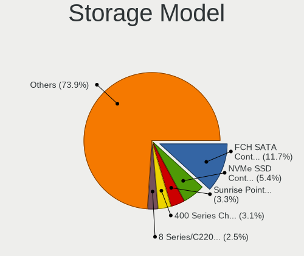
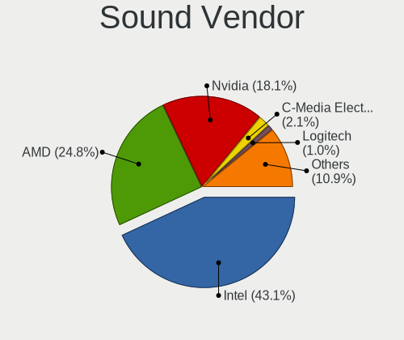
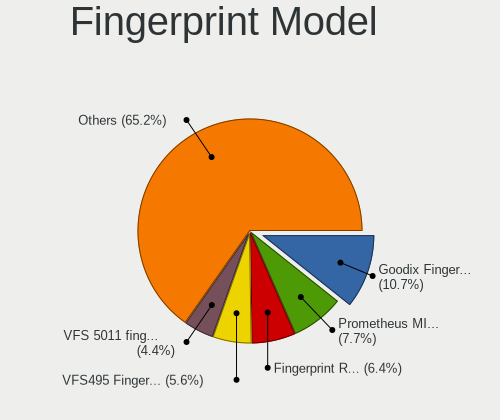

Manjaro - Tested Hardware & Statistics
--------------------------------------

A project to collect tested hardware configurations for Manjaro.

Anyone can contribute to this report by the [hw-probe](https://github.com/linuxhw/hw-probe) tool:

    sudo -E hw-probe -all -upload

Please contribute! Especially if your hardware is rare.

This is a report for all computer types. See also reports for [desktops](/Dist/Manjaro/Desktop/README.md) and [notebooks](/Dist/Manjaro/Notebook/README.md).

Contents
--------

* [ Test Cases ](#test-cases)

* [ System ](#system)
  - [ OS                       ](#os)
  - [ OS Family                ](#os-family)
  - [ Kernel                   ](#kernel)
  - [ Kernel Family            ](#kernel-family)
  - [ Kernel Major Ver.        ](#kernel-major-ver)
  - [ Arch                     ](#arch)
  - [ DE                       ](#de)
  - [ Display Server           ](#display-server)
  - [ Display Manager          ](#display-manager)
  - [ OS Lang                  ](#os-lang)
  - [ Boot Mode                ](#boot-mode)
  - [ Filesystem               ](#filesystem)
  - [ Part. scheme             ](#part-scheme)
  - [ Dual Boot with Linux/BSD ](#dual-boot-with-linuxbsd)
  - [ Dual Boot (Win)          ](#dual-boot-win)

* [ Board ](#board)
  - [ Vendor                   ](#vendor)
  - [ Model                    ](#model)
  - [ Model Family             ](#model-family)
  - [ MFG Year                 ](#mfg-year)
  - [ Form Factor              ](#form-factor)
  - [ Secure Boot              ](#secure-boot)
  - [ Coreboot                 ](#coreboot)
  - [ RAM Size                 ](#ram-size)
  - [ RAM Used                 ](#ram-used)
  - [ Total Drives             ](#total-drives)
  - [ Has CD-ROM               ](#has-cd-rom)
  - [ Has Ethernet             ](#has-ethernet)
  - [ Has WiFi                 ](#has-wifi)
  - [ Has Bluetooth            ](#has-bluetooth)

* [ Location ](#location)
  - [ Country                  ](#country)
  - [ City                     ](#city)

* [ Drives ](#drives)
  - [ Drive Vendor             ](#drive-vendor)
  - [ Drive Model              ](#drive-model)
  - [ HDD Vendor               ](#hdd-vendor)
  - [ SSD Vendor               ](#ssd-vendor)
  - [ Drive Kind               ](#drive-kind)
  - [ Drive Connector          ](#drive-connector)
  - [ Drive Size               ](#drive-size)
  - [ Space Total              ](#space-total)
  - [ Space Used               ](#space-used)
  - [ Malfunc. Drives          ](#malfunc-drives)
  - [ Malfunc. Drive Vendor    ](#malfunc-drive-vendor)
  - [ Malfunc. HDD Vendor      ](#malfunc-hdd-vendor)
  - [ Malfunc. Drive Kind      ](#malfunc-drive-kind)
  - [ Failed Drives            ](#failed-drives)
  - [ Failed Drive Vendor      ](#failed-drive-vendor)
  - [ Drive Status             ](#drive-status)

* [ Storage controller ](#storage-controller)
  - [ Storage Vendor           ](#storage-vendor)
  - [ Storage Model            ](#storage-model)
  - [ Storage Kind             ](#storage-kind)

* [ Processor ](#processor)
  - [ CPU Vendor               ](#cpu-vendor)
  - [ CPU Model                ](#cpu-model)
  - [ CPU Model Family         ](#cpu-model-family)
  - [ CPU Cores                ](#cpu-cores)
  - [ CPU Sockets              ](#cpu-sockets)
  - [ CPU Threads              ](#cpu-threads)
  - [ CPU Op-Modes             ](#cpu-op-modes)
  - [ CPU Microcode            ](#cpu-microcode)
  - [ CPU Microarch            ](#cpu-microarch)

* [ Graphics ](#graphics)
  - [ GPU Vendor               ](#gpu-vendor)
  - [ GPU Model                ](#gpu-model)
  - [ GPU Combo                ](#gpu-combo)
  - [ GPU Driver               ](#gpu-driver)
  - [ GPU Memory               ](#gpu-memory)

* [ Monitor ](#monitor)
  - [ Monitor Vendor           ](#monitor-vendor)
  - [ Monitor Model            ](#monitor-model)
  - [ Monitor Resolution       ](#monitor-resolution)
  - [ Monitor Diagonal         ](#monitor-diagonal)
  - [ Monitor Width            ](#monitor-width)
  - [ Aspect Ratio             ](#aspect-ratio)
  - [ Monitor Area             ](#monitor-area)
  - [ Pixel Density            ](#pixel-density)
  - [ Multiple Monitors        ](#multiple-monitors)

* [ Network ](#network)
  - [ Net Controller Vendor    ](#net-controller-vendor)
  - [ Net Controller Model     ](#net-controller-model)
  - [ Wireless Vendor          ](#wireless-vendor)
  - [ Wireless Model           ](#wireless-model)
  - [ Ethernet Vendor          ](#ethernet-vendor)
  - [ Ethernet Model           ](#ethernet-model)
  - [ Net Controller Kind      ](#net-controller-kind)
  - [ Used Controller          ](#used-controller)
  - [ NICs                     ](#nics)
  - [ IPv6                     ](#ipv6)

* [ Bluetooth ](#bluetooth)
  - [ Bluetooth Vendor         ](#bluetooth-vendor)
  - [ Bluetooth Model          ](#bluetooth-model)

* [ Sound ](#sound)
  - [ Sound Vendor             ](#sound-vendor)
  - [ Sound Model              ](#sound-model)

* [ Memory ](#memory)
  - [ Memory Vendor            ](#memory-vendor)
  - [ Memory Model             ](#memory-model)
  - [ Memory Kind              ](#memory-kind)
  - [ Memory Form Factor       ](#memory-form-factor)
  - [ Memory Size              ](#memory-size)
  - [ Memory Speed             ](#memory-speed)

* [ Printers & scanners ](#printers--scanners)
  - [ Printer Vendor           ](#printer-vendor)
  - [ Printer Model            ](#printer-model)
  - [ Scanner Vendor           ](#scanner-vendor)
  - [ Scanner Model            ](#scanner-model)

* [ Camera ](#camera)
  - [ Camera Vendor            ](#camera-vendor)
  - [ Camera Model             ](#camera-model)

* [ Security ](#security)
  - [ Fingerprint Vendor       ](#fingerprint-vendor)
  - [ Fingerprint Model        ](#fingerprint-model)
  - [ Chipcard Vendor          ](#chipcard-vendor)
  - [ Chipcard Model           ](#chipcard-model)

* [ Unsupported ](#unsupported)
  - [ Unsupported Devices      ](#unsupported-devices)
  - [ Unsupported Device Types ](#unsupported-device-types)

Test Cases
----------

Total: 11758

| Vendor        | Model                       | Form-Factor | Probe                                                      | Date         |
|---------------|-----------------------------|-------------|------------------------------------------------------------|--------------|
| LG Electro... | A410-G.BC44P1               | Notebook    | [e687d57757](https://linux-hardware.org/?probe=e687d57757) | May 09, 2024 |
| ASRock        | B450 Gaming K4              | Desktop     | [5283cfbe48](https://linux-hardware.org/?probe=5283cfbe48) | May 08, 2024 |
| ASUSTek       | GL753VE                     | Notebook    | [17bf72a741](https://linux-hardware.org/?probe=17bf72a741) | May 08, 2024 |
| Huanan        | X99-F8 GAMING V5.0          | Desktop     | [541eebe872](https://linux-hardware.org/?probe=541eebe872) | May 08, 2024 |
| Gigabyte      | B550 AORUS ELITE V2         | Desktop     | [ab440c0aca](https://linux-hardware.org/?probe=ab440c0aca) | May 08, 2024 |
| Alienware     | M17x                        | Notebook    | [349d219a3a](https://linux-hardware.org/?probe=349d219a3a) | May 08, 2024 |
| ASUSTek       | B150 PRO GAMING             | Desktop     | [d559ef5203](https://linux-hardware.org/?probe=d559ef5203) | May 08, 2024 |
| Gigabyte      | B450 AORUS ELITE            | Desktop     | [af6bde9c97](https://linux-hardware.org/?probe=af6bde9c97) | May 07, 2024 |
| Gigabyte      | B450 AORUS ELITE            | Desktop     | [1755d8da2b](https://linux-hardware.org/?probe=1755d8da2b) | May 07, 2024 |
| ASUSTek       | P8Z77-I DELUXE              | Desktop     | [6aa44077ff](https://linux-hardware.org/?probe=6aa44077ff) | May 07, 2024 |
| ASUSTek       | PRIME Z490-A                | Desktop     | [a68c1a8752](https://linux-hardware.org/?probe=a68c1a8752) | May 07, 2024 |
| HP            | Pro x360 435 13.3 inch G... | Convertible | [52ca72625a](https://linux-hardware.org/?probe=52ca72625a) | May 07, 2024 |
| HP            | Pro x360 435 13.3 inch G... | Convertible | [14aed1eae4](https://linux-hardware.org/?probe=14aed1eae4) | May 07, 2024 |
| HP            | EliteBook 840 G6            | Notebook    | [504b36774f](https://linux-hardware.org/?probe=504b36774f) | May 07, 2024 |
| Lenovo        | V15 G4 IRU 83A1             | Notebook    | [7cd1070dc0](https://linux-hardware.org/?probe=7cd1070dc0) | May 07, 2024 |
| Unknown       | Unknown                     | Notebook    | [09d2748c7a](https://linux-hardware.org/?probe=09d2748c7a) | May 07, 2024 |
| Lenovo        | IdeaPad 5 15ARE05 81YQ      | Notebook    | [276faea129](https://linux-hardware.org/?probe=276faea129) | May 06, 2024 |
| Dell          | 0V8WGR A00                  | Desktop     | [826e11d8af](https://linux-hardware.org/?probe=826e11d8af) | May 05, 2024 |
| Apple         | Mac-35C5E08120C7EEAF Mac... | Mini pc     | [8dcee212bd](https://linux-hardware.org/?probe=8dcee212bd) | May 05, 2024 |
| Apple         | Mac-35C5E08120C7EEAF Mac... | Mini pc     | [83e37ce2be](https://linux-hardware.org/?probe=83e37ce2be) | May 05, 2024 |
| ASUSTek       | GL753VD                     | Notebook    | [735ff065db](https://linux-hardware.org/?probe=735ff065db) | May 05, 2024 |
| Acer          | Aspire A315-23              | Notebook    | [35b8f59849](https://linux-hardware.org/?probe=35b8f59849) | May 05, 2024 |
| Microsoft     | Surface Go 2                | Tablet      | [27703b6ab1](https://linux-hardware.org/?probe=27703b6ab1) | May 05, 2024 |
| ASUSTek       | GR8                         | Notebook    | [6a8003e347](https://linux-hardware.org/?probe=6a8003e347) | May 05, 2024 |
| Dell          | Inspiron 7520               | Notebook    | [87c4f1733b](https://linux-hardware.org/?probe=87c4f1733b) | May 05, 2024 |
| Dell          | 06FW8P A01                  | Desktop     | [41be164658](https://linux-hardware.org/?probe=41be164658) | May 04, 2024 |
| Acer          | Spin SP111-32N              | Convertible | [e4389ae53b](https://linux-hardware.org/?probe=e4389ae53b) | May 04, 2024 |
| HP            | 1494                        | Desktop     | [7b5806585f](https://linux-hardware.org/?probe=7b5806585f) | May 04, 2024 |
| ASRock        | B650E PG Riptide WiFi       | Desktop     | [3c5e2db28c](https://linux-hardware.org/?probe=3c5e2db28c) | May 04, 2024 |
| Acer          | Aspire A315-44P             | Notebook    | [5c3ab00eb7](https://linux-hardware.org/?probe=5c3ab00eb7) | May 04, 2024 |
| Dell          | Latitude 7490               | Notebook    | [300c9cd271](https://linux-hardware.org/?probe=300c9cd271) | May 03, 2024 |
| Gigabyte      | X570S AORUS ELITE AX        | Desktop     | [58453faaf6](https://linux-hardware.org/?probe=58453faaf6) | May 03, 2024 |
| ASUSTek       | PRIME H310M-E R2.0          | Desktop     | [024f668f69](https://linux-hardware.org/?probe=024f668f69) | May 03, 2024 |
| ECS           | H110M-SI02                  | Desktop     | [6e2344c648](https://linux-hardware.org/?probe=6e2344c648) | May 03, 2024 |
| Acer          | Aspire E1-771               | Notebook    | [ef44b13882](https://linux-hardware.org/?probe=ef44b13882) | May 03, 2024 |
| Lenovo        | Legion Slim 5 14APH8 82Y... | Notebook    | [9b8008703d](https://linux-hardware.org/?probe=9b8008703d) | May 03, 2024 |
| Dell          | 0HD5W2 A01                  | Desktop     | [b44b5a5556](https://linux-hardware.org/?probe=b44b5a5556) | May 03, 2024 |
| ASUSTek       | B150 PRO GAMING             | Desktop     | [94e57165f0](https://linux-hardware.org/?probe=94e57165f0) | May 03, 2024 |
| Dell          | Latitude E5250              | Notebook    | [e98282af47](https://linux-hardware.org/?probe=e98282af47) | May 02, 2024 |
| ASUSTek       | GR8                         | Notebook    | [ded6da2442](https://linux-hardware.org/?probe=ded6da2442) | May 02, 2024 |
| Schenker      | XMG NEO (CZN/E21)           | Notebook    | [c6e0886125](https://linux-hardware.org/?probe=c6e0886125) | May 02, 2024 |
| ASUSTek       | B150 PRO GAMING             | Desktop     | [4d38c7926c](https://linux-hardware.org/?probe=4d38c7926c) | May 02, 2024 |
| HP            | 8643 SMVB                   | Desktop     | [8c77e42bdd](https://linux-hardware.org/?probe=8c77e42bdd) | May 02, 2024 |
| ASUSTek       | A88XM-E                     | Desktop     | [df8ef63dc3](https://linux-hardware.org/?probe=df8ef63dc3) | May 02, 2024 |
| Acer          | Nitro AN515-54              | Notebook    | [27189a555f](https://linux-hardware.org/?probe=27189a555f) | May 02, 2024 |
| Acer          | Nitro AN515-54              | Notebook    | [2293918110](https://linux-hardware.org/?probe=2293918110) | May 02, 2024 |
| Gigabyte      | B450 AORUS PRO-CF           | Desktop     | [1b914f7922](https://linux-hardware.org/?probe=1b914f7922) | May 01, 2024 |
| HP            | EliteBook 8460p             | Notebook    | [d5b743dc5a](https://linux-hardware.org/?probe=d5b743dc5a) | May 01, 2024 |
| Lenovo        | ThinkPad T470s 20HF005QM... | Notebook    | [6fc6e1fa78](https://linux-hardware.org/?probe=6fc6e1fa78) | May 01, 2024 |
| MSI           | Bravo 15 B5DD               | Notebook    | [c3ea06def8](https://linux-hardware.org/?probe=c3ea06def8) | May 01, 2024 |
| Lenovo        | Y50-70 20378                | Notebook    | [f7076c4db1](https://linux-hardware.org/?probe=f7076c4db1) | May 01, 2024 |
| Lenovo        | ThinkPad T16 Gen 1 21BWS... | Notebook    | [060878050f](https://linux-hardware.org/?probe=060878050f) | Apr 30, 2024 |
| ASUSTek       | ASUS TUF Gaming F15 FX50... | Notebook    | [52327486f3](https://linux-hardware.org/?probe=52327486f3) | Apr 30, 2024 |
| Acer          | RS880M05                    | Desktop     | [bc549ed290](https://linux-hardware.org/?probe=bc549ed290) | Apr 30, 2024 |
| Acer          | Aspire A315-44P             | Notebook    | [37adfa528f](https://linux-hardware.org/?probe=37adfa528f) | Apr 30, 2024 |
| EVGA          | Z790 CLASSIFIED.0           | Desktop     | [10ac75bfd8](https://linux-hardware.org/?probe=10ac75bfd8) | Apr 30, 2024 |
| MSI           | B450M BAZOOKA V2            | Desktop     | [12ec4389e8](https://linux-hardware.org/?probe=12ec4389e8) | Apr 30, 2024 |
| HP            | ENVY 17                     | Notebook    | [23518d52f8](https://linux-hardware.org/?probe=23518d52f8) | Apr 30, 2024 |
| Lenovo        | ThinkPad T14s Gen 4 21F7... | Notebook    | [b3d1c71cbf](https://linux-hardware.org/?probe=b3d1c71cbf) | Apr 29, 2024 |
| Gigabyte      | B550M DS3H AC               | Desktop     | [2d51e08cd6](https://linux-hardware.org/?probe=2d51e08cd6) | Apr 29, 2024 |
| Apple         | MacBookPro9,2               | Notebook    | [3b4127bc96](https://linux-hardware.org/?probe=3b4127bc96) | Apr 29, 2024 |
| ASUSTek       | TUF Gaming B550M-PLUS       | Desktop     | [74c797eef3](https://linux-hardware.org/?probe=74c797eef3) | Apr 29, 2024 |
| HP            | Pavilion Laptop 15-cc5xx    | Notebook    | [107cd303fd](https://linux-hardware.org/?probe=107cd303fd) | Apr 29, 2024 |
| HP            | 89EB 11                     | Desktop     | [dd5549c4d7](https://linux-hardware.org/?probe=dd5549c4d7) | Apr 28, 2024 |
| Lenovo        | ThinkPad W530 24474KG       | Notebook    | [0019533554](https://linux-hardware.org/?probe=0019533554) | Apr 28, 2024 |
| ASUSTek       | PRIME A520M-K               | Desktop     | [e76da56567](https://linux-hardware.org/?probe=e76da56567) | Apr 28, 2024 |
| Lenovo        | Yoga 7 16IAP7 82QG          | Convertible | [be4fcee6fb](https://linux-hardware.org/?probe=be4fcee6fb) | Apr 28, 2024 |
| ASUSTek       | Vivobook Go E1504FA_E150... | Notebook    | [831c732b79](https://linux-hardware.org/?probe=831c732b79) | Apr 27, 2024 |
| HP            | 240 G8                      | Notebook    | [bf5325bd89](https://linux-hardware.org/?probe=bf5325bd89) | Apr 26, 2024 |
| Gigabyte      | F2A68HM-H                   | Desktop     | [03f841c32a](https://linux-hardware.org/?probe=03f841c32a) | Apr 26, 2024 |
| Microsoft     | Surface Pro                 | Tablet      | [58f89df0a1](https://linux-hardware.org/?probe=58f89df0a1) | Apr 26, 2024 |
| Dell          | Latitude 5420               | Notebook    | [92305ad5a6](https://linux-hardware.org/?probe=92305ad5a6) | Apr 26, 2024 |
| ASUSTek       | VivoBook_ASUSLaptop X513... | Notebook    | [01199d3eea](https://linux-hardware.org/?probe=01199d3eea) | Apr 26, 2024 |
| HONOR         | BMH-WCX9                    | Notebook    | [78d048ebdc](https://linux-hardware.org/?probe=78d048ebdc) | Apr 26, 2024 |
| ASUSTek       | TUF Gaming B660M-PLUS WI... | Desktop     | [fbeb4be390](https://linux-hardware.org/?probe=fbeb4be390) | Apr 25, 2024 |
| Gigabyte      | B660 GAMING X AX DDR4       | Desktop     | [84b2ad73d1](https://linux-hardware.org/?probe=84b2ad73d1) | Apr 25, 2024 |
| Lenovo        | Legion 5 15ARH7 82RE        | Notebook    | [5188dec592](https://linux-hardware.org/?probe=5188dec592) | Apr 24, 2024 |
| HP            | EliteBook 845 14 inch G1... | Notebook    | [d1bfbd2dba](https://linux-hardware.org/?probe=d1bfbd2dba) | Apr 24, 2024 |
| Lenovo        | ThinkPad P1 Gen 4i 20Y4S... | Notebook    | [334a6f0385](https://linux-hardware.org/?probe=334a6f0385) | Apr 24, 2024 |
| ASRock        | B75 Pro3                    | Desktop     | [87a8013072](https://linux-hardware.org/?probe=87a8013072) | Apr 24, 2024 |
| Gigabyte      | H110M-S2PH-CF               | Desktop     | [f35a83875e](https://linux-hardware.org/?probe=f35a83875e) | Apr 24, 2024 |
| HP            | Victus by Laptop 16-e0xx... | Notebook    | [74c8b80974](https://linux-hardware.org/?probe=74c8b80974) | Apr 23, 2024 |
| Lenovo        | Legion Y530-15ICH 81FV      | Notebook    | [01432a3384](https://linux-hardware.org/?probe=01432a3384) | Apr 23, 2024 |
| Acer          | Aspire ES1-523              | Notebook    | [499fa508bd](https://linux-hardware.org/?probe=499fa508bd) | Apr 23, 2024 |
| Lenovo        | ThinkPad T14s Gen 4 21F8... | Notebook    | [1f13f4d924](https://linux-hardware.org/?probe=1f13f4d924) | Apr 23, 2024 |
| Acer          | Swift SF314-43              | Notebook    | [0add5a8f6d](https://linux-hardware.org/?probe=0add5a8f6d) | Apr 23, 2024 |
| ASRock        | B450M Pro4-F                | Desktop     | [e8d54dd61b](https://linux-hardware.org/?probe=e8d54dd61b) | Apr 23, 2024 |
| MSI           | PRO B650-P WIFI             | Desktop     | [2edbe2e138](https://linux-hardware.org/?probe=2edbe2e138) | Apr 23, 2024 |
| HP            | ENVY 17                     | Notebook    | [cefc9da64e](https://linux-hardware.org/?probe=cefc9da64e) | Apr 23, 2024 |
| HP            | Pavilion 15                 | Notebook    | [a0d3bcb2a0](https://linux-hardware.org/?probe=a0d3bcb2a0) | Apr 22, 2024 |
| Gigabyte      | Z790 AORUS ELITE AX         | Desktop     | [4485a9e6db](https://linux-hardware.org/?probe=4485a9e6db) | Apr 22, 2024 |
| Dell          | 0N185P A02                  | Desktop     | [1193feda44](https://linux-hardware.org/?probe=1193feda44) | Apr 22, 2024 |
| Dell          | XPS 9320                    | Notebook    | [162d7ddcd3](https://linux-hardware.org/?probe=162d7ddcd3) | Apr 22, 2024 |
| Apple         | MacBookPro7,1               | Notebook    | [dda370ba40](https://linux-hardware.org/?probe=dda370ba40) | Apr 21, 2024 |
| ASUSTek       | TUF Gaming B550-PLUS        | Desktop     | [5b37288076](https://linux-hardware.org/?probe=5b37288076) | Apr 21, 2024 |
| Lenovo        | ThinkPad W530 24474KG       | Notebook    | [f5bb127a05](https://linux-hardware.org/?probe=f5bb127a05) | Apr 21, 2024 |
| MSI           | PRO Z690-A DDR4             | Desktop     | [f426cfb62e](https://linux-hardware.org/?probe=f426cfb62e) | Apr 21, 2024 |
| Acer          | Aspire ES1-523              | Notebook    | [23fbbe90c4](https://linux-hardware.org/?probe=23fbbe90c4) | Apr 20, 2024 |
| ASUSTek       | PRIME H310M-E R2.0          | Desktop     | [03eb665cce](https://linux-hardware.org/?probe=03eb665cce) | Apr 20, 2024 |
| Gigabyte      | B85-HD3                     | Desktop     | [110fafe0b0](https://linux-hardware.org/?probe=110fafe0b0) | Apr 20, 2024 |
| Lenovo        | ThinkPad T530 2392AQU       | Notebook    | [6f325b5377](https://linux-hardware.org/?probe=6f325b5377) | Apr 20, 2024 |
| ASUSTek       | X540SAA                     | Notebook    | [17f2b9c802](https://linux-hardware.org/?probe=17f2b9c802) | Apr 20, 2024 |
| MSI           | MS-B0961                    | All in one  | [552ca42387](https://linux-hardware.org/?probe=552ca42387) | Apr 20, 2024 |
| MSI           | Prestige 14 A12UC           | Notebook    | [82ab31e090](https://linux-hardware.org/?probe=82ab31e090) | Apr 19, 2024 |
| Dell          | Latitude 7490               | Notebook    | [3051df2105](https://linux-hardware.org/?probe=3051df2105) | Apr 19, 2024 |
| Lenovo        | ThinkPad P14s Gen 2i 20V... | Notebook    | [3c9edd18cd](https://linux-hardware.org/?probe=3c9edd18cd) | Apr 19, 2024 |
| HP            | Laptop 14-bs0xx             | Notebook    | [e403e1c979](https://linux-hardware.org/?probe=e403e1c979) | Apr 19, 2024 |
| ASUSTek       | H81M-A                      | Desktop     | [1ef3d038c5](https://linux-hardware.org/?probe=1ef3d038c5) | Apr 19, 2024 |
| HP            | ProBook 640 G2              | Notebook    | [76e18e23c3](https://linux-hardware.org/?probe=76e18e23c3) | Apr 19, 2024 |
| ASUSTek       | A68HM-PLUS                  | Desktop     | [94cd362057](https://linux-hardware.org/?probe=94cd362057) | Apr 19, 2024 |
| ASUSTek       | G10CES                      | Desktop     | [a040e8acd4](https://linux-hardware.org/?probe=a040e8acd4) | Apr 18, 2024 |
| Dell          | Latitude E5570              | Notebook    | [3a04ef9eff](https://linux-hardware.org/?probe=3a04ef9eff) | Apr 18, 2024 |
| Gigabyte      | GA-870A-UD3                 | Desktop     | [7cd79d20e0](https://linux-hardware.org/?probe=7cd79d20e0) | Apr 18, 2024 |
| Gigabyte      | B360M D3H-CF                | Desktop     | [708c7e8551](https://linux-hardware.org/?probe=708c7e8551) | Apr 18, 2024 |
| Gigabyte      | B360M D3H-CF                | Desktop     | [42b026296c](https://linux-hardware.org/?probe=42b026296c) | Apr 18, 2024 |
| Dell          | Latitude E5430 non-vPro     | Notebook    | [d9d6b6fd6e](https://linux-hardware.org/?probe=d9d6b6fd6e) | Apr 17, 2024 |
| ASRock        | B450M Pro4                  | Desktop     | [36dcccf3ea](https://linux-hardware.org/?probe=36dcccf3ea) | Apr 17, 2024 |
| Lenovo        | Yoga Pro 9 16IMH9 83DN      | Notebook    | [dbe698ff64](https://linux-hardware.org/?probe=dbe698ff64) | Apr 17, 2024 |
| ASRock        | X670E Taichi                | Desktop     | [aebc928b10](https://linux-hardware.org/?probe=aebc928b10) | Apr 17, 2024 |
| ASUSTek       | A68HM-PLUS                  | Desktop     | [ff144e4ebc](https://linux-hardware.org/?probe=ff144e4ebc) | Apr 17, 2024 |
| ASUSTek       | PRIME Z490-A                | Desktop     | [1e41083adc](https://linux-hardware.org/?probe=1e41083adc) | Apr 17, 2024 |
| Lenovo        | ThinkPad L15 Gen 3 21C70... | Notebook    | [15cf4a7e8f](https://linux-hardware.org/?probe=15cf4a7e8f) | Apr 17, 2024 |
| Gigabyte      | H110M-S2-CF                 | Desktop     | [8b14a90950](https://linux-hardware.org/?probe=8b14a90950) | Apr 16, 2024 |
| Acer          | Aspire A515-57              | Notebook    | [f66938d1f9](https://linux-hardware.org/?probe=f66938d1f9) | Apr 16, 2024 |
| Lenovo        | ThinkPad T16 Gen 1 21BWS... | Notebook    | [d7cf8c586e](https://linux-hardware.org/?probe=d7cf8c586e) | Apr 16, 2024 |
| Dell          | Inspiron 7520               | Notebook    | [9f294b2198](https://linux-hardware.org/?probe=9f294b2198) | Apr 16, 2024 |
| Sony          | VGN-Z21VRN_X                | Notebook    | [6cc5820724](https://linux-hardware.org/?probe=6cc5820724) | Apr 16, 2024 |
| Chuwi         | MiniBook X                  | Notebook    | [0236998832](https://linux-hardware.org/?probe=0236998832) | Apr 15, 2024 |
| Lenovo        | Yoga 530-14ARR 81H9         | Convertible | [6bc6df98ec](https://linux-hardware.org/?probe=6bc6df98ec) | Apr 15, 2024 |
| Lenovo        | IdeaPad 1 15AMN7 82VG       | Notebook    | [4d70d7056d](https://linux-hardware.org/?probe=4d70d7056d) | Apr 15, 2024 |
| Dell          | Inspiron 5566               | Notebook    | [b766f56874](https://linux-hardware.org/?probe=b766f56874) | Apr 15, 2024 |
| HP            | 255 15.6 inch G10           | Notebook    | [3858a294e8](https://linux-hardware.org/?probe=3858a294e8) | Apr 14, 2024 |
| Dell          | 09WH54 A01                  | Desktop     | [a444b54a3b](https://linux-hardware.org/?probe=a444b54a3b) | Apr 14, 2024 |
| Dell          | 09WH54 A01                  | Desktop     | [bc7aeec1d0](https://linux-hardware.org/?probe=bc7aeec1d0) | Apr 14, 2024 |
| MSI           | B360M MORTAR                | Desktop     | [e915eb334e](https://linux-hardware.org/?probe=e915eb334e) | Apr 14, 2024 |
| HP            | 304Ah                       | Desktop     | [912a8508e6](https://linux-hardware.org/?probe=912a8508e6) | Apr 13, 2024 |
| HP            | Pavilion 15                 | Notebook    | [ba8c469ac5](https://linux-hardware.org/?probe=ba8c469ac5) | Apr 13, 2024 |
| Lenovo        | ThinkPad E14 Gen 5 21JSS... | Notebook    | [0ccf03f0d9](https://linux-hardware.org/?probe=0ccf03f0d9) | Apr 13, 2024 |
| Dell          | G15 5511                    | Notebook    | [dca2850091](https://linux-hardware.org/?probe=dca2850091) | Apr 12, 2024 |
| HONOR         | GLO-GXXX                    | Notebook    | [d8d90912a0](https://linux-hardware.org/?probe=d8d90912a0) | Apr 12, 2024 |
| Gigabyte      | GA-870A-UD3                 | Desktop     | [bd4be0124b](https://linux-hardware.org/?probe=bd4be0124b) | Apr 12, 2024 |
| MSI           | MAG B550 TOMAHAWK           | Desktop     | [66b49c3998](https://linux-hardware.org/?probe=66b49c3998) | Apr 12, 2024 |
| HP            | EliteBook 840 G6            | Notebook    | [c9dc8fedd4](https://linux-hardware.org/?probe=c9dc8fedd4) | Apr 12, 2024 |
| Dell          | XPS 15 9520                 | Notebook    | [b6bd2872da](https://linux-hardware.org/?probe=b6bd2872da) | Apr 12, 2024 |
| Gigabyte      | B550 AORUS PRO              | Desktop     | [5858a2ed28](https://linux-hardware.org/?probe=5858a2ed28) | Apr 12, 2024 |
| Dell          | Inspiron 15-3567            | Notebook    | [ce468a8cb4](https://linux-hardware.org/?probe=ce468a8cb4) | Apr 12, 2024 |
| Lenovo        | Legion 5 17ACH6H 82JY       | Notebook    | [248ee4d26e](https://linux-hardware.org/?probe=248ee4d26e) | Apr 11, 2024 |
| Apple         | MacBookPro14,1              | Notebook    | [b824a3a76c](https://linux-hardware.org/?probe=b824a3a76c) | Apr 11, 2024 |
| ASUSTek       | TUF Gaming X570-PLUS_BR     | Desktop     | [c19812eddd](https://linux-hardware.org/?probe=c19812eddd) | Apr 11, 2024 |
| Lenovo        | ThinkPad T14 Gen 4 21K3C... | Notebook    | [6800f41004](https://linux-hardware.org/?probe=6800f41004) | Apr 11, 2024 |
| ASRock        | B450 Gaming K4              | Desktop     | [57a6443eb0](https://linux-hardware.org/?probe=57a6443eb0) | Apr 11, 2024 |
| Lenovo        | Yoga Pro 9 16IMH9 83DN      | Notebook    | [b3d2de9d47](https://linux-hardware.org/?probe=b3d2de9d47) | Apr 11, 2024 |
| ASRock        | B450M Pro4-F                | Desktop     | [72a3752add](https://linux-hardware.org/?probe=72a3752add) | Apr 11, 2024 |
| ASRock        | Z790 Riptide WiFi           | Desktop     | [778af9df5e](https://linux-hardware.org/?probe=778af9df5e) | Apr 11, 2024 |
| MSI           | B560M PRO                   | Desktop     | [8fb8045266](https://linux-hardware.org/?probe=8fb8045266) | Apr 10, 2024 |
| MSI           | NF725M-P43                  | Desktop     | [ff3656c7c8](https://linux-hardware.org/?probe=ff3656c7c8) | Apr 10, 2024 |
| MSI           | B560M PRO                   | Desktop     | [9f35872df2](https://linux-hardware.org/?probe=9f35872df2) | Apr 09, 2024 |
| Dell          | Inspiron 13-7378            | Notebook    | [6d34b93db6](https://linux-hardware.org/?probe=6d34b93db6) | Apr 09, 2024 |
| HP            | 2215                        | Desktop     | [7e6e6d5a8e](https://linux-hardware.org/?probe=7e6e6d5a8e) | Apr 09, 2024 |
| ASUSTek       | PRIME X470-PRO              | Desktop     | [35615a89f1](https://linux-hardware.org/?probe=35615a89f1) | Apr 09, 2024 |
| ASUSTek       | PRIME X470-PRO              | Desktop     | [dfc1c56c57](https://linux-hardware.org/?probe=dfc1c56c57) | Apr 09, 2024 |
| Lenovo        | IdeaPadFlex 5 14ALC7 82R... | Convertible | [46276e6e4c](https://linux-hardware.org/?probe=46276e6e4c) | Apr 08, 2024 |
| Lenovo        | ThinkPad T14s Gen 4 21F8... | Notebook    | [a9fbbbcdde](https://linux-hardware.org/?probe=a9fbbbcdde) | Apr 08, 2024 |
| HP            | Laptop 17-cp0xxx            | Notebook    | [f38bf5b9a6](https://linux-hardware.org/?probe=f38bf5b9a6) | Apr 08, 2024 |
| Dell          | 0NW73C A00                  | Desktop     | [f6bbc9ee86](https://linux-hardware.org/?probe=f6bbc9ee86) | Apr 08, 2024 |
| Chuwi         | MiniBook X                  | Notebook    | [9a717f509d](https://linux-hardware.org/?probe=9a717f509d) | Apr 07, 2024 |
| Lenovo        | ThinkPad X13 Gen 4 21J3C... | Notebook    | [1658229b9a](https://linux-hardware.org/?probe=1658229b9a) | Apr 07, 2024 |
| MSI           | X470 GAMING PLUS MAX        | Desktop     | [078e1e4a08](https://linux-hardware.org/?probe=078e1e4a08) | Apr 07, 2024 |
| HP            | 2215                        | Desktop     | [eb7f7c122d](https://linux-hardware.org/?probe=eb7f7c122d) | Apr 07, 2024 |
| Chuwi         | MiniBook X                  | Notebook    | [b747ca2f62](https://linux-hardware.org/?probe=b747ca2f62) | Apr 07, 2024 |
| Chuwi         | MiniBook X                  | Notebook    | [85f4cc1804](https://linux-hardware.org/?probe=85f4cc1804) | Apr 06, 2024 |
| Apple         | MacBookPro8,1               | Notebook    | [fd4157e3ba](https://linux-hardware.org/?probe=fd4157e3ba) | Apr 06, 2024 |
| Apple         | MacBookPro8,1               | Notebook    | [0f7ad3e22a](https://linux-hardware.org/?probe=0f7ad3e22a) | Apr 06, 2024 |
| HUAWEI        | NBLK-WAX9X                  | Notebook    | [fb40c0b7f8](https://linux-hardware.org/?probe=fb40c0b7f8) | Apr 06, 2024 |
| MSI           | PRO B550M-VC WIFI           | Desktop     | [f8d2db509c](https://linux-hardware.org/?probe=f8d2db509c) | Apr 05, 2024 |
| Lenovo        | XiaoXinPro 14 APH8 83AM     | Notebook    | [3a979a2c53](https://linux-hardware.org/?probe=3a979a2c53) | Apr 05, 2024 |
| HP            | 18E7                        | Desktop     | [32fb4595f3](https://linux-hardware.org/?probe=32fb4595f3) | Apr 05, 2024 |
| Samsung       | 530U3C/530U4C/532U3C        | Notebook    | [134adc8004](https://linux-hardware.org/?probe=134adc8004) | Apr 05, 2024 |
| Lenovo        | Yoga 500-15ISK 80R6         | Notebook    | [a3712304cd](https://linux-hardware.org/?probe=a3712304cd) | Apr 05, 2024 |
| Lenovo        | ThinkPad T480 20L6S4XW00    | Notebook    | [9a0997e90d](https://linux-hardware.org/?probe=9a0997e90d) | Apr 04, 2024 |
| HP            | Pavilion Gaming Laptop 1... | Notebook    | [6f73e98bd2](https://linux-hardware.org/?probe=6f73e98bd2) | Apr 04, 2024 |
| Toshiba       | Satellite C670-12E          | Notebook    | [c0b10bc723](https://linux-hardware.org/?probe=c0b10bc723) | Apr 04, 2024 |
| Biostar       | H410MH S2                   | Desktop     | [c2d62789b8](https://linux-hardware.org/?probe=c2d62789b8) | Apr 04, 2024 |
| Lenovo        | Legion 5 15ARH05H 82B1      | Notebook    | [2f67dfca00](https://linux-hardware.org/?probe=2f67dfca00) | Apr 04, 2024 |
| HP            | 255 15.6 inch G10           | Notebook    | [b8ca6d353e](https://linux-hardware.org/?probe=b8ca6d353e) | Apr 04, 2024 |
| ASRock        | B650E PG Riptide WiFi       | Desktop     | [57bfb487f6](https://linux-hardware.org/?probe=57bfb487f6) | Apr 04, 2024 |
| Dell          | Inspiron 3185               | Notebook    | [8fd7c48a29](https://linux-hardware.org/?probe=8fd7c48a29) | Apr 04, 2024 |
| Dell          | Inspiron 3185               | Notebook    | [8cb7a12f6d](https://linux-hardware.org/?probe=8cb7a12f6d) | Apr 04, 2024 |
| Lenovo        | ThinkPad X260 20F60093US    | Notebook    | [2965c9e0eb](https://linux-hardware.org/?probe=2965c9e0eb) | Apr 04, 2024 |
| ASUSTek       | ROG STRIX B650E-I GAMING... | Desktop     | [66aa317734](https://linux-hardware.org/?probe=66aa317734) | Apr 03, 2024 |
| Lenovo        | ThinkPad L15 Gen 3 21C30... | Notebook    | [7a09978e27](https://linux-hardware.org/?probe=7a09978e27) | Apr 03, 2024 |
| HP            | Pavilion Gaming Laptop 1... | Notebook    | [05b54be742](https://linux-hardware.org/?probe=05b54be742) | Apr 03, 2024 |
| Lenovo        | Legion Slim 5 14APH8 82Y... | Notebook    | [bb84e6292b](https://linux-hardware.org/?probe=bb84e6292b) | Apr 02, 2024 |
| Gigabyte      | X570 AORUS ULTRA            | Desktop     | [0ddecde36c](https://linux-hardware.org/?probe=0ddecde36c) | Apr 02, 2024 |
| Lenovo        | ThinkPad X270 20K5S1A524    | Notebook    | [6668d7d060](https://linux-hardware.org/?probe=6668d7d060) | Apr 02, 2024 |
| ASRock        | B450 Gaming K4              | Desktop     | [999ca6d09e](https://linux-hardware.org/?probe=999ca6d09e) | Apr 02, 2024 |
| Intel         | X99                         | Desktop     | [b9d21bc637](https://linux-hardware.org/?probe=b9d21bc637) | Apr 02, 2024 |
| Lenovo        | ThinkPad E490 20N8002ART    | Notebook    | [eb49df1b97](https://linux-hardware.org/?probe=eb49df1b97) | Apr 02, 2024 |
| Dell          | 0PTTT9 A01                  | Desktop     | [00d2c75a39](https://linux-hardware.org/?probe=00d2c75a39) | Apr 01, 2024 |
| Lenovo        | ThinkPad L13 Gen 2 20VH0... | Notebook    | [e867d4d614](https://linux-hardware.org/?probe=e867d4d614) | Apr 01, 2024 |
| Huanan        | X99-8M-F V1.2               | Desktop     | [3005ead43c](https://linux-hardware.org/?probe=3005ead43c) | Apr 01, 2024 |
| ASUSTek       | A68HM-PLUS                  | Desktop     | [d346c3ccc9](https://linux-hardware.org/?probe=d346c3ccc9) | Mar 31, 2024 |
| Timi          | Redmi Book Pro 15 2022      | Notebook    | [1ca1580b1d](https://linux-hardware.org/?probe=1ca1580b1d) | Mar 31, 2024 |
| Lenovo        | Legion Slim 5 16APH8 82Y... | Notebook    | [2eb8c19792](https://linux-hardware.org/?probe=2eb8c19792) | Mar 31, 2024 |
| Lenovo        | IdeaPad Pro 5 16APH8 83A... | Notebook    | [c9ece96124](https://linux-hardware.org/?probe=c9ece96124) | Mar 31, 2024 |
| Lenovo        | ThinkPad T480 20L6S29E02    | Notebook    | [55c9ebc175](https://linux-hardware.org/?probe=55c9ebc175) | Mar 30, 2024 |
| Lenovo        | IdeaPad Slim 5 16ABR8 82... | Notebook    | [396cf5fa7b](https://linux-hardware.org/?probe=396cf5fa7b) | Mar 30, 2024 |
| ASUSTek       | GR8                         | Notebook    | [1135229a2d](https://linux-hardware.org/?probe=1135229a2d) | Mar 30, 2024 |
| Lenovo        | Y520-15IKBN 80WK            | Notebook    | [9e7e9b558d](https://linux-hardware.org/?probe=9e7e9b558d) | Mar 29, 2024 |
| ASRock        | B450M Pro4                  | Desktop     | [58b0db3dfb](https://linux-hardware.org/?probe=58b0db3dfb) | Mar 29, 2024 |
| ASRock        | H310CM-HDV/M.2 SE           | Desktop     | [89b9fc26fd](https://linux-hardware.org/?probe=89b9fc26fd) | Mar 29, 2024 |
| Lenovo        | IdeaPad S145-15API 81V7     | Notebook    | [7e9163e0f0](https://linux-hardware.org/?probe=7e9163e0f0) | Mar 29, 2024 |
| Positivo      | S15SL                       | Notebook    | [4a479bd2b9](https://linux-hardware.org/?probe=4a479bd2b9) | Mar 28, 2024 |
| ASUSTek       | Z450UA                      | Notebook    | [13ee658c0e](https://linux-hardware.org/?probe=13ee658c0e) | Mar 28, 2024 |
| Lenovo        | ThinkPad E490 20N8002ART    | Notebook    | [7ddfbb062b](https://linux-hardware.org/?probe=7ddfbb062b) | Mar 28, 2024 |
| Apple         | Mac-F221BEC8                | Desktop     | [806306c660](https://linux-hardware.org/?probe=806306c660) | Mar 28, 2024 |
| Dell          | Inspiron 1520               | Notebook    | [1a4ee5c6ab](https://linux-hardware.org/?probe=1a4ee5c6ab) | Mar 27, 2024 |
| Lenovo        | ThinkPad X240 20AMS3YC00    | Notebook    | [570dc2f6e9](https://linux-hardware.org/?probe=570dc2f6e9) | Mar 27, 2024 |
| HP            | Laptop 15-dy2xxx            | Notebook    | [aacc5ca6c8](https://linux-hardware.org/?probe=aacc5ca6c8) | Mar 26, 2024 |
| Shenzhen M... | F7BSC                       | Mini pc     | [0390f464a1](https://linux-hardware.org/?probe=0390f464a1) | Mar 26, 2024 |
| Dell          | 00V62H A01                  | Desktop     | [01dc610c0f](https://linux-hardware.org/?probe=01dc610c0f) | Mar 26, 2024 |
| MSI           | MPG X570 GAMING EDGE WIF... | Desktop     | [9cd1b54ee4](https://linux-hardware.org/?probe=9cd1b54ee4) | Mar 26, 2024 |
| MSI           | MPG X570 GAMING EDGE WIF... | Desktop     | [94f974defe](https://linux-hardware.org/?probe=94f974defe) | Mar 26, 2024 |
| Lenovo        | V330-14ARR 81B1             | Notebook    | [6436e7d3cc](https://linux-hardware.org/?probe=6436e7d3cc) | Mar 26, 2024 |
| ASUSTek       | P8B75-M                     | Desktop     | [a67e18a770](https://linux-hardware.org/?probe=a67e18a770) | Mar 25, 2024 |
| ASRock        | B550 Taichi                 | Desktop     | [2e2354955b](https://linux-hardware.org/?probe=2e2354955b) | Mar 25, 2024 |
| HP            | 240 G8                      | Notebook    | [7857994d5b](https://linux-hardware.org/?probe=7857994d5b) | Mar 25, 2024 |
| HP            | Spectre x360 Convertible... | Convertible | [92ede48838](https://linux-hardware.org/?probe=92ede48838) | Mar 25, 2024 |
| Acer          | Swift SF14-71T              | Notebook    | [0dcdd95ff5](https://linux-hardware.org/?probe=0dcdd95ff5) | Mar 25, 2024 |
| ASUSTek       | TUF Gaming X670E-PLUS       | Desktop     | [932ab537fb](https://linux-hardware.org/?probe=932ab537fb) | Mar 24, 2024 |
| Unknown       | Unknown                     | Desktop     | [a510e47285](https://linux-hardware.org/?probe=a510e47285) | Mar 24, 2024 |
| Dell          | XPS 15 7590                 | Notebook    | [5f2e3e5e82](https://linux-hardware.org/?probe=5f2e3e5e82) | Mar 24, 2024 |
| Dell          | XPS 15 7590                 | Notebook    | [fd518a9250](https://linux-hardware.org/?probe=fd518a9250) | Mar 24, 2024 |
| Dell          | 00V62H A01                  | Desktop     | [ba1cc89018](https://linux-hardware.org/?probe=ba1cc89018) | Mar 24, 2024 |
| HP            | OMEN by Laptop 16-c0xxx     | Notebook    | [e22abd24d3](https://linux-hardware.org/?probe=e22abd24d3) | Mar 24, 2024 |
| MSI           | Z87-G45 GAMING              | Desktop     | [8a396f9c6f](https://linux-hardware.org/?probe=8a396f9c6f) | Mar 24, 2024 |
| Gigabyte      | A520M S2H                   | Desktop     | [9e6a2e1fee](https://linux-hardware.org/?probe=9e6a2e1fee) | Mar 24, 2024 |
| Dell          | G15 5510                    | Notebook    | [b89e46a4ef](https://linux-hardware.org/?probe=b89e46a4ef) | Mar 24, 2024 |
| ASUSTek       | P8H61-M LX2 R2.0            | Desktop     | [2eb4acdd5d](https://linux-hardware.org/?probe=2eb4acdd5d) | Mar 23, 2024 |
| MSI           | PRO X670-P WIFI             | Desktop     | [a4cf76123c](https://linux-hardware.org/?probe=a4cf76123c) | Mar 23, 2024 |
| Lenovo        | IdeaPad Y410P 20216         | Notebook    | [40a6b1e81c](https://linux-hardware.org/?probe=40a6b1e81c) | Mar 23, 2024 |
| Lenovo        | IdeaPad Y410P 20216         | Notebook    | [75974a7deb](https://linux-hardware.org/?probe=75974a7deb) | Mar 23, 2024 |
| ASRock        | B650E PG Riptide WiFi       | Desktop     | [085d42e647](https://linux-hardware.org/?probe=085d42e647) | Mar 23, 2024 |
| HP            | 83EF                        | Desktop     | [34c1c23a84](https://linux-hardware.org/?probe=34c1c23a84) | Mar 23, 2024 |
| MSI           | MEG X570 UNIFY              | Desktop     | [4c1e8684a4](https://linux-hardware.org/?probe=4c1e8684a4) | Mar 23, 2024 |
| Gigabyte      | Z170X-Gaming 6              | Desktop     | [741bd1ee57](https://linux-hardware.org/?probe=741bd1ee57) | Mar 23, 2024 |
| Fujitsu       | D3430-A1 S26361-D3430-A1    | Desktop     | [d6d7a1ee5c](https://linux-hardware.org/?probe=d6d7a1ee5c) | Mar 23, 2024 |
| Lenovo        | ThinkPad P14s Gen 2i 20V... | Notebook    | [1c71f92a5b](https://linux-hardware.org/?probe=1c71f92a5b) | Mar 22, 2024 |
| ASUSTek       | ROG STRIX B550-XE GAMING... | Desktop     | [d2f79931db](https://linux-hardware.org/?probe=d2f79931db) | Mar 21, 2024 |
| ASRock        | B650E Taichi Lite           | Desktop     | [c8860b992b](https://linux-hardware.org/?probe=c8860b992b) | Mar 21, 2024 |
| Gigabyte      | GA-78LMT-USB3 x.x           | Desktop     | [1971c7bb7b](https://linux-hardware.org/?probe=1971c7bb7b) | Mar 21, 2024 |
| Lenovo        | ThinkPad X1 Carbon 7th 2... | Notebook    | [9ea82cd391](https://linux-hardware.org/?probe=9ea82cd391) | Mar 21, 2024 |
| HUAWEI        | NBLB-WAX9N                  | Notebook    | [3ef07aa692](https://linux-hardware.org/?probe=3ef07aa692) | Mar 21, 2024 |
| Gigabyte      | GA-78LMT-USB3 x.x           | Desktop     | [527f84d0be](https://linux-hardware.org/?probe=527f84d0be) | Mar 21, 2024 |
| Lenovo        | Legion Slim 5 16APH8 82Y... | Notebook    | [b4a0f603c9](https://linux-hardware.org/?probe=b4a0f603c9) | Mar 20, 2024 |
| Acer          | Aspire 7741                 | Notebook    | [97c539aae7](https://linux-hardware.org/?probe=97c539aae7) | Mar 20, 2024 |
| Lenovo        | ThinkPad W500 40633FU       | Notebook    | [6ce965896b](https://linux-hardware.org/?probe=6ce965896b) | Mar 20, 2024 |
| ASRock        | B550M Pro4                  | Desktop     | [2b2b92392e](https://linux-hardware.org/?probe=2b2b92392e) | Mar 20, 2024 |
| Lenovo        | ThinkPad P15 Gen 2i 20YQ... | Notebook    | [003c2d476f](https://linux-hardware.org/?probe=003c2d476f) | Mar 20, 2024 |
| MSI           | H97 PC Mate                 | Desktop     | [aea5049f9f](https://linux-hardware.org/?probe=aea5049f9f) | Mar 19, 2024 |
| MSI           | PRO B760-P WIFI             | Desktop     | [f23497e346](https://linux-hardware.org/?probe=f23497e346) | Mar 19, 2024 |
| ASUSTek       | ROG STRIX B550-F GAMING     | Desktop     | [dc6ef0d174](https://linux-hardware.org/?probe=dc6ef0d174) | Mar 19, 2024 |
| Fujitsu       | D3430-A1 S26361-D3430-A1    | Desktop     | [6f5261ec20](https://linux-hardware.org/?probe=6f5261ec20) | Mar 19, 2024 |
| Lenovo        | ThinkPad L490 20Q6A2MYCD    | Notebook    | [171ff29e85](https://linux-hardware.org/?probe=171ff29e85) | Mar 19, 2024 |
| Lenovo        | ThinkPad L490 20Q6A2MYCD    | Notebook    | [1fe1956a79](https://linux-hardware.org/?probe=1fe1956a79) | Mar 19, 2024 |
| Acer          | Predator PH315-53           | Notebook    | [512ed7177b](https://linux-hardware.org/?probe=512ed7177b) | Mar 19, 2024 |
| MSI           | Unknown                     | Notebook    | [a975d469da](https://linux-hardware.org/?probe=a975d469da) | Mar 19, 2024 |
| ASUSTek       | TUF Gaming B550-PLUS        | Desktop     | [34e98be7ae](https://linux-hardware.org/?probe=34e98be7ae) | Mar 18, 2024 |
| Dell          | 0WMJ54 A00                  | Desktop     | [306aac13ae](https://linux-hardware.org/?probe=306aac13ae) | Mar 18, 2024 |
| HP            | Stream x360 Convertible ... | Convertible | [08cb68fba8](https://linux-hardware.org/?probe=08cb68fba8) | Mar 18, 2024 |
| Gigabyte      | B360HD3                     | Desktop     | [a82720d3a4](https://linux-hardware.org/?probe=a82720d3a4) | Mar 18, 2024 |
| MSI           | MEG X570 UNIFY              | Desktop     | [45753de529](https://linux-hardware.org/?probe=45753de529) | Mar 17, 2024 |
| Sony          | VPCF236FM                   | Notebook    | [82b1f5dd66](https://linux-hardware.org/?probe=82b1f5dd66) | Mar 17, 2024 |
| HP            | Stream x360 Convertible ... | Convertible | [fa9f38e009](https://linux-hardware.org/?probe=fa9f38e009) | Mar 17, 2024 |
| Lenovo        | IdeaPad 3 15IIL05 81WE      | Notebook    | [5499d7f4db](https://linux-hardware.org/?probe=5499d7f4db) | Mar 17, 2024 |
| Lenovo        | Legion Y540-15IRH 81SX      | Notebook    | [fab517699b](https://linux-hardware.org/?probe=fab517699b) | Mar 17, 2024 |
| ASUSTek       | PRIME B350-PLUS             | Desktop     | [5d30af07da](https://linux-hardware.org/?probe=5d30af07da) | Mar 16, 2024 |
| ASRock        | X570 Phantom Gaming 4       | Desktop     | [cf14560ac7](https://linux-hardware.org/?probe=cf14560ac7) | Mar 16, 2024 |
| Google        | Glimmer                     | Notebook    | [b5cd167129](https://linux-hardware.org/?probe=b5cd167129) | Mar 16, 2024 |
| Gigabyte      | Z370 AORUS ULTRA GAMING-... | Desktop     | [7953afffd9](https://linux-hardware.org/?probe=7953afffd9) | Mar 16, 2024 |
| Lenovo        | ThinkPad T430 2351BH6       | Notebook    | [cf3786e3ce](https://linux-hardware.org/?probe=cf3786e3ce) | Mar 16, 2024 |
| Lenovo        | ThinkPad T430 2351BH6       | Notebook    | [0fd149f049](https://linux-hardware.org/?probe=0fd149f049) | Mar 16, 2024 |
| Lenovo        | IdeaPad Gaming 3 15ARH7 ... | Notebook    | [f31c22ae3b](https://linux-hardware.org/?probe=f31c22ae3b) | Mar 16, 2024 |
| HP            | Tablet 11m-be0xxx           | Tablet      | [a26a439168](https://linux-hardware.org/?probe=a26a439168) | Mar 15, 2024 |
| MSI           | B560M PRO                   | Desktop     | [c51f942cae](https://linux-hardware.org/?probe=c51f942cae) | Mar 15, 2024 |
| ASUSTek       | PRIME B350-PLUS             | Desktop     | [6c0b3fb84c](https://linux-hardware.org/?probe=6c0b3fb84c) | Mar 15, 2024 |
| MSI           | B450M-A PRO MAX             | Desktop     | [80f8e06be3](https://linux-hardware.org/?probe=80f8e06be3) | Mar 15, 2024 |
| Lenovo        | ThinkBook 14s-IWL 20RM      | Notebook    | [597ac47473](https://linux-hardware.org/?probe=597ac47473) | Mar 15, 2024 |
| HP            | 83EE                        | Desktop     | [3c8891b8fd](https://linux-hardware.org/?probe=3c8891b8fd) | Mar 14, 2024 |
| Dell          | Inspiron 14 5410 2-in-1     | Notebook    | [3b3380bb42](https://linux-hardware.org/?probe=3b3380bb42) | Mar 14, 2024 |
| Lenovo        | ThinkPad T480 20L6S1TV00    | Notebook    | [797839cace](https://linux-hardware.org/?probe=797839cace) | Mar 14, 2024 |
| HP            | Spectre x360 Laptop         | Convertible | [e3685c5c4e](https://linux-hardware.org/?probe=e3685c5c4e) | Mar 14, 2024 |
| PC Special... | Initia 15                   | Notebook    | [6aaef8dea6](https://linux-hardware.org/?probe=6aaef8dea6) | Mar 14, 2024 |
| ASUSTek       | ROG STRIX X670E-F GAMING... | Desktop     | [a507f29fed](https://linux-hardware.org/?probe=a507f29fed) | Mar 14, 2024 |
| Gigabyte      | B550M DS3H                  | Desktop     | [3842a72ce8](https://linux-hardware.org/?probe=3842a72ce8) | Mar 14, 2024 |
| AZW           | MINI S 10                   | Desktop     | [605b7f6b25](https://linux-hardware.org/?probe=605b7f6b25) | Mar 13, 2024 |
| HP            | ProBook 6470b               | Notebook    | [e5080a3d7d](https://linux-hardware.org/?probe=e5080a3d7d) | Mar 13, 2024 |
| Gigabyte      | Z370 HD3-CF                 | Desktop     | [fe9632e966](https://linux-hardware.org/?probe=fe9632e966) | Mar 13, 2024 |
| Gigabyte      | B550M DS3H                  | Desktop     | [26e6e1854e](https://linux-hardware.org/?probe=26e6e1854e) | Mar 13, 2024 |
| Gigabyte      | Z170-HD3 DDR3-CF            | Desktop     | [5790181302](https://linux-hardware.org/?probe=5790181302) | Mar 12, 2024 |
| ASUSTek       | E5402WHA                    | All in one  | [0bced23e5a](https://linux-hardware.org/?probe=0bced23e5a) | Mar 12, 2024 |
| Lenovo        | ThinkPad T16 Gen 1 21BWS... | Notebook    | [b3176660a1](https://linux-hardware.org/?probe=b3176660a1) | Mar 12, 2024 |
| Lenovo        | ThinkPad T16 Gen 1 21BWS... | Notebook    | [25e788b418](https://linux-hardware.org/?probe=25e788b418) | Mar 12, 2024 |
| HONOR         | GLO-GXXX                    | Notebook    | [459c6c6233](https://linux-hardware.org/?probe=459c6c6233) | Mar 12, 2024 |
| HONOR         | GLO-GXXX                    | Notebook    | [f5234b5b05](https://linux-hardware.org/?probe=f5234b5b05) | Mar 11, 2024 |
| HP            | EliteBook Folio 9470m       | Notebook    | [ddf5a549da](https://linux-hardware.org/?probe=ddf5a549da) | Mar 11, 2024 |
| ASUSTek       | STRIX Z270G GAMING          | Desktop     | [cd02271f4a](https://linux-hardware.org/?probe=cd02271f4a) | Mar 11, 2024 |
| HP            | Pavilion 15                 | Notebook    | [b2596c60dd](https://linux-hardware.org/?probe=b2596c60dd) | Mar 10, 2024 |
| Acer          | Aspire E5-771G              | Notebook    | [ca805074d2](https://linux-hardware.org/?probe=ca805074d2) | Mar 10, 2024 |
| Gigabyte      | B365M DS3H                  | Desktop     | [f8eeb3ce24](https://linux-hardware.org/?probe=f8eeb3ce24) | Mar 09, 2024 |
| Dell          | Latitude 5580               | Notebook    | [e1ad4ed6e0](https://linux-hardware.org/?probe=e1ad4ed6e0) | Mar 09, 2024 |
| Dell          | Latitude 5580               | Notebook    | [baa3592d98](https://linux-hardware.org/?probe=baa3592d98) | Mar 09, 2024 |
| ASRock        | B660 Steel Legend           | Desktop     | [4905884d5a](https://linux-hardware.org/?probe=4905884d5a) | Mar 09, 2024 |
| ASUSTek       | Vivobook_S_Flip TN3604YA... | Convertible | [ab3784d326](https://linux-hardware.org/?probe=ab3784d326) | Mar 09, 2024 |
| ASUSTek       | Vivobook_S_Flip TN3604YA... | Convertible | [50b26c427b](https://linux-hardware.org/?probe=50b26c427b) | Mar 09, 2024 |
| ASRock        | B660 Steel Legend           | Desktop     | [e439bd4f0e](https://linux-hardware.org/?probe=e439bd4f0e) | Mar 09, 2024 |
| MSI           | GF615M-P33                  | Desktop     | [e90ec20e06](https://linux-hardware.org/?probe=e90ec20e06) | Mar 09, 2024 |
| Lenovo        | Legion 7 16ARHA7 82UH       | Notebook    | [229492dd1a](https://linux-hardware.org/?probe=229492dd1a) | Mar 09, 2024 |
| Dell          | Inspiron 11-3168            | Notebook    | [f93b50de6c](https://linux-hardware.org/?probe=f93b50de6c) | Mar 09, 2024 |
| Apple         | MacBookPro14,1              | Notebook    | [8afb6c7d8a](https://linux-hardware.org/?probe=8afb6c7d8a) | Mar 08, 2024 |
| Gigabyte      | G1.Guerrilla                | Desktop     | [24f2da961a](https://linux-hardware.org/?probe=24f2da961a) | Mar 08, 2024 |
| Lenovo        | ThinkPad E14 Gen 5 21JSS... | Notebook    | [b136a57d61](https://linux-hardware.org/?probe=b136a57d61) | Mar 08, 2024 |
| Acer          | Aspire A715-75G             | Notebook    | [518dc5d05e](https://linux-hardware.org/?probe=518dc5d05e) | Mar 08, 2024 |
| HP            | 250 G7 Notebook PC          | Notebook    | [bc116e452e](https://linux-hardware.org/?probe=bc116e452e) | Mar 08, 2024 |
| Dell          | Inspiron 7520               | Notebook    | [7179076e03](https://linux-hardware.org/?probe=7179076e03) | Mar 08, 2024 |
| ASUSTek       | Q87M-E                      | Desktop     | [6c1f8f0b34](https://linux-hardware.org/?probe=6c1f8f0b34) | Mar 08, 2024 |
| Dell          | Inspiron 7520               | Notebook    | [af48789c93](https://linux-hardware.org/?probe=af48789c93) | Mar 08, 2024 |
| ASUSTek       | SABERTOOTH X99              | Desktop     | [c79364c133](https://linux-hardware.org/?probe=c79364c133) | Mar 08, 2024 |
| Lenovo        | ThinkPad X270 20HMS10M00    | Notebook    | [68233f4f62](https://linux-hardware.org/?probe=68233f4f62) | Mar 08, 2024 |
| ASRock        | B450 Gaming K4              | Desktop     | [9f6eb2e3c7](https://linux-hardware.org/?probe=9f6eb2e3c7) | Mar 08, 2024 |
| Gigabyte      | B460M DS3H                  | Desktop     | [334ee373c4](https://linux-hardware.org/?probe=334ee373c4) | Mar 08, 2024 |
| Lenovo        | Legion 7 16ARHA7 82UH       | Notebook    | [c3eba8016e](https://linux-hardware.org/?probe=c3eba8016e) | Mar 08, 2024 |
| ASUSTek       | VivoBook_ASUSLaptop X150... | Notebook    | [b82f1b6779](https://linux-hardware.org/?probe=b82f1b6779) | Mar 07, 2024 |
| HP            | 255 15.6 inch G10           | Notebook    | [64708f11a8](https://linux-hardware.org/?probe=64708f11a8) | Mar 07, 2024 |
| HP            | EliteBook 840 G8 Noteboo... | Notebook    | [6f0e97edef](https://linux-hardware.org/?probe=6f0e97edef) | Mar 07, 2024 |
| Supermicro    | X9SRE/X9SRE-3F/X9SRi/X9S... | Server      | [e377adda5e](https://linux-hardware.org/?probe=e377adda5e) | Mar 07, 2024 |
| Dell          | Latitude E6530              | Notebook    | [1401c33566](https://linux-hardware.org/?probe=1401c33566) | Mar 06, 2024 |
| Dell          | Latitude E6530              | Notebook    | [376efca9f8](https://linux-hardware.org/?probe=376efca9f8) | Mar 06, 2024 |
| ASUSTek       | PRIME Z790-V WIFI           | Desktop     | [659032a1ad](https://linux-hardware.org/?probe=659032a1ad) | Mar 06, 2024 |
| HP            | ZBook 17 G3                 | Notebook    | [e69ebcea87](https://linux-hardware.org/?probe=e69ebcea87) | Mar 06, 2024 |
| Huanan        | X99-TF                      | Desktop     | [37d9e7a46b](https://linux-hardware.org/?probe=37d9e7a46b) | Mar 06, 2024 |
| Huanan        | X99-TF                      | Desktop     | [8adcbbcd8e](https://linux-hardware.org/?probe=8adcbbcd8e) | Mar 06, 2024 |
| ASUSTek       | VivoBook_ASUSLaptop M160... | Notebook    | [30b8f48fa3](https://linux-hardware.org/?probe=30b8f48fa3) | Mar 05, 2024 |
| ASUSTek       | TUF Gaming X570-PLUS_BR     | Desktop     | [eb80b5ba45](https://linux-hardware.org/?probe=eb80b5ba45) | Mar 05, 2024 |
| HP            | EliteBook 840 G8 Noteboo... | Notebook    | [746fafeef2](https://linux-hardware.org/?probe=746fafeef2) | Mar 05, 2024 |
| ASUSTek       | VivoBook_ASUSLaptop M650... | Notebook    | [b91c6debc9](https://linux-hardware.org/?probe=b91c6debc9) | Mar 05, 2024 |
| Gigabyte      | G1.Guerrilla                | Desktop     | [a6cb9cdd68](https://linux-hardware.org/?probe=a6cb9cdd68) | Mar 05, 2024 |
| ASUSTek       | GL753VD                     | Notebook    | [10302c2e00](https://linux-hardware.org/?probe=10302c2e00) | Mar 04, 2024 |
| ASUSTek       | PRIME Z790-V WIFI           | Desktop     | [32d4f3439c](https://linux-hardware.org/?probe=32d4f3439c) | Mar 04, 2024 |
| Dell          | Inspiron 5521               | Notebook    | [88afd1df62](https://linux-hardware.org/?probe=88afd1df62) | Mar 04, 2024 |
| Lenovo        | Yoga 730-15IKB 81CU         | Convertible | [4f6d478c7b](https://linux-hardware.org/?probe=4f6d478c7b) | Mar 03, 2024 |
| Dell          | 09M8Y8 A01                  | Desktop     | [19c0ac380a](https://linux-hardware.org/?probe=19c0ac380a) | Mar 03, 2024 |
| System76      | Gazelle                     | Notebook    | [8268dda7cd](https://linux-hardware.org/?probe=8268dda7cd) | Mar 02, 2024 |
| System76      | Gazelle                     | Notebook    | [4a9c8650fd](https://linux-hardware.org/?probe=4a9c8650fd) | Mar 02, 2024 |
| Lenovo        | IdeaPad 5 15ARE05 81YQ      | Notebook    | [56aee13926](https://linux-hardware.org/?probe=56aee13926) | Mar 02, 2024 |
| Dell          | Inspiron 1545               | Notebook    | [42f3062713](https://linux-hardware.org/?probe=42f3062713) | Mar 02, 2024 |
| Gigabyte      | B365M H                     | Desktop     | [513d4bbee5](https://linux-hardware.org/?probe=513d4bbee5) | Mar 02, 2024 |
| F-Plus Mob... | FLAPTOP r                   | Notebook    | [8308887cbc](https://linux-hardware.org/?probe=8308887cbc) | Mar 02, 2024 |
| Dell          | 0J3C2F A01                  | Desktop     | [9bd2d372ef](https://linux-hardware.org/?probe=9bd2d372ef) | Mar 02, 2024 |
| HP            | ProBook 430 G3              | Notebook    | [b8b4c20eca](https://linux-hardware.org/?probe=b8b4c20eca) | Mar 01, 2024 |
| Acer          | Nitro AN515-57              | Notebook    | [e27f8a0412](https://linux-hardware.org/?probe=e27f8a0412) | Mar 01, 2024 |
| ASRock        | X470 Master SLI/ac          | Desktop     | [d35d9477d1](https://linux-hardware.org/?probe=d35d9477d1) | Mar 01, 2024 |
| HUAWEI        | BOM-WXX9                    | Notebook    | [94a4405784](https://linux-hardware.org/?probe=94a4405784) | Feb 29, 2024 |
| Dell          | 0J3C2F A01                  | Desktop     | [b24ab60b59](https://linux-hardware.org/?probe=b24ab60b59) | Feb 29, 2024 |
| Dell          | Vostro 14 5401              | Notebook    | [b827b5e796](https://linux-hardware.org/?probe=b827b5e796) | Feb 29, 2024 |
| Dell          | Vostro 14 5401              | Notebook    | [20be6de7bc](https://linux-hardware.org/?probe=20be6de7bc) | Feb 29, 2024 |
| Framework     | Laptop                      | Notebook    | [819a5185a1](https://linux-hardware.org/?probe=819a5185a1) | Feb 29, 2024 |
| TUXEDO        | Book XP15 / XP17 Gen12      | Notebook    | [c8ca20ec07](https://linux-hardware.org/?probe=c8ca20ec07) | Feb 29, 2024 |
| ASUSTek       | Maximus VIII HERO           | Desktop     | [bc62cff5e5](https://linux-hardware.org/?probe=bc62cff5e5) | Feb 28, 2024 |
| MSI           | Thin GF63 12UDX             | Notebook    | [648c7d0aa4](https://linux-hardware.org/?probe=648c7d0aa4) | Feb 28, 2024 |
| Notebook      | N15_17RD                    | Notebook    | [efc829810d](https://linux-hardware.org/?probe=efc829810d) | Feb 28, 2024 |
| ASRock        | Z170 Extreme4               | Desktop     | [20b4c67043](https://linux-hardware.org/?probe=20b4c67043) | Feb 28, 2024 |
| Lenovo        | ThinkPad X220 42872VU       | Notebook    | [69ecd93d90](https://linux-hardware.org/?probe=69ecd93d90) | Feb 28, 2024 |
| Gigabyte      | 970A-UD3P                   | Desktop     | [b104cb1d44](https://linux-hardware.org/?probe=b104cb1d44) | Feb 28, 2024 |
| ASUSTek       | VivoBook_ASUSLaptop X160... | Notebook    | [f03ada23b3](https://linux-hardware.org/?probe=f03ada23b3) | Feb 27, 2024 |
| Unknown       | Unknown                     | Desktop     | [9c1c3068b1](https://linux-hardware.org/?probe=9c1c3068b1) | Feb 27, 2024 |
| Timi          | TM1703                      | Notebook    | [58058b47b5](https://linux-hardware.org/?probe=58058b47b5) | Feb 27, 2024 |
| Alienware     | m15 R6                      | Notebook    | [466ed13487](https://linux-hardware.org/?probe=466ed13487) | Feb 26, 2024 |
| Fujitsu       | FARQ18011                   | Tablet      | [4f80675711](https://linux-hardware.org/?probe=4f80675711) | Feb 26, 2024 |
| ASUSTek       | H61M-K                      | Desktop     | [9bf9a75794](https://linux-hardware.org/?probe=9bf9a75794) | Feb 26, 2024 |
| ASUSTek       | H61M-K                      | Desktop     | [4fa6f03992](https://linux-hardware.org/?probe=4fa6f03992) | Feb 26, 2024 |
| Eluktronic... | MAX-15                      | Notebook    | [9b027e0962](https://linux-hardware.org/?probe=9b027e0962) | Feb 26, 2024 |
| Lenovo        | IdeaPad 300-15IBR 80M3      | Notebook    | [10a837ee0f](https://linux-hardware.org/?probe=10a837ee0f) | Feb 26, 2024 |
| Framework     | Laptop 16 (AMD Ryzen 704... | Notebook    | [23db04fc3b](https://linux-hardware.org/?probe=23db04fc3b) | Feb 26, 2024 |
| Acer          | Nitro AN515-57              | Notebook    | [ae88eb0523](https://linux-hardware.org/?probe=ae88eb0523) | Feb 26, 2024 |
| Dell          | Latitude E5450              | Notebook    | [c37b8a50c7](https://linux-hardware.org/?probe=c37b8a50c7) | Feb 26, 2024 |
| Dell          | Latitude E5450              | Notebook    | [121c48c635](https://linux-hardware.org/?probe=121c48c635) | Feb 26, 2024 |
| Lenovo        | ThinkPad X260 20F6009SMS    | Notebook    | [027f3ceeb3](https://linux-hardware.org/?probe=027f3ceeb3) | Feb 26, 2024 |
| ASUSTek       | H81M-K                      | Desktop     | [2e7804bd0c](https://linux-hardware.org/?probe=2e7804bd0c) | Feb 25, 2024 |
| ASUSTek       | TUF Gaming X570-PLUS        | Desktop     | [48f560e40a](https://linux-hardware.org/?probe=48f560e40a) | Feb 25, 2024 |
| MSI           | A320M GRENADE               | Desktop     | [540e4beff6](https://linux-hardware.org/?probe=540e4beff6) | Feb 25, 2024 |
| Gigabyte      | B450 AORUS ELITE            | Desktop     | [a8f2561414](https://linux-hardware.org/?probe=a8f2561414) | Feb 25, 2024 |
| MSI           | Z170A PC MATE               | Desktop     | [f2f9a7b540](https://linux-hardware.org/?probe=f2f9a7b540) | Feb 25, 2024 |
| HP            | Spectre x360 2-in-1 Lapt... | Convertible | [82b8747534](https://linux-hardware.org/?probe=82b8747534) | Feb 25, 2024 |
| HP            | 158A                        | Desktop     | [dfc6ee3932](https://linux-hardware.org/?probe=dfc6ee3932) | Feb 25, 2024 |
| HP            | 158A                        | Desktop     | [a31b6f549f](https://linux-hardware.org/?probe=a31b6f549f) | Feb 25, 2024 |
| Apple         | MacBookPro14,1              | Notebook    | [a8719d37ff](https://linux-hardware.org/?probe=a8719d37ff) | Feb 25, 2024 |
| ASUSTek       | H81M-K                      | Desktop     | [0319862f8e](https://linux-hardware.org/?probe=0319862f8e) | Feb 24, 2024 |
| ASUSTek       | PRIME B660-PLUS D4          | Desktop     | [623fa9174e](https://linux-hardware.org/?probe=623fa9174e) | Feb 24, 2024 |
| Lenovo        | ThinkPad X1 Carbon 4th 2... | Convertible | [e0a46a8c21](https://linux-hardware.org/?probe=e0a46a8c21) | Feb 23, 2024 |
| HP            | ZBook 17 G3                 | Notebook    | [9b0019e8dd](https://linux-hardware.org/?probe=9b0019e8dd) | Feb 23, 2024 |
| Lenovo        | Yoga C740-14IML 81TC        | Convertible | [4e82f308d4](https://linux-hardware.org/?probe=4e82f308d4) | Feb 23, 2024 |
| MSI           | B560M PRO                   | Desktop     | [baf7dd1c4f](https://linux-hardware.org/?probe=baf7dd1c4f) | Feb 23, 2024 |
| ASUSTek       | TUF Gaming X670E-PLUS WI... | Desktop     | [b5c3a0469b](https://linux-hardware.org/?probe=b5c3a0469b) | Feb 23, 2024 |
| ASUSTek       | PRIME Z490M-PLUS            | Desktop     | [30442eac39](https://linux-hardware.org/?probe=30442eac39) | Feb 23, 2024 |
| MSI           | MAG B550M MORTAR            | Desktop     | [143d44040c](https://linux-hardware.org/?probe=143d44040c) | Feb 23, 2024 |
| ASUSTek       | VivoBook_ASUSLaptop X160... | Notebook    | [cd90e283a6](https://linux-hardware.org/?probe=cd90e283a6) | Feb 22, 2024 |
| Lenovo        | 1046 SBB1C50523 WIN 3556... | Desktop     | [5f1e566662](https://linux-hardware.org/?probe=5f1e566662) | Feb 22, 2024 |
| Gigabyte      | B450 AORUS M                | Desktop     | [6d096929a9](https://linux-hardware.org/?probe=6d096929a9) | Feb 22, 2024 |
| Samsung       | R528/R728                   | Notebook    | [6ac6c8e9ed](https://linux-hardware.org/?probe=6ac6c8e9ed) | Feb 22, 2024 |
| MSI           | MAG B550 TOMAHAWK           | Desktop     | [b9e21044bf](https://linux-hardware.org/?probe=b9e21044bf) | Feb 21, 2024 |
| Lenovo        | ThinkPad X270 20K5S1A524    | Notebook    | [e8d9d9d1b9](https://linux-hardware.org/?probe=e8d9d9d1b9) | Feb 21, 2024 |
| ASUSTek       | VivoBook_ASUSLaptop X431... | Notebook    | [de4e57858e](https://linux-hardware.org/?probe=de4e57858e) | Feb 20, 2024 |
| Lenovo        | ThinkPad P14s Gen 3 21AK... | Notebook    | [3a058baea1](https://linux-hardware.org/?probe=3a058baea1) | Feb 20, 2024 |
| AZW           | SER V1.0                    | Mini pc     | [ca7564315c](https://linux-hardware.org/?probe=ca7564315c) | Feb 20, 2024 |
| Lenovo        | IdeaPad S145-15IIL 81W8     | Notebook    | [78587a5ad4](https://linux-hardware.org/?probe=78587a5ad4) | Feb 20, 2024 |
| HP            | 3047h                       | Desktop     | [c427822595](https://linux-hardware.org/?probe=c427822595) | Feb 20, 2024 |
| HP            | 3047h                       | Desktop     | [ea79dc34bf](https://linux-hardware.org/?probe=ea79dc34bf) | Feb 20, 2024 |
| AZW           | SER V1.0                    | Mini pc     | [5195a2d5f3](https://linux-hardware.org/?probe=5195a2d5f3) | Feb 19, 2024 |
| HUAWEI        | HKD-WXX                     | Notebook    | [797bff6dba](https://linux-hardware.org/?probe=797bff6dba) | Feb 19, 2024 |
| ASUSTek       | ROG STRIX X670E-E GAMING... | Desktop     | [9ce3fca007](https://linux-hardware.org/?probe=9ce3fca007) | Feb 19, 2024 |
| Apple         | MacBookPro13,1              | Notebook    | [6436d22d55](https://linux-hardware.org/?probe=6436d22d55) | Feb 19, 2024 |
| Dell          | Latitude E7270              | Notebook    | [3018fb7a31](https://linux-hardware.org/?probe=3018fb7a31) | Feb 19, 2024 |
| Intel         | H61 V1.1                    | Desktop     | [b737c0174f](https://linux-hardware.org/?probe=b737c0174f) | Feb 18, 2024 |
| Dell          | Latitude 5430               | Notebook    | [87697e2371](https://linux-hardware.org/?probe=87697e2371) | Feb 18, 2024 |
| ASUSTek       | VivoBook_ASUSLaptop X415... | Notebook    | [cd86953989](https://linux-hardware.org/?probe=cd86953989) | Feb 18, 2024 |
| Sony          | SVT11215CWB                 | Notebook    | [89248167bd](https://linux-hardware.org/?probe=89248167bd) | Feb 18, 2024 |
| HP            | Pavilion dv7                | Notebook    | [b51242ad1b](https://linux-hardware.org/?probe=b51242ad1b) | Feb 18, 2024 |
| ASUSTek       | P7H55-M BR                  | Desktop     | [3b30479368](https://linux-hardware.org/?probe=3b30479368) | Feb 18, 2024 |
| ASUSTek       | ROG STRIX B650E-I GAMING... | Desktop     | [efd4bd356f](https://linux-hardware.org/?probe=efd4bd356f) | Feb 17, 2024 |
| Samsung       | RV415/RV515                 | Notebook    | [81e334c78b](https://linux-hardware.org/?probe=81e334c78b) | Feb 17, 2024 |
| HP            | Spectre x360 2-in-1 Lapt... | Convertible | [03d2a2b583](https://linux-hardware.org/?probe=03d2a2b583) | Feb 17, 2024 |
| ASUSTek       | H81M-C                      | Desktop     | [0c55d1c68f](https://linux-hardware.org/?probe=0c55d1c68f) | Feb 17, 2024 |
| Lenovo        | ThinkPad X1 Extreme 2nd ... | Notebook    | [f7fc16610a](https://linux-hardware.org/?probe=f7fc16610a) | Feb 17, 2024 |
| ASUSTek       | VivoBook 15_ASUS Laptop ... | Notebook    | [0fd49ab79d](https://linux-hardware.org/?probe=0fd49ab79d) | Feb 17, 2024 |
| Acer          | Aspire V5-573G              | Notebook    | [dc9dcb0170](https://linux-hardware.org/?probe=dc9dcb0170) | Feb 17, 2024 |
| Acer          | Extensa 215-33              | Notebook    | [d84724ee53](https://linux-hardware.org/?probe=d84724ee53) | Feb 16, 2024 |
| ASUSTek       | ROG Zephyrus G14 GA401IU... | Notebook    | [cdd51cbb3d](https://linux-hardware.org/?probe=cdd51cbb3d) | Feb 16, 2024 |
| HP            | 1998                        | Desktop     | [88acae11a0](https://linux-hardware.org/?probe=88acae11a0) | Feb 16, 2024 |
| HP            | Pavilion dv7                | Notebook    | [72baf3c442](https://linux-hardware.org/?probe=72baf3c442) | Feb 16, 2024 |
| Lenovo        | ThinkPad T14 Gen 1 20S0C... | Notebook    | [95b7d6875a](https://linux-hardware.org/?probe=95b7d6875a) | Feb 16, 2024 |
| ASUSTek       | X555YI                      | Notebook    | [9fcad9e566](https://linux-hardware.org/?probe=9fcad9e566) | Feb 16, 2024 |
| ASUSTek       | X555YI                      | Notebook    | [49d3f40a26](https://linux-hardware.org/?probe=49d3f40a26) | Feb 16, 2024 |
| GPU Compan... | GGNC51518                   | Notebook    | [58b57a6127](https://linux-hardware.org/?probe=58b57a6127) | Feb 16, 2024 |
| Apple         | MacBookPro14,1              | Notebook    | [40b22ed823](https://linux-hardware.org/?probe=40b22ed823) | Feb 16, 2024 |
| MSI           | P55-GD55                    | Desktop     | [d6f0f7a03b](https://linux-hardware.org/?probe=d6f0f7a03b) | Feb 16, 2024 |
| ASUSTek       | PRIME B450-PLUS             | Desktop     | [b5a153ca03](https://linux-hardware.org/?probe=b5a153ca03) | Feb 15, 2024 |
| Samsung       | 270E5J/2570EJ               | Notebook    | [f737fa55d3](https://linux-hardware.org/?probe=f737fa55d3) | Feb 15, 2024 |
| HP            | ENVY x360 2-in-1 Laptop ... | Convertible | [a7131bba13](https://linux-hardware.org/?probe=a7131bba13) | Feb 15, 2024 |
| ASUSTek       | ROG STRIX X670E-E GAMING... | Desktop     | [5f0c5d682f](https://linux-hardware.org/?probe=5f0c5d682f) | Feb 15, 2024 |
| Irbis         | NB264                       | Notebook    | [ca67997641](https://linux-hardware.org/?probe=ca67997641) | Feb 15, 2024 |
| Irbis         | NB264                       | Notebook    | [a84742fcdf](https://linux-hardware.org/?probe=a84742fcdf) | Feb 15, 2024 |
| HP            | 8158 A01                    | Mini pc     | [0c43fde5c3](https://linux-hardware.org/?probe=0c43fde5c3) | Feb 14, 2024 |
| Medion        | MS-7797                     | Desktop     | [b557534cdc](https://linux-hardware.org/?probe=b557534cdc) | Feb 14, 2024 |
| Framework     | Laptop                      | Notebook    | [7c33e21137](https://linux-hardware.org/?probe=7c33e21137) | Feb 14, 2024 |
| Dell          | Vostro 5471                 | Notebook    | [2385def746](https://linux-hardware.org/?probe=2385def746) | Feb 14, 2024 |
| Acer          | Spin SP314-21               | Convertible | [092ee4e3ed](https://linux-hardware.org/?probe=092ee4e3ed) | Feb 13, 2024 |
| ASUSTek       | VivoBook_ASUSLaptop X150... | Notebook    | [0cb65112ff](https://linux-hardware.org/?probe=0cb65112ff) | Feb 13, 2024 |
| HP            | 8643 SMVB                   | Desktop     | [74b837c864](https://linux-hardware.org/?probe=74b837c864) | Feb 13, 2024 |
| Dell          | Latitude 7490               | Notebook    | [db0ed78763](https://linux-hardware.org/?probe=db0ed78763) | Feb 13, 2024 |
| ASUSTek       | VivoBook_ASUSLaptop X150... | Notebook    | [8f47ad3e3b](https://linux-hardware.org/?probe=8f47ad3e3b) | Feb 12, 2024 |
| HP            | EliteBook 820 G2            | Notebook    | [bd35a80911](https://linux-hardware.org/?probe=bd35a80911) | Feb 12, 2024 |
| Gigabyte      | B550 AORUS ELITE V2         | Desktop     | [89dc16a204](https://linux-hardware.org/?probe=89dc16a204) | Feb 12, 2024 |
| Gigabyte      | B550 AORUS ELITE V2         | Desktop     | [d8095f4230](https://linux-hardware.org/?probe=d8095f4230) | Feb 12, 2024 |
| MSI           | Z390-A PRO                  | Desktop     | [310c126d3c](https://linux-hardware.org/?probe=310c126d3c) | Feb 12, 2024 |
| ASUSTek       | TUF Gaming B650M-E WIFI     | Desktop     | [2ae73a83dc](https://linux-hardware.org/?probe=2ae73a83dc) | Feb 12, 2024 |
| Lenovo        | SHARKBAY SDK0E50510 WIN     | Desktop     | [a964ee2b60](https://linux-hardware.org/?probe=a964ee2b60) | Feb 12, 2024 |
| MSI           | Prestige 14Evo A12M         | Notebook    | [b5517768cb](https://linux-hardware.org/?probe=b5517768cb) | Feb 12, 2024 |
| MSI           | B560M PRO                   | Desktop     | [8d6bc7570e](https://linux-hardware.org/?probe=8d6bc7570e) | Feb 10, 2024 |
| Dell          | Inspiron 5521               | Notebook    | [ec2bc4253e](https://linux-hardware.org/?probe=ec2bc4253e) | Feb 10, 2024 |
| Shenzhen M... | F7BSC                       | Desktop     | [ea6f15d115](https://linux-hardware.org/?probe=ea6f15d115) | Feb 10, 2024 |
| ASUSTek       | X541UJ                      | Notebook    | [b65b4354c0](https://linux-hardware.org/?probe=b65b4354c0) | Feb 09, 2024 |
| Acer          | Aspire V5-573G              | Notebook    | [207b6cf943](https://linux-hardware.org/?probe=207b6cf943) | Feb 09, 2024 |
| OrangePi      | NEO-01                      | Notebook    | [9999d229d6](https://linux-hardware.org/?probe=9999d229d6) | Feb 09, 2024 |
| ASUSTek       | PRIME A320M-K               | Desktop     | [07c2f9cf19](https://linux-hardware.org/?probe=07c2f9cf19) | Feb 09, 2024 |
| ASUSTek       | ASUS TUF Gaming A15 FA50... | Notebook    | [41dcbdad69](https://linux-hardware.org/?probe=41dcbdad69) | Feb 09, 2024 |
| Lenovo        | IdeaPad 5 14ALC05 82LM      | Notebook    | [1c4b5365af](https://linux-hardware.org/?probe=1c4b5365af) | Feb 07, 2024 |
| HP            | Spectre x360 2-in-1 Lapt... | Convertible | [6c82fe4a83](https://linux-hardware.org/?probe=6c82fe4a83) | Feb 07, 2024 |
| Dell          | 0WN7Y6 A01                  | Desktop     | [8b5a2a98cf](https://linux-hardware.org/?probe=8b5a2a98cf) | Feb 06, 2024 |
| ASRock        | X300M-STX                   | Desktop     | [7e8a301da3](https://linux-hardware.org/?probe=7e8a301da3) | Feb 06, 2024 |
| Apple         | MacBookPro11,3              | Notebook    | [f1a82cee3d](https://linux-hardware.org/?probe=f1a82cee3d) | Feb 06, 2024 |
| Lenovo        | IdeaPad S145-15IIL 81W8     | Notebook    | [72e1aa0f99](https://linux-hardware.org/?probe=72e1aa0f99) | Feb 06, 2024 |
| Lenovo        | Yoga Slim 7 Carbon 14ACN... | Notebook    | [fdcb78e59e](https://linux-hardware.org/?probe=fdcb78e59e) | Feb 05, 2024 |
| Dell          | G15 5515                    | Notebook    | [0c6d85f812](https://linux-hardware.org/?probe=0c6d85f812) | Feb 05, 2024 |
| HP            | EliteBook 8440p (XA191EP... | Notebook    | [7cdaec1dfa](https://linux-hardware.org/?probe=7cdaec1dfa) | Feb 05, 2024 |
| Gigabyte      | B550M H                     | Desktop     | [a2e43ce689](https://linux-hardware.org/?probe=a2e43ce689) | Feb 05, 2024 |
| Dell          | G15 5511                    | Notebook    | [ca77412e86](https://linux-hardware.org/?probe=ca77412e86) | Feb 04, 2024 |
| MSI           | Z370 PC PRO                 | Desktop     | [980dc7c8ae](https://linux-hardware.org/?probe=980dc7c8ae) | Feb 04, 2024 |
| MSI           | GP66 Leopard 11UG           | Notebook    | [494b45b6ad](https://linux-hardware.org/?probe=494b45b6ad) | Feb 04, 2024 |
| HP            | 1998                        | Desktop     | [093236a7d8](https://linux-hardware.org/?probe=093236a7d8) | Feb 04, 2024 |
| ASUSTek       | Q551LNB                     | Notebook    | [eeaca76d76](https://linux-hardware.org/?probe=eeaca76d76) | Feb 04, 2024 |
| HP            | Laptop 15-fc0xxx            | Notebook    | [ac0def8795](https://linux-hardware.org/?probe=ac0def8795) | Feb 03, 2024 |
| ASRock        | B450M Pro4                  | Desktop     | [25223a0282](https://linux-hardware.org/?probe=25223a0282) | Feb 03, 2024 |
| Lenovo        | Legion 7 16ARHA7 82UH       | Notebook    | [28f2b5b1a5](https://linux-hardware.org/?probe=28f2b5b1a5) | Feb 03, 2024 |
| Lenovo        | Legion 7 16ARHA7 82UH       | Notebook    | [7b178df76b](https://linux-hardware.org/?probe=7b178df76b) | Feb 03, 2024 |
| Acer          | Aspire A517-51G             | Notebook    | [2788a21644](https://linux-hardware.org/?probe=2788a21644) | Feb 02, 2024 |
| Gigabyte      | B450 AORUS ELITE            | Desktop     | [aaebf4ea23](https://linux-hardware.org/?probe=aaebf4ea23) | Feb 02, 2024 |
| HP            | 255 15.6 inch G10           | Notebook    | [86bdc742bd](https://linux-hardware.org/?probe=86bdc742bd) | Feb 01, 2024 |
| MSI           | B450-A PRO                  | Desktop     | [10f58dc52e](https://linux-hardware.org/?probe=10f58dc52e) | Feb 01, 2024 |
| MSI           | MPG X570 GAMING PLUS        | Desktop     | [0d5790b907](https://linux-hardware.org/?probe=0d5790b907) | Feb 01, 2024 |
| MSI           | MPG X570 GAMING PLUS        | Desktop     | [5ec61e07a8](https://linux-hardware.org/?probe=5ec61e07a8) | Feb 01, 2024 |
| ASUSTek       | VivoBook_ASUSLaptop X160... | Notebook    | [6f80a7214c](https://linux-hardware.org/?probe=6f80a7214c) | Feb 01, 2024 |
| Dell          | Latitude 7490               | Notebook    | [f6c07c876d](https://linux-hardware.org/?probe=f6c07c876d) | Feb 01, 2024 |
| MSI           | B450-A PRO                  | Desktop     | [aecf5f7bf1](https://linux-hardware.org/?probe=aecf5f7bf1) | Feb 01, 2024 |
| Lenovo        | ThinkPad T480 20L6S4XW00    | Notebook    | [a24ce87b69](https://linux-hardware.org/?probe=a24ce87b69) | Feb 01, 2024 |
| Thomson       | N15C8BK2T                   | Notebook    | [5de65dcec1](https://linux-hardware.org/?probe=5de65dcec1) | Jan 31, 2024 |
| Gigabyte      | B550M K                     | Desktop     | [1ead3418ae](https://linux-hardware.org/?probe=1ead3418ae) | Jan 31, 2024 |
| ASUSTek       | PRIME X670E-PRO WIFI        | Notebook    | [4af4b18a2c](https://linux-hardware.org/?probe=4af4b18a2c) | Jan 31, 2024 |
| HP            | Laptop 15-fc0xxx            | Notebook    | [28e16f1c53](https://linux-hardware.org/?probe=28e16f1c53) | Jan 31, 2024 |
| HP            | EliteBook 855 G8 Noteboo... | Notebook    | [fff51c5158](https://linux-hardware.org/?probe=fff51c5158) | Jan 30, 2024 |
| Dell          | Latitude 7400 2-in-1        | Convertible | [bb65922479](https://linux-hardware.org/?probe=bb65922479) | Jan 30, 2024 |
| Dell          | Latitude 7400 2-in-1        | Convertible | [fe52a663b0](https://linux-hardware.org/?probe=fe52a663b0) | Jan 30, 2024 |
| Gigabyte      | B450 I AORUS PRO WIFI-CF    | Desktop     | [78b2648ff3](https://linux-hardware.org/?probe=78b2648ff3) | Jan 30, 2024 |
| ASUSTek       | PRIME X670-P WIFI           | Desktop     | [d1d5004095](https://linux-hardware.org/?probe=d1d5004095) | Jan 30, 2024 |
| HP            | ENVY x360 2-in-1 Laptop ... | Convertible | [247c47d3f0](https://linux-hardware.org/?probe=247c47d3f0) | Jan 30, 2024 |
| ASUSTek       | P8H61-MX                    | Desktop     | [1d7356527b](https://linux-hardware.org/?probe=1d7356527b) | Jan 30, 2024 |
| ASUSTek       | VivoBook_ASUSLaptop M350... | Notebook    | [bc89935fa2](https://linux-hardware.org/?probe=bc89935fa2) | Jan 29, 2024 |
| Apple         | MacBookPro14,1              | Notebook    | [596ac6a467](https://linux-hardware.org/?probe=596ac6a467) | Jan 29, 2024 |
| HP            | Stream Laptop 14-DS0xxx     | Notebook    | [b2cff77c57](https://linux-hardware.org/?probe=b2cff77c57) | Jan 29, 2024 |
| AZW           | GTR V21                     | Mini pc     | [904e422f26](https://linux-hardware.org/?probe=904e422f26) | Jan 29, 2024 |
| Fujitsu       | LIFEBOOK E744               | Notebook    | [0bdbea7dcb](https://linux-hardware.org/?probe=0bdbea7dcb) | Jan 29, 2024 |
| Fujitsu       | LIFEBOOK E744               | Notebook    | [3e03ee6e0f](https://linux-hardware.org/?probe=3e03ee6e0f) | Jan 29, 2024 |
| HP            | EliteBook 840 g5            | Notebook    | [b9ca87e1e4](https://linux-hardware.org/?probe=b9ca87e1e4) | Jan 28, 2024 |
| Lenovo        | ThinkPad X1 Yoga 1st 20F... | Convertible | [c803b3db54](https://linux-hardware.org/?probe=c803b3db54) | Jan 28, 2024 |
| MSI           | B450-A PRO                  | Desktop     | [afb7d75f84](https://linux-hardware.org/?probe=afb7d75f84) | Jan 28, 2024 |
| ASUSTek       | K52JU                       | Notebook    | [066d333914](https://linux-hardware.org/?probe=066d333914) | Jan 28, 2024 |
| Gigabyte      | A520M S2H                   | Desktop     | [960d1543c0](https://linux-hardware.org/?probe=960d1543c0) | Jan 28, 2024 |
| Dell          | Inspiron 15-3567            | Notebook    | [9ce085875f](https://linux-hardware.org/?probe=9ce085875f) | Jan 27, 2024 |
| Gigabyte      | GA-MA770T-UD3P              | Desktop     | [13d6b2dc0a](https://linux-hardware.org/?probe=13d6b2dc0a) | Jan 27, 2024 |
| Lenovo        | ThinkPad T495 20NKS5AU00    | Notebook    | [e382eee8ac](https://linux-hardware.org/?probe=e382eee8ac) | Jan 27, 2024 |
| Dell          | Latitude E7270              | Notebook    | [7ebc1a4cdb](https://linux-hardware.org/?probe=7ebc1a4cdb) | Jan 27, 2024 |
| HP            | Spectre x360 Convertible    | Convertible | [6ba1d0e853](https://linux-hardware.org/?probe=6ba1d0e853) | Jan 27, 2024 |
| MSI           | B560M PRO                   | Desktop     | [773f3d7e1c](https://linux-hardware.org/?probe=773f3d7e1c) | Jan 27, 2024 |
| ARDOR GAMI... | PD5x_7xSNC_SND_SNE          | Notebook    | [398529b5cb](https://linux-hardware.org/?probe=398529b5cb) | Jan 27, 2024 |
| ASUSTek       | M5A97 PLUS                  | Desktop     | [f06a700136](https://linux-hardware.org/?probe=f06a700136) | Jan 27, 2024 |
| Gigabyte      | B450M DS3H-CF               | Desktop     | [2d860764f7](https://linux-hardware.org/?probe=2d860764f7) | Jan 27, 2024 |
| ASRock        | AB350M Pro4                 | Desktop     | [ab39d263d5](https://linux-hardware.org/?probe=ab39d263d5) | Jan 27, 2024 |
| HP            | Pavilion 14                 | Notebook    | [93fffe502f](https://linux-hardware.org/?probe=93fffe502f) | Jan 27, 2024 |
| MSI           | MAG B550 TORPEDO            | Desktop     | [73f56ca35a](https://linux-hardware.org/?probe=73f56ca35a) | Jan 26, 2024 |
| Lenovo        | Legion 5 17ACH6H 82JY       | Notebook    | [6db5a094d7](https://linux-hardware.org/?probe=6db5a094d7) | Jan 26, 2024 |
| ASUSTek       | X550VXK                     | Notebook    | [4f8a5aa2c2](https://linux-hardware.org/?probe=4f8a5aa2c2) | Jan 26, 2024 |
| ASUSTek       | GR8                         | Notebook    | [f43a22b48b](https://linux-hardware.org/?probe=f43a22b48b) | Jan 26, 2024 |
| Acer          | Swift SF314-43              | Notebook    | [bfbce1457c](https://linux-hardware.org/?probe=bfbce1457c) | Jan 25, 2024 |
| MSI           | MS-B9181                    | Desktop     | [6575c3c5ad](https://linux-hardware.org/?probe=6575c3c5ad) | Jan 25, 2024 |
| MSI           | B560M PRO-E                 | Desktop     | [898383016a](https://linux-hardware.org/?probe=898383016a) | Jan 25, 2024 |
| Lenovo        | IdeaPad Pro 5 14IMH9 83D... | Notebook    | [2915b21d64](https://linux-hardware.org/?probe=2915b21d64) | Jan 25, 2024 |
| Dell          | Inspiron 5770               | Notebook    | [6cf464989f](https://linux-hardware.org/?probe=6cf464989f) | Jan 24, 2024 |
| Lenovo        | IdeaPad S145-15IIL 81W8     | Notebook    | [362ad8ae7e](https://linux-hardware.org/?probe=362ad8ae7e) | Jan 24, 2024 |
| ASUSTek       | PRIME A320M-K               | Desktop     | [0bdecdf839](https://linux-hardware.org/?probe=0bdecdf839) | Jan 24, 2024 |
| Lenovo        | Legion 5 15ARH05 82B5       | Notebook    | [356b235b8b](https://linux-hardware.org/?probe=356b235b8b) | Jan 24, 2024 |
| HUAWEI        | RLEF-XX                     | Notebook    | [dc4ce0b71d](https://linux-hardware.org/?probe=dc4ce0b71d) | Jan 24, 2024 |
| HUAWEI        | RLEF-XX                     | Notebook    | [c53987023c](https://linux-hardware.org/?probe=c53987023c) | Jan 24, 2024 |
| MSI           | MAG X670E TOMAHAWK WIFI     | Desktop     | [89d705627b](https://linux-hardware.org/?probe=89d705627b) | Jan 24, 2024 |
| HP            | Laptop 15-fc0xxx            | Notebook    | [20be72b253](https://linux-hardware.org/?probe=20be72b253) | Jan 24, 2024 |
| ASUSTek       | X541UJ                      | Notebook    | [e5a64b928d](https://linux-hardware.org/?probe=e5a64b928d) | Jan 23, 2024 |
| Lenovo        | Legion Y530-15ICH 81FV      | Notebook    | [15666b6776](https://linux-hardware.org/?probe=15666b6776) | Jan 23, 2024 |
| Dell          | Latitude 7400 2-in-1        | Convertible | [838933cd03](https://linux-hardware.org/?probe=838933cd03) | Jan 23, 2024 |
| Dell          | Latitude E7450              | Notebook    | [1b19ab817a](https://linux-hardware.org/?probe=1b19ab817a) | Jan 23, 2024 |
| HP            | Tablet 11m-be0xxx           | Tablet      | [1a035d1776](https://linux-hardware.org/?probe=1a035d1776) | Jan 23, 2024 |
| HP            | ENVY x360 2-in-1 Laptop ... | Convertible | [7df659bb22](https://linux-hardware.org/?probe=7df659bb22) | Jan 22, 2024 |
| ASUSTek       | A55BM-E                     | Desktop     | [3d3b63f7c5](https://linux-hardware.org/?probe=3d3b63f7c5) | Jan 22, 2024 |
| HP            | EliteBook 840 G8 Noteboo... | Notebook    | [19eaa1abc0](https://linux-hardware.org/?probe=19eaa1abc0) | Jan 22, 2024 |
| AZW           | GTR V01                     | Mini pc     | [b051db0609](https://linux-hardware.org/?probe=b051db0609) | Jan 22, 2024 |
| Gigabyte      | A520M S2H                   | Desktop     | [bbfb471169](https://linux-hardware.org/?probe=bbfb471169) | Jan 22, 2024 |
| AZW           | SER V1.0                    | Mini pc     | [880dbae087](https://linux-hardware.org/?probe=880dbae087) | Jan 22, 2024 |
| Lenovo        | ThinkPad T14 Gen 1 20S1S... | Notebook    | [9a1d16aad2](https://linux-hardware.org/?probe=9a1d16aad2) | Jan 21, 2024 |
| ASRock        | B460M Pro4                  | Desktop     | [65b69b2422](https://linux-hardware.org/?probe=65b69b2422) | Jan 21, 2024 |
| TUXEDO        | InfinityBook Pro Gen8 (M... | Notebook    | [379e6473d5](https://linux-hardware.org/?probe=379e6473d5) | Jan 21, 2024 |
| Lenovo        | IdeaPad 320-14IKB 80XK      | Notebook    | [de30e068d6](https://linux-hardware.org/?probe=de30e068d6) | Jan 21, 2024 |
| MSI           | B350M MORTAR                | Desktop     | [e65dc0f60c](https://linux-hardware.org/?probe=e65dc0f60c) | Jan 21, 2024 |
| ASUSTek       | VivoBook_ASUSLaptop K650... | Notebook    | [52783252de](https://linux-hardware.org/?probe=52783252de) | Jan 21, 2024 |
| Lenovo        | IdeaPad 5 15ARE05 81YQ      | Notebook    | [a8c56ec5a7](https://linux-hardware.org/?probe=a8c56ec5a7) | Jan 21, 2024 |
| HP            | Victus by Laptop 16-d0xx... | Notebook    | [11e78ca269](https://linux-hardware.org/?probe=11e78ca269) | Jan 20, 2024 |
| MSI           | B450-A PRO                  | Desktop     | [e11e6780da](https://linux-hardware.org/?probe=e11e6780da) | Jan 20, 2024 |
| Apple         | Mac-F221BEC8                | Desktop     | [e435385c77](https://linux-hardware.org/?probe=e435385c77) | Jan 20, 2024 |
| MSI           | H510M-A PRO                 | Desktop     | [d82c1229a9](https://linux-hardware.org/?probe=d82c1229a9) | Jan 20, 2024 |
| Gigabyte      | B450M DS3H-CF               | Desktop     | [30d4375ab2](https://linux-hardware.org/?probe=30d4375ab2) | Jan 20, 2024 |
| Notebook      | W350STQ/W370ST              | Notebook    | [a61e368a41](https://linux-hardware.org/?probe=a61e368a41) | Jan 19, 2024 |
| Apple         | MacBookAir7,2               | Notebook    | [8efc1fa078](https://linux-hardware.org/?probe=8efc1fa078) | Jan 19, 2024 |
| Apple         | MacBookAir7,2               | Notebook    | [14a15f0dc3](https://linux-hardware.org/?probe=14a15f0dc3) | Jan 19, 2024 |
| Lenovo        | Z50-70 20354                | Notebook    | [fb225848f0](https://linux-hardware.org/?probe=fb225848f0) | Jan 19, 2024 |
| Razer         | Blade                       | Notebook    | [e99ad5cc36](https://linux-hardware.org/?probe=e99ad5cc36) | Jan 19, 2024 |
| Acer          | Aspire A315-35              | Notebook    | [dafaf99dd0](https://linux-hardware.org/?probe=dafaf99dd0) | Jan 19, 2024 |
| realme        | CloudProXXXX                | Notebook    | [a82160e17d](https://linux-hardware.org/?probe=a82160e17d) | Jan 19, 2024 |
| HP            | 8298                        | Desktop     | [9702f87120](https://linux-hardware.org/?probe=9702f87120) | Jan 18, 2024 |
| HP            | Spectre x360 Convertible    | Convertible | [202947ee50](https://linux-hardware.org/?probe=202947ee50) | Jan 18, 2024 |
| HP            | 255 15.6 inch G10           | Notebook    | [b852473447](https://linux-hardware.org/?probe=b852473447) | Jan 17, 2024 |
| Lenovo        | Z50-70 20354                | Notebook    | [2e0947a80d](https://linux-hardware.org/?probe=2e0947a80d) | Jan 17, 2024 |
| Lenovo        | ThinkPad T430 2344BMU       | Notebook    | [75e86c5b31](https://linux-hardware.org/?probe=75e86c5b31) | Jan 17, 2024 |
| Lenovo        | ThinkPad E14 Gen 3 20Y70... | Notebook    | [4b41c2825f](https://linux-hardware.org/?probe=4b41c2825f) | Jan 17, 2024 |
| AZW           | SER V1.0                    | Mini pc     | [c11948d06a](https://linux-hardware.org/?probe=c11948d06a) | Jan 16, 2024 |
| Lenovo        | ThinkPad P14s Gen 3 21AK... | Notebook    | [6274216b05](https://linux-hardware.org/?probe=6274216b05) | Jan 16, 2024 |
| Medion        | Scout E10                   | Notebook    | [10da5c077d](https://linux-hardware.org/?probe=10da5c077d) | Jan 16, 2024 |
| ASUSTek       | PRIME X570-PRO              | Desktop     | [fe59a3038f](https://linux-hardware.org/?probe=fe59a3038f) | Jan 16, 2024 |
| Apple         | MacBookPro9,1               | Notebook    | [3b43ca4be8](https://linux-hardware.org/?probe=3b43ca4be8) | Jan 16, 2024 |
| ASUSTek       | Z87-PLUS                    | Desktop     | [8636e544df](https://linux-hardware.org/?probe=8636e544df) | Jan 15, 2024 |
| MSI           | Z170A PC MATE               | Desktop     | [9df326ae6f](https://linux-hardware.org/?probe=9df326ae6f) | Jan 15, 2024 |
| ASUSTek       | H81M-C                      | Desktop     | [3437acb566](https://linux-hardware.org/?probe=3437acb566) | Jan 15, 2024 |
| Lenovo        | ThinkPad X270 20K5S1A524    | Notebook    | [2943099ca8](https://linux-hardware.org/?probe=2943099ca8) | Jan 15, 2024 |
| ASRock        | X300M-STX                   | Desktop     | [2802b8b35f](https://linux-hardware.org/?probe=2802b8b35f) | Jan 14, 2024 |
| HP            | ProBook 4340s               | Notebook    | [45354af236](https://linux-hardware.org/?probe=45354af236) | Jan 14, 2024 |
| HP            | ProBook 4340s               | Notebook    | [aea3678636](https://linux-hardware.org/?probe=aea3678636) | Jan 14, 2024 |
| HUAWEI        | BOM-WXX9                    | Notebook    | [f15e99bc7d](https://linux-hardware.org/?probe=f15e99bc7d) | Jan 13, 2024 |
| HUAWEI        | BOD-WXX9                    | Notebook    | [fe4ed2794f](https://linux-hardware.org/?probe=fe4ed2794f) | Jan 13, 2024 |
| HUAWEI        | BOD-WXX9                    | Notebook    | [b5c9600b1e](https://linux-hardware.org/?probe=b5c9600b1e) | Jan 13, 2024 |
| Intel         | H81                         | Desktop     | [fee8b2f668](https://linux-hardware.org/?probe=fee8b2f668) | Jan 13, 2024 |
| Acer          | Aspire A517-51G             | Notebook    | [5a9f65787f](https://linux-hardware.org/?probe=5a9f65787f) | Jan 13, 2024 |
| Lenovo        | 3141 SDK0J40700 WIN 3258... | Desktop     | [5688ffafb8](https://linux-hardware.org/?probe=5688ffafb8) | Jan 13, 2024 |
| Lenovo        | ThinkPad X1 Carbon Gen 1... | Notebook    | [301f2ec339](https://linux-hardware.org/?probe=301f2ec339) | Jan 12, 2024 |
| Lenovo        | ThinkPad X1 Carbon Gen 1... | Notebook    | [84d67dfe96](https://linux-hardware.org/?probe=84d67dfe96) | Jan 12, 2024 |
| MSI           | Katana 17 B13VFK            | Notebook    | [f5b006ea89](https://linux-hardware.org/?probe=f5b006ea89) | Jan 12, 2024 |
| ASUSTek       | Zenbook 15 UM3504DA_UM35... | Notebook    | [c913eb2c1b](https://linux-hardware.org/?probe=c913eb2c1b) | Jan 12, 2024 |
| Alienware     | 17 R5                       | Notebook    | [4588195d7c](https://linux-hardware.org/?probe=4588195d7c) | Jan 12, 2024 |
| Dell          | 0YXT71 A00                  | Desktop     | [c82074b2f4](https://linux-hardware.org/?probe=c82074b2f4) | Jan 12, 2024 |
| MSI           | MPG X570 GAMING PLUS        | Notebook    | [3be44d9c7c](https://linux-hardware.org/?probe=3be44d9c7c) | Jan 12, 2024 |
| HP            | ZBook Firefly 15 inch G8... | Notebook    | [1601348335](https://linux-hardware.org/?probe=1601348335) | Jan 11, 2024 |
| Lenovo        | Legion Y530-15ICH 81FV      | Notebook    | [0d7230b853](https://linux-hardware.org/?probe=0d7230b853) | Jan 11, 2024 |
| ASRock        | B450M Pro4-F                | Desktop     | [99dfb1abed](https://linux-hardware.org/?probe=99dfb1abed) | Jan 11, 2024 |
| HP            | Notebook                    | Notebook    | [53e2f16b51](https://linux-hardware.org/?probe=53e2f16b51) | Jan 11, 2024 |
| Dell          | Latitude E7440              | Notebook    | [08decb079c](https://linux-hardware.org/?probe=08decb079c) | Jan 11, 2024 |
| Gigabyte      | Z790 GAMING X AX            | Desktop     | [80799f979c](https://linux-hardware.org/?probe=80799f979c) | Jan 10, 2024 |
| MSI           | B450M-A PRO MAX             | Desktop     | [09ec307e39](https://linux-hardware.org/?probe=09ec307e39) | Jan 10, 2024 |
| HP            | Victus by Gaming Laptop ... | Notebook    | [6394ca334a](https://linux-hardware.org/?probe=6394ca334a) | Jan 10, 2024 |
| ASUSTek       | H81M-C                      | Desktop     | [234e6e24b3](https://linux-hardware.org/?probe=234e6e24b3) | Jan 10, 2024 |
| ASUSTek       | SABERTOOTH X99              | Desktop     | [a8116aaf03](https://linux-hardware.org/?probe=a8116aaf03) | Jan 10, 2024 |
| Lenovo        | ThinkPad T430 2344BMU       | Notebook    | [1a57fd0154](https://linux-hardware.org/?probe=1a57fd0154) | Jan 10, 2024 |
| ASRock        | B550M Pro SE                | Desktop     | [2a7c9822b3](https://linux-hardware.org/?probe=2a7c9822b3) | Jan 10, 2024 |
| Lenovo        | IdeaPad 3 15ABA7 82RN       | Notebook    | [12b7a5f613](https://linux-hardware.org/?probe=12b7a5f613) | Jan 10, 2024 |
| HP            | Pavilion 15                 | Notebook    | [e719d4a0cf](https://linux-hardware.org/?probe=e719d4a0cf) | Jan 09, 2024 |
| HP            | Pavilion 15                 | Notebook    | [850d28e06d](https://linux-hardware.org/?probe=850d28e06d) | Jan 09, 2024 |
| MSI           | H510M-A PRO                 | Desktop     | [625e6af2b6](https://linux-hardware.org/?probe=625e6af2b6) | Jan 09, 2024 |
| Lenovo        | ThinkPad E15 Gen 2 20T80... | Notebook    | [b6445a9a78](https://linux-hardware.org/?probe=b6445a9a78) | Jan 09, 2024 |
| ASUSTek       | VivoBook_ASUSLaptop X150... | Notebook    | [158040c457](https://linux-hardware.org/?probe=158040c457) | Jan 09, 2024 |
| ASRock        | B450 Gaming K4              | Desktop     | [9446a22c53](https://linux-hardware.org/?probe=9446a22c53) | Jan 09, 2024 |
| ASUSTek       | M5A97 PLUS                  | Desktop     | [d22d465f0f](https://linux-hardware.org/?probe=d22d465f0f) | Jan 09, 2024 |
| Dell          | Latitude 5590               | Notebook    | [80ab1a3a35](https://linux-hardware.org/?probe=80ab1a3a35) | Jan 08, 2024 |
| Shenzhen M... | F7BSC                       | Mini pc     | [6dab53cdd0](https://linux-hardware.org/?probe=6dab53cdd0) | Jan 08, 2024 |
| HP            | ENVY x360 2-in-1 Laptop ... | Convertible | [d098c7af51](https://linux-hardware.org/?probe=d098c7af51) | Jan 08, 2024 |
| MSI           | 970 GAMING                  | Desktop     | [68c61980ac](https://linux-hardware.org/?probe=68c61980ac) | Jan 08, 2024 |
| ASUSTek       | Maximus V FORMULA           | Desktop     | [4380071e4e](https://linux-hardware.org/?probe=4380071e4e) | Jan 08, 2024 |
| ASUSTek       | VivoBook_ASUSLaptop X150... | Notebook    | [eab14c8b91](https://linux-hardware.org/?probe=eab14c8b91) | Jan 08, 2024 |
| HP            | Laptop 15-fc0xxx            | Notebook    | [468f756c7f](https://linux-hardware.org/?probe=468f756c7f) | Jan 08, 2024 |
| Medion        | S15449                      | Notebook    | [89a6d2fd3f](https://linux-hardware.org/?probe=89a6d2fd3f) | Jan 07, 2024 |
| MSI           | GP75 Leopard 10SFK          | Notebook    | [0fe5251d6d](https://linux-hardware.org/?probe=0fe5251d6d) | Jan 07, 2024 |
| Samsung       | Galaxy TabPro S             | Tablet      | [a1f4b9a139](https://linux-hardware.org/?probe=a1f4b9a139) | Jan 07, 2024 |
| HP            | Spectre x360 2-in-1 Lapt... | Convertible | [083aded553](https://linux-hardware.org/?probe=083aded553) | Jan 07, 2024 |
| HP            | Spectre x360 2-in-1 Lapt... | Convertible | [65cd40e96f](https://linux-hardware.org/?probe=65cd40e96f) | Jan 07, 2024 |
| Notebook      | P7xxDM-G                    | Notebook    | [7213fe2836](https://linux-hardware.org/?probe=7213fe2836) | Jan 06, 2024 |
| MSI           | GP75 Leopard 10SFK          | Notebook    | [ad83163c98](https://linux-hardware.org/?probe=ad83163c98) | Jan 06, 2024 |
| ASUSTek       | ROG STRIX B550-XE GAMING... | Desktop     | [5f59758f89](https://linux-hardware.org/?probe=5f59758f89) | Jan 05, 2024 |
| Acer          | Predator PH717-72           | Notebook    | [cfa0e5b6c6](https://linux-hardware.org/?probe=cfa0e5b6c6) | Jan 05, 2024 |
| ASUSTek       | TUF Gaming B550M-PLUS       | Desktop     | [345ae1cb3d](https://linux-hardware.org/?probe=345ae1cb3d) | Jan 05, 2024 |
| ASUSTek       | TUF Gaming B550M-PLUS       | Desktop     | [280d389295](https://linux-hardware.org/?probe=280d389295) | Jan 05, 2024 |
| ASUSTek       | B85M-E                      | Desktop     | [6207f6a6cc](https://linux-hardware.org/?probe=6207f6a6cc) | Jan 04, 2024 |
| Acer          | Nitro AN515-44              | Notebook    | [6a2df7d4aa](https://linux-hardware.org/?probe=6a2df7d4aa) | Jan 04, 2024 |
| Dell          | Latitude E5530 non-vPro     | Notebook    | [219adf28d5](https://linux-hardware.org/?probe=219adf28d5) | Jan 04, 2024 |
| Dell          | XPS 15 9520                 | Notebook    | [5b8e6d2ed8](https://linux-hardware.org/?probe=5b8e6d2ed8) | Jan 04, 2024 |
| Dell          | XPS 15 9510                 | Notebook    | [7df831af81](https://linux-hardware.org/?probe=7df831af81) | Jan 04, 2024 |
| Dell          | XPS 15 9510                 | Notebook    | [338187cb01](https://linux-hardware.org/?probe=338187cb01) | Jan 04, 2024 |
| Dell          | XPS 15 9520                 | Notebook    | [c0b874f6b0](https://linux-hardware.org/?probe=c0b874f6b0) | Jan 04, 2024 |
| LG Electro... | 23V545-G.BK55P1             | Notebook    | [6cf752515c](https://linux-hardware.org/?probe=6cf752515c) | Jan 04, 2024 |
| Lenovo        | Legion 7 16ACHg6 82N6       | Notebook    | [cafe81526a](https://linux-hardware.org/?probe=cafe81526a) | Jan 04, 2024 |
| Dell          | 0NDYHG A00                  | Desktop     | [3eb6487c6e](https://linux-hardware.org/?probe=3eb6487c6e) | Jan 04, 2024 |
| Dell          | XPS 15 9530                 | Notebook    | [fbd8a37b00](https://linux-hardware.org/?probe=fbd8a37b00) | Jan 04, 2024 |
| Lenovo        | IdeaPad 3 17ADA05 81W2      | Notebook    | [050bd9db54](https://linux-hardware.org/?probe=050bd9db54) | Jan 04, 2024 |
| Lenovo        | IdeaPad 3 17ADA05 81W2      | Notebook    | [2575bb7352](https://linux-hardware.org/?probe=2575bb7352) | Jan 04, 2024 |
| ASUSTek       | Maximus V FORMULA           | Desktop     | [6c4433d5e3](https://linux-hardware.org/?probe=6c4433d5e3) | Jan 03, 2024 |
| HP            | 2B36                        | Desktop     | [adbdd18377](https://linux-hardware.org/?probe=adbdd18377) | Jan 03, 2024 |
| Irbis         | NB264                       | Notebook    | [c42f5880cc](https://linux-hardware.org/?probe=c42f5880cc) | Jan 03, 2024 |
| HP            | 2B36                        | Desktop     | [5c8c804c7e](https://linux-hardware.org/?probe=5c8c804c7e) | Jan 03, 2024 |
| ASUSTek       | PRIME B550M-K               | Desktop     | [54c131d794](https://linux-hardware.org/?probe=54c131d794) | Jan 03, 2024 |
| Lenovo        | ThinkPad X260 20F5A1AC00    | Notebook    | [b14e96fc5f](https://linux-hardware.org/?probe=b14e96fc5f) | Jan 03, 2024 |
| Microsoft     | Surface Laptop 4            | Tablet      | [8ddde2905e](https://linux-hardware.org/?probe=8ddde2905e) | Jan 02, 2024 |
| HP            | OMEN by Laptop              | Notebook    | [cb6a8b401a](https://linux-hardware.org/?probe=cb6a8b401a) | Jan 02, 2024 |
| Lenovo        | ThinkPad L460 20FU001LGE    | Notebook    | [37f558fd5b](https://linux-hardware.org/?probe=37f558fd5b) | Jan 02, 2024 |
| ASRock        | 970 Pro3 R2.0               | Desktop     | [508424d991](https://linux-hardware.org/?probe=508424d991) | Jan 02, 2024 |
| TUXEDO        | Pulse 15 Gen1               | Notebook    | [84278ca428](https://linux-hardware.org/?probe=84278ca428) | Jan 02, 2024 |
| Notebook      | N14xWU                      | Notebook    | [0460984dea](https://linux-hardware.org/?probe=0460984dea) | Jan 02, 2024 |
| Lenovo        | ThinkPad L440 20AT0030MD    | Notebook    | [095d9cbf7e](https://linux-hardware.org/?probe=095d9cbf7e) | Jan 01, 2024 |
| Dell          | Latitude 7490               | Notebook    | [efab03db5f](https://linux-hardware.org/?probe=efab03db5f) | Jan 01, 2024 |
| ASUSTek       | ROG STRIX B650E-I GAMING... | Desktop     | [769bd9153a](https://linux-hardware.org/?probe=769bd9153a) | Jan 01, 2024 |
| ASRock        | B650E PG Riptide WiFi       | Desktop     | [9c99c1bf71](https://linux-hardware.org/?probe=9c99c1bf71) | Dec 31, 2023 |
| ASRock        | B75M-DGS                    | Desktop     | [3a2df88d60](https://linux-hardware.org/?probe=3a2df88d60) | Dec 31, 2023 |
| Lenovo        | 1046 SBB1C50523 WIN 3556... | Desktop     | [080172526c](https://linux-hardware.org/?probe=080172526c) | Dec 31, 2023 |
| Lenovo        | ThinkPad X390 20Q0004VUS    | Notebook    | [4bd6b36cd6](https://linux-hardware.org/?probe=4bd6b36cd6) | Dec 30, 2023 |
| Lenovo        | ThinkPad T440p 20AWS4YE0... | Notebook    | [74d75dc18d](https://linux-hardware.org/?probe=74d75dc18d) | Dec 30, 2023 |
| Lenovo        | ThinkPad T440p 20AWS4UD0... | Notebook    | [0305a2f3cf](https://linux-hardware.org/?probe=0305a2f3cf) | Dec 30, 2023 |
| Dell          | Latitude E7440              | Notebook    | [d9fb6a9ead](https://linux-hardware.org/?probe=d9fb6a9ead) | Dec 30, 2023 |
| Lenovo        | ThinkPad E14 Gen 2 20T7S... | Notebook    | [394c35d74b](https://linux-hardware.org/?probe=394c35d74b) | Dec 30, 2023 |
| HP            | 8949 11                     | Desktop     | [1add0bc0e2](https://linux-hardware.org/?probe=1add0bc0e2) | Dec 30, 2023 |
| TUXEDO        | InfinityBook Pro Gen8 (M... | Notebook    | [5cfb3467bc](https://linux-hardware.org/?probe=5cfb3467bc) | Dec 29, 2023 |
| ASRock        | 970 Pro3 R2.0               | Desktop     | [2f24e45b02](https://linux-hardware.org/?probe=2f24e45b02) | Dec 29, 2023 |
| MSI           | MAG Z690 TOMAHAWK WIFI D... | Desktop     | [0daa9bd3eb](https://linux-hardware.org/?probe=0daa9bd3eb) | Dec 29, 2023 |
| Framework     | Laptop 13 (AMD Ryzen 704... | Notebook    | [751429a259](https://linux-hardware.org/?probe=751429a259) | Dec 29, 2023 |
| Lenovo        | ThinkPad E14 Gen 2 20T7S... | Notebook    | [d5ac5fcf72](https://linux-hardware.org/?probe=d5ac5fcf72) | Dec 29, 2023 |
| HUAWEI        | NBLK-WAX9X                  | Notebook    | [990d141701](https://linux-hardware.org/?probe=990d141701) | Dec 28, 2023 |
| ASRock        | B650E PG Riptide WiFi       | Desktop     | [3bf93539f3](https://linux-hardware.org/?probe=3bf93539f3) | Dec 28, 2023 |
| Dell          | Latitude 7490               | Notebook    | [7eab9f671e](https://linux-hardware.org/?probe=7eab9f671e) | Dec 28, 2023 |
| Lenovo        | ThinkPad X1 Yoga Gen 6 2... | Convertible | [32ce52498b](https://linux-hardware.org/?probe=32ce52498b) | Dec 28, 2023 |
| Google        | Dratini                     | Notebook    | [a81971bf37](https://linux-hardware.org/?probe=a81971bf37) | Dec 28, 2023 |
| HP            | ProBook 6470b               | Notebook    | [60858223c4](https://linux-hardware.org/?probe=60858223c4) | Dec 28, 2023 |
| HUAWEI        | HVY-WXX9                    | Notebook    | [313a669de8](https://linux-hardware.org/?probe=313a669de8) | Dec 27, 2023 |
| Panasonic     | FZ-M1CCA17E3                | Notebook    | [c55632d60a](https://linux-hardware.org/?probe=c55632d60a) | Dec 27, 2023 |
| Samsung       | 550XCJ/550XCR               | Notebook    | [c62c257897](https://linux-hardware.org/?probe=c62c257897) | Dec 27, 2023 |
| Apple         | MacBookPro9,2               | Notebook    | [99dfa98b06](https://linux-hardware.org/?probe=99dfa98b06) | Dec 27, 2023 |
| Dell          | Inspiron N5110              | Notebook    | [87efb02531](https://linux-hardware.org/?probe=87efb02531) | Dec 27, 2023 |
| ASUSTek       | H170-PRO                    | Desktop     | [969aa3e243](https://linux-hardware.org/?probe=969aa3e243) | Dec 26, 2023 |
| MSI           | H510M-A PRO                 | Desktop     | [0260c1a342](https://linux-hardware.org/?probe=0260c1a342) | Dec 26, 2023 |
| Gigabyte      | Z370 HD3-CF                 | Desktop     | [25e443386a](https://linux-hardware.org/?probe=25e443386a) | Dec 26, 2023 |
| Lenovo        | Legion Pro 7 16IRX8H 82W... | Notebook    | [97f532d3c8](https://linux-hardware.org/?probe=97f532d3c8) | Dec 26, 2023 |
| Dell          | Precision 7520              | Notebook    | [e4390e22b6](https://linux-hardware.org/?probe=e4390e22b6) | Dec 26, 2023 |
| ASUSTek       | PRIME Z370-A II             | Desktop     | [2013c4457a](https://linux-hardware.org/?probe=2013c4457a) | Dec 26, 2023 |
| Wiltronic     | MAGNUS PLUS                 | Tablet      | [774cf36756](https://linux-hardware.org/?probe=774cf36756) | Dec 26, 2023 |
| ASRock        | X670E Taichi                | Desktop     | [281602cb0e](https://linux-hardware.org/?probe=281602cb0e) | Dec 26, 2023 |
| MECHREVO      | Jiaolong16Q Series GM6BG... | Notebook    | [900da4b920](https://linux-hardware.org/?probe=900da4b920) | Dec 26, 2023 |
| ASUSTek       | VivoBook_ASUSLaptop X421... | Notebook    | [522209b304](https://linux-hardware.org/?probe=522209b304) | Dec 26, 2023 |
| Lenovo        | ThinkPad T490s 20NYS5HM0... | Notebook    | [79bfce6143](https://linux-hardware.org/?probe=79bfce6143) | Dec 25, 2023 |
| MSI           | GF615M-P33                  | Desktop     | [9e99d63708](https://linux-hardware.org/?probe=9e99d63708) | Dec 25, 2023 |
| MSI           | H510M-A PRO                 | Desktop     | [9f369b34fa](https://linux-hardware.org/?probe=9f369b34fa) | Dec 24, 2023 |
| HP            | Pavilion Gaming Laptop 1... | Notebook    | [ef5699b685](https://linux-hardware.org/?probe=ef5699b685) | Dec 24, 2023 |
| ASUSTek       | M5A97 EVO R2.0              | Desktop     | [cccb18ead9](https://linux-hardware.org/?probe=cccb18ead9) | Dec 24, 2023 |
| MSI           | B350M PRO-VDH               | Desktop     | [d845a3492b](https://linux-hardware.org/?probe=d845a3492b) | Dec 24, 2023 |
| MSI           | B350M PRO-VDH               | Desktop     | [a6e1fc3b29](https://linux-hardware.org/?probe=a6e1fc3b29) | Dec 24, 2023 |
| MSI           | PRO B650-S WIFI             | Desktop     | [c084478d6e](https://linux-hardware.org/?probe=c084478d6e) | Dec 24, 2023 |
| Apple         | MacBookAir7,2               | Notebook    | [03b1209523](https://linux-hardware.org/?probe=03b1209523) | Dec 24, 2023 |
| Apple         | MacBookAir7,2               | Notebook    | [b7f3ca9ba4](https://linux-hardware.org/?probe=b7f3ca9ba4) | Dec 23, 2023 |
| ASUSTek       | Zenbook 15 UM3504DA_UM35... | Notebook    | [6cc304ea54](https://linux-hardware.org/?probe=6cc304ea54) | Dec 23, 2023 |
| MSI           | H510M-A PRO                 | Desktop     | [fe19f4de86](https://linux-hardware.org/?probe=fe19f4de86) | Dec 23, 2023 |
| ASUSTek       | Zenbook UM3402YAR_UM3402... | Notebook    | [a72824a48c](https://linux-hardware.org/?probe=a72824a48c) | Dec 23, 2023 |
| MSI           | B560M PRO                   | Desktop     | [3885df62ab](https://linux-hardware.org/?probe=3885df62ab) | Dec 23, 2023 |
| Gigabyte      | Z790 GAMING X AX            | Desktop     | [155e0f1c37](https://linux-hardware.org/?probe=155e0f1c37) | Dec 22, 2023 |
| ASUSTek       | Maximus VI GENE             | Desktop     | [178aab1062](https://linux-hardware.org/?probe=178aab1062) | Dec 22, 2023 |
| Dell          | Latitude 5580               | Notebook    | [e20360557a](https://linux-hardware.org/?probe=e20360557a) | Dec 22, 2023 |
| Acer          | Aspire A315-35              | Notebook    | [52af26d8a1](https://linux-hardware.org/?probe=52af26d8a1) | Dec 21, 2023 |
| TUXEDO        | Book XP15 / XP17 Gen12      | Notebook    | [62624ca97b](https://linux-hardware.org/?probe=62624ca97b) | Dec 21, 2023 |
| Lenovo        | ThinkPad X201 3680WXT       | Notebook    | [a6e0d33afd](https://linux-hardware.org/?probe=a6e0d33afd) | Dec 21, 2023 |
| Alienware     | m16 R1 AMD                  | Notebook    | [8fc737975c](https://linux-hardware.org/?probe=8fc737975c) | Dec 21, 2023 |
| ASUSTek       | ROG CROSSHAIR VIII HERO     | Desktop     | [98298e164f](https://linux-hardware.org/?probe=98298e164f) | Dec 20, 2023 |
| Acer          | Nitro AN515-43              | Notebook    | [963de967ae](https://linux-hardware.org/?probe=963de967ae) | Dec 19, 2023 |
| HP            | 83E0                        | Desktop     | [8f41483d26](https://linux-hardware.org/?probe=8f41483d26) | Dec 19, 2023 |
| MSI           | B450M PRO-VDH PLUS          | Desktop     | [df369cf5be](https://linux-hardware.org/?probe=df369cf5be) | Dec 19, 2023 |
| Lenovo        | 3704 SDK0K17763 WIN 1801... | Desktop     | [9a2472e628](https://linux-hardware.org/?probe=9a2472e628) | Dec 19, 2023 |
| Shenzhen M... | F7BSC                       | Mini pc     | [8939d0afc4](https://linux-hardware.org/?probe=8939d0afc4) | Dec 19, 2023 |
| Dell          | Latitude 7490               | Notebook    | [6fe6e99364](https://linux-hardware.org/?probe=6fe6e99364) | Dec 18, 2023 |
| Lenovo        | ThinkPad P52 20MAS19500     | Notebook    | [7067fb02ed](https://linux-hardware.org/?probe=7067fb02ed) | Dec 18, 2023 |
| Lenovo        | Legion 5 15ARH05H 82B1      | Notebook    | [7b5e55e475](https://linux-hardware.org/?probe=7b5e55e475) | Dec 18, 2023 |
| ASUSTek       | PRIME B350-PLUS             | Desktop     | [448a2dec7d](https://linux-hardware.org/?probe=448a2dec7d) | Dec 17, 2023 |
| ASUSTek       | PRIME B350-PLUS             | Desktop     | [ebfec06632](https://linux-hardware.org/?probe=ebfec06632) | Dec 17, 2023 |
| Lenovo        | ThinkPad T460 20FNS11S00    | Notebook    | [901a636942](https://linux-hardware.org/?probe=901a636942) | Dec 17, 2023 |
| Acer          | Aspire 1810TZ               | Notebook    | [b935091ecd](https://linux-hardware.org/?probe=b935091ecd) | Dec 17, 2023 |
| Acer          | Aspire 1810TZ               | Notebook    | [14b5a5a3ca](https://linux-hardware.org/?probe=14b5a5a3ca) | Dec 17, 2023 |
| ASRock        | H310CM-HG4                  | Desktop     | [4e47d91bc7](https://linux-hardware.org/?probe=4e47d91bc7) | Dec 17, 2023 |
| Lenovo        | ThinkPad T460 20FNS11S00    | Notebook    | [34acff5fa8](https://linux-hardware.org/?probe=34acff5fa8) | Dec 17, 2023 |
| Lenovo        | ThinkPad T460 20FNS11S00    | Notebook    | [8a344f72ea](https://linux-hardware.org/?probe=8a344f72ea) | Dec 17, 2023 |
| Dell          | 0VHWTR A01                  | Desktop     | [78ef6792a1](https://linux-hardware.org/?probe=78ef6792a1) | Dec 16, 2023 |
| HP            | Stream Laptop 14-DS0xxx     | Notebook    | [3e26902ac1](https://linux-hardware.org/?probe=3e26902ac1) | Dec 15, 2023 |
| ASRock        | 760GM-HDV                   | Desktop     | [c1403f5d52](https://linux-hardware.org/?probe=c1403f5d52) | Dec 15, 2023 |
| HUAWEI        | CREFG-XX                    | Notebook    | [ee1bdd536f](https://linux-hardware.org/?probe=ee1bdd536f) | Dec 15, 2023 |
| Apple         | Mac-00BE6ED71E35EB86 iMa... | All in one  | [fecb896f9f](https://linux-hardware.org/?probe=fecb896f9f) | Dec 14, 2023 |
| Lenovo        | ThinkPad T16 Gen 1 21BWS... | Notebook    | [165e16505d](https://linux-hardware.org/?probe=165e16505d) | Dec 14, 2023 |
| ASUSTek       | Pro WS X570-ACE             | Desktop     | [ebfb65701f](https://linux-hardware.org/?probe=ebfb65701f) | Dec 14, 2023 |
| Acer          | TMP645-M                    | Notebook    | [55c3db256a](https://linux-hardware.org/?probe=55c3db256a) | Dec 13, 2023 |
| GEO           | GEOBOOK 2E                  | Notebook    | [86b33e33ca](https://linux-hardware.org/?probe=86b33e33ca) | Dec 12, 2023 |
| GEO           | GEOBOOK 2E                  | Notebook    | [cac69d7624](https://linux-hardware.org/?probe=cac69d7624) | Dec 12, 2023 |
| HP            | ENVY x360 2-in-1 Laptop ... | Convertible | [38b83e3350](https://linux-hardware.org/?probe=38b83e3350) | Dec 12, 2023 |
| ASUSTek       | ROG STRIX X670E-F GAMING... | Desktop     | [25b995fdda](https://linux-hardware.org/?probe=25b995fdda) | Dec 12, 2023 |
| ASUSTek       | ROG STRIX X670E-F GAMING... | Desktop     | [52ffec69ce](https://linux-hardware.org/?probe=52ffec69ce) | Dec 12, 2023 |
| Gigabyte      | Z97N-WIFI                   | Desktop     | [514227865f](https://linux-hardware.org/?probe=514227865f) | Dec 12, 2023 |
| MSI           | MAG X570 TOMAHAWK WIFI      | Desktop     | [2cfceea8dc](https://linux-hardware.org/?probe=2cfceea8dc) | Dec 12, 2023 |
| ASUSTek       | X550VB                      | Notebook    | [cfc8172838](https://linux-hardware.org/?probe=cfc8172838) | Dec 11, 2023 |
| Apple         | Mac-F2238BAE iMac11,3       | All in one  | [f932ad9551](https://linux-hardware.org/?probe=f932ad9551) | Dec 11, 2023 |
| Lenovo        | ThinkPad T470s 20HF005NU... | Notebook    | [0d9a5839df](https://linux-hardware.org/?probe=0d9a5839df) | Dec 11, 2023 |
| Gigabyte      | Z270-Gaming K3 2017-06-1... | Desktop     | [5292573e8d](https://linux-hardware.org/?probe=5292573e8d) | Dec 11, 2023 |
| ASUSTek       | ROG Zephyrus G14 GA401IV... | Notebook    | [e7febd26d4](https://linux-hardware.org/?probe=e7febd26d4) | Dec 10, 2023 |
| Lenovo        | Legion 7 16ARHA7 82UH       | Notebook    | [2ba6a00229](https://linux-hardware.org/?probe=2ba6a00229) | Dec 10, 2023 |
| Lenovo        | Legion 7 16ARHA7 82UH       | Notebook    | [d906394ed7](https://linux-hardware.org/?probe=d906394ed7) | Dec 10, 2023 |
| ASUSTek       | TUF Gaming X570-PLUS        | Desktop     | [098d790720](https://linux-hardware.org/?probe=098d790720) | Dec 10, 2023 |
| ASUSTek       | TUF Gaming Z690-PLUS WIF... | Desktop     | [090ebbd9dd](https://linux-hardware.org/?probe=090ebbd9dd) | Dec 10, 2023 |
| ASRock        | B450 Gaming K4              | Desktop     | [581807905e](https://linux-hardware.org/?probe=581807905e) | Dec 10, 2023 |
| ASUSTek       | ROG Strix G513QR_G513QR     | Notebook    | [b3f7b8b30a](https://linux-hardware.org/?probe=b3f7b8b30a) | Dec 09, 2023 |
| ASUSTek       | S551LN                      | Notebook    | [4684efbcaa](https://linux-hardware.org/?probe=4684efbcaa) | Dec 09, 2023 |
| Samsung       | R428/P428                   | Notebook    | [bcfc7ba90f](https://linux-hardware.org/?probe=bcfc7ba90f) | Dec 09, 2023 |
| ASUSTek       | S551LN                      | Notebook    | [47aafe0845](https://linux-hardware.org/?probe=47aafe0845) | Dec 08, 2023 |
| Dell          | 0NDYHG A01                  | Desktop     | [f7f70db230](https://linux-hardware.org/?probe=f7f70db230) | Dec 08, 2023 |
| Shenzhen M... | F7BSC                       | Mini pc     | [7fd1a6be19](https://linux-hardware.org/?probe=7fd1a6be19) | Dec 08, 2023 |
| ASRock        | B550M Steel Legend          | Desktop     | [eac155f5e6](https://linux-hardware.org/?probe=eac155f5e6) | Dec 08, 2023 |
| Unknown       | Unknown                     | Desktop     | [c652e80145](https://linux-hardware.org/?probe=c652e80145) | Dec 08, 2023 |
| Dell          | Latitude 7410               | Notebook    | [5d528f2b74](https://linux-hardware.org/?probe=5d528f2b74) | Dec 08, 2023 |
| Dell          | Latitude 7400               | Notebook    | [692f8c13ff](https://linux-hardware.org/?probe=692f8c13ff) | Dec 07, 2023 |
| Alienware     | m18 R1                      | Notebook    | [79c8580eb9](https://linux-hardware.org/?probe=79c8580eb9) | Dec 07, 2023 |
| Lenovo        | ThinkBook 13s G2 ITL 20V... | Notebook    | [7606deffc4](https://linux-hardware.org/?probe=7606deffc4) | Dec 07, 2023 |
| Gigabyte      | B550M DS3H                  | Desktop     | [650771c55d](https://linux-hardware.org/?probe=650771c55d) | Dec 07, 2023 |
| Unknown       | Unknown                     | Desktop     | [1dd3b89bd1](https://linux-hardware.org/?probe=1dd3b89bd1) | Dec 07, 2023 |
| Alienware     | m18 R1                      | Notebook    | [4a4c2cec97](https://linux-hardware.org/?probe=4a4c2cec97) | Dec 06, 2023 |
| HP            | 83E0                        | Desktop     | [a4266f2a5e](https://linux-hardware.org/?probe=a4266f2a5e) | Dec 06, 2023 |
| Lenovo        | ThinkPad X220 4290JN8       | Notebook    | [f9cec63bf8](https://linux-hardware.org/?probe=f9cec63bf8) | Dec 06, 2023 |
| ASUSTek       | ROG STRIX X570-E GAMING     | Desktop     | [7d7cf8fd3d](https://linux-hardware.org/?probe=7d7cf8fd3d) | Dec 06, 2023 |
| Samsung       | RV419/RV420                 | Notebook    | [5f29bdfad1](https://linux-hardware.org/?probe=5f29bdfad1) | Dec 05, 2023 |
| Schenker      | XMG NEO 15(E20, RTX 20xx... | Notebook    | [e238c1edb9](https://linux-hardware.org/?probe=e238c1edb9) | Dec 05, 2023 |
| Dell          | XPS 13 9343                 | Notebook    | [d5ee40d605](https://linux-hardware.org/?probe=d5ee40d605) | Dec 05, 2023 |
| ASRock        | B450 Pro4                   | Desktop     | [1d99a563c9](https://linux-hardware.org/?probe=1d99a563c9) | Dec 05, 2023 |
| ASUSTek       | ROG CROSSHAIR X670E EXTR... | Desktop     | [3a8de1659a](https://linux-hardware.org/?probe=3a8de1659a) | Dec 05, 2023 |
| Framework     | Laptop (12th Gen Intel C... | Notebook    | [fe06cb32bc](https://linux-hardware.org/?probe=fe06cb32bc) | Dec 05, 2023 |
| ASUSTek       | Z97-PRO GAMER               | Desktop     | [362161fd73](https://linux-hardware.org/?probe=362161fd73) | Dec 04, 2023 |
| Lenovo        | ThinkPad L590 20Q7001CGE    | Notebook    | [03b128fbc9](https://linux-hardware.org/?probe=03b128fbc9) | Dec 04, 2023 |
| HP            | ProBook 430 G6              | Notebook    | [a7dd623bb6](https://linux-hardware.org/?probe=a7dd623bb6) | Dec 04, 2023 |
| Gigabyte      | Z97N-WIFI                   | Desktop     | [aeae361474](https://linux-hardware.org/?probe=aeae361474) | Dec 04, 2023 |
| Framework     | Laptop 13 (AMD Ryzen 704... | Notebook    | [452f677f7f](https://linux-hardware.org/?probe=452f677f7f) | Dec 03, 2023 |
| Lenovo        | ThinkPad T480 20L5004HUS    | Notebook    | [e6f0d9a3ae](https://linux-hardware.org/?probe=e6f0d9a3ae) | Dec 03, 2023 |
| ASUSTek       | PRIME Z790-P WIFI           | Desktop     | [8b11ad9f77](https://linux-hardware.org/?probe=8b11ad9f77) | Dec 02, 2023 |
| SLIMBOOK      | PROX-AMD5                   | Notebook    | [3a6eb27098](https://linux-hardware.org/?probe=3a6eb27098) | Dec 02, 2023 |
| Gigabyte      | B450M DS3H-CF               | Desktop     | [ae8ecce4bd](https://linux-hardware.org/?probe=ae8ecce4bd) | Dec 02, 2023 |
| Gigabyte      | B450M DS3H-CF               | Desktop     | [0b017377f1](https://linux-hardware.org/?probe=0b017377f1) | Dec 02, 2023 |
| ASUSTek       | ROG STRIX X670E-A GAMING... | Desktop     | [0338afa4db](https://linux-hardware.org/?probe=0338afa4db) | Dec 01, 2023 |
| ASUSTek       | Pro WS X570-ACE             | Desktop     | [940148ec06](https://linux-hardware.org/?probe=940148ec06) | Dec 01, 2023 |
| HP            | Elite x2 1012 G2            | Tablet      | [fd46463395](https://linux-hardware.org/?probe=fd46463395) | Dec 01, 2023 |
| Dell          | Precision 7520              | Notebook    | [3651203e23](https://linux-hardware.org/?probe=3651203e23) | Dec 01, 2023 |
| HP            | Elite x2 1012 G2            | Tablet      | [0a9f2b8eae](https://linux-hardware.org/?probe=0a9f2b8eae) | Dec 01, 2023 |
| HP            | ENVY x360 2-in-1 Laptop ... | Convertible | [dab90c4a4f](https://linux-hardware.org/?probe=dab90c4a4f) | Dec 01, 2023 |
| Acer          | Nitro AN515-54              | Notebook    | [3953185e28](https://linux-hardware.org/?probe=3953185e28) | Dec 01, 2023 |
| Unknown       | Unknown                     | Desktop     | [cd167c532c](https://linux-hardware.org/?probe=cd167c532c) | Dec 01, 2023 |
| ASUSTek       | ROG STRIX B550-A GAMING     | Desktop     | [bb6640572b](https://linux-hardware.org/?probe=bb6640572b) | Nov 30, 2023 |
| ASUSTek       | Zenbook UM5302TA_UM5302T... | Notebook    | [bd0ae5856a](https://linux-hardware.org/?probe=bd0ae5856a) | Nov 30, 2023 |
| HP            | Laptop 15-dw0xxx            | Notebook    | [e9e1177170](https://linux-hardware.org/?probe=e9e1177170) | Nov 30, 2023 |
| Lenovo        | ThinkPad T480 20L6S4XW00    | Notebook    | [13a434ff63](https://linux-hardware.org/?probe=13a434ff63) | Nov 30, 2023 |
| ASUSTek       | ROG Flow X13 GV301RE_GV3... | Convertible | [a12db959e6](https://linux-hardware.org/?probe=a12db959e6) | Nov 30, 2023 |
| ASUSTek       | P8Z77-I DELUXE              | Desktop     | [a139e1830c](https://linux-hardware.org/?probe=a139e1830c) | Nov 29, 2023 |
| HP            | EliteBook 840 G1            | Notebook    | [da1096c1ed](https://linux-hardware.org/?probe=da1096c1ed) | Nov 29, 2023 |
| Acer          | Aspire ES1-523              | Notebook    | [10c0db94d1](https://linux-hardware.org/?probe=10c0db94d1) | Nov 29, 2023 |
| Lenovo        | Legion 5 Pro 16ITH6H 82J... | Notebook    | [d0c3893980](https://linux-hardware.org/?probe=d0c3893980) | Nov 29, 2023 |
| Notebook      | P7xxTM                      | Notebook    | [d1a0cf0f45](https://linux-hardware.org/?probe=d1a0cf0f45) | Nov 28, 2023 |
| Lenovo        | ThinkBook 15 G2 ARE 20VG    | Notebook    | [6ccad5b430](https://linux-hardware.org/?probe=6ccad5b430) | Nov 28, 2023 |
| ASRock        | H310CM-HG4                  | Desktop     | [bd3a1b9c9a](https://linux-hardware.org/?probe=bd3a1b9c9a) | Nov 28, 2023 |
| Gigabyte      | A55M-DS2                    | Desktop     | [bb5c7bef3f](https://linux-hardware.org/?probe=bb5c7bef3f) | Nov 27, 2023 |
| MSI           | B450 TOMAHAWK MAX           | Desktop     | [77e8b3479a](https://linux-hardware.org/?probe=77e8b3479a) | Nov 27, 2023 |
| HP            | 2820h                       | Desktop     | [e9bdfab0be](https://linux-hardware.org/?probe=e9bdfab0be) | Nov 27, 2023 |
| HP            | 2B36                        | Desktop     | [3e8b681ec7](https://linux-hardware.org/?probe=3e8b681ec7) | Nov 27, 2023 |
| TECNO Mobi... | MEGABOOK T14TA              | Notebook    | [602741eba3](https://linux-hardware.org/?probe=602741eba3) | Nov 26, 2023 |
| ASUSTek       | P8Z77-I DELUXE              | Desktop     | [bb98eb3ce9](https://linux-hardware.org/?probe=bb98eb3ce9) | Nov 26, 2023 |
| Fujitsu       | LIFEBOOK E4511              | Notebook    | [a849237ab7](https://linux-hardware.org/?probe=a849237ab7) | Nov 26, 2023 |
| Apple         | Mac-A369DDC4E67F1C45 iMa... | All in one  | [8c3b31ac03](https://linux-hardware.org/?probe=8c3b31ac03) | Nov 26, 2023 |
| Apple         | Mac-A369DDC4E67F1C45 iMa... | All in one  | [9285954ed6](https://linux-hardware.org/?probe=9285954ed6) | Nov 26, 2023 |
| Shenzhen W... | Alder Lake N                | Notebook    | [0cd16ad752](https://linux-hardware.org/?probe=0cd16ad752) | Nov 25, 2023 |
| HP            | ENVY x360 2-in-1 Laptop ... | Convertible | [6448093265](https://linux-hardware.org/?probe=6448093265) | Nov 25, 2023 |
| ASRock        | N68C-S UCC                  | Desktop     | [a5b04f6fdb](https://linux-hardware.org/?probe=a5b04f6fdb) | Nov 24, 2023 |
| Apple         | Mac-F221BEC8                | Desktop     | [b11d29c96b](https://linux-hardware.org/?probe=b11d29c96b) | Nov 24, 2023 |
| MSI           | B550M PRO                   | Desktop     | [e834bc66b9](https://linux-hardware.org/?probe=e834bc66b9) | Nov 24, 2023 |
| ASUSTek       | ROG STRIX B650E-E GAMING... | Desktop     | [2a14b62cf5](https://linux-hardware.org/?probe=2a14b62cf5) | Nov 24, 2023 |
| Lenovo        | ThinkBook 15-IIL 20SM       | Notebook    | [5d6b4323e5](https://linux-hardware.org/?probe=5d6b4323e5) | Nov 24, 2023 |
| HP            | OMEN Laptop 15-ek0xxx       | Notebook    | [2a29f65958](https://linux-hardware.org/?probe=2a29f65958) | Nov 24, 2023 |
| Gateway       | P-6301                      | Notebook    | [d16a00d10d](https://linux-hardware.org/?probe=d16a00d10d) | Nov 24, 2023 |
| Gateway       | P-6301                      | Notebook    | [d9c74ac6f8](https://linux-hardware.org/?probe=d9c74ac6f8) | Nov 24, 2023 |
| HP            | OMEN Laptop 15-ek0xxx       | Notebook    | [1dea02682f](https://linux-hardware.org/?probe=1dea02682f) | Nov 24, 2023 |
| ASRock        | B450 Gaming K4              | Desktop     | [ee82d7417c](https://linux-hardware.org/?probe=ee82d7417c) | Nov 23, 2023 |
| Acer          | Aspire A315-35              | Notebook    | [6115c9c76e](https://linux-hardware.org/?probe=6115c9c76e) | Nov 23, 2023 |
| Lenovo        | ThinkPad X260 20F5S9GM01    | Notebook    | [9c8590e300](https://linux-hardware.org/?probe=9c8590e300) | Nov 23, 2023 |
| Acer          | Aspire V5-573G              | Notebook    | [dea4d9231a](https://linux-hardware.org/?probe=dea4d9231a) | Nov 23, 2023 |
| Lenovo        | Legion Slim 5 16APH8 82Y... | Notebook    | [6f740bc140](https://linux-hardware.org/?probe=6f740bc140) | Nov 22, 2023 |
| Acer          | Aspire ES1-531              | Notebook    | [01d429e284](https://linux-hardware.org/?probe=01d429e284) | Nov 22, 2023 |
| Lenovo        | SHARKBAY 31900059 STD       | Desktop     | [bc11e1264c](https://linux-hardware.org/?probe=bc11e1264c) | Nov 22, 2023 |
| ASUSTek       | Vivobook Go E1504FA_E150... | Notebook    | [6791592808](https://linux-hardware.org/?probe=6791592808) | Nov 22, 2023 |
| ASUSTek       | Vivobook Go E1504FA_E150... | Notebook    | [69d5dcd30b](https://linux-hardware.org/?probe=69d5dcd30b) | Nov 22, 2023 |
| HP            | EliteBook 8470p             | Notebook    | [40b88a9c74](https://linux-hardware.org/?probe=40b88a9c74) | Nov 21, 2023 |
| Google        | Pujjo                       | Notebook    | [a196388078](https://linux-hardware.org/?probe=a196388078) | Nov 21, 2023 |
| HP            | ProBook 635 Aero G8 Note... | Notebook    | [cb6bad64b4](https://linux-hardware.org/?probe=cb6bad64b4) | Nov 21, 2023 |
| Lenovo        | ThinkPad X280 20KFCTO1WW    | Notebook    | [eb4b335400](https://linux-hardware.org/?probe=eb4b335400) | Nov 21, 2023 |
| HP            | Pavilion Laptop 15-eg0xx... | Notebook    | [463f733cdb](https://linux-hardware.org/?probe=463f733cdb) | Nov 20, 2023 |
| GEO           | GeoFlex 110                 | Convertible | [48186c506a](https://linux-hardware.org/?probe=48186c506a) | Nov 20, 2023 |
| MSI           | Thin GF63 12VF              | Notebook    | [ca1a9ef401](https://linux-hardware.org/?probe=ca1a9ef401) | Nov 20, 2023 |
| GEO           | GeoFlex 110                 | Convertible | [cbb890150c](https://linux-hardware.org/?probe=cbb890150c) | Nov 20, 2023 |
| GEO           | GeoFlex 110                 | Convertible | [f8965dd876](https://linux-hardware.org/?probe=f8965dd876) | Nov 20, 2023 |
| Dell          | 0WPMFG A00                  | Desktop     | [9cf9520fc3](https://linux-hardware.org/?probe=9cf9520fc3) | Nov 20, 2023 |
| Apple         | MacBookPro9,2               | Notebook    | [828da99472](https://linux-hardware.org/?probe=828da99472) | Nov 20, 2023 |
| Alurin        | ALU-BAR-R555-000-156        | Notebook    | [ce453601f1](https://linux-hardware.org/?probe=ce453601f1) | Nov 19, 2023 |
| HP            | Pavilion dv6                | Notebook    | [15c38c7e03](https://linux-hardware.org/?probe=15c38c7e03) | Nov 19, 2023 |
| Acer          | Predator PH315-52           | Notebook    | [b53d35a567](https://linux-hardware.org/?probe=b53d35a567) | Nov 19, 2023 |
| HP            | Pavilion Laptop 15-eg0xx... | Notebook    | [9fd0ad28e8](https://linux-hardware.org/?probe=9fd0ad28e8) | Nov 19, 2023 |
| ASUSTek       | ROG STRIX Z590-F GAMING ... | Desktop     | [7a4e5e7709](https://linux-hardware.org/?probe=7a4e5e7709) | Nov 19, 2023 |
| Acer          | Aspire A315-35              | Notebook    | [78dac027a1](https://linux-hardware.org/?probe=78dac027a1) | Nov 19, 2023 |
| HP            | ProBook 440 G7              | Notebook    | [b3b8fff6bb](https://linux-hardware.org/?probe=b3b8fff6bb) | Nov 19, 2023 |
| Lenovo        | IdeaPadFlex 5 14ARE05 81... | Convertible | [f67560f762](https://linux-hardware.org/?probe=f67560f762) | Nov 19, 2023 |
| HP            | Laptop 15-ef3xxx            | Notebook    | [196040012f](https://linux-hardware.org/?probe=196040012f) | Nov 18, 2023 |
| Acer          | Aspire A515-55              | Notebook    | [3ce3a10b05](https://linux-hardware.org/?probe=3ce3a10b05) | Nov 18, 2023 |
| Lenovo        | SHARKBAY 31900059 STD       | Desktop     | [5368b237d8](https://linux-hardware.org/?probe=5368b237d8) | Nov 18, 2023 |
| Gigabyte      | P35-DS3                     | Desktop     | [ece45e3b1c](https://linux-hardware.org/?probe=ece45e3b1c) | Nov 18, 2023 |
| Gigabyte      | P35-DS3                     | Desktop     | [1f7e5feb84](https://linux-hardware.org/?probe=1f7e5feb84) | Nov 17, 2023 |
| Medion        | E4251 MD61435               | Notebook    | [01ea5c9a87](https://linux-hardware.org/?probe=01ea5c9a87) | Nov 17, 2023 |
| HP            | EliteBook 850 G6            | Notebook    | [fa0b8c4a6a](https://linux-hardware.org/?probe=fa0b8c4a6a) | Nov 17, 2023 |
| Lenovo        | SHARKBAY 31900059 STD       | Desktop     | [7af93dbd28](https://linux-hardware.org/?probe=7af93dbd28) | Nov 17, 2023 |
| MSI           | MPG X570 GAMING EDGE WIF... | Desktop     | [e57d2d64f5](https://linux-hardware.org/?probe=e57d2d64f5) | Nov 17, 2023 |
| Lenovo        | Yoga Slim 7 Pro 14IAH7 8... | Notebook    | [75009bf512](https://linux-hardware.org/?probe=75009bf512) | Nov 17, 2023 |
| Samsung       | 730QED                      | Convertible | [5942a94e2d](https://linux-hardware.org/?probe=5942a94e2d) | Nov 16, 2023 |
| Samsung       | RV411/RV511/E3511/S3511/... | Notebook    | [492ee4603f](https://linux-hardware.org/?probe=492ee4603f) | Nov 15, 2023 |
| HUAWEI        | BOM-WXX9                    | Notebook    | [c4db182f7c](https://linux-hardware.org/?probe=c4db182f7c) | Nov 15, 2023 |
| HP            | ENVY x360 Convertible 13... | Convertible | [1f39069a7f](https://linux-hardware.org/?probe=1f39069a7f) | Nov 15, 2023 |
| Unknown       | Unknown                     | Desktop     | [90f5f3a274](https://linux-hardware.org/?probe=90f5f3a274) | Nov 14, 2023 |
| Lenovo        | Yoga Slim 7 Carbon 14ACN... | Notebook    | [3394acc120](https://linux-hardware.org/?probe=3394acc120) | Nov 14, 2023 |
| Thomson       | N14C4WH64                   | Notebook    | [79fb5c8b87](https://linux-hardware.org/?probe=79fb5c8b87) | Nov 14, 2023 |
| ASRock        | A320M-HDV R4.0              | Desktop     | [a09eca53d5](https://linux-hardware.org/?probe=a09eca53d5) | Nov 14, 2023 |
| Gigabyte      | P35-DS3                     | Desktop     | [fac1d1b119](https://linux-hardware.org/?probe=fac1d1b119) | Nov 14, 2023 |
| HP            | EliteBook 8470p             | Notebook    | [a5def4d720](https://linux-hardware.org/?probe=a5def4d720) | Nov 14, 2023 |
| Gigabyte      | Z370 HD3-CF                 | Desktop     | [f29ef35eec](https://linux-hardware.org/?probe=f29ef35eec) | Nov 13, 2023 |
| Samsung       | 950QED                      | Convertible | [8fde5ad518](https://linux-hardware.org/?probe=8fde5ad518) | Nov 13, 2023 |
| Timi          | Mi Laptop Pro 15 2020       | Notebook    | [ade278e9c7](https://linux-hardware.org/?probe=ade278e9c7) | Nov 13, 2023 |
| Gigabyte      | H510M S2H V2                | Desktop     | [8599ff1b2c](https://linux-hardware.org/?probe=8599ff1b2c) | Nov 13, 2023 |
| ASUSTek       | Z87-A                       | Desktop     | [08f1651d1f](https://linux-hardware.org/?probe=08f1651d1f) | Nov 12, 2023 |
| HUAWEI        | BOM-WXX9                    | Notebook    | [56107ca4c0](https://linux-hardware.org/?probe=56107ca4c0) | Nov 12, 2023 |
| HP            | EliteBook 8470p             | Notebook    | [87ddc0384e](https://linux-hardware.org/?probe=87ddc0384e) | Nov 11, 2023 |
| Acer          | Spin SP314-21               | Convertible | [62418c922d](https://linux-hardware.org/?probe=62418c922d) | Nov 11, 2023 |
| Acer          | Nitro AN515-51              | Notebook    | [bcbad28ab7](https://linux-hardware.org/?probe=bcbad28ab7) | Nov 11, 2023 |
| HP            | ZBook 17 G6                 | Notebook    | [c9f63fc134](https://linux-hardware.org/?probe=c9f63fc134) | Nov 11, 2023 |
| Lenovo        | Yoga Pro 7 14APH8 82Y8      | Notebook    | [4c87f0ac2c](https://linux-hardware.org/?probe=4c87f0ac2c) | Nov 10, 2023 |
| ASUSTek       | N56VB                       | Notebook    | [2b545ce55f](https://linux-hardware.org/?probe=2b545ce55f) | Nov 10, 2023 |
| Gigabyte      | H510M S2H V2                | Desktop     | [238ea043b4](https://linux-hardware.org/?probe=238ea043b4) | Nov 10, 2023 |
| Dell          | 04YP6J A02                  | Desktop     | [b7f860630b](https://linux-hardware.org/?probe=b7f860630b) | Nov 10, 2023 |
| HUAWEI        | KLVD-WXX9                   | Notebook    | [0de73c41cd](https://linux-hardware.org/?probe=0de73c41cd) | Nov 10, 2023 |
| ASRock        | B760M PG Riptide            | Desktop     | [6c0d3672d5](https://linux-hardware.org/?probe=6c0d3672d5) | Nov 10, 2023 |
| Dell          | Inspiron 3543               | Notebook    | [0be0ae7171](https://linux-hardware.org/?probe=0be0ae7171) | Nov 09, 2023 |
| Apple         | MacBookPro6,2               | Notebook    | [c59084f5fe](https://linux-hardware.org/?probe=c59084f5fe) | Nov 09, 2023 |
| Apple         | MacBookPro6,2               | Notebook    | [0cdc1967cc](https://linux-hardware.org/?probe=0cdc1967cc) | Nov 09, 2023 |
| Microsoft     | Surface Pro 4               | Tablet      | [9bb56dd3fd](https://linux-hardware.org/?probe=9bb56dd3fd) | Nov 09, 2023 |
| Lenovo        | 3100 SDK0J40700 WIN 3258... | Desktop     | [10234424e1](https://linux-hardware.org/?probe=10234424e1) | Nov 09, 2023 |
| ASUSTek       | P8Z68-V PRO GEN3            | Desktop     | [14438106c9](https://linux-hardware.org/?probe=14438106c9) | Nov 09, 2023 |
| Microsoft     | Surface Pro 4               | Tablet      | [9f34bb8f83](https://linux-hardware.org/?probe=9f34bb8f83) | Nov 09, 2023 |
| MSI           | Prestige 14Evo A12M         | Notebook    | [fc8b4307d1](https://linux-hardware.org/?probe=fc8b4307d1) | Nov 09, 2023 |
| Lenovo        | ThinkPad L14 Gen 3 21C10... | Notebook    | [58c681b475](https://linux-hardware.org/?probe=58c681b475) | Nov 09, 2023 |
| Lenovo        | IdeaPad 320-15IAP 80XR      | Notebook    | [4a82e665de](https://linux-hardware.org/?probe=4a82e665de) | Nov 08, 2023 |
| ASRock        | A320M-HDV R4.0              | Desktop     | [8ba89e650a](https://linux-hardware.org/?probe=8ba89e650a) | Nov 08, 2023 |
| Olivetti      | P55-AEU-323-4G320           | Notebook    | [5d53de5c7d](https://linux-hardware.org/?probe=5d53de5c7d) | Nov 08, 2023 |
| Maibenben     | MaiBook M                   | Notebook    | [2fb76b07c1](https://linux-hardware.org/?probe=2fb76b07c1) | Nov 08, 2023 |
| HP            | ProBook 450 15.6 inch G9... | Notebook    | [da358e24b6](https://linux-hardware.org/?probe=da358e24b6) | Nov 07, 2023 |
| HP            | 158B                        | Desktop     | [b8bd2429fa](https://linux-hardware.org/?probe=b8bd2429fa) | Nov 07, 2023 |
| HP            | ProBook 450 15.6 inch G9... | Notebook    | [895fc6adb6](https://linux-hardware.org/?probe=895fc6adb6) | Nov 07, 2023 |
| ASUSTek       | ROG Zephyrus G14 GA401IH... | Notebook    | [5a5dbd719b](https://linux-hardware.org/?probe=5a5dbd719b) | Nov 07, 2023 |
| MSI           | MAG B550 TORPEDO            | Desktop     | [fc34295ec7](https://linux-hardware.org/?probe=fc34295ec7) | Nov 07, 2023 |
| Lenovo        | ThinkPad X280 20KFCTO1WW    | Notebook    | [d847f42603](https://linux-hardware.org/?probe=d847f42603) | Nov 07, 2023 |
| Lenovo        | ThinkPad X280 20KFCTO1WW    | Notebook    | [752c83c717](https://linux-hardware.org/?probe=752c83c717) | Nov 07, 2023 |
| Dell          | Latitude 7320 Detachable    | Tablet      | [90b1049e2a](https://linux-hardware.org/?probe=90b1049e2a) | Nov 07, 2023 |
| Acer          | Aspire A315-35              | Notebook    | [61fdbe9ec2](https://linux-hardware.org/?probe=61fdbe9ec2) | Nov 07, 2023 |
| TUXEDO        | InfinityBook S 15/17 Gen... | Notebook    | [ed6ede63bc](https://linux-hardware.org/?probe=ed6ede63bc) | Nov 07, 2023 |
| ASUSTek       | VivoBook_ASUSLaptop X160... | Notebook    | [7433f93679](https://linux-hardware.org/?probe=7433f93679) | Nov 07, 2023 |
| HP            | 8053                        | Desktop     | [c46468ecb6](https://linux-hardware.org/?probe=c46468ecb6) | Nov 07, 2023 |
| HP            | EliteBook 840 14 inch G9... | Notebook    | [09b818e1d3](https://linux-hardware.org/?probe=09b818e1d3) | Nov 07, 2023 |
| TUXEDO        | Stellaris Intel Gen4        | Notebook    | [437f0962bf](https://linux-hardware.org/?probe=437f0962bf) | Nov 06, 2023 |
| ASUSTek       | VivoBook_ASUSLaptop X509... | Notebook    | [e149cb0865](https://linux-hardware.org/?probe=e149cb0865) | Nov 06, 2023 |
| ASUSTek       | VivoBook_ASUSLaptop K650... | Notebook    | [94fdbbd7bd](https://linux-hardware.org/?probe=94fdbbd7bd) | Nov 06, 2023 |
| Acer          | Aspire A515-51              | Notebook    | [5fafb134cf](https://linux-hardware.org/?probe=5fafb134cf) | Nov 06, 2023 |
| Dell          | Precision M4800             | Notebook    | [e67352eb0f](https://linux-hardware.org/?probe=e67352eb0f) | Nov 06, 2023 |
| ASUSTek       | VivoBook_ASUSLaptop X515... | Notebook    | [8e3e7668cf](https://linux-hardware.org/?probe=8e3e7668cf) | Nov 05, 2023 |
| Lenovo        | SHARKBAY 0B98401 PRO        | Desktop     | [7152c7ed2c](https://linux-hardware.org/?probe=7152c7ed2c) | Nov 05, 2023 |
| HP            | 530                         | Notebook    | [710ba89827](https://linux-hardware.org/?probe=710ba89827) | Nov 05, 2023 |
| ASUSTek       | PRIME B460M-A               | Desktop     | [034b113ac8](https://linux-hardware.org/?probe=034b113ac8) | Nov 05, 2023 |
| Gigabyte      | B650M DS3H                  | Desktop     | [a424739d4f](https://linux-hardware.org/?probe=a424739d4f) | Nov 05, 2023 |
| Framework     | Laptop 13 (AMD Ryzen 704... | Notebook    | [3f295082ce](https://linux-hardware.org/?probe=3f295082ce) | Nov 05, 2023 |
| HP            | 1998                        | Desktop     | [d454314b77](https://linux-hardware.org/?probe=d454314b77) | Nov 05, 2023 |
| HP            | 255 G7 Notebook PC          | Notebook    | [bdd24f60d2](https://linux-hardware.org/?probe=bdd24f60d2) | Nov 05, 2023 |
| ASUSTek       | PRIME B450M-GAMING/BR       | Desktop     | [f45893cbf7](https://linux-hardware.org/?probe=f45893cbf7) | Nov 05, 2023 |
| MSI           | H110I PRO                   | Desktop     | [c335c71c4b](https://linux-hardware.org/?probe=c335c71c4b) | Nov 05, 2023 |
| Apple         | MacBookPro10,1              | Notebook    | [8efb96e5d7](https://linux-hardware.org/?probe=8efb96e5d7) | Nov 04, 2023 |
| Lenovo        | SHARKBAY 0B98401 PRO        | Desktop     | [8841ab599e](https://linux-hardware.org/?probe=8841ab599e) | Nov 04, 2023 |
| Apple         | MacBookPro10,1              | Notebook    | [e6459bb42f](https://linux-hardware.org/?probe=e6459bb42f) | Nov 04, 2023 |
| MSI           | B560M PRO                   | Desktop     | [903907b7c0](https://linux-hardware.org/?probe=903907b7c0) | Nov 04, 2023 |
| Dell          | XPS 13 9310                 | Notebook    | [5ff7f9b284](https://linux-hardware.org/?probe=5ff7f9b284) | Nov 04, 2023 |
| Lenovo        | 317E NOK                    | Desktop     | [1d038af880](https://linux-hardware.org/?probe=1d038af880) | Nov 04, 2023 |
| ASRock        | B550M Pro4                  | Desktop     | [f0354d2416](https://linux-hardware.org/?probe=f0354d2416) | Nov 04, 2023 |
| ASUSTek       | M5A97 R2.0                  | Desktop     | [798cba826c](https://linux-hardware.org/?probe=798cba826c) | Nov 04, 2023 |
| ASUSTek       | M5A97 R2.0                  | Desktop     | [2c601304f7](https://linux-hardware.org/?probe=2c601304f7) | Nov 04, 2023 |
| ASUSTek       | ROG Strix G513RM_G513RM     | Notebook    | [ded1d73643](https://linux-hardware.org/?probe=ded1d73643) | Nov 03, 2023 |
| HP            | 0B54h D                     | Desktop     | [574e5fd946](https://linux-hardware.org/?probe=574e5fd946) | Nov 03, 2023 |
| ASRock        | A320M-HDV R4.0              | Desktop     | [44890192a1](https://linux-hardware.org/?probe=44890192a1) | Nov 03, 2023 |
| ASUSTek       | TUF Gaming X570-PLUS_BR     | Desktop     | [2aa4f1a7f7](https://linux-hardware.org/?probe=2aa4f1a7f7) | Nov 03, 2023 |
| ASUSTek       | PRIME H770-PLUS D4          | Desktop     | [62645c6b56](https://linux-hardware.org/?probe=62645c6b56) | Nov 02, 2023 |
| Dell          | 0200DY A02                  | Desktop     | [f07206a75c](https://linux-hardware.org/?probe=f07206a75c) | Nov 02, 2023 |
| Lenovo        | ThinkPad T440 20B7A0CYMH    | Notebook    | [4d3101d9f8](https://linux-hardware.org/?probe=4d3101d9f8) | Nov 02, 2023 |
| Acer          | Predator PH315-53           | Notebook    | [476a922e2f](https://linux-hardware.org/?probe=476a922e2f) | Nov 02, 2023 |
| MSI           | B560M PRO                   | Desktop     | [adf6c161fa](https://linux-hardware.org/?probe=adf6c161fa) | Nov 02, 2023 |
| Fujitsu       | LIFEBOOK T937               | Convertible | [530a390355](https://linux-hardware.org/?probe=530a390355) | Nov 02, 2023 |
| Lenovo        | ThinkPad T480 20L60017UK    | Notebook    | [e8b030e97f](https://linux-hardware.org/?probe=e8b030e97f) | Nov 02, 2023 |
| Gigabyte      | AORUS 17G KD                | Notebook    | [ac471f8580](https://linux-hardware.org/?probe=ac471f8580) | Nov 02, 2023 |
| Lenovo        | G40-45 80E1                 | Notebook    | [fffa5fb420](https://linux-hardware.org/?probe=fffa5fb420) | Nov 02, 2023 |
| Lenovo        | ThinkPad L460 20FVS12A00    | Notebook    | [fab360eece](https://linux-hardware.org/?probe=fab360eece) | Nov 02, 2023 |
| Panasonic     | CF-54-1                     | Notebook    | [b7d7cde99a](https://linux-hardware.org/?probe=b7d7cde99a) | Nov 01, 2023 |
| Unknown       | 1.0                         | Desktop     | [6265787d93](https://linux-hardware.org/?probe=6265787d93) | Nov 01, 2023 |
| ASUSTek       | PRIME B450M-A II            | Desktop     | [08ee10dc83](https://linux-hardware.org/?probe=08ee10dc83) | Nov 01, 2023 |
| ASUSTek       | VivoBook E14 E402YA_E402... | Notebook    | [a7f47546e5](https://linux-hardware.org/?probe=a7f47546e5) | Nov 01, 2023 |
| ASUSTek       | Zenbook UM3402YA_UM3402Y... | Notebook    | [d64009bcc1](https://linux-hardware.org/?probe=d64009bcc1) | Nov 01, 2023 |
| ASUSTek       | VivoBook E14 E402YA_E402... | Notebook    | [8901bca741](https://linux-hardware.org/?probe=8901bca741) | Nov 01, 2023 |
| ASUSTek       | Zenbook UM3402YA_UM3402Y... | Notebook    | [f5d0c4d34a](https://linux-hardware.org/?probe=f5d0c4d34a) | Nov 01, 2023 |
| ASUSTek       | VivoBook_ASUSLaptop M140... | Notebook    | [0a7341e5e0](https://linux-hardware.org/?probe=0a7341e5e0) | Nov 01, 2023 |
| Dell          | Precision 5550              | Notebook    | [87a9861125](https://linux-hardware.org/?probe=87a9861125) | Nov 01, 2023 |
| Lenovo        | ThinkPad L460 20FVS12A00    | Notebook    | [a2273dea0e](https://linux-hardware.org/?probe=a2273dea0e) | Nov 01, 2023 |
| MSI           | PRO Z790-P WIFI DDR4        | Desktop     | [e03b553957](https://linux-hardware.org/?probe=e03b553957) | Nov 01, 2023 |
| ASUSTek       | N56VB                       | Notebook    | [9775caad00](https://linux-hardware.org/?probe=9775caad00) | Oct 31, 2023 |
| ATOPNUC       | MA90                        | Mini pc     | [f34d479454](https://linux-hardware.org/?probe=f34d479454) | Oct 31, 2023 |
| ASUSTek       | N56VB                       | Notebook    | [45280b44d0](https://linux-hardware.org/?probe=45280b44d0) | Oct 31, 2023 |
| ASUSTek       | PRIME B350-PLUS             | Desktop     | [7b71031ba1](https://linux-hardware.org/?probe=7b71031ba1) | Oct 31, 2023 |
| ASUSTek       | PRIME B350-PLUS             | Desktop     | [3ab77e3324](https://linux-hardware.org/?probe=3ab77e3324) | Oct 31, 2023 |
| Dell          | XPS 15 9510                 | Notebook    | [d370c488e4](https://linux-hardware.org/?probe=d370c488e4) | Oct 31, 2023 |
| Acer          | Aspire A315-35              | Notebook    | [c26ec81fab](https://linux-hardware.org/?probe=c26ec81fab) | Oct 31, 2023 |
| HP            | Spectre x360 2-in-1 Lapt... | Convertible | [aef5a9f17c](https://linux-hardware.org/?probe=aef5a9f17c) | Oct 31, 2023 |
| ASRock        | A320M-HDV R4.0              | Desktop     | [7941dfd8cf](https://linux-hardware.org/?probe=7941dfd8cf) | Oct 31, 2023 |

...

See full list of test cases in the file [Test_Cases.md](</Dist/Manjaro/All/Test_Cases.md>).

System
------

OS
--

Installed operating systems

| Name           | Computers | Percent |
|----------------|-----------|---------|
| Manjaro        | 3381      | 40.2%   |
| Manjaro 22.0.0 | 323       | 3.84%   |
| Manjaro 20.1   | 291       | 3.46%   |
| Manjaro 20.2.1 | 283       | 3.36%   |
| Manjaro 20.2   | 243       | 2.89%   |
| Manjaro 20.0.3 | 223       | 2.65%   |
| Manjaro 21.2.6 | 176       | 2.09%   |
| Manjaro 23.0.0 | 171       | 2.03%   |
| Manjaro 21.1.0 | 149       | 1.77%   |
| Manjaro 18.1.5 | 143       | 1.7%    |
| Manjaro 23.1.3 | 142       | 1.69%   |
| Manjaro 21.2.0 | 127       | 1.51%   |
| Manjaro 21.2.5 | 126       | 1.5%    |
| Manjaro 21.1.6 | 114       | 1.36%   |
| Manjaro 21.0.7 | 113       | 1.34%   |
| Manjaro 20.0   | 101       | 1.2%    |
| Manjaro 19.0.2 | 97        | 1.15%   |
| Manjaro 18.0.4 | 96        | 1.14%   |
| Manjaro 23.1.0 | 89        | 1.06%   |
| Manjaro 21.0   | 87        | 1.03%   |
| Manjaro 21.0.5 | 80        | 0.95%   |
| Manjaro 20.1.2 | 80        | 0.95%   |
| Manjaro 21.2.3 | 74        | 0.88%   |
| Manjaro 21.2.1 | 73        | 0.87%   |
| Manjaro 22.1.0 | 72        | 0.86%   |
| Manjaro 20.1.1 | 71        | 0.84%   |
| Manjaro 20.0.1 | 69        | 0.82%   |
| Manjaro 23.1.4 | 66        | 0.78%   |
| Manjaro 22.0.4 | 56        | 0.67%   |
| Manjaro 21.3.7 | 56        | 0.67%   |
| Manjaro 21.3.6 | 50        | 0.59%   |
| Manjaro 21.0.4 | 50        | 0.59%   |
| Manjaro 23.0.4 | 47        | 0.56%   |
| Manjaro 21.2.2 | 46        | 0.55%   |
| Manjaro 21.2.4 | 45        | 0.54%   |
| Manjaro 21.1.2 | 41        | 0.49%   |
| Manjaro 21.1.4 | 37        | 0.44%   |
| Manjaro 21.0.1 | 36        | 0.43%   |
| Manjaro 22.0.5 | 35        | 0.42%   |
| Manjaro 21.0.2 | 34        | 0.4%    |

OS Family
---------

OS without a version

| Name    | Computers | Percent |
|---------|-----------|---------|
| Manjaro | 7714      | 100%    |

Kernel
------

Version of the Linux kernel

| Version           | Computers | Percent |
|-------------------|-----------|---------|
| 5.9.16-1-MANJARO  | 295       | 3.19%   |
| 5.13.19-2-MANJARO | 182       | 1.97%   |
| 5.8.6-1-MANJARO   | 140       | 1.51%   |
| 5.9.11-3-MANJARO  | 129       | 1.39%   |
| 5.8.11-1-MANJARO  | 122       | 1.32%   |
| 5.15.28-1-MANJARO | 117       | 1.26%   |
| 5.10.42-1-MANJARO | 102       | 1.1%    |
| 5.8.18-1-MANJARO  | 101       | 1.09%   |
| 5.15.32-1-MANJARO | 101       | 1.09%   |
| 6.1.1-1-MANJARO   | 100       | 1.08%   |
| 6.1.12-1-MANJARO  | 86        | 0.93%   |
| 6.6.10-1-MANJARO  | 84        | 0.91%   |
| 6.1.31-2-MANJARO  | 82        | 0.89%   |
| 5.15.12-1-MANJARO | 81        | 0.88%   |
| 6.5.5-1-MANJARO   | 77        | 0.83%   |
| 5.6.16-1-MANJARO  | 74        | 0.8%    |
| 5.8.16-2-MANJARO  | 73        | 0.79%   |
| 5.15.60-1-MANJARO | 73        | 0.79%   |
| 6.6.19-1-MANJARO  | 66        | 0.71%   |
| 5.10.2-2-MANJARO  | 65        | 0.7%    |
| 5.15.65-1-MANJARO | 62        | 0.67%   |
| 5.7.9-1-MANJARO   | 61        | 0.66%   |
| 5.10.36-2-MANJARO | 61        | 0.66%   |
| 5.6.19-2-MANJARO  | 60        | 0.65%   |
| 5.10.7-3-MANJARO  | 60        | 0.65%   |
| 5.7.0-3-MANJARO   | 58        | 0.63%   |
| 5.8.3-2-MANJARO   | 57        | 0.62%   |
| 5.6.15-1-MANJARO  | 57        | 0.62%   |
| 5.12.9-1-MANJARO  | 54        | 0.58%   |
| 6.6.8-2-MANJARO   | 52        | 0.56%   |
| 5.7.17-2-MANJARO  | 52        | 0.56%   |
| 6.6.26-1-MANJARO  | 51        | 0.55%   |
| 5.15.41-1-MANJARO | 51        | 0.55%   |
| 5.14.10-1-MANJARO | 51        | 0.55%   |
| 5.9.1-1-MANJARO   | 50        | 0.54%   |
| 5.15.78-1-MANJARO | 50        | 0.54%   |
| 5.10.23-1-MANJARO | 50        | 0.54%   |
| 6.5.3-1-MANJARO   | 49        | 0.53%   |
| 5.17.1-3-MANJARO  | 49        | 0.53%   |
| 5.16.14-1-MANJARO | 49        | 0.53%   |

Kernel Family
-------------

Linux kernel without a distro release

| Version | Computers | Percent |
|---------|-----------|---------|
| 5.9.16  | 295       | 3.19%   |
| 5.13.19 | 183       | 1.98%   |
| 5.8.6   | 140       | 1.51%   |
| 5.9.11  | 136       | 1.47%   |
| 5.8.11  | 123       | 1.33%   |
| 5.15.28 | 117       | 1.27%   |
| 5.15.32 | 102       | 1.1%    |
| 5.10.42 | 102       | 1.1%    |
| 5.8.18  | 101       | 1.09%   |
| 6.1.1   | 100       | 1.08%   |
| 6.1.31  | 88        | 0.95%   |
| 6.1.12  | 86        | 0.93%   |
| 6.6.10  | 85        | 0.92%   |
| 5.15.12 | 81        | 0.88%   |
| 6.5.5   | 78        | 0.84%   |
| 5.8.16  | 74        | 0.8%    |
| 5.6.16  | 74        | 0.8%    |
| 5.7.0   | 73        | 0.79%   |
| 5.15.60 | 73        | 0.79%   |
| 5.9.1   | 69        | 0.75%   |
| 6.6.19  | 66        | 0.71%   |
| 5.6.19  | 66        | 0.71%   |
| 5.10.2  | 65        | 0.7%    |
| 5.15.65 | 62        | 0.67%   |
| 5.10.7  | 62        | 0.67%   |
| 5.7.9   | 61        | 0.66%   |
| 5.17.1  | 61        | 0.66%   |
| 5.10.36 | 61        | 0.66%   |
| 5.8.3   | 58        | 0.63%   |
| 5.6.15  | 57        | 0.62%   |
| 6.5.13  | 56        | 0.61%   |
| 5.12.9  | 54        | 0.58%   |
| 6.6.8   | 53        | 0.57%   |
| 5.7.17  | 53        | 0.57%   |
| 6.6.26  | 51        | 0.55%   |
| 5.15.7  | 51        | 0.55%   |
| 5.15.41 | 51        | 0.55%   |
| 5.14.10 | 51        | 0.55%   |
| 6.5.3   | 50        | 0.54%   |
| 5.15.78 | 50        | 0.54%   |

Kernel Major Ver.
-----------------

Linux kernel major version

| Version | Computers | Percent |
|---------|-----------|---------|
| 5.15    | 1284      | 14.8%   |
| 5.10    | 929       | 10.71%  |
| 6.1     | 765       | 8.82%   |
| 5.4     | 633       | 7.3%    |
| 5.9     | 591       | 6.81%   |
| 5.8     | 553       | 6.37%   |
| 5.6     | 393       | 4.53%   |
| 6.6     | 390       | 4.5%    |
| 5.13    | 360       | 4.15%   |
| 6.5     | 271       | 3.12%   |
| 5.7     | 264       | 3.04%   |
| 4.19    | 201       | 2.32%   |
| 5.11    | 185       | 2.13%   |
| 5.16    | 177       | 2.04%   |
| 5.12    | 157       | 1.81%   |
| 6.0     | 153       | 1.76%   |
| 5.14    | 153       | 1.76%   |
| 5.17    | 143       | 1.65%   |
| 5.19    | 140       | 1.61%   |
| 5.18    | 132       | 1.52%   |
| 5.5     | 109       | 1.26%   |
| 6.2     | 95        | 1.09%   |
| 5.3     | 92        | 1.06%   |
| 6.3     | 91        | 1.05%   |
| 6.7     | 80        | 0.92%   |
| 6.4     | 79        | 0.91%   |
| 4.14    | 59        | 0.68%   |
| 6.8     | 58        | 0.67%   |
| 5.2     | 41        | 0.47%   |
| 5.0     | 30        | 0.35%   |
| 5.1     | 26        | 0.3%    |
| 4.20    | 14        | 0.16%   |
| 4.18    | 12        | 0.14%   |
| 4.9     | 4         | 0.05%   |
| 4.16    | 4         | 0.05%   |
| 4.17    | 3         | 0.03%   |
| 4.7     | 2         | 0.02%   |
| 4.4     | 2         | 0.02%   |
| 4.15    | 1         | 0.01%   |

Arch
----

OS architecture (x86_64, i586, etc.)

| Name    | Computers | Percent |
|---------|-----------|---------|
| x86_64  | 7711      | 99.96%  |
| i686    | 2         | 0.03%   |
| aarch64 | 1         | 0.01%   |

DE
--

Desktop Environment

| Name                     | Computers | Percent |
|--------------------------|-----------|---------|
| KDE5                     | 3101      | 38.88%  |
| GNOME                    | 1672      | 20.97%  |
| XFCE                     | 1625      | 20.38%  |
| KDE                      | 569       | 7.13%   |
| Unknown                  | 334       | 4.19%   |
| X-Cinnamon               | 206       | 2.58%   |
| i3                       | 147       | 1.84%   |
| MATE                     | 75        | 0.94%   |
| Cinnamon                 | 57        | 0.71%   |
| Deepin                   | 50        | 0.63%   |
| Budgie                   | 32        | 0.4%    |
| LXQt                     | 18        | 0.23%   |
| Awesome                  | 18        | 0.23%   |
| sway                     | 15        | 0.19%   |
| KDE6                     | 8         | 0.1%    |
| LXDE                     | 7         | 0.09%   |
| Hyprland                 | 5         | 0.06%   |
| Bspwm                    | 5         | 0.06%   |
| qtile                    | 4         | 0.05%   |
| i3-with-shmlog           | 4         | 0.05%   |
| GNOME Classic            | 4         | 0.05%   |
| DWM                      | 3         | 0.04%   |
| Yaru:ubuntu:GNOME        | 2         | 0.03%   |
| LeftWM                   | 2         | 0.03%   |
| ICEWM                    | 2         | 0.03%   |
| GNOME Flashback          | 2         | 0.03%   |
| Enlightenment            | 2         | 0.03%   |
| xinitrc                  | 1         | 0.01%   |
| Unity                    | 1         | 0.01%   |
| swayLANG=en_CA.UTF-8     | 1         | 0.01%   |
| openbox                  | 1         | 0.01%   |
| herbstluftwm             | 1         | 0.01%   |
| /usr/bin/openbox-session | 1         | 0.01%   |

Display Server
--------------

X11 or Wayland

| Name    | Computers | Percent |
|---------|-----------|---------|
| X11     | 6509      | 82.74%  |
| Wayland | 1130      | 14.36%  |
| Unknown | 157       | 2%      |
| Tty     | 71        | 0.9%    |

Display Manager
---------------

SDDM, LightDM, etc.

| Name    | Computers | Percent |
|---------|-----------|---------|
| Unknown | 3362      | 42.48%  |
| SDDM    | 1997      | 25.23%  |
| LightDM | 1325      | 16.74%  |
| GDM     | 986       | 12.46%  |
| TDM     | 218       | 2.75%   |
| LXDM    | 10        | 0.13%   |
| GREETD  | 8         | 0.1%    |
| SLiM    | 3         | 0.04%   |
| XDM     | 2         | 0.03%   |
| Ly      | 2         | 0.03%   |
| LYNDE   | 1         | 0.01%   |
| CDM     | 1         | 0.01%   |

OS Lang
-------

Language

| Lang    | Computers | Percent |
|---------|-----------|---------|
| en_US   | 3237      | 41.42%  |
| de_DE   | 630       | 8.06%   |
| ru_RU   | 549       | 7.02%   |
| en_GB   | 538       | 6.88%   |
| Unknown | 432       | 5.53%   |
| pt_BR   | 333       | 4.26%   |
| fr_FR   | 213       | 2.73%   |
| it_IT   | 187       | 2.39%   |
| en_CA   | 178       | 2.28%   |
| es_ES   | 164       | 2.1%    |
| pl_PL   | 141       | 1.8%    |
| en_AU   | 98        | 1.25%   |
| en_IN   | 90        | 1.15%   |
| es_MX   | 75        | 0.96%   |
| zh_CN   | 65        | 0.83%   |
| de_AT   | 50        | 0.64%   |
| nl_NL   | 44        | 0.56%   |
| es_AR   | 40        | 0.51%   |
| ru_UA   | 39        | 0.5%    |
| en_IE   | 34        | 0.44%   |
| sv_SE   | 30        | 0.38%   |
| de_CH   | 28        | 0.36%   |
| cs_CZ   | 28        | 0.36%   |
| hu_HU   | 27        | 0.35%   |
| fi_FI   | 26        | 0.33%   |
| tr_TR   | 25        | 0.32%   |
| es_CL   | 25        | 0.32%   |
| pt_PT   | 24        | 0.31%   |
| C       | 24        | 0.31%   |
| en_NZ   | 22        | 0.28%   |
| en_DK   | 21        | 0.27%   |
| en_ZA   | 20        | 0.26%   |
| uk_UA   | 19        | 0.24%   |
| es_CO   | 19        | 0.24%   |
| en_PH   | 19        | 0.24%   |
| fr_CA   | 18        | 0.23%   |
| el_GR   | 17        | 0.22%   |
| en_IL   | 15        | 0.19%   |
| nl_BE   | 14        | 0.18%   |
| ja_JP   | 13        | 0.17%   |

Boot Mode
---------

EFI or BIOS

| Mode | Computers | Percent |
|------|-----------|---------|
| BIOS | 4386      | 55.83%  |
| EFI  | 3470      | 44.17%  |

Filesystem
----------

Type of filesystem

| Type     | Computers | Percent |
|----------|-----------|---------|
| Ext4     | 6421      | 82.09%  |
| Btrfs    | 829       | 10.6%   |
| Tmpfs    | 153       | 1.96%   |
| Overlay  | 146       | 1.87%   |
| Unknown  | 130       | 1.66%   |
| Xfs      | 91        | 1.16%   |
| F2fs     | 28        | 0.36%   |
| Ext3     | 7         | 0.09%   |
| Zfs      | 5         | 0.06%   |
| Ext2     | 5         | 0.06%   |
| Reiserfs | 4         | 0.05%   |
| XXXX     | 1         | 0.01%   |
| XXXfs    | 1         | 0.01%   |
| Jfs      | 1         | 0.01%   |

Part. scheme
------------

Scheme of partitioning

| Type    | Computers | Percent |
|---------|-----------|---------|
| GPT     | 3652      | 46.36%  |
| Unknown | 3575      | 45.38%  |
| MBR     | 651       | 8.26%   |

Dual Boot with Linux/BSD
------------------------

Hosting more than one Linux/BSD

| Dual boot | Computers | Percent |
|-----------|-----------|---------|
| No        | 6875      | 87.77%  |
| Yes       | 958       | 12.23%  |

Dual Boot (Win)
---------------

Hosting Linux and Windows

| Dual boot | Computers | Percent |
|-----------|-----------|---------|
| No        | 5414      | 69.02%  |
| Yes       | 2430      | 30.98%  |

Board
-----

Vendor
------

Motherboard manufacturer

| Name                | Computers | Percent |
|---------------------|-----------|---------|
| ASUSTek Computer    | 1408      | 18.25%  |
| Lenovo              | 1245      | 16.14%  |
| Hewlett-Packard     | 998       | 12.94%  |
| Dell                | 812       | 10.53%  |
| Gigabyte Technology | 612       | 7.93%   |
| MSI                 | 604       | 7.83%   |
| Acer                | 384       | 4.98%   |
| ASRock              | 328       | 4.25%   |
| Apple               | 161       | 2.09%   |
| Intel               | 97        | 1.26%   |
| HUAWEI              | 82        | 1.06%   |
| Samsung Electronics | 77        | 1%      |
| Toshiba             | 66        | 0.86%   |
| Unknown             | 52        | 0.67%   |
| Fujitsu             | 45        | 0.58%   |
| Timi                | 44        | 0.57%   |
| Google              | 38        | 0.49%   |
| Sony                | 36        | 0.47%   |
| Notebook            | 34        | 0.44%   |
| Microsoft           | 27        | 0.35%   |
| TUXEDO              | 26        | 0.34%   |
| Biostar             | 24        | 0.31%   |
| Alienware           | 23        | 0.3%    |
| AZW                 | 21        | 0.27%   |
| Medion              | 20        | 0.26%   |
| Pegatron            | 18        | 0.23%   |
| Razer               | 17        | 0.22%   |
| Positivo            | 17        | 0.22%   |
| Schenker            | 15        | 0.19%   |
| Huanan              | 15        | 0.19%   |
| LG Electronics      | 14        | 0.18%   |
| HONOR               | 14        | 0.18%   |
| Packard Bell        | 13        | 0.17%   |
| Framework           | 13        | 0.17%   |
| Chuwi               | 13        | 0.17%   |
| Foxconn             | 12        | 0.16%   |
| System76            | 10        | 0.13%   |
| BESSTAR Tech        | 10        | 0.13%   |
| Panasonic           | 9         | 0.12%   |
| ECS                 | 8         | 0.1%    |

Model
-----

Motherboard model

| Name                                | Computers | Percent |
|-------------------------------------|-----------|---------|
| ASUS All Series                     | 82        | 1.06%   |
| Unknown                             | 65        | 0.84%   |
| MSI MS-7C37                         | 35        | 0.45%   |
| Gigabyte B450M DS3H                 | 31        | 0.4%    |
| MSI MS-7C02                         | 30        | 0.39%   |
| ASUS TUF Gaming X570-PLUS           | 25        | 0.32%   |
| HP Notebook                         | 24        | 0.31%   |
| MSI MS-7C91                         | 23        | 0.3%    |
| ASUS PRIME A320M-K                  | 22        | 0.29%   |
| ASRock B450M Pro4                   | 19        | 0.25%   |
| MSI MS-7B86                         | 18        | 0.23%   |
| Lenovo IdeaPad 5 15ARE05 81YQ       | 18        | 0.23%   |
| MSI MS-7B79                         | 16        | 0.21%   |
| MSI MS-7A38                         | 16        | 0.21%   |
| Gigabyte X570 AORUS ELITE           | 16        | 0.21%   |
| ASUS ROG STRIX B550-F GAMING        | 15        | 0.19%   |
| ASUS ROG STRIX B450-F GAMING        | 15        | 0.19%   |
| Lenovo Legion 5 15ARH05 82B5        | 14        | 0.18%   |
| Dell XPS 13 9310                    | 14        | 0.18%   |
| Dell OptiPlex 9020                  | 14        | 0.18%   |
| Lenovo IdeaPadFlex 5 14ARE05 81X2   | 13        | 0.17%   |
| Dell XPS 15 9500                    | 13        | 0.17%   |
| Dell OptiPlex 7010                  | 13        | 0.17%   |
| ASUS TUF Gaming B550M-PLUS          | 13        | 0.17%   |
| ASUS PRIME B350-PLUS                | 13        | 0.17%   |
| HP Pavilion Notebook                | 12        | 0.16%   |
| Gigabyte B450 AORUS M               | 12        | 0.16%   |
| Gigabyte B450 AORUS ELITE           | 12        | 0.16%   |
| ASUS PRIME B450M-A                  | 12        | 0.16%   |
| Apple MacBookPro9,2                 | 12        | 0.16%   |
| MSI MS-7B89                         | 11        | 0.14%   |
| MSI MS-7693                         | 11        | 0.14%   |
| HP Pavilion Gaming Laptop 15-ec1xxx | 11        | 0.14%   |
| HP Pavilion dv7                     | 11        | 0.14%   |
| HP Pavilion 15                      | 11        | 0.14%   |
| Gigabyte 970A-DS3P                  | 11        | 0.14%   |
| Dell XPS 15 7590                    | 11        | 0.14%   |
| Dell Inspiron 3542                  | 11        | 0.14%   |
| HP Pavilion dv6                     | 10        | 0.13%   |
| HP OMEN by Laptop                   | 10        | 0.13%   |

Model Family
------------

Motherboard model prefix

| Name               | Computers | Percent |
|--------------------|-----------|---------|
| Lenovo ThinkPad    | 530       | 6.87%   |
| Lenovo IdeaPad     | 287       | 3.72%   |
| Acer Aspire        | 237       | 3.07%   |
| ASUS ROG           | 236       | 3.06%   |
| Dell Inspiron      | 222       | 2.88%   |
| ASUS PRIME         | 194       | 2.51%   |
| HP Pavilion        | 181       | 2.35%   |
| Dell Latitude      | 178       | 2.31%   |
| Dell XPS           | 131       | 1.7%    |
| ASUS TUF           | 128       | 1.66%   |
| HP EliteBook       | 120       | 1.56%   |
| HP Laptop          | 116       | 1.5%    |
| HP ProBook         | 112       | 1.45%   |
| ASUS VivoBook      | 108       | 1.4%    |
| Dell OptiPlex      | 97        | 1.26%   |
| Lenovo Legion      | 95        | 1.23%   |
| ASUS All           | 82        | 1.06%   |
| Dell Precision     | 79        | 1.02%   |
| HP ENVY            | 77        | 1%      |
| Lenovo Yoga        | 66        | 0.86%   |
| Unknown            | 65        | 0.84%   |
| HP Compaq          | 60        | 0.78%   |
| Toshiba Satellite  | 57        | 0.74%   |
| Gigabyte X570      | 54        | 0.7%    |
| Dell Vostro        | 49        | 0.64%   |
| Gigabyte B450M     | 48        | 0.62%   |
| ASUS Zenbook       | 44        | 0.57%   |
| HP OMEN            | 43        | 0.56%   |
| Acer Swift         | 41        | 0.53%   |
| Gigabyte B450      | 40        | 0.52%   |
| Acer Nitro         | 39        | 0.51%   |
| MSI MS-7C37        | 35        | 0.45%   |
| Lenovo ThinkCentre | 32        | 0.41%   |
| ASUS ASUS          | 32        | 0.41%   |
| Fujitsu LIFEBOOK   | 31        | 0.4%    |
| ASRock B450M       | 31        | 0.4%    |
| MSI MS-7C02        | 30        | 0.39%   |
| Lenovo ThinkBook   | 29        | 0.38%   |
| HP Spectre         | 28        | 0.36%   |
| Gigabyte B550      | 28        | 0.36%   |

MFG Year
--------

Motherboard manufacture year

| Year    | Computers | Percent |
|---------|-----------|---------|
| 2020    | 976       | 12.65%  |
| 2019    | 960       | 12.44%  |
| 2018    | 940       | 12.19%  |
| 2017    | 624       | 8.09%   |
| 2021    | 612       | 7.93%   |
| 2012    | 549       | 7.12%   |
| 2013    | 442       | 5.73%   |
| 2014    | 423       | 5.48%   |
| 2011    | 375       | 4.86%   |
| 2016    | 374       | 4.85%   |
| 2015    | 359       | 4.65%   |
| 2022    | 310       | 4.02%   |
| 2010    | 226       | 2.93%   |
| 2009    | 151       | 1.96%   |
| 2008    | 146       | 1.89%   |
| 2023    | 119       | 1.54%   |
| 2007    | 89        | 1.15%   |
| 2006    | 21        | 0.27%   |
| 2024    | 7         | 0.09%   |
| Unknown | 6         | 0.08%   |
| 2005    | 5         | 0.06%   |

Form Factor
-----------

Physical design of the computer

| Name        | Computers | Percent |
|-------------|-----------|---------|
| Notebook    | 4272      | 55.38%  |
| Desktop     | 2938      | 38.09%  |
| Convertible | 287       | 3.72%   |
| Mini pc     | 93        | 1.21%   |
| All in one  | 58        | 0.75%   |
| Tablet      | 56        | 0.73%   |
| Server      | 9         | 0.12%   |
| Phone       | 1         | 0.01%   |

Secure Boot
-----------

Enabled or disabled

| State    | Computers | Percent |
|----------|-----------|---------|
| Disabled | 7709      | 99.9%   |
| Enabled  | 8         | 0.1%    |

Coreboot
--------

Have coreboot on board

| Used | Computers | Percent |
|------|-----------|---------|
| No   | 7657      | 99.26%  |
| Yes  | 57        | 0.74%   |

RAM Size
--------

Total RAM memory

| Size in GB      | Computers | Percent |
|-----------------|-----------|---------|
| 16.01-24.0      | 2095      | 26.77%  |
| 4.01-8.0        | 1668      | 21.31%  |
| 8.01-16.0       | 1538      | 19.65%  |
| 32.01-64.0      | 1060      | 13.54%  |
| 3.01-4.0        | 849       | 10.85%  |
| 64.01-256.0     | 252       | 3.22%   |
| 24.01-32.0      | 215       | 2.75%   |
| 1.01-2.0        | 109       | 1.39%   |
| 2.01-3.0        | 38        | 0.49%   |
| More than 256.0 | 2         | 0.03%   |
| 0.51-1.0        | 1         | 0.01%   |

RAM Used
--------

Used RAM memory

| Used GB         | Computers | Percent |
|-----------------|-----------|---------|
| 2.01-3.0        | 2133      | 24.66%  |
| 4.01-8.0        | 2073      | 23.97%  |
| 1.01-2.0        | 1947      | 22.51%  |
| 3.01-4.0        | 1491      | 17.24%  |
| 8.01-16.0       | 626       | 7.24%   |
| 0.51-1.0        | 233       | 2.69%   |
| 16.01-24.0      | 81        | 0.94%   |
| 24.01-32.0      | 26        | 0.3%    |
| 0.01-0.5        | 20        | 0.23%   |
| 32.01-64.0      | 17        | 0.2%    |
| More than 256.0 | 1         | 0.01%   |
| 64.01-256.0     | 1         | 0.01%   |
| 0               | 1         | 0.01%   |

Total Drives
------------

Number of drives on board

| Drives | Computers | Percent |
|--------|-----------|---------|
| 1      | 4034      | 50.64%  |
| 2      | 2247      | 28.21%  |
| 3      | 817       | 10.26%  |
| 4      | 434       | 5.45%   |
| 5      | 227       | 2.85%   |
| 6      | 94        | 1.18%   |
| 7      | 41        | 0.51%   |
| 0      | 32        | 0.4%    |
| 8      | 17        | 0.21%   |
| 9      | 11        | 0.14%   |
| 11     | 5         | 0.06%   |
| 10     | 3         | 0.04%   |
| 12     | 2         | 0.03%   |
| 27     | 1         | 0.01%   |
| 20     | 1         | 0.01%   |

Has CD-ROM
----------

Has CD-ROM on board

| Presented | Computers | Percent |
|-----------|-----------|---------|
| No        | 5717      | 73.47%  |
| Yes       | 2064      | 26.53%  |

Has Ethernet
------------

Has Ethernet on board

| Presented | Computers | Percent |
|-----------|-----------|---------|
| Yes       | 6401      | 82.79%  |
| No        | 1331      | 17.21%  |

Has WiFi
--------

Has WiFi module

| Presented | Computers | Percent |
|-----------|-----------|---------|
| Yes       | 6129      | 78.87%  |
| No        | 1642      | 21.13%  |

Has Bluetooth
-------------

Has Bluetooth module

| Presented | Computers | Percent |
|-----------|-----------|---------|
| Yes       | 5268      | 67.53%  |
| No        | 2533      | 32.47%  |

Location
--------

Country
-------

Geographic location (country)

| Country      | Computers | Percent |
|--------------|-----------|---------|
| USA          | 1311      | 16.87%  |
| Germany      | 926       | 11.92%  |
| Russia       | 698       | 8.98%   |
| Brazil       | 455       | 5.86%   |
| France       | 292       | 3.76%   |
| UK           | 275       | 3.54%   |
| Italy        | 273       | 3.51%   |
| Canada       | 257       | 3.31%   |
| Poland       | 225       | 2.9%    |
| Spain        | 221       | 2.84%   |
| Netherlands  | 172       | 2.21%   |
| Ukraine      | 147       | 1.89%   |
| India        | 140       | 1.8%    |
| Mexico       | 112       | 1.44%   |
| Australia    | 110       | 1.42%   |
| Sweden       | 109       | 1.4%    |
| Austria      | 105       | 1.35%   |
| Switzerland  | 83        | 1.07%   |
| China        | 80        | 1.03%   |
| Turkey       | 71        | 0.91%   |
| Romania      | 68        | 0.88%   |
| Belgium      | 67        | 0.86%   |
| Finland      | 66        | 0.85%   |
| Czechia      | 65        | 0.84%   |
| Hungary      | 62        | 0.8%    |
| Greece       | 62        | 0.8%    |
| Argentina    | 61        | 0.78%   |
| Portugal     | 60        | 0.77%   |
| Bulgaria     | 55        | 0.71%   |
| Norway       | 52        | 0.67%   |
| Indonesia    | 51        | 0.66%   |
| Belarus      | 49        | 0.63%   |
| Denmark      | 45        | 0.58%   |
| Colombia     | 39        | 0.5%    |
| Chile        | 35        | 0.45%   |
| Taiwan       | 32        | 0.41%   |
| Iran         | 32        | 0.41%   |
| South Africa | 31        | 0.4%    |
| Israel       | 31        | 0.4%    |
| Bangladesh   | 31        | 0.4%    |

City
----

Geographic location (city)

| City              | Computers | Percent |
|-------------------|-----------|---------|
| Moscow            | 172       | 2.09%   |
| St Petersburg     | 92        | 1.12%   |
| Berlin            | 65        | 0.79%   |
| Vienna            | 60        | 0.73%   |
| Paris             | 56        | 0.68%   |
| Warsaw            | 52        | 0.63%   |
| Sao Paulo         | 52        | 0.63%   |
| Amsterdam         | 44        | 0.53%   |
| Kyiv              | 43        | 0.52%   |
| Frankfurt am Main | 42        | 0.51%   |
| Milan             | 39        | 0.47%   |
| Toronto           | 37        | 0.45%   |
| Munich            | 35        | 0.43%   |
| Hamburg           | 35        | 0.43%   |
| Madrid            | 34        | 0.41%   |
| Helsinki          | 31        | 0.38%   |
| Rome              | 30        | 0.36%   |
| Minsk             | 30        | 0.36%   |
| Stockholm         | 29        | 0.35%   |
| Istanbul          | 29        | 0.35%   |
| Melbourne         | 28        | 0.34%   |
| Athens            | 28        | 0.34%   |
| Sydney            | 27        | 0.33%   |
| Novosibirsk       | 26        | 0.32%   |
| Bucharest         | 26        | 0.32%   |
| Bengaluru         | 25        | 0.3%    |
| Rio de Janeiro    | 24        | 0.29%   |
| Prague            | 24        | 0.29%   |
| Budapest          | 24        | 0.29%   |
| Barcelona         | 24        | 0.29%   |
| Sofia             | 23        | 0.28%   |
| Seattle           | 23        | 0.28%   |
| London            | 23        | 0.28%   |
| Cologne           | 23        | 0.28%   |
| Yekaterinburg     | 22        | 0.27%   |
| Mexico City       | 22        | 0.27%   |
| Chicago           | 22        | 0.27%   |
| Portland          | 21        | 0.26%   |
| Krakow            | 21        | 0.26%   |
| Dhaka             | 21        | 0.26%   |

Drives
------

Drive Vendor
------------

Hard drive vendors

| Vendor                      | Computers | Drives | Percent |
|-----------------------------|-----------|--------|---------|
| Samsung Electronics         | 2218      | 3451   | 17.35%  |
| WDC                         | 1723      | 2632   | 13.48%  |
| Seagate                     | 1651      | 2523   | 12.91%  |
| SanDisk                     | 808       | 1079   | 6.32%   |
| Toshiba                     | 782       | 998    | 6.12%   |
| Kingston                    | 748       | 986    | 5.85%   |
| Crucial                     | 546       | 765    | 4.27%   |
| Unknown                     | 391       | 540    | 3.06%   |
| SK hynix                    | 369       | 448    | 2.89%   |
| Intel                       | 355       | 467    | 2.78%   |
| Hitachi                     | 254       | 335    | 1.99%   |
| HGST                        | 228       | 295    | 1.78%   |
| Micron Technology           | 211       | 268    | 1.65%   |
| A-DATA Technology           | 171       | 235    | 1.34%   |
| Phison                      | 137       | 187    | 1.07%   |
| China                       | 126       | 165    | 0.99%   |
| Micron/Crucial Technology   | 106       | 134    | 0.83%   |
| Phison Electronics          | 104       | 121    | 0.81%   |
| Silicon Motion              | 98        | 127    | 0.77%   |
| KIOXIA                      | 95        | 114    | 0.74%   |
| Apple                       | 93        | 118    | 0.73%   |
| Transcend                   | 64        | 72     | 0.5%    |
| PNY                         | 62        | 93     | 0.48%   |
| SPCC                        | 60        | 71     | 0.47%   |
| Intenso                     | 55        | 77     | 0.43%   |
| Kingston Technology Company | 54        | 58     | 0.42%   |
| Patriot                     | 52        | 71     | 0.41%   |
| OCZ                         | 51        | 71     | 0.4%    |
| JMicron Technology          | 51        | 60     | 0.4%    |
| GOODRAM                     | 49        | 83     | 0.38%   |
| XPG                         | 43        | 54     | 0.34%   |
| Realtek Semiconductor       | 39        | 48     | 0.31%   |
| LITEON                      | 39        | 46     | 0.31%   |
| ADATA Technology            | 37        | 48     | 0.29%   |
| Plextor                     | 36        | 48     | 0.28%   |
| LITEONIT                    | 36        | 45     | 0.28%   |
| Corsair                     | 36        | 47     | 0.28%   |
| Unknown                     | 31        | 35     | 0.24%   |
| Team                        | 28        | 36     | 0.22%   |
| Lexar                       | 28        | 33     | 0.22%   |

Drive Model
-----------

Hard drive models

| Model                                              | Computers | Percent |
|----------------------------------------------------|-----------|---------|
| Samsung NVMe SSD Controller SM981/PM981/PM983 1TB  | 199       | 1.39%   |
| Kingston SA400S37240G 240GB SSD                    | 155       | 1.08%   |
| Samsung SSD 860 EVO 500GB                          | 123       | 0.86%   |
| Seagate ST1000LM035-1RK172 1TB                     | 115       | 0.8%    |
| Samsung NVMe SSD Controller PM9A1/PM9A3/980PRO 1TB | 114       | 0.79%   |
| Samsung SSD 850 EVO 500GB                          | 96        | 0.67%   |
| Crucial CT500MX500SSD1 500GB                       | 95        | 0.66%   |
| Kingston SA400S37480G 480GB SSD                    | 92        | 0.64%   |
| Seagate ST1000DM010-2EP102 1TB                     | 90        | 0.63%   |
| Seagate ST2000DM008-2FR102 2TB                     | 88        | 0.61%   |
| Samsung SSD 850 EVO 250GB                          | 86        | 0.6%    |
| Samsung NVMe SSD Drive 512GB                       | 86        | 0.6%    |
| Kingston SA400S37120G 120GB SSD                    | 84        | 0.59%   |
| Samsung NVMe SSD Drive 500GB                       | 83        | 0.58%   |
| Samsung NVMe SSD Drive 1TB                         | 82        | 0.57%   |
| Crucial CT1000MX500SSD1 1TB                        | 82        | 0.57%   |
| Seagate ST1000LM024 HN-M101MBB 1TB                 | 75        | 0.52%   |
| Toshiba MQ01ABD100 1TB                             | 74        | 0.52%   |
| Samsung SSD 860 EVO 1TB                            | 71        | 0.49%   |
| HGST HTS721010A9E630 1TB                           | 69        | 0.48%   |
| Toshiba DT01ACA100 1TB                             | 67        | 0.47%   |
| WDC WD10EZEX-08WN4A0 1TB                           | 66        | 0.46%   |
| Unknown MMC Card  64GB                             | 63        | 0.44%   |
| Toshiba MQ04ABF100 1TB                             | 62        | 0.43%   |
| Samsung SSD 860 EVO 250GB                          | 62        | 0.43%   |
| Crucial CT240BX500SSD1 240GB                       | 62        | 0.43%   |
| Samsung PM963 2.5" NVMe PCIe SSD 256GB             | 61        | 0.43%   |
| SK hynix NVMe SSD Drive 512GB                      | 55        | 0.38%   |
| Seagate Expansion 2TB                              | 55        | 0.38%   |
| Seagate ST500DM002-1BD142 500GB                    | 52        | 0.36%   |
| SanDisk NVMe SSD Drive 512GB                       | 52        | 0.36%   |
| Samsung SSD 980 1TB                                | 52        | 0.36%   |
| Sandisk WD Black SN750 / PC SN730 NVMe SSD 512GB   | 51        | 0.36%   |
| Unknown SD/MMC/MS PRO 128GB                        | 50        | 0.35%   |
| Toshiba MQ01ABF050 500GB                           | 48        | 0.33%   |
| Unknown MMC Card  32GB                             | 47        | 0.33%   |
| Seagate ST1000DM003-1ER162 1TB                     | 46        | 0.32%   |
| Toshiba HDWD110 1TB                                | 45        | 0.31%   |
| SanDisk NVMe SSD Drive 500GB                       | 45        | 0.31%   |
| Seagate ST2000DM006-2DM164 2TB                     | 44        | 0.31%   |

HDD Vendor
----------

Hard disk drive vendors

| Vendor              | Computers | Drives | Percent |
|---------------------|-----------|--------|---------|
| Seagate             | 1610      | 2445   | 36.32%  |
| WDC                 | 1385      | 2105   | 31.24%  |
| Toshiba             | 574       | 737    | 12.95%  |
| Hitachi             | 254       | 335    | 5.73%   |
| HGST                | 226       | 293    | 5.1%    |
| Samsung Electronics | 163       | 250    | 3.68%   |
| Unknown             | 57        | 72     | 1.29%   |
| JMicron Technology  | 29        | 34     | 0.65%   |
| Fujitsu             | 20        | 33     | 0.45%   |
| Apple               | 20        | 25     | 0.45%   |
| Maxtor              | 16        | 18     | 0.36%   |
| SABRENT             | 14        | 14     | 0.32%   |
| TO Exter            | 10        | 13     | 0.23%   |
| Intenso             | 9         | 16     | 0.2%    |
| ASMT                | 7         | 14     | 0.16%   |
| Hewlett-Packard     | 5         | 5      | 0.11%   |
| ASMedia             | 5         | 5      | 0.11%   |
| MaxDigital          | 3         | 3      | 0.07%   |
| HGST HTS            | 3         | 3      | 0.07%   |
| USB3.0              | 2         | 2      | 0.05%   |
| USB                 | 2         | 2      | 0.05%   |
| Maxone              | 2         | 3      | 0.05%   |
| Apricorn            | 2         | 2      | 0.05%   |
| Unknown             | 2         | 3      | 0.05%   |
| TPH01204000GB       | 1         | 1      | 0.02%   |
| StoreJet            | 1         | 1      | 0.02%   |
| QNAP                | 1         | 1      | 0.02%   |
| MARSHAL             | 1         | 1      | 0.02%   |
| Lenovo              | 1         | 1      | 0.02%   |
| KESU                | 1         | 1      | 0.02%   |
| Initio              | 1         | 1      | 0.02%   |
| Inateck             | 1         | 1      | 0.02%   |
| IBM/Hitachi         | 1         | 1      | 0.02%   |
| IBM-ESXS            | 1         | 2      | 0.02%   |
| IB-377U3            | 1         | 1      | 0.02%   |
| HPE                 | 1         | 1      | 0.02%   |
| ACASIS              | 1         | 1      | 0.02%   |

SSD Vendor
----------

Solid state drive vendors

| Vendor              | Computers | Drives | Percent |
|---------------------|-----------|--------|---------|
| Samsung Electronics | 1047      | 1500   | 24.33%  |
| Kingston            | 594       | 768    | 13.8%   |
| Crucial             | 505       | 715    | 11.74%  |
| SanDisk             | 357       | 469    | 8.3%    |
| WDC                 | 255       | 336    | 5.93%   |
| A-DATA Technology   | 142       | 196    | 3.3%    |
| China               | 126       | 165    | 2.93%   |
| Intel               | 104       | 130    | 2.42%   |
| Micron Technology   | 75        | 96     | 1.74%   |
| SK hynix            | 70        | 83     | 1.63%   |
| Toshiba             | 61        | 79     | 1.42%   |
| Transcend           | 57        | 64     | 1.32%   |
| PNY                 | 56        | 87     | 1.3%    |
| OCZ                 | 51        | 71     | 1.19%   |
| Apple               | 51        | 57     | 1.19%   |
| SPCC                | 49        | 59     | 1.14%   |
| Patriot             | 49        | 68     | 1.14%   |
| GOODRAM             | 47        | 81     | 1.09%   |
| Intenso             | 37        | 50     | 0.86%   |
| LITEONIT            | 36        | 45     | 0.84%   |
| Plextor             | 33        | 45     | 0.77%   |
| LITEON              | 33        | 40     | 0.77%   |
| Lexar               | 27        | 32     | 0.63%   |
| Corsair             | 25        | 34     | 0.58%   |
| Team                | 24        | 32     | 0.56%   |
| Apacer              | 24        | 26     | 0.56%   |
| Seagate             | 18        | 25     | 0.42%   |
| KingSpec            | 18        | 21     | 0.42%   |
| Gigabyte Technology | 18        | 25     | 0.42%   |
| Unknown             | 16        | 19     | 0.37%   |
| Netac               | 14        | 21     | 0.33%   |
| Leven               | 12        | 13     | 0.28%   |
| KingDian            | 12        | 12     | 0.28%   |
| ASMT                | 11        | 15     | 0.26%   |
| Hewlett-Packard     | 10        | 14     | 0.23%   |
| Mushkin             | 8         | 11     | 0.19%   |
| NGFF                | 7         | 7      | 0.16%   |
| External            | 7         | 9      | 0.16%   |
| USB3.0              | 6         | 6      | 0.14%   |
| Unknown             | 6         | 7      | 0.14%   |

Drive Kind
----------

HDD or SSD

| Kind    | Computers | Drives | Percent |
|---------|-----------|--------|---------|
| SSD     | 3602      | 5801   | 32.31%  |
| HDD     | 3582      | 6446   | 32.13%  |
| NVMe    | 3473      | 5082   | 31.16%  |
| MMC     | 301       | 387    | 2.7%    |
| Unknown | 189       | 271    | 1.7%    |

Drive Connector
---------------

SATA, SAS, NVMe, etc.

| Type | Computers | Drives | Percent |
|------|-----------|--------|---------|
| SATA | 5426      | 11694  | 55.73%  |
| NVMe | 3472      | 5057   | 35.66%  |
| SAS  | 538       | 849    | 5.53%   |
| MMC  | 301       | 387    | 3.09%   |

Drive Size
----------

Size of hard drive

| Size in TB | Computers | Drives | Percent |
|------------|-----------|--------|---------|
| 0.01-0.5   | 3928      | 6542   | 50.97%  |
| 0.51-1.0   | 2444      | 3627   | 31.72%  |
| 1.01-2.0   | 765       | 1128   | 9.93%   |
| 3.01-4.0   | 250       | 404    | 3.24%   |
| 2.01-3.0   | 160       | 253    | 2.08%   |
| 4.01-10.0  | 130       | 245    | 1.69%   |
| 10.01-20.0 | 29        | 48     | 0.38%   |

Space Total
-----------

Amount of disk space available on the file system

| Size in GB     | Computers | Percent |
|----------------|-----------|---------|
| 101-250        | 1811      | 22.36%  |
| 251-500        | 1801      | 22.23%  |
| 501-1000       | 1317      | 16.26%  |
| 1001-2000      | 938       | 11.58%  |
| More than 3000 | 575       | 7.1%    |
| Unknown        | 493       | 6.09%   |
| 51-100         | 407       | 5.02%   |
| 2001-3000      | 360       | 4.44%   |
| 1-20           | 221       | 2.73%   |
| 21-50          | 178       | 2.2%    |

Space Used
----------

Amount of used disk space

| Used GB        | Computers | Percent |
|----------------|-----------|---------|
| 1-20           | 1648      | 19.46%  |
| 101-250        | 1367      | 16.14%  |
| 21-50          | 1360      | 16.06%  |
| 51-100         | 1129      | 13.33%  |
| 251-500        | 955       | 11.28%  |
| 501-1000       | 729       | 8.61%   |
| Unknown        | 493       | 5.82%   |
| 1001-2000      | 420       | 4.96%   |
| More than 3000 | 212       | 2.5%    |
| 2001-3000      | 151       | 1.78%   |
| 0              | 6         | 0.07%   |

Malfunc. Drives
---------------

Drive models with a malfunction

| Model                                 | Computers | Drives | Percent |
|---------------------------------------|-----------|--------|---------|
| Seagate ST1000LM035-1RK172 1TB        | 11        | 12     | 1.77%   |
| HGST HTS721010A9E630 1TB              | 10        | 10     | 1.61%   |
| HGST HTS545050A7E680 500GB            | 10        | 10     | 1.61%   |
| Seagate ST500DM002-1BD142 500GB       | 9         | 12     | 1.45%   |
| Seagate ST1000LM024 HN-M101MBB 1TB    | 9         | 9      | 1.45%   |
| HGST HTS545050A7E380 500GB            | 8         | 8      | 1.29%   |
| Toshiba MQ01ABD100 1TB                | 7         | 9      | 1.13%   |
| WDC WD5000AAKX-001CA0 500GB           | 6         | 8      | 0.96%   |
| WDC WD10EARS-00Y5B1 1TB               | 6         | 6      | 0.96%   |
| Toshiba MQ01ABD050 500GB              | 6         | 6      | 0.96%   |
| Seagate ST500LT012-9WS142 500GB       | 6         | 27     | 0.96%   |
| Samsung Electronics SSD 870 EVO 1TB   | 6         | 6      | 0.96%   |
| Crucial CT525MX300SSD1 528GB          | 6         | 6      | 0.96%   |
| Seagate ST9320325AS 320GB             | 5         | 6      | 0.8%    |
| Seagate ST2000DM008-2FR102 2TB        | 5         | 5      | 0.8%    |
| Samsung Electronics HD103SJ 1TB       | 5         | 5      | 0.8%    |
| Hitachi HDS721010CLA332 1TB           | 5         | 5      | 0.8%    |
| HGST HTS725050A7E630 500GB            | 5         | 5      | 0.8%    |
| WDC WD1002FAEX-00Z3A0 1TB             | 4         | 4      | 0.64%   |
| Toshiba MQ01ABF050 500GB              | 4         | 4      | 0.64%   |
| Seagate ST9500325AS 500GB             | 4         | 5      | 0.64%   |
| Seagate ST3500413AS 500GB             | 4         | 5      | 0.64%   |
| Seagate ST1000DX001-1CM162 1TB        | 4         | 6      | 0.64%   |
| Seagate ST1000DM003-9YN162 1TB        | 4         | 6      | 0.64%   |
| Samsung Electronics SSD 960 EVO 250GB | 4         | 5      | 0.64%   |
| Samsung Electronics HD103UJ 1TB       | 4         | 6      | 0.64%   |
| Kingston SV300S37A120G 120GB SSD      | 4         | 4      | 0.64%   |
| Hitachi HTS723232A7A364 320GB         | 4         | 4      | 0.64%   |
| HGST HTS541010A9E680 1TB              | 4         | 4      | 0.64%   |
| WDC WD20EARS-00MVWB0 2TB              | 3         | 3      | 0.48%   |
| WDC WD15EARS-00MVWB0 1TB              | 3         | 3      | 0.48%   |
| WDC WD10JPVX-75JC3T0 1TB              | 3         | 4      | 0.48%   |
| WDC WD10EZEX-00RKKA0 1TB              | 3         | 3      | 0.48%   |
| WDC WD10EZEX-00BN5A0 1TB              | 3         | 3      | 0.48%   |
| WDC WD10EARX-00N0YB0 1TB              | 3         | 4      | 0.48%   |
| Seagate ST9750420AS 752GB             | 3         | 3      | 0.48%   |
| Seagate ST500LM021-1KJ152 500GB       | 3         | 4      | 0.48%   |
| Seagate ST4000DM000-1F2168 4TB        | 3         | 13     | 0.48%   |
| Seagate ST3250318AS 250GB             | 3         | 3      | 0.48%   |
| Seagate ST31000524AS 1TB              | 3         | 5      | 0.48%   |

Malfunc. Drive Vendor
---------------------

Vendors of faulty drives

| Vendor                      | Computers | Drives | Percent |
|-----------------------------|-----------|--------|---------|
| Seagate                     | 160       | 239    | 26.45%  |
| WDC                         | 144       | 168    | 23.8%   |
| HGST                        | 44        | 44     | 7.27%   |
| Samsung Electronics         | 43        | 50     | 7.11%   |
| Toshiba                     | 39        | 46     | 6.45%   |
| Hitachi                     | 39        | 42     | 6.45%   |
| Crucial                     | 18        | 21     | 2.98%   |
| Kingston                    | 17        | 17     | 2.81%   |
| Intel                       | 16        | 18     | 2.64%   |
| SanDisk                     | 15        | 18     | 2.48%   |
| SK hynix                    | 12        | 17     | 1.98%   |
| A-DATA Technology           | 8         | 9      | 1.32%   |
| Micron Technology           | 7         | 9      | 1.16%   |
| LITEON                      | 3         | 3      | 0.5%    |
| Apacer                      | 3         | 3      | 0.5%    |
| Unknown                     | 3         | 4      | 0.5%    |
| Transcend                   | 2         | 2      | 0.33%   |
| OCZ                         | 2         | 2      | 0.33%   |
| Maxtor                      | 2         | 2      | 0.33%   |
| KingSpec                    | 2         | 3      | 0.33%   |
| Corsair                     | 2         | 6      | 0.33%   |
| ASMT                        | 2         | 6      | 0.33%   |
| TwinMOS                     | 1         | 1      | 0.17%   |
| SPCC                        | 1         | 1      | 0.17%   |
| Realtek Semiconductor       | 1         | 1      | 0.17%   |
| Realtek                     | 1         | 1      | 0.17%   |
| Phison Electronics          | 1         | 1      | 0.17%   |
| Phison                      | 1         | 2      | 0.17%   |
| Patriot                     | 1         | 1      | 0.17%   |
| Netac                       | 1         | 1      | 0.17%   |
| MaxDigital                  | 1         | 1      | 0.17%   |
| MARSHAL                     | 1         | 1      | 0.17%   |
| LITEONIT                    | 1         | 1      | 0.17%   |
| Kingston Technology Company | 1         | 1      | 0.17%   |
| JMicron Technology          | 1         | 1      | 0.17%   |
| Intenso                     | 1         | 4      | 0.17%   |
| IM3D                        | 1         | 1      | 0.17%   |
| Hewlett-Packard             | 1         | 1      | 0.17%   |
| Fujitsu                     | 1         | 1      | 0.17%   |
| Faspeed                     | 1         | 1      | 0.17%   |

Malfunc. HDD Vendor
-------------------

Vendors of faulty HDD drives

| Vendor              | Computers | Drives | Percent |
|---------------------|-----------|--------|---------|
| Seagate             | 159       | 236    | 35.81%  |
| WDC                 | 140       | 164    | 31.53%  |
| HGST                | 44        | 44     | 9.91%   |
| Hitachi             | 39        | 42     | 8.78%   |
| Toshiba             | 35        | 42     | 7.88%   |
| Samsung Electronics | 20        | 25     | 4.5%    |
| Maxtor              | 2         | 2      | 0.45%   |
| MaxDigital          | 1         | 1      | 0.23%   |
| MARSHAL             | 1         | 1      | 0.23%   |
| JMicron Technology  | 1         | 1      | 0.23%   |
| Fujitsu             | 1         | 1      | 0.23%   |
| Unknown             | 1         | 2      | 0.23%   |

Malfunc. Drive Kind
-------------------

Kinds of faulty drives

| Kind | Computers | Drives | Percent |
|------|-----------|--------|---------|
| HDD  | 421       | 561    | 72.71%  |
| SSD  | 128       | 162    | 22.11%  |
| NVMe | 30        | 33     | 5.18%   |

Failed Drives
-------------

Failed drive models

| Model                                            | Computers | Drives | Percent |
|--------------------------------------------------|-----------|--------|---------|
| WDC WDS256G1X0C-00ENX0 256GB                     | 1         | 1      | 6.67%   |
| WDC WD3200BPVT-24ZEST0 320GB                     | 1         | 1      | 6.67%   |
| WDC WD1600BEKT-75PVMT0 160GB                     | 1         | 1      | 6.67%   |
| WDC WD1600AAJS-65WAA0 160GB                      | 1         | 1      | 6.67%   |
| WDC PC SN520 SDAPNUW-256G-1102 256GB             | 1         | 1      | 6.67%   |
| Toshiba MQ01ABF050 500GB                         | 1         | 1      | 6.67%   |
| Toshiba MK1059GSM 1TB                            | 1         | 1      | 6.67%   |
| Seagate ST9640320AS 640GB                        | 1         | 1      | 6.67%   |
| Seagate ST3500418AS 500GB                        | 1         | 1      | 6.67%   |
| Seagate ST3250318AS 250GB                        | 1         | 1      | 6.67%   |
| Seagate ST31000524AS 1TB                         | 1         | 2      | 6.67%   |
| Samsung Electronics MZNTY128HDHP-000H1 128GB SSD | 1         | 1      | 6.67%   |
| Samsung Electronics HD321HJ 320GB                | 1         | 1      | 6.67%   |
| Kingston SV300S37A120G 120GB SSD                 | 1         | 1      | 6.67%   |
| Hitachi HDS721010CLA332 1TB                      | 1         | 1      | 6.67%   |

Failed Drive Vendor
-------------------

Failed drive vendors

| Vendor              | Computers | Drives | Percent |
|---------------------|-----------|--------|---------|
| WDC                 | 5         | 5      | 33.33%  |
| Seagate             | 4         | 5      | 26.67%  |
| Toshiba             | 2         | 2      | 13.33%  |
| Samsung Electronics | 2         | 2      | 13.33%  |
| Kingston            | 1         | 1      | 6.67%   |
| Hitachi             | 1         | 1      | 6.67%   |

Drive Status
------------

Number of failed and malfunc. drives

| Status   | Computers | Drives | Percent |
|----------|-----------|--------|---------|
| Detected | 5026      | 11291  | 58.87%  |
| Works    | 2938      | 5924   | 34.41%  |
| Malfunc  | 558       | 756    | 6.54%   |
| Failed   | 15        | 16     | 0.18%   |

Storage controller
------------------

Storage Vendor
--------------

Storage controller vendors

| Vendor                           | Computers | Percent |
|----------------------------------|-----------|---------|
| Intel                            | 4511      | 42.39%  |
| AMD                              | 2034      | 19.11%  |
| Samsung Electronics              | 1266      | 11.9%   |
| SanDisk                          | 592       | 5.56%   |
| SK hynix                         | 297       | 2.79%   |
| Phison Electronics               | 252       | 2.37%   |
| Kingston Technology Company      | 215       | 2.02%   |
| ASMedia Technology               | 200       | 1.88%   |
| Micron/Crucial Technology        | 148       | 1.39%   |
| Toshiba America Info Systems     | 145       | 1.36%   |
| Micron Technology                | 136       | 1.28%   |
| Silicon Motion                   | 116       | 1.09%   |
| KIOXIA                           | 108       | 1.01%   |
| ADATA Technology                 | 90        | 0.85%   |
| Marvell Technology Group         | 83        | 0.78%   |
| JMicron Technology               | 73        | 0.69%   |
| Nvidia                           | 66        | 0.62%   |
| Realtek Semiconductor            | 53        | 0.5%    |
| Union Memory (Shenzhen)          | 35        | 0.33%   |
| Solid State Storage Technology   | 24        | 0.23%   |
| Shenzhen Longsys Electronics     | 23        | 0.22%   |
| Apple                            | 22        | 0.21%   |
| MAXIO Technology (Hangzhou)      | 21        | 0.2%    |
| Lite-On Technology               | 21        | 0.2%    |
| Seagate Technology               | 16        | 0.15%   |
| LSI Logic / Symbios Logic        | 12        | 0.11%   |
| VIA Technologies                 | 8         | 0.08%   |
| Broadcom / LSI                   | 8         | 0.08%   |
| Yangtze Memory Technologies      | 7         | 0.07%   |
| Lenovo                           | 7         | 0.07%   |
| Silicon Image                    | 6         | 0.06%   |
| INNOGRIT                         | 6         | 0.06%   |
| Biwin Storage Technology         | 5         | 0.05%   |
| Transcend                        | 4         | 0.04%   |
| Netac Technology                 | 4         | 0.04%   |
| Adaptec                          | 4         | 0.04%   |
| Unknown                          | 4         | 0.04%   |
| Integrated Technology Express    | 3         | 0.03%   |
| Solidigm                         | 2         | 0.02%   |
| Silicon Integrated Systems [SiS] | 2         | 0.02%   |

Storage Model
-------------

Storage controller models

| Model                                                                          | Computers | Percent |
|--------------------------------------------------------------------------------|-----------|---------|
| AMD FCH SATA Controller [AHCI mode]                                            | 1456      | 12.14%  |
| Samsung NVMe SSD Controller SM981/PM981/PM983                                  | 667       | 5.56%   |
| Intel Sunrise Point-LP SATA Controller [AHCI mode]                             | 413       | 3.44%   |
| AMD 400 Series Chipset SATA Controller                                         | 383       | 3.19%   |
| Intel 8 Series/C220 Series Chipset Family 6-port SATA Controller 1 [AHCI mode] | 308       | 2.57%   |
| Intel 7 Series Chipset Family 6-port SATA Controller [AHCI mode]               | 297       | 2.48%   |
| Intel 82801 Mobile SATA Controller [RAID mode]                                 | 269       | 2.24%   |
| Samsung NVMe SSD Controller 980 (DRAM-less)                                    | 217       | 1.81%   |
| AMD 500 Series Chipset SATA Controller                                         | 204       | 1.7%    |
| ASMedia ASM1061/ASM1062 Serial ATA Controller                                  | 193       | 1.61%   |
| Intel 6 Series/C200 Series Chipset Family 6 port Mobile SATA AHCI Controller   | 182       | 1.52%   |
| Intel 8 Series SATA Controller 1 [AHCI mode]                                   | 181       | 1.51%   |
| Samsung NVMe SSD Controller PM9A1/PM9A3/980PRO                                 | 176       | 1.47%   |
| Intel Cannon Lake Mobile PCH SATA AHCI Controller                              | 174       | 1.45%   |
| Intel Q170/Q150/B150/H170/H110/Z170/CM236 Chipset SATA Controller [AHCI Mode]  | 166       | 1.38%   |
| Samsung NVMe SSD Controller SM961/PM961/SM963                                  | 162       | 1.35%   |
| Intel Volume Management Device NVMe RAID Controller                            | 160       | 1.33%   |
| SanDisk Extreme Pro / WD Black SN750 / PC SN730 / Red SN700 NVMe SSD           | 152       | 1.27%   |
| AMD SB7x0/SB8x0/SB9x0 SATA Controller [AHCI mode]                              | 152       | 1.27%   |
| Intel 200 Series PCH SATA controller [AHCI mode]                               | 151       | 1.26%   |
| Intel HM170/QM170 Chipset SATA Controller [AHCI Mode]                          | 145       | 1.21%   |
| Intel Wildcat Point-LP SATA Controller [AHCI Mode]                             | 143       | 1.19%   |
| Intel SSD 660P Series                                                          | 132       | 1.1%    |
| Intel 6 Series/C200 Series Chipset Family 6 port Desktop SATA AHCI Controller  | 127       | 1.06%   |
| Intel SATA Controller [RAID mode]                                              | 121       | 1.01%   |
| Intel 7 Series/C210 Series Chipset Family 6-port SATA Controller [AHCI mode]   | 120       | 1%      |
| AMD SB7x0/SB8x0/SB9x0 IDE Controller                                           | 117       | 0.98%   |
| SanDisk Ultra 3D / WD Blue SN550 NVMe SSD                                      | 111       | 0.93%   |
| Phison E12 NVMe Controller                                                     | 109       | 0.91%   |
| Intel Cannon Lake PCH SATA AHCI Controller                                     | 105       | 0.88%   |
| AMD 300 Series Chipset SATA Controller                                         | 95        | 0.79%   |
| Intel Comet Lake SATA AHCI Controller                                          | 91        | 0.76%   |
| SK hynix Gold P31/BC711/PC711 NVMe Solid State Drive                           | 90        | 0.75%   |
| Intel Celeron/Pentium Silver Processor SATA Controller                         | 89        | 0.74%   |
| KIOXIA NVMe SSD Controller BG4 (DRAM-less)                                     | 80        | 0.67%   |
| Intel Cannon Point-LP SATA Controller [AHCI Mode]                              | 74        | 0.62%   |
| AMD SB7x0/SB8x0/SB9x0 SATA Controller [IDE mode]                               | 74        | 0.62%   |
| Silicon Motion SM2263EN/SM2263XT (DRAM-less) NVMe SSD Controllers              | 73        | 0.61%   |
| Intel 82801IBM/IEM (ICH9M/ICH9M-E) 4 port SATA Controller [AHCI mode]          | 71        | 0.59%   |
| Micron/Crucial P2 [Nick P2] / P3 / P3 Plus NVMe PCIe SSD (DRAM-less)           | 70        | 0.58%   |

Storage Kind
------------

Kind of storage controller (IDE, SATA, NVMe, SAS, ...)

| Kind | Computers | Percent |
|------|-----------|---------|
| SATA | 5762      | 55.31%  |
| NVMe | 3481      | 33.42%  |
| RAID | 609       | 5.85%   |
| IDE  | 537       | 5.16%   |
| SAS  | 24        | 0.23%   |
| SCSI | 4         | 0.04%   |

Processor
---------

CPU Vendor
----------

Processor vendors

| Vendor | Computers | Percent |
|--------|-----------|---------|
| Intel  | 5187      | 67.23%  |
| AMD    | 2527      | 32.75%  |
| ARM    | 1         | 0.01%   |

CPU Model
---------

Processor models

| Model                                         | Computers | Percent |
|-----------------------------------------------|-----------|---------|
| AMD Ryzen 5 3600 6-Core Processor             | 143       | 1.85%   |
| Intel Core i5-8250U CPU @ 1.60GHz             | 104       | 1.34%   |
| AMD Ryzen 7 3700X 8-Core Processor            | 88        | 1.14%   |
| Intel Core i7-8550U CPU @ 1.80GHz             | 85        | 1.1%    |
| Intel Core i5-7200U CPU @ 2.50GHz             | 82        | 1.06%   |
| Intel Core i7-8565U CPU @ 1.80GHz             | 81        | 1.05%   |
| Intel Core i5-8265U CPU @ 1.60GHz             | 80        | 1.03%   |
| Intel Core i7-7700HQ CPU @ 2.80GHz            | 78        | 1.01%   |
| AMD Ryzen 5 3500U with Radeon Vega Mobile Gfx | 78        | 1.01%   |
| Intel Core i7-9750H CPU @ 2.60GHz             | 76        | 0.98%   |
| Intel 11th Gen Core i5-1135G7 @ 2.40GHz       | 76        | 0.98%   |
| Intel 11th Gen Core i7-1165G7 @ 2.80GHz       | 74        | 0.96%   |
| AMD Ryzen 5 2600 Six-Core Processor           | 67        | 0.87%   |
| AMD Ryzen 7 2700X Eight-Core Processor        | 66        | 0.85%   |
| Intel Core i7-8750H CPU @ 2.20GHz             | 63        | 0.81%   |
| AMD Ryzen 7 5800H with Radeon Graphics        | 62        | 0.8%    |
| Intel Core i7-10510U CPU @ 1.80GHz            | 60        | 0.78%   |
| AMD Ryzen 7 4800H with Radeon Graphics        | 59        | 0.76%   |
| AMD Ryzen 5 4500U with Radeon Graphics        | 59        | 0.76%   |
| Intel Core i7-6700HQ CPU @ 2.60GHz            | 53        | 0.69%   |
| Intel Core i5-6200U CPU @ 2.30GHz             | 52        | 0.67%   |
| AMD Ryzen 7 5700U with Radeon Graphics        | 50        | 0.65%   |
| Intel Core i5-5200U CPU @ 2.20GHz             | 49        | 0.63%   |
| AMD Ryzen 7 4700U with Radeon Graphics        | 49        | 0.63%   |
| AMD Ryzen 5 5600X 6-Core Processor            | 49        | 0.63%   |
| Intel Core i5-3320M CPU @ 2.60GHz             | 48        | 0.62%   |
| AMD Ryzen 9 3900X 12-Core Processor           | 48        | 0.62%   |
| Intel Core i7-10750H CPU @ 2.60GHz            | 47        | 0.61%   |
| AMD Ryzen 5 5500U with Radeon Graphics        | 46        | 0.59%   |
| Intel Core i5-10210U CPU @ 1.60GHz            | 44        | 0.57%   |
| Intel Core i7-7500U CPU @ 2.70GHz             | 41        | 0.53%   |
| Intel Core i5-3230M CPU @ 2.60GHz             | 39        | 0.5%    |
| AMD Ryzen 7 5800X 8-Core Processor            | 39        | 0.5%    |
| Intel Core i7-1065G7 CPU @ 1.30GHz            | 38        | 0.49%   |
| AMD Ryzen 5 1600 Six-Core Processor           | 38        | 0.49%   |
| Intel Core i5-6300U CPU @ 2.40GHz             | 36        | 0.47%   |
| AMD Ryzen 9 5900X 12-Core Processor           | 36        | 0.47%   |
| AMD Ryzen 5 4600H with Radeon Graphics        | 36        | 0.47%   |
| Intel Core i5-4210U CPU @ 1.70GHz             | 35        | 0.45%   |
| Intel Core i5-3210M CPU @ 2.50GHz             | 35        | 0.45%   |

CPU Model Family
----------------

Processor model prefix

| Model                   | Computers | Percent |
|-------------------------|-----------|---------|
| Intel Core i5           | 1689      | 21.85%  |
| Intel Core i7           | 1563      | 20.22%  |
| AMD Ryzen 5             | 830       | 10.74%  |
| AMD Ryzen 7             | 715       | 9.25%   |
| Other                   | 540       | 6.98%   |
| Intel Core i3           | 448       | 5.79%   |
| Intel Celeron           | 251       | 3.25%   |
| AMD Ryzen 9             | 212       | 2.74%   |
| Intel Core 2 Duo        | 155       | 2%      |
| Intel Xeon              | 150       | 1.94%   |
| Intel Pentium           | 133       | 1.72%   |
| AMD FX                  | 129       | 1.67%   |
| AMD Ryzen 3             | 119       | 1.54%   |
| AMD Ryzen 7 PRO         | 51        | 0.66%   |
| Intel Core i9           | 50        | 0.65%   |
| Intel Atom              | 50        | 0.65%   |
| Intel Pentium Dual-Core | 47        | 0.61%   |
| AMD A8                  | 46        | 0.6%    |
| AMD A10                 | 45        | 0.58%   |
| AMD A4                  | 39        | 0.5%    |
| Intel Core 2 Quad       | 33        | 0.43%   |
| AMD A6                  | 33        | 0.43%   |
| AMD Ryzen Threadripper  | 31        | 0.4%    |
| AMD Phenom II X4        | 30        | 0.39%   |
| Intel Pentium Silver    | 27        | 0.35%   |
| Intel Core 2            | 24        | 0.31%   |
| AMD E1                  | 24        | 0.31%   |
| AMD Athlon              | 23        | 0.3%    |
| AMD Athlon II X2        | 21        | 0.27%   |
| AMD E                   | 20        | 0.26%   |
| AMD Ryzen 5 PRO         | 19        | 0.25%   |
| AMD Phenom II X6        | 14        | 0.18%   |
| AMD Athlon 64 X2        | 13        | 0.17%   |
| AMD E2                  | 11        | 0.14%   |
| AMD Athlon II X4        | 11        | 0.14%   |
| Intel Pentium Gold      | 10        | 0.13%   |
| Intel Pentium Dual      | 10        | 0.13%   |
| Intel Genuine           | 10        | 0.13%   |
| Intel Core m3           | 10        | 0.13%   |
| AMD Athlon X4           | 9         | 0.12%   |

CPU Cores
---------

Number of processor cores

| Number  | Computers | Percent |
|---------|-----------|---------|
| 4       | 2766      | 35.79%  |
| 2       | 2320      | 30.02%  |
| 6       | 1174      | 15.19%  |
| 8       | 934       | 12.08%  |
| 12      | 190       | 2.46%   |
| 16      | 102       | 1.32%   |
| 14      | 61        | 0.79%   |
| 10      | 54        | 0.7%    |
| 3       | 54        | 0.7%    |
| 1       | 49        | 0.63%   |
| 24      | 11        | 0.14%   |
| 32      | 5         | 0.06%   |
| 20      | 3         | 0.04%   |
| Unknown | 3         | 0.04%   |
| 40      | 1         | 0.01%   |
| 22      | 1         | 0.01%   |
| 5       | 1         | 0.01%   |

CPU Sockets
-----------

Number of sockets

| Number | Computers | Percent |
|--------|-----------|---------|
| 1      | 7682      | 99.59%  |
| 2      | 31        | 0.4%    |
| 4      | 1         | 0.01%   |

CPU Threads
-----------

Threads per core (Hyper-Threading)

| Number  | Computers | Percent |
|---------|-----------|---------|
| 2       | 5926      | 76.7%   |
| 1       | 1797      | 23.26%  |
| Unknown | 3         | 0.04%   |

CPU Op-Modes
------------

CPU Operation Modes (32-bit, 64-bit)

| Op mode        | Computers | Percent |
|----------------|-----------|---------|
| 32-bit, 64-bit | 7618      | 98.67%  |
| Unknown        | 102       | 1.32%   |
| 64-bit         | 1         | 0.01%   |

CPU Microcode
-------------

Microcode number

| Number     | Computers | Percent |
|------------|-----------|---------|
| Unknown    | 4209      | 52.68%  |
| 0x306a9    | 223       | 2.79%   |
| 0x906ea    | 187       | 2.34%   |
| 0x306c3    | 174       | 2.18%   |
| 0x206a7    | 147       | 1.84%   |
| 0x08701021 | 146       | 1.83%   |
| 0x806ea    | 137       | 1.71%   |
| 0x806ec    | 134       | 1.68%   |
| 0x806c1    | 119       | 1.49%   |
| 0x0800820d | 108       | 1.35%   |
| 0x806e9    | 100       | 1.25%   |
| 0x906e9    | 88        | 1.1%    |
| 0x406e3    | 87        | 1.09%   |
| 0x506e3    | 85        | 1.06%   |
| 0x0a50000c | 83        | 1.04%   |
| 0x40651    | 81        | 1.01%   |
| 0x08701013 | 78        | 0.98%   |
| 0x08600106 | 76        | 0.95%   |
| 0x08108109 | 75        | 0.94%   |
| 0x08108102 | 73        | 0.91%   |
| 0x1067a    | 69        | 0.86%   |
| 0x306d4    | 65        | 0.81%   |
| 0x06000852 | 55        | 0.69%   |
| 0x706e5    | 51        | 0.64%   |
| 0x08600103 | 51        | 0.64%   |
| 0x08600104 | 50        | 0.63%   |
| 0xa0652    | 48        | 0.6%    |
| 0x08608103 | 48        | 0.6%    |
| 0x806eb    | 46        | 0.58%   |
| 0x20655    | 35        | 0.44%   |
| 0x906a3    | 34        | 0.43%   |
| 0x08001138 | 33        | 0.41%   |
| 0x0a50000d | 31        | 0.39%   |
| 0x010000c8 | 28        | 0.35%   |
| 0x0a201016 | 27        | 0.34%   |
| 0x0810100b | 27        | 0.34%   |
| 0x906ed    | 24        | 0.3%    |
| 0x406c4    | 24        | 0.3%    |
| 0x0a201009 | 24        | 0.3%    |
| 0x08600102 | 24        | 0.3%    |

CPU Microarch
-------------

Microarchitecture

| Name              | Computers | Percent |
|-------------------|-----------|---------|
| KabyLake          | 1448      | 18.72%  |
| Zen 2             | 669       | 8.65%   |
| Haswell           | 642       | 8.3%    |
| IvyBridge         | 490       | 6.34%   |
| Zen+              | 461       | 5.96%   |
| Zen 3             | 410       | 5.3%    |
| SandyBridge       | 405       | 5.24%   |
| Skylake           | 401       | 5.18%   |
| Unknown           | 398       | 5.15%   |
| TigerLake         | 235       | 3.04%   |
| Zen               | 233       | 3.01%   |
| Penryn            | 214       | 2.77%   |
| Broadwell         | 192       | 2.48%   |
| CometLake         | 179       | 2.31%   |
| Piledriver        | 162       | 2.09%   |
| Westmere          | 147       | 1.9%    |
| IceLake           | 134       | 1.73%   |
| Silvermont        | 128       | 1.66%   |
| Alderlake Hybrid  | 111       | 1.44%   |
| K10               | 99        | 1.28%   |
| Goldmont plus     | 97        | 1.25%   |
| Core              | 85        | 1.1%    |
| Excavator         | 76        | 0.98%   |
| Goldmont          | 53        | 0.69%   |
| Nehalem           | 47        | 0.61%   |
| Steamroller       | 34        | 0.44%   |
| Puma              | 33        | 0.43%   |
| Bobcat            | 33        | 0.43%   |
| K8 Hammer         | 24        | 0.31%   |
| Jaguar            | 24        | 0.31%   |
| Bulldozer         | 19        | 0.25%   |
| K10 Llano         | 16        | 0.21%   |
| Bonnell           | 13        | 0.17%   |
| Tremont           | 7         | 0.09%   |
| NetBurst          | 6         | 0.08%   |
| K8 & K10 hybrid   | 5         | 0.06%   |
| Gracemont         | 3         | 0.04%   |
| Meteorlake Hybrid | 1         | 0.01%   |

Graphics
--------

GPU Vendor
----------

Vendors of graphics cards

| Vendor                     | Computers | Percent |
|----------------------------|-----------|---------|
| Intel                      | 3977      | 42.09%  |
| Nvidia                     | 3015      | 31.91%  |
| AMD                        | 2447      | 25.9%   |
| ASPEED Technology          | 5         | 0.05%   |
| ATI Technologies           | 3         | 0.03%   |
| Matrox Electronics Systems | 2         | 0.02%   |

GPU Model
---------

Graphics card models

| Model                                                                                    | Computers | Percent |
|------------------------------------------------------------------------------------------|-----------|---------|
| Intel 3rd Gen Core processor Graphics Controller                                         | 296       | 3.06%   |
| AMD Renoir [Radeon RX Vega 6 (Ryzen 4000/5000 Mobile Series)]                            | 284       | 2.93%   |
| AMD Ellesmere [Radeon RX 470/480/570/570X/580/580X/590]                                  | 267       | 2.76%   |
| Intel 2nd Generation Core Processor Family Integrated Graphics Controller                | 250       | 2.58%   |
| Intel UHD Graphics 620                                                                   | 238       | 2.46%   |
| AMD Picasso/Raven 2 [Radeon Vega Series / Radeon Vega Mobile Series]                     | 238       | 2.46%   |
| Intel CoffeeLake-H GT2 [UHD Graphics 630]                                                | 220       | 2.27%   |
| Intel TigerLake-LP GT2 [Iris Xe Graphics]                                                | 207       | 2.14%   |
| Intel WhiskeyLake-U GT2 [UHD Graphics 620]                                               | 195       | 2.01%   |
| Intel Haswell-ULT Integrated Graphics Controller                                         | 192       | 1.98%   |
| AMD Cezanne [Radeon Vega Series / Radeon Vega Mobile Series]                             | 184       | 1.9%    |
| Intel HD Graphics 620                                                                    | 173       | 1.79%   |
| Intel Skylake GT2 [HD Graphics 520]                                                      | 152       | 1.57%   |
| Intel HD Graphics 5500                                                                   | 145       | 1.5%    |
| Intel HD Graphics 630                                                                    | 135       | 1.39%   |
| Intel CometLake-U GT2 [UHD Graphics]                                                     | 133       | 1.37%   |
| Nvidia TU117M [GeForce GTX 1650 Mobile / Max-Q]                                          | 124       | 1.28%   |
| Intel 4th Gen Core Processor Integrated Graphics Controller                              | 113       | 1.17%   |
| Intel HD Graphics 530                                                                    | 112       | 1.16%   |
| Intel Xeon E3-1200 v3/4th Gen Core Processor Integrated Graphics Controller              | 105       | 1.08%   |
| AMD Navi 10 [Radeon RX 5600 OEM/5600 XT / 5700/5700 XT]                                  | 105       | 1.08%   |
| AMD Lucienne                                                                             | 102       | 1.05%   |
| Nvidia GP107 [GeForce GTX 1050 Ti]                                                       | 98        | 1.01%   |
| Nvidia GP106 [GeForce GTX 1060 6GB]                                                      | 95        | 0.98%   |
| Intel Core Processor Integrated Graphics Controller                                      | 82        | 0.85%   |
| Intel CometLake-H GT2 [UHD Graphics]                                                     | 81        | 0.84%   |
| AMD Raven Ridge [Radeon Vega Series / Radeon Vega Mobile Series]                         | 79        | 0.82%   |
| Intel GeminiLake [UHD Graphics 600]                                                      | 77        | 0.79%   |
| Intel Atom/Celeron/Pentium Processor x5-E8000/J3xxx/N3xxx Integrated Graphics Controller | 77        | 0.79%   |
| Nvidia GP107M [GeForce GTX 1050 Mobile]                                                  | 76        | 0.78%   |
| Intel CoffeeLake-S GT2 [UHD Graphics 630]                                                | 70        | 0.72%   |
| Nvidia GP104 [GeForce GTX 1070]                                                          | 68        | 0.7%    |
| Intel Alder Lake-P GT2 [Iris Xe Graphics]                                                | 67        | 0.69%   |
| Nvidia GP107M [GeForce GTX 1050 Ti Mobile]                                               | 62        | 0.64%   |
| Intel Mobile 4 Series Chipset Integrated Graphics Controller                             | 61        | 0.63%   |
| Nvidia GK208B [GeForce GT 710]                                                           | 58        | 0.6%    |
| Nvidia GA106M [GeForce RTX 3060 Mobile / Max-Q]                                          | 58        | 0.6%    |
| Nvidia GM204 [GeForce GTX 970]                                                           | 56        | 0.58%   |
| Intel Xeon E3-1200 v2/3rd Gen Core processor Graphics Controller                         | 54        | 0.56%   |
| Nvidia TU116M [GeForce GTX 1660 Ti Mobile]                                               | 52        | 0.54%   |

GPU Combo
---------

Combinations of graphics cards

| Name               | Computers | Percent |
|--------------------|-----------|---------|
| 1 x Intel          | 2547      | 32.74%  |
| 1 x AMD            | 1894      | 24.35%  |
| 1 x Nvidia         | 1537      | 19.76%  |
| Intel + Nvidia     | 1181      | 15.18%  |
| AMD + Nvidia       | 260       | 3.34%   |
| Intel + AMD        | 163       | 2.1%    |
| 2 x AMD            | 138       | 1.77%   |
| 2 x Nvidia         | 35        | 0.45%   |
| 2 x Intel          | 8         | 0.1%    |
| Other              | 4         | 0.05%   |
| 1 x ASPEED         | 4         | 0.05%   |
| Intel + 2 x Nvidia | 2         | 0.03%   |
| 3 x AMD            | 1         | 0.01%   |
| Nvidia + ASPEED    | 1         | 0.01%   |
| 1 x Matrox         | 1         | 0.01%   |
| Intel + 2 x AMD    | 1         | 0.01%   |
| AMD + 2 x Nvidia   | 1         | 0.01%   |
| AMD + Matrox       | 1         | 0.01%   |

GPU Driver
----------

Free vs proprietary

| Driver      | Computers | Percent |
|-------------|-----------|---------|
| Free        | 5661      | 72.52%  |
| Proprietary | 2123      | 27.2%   |
| Unknown     | 22        | 0.28%   |

GPU Memory
----------

Total video memory

| Size in GB | Computers | Percent |
|------------|-----------|---------|
| Unknown    | 4967      | 62.99%  |
| 1.01-2.0   | 623       | 7.9%    |
| 7.01-8.0   | 512       | 6.49%   |
| 0.01-0.5   | 488       | 6.19%   |
| 3.01-4.0   | 452       | 5.73%   |
| 0.51-1.0   | 306       | 3.88%   |
| 5.01-6.0   | 265       | 3.36%   |
| 8.01-16.0  | 172       | 2.18%   |
| 2.01-3.0   | 66        | 0.84%   |
| 16.01-24.0 | 32        | 0.41%   |
| 4.01-5.0   | 2         | 0.03%   |

Monitor
-------

Monitor Vendor
--------------

Monitor vendors

| Vendor                  | Computers | Percent |
|-------------------------|-----------|---------|
| Samsung Electronics     | 1026      | 11.2%   |
| AU Optronics            | 939       | 10.25%  |
| BOE                     | 845       | 9.23%   |
| Chimei Innolux          | 797       | 8.7%    |
| LG Display              | 767       | 8.38%   |
| Goldstar                | 524       | 5.72%   |
| Dell                    | 493       | 5.38%   |
| Acer                    | 341       | 3.72%   |
| AOC                     | 272       | 2.97%   |
| Hewlett-Packard         | 255       | 2.78%   |
| BenQ                    | 254       | 2.77%   |
| Ancor Communications    | 241       | 2.63%   |
| Philips                 | 200       | 2.18%   |
| Sharp                   | 185       | 2.02%   |
| Apple                   | 146       | 1.59%   |
| Lenovo                  | 142       | 1.55%   |
| LG Electronics          | 126       | 1.38%   |
| PANDA                   | 113       | 1.23%   |
| ViewSonic               | 109       | 1.19%   |
| ASUSTek Computer        | 103       | 1.12%   |
| Chi Mei Optoelectronics | 88        | 0.96%   |
| Iiyama                  | 75        | 0.82%   |
| Unknown                 | 70        | 0.76%   |
| Unknown                 | 62        | 0.68%   |
| InfoVision              | 52        | 0.57%   |
| Sony                    | 46        | 0.5%    |
| CSO                     | 41        | 0.45%   |
| MSI                     | 39        | 0.43%   |
| Panasonic               | 30        | 0.33%   |
| Gigabyte Technology     | 29        | 0.32%   |
| Eizo                    | 29        | 0.32%   |
| NEC Computers           | 27        | 0.29%   |
| Vizio                   | 26        | 0.28%   |
| Fujitsu Siemens         | 25        | 0.27%   |
| TMX                     | 24        | 0.26%   |
| Sceptre Tech            | 23        | 0.25%   |
| LG Philips              | 19        | 0.21%   |
| Toshiba                 | 18        | 0.2%    |
| LGD                     | 18        | 0.2%    |
| AUS                     | 17        | 0.19%   |

Monitor Model
-------------

Monitor models

| Model                                                                | Computers | Percent |
|----------------------------------------------------------------------|-----------|---------|
| Unknown                                                              | 62        | 0.65%   |
| Chimei Innolux LCD Monitor CMN14D4 1920x1080 309x173mm 13.9-inch     | 51        | 0.53%   |
| Chimei Innolux LCD Monitor CMN15F5 1920x1080 344x193mm 15.5-inch     | 47        | 0.49%   |
| AU Optronics LCD Monitor AUO38ED 1920x1080 344x193mm 15.5-inch       | 46        | 0.48%   |
| AU Optronics LCD Monitor AUO21ED 1920x1080 344x193mm 15.5-inch       | 39        | 0.41%   |
| Goldstar FULL HD GSM5B55 1920x1080 480x270mm 21.7-inch               | 35        | 0.37%   |
| Goldstar ULTRAWIDE GSM59F1 2560x1080 673x284mm 28.8-inch             | 30        | 0.31%   |
| Chimei Innolux LCD Monitor CMN15E7 1920x1080 344x193mm 15.5-inch     | 28        | 0.29%   |
| AU Optronics LCD Monitor AUO403D 1920x1080 309x174mm 14.0-inch       | 27        | 0.28%   |
| Samsung Electronics C24F390 SAM0D2C 1920x1080 521x293mm 23.5-inch    | 25        | 0.26%   |
| Chimei Innolux LCD Monitor CMN15E8 1920x1080 344x193mm 15.5-inch     | 24        | 0.25%   |
| Goldstar IPS FULLHD GSM5AB8 1920x1080 480x270mm 21.7-inch            | 23        | 0.24%   |
| Chimei Innolux LCD Monitor CMN14D5 1920x1080 309x173mm 13.9-inch     | 23        | 0.24%   |
| LG Display LCD Monitor LGD046F 1920x1080 340x190mm 15.3-inch         | 22        | 0.23%   |
| Samsung Electronics C27F390 SAM0D32 1920x1080 598x336mm 27.0-inch    | 21        | 0.22%   |
| PANDA LCD Monitor NCP004D 1920x1080 344x194mm 15.5-inch              | 21        | 0.22%   |
| Samsung Electronics S24F350 SAM0D20 1920x1080 521x293mm 23.5-inch    | 19        | 0.2%    |
| Samsung Electronics LCD Monitor SEC5441 1366x768 344x194mm 15.5-inch | 19        | 0.2%    |
| AU Optronics LCD Monitor AUO71EC 1366x768 344x193mm 15.5-inch        | 19        | 0.2%    |
| Chimei Innolux LCD Monitor CMN14C3 1366x768 309x173mm 13.9-inch      | 18        | 0.19%   |
| BOE LCD Monitor BOE0687 1920x1080 344x193mm 15.5-inch                | 18        | 0.19%   |
| Chimei Innolux LCD Monitor CMN1521 1920x1080 344x193mm 15.5-inch     | 17        | 0.18%   |
| BOE LCD Monitor BOE0700 1920x1080 344x194mm 15.5-inch                | 17        | 0.18%   |
| LG Display LCD Monitor LGD02DC 1366x768 344x194mm 15.5-inch          | 16        | 0.17%   |
| LG Display LCD Monitor LGD053F 1920x1080 344x194mm 15.5-inch         | 15        | 0.16%   |
| LG Display LCD Monitor LGD033A 1366x768 344x194mm 15.5-inch          | 15        | 0.16%   |
| Chimei Innolux LCD Monitor CMN15DB 1366x768 344x193mm 15.5-inch      | 15        | 0.16%   |
| Chimei Innolux LCD Monitor CMN14D6 1366x768 309x173mm 13.9-inch      | 15        | 0.16%   |
| Chimei Innolux LCD Monitor CMN14C9 1920x1080 309x173mm 13.9-inch     | 15        | 0.16%   |
| AOC 27G2G3 AOC2702 1920x1080 598x336mm 27.0-inch                     | 15        | 0.16%   |
| Philips PHL 243V7 PHLC155 1920x1080 527x296mm 23.8-inch              | 14        | 0.15%   |
| Panasonic VVX13F009G00 MEI96A2 1920x1080 344x193mm 15.5-inch         | 14        | 0.15%   |
| LG Display LCD Monitor LGD0521 1920x1080 309x174mm 14.0-inch         | 14        | 0.15%   |
| Dell U2412M DELA07A 1920x1200 518x324mm 24.1-inch                    | 14        | 0.15%   |
| AOC 24B1W1G5 AOC2401 1920x1080 527x296mm 23.8-inch                   | 14        | 0.15%   |
| Unknown LCD Monitor FFFF 2288x1287 2550x2550mm 142.0-inch            | 13        | 0.14%   |
| Goldstar ULTRAWIDE GSM76F9 2560x1080 531x298mm 24.0-inch             | 13        | 0.14%   |
| Goldstar Ultra HD GSM5B09 3840x2160 600x340mm 27.2-inch              | 13        | 0.14%   |
| Goldstar HDR WFHD GSM7714 2560x1080 798x334mm 34.1-inch              | 13        | 0.14%   |
| Chimei Innolux LCD Monitor CMN1738 1920x1080 381x214mm 17.2-inch     | 13        | 0.14%   |

Monitor Resolution
------------------

Monitor screen resolution

| Resolution         | Computers | Percent |
|--------------------|-----------|---------|
| 1920x1080 (FHD)    | 4085      | 46.98%  |
| 1366x768 (WXGA)    | 1212      | 13.94%  |
| 3840x2160 (4K)     | 603       | 6.93%   |
| 2560x1440 (QHD)    | 536       | 6.16%   |
| 1600x900 (HD+)     | 239       | 2.75%   |
| Unknown            | 224       | 2.58%   |
| 1920x1200 (WUXGA)  | 212       | 2.44%   |
| 1680x1050 (WSXGA+) | 180       | 2.07%   |
| 1280x1024 (SXGA)   | 158       | 1.82%   |
| 1440x900 (WXGA+)   | 155       | 1.78%   |
| 3440x1440          | 125       | 1.44%   |
| 2560x1080          | 115       | 1.32%   |
| 1280x800 (WXGA)    | 103       | 1.18%   |
| 2560x1600          | 94        | 1.08%   |
| 3840x1080          | 87        | 1%      |
| 2880x1800          | 62        | 0.71%   |
| 1360x768           | 46        | 0.53%   |
| 3840x2400          | 30        | 0.34%   |
| 2160x1440          | 30        | 0.34%   |
| 1920x540           | 19        | 0.22%   |
| 2256x1504          | 18        | 0.21%   |
| 4480x1440          | 17        | 0.2%    |
| 5120x1440          | 16        | 0.18%   |
| 3200x1800 (QHD+)   | 15        | 0.17%   |
| 2288x1287          | 14        | 0.16%   |
| 3840x1600          | 13        | 0.15%   |
| 1280x720 (HD)      | 13        | 0.15%   |
| 3456x2160          | 12        | 0.14%   |
| 3200x2000          | 12        | 0.14%   |
| 2736x1824          | 12        | 0.14%   |
| 1024x768 (XGA)     | 12        | 0.14%   |
| 1920x1280          | 11        | 0.13%   |
| 1600x1200          | 11        | 0.13%   |
| 5760x1080          | 10        | 0.11%   |
| 2520x1680          | 9         | 0.1%    |
| 5760x2160          | 8         | 0.09%   |
| 3600x1080          | 8         | 0.09%   |
| 3840x1200          | 7         | 0.08%   |
| 3286x1080          | 7         | 0.08%   |
| 3000x2000          | 7         | 0.08%   |

Monitor Diagonal
----------------

Diagonal size in inches

| Inches  | Computers | Percent |
|---------|-----------|---------|
| 15      | 2184      | 24.29%  |
| 13      | 847       | 9.42%   |
| 14      | 727       | 8.08%   |
| Unknown | 715       | 7.95%   |
| 27      | 704       | 7.83%   |
| 24      | 693       | 7.71%   |
| 23      | 532       | 5.92%   |
| 21      | 450       | 5%      |
| 17      | 391       | 4.35%   |
| 31      | 229       | 2.55%   |
| 34      | 188       | 2.09%   |
| 19      | 180       | 2%      |
| 12      | 132       | 1.47%   |
| 22      | 122       | 1.36%   |
| 16      | 106       | 1.18%   |
| 18      | 105       | 1.17%   |
| 20      | 94        | 1.05%   |
| 11      | 71        | 0.79%   |
| 84      | 59        | 0.66%   |
| 40      | 48        | 0.53%   |
| 32      | 41        | 0.46%   |
| 54      | 40        | 0.44%   |
| 72      | 33        | 0.37%   |
| 25      | 29        | 0.32%   |
| 26      | 24        | 0.27%   |
| 28      | 22        | 0.24%   |
| 65      | 18        | 0.2%    |
| 48      | 18        | 0.2%    |
| 37      | 16        | 0.18%   |
| 33      | 15        | 0.17%   |
| 29      | 14        | 0.16%   |
| 142     | 13        | 0.14%   |
| 42      | 13        | 0.14%   |
| 49      | 10        | 0.11%   |
| 52      | 9         | 0.1%    |
| 43      | 9         | 0.1%    |
| 35      | 9         | 0.1%    |
| 10      | 8         | 0.09%   |
| 46      | 7         | 0.08%   |
| 39      | 7         | 0.08%   |

Monitor Width
-------------

Physical width

| Width in mm    | Computers | Percent |
|----------------|-----------|---------|
| 301-350        | 3416      | 38.82%  |
| 501-600        | 1749      | 19.88%  |
| 401-500        | 845       | 9.6%    |
| Unknown        | 715       | 8.13%   |
| 201-300        | 640       | 7.27%   |
| 351-400        | 491       | 5.58%   |
| 601-700        | 335       | 3.81%   |
| 701-800        | 250       | 2.84%   |
| 1001-1500      | 122       | 1.39%   |
| 1501-2000      | 107       | 1.22%   |
| 801-900        | 86        | 0.98%   |
| 901-1000       | 23        | 0.26%   |
| More than 2000 | 13        | 0.15%   |
| 101-200        | 6         | 0.07%   |
| 1-100          | 2         | 0.02%   |

Aspect Ratio
------------

Proportional relationship between the width and the height

| Ratio   | Computers | Percent |
|---------|-----------|---------|
| 16/9    | 5880      | 73.59%  |
| 16/10   | 855       | 10.7%   |
| Unknown | 659       | 8.25%   |
| 21/9    | 214       | 2.68%   |
| 5/4     | 147       | 1.84%   |
| 3/2     | 126       | 1.58%   |
| 4/3     | 45        | 0.56%   |
| 32/9    | 22        | 0.28%   |
| 1.00    | 15        | 0.19%   |
| 6/5     | 6         | 0.08%   |
| 0.56    | 5         | 0.06%   |
| 0.62    | 3         | 0.04%   |
| 3.40    | 2         | 0.03%   |
| 1.96    | 2         | 0.03%   |
| 0.89    | 2         | 0.03%   |
| 0.67    | 2         | 0.03%   |
| 3.20    | 1         | 0.01%   |
| 1.03    | 1         | 0.01%   |
| 0.80    | 1         | 0.01%   |
| 0.63    | 1         | 0.01%   |
| 0.58    | 1         | 0.01%   |

Monitor Area
------------

Area in inch

| Area in inch | Computers | Percent |
|----------------|-----------|---------|
| 101-110        | 2183      | 24.53%  |
| 201-250        | 1449      | 16.28%  |
| 81-90          | 1239      | 13.92%  |
| 301-350        | 718       | 8.07%   |
| Unknown        | 715       | 8.03%   |
| 351-500        | 506       | 5.68%   |
| 151-200        | 365       | 4.1%    |
| 71-80          | 334       | 3.75%   |
| 121-130        | 288       | 3.24%   |
| 251-300        | 240       | 2.7%    |
| More than 1000 | 212       | 2.38%   |
| 141-150        | 145       | 1.63%   |
| 501-1000       | 136       | 1.53%   |
| 61-70          | 114       | 1.28%   |
| 111-120        | 92        | 1.03%   |
| 51-60          | 75        | 0.84%   |
| 131-140        | 49        | 0.55%   |
| 91-100         | 27        | 0.3%    |
| 1-40           | 8         | 0.09%   |
| 41-50          | 6         | 0.07%   |

Pixel Density
-------------

Pixels per inch

| Density       | Computers | Percent |
|---------------|-----------|---------|
| 121-160       | 2517      | 29.16%  |
| 51-100        | 2486      | 28.8%   |
| 101-120       | 1893      | 21.93%  |
| Unknown       | 715       | 8.28%   |
| 161-240       | 604       | 7%      |
| More than 240 | 245       | 2.84%   |
| 1-50          | 172       | 1.99%   |

Multiple Monitors
-----------------

Total monitors connected

| Total | Computers | Percent |
|-------|-----------|---------|
| 1     | 6055      | 76.71%  |
| 2     | 1551      | 19.65%  |
| 3     | 200       | 2.53%   |
| 0     | 65        | 0.82%   |
| 4     | 22        | 0.28%   |

Network
-------

Net Controller Vendor
---------------------

Controller vendors

| Vendor                            | Computers | Percent |
|-----------------------------------|-----------|---------|
| Realtek Semiconductor             | 4358      | 37.58%  |
| Intel                             | 3996      | 34.46%  |
| Qualcomm Atheros                  | 1093      | 9.43%   |
| Broadcom                          | 464       | 4%      |
| MediaTek                          | 249       | 2.15%   |
| TP-Link                           | 151       | 1.3%    |
| Ralink Technology                 | 143       | 1.23%   |
| Broadcom Limited                  | 107       | 0.92%   |
| Ralink                            | 82        | 0.71%   |
| Marvell Technology Group          | 66        | 0.57%   |
| ASIX Electronics                  | 61        | 0.53%   |
| Samsung Electronics               | 55        | 0.47%   |
| Microsoft                         | 53        | 0.46%   |
| Xiaomi                            | 51        | 0.44%   |
| Nvidia                            | 46        | 0.4%    |
| Sierra Wireless                   | 39        | 0.34%   |
| Aquantia                          | 35        | 0.3%    |
| Qualcomm Atheros Communications   | 34        | 0.29%   |
| Lenovo                            | 34        | 0.29%   |
| DisplayLink                       | 33        | 0.28%   |
| ASUSTek Computer                  | 31        | 0.27%   |
| Qualcomm                          | 30        | 0.26%   |
| Huawei Technologies               | 30        | 0.26%   |
| NetGear                           | 25        | 0.22%   |
| Dell                              | 24        | 0.21%   |
| D-Link                            | 24        | 0.21%   |
| Linksys                           | 19        | 0.16%   |
| JMicron Technology                | 18        | 0.16%   |
| Hewlett-Packard                   | 16        | 0.14%   |
| Ericsson Business Mobile Networks | 15        | 0.13%   |
| Edimax Technology                 | 15        | 0.13%   |
| Google                            | 11        | 0.09%   |
| FIBOCOM                           | 11        | 0.09%   |
| D-Link System                     | 10        | 0.09%   |
| OnePlus Technology (Shenzhen)     | 9         | 0.08%   |
| Motorola PCS                      | 9         | 0.08%   |
| Microchip Technology              | 9         | 0.08%   |
| Mellanox Technologies             | 9         | 0.08%   |
| ZyXEL Communications              | 8         | 0.07%   |
| Apple                             | 8         | 0.07%   |

Net Controller Model
--------------------

Controller models

| Model                                                                  | Computers | Percent |
|------------------------------------------------------------------------|-----------|---------|
| Realtek RTL8111/8168/8211/8411 PCI Express Gigabit Ethernet Controller | 3001      | 22.03%  |
| Intel Wi-Fi 6 AX200                                                    | 576       | 4.23%   |
| Realtek RTL810xE PCI Express Fast Ethernet controller                  | 379       | 2.78%   |
| Intel I211 Gigabit Network Connection                                  | 306       | 2.25%   |
| Intel Wireless 8265 / 8275                                             | 268       | 1.97%   |
| Realtek RTL8125 2.5GbE Controller                                      | 254       | 1.86%   |
| Realtek RTL8153 Gigabit Ethernet Adapter                               | 231       | 1.7%    |
| Intel 82579LM Gigabit Network Connection (Lewisville)                  | 229       | 1.68%   |
| Qualcomm Atheros QCA9377 802.11ac Wireless Network Adapter             | 213       | 1.56%   |
| Realtek RTL8822CE 802.11ac PCIe Wireless Network Adapter               | 210       | 1.54%   |
| Intel Wireless 7265                                                    | 191       | 1.4%    |
| Realtek RTL8821CE 802.11ac PCIe Wireless Network Adapter               | 170       | 1.25%   |
| Intel Wireless 7260                                                    | 170       | 1.25%   |
| Intel Wi-Fi 6 AX201                                                    | 169       | 1.24%   |
| Intel Cannon Lake PCH CNVi WiFi                                        | 162       | 1.19%   |
| Intel Ethernet Connection (2) I219-V                                   | 141       | 1.04%   |
| Qualcomm Atheros QCA6174 802.11ac Wireless Network Adapter             | 139       | 1.02%   |
| Qualcomm Atheros QCA9565 / AR9565 Wireless Network Adapter             | 136       | 1%      |
| Intel Wireless 8260                                                    | 123       | 0.9%    |
| Intel Dual Band Wireless-AC 3168NGW [Stone Peak]                       | 122       | 0.9%    |
| Qualcomm Atheros AR9485 Wireless Network Adapter                       | 119       | 0.87%   |
| Intel Cannon Point-LP CNVi [Wireless-AC]                               | 119       | 0.87%   |
| Intel Ethernet Controller I225-V                                       | 118       | 0.87%   |
| Intel Comet Lake PCH-LP CNVi WiFi                                      | 112       | 0.82%   |
| Intel Wi-Fi 6E(802.11ax) AX210/AX1675* 2x2 [Typhoon Peak]              | 110       | 0.81%   |
| Realtek RTL8822BE 802.11a/b/g/n/ac WiFi adapter                        | 109       | 0.8%    |
| Intel Wi-Fi 5(802.11ac) Wireless-AC 9x6x [Thunder Peak]                | 104       | 0.76%   |
| Intel Wireless 3165                                                    | 103       | 0.76%   |
| Qualcomm Atheros AR9285 Wireless Network Adapter (PCI-Express)         | 101       | 0.74%   |
| Intel Centrino Advanced-N 6205 [Taylor Peak]                           | 99        | 0.73%   |
| Intel Ethernet Connection I217-LM                                      | 90        | 0.66%   |
| MediaTek MT7921 802.11ax PCI Express Wireless Network Adapter          | 87        | 0.64%   |
| Intel Comet Lake PCH CNVi WiFi                                         | 86        | 0.63%   |
| Intel Alder Lake-P PCH CNVi WiFi                                       | 86        | 0.63%   |
| Realtek RTL8723BE PCIe Wireless Network Adapter                        | 83        | 0.61%   |
| MediaTek MT7922 802.11ax PCI Express Wireless Network Adapter          | 79        | 0.58%   |
| Intel Ethernet Connection (7) I219-V                                   | 69        | 0.51%   |
| Intel Ethernet Connection (4) I219-LM                                  | 67        | 0.49%   |
| Intel 82579V Gigabit Network Connection                                | 66        | 0.48%   |
| Intel Ice Lake-LP PCH CNVi WiFi                                        | 62        | 0.46%   |

Wireless Vendor
---------------

Wireless vendors

| Vendor                                | Computers | Percent |
|---------------------------------------|-----------|---------|
| Intel                                 | 3147      | 48.44%  |
| Realtek Semiconductor                 | 1116      | 17.18%  |
| Qualcomm Atheros                      | 855       | 13.16%  |
| Broadcom                              | 339       | 5.22%   |
| MediaTek                              | 234       | 3.6%    |
| TP-Link                               | 143       | 2.2%    |
| Ralink Technology                     | 143       | 2.2%    |
| Ralink                                | 82        | 1.26%   |
| Broadcom Limited                      | 81        | 1.25%   |
| Microsoft                             | 50        | 0.77%   |
| Sierra Wireless                       | 39        | 0.6%    |
| Qualcomm Atheros Communications       | 34        | 0.52%   |
| ASUSTek Computer                      | 29        | 0.45%   |
| NetGear                               | 25        | 0.38%   |
| D-Link                                | 24        | 0.37%   |
| Qualcomm                              | 18        | 0.28%   |
| Linksys                               | 18        | 0.28%   |
| Dell                                  | 18        | 0.28%   |
| Marvell Technology Group              | 17        | 0.26%   |
| Edimax Technology                     | 15        | 0.23%   |
| FIBOCOM                               | 11        | 0.17%   |
| ZyXEL Communications                  | 8         | 0.12%   |
| D-Link System                         | 7         | 0.11%   |
| Hewlett-Packard                       | 5         | 0.08%   |
| Mercucys                              | 4         | 0.06%   |
| Belkin Components                     | 4         | 0.06%   |
| AVM                                   | 4         | 0.06%   |
| 802.11g Adapter [Linksys WUSB54GC v3] | 4         | 0.06%   |
| ZyDAS                                 | 3         | 0.05%   |
| Quectel Wireless Solutions            | 3         | 0.05%   |
| IMC Networks                          | 3         | 0.05%   |
| Xiaomi                                | 2         | 0.03%   |
| Tenda                                 | 2         | 0.03%   |
| Samsung Electronics                   | 2         | 0.03%   |
| Wacom                                 | 1         | 0.02%   |
| Senao                                 | 1         | 0.02%   |
| Qualcomm Technologies                 | 1         | 0.02%   |
| Philips (or NXP)                      | 1         | 0.02%   |
| Fujitsu Siemens Computers             | 1         | 0.02%   |
| Encore Electronics                    | 1         | 0.02%   |

Wireless Model
--------------

Wireless models

| Model                                                          | Computers | Percent |
|----------------------------------------------------------------|-----------|---------|
| Intel Wi-Fi 6 AX200                                            | 576       | 8.79%   |
| Intel Wireless 8265 / 8275                                     | 268       | 4.09%   |
| Qualcomm Atheros QCA9377 802.11ac Wireless Network Adapter     | 213       | 3.25%   |
| Realtek RTL8822CE 802.11ac PCIe Wireless Network Adapter       | 210       | 3.21%   |
| Intel Wireless 7265                                            | 191       | 2.92%   |
| Realtek RTL8821CE 802.11ac PCIe Wireless Network Adapter       | 170       | 2.6%    |
| Intel Wireless 7260                                            | 170       | 2.6%    |
| Intel Wi-Fi 6 AX201                                            | 169       | 2.58%   |
| Intel Cannon Lake PCH CNVi WiFi                                | 162       | 2.47%   |
| Qualcomm Atheros QCA6174 802.11ac Wireless Network Adapter     | 139       | 2.12%   |
| Qualcomm Atheros QCA9565 / AR9565 Wireless Network Adapter     | 136       | 2.08%   |
| Intel Wireless 8260                                            | 123       | 1.88%   |
| Intel Dual Band Wireless-AC 3168NGW [Stone Peak]               | 122       | 1.86%   |
| Qualcomm Atheros AR9485 Wireless Network Adapter               | 119       | 1.82%   |
| Intel Cannon Point-LP CNVi [Wireless-AC]                       | 119       | 1.82%   |
| Intel Comet Lake PCH-LP CNVi WiFi                              | 112       | 1.71%   |
| Intel Wi-Fi 6E(802.11ax) AX210/AX1675* 2x2 [Typhoon Peak]      | 110       | 1.68%   |
| Realtek RTL8822BE 802.11a/b/g/n/ac WiFi adapter                | 109       | 1.66%   |
| Intel Wi-Fi 5(802.11ac) Wireless-AC 9x6x [Thunder Peak]        | 104       | 1.59%   |
| Intel Wireless 3165                                            | 103       | 1.57%   |
| Qualcomm Atheros AR9285 Wireless Network Adapter (PCI-Express) | 101       | 1.54%   |
| Intel Centrino Advanced-N 6205 [Taylor Peak]                   | 99        | 1.51%   |
| MediaTek MT7921 802.11ax PCI Express Wireless Network Adapter  | 87        | 1.33%   |
| Intel Comet Lake PCH CNVi WiFi                                 | 86        | 1.31%   |
| Intel Alder Lake-P PCH CNVi WiFi                               | 86        | 1.31%   |
| Realtek RTL8723BE PCIe Wireless Network Adapter                | 83        | 1.27%   |
| MediaTek MT7922 802.11ax PCI Express Wireless Network Adapter  | 79        | 1.21%   |
| Intel Ice Lake-LP PCH CNVi WiFi                                | 62        | 0.95%   |
| Realtek RTL8852AE 802.11ax PCIe Wireless Network Adapter       | 55        | 0.84%   |
| Realtek 802.11ac NIC                                           | 54        | 0.82%   |
| Intel Wireless 3160                                            | 51        | 0.78%   |
| Realtek RTL88x2bu [AC1200 Techkey]                             | 49        | 0.75%   |
| Realtek RTL8188EUS 802.11n Wireless Network Adapter            | 49        | 0.75%   |
| Ralink MT7601U Wireless Adapter                                | 48        | 0.73%   |
| Intel Dual Band Wireless-AC 3165 Plus Bluetooth                | 48        | 0.73%   |
| Broadcom BCM4360 802.11ac Dual Band Wireless Network Adapter   | 47        | 0.72%   |
| Qualcomm Atheros AR9462 Wireless Network Adapter               | 44        | 0.67%   |
| Broadcom BCM4313 802.11bgn Wireless Network Adapter            | 44        | 0.67%   |
| Broadcom BCM43142 802.11b/g/n                                  | 42        | 0.64%   |
| Intel Centrino Wireless-N 2230                                 | 40        | 0.61%   |

Ethernet Vendor
---------------

Ethernet vendors

| Vendor                                 | Computers | Percent |
|----------------------------------------|-----------|---------|
| Realtek Semiconductor                  | 3897      | 57.25%  |
| Intel                                  | 1841      | 27.05%  |
| Qualcomm Atheros                       | 325       | 4.77%   |
| Broadcom                               | 193       | 2.84%   |
| ASIX Electronics                       | 61        | 0.9%    |
| Samsung Electronics                    | 53        | 0.78%   |
| Marvell Technology Group               | 49        | 0.72%   |
| Xiaomi                                 | 48        | 0.71%   |
| Nvidia                                 | 46        | 0.68%   |
| Aquantia                               | 35        | 0.51%   |
| Lenovo                                 | 33        | 0.48%   |
| DisplayLink                            | 33        | 0.48%   |
| Broadcom Limited                       | 29        | 0.43%   |
| Huawei Technologies                    | 19        | 0.28%   |
| JMicron Technology                     | 18        | 0.26%   |
| MediaTek                               | 12        | 0.18%   |
| Qualcomm                               | 11        | 0.16%   |
| Google                                 | 10        | 0.15%   |
| Mellanox Technologies                  | 9         | 0.13%   |
| TP-Link                                | 8         | 0.12%   |
| OPPO Electronics                       | 7         | 0.1%    |
| Apple                                  | 7         | 0.1%    |
| OnePlus Technology (Shenzhen)          | 6         | 0.09%   |
| Motorola PCS                           | 6         | 0.09%   |
| ZTE WCDMA Technologies MSM             | 5         | 0.07%   |
| Sony Ericsson Mobile Communications AB | 5         | 0.07%   |
| ICS Advent                             | 4         | 0.06%   |
| T & A Mobile Phones                    | 3         | 0.04%   |
| Microsoft                              | 3         | 0.04%   |
| HMD Global                             | 3         | 0.04%   |
| Hewlett-Packard                        | 3         | 0.04%   |
| D-Link System                          | 3         | 0.04%   |
| Sundance Technology Inc / IC Plus      | 2         | 0.03%   |
| Spreadtrum Communications              | 2         | 0.03%   |
| National Semiconductor                 | 2         | 0.03%   |
| Foxconn / Hon Hai                      | 2         | 0.03%   |
| Attansic Technology                    | 2         | 0.03%   |
| ASUSTek Computer                       | 2         | 0.03%   |
| VIA Technologies                       | 1         | 0.01%   |
| Silicon Integrated Systems [SiS]       | 1         | 0.01%   |

Ethernet Model
--------------

Ethernet models

| Model                                                                  | Computers | Percent |
|------------------------------------------------------------------------|-----------|---------|
| Realtek RTL8111/8168/8211/8411 PCI Express Gigabit Ethernet Controller | 3001      | 43.05%  |
| Realtek RTL810xE PCI Express Fast Ethernet controller                  | 379       | 5.44%   |
| Intel I211 Gigabit Network Connection                                  | 306       | 4.39%   |
| Realtek RTL8125 2.5GbE Controller                                      | 254       | 3.64%   |
| Realtek RTL8153 Gigabit Ethernet Adapter                               | 231       | 3.31%   |
| Intel 82579LM Gigabit Network Connection (Lewisville)                  | 229       | 3.29%   |
| Intel Ethernet Connection (2) I219-V                                   | 141       | 2.02%   |
| Intel Ethernet Controller I225-V                                       | 118       | 1.69%   |
| Intel Ethernet Connection I217-LM                                      | 90        | 1.29%   |
| Intel Ethernet Connection (7) I219-V                                   | 69        | 0.99%   |
| Intel Ethernet Connection (4) I219-LM                                  | 67        | 0.96%   |
| Intel 82579V Gigabit Network Connection                                | 66        | 0.95%   |
| Intel Ethernet Connection I217-V                                       | 55        | 0.79%   |
| Qualcomm Atheros AR8151 v2.0 Gigabit Ethernet                          | 54        | 0.77%   |
| ASIX AX88179 Gigabit Ethernet                                          | 51        | 0.73%   |
| Intel Ethernet Connection (3) I218-LM                                  | 49        | 0.7%    |
| Intel Ethernet Connection (4) I219-V                                   | 48        | 0.69%   |
| Intel Ethernet Connection (2) I218-V                                   | 46        | 0.66%   |
| Qualcomm Atheros Killer E220x Gigabit Ethernet Controller              | 44        | 0.63%   |
| Qualcomm Atheros Killer E2500 Gigabit Ethernet Controller              | 42        | 0.6%    |
| Intel Ethernet Connection I218-LM                                      | 41        | 0.59%   |
| Intel Ethernet Connection (7) I219-LM                                  | 40        | 0.57%   |
| Xiaomi Mi/Redmi series (RNDIS)                                         | 36        | 0.52%   |
| Qualcomm Atheros Killer E2400 Gigabit Ethernet Controller              | 36        | 0.52%   |
| Intel Ethernet Connection I219-LM                                      | 36        | 0.52%   |
| Intel Ethernet Connection (2) I219-LM                                  | 36        | 0.52%   |
| Realtek Killer E2600 GbE Controller                                    | 35        | 0.5%    |
| Qualcomm Atheros QCA8171 Gigabit Ethernet                              | 33        | 0.47%   |
| Intel Ethernet Connection (6) I219-V                                   | 33        | 0.47%   |
| Broadcom NetXtreme BCM57765 Gigabit Ethernet PCIe                      | 32        | 0.46%   |
| Samsung Galaxy series, misc. (tethering mode)                          | 31        | 0.44%   |
| Intel Ethernet Connection (10) I219-V                                  | 31        | 0.44%   |
| Intel 82577LM Gigabit Network Connection                               | 31        | 0.44%   |
| Qualcomm Atheros AR8161 Gigabit Ethernet                               | 30        | 0.43%   |
| Intel 82574L Gigabit Network Connection                                | 28        | 0.4%    |
| Intel Ethernet Connection I219-V                                       | 25        | 0.36%   |
| Intel Ethernet Connection (6) I219-LM                                  | 25        | 0.36%   |
| Realtek RTL8152 Fast Ethernet Adapter                                  | 24        | 0.34%   |
| Broadcom NetXtreme BCM57766 Gigabit Ethernet PCIe                      | 24        | 0.34%   |
| Samsung GT-I9070 (network tethering, USB debugging enabled)            | 23        | 0.33%   |

Net Controller Kind
-------------------

Ethernet, WiFi or modem

| Kind     | Computers | Percent |
|----------|-----------|---------|
| Ethernet | 6389      | 50.65%  |
| WiFi     | 6130      | 48.6%   |
| Modem    | 82        | 0.65%   |
| Unknown  | 13        | 0.1%    |

Used Controller
---------------

Currently used network controller

| Kind     | Computers | Percent |
|----------|-----------|---------|
| WiFi     | 4813      | 59.49%  |
| Ethernet | 3277      | 40.5%   |
| Modem    | 1         | 0.01%   |

NICs
----

Total network controllers on board

| Total | Computers | Percent |
|-------|-----------|---------|
| 2     | 4039      | 52.1%   |
| 1     | 3424      | 44.16%  |
| 3     | 185       | 2.39%   |
| 0     | 84        | 1.08%   |
| 4     | 10        | 0.13%   |
| 5     | 9         | 0.12%   |
| 8     | 1         | 0.01%   |
| 7     | 1         | 0.01%   |

IPv6
----

IPv6 vs IPv4

| Used | Computers | Percent |
|------|-----------|---------|
| No   | 6363      | 80.93%  |
| Yes  | 1499      | 19.07%  |

Bluetooth
---------

Bluetooth Vendor
----------------

Controller vendors

| Vendor                          | Computers | Percent |
|---------------------------------|-----------|---------|
| Intel                           | 2704      | 50.49%  |
| Realtek Semiconductor           | 585       | 10.92%  |
| Cambridge Silicon Radio         | 391       | 7.3%    |
| Qualcomm Atheros Communications | 365       | 6.82%   |
| IMC Networks                    | 234       | 4.37%   |
| Broadcom                        | 176       | 3.29%   |
| Lite-On Technology              | 167       | 3.12%   |
| Apple                           | 141       | 2.63%   |
| Foxconn / Hon Hai               | 136       | 2.54%   |
| ASUSTek Computer                | 123       | 2.3%    |
| Realtek                         | 52        | 0.97%   |
| MediaTek                        | 52        | 0.97%   |
| Ralink                          | 29        | 0.54%   |
| TP-Link                         | 28        | 0.52%   |
| Dell                            | 27        | 0.5%    |
| Hewlett-Packard                 | 25        | 0.47%   |
| Toshiba                         | 15        | 0.28%   |
| Marvell Semiconductor           | 13        | 0.24%   |
| Edimax Technology               | 11        | 0.21%   |
| Opticis                         | 10        | 0.19%   |
| Foxconn International           | 9         | 0.17%   |
| Dynex                           | 8         | 0.15%   |
| USI                             | 6         | 0.11%   |
| Ralink Technology               | 6         | 0.11%   |
| Belkin Components               | 6         | 0.11%   |
| Alps Electric                   | 6         | 0.11%   |
| Integrated System Solution      | 5         | 0.09%   |
| HTC (High Tech Computer)        | 5         | 0.09%   |
| SINO WEALTH                     | 4         | 0.07%   |
| Conwise Technology              | 4         | 0.07%   |
| Askey Computer                  | 4         | 0.07%   |
| Fujitsu                         | 2         | 0.04%   |
| SiW                             | 1         | 0.02%   |
| Sitecom Europe                  | 1         | 0.02%   |
| Qcom                            | 1         | 0.02%   |
| Micro Star International        | 1         | 0.02%   |
| D-Link                          | 1         | 0.02%   |
| Chicony Electronics             | 1         | 0.02%   |

Bluetooth Model
---------------

Controller models

| Model                                               | Computers | Percent |
|-----------------------------------------------------|-----------|---------|
| Intel AX200 Bluetooth                               | 550       | 10.25%  |
| Intel Bluetooth wireless interface                  | 514       | 9.58%   |
| Intel AX201 Bluetooth                               | 427       | 7.96%   |
| Cambridge Silicon Radio Bluetooth Dongle (HCI mode) | 391       | 7.29%   |
| Intel Bluetooth 9460/9560 Jefferson Peak (JfP)      | 374       | 6.97%   |
| Realtek Bluetooth Radio                             | 365       | 6.8%    |
| Intel Bluetooth Device                              | 342       | 6.38%   |
| Qualcomm Atheros  Bluetooth Device                  | 187       | 3.49%   |
| Intel Wireless-AC 3168 Bluetooth                    | 118       | 2.2%    |
| Intel AX210 Bluetooth                               | 103       | 1.92%   |
| Intel AX211 Bluetooth                               | 99        | 1.85%   |
| Intel Wireless-AC 9260 Bluetooth Adapter            | 98        | 1.83%   |
| Realtek  Bluetooth 4.2 Adapter                      | 86        | 1.6%    |
| IMC Networks Bluetooth Radio                        | 86        | 1.6%    |
| Realtek 802.11ac WLAN Adapter                       | 73        | 1.36%   |
| Intel Centrino Bluetooth Wireless Transceiver       | 68        | 1.27%   |
| IMC Networks Wireless_Device                        | 67        | 1.25%   |
| Apple Bluetooth Host Controller                     | 66        | 1.23%   |
| Lite-On Qualcomm Atheros QCA9377 Bluetooth          | 58        | 1.08%   |
| Realtek Bluetooth Radio                             | 52        | 0.97%   |
| MediaTek Wireless_Device                            | 50        | 0.93%   |
| Apple Bluetooth USB Host Controller                 | 50        | 0.93%   |
| Qualcomm Atheros AR3012 Bluetooth 4.0               | 49        | 0.91%   |
| Lite-On Bluetooth Device                            | 46        | 0.86%   |
| IMC Networks Bluetooth Device                       | 46        | 0.86%   |
| Qualcomm Atheros QCA61x4 Bluetooth 4.0              | 45        | 0.84%   |
| Broadcom BCM20702A0 Bluetooth 4.0                   | 45        | 0.84%   |
| Foxconn / Hon Hai Wireless_Device                   | 42        | 0.78%   |
| Foxconn / Hon Hai Bluetooth Device                  | 41        | 0.76%   |
| ASUS Broadcom BCM20702A0 Bluetooth                  | 40        | 0.75%   |
| Qualcomm Atheros AR3011 Bluetooth                   | 39        | 0.73%   |
| Ralink RT3290 Bluetooth                             | 29        | 0.54%   |
| TP-Link UB500 Adapter                               | 28        | 0.52%   |
| Broadcom BCM20702 Bluetooth 4.0 [ThinkPad]          | 24        | 0.45%   |
| Qualcomm Atheros AR9462 Bluetooth                   | 23        | 0.43%   |
| ASUS ASUS USB-BT500                                 | 23        | 0.43%   |
| Realtek RTL8821A Bluetooth                          | 22        | 0.41%   |
| Lite-On Wireless_Device                             | 22        | 0.41%   |
| Foxconn / Hon Hai MediaTek Bluetooth Adapter        | 20        | 0.37%   |
| Realtek RTL8822BE Bluetooth 4.2 Adapter             | 19        | 0.35%   |

Sound
-----

Sound Vendor
------------

Sound card vendors

| Vendor                               | Computers | Percent |
|--------------------------------------|-----------|---------|
| Intel                                | 5069      | 43.5%   |
| AMD                                  | 2871      | 24.64%  |
| Nvidia                               | 2100      | 18.02%  |
| C-Media Electronics                  | 257       | 2.21%   |
| Logitech                             | 111       | 0.95%   |
| Creative Labs                        | 73        | 0.63%   |
| JMTek                                | 69        | 0.59%   |
| Kingston Technology                  | 68        | 0.58%   |
| Texas Instruments                    | 58        | 0.5%    |
| Focusrite-Novation                   | 49        | 0.42%   |
| Realtek Semiconductor                | 45        | 0.39%   |
| SteelSeries ApS                      | 43        | 0.37%   |
| Razer USA                            | 43        | 0.37%   |
| Corsair                              | 42        | 0.36%   |
| ASUSTek Computer                     | 42        | 0.36%   |
| Generalplus Technology               | 41        | 0.35%   |
| Creative Technology                  | 41        | 0.35%   |
| Lenovo                               | 34        | 0.29%   |
| GN Netcom                            | 33        | 0.28%   |
| Blue Microphones                     | 29        | 0.25%   |
| Plantronics                          | 28        | 0.24%   |
| BEHRINGER International              | 24        | 0.21%   |
| Sony                                 | 20        | 0.17%   |
| GYROCOM C&C                          | 17        | 0.15%   |
| Samson Technologies                  | 16        | 0.14%   |
| Apple                                | 15        | 0.13%   |
| RODE Microphones                     | 13        | 0.11%   |
| DSEA A/S                             | 13        | 0.11%   |
| Micro Star International             | 12        | 0.1%    |
| M-Audio                              | 12        | 0.1%    |
| Hewlett-Packard                      | 12        | 0.1%    |
| Audio-Technica                       | 12        | 0.1%    |
| Yamaha                               | 11        | 0.09%   |
| DCMT Technology                      | 11        | 0.09%   |
| VIA Technologies                     | 10        | 0.09%   |
| Thesycon Systemsoftware & Consulting | 10        | 0.09%   |
| SAVITECH                             | 10        | 0.09%   |
| XMOS                                 | 9         | 0.08%   |
| Turtle Beach                         | 9         | 0.08%   |
| Microsoft                            | 9         | 0.08%   |

Sound Model
-----------

Sound card models

| Model                                                                      | Computers | Percent |
|----------------------------------------------------------------------------|-----------|---------|
| AMD Family 17h/19h HD Audio Controller                                     | 1087      | 7.7%    |
| Intel Sunrise Point-LP HD Audio                                            | 627       | 4.44%   |
| AMD Renoir Radeon High Definition Audio Controller                         | 532       | 3.77%   |
| AMD Starship/Matisse HD Audio Controller                                   | 522       | 3.7%    |
| Intel 7 Series/C216 Chipset Family High Definition Audio Controller        | 476       | 3.37%   |
| Intel 6 Series/C200 Series Chipset Family High Definition Audio Controller | 365       | 2.59%   |
| Intel Cannon Lake PCH cAVS                                                 | 358       | 2.54%   |
| Intel 8 Series/C220 Series Chipset High Definition Audio Controller        | 337       | 2.39%   |
| AMD Family 17h (Models 00h-0fh) HD Audio Controller                        | 328       | 2.32%   |
| AMD Raven/Raven2/Fenghuang HDMI/DP Audio Controller                        | 295       | 2.09%   |
| AMD Ellesmere HDMI Audio [Radeon RX 470/480 / 570/580/590]                 | 273       | 1.93%   |
| Intel Tiger Lake-LP Smart Sound Technology Audio Controller                | 235       | 1.67%   |
| AMD SBx00 Azalia (Intel HDA)                                               | 223       | 1.58%   |
| Intel 100 Series/C230 Series Chipset Family HD Audio Controller            | 222       | 1.57%   |
| Intel Xeon E3-1200 v3/4th Gen Core Processor HD Audio Controller           | 221       | 1.57%   |
| Intel Cannon Point-LP High Definition Audio Controller                     | 202       | 1.43%   |
| Intel 8 Series HD Audio Controller                                         | 199       | 1.41%   |
| Intel Haswell-ULT HD Audio Controller                                      | 198       | 1.4%    |
| AMD FCH Azalia Controller                                                  | 174       | 1.23%   |
| Intel Broadwell-U Audio Controller                                         | 173       | 1.23%   |
| Intel Wildcat Point-LP High Definition Audio Controller                    | 171       | 1.21%   |
| Nvidia GP107GL High Definition Audio Controller                            | 170       | 1.2%    |
| Nvidia GP106 High Definition Audio Controller                              | 165       | 1.17%   |
| Intel 200 Series PCH HD Audio                                              | 160       | 1.13%   |
| Intel 5 Series/3400 Series Chipset High Definition Audio                   | 156       | 1.11%   |
| Nvidia GP104 High Definition Audio Controller                              | 155       | 1.1%    |
| Intel Comet Lake PCH-LP cAVS                                               | 152       | 1.08%   |
| AMD Navi 21/23 HDMI/DP Audio Controller                                    | 138       | 0.98%   |
| AMD Navi 10 HDMI Audio                                                     | 135       | 0.96%   |
| Nvidia TU106 High Definition Audio Controller                              | 123       | 0.87%   |
| Nvidia TU116 High Definition Audio Controller                              | 120       | 0.85%   |
| Nvidia TU107 GeForce GTX 1650 High Definition Audio Controller             | 120       | 0.85%   |
| Intel Comet Lake PCH cAVS                                                  | 120       | 0.85%   |
| Intel CM238 HD Audio Controller                                            | 117       | 0.83%   |
| Nvidia GA104 High Definition Audio Controller                              | 115       | 0.81%   |
| AMD Rembrandt Radeon High Definition Audio Controller                      | 113       | 0.8%    |
| Intel 82801I (ICH9 Family) HD Audio Controller                             | 111       | 0.79%   |
| Nvidia GK208 HDMI/DP Audio Controller                                      | 101       | 0.72%   |
| Intel Alder Lake PCH-P High Definition Audio Controller                    | 99        | 0.7%    |
| Nvidia GM107 High Definition Audio Controller [GeForce 940MX]              | 97        | 0.69%   |

Memory
------

Memory Vendor
-------------

Memory module vendors

| Vendor                       | Computers | Percent |
|------------------------------|-----------|---------|
| Samsung Electronics          | 1187      | 22.65%  |
| SK hynix                     | 792       | 15.11%  |
| Kingston                     | 641       | 12.23%  |
| Micron Technology            | 544       | 10.38%  |
| Corsair                      | 386       | 7.37%   |
| Crucial                      | 342       | 6.53%   |
| Unknown                      | 323       | 6.16%   |
| G.Skill                      | 283       | 5.4%    |
| A-DATA Technology            | 121       | 2.31%   |
| Ramaxel Technology           | 78        | 1.49%   |
| Elpida                       | 63        | 1.2%    |
| Team                         | 61        | 1.16%   |
| Patriot                      | 48        | 0.92%   |
| Nanya Technology             | 44        | 0.84%   |
| Unknown (ABCD)               | 34        | 0.65%   |
| GOODRAM                      | 32        | 0.61%   |
| Unknown                      | 30        | 0.57%   |
| Smart                        | 23        | 0.44%   |
| Transcend                    | 20        | 0.38%   |
| AMD                          | 15        | 0.29%   |
| Apacer                       | 12        | 0.23%   |
| Silicon Power                | 7         | 0.13%   |
| Kllisre                      | 7         | 0.13%   |
| ASint Technology             | 7         | 0.13%   |
| Timetec                      | 6         | 0.11%   |
| Teikon                       | 6         | 0.11%   |
| PNY                          | 5         | 0.1%    |
| Patriot Memory (PDP Systems) | 5         | 0.1%    |
| Neo Forza                    | 5         | 0.1%    |
| Kingmax                      | 5         | 0.1%    |
| GeIL                         | 5         | 0.1%    |
| Smart Brazil                 | 4         | 0.08%   |
| Qumo                         | 4         | 0.08%   |
| Goldkey                      | 4         | 0.08%   |
| Avant                        | 4         | 0.08%   |
| Atermiter                    | 4         | 0.08%   |
| SHARETRONIC                  | 3         | 0.06%   |
| Lexar Co Limited             | 3         | 0.06%   |
| KLEVV                        | 3         | 0.06%   |
| CSX                          | 3         | 0.06%   |

Memory Model
------------

Memory module models

| Model                                                            | Computers | Percent |
|------------------------------------------------------------------|-----------|---------|
| SK hynix RAM HMA81GS6AFR8N-UH 8GB SODIMM DDR4 2667MT/s           | 61        | 1.09%   |
| Samsung RAM M471A5244CB0-CTD 4GB SODIMM DDR4 3266MT/s            | 61        | 1.09%   |
| Samsung RAM M471A1G44AB0-CWE 8192MB SODIMM DDR4 3200MT/s         | 52        | 0.93%   |
| Samsung RAM M471A1K43DB1-CWE 8GB SODIMM DDR4 3200MT/s            | 49        | 0.87%   |
| Corsair RAM CMK16GX4M2B3200C16 8GB DIMM DDR4 3600MT/s            | 47        | 0.84%   |
| Samsung RAM M471A1G44AB0-CWE 8GB Row Of Chips DDR4 3200MT/s      | 44        | 0.78%   |
| Samsung RAM M471A1K43CB1-CTD 8GB SODIMM DDR4 2667MT/s            | 38        | 0.68%   |
| Samsung RAM M471A1K43CB1-CRC 8GB SODIMM DDR4 2667MT/s            | 38        | 0.68%   |
| Corsair RAM CMK16GX4M2B3000C15 8GB DIMM DDR4 3600MT/s            | 35        | 0.62%   |
| Samsung RAM M471B5173QH0-YK0 4GB SODIMM DDR3 1600MT/s            | 34        | 0.61%   |
| Samsung RAM M471A5244CB0-CRC 4GB SODIMM DDR4 2667MT/s            | 34        | 0.61%   |
| Samsung RAM M471A1K43BB1-CRC 8192MB SODIMM DDR4 2667MT/s         | 31        | 0.55%   |
| Micron RAM 8ATF1G64HZ-3G2J1 8GB SODIMM DDR4 3200MT/s             | 30        | 0.53%   |
| Unknown                                                          | 30        | 0.53%   |
| SK hynix RAM HMT451S6BFR8A-PB 4GB SODIMM DDR3 1600MT/s           | 29        | 0.52%   |
| SK hynix RAM HMT41GS6BFR8A-PB 8GB SODIMM DDR3 1600MT/s           | 27        | 0.48%   |
| SK hynix RAM HMA81GS6JJR8N-VK 8GB SODIMM DDR4 2667MT/s           | 27        | 0.48%   |
| SK hynix RAM HMA81GS6CJR8N-VK 8GB SODIMM DDR4 2667MT/s           | 27        | 0.48%   |
| Micron RAM 4ATF51264HZ-2G6E1 4GB SODIMM DDR4 2667MT/s            | 26        | 0.46%   |
| Samsung RAM M471B5173DB0-YK0 4GB SODIMM DDR3 1600MT/s            | 24        | 0.43%   |
| Unknown (ABCD) RAM 123456789012345678 2GB SODIMM LPDDR4 2400MT/s | 22        | 0.39%   |
| Samsung RAM M471B1G73QH0-YK0 8GB SODIMM DDR3 1600MT/s            | 22        | 0.39%   |
| G.Skill RAM F4-3200C16-8GVKB 8GB DIMM DDR4 3866MT/s              | 22        | 0.39%   |
| SK hynix RAM HMAA1GS6CJR6N-XN 8GB SODIMM DDR4 3200MT/s           | 21        | 0.37%   |
| SK hynix RAM HMA851S6AFR6N-UH 4GB SODIMM DDR4 2667MT/s           | 21        | 0.37%   |
| Samsung RAM M471B1G73DB0-YK0 8GB SODIMM DDR3 1600MT/s            | 21        | 0.37%   |
| Samsung RAM M471A2K43DB1-CWE 16GB SODIMM DDR4 3200MT/s           | 21        | 0.37%   |
| Samsung RAM M471A1K43EB1-CWE 8GB SODIMM DDR4 3200MT/s            | 21        | 0.37%   |
| Kingston RAM KHX2666C16/8G 8GB DIMM DDR4 3466MT/s                | 21        | 0.37%   |
| Samsung RAM M471A1K43DB1-CTD 8GB SODIMM DDR4 2667MT/s            | 20        | 0.36%   |
| Samsung RAM M471B5173EB0-YK0 4GB SODIMM DDR3 1600MT/s            | 19        | 0.34%   |
| Micron RAM 4ATF1G64HZ-3G2E1 8GB Row Of Chips DDR4 3200MT/s       | 19        | 0.34%   |
| Kingston RAM KHX1600C10D3/8G 8GB DIMM DDR3 1648MT/s              | 19        | 0.34%   |
| Samsung RAM M471B5273DH0-CH9 4GB SODIMM DDR3 1334MT/s            | 18        | 0.32%   |
| Samsung RAM M471A5244CB0-CWE 4GB SODIMM DDR4 3200MT/s            | 18        | 0.32%   |
| Micron RAM 4ATF1G64HZ-3G2E1 8GB SODIMM DDR4 3200MT/s             | 18        | 0.32%   |
| Kingston RAM KHX3200C16D4/8GX 8GB DIMM DDR4 3733MT/s             | 18        | 0.32%   |
| SK hynix RAM HMT351S6CFR8C-PB 4GB SODIMM DDR3 1600MT/s           | 17        | 0.3%    |
| Micron RAM 8ATF1G64HZ-2G6E1 8GB SODIMM DDR4 2667MT/s             | 17        | 0.3%    |
| G.Skill RAM F4-3200C16-16GVK 16GB DIMM DDR4 3600MT/s             | 17        | 0.3%    |

Memory Kind
-----------

Memory module kinds

| Kind    | Computers | Percent |
|---------|-----------|---------|
| DDR4    | 2565      | 56.64%  |
| DDR3    | 1225      | 27.05%  |
| LPDDR4  | 192       | 4.24%   |
| LPDDR3  | 136       | 3%      |
| DDR5    | 96        | 2.12%   |
| Unknown | 88        | 1.94%   |
| DDR2    | 80        | 1.77%   |
| SDRAM   | 79        | 1.74%   |
| LPDDR5  | 49        | 1.08%   |
| DDR     | 13        | 0.29%   |
| DRAM    | 6         | 0.13%   |

Memory Form Factor
------------------

Physical design of the memory module

| Name         | Computers | Percent |
|--------------|-----------|---------|
| SODIMM       | 2463      | 54.48%  |
| DIMM         | 1591      | 35.19%  |
| Row Of Chips | 419       | 9.27%   |
| Chip         | 25        | 0.55%   |
| Unknown      | 17        | 0.38%   |
| RIMM         | 3         | 0.07%   |
| FB-DIMM      | 3         | 0.07%   |

Memory Size
-----------

Memory module size

| Size  | Computers | Percent |
|-------|-----------|---------|
| 8192  | 2174      | 44.1%   |
| 4096  | 1219      | 24.73%  |
| 16384 | 869       | 17.63%  |
| 2048  | 379       | 7.69%   |
| 32768 | 206       | 4.18%   |
| 1024  | 73        | 1.48%   |
| 512   | 5         | 0.1%    |
| 3072  | 2         | 0.04%   |
| 65536 | 1         | 0.02%   |
| 49152 | 1         | 0.02%   |
| 12288 | 1         | 0.02%   |

Memory Speed
------------

Memory module speed

| Speed   | Computers | Percent |
|---------|-----------|---------|
| 3200    | 895       | 18.07%  |
| 1600    | 849       | 17.14%  |
| 2667    | 802       | 16.19%  |
| 2400    | 358       | 7.23%   |
| 2133    | 259       | 5.23%   |
| 3600    | 228       | 4.6%    |
| 1333    | 217       | 4.38%   |
| 1867    | 110       | 2.22%   |
| 1334    | 108       | 2.18%   |
| 4267    | 84        | 1.7%    |
| 3266    | 67        | 1.35%   |
| 3733    | 63        | 1.27%   |
| 800     | 60        | 1.21%   |
| 3800    | 56        | 1.13%   |
| 4800    | 55        | 1.11%   |
| 3400    | 54        | 1.09%   |
| 667     | 51        | 1.03%   |
| 3000    | 50        | 1.01%   |
| 6400    | 46        | 0.93%   |
| Unknown | 40        | 0.81%   |
| 1866    | 39        | 0.79%   |
| 1067    | 35        | 0.71%   |
| 3866    | 34        | 0.69%   |
| 4199    | 27        | 0.55%   |
| 3466    | 27        | 0.55%   |
| 1800    | 27        | 0.55%   |
| 2933    | 25        | 0.5%    |
| 4266    | 23        | 0.46%   |
| 2666    | 23        | 0.46%   |
| 1066    | 22        | 0.44%   |
| 5600    | 16        | 0.32%   |
| 2800    | 14        | 0.28%   |
| 3666    | 13        | 0.26%   |
| 2048    | 13        | 0.26%   |
| 6000    | 12        | 0.24%   |
| 975     | 11        | 0.22%   |
| 5200    | 9         | 0.18%   |
| 8400    | 8         | 0.16%   |
| 3534    | 8         | 0.16%   |
| 3066    | 8         | 0.16%   |

Printers & scanners
-------------------

Printer Vendor
--------------

Printer device vendors

| Vendor                | Computers | Percent |
|-----------------------|-----------|---------|
| Hewlett-Packard       | 61        | 36.75%  |
| Brother Industries    | 30        | 18.07%  |
| Canon                 | 23        | 13.86%  |
| Seiko Epson           | 17        | 10.24%  |
| Samsung Electronics   | 10        | 6.02%   |
| Pantum                | 4         | 2.41%   |
| Apple                 | 3         | 1.81%   |
| Xerox                 | 2         | 1.2%    |
| STMicroelectronics    | 2         | 1.2%    |
| Ricoh                 | 2         | 1.2%    |
| Prolific Technology   | 2         | 1.2%    |
| Dymo-CoStar           | 2         | 1.2%    |
| Zebra                 | 1         | 0.6%    |
| Xiaomi                | 1         | 0.6%    |
| Sagem                 | 1         | 0.6%    |
| QinHeng Electronics   | 1         | 0.6%    |
| Oki Data              | 1         | 0.6%    |
| Lexmark International | 1         | 0.6%    |
| Kyocera               | 1         | 0.6%    |
| Graphtec America      | 1         | 0.6%    |

Printer Model
-------------

Printer device models

| Model                                                     | Computers | Percent |
|-----------------------------------------------------------|-----------|---------|
| HP OfficeJet 5200 series                                  | 4         | 2.4%    |
| HP LaserJet 1300                                          | 3         | 1.8%    |
| HP ENVY 4520 series                                       | 3         | 1.8%    |
| Apple Gamesir-T1s 2.0b                                    | 3         | 1.8%    |
| Xerox Phaser 3020                                         | 2         | 1.2%    |
| STMicroelectronics LED badge -- mini LED display -- 11x44 | 2         | 1.2%    |
| Seiko Epson L120 Series                                   | 2         | 1.2%    |
| Seiko Epson ET-3850 Series                                | 2         | 1.2%    |
| Seiko Epson ET-2710 Series                                | 2         | 1.2%    |
| Samsung ML-1640 Series Laser Printer                      | 2         | 1.2%    |
| Samsung M2020 Series                                      | 2         | 1.2%    |
| Prolific PL2305 Parallel Port                             | 2         | 1.2%    |
| HP Officejet 2620 series                                  | 2         | 1.2%    |
| HP LaserJet 3020                                          | 2         | 1.2%    |
| HP DeskJet 4530 series                                    | 2         | 1.2%    |
| HP DeskJet 3630 series                                    | 2         | 1.2%    |
| HP DeskJet 2700 series                                    | 2         | 1.2%    |
| HP DeskJet 2600 series                                    | 2         | 1.2%    |
| HP DeskJet 2130 series                                    | 2         | 1.2%    |
| HP Color LaserJet Pro M453-4                              | 2         | 1.2%    |
| Canon PIXMA MX340                                         | 2         | 1.2%    |
| Canon PIXMA MP250                                         | 2         | 1.2%    |
| Canon PIXMA MG2500 Series                                 | 2         | 1.2%    |
| Canon MG5700 series                                       | 2         | 1.2%    |
| Canon LiDE 400                                            | 2         | 1.2%    |
| Canon G3010 series                                        | 2         | 1.2%    |
| Brother MFC-L2710DW series                                | 2         | 1.2%    |
| Brother HL-L2300D series                                  | 2         | 1.2%    |
| Brother HL-5370DW series                                  | 2         | 1.2%    |
| Brother HL-1110 series                                    | 2         | 1.2%    |
| Brother DCP-7040                                          | 2         | 1.2%    |
| Zebra ZTC ZC100                                           | 1         | 0.6%    |
| Xiaomi MiMouse 2                                          | 1         | 0.6%    |
| Seiko Epson XP-4100 Series                                | 1         | 0.6%    |
| Seiko Epson XP-3100 Series                                | 1         | 0.6%    |
| Seiko Epson Stylus NX230/SX235W Series                    | 1         | 0.6%    |
| Seiko Epson Printer                                       | 1         | 0.6%    |
| Seiko Epson ME Office 600F/Stylus Office BX300F/TX300F    | 1         | 0.6%    |
| Seiko Epson ME 320/330 Series [Stylus SX125]              | 1         | 0.6%    |
| Seiko Epson L805 Series                                   | 1         | 0.6%    |

Scanner Vendor
--------------

Scanner device vendors

| Vendor             | Computers | Percent |
|--------------------|-----------|---------|
| Canon              | 24        | 66.67%  |
| Seiko Epson        | 6         | 16.67%  |
| Hewlett-Packard    | 2         | 5.56%   |
| Visioneer          | 1         | 2.78%   |
| Ultima Electronics | 1         | 2.78%   |
| Mustek Systems     | 1         | 2.78%   |
| AGFA-Gevaert NV    | 1         | 2.78%   |

Scanner Model
-------------

Scanner device models

| Model                                                                                 | Computers | Percent |
|---------------------------------------------------------------------------------------|-----------|---------|
| Canon CanoScan LiDE 220                                                               | 5         | 13.89%  |
| Canon CanoScan LiDE 110                                                               | 5         | 13.89%  |
| Canon CanoScan N670U/N676U/LiDE 20                                                    | 3         | 8.33%   |
| Canon CanoScan LiDE 210                                                               | 3         | 8.33%   |
| Seiko Epson GT-X770 [Perfection V500]                                                 | 2         | 5.56%   |
| Canon CanoScan LIDE 25                                                                | 2         | 5.56%   |
| Visioneer OneTouch 5300 USB                                                           | 1         | 2.78%   |
| Ultima Artec Ultima 2000 (GT6801 based)/Lifetec LT9385/ScanMagic 1200 UB Plus Scanner | 1         | 2.78%   |
| Seiko Epson GT-X750 [Perfection 4490 Photo]                                           | 1         | 2.78%   |
| Seiko Epson GT-F730 [GT-S630/Perfection V33/V330 Photo]                               | 1         | 2.78%   |
| Seiko Epson GT-9700F [Perfection 2450 PHOTO]                                          | 1         | 2.78%   |
| Seiko Epson GT-7200U [Perfection 1250/1250 PHOTO]                                     | 1         | 2.78%   |
| Mustek Systems ScanExpress A3 USB 1200 PRO                                            | 1         | 2.78%   |
| HP ScanJet 3500c                                                                      | 1         | 2.78%   |
| HP ScanJet 3400cse                                                                    | 1         | 2.78%   |
| Canon CanoScan LiDE 90                                                                | 1         | 2.78%   |
| Canon CanoScan LiDE 500F                                                              | 1         | 2.78%   |
| Canon CanoScan LiDE 50/LiDE 35/LiDE 40                                                | 1         | 2.78%   |
| Canon CanoScan LiDE 200                                                               | 1         | 2.78%   |
| Canon CanoScan LiDE 120                                                               | 1         | 2.78%   |
| Canon CanoScan                                                                        | 1         | 2.78%   |
| AGFA-Gevaert NV SnapScan e26                                                          | 1         | 2.78%   |

Camera
------

Camera Vendor
-------------

Camera device vendors

| Vendor                                 | Computers | Percent |
|----------------------------------------|-----------|---------|
| Chicony Electronics                    | 996       | 19.94%  |
| IMC Networks                           | 572       | 11.45%  |
| Microdia                               | 383       | 7.67%   |
| Logitech                               | 359       | 7.19%   |
| Realtek Semiconductor                  | 358       | 7.17%   |
| Quanta                                 | 288       | 5.77%   |
| Bison Electronics                      | 262       | 5.25%   |
| Sunplus Innovation Technology          | 217       | 4.34%   |
| Cheng Uei Precision Industry (Foxlink) | 165       | 3.3%    |
| Syntek                                 | 145       | 2.9%    |
| Lite-On Technology                     | 128       | 2.56%   |
| Apple                                  | 115       | 2.3%    |
| Acer                                   | 106       | 2.12%   |
| Suyin                                  | 99        | 1.98%   |
| Luxvisions Innotech Limited            | 85        | 1.7%    |
| Microsoft                              | 78        | 1.56%   |
| Silicon Motion                         | 64        | 1.28%   |
| Samsung Electronics                    | 57        | 1.14%   |
| Alcor Micro                            | 53        | 1.06%   |
| Sonix Technology                       | 32        | 0.64%   |
| Z-Star Microelectronics                | 27        | 0.54%   |
| Ricoh                                  | 23        | 0.46%   |
| Creative Technology                    | 18        | 0.36%   |
| SunplusIT                              | 17        | 0.34%   |
| MacroSilicon                           | 15        | 0.3%    |
| Lenovo                                 | 15        | 0.3%    |
| GEMBIRD                                | 14        | 0.28%   |
| Importek                               | 13        | 0.26%   |
| Generalplus Technology                 | 13        | 0.26%   |
| Genesys Logic                          | 11        | 0.22%   |
| Cubeternet                             | 11        | 0.22%   |
| ARC International                      | 11        | 0.22%   |
| Primax Electronics                     | 10        | 0.2%    |
| KYE Systems (Mouse Systems)            | 10        | 0.2%    |
| LG Electronics                         | 9         | 0.18%   |
| Google                                 | 8         | 0.16%   |
| DigiTech                               | 8         | 0.16%   |
| ShineTech                              | 7         | 0.14%   |
| icSpring                               | 7         | 0.14%   |
| ALi                                    | 7         | 0.14%   |

Camera Model
------------

Camera device models

| Model                                               | Computers | Percent |
|-----------------------------------------------------|-----------|---------|
| Chicony Integrated Camera                           | 259       | 5.15%   |
| IMC Networks Integrated Camera                      | 193       | 3.83%   |
| Microdia Integrated_Webcam_HD                       | 163       | 3.24%   |
| IMC Networks USB2.0 HD UVC WebCam                   | 153       | 3.04%   |
| Realtek Integrated_Webcam_HD                        | 135       | 2.68%   |
| Syntek Integrated Camera                            | 103       | 2.05%   |
| Chicony HD WebCam                                   | 97        | 1.93%   |
| Bison Integrated Camera                             | 84        | 1.67%   |
| Logitech Webcam C270                                | 77        | 1.53%   |
| Sunplus Integrated_Webcam_HD                        | 67        | 1.33%   |
| Logitech HD Pro Webcam C920                         | 65        | 1.29%   |
| Samsung Galaxy series, misc. (MTP mode)             | 57        | 1.13%   |
| IMC Networks USB2.0 VGA UVC WebCam                  | 51        | 1.01%   |
| Quanta HD User Facing                               | 47        | 0.93%   |
| Lite-On Integrated Camera                           | 45        | 0.89%   |
| Chicony HP Wide Vision HD Camera                    | 43        | 0.85%   |
| Acer Integrated Camera                              | 41        | 0.81%   |
| Bison HD Webcam                                     | 39        | 0.77%   |
| Quanta HP TrueVision HD Camera                      | 38        | 0.75%   |
| Apple iPhone 5/5C/5S/6/SE/7/8/X                     | 36        | 0.72%   |
| Chicony HP HD Camera                                | 35        | 0.7%    |
| Microdia USB 2.0 Camera                             | 33        | 0.66%   |
| Logitech C922 Pro Stream Webcam                     | 33        | 0.66%   |
| IMC Networks HD Camera                              | 31        | 0.62%   |
| Realtek USB Camera                                  | 30        | 0.6%    |
| Microdia Webcam Vitade AF                           | 30        | 0.6%    |
| Chicony HD User Facing                              | 30        | 0.6%    |
| Quanta HP Wide Vision HD Camera                     | 29        | 0.58%   |
| Microsoft LifeCam HD-3000                           | 28        | 0.56%   |
| Luxvisions Innotech Limited HP TrueVision HD Camera | 28        | 0.56%   |
| Lite-On HP HD Camera                                | 28        | 0.56%   |
| Chicony USB2.0 Camera                               | 28        | 0.56%   |
| Bison SunplusIT Integrated Camera                   | 28        | 0.56%   |
| Microdia Integrated Webcam                          | 27        | 0.54%   |
| Chicony HP Truevision HD camera                     | 27        | 0.54%   |
| Chicony USB2.0 HD UVC WebCam                        | 26        | 0.52%   |
| Chicony Integrated Camera (1280x720@30)             | 26        | 0.52%   |
| Chicony EasyCamera                                  | 26        | 0.52%   |
| Apple FaceTime HD Camera (Built-in)                 | 26        | 0.52%   |
| Chicony HP TrueVision HD                            | 25        | 0.5%    |

Security
--------

Fingerprint Vendor
------------------

Fingerprint sensor vendors

| Vendor                             | Computers | Percent |
|------------------------------------|-----------|---------|
| Synaptics                          | 325       | 31.99%  |
| Validity Sensors                   | 285       | 28.05%  |
| Shenzhen Goodix Technology         | 205       | 20.18%  |
| Elan Microelectronics              | 74        | 7.28%   |
| LighTuning Technology              | 42        | 4.13%   |
| Upek                               | 30        | 2.95%   |
| AuthenTec                          | 24        | 2.36%   |
| STMicroelectronics                 | 8         | 0.79%   |
| Samsung Electronics                | 6         | 0.59%   |
| Focal-systems.Corp                 | 6         | 0.59%   |
| Realtek USB2.0 Finger Print Bridge | 5         | 0.49%   |
| DigitalPersona                     | 3         | 0.3%    |
| HOLTEK                             | 1         | 0.1%    |
| Futronic Technology                | 1         | 0.1%    |
| Dell                               | 1         | 0.1%    |

Fingerprint Model
-----------------

Fingerprint sensor models

| Model                                                                      | Computers | Percent |
|----------------------------------------------------------------------------|-----------|---------|
| Shenzhen Goodix  FingerPrint Device                                        | 106       | 10.43%  |
| Synaptics Prometheus MIS Touch Fingerprint Reader                          | 80        | 7.87%   |
| Shenzhen Goodix Fingerprint Reader                                         | 69        | 6.79%   |
| Validity Sensors VFS495 Fingerprint Reader                                 | 57        | 5.61%   |
| Elan ELAN:Fingerprint                                                      | 45        | 4.43%   |
| Validity Sensors VFS 5011 fingerprint sensor                               | 44        | 4.33%   |
| Synaptics UWP WBDI                                                         | 35        | 3.44%   |
| Validity Sensors Synaptics WBDI                                            | 34        | 3.35%   |
| Synaptics Metallica MIS Touch Fingerprint Reader                           | 33        | 3.25%   |
| Synaptics WBDI                                                             | 32        | 3.15%   |
| Shenzhen Goodix FingerPrint                                                | 30        | 2.95%   |
| Upek Biometric Touchchip/Touchstrip Fingerprint Sensor                     | 27        | 2.66%   |
| Synaptics Fingerprint reader [HP G6]                                       | 27        | 2.66%   |
| Synaptics  WBDI                                                            | 26        | 2.56%   |
| Elan ELAN:ARM-M4                                                           | 25        | 2.46%   |
| LighTuning EgisTec Touch Fingerprint Sensor                                | 23        | 2.26%   |
| Validity Sensors VFS491                                                    | 21        | 2.07%   |
| Validity Sensors VFS5011 Fingerprint Reader                                | 20        | 1.97%   |
| Synaptics  FS7604 Touch Fingerprint Sensor with PurePrint                  | 19        | 1.87%   |
| Validity Sensors VFS7500 Touch Fingerprint Sensor                          | 18        | 1.77%   |
| Synaptics WBDI Fingerprint Reader USB 086                                  | 17        | 1.67%   |
| Validity Sensors Fingerprint scanner                                       | 15        | 1.48%   |
| Validity Sensors VFS471 Fingerprint Reader                                 | 14        | 1.38%   |
| Validity Sensors VFS451 Fingerprint Reader                                 | 14        | 1.38%   |
| Validity Sensors Swipe Fingerprint Sensor                                  | 14        | 1.38%   |
| Synaptics Metallica MOH Touch Fingerprint Reader                           | 13        | 1.28%   |
| LighTuning ES603 Swipe Fingerprint Sensor                                  | 12        | 1.18%   |
| Validity Sensors Synaptics VFS7552 Touch Fingerprint Sensor with PurePrint | 11        | 1.08%   |
| Synaptics UWP WBDI Device                                                  | 10        | 0.98%   |
| Synaptics FS7604 Touch Fingerprint Sensor with PurePrint                   | 10        | 0.98%   |
| STMicroelectronics Fingerprint Reader                                      | 8         | 0.79%   |
| AuthenTec Fingerprint Sensor                                               | 8         | 0.79%   |
| Validity Sensors VFS101 Fingerprint Reader                                 | 6         | 0.59%   |
| Synaptics WBDI Device                                                      | 6         | 0.59%   |
| Focal-systems.Corp FT9201Fingerprint.                                      | 6         | 0.59%   |
| AuthenTec AES2810                                                          | 6         | 0.59%   |
| Validity Sensors VFS7552 Touch Fingerprint Sensor                          | 5         | 0.49%   |
| Validity Sensors Synaptics VFS7552 Touch Fingerprint Sensor                | 5         | 0.49%   |
| Synaptics WBDI Fingerprint Reader USB 102                                  | 5         | 0.49%   |
| Realtek USB2.0 Finger Print Bridge FocalTech Fingerprint Device            | 5         | 0.49%   |

Chipcard Vendor
---------------

Chipcard module vendors

| Vendor                            | Computers | Percent |
|-----------------------------------|-----------|---------|
| Alcor Micro                       | 121       | 36.34%  |
| Broadcom                          | 112       | 33.63%  |
| Upek                              | 21        | 6.31%   |
| O2 Micro                          | 19        | 5.71%   |
| Lenovo                            | 17        | 5.11%   |
| Gemalto (was Gemplus)             | 11        | 3.3%    |
| Yubico.com                        | 9         | 2.7%    |
| Realtek Semiconductor             | 5         | 1.5%    |
| VASCO Data Security International | 4         | 1.2%    |
| OmniKey                           | 3         | 0.9%    |
| Aladdin Knowledge Systems         | 2         | 0.6%    |
| SCM Microsystems                  | 1         | 0.3%    |
| Reiner SCT Kartensysteme          | 1         | 0.3%    |
| Hewlett-Packard                   | 1         | 0.3%    |
| Clay Logic                        | 1         | 0.3%    |
| CHERRY                            | 1         | 0.3%    |
| C3PO                              | 1         | 0.3%    |
| Bit4id                            | 1         | 0.3%    |
| Aktiv                             | 1         | 0.3%    |
| Advanced Card Systems             | 1         | 0.3%    |

Chipcard Model
--------------

Chipcard module models

| Model                                                                        | Computers | Percent |
|------------------------------------------------------------------------------|-----------|---------|
| Alcor Micro AU9540 Smartcard Reader                                          | 119       | 35.74%  |
| Broadcom BCM5880 Secure Applications Processor                               | 37        | 11.11%  |
| Broadcom 5880                                                                | 34        | 10.21%  |
| Broadcom 58200                                                               | 26        | 7.81%   |
| Upek TouchChip Fingerprint Coprocessor (WBF advanced mode)                   | 21        | 6.31%   |
| O2 Micro OZ776 CCID Smartcard Reader                                         | 18        | 5.41%   |
| Lenovo Integrated Smart Card Reader                                          | 17        | 5.11%   |
| Broadcom BCM5880 Secure Applications Processor with fingerprint swipe sensor | 15        | 4.5%    |
| Yubico.com Yubikey NEO(-N) OTP+CCID                                          | 7         | 2.1%    |
| Gemalto (was Gemplus) GemPC Twin SmartCard Reader                            | 6         | 1.8%    |
| Realtek Semiconductor Smart Card Reader Interface                            | 5         | 1.5%    |
| OmniKey 3x21 Smart Card Reader                                               | 3         | 0.9%    |
| Gemalto (was Gemplus) Compact Smart Card Reader Writer                       | 3         | 0.9%    |
| Yubico.com Yubikey 4/5 U2F+CCID                                              | 2         | 0.6%    |
| VASCO Data Security International Digipass 905 SmartCard Reader              | 2         | 0.6%    |
| Alcor Micro Watchdata W 1981                                                 | 2         | 0.6%    |
| Aladdin Knowledge Systems Token JC                                           | 2         | 0.6%    |
| VASCO Data Security International DIGIPASS 920                               | 1         | 0.3%    |
| VASCO Data Security International DIGIPASS 870                               | 1         | 0.3%    |
| SCM Microsystems SCR331 SmartCard Reader                                     | 1         | 0.3%    |
| Reiner SCT Kartensysteme cyberJack RFID basis contactless smartcard reader   | 1         | 0.3%    |
| O2 Micro Oz776 SmartCard Reader                                              | 1         | 0.3%    |
| Hewlett-Packard SC Keyboard - Apollo (Liteon)                                | 1         | 0.3%    |
| Gemalto (was Gemplus) Prox SU USB PC Link Reader                             | 1         | 0.3%    |
| Gemalto (was Gemplus) GemPC Key SmartCard Reader                             | 1         | 0.3%    |
| Clay Logic Nitrokey Pro                                                      | 1         | 0.3%    |
| CHERRY SmartCard Reader Keyboard KC 1000 SC                                  | 1         | 0.3%    |
| C3PO USB SMART CARD READER                                                   | 1         | 0.3%    |
| Bit4id miniLector EVO                                                        | 1         | 0.3%    |
| Aktiv Rutoken lite                                                           | 1         | 0.3%    |
| Advanced Card Systems ACR122U                                                | 1         | 0.3%    |

Unsupported
-----------

Unsupported Devices
-------------------

Total unsupported devices on board

| Total | Computers | Percent |
|-------|-----------|---------|
| 0     | 5486      | 69.71%  |
| 1     | 1950      | 24.78%  |
| 2     | 396       | 5.03%   |
| 3     | 33        | 0.42%   |
| 4     | 4         | 0.05%   |
| 5     | 1         | 0.01%   |

Unsupported Device Types
------------------------

Types of unsupported devices

| Type                     | Computers | Percent |
|--------------------------|-----------|---------|
| Fingerprint reader       | 999       | 36%     |
| Graphics card            | 462       | 16.65%  |
| Net/wireless             | 353       | 12.72%  |
| Chipcard                 | 297       | 10.7%   |
| Multimedia controller    | 241       | 8.68%   |
| Camera                   | 95        | 3.42%   |
| Net/ethernet             | 69        | 2.49%   |
| Unassigned class         | 63        | 2.27%   |
| Bluetooth                | 52        | 1.87%   |
| Sound                    | 29        | 1.05%   |
| Communication controller | 28        | 1.01%   |
| Storage                  | 21        | 0.76%   |
| Card reader              | 19        | 0.68%   |
| Dvb card                 | 15        | 0.54%   |
| Network                  | 11        | 0.4%    |
| Storage/raid             | 8         | 0.29%   |
| Modem                    | 5         | 0.18%   |
| Video                    | 2         | 0.07%   |
| Storage/nvme             | 2         | 0.07%   |
| Storage/ide              | 2         | 0.07%   |
| Tv card                  | 1         | 0.04%   |
| Storage/ata              | 1         | 0.04%   |

