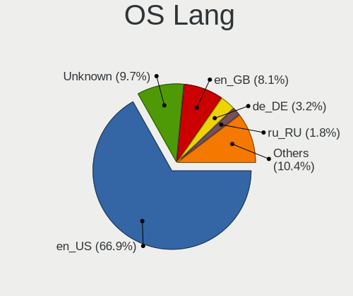
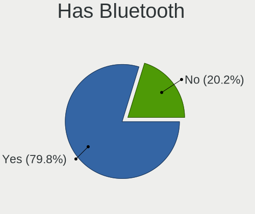
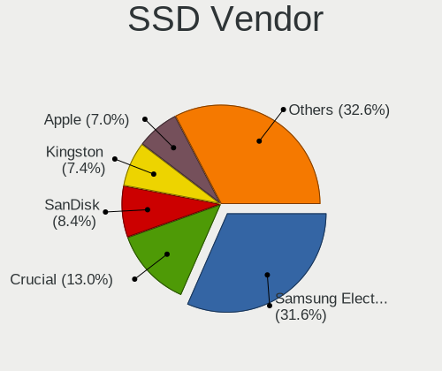
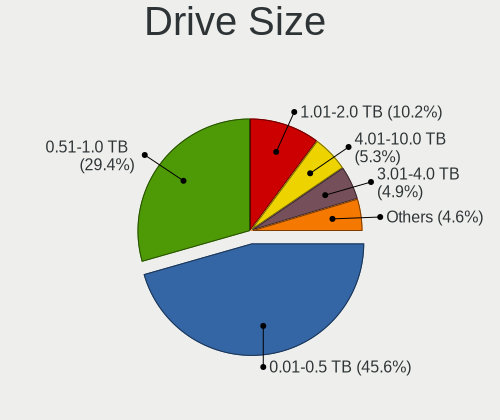
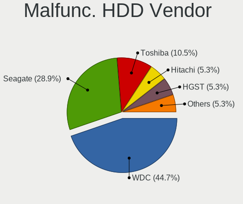
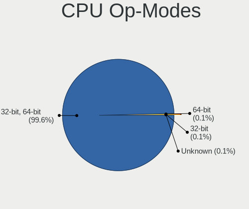
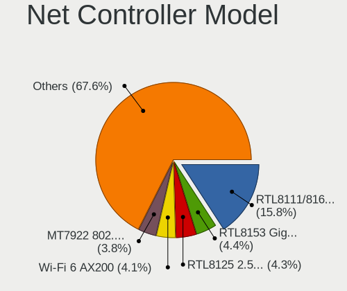
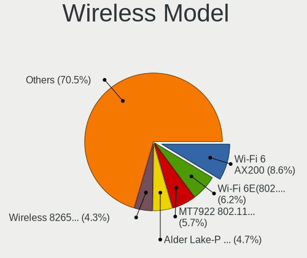
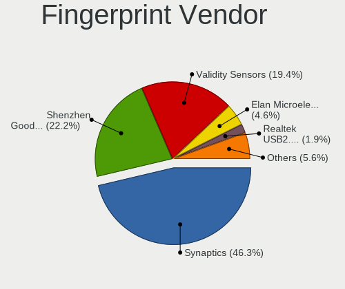

NixOS - Tested Hardware & Statistics
------------------------------------

A project to collect tested hardware configurations for NixOS.

Anyone can contribute to this report by the [hw-probe](https://github.com/linuxhw/hw-probe) tool:

    sudo -E hw-probe -all -upload

Please contribute! Especially if your hardware is rare.

This is a report for all computer types. See also reports for [desktops](/Dist/NixOS/Desktop/README.md) and [notebooks](/Dist/NixOS/Notebook/README.md).

Contents
--------

* [ Test Cases ](#test-cases)

* [ System ](#system)
  - [ OS                       ](#os)
  - [ OS Family                ](#os-family)
  - [ Kernel                   ](#kernel)
  - [ Kernel Family            ](#kernel-family)
  - [ Kernel Major Ver.        ](#kernel-major-ver)
  - [ Arch                     ](#arch)
  - [ DE                       ](#de)
  - [ Display Server           ](#display-server)
  - [ Display Manager          ](#display-manager)
  - [ OS Lang                  ](#os-lang)
  - [ Boot Mode                ](#boot-mode)
  - [ Filesystem               ](#filesystem)
  - [ Part. scheme             ](#part-scheme)
  - [ Dual Boot with Linux/BSD ](#dual-boot-with-linuxbsd)
  - [ Dual Boot (Win)          ](#dual-boot-win)

* [ Board ](#board)
  - [ Vendor                   ](#vendor)
  - [ Model                    ](#model)
  - [ Model Family             ](#model-family)
  - [ MFG Year                 ](#mfg-year)
  - [ Form Factor              ](#form-factor)
  - [ Secure Boot              ](#secure-boot)
  - [ Coreboot                 ](#coreboot)
  - [ RAM Size                 ](#ram-size)
  - [ RAM Used                 ](#ram-used)
  - [ Total Drives             ](#total-drives)
  - [ Has CD-ROM               ](#has-cd-rom)
  - [ Has Ethernet             ](#has-ethernet)
  - [ Has WiFi                 ](#has-wifi)
  - [ Has Bluetooth            ](#has-bluetooth)

* [ Location ](#location)
  - [ Country                  ](#country)
  - [ City                     ](#city)

* [ Drives ](#drives)
  - [ Drive Vendor             ](#drive-vendor)
  - [ Drive Model              ](#drive-model)
  - [ HDD Vendor               ](#hdd-vendor)
  - [ SSD Vendor               ](#ssd-vendor)
  - [ Drive Kind               ](#drive-kind)
  - [ Drive Connector          ](#drive-connector)
  - [ Drive Size               ](#drive-size)
  - [ Space Total              ](#space-total)
  - [ Space Used               ](#space-used)
  - [ Malfunc. Drives          ](#malfunc-drives)
  - [ Malfunc. Drive Vendor    ](#malfunc-drive-vendor)
  - [ Malfunc. HDD Vendor      ](#malfunc-hdd-vendor)
  - [ Malfunc. Drive Kind      ](#malfunc-drive-kind)
  - [ Failed Drives            ](#failed-drives)
  - [ Failed Drive Vendor      ](#failed-drive-vendor)
  - [ Drive Status             ](#drive-status)

* [ Storage controller ](#storage-controller)
  - [ Storage Vendor           ](#storage-vendor)
  - [ Storage Model            ](#storage-model)
  - [ Storage Kind             ](#storage-kind)

* [ Processor ](#processor)
  - [ CPU Vendor               ](#cpu-vendor)
  - [ CPU Model                ](#cpu-model)
  - [ CPU Model Family         ](#cpu-model-family)
  - [ CPU Cores                ](#cpu-cores)
  - [ CPU Sockets              ](#cpu-sockets)
  - [ CPU Threads              ](#cpu-threads)
  - [ CPU Op-Modes             ](#cpu-op-modes)
  - [ CPU Microcode            ](#cpu-microcode)
  - [ CPU Microarch            ](#cpu-microarch)

* [ Graphics ](#graphics)
  - [ GPU Vendor               ](#gpu-vendor)
  - [ GPU Model                ](#gpu-model)
  - [ GPU Combo                ](#gpu-combo)
  - [ GPU Driver               ](#gpu-driver)
  - [ GPU Memory               ](#gpu-memory)

* [ Monitor ](#monitor)
  - [ Monitor Vendor           ](#monitor-vendor)
  - [ Monitor Model            ](#monitor-model)
  - [ Monitor Resolution       ](#monitor-resolution)
  - [ Monitor Diagonal         ](#monitor-diagonal)
  - [ Monitor Width            ](#monitor-width)
  - [ Aspect Ratio             ](#aspect-ratio)
  - [ Monitor Area             ](#monitor-area)
  - [ Pixel Density            ](#pixel-density)
  - [ Multiple Monitors        ](#multiple-monitors)

* [ Network ](#network)
  - [ Net Controller Vendor    ](#net-controller-vendor)
  - [ Net Controller Model     ](#net-controller-model)
  - [ Wireless Vendor          ](#wireless-vendor)
  - [ Wireless Model           ](#wireless-model)
  - [ Ethernet Vendor          ](#ethernet-vendor)
  - [ Ethernet Model           ](#ethernet-model)
  - [ Net Controller Kind      ](#net-controller-kind)
  - [ Used Controller          ](#used-controller)
  - [ NICs                     ](#nics)
  - [ IPv6                     ](#ipv6)

* [ Bluetooth ](#bluetooth)
  - [ Bluetooth Vendor         ](#bluetooth-vendor)
  - [ Bluetooth Model          ](#bluetooth-model)

* [ Sound ](#sound)
  - [ Sound Vendor             ](#sound-vendor)
  - [ Sound Model              ](#sound-model)

* [ Memory ](#memory)
  - [ Memory Vendor            ](#memory-vendor)
  - [ Memory Model             ](#memory-model)
  - [ Memory Kind              ](#memory-kind)
  - [ Memory Form Factor       ](#memory-form-factor)
  - [ Memory Size              ](#memory-size)
  - [ Memory Speed             ](#memory-speed)

* [ Printers & scanners ](#printers--scanners)
  - [ Printer Vendor           ](#printer-vendor)
  - [ Printer Model            ](#printer-model)
  - [ Scanner Vendor           ](#scanner-vendor)
  - [ Scanner Model            ](#scanner-model)

* [ Camera ](#camera)
  - [ Camera Vendor            ](#camera-vendor)
  - [ Camera Model             ](#camera-model)

* [ Security ](#security)
  - [ Fingerprint Vendor       ](#fingerprint-vendor)
  - [ Fingerprint Model        ](#fingerprint-model)
  - [ Chipcard Vendor          ](#chipcard-vendor)
  - [ Chipcard Model           ](#chipcard-model)

* [ Unsupported ](#unsupported)
  - [ Unsupported Devices      ](#unsupported-devices)
  - [ Unsupported Device Types ](#unsupported-device-types)

Test Cases
----------

Total: 168

| Vendor        | Model                       | Form-Factor | Probe                                                      | Date         |
|---------------|-----------------------------|-------------|------------------------------------------------------------|--------------|
| Gigabyte      | B450M DS3H V2               | Desktop     | [75a3416ebc](https://linux-hardware.org/?probe=75a3416ebc) | Jan 31, 2023 |
| Lenovo        | ThinkPad X230 2333AZ2       | Notebook    | [d9d0138294](https://linux-hardware.org/?probe=d9d0138294) | Jan 19, 2023 |
| Blackview     | AceBook 1                   | Notebook    | [ea4db42aa8](https://linux-hardware.org/?probe=ea4db42aa8) | Jan 19, 2023 |
| ASRock        | Z87 Extreme4                | Desktop     | [b795f7c940](https://linux-hardware.org/?probe=b795f7c940) | Jan 19, 2023 |
| ASRock        | B550M Pro4                  | Desktop     | [0e4ba05b0f](https://linux-hardware.org/?probe=0e4ba05b0f) | Jan 15, 2023 |
| Supermicro    | X10SLL-F                    | Server      | [226b8e5ff8](https://linux-hardware.org/?probe=226b8e5ff8) | Jan 15, 2023 |
| Supermicro    | X10SLL-F                    | Server      | [b99e4815bc](https://linux-hardware.org/?probe=b99e4815bc) | Jan 10, 2023 |
| Dell          | Latitude 7420               | Notebook    | [e770b3e784](https://linux-hardware.org/?probe=e770b3e784) | Jan 04, 2023 |
| Dell          | Latitude 7420               | Notebook    | [bab9b86606](https://linux-hardware.org/?probe=bab9b86606) | Jan 04, 2023 |
| Supermicro    | X10SLL-F                    | Server      | [b721a47fa4](https://linux-hardware.org/?probe=b721a47fa4) | Jan 03, 2023 |
| Lenovo        | IdeaPadFlex 5 14ITL05 82... | Convertible | [d5df950832](https://linux-hardware.org/?probe=d5df950832) | Jan 03, 2023 |
| Shenzhen M... | F7BFC                       | Desktop     | [6a53c626dd](https://linux-hardware.org/?probe=6a53c626dd) | Jan 02, 2023 |
| Dell          | Precision M4800             | Notebook    | [505f1b47dc](https://linux-hardware.org/?probe=505f1b47dc) | Dec 30, 2022 |
| ASUSTek       | Z87-C                       | Desktop     | [4929f6a6c9](https://linux-hardware.org/?probe=4929f6a6c9) | Dec 28, 2022 |
| Dell          | Inspiron 7586               | Convertible | [d670af270f](https://linux-hardware.org/?probe=d670af270f) | Dec 28, 2022 |
| GPD           | WIN2                        | Notebook    | [d7d31b67d0](https://linux-hardware.org/?probe=d7d31b67d0) | Dec 28, 2022 |
| MSI           | Raider GE67HX 12UGS         | Notebook    | [84c6275c04](https://linux-hardware.org/?probe=84c6275c04) | Dec 25, 2022 |
| HP            | ENVY x360 Convertible 13... | Convertible | [cf62b1c520](https://linux-hardware.org/?probe=cf62b1c520) | Dec 20, 2022 |
| MSI           | B550-A PRO                  | Desktop     | [db7b91ac2f](https://linux-hardware.org/?probe=db7b91ac2f) | Dec 17, 2022 |
| Dell          | XPS 15 7590                 | Notebook    | [e070540587](https://linux-hardware.org/?probe=e070540587) | Dec 16, 2022 |
| MECHREVO      | Code01 Ver2.0               | Notebook    | [e4ba0262b4](https://linux-hardware.org/?probe=e4ba0262b4) | Dec 16, 2022 |
| MECHREVO      | Code01 Ver2.0               | Notebook    | [1a9c49eb4f](https://linux-hardware.org/?probe=1a9c49eb4f) | Dec 16, 2022 |
| Framework     | Laptop (12th Gen Intel C... | Notebook    | [893190593e](https://linux-hardware.org/?probe=893190593e) | Dec 12, 2022 |
| Raspberry ... | Raspberry Pi 4 Model B R... | Soc         | [ee5f96d645](https://linux-hardware.org/?probe=ee5f96d645) | Dec 09, 2022 |
| ASUSTek       | PRIME B550M-A               | Desktop     | [3c18fca709](https://linux-hardware.org/?probe=3c18fca709) | Dec 09, 2022 |
| Dell          | 0F0XJ6 A11                  | Server      | [3dfa1ba4b1](https://linux-hardware.org/?probe=3dfa1ba4b1) | Dec 09, 2022 |
| Pine Micro... | Pine64 PinePhone (1.2)      | Phone       | [110e3eab7f](https://linux-hardware.org/?probe=110e3eab7f) | Dec 09, 2022 |
| ASUSTek       | ROG Zephyrus G14 GA401QM... | Notebook    | [d512bff9cc](https://linux-hardware.org/?probe=d512bff9cc) | Dec 04, 2022 |
| ASUSTek       | ROG Zephyrus G14 GA401QM... | Notebook    | [fef748b3f4](https://linux-hardware.org/?probe=fef748b3f4) | Dec 04, 2022 |
| Apple         | Mac-B809C3757DA9BB8D iMa... | All in one  | [f698b715e4](https://linux-hardware.org/?probe=f698b715e4) | Nov 30, 2022 |
| Dell          | Inspiron 7586               | Convertible | [91dcb3265a](https://linux-hardware.org/?probe=91dcb3265a) | Nov 24, 2022 |
| Apple         | Mac-B809C3757DA9BB8D iMa... | All in one  | [b79f103dd5](https://linux-hardware.org/?probe=b79f103dd5) | Nov 24, 2022 |
| Acer          | Aspire A315-54K             | Notebook    | [12f19e4fbe](https://linux-hardware.org/?probe=12f19e4fbe) | Nov 23, 2022 |
| Intel         | NUC11PABi7 K90104-305       | Mini pc     | [44a3785f1f](https://linux-hardware.org/?probe=44a3785f1f) | Nov 13, 2022 |
| Lenovo        | ThinkPad T14s Gen 3 21BR... | Notebook    | [0c889920b5](https://linux-hardware.org/?probe=0c889920b5) | Nov 12, 2022 |
| Dell          | Latitude E5540              | Notebook    | [f2420e40cd](https://linux-hardware.org/?probe=f2420e40cd) | Nov 06, 2022 |
| Dell          | Latitude E5540              | Notebook    | [2456786404](https://linux-hardware.org/?probe=2456786404) | Nov 06, 2022 |
| Lenovo        | Legion S7 15ACH6 82K8       | Notebook    | [b60f8a187c](https://linux-hardware.org/?probe=b60f8a187c) | Nov 04, 2022 |
| Dell          | Inspiron 5570               | Notebook    | [33d3e9ce22](https://linux-hardware.org/?probe=33d3e9ce22) | Nov 03, 2022 |
| Toshiba       | Satellite L50-B             | Notebook    | [c242c45dbe](https://linux-hardware.org/?probe=c242c45dbe) | Nov 01, 2022 |
| Pine Micro... | Pine64 PinePhone (1.2)      | Phone       | [fce691523b](https://linux-hardware.org/?probe=fce691523b) | Oct 29, 2022 |
| Lenovo        | IdeaPad 5 Pro 16ACH6 82L... | Notebook    | [d58a7c30a9](https://linux-hardware.org/?probe=d58a7c30a9) | Oct 26, 2022 |
| Lenovo        | ThinkPad E470 20H1006JIX    | Notebook    | [8bc8778497](https://linux-hardware.org/?probe=8bc8778497) | Oct 26, 2022 |
| ASUSTek       | SABERTOOTH 990FX R2.0       | Desktop     | [6ffc032b64](https://linux-hardware.org/?probe=6ffc032b64) | Oct 25, 2022 |
| Lenovo        | IdeaPadFlex 5 14ITL05 82... | Convertible | [d79322ca4a](https://linux-hardware.org/?probe=d79322ca4a) | Oct 19, 2022 |
| Dell          | Precision 5760              | Notebook    | [4255007db8](https://linux-hardware.org/?probe=4255007db8) | Oct 18, 2022 |
| HP            | ZBook Studio G5             | Notebook    | [0a9b0167c7](https://linux-hardware.org/?probe=0a9b0167c7) | Oct 17, 2022 |
| Lenovo        | IdeaPadFlex 5 14ITL05 82... | Convertible | [aa5ea0c17c](https://linux-hardware.org/?probe=aa5ea0c17c) | Oct 14, 2022 |
| Lenovo        | IdeaPadFlex 5 14ITL05 82... | Convertible | [ae775f1f89](https://linux-hardware.org/?probe=ae775f1f89) | Oct 13, 2022 |
| Dell          | XPS 13 9310                 | Notebook    | [99232ffba3](https://linux-hardware.org/?probe=99232ffba3) | Oct 13, 2022 |
| ASUSTek       | PRIME B550M-A               | Desktop     | [c203d7c388](https://linux-hardware.org/?probe=c203d7c388) | Oct 07, 2022 |
| Raspberry ... | Raspberry Pi 4 Model B R... | Soc         | [3a409e83a0](https://linux-hardware.org/?probe=3a409e83a0) | Oct 07, 2022 |
| Dell          | 0F0XJ6 A11                  | Server      | [5eb1758869](https://linux-hardware.org/?probe=5eb1758869) | Oct 07, 2022 |
| ASUSTek       | Zenbook UX3402ZA_UX3402Z... | Convertible | [8e301a5e4e](https://linux-hardware.org/?probe=8e301a5e4e) | Sep 30, 2022 |
| Dell          | Inspiron 15 7510            | Notebook    | [263276babe](https://linux-hardware.org/?probe=263276babe) | Sep 30, 2022 |
| Dell          | Inspiron 15 7510            | Notebook    | [86e1da35ba](https://linux-hardware.org/?probe=86e1da35ba) | Sep 30, 2022 |
| Dell          | XPS 15 9570                 | Notebook    | [564eb3b439](https://linux-hardware.org/?probe=564eb3b439) | Sep 28, 2022 |
| Dell          | XPS 15 9570                 | Notebook    | [085bd81d5b](https://linux-hardware.org/?probe=085bd81d5b) | Sep 28, 2022 |
| Gigabyte      | X570 AORUS ELITE            | Desktop     | [b21f5fee1a](https://linux-hardware.org/?probe=b21f5fee1a) | Sep 26, 2022 |
| Lenovo        | ThinkPad X1 Extreme 20MF... | Notebook    | [7fc4cdb860](https://linux-hardware.org/?probe=7fc4cdb860) | Sep 22, 2022 |
| Raspberry ... | Raspberry Pi 4 Model B R... | Soc         | [3f823868fd](https://linux-hardware.org/?probe=3f823868fd) | Sep 15, 2022 |
| Dell          | Precision M4800             | Notebook    | [fae4dbff63](https://linux-hardware.org/?probe=fae4dbff63) | Sep 13, 2022 |
| Intel         | NUC11PABi7 K90104-305       | Mini pc     | [ad69daf392](https://linux-hardware.org/?probe=ad69daf392) | Sep 11, 2022 |
| Dell          | 0F0XJ6 A11                  | Server      | [a02c8258ba](https://linux-hardware.org/?probe=a02c8258ba) | Sep 11, 2022 |
| Raspberry ... | Raspberry Pi 4 Model B R... | Soc         | [7986ddc1d9](https://linux-hardware.org/?probe=7986ddc1d9) | Sep 11, 2022 |
| ASUSTek       | PRIME B550M-A               | Desktop     | [98fd9b974e](https://linux-hardware.org/?probe=98fd9b974e) | Sep 09, 2022 |
| Apple         | MacBookPro11,5              | Notebook    | [305905e674](https://linux-hardware.org/?probe=305905e674) | Sep 07, 2022 |
| ASRock        | AB350 Pro4                  | Desktop     | [ce872c873e](https://linux-hardware.org/?probe=ce872c873e) | Aug 24, 2022 |
| Apple         | MacBookPro11,5              | Notebook    | [19d3fab687](https://linux-hardware.org/?probe=19d3fab687) | Aug 21, 2022 |
| HP            | ProBook 445 G7              | Notebook    | [898a635cdd](https://linux-hardware.org/?probe=898a635cdd) | Aug 20, 2022 |
| HP            | ProBook 445 G7              | Notebook    | [28e67ea5a7](https://linux-hardware.org/?probe=28e67ea5a7) | Aug 20, 2022 |
| ASUSTek       | ASUSPRO P1440FAC_P1440FA    | Notebook    | [9351f31042](https://linux-hardware.org/?probe=9351f31042) | Aug 13, 2022 |
| Dell          | Latitude 7420               | Notebook    | [219cf18b1e](https://linux-hardware.org/?probe=219cf18b1e) | Jul 06, 2022 |
| ASUSTek       | H97I-PLUS                   | Desktop     | [982df0dba9](https://linux-hardware.org/?probe=982df0dba9) | Jun 22, 2022 |
| Raspberry ... | Raspberry Pi 3 Model B+     | Soc         | [2911b2782c](https://linux-hardware.org/?probe=2911b2782c) | Jun 21, 2022 |
| MSI           | MEG X570 UNIFY              | Desktop     | [6d5fdb800a](https://linux-hardware.org/?probe=6d5fdb800a) | Jun 20, 2022 |
| ASUSTek       | ROG STRIX Z390-F GAMING     | Desktop     | [a4621aa4ec](https://linux-hardware.org/?probe=a4621aa4ec) | Jun 19, 2022 |
| Dell          | XPS 13 9310                 | Notebook    | [380770f287](https://linux-hardware.org/?probe=380770f287) | Jun 15, 2022 |
| Dell          | XPS 13 9310                 | Notebook    | [248f252b2a](https://linux-hardware.org/?probe=248f252b2a) | Jun 13, 2022 |
| MSI           | MEG X570 UNIFY              | Desktop     | [d26f08ea88](https://linux-hardware.org/?probe=d26f08ea88) | Jun 12, 2022 |
| MSI           | MEG X570 UNIFY              | Desktop     | [0123caa2f3](https://linux-hardware.org/?probe=0123caa2f3) | Jun 11, 2022 |
| Lenovo        | ThinkPad X230 23243E9       | Notebook    | [85ffd2561e](https://linux-hardware.org/?probe=85ffd2561e) | Jun 08, 2022 |
| Dell          | XPS 13 9305                 | Notebook    | [affa614c99](https://linux-hardware.org/?probe=affa614c99) | Jun 07, 2022 |
| Dell          | Latitude 7420               | Notebook    | [5be44c8aae](https://linux-hardware.org/?probe=5be44c8aae) | Jun 01, 2022 |
| ASUSTek       | PRIME A520M-K               | Desktop     | [ab13de0478](https://linux-hardware.org/?probe=ab13de0478) | May 27, 2022 |
| Gigabyte      | B550I AORUS PRO AX          | Desktop     | [96b24b0640](https://linux-hardware.org/?probe=96b24b0640) | May 20, 2022 |
| Apple         | MacBookPro11,5              | Notebook    | [5cd59453b1](https://linux-hardware.org/?probe=5cd59453b1) | Apr 15, 2022 |
| Framework     | Laptop                      | Notebook    | [4997cab79b](https://linux-hardware.org/?probe=4997cab79b) | Apr 14, 2022 |
| HP            | ProBook 450 G4              | Notebook    | [2cb837e17f](https://linux-hardware.org/?probe=2cb837e17f) | Apr 14, 2022 |
| Lenovo        | ThinkPad T490 20N2000LUK    | Notebook    | [a394ce9693](https://linux-hardware.org/?probe=a394ce9693) | Apr 13, 2022 |
| ASUSTek       | PRIME X570-P                | Desktop     | [50d2e86de8](https://linux-hardware.org/?probe=50d2e86de8) | Apr 13, 2022 |
| HP            | ProBook 450 G4              | Notebook    | [fb5bcd7c77](https://linux-hardware.org/?probe=fb5bcd7c77) | Apr 13, 2022 |
| ASUSTek       | ROG Flow X13 GV301QE_GV3... | Notebook    | [502a8c9d32](https://linux-hardware.org/?probe=502a8c9d32) | Apr 13, 2022 |
| Lenovo        | ThinkPad X260 20F5S4BY00    | Notebook    | [729b19eda3](https://linux-hardware.org/?probe=729b19eda3) | Apr 13, 2022 |
| Acer          | Nitro N50-610               | Desktop     | [46b46c842f](https://linux-hardware.org/?probe=46b46c842f) | Apr 13, 2022 |
| Supermicro    | X8DT6                       | Server      | [0fd3b261c7](https://linux-hardware.org/?probe=0fd3b261c7) | Apr 03, 2022 |
| Lenovo        | Yoga Slim 7 13ACN5 82CY     | Notebook    | [4c96d9df2f](https://linux-hardware.org/?probe=4c96d9df2f) | Apr 02, 2022 |
| Lenovo        | ThinkPad T14s Gen 1 20UH... | Notebook    | [5570a879d3](https://linux-hardware.org/?probe=5570a879d3) | Mar 13, 2022 |
| Lenovo        | ThinkPad T14s Gen 1 20UH... | Notebook    | [d6cae900dc](https://linux-hardware.org/?probe=d6cae900dc) | Mar 13, 2022 |
| ASUSTek       | P8Q77-M                     | Desktop     | [6cd75b6762](https://linux-hardware.org/?probe=6cd75b6762) | Mar 11, 2022 |
| GPD           | MicroPC                     | Notebook    | [a572eb2b39](https://linux-hardware.org/?probe=a572eb2b39) | Mar 11, 2022 |
| Gigabyte      | X470 AORUS ULTRA GAMING-... | Desktop     | [815cb9ab49](https://linux-hardware.org/?probe=815cb9ab49) | Mar 11, 2022 |
| HP            | EliteBook 845 G8 Noteboo... | Notebook    | [f031fb1a5a](https://linux-hardware.org/?probe=f031fb1a5a) | Mar 11, 2022 |
| MSI           | B450M MORTAR MAX            | Desktop     | [1d6563ada3](https://linux-hardware.org/?probe=1d6563ada3) | Mar 11, 2022 |
| Lenovo        | ThinkPad T540p 20BE005YM... | Notebook    | [6d0cd0f4b9](https://linux-hardware.org/?probe=6d0cd0f4b9) | Mar 10, 2022 |
| Lenovo        | ThinkPad X260 20F5S6MF02    | Notebook    | [5e026c07c0](https://linux-hardware.org/?probe=5e026c07c0) | Mar 10, 2022 |
| ASUSTek       | P8Z77-V LK                  | Desktop     | [5c984c6d9a](https://linux-hardware.org/?probe=5c984c6d9a) | Mar 09, 2022 |
| ASUSTek       | P8Z77-V LK                  | Desktop     | [40d2eced72](https://linux-hardware.org/?probe=40d2eced72) | Mar 09, 2022 |
| EVGA          | X299 FTW K                  | Desktop     | [6f9489b2e6](https://linux-hardware.org/?probe=6f9489b2e6) | Mar 09, 2022 |
| Dell          | 0KJCC5 A00                  | Desktop     | [524b675e7e](https://linux-hardware.org/?probe=524b675e7e) | Mar 09, 2022 |
| MSI           | MAG X570 TOMAHAWK WIFI      | Desktop     | [f38279e396](https://linux-hardware.org/?probe=f38279e396) | Mar 09, 2022 |
| MSI           | Bravo 15 B5DD               | Notebook    | [273737b3d7](https://linux-hardware.org/?probe=273737b3d7) | Feb 25, 2022 |
| OBSIDIAN-P... | N13_N140ZU                  | Notebook    | [9f2fdbfce5](https://linux-hardware.org/?probe=9f2fdbfce5) | Feb 25, 2022 |
| MSI           | X399 SLI PLUS               | Desktop     | [a1d172dbc0](https://linux-hardware.org/?probe=a1d172dbc0) | Feb 16, 2022 |
| Dell          | Latitude 7420               | Notebook    | [64178dcbb7](https://linux-hardware.org/?probe=64178dcbb7) | Feb 08, 2022 |
| Lenovo        | ThinkPad X390 20Q0CTO1WW    | Notebook    | [cf3fa03922](https://linux-hardware.org/?probe=cf3fa03922) | Jan 08, 2022 |
| Lenovo        | ThinkPad X390 20Q0CTO1WW    | Notebook    | [d62840031f](https://linux-hardware.org/?probe=d62840031f) | Jan 08, 2022 |
| MSI           | MAG X570 TOMAHAWK WIFI      | Desktop     | [c84b603f92](https://linux-hardware.org/?probe=c84b603f92) | Jan 04, 2022 |
| Lenovo        | Legion 5 17ARH05H 82GN      | Notebook    | [9e022a2288](https://linux-hardware.org/?probe=9e022a2288) | Dec 26, 2021 |
| Lenovo        | Legion 5 17ARH05H 82GN      | Notebook    | [8ff8fb5efd](https://linux-hardware.org/?probe=8ff8fb5efd) | Dec 26, 2021 |
| ASUSTek       | Z170-P                      | Desktop     | [d4bac456d1](https://linux-hardware.org/?probe=d4bac456d1) | Dec 16, 2021 |
| Lenovo        | Yoga 520-14IKB 81C8         | Convertible | [e5dc04e6a5](https://linux-hardware.org/?probe=e5dc04e6a5) | Dec 16, 2021 |
| Gigabyte      | X570 AORUS ELITE            | Desktop     | [eb5d5f4361](https://linux-hardware.org/?probe=eb5d5f4361) | Dec 12, 2021 |
| ASUSTek       | ZenBook UX391FA_UX391FA     | Notebook    | [5fb4f1b6a6](https://linux-hardware.org/?probe=5fb4f1b6a6) | Nov 29, 2021 |
| ASUSTek       | PRIME Z390-A                | Desktop     | [af887c3f7b](https://linux-hardware.org/?probe=af887c3f7b) | Nov 29, 2021 |
| Lenovo        | ThinkPad T14 Gen 1 20UD0... | Notebook    | [dbe8d36249](https://linux-hardware.org/?probe=dbe8d36249) | Nov 04, 2021 |
| Gigabyte      | H97M-D3H                    | Desktop     | [349fbeb586](https://linux-hardware.org/?probe=349fbeb586) | Oct 23, 2021 |
| Teclast       | F5                          | Convertible | [0854310843](https://linux-hardware.org/?probe=0854310843) | Oct 08, 2021 |
| Lenovo        | ThinkPad X250 20CLS18S0T    | Notebook    | [0151eadf78](https://linux-hardware.org/?probe=0151eadf78) | Oct 06, 2021 |
| HP            | Spectre x360 Convertible... | Convertible | [66d71367c1](https://linux-hardware.org/?probe=66d71367c1) | Aug 24, 2021 |
| HP            | Spectre x360 Convertible... | Convertible | [bd919b4bd6](https://linux-hardware.org/?probe=bd919b4bd6) | Aug 22, 2021 |
| HP            | ProBook 445 G7              | Notebook    | [36c94af49d](https://linux-hardware.org/?probe=36c94af49d) | Aug 09, 2021 |
| HP            | ProBook 445 G7              | Notebook    | [87a418ce6c](https://linux-hardware.org/?probe=87a418ce6c) | Aug 09, 2021 |
| ASUSTek       | ROG Zephyrus G14 GA401QM... | Notebook    | [3df83086ef](https://linux-hardware.org/?probe=3df83086ef) | Aug 07, 2021 |
| ASUSTek       | ROG Zephyrus G14 GA401QM... | Notebook    | [052ccd7a40](https://linux-hardware.org/?probe=052ccd7a40) | Aug 07, 2021 |
| MSI           | X399 SLI PLUS               | Desktop     | [128ae965a7](https://linux-hardware.org/?probe=128ae965a7) | Aug 06, 2021 |
| ASUSTek       | ROG Zephyrus G14 GA401QM... | Notebook    | [48fd4d3b89](https://linux-hardware.org/?probe=48fd4d3b89) | Aug 06, 2021 |
| Dell          | Inspiron 7391 2n1           | Convertible | [f632a64d73](https://linux-hardware.org/?probe=f632a64d73) | Jul 22, 2021 |
| Dell          | Latitude 7420               | Notebook    | [0624aeffd1](https://linux-hardware.org/?probe=0624aeffd1) | Jul 19, 2021 |
| ASRock        | X570 Taichi                 | Desktop     | [d93a80d973](https://linux-hardware.org/?probe=d93a80d973) | Jul 14, 2021 |
| ASRock        | X570 Taichi                 | Desktop     | [59a699d357](https://linux-hardware.org/?probe=59a699d357) | Jul 14, 2021 |
| ASUSTek       | ROG Strix G533QR_G533QR     | Notebook    | [d14e0ef395](https://linux-hardware.org/?probe=d14e0ef395) | Jun 18, 2021 |
| ASUSTek       | SABERTOOTH X99              | Desktop     | [60eed45305](https://linux-hardware.org/?probe=60eed45305) | Jun 18, 2021 |
| MSI           | X570-A PRO                  | Desktop     | [0619809b36](https://linux-hardware.org/?probe=0619809b36) | Jun 01, 2021 |
| ASRock        | B450 Gaming-ITX/ac          | Desktop     | [6056eac50c](https://linux-hardware.org/?probe=6056eac50c) | May 31, 2021 |
| ASRock        | B450 Gaming-ITX/ac          | Desktop     | [bd9fb4818b](https://linux-hardware.org/?probe=bd9fb4818b) | May 31, 2021 |
| ASRock        | B450 Gaming-ITX/ac          | Desktop     | [12fa3ffea5](https://linux-hardware.org/?probe=12fa3ffea5) | May 31, 2021 |
| Lenovo        | ThinkPad T480 20L5CTO1WW    | Notebook    | [fc12f446bb](https://linux-hardware.org/?probe=fc12f446bb) | May 23, 2021 |
| ASUSTek       | ROG STRIX B550-F GAMING     | Desktop     | [f03b19461f](https://linux-hardware.org/?probe=f03b19461f) | May 16, 2021 |
| ASUSTek       | ROG STRIX B550-F GAMING     | Desktop     | [529e915984](https://linux-hardware.org/?probe=529e915984) | May 16, 2021 |
| HP            | ZBook Studio G5             | Notebook    | [d323a9cfbf](https://linux-hardware.org/?probe=d323a9cfbf) | Apr 23, 2021 |
| Lenovo        | ThinkPad T460p 20FWCTO1W... | Notebook    | [38ab65a49b](https://linux-hardware.org/?probe=38ab65a49b) | Mar 18, 2021 |
| ASUSTek       | Pro WS W480-ACE             | Desktop     | [3825190816](https://linux-hardware.org/?probe=3825190816) | Mar 11, 2021 |
| ASUSTek       | ROG STRIX B550-I GAMING     | Desktop     | [d55d51a3e2](https://linux-hardware.org/?probe=d55d51a3e2) | Feb 08, 2021 |
| MSI           | MPG X570 GAMING PLUS        | Desktop     | [188755ebc7](https://linux-hardware.org/?probe=188755ebc7) | Oct 25, 2020 |
| Hardkernel    | ODROID-H2                   | Desktop     | [a5d75a24e5](https://linux-hardware.org/?probe=a5d75a24e5) | Oct 13, 2020 |
| Lenovo        | ThinkPad T580 20L90024PB    | Notebook    | [8dc60fafaa](https://linux-hardware.org/?probe=8dc60fafaa) | Oct 13, 2020 |
| ASUSTek       | TUF Gaming X570-PLUS        | Desktop     | [b85fb81c59](https://linux-hardware.org/?probe=b85fb81c59) | Sep 28, 2020 |
| Dell          | XPS 15 9550                 | Notebook    | [5656cda6a4](https://linux-hardware.org/?probe=5656cda6a4) | Sep 01, 2020 |
| Dell          | XPS 15 9550                 | Notebook    | [550264c421](https://linux-hardware.org/?probe=550264c421) | Aug 22, 2020 |
| MSI           | MAG B550M BAZOOKA           | Desktop     | [5f7f2db973](https://linux-hardware.org/?probe=5f7f2db973) | Aug 21, 2020 |
| ASUSTek       | PRIME Z270-K                | Desktop     | [cc8de41afd](https://linux-hardware.org/?probe=cc8de41afd) | Aug 21, 2020 |
| HP            | 8055                        | Desktop     | [1165b457fa](https://linux-hardware.org/?probe=1165b457fa) | Jul 08, 2020 |
| HP            | 8055                        | Desktop     | [a5c65e8d4a](https://linux-hardware.org/?probe=a5c65e8d4a) | Jul 08, 2020 |
| Lenovo        | ThinkPad T15 Gen 1 20S6C... | Notebook    | [71029187b1](https://linux-hardware.org/?probe=71029187b1) | Jul 03, 2020 |
| ASRock        | TRX40 Creator               | Desktop     | [2cefd65bfb](https://linux-hardware.org/?probe=2cefd65bfb) | Jun 29, 2020 |
| Acer          | Aspire E5-576G              | Notebook    | [c126c8b2fd](https://linux-hardware.org/?probe=c126c8b2fd) | Apr 15, 2020 |
| Gigabyte      | Sabre 15                    | Notebook    | [4f92cff461](https://linux-hardware.org/?probe=4f92cff461) | Jul 14, 2019 |

System
------

OS
--

Installed operating systems

| Name                             | Computers | Percent |
|----------------------------------|-----------|---------|
| NixOS 22.05                      | 37        | 28.68%  |
| NixOS 22.11                      | 31        | 24.03%  |
| NixOS 21.11                      | 18        | 13.95%  |
| NixOS 23.05                      | 8         | 6.2%    |
| NixOS                            | 5         | 3.88%   |
| NixOS 21.05pre-git               | 2         | 1.55%   |
| NixOS 20.09pre-git               | 2         | 1.55%   |
| NixOS 21.11pre302265.c6c4a3d45ab | 1         | 0.78%   |
| NixOS 21.11.20210606.fbfb794     | 1         | 0.78%   |
| NixOS 21.11.20210528.540dccb     | 1         | 0.78%   |
| NixOS 21.05.git.62d4591722f      | 1         | 0.78%   |
| NixOS 21.05.git.2e369bb2f4e      | 1         | 0.78%   |
| NixOS 21.05.993.93963c27b93      | 1         | 0.78%   |
| NixOS 21.05.4384.4f37689c8a2     | 1         | 0.78%   |
| NixOS 21.05.3509.7daf35532d2     | 1         | 0.78%   |
| NixOS 21.05.3443.ee90403e147     | 1         | 0.78%   |
| NixOS 21.05.2132.733682c3292     | 1         | 0.78%   |
| NixOS 21.05.2075.ff1ea3a36c1     | 1         | 0.78%   |
| NixOS 21.05.20210929.ee90403     | 1         | 0.78%   |
| NixOS 21.05.20210430.c8dff32     | 1         | 0.78%   |
| NixOS 21.05.20210423.c21475e     | 1         | 0.78%   |
| NixOS 21.05.20210224.f6b5bfd     | 1         | 0.78%   |
| NixOS 21.05.1471.a7512bb64b1     | 1         | 0.78%   |
| NixOS 21.03pre246062.420f89ceb26 | 1         | 0.78%   |
| NixOS 21.03.git.b4349c13a6d      | 1         | 0.78%   |
| NixOS 21.03.20201007.420f89c     | 1         | 0.78%   |
| NixOS 21.03.20200927.84d74ae     | 1         | 0.78%   |
| NixOS 20.09pre231796.22a81aa5fc1 | 1         | 0.78%   |
| NixOS 20.09.git.4a361b06a93      | 1         | 0.78%   |
| NixOS 20.03.2351.f8248ab6d9e     | 1         | 0.78%   |
| NixOS 19.09.2522.75f4ba05c63     | 1         | 0.78%   |
| NixOS 19.09.2220.92231f4f32f     | 1         | 0.78%   |
| NixOS 19.03.173054.754763ff4ba   | 1         | 0.78%   |

OS Family
---------

OS without a version

| Name  | Computers | Percent |
|-------|-----------|---------|
| NixOS | 114       | 100%    |

Kernel
------

Version of the Linux kernel

| Version          | Computers | Percent |
|------------------|-----------|---------|
| 5.15.74          | 5         | 3.7%    |
| 5.15.43          | 4         | 2.96%   |
| 6.1.0            | 3         | 2.22%   |
| 6.0.11           | 3         | 2.22%   |
| 6.0.10           | 3         | 2.22%   |
| 5.15.86          | 3         | 2.22%   |
| 5.15.82          | 3         | 2.22%   |
| 5.15.72          | 3         | 2.22%   |
| 5.15.68          | 3         | 2.22%   |
| 5.15.47          | 3         | 2.22%   |
| 5.15.26          | 3         | 2.22%   |
| 5.8.1-zen1       | 2         | 1.48%   |
| 5.19.14          | 2         | 1.48%   |
| 5.18.19          | 2         | 1.48%   |
| 5.17.1           | 2         | 1.48%   |
| 5.16.8-zen1      | 2         | 1.48%   |
| 5.16.15          | 2         | 1.48%   |
| 5.15.85          | 2         | 1.48%   |
| 5.15.64          | 2         | 1.48%   |
| 5.15.32          | 2         | 1.48%   |
| 5.15.25          | 2         | 1.48%   |
| 5.13.7           | 2         | 1.48%   |
| 5.13.2           | 2         | 1.48%   |
| 5.12.15          | 2         | 1.48%   |
| 5.10.102         | 2         | 1.48%   |
| 6.1.1            | 1         | 0.74%   |
| 6.1.0-zen1       | 1         | 0.74%   |
| 6.0.8-zen1       | 1         | 0.74%   |
| 6.0.6            | 1         | 0.74%   |
| 6.0.2-xanmod1-tt | 1         | 0.74%   |
| 6.0.2            | 1         | 0.74%   |
| 6.0.12           | 1         | 0.74%   |
| 6.0.10-zen2      | 1         | 0.74%   |
| 6.0.0-xanmod1    | 1         | 0.74%   |
| 5.8.4            | 1         | 0.74%   |
| 5.8.16-hardened  | 1         | 0.74%   |
| 5.8.11           | 1         | 0.74%   |
| 5.8.10           | 1         | 0.74%   |
| 5.7.4            | 1         | 0.74%   |
| 5.7.19           | 1         | 0.74%   |

Kernel Family
-------------

Linux kernel without a distro release

| Version  | Computers | Percent |
|----------|-----------|---------|
| 5.15.74  | 5         | 3.7%    |
| 6.1.0    | 4         | 2.96%   |
| 6.0.10   | 4         | 2.96%   |
| 5.15.43  | 4         | 2.96%   |
| 6.0.11   | 3         | 2.22%   |
| 5.15.86  | 3         | 2.22%   |
| 5.15.82  | 3         | 2.22%   |
| 5.15.72  | 3         | 2.22%   |
| 5.15.68  | 3         | 2.22%   |
| 5.15.47  | 3         | 2.22%   |
| 5.15.26  | 3         | 2.22%   |
| 6.0.2    | 2         | 1.48%   |
| 5.8.1    | 2         | 1.48%   |
| 5.19.14  | 2         | 1.48%   |
| 5.18.19  | 2         | 1.48%   |
| 5.17.1   | 2         | 1.48%   |
| 5.16.8   | 2         | 1.48%   |
| 5.16.15  | 2         | 1.48%   |
| 5.15.85  | 2         | 1.48%   |
| 5.15.64  | 2         | 1.48%   |
| 5.15.32  | 2         | 1.48%   |
| 5.15.25  | 2         | 1.48%   |
| 5.13.7   | 2         | 1.48%   |
| 5.13.2   | 2         | 1.48%   |
| 5.12.15  | 2         | 1.48%   |
| 5.11.16  | 2         | 1.48%   |
| 5.10.102 | 2         | 1.48%   |
| 6.1.1    | 1         | 0.74%   |
| 6.0.8    | 1         | 0.74%   |
| 6.0.6    | 1         | 0.74%   |
| 6.0.12   | 1         | 0.74%   |
| 6.0.0    | 1         | 0.74%   |
| 5.8.4    | 1         | 0.74%   |
| 5.8.16   | 1         | 0.74%   |
| 5.8.11   | 1         | 0.74%   |
| 5.8.10   | 1         | 0.74%   |
| 5.7.4    | 1         | 0.74%   |
| 5.7.19   | 1         | 0.74%   |
| 5.7.17   | 1         | 0.74%   |
| 5.4.94   | 1         | 0.74%   |

Kernel Major Ver.
-----------------

Linux kernel major version

| Version | Computers | Percent |
|---------|-----------|---------|
| 5.15    | 47        | 35.88%  |
| 5.10    | 14        | 10.69%  |
| 6.0     | 13        | 9.92%   |
| 5.16    | 8         | 6.11%   |
| 5.4     | 7         | 5.34%   |
| 5.19    | 7         | 5.34%   |
| 5.8     | 6         | 4.58%   |
| 6.1     | 5         | 3.82%   |
| 5.18    | 5         | 3.82%   |
| 5.13    | 4         | 3.05%   |
| 5.7     | 3         | 2.29%   |
| 5.17    | 3         | 2.29%   |
| 5.12    | 3         | 2.29%   |
| 5.14    | 2         | 1.53%   |
| 5.11    | 2         | 1.53%   |
| 4.19    | 2         | 1.53%   |

Arch
----

OS architecture (x86_64, i586, etc.)

| Name    | Computers | Percent |
|---------|-----------|---------|
| x86_64  | 110       | 96.49%  |
| aarch64 | 4         | 3.51%   |

DE
--

Desktop Environment

| Name         | Computers | Percent |
|--------------|-----------|---------|
| Unknown      | 81        | 68.07%  |
| GNOME        | 8         | 6.72%   |
| sway         | 7         | 5.88%   |
| XFCE         | 6         | 5.04%   |
| KDE5         | 6         | 5.04%   |
| KDE          | 4         | 3.36%   |
| none+xmonad  | 2         | 1.68%   |
| none+i3      | 2         | 1.68%   |
| X-Generic    | 1         | 0.84%   |
| none+bspwm   | 1         | 0.84%   |
| none+awesome | 1         | 0.84%   |

Display Server
--------------

X11 or Wayland

| Name    | Computers | Percent |
|---------|-----------|---------|
| Unknown | 73        | 60.83%  |
| X11     | 22        | 18.33%  |
| Wayland | 13        | 10.83%  |
| Tty     | 12        | 10%     |

Display Manager
---------------

SDDM, LightDM, etc.

| Name    | Computers | Percent |
|---------|-----------|---------|
| Unknown | 84        | 73.04%  |
| LightDM | 12        | 10.43%  |
| SDDM    | 11        | 9.57%   |
| GDM     | 8         | 6.96%   |

OS Lang
-------

Language

| Lang    | Computers | Percent |
|---------|-----------|---------|
| Unknown | 53        | 46.09%  |
| en_US   | 43        | 37.39%  |
| en_GB   | 3         | 2.61%   |
| ru_RU   | 2         | 1.74%   |
| fr_FR   | 2         | 1.74%   |
| en_DK   | 2         | 1.74%   |
| en_AU   | 2         | 1.74%   |
| de_DE   | 2         | 1.74%   |
| de_CH   | 2         | 1.74%   |
| ro_RO   | 1         | 0.87%   |
| pt_BR   | 1         | 0.87%   |
| it_IT   | 1         | 0.87%   |
| en_CA   | 1         | 0.87%   |

Boot Mode
---------

EFI or BIOS

| Mode | Computers | Percent |
|------|-----------|---------|
| EFI  | 98        | 84.48%  |
| BIOS | 18        | 15.52%  |

Filesystem
----------

Type of filesystem

| Type    | Computers | Percent |
|---------|-----------|---------|
| Ext4    | 57        | 48.72%  |
| Btrfs   | 20        | 17.09%  |
| Zfs     | 13        | 11.11%  |
| Xfs     | 10        | 8.55%   |
| Tmpfs   | 10        | 8.55%   |
| Unknown | 6         | 5.13%   |
| Ext2    | 1         | 0.85%   |

Part. scheme
------------

Scheme of partitioning

| Type    | Computers | Percent |
|---------|-----------|---------|
| GPT     | 108       | 92.31%  |
| Unknown | 8         | 6.84%   |
| MBR     | 1         | 0.85%   |

Dual Boot with Linux/BSD
------------------------

Hosting more than one Linux/BSD

| Dual boot | Computers | Percent |
|-----------|-----------|---------|
| No        | 86        | 72.88%  |
| Yes       | 32        | 27.12%  |

Dual Boot (Win)
---------------

Hosting Linux and Windows

| Dual boot | Computers | Percent |
|-----------|-----------|---------|
| No        | 75        | 65.79%  |
| Yes       | 39        | 34.21%  |

Board
-----

Vendor
------

Motherboard manufacturer

| Name                                 | Computers | Percent |
|--------------------------------------|-----------|---------|
| Lenovo                               | 23        | 20.18%  |
| ASUSTek Computer                     | 23        | 20.18%  |
| Dell                                 | 16        | 14.04%  |
| MSI                                  | 9         | 7.89%   |
| Hewlett-Packard                      | 7         | 6.14%   |
| Gigabyte Technology                  | 6         | 5.26%   |
| ASRock                               | 6         | 5.26%   |
| Acer                                 | 3         | 2.63%   |
| Supermicro                           | 2         | 1.75%   |
| Raspberry Pi Foundation              | 2         | 1.75%   |
| Pine Microsystems                    | 2         | 1.75%   |
| GPD                                  | 2         | 1.75%   |
| Framework                            | 2         | 1.75%   |
| Apple                                | 2         | 1.75%   |
| Toshiba                              | 1         | 0.88%   |
| Teclast                              | 1         | 0.88%   |
| Shenzhen Meigao Electronic Equipment | 1         | 0.88%   |
| OBSIDIAN-PC                          | 1         | 0.88%   |
| MECHREVO                             | 1         | 0.88%   |
| Intel                                | 1         | 0.88%   |
| Hardkernel                           | 1         | 0.88%   |
| EVGA                                 | 1         | 0.88%   |
| Blackview                            | 1         | 0.88%   |

Model
-----

Motherboard model

| Name                                       | Computers | Percent |
|--------------------------------------------|-----------|---------|
| Pine Microsystems Pine64 PinePhone (1.2)   | 2         | 1.75%   |
| MSI MS-7C37                                | 2         | 1.75%   |
| Dell Latitude 7420                         | 2         | 1.75%   |
| ASUS All Series                            | 2         | 1.75%   |
| Toshiba Satellite L50-B                    | 1         | 0.88%   |
| Teclast F5                                 | 1         | 0.88%   |
| Supermicro X8DT6                           | 1         | 0.88%   |
| Supermicro X10SLL-F                        | 1         | 0.88%   |
| Shenzhen Meigao Electronic Equipment UM690 | 1         | 0.88%   |
| RPi Raspberry Pi 4 Model B Rev 1.2         | 1         | 0.88%   |
| RPi Raspberry Pi 3 Model B+                | 1         | 0.88%   |
| OBSIDIAN-PC N13_N140ZU                     | 1         | 0.88%   |
| MSI MS-7C95                                | 1         | 0.88%   |
| MSI MS-7C84                                | 1         | 0.88%   |
| MSI MS-7C56                                | 1         | 0.88%   |
| MSI MS-7C35                                | 1         | 0.88%   |
| MSI MS-7B89                                | 1         | 0.88%   |
| MSI MS-7B09                                | 1         | 0.88%   |
| MSI Bravo 15 B5DD                          | 1         | 0.88%   |
| MECHREVO Code01 Ver2.0                     | 1         | 0.88%   |
| Lenovo Yoga Slim 7 13ACN5 82CY             | 1         | 0.88%   |
| Lenovo Yoga 520-14IKB 81C8                 | 1         | 0.88%   |
| Lenovo ThinkPad X390 20Q0CTO1WW            | 1         | 0.88%   |
| Lenovo ThinkPad X260 20F5S6MF02            | 1         | 0.88%   |
| Lenovo ThinkPad X260 20F5S4BY00            | 1         | 0.88%   |
| Lenovo ThinkPad X250 20CLS18S0T            | 1         | 0.88%   |
| Lenovo ThinkPad X230 2333AZ2               | 1         | 0.88%   |
| Lenovo ThinkPad X230 23243E9               | 1         | 0.88%   |
| Lenovo ThinkPad X1 Extreme 20MFCTO1WW      | 1         | 0.88%   |
| Lenovo ThinkPad T580 20L90024PB            | 1         | 0.88%   |
| Lenovo ThinkPad T540p 20BE005YMH           | 1         | 0.88%   |
| Lenovo ThinkPad T490 20N2000LUK            | 1         | 0.88%   |
| Lenovo ThinkPad T480 20L5CTO1WW            | 1         | 0.88%   |
| Lenovo ThinkPad T460p 20FWCTO1WW           | 1         | 0.88%   |
| Lenovo ThinkPad T15 Gen 1 20S6CTO1WW       | 1         | 0.88%   |
| Lenovo ThinkPad T14s Gen 3 21BR000MUS      | 1         | 0.88%   |
| Lenovo ThinkPad T14s Gen 1 20UH001AUK      | 1         | 0.88%   |
| Lenovo ThinkPad T14 Gen 1 20UD0013RT       | 1         | 0.88%   |
| Lenovo ThinkPad E470 20H1006JIX            | 1         | 0.88%   |
| Lenovo Legion S7 15ACH6 82K8               | 1         | 0.88%   |

Model Family
------------

Motherboard model prefix

| Name                                       | Computers | Percent |
|--------------------------------------------|-----------|---------|
| Lenovo ThinkPad                            | 17        | 14.91%  |
| ASUS ROG                                   | 6         | 5.26%   |
| Dell XPS                                   | 5         | 4.39%   |
| ASUS PRIME                                 | 5         | 4.39%   |
| Dell Inspiron                              | 4         | 3.51%   |
| Dell Precision                             | 3         | 2.63%   |
| Dell Latitude                              | 3         | 2.63%   |
| RPi Raspberry                              | 2         | 1.75%   |
| Pine Microsystems Pine64                   | 2         | 1.75%   |
| MSI MS-7C37                                | 2         | 1.75%   |
| Lenovo Yoga                                | 2         | 1.75%   |
| Lenovo Legion                              | 2         | 1.75%   |
| HP ProBook                                 | 2         | 1.75%   |
| Framework Laptop                           | 2         | 1.75%   |
| ASUS Zenbook                               | 2         | 1.75%   |
| ASUS All                                   | 2         | 1.75%   |
| Acer Aspire                                | 2         | 1.75%   |
| Toshiba Satellite                          | 1         | 0.88%   |
| Teclast F5                                 | 1         | 0.88%   |
| Supermicro X8DT6                           | 1         | 0.88%   |
| Supermicro X10SLL-F                        | 1         | 0.88%   |
| Shenzhen Meigao Electronic Equipment UM690 | 1         | 0.88%   |
| OBSIDIAN-PC N13                            | 1         | 0.88%   |
| MSI MS-7C95                                | 1         | 0.88%   |
| MSI MS-7C84                                | 1         | 0.88%   |
| MSI MS-7C56                                | 1         | 0.88%   |
| MSI MS-7C35                                | 1         | 0.88%   |
| MSI MS-7B89                                | 1         | 0.88%   |
| MSI MS-7B09                                | 1         | 0.88%   |
| MSI Bravo                                  | 1         | 0.88%   |
| MECHREVO Code01                            | 1         | 0.88%   |
| Lenovo IdeaPadFlex                         | 1         | 0.88%   |
| Lenovo IdeaPad                             | 1         | 0.88%   |
| Intel NUC11PAHi7                           | 1         | 0.88%   |
| HP ZBook                                   | 1         | 0.88%   |
| HP Spectre                                 | 1         | 0.88%   |
| HP ENVY                                    | 1         | 0.88%   |
| HP EliteDesk                               | 1         | 0.88%   |
| HP EliteBook                               | 1         | 0.88%   |
| Hardkernel ODROID-H2                       | 1         | 0.88%   |

MFG Year
--------

Motherboard manufacture year

| Year    | Computers | Percent |
|---------|-----------|---------|
| 2020    | 24        | 21.05%  |
| 2019    | 20        | 17.54%  |
| 2021    | 14        | 12.28%  |
| 2018    | 12        | 10.53%  |
| 2016    | 10        | 8.77%   |
| 2017    | 6         | 5.26%   |
| 2022    | 5         | 4.39%   |
| 2015    | 5         | 4.39%   |
| 2013    | 5         | 4.39%   |
| 2014    | 4         | 3.51%   |
| 2012    | 4         | 3.51%   |
| Unknown | 4         | 3.51%   |
| 2010    | 1         | 0.88%   |

Form Factor
-----------

Physical design of the computer

| Name           | Computers | Percent |
|----------------|-----------|---------|
| Notebook       | 55        | 48.25%  |
| Desktop        | 42        | 36.84%  |
| Convertible    | 8         | 7.02%   |
| Server         | 3         | 2.63%   |
| Phone          | 2         | 1.75%   |
| System on chip | 2         | 1.75%   |
| Mini pc        | 1         | 0.88%   |
| All in one     | 1         | 0.88%   |

Secure Boot
-----------

Enabled or disabled

| State    | Computers | Percent |
|----------|-----------|---------|
| Disabled | 114       | 99.13%  |
| Enabled  | 1         | 0.87%   |

Coreboot
--------

Have coreboot on board

| Used | Computers | Percent |
|------|-----------|---------|
| No   | 113       | 99.12%  |
| Yes  | 1         | 0.88%   |

RAM Size
--------

Total RAM memory

| Size in GB  | Computers | Percent |
|-------------|-----------|---------|
| 32.01-64.0  | 34        | 29.31%  |
| 16.01-24.0  | 26        | 22.41%  |
| 8.01-16.0   | 18        | 15.52%  |
| 64.01-256.0 | 15        | 12.93%  |
| 4.01-8.0    | 10        | 8.62%   |
| 24.01-32.0  | 6         | 5.17%   |
| 3.01-4.0    | 5         | 4.31%   |
| 1.01-2.0    | 1         | 0.86%   |
| 0.51-1.0    | 1         | 0.86%   |

RAM Used
--------

Used RAM memory

| Used GB     | Computers | Percent |
|-------------|-----------|---------|
| 4.01-8.0    | 35        | 27.78%  |
| 8.01-16.0   | 23        | 18.25%  |
| 2.01-3.0    | 16        | 12.7%   |
| 3.01-4.0    | 15        | 11.9%   |
| 1.01-2.0    | 13        | 10.32%  |
| 32.01-64.0  | 6         | 4.76%   |
| 16.01-24.0  | 6         | 4.76%   |
| 24.01-32.0  | 5         | 3.97%   |
| 0.51-1.0    | 5         | 3.97%   |
| 64.01-256.0 | 1         | 0.79%   |
| 0.01-0.5    | 1         | 0.79%   |

Total Drives
------------

Number of drives on board

| Drives | Computers | Percent |
|--------|-----------|---------|
| 1      | 60        | 50.85%  |
| 2      | 33        | 27.97%  |
| 3      | 9         | 7.63%   |
| 5      | 5         | 4.24%   |
| 6      | 4         | 3.39%   |
| 4      | 2         | 1.69%   |
| 23     | 1         | 0.85%   |
| 17     | 1         | 0.85%   |
| 11     | 1         | 0.85%   |
| 8      | 1         | 0.85%   |
| 0      | 1         | 0.85%   |

Has CD-ROM
----------

Has CD-ROM on board

| Presented | Computers | Percent |
|-----------|-----------|---------|
| No        | 103       | 90.35%  |
| Yes       | 11        | 9.65%   |

Has Ethernet
------------

Has Ethernet on board

| Presented | Computers | Percent |
|-----------|-----------|---------|
| Yes       | 90        | 76.92%  |
| No        | 27        | 23.08%  |

Has WiFi
--------

Has WiFi module

| Presented | Computers | Percent |
|-----------|-----------|---------|
| Yes       | 79        | 69.3%   |
| No        | 35        | 30.7%   |

Has Bluetooth
-------------

Has Bluetooth module

| Presented | Computers | Percent |
|-----------|-----------|---------|
| Yes       | 77        | 66.38%  |
| No        | 39        | 33.62%  |

Location
--------

Country
-------

Geographic location (country)

| Country     | Computers | Percent |
|-------------|-----------|---------|
| USA         | 19        | 16.67%  |
| Germany     | 14        | 12.28%  |
| France      | 9         | 7.89%   |
| UK          | 8         | 7.02%   |
| Russia      | 8         | 7.02%   |
| Poland      | 7         | 6.14%   |
| Canada      | 7         | 6.14%   |
| Ukraine     | 6         | 5.26%   |
| Italy       | 4         | 3.51%   |
| Austria     | 4         | 3.51%   |
| Switzerland | 3         | 2.63%   |
| Czechia     | 3         | 2.63%   |
| Netherlands | 2         | 1.75%   |
| Denmark     | 2         | 1.75%   |
| Belgium     | 2         | 1.75%   |
| Australia   | 2         | 1.75%   |
| Uruguay     | 1         | 0.88%   |
| Sweden      | 1         | 0.88%   |
| Spain       | 1         | 0.88%   |
| Serbia      | 1         | 0.88%   |
| Romania     | 1         | 0.88%   |
| Portugal    | 1         | 0.88%   |
| New Zealand | 1         | 0.88%   |
| Iraq        | 1         | 0.88%   |
| Iran        | 1         | 0.88%   |
| India       | 1         | 0.88%   |
| Hungary     | 1         | 0.88%   |
| Colombia    | 1         | 0.88%   |
| China       | 1         | 0.88%   |
| Brazil      | 1         | 0.88%   |

City
----

Geographic location (city)

| City               | Computers | Percent |
|--------------------|-----------|---------|
| Vienna             | 4         | 3.23%   |
| Marki              | 4         | 3.23%   |
| Kharkiv            | 4         | 3.23%   |
| Frankfurt am Main  | 4         | 3.23%   |
| Plymouth           | 3         | 2.42%   |
| Milwaukee          | 3         | 2.42%   |
| South Deerfield    | 2         | 1.61%   |
| Schaafheim         | 2         | 1.61%   |
| Richardson         | 2         | 1.61%   |
| Prague             | 2         | 1.61%   |
| Ottawa             | 2         | 1.61%   |
| Melbourne          | 2         | 1.61%   |
| Lyon               | 2         | 1.61%   |
| London             | 2         | 1.61%   |
| Krasnodar          | 2         | 1.61%   |
| Halifax            | 2         | 1.61%   |
| Gdansk             | 2         | 1.61%   |
| Darmstadt          | 2         | 1.61%   |
| Chelyabinsk        | 2         | 1.61%   |
| Yangzhou           | 1         | 0.81%   |
| Woodford           | 1         | 0.81%   |
| Wellington         | 1         | 0.81%   |
| Villeurbanne       | 1         | 0.81%   |
| Verneuil-sur-Seine | 1         | 0.81%   |
| Valpacos           | 1         | 0.81%   |
| Trento             | 1         | 0.81%   |
| Tottenham          | 1         | 0.81%   |
| Tolyatti           | 1         | 0.81%   |
| Tehran             | 1         | 0.81%   |
| Szkesfehrvr  | 1         | 0.81%   |
| Stockholm          | 1         | 0.81%   |
| Southampton        | 1         | 0.81%   |
| Sindelfingen       | 1         | 0.81%   |
| Saratov            | 1         | 0.81%   |
| San Gabriel        | 1         | 0.81%   |
| Saarlouis          | 1         | 0.81%   |
| Saarbrcken       | 1         | 0.81%   |
| Riegelsberg        | 1         | 0.81%   |
| Rho                | 1         | 0.81%   |
| Redwood City       | 1         | 0.81%   |

Drives
------

Drive Vendor
------------

Hard drive vendors

| Vendor                      | Computers | Drives | Percent |
|-----------------------------|-----------|--------|---------|
| Samsung Electronics         | 48        | 102    | 26.52%  |
| WDC                         | 17        | 39     | 9.39%   |
| SanDisk                     | 16        | 22     | 8.84%   |
| Seagate                     | 14        | 40     | 7.73%   |
| Toshiba                     | 13        | 26     | 7.18%   |
| Crucial                     | 11        | 14     | 6.08%   |
| Kingston                    | 8         | 8      | 4.42%   |
| Intel                       | 8         | 12     | 4.42%   |
| SK hynix                    | 6         | 9      | 3.31%   |
| Unknown                     | 5         | 8      | 2.76%   |
| HGST                        | 4         | 14     | 2.21%   |
| Transcend                   | 2         | 2      | 1.1%    |
| Plextor                     | 2         | 2      | 1.1%    |
| Phison Electronics          | 2         | 4      | 1.1%    |
| Micron Technology           | 2         | 2      | 1.1%    |
| KIOXIA                      | 2         | 3      | 1.1%    |
| Kingston Technology Company | 2         | 2      | 1.1%    |
| China                       | 2         | 2      | 1.1%    |
| Apple                       | 2         | 5      | 1.1%    |
| Yangtze Memory Technologies | 1         | 1      | 0.55%   |
| Teclast                     | 1         | 1      | 0.55%   |
| SPCC                        | 1         | 1      | 0.55%   |
| Realtek Semiconductor       | 1         | 1      | 0.55%   |
| Phison                      | 1         | 1      | 0.55%   |
| OCZ                         | 1         | 1      | 0.55%   |
| Lexar                       | 1         | 1      | 0.55%   |
| INNOVATION IT               | 1         | 1      | 0.55%   |
| Hitachi                     | 1         | 3      | 0.55%   |
| Dogfish                     | 1         | 1      | 0.55%   |
| BIWIN                       | 1         | 1      | 0.55%   |
| ASMT                        | 1         | 1      | 0.55%   |
| ASMedia                     | 1         | 1      | 0.55%   |
| ADATA Technology            | 1         | 2      | 0.55%   |
| Unknown                     | 1         | 1      | 0.55%   |

Drive Model
-----------

Hard drive models

| Model                                                | Computers | Percent |
|------------------------------------------------------|-----------|---------|
| Samsung SSD 860 EVO 1TB                              | 5         | 2.25%   |
| Unknown MMC Card  32GB                               | 3         | 1.35%   |
| Seagate ST3000DM001-1ER166 3TB                       | 3         | 1.35%   |
| SanDisk SSD PLUS 240GB                               | 3         | 1.35%   |
| Samsung SSD 970 EVO Plus 2TB                         | 3         | 1.35%   |
| Samsung SSD 970 EVO Plus 1TB                         | 3         | 1.35%   |
| Samsung SSD 970 EVO 500GB                            | 3         | 1.35%   |
| Crucial CT1000MX500SSD1 1TB                          | 3         | 1.35%   |
| SK hynix SKHynix_HFS001TDE9X084N 1TB                 | 2         | 0.9%    |
| Seagate ST3000DM001-1CH166 3TB                       | 2         | 0.9%    |
| SanDisk Ultra II 240GB SSD                           | 2         | 0.9%    |
| SanDisk NVMe SSD Drive 1TB                           | 2         | 0.9%    |
| Samsung SSD 980 PRO 1TB                              | 2         | 0.9%    |
| Samsung SSD 970 EVO 1TB                              | 2         | 0.9%    |
| Samsung SSD 870 EVO 1TB                              | 2         | 0.9%    |
| Samsung SSD 860 QVO 1TB                              | 2         | 0.9%    |
| Samsung SSD 860 EVO 500GB                            | 2         | 0.9%    |
| Samsung SSD 860 EVO 2TB                              | 2         | 0.9%    |
| Samsung SSD 860 EVO 250GB                            | 2         | 0.9%    |
| Samsung SSD 850 EVO 500GB                            | 2         | 0.9%    |
| Samsung PM9A1 NVMe 1024GB                            | 2         | 0.9%    |
| Samsung NVMe SSD Drive 1TB                           | 2         | 0.9%    |
| Samsung NVMe SSD Controller PM9A1/PM9A3/980PRO 512GB | 2         | 0.9%    |
| Kingston SA400S37960G 960GB SSD                      | 2         | 0.9%    |
| HGST HTS721010A9E630 1TB                             | 2         | 0.9%    |
| Crucial CT250MX500SSD1 250GB                         | 2         | 0.9%    |
| Yangtze Memory ZHITAI TiPlus7100 2TB                 | 1         | 0.45%   |
| WDC WDS480G2G0B-00EPW0 480GB SSD                     | 1         | 0.45%   |
| WDC WDS240G2G0B-00EPW0 240GB SSD                     | 1         | 0.45%   |
| WDC WDS200T1X0E-00AFY0 2TB                           | 1         | 0.45%   |
| WDC WD80EMAZ-00WJTA0 8TB                             | 1         | 0.45%   |
| WDC WD80EDAZ-11TA3A0 8TB                             | 1         | 0.45%   |
| WDC WD50EZRX-00MVLB1 5TB                             | 1         | 0.45%   |
| WDC WD40EFRX-68N32N0 4TB                             | 1         | 0.45%   |
| WDC WD3200BPVT-22JJ5T0 320GB                         | 1         | 0.45%   |
| WDC WD20EZRX-00D8PB0 2TB                             | 1         | 0.45%   |
| WDC WD1600AAJS-62B4A0 160GB                          | 1         | 0.45%   |
| WDC WD120EMFZ-11A6JA0 12TB                           | 1         | 0.45%   |
| WDC WD10EZEX-60ZF5A0 1TB                             | 1         | 0.45%   |
| WDC WD10EZEX-21WN4A0 1TB                             | 1         | 0.45%   |

HDD Vendor
----------

Hard disk drive vendors

| Vendor              | Computers | Drives | Percent |
|---------------------|-----------|--------|---------|
| Seagate             | 14        | 40     | 33.33%  |
| WDC                 | 11        | 31     | 26.19%  |
| Toshiba             | 9         | 19     | 21.43%  |
| HGST                | 4         | 14     | 9.52%   |
| Samsung Electronics | 1         | 1      | 2.38%   |
| Hitachi             | 1         | 3      | 2.38%   |
| ASMT                | 1         | 1      | 2.38%   |
| Apple               | 1         | 1      | 2.38%   |

SSD Vendor
----------

Solid state drive vendors

| Vendor              | Computers | Drives | Percent |
|---------------------|-----------|--------|---------|
| Samsung Electronics | 23        | 55     | 32.39%  |
| Crucial             | 10        | 13     | 14.08%  |
| SanDisk             | 9         | 14     | 12.68%  |
| Kingston            | 5         | 5      | 7.04%   |
| Intel               | 5         | 7      | 7.04%   |
| WDC                 | 2         | 3      | 2.82%   |
| Transcend           | 2         | 2      | 2.82%   |
| China               | 2         | 2      | 2.82%   |
| Apple               | 2         | 4      | 2.82%   |
| Toshiba             | 1         | 1      | 1.41%   |
| Teclast             | 1         | 1      | 1.41%   |
| SPCC                | 1         | 1      | 1.41%   |
| SK hynix            | 1         | 1      | 1.41%   |
| Plextor             | 1         | 1      | 1.41%   |
| OCZ                 | 1         | 1      | 1.41%   |
| Micron Technology   | 1         | 1      | 1.41%   |
| INNOVATION IT       | 1         | 1      | 1.41%   |
| Dogfish             | 1         | 1      | 1.41%   |
| BIWIN               | 1         | 1      | 1.41%   |
| ASMedia             | 1         | 1      | 1.41%   |

Drive Kind
----------

HDD or SSD

| Kind | Computers | Drives | Percent |
|------|-----------|--------|---------|
| NVMe | 67        | 99     | 41.88%  |
| SSD  | 59        | 116    | 36.88%  |
| HDD  | 29        | 110    | 18.13%  |
| MMC  | 5         | 9      | 3.13%   |

Drive Connector
---------------

SATA, SAS, NVMe, etc.

| Type | Computers | Drives | Percent |
|------|-----------|--------|---------|
| NVMe | 67        | 99     | 47.18%  |
| SATA | 65        | 218    | 45.77%  |
| SAS  | 5         | 8      | 3.52%   |
| MMC  | 5         | 9      | 3.52%   |

Drive Size
----------

Size of hard drive

| Size in TB | Computers | Drives | Percent |
|------------|-----------|--------|---------|
| 0.01-0.5   | 47        | 86     | 46.53%  |
| 0.51-1.0   | 28        | 54     | 27.72%  |
| 1.01-2.0   | 9         | 14     | 8.91%   |
| 4.01-10.0  | 7         | 47     | 6.93%   |
| 2.01-3.0   | 6         | 12     | 5.94%   |
| 3.01-4.0   | 3         | 7      | 2.97%   |
| 10.01-20.0 | 1         | 6      | 0.99%   |

Space Total
-----------

Amount of disk space available on the file system

| Size in GB     | Computers | Percent |
|----------------|-----------|---------|
| Unknown        | 59        | 50%     |
| 1-20           | 20        | 16.95%  |
| 501-1000       | 9         | 7.63%   |
| 101-250        | 7         | 5.93%   |
| 251-500        | 6         | 5.08%   |
| 2001-3000      | 6         | 5.08%   |
| 1001-2000      | 5         | 4.24%   |
| More than 3000 | 4         | 3.39%   |
| 21-50          | 2         | 1.69%   |

Space Used
----------

Amount of used disk space

| Used GB        | Computers | Percent |
|----------------|-----------|---------|
| Unknown        | 59        | 49.58%  |
| 1-20           | 28        | 23.53%  |
| 101-250        | 10        | 8.4%    |
| 251-500        | 7         | 5.88%   |
| 501-1000       | 5         | 4.2%    |
| 1001-2000      | 3         | 2.52%   |
| 21-50          | 2         | 1.68%   |
| 2001-3000      | 2         | 1.68%   |
| 51-100         | 2         | 1.68%   |
| More than 3000 | 1         | 0.84%   |

Malfunc. Drives
---------------

Drive models with a malfunction

| Model                                          | Computers | Drives | Percent |
|------------------------------------------------|-----------|--------|---------|
| WDC WD10EZEX-60ZF5A0 1TB                       | 1         | 1      | 7.69%   |
| Toshiba MQ01ABD100 1TB                         | 1         | 1      | 7.69%   |
| Toshiba MK2565GSXV 250GB                       | 1         | 1      | 7.69%   |
| SK hynix PC711 HFS512GDE9X073N 512GB           | 1         | 1      | 7.69%   |
| Seagate ST8000VN004-2M2101 8TB                 | 1         | 3      | 7.69%   |
| SanDisk SSD PLUS 240GB                         | 1         | 3      | 7.69%   |
| Samsung Electronics SSD 970 EVO 1TB            | 1         | 1      | 7.69%   |
| Samsung Electronics SSD 870 EVO 1TB            | 1         | 1      | 7.69%   |
| Micron Technology 1100_MTFDDAV256TBN 256GB SSD | 1         | 1      | 7.69%   |
| Intel SSDSC2BW240A4 240GB                      | 1         | 1      | 7.69%   |
| Hitachi HDS722020ALA330 2TB                    | 1         | 1      | 7.69%   |
| HGST HTS545050A7E680 500GB                     | 1         | 1      | 7.69%   |
| ASMT 2115 1TB                                  | 1         | 1      | 7.69%   |

Malfunc. Drive Vendor
---------------------

Vendors of faulty drives

| Vendor              | Computers | Drives | Percent |
|---------------------|-----------|--------|---------|
| Toshiba             | 2         | 2      | 15.38%  |
| Samsung Electronics | 2         | 2      | 15.38%  |
| WDC                 | 1         | 1      | 7.69%   |
| SK hynix            | 1         | 1      | 7.69%   |
| Seagate             | 1         | 3      | 7.69%   |
| SanDisk             | 1         | 3      | 7.69%   |
| Micron Technology   | 1         | 1      | 7.69%   |
| Intel               | 1         | 1      | 7.69%   |
| Hitachi             | 1         | 1      | 7.69%   |
| HGST                | 1         | 1      | 7.69%   |
| ASMT                | 1         | 1      | 7.69%   |

Malfunc. HDD Vendor
-------------------

Vendors of faulty HDD drives

| Vendor  | Computers | Drives | Percent |
|---------|-----------|--------|---------|
| Toshiba | 2         | 2      | 28.57%  |
| WDC     | 1         | 1      | 14.29%  |
| Seagate | 1         | 3      | 14.29%  |
| Hitachi | 1         | 1      | 14.29%  |
| HGST    | 1         | 1      | 14.29%  |
| ASMT    | 1         | 1      | 14.29%  |

Malfunc. Drive Kind
-------------------

Kinds of faulty drives

| Kind | Computers | Drives | Percent |
|------|-----------|--------|---------|
| HDD  | 7         | 9      | 53.85%  |
| SSD  | 4         | 6      | 30.77%  |
| NVMe | 2         | 2      | 15.38%  |

Failed Drives
-------------

Failed drive models

| Model                  | Computers | Drives | Percent |
|------------------------|-----------|--------|---------|
| Toshiba MG03ACA300 3TB | 1         | 1      | 100%    |

Failed Drive Vendor
-------------------

Failed drive vendors

| Vendor  | Computers | Drives | Percent |
|---------|-----------|--------|---------|
| Toshiba | 1         | 1      | 100%    |

Drive Status
------------

Number of failed and malfunc. drives

| Status   | Computers | Drives | Percent |
|----------|-----------|--------|---------|
| Works    | 106       | 284    | 79.1%   |
| Detected | 16        | 32     | 11.94%  |
| Malfunc  | 11        | 17     | 8.21%   |
| Failed   | 1         | 1      | 0.75%   |

Storage controller
------------------

Storage Vendor
--------------

Storage controller vendors

| Vendor                       | Computers | Percent |
|------------------------------|-----------|---------|
| Intel                        | 57        | 34.13%  |
| Samsung Electronics          | 32        | 19.16%  |
| AMD                          | 28        | 16.77%  |
| SanDisk                      | 12        | 7.19%   |
| Kingston Technology Company  | 6         | 3.59%   |
| SK hynix                     | 5         | 2.99%   |
| ASMedia Technology           | 5         | 2.99%   |
| Toshiba America Info Systems | 4         | 2.4%    |
| Phison Electronics           | 3         | 1.8%    |
| LSI Logic / Symbios Logic    | 3         | 1.8%    |
| Broadcom / LSI               | 3         | 1.8%    |
| KIOXIA                       | 2         | 1.2%    |
| Yangtze Memory Technologies  | 1         | 0.6%    |
| Shenzhen Longsys Electronics | 1         | 0.6%    |
| Realtek Semiconductor        | 1         | 0.6%    |
| Micron/Crucial Technology    | 1         | 0.6%    |
| Micron Technology            | 1         | 0.6%    |
| Lite-On Technology           | 1         | 0.6%    |
| ADATA Technology             | 1         | 0.6%    |

Storage Model
-------------

Storage controller models

| Model                                                                          | Computers | Percent |
|--------------------------------------------------------------------------------|-----------|---------|
| Samsung NVMe SSD Controller SM981/PM981/PM983                                  | 20        | 11.3%   |
| AMD FCH SATA Controller [AHCI mode]                                            | 18        | 10.17%  |
| AMD 500 Series Chipset SATA Controller                                         | 8         | 4.52%   |
| Intel Sunrise Point-LP SATA Controller [AHCI mode]                             | 7         | 3.95%   |
| Samsung NVMe SSD Controller PM9A1/PM9A3/980PRO                                 | 6         | 3.39%   |
| SK hynix Gold P31/PC711 NVMe Solid State Drive                                 | 5         | 2.82%   |
| ASMedia ASM1062 Serial ATA Controller                                          | 5         | 2.82%   |
| Sandisk Non-Volatile memory controller                                         | 4         | 2.26%   |
| Intel Celeron/Pentium Silver Processor SATA Controller                         | 4         | 2.26%   |
| Intel 82801 Mobile SATA Controller [RAID mode]                                 | 4         | 2.26%   |
| Intel 8 Series/C220 Series Chipset Family 6-port SATA Controller 1 [AHCI mode] | 4         | 2.26%   |
| AMD 400 Series Chipset SATA Controller                                         | 4         | 2.26%   |
| SanDisk WD Blue SN550 NVMe SSD                                                 | 3         | 1.69%   |
| Samsung NVMe SSD Controller 980                                                | 3         | 1.69%   |
| Phison E12 NVMe Controller                                                     | 3         | 1.69%   |
| Intel Volume Management Device NVMe RAID Controller                            | 3         | 1.69%   |
| Intel Q170/Q150/B150/H170/H110/Z170/CM236 Chipset SATA Controller [AHCI Mode]  | 3         | 1.69%   |
| Intel HM170/QM170 Chipset SATA Controller [AHCI Mode]                          | 3         | 1.69%   |
| Intel Comet Lake SATA AHCI Controller                                          | 3         | 1.69%   |
| Intel Cannon Lake Mobile PCH SATA AHCI Controller                              | 3         | 1.69%   |
| Toshiba America Info Systems XG6 NVMe SSD Controller                           | 2         | 1.13%   |
| SanDisk WD PC SN810 / Black SN850 NVMe SSD                                     | 2         | 1.13%   |
| SanDisk WD Black 2018/SN750 / PC SN720 NVMe SSD                                | 2         | 1.13%   |
| Samsung Electronics SATA controller                                            | 2         | 1.13%   |
| LSI Logic / Symbios Logic SAS2008 PCI-Express Fusion-MPT SAS-2 [Falcon]        | 2         | 1.13%   |
| KIOXIA NVMe SSD Controller BG4                                                 | 2         | 1.13%   |
| Kingston Company Company Non-Volatile memory controller                        | 2         | 1.13%   |
| Kingston Company A2000 NVMe SSD                                                | 2         | 1.13%   |
| Intel Wildcat Point-LP SATA Controller [AHCI Mode]                             | 2         | 1.13%   |
| Intel Non-Volatile memory controller                                           | 2         | 1.13%   |
| Intel Comet Lake PCH-H RAID                                                    | 2         | 1.13%   |
| Intel Cannon Point-LP SATA Controller [AHCI Mode]                              | 2         | 1.13%   |
| Intel Cannon Lake PCH SATA AHCI Controller                                     | 2         | 1.13%   |
| Intel C610/X99 series chipset sSATA Controller [AHCI mode]                     | 2         | 1.13%   |
| Intel 7 Series/C210 Series Chipset Family 6-port SATA Controller [AHCI mode]   | 2         | 1.13%   |
| Intel 7 Series Chipset Family 6-port SATA Controller [AHCI mode]               | 2         | 1.13%   |
| Intel 200 Series PCH SATA controller [AHCI mode]                               | 2         | 1.13%   |
| Broadcom / LSI SAS2008 PCI-Express Fusion-MPT SAS-2 [Falcon]                   | 2         | 1.13%   |
| Yangtze Memory Non-Volatile memory controller                                  | 1         | 0.56%   |
| Toshiba America Info Systems XG5 NVMe SSD Controller                           | 1         | 0.56%   |

Storage Kind
------------

Kind of storage controller (IDE, SATA, NVMe, SAS, ...)

| Kind | Computers | Percent |
|------|-----------|---------|
| SATA | 72        | 45.28%  |
| NVMe | 68        | 42.77%  |
| RAID | 10        | 6.29%   |
| SAS  | 6         | 3.77%   |
| IDE  | 3         | 1.89%   |

Processor
---------

CPU Vendor
----------

Processor vendors

| Vendor | Computers | Percent |
|--------|-----------|---------|
| Intel  | 71        | 62.28%  |
| AMD    | 39        | 34.21%  |
| ARM    | 4         | 3.51%   |

CPU Model
---------

Processor models

| Model                                      | Computers | Percent |
|--------------------------------------------|-----------|---------|
| AMD Ryzen 5 3600 6-Core Processor          | 5         | 4.39%   |
| Intel Core i7-8565U CPU @ 1.80GHz          | 4         | 3.51%   |
| Intel Core i7-8550U CPU @ 1.80GHz          | 4         | 3.51%   |
| ARM Processor                              | 4         | 3.51%   |
| Intel Core i5-6300U CPU @ 2.40GHz          | 3         | 2.63%   |
| Intel 11th Gen Core i7-1185G7 @ 3.00GHz    | 3         | 2.63%   |
| Intel 11th Gen Core i7-1165G7 @ 2.80GHz    | 3         | 2.63%   |
| AMD Ryzen 7 5800H with Radeon Graphics     | 3         | 2.63%   |
| AMD Ryzen 7 3800X 8-Core Processor         | 3         | 2.63%   |
| Intel Core i7-8750H CPU @ 2.20GHz          | 2         | 1.75%   |
| Intel Core i7-8700K CPU @ 3.70GHz          | 2         | 1.75%   |
| Intel Core i7-7500U CPU @ 2.70GHz          | 2         | 1.75%   |
| Intel Core i7-10510U CPU @ 1.80GHz         | 2         | 1.75%   |
| Intel Core i5-3320M CPU @ 2.60GHz          | 2         | 1.75%   |
| Intel Celeron N4100 CPU @ 1.10GHz          | 2         | 1.75%   |
| Intel 12th Gen Core i5-1240P               | 2         | 1.75%   |
| AMD Ryzen 9 5950X 16-Core Processor        | 2         | 1.75%   |
| AMD Ryzen 7 PRO 4750U with Radeon Graphics | 2         | 1.75%   |
| AMD Ryzen 5 5600X 6-Core Processor         | 2         | 1.75%   |
| AMD Ryzen 5 3600X 6-Core Processor         | 2         | 1.75%   |
| Intel Xeon W-1290P CPU @ 3.70GHz           | 1         | 0.88%   |
| Intel Xeon E-2176M CPU @ 2.70GHz           | 1         | 0.88%   |
| Intel Xeon CPU L5640 @ 2.27GHz             | 1         | 0.88%   |
| Intel Xeon CPU E5606 @ 2.13GHz             | 1         | 0.88%   |
| Intel Xeon CPU E5-2680 v3 @ 2.50GHz        | 1         | 0.88%   |
| Intel Xeon CPU E3-1240L v3 @ 2.00GHz       | 1         | 0.88%   |
| Intel Core m3-8100Y CPU @ 1.10GHz          | 1         | 0.88%   |
| Intel Core i9-9980HK CPU @ 2.40GHz         | 1         | 0.88%   |
| Intel Core i9-9900X CPU @ 3.50GHz          | 1         | 0.88%   |
| Intel Core i7-7700HQ CPU @ 2.80GHz         | 1         | 0.88%   |
| Intel Core i7-6850K CPU @ 3.60GHz          | 1         | 0.88%   |
| Intel Core i7-6820HQ CPU @ 2.70GHz         | 1         | 0.88%   |
| Intel Core i7-6700HQ CPU @ 2.60GHz         | 1         | 0.88%   |
| Intel Core i7-5600U CPU @ 2.60GHz          | 1         | 0.88%   |
| Intel Core i7-5500U CPU @ 2.40GHz          | 1         | 0.88%   |
| Intel Core i7-4910MQ CPU @ 2.90GHz         | 1         | 0.88%   |
| Intel Core i7-4870HQ CPU @ 2.50GHz         | 1         | 0.88%   |
| Intel Core i7-4790 CPU @ 3.60GHz           | 1         | 0.88%   |
| Intel Core i7-4770 CPU @ 3.40GHz           | 1         | 0.88%   |
| Intel Core i7-4700MQ CPU @ 2.40GHz         | 1         | 0.88%   |

CPU Model Family
----------------

Processor model prefix

| Model                  | Computers | Percent |
|------------------------|-----------|---------|
| Intel Core i7          | 28        | 24.56%  |
| Other                  | 16        | 14.04%  |
| Intel Core i5          | 15        | 13.16%  |
| AMD Ryzen 7            | 15        | 13.16%  |
| AMD Ryzen 5            | 11        | 9.65%   |
| AMD Ryzen 9            | 7         | 6.14%   |
| Intel Xeon             | 6         | 5.26%   |
| Intel Celeron          | 4         | 3.51%   |
| Intel Core i3          | 3         | 2.63%   |
| AMD Ryzen 7 PRO        | 3         | 2.63%   |
| Intel Core i9          | 2         | 1.75%   |
| AMD Ryzen Threadripper | 2         | 1.75%   |
| Intel Core m3          | 1         | 0.88%   |
| AMD FX                 | 1         | 0.88%   |

CPU Cores
---------

Number of processor cores

| Number  | Computers | Percent |
|---------|-----------|---------|
| 4       | 38        | 33.33%  |
| 8       | 24        | 21.05%  |
| 6       | 19        | 16.67%  |
| 2       | 16        | 14.04%  |
| 12      | 7         | 6.14%   |
| Unknown | 4         | 3.51%   |
| 16      | 2         | 1.75%   |
| 10      | 2         | 1.75%   |
| 32      | 1         | 0.88%   |
| 24      | 1         | 0.88%   |

CPU Sockets
-----------

Number of sockets

| Number  | Computers | Percent |
|---------|-----------|---------|
| 1       | 108       | 94.74%  |
| Unknown | 4         | 3.51%   |
| 2       | 2         | 1.75%   |

CPU Threads
-----------

Threads per core (Hyper-Threading)

| Number  | Computers | Percent |
|---------|-----------|---------|
| 2       | 98        | 85.96%  |
| 1       | 12        | 10.53%  |
| Unknown | 4         | 3.51%   |

CPU Op-Modes
------------

CPU Operation Modes (32-bit, 64-bit)

| Op mode        | Computers | Percent |
|----------------|-----------|---------|
| 32-bit, 64-bit | 114       | 99.13%  |
| Unknown        | 1         | 0.87%   |

CPU Microcode
-------------

Microcode number

| Number     | Computers | Percent |
|------------|-----------|---------|
| Unknown    | 21        | 17.95%  |
| 0x306c3    | 7         | 5.98%   |
| 0x0a50000c | 7         | 5.98%   |
| 0x08701021 | 7         | 5.98%   |
| 0x806c1    | 6         | 5.13%   |
| 0x806ea    | 5         | 4.27%   |
| 0x906ea    | 4         | 3.42%   |
| 0x806ec    | 4         | 3.42%   |
| 0x506e3    | 4         | 3.42%   |
| 0x08701013 | 4         | 3.42%   |
| 0x906a3    | 3         | 2.56%   |
| 0x806eb    | 3         | 2.56%   |
| 0x306a9    | 3         | 2.56%   |
| 0x0a50000d | 3         | 2.56%   |
| 0x08600106 | 3         | 2.56%   |
| 0x906e9    | 2         | 1.71%   |
| 0x806e9    | 2         | 1.71%   |
| 0x706a1    | 2         | 1.71%   |
| 0x406e3    | 2         | 1.71%   |
| 0x306d4    | 2         | 1.71%   |
| 0x0a404102 | 2         | 1.71%   |
| 0x0a201204 | 2         | 1.71%   |
| 0x0a201009 | 2         | 1.71%   |
| 0xa0653    | 1         | 0.85%   |
| 0xa0652    | 1         | 0.85%   |
| 0x906ed    | 1         | 0.85%   |
| 0x806d1    | 1         | 0.85%   |
| 0x706a8    | 1         | 0.85%   |
| 0x406f1    | 1         | 0.85%   |
| 0x40661    | 1         | 0.85%   |
| 0x40651    | 1         | 0.85%   |
| 0x306f2    | 1         | 0.85%   |
| 0x206c2    | 1         | 0.85%   |
| 0x0a50000b | 1         | 0.85%   |
| 0x0a201016 | 1         | 0.85%   |
| 0x08600104 | 1         | 0.85%   |
| 0x08301025 | 1         | 0.85%   |
| 0x0800820d | 1         | 0.85%   |
| 0x08001137 | 1         | 0.85%   |
| 0x06000852 | 1         | 0.85%   |

CPU Microarch
-------------

Microarchitecture

| Name             | Computers | Percent |
|------------------|-----------|---------|
| KabyLake         | 24        | 21.05%  |
| Zen 2            | 17        | 14.91%  |
| Zen 3            | 16        | 14.04%  |
| Haswell          | 10        | 8.77%   |
| Skylake          | 9         | 7.89%   |
| TigerLake        | 7         | 6.14%   |
| Unknown          | 7         | 6.14%   |
| IvyBridge        | 4         | 3.51%   |
| Goldmont plus    | 4         | 3.51%   |
| CometLake        | 3         | 2.63%   |
| Broadwell        | 3         | 2.63%   |
| Alderlake Hybrid | 3         | 2.63%   |
| Zen+             | 2         | 1.75%   |
| Westmere         | 2         | 1.75%   |
| Zen              | 1         | 0.88%   |
| Piledriver       | 1         | 0.88%   |
| Icelake          | 1         | 0.88%   |

Graphics
--------

GPU Vendor
----------

Vendors of graphics cards

| Vendor                     | Computers | Percent |
|----------------------------|-----------|---------|
| Intel                      | 56        | 40.29%  |
| Nvidia                     | 46        | 33.09%  |
| AMD                        | 34        | 24.46%  |
| Matrox Electronics Systems | 2         | 1.44%   |
| ASPEED Technology          | 1         | 0.72%   |

GPU Model
---------

Graphics card models

| Model                                                                                 | Computers | Percent |
|---------------------------------------------------------------------------------------|-----------|---------|
| AMD Cezanne [Radeon Vega Series / Radeon Vega Mobile Series]                          | 11        | 7.8%    |
| Intel TigerLake-LP GT2 [Iris Xe Graphics]                                             | 6         | 4.26%   |
| AMD Ellesmere [Radeon RX 470/480/570/570X/580/580X/590]                               | 6         | 4.26%   |
| Intel WhiskeyLake-U GT2 [UHD Graphics 620]                                            | 5         | 3.55%   |
| AMD Navi 10 [Radeon RX 5600 OEM/5600 XT / 5700/5700 XT]                               | 5         | 3.55%   |
| Intel UHD Graphics 620                                                                | 4         | 2.84%   |
| Intel HD Graphics 530                                                                 | 4         | 2.84%   |
| Intel GeminiLake [UHD Graphics 600]                                                   | 4         | 2.84%   |
| AMD Renoir                                                                            | 4         | 2.84%   |
| Nvidia GP108M [GeForce MX150]                                                         | 3         | 2.13%   |
| Nvidia GP107M [GeForce GTX 1050 Ti Mobile]                                            | 3         | 2.13%   |
| Nvidia GK104 [GeForce GTX 760]                                                        | 3         | 2.13%   |
| Intel Skylake GT2 [HD Graphics 520]                                                   | 3         | 2.13%   |
| Intel HD Graphics 620                                                                 | 3         | 2.13%   |
| Intel CometLake-U GT2 [UHD Graphics]                                                  | 3         | 2.13%   |
| Intel CoffeeLake-H GT2 [UHD Graphics 630]                                             | 3         | 2.13%   |
| Intel Alder Lake-P Integrated Graphics Controller                                     | 3         | 2.13%   |
| Nvidia TU106 [GeForce RTX 2070]                                                       | 2         | 1.42%   |
| Nvidia GP106 [GeForce GTX 1060 6GB]                                                   | 2         | 1.42%   |
| Nvidia GM108M [GeForce 940MX]                                                         | 2         | 1.42%   |
| Nvidia GA107M [GeForce RTX 3050 Mobile]                                               | 2         | 1.42%   |
| Nvidia GA106M [GeForce RTX 3060 Mobile / Max-Q]                                       | 2         | 1.42%   |
| Matrox Electronics Systems MGA G200eW WPCM450                                         | 2         | 1.42%   |
| Intel TigerLake-H GT1 [UHD Graphics]                                                  | 2         | 1.42%   |
| Intel HD Graphics 630                                                                 | 2         | 1.42%   |
| Intel HD Graphics 5500                                                                | 2         | 1.42%   |
| Intel 4th Gen Core Processor Integrated Graphics Controller                           | 2         | 1.42%   |
| Intel 3rd Gen Core processor Graphics Controller                                      | 2         | 1.42%   |
| AMD Vega 10 XL/XT [Radeon RX Vega 56/64]                                              | 2         | 1.42%   |
| AMD Topaz XT [Radeon R7 M260/M265 / M340/M360 / M440/M445 / 530/535 / 620/625 Mobile] | 2         | 1.42%   |
| AMD Rembrandt [Radeon 680M]                                                           | 2         | 1.42%   |
| Nvidia TU117M [GeForce GTX 1650 Ti Mobile]                                            | 1         | 0.71%   |
| Nvidia TU117M [GeForce GTX 1650 Mobile / Max-Q]                                       | 1         | 0.71%   |
| Nvidia TU117 [GeForce GTX 1650]                                                       | 1         | 0.71%   |
| Nvidia TU116M [GeForce GTX 1660 Ti Mobile]                                            | 1         | 0.71%   |
| Nvidia TU116 [GeForce GTX 1660 Ti]                                                    | 1         | 0.71%   |
| Nvidia TU116 [GeForce GTX 1650 SUPER]                                                 | 1         | 0.71%   |
| Nvidia TU106 [GeForce RTX 2060 SUPER]                                                 | 1         | 0.71%   |
| Nvidia TU104 [GeForce RTX 2070 SUPER]                                                 | 1         | 0.71%   |
| Nvidia GP107GLM [Quadro P1000 Mobile]                                                 | 1         | 0.71%   |

GPU Combo
---------

Combinations of graphics cards

| Name           | Computers | Percent |
|----------------|-----------|---------|
| 1 x Intel      | 35        | 30.7%   |
| 1 x AMD        | 21        | 18.42%  |
| 1 x Nvidia     | 19        | 16.67%  |
| Intel + Nvidia | 18        | 15.79%  |
| AMD + Nvidia   | 9         | 7.89%   |
| Other          | 5         | 4.39%   |
| 2 x AMD        | 2         | 1.75%   |
| 1 x Matrox     | 2         | 1.75%   |
| Intel + AMD    | 2         | 1.75%   |
| 1 x ASPEED     | 1         | 0.88%   |

GPU Driver
----------

Free vs proprietary

| Driver      | Computers | Percent |
|-------------|-----------|---------|
| Free        | 79        | 68.7%   |
| Proprietary | 27        | 23.48%  |
| Unknown     | 9         | 7.83%   |

GPU Memory
----------

Total video memory

| Size in GB | Computers | Percent |
|------------|-----------|---------|
| Unknown    | 76        | 64.96%  |
| 0.01-0.5   | 12        | 10.26%  |
| 7.01-8.0   | 10        | 8.55%   |
| 1.01-2.0   | 9         | 7.69%   |
| 3.01-4.0   | 8         | 6.84%   |
| 8.01-16.0  | 1         | 0.85%   |
| 0.51-1.0   | 1         | 0.85%   |

Monitor
-------

Monitor Vendor
--------------

Monitor vendors

| Vendor               | Computers | Percent |
|----------------------|-----------|---------|
| Dell                 | 20        | 16.53%  |
| AU Optronics         | 13        | 10.74%  |
| Goldstar             | 11        | 9.09%   |
| Samsung Electronics  | 10        | 8.26%   |
| LG Display           | 9         | 7.44%   |
| BOE                  | 9         | 7.44%   |
| Chimei Innolux       | 6         | 4.96%   |
| Acer                 | 6         | 4.96%   |
| PANDA                | 5         | 4.13%   |
| Sharp                | 4         | 3.31%   |
| Hewlett-Packard      | 3         | 2.48%   |
| CSO                  | 3         | 2.48%   |
| Ancor Communications | 3         | 2.48%   |
| InfoVision           | 2         | 1.65%   |
| Apple                | 2         | 1.65%   |
| AOC                  | 2         | 1.65%   |
| Vizio                | 1         | 0.83%   |
| Unknown (AAA)        | 1         | 0.83%   |
| RTK                  | 1         | 0.83%   |
| Philips              | 1         | 0.83%   |
| Panasonic            | 1         | 0.83%   |
| MPI                  | 1         | 0.83%   |
| Lenovo               | 1         | 0.83%   |
| JDI                  | 1         | 0.83%   |
| Iiyama               | 1         | 0.83%   |
| HVR                  | 1         | 0.83%   |
| Eizo                 | 1         | 0.83%   |
| BenQ                 | 1         | 0.83%   |
| ASUSTek Computer     | 1         | 0.83%   |

Monitor Model
-------------

Monitor models

| Model                                                                   | Computers | Percent |
|-------------------------------------------------------------------------|-----------|---------|
| Goldstar HDR 4K GSM7707 3840x2160 600x340mm 27.2-inch                   | 2         | 1.6%    |
| Dell U2717D DEL40EB 2560x1440 597x336mm 27.0-inch                       | 2         | 1.6%    |
| Dell U2415 DELA0BA 1920x1200 518x324mm 24.1-inch                        | 2         | 1.6%    |
| Dell U2311H DELA060 1920x1080 509x286mm 23.0-inch                       | 2         | 1.6%    |
| Dell P2418D DELD0C1 2560x1440 526x296mm 23.8-inch                       | 2         | 1.6%    |
| BOE LCD Monitor BOE095F 2256x1504 285x190mm 13.5-inch                   | 2         | 1.6%    |
| AU Optronics LCD Monitor AUO4A90 1920x1080 309x174mm 14.0-inch          | 2         | 1.6%    |
| Acer CP3271K P ACR0716 3840x2160 597x336mm 27.0-inch                    | 2         | 1.6%    |
| Vizio E400i-C2 VIZ1004 1920x1080 477x268mm 21.5-inch                    | 1         | 0.8%    |
| Unknown (AAA) Monitor AAA0ABF 1920x1080 480x260mm 21.5-inch             | 1         | 0.8%    |
| Sharp LQ134N1JW52 SHP151E 1920x1200 288x180mm 13.4-inch                 | 1         | 0.8%    |
| Sharp LCD Monitor SHP14FA 3840x2400 288x180mm 13.4-inch                 | 1         | 0.8%    |
| Sharp LCD Monitor SHP149A 1920x1080 344x194mm 15.5-inch                 | 1         | 0.8%    |
| Sharp LCD Monitor SHP143E 3840x2160 346x194mm 15.6-inch                 | 1         | 0.8%    |
| Samsung Electronics SyncMaster SAM0248 1280x1024 380x300mm 19.1-inch    | 1         | 0.8%    |
| Samsung Electronics S34J55x SAM0F70 3440x1440 797x333mm 34.0-inch       | 1         | 0.8%    |
| Samsung Electronics S24B300 SAM08B3 1920x1080 521x293mm 23.5-inch       | 1         | 0.8%    |
| Samsung Electronics LCD Monitor SDCA029 3840x2160 344x194mm 15.5-inch   | 1         | 0.8%    |
| Samsung Electronics LCD Monitor SDC4171 2880x1800 302x189mm 14.0-inch   | 1         | 0.8%    |
| Samsung Electronics LCD Monitor SDC4143 3840x2160 344x194mm 15.5-inch   | 1         | 0.8%    |
| Samsung Electronics LCD Monitor SAM7016 3840x2160 1872x1053mm 84.6-inch | 1         | 0.8%    |
| Samsung Electronics LCD Monitor SAM07C0 1920x1080 890x500mm 40.2-inch   | 1         | 0.8%    |
| Samsung Electronics C32F39M SAM100B 1920x1080 698x393mm 31.5-inch       | 1         | 0.8%    |
| Samsung Electronics C24F390 SAM0D2C 1920x1080 521x293mm 23.5-inch       | 1         | 0.8%    |
| RTK FHD HDR RTKBC32 1920x1080 597x336mm 27.0-inch                       | 1         | 0.8%    |
| Philips PHL 276E8V PHLC18F 3840x2160 597x336mm 27.0-inch                | 1         | 0.8%    |
| PANDA LM156LF1L03 NCP001C 1920x1080 344x194mm 15.5-inch                 | 1         | 0.8%    |
| PANDA LM116LF3L02 NCP000A 1920x1080 256x144mm 11.6-inch                 | 1         | 0.8%    |
| PANDA LCD Monitor NCP0062 1920x1080 309x174mm 14.0-inch                 | 1         | 0.8%    |
| PANDA LCD Monitor NCP005E 1920x1080 309x174mm 14.0-inch                 | 1         | 0.8%    |
| PANDA LCD Monitor NCP002B 1920x1080 309x174mm 14.0-inch                 | 1         | 0.8%    |
| Panasonic VVX14P048M00 MEI96A2 3000x2000 285x190mm 13.5-inch            | 1         | 0.8%    |
| MPI MPI7002 MPI7002 1920x1080 180x130mm 8.7-inch                        | 1         | 0.8%    |
| LG Display LCD Monitor LGD0649 2560x1600 286x179mm 13.3-inch            | 1         | 0.8%    |
| LG Display LCD Monitor LGD060F 1920x1080 309x174mm 14.0-inch            | 1         | 0.8%    |
| LG Display LCD Monitor LGD0533 1920x1080 344x194mm 15.5-inch            | 1         | 0.8%    |
| LG Display LCD Monitor LGD0504 1366x768 344x194mm 15.5-inch             | 1         | 0.8%    |
| LG Display LCD Monitor LGD049A 2560x1440 310x174mm 14.0-inch            | 1         | 0.8%    |
| LG Display LCD Monitor LGD046F 1920x1080 344x194mm 15.5-inch            | 1         | 0.8%    |
| LG Display LCD Monitor LGD045C 1366x768 345x194mm 15.6-inch             | 1         | 0.8%    |

Monitor Resolution
------------------

Monitor screen resolution

| Resolution         | Computers | Percent |
|--------------------|-----------|---------|
| 1920x1080 (FHD)    | 46        | 39.32%  |
| 3840x2160 (4K)     | 22        | 18.8%   |
| 2560x1440 (QHD)    | 13        | 11.11%  |
| 1366x768 (WXGA)    | 8         | 6.84%   |
| 2560x1600          | 4         | 3.42%   |
| 2560x1080          | 4         | 3.42%   |
| 1920x1200 (WUXGA)  | 4         | 3.42%   |
| 1280x1024 (SXGA)   | 4         | 3.42%   |
| 3440x1440          | 2         | 1.71%   |
| 2880x1800          | 2         | 1.71%   |
| 2256x1504          | 2         | 1.71%   |
| 1680x1050 (WSXGA+) | 2         | 1.71%   |
| 3840x2400          | 1         | 0.85%   |
| 2160x1200          | 1         | 0.85%   |
| 1440x900 (WXGA+)   | 1         | 0.85%   |
| 1280x720 (HD)      | 1         | 0.85%   |

Monitor Diagonal
----------------

Diagonal size in inches

| Inches  | Computers | Percent |
|---------|-----------|---------|
| 15      | 21        | 17.5%   |
| 27      | 17        | 14.17%  |
| 13      | 14        | 11.67%  |
| 14      | 13        | 10.83%  |
| 24      | 11        | 9.17%   |
| 23      | 9         | 7.5%    |
| 34      | 6         | 5%      |
| 17      | 6         | 5%      |
| 12      | 5         | 4.17%   |
| 31      | 3         | 2.5%    |
| 25      | 2         | 1.67%   |
| 22      | 2         | 1.67%   |
| 21      | 2         | 1.67%   |
| 16      | 2         | 1.67%   |
| 84      | 1         | 0.83%   |
| 49      | 1         | 0.83%   |
| 46      | 1         | 0.83%   |
| 19      | 1         | 0.83%   |
| 11      | 1         | 0.83%   |
| 8       | 1         | 0.83%   |
| Unknown | 1         | 0.83%   |

Monitor Width
-------------

Physical width

| Width in mm | Computers | Percent |
|-------------|-----------|---------|
| 301-350     | 42        | 36.21%  |
| 501-600     | 35        | 30.17%  |
| 201-300     | 16        | 13.79%  |
| 701-800     | 6         | 5.17%   |
| 601-700     | 4         | 3.45%   |
| 401-500     | 4         | 3.45%   |
| 351-400     | 4         | 3.45%   |
| 1001-1500   | 2         | 1.72%   |
| 1501-2000   | 1         | 0.86%   |
| 101-200     | 1         | 0.86%   |
| Unknown     | 1         | 0.86%   |

Aspect Ratio
------------

Proportional relationship between the width and the height

| Ratio | Computers | Percent |
|-------|-----------|---------|
| 16/9  | 74        | 72.55%  |
| 16/10 | 15        | 14.71%  |
| 21/9  | 6         | 5.88%   |
| 5/4   | 4         | 3.92%   |
| 3/2   | 2         | 1.96%   |
| 4/3   | 1         | 0.98%   |

Monitor Area
------------

Area in inch

| Area in inch | Computers | Percent |
|----------------|-----------|---------|
| 101-110        | 21        | 17.36%  |
| 81-90          | 19        | 15.7%   |
| 201-250        | 19        | 15.7%   |
| 301-350        | 17        | 14.05%  |
| 351-500        | 9         | 7.44%   |
| 71-80          | 8         | 6.61%   |
| 251-300        | 6         | 4.96%   |
| 61-70          | 5         | 4.13%   |
| 151-200        | 3         | 2.48%   |
| 141-150        | 3         | 2.48%   |
| More than 1000 | 2         | 1.65%   |
| 121-130        | 2         | 1.65%   |
| 111-120        | 2         | 1.65%   |
| 51-60          | 1         | 0.83%   |
| 1-40           | 1         | 0.83%   |
| 131-140        | 1         | 0.83%   |
| 501-1000       | 1         | 0.83%   |
| Unknown        | 1         | 0.83%   |

Pixel Density
-------------

Pixels per inch

| Density       | Computers | Percent |
|---------------|-----------|---------|
| 51-100        | 32        | 28.83%  |
| 121-160       | 27        | 24.32%  |
| 161-240       | 26        | 23.42%  |
| 101-120       | 13        | 11.71%  |
| More than 240 | 10        | 9.01%   |
| 1-50          | 2         | 1.8%    |
| Unknown       | 1         | 0.9%    |

Multiple Monitors
-----------------

Total monitors connected

| Total | Computers | Percent |
|-------|-----------|---------|
| 1     | 69        | 57.98%  |
| 2     | 24        | 20.17%  |
| 0     | 21        | 17.65%  |
| 3     | 5         | 4.2%    |

Network
-------

Net Controller Vendor
---------------------

Controller vendors

| Vendor                            | Computers | Percent |
|-----------------------------------|-----------|---------|
| Intel                             | 78        | 47.27%  |
| Realtek Semiconductor             | 58        | 35.15%  |
| Qualcomm Atheros                  | 5         | 3.03%   |
| MediaTek                          | 4         | 2.42%   |
| Broadcom                          | 3         | 1.82%   |
| Microsoft                         | 2         | 1.21%   |
| Lenovo                            | 2         | 1.21%   |
| Aquantia                          | 2         | 1.21%   |
| Xiaomi                            | 1         | 0.61%   |
| TP-Link                           | 1         | 0.61%   |
| Texas Instruments                 | 1         | 0.61%   |
| Standard Microsystems             | 1         | 0.61%   |
| Ralink Technology                 | 1         | 0.61%   |
| Qualcomm                          | 1         | 0.61%   |
| Pulse-Eight                       | 1         | 0.61%   |
| Oculus VR                         | 1         | 0.61%   |
| ICS Advent                        | 1         | 0.61%   |
| Fibocom                           | 1         | 0.61%   |
| Ericsson Business Mobile Networks | 1         | 0.61%   |

Net Controller Model
--------------------

Controller models

| Model                                                             | Computers | Percent |
|-------------------------------------------------------------------|-----------|---------|
| Realtek RTL8111/8168/8411 PCI Express Gigabit Ethernet Controller | 37        | 19.47%  |
| Intel Wi-Fi 6 AX200                                               | 16        | 8.42%   |
| Realtek RTL8153 Gigabit Ethernet Adapter                          | 14        | 7.37%   |
| Realtek RTL8125 2.5GbE Controller                                 | 6         | 3.16%   |
| Intel I211 Gigabit Network Connection                             | 5         | 2.63%   |
| Intel Wi-Fi 6 AX201                                               | 4         | 2.11%   |
| Intel Ethernet Connection I217-LM                                 | 4         | 2.11%   |
| Intel Cannon Point-LP CNVi [Wireless-AC]                          | 4         | 2.11%   |
| Qualcomm Atheros QCA9377 802.11ac Wireless Network Adapter        | 3         | 1.58%   |
| MediaTek MT7921K (RZ608) Wi-Fi 6E 80MHz                           | 3         | 1.58%   |
| Intel Wireless-AC 9260                                            | 3         | 1.58%   |
| Intel Wireless 8260                                               | 3         | 1.58%   |
| Intel Wireless 7265                                               | 3         | 1.58%   |
| Intel Wireless 7260                                               | 3         | 1.58%   |
| Intel Wi-Fi 6 AX210/AX211/AX411 160MHz                            | 3         | 1.58%   |
| Intel Ethernet Controller I225-V                                  | 3         | 1.58%   |
| Intel Ethernet Connection (7) I219-V                              | 3         | 1.58%   |
| Intel Dual Band Wireless-AC 3168NGW [Stone Peak]                  | 3         | 1.58%   |
| Intel Comet Lake PCH-LP CNVi WiFi                                 | 3         | 1.58%   |
| Intel 82579LM Gigabit Network Connection (Lewisville)             | 3         | 1.58%   |
| Microsoft Xbox 360 Wireless Adapter                               | 2         | 1.05%   |
| Intel Wireless 8265 / 8275                                        | 2         | 1.05%   |
| Intel Wireless 3165                                               | 2         | 1.05%   |
| Intel Tiger Lake PCH CNVi WiFi                                    | 2         | 1.05%   |
| Intel I210 Gigabit Network Connection                             | 2         | 1.05%   |
| Intel Ethernet Connection I219-LM                                 | 2         | 1.05%   |
| Intel Ethernet Connection (6) I219-V                              | 2         | 1.05%   |
| Intel Ethernet Connection (4) I219-V                              | 2         | 1.05%   |
| Intel Ethernet Connection (2) I219-V                              | 2         | 1.05%   |
| Intel Ethernet Connection (2) I219-LM                             | 2         | 1.05%   |
| Intel Ethernet Connection (2) I218-V                              | 2         | 1.05%   |
| Intel Comet Lake PCH CNVi WiFi                                    | 2         | 1.05%   |
| Intel Centrino Advanced-N 6205 [Taylor Peak]                      | 2         | 1.05%   |
| Intel Cannon Lake PCH CNVi WiFi                                   | 2         | 1.05%   |
| Intel Alder Lake-P PCH CNVi WiFi                                  | 2         | 1.05%   |
| Broadcom BCM43602 802.11ac Wireless LAN SoC                       | 2         | 1.05%   |
| Xiaomi Mi/Redmi series (RNDIS)                                    | 1         | 0.53%   |
| TP-Link AC600 wireless Realtek RTL8811AU [Archer T2U Nano]        | 1         | 0.53%   |
| Texas Instruments CC2538 USB CDC                                  | 1         | 0.53%   |
| Standard Microsystems Ethernet controller                         | 1         | 0.53%   |

Wireless Vendor
---------------

Wireless vendors

| Vendor                            | Computers | Percent |
|-----------------------------------|-----------|---------|
| Intel                             | 60        | 75%     |
| Qualcomm Atheros                  | 4         | 5%      |
| MediaTek                          | 4         | 5%      |
| Realtek Semiconductor             | 3         | 3.75%   |
| Microsoft                         | 2         | 2.5%    |
| Broadcom                          | 2         | 2.5%    |
| TP-Link                           | 1         | 1.25%   |
| Ralink Technology                 | 1         | 1.25%   |
| Qualcomm                          | 1         | 1.25%   |
| Fibocom                           | 1         | 1.25%   |
| Ericsson Business Mobile Networks | 1         | 1.25%   |

Wireless Model
--------------

Wireless models

| Model                                                         | Computers | Percent |
|---------------------------------------------------------------|-----------|---------|
| Intel Wi-Fi 6 AX200                                           | 16        | 20%     |
| Intel Wi-Fi 6 AX201                                           | 4         | 5%      |
| Intel Cannon Point-LP CNVi [Wireless-AC]                      | 4         | 5%      |
| Qualcomm Atheros QCA9377 802.11ac Wireless Network Adapter    | 3         | 3.75%   |
| MediaTek MT7921K (RZ608) Wi-Fi 6E 80MHz                       | 3         | 3.75%   |
| Intel Wireless-AC 9260                                        | 3         | 3.75%   |
| Intel Wireless 8260                                           | 3         | 3.75%   |
| Intel Wireless 7265                                           | 3         | 3.75%   |
| Intel Wireless 7260                                           | 3         | 3.75%   |
| Intel Wi-Fi 6 AX210/AX211/AX411 160MHz                        | 3         | 3.75%   |
| Intel Dual Band Wireless-AC 3168NGW [Stone Peak]              | 3         | 3.75%   |
| Intel Comet Lake PCH-LP CNVi WiFi                             | 3         | 3.75%   |
| Microsoft Xbox 360 Wireless Adapter                           | 2         | 2.5%    |
| Intel Wireless 8265 / 8275                                    | 2         | 2.5%    |
| Intel Wireless 3165                                           | 2         | 2.5%    |
| Intel Tiger Lake PCH CNVi WiFi                                | 2         | 2.5%    |
| Intel Comet Lake PCH CNVi WiFi                                | 2         | 2.5%    |
| Intel Centrino Advanced-N 6205 [Taylor Peak]                  | 2         | 2.5%    |
| Intel Cannon Lake PCH CNVi WiFi                               | 2         | 2.5%    |
| Intel Alder Lake-P PCH CNVi WiFi                              | 2         | 2.5%    |
| Broadcom BCM43602 802.11ac Wireless LAN SoC                   | 2         | 2.5%    |
| TP-Link AC600 wireless Realtek RTL8811AU [Archer T2U Nano]    | 1         | 1.25%   |
| Realtek RTL8852AE 802.11ax PCIe Wireless Network Adapter      | 1         | 1.25%   |
| Realtek RTL8822CE 802.11ac PCIe Wireless Network Adapter      | 1         | 1.25%   |
| Realtek RTL8821CE 802.11ac PCIe Wireless Network Adapter      | 1         | 1.25%   |
| Ralink RT5370 Wireless Adapter                                | 1         | 1.25%   |
| Qualcomm QCA6390 Wireless Network Adapter                     | 1         | 1.25%   |
| Qualcomm Atheros QCA6174 802.11ac Wireless Network Adapter    | 1         | 1.25%   |
| MediaTek MT7921 802.11ax PCI Express Wireless Network Adapter | 1         | 1.25%   |
| Intel Wireless 3160                                           | 1         | 1.25%   |
| Fibocom L830-EB-00 LTE WWAN Modem                             | 1         | 1.25%   |
| Ericsson Business Mobile Networks N5321 gw                    | 1         | 1.25%   |

Ethernet Vendor
---------------

Ethernet vendors

| Vendor                | Computers | Percent |
|-----------------------|-----------|---------|
| Realtek Semiconductor | 55        | 53.92%  |
| Intel                 | 37        | 36.27%  |
| Lenovo                | 2         | 1.96%   |
| Broadcom              | 2         | 1.96%   |
| Aquantia              | 2         | 1.96%   |
| Xiaomi                | 1         | 0.98%   |
| Standard Microsystems | 1         | 0.98%   |
| Qualcomm Atheros      | 1         | 0.98%   |
| ICS Advent            | 1         | 0.98%   |

Ethernet Model
--------------

Ethernet models

| Model                                                             | Computers | Percent |
|-------------------------------------------------------------------|-----------|---------|
| Realtek RTL8111/8168/8411 PCI Express Gigabit Ethernet Controller | 37        | 34.58%  |
| Realtek RTL8153 Gigabit Ethernet Adapter                          | 14        | 13.08%  |
| Realtek RTL8125 2.5GbE Controller                                 | 6         | 5.61%   |
| Intel I211 Gigabit Network Connection                             | 5         | 4.67%   |
| Intel Ethernet Connection I217-LM                                 | 4         | 3.74%   |
| Intel Ethernet Controller I225-V                                  | 3         | 2.8%    |
| Intel Ethernet Connection (7) I219-V                              | 3         | 2.8%    |
| Intel 82579LM Gigabit Network Connection (Lewisville)             | 3         | 2.8%    |
| Intel I210 Gigabit Network Connection                             | 2         | 1.87%   |
| Intel Ethernet Connection I219-LM                                 | 2         | 1.87%   |
| Intel Ethernet Connection (6) I219-V                              | 2         | 1.87%   |
| Intel Ethernet Connection (4) I219-V                              | 2         | 1.87%   |
| Intel Ethernet Connection (2) I219-V                              | 2         | 1.87%   |
| Intel Ethernet Connection (2) I219-LM                             | 2         | 1.87%   |
| Intel Ethernet Connection (2) I218-V                              | 2         | 1.87%   |
| Xiaomi Mi/Redmi series (RNDIS)                                    | 1         | 0.93%   |
| Standard Microsystems Ethernet controller                         | 1         | 0.93%   |
| Realtek RTL810xE PCI Express Fast Ethernet controller             | 1         | 0.93%   |
| Qualcomm Atheros Killer E2500 Gigabit Ethernet Controller         | 1         | 0.93%   |
| Lenovo USB-C Dock Ethernet                                        | 1         | 0.93%   |
| Lenovo ThinkPad TBT 3 Dock                                        | 1         | 0.93%   |
| Intel Ethernet Controller I225-LM                                 | 1         | 0.93%   |
| Intel Ethernet Connection I218-LM                                 | 1         | 0.93%   |
| Intel Ethernet Connection I217-V                                  | 1         | 0.93%   |
| Intel Ethernet Connection (3) I218-LM                             | 1         | 0.93%   |
| Intel Ethernet Connection (10) I219-V                             | 1         | 0.93%   |
| Intel 82576 Gigabit Network Connection                            | 1         | 0.93%   |
| Intel 82574L Gigabit Network Connection                           | 1         | 0.93%   |
| ICS Advent USB 10/100 LAN                                         | 1         | 0.93%   |
| Broadcom NetXtreme II BCM5709 Gigabit Ethernet                    | 1         | 0.93%   |
| Broadcom NetXtreme BCM57766 Gigabit Ethernet PCIe                 | 1         | 0.93%   |
| Aquantia AQC107 NBase-T/IEEE 802.3bz Ethernet Controller [AQtion] | 1         | 0.93%   |
| Aquantia 5G USB Ethernet Adapter                                  | 1         | 0.93%   |

Net Controller Kind
-------------------

Ethernet, WiFi or modem

| Kind     | Computers | Percent |
|----------|-----------|---------|
| Ethernet | 91        | 53.22%  |
| WiFi     | 77        | 45.03%  |
| Modem    | 3         | 1.75%   |

Used Controller
---------------

Currently used network controller

| Kind     | Computers | Percent |
|----------|-----------|---------|
| WiFi     | 63        | 53.39%  |
| Ethernet | 55        | 46.61%  |

NICs
----

Total network controllers on board

| Total | Computers | Percent |
|-------|-----------|---------|
| 1     | 58        | 50.88%  |
| 2     | 47        | 41.23%  |
| 0     | 5         | 4.39%   |
| 3     | 3         | 2.63%   |
| 4     | 1         | 0.88%   |

IPv6
----

IPv6 vs IPv4

| Used | Computers | Percent |
|------|-----------|---------|
| No   | 88        | 75.21%  |
| Yes  | 29        | 24.79%  |

Bluetooth
---------

Bluetooth Vendor
----------------

Controller vendors

| Vendor                          | Computers | Percent |
|---------------------------------|-----------|---------|
| Intel                           | 54        | 69.23%  |
| Realtek Semiconductor           | 5         | 6.41%   |
| Qualcomm Atheros Communications | 3         | 3.85%   |
| MediaTek                        | 3         | 3.85%   |
| Broadcom                        | 3         | 3.85%   |
| ASUSTek Computer                | 3         | 3.85%   |
| Cambridge Silicon Radio         | 2         | 2.56%   |
| Apple                           | 2         | 2.56%   |
| Lite-On Technology              | 1         | 1.28%   |
| HTC (High Tech Computer)        | 1         | 1.28%   |
| Foxconn / Hon Hai               | 1         | 1.28%   |

Bluetooth Model
---------------

Controller models

| Model                                                                | Computers | Percent |
|----------------------------------------------------------------------|-----------|---------|
| Intel AX200 Bluetooth                                                | 14        | 17.95%  |
| Intel Bluetooth wireless interface                                   | 12        | 15.38%  |
| Intel Bluetooth Device                                               | 10        | 12.82%  |
| Intel Bluetooth 9460/9560 Jefferson Peak (JfP)                       | 9         | 11.54%  |
| Realtek Bluetooth Radio                                              | 5         | 6.41%   |
| MediaTek Wireless_Device                                             | 3         | 3.85%   |
| Intel Wireless-AC 9260 Bluetooth Adapter                             | 3         | 3.85%   |
| Intel Wireless-AC 3168 Bluetooth                                     | 3         | 3.85%   |
| Intel AX210 Bluetooth                                                | 3         | 3.85%   |
| Qualcomm Atheros  Bluetooth Device                                   | 2         | 2.56%   |
| Cambridge Silicon Radio Bluetooth Dongle (HCI mode)                  | 2         | 2.56%   |
| Broadcom BCM20702A0 Bluetooth 4.0                                    | 2         | 2.56%   |
| ASUS Broadcom BCM20702A0 Bluetooth                                   | 2         | 2.56%   |
| Qualcomm Atheros QCA61x4 Bluetooth 4.0                               | 1         | 1.28%   |
| Lite-On Bluetooth Device                                             | 1         | 1.28%   |
| HTC (High Tech Computer) Vive Hub Bluetooth 4.1 (Broadcom BCM920703) | 1         | 1.28%   |
| Foxconn / Hon Hai Wireless_Device                                    | 1         | 1.28%   |
| Broadcom BCM20702 Bluetooth 4.0 [ThinkPad]                           | 1         | 1.28%   |
| ASUS ASUS USB-BT500                                                  | 1         | 1.28%   |
| Apple Bluetooth USB Host Controller                                  | 1         | 1.28%   |
| Apple Bluetooth Host Controller                                      | 1         | 1.28%   |

Sound
-----

Sound Vendor
------------

Sound card vendors

| Vendor                               | Computers | Percent |
|--------------------------------------|-----------|---------|
| Intel                                | 68        | 37.78%  |
| AMD                                  | 42        | 23.33%  |
| Nvidia                               | 31        | 17.22%  |
| C-Media Electronics                  | 6         | 3.33%   |
| Texas Instruments                    | 3         | 1.67%   |
| Sennheiser Communications            | 3         | 1.67%   |
| Lenovo                               | 3         | 1.67%   |
| Synaptics                            | 2         | 1.11%   |
| Realtek Semiconductor                | 2         | 1.11%   |
| Kingston Technology                  | 2         | 1.11%   |
| Creative Technology                  | 2         | 1.11%   |
| Unknown                              | 1         | 0.56%   |
| Trust                                | 1         | 0.56%   |
| Thomann                              | 1         | 0.56%   |
| Thesycon Systemsoftware & Consulting | 1         | 0.56%   |
| Sony                                 | 1         | 0.56%   |
| Schiit Audio                         | 1         | 0.56%   |
| Satechi                              | 1         | 0.56%   |
| Razer USA                            | 1         | 0.56%   |
| PreSonus Audio Electronics           | 1         | 0.56%   |
| GYROCOM C&C                          | 1         | 0.56%   |
| Focusrite-Novation                   | 1         | 0.56%   |
| Edifier Technology                   | 1         | 0.56%   |
| Creative Labs                        | 1         | 0.56%   |
| Corsair                              | 1         | 0.56%   |
| Antlion Audio                        | 1         | 0.56%   |
| (LCS) USB Audio Device               | 1         | 0.56%   |

Sound Model
-----------

Sound card models

| Model                                                               | Computers | Percent |
|---------------------------------------------------------------------|-----------|---------|
| AMD Starship/Matisse HD Audio Controller                            | 17        | 7.98%   |
| AMD Family 17h/19h HD Audio Controller                              | 16        | 7.51%   |
| AMD Renoir Radeon High Definition Audio Controller                  | 13        | 6.1%    |
| Intel Sunrise Point-LP HD Audio                                     | 11        | 5.16%   |
| Intel Tiger Lake-LP Smart Sound Technology Audio Controller         | 7         | 3.29%   |
| Intel Cannon Lake PCH cAVS                                          | 6         | 2.82%   |
| AMD Navi 10 HDMI Audio                                              | 6         | 2.82%   |
| AMD Ellesmere HDMI Audio [Radeon RX 470/480 / 570/580/590]          | 6         | 2.82%   |
| Intel Cannon Point-LP High Definition Audio Controller              | 5         | 2.35%   |
| Intel 8 Series/C220 Series Chipset High Definition Audio Controller | 5         | 2.35%   |
| Intel 100 Series/C230 Series Chipset Family HD Audio Controller     | 5         | 2.35%   |
| Nvidia GP107GL High Definition Audio Controller                     | 4         | 1.88%   |
| Nvidia GK104 HDMI Audio Controller                                  | 4         | 1.88%   |
| Intel Celeron/Pentium Silver Processor High Definition Audio        | 4         | 1.88%   |
| Intel 7 Series/C216 Chipset Family High Definition Audio Controller | 4         | 1.88%   |
| Nvidia TU106 High Definition Audio Controller                       | 3         | 1.41%   |
| Nvidia GA106 High Definition Audio Controller                       | 3         | 1.41%   |
| Intel Xeon E3-1200 v3/4th Gen Core Processor HD Audio Controller    | 3         | 1.41%   |
| Intel Comet Lake PCH-LP cAVS                                        | 3         | 1.41%   |
| Intel Comet Lake PCH cAVS                                           | 3         | 1.41%   |
| Intel Alder Lake PCH-P High Definition Audio Controller             | 3         | 1.41%   |
| AMD Family 17h (Models 00h-0fh) HD Audio Controller                 | 3         | 1.41%   |
| Texas Instruments PCM2902 Audio Codec                               | 2         | 0.94%   |
| Synaptics CX31993 384Khz HIFI AUDIO                                 | 2         | 0.94%   |
| Sennheiser Communications Headset [PC 8]                            | 2         | 0.94%   |
| Realtek Semiconductor USB Audio                                     | 2         | 0.94%   |
| Nvidia TU116 High Definition Audio Controller                       | 2         | 0.94%   |
| Nvidia TU107 GeForce GTX 1650 High Definition Audio Controller      | 2         | 0.94%   |
| Nvidia GP106 High Definition Audio Controller                       | 2         | 0.94%   |
| Nvidia GP104 High Definition Audio Controller                       | 2         | 0.94%   |
| Nvidia GA104 High Definition Audio Controller                       | 2         | 0.94%   |
| Kingston Technology HyperX 7.1 Audio                                | 2         | 0.94%   |
| Intel Wildcat Point-LP High Definition Audio Controller             | 2         | 0.94%   |
| Intel Tiger Lake-H HD Audio Controller                              | 2         | 0.94%   |
| Intel C610/X99 series chipset HD Audio Controller                   | 2         | 0.94%   |
| Intel Broadwell-U Audio Controller                                  | 2         | 0.94%   |
| Intel 9 Series Chipset Family HD Audio Controller                   | 2         | 0.94%   |
| Intel 200 Series PCH HD Audio                                       | 2         | 0.94%   |
| C-Media Electronics USB Advanced Audio Device                       | 2         | 0.94%   |
| C-Media Electronics Audio Adapter (Unitek Y-247A)                   | 2         | 0.94%   |

Memory
------

Memory Vendor
-------------

Memory module vendors

| Vendor              | Computers | Percent |
|---------------------|-----------|---------|
| Samsung Electronics | 32        | 25.2%   |
| Kingston            | 19        | 14.96%  |
| Corsair             | 15        | 11.81%  |
| Micron Technology   | 14        | 11.02%  |
| SK hynix            | 11        | 8.66%   |
| Crucial             | 11        | 8.66%   |
| G.Skill             | 8         | 6.3%    |
| Unknown (ABCD)      | 4         | 3.15%   |
| Unknown             | 3         | 2.36%   |
| Team                | 3         | 2.36%   |
| Goodram             | 2         | 1.57%   |
| AMD                 | 2         | 1.57%   |
| Strontium           | 1         | 0.79%   |
| Avant               | 1         | 0.79%   |
| A-DATA Technology   | 1         | 0.79%   |

Memory Model
------------

Memory module models

| Model                                                            | Computers | Percent |
|------------------------------------------------------------------|-----------|---------|
| Unknown (ABCD) RAM 123456789012345678 2GB SODIMM LPDDR4 2400MT/s | 3         | 2.17%   |
| Corsair RAM CMK64GX4M2E3200C16 32GB DIMM DDR4 3200MT/s           | 3         | 2.17%   |
| Team RAM TEAMGROUP-SD4-3200 16GB SODIMM DDR4 3200MT/s            | 2         | 1.45%   |
| Samsung RAM M471A2K43CB1-CRC 16GB SODIMM DDR4 2667MT/s           | 2         | 1.45%   |
| Samsung RAM M471A2G44AM0-CWE 16GB SODIMM DDR4 3200MT/s           | 2         | 1.45%   |
| Samsung RAM M471A1G44AB0-CWE 8GB SODIMM DDR4 3200MT/s            | 2         | 1.45%   |
| Micron RAM 53E2G32D4NQ-046 4GB Row Of Chips LPDDR4 4267MT/s      | 2         | 1.45%   |
| Kingston RAM KHX3200C16D4/16GX 16GB DIMM DDR4 3600MT/s           | 2         | 1.45%   |
| Kingston RAM KHX2666C16/16G 16GB DIMM DDR4 3200MT/s              | 2         | 1.45%   |
| Kingston RAM KHX2400C15/16G 16GB DIMM DDR4 3334MT/s              | 2         | 1.45%   |
| G.Skill RAM F4-3000C16-8GISB 8GB DIMM DDR4 3200MT/s              | 2         | 1.45%   |
| Corsair RAM CMK16GX4M1D3000C16 16384MB DIMM DDR4 3000MT/s        | 2         | 1.45%   |
| Unknown RAM Module 4096MB Row Of Chips LPDDR4 4267MT/s           | 1         | 0.72%   |
| Unknown RAM Module 2GB Row Of Chips LPDDR4 4267MT/s              | 1         | 0.72%   |
| Unknown RAM Module 16384MB DIMM DDR4 2133MT/s                    | 1         | 0.72%   |
| Unknown (ABCD) RAM 123456789012345678 4GB DIMM DDR4 2400MT/s     | 1         | 0.72%   |
| Team RAM TEAMGROUP-UD4-2666 8GB DIMM DDR4 2933MT/s               | 1         | 0.72%   |
| Strontium RAM SRT8G86U1-P9H 8GB DIMM DDR3 1600MT/s               | 1         | 0.72%   |
| SK hynix RAM Module 8GB SODIMM DDR3 1867MT/s                     | 1         | 0.72%   |
| SK hynix RAM Module 8GB SODIMM DDR3 1600MT/s                     | 1         | 0.72%   |
| SK hynix RAM Module 8192MB SODIMM DDR3 1600MT/s                  | 1         | 0.72%   |
| SK hynix RAM HMT451S6BFR8A-PB 4096MB SODIMM DDR3 1600MT/s        | 1         | 0.72%   |
| SK hynix RAM HMT451S6AFR8C-PB 4GB SODIMM DDR3 1600MT/s           | 1         | 0.72%   |
| SK hynix RAM HMT41GU7MFR8C-PB 8GB DIMM DDR3 1600MT/s             | 1         | 0.72%   |
| SK hynix RAM HMAA1GS6CMR6N-VK 8GB SODIMM DDR4 2667MT/s           | 1         | 0.72%   |
| SK hynix RAM HMA851S6CJR6N-XN 4GB SODIMM DDR4 3200MT/s           | 1         | 0.72%   |
| SK hynix RAM HMA82GS6JJR8N-VK 16GB SODIMM DDR4 2667MT/s          | 1         | 0.72%   |
| SK hynix RAM H9JCNNNCP3MLYR-N6E 2GB Row Of Chips LPDDR5 6400MT/s | 1         | 0.72%   |
| SK hynix RAM H9HCNNNCPMMLXR-NEE 8GB Row Of Chips LPDDR4 4266MT/s | 1         | 0.72%   |
| SK hynix RAM H5ANAG6NCJR-XN 8GB SODIMM DDR4 3200MT/s             | 1         | 0.72%   |
| Samsung RAM Module 8GB SODIMM DDR4 2133MT/s                      | 1         | 0.72%   |
| Samsung RAM Module 8192MB SODIMM DDR4 3200MT/s                   | 1         | 0.72%   |
| Samsung RAM Module 4096MB SODIMM DDR4 2133MT/s                   | 1         | 0.72%   |
| Samsung RAM Module 16GB SODIMM DDR4 2667MT/s                     | 1         | 0.72%   |
| Samsung RAM Module 16384MB SODIMM DDR4 3200MT/s                  | 1         | 0.72%   |
| Samsung RAM Module 16384MB SODIMM DDR4 2667MT/s                  | 1         | 0.72%   |
| Samsung RAM M471B5173QH0-YK0 4GB SODIMM DDR3 1600MT/s            | 1         | 0.72%   |
| Samsung RAM M471B5173BH0-CK0 4GB DDR3 1600MT/s                   | 1         | 0.72%   |
| Samsung RAM M471B1G73QH0-YK0 8GB SODIMM DDR3 1867MT/s            | 1         | 0.72%   |
| Samsung RAM M471A5244CB0-CTD 4GB SODIMM DDR4 3266MT/s            | 1         | 0.72%   |

Memory Kind
-----------

Memory module kinds

| Kind   | Computers | Percent |
|--------|-----------|---------|
| DDR4   | 71        | 65.74%  |
| DDR3   | 20        | 18.52%  |
| LPDDR4 | 10        | 9.26%   |
| LPDDR3 | 3         | 2.78%   |
| LPDDR5 | 2         | 1.85%   |
| DDR5   | 2         | 1.85%   |

Memory Form Factor
------------------

Physical design of the memory module

| Name         | Computers | Percent |
|--------------|-----------|---------|
| SODIMM       | 54        | 49.09%  |
| DIMM         | 41        | 37.27%  |
| Row Of Chips | 12        | 10.91%  |
| RIMM         | 1         | 0.91%   |
| Chip         | 1         | 0.91%   |
| Unknown      | 1         | 0.91%   |

Memory Size
-----------

Memory module size

| Size  | Computers | Percent |
|-------|-----------|---------|
| 8192  | 47        | 39.5%   |
| 16384 | 42        | 35.29%  |
| 4096  | 15        | 12.61%  |
| 32768 | 13        | 10.92%  |
| 2048  | 2         | 1.68%   |

Memory Speed
------------

Memory module speed

| Speed | Computers | Percent |
|-------|-----------|---------|
| 3200  | 33        | 27.73%  |
| 2667  | 15        | 12.61%  |
| 1600  | 14        | 11.76%  |
| 2400  | 10        | 8.4%    |
| 2133  | 10        | 8.4%    |
| 3600  | 6         | 5.04%   |
| 4267  | 4         | 3.36%   |
| 3733  | 3         | 2.52%   |
| 3000  | 3         | 2.52%   |
| 1333  | 3         | 2.52%   |
| 6400  | 2         | 1.68%   |
| 4800  | 2         | 1.68%   |
| 4266  | 2         | 1.68%   |
| 3334  | 2         | 1.68%   |
| 2933  | 2         | 1.68%   |
| 1867  | 2         | 1.68%   |
| 3866  | 1         | 0.84%   |
| 3400  | 1         | 0.84%   |
| 3266  | 1         | 0.84%   |
| 2134  | 1         | 0.84%   |
| 2132  | 1         | 0.84%   |
| 1066  | 1         | 0.84%   |

Printers & scanners
-------------------

Printer Vendor
--------------

Printer device vendors

Zero info for selected period =(

Printer Model
-------------

Printer device models

Zero info for selected period =(

Scanner Vendor
--------------

Scanner device vendors

| Vendor      | Computers | Percent |
|-------------|-----------|---------|
| Seiko Epson | 1         | 100%    |

Scanner Model
-------------

Scanner device models

| Model                                       | Computers | Percent |
|---------------------------------------------|-----------|---------|
| Seiko Epson GT-X820 [Perfection V600 Photo] | 1         | 100%    |

Camera
------

Camera Vendor
-------------

Camera device vendors

| Vendor                        | Computers | Percent |
|-------------------------------|-----------|---------|
| Chicony Electronics           | 13        | 19.4%   |
| Microdia                      | 11        | 16.42%  |
| Logitech                      | 8         | 11.94%  |
| IMC Networks                  | 8         | 11.94%  |
| Acer                          | 7         | 10.45%  |
| Realtek Semiconductor         | 6         | 8.96%   |
| Sunplus Innovation Technology | 3         | 4.48%   |
| Quanta                        | 3         | 4.48%   |
| MacroSilicon                  | 2         | 2.99%   |
| Apple                         | 2         | 2.99%   |
| Syntek                        | 1         | 1.49%   |
| SunplusIT                     | 1         | 1.49%   |
| Lite-On Technology            | 1         | 1.49%   |
| 2M UVC CAMERA                 | 1         | 1.49%   |

Camera Model
------------

Camera device models

| Model                                | Computers | Percent |
|--------------------------------------|-----------|---------|
| Chicony Integrated Camera            | 8         | 11.59%  |
| Microdia Integrated_Webcam_HD        | 6         | 8.7%    |
| IMC Networks USB2.0 HD UVC WebCam    | 4         | 5.8%    |
| Acer Integrated Camera               | 4         | 5.8%    |
| IMC Networks Integrated Camera       | 3         | 4.35%   |
| Chicony HP HD Camera                 | 3         | 4.35%   |
| Sunplus Integrated_Webcam_FHD        | 2         | 2.9%    |
| Realtek Laptop Camera                | 2         | 2.9%    |
| Realtek Integrated_Webcam_HD         | 2         | 2.9%    |
| MacroSilicon USB Video               | 2         | 2.9%    |
| Logitech HD Pro Webcam C920          | 2         | 2.9%    |
| Acer Integrated IR Camera            | 2         | 2.9%    |
| Syntek Integrated Camera             | 1         | 1.45%   |
| SunplusIT MTD camera                 | 1         | 1.45%   |
| Sunplus Integrated_Webcam_HD         | 1         | 1.45%   |
| Realtek Integrated Webcam            | 1         | 1.45%   |
| Realtek EasyCamera                   | 1         | 1.45%   |
| Quanta VGA WebCam                    | 1         | 1.45%   |
| Quanta HP True Vision HD Camera      | 1         | 1.45%   |
| Quanta HD WebCam                     | 1         | 1.45%   |
| Microdia Webcam Vitade AF            | 1         | 1.45%   |
| Microdia USB 2.0 Camera              | 1         | 1.45%   |
| Microdia Laptop_Integrated_Webcam_HD | 1         | 1.45%   |
| Microdia Integrated Webcam           | 1         | 1.45%   |
| Microdia Camera                      | 1         | 1.45%   |
| Logitech Webcam C930e                | 1         | 1.45%   |
| Logitech Webcam C310                 | 1         | 1.45%   |
| Logitech Webcam C270                 | 1         | 1.45%   |
| Logitech Webcam C120                 | 1         | 1.45%   |
| Logitech StreamCam                   | 1         | 1.45%   |
| Logitech C930c                       | 1         | 1.45%   |
| Lite-On HP HD Camera                 | 1         | 1.45%   |
| IMC Networks XHC Camera              | 1         | 1.45%   |
| Chicony USB2.0 Camera                | 1         | 1.45%   |
| Chicony Integrated Camera [ThinkPad] | 1         | 1.45%   |
| Apple iPhone 5/5C/5S/6/SE            | 1         | 1.45%   |
| Apple FaceTime HD Camera (Built-in)  | 1         | 1.45%   |
| Acer ThinkPad P50 Integrated Camera  | 1         | 1.45%   |
| Acer SunplusIT Integrated Camera     | 1         | 1.45%   |
| Acer HD Webcam                       | 1         | 1.45%   |

Security
--------

Fingerprint Vendor
------------------

Fingerprint sensor vendors

| Vendor                     | Computers | Percent |
|----------------------------|-----------|---------|
| Synaptics                  | 9         | 50%     |
| Validity Sensors           | 5         | 27.78%  |
| Shenzhen Goodix Technology | 4         | 22.22%  |

Fingerprint Model
-----------------

Fingerprint sensor models

| Model                                             | Computers | Percent |
|---------------------------------------------------|-----------|---------|
| Synaptics Prometheus MIS Touch Fingerprint Reader | 4         | 22.22%  |
| Unknown                                           | 4         | 22.22%  |
| Shenzhen Goodix Fingerprint Reader                | 3         | 16.67%  |
| Validity Sensors VFS 5011 fingerprint sensor      | 2         | 11.11%  |
| Validity Sensors VFS7500 Touch Fingerprint Sensor | 1         | 5.56%   |
| Validity Sensors VFS5011 Fingerprint Reader       | 1         | 5.56%   |
| Validity Sensors VFS495 Fingerprint Reader        | 1         | 5.56%   |
| Synaptics Metallica MIS Touch Fingerprint Reader  | 1         | 5.56%   |
| Shenzhen Goodix  Fingerprint Device               | 1         | 5.56%   |

Chipcard Vendor
---------------

Chipcard module vendors

| Vendor      | Computers | Percent |
|-------------|-----------|---------|
| Alcor Micro | 8         | 72.73%  |
| Yubico.com  | 1         | 9.09%   |
| Upek        | 1         | 9.09%   |
| Broadcom    | 1         | 9.09%   |

Chipcard Model
--------------

Chipcard module models

| Model                                                      | Computers | Percent |
|------------------------------------------------------------|-----------|---------|
| Alcor Micro AU9540 Smartcard Reader                        | 8         | 72.73%  |
| Yubico.com Yubikey 4/5 U2F+CCID                            | 1         | 9.09%   |
| Upek TouchChip Fingerprint Coprocessor (WBF advanced mode) | 1         | 9.09%   |
| Broadcom BCM5880 Secure Applications Processor             | 1         | 9.09%   |

Unsupported
-----------

Unsupported Devices
-------------------

Total unsupported devices on board

| Total | Computers | Percent |
|-------|-----------|---------|
| 0     | 68        | 57.63%  |
| 1     | 31        | 26.27%  |
| 2     | 17        | 14.41%  |
| 4     | 1         | 0.85%   |
| 3     | 1         | 0.85%   |

Unsupported Device Types
------------------------

Types of unsupported devices

| Type                     | Computers | Percent |
|--------------------------|-----------|---------|
| Fingerprint reader       | 16        | 22.86%  |
| Graphics card            | 15        | 21.43%  |
| Multimedia controller    | 9         | 12.86%  |
| Chipcard                 | 9         | 12.86%  |
| Net/wireless             | 5         | 7.14%   |
| Unassigned class         | 3         | 4.29%   |
| Camera                   | 3         | 4.29%   |
| Bluetooth                | 3         | 4.29%   |
| Modem                    | 2         | 2.86%   |
| Storage/ata              | 1         | 1.43%   |
| Network                  | 1         | 1.43%   |
| Dvb card                 | 1         | 1.43%   |
| Communication controller | 1         | 1.43%   |
| Card reader              | 1         | 1.43%   |

