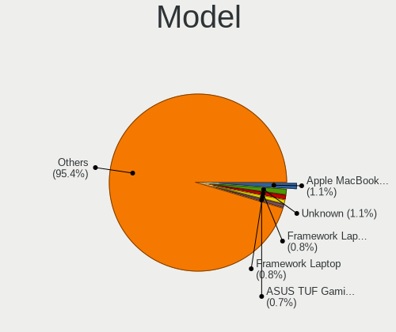
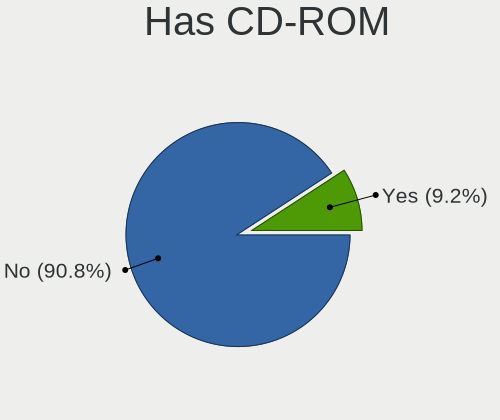
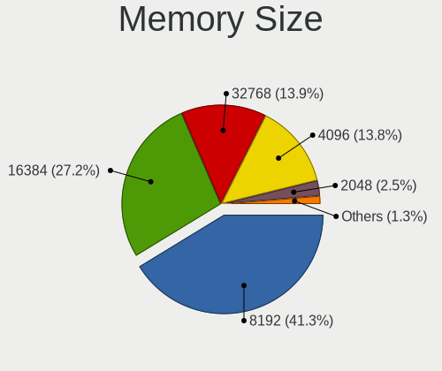
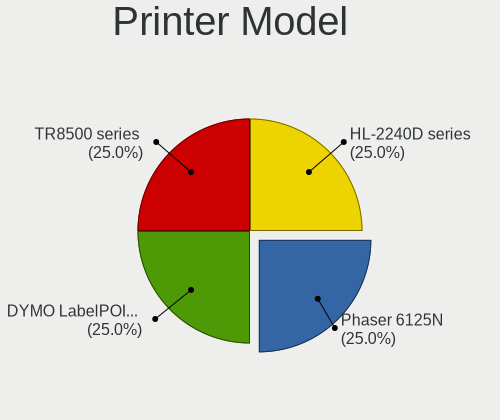

NixOS - Tested Hardware & Statistics
------------------------------------

A project to collect tested hardware configurations for NixOS.

Anyone can contribute to this report by the [hw-probe](https://github.com/linuxhw/hw-probe) tool:

    sudo -E hw-probe -all -upload

Please contribute! Especially if your hardware is rare.

This is a report for all computer types. See also reports for [desktops](/Dist/NixOS/Desktop/README.md) and [notebooks](/Dist/NixOS/Notebook/README.md).

Contents
--------

* [ Test Cases ](#test-cases)

* [ System ](#system)
  - [ OS                       ](#os)
  - [ OS Family                ](#os-family)
  - [ Kernel                   ](#kernel)
  - [ Kernel Family            ](#kernel-family)
  - [ Kernel Major Ver.        ](#kernel-major-ver)
  - [ Arch                     ](#arch)
  - [ DE                       ](#de)
  - [ Display Server           ](#display-server)
  - [ Display Manager          ](#display-manager)
  - [ OS Lang                  ](#os-lang)
  - [ Boot Mode                ](#boot-mode)
  - [ Filesystem               ](#filesystem)
  - [ Part. scheme             ](#part-scheme)
  - [ Dual Boot with Linux/BSD ](#dual-boot-with-linuxbsd)
  - [ Dual Boot (Win)          ](#dual-boot-win)

* [ Board ](#board)
  - [ Vendor                   ](#vendor)
  - [ Model                    ](#model)
  - [ Model Family             ](#model-family)
  - [ MFG Year                 ](#mfg-year)
  - [ Form Factor              ](#form-factor)
  - [ Secure Boot              ](#secure-boot)
  - [ Coreboot                 ](#coreboot)
  - [ RAM Size                 ](#ram-size)
  - [ RAM Used                 ](#ram-used)
  - [ Total Drives             ](#total-drives)
  - [ Has CD-ROM               ](#has-cd-rom)
  - [ Has Ethernet             ](#has-ethernet)
  - [ Has WiFi                 ](#has-wifi)
  - [ Has Bluetooth            ](#has-bluetooth)

* [ Location ](#location)
  - [ Country                  ](#country)
  - [ City                     ](#city)

* [ Drives ](#drives)
  - [ Drive Vendor             ](#drive-vendor)
  - [ Drive Model              ](#drive-model)
  - [ HDD Vendor               ](#hdd-vendor)
  - [ SSD Vendor               ](#ssd-vendor)
  - [ Drive Kind               ](#drive-kind)
  - [ Drive Connector          ](#drive-connector)
  - [ Drive Size               ](#drive-size)
  - [ Space Total              ](#space-total)
  - [ Space Used               ](#space-used)
  - [ Malfunc. Drives          ](#malfunc-drives)
  - [ Malfunc. Drive Vendor    ](#malfunc-drive-vendor)
  - [ Malfunc. HDD Vendor      ](#malfunc-hdd-vendor)
  - [ Malfunc. Drive Kind      ](#malfunc-drive-kind)
  - [ Failed Drives            ](#failed-drives)
  - [ Failed Drive Vendor      ](#failed-drive-vendor)
  - [ Drive Status             ](#drive-status)

* [ Storage controller ](#storage-controller)
  - [ Storage Vendor           ](#storage-vendor)
  - [ Storage Model            ](#storage-model)
  - [ Storage Kind             ](#storage-kind)

* [ Processor ](#processor)
  - [ CPU Vendor               ](#cpu-vendor)
  - [ CPU Model                ](#cpu-model)
  - [ CPU Model Family         ](#cpu-model-family)
  - [ CPU Cores                ](#cpu-cores)
  - [ CPU Sockets              ](#cpu-sockets)
  - [ CPU Threads              ](#cpu-threads)
  - [ CPU Op-Modes             ](#cpu-op-modes)
  - [ CPU Microcode            ](#cpu-microcode)
  - [ CPU Microarch            ](#cpu-microarch)

* [ Graphics ](#graphics)
  - [ GPU Vendor               ](#gpu-vendor)
  - [ GPU Model                ](#gpu-model)
  - [ GPU Combo                ](#gpu-combo)
  - [ GPU Driver               ](#gpu-driver)
  - [ GPU Memory               ](#gpu-memory)

* [ Monitor ](#monitor)
  - [ Monitor Vendor           ](#monitor-vendor)
  - [ Monitor Model            ](#monitor-model)
  - [ Monitor Resolution       ](#monitor-resolution)
  - [ Monitor Diagonal         ](#monitor-diagonal)
  - [ Monitor Width            ](#monitor-width)
  - [ Aspect Ratio             ](#aspect-ratio)
  - [ Monitor Area             ](#monitor-area)
  - [ Pixel Density            ](#pixel-density)
  - [ Multiple Monitors        ](#multiple-monitors)

* [ Network ](#network)
  - [ Net Controller Vendor    ](#net-controller-vendor)
  - [ Net Controller Model     ](#net-controller-model)
  - [ Wireless Vendor          ](#wireless-vendor)
  - [ Wireless Model           ](#wireless-model)
  - [ Ethernet Vendor          ](#ethernet-vendor)
  - [ Ethernet Model           ](#ethernet-model)
  - [ Net Controller Kind      ](#net-controller-kind)
  - [ Used Controller          ](#used-controller)
  - [ NICs                     ](#nics)
  - [ IPv6                     ](#ipv6)

* [ Bluetooth ](#bluetooth)
  - [ Bluetooth Vendor         ](#bluetooth-vendor)
  - [ Bluetooth Model          ](#bluetooth-model)

* [ Sound ](#sound)
  - [ Sound Vendor             ](#sound-vendor)
  - [ Sound Model              ](#sound-model)

* [ Memory ](#memory)
  - [ Memory Vendor            ](#memory-vendor)
  - [ Memory Model             ](#memory-model)
  - [ Memory Kind              ](#memory-kind)
  - [ Memory Form Factor       ](#memory-form-factor)
  - [ Memory Size              ](#memory-size)
  - [ Memory Speed             ](#memory-speed)

* [ Printers & scanners ](#printers--scanners)
  - [ Printer Vendor           ](#printer-vendor)
  - [ Printer Model            ](#printer-model)
  - [ Scanner Vendor           ](#scanner-vendor)
  - [ Scanner Model            ](#scanner-model)

* [ Camera ](#camera)
  - [ Camera Vendor            ](#camera-vendor)
  - [ Camera Model             ](#camera-model)

* [ Security ](#security)
  - [ Fingerprint Vendor       ](#fingerprint-vendor)
  - [ Fingerprint Model        ](#fingerprint-model)
  - [ Chipcard Vendor          ](#chipcard-vendor)
  - [ Chipcard Model           ](#chipcard-model)

* [ Unsupported ](#unsupported)
  - [ Unsupported Devices      ](#unsupported-devices)
  - [ Unsupported Device Types ](#unsupported-device-types)

Test Cases
----------

Total: 408

| Vendor        | Model                       | Form-Factor | Probe                                                      | Date         |
|---------------|-----------------------------|-------------|------------------------------------------------------------|--------------|
| ASUSTek       | TUF Gaming Z490-PLUS        | Desktop     | [f96513dd00](https://linux-hardware.org/?probe=f96513dd00) | Jan 02, 2024 |
| ASUSTek       | TUF Gaming X670E-PLUS WI... | Desktop     | [c6c9c3c74e](https://linux-hardware.org/?probe=c6c9c3c74e) | Jan 01, 2024 |
| Lenovo        | ThinkPad Twist 33476LU      | Notebook    | [bb88a71510](https://linux-hardware.org/?probe=bb88a71510) | Jan 01, 2024 |
| System76      | Serval WS                   | Notebook    | [3dd4d45859](https://linux-hardware.org/?probe=3dd4d45859) | Dec 30, 2023 |
| Acer          | Aspire A515-54G             | Notebook    | [35e2f8c10c](https://linux-hardware.org/?probe=35e2f8c10c) | Dec 29, 2023 |
| AZW           | EQ                          | Desktop     | [f27e8ec7a4](https://linux-hardware.org/?probe=f27e8ec7a4) | Dec 27, 2023 |
| HP            | ZBook Firefly 14 inch G1... | Notebook    | [97e425d424](https://linux-hardware.org/?probe=97e425d424) | Dec 26, 2023 |
| ASUSTek       | PRIME X370-PRO              | Desktop     | [f8483f02ab](https://linux-hardware.org/?probe=f8483f02ab) | Dec 26, 2023 |
| Dell          | XPS 13 9380                 | Notebook    | [541f2d959f](https://linux-hardware.org/?probe=541f2d959f) | Dec 26, 2023 |
| Fujitsu       | LIFEBOOK U7412              | Notebook    | [a2797ec36b](https://linux-hardware.org/?probe=a2797ec36b) | Dec 26, 2023 |
| HP            | ZBook 17 G5                 | Notebook    | [ad6c489ffc](https://linux-hardware.org/?probe=ad6c489ffc) | Dec 23, 2023 |
| Framework     | Laptop (12th Gen Intel C... | Notebook    | [ef18e09b69](https://linux-hardware.org/?probe=ef18e09b69) | Dec 23, 2023 |
| Lenovo        | Legion Y7000 81FW           | Notebook    | [f67367aa62](https://linux-hardware.org/?probe=f67367aa62) | Dec 23, 2023 |
| ASUSTek       | ROG CROSSHAIR VIII IMPAC... | Desktop     | [a953876b2c](https://linux-hardware.org/?probe=a953876b2c) | Dec 23, 2023 |
| Microsoft     | Surface Pro 7               | Tablet      | [ac1d637679](https://linux-hardware.org/?probe=ac1d637679) | Dec 21, 2023 |
| Dell          | Inspiron 7506 2n1           | Convertible | [1d8538aeef](https://linux-hardware.org/?probe=1d8538aeef) | Dec 20, 2023 |
| ASUSTek       | ROG Zephyrus G15 GA503QR... | Notebook    | [fb187c2fa4](https://linux-hardware.org/?probe=fb187c2fa4) | Dec 20, 2023 |
| ASRock        | X670E PG Lightning          | Desktop     | [b6aa52f693](https://linux-hardware.org/?probe=b6aa52f693) | Dec 17, 2023 |
| ASUSTek       | ZenBook UX425QA_UM425QA     | Notebook    | [73693b1a91](https://linux-hardware.org/?probe=73693b1a91) | Dec 17, 2023 |
| Lenovo        | Legion Y7000 81FW           | Notebook    | [71c27a1bf6](https://linux-hardware.org/?probe=71c27a1bf6) | Dec 17, 2023 |
| Medion        | M14L-256                    | Notebook    | [6cd85934b3](https://linux-hardware.org/?probe=6cd85934b3) | Dec 15, 2023 |
| AZW           | EQ                          | Desktop     | [b6aa615ccf](https://linux-hardware.org/?probe=b6aa615ccf) | Dec 14, 2023 |
| ASUSTek       | TUF B360M-PLUS GAMING       | Desktop     | [2982c2a2c6](https://linux-hardware.org/?probe=2982c2a2c6) | Dec 14, 2023 |
| Gigabyte      | Z790 GAMING X AX            | Desktop     | [8617acecda](https://linux-hardware.org/?probe=8617acecda) | Dec 11, 2023 |
| ASUSTek       | Zenbook 15 UM3504DA_UM35... | Notebook    | [87be870a89](https://linux-hardware.org/?probe=87be870a89) | Dec 09, 2023 |
| MSI           | Prestige 14 A10SC           | Notebook    | [85d6d037cc](https://linux-hardware.org/?probe=85d6d037cc) | Dec 09, 2023 |
| Dell          | G5 5590                     | Notebook    | [6970987854](https://linux-hardware.org/?probe=6970987854) | Dec 08, 2023 |
| MSI           | MAG X670E TOMAHAWK WIFI     | Desktop     | [62c4dde3a6](https://linux-hardware.org/?probe=62c4dde3a6) | Dec 07, 2023 |
| Lenovo        | ThinkPad X1 Yoga 4th 20Q... | Convertible | [2ba0c7198a](https://linux-hardware.org/?probe=2ba0c7198a) | Dec 05, 2023 |
| Lenovo        | ThinkPad X1 Yoga 4th 20Q... | Convertible | [5b8e1b7878](https://linux-hardware.org/?probe=5b8e1b7878) | Dec 05, 2023 |
| HP            | EliteBook 850 G5            | Notebook    | [aae20908c5](https://linux-hardware.org/?probe=aae20908c5) | Dec 05, 2023 |
| Dell          | Latitude 5290 2-in-1        | Notebook    | [525166f0d5](https://linux-hardware.org/?probe=525166f0d5) | Dec 04, 2023 |
| AZW           | EQ                          | Desktop     | [c2dedbf2f3](https://linux-hardware.org/?probe=c2dedbf2f3) | Dec 04, 2023 |
| ASRock        | B550 Phantom Gaming-ITX/... | Desktop     | [7273cc93a9](https://linux-hardware.org/?probe=7273cc93a9) | Dec 02, 2023 |
| Apple         | MacBookPro9,2               | Notebook    | [1784c4c5b0](https://linux-hardware.org/?probe=1784c4c5b0) | Dec 01, 2023 |
| Dell          | 0J91V2 A05                  | Server      | [28e8abbbdf](https://linux-hardware.org/?probe=28e8abbbdf) | Dec 01, 2023 |
| ASUSTek       | Vivobook Go E1404FA_E140... | Notebook    | [9f7f83e1ee](https://linux-hardware.org/?probe=9f7f83e1ee) | Nov 28, 2023 |
| retsamarre... | 000-F4423-FBA004-2000-N     | Tablet      | [5f97496a76](https://linux-hardware.org/?probe=5f97496a76) | Nov 26, 2023 |
| Gigabyte      | B550I AORUS PRO AX          | Desktop     | [07e6828b2e](https://linux-hardware.org/?probe=07e6828b2e) | Nov 23, 2023 |
| Timi          | Redmi Book Pro 15 2022      | Notebook    | [05c1dddd8d](https://linux-hardware.org/?probe=05c1dddd8d) | Nov 23, 2023 |
| Lenovo        | ThinkPad T450s 20BX001MU... | Notebook    | [80d4678e90](https://linux-hardware.org/?probe=80d4678e90) | Nov 23, 2023 |
| HP            | EliteBook 850 G5            | Notebook    | [602aeb4101](https://linux-hardware.org/?probe=602aeb4101) | Nov 22, 2023 |
| Lenovo        | Legion Y7000P IAH7 82RC     | Notebook    | [4065934176](https://linux-hardware.org/?probe=4065934176) | Nov 22, 2023 |
| ASUSTek       | ROG Strix G614JV_G614JV     | Notebook    | [fbde674650](https://linux-hardware.org/?probe=fbde674650) | Nov 22, 2023 |
| ASRock        | B550 Phantom Gaming-ITX/... | Desktop     | [34b2b48e8c](https://linux-hardware.org/?probe=34b2b48e8c) | Nov 19, 2023 |
| ASUSTek       | VivoBook_ASUSLaptop TP40... | Convertible | [494b2a6d2f](https://linux-hardware.org/?probe=494b2a6d2f) | Nov 19, 2023 |
| ASUSTek       | ROG Flow X13 GV301RE_GV3... | Convertible | [576d311bde](https://linux-hardware.org/?probe=576d311bde) | Nov 18, 2023 |
| Gigabyte      | X570 I AORUS PRO WIFI       | Desktop     | [0820ebd908](https://linux-hardware.org/?probe=0820ebd908) | Nov 16, 2023 |
| Apple         | MacBookPro11,4              | Notebook    | [f21a42a965](https://linux-hardware.org/?probe=f21a42a965) | Nov 16, 2023 |
| Apple         | MacBookPro9,2               | Notebook    | [ac7deed0de](https://linux-hardware.org/?probe=ac7deed0de) | Nov 16, 2023 |
| ASUSTek       | ROG Strix G513QE_G513QE     | Notebook    | [455efd5541](https://linux-hardware.org/?probe=455efd5541) | Nov 15, 2023 |
| HP            | ENVY Laptop 13-ba1xxx       | Notebook    | [ce6a10d6a3](https://linux-hardware.org/?probe=ce6a10d6a3) | Nov 15, 2023 |
| Gigabyte      | GA-78LMT-USB3               | Desktop     | [a263ed1c12](https://linux-hardware.org/?probe=a263ed1c12) | Nov 13, 2023 |
| ASUSTek       | Vivobook Go E1404FA_E140... | Notebook    | [789eee99a6](https://linux-hardware.org/?probe=789eee99a6) | Nov 12, 2023 |
| Lenovo        | Yoga Slim 7 Carbon 14ACN... | Notebook    | [c55053fa25](https://linux-hardware.org/?probe=c55053fa25) | Nov 12, 2023 |
| ASUSTek       | ROG STRIX B450-F GAMING     | Desktop     | [67938dee90](https://linux-hardware.org/?probe=67938dee90) | Nov 12, 2023 |
| ASRock        | Z690M-ITX/ax                | Desktop     | [503d3690b0](https://linux-hardware.org/?probe=503d3690b0) | Nov 11, 2023 |
| HP            | EliteBook 845 14 inch G1... | Notebook    | [dfbaeb29c5](https://linux-hardware.org/?probe=dfbaeb29c5) | Nov 11, 2023 |
| ASUSTek       | PRIME X399-A                | Desktop     | [e0883e3bd0](https://linux-hardware.org/?probe=e0883e3bd0) | Nov 11, 2023 |
| Apple         | Mac-65CE76090165799A iMa... | All in one  | [35b2509d27](https://linux-hardware.org/?probe=35b2509d27) | Nov 10, 2023 |
| Nvidia        | snc302eeh                   | Desktop     | [2b0a14caec](https://linux-hardware.org/?probe=2b0a14caec) | Nov 10, 2023 |
| ASUSTek       | PRIME X370-PRO              | Desktop     | [d9cad8ffde](https://linux-hardware.org/?probe=d9cad8ffde) | Nov 09, 2023 |
| Unknown       | Unknown                     | Soc         | [97dadee998](https://linux-hardware.org/?probe=97dadee998) | Nov 08, 2023 |
| Lenovo        | IdeaPad S540-15IWL          | Notebook    | [79e23fd44a](https://linux-hardware.org/?probe=79e23fd44a) | Nov 07, 2023 |
| Framework     | Laptop (12th Gen Intel C... | Notebook    | [2f6078ab72](https://linux-hardware.org/?probe=2f6078ab72) | Nov 07, 2023 |
| Lenovo        | ThinkPad T14 Gen 2a 20XK... | Notebook    | [49b3b70e38](https://linux-hardware.org/?probe=49b3b70e38) | Nov 07, 2023 |
| ASUSTek       | PRIME X570-PRO              | Desktop     | [1786e4735e](https://linux-hardware.org/?probe=1786e4735e) | Nov 07, 2023 |
| Apple         | Mac-65CE76090165799A iMa... | All in one  | [0ecfad9d87](https://linux-hardware.org/?probe=0ecfad9d87) | Nov 07, 2023 |
| MSI           | X570-A PRO                  | Desktop     | [30416c0355](https://linux-hardware.org/?probe=30416c0355) | Nov 04, 2023 |
| HP            | 83E1                        | Desktop     | [c82d34ebac](https://linux-hardware.org/?probe=c82d34ebac) | Nov 04, 2023 |
| Lenovo        | ThinkPad T14s Gen 4 21F8... | Notebook    | [97e043115e](https://linux-hardware.org/?probe=97e043115e) | Nov 04, 2023 |
| Lenovo        | Slim 7 16IAH7 82VB          | Notebook    | [0e5f976d6b](https://linux-hardware.org/?probe=0e5f976d6b) | Nov 02, 2023 |
| Dell          | XPS 9315                    | Notebook    | [6f3e496918](https://linux-hardware.org/?probe=6f3e496918) | Oct 29, 2023 |
| HP            | EliteBook 850 G4            | Notebook    | [68da315076](https://linux-hardware.org/?probe=68da315076) | Oct 28, 2023 |
| Apple         | MacBookPro9,2               | Notebook    | [b075cf8841](https://linux-hardware.org/?probe=b075cf8841) | Oct 28, 2023 |
| LattePanda    | Sigma                       | Desktop     | [d287cf2d8a](https://linux-hardware.org/?probe=d287cf2d8a) | Oct 26, 2023 |
| ASRock        | B650M PG Riptide WiFi       | Desktop     | [387c91f530](https://linux-hardware.org/?probe=387c91f530) | Oct 26, 2023 |
| HP            | EliteBook Folio 9470m       | Notebook    | [765f6f8003](https://linux-hardware.org/?probe=765f6f8003) | Oct 25, 2023 |
| ECS           | A55F-M3                     | Desktop     | [6da483b400](https://linux-hardware.org/?probe=6da483b400) | Oct 25, 2023 |
| Lenovo        | Slim 7 16IAH7 82VB          | Notebook    | [a80fcc753e](https://linux-hardware.org/?probe=a80fcc753e) | Oct 25, 2023 |
| MSI           | GE70 2PE                    | Notebook    | [c0bcd133c9](https://linux-hardware.org/?probe=c0bcd133c9) | Oct 22, 2023 |
| HP            | EliteBook Folio 9470m       | Notebook    | [f342373f65](https://linux-hardware.org/?probe=f342373f65) | Oct 20, 2023 |
| Framework     | Laptop                      | Notebook    | [e765d5da63](https://linux-hardware.org/?probe=e765d5da63) | Oct 18, 2023 |
| Unknown       | Apple Mac mini (M1, 2020... | Mini pc     | [e6566d9c7c](https://linux-hardware.org/?probe=e6566d9c7c) | Oct 18, 2023 |
| ASUSTek       | Zenbook UN5401RA UN5401R... | Convertible | [da6815d760](https://linux-hardware.org/?probe=da6815d760) | Oct 18, 2023 |
| HP            | ZBook Firefly 14 inch G1... | Notebook    | [f53079d2c1](https://linux-hardware.org/?probe=f53079d2c1) | Oct 16, 2023 |
| HP            | ZBook Firefly 14 inch G1... | Notebook    | [dcb416db8f](https://linux-hardware.org/?probe=dcb416db8f) | Oct 16, 2023 |
| Samsung       | 530U3BI/530U4BI/530U4BH     | Notebook    | [feaf25f8e8](https://linux-hardware.org/?probe=feaf25f8e8) | Oct 15, 2023 |
| Dell          | XPS 13 7390 2-in-1          | Convertible | [11155b7b3a](https://linux-hardware.org/?probe=11155b7b3a) | Oct 13, 2023 |
| Unknown       | HX90                        | Desktop     | [f247716ab0](https://linux-hardware.org/?probe=f247716ab0) | Oct 13, 2023 |
| Lenovo        | ThinkPad L14 Gen 1 20U50... | Notebook    | [ba690b36a3](https://linux-hardware.org/?probe=ba690b36a3) | Oct 12, 2023 |
| MSI           | Prestige 16Studio A13VE     | Notebook    | [0209063983](https://linux-hardware.org/?probe=0209063983) | Oct 12, 2023 |
| Lenovo        | IdeaPad Flex-14API 81SS     | Notebook    | [7ff5fe9fdd](https://linux-hardware.org/?probe=7ff5fe9fdd) | Oct 11, 2023 |
| Lenovo        | ThinkPad P50 20EQS4QL11     | Notebook    | [a4d6af03fe](https://linux-hardware.org/?probe=a4d6af03fe) | Oct 10, 2023 |
| Lenovo        | ThinkPad T14 Gen 2i 20W0... | Notebook    | [7d1fea3001](https://linux-hardware.org/?probe=7d1fea3001) | Oct 09, 2023 |
| HP            | EliteBook Folio 9470m       | Notebook    | [9cecfe7ba5](https://linux-hardware.org/?probe=9cecfe7ba5) | Oct 09, 2023 |
| Lenovo        | ThinkBook 15 G2 ITL 20VE    | Notebook    | [801a2a4abf](https://linux-hardware.org/?probe=801a2a4abf) | Oct 09, 2023 |
| Dell          | Latitude E6540              | Notebook    | [fc3ea4bb32](https://linux-hardware.org/?probe=fc3ea4bb32) | Oct 08, 2023 |
| ASUSTek       | P7H55                       | Desktop     | [89472bd2f3](https://linux-hardware.org/?probe=89472bd2f3) | Oct 07, 2023 |
| Dell          | Inspiron 3542               | Notebook    | [90f777d9cc](https://linux-hardware.org/?probe=90f777d9cc) | Oct 07, 2023 |
| Dell          | 08DM12 A01                  | Server      | [9faef398d0](https://linux-hardware.org/?probe=9faef398d0) | Oct 07, 2023 |
| ASRock        | Z87 Extreme4                | Desktop     | [642a2f5a9b](https://linux-hardware.org/?probe=642a2f5a9b) | Oct 04, 2023 |
| Dell          | Latitude E6540              | Notebook    | [a4fbd5793d](https://linux-hardware.org/?probe=a4fbd5793d) | Oct 02, 2023 |
| Lenovo        | ThinkBook 15 G3 ACL 21A4    | Notebook    | [c67f66f5e3](https://linux-hardware.org/?probe=c67f66f5e3) | Oct 01, 2023 |
| Gigabyte      | X570 AORUS ELITE WIFI       | Desktop     | [007bb33fbf](https://linux-hardware.org/?probe=007bb33fbf) | Oct 01, 2023 |
| Dell          | Latitude E6540              | Notebook    | [8fdc000f7e](https://linux-hardware.org/?probe=8fdc000f7e) | Oct 01, 2023 |
| Dell          | Latitude E6540              | Notebook    | [a5de8b78e7](https://linux-hardware.org/?probe=a5de8b78e7) | Oct 01, 2023 |
| Lenovo        | ThinkPad T480s 20L7CTO1W... | Notebook    | [1135ddac8e](https://linux-hardware.org/?probe=1135ddac8e) | Sep 30, 2023 |
| MSI           | Z68A-GD65                   | Desktop     | [c0f968740b](https://linux-hardware.org/?probe=c0f968740b) | Sep 29, 2023 |
| Dell          | Latitude 5430               | Notebook    | [583aa8cf02](https://linux-hardware.org/?probe=583aa8cf02) | Sep 29, 2023 |
| Intel         | SharkBay Platform           | Notebook    | [2406bf1c0d](https://linux-hardware.org/?probe=2406bf1c0d) | Sep 29, 2023 |
| Dell          | Latitude E6540              | Notebook    | [1478e1265d](https://linux-hardware.org/?probe=1478e1265d) | Sep 29, 2023 |
| ASUSTek       | ROG STRIX Z690-A GAMING ... | Desktop     | [0177e96165](https://linux-hardware.org/?probe=0177e96165) | Sep 28, 2023 |
| HP            | 3397                        | Desktop     | [5c1b3bed0b](https://linux-hardware.org/?probe=5c1b3bed0b) | Sep 28, 2023 |
| ASUSTek       | P8H77-V                     | Desktop     | [24ff983f95](https://linux-hardware.org/?probe=24ff983f95) | Sep 28, 2023 |
| Dell          | XPS 15 9560                 | Notebook    | [009a6a1a98](https://linux-hardware.org/?probe=009a6a1a98) | Sep 27, 2023 |
| Dell          | Latitude E6540              | Notebook    | [7d9885cd7c](https://linux-hardware.org/?probe=7d9885cd7c) | Sep 27, 2023 |
| HP            | EliteBook Folio 9470m       | Notebook    | [78d31814cf](https://linux-hardware.org/?probe=78d31814cf) | Sep 26, 2023 |
| HP            | EliteBook Folio 9470m       | Notebook    | [0d7d5f0613](https://linux-hardware.org/?probe=0d7d5f0613) | Sep 26, 2023 |
| HP            | EliteBook Folio 9470m       | Notebook    | [086b0dc21a](https://linux-hardware.org/?probe=086b0dc21a) | Sep 23, 2023 |
| HP            | EliteBook 8470p             | Notebook    | [220a0f8733](https://linux-hardware.org/?probe=220a0f8733) | Sep 23, 2023 |
| Apple         | MacBookPro9,2               | Notebook    | [bf71bcd90e](https://linux-hardware.org/?probe=bf71bcd90e) | Sep 22, 2023 |
| Lenovo        | ThinkPad T470s 20HF0000M... | Notebook    | [ad989ac089](https://linux-hardware.org/?probe=ad989ac089) | Sep 21, 2023 |
| Apple         | MacBookPro9,2               | Notebook    | [4d2c8f9f07](https://linux-hardware.org/?probe=4d2c8f9f07) | Sep 20, 2023 |
| HP            | EliteBook Folio 9470m       | Notebook    | [5e50efa2c4](https://linux-hardware.org/?probe=5e50efa2c4) | Sep 19, 2023 |
| Lenovo        | IdeaPad S145-15IKB 81XM     | Notebook    | [aebeeb7401](https://linux-hardware.org/?probe=aebeeb7401) | Sep 17, 2023 |
| HP            | 1998                        | Desktop     | [4af6b915c2](https://linux-hardware.org/?probe=4af6b915c2) | Sep 17, 2023 |
| Dell          | Latitude E6540              | Notebook    | [ff29b23e60](https://linux-hardware.org/?probe=ff29b23e60) | Sep 13, 2023 |
| Acer          | Aspire E5-575G              | Notebook    | [ff31b68cf3](https://linux-hardware.org/?probe=ff31b68cf3) | Sep 12, 2023 |
| Lenovo        | ThinkPad T480 20L6S4RV00    | Notebook    | [8ae7288bf3](https://linux-hardware.org/?probe=8ae7288bf3) | Sep 11, 2023 |
| Lenovo        | ThinkPad S1 Yoga 20CD00B... | Notebook    | [5778731f85](https://linux-hardware.org/?probe=5778731f85) | Sep 10, 2023 |
| HP            | 8767 A                      | Desktop     | [ce91ccf3a9](https://linux-hardware.org/?probe=ce91ccf3a9) | Sep 09, 2023 |
| Dell          | Precision 5680              | Notebook    | [fdcb7ce5d4](https://linux-hardware.org/?probe=fdcb7ce5d4) | Sep 05, 2023 |
| Lenovo        | ThinkPad T470 20HES2RC00    | Notebook    | [390104a086](https://linux-hardware.org/?probe=390104a086) | Aug 28, 2023 |
| Dell          | Wyse 5470                   | Notebook    | [6d45205020](https://linux-hardware.org/?probe=6d45205020) | Aug 27, 2023 |
| Gigabyte      | B550I AORUS PRO AX          | Desktop     | [ac09f27b9d](https://linux-hardware.org/?probe=ac09f27b9d) | Aug 22, 2023 |
| ASUSTek       | ROG CROSSHAIR X670E GENE    | Desktop     | [a9a56ae120](https://linux-hardware.org/?probe=a9a56ae120) | Aug 22, 2023 |
| Lenovo        | G50-70 20351                | Notebook    | [aed7eacff0](https://linux-hardware.org/?probe=aed7eacff0) | Aug 20, 2023 |
| Dell          | Inspiron 7506 2n1           | Convertible | [9e03b48bf3](https://linux-hardware.org/?probe=9e03b48bf3) | Aug 15, 2023 |
| HP            | EliteBook 8470p             | Notebook    | [320138e7f5](https://linux-hardware.org/?probe=320138e7f5) | Aug 11, 2023 |
| HUAWEI        | NBLK-WAX9X                  | Notebook    | [72bb72d2aa](https://linux-hardware.org/?probe=72bb72d2aa) | Aug 08, 2023 |
| AZW           | EQ                          | Desktop     | [4a9aad33f3](https://linux-hardware.org/?probe=4a9aad33f3) | Aug 06, 2023 |
| ASUSTek       | ProArt StudioBook W730G5... | Notebook    | [c384115725](https://linux-hardware.org/?probe=c384115725) | Aug 05, 2023 |
| ASUSTek       | Zenbook UN5401RA UN5401R... | Convertible | [13c8b276bb](https://linux-hardware.org/?probe=13c8b276bb) | Aug 04, 2023 |
| ASUSTek       | PRIME X370-PRO              | Desktop     | [1abcf2ad6f](https://linux-hardware.org/?probe=1abcf2ad6f) | Aug 04, 2023 |
| ASUSTek       | Zenbook UM3402YA_UM3402Y... | Notebook    | [39fbf6393c](https://linux-hardware.org/?probe=39fbf6393c) | Aug 03, 2023 |
| ASUSTek       | Zenbook UM3402YA_UM3402Y... | Notebook    | [a6c2e042e4](https://linux-hardware.org/?probe=a6c2e042e4) | Aug 03, 2023 |
| ASUSTek       | VivoBook_ASUSLaptop M340... | Notebook    | [f75ea8cfef](https://linux-hardware.org/?probe=f75ea8cfef) | Aug 02, 2023 |
| Teclast       | F5                          | Convertible | [76fcc31a43](https://linux-hardware.org/?probe=76fcc31a43) | Aug 01, 2023 |
| Apple         | Mac-B809C3757DA9BB8D iMa... | All in one  | [e452f85fb8](https://linux-hardware.org/?probe=e452f85fb8) | Aug 01, 2023 |
| ASUSTek       | VivoBook_ASUSLaptop M340... | Notebook    | [19b6ecf591](https://linux-hardware.org/?probe=19b6ecf591) | Jul 29, 2023 |
| System76      | Pangolin                    | Notebook    | [3b37a9bedb](https://linux-hardware.org/?probe=3b37a9bedb) | Jul 29, 2023 |
| Alienware     | 17                          | Notebook    | [25f67e59b8](https://linux-hardware.org/?probe=25f67e59b8) | Jul 26, 2023 |
| Gigabyte      | B550I AORUS PRO AX          | Desktop     | [959f3b36df](https://linux-hardware.org/?probe=959f3b36df) | Jul 26, 2023 |
| HP            | 1998                        | Desktop     | [ef5201611b](https://linux-hardware.org/?probe=ef5201611b) | Jul 24, 2023 |
| HP            | 1998                        | Desktop     | [5a95ac128d](https://linux-hardware.org/?probe=5a95ac128d) | Jul 24, 2023 |
| AZW           | EQ                          | Desktop     | [e065c16f2c](https://linux-hardware.org/?probe=e065c16f2c) | Jul 23, 2023 |
| AZW           | EQ                          | Desktop     | [46a76eeb81](https://linux-hardware.org/?probe=46a76eeb81) | Jul 23, 2023 |
| Apple         | MacBookPro11,3              | Notebook    | [8d48a50003](https://linux-hardware.org/?probe=8d48a50003) | Jul 22, 2023 |
| Apple         | MacBookPro11,3              | Notebook    | [c29abaca55](https://linux-hardware.org/?probe=c29abaca55) | Jul 22, 2023 |
| Lenovo        | IdeaPad 3 14ITL05 81X7      | Notebook    | [568ab8dd45](https://linux-hardware.org/?probe=568ab8dd45) | Jul 21, 2023 |
| ASUSTek       | 1005HA                      | Notebook    | [59a0d6a7bb](https://linux-hardware.org/?probe=59a0d6a7bb) | Jul 19, 2023 |
| ASUSTek       | Z87-EXPERT                  | Desktop     | [1e8eeb8513](https://linux-hardware.org/?probe=1e8eeb8513) | Jul 16, 2023 |
| ASUSTek       | Z87-EXPERT                  | Desktop     | [8efa3cf99d](https://linux-hardware.org/?probe=8efa3cf99d) | Jul 16, 2023 |
| Lenovo        | IdeaPadFlex 5 14IAU7 82R... | Convertible | [9bb1b8fbca](https://linux-hardware.org/?probe=9bb1b8fbca) | Jul 12, 2023 |
| MSI           | Alpha 15 B5EEK              | Notebook    | [62fac1de1c](https://linux-hardware.org/?probe=62fac1de1c) | Jul 08, 2023 |
| ASUSTek       | PRIME X370-PRO              | Desktop     | [d7afc91d12](https://linux-hardware.org/?probe=d7afc91d12) | Jul 07, 2023 |
| Acer          | Aspire TC-885 V:1.1         | Desktop     | [a2dc9efa21](https://linux-hardware.org/?probe=a2dc9efa21) | Jul 06, 2023 |
| Gigabyte      | TRX40 AORUS MASTER          | Desktop     | [f1c343e2c2](https://linux-hardware.org/?probe=f1c343e2c2) | Jul 02, 2023 |
| Lenovo        | Legion R9000P ARX8 82WM     | Notebook    | [95c540792e](https://linux-hardware.org/?probe=95c540792e) | Jul 02, 2023 |
| ASUSTek       | TUF Gaming B660-PLUS WIF... | Desktop     | [f15cf1d31b](https://linux-hardware.org/?probe=f15cf1d31b) | Jul 02, 2023 |
| Lenovo        | ThinkPad P14s Gen 1 20Y1... | Notebook    | [4d377fc8b8](https://linux-hardware.org/?probe=4d377fc8b8) | Jul 01, 2023 |
| Dell          | Latitude E5470              | Notebook    | [fd56f44c38](https://linux-hardware.org/?probe=fd56f44c38) | Jun 29, 2023 |
| Dell          | Inspiron 7506 2n1           | Convertible | [4c4d870bdb](https://linux-hardware.org/?probe=4c4d870bdb) | Jun 29, 2023 |
| Lenovo        | IdeaPad S540-15IWL          | Notebook    | [de699b13ba](https://linux-hardware.org/?probe=de699b13ba) | Jun 28, 2023 |
| Lenovo        | ThinkPad X1 Carbon Gen 1... | Notebook    | [699aa2d6e1](https://linux-hardware.org/?probe=699aa2d6e1) | Jun 26, 2023 |
| Pine Micro... | Pine64 PinePhone (1.2)      | Phone       | [cf6a7757d5](https://linux-hardware.org/?probe=cf6a7757d5) | Jun 26, 2023 |
| Microtech     | CoreBook Lite               | Notebook    | [1840bef280](https://linux-hardware.org/?probe=1840bef280) | Jun 24, 2023 |
| ASUSTek       | Zenbook UX3402ZA_Q409ZA     | Notebook    | [2812cf43d0](https://linux-hardware.org/?probe=2812cf43d0) | Jun 23, 2023 |
| HP            | EliteBook 820 G3            | Notebook    | [925e5f0915](https://linux-hardware.org/?probe=925e5f0915) | Jun 22, 2023 |
| MECHREVO      | WUJIE 14                    | Notebook    | [a55e31b287](https://linux-hardware.org/?probe=a55e31b287) | Jun 20, 2023 |
| Lenovo        | ThinkPad X1 Carbon Gen 1... | Notebook    | [9726121d1b](https://linux-hardware.org/?probe=9726121d1b) | Jun 18, 2023 |
| Lenovo        | ThinkPad X1 Carbon Gen 1... | Notebook    | [c5c0838f41](https://linux-hardware.org/?probe=c5c0838f41) | Jun 18, 2023 |
| Lenovo        | Legion Y7000 2019 PG0 81... | Notebook    | [46ffcb9672](https://linux-hardware.org/?probe=46ffcb9672) | Jun 18, 2023 |
| Lenovo        | Yoga 14sARE 2020 82A8       | Notebook    | [fa79d9b26d](https://linux-hardware.org/?probe=fa79d9b26d) | Jun 17, 2023 |
| ASUSTek       | ROG STRIX B550-F GAMING     | Desktop     | [85902981fd](https://linux-hardware.org/?probe=85902981fd) | Jun 11, 2023 |
| MACHENIKE     | F117-7P                     | Notebook    | [78ad896b83](https://linux-hardware.org/?probe=78ad896b83) | Jun 10, 2023 |
| Acer          | Aspire XC600 v1.0           | Desktop     | [754d228b9b](https://linux-hardware.org/?probe=754d228b9b) | Jun 09, 2023 |
| Gigabyte      | X570 AORUS PRO              | Desktop     | [309d09ae8c](https://linux-hardware.org/?probe=309d09ae8c) | Jun 03, 2023 |
| Lenovo        | Legion Pro 7 16IRX8H 82W... | Notebook    | [0d31f94244](https://linux-hardware.org/?probe=0d31f94244) | May 30, 2023 |
| Gigabyte      | B450M DS3H-CF               | Desktop     | [c9c4e5ddb5](https://linux-hardware.org/?probe=c9c4e5ddb5) | May 26, 2023 |
| Gigabyte      | B450M DS3H-CF               | Desktop     | [cc8e36e75a](https://linux-hardware.org/?probe=cc8e36e75a) | May 26, 2023 |
| Dell          | Latitude 5290 2-in-1        | Notebook    | [6607361205](https://linux-hardware.org/?probe=6607361205) | May 25, 2023 |
| Lenovo        | G50-70 20351                | Notebook    | [19dc1505b5](https://linux-hardware.org/?probe=19dc1505b5) | May 24, 2023 |
| Lenovo        | IdeaPadFlex 5 14ITL05 82... | Convertible | [4396db2f33](https://linux-hardware.org/?probe=4396db2f33) | May 22, 2023 |
| MSI           | Alpha 15 B5EEK              | Notebook    | [b309bee7e9](https://linux-hardware.org/?probe=b309bee7e9) | May 19, 2023 |
| Lenovo        | ThinkPad P14s Gen 3 21J5... | Notebook    | [e0cbba6897](https://linux-hardware.org/?probe=e0cbba6897) | May 16, 2023 |
| Lenovo        | ThinkBook 16 G4+ ARA 21D... | Notebook    | [acd8d0441a](https://linux-hardware.org/?probe=acd8d0441a) | May 15, 2023 |
| Intel         | NUC5i5RYB H40999-502        | Mini pc     | [aefc60eaea](https://linux-hardware.org/?probe=aefc60eaea) | May 11, 2023 |
| Intel         | NUC5i5RYB H40999-502        | Mini pc     | [c40c2cb964](https://linux-hardware.org/?probe=c40c2cb964) | May 10, 2023 |
| Acer          | Spin SP514-51N              | Convertible | [6b23655b4b](https://linux-hardware.org/?probe=6b23655b4b) | May 10, 2023 |
| ASUSTek       | PRIME Z370-P II             | Desktop     | [4d84deed6b](https://linux-hardware.org/?probe=4d84deed6b) | May 09, 2023 |
| Apple         | MacBookPro11,5              | Notebook    | [21ecf73d3a](https://linux-hardware.org/?probe=21ecf73d3a) | May 09, 2023 |
| ASUSTek       | ROG STRIX B650E-F GAMING... | Desktop     | [29b2378b4b](https://linux-hardware.org/?probe=29b2378b4b) | May 08, 2023 |
| ASUSTek       | ROG STRIX B650E-F GAMING... | Desktop     | [62b28b69dc](https://linux-hardware.org/?probe=62b28b69dc) | May 08, 2023 |
| UNOWHY        | Y13G011S4EI                 | Notebook    | [581cd68800](https://linux-hardware.org/?probe=581cd68800) | May 02, 2023 |
| Gigabyte      | B760 GAMING X DDR4          | Desktop     | [6ee65c19d2](https://linux-hardware.org/?probe=6ee65c19d2) | May 02, 2023 |
| ASUSTek       | ROG STRIX B550-F GAMING     | Desktop     | [493bc0b894](https://linux-hardware.org/?probe=493bc0b894) | Apr 29, 2023 |
| Lenovo        | G50-70 20351                | Notebook    | [5792e8cfa2](https://linux-hardware.org/?probe=5792e8cfa2) | Apr 29, 2023 |
| Dell          | 0KFKMF A00                  | All in one  | [cbae954ecc](https://linux-hardware.org/?probe=cbae954ecc) | Apr 28, 2023 |
| ASUSTek       | ROG Zephyrus G14 GA401IV    | Notebook    | [2063d4a9fc](https://linux-hardware.org/?probe=2063d4a9fc) | Apr 27, 2023 |
| ASUSTek       | PRIME B350M-A               | Desktop     | [b8b51b29ef](https://linux-hardware.org/?probe=b8b51b29ef) | Apr 25, 2023 |
| Apple         | MacBookPro11,3              | Notebook    | [7fd17e2245](https://linux-hardware.org/?probe=7fd17e2245) | Apr 22, 2023 |
| Gigabyte      | B550I AORUS PRO AX          | Desktop     | [bbbc9206b4](https://linux-hardware.org/?probe=bbbc9206b4) | Apr 17, 2023 |
| Avell High... | A70 MOB                     | Notebook    | [869b1ae79b](https://linux-hardware.org/?probe=869b1ae79b) | Apr 17, 2023 |
| Lenovo        | ThinkPad P50 20EN0005GE     | Notebook    | [85a4de4e58](https://linux-hardware.org/?probe=85a4de4e58) | Apr 12, 2023 |
| Lenovo        | ThinkPad E14 Gen 4 21EBC... | Notebook    | [63035ef97f](https://linux-hardware.org/?probe=63035ef97f) | Apr 12, 2023 |
| Supermicro    | X10SLL-F                    | Server      | [6ce8b7fb26](https://linux-hardware.org/?probe=6ce8b7fb26) | Apr 11, 2023 |
| Dell          | XPS 9320                    | Notebook    | [c78c87474d](https://linux-hardware.org/?probe=c78c87474d) | Apr 05, 2023 |
| GPD           | G1621-02                    | Notebook    | [2ed8b6c147](https://linux-hardware.org/?probe=2ed8b6c147) | Mar 29, 2023 |
| Lenovo        | ThinkPad X1 Carbon 4th 2... | Notebook    | [10ec4f48dd](https://linux-hardware.org/?probe=10ec4f48dd) | Mar 16, 2023 |
| Supermicro    | X10SLL-F                    | Server      | [f53ad14ea5](https://linux-hardware.org/?probe=f53ad14ea5) | Mar 13, 2023 |
| ASUSTek       | 1005HA                      | Notebook    | [3326423f04](https://linux-hardware.org/?probe=3326423f04) | Mar 06, 2023 |
| HP            | Spectre x360 2-in-1 Lapt... | Convertible | [8bf9dd7b83](https://linux-hardware.org/?probe=8bf9dd7b83) | Mar 05, 2023 |
| Lenovo        | Yoga Slim 7 13ACN5 82CY     | Notebook    | [4fc82abdeb](https://linux-hardware.org/?probe=4fc82abdeb) | Mar 04, 2023 |
| MSI           | B550-A PRO                  | Desktop     | [c4f08a9fc3](https://linux-hardware.org/?probe=c4f08a9fc3) | Mar 04, 2023 |
| MSI           | MAG B550 TOMAHAWK           | Desktop     | [c4d51ca1b8](https://linux-hardware.org/?probe=c4d51ca1b8) | Mar 04, 2023 |
| Toshiba       | Satellite L50-B             | Notebook    | [8abe852ff0](https://linux-hardware.org/?probe=8abe852ff0) | Mar 03, 2023 |
| Lenovo        | Yoga Slim 7 13ACN5 82CY     | Notebook    | [4c25c88937](https://linux-hardware.org/?probe=4c25c88937) | Mar 03, 2023 |
| Lenovo        | IdeaPadFlex 5 14ITL05 82... | Convertible | [4f3c01941d](https://linux-hardware.org/?probe=4f3c01941d) | Feb 27, 2023 |
| Lenovo        | ThinkPad P14s Gen 3 21J5... | Notebook    | [9b044bd920](https://linux-hardware.org/?probe=9b044bd920) | Feb 26, 2023 |
| Lenovo        | ThinkPad P14s Gen 3 21J5... | Notebook    | [c8c79f26d8](https://linux-hardware.org/?probe=c8c79f26d8) | Feb 26, 2023 |
| Lenovo        | 13w Yoga 82S1               | Convertible | [616e689b13](https://linux-hardware.org/?probe=616e689b13) | Feb 19, 2023 |
| Lenovo        | 13w Yoga 82S1               | Convertible | [5f59be48e1](https://linux-hardware.org/?probe=5f59be48e1) | Feb 16, 2023 |
| Lenovo        | 13w Yoga 82S1               | Convertible | [68effccd60](https://linux-hardware.org/?probe=68effccd60) | Feb 16, 2023 |
| Teclast       | F5                          | Convertible | [e62bdaaa3b](https://linux-hardware.org/?probe=e62bdaaa3b) | Feb 13, 2023 |
| Teclast       | F5                          | Convertible | [30e30a5c3e](https://linux-hardware.org/?probe=30e30a5c3e) | Feb 13, 2023 |
| ASUSTek       | Zenbook UX3402ZA_UX3402Z... | Convertible | [8ac9c4b4ef](https://linux-hardware.org/?probe=8ac9c4b4ef) | Feb 09, 2023 |
| Acer          | Switch SW713-51GNP          | Tablet      | [46ecb88f1d](https://linux-hardware.org/?probe=46ecb88f1d) | Feb 08, 2023 |
| MSI           | Z77A-G43                    | Desktop     | [eb768bf205](https://linux-hardware.org/?probe=eb768bf205) | Feb 03, 2023 |
| Gigabyte      | B450M DS3H V2               | Desktop     | [75a3416ebc](https://linux-hardware.org/?probe=75a3416ebc) | Jan 31, 2023 |
| Lenovo        | ThinkPad X230 2333AZ2       | Notebook    | [d9d0138294](https://linux-hardware.org/?probe=d9d0138294) | Jan 19, 2023 |
| Blackview     | AceBook 1                   | Notebook    | [ea4db42aa8](https://linux-hardware.org/?probe=ea4db42aa8) | Jan 19, 2023 |
| ASRock        | Z87 Extreme4                | Desktop     | [b795f7c940](https://linux-hardware.org/?probe=b795f7c940) | Jan 19, 2023 |
| ASRock        | B550M Pro4                  | Desktop     | [0e4ba05b0f](https://linux-hardware.org/?probe=0e4ba05b0f) | Jan 15, 2023 |
| Supermicro    | X10SLL-F                    | Server      | [226b8e5ff8](https://linux-hardware.org/?probe=226b8e5ff8) | Jan 15, 2023 |
| Supermicro    | X10SLL-F                    | Server      | [b99e4815bc](https://linux-hardware.org/?probe=b99e4815bc) | Jan 10, 2023 |
| Dell          | Latitude 7420               | Notebook    | [e770b3e784](https://linux-hardware.org/?probe=e770b3e784) | Jan 04, 2023 |
| Dell          | Latitude 7420               | Notebook    | [bab9b86606](https://linux-hardware.org/?probe=bab9b86606) | Jan 04, 2023 |
| Supermicro    | X10SLL-F                    | Server      | [b721a47fa4](https://linux-hardware.org/?probe=b721a47fa4) | Jan 03, 2023 |
| Lenovo        | IdeaPadFlex 5 14ITL05 82... | Convertible | [d5df950832](https://linux-hardware.org/?probe=d5df950832) | Jan 03, 2023 |
| Shenzhen M... | F7BFC                       | Desktop     | [6a53c626dd](https://linux-hardware.org/?probe=6a53c626dd) | Jan 02, 2023 |
| Dell          | Precision M4800             | Notebook    | [505f1b47dc](https://linux-hardware.org/?probe=505f1b47dc) | Dec 30, 2022 |
| ASUSTek       | Z87-C                       | Desktop     | [4929f6a6c9](https://linux-hardware.org/?probe=4929f6a6c9) | Dec 28, 2022 |
| Dell          | Inspiron 7586               | Convertible | [d670af270f](https://linux-hardware.org/?probe=d670af270f) | Dec 28, 2022 |
| GPD           | WIN2                        | Notebook    | [d7d31b67d0](https://linux-hardware.org/?probe=d7d31b67d0) | Dec 28, 2022 |
| MSI           | Raider GE67HX 12UGS         | Notebook    | [84c6275c04](https://linux-hardware.org/?probe=84c6275c04) | Dec 25, 2022 |
| HP            | ENVY x360 Convertible 13... | Convertible | [cf62b1c520](https://linux-hardware.org/?probe=cf62b1c520) | Dec 20, 2022 |
| MSI           | B550-A PRO                  | Desktop     | [db7b91ac2f](https://linux-hardware.org/?probe=db7b91ac2f) | Dec 17, 2022 |
| Dell          | XPS 15 7590                 | Notebook    | [e070540587](https://linux-hardware.org/?probe=e070540587) | Dec 16, 2022 |
| MECHREVO      | Code01 Ver2.0               | Notebook    | [e4ba0262b4](https://linux-hardware.org/?probe=e4ba0262b4) | Dec 16, 2022 |
| MECHREVO      | Code01 Ver2.0               | Notebook    | [1a9c49eb4f](https://linux-hardware.org/?probe=1a9c49eb4f) | Dec 16, 2022 |
| Framework     | Laptop (12th Gen Intel C... | Notebook    | [893190593e](https://linux-hardware.org/?probe=893190593e) | Dec 12, 2022 |
| Raspberry ... | Raspberry Pi 4 Model B R... | Soc         | [ee5f96d645](https://linux-hardware.org/?probe=ee5f96d645) | Dec 09, 2022 |
| ASUSTek       | PRIME B550M-A               | Desktop     | [3c18fca709](https://linux-hardware.org/?probe=3c18fca709) | Dec 09, 2022 |
| Dell          | 0F0XJ6 A11                  | Server      | [3dfa1ba4b1](https://linux-hardware.org/?probe=3dfa1ba4b1) | Dec 09, 2022 |
| Pine Micro... | Pine64 PinePhone (1.2)      | Phone       | [110e3eab7f](https://linux-hardware.org/?probe=110e3eab7f) | Dec 09, 2022 |
| ASUSTek       | ROG Zephyrus G14 GA401QM... | Notebook    | [d512bff9cc](https://linux-hardware.org/?probe=d512bff9cc) | Dec 04, 2022 |
| ASUSTek       | ROG Zephyrus G14 GA401QM... | Notebook    | [fef748b3f4](https://linux-hardware.org/?probe=fef748b3f4) | Dec 04, 2022 |
| Apple         | Mac-B809C3757DA9BB8D iMa... | All in one  | [f698b715e4](https://linux-hardware.org/?probe=f698b715e4) | Nov 30, 2022 |
| Dell          | Inspiron 7586               | Convertible | [91dcb3265a](https://linux-hardware.org/?probe=91dcb3265a) | Nov 24, 2022 |
| Apple         | Mac-B809C3757DA9BB8D iMa... | All in one  | [b79f103dd5](https://linux-hardware.org/?probe=b79f103dd5) | Nov 24, 2022 |
| Acer          | Aspire A315-54K             | Notebook    | [12f19e4fbe](https://linux-hardware.org/?probe=12f19e4fbe) | Nov 23, 2022 |
| Intel         | NUC11PABi7 K90104-305       | Mini pc     | [44a3785f1f](https://linux-hardware.org/?probe=44a3785f1f) | Nov 13, 2022 |
| Lenovo        | ThinkPad T14s Gen 3 21BR... | Notebook    | [0c889920b5](https://linux-hardware.org/?probe=0c889920b5) | Nov 12, 2022 |
| Dell          | Latitude E5540              | Notebook    | [f2420e40cd](https://linux-hardware.org/?probe=f2420e40cd) | Nov 06, 2022 |
| Dell          | Latitude E5540              | Notebook    | [2456786404](https://linux-hardware.org/?probe=2456786404) | Nov 06, 2022 |
| Lenovo        | Legion S7 15ACH6 82K8       | Notebook    | [b60f8a187c](https://linux-hardware.org/?probe=b60f8a187c) | Nov 04, 2022 |
| Dell          | Inspiron 5570               | Notebook    | [33d3e9ce22](https://linux-hardware.org/?probe=33d3e9ce22) | Nov 03, 2022 |
| Toshiba       | Satellite L50-B             | Notebook    | [c242c45dbe](https://linux-hardware.org/?probe=c242c45dbe) | Nov 01, 2022 |
| Pine Micro... | Pine64 PinePhone (1.2)      | Phone       | [fce691523b](https://linux-hardware.org/?probe=fce691523b) | Oct 29, 2022 |
| Lenovo        | IdeaPad 5 Pro 16ACH6 82L... | Notebook    | [d58a7c30a9](https://linux-hardware.org/?probe=d58a7c30a9) | Oct 26, 2022 |
| Lenovo        | ThinkPad E470 20H1006JIX    | Notebook    | [8bc8778497](https://linux-hardware.org/?probe=8bc8778497) | Oct 26, 2022 |
| ASUSTek       | SABERTOOTH 990FX R2.0       | Desktop     | [6ffc032b64](https://linux-hardware.org/?probe=6ffc032b64) | Oct 25, 2022 |
| Lenovo        | IdeaPadFlex 5 14ITL05 82... | Convertible | [d79322ca4a](https://linux-hardware.org/?probe=d79322ca4a) | Oct 19, 2022 |
| Dell          | Precision 5760              | Notebook    | [4255007db8](https://linux-hardware.org/?probe=4255007db8) | Oct 18, 2022 |
| HP            | ZBook Studio G5             | Notebook    | [0a9b0167c7](https://linux-hardware.org/?probe=0a9b0167c7) | Oct 17, 2022 |
| Lenovo        | IdeaPadFlex 5 14ITL05 82... | Convertible | [aa5ea0c17c](https://linux-hardware.org/?probe=aa5ea0c17c) | Oct 14, 2022 |
| Lenovo        | IdeaPadFlex 5 14ITL05 82... | Convertible | [ae775f1f89](https://linux-hardware.org/?probe=ae775f1f89) | Oct 13, 2022 |
| Dell          | XPS 13 9310                 | Notebook    | [99232ffba3](https://linux-hardware.org/?probe=99232ffba3) | Oct 13, 2022 |
| ASUSTek       | PRIME B550M-A               | Desktop     | [c203d7c388](https://linux-hardware.org/?probe=c203d7c388) | Oct 07, 2022 |
| Raspberry ... | Raspberry Pi 4 Model B R... | Soc         | [3a409e83a0](https://linux-hardware.org/?probe=3a409e83a0) | Oct 07, 2022 |
| Dell          | 0F0XJ6 A11                  | Server      | [5eb1758869](https://linux-hardware.org/?probe=5eb1758869) | Oct 07, 2022 |
| ASUSTek       | Zenbook UX3402ZA_UX3402Z... | Convertible | [8e301a5e4e](https://linux-hardware.org/?probe=8e301a5e4e) | Sep 30, 2022 |
| Dell          | Inspiron 15 7510            | Notebook    | [263276babe](https://linux-hardware.org/?probe=263276babe) | Sep 30, 2022 |
| Dell          | Inspiron 15 7510            | Notebook    | [86e1da35ba](https://linux-hardware.org/?probe=86e1da35ba) | Sep 30, 2022 |
| Dell          | XPS 15 9570                 | Notebook    | [564eb3b439](https://linux-hardware.org/?probe=564eb3b439) | Sep 28, 2022 |
| Dell          | XPS 15 9570                 | Notebook    | [085bd81d5b](https://linux-hardware.org/?probe=085bd81d5b) | Sep 28, 2022 |
| Gigabyte      | X570 AORUS ELITE            | Desktop     | [b21f5fee1a](https://linux-hardware.org/?probe=b21f5fee1a) | Sep 26, 2022 |
| Lenovo        | ThinkPad X1 Extreme 20MF... | Notebook    | [7fc4cdb860](https://linux-hardware.org/?probe=7fc4cdb860) | Sep 22, 2022 |
| Raspberry ... | Raspberry Pi 4 Model B R... | Soc         | [3f823868fd](https://linux-hardware.org/?probe=3f823868fd) | Sep 15, 2022 |
| Dell          | Precision M4800             | Notebook    | [fae4dbff63](https://linux-hardware.org/?probe=fae4dbff63) | Sep 13, 2022 |
| Intel         | NUC11PABi7 K90104-305       | Mini pc     | [ad69daf392](https://linux-hardware.org/?probe=ad69daf392) | Sep 11, 2022 |
| Dell          | 0F0XJ6 A11                  | Server      | [a02c8258ba](https://linux-hardware.org/?probe=a02c8258ba) | Sep 11, 2022 |
| Raspberry ... | Raspberry Pi 4 Model B R... | Soc         | [7986ddc1d9](https://linux-hardware.org/?probe=7986ddc1d9) | Sep 11, 2022 |
| ASUSTek       | PRIME B550M-A               | Desktop     | [98fd9b974e](https://linux-hardware.org/?probe=98fd9b974e) | Sep 09, 2022 |
| Apple         | MacBookPro11,5              | Notebook    | [305905e674](https://linux-hardware.org/?probe=305905e674) | Sep 07, 2022 |
| ASRock        | AB350 Pro4                  | Desktop     | [ce872c873e](https://linux-hardware.org/?probe=ce872c873e) | Aug 24, 2022 |
| Apple         | MacBookPro11,5              | Notebook    | [19d3fab687](https://linux-hardware.org/?probe=19d3fab687) | Aug 21, 2022 |
| HP            | ProBook 445 G7              | Notebook    | [898a635cdd](https://linux-hardware.org/?probe=898a635cdd) | Aug 20, 2022 |
| HP            | ProBook 445 G7              | Notebook    | [28e67ea5a7](https://linux-hardware.org/?probe=28e67ea5a7) | Aug 20, 2022 |
| ASUSTek       | ASUSPRO P1440FAC_P1440FA    | Notebook    | [9351f31042](https://linux-hardware.org/?probe=9351f31042) | Aug 13, 2022 |
| Dell          | Latitude 7420               | Notebook    | [219cf18b1e](https://linux-hardware.org/?probe=219cf18b1e) | Jul 06, 2022 |
| ASUSTek       | H97I-PLUS                   | Desktop     | [982df0dba9](https://linux-hardware.org/?probe=982df0dba9) | Jun 22, 2022 |
| Raspberry ... | Raspberry Pi 3 Model B+     | Soc         | [2911b2782c](https://linux-hardware.org/?probe=2911b2782c) | Jun 21, 2022 |
| MSI           | MEG X570 UNIFY              | Desktop     | [6d5fdb800a](https://linux-hardware.org/?probe=6d5fdb800a) | Jun 20, 2022 |
| ASUSTek       | ROG STRIX Z390-F GAMING     | Desktop     | [a4621aa4ec](https://linux-hardware.org/?probe=a4621aa4ec) | Jun 19, 2022 |
| Dell          | XPS 13 9310                 | Notebook    | [380770f287](https://linux-hardware.org/?probe=380770f287) | Jun 15, 2022 |
| Dell          | XPS 13 9310                 | Notebook    | [248f252b2a](https://linux-hardware.org/?probe=248f252b2a) | Jun 13, 2022 |
| MSI           | MEG X570 UNIFY              | Desktop     | [d26f08ea88](https://linux-hardware.org/?probe=d26f08ea88) | Jun 12, 2022 |
| MSI           | MEG X570 UNIFY              | Desktop     | [0123caa2f3](https://linux-hardware.org/?probe=0123caa2f3) | Jun 11, 2022 |
| Lenovo        | ThinkPad X230 23243E9       | Notebook    | [85ffd2561e](https://linux-hardware.org/?probe=85ffd2561e) | Jun 08, 2022 |
| Dell          | XPS 13 9305                 | Notebook    | [affa614c99](https://linux-hardware.org/?probe=affa614c99) | Jun 07, 2022 |
| Dell          | Latitude 7420               | Notebook    | [5be44c8aae](https://linux-hardware.org/?probe=5be44c8aae) | Jun 01, 2022 |
| ASUSTek       | PRIME A520M-K               | Desktop     | [ab13de0478](https://linux-hardware.org/?probe=ab13de0478) | May 27, 2022 |
| Gigabyte      | B550I AORUS PRO AX          | Desktop     | [96b24b0640](https://linux-hardware.org/?probe=96b24b0640) | May 20, 2022 |
| Apple         | MacBookPro11,5              | Notebook    | [5cd59453b1](https://linux-hardware.org/?probe=5cd59453b1) | Apr 15, 2022 |
| Framework     | Laptop                      | Notebook    | [4997cab79b](https://linux-hardware.org/?probe=4997cab79b) | Apr 14, 2022 |
| HP            | ProBook 450 G4              | Notebook    | [2cb837e17f](https://linux-hardware.org/?probe=2cb837e17f) | Apr 14, 2022 |
| Lenovo        | ThinkPad T490 20N2000LUK    | Notebook    | [a394ce9693](https://linux-hardware.org/?probe=a394ce9693) | Apr 13, 2022 |
| ASUSTek       | PRIME X570-P                | Desktop     | [50d2e86de8](https://linux-hardware.org/?probe=50d2e86de8) | Apr 13, 2022 |
| HP            | ProBook 450 G4              | Notebook    | [fb5bcd7c77](https://linux-hardware.org/?probe=fb5bcd7c77) | Apr 13, 2022 |
| ASUSTek       | ROG Flow X13 GV301QE_GV3... | Notebook    | [502a8c9d32](https://linux-hardware.org/?probe=502a8c9d32) | Apr 13, 2022 |
| Lenovo        | ThinkPad X260 20F5S4BY00    | Notebook    | [729b19eda3](https://linux-hardware.org/?probe=729b19eda3) | Apr 13, 2022 |
| Acer          | Nitro N50-610               | Desktop     | [46b46c842f](https://linux-hardware.org/?probe=46b46c842f) | Apr 13, 2022 |
| Supermicro    | X8DT6                       | Server      | [0fd3b261c7](https://linux-hardware.org/?probe=0fd3b261c7) | Apr 03, 2022 |
| Lenovo        | Yoga Slim 7 13ACN5 82CY     | Notebook    | [4c96d9df2f](https://linux-hardware.org/?probe=4c96d9df2f) | Apr 02, 2022 |
| Lenovo        | ThinkPad T14s Gen 1 20UH... | Notebook    | [5570a879d3](https://linux-hardware.org/?probe=5570a879d3) | Mar 13, 2022 |
| Lenovo        | ThinkPad T14s Gen 1 20UH... | Notebook    | [d6cae900dc](https://linux-hardware.org/?probe=d6cae900dc) | Mar 13, 2022 |
| ASUSTek       | P8Q77-M                     | Desktop     | [6cd75b6762](https://linux-hardware.org/?probe=6cd75b6762) | Mar 11, 2022 |
| GPD           | MicroPC                     | Notebook    | [a572eb2b39](https://linux-hardware.org/?probe=a572eb2b39) | Mar 11, 2022 |
| Gigabyte      | X470 AORUS ULTRA GAMING-... | Desktop     | [815cb9ab49](https://linux-hardware.org/?probe=815cb9ab49) | Mar 11, 2022 |
| HP            | EliteBook 845 G8 Noteboo... | Notebook    | [f031fb1a5a](https://linux-hardware.org/?probe=f031fb1a5a) | Mar 11, 2022 |
| MSI           | B450M MORTAR MAX            | Desktop     | [1d6563ada3](https://linux-hardware.org/?probe=1d6563ada3) | Mar 11, 2022 |
| Lenovo        | ThinkPad T540p 20BE005YM... | Notebook    | [6d0cd0f4b9](https://linux-hardware.org/?probe=6d0cd0f4b9) | Mar 10, 2022 |
| Lenovo        | ThinkPad X260 20F5S6MF02    | Notebook    | [5e026c07c0](https://linux-hardware.org/?probe=5e026c07c0) | Mar 10, 2022 |
| ASUSTek       | P8Z77-V LK                  | Desktop     | [5c984c6d9a](https://linux-hardware.org/?probe=5c984c6d9a) | Mar 09, 2022 |
| ASUSTek       | P8Z77-V LK                  | Desktop     | [40d2eced72](https://linux-hardware.org/?probe=40d2eced72) | Mar 09, 2022 |
| EVGA          | X299 FTW K                  | Desktop     | [6f9489b2e6](https://linux-hardware.org/?probe=6f9489b2e6) | Mar 09, 2022 |
| Dell          | 0KJCC5 A00                  | Desktop     | [524b675e7e](https://linux-hardware.org/?probe=524b675e7e) | Mar 09, 2022 |
| MSI           | MAG X570 TOMAHAWK WIFI      | Desktop     | [f38279e396](https://linux-hardware.org/?probe=f38279e396) | Mar 09, 2022 |
| MSI           | Bravo 15 B5DD               | Notebook    | [273737b3d7](https://linux-hardware.org/?probe=273737b3d7) | Feb 25, 2022 |
| OBSIDIAN-P... | N13_N140ZU                  | Notebook    | [9f2fdbfce5](https://linux-hardware.org/?probe=9f2fdbfce5) | Feb 25, 2022 |
| MSI           | X399 SLI PLUS               | Desktop     | [a1d172dbc0](https://linux-hardware.org/?probe=a1d172dbc0) | Feb 16, 2022 |
| Dell          | Latitude 7420               | Notebook    | [64178dcbb7](https://linux-hardware.org/?probe=64178dcbb7) | Feb 08, 2022 |
| Lenovo        | ThinkPad X390 20Q0CTO1WW    | Notebook    | [cf3fa03922](https://linux-hardware.org/?probe=cf3fa03922) | Jan 08, 2022 |
| Lenovo        | ThinkPad X390 20Q0CTO1WW    | Notebook    | [d62840031f](https://linux-hardware.org/?probe=d62840031f) | Jan 08, 2022 |
| MSI           | MAG X570 TOMAHAWK WIFI      | Desktop     | [c84b603f92](https://linux-hardware.org/?probe=c84b603f92) | Jan 04, 2022 |
| Lenovo        | Legion 5 17ARH05H 82GN      | Notebook    | [9e022a2288](https://linux-hardware.org/?probe=9e022a2288) | Dec 26, 2021 |
| Lenovo        | Legion 5 17ARH05H 82GN      | Notebook    | [8ff8fb5efd](https://linux-hardware.org/?probe=8ff8fb5efd) | Dec 26, 2021 |
| ASUSTek       | Z170-P                      | Desktop     | [d4bac456d1](https://linux-hardware.org/?probe=d4bac456d1) | Dec 16, 2021 |
| Lenovo        | Yoga 520-14IKB 81C8         | Convertible | [e5dc04e6a5](https://linux-hardware.org/?probe=e5dc04e6a5) | Dec 16, 2021 |
| Gigabyte      | X570 AORUS ELITE            | Desktop     | [eb5d5f4361](https://linux-hardware.org/?probe=eb5d5f4361) | Dec 12, 2021 |
| ASUSTek       | ZenBook UX391FA_UX391FA     | Notebook    | [5fb4f1b6a6](https://linux-hardware.org/?probe=5fb4f1b6a6) | Nov 29, 2021 |
| ASUSTek       | PRIME Z390-A                | Desktop     | [af887c3f7b](https://linux-hardware.org/?probe=af887c3f7b) | Nov 29, 2021 |
| Lenovo        | ThinkPad T14 Gen 1 20UD0... | Notebook    | [dbe8d36249](https://linux-hardware.org/?probe=dbe8d36249) | Nov 04, 2021 |
| Gigabyte      | H97M-D3H                    | Desktop     | [349fbeb586](https://linux-hardware.org/?probe=349fbeb586) | Oct 23, 2021 |
| Teclast       | F5                          | Convertible | [0854310843](https://linux-hardware.org/?probe=0854310843) | Oct 08, 2021 |
| Lenovo        | ThinkPad X250 20CLS18S0T    | Notebook    | [0151eadf78](https://linux-hardware.org/?probe=0151eadf78) | Oct 06, 2021 |
| HP            | Spectre x360 Convertible... | Convertible | [66d71367c1](https://linux-hardware.org/?probe=66d71367c1) | Aug 24, 2021 |
| HP            | Spectre x360 Convertible... | Convertible | [bd919b4bd6](https://linux-hardware.org/?probe=bd919b4bd6) | Aug 22, 2021 |
| HP            | ProBook 445 G7              | Notebook    | [36c94af49d](https://linux-hardware.org/?probe=36c94af49d) | Aug 09, 2021 |
| HP            | ProBook 445 G7              | Notebook    | [87a418ce6c](https://linux-hardware.org/?probe=87a418ce6c) | Aug 09, 2021 |
| ASUSTek       | ROG Zephyrus G14 GA401QM... | Notebook    | [3df83086ef](https://linux-hardware.org/?probe=3df83086ef) | Aug 07, 2021 |
| ASUSTek       | ROG Zephyrus G14 GA401QM... | Notebook    | [052ccd7a40](https://linux-hardware.org/?probe=052ccd7a40) | Aug 07, 2021 |
| MSI           | X399 SLI PLUS               | Desktop     | [128ae965a7](https://linux-hardware.org/?probe=128ae965a7) | Aug 06, 2021 |
| ASUSTek       | ROG Zephyrus G14 GA401QM... | Notebook    | [48fd4d3b89](https://linux-hardware.org/?probe=48fd4d3b89) | Aug 06, 2021 |
| Dell          | Inspiron 7391 2n1           | Convertible | [f632a64d73](https://linux-hardware.org/?probe=f632a64d73) | Jul 22, 2021 |
| Dell          | Latitude 7420               | Notebook    | [0624aeffd1](https://linux-hardware.org/?probe=0624aeffd1) | Jul 19, 2021 |
| ASRock        | X570 Taichi                 | Desktop     | [d93a80d973](https://linux-hardware.org/?probe=d93a80d973) | Jul 14, 2021 |
| ASRock        | X570 Taichi                 | Desktop     | [59a699d357](https://linux-hardware.org/?probe=59a699d357) | Jul 14, 2021 |
| ASUSTek       | ROG Strix G533QR_G533QR     | Notebook    | [d14e0ef395](https://linux-hardware.org/?probe=d14e0ef395) | Jun 18, 2021 |
| ASUSTek       | SABERTOOTH X99              | Desktop     | [60eed45305](https://linux-hardware.org/?probe=60eed45305) | Jun 18, 2021 |
| MSI           | X570-A PRO                  | Desktop     | [0619809b36](https://linux-hardware.org/?probe=0619809b36) | Jun 01, 2021 |
| ASRock        | B450 Gaming-ITX/ac          | Desktop     | [6056eac50c](https://linux-hardware.org/?probe=6056eac50c) | May 31, 2021 |
| ASRock        | B450 Gaming-ITX/ac          | Desktop     | [bd9fb4818b](https://linux-hardware.org/?probe=bd9fb4818b) | May 31, 2021 |
| ASRock        | B450 Gaming-ITX/ac          | Desktop     | [12fa3ffea5](https://linux-hardware.org/?probe=12fa3ffea5) | May 31, 2021 |
| Lenovo        | ThinkPad T480 20L5CTO1WW    | Notebook    | [fc12f446bb](https://linux-hardware.org/?probe=fc12f446bb) | May 23, 2021 |
| ASUSTek       | ROG STRIX B550-F GAMING     | Desktop     | [f03b19461f](https://linux-hardware.org/?probe=f03b19461f) | May 16, 2021 |
| ASUSTek       | ROG STRIX B550-F GAMING     | Desktop     | [529e915984](https://linux-hardware.org/?probe=529e915984) | May 16, 2021 |
| HP            | ZBook Studio G5             | Notebook    | [d323a9cfbf](https://linux-hardware.org/?probe=d323a9cfbf) | Apr 23, 2021 |
| Lenovo        | ThinkPad T460p 20FWCTO1W... | Notebook    | [38ab65a49b](https://linux-hardware.org/?probe=38ab65a49b) | Mar 18, 2021 |
| ASUSTek       | Pro WS W480-ACE             | Desktop     | [3825190816](https://linux-hardware.org/?probe=3825190816) | Mar 11, 2021 |
| ASUSTek       | ROG STRIX B550-I GAMING     | Desktop     | [d55d51a3e2](https://linux-hardware.org/?probe=d55d51a3e2) | Feb 08, 2021 |
| MSI           | MPG X570 GAMING PLUS        | Desktop     | [188755ebc7](https://linux-hardware.org/?probe=188755ebc7) | Oct 25, 2020 |
| Hardkernel    | ODROID-H2                   | Desktop     | [a5d75a24e5](https://linux-hardware.org/?probe=a5d75a24e5) | Oct 13, 2020 |
| Lenovo        | ThinkPad T580 20L90024PB    | Notebook    | [8dc60fafaa](https://linux-hardware.org/?probe=8dc60fafaa) | Oct 13, 2020 |
| ASUSTek       | TUF Gaming X570-PLUS        | Desktop     | [b85fb81c59](https://linux-hardware.org/?probe=b85fb81c59) | Sep 28, 2020 |
| Dell          | XPS 15 9550                 | Notebook    | [5656cda6a4](https://linux-hardware.org/?probe=5656cda6a4) | Sep 01, 2020 |
| Dell          | XPS 15 9550                 | Notebook    | [550264c421](https://linux-hardware.org/?probe=550264c421) | Aug 22, 2020 |
| MSI           | MAG B550M BAZOOKA           | Desktop     | [5f7f2db973](https://linux-hardware.org/?probe=5f7f2db973) | Aug 21, 2020 |
| ASUSTek       | PRIME Z270-K                | Desktop     | [cc8de41afd](https://linux-hardware.org/?probe=cc8de41afd) | Aug 21, 2020 |
| HP            | 8055                        | Desktop     | [1165b457fa](https://linux-hardware.org/?probe=1165b457fa) | Jul 08, 2020 |
| HP            | 8055                        | Desktop     | [a5c65e8d4a](https://linux-hardware.org/?probe=a5c65e8d4a) | Jul 08, 2020 |
| Lenovo        | ThinkPad T15 Gen 1 20S6C... | Notebook    | [71029187b1](https://linux-hardware.org/?probe=71029187b1) | Jul 03, 2020 |
| ASRock        | TRX40 Creator               | Desktop     | [2cefd65bfb](https://linux-hardware.org/?probe=2cefd65bfb) | Jun 29, 2020 |
| Acer          | Aspire E5-576G              | Notebook    | [c126c8b2fd](https://linux-hardware.org/?probe=c126c8b2fd) | Apr 15, 2020 |
| Gigabyte      | Sabre 15                    | Notebook    | [4f92cff461](https://linux-hardware.org/?probe=4f92cff461) | Jul 14, 2019 |

System
------

OS
--

Installed operating systems

| Name                             | Computers | Percent |
|----------------------------------|-----------|---------|
| NixOS 23.05                      | 105       | 32.81%  |
| NixOS 23.11                      | 58        | 18.13%  |
| NixOS 22.11                      | 54        | 16.88%  |
| NixOS 22.05                      | 37        | 11.56%  |
| NixOS 21.11                      | 18        | 5.63%   |
| NixOS 24.05                      | 13        | 4.06%   |
| NixOS                            | 5         | 1.56%   |
| NixOS 21.05pre-git               | 2         | 0.63%   |
| NixOS 20.09pre-git               | 2         | 0.63%   |
| NixOS 21.11pre302265.c6c4a3d45ab | 1         | 0.31%   |
| NixOS 21.11.20210606.fbfb794     | 1         | 0.31%   |
| NixOS 21.11.20210528.540dccb     | 1         | 0.31%   |
| NixOS 21.05.git.62d4591722f      | 1         | 0.31%   |
| NixOS 21.05.git.2e369bb2f4e      | 1         | 0.31%   |
| NixOS 21.05.993.93963c27b93      | 1         | 0.31%   |
| NixOS 21.05.4384.4f37689c8a2     | 1         | 0.31%   |
| NixOS 21.05.3509.7daf35532d2     | 1         | 0.31%   |
| NixOS 21.05.3443.ee90403e147     | 1         | 0.31%   |
| NixOS 21.05.2132.733682c3292     | 1         | 0.31%   |
| NixOS 21.05.2075.ff1ea3a36c1     | 1         | 0.31%   |
| NixOS 21.05.20210929.ee90403     | 1         | 0.31%   |
| NixOS 21.05.20210430.c8dff32     | 1         | 0.31%   |
| NixOS 21.05.20210423.c21475e     | 1         | 0.31%   |
| NixOS 21.05.20210224.f6b5bfd     | 1         | 0.31%   |
| NixOS 21.05.1471.a7512bb64b1     | 1         | 0.31%   |
| NixOS 21.03pre246062.420f89ceb26 | 1         | 0.31%   |
| NixOS 21.03.git.b4349c13a6d      | 1         | 0.31%   |
| NixOS 21.03.20201007.420f89c     | 1         | 0.31%   |
| NixOS 21.03.20200927.84d74ae     | 1         | 0.31%   |
| NixOS 20.09pre231796.22a81aa5fc1 | 1         | 0.31%   |
| NixOS 20.09.git.4a361b06a93      | 1         | 0.31%   |
| NixOS 20.03.2351.f8248ab6d9e     | 1         | 0.31%   |
| NixOS 19.09.2522.75f4ba05c63     | 1         | 0.31%   |
| NixOS 19.09.2220.92231f4f32f     | 1         | 0.31%   |
| NixOS 19.03.173054.754763ff4ba   | 1         | 0.31%   |

OS Family
---------

OS without a version

| Name  | Computers | Percent |
|-------|-----------|---------|
| NixOS | 289       | 100%    |

Kernel
------

Version of the Linux kernel

| Version       | Computers | Percent |
|---------------|-----------|---------|
| 6.1.55        | 11        | 3.2%    |
| 6.6.0         | 6         | 1.74%   |
| 6.1.61        | 6         | 1.74%   |
| 6.1.60        | 5         | 1.45%   |
| 6.1.51        | 5         | 1.45%   |
| 6.1.31        | 5         | 1.45%   |
| 5.15.74       | 5         | 1.45%   |
| 6.5.5         | 4         | 1.16%   |
| 6.4.0         | 4         | 1.16%   |
| 6.3.8         | 4         | 1.16%   |
| 6.3.3         | 4         | 1.16%   |
| 6.1.68        | 4         | 1.16%   |
| 6.1.53        | 4         | 1.16%   |
| 6.1.38        | 4         | 1.16%   |
| 5.15.86       | 4         | 1.16%   |
| 5.15.43       | 4         | 1.16%   |
| 6.6.3         | 3         | 0.87%   |
| 6.5.7         | 3         | 0.87%   |
| 6.5.2         | 3         | 0.87%   |
| 6.3.1         | 3         | 0.87%   |
| 6.2.0-rc6     | 3         | 0.87%   |
| 6.1.67        | 3         | 0.87%   |
| 6.1.64        | 3         | 0.87%   |
| 6.1.63        | 3         | 0.87%   |
| 6.1.47        | 3         | 0.87%   |
| 6.1.42        | 3         | 0.87%   |
| 6.1.37        | 3         | 0.87%   |
| 6.1.35        | 3         | 0.87%   |
| 6.1.0         | 3         | 0.87%   |
| 6.0.11        | 3         | 0.87%   |
| 6.0.10        | 3         | 0.87%   |
| 5.15.82       | 3         | 0.87%   |
| 5.15.72       | 3         | 0.87%   |
| 5.15.68       | 3         | 0.87%   |
| 5.15.47       | 3         | 0.87%   |
| 5.15.26       | 3         | 0.87%   |
| 6.6.6         | 2         | 0.58%   |
| 6.6.1         | 2         | 0.58%   |
| 6.5.7-xanmod1 | 2         | 0.58%   |
| 6.5.6         | 2         | 0.58%   |

Kernel Family
-------------

Linux kernel without a distro release

| Version | Computers | Percent |
|---------|-----------|---------|
| 6.1.55  | 12        | 3.49%   |
| 6.6.0   | 6         | 1.74%   |
| 6.4.0   | 6         | 1.74%   |
| 6.1.61  | 6         | 1.74%   |
| 6.1.31  | 6         | 1.74%   |
| 6.5.7   | 5         | 1.45%   |
| 6.1.60  | 5         | 1.45%   |
| 6.1.51  | 5         | 1.45%   |
| 5.15.74 | 5         | 1.45%   |
| 6.5.5   | 4         | 1.16%   |
| 6.3.8   | 4         | 1.16%   |
| 6.3.3   | 4         | 1.16%   |
| 6.2.0   | 4         | 1.16%   |
| 6.1.68  | 4         | 1.16%   |
| 6.1.53  | 4         | 1.16%   |
| 6.1.38  | 4         | 1.16%   |
| 6.1.0   | 4         | 1.16%   |
| 6.0.10  | 4         | 1.16%   |
| 5.15.86 | 4         | 1.16%   |
| 5.15.43 | 4         | 1.16%   |
| 6.6.3   | 3         | 0.87%   |
| 6.5.2   | 3         | 0.87%   |
| 6.5.11  | 3         | 0.87%   |
| 6.3.1   | 3         | 0.87%   |
| 6.1.67  | 3         | 0.87%   |
| 6.1.64  | 3         | 0.87%   |
| 6.1.63  | 3         | 0.87%   |
| 6.1.47  | 3         | 0.87%   |
| 6.1.42  | 3         | 0.87%   |
| 6.1.37  | 3         | 0.87%   |
| 6.1.35  | 3         | 0.87%   |
| 6.0.11  | 3         | 0.87%   |
| 5.15.82 | 3         | 0.87%   |
| 5.15.72 | 3         | 0.87%   |
| 5.15.68 | 3         | 0.87%   |
| 5.15.47 | 3         | 0.87%   |
| 5.15.26 | 3         | 0.87%   |
| 6.6.6   | 2         | 0.58%   |
| 6.6.4   | 2         | 0.58%   |
| 6.6.2   | 2         | 0.58%   |

Kernel Major Ver.
-----------------

Linux kernel major version

| Version | Computers | Percent |
|---------|-----------|---------|
| 6.1     | 98        | 30.34%  |
| 5.15    | 62        | 19.2%   |
| 6.5     | 21        | 6.5%    |
| 6.6     | 19        | 5.88%   |
| 6.4     | 17        | 5.26%   |
| 5.10    | 14        | 4.33%   |
| 6.3     | 13        | 4.02%   |
| 6.2     | 13        | 4.02%   |
| 6.0     | 13        | 4.02%   |
| 5.16    | 8         | 2.48%   |
| 5.4     | 7         | 2.17%   |
| 5.19    | 7         | 2.17%   |
| 5.8     | 6         | 1.86%   |
| 5.18    | 5         | 1.55%   |
| 5.13    | 4         | 1.24%   |
| 5.7     | 3         | 0.93%   |
| 5.17    | 3         | 0.93%   |
| 5.12    | 3         | 0.93%   |
| 5.14    | 2         | 0.62%   |
| 5.11    | 2         | 0.62%   |
| 4.19    | 2         | 0.62%   |
| Unknown | 1         | 0.31%   |

Arch
----

OS architecture (x86_64, i586, etc.)

| Name    | Computers | Percent |
|---------|-----------|---------|
| x86_64  | 281       | 97.23%  |
| aarch64 | 7         | 2.42%   |
| i686    | 1         | 0.35%   |

DE
--

Desktop Environment

| Name          | Computers | Percent |
|---------------|-----------|---------|
| Unknown       | 108       | 35.88%  |
| GNOME         | 51        | 16.94%  |
| KDE5          | 41        | 13.62%  |
| sway          | 28        | 9.3%    |
| Hyprland      | 21        | 6.98%   |
| none+i3       | 12        | 3.99%   |
| KDE           | 10        | 3.32%   |
| XFCE          | 9         | 2.99%   |
| none+awesome  | 4         | 1.33%   |
| X-Generic     | 3         | 1%      |
| xsession      | 2         | 0.66%   |
| Pantheon      | 2         | 0.66%   |
| none+xmonad   | 2         | 0.66%   |
| MATE          | 2         | 0.66%   |
| Budgie        | 2         | 0.66%   |
| X-Cinnamon    | 1         | 0.33%   |
| plasmawayland | 1         | 0.33%   |
| none+bspwm    | 1         | 0.33%   |
| LXQt          | 1         | 0.33%   |

Display Server
--------------

X11 or Wayland

| Name    | Computers | Percent |
|---------|-----------|---------|
| Unknown | 110       | 36.3%   |
| Wayland | 100       | 33%     |
| X11     | 67        | 22.11%  |
| Tty     | 26        | 8.58%   |

Display Manager
---------------

SDDM, LightDM, etc.

| Name    | Computers | Percent |
|---------|-----------|---------|
| Unknown | 136       | 46.42%  |
| SDDM    | 58        | 19.8%   |
| GDM     | 58        | 19.8%   |
| LightDM | 41        | 13.99%  |

OS Lang
-------

Language

| Lang       | Computers | Percent |
|------------|-----------|---------|
| en_US      | 172       | 58.9%   |
| Unknown    | 60        | 20.55%  |
| en_GB      | 16        | 5.48%   |
| en_AU      | 7         | 2.4%    |
| ru_RU      | 5         | 1.71%   |
| de_DE      | 5         | 1.71%   |
| en_DK      | 4         | 1.37%   |
| pt_BR      | 3         | 1.03%   |
| fr_FR      | 3         | 1.03%   |
| it_IT      | 2         | 0.68%   |
| en_CA      | 2         | 0.68%   |
| de_CH      | 2         | 0.68%   |
| C          | 2         | 0.68%   |
| ro_RO      | 1         | 0.34%   |
| pt_PT      | 1         | 0.34%   |
| pl_PL      | 1         | 0.34%   |
| lv_LV      | 1         | 0.34%   |
| lt_LT      | 1         | 0.34%   |
| es_MX      | 1         | 0.34%   |
| en_NZ      | 1         | 0.34%   |
| en_IN      | 1         | 0.34%   |
| en_IE.UTF8 | 1         | 0.34%   |

Boot Mode
---------

EFI or BIOS

| Mode | Computers | Percent |
|------|-----------|---------|
| EFI  | 255       | 87.63%  |
| BIOS | 36        | 12.37%  |

Filesystem
----------

Type of filesystem

| Type    | Computers | Percent |
|---------|-----------|---------|
| Ext4    | 159       | 54.08%  |
| Btrfs   | 53        | 18.03%  |
| Tmpfs   | 28        | 9.52%   |
| Zfs     | 27        | 9.18%   |
| Xfs     | 18        | 6.12%   |
| Unknown | 6         | 2.04%   |
| F2fs    | 2         | 0.68%   |
| Ext2    | 1         | 0.34%   |

Part. scheme
------------

Scheme of partitioning

| Type    | Computers | Percent |
|---------|-----------|---------|
| GPT     | 271       | 92.81%  |
| MBR     | 13        | 4.45%   |
| Unknown | 8         | 2.74%   |

Dual Boot with Linux/BSD
------------------------

Hosting more than one Linux/BSD

| Dual boot | Computers | Percent |
|-----------|-----------|---------|
| No        | 231       | 78.31%  |
| Yes       | 64        | 21.69%  |

Dual Boot (Win)
---------------

Hosting Linux and Windows

| Dual boot | Computers | Percent |
|-----------|-----------|---------|
| No        | 208       | 71.48%  |
| Yes       | 83        | 28.52%  |

Board
-----

Vendor
------

Motherboard manufacturer

| Name                                 | Computers | Percent |
|--------------------------------------|-----------|---------|
| Lenovo                               | 62        | 21.45%  |
| ASUSTek Computer                     | 60        | 20.76%  |
| Dell                                 | 34        | 11.76%  |
| Hewlett-Packard                      | 23        | 7.96%   |
| MSI                                  | 19        | 6.57%   |
| Gigabyte Technology                  | 16        | 5.54%   |
| ASRock                               | 11        | 3.81%   |
| Apple                                | 9         | 3.11%   |
| Acer                                 | 9         | 3.11%   |
| Framework                            | 4         | 1.38%   |
| Pine Microsystems                    | 3         | 1.04%   |
| Intel                                | 3         | 1.04%   |
| GPD                                  | 3         | 1.04%   |
| Unknown                              | 3         | 1.04%   |
| System76                             | 2         | 0.69%   |
| Supermicro                           | 2         | 0.69%   |
| Raspberry Pi Foundation              | 2         | 0.69%   |
| MECHREVO                             | 2         | 0.69%   |
| Toshiba                              | 1         | 0.35%   |
| Timi                                 | 1         | 0.35%   |
| Teclast                              | 1         | 0.35%   |
| Shenzhen Meigao Electronic Equipment | 1         | 0.35%   |
| Samsung Electronics                  | 1         | 0.35%   |
| retsamarret                          | 1         | 0.35%   |
| OBSIDIAN-PC                          | 1         | 0.35%   |
| Nvidia                               | 1         | 0.35%   |
| Microtech                            | 1         | 0.35%   |
| Microsoft                            | 1         | 0.35%   |
| Medion                               | 1         | 0.35%   |
| MACHENIKE                            | 1         | 0.35%   |
| LattePanda                           | 1         | 0.35%   |
| HUAWEI                               | 1         | 0.35%   |
| Hardkernel                           | 1         | 0.35%   |
| Fujitsu                              | 1         | 0.35%   |
| EVGA                                 | 1         | 0.35%   |
| ECS                                  | 1         | 0.35%   |
| Blackview                            | 1         | 0.35%   |
| AZW                                  | 1         | 0.35%   |
| Avell High Performance               | 1         | 0.35%   |
| Alienware                            | 1         | 0.35%   |

Model
-----

Motherboard model

| Name                                                 | Computers | Percent |
|------------------------------------------------------|-----------|---------|
| Pine Microsystems Pine64 PinePhone (1.2)             | 3         | 1.04%   |
| MSI MS-7C37                                          | 3         | 1.04%   |
| Lenovo 13w Yoga 82S1                                 | 3         | 1.04%   |
| ASUS All Series                                      | 3         | 1.04%   |
| Apple iMac17,1                                       | 3         | 1.04%   |
| Unknown                                              | 3         | 1.04%   |
| MSI MS-7C56                                          | 2         | 0.69%   |
| HP ZBook Firefly 14 inch G10 A Mobile Workstation PC | 2         | 0.69%   |
| HP EliteBook 8470p                                   | 2         | 0.69%   |
| Gigabyte B550I AORUS PRO AX                          | 2         | 0.69%   |
| Gigabyte B450M DS3H                                  | 2         | 0.69%   |
| Framework Laptop (12th Gen Intel Core)               | 2         | 0.69%   |
| Framework Laptop                                     | 2         | 0.69%   |
| Dell Latitude 7420                                   | 2         | 0.69%   |
| Dell Inspiron 7506 2n1                               | 2         | 0.69%   |
| ASUS Zenbook UX3402ZA_UX3402ZA                       | 2         | 0.69%   |
| ASUS Zenbook UN5401RA UN5401RA_UN5401RA              | 2         | 0.69%   |
| ASUS Vivobook Go E1404FA_E1404FA                     | 2         | 0.69%   |
| ASUS ROG STRIX B550-F GAMING                         | 2         | 0.69%   |
| ASUS PRIME X370-PRO                                  | 2         | 0.69%   |
| ASRock Z87 Extreme4                                  | 2         | 0.69%   |
| Apple MacBookPro11,5                                 | 2         | 0.69%   |
| Apple MacBookPro11,3                                 | 2         | 0.69%   |
| Toshiba Satellite L50-B                              | 1         | 0.35%   |
| Timi Redmi Book Pro 15 2022                          | 1         | 0.35%   |
| Teclast F5                                           | 1         | 0.35%   |
| System76 Serval WS                                   | 1         | 0.35%   |
| System76 Pangolin                                    | 1         | 0.35%   |
| Supermicro X8DT6                                     | 1         | 0.35%   |
| Supermicro X10SLL-F                                  | 1         | 0.35%   |
| Shenzhen Meigao Electronic Equipment UM690           | 1         | 0.35%   |
| Samsung 530U3BI/530U4BI/530U4BH                      | 1         | 0.35%   |
| retsamarret 000-F4423-FBA004-2000-N                  | 1         | 0.35%   |
| RPi Raspberry Pi 4 Model B Rev 1.2                   | 1         | 0.35%   |
| RPi Raspberry Pi 3 Model B+                          | 1         | 0.35%   |
| OBSIDIAN-PC N13_N140ZU                               | 1         | 0.35%   |
| Nvidia 680iLT                                        | 1         | 0.35%   |
| MSI Prestige 16Studio A13VE                          | 1         | 0.35%   |
| MSI Prestige 14 A10SC                                | 1         | 0.35%   |
| MSI MS-7E12                                          | 1         | 0.35%   |

Model Family
------------

Motherboard model prefix

| Name                     | Computers | Percent |
|--------------------------|-----------|---------|
| Lenovo ThinkPad          | 36        | 12.46%  |
| ASUS ROG                 | 17        | 5.88%   |
| ASUS PRIME               | 11        | 3.81%   |
| Dell XPS                 | 10        | 3.46%   |
| ASUS Zenbook             | 9         | 3.11%   |
| HP EliteBook             | 8         | 2.77%   |
| Dell Inspiron            | 8         | 2.77%   |
| Lenovo Legion            | 7         | 2.42%   |
| Dell Latitude            | 7         | 2.42%   |
| Acer Aspire              | 6         | 2.08%   |
| Lenovo IdeaPad           | 5         | 1.73%   |
| ASUS TUF                 | 5         | 1.73%   |
| Apple MacBookPro11       | 5         | 1.73%   |
| Lenovo Yoga              | 4         | 1.38%   |
| HP ZBook                 | 4         | 1.38%   |
| Gigabyte X570            | 4         | 1.38%   |
| Framework Laptop         | 4         | 1.38%   |
| Dell Precision           | 4         | 1.38%   |
| ASUS VivoBook            | 4         | 1.38%   |
| Pine Microsystems Pine64 | 3         | 1.04%   |
| MSI MS-7C37              | 3         | 1.04%   |
| Lenovo ThinkBook         | 3         | 1.04%   |
| Lenovo 13w               | 3         | 1.04%   |
| HP EliteDesk             | 3         | 1.04%   |
| Gigabyte B450M           | 3         | 1.04%   |
| Dell PowerEdge           | 3         | 1.04%   |
| ASUS All                 | 3         | 1.04%   |
| Apple iMac17             | 3         | 1.04%   |
| Unknown                  | 3         | 1.04%   |
| RPi Raspberry            | 2         | 0.69%   |
| MSI Prestige             | 2         | 0.69%   |
| MSI MS-7C56              | 2         | 0.69%   |
| Lenovo IdeaPadFlex       | 2         | 0.69%   |
| HP Spectre               | 2         | 0.69%   |
| HP ProBook               | 2         | 0.69%   |
| HP ENVY                  | 2         | 0.69%   |
| Gigabyte B550I           | 2         | 0.69%   |
| ASRock Z87               | 2         | 0.69%   |
| Toshiba Satellite        | 1         | 0.35%   |
| Timi Redmi               | 1         | 0.35%   |

MFG Year
--------

Motherboard manufacture year

| Year    | Computers | Percent |
|---------|-----------|---------|
| 2020    | 40        | 13.84%  |
| 2022    | 36        | 12.46%  |
| 2019    | 36        | 12.46%  |
| 2021    | 31        | 10.73%  |
| 2018    | 26        | 9%      |
| 2023    | 25        | 8.65%   |
| 2017    | 16        | 5.54%   |
| 2016    | 14        | 4.84%   |
| 2014    | 13        | 4.5%    |
| 2012    | 13        | 4.5%    |
| 2013    | 11        | 3.81%   |
| 2015    | 10        | 3.46%   |
| Unknown | 7         | 2.42%   |
| 2011    | 6         | 2.08%   |
| 2010    | 2         | 0.69%   |
| 2008    | 2         | 0.69%   |
| 2009    | 1         | 0.35%   |

Form Factor
-----------

Physical design of the computer

| Name           | Computers | Percent |
|----------------|-----------|---------|
| Notebook       | 152       | 52.6%   |
| Desktop        | 93        | 32.18%  |
| Convertible    | 23        | 7.96%   |
| Server         | 5         | 1.73%   |
| All in one     | 4         | 1.38%   |
| Phone          | 3         | 1.04%   |
| System on chip | 3         | 1.04%   |
| Tablet         | 3         | 1.04%   |
| Mini pc        | 3         | 1.04%   |

Secure Boot
-----------

Enabled or disabled

| State    | Computers | Percent |
|----------|-----------|---------|
| Disabled | 281       | 96.56%  |
| Enabled  | 10        | 3.44%   |

Coreboot
--------

Have coreboot on board

| Used | Computers | Percent |
|------|-----------|---------|
| No   | 287       | 99.31%  |
| Yes  | 2         | 0.69%   |

RAM Size
--------

Total RAM memory

| Size in GB      | Computers | Percent |
|-----------------|-----------|---------|
| 32.01-64.0      | 69        | 23.63%  |
| 16.01-24.0      | 65        | 22.26%  |
| 8.01-16.0       | 52        | 17.81%  |
| 4.01-8.0        | 37        | 12.67%  |
| 64.01-256.0     | 37        | 12.67%  |
| 24.01-32.0      | 16        | 5.48%   |
| 3.01-4.0        | 12        | 4.11%   |
| 0.51-1.0        | 2         | 0.68%   |
| More than 256.0 | 1         | 0.34%   |
| 1.01-2.0        | 1         | 0.34%   |

RAM Used
--------

Used RAM memory

| Used GB     | Computers | Percent |
|-------------|-----------|---------|
| 4.01-8.0    | 82        | 26.03%  |
| 2.01-3.0    | 53        | 16.83%  |
| 8.01-16.0   | 49        | 15.56%  |
| 3.01-4.0    | 47        | 14.92%  |
| 1.01-2.0    | 36        | 11.43%  |
| 16.01-24.0  | 15        | 4.76%   |
| 0.51-1.0    | 11        | 3.49%   |
| 32.01-64.0  | 9         | 2.86%   |
| 24.01-32.0  | 7         | 2.22%   |
| 0.01-0.5    | 4         | 1.27%   |
| 64.01-256.0 | 2         | 0.63%   |

Total Drives
------------

Number of drives on board

| Drives | Computers | Percent |
|--------|-----------|---------|
| 1      | 175       | 58.53%  |
| 2      | 70        | 23.41%  |
| 3      | 27        | 9.03%   |
| 5      | 7         | 2.34%   |
| 4      | 7         | 2.34%   |
| 6      | 4         | 1.34%   |
| 8      | 2         | 0.67%   |
| 7      | 2         | 0.67%   |
| 23     | 1         | 0.33%   |
| 17     | 1         | 0.33%   |
| 11     | 1         | 0.33%   |
| 9      | 1         | 0.33%   |
| 0      | 1         | 0.33%   |

Has CD-ROM
----------

Has CD-ROM on board

| Presented | Computers | Percent |
|-----------|-----------|---------|
| No        | 259       | 89.31%  |
| Yes       | 31        | 10.69%  |

Has Ethernet
------------

Has Ethernet on board

| Presented | Computers | Percent |
|-----------|-----------|---------|
| Yes       | 216       | 73.97%  |
| No        | 76        | 26.03%  |

Has WiFi
--------

Has WiFi module

| Presented | Computers | Percent |
|-----------|-----------|---------|
| Yes       | 231       | 79.38%  |
| No        | 60        | 20.62%  |

Has Bluetooth
-------------

Has Bluetooth module

| Presented | Computers | Percent |
|-----------|-----------|---------|
| Yes       | 224       | 76.71%  |
| No        | 68        | 23.29%  |

Location
--------

Country
-------

Geographic location (country)

| Country         | Computers | Percent |
|-----------------|-----------|---------|
| USA             | 68        | 23.53%  |
| Germany         | 28        | 9.69%   |
| UK              | 17        | 5.88%   |
| Russia          | 16        | 5.54%   |
| Italy           | 15        | 5.19%   |
| France          | 13        | 4.5%    |
| Poland          | 9         | 3.11%   |
| Netherlands     | 9         | 3.11%   |
| Canada          | 9         | 3.11%   |
| Ukraine         | 7         | 2.42%   |
| Austria         | 7         | 2.42%   |
| Australia       | 7         | 2.42%   |
| Czechia         | 6         | 2.08%   |
| Switzerland     | 5         | 1.73%   |
| Brazil          | 5         | 1.73%   |
| Sweden          | 4         | 1.38%   |
| Portugal        | 4         | 1.38%   |
| Norway          | 4         | 1.38%   |
| Japan           | 3         | 1.04%   |
| India           | 3         | 1.04%   |
| Denmark         | 3         | 1.04%   |
| Belgium         | 3         | 1.04%   |
| Spain           | 2         | 0.69%   |
| South Africa    | 2         | 0.69%   |
| Slovenia        | 2         | 0.69%   |
| Serbia          | 2         | 0.69%   |
| Qatar           | 2         | 0.69%   |
| New Zealand     | 2         | 0.69%   |
| Mexico          | 2         | 0.69%   |
| Iraq            | 2         | 0.69%   |
| Hungary         | 2         | 0.69%   |
| Finland         | 2         | 0.69%   |
| China           | 2         | 0.69%   |
| Bulgaria        | 2         | 0.69%   |
| Vietnam         | 1         | 0.35%   |
| Uzbekistan      | 1         | 0.35%   |
| Uruguay         | 1         | 0.35%   |
| Turkey          | 1         | 0.35%   |
| The Netherlands | 1         | 0.35%   |
| Taiwan          | 1         | 0.35%   |

City
----

Geographic location (city)

| City              | Computers | Percent |
|-------------------|-----------|---------|
| Amsterdam         | 7         | 2.3%    |
| Vienna            | 6         | 1.97%   |
| Perth             | 5         | 1.64%   |
| Milwaukee         | 5         | 1.64%   |
| Kharkiv           | 5         | 1.64%   |
| Marki             | 4         | 1.31%   |
| Frankfurt am Main | 4         | 1.31%   |
| Craigsville       | 4         | 1.31%   |
| Chelyabinsk       | 4         | 1.31%   |
| Prague            | 3         | 0.98%   |
| Plymouth          | 3         | 0.98%   |
| Oslo              | 3         | 0.98%   |
| Lyon              | 3         | 0.98%   |
| Los Angeles       | 3         | 0.98%   |
| London            | 3         | 0.98%   |
| Hamburg           | 3         | 0.98%   |
| Cerami            | 3         | 0.98%   |
| Southampton       | 2         | 0.66%   |
| South Deerfield   | 2         | 0.66%   |
| Sofia             | 2         | 0.66%   |
| Schaafheim        | 2         | 0.66%   |
| Saratov           | 2         | 0.66%   |
| San Diego         | 2         | 0.66%   |
| Rochester         | 2         | 0.66%   |
| Richmond          | 2         | 0.66%   |
| Richardson        | 2         | 0.66%   |
| Reno              | 2         | 0.66%   |
| Ramenskoye        | 2         | 0.66%   |
| Pradamano         | 2         | 0.66%   |
| Phoenix           | 2         | 0.66%   |
| Paris             | 2         | 0.66%   |
| Ottawa            | 2         | 0.66%   |
| Moscow            | 2         | 0.66%   |
| Melbourne         | 2         | 0.66%   |
| Las Vegas         | 2         | 0.66%   |
| Krasnodar         | 2         | 0.66%   |
| Halifax           | 2         | 0.66%   |
| Gdansk            | 2         | 0.66%   |
| Doha              | 2         | 0.66%   |
| Darmstadt         | 2         | 0.66%   |

Drives
------

Drive Vendor
------------

Hard drive vendors

| Vendor                         | Computers | Drives | Percent |
|--------------------------------|-----------|--------|---------|
| Samsung Electronics            | 109       | 186    | 25.17%  |
| Sandisk                        | 40        | 49     | 9.24%   |
| Seagate                        | 35        | 82     | 8.08%   |
| WDC                            | 32        | 56     | 7.39%   |
| Toshiba                        | 23        | 39     | 5.31%   |
| Unknown                        | 17        | 21     | 3.93%   |
| SK hynix                       | 17        | 20     | 3.93%   |
| Micron Technology              | 17        | 18     | 3.93%   |
| Crucial                        | 17        | 24     | 3.93%   |
| Intel                          | 16        | 23     | 3.7%    |
| Kingston                       | 15        | 19     | 3.46%   |
| Phison Electronics             | 9         | 12     | 2.08%   |
| Apple                          | 8         | 14     | 1.85%   |
| HGST                           | 7         | 18     | 1.62%   |
| KIOXIA                         | 6         | 8      | 1.39%   |
| Kingston Technology Company    | 5         | 5      | 1.15%   |
| MAXIO Technology (Hangzhou)    | 4         | 6      | 0.92%   |
| A-DATA Technology              | 4         | 4      | 0.92%   |
| Yangtze Memory Technologies    | 3         | 4      | 0.69%   |
| Micron/Crucial Technology      | 3         | 3      | 0.69%   |
| Hitachi                        | 3         | 6      | 0.69%   |
| Corsair                        | 3         | 3      | 0.69%   |
| Unknown                        | 3         | 3      | 0.69%   |
| Transcend                      | 2         | 2      | 0.46%   |
| SPCC                           | 2         | 2      | 0.46%   |
| Realtek Semiconductor          | 2         | 7      | 0.46%   |
| PNY                            | 2         | 3      | 0.46%   |
| Plextor                        | 2         | 2      | 0.46%   |
| OCZ                            | 2         | 2      | 0.46%   |
| Lite-On Technology             | 2         | 2      | 0.46%   |
| China                          | 2         | 2      | 0.46%   |
| ADATA Technology               | 2         | 4      | 0.46%   |
| ZHITAI                         | 1         | 1      | 0.23%   |
| Teclast                        | 1         | 3      | 0.23%   |
| Team                           | 1         | 1      | 0.23%   |
| Solid State Storage Technology | 1         | 1      | 0.23%   |
| Silicon Motion                 | 1         | 1      | 0.23%   |
| S3+                            | 1         | 1      | 0.23%   |
| Realtek                        | 1         | 1      | 0.23%   |
| Phison                         | 1         | 1      | 0.23%   |

Drive Model
-----------

Hard drive models

| Model                                               | Computers | Percent |
|-----------------------------------------------------|-----------|---------|
| Samsung NVMe SSD Controller SM981/PM981/PM983 512GB | 19        | 3.83%   |
| Samsung NVMe SSD Controller PM9A1/PM9A3/980PRO 2TB  | 14        | 2.82%   |
| Samsung SSD 860 EVO 1TB                             | 8         | 1.61%   |
| Unknown MMC Card  32GB                              | 7         | 1.41%   |
| Samsung SSD 860 EVO 500GB                           | 6         | 1.21%   |
| SanDisk SSD PLUS 240GB                              | 4         | 0.81%   |
| Samsung SSD 860 QVO 1TB                             | 4         | 0.81%   |
| Intel SSDPEKNU512GZ 512GB                           | 4         | 0.81%   |
| Unknown MMC Card  128GB                             | 3         | 0.6%    |
| Seagate ST4000DM004-2CV104 4TB                      | 3         | 0.6%    |
| Seagate ST3000DM001-1ER166 3TB                      | 3         | 0.6%    |
| Seagate ST3000DM001-1CH166 3TB                      | 3         | 0.6%    |
| Sandisk WD_BLACK SN770 1TB                          | 3         | 0.6%    |
| Sandisk WD Black SN750 / PC SN730 NVMe SSD 2TB      | 3         | 0.6%    |
| Sandisk WD Black 2018/SN750 / PC SN720 NVMe SSD 1TB | 3         | 0.6%    |
| Samsung SSD 980 1TB                                 | 3         | 0.6%    |
| Samsung SSD 970 EVO Plus 2TB                        | 3         | 0.6%    |
| Samsung SSD 970 EVO Plus 1TB                        | 3         | 0.6%    |
| Samsung SSD 970 EVO 500GB                           | 3         | 0.6%    |
| Samsung SSD 870 EVO 500GB                           | 3         | 0.6%    |
| Samsung SSD 860 EVO 250GB                           | 3         | 0.6%    |
| Samsung SSD 850 EVO 500GB                           | 3         | 0.6%    |
| Phison E16 PCIe4 NVMe Controller 2TB                | 3         | 0.6%    |
| Micron MTFDKCD512TFK 512GB                          | 3         | 0.6%    |
| MAXIO (Hangzhou) NVMe SSD Controller MAP1202 256GB  | 3         | 0.6%    |
| Kingston SA400S37960G 960GB SSD                     | 3         | 0.6%    |
| Intel SSDPEKNU010TZ 1024GB                          | 3         | 0.6%    |
| Crucial CT250MX500SSD1 250GB                        | 3         | 0.6%    |
| Crucial CT1000MX500SSD1 1TB                         | 3         | 0.6%    |
| Unknown                                             | 3         | 0.6%    |
| WDC WD80EMAZ-00WJTA0 8TB                            | 2         | 0.4%    |
| Unknown MMC Card  16GB                              | 2         | 0.4%    |
| Toshiba XG6 NVMe SSD Controller 512GB               | 2         | 0.4%    |
| Toshiba DT01ACA300 3TB                              | 2         | 0.4%    |
| Toshiba BG3 NVMe SSD Controller 256GB               | 2         | 0.4%    |
| SK hynix SKHynix_HFS001TDE9X084N 1TB                | 2         | 0.4%    |
| SK hynix PC801 NVMe 512GB                           | 2         | 0.4%    |
| SK hynix HFM001TD3JX013N 1024GB                     | 2         | 0.4%    |
| SK hynix BC501 NVMe Solid State Drive 512GB         | 2         | 0.4%    |
| Seagate ST8000VN004-3CP101 8TB                      | 2         | 0.4%    |

HDD Vendor
----------

Hard disk drive vendors

| Vendor              | Computers | Drives | Percent |
|---------------------|-----------|--------|---------|
| Seagate             | 35        | 82     | 39.33%  |
| WDC                 | 25        | 46     | 28.09%  |
| Toshiba             | 14        | 27     | 15.73%  |
| HGST                | 7         | 18     | 7.87%   |
| Hitachi             | 3         | 6      | 3.37%   |
| Apple               | 3         | 3      | 3.37%   |
| Samsung Electronics | 2         | 2      | 2.25%   |

SSD Vendor
----------

Solid state drive vendors

| Vendor              | Computers | Drives | Percent |
|---------------------|-----------|--------|---------|
| Samsung Electronics | 46        | 87     | 33.58%  |
| Crucial             | 16        | 23     | 11.68%  |
| SanDisk             | 13        | 18     | 9.49%   |
| Kingston            | 11        | 14     | 8.03%   |
| Apple               | 6         | 8      | 4.38%   |
| Intel               | 5         | 7      | 3.65%   |
| WDC                 | 4         | 5      | 2.92%   |
| Micron Technology   | 3         | 3      | 2.19%   |
| Corsair             | 3         | 3      | 2.19%   |
| Transcend           | 2         | 2      | 1.46%   |
| Toshiba             | 2         | 2      | 1.46%   |
| SPCC                | 2         | 2      | 1.46%   |
| SK hynix            | 2         | 2      | 1.46%   |
| PNY                 | 2         | 3      | 1.46%   |
| OCZ                 | 2         | 2      | 1.46%   |
| China               | 2         | 2      | 1.46%   |
| Unknown             | 2         | 2      | 1.46%   |
| ZHITAI              | 1         | 1      | 0.73%   |
| Teclast             | 1         | 3      | 0.73%   |
| Team                | 1         | 1      | 0.73%   |
| S3+                 | 1         | 1      | 0.73%   |
| Plextor             | 1         | 1      | 0.73%   |
| LITEONIT            | 1         | 1      | 0.73%   |
| LITEON              | 1         | 1      | 0.73%   |
| Intenso             | 1         | 1      | 0.73%   |
| INNOVATION IT       | 1         | 1      | 0.73%   |
| Dogfish             | 1         | 1      | 0.73%   |
| BIWIN               | 1         | 1      | 0.73%   |
| ASMT                | 1         | 1      | 0.73%   |
| ASMedia             | 1         | 1      | 0.73%   |
| A-DATA Technology   | 1         | 1      | 0.73%   |

Drive Kind
----------

HDD or SSD

| Kind    | Computers | Drives | Percent |
|---------|-----------|--------|---------|
| NVMe    | 191       | 263    | 48.97%  |
| SSD     | 118       | 201    | 30.26%  |
| HDD     | 64        | 184    | 16.41%  |
| MMC     | 16        | 21     | 4.1%    |
| Unknown | 1         | 1      | 0.26%   |

Drive Connector
---------------

SATA, SAS, NVMe, etc.

| Type | Computers | Drives | Percent |
|------|-----------|--------|---------|
| NVMe | 191       | 262    | 54.11%  |
| SATA | 137       | 375    | 38.81%  |
| MMC  | 16        | 21     | 4.53%   |
| SAS  | 9         | 12     | 2.55%   |

Drive Size
----------

Size of hard drive

| Size in TB | Computers | Drives | Percent |
|------------|-----------|--------|---------|
| 0.01-0.5   | 92        | 154    | 45.1%   |
| 0.51-1.0   | 59        | 90     | 28.92%  |
| 1.01-2.0   | 19        | 25     | 9.31%   |
| 4.01-10.0  | 16        | 61     | 7.84%   |
| 2.01-3.0   | 9         | 15     | 4.41%   |
| 3.01-4.0   | 6         | 22     | 2.94%   |
| 10.01-20.0 | 3         | 18     | 1.47%   |

Space Total
-----------

Amount of disk space available on the file system

| Size in GB     | Computers | Percent |
|----------------|-----------|---------|
| Unknown        | 70        | 23.41%  |
| 1-20           | 68        | 22.74%  |
| 251-500        | 40        | 13.38%  |
| 501-1000       | 34        | 11.37%  |
| 101-250        | 29        | 9.7%    |
| More than 3000 | 22        | 7.36%   |
| 1001-2000      | 22        | 7.36%   |
| 2001-3000      | 11        | 3.68%   |
| 21-50          | 2         | 0.67%   |
| 51-100         | 1         | 0.33%   |

Space Used
----------

Amount of used disk space

| Used GB        | Computers | Percent |
|----------------|-----------|---------|
| 1-20           | 91        | 29.93%  |
| Unknown        | 70        | 23.03%  |
| 101-250        | 38        | 12.5%   |
| 21-50          | 26        | 8.55%   |
| 51-100         | 21        | 6.91%   |
| 501-1000       | 18        | 5.92%   |
| 251-500        | 16        | 5.26%   |
| More than 3000 | 9         | 2.96%   |
| 1001-2000      | 8         | 2.63%   |
| 2001-3000      | 7         | 2.3%    |

Malfunc. Drives
---------------

Drive models with a malfunction

| Model                                                           | Computers | Drives | Percent |
|-----------------------------------------------------------------|-----------|--------|---------|
| SanDisk SSD PLUS 240GB                                          | 2         | 4      | 6.45%   |
| WDC WD30EZRX-00SPEB0 3TB                                        | 1         | 1      | 3.23%   |
| WDC WD20EZRZ-00Z5HB0 2TB                                        | 1         | 1      | 3.23%   |
| WDC WD20EARX-008FB0 2TB                                         | 1         | 1      | 3.23%   |
| WDC WD1600JS-00NCB1 160GB                                       | 1         | 1      | 3.23%   |
| WDC WD10EZEX-60ZF5A0 1TB                                        | 1         | 1      | 3.23%   |
| WDC WD10 JPLX-00MBPT0 1TB                                       | 1         | 1      | 3.23%   |
| Toshiba MQ01ABD100 1TB                                          | 1         | 1      | 3.23%   |
| Toshiba MK2565GSXV 250GB                                        | 1         | 1      | 3.23%   |
| Toshiba HDWQ140 4TB                                             | 1         | 1      | 3.23%   |
| SK hynix PC711 HFS512GDE9X073N 512GB                            | 1         | 1      | 3.23%   |
| Seagate ST8000VN004-2M2101 8TB                                  | 1         | 3      | 3.23%   |
| Seagate ST8000VN0022-2EL112 8TB                                 | 1         | 1      | 3.23%   |
| Seagate ST500LT012-9WS142 500GB                                 | 1         | 1      | 3.23%   |
| Seagate ST3500418AS 500GB                                       | 1         | 1      | 3.23%   |
| Samsung Electronics SSD 970 EVO 1TB                             | 1         | 1      | 3.23%   |
| Samsung Electronics SSD 870 EVO 2TB                             | 1         | 1      | 3.23%   |
| Samsung Electronics SSD 870 EVO 1TB                             | 1         | 1      | 3.23%   |
| Samsung Electronics NVMe SSD Controller SM981/PM981/PM983 512GB | 1         | 1      | 3.23%   |
| Samsung Electronics NVMe SSD Controller PM9A1/PM9A3/980PRO 2TB  | 1         | 1      | 3.23%   |
| Micron Technology C400 RealSSD 2.5 7mm 512GB                    | 1         | 1      | 3.23%   |
| Micron Technology 1100_MTFDDAV256TBN 256GB SSD                  | 1         | 1      | 3.23%   |
| Intel SSDSC2BW240A4 240GB                                       | 1         | 1      | 3.23%   |
| Hitachi HDS722020ALA330 2TB                                     | 1         | 1      | 3.23%   |
| HGST HTS545050A7E680 500GB                                      | 1         | 1      | 3.23%   |
| Crucial CT240M500SSD1 240GB                                     | 1         | 1      | 3.23%   |
| Corsair Neutron XT SSD 240GB                                    | 1         | 1      | 3.23%   |
| Corsair Force GS 240GB SSD                                      | 1         | 1      | 3.23%   |
| ASMT 2115 1TB                                                   | 1         | 1      | 3.23%   |
| A-DATA Technology IM2P33F3A NVMe 256GB                          | 1         | 1      | 3.23%   |

Malfunc. Drive Vendor
---------------------

Vendors of faulty drives

| Vendor              | Computers | Drives | Percent |
|---------------------|-----------|--------|---------|
| WDC                 | 6         | 6      | 19.35%  |
| Samsung Electronics | 5         | 5      | 16.13%  |
| Seagate             | 4         | 6      | 12.9%   |
| Toshiba             | 3         | 3      | 9.68%   |
| SanDisk             | 2         | 4      | 6.45%   |
| Micron Technology   | 2         | 2      | 6.45%   |
| Corsair             | 2         | 2      | 6.45%   |
| SK hynix            | 1         | 1      | 3.23%   |
| Intel               | 1         | 1      | 3.23%   |
| Hitachi             | 1         | 1      | 3.23%   |
| HGST                | 1         | 1      | 3.23%   |
| Crucial             | 1         | 1      | 3.23%   |
| ASMT                | 1         | 1      | 3.23%   |
| A-DATA Technology   | 1         | 1      | 3.23%   |

Malfunc. HDD Vendor
-------------------

Vendors of faulty HDD drives

| Vendor  | Computers | Drives | Percent |
|---------|-----------|--------|---------|
| WDC     | 6         | 6      | 40%     |
| Seagate | 4         | 6      | 26.67%  |
| Toshiba | 3         | 3      | 20%     |
| Hitachi | 1         | 1      | 6.67%   |
| HGST    | 1         | 1      | 6.67%   |

Malfunc. Drive Kind
-------------------

Kinds of faulty drives

| Kind | Computers | Drives | Percent |
|------|-----------|--------|---------|
| HDD  | 14        | 17     | 46.67%  |
| SSD  | 11        | 13     | 36.67%  |
| NVMe | 5         | 5      | 16.67%  |

Failed Drives
-------------

Failed drive models

| Model                                            | Computers | Drives | Percent |
|--------------------------------------------------|-----------|--------|---------|
| Toshiba MG03ACA300 3TB                           | 1         | 1      | 25%     |
| Toshiba HDWG180 8TB                              | 1         | 4      | 25%     |
| SK hynix BC501 NVMe Solid State Drive 512GB      | 1         | 1      | 25%     |
| Samsung Electronics MZNLN256HCHP-000L7 256GB SSD | 1         | 1      | 25%     |

Failed Drive Vendor
-------------------

Failed drive vendors

| Vendor              | Computers | Drives | Percent |
|---------------------|-----------|--------|---------|
| Toshiba             | 2         | 5      | 50%     |
| SK hynix            | 1         | 1      | 25%     |
| Samsung Electronics | 1         | 1      | 25%     |

Drive Status
------------

Number of failed and malfunc. drives

| Status   | Computers | Drives | Percent |
|----------|-----------|--------|---------|
| Works    | 269       | 574    | 81.27%  |
| Detected | 33        | 54     | 9.97%   |
| Malfunc  | 25        | 35     | 7.55%   |
| Failed   | 4         | 7      | 1.21%   |

Storage controller
------------------

Storage Vendor
--------------

Storage controller vendors

| Vendor                         | Computers | Percent |
|--------------------------------|-----------|---------|
| Intel                          | 137       | 32.85%  |
| Samsung Electronics            | 76        | 18.23%  |
| AMD                            | 62        | 14.87%  |
| SanDisk                        | 32        | 7.67%   |
| SK hynix                       | 15        | 3.6%    |
| Micron Technology              | 14        | 3.36%   |
| ASMedia Technology             | 11        | 2.64%   |
| Phison Electronics             | 10        | 2.4%    |
| Kingston Technology Company    | 9         | 2.16%   |
| Toshiba America Info Systems   | 8         | 1.92%   |
| KIOXIA                         | 6         | 1.44%   |
| ADATA Technology               | 5         | 1.2%    |
| Micron/Crucial Technology      | 4         | 0.96%   |
| MAXIO Technology (Hangzhou)    | 4         | 0.96%   |
| LSI Logic / Symbios Logic      | 4         | 0.96%   |
| Broadcom / LSI                 | 4         | 0.96%   |
| Yangtze Memory Technologies    | 3         | 0.72%   |
| Lite-On Technology             | 3         | 0.72%   |
| Realtek Semiconductor          | 2         | 0.48%   |
| Marvell Technology Group       | 2         | 0.48%   |
| Solid State Storage Technology | 1         | 0.24%   |
| Silicon Motion                 | 1         | 0.24%   |
| Shenzhen Longsys Electronics   | 1         | 0.24%   |
| Nvidia                         | 1         | 0.24%   |
| INNOGRIT                       | 1         | 0.24%   |
| Biwin Storage Technology       | 1         | 0.24%   |

Storage Model
-------------

Storage controller models

| Model                                                                          | Computers | Percent |
|--------------------------------------------------------------------------------|-----------|---------|
| AMD FCH SATA Controller [AHCI mode]                                            | 43        | 9.66%   |
| Samsung NVMe SSD Controller SM981/PM981/PM983                                  | 38        | 8.54%   |
| Samsung NVMe SSD Controller PM9A1/PM9A3/980PRO                                 | 19        | 4.27%   |
| AMD 500 Series Chipset SATA Controller                                         | 13        | 2.92%   |
| Intel Volume Management Device NVMe RAID Controller                            | 12        | 2.7%    |
| Intel Sunrise Point-LP SATA Controller [AHCI mode]                             | 12        | 2.7%    |
| ASMedia ASM1062 Serial ATA Controller                                          | 10        | 2.25%   |
| SK hynix Gold P31/BC711/PC711 NVMe Solid State Drive                           | 9         | 2.02%   |
| Samsung NVMe SSD Controller 980 (DRAM-less)                                    | 8         | 1.8%    |
| Micron 2450 NVMe SSD [HendrixV] (DRAM-less)                                    | 8         | 1.8%    |
| Intel 8 Series/C220 Series Chipset Family 6-port SATA Controller 1 [AHCI mode] | 8         | 1.8%    |
| SanDisk WD Black SN770 / PC SN740 256GB / PC SN560 (DRAM-less) NVMe SSD        | 7         | 1.57%   |
| Intel SSD 670p Series [Keystone Harbor]                                        | 7         | 1.57%   |
| Intel Q170/Q150/B150/H170/H110/Z170/CM236 Chipset SATA Controller [AHCI Mode]  | 7         | 1.57%   |
| Intel Celeron/Pentium Silver Processor SATA Controller                         | 7         | 1.57%   |
| Intel Cannon Lake Mobile PCH SATA AHCI Controller                              | 7         | 1.57%   |
| Intel 82801 Mobile SATA Controller [RAID mode]                                 | 7         | 1.57%   |
| Intel 7 Series Chipset Family 6-port SATA Controller [AHCI mode]               | 7         | 1.57%   |
| AMD 400 Series Chipset SATA Controller                                         | 7         | 1.57%   |
| Intel Wildcat Point-LP SATA Controller [AHCI Mode]                             | 5         | 1.12%   |
| Intel Comet Lake SATA AHCI Controller                                          | 5         | 1.12%   |
| Intel Cannon Lake PCH SATA AHCI Controller                                     | 5         | 1.12%   |
| Toshiba America Info Systems XG6 NVMe SSD Controller                           | 4         | 0.9%    |
| SK hynix Platinum P41/PC801 NVMe Solid State Drive                             | 4         | 0.9%    |
| SanDisk Ultra 3D / WD Blue SN550 NVMe SSD                                      | 4         | 0.9%    |
| SanDisk Extreme Pro / WD Black SN750 / PC SN730 / Red SN700 NVMe SSD           | 4         | 0.9%    |
| SanDisk Extreme Pro / WD Black 2018/SN750/PC SN720 NVMe SSD                    | 4         | 0.9%    |
| Samsung S4LN058A01[SSUBX] AHCI SSD Controller (Apple slot)                     | 4         | 0.9%    |
| Samsung NVMe SSD Controller S4LV008[Pascal]                                    | 4         | 0.9%    |
| Phison E12 NVMe Controller                                                     | 4         | 0.9%    |
| Micron 3400 NVMe SSD [Hendrix]                                                 | 4         | 0.9%    |
| KIOXIA NVMe SSD Controller BG4 (DRAM-less)                                     | 4         | 0.9%    |
| Intel HM170/QM170 Chipset SATA Controller [AHCI Mode]                          | 4         | 0.9%    |
| Intel 7 Series/C210 Series Chipset Family 6-port SATA Controller [AHCI mode]   | 4         | 0.9%    |
| SanDisk WD PC SN810 / Black SN850 NVMe SSD                                     | 3         | 0.67%   |
| Samsung NVMe SSD Controller SM961/PM961/SM963                                  | 3         | 0.67%   |
| Phison E16 PCIe4 NVMe Controller                                               | 3         | 0.67%   |
| MAXIO (Hangzhou) NVMe SSD Controller MAP1202                                   | 3         | 0.67%   |
| Intel Tiger Lake-LP SATA Controller                                            | 3         | 0.67%   |
| Intel Cannon Point-LP SATA Controller [AHCI Mode]                              | 3         | 0.67%   |

Storage Kind
------------

Kind of storage controller (IDE, SATA, NVMe, SAS, ...)

| Kind | Computers | Percent |
|------|-----------|---------|
| NVMe | 190       | 47.5%   |
| SATA | 170       | 42.5%   |
| RAID | 25        | 6.25%   |
| IDE  | 8         | 2%      |
| SAS  | 7         | 1.75%   |

Processor
---------

CPU Vendor
----------

Processor vendors

| Vendor  | Computers | Percent |
|---------|-----------|---------|
| Intel   | 178       | 61.59%  |
| AMD     | 104       | 35.99%  |
| ARM     | 6         | 2.08%   |
| Unknown | 1         | 0.35%   |

CPU Model
---------

Processor models

| Model                                          | Computers | Percent |
|------------------------------------------------|-----------|---------|
| AMD Ryzen 5 3600 6-Core Processor              | 7         | 2.42%   |
| ARM Processor                                  | 6         | 2.08%   |
| Intel Core i7-8565U CPU @ 1.80GHz              | 5         | 1.73%   |
| Intel Core i7-8550U CPU @ 1.80GHz              | 5         | 1.73%   |
| Intel 12th Gen Core i7-1260P                   | 5         | 1.73%   |
| Intel 11th Gen Core i7-1165G7 @ 2.80GHz        | 5         | 1.73%   |
| Intel Core i5-6300U CPU @ 2.40GHz              | 4         | 1.38%   |
| Intel 11th Gen Core i7-1185G7 @ 3.00GHz        | 4         | 1.38%   |
| AMD Ryzen 9 5950X 16-Core Processor            | 4         | 1.38%   |
| AMD Ryzen 9 5900X 12-Core Processor            | 4         | 1.38%   |
| AMD Ryzen 9 5900HX with Radeon Graphics        | 4         | 1.38%   |
| AMD Ryzen 7 PRO 4750U with Radeon Graphics     | 4         | 1.38%   |
| AMD Ryzen 7 5800H with Radeon Graphics         | 4         | 1.38%   |
| AMD Ryzen 7 3800X 8-Core Processor             | 4         | 1.38%   |
| AMD Ryzen 5 5625U with Radeon Graphics         | 4         | 1.38%   |
| Intel Core i7-8750H CPU @ 2.20GHz              | 3         | 1.04%   |
| Intel Core i7-10510U CPU @ 1.80GHz             | 3         | 1.04%   |
| Intel Core i5-8350U CPU @ 1.70GHz              | 3         | 1.04%   |
| Intel Core i5-3320M CPU @ 2.60GHz              | 3         | 1.04%   |
| Intel Celeron N4100 CPU @ 1.10GHz              | 3         | 1.04%   |
| Intel 12th Gen Core i5-1240P                   | 3         | 1.04%   |
| Intel 11th Gen Core i7-11800H @ 2.30GHz        | 3         | 1.04%   |
| Intel 11th Gen Core i5-1135G7 @ 2.40GHz        | 3         | 1.04%   |
| AMD Ryzen 7 PRO 7840HS w/ Radeon 780M Graphics | 3         | 1.04%   |
| AMD Ryzen 7 6800H with Radeon Graphics         | 3         | 1.04%   |
| AMD Ryzen 5 5600G with Radeon Graphics         | 3         | 1.04%   |
| Intel Core i7-8700K CPU @ 3.70GHz              | 2         | 0.69%   |
| Intel Core i7-8700 CPU @ 3.20GHz               | 2         | 0.69%   |
| Intel Core i7-7700HQ CPU @ 2.80GHz             | 2         | 0.69%   |
| Intel Core i7-7500U CPU @ 2.70GHz              | 2         | 0.69%   |
| Intel Core i7-6820HQ CPU @ 2.70GHz             | 2         | 0.69%   |
| Intel Core i7-6700HQ CPU @ 2.60GHz             | 2         | 0.69%   |
| Intel Core i7-6600U CPU @ 2.60GHz              | 2         | 0.69%   |
| Intel Core i7-5600U CPU @ 2.60GHz              | 2         | 0.69%   |
| Intel Core i7-5500U CPU @ 2.40GHz              | 2         | 0.69%   |
| Intel Core i7-4870HQ CPU @ 2.50GHz             | 2         | 0.69%   |
| Intel Core i7-4770 CPU @ 3.40GHz               | 2         | 0.69%   |
| Intel Core i7-4700MQ CPU @ 2.40GHz             | 2         | 0.69%   |
| Intel Core i7-1065G7 CPU @ 1.30GHz             | 2         | 0.69%   |
| Intel Core i5-9300H CPU @ 2.40GHz              | 2         | 0.69%   |

CPU Model Family
----------------

Processor model prefix

| Model                  | Computers | Percent |
|------------------------|-----------|---------|
| Intel Core i7          | 65        | 22.49%  |
| Other                  | 52        | 17.99%  |
| Intel Core i5          | 40        | 13.84%  |
| AMD Ryzen 7            | 35        | 12.11%  |
| AMD Ryzen 5            | 28        | 9.69%   |
| AMD Ryzen 9            | 22        | 7.61%   |
| AMD Ryzen 7 PRO        | 11        | 3.81%   |
| Intel Xeon             | 8         | 2.77%   |
| Intel Celeron          | 8         | 2.77%   |
| Intel Core i3          | 6         | 2.08%   |
| AMD Ryzen Threadripper | 4         | 1.38%   |
| Intel Core i9          | 2         | 0.69%   |
| AMD FX                 | 2         | 0.69%   |
| Intel Pentium Gold     | 1         | 0.35%   |
| Intel Pentium D        | 1         | 0.35%   |
| Intel Core m3          | 1         | 0.35%   |
| Intel Atom             | 1         | 0.35%   |
| AMD EPYC               | 1         | 0.35%   |
| AMD Athlon II X4       | 1         | 0.35%   |

CPU Cores
---------

Number of processor cores

| Number  | Computers | Percent |
|---------|-----------|---------|
| 4       | 90        | 31.14%  |
| 8       | 62        | 21.45%  |
| 2       | 42        | 14.53%  |
| 6       | 40        | 13.84%  |
| 12      | 20        | 6.92%   |
| 16      | 11        | 3.81%   |
| 24      | 6         | 2.08%   |
| 10      | 6         | 2.08%   |
| 14      | 5         | 1.73%   |
| Unknown | 5         | 1.73%   |
| 32      | 1         | 0.35%   |
| 1       | 1         | 0.35%   |

CPU Sockets
-----------

Number of sockets

| Number  | Computers | Percent |
|---------|-----------|---------|
| 1       | 281       | 97.23%  |
| Unknown | 5         | 1.73%   |
| 2       | 3         | 1.04%   |

CPU Threads
-----------

Threads per core (Hyper-Threading)

| Number  | Computers | Percent |
|---------|-----------|---------|
| 2       | 256       | 88.58%  |
| 1       | 28        | 9.69%   |
| Unknown | 5         | 1.73%   |

CPU Op-Modes
------------

CPU Operation Modes (32-bit, 64-bit)

| Op mode        | Computers | Percent |
|----------------|-----------|---------|
| 32-bit, 64-bit | 287       | 98.97%  |
| 64-bit         | 1         | 0.34%   |
| 32-bit         | 1         | 0.34%   |
| Unknown        | 1         | 0.34%   |

CPU Microcode
-------------

Microcode number

| Number     | Computers | Percent |
|------------|-----------|---------|
| Unknown    | 70        | 23.57%  |
| 0x0a50000c | 17        | 5.72%   |
| 0x306c3    | 13        | 4.38%   |
| 0x306a9    | 10        | 3.37%   |
| 0x906ea    | 9         | 3.03%   |
| 0x806ea    | 9         | 3.03%   |
| 0x806c1    | 9         | 3.03%   |
| 0x08701021 | 9         | 3.03%   |
| 0x0a50000d | 8         | 2.69%   |
| 0x0a404102 | 8         | 2.69%   |
| 0x506e3    | 7         | 2.36%   |
| 0x0a601203 | 6         | 2.02%   |
| 0x08600106 | 6         | 2.02%   |
| 0x906a3    | 5         | 1.68%   |
| 0x806eb    | 5         | 1.68%   |
| 0x08701013 | 5         | 1.68%   |
| 0x806ec    | 4         | 1.35%   |
| 0x806e9    | 4         | 1.35%   |
| 0x406e3    | 4         | 1.35%   |
| 0x40661    | 4         | 1.35%   |
| 0x40651    | 4         | 1.35%   |
| 0x306d4    | 4         | 1.35%   |
| 0x0a704103 | 4         | 1.35%   |
| 0xb0671    | 3         | 1.01%   |
| 0x906e9    | 3         | 1.01%   |
| 0x906a4    | 3         | 1.01%   |
| 0x706a8    | 3         | 1.01%   |
| 0x706a1    | 3         | 1.01%   |
| 0x08001138 | 3         | 1.01%   |
| 0xa0653    | 2         | 0.67%   |
| 0x906ed    | 2         | 0.67%   |
| 0x706e5    | 2         | 0.67%   |
| 0x0a404101 | 2         | 0.67%   |
| 0x0a20120a | 2         | 0.67%   |
| 0x0a201204 | 2         | 0.67%   |
| 0x0a201025 | 2         | 0.67%   |
| 0x0a201016 | 2         | 0.67%   |
| 0x0a201009 | 2         | 0.67%   |
| 0x08a00008 | 2         | 0.67%   |
| 0x08600104 | 2         | 0.67%   |

CPU Microarch
-------------

Microarchitecture

| Name             | Computers | Percent |
|------------------|-----------|---------|
| KabyLake         | 47        | 16.26%  |
| Zen 3            | 38        | 13.15%  |
| Unknown          | 37        | 12.8%   |
| Zen 2            | 26        | 9%      |
| Alderlake Hybrid | 25        | 8.65%   |
| Haswell          | 23        | 7.96%   |
| Skylake          | 17        | 5.88%   |
| TigerLake        | 15        | 5.19%   |
| IvyBridge        | 14        | 4.84%   |
| Goldmont plus    | 7         | 2.42%   |
| Zen              | 6         | 2.08%   |
| CometLake        | 6         | 2.08%   |
| Broadwell        | 6         | 2.08%   |
| Zen+             | 5         | 1.73%   |
| Icelake          | 5         | 1.73%   |
| Westmere         | 2         | 0.69%   |
| SandyBridge      | 2         | 0.69%   |
| Piledriver       | 2         | 0.69%   |
| Tremont          | 1         | 0.35%   |
| NetBurst         | 1         | 0.35%   |
| Nehalem          | 1         | 0.35%   |
| K10 Llano        | 1         | 0.35%   |
| Gracemont        | 1         | 0.35%   |
| Bonnell          | 1         | 0.35%   |

Graphics
--------

GPU Vendor
----------

Vendors of graphics cards

| Vendor                     | Computers | Percent |
|----------------------------|-----------|---------|
| Intel                      | 143       | 41.09%  |
| AMD                        | 110       | 31.61%  |
| Nvidia                     | 90        | 25.86%  |
| Matrox Electronics Systems | 4         | 1.15%   |
| ASPEED Technology          | 1         | 0.29%   |

GPU Model
---------

Graphics card models

| Model                                                                                 | Computers | Percent |
|---------------------------------------------------------------------------------------|-----------|---------|
| AMD Cezanne [Radeon Vega Series / Radeon Vega Mobile Series]                          | 20        | 5.62%   |
| Intel TigerLake-LP GT2 [Iris Xe Graphics]                                             | 13        | 3.65%   |
| Intel Alder Lake-P GT2 [Iris Xe Graphics]                                             | 11        | 3.09%   |
| Intel UHD Graphics 620                                                                | 10        | 2.81%   |
| AMD Rembrandt [Radeon 680M]                                                           | 10        | 2.81%   |
| AMD Ellesmere [Radeon RX 470/480/570/570X/580/580X/590]                               | 10        | 2.81%   |
| Intel WhiskeyLake-U GT2 [UHD Graphics 620]                                            | 8         | 2.25%   |
| Intel CoffeeLake-H GT2 [UHD Graphics 630]                                             | 8         | 2.25%   |
| AMD Renoir [Radeon RX Vega 6 (Ryzen 4000/5000 Mobile Series)]                         | 8         | 2.25%   |
| AMD Navi 10 [Radeon RX 5600 OEM/5600 XT / 5700/5700 XT]                               | 8         | 2.25%   |
| Intel Skylake GT2 [HD Graphics 520]                                                   | 7         | 1.97%   |
| Intel GeminiLake [UHD Graphics 600]                                                   | 7         | 1.97%   |
| Intel HD Graphics 620                                                                 | 6         | 1.69%   |
| Intel 3rd Gen Core processor Graphics Controller                                      | 6         | 1.69%   |
| Intel HD Graphics 530                                                                 | 5         | 1.4%    |
| Intel 4th Gen Core Processor Integrated Graphics Controller                           | 5         | 1.4%    |
| AMD Raphael                                                                           | 5         | 1.4%    |
| AMD Phoenix1                                                                          | 5         | 1.4%    |
| AMD Navi 23 [Radeon RX 6600/6600 XT/6600M]                                            | 5         | 1.4%    |
| AMD Barcelo                                                                           | 5         | 1.4%    |
| Nvidia TU117M [GeForce GTX 1650 Mobile / Max-Q]                                       | 4         | 1.12%   |
| Nvidia GP108M [GeForce MX150]                                                         | 4         | 1.12%   |
| Nvidia GP107M [GeForce GTX 1050 Ti Mobile]                                            | 4         | 1.12%   |
| Nvidia GA107M [GeForce RTX 3050 Mobile]                                               | 4         | 1.12%   |
| Intel TigerLake-H GT1 [UHD Graphics]                                                  | 4         | 1.12%   |
| Intel HD Graphics 5500                                                                | 4         | 1.12%   |
| Intel Haswell-ULT Integrated Graphics Controller                                      | 4         | 1.12%   |
| Intel CometLake-U GT2 [UHD Graphics]                                                  | 4         | 1.12%   |
| AMD Navi 22 [Radeon RX 6700/6700 XT/6750 XT / 6800M/6850M XT]                         | 4         | 1.12%   |
| AMD Navi 21 [Radeon RX 6800/6800 XT / 6900 XT]                                        | 4         | 1.12%   |
| Nvidia TU106 [GeForce RTX 2070]                                                       | 3         | 0.84%   |
| Nvidia GK104 [GeForce GTX 760]                                                        | 3         | 0.84%   |
| Nvidia GA106M [GeForce RTX 3060 Mobile / Max-Q]                                       | 3         | 0.84%   |
| Intel Raptor Lake-S UHD Graphics                                                      | 3         | 0.84%   |
| Intel Raptor Lake-P [Iris Xe Graphics]                                                | 3         | 0.84%   |
| Intel HD Graphics 630                                                                 | 3         | 0.84%   |
| AMD Topaz XT [Radeon R7 M260/M265 / M340/M360 / M440/M445 / 530/535 / 620/625 Mobile] | 3         | 0.84%   |
| AMD Navi 31 [Radeon RX 7900 XT/7900 XTX]                                              | 3         | 0.84%   |
| Nvidia TU116 [GeForce GTX 1660 SUPER]                                                 | 2         | 0.56%   |
| Nvidia TU106 [GeForce RTX 2060 SUPER]                                                 | 2         | 0.56%   |

GPU Combo
---------

Combinations of graphics cards

| Name           | Computers | Percent |
|----------------|-----------|---------|
| 1 x Intel      | 89        | 30.69%  |
| 1 x AMD        | 80        | 27.59%  |
| Intel + Nvidia | 42        | 14.48%  |
| 1 x Nvidia     | 34        | 11.72%  |
| AMD + Nvidia   | 14        | 4.83%   |
| Intel + AMD    | 9         | 3.1%    |
| Other          | 8         | 2.76%   |
| 2 x AMD        | 6         | 2.07%   |
| 1 x Matrox     | 4         | 1.38%   |
| 2 x Intel      | 2         | 0.69%   |
| 1 x ASPEED     | 1         | 0.34%   |
| AMD + ASPEED   | 1         | 0.34%   |

GPU Driver
----------

Free vs proprietary

| Driver      | Computers | Percent |
|-------------|-----------|---------|
| Free        | 212       | 73.1%   |
| Proprietary | 63        | 21.72%  |
| Unknown     | 15        | 5.17%   |

GPU Memory
----------

Total video memory

| Size in GB | Computers | Percent |
|------------|-----------|---------|
| Unknown    | 177       | 60.2%   |
| 0.01-0.5   | 36        | 12.24%  |
| 7.01-8.0   | 22        | 7.48%   |
| 1.01-2.0   | 22        | 7.48%   |
| 3.01-4.0   | 13        | 4.42%   |
| 8.01-16.0  | 10        | 3.4%    |
| 0.51-1.0   | 10        | 3.4%    |
| 16.01-24.0 | 3         | 1.02%   |
| 5.01-6.0   | 1         | 0.34%   |

Monitor
-------

Monitor Vendor
--------------

Monitor vendors

| Vendor               | Computers | Percent |
|----------------------|-----------|---------|
| AU Optronics         | 39        | 12.3%   |
| Dell                 | 35        | 11.04%  |
| BOE                  | 33        | 10.41%  |
| Samsung Electronics  | 29        | 9.15%   |
| Chimei Innolux       | 24        | 7.57%   |
| Goldstar             | 22        | 6.94%   |
| LG Display           | 21        | 6.62%   |
| Acer                 | 12        | 3.79%   |
| Sharp                | 10        | 3.15%   |
| Apple                | 9         | 2.84%   |
| Ancor Communications | 8         | 2.52%   |
| PANDA                | 7         | 2.21%   |
| Hewlett-Packard      | 7         | 2.21%   |
| Lenovo               | 6         | 1.89%   |
| CSO                  | 6         | 1.89%   |
| Iiyama               | 5         | 1.58%   |
| Philips              | 4         | 1.26%   |
| AOC                  | 4         | 1.26%   |
| ViewSonic            | 3         | 0.95%   |
| TMX                  | 3         | 0.95%   |
| ASUSTek Computer     | 3         | 0.95%   |
| Vizio                | 2         | 0.63%   |
| Panasonic            | 2         | 0.63%   |
| MSI                  | 2         | 0.63%   |
| InfoVision           | 2         | 0.63%   |
| HannStar             | 2         | 0.63%   |
| Gigabyte Technology  | 2         | 0.63%   |
| Eizo                 | 2         | 0.63%   |
| BenQ                 | 2         | 0.63%   |
| WST                  | 1         | 0.32%   |
| Valve                | 1         | 0.32%   |
| Unknown (AAA)        | 1         | 0.32%   |
| Toshiba              | 1         | 0.32%   |
| Sceptre Tech         | 1         | 0.32%   |
| RTK                  | 1         | 0.32%   |
| NEC Computers        | 1         | 0.32%   |
| MPI                  | 1         | 0.32%   |
| KDB                  | 1         | 0.32%   |
| JDI                  | 1         | 0.32%   |
| HVR                  | 1         | 0.32%   |

Monitor Model
-------------

Monitor models

| Model                                                                 | Computers | Percent |
|-----------------------------------------------------------------------|-----------|---------|
| Samsung Electronics LCD Monitor SDC4171 2880x1800 302x189mm 14.0-inch | 4         | 1.23%   |
| BOE LCD Monitor BOE095F 2256x1504 285x190mm 13.5-inch                 | 4         | 1.23%   |
| Samsung Electronics LCD Monitor SDC4154 2880x1800 302x189mm 14.0-inch | 3         | 0.93%   |
| AU Optronics LCD Monitor AUO019C 1920x1200 286x178mm 13.3-inch        | 3         | 0.93%   |
| Apple iMac APPAE05 3840x2160 597x336mm 27.0-inch                      | 3         | 0.93%   |
| Vizio E480i-C2 VIZ1004 1920x1080 477x268mm 21.5-inch                  | 2         | 0.62%   |
| TMX LCD Monitor TMX1560 1920x1080 344x194mm 15.5-inch                 | 2         | 0.62%   |
| Samsung Electronics LCD Monitor SDC4152 2880x1800 302x189mm 14.0-inch | 2         | 0.62%   |
| Samsung Electronics C24F390 SAM0D2C 1920x1080 521x293mm 23.5-inch     | 2         | 0.62%   |
| Panasonic TDM13O56 MEI96A2 3000x2000 285x190mm 13.5-inch              | 2         | 0.62%   |
| Goldstar LG Ultra HD GSM5B09 3840x2160 600x340mm 27.2-inch            | 2         | 0.62%   |
| Goldstar HDR WQHD GSM772E 3440x1440 800x335mm 34.1-inch               | 2         | 0.62%   |
| Goldstar HDR 4K GSM7707 3840x2160 600x340mm 27.2-inch                 | 2         | 0.62%   |
| Dell U2717D DEL40EB 2560x1440 597x336mm 27.0-inch                     | 2         | 0.62%   |
| Dell U2415 DELA0BA 1920x1200 518x324mm 24.1-inch                      | 2         | 0.62%   |
| Dell U2311H DELA060 1920x1080 509x286mm 23.0-inch                     | 2         | 0.62%   |
| Dell S3220DGF DELD0F4 2560x1440 697x392mm 31.5-inch                   | 2         | 0.62%   |
| Dell S2721DGF DEL41D9 2560x1440 597x336mm 27.0-inch                   | 2         | 0.62%   |
| Dell P2418D DELD0C1 2560x1440 526x296mm 23.8-inch                     | 2         | 0.62%   |
| Chimei Innolux LCD Monitor CMN152A 2560x1440 344x193mm 15.5-inch      | 2         | 0.62%   |
| Chimei Innolux LCD Monitor CMN14F2 1920x1080 309x173mm 13.9-inch      | 2         | 0.62%   |
| Chimei Innolux LCD Monitor CMN14D5 1920x1080 309x173mm 13.9-inch      | 2         | 0.62%   |
| Chimei Innolux LCD Monitor CMN14D4 1920x1080 309x173mm 13.9-inch      | 2         | 0.62%   |
| Chimei Innolux LCD Monitor CMN139D 1920x1080 293x165mm 13.2-inch      | 2         | 0.62%   |
| BOE LCD Monitor BOE0B56 1920x1080 309x174mm 14.0-inch                 | 2         | 0.62%   |
| AU Optronics LCD Monitor AUO6DA8 2560x1600 301x188mm 14.0-inch        | 2         | 0.62%   |
| AU Optronics LCD Monitor AUO61ED 1920x1080 344x194mm 15.5-inch        | 2         | 0.62%   |
| AU Optronics LCD Monitor AUO5B2D 1920x1080 293x162mm 13.2-inch        | 2         | 0.62%   |
| AU Optronics LCD Monitor AUO4A90 1920x1080 309x174mm 14.0-inch        | 2         | 0.62%   |
| AU Optronics LCD Monitor AUO106C 1366x768 277x156mm 12.5-inch         | 2         | 0.62%   |
| AU Optronics LCD Monitor AUO103D 1920x1080 309x173mm 13.9-inch        | 2         | 0.62%   |
| ASUSTek Computer VP28U AUS28B1 3840x2160 621x341mm 27.9-inch          | 2         | 0.62%   |
| Apple Color LCD APPA02F 2880x1800 331x207mm 15.4-inch                 | 2         | 0.62%   |
| Ancor Communications ASUS VS228 ACI22FD 1920x1080 480x270mm 21.7-inch | 2         | 0.62%   |
| Acer CP3271K P ACR0716 3840x2160 597x336mm 27.0-inch                  | 2         | 0.62%   |
| WST KL.1350W.005 WST2C34 2256x1504 285x190mm 13.5-inch                | 1         | 0.31%   |
| ViewSonic VX2758-SERIES VSCA738 2560x1440 598x336mm 27.0-inch         | 1         | 0.31%   |
| ViewSonic VX2703 SERIES VSCF62B 1920x1080 597x336mm 27.0-inch         | 1         | 0.31%   |
| ViewSonic VG2030wm VSCA51E 1680x1050 433x270mm 20.1-inch              | 1         | 0.31%   |
| Valve Index HMD VLV91A8                                               | 1         | 0.31%   |

Monitor Resolution
------------------

Monitor screen resolution

| Resolution         | Computers | Percent |
|--------------------|-----------|---------|
| 1920x1080 (FHD)    | 125       | 41.25%  |
| 3840x2160 (4K)     | 43        | 14.19%  |
| 2560x1440 (QHD)    | 30        | 9.9%    |
| 1366x768 (WXGA)    | 17        | 5.61%   |
| 2880x1800          | 16        | 5.28%   |
| 1920x1200 (WUXGA)  | 14        | 4.62%   |
| 2560x1600          | 12        | 3.96%   |
| 1280x1024 (SXGA)   | 8         | 2.64%   |
| 3440x1440          | 7         | 2.31%   |
| 2256x1504          | 5         | 1.65%   |
| 1600x900 (HD+)     | 5         | 1.65%   |
| 2560x1080          | 4         | 1.32%   |
| 1680x1050 (WSXGA+) | 3         | 0.99%   |
| 3840x2400          | 2         | 0.66%   |
| 3200x2000          | 2         | 0.66%   |
| 3840x1200          | 1         | 0.33%   |
| 3000x2000          | 1         | 0.33%   |
| 2736x1824          | 1         | 0.33%   |
| 2160x1200          | 1         | 0.33%   |
| 1920x1280          | 1         | 0.33%   |
| 1440x900 (WXGA+)   | 1         | 0.33%   |
| 1280x800 (WXGA)    | 1         | 0.33%   |
| 1280x720 (HD)      | 1         | 0.33%   |
| 1024x600           | 1         | 0.33%   |
| Unknown            | 1         | 0.33%   |

Monitor Diagonal
----------------

Diagonal size in inches

| Inches  | Computers | Percent |
|---------|-----------|---------|
| 15      | 55        | 17.74%  |
| 14      | 47        | 15.16%  |
| 13      | 41        | 13.23%  |
| 27      | 39        | 12.58%  |
| 24      | 25        | 8.06%   |
| 23      | 17        | 5.48%   |
| 34      | 13        | 4.19%   |
| 17      | 12        | 3.87%   |
| 12      | 10        | 3.23%   |
| 16      | 9         | 2.9%    |
| 31      | 7         | 2.26%   |
| 21      | 7         | 2.26%   |
| 19      | 4         | 1.29%   |
| 25      | 3         | 0.97%   |
| 20      | 3         | 0.97%   |
| 54      | 2         | 0.65%   |
| 22      | 2         | 0.65%   |
| Unknown | 2         | 0.65%   |
| 86      | 1         | 0.32%   |
| 84      | 1         | 0.32%   |
| 46      | 1         | 0.32%   |
| 43      | 1         | 0.32%   |
| 40      | 1         | 0.32%   |
| 39      | 1         | 0.32%   |
| 38      | 1         | 0.32%   |
| 32      | 1         | 0.32%   |
| 28      | 1         | 0.32%   |
| 26      | 1         | 0.32%   |
| 11      | 1         | 0.32%   |
| 10      | 1         | 0.32%   |

Monitor Width
-------------

Physical width

| Width in mm | Computers | Percent |
|-------------|-----------|---------|
| 301-350     | 127       | 41.78%  |
| 501-600     | 76        | 25%     |
| 201-300     | 39        | 12.83%  |
| 701-800     | 14        | 4.61%   |
| 351-400     | 13        | 4.28%   |
| 601-700     | 12        | 3.95%   |
| 401-500     | 12        | 3.95%   |
| 1001-1500   | 5         | 1.64%   |
| 801-900     | 3         | 0.99%   |
| Unknown     | 2         | 0.66%   |
| 1501-2000   | 1         | 0.33%   |

Aspect Ratio
------------

Proportional relationship between the width and the height

| Ratio   | Computers | Percent |
|---------|-----------|---------|
| 16/9    | 189       | 68.48%  |
| 16/10   | 54        | 19.57%  |
| 21/9    | 13        | 4.71%   |
| 3/2     | 8         | 2.9%    |
| 5/4     | 7         | 2.54%   |
| 6/5     | 1         | 0.36%   |
| 3.20    | 1         | 0.36%   |
| 1.00    | 1         | 0.36%   |
| 0.56    | 1         | 0.36%   |
| Unknown | 1         | 0.36%   |

Monitor Area
------------

Area in inch

| Area in inch | Computers | Percent |
|----------------|-----------|---------|
| 81-90          | 69        | 22.26%  |
| 101-110        | 56        | 18.06%  |
| 301-350        | 40        | 12.9%   |
| 201-250        | 40        | 12.9%   |
| 351-500        | 22        | 7.1%    |
| 71-80          | 19        | 6.13%   |
| 251-300        | 11        | 3.55%   |
| 151-200        | 10        | 3.23%   |
| 61-70          | 9         | 2.9%    |
| 121-130        | 8         | 2.58%   |
| 111-120        | 8         | 2.58%   |
| 501-1000       | 5         | 1.61%   |
| More than 1000 | 4         | 1.29%   |
| 141-150        | 4         | 1.29%   |
| Unknown        | 2         | 0.65%   |
| 51-60          | 1         | 0.32%   |
| 41-50          | 1         | 0.32%   |
| 131-140        | 1         | 0.32%   |

Pixel Density
-------------

Pixels per inch

| Density       | Computers | Percent |
|---------------|-----------|---------|
| 121-160       | 85        | 28.72%  |
| 51-100        | 66        | 22.3%   |
| 161-240       | 64        | 21.62%  |
| 101-120       | 50        | 16.89%  |
| More than 240 | 25        | 8.45%   |
| 1-50          | 4         | 1.35%   |
| Unknown       | 2         | 0.68%   |

Multiple Monitors
-----------------

Total monitors connected

| Total | Computers | Percent |
|-------|-----------|---------|
| 1     | 204       | 68.92%  |
| 2     | 51        | 17.23%  |
| 0     | 30        | 10.14%  |
| 3     | 11        | 3.72%   |

Network
-------

Net Controller Vendor
---------------------

Controller vendors

| Vendor                            | Computers | Percent |
|-----------------------------------|-----------|---------|
| Intel                             | 183       | 44.2%   |
| Realtek Semiconductor             | 133       | 32.13%  |
| MediaTek                          | 26        | 6.28%   |
| Qualcomm Atheros                  | 18        | 4.35%   |
| Broadcom                          | 15        | 3.62%   |
| Aquantia                          | 5         | 1.21%   |
| Qualcomm                          | 4         | 0.97%   |
| Lenovo                            | 4         | 0.97%   |
| TP-Link                           | 3         | 0.72%   |
| Microsoft                         | 3         | 0.72%   |
| Ralink Technology                 | 2         | 0.48%   |
| Xiaomi                            | 1         | 0.24%   |
| Texas Instruments                 | 1         | 0.24%   |
| STMicroelectronics                | 1         | 0.24%   |
| Standard Microsystems             | 1         | 0.24%   |
| Ralink                            | 1         | 0.24%   |
| QinHeng Electronics               | 1         | 0.24%   |
| Pulse-Eight                       | 1         | 0.24%   |
| Oculus VR                         | 1         | 0.24%   |
| Nvidia                            | 1         | 0.24%   |
| ICS Advent                        | 1         | 0.24%   |
| Google                            | 1         | 0.24%   |
| Fibocom                           | 1         | 0.24%   |
| Ericsson Business Mobile Networks | 1         | 0.24%   |
| Edimax Technology                 | 1         | 0.24%   |
| D-Link System                     | 1         | 0.24%   |
| D-Link                            | 1         | 0.24%   |
| Broadcom Limited                  | 1         | 0.24%   |
| ASUSTek Computer                  | 1         | 0.24%   |

Net Controller Model
--------------------

Controller models

| Model                                                             | Computers | Percent |
|-------------------------------------------------------------------|-----------|---------|
| Realtek RTL8111/8168/8411 PCI Express Gigabit Ethernet Controller | 79        | 15.99%  |
| Intel Wi-Fi 6 AX200                                               | 27        | 5.47%   |
| Realtek RTL8153 Gigabit Ethernet Adapter                          | 26        | 5.26%   |
| Realtek RTL8125 2.5GbE Controller                                 | 18        | 3.64%   |
| Intel I211 Gigabit Network Connection                             | 15        | 3.04%   |
| Intel Wi-Fi 6 AX210/AX211/AX411 160MHz                            | 14        | 2.83%   |
| Intel Alder Lake-P PCH CNVi WiFi                                  | 14        | 2.83%   |
| Intel Ethernet Controller I225-V                                  | 13        | 2.63%   |
| MediaTek MT7922 802.11ax PCI Express Wireless Network Adapter     | 11        | 2.23%   |
| Intel Wireless 8265 / 8275                                        | 10        | 2.02%   |
| Intel Wi-Fi 6 AX201                                               | 10        | 2.02%   |
| MediaTek MT7921K (RZ608) Wi-Fi 6E 80MHz                           | 8         | 1.62%   |
| Intel Wireless 8260                                               | 7         | 1.42%   |
| Intel Wireless 7265                                               | 7         | 1.42%   |
| Intel 82579LM Gigabit Network Connection (Lewisville)             | 7         | 1.42%   |
| Qualcomm Atheros QCA9377 802.11ac Wireless Network Adapter        | 6         | 1.21%   |
| Intel Ethernet Connection I217-LM                                 | 6         | 1.21%   |
| Intel Cannon Point-LP CNVi [Wireless-AC]                          | 6         | 1.21%   |
| Intel Cannon Lake PCH CNVi WiFi                                   | 6         | 1.21%   |
| Broadcom BCM43602 802.11ac Wireless LAN SoC                       | 6         | 1.21%   |
| Realtek RTL8852BE PCIe 802.11ax Wireless Network Controller       | 5         | 1.01%   |
| MediaTek MT7921 802.11ax PCI Express Wireless Network Adapter     | 5         | 1.01%   |
| Intel Ethernet Connection I219-LM                                 | 5         | 1.01%   |
| Intel Ethernet Connection (4) I219-V                              | 5         | 1.01%   |
| Qualcomm Atheros QCA6174 802.11ac Wireless Network Adapter        | 4         | 0.81%   |
| Intel Wireless-AC 9260                                            | 4         | 0.81%   |
| Intel Wireless 7260                                               | 4         | 0.81%   |
| Intel Tiger Lake PCH CNVi WiFi                                    | 4         | 0.81%   |
| Intel Ethernet Connection (7) I219-V                              | 4         | 0.81%   |
| Intel Dual Band Wireless-AC 3168NGW [Stone Peak]                  | 4         | 0.81%   |
| Intel Comet Lake PCH-LP CNVi WiFi                                 | 4         | 0.81%   |
| Intel Centrino Advanced-N 6205 [Taylor Peak]                      | 4         | 0.81%   |
| Realtek RTL8821CE 802.11ac PCIe Wireless Network Adapter          | 3         | 0.61%   |
| Realtek RTL810xE PCI Express Fast Ethernet controller             | 3         | 0.61%   |
| Intel Wireless 3160                                               | 3         | 0.61%   |
| Intel Raptor Lake PCH CNVi WiFi                                   | 3         | 0.61%   |
| Intel Ice Lake-LP PCH CNVi WiFi                                   | 3         | 0.61%   |
| Intel Ethernet Connection I217-V                                  | 3         | 0.61%   |
| Intel Ethernet Connection (7) I219-LM                             | 3         | 0.61%   |
| Intel Ethernet Connection (4) I219-LM                             | 3         | 0.61%   |

Wireless Vendor
---------------

Wireless vendors

| Vendor                            | Computers | Percent |
|-----------------------------------|-----------|---------|
| Intel                             | 151       | 63.18%  |
| MediaTek                          | 26        | 10.88%  |
| Realtek Semiconductor             | 18        | 7.53%   |
| Qualcomm Atheros                  | 14        | 5.86%   |
| Broadcom                          | 11        | 4.6%    |
| TP-Link                           | 3         | 1.26%   |
| Qualcomm                          | 3         | 1.26%   |
| Microsoft                         | 3         | 1.26%   |
| Ralink Technology                 | 2         | 0.84%   |
| Ralink                            | 1         | 0.42%   |
| Fibocom                           | 1         | 0.42%   |
| Ericsson Business Mobile Networks | 1         | 0.42%   |
| Edimax Technology                 | 1         | 0.42%   |
| D-Link System                     | 1         | 0.42%   |
| D-Link                            | 1         | 0.42%   |
| Broadcom Limited                  | 1         | 0.42%   |
| ASUSTek Computer                  | 1         | 0.42%   |

Wireless Model
--------------

Wireless models

| Model                                                         | Computers | Percent |
|---------------------------------------------------------------|-----------|---------|
| Intel Wi-Fi 6 AX200                                           | 27        | 11.3%   |
| Intel Wi-Fi 6 AX210/AX211/AX411 160MHz                        | 14        | 5.86%   |
| Intel Alder Lake-P PCH CNVi WiFi                              | 14        | 5.86%   |
| MediaTek MT7922 802.11ax PCI Express Wireless Network Adapter | 11        | 4.6%    |
| Intel Wireless 8265 / 8275                                    | 10        | 4.18%   |
| Intel Wi-Fi 6 AX201                                           | 10        | 4.18%   |
| MediaTek MT7921K (RZ608) Wi-Fi 6E 80MHz                       | 8         | 3.35%   |
| Intel Wireless 8260                                           | 7         | 2.93%   |
| Intel Wireless 7265                                           | 7         | 2.93%   |
| Qualcomm Atheros QCA9377 802.11ac Wireless Network Adapter    | 6         | 2.51%   |
| Intel Cannon Point-LP CNVi [Wireless-AC]                      | 6         | 2.51%   |
| Intel Cannon Lake PCH CNVi WiFi                               | 6         | 2.51%   |
| Broadcom BCM43602 802.11ac Wireless LAN SoC                   | 6         | 2.51%   |
| Realtek RTL8852BE PCIe 802.11ax Wireless Network Controller   | 5         | 2.09%   |
| MediaTek MT7921 802.11ax PCI Express Wireless Network Adapter | 5         | 2.09%   |
| Qualcomm Atheros QCA6174 802.11ac Wireless Network Adapter    | 4         | 1.67%   |
| Intel Wireless-AC 9260                                        | 4         | 1.67%   |
| Intel Wireless 7260                                           | 4         | 1.67%   |
| Intel Tiger Lake PCH CNVi WiFi                                | 4         | 1.67%   |
| Intel Dual Band Wireless-AC 3168NGW [Stone Peak]              | 4         | 1.67%   |
| Intel Comet Lake PCH-LP CNVi WiFi                             | 4         | 1.67%   |
| Intel Centrino Advanced-N 6205 [Taylor Peak]                  | 4         | 1.67%   |
| Realtek RTL8821CE 802.11ac PCIe Wireless Network Adapter      | 3         | 1.26%   |
| Intel Wireless 3160                                           | 3         | 1.26%   |
| Intel Raptor Lake PCH CNVi WiFi                               | 3         | 1.26%   |
| Intel Ice Lake-LP PCH CNVi WiFi                               | 3         | 1.26%   |
| Intel Comet Lake PCH CNVi WiFi                                | 3         | 1.26%   |
| Intel Alder Lake-S PCH CNVi WiFi                              | 3         | 1.26%   |
| Intel 700 Series Chipset Family Wi-Fi                         | 3         | 1.26%   |
| Realtek RTL8852AE 802.11ax PCIe Wireless Network Adapter      | 2         | 0.84%   |
| Realtek RTL8822CE 802.11ac PCIe Wireless Network Adapter      | 2         | 0.84%   |
| Realtek RTL8188EUS 802.11n Wireless Network Adapter           | 2         | 0.84%   |
| Qualcomm QCNFA765 Wireless Network Adapter                    | 2         | 0.84%   |
| Qualcomm Atheros QCA9565 / AR9565 Wireless Network Adapter    | 2         | 0.84%   |
| Microsoft Xbox 360 Wireless Adapter                           | 2         | 0.84%   |
| MediaTek Wi-Fi 6E MT7902 Wireless Network Adapter             | 2         | 0.84%   |
| Intel Wireless 3165                                           | 2         | 0.84%   |
| Broadcom BCM4360 802.11ac Dual Band Wireless Network Adapter  | 2         | 0.84%   |
| TP-Link TL-WN823N v2/v3 [Realtek RTL8192EU]                   | 1         | 0.42%   |
| TP-Link AC600 wireless Realtek RTL8811AU [Archer T2U Nano]    | 1         | 0.42%   |

Ethernet Vendor
---------------

Ethernet vendors

| Vendor                | Computers | Percent |
|-----------------------|-----------|---------|
| Realtek Semiconductor | 119       | 50%     |
| Intel                 | 89        | 37.39%  |
| Broadcom              | 10        | 4.2%    |
| Qualcomm Atheros      | 5         | 2.1%    |
| Aquantia              | 5         | 2.1%    |
| Lenovo                | 4         | 1.68%   |
| Xiaomi                | 1         | 0.42%   |
| Standard Microsystems | 1         | 0.42%   |
| Qualcomm              | 1         | 0.42%   |
| Nvidia                | 1         | 0.42%   |
| ICS Advent            | 1         | 0.42%   |
| Google                | 1         | 0.42%   |

Ethernet Model
--------------

Ethernet models

| Model                                                             | Computers | Percent |
|-------------------------------------------------------------------|-----------|---------|
| Realtek RTL8111/8168/8411 PCI Express Gigabit Ethernet Controller | 79        | 31.73%  |
| Realtek RTL8153 Gigabit Ethernet Adapter                          | 26        | 10.44%  |
| Realtek RTL8125 2.5GbE Controller                                 | 18        | 7.23%   |
| Intel I211 Gigabit Network Connection                             | 15        | 6.02%   |
| Intel Ethernet Controller I225-V                                  | 13        | 5.22%   |
| Intel 82579LM Gigabit Network Connection (Lewisville)             | 7         | 2.81%   |
| Intel Ethernet Connection I217-LM                                 | 6         | 2.41%   |
| Intel Ethernet Connection I219-LM                                 | 5         | 2.01%   |
| Intel Ethernet Connection (4) I219-V                              | 5         | 2.01%   |
| Intel Ethernet Connection (7) I219-V                              | 4         | 1.61%   |
| Realtek RTL810xE PCI Express Fast Ethernet controller             | 3         | 1.2%    |
| Intel Ethernet Connection I217-V                                  | 3         | 1.2%    |
| Intel Ethernet Connection (7) I219-LM                             | 3         | 1.2%    |
| Intel Ethernet Connection (4) I219-LM                             | 3         | 1.2%    |
| Intel Ethernet Connection (2) I219-V                              | 3         | 1.2%    |
| Intel Ethernet Connection (2) I219-LM                             | 3         | 1.2%    |
| Broadcom NetXtreme BCM57766 Gigabit Ethernet PCIe                 | 3         | 1.2%    |
| Qualcomm Atheros Killer E220x Gigabit Ethernet Controller         | 2         | 0.8%    |
| Lenovo ThinkPad Dock Ethernet [Realtek RTL8153B]                  | 2         | 0.8%    |
| Intel I210 Gigabit Network Connection                             | 2         | 0.8%    |
| Intel Ethernet Connection (6) I219-V                              | 2         | 0.8%    |
| Intel Ethernet Connection (3) I218-LM                             | 2         | 0.8%    |
| Intel Ethernet Connection (2) I218-V                              | 2         | 0.8%    |
| Intel Ethernet Connection (16) I219-LM                            | 2         | 0.8%    |
| Broadcom NetXtreme BCM57762 Gigabit Ethernet PCIe                 | 2         | 0.8%    |
| Broadcom NetXtreme BCM5720 Gigabit Ethernet PCIe                  | 2         | 0.8%    |
| Aquantia AQC107 NBase-T/IEEE 802.3bz Ethernet Controller [AQtion] | 2         | 0.8%    |
| Xiaomi Mi/Redmi series (RNDIS)                                    | 1         | 0.4%    |
| Standard Microsystems Ethernet controller                         | 1         | 0.4%    |
| Realtek PCIe GbE Family Controller                                | 1         | 0.4%    |
| Qualcomm FP3                                                      | 1         | 0.4%    |
| Qualcomm Atheros Killer E2500 Gigabit Ethernet Controller         | 1         | 0.4%    |
| Qualcomm Atheros AR8161 Gigabit Ethernet                          | 1         | 0.4%    |
| Qualcomm Atheros AR8132 Fast Ethernet                             | 1         | 0.4%    |
| Nvidia MCP55 Ethernet                                             | 1         | 0.4%    |
| Lenovo USB-C Dock Ethernet                                        | 1         | 0.4%    |
| Lenovo ThinkPad TBT 3 Dock                                        | 1         | 0.4%    |
| Intel Ethernet Controller I225-LM                                 | 1         | 0.4%    |
| Intel Ethernet Connection I218-LM                                 | 1         | 0.4%    |
| Intel Ethernet Connection (6) I219-LM                             | 1         | 0.4%    |

Net Controller Kind
-------------------

Ethernet, WiFi or modem

| Kind     | Computers | Percent |
|----------|-----------|---------|
| WiFi     | 228       | 50.55%  |
| Ethernet | 217       | 48.12%  |
| Modem    | 5         | 1.11%   |
| Unknown  | 1         | 0.22%   |

Used Controller
---------------

Currently used network controller

| Kind     | Computers | Percent |
|----------|-----------|---------|
| WiFi     | 190       | 63.12%  |
| Ethernet | 111       | 36.88%  |

NICs
----

Total network controllers on board

| Total | Computers | Percent |
|-------|-----------|---------|
| 2     | 137       | 46.92%  |
| 1     | 133       | 45.55%  |
| 3     | 13        | 4.45%   |
| 0     | 7         | 2.4%    |
| 4     | 2         | 0.68%   |

IPv6
----

IPv6 vs IPv4

| Used | Computers | Percent |
|------|-----------|---------|
| No   | 211       | 71.53%  |
| Yes  | 84        | 28.47%  |

Bluetooth
---------

Bluetooth Vendor
----------------

Controller vendors

| Vendor                          | Computers | Percent |
|---------------------------------|-----------|---------|
| Intel                           | 137       | 60.62%  |
| Realtek Semiconductor           | 13        | 5.75%   |
| Foxconn / Hon Hai               | 13        | 5.75%   |
| Cambridge Silicon Radio         | 9         | 3.98%   |
| Apple                           | 9         | 3.98%   |
| MediaTek                        | 8         | 3.54%   |
| IMC Networks                    | 8         | 3.54%   |
| Broadcom                        | 8         | 3.54%   |
| Qualcomm Atheros Communications | 6         | 2.65%   |
| ASUSTek Computer                | 6         | 2.65%   |
| Lite-On Technology              | 3         | 1.33%   |
| USI                             | 2         | 0.88%   |
| Realtek                         | 1         | 0.44%   |
| Opticis                         | 1         | 0.44%   |
| Integrated System Solution      | 1         | 0.44%   |
| HTC (High Tech Computer)        | 1         | 0.44%   |

Bluetooth Model
---------------

Controller models

| Model                                                                | Computers | Percent |
|----------------------------------------------------------------------|-----------|---------|
| Intel Bluetooth Device                                               | 41        | 18.14%  |
| Intel Bluetooth wireless interface                                   | 29        | 12.83%  |
| Intel AX200 Bluetooth                                                | 25        | 11.06%  |
| Intel Bluetooth 9460/9560 Jefferson Peak (JfP)                       | 20        | 8.85%   |
| Intel AX210 Bluetooth                                                | 13        | 5.75%   |
| Realtek Bluetooth Radio                                              | 11        | 4.87%   |
| Cambridge Silicon Radio Bluetooth Dongle (HCI mode)                  | 9         | 3.98%   |
| MediaTek Wireless_Device                                             | 8         | 3.54%   |
| Foxconn / Hon Hai Wireless_Device                                    | 8         | 3.54%   |
| IMC Networks Wireless_Device                                         | 5         | 2.21%   |
| Apple Bluetooth Host Controller                                      | 5         | 2.21%   |
| Intel Wireless-AC 3168 Bluetooth                                     | 4         | 1.77%   |
| Broadcom BCM20702A0 Bluetooth 4.0                                    | 4         | 1.77%   |
| Apple Bluetooth USB Host Controller                                  | 4         | 1.77%   |
| Lite-On Qualcomm Atheros QCA9377 Bluetooth                           | 3         | 1.33%   |
| Intel Wireless-AC 9260 Bluetooth Adapter                             | 3         | 1.33%   |
| Foxconn / Hon Hai MediaTek Bluetooth Adapter                         | 3         | 1.33%   |
| ASUS Bluetooth Device                                                | 3         | 1.33%   |
| USI Bluetooth Device                                                 | 2         | 0.88%   |
| Qualcomm Atheros  Bluetooth Device                                   | 2         | 0.88%   |
| Qualcomm Atheros QCA61x4 Bluetooth 4.0                               | 2         | 0.88%   |
| Broadcom HP Portable SoftSailing                                     | 2         | 0.88%   |
| ASUS Broadcom BCM20702A0 Bluetooth                                   | 2         | 0.88%   |
| Realtek RTL8822BE Bluetooth 4.2 Adapter                              | 1         | 0.44%   |
| Realtek  Bluetooth 4.2 Adapter                                       | 1         | 0.44%   |
| Realtek Bluetooth Radio                                              | 1         | 0.44%   |
| Qualcomm Atheros AR9462 Bluetooth                                    | 1         | 0.44%   |
| Qualcomm Atheros AR3012 Bluetooth 4.0                                | 1         | 0.44%   |
| Opticis Bluetooth Radio                                              | 1         | 0.44%   |
| Intel Centrino Bluetooth Wireless Transceiver                        | 1         | 0.44%   |
| Intel Centrino Advanced-N 6230 Bluetooth adapter                     | 1         | 0.44%   |
| Integrated System Solution Bluetooth Device                          | 1         | 0.44%   |
| IMC Networks Bluetooth Radio                                         | 1         | 0.44%   |
| IMC Networks Bluetooth Device                                        | 1         | 0.44%   |
| IMC Networks BCM20702A0                                              | 1         | 0.44%   |
| HTC (High Tech Computer) Vive Hub Bluetooth 4.1 (Broadcom BCM920703) | 1         | 0.44%   |
| Foxconn / Hon Hai Bluetooth Device                                   | 1         | 0.44%   |
| Foxconn / Hon Hai Bluetooth Adapter                                  | 1         | 0.44%   |
| Broadcom BCM20702A0                                                  | 1         | 0.44%   |
| Broadcom BCM20702 Bluetooth 4.0 [ThinkPad]                           | 1         | 0.44%   |

Sound
-----

Sound Vendor
------------

Sound card vendors

| Vendor                               | Computers | Percent |
|--------------------------------------|-----------|---------|
| Intel                                | 174       | 38.16%  |
| AMD                                  | 120       | 26.32%  |
| Nvidia                               | 69        | 15.13%  |
| C-Media Electronics                  | 10        | 2.19%   |
| Lenovo                               | 6         | 1.32%   |
| Razer USA                            | 5         | 1.1%    |
| Focusrite-Novation                   | 5         | 1.1%    |
| Texas Instruments                    | 4         | 0.88%   |
| RODE Microphones                     | 4         | 0.88%   |
| Kingston Technology                  | 4         | 0.88%   |
| Creative Technology                  | 4         | 0.88%   |
| Realtek Semiconductor                | 3         | 0.66%   |
| AudioQuest                           | 3         | 0.66%   |
| ASUSTek Computer                     | 3         | 0.66%   |
| Synaptics                            | 2         | 0.44%   |
| Schiit Audio                         | 2         | 0.44%   |
| Logitech                             | 2         | 0.44%   |
| Hewlett-Packard                      | 2         | 0.44%   |
| DSEA A/S                             | 2         | 0.44%   |
| Corsair                              | 2         | 0.44%   |
| Blue Microphones                     | 2         | 0.44%   |
| Yamaha                               | 1         | 0.22%   |
| Valve Software                       | 1         | 0.22%   |
| Trust                                | 1         | 0.22%   |
| Thomann                              | 1         | 0.22%   |
| Thesycon Systemsoftware & Consulting | 1         | 0.22%   |
| SteelSeries ApS                      | 1         | 0.22%   |
| Sony                                 | 1         | 0.22%   |
| Shure                                | 1         | 0.22%   |
| Sennheiser Communications            | 1         | 0.22%   |
| Satechi                              | 1         | 0.22%   |
| Samson Technologies                  | 1         | 0.22%   |
| PreSonus Audio Electronics           | 1         | 0.22%   |
| Mark of the Unicorn                  | 1         | 0.22%   |
| JMTek                                | 1         | 0.22%   |
| Huawei Technologies                  | 1         | 0.22%   |
| GYROCOM C&C                          | 1         | 0.22%   |
| Goldvish                             | 1         | 0.22%   |
| GN Netcom                            | 1         | 0.22%   |
| Giga-Byte Technology                 | 1         | 0.22%   |

Sound Model
-----------

Sound card models

| Model                                                                   | Computers | Percent |
|-------------------------------------------------------------------------|-----------|---------|
| AMD Family 17h/19h HD Audio Controller                                  | 59        | 10.5%   |
| AMD Renoir Radeon High Definition Audio Controller                      | 33        | 5.87%   |
| AMD Starship/Matisse HD Audio Controller                                | 29        | 5.16%   |
| Intel Sunrise Point-LP HD Audio                                         | 24        | 4.27%   |
| AMD Rembrandt Radeon High Definition Audio Controller                   | 22        | 3.91%   |
| Intel Tiger Lake-LP Smart Sound Technology Audio Controller             | 15        | 2.67%   |
| Intel Alder Lake PCH-P High Definition Audio Controller                 | 15        | 2.67%   |
| Intel 8 Series/C220 Series Chipset High Definition Audio Controller     | 15        | 2.67%   |
| Intel Cannon Lake PCH cAVS                                              | 14        | 2.49%   |
| AMD Navi 21/23 HDMI/DP Audio Controller                                 | 13        | 2.31%   |
| Intel 7 Series/C216 Chipset Family High Definition Audio Controller     | 12        | 2.14%   |
| AMD Ellesmere HDMI Audio [Radeon RX 470/480 / 570/580/590]              | 10        | 1.78%   |
| Nvidia Audio device                                                     | 9         | 1.6%    |
| Intel 100 Series/C230 Series Chipset Family HD Audio Controller         | 9         | 1.6%    |
| AMD Navi 10 HDMI Audio                                                  | 9         | 1.6%    |
| Intel Cannon Point-LP High Definition Audio Controller                  | 8         | 1.42%   |
| AMD Family 17h (Models 00h-0fh) HD Audio Controller                     | 8         | 1.42%   |
| Intel Celeron/Pentium Silver Processor High Definition Audio            | 7         | 1.25%   |
| AMD Oland/Hainan/Cape Verde/Pitcairn HDMI Audio [Radeon HD 7000 Series] | 7         | 1.25%   |
| Nvidia TU106 High Definition Audio Controller                           | 6         | 1.07%   |
| Nvidia GP107GL High Definition Audio Controller                         | 6         | 1.07%   |
| Intel Xeon E3-1200 v3/4th Gen Core Processor HD Audio Controller        | 6         | 1.07%   |
| Nvidia GA104 High Definition Audio Controller                           | 5         | 0.89%   |
| Intel Wildcat Point-LP High Definition Audio Controller                 | 5         | 0.89%   |
| Intel Comet Lake PCH-LP cAVS                                            | 5         | 0.89%   |
| Intel Comet Lake PCH cAVS                                               | 5         | 0.89%   |
| Intel Broadwell-U Audio Controller                                      | 5         | 0.89%   |
| Intel 700 Series Chipset Family Precise Touch and Stylus Port #1        | 5         | 0.89%   |
| Nvidia TU116 High Definition Audio Controller                           | 4         | 0.71%   |
| Nvidia TU107 GeForce GTX 1650 High Definition Audio Controller          | 4         | 0.71%   |
| Nvidia GP104 High Definition Audio Controller                           | 4         | 0.71%   |
| Nvidia GK104 HDMI Audio Controller                                      | 4         | 0.71%   |
| Nvidia GA106 High Definition Audio Controller                           | 4         | 0.71%   |
| Intel Tiger Lake-H HD Audio Controller                                  | 4         | 0.71%   |
| Intel Haswell-ULT HD Audio Controller                                   | 4         | 0.71%   |
| Intel 8 Series HD Audio Controller                                      | 4         | 0.71%   |
| AMD Navi 31 HDMI/DP Audio                                               | 4         | 0.71%   |
| Texas Instruments PCM2902 Audio Codec                                   | 3         | 0.53%   |
| RODE Microphones RODE NT-USB Mini                                       | 3         | 0.53%   |
| Realtek Semiconductor USB Audio                                         | 3         | 0.53%   |

Memory
------

Memory Vendor
-------------

Memory module vendors

| Vendor                       | Computers | Percent |
|------------------------------|-----------|---------|
| Samsung Electronics          | 65        | 20%     |
| SK hynix                     | 53        | 16.31%  |
| Micron Technology            | 42        | 12.92%  |
| Kingston                     | 37        | 11.38%  |
| Corsair                      | 33        | 10.15%  |
| G.Skill                      | 21        | 6.46%   |
| Crucial                      | 21        | 6.46%   |
| Unknown                      | 14        | 4.31%   |
| Team                         | 7         | 2.15%   |
| Unknown (ABCD)               | 5         | 1.54%   |
| A-DATA Technology            | 5         | 1.54%   |
| Unknown                      | 4         | 1.23%   |
| Ramaxel Technology           | 3         | 0.92%   |
| Lexar                        | 2         | 0.62%   |
| Goodram                      | 2         | 0.62%   |
| AMD                          | 2         | 0.62%   |
| Unknown (0x59B)              | 1         | 0.31%   |
| Transcend                    | 1         | 0.31%   |
| Strontium                    | 1         | 0.31%   |
| Smart Brazil                 | 1         | 0.31%   |
| Patriot Memory (PDP Systems) | 1         | 0.31%   |
| Patriot                      | 1         | 0.31%   |
| GLOWAY                       | 1         | 0.31%   |
| Avant                        | 1         | 0.31%   |
| Apacer                       | 1         | 0.31%   |

Memory Model
------------

Memory module models

| Model                                                            | Computers | Percent |
|------------------------------------------------------------------|-----------|---------|
| Samsung RAM M471A1G44AB0-CWE 8GB SODIMM DDR4 3200MT/s            | 6         | 1.73%   |
| Unknown (ABCD) RAM 123456789012345678 2GB SODIMM LPDDR4 2400MT/s | 4         | 1.15%   |
| Team RAM TEAMGROUP-SD4-3200 16GB SODIMM DDR4 3200MT/s            | 4         | 1.15%   |
| SK hynix RAM HMAA1GS6CJR6N-XN 8GB Row Of Chips DDR4 3200MT/s     | 4         | 1.15%   |
| Samsung RAM M471A5244CB0-CTD 4GB SODIMM DDR4 3266MT/s            | 4         | 1.15%   |
| Corsair RAM CMK64GX4M2E3200C16 32GB DIMM DDR4 3200MT/s           | 4         | 1.15%   |
| Unknown                                                          | 4         | 1.15%   |
| SK hynix RAM Module 8GB SODIMM DDR3 1600MT/s                     | 3         | 0.86%   |
| SK hynix RAM HMT451S6BFR8A-PB 4GB SODIMM DDR3 1600MT/s           | 3         | 0.86%   |
| Samsung RAM M471A2K43CB1-CRC 16GB SODIMM DDR4 2667MT/s           | 3         | 0.86%   |
| Samsung RAM M471A1G44BB0-CWE 8GB SODIMM DDR4 3200MT/s            | 3         | 0.86%   |
| Micron RAM MT53E1G32D2NP-046 8GB SODIMM LPDDR4 4266MT/s          | 3         | 0.86%   |
| G.Skill RAM F4-3200C16-16GVK 16GB DIMM DDR4 3600MT/s             | 3         | 0.86%   |
| Corsair RAM CMK16GX4M1D3000C16 16GB DIMM DDR4 3000MT/s           | 3         | 0.86%   |
| SK hynix RAM Module 8GB SODIMM DDR4 2133MT/s                     | 2         | 0.58%   |
| SK hynix RAM Module 8GB SODIMM DDR3 1867MT/s                     | 2         | 0.58%   |
| SK hynix RAM HMA81GS6CJR8N-VK 8GB SODIMM DDR4 2667MT/s           | 2         | 0.58%   |
| SK hynix RAM H9JCNNNCP3MLYR-N6E 4GB SODIMM LPDDR5 6400MT/s       | 2         | 0.58%   |
| SK hynix RAM H9JCNNNCP3MLYR-N6E 2GB Row Of Chips LPDDR5 6400MT/s | 2         | 0.58%   |
| Samsung RAM M471A2K43DB1-CWE 16GB SODIMM DDR4 3200MT/s           | 2         | 0.58%   |
| Samsung RAM M471A2K43BB1-CPB 16GB SODIMM DDR4 2133MT/s           | 2         | 0.58%   |
| Samsung RAM M471A2G44AM0-CWE 16GB SODIMM DDR4 3200MT/s           | 2         | 0.58%   |
| Samsung RAM M471A1G44AB0-CWE 8GB Row Of Chips DDR4 3200MT/s      | 2         | 0.58%   |
| Samsung RAM K4UBE3D4AA-MGCL 8GB Row Of Chips LPDDR4 4267MT/s     | 2         | 0.58%   |
| Samsung RAM K3LKCKC@BM-MGCP 4GB Row Of Chips LPDDR5 6400MT/s     | 2         | 0.58%   |
| Micron RAM MT62F1G32D4DR-031 WT 4GB SODIMM LPDDR5 6400MT/s       | 2         | 0.58%   |
| Micron RAM MT62F1G32D4DR-031 4GB SODIMM LPDDR5 5500MT/s          | 2         | 0.58%   |
| Micron RAM MT62F1G32D4DR-031 2GB Row Of Chips LPDDR5 6400MT/s    | 2         | 0.58%   |
| Micron RAM Module 8GB SODIMM DDR3 1600MT/s                       | 2         | 0.58%   |
| Micron RAM 8ATF1G64HZ-3G2J1 8GB SODIMM DDR4 3200MT/s             | 2         | 0.58%   |
| Micron RAM 53E2G32D4NQ-046 4096MB Row Of Chips LPDDR4 4267MT/s   | 2         | 0.58%   |
| Micron RAM 4ATF1G64HZ-3G2E1 8GB SODIMM DDR4 3200MT/s             | 2         | 0.58%   |
| Micron RAM 16KTF2G64HZ-1G6A1 16GB SODIMM DDR3 1600MT/s           | 2         | 0.58%   |
| Kingston RAM KHX3200C16D4/8GX 8GB DIMM DDR4 3733MT/s             | 2         | 0.58%   |
| Kingston RAM KHX3200C16D4/16GX 16GB DIMM DDR4 3600MT/s           | 2         | 0.58%   |
| Kingston RAM KHX2666C16/16G 16GB DIMM DDR4 3200MT/s              | 2         | 0.58%   |
| Kingston RAM KHX2400C15/16G 16GB DIMM DDR4 3334MT/s              | 2         | 0.58%   |
| G.Skill RAM F4-3000C16-8GISB 8192MB DIMM DDR4 3200MT/s           | 2         | 0.58%   |
| Corsair RAM Module 16GB DIMM DDR4 2133MT/s                       | 2         | 0.58%   |
| Corsair RAM CMK64GX4M2D3600C18 32GB DIMM DDR4 3600MT/s           | 2         | 0.58%   |

Memory Kind
-----------

Memory module kinds

| Kind    | Computers | Percent |
|---------|-----------|---------|
| DDR4    | 154       | 55.4%   |
| DDR3    | 49        | 17.63%  |
| LPDDR5  | 24        | 8.63%   |
| LPDDR4  | 20        | 7.19%   |
| DDR5    | 18        | 6.47%   |
| LPDDR3  | 9         | 3.24%   |
| SDRAM   | 1         | 0.36%   |
| DRAM    | 1         | 0.36%   |
| DDR     | 1         | 0.36%   |
| Unknown | 1         | 0.36%   |

Memory Form Factor
------------------

Physical design of the memory module

| Name         | Computers | Percent |
|--------------|-----------|---------|
| SODIMM       | 146       | 51.41%  |
| DIMM         | 90        | 31.69%  |
| Row Of Chips | 43        | 15.14%  |
| Chip         | 3         | 1.06%   |
| RIMM         | 1         | 0.35%   |
| Unknown      | 1         | 0.35%   |

Memory Size
-----------

Memory module size

| Size  | Computers | Percent |
|-------|-----------|---------|
| 8192  | 135       | 43.55%  |
| 16384 | 77        | 24.84%  |
| 4096  | 52        | 16.77%  |
| 32768 | 38        | 12.26%  |
| 2048  | 6         | 1.94%   |
| 65536 | 1         | 0.32%   |
| 1024  | 1         | 0.32%   |

Memory Speed
------------

Memory module speed

| Speed   | Computers | Percent |
|---------|-----------|---------|
| 3200    | 69        | 22.55%  |
| 1600    | 37        | 12.09%  |
| 2667    | 35        | 11.44%  |
| 2133    | 23        | 7.52%   |
| 2400    | 22        | 7.19%   |
| 6400    | 21        | 6.86%   |
| 3600    | 11        | 3.59%   |
| 4267    | 10        | 3.27%   |
| 4800    | 7         | 2.29%   |
| 3733    | 7         | 2.29%   |
| 1867    | 7         | 2.29%   |
| 1333    | 7         | 2.29%   |
| 5600    | 5         | 1.63%   |
| 3000    | 5         | 1.63%   |
| 6000    | 4         | 1.31%   |
| 4266    | 4         | 1.31%   |
| 3266    | 4         | 1.31%   |
| 5200    | 3         | 0.98%   |
| 5500    | 2         | 0.65%   |
| 3866    | 2         | 0.65%   |
| 3534    | 2         | 0.65%   |
| 3400    | 2         | 0.65%   |
| 3334    | 2         | 0.65%   |
| 2933    | 2         | 0.65%   |
| 7500    | 1         | 0.33%   |
| 4000    | 1         | 0.33%   |
| 3800    | 1         | 0.33%   |
| 3666    | 1         | 0.33%   |
| 2800    | 1         | 0.33%   |
| 2666    | 1         | 0.33%   |
| 2134    | 1         | 0.33%   |
| 2132    | 1         | 0.33%   |
| 1866    | 1         | 0.33%   |
| 1334    | 1         | 0.33%   |
| 1066    | 1         | 0.33%   |
| 800     | 1         | 0.33%   |
| Unknown | 1         | 0.33%   |

Printers & scanners
-------------------

Printer Vendor
--------------

Printer device vendors

| Vendor             | Computers | Percent |
|--------------------|-----------|---------|
| Xerox              | 1         | 33.33%  |
| Canon              | 1         | 33.33%  |
| Brother Industries | 1         | 33.33%  |

Printer Model
-------------

Printer device models

| Model                   | Computers | Percent |
|-------------------------|-----------|---------|
| Xerox Phaser 6125N      | 1         | 33.33%  |
| Canon TR8500 series     | 1         | 33.33%  |
| Brother HL-2240D series | 1         | 33.33%  |

Scanner Vendor
--------------

Scanner device vendors

| Vendor      | Computers | Percent |
|-------------|-----------|---------|
| Seiko Epson | 1         | 100%    |

Scanner Model
-------------

Scanner device models

| Model                                       | Computers | Percent |
|---------------------------------------------|-----------|---------|
| Seiko Epson GT-X820 [Perfection V600 Photo] | 1         | 100%    |

Camera
------

Camera Vendor
-------------

Camera device vendors

| Vendor                                 | Computers | Percent |
|----------------------------------------|-----------|---------|
| Chicony Electronics                    | 34        | 18.09%  |
| Logitech                               | 26        | 13.83%  |
| IMC Networks                           | 24        | 12.77%  |
| Bison Electronics                      | 19        | 10.11%  |
| Microdia                               | 18        | 9.57%   |
| Realtek Semiconductor                  | 15        | 7.98%   |
| Sunplus Innovation Technology          | 9         | 4.79%   |
| Apple                                  | 5         | 2.66%   |
| Syntek                                 | 4         | 2.13%   |
| Quanta                                 | 4         | 2.13%   |
| ShineTech                              | 3         | 1.6%    |
| MacroSilicon                           | 3         | 1.6%    |
| Lite-On Technology                     | 3         | 1.6%    |
| Sonix Technology                       | 2         | 1.06%   |
| Primax Electronics                     | 2         | 1.06%   |
| Luxvisions Innotech Limited            | 2         | 1.06%   |
| Creality 3D Technology                 | 2         | 1.06%   |
| Cheng Uei Precision Industry (Foxlink) | 2         | 1.06%   |
| Alcor Micro                            | 2         | 1.06%   |
| Acer                                   | 2         | 1.06%   |
| Valve Software                         | 1         | 0.53%   |
| SunplusIT                              | 1         | 0.53%   |
| Silicon Motion                         | 1         | 0.53%   |
| Samsung Electronics                    | 1         | 0.53%   |
| OPPO Electronics                       | 1         | 0.53%   |
| Microsoft                              | 1         | 0.53%   |
| globaloptics                           | 1         | 0.53%   |

Camera Model
------------

Camera device models

| Model                                   | Computers | Percent |
|-----------------------------------------|-----------|---------|
| Chicony Integrated Camera               | 19        | 10%     |
| IMC Networks USB2.0 HD UVC WebCam       | 11        | 5.79%   |
| Bison Integrated Camera                 | 11        | 5.79%   |
| IMC Networks Integrated Camera          | 10        | 5.26%   |
| Microdia Integrated_Webcam_HD           | 9         | 4.74%   |
| Realtek Integrated_Webcam_HD            | 7         | 3.68%   |
| Chicony HP HD Camera                    | 7         | 3.68%   |
| Logitech HD Pro Webcam C920             | 6         | 3.16%   |
| Syntek Integrated Camera                | 4         | 2.11%   |
| Logitech StreamCam                      | 4         | 2.11%   |
| Sunplus Integrated_Webcam_HD            | 3         | 1.58%   |
| Sunplus Integrated_Webcam_FHD           | 3         | 1.58%   |
| Realtek Laptop Camera                   | 3         | 1.58%   |
| MacroSilicon USB3. 0 capture            | 3         | 1.58%   |
| Logitech Webcam C270                    | 3         | 1.58%   |
| Logitech C922 Pro Stream Webcam         | 3         | 1.58%   |
| Apple FaceTime HD Camera (Built-in)     | 3         | 1.58%   |
| ShineTech USB2.0 HD UVC WebCam          | 2         | 1.05%   |
| Primax HP HD Webcam [Fixed]             | 2         | 1.05%   |
| Microdia Webcam Vitade AF               | 2         | 1.05%   |
| Microdia Integrated Webcam              | 2         | 1.05%   |
| Lite-On Integrated Camera               | 2         | 1.05%   |
| Creality 3D CREALITY CAM                | 2         | 1.05%   |
| Chicony HP 5MP Camera                   | 2         | 1.05%   |
| Bison HD Webcam                         | 2         | 1.05%   |
| Alcor Micro USB 2.0 Camera              | 2         | 1.05%   |
| Valve Software 3D Camera                | 1         | 0.53%   |
| SunplusIT HP TrueVision HD Camera       | 1         | 0.53%   |
| Sunplus XiaoMi USB 2.0 Webcam           | 1         | 0.53%   |
| Sunplus Laptop Integrated Webcam FHD    | 1         | 0.53%   |
| Sunplus HD WebCam                       | 1         | 0.53%   |
| Sonix USB2.0 HD UVC WebCam              | 1         | 0.53%   |
| Sonix USB2.0 FHD UVC WebCam             | 1         | 0.53%   |
| Silicon Motion WebCam SC-13HDL11431N    | 1         | 0.53%   |
| Shinetech USB2.0 FHD UVC WebCam         | 1         | 0.53%   |
| Samsung Galaxy series, misc. (MTP mode) | 1         | 0.53%   |
| Realtek TV Camera                       | 1         | 0.53%   |
| Realtek Thronmax Webcam Mic             | 1         | 0.53%   |
| Realtek Lenovo EasyCamera               | 1         | 0.53%   |
| Realtek Integrated Webcam               | 1         | 0.53%   |

Security
--------

Fingerprint Vendor
------------------

Fingerprint sensor vendors

| Vendor                     | Computers | Percent |
|----------------------------|-----------|---------|
| Synaptics                  | 20        | 42.55%  |
| Validity Sensors           | 15        | 31.91%  |
| Shenzhen Goodix Technology | 10        | 21.28%  |
| Gingytech                  | 1         | 2.13%   |
| Focal-systems.Corp         | 1         | 2.13%   |

Fingerprint Model
-----------------

Fingerprint sensor models

| Model                                                                      | Computers | Percent |
|----------------------------------------------------------------------------|-----------|---------|
| Synaptics Prometheus MIS Touch Fingerprint Reader                          | 8         | 17.02%  |
| Shenzhen Goodix Fingerprint Reader                                         | 7         | 14.89%  |
| Validity Sensors VFS7500 Touch Fingerprint Sensor                          | 3         | 6.38%   |
| Validity Sensors VFS 5011 fingerprint sensor                               | 3         | 6.38%   |
| Synaptics UWP WBDI                                                         | 3         | 6.38%   |
| Synaptics Metallica MIS Touch Fingerprint Reader                           | 3         | 6.38%   |
| Synaptics FS7604 Touch Fingerprint Sensor with PurePrint                   | 3         | 6.38%   |
| Shenzhen Goodix  FingerPrint Device                                        | 3         | 6.38%   |
| Validity Sensors VFS495 Fingerprint Reader                                 | 2         | 4.26%   |
| Validity Sensors VFS491                                                    | 2         | 4.26%   |
| Validity Sensors Synaptics WBDI                                            | 2         | 4.26%   |
| Synaptics UWP WBDI Device                                                  | 2         | 4.26%   |
| Validity Sensors VFS7552 Touch Fingerprint Sensor                          | 1         | 2.13%   |
| Validity Sensors VFS5011 Fingerprint Reader                                | 1         | 2.13%   |
| Validity Sensors Synaptics VFS7552 Touch Fingerprint Sensor with PurePrint | 1         | 2.13%   |
| Synaptics WBDI Fingerprint Reader USB 086                                  | 1         | 2.13%   |
| Gingytech Fingerprint sensor                                               | 1         | 2.13%   |
| Focal-systems.Corp FT9201Fingerprint.                                      | 1         | 2.13%   |

Chipcard Vendor
---------------

Chipcard module vendors

| Vendor      | Computers | Percent |
|-------------|-----------|---------|
| Alcor Micro | 19        | 65.52%  |
| Broadcom    | 5         | 17.24%  |
| Yubico.com  | 3         | 10.34%  |
| Upek        | 1         | 3.45%   |
| OmniKey     | 1         | 3.45%   |

Chipcard Model
--------------

Chipcard module models

| Model                                                      | Computers | Percent |
|------------------------------------------------------------|-----------|---------|
| Alcor Micro AU9540 Smartcard Reader                        | 19        | 65.52%  |
| Yubico.com Yubikey 4/5 U2F+CCID                            | 2         | 6.9%    |
| Broadcom BCM5880 Secure Applications Processor             | 2         | 6.9%    |
| Broadcom 5880                                              | 2         | 6.9%    |
| Yubico.com Yubikey NEO(-N) U2F+CCID                        | 1         | 3.45%   |
| Upek TouchChip Fingerprint Coprocessor (WBF advanced mode) | 1         | 3.45%   |
| OmniKey CardMan Smart@Link                                 | 1         | 3.45%   |
| Broadcom 58200                                             | 1         | 3.45%   |

Unsupported
-----------

Unsupported Devices
-------------------

Total unsupported devices on board

| Total | Computers | Percent |
|-------|-----------|---------|
| 0     | 172       | 57.33%  |
| 1     | 88        | 29.33%  |
| 2     | 36        | 12%     |
| 4     | 2         | 0.67%   |
| 3     | 2         | 0.67%   |

Unsupported Device Types
------------------------

Types of unsupported devices

| Type                     | Computers | Percent |
|--------------------------|-----------|---------|
| Fingerprint reader       | 45        | 27.11%  |
| Multimedia controller    | 34        | 20.48%  |
| Graphics card            | 26        | 15.66%  |
| Chipcard                 | 24        | 14.46%  |
| Net/wireless             | 12        | 7.23%   |
| Camera                   | 6         | 3.61%   |
| Bluetooth                | 5         | 3.01%   |
| Unassigned class         | 3         | 1.81%   |
| Modem                    | 2         | 1.2%    |
| Communication controller | 2         | 1.2%    |
| Card reader              | 2         | 1.2%    |
| Storage/ata              | 1         | 0.6%    |
| Network                  | 1         | 0.6%    |
| Net/ethernet             | 1         | 0.6%    |
| Firewire controller      | 1         | 0.6%    |
| Dvb card                 | 1         | 0.6%    |

