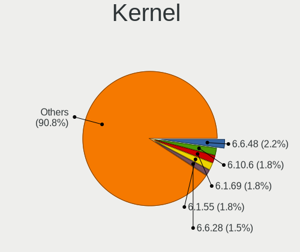
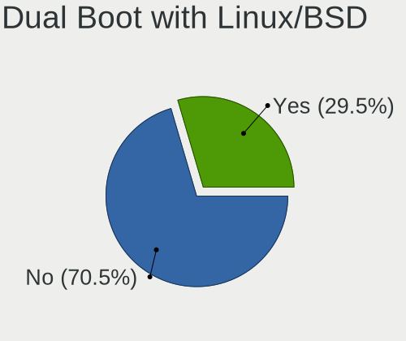
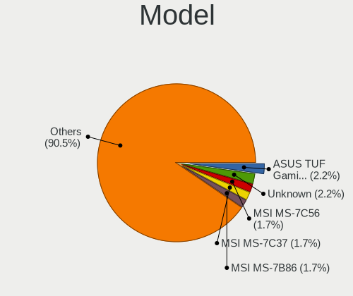
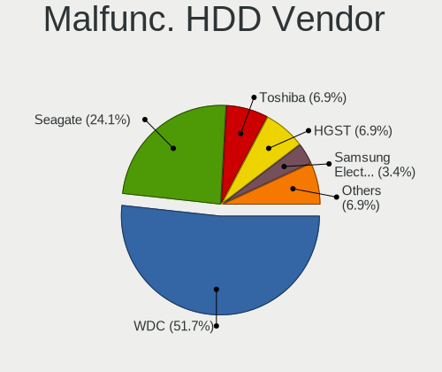
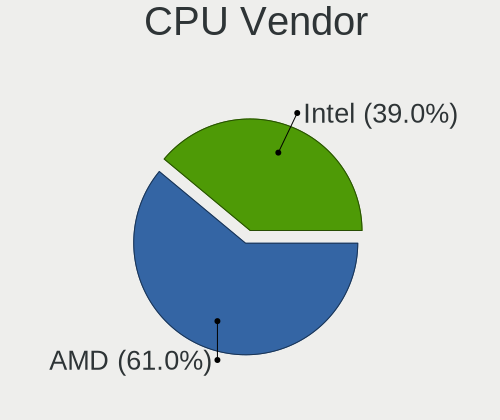
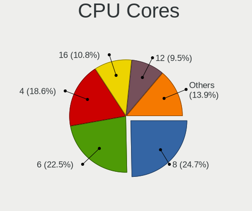
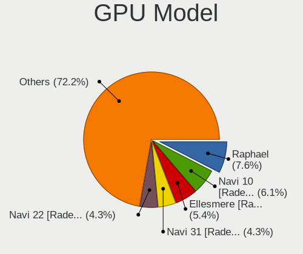
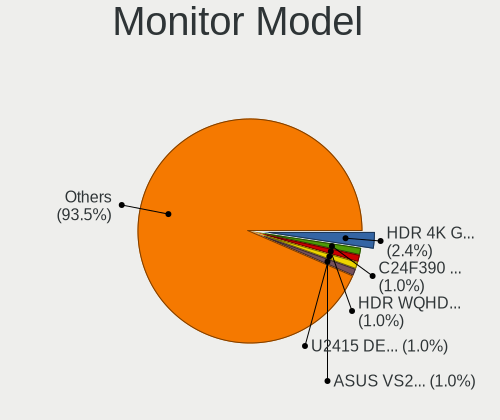
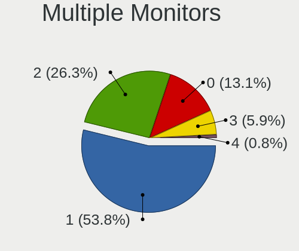
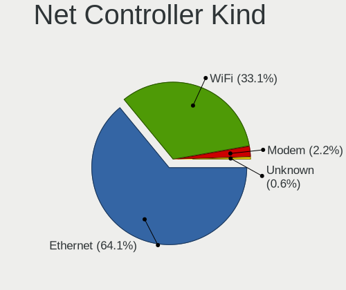

NixOS - Tested Hardware & Statistics (Desktops)
-----------------------------------------------

A project to collect tested hardware configurations for NixOS.

Anyone can contribute to this report by the [hw-probe](https://github.com/linuxhw/hw-probe) tool:

    sudo -E hw-probe -all -upload

Please contribute! Especially if your hardware is rare.

Contents
--------

* [ Test Cases ](#test-cases)

* [ System ](#system)
  - [ OS                       ](#os)
  - [ OS Family                ](#os-family)
  - [ Kernel                   ](#kernel)
  - [ Kernel Family            ](#kernel-family)
  - [ Kernel Major Ver.        ](#kernel-major-ver)
  - [ Arch                     ](#arch)
  - [ DE                       ](#de)
  - [ Display Server           ](#display-server)
  - [ Display Manager          ](#display-manager)
  - [ OS Lang                  ](#os-lang)
  - [ Boot Mode                ](#boot-mode)
  - [ Filesystem               ](#filesystem)
  - [ Part. scheme             ](#part-scheme)
  - [ Dual Boot with Linux/BSD ](#dual-boot-with-linuxbsd)
  - [ Dual Boot (Win)          ](#dual-boot-win)

* [ Board ](#board)
  - [ Vendor                   ](#vendor)
  - [ Model                    ](#model)
  - [ Model Family             ](#model-family)
  - [ MFG Year                 ](#mfg-year)
  - [ Form Factor              ](#form-factor)
  - [ Secure Boot              ](#secure-boot)
  - [ Coreboot                 ](#coreboot)
  - [ RAM Size                 ](#ram-size)
  - [ RAM Used                 ](#ram-used)
  - [ Total Drives             ](#total-drives)
  - [ Has CD-ROM               ](#has-cd-rom)
  - [ Has Ethernet             ](#has-ethernet)
  - [ Has WiFi                 ](#has-wifi)
  - [ Has Bluetooth            ](#has-bluetooth)

* [ Location ](#location)
  - [ Country                  ](#country)
  - [ City                     ](#city)

* [ Drives ](#drives)
  - [ Drive Vendor             ](#drive-vendor)
  - [ Drive Model              ](#drive-model)
  - [ HDD Vendor               ](#hdd-vendor)
  - [ SSD Vendor               ](#ssd-vendor)
  - [ Drive Kind               ](#drive-kind)
  - [ Drive Connector          ](#drive-connector)
  - [ Drive Size               ](#drive-size)
  - [ Space Total              ](#space-total)
  - [ Space Used               ](#space-used)
  - [ Malfunc. Drives          ](#malfunc-drives)
  - [ Malfunc. Drive Vendor    ](#malfunc-drive-vendor)
  - [ Malfunc. HDD Vendor      ](#malfunc-hdd-vendor)
  - [ Malfunc. Drive Kind      ](#malfunc-drive-kind)
  - [ Failed Drives            ](#failed-drives)
  - [ Failed Drive Vendor      ](#failed-drive-vendor)
  - [ Drive Status             ](#drive-status)

* [ Storage controller ](#storage-controller)
  - [ Storage Vendor           ](#storage-vendor)
  - [ Storage Model            ](#storage-model)
  - [ Storage Kind             ](#storage-kind)

* [ Processor ](#processor)
  - [ CPU Vendor               ](#cpu-vendor)
  - [ CPU Model                ](#cpu-model)
  - [ CPU Model Family         ](#cpu-model-family)
  - [ CPU Cores                ](#cpu-cores)
  - [ CPU Sockets              ](#cpu-sockets)
  - [ CPU Threads              ](#cpu-threads)
  - [ CPU Op-Modes             ](#cpu-op-modes)
  - [ CPU Microcode            ](#cpu-microcode)
  - [ CPU Microarch            ](#cpu-microarch)

* [ Graphics ](#graphics)
  - [ GPU Vendor               ](#gpu-vendor)
  - [ GPU Model                ](#gpu-model)
  - [ GPU Combo                ](#gpu-combo)
  - [ GPU Driver               ](#gpu-driver)
  - [ GPU Memory               ](#gpu-memory)

* [ Monitor ](#monitor)
  - [ Monitor Vendor           ](#monitor-vendor)
  - [ Monitor Model            ](#monitor-model)
  - [ Monitor Resolution       ](#monitor-resolution)
  - [ Monitor Diagonal         ](#monitor-diagonal)
  - [ Monitor Width            ](#monitor-width)
  - [ Aspect Ratio             ](#aspect-ratio)
  - [ Monitor Area             ](#monitor-area)
  - [ Pixel Density            ](#pixel-density)
  - [ Multiple Monitors        ](#multiple-monitors)

* [ Network ](#network)
  - [ Net Controller Vendor    ](#net-controller-vendor)
  - [ Net Controller Model     ](#net-controller-model)
  - [ Wireless Vendor          ](#wireless-vendor)
  - [ Wireless Model           ](#wireless-model)
  - [ Ethernet Vendor          ](#ethernet-vendor)
  - [ Ethernet Model           ](#ethernet-model)
  - [ Net Controller Kind      ](#net-controller-kind)
  - [ Used Controller          ](#used-controller)
  - [ NICs                     ](#nics)
  - [ IPv6                     ](#ipv6)

* [ Bluetooth ](#bluetooth)
  - [ Bluetooth Vendor         ](#bluetooth-vendor)
  - [ Bluetooth Model          ](#bluetooth-model)

* [ Sound ](#sound)
  - [ Sound Vendor             ](#sound-vendor)
  - [ Sound Model              ](#sound-model)

* [ Memory ](#memory)
  - [ Memory Vendor            ](#memory-vendor)
  - [ Memory Model             ](#memory-model)
  - [ Memory Kind              ](#memory-kind)
  - [ Memory Form Factor       ](#memory-form-factor)
  - [ Memory Size              ](#memory-size)
  - [ Memory Speed             ](#memory-speed)

* [ Printers & scanners ](#printers--scanners)
  - [ Printer Vendor           ](#printer-vendor)
  - [ Printer Model            ](#printer-model)
  - [ Scanner Vendor           ](#scanner-vendor)
  - [ Scanner Model            ](#scanner-model)

* [ Camera ](#camera)
  - [ Camera Vendor            ](#camera-vendor)
  - [ Camera Model             ](#camera-model)

* [ Security ](#security)
  - [ Fingerprint Vendor       ](#fingerprint-vendor)
  - [ Fingerprint Model        ](#fingerprint-model)
  - [ Chipcard Vendor          ](#chipcard-vendor)
  - [ Chipcard Model           ](#chipcard-model)

* [ Unsupported ](#unsupported)
  - [ Unsupported Devices      ](#unsupported-devices)
  - [ Unsupported Device Types ](#unsupported-device-types)

Test Cases
----------

Total: 58

| Vendor        | Model                       | Probe                                                      | Date         |
|---------------|-----------------------------|------------------------------------------------------------|--------------|
| MSI           | B550-A PRO                  | [c4f08a9fc3](https://linux-hardware.org/?probe=c4f08a9fc3) | Mar 04, 2023 |
| MSI           | MAG B550 TOMAHAWK           | [c4d51ca1b8](https://linux-hardware.org/?probe=c4d51ca1b8) | Mar 04, 2023 |
| MSI           | Z77A-G43                    | [eb768bf205](https://linux-hardware.org/?probe=eb768bf205) | Feb 03, 2023 |
| Gigabyte      | B450M DS3H V2               | [75a3416ebc](https://linux-hardware.org/?probe=75a3416ebc) | Jan 31, 2023 |
| ASRock        | Z87 Extreme4                | [b795f7c940](https://linux-hardware.org/?probe=b795f7c940) | Jan 19, 2023 |
| ASRock        | B550M Pro4                  | [0e4ba05b0f](https://linux-hardware.org/?probe=0e4ba05b0f) | Jan 15, 2023 |
| Shenzhen M... | F7BFC                       | [6a53c626dd](https://linux-hardware.org/?probe=6a53c626dd) | Jan 02, 2023 |
| ASUSTek       | Z87-C                       | [4929f6a6c9](https://linux-hardware.org/?probe=4929f6a6c9) | Dec 28, 2022 |
| MSI           | B550-A PRO                  | [db7b91ac2f](https://linux-hardware.org/?probe=db7b91ac2f) | Dec 17, 2022 |
| ASUSTek       | PRIME B550M-A               | [3c18fca709](https://linux-hardware.org/?probe=3c18fca709) | Dec 09, 2022 |
| ASUSTek       | SABERTOOTH 990FX R2.0       | [6ffc032b64](https://linux-hardware.org/?probe=6ffc032b64) | Oct 25, 2022 |
| ASUSTek       | PRIME B550M-A               | [c203d7c388](https://linux-hardware.org/?probe=c203d7c388) | Oct 07, 2022 |
| Gigabyte      | X570 AORUS ELITE            | [b21f5fee1a](https://linux-hardware.org/?probe=b21f5fee1a) | Sep 26, 2022 |
| ASUSTek       | PRIME B550M-A               | [98fd9b974e](https://linux-hardware.org/?probe=98fd9b974e) | Sep 09, 2022 |
| ASRock        | AB350 Pro4                  | [ce872c873e](https://linux-hardware.org/?probe=ce872c873e) | Aug 24, 2022 |
| ASUSTek       | H97I-PLUS                   | [982df0dba9](https://linux-hardware.org/?probe=982df0dba9) | Jun 22, 2022 |
| MSI           | MEG X570 UNIFY              | [6d5fdb800a](https://linux-hardware.org/?probe=6d5fdb800a) | Jun 20, 2022 |
| ASUSTek       | ROG STRIX Z390-F GAMING     | [a4621aa4ec](https://linux-hardware.org/?probe=a4621aa4ec) | Jun 19, 2022 |
| MSI           | MEG X570 UNIFY              | [d26f08ea88](https://linux-hardware.org/?probe=d26f08ea88) | Jun 12, 2022 |
| MSI           | MEG X570 UNIFY              | [0123caa2f3](https://linux-hardware.org/?probe=0123caa2f3) | Jun 11, 2022 |
| ASUSTek       | PRIME A520M-K               | [ab13de0478](https://linux-hardware.org/?probe=ab13de0478) | May 27, 2022 |
| Gigabyte      | B550I AORUS PRO AX          | [96b24b0640](https://linux-hardware.org/?probe=96b24b0640) | May 20, 2022 |
| ASUSTek       | PRIME X570-P                | [50d2e86de8](https://linux-hardware.org/?probe=50d2e86de8) | Apr 13, 2022 |
| Acer          | Nitro N50-610               | [46b46c842f](https://linux-hardware.org/?probe=46b46c842f) | Apr 13, 2022 |
| ASUSTek       | P8Q77-M                     | [6cd75b6762](https://linux-hardware.org/?probe=6cd75b6762) | Mar 11, 2022 |
| Gigabyte      | X470 AORUS ULTRA GAMING-... | [815cb9ab49](https://linux-hardware.org/?probe=815cb9ab49) | Mar 11, 2022 |
| MSI           | B450M MORTAR MAX            | [1d6563ada3](https://linux-hardware.org/?probe=1d6563ada3) | Mar 11, 2022 |
| ASUSTek       | P8Z77-V LK                  | [5c984c6d9a](https://linux-hardware.org/?probe=5c984c6d9a) | Mar 09, 2022 |
| ASUSTek       | P8Z77-V LK                  | [40d2eced72](https://linux-hardware.org/?probe=40d2eced72) | Mar 09, 2022 |
| EVGA          | X299 FTW K                  | [6f9489b2e6](https://linux-hardware.org/?probe=6f9489b2e6) | Mar 09, 2022 |
| Dell          | 0KJCC5 A00                  | [524b675e7e](https://linux-hardware.org/?probe=524b675e7e) | Mar 09, 2022 |
| MSI           | MAG X570 TOMAHAWK WIFI      | [f38279e396](https://linux-hardware.org/?probe=f38279e396) | Mar 09, 2022 |
| MSI           | X399 SLI PLUS               | [a1d172dbc0](https://linux-hardware.org/?probe=a1d172dbc0) | Feb 16, 2022 |
| MSI           | MAG X570 TOMAHAWK WIFI      | [c84b603f92](https://linux-hardware.org/?probe=c84b603f92) | Jan 04, 2022 |
| ASUSTek       | Z170-P                      | [d4bac456d1](https://linux-hardware.org/?probe=d4bac456d1) | Dec 16, 2021 |
| Gigabyte      | X570 AORUS ELITE            | [eb5d5f4361](https://linux-hardware.org/?probe=eb5d5f4361) | Dec 12, 2021 |
| ASUSTek       | PRIME Z390-A                | [af887c3f7b](https://linux-hardware.org/?probe=af887c3f7b) | Nov 29, 2021 |
| Gigabyte      | H97M-D3H                    | [349fbeb586](https://linux-hardware.org/?probe=349fbeb586) | Oct 23, 2021 |
| MSI           | X399 SLI PLUS               | [128ae965a7](https://linux-hardware.org/?probe=128ae965a7) | Aug 06, 2021 |
| ASRock        | X570 Taichi                 | [d93a80d973](https://linux-hardware.org/?probe=d93a80d973) | Jul 14, 2021 |
| ASRock        | X570 Taichi                 | [59a699d357](https://linux-hardware.org/?probe=59a699d357) | Jul 14, 2021 |
| ASUSTek       | SABERTOOTH X99              | [60eed45305](https://linux-hardware.org/?probe=60eed45305) | Jun 18, 2021 |
| MSI           | X570-A PRO                  | [0619809b36](https://linux-hardware.org/?probe=0619809b36) | Jun 01, 2021 |
| ASRock        | B450 Gaming-ITX/ac          | [6056eac50c](https://linux-hardware.org/?probe=6056eac50c) | May 31, 2021 |
| ASRock        | B450 Gaming-ITX/ac          | [bd9fb4818b](https://linux-hardware.org/?probe=bd9fb4818b) | May 31, 2021 |
| ASRock        | B450 Gaming-ITX/ac          | [12fa3ffea5](https://linux-hardware.org/?probe=12fa3ffea5) | May 31, 2021 |
| ASUSTek       | ROG STRIX B550-F GAMING     | [f03b19461f](https://linux-hardware.org/?probe=f03b19461f) | May 16, 2021 |
| ASUSTek       | ROG STRIX B550-F GAMING     | [529e915984](https://linux-hardware.org/?probe=529e915984) | May 16, 2021 |
| ASUSTek       | Pro WS W480-ACE             | [3825190816](https://linux-hardware.org/?probe=3825190816) | Mar 11, 2021 |
| ASUSTek       | ROG STRIX B550-I GAMING     | [d55d51a3e2](https://linux-hardware.org/?probe=d55d51a3e2) | Feb 08, 2021 |
| MSI           | MPG X570 GAMING PLUS        | [188755ebc7](https://linux-hardware.org/?probe=188755ebc7) | Oct 25, 2020 |
| Hardkernel    | ODROID-H2                   | [a5d75a24e5](https://linux-hardware.org/?probe=a5d75a24e5) | Oct 13, 2020 |
| ASUSTek       | TUF Gaming X570-PLUS        | [b85fb81c59](https://linux-hardware.org/?probe=b85fb81c59) | Sep 28, 2020 |
| MSI           | MAG B550M BAZOOKA           | [5f7f2db973](https://linux-hardware.org/?probe=5f7f2db973) | Aug 21, 2020 |
| ASUSTek       | PRIME Z270-K                | [cc8de41afd](https://linux-hardware.org/?probe=cc8de41afd) | Aug 21, 2020 |
| HP            | 8055                        | [1165b457fa](https://linux-hardware.org/?probe=1165b457fa) | Jul 08, 2020 |
| HP            | 8055                        | [a5c65e8d4a](https://linux-hardware.org/?probe=a5c65e8d4a) | Jul 08, 2020 |
| ASRock        | TRX40 Creator               | [2cefd65bfb](https://linux-hardware.org/?probe=2cefd65bfb) | Jun 29, 2020 |

System
------

OS
--

Installed operating systems

| Name                             | Desktops | Percent |
|----------------------------------|----------|---------|
| NixOS 22.05                      | 13       | 27.08%  |
| NixOS 22.11                      | 7        | 14.58%  |
| NixOS 21.11                      | 7        | 14.58%  |
| NixOS 23.05                      | 3        | 6.25%   |
| NixOS                            | 3        | 6.25%   |
| NixOS 21.05pre-git               | 2        | 4.17%   |
| NixOS 21.11.20210528.540dccb     | 1        | 2.08%   |
| NixOS 21.05.993.93963c27b93      | 1        | 2.08%   |
| NixOS 21.05.2075.ff1ea3a36c1     | 1        | 2.08%   |
| NixOS 21.05.20210929.ee90403     | 1        | 2.08%   |
| NixOS 21.05.20210430.c8dff32     | 1        | 2.08%   |
| NixOS 21.05.20210224.f6b5bfd     | 1        | 2.08%   |
| NixOS 21.05.1471.a7512bb64b1     | 1        | 2.08%   |
| NixOS 21.03pre246062.420f89ceb26 | 1        | 2.08%   |
| NixOS 21.03.git.b4349c13a6d      | 1        | 2.08%   |
| NixOS 21.03.20201007.420f89c     | 1        | 2.08%   |
| NixOS 20.09pre231796.22a81aa5fc1 | 1        | 2.08%   |
| NixOS 20.09pre-git               | 1        | 2.08%   |
| NixOS 20.09.git.4a361b06a93      | 1        | 2.08%   |

OS Family
---------

OS without a version

| Name  | Desktops | Percent |
|-------|----------|---------|
| NixOS | 45       | 100%    |

Kernel
------

Version of the Linux kernel

| Version                | Desktops | Percent |
|------------------------|----------|---------|
| 5.8.1-zen1             | 2        | 4.08%   |
| 5.15.86                | 2        | 4.08%   |
| 5.15.85                | 2        | 4.08%   |
| 5.15.47                | 2        | 4.08%   |
| 5.10.102               | 2        | 4.08%   |
| 6.1.14                 | 1        | 2.04%   |
| 6.0.12                 | 1        | 2.04%   |
| 6.0.11                 | 1        | 2.04%   |
| 5.8.10                 | 1        | 2.04%   |
| 5.7.19                 | 1        | 2.04%   |
| 5.4.94                 | 1        | 2.04%   |
| 5.4.72                 | 1        | 2.04%   |
| 5.4.69                 | 1        | 2.04%   |
| 5.4.50                 | 1        | 2.04%   |
| 5.4.47                 | 1        | 2.04%   |
| 5.19.14                | 1        | 2.04%   |
| 5.18.19                | 1        | 2.04%   |
| 5.18.14-lqx2           | 1        | 2.04%   |
| 5.17.1                 | 1        | 2.04%   |
| 5.16.8-zen1            | 1        | 2.04%   |
| 5.15.95                | 1        | 2.04%   |
| 5.15.90                | 1        | 2.04%   |
| 5.15.83                | 1        | 2.04%   |
| 5.15.74                | 1        | 2.04%   |
| 5.15.7                 | 1        | 2.04%   |
| 5.15.50                | 1        | 2.04%   |
| 5.15.43                | 1        | 2.04%   |
| 5.15.39                | 1        | 2.04%   |
| 5.15.34                | 1        | 2.04%   |
| 5.15.26                | 1        | 2.04%   |
| 5.15.25                | 1        | 2.04%   |
| 5.15.18                | 1        | 2.04%   |
| 5.14.16-lqx1           | 1        | 2.04%   |
| 5.13.2                 | 1        | 2.04%   |
| 5.12.15                | 1        | 2.04%   |
| 5.11.16-zen1           | 1        | 2.04%   |
| 5.11.16-xanmod1-cacule | 1        | 2.04%   |
| 5.10.99                | 1        | 2.04%   |
| 5.10.96                | 1        | 2.04%   |
| 5.10.62                | 1        | 2.04%   |

Kernel Family
-------------

Linux kernel without a distro release

| Version  | Desktops | Percent |
|----------|----------|---------|
| 5.8.1    | 2        | 4.08%   |
| 5.15.86  | 2        | 4.08%   |
| 5.15.85  | 2        | 4.08%   |
| 5.15.47  | 2        | 4.08%   |
| 5.11.16  | 2        | 4.08%   |
| 5.10.102 | 2        | 4.08%   |
| 6.1.14   | 1        | 2.04%   |
| 6.0.12   | 1        | 2.04%   |
| 6.0.11   | 1        | 2.04%   |
| 5.8.10   | 1        | 2.04%   |
| 5.7.19   | 1        | 2.04%   |
| 5.4.94   | 1        | 2.04%   |
| 5.4.72   | 1        | 2.04%   |
| 5.4.69   | 1        | 2.04%   |
| 5.4.50   | 1        | 2.04%   |
| 5.4.47   | 1        | 2.04%   |
| 5.19.14  | 1        | 2.04%   |
| 5.18.19  | 1        | 2.04%   |
| 5.18.14  | 1        | 2.04%   |
| 5.17.1   | 1        | 2.04%   |
| 5.16.8   | 1        | 2.04%   |
| 5.15.95  | 1        | 2.04%   |
| 5.15.90  | 1        | 2.04%   |
| 5.15.83  | 1        | 2.04%   |
| 5.15.74  | 1        | 2.04%   |
| 5.15.7   | 1        | 2.04%   |
| 5.15.50  | 1        | 2.04%   |
| 5.15.43  | 1        | 2.04%   |
| 5.15.39  | 1        | 2.04%   |
| 5.15.34  | 1        | 2.04%   |
| 5.15.26  | 1        | 2.04%   |
| 5.15.25  | 1        | 2.04%   |
| 5.15.18  | 1        | 2.04%   |
| 5.14.16  | 1        | 2.04%   |
| 5.13.2   | 1        | 2.04%   |
| 5.12.15  | 1        | 2.04%   |
| 5.10.99  | 1        | 2.04%   |
| 5.10.96  | 1        | 2.04%   |
| 5.10.62  | 1        | 2.04%   |
| 5.10.52  | 1        | 2.04%   |

Kernel Major Ver.
-----------------

Linux kernel major version

| Version | Desktops | Percent |
|---------|----------|---------|
| 5.15    | 18       | 36.73%  |
| 5.10    | 9        | 18.37%  |
| 5.4     | 5        | 10.2%   |
| 5.8     | 3        | 6.12%   |
| 6.0     | 2        | 4.08%   |
| 5.18    | 2        | 4.08%   |
| 5.11    | 2        | 4.08%   |
| 6.1     | 1        | 2.04%   |
| 5.7     | 1        | 2.04%   |
| 5.19    | 1        | 2.04%   |
| 5.17    | 1        | 2.04%   |
| 5.16    | 1        | 2.04%   |
| 5.14    | 1        | 2.04%   |
| 5.13    | 1        | 2.04%   |
| 5.12    | 1        | 2.04%   |

Arch
----

OS architecture (x86_64, i586, etc.)

| Name   | Desktops | Percent |
|--------|----------|---------|
| x86_64 | 45       | 100%    |

DE
--

Desktop Environment

| Name         | Desktops | Percent |
|--------------|----------|---------|
| Unknown      | 30       | 66.67%  |
| KDE5         | 3        | 6.67%   |
| KDE          | 3        | 6.67%   |
| GNOME        | 3        | 6.67%   |
| XFCE         | 2        | 4.44%   |
| sway         | 2        | 4.44%   |
| none+i3      | 1        | 2.22%   |
| none+awesome | 1        | 2.22%   |

Display Server
--------------

X11 or Wayland

| Name    | Desktops | Percent |
|---------|----------|---------|
| Unknown | 27       | 58.7%   |
| X11     | 10       | 21.74%  |
| Wayland | 5        | 10.87%  |
| Tty     | 4        | 8.7%    |

Display Manager
---------------

SDDM, LightDM, etc.

| Name    | Desktops | Percent |
|---------|----------|---------|
| Unknown | 32       | 71.11%  |
| LightDM | 6        | 13.33%  |
| SDDM    | 4        | 8.89%   |
| GDM     | 3        | 6.67%   |

OS Lang
-------

Language

| Lang    | Desktops | Percent |
|---------|----------|---------|
| Unknown | 19       | 42.22%  |
| en_US   | 18       | 40%     |
| en_GB   | 2        | 4.44%   |
| pt_BR   | 1        | 2.22%   |
| it_IT   | 1        | 2.22%   |
| en_DK   | 1        | 2.22%   |
| en_AU   | 1        | 2.22%   |
| de_DE   | 1        | 2.22%   |
| de_CH   | 1        | 2.22%   |

Boot Mode
---------

EFI or BIOS

| Mode | Desktops | Percent |
|------|----------|---------|
| EFI  | 37       | 80.43%  |
| BIOS | 9        | 19.57%  |

Filesystem
----------

Type of filesystem

| Type    | Desktops | Percent |
|---------|----------|---------|
| Ext4    | 23       | 51.11%  |
| Zfs     | 5        | 11.11%  |
| Tmpfs   | 5        | 11.11%  |
| Xfs     | 4        | 8.89%   |
| Btrfs   | 4        | 8.89%   |
| Unknown | 3        | 6.67%   |
| Ext2    | 1        | 2.22%   |

Part. scheme
------------

Scheme of partitioning

| Type    | Desktops | Percent |
|---------|----------|---------|
| GPT     | 43       | 95.56%  |
| Unknown | 2        | 4.44%   |

Dual Boot with Linux/BSD
------------------------

Hosting more than one Linux/BSD

| Dual boot | Desktops | Percent |
|-----------|----------|---------|
| No        | 35       | 76.09%  |
| Yes       | 11       | 23.91%  |

Dual Boot (Win)
---------------

Hosting Linux and Windows

| Dual boot | Desktops | Percent |
|-----------|----------|---------|
| No        | 25       | 55.56%  |
| Yes       | 20       | 44.44%  |

Board
-----

Vendor
------

Motherboard manufacturer

| Name                                 | Desktops | Percent |
|--------------------------------------|----------|---------|
| ASUSTek Computer                     | 17       | 37.78%  |
| MSI                                  | 11       | 24.44%  |
| ASRock                               | 6        | 13.33%  |
| Gigabyte Technology                  | 5        | 11.11%  |
| Shenzhen Meigao Electronic Equipment | 1        | 2.22%   |
| Hewlett-Packard                      | 1        | 2.22%   |
| Hardkernel                           | 1        | 2.22%   |
| EVGA                                 | 1        | 2.22%   |
| Dell                                 | 1        | 2.22%   |
| Acer                                 | 1        | 2.22%   |

Model
-----

Motherboard model

| Name                                       | Desktops | Percent |
|--------------------------------------------|----------|---------|
| MSI MS-7C56                                | 2        | 4.44%   |
| MSI MS-7C37                                | 2        | 4.44%   |
| ASUS All Series                            | 2        | 4.44%   |
| Shenzhen Meigao Electronic Equipment UM690 | 1        | 2.22%   |
| MSI MS-7C95                                | 1        | 2.22%   |
| MSI MS-7C91                                | 1        | 2.22%   |
| MSI MS-7C84                                | 1        | 2.22%   |
| MSI MS-7C35                                | 1        | 2.22%   |
| MSI MS-7B89                                | 1        | 2.22%   |
| MSI MS-7B09                                | 1        | 2.22%   |
| MSI MS-7758                                | 1        | 2.22%   |
| HP EliteDesk 800 G2 DM 35W                 | 1        | 2.22%   |
| Hardkernel ODROID-H2                       | 1        | 2.22%   |
| Gigabyte X570 AORUS ELITE                  | 1        | 2.22%   |
| Gigabyte X470 AORUS ULTRA GAMING           | 1        | 2.22%   |
| Gigabyte H97M-D3H                          | 1        | 2.22%   |
| Gigabyte B550I AORUS PRO AX                | 1        | 2.22%   |
| Gigabyte B450M DS3H V2                     | 1        | 2.22%   |
| EVGA X299 FTW K                            | 1        | 2.22%   |
| Dell Precision Tower 7810                  | 1        | 2.22%   |
| ASUS Z170-P                                | 1        | 2.22%   |
| ASUS TUF Gaming X570-PLUS                  | 1        | 2.22%   |
| ASUS SABERTOOTH 990FX R2.0                 | 1        | 2.22%   |
| ASUS ROG STRIX Z390-F GAMING               | 1        | 2.22%   |
| ASUS ROG STRIX B550-I GAMING               | 1        | 2.22%   |
| ASUS ROG STRIX B550-F GAMING               | 1        | 2.22%   |
| ASUS PRO602617                             | 1        | 2.22%   |
| ASUS PRO-Q77 IU                            | 1        | 2.22%   |
| ASUS Pro WS W480-ACE                       | 1        | 2.22%   |
| ASUS PRIME Z390-A                          | 1        | 2.22%   |
| ASUS PRIME Z270-K                          | 1        | 2.22%   |
| ASUS PRIME X570-P                          | 1        | 2.22%   |
| ASUS PRIME B550M-A                         | 1        | 2.22%   |
| ASUS PRIME A520M-K                         | 1        | 2.22%   |
| ASUS P8Z77-V LK                            | 1        | 2.22%   |
| ASRock Z87 Extreme4                        | 1        | 2.22%   |
| ASRock X570 Taichi                         | 1        | 2.22%   |
| ASRock TRX40 Creator                       | 1        | 2.22%   |
| ASRock B550M Pro4                          | 1        | 2.22%   |
| ASRock B450 Gaming-ITX/ac                  | 1        | 2.22%   |

Model Family
------------

Motherboard model prefix

| Name                                       | Desktops | Percent |
|--------------------------------------------|----------|---------|
| ASUS PRIME                                 | 5        | 11.11%  |
| ASUS ROG                                   | 3        | 6.67%   |
| MSI MS-7C56                                | 2        | 4.44%   |
| MSI MS-7C37                                | 2        | 4.44%   |
| ASUS All                                   | 2        | 4.44%   |
| Shenzhen Meigao Electronic Equipment UM690 | 1        | 2.22%   |
| MSI MS-7C95                                | 1        | 2.22%   |
| MSI MS-7C91                                | 1        | 2.22%   |
| MSI MS-7C84                                | 1        | 2.22%   |
| MSI MS-7C35                                | 1        | 2.22%   |
| MSI MS-7B89                                | 1        | 2.22%   |
| MSI MS-7B09                                | 1        | 2.22%   |
| MSI MS-7758                                | 1        | 2.22%   |
| HP EliteDesk                               | 1        | 2.22%   |
| Hardkernel ODROID-H2                       | 1        | 2.22%   |
| Gigabyte X570                              | 1        | 2.22%   |
| Gigabyte X470                              | 1        | 2.22%   |
| Gigabyte H97M-D3H                          | 1        | 2.22%   |
| Gigabyte B550I                             | 1        | 2.22%   |
| Gigabyte B450M                             | 1        | 2.22%   |
| EVGA X299                                  | 1        | 2.22%   |
| Dell Precision                             | 1        | 2.22%   |
| ASUS Z170-P                                | 1        | 2.22%   |
| ASUS TUF                                   | 1        | 2.22%   |
| ASUS SABERTOOTH                            | 1        | 2.22%   |
| ASUS PRO602617                             | 1        | 2.22%   |
| ASUS PRO-Q77                               | 1        | 2.22%   |
| ASUS Pro                                   | 1        | 2.22%   |
| ASUS P8Z77-V                               | 1        | 2.22%   |
| ASRock Z87                                 | 1        | 2.22%   |
| ASRock X570                                | 1        | 2.22%   |
| ASRock TRX40                               | 1        | 2.22%   |
| ASRock B550M                               | 1        | 2.22%   |
| ASRock B450                                | 1        | 2.22%   |
| ASRock AB350                               | 1        | 2.22%   |
| Acer Nitro                                 | 1        | 2.22%   |

MFG Year
--------

Motherboard manufacture year

| Year | Desktops | Percent |
|------|----------|---------|
| 2020 | 14       | 31.11%  |
| 2019 | 10       | 22.22%  |
| 2018 | 5        | 11.11%  |
| 2016 | 4        | 8.89%   |
| 2012 | 3        | 6.67%   |
| 2017 | 2        | 4.44%   |
| 2015 | 2        | 4.44%   |
| 2014 | 2        | 4.44%   |
| 2013 | 2        | 4.44%   |
| 2022 | 1        | 2.22%   |

Form Factor
-----------

Physical design of the computer

| Name    | Desktops | Percent |
|---------|----------|---------|
| Desktop | 45       | 100%    |

Secure Boot
-----------

Enabled or disabled

| State    | Desktops | Percent |
|----------|----------|---------|
| Disabled | 45       | 100%    |

Coreboot
--------

Have coreboot on board

| Used | Desktops | Percent |
|------|----------|---------|
| No   | 45       | 100%    |

RAM Size
--------

Total RAM memory

| Size in GB  | Desktops | Percent |
|-------------|----------|---------|
| 32.01-64.0  | 14       | 31.11%  |
| 64.01-256.0 | 13       | 28.89%  |
| 16.01-24.0  | 9        | 20%     |
| 24.01-32.0  | 4        | 8.89%   |
| 8.01-16.0   | 3        | 6.67%   |
| 4.01-8.0    | 2        | 4.44%   |

RAM Used
--------

Used RAM memory

| Used GB    | Desktops | Percent |
|------------|----------|---------|
| 4.01-8.0   | 12       | 26.09%  |
| 8.01-16.0  | 11       | 23.91%  |
| 32.01-64.0 | 5        | 10.87%  |
| 3.01-4.0   | 5        | 10.87%  |
| 1.01-2.0   | 5        | 10.87%  |
| 16.01-24.0 | 4        | 8.7%    |
| 2.01-3.0   | 2        | 4.35%   |
| 24.01-32.0 | 1        | 2.17%   |
| 0.51-1.0   | 1        | 2.17%   |

Total Drives
------------

Number of drives on board

| Drives | Desktops | Percent |
|--------|----------|---------|
| 2      | 15       | 31.25%  |
| 3      | 10       | 20.83%  |
| 1      | 10       | 20.83%  |
| 6      | 4        | 8.33%   |
| 5      | 4        | 8.33%   |
| 4      | 2        | 4.17%   |
| 23     | 1        | 2.08%   |
| 8      | 1        | 2.08%   |
| 0      | 1        | 2.08%   |

Has CD-ROM
----------

Has CD-ROM on board

| Presented | Desktops | Percent |
|-----------|----------|---------|
| No        | 37       | 82.22%  |
| Yes       | 8        | 17.78%  |

Has Ethernet
------------

Has Ethernet on board

| Presented | Desktops | Percent |
|-----------|----------|---------|
| Yes       | 45       | 100%    |

Has WiFi
--------

Has WiFi module

| Presented | Desktops | Percent |
|-----------|----------|---------|
| No        | 30       | 66.67%  |
| Yes       | 15       | 33.33%  |

Has Bluetooth
-------------

Has Bluetooth module

| Presented | Desktops | Percent |
|-----------|----------|---------|
| No        | 28       | 62.22%  |
| Yes       | 17       | 37.78%  |

Location
--------

Country
-------

Geographic location (country)

| Country     | Desktops | Percent |
|-------------|----------|---------|
| USA         | 12       | 26.67%  |
| Germany     | 8        | 17.78%  |
| UK          | 4        | 8.89%   |
| Russia      | 3        | 6.67%   |
| Poland      | 3        | 6.67%   |
| Canada      | 3        | 6.67%   |
| Ukraine     | 2        | 4.44%   |
| Austria     | 2        | 4.44%   |
| Switzerland | 1        | 2.22%   |
| Serbia      | 1        | 2.22%   |
| New Zealand | 1        | 2.22%   |
| Italy       | 1        | 2.22%   |
| Hungary     | 1        | 2.22%   |
| Denmark     | 1        | 2.22%   |
| Brazil      | 1        | 2.22%   |
| Australia   | 1        | 2.22%   |

City
----

Geographic location (city)

| City              | Desktops | Percent |
|-------------------|----------|---------|
| Vienna            | 2        | 4.35%   |
| Schaafheim        | 2        | 4.35%   |
| Plymouth          | 2        | 4.35%   |
| Marki             | 2        | 4.35%   |
| Kharkiv           | 2        | 4.35%   |
| Darmstadt         | 2        | 4.35%   |
| Austin            | 2        | 4.35%   |
| Wellington        | 1        | 2.17%   |
| Székesfehérvár | 1        | 2.17%   |
| Southampton       | 1        | 2.17%   |
| South Deerfield   | 1        | 2.17%   |
| Sindelfingen      | 1        | 2.17%   |
| San Gabriel       | 1        | 2.17%   |
| Saarbrücken      | 1        | 2.17%   |
| Richardson        | 1        | 2.17%   |
| Redwood City      | 1        | 2.17%   |
| Ramenskoye        | 1        | 2.17%   |
| Pisa              | 1        | 2.17%   |
| Osasco            | 1        | 2.17%   |
| Oakville          | 1        | 2.17%   |
| Norwich           | 1        | 2.17%   |
| Montreal          | 1        | 2.17%   |
| Melrose           | 1        | 2.17%   |
| Melbourne         | 1        | 2.17%   |
| Lamont            | 1        | 2.17%   |
| Kuybyshev         | 1        | 2.17%   |
| Krasnodar         | 1        | 2.17%   |
| Karlsruhe         | 1        | 2.17%   |
| Heusweiler        | 1        | 2.17%   |
| Hamburg           | 1        | 2.17%   |
| Goleta            | 1        | 2.17%   |
| Gdansk            | 1        | 2.17%   |
| Esbjerg           | 1        | 2.17%   |
| Dietikon          | 1        | 2.17%   |
| Didcot            | 1        | 2.17%   |
| Detroit           | 1        | 2.17%   |
| Boston            | 1        | 2.17%   |
| Belgrade          | 1        | 2.17%   |
| Andover           | 1        | 2.17%   |

Drives
------

Drive Vendor
------------

Hard drive vendors

| Vendor                | Desktops | Drives | Percent |
|-----------------------|----------|--------|---------|
| Samsung Electronics   | 24       | 50     | 26.67%  |
| WDC                   | 11       | 28     | 12.22%  |
| Seagate               | 11       | 20     | 12.22%  |
| SanDisk               | 8        | 12     | 8.89%   |
| Toshiba               | 7        | 15     | 7.78%   |
| Crucial               | 7        | 8      | 7.78%   |
| Kingston              | 5        | 5      | 5.56%   |
| Intel                 | 4        | 6      | 4.44%   |
| HGST                  | 2        | 4      | 2.22%   |
| SPCC                  | 1        | 1      | 1.11%   |
| Silicon Motion        | 1        | 1      | 1.11%   |
| Realtek Semiconductor | 1        | 1      | 1.11%   |
| Plextor               | 1        | 1      | 1.11%   |
| Phison Electronics    | 1        | 2      | 1.11%   |
| Phison                | 1        | 1      | 1.11%   |
| Lexar                 | 1        | 1      | 1.11%   |
| Hitachi               | 1        | 3      | 1.11%   |
| Corsair               | 1        | 1      | 1.11%   |
| China                 | 1        | 1      | 1.11%   |
| ASMT                  | 1        | 1      | 1.11%   |

Drive Model
-----------

Hard drive models

| Model                                 | Desktops | Percent |
|---------------------------------------|----------|---------|
| Samsung SSD 860 EVO 1TB               | 4        | 3.23%   |
| Seagate ST3000DM001-1ER166 3TB        | 3        | 2.42%   |
| Samsung SSD 970 EVO Plus 2TB          | 3        | 2.42%   |
| Seagate ST3000DM001-1CH166 3TB        | 2        | 1.61%   |
| SanDisk SSD PLUS 240GB                | 2        | 1.61%   |
| Samsung SSD 980 PRO 1TB               | 2        | 1.61%   |
| Samsung SSD 970 EVO Plus 1TB          | 2        | 1.61%   |
| Samsung SSD 970 EVO 500GB             | 2        | 1.61%   |
| Samsung SSD 970 EVO 1TB               | 2        | 1.61%   |
| Samsung SSD 860 QVO 1TB               | 2        | 1.61%   |
| Samsung SSD 860 EVO 500GB             | 2        | 1.61%   |
| Samsung SSD 860 EVO 2TB               | 2        | 1.61%   |
| Samsung NVMe SSD Drive 1TB            | 2        | 1.61%   |
| Crucial CT1000MX500SSD1 1TB           | 2        | 1.61%   |
| WDC WDS240G2G0B-00EPW0 240GB SSD      | 1        | 0.81%   |
| WDC WD80EMAZ-00WJTA0 8TB              | 1        | 0.81%   |
| WDC WD80EDAZ-11TA3A0 8TB              | 1        | 0.81%   |
| WDC WD50EZRX-00MVLB1 5TB              | 1        | 0.81%   |
| WDC WD40EFRX-68N32N0 4TB              | 1        | 0.81%   |
| WDC WD3200BPVT-22JJ5T0 320GB          | 1        | 0.81%   |
| WDC WD20EZRX-00D8PB0 2TB              | 1        | 0.81%   |
| WDC WD20EARX-008FB0 2TB               | 1        | 0.81%   |
| WDC WD1600AAJS-62B4A0 160GB           | 1        | 0.81%   |
| WDC WD10EZEX-60ZF5A0 1TB              | 1        | 0.81%   |
| WDC WD10EZEX-21WN4A0 1TB              | 1        | 0.81%   |
| WDC WD10EZEX-00RKKA0 1TB              | 1        | 0.81%   |
| WDC WD10EZEX-00KUWA0 1TB              | 1        | 0.81%   |
| WDC WD10EAVS-32D7B1 1TB               | 1        | 0.81%   |
| WDC WD10EAVS-00D7B0 1TB               | 1        | 0.81%   |
| WDC WD10EARS-00Y5B1 1TB               | 1        | 0.81%   |
| WDC WD10EADS-00M2B0 1TB               | 1        | 0.81%   |
| Toshiba TR150 960GB SSD               | 1        | 0.81%   |
| Toshiba MG03ACA300 3TB                | 1        | 0.81%   |
| Toshiba HDWR180 8TB                   | 1        | 0.81%   |
| Toshiba HDWL120 2TB                   | 1        | 0.81%   |
| Toshiba HDWE160 6TB                   | 1        | 0.81%   |
| Toshiba HDWD130 3TB                   | 1        | 0.81%   |
| Toshiba HDWD120 2TB                   | 1        | 0.81%   |
| Toshiba DT01ACA300 3TB                | 1        | 0.81%   |
| Toshiba BG3 NVMe SSD Controller 512GB | 1        | 0.81%   |

HDD Vendor
----------

Hard disk drive vendors

| Vendor              | Desktops | Drives | Percent |
|---------------------|----------|--------|---------|
| WDC                 | 11       | 26     | 33.33%  |
| Seagate             | 11       | 20     | 33.33%  |
| Toshiba             | 6        | 11     | 18.18%  |
| HGST                | 2        | 4      | 6.06%   |
| Samsung Electronics | 1        | 1      | 3.03%   |
| Hitachi             | 1        | 3      | 3.03%   |
| ASMT                | 1        | 1      | 3.03%   |

SSD Vendor
----------

Solid state drive vendors

| Vendor              | Desktops | Drives | Percent |
|---------------------|----------|--------|---------|
| Samsung Electronics | 12       | 22     | 32.43%  |
| Crucial             | 7        | 8      | 18.92%  |
| SanDisk             | 5        | 8      | 13.51%  |
| Kingston            | 4        | 4      | 10.81%  |
| Intel               | 4        | 6      | 10.81%  |
| WDC                 | 1        | 2      | 2.7%    |
| Toshiba             | 1        | 1      | 2.7%    |
| SPCC                | 1        | 1      | 2.7%    |
| Corsair             | 1        | 1      | 2.7%    |
| China               | 1        | 1      | 2.7%    |

Drive Kind
----------

HDD or SSD

| Kind | Desktops | Drives | Percent |
|------|----------|--------|---------|
| SSD  | 31       | 54     | 39.74%  |
| NVMe | 26       | 42     | 33.33%  |
| HDD  | 21       | 66     | 26.92%  |

Drive Connector
---------------

SATA, SAS, NVMe, etc.

| Type | Desktops | Drives | Percent |
|------|----------|--------|---------|
| SATA | 38       | 118    | 57.58%  |
| NVMe | 26       | 42     | 39.39%  |
| SAS  | 2        | 2      | 3.03%   |

Drive Size
----------

Size of hard drive

| Size in TB | Desktops | Drives | Percent |
|------------|----------|--------|---------|
| 0.01-0.5   | 23       | 36     | 36.51%  |
| 0.51-1.0   | 18       | 38     | 28.57%  |
| 1.01-2.0   | 8        | 13     | 12.7%   |
| 2.01-3.0   | 6        | 12     | 9.52%   |
| 4.01-10.0  | 6        | 17     | 9.52%   |
| 3.01-4.0   | 2        | 4      | 3.17%   |

Space Total
-----------

Amount of disk space available on the file system

| Size in GB     | Desktops | Percent |
|----------------|----------|---------|
| Unknown        | 23       | 51.11%  |
| 1-20           | 6        | 13.33%  |
| 501-1000       | 6        | 13.33%  |
| 2001-3000      | 3        | 6.67%   |
| 1001-2000      | 3        | 6.67%   |
| 101-250        | 2        | 4.44%   |
| More than 3000 | 1        | 2.22%   |
| 251-500        | 1        | 2.22%   |

Space Used
----------

Amount of used disk space

| Used GB        | Desktops | Percent |
|----------------|----------|---------|
| Unknown        | 23       | 51.11%  |
| 1-20           | 9        | 20%     |
| 101-250        | 4        | 8.89%   |
| 251-500        | 2        | 4.44%   |
| 1001-2000      | 2        | 4.44%   |
| 501-1000       | 2        | 4.44%   |
| More than 3000 | 1        | 2.22%   |
| 2001-3000      | 1        | 2.22%   |
| 51-100         | 1        | 2.22%   |

Malfunc. Drives
---------------

Drive models with a malfunction

| Model                               | Desktops | Drives | Percent |
|-------------------------------------|----------|--------|---------|
| WDC WD20EARX-008FB0 2TB             | 1        | 1      | 11.11%  |
| WDC WD10EZEX-60ZF5A0 1TB            | 1        | 1      | 11.11%  |
| Seagate ST3500418AS 500GB           | 1        | 1      | 11.11%  |
| Samsung Electronics SSD 970 EVO 1TB | 1        | 1      | 11.11%  |
| Samsung Electronics SSD 870 EVO 1TB | 1        | 1      | 11.11%  |
| Intel SSDSC2BW240A4 240GB           | 1        | 1      | 11.11%  |
| Hitachi HDS722020ALA330 2TB         | 1        | 1      | 11.11%  |
| HGST HTS545050A7E680 500GB          | 1        | 1      | 11.11%  |
| ASMT 2115 500GB                     | 1        | 1      | 11.11%  |

Malfunc. Drive Vendor
---------------------

Vendors of faulty drives

| Vendor              | Desktops | Drives | Percent |
|---------------------|----------|--------|---------|
| WDC                 | 2        | 2      | 22.22%  |
| Samsung Electronics | 2        | 2      | 22.22%  |
| Seagate             | 1        | 1      | 11.11%  |
| Intel               | 1        | 1      | 11.11%  |
| Hitachi             | 1        | 1      | 11.11%  |
| HGST                | 1        | 1      | 11.11%  |
| ASMT                | 1        | 1      | 11.11%  |

Malfunc. HDD Vendor
-------------------

Vendors of faulty HDD drives

| Vendor  | Desktops | Drives | Percent |
|---------|----------|--------|---------|
| WDC     | 2        | 2      | 33.33%  |
| Seagate | 1        | 1      | 16.67%  |
| Hitachi | 1        | 1      | 16.67%  |
| HGST    | 1        | 1      | 16.67%  |
| ASMT    | 1        | 1      | 16.67%  |

Malfunc. Drive Kind
-------------------

Kinds of faulty drives

| Kind | Desktops | Drives | Percent |
|------|----------|--------|---------|
| HDD  | 5        | 6      | 62.5%   |
| SSD  | 2        | 2      | 25%     |
| NVMe | 1        | 1      | 12.5%   |

Failed Drives
-------------

Failed drive models

| Model                  | Desktops | Drives | Percent |
|------------------------|----------|--------|---------|
| Toshiba MG03ACA300 3TB | 1        | 1      | 100%    |

Failed Drive Vendor
-------------------

Failed drive vendors

| Vendor  | Desktops | Drives | Percent |
|---------|----------|--------|---------|
| Toshiba | 1        | 1      | 100%    |

Drive Status
------------

Number of failed and malfunc. drives

| Status   | Desktops | Drives | Percent |
|----------|----------|--------|---------|
| Works    | 43       | 141    | 76.79%  |
| Malfunc  | 7        | 9      | 12.5%   |
| Detected | 5        | 11     | 8.93%   |
| Failed   | 1        | 1      | 1.79%   |

Storage controller
------------------

Storage Vendor
--------------

Storage controller vendors

| Vendor                       | Desktops | Percent |
|------------------------------|----------|---------|
| AMD                          | 26       | 32.5%   |
| Intel                        | 18       | 22.5%   |
| Samsung Electronics          | 16       | 20%     |
| ASMedia Technology           | 5        | 6.25%   |
| SanDisk                      | 3        | 3.75%   |
| Phison Electronics           | 2        | 2.5%    |
| LSI Logic / Symbios Logic    | 2        | 2.5%    |
| Kingston Technology Company  | 2        | 2.5%    |
| Toshiba America Info Systems | 1        | 1.25%   |
| Silicon Motion               | 1        | 1.25%   |
| Shenzhen Longsys Electronics | 1        | 1.25%   |
| Realtek Semiconductor        | 1        | 1.25%   |
| Lite-On Technology           | 1        | 1.25%   |
| Broadcom / LSI               | 1        | 1.25%   |

Storage Model
-------------

Storage controller models

| Model                                                                          | Desktops | Percent |
|--------------------------------------------------------------------------------|----------|---------|
| AMD FCH SATA Controller [AHCI mode]                                            | 15       | 16.85%  |
| Samsung NVMe SSD Controller SM981/PM981/PM983                                  | 12       | 13.48%  |
| AMD 500 Series Chipset SATA Controller                                         | 10       | 11.24%  |
| ASMedia ASM1062 Serial ATA Controller                                          | 5        | 5.62%   |
| AMD 400 Series Chipset SATA Controller                                         | 4        | 4.49%   |
| Intel 7 Series/C210 Series Chipset Family 6-port SATA Controller [AHCI mode]   | 3        | 3.37%   |
| Samsung NVMe SSD Controller PM9A1/PM9A3/980PRO                                 | 2        | 2.25%   |
| Samsung NVMe SSD Controller 980                                                | 2        | 2.25%   |
| Phison E12 NVMe Controller                                                     | 2        | 2.25%   |
| Kingston Company A2000 NVMe SSD                                                | 2        | 2.25%   |
| Intel Q170/Q150/B150/H170/H110/Z170/CM236 Chipset SATA Controller [AHCI Mode]  | 2        | 2.25%   |
| Intel Cannon Lake PCH SATA AHCI Controller                                     | 2        | 2.25%   |
| Intel C610/X99 series chipset sSATA Controller [AHCI mode]                     | 2        | 2.25%   |
| Intel 8 Series/C220 Series Chipset Family 6-port SATA Controller 1 [AHCI mode] | 2        | 2.25%   |
| Intel 200 Series PCH SATA controller [AHCI mode]                               | 2        | 2.25%   |
| Toshiba America Info Systems BG3 NVMe SSD Controller                           | 1        | 1.12%   |
| Silicon Motion SM2263EN/SM2263XT SSD Controller                                | 1        | 1.12%   |
| Shenzhen Longsys Electronics Non-Volatile memory controller                    | 1        | 1.12%   |
| Sandisk Western Digital WD Black SN850X NVMe SSD                               | 1        | 1.12%   |
| SanDisk WD Blue SN550 NVMe SSD                                                 | 1        | 1.12%   |
| SanDisk NVMe Controller                                                        | 1        | 1.12%   |
| Samsung NVMe SSD Controller SM961/PM961/SM963                                  | 1        | 1.12%   |
| Realtek NVMe Controller                                                        | 1        | 1.12%   |
| LSI Logic / Symbios Logic SAS2308 PCI-Express Fusion-MPT SAS-2                 | 1        | 1.12%   |
| LSI Logic / Symbios Logic SAS2008 PCI-Express Fusion-MPT SAS-2 [Falcon]        | 1        | 1.12%   |
| Lite-On Non-Volatile memory controller                                         | 1        | 1.12%   |
| Intel SATA Controller [RAID mode]                                              | 1        | 1.12%   |
| Intel Comet Lake SATA AHCI Controller                                          | 1        | 1.12%   |
| Intel Comet Lake PCH-H RAID                                                    | 1        | 1.12%   |
| Intel Celeron/Pentium Silver Processor SATA Controller                         | 1        | 1.12%   |
| Intel C610/X99 series chipset IDE-r Controller                                 | 1        | 1.12%   |
| Intel C610/X99 series chipset 6-Port SATA Controller [AHCI mode]               | 1        | 1.12%   |
| Intel 9 Series Chipset Family SATA Controller [AHCI Mode]                      | 1        | 1.12%   |
| Broadcom / LSI SAS2308 PCI-Express Fusion-MPT SAS-2                            | 1        | 1.12%   |
| AMD X399 Series Chipset SATA Controller                                        | 1        | 1.12%   |
| AMD SB7x0/SB8x0/SB9x0 SATA Controller [AHCI mode]                              | 1        | 1.12%   |
| AMD 300 Series Chipset SATA Controller                                         | 1        | 1.12%   |

Storage Kind
------------

Kind of storage controller (IDE, SATA, NVMe, SAS, ...)

| Kind | Desktops | Percent |
|------|----------|---------|
| SATA | 42       | 56%     |
| NVMe | 27       | 36%     |
| SAS  | 3        | 4%      |
| RAID | 2        | 2.67%   |
| IDE  | 1        | 1.33%   |

Processor
---------

CPU Vendor
----------

Processor vendors

| Vendor | Desktops | Percent |
|--------|----------|---------|
| AMD    | 27       | 60%     |
| Intel  | 18       | 40%     |

CPU Model
---------

Processor models

| Model                                          | Desktops | Percent |
|------------------------------------------------|----------|---------|
| AMD Ryzen 5 3600 6-Core Processor              | 5        | 11.11%  |
| AMD Ryzen 7 3800X 8-Core Processor             | 3        | 6.67%   |
| Intel Core i7-8700K CPU @ 3.70GHz              | 2        | 4.44%   |
| AMD Ryzen 9 5950X 16-Core Processor            | 2        | 4.44%   |
| AMD Ryzen 5 5600X 6-Core Processor             | 2        | 4.44%   |
| AMD Ryzen 5 5600G with Radeon Graphics         | 2        | 4.44%   |
| AMD Ryzen 5 3600X 6-Core Processor             | 2        | 4.44%   |
| Intel Xeon W-1290P CPU @ 3.70GHz               | 1        | 2.22%   |
| Intel Xeon CPU E5-2680 v3 @ 2.50GHz            | 1        | 2.22%   |
| Intel Core i9-9900X CPU @ 3.50GHz              | 1        | 2.22%   |
| Intel Core i7-6850K CPU @ 3.60GHz              | 1        | 2.22%   |
| Intel Core i7-4790 CPU @ 3.60GHz               | 1        | 2.22%   |
| Intel Core i7-4770 CPU @ 3.40GHz               | 1        | 2.22%   |
| Intel Core i5-7600K CPU @ 3.80GHz              | 1        | 2.22%   |
| Intel Core i5-6500T CPU @ 2.50GHz              | 1        | 2.22%   |
| Intel Core i5-4570S CPU @ 2.90GHz              | 1        | 2.22%   |
| Intel Core i5-4570 CPU @ 3.20GHz               | 1        | 2.22%   |
| Intel Core i5-3570K CPU @ 3.40GHz              | 1        | 2.22%   |
| Intel Core i5-3470T CPU @ 2.90GHz              | 1        | 2.22%   |
| Intel Core i5-3470 CPU @ 3.20GHz               | 1        | 2.22%   |
| Intel Core i5-10400F CPU @ 2.90GHz             | 1        | 2.22%   |
| Intel Core i3-6100 CPU @ 3.70GHz               | 1        | 2.22%   |
| Intel Celeron J4105 CPU @ 1.50GHz              | 1        | 2.22%   |
| AMD Ryzen Threadripper 3970X 32-Core Processor | 1        | 2.22%   |
| AMD Ryzen Threadripper 1920X 12-Core Processor | 1        | 2.22%   |
| AMD Ryzen 9 6900HX with Radeon Graphics        | 1        | 2.22%   |
| AMD Ryzen 9 5900X 12-Core Processor            | 1        | 2.22%   |
| AMD Ryzen 9 3900X 12-Core Processor            | 1        | 2.22%   |
| AMD Ryzen 7 5700G with Radeon Graphics         | 1        | 2.22%   |
| AMD Ryzen 7 3700X 8-Core Processor             | 1        | 2.22%   |
| AMD Ryzen 7 2700X Eight-Core Processor         | 1        | 2.22%   |
| AMD Ryzen 7 2700 Eight-Core Processor          | 1        | 2.22%   |
| AMD Ryzen 5 1600 Six-Core Processor            | 1        | 2.22%   |
| AMD FX-8320 Eight-Core Processor               | 1        | 2.22%   |

CPU Model Family
----------------

Processor model prefix

| Model                  | Desktops | Percent |
|------------------------|----------|---------|
| AMD Ryzen 5            | 12       | 26.67%  |
| Intel Core i5          | 8        | 17.78%  |
| AMD Ryzen 7            | 7        | 15.56%  |
| Intel Core i7          | 5        | 11.11%  |
| AMD Ryzen 9            | 5        | 11.11%  |
| Intel Xeon             | 2        | 4.44%   |
| AMD Ryzen Threadripper | 2        | 4.44%   |
| Intel Core i9          | 1        | 2.22%   |
| Intel Core i3          | 1        | 2.22%   |
| Intel Celeron          | 1        | 2.22%   |
| AMD FX                 | 1        | 2.22%   |

CPU Cores
---------

Number of processor cores

| Number | Desktops | Percent |
|--------|----------|---------|
| 6      | 16       | 35.56%  |
| 4      | 10       | 22.22%  |
| 8      | 8        | 17.78%  |
| 12     | 3        | 6.67%   |
| 16     | 2        | 4.44%   |
| 10     | 2        | 4.44%   |
| 2      | 2        | 4.44%   |
| 32     | 1        | 2.22%   |
| 24     | 1        | 2.22%   |

CPU Sockets
-----------

Number of sockets

| Number | Desktops | Percent |
|--------|----------|---------|
| 1      | 44       | 97.78%  |
| 2      | 1        | 2.22%   |

CPU Threads
-----------

Threads per core (Hyper-Threading)

| Number | Desktops | Percent |
|--------|----------|---------|
| 2      | 38       | 84.44%  |
| 1      | 7        | 15.56%  |

CPU Op-Modes
------------

CPU Operation Modes (32-bit, 64-bit)

| Op mode        | Desktops | Percent |
|----------------|----------|---------|
| 32-bit, 64-bit | 45       | 100%    |

CPU Microcode
-------------

Microcode number

| Number     | Desktops | Percent |
|------------|----------|---------|
| 0x08701021 | 7        | 15.22%  |
| Unknown    | 6        | 13.04%  |
| 0x306c3    | 4        | 8.7%    |
| 0x08701013 | 4        | 8.7%    |
| 0x306a9    | 3        | 6.52%   |
| 0x0a50000d | 3        | 6.52%   |
| 0x906ea    | 2        | 4.35%   |
| 0x506e3    | 2        | 4.35%   |
| 0x0a201204 | 2        | 4.35%   |
| 0x0a201009 | 2        | 4.35%   |
| 0xa0653    | 1        | 2.17%   |
| 0x906e9    | 1        | 2.17%   |
| 0x406f1    | 1        | 2.17%   |
| 0x306f2    | 1        | 2.17%   |
| 0x0a404102 | 1        | 2.17%   |
| 0x0a201016 | 1        | 2.17%   |
| 0x08301025 | 1        | 2.17%   |
| 0x0800820d | 1        | 2.17%   |
| 0x08001138 | 1        | 2.17%   |
| 0x08001137 | 1        | 2.17%   |
| 0x06000852 | 1        | 2.17%   |

CPU Microarch
-------------

Microarchitecture

| Name          | Desktops | Percent |
|---------------|----------|---------|
| Zen 2         | 13       | 28.89%  |
| Zen 3         | 8        | 17.78%  |
| Haswell       | 5        | 11.11%  |
| Skylake       | 3        | 6.67%   |
| KabyLake      | 3        | 6.67%   |
| IvyBridge     | 3        | 6.67%   |
| Zen+          | 2        | 4.44%   |
| Zen           | 2        | 4.44%   |
| CometLake     | 2        | 4.44%   |
| Piledriver    | 1        | 2.22%   |
| Goldmont plus | 1        | 2.22%   |
| Broadwell     | 1        | 2.22%   |
| Unknown       | 1        | 2.22%   |

Graphics
--------

GPU Vendor
----------

Vendors of graphics cards

| Vendor | Desktops | Percent |
|--------|----------|---------|
| Nvidia | 24       | 48%     |
| AMD    | 18       | 36%     |
| Intel  | 8        | 16%     |

GPU Model
---------

Graphics card models

| Model                                                                       | Desktops | Percent |
|-----------------------------------------------------------------------------|----------|---------|
| AMD Ellesmere [Radeon RX 470/480/570/570X/580/580X/590]                     | 6        | 11.54%  |
| AMD Navi 10 [Radeon RX 5600 OEM/5600 XT / 5700/5700 XT]                     | 5        | 9.62%   |
| Nvidia TU106 [GeForce RTX 2070]                                             | 3        | 5.77%   |
| Nvidia GK104 [GeForce GTX 760]                                              | 3        | 5.77%   |
| AMD Cezanne [Radeon Vega Series / Radeon Vega Mobile Series]                | 3        | 5.77%   |
| Nvidia GP106 [GeForce GTX 1060 6GB]                                         | 2        | 3.85%   |
| Intel HD Graphics 530                                                       | 2        | 3.85%   |
| AMD Vega 10 XL/XT [Radeon RX Vega 56/64]                                    | 2        | 3.85%   |
| Nvidia TU117 [GeForce GTX 1650]                                             | 1        | 1.92%   |
| Nvidia TU116 [GeForce GTX 1660 Ti]                                          | 1        | 1.92%   |
| Nvidia TU116 [GeForce GTX 1650 SUPER]                                       | 1        | 1.92%   |
| Nvidia TU106 [GeForce RTX 2060 SUPER]                                       | 1        | 1.92%   |
| Nvidia TU104 [GeForce RTX 2070 SUPER]                                       | 1        | 1.92%   |
| Nvidia GP107 [GeForce GTX 1050]                                             | 1        | 1.92%   |
| Nvidia GP107 [GeForce GTX 1050 Ti]                                          | 1        | 1.92%   |
| Nvidia GP104 [GeForce GTX 1080]                                             | 1        | 1.92%   |
| Nvidia GP104 [GeForce GTX 1070]                                             | 1        | 1.92%   |
| Nvidia GP102 [GeForce GTX 1080 Ti]                                          | 1        | 1.92%   |
| Nvidia GM206 [GeForce GTX 960]                                              | 1        | 1.92%   |
| Nvidia GM204 [GeForce GTX 970]                                              | 1        | 1.92%   |
| Nvidia GM200 [GeForce GTX 980 Ti]                                           | 1        | 1.92%   |
| Nvidia GK107 [NVS 510]                                                      | 1        | 1.92%   |
| Nvidia GK104 [GeForce GTX 660 Ti]                                           | 1        | 1.92%   |
| Nvidia GA106 [GeForce RTX 3060 Lite Hash Rate]                              | 1        | 1.92%   |
| Intel Xeon E3-1200 v3/4th Gen Core Processor Integrated Graphics Controller | 1        | 1.92%   |
| Intel Xeon E3-1200 v2/3rd Gen Core processor Graphics Controller            | 1        | 1.92%   |
| Intel HD Graphics 630                                                       | 1        | 1.92%   |
| Intel GeminiLake [UHD Graphics 600]                                         | 1        | 1.92%   |
| Intel Comet Lake-S GT2 [UHD Graphics P630]                                  | 1        | 1.92%   |
| Intel CoffeeLake-S GT2 [UHD Graphics 630]                                   | 1        | 1.92%   |
| AMD Rembrandt [Radeon 680M]                                                 | 1        | 1.92%   |
| AMD Pitcairn XT [Radeon HD 7870 GHz Edition]                                | 1        | 1.92%   |
| AMD Navi 23 [Radeon RX 6600/6600 XT/6600M]                                  | 1        | 1.92%   |
| AMD Caicos [Radeon HD 6450/7450/8450 / R5 230 OEM]                          | 1        | 1.92%   |

GPU Combo
---------

Combinations of graphics cards

| Name           | Desktops | Percent |
|----------------|----------|---------|
| 1 x Nvidia     | 19       | 42.22%  |
| 1 x AMD        | 13       | 28.89%  |
| 1 x Intel      | 5        | 11.11%  |
| AMD + Nvidia   | 3        | 6.67%   |
| 2 x AMD        | 2        | 4.44%   |
| Intel + Nvidia | 2        | 4.44%   |
| Other          | 1        | 2.22%   |

GPU Driver
----------

Free vs proprietary

| Driver      | Desktops | Percent |
|-------------|----------|---------|
| Free        | 24       | 53.33%  |
| Proprietary | 18       | 40%     |
| Unknown     | 3        | 6.67%   |

GPU Memory
----------

Total video memory

| Size in GB | Desktops | Percent |
|------------|----------|---------|
| Unknown    | 29       | 63.04%  |
| 7.01-8.0   | 11       | 23.91%  |
| 1.01-2.0   | 2        | 4.35%   |
| 0.01-0.5   | 2        | 4.35%   |
| 3.01-4.0   | 1        | 2.17%   |
| 8.01-16.0  | 1        | 2.17%   |

Monitor
-------

Monitor Vendor
--------------

Monitor vendors

| Vendor               | Desktops | Percent |
|----------------------|----------|---------|
| Dell                 | 10       | 27.03%  |
| Goldstar             | 8        | 21.62%  |
| Acer                 | 5        | 13.51%  |
| Samsung Electronics  | 2        | 5.41%   |
| Ancor Communications | 2        | 5.41%   |
| Vizio                | 1        | 2.7%    |
| Unknown (AAA)        | 1        | 2.7%    |
| RTK                  | 1        | 2.7%    |
| NEC Computers        | 1        | 2.7%    |
| MPI                  | 1        | 2.7%    |
| Iiyama               | 1        | 2.7%    |
| HVR                  | 1        | 2.7%    |
| Hewlett-Packard      | 1        | 2.7%    |
| BenQ                 | 1        | 2.7%    |
| AOC                  | 1        | 2.7%    |

Monitor Model
-------------

Monitor models

| Model                                                                | Desktops | Percent |
|----------------------------------------------------------------------|----------|---------|
| Dell U2415 DELA0BA 1920x1080 518x324mm 24.1-inch                     | 2        | 5.13%   |
| Dell U2311H DELA060 1920x1080 509x286mm 23.0-inch                    | 2        | 5.13%   |
| Acer CP3271K P ACR0716 3840x2160 597x336mm 27.0-inch                 | 2        | 5.13%   |
| Vizio D43-D2 VIZ1004 1920x1080 477x268mm 21.5-inch                   | 1        | 2.56%   |
| Unknown (AAA) Monitor AAA0ABF 1920x1080 480x260mm 21.5-inch          | 1        | 2.56%   |
| Samsung Electronics SyncMaster SAM0248 1280x1024 376x301mm 19.0-inch | 1        | 2.56%   |
| Samsung Electronics C24F390 SAM0D2C 1920x1080 521x293mm 23.5-inch    | 1        | 2.56%   |
| RTK FHD HDR RTKBC32 1920x1080 332x186mm 15.0-inch                    | 1        | 2.56%   |
| NEC Computers 90GX2 NEC6692 1280x1024 376x301mm 19.0-inch            | 1        | 2.56%   |
| MPI MPI7002 MPI7002 1280x1024 255x255mm 14.2-inch                    | 1        | 2.56%   |
| Iiyama PLE2208HDS IVM560A 1920x1080 477x268mm 21.5-inch              | 1        | 2.56%   |
| HVR HTC-VIVE HVRAA01 2160x1200                                       | 1        | 2.56%   |
| Hewlett-Packard LA2405 HWP284B 1920x1200 518x324mm 24.1-inch         | 1        | 2.56%   |
| Goldstar ULTRAWIDE GSM76FE 2560x1080 798x334mm 34.1-inch             | 1        | 2.56%   |
| Goldstar ULTRAWIDE GSM59F2 2560x1080 677x290mm 29.0-inch             | 1        | 2.56%   |
| Goldstar ULTRAWIDE GSM59F1 2560x1080 673x284mm 28.8-inch             | 1        | 2.56%   |
| Goldstar Ultra HD GSM5B09 3840x2160 600x340mm 27.2-inch              | 1        | 2.56%   |
| Goldstar M228WA GSM563D 1680x1050 434x270mm 20.1-inch                | 1        | 2.56%   |
| Goldstar HDR WFHD GSM7714 2560x1080 798x334mm 34.1-inch              | 1        | 2.56%   |
| Goldstar HDR 4K GSM7750 3840x2160 697x392mm 31.5-inch                | 1        | 2.56%   |
| Goldstar HDR 4K GSM7707 3840x2160 600x340mm 27.2-inch                | 1        | 2.56%   |
| Dell U2717D DEL40EB 2560x1440 597x336mm 27.0-inch                    | 1        | 2.56%   |
| Dell U2715H DELD067 2560x1440 597x336mm 27.0-inch                    | 1        | 2.56%   |
| Dell U2518D DEL413A 2560x1440 553x311mm 25.0-inch                    | 1        | 2.56%   |
| Dell U2515H DELD070 2560x1440 553x311mm 25.0-inch                    | 1        | 2.56%   |
| Dell U2415 DELA0B9 1920x1080 518x324mm 24.1-inch                     | 1        | 2.56%   |
| Dell U2312HM DEL4072 1920x1080 510x287mm 23.0-inch                   | 1        | 2.56%   |
| Dell P2415Q DELA0BE 3840x2160 527x296mm 23.8-inch                    | 1        | 2.56%   |
| BenQ GL2450 BNQ78A5 1920x1080 531x298mm 24.0-inch                    | 1        | 2.56%   |
| AOC 2450W AOC2450 1920x1080 521x293mm 23.5-inch                      | 1        | 2.56%   |
| AOC 2280W AOC2280 1920x1080 477x268mm 21.5-inch                      | 1        | 2.56%   |
| Ancor Communications VX239 ACI23E1 1920x1080 510x290mm 23.1-inch     | 1        | 2.56%   |
| Ancor Communications VS248 ACI2498 1920x1080 531x299mm 24.0-inch     | 1        | 2.56%   |
| Acer V277U ACR0669 2560x1440 597x336mm 27.0-inch                     | 1        | 2.56%   |
| Acer G247HYL ACR0427 1920x1080 527x296mm 23.8-inch                   | 1        | 2.56%   |
| Acer AL1717 ACRAD60 1280x1024 338x270mm 17.0-inch                    | 1        | 2.56%   |

Monitor Resolution
------------------

Monitor screen resolution

| Resolution         | Desktops | Percent |
|--------------------|----------|---------|
| 1920x1080 (FHD)    | 11       | 32.35%  |
| 3840x2160 (4K)     | 6        | 17.65%  |
| 2560x1440 (QHD)    | 5        | 14.71%  |
| 2560x1080          | 4        | 11.76%  |
| 1280x1024 (SXGA)   | 3        | 8.82%   |
| 2560x1600          | 1        | 2.94%   |
| 2160x1200          | 1        | 2.94%   |
| 1920x1200 (WUXGA)  | 1        | 2.94%   |
| 1680x1050 (WSXGA+) | 1        | 2.94%   |
| 1280x720 (HD)      | 1        | 2.94%   |

Monitor Diagonal
----------------

Diagonal size in inches

| Inches  | Desktops | Percent |
|---------|----------|---------|
| 27      | 8        | 22.22%  |
| 24      | 6        | 16.67%  |
| 23      | 6        | 16.67%  |
| 34      | 4        | 11.11%  |
| 25      | 2        | 5.56%   |
| 21      | 2        | 5.56%   |
| 19      | 2        | 5.56%   |
| 49      | 1        | 2.78%   |
| 31      | 1        | 2.78%   |
| 22      | 1        | 2.78%   |
| 17      | 1        | 2.78%   |
| 14      | 1        | 2.78%   |
| Unknown | 1        | 2.78%   |

Monitor Width
-------------

Physical width

| Width in mm | Desktops | Percent |
|-------------|----------|---------|
| 501-600     | 19       | 57.58%  |
| 701-800     | 4        | 12.12%  |
| 401-500     | 3        | 9.09%   |
| 351-400     | 2        | 6.06%   |
| 601-700     | 1        | 3.03%   |
| 301-350     | 1        | 3.03%   |
| 201-300     | 1        | 3.03%   |
| 1001-1500   | 1        | 3.03%   |
| Unknown     | 1        | 3.03%   |

Aspect Ratio
------------

Proportional relationship between the width and the height

| Ratio | Desktops | Percent |
|-------|----------|---------|
| 16/9  | 18       | 58.06%  |
| 16/10 | 5        | 16.13%  |
| 21/9  | 4        | 12.9%   |
| 5/4   | 3        | 9.68%   |
| 1.00  | 1        | 3.23%   |

Monitor Area
------------

Area in inch²

| Area in inch² | Desktops | Percent |
|----------------|----------|---------|
| 201-250        | 10       | 27.78%  |
| 301-350        | 8        | 22.22%  |
| 351-500        | 5        | 13.89%  |
| 251-300        | 5        | 13.89%  |
| 151-200        | 4        | 11.11%  |
| More than 1000 | 1        | 2.78%   |
| 141-150        | 1        | 2.78%   |
| 101-110        | 1        | 2.78%   |
| Unknown        | 1        | 2.78%   |

Pixel Density
-------------

Pixels per inch

| Density | Desktops | Percent |
|---------|----------|---------|
| 51-100  | 20       | 58.82%  |
| 101-120 | 7        | 20.59%  |
| 161-240 | 4        | 11.76%  |
| 1-50    | 1        | 2.94%   |
| 121-160 | 1        | 2.94%   |
| Unknown | 1        | 2.94%   |

Multiple Monitors
-----------------

Total monitors connected

| Total | Desktops | Percent |
|-------|----------|---------|
| 1     | 23       | 51.11%  |
| 0     | 12       | 26.67%  |
| 2     | 8        | 17.78%  |
| 3     | 2        | 4.44%   |

Network
-------

Net Controller Vendor
---------------------

Controller vendors

| Vendor                | Desktops | Percent |
|-----------------------|----------|---------|
| Realtek Semiconductor | 31       | 46.27%  |
| Intel                 | 24       | 35.82%  |
| MediaTek              | 2        | 2.99%   |
| Aquantia              | 2        | 2.99%   |
| TP-Link               | 1        | 1.49%   |
| Texas Instruments     | 1        | 1.49%   |
| Ralink Technology     | 1        | 1.49%   |
| Ralink                | 1        | 1.49%   |
| Qualcomm Atheros      | 1        | 1.49%   |
| Oculus VR             | 1        | 1.49%   |
| Microsoft             | 1        | 1.49%   |
| Google                | 1        | 1.49%   |

Net Controller Model
--------------------

Controller models

| Model                                                             | Desktops | Percent |
|-------------------------------------------------------------------|----------|---------|
| Realtek RTL8111/8168/8411 PCI Express Gigabit Ethernet Controller | 25       | 34.72%  |
| Realtek RTL8125 2.5GbE Controller                                 | 6        | 8.33%   |
| Intel Wi-Fi 6 AX200                                               | 6        | 8.33%   |
| Intel I211 Gigabit Network Connection                             | 5        | 6.94%   |
| MediaTek MT7921K (RZ608) Wi-Fi 6E 80MHz                           | 2        | 2.78%   |
| Intel Ethernet Controller I225-V                                  | 2        | 2.78%   |
| Intel Ethernet Connection (7) I219-V                              | 2        | 2.78%   |
| Intel Ethernet Connection (2) I219-V                              | 2        | 2.78%   |
| Intel Ethernet Connection (2) I218-V                              | 2        | 2.78%   |
| TP-Link AC600 wireless Realtek RTL8811AU [Archer T2U Nano]        | 1        | 1.39%   |
| Texas Instruments CC2538 USB CDC                                  | 1        | 1.39%   |
| Realtek RTL8153 Gigabit Ethernet Adapter                          | 1        | 1.39%   |
| Realtek 802.11ac NIC                                              | 1        | 1.39%   |
| Ralink RT5370 Wireless Adapter                                    | 1        | 1.39%   |
| Ralink RT2800 802.11n PCI                                         | 1        | 1.39%   |
| Qualcomm Atheros Killer E2500 Gigabit Ethernet Controller         | 1        | 1.39%   |
| Oculus VR Rift S                                                  | 1        | 1.39%   |
| Microsoft Xbox 360 Wireless Adapter                               | 1        | 1.39%   |
| Intel Ethernet Controller I225-LM                                 | 1        | 1.39%   |
| Intel Ethernet Connection I217-V                                  | 1        | 1.39%   |
| Intel Ethernet Connection I217-LM                                 | 1        | 1.39%   |
| Intel Ethernet Connection (2) I219-LM                             | 1        | 1.39%   |
| Intel Dual Band Wireless-AC 3168NGW [Stone Peak]                  | 1        | 1.39%   |
| Intel Comet Lake PCH CNVi WiFi                                    | 1        | 1.39%   |
| Intel 82579LM Gigabit Network Connection (Lewisville)             | 1        | 1.39%   |
| Intel 82576 Gigabit Network Connection                            | 1        | 1.39%   |
| Google Nexus/Pixel Device (tether)                                | 1        | 1.39%   |
| Aquantia AQC107 NBase-T/IEEE 802.3bz Ethernet Controller [AQtion] | 1        | 1.39%   |
| Aquantia 5G USB Ethernet Adapter                                  | 1        | 1.39%   |

Wireless Vendor
---------------

Wireless vendors

| Vendor                | Desktops | Percent |
|-----------------------|----------|---------|
| Intel                 | 8        | 53.33%  |
| MediaTek              | 2        | 13.33%  |
| TP-Link               | 1        | 6.67%   |
| Realtek Semiconductor | 1        | 6.67%   |
| Ralink Technology     | 1        | 6.67%   |
| Ralink                | 1        | 6.67%   |
| Microsoft             | 1        | 6.67%   |

Wireless Model
--------------

Wireless models

| Model                                                      | Desktops | Percent |
|------------------------------------------------------------|----------|---------|
| Intel Wi-Fi 6 AX200                                        | 6        | 40%     |
| MediaTek MT7921K (RZ608) Wi-Fi 6E 80MHz                    | 2        | 13.33%  |
| TP-Link AC600 wireless Realtek RTL8811AU [Archer T2U Nano] | 1        | 6.67%   |
| Realtek 802.11ac NIC                                       | 1        | 6.67%   |
| Ralink RT5370 Wireless Adapter                             | 1        | 6.67%   |
| Ralink RT2800 802.11n PCI                                  | 1        | 6.67%   |
| Microsoft Xbox 360 Wireless Adapter                        | 1        | 6.67%   |
| Intel Dual Band Wireless-AC 3168NGW [Stone Peak]           | 1        | 6.67%   |
| Intel Comet Lake PCH CNVi WiFi                             | 1        | 6.67%   |

Ethernet Vendor
---------------

Ethernet vendors

| Vendor                | Desktops | Percent |
|-----------------------|----------|---------|
| Realtek Semiconductor | 31       | 57.41%  |
| Intel                 | 19       | 35.19%  |
| Aquantia              | 2        | 3.7%    |
| Qualcomm Atheros      | 1        | 1.85%   |
| Google                | 1        | 1.85%   |

Ethernet Model
--------------

Ethernet models

| Model                                                             | Desktops | Percent |
|-------------------------------------------------------------------|----------|---------|
| Realtek RTL8111/8168/8411 PCI Express Gigabit Ethernet Controller | 25       | 45.45%  |
| Realtek RTL8125 2.5GbE Controller                                 | 6        | 10.91%  |
| Intel I211 Gigabit Network Connection                             | 5        | 9.09%   |
| Intel Ethernet Controller I225-V                                  | 2        | 3.64%   |
| Intel Ethernet Connection (7) I219-V                              | 2        | 3.64%   |
| Intel Ethernet Connection (2) I219-V                              | 2        | 3.64%   |
| Intel Ethernet Connection (2) I218-V                              | 2        | 3.64%   |
| Realtek RTL8153 Gigabit Ethernet Adapter                          | 1        | 1.82%   |
| Qualcomm Atheros Killer E2500 Gigabit Ethernet Controller         | 1        | 1.82%   |
| Intel Ethernet Controller I225-LM                                 | 1        | 1.82%   |
| Intel Ethernet Connection I217-V                                  | 1        | 1.82%   |
| Intel Ethernet Connection I217-LM                                 | 1        | 1.82%   |
| Intel Ethernet Connection (2) I219-LM                             | 1        | 1.82%   |
| Intel 82579LM Gigabit Network Connection (Lewisville)             | 1        | 1.82%   |
| Intel 82576 Gigabit Network Connection                            | 1        | 1.82%   |
| Google Nexus/Pixel Device (tether)                                | 1        | 1.82%   |
| Aquantia AQC107 NBase-T/IEEE 802.3bz Ethernet Controller [AQtion] | 1        | 1.82%   |
| Aquantia 5G USB Ethernet Adapter                                  | 1        | 1.82%   |

Net Controller Kind
-------------------

Ethernet, WiFi or modem

| Kind     | Desktops | Percent |
|----------|----------|---------|
| Ethernet | 45       | 72.58%  |
| WiFi     | 15       | 24.19%  |
| Modem    | 2        | 3.23%   |

Used Controller
---------------

Currently used network controller

| Kind     | Desktops | Percent |
|----------|----------|---------|
| Ethernet | 39       | 88.64%  |
| WiFi     | 5        | 11.36%  |

NICs
----

Total network controllers on board

| Total | Desktops | Percent |
|-------|----------|---------|
| 1     | 27       | 60%     |
| 2     | 15       | 33.33%  |
| 3     | 2        | 4.44%   |
| 0     | 1        | 2.22%   |

IPv6
----

IPv6 vs IPv4

| Used | Desktops | Percent |
|------|----------|---------|
| No   | 30       | 66.67%  |
| Yes  | 15       | 33.33%  |

Bluetooth
---------

Bluetooth Vendor
----------------

Controller vendors

| Vendor                   | Desktops | Percent |
|--------------------------|----------|---------|
| Intel                    | 6        | 33.33%  |
| ASUSTek Computer         | 3        | 16.67%  |
| Realtek Semiconductor    | 2        | 11.11%  |
| MediaTek                 | 2        | 11.11%  |
| Cambridge Silicon Radio  | 2        | 11.11%  |
| Broadcom                 | 2        | 11.11%  |
| HTC (High Tech Computer) | 1        | 5.56%   |

Bluetooth Model
---------------

Controller models

| Model                                                                | Desktops | Percent |
|----------------------------------------------------------------------|----------|---------|
| Intel AX200 Bluetooth                                                | 4        | 22.22%  |
| Realtek Bluetooth Radio                                              | 2        | 11.11%  |
| MediaTek Wireless_Device                                             | 2        | 11.11%  |
| Cambridge Silicon Radio Bluetooth Dongle (HCI mode)                  | 2        | 11.11%  |
| Broadcom BCM20702A0 Bluetooth 4.0                                    | 2        | 11.11%  |
| ASUS Broadcom BCM20702A0 Bluetooth                                   | 2        | 11.11%  |
| Intel Wireless-AC 3168 Bluetooth                                     | 1        | 5.56%   |
| Intel AX201 Bluetooth                                                | 1        | 5.56%   |
| HTC (High Tech Computer) Vive Hub Bluetooth 4.1 (Broadcom BCM920703) | 1        | 5.56%   |
| ASUS ASUS USB-BT500                                                  | 1        | 5.56%   |

Sound
-----

Sound Vendor
------------

Sound card vendors

| Vendor                               | Desktops | Percent |
|--------------------------------------|----------|---------|
| AMD                                  | 29       | 31.18%  |
| Nvidia                               | 24       | 25.81%  |
| Intel                                | 18       | 19.35%  |
| Texas Instruments                    | 3        | 3.23%   |
| C-Media Electronics                  | 3        | 3.23%   |
| Sennheiser Communications            | 2        | 2.15%   |
| Razer USA                            | 2        | 2.15%   |
| Thomann                              | 1        | 1.08%   |
| Thesycon Systemsoftware & Consulting | 1        | 1.08%   |
| Sony                                 | 1        | 1.08%   |
| Schiit Audio                         | 1        | 1.08%   |
| PreSonus Audio Electronics           | 1        | 1.08%   |
| Kingston Technology                  | 1        | 1.08%   |
| GYROCOM C&C                          | 1        | 1.08%   |
| Edifier Technology                   | 1        | 1.08%   |
| Creative Technology                  | 1        | 1.08%   |
| Creative Labs                        | 1        | 1.08%   |
| ASRock                               | 1        | 1.08%   |
| Antlion Audio                        | 1        | 1.08%   |

Sound Model
-----------

Sound card models

| Model                                                               | Desktops | Percent |
|---------------------------------------------------------------------|----------|---------|
| AMD Starship/Matisse HD Audio Controller                            | 17       | 15.45%  |
| AMD Ellesmere HDMI Audio [Radeon RX 470/480 / 570/580/590]          | 6        | 5.45%   |
| AMD Navi 10 HDMI Audio                                              | 5        | 4.55%   |
| Nvidia TU106 High Definition Audio Controller                       | 4        | 3.64%   |
| Nvidia GK104 HDMI Audio Controller                                  | 4        | 3.64%   |
| AMD Family 17h (Models 00h-0fh) HD Audio Controller                 | 4        | 3.64%   |
| Intel 7 Series/C216 Chipset Family High Definition Audio Controller | 3        | 2.73%   |
| AMD Renoir Radeon High Definition Audio Controller                  | 3        | 2.73%   |
| AMD Family 17h/19h HD Audio Controller                              | 3        | 2.73%   |
| Texas Instruments PCM2902 Audio Codec                               | 2        | 1.82%   |
| Nvidia TU116 High Definition Audio Controller                       | 2        | 1.82%   |
| Nvidia GP107GL High Definition Audio Controller                     | 2        | 1.82%   |
| Nvidia GP106 High Definition Audio Controller                       | 2        | 1.82%   |
| Nvidia GP104 High Definition Audio Controller                       | 2        | 1.82%   |
| Intel Comet Lake PCH cAVS                                           | 2        | 1.82%   |
| Intel Cannon Lake PCH cAVS                                          | 2        | 1.82%   |
| Intel C610/X99 series chipset HD Audio Controller                   | 2        | 1.82%   |
| Intel 9 Series Chipset Family HD Audio Controller                   | 2        | 1.82%   |
| Intel 8 Series/C220 Series Chipset High Definition Audio Controller | 2        | 1.82%   |
| Intel 200 Series PCH HD Audio                                       | 2        | 1.82%   |
| Intel 100 Series/C230 Series Chipset Family HD Audio Controller     | 2        | 1.82%   |
| AMD Vega 10 HDMI Audio [Radeon Vega 56/64]                          | 2        | 1.82%   |
| Thomann SC450USB                                                    | 1        | 0.91%   |
| Thesycon Systemsoftware & Consulting DX3 Pro+                       | 1        | 0.91%   |
| Texas Instruments PCM2902C Audio CODEC                              | 1        | 0.91%   |
| Sony DualShock 4 [CUH-ZCT2x]                                        | 1        | 0.91%   |
| Sennheiser Communications Sennheiser SC630 for Lync                 | 1        | 0.91%   |
| Sennheiser Communications Headset [PC 8]                            | 1        | 0.91%   |
| Schiit Audio Schiit Modi 3+                                         | 1        | 0.91%   |
| Razer USA Razer BlackShark V2 Pro                                   | 1        | 0.91%   |
| Razer USA Kraken 7.1 V2                                             | 1        | 0.91%   |
| PreSonus Audio Electronics AudioBox                                 | 1        | 0.91%   |
| Nvidia TU107 GeForce GTX 1650 High Definition Audio Controller      | 1        | 0.91%   |
| Nvidia TU104 HD Audio Controller                                    | 1        | 0.91%   |
| Nvidia GP102 HDMI Audio Controller                                  | 1        | 0.91%   |
| Nvidia GM206 High Definition Audio Controller                       | 1        | 0.91%   |
| Nvidia GM204 High Definition Audio Controller                       | 1        | 0.91%   |
| Nvidia GM200 High Definition Audio                                  | 1        | 0.91%   |
| Nvidia GK107 HDMI Audio Controller                                  | 1        | 0.91%   |
| Nvidia GA106 High Definition Audio Controller                       | 1        | 0.91%   |

Memory
------

Memory Vendor
-------------

Memory module vendors

| Vendor              | Desktops | Percent |
|---------------------|----------|---------|
| Corsair             | 14       | 26.92%  |
| Kingston            | 13       | 25%     |
| G.Skill             | 9        | 17.31%  |
| Samsung Electronics | 3        | 5.77%   |
| Micron Technology   | 3        | 5.77%   |
| Crucial             | 3        | 5.77%   |
| Unknown (ABCD)      | 1        | 1.92%   |
| Unknown             | 1        | 1.92%   |
| Team                | 1        | 1.92%   |
| Strontium           | 1        | 1.92%   |
| Goodram             | 1        | 1.92%   |
| AMD                 | 1        | 1.92%   |
| A-DATA Technology   | 1        | 1.92%   |

Memory Model
------------

Memory module models

| Model                                                        | Desktops | Percent |
|--------------------------------------------------------------|----------|---------|
| Corsair RAM CMK64GX4M2E3200C16 32GB DIMM DDR4 3200MT/s       | 3        | 5.17%   |
| Kingston RAM KHX3200C16D4/16GX 16GB DIMM DDR4 3600MT/s       | 2        | 3.45%   |
| Kingston RAM KHX2666C16/16G 16GB DIMM DDR4 3200MT/s          | 2        | 3.45%   |
| Kingston RAM KHX2400C15/16G 16GB DIMM DDR4 3334MT/s          | 2        | 3.45%   |
| G.Skill RAM F4-3200C16-16GVK 16GB DIMM DDR4 3600MT/s         | 2        | 3.45%   |
| G.Skill RAM F4-3000C16-8GISB 8GB DIMM DDR4 3200MT/s          | 2        | 3.45%   |
| Corsair RAM CMK16GX4M1D3000C16 16384MB DIMM DDR4 3000MT/s    | 2        | 3.45%   |
| Unknown RAM Module 16384MB DIMM DDR4 2133MT/s                | 1        | 1.72%   |
| Unknown (ABCD) RAM 123456789012345678 1GB DIMM DDR3 2400MT/s | 1        | 1.72%   |
| Team RAM TEAMGROUP-UD4-2666 8192MB DIMM DDR4 2933MT/s        | 1        | 1.72%   |
| Strontium RAM SRT8G86U1-P9H 8GB DIMM DDR3 1600MT/s           | 1        | 1.72%   |
| Samsung RAM Module 4096MB SODIMM DDR4 2133MT/s               | 1        | 1.72%   |
| Samsung RAM M393A4K40BB0-CPB 32GB RIMM DDR4 2133MT/s         | 1        | 1.72%   |
| Samsung RAM M391A1K43BB1-CRC 8GB DIMM DDR4 2400MT/s          | 1        | 1.72%   |
| Micron RAM 4ATF1G64AZ-3G2E1 8GB DIMM DDR4 3200MT/s           | 1        | 1.72%   |
| Micron RAM 36ASF4G72PZ-2G1A1 32GB RIMM DDR4 2133MT/s         | 1        | 1.72%   |
| Micron RAM 16ATF2G64AZ-3G2J1 16384MB DIMM DDR4 3200MT/s      | 1        | 1.72%   |
| Kingston RAM KHX3200C16D4/8GX 8GB DIMM DDR4 3600MT/s         | 1        | 1.72%   |
| Kingston RAM KHX3200C16D4/32GX 32GB DIMM DDR4 3200MT/s       | 1        | 1.72%   |
| Kingston RAM KHX2400C15D4/8G 8GB DIMM DDR4 2400MT/s          | 1        | 1.72%   |
| Kingston RAM KHX1600C10D3L/8GX 8GB DIMM DDR3 1600MT/s        | 1        | 1.72%   |
| Kingston RAM KF548S38-16 16GB SODIMM DDR5 4800MT/s           | 1        | 1.72%   |
| Kingston RAM 99U5474-038.A00LF 4GB DIMM DDR3 1333MT/s        | 1        | 1.72%   |
| Kingston RAM 99U5471-034.A00LF 4GB DIMM DDR3                 | 1        | 1.72%   |
| Kingston RAM 99U5403-123.A00LF 8GB DIMM DDR3 1600MT/s        | 1        | 1.72%   |
| Kingston RAM 99U5403-036.A00LF 4GB DIMM DDR3 1600MT/s        | 1        | 1.72%   |
| Kingston RAM 9965745-021.A00G 32GB DIMM DDR4 2933MT/s        | 1        | 1.72%   |
| Kingston RAM 9965684-028.A00G 8GB DIMM DDR4 3200MT/s         | 1        | 1.72%   |
| Kingston RAM 9965669-008.A03G 16GB DIMM DDR4 2134MT/s        | 1        | 1.72%   |
| Goodram RAM GR1600D364L9/4G 4096MB DIMM DDR3 1333MT/s        | 1        | 1.72%   |
| Goodram RAM GR1600D364L11/4G 4GB DIMM DDR3 1600MT/s          | 1        | 1.72%   |
| G.Skill RAM F4-3600C18-16GVK 16GB DIMM DDR4 3733MT/s         | 1        | 1.72%   |
| G.Skill RAM F4-3200C16-8GVKB 8GB DIMM DDR4 3866MT/s          | 1        | 1.72%   |
| G.Skill RAM F4-2400C15-8GRK 8GB DIMM DDR4 2400MT/s           | 1        | 1.72%   |
| G.Skill RAM F3-2133C10-8GXM 8GB DIMM DDR3 2132MT/s           | 1        | 1.72%   |
| G.Skill RAM F3-1600C9-8GSR 8GB DIMM DDR3 1333MT/s            | 1        | 1.72%   |
| Crucial RAM BLS4G3D1609DS1S00. 4GB DIMM DDR3 1600MT/s        | 1        | 1.72%   |
| Crucial RAM BLS16G4D32AESE.M16FE 16GB DIMM DDR4 3733MT/s     | 1        | 1.72%   |
| Crucial RAM BL16G32C16U4B.M16FE1 16GB DIMM DDR4 3400MT/s     | 1        | 1.72%   |
| Corsair RAM CMZ16GX3M2A1600C10 8GB DIMM DDR3 1600MT/s        | 1        | 1.72%   |

Memory Kind
-----------

Memory module kinds

| Kind   | Desktops | Percent |
|--------|----------|---------|
| DDR4   | 34       | 77.27%  |
| DDR3   | 8        | 18.18%  |
| LPDDR4 | 1        | 2.27%   |
| DDR5   | 1        | 2.27%   |

Memory Form Factor
------------------

Physical design of the memory module

| Name   | Desktops | Percent |
|--------|----------|---------|
| DIMM   | 41       | 93.18%  |
| SODIMM | 2        | 4.55%   |
| RIMM   | 1        | 2.27%   |

Memory Size
-----------

Memory module size

| Size  | Desktops | Percent |
|-------|----------|---------|
| 16384 | 22       | 44%     |
| 8192  | 17       | 34%     |
| 32768 | 7        | 14%     |
| 4096  | 4        | 8%      |

Memory Speed
------------

Memory module speed

| Speed | Desktops | Percent |
|-------|----------|---------|
| 3200  | 11       | 20.75%  |
| 3600  | 6        | 11.32%  |
| 1600  | 6        | 11.32%  |
| 2400  | 5        | 9.43%   |
| 3000  | 4        | 7.55%   |
| 2133  | 4        | 7.55%   |
| 3733  | 3        | 5.66%   |
| 3400  | 2        | 3.77%   |
| 3334  | 2        | 3.77%   |
| 2933  | 2        | 3.77%   |
| 1333  | 2        | 3.77%   |
| 4800  | 1        | 1.89%   |
| 3866  | 1        | 1.89%   |
| 3666  | 1        | 1.89%   |
| 3534  | 1        | 1.89%   |
| 2134  | 1        | 1.89%   |
| 2132  | 1        | 1.89%   |

Printers & scanners
-------------------

Printer Vendor
--------------

Printer device vendors

Zero info for selected period =(

Printer Model
-------------

Printer device models

Zero info for selected period =(

Scanner Vendor
--------------

Scanner device vendors

| Vendor      | Desktops | Percent |
|-------------|----------|---------|
| Seiko Epson | 1        | 100%    |

Scanner Model
-------------

Scanner device models

| Model                                       | Desktops | Percent |
|---------------------------------------------|----------|---------|
| Seiko Epson GT-X820 [Perfection V600 Photo] | 1        | 100%    |

Camera
------

Camera Vendor
-------------

Camera device vendors

| Vendor       | Desktops | Percent |
|--------------|----------|---------|
| Logitech     | 7        | 63.64%  |
| MacroSilicon | 2        | 18.18%  |
| Microdia     | 1        | 9.09%   |
| Apple        | 1        | 9.09%   |

Camera Model
------------

Camera device models

| Model                           | Desktops | Percent |
|---------------------------------|----------|---------|
| MacroSilicon USB Video          | 2        | 18.18%  |
| Logitech Webcam C270            | 2        | 18.18%  |
| Microdia Camera                 | 1        | 9.09%   |
| Logitech Webcam C930e           | 1        | 9.09%   |
| Logitech Webcam C120            | 1        | 9.09%   |
| Logitech StreamCam              | 1        | 9.09%   |
| Logitech HD Pro Webcam C920     | 1        | 9.09%   |
| Logitech C930c                  | 1        | 9.09%   |
| Apple iPhone 5/5C/5S/6/SE/7/8/X | 1        | 9.09%   |

Security
--------

Fingerprint Vendor
------------------

Fingerprint sensor vendors

Zero info for selected period =(

Fingerprint Model
-----------------

Fingerprint sensor models

Zero info for selected period =(

Chipcard Vendor
---------------

Chipcard module vendors

Zero info for selected period =(

Chipcard Model
--------------

Chipcard module models

Zero info for selected period =(

Unsupported
-----------

Unsupported Devices
-------------------

Total unsupported devices on board

| Total | Desktops | Percent |
|-------|----------|---------|
| 0     | 34       | 73.91%  |
| 1     | 9        | 19.57%  |
| 2     | 3        | 6.52%   |

Unsupported Device Types
------------------------

Types of unsupported devices

| Type                  | Desktops | Percent |
|-----------------------|----------|---------|
| Unassigned class      | 3        | 23.08%  |
| Net/wireless          | 3        | 23.08%  |
| Graphics card         | 2        | 15.38%  |
| Bluetooth             | 2        | 15.38%  |
| Multimedia controller | 1        | 7.69%   |
| Dvb card              | 1        | 7.69%   |
| Camera                | 1        | 7.69%   |

