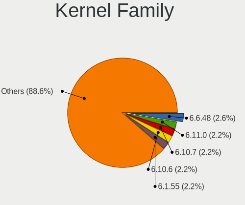
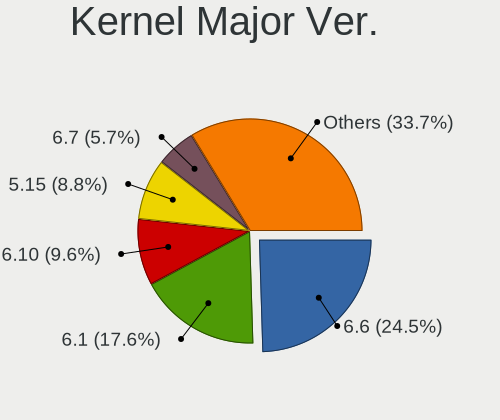
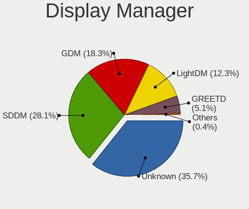
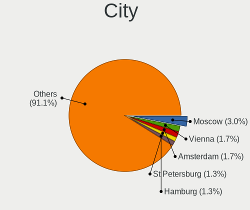
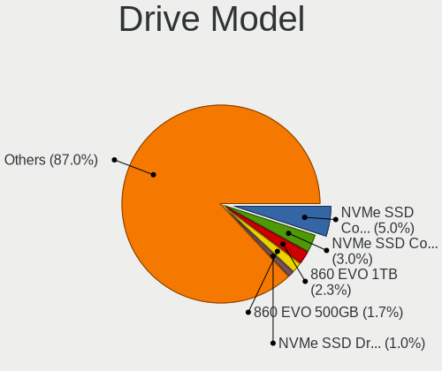
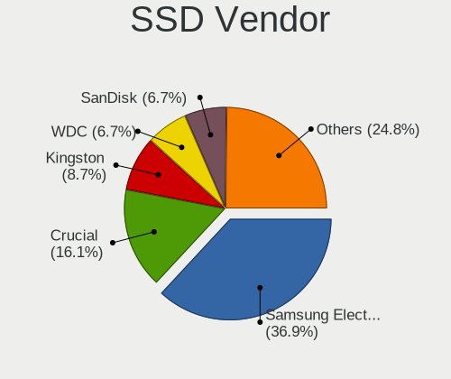
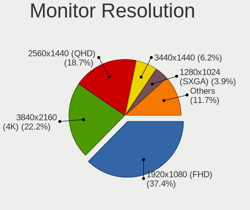
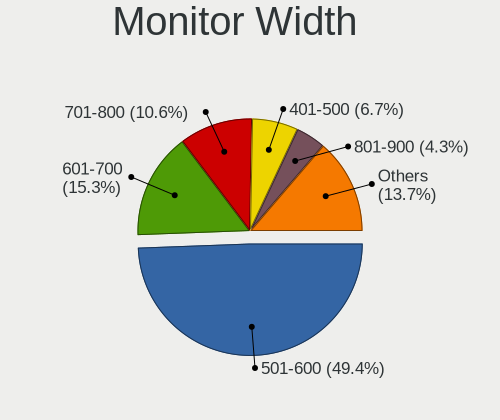
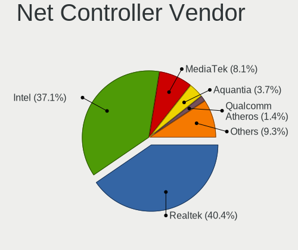

NixOS - Tested Hardware & Statistics (Desktops)
-----------------------------------------------

A project to collect tested hardware configurations for NixOS.

Anyone can contribute to this report by the [hw-probe](https://github.com/linuxhw/hw-probe) tool:

    sudo -E hw-probe -all -upload

Please contribute! Especially if your hardware is rare.

Contents
--------

* [ Test Cases ](#test-cases)

* [ System ](#system)
  - [ OS                       ](#os)
  - [ OS Family                ](#os-family)
  - [ Kernel                   ](#kernel)
  - [ Kernel Family            ](#kernel-family)
  - [ Kernel Major Ver.        ](#kernel-major-ver)
  - [ Arch                     ](#arch)
  - [ DE                       ](#de)
  - [ Display Server           ](#display-server)
  - [ Display Manager          ](#display-manager)
  - [ OS Lang                  ](#os-lang)
  - [ Boot Mode                ](#boot-mode)
  - [ Filesystem               ](#filesystem)
  - [ Part. scheme             ](#part-scheme)
  - [ Dual Boot with Linux/BSD ](#dual-boot-with-linuxbsd)
  - [ Dual Boot (Win)          ](#dual-boot-win)

* [ Board ](#board)
  - [ Vendor                   ](#vendor)
  - [ Model                    ](#model)
  - [ Model Family             ](#model-family)
  - [ MFG Year                 ](#mfg-year)
  - [ Form Factor              ](#form-factor)
  - [ Secure Boot              ](#secure-boot)
  - [ Coreboot                 ](#coreboot)
  - [ RAM Size                 ](#ram-size)
  - [ RAM Used                 ](#ram-used)
  - [ Total Drives             ](#total-drives)
  - [ Has CD-ROM               ](#has-cd-rom)
  - [ Has Ethernet             ](#has-ethernet)
  - [ Has WiFi                 ](#has-wifi)
  - [ Has Bluetooth            ](#has-bluetooth)

* [ Location ](#location)
  - [ Country                  ](#country)
  - [ City                     ](#city)

* [ Drives ](#drives)
  - [ Drive Vendor             ](#drive-vendor)
  - [ Drive Model              ](#drive-model)
  - [ HDD Vendor               ](#hdd-vendor)
  - [ SSD Vendor               ](#ssd-vendor)
  - [ Drive Kind               ](#drive-kind)
  - [ Drive Connector          ](#drive-connector)
  - [ Drive Size               ](#drive-size)
  - [ Space Total              ](#space-total)
  - [ Space Used               ](#space-used)
  - [ Malfunc. Drives          ](#malfunc-drives)
  - [ Malfunc. Drive Vendor    ](#malfunc-drive-vendor)
  - [ Malfunc. HDD Vendor      ](#malfunc-hdd-vendor)
  - [ Malfunc. Drive Kind      ](#malfunc-drive-kind)
  - [ Failed Drives            ](#failed-drives)
  - [ Failed Drive Vendor      ](#failed-drive-vendor)
  - [ Drive Status             ](#drive-status)

* [ Storage controller ](#storage-controller)
  - [ Storage Vendor           ](#storage-vendor)
  - [ Storage Model            ](#storage-model)
  - [ Storage Kind             ](#storage-kind)

* [ Processor ](#processor)
  - [ CPU Vendor               ](#cpu-vendor)
  - [ CPU Model                ](#cpu-model)
  - [ CPU Model Family         ](#cpu-model-family)
  - [ CPU Cores                ](#cpu-cores)
  - [ CPU Sockets              ](#cpu-sockets)
  - [ CPU Threads              ](#cpu-threads)
  - [ CPU Op-Modes             ](#cpu-op-modes)
  - [ CPU Microcode            ](#cpu-microcode)
  - [ CPU Microarch            ](#cpu-microarch)

* [ Graphics ](#graphics)
  - [ GPU Vendor               ](#gpu-vendor)
  - [ GPU Model                ](#gpu-model)
  - [ GPU Combo                ](#gpu-combo)
  - [ GPU Driver               ](#gpu-driver)
  - [ GPU Memory               ](#gpu-memory)

* [ Monitor ](#monitor)
  - [ Monitor Vendor           ](#monitor-vendor)
  - [ Monitor Model            ](#monitor-model)
  - [ Monitor Resolution       ](#monitor-resolution)
  - [ Monitor Diagonal         ](#monitor-diagonal)
  - [ Monitor Width            ](#monitor-width)
  - [ Aspect Ratio             ](#aspect-ratio)
  - [ Monitor Area             ](#monitor-area)
  - [ Pixel Density            ](#pixel-density)
  - [ Multiple Monitors        ](#multiple-monitors)

* [ Network ](#network)
  - [ Net Controller Vendor    ](#net-controller-vendor)
  - [ Net Controller Model     ](#net-controller-model)
  - [ Wireless Vendor          ](#wireless-vendor)
  - [ Wireless Model           ](#wireless-model)
  - [ Ethernet Vendor          ](#ethernet-vendor)
  - [ Ethernet Model           ](#ethernet-model)
  - [ Net Controller Kind      ](#net-controller-kind)
  - [ Used Controller          ](#used-controller)
  - [ NICs                     ](#nics)
  - [ IPv6                     ](#ipv6)

* [ Bluetooth ](#bluetooth)
  - [ Bluetooth Vendor         ](#bluetooth-vendor)
  - [ Bluetooth Model          ](#bluetooth-model)

* [ Sound ](#sound)
  - [ Sound Vendor             ](#sound-vendor)
  - [ Sound Model              ](#sound-model)

* [ Memory ](#memory)
  - [ Memory Vendor            ](#memory-vendor)
  - [ Memory Model             ](#memory-model)
  - [ Memory Kind              ](#memory-kind)
  - [ Memory Form Factor       ](#memory-form-factor)
  - [ Memory Size              ](#memory-size)
  - [ Memory Speed             ](#memory-speed)

* [ Printers & scanners ](#printers--scanners)
  - [ Printer Vendor           ](#printer-vendor)
  - [ Printer Model            ](#printer-model)
  - [ Scanner Vendor           ](#scanner-vendor)
  - [ Scanner Model            ](#scanner-model)

* [ Camera ](#camera)
  - [ Camera Vendor            ](#camera-vendor)
  - [ Camera Model             ](#camera-model)

* [ Security ](#security)
  - [ Fingerprint Vendor       ](#fingerprint-vendor)
  - [ Fingerprint Model        ](#fingerprint-model)
  - [ Chipcard Vendor          ](#chipcard-vendor)
  - [ Chipcard Model           ](#chipcard-model)

* [ Unsupported ](#unsupported)
  - [ Unsupported Devices      ](#unsupported-devices)
  - [ Unsupported Device Types ](#unsupported-device-types)

Test Cases
----------

Total: 185

| Vendor        | Model                       | Probe                                                      | Date         |
|---------------|-----------------------------|------------------------------------------------------------|--------------|
| ASUSTek       | TUF B450M-PLUS GAMING       | [73060b4642](https://linux-hardware.org/?probe=73060b4642) | May 07, 2024 |
| HP            | 2B2C                        | [082d220d35](https://linux-hardware.org/?probe=082d220d35) | May 04, 2024 |
| Gigabyte      | Z390 AORUS PRO WIFI-CF      | [1902c0eeab](https://linux-hardware.org/?probe=1902c0eeab) | May 02, 2024 |
| MSI           | B450 GAMING PLUS MAX        | [3146b9914d](https://linux-hardware.org/?probe=3146b9914d) | May 01, 2024 |
| Apple         | Mac-F60DEB81FF30ACF6 Mac... | [32d8346d26](https://linux-hardware.org/?probe=32d8346d26) | May 01, 2024 |
| MSI           | PRO Z790-P WIFI             | [836078acb2](https://linux-hardware.org/?probe=836078acb2) | Apr 29, 2024 |
| ASUSTek       | ROG Maximus XI HERO         | [7c970a2e6f](https://linux-hardware.org/?probe=7c970a2e6f) | Apr 27, 2024 |
| ASUSTek       | ROG Maximus XI HERO         | [33f2b78f07](https://linux-hardware.org/?probe=33f2b78f07) | Apr 27, 2024 |
| Apple         | Mac-F60DEB81FF30ACF6 Mac... | [55a3147182](https://linux-hardware.org/?probe=55a3147182) | Apr 26, 2024 |
| Unknown       | X79A                        | [c0456a0238](https://linux-hardware.org/?probe=c0456a0238) | Apr 26, 2024 |
| Jetway        | 1.0                         | [5410155063](https://linux-hardware.org/?probe=5410155063) | Apr 25, 2024 |
| MSI           | B450 GAMING PRO CARBON M... | [26f465d651](https://linux-hardware.org/?probe=26f465d651) | Apr 24, 2024 |
| Gigabyte      | Z390 GAMING SLI-CF          | [95968f8653](https://linux-hardware.org/?probe=95968f8653) | Apr 19, 2024 |
| Gigabyte      | Z790 UD                     | [098435751f](https://linux-hardware.org/?probe=098435751f) | Apr 18, 2024 |
| Gigabyte      | Z790 UD                     | [ab7e23fe7d](https://linux-hardware.org/?probe=ab7e23fe7d) | Apr 18, 2024 |
| ASUSTek       | ProArt X670E-CREATOR WIF... | [a805996b80](https://linux-hardware.org/?probe=a805996b80) | Apr 16, 2024 |
| ASRock        | B650E PG Riptide WiFi       | [edae497a7d](https://linux-hardware.org/?probe=edae497a7d) | Apr 14, 2024 |
| MSI           | B450 GAMING PLUS MAX        | [12d5a6c723](https://linux-hardware.org/?probe=12d5a6c723) | Apr 08, 2024 |
| Gigabyte      | GA-H61TN-SI                 | [3f6b496eb7](https://linux-hardware.org/?probe=3f6b496eb7) | Apr 02, 2024 |
| HP            | 89D8 SMVB                   | [32e0d11ee9](https://linux-hardware.org/?probe=32e0d11ee9) | Apr 02, 2024 |
| Gigabyte      | B550I AORUS PRO AX          | [75613012d4](https://linux-hardware.org/?probe=75613012d4) | Mar 27, 2024 |
| MSI           | B450-A PRO MAX              | [5448e71afb](https://linux-hardware.org/?probe=5448e71afb) | Mar 23, 2024 |
| Gigabyte      | Z790 AORUS ELITE X WIFI7    | [9a507bf688](https://linux-hardware.org/?probe=9a507bf688) | Mar 23, 2024 |
| ASUSTek       | ROG Maximus XI HERO         | [b835c572e5](https://linux-hardware.org/?probe=b835c572e5) | Mar 18, 2024 |
| ASUSTek       | SABERTOOTH 990FX R2.0       | [1ceb0c75ea](https://linux-hardware.org/?probe=1ceb0c75ea) | Mar 15, 2024 |
| MSI           | B450-A PRO                  | [fcf37e125a](https://linux-hardware.org/?probe=fcf37e125a) | Mar 14, 2024 |
| Gigabyte      | GA-MA790GP-DS4H             | [9ffb06c47b](https://linux-hardware.org/?probe=9ffb06c47b) | Mar 13, 2024 |
| ASUSTek       | TUF Gaming A620M-PLUS WI... | [0772d17a95](https://linux-hardware.org/?probe=0772d17a95) | Mar 13, 2024 |
| ASUSTek       | TUF Gaming A620M-PLUS WI... | [644c52ac31](https://linux-hardware.org/?probe=644c52ac31) | Mar 13, 2024 |
| MSI           | B85M-E45                    | [6623f1bc66](https://linux-hardware.org/?probe=6623f1bc66) | Mar 12, 2024 |
| ASUSTek       | ROG Maximus XII EXTREME     | [260fb753fe](https://linux-hardware.org/?probe=260fb753fe) | Mar 11, 2024 |
| MSI           | MAG Z790 TOMAHAWK MAX WI... | [1bf5956e3f](https://linux-hardware.org/?probe=1bf5956e3f) | Mar 10, 2024 |
| ASUSTek       | ProArt B550-CREATOR         | [34bed62abf](https://linux-hardware.org/?probe=34bed62abf) | Mar 10, 2024 |
| MSI           | MAG X570S TORPEDO MAX       | [dc8badd739](https://linux-hardware.org/?probe=dc8badd739) | Mar 08, 2024 |
| MSI           | MAG X570S TORPEDO MAX       | [36f42c8be7](https://linux-hardware.org/?probe=36f42c8be7) | Mar 08, 2024 |
| MSI           | B450-A PRO                  | [ec32ffdea7](https://linux-hardware.org/?probe=ec32ffdea7) | Mar 06, 2024 |
| Gigabyte      | B650M AORUS ELITE AX        | [2fae47ca0a](https://linux-hardware.org/?probe=2fae47ca0a) | Feb 29, 2024 |
| Gigabyte      | GA-MA790GP-DS4H             | [0bdc619992](https://linux-hardware.org/?probe=0bdc619992) | Feb 28, 2024 |
| ASUSTek       | TUF Gaming X570-PLUS        | [7a1e61aea2](https://linux-hardware.org/?probe=7a1e61aea2) | Feb 24, 2024 |
| Win elemen... | M600                        | [706d9a6da6](https://linux-hardware.org/?probe=706d9a6da6) | Feb 15, 2024 |
| Biostar       | TZ590-BTC DUO               | [43894bcb57](https://linux-hardware.org/?probe=43894bcb57) | Feb 15, 2024 |
| ASUSTek       | ROG STRIX B550-I GAMING     | [7efa507cb3](https://linux-hardware.org/?probe=7efa507cb3) | Feb 12, 2024 |
| Gigabyte      | Z390 GAMING SLI-CF          | [fefa1b06db](https://linux-hardware.org/?probe=fefa1b06db) | Feb 08, 2024 |
| ASUSTek       | TUF Gaming X570-PLUS        | [9db247a049](https://linux-hardware.org/?probe=9db247a049) | Feb 08, 2024 |
| Gigabyte      | Z690 AORUS MASTER           | [696b85242c](https://linux-hardware.org/?probe=696b85242c) | Feb 03, 2024 |
| Biostar       | TZ590-BTC DUO               | [86684436da](https://linux-hardware.org/?probe=86684436da) | Jan 27, 2024 |
| Biostar       | TZ590-BTC DUO               | [68df04d154](https://linux-hardware.org/?probe=68df04d154) | Jan 27, 2024 |
| MSI           | MS-B1831                    | [45dd2bc3a1](https://linux-hardware.org/?probe=45dd2bc3a1) | Jan 25, 2024 |
| Gigabyte      | B550I AORUS PRO AX          | [6cfbe412a8](https://linux-hardware.org/?probe=6cfbe412a8) | Jan 16, 2024 |
| Gigabyte      | B650M GAMING X AX           | [655122ef53](https://linux-hardware.org/?probe=655122ef53) | Jan 14, 2024 |
| ASUSTek       | Pro WS X570-ACE             | [268e37f04e](https://linux-hardware.org/?probe=268e37f04e) | Jan 14, 2024 |
| ASUSTek       | P8Z77-V LE                  | [929c108f73](https://linux-hardware.org/?probe=929c108f73) | Jan 13, 2024 |
| ASUSTek       | STRIX Z270H GAMING          | [c5eb936632](https://linux-hardware.org/?probe=c5eb936632) | Jan 13, 2024 |
| Gigabyte      | Z690 AORUS MASTER           | [bdc05e8e4e](https://linux-hardware.org/?probe=bdc05e8e4e) | Jan 11, 2024 |
| MSI           | Z170A SLI                   | [e58029e4a2](https://linux-hardware.org/?probe=e58029e4a2) | Jan 08, 2024 |
| Dell          | 0FXD80 A00                  | [628772fa2d](https://linux-hardware.org/?probe=628772fa2d) | Jan 07, 2024 |
| ASUSTek       | PRIME H410M-E               | [3e11f092ef](https://linux-hardware.org/?probe=3e11f092ef) | Jan 07, 2024 |
| Gigabyte      | Z690 AORUS MASTER           | [fb05620dfd](https://linux-hardware.org/?probe=fb05620dfd) | Jan 05, 2024 |
| ASUSTek       | Pro WS TRX50-SAGE WIFI      | [cfba81369c](https://linux-hardware.org/?probe=cfba81369c) | Jan 05, 2024 |
| ASUSTek       | ROG STRIX B550-A GAMING     | [527cc7c1d4](https://linux-hardware.org/?probe=527cc7c1d4) | Jan 05, 2024 |
| HP            | 1790                        | [e554a0f029](https://linux-hardware.org/?probe=e554a0f029) | Jan 04, 2024 |
| Gigabyte      | Z390 AORUS PRO-CF           | [91b39eb7b5](https://linux-hardware.org/?probe=91b39eb7b5) | Jan 03, 2024 |
| Gigabyte      | B450 AORUS M                | [733b1e64b3](https://linux-hardware.org/?probe=733b1e64b3) | Jan 03, 2024 |
| ASUSTek       | TUF Gaming Z490-PLUS        | [f96513dd00](https://linux-hardware.org/?probe=f96513dd00) | Jan 02, 2024 |
| ASUSTek       | TUF Gaming X670E-PLUS WI... | [c6c9c3c74e](https://linux-hardware.org/?probe=c6c9c3c74e) | Jan 01, 2024 |
| AZW           | EQ                          | [f27e8ec7a4](https://linux-hardware.org/?probe=f27e8ec7a4) | Dec 27, 2023 |
| ASUSTek       | PRIME X370-PRO              | [f8483f02ab](https://linux-hardware.org/?probe=f8483f02ab) | Dec 26, 2023 |
| ASUSTek       | ROG CROSSHAIR VIII IMPAC... | [a953876b2c](https://linux-hardware.org/?probe=a953876b2c) | Dec 23, 2023 |
| ASRock        | X670E PG Lightning          | [b6aa52f693](https://linux-hardware.org/?probe=b6aa52f693) | Dec 17, 2023 |
| AZW           | EQ                          | [b6aa615ccf](https://linux-hardware.org/?probe=b6aa615ccf) | Dec 14, 2023 |
| ASUSTek       | TUF B360M-PLUS GAMING       | [2982c2a2c6](https://linux-hardware.org/?probe=2982c2a2c6) | Dec 14, 2023 |
| Gigabyte      | Z790 GAMING X AX            | [8617acecda](https://linux-hardware.org/?probe=8617acecda) | Dec 11, 2023 |
| MSI           | MAG X670E TOMAHAWK WIFI     | [62c4dde3a6](https://linux-hardware.org/?probe=62c4dde3a6) | Dec 07, 2023 |
| AZW           | EQ                          | [c2dedbf2f3](https://linux-hardware.org/?probe=c2dedbf2f3) | Dec 04, 2023 |
| ASRock        | B550 Phantom Gaming-ITX/... | [7273cc93a9](https://linux-hardware.org/?probe=7273cc93a9) | Dec 02, 2023 |
| Gigabyte      | B550I AORUS PRO AX          | [07e6828b2e](https://linux-hardware.org/?probe=07e6828b2e) | Nov 23, 2023 |
| ASRock        | B550 Phantom Gaming-ITX/... | [34b2b48e8c](https://linux-hardware.org/?probe=34b2b48e8c) | Nov 19, 2023 |
| Gigabyte      | X570 I AORUS PRO WIFI       | [0820ebd908](https://linux-hardware.org/?probe=0820ebd908) | Nov 16, 2023 |
| Gigabyte      | GA-78LMT-USB3               | [a263ed1c12](https://linux-hardware.org/?probe=a263ed1c12) | Nov 13, 2023 |
| ASUSTek       | ROG STRIX B450-F GAMING     | [67938dee90](https://linux-hardware.org/?probe=67938dee90) | Nov 12, 2023 |
| ASRock        | Z690M-ITX/ax                | [503d3690b0](https://linux-hardware.org/?probe=503d3690b0) | Nov 11, 2023 |
| ASUSTek       | PRIME X399-A                | [e0883e3bd0](https://linux-hardware.org/?probe=e0883e3bd0) | Nov 11, 2023 |
| Nvidia        | snc302eeh                   | [2b0a14caec](https://linux-hardware.org/?probe=2b0a14caec) | Nov 10, 2023 |
| ASUSTek       | PRIME X370-PRO              | [d9cad8ffde](https://linux-hardware.org/?probe=d9cad8ffde) | Nov 09, 2023 |
| ASUSTek       | PRIME X570-PRO              | [1786e4735e](https://linux-hardware.org/?probe=1786e4735e) | Nov 07, 2023 |
| MSI           | X570-A PRO                  | [30416c0355](https://linux-hardware.org/?probe=30416c0355) | Nov 04, 2023 |
| HP            | 83E1                        | [c82d34ebac](https://linux-hardware.org/?probe=c82d34ebac) | Nov 04, 2023 |
| LattePanda    | Sigma                       | [d287cf2d8a](https://linux-hardware.org/?probe=d287cf2d8a) | Oct 26, 2023 |
| ASRock        | B650M PG Riptide WiFi       | [387c91f530](https://linux-hardware.org/?probe=387c91f530) | Oct 26, 2023 |
| ECS           | A55F-M3                     | [6da483b400](https://linux-hardware.org/?probe=6da483b400) | Oct 25, 2023 |
| Unknown       | HX90                        | [f247716ab0](https://linux-hardware.org/?probe=f247716ab0) | Oct 13, 2023 |
| ASUSTek       | P7H55                       | [89472bd2f3](https://linux-hardware.org/?probe=89472bd2f3) | Oct 07, 2023 |
| ASRock        | Z87 Extreme4                | [642a2f5a9b](https://linux-hardware.org/?probe=642a2f5a9b) | Oct 04, 2023 |
| Gigabyte      | X570 AORUS ELITE WIFI       | [007bb33fbf](https://linux-hardware.org/?probe=007bb33fbf) | Oct 01, 2023 |
| MSI           | Z68A-GD65                   | [c0f968740b](https://linux-hardware.org/?probe=c0f968740b) | Sep 29, 2023 |
| ASUSTek       | ROG STRIX Z690-A GAMING ... | [0177e96165](https://linux-hardware.org/?probe=0177e96165) | Sep 28, 2023 |
| HP            | 3397                        | [5c1b3bed0b](https://linux-hardware.org/?probe=5c1b3bed0b) | Sep 28, 2023 |
| ASUSTek       | P8H77-V                     | [24ff983f95](https://linux-hardware.org/?probe=24ff983f95) | Sep 28, 2023 |
| HP            | 1998                        | [4af6b915c2](https://linux-hardware.org/?probe=4af6b915c2) | Sep 17, 2023 |
| HP            | 8767 A                      | [ce91ccf3a9](https://linux-hardware.org/?probe=ce91ccf3a9) | Sep 09, 2023 |
| Gigabyte      | B550I AORUS PRO AX          | [ac09f27b9d](https://linux-hardware.org/?probe=ac09f27b9d) | Aug 22, 2023 |
| ASUSTek       | ROG CROSSHAIR X670E GENE    | [a9a56ae120](https://linux-hardware.org/?probe=a9a56ae120) | Aug 22, 2023 |
| AZW           | EQ                          | [4a9aad33f3](https://linux-hardware.org/?probe=4a9aad33f3) | Aug 06, 2023 |
| ASUSTek       | PRIME X370-PRO              | [1abcf2ad6f](https://linux-hardware.org/?probe=1abcf2ad6f) | Aug 04, 2023 |
| Gigabyte      | B550I AORUS PRO AX          | [959f3b36df](https://linux-hardware.org/?probe=959f3b36df) | Jul 26, 2023 |
| HP            | 1998                        | [ef5201611b](https://linux-hardware.org/?probe=ef5201611b) | Jul 24, 2023 |
| HP            | 1998                        | [5a95ac128d](https://linux-hardware.org/?probe=5a95ac128d) | Jul 24, 2023 |
| AZW           | EQ                          | [e065c16f2c](https://linux-hardware.org/?probe=e065c16f2c) | Jul 23, 2023 |
| AZW           | EQ                          | [46a76eeb81](https://linux-hardware.org/?probe=46a76eeb81) | Jul 23, 2023 |
| ASUSTek       | Z87-EXPERT                  | [1e8eeb8513](https://linux-hardware.org/?probe=1e8eeb8513) | Jul 16, 2023 |
| ASUSTek       | Z87-EXPERT                  | [8efa3cf99d](https://linux-hardware.org/?probe=8efa3cf99d) | Jul 16, 2023 |
| ASUSTek       | PRIME X370-PRO              | [d7afc91d12](https://linux-hardware.org/?probe=d7afc91d12) | Jul 07, 2023 |
| Acer          | Aspire TC-885 V:1.1         | [a2dc9efa21](https://linux-hardware.org/?probe=a2dc9efa21) | Jul 06, 2023 |
| Gigabyte      | TRX40 AORUS MASTER          | [f1c343e2c2](https://linux-hardware.org/?probe=f1c343e2c2) | Jul 02, 2023 |
| ASUSTek       | TUF Gaming B660-PLUS WIF... | [f15cf1d31b](https://linux-hardware.org/?probe=f15cf1d31b) | Jul 02, 2023 |
| ASUSTek       | ROG STRIX B550-F GAMING     | [85902981fd](https://linux-hardware.org/?probe=85902981fd) | Jun 11, 2023 |
| Acer          | Aspire XC600 v1.0           | [754d228b9b](https://linux-hardware.org/?probe=754d228b9b) | Jun 09, 2023 |
| Gigabyte      | X570 AORUS PRO              | [309d09ae8c](https://linux-hardware.org/?probe=309d09ae8c) | Jun 03, 2023 |
| Gigabyte      | B450M DS3H-CF               | [c9c4e5ddb5](https://linux-hardware.org/?probe=c9c4e5ddb5) | May 26, 2023 |
| Gigabyte      | B450M DS3H-CF               | [cc8e36e75a](https://linux-hardware.org/?probe=cc8e36e75a) | May 26, 2023 |
| ASUSTek       | PRIME Z370-P II             | [4d84deed6b](https://linux-hardware.org/?probe=4d84deed6b) | May 09, 2023 |
| ASUSTek       | ROG STRIX B650E-F GAMING... | [29b2378b4b](https://linux-hardware.org/?probe=29b2378b4b) | May 08, 2023 |
| ASUSTek       | ROG STRIX B650E-F GAMING... | [62b28b69dc](https://linux-hardware.org/?probe=62b28b69dc) | May 08, 2023 |
| Gigabyte      | B760 GAMING X DDR4          | [6ee65c19d2](https://linux-hardware.org/?probe=6ee65c19d2) | May 02, 2023 |
| ASUSTek       | ROG STRIX B550-F GAMING     | [493bc0b894](https://linux-hardware.org/?probe=493bc0b894) | Apr 29, 2023 |
| ASUSTek       | PRIME B350M-A               | [b8b51b29ef](https://linux-hardware.org/?probe=b8b51b29ef) | Apr 25, 2023 |
| Gigabyte      | B550I AORUS PRO AX          | [bbbc9206b4](https://linux-hardware.org/?probe=bbbc9206b4) | Apr 17, 2023 |
| MSI           | B550-A PRO                  | [c4f08a9fc3](https://linux-hardware.org/?probe=c4f08a9fc3) | Mar 04, 2023 |
| MSI           | MAG B550 TOMAHAWK           | [c4d51ca1b8](https://linux-hardware.org/?probe=c4d51ca1b8) | Mar 04, 2023 |
| MSI           | Z77A-G43                    | [eb768bf205](https://linux-hardware.org/?probe=eb768bf205) | Feb 03, 2023 |
| Gigabyte      | B450M DS3H V2               | [75a3416ebc](https://linux-hardware.org/?probe=75a3416ebc) | Jan 31, 2023 |
| ASRock        | Z87 Extreme4                | [b795f7c940](https://linux-hardware.org/?probe=b795f7c940) | Jan 19, 2023 |
| ASRock        | B550M Pro4                  | [0e4ba05b0f](https://linux-hardware.org/?probe=0e4ba05b0f) | Jan 15, 2023 |
| Shenzhen M... | F7BFC                       | [6a53c626dd](https://linux-hardware.org/?probe=6a53c626dd) | Jan 02, 2023 |
| ASUSTek       | Z87-C                       | [4929f6a6c9](https://linux-hardware.org/?probe=4929f6a6c9) | Dec 28, 2022 |
| MSI           | B550-A PRO                  | [db7b91ac2f](https://linux-hardware.org/?probe=db7b91ac2f) | Dec 17, 2022 |
| ASUSTek       | PRIME B550M-A               | [3c18fca709](https://linux-hardware.org/?probe=3c18fca709) | Dec 09, 2022 |
| ASUSTek       | SABERTOOTH 990FX R2.0       | [6ffc032b64](https://linux-hardware.org/?probe=6ffc032b64) | Oct 25, 2022 |
| ASUSTek       | PRIME B550M-A               | [c203d7c388](https://linux-hardware.org/?probe=c203d7c388) | Oct 07, 2022 |
| Gigabyte      | X570 AORUS ELITE            | [b21f5fee1a](https://linux-hardware.org/?probe=b21f5fee1a) | Sep 26, 2022 |
| ASUSTek       | PRIME B550M-A               | [98fd9b974e](https://linux-hardware.org/?probe=98fd9b974e) | Sep 09, 2022 |
| ASRock        | AB350 Pro4                  | [ce872c873e](https://linux-hardware.org/?probe=ce872c873e) | Aug 24, 2022 |
| ASUSTek       | H97I-PLUS                   | [982df0dba9](https://linux-hardware.org/?probe=982df0dba9) | Jun 22, 2022 |
| MSI           | MEG X570 UNIFY              | [6d5fdb800a](https://linux-hardware.org/?probe=6d5fdb800a) | Jun 20, 2022 |
| ASUSTek       | ROG STRIX Z390-F GAMING     | [a4621aa4ec](https://linux-hardware.org/?probe=a4621aa4ec) | Jun 19, 2022 |
| MSI           | MEG X570 UNIFY              | [d26f08ea88](https://linux-hardware.org/?probe=d26f08ea88) | Jun 12, 2022 |
| MSI           | MEG X570 UNIFY              | [0123caa2f3](https://linux-hardware.org/?probe=0123caa2f3) | Jun 11, 2022 |
| ASUSTek       | PRIME A520M-K               | [ab13de0478](https://linux-hardware.org/?probe=ab13de0478) | May 27, 2022 |
| Gigabyte      | B550I AORUS PRO AX          | [96b24b0640](https://linux-hardware.org/?probe=96b24b0640) | May 20, 2022 |
| ASUSTek       | PRIME X570-P                | [50d2e86de8](https://linux-hardware.org/?probe=50d2e86de8) | Apr 13, 2022 |
| Acer          | Nitro N50-610               | [46b46c842f](https://linux-hardware.org/?probe=46b46c842f) | Apr 13, 2022 |
| ASUSTek       | P8Q77-M                     | [6cd75b6762](https://linux-hardware.org/?probe=6cd75b6762) | Mar 11, 2022 |
| Gigabyte      | X470 AORUS ULTRA GAMING-... | [815cb9ab49](https://linux-hardware.org/?probe=815cb9ab49) | Mar 11, 2022 |
| MSI           | B450M MORTAR MAX            | [1d6563ada3](https://linux-hardware.org/?probe=1d6563ada3) | Mar 11, 2022 |
| ASUSTek       | P8Z77-V LK                  | [5c984c6d9a](https://linux-hardware.org/?probe=5c984c6d9a) | Mar 09, 2022 |
| ASUSTek       | P8Z77-V LK                  | [40d2eced72](https://linux-hardware.org/?probe=40d2eced72) | Mar 09, 2022 |
| EVGA          | X299 FTW K                  | [6f9489b2e6](https://linux-hardware.org/?probe=6f9489b2e6) | Mar 09, 2022 |
| Dell          | 0KJCC5 A00                  | [524b675e7e](https://linux-hardware.org/?probe=524b675e7e) | Mar 09, 2022 |
| MSI           | MAG X570 TOMAHAWK WIFI      | [f38279e396](https://linux-hardware.org/?probe=f38279e396) | Mar 09, 2022 |
| MSI           | X399 SLI PLUS               | [a1d172dbc0](https://linux-hardware.org/?probe=a1d172dbc0) | Feb 16, 2022 |
| MSI           | MAG X570 TOMAHAWK WIFI      | [c84b603f92](https://linux-hardware.org/?probe=c84b603f92) | Jan 04, 2022 |
| ASUSTek       | Z170-P                      | [d4bac456d1](https://linux-hardware.org/?probe=d4bac456d1) | Dec 16, 2021 |
| Gigabyte      | X570 AORUS ELITE            | [eb5d5f4361](https://linux-hardware.org/?probe=eb5d5f4361) | Dec 12, 2021 |
| ASUSTek       | PRIME Z390-A                | [af887c3f7b](https://linux-hardware.org/?probe=af887c3f7b) | Nov 29, 2021 |
| Gigabyte      | H97M-D3H                    | [349fbeb586](https://linux-hardware.org/?probe=349fbeb586) | Oct 23, 2021 |
| MSI           | X399 SLI PLUS               | [128ae965a7](https://linux-hardware.org/?probe=128ae965a7) | Aug 06, 2021 |
| ASRock        | X570 Taichi                 | [d93a80d973](https://linux-hardware.org/?probe=d93a80d973) | Jul 14, 2021 |
| ASRock        | X570 Taichi                 | [59a699d357](https://linux-hardware.org/?probe=59a699d357) | Jul 14, 2021 |
| ASUSTek       | SABERTOOTH X99              | [60eed45305](https://linux-hardware.org/?probe=60eed45305) | Jun 18, 2021 |
| MSI           | X570-A PRO                  | [0619809b36](https://linux-hardware.org/?probe=0619809b36) | Jun 01, 2021 |
| ASRock        | B450 Gaming-ITX/ac          | [6056eac50c](https://linux-hardware.org/?probe=6056eac50c) | May 31, 2021 |
| ASRock        | B450 Gaming-ITX/ac          | [bd9fb4818b](https://linux-hardware.org/?probe=bd9fb4818b) | May 31, 2021 |
| ASRock        | B450 Gaming-ITX/ac          | [12fa3ffea5](https://linux-hardware.org/?probe=12fa3ffea5) | May 31, 2021 |
| ASUSTek       | ROG STRIX B550-F GAMING     | [f03b19461f](https://linux-hardware.org/?probe=f03b19461f) | May 16, 2021 |
| ASUSTek       | ROG STRIX B550-F GAMING     | [529e915984](https://linux-hardware.org/?probe=529e915984) | May 16, 2021 |
| ASUSTek       | Pro WS W480-ACE             | [3825190816](https://linux-hardware.org/?probe=3825190816) | Mar 11, 2021 |
| ASUSTek       | ROG STRIX B550-I GAMING     | [d55d51a3e2](https://linux-hardware.org/?probe=d55d51a3e2) | Feb 08, 2021 |
| MSI           | MPG X570 GAMING PLUS        | [188755ebc7](https://linux-hardware.org/?probe=188755ebc7) | Oct 25, 2020 |
| Hardkernel    | ODROID-H2                   | [a5d75a24e5](https://linux-hardware.org/?probe=a5d75a24e5) | Oct 13, 2020 |
| ASUSTek       | TUF Gaming X570-PLUS        | [b85fb81c59](https://linux-hardware.org/?probe=b85fb81c59) | Sep 28, 2020 |
| MSI           | MAG B550M BAZOOKA           | [5f7f2db973](https://linux-hardware.org/?probe=5f7f2db973) | Aug 21, 2020 |
| ASUSTek       | PRIME Z270-K                | [cc8de41afd](https://linux-hardware.org/?probe=cc8de41afd) | Aug 21, 2020 |
| HP            | 8055                        | [1165b457fa](https://linux-hardware.org/?probe=1165b457fa) | Jul 08, 2020 |
| HP            | 8055                        | [a5c65e8d4a](https://linux-hardware.org/?probe=a5c65e8d4a) | Jul 08, 2020 |
| ASRock        | TRX40 Creator               | [2cefd65bfb](https://linux-hardware.org/?probe=2cefd65bfb) | Jun 29, 2020 |

System
------

OS
--

Installed operating systems

| Name                             | Desktops | Percent |
|----------------------------------|----------|---------|
| NixOS 23.11                      | 37       | 25.17%  |
| NixOS 24.05                      | 31       | 21.09%  |
| NixOS 23.05                      | 28       | 19.05%  |
| NixOS 22.11                      | 13       | 8.84%   |
| NixOS 22.05                      | 13       | 8.84%   |
| NixOS 21.11                      | 7        | 4.76%   |
| NixOS                            | 3        | 2.04%   |
| NixOS 21.05pre-git               | 2        | 1.36%   |
| NixOS 21.11.20210528.540dccb     | 1        | 0.68%   |
| NixOS 21.05.993.93963c27b93      | 1        | 0.68%   |
| NixOS 21.05.2075.ff1ea3a36c1     | 1        | 0.68%   |
| NixOS 21.05.20210929.ee90403     | 1        | 0.68%   |
| NixOS 21.05.20210430.c8dff32     | 1        | 0.68%   |
| NixOS 21.05.20210224.f6b5bfd     | 1        | 0.68%   |
| NixOS 21.05.1471.a7512bb64b1     | 1        | 0.68%   |
| NixOS 21.03pre246062.420f89ceb26 | 1        | 0.68%   |
| NixOS 21.03.git.b4349c13a6d      | 1        | 0.68%   |
| NixOS 21.03.20201007.420f89c     | 1        | 0.68%   |
| NixOS 20.09pre231796.22a81aa5fc1 | 1        | 0.68%   |
| NixOS 20.09pre-git               | 1        | 0.68%   |
| NixOS 20.09.git.4a361b06a93      | 1        | 0.68%   |

OS Family
---------

OS without a version

| Name  | Desktops | Percent |
|-------|----------|---------|
| NixOS | 140      | 100%    |

Kernel
------

Version of the Linux kernel

| Version       | Desktops | Percent |
|---------------|----------|---------|
| 6.1.55        | 5        | 3.07%   |
| 6.1.69        | 4        | 2.45%   |
| 6.7.6         | 3        | 1.84%   |
| 6.6.8         | 3        | 1.84%   |
| 6.6.28        | 3        | 1.84%   |
| 6.6.0         | 3        | 1.84%   |
| 6.1.37        | 3        | 1.84%   |
| 6.8.6         | 2        | 1.23%   |
| 6.7.6-xanmod1 | 2        | 1.23%   |
| 6.7.0         | 2        | 1.23%   |
| 6.6.22        | 2        | 1.23%   |
| 6.4.7         | 2        | 1.23%   |
| 6.4.0         | 2        | 1.23%   |
| 6.1.71        | 2        | 1.23%   |
| 6.1.64        | 2        | 1.23%   |
| 6.1.61        | 2        | 1.23%   |
| 6.1.60        | 2        | 1.23%   |
| 5.8.1-zen1    | 2        | 1.23%   |
| 5.15.86       | 2        | 1.23%   |
| 5.15.85       | 2        | 1.23%   |
| 5.15.47       | 2        | 1.23%   |
| 5.10.102      | 2        | 1.23%   |
| 6.8.3         | 1        | 0.61%   |
| 6.8.1-cachyos | 1        | 0.61%   |
| 6.8.1         | 1        | 0.61%   |
| 6.8.0-rc2     | 1        | 0.61%   |
| 6.8.0         | 1        | 0.61%   |
| 6.7.9         | 1        | 0.61%   |
| 6.7.7-zen1    | 1        | 0.61%   |
| 6.7.7         | 1        | 0.61%   |
| 6.7.4         | 1        | 0.61%   |
| 6.7.3         | 1        | 0.61%   |
| 6.7.2         | 1        | 0.61%   |
| 6.7.10        | 1        | 0.61%   |
| 6.7.0-rc7     | 1        | 0.61%   |
| 6.7.0-cachyos | 1        | 0.61%   |
| 6.6.6         | 1        | 0.61%   |
| 6.6.5-xanmod1 | 1        | 0.61%   |
| 6.6.3         | 1        | 0.61%   |
| 6.6.26        | 1        | 0.61%   |

Kernel Family
-------------

Linux kernel without a distro release

| Version  | Desktops | Percent |
|----------|----------|---------|
| 6.1.55   | 6        | 3.68%   |
| 6.7.6    | 5        | 3.07%   |
| 6.7.0    | 4        | 2.45%   |
| 6.1.69   | 4        | 2.45%   |
| 6.6.8    | 3        | 1.84%   |
| 6.6.28   | 3        | 1.84%   |
| 6.6.0    | 3        | 1.84%   |
| 6.1.37   | 3        | 1.84%   |
| 6.8.6    | 2        | 1.23%   |
| 6.8.1    | 2        | 1.23%   |
| 6.8.0    | 2        | 1.23%   |
| 6.7.7    | 2        | 1.23%   |
| 6.6.22   | 2        | 1.23%   |
| 6.4.7    | 2        | 1.23%   |
| 6.4.4    | 2        | 1.23%   |
| 6.4.0    | 2        | 1.23%   |
| 6.2.11   | 2        | 1.23%   |
| 6.1.71   | 2        | 1.23%   |
| 6.1.64   | 2        | 1.23%   |
| 6.1.61   | 2        | 1.23%   |
| 6.1.60   | 2        | 1.23%   |
| 6.1.31   | 2        | 1.23%   |
| 5.8.1    | 2        | 1.23%   |
| 5.15.86  | 2        | 1.23%   |
| 5.15.85  | 2        | 1.23%   |
| 5.15.47  | 2        | 1.23%   |
| 5.11.16  | 2        | 1.23%   |
| 5.10.102 | 2        | 1.23%   |
| 6.8.3    | 1        | 0.61%   |
| 6.7.9    | 1        | 0.61%   |
| 6.7.4    | 1        | 0.61%   |
| 6.7.3    | 1        | 0.61%   |
| 6.7.2    | 1        | 0.61%   |
| 6.7.10   | 1        | 0.61%   |
| 6.6.6    | 1        | 0.61%   |
| 6.6.5    | 1        | 0.61%   |
| 6.6.3    | 1        | 0.61%   |
| 6.6.26   | 1        | 0.61%   |
| 6.6.25   | 1        | 0.61%   |
| 6.6.23   | 1        | 0.61%   |

Kernel Major Ver.
-----------------

Linux kernel major version

| Version | Desktops | Percent |
|---------|----------|---------|
| 6.1     | 41       | 26.45%  |
| 6.6     | 24       | 15.48%  |
| 5.15    | 23       | 14.84%  |
| 6.7     | 15       | 9.68%   |
| 5.10    | 9        | 5.81%   |
| 6.5     | 8        | 5.16%   |
| 6.8     | 5        | 3.23%   |
| 6.4     | 5        | 3.23%   |
| 5.4     | 5        | 3.23%   |
| 6.2     | 3        | 1.94%   |
| 5.8     | 3        | 1.94%   |
| 6.0     | 2        | 1.29%   |
| 5.18    | 2        | 1.29%   |
| 5.11    | 2        | 1.29%   |
| 6.3     | 1        | 0.65%   |
| 5.7     | 1        | 0.65%   |
| 5.19    | 1        | 0.65%   |
| 5.17    | 1        | 0.65%   |
| 5.16    | 1        | 0.65%   |
| 5.14    | 1        | 0.65%   |
| 5.13    | 1        | 0.65%   |
| 5.12    | 1        | 0.65%   |

Arch
----

OS architecture (x86_64, i586, etc.)

| Name   | Desktops | Percent |
|--------|----------|---------|
| x86_64 | 140      | 100%    |

DE
--

Desktop Environment

| Name         | Desktops | Percent |
|--------------|----------|---------|
| Unknown      | 53       | 37.32%  |
| KDE5         | 27       | 19.01%  |
| GNOME        | 17       | 11.97%  |
| Hyprland     | 12       | 8.45%   |
| sway         | 8        | 5.63%   |
| KDE          | 6        | 4.23%   |
| XFCE         | 5        | 3.52%   |
| KDE6         | 4        | 2.82%   |
| none+i3      | 3        | 2.11%   |
| none+awesome | 2        | 1.41%   |
| xsession     | 1        | 0.7%    |
| X-Generic    | 1        | 0.7%    |
| none+dwm     | 1        | 0.7%    |
| MATE         | 1        | 0.7%    |
| LXQt         | 1        | 0.7%    |

Display Server
--------------

X11 or Wayland

| Name    | Desktops | Percent |
|---------|----------|---------|
| Unknown | 51       | 35.42%  |
| X11     | 40       | 27.78%  |
| Wayland | 38       | 26.39%  |
| Tty     | 15       | 10.42%  |

Display Manager
---------------

SDDM, LightDM, etc.

| Name    | Desktops | Percent |
|---------|----------|---------|
| Unknown | 58       | 40.85%  |
| SDDM    | 41       | 28.87%  |
| GDM     | 22       | 15.49%  |
| LightDM | 19       | 13.38%  |
| GREETD  | 2        | 1.41%   |

OS Lang
-------

Language

| Lang       | Desktops | Percent |
|------------|----------|---------|
| en_US      | 83       | 59.29%  |
| Unknown    | 24       | 17.14%  |
| en_GB      | 13       | 9.29%   |
| en_AU      | 5        | 3.57%   |
| ru_RU      | 3        | 2.14%   |
| de_DE      | 3        | 2.14%   |
| en_DK      | 2        | 1.43%   |
| sv_SE      | 1        | 0.71%   |
| pt_BR      | 1        | 0.71%   |
| it_IT      | 1        | 0.71%   |
| en_NZ      | 1        | 0.71%   |
| en_IE.UTF8 | 1        | 0.71%   |
| en_IE      | 1        | 0.71%   |
| de_CH      | 1        | 0.71%   |

Boot Mode
---------

EFI or BIOS

| Mode | Desktops | Percent |
|------|----------|---------|
| EFI  | 120      | 85.11%  |
| BIOS | 21       | 14.89%  |

Filesystem
----------

Type of filesystem

| Type     | Desktops | Percent |
|----------|----------|---------|
| Ext4     | 85       | 60.28%  |
| Btrfs    | 22       | 15.6%   |
| Zfs      | 11       | 7.8%    |
| Tmpfs    | 9        | 6.38%   |
| Xfs      | 6        | 4.26%   |
| Bcachefs | 3        | 2.13%   |
| Unknown  | 3        | 2.13%   |
| F2fs     | 1        | 0.71%   |
| Ext2     | 1        | 0.71%   |

Part. scheme
------------

Scheme of partitioning

| Type    | Desktops | Percent |
|---------|----------|---------|
| GPT     | 133      | 95%     |
| MBR     | 5        | 3.57%   |
| Unknown | 2        | 1.43%   |

Dual Boot with Linux/BSD
------------------------

Hosting more than one Linux/BSD

| Dual boot | Desktops | Percent |
|-----------|----------|---------|
| No        | 106      | 74.13%  |
| Yes       | 37       | 25.87%  |

Dual Boot (Win)
---------------

Hosting Linux and Windows

| Dual boot | Desktops | Percent |
|-----------|----------|---------|
| No        | 86       | 60.14%  |
| Yes       | 57       | 39.86%  |

Board
-----

Vendor
------

Motherboard manufacturer

| Name                                 | Desktops | Percent |
|--------------------------------------|----------|---------|
| ASUSTek Computer                     | 52       | 37.14%  |
| Gigabyte Technology                  | 26       | 18.57%  |
| MSI                                  | 24       | 17.14%  |
| ASRock                               | 12       | 8.57%   |
| Hewlett-Packard                      | 8        | 5.71%   |
| Acer                                 | 3        | 2.14%   |
| Dell                                 | 2        | 1.43%   |
| Unknown                              | 2        | 1.43%   |
| Win element                          | 1        | 0.71%   |
| Shenzhen Meigao Electronic Equipment | 1        | 0.71%   |
| Nvidia                               | 1        | 0.71%   |
| LattePanda                           | 1        | 0.71%   |
| Jetway                               | 1        | 0.71%   |
| Hardkernel                           | 1        | 0.71%   |
| EVGA                                 | 1        | 0.71%   |
| ECS                                  | 1        | 0.71%   |
| Biostar                              | 1        | 0.71%   |
| AZW                                  | 1        | 0.71%   |
| Apple                                | 1        | 0.71%   |

Model
-----

Motherboard model

| Name                                       | Desktops | Percent |
|--------------------------------------------|----------|---------|
| MSI MS-7C37                                | 3        | 2.14%   |
| MSI MS-7B86                                | 3        | 2.14%   |
| ASUS TUF Gaming X570-PLUS                  | 3        | 2.14%   |
| ASUS All Series                            | 3        | 2.14%   |
| MSI MS-7C56                                | 2        | 1.43%   |
| Gigabyte B550I AORUS PRO AX                | 2        | 1.43%   |
| Gigabyte B450M DS3H                        | 2        | 1.43%   |
| ASUS SABERTOOTH 990FX R2.0                 | 2        | 1.43%   |
| ASUS ROG STRIX B550-I GAMING               | 2        | 1.43%   |
| ASUS ROG STRIX B550-F GAMING               | 2        | 1.43%   |
| ASUS PRIME X370-PRO                        | 2        | 1.43%   |
| ASRock Z87 Extreme4                        | 2        | 1.43%   |
| Unknown                                    | 2        | 1.43%   |
| Win element M600                           | 1        | 0.71%   |
| Shenzhen Meigao Electronic Equipment UM690 | 1        | 0.71%   |
| Nvidia 680iLT                              | 1        | 0.71%   |
| MSI MS-7E25                                | 1        | 0.71%   |
| MSI MS-7E12                                | 1        | 0.71%   |
| MSI MS-7E06                                | 1        | 0.71%   |
| MSI MS-7D54                                | 1        | 0.71%   |
| MSI MS-7C95                                | 1        | 0.71%   |
| MSI MS-7C91                                | 1        | 0.71%   |
| MSI MS-7C84                                | 1        | 0.71%   |
| MSI MS-7C35                                | 1        | 0.71%   |
| MSI MS-7B89                                | 1        | 0.71%   |
| MSI MS-7B85                                | 1        | 0.71%   |
| MSI MS-7B09                                | 1        | 0.71%   |
| MSI MS-7998                                | 1        | 0.71%   |
| MSI MS-7758                                | 1        | 0.71%   |
| MSI MS-7681                                | 1        | 0.71%   |
| MSI E45                                    | 1        | 0.71%   |
| MSI CML-U PRO Cubi 5 (MS-B183)             | 1        | 0.71%   |
| LattePanda Sigma                           | 1        | 0.71%   |
| Jetway 1.0                                 | 1        | 0.71%   |
| HP Z220 CMT Workstation                    | 1        | 0.71%   |
| HP Victus by 15L Gaming Desktop TG02-0xxx  | 1        | 0.71%   |
| HP Pavilion Gaming Desktop TG01-1xxx       | 1        | 0.71%   |
| HP EliteDesk 800 G4 SFF                    | 1        | 0.71%   |
| HP EliteDesk 800 G2 DM 35W                 | 1        | 0.71%   |
| HP EliteDesk 800 G1 SFF                    | 1        | 0.71%   |

Model Family
------------

Motherboard model prefix

| Name                                       | Desktops | Percent |
|--------------------------------------------|----------|---------|
| ASUS ROG                                   | 13       | 9.29%   |
| ASUS PRIME                                 | 12       | 8.57%   |
| ASUS TUF                                   | 9        | 6.43%   |
| Gigabyte X570                              | 4        | 2.86%   |
| MSI MS-7C37                                | 3        | 2.14%   |
| MSI MS-7B86                                | 3        | 2.14%   |
| HP EliteDesk                               | 3        | 2.14%   |
| Gigabyte Z790                              | 3        | 2.14%   |
| Gigabyte Z390                              | 3        | 2.14%   |
| Gigabyte B450M                             | 3        | 2.14%   |
| ASUS Pro                                   | 3        | 2.14%   |
| ASUS All                                   | 3        | 2.14%   |
| MSI MS-7C56                                | 2        | 1.43%   |
| Gigabyte B650M                             | 2        | 1.43%   |
| Gigabyte B550I                             | 2        | 1.43%   |
| ASUS SABERTOOTH                            | 2        | 1.43%   |
| ASUS ProArt                                | 2        | 1.43%   |
| ASUS P8Z77-V                               | 2        | 1.43%   |
| ASRock Z87                                 | 2        | 1.43%   |
| Acer Aspire                                | 2        | 1.43%   |
| Unknown                                    | 2        | 1.43%   |
| Win element M600                           | 1        | 0.71%   |
| Shenzhen Meigao Electronic Equipment UM690 | 1        | 0.71%   |
| Nvidia 680iLT                              | 1        | 0.71%   |
| MSI MS-7E25                                | 1        | 0.71%   |
| MSI MS-7E12                                | 1        | 0.71%   |
| MSI MS-7E06                                | 1        | 0.71%   |
| MSI MS-7D54                                | 1        | 0.71%   |
| MSI MS-7C95                                | 1        | 0.71%   |
| MSI MS-7C91                                | 1        | 0.71%   |
| MSI MS-7C84                                | 1        | 0.71%   |
| MSI MS-7C35                                | 1        | 0.71%   |
| MSI MS-7B89                                | 1        | 0.71%   |
| MSI MS-7B85                                | 1        | 0.71%   |
| MSI MS-7B09                                | 1        | 0.71%   |
| MSI MS-7998                                | 1        | 0.71%   |
| MSI MS-7758                                | 1        | 0.71%   |
| MSI MS-7681                                | 1        | 0.71%   |
| MSI E45                                    | 1        | 0.71%   |
| MSI CML-U                                  | 1        | 0.71%   |

MFG Year
--------

Motherboard manufacture year

| Year | Desktops | Percent |
|------|----------|---------|
| 2020 | 26       | 18.57%  |
| 2019 | 20       | 14.29%  |
| 2018 | 20       | 14.29%  |
| 2023 | 14       | 10%     |
| 2022 | 12       | 8.57%   |
| 2012 | 9        | 6.43%   |
| 2021 | 7        | 5%      |
| 2017 | 6        | 4.29%   |
| 2016 | 6        | 4.29%   |
| 2014 | 6        | 4.29%   |
| 2013 | 5        | 3.57%   |
| 2015 | 3        | 2.14%   |
| 2008 | 3        | 2.14%   |
| 2011 | 2        | 1.43%   |
| 2010 | 1        | 0.71%   |

Form Factor
-----------

Physical design of the computer

| Name    | Desktops | Percent |
|---------|----------|---------|
| Desktop | 140      | 100%    |

Secure Boot
-----------

Enabled or disabled

| State    | Desktops | Percent |
|----------|----------|---------|
| Disabled | 137      | 97.86%  |
| Enabled  | 3        | 2.14%   |

Coreboot
--------

Have coreboot on board

| Used | Desktops | Percent |
|------|----------|---------|
| No   | 140      | 100%    |

RAM Size
--------

Total RAM memory

| Size in GB      | Desktops | Percent |
|-----------------|----------|---------|
| 32.01-64.0      | 42       | 29.58%  |
| 64.01-256.0     | 39       | 27.46%  |
| 16.01-24.0      | 32       | 22.54%  |
| 24.01-32.0      | 10       | 7.04%   |
| 8.01-16.0       | 9        | 6.34%   |
| 4.01-8.0        | 6        | 4.23%   |
| More than 256.0 | 2        | 1.41%   |
| 3.01-4.0        | 2        | 1.41%   |

RAM Used
--------

Used RAM memory

| Used GB    | Desktops | Percent |
|------------|----------|---------|
| 4.01-8.0   | 39       | 26%     |
| 8.01-16.0  | 29       | 19.33%  |
| 2.01-3.0   | 20       | 13.33%  |
| 1.01-2.0   | 19       | 12.67%  |
| 3.01-4.0   | 17       | 11.33%  |
| 16.01-24.0 | 12       | 8%      |
| 32.01-64.0 | 10       | 6.67%   |
| 24.01-32.0 | 2        | 1.33%   |
| 0.51-1.0   | 2        | 1.33%   |

Total Drives
------------

Number of drives on board

| Drives | Desktops | Percent |
|--------|----------|---------|
| 2      | 44       | 29.93%  |
| 1      | 44       | 29.93%  |
| 3      | 29       | 19.73%  |
| 4      | 10       | 6.8%    |
| 5      | 9        | 6.12%   |
| 6      | 5        | 3.4%    |
| 8      | 3        | 2.04%   |
| 23     | 1        | 0.68%   |
| 7      | 1        | 0.68%   |
| 0      | 1        | 0.68%   |

Has CD-ROM
----------

Has CD-ROM on board

| Presented | Desktops | Percent |
|-----------|----------|---------|
| No        | 115      | 81.56%  |
| Yes       | 26       | 18.44%  |

Has Ethernet
------------

Has Ethernet on board

| Presented | Desktops | Percent |
|-----------|----------|---------|
| Yes       | 140      | 100%    |

Has WiFi
--------

Has WiFi module

| Presented | Desktops | Percent |
|-----------|----------|---------|
| No        | 74       | 51.39%  |
| Yes       | 70       | 48.61%  |

Has Bluetooth
-------------

Has Bluetooth module

| Presented | Desktops | Percent |
|-----------|----------|---------|
| Yes       | 78       | 54.93%  |
| No        | 64       | 45.07%  |

Location
--------

Country
-------

Geographic location (country)

| Country     | Desktops | Percent |
|-------------|----------|---------|
| USA         | 32       | 22.86%  |
| Germany     | 19       | 13.57%  |
| Russia      | 12       | 8.57%   |
| UK          | 9        | 6.43%   |
| Australia   | 6        | 4.29%   |
| Netherlands | 5        | 3.57%   |
| Italy       | 5        | 3.57%   |
| Canada      | 5        | 3.57%   |
| Brazil      | 5        | 3.57%   |
| Austria     | 4        | 2.86%   |
| Sweden      | 3        | 2.14%   |
| Romania     | 3        | 2.14%   |
| Poland      | 3        | 2.14%   |
| France      | 3        | 2.14%   |
| Belgium     | 3        | 2.14%   |
| Ukraine     | 2        | 1.43%   |
| Taiwan      | 2        | 1.43%   |
| Finland     | 2        | 1.43%   |
| Denmark     | 2        | 1.43%   |
| Turkey      | 1        | 0.71%   |
| Switzerland | 1        | 0.71%   |
| Slovenia    | 1        | 0.71%   |
| Serbia      | 1        | 0.71%   |
| Portugal    | 1        | 0.71%   |
| Philippines | 1        | 0.71%   |
| Norway      | 1        | 0.71%   |
| New Zealand | 1        | 0.71%   |
| Mexico      | 1        | 0.71%   |
| Jordan      | 1        | 0.71%   |
| Ireland     | 1        | 0.71%   |
| India       | 1        | 0.71%   |
| Hungary     | 1        | 0.71%   |
| Hong Kong   | 1        | 0.71%   |
| Czechia     | 1        | 0.71%   |

City
----

Geographic location (city)

| City              | Desktops | Percent |
|-------------------|----------|---------|
| Vienna            | 4        | 2.8%    |
| Amsterdam         | 4        | 2.8%    |
| Hamburg           | 3        | 2.1%    |
| St Petersburg     | 2        | 1.4%    |
| Schaafheim        | 2        | 1.4%    |
| Santa Clara       | 2        | 1.4%    |
| Salt Lake City    | 2        | 1.4%    |
| Ramenskoye        | 2        | 1.4%    |
| Plymouth          | 2        | 1.4%    |
| Perth             | 2        | 1.4%    |
| Moscow            | 2        | 1.4%    |
| Marki             | 2        | 1.4%    |
| Kharkiv           | 2        | 1.4%    |
| Duffel            | 2        | 1.4%    |
| Darmstadt         | 2        | 1.4%    |
| Bochum            | 2        | 1.4%    |
| Austin            | 2        | 1.4%    |
| Winchester        | 1        | 0.7%    |
| Wenden            | 1        | 0.7%    |
| Wellington        | 1        | 0.7%    |
| Vila Nova de Gaia | 1        | 0.7%    |
| Ume             | 1        | 0.7%    |
| Ufa               | 1        | 0.7%    |
| Troisdorf         | 1        | 0.7%    |
| Tobercurry        | 1        | 0.7%    |
| Taipei            | 1        | 0.7%    |
| Taichung          | 1        | 0.7%    |
| Szkesfehrvr | 1        | 0.7%    |
| Sydney            | 1        | 0.7%    |
| Svenljunga        | 1        | 0.7%    |
| Stockholm         | 1        | 0.7%    |
| Southampton       | 1        | 0.7%    |
| South Deerfield   | 1        | 0.7%    |
| Sorocaba          | 1        | 0.7%    |
| Sindelfingen      | 1        | 0.7%    |
| Sibiu             | 1        | 0.7%    |
| Sham Shui Po      | 1        | 0.7%    |
| San Juan          | 1        | 0.7%    |
| San Gabriel       | 1        | 0.7%    |
| Saarbrcken      | 1        | 0.7%    |

Drives
------

Drive Vendor
------------

Hard drive vendors

| Vendor                      | Desktops | Drives | Percent |
|-----------------------------|----------|--------|---------|
| Samsung Electronics         | 74       | 130    | 27.92%  |
| WDC                         | 37       | 70     | 13.96%  |
| Seagate                     | 31       | 46     | 11.7%   |
| Sandisk                     | 20       | 28     | 7.55%   |
| Toshiba                     | 14       | 26     | 5.28%   |
| Crucial                     | 13       | 14     | 4.91%   |
| Kingston                    | 10       | 13     | 3.77%   |
| Phison Electronics          | 7        | 10     | 2.64%   |
| Intel                       | 7        | 9      | 2.64%   |
| HGST                        | 6        | 10     | 2.26%   |
| Micron/Crucial Technology   | 5        | 5      | 1.89%   |
| Realtek Semiconductor       | 4        | 14     | 1.51%   |
| Kingston Technology Company | 4        | 8      | 1.51%   |
| MAXIO Technology (Hangzhou) | 3        | 5      | 1.13%   |
| SK hynix                    | 2        | 2      | 0.75%   |
| Micron Technology           | 2        | 2      | 0.75%   |
| Intenso                     | 2        | 2      | 0.75%   |
| Hitachi                     | 2        | 4      | 0.75%   |
| Corsair                     | 2        | 2      | 0.75%   |
| ZHITAI                      | 1        | 1      | 0.38%   |
| Yangtze Memory Technologies | 1        | 2      | 0.38%   |
| Unknown                     | 1        | 1      | 0.38%   |
| Team                        | 1        | 1      | 0.38%   |
| SPCC                        | 1        | 1      | 0.38%   |
| Silicon Motion              | 1        | 1      | 0.38%   |
| PNY                         | 1        | 1      | 0.38%   |
| Plextor                     | 1        | 1      | 0.38%   |
| Phison                      | 1        | 1      | 0.38%   |
| Patriot                     | 1        | 2      | 0.38%   |
| OCZ                         | 1        | 1      | 0.38%   |
| Netac                       | 1        | 1      | 0.38%   |
| MBED                        | 1        | 1      | 0.38%   |
| Lexar                       | 1        | 1      | 0.38%   |
| KingFast                    | 1        | 1      | 0.38%   |
| China                       | 1        | 1      | 0.38%   |
| ASMT                        | 1        | 1      | 0.38%   |
| Apple                       | 1        | 2      | 0.38%   |
| A-DATA Technology           | 1        | 1      | 0.38%   |
| Unknown                     | 1        | 1      | 0.38%   |

Drive Model
-----------

Hard drive models

| Model                                              | Desktops | Percent |
|----------------------------------------------------|----------|---------|
| Samsung NVMe SSD Controller SM981/PM981/PM983 1TB  | 15       | 4.59%   |
| Samsung NVMe SSD Controller PM9A1/PM9A3/980PRO 1TB | 10       | 3.06%   |
| Samsung SSD 860 EVO 500GB                          | 7        | 2.14%   |
| Samsung SSD 860 EVO 1TB                            | 7        | 2.14%   |
| Samsung SSD 860 QVO 1TB                            | 5        | 1.53%   |
| Samsung SSD 990 PRO 1TB                            | 4        | 1.22%   |
| Seagate ST4000DM004-2CV104 4TB                     | 3        | 0.92%   |
| Seagate ST3000DM001-1ER166 3TB                     | 3        | 0.92%   |
| Seagate ST3000DM001-1CH166 3TB                     | 3        | 0.92%   |
| SanDisk SSD PLUS 240GB                             | 3        | 0.92%   |
| Samsung SSD 990 PRO 2TB                            | 3        | 0.92%   |
| Samsung SSD 970 EVO Plus 2TB                       | 3        | 0.92%   |
| Phison E16 PCIe4 NVMe Controller 1TB               | 3        | 0.92%   |
| Micron/Crucial P2 NVMe PCIe SSD 4TB                | 3        | 0.92%   |
| MAXIO (Hangzhou) NVMe SSD Controller MAP1202 256GB | 3        | 0.92%   |
| Kingston SA400S37480G 480GB SSD                    | 3        | 0.92%   |
| WDC WD80EMAZ-00WJTA0 8TB                           | 2        | 0.61%   |
| WDC WD20EZRX-00D8PB0 2TB                           | 2        | 0.61%   |
| WDC WD10EZEX-60ZF5A0 1TB                           | 2        | 0.61%   |
| WDC WD10EZEX-08WN4A0 1TB                           | 2        | 0.61%   |
| Toshiba DT01ACA300 3TB                             | 2        | 0.61%   |
| Toshiba DT01ACA100 1TB                             | 2        | 0.61%   |
| Seagate ST2000DM008-2FR102 2TB                     | 2        | 0.61%   |
| Seagate ST1000VX005-2EZ102 1TB                     | 2        | 0.61%   |
| Seagate ST1000LM024 HN-M101MBB 1TB                 | 2        | 0.61%   |
| Seagate ST1000DM010-2EP102 1TB                     | 2        | 0.61%   |
| Seagate ST1000DM003-1CH162 1TB                     | 2        | 0.61%   |
| Sandisk WD_BLACK SN850X 2000GB                     | 2        | 0.61%   |
| Sandisk WD_BLACK SN850X 1000GB                     | 2        | 0.61%   |
| Sandisk WD_BLACK SN770 500GB                       | 2        | 0.61%   |
| Samsung SSD 980 PRO 1TB                            | 2        | 0.61%   |
| Samsung SSD 980 1TB                                | 2        | 0.61%   |
| Samsung SSD 970 EVO Plus 1TB                       | 2        | 0.61%   |
| Samsung SSD 970 EVO 500GB                          | 2        | 0.61%   |
| Samsung SSD 970 EVO 1TB                            | 2        | 0.61%   |
| Samsung SSD 870 QVO 8TB                            | 2        | 0.61%   |
| Samsung SSD 870 EVO 2TB                            | 2        | 0.61%   |
| Samsung SSD 860 EVO M.2 500GB                      | 2        | 0.61%   |
| Samsung SSD 860 EVO 2TB                            | 2        | 0.61%   |
| Samsung SSD 860 EVO 250GB                          | 2        | 0.61%   |

HDD Vendor
----------

Hard disk drive vendors

| Vendor              | Desktops | Drives | Percent |
|---------------------|----------|--------|---------|
| WDC                 | 34       | 63     | 39.08%  |
| Seagate             | 31       | 46     | 35.63%  |
| Toshiba             | 12       | 21     | 13.79%  |
| HGST                | 6        | 10     | 6.9%    |
| Samsung Electronics | 2        | 2      | 2.3%    |
| Hitachi             | 2        | 4      | 2.3%    |

SSD Vendor
----------

Solid state drive vendors

| Vendor              | Desktops | Drives | Percent |
|---------------------|----------|--------|---------|
| Samsung Electronics | 36       | 54     | 38.71%  |
| Crucial             | 13       | 14     | 13.98%  |
| Kingston            | 8        | 8      | 8.6%    |
| SanDisk             | 7        | 10     | 7.53%   |
| Intel               | 5        | 7      | 5.38%   |
| WDC                 | 4        | 6      | 4.3%    |
| Intenso             | 2        | 2      | 2.15%   |
| Corsair             | 2        | 2      | 2.15%   |
| ZHITAI              | 1        | 1      | 1.08%   |
| Toshiba             | 1        | 1      | 1.08%   |
| Team                | 1        | 1      | 1.08%   |
| SPCC                | 1        | 1      | 1.08%   |
| SK hynix            | 1        | 1      | 1.08%   |
| PNY                 | 1        | 1      | 1.08%   |
| Patriot             | 1        | 2      | 1.08%   |
| OCZ                 | 1        | 1      | 1.08%   |
| Netac               | 1        | 1      | 1.08%   |
| Micron Technology   | 1        | 1      | 1.08%   |
| KingFast            | 1        | 1      | 1.08%   |
| China               | 1        | 1      | 1.08%   |
| ASMT                | 1        | 1      | 1.08%   |
| Apple               | 1        | 2      | 1.08%   |
| A-DATA Technology   | 1        | 1      | 1.08%   |
| Unknown             | 1        | 1      | 1.08%   |

Drive Kind
----------

HDD or SSD

| Kind    | Desktops | Drives | Percent |
|---------|----------|--------|---------|
| NVMe    | 93       | 155    | 39.57%  |
| SSD     | 78       | 121    | 33.19%  |
| HDD     | 63       | 146    | 26.81%  |
| Unknown | 1        | 1      | 0.43%   |

Drive Connector
---------------

SATA, SAS, NVMe, etc.

| Type | Desktops | Drives | Percent |
|------|----------|--------|---------|
| SATA | 104      | 263    | 51.49%  |
| NVMe | 93       | 155    | 46.04%  |
| SAS  | 5        | 5      | 2.48%   |

Drive Size
----------

Size of hard drive

| Size in TB | Desktops | Drives | Percent |
|------------|----------|--------|---------|
| 0.01-0.5   | 60       | 86     | 36.36%  |
| 0.51-1.0   | 52       | 86     | 31.52%  |
| 1.01-2.0   | 18       | 28     | 10.91%  |
| 4.01-10.0  | 14       | 29     | 8.48%   |
| 2.01-3.0   | 12       | 22     | 7.27%   |
| 3.01-4.0   | 7        | 13     | 4.24%   |
| 10.01-20.0 | 2        | 3      | 1.21%   |

Space Total
-----------

Amount of disk space available on the file system

| Size in GB     | Desktops | Percent |
|----------------|----------|---------|
| Unknown        | 29       | 20.14%  |
| More than 3000 | 23       | 15.97%  |
| 1001-2000      | 21       | 14.58%  |
| 1-20           | 21       | 14.58%  |
| 501-1000       | 20       | 13.89%  |
| 251-500        | 14       | 9.72%   |
| 101-250        | 10       | 6.94%   |
| 2001-3000      | 6        | 4.17%   |

Space Used
----------

Amount of used disk space

| Used GB        | Desktops | Percent |
|----------------|----------|---------|
| 1-20           | 31       | 21.09%  |
| Unknown        | 29       | 19.73%  |
| 101-250        | 18       | 12.24%  |
| 501-1000       | 14       | 9.52%   |
| More than 3000 | 12       | 8.16%   |
| 51-100         | 11       | 7.48%   |
| 21-50          | 10       | 6.8%    |
| 1001-2000      | 10       | 6.8%    |
| 251-500        | 6        | 4.08%   |
| 2001-3000      | 6        | 4.08%   |

Malfunc. Drives
---------------

Drive models with a malfunction

| Model                                                          | Desktops | Drives | Percent |
|----------------------------------------------------------------|----------|--------|---------|
| WDC WD5000AAKS-00V1A0 500GB                                    | 1        | 1      | 3.45%   |
| WDC WD30EZRX-00SPEB0 3TB                                       | 1        | 1      | 3.45%   |
| WDC WD30EFRX-68AX9N0 3TB                                       | 1        | 5      | 3.45%   |
| WDC WD20EZRZ-00Z5HB0 2TB                                       | 1        | 1      | 3.45%   |
| WDC WD20EARX-008FB0 2TB                                        | 1        | 1      | 3.45%   |
| WDC WD20EARS-22MVWB0 2TB                                       | 1        | 1      | 3.45%   |
| WDC WD1600JS-00NCB1 160GB                                      | 1        | 1      | 3.45%   |
| WDC WD10EZEX-60ZF5A0 1TB                                       | 1        | 1      | 3.45%   |
| WDC WD1001FALS-403AA0 1TB                                      | 1        | 2      | 3.45%   |
| Toshiba HDWQ140 4TB                                            | 1        | 1      | 3.45%   |
| SK hynix HFS250G32TND-N1A2A 250GB SSD                          | 1        | 1      | 3.45%   |
| Seagate ST8000VN0022-2EL112 8TB                                | 1        | 1      | 3.45%   |
| Seagate ST500LX005-1CW162 500GB                                | 1        | 1      | 3.45%   |
| Seagate ST3500418AS 500GB                                      | 1        | 1      | 3.45%   |
| SanDisk SSD PLUS 240GB                                         | 1        | 1      | 3.45%   |
| Samsung Electronics SSD 970 EVO 1TB                            | 1        | 1      | 3.45%   |
| Samsung Electronics SSD 870 EVO 1TB                            | 1        | 1      | 3.45%   |
| Samsung Electronics SSD 850 EVO 1TB                            | 1        | 1      | 3.45%   |
| Samsung Electronics NVMe SSD Controller PM9A1/PM9A3/980PRO 1TB | 1        | 1      | 3.45%   |
| Micron Technology C400 RealSSD 2.5 7mm 512GB                   | 1        | 1      | 3.45%   |
| Intenso SSD 250GB                                              | 1        | 1      | 3.45%   |
| Intel SSDSC2BW240A4 240GB                                      | 1        | 1      | 3.45%   |
| Intel SSDSA2M080G2GC 80GB                                      | 1        | 1      | 3.45%   |
| Hitachi HDS722020ALA330 2TB                                    | 1        | 1      | 3.45%   |
| HGST HUS728T8TALE6L4 8TB                                       | 1        | 1      | 3.45%   |
| HGST HTS545050A7E680 500GB                                     | 1        | 1      | 3.45%   |
| Crucial CT240M500SSD1 240GB                                    | 1        | 1      | 3.45%   |
| Corsair Neutron XT SSD 240GB                                   | 1        | 1      | 3.45%   |
| ASMT 2115 128GB                                                | 1        | 1      | 3.45%   |

Malfunc. Drive Vendor
---------------------

Vendors of faulty drives

| Vendor              | Desktops | Drives | Percent |
|---------------------|----------|--------|---------|
| WDC                 | 9        | 14     | 31.03%  |
| Samsung Electronics | 4        | 4      | 13.79%  |
| Seagate             | 3        | 3      | 10.34%  |
| Intel               | 2        | 2      | 6.9%    |
| HGST                | 2        | 2      | 6.9%    |
| Toshiba             | 1        | 1      | 3.45%   |
| SK hynix            | 1        | 1      | 3.45%   |
| SanDisk             | 1        | 1      | 3.45%   |
| Micron Technology   | 1        | 1      | 3.45%   |
| Intenso             | 1        | 1      | 3.45%   |
| Hitachi             | 1        | 1      | 3.45%   |
| Crucial             | 1        | 1      | 3.45%   |
| Corsair             | 1        | 1      | 3.45%   |
| ASMT                | 1        | 1      | 3.45%   |

Malfunc. HDD Vendor
-------------------

Vendors of faulty HDD drives

| Vendor  | Desktops | Drives | Percent |
|---------|----------|--------|---------|
| WDC     | 9        | 14     | 56.25%  |
| Seagate | 3        | 3      | 18.75%  |
| HGST    | 2        | 2      | 12.5%   |
| Toshiba | 1        | 1      | 6.25%   |
| Hitachi | 1        | 1      | 6.25%   |

Malfunc. Drive Kind
-------------------

Kinds of faulty drives

| Kind | Desktops | Drives | Percent |
|------|----------|--------|---------|
| HDD  | 15       | 21     | 53.57%  |
| SSD  | 11       | 11     | 39.29%  |
| NVMe | 2        | 2      | 7.14%   |

Failed Drives
-------------

Failed drive models

| Model                                       | Desktops | Drives | Percent |
|---------------------------------------------|----------|--------|---------|
| Toshiba MG03ACA300 3TB                      | 1        | 1      | 33.33%  |
| Toshiba HDWG180 8TB                         | 1        | 4      | 33.33%  |
| SK hynix BC501 NVMe Solid State Drive 512GB | 1        | 1      | 33.33%  |

Failed Drive Vendor
-------------------

Failed drive vendors

| Vendor   | Desktops | Drives | Percent |
|----------|----------|--------|---------|
| Toshiba  | 2        | 5      | 66.67%  |
| SK hynix | 1        | 1      | 33.33%  |

Drive Status
------------

Number of failed and malfunc. drives

| Status   | Desktops | Drives | Percent |
|----------|----------|--------|---------|
| Works    | 133      | 364    | 78.24%  |
| Malfunc  | 24       | 34     | 14.12%  |
| Detected | 10       | 19     | 5.88%   |
| Failed   | 3        | 6      | 1.76%   |

Storage controller
------------------

Storage Vendor
--------------

Storage controller vendors

| Vendor                       | Desktops | Percent |
|------------------------------|----------|---------|
| AMD                          | 74       | 28.57%  |
| Intel                        | 62       | 23.94%  |
| Samsung Electronics          | 51       | 19.69%  |
| ASMedia Technology           | 16       | 6.18%   |
| Sandisk                      | 14       | 5.41%   |
| Phison Electronics           | 8        | 3.09%   |
| Kingston Technology Company  | 7        | 2.7%    |
| Micron/Crucial Technology    | 5        | 1.93%   |
| Realtek Semiconductor        | 4        | 1.54%   |
| MAXIO Technology (Hangzhou)  | 3        | 1.16%   |
| Toshiba America Info Systems | 2        | 0.77%   |
| Marvell Technology Group     | 2        | 0.77%   |
| LSI Logic / Symbios Logic    | 2        | 0.77%   |
| Yangtze Memory Technologies  | 1        | 0.39%   |
| SK hynix                     | 1        | 0.39%   |
| Silicon Motion               | 1        | 0.39%   |
| Shenzhen Longsys Electronics | 1        | 0.39%   |
| Nvidia                       | 1        | 0.39%   |
| Micron Technology            | 1        | 0.39%   |
| Lite-On Technology           | 1        | 0.39%   |
| INNOGRIT                     | 1        | 0.39%   |
| Broadcom / LSI               | 1        | 0.39%   |

Storage Model
-------------

Storage controller models

| Model                                                                          | Desktops | Percent |
|--------------------------------------------------------------------------------|----------|---------|
| AMD FCH SATA Controller [AHCI mode]                                            | 36       | 12.41%  |
| Samsung NVMe SSD Controller SM981/PM981/PM983                                  | 27       | 9.31%   |
| AMD 500 Series Chipset SATA Controller                                         | 16       | 5.52%   |
| ASMedia ASM1061/ASM1062 Serial ATA Controller                                  | 14       | 4.83%   |
| AMD 400 Series Chipset SATA Controller                                         | 14       | 4.83%   |
| Samsung NVMe SSD Controller PM9A1/PM9A3/980PRO                                 | 13       | 4.48%   |
| AMD 600 Series Chipset SATA Controller                                         | 12       | 4.14%   |
| Intel Cannon Lake PCH SATA AHCI Controller                                     | 9        | 3.1%    |
| Samsung NVMe SSD Controller S4LV008[Pascal]                                    | 6        | 2.07%   |
| Intel Raptor Lake SATA AHCI Controller                                         | 6        | 2.07%   |
| Intel 8 Series/C220 Series Chipset Family 6-port SATA Controller 1 [AHCI mode] | 6        | 2.07%   |
| Intel 7 Series/C210 Series Chipset Family 6-port SATA Controller [AHCI mode]   | 5        | 1.72%   |
| Sandisk WD Black SN850X NVMe SSD                                               | 4        | 1.38%   |
| Samsung NVMe SSD Controller 980 (DRAM-less)                                    | 4        | 1.38%   |
| Intel SATA Controller [RAID mode]                                              | 4        | 1.38%   |
| Intel Comet Lake SATA AHCI Controller                                          | 4        | 1.38%   |
| Intel Alder Lake-S PCH SATA Controller [AHCI Mode]                             | 4        | 1.38%   |
| Intel 6 Series/C200 Series Chipset Family 6 port Desktop SATA AHCI Controller  | 4        | 1.38%   |
| Intel 200 Series PCH SATA controller [AHCI mode]                               | 4        | 1.38%   |
| SanDisk WD Black SN770 / PC SN740 256GB / PC SN560 (DRAM-less) NVMe SSD        | 3        | 1.03%   |
| Phison E16 PCIe4 NVMe Controller                                               | 3        | 1.03%   |
| Phison E12 NVMe Controller                                                     | 3        | 1.03%   |
| Micron/Crucial P2 [Nick P2] / P3 / P3 Plus NVMe PCIe SSD (DRAM-less)           | 3        | 1.03%   |
| MAXIO (Hangzhou) NVMe SSD Controller MAP1202 (DRAM-less)                       | 3        | 1.03%   |
| Kingston Company A2000 NVMe SSD SM2263EN                                       | 3        | 1.03%   |
| Intel Q170/Q150/B150/H170/H110/Z170/CM236 Chipset SATA Controller [AHCI Mode]  | 3        | 1.03%   |
| AMD SB7x0/SB8x0/SB9x0 SATA Controller [AHCI mode]                              | 3        | 1.03%   |
| SanDisk Ultra 3D / WD Blue SN550 NVMe SSD                                      | 2        | 0.69%   |
| SanDisk Extreme Pro / WD Black SN750 / PC SN730 / Red SN700 NVMe SSD           | 2        | 0.69%   |
| Realtek RTS5762 NVMe SSD Controller                                            | 2        | 0.69%   |
| Kingston Company KC3000/FURY Renegade NVMe SSD E18                             | 2        | 0.69%   |
| Intel Volume Management Device NVMe RAID Controller                            | 2        | 0.69%   |
| Intel C610/X99 series chipset sSATA Controller [AHCI mode]                     | 2        | 0.69%   |
| Intel 500 Series Chipset Family SATA AHCI Controller                           | 2        | 0.69%   |
| AMD X399 Series Chipset SATA Controller                                        | 2        | 0.69%   |
| AMD X370 Series Chipset SATA Controller                                        | 2        | 0.69%   |
| AMD SB7x0/SB8x0/SB9x0 IDE Controller                                           | 2        | 0.69%   |
| AMD 300 Series Chipset SATA Controller                                         | 2        | 0.69%   |
| Yangtze Memory ZHITAI TiPro7000                                                | 1        | 0.34%   |
| Yangtze Memory ZHITAI TiPlus7100                                               | 1        | 0.34%   |

Storage Kind
------------

Kind of storage controller (IDE, SATA, NVMe, SAS, ...)

| Kind | Desktops | Percent |
|------|----------|---------|
| SATA | 134      | 55.14%  |
| NVMe | 93       | 38.27%  |
| IDE  | 7        | 2.88%   |
| RAID | 6        | 2.47%   |
| SAS  | 3        | 1.23%   |

Processor
---------

CPU Vendor
----------

Processor vendors

| Vendor | Desktops | Percent |
|--------|----------|---------|
| AMD    | 76       | 54.29%  |
| Intel  | 64       | 45.71%  |

CPU Model
---------

Processor models

| Model                                          | Desktops | Percent |
|------------------------------------------------|----------|---------|
| AMD Ryzen 5 3600 6-Core Processor              | 9        | 6.43%   |
| AMD Ryzen 9 5950X 16-Core Processor            | 7        | 5%      |
| AMD Ryzen 9 7950X 16-Core Processor            | 5        | 3.57%   |
| AMD Ryzen 9 5900X 12-Core Processor            | 5        | 3.57%   |
| AMD Ryzen 7 3800X 8-Core Processor             | 4        | 2.86%   |
| Intel Core i7-4770 CPU @ 3.40GHz               | 3        | 2.14%   |
| AMD Ryzen 7 2700X Eight-Core Processor         | 3        | 2.14%   |
| AMD Ryzen 5 5600X 6-Core Processor             | 3        | 2.14%   |
| AMD Ryzen 5 5600G with Radeon Graphics         | 3        | 2.14%   |
| Intel Core i7-9700K CPU @ 3.60GHz              | 2        | 1.43%   |
| Intel Core i7-8700K CPU @ 3.70GHz              | 2        | 1.43%   |
| Intel Core i7-8700 CPU @ 3.20GHz               | 2        | 1.43%   |
| Intel Core i7-3770K CPU @ 3.50GHz              | 2        | 1.43%   |
| Intel Core i7-3770 CPU @ 3.40GHz               | 2        | 1.43%   |
| Intel Core i5-3470 CPU @ 3.20GHz               | 2        | 1.43%   |
| Intel 13th Gen Core i9-13900K                  | 2        | 1.43%   |
| AMD Ryzen Threadripper 1920X 12-Core Processor | 2        | 1.43%   |
| AMD Ryzen 9 6900HX with Radeon Graphics        | 2        | 1.43%   |
| AMD Ryzen 7 7700X 8-Core Processor             | 2        | 1.43%   |
| AMD Ryzen 7 5800X 8-Core Processor             | 2        | 1.43%   |
| AMD Ryzen 7 5700G with Radeon Graphics         | 2        | 1.43%   |
| AMD Ryzen 7 3700X 8-Core Processor             | 2        | 1.43%   |
| AMD Ryzen 5 3600X 6-Core Processor             | 2        | 1.43%   |
| AMD Ryzen 5 1600 Six-Core Processor            | 2        | 1.43%   |
| AMD FX-8320 Eight-Core Processor               | 2        | 1.43%   |
| Intel Xeon W-1290P CPU @ 3.70GHz               | 1        | 0.71%   |
| Intel Xeon CPU E5-2680 v3 @ 2.50GHz            | 1        | 0.71%   |
| Intel Xeon CPU E5-2640 v2 @ 2.00GHz            | 1        | 0.71%   |
| Intel Xeon CPU E5-1650 v2 @ 3.50GHz            | 1        | 0.71%   |
| Intel Pentium D CPU 3.73GHz                    | 1        | 0.71%   |
| Intel Core i9-9900X CPU @ 3.50GHz              | 1        | 0.71%   |
| Intel Core i9-9900KF CPU @ 3.60GHz             | 1        | 0.71%   |
| Intel Core i9-14900K                           | 1        | 0.71%   |
| Intel Core i9-10850K CPU @ 3.60GHz             | 1        | 0.71%   |
| Intel Core i7-7700K CPU @ 4.20GHz              | 1        | 0.71%   |
| Intel Core i7-6850K CPU @ 3.60GHz              | 1        | 0.71%   |
| Intel Core i7-6700K CPU @ 4.00GHz              | 1        | 0.71%   |
| Intel Core i7-4790 CPU @ 3.60GHz               | 1        | 0.71%   |
| Intel Core i7-4770K CPU @ 3.50GHz              | 1        | 0.71%   |
| Intel Core i7-2600K CPU @ 3.40GHz              | 1        | 0.71%   |

CPU Model Family
----------------

Processor model prefix

| Model                  | Desktops | Percent |
|------------------------|----------|---------|
| AMD Ryzen 9            | 23       | 16.43%  |
| AMD Ryzen 5            | 22       | 15.71%  |
| Intel Core i7          | 21       | 15%     |
| AMD Ryzen 7            | 20       | 14.29%  |
| Intel Core i5          | 18       | 12.86%  |
| Other                  | 11       | 7.86%   |
| AMD Ryzen Threadripper | 5        | 3.57%   |
| Intel Xeon             | 4        | 2.86%   |
| Intel Core i9          | 4        | 2.86%   |
| Intel Celeron          | 3        | 2.14%   |
| AMD FX                 | 3        | 2.14%   |
| Intel Core i3          | 2        | 1.43%   |
| Intel Pentium D        | 1        | 0.71%   |
| AMD Ryzen 3            | 1        | 0.71%   |
| AMD Athlon II X4       | 1        | 0.71%   |
| AMD Athlon 64 X2       | 1        | 0.71%   |

CPU Cores
---------

Number of processor cores

| Number | Desktops | Percent |
|--------|----------|---------|
| 6      | 33       | 23.57%  |
| 8      | 31       | 22.14%  |
| 4      | 31       | 22.14%  |
| 16     | 15       | 10.71%  |
| 12     | 11       | 7.86%   |
| 24     | 5        | 3.57%   |
| 2      | 5        | 3.57%   |
| 10     | 4        | 2.86%   |
| 14     | 3        | 2.14%   |
| 64     | 1        | 0.71%   |
| 32     | 1        | 0.71%   |

CPU Sockets
-----------

Number of sockets

| Number | Desktops | Percent |
|--------|----------|---------|
| 1      | 139      | 99.29%  |
| 2      | 1        | 0.71%   |

CPU Threads
-----------

Threads per core (Hyper-Threading)

| Number | Desktops | Percent |
|--------|----------|---------|
| 2      | 118      | 84.29%  |
| 1      | 22       | 15.71%  |

CPU Op-Modes
------------

CPU Operation Modes (32-bit, 64-bit)

| Op mode        | Desktops | Percent |
|----------------|----------|---------|
| 32-bit, 64-bit | 140      | 100%    |

CPU Microcode
-------------

Microcode number

| Number     | Desktops | Percent |
|------------|----------|---------|
| Unknown    | 38       | 26.57%  |
| 0x08701021 | 10       | 6.99%   |
| 0x306a9    | 9        | 6.29%   |
| 0x306c3    | 7        | 4.9%    |
| 0x906ea    | 5        | 3.5%    |
| 0x0a601203 | 5        | 3.5%    |
| 0x08701013 | 5        | 3.5%    |
| 0x0a50000d | 4        | 2.8%    |
| 0x0a50000c | 3        | 2.1%    |
| 0x0a201016 | 3        | 2.1%    |
| 0x0800820d | 3        | 2.1%    |
| 0x08001138 | 3        | 2.1%    |
| 0xb0671    | 2        | 1.4%    |
| 0xa0653    | 2        | 1.4%    |
| 0x906e9    | 2        | 1.4%    |
| 0x506e3    | 2        | 1.4%    |
| 0x0a601206 | 2        | 1.4%    |
| 0x0a404102 | 2        | 1.4%    |
| 0x0a20120e | 2        | 1.4%    |
| 0x0a20120a | 2        | 1.4%    |
| 0x0a201204 | 2        | 1.4%    |
| 0x0a20102b | 2        | 1.4%    |
| 0x0a201025 | 2        | 1.4%    |
| 0x0a201009 | 2        | 1.4%    |
| 0x08001137 | 2        | 1.4%    |
| 0x06000852 | 2        | 1.4%    |
| 0xf64      | 1        | 0.7%    |
| 0xb06a2    | 1        | 0.7%    |
| 0xa0655    | 1        | 0.7%    |
| 0x906ec    | 1        | 0.7%    |
| 0x90672    | 1        | 0.7%    |
| 0x806ec    | 1        | 0.7%    |
| 0x406f1    | 1        | 0.7%    |
| 0x306f2    | 1        | 0.7%    |
| 0x306e4    | 1        | 0.7%    |
| 0x30679    | 1        | 0.7%    |
| 0x206a7    | 1        | 0.7%    |
| 0x106e5    | 1        | 0.7%    |
| 0x0a601201 | 1        | 0.7%    |
| 0x08701030 | 1        | 0.7%    |

CPU Microarch
-------------

Microarchitecture

| Name             | Desktops | Percent |
|------------------|----------|---------|
| Zen 3            | 26       | 18.44%  |
| Zen 2            | 20       | 14.18%  |
| Unknown          | 15       | 10.64%  |
| KabyLake         | 13       | 9.22%   |
| IvyBridge        | 11       | 7.8%    |
| Alderlake Hybrid | 11       | 7.8%    |
| Haswell          | 10       | 7.09%   |
| Zen              | 6        | 4.26%   |
| CometLake        | 6        | 4.26%   |
| Zen+             | 5        | 3.55%   |
| Skylake          | 4        | 2.84%   |
| Piledriver       | 3        | 2.13%   |
| Icelake          | 2        | 1.42%   |
| Silvermont       | 1        | 0.71%   |
| SandyBridge      | 1        | 0.71%   |
| NetBurst         | 1        | 0.71%   |
| Nehalem          | 1        | 0.71%   |
| K8 Hammer        | 1        | 0.71%   |
| K10 Llano        | 1        | 0.71%   |
| Gracemont        | 1        | 0.71%   |
| Goldmont plus    | 1        | 0.71%   |
| Broadwell        | 1        | 0.71%   |

Graphics
--------

GPU Vendor
----------

Vendors of graphics cards

| Vendor | Desktops | Percent |
|--------|----------|---------|
| AMD    | 72       | 44.72%  |
| Nvidia | 58       | 36.02%  |
| Intel  | 31       | 19.25%  |

GPU Model
---------

Graphics card models

| Model                                                                       | Desktops | Percent |
|-----------------------------------------------------------------------------|----------|---------|
| AMD Ellesmere [Radeon RX 470/480/570/570X/580/580X/590]                     | 12       | 7.14%   |
| AMD Navi 10 [Radeon RX 5600 OEM/5600 XT / 5700/5700 XT]                     | 10       | 5.95%   |
| AMD Raphael                                                                 | 9        | 5.36%   |
| AMD Navi 22 [Radeon RX 6700/6700 XT/6750 XT / 6800M/6850M XT]               | 7        | 4.17%   |
| AMD Navi 21 [Radeon RX 6800/6800 XT / 6900 XT]                              | 6        | 3.57%   |
| Intel Raptor Lake-S GT1 [UHD Graphics 770]                                  | 5        | 2.98%   |
| AMD Navi 23 [Radeon RX 6600/6600 XT/6600M]                                  | 5        | 2.98%   |
| AMD Cezanne [Radeon Vega Series / Radeon Vega Mobile Series]                | 5        | 2.98%   |
| Nvidia GM204 [GeForce GTX 970]                                              | 4        | 2.38%   |
| Nvidia GK104 [GeForce GTX 760]                                              | 4        | 2.38%   |
| AMD Navi 31 [Radeon RX 7900 XT/7900 XTX/7900M]                              | 4        | 2.38%   |
| Nvidia TU106 [GeForce RTX 2070]                                             | 3        | 1.79%   |
| Intel Xeon E3-1200 v2/3rd Gen Core processor Graphics Controller            | 3        | 1.79%   |
| Intel IvyBridge GT2 [HD Graphics 4000]                                      | 3        | 1.79%   |
| Intel AlderLake-S GT1                                                       | 3        | 1.79%   |
| AMD Navi 32 [Radeon RX 7700 XT / 7800 XT]                                   | 3        | 1.79%   |
| Nvidia TU117 [GeForce GTX 1650]                                             | 2        | 1.19%   |
| Nvidia TU116 [GeForce GTX 1660 SUPER]                                       | 2        | 1.19%   |
| Nvidia TU116 [GeForce GTX 1650 SUPER]                                       | 2        | 1.19%   |
| Nvidia TU106 [GeForce RTX 2060 SUPER]                                       | 2        | 1.19%   |
| Nvidia TU104 [GeForce RTX 2080 Rev. A]                                      | 2        | 1.19%   |
| Nvidia GP108 [GeForce GT 1030]                                              | 2        | 1.19%   |
| Nvidia GP106 [GeForce GTX 1060 6GB]                                         | 2        | 1.19%   |
| Nvidia GP104 [GeForce GTX 1080]                                             | 2        | 1.19%   |
| Nvidia GP104 [GeForce GTX 1070]                                             | 2        | 1.19%   |
| Nvidia GA106 [GeForce RTX 3060 Lite Hash Rate]                              | 2        | 1.19%   |
| Nvidia GA104 [GeForce RTX 3060 Ti Lite Hash Rate]                           | 2        | 1.19%   |
| Intel Xeon E3-1200 v3/4th Gen Core Processor Integrated Graphics Controller | 2        | 1.19%   |
| Intel RocketLake-S GT1 [UHD Graphics 750]                                   | 2        | 1.19%   |
| Intel HD Graphics 630                                                       | 2        | 1.19%   |
| Intel HD Graphics 530                                                       | 2        | 1.19%   |
| Intel CoffeeLake-S GT2 [UHD Graphics 630]                                   | 2        | 1.19%   |
| AMD Vega 10 XL/XT [Radeon RX Vega 56/64]                                    | 2        | 1.19%   |
| AMD Rembrandt [Radeon 680M]                                                 | 2        | 1.19%   |
| AMD Oland XT [Radeon HD 8670 / R5 340X OEM / R7 250/350/350X OEM]           | 2        | 1.19%   |
| Nvidia TU116 [GeForce GTX 1660 Ti]                                          | 1        | 0.6%    |
| Nvidia TU106 [GeForce RTX 2070 Rev. A]                                      | 1        | 0.6%    |
| Nvidia TU104 [GeForce RTX 2080 SUPER]                                       | 1        | 0.6%    |
| Nvidia TU104 [GeForce RTX 2070 SUPER]                                       | 1        | 0.6%    |
| Nvidia GP107GL [Quadro P600]                                                | 1        | 0.6%    |

GPU Combo
---------

Combinations of graphics cards

| Name            | Desktops | Percent |
|-----------------|----------|---------|
| 1 x AMD         | 56       | 39.72%  |
| 1 x Nvidia      | 41       | 29.08%  |
| 1 x Intel       | 16       | 11.35%  |
| Intel + Nvidia  | 10       | 7.09%   |
| AMD + Nvidia    | 7        | 4.96%   |
| 2 x AMD         | 6        | 4.26%   |
| Intel + AMD     | 3        | 2.13%   |
| Other           | 1        | 0.71%   |
| Intel + 2 x AMD | 1        | 0.71%   |

GPU Driver
----------

Free vs proprietary

| Driver      | Desktops | Percent |
|-------------|----------|---------|
| Free        | 89       | 63.57%  |
| Proprietary | 45       | 32.14%  |
| Unknown     | 6        | 4.29%   |

GPU Memory
----------

Total video memory

| Size in GB | Desktops | Percent |
|------------|----------|---------|
| Unknown    | 71       | 50.35%  |
| 7.01-8.0   | 24       | 17.02%  |
| 8.01-16.0  | 18       | 12.77%  |
| 0.01-0.5   | 9        | 6.38%   |
| 1.01-2.0   | 6        | 4.26%   |
| 16.01-24.0 | 5        | 3.55%   |
| 3.01-4.0   | 4        | 2.84%   |
| 0.51-1.0   | 2        | 1.42%   |
| 5.01-6.0   | 1        | 0.71%   |
| 2.01-3.0   | 1        | 0.71%   |

Monitor
-------

Monitor Vendor
--------------

Monitor vendors

| Vendor               | Desktops | Percent |
|----------------------|----------|---------|
| Goldstar             | 28       | 18.3%   |
| Dell                 | 26       | 16.99%  |
| Samsung Electronics  | 13       | 8.5%    |
| Acer                 | 13       | 8.5%    |
| Ancor Communications | 10       | 6.54%   |
| Iiyama               | 7        | 4.58%   |
| Hewlett-Packard      | 6        | 3.92%   |
| Lenovo               | 5        | 3.27%   |
| Gigabyte Technology  | 5        | 3.27%   |
| BenQ                 | 5        | 3.27%   |
| ASUSTek Computer     | 5        | 3.27%   |
| AOC                  | 5        | 3.27%   |
| ViewSonic            | 3        | 1.96%   |
| Philips              | 3        | 1.96%   |
| Vizio                | 2        | 1.31%   |
| MSI                  | 2        | 1.31%   |
| Hitachi              | 2        | 1.31%   |
| Eizo                 | 2        | 1.31%   |
| Valve                | 1        | 0.65%   |
| Unknown (AAA)        | 1        | 0.65%   |
| Toshiba              | 1        | 0.65%   |
| Sceptre Tech         | 1        | 0.65%   |
| RTK                  | 1        | 0.65%   |
| NEC Computers        | 1        | 0.65%   |
| MPI                  | 1        | 0.65%   |
| JVC                  | 1        | 0.65%   |
| Insignia             | 1        | 0.65%   |
| HVR                  | 1        | 0.65%   |
| HUAWEI               | 1        | 0.65%   |

Monitor Model
-------------

Monitor models

| Model                                                                   | Desktops | Percent |
|-------------------------------------------------------------------------|----------|---------|
| Samsung Electronics C24F390 SAM0D2C 1920x1080 521x293mm 23.5-inch       | 3        | 1.84%   |
| Goldstar HDR WQHD GSM772E 3440x1440 800x335mm 34.1-inch                 | 3        | 1.84%   |
| Goldstar HDR 4K GSM7707 3840x2160 600x340mm 27.2-inch                   | 3        | 1.84%   |
| Ancor Communications ASUS VS228 ACI22FD 1920x1080 476x268mm 21.5-inch   | 3        | 1.84%   |
| Vizio E500i-A1 VIZ1004 1920x1080 1095x616mm 49.5-inch                   | 2        | 1.23%   |
| Goldstar ULTRAFINE GSM5BC2 3840x2160 697x392mm 31.5-inch                | 2        | 1.23%   |
| Goldstar FULL HD GSM5BDF 1920x1080 480x270mm 21.7-inch                  | 2        | 1.23%   |
| Dell U2415 DELA0BA 1920x1200 518x324mm 24.1-inch                        | 2        | 1.23%   |
| Dell U2311H DELA060 1920x1080 509x286mm 23.0-inch                       | 2        | 1.23%   |
| Dell S2721DGF DEL41D9 2560x1440 597x336mm 27.0-inch                     | 2        | 1.23%   |
| Acer CP3271K P ACR0716 3840x2160 597x336mm 27.0-inch                    | 2        | 1.23%   |
| ViewSonic VX2758-Series VSCA738 2560x1440 598x336mm 27.0-inch           | 1        | 0.61%   |
| ViewSonic VX2703 SERIES VSCF62B 1920x1080 597x336mm 27.0-inch           | 1        | 0.61%   |
| ViewSonic VG2030wm VSCA51E 1680x1050 433x270mm 20.1-inch                | 1        | 0.61%   |
| Valve Index HMD VLV91A8 2880x1600                                       | 1        | 0.61%   |
| Unknown (AAA) Monitor AAA0ABF 1920x1080 480x260mm 21.5-inch             | 1        | 0.61%   |
| Toshiba TV TSB2634 1920x1080                                            | 1        | 0.61%   |
| Sceptre Tech Sceptre F24 SPT09AB 1920x1080 530x290mm 23.8-inch          | 1        | 0.61%   |
| Samsung Electronics SyncMaster SAM0613 1920x1080                        | 1        | 0.61%   |
| Samsung Electronics SyncMaster SAM0592 1920x1080 510x290mm 23.1-inch    | 1        | 0.61%   |
| Samsung Electronics SyncMaster SAM0248 1280x1024 376x301mm 19.0-inch    | 1        | 0.61%   |
| Samsung Electronics SMT27A550 SAM07B8 1920x1080 598x336mm 27.0-inch     | 1        | 0.61%   |
| Samsung Electronics LU28R55 SAM1015 3840x2160 630x360mm 28.6-inch       | 1        | 0.61%   |
| Samsung Electronics LS49A950U SAM71CC 3840x1080 1192x336mm 48.8-inch    | 1        | 0.61%   |
| Samsung Electronics LCD Monitor SAM0D3B 3840x2160 1872x1053mm 84.6-inch | 1        | 0.61%   |
| Samsung Electronics LC27G5xT SAM707A 2560x1440 597x336mm 27.0-inch      | 1        | 0.61%   |
| Samsung Electronics C27HG7x SAM0E15 2560x1440 598x336mm 27.0-inch       | 1        | 0.61%   |
| Samsung Electronics C27F390 SAM0D32 1920x1080 598x336mm 27.0-inch       | 1        | 0.61%   |
| RTK QHD HDR RTKBC32 2560x1440 597x336mm 27.0-inch                       | 1        | 0.61%   |
| Philips PHL BDM4065 PHL08E1 3840x2160 878x485mm 39.5-inch               | 1        | 0.61%   |
| Philips PHL 275E1 PHLC20C 2560x1440 597x336mm 27.0-inch                 | 1        | 0.61%   |
| Philips PHL 272V8 PHLC21A 1920x1080 598x336mm 27.0-inch                 | 1        | 0.61%   |
| NEC Computers 90GX2 NEC6692 1280x1024 376x301mm 19.0-inch               | 1        | 0.61%   |
| MSI MAG342CQRV MSI3DB6 3440x1440 797x333mm 34.0-inch                    | 1        | 0.61%   |
| MSI G241 MSI3BA4 1920x1080 527x296mm 23.8-inch                          | 1        | 0.61%   |
| MPI MPI7002 MPI7002 1920x1080 180x130mm 8.7-inch                        | 1        | 0.61%   |
| Lenovo P34w-20 LEN62CC 3440x1440 800x335mm 34.1-inch                    | 1        | 0.61%   |
| Lenovo LEN G24-10 LEN65FD 1920x1080 521x293mm 23.5-inch                 | 1        | 0.61%   |
| Lenovo L27q-35 LEN66D5 2560x1440 597x336mm 27.0-inch                    | 1        | 0.61%   |
| Lenovo L15 LEN66E4 1920x1080 344x194mm 15.5-inch                        | 1        | 0.61%   |

Monitor Resolution
------------------

Monitor screen resolution

| Resolution         | Desktops | Percent |
|--------------------|----------|---------|
| 1920x1080 (FHD)    | 54       | 37.76%  |
| 3840x2160 (4K)     | 31       | 21.68%  |
| 2560x1440 (QHD)    | 24       | 16.78%  |
| 3440x1440          | 8        | 5.59%   |
| 1280x1024 (SXGA)   | 8        | 5.59%   |
| 2560x1080          | 5        | 3.5%    |
| 1680x1050 (WSXGA+) | 2        | 1.4%    |
| 3840x2560          | 1        | 0.7%    |
| 3840x1080          | 1        | 0.7%    |
| 2560x2880          | 1        | 0.7%    |
| 2160x1200          | 1        | 0.7%    |
| 1920x2160          | 1        | 0.7%    |
| 1920x1200 (WUXGA)  | 1        | 0.7%    |
| 1600x900 (HD+)     | 1        | 0.7%    |
| 1600x1200          | 1        | 0.7%    |
| 1360x768           | 1        | 0.7%    |
| 1280x720 (HD)      | 1        | 0.7%    |
| Unknown            | 1        | 0.7%    |

Monitor Diagonal
----------------

Diagonal size in inches

| Inches  | Desktops | Percent |
|---------|----------|---------|
| 27      | 36       | 24.32%  |
| 24      | 23       | 15.54%  |
| 23      | 17       | 11.49%  |
| 34      | 15       | 10.14%  |
| 31      | 12       | 8.11%   |
| 21      | 10       | 6.76%   |
| 19      | 6        | 4.05%   |
| Unknown | 4        | 2.7%    |
| 84      | 3        | 2.03%   |
| 25      | 3        | 2.03%   |
| 20      | 3        | 2.03%   |
| 54      | 2        | 1.35%   |
| 28      | 2        | 1.35%   |
| 17      | 2        | 1.35%   |
| 48      | 1        | 0.68%   |
| 40      | 1        | 0.68%   |
| 39      | 1        | 0.68%   |
| 38      | 1        | 0.68%   |
| 35      | 1        | 0.68%   |
| 32      | 1        | 0.68%   |
| 26      | 1        | 0.68%   |
| 22      | 1        | 0.68%   |
| 15      | 1        | 0.68%   |
| 14      | 1        | 0.68%   |

Monitor Width
-------------

Physical width

| Width in mm | Desktops | Percent |
|-------------|----------|---------|
| 501-600     | 69       | 49.29%  |
| 701-800     | 16       | 11.43%  |
| 601-700     | 16       | 11.43%  |
| 401-500     | 15       | 10.71%  |
| 351-400     | 6        | 4.29%   |
| 801-900     | 4        | 2.86%   |
| Unknown     | 4        | 2.86%   |
| 301-350     | 3        | 2.14%   |
| 1501-2000   | 3        | 2.14%   |
| 1001-1500   | 3        | 2.14%   |
| 201-300     | 1        | 0.71%   |

Aspect Ratio
------------

Proportional relationship between the width and the height

| Ratio   | Desktops | Percent |
|---------|----------|---------|
| 16/9    | 92       | 71.32%  |
| 21/9    | 16       | 12.4%   |
| 5/4     | 7        | 5.43%   |
| 16/10   | 6        | 4.65%   |
| 0.89    | 2        | 1.55%   |
| 6/5     | 1        | 0.78%   |
| 4/3     | 1        | 0.78%   |
| 32/9    | 1        | 0.78%   |
| 3/2     | 1        | 0.78%   |
| 1.00    | 1        | 0.78%   |
| Unknown | 1        | 0.78%   |

Monitor Area
------------

Area in inch

| Area in inch | Desktops | Percent |
|----------------|----------|---------|
| 201-250        | 37       | 25.69%  |
| 301-350        | 36       | 25%     |
| 351-500        | 31       | 21.53%  |
| 151-200        | 13       | 9.03%   |
| 251-300        | 10       | 6.94%   |
| More than 1000 | 5        | 3.47%   |
| 501-1000       | 4        | 2.78%   |
| Unknown        | 4        | 2.78%   |
| 141-150        | 2        | 1.39%   |
| 101-110        | 2        | 1.39%   |

Pixel Density
-------------

Pixels per inch

| Density | Desktops | Percent |
|---------|----------|---------|
| 51-100  | 69       | 50.36%  |
| 101-120 | 42       | 30.66%  |
| 161-240 | 11       | 8.03%   |
| 121-160 | 9        | 6.57%   |
| Unknown | 4        | 2.92%   |
| 1-50    | 2        | 1.46%   |

Multiple Monitors
-----------------

Total monitors connected

| Total | Desktops | Percent |
|-------|----------|---------|
| 1     | 86       | 60.14%  |
| 2     | 33       | 23.08%  |
| 0     | 17       | 11.89%  |
| 3     | 6        | 4.2%    |
| 4     | 1        | 0.7%    |

Network
-------

Net Controller Vendor
---------------------

Controller vendors

| Vendor                | Desktops | Percent |
|-----------------------|----------|---------|
| Intel                 | 81       | 38.57%  |
| Realtek Semiconductor | 80       | 38.1%   |
| MediaTek              | 14       | 6.67%   |
| Aquantia              | 9        | 4.29%   |
| Qualcomm Atheros      | 4        | 1.9%    |
| TP-Link               | 3        | 1.43%   |
| Ralink Technology     | 3        | 1.43%   |
| Ralink                | 2        | 0.95%   |
| Microsoft             | 2        | 0.95%   |
| D-Link System         | 2        | 0.95%   |
| Broadcom              | 2        | 0.95%   |
| Xiaomi                | 1        | 0.48%   |
| Texas Instruments     | 1        | 0.48%   |
| STMicroelectronics    | 1        | 0.48%   |
| Qualcomm Technologies | 1        | 0.48%   |
| Oculus VR             | 1        | 0.48%   |
| Nvidia                | 1        | 0.48%   |
| Google                | 1        | 0.48%   |
| ASUSTek Computer      | 1        | 0.48%   |

Net Controller Model
--------------------

Controller models

| Model                                                                          | Desktops | Percent |
|--------------------------------------------------------------------------------|----------|---------|
| Realtek RTL8111/8168/8211/8411 PCI Express Gigabit Ethernet Controller         | 54       | 21.6%   |
| Realtek RTL8125 2.5GbE Controller                                              | 20       | 8%      |
| Intel Ethernet Controller I225-V                                               | 19       | 7.6%    |
| Intel I211 Gigabit Network Connection                                          | 18       | 7.2%    |
| Intel Wi-Fi 6 AX200                                                            | 13       | 5.2%    |
| Intel Ethernet Connection (7) I219-V                                           | 7        | 2.8%    |
| Realtek RTL8153 Gigabit Ethernet Adapter                                       | 6        | 2.4%    |
| MediaTek MT7922 802.11ax PCI Express Wireless Network Adapter                  | 6        | 2.4%    |
| Intel Wi-Fi 6E(802.11ax) AX210/AX1675* 2x2 [Typhoon Peak]                      | 6        | 2.4%    |
| MediaTek MT7921K (RZ608) Wi-Fi 6E 80MHz                                        | 5        | 2%      |
| Intel Ethernet Connection (2) I219-V                                           | 4        | 1.6%    |
| Intel Wi-Fi 5(802.11ac) Wireless-AC 9x6x [Thunder Peak]                        | 3        | 1.2%    |
| Intel Ethernet Connection I217-V                                               | 3        | 1.2%    |
| Intel Comet Lake PCH CNVi WiFi                                                 | 3        | 1.2%    |
| Intel Alder Lake-S PCH CNVi WiFi                                               | 3        | 1.2%    |
| Intel 82579LM Gigabit Network Connection (Lewisville)                          | 3        | 1.2%    |
| Aquantia AQtion AQC107 NBase-T/IEEE 802.3an Ethernet Controller [Atlantic 10G] | 3        | 1.2%    |
| Realtek RTL8111/8168/8411 PCI Express Gigabit Ethernet Controller              | 2        | 0.8%    |
| Intel Ethernet Connection I217-LM                                              | 2        | 0.8%    |
| Intel Ethernet Connection (2) I218-V                                           | 2        | 0.8%    |
| Intel Dual Band Wireless-AC 3168NGW [Stone Peak]                               | 2        | 0.8%    |
| Intel Cannon Lake PCH CNVi WiFi                                                | 2        | 0.8%    |
| Xiaomi Mi/Redmi series (RNDIS)                                                 | 1        | 0.4%    |
| TP-Link TL-WN823N v2/v3 [Realtek RTL8192EU]                                    | 1        | 0.4%    |
| TP-Link Archer T2U PLUS [RTL8821AU]                                            | 1        | 0.4%    |
| TP-Link AC600 wireless Realtek RTL8811AU [Archer T2U Nano]                     | 1        | 0.4%    |
| Texas Instruments CC2538 USB CDC                                               | 1        | 0.4%    |
| STMicroelectronics Virtual COM Port                                            | 1        | 0.4%    |
| Realtek RTL8852AE 802.11ax PCIe Wireless Network Adapter                       | 1        | 0.4%    |
| Realtek RTL8821CE 802.11ac PCIe Wireless Network Adapter                       | 1        | 0.4%    |
| Realtek RTL8812AU 802.11a/b/g/n/ac 2T2R DB WLAN Adapter                        | 1        | 0.4%    |
| Realtek RTL8812AE 802.11ac PCIe Wireless Network Adapter                       | 1        | 0.4%    |
| Realtek RTL8192EU 802.11b/g/n WLAN Adapter                                     | 1        | 0.4%    |
| Realtek RTL8188EUS 802.11n Wireless Network Adapter                            | 1        | 0.4%    |
| Realtek Killer E3000 2.5GbE Controller                                         | 1        | 0.4%    |
| Realtek 802.11ac NIC                                                           | 1        | 0.4%    |
| Ralink RT5572 Wireless Adapter                                                 | 1        | 0.4%    |
| Ralink RT5370 Wireless Adapter                                                 | 1        | 0.4%    |
| Ralink RT2870/RT3070 Wireless Adapter                                          | 1        | 0.4%    |
| Ralink RT2800 802.11n PCI                                                      | 1        | 0.4%    |

Wireless Vendor
---------------

Wireless vendors

| Vendor                | Desktops | Percent |
|-----------------------|----------|---------|
| Intel                 | 38       | 51.35%  |
| MediaTek              | 13       | 17.57%  |
| Realtek Semiconductor | 7        | 9.46%   |
| TP-Link               | 3        | 4.05%   |
| Ralink Technology     | 3        | 4.05%   |
| Ralink                | 2        | 2.7%    |
| Qualcomm Atheros      | 2        | 2.7%    |
| Microsoft             | 2        | 2.7%    |
| Qualcomm Technologies | 1        | 1.35%   |
| D-Link System         | 1        | 1.35%   |
| Broadcom              | 1        | 1.35%   |
| ASUSTek Computer      | 1        | 1.35%   |

Wireless Model
--------------

Wireless models

| Model                                                             | Desktops | Percent |
|-------------------------------------------------------------------|----------|---------|
| Intel Wi-Fi 6 AX200                                               | 13       | 17.57%  |
| MediaTek MT7922 802.11ax PCI Express Wireless Network Adapter     | 6        | 8.11%   |
| Intel Wi-Fi 6E(802.11ax) AX210/AX1675* 2x2 [Typhoon Peak]         | 6        | 8.11%   |
| MediaTek MT7921K (RZ608) Wi-Fi 6E 80MHz                           | 5        | 6.76%   |
| Intel Wi-Fi 5(802.11ac) Wireless-AC 9x6x [Thunder Peak]           | 3        | 4.05%   |
| Intel Comet Lake PCH CNVi WiFi                                    | 3        | 4.05%   |
| Intel Alder Lake-S PCH CNVi WiFi                                  | 3        | 4.05%   |
| Intel Dual Band Wireless-AC 3168NGW [Stone Peak]                  | 2        | 2.7%    |
| Intel Cannon Lake PCH CNVi WiFi                                   | 2        | 2.7%    |
| TP-Link TL-WN823N v2/v3 [Realtek RTL8192EU]                       | 1        | 1.35%   |
| TP-Link Archer T2U PLUS [RTL8821AU]                               | 1        | 1.35%   |
| TP-Link AC600 wireless Realtek RTL8811AU [Archer T2U Nano]        | 1        | 1.35%   |
| Realtek RTL8852AE 802.11ax PCIe Wireless Network Adapter          | 1        | 1.35%   |
| Realtek RTL8821CE 802.11ac PCIe Wireless Network Adapter          | 1        | 1.35%   |
| Realtek RTL8812AU 802.11a/b/g/n/ac 2T2R DB WLAN Adapter           | 1        | 1.35%   |
| Realtek RTL8812AE 802.11ac PCIe Wireless Network Adapter          | 1        | 1.35%   |
| Realtek RTL8192EU 802.11b/g/n WLAN Adapter                        | 1        | 1.35%   |
| Realtek RTL8188EUS 802.11n Wireless Network Adapter               | 1        | 1.35%   |
| Realtek 802.11ac NIC                                              | 1        | 1.35%   |
| Ralink RT5572 Wireless Adapter                                    | 1        | 1.35%   |
| Ralink RT5370 Wireless Adapter                                    | 1        | 1.35%   |
| Ralink RT2870/RT3070 Wireless Adapter                             | 1        | 1.35%   |
| Ralink RT2800 802.11n PCI                                         | 1        | 1.35%   |
| Ralink RT2561/RT61 802.11g PCI                                    | 1        | 1.35%   |
| Qualcomm WCN785x Wi-Fi 7(802.11be) 320MHz 2x2 [FastConnect 7800]  | 1        | 1.35%   |
| Qualcomm Atheros QCA986x/988x 802.11ac Wireless Network Adapter   | 1        | 1.35%   |
| Qualcomm Atheros AR9462 Wireless Network Adapter                  | 1        | 1.35%   |
| Microsoft XBOX ACC                                                | 1        | 1.35%   |
| Microsoft Xbox 360 Wireless Adapter                               | 1        | 1.35%   |
| MediaTek Wi-Fi 6E MT7902 Wireless Network Adapter                 | 1        | 1.35%   |
| MediaTek MT7921 802.11ax PCI Express Wireless Network Adapter     | 1        | 1.35%   |
| Intel Wireless 8260                                               | 1        | 1.35%   |
| Intel Wireless 7265                                               | 1        | 1.35%   |
| Intel Raptor Lake-S PCH CNVi WiFi                                 | 1        | 1.35%   |
| Intel Raptor Lake PCH CNVi WiFi                                   | 1        | 1.35%   |
| Intel Comet Lake PCH-LP CNVi WiFi                                 | 1        | 1.35%   |
| Intel CNVi: Wi-Fi                                                 | 1        | 1.35%   |
| D-Link System DWA-110 Wireless G Adapter(rev.A1) [Ralink RT2571W] | 1        | 1.35%   |
| Broadcom BCM4360 802.11ac Dual Band Wireless Network Adapter      | 1        | 1.35%   |
| ASUS USB-N53 802.11abgn Network Adapter [Ralink RT3572]           | 1        | 1.35%   |

Ethernet Vendor
---------------

Ethernet vendors

| Vendor                | Desktops | Percent |
|-----------------------|----------|---------|
| Realtek Semiconductor | 79       | 47.88%  |
| Intel                 | 69       | 41.82%  |
| Aquantia              | 9        | 5.45%   |
| Qualcomm Atheros      | 2        | 1.21%   |
| Broadcom              | 2        | 1.21%   |
| Xiaomi                | 1        | 0.61%   |
| Nvidia                | 1        | 0.61%   |
| Google                | 1        | 0.61%   |
| D-Link System         | 1        | 0.61%   |

Ethernet Model
--------------

Ethernet models

| Model                                                                             | Desktops | Percent |
|-----------------------------------------------------------------------------------|----------|---------|
| Realtek RTL8111/8168/8211/8411 PCI Express Gigabit Ethernet Controller            | 54       | 31.4%   |
| Realtek RTL8125 2.5GbE Controller                                                 | 20       | 11.63%  |
| Intel Ethernet Controller I225-V                                                  | 19       | 11.05%  |
| Intel I211 Gigabit Network Connection                                             | 18       | 10.47%  |
| Intel Ethernet Connection (7) I219-V                                              | 7        | 4.07%   |
| Realtek RTL8153 Gigabit Ethernet Adapter                                          | 6        | 3.49%   |
| Intel Ethernet Connection (2) I219-V                                              | 4        | 2.33%   |
| Intel Ethernet Connection I217-V                                                  | 3        | 1.74%   |
| Intel 82579LM Gigabit Network Connection (Lewisville)                             | 3        | 1.74%   |
| Aquantia AQtion AQC107 NBase-T/IEEE 802.3an Ethernet Controller [Atlantic 10G]    | 3        | 1.74%   |
| Realtek RTL8111/8168/8411 PCI Express Gigabit Ethernet Controller                 | 2        | 1.16%   |
| Intel Ethernet Connection I217-LM                                                 | 2        | 1.16%   |
| Intel Ethernet Connection (2) I218-V                                              | 2        | 1.16%   |
| Xiaomi Mi/Redmi series (RNDIS)                                                    | 1        | 0.58%   |
| Realtek Killer E3000 2.5GbE Controller                                            | 1        | 0.58%   |
| Qualcomm Atheros Killer E2500 Gigabit Ethernet Controller                         | 1        | 0.58%   |
| Qualcomm Atheros AR8161 Gigabit Ethernet                                          | 1        | 0.58%   |
| Nvidia MCP55 Ethernet                                                             | 1        | 0.58%   |
| Intel Ethernet Controller I226-LM                                                 | 1        | 0.58%   |
| Intel Ethernet Controller I225-LM                                                 | 1        | 0.58%   |
| Intel Ethernet Controller (2) I225-LMvP                                           | 1        | 0.58%   |
| Intel Ethernet Connection (7) I219-LM                                             | 1        | 0.58%   |
| Intel Ethernet Connection (6) I219-V                                              | 1        | 0.58%   |
| Intel Ethernet Connection (2) I219-LM                                             | 1        | 0.58%   |
| Intel Ethernet Connection (17) I219-V                                             | 1        | 0.58%   |
| Intel Ethernet Connection (14) I219-V                                             | 1        | 0.58%   |
| Intel Ethernet Connection (14) I219-LM                                            | 1        | 0.58%   |
| Intel Ethernet Connection (11) I219-V                                             | 1        | 0.58%   |
| Intel 82599ES 10-Gigabit SFI/SFP+ Network Connection                              | 1        | 0.58%   |
| Intel 82599 10 Gigabit Network Connection                                         | 1        | 0.58%   |
| Intel 82579V Gigabit Network Connection                                           | 1        | 0.58%   |
| Intel 82576 Gigabit Network Connection                                            | 1        | 0.58%   |
| Google Nexus/Pixel Device (tether)                                                | 1        | 0.58%   |
| D-Link System DGE-528T Gigabit Ethernet Adapter                                   | 1        | 0.58%   |
| Broadcom NetXtreme II BCM57810 10 Gigabit Ethernet                                | 1        | 0.58%   |
| Broadcom NetXtreme BCM57762 Gigabit Ethernet PCIe                                 | 1        | 0.58%   |
| Aquantia AQtion AQC113CS NBase-T/IEEE 802.3an Ethernet Controller [Antigua 10G]   | 1        | 0.58%   |
| Aquantia AQtion AQC113 NBase-T/IEEE 802.3an Ethernet Controller [Antigua 10G]     | 1        | 0.58%   |
| Aquantia AQtion AQC100 NBase-T/IEEE 802.3an Ethernet Controller [Atlantic 10G]    | 1        | 0.58%   |
| Aquantia AQC113C NBase-T/IEEE 802.3an Ethernet Controller [Marvell Scalable mGig] | 1        | 0.58%   |

Net Controller Kind
-------------------

Ethernet, WiFi or modem

| Kind     | Desktops | Percent |
|----------|----------|---------|
| Ethernet | 140      | 65.42%  |
| WiFi     | 70       | 32.71%  |
| Modem    | 3        | 1.4%    |
| Unknown  | 1        | 0.47%   |

Used Controller
---------------

Currently used network controller

| Kind     | Desktops | Percent |
|----------|----------|---------|
| Ethernet | 115      | 79.31%  |
| WiFi     | 30       | 20.69%  |

NICs
----

Total network controllers on board

| Total | Desktops | Percent |
|-------|----------|---------|
| 1     | 65       | 45.14%  |
| 2     | 62       | 43.06%  |
| 3     | 14       | 9.72%   |
| 5     | 1        | 0.69%   |
| 4     | 1        | 0.69%   |
| 0     | 1        | 0.69%   |

IPv6
----

IPv6 vs IPv4

| Used | Desktops | Percent |
|------|----------|---------|
| No   | 97       | 67.83%  |
| Yes  | 46       | 32.17%  |

Bluetooth
---------

Bluetooth Vendor
----------------

Controller vendors

| Vendor                   | Desktops | Percent |
|--------------------------|----------|---------|
| Intel                    | 34       | 41.46%  |
| Cambridge Silicon Radio  | 15       | 18.29%  |
| Realtek Semiconductor    | 6        | 7.32%   |
| MediaTek                 | 6        | 7.32%   |
| ASUSTek Computer         | 6        | 7.32%   |
| Foxconn / Hon Hai        | 5        | 6.1%    |
| Broadcom                 | 4        | 4.88%   |
| IMC Networks             | 2        | 2.44%   |
| Lite-On Technology       | 1        | 1.22%   |
| HTC (High Tech Computer) | 1        | 1.22%   |
| Belkin Components        | 1        | 1.22%   |
| Apple                    | 1        | 1.22%   |

Bluetooth Model
---------------

Controller models

| Model                                                                | Desktops | Percent |
|----------------------------------------------------------------------|----------|---------|
| Cambridge Silicon Radio Bluetooth Dongle (HCI mode)                  | 15       | 18.29%  |
| Intel AX200 Bluetooth                                                | 11       | 13.41%  |
| MediaTek Wireless_Device                                             | 6        | 7.32%   |
| Intel AX201 Bluetooth                                                | 6        | 7.32%   |
| Realtek Bluetooth Radio                                              | 5        | 6.1%    |
| Intel AX210 Bluetooth                                                | 5        | 6.1%    |
| Foxconn / Hon Hai Wireless_Device                                    | 4        | 4.88%   |
| Broadcom BCM20702A0 Bluetooth 4.0                                    | 4        | 4.88%   |
| Intel Bluetooth 9460/9560 Jefferson Peak (JfP)                       | 3        | 3.66%   |
| Intel AX211 Bluetooth                                                | 3        | 3.66%   |
| ASUS ASUS USB-BT500                                                  | 3        | 3.66%   |
| Intel Wireless-AC 9260 Bluetooth Adapter                             | 2        | 2.44%   |
| Intel Wireless-AC 3168 Bluetooth                                     | 2        | 2.44%   |
| IMC Networks Wireless_Device                                         | 2        | 2.44%   |
| ASUS Broadcom BCM20702A0 Bluetooth                                   | 2        | 2.44%   |
| Realtek  Bluetooth 4.2 Adapter                                       | 1        | 1.22%   |
| Lite-On Wireless_Device                                              | 1        | 1.22%   |
| Intel Bluetooth wireless interface                                   | 1        | 1.22%   |
| Intel Bluetooth Device                                               | 1        | 1.22%   |
| HTC (High Tech Computer) Vive Hub Bluetooth 4.1 (Broadcom BCM920703) | 1        | 1.22%   |
| Foxconn / Hon Hai Bluetooth Device                                   | 1        | 1.22%   |
| Belkin Components F8T065BF Mini Bluetooth 4.0 Adapter                | 1        | 1.22%   |
| ASUS Bluetooth Device                                                | 1        | 1.22%   |
| Apple Bluetooth Host Controller                                      | 1        | 1.22%   |

Sound
-----

Sound Vendor
------------

Sound card vendors

| Vendor                                          | Desktops | Percent |
|-------------------------------------------------|----------|---------|
| AMD                                             | 89       | 29.67%  |
| Intel                                           | 62       | 20.67%  |
| Nvidia                                          | 59       | 19.67%  |
| C-Media Electronics                             | 7        | 2.33%   |
| RODE Microphones                                | 6        | 2%      |
| Focusrite-Novation                              | 6        | 2%      |
| Texas Instruments                               | 5        | 1.67%   |
| Razer USA                                       | 5        | 1.67%   |
| Logitech                                        | 5        | 1.67%   |
| Blue Microphones                                | 4        | 1.33%   |
| ASUSTek Computer                                | 4        | 1.33%   |
| Shure                                           | 3        | 1%      |
| Schiit Audio                                    | 3        | 1%      |
| Kingston Technology                             | 3        | 1%      |
| Thesycon Systemsoftware & Consulting            | 2        | 0.67%   |
| Sony                                            | 2        | 0.67%   |
| Micro Star International                        | 2        | 0.67%   |
| Creative Labs                                   | 2        | 0.67%   |
| Yamaha                                          | 1        | 0.33%   |
| Valve Software                                  | 1        | 0.33%   |
| Thomann                                         | 1        | 0.33%   |
| TC Electronic                                   | 1        | 0.33%   |
| SteelSeries ApS                                 | 1        | 0.33%   |
| Sennheiser Communications                       | 1        | 0.33%   |
| Samson Technologies                             | 1        | 0.33%   |
| Roland                                          | 1        | 0.33%   |
| PreSonus Audio Electronics                      | 1        | 0.33%   |
| No brand                                        | 1        | 0.33%   |
| Microsoft                                       | 1        | 0.33%   |
| Mark of the Unicorn                             | 1        | 0.33%   |
| Licensed by Sony Computer Entertainment America | 1        | 0.33%   |
| JMTek                                           | 1        | 0.33%   |
| Huawei Technologies                             | 1        | 0.33%   |
| Hewlett-Packard                                 | 1        | 0.33%   |
| GYROCOM C&C                                     | 1        | 0.33%   |
| GN Netcom                                       | 1        | 0.33%   |
| Giga-Byte Technology                            | 1        | 0.33%   |
| FiiO Electronics Technology                     | 1        | 0.33%   |
| Elgato Systems                                  | 1        | 0.33%   |
| Edifier Technology                              | 1        | 0.33%   |

Sound Model
-----------

Sound card models

| Model                                                                      | Desktops | Percent |
|----------------------------------------------------------------------------|----------|---------|
| AMD Starship/Matisse HD Audio Controller                                   | 36       | 9.92%   |
| AMD Navi 21/23 HDMI/DP Audio Controller                                    | 19       | 5.23%   |
| AMD Family 17h/19h HD Audio Controller                                     | 19       | 5.23%   |
| AMD Ellesmere HDMI Audio [Radeon RX 470/480 / 570/580/590]                 | 12       | 3.31%   |
| AMD Rembrandt Radeon High Definition Audio Controller                      | 11       | 3.03%   |
| AMD Navi 10 HDMI Audio                                                     | 10       | 2.75%   |
| Intel Cannon Lake PCH cAVS                                                 | 9        | 2.48%   |
| AMD Family 17h (Models 00h-0fh) HD Audio Controller                        | 9        | 2.48%   |
| AMD Navi 31 HDMI/DP Audio                                                  | 8        | 2.2%    |
| Intel 7 Series/C216 Chipset Family High Definition Audio Controller        | 7        | 1.93%   |
| AMD Renoir Radeon High Definition Audio Controller                         | 7        | 1.93%   |
| Nvidia TU106 High Definition Audio Controller                              | 6        | 1.65%   |
| Intel Raptor Lake High Definition Audio Controller                         | 6        | 1.65%   |
| Intel 8 Series/C220 Series Chipset High Definition Audio Controller        | 6        | 1.65%   |
| Nvidia TU116 High Definition Audio Controller                              | 5        | 1.38%   |
| Nvidia GK104 HDMI Audio Controller                                         | 5        | 1.38%   |
| Intel Comet Lake PCH cAVS                                                  | 5        | 1.38%   |
| Texas Instruments PCM2902 Audio Codec                                      | 4        | 1.1%    |
| Nvidia TU104 HD Audio Controller                                           | 4        | 1.1%    |
| Nvidia GP107GL High Definition Audio Controller                            | 4        | 1.1%    |
| Nvidia GP104 High Definition Audio Controller                              | 4        | 1.1%    |
| Nvidia GM204 High Definition Audio Controller                              | 4        | 1.1%    |
| Nvidia Audio device                                                        | 4        | 1.1%    |
| Intel Alder Lake-S HD Audio Controller                                     | 4        | 1.1%    |
| Intel 6 Series/C200 Series Chipset Family High Definition Audio Controller | 4        | 1.1%    |
| Intel 200 Series PCH HD Audio                                              | 4        | 1.1%    |
| Focusrite-Novation Scarlett 2i2 Camera                                     | 4        | 1.1%    |
| AMD SBx00 Azalia (Intel HDA)                                               | 4        | 1.1%    |
| AMD Oland/Hainan/Cape Verde/Pitcairn HDMI Audio [Radeon HD 7000 Series]    | 4        | 1.1%    |
| Shure MV7                                                                  | 3        | 0.83%   |
| Schiit Audio Schiit Modi 3+                                                | 3        | 0.83%   |
| RODE Microphones RODE NT-USB Mini                                          | 3        | 0.83%   |
| Nvidia GP106 High Definition Audio Controller                              | 3        | 0.83%   |
| Nvidia GA104 High Definition Audio Controller                              | 3        | 0.83%   |
| Intel 100 Series/C230 Series Chipset Family HD Audio Controller            | 3        | 0.83%   |
| ASUSTek Computer USB Audio                                                 | 3        | 0.83%   |
| Thesycon Systemsoftware & Consulting DX3 Pro+                              | 2        | 0.55%   |
| RODE Microphones RODE NT-USB                                               | 2        | 0.55%   |
| Nvidia TU107 GeForce GTX 1650 High Definition Audio Controller             | 2        | 0.55%   |
| Nvidia GP108 High Definition Audio Controller                              | 2        | 0.55%   |

Memory
------

Memory Vendor
-------------

Memory module vendors

| Vendor              | Desktops | Percent |
|---------------------|----------|---------|
| Corsair             | 41       | 26.97%  |
| G.Skill             | 27       | 17.76%  |
| Kingston            | 26       | 17.11%  |
| Crucial             | 13       | 8.55%   |
| Samsung Electronics | 10       | 6.58%   |
| Unknown             | 8        | 5.26%   |
| A-DATA Technology   | 7        | 4.61%   |
| SK hynix            | 4        | 2.63%   |
| Micron Technology   | 4        | 2.63%   |
| Transcend           | 2        | 1.32%   |
| Team                | 2        | 1.32%   |
| Patriot             | 2        | 1.32%   |
| GOODRAM             | 2        | 1.32%   |
| Unknown (ABCD)      | 1        | 0.66%   |
| Strontium           | 1        | 0.66%   |
| GLOWAY              | 1        | 0.66%   |
| AMD                 | 1        | 0.66%   |

Memory Model
------------

Memory module models

| Model                                                        | Desktops | Percent |
|--------------------------------------------------------------|----------|---------|
| Corsair RAM CMK64GX4M2E3200C16 32GB DIMM DDR4 3600MT/s       | 5        | 2.96%   |
| Corsair RAM CMK16GX4M2B3000C15 8GB DIMM DDR4 3600MT/s        | 4        | 2.37%   |
| G.Skill RAM F4-3200C16-16GVK 16GB DIMM DDR4 3600MT/s         | 3        | 1.78%   |
| Corsair RAM CMK16GX4M1D3000C16 16GB DIMM DDR4 3000MT/s       | 3        | 1.78%   |
| Kingston RAM KHX3200C16D4/8GX 8GB DIMM DDR4 3733MT/s         | 2        | 1.18%   |
| Kingston RAM KHX3200C16D4/32GX 32GB DIMM DDR4 3200MT/s       | 2        | 1.18%   |
| Kingston RAM KHX3200C16D4/16GX 16GB DIMM DDR4 3600MT/s       | 2        | 1.18%   |
| Kingston RAM KHX2666C16/16G 16GB DIMM DDR4 3200MT/s          | 2        | 1.18%   |
| Kingston RAM KHX2400C15/16G 16384MB DIMM DDR4 3334MT/s       | 2        | 1.18%   |
| Kingston RAM KF552C40-32 32GB DIMM DDR5 5200MT/s             | 2        | 1.18%   |
| Kingston RAM KF3600C17D4/8GX 8GB DIMM DDR4 3600MT/s          | 2        | 1.18%   |
| G.Skill RAM F4-3600C18-32GTZN 32GB DIMM DDR4 3800MT/s        | 2        | 1.18%   |
| G.Skill RAM F4-3000C16-8GISB 8192MB DIMM DDR4 3200MT/s       | 2        | 1.18%   |
| Corsair RAM Module 16GB DIMM DDR4 2133MT/s                   | 2        | 1.18%   |
| Corsair RAM CMK64GX4M2D3600C18 32GB DIMM DDR4 3600MT/s       | 2        | 1.18%   |
| Corsair RAM CMK32GX4M2E3200C16 16GB DIMM DDR4 3534MT/s       | 2        | 1.18%   |
| Corsair RAM CMK32GX4M2B3000C15 16GB DIMM DDR4 3000MT/s       | 2        | 1.18%   |
| Corsair RAM CMK16GX4M2D3600C18 8GB DIMM DDR4 3600MT/s        | 2        | 1.18%   |
| Corsair RAM CMK16GX4M2B3200C16 8GB DIMM DDR4 3600MT/s        | 2        | 1.18%   |
| Unknown RAM Module 8GB DIMM DDR3 1600MT/s                    | 1        | 0.59%   |
| Unknown RAM Module 8GB DIMM 1600MT/s                         | 1        | 0.59%   |
| Unknown RAM Module 4GB DIMM DDR3 1333MT/s                    | 1        | 0.59%   |
| Unknown RAM Module 2GB DIMM DRAM 800MT/s                     | 1        | 0.59%   |
| Unknown RAM Module 2GB DIMM DDR 1333MT/s                     | 1        | 0.59%   |
| Unknown RAM Module 2GB DIMM 667MT/s                          | 1        | 0.59%   |
| Unknown RAM Module 16384MB DIMM DDR4 2133MT/s                | 1        | 0.59%   |
| Unknown RAM 3733 C17 Series 8192MB DIMM DDR4 2133MT/s        | 1        | 0.59%   |
| Unknown (ABCD) RAM 123456789012345678 4GB DIMM DDR4 2400MT/s | 1        | 0.59%   |
| Transcend RAM JM4800ALE-16G 16GB DIMM DDR5 4800MT/s          | 1        | 0.59%   |
| Transcend RAM JM1600KSH-8G 8GB SODIMM DDR3 1600MT/s          | 1        | 0.59%   |
| Team RAM TEAMGROUP-UD4-3200 16GB DIMM DDR4 3733MT/s          | 1        | 0.59%   |
| Team RAM TEAMGROUP-UD4-3000 8GB DIMM DDR4 3200MT/s           | 1        | 0.59%   |
| Team RAM TEAMGROUP-UD4-2666 8GB DIMM DDR4 3200MT/s           | 1        | 0.59%   |
| Strontium RAM SRT8G86U1-P9H 8GB DIMM DDR3 1600MT/s           | 1        | 0.59%   |
| SK hynix RAM Module 8GB DIMM DDR4 3200MT/s                   | 1        | 0.59%   |
| SK hynix RAM HMT42GR7BMR4C 16GB DIMM DDR3 1066MT/s           | 1        | 0.59%   |
| SK hynix RAM HMT351U6EFR8C-PB 4GB DIMM DDR3 1600MT/s         | 1        | 0.59%   |
| SK hynix RAM HMAA2GU6CJR8N-XN 16GB DIMM DDR4 3200MT/s        | 1        | 0.59%   |
| Samsung RAM Module 8GB DIMM DDR4 2667MT/s                    | 1        | 0.59%   |
| Samsung RAM Module 4GB Row Of Chips LPDDR5 6400MT/s          | 1        | 0.59%   |

Memory Kind
-----------

Memory module kinds

| Kind    | Desktops | Percent |
|---------|----------|---------|
| DDR4    | 87       | 63.04%  |
| DDR3    | 24       | 17.39%  |
| DDR5    | 21       | 15.22%  |
| Unknown | 2        | 1.45%   |
| LPDDR5  | 1        | 0.72%   |
| LPDDR4  | 1        | 0.72%   |
| DRAM    | 1        | 0.72%   |
| DDR     | 1        | 0.72%   |

Memory Form Factor
------------------

Physical design of the memory module

| Name         | Desktops | Percent |
|--------------|----------|---------|
| DIMM         | 129      | 93.48%  |
| SODIMM       | 7        | 5.07%   |
| Row Of Chips | 1        | 0.72%   |
| RIMM         | 1        | 0.72%   |

Memory Size
-----------

Memory module size

| Size  | Desktops | Percent |
|-------|----------|---------|
| 16384 | 55       | 35.71%  |
| 8192  | 48       | 31.17%  |
| 32768 | 34       | 22.08%  |
| 4096  | 13       | 8.44%   |
| 2048  | 3        | 1.95%   |
| 65536 | 1        | 0.65%   |

Memory Speed
------------

Memory module speed

| Speed | Desktops | Percent |
|-------|----------|---------|
| 3600  | 25       | 15.92%  |
| 3200  | 25       | 15.92%  |
| 1600  | 16       | 10.19%  |
| 2133  | 8        | 5.1%    |
| 3733  | 7        | 4.46%   |
| 3000  | 7        | 4.46%   |
| 6000  | 6        | 3.82%   |
| 2667  | 6        | 3.82%   |
| 2400  | 6        | 3.82%   |
| 5200  | 5        | 3.18%   |
| 1333  | 5        | 3.18%   |
| 4800  | 4        | 2.55%   |
| 3800  | 4        | 2.55%   |
| 6400  | 3        | 1.91%   |
| 5600  | 3        | 1.91%   |
| 4000  | 2        | 1.27%   |
| 3866  | 2        | 1.27%   |
| 3666  | 2        | 1.27%   |
| 3534  | 2        | 1.27%   |
| 3334  | 2        | 1.27%   |
| 2933  | 2        | 1.27%   |
| 1867  | 2        | 1.27%   |
| 1866  | 2        | 1.27%   |
| 3933  | 1        | 0.64%   |
| 3400  | 1        | 0.64%   |
| 3100  | 1        | 0.64%   |
| 2800  | 1        | 0.64%   |
| 2666  | 1        | 0.64%   |
| 2134  | 1        | 0.64%   |
| 2132  | 1        | 0.64%   |
| 1800  | 1        | 0.64%   |
| 1066  | 1        | 0.64%   |
| 800   | 1        | 0.64%   |
| 667   | 1        | 0.64%   |

Printers & scanners
-------------------

Printer Vendor
--------------

Printer device vendors

| Vendor | Desktops | Percent |
|--------|----------|---------|
| Xerox  | 1        | 100%    |

Printer Model
-------------

Printer device models

| Model              | Desktops | Percent |
|--------------------|----------|---------|
| Xerox Phaser 6125N | 1        | 100%    |

Scanner Vendor
--------------

Scanner device vendors

| Vendor      | Desktops | Percent |
|-------------|----------|---------|
| Seiko Epson | 1        | 100%    |

Scanner Model
-------------

Scanner device models

| Model                                       | Desktops | Percent |
|---------------------------------------------|----------|---------|
| Seiko Epson GT-X820 [Perfection V600 Photo] | 1        | 100%    |

Camera
------

Camera Vendor
-------------

Camera device vendors

| Vendor                        | Desktops | Percent |
|-------------------------------|----------|---------|
| Logitech                      | 27       | 64.29%  |
| MacroSilicon                  | 4        | 9.52%   |
| Razer USA                     | 2        | 4.76%   |
| Microdia                      | 2        | 4.76%   |
| Valve Software                | 1        | 2.38%   |
| Sunplus Innovation Technology | 1        | 2.38%   |
| Samsung Electronics           | 1        | 2.38%   |
| Microsoft                     | 1        | 2.38%   |
| AVerMedia Technologies        | 1        | 2.38%   |
| Apple                         | 1        | 2.38%   |
| 2M UVC CAMERA                 | 1        | 2.38%   |

Camera Model
------------

Camera device models

| Model                                   | Desktops | Percent |
|-----------------------------------------|----------|---------|
| MacroSilicon MiraBox Capture            | 4        | 9.52%   |
| Logitech Webcam C270                    | 4        | 9.52%   |
| Logitech StreamCam                      | 4        | 9.52%   |
| Logitech C922 Pro Stream Webcam         | 4        | 9.52%   |
| Logitech HD Pro Webcam C920             | 3        | 7.14%   |
| Logitech Webcam C930e                   | 2        | 4.76%   |
| Logitech C920 PRO HD Webcam             | 2        | 4.76%   |
| Valve Software 3D Camera                | 1        | 2.38%   |
| Sunplus PC Camera                       | 1        | 2.38%   |
| Samsung Galaxy series, misc. (MTP mode) | 1        | 2.38%   |
| Razer USA Razer Kiyo X                  | 1        | 2.38%   |
| Razer USA Razer Kiyo Pro                | 1        | 2.38%   |
| Microsoft Microsoft LifeCam Studio    | 1        | 2.38%   |
| Microdia USB Camera                     | 1        | 2.38%   |
| Microdia Camera                         | 1        | 2.38%   |
| Logitech Webcam Pro 9000                | 1        | 2.38%   |
| Logitech Webcam C925e                   | 1        | 2.38%   |
| Logitech Webcam C120                    | 1        | 2.38%   |
| Logitech HD Webcam C615                 | 1        | 2.38%   |
| Logitech HD Webcam C525                 | 1        | 2.38%   |
| Logitech C930c                          | 1        | 2.38%   |
| Logitech BRIO Ultra HD Webcam           | 1        | 2.38%   |
| Logitech BRIO 4K Stream Edition         | 1        | 2.38%   |
| AVerMedia Live Streamer CAP 4K          | 1        | 2.38%   |
| Apple iPhone 5/5C/5S/6/SE/7/8/X         | 1        | 2.38%   |
| 2M UVC CAMERA NexiGo N60 FHD Webcam     | 1        | 2.38%   |

Security
--------

Fingerprint Vendor
------------------

Fingerprint sensor vendors

| Vendor                | Desktops | Percent |
|-----------------------|----------|---------|
| Elan Microelectronics | 1        | 100%    |

Fingerprint Model
-----------------

Fingerprint sensor models

| Model                                       | Desktops | Percent |
|---------------------------------------------|----------|---------|
| Elan fingerprint sensor [FeinTech FPS00200] | 1        | 100%    |

Chipcard Vendor
---------------

Chipcard module vendors

| Vendor           | Desktops | Percent |
|------------------|----------|---------|
| SCM Microsystems | 1        | 33.33%  |
| OmniKey          | 1        | 33.33%  |
| Clay Logic       | 1        | 33.33%  |

Chipcard Model
--------------

Chipcard module models

| Model                                                  | Desktops | Percent |
|--------------------------------------------------------|----------|---------|
| SCM Microsystems SCR331-LC1 / SCR3310 SmartCard Reader | 1        | 33.33%  |
| OmniKey CardMan Smart@Link                             | 1        | 33.33%  |
| Clay Logic Nitrokey HSM                                | 1        | 33.33%  |

Unsupported
-----------

Unsupported Devices
-------------------

Total unsupported devices on board

| Total | Desktops | Percent |
|-------|----------|---------|
| 0     | 111      | 77.62%  |
| 1     | 26       | 18.18%  |
| 2     | 6        | 4.2%    |

Unsupported Device Types
------------------------

Types of unsupported devices

| Type                  | Desktops | Percent |
|-----------------------|----------|---------|
| Graphics card         | 11       | 32.35%  |
| Net/wireless          | 6        | 17.65%  |
| Unassigned class      | 3        | 8.82%   |
| Multimedia controller | 3        | 8.82%   |
| Chipcard              | 3        | 8.82%   |
| Bluetooth             | 2        | 5.88%   |
| Network               | 1        | 2.94%   |
| Net/ethernet          | 1        | 2.94%   |
| Firewire controller   | 1        | 2.94%   |
| Fingerprint reader    | 1        | 2.94%   |
| Dvb card              | 1        | 2.94%   |
| Camera                | 1        | 2.94%   |

