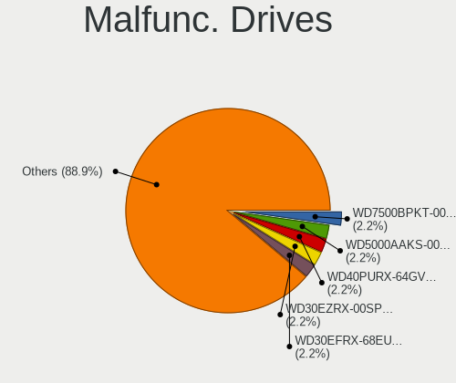
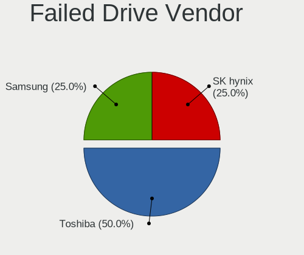
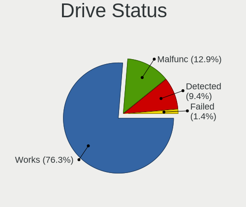
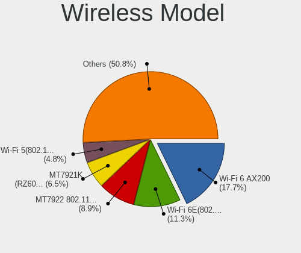

NixOS - Tested Hardware & Statistics (Desktops)
-----------------------------------------------

A project to collect tested hardware configurations for NixOS.

Anyone can contribute to this report by the [hw-probe](https://github.com/linuxhw/hw-probe) tool:

    sudo -E hw-probe -all -upload

Please contribute! Especially if your hardware is rare.

Contents
--------

* [ Test Cases ](#test-cases)

* [ System ](#system)
  - [ OS                       ](#os)
  - [ OS Family                ](#os-family)
  - [ Kernel                   ](#kernel)
  - [ Kernel Family            ](#kernel-family)
  - [ Kernel Major Ver.        ](#kernel-major-ver)
  - [ Arch                     ](#arch)
  - [ DE                       ](#de)
  - [ Display Server           ](#display-server)
  - [ Display Manager          ](#display-manager)
  - [ OS Lang                  ](#os-lang)
  - [ Boot Mode                ](#boot-mode)
  - [ Filesystem               ](#filesystem)
  - [ Part. scheme             ](#part-scheme)
  - [ Dual Boot with Linux/BSD ](#dual-boot-with-linuxbsd)
  - [ Dual Boot (Win)          ](#dual-boot-win)

* [ Board ](#board)
  - [ Vendor                   ](#vendor)
  - [ Model                    ](#model)
  - [ Model Family             ](#model-family)
  - [ MFG Year                 ](#mfg-year)
  - [ Form Factor              ](#form-factor)
  - [ Secure Boot              ](#secure-boot)
  - [ Coreboot                 ](#coreboot)
  - [ RAM Size                 ](#ram-size)
  - [ RAM Used                 ](#ram-used)
  - [ Total Drives             ](#total-drives)
  - [ Has CD-ROM               ](#has-cd-rom)
  - [ Has Ethernet             ](#has-ethernet)
  - [ Has WiFi                 ](#has-wifi)
  - [ Has Bluetooth            ](#has-bluetooth)

* [ Location ](#location)
  - [ Country                  ](#country)
  - [ City                     ](#city)

* [ Drives ](#drives)
  - [ Drive Vendor             ](#drive-vendor)
  - [ Drive Model              ](#drive-model)
  - [ HDD Vendor               ](#hdd-vendor)
  - [ SSD Vendor               ](#ssd-vendor)
  - [ Drive Kind               ](#drive-kind)
  - [ Drive Connector          ](#drive-connector)
  - [ Drive Size               ](#drive-size)
  - [ Space Total              ](#space-total)
  - [ Space Used               ](#space-used)
  - [ Malfunc. Drives          ](#malfunc-drives)
  - [ Malfunc. Drive Vendor    ](#malfunc-drive-vendor)
  - [ Malfunc. HDD Vendor      ](#malfunc-hdd-vendor)
  - [ Malfunc. Drive Kind      ](#malfunc-drive-kind)
  - [ Failed Drives            ](#failed-drives)
  - [ Failed Drive Vendor      ](#failed-drive-vendor)
  - [ Drive Status             ](#drive-status)

* [ Storage controller ](#storage-controller)
  - [ Storage Vendor           ](#storage-vendor)
  - [ Storage Model            ](#storage-model)
  - [ Storage Kind             ](#storage-kind)

* [ Processor ](#processor)
  - [ CPU Vendor               ](#cpu-vendor)
  - [ CPU Model                ](#cpu-model)
  - [ CPU Model Family         ](#cpu-model-family)
  - [ CPU Cores                ](#cpu-cores)
  - [ CPU Sockets              ](#cpu-sockets)
  - [ CPU Threads              ](#cpu-threads)
  - [ CPU Op-Modes             ](#cpu-op-modes)
  - [ CPU Microcode            ](#cpu-microcode)
  - [ CPU Microarch            ](#cpu-microarch)

* [ Graphics ](#graphics)
  - [ GPU Vendor               ](#gpu-vendor)
  - [ GPU Model                ](#gpu-model)
  - [ GPU Combo                ](#gpu-combo)
  - [ GPU Driver               ](#gpu-driver)
  - [ GPU Memory               ](#gpu-memory)

* [ Monitor ](#monitor)
  - [ Monitor Vendor           ](#monitor-vendor)
  - [ Monitor Model            ](#monitor-model)
  - [ Monitor Resolution       ](#monitor-resolution)
  - [ Monitor Diagonal         ](#monitor-diagonal)
  - [ Monitor Width            ](#monitor-width)
  - [ Aspect Ratio             ](#aspect-ratio)
  - [ Monitor Area             ](#monitor-area)
  - [ Pixel Density            ](#pixel-density)
  - [ Multiple Monitors        ](#multiple-monitors)

* [ Network ](#network)
  - [ Net Controller Vendor    ](#net-controller-vendor)
  - [ Net Controller Model     ](#net-controller-model)
  - [ Wireless Vendor          ](#wireless-vendor)
  - [ Wireless Model           ](#wireless-model)
  - [ Ethernet Vendor          ](#ethernet-vendor)
  - [ Ethernet Model           ](#ethernet-model)
  - [ Net Controller Kind      ](#net-controller-kind)
  - [ Used Controller          ](#used-controller)
  - [ NICs                     ](#nics)
  - [ IPv6                     ](#ipv6)

* [ Bluetooth ](#bluetooth)
  - [ Bluetooth Vendor         ](#bluetooth-vendor)
  - [ Bluetooth Model          ](#bluetooth-model)

* [ Sound ](#sound)
  - [ Sound Vendor             ](#sound-vendor)
  - [ Sound Model              ](#sound-model)

* [ Memory ](#memory)
  - [ Memory Vendor            ](#memory-vendor)
  - [ Memory Model             ](#memory-model)
  - [ Memory Kind              ](#memory-kind)
  - [ Memory Form Factor       ](#memory-form-factor)
  - [ Memory Size              ](#memory-size)
  - [ Memory Speed             ](#memory-speed)

* [ Printers & scanners ](#printers--scanners)
  - [ Printer Vendor           ](#printer-vendor)
  - [ Printer Model            ](#printer-model)
  - [ Scanner Vendor           ](#scanner-vendor)
  - [ Scanner Model            ](#scanner-model)

* [ Camera ](#camera)
  - [ Camera Vendor            ](#camera-vendor)
  - [ Camera Model             ](#camera-model)

* [ Security ](#security)
  - [ Fingerprint Vendor       ](#fingerprint-vendor)
  - [ Fingerprint Model        ](#fingerprint-model)
  - [ Chipcard Vendor          ](#chipcard-vendor)
  - [ Chipcard Model           ](#chipcard-model)

* [ Unsupported ](#unsupported)
  - [ Unsupported Devices      ](#unsupported-devices)
  - [ Unsupported Device Types ](#unsupported-device-types)

Test Cases
----------

Total: 305

| Vendor        | Model                       | Probe                                                      | Date         |
|---------------|-----------------------------|------------------------------------------------------------|--------------|
| MSI           | MEG X570 UNIFY              | [fc581d20c5](https://linux-hardware.org/?probe=fc581d20c5) | Jan 04, 2025 |
| Gigabyte      | B550I AORUS PRO AX          | [465d7bcabe](https://linux-hardware.org/?probe=465d7bcabe) | Jan 03, 2025 |
| ASUSTek       | PRIME B550-PLUS             | [1ad78511fb](https://linux-hardware.org/?probe=1ad78511fb) | Jan 02, 2025 |
| Gigabyte      | GA-MA790GP-DS4H             | [ba9e4bcced](https://linux-hardware.org/?probe=ba9e4bcced) | Dec 31, 2024 |
| ASUSTek       | ROG STRIX X870-I GAMING ... | [13514b4f65](https://linux-hardware.org/?probe=13514b4f65) | Dec 27, 2024 |
| MSI           | MPG B650I EDGE WIFI         | [9f7cf29dd9](https://linux-hardware.org/?probe=9f7cf29dd9) | Dec 25, 2024 |
| Gigabyte      | B550I AORUS PRO AX          | [9c8b89e00a](https://linux-hardware.org/?probe=9c8b89e00a) | Dec 18, 2024 |
| MSI           | PRO B760-VC WIFI 7 BULK     | [624168065a](https://linux-hardware.org/?probe=624168065a) | Dec 18, 2024 |
| Gigabyte      | Z390 AORUS PRO WIFI-CF      | [7e6d9bed21](https://linux-hardware.org/?probe=7e6d9bed21) | Dec 16, 2024 |
| CWWK          | MINIPC-G12                  | [b7abc4972b](https://linux-hardware.org/?probe=b7abc4972b) | Dec 15, 2024 |
| CWWK          | MINIPC-G12                  | [da5ce0c723](https://linux-hardware.org/?probe=da5ce0c723) | Dec 15, 2024 |
| ASUSTek       | X99-DELUXE                  | [d27995c12e](https://linux-hardware.org/?probe=d27995c12e) | Dec 12, 2024 |
| Gigabyte      | TRX50 AERO D                | [806cbde5a6](https://linux-hardware.org/?probe=806cbde5a6) | Dec 11, 2024 |
| Gigabyte      | TRX50 AERO D                | [d4cb8b5bdb](https://linux-hardware.org/?probe=d4cb8b5bdb) | Dec 11, 2024 |
| ASRock        | B550M Steel Legend          | [6f47f74e85](https://linux-hardware.org/?probe=6f47f74e85) | Dec 07, 2024 |
| MSI           | MPG Z490 GAMING EDGE WIF... | [a9d455e4cb](https://linux-hardware.org/?probe=a9d455e4cb) | Nov 29, 2024 |
| Unknown       | QADL03                      | [c2aaa4505e](https://linux-hardware.org/?probe=c2aaa4505e) | Nov 29, 2024 |
| MSI           | MPG Z490 GAMING EDGE WIF... | [c602a79e72](https://linux-hardware.org/?probe=c602a79e72) | Nov 29, 2024 |
| ASUSTek       | ROG Maximus XI HERO         | [1c66e560b6](https://linux-hardware.org/?probe=1c66e560b6) | Nov 27, 2024 |
| Gigabyte      | B550M AORUS ELITE           | [f442911c71](https://linux-hardware.org/?probe=f442911c71) | Nov 26, 2024 |
| Gigabyte      | B550M DS3H                  | [7154d27150](https://linux-hardware.org/?probe=7154d27150) | Nov 25, 2024 |
| MSI           | B450 GAMING PRO CARBON M... | [2c0c09c053](https://linux-hardware.org/?probe=2c0c09c053) | Nov 14, 2024 |
| ASUSTek       | PRIME TRX40-PRO S           | [1497f6e734](https://linux-hardware.org/?probe=1497f6e734) | Nov 13, 2024 |
| ASUSTek       | PRIME B760M-A AX6 II        | [435b3b8915](https://linux-hardware.org/?probe=435b3b8915) | Nov 12, 2024 |
| Unknown       | QDNV01                      | [c799dc9a8c](https://linux-hardware.org/?probe=c799dc9a8c) | Nov 08, 2024 |
| MSI           | B650 GAMING PLUS WIFI       | [50f70bccb9](https://linux-hardware.org/?probe=50f70bccb9) | Nov 07, 2024 |
| Dell          | 06NWYK A00                  | [d3d8a8b29a](https://linux-hardware.org/?probe=d3d8a8b29a) | Nov 04, 2024 |
| Gigabyte      | Z390 GAMING SLI-CF          | [fe10e09e4d](https://linux-hardware.org/?probe=fe10e09e4d) | Nov 04, 2024 |
| Gigabyte      | B650M AORUS ELITE AX        | [f84b68557e](https://linux-hardware.org/?probe=f84b68557e) | Nov 03, 2024 |
| ASRock        | X670E Taichi Carrara        | [bb8f80dc95](https://linux-hardware.org/?probe=bb8f80dc95) | Oct 27, 2024 |
| ASUSTek       | TUF Gaming B760M-PLUS       | [aefe5002a6](https://linux-hardware.org/?probe=aefe5002a6) | Oct 27, 2024 |
| Gigabyte      | B450 AORUS M                | [bbb7263070](https://linux-hardware.org/?probe=bbb7263070) | Oct 24, 2024 |
| ASRock        | B650I Lightning WiFi        | [c6bb27bfc6](https://linux-hardware.org/?probe=c6bb27bfc6) | Oct 22, 2024 |
| Dell          | 057FFP A00                  | [1f3c1adda1](https://linux-hardware.org/?probe=1f3c1adda1) | Oct 17, 2024 |
| Gigabyte      | B760M DS3H AX DDR4          | [d51c94d9e8](https://linux-hardware.org/?probe=d51c94d9e8) | Oct 16, 2024 |
| ASUSTek       | ROG CROSSHAIR VIII HERO     | [6531fb24dd](https://linux-hardware.org/?probe=6531fb24dd) | Oct 16, 2024 |
| MSI           | B450M PRO-VDH MAX           | [e4eac64915](https://linux-hardware.org/?probe=e4eac64915) | Oct 15, 2024 |
| Gigabyte      | B760M DS3H AX DDR4          | [71afcb15a1](https://linux-hardware.org/?probe=71afcb15a1) | Oct 11, 2024 |
| HP            | 802E                        | [b346ea5ea8](https://linux-hardware.org/?probe=b346ea5ea8) | Oct 06, 2024 |
| ASRock        | B650E PG-ITX WiFi           | [d23633905e](https://linux-hardware.org/?probe=d23633905e) | Oct 02, 2024 |
| Gigabyte      | B450 I AORUS PRO WIFI-CF    | [a45b22c07c](https://linux-hardware.org/?probe=a45b22c07c) | Sep 29, 2024 |
| MSI           | B550-A PRO                  | [354adca291](https://linux-hardware.org/?probe=354adca291) | Sep 29, 2024 |
| Gigabyte      | B650 GAMING X AX            | [cb693ee232](https://linux-hardware.org/?probe=cb693ee232) | Sep 27, 2024 |
| MSI           | B550-A PRO                  | [1a953cc7cd](https://linux-hardware.org/?probe=1a953cc7cd) | Sep 27, 2024 |
| MSI           | MAG X670E TOMAHAWK WIFI     | [e18053e73e](https://linux-hardware.org/?probe=e18053e73e) | Sep 24, 2024 |
| Dell          | 0HV8FN A01                  | [c38e664bd9](https://linux-hardware.org/?probe=c38e664bd9) | Sep 24, 2024 |
| Gigabyte      | B550I AORUS PRO AX          | [6e55cb377d](https://linux-hardware.org/?probe=6e55cb377d) | Sep 22, 2024 |
| ASRock        | N100M                       | [8089f66e82](https://linux-hardware.org/?probe=8089f66e82) | Sep 21, 2024 |
| ASRock        | N100M                       | [d0230cada1](https://linux-hardware.org/?probe=d0230cada1) | Sep 21, 2024 |
| ASRock        | X670E Steel Legend          | [255badd442](https://linux-hardware.org/?probe=255badd442) | Sep 21, 2024 |
| BESSTAR Te... | UM350                       | [6c34d848f3](https://linux-hardware.org/?probe=6c34d848f3) | Sep 18, 2024 |
| Gigabyte      | B550M AORUS ELITE           | [b752f4bbb2](https://linux-hardware.org/?probe=b752f4bbb2) | Sep 17, 2024 |
| ASUSTek       | TUF Gaming X570-PLUS        | [8cbd80360d](https://linux-hardware.org/?probe=8cbd80360d) | Sep 16, 2024 |
| HP            | 8906 SMVB                   | [30ba42125a](https://linux-hardware.org/?probe=30ba42125a) | Sep 13, 2024 |
| Gigabyte      | B450M DS3H-CF               | [d93b2a5052](https://linux-hardware.org/?probe=d93b2a5052) | Sep 12, 2024 |
| ASUSTek       | ROG Maximus XI HERO         | [532287509c](https://linux-hardware.org/?probe=532287509c) | Sep 11, 2024 |
| ASRock        | X399 Taichi                 | [17d92d46bd](https://linux-hardware.org/?probe=17d92d46bd) | Sep 09, 2024 |
| ASUSTek       | PRIME X670E-PRO WIFI        | [7fb93a9375](https://linux-hardware.org/?probe=7fb93a9375) | Sep 09, 2024 |
| Gigabyte      | B650M DS3H                  | [2f3b657d09](https://linux-hardware.org/?probe=2f3b657d09) | Sep 09, 2024 |
| Gigabyte      | B550 AORUS ELITE AX V2      | [f1221250ec](https://linux-hardware.org/?probe=f1221250ec) | Sep 09, 2024 |
| ASUSTek       | PRIME X570-P                | [9a0e29b5dd](https://linux-hardware.org/?probe=9a0e29b5dd) | Sep 09, 2024 |
| ASUSTek       | TUF Gaming X570-PLUS        | [2ca68fb7e5](https://linux-hardware.org/?probe=2ca68fb7e5) | Sep 09, 2024 |
| ASUSTek       | H61M-A/USB3                 | [727745c91c](https://linux-hardware.org/?probe=727745c91c) | Sep 09, 2024 |
| ASUSTek       | PRIME B550M-A               | [83ac3368b3](https://linux-hardware.org/?probe=83ac3368b3) | Sep 09, 2024 |
| ASUSTek       | ROG STRIX X570-E GAMING     | [262a99dba5](https://linux-hardware.org/?probe=262a99dba5) | Sep 09, 2024 |
| ASUSTek       | ROG Maximus XII HERO        | [547ecee59b](https://linux-hardware.org/?probe=547ecee59b) | Sep 09, 2024 |
| ASRock        | X570M Pro4                  | [22bdc94b6c](https://linux-hardware.org/?probe=22bdc94b6c) | Sep 09, 2024 |
| ASUSTek       | PRIME X670-P                | [6d3e3c0adf](https://linux-hardware.org/?probe=6d3e3c0adf) | Sep 08, 2024 |
| Intel         | BQM5                        | [6fc656eb18](https://linux-hardware.org/?probe=6fc656eb18) | Sep 08, 2024 |
| MSI           | MAG B650 TOMAHAWK WIFI      | [adf334ef70](https://linux-hardware.org/?probe=adf334ef70) | Sep 08, 2024 |
| ASRock        | Z690M-ITX/ax                | [ed55d6abbe](https://linux-hardware.org/?probe=ed55d6abbe) | Sep 08, 2024 |
| ASUSTek       | ROG STRIX X570-E GAMING     | [1912bfe794](https://linux-hardware.org/?probe=1912bfe794) | Sep 08, 2024 |
| ASUSTek       | ROG STRIX B550-F GAMING     | [ac0c806aba](https://linux-hardware.org/?probe=ac0c806aba) | Sep 08, 2024 |
| Unknown       | Unknown                     | [39176c7388](https://linux-hardware.org/?probe=39176c7388) | Sep 08, 2024 |
| ASUSTek       | ROG STRIX X570-F GAMING     | [5d92acf8a8](https://linux-hardware.org/?probe=5d92acf8a8) | Sep 08, 2024 |
| Dell          | 0NV0M7 A02                  | [f7cd26365e](https://linux-hardware.org/?probe=f7cd26365e) | Sep 08, 2024 |
| ASRock        | X570 Steel Legend           | [d9aeff6714](https://linux-hardware.org/?probe=d9aeff6714) | Sep 08, 2024 |
| ASUSTek       | PRIME B550-PLUS             | [68aa788771](https://linux-hardware.org/?probe=68aa788771) | Sep 08, 2024 |
| MSI           | B450M PRO-M2                | [2b071d194a](https://linux-hardware.org/?probe=2b071d194a) | Sep 08, 2024 |
| Gigabyte      | X570 AORUS ELITE            | [f8b0d632dc](https://linux-hardware.org/?probe=f8b0d632dc) | Sep 08, 2024 |
| Gigabyte      | B650M DS3H                  | [9214328551](https://linux-hardware.org/?probe=9214328551) | Sep 05, 2024 |
| ASUSTek       | M5A78L-M/USB3               | [6f4213eab2](https://linux-hardware.org/?probe=6f4213eab2) | Sep 04, 2024 |
| ASUSTek       | ROG STRIX X570-E GAMING     | [a1cc07db50](https://linux-hardware.org/?probe=a1cc07db50) | Sep 03, 2024 |
| MSI           | B550M PRO-VDH WIFI          | [7ca08ce5f0](https://linux-hardware.org/?probe=7ca08ce5f0) | Sep 03, 2024 |
| ASUSTek       | PRIME X570-P                | [70ddee6281](https://linux-hardware.org/?probe=70ddee6281) | Sep 02, 2024 |
| Gigabyte      | H81M-S2H                    | [d610978a5b](https://linux-hardware.org/?probe=d610978a5b) | Sep 01, 2024 |
| Gigabyte      | B560M DS3H V2               | [f0c3274e0f](https://linux-hardware.org/?probe=f0c3274e0f) | Aug 28, 2024 |
| Gigabyte      | B550I AORUS PRO AX          | [48ee3a93df](https://linux-hardware.org/?probe=48ee3a93df) | Aug 26, 2024 |
| ASRock        | X570M Pro4                  | [56a21fdc14](https://linux-hardware.org/?probe=56a21fdc14) | Aug 23, 2024 |
| ASUSTek       | PRIME X570-PRO              | [70bd40f935](https://linux-hardware.org/?probe=70bd40f935) | Aug 21, 2024 |
| ASUSTek       | TUF Gaming X570-PLUS        | [ca58993e0b](https://linux-hardware.org/?probe=ca58993e0b) | Aug 18, 2024 |
| Lenovo        | ThinkCentre M81 7518C5U     | [86596e708e](https://linux-hardware.org/?probe=86596e708e) | Aug 16, 2024 |
| MSI           | MPG X570 GAMING EDGE WIF... | [92577f9db8](https://linux-hardware.org/?probe=92577f9db8) | Aug 09, 2024 |
| MSI           | B450M MORTAR MAX            | [e5132e0d40](https://linux-hardware.org/?probe=e5132e0d40) | Aug 02, 2024 |
| MSI           | B450M PRO-VDH MAX           | [e096f31889](https://linux-hardware.org/?probe=e096f31889) | Aug 01, 2024 |
| ASRock        | B550M Pro4                  | [8b95588367](https://linux-hardware.org/?probe=8b95588367) | Jul 29, 2024 |
| MSI           | B450M MORTAR MAX            | [8adadff9e1](https://linux-hardware.org/?probe=8adadff9e1) | Jul 28, 2024 |
| MSI           | B550M PRO-VDH WIFI          | [31a5f645ab](https://linux-hardware.org/?probe=31a5f645ab) | Jul 27, 2024 |
| MSI           | MAG X570 TOMAHAWK WIFI      | [d222ae3b6b](https://linux-hardware.org/?probe=d222ae3b6b) | Jul 23, 2024 |
| MSI           | B450 GAMING PRO CARBON M... | [4ee3f73fe2](https://linux-hardware.org/?probe=4ee3f73fe2) | Jul 22, 2024 |
| Dell          | 06NWYK A00                  | [694e65b0fd](https://linux-hardware.org/?probe=694e65b0fd) | Jul 20, 2024 |
| ASRock        | X570 Taichi                 | [04653db6d4](https://linux-hardware.org/?probe=04653db6d4) | Jun 24, 2024 |
| ASUSTek       | ROG ZENITH II EXTREME AL... | [b04f8ad772](https://linux-hardware.org/?probe=b04f8ad772) | Jun 24, 2024 |
| ASUSTek       | ROG STRIX B650E-I GAMING... | [84e558ae8b](https://linux-hardware.org/?probe=84e558ae8b) | Jun 19, 2024 |
| ECS           | A55F-M3                     | [a3c0b7c82c](https://linux-hardware.org/?probe=a3c0b7c82c) | Jun 12, 2024 |
| ASRock        | X570 Taichi                 | [c6b236ec91](https://linux-hardware.org/?probe=c6b236ec91) | Jun 12, 2024 |
| MSI           | MAG X570S TORPEDO MAX       | [24714ff60d](https://linux-hardware.org/?probe=24714ff60d) | Jun 08, 2024 |
| ASRock        | B450M-HDV R4.0              | [c7f4708e9a](https://linux-hardware.org/?probe=c7f4708e9a) | Jun 06, 2024 |
| ASUSTek       | PRIME H410M-E               | [a1345d5c40](https://linux-hardware.org/?probe=a1345d5c40) | Jun 06, 2024 |
| MSI           | MPG B550 GAMING PLUS        | [d8d7c0ad38](https://linux-hardware.org/?probe=d8d7c0ad38) | May 30, 2024 |
| Gigabyte      | B450 I AORUS PRO WIFI-CF    | [205d0cf89e](https://linux-hardware.org/?probe=205d0cf89e) | May 27, 2024 |
| MSI           | B450 GAMING PLUS MAX        | [1d15655bed](https://linux-hardware.org/?probe=1d15655bed) | May 24, 2024 |
| Gigabyte      | B550M AORUS ELITE           | [ab20443ff3](https://linux-hardware.org/?probe=ab20443ff3) | May 17, 2024 |
| ASUSTek       | ROG STRIX B450-F GAMING     | [930575c4e1](https://linux-hardware.org/?probe=930575c4e1) | May 16, 2024 |
| MSI           | MAG X570 TOMAHAWK WIFI      | [e1d8dfbde5](https://linux-hardware.org/?probe=e1d8dfbde5) | May 14, 2024 |
| Gigabyte      | X570S AORUS MASTER          | [249d632a13](https://linux-hardware.org/?probe=249d632a13) | May 13, 2024 |
| Gigabyte      | B450 AORUS M                | [b522afd531](https://linux-hardware.org/?probe=b522afd531) | May 12, 2024 |
| ASUSTek       | ROG STRIX Z590-F GAMING ... | [2e284b3d40](https://linux-hardware.org/?probe=2e284b3d40) | May 11, 2024 |
| Gigabyte      | B550M AORUS ELITE           | [4648f8b379](https://linux-hardware.org/?probe=4648f8b379) | May 11, 2024 |
| Gigabyte      | B450 AORUS M                | [296accd3a3](https://linux-hardware.org/?probe=296accd3a3) | May 11, 2024 |
| ASUSTek       | TUF B450M-PLUS GAMING       | [73060b4642](https://linux-hardware.org/?probe=73060b4642) | May 07, 2024 |
| HP            | 2B2C                        | [082d220d35](https://linux-hardware.org/?probe=082d220d35) | May 04, 2024 |
| Gigabyte      | Z390 AORUS PRO WIFI-CF      | [1902c0eeab](https://linux-hardware.org/?probe=1902c0eeab) | May 02, 2024 |
| MSI           | B450 GAMING PLUS MAX        | [3146b9914d](https://linux-hardware.org/?probe=3146b9914d) | May 01, 2024 |
| Apple         | Mac-F60DEB81FF30ACF6 Mac... | [32d8346d26](https://linux-hardware.org/?probe=32d8346d26) | May 01, 2024 |
| MSI           | PRO Z790-P WIFI             | [836078acb2](https://linux-hardware.org/?probe=836078acb2) | Apr 29, 2024 |
| ASUSTek       | ROG Maximus XI HERO         | [7c970a2e6f](https://linux-hardware.org/?probe=7c970a2e6f) | Apr 27, 2024 |
| ASUSTek       | ROG Maximus XI HERO         | [33f2b78f07](https://linux-hardware.org/?probe=33f2b78f07) | Apr 27, 2024 |
| Apple         | Mac-F60DEB81FF30ACF6 Mac... | [55a3147182](https://linux-hardware.org/?probe=55a3147182) | Apr 26, 2024 |
| Unknown       | X79A                        | [c0456a0238](https://linux-hardware.org/?probe=c0456a0238) | Apr 26, 2024 |
| Jetway        | 1.0                         | [5410155063](https://linux-hardware.org/?probe=5410155063) | Apr 25, 2024 |
| MSI           | B450 GAMING PRO CARBON M... | [26f465d651](https://linux-hardware.org/?probe=26f465d651) | Apr 24, 2024 |
| Gigabyte      | Z390 GAMING SLI-CF          | [95968f8653](https://linux-hardware.org/?probe=95968f8653) | Apr 19, 2024 |
| Gigabyte      | Z790 UD                     | [098435751f](https://linux-hardware.org/?probe=098435751f) | Apr 18, 2024 |
| Gigabyte      | Z790 UD                     | [ab7e23fe7d](https://linux-hardware.org/?probe=ab7e23fe7d) | Apr 18, 2024 |
| ASUSTek       | ProArt X670E-CREATOR WIF... | [a805996b80](https://linux-hardware.org/?probe=a805996b80) | Apr 16, 2024 |
| ASRock        | B650E PG Riptide WiFi       | [edae497a7d](https://linux-hardware.org/?probe=edae497a7d) | Apr 14, 2024 |
| MSI           | B450 GAMING PLUS MAX        | [12d5a6c723](https://linux-hardware.org/?probe=12d5a6c723) | Apr 08, 2024 |
| Gigabyte      | GA-H61TN-SI                 | [3f6b496eb7](https://linux-hardware.org/?probe=3f6b496eb7) | Apr 02, 2024 |
| HP            | 89D8 SMVB                   | [32e0d11ee9](https://linux-hardware.org/?probe=32e0d11ee9) | Apr 02, 2024 |
| Gigabyte      | B550I AORUS PRO AX          | [75613012d4](https://linux-hardware.org/?probe=75613012d4) | Mar 27, 2024 |
| MSI           | B450-A PRO MAX              | [5448e71afb](https://linux-hardware.org/?probe=5448e71afb) | Mar 23, 2024 |
| Gigabyte      | Z790 AORUS ELITE X WIFI7    | [9a507bf688](https://linux-hardware.org/?probe=9a507bf688) | Mar 23, 2024 |
| ASUSTek       | ROG Maximus XI HERO         | [b835c572e5](https://linux-hardware.org/?probe=b835c572e5) | Mar 18, 2024 |
| ASUSTek       | SABERTOOTH 990FX R2.0       | [1ceb0c75ea](https://linux-hardware.org/?probe=1ceb0c75ea) | Mar 15, 2024 |
| MSI           | B450-A PRO                  | [fcf37e125a](https://linux-hardware.org/?probe=fcf37e125a) | Mar 14, 2024 |
| Gigabyte      | GA-MA790GP-DS4H             | [9ffb06c47b](https://linux-hardware.org/?probe=9ffb06c47b) | Mar 13, 2024 |
| ASUSTek       | TUF Gaming A620M-PLUS WI... | [0772d17a95](https://linux-hardware.org/?probe=0772d17a95) | Mar 13, 2024 |
| ASUSTek       | TUF Gaming A620M-PLUS WI... | [644c52ac31](https://linux-hardware.org/?probe=644c52ac31) | Mar 13, 2024 |
| MSI           | B85M-E45                    | [6623f1bc66](https://linux-hardware.org/?probe=6623f1bc66) | Mar 12, 2024 |
| ASUSTek       | ROG Maximus XII EXTREME     | [260fb753fe](https://linux-hardware.org/?probe=260fb753fe) | Mar 11, 2024 |
| MSI           | MAG Z790 TOMAHAWK MAX WI... | [1bf5956e3f](https://linux-hardware.org/?probe=1bf5956e3f) | Mar 10, 2024 |
| ASUSTek       | ProArt B550-CREATOR         | [34bed62abf](https://linux-hardware.org/?probe=34bed62abf) | Mar 10, 2024 |
| MSI           | MAG X570S TORPEDO MAX       | [dc8badd739](https://linux-hardware.org/?probe=dc8badd739) | Mar 08, 2024 |
| MSI           | MAG X570S TORPEDO MAX       | [36f42c8be7](https://linux-hardware.org/?probe=36f42c8be7) | Mar 08, 2024 |
| MSI           | B450-A PRO                  | [ec32ffdea7](https://linux-hardware.org/?probe=ec32ffdea7) | Mar 06, 2024 |
| Gigabyte      | B650M AORUS ELITE AX        | [2fae47ca0a](https://linux-hardware.org/?probe=2fae47ca0a) | Feb 29, 2024 |
| Gigabyte      | GA-MA790GP-DS4H             | [0bdc619992](https://linux-hardware.org/?probe=0bdc619992) | Feb 28, 2024 |
| ASUSTek       | TUF Gaming X570-PLUS        | [7a1e61aea2](https://linux-hardware.org/?probe=7a1e61aea2) | Feb 24, 2024 |
| Win elemen... | M600                        | [706d9a6da6](https://linux-hardware.org/?probe=706d9a6da6) | Feb 15, 2024 |
| Biostar       | TZ590-BTC DUO               | [43894bcb57](https://linux-hardware.org/?probe=43894bcb57) | Feb 15, 2024 |
| ASUSTek       | ROG STRIX B550-I GAMING     | [7efa507cb3](https://linux-hardware.org/?probe=7efa507cb3) | Feb 12, 2024 |
| Gigabyte      | Z390 GAMING SLI-CF          | [fefa1b06db](https://linux-hardware.org/?probe=fefa1b06db) | Feb 08, 2024 |
| ASUSTek       | TUF Gaming X570-PLUS        | [9db247a049](https://linux-hardware.org/?probe=9db247a049) | Feb 08, 2024 |
| Gigabyte      | Z690 AORUS MASTER           | [696b85242c](https://linux-hardware.org/?probe=696b85242c) | Feb 03, 2024 |
| Biostar       | TZ590-BTC DUO               | [86684436da](https://linux-hardware.org/?probe=86684436da) | Jan 27, 2024 |
| Biostar       | TZ590-BTC DUO               | [68df04d154](https://linux-hardware.org/?probe=68df04d154) | Jan 27, 2024 |
| MSI           | MS-B1831                    | [45dd2bc3a1](https://linux-hardware.org/?probe=45dd2bc3a1) | Jan 25, 2024 |
| Gigabyte      | B550I AORUS PRO AX          | [6cfbe412a8](https://linux-hardware.org/?probe=6cfbe412a8) | Jan 16, 2024 |
| Gigabyte      | B650M GAMING X AX           | [655122ef53](https://linux-hardware.org/?probe=655122ef53) | Jan 14, 2024 |
| ASUSTek       | Pro WS X570-ACE             | [268e37f04e](https://linux-hardware.org/?probe=268e37f04e) | Jan 14, 2024 |
| ASUSTek       | P8Z77-V LE                  | [929c108f73](https://linux-hardware.org/?probe=929c108f73) | Jan 13, 2024 |
| ASUSTek       | STRIX Z270H GAMING          | [c5eb936632](https://linux-hardware.org/?probe=c5eb936632) | Jan 13, 2024 |
| Gigabyte      | Z690 AORUS MASTER           | [bdc05e8e4e](https://linux-hardware.org/?probe=bdc05e8e4e) | Jan 11, 2024 |
| MSI           | Z170A SLI                   | [e58029e4a2](https://linux-hardware.org/?probe=e58029e4a2) | Jan 08, 2024 |
| Dell          | 0FXD80 A00                  | [628772fa2d](https://linux-hardware.org/?probe=628772fa2d) | Jan 07, 2024 |
| ASUSTek       | PRIME H410M-E               | [3e11f092ef](https://linux-hardware.org/?probe=3e11f092ef) | Jan 07, 2024 |
| Gigabyte      | Z690 AORUS MASTER           | [fb05620dfd](https://linux-hardware.org/?probe=fb05620dfd) | Jan 05, 2024 |
| ASUSTek       | Pro WS TRX50-SAGE WIFI      | [cfba81369c](https://linux-hardware.org/?probe=cfba81369c) | Jan 05, 2024 |
| ASUSTek       | ROG STRIX B550-A GAMING     | [527cc7c1d4](https://linux-hardware.org/?probe=527cc7c1d4) | Jan 05, 2024 |
| HP            | 1790                        | [e554a0f029](https://linux-hardware.org/?probe=e554a0f029) | Jan 04, 2024 |
| Gigabyte      | Z390 AORUS PRO-CF           | [91b39eb7b5](https://linux-hardware.org/?probe=91b39eb7b5) | Jan 03, 2024 |
| Gigabyte      | B450 AORUS M                | [733b1e64b3](https://linux-hardware.org/?probe=733b1e64b3) | Jan 03, 2024 |
| ASUSTek       | TUF Gaming Z490-PLUS        | [f96513dd00](https://linux-hardware.org/?probe=f96513dd00) | Jan 02, 2024 |
| ASUSTek       | TUF Gaming X670E-PLUS WI... | [c6c9c3c74e](https://linux-hardware.org/?probe=c6c9c3c74e) | Jan 01, 2024 |
| AZW           | EQ                          | [f27e8ec7a4](https://linux-hardware.org/?probe=f27e8ec7a4) | Dec 27, 2023 |
| ASUSTek       | PRIME X370-PRO              | [f8483f02ab](https://linux-hardware.org/?probe=f8483f02ab) | Dec 26, 2023 |
| ASUSTek       | ROG CROSSHAIR VIII IMPAC... | [a953876b2c](https://linux-hardware.org/?probe=a953876b2c) | Dec 23, 2023 |
| ASRock        | X670E PG Lightning          | [b6aa52f693](https://linux-hardware.org/?probe=b6aa52f693) | Dec 17, 2023 |
| AZW           | EQ                          | [b6aa615ccf](https://linux-hardware.org/?probe=b6aa615ccf) | Dec 14, 2023 |
| ASUSTek       | TUF B360M-PLUS GAMING       | [2982c2a2c6](https://linux-hardware.org/?probe=2982c2a2c6) | Dec 14, 2023 |
| Gigabyte      | Z790 GAMING X AX            | [8617acecda](https://linux-hardware.org/?probe=8617acecda) | Dec 11, 2023 |
| MSI           | MAG X670E TOMAHAWK WIFI     | [62c4dde3a6](https://linux-hardware.org/?probe=62c4dde3a6) | Dec 07, 2023 |
| AZW           | EQ                          | [c2dedbf2f3](https://linux-hardware.org/?probe=c2dedbf2f3) | Dec 04, 2023 |
| ASRock        | B550 Phantom Gaming-ITX/... | [7273cc93a9](https://linux-hardware.org/?probe=7273cc93a9) | Dec 02, 2023 |
| Gigabyte      | B550I AORUS PRO AX          | [07e6828b2e](https://linux-hardware.org/?probe=07e6828b2e) | Nov 23, 2023 |
| ASRock        | B550 Phantom Gaming-ITX/... | [34b2b48e8c](https://linux-hardware.org/?probe=34b2b48e8c) | Nov 19, 2023 |
| Gigabyte      | X570 I AORUS PRO WIFI       | [0820ebd908](https://linux-hardware.org/?probe=0820ebd908) | Nov 16, 2023 |
| Gigabyte      | GA-78LMT-USB3               | [a263ed1c12](https://linux-hardware.org/?probe=a263ed1c12) | Nov 13, 2023 |
| ASUSTek       | ROG STRIX B450-F GAMING     | [67938dee90](https://linux-hardware.org/?probe=67938dee90) | Nov 12, 2023 |
| ASRock        | Z690M-ITX/ax                | [503d3690b0](https://linux-hardware.org/?probe=503d3690b0) | Nov 11, 2023 |
| ASUSTek       | PRIME X399-A                | [e0883e3bd0](https://linux-hardware.org/?probe=e0883e3bd0) | Nov 11, 2023 |
| Nvidia        | snc302eeh                   | [2b0a14caec](https://linux-hardware.org/?probe=2b0a14caec) | Nov 10, 2023 |
| ASUSTek       | PRIME X370-PRO              | [d9cad8ffde](https://linux-hardware.org/?probe=d9cad8ffde) | Nov 09, 2023 |
| ASUSTek       | PRIME X570-PRO              | [1786e4735e](https://linux-hardware.org/?probe=1786e4735e) | Nov 07, 2023 |
| MSI           | X570-A PRO                  | [30416c0355](https://linux-hardware.org/?probe=30416c0355) | Nov 04, 2023 |
| HP            | 83E1                        | [c82d34ebac](https://linux-hardware.org/?probe=c82d34ebac) | Nov 04, 2023 |
| LattePanda    | Sigma                       | [d287cf2d8a](https://linux-hardware.org/?probe=d287cf2d8a) | Oct 26, 2023 |
| ASRock        | B650M PG Riptide WiFi       | [387c91f530](https://linux-hardware.org/?probe=387c91f530) | Oct 26, 2023 |
| ECS           | A55F-M3                     | [6da483b400](https://linux-hardware.org/?probe=6da483b400) | Oct 25, 2023 |
| Unknown       | HX90                        | [f247716ab0](https://linux-hardware.org/?probe=f247716ab0) | Oct 13, 2023 |
| ASUSTek       | P7H55                       | [89472bd2f3](https://linux-hardware.org/?probe=89472bd2f3) | Oct 07, 2023 |
| ASRock        | Z87 Extreme4                | [642a2f5a9b](https://linux-hardware.org/?probe=642a2f5a9b) | Oct 04, 2023 |
| Gigabyte      | X570 AORUS ELITE WIFI       | [007bb33fbf](https://linux-hardware.org/?probe=007bb33fbf) | Oct 01, 2023 |
| MSI           | Z68A-GD65                   | [c0f968740b](https://linux-hardware.org/?probe=c0f968740b) | Sep 29, 2023 |
| ASUSTek       | ROG STRIX Z690-A GAMING ... | [0177e96165](https://linux-hardware.org/?probe=0177e96165) | Sep 28, 2023 |
| HP            | 3397                        | [5c1b3bed0b](https://linux-hardware.org/?probe=5c1b3bed0b) | Sep 28, 2023 |
| ASUSTek       | P8H77-V                     | [24ff983f95](https://linux-hardware.org/?probe=24ff983f95) | Sep 28, 2023 |
| HP            | 1998                        | [4af6b915c2](https://linux-hardware.org/?probe=4af6b915c2) | Sep 17, 2023 |
| HP            | 8767 A                      | [ce91ccf3a9](https://linux-hardware.org/?probe=ce91ccf3a9) | Sep 09, 2023 |
| Gigabyte      | B550I AORUS PRO AX          | [ac09f27b9d](https://linux-hardware.org/?probe=ac09f27b9d) | Aug 22, 2023 |
| ASUSTek       | ROG CROSSHAIR X670E GENE    | [a9a56ae120](https://linux-hardware.org/?probe=a9a56ae120) | Aug 22, 2023 |
| AZW           | EQ                          | [4a9aad33f3](https://linux-hardware.org/?probe=4a9aad33f3) | Aug 06, 2023 |
| ASUSTek       | PRIME X370-PRO              | [1abcf2ad6f](https://linux-hardware.org/?probe=1abcf2ad6f) | Aug 04, 2023 |
| Gigabyte      | B550I AORUS PRO AX          | [959f3b36df](https://linux-hardware.org/?probe=959f3b36df) | Jul 26, 2023 |
| HP            | 1998                        | [ef5201611b](https://linux-hardware.org/?probe=ef5201611b) | Jul 24, 2023 |
| HP            | 1998                        | [5a95ac128d](https://linux-hardware.org/?probe=5a95ac128d) | Jul 24, 2023 |
| AZW           | EQ                          | [e065c16f2c](https://linux-hardware.org/?probe=e065c16f2c) | Jul 23, 2023 |
| AZW           | EQ                          | [46a76eeb81](https://linux-hardware.org/?probe=46a76eeb81) | Jul 23, 2023 |
| ASUSTek       | Z87-EXPERT                  | [1e8eeb8513](https://linux-hardware.org/?probe=1e8eeb8513) | Jul 16, 2023 |
| ASUSTek       | Z87-EXPERT                  | [8efa3cf99d](https://linux-hardware.org/?probe=8efa3cf99d) | Jul 16, 2023 |
| ASUSTek       | PRIME X370-PRO              | [d7afc91d12](https://linux-hardware.org/?probe=d7afc91d12) | Jul 07, 2023 |
| Acer          | Aspire TC-885 V:1.1         | [a2dc9efa21](https://linux-hardware.org/?probe=a2dc9efa21) | Jul 06, 2023 |
| Gigabyte      | TRX40 AORUS MASTER          | [f1c343e2c2](https://linux-hardware.org/?probe=f1c343e2c2) | Jul 02, 2023 |
| ASUSTek       | TUF Gaming B660-PLUS WIF... | [f15cf1d31b](https://linux-hardware.org/?probe=f15cf1d31b) | Jul 02, 2023 |
| ASUSTek       | ROG STRIX B550-F GAMING     | [85902981fd](https://linux-hardware.org/?probe=85902981fd) | Jun 11, 2023 |
| Acer          | Aspire XC600 v1.0           | [754d228b9b](https://linux-hardware.org/?probe=754d228b9b) | Jun 09, 2023 |
| Gigabyte      | X570 AORUS PRO              | [309d09ae8c](https://linux-hardware.org/?probe=309d09ae8c) | Jun 03, 2023 |
| Gigabyte      | B450M DS3H-CF               | [c9c4e5ddb5](https://linux-hardware.org/?probe=c9c4e5ddb5) | May 26, 2023 |
| Gigabyte      | B450M DS3H-CF               | [cc8e36e75a](https://linux-hardware.org/?probe=cc8e36e75a) | May 26, 2023 |
| ASUSTek       | PRIME Z370-P II             | [4d84deed6b](https://linux-hardware.org/?probe=4d84deed6b) | May 09, 2023 |
| ASUSTek       | ROG STRIX B650E-F GAMING... | [29b2378b4b](https://linux-hardware.org/?probe=29b2378b4b) | May 08, 2023 |
| ASUSTek       | ROG STRIX B650E-F GAMING... | [62b28b69dc](https://linux-hardware.org/?probe=62b28b69dc) | May 08, 2023 |
| Gigabyte      | B760 GAMING X DDR4          | [6ee65c19d2](https://linux-hardware.org/?probe=6ee65c19d2) | May 02, 2023 |
| ASUSTek       | ROG STRIX B550-F GAMING     | [493bc0b894](https://linux-hardware.org/?probe=493bc0b894) | Apr 29, 2023 |
| ASUSTek       | PRIME B350M-A               | [b8b51b29ef](https://linux-hardware.org/?probe=b8b51b29ef) | Apr 25, 2023 |
| Gigabyte      | B550I AORUS PRO AX          | [bbbc9206b4](https://linux-hardware.org/?probe=bbbc9206b4) | Apr 17, 2023 |
| MSI           | B550-A PRO                  | [c4f08a9fc3](https://linux-hardware.org/?probe=c4f08a9fc3) | Mar 04, 2023 |
| MSI           | MAG B550 TOMAHAWK           | [c4d51ca1b8](https://linux-hardware.org/?probe=c4d51ca1b8) | Mar 04, 2023 |
| MSI           | Z77A-G43                    | [eb768bf205](https://linux-hardware.org/?probe=eb768bf205) | Feb 03, 2023 |
| Gigabyte      | B450M DS3H V2               | [75a3416ebc](https://linux-hardware.org/?probe=75a3416ebc) | Jan 31, 2023 |
| ASRock        | Z87 Extreme4                | [b795f7c940](https://linux-hardware.org/?probe=b795f7c940) | Jan 19, 2023 |
| ASRock        | B550M Pro4                  | [0e4ba05b0f](https://linux-hardware.org/?probe=0e4ba05b0f) | Jan 15, 2023 |
| Shenzhen M... | F7BFC                       | [6a53c626dd](https://linux-hardware.org/?probe=6a53c626dd) | Jan 02, 2023 |
| ASUSTek       | Z87-C                       | [4929f6a6c9](https://linux-hardware.org/?probe=4929f6a6c9) | Dec 28, 2022 |
| MSI           | B550-A PRO                  | [db7b91ac2f](https://linux-hardware.org/?probe=db7b91ac2f) | Dec 17, 2022 |
| ASUSTek       | PRIME B550M-A               | [3c18fca709](https://linux-hardware.org/?probe=3c18fca709) | Dec 09, 2022 |
| ASUSTek       | SABERTOOTH 990FX R2.0       | [6ffc032b64](https://linux-hardware.org/?probe=6ffc032b64) | Oct 25, 2022 |
| ASUSTek       | PRIME B550M-A               | [c203d7c388](https://linux-hardware.org/?probe=c203d7c388) | Oct 07, 2022 |
| Gigabyte      | X570 AORUS ELITE            | [b21f5fee1a](https://linux-hardware.org/?probe=b21f5fee1a) | Sep 26, 2022 |
| ASUSTek       | PRIME B550M-A               | [98fd9b974e](https://linux-hardware.org/?probe=98fd9b974e) | Sep 09, 2022 |
| ASRock        | AB350 Pro4                  | [ce872c873e](https://linux-hardware.org/?probe=ce872c873e) | Aug 24, 2022 |
| ASUSTek       | H97I-PLUS                   | [982df0dba9](https://linux-hardware.org/?probe=982df0dba9) | Jun 22, 2022 |
| MSI           | MEG X570 UNIFY              | [6d5fdb800a](https://linux-hardware.org/?probe=6d5fdb800a) | Jun 20, 2022 |
| ASUSTek       | ROG STRIX Z390-F GAMING     | [a4621aa4ec](https://linux-hardware.org/?probe=a4621aa4ec) | Jun 19, 2022 |
| MSI           | MEG X570 UNIFY              | [d26f08ea88](https://linux-hardware.org/?probe=d26f08ea88) | Jun 12, 2022 |
| MSI           | MEG X570 UNIFY              | [0123caa2f3](https://linux-hardware.org/?probe=0123caa2f3) | Jun 11, 2022 |
| ASUSTek       | PRIME A520M-K               | [ab13de0478](https://linux-hardware.org/?probe=ab13de0478) | May 27, 2022 |
| Gigabyte      | B550I AORUS PRO AX          | [96b24b0640](https://linux-hardware.org/?probe=96b24b0640) | May 20, 2022 |
| ASUSTek       | PRIME X570-P                | [50d2e86de8](https://linux-hardware.org/?probe=50d2e86de8) | Apr 13, 2022 |
| Acer          | Nitro N50-610               | [46b46c842f](https://linux-hardware.org/?probe=46b46c842f) | Apr 13, 2022 |
| ASUSTek       | P8Q77-M                     | [6cd75b6762](https://linux-hardware.org/?probe=6cd75b6762) | Mar 11, 2022 |
| Gigabyte      | X470 AORUS ULTRA GAMING-... | [815cb9ab49](https://linux-hardware.org/?probe=815cb9ab49) | Mar 11, 2022 |
| MSI           | B450M MORTAR MAX            | [1d6563ada3](https://linux-hardware.org/?probe=1d6563ada3) | Mar 11, 2022 |
| ASUSTek       | P8Z77-V LK                  | [5c984c6d9a](https://linux-hardware.org/?probe=5c984c6d9a) | Mar 09, 2022 |
| ASUSTek       | P8Z77-V LK                  | [40d2eced72](https://linux-hardware.org/?probe=40d2eced72) | Mar 09, 2022 |
| EVGA          | X299 FTW K                  | [6f9489b2e6](https://linux-hardware.org/?probe=6f9489b2e6) | Mar 09, 2022 |
| Dell          | 0KJCC5 A00                  | [524b675e7e](https://linux-hardware.org/?probe=524b675e7e) | Mar 09, 2022 |
| MSI           | MAG X570 TOMAHAWK WIFI      | [f38279e396](https://linux-hardware.org/?probe=f38279e396) | Mar 09, 2022 |
| MSI           | X399 SLI PLUS               | [a1d172dbc0](https://linux-hardware.org/?probe=a1d172dbc0) | Feb 16, 2022 |
| MSI           | MAG X570 TOMAHAWK WIFI      | [c84b603f92](https://linux-hardware.org/?probe=c84b603f92) | Jan 04, 2022 |
| ASUSTek       | Z170-P                      | [d4bac456d1](https://linux-hardware.org/?probe=d4bac456d1) | Dec 16, 2021 |
| Gigabyte      | X570 AORUS ELITE            | [eb5d5f4361](https://linux-hardware.org/?probe=eb5d5f4361) | Dec 12, 2021 |
| ASUSTek       | PRIME Z390-A                | [af887c3f7b](https://linux-hardware.org/?probe=af887c3f7b) | Nov 29, 2021 |
| Gigabyte      | H97M-D3H                    | [349fbeb586](https://linux-hardware.org/?probe=349fbeb586) | Oct 23, 2021 |
| MSI           | X399 SLI PLUS               | [128ae965a7](https://linux-hardware.org/?probe=128ae965a7) | Aug 06, 2021 |
| ASRock        | X570 Taichi                 | [d93a80d973](https://linux-hardware.org/?probe=d93a80d973) | Jul 14, 2021 |
| ASRock        | X570 Taichi                 | [59a699d357](https://linux-hardware.org/?probe=59a699d357) | Jul 14, 2021 |
| ASUSTek       | SABERTOOTH X99              | [60eed45305](https://linux-hardware.org/?probe=60eed45305) | Jun 18, 2021 |
| MSI           | X570-A PRO                  | [0619809b36](https://linux-hardware.org/?probe=0619809b36) | Jun 01, 2021 |
| ASRock        | B450 Gaming-ITX/ac          | [6056eac50c](https://linux-hardware.org/?probe=6056eac50c) | May 31, 2021 |
| ASRock        | B450 Gaming-ITX/ac          | [bd9fb4818b](https://linux-hardware.org/?probe=bd9fb4818b) | May 31, 2021 |
| ASRock        | B450 Gaming-ITX/ac          | [12fa3ffea5](https://linux-hardware.org/?probe=12fa3ffea5) | May 31, 2021 |
| ASUSTek       | ROG STRIX B550-F GAMING     | [f03b19461f](https://linux-hardware.org/?probe=f03b19461f) | May 16, 2021 |
| ASUSTek       | ROG STRIX B550-F GAMING     | [529e915984](https://linux-hardware.org/?probe=529e915984) | May 16, 2021 |
| ASUSTek       | Pro WS W480-ACE             | [3825190816](https://linux-hardware.org/?probe=3825190816) | Mar 11, 2021 |
| ASUSTek       | ROG STRIX B550-I GAMING     | [d55d51a3e2](https://linux-hardware.org/?probe=d55d51a3e2) | Feb 08, 2021 |
| MSI           | MPG X570 GAMING PLUS        | [188755ebc7](https://linux-hardware.org/?probe=188755ebc7) | Oct 25, 2020 |
| Hardkernel    | ODROID-H2                   | [a5d75a24e5](https://linux-hardware.org/?probe=a5d75a24e5) | Oct 13, 2020 |
| ASUSTek       | TUF Gaming X570-PLUS        | [b85fb81c59](https://linux-hardware.org/?probe=b85fb81c59) | Sep 28, 2020 |
| MSI           | MAG B550M BAZOOKA           | [5f7f2db973](https://linux-hardware.org/?probe=5f7f2db973) | Aug 21, 2020 |
| ASUSTek       | PRIME Z270-K                | [cc8de41afd](https://linux-hardware.org/?probe=cc8de41afd) | Aug 21, 2020 |
| HP            | 8055                        | [1165b457fa](https://linux-hardware.org/?probe=1165b457fa) | Jul 08, 2020 |
| HP            | 8055                        | [a5c65e8d4a](https://linux-hardware.org/?probe=a5c65e8d4a) | Jul 08, 2020 |
| ASRock        | TRX40 Creator               | [2cefd65bfb](https://linux-hardware.org/?probe=2cefd65bfb) | Jun 29, 2020 |

System
------

OS
--

Installed operating systems

| Name                             | Desktops | Percent |
|----------------------------------|----------|---------|
| NixOS 24.05                      | 61       | 24.21%  |
| NixOS 24.11                      | 59       | 23.41%  |
| NixOS 23.11                      | 42       | 16.67%  |
| NixOS 23.05                      | 28       | 11.11%  |
| NixOS 22.11                      | 13       | 5.16%   |
| NixOS 22.05                      | 13       | 5.16%   |
| NixOS 25.05                      | 11       | 4.37%   |
| NixOS 21.11                      | 7        | 2.78%   |
| NixOS                            | 3        | 1.19%   |
| NixOS 21.05pre-git               | 2        | 0.79%   |
| NixOS 21.11.20210528.540dccb     | 1        | 0.4%    |
| NixOS 21.05.993.93963c27b93      | 1        | 0.4%    |
| NixOS 21.05.2075.ff1ea3a36c1     | 1        | 0.4%    |
| NixOS 21.05.20210929.ee90403     | 1        | 0.4%    |
| NixOS 21.05.20210430.c8dff32     | 1        | 0.4%    |
| NixOS 21.05.20210224.f6b5bfd     | 1        | 0.4%    |
| NixOS 21.05.1471.a7512bb64b1     | 1        | 0.4%    |
| NixOS 21.03pre246062.420f89ceb26 | 1        | 0.4%    |
| NixOS 21.03.git.b4349c13a6d      | 1        | 0.4%    |
| NixOS 21.03.20201007.420f89c     | 1        | 0.4%    |
| NixOS 20.09pre231796.22a81aa5fc1 | 1        | 0.4%    |
| NixOS 20.09pre-git               | 1        | 0.4%    |
| NixOS 20.09.git.4a361b06a93      | 1        | 0.4%    |

OS Family
---------

OS without a version

| Name  | Desktops | Percent |
|-------|----------|---------|
| NixOS | 231      | 100%    |

Kernel
------

Version of the Linux kernel

| Version       | Desktops | Percent |
|---------------|----------|---------|
| 6.6.48        | 6        | 2.21%   |
| 6.10.6        | 5        | 1.84%   |
| 6.1.69        | 5        | 1.84%   |
| 6.1.55        | 5        | 1.84%   |
| 6.6.28        | 4        | 1.47%   |
| 6.11.0        | 4        | 1.47%   |
| 6.9.3         | 3        | 1.1%    |
| 6.8.9         | 3        | 1.1%    |
| 6.7.6         | 3        | 1.1%    |
| 6.6.8         | 3        | 1.1%    |
| 6.6.63        | 3        | 1.1%    |
| 6.6.46        | 3        | 1.1%    |
| 6.6.41        | 3        | 1.1%    |
| 6.6.0         | 3        | 1.1%    |
| 6.10.7-zen1   | 3        | 1.1%    |
| 6.10.7        | 3        | 1.1%    |
| 6.1.37        | 3        | 1.1%    |
| 6.8.6         | 2        | 0.74%   |
| 6.7.6-xanmod1 | 2        | 0.74%   |
| 6.7.0         | 2        | 0.74%   |
| 6.6.60        | 2        | 0.74%   |
| 6.6.58        | 2        | 0.74%   |
| 6.6.45        | 2        | 0.74%   |
| 6.6.43        | 2        | 0.74%   |
| 6.6.31        | 2        | 0.74%   |
| 6.6.22        | 2        | 0.74%   |
| 6.4.7         | 2        | 0.74%   |
| 6.4.0         | 2        | 0.74%   |
| 6.12.2-zen1   | 2        | 0.74%   |
| 6.12.1        | 2        | 0.74%   |
| 6.10.8        | 2        | 0.74%   |
| 6.10.3        | 2        | 0.74%   |
| 6.10.1-zen1   | 2        | 0.74%   |
| 6.1.96        | 2        | 0.74%   |
| 6.1.91        | 2        | 0.74%   |
| 6.1.71        | 2        | 0.74%   |
| 6.1.64        | 2        | 0.74%   |
| 6.1.61        | 2        | 0.74%   |
| 6.1.60        | 2        | 0.74%   |
| 5.8.1-zen1    | 2        | 0.74%   |

Kernel Family
-------------

Linux kernel without a distro release

| Version | Desktops | Percent |
|---------|----------|---------|
| 6.6.48  | 7        | 2.57%   |
| 6.11.0  | 6        | 2.21%   |
| 6.10.7  | 6        | 2.21%   |
| 6.10.6  | 6        | 2.21%   |
| 6.1.55  | 6        | 2.21%   |
| 6.7.6   | 5        | 1.84%   |
| 6.1.69  | 5        | 1.84%   |
| 6.8.9   | 4        | 1.47%   |
| 6.7.0   | 4        | 1.47%   |
| 6.6.28  | 4        | 1.47%   |
| 6.9.3   | 3        | 1.1%    |
| 6.6.8   | 3        | 1.1%    |
| 6.6.63  | 3        | 1.1%    |
| 6.6.46  | 3        | 1.1%    |
| 6.6.41  | 3        | 1.1%    |
| 6.6.0   | 3        | 1.1%    |
| 6.10.8  | 3        | 1.1%    |
| 6.1.37  | 3        | 1.1%    |
| 6.9.9   | 2        | 0.74%   |
| 6.8.6   | 2        | 0.74%   |
| 6.8.1   | 2        | 0.74%   |
| 6.8.0   | 2        | 0.74%   |
| 6.7.7   | 2        | 0.74%   |
| 6.6.60  | 2        | 0.74%   |
| 6.6.58  | 2        | 0.74%   |
| 6.6.45  | 2        | 0.74%   |
| 6.6.43  | 2        | 0.74%   |
| 6.6.31  | 2        | 0.74%   |
| 6.6.22  | 2        | 0.74%   |
| 6.4.7   | 2        | 0.74%   |
| 6.4.4   | 2        | 0.74%   |
| 6.4.0   | 2        | 0.74%   |
| 6.2.11  | 2        | 0.74%   |
| 6.12.6  | 2        | 0.74%   |
| 6.12.2  | 2        | 0.74%   |
| 6.12.1  | 2        | 0.74%   |
| 6.11.5  | 2        | 0.74%   |
| 6.11.3  | 2        | 0.74%   |
| 6.10.9  | 2        | 0.74%   |
| 6.10.3  | 2        | 0.74%   |

Kernel Major Ver.
-----------------

Linux kernel major version

| Version | Desktops | Percent |
|---------|----------|---------|
| 6.6     | 64       | 24.52%  |
| 6.1     | 46       | 17.62%  |
| 6.10    | 25       | 9.58%   |
| 5.15    | 23       | 8.81%   |
| 6.7     | 15       | 5.75%   |
| 6.11    | 14       | 5.36%   |
| 6.8     | 11       | 4.21%   |
| 6.9     | 9        | 3.45%   |
| 5.10    | 9        | 3.45%   |
| 6.5     | 8        | 3.07%   |
| 6.12    | 7        | 2.68%   |
| 6.4     | 5        | 1.92%   |
| 5.4     | 5        | 1.92%   |
| 6.2     | 3        | 1.15%   |
| 5.8     | 3        | 1.15%   |
| 6.0     | 2        | 0.77%   |
| 5.18    | 2        | 0.77%   |
| 5.11    | 2        | 0.77%   |
| 6.3     | 1        | 0.38%   |
| 5.7     | 1        | 0.38%   |
| 5.19    | 1        | 0.38%   |
| 5.17    | 1        | 0.38%   |
| 5.16    | 1        | 0.38%   |
| 5.14    | 1        | 0.38%   |
| 5.13    | 1        | 0.38%   |
| 5.12    | 1        | 0.38%   |

Arch
----

OS architecture (x86_64, i586, etc.)

| Name   | Desktops | Percent |
|--------|----------|---------|
| x86_64 | 231      | 100%    |

DE
--

Desktop Environment

| Name          | Desktops | Percent |
|---------------|----------|---------|
| Unknown       | 74       | 31.62%  |
| Hyprland      | 33       | 14.1%   |
| GNOME         | 30       | 12.82%  |
| KDE5          | 28       | 11.97%  |
| KDE           | 16       | 6.84%   |
| sway          | 14       | 5.98%   |
| KDE6          | 13       | 5.56%   |
| XFCE          | 7        | 2.99%   |
| none+i3       | 4        | 1.71%   |
| none+awesome  | 3        | 1.28%   |
| X-Cinnamon    | 2        | 0.85%   |
| xsession      | 1        | 0.43%   |
| X-Generic     | 1        | 0.43%   |
| Pantheon      | 1        | 0.43%   |
| none+xsession | 1        | 0.43%   |
| none+dwm      | 1        | 0.43%   |
| none+bspwm    | 1        | 0.43%   |
| niri          | 1        | 0.43%   |
| MATE          | 1        | 0.43%   |
| LXQt          | 1        | 0.43%   |
| COSMIC        | 1        | 0.43%   |

Display Server
--------------

X11 or Wayland

| Name    | Desktops | Percent |
|---------|----------|---------|
| Wayland | 83       | 34.73%  |
| Unknown | 77       | 32.22%  |
| X11     | 50       | 20.92%  |
| Tty     | 29       | 12.13%  |

Display Manager
---------------

SDDM, LightDM, etc.

| Name                  | Desktops | Percent |
|-----------------------|----------|---------|
| Unknown               | 84       | 35.74%  |
| SDDM                  | 66       | 28.09%  |
| GDM                   | 43       | 18.3%   |
| LightDM               | 29       | 12.34%  |
| GREETD                | 12       | 5.11%   |
| DISPLAY-MANAGER-START | 1        | 0.43%   |

OS Lang
-------

Language

| Lang       | Desktops | Percent |
|------------|----------|---------|
| en_US      | 151      | 64.81%  |
| Unknown    | 24       | 10.3%   |
| en_GB      | 22       | 9.44%   |
| ru_RU      | 8        | 3.43%   |
| de_DE      | 6        | 2.58%   |
| en_DK      | 5        | 2.15%   |
| en_AU      | 5        | 2.15%   |
| pt_BR      | 3        | 1.29%   |
| sv_SE      | 2        | 0.86%   |
| ja_JP      | 1        | 0.43%   |
| it_IT      | 1        | 0.43%   |
| en_NZ      | 1        | 0.43%   |
| en_IE.UTF8 | 1        | 0.43%   |
| en_IE      | 1        | 0.43%   |
| en_CA      | 1        | 0.43%   |
| de_CH      | 1        | 0.43%   |

Boot Mode
---------

EFI or BIOS

| Mode | Desktops | Percent |
|------|----------|---------|
| EFI  | 206      | 88.79%  |
| BIOS | 26       | 11.21%  |

Filesystem
----------

Type of filesystem

| Type     | Desktops | Percent |
|----------|----------|---------|
| Ext4     | 136      | 58.37%  |
| Btrfs    | 54       | 23.18%  |
| Zfs      | 15       | 6.44%   |
| Tmpfs    | 11       | 4.72%   |
| Xfs      | 9        | 3.86%   |
| Bcachefs | 3        | 1.29%   |
| Unknown  | 3        | 1.29%   |
| F2fs     | 1        | 0.43%   |
| Ext2     | 1        | 0.43%   |

Part. scheme
------------

Scheme of partitioning

| Type    | Desktops | Percent |
|---------|----------|---------|
| GPT     | 222      | 96.1%   |
| MBR     | 7        | 3.03%   |
| Unknown | 2        | 0.87%   |

Dual Boot with Linux/BSD
------------------------

Hosting more than one Linux/BSD

| Dual boot | Desktops | Percent |
|-----------|----------|---------|
| No        | 167      | 70.46%  |
| Yes       | 70       | 29.54%  |

Dual Boot (Win)
---------------

Hosting Linux and Windows

| Dual boot | Desktops | Percent |
|-----------|----------|---------|
| No        | 142      | 59.92%  |
| Yes       | 95       | 40.08%  |

Board
-----

Vendor
------

Motherboard manufacturer

| Name                                 | Desktops | Percent |
|--------------------------------------|----------|---------|
| ASUSTek Computer                     | 80       | 34.63%  |
| Gigabyte Technology                  | 45       | 19.48%  |
| MSI                                  | 42       | 18.18%  |
| ASRock                               | 25       | 10.82%  |
| Hewlett-Packard                      | 10       | 4.33%   |
| Dell                                 | 6        | 2.6%    |
| Unknown                              | 5        | 2.16%   |
| Acer                                 | 3        | 1.3%    |
| Win element                          | 1        | 0.43%   |
| Shenzhen Meigao Electronic Equipment | 1        | 0.43%   |
| Nvidia                               | 1        | 0.43%   |
| Lenovo                               | 1        | 0.43%   |
| LattePanda                           | 1        | 0.43%   |
| Jetway                               | 1        | 0.43%   |
| Intel                                | 1        | 0.43%   |
| Hardkernel                           | 1        | 0.43%   |
| EVGA                                 | 1        | 0.43%   |
| ECS                                  | 1        | 0.43%   |
| CWWK                                 | 1        | 0.43%   |
| Biostar                              | 1        | 0.43%   |
| BESSTAR Tech                         | 1        | 0.43%   |
| AZW                                  | 1        | 0.43%   |
| Apple                                | 1        | 0.43%   |

Model
-----

Motherboard model

| Name                                       | Desktops | Percent |
|--------------------------------------------|----------|---------|
| ASUS TUF Gaming X570-PLUS                  | 5        | 2.16%   |
| Unknown                                    | 5        | 2.16%   |
| MSI MS-7C56                                | 4        | 1.73%   |
| MSI MS-7C37                                | 4        | 1.73%   |
| MSI MS-7B86                                | 4        | 1.73%   |
| ASUS All Series                            | 4        | 1.73%   |
| MSI MS-7C95                                | 3        | 1.3%    |
| MSI MS-7C84                                | 3        | 1.3%    |
| Gigabyte B450M DS3H                        | 3        | 1.3%    |
| Gigabyte B450 AORUS M                      | 3        | 1.3%    |
| ASUS ROG STRIX X570-E GAMING               | 3        | 1.3%    |
| ASUS ROG STRIX B550-F GAMING               | 3        | 1.3%    |
| MSI MS-7E12                                | 2        | 0.87%   |
| MSI MS-7C35                                | 2        | 0.87%   |
| MSI MS-7B89                                | 2        | 0.87%   |
| Gigabyte Z390 AORUS PRO WIFI               | 2        | 0.87%   |
| Gigabyte X570 AORUS ELITE                  | 2        | 0.87%   |
| Gigabyte B650M AORUS ELITE AX              | 2        | 0.87%   |
| Gigabyte B550M AORUS ELITE                 | 2        | 0.87%   |
| Gigabyte B550I AORUS PRO AX                | 2        | 0.87%   |
| Gigabyte B450 I AORUS PRO WIFI             | 2        | 0.87%   |
| ASUS SABERTOOTH 990FX R2.0                 | 2        | 0.87%   |
| ASUS ROG STRIX B550-I GAMING               | 2        | 0.87%   |
| ASUS ROG STRIX B450-F GAMING               | 2        | 0.87%   |
| ASUS ROG Maximus XI HERO                   | 2        | 0.87%   |
| ASUS PRIME X570-PRO                        | 2        | 0.87%   |
| ASUS PRIME X570-P                          | 2        | 0.87%   |
| ASUS PRIME X370-PRO                        | 2        | 0.87%   |
| ASUS PRIME B550M-A                         | 2        | 0.87%   |
| ASUS PRIME B550-PLUS                       | 2        | 0.87%   |
| ASRock Z87 Extreme4                        | 2        | 0.87%   |
| ASRock Z690M-ITX/ax                        | 2        | 0.87%   |
| ASRock X570M Pro4                          | 2        | 0.87%   |
| ASRock B550M Pro4                          | 2        | 0.87%   |
| Win element M600                           | 1        | 0.43%   |
| Shenzhen Meigao Electronic Equipment UM690 | 1        | 0.43%   |
| Nvidia 680iLT                              | 1        | 0.43%   |
| MSI US Desktop Aegis R2                    | 1        | 0.43%   |
| MSI MS-7E26                                | 1        | 0.43%   |
| MSI MS-7E25                                | 1        | 0.43%   |

Model Family
------------

Motherboard model prefix

| Name                                       | Desktops | Percent |
|--------------------------------------------|----------|---------|
| ASUS ROG                                   | 26       | 11.26%  |
| ASUS PRIME                                 | 20       | 8.66%   |
| ASUS TUF                                   | 12       | 5.19%   |
| Gigabyte X570                              | 5        | 2.16%   |
| Gigabyte B450                              | 5        | 2.16%   |
| Unknown                                    | 5        | 2.16%   |
| MSI MS-7C56                                | 4        | 1.73%   |
| MSI MS-7C37                                | 4        | 1.73%   |
| MSI MS-7B86                                | 4        | 1.73%   |
| Gigabyte Z390                              | 4        | 1.73%   |
| Gigabyte B650M                             | 4        | 1.73%   |
| Gigabyte B450M                             | 4        | 1.73%   |
| Dell OptiPlex                              | 4        | 1.73%   |
| ASUS All                                   | 4        | 1.73%   |
| MSI MS-7C95                                | 3        | 1.3%    |
| MSI MS-7C84                                | 3        | 1.3%    |
| HP EliteDesk                               | 3        | 1.3%    |
| Gigabyte Z790                              | 3        | 1.3%    |
| Gigabyte B550M                             | 3        | 1.3%    |
| ASUS Pro                                   | 3        | 1.3%    |
| ASRock X670E                               | 3        | 1.3%    |
| ASRock B550M                               | 3        | 1.3%    |
| MSI MS-7E12                                | 2        | 0.87%   |
| MSI MS-7C35                                | 2        | 0.87%   |
| MSI MS-7B89                                | 2        | 0.87%   |
| HP Pavilion                                | 2        | 0.87%   |
| Gigabyte B550I                             | 2        | 0.87%   |
| Dell Precision                             | 2        | 0.87%   |
| ASUS SABERTOOTH                            | 2        | 0.87%   |
| ASUS ProArt                                | 2        | 0.87%   |
| ASUS P8Z77-V                               | 2        | 0.87%   |
| ASRock Z87                                 | 2        | 0.87%   |
| ASRock Z690M-ITX                           | 2        | 0.87%   |
| ASRock X570M                               | 2        | 0.87%   |
| ASRock X570                                | 2        | 0.87%   |
| ASRock B650E                               | 2        | 0.87%   |
| Acer Aspire                                | 2        | 0.87%   |
| Win element M600                           | 1        | 0.43%   |
| Shenzhen Meigao Electronic Equipment UM690 | 1        | 0.43%   |
| Nvidia 680iLT                              | 1        | 0.43%   |

MFG Year
--------

Motherboard manufacture year

| Year | Desktops | Percent |
|------|----------|---------|
| 2020 | 44       | 19.05%  |
| 2019 | 38       | 16.45%  |
| 2018 | 29       | 12.55%  |
| 2022 | 25       | 10.82%  |
| 2023 | 24       | 10.39%  |
| 2021 | 15       | 6.49%   |
| 2012 | 10       | 4.33%   |
| 2014 | 8        | 3.46%   |
| 2017 | 7        | 3.03%   |
| 2016 | 7        | 3.03%   |
| 2024 | 6        | 2.6%    |
| 2013 | 6        | 2.6%    |
| 2011 | 5        | 2.16%   |
| 2015 | 3        | 1.3%    |
| 2008 | 3        | 1.3%    |
| 2010 | 1        | 0.43%   |

Form Factor
-----------

Physical design of the computer

| Name    | Desktops | Percent |
|---------|----------|---------|
| Desktop | 231      | 100%    |

Secure Boot
-----------

Enabled or disabled

| State    | Desktops | Percent |
|----------|----------|---------|
| Disabled | 221      | 94.85%  |
| Enabled  | 12       | 5.15%   |

Coreboot
--------

Have coreboot on board

| Used | Desktops | Percent |
|------|----------|---------|
| No   | 231      | 100%    |

RAM Size
--------

Total RAM memory

| Size in GB      | Desktops | Percent |
|-----------------|----------|---------|
| 32.01-64.0      | 73       | 30.93%  |
| 64.01-256.0     | 69       | 29.24%  |
| 16.01-24.0      | 47       | 19.92%  |
| 24.01-32.0      | 19       | 8.05%   |
| 8.01-16.0       | 13       | 5.51%   |
| 4.01-8.0        | 10       | 4.24%   |
| More than 256.0 | 3        | 1.27%   |
| 3.01-4.0        | 2        | 0.85%   |

RAM Used
--------

Used RAM memory

| Used GB     | Desktops | Percent |
|-------------|----------|---------|
| 4.01-8.0    | 82       | 32.8%   |
| 8.01-16.0   | 48       | 19.2%   |
| 2.01-3.0    | 28       | 11.2%   |
| 3.01-4.0    | 26       | 10.4%   |
| 1.01-2.0    | 26       | 10.4%   |
| 16.01-24.0  | 21       | 8.4%    |
| 32.01-64.0  | 12       | 4.8%    |
| 24.01-32.0  | 4        | 1.6%    |
| 0.51-1.0    | 2        | 0.8%    |
| 64.01-256.0 | 1        | 0.4%    |

Total Drives
------------

Number of drives on board

| Drives | Desktops | Percent |
|--------|----------|---------|
| 2      | 70       | 29.05%  |
| 1      | 62       | 25.73%  |
| 3      | 54       | 22.41%  |
| 4      | 23       | 9.54%   |
| 5      | 13       | 5.39%   |
| 6      | 9        | 3.73%   |
| 8      | 3        | 1.24%   |
| 7      | 3        | 1.24%   |
| 23     | 1        | 0.41%   |
| 16     | 1        | 0.41%   |
| 9      | 1        | 0.41%   |
| 0      | 1        | 0.41%   |

Has CD-ROM
----------

Has CD-ROM on board

| Presented | Desktops | Percent |
|-----------|----------|---------|
| No        | 197      | 84.55%  |
| Yes       | 36       | 15.45%  |

Has Ethernet
------------

Has Ethernet on board

| Presented | Desktops | Percent |
|-----------|----------|---------|
| Yes       | 230      | 99.57%  |
| No        | 1        | 0.43%   |

Has WiFi
--------

Has WiFi module

| Presented | Desktops | Percent |
|-----------|----------|---------|
| Yes       | 120      | 51.06%  |
| No        | 115      | 48.94%  |

Has Bluetooth
-------------

Has Bluetooth module

| Presented | Desktops | Percent |
|-----------|----------|---------|
| Yes       | 142      | 60.68%  |
| No        | 92       | 39.32%  |

Location
--------

Country
-------

Geographic location (country)

| Country     | Desktops | Percent |
|-------------|----------|---------|
| USA         | 53       | 22.94%  |
| Germany     | 35       | 15.15%  |
| Russia      | 20       | 8.66%   |
| UK          | 13       | 5.63%   |
| Canada      | 9        | 3.9%    |
| Sweden      | 7        | 3.03%   |
| Brazil      | 7        | 3.03%   |
| Belgium     | 7        | 3.03%   |
| Australia   | 7        | 3.03%   |
| Netherlands | 6        | 2.6%    |
| Italy       | 6        | 2.6%    |
| France      | 5        | 2.16%   |
| Denmark     | 5        | 2.16%   |
| Austria     | 5        | 2.16%   |
| Romania     | 4        | 1.73%   |
| Poland      | 4        | 1.73%   |
| Finland     | 4        | 1.73%   |
| Norway      | 3        | 1.3%    |
| Czechia     | 3        | 1.3%    |
| Ukraine     | 2        | 0.87%   |
| Thailand    | 2        | 0.87%   |
| Taiwan      | 2        | 0.87%   |
| Switzerland | 2        | 0.87%   |
| Spain       | 2        | 0.87%   |
| Slovenia    | 2        | 0.87%   |
| Hong Kong   | 2        | 0.87%   |
| Turkey      | 1        | 0.43%   |
| Sri Lanka   | 1        | 0.43%   |
| Singapore   | 1        | 0.43%   |
| Serbia      | 1        | 0.43%   |
| Portugal    | 1        | 0.43%   |
| Philippines | 1        | 0.43%   |
| New Zealand | 1        | 0.43%   |
| Mexico      | 1        | 0.43%   |
| Jordan      | 1        | 0.43%   |
| Japan       | 1        | 0.43%   |
| Ireland     | 1        | 0.43%   |
| India       | 1        | 0.43%   |
| Hungary     | 1        | 0.43%   |
| Bangladesh  | 1        | 0.43%   |

City
----

Geographic location (city)

| City              | Desktops | Percent |
|-------------------|----------|---------|
| Moscow            | 7        | 2.98%   |
| Vienna            | 4        | 1.7%    |
| Amsterdam         | 4        | 1.7%    |
| St Petersburg     | 3        | 1.28%   |
| Hamburg           | 3        | 1.28%   |
| Virginia Beach    | 2        | 0.85%   |
| Stockholm         | 2        | 0.85%   |
| Sorocaba          | 2        | 0.85%   |
| Sibiu             | 2        | 0.85%   |
| Schaafheim        | 2        | 0.85%   |
| Santa Clara       | 2        | 0.85%   |
| Salt Lake City    | 2        | 0.85%   |
| Ramenskoye        | 2        | 0.85%   |
| Prague            | 2        | 0.85%   |
| Plymouth          | 2        | 0.85%   |
| Perth             | 2        | 0.85%   |
| Oslo              | 2        | 0.85%   |
| Munich            | 2        | 0.85%   |
| Marki             | 2        | 0.85%   |
| Kharkiv           | 2        | 0.85%   |
| Duffel            | 2        | 0.85%   |
| Darmstadt         | 2        | 0.85%   |
| Charlotte         | 2        | 0.85%   |
| Brussels          | 2        | 0.85%   |
| Brisbane          | 2        | 0.85%   |
| Bochum            | 2        | 0.85%   |
| Berlin            | 2        | 0.85%   |
| Austin            | 2        | 0.85%   |
| Winkler           | 1        | 0.43%   |
| Winchester        | 1        | 0.43%   |
| Wenden            | 1        | 0.43%   |
| Wellington        | 1        | 0.43%   |
| Vila Nova de Gaia | 1        | 0.43%   |
| Vancouver         | 1        | 0.43%   |
| Ume             | 1        | 0.43%   |
| Ufa               | 1        | 0.43%   |
| Tuscaloosa        | 1        | 0.43%   |
| Troisdorf         | 1        | 0.43%   |
| Toronto           | 1        | 0.43%   |
| Toranomon         | 1        | 0.43%   |

Drives
------

Drive Vendor
------------

Hard drive vendors

| Vendor                       | Desktops | Drives | Percent |
|------------------------------|----------|--------|---------|
| Samsung Electronics          | 119      | 223    | 25.81%  |
| WDC                          | 62       | 122    | 13.45%  |
| Seagate                      | 53       | 85     | 11.5%   |
| Sandisk                      | 32       | 41     | 6.94%   |
| Crucial                      | 26       | 31     | 5.64%   |
| Kingston                     | 20       | 28     | 4.34%   |
| Toshiba                      | 19       | 33     | 4.12%   |
| Unknown                      | 11       | 13     | 2.39%   |
| Intel                        | 11       | 14     | 2.39%   |
| Kingston Technology Company  | 10       | 19     | 2.17%   |
| Phison Electronics           | 9        | 12     | 1.95%   |
| Micron/Crucial Technology    | 9        | 10     | 1.95%   |
| HGST                         | 7        | 11     | 1.52%   |
| A-DATA Technology            | 5        | 6      | 1.08%   |
| SK hynix                     | 4        | 4      | 0.87%   |
| Realtek Semiconductor        | 4        | 16     | 0.87%   |
| Phison                       | 4        | 5      | 0.87%   |
| Micron Technology            | 4        | 4      | 0.87%   |
| MAXIO Technology (Hangzhou)  | 4        | 6      | 0.87%   |
| Lexar                        | 4        | 4      | 0.87%   |
| SPCC                         | 3        | 3      | 0.65%   |
| Seagate Technology           | 3        | 3      | 0.65%   |
| Team                         | 2        | 2      | 0.43%   |
| Silicon Motion               | 2        | 2      | 0.43%   |
| Shenzhen Longsys Electronics | 2        | 2      | 0.43%   |
| PNY                          | 2        | 2      | 0.43%   |
| KIOXIA                       | 2        | 2      | 0.43%   |
| Intenso                      | 2        | 2      | 0.43%   |
| Hitachi                      | 2        | 4      | 0.43%   |
| Corsair                      | 2        | 2      | 0.43%   |
| ASMT                         | 2        | 2      | 0.43%   |
| Apacer                       | 2        | 5      | 0.43%   |
| Unknown                      | 2        | 2      | 0.43%   |
| ZHITAI                       | 1        | 1      | 0.22%   |
| Yangtze Memory Technologies  | 1        | 2      | 0.22%   |
| Verbatim                     | 1        | 1      | 0.22%   |
| T-FORCE                      | 1        | 1      | 0.22%   |
| SABRENT                      | 1        | 1      | 0.22%   |
| RSH-339                      | 1        | 1      | 0.22%   |
| Plextor                      | 1        | 1      | 0.22%   |

Drive Model
-----------

Hard drive models

| Model                                                | Desktops | Percent |
|------------------------------------------------------|----------|---------|
| Samsung NVMe SSD Controller SM981/PM981/PM983 512GB  | 29       | 5.03%   |
| Samsung NVMe SSD Controller PM9A1/PM9A3/980PRO 512GB | 17       | 2.95%   |
| Samsung SSD 860 EVO 1TB                              | 13       | 2.26%   |
| Samsung SSD 860 EVO 500GB                            | 10       | 1.74%   |
| Unknown NVMe SSD Drive 1TB                           | 6        | 1.04%   |
| Samsung SSD 970 EVO Plus 1TB                         | 6        | 1.04%   |
| Kingston SA400S37480G 480GB SSD                      | 6        | 1.04%   |
| WDC WD10EZEX-08WN4A0 1TB                             | 5        | 0.87%   |
| Samsung SSD 980 PRO 1TB                              | 5        | 0.87%   |
| Samsung SSD 970 EVO Plus 2TB                         | 5        | 0.87%   |
| Samsung SSD 860 QVO 1TB                              | 5        | 0.87%   |
| Crucial CT500MX500SSD1 500GB                         | 5        | 0.87%   |
| Seagate ST4000DM004-2CV104 4TB                       | 4        | 0.69%   |
| Seagate ST3000DM001-1ER166 3TB                       | 4        | 0.69%   |
| Seagate ST2000DM006-2DM164 2TB                       | 4        | 0.69%   |
| Samsung SSD 990 PRO 2TB                              | 4        | 0.69%   |
| Samsung SSD 990 PRO 1TB                              | 4        | 0.69%   |
| Samsung SSD 970 EVO 500GB                            | 4        | 0.69%   |
| Phison E16 PCIe4 NVMe Controller 1TB                 | 4        | 0.69%   |
| Kingston Company SNV2S1000G 1TB                      | 4        | 0.69%   |
| Kingston Company A2000 NVMe SSD 500GB                | 4        | 0.69%   |
| WDC WD20EZRX-00D8PB0 2TB                             | 3        | 0.52%   |
| Unknown NVMe SSD Drive 2TB                           | 3        | 0.52%   |
| Seagate ST4000VN008-2DR166 4TB                       | 3        | 0.52%   |
| Seagate ST3000DM001-1CH166 3TB                       | 3        | 0.52%   |
| Seagate ST1000LM024 HN-M101MBB 1TB                   | 3        | 0.52%   |
| Seagate ST1000DM010-2EP102 1TB                       | 3        | 0.52%   |
| Sandisk WD_BLACK SN850X 2000GB                       | 3        | 0.52%   |
| SanDisk SSD PLUS 240GB                               | 3        | 0.52%   |
| Samsung SSD 870 EVO 2TB                              | 3        | 0.52%   |
| Samsung SSD 860 EVO 2TB                              | 3        | 0.52%   |
| Samsung SSD 850 EVO 250GB                            | 3        | 0.52%   |
| Micron/Crucial P2 NVMe PCIe SSD 500GB                | 3        | 0.52%   |
| Micron/Crucial CT1000P5PSSD8 1TB                     | 3        | 0.52%   |
| MAXIO (Hangzhou) NVMe SSD Controller MAP1202 512GB   | 3        | 0.52%   |
| Kingston SKC3000D2048G 2TB                           | 3        | 0.52%   |
| Crucial CT250BX100SSD1 250GB                         | 3        | 0.52%   |
| Crucial CT2000BX500SSD1 2TB                          | 3        | 0.52%   |
| Crucial CT1000MX500SSD1 1TB                          | 3        | 0.52%   |
| Crucial CT1000BX500SSD1 1TB                          | 3        | 0.52%   |

HDD Vendor
----------

Hard disk drive vendors

| Vendor              | Desktops | Drives | Percent |
|---------------------|----------|--------|---------|
| WDC                 | 56       | 105    | 39.44%  |
| Seagate             | 53       | 84     | 37.32%  |
| Toshiba             | 17       | 27     | 11.97%  |
| HGST                | 7        | 11     | 4.93%   |
| Samsung Electronics | 3        | 3      | 2.11%   |
| Hitachi             | 2        | 4      | 1.41%   |
| ASMT                | 2        | 2      | 1.41%   |
| SABRENT             | 1        | 1      | 0.7%    |
| RSH-339             | 1        | 1      | 0.7%    |

SSD Vendor
----------

Solid state drive vendors

| Vendor              | Desktops | Drives | Percent |
|---------------------|----------|--------|---------|
| Samsung Electronics | 55       | 86     | 36.91%  |
| Crucial             | 24       | 29     | 16.11%  |
| Kingston            | 13       | 16     | 8.72%   |
| WDC                 | 10       | 13     | 6.71%   |
| SanDisk             | 10       | 14     | 6.71%   |
| Intel               | 7        | 10     | 4.7%    |
| SPCC                | 3        | 3      | 2.01%   |
| A-DATA Technology   | 3        | 3      | 2.01%   |
| SK hynix            | 2        | 2      | 1.34%   |
| PNY                 | 2        | 2      | 1.34%   |
| Lexar               | 2        | 2      | 1.34%   |
| Intenso             | 2        | 2      | 1.34%   |
| Corsair             | 2        | 2      | 1.34%   |
| ZHITAI              | 1        | 1      | 0.67%   |
| Verbatim            | 1        | 1      | 0.67%   |
| Toshiba             | 1        | 1      | 0.67%   |
| Team                | 1        | 1      | 0.67%   |
| T-FORCE             | 1        | 1      | 0.67%   |
| Patriot             | 1        | 2      | 0.67%   |
| OCZ                 | 1        | 1      | 0.67%   |
| Netac               | 1        | 1      | 0.67%   |
| Micron Technology   | 1        | 1      | 0.67%   |
| KingFast            | 1        | 1      | 0.67%   |
| GOODRAM             | 1        | 1      | 0.67%   |
| China               | 1        | 1      | 0.67%   |
| Apple               | 1        | 2      | 0.67%   |
| Unknown             | 1        | 1      | 0.67%   |

Drive Kind
----------

HDD or SSD

| Kind    | Desktops | Drives | Percent |
|---------|----------|--------|---------|
| NVMe    | 170      | 300    | 42.08%  |
| SSD     | 124      | 200    | 30.69%  |
| HDD     | 109      | 238    | 26.98%  |
| Unknown | 1        | 1      | 0.25%   |

Drive Connector
---------------

SATA, SAS, NVMe, etc.

| Type | Desktops | Drives | Percent |
|------|----------|--------|---------|
| NVMe | 170      | 300    | 48.85%  |
| SATA | 165      | 425    | 47.41%  |
| SAS  | 13       | 14     | 3.74%   |

Drive Size
----------

Size of hard drive

| Size in TB | Desktops | Drives | Percent |
|------------|----------|--------|---------|
| 0.01-0.5   | 96       | 137    | 35.04%  |
| 0.51-1.0   | 83       | 134    | 30.29%  |
| 1.01-2.0   | 35       | 54     | 12.77%  |
| 3.01-4.0   | 21       | 36     | 7.66%   |
| 4.01-10.0  | 21       | 41     | 7.66%   |
| 2.01-3.0   | 14       | 29     | 5.11%   |
| 10.01-20.0 | 4        | 7      | 1.46%   |

Space Total
-----------

Amount of disk space available on the file system

| Size in GB     | Desktops | Percent |
|----------------|----------|---------|
| More than 3000 | 57       | 23.85%  |
| 501-1000       | 38       | 15.9%   |
| 1001-2000      | 37       | 15.48%  |
| Unknown        | 30       | 12.55%  |
| 1-20           | 29       | 12.13%  |
| 251-500        | 21       | 8.79%   |
| 101-250        | 15       | 6.28%   |
| 2001-3000      | 11       | 4.6%    |
| 21-50          | 1        | 0.42%   |

Space Used
----------

Amount of used disk space

| Used GB        | Desktops | Percent |
|----------------|----------|---------|
| 1-20           | 44       | 18.03%  |
| 501-1000       | 30       | 12.3%   |
| Unknown        | 30       | 12.3%   |
| More than 3000 | 28       | 11.48%  |
| 101-250        | 28       | 11.48%  |
| 251-500        | 22       | 9.02%   |
| 51-100         | 18       | 7.38%   |
| 1001-2000      | 17       | 6.97%   |
| 21-50          | 14       | 5.74%   |
| 2001-3000      | 13       | 5.33%   |

Malfunc. Drives
---------------

Drive models with a malfunction

| Model                                                            | Desktops | Drives | Percent |
|------------------------------------------------------------------|----------|--------|---------|
| WDC WD7500BPKT-00PK4T0 752GB                                     | 1        | 1      | 2.22%   |
| WDC WD5000AAKS-00V1A0 500GB                                      | 1        | 1      | 2.22%   |
| WDC WD40PURX-64GVNY0 4TB                                         | 1        | 1      | 2.22%   |
| WDC WD30EZRX-00SPEB0 3TB                                         | 1        | 1      | 2.22%   |
| WDC WD30EFRX-68EUZN0 3TB                                         | 1        | 1      | 2.22%   |
| WDC WD30EFRX-68AX9N0 3TB                                         | 1        | 10     | 2.22%   |
| WDC WD20EZRZ-00Z5HB0 2TB                                         | 1        | 1      | 2.22%   |
| WDC WD20EZRX-00D8PB0 2TB                                         | 1        | 1      | 2.22%   |
| WDC WD20EFRX-68EUZN0 2TB                                         | 1        | 1      | 2.22%   |
| WDC WD20EARX-008FB0 2TB                                          | 1        | 1      | 2.22%   |
| WDC WD20EARS-22MVWB0 2TB                                         | 1        | 2      | 2.22%   |
| WDC WD1600JS-00NCB1 160GB                                        | 1        | 1      | 2.22%   |
| WDC WD10EZEX-60ZF5A0 1TB                                         | 1        | 1      | 2.22%   |
| WDC WD10EZEX-08WN4A0 1TB                                         | 1        | 1      | 2.22%   |
| WDC WD10EALX-009BA0 1TB                                          | 1        | 1      | 2.22%   |
| WDC WD1001FALS-403AA0 1TB                                        | 1        | 3      | 2.22%   |
| Toshiba MK6475GSX 640GB                                          | 1        | 1      | 2.22%   |
| Toshiba HDWQ140 4TB                                              | 1        | 1      | 2.22%   |
| SK hynix HFS250G32TND-N1A2A 250GB SSD                            | 1        | 1      | 2.22%   |
| Seagate ST8000VN0022-2EL112 8TB                                  | 1        | 1      | 2.22%   |
| Seagate ST500LX005-1CW162 500GB                                  | 1        | 1      | 2.22%   |
| Seagate ST3500418AS 500GB                                        | 1        | 1      | 2.22%   |
| Seagate ST31500341AS 1TB                                         | 1        | 2      | 2.22%   |
| Seagate ST2000DX001-1CM164 2TB                                   | 1        | 2      | 2.22%   |
| Seagate ST2000DM006-2DM164 2TB                                   | 1        | 1      | 2.22%   |
| Seagate ST1000NM0011 1TB                                         | 1        | 3      | 2.22%   |
| SanDisk SSD PLUS 240GB                                           | 1        | 1      | 2.22%   |
| Samsung Electronics SSD 970 EVO 1TB                              | 1        | 1      | 2.22%   |
| Samsung Electronics SSD 870 EVO 1TB                              | 1        | 1      | 2.22%   |
| Samsung Electronics SSD 850 EVO 1TB                              | 1        | 1      | 2.22%   |
| Samsung Electronics SSD 840 EVO 500GB                            | 1        | 1      | 2.22%   |
| Samsung Electronics NVMe SSD Controller SM981/PM981/PM983 512GB  | 1        | 1      | 2.22%   |
| Samsung Electronics NVMe SSD Controller PM9A1/PM9A3/980PRO 512GB | 1        | 1      | 2.22%   |
| Samsung Electronics HD502HJ 500GB                                | 1        | 1      | 2.22%   |
| Micron Technology C400 RealSSD 2.5 7mm 512GB                     | 1        | 1      | 2.22%   |
| Intenso SSD 250GB                                                | 1        | 1      | 2.22%   |
| Intel SSDSC2BW240A4 240GB                                        | 1        | 1      | 2.22%   |
| Intel SSDSC2BF180A4H 180GB                                       | 1        | 1      | 2.22%   |
| Intel SSDSA2M080G2GC 80GB                                        | 1        | 1      | 2.22%   |
| Hitachi HDS722020ALA330 2TB                                      | 1        | 1      | 2.22%   |

Malfunc. Drive Vendor
---------------------

Vendors of faulty drives

| Vendor              | Desktops | Drives | Percent |
|---------------------|----------|--------|---------|
| WDC                 | 15       | 28     | 34.09%  |
| Seagate             | 7        | 11     | 15.91%  |
| Samsung Electronics | 7        | 7      | 15.91%  |
| Intel               | 3        | 3      | 6.82%   |
| Toshiba             | 2        | 2      | 4.55%   |
| HGST                | 2        | 2      | 4.55%   |
| SK hynix            | 1        | 1      | 2.27%   |
| SanDisk             | 1        | 1      | 2.27%   |
| Micron Technology   | 1        | 1      | 2.27%   |
| Intenso             | 1        | 1      | 2.27%   |
| Hitachi             | 1        | 1      | 2.27%   |
| Crucial             | 1        | 1      | 2.27%   |
| Corsair             | 1        | 1      | 2.27%   |
| ASMT                | 1        | 1      | 2.27%   |

Malfunc. HDD Vendor
-------------------

Vendors of faulty HDD drives

| Vendor              | Desktops | Drives | Percent |
|---------------------|----------|--------|---------|
| WDC                 | 15       | 28     | 51.72%  |
| Seagate             | 7        | 11     | 24.14%  |
| Toshiba             | 2        | 2      | 6.9%    |
| HGST                | 2        | 2      | 6.9%    |
| Samsung Electronics | 1        | 1      | 3.45%   |
| Hitachi             | 1        | 1      | 3.45%   |
| ASMT                | 1        | 1      | 3.45%   |

Malfunc. Drive Kind
-------------------

Kinds of faulty drives

| Kind | Desktops | Drives | Percent |
|------|----------|--------|---------|
| HDD  | 28       | 46     | 65.12%  |
| SSD  | 12       | 12     | 27.91%  |
| NVMe | 3        | 3      | 6.98%   |

Failed Drives
-------------

Failed drive models

| Model                                                           | Desktops | Drives | Percent |
|-----------------------------------------------------------------|----------|--------|---------|
| Toshiba MG03ACA300 3TB                                          | 1        | 1      | 25%     |
| Toshiba HDWG180 8TB                                             | 1        | 4      | 25%     |
| SK hynix BC501 NVMe Solid State Drive 512GB                     | 1        | 1      | 25%     |
| Samsung Electronics NVMe SSD Controller SM961/PM961/SM963 256GB | 1        | 1      | 25%     |

Failed Drive Vendor
-------------------

Failed drive vendors

| Vendor              | Desktops | Drives | Percent |
|---------------------|----------|--------|---------|
| Toshiba             | 2        | 5      | 50%     |
| SK hynix            | 1        | 1      | 25%     |
| Samsung Electronics | 1        | 1      | 25%     |

Drive Status
------------

Number of failed and malfunc. drives

| Status   | Desktops | Drives | Percent |
|----------|----------|--------|---------|
| Works    | 219      | 632    | 76.31%  |
| Malfunc  | 37       | 61     | 12.89%  |
| Detected | 27       | 39     | 9.41%   |
| Failed   | 4        | 7      | 1.39%   |

Storage controller
------------------

Storage Vendor
--------------

Storage controller vendors

| Vendor                       | Desktops | Percent |
|------------------------------|----------|---------|
| AMD                          | 139      | 30.55%  |
| Intel                        | 89       | 19.56%  |
| Samsung Electronics          | 87       | 19.12%  |
| SanDisk                      | 30       | 6.59%   |
| ASMedia Technology           | 21       | 4.62%   |
| Kingston Technology Company  | 18       | 3.96%   |
| Phison Electronics           | 13       | 2.86%   |
| Micron/Crucial Technology    | 10       | 2.2%    |
| MAXIO Technology (Hangzhou)  | 9        | 1.98%   |
| Realtek Semiconductor        | 5        | 1.1%    |
| Seagate Technology           | 4        | 0.88%   |
| Toshiba America Info Systems | 3        | 0.66%   |
| Shenzhen Longsys Electronics | 3        | 0.66%   |
| Micron Technology            | 3        | 0.66%   |
| SK hynix                     | 2        | 0.44%   |
| Silicon Motion               | 2        | 0.44%   |
| Marvell Technology Group     | 2        | 0.44%   |
| LSI Logic / Symbios Logic    | 2        | 0.44%   |
| KIOXIA                       | 2        | 0.44%   |
| INNOGRIT                     | 2        | 0.44%   |
| Broadcom / LSI               | 2        | 0.44%   |
| Yangtze Memory Technologies  | 1        | 0.22%   |
| Solidigm                     | 1        | 0.22%   |
| Nvidia                       | 1        | 0.22%   |
| Lite-On Technology           | 1        | 0.22%   |
| Hosin Global Electronics     | 1        | 0.22%   |
| Biwin Storage Technology     | 1        | 0.22%   |
| ADATA Technology             | 1        | 0.22%   |

Storage Model
-------------

Storage controller models

| Model                                                                          | Desktops | Percent |
|--------------------------------------------------------------------------------|----------|---------|
| AMD FCH SATA Controller [AHCI mode]                                            | 65       | 12.72%  |
| Samsung NVMe SSD Controller SM981/PM981/PM983                                  | 49       | 9.59%   |
| AMD 500 Series Chipset SATA Controller                                         | 30       | 5.87%   |
| AMD 600 Series Chipset SATA Controller                                         | 28       | 5.48%   |
| Samsung NVMe SSD Controller PM9A1/PM9A3/980PRO                                 | 26       | 5.09%   |
| AMD 400 Series Chipset SATA Controller                                         | 26       | 5.09%   |
| ASMedia ASM1061/ASM1062 Serial ATA Controller                                  | 18       | 3.52%   |
| Intel Cannon Lake PCH SATA AHCI Controller                                     | 12       | 2.35%   |
| Samsung NVMe SSD Controller S4LV008[Pascal]                                    | 11       | 2.15%   |
| Intel Raptor Lake SATA AHCI Controller                                         | 10       | 1.96%   |
| Sandisk WD Black SN850X NVMe SSD                                               | 9        | 1.76%   |
| Kingston Company KC3000/FURY Renegade NVMe SSD [E18]                           | 8        | 1.57%   |
| SanDisk WD Black SN770 / PC SN740 256GB / PC SN560 (DRAM-less) NVMe SSD        | 7        | 1.37%   |
| Samsung NVMe SSD Controller 980 (DRAM-less)                                    | 7        | 1.37%   |
| Intel Comet Lake SATA AHCI Controller                                          | 7        | 1.37%   |
| Intel 8 Series/C220 Series Chipset Family 6-port SATA Controller 1 [AHCI mode] | 7        | 1.37%   |
| Intel 6 Series/C200 Series Chipset Family 6 port Desktop SATA AHCI Controller  | 7        | 1.37%   |
| MAXIO (Hangzhou) NVMe SSD Controller MAP1202 (DRAM-less)                       | 6        | 1.17%   |
| Intel Alder Lake-S PCH SATA Controller [AHCI Mode]                             | 6        | 1.17%   |
| Kingston Company A2000 NVMe SSD [SM2263EN]                                     | 5        | 0.98%   |
| Intel 7 Series/C210 Series Chipset Family 6-port SATA Controller [AHCI mode]   | 5        | 0.98%   |
| SanDisk Extreme Pro / WD Black SN750 / PC SN730 / Red SN700 NVMe SSD           | 4        | 0.78%   |
| Phison E16 PCIe4 NVMe Controller                                               | 4        | 0.78%   |
| Micron/Crucial P5 Plus NVMe PCIe SSD                                           | 4        | 0.78%   |
| Micron/Crucial P2 [Nick P2] / P3 / P3 Plus NVMe PCIe SSD (DRAM-less)           | 4        | 0.78%   |
| Intel SATA Controller [RAID mode]                                              | 4        | 0.78%   |
| Intel Q170/Q150/B150/H170/H110/Z170/CM236 Chipset SATA Controller [AHCI Mode]  | 4        | 0.78%   |
| Intel 500 Series Chipset Family SATA AHCI Controller                           | 4        | 0.78%   |
| Intel 200 Series PCH SATA controller [AHCI mode]                               | 4        | 0.78%   |
| AMD SB7x0/SB8x0/SB9x0 SATA Controller [AHCI mode]                              | 4        | 0.78%   |
| SanDisk Ultra 3D / WD PC SN530, IX SN530, Blue SN550 NVMe SSD (DRAM-less)      | 3        | 0.59%   |
| Realtek RTS5762 NVMe SSD Controller                                            | 3        | 0.59%   |
| Phison PS5013-E13 PCIe3 NVMe Controller (DRAM-less)                            | 3        | 0.59%   |
| Phison E12 NVMe Controller                                                     | 3        | 0.59%   |
| MAXIO (Hangzhou) NVMe SSD Controller MAP1602 (DRAM-less)                       | 3        | 0.59%   |
| Kingston Company NV2 NVMe SSD [SM2267XT] (DRAM-less)                           | 3        | 0.59%   |
| Intel Volume Management Device NVMe RAID Controller                            | 3        | 0.59%   |
| Intel Alder Lake-P SATA AHCI Controller                                        | 3        | 0.59%   |
| Intel Alder Lake-N SATA AHCI Controller                                        | 3        | 0.59%   |
| AMD X399 Series Chipset SATA Controller                                        | 3        | 0.59%   |

Storage Kind
------------

Kind of storage controller (IDE, SATA, NVMe, SAS, ...)

| Kind | Desktops | Percent |
|------|----------|---------|
| SATA | 224      | 53.98%  |
| NVMe | 170      | 40.96%  |
| RAID | 9        | 2.17%   |
| IDE  | 8        | 1.93%   |
| SAS  | 4        | 0.96%   |

Processor
---------

CPU Vendor
----------

Processor vendors

| Vendor | Desktops | Percent |
|--------|----------|---------|
| AMD    | 141      | 61.04%  |
| Intel  | 90       | 38.96%  |

CPU Model
---------

Processor models

| Model                                          | Desktops | Percent |
|------------------------------------------------|----------|---------|
| AMD Ryzen 9 5950X 16-Core Processor            | 13       | 5.63%   |
| AMD Ryzen 5 3600 6-Core Processor              | 12       | 5.19%   |
| AMD Ryzen 9 5900X 12-Core Processor            | 9        | 3.9%    |
| AMD Ryzen 9 7950X 16-Core Processor            | 6        | 2.6%    |
| AMD Ryzen 7 5800X3D 8-Core Processor           | 6        | 2.6%    |
| AMD Ryzen 7 5800X 8-Core Processor             | 6        | 2.6%    |
| AMD Ryzen 5 5600X 6-Core Processor             | 6        | 2.6%    |
| AMD Ryzen 7 7800X3D 8-Core Processor           | 5        | 2.16%   |
| AMD Ryzen 7 5700G with Radeon Graphics         | 5        | 2.16%   |
| AMD Ryzen 7 3800X 8-Core Processor             | 5        | 2.16%   |
| AMD Ryzen 5 5600G with Radeon Graphics         | 5        | 2.16%   |
| AMD Ryzen 9 3900X 12-Core Processor            | 4        | 1.73%   |
| AMD Ryzen 7 7700X 8-Core Processor             | 4        | 1.73%   |
| AMD Ryzen 7 3700X 8-Core Processor             | 4        | 1.73%   |
| Intel Core i7-4770 CPU @ 3.40GHz               | 3        | 1.3%    |
| AMD Ryzen 9 7950X3D 16-Core Processor          | 3        | 1.3%    |
| AMD Ryzen 7 2700X Eight-Core Processor         | 3        | 1.3%    |
| AMD Ryzen 5 3600X 6-Core Processor             | 3        | 1.3%    |
| AMD Ryzen 5 1600 Six-Core Processor            | 3        | 1.3%    |
| AMD FX-8320 Eight-Core Processor               | 3        | 1.3%    |
| Intel N100                                     | 2        | 0.87%   |
| Intel Core i9-10850K CPU @ 3.60GHz             | 2        | 0.87%   |
| Intel Core i7-9700K CPU @ 3.60GHz              | 2        | 0.87%   |
| Intel Core i7-8700K CPU @ 3.70GHz              | 2        | 0.87%   |
| Intel Core i7-8700 CPU @ 3.20GHz               | 2        | 0.87%   |
| Intel Core i7-4790 CPU @ 3.60GHz               | 2        | 0.87%   |
| Intel Core i7-3770K CPU @ 3.50GHz              | 2        | 0.87%   |
| Intel Core i7-3770 CPU @ 3.40GHz               | 2        | 0.87%   |
| Intel Core i5-9600KF CPU @ 3.70GHz             | 2        | 0.87%   |
| Intel Core i5-3470 CPU @ 3.20GHz               | 2        | 0.87%   |
| Intel 13th Gen Core i9-13900K                  | 2        | 0.87%   |
| Intel 13th Gen Core i5-13600KF                 | 2        | 0.87%   |
| Intel 12th Gen Core i5-12600KF                 | 2        | 0.87%   |
| AMD Ryzen Threadripper 3960X 24-Core Processor | 2        | 0.87%   |
| AMD Ryzen Threadripper 1920X 12-Core Processor | 2        | 0.87%   |
| AMD Ryzen 9 7900X 12-Core Processor            | 2        | 0.87%   |
| AMD Ryzen 9 6900HX with Radeon Graphics        | 2        | 0.87%   |
| AMD Ryzen 7 7700 8-Core Processor              | 2        | 0.87%   |
| AMD Ryzen 5 5600 6-Core Processor              | 2        | 0.87%   |
| Intel Xeon W-1290P CPU @ 3.70GHz               | 1        | 0.43%   |

CPU Model Family
----------------

Processor model prefix

| Model                  | Desktops | Percent |
|------------------------|----------|---------|
| AMD Ryzen 9            | 44       | 19.05%  |
| AMD Ryzen 7            | 43       | 18.61%  |
| AMD Ryzen 5            | 38       | 16.45%  |
| Intel Core i7          | 25       | 10.82%  |
| Intel Core i5          | 21       | 9.09%   |
| Other                  | 20       | 8.66%   |
| Intel Core i9          | 9        | 3.9%    |
| AMD Ryzen Threadripper | 9        | 3.9%    |
| Intel Xeon             | 6        | 2.6%    |
| Intel Celeron          | 4        | 1.73%   |
| AMD FX                 | 4        | 1.73%   |
| Intel Core i3          | 3        | 1.3%    |
| Intel Pentium D        | 1        | 0.43%   |
| Intel Atom             | 1        | 0.43%   |
| AMD Ryzen 3            | 1        | 0.43%   |
| AMD Athlon II X4       | 1        | 0.43%   |
| AMD Athlon 64 X2       | 1        | 0.43%   |

CPU Cores
---------

Number of processor cores

| Number | Desktops | Percent |
|--------|----------|---------|
| 8      | 57       | 24.68%  |
| 6      | 52       | 22.51%  |
| 4      | 43       | 18.61%  |
| 16     | 25       | 10.82%  |
| 12     | 22       | 9.52%   |
| 10     | 9        | 3.9%    |
| 24     | 8        | 3.46%   |
| 2      | 6        | 2.6%    |
| 14     | 4        | 1.73%   |
| 64     | 2        | 0.87%   |
| 32     | 1        | 0.43%   |
| 22     | 1        | 0.43%   |
| 20     | 1        | 0.43%   |

CPU Sockets
-----------

Number of sockets

| Number | Desktops | Percent |
|--------|----------|---------|
| 1      | 230      | 99.57%  |
| 2      | 1        | 0.43%   |

CPU Threads
-----------

Threads per core (Hyper-Threading)

| Number | Desktops | Percent |
|--------|----------|---------|
| 2      | 202      | 87.45%  |
| 1      | 29       | 12.55%  |

CPU Op-Modes
------------

CPU Operation Modes (32-bit, 64-bit)

| Op mode        | Desktops | Percent |
|----------------|----------|---------|
| 32-bit, 64-bit | 231      | 100%    |

CPU Microcode
-------------

Microcode number

| Number     | Desktops | Percent |
|------------|----------|---------|
| Unknown    | 103      | 42.92%  |
| 0x08701021 | 12       | 5%      |
| 0x306a9    | 9        | 3.75%   |
| 0x306c3    | 7        | 2.92%   |
| 0x0a601203 | 7        | 2.92%   |
| 0x0a601206 | 6        | 2.5%    |
| 0x906ea    | 5        | 2.08%   |
| 0x08701013 | 5        | 2.08%   |
| 0x0a50000d | 4        | 1.67%   |
| 0x0a20120e | 4        | 1.67%   |
| 0x0a201025 | 4        | 1.67%   |
| 0x0800820d | 4        | 1.67%   |
| 0x0a50000c | 3        | 1.25%   |
| 0x0a20120a | 3        | 1.25%   |
| 0x0a20102b | 3        | 1.25%   |
| 0x0a201016 | 3        | 1.25%   |
| 0x0a201009 | 3        | 1.25%   |
| 0x08701030 | 3        | 1.25%   |
| 0x08001138 | 3        | 1.25%   |
| 0x06000852 | 3        | 1.25%   |
| 0xb0671    | 2        | 0.83%   |
| 0xa0653    | 2        | 0.83%   |
| 0x906e9    | 2        | 0.83%   |
| 0x506e3    | 2        | 0.83%   |
| 0x0a50000f | 2        | 0.83%   |
| 0x0a404102 | 2        | 0.83%   |
| 0x0a201204 | 2        | 0.83%   |
| 0x08001137 | 2        | 0.83%   |
| 0xf64      | 1        | 0.42%   |
| 0xb06e0    | 1        | 0.42%   |
| 0xb06a2    | 1        | 0.42%   |
| 0xa0655    | 1        | 0.42%   |
| 0x906ec    | 1        | 0.42%   |
| 0x90672    | 1        | 0.42%   |
| 0x806ec    | 1        | 0.42%   |
| 0x406f1    | 1        | 0.42%   |
| 0x306f2    | 1        | 0.42%   |
| 0x306e4    | 1        | 0.42%   |
| 0x30679    | 1        | 0.42%   |
| 0x206a7    | 1        | 0.42%   |

CPU Microarch
-------------

Microarchitecture

| Name             | Desktops | Percent |
|------------------|----------|---------|
| Zen 3            | 55       | 23.71%  |
| Unknown          | 35       | 15.09%  |
| Zen 2            | 34       | 14.66%  |
| KabyLake         | 16       | 6.9%    |
| Alderlake Hybrid | 15       | 6.47%   |
| IvyBridge        | 11       | 4.74%   |
| Haswell          | 11       | 4.74%   |
| CometLake        | 10       | 4.31%   |
| Zen              | 9        | 3.88%   |
| Zen+             | 7        | 3.02%   |
| Skylake          | 5        | 2.16%   |
| SandyBridge      | 4        | 1.72%   |
| Piledriver       | 4        | 1.72%   |
| Icelake          | 3        | 1.29%   |
| Gracemont        | 3        | 1.29%   |
| Broadwell        | 2        | 0.86%   |
| Tremont          | 1        | 0.43%   |
| Silvermont       | 1        | 0.43%   |
| NetBurst         | 1        | 0.43%   |
| Nehalem          | 1        | 0.43%   |
| K8 Hammer        | 1        | 0.43%   |
| K10 Llano        | 1        | 0.43%   |
| Goldmont plus    | 1        | 0.43%   |
| Goldmont         | 1        | 0.43%   |

Graphics
--------

GPU Vendor
----------

Vendors of graphics cards

| Vendor            | Desktops | Percent |
|-------------------|----------|---------|
| AMD               | 131      | 49.62%  |
| Nvidia            | 89       | 33.71%  |
| Intel             | 43       | 16.29%  |
| ASPEED Technology | 1        | 0.38%   |

GPU Model
---------

Graphics card models

| Model                                                                       | Desktops | Percent |
|-----------------------------------------------------------------------------|----------|---------|
| AMD Raphael                                                                 | 21       | 7.58%   |
| AMD Navi 10 [Radeon RX 5600 OEM/5600 XT / 5700/5700 XT]                     | 17       | 6.14%   |
| AMD Ellesmere [Radeon RX 470/480/570/570X/580/580X/590]                     | 15       | 5.42%   |
| AMD Navi 31 [Radeon RX 7900 XT/7900 XTX/7900 GRE/7900M]                     | 12       | 4.33%   |
| AMD Navi 22 [Radeon RX 6700/6700 XT/6750 XT / 6800M/6850M XT]               | 12       | 4.33%   |
| AMD Navi 21 [Radeon RX 6800/6800 XT / 6900 XT]                              | 11       | 3.97%   |
| AMD Navi 23 [Radeon RX 6600/6600 XT/6600M]                                  | 10       | 3.61%   |
| AMD Cezanne [Radeon Vega Series / Radeon Vega Mobile Series]                | 8        | 2.89%   |
| AMD Navi 32 [Radeon RX 7700 XT / 7800 XT]                                   | 7        | 2.53%   |
| Nvidia GM204 [GeForce GTX 970]                                              | 5        | 1.81%   |
| Intel Raptor Lake-S GT1 [UHD Graphics 770]                                  | 5        | 1.81%   |
| Nvidia GP106 [GeForce GTX 1060 6GB]                                         | 4        | 1.44%   |
| Nvidia GK104 [GeForce GTX 760]                                              | 4        | 1.44%   |
| Nvidia GA106 [GeForce RTX 3060 Lite Hash Rate]                              | 4        | 1.44%   |
| Nvidia TU116 [GeForce GTX 1660 SUPER]                                       | 3        | 1.08%   |
| Nvidia TU116 [GeForce GTX 1650 SUPER]                                       | 3        | 1.08%   |
| Nvidia TU106 [GeForce RTX 2070]                                             | 3        | 1.08%   |
| Nvidia GP104 [GeForce GTX 1080]                                             | 3        | 1.08%   |
| Nvidia GP104 [GeForce GTX 1070]                                             | 3        | 1.08%   |
| Nvidia GP102 [GeForce GTX 1080 Ti]                                          | 3        | 1.08%   |
| Nvidia GA104 [GeForce RTX 3060 Ti Lite Hash Rate]                           | 3        | 1.08%   |
| Nvidia GA102 [GeForce RTX 3090]                                             | 3        | 1.08%   |
| Nvidia GA102 [GeForce RTX 3080]                                             | 3        | 1.08%   |
| Nvidia AD104 [GeForce RTX 4070]                                             | 3        | 1.08%   |
| Intel Xeon E3-1200 v3/4th Gen Core Processor Integrated Graphics Controller | 3        | 1.08%   |
| Intel Xeon E3-1200 v2/3rd Gen Core processor Graphics Controller            | 3        | 1.08%   |
| Intel IvyBridge GT2 [HD Graphics 4000]                                      | 3        | 1.08%   |
| Intel HD Graphics 530                                                       | 3        | 1.08%   |
| Intel CoffeeLake-S GT2 [UHD Graphics 630]                                   | 3        | 1.08%   |
| Intel AlderLake-S GT1                                                       | 3        | 1.08%   |
| Intel Alder Lake-N [UHD Graphics]                                           | 3        | 1.08%   |
| Nvidia TU117 [GeForce GTX 1650]                                             | 2        | 0.72%   |
| Nvidia TU106 [GeForce RTX 2060 SUPER]                                       | 2        | 0.72%   |
| Nvidia TU104 [GeForce RTX 2080 Rev. A]                                      | 2        | 0.72%   |
| Nvidia GP108 [GeForce GT 1030]                                              | 2        | 0.72%   |
| Nvidia GP107 [GeForce GTX 1050 Ti]                                          | 2        | 0.72%   |
| Nvidia GP106 [GeForce GTX 1060 3GB]                                         | 2        | 0.72%   |
| Nvidia GK208B [GeForce GT 710]                                              | 2        | 0.72%   |
| Nvidia GA104 [GeForce RTX 3070]                                             | 2        | 0.72%   |
| Nvidia AD106 [GeForce RTX 4060 Ti]                                          | 2        | 0.72%   |

GPU Combo
---------

Combinations of graphics cards

| Name                 | Desktops | Percent |
|----------------------|----------|---------|
| 1 x AMD              | 101      | 43.35%  |
| 1 x Nvidia           | 60       | 25.75%  |
| 1 x Intel            | 27       | 11.59%  |
| AMD + Nvidia         | 16       | 6.87%   |
| Intel + Nvidia       | 11       | 4.72%   |
| 2 x AMD              | 10       | 4.29%   |
| Intel + AMD          | 3        | 1.29%   |
| Other                | 1        | 0.43%   |
| 2 x Nvidia           | 1        | 0.43%   |
| 2 x AMD + 1 x Nvidia | 1        | 0.43%   |
| Intel + 2 x AMD      | 1        | 0.43%   |
| 1 x ASPEED           | 1        | 0.43%   |

GPU Driver
----------

Free vs proprietary

| Driver      | Desktops | Percent |
|-------------|----------|---------|
| Free        | 151      | 64.81%  |
| Proprietary | 70       | 30.04%  |
| Unknown     | 12       | 5.15%   |

GPU Memory
----------

Total video memory

| Size in GB | Desktops | Percent |
|------------|----------|---------|
| Unknown    | 106      | 45.3%   |
| 7.01-8.0   | 41       | 17.52%  |
| 8.01-16.0  | 33       | 14.1%   |
| 0.01-0.5   | 21       | 8.97%   |
| 16.01-24.0 | 13       | 5.56%   |
| 1.01-2.0   | 11       | 4.7%    |
| 3.01-4.0   | 4        | 1.71%   |
| 5.01-6.0   | 2        | 0.85%   |
| 0.51-1.0   | 2        | 0.85%   |
| 2.01-3.0   | 1        | 0.43%   |

Monitor
-------

Monitor Vendor
--------------

Monitor vendors

| Vendor               | Desktops | Percent |
|----------------------|----------|---------|
| Goldstar             | 46       | 16.79%  |
| Dell                 | 43       | 15.69%  |
| Samsung Electronics  | 31       | 11.31%  |
| Acer                 | 22       | 8.03%   |
| Ancor Communications | 16       | 5.84%   |
| ASUSTek Computer     | 14       | 5.11%   |
| BenQ                 | 12       | 4.38%   |
| Hewlett-Packard      | 10       | 3.65%   |
| Gigabyte Technology  | 9        | 3.28%   |
| AOC                  | 9        | 3.28%   |
| Iiyama               | 8        | 2.92%   |
| Lenovo               | 6        | 2.19%   |
| Philips              | 5        | 1.82%   |
| MSI                  | 5        | 1.82%   |
| ViewSonic            | 4        | 1.46%   |
| Sceptre Tech         | 3        | 1.09%   |
| Vizio                | 2        | 0.73%   |
| Unknown              | 2        | 0.73%   |
| Toshiba              | 2        | 0.73%   |
| Sony                 | 2        | 0.73%   |
| Hitachi              | 2        | 0.73%   |
| Eizo                 | 2        | 0.73%   |
| Wacom                | 1        | 0.36%   |
| Vestel Elektronik    | 1        | 0.36%   |
| Valve                | 1        | 0.36%   |
| Unknown (AAA)        | 1        | 0.36%   |
| STD                  | 1        | 0.36%   |
| SKG                  | 1        | 0.36%   |
| SAC                  | 1        | 0.36%   |
| RTK                  | 1        | 0.36%   |
| PXO                  | 1        | 0.36%   |
| Pixio                | 1        | 0.36%   |
| NEC Computers        | 1        | 0.36%   |
| MPI                  | 1        | 0.36%   |
| Mi                   | 1        | 0.36%   |
| LG Display           | 1        | 0.36%   |
| JVC                  | 1        | 0.36%   |
| Insignia             | 1        | 0.36%   |
| HVR                  | 1        | 0.36%   |
| HUAWEI               | 1        | 0.36%   |

Monitor Model
-------------

Monitor models

| Model                                                                  | Desktops | Percent |
|------------------------------------------------------------------------|----------|---------|
| Goldstar HDR 4K GSM7707 3840x2160 600x340mm 27.2-inch                  | 7        | 2.4%    |
| Samsung Electronics C24F390 SAM0D2C 1920x1080 521x293mm 23.5-inch      | 3        | 1.03%   |
| Goldstar HDR WQHD GSM772E 3440x1440 800x335mm 34.1-inch                | 3        | 1.03%   |
| Dell U2415 DELA0BA 1920x1200 518x324mm 24.1-inch                       | 3        | 1.03%   |
| Ancor Communications ASUS VS228 ACI22FD 1920x1080 476x268mm 21.5-inch  | 3        | 1.03%   |
| Vizio D48-D0 VIZ1004 1920x1080 1070x610mm 48.5-inch                    | 2        | 0.68%   |
| Unknown LCD Monitor FFFF 2288x1287 2550x2550mm 142.0-inch              | 2        | 0.68%   |
| Samsung Electronics U32J59x SAM0F35 3840x2160 697x392mm 31.5-inch      | 2        | 0.68%   |
| Samsung Electronics U28E590 SAM0C4D 3840x2160 607x345mm 27.5-inch      | 2        | 0.68%   |
| Samsung Electronics LF24T35 SAM707D 1920x1080 528x297mm 23.9-inch      | 2        | 0.68%   |
| Samsung Electronics LC27G5xT SAM707A 2560x1440 698x393mm 31.5-inch     | 2        | 0.68%   |
| Philips PHL BDM4065 PHL08E1 3840x2160 878x485mm 39.5-inch              | 2        | 0.68%   |
| MSI G241 MSI3BA4 1920x1080 527x296mm 23.8-inch                         | 2        | 0.68%   |
| Goldstar ULTRAWIDE GSM59F1 2560x1080 677x290mm 29.0-inch               | 2        | 0.68%   |
| Goldstar ULTRAGEAR GSM5B7F 2560x1440 597x336mm 27.0-inch               | 2        | 0.68%   |
| Goldstar ULTRAFINE GSM5BC2 3840x2160 697x392mm 31.5-inch               | 2        | 0.68%   |
| Goldstar FULL HD GSM5BDF 1920x1080 480x270mm 21.7-inch                 | 2        | 0.68%   |
| Goldstar FULL HD GSM5B55 1920x1080 480x270mm 21.7-inch                 | 2        | 0.68%   |
| Gigabyte Technology M32QC GBT3205 2560x1440 697x392mm 31.5-inch        | 2        | 0.68%   |
| Dell U2412M DELA07B 1920x1200 518x324mm 24.1-inch                      | 2        | 0.68%   |
| Dell U2311H DELA060 1920x1080 509x286mm 23.0-inch                      | 2        | 0.68%   |
| Dell S2721DGF DEL41D9 2560x1440 597x336mm 27.0-inch                    | 2        | 0.68%   |
| Dell P190S DEL405B 1280x1024 376x301mm 19.0-inch                       | 2        | 0.68%   |
| ASUSTek Computer VA27EHE AUS27D2 1920x1080 598x336mm 27.0-inch         | 2        | 0.68%   |
| ASUSTek Computer MG248 AUS24A4 1920x1080 531x299mm 24.0-inch           | 2        | 0.68%   |
| AOC U34G2G4R3 AOC3402 3440x1440 797x334mm 34.0-inch                    | 2        | 0.68%   |
| Ancor Communications VG248 ACI24A4 1920x1080 531x299mm 24.0-inch       | 2        | 0.68%   |
| Ancor Communications ASUS PB287Q ACI28A3 3840x2160 621x341mm 27.9-inch | 2        | 0.68%   |
| Ancor Communications ASUS PB278 ACI27A3 2560x1440 597x336mm 27.0-inch  | 2        | 0.68%   |
| Acer CP3271K P ACR0716 3840x2160 597x336mm 27.0-inch                   | 2        | 0.68%   |
| Wacom Cintiq 12WX WAC1019 1280x800 261x163mm 12.1-inch                 | 1        | 0.34%   |
| ViewSonic VX3418-2KPC VSC613B 3440x1440 797x334mm 34.0-inch            | 1        | 0.34%   |
| ViewSonic VX2758-Series VSCA738 2560x1440 598x336mm 27.0-inch          | 1        | 0.34%   |
| ViewSonic VX2703 SERIES VSCF62B 1920x1080 597x336mm 27.0-inch          | 1        | 0.34%   |
| ViewSonic VG2030wm VSCA51E 1680x1050 433x270mm 20.1-inch               | 1        | 0.34%   |
| Vestel Elektronik 49FHD_LCD_TV VES3700 1920x1080 1280x720mm 57.8-inch  | 1        | 0.34%   |
| Valve Index HMD VLV91A8                                                | 1        | 0.34%   |
| Unknown (AAA) Monitor AAA0ABF 1920x1080 480x260mm 21.5-inch            | 1        | 0.34%   |
| Toshiba TV TSB2634 1920x1080                                           | 1        | 0.34%   |
| Toshiba TV TSB0206 1920x1080 1600x1000mm 74.3-inch                     | 1        | 0.34%   |

Monitor Resolution
------------------

Monitor screen resolution

| Resolution         | Desktops | Percent |
|--------------------|----------|---------|
| 1920x1080 (FHD)    | 96       | 37.35%  |
| 3840x2160 (4K)     | 57       | 22.18%  |
| 2560x1440 (QHD)    | 48       | 18.68%  |
| 3440x1440          | 16       | 6.23%   |
| 1280x1024 (SXGA)   | 10       | 3.89%   |
| 2560x1080          | 6        | 2.33%   |
| 1920x1200 (WUXGA)  | 4        | 1.56%   |
| 3840x2560          | 2        | 0.78%   |
| 3840x1600          | 2        | 0.78%   |
| 3840x1080          | 2        | 0.78%   |
| 2288x1287          | 2        | 0.78%   |
| 1680x1050 (WSXGA+) | 2        | 0.78%   |
| 1360x768           | 2        | 0.78%   |
| 2560x2880          | 1        | 0.39%   |
| 2160x1200          | 1        | 0.39%   |
| 1920x2160          | 1        | 0.39%   |
| 1600x900 (HD+)     | 1        | 0.39%   |
| 1600x1200          | 1        | 0.39%   |
| 1280x800 (WXGA)    | 1        | 0.39%   |
| 1280x720 (HD)      | 1        | 0.39%   |
| Unknown            | 1        | 0.39%   |

Monitor Diagonal
----------------

Diagonal size in inches

| Inches  | Desktops | Percent |
|---------|----------|---------|
| 27      | 67       | 24.81%  |
| 24      | 44       | 16.3%   |
| 31      | 30       | 11.11%  |
| 23      | 30       | 11.11%  |
| 34      | 23       | 8.52%   |
| 21      | 11       | 4.07%   |
| 19      | 8        | 2.96%   |
| 84      | 6        | 2.22%   |
| 32      | 5        | 1.85%   |
| 25      | 5        | 1.85%   |
| Unknown | 5        | 1.85%   |
| 35      | 3        | 1.11%   |
| 28      | 3        | 1.11%   |
| 26      | 3        | 1.11%   |
| 20      | 3        | 1.11%   |
| 142     | 2        | 0.74%   |
| 72      | 2        | 0.74%   |
| 54      | 2        | 0.74%   |
| 48      | 2        | 0.74%   |
| 40      | 2        | 0.74%   |
| 39      | 2        | 0.74%   |
| 37      | 2        | 0.74%   |
| 17      | 2        | 0.74%   |
| 15      | 2        | 0.74%   |
| 85      | 1        | 0.37%   |
| 74      | 1        | 0.37%   |
| 38      | 1        | 0.37%   |
| 22      | 1        | 0.37%   |
| 14      | 1        | 0.37%   |
| 12      | 1        | 0.37%   |

Monitor Width
-------------

Physical width

| Width in mm    | Desktops | Percent |
|----------------|----------|---------|
| 501-600        | 126      | 49.41%  |
| 601-700        | 39       | 15.29%  |
| 701-800        | 27       | 10.59%  |
| 401-500        | 17       | 6.67%   |
| 801-900        | 11       | 4.31%   |
| 1501-2000      | 10       | 3.92%   |
| 351-400        | 8        | 3.14%   |
| Unknown        | 5        | 1.96%   |
| 301-350        | 4        | 1.57%   |
| 1001-1500      | 4        | 1.57%   |
| More than 2000 | 2        | 0.78%   |
| 201-300        | 2        | 0.78%   |

Aspect Ratio
------------

Proportional relationship between the width and the height

| Ratio   | Desktops | Percent |
|---------|----------|---------|
| 16/9    | 164      | 72.89%  |
| 21/9    | 27       | 12%     |
| 16/10   | 12       | 5.33%   |
| 5/4     | 9        | 4%      |
| 1.00    | 3        | 1.33%   |
| 32/9    | 2        | 0.89%   |
| 3/2     | 2        | 0.89%   |
| 0.89    | 2        | 0.89%   |
| 6/5     | 1        | 0.44%   |
| 4/3     | 1        | 0.44%   |
| 2.01    | 1        | 0.44%   |
| Unknown | 1        | 0.44%   |

Monitor Area
------------

Area in inch

| Area in inch | Desktops | Percent |
|----------------|----------|---------|
| 301-350        | 69       | 26.54%  |
| 201-250        | 67       | 25.77%  |
| 351-500        | 59       | 22.69%  |
| 251-300        | 17       | 6.54%   |
| More than 1000 | 14       | 5.38%   |
| 151-200        | 14       | 5.38%   |
| 501-1000       | 9        | 3.46%   |
| Unknown        | 5        | 1.92%   |
| 101-110        | 3        | 1.15%   |
| 141-150        | 2        | 0.77%   |
| 71-80          | 1        | 0.38%   |

Pixel Density
-------------

Pixels per inch

| Density | Desktops | Percent |
|---------|----------|---------|
| 51-100  | 126      | 50.4%   |
| 101-120 | 65       | 26%     |
| 121-160 | 28       | 11.2%   |
| 161-240 | 19       | 7.6%    |
| 1-50    | 7        | 2.8%    |
| Unknown | 5        | 2%      |

Multiple Monitors
-----------------

Total monitors connected

| Total | Desktops | Percent |
|-------|----------|---------|
| 1     | 127      | 53.81%  |
| 2     | 62       | 26.27%  |
| 0     | 31       | 13.14%  |
| 3     | 14       | 5.93%   |
| 4     | 2        | 0.85%   |

Network
-------

Net Controller Vendor
---------------------

Controller vendors

| Vendor                     | Desktops | Percent |
|----------------------------|----------|---------|
| Realtek Semiconductor      | 144      | 40.45%  |
| Intel                      | 132      | 37.08%  |
| MediaTek                   | 29       | 8.15%   |
| Aquantia                   | 13       | 3.65%   |
| Qualcomm Atheros           | 5        | 1.4%    |
| TP-Link                    | 4        | 1.12%   |
| Ralink Technology          | 3        | 0.84%   |
| QinHeng Electronics        | 3        | 0.84%   |
| Broadcom                   | 3        | 0.84%   |
| Ralink                     | 2        | 0.56%   |
| Qualcomm Technologies      | 2        | 0.56%   |
| Microsoft                  | 2        | 0.56%   |
| D-Link System              | 2        | 0.56%   |
| Xiaomi                     | 1        | 0.28%   |
| Texas Instruments          | 1        | 0.28%   |
| STMicroelectronics         | 1        | 0.28%   |
| Oculus VR                  | 1        | 0.28%   |
| Nvidia                     | 1        | 0.28%   |
| Kinesis                    | 1        | 0.28%   |
| Google                     | 1        | 0.28%   |
| Emulex                     | 1        | 0.28%   |
| Chelsio Communications     | 1        | 0.28%   |
| ASUSTek Computer           | 1        | 0.28%   |
| American Future Technology | 1        | 0.28%   |
| Unknown                    | 1        | 0.28%   |

Net Controller Model
--------------------

Controller models

| Model                                                                             | Desktops | Percent |
|-----------------------------------------------------------------------------------|----------|---------|
| Realtek RTL8111/8168/8211/8411 PCI Express Gigabit Ethernet Controller            | 87       | 20.62%  |
| Realtek RTL8125 2.5GbE Controller                                                 | 47       | 11.14%  |
| Intel I211 Gigabit Network Connection                                             | 35       | 8.29%   |
| Intel Ethernet Controller I225-V                                                  | 23       | 5.45%   |
| Intel Wi-Fi 6 AX200                                                               | 22       | 5.21%   |
| MediaTek MT7922 802.11ax PCI Express Wireless Network Adapter                     | 15       | 3.55%   |
| Intel Wi-Fi 6E(802.11ax) AX210/AX1675* 2x2 [Typhoon Peak]                         | 14       | 3.32%   |
| Intel Ethernet Connection (7) I219-V                                              | 9        | 2.13%   |
| MediaTek MT7921K (RZ608) Wi-Fi 6E 80MHz                                           | 8        | 1.9%    |
| Realtek RTL8153 Gigabit Ethernet Adapter                                          | 7        | 1.66%   |
| Intel Ethernet Controller I226-V                                                  | 7        | 1.66%   |
| Intel Wi-Fi 5(802.11ac) Wireless-AC 9x6x [Thunder Peak]                           | 6        | 1.42%   |
| Intel Dual Band Wireless-AC 3168NGW [Stone Peak]                                  | 5        | 1.18%   |
| Intel Comet Lake PCH CNVi WiFi                                                    | 5        | 1.18%   |
| Intel 82579LM Gigabit Network Connection (Lewisville)                             | 5        | 1.18%   |
| Intel Wireless 7265                                                               | 4        | 0.95%   |
| Intel Ethernet Connection (2) I219-V                                              | 4        | 0.95%   |
| Aquantia AQtion AQC107 NBase-T/IEEE 802.3an Ethernet Controller [Atlantic 10G]    | 4        | 0.95%   |
| Realtek RTL8188EUS 802.11n Wireless Network Adapter                               | 3        | 0.71%   |
| Realtek RTL8111/8168/8411 PCI Express Gigabit Ethernet Controller                 | 3        | 0.71%   |
| Realtek Killer E3000 2.5GbE Controller                                            | 3        | 0.71%   |
| QinHeng SONOFF Zigbee 3.0 USB Dongle Plus V2                                      | 3        | 0.71%   |
| MediaTek MT7921 802.11ax PCI Express Wireless Network Adapter                     | 3        | 0.71%   |
| Intel Ethernet Connection I217-V                                                  | 3        | 0.71%   |
| Intel Ethernet Connection (2) I218-V                                              | 3        | 0.71%   |
| Intel Cannon Lake PCH CNVi WiFi                                                   | 3        | 0.71%   |
| Intel Alder Lake-S PCH CNVi WiFi                                                  | 3        | 0.71%   |
| Realtek RTL8821CE 802.11ac PCIe Wireless Network Adapter                          | 2        | 0.47%   |
| Realtek 802.11ac NIC                                                              | 2        | 0.47%   |
| Qualcomm WCN785x Wi-Fi 7(802.11be) 320MHz 2x2 [FastConnect 7800]                  | 2        | 0.47%   |
| MediaTek Network controller                                                       | 2        | 0.47%   |
| Intel Raptor Lake PCH CNVi WiFi                                                   | 2        | 0.47%   |
| Intel Ethernet Connection I217-LM                                                 | 2        | 0.47%   |
| Intel Ethernet Connection (2) I219-LM                                             | 2        | 0.47%   |
| Intel Ethernet Connection (17) I219-V                                             | 2        | 0.47%   |
| Intel Ethernet Connection (11) I219-V                                             | 2        | 0.47%   |
| Broadcom BCM4360 802.11ac Dual Band Wireless Network Adapter                      | 2        | 0.47%   |
| Aquantia AQtion AQC113CS NBase-T/IEEE 802.3an Ethernet Controller [Antigua 10G]   | 2        | 0.47%   |
| Aquantia AQC113C NBase-T/IEEE 802.3an Ethernet Controller [Marvell Scalable mGig] | 2        | 0.47%   |
| Aquantia AQC111 NBase-T/IEEE 802.3bz Ethernet Controller [AQtion]                 | 2        | 0.47%   |

Wireless Vendor
---------------

Wireless vendors

| Vendor                | Desktops | Percent |
|-----------------------|----------|---------|
| Intel                 | 67       | 54.03%  |
| MediaTek              | 23       | 18.55%  |
| Realtek Semiconductor | 14       | 11.29%  |
| TP-Link               | 4        | 3.23%   |
| Ralink Technology     | 3        | 2.42%   |
| Qualcomm Atheros      | 3        | 2.42%   |
| Ralink                | 2        | 1.61%   |
| Qualcomm Technologies | 2        | 1.61%   |
| Microsoft             | 2        | 1.61%   |
| Broadcom              | 2        | 1.61%   |
| D-Link System         | 1        | 0.81%   |
| ASUSTek Computer      | 1        | 0.81%   |

Wireless Model
--------------

Wireless models

| Model                                                            | Desktops | Percent |
|------------------------------------------------------------------|----------|---------|
| Intel Wi-Fi 6 AX200                                              | 22       | 17.74%  |
| Intel Wi-Fi 6E(802.11ax) AX210/AX1675* 2x2 [Typhoon Peak]        | 14       | 11.29%  |
| MediaTek MT7922 802.11ax PCI Express Wireless Network Adapter    | 11       | 8.87%   |
| MediaTek MT7921K (RZ608) Wi-Fi 6E 80MHz                          | 8        | 6.45%   |
| Intel Wi-Fi 5(802.11ac) Wireless-AC 9x6x [Thunder Peak]          | 6        | 4.84%   |
| Intel Dual Band Wireless-AC 3168NGW [Stone Peak]                 | 5        | 4.03%   |
| Intel Comet Lake PCH CNVi WiFi                                   | 5        | 4.03%   |
| Intel Wireless 7265                                              | 4        | 3.23%   |
| Realtek RTL8188EUS 802.11n Wireless Network Adapter              | 3        | 2.42%   |
| MediaTek MT7921 802.11ax PCI Express Wireless Network Adapter    | 3        | 2.42%   |
| Intel Cannon Lake PCH CNVi WiFi                                  | 3        | 2.42%   |
| Intel Alder Lake-S PCH CNVi WiFi                                 | 3        | 2.42%   |
| Realtek RTL8821CE 802.11ac PCIe Wireless Network Adapter         | 2        | 1.61%   |
| Realtek 802.11ac NIC                                             | 2        | 1.61%   |
| Qualcomm WCN785x Wi-Fi 7(802.11be) 320MHz 2x2 [FastConnect 7800] | 2        | 1.61%   |
| Intel Raptor Lake PCH CNVi WiFi                                  | 2        | 1.61%   |
| Broadcom BCM4360 802.11ac Dual Band Wireless Network Adapter     | 2        | 1.61%   |
| TP-Link TL-WN823N v2/v3 [Realtek RTL8192EU]                      | 1        | 0.81%   |
| TP-Link Archer T2U PLUS [RTL8821AU]                              | 1        | 0.81%   |
| TP-Link AC600 wireless Realtek RTL8811AU [Archer T2U Nano]       | 1        | 0.81%   |
| TP-Link 802.11ac NIC                                             | 1        | 0.81%   |
| Realtek RTL88x2bu [AC1200 Techkey]                               | 1        | 0.81%   |
| Realtek RTL8852CE PCIe 802.11ax Wireless Network Controller      | 1        | 0.81%   |
| Realtek RTL8852AE 802.11ax PCIe Wireless Network Adapter         | 1        | 0.81%   |
| Realtek RTL8812AU 802.11a/b/g/n/ac 2T2R DB WLAN Adapter          | 1        | 0.81%   |
| Realtek RTL8812AE 802.11ac PCIe Wireless Network Adapter         | 1        | 0.81%   |
| Realtek RTL8192EU 802.11b/g/n WLAN Adapter                       | 1        | 0.81%   |
| Realtek RTL8191SU 802.11n WLAN Adapter                           | 1        | 0.81%   |
| Ralink RT5572 Wireless Adapter                                   | 1        | 0.81%   |
| Ralink RT5370 Wireless Adapter                                   | 1        | 0.81%   |
| Ralink RT2870/RT3070 Wireless Adapter                            | 1        | 0.81%   |
| Ralink RT2800 802.11n PCI                                        | 1        | 0.81%   |
| Ralink RT2561/RT61 802.11g PCI                                   | 1        | 0.81%   |
| Qualcomm Atheros QCA986x/988x 802.11ac Wireless Network Adapter  | 1        | 0.81%   |
| Qualcomm Atheros AR9485 Wireless Network Adapter                 | 1        | 0.81%   |
| Qualcomm Atheros AR9462 Wireless Network Adapter                 | 1        | 0.81%   |
| Microsoft Xbox Wireless Adapter for Windows                      | 1        | 0.81%   |
| Microsoft Xbox 360 Wireless Adapter                              | 1        | 0.81%   |
| MediaTek Wi-Fi 6E MT7902 Wireless Network Adapter                | 1        | 0.81%   |
| Intel Wireless 8260                                              | 1        | 0.81%   |

Ethernet Vendor
---------------

Ethernet vendors

| Vendor                 | Desktops | Percent |
|------------------------|----------|---------|
| Realtek Semiconductor  | 141      | 51.46%  |
| Intel                  | 105      | 38.32%  |
| Aquantia               | 13       | 4.74%   |
| MediaTek               | 4        | 1.46%   |
| Qualcomm Atheros       | 2        | 0.73%   |
| Broadcom               | 2        | 0.73%   |
| Xiaomi                 | 1        | 0.36%   |
| Nvidia                 | 1        | 0.36%   |
| Google                 | 1        | 0.36%   |
| Emulex                 | 1        | 0.36%   |
| D-Link System          | 1        | 0.36%   |
| Chelsio Communications | 1        | 0.36%   |
| Unknown                | 1        | 0.36%   |

Ethernet Model
--------------

Ethernet models

| Model                                                                             | Desktops | Percent |
|-----------------------------------------------------------------------------------|----------|---------|
| Realtek RTL8111/8168/8211/8411 PCI Express Gigabit Ethernet Controller            | 87       | 30.21%  |
| Realtek RTL8125 2.5GbE Controller                                                 | 47       | 16.32%  |
| Intel I211 Gigabit Network Connection                                             | 35       | 12.15%  |
| Intel Ethernet Controller I225-V                                                  | 23       | 7.99%   |
| Intel Ethernet Connection (7) I219-V                                              | 9        | 3.13%   |
| Realtek RTL8153 Gigabit Ethernet Adapter                                          | 7        | 2.43%   |
| Intel Ethernet Controller I226-V                                                  | 7        | 2.43%   |
| Intel 82579LM Gigabit Network Connection (Lewisville)                             | 5        | 1.74%   |
| MediaTek MT7922 802.11ax PCI Express Wireless Network Adapter                     | 4        | 1.39%   |
| Intel Ethernet Connection (2) I219-V                                              | 4        | 1.39%   |
| Aquantia AQtion AQC107 NBase-T/IEEE 802.3an Ethernet Controller [Atlantic 10G]    | 4        | 1.39%   |
| Realtek RTL8111/8168/8411 PCI Express Gigabit Ethernet Controller                 | 3        | 1.04%   |
| Realtek Killer E3000 2.5GbE Controller                                            | 3        | 1.04%   |
| Intel Ethernet Connection I217-V                                                  | 3        | 1.04%   |
| Intel Ethernet Connection (2) I218-V                                              | 3        | 1.04%   |
| Intel Ethernet Connection I217-LM                                                 | 2        | 0.69%   |
| Intel Ethernet Connection (2) I219-LM                                             | 2        | 0.69%   |
| Intel Ethernet Connection (17) I219-V                                             | 2        | 0.69%   |
| Intel Ethernet Connection (11) I219-V                                             | 2        | 0.69%   |
| Aquantia AQtion AQC113CS NBase-T/IEEE 802.3an Ethernet Controller [Antigua 10G]   | 2        | 0.69%   |
| Aquantia AQC113C NBase-T/IEEE 802.3an Ethernet Controller [Marvell Scalable mGig] | 2        | 0.69%   |
| Aquantia AQC111 NBase-T/IEEE 802.3bz Ethernet Controller [AQtion]                 | 2        | 0.69%   |
| Xiaomi Mi/Redmi series (RNDIS)                                                    | 1        | 0.35%   |
| Realtek Realtek Network controller                                                | 1        | 0.35%   |
| Qualcomm Atheros Killer E2500 Gigabit Ethernet Controller                         | 1        | 0.35%   |
| Qualcomm Atheros AR8161 Gigabit Ethernet                                          | 1        | 0.35%   |
| Nvidia MCP55 Ethernet                                                             | 1        | 0.35%   |
| Intel Ethernet Controller I226-LM                                                 | 1        | 0.35%   |
| Intel Ethernet Controller I225-LM                                                 | 1        | 0.35%   |
| Intel Ethernet Controller (2) I225-LMvP                                           | 1        | 0.35%   |
| Intel Ethernet Connection X553 10 GbE SFP+                                        | 1        | 0.35%   |
| Intel Ethernet Connection (7) I219-LM                                             | 1        | 0.35%   |
| Intel Ethernet Connection (6) I219-V                                              | 1        | 0.35%   |
| Intel Ethernet Connection (14) I219-V                                             | 1        | 0.35%   |
| Intel Ethernet Connection (14) I219-LM                                            | 1        | 0.35%   |
| Intel Ethernet Connection (11) I219-LM                                            | 1        | 0.35%   |
| Intel Ethernet 10G 2P X520 Adapter                                                | 1        | 0.35%   |
| Intel CNVi: Wi-Fi                                                                 | 1        | 0.35%   |
| Intel 82599ES 10-Gigabit SFI/SFP+ Network Connection                              | 1        | 0.35%   |
| Intel 82599 10 Gigabit Network Connection                                         | 1        | 0.35%   |

Net Controller Kind
-------------------

Ethernet, WiFi or modem

| Kind     | Desktops | Percent |
|----------|----------|---------|
| Ethernet | 230      | 64.07%  |
| WiFi     | 119      | 33.15%  |
| Modem    | 8        | 2.23%   |
| Unknown  | 2        | 0.56%   |

Used Controller
---------------

Currently used network controller

| Kind     | Desktops | Percent |
|----------|----------|---------|
| Ethernet | 186      | 78.15%  |
| WiFi     | 52       | 21.85%  |

NICs
----

Total network controllers on board

| Total | Desktops | Percent |
|-------|----------|---------|
| 1     | 100      | 42.55%  |
| 2     | 98       | 41.7%   |
| 3     | 26       | 11.06%  |
| 4     | 5        | 2.13%   |
| 5     | 3        | 1.28%   |
| 9     | 1        | 0.43%   |
| 6     | 1        | 0.43%   |
| 0     | 1        | 0.43%   |

IPv6
----

IPv6 vs IPv4

| Used | Desktops | Percent |
|------|----------|---------|
| No   | 161      | 68.51%  |
| Yes  | 74       | 31.49%  |

Bluetooth
---------

Bluetooth Vendor
----------------

Controller vendors

| Vendor                   | Desktops | Percent |
|--------------------------|----------|---------|
| Intel                    | 64       | 43.24%  |
| Cambridge Silicon Radio  | 23       | 15.54%  |
| MediaTek                 | 16       | 10.81%  |
| ASUSTek Computer         | 11       | 7.43%   |
| Realtek Semiconductor    | 10       | 6.76%   |
| Foxconn / Hon Hai        | 9        | 6.08%   |
| TP-Link                  | 4        | 2.7%    |
| Broadcom                 | 4        | 2.7%    |
| IMC Networks             | 2        | 1.35%   |
| SINO WEALTH              | 1        | 0.68%   |
| Lite-On Technology       | 1        | 0.68%   |
| HTC (High Tech Computer) | 1        | 0.68%   |
| Belkin Components        | 1        | 0.68%   |
| Apple                    | 1        | 0.68%   |

Bluetooth Model
---------------

Controller models

| Model                                                                | Desktops | Percent |
|----------------------------------------------------------------------|----------|---------|
| Cambridge Silicon Radio Bluetooth Dongle (HCI mode)                  | 23       | 15.54%  |
| Intel AX200 Bluetooth                                                | 20       | 13.51%  |
| MediaTek Wireless_Device                                             | 16       | 10.81%  |
| Intel AX210 Bluetooth                                                | 13       | 8.78%   |
| Realtek Bluetooth Radio                                              | 9        | 6.08%   |
| Intel AX201 Bluetooth                                                | 9        | 6.08%   |
| Foxconn / Hon Hai Wireless_Device                                    | 6        | 4.05%   |
| ASUS ASUS USB-BT500                                                  | 6        | 4.05%   |
| Intel Wireless-AC 9260 Bluetooth Adapter                             | 5        | 3.38%   |
| Intel Wireless-AC 3168 Bluetooth                                     | 5        | 3.38%   |
| Intel Bluetooth wireless interface                                   | 5        | 3.38%   |
| TP-Link TP-Link Bluetooth USB Adapter                                | 4        | 2.7%    |
| Intel Bluetooth 9460/9560 Jefferson Peak (JfP)                       | 4        | 2.7%    |
| Broadcom BCM20702A0 Bluetooth 4.0                                    | 4        | 2.7%    |
| Intel AX211 Bluetooth                                                | 3        | 2.03%   |
| ASUS Broadcom BCM20702A0 Bluetooth                                   | 3        | 2.03%   |
| IMC Networks Wireless_Device                                         | 2        | 1.35%   |
| Foxconn / Hon Hai Bluetooth Device                                   | 2        | 1.35%   |
| SINO WEALTH RK Bluetooth Keyboar                                     | 1        | 0.68%   |
| Realtek  Bluetooth 4.2 Adapter                                       | 1        | 0.68%   |
| Lite-On Wireless_Device                                              | 1        | 0.68%   |
| HTC (High Tech Computer) Vive Hub Bluetooth 4.1 (Broadcom BCM920703) | 1        | 0.68%   |
| Foxconn / Hon Hai MediaTek MT7921 Bluetooth                          | 1        | 0.68%   |
| Belkin Components F8T065BF Mini Bluetooth 4.0 Adapter                | 1        | 0.68%   |
| ASUS Broadcom BCM20702 Single-Chip Bluetooth 4.0 + LE                | 1        | 0.68%   |
| ASUS Bluetooth Device                                                | 1        | 0.68%   |
| Apple Bluetooth Host Controller                                      | 1        | 0.68%   |

Sound
-----

Sound Vendor
------------

Sound card vendors

| Vendor                               | Desktops | Percent |
|--------------------------------------|----------|---------|
| AMD                                  | 159      | 32.32%  |
| Nvidia                               | 90       | 18.29%  |
| Intel                                | 87       | 17.68%  |
| C-Media Electronics                  | 14       | 2.85%   |
| Logitech                             | 11       | 2.24%   |
| Focusrite-Novation                   | 10       | 2.03%   |
| Razer USA                            | 8        | 1.63%   |
| ASUSTek Computer                     | 8        | 1.63%   |
| Texas Instruments                    | 7        | 1.42%   |
| RODE Microphones                     | 6        | 1.22%   |
| Blue Microphones                     | 5        | 1.02%   |
| Thesycon Systemsoftware & Consulting | 4        | 0.81%   |
| Schiit Audio                         | 4        | 0.81%   |
| Micro Star International             | 4        | 0.81%   |
| Kingston Technology                  | 4        | 0.81%   |
| JMTek                                | 4        | 0.81%   |
| Shure                                | 3        | 0.61%   |
| FIFINE Microphones                   | 3        | 0.61%   |
| Elgato Systems                       | 3        | 0.61%   |
| Corsair                              | 3        | 0.61%   |
| Unknown                              | 3        | 0.61%   |
| Sony                                 | 2        | 0.41%   |
| PreSonus Audio Electronics           | 2        | 0.41%   |
| KTMicro                              | 2        | 0.41%   |
| Giga-Byte Technology                 | 2        | 0.41%   |
| FiiO Electronics Technology          | 2        | 0.41%   |
| DSEA A/S                             | 2        | 0.41%   |
| Creative Labs                        | 2        | 0.41%   |
| ASRock                               | 2        | 0.41%   |
| Apple                                | 2        | 0.41%   |
| Yamaha                               | 1        | 0.2%    |
| Valve Software                       | 1        | 0.2%    |
| Thomann                              | 1        | 0.2%    |
| Telink                               | 1        | 0.2%    |
| TC Electronic                        | 1        | 0.2%    |
| SteelSeries ApS                      | 1        | 0.2%    |
| Sennheiser Communications            | 1        | 0.2%    |
| Samson Technologies                  | 1        | 0.2%    |
| Roland                               | 1        | 0.2%    |
| ROCCAT                               | 1        | 0.2%    |

Sound Model
-----------

Sound card models

| Model                                                                      | Desktops | Percent |
|----------------------------------------------------------------------------|----------|---------|
| AMD Starship/Matisse HD Audio Controller                                   | 71       | 11.53%  |
| AMD Family 17h/19h/1ah HD Audio Controller                                 | 40       | 6.49%   |
| AMD Navi 21/23 HDMI/DP Audio Controller                                    | 35       | 5.68%   |
| AMD Rembrandt Radeon High Definition Audio Controller                      | 25       | 4.06%   |
| AMD Navi 31 HDMI/DP Audio                                                  | 22       | 3.57%   |
| AMD Navi 10 HDMI Audio                                                     | 17       | 2.76%   |
| AMD Ellesmere HDMI Audio [Radeon RX 470/480 / 570/580/590]                 | 16       | 2.6%    |
| AMD Renoir Radeon High Definition Audio Controller                         | 13       | 2.11%   |
| Intel Cannon Lake PCH cAVS                                                 | 12       | 1.95%   |
| AMD Family 17h (Models 00h-0fh) HD Audio Controller                        | 12       | 1.95%   |
| Intel Raptor Lake High Definition Audio Controller                         | 10       | 1.62%   |
| Intel Comet Lake PCH cAVS                                                  | 8        | 1.3%    |
| Nvidia TU116 High Definition Audio Controller                              | 7        | 1.14%   |
| Nvidia TU106 High Definition Audio Controller                              | 7        | 1.14%   |
| Nvidia GA104 High Definition Audio Controller                              | 7        | 1.14%   |
| Nvidia GA102 High Definition Audio Controller                              | 7        | 1.14%   |
| Intel 8 Series/C220 Series Chipset High Definition Audio Controller        | 7        | 1.14%   |
| Intel 7 Series/C216 Chipset Family High Definition Audio Controller        | 7        | 1.14%   |
| Intel 6 Series/C200 Series Chipset Family High Definition Audio Controller | 7        | 1.14%   |
| Nvidia GP106 High Definition Audio Controller                              | 6        | 0.97%   |
| Nvidia GP104 High Definition Audio Controller                              | 6        | 0.97%   |
| Focusrite-Novation Scarlett 2i2 3rd Gen                                    | 6        | 0.97%   |
| ASUSTek Computer USB Audio                                                 | 6        | 0.97%   |
| Texas Instruments PCM2902 Audio Codec                                      | 5        | 0.81%   |
| Nvidia GP107GL High Definition Audio Controller                            | 5        | 0.81%   |
| Nvidia GM204 High Definition Audio Controller                              | 5        | 0.81%   |
| Nvidia GK104 HDMI Audio Controller                                         | 5        | 0.81%   |
| Nvidia GA106 High Definition Audio Controller                              | 5        | 0.81%   |
| Nvidia AD104 High Definition Audio Controller                              | 5        | 0.81%   |
| Intel Alder Lake-S HD Audio Controller                                     | 5        | 0.81%   |
| AMD SBx00 Azalia (Intel HDA)                                               | 5        | 0.81%   |
| Schiit Audio Schiit Modi 3+                                                | 4        | 0.65%   |
| Nvidia TU104 HD Audio Controller                                           | 4        | 0.65%   |
| Micro Star International USB Audio                                         | 4        | 0.65%   |
| Intel 200 Series PCH HD Audio                                              | 4        | 0.65%   |
| Intel 100 Series/C230 Series Chipset Family HD Audio Controller            | 4        | 0.65%   |
| Focusrite-Novation Scarlett Solo (3rd Gen.)                                | 4        | 0.65%   |
| AMD Oland/Hainan/Cape Verde/Pitcairn HDMI Audio [Radeon HD 7000 Series]    | 4        | 0.65%   |
| AMD Baffin HDMI/DP Audio [Radeon RX 550 640SP / RX 560/560X]               | 4        | 0.65%   |
| Shure MV7                                                                  | 3        | 0.49%   |

Memory
------

Memory Vendor
-------------

Memory module vendors

| Vendor              | Desktops | Percent |
|---------------------|----------|---------|
| Corsair             | 63       | 25.4%   |
| G.Skill             | 50       | 20.16%  |
| Kingston            | 40       | 16.13%  |
| Crucial             | 21       | 8.47%   |
| Samsung Electronics | 17       | 6.85%   |
| A-DATA Technology   | 10       | 4.03%   |
| Unknown             | 9        | 3.63%   |
| Team                | 8        | 3.23%   |
| SK hynix            | 6        | 2.42%   |
| Micron Technology   | 5        | 2.02%   |
| Patriot             | 4        | 1.61%   |
| Unknown             | 4        | 1.61%   |
| Transcend           | 2        | 0.81%   |
| GOODRAM             | 2        | 0.81%   |
| Wilk                | 1        | 0.4%    |
| Unknown (ABCD)      | 1        | 0.4%    |
| Unknown (0x0CB9)    | 1        | 0.4%    |
| Strontium           | 1        | 0.4%    |
| Ramaxel Technology  | 1        | 0.4%    |
| GLOWAY              | 1        | 0.4%    |
| AMD                 | 1        | 0.4%    |

Memory Model
------------

Memory module models

| Model                                                    | Desktops | Percent |
|----------------------------------------------------------|----------|---------|
| Corsair RAM CMK64GX4M2E3200C16 32GB DIMM DDR4 3600MT/s   | 8        | 2.94%   |
| Kingston RAM KF552C40-32 32GB DIMM DDR5 5200MT/s         | 4        | 1.47%   |
| Corsair RAM CMK32GX4M2E3200C16 16GB DIMM DDR4 3534MT/s   | 4        | 1.47%   |
| Corsair RAM CMK16GX4M2B3200C16 8GB DIMM DDR4 3600MT/s    | 4        | 1.47%   |
| Corsair RAM CMK16GX4M2B3000C15 8GB DIMM DDR4 3600MT/s    | 4        | 1.47%   |
| Unknown                                                  | 4        | 1.47%   |
| Team RAM TEAMGROUP-UD4-3200 8GB DIMM DDR4 3733MT/s       | 3        | 1.1%    |
| Patriot RAM 3200 C16 Series 4GB DIMM DDR4 3600MT/s       | 3        | 1.1%    |
| G.Skill RAM F5-6000J3040G32G 32GB DIMM DDR5 6000MT/s     | 3        | 1.1%    |
| G.Skill RAM F4-3600C18-32GTZN 32GB DIMM DDR4 3800MT/s    | 3        | 1.1%    |
| G.Skill RAM F4-3200C16-8GTZN 8GB DIMM DDR4 3600MT/s      | 3        | 1.1%    |
| G.Skill RAM F4-3200C16-16GVK 16GB DIMM DDR4 3600MT/s     | 3        | 1.1%    |
| G.Skill RAM F4-3200C16-16GTZRX 16GB DIMM DDR4 3200MT/s   | 3        | 1.1%    |
| G.Skill RAM F4-3000C16-8GISB 8GB DIMM DDR4 3200MT/s      | 3        | 1.1%    |
| Corsair RAM CMK32GX4M2B3200C16 16GB DIMM DDR4 3800MT/s   | 3        | 1.1%    |
| Corsair RAM CMK16GX4M2D3600C18 8GB DIMM DDR4 3600MT/s    | 3        | 1.1%    |
| Corsair RAM CMK16GX4M1D3000C16 16GB DIMM DDR4 3000MT/s   | 3        | 1.1%    |
| Team RAM TEAMGROUP-UD4-3000 8GB DIMM DDR4 3200MT/s       | 2        | 0.74%   |
| Kingston RAM KHX3200C16D4/8GX 8GB DIMM DDR4 3733MT/s     | 2        | 0.74%   |
| Kingston RAM KHX3200C16D4/32GX 32GB DIMM DDR4 3200MT/s   | 2        | 0.74%   |
| Kingston RAM KHX3200C16D4/16GX 16GB DIMM DDR4 3600MT/s   | 2        | 0.74%   |
| Kingston RAM KHX2666C16/16G 16GB DIMM DDR4 3200MT/s      | 2        | 0.74%   |
| Kingston RAM KHX2400C15/16G 16GB DIMM DDR4 3334MT/s      | 2        | 0.74%   |
| Kingston RAM KF560C36-16 16GB DIMM DDR5 6000MT/s         | 2        | 0.74%   |
| Kingston RAM KF3600C17D4/8GX 8GB DIMM DDR4 3600MT/s      | 2        | 0.74%   |
| G.Skill RAM F5-6000J3238F16G 16GB DIMM DDR5 6000MT/s     | 2        | 0.74%   |
| G.Skill RAM F5-5600J3636D32G 32GB DIMM DDR5 6000MT/s     | 2        | 0.74%   |
| G.Skill RAM F4-3600C18-32GVK 32GB DIMM DDR4 3600MT/s     | 2        | 0.74%   |
| G.Skill RAM F4-3600C16-16GVKC 16GB DIMM DDR4 3866MT/s    | 2        | 0.74%   |
| G.Skill RAM F4-3200C16-32GVK 32GB DIMM DDR4 3200MT/s     | 2        | 0.74%   |
| Crucial RAM BLS16G4D32AESE.M16FE 16GB DIMM DDR4 3733MT/s | 2        | 0.74%   |
| Corsair RAM Module 16GB DIMM DDR4 2133MT/s               | 2        | 0.74%   |
| Corsair RAM CMK64GX4M2D3600C18 32GB DIMM DDR4 3600MT/s   | 2        | 0.74%   |
| Corsair RAM CMK32GX4M2D3600C18 16GB DIMM DDR4 3800MT/s   | 2        | 0.74%   |
| Corsair RAM CMK32GX4M2B3000C15 16GB DIMM DDR4 3000MT/s   | 2        | 0.74%   |
| Corsair RAM CMK32GX4M2A2666C16 16GB DIMM DDR4 3100MT/s   | 2        | 0.74%   |
| A-DATA RAM DDR4 3200 8GB DIMM DDR4 3200MT/s              | 2        | 0.74%   |
| Wilk RAM IRX3200D464L16SA/8G 8GB DIMM DDR4 3200MT/s      | 1        | 0.37%   |
| Wilk RAM IRX3200D464L16A/16G 16GB DIMM DDR4 3200MT/s     | 1        | 0.37%   |
| Unknown RAM Module 8GB DIMM DDR3 1600MT/s                | 1        | 0.37%   |

Memory Kind
-----------

Memory module kinds

| Kind    | Desktops | Percent |
|---------|----------|---------|
| DDR4    | 152      | 66.96%  |
| DDR5    | 41       | 18.06%  |
| DDR3    | 27       | 11.89%  |
| Unknown | 3        | 1.32%   |
| LPDDR5  | 1        | 0.44%   |
| LPDDR4  | 1        | 0.44%   |
| DRAM    | 1        | 0.44%   |
| DDR     | 1        | 0.44%   |

Memory Form Factor
------------------

Physical design of the memory module

| Name         | Desktops | Percent |
|--------------|----------|---------|
| DIMM         | 211      | 92.95%  |
| SODIMM       | 13       | 5.73%   |
| RIMM         | 2        | 0.88%   |
| Row Of Chips | 1        | 0.44%   |

Memory Size
-----------

Memory module size

| Size  | Desktops | Percent |
|-------|----------|---------|
| 16384 | 91       | 36.55%  |
| 8192  | 70       | 28.11%  |
| 32768 | 63       | 25.3%   |
| 4096  | 18       | 7.23%   |
| 2048  | 4        | 1.61%   |
| 65536 | 2        | 0.8%    |
| 49152 | 1        | 0.4%    |

Memory Speed
------------

Memory module speed

| Speed | Desktops | Percent |
|-------|----------|---------|
| 3200  | 48       | 19.05%  |
| 3600  | 42       | 16.67%  |
| 1600  | 17       | 6.75%   |
| 6000  | 13       | 5.16%   |
| 3800  | 13       | 5.16%   |
| 3733  | 11       | 4.37%   |
| 2133  | 11       | 4.37%   |
| 4800  | 9        | 3.57%   |
| 2400  | 9        | 3.57%   |
| 5200  | 8        | 3.17%   |
| 3000  | 8        | 3.17%   |
| 2667  | 7        | 2.78%   |
| 1333  | 7        | 2.78%   |
| 5600  | 6        | 2.38%   |
| 6400  | 4        | 1.59%   |
| 3534  | 4        | 1.59%   |
| 4000  | 3        | 1.19%   |
| 3866  | 3        | 1.19%   |
| 3666  | 3        | 1.19%   |
| 2666  | 3        | 1.19%   |
| 3400  | 2        | 0.79%   |
| 3334  | 2        | 0.79%   |
| 3100  | 2        | 0.79%   |
| 2933  | 2        | 0.79%   |
| 1867  | 2        | 0.79%   |
| 1866  | 2        | 0.79%   |
| 667   | 2        | 0.79%   |
| 12800 | 1        | 0.4%    |
| 6800  | 1        | 0.4%    |
| 3933  | 1        | 0.4%    |
| 2800  | 1        | 0.4%    |
| 2733  | 1        | 0.4%    |
| 2134  | 1        | 0.4%    |
| 1800  | 1        | 0.4%    |
| 1066  | 1        | 0.4%    |
| 800   | 1        | 0.4%    |

Printers & scanners
-------------------

Printer Vendor
--------------

Printer device vendors

| Vendor | Desktops | Percent |
|--------|----------|---------|
| Xerox  | 1        | 100%    |

Printer Model
-------------

Printer device models

| Model              | Desktops | Percent |
|--------------------|----------|---------|
| Xerox Phaser 6125N | 1        | 100%    |

Scanner Vendor
--------------

Scanner device vendors

| Vendor      | Desktops | Percent |
|-------------|----------|---------|
| Seiko Epson | 1        | 100%    |

Scanner Model
-------------

Scanner device models

| Model                                       | Desktops | Percent |
|---------------------------------------------|----------|---------|
| Seiko Epson GT-X820 [Perfection V600 Photo] | 1        | 100%    |

Camera
------

Camera Vendor
-------------

Camera device vendors

| Vendor                        | Desktops | Percent |
|-------------------------------|----------|---------|
| Logitech                      | 40       | 55.56%  |
| Sunplus Innovation Technology | 5        | 6.94%   |
| MacroSilicon                  | 5        | 6.94%   |
| Microdia                      | 4        | 5.56%   |
| Realtek Semiconductor         | 2        | 2.78%   |
| Razer USA                     | 2        | 2.78%   |
| Oculus VR                     | 2        | 2.78%   |
| Microsoft                     | 2        | 2.78%   |
| Apple                         | 2        | 2.78%   |
| Valve Software                | 1        | 1.39%   |
| Tobii Technology AB           | 1        | 1.39%   |
| Samsung Electronics           | 1        | 1.39%   |
| Google                        | 1        | 1.39%   |
| Generalplus Technology        | 1        | 1.39%   |
| AVerMedia Technologies        | 1        | 1.39%   |
| A4Tech                        | 1        | 1.39%   |
| 2M UVC CAMERA                 | 1        | 1.39%   |

Camera Model
------------

Camera device models

| Model                                   | Desktops | Percent |
|-----------------------------------------|----------|---------|
| Logitech HD Pro Webcam C920             | 9        | 12.5%   |
| Logitech C922 Pro Stream Webcam         | 7        | 9.72%   |
| Logitech Webcam C270                    | 6        | 8.33%   |
| MacroSilicon USB Video                  | 5        | 6.94%   |
| Logitech StreamCam                      | 4        | 5.56%   |
| Sunplus DICOTA 4K                       | 3        | 4.17%   |
| Logitech BRIO Ultra HD Webcam           | 3        | 4.17%   |
| Oculus VR Quest 2                       | 2        | 2.78%   |
| Microdia USB 2.0 Camera                 | 2        | 2.78%   |
| Logitech Webcam C930e                   | 2        | 2.78%   |
| Logitech HD Webcam C525                 | 2        | 2.78%   |
| Apple iPhone 5/5C/5S/6/SE/7/8/X/XR      | 2        | 2.78%   |
| Valve Software 3D Camera                | 1        | 1.39%   |
| Tobii AB EyeChip                        | 1        | 1.39%   |
| Sunplus FULL HD webcam                  | 1        | 1.39%   |
| Sunplus 2K FHD camera                   | 1        | 1.39%   |
| Samsung Galaxy series, misc. (MTP mode) | 1        | 1.39%   |
| Realtek USB Camera                      | 1        | 1.39%   |
| Realtek NexiGo N660P FHD Webcam         | 1        | 1.39%   |
| Razer USA Razer Kiyo X                  | 1        | 1.39%   |
| Razer USA Razer Kiyo Pro                | 1        | 1.39%   |
| Microsoft Microsoft LifeCam Studio    | 1        | 1.39%   |
| Microsoft LifeCam Studio                | 1        | 1.39%   |
| Microdia Streaming Camera W8GS          | 1        | 1.39%   |
| Microdia Camera                         | 1        | 1.39%   |
| Logitech Webcam Pro 9000                | 1        | 1.39%   |
| Logitech Webcam C120                    | 1        | 1.39%   |
| Logitech MX Brio                        | 1        | 1.39%   |
| Logitech Logitech Webcam C925e          | 1        | 1.39%   |
| Logitech HD Webcam C615                 | 1        | 1.39%   |
| Logitech C930c                          | 1        | 1.39%   |
| Logitech BRIO 4K Stream Edition         | 1        | 1.39%   |
| Google Pixel 6                          | 1        | 1.39%   |
| Generalplus GENERAL WEBCAM              | 1        | 1.39%   |
| AVerMedia Live Streamer CAP 4K          | 1        | 1.39%   |
| A4Tech FHD 1080P PC Camera              | 1        | 1.39%   |
| 2M UVC CAMERA NexiGo N60 FHD Webcam     | 1        | 1.39%   |

Security
--------

Fingerprint Vendor
------------------

Fingerprint sensor vendors

| Vendor                | Desktops | Percent |
|-----------------------|----------|---------|
| Elan Microelectronics | 1        | 100%    |

Fingerprint Model
-----------------

Fingerprint sensor models

| Model                                       | Desktops | Percent |
|---------------------------------------------|----------|---------|
| Elan fingerprint sensor [FeinTech FPS00200] | 1        | 100%    |

Chipcard Vendor
---------------

Chipcard module vendors

| Vendor                | Desktops | Percent |
|-----------------------|----------|---------|
| Yubico.com            | 1        | 20%     |
| SCM Microsystems      | 1        | 20%     |
| OmniKey               | 1        | 20%     |
| Clay Logic            | 1        | 20%     |
| Advanced Card Systems | 1        | 20%     |

Chipcard Model
--------------

Chipcard module models

| Model                                                  | Desktops | Percent |
|--------------------------------------------------------|----------|---------|
| Yubico.com Yubikey 4/5 U2F+CCID                        | 1        | 20%     |
| SCM Microsystems SCR331-LC1 / SCR3310 SmartCard Reader | 1        | 20%     |
| OmniKey CardMan Smart@Link                             | 1        | 20%     |
| Clay Logic Nitrokey HSM                                | 1        | 20%     |
| Advanced Card Systems ACR39U                           | 1        | 20%     |

Unsupported
-----------

Unsupported Devices
-------------------

Total unsupported devices on board

| Total | Desktops | Percent |
|-------|----------|---------|
| 0     | 184      | 77.64%  |
| 1     | 44       | 18.57%  |
| 2     | 8        | 3.38%   |
| 6     | 1        | 0.42%   |

Unsupported Device Types
------------------------

Types of unsupported devices

| Type                     | Desktops | Percent |
|--------------------------|----------|---------|
| Graphics card            | 19       | 32.76%  |
| Net/wireless             | 10       | 17.24%  |
| Unassigned class         | 4        | 6.9%    |
| Sound                    | 4        | 6.9%    |
| Chipcard                 | 4        | 6.9%    |
| Multimedia controller    | 3        | 5.17%   |
| Camera                   | 3        | 5.17%   |
| Bluetooth                | 3        | 5.17%   |
| Network                  | 2        | 3.45%   |
| Net/ethernet             | 2        | 3.45%   |
| Firewire controller      | 1        | 1.72%   |
| Fingerprint reader       | 1        | 1.72%   |
| Dvb card                 | 1        | 1.72%   |
| Communication controller | 1        | 1.72%   |

