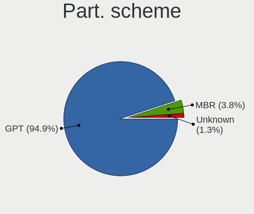
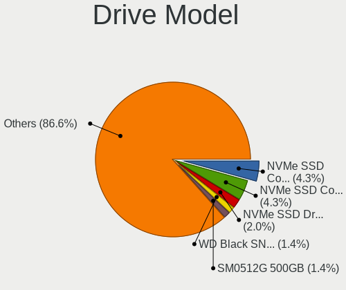
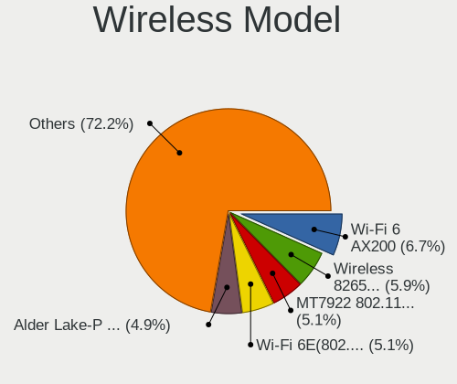
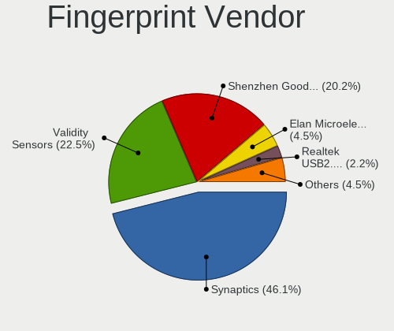

NixOS - Tested Hardware & Statistics (Notebooks)
------------------------------------------------

A project to collect tested hardware configurations for NixOS.

Anyone can contribute to this report by the [hw-probe](https://github.com/linuxhw/hw-probe) tool:

    sudo -E hw-probe -all -upload

Please contribute! Especially if your hardware is rare.

Contents
--------

* [ Test Cases ](#test-cases)

* [ System ](#system)
  - [ OS                       ](#os)
  - [ OS Family                ](#os-family)
  - [ Kernel                   ](#kernel)
  - [ Kernel Family            ](#kernel-family)
  - [ Kernel Major Ver.        ](#kernel-major-ver)
  - [ Arch                     ](#arch)
  - [ DE                       ](#de)
  - [ Display Server           ](#display-server)
  - [ Display Manager          ](#display-manager)
  - [ OS Lang                  ](#os-lang)
  - [ Boot Mode                ](#boot-mode)
  - [ Filesystem               ](#filesystem)
  - [ Part. scheme             ](#part-scheme)
  - [ Dual Boot with Linux/BSD ](#dual-boot-with-linuxbsd)
  - [ Dual Boot (Win)          ](#dual-boot-win)

* [ Board ](#board)
  - [ Vendor                   ](#vendor)
  - [ Model                    ](#model)
  - [ Model Family             ](#model-family)
  - [ MFG Year                 ](#mfg-year)
  - [ Form Factor              ](#form-factor)
  - [ Secure Boot              ](#secure-boot)
  - [ Coreboot                 ](#coreboot)
  - [ RAM Size                 ](#ram-size)
  - [ RAM Used                 ](#ram-used)
  - [ Total Drives             ](#total-drives)
  - [ Has CD-ROM               ](#has-cd-rom)
  - [ Has Ethernet             ](#has-ethernet)
  - [ Has WiFi                 ](#has-wifi)
  - [ Has Bluetooth            ](#has-bluetooth)

* [ Location ](#location)
  - [ Country                  ](#country)
  - [ City                     ](#city)

* [ Drives ](#drives)
  - [ Drive Vendor             ](#drive-vendor)
  - [ Drive Model              ](#drive-model)
  - [ HDD Vendor               ](#hdd-vendor)
  - [ SSD Vendor               ](#ssd-vendor)
  - [ Drive Kind               ](#drive-kind)
  - [ Drive Connector          ](#drive-connector)
  - [ Drive Size               ](#drive-size)
  - [ Space Total              ](#space-total)
  - [ Space Used               ](#space-used)
  - [ Malfunc. Drives          ](#malfunc-drives)
  - [ Malfunc. Drive Vendor    ](#malfunc-drive-vendor)
  - [ Malfunc. HDD Vendor      ](#malfunc-hdd-vendor)
  - [ Malfunc. Drive Kind      ](#malfunc-drive-kind)
  - [ Failed Drives            ](#failed-drives)
  - [ Failed Drive Vendor      ](#failed-drive-vendor)
  - [ Drive Status             ](#drive-status)

* [ Storage controller ](#storage-controller)
  - [ Storage Vendor           ](#storage-vendor)
  - [ Storage Model            ](#storage-model)
  - [ Storage Kind             ](#storage-kind)

* [ Processor ](#processor)
  - [ CPU Vendor               ](#cpu-vendor)
  - [ CPU Model                ](#cpu-model)
  - [ CPU Model Family         ](#cpu-model-family)
  - [ CPU Cores                ](#cpu-cores)
  - [ CPU Sockets              ](#cpu-sockets)
  - [ CPU Threads              ](#cpu-threads)
  - [ CPU Op-Modes             ](#cpu-op-modes)
  - [ CPU Microcode            ](#cpu-microcode)
  - [ CPU Microarch            ](#cpu-microarch)

* [ Graphics ](#graphics)
  - [ GPU Vendor               ](#gpu-vendor)
  - [ GPU Model                ](#gpu-model)
  - [ GPU Combo                ](#gpu-combo)
  - [ GPU Driver               ](#gpu-driver)
  - [ GPU Memory               ](#gpu-memory)

* [ Monitor ](#monitor)
  - [ Monitor Vendor           ](#monitor-vendor)
  - [ Monitor Model            ](#monitor-model)
  - [ Monitor Resolution       ](#monitor-resolution)
  - [ Monitor Diagonal         ](#monitor-diagonal)
  - [ Monitor Width            ](#monitor-width)
  - [ Aspect Ratio             ](#aspect-ratio)
  - [ Monitor Area             ](#monitor-area)
  - [ Pixel Density            ](#pixel-density)
  - [ Multiple Monitors        ](#multiple-monitors)

* [ Network ](#network)
  - [ Net Controller Vendor    ](#net-controller-vendor)
  - [ Net Controller Model     ](#net-controller-model)
  - [ Wireless Vendor          ](#wireless-vendor)
  - [ Wireless Model           ](#wireless-model)
  - [ Ethernet Vendor          ](#ethernet-vendor)
  - [ Ethernet Model           ](#ethernet-model)
  - [ Net Controller Kind      ](#net-controller-kind)
  - [ Used Controller          ](#used-controller)
  - [ NICs                     ](#nics)
  - [ IPv6                     ](#ipv6)

* [ Bluetooth ](#bluetooth)
  - [ Bluetooth Vendor         ](#bluetooth-vendor)
  - [ Bluetooth Model          ](#bluetooth-model)

* [ Sound ](#sound)
  - [ Sound Vendor             ](#sound-vendor)
  - [ Sound Model              ](#sound-model)

* [ Memory ](#memory)
  - [ Memory Vendor            ](#memory-vendor)
  - [ Memory Model             ](#memory-model)
  - [ Memory Kind              ](#memory-kind)
  - [ Memory Form Factor       ](#memory-form-factor)
  - [ Memory Size              ](#memory-size)
  - [ Memory Speed             ](#memory-speed)

* [ Printers & scanners ](#printers--scanners)
  - [ Printer Vendor           ](#printer-vendor)
  - [ Printer Model            ](#printer-model)
  - [ Scanner Vendor           ](#scanner-vendor)
  - [ Scanner Model            ](#scanner-model)

* [ Camera ](#camera)
  - [ Camera Vendor            ](#camera-vendor)
  - [ Camera Model             ](#camera-model)

* [ Security ](#security)
  - [ Fingerprint Vendor       ](#fingerprint-vendor)
  - [ Fingerprint Model        ](#fingerprint-model)
  - [ Chipcard Vendor          ](#chipcard-vendor)
  - [ Chipcard Model           ](#chipcard-model)

* [ Unsupported ](#unsupported)
  - [ Unsupported Devices      ](#unsupported-devices)
  - [ Unsupported Device Types ](#unsupported-device-types)

Test Cases
----------

Total: 182

| Vendor        | Model                       | Probe                                                      | Date         |
|---------------|-----------------------------|------------------------------------------------------------|--------------|
| Lenovo        | ThinkPad T14s Gen 4 21F8... | [97e043115e](https://linux-hardware.org/?probe=97e043115e) | Nov 04, 2023 |
| Lenovo        | Slim 7 16IAH7 82VB          | [0e5f976d6b](https://linux-hardware.org/?probe=0e5f976d6b) | Nov 02, 2023 |
| Dell          | XPS 9315                    | [6f3e496918](https://linux-hardware.org/?probe=6f3e496918) | Oct 29, 2023 |
| HP            | EliteBook 850 G4            | [68da315076](https://linux-hardware.org/?probe=68da315076) | Oct 28, 2023 |
| Apple         | MacBookPro9,2               | [b075cf8841](https://linux-hardware.org/?probe=b075cf8841) | Oct 28, 2023 |
| HP            | EliteBook Folio 9470m       | [765f6f8003](https://linux-hardware.org/?probe=765f6f8003) | Oct 25, 2023 |
| Lenovo        | Slim 7 16IAH7 82VB          | [a80fcc753e](https://linux-hardware.org/?probe=a80fcc753e) | Oct 25, 2023 |
| MSI           | GE70 2PE                    | [c0bcd133c9](https://linux-hardware.org/?probe=c0bcd133c9) | Oct 22, 2023 |
| HP            | EliteBook Folio 9470m       | [f342373f65](https://linux-hardware.org/?probe=f342373f65) | Oct 20, 2023 |
| Framework     | Laptop                      | [e765d5da63](https://linux-hardware.org/?probe=e765d5da63) | Oct 18, 2023 |
| HP            | ZBook Firefly 14 inch G1... | [f53079d2c1](https://linux-hardware.org/?probe=f53079d2c1) | Oct 16, 2023 |
| HP            | ZBook Firefly 14 inch G1... | [dcb416db8f](https://linux-hardware.org/?probe=dcb416db8f) | Oct 16, 2023 |
| Samsung       | 530U3BI/530U4BI/530U4BH     | [feaf25f8e8](https://linux-hardware.org/?probe=feaf25f8e8) | Oct 15, 2023 |
| Lenovo        | ThinkPad L14 Gen 1 20U50... | [ba690b36a3](https://linux-hardware.org/?probe=ba690b36a3) | Oct 12, 2023 |
| MSI           | Prestige 16Studio A13VE     | [0209063983](https://linux-hardware.org/?probe=0209063983) | Oct 12, 2023 |
| Lenovo        | IdeaPad Flex-14API 81SS     | [7ff5fe9fdd](https://linux-hardware.org/?probe=7ff5fe9fdd) | Oct 11, 2023 |
| Lenovo        | ThinkPad P50 20EQS4QL11     | [a4d6af03fe](https://linux-hardware.org/?probe=a4d6af03fe) | Oct 10, 2023 |
| Lenovo        | ThinkPad T14 Gen 2i 20W0... | [7d1fea3001](https://linux-hardware.org/?probe=7d1fea3001) | Oct 09, 2023 |
| HP            | EliteBook Folio 9470m       | [9cecfe7ba5](https://linux-hardware.org/?probe=9cecfe7ba5) | Oct 09, 2023 |
| Lenovo        | ThinkBook 15 G2 ITL 20VE    | [801a2a4abf](https://linux-hardware.org/?probe=801a2a4abf) | Oct 09, 2023 |
| Dell          | Latitude E6540              | [fc3ea4bb32](https://linux-hardware.org/?probe=fc3ea4bb32) | Oct 08, 2023 |
| Dell          | Inspiron 3542               | [90f777d9cc](https://linux-hardware.org/?probe=90f777d9cc) | Oct 07, 2023 |
| Dell          | Latitude E6540              | [a4fbd5793d](https://linux-hardware.org/?probe=a4fbd5793d) | Oct 02, 2023 |
| Lenovo        | ThinkBook 15 G3 ACL 21A4    | [c67f66f5e3](https://linux-hardware.org/?probe=c67f66f5e3) | Oct 01, 2023 |
| Dell          | Latitude E6540              | [8fdc000f7e](https://linux-hardware.org/?probe=8fdc000f7e) | Oct 01, 2023 |
| Dell          | Latitude E6540              | [a5de8b78e7](https://linux-hardware.org/?probe=a5de8b78e7) | Oct 01, 2023 |
| Lenovo        | ThinkPad T480s 20L7CTO1W... | [1135ddac8e](https://linux-hardware.org/?probe=1135ddac8e) | Sep 30, 2023 |
| Dell          | Latitude 5430               | [583aa8cf02](https://linux-hardware.org/?probe=583aa8cf02) | Sep 29, 2023 |
| Intel         | SharkBay Platform           | [2406bf1c0d](https://linux-hardware.org/?probe=2406bf1c0d) | Sep 29, 2023 |
| Dell          | Latitude E6540              | [1478e1265d](https://linux-hardware.org/?probe=1478e1265d) | Sep 29, 2023 |
| Dell          | XPS 15 9560                 | [009a6a1a98](https://linux-hardware.org/?probe=009a6a1a98) | Sep 27, 2023 |
| Dell          | Latitude E6540              | [7d9885cd7c](https://linux-hardware.org/?probe=7d9885cd7c) | Sep 27, 2023 |
| HP            | EliteBook Folio 9470m       | [78d31814cf](https://linux-hardware.org/?probe=78d31814cf) | Sep 26, 2023 |
| HP            | EliteBook Folio 9470m       | [0d7d5f0613](https://linux-hardware.org/?probe=0d7d5f0613) | Sep 26, 2023 |
| HP            | EliteBook Folio 9470m       | [086b0dc21a](https://linux-hardware.org/?probe=086b0dc21a) | Sep 23, 2023 |
| HP            | EliteBook 8470p             | [220a0f8733](https://linux-hardware.org/?probe=220a0f8733) | Sep 23, 2023 |
| Apple         | MacBookPro9,2               | [bf71bcd90e](https://linux-hardware.org/?probe=bf71bcd90e) | Sep 22, 2023 |
| Lenovo        | ThinkPad T470s 20HF0000M... | [ad989ac089](https://linux-hardware.org/?probe=ad989ac089) | Sep 21, 2023 |
| Apple         | MacBookPro9,2               | [4d2c8f9f07](https://linux-hardware.org/?probe=4d2c8f9f07) | Sep 20, 2023 |
| HP            | EliteBook Folio 9470m       | [5e50efa2c4](https://linux-hardware.org/?probe=5e50efa2c4) | Sep 19, 2023 |
| Lenovo        | IdeaPad S145-15IKB 81XM     | [aebeeb7401](https://linux-hardware.org/?probe=aebeeb7401) | Sep 17, 2023 |
| Dell          | Latitude E6540              | [ff29b23e60](https://linux-hardware.org/?probe=ff29b23e60) | Sep 13, 2023 |
| Acer          | Aspire E5-575G              | [ff31b68cf3](https://linux-hardware.org/?probe=ff31b68cf3) | Sep 12, 2023 |
| Lenovo        | ThinkPad T480 20L6S4RV00    | [8ae7288bf3](https://linux-hardware.org/?probe=8ae7288bf3) | Sep 11, 2023 |
| Lenovo        | ThinkPad S1 Yoga 20CD00B... | [5778731f85](https://linux-hardware.org/?probe=5778731f85) | Sep 10, 2023 |
| Dell          | Precision 5680              | [fdcb7ce5d4](https://linux-hardware.org/?probe=fdcb7ce5d4) | Sep 05, 2023 |
| Lenovo        | ThinkPad T470 20HES2RC00    | [390104a086](https://linux-hardware.org/?probe=390104a086) | Aug 28, 2023 |
| Dell          | Wyse 5470                   | [6d45205020](https://linux-hardware.org/?probe=6d45205020) | Aug 27, 2023 |
| Lenovo        | G50-70 20351                | [aed7eacff0](https://linux-hardware.org/?probe=aed7eacff0) | Aug 20, 2023 |
| HP            | EliteBook 8470p             | [320138e7f5](https://linux-hardware.org/?probe=320138e7f5) | Aug 11, 2023 |
| HUAWEI        | NBLK-WAX9X                  | [72bb72d2aa](https://linux-hardware.org/?probe=72bb72d2aa) | Aug 08, 2023 |
| ASUSTek       | ProArt StudioBook W730G5... | [c384115725](https://linux-hardware.org/?probe=c384115725) | Aug 05, 2023 |
| ASUSTek       | Zenbook UM3402YA_UM3402Y... | [39fbf6393c](https://linux-hardware.org/?probe=39fbf6393c) | Aug 03, 2023 |
| ASUSTek       | Zenbook UM3402YA_UM3402Y... | [a6c2e042e4](https://linux-hardware.org/?probe=a6c2e042e4) | Aug 03, 2023 |
| ASUSTek       | VivoBook_ASUSLaptop M340... | [f75ea8cfef](https://linux-hardware.org/?probe=f75ea8cfef) | Aug 02, 2023 |
| ASUSTek       | VivoBook_ASUSLaptop M340... | [19b6ecf591](https://linux-hardware.org/?probe=19b6ecf591) | Jul 29, 2023 |
| System76      | Pangolin                    | [3b37a9bedb](https://linux-hardware.org/?probe=3b37a9bedb) | Jul 29, 2023 |
| Alienware     | 17                          | [25f67e59b8](https://linux-hardware.org/?probe=25f67e59b8) | Jul 26, 2023 |
| Apple         | MacBookPro11,3              | [8d48a50003](https://linux-hardware.org/?probe=8d48a50003) | Jul 22, 2023 |
| Apple         | MacBookPro11,3              | [c29abaca55](https://linux-hardware.org/?probe=c29abaca55) | Jul 22, 2023 |
| Lenovo        | IdeaPad 3 14ITL05 81X7      | [568ab8dd45](https://linux-hardware.org/?probe=568ab8dd45) | Jul 21, 2023 |
| ASUSTek       | 1005HA                      | [59a0d6a7bb](https://linux-hardware.org/?probe=59a0d6a7bb) | Jul 19, 2023 |
| MSI           | Alpha 15 B5EEK              | [62fac1de1c](https://linux-hardware.org/?probe=62fac1de1c) | Jul 08, 2023 |
| Lenovo        | Legion R9000P ARX8 82WM     | [95c540792e](https://linux-hardware.org/?probe=95c540792e) | Jul 02, 2023 |
| Lenovo        | ThinkPad P14s Gen 1 20Y1... | [4d377fc8b8](https://linux-hardware.org/?probe=4d377fc8b8) | Jul 01, 2023 |
| Dell          | Latitude E5470              | [fd56f44c38](https://linux-hardware.org/?probe=fd56f44c38) | Jun 29, 2023 |
| Lenovo        | IdeaPad S540-15IWL          | [de699b13ba](https://linux-hardware.org/?probe=de699b13ba) | Jun 28, 2023 |
| Lenovo        | ThinkPad X1 Carbon Gen 1... | [699aa2d6e1](https://linux-hardware.org/?probe=699aa2d6e1) | Jun 26, 2023 |
| Microtech     | CoreBook Lite               | [1840bef280](https://linux-hardware.org/?probe=1840bef280) | Jun 24, 2023 |
| ASUSTek       | Zenbook UX3402ZA_Q409ZA     | [2812cf43d0](https://linux-hardware.org/?probe=2812cf43d0) | Jun 23, 2023 |
| HP            | EliteBook 820 G3            | [925e5f0915](https://linux-hardware.org/?probe=925e5f0915) | Jun 22, 2023 |
| MECHREVO      | WUJIE 14                    | [a55e31b287](https://linux-hardware.org/?probe=a55e31b287) | Jun 20, 2023 |
| Lenovo        | ThinkPad X1 Carbon Gen 1... | [9726121d1b](https://linux-hardware.org/?probe=9726121d1b) | Jun 18, 2023 |
| Lenovo        | ThinkPad X1 Carbon Gen 1... | [c5c0838f41](https://linux-hardware.org/?probe=c5c0838f41) | Jun 18, 2023 |
| Lenovo        | Legion Y7000 2019 PG0 81... | [46ffcb9672](https://linux-hardware.org/?probe=46ffcb9672) | Jun 18, 2023 |
| Lenovo        | Yoga 14sARE 2020 82A8       | [fa79d9b26d](https://linux-hardware.org/?probe=fa79d9b26d) | Jun 17, 2023 |
| MACHENIKE     | F117-7P                     | [78ad896b83](https://linux-hardware.org/?probe=78ad896b83) | Jun 10, 2023 |
| Lenovo        | Legion Pro 7 16IRX8H 82W... | [0d31f94244](https://linux-hardware.org/?probe=0d31f94244) | May 30, 2023 |
| Dell          | Latitude 5290 2-in-1        | [6607361205](https://linux-hardware.org/?probe=6607361205) | May 25, 2023 |
| Lenovo        | G50-70 20351                | [19dc1505b5](https://linux-hardware.org/?probe=19dc1505b5) | May 24, 2023 |
| MSI           | Alpha 15 B5EEK              | [b309bee7e9](https://linux-hardware.org/?probe=b309bee7e9) | May 19, 2023 |
| Lenovo        | ThinkPad P14s Gen 3 21J5... | [e0cbba6897](https://linux-hardware.org/?probe=e0cbba6897) | May 16, 2023 |
| Lenovo        | ThinkBook 16 G4+ ARA 21D... | [acd8d0441a](https://linux-hardware.org/?probe=acd8d0441a) | May 15, 2023 |
| Apple         | MacBookPro11,5              | [21ecf73d3a](https://linux-hardware.org/?probe=21ecf73d3a) | May 09, 2023 |
| UNOWHY        | Y13G011S4EI                 | [581cd68800](https://linux-hardware.org/?probe=581cd68800) | May 02, 2023 |
| Lenovo        | G50-70 20351                | [5792e8cfa2](https://linux-hardware.org/?probe=5792e8cfa2) | Apr 29, 2023 |
| ASUSTek       | ROG Zephyrus G14 GA401IV    | [2063d4a9fc](https://linux-hardware.org/?probe=2063d4a9fc) | Apr 27, 2023 |
| Apple         | MacBookPro11,3              | [7fd17e2245](https://linux-hardware.org/?probe=7fd17e2245) | Apr 22, 2023 |
| Avell High... | A70 MOB                     | [869b1ae79b](https://linux-hardware.org/?probe=869b1ae79b) | Apr 17, 2023 |
| Lenovo        | ThinkPad P50 20EN0005GE     | [85a4de4e58](https://linux-hardware.org/?probe=85a4de4e58) | Apr 12, 2023 |
| Lenovo        | ThinkPad E14 Gen 4 21EBC... | [63035ef97f](https://linux-hardware.org/?probe=63035ef97f) | Apr 12, 2023 |
| Dell          | XPS 9320                    | [c78c87474d](https://linux-hardware.org/?probe=c78c87474d) | Apr 05, 2023 |
| GPD           | G1621-02                    | [2ed8b6c147](https://linux-hardware.org/?probe=2ed8b6c147) | Mar 29, 2023 |
| Lenovo        | ThinkPad X1 Carbon 4th 2... | [10ec4f48dd](https://linux-hardware.org/?probe=10ec4f48dd) | Mar 16, 2023 |
| ASUSTek       | 1005HA                      | [3326423f04](https://linux-hardware.org/?probe=3326423f04) | Mar 06, 2023 |
| Lenovo        | Yoga Slim 7 13ACN5 82CY     | [4fc82abdeb](https://linux-hardware.org/?probe=4fc82abdeb) | Mar 04, 2023 |
| Toshiba       | Satellite L50-B             | [8abe852ff0](https://linux-hardware.org/?probe=8abe852ff0) | Mar 03, 2023 |
| Lenovo        | Yoga Slim 7 13ACN5 82CY     | [4c25c88937](https://linux-hardware.org/?probe=4c25c88937) | Mar 03, 2023 |
| Lenovo        | ThinkPad P14s Gen 3 21J5... | [9b044bd920](https://linux-hardware.org/?probe=9b044bd920) | Feb 26, 2023 |
| Lenovo        | ThinkPad P14s Gen 3 21J5... | [c8c79f26d8](https://linux-hardware.org/?probe=c8c79f26d8) | Feb 26, 2023 |
| Lenovo        | ThinkPad X230 2333AZ2       | [d9d0138294](https://linux-hardware.org/?probe=d9d0138294) | Jan 19, 2023 |
| Blackview     | AceBook 1                   | [ea4db42aa8](https://linux-hardware.org/?probe=ea4db42aa8) | Jan 19, 2023 |
| Dell          | Latitude 7420               | [e770b3e784](https://linux-hardware.org/?probe=e770b3e784) | Jan 04, 2023 |
| Dell          | Latitude 7420               | [bab9b86606](https://linux-hardware.org/?probe=bab9b86606) | Jan 04, 2023 |
| Dell          | Precision M4800             | [505f1b47dc](https://linux-hardware.org/?probe=505f1b47dc) | Dec 30, 2022 |
| GPD           | WIN2                        | [d7d31b67d0](https://linux-hardware.org/?probe=d7d31b67d0) | Dec 28, 2022 |
| MSI           | Raider GE67HX 12UGS         | [84c6275c04](https://linux-hardware.org/?probe=84c6275c04) | Dec 25, 2022 |
| Dell          | XPS 15 7590                 | [e070540587](https://linux-hardware.org/?probe=e070540587) | Dec 16, 2022 |
| MECHREVO      | Code01 Ver2.0               | [e4ba0262b4](https://linux-hardware.org/?probe=e4ba0262b4) | Dec 16, 2022 |
| MECHREVO      | Code01 Ver2.0               | [1a9c49eb4f](https://linux-hardware.org/?probe=1a9c49eb4f) | Dec 16, 2022 |
| Framework     | Laptop (12th Gen Intel C... | [893190593e](https://linux-hardware.org/?probe=893190593e) | Dec 12, 2022 |
| ASUSTek       | ROG Zephyrus G14 GA401QM... | [d512bff9cc](https://linux-hardware.org/?probe=d512bff9cc) | Dec 04, 2022 |
| ASUSTek       | ROG Zephyrus G14 GA401QM... | [fef748b3f4](https://linux-hardware.org/?probe=fef748b3f4) | Dec 04, 2022 |
| Acer          | Aspire A315-54K             | [12f19e4fbe](https://linux-hardware.org/?probe=12f19e4fbe) | Nov 23, 2022 |
| Lenovo        | ThinkPad T14s Gen 3 21BR... | [0c889920b5](https://linux-hardware.org/?probe=0c889920b5) | Nov 12, 2022 |
| Dell          | Latitude E5540              | [f2420e40cd](https://linux-hardware.org/?probe=f2420e40cd) | Nov 06, 2022 |
| Dell          | Latitude E5540              | [2456786404](https://linux-hardware.org/?probe=2456786404) | Nov 06, 2022 |
| Lenovo        | Legion S7 15ACH6 82K8       | [b60f8a187c](https://linux-hardware.org/?probe=b60f8a187c) | Nov 04, 2022 |
| Dell          | Inspiron 5570               | [33d3e9ce22](https://linux-hardware.org/?probe=33d3e9ce22) | Nov 03, 2022 |
| Toshiba       | Satellite L50-B             | [c242c45dbe](https://linux-hardware.org/?probe=c242c45dbe) | Nov 01, 2022 |
| Lenovo        | IdeaPad 5 Pro 16ACH6 82L... | [d58a7c30a9](https://linux-hardware.org/?probe=d58a7c30a9) | Oct 26, 2022 |
| Lenovo        | ThinkPad E470 20H1006JIX    | [8bc8778497](https://linux-hardware.org/?probe=8bc8778497) | Oct 26, 2022 |
| Dell          | Precision 5760              | [4255007db8](https://linux-hardware.org/?probe=4255007db8) | Oct 18, 2022 |
| HP            | ZBook Studio G5             | [0a9b0167c7](https://linux-hardware.org/?probe=0a9b0167c7) | Oct 17, 2022 |
| Dell          | XPS 13 9310                 | [99232ffba3](https://linux-hardware.org/?probe=99232ffba3) | Oct 13, 2022 |
| Dell          | Inspiron 15 7510            | [263276babe](https://linux-hardware.org/?probe=263276babe) | Sep 30, 2022 |
| Dell          | Inspiron 15 7510            | [86e1da35ba](https://linux-hardware.org/?probe=86e1da35ba) | Sep 30, 2022 |
| Dell          | XPS 15 9570                 | [564eb3b439](https://linux-hardware.org/?probe=564eb3b439) | Sep 28, 2022 |
| Dell          | XPS 15 9570                 | [085bd81d5b](https://linux-hardware.org/?probe=085bd81d5b) | Sep 28, 2022 |
| Lenovo        | ThinkPad X1 Extreme 20MF... | [7fc4cdb860](https://linux-hardware.org/?probe=7fc4cdb860) | Sep 22, 2022 |
| Dell          | Precision M4800             | [fae4dbff63](https://linux-hardware.org/?probe=fae4dbff63) | Sep 13, 2022 |
| Apple         | MacBookPro11,5              | [305905e674](https://linux-hardware.org/?probe=305905e674) | Sep 07, 2022 |
| Apple         | MacBookPro11,5              | [19d3fab687](https://linux-hardware.org/?probe=19d3fab687) | Aug 21, 2022 |
| HP            | ProBook 445 G7              | [898a635cdd](https://linux-hardware.org/?probe=898a635cdd) | Aug 20, 2022 |
| HP            | ProBook 445 G7              | [28e67ea5a7](https://linux-hardware.org/?probe=28e67ea5a7) | Aug 20, 2022 |
| ASUSTek       | ASUSPRO P1440FAC_P1440FA    | [9351f31042](https://linux-hardware.org/?probe=9351f31042) | Aug 13, 2022 |
| Dell          | Latitude 7420               | [219cf18b1e](https://linux-hardware.org/?probe=219cf18b1e) | Jul 06, 2022 |
| Dell          | XPS 13 9310                 | [380770f287](https://linux-hardware.org/?probe=380770f287) | Jun 15, 2022 |
| Dell          | XPS 13 9310                 | [248f252b2a](https://linux-hardware.org/?probe=248f252b2a) | Jun 13, 2022 |
| Lenovo        | ThinkPad X230 23243E9       | [85ffd2561e](https://linux-hardware.org/?probe=85ffd2561e) | Jun 08, 2022 |
| Dell          | XPS 13 9305                 | [affa614c99](https://linux-hardware.org/?probe=affa614c99) | Jun 07, 2022 |
| Dell          | Latitude 7420               | [5be44c8aae](https://linux-hardware.org/?probe=5be44c8aae) | Jun 01, 2022 |
| Apple         | MacBookPro11,5              | [5cd59453b1](https://linux-hardware.org/?probe=5cd59453b1) | Apr 15, 2022 |
| Framework     | Laptop                      | [4997cab79b](https://linux-hardware.org/?probe=4997cab79b) | Apr 14, 2022 |
| HP            | ProBook 450 G4              | [2cb837e17f](https://linux-hardware.org/?probe=2cb837e17f) | Apr 14, 2022 |
| Lenovo        | ThinkPad T490 20N2000LUK    | [a394ce9693](https://linux-hardware.org/?probe=a394ce9693) | Apr 13, 2022 |
| HP            | ProBook 450 G4              | [fb5bcd7c77](https://linux-hardware.org/?probe=fb5bcd7c77) | Apr 13, 2022 |
| ASUSTek       | ROG Flow X13 GV301QE_GV3... | [502a8c9d32](https://linux-hardware.org/?probe=502a8c9d32) | Apr 13, 2022 |
| Lenovo        | ThinkPad X260 20F5S4BY00    | [729b19eda3](https://linux-hardware.org/?probe=729b19eda3) | Apr 13, 2022 |
| Lenovo        | Yoga Slim 7 13ACN5 82CY     | [4c96d9df2f](https://linux-hardware.org/?probe=4c96d9df2f) | Apr 02, 2022 |
| Lenovo        | ThinkPad T14s Gen 1 20UH... | [5570a879d3](https://linux-hardware.org/?probe=5570a879d3) | Mar 13, 2022 |
| Lenovo        | ThinkPad T14s Gen 1 20UH... | [d6cae900dc](https://linux-hardware.org/?probe=d6cae900dc) | Mar 13, 2022 |
| GPD           | MicroPC                     | [a572eb2b39](https://linux-hardware.org/?probe=a572eb2b39) | Mar 11, 2022 |
| HP            | EliteBook 845 G8 Noteboo... | [f031fb1a5a](https://linux-hardware.org/?probe=f031fb1a5a) | Mar 11, 2022 |
| Lenovo        | ThinkPad T540p 20BE005YM... | [6d0cd0f4b9](https://linux-hardware.org/?probe=6d0cd0f4b9) | Mar 10, 2022 |
| Lenovo        | ThinkPad X260 20F5S6MF02    | [5e026c07c0](https://linux-hardware.org/?probe=5e026c07c0) | Mar 10, 2022 |
| MSI           | Bravo 15 B5DD               | [273737b3d7](https://linux-hardware.org/?probe=273737b3d7) | Feb 25, 2022 |
| OBSIDIAN-P... | N13_N140ZU                  | [9f2fdbfce5](https://linux-hardware.org/?probe=9f2fdbfce5) | Feb 25, 2022 |
| Dell          | Latitude 7420               | [64178dcbb7](https://linux-hardware.org/?probe=64178dcbb7) | Feb 08, 2022 |
| Lenovo        | ThinkPad X390 20Q0CTO1WW    | [cf3fa03922](https://linux-hardware.org/?probe=cf3fa03922) | Jan 08, 2022 |
| Lenovo        | ThinkPad X390 20Q0CTO1WW    | [d62840031f](https://linux-hardware.org/?probe=d62840031f) | Jan 08, 2022 |
| Lenovo        | Legion 5 17ARH05H 82GN      | [9e022a2288](https://linux-hardware.org/?probe=9e022a2288) | Dec 26, 2021 |
| Lenovo        | Legion 5 17ARH05H 82GN      | [8ff8fb5efd](https://linux-hardware.org/?probe=8ff8fb5efd) | Dec 26, 2021 |
| ASUSTek       | ZenBook UX391FA_UX391FA     | [5fb4f1b6a6](https://linux-hardware.org/?probe=5fb4f1b6a6) | Nov 29, 2021 |
| Lenovo        | ThinkPad T14 Gen 1 20UD0... | [dbe8d36249](https://linux-hardware.org/?probe=dbe8d36249) | Nov 04, 2021 |
| Lenovo        | ThinkPad X250 20CLS18S0T    | [0151eadf78](https://linux-hardware.org/?probe=0151eadf78) | Oct 06, 2021 |
| HP            | ProBook 445 G7              | [36c94af49d](https://linux-hardware.org/?probe=36c94af49d) | Aug 09, 2021 |
| HP            | ProBook 445 G7              | [87a418ce6c](https://linux-hardware.org/?probe=87a418ce6c) | Aug 09, 2021 |
| ASUSTek       | ROG Zephyrus G14 GA401QM... | [3df83086ef](https://linux-hardware.org/?probe=3df83086ef) | Aug 07, 2021 |
| ASUSTek       | ROG Zephyrus G14 GA401QM... | [052ccd7a40](https://linux-hardware.org/?probe=052ccd7a40) | Aug 07, 2021 |
| ASUSTek       | ROG Zephyrus G14 GA401QM... | [48fd4d3b89](https://linux-hardware.org/?probe=48fd4d3b89) | Aug 06, 2021 |
| Dell          | Latitude 7420               | [0624aeffd1](https://linux-hardware.org/?probe=0624aeffd1) | Jul 19, 2021 |
| ASUSTek       | ROG Strix G533QR_G533QR     | [d14e0ef395](https://linux-hardware.org/?probe=d14e0ef395) | Jun 18, 2021 |
| Lenovo        | ThinkPad T480 20L5CTO1WW    | [fc12f446bb](https://linux-hardware.org/?probe=fc12f446bb) | May 23, 2021 |
| HP            | ZBook Studio G5             | [d323a9cfbf](https://linux-hardware.org/?probe=d323a9cfbf) | Apr 23, 2021 |
| Lenovo        | ThinkPad T460p 20FWCTO1W... | [38ab65a49b](https://linux-hardware.org/?probe=38ab65a49b) | Mar 18, 2021 |
| Lenovo        | ThinkPad T580 20L90024PB    | [8dc60fafaa](https://linux-hardware.org/?probe=8dc60fafaa) | Oct 13, 2020 |
| Dell          | XPS 15 9550                 | [5656cda6a4](https://linux-hardware.org/?probe=5656cda6a4) | Sep 01, 2020 |
| Dell          | XPS 15 9550                 | [550264c421](https://linux-hardware.org/?probe=550264c421) | Aug 22, 2020 |
| Lenovo        | ThinkPad T15 Gen 1 20S6C... | [71029187b1](https://linux-hardware.org/?probe=71029187b1) | Jul 03, 2020 |
| Acer          | Aspire E5-576G              | [c126c8b2fd](https://linux-hardware.org/?probe=c126c8b2fd) | Apr 15, 2020 |
| Gigabyte      | Sabre 15                    | [4f92cff461](https://linux-hardware.org/?probe=4f92cff461) | Jul 14, 2019 |

System
------

OS
--

Installed operating systems

| Name                             | Notebooks | Percent |
|----------------------------------|-----------|---------|
| NixOS 23.05                      | 52        | 37.96%  |
| NixOS 22.11                      | 27        | 19.71%  |
| NixOS 22.05                      | 18        | 13.14%  |
| NixOS 23.11                      | 17        | 12.41%  |
| NixOS 21.11                      | 9         | 6.57%   |
| NixOS                            | 2         | 1.46%   |
| NixOS 21.11pre302265.c6c4a3d45ab | 1         | 0.73%   |
| NixOS 21.11.20210606.fbfb794     | 1         | 0.73%   |
| NixOS 21.05.4384.4f37689c8a2     | 1         | 0.73%   |
| NixOS 21.05.3443.ee90403e147     | 1         | 0.73%   |
| NixOS 21.05.2132.733682c3292     | 1         | 0.73%   |
| NixOS 21.05.20210423.c21475e     | 1         | 0.73%   |
| NixOS 21.03.20200927.84d74ae     | 1         | 0.73%   |
| NixOS 20.09pre-git               | 1         | 0.73%   |
| NixOS 20.03.2351.f8248ab6d9e     | 1         | 0.73%   |
| NixOS 19.09.2522.75f4ba05c63     | 1         | 0.73%   |
| NixOS 19.09.2220.92231f4f32f     | 1         | 0.73%   |
| NixOS 19.03.173054.754763ff4ba   | 1         | 0.73%   |

OS Family
---------

OS without a version

| Name  | Notebooks | Percent |
|-------|-----------|---------|
| NixOS | 124       | 100%    |

Kernel
------

Version of the Linux kernel

| Version       | Notebooks | Percent |
|---------------|-----------|---------|
| 6.3.8         | 4         | 2.74%   |
| 6.1.55        | 4         | 2.74%   |
| 6.1.53        | 4         | 2.74%   |
| 6.1.51        | 4         | 2.74%   |
| 6.3.3         | 3         | 2.05%   |
| 6.1.47        | 3         | 2.05%   |
| 6.1.38        | 3         | 2.05%   |
| 6.1.31        | 3         | 2.05%   |
| 5.15.74       | 3         | 2.05%   |
| 5.15.43       | 3         | 2.05%   |
| 6.5.7-xanmod1 | 2         | 1.37%   |
| 6.5.6         | 2         | 1.37%   |
| 6.5.5         | 2         | 1.37%   |
| 6.5.2         | 2         | 1.37%   |
| 6.4.0         | 2         | 1.37%   |
| 6.3.1         | 2         | 1.37%   |
| 6.1.42        | 2         | 1.37%   |
| 6.1.41        | 2         | 1.37%   |
| 6.1.35        | 2         | 1.37%   |
| 6.1.34        | 2         | 1.37%   |
| 6.1.0         | 2         | 1.37%   |
| 6.0.10        | 2         | 1.37%   |
| 5.16.15       | 2         | 1.37%   |
| 5.15.72       | 2         | 1.37%   |
| 5.15.68       | 2         | 1.37%   |
| 5.15.64       | 2         | 1.37%   |
| 5.15.26       | 2         | 1.37%   |
| 5.13.7        | 2         | 1.37%   |
| 6.5.3         | 1         | 0.68%   |
| 6.4.8         | 1         | 0.68%   |
| 6.4.6         | 1         | 0.68%   |
| 6.4.2         | 1         | 0.68%   |
| 6.4.14        | 1         | 0.68%   |
| 6.4.1-zen1    | 1         | 0.68%   |
| 6.3.9         | 1         | 0.68%   |
| 6.3.5         | 1         | 0.68%   |
| 6.2.9-lqx1    | 1         | 0.68%   |
| 6.2.9         | 1         | 0.68%   |
| 6.2.8         | 1         | 0.68%   |
| 6.2.7         | 1         | 0.68%   |

Kernel Family
-------------

Linux kernel without a distro release

| Version | Notebooks | Percent |
|---------|-----------|---------|
| 6.3.8   | 4         | 2.74%   |
| 6.1.55  | 4         | 2.74%   |
| 6.1.53  | 4         | 2.74%   |
| 6.1.51  | 4         | 2.74%   |
| 6.3.3   | 3         | 2.05%   |
| 6.1.47  | 3         | 2.05%   |
| 6.1.38  | 3         | 2.05%   |
| 6.1.31  | 3         | 2.05%   |
| 6.0.10  | 3         | 2.05%   |
| 5.15.74 | 3         | 2.05%   |
| 5.15.43 | 3         | 2.05%   |
| 6.5.7   | 2         | 1.37%   |
| 6.5.6   | 2         | 1.37%   |
| 6.5.5   | 2         | 1.37%   |
| 6.5.2   | 2         | 1.37%   |
| 6.4.0   | 2         | 1.37%   |
| 6.3.1   | 2         | 1.37%   |
| 6.2.9   | 2         | 1.37%   |
| 6.1.42  | 2         | 1.37%   |
| 6.1.41  | 2         | 1.37%   |
| 6.1.35  | 2         | 1.37%   |
| 6.1.34  | 2         | 1.37%   |
| 6.1.0   | 2         | 1.37%   |
| 5.16.15 | 2         | 1.37%   |
| 5.15.72 | 2         | 1.37%   |
| 5.15.68 | 2         | 1.37%   |
| 5.15.64 | 2         | 1.37%   |
| 5.15.26 | 2         | 1.37%   |
| 5.13.7  | 2         | 1.37%   |
| 6.5.3   | 1         | 0.68%   |
| 6.4.8   | 1         | 0.68%   |
| 6.4.6   | 1         | 0.68%   |
| 6.4.2   | 1         | 0.68%   |
| 6.4.14  | 1         | 0.68%   |
| 6.4.1   | 1         | 0.68%   |
| 6.3.9   | 1         | 0.68%   |
| 6.3.5   | 1         | 0.68%   |
| 6.2.8   | 1         | 0.68%   |
| 6.2.7   | 1         | 0.68%   |
| 6.2.14  | 1         | 0.68%   |

Kernel Major Ver.
-----------------

Linux kernel major version

| Version | Notebooks | Percent |
|---------|-----------|---------|
| 6.1     | 43        | 30.5%   |
| 5.15    | 31        | 21.99%  |
| 6.3     | 11        | 7.8%    |
| 6.5     | 7         | 4.96%   |
| 6.4     | 7         | 4.96%   |
| 6.2     | 6         | 4.26%   |
| 6.0     | 6         | 4.26%   |
| 5.16    | 6         | 4.26%   |
| 5.8     | 3         | 2.13%   |
| 5.19    | 3         | 2.13%   |
| 5.13    | 3         | 2.13%   |
| 5.10    | 3         | 2.13%   |
| 5.7     | 2         | 1.42%   |
| 5.4     | 2         | 1.42%   |
| 5.18    | 2         | 1.42%   |
| 5.17    | 2         | 1.42%   |
| 4.19    | 2         | 1.42%   |
| 5.12    | 1         | 0.71%   |
| Unknown | 1         | 0.71%   |

Arch
----

OS architecture (x86_64, i586, etc.)

| Name   | Notebooks | Percent |
|--------|-----------|---------|
| x86_64 | 123       | 99.19%  |
| i686   | 1         | 0.81%   |

DE
--

Desktop Environment

| Name         | Notebooks | Percent |
|--------------|-----------|---------|
| Unknown      | 47        | 35.88%  |
| GNOME        | 24        | 18.32%  |
| KDE5         | 17        | 12.98%  |
| sway         | 13        | 9.92%   |
| Hyprland     | 8         | 6.11%   |
| none+i3      | 6         | 4.58%   |
| KDE          | 5         | 3.82%   |
| XFCE         | 3         | 2.29%   |
| none+xmonad  | 2         | 1.53%   |
| none+awesome | 2         | 1.53%   |
| X-Cinnamon   | 1         | 0.76%   |
| Pantheon     | 1         | 0.76%   |
| none+bspwm   | 1         | 0.76%   |
| Budgie       | 1         | 0.76%   |

Display Server
--------------

X11 or Wayland

| Name    | Notebooks | Percent |
|---------|-----------|---------|
| Unknown | 55        | 41.67%  |
| Wayland | 46        | 34.85%  |
| X11     | 26        | 19.7%   |
| Tty     | 5         | 3.79%   |

Display Manager
---------------

SDDM, LightDM, etc.

| Name    | Notebooks | Percent |
|---------|-----------|---------|
| Unknown | 58        | 46.03%  |
| GDM     | 28        | 22.22%  |
| SDDM    | 23        | 18.25%  |
| LightDM | 17        | 13.49%  |

OS Lang
-------

Language

| Lang    | Notebooks | Percent |
|---------|-----------|---------|
| en_US   | 70        | 55.56%  |
| Unknown | 33        | 26.19%  |
| en_GB   | 6         | 4.76%   |
| en_DK   | 2         | 1.59%   |
| en_CA   | 2         | 1.59%   |
| en_AU   | 2         | 1.59%   |
| C       | 2         | 1.59%   |
| ru_RU   | 1         | 0.79%   |
| ro_RO   | 1         | 0.79%   |
| pt_BR   | 1         | 0.79%   |
| lv_LV   | 1         | 0.79%   |
| it_IT   | 1         | 0.79%   |
| fr_FR   | 1         | 0.79%   |
| es_MX   | 1         | 0.79%   |
| en_IN   | 1         | 0.79%   |
| de_DE   | 1         | 0.79%   |

Boot Mode
---------

EFI or BIOS

| Mode | Notebooks | Percent |
|------|-----------|---------|
| EFI  | 111       | 89.52%  |
| BIOS | 13        | 10.48%  |

Filesystem
----------

Type of filesystem

| Type    | Notebooks | Percent |
|---------|-----------|---------|
| Ext4    | 69        | 53.49%  |
| Btrfs   | 21        | 16.28%  |
| Tmpfs   | 14        | 10.85%  |
| Zfs     | 12        | 9.3%    |
| Xfs     | 9         | 6.98%   |
| Unknown | 3         | 2.33%   |
| F2fs    | 1         | 0.78%   |

Part. scheme
------------

Scheme of partitioning

| Type    | Notebooks | Percent |
|---------|-----------|---------|
| GPT     | 116       | 92.06%  |
| MBR     | 5         | 3.97%   |
| Unknown | 5         | 3.97%   |

Dual Boot with Linux/BSD
------------------------

Hosting more than one Linux/BSD

| Dual boot | Notebooks | Percent |
|-----------|-----------|---------|
| No        | 102       | 80.31%  |
| Yes       | 25        | 19.69%  |

Dual Boot (Win)
---------------

Hosting Linux and Windows

| Dual boot | Notebooks | Percent |
|-----------|-----------|---------|
| No        | 97        | 78.23%  |
| Yes       | 27        | 21.77%  |

Board
-----

Vendor
------

Motherboard manufacturer

| Name                   | Notebooks | Percent |
|------------------------|-----------|---------|
| Lenovo                 | 49        | 39.52%  |
| Dell                   | 22        | 17.74%  |
| ASUSTek Computer       | 11        | 8.87%   |
| Hewlett-Packard        | 10        | 8.06%   |
| Apple                  | 5         | 4.03%   |
| MSI                    | 4         | 3.23%   |
| GPD                    | 3         | 2.42%   |
| Framework              | 3         | 2.42%   |
| Acer                   | 3         | 2.42%   |
| MECHREVO               | 2         | 1.61%   |
| Toshiba                | 1         | 0.81%   |
| System76               | 1         | 0.81%   |
| Samsung Electronics    | 1         | 0.81%   |
| OBSIDIAN-PC            | 1         | 0.81%   |
| Microtech              | 1         | 0.81%   |
| MACHENIKE              | 1         | 0.81%   |
| Intel                  | 1         | 0.81%   |
| HUAWEI                 | 1         | 0.81%   |
| Gigabyte Technology    | 1         | 0.81%   |
| Blackview              | 1         | 0.81%   |
| Avell High Performance | 1         | 0.81%   |
| Alienware              | 1         | 0.81%   |

Model
-----

Motherboard model

| Name                                        | Notebooks | Percent |
|---------------------------------------------|-----------|---------|
| HP EliteBook 8470p                          | 2         | 1.61%   |
| Framework Laptop                            | 2         | 1.61%   |
| Dell Latitude 7420                          | 2         | 1.61%   |
| Apple MacBookPro11,5                        | 2         | 1.61%   |
| Apple MacBookPro11,3                        | 2         | 1.61%   |
| Toshiba Satellite L50-B                     | 1         | 0.81%   |
| System76 Pangolin                           | 1         | 0.81%   |
| Samsung 530U3BI/530U4BI/530U4BH             | 1         | 0.81%   |
| OBSIDIAN-PC N13_N140ZU                      | 1         | 0.81%   |
| MSI Prestige 16Studio A13VE                 | 1         | 0.81%   |
| MSI GE70 2PE                                | 1         | 0.81%   |
| MSI Bravo 15 B5DD                           | 1         | 0.81%   |
| MSI Alpha 15 B5EEK                          | 1         | 0.81%   |
| Microtech CoreBook Lite                     | 1         | 0.81%   |
| MECHREVO WUJIE 14                           | 1         | 0.81%   |
| MECHREVO Code01 Ver2.0                      | 1         | 0.81%   |
| MACHENIKE F117-7P                           | 1         | 0.81%   |
| Lenovo Yoga Slim 7 13ACN5 82CY              | 1         | 0.81%   |
| Lenovo Yoga 14sARE 2020 82A8                | 1         | 0.81%   |
| Lenovo ThinkPad X390 20Q0CTO1WW             | 1         | 0.81%   |
| Lenovo ThinkPad X260 20F5S6MF02             | 1         | 0.81%   |
| Lenovo ThinkPad X260 20F5S4BY00             | 1         | 0.81%   |
| Lenovo ThinkPad X250 20CLS18S0T             | 1         | 0.81%   |
| Lenovo ThinkPad X230 2333AZ2                | 1         | 0.81%   |
| Lenovo ThinkPad X230 23243E9                | 1         | 0.81%   |
| Lenovo ThinkPad X1 Extreme 20MFCTO1WW       | 1         | 0.81%   |
| Lenovo ThinkPad X1 Carbon Gen 10 21CB007AUK | 1         | 0.81%   |
| Lenovo ThinkPad X1 Carbon 4th 20FBCT01WW    | 1         | 0.81%   |
| Lenovo ThinkPad T580 20L90024PB             | 1         | 0.81%   |
| Lenovo ThinkPad T540p 20BE005YMH            | 1         | 0.81%   |
| Lenovo ThinkPad T490 20N2000LUK             | 1         | 0.81%   |
| Lenovo ThinkPad T480s 20L7CTO1WW            | 1         | 0.81%   |
| Lenovo ThinkPad T480 20L6S4RV00             | 1         | 0.81%   |
| Lenovo ThinkPad T480 20L5CTO1WW             | 1         | 0.81%   |
| Lenovo ThinkPad T470s 20HF0000MX            | 1         | 0.81%   |
| Lenovo ThinkPad T470 20HES2RC00             | 1         | 0.81%   |
| Lenovo ThinkPad T460p 20FWCTO1WW            | 1         | 0.81%   |
| Lenovo ThinkPad T15 Gen 1 20S6CTO1WW        | 1         | 0.81%   |
| Lenovo ThinkPad T14s Gen 4 21F8CTO1WW       | 1         | 0.81%   |
| Lenovo ThinkPad T14s Gen 3 21BR000MUS       | 1         | 0.81%   |

Model Family
------------

Motherboard model prefix

| Name                       | Notebooks | Percent |
|----------------------------|-----------|---------|
| Lenovo ThinkPad            | 32        | 25.81%  |
| Dell XPS                   | 8         | 6.45%   |
| Dell Latitude              | 7         | 5.65%   |
| HP EliteBook               | 6         | 4.84%   |
| Lenovo Legion              | 5         | 4.03%   |
| Lenovo IdeaPad             | 5         | 4.03%   |
| ASUS ROG                   | 4         | 3.23%   |
| Apple MacBookPro11         | 4         | 3.23%   |
| Lenovo ThinkBook           | 3         | 2.42%   |
| Framework Laptop           | 3         | 2.42%   |
| Dell Precision             | 3         | 2.42%   |
| Dell Inspiron              | 3         | 2.42%   |
| ASUS Zenbook               | 3         | 2.42%   |
| Acer Aspire                | 3         | 2.42%   |
| Lenovo Yoga                | 2         | 1.61%   |
| HP ZBook                   | 2         | 1.61%   |
| HP ProBook                 | 2         | 1.61%   |
| Toshiba Satellite          | 1         | 0.81%   |
| System76 Pangolin          | 1         | 0.81%   |
| Samsung 530U3BI            | 1         | 0.81%   |
| OBSIDIAN-PC N13            | 1         | 0.81%   |
| MSI Prestige               | 1         | 0.81%   |
| MSI GE70                   | 1         | 0.81%   |
| MSI Bravo                  | 1         | 0.81%   |
| MSI Alpha                  | 1         | 0.81%   |
| Microtech CoreBook         | 1         | 0.81%   |
| MECHREVO WUJIE             | 1         | 0.81%   |
| MECHREVO Code01            | 1         | 0.81%   |
| MACHENIKE F117-7P          | 1         | 0.81%   |
| Lenovo Slim                | 1         | 0.81%   |
| Lenovo G50-70              | 1         | 0.81%   |
| Intel SharkBay             | 1         | 0.81%   |
| HUAWEI NBLK-WAX9X          | 1         | 0.81%   |
| GPD WIN2                   | 1         | 0.81%   |
| GPD MicroPC                | 1         | 0.81%   |
| GPD G1621-02               | 1         | 0.81%   |
| Gigabyte Sabre             | 1         | 0.81%   |
| Dell Wyse                  | 1         | 0.81%   |
| Blackview AceBook          | 1         | 0.81%   |
| Avell High Performance A70 | 1         | 0.81%   |

MFG Year
--------

Motherboard manufacture year

| Year | Notebooks | Percent |
|------|-----------|---------|
| 2021 | 19        | 15.32%  |
| 2022 | 16        | 12.9%   |
| 2020 | 15        | 12.1%   |
| 2019 | 11        | 8.87%   |
| 2016 | 10        | 8.06%   |
| 2018 | 9         | 7.26%   |
| 2023 | 8         | 6.45%   |
| 2017 | 7         | 5.65%   |
| 2013 | 7         | 5.65%   |
| 2015 | 6         | 4.84%   |
| 2014 | 6         | 4.84%   |
| 2012 | 6         | 4.84%   |
| 2011 | 3         | 2.42%   |
| 2009 | 1         | 0.81%   |

Form Factor
-----------

Physical design of the computer

| Name     | Notebooks | Percent |
|----------|-----------|---------|
| Notebook | 124       | 100%    |

Secure Boot
-----------

Enabled or disabled

| State    | Notebooks | Percent |
|----------|-----------|---------|
| Disabled | 121       | 96.8%   |
| Enabled  | 4         | 3.2%    |

Coreboot
--------

Have coreboot on board

| Used | Notebooks | Percent |
|------|-----------|---------|
| No   | 123       | 99.19%  |
| Yes  | 1         | 0.81%   |

RAM Size
--------

Total RAM memory

| Size in GB  | Notebooks | Percent |
|-------------|-----------|---------|
| 16.01-24.0  | 30        | 24%     |
| 8.01-16.0   | 30        | 24%     |
| 32.01-64.0  | 29        | 23.2%   |
| 4.01-8.0    | 18        | 14.4%   |
| 64.01-256.0 | 7         | 5.6%    |
| 24.01-32.0  | 6         | 4.8%    |
| 3.01-4.0    | 4         | 3.2%    |
| 0.51-1.0    | 1         | 0.8%    |

RAM Used
--------

Used RAM memory

| Used GB    | Notebooks | Percent |
|------------|-----------|---------|
| 4.01-8.0   | 38        | 27.14%  |
| 3.01-4.0   | 26        | 18.57%  |
| 2.01-3.0   | 23        | 16.43%  |
| 8.01-16.0  | 20        | 14.29%  |
| 1.01-2.0   | 14        | 10%     |
| 0.51-1.0   | 6         | 4.29%   |
| 24.01-32.0 | 5         | 3.57%   |
| 16.01-24.0 | 4         | 2.86%   |
| 32.01-64.0 | 2         | 1.43%   |
| 0.01-0.5   | 2         | 1.43%   |

Total Drives
------------

Number of drives on board

| Drives | Notebooks | Percent |
|--------|-----------|---------|
| 1      | 95        | 76%     |
| 2      | 27        | 21.6%   |
| 3      | 3         | 2.4%    |

Has CD-ROM
----------

Has CD-ROM on board

| Presented | Notebooks | Percent |
|-----------|-----------|---------|
| No        | 111       | 89.52%  |
| Yes       | 13        | 10.48%  |

Has Ethernet
------------

Has Ethernet on board

| Presented | Notebooks | Percent |
|-----------|-----------|---------|
| Yes       | 88        | 69.29%  |
| No        | 39        | 30.71%  |

Has WiFi
--------

Has WiFi module

| Presented | Notebooks | Percent |
|-----------|-----------|---------|
| Yes       | 123       | 99.19%  |
| No        | 1         | 0.81%   |

Has Bluetooth
-------------

Has Bluetooth module

| Presented | Notebooks | Percent |
|-----------|-----------|---------|
| Yes       | 117       | 92.86%  |
| No        | 9         | 7.14%   |

Location
--------

Country
-------

Geographic location (country)

| Country     | Notebooks | Percent |
|-------------|-----------|---------|
| USA         | 25        | 20.16%  |
| UK          | 8         | 6.45%   |
| Russia      | 7         | 5.65%   |
| Italy       | 7         | 5.65%   |
| France      | 7         | 5.65%   |
| Germany     | 6         | 4.84%   |
| Ukraine     | 4         | 3.23%   |
| Poland      | 4         | 3.23%   |
| Netherlands | 4         | 3.23%   |
| Czechia     | 4         | 3.23%   |
| Canada      | 4         | 3.23%   |
| Switzerland | 3         | 2.42%   |
| Sweden      | 3         | 2.42%   |
| Norway      | 3         | 2.42%   |
| Spain       | 2         | 1.61%   |
| Portugal    | 2         | 1.61%   |
| Japan       | 2         | 1.61%   |
| Iraq        | 2         | 1.61%   |
| India       | 2         | 1.61%   |
| Brazil      | 2         | 1.61%   |
| Belgium     | 2         | 1.61%   |
| Austria     | 2         | 1.61%   |
| Australia   | 2         | 1.61%   |
| Uzbekistan  | 1         | 0.81%   |
| Uruguay     | 1         | 0.81%   |
| Slovenia    | 1         | 0.81%   |
| Singapore   | 1         | 0.81%   |
| Serbia      | 1         | 0.81%   |
| Romania     | 1         | 0.81%   |
| Peru        | 1         | 0.81%   |
| Mexico      | 1         | 0.81%   |
| Latvia      | 1         | 0.81%   |
| Kuwait      | 1         | 0.81%   |
| Iran        | 1         | 0.81%   |
| Hungary     | 1         | 0.81%   |
| Hong Kong   | 1         | 0.81%   |
| Denmark     | 1         | 0.81%   |
| Colombia    | 1         | 0.81%   |
| China       | 1         | 0.81%   |
| Argentina   | 1         | 0.81%   |

City
----

Geographic location (city)

| City               | Notebooks | Percent |
|--------------------|-----------|---------|
| London             | 3         | 2.29%   |
| Craigsville        | 3         | 2.29%   |
| Vienna             | 2         | 1.53%   |
| Prague             | 2         | 1.53%   |
| Pradamano          | 2         | 1.53%   |
| Phoenix            | 2         | 1.53%   |
| Perth              | 2         | 1.53%   |
| Ottawa             | 2         | 1.53%   |
| Oslo               | 2         | 1.53%   |
| Marki              | 2         | 1.53%   |
| Kharkiv            | 2         | 1.53%   |
| Halifax            | 2         | 1.53%   |
| Catania            | 2         | 1.53%   |
| Baghdad            | 2         | 1.53%   |
| Amsterdam          | 2         | 1.53%   |
| Zurich             | 1         | 0.76%   |
| Yangzhou           | 1         | 0.76%   |
| Woodford           | 1         | 0.76%   |
| Woldegk            | 1         | 0.76%   |
| Warsaw             | 1         | 0.76%   |
| Villeurbanne       | 1         | 0.76%   |
| Victorville        | 1         | 0.76%   |
| Verneuil-sur-Seine | 1         | 0.76%   |
| Valpacos           | 1         | 0.76%   |
| Trento             | 1         | 0.76%   |
| Tremestieri Etneo  | 1         | 0.76%   |
| Tover              | 1         | 0.76%   |
| Tottenham          | 1         | 0.76%   |
| Tolyatti           | 1         | 0.76%   |
| Tehran             | 1         | 0.76%   |
| Tashkent           | 1         | 0.76%   |
| Szigetszentmiklos  | 1         | 0.76%   |
| Stockholm          | 1         | 0.76%   |
| Staten Island      | 1         | 0.76%   |
| St Petersburg      | 1         | 0.76%   |
| Southampton        | 1         | 0.76%   |
| South Deerfield    | 1         | 0.76%   |
| Sollentuna         | 1         | 0.76%   |
| Sobral             | 1         | 0.76%   |
| Smolensk           | 1         | 0.76%   |

Drives
------

Drive Vendor
------------

Hard drive vendors

| Vendor                         | Notebooks | Drives | Percent |
|--------------------------------|-----------|--------|---------|
| Samsung Electronics            | 44        | 59     | 28.95%  |
| Sandisk                        | 15        | 15     | 9.87%   |
| SK hynix                       | 10        | 13     | 6.58%   |
| WDC                            | 8         | 8      | 5.26%   |
| Micron Technology              | 8         | 9      | 5.26%   |
| Toshiba                        | 7         | 7      | 4.61%   |
| Kingston                       | 7         | 9      | 4.61%   |
| Unknown                        | 5         | 5      | 3.29%   |
| Crucial                        | 5         | 6      | 3.29%   |
| Apple                          | 5         | 7      | 3.29%   |
| Seagate                        | 4         | 5      | 2.63%   |
| Intel                          | 4         | 5      | 2.63%   |
| KIOXIA                         | 3         | 4      | 1.97%   |
| Kingston Technology Company    | 3         | 3      | 1.97%   |
| Yangtze Memory Technologies    | 2         | 2      | 1.32%   |
| Transcend                      | 2         | 2      | 1.32%   |
| A-DATA Technology              | 2         | 2      | 1.32%   |
| SPCC                           | 1         | 1      | 0.66%   |
| Solid State Storage Technology | 1         | 1      | 0.66%   |
| S3+                            | 1         | 1      | 0.66%   |
| Realtek                        | 1         | 1      | 0.66%   |
| PNY                            | 1         | 2      | 0.66%   |
| Phison Electronics             | 1         | 1      | 0.66%   |
| Micron/Crucial Technology      | 1         | 1      | 0.66%   |
| MAXIO Technology (Hangzhou)    | 1         | 1      | 0.66%   |
| LITEONIT                       | 1         | 1      | 0.66%   |
| INNOVATION IT                  | 1         | 1      | 0.66%   |
| Hitachi                        | 1         | 2      | 0.66%   |
| HGST                           | 1         | 1      | 0.66%   |
| Dogfish                        | 1         | 1      | 0.66%   |
| Corsair                        | 1         | 1      | 0.66%   |
| China                          | 1         | 1      | 0.66%   |
| Biwin Storage Technology       | 1         | 1      | 0.66%   |
| BIWIN                          | 1         | 1      | 0.66%   |
| ADATA Technology               | 1         | 2      | 0.66%   |

Drive Model
-----------

Hard drive models

| Model                                               | Notebooks | Percent |
|-----------------------------------------------------|-----------|---------|
| Samsung NVMe SSD Controller PM9A1/PM9A3/980PRO 1TB  | 8         | 5.03%   |
| Samsung NVMe SSD Controller SM981/PM981/PM983 1TB   | 7         | 4.4%    |
| Samsung SSD 850 EVO 500GB                           | 3         | 1.89%   |
| SK hynix SKHynix_HFS001TDE9X084N 1TB                | 2         | 1.26%   |
| SK hynix PC801 NVMe 512GB                           | 2         | 1.26%   |
| Sandisk WD Black SN750 / PC SN730 NVMe SSD 1024GB   | 2         | 1.26%   |
| Samsung SSD 870 EVO 500GB                           | 2         | 1.26%   |
| Samsung PM9A1 NVMe 1024GB                           | 2         | 1.26%   |
| Samsung NVMe SSD Controller SM961/PM961/SM963 121GB | 2         | 1.26%   |
| Kingston OM8PCP3512F-AI1 512GB                      | 2         | 1.26%   |
| Apple SSD SM0512G 500GB                             | 2         | 1.26%   |
| Yangtze Memory ZHITAI TiPlus7100 2TB                | 1         | 0.63%   |
| Yangtze Memory YMTC PC300-1TB-B                     | 1         | 0.63%   |
| WDC WDS480G2G0B-00EPW0 480GB SSD                    | 1         | 0.63%   |
| WDC WDS200T1X0E-00AFY0 2TB                          | 1         | 0.63%   |
| WDC WD7500BPKX-75HPJT0 752GB                        | 1         | 0.63%   |
| WDC WD10 JPLX-00MBPT0 1TB                           | 1         | 0.63%   |
| WDC PC SN730 SDBPNTY-1T00-1101 1TB                  | 1         | 0.63%   |
| WDC PC SN720 SDAQNTW-512G-1001 512GB                | 1         | 0.63%   |
| WDC PC SN530 SDBPTPZ-1T00-1002 1TB                  | 1         | 0.63%   |
| WDC PC SN530 SDBPNPZ-256G-1002 256GB                | 1         | 0.63%   |
| Unknown MMC Card  64GB                              | 1         | 0.63%   |
| Unknown MMC Card  32GB                              | 1         | 0.63%   |
| Unknown MMC Card  250GB                             | 1         | 0.63%   |
| Unknown MMC Card  16GB                              | 1         | 0.63%   |
| Unknown MMC Card  128GB                             | 1         | 0.63%   |
| Transcend TS256GMTS800 256GB SSD                    | 1         | 0.63%   |
| Transcend TS256GMTS430S 256GB SSD                   | 1         | 0.63%   |
| Toshiba XG6 NVMe SSD Controller 256GB               | 1         | 0.63%   |
| Toshiba XG4 NVMe SSD Controller 256GB               | 1         | 0.63%   |
| Toshiba MQ01ACF050 500GB                            | 1         | 0.63%   |
| Toshiba MQ01ABD100 1TB                              | 1         | 0.63%   |
| Toshiba MK2565GSXV 250GB                            | 1         | 0.63%   |
| Toshiba KXG6AZNV512G 512GB                          | 1         | 0.63%   |
| Toshiba KXG50ZNV512G NVMe 512GB                     | 1         | 0.63%   |
| SPCC 2.5 SSD 1TB                                    | 1         | 0.63%   |
| Solid State Storage CL4-3D512-Q11 NVMe SSSTC 512GB  | 1         | 0.63%   |
| SK hynix SKHynix_HFS001TEJ9X162N 1024GB             | 1         | 0.63%   |
| SK hynix SKHynix_HFM512GD3HX015N 512GB              | 1         | 0.63%   |
| SK hynix SC311 SATA 256GB SSD                       | 1         | 0.63%   |

HDD Vendor
----------

Hard disk drive vendors

| Vendor  | Notebooks | Drives | Percent |
|---------|-----------|--------|---------|
| Seagate | 4         | 5      | 33.33%  |
| Toshiba | 3         | 3      | 25%     |
| WDC     | 2         | 2      | 16.67%  |
| Hitachi | 1         | 2      | 8.33%   |
| HGST    | 1         | 1      | 8.33%   |
| Apple   | 1         | 1      | 8.33%   |

SSD Vendor
----------

Solid state drive vendors

| Vendor              | Notebooks | Drives | Percent |
|---------------------|-----------|--------|---------|
| Samsung Electronics | 16        | 20     | 33.33%  |
| SanDisk             | 5         | 5      | 10.42%  |
| Kingston            | 4         | 5      | 8.33%   |
| Crucial             | 4         | 5      | 8.33%   |
| Apple               | 4         | 6      | 8.33%   |
| Transcend           | 2         | 2      | 4.17%   |
| Micron Technology   | 2         | 2      | 4.17%   |
| WDC                 | 1         | 1      | 2.08%   |
| SPCC                | 1         | 1      | 2.08%   |
| SK hynix            | 1         | 1      | 2.08%   |
| S3+                 | 1         | 1      | 2.08%   |
| PNY                 | 1         | 2      | 2.08%   |
| LITEONIT            | 1         | 1      | 2.08%   |
| INNOVATION IT       | 1         | 1      | 2.08%   |
| Dogfish             | 1         | 1      | 2.08%   |
| Corsair             | 1         | 1      | 2.08%   |
| China               | 1         | 1      | 2.08%   |
| BIWIN               | 1         | 1      | 2.08%   |

Drive Kind
----------

HDD or SSD

| Kind | Notebooks | Drives | Percent |
|------|-----------|--------|---------|
| NVMe | 81        | 106    | 56.64%  |
| SSD  | 45        | 57     | 31.47%  |
| HDD  | 12        | 14     | 8.39%   |
| MMC  | 5         | 5      | 3.5%    |

Drive Connector
---------------

SATA, SAS, NVMe, etc.

| Type | Notebooks | Drives | Percent |
|------|-----------|--------|---------|
| NVMe | 81        | 105    | 59.12%  |
| SATA | 47        | 68     | 34.31%  |
| MMC  | 5         | 5      | 3.65%   |
| SAS  | 4         | 4      | 2.92%   |

Drive Size
----------

Size of hard drive

| Size in TB | Notebooks | Drives | Percent |
|------------|-----------|--------|---------|
| 0.01-0.5   | 38        | 49     | 66.67%  |
| 0.51-1.0   | 17        | 20     | 29.82%  |
| 1.01-2.0   | 2         | 2      | 3.51%   |

Space Total
-----------

Amount of disk space available on the file system

| Size in GB     | Notebooks | Percent |
|----------------|-----------|---------|
| 1-20           | 37        | 28.68%  |
| Unknown        | 35        | 27.13%  |
| 251-500        | 16        | 12.4%   |
| 501-1000       | 14        | 10.85%  |
| 101-250        | 12        | 9.3%    |
| 1001-2000      | 6         | 4.65%   |
| More than 3000 | 5         | 3.88%   |
| 2001-3000      | 3         | 2.33%   |
| 51-100         | 1         | 0.78%   |

Space Used
----------

Amount of used disk space

| Used GB        | Notebooks | Percent |
|----------------|-----------|---------|
| 1-20           | 42        | 32.06%  |
| Unknown        | 35        | 26.72%  |
| 101-250        | 17        | 12.98%  |
| 21-50          | 13        | 9.92%   |
| 51-100         | 9         | 6.87%   |
| 501-1000       | 7         | 5.34%   |
| 251-500        | 5         | 3.82%   |
| More than 3000 | 1         | 0.76%   |
| 2001-3000      | 1         | 0.76%   |
| 1001-2000      | 1         | 0.76%   |

Malfunc. Drives
---------------

Drive models with a malfunction

| Model                                          | Notebooks | Drives | Percent |
|------------------------------------------------|-----------|--------|---------|
| WDC WD10 JPLX-00MBPT0 1TB                      | 1         | 1      | 16.67%  |
| Toshiba MQ01ABD100 1TB                         | 1         | 1      | 16.67%  |
| Toshiba MK2565GSXV 250GB                       | 1         | 1      | 16.67%  |
| SK hynix PC711 HFS512GDE9X073N 512GB           | 1         | 1      | 16.67%  |
| Micron Technology 1100_MTFDDAV256TBN 256GB SSD | 1         | 1      | 16.67%  |
| Corsair Force GS 240GB SSD                     | 1         | 1      | 16.67%  |

Malfunc. Drive Vendor
---------------------

Vendors of faulty drives

| Vendor            | Notebooks | Drives | Percent |
|-------------------|-----------|--------|---------|
| Toshiba           | 2         | 2      | 33.33%  |
| WDC               | 1         | 1      | 16.67%  |
| SK hynix          | 1         | 1      | 16.67%  |
| Micron Technology | 1         | 1      | 16.67%  |
| Corsair           | 1         | 1      | 16.67%  |

Malfunc. HDD Vendor
-------------------

Vendors of faulty HDD drives

| Vendor  | Notebooks | Drives | Percent |
|---------|-----------|--------|---------|
| Toshiba | 2         | 2      | 66.67%  |
| WDC     | 1         | 1      | 33.33%  |

Malfunc. Drive Kind
-------------------

Kinds of faulty drives

| Kind | Notebooks | Drives | Percent |
|------|-----------|--------|---------|
| HDD  | 3         | 3      | 50%     |
| SSD  | 2         | 2      | 33.33%  |
| NVMe | 1         | 1      | 16.67%  |

Failed Drives
-------------

Failed drive models

| Model                                            | Notebooks | Drives | Percent |
|--------------------------------------------------|-----------|--------|---------|
| Samsung Electronics MZNLN256HCHP-000L7 256GB SSD | 1         | 1      | 100%    |

Failed Drive Vendor
-------------------

Failed drive vendors

| Vendor              | Notebooks | Drives | Percent |
|---------------------|-----------|--------|---------|
| Samsung Electronics | 1         | 1      | 100%    |

Drive Status
------------

Number of failed and malfunc. drives

| Status   | Notebooks | Drives | Percent |
|----------|-----------|--------|---------|
| Works    | 118       | 160    | 86.13%  |
| Detected | 12        | 15     | 8.76%   |
| Malfunc  | 6         | 6      | 4.38%   |
| Failed   | 1         | 1      | 0.73%   |

Storage controller
------------------

Storage Vendor
--------------

Storage controller vendors

| Vendor                         | Notebooks | Percent |
|--------------------------------|-----------|---------|
| Intel                          | 64        | 40.25%  |
| Samsung Electronics            | 33        | 20.75%  |
| SanDisk                        | 15        | 9.43%   |
| SK hynix                       | 9         | 5.66%   |
| AMD                            | 7         | 4.4%    |
| Micron Technology              | 6         | 3.77%   |
| Kingston Technology Company    | 6         | 3.77%   |
| Toshiba America Info Systems   | 5         | 3.14%   |
| ADATA Technology               | 3         | 1.89%   |
| Yangtze Memory Technologies    | 2         | 1.26%   |
| Micron/Crucial Technology      | 2         | 1.26%   |
| KIOXIA                         | 2         | 1.26%   |
| Solid State Storage Technology | 1         | 0.63%   |
| Phison Electronics             | 1         | 0.63%   |
| MAXIO Technology (Hangzhou)    | 1         | 0.63%   |
| Marvell Technology Group       | 1         | 0.63%   |
| Biwin Storage Technology       | 1         | 0.63%   |

Storage Model
-------------

Storage controller models

| Model                                                                          | Notebooks | Percent |
|--------------------------------------------------------------------------------|-----------|---------|
| Samsung NVMe SSD Controller SM981/PM981/PM983                                  | 14        | 8.64%   |
| Intel Sunrise Point-LP SATA Controller [AHCI mode]                             | 11        | 6.79%   |
| Samsung NVMe SSD Controller PM9A1/PM9A3/980PRO                                 | 9         | 5.56%   |
| AMD FCH SATA Controller [AHCI mode]                                            | 7         | 4.32%   |
| SK hynix Gold P31/BC711/PC711 NVMe Solid State Drive                           | 6         | 3.7%    |
| Intel Volume Management Device NVMe RAID Controller                            | 6         | 3.7%    |
| Intel 7 Series Chipset Family 6-port SATA Controller [AHCI mode]               | 6         | 3.7%    |
| Intel 82801 Mobile SATA Controller [RAID mode]                                 | 5         | 3.09%   |
| Samsung NVMe SSD Controller 980 (DRAM-less)                                    | 4         | 2.47%   |
| Intel HM170/QM170 Chipset SATA Controller [AHCI Mode]                          | 4         | 2.47%   |
| Intel Celeron/Pentium Silver Processor SATA Controller                         | 4         | 2.47%   |
| Intel Cannon Lake Mobile PCH SATA AHCI Controller                              | 4         | 2.47%   |
| Toshiba America Info Systems XG6 NVMe SSD Controller                           | 3         | 1.85%   |
| SK hynix Platinum P41/PC801 NVMe Solid State Drive                             | 3         | 1.85%   |
| SanDisk WD Black SN770 / PC SN740 256GB / PC SN560 (DRAM-less) NVMe SSD        | 3         | 1.85%   |
| SanDisk Extreme Pro / WD Black SN750 / PC SN730 / Red SN700 NVMe SSD           | 3         | 1.85%   |
| Micron 2450 NVMe SSD [HendrixV] (DRAM-less)                                    | 3         | 1.85%   |
| Intel Wildcat Point-LP SATA Controller [AHCI Mode]                             | 3         | 1.85%   |
| Intel 8 Series/C220 Series Chipset Family 6-port SATA Controller 1 [AHCI mode] | 3         | 1.85%   |
| Intel 8 Series SATA Controller 1 [AHCI mode]                                   | 3         | 1.85%   |
| SanDisk WD PC SN810 / Black SN850 NVMe SSD                                     | 2         | 1.23%   |
| SanDisk Extreme Pro / WD Black 2018/SN750/PC SN720 NVMe SSD                    | 2         | 1.23%   |
| Samsung S4LN058A01[SSUBX] AHCI SSD Controller (Apple slot)                     | 2         | 1.23%   |
| Samsung NVMe SSD Controller SM961/PM961/SM963                                  | 2         | 1.23%   |
| Samsung NVMe SSD Controller SM951/PM951                                        | 2         | 1.23%   |
| Micron 3400 NVMe SSD [Hendrix]                                                 | 2         | 1.23%   |
| Kingston Company OM8PCP Design-In PCIe 3 NVMe SSD (DRAM-less)                  | 2         | 1.23%   |
| Intel Tiger Lake-LP SATA Controller                                            | 2         | 1.23%   |
| Intel Tiger Lake SATA AHCI Controller                                          | 2         | 1.23%   |
| Intel SSD DC P4101/Pro 7600p/760p/E 6100p Series                               | 2         | 1.23%   |
| Intel SSD 670p Series [Keystone Harbor]                                        | 2         | 1.23%   |
| Intel Q170/Q150/B150/H170/H110/Z170/CM236 Chipset SATA Controller [AHCI Mode]  | 2         | 1.23%   |
| Intel Cannon Point-LP SATA Controller [AHCI Mode]                              | 2         | 1.23%   |
| Yangtze Memory ZHITAI TiPlus7100                                               | 1         | 0.62%   |
| Yangtze Memory PC300 NVMe SSD (DRAM-less)                                      | 1         | 0.62%   |
| Toshiba America Info Systems XG5 NVMe SSD Controller                           | 1         | 0.62%   |
| Toshiba America Info Systems XG4 NVMe SSD Controller                           | 1         | 0.62%   |
| Solid State Storage CL4-8D512 NVMe SSD M.2 (DRAM-less)                         | 1         | 0.62%   |
| SanDisk WD Blue SN500 / PC SN520 x2 M.2 2280 NVMe SSD                          | 1         | 0.62%   |
| SanDisk Ultra 3D / WD Blue SN570 NVMe SSD (DRAM-less)                          | 1         | 0.62%   |

Storage Kind
------------

Kind of storage controller (IDE, SATA, NVMe, SAS, ...)

| Kind | Notebooks | Percent |
|------|-----------|---------|
| NVMe | 81        | 52.94%  |
| SATA | 60        | 39.22%  |
| RAID | 12        | 7.84%   |

Processor
---------

CPU Vendor
----------

Processor vendors

| Vendor | Notebooks | Percent |
|--------|-----------|---------|
| Intel  | 93        | 75%     |
| AMD    | 31        | 25%     |

CPU Model
---------

Processor models

| Model                                         | Notebooks | Percent |
|-----------------------------------------------|-----------|---------|
| Intel Core i7-8550U CPU @ 1.80GHz             | 4         | 3.23%   |
| Intel Core i5-6300U CPU @ 2.40GHz             | 4         | 3.23%   |
| Intel 11th Gen Core i7-1185G7 @ 3.00GHz       | 4         | 3.23%   |
| AMD Ryzen 7 PRO 4750U with Radeon Graphics    | 4         | 3.23%   |
| AMD Ryzen 7 5800H with Radeon Graphics        | 4         | 3.23%   |
| Intel Core i7-8565U CPU @ 1.80GHz             | 3         | 2.42%   |
| Intel Core i5-3320M CPU @ 2.60GHz             | 3         | 2.42%   |
| Intel 11th Gen Core i7-11800H @ 2.30GHz       | 3         | 2.42%   |
| Intel Core i7-8750H CPU @ 2.20GHz             | 2         | 1.61%   |
| Intel Core i7-7700HQ CPU @ 2.80GHz            | 2         | 1.61%   |
| Intel Core i7-7500U CPU @ 2.70GHz             | 2         | 1.61%   |
| Intel Core i7-6820HQ CPU @ 2.70GHz            | 2         | 1.61%   |
| Intel Core i7-6700HQ CPU @ 2.60GHz            | 2         | 1.61%   |
| Intel Core i7-6600U CPU @ 2.60GHz             | 2         | 1.61%   |
| Intel Core i7-5500U CPU @ 2.40GHz             | 2         | 1.61%   |
| Intel Core i7-4870HQ CPU @ 2.50GHz            | 2         | 1.61%   |
| Intel Core i7-4700MQ CPU @ 2.40GHz            | 2         | 1.61%   |
| Intel Core i5-8350U CPU @ 1.70GHz             | 2         | 1.61%   |
| Intel Core i5-8265U CPU @ 1.60GHz             | 2         | 1.61%   |
| Intel Core i5-7200U CPU @ 2.50GHz             | 2         | 1.61%   |
| Intel Core i5-4210U CPU @ 1.70GHz             | 2         | 1.61%   |
| Intel Celeron N4100 CPU @ 1.10GHz             | 2         | 1.61%   |
| Intel 12th Gen Core i7-1260P                  | 2         | 1.61%   |
| Intel 12th Gen Core i5-1240P                  | 2         | 1.61%   |
| Intel 11th Gen Core i7-1165G7 @ 2.80GHz       | 2         | 1.61%   |
| Intel 11th Gen Core i5-1135G7 @ 2.40GHz       | 2         | 1.61%   |
| AMD Ryzen 9 5900HX with Radeon Graphics       | 2         | 1.61%   |
| AMD Ryzen 7 6800H with Radeon Graphics        | 2         | 1.61%   |
| AMD Ryzen 5 3500U with Radeon Vega Mobile Gfx | 2         | 1.61%   |
| Intel Xeon E-2276M CPU @ 2.80GHz              | 1         | 0.81%   |
| Intel Xeon E-2176M CPU @ 2.70GHz              | 1         | 0.81%   |
| Intel Pentium Gold 7505 @ 2.00GHz             | 1         | 0.81%   |
| Intel Core m3-8100Y CPU @ 1.10GHz             | 1         | 0.81%   |
| Intel Core i9-9980HK CPU @ 2.40GHz            | 1         | 0.81%   |
| Intel Core i7-7600U CPU @ 2.80GHz             | 1         | 0.81%   |
| Intel Core i7-6500U CPU @ 2.50GHz             | 1         | 0.81%   |
| Intel Core i7-5600U CPU @ 2.60GHz             | 1         | 0.81%   |
| Intel Core i7-4980HQ CPU @ 2.80GHz            | 1         | 0.81%   |
| Intel Core i7-4910MQ CPU @ 2.90GHz            | 1         | 0.81%   |
| Intel Core i7-4850HQ CPU @ 2.30GHz            | 1         | 0.81%   |

CPU Model Family
----------------

Processor model prefix

| Model              | Notebooks | Percent |
|--------------------|-----------|---------|
| Intel Core i7      | 37        | 29.84%  |
| Other              | 24        | 19.35%  |
| Intel Core i5      | 20        | 16.13%  |
| AMD Ryzen 7        | 15        | 12.1%   |
| AMD Ryzen 7 PRO    | 8         | 6.45%   |
| AMD Ryzen 9        | 5         | 4.03%   |
| Intel Celeron      | 4         | 3.23%   |
| AMD Ryzen 5        | 3         | 2.42%   |
| Intel Xeon         | 2         | 1.61%   |
| Intel Core i3      | 2         | 1.61%   |
| Intel Pentium Gold | 1         | 0.81%   |
| Intel Core m3      | 1         | 0.81%   |
| Intel Core i9      | 1         | 0.81%   |
| Intel Atom         | 1         | 0.81%   |

CPU Cores
---------

Number of processor cores

| Number | Notebooks | Percent |
|--------|-----------|---------|
| 4      | 43        | 34.68%  |
| 8      | 32        | 25.81%  |
| 2      | 31        | 25%     |
| 12     | 5         | 4.03%   |
| 6      | 5         | 4.03%   |
| 14     | 3         | 2.42%   |
| 10     | 2         | 1.61%   |
| 24     | 1         | 0.81%   |
| 16     | 1         | 0.81%   |
| 1      | 1         | 0.81%   |

CPU Sockets
-----------

Number of sockets

| Number | Notebooks | Percent |
|--------|-----------|---------|
| 1      | 124       | 100%    |

CPU Threads
-----------

Threads per core (Hyper-Threading)

| Number | Notebooks | Percent |
|--------|-----------|---------|
| 2      | 118       | 95.16%  |
| 1      | 6         | 4.84%   |

CPU Op-Modes
------------

CPU Operation Modes (32-bit, 64-bit)

| Op mode        | Notebooks | Percent |
|----------------|-----------|---------|
| 32-bit, 64-bit | 123       | 98.4%   |
| 32-bit         | 1         | 0.8%    |
| Unknown        | 1         | 0.8%    |

CPU Microcode
-------------

Microcode number

| Number     | Notebooks | Percent |
|------------|-----------|---------|
| Unknown    | 35        | 27.34%  |
| 0x0a50000c | 11        | 8.59%   |
| 0x806ea    | 6         | 4.69%   |
| 0x806c1    | 6         | 4.69%   |
| 0x08600106 | 6         | 4.69%   |
| 0x306c3    | 5         | 3.91%   |
| 0x806e9    | 4         | 3.13%   |
| 0x406e3    | 4         | 3.13%   |
| 0x40651    | 4         | 3.13%   |
| 0x806ec    | 3         | 2.34%   |
| 0x806eb    | 3         | 2.34%   |
| 0x40661    | 3         | 2.34%   |
| 0x306d4    | 3         | 2.34%   |
| 0x306a9    | 3         | 2.34%   |
| 0x0a704103 | 3         | 2.34%   |
| 0x0a404102 | 3         | 2.34%   |
| 0x906ed    | 2         | 1.56%   |
| 0x906ea    | 2         | 1.56%   |
| 0x906e9    | 2         | 1.56%   |
| 0x906a4    | 2         | 1.56%   |
| 0x906a3    | 2         | 1.56%   |
| 0x706a8    | 2         | 1.56%   |
| 0x706a1    | 2         | 1.56%   |
| 0x506e3    | 2         | 1.56%   |
| 0x08600104 | 2         | 1.56%   |
| 0x806d1    | 1         | 0.78%   |
| 0x106c2    | 1         | 0.78%   |
| 0x0a601203 | 1         | 0.78%   |
| 0x0a50000b | 1         | 0.78%   |
| 0x0a404101 | 1         | 0.78%   |
| 0x08608103 | 1         | 0.78%   |
| 0x08108109 | 1         | 0.78%   |
| 0x08108102 | 1         | 0.78%   |

CPU Microarch
-------------

Microarchitecture

| Name             | Notebooks | Percent |
|------------------|-----------|---------|
| KabyLake         | 29        | 23.39%  |
| Haswell          | 13        | 10.48%  |
| Zen 3            | 12        | 9.68%   |
| Unknown          | 12        | 9.68%   |
| Skylake          | 11        | 8.87%   |
| TigerLake        | 10        | 8.06%   |
| Alderlake Hybrid | 10        | 8.06%   |
| Zen 2            | 8         | 6.45%   |
| IvyBridge        | 6         | 4.84%   |
| Goldmont plus    | 4         | 3.23%   |
| Broadwell        | 3         | 2.42%   |
| Zen+             | 2         | 1.61%   |
| Icelake          | 2         | 1.61%   |
| SandyBridge      | 1         | 0.81%   |
| Bonnell          | 1         | 0.81%   |

Graphics
--------

GPU Vendor
----------

Vendors of graphics cards

| Vendor | Notebooks | Percent |
|--------|-----------|---------|
| Intel  | 87        | 52.41%  |
| Nvidia | 40        | 24.1%   |
| AMD    | 39        | 23.49%  |

GPU Model
---------

Graphics card models

| Model                                                                                 | Notebooks | Percent |
|---------------------------------------------------------------------------------------|-----------|---------|
| AMD Cezanne [Radeon Vega Series / Radeon Vega Mobile Series]                          | 10        | 5.88%   |
| Intel TigerLake-LP GT2 [Iris Xe Graphics]                                             | 9         | 5.29%   |
| Intel UHD Graphics 620                                                                | 8         | 4.71%   |
| AMD Renoir [Radeon RX Vega 6 (Ryzen 4000/5000 Mobile Series)]                         | 8         | 4.71%   |
| Intel Skylake GT2 [HD Graphics 520]                                                   | 7         | 4.12%   |
| Intel WhiskeyLake-U GT2 [UHD Graphics 620]                                            | 5         | 2.94%   |
| Intel HD Graphics 620                                                                 | 5         | 2.94%   |
| Intel CoffeeLake-H GT2 [UHD Graphics 630]                                             | 5         | 2.94%   |
| Intel Alder Lake-P GT2 [Iris Xe Graphics]                                             | 5         | 2.94%   |
| Intel 4th Gen Core Processor Integrated Graphics Controller                           | 5         | 2.94%   |
| Intel 3rd Gen Core processor Graphics Controller                                      | 5         | 2.94%   |
| Nvidia GA107M [GeForce RTX 3050 Mobile]                                               | 4         | 2.35%   |
| Intel TigerLake-H GT1 [UHD Graphics]                                                  | 4         | 2.35%   |
| Intel Haswell-ULT Integrated Graphics Controller                                      | 4         | 2.35%   |
| Intel GeminiLake [UHD Graphics 600]                                                   | 4         | 2.35%   |
| AMD Rembrandt [Radeon 680M]                                                           | 4         | 2.35%   |
| Nvidia GP107M [GeForce GTX 1050 Ti Mobile]                                            | 3         | 1.76%   |
| Nvidia GA106M [GeForce RTX 3060 Mobile / Max-Q]                                       | 3         | 1.76%   |
| Intel HD Graphics 5500                                                                | 3         | 1.76%   |
| Intel HD Graphics 530                                                                 | 3         | 1.76%   |
| AMD Topaz XT [Radeon R7 M260/M265 / M340/M360 / M440/M445 / 530/535 / 620/625 Mobile] | 3         | 1.76%   |
| AMD Phoenix1                                                                          | 3         | 1.76%   |
| Nvidia TU117M [GeForce GTX 1650 Mobile / Max-Q]                                       | 2         | 1.18%   |
| Nvidia GP108M [GeForce MX150]                                                         | 2         | 1.18%   |
| Nvidia GM108M [GeForce 940MX]                                                         | 2         | 1.18%   |
| Nvidia GM107GLM [Quadro M1000M]                                                       | 2         | 1.18%   |
| Nvidia GK107M [GeForce GT 750M Mac Edition]                                           | 2         | 1.18%   |
| Intel Raptor Lake-P [Iris Xe Graphics]                                                | 2         | 1.18%   |
| Intel HD Graphics 630                                                                 | 2         | 1.18%   |
| Intel CometLake-U GT2 [UHD Graphics]                                                  | 2         | 1.18%   |
| AMD Venus XT [Radeon HD 8870M / R9 M270X/M370X]                                       | 2         | 1.18%   |
| AMD Thames [Radeon HD 7550M/7570M/7650M]                                              | 2         | 1.18%   |
| AMD Picasso/Raven 2 [Radeon Vega Series / Radeon Vega Mobile Series]                  | 2         | 1.18%   |
| AMD Barcelo                                                                           | 2         | 1.18%   |
| Nvidia TU116M [GeForce GTX 1660 Ti Mobile]                                            | 1         | 0.59%   |
| Nvidia TU106M [GeForce RTX 2060 Max-Q]                                                | 1         | 0.59%   |
| Nvidia TU104GLM [Quadro RTX 5000 Mobile / Max-Q]                                      | 1         | 0.59%   |
| Nvidia GP108M [GeForce MX250]                                                         | 1         | 0.59%   |
| Nvidia GP107M [GeForce GTX 1050 Mobile]                                               | 1         | 0.59%   |
| Nvidia GP107GLM [Quadro P1000 Mobile]                                                 | 1         | 0.59%   |

GPU Combo
---------

Combinations of graphics cards

| Name           | Notebooks | Percent |
|----------------|-----------|---------|
| 1 x Intel      | 51        | 41.13%  |
| Intel + Nvidia | 27        | 21.77%  |
| 1 x AMD        | 22        | 17.74%  |
| AMD + Nvidia   | 8         | 6.45%   |
| Intel + AMD    | 7         | 5.65%   |
| 1 x Nvidia     | 5         | 4.03%   |
| 2 x Intel      | 2         | 1.61%   |
| 2 x AMD        | 2         | 1.61%   |

GPU Driver
----------

Free vs proprietary

| Driver      | Notebooks | Percent |
|-------------|-----------|---------|
| Free        | 99        | 79.2%   |
| Proprietary | 24        | 19.2%   |
| Unknown     | 2         | 1.6%    |

GPU Memory
----------

Total video memory

| Size in GB | Notebooks | Percent |
|------------|-----------|---------|
| Unknown    | 79        | 62.2%   |
| 0.01-0.5   | 18        | 14.17%  |
| 1.01-2.0   | 14        | 11.02%  |
| 3.01-4.0   | 8         | 6.3%    |
| 0.51-1.0   | 6         | 4.72%   |
| 7.01-8.0   | 1         | 0.79%   |
| 8.01-16.0  | 1         | 0.79%   |

Monitor
-------

Monitor Vendor
--------------

Monitor vendors

| Vendor               | Notebooks | Percent |
|----------------------|-----------|---------|
| AU Optronics         | 27        | 18.12%  |
| BOE                  | 20        | 13.42%  |
| LG Display           | 17        | 11.41%  |
| Chimei Innolux       | 15        | 10.07%  |
| Samsung Electronics  | 13        | 8.72%   |
| Sharp                | 8         | 5.37%   |
| Dell                 | 8         | 5.37%   |
| CSO                  | 6         | 4.03%   |
| PANDA                | 5         | 3.36%   |
| Apple                | 5         | 3.36%   |
| Hewlett-Packard      | 3         | 2.01%   |
| Goldstar             | 3         | 2.01%   |
| Philips              | 2         | 1.34%   |
| Panasonic            | 2         | 1.34%   |
| InfoVision           | 2         | 1.34%   |
| HannStar             | 2         | 1.34%   |
| ASUSTek Computer     | 2         | 1.34%   |
| Acer                 | 2         | 1.34%   |
| Toshiba              | 1         | 0.67%   |
| TMX                  | 1         | 0.67%   |
| Lenovo               | 1         | 0.67%   |
| JDI                  | 1         | 0.67%   |
| Eizo                 | 1         | 0.67%   |
| AOC                  | 1         | 0.67%   |
| Ancor Communications | 1         | 0.67%   |

Monitor Model
-------------

Monitor models

| Model                                                                 | Notebooks | Percent |
|-----------------------------------------------------------------------|-----------|---------|
| BOE LCD Monitor BOE095F 2256x1504 285x190mm 13.5-inch                 | 3         | 2.01%   |
| Samsung Electronics LCD Monitor SDC4171 2880x1800 302x189mm 14.0-inch | 2         | 1.34%   |
| Panasonic LCD Monitor MEI96A2 2880x1620 344x193mm 15.5-inch           | 2         | 1.34%   |
| Dell P2418D DELD0C1 2560x1440 530x300mm 24.0-inch                     | 2         | 1.34%   |
| Chimei Innolux LCD Monitor CMN14D4 1920x1080 309x173mm 13.9-inch      | 2         | 1.34%   |
| AU Optronics LCD Monitor AUO4A90 1920x1080 309x174mm 14.0-inch        | 2         | 1.34%   |
| AU Optronics LCD Monitor AUO106C 1366x768 276x155mm 12.5-inch         | 2         | 1.34%   |
| AU Optronics LCD Monitor AUO103D 1920x1080 309x173mm 13.9-inch        | 2         | 1.34%   |
| Toshiba ScreenXpert TSB8888 1080x2160                                 | 1         | 0.67%   |
| TMX TL140ADXP24-0 TMX2004 2880x1800 300x190mm 14.0-inch               | 1         | 0.67%   |
| Sharp LQ134N1JW52 SHP151E 1920x1200 288x180mm 13.4-inch               | 1         | 0.67%   |
| Sharp LCD Monitor SHP1548 1920x1200 288x180mm 13.4-inch               | 1         | 0.67%   |
| Sharp LCD Monitor SHP14FA 3840x2400 288x180mm 13.4-inch               | 1         | 0.67%   |
| Sharp LCD Monitor SHP14BA 1920x1080 340x190mm 15.3-inch               | 1         | 0.67%   |
| Sharp LCD Monitor SHP149A 1920x1080 344x194mm 15.5-inch               | 1         | 0.67%   |
| Sharp LCD Monitor SHP1479 1920x1280 259x173mm 12.3-inch               | 1         | 0.67%   |
| Sharp LCD Monitor SHP1453 1920x1080 346x194mm 15.6-inch               | 1         | 0.67%   |
| Sharp LCD Monitor SHP143E 3840x2160 346x194mm 15.6-inch               | 1         | 0.67%   |
| Samsung Electronics S34J55x SAM0F70 3440x1440 797x333mm 34.0-inch     | 1         | 0.67%   |
| Samsung Electronics S24B300 SAM08B3 1920x1080 520x290mm 23.4-inch     | 1         | 0.67%   |
| Samsung Electronics LCD Monitor SDCA029 3840x2160 344x194mm 15.5-inch | 1         | 0.67%   |
| Samsung Electronics LCD Monitor SDC4852 1366x768 344x194mm 15.5-inch  | 1         | 0.67%   |
| Samsung Electronics LCD Monitor SDC4193 2880x1800 302x189mm 14.0-inch | 1         | 0.67%   |
| Samsung Electronics LCD Monitor SDC4154 2880x1800 302x189mm 14.0-inch | 1         | 0.67%   |
| Samsung Electronics LCD Monitor SDC4152 2880x1800 302x189mm 14.0-inch | 1         | 0.67%   |
| Samsung Electronics LCD Monitor SAM07C0 1920x1080 890x500mm 40.2-inch | 1         | 0.67%   |
| Samsung Electronics C43J89x SAM0F5B 3840x1200 1050x330mm 43.3-inch    | 1         | 0.67%   |
| Samsung Electronics C32F39M SAM100B 1920x1080 698x393mm 31.5-inch     | 1         | 0.67%   |
| Samsung Electronics C24FG70 SAM0D57 1920x1080 532x304mm 24.1-inch     | 1         | 0.67%   |
| Philips PHL 276E8V PHLC18F 3840x2160 597x336mm 27.0-inch              | 1         | 0.67%   |
| Philips PHL 272P7VU PHL093A 3840x2160 597x336mm 27.0-inch             | 1         | 0.67%   |
| PANDA LM156LF1L03 NCP001C 1920x1080 344x194mm 15.5-inch               | 1         | 0.67%   |
| PANDA LCD Monitor NCP0062 1920x1080 309x174mm 14.0-inch               | 1         | 0.67%   |
| PANDA LCD Monitor NCP005E 1920x1080 309x174mm 14.0-inch               | 1         | 0.67%   |
| PANDA LCD Monitor NCP0050 1920x1080 309x174mm 14.0-inch               | 1         | 0.67%   |
| PANDA LCD Monitor NCP002B 1920x1080 309x174mm 14.0-inch               | 1         | 0.67%   |
| LG Display LCD Monitor LGD06CE 1920x1200 288x180mm 13.4-inch          | 1         | 0.67%   |
| LG Display LCD Monitor LGD069C 1920x1080 309x174mm 14.0-inch          | 1         | 0.67%   |
| LG Display LCD Monitor LGD068A 1920x1080 309x174mm 14.0-inch          | 1         | 0.67%   |
| LG Display LCD Monitor LGD0649 2560x1600 286x179mm 13.3-inch          | 1         | 0.67%   |

Monitor Resolution
------------------

Monitor screen resolution

| Resolution         | Notebooks | Percent |
|--------------------|-----------|---------|
| 1920x1080 (FHD)    | 63        | 44.37%  |
| 3840x2160 (4K)     | 15        | 10.56%  |
| 1366x768 (WXGA)    | 14        | 9.86%   |
| 2880x1800          | 10        | 7.04%   |
| 2560x1440 (QHD)    | 10        | 7.04%   |
| 2560x1600          | 9         | 6.34%   |
| 1920x1200 (WUXGA)  | 5         | 3.52%   |
| 1600x900 (HD+)     | 4         | 2.82%   |
| 2256x1504          | 3         | 2.11%   |
| 3440x1440          | 2         | 1.41%   |
| 3840x2400          | 1         | 0.7%    |
| 3840x1200          | 1         | 0.7%    |
| 1920x1280          | 1         | 0.7%    |
| 1680x1050 (WSXGA+) | 1         | 0.7%    |
| 1280x800 (WXGA)    | 1         | 0.7%    |
| 1280x1024 (SXGA)   | 1         | 0.7%    |
| 1024x600           | 1         | 0.7%    |

Monitor Diagonal
----------------

Diagonal size in inches

| Inches | Notebooks | Percent |
|--------|-----------|---------|
| 15     | 40        | 27.4%   |
| 14     | 30        | 20.55%  |
| 13     | 24        | 16.44%  |
| 27     | 9         | 6.16%   |
| 16     | 8         | 5.48%   |
| 12     | 8         | 5.48%   |
| 17     | 7         | 4.79%   |
| 24     | 6         | 4.11%   |
| 23     | 3         | 2.05%   |
| 34     | 2         | 1.37%   |
| 31     | 2         | 1.37%   |
| 86     | 1         | 0.68%   |
| 46     | 1         | 0.68%   |
| 43     | 1         | 0.68%   |
| 22     | 1         | 0.68%   |
| 21     | 1         | 0.68%   |
| 20     | 1         | 0.68%   |
| 10     | 1         | 0.68%   |

Monitor Width
-------------

Physical width

| Width in mm | Notebooks | Percent |
|-------------|-----------|---------|
| 301-350     | 87        | 60%     |
| 201-300     | 23        | 15.86%  |
| 501-600     | 17        | 11.72%  |
| 351-400     | 7         | 4.83%   |
| 601-700     | 3         | 2.07%   |
| 401-500     | 3         | 2.07%   |
| 1001-1500   | 3         | 2.07%   |
| 701-800     | 2         | 1.38%   |

Aspect Ratio
------------

Proportional relationship between the width and the height

| Ratio | Notebooks | Percent |
|-------|-----------|---------|
| 16/9  | 91        | 71.09%  |
| 16/10 | 28        | 21.88%  |
| 3/2   | 4         | 3.13%   |
| 21/9  | 2         | 1.56%   |
| 5/4   | 1         | 0.78%   |
| 3.20  | 1         | 0.78%   |
| 0.56  | 1         | 0.78%   |

Monitor Area
------------

Area in inch

| Area in inch | Notebooks | Percent |
|----------------|-----------|---------|
| 81-90          | 45        | 30.82%  |
| 101-110        | 40        | 27.4%   |
| 71-80          | 9         | 6.16%   |
| 301-350        | 9         | 6.16%   |
| 201-250        | 9         | 6.16%   |
| 61-70          | 8         | 5.48%   |
| 121-130        | 7         | 4.79%   |
| 111-120        | 7         | 4.79%   |
| 351-500        | 4         | 2.74%   |
| 251-300        | 2         | 1.37%   |
| 501-1000       | 2         | 1.37%   |
| More than 1000 | 1         | 0.68%   |
| 41-50          | 1         | 0.68%   |
| 151-200        | 1         | 0.68%   |
| 141-150        | 1         | 0.68%   |

Pixel Density
-------------

Pixels per inch

| Density       | Notebooks | Percent |
|---------------|-----------|---------|
| 121-160       | 58        | 41.43%  |
| 161-240       | 34        | 24.29%  |
| 101-120       | 18        | 12.86%  |
| More than 240 | 14        | 10%     |
| 51-100        | 14        | 10%     |
| 1-50          | 2         | 1.43%   |

Multiple Monitors
-----------------

Total monitors connected

| Total | Notebooks | Percent |
|-------|-----------|---------|
| 1     | 95        | 73.64%  |
| 2     | 24        | 18.6%   |
| 0     | 6         | 4.65%   |
| 3     | 4         | 3.1%    |

Network
-------

Net Controller Vendor
---------------------

Controller vendors

| Vendor                            | Notebooks | Percent |
|-----------------------------------|-----------|---------|
| Intel                             | 91        | 49.19%  |
| Realtek Semiconductor             | 53        | 28.65%  |
| Qualcomm Atheros                  | 11        | 5.95%   |
| MediaTek                          | 10        | 5.41%   |
| Broadcom                          | 6         | 3.24%   |
| Qualcomm                          | 4         | 2.16%   |
| Lenovo                            | 3         | 1.62%   |
| Xiaomi                            | 1         | 0.54%   |
| QinHeng Electronics               | 1         | 0.54%   |
| Microsoft                         | 1         | 0.54%   |
| Fibocom                           | 1         | 0.54%   |
| Ericsson Business Mobile Networks | 1         | 0.54%   |
| Edimax Technology                 | 1         | 0.54%   |
| D-Link                            | 1         | 0.54%   |

Net Controller Model
--------------------

Controller models

| Model                                                             | Notebooks | Percent |
|-------------------------------------------------------------------|-----------|---------|
| Realtek RTL8111/8168/8411 PCI Express Gigabit Ethernet Controller | 32        | 14.1%   |
| Realtek RTL8153 Gigabit Ethernet Adapter                          | 17        | 7.49%   |
| Intel Wi-Fi 6 AX200                                               | 15        | 6.61%   |
| Intel Wireless 8265 / 8275                                        | 8         | 3.52%   |
| Intel Wireless 8260                                               | 7         | 3.08%   |
| Intel Wi-Fi 6 AX210/AX211/AX411 160MHz                            | 7         | 3.08%   |
| Intel Alder Lake-P PCH CNVi WiFi                                  | 7         | 3.08%   |
| Qualcomm Atheros QCA9377 802.11ac Wireless Network Adapter        | 5         | 2.2%    |
| Intel Wi-Fi 6 AX201                                               | 5         | 2.2%    |
| Intel Ethernet Connection I219-LM                                 | 5         | 2.2%    |
| Intel Ethernet Connection (4) I219-V                              | 5         | 2.2%    |
| Intel 82579LM Gigabit Network Connection (Lewisville)             | 5         | 2.2%    |
| MediaTek MT7921K (RZ608) Wi-Fi 6E 80MHz                           | 4         | 1.76%   |
| Intel Wireless 7260                                               | 4         | 1.76%   |
| Intel Tiger Lake PCH CNVi WiFi                                    | 4         | 1.76%   |
| Intel Centrino Advanced-N 6205 [Taylor Peak]                      | 4         | 1.76%   |
| Intel Cannon Point-LP CNVi [Wireless-AC]                          | 4         | 1.76%   |
| Realtek RTL8125 2.5GbE Controller                                 | 3         | 1.32%   |
| Realtek RTL810xE PCI Express Fast Ethernet controller             | 3         | 1.32%   |
| MediaTek MT7922 802.11ax PCI Express Wireless Network Adapter     | 3         | 1.32%   |
| MediaTek MT7921 802.11ax PCI Express Wireless Network Adapter     | 3         | 1.32%   |
| Intel Wireless-AC 9260                                            | 3         | 1.32%   |
| Intel Wireless 7265                                               | 3         | 1.32%   |
| Intel Wireless 3160                                               | 3         | 1.32%   |
| Intel Ethernet Connection I217-LM                                 | 3         | 1.32%   |
| Intel Cannon Lake PCH CNVi WiFi                                   | 3         | 1.32%   |
| Realtek RTL8822CE 802.11ac PCIe Wireless Network Adapter          | 2         | 0.88%   |
| Qualcomm QCNFA765 Wireless Network Adapter                        | 2         | 0.88%   |
| Qualcomm Atheros QCA9565 / AR9565 Wireless Network Adapter        | 2         | 0.88%   |
| Qualcomm Atheros Killer E220x Gigabit Ethernet Controller         | 2         | 0.88%   |
| Intel Wireless 3165                                               | 2         | 0.88%   |
| Intel Raptor Lake PCH CNVi WiFi                                   | 2         | 0.88%   |
| Intel Ethernet Connection (6) I219-V                              | 2         | 0.88%   |
| Intel Ethernet Connection (4) I219-LM                             | 2         | 0.88%   |
| Intel Ethernet Connection (2) I219-LM                             | 2         | 0.88%   |
| Intel Dual Band Wireless-AC 3168NGW [Stone Peak]                  | 2         | 0.88%   |
| Intel Comet Lake PCH-LP CNVi WiFi                                 | 2         | 0.88%   |
| Broadcom BCM43602 802.11ac Wireless LAN SoC                       | 2         | 0.88%   |
| Broadcom BCM4360 802.11ac Dual Band Wireless Network Adapter      | 2         | 0.88%   |
| Xiaomi Mi/Redmi series (RNDIS)                                    | 1         | 0.44%   |

Wireless Vendor
---------------

Wireless vendors

| Vendor                            | Notebooks | Percent |
|-----------------------------------|-----------|---------|
| Intel                             | 91        | 71.09%  |
| MediaTek                          | 10        | 7.81%   |
| Qualcomm Atheros                  | 9         | 7.03%   |
| Broadcom                          | 6         | 4.69%   |
| Realtek Semiconductor             | 4         | 3.13%   |
| Qualcomm                          | 3         | 2.34%   |
| Microsoft                         | 1         | 0.78%   |
| Fibocom                           | 1         | 0.78%   |
| Ericsson Business Mobile Networks | 1         | 0.78%   |
| Edimax Technology                 | 1         | 0.78%   |
| D-Link                            | 1         | 0.78%   |

Wireless Model
--------------

Wireless models

| Model                                                          | Notebooks | Percent |
|----------------------------------------------------------------|-----------|---------|
| Intel Wi-Fi 6 AX200                                            | 15        | 11.72%  |
| Intel Wireless 8265 / 8275                                     | 8         | 6.25%   |
| Intel Wireless 8260                                            | 7         | 5.47%   |
| Intel Wi-Fi 6 AX210/AX211/AX411 160MHz                         | 7         | 5.47%   |
| Intel Alder Lake-P PCH CNVi WiFi                               | 7         | 5.47%   |
| Qualcomm Atheros QCA9377 802.11ac Wireless Network Adapter     | 5         | 3.91%   |
| Intel Wi-Fi 6 AX201                                            | 5         | 3.91%   |
| MediaTek MT7921K (RZ608) Wi-Fi 6E 80MHz                        | 4         | 3.13%   |
| Intel Wireless 7260                                            | 4         | 3.13%   |
| Intel Tiger Lake PCH CNVi WiFi                                 | 4         | 3.13%   |
| Intel Centrino Advanced-N 6205 [Taylor Peak]                   | 4         | 3.13%   |
| Intel Cannon Point-LP CNVi [Wireless-AC]                       | 4         | 3.13%   |
| MediaTek MT7922 802.11ax PCI Express Wireless Network Adapter  | 3         | 2.34%   |
| MediaTek MT7921 802.11ax PCI Express Wireless Network Adapter  | 3         | 2.34%   |
| Intel Wireless-AC 9260                                         | 3         | 2.34%   |
| Intel Wireless 7265                                            | 3         | 2.34%   |
| Intel Wireless 3160                                            | 3         | 2.34%   |
| Intel Cannon Lake PCH CNVi WiFi                                | 3         | 2.34%   |
| Realtek RTL8822CE 802.11ac PCIe Wireless Network Adapter       | 2         | 1.56%   |
| Qualcomm QCNFA765 Wireless Network Adapter                     | 2         | 1.56%   |
| Qualcomm Atheros QCA9565 / AR9565 Wireless Network Adapter     | 2         | 1.56%   |
| Intel Wireless 3165                                            | 2         | 1.56%   |
| Intel Raptor Lake PCH CNVi WiFi                                | 2         | 1.56%   |
| Intel Dual Band Wireless-AC 3168NGW [Stone Peak]               | 2         | 1.56%   |
| Intel Comet Lake PCH-LP CNVi WiFi                              | 2         | 1.56%   |
| Broadcom BCM43602 802.11ac Wireless LAN SoC                    | 2         | 1.56%   |
| Broadcom BCM4360 802.11ac Dual Band Wireless Network Adapter   | 2         | 1.56%   |
| Realtek RTL8852BE PCIe 802.11ax Wireless Network Controller    | 1         | 0.78%   |
| Realtek RTL8822BE 802.11a/b/g/n/ac WiFi adapter                | 1         | 0.78%   |
| Qualcomm QCA6390 Wireless Network Adapter                      | 1         | 0.78%   |
| Qualcomm Atheros QCA6174 802.11ac Wireless Network Adapter     | 1         | 0.78%   |
| Qualcomm Atheros AR9285 Wireless Network Adapter (PCI-Express) | 1         | 0.78%   |
| Microsoft Xbox 360 Wireless Adapter                            | 1         | 0.78%   |
| Intel Gemini Lake PCH CNVi WiFi                                | 1         | 0.78%   |
| Intel Dual Band Wireless-AC 3165 Plus Bluetooth                | 1         | 0.78%   |
| Intel Centrino Ultimate-N 6300                                 | 1         | 0.78%   |
| Intel Centrino Advanced-N 6235                                 | 1         | 0.78%   |
| Intel Centrino Advanced-N 6230 [Rainbow Peak]                  | 1         | 0.78%   |
| Intel 700 Series Chipset Family Wi-Fi                          | 1         | 0.78%   |
| Fibocom L830-EB-00 LTE WWAN Modem                              | 1         | 0.78%   |

Ethernet Vendor
---------------

Ethernet vendors

| Vendor                | Notebooks | Percent |
|-----------------------|-----------|---------|
| Realtek Semiconductor | 50        | 54.35%  |
| Intel                 | 32        | 34.78%  |
| Qualcomm Atheros      | 3         | 3.26%   |
| Lenovo                | 3         | 3.26%   |
| Broadcom              | 2         | 2.17%   |
| Xiaomi                | 1         | 1.09%   |
| Qualcomm              | 1         | 1.09%   |

Ethernet Model
--------------

Ethernet models

| Model                                                             | Notebooks | Percent |
|-------------------------------------------------------------------|-----------|---------|
| Realtek RTL8111/8168/8411 PCI Express Gigabit Ethernet Controller | 32        | 32.65%  |
| Realtek RTL8153 Gigabit Ethernet Adapter                          | 17        | 17.35%  |
| Intel Ethernet Connection I219-LM                                 | 5         | 5.1%    |
| Intel Ethernet Connection (4) I219-V                              | 5         | 5.1%    |
| Intel 82579LM Gigabit Network Connection (Lewisville)             | 5         | 5.1%    |
| Realtek RTL8125 2.5GbE Controller                                 | 3         | 3.06%   |
| Realtek RTL810xE PCI Express Fast Ethernet controller             | 3         | 3.06%   |
| Intel Ethernet Connection I217-LM                                 | 3         | 3.06%   |
| Qualcomm Atheros Killer E220x Gigabit Ethernet Controller         | 2         | 2.04%   |
| Intel Ethernet Connection (6) I219-V                              | 2         | 2.04%   |
| Intel Ethernet Connection (4) I219-LM                             | 2         | 2.04%   |
| Intel Ethernet Connection (2) I219-LM                             | 2         | 2.04%   |
| Xiaomi Mi/Redmi series (RNDIS)                                    | 1         | 1.02%   |
| Qualcomm SDM630-MTP _SN:0B9EB96E                                  | 1         | 1.02%   |
| Qualcomm Atheros AR8132 Fast Ethernet                             | 1         | 1.02%   |
| Lenovo USB-C Dock Ethernet                                        | 1         | 1.02%   |
| Lenovo ThinkPad TBT 3 Dock                                        | 1         | 1.02%   |
| Lenovo ThinkPad Dock Ethernet [Realtek RTL8153B]                  | 1         | 1.02%   |
| Intel I210 Gigabit Network Connection                             | 1         | 1.02%   |
| Intel Ethernet Connection I218-LM                                 | 1         | 1.02%   |
| Intel Ethernet Connection (7) I219-V                              | 1         | 1.02%   |
| Intel Ethernet Connection (7) I219-LM                             | 1         | 1.02%   |
| Intel Ethernet Connection (3) I218-LM                             | 1         | 1.02%   |
| Intel Ethernet Connection (2) I219-V                              | 1         | 1.02%   |
| Intel Ethernet Connection (16) I219-LM                            | 1         | 1.02%   |
| Intel Ethernet Connection (13) I219-V                             | 1         | 1.02%   |
| Intel Ethernet Connection (10) I219-V                             | 1         | 1.02%   |
| Broadcom NetXtreme BCM57765 Gigabit Ethernet PCIe                 | 1         | 1.02%   |
| Broadcom NetXtreme BCM57762 Gigabit Ethernet PCIe                 | 1         | 1.02%   |

Net Controller Kind
-------------------

Ethernet, WiFi or modem

| Kind     | Notebooks | Percent |
|----------|-----------|---------|
| WiFi     | 123       | 57.75%  |
| Ethernet | 89        | 41.78%  |
| Modem    | 1         | 0.47%   |

Used Controller
---------------

Currently used network controller

| Kind     | Notebooks | Percent |
|----------|-----------|---------|
| WiFi     | 118       | 85.51%  |
| Ethernet | 20        | 14.49%  |

NICs
----

Total network controllers on board

| Total | Notebooks | Percent |
|-------|-----------|---------|
| 2     | 72        | 58.06%  |
| 1     | 50        | 40.32%  |
| 3     | 2         | 1.61%   |

IPv6
----

IPv6 vs IPv4

| Used | Notebooks | Percent |
|------|-----------|---------|
| No   | 95        | 76%     |
| Yes  | 30        | 24%     |

Bluetooth
---------

Bluetooth Vendor
----------------

Controller vendors

| Vendor                          | Notebooks | Percent |
|---------------------------------|-----------|---------|
| Intel                           | 82        | 70.09%  |
| Qualcomm Atheros Communications | 5         | 4.27%   |
| Apple                           | 5         | 4.27%   |
| MediaTek                        | 4         | 3.42%   |
| IMC Networks                    | 4         | 3.42%   |
| Foxconn / Hon Hai               | 4         | 3.42%   |
| Realtek Semiconductor           | 3         | 2.56%   |
| Broadcom                        | 3         | 2.56%   |
| USI                             | 2         | 1.71%   |
| Lite-On Technology              | 2         | 1.71%   |
| Realtek                         | 1         | 0.85%   |
| Integrated System Solution      | 1         | 0.85%   |
| ASUSTek Computer                | 1         | 0.85%   |

Bluetooth Model
---------------

Controller models

| Model                                          | Notebooks | Percent |
|------------------------------------------------|-----------|---------|
| Intel Bluetooth wireless interface             | 24        | 20.51%  |
| Intel AX200 Bluetooth                          | 15        | 12.82%  |
| Intel Bluetooth Device                         | 11        | 9.4%    |
| Intel Bluetooth 9460/9560 Jefferson Peak (JfP) | 11        | 9.4%    |
| Intel AX201 Bluetooth                          | 8         | 6.84%   |
| Intel AX210 Bluetooth                          | 7         | 5.98%   |
| MediaTek Wireless_Device                       | 4         | 3.42%   |
| Foxconn / Hon Hai Wireless_Device              | 4         | 3.42%   |
| Apple Bluetooth Host Controller                | 4         | 3.42%   |
| Intel Wireless-AC 9260 Bluetooth Adapter       | 3         | 2.56%   |
| USI Bluetooth Device                           | 2         | 1.71%   |
| Realtek Bluetooth Radio                        | 2         | 1.71%   |
| Qualcomm Atheros  Bluetooth Device             | 2         | 1.71%   |
| Lite-On Qualcomm Atheros QCA9377 Bluetooth     | 2         | 1.71%   |
| Intel Wireless-AC 3168 Bluetooth               | 2         | 1.71%   |
| IMC Networks Wireless_Device                   | 2         | 1.71%   |
| Broadcom HP Portable SoftSailing               | 2         | 1.71%   |
| Realtek RTL8822BE Bluetooth 4.2 Adapter        | 1         | 0.85%   |
| Realtek Bluetooth Radio                        | 1         | 0.85%   |
| Qualcomm Atheros QCA61x4 Bluetooth 4.0         | 1         | 0.85%   |
| Qualcomm Atheros AR9462 Bluetooth              | 1         | 0.85%   |
| Qualcomm Atheros AR3012 Bluetooth 4.0          | 1         | 0.85%   |
| Intel Centrino Bluetooth Wireless Transceiver  | 1         | 0.85%   |
| Integrated System Solution Bluetooth Device    | 1         | 0.85%   |
| IMC Networks Bluetooth Device                  | 1         | 0.85%   |
| IMC Networks BCM20702A0                        | 1         | 0.85%   |
| Broadcom BCM20702 Bluetooth 4.0 [ThinkPad]     | 1         | 0.85%   |
| ASUS Broadcom Bluetooth 2.1                    | 1         | 0.85%   |
| Apple Bluetooth USB Host Controller            | 1         | 0.85%   |

Sound
-----

Sound Vendor
------------

Sound card vendors

| Vendor                    | Notebooks | Percent |
|---------------------------|-----------|---------|
| Intel                     | 94        | 53.71%  |
| AMD                       | 34        | 19.43%  |
| Nvidia                    | 22        | 12.57%  |
| Lenovo                    | 5         | 2.86%   |
| C-Media Electronics       | 4         | 2.29%   |
| Realtek Semiconductor     | 3         | 1.71%   |
| Synaptics                 | 2         | 1.14%   |
| Trust                     | 1         | 0.57%   |
| Sennheiser Communications | 1         | 0.57%   |
| Satechi                   | 1         | 0.57%   |
| Logitech                  | 1         | 0.57%   |
| Kingston Technology       | 1         | 0.57%   |
| JMTek                     | 1         | 0.57%   |
| GN Netcom                 | 1         | 0.57%   |
| Focusrite-Novation        | 1         | 0.57%   |
| Creative Technology       | 1         | 0.57%   |
| Corsair                   | 1         | 0.57%   |
| (LCS) USB Audio Device    | 1         | 0.57%   |

Sound Model
-----------

Sound card models

| Model                                                                   | Notebooks | Percent |
|-------------------------------------------------------------------------|-----------|---------|
| AMD Family 17h/19h HD Audio Controller                                  | 31        | 14.16%  |
| Intel Sunrise Point-LP HD Audio                                         | 21        | 9.59%   |
| AMD Renoir Radeon High Definition Audio Controller                      | 19        | 8.68%   |
| Intel Tiger Lake-LP Smart Sound Technology Audio Controller             | 10        | 4.57%   |
| Intel 8 Series/C220 Series Chipset High Definition Audio Controller     | 9         | 4.11%   |
| Intel Alder Lake PCH-P High Definition Audio Controller                 | 7         | 3.2%    |
| AMD Rembrandt Radeon High Definition Audio Controller                   | 7         | 3.2%    |
| Intel Cannon Lake PCH cAVS                                              | 6         | 2.74%   |
| Intel 7 Series/C216 Chipset Family High Definition Audio Controller     | 6         | 2.74%   |
| Nvidia Audio device                                                     | 5         | 2.28%   |
| Intel Xeon E3-1200 v3/4th Gen Core Processor HD Audio Controller        | 5         | 2.28%   |
| Intel Cannon Point-LP High Definition Audio Controller                  | 5         | 2.28%   |
| Intel Tiger Lake-H HD Audio Controller                                  | 4         | 1.83%   |
| Intel Haswell-ULT HD Audio Controller                                   | 4         | 1.83%   |
| Intel Celeron/Pentium Silver Processor High Definition Audio            | 4         | 1.83%   |
| Intel 8 Series HD Audio Controller                                      | 4         | 1.83%   |
| Intel 100 Series/C230 Series Chipset Family HD Audio Controller         | 4         | 1.83%   |
| Realtek Semiconductor USB Audio                                         | 3         | 1.37%   |
| Nvidia GM107 High Definition Audio Controller [GeForce 940MX]           | 3         | 1.37%   |
| Nvidia GA106 High Definition Audio Controller                           | 3         | 1.37%   |
| Intel Wildcat Point-LP High Definition Audio Controller                 | 3         | 1.37%   |
| Intel Broadwell-U Audio Controller                                      | 3         | 1.37%   |
| Synaptics CX31993 384Khz HIFI AUDIO                                     | 2         | 0.91%   |
| Nvidia GP107GL High Definition Audio Controller                         | 2         | 0.91%   |
| Nvidia GK107 HDMI Audio Controller                                      | 2         | 0.91%   |
| Nvidia GK106 HDMI Audio Controller                                      | 2         | 0.91%   |
| Nvidia GA104 High Definition Audio Controller                           | 2         | 0.91%   |
| Intel Raptor Lake-P/U/H cAVS                                            | 2         | 0.91%   |
| Intel Comet Lake PCH-LP cAVS                                            | 2         | 0.91%   |
| Intel CM238 HD Audio Controller                                         | 2         | 0.91%   |
| AMD Raven/Raven2/Fenghuang HDMI/DP Audio Controller                     | 2         | 0.91%   |
| AMD Oland/Hainan/Cape Verde/Pitcairn HDMI Audio [Radeon HD 7000 Series] | 2         | 0.91%   |
| Trust USB microphone                                                    | 1         | 0.46%   |
| Sennheiser Communications Headset [PC 8]                                | 1         | 0.46%   |
| Satechi Audio & PD Adapter                                              | 1         | 0.46%   |
| Nvidia TU107 GeForce GTX 1650 High Definition Audio Controller          | 1         | 0.46%   |
| Nvidia TU106 High Definition Audio Controller                           | 1         | 0.46%   |
| Nvidia TU104 HD Audio Controller                                        | 1         | 0.46%   |
| Logitech Blue Microphones                                               | 1         | 0.46%   |
| Lenovo ThinkPad USB-C Dock Gen2 USB Audio                               | 1         | 0.46%   |

Memory
------

Memory Vendor
-------------

Memory module vendors

| Vendor                       | Notebooks | Percent |
|------------------------------|-----------|---------|
| Samsung Electronics          | 46        | 30.46%  |
| SK hynix                     | 27        | 17.88%  |
| Micron Technology            | 26        | 17.22%  |
| Kingston                     | 14        | 9.27%   |
| Crucial                      | 11        | 7.28%   |
| Unknown                      | 4         | 2.65%   |
| Unknown (ABCD)               | 3         | 1.99%   |
| Team                         | 3         | 1.99%   |
| Ramaxel Technology           | 3         | 1.99%   |
| Unknown                      | 3         | 1.99%   |
| A-DATA Technology            | 2         | 1.32%   |
| Smart Brazil                 | 1         | 0.66%   |
| Patriot Memory (PDP Systems) | 1         | 0.66%   |
| Patriot                      | 1         | 0.66%   |
| GOODRAM                      | 1         | 0.66%   |
| G.Skill                      | 1         | 0.66%   |
| Corsair                      | 1         | 0.66%   |
| Avant                        | 1         | 0.66%   |
| Apacer                       | 1         | 0.66%   |
| AMD                          | 1         | 0.66%   |

Memory Model
------------

Memory module models

| Model                                                            | Notebooks | Percent |
|------------------------------------------------------------------|-----------|---------|
| Samsung RAM M471A5244CB0-CTD 4GB SODIMM DDR4 3266MT/s            | 4         | 2.47%   |
| Samsung RAM M471A1G44AB0-CWE 8GB SODIMM DDR4 3200MT/s            | 4         | 2.47%   |
| Unknown (ABCD) RAM 123456789012345678 2GB SODIMM LPDDR4 2400MT/s | 3         | 1.85%   |
| SK hynix RAM Module 8GB SODIMM DDR3 1600MT/s                     | 3         | 1.85%   |
| Samsung RAM M471A2K43CB1-CRC 16GB SODIMM DDR4 2667MT/s           | 3         | 1.85%   |
| Samsung RAM M471A1G44BB0-CWE 8GB SODIMM DDR4 3200MT/s            | 3         | 1.85%   |
| Unknown                                                          | 3         | 1.85%   |
| Team RAM TEAMGROUP-SD4-3200 8GB SODIMM DDR4 3200MT/s             | 2         | 1.23%   |
| SK hynix RAM Module 8GB SODIMM DDR4 2133MT/s                     | 2         | 1.23%   |
| SK hynix RAM HMT451S6BFR8A-PB 4GB SODIMM DDR3 1600MT/s           | 2         | 1.23%   |
| Samsung RAM M471A2K43DB1-CWE 16GB SODIMM DDR4 3200MT/s           | 2         | 1.23%   |
| Samsung RAM M471A2K43BB1-CPB 16GB SODIMM DDR4 2133MT/s           | 2         | 1.23%   |
| Samsung RAM M471A2G44AM0-CWE 16384MB SODIMM DDR4 3200MT/s        | 2         | 1.23%   |
| Samsung RAM M471A1G44AB0-CWE 8GB Row Of Chips DDR4 3200MT/s      | 2         | 1.23%   |
| Samsung RAM K3LKCKC@BM-MGCP 4GB Row Of Chips LPDDR5 6400MT/s     | 2         | 1.23%   |
| Micron RAM MT53E1G32D2NP-046 8GB SODIMM LPDDR4 4266MT/s          | 2         | 1.23%   |
| Micron RAM 53E2G32D4NQ-046 4GB Row Of Chips LPDDR4 4267MT/s      | 2         | 1.23%   |
| Micron RAM 4ATF1G64HZ-3G2E1 8GB SODIMM DDR4 3200MT/s             | 2         | 1.23%   |
| Micron RAM 16KTF2G64HZ-1G6A1 16GB SODIMM DDR3 1600MT/s           | 2         | 1.23%   |
| Unknown RAM Module 8GB Row Of Chips LPDDR3 2133MT/s              | 1         | 0.62%   |
| Unknown RAM Module 4096MB Row Of Chips LPDDR4 4267MT/s           | 1         | 0.62%   |
| Unknown RAM Module 2GB Row Of Chips LPDDR4 4267MT/s              | 1         | 0.62%   |
| Unknown RAM Module 1GB SODIMM SDRAM                              | 1         | 0.62%   |
| Team RAM TEAMGROUP-SD4-2666 32GB SODIMM DDR4 2667MT/s            | 1         | 0.62%   |
| Smart Brazil RAM SMS4TDC3C0K0446SCG 4GB SODIMM DDR4 2667MT/s     | 1         | 0.62%   |
| SK hynix RAM Module 8192MB SODIMM DDR3 1600MT/s                  | 1         | 0.62%   |
| SK hynix RAM Module 4GB SODIMM DDR3 1600MT/s                     | 1         | 0.62%   |
| SK hynix RAM Module 32GB SODIMM DDR5 5600MT/s                    | 1         | 0.62%   |
| SK hynix RAM HMT851S6AMR6R-PB 4GB Chip DDR3 1600MT/s             | 1         | 0.62%   |
| SK hynix RAM HMT451S6AFR8C-PB 4096MB SODIMM DDR3 1600MT/s        | 1         | 0.62%   |
| SK hynix RAM HMCG88AGBSA092N 32GB SODIMM DDR5 5600MT/s           | 1         | 0.62%   |
| SK hynix RAM HMCG78AGBSA092N 16GB SODIMM DDR5 5600MT/s           | 1         | 0.62%   |
| SK hynix RAM HMAA1GS6CMR6N-VK 8GB SODIMM DDR4 2667MT/s           | 1         | 0.62%   |
| SK hynix RAM HMAA1GS6CJR6N-XN 8GB SODIMM DDR4 3200MT/s           | 1         | 0.62%   |
| SK hynix RAM HMAA1GS6CJR6N-XN 8GB Row Of Chips DDR4 3200MT/s     | 1         | 0.62%   |
| SK hynix RAM HMA851S6DJR6N-XN 4GB SODIMM DDR4 3200MT/s           | 1         | 0.62%   |
| SK hynix RAM HMA851S6CJR6N-VK 4GB Row Of Chips DDR4 2667MT/s     | 1         | 0.62%   |
| SK hynix RAM HMA82GS6MFR8N-TF 16GB SODIMM DDR4 2133MT/s          | 1         | 0.62%   |
| SK hynix RAM HMA82GS6JJR8N-VK 16GB SODIMM DDR4 2667MT/s          | 1         | 0.62%   |
| SK hynix RAM HMA81GS6JJR8N-VK 8GB SODIMM DDR4 2667MT/s           | 1         | 0.62%   |

Memory Kind
-----------

Memory module kinds

| Kind   | Notebooks | Percent |
|--------|-----------|---------|
| DDR4   | 65        | 53.28%  |
| DDR3   | 23        | 18.85%  |
| LPDDR5 | 13        | 10.66%  |
| LPDDR4 | 12        | 9.84%   |
| LPDDR3 | 4         | 3.28%   |
| DDR5   | 4         | 3.28%   |
| SDRAM  | 1         | 0.82%   |

Memory Form Factor
------------------

Physical design of the memory module

| Name         | Notebooks | Percent |
|--------------|-----------|---------|
| SODIMM       | 99        | 77.34%  |
| Row Of Chips | 25        | 19.53%  |
| Chip         | 3         | 2.34%   |
| Unknown      | 1         | 0.78%   |

Memory Size
-----------

Memory module size

| Size  | Notebooks | Percent |
|-------|-----------|---------|
| 8192  | 60        | 42.86%  |
| 16384 | 33        | 23.57%  |
| 4096  | 29        | 20.71%  |
| 32768 | 13        | 9.29%   |
| 2048  | 4         | 2.86%   |
| 1024  | 1         | 0.71%   |

Memory Speed
------------

Memory module speed

| Speed   | Notebooks | Percent |
|---------|-----------|---------|
| 3200    | 30        | 22.39%  |
| 2667    | 26        | 19.4%   |
| 1600    | 22        | 16.42%  |
| 6400    | 12        | 8.96%   |
| 2400    | 11        | 8.21%   |
| 2133    | 11        | 8.21%   |
| 4267    | 6         | 4.48%   |
| 3266    | 4         | 2.99%   |
| 5600    | 3         | 2.24%   |
| 4266    | 3         | 2.24%   |
| 1867    | 2         | 1.49%   |
| 7500    | 1         | 0.75%   |
| 4800    | 1         | 0.75%   |
| 1334    | 1         | 0.75%   |
| Unknown | 1         | 0.75%   |

Printers & scanners
-------------------

Printer Vendor
--------------

Printer device vendors

Zero info for selected period =(

Printer Model
-------------

Printer device models

Zero info for selected period =(

Scanner Vendor
--------------

Scanner device vendors

Zero info for selected period =(

Scanner Model
-------------

Scanner device models

Zero info for selected period =(

Camera
------

Camera Vendor
-------------

Camera device vendors

| Vendor                                 | Notebooks | Percent |
|----------------------------------------|-----------|---------|
| Chicony Electronics                    | 25        | 22.73%  |
| IMC Networks                           | 17        | 15.45%  |
| Microdia                               | 14        | 12.73%  |
| Bison Electronics                      | 11        | 10%     |
| Realtek Semiconductor                  | 9         | 8.18%   |
| Sunplus Innovation Technology          | 6         | 5.45%   |
| Logitech                               | 4         | 3.64%   |
| Syntek                                 | 3         | 2.73%   |
| Lite-On Technology                     | 3         | 2.73%   |
| Acer                                   | 3         | 2.73%   |
| Quanta                                 | 2         | 1.82%   |
| Primax Electronics                     | 2         | 1.82%   |
| Luxvisions Innotech Limited            | 2         | 1.82%   |
| Cheng Uei Precision Industry (Foxlink) | 2         | 1.82%   |
| Alcor Micro                            | 2         | 1.82%   |
| Sonix Technology                       | 1         | 0.91%   |
| Silicon Motion                         | 1         | 0.91%   |
| Samsung Electronics                    | 1         | 0.91%   |
| HD 2MP WEBCAM                          | 1         | 0.91%   |
| Apple                                  | 1         | 0.91%   |

Camera Model
------------

Camera device models

| Model                                             | Notebooks | Percent |
|---------------------------------------------------|-----------|---------|
| Chicony Integrated Camera                         | 16        | 14.29%  |
| IMC Networks Integrated Camera                    | 8         | 7.14%   |
| Microdia Integrated_Webcam_HD                     | 7         | 6.25%   |
| IMC Networks USB2.0 HD UVC WebCam                 | 6         | 5.36%   |
| Chicony HP HD Camera                              | 5         | 4.46%   |
| Bison Integrated Camera                           | 5         | 4.46%   |
| Syntek Integrated Camera                          | 3         | 2.68%   |
| Sunplus Integrated_Webcam_FHD                     | 3         | 2.68%   |
| Realtek Integrated_Webcam_HD                      | 3         | 2.68%   |
| Logitech HD Pro Webcam C920                       | 3         | 2.68%   |
| Sunplus Integrated_Webcam_HD                      | 2         | 1.79%   |
| Realtek Laptop Camera                             | 2         | 1.79%   |
| Quanta VGA WebCam                                 | 2         | 1.79%   |
| Primax HP HD Webcam [Fixed]                       | 2         | 1.79%   |
| Microdia Webcam Vitade AF                         | 2         | 1.79%   |
| Microdia Integrated Webcam                        | 2         | 1.79%   |
| Lite-On Integrated Camera                         | 2         | 1.79%   |
| Bison Integrated IR Camera                        | 2         | 1.79%   |
| Bison HD Webcam                                   | 2         | 1.79%   |
| Alcor Micro USB 2.0 Camera                        | 2         | 1.79%   |
| Sunplus Laptop Integrated Webcam FHD              | 1         | 0.89%   |
| Sonix USB2.0 FHD UVC WebCam                       | 1         | 0.89%   |
| Silicon Motion WebCam SC-13HDL11431N              | 1         | 0.89%   |
| Samsung Galaxy series, misc. (MTP mode)           | 1         | 0.89%   |
| Realtek USB Camera                                | 1         | 0.89%   |
| Realtek TV Camera                                 | 1         | 0.89%   |
| Realtek Lenovo EasyCamera                         | 1         | 0.89%   |
| Realtek Integrated Webcam                         | 1         | 0.89%   |
| Realtek HD WebCam                                 | 1         | 0.89%   |
| Microdia USB 2.0 Camera                           | 1         | 0.89%   |
| Microdia Laptop_Integrated_Webcam_HD              | 1         | 0.89%   |
| Microdia HP Webcam-101                            | 1         | 0.89%   |
| Luxvisions Innotech Limited Integrated RGB Camera | 1         | 0.89%   |
| Luxvisions Innotech Limited Integrated Camera     | 1         | 0.89%   |
| Logitech Webcam C310                              | 1         | 0.89%   |
| Lite-On HP HD Camera                              | 1         | 0.89%   |
| IMC Networks XHC Camera                           | 1         | 0.89%   |
| IMC Networks USB2.0 UVC 1.3M WebCam               | 1         | 0.89%   |
| IMC Networks ov9734_azurewave_camera              | 1         | 0.89%   |
| HD 2MP WEBCAM HD 2MP WEBCAM                       | 1         | 0.89%   |

Security
--------

Fingerprint Vendor
------------------

Fingerprint sensor vendors

| Vendor                     | Notebooks | Percent |
|----------------------------|-----------|---------|
| Validity Sensors           | 13        | 39.39%  |
| Synaptics                  | 13        | 39.39%  |
| Shenzhen Goodix Technology | 6         | 18.18%  |
| Focal-systems.Corp         | 1         | 3.03%   |

Fingerprint Model
-----------------

Fingerprint sensor models

| Model                                                    | Notebooks | Percent |
|----------------------------------------------------------|-----------|---------|
| Synaptics Prometheus MIS Touch Fingerprint Reader        | 6         | 18.18%  |
| Validity Sensors VFS7500 Touch Fingerprint Sensor        | 3         | 9.09%   |
| Synaptics Metallica MIS Touch Fingerprint Reader         | 3         | 9.09%   |
| Shenzhen Goodix  FingerPrint Device                      | 3         | 9.09%   |
| Shenzhen Goodix Fingerprint Reader                       | 3         | 9.09%   |
| Validity Sensors VFS495 Fingerprint Reader               | 2         | 6.06%   |
| Validity Sensors VFS491                                  | 2         | 6.06%   |
| Validity Sensors VFS 5011 fingerprint sensor             | 2         | 6.06%   |
| Validity Sensors Synaptics WBDI                          | 2         | 6.06%   |
| Synaptics UWP WBDI Device                                | 2         | 6.06%   |
| Synaptics FS7604 Touch Fingerprint Sensor with PurePrint | 2         | 6.06%   |
| Validity Sensors VFS7552 Touch Fingerprint Sensor        | 1         | 3.03%   |
| Validity Sensors VFS5011 Fingerprint Reader              | 1         | 3.03%   |
| Focal-systems.Corp FT9201Fingerprint.                    | 1         | 3.03%   |

Chipcard Vendor
---------------

Chipcard module vendors

| Vendor      | Notebooks | Percent |
|-------------|-----------|---------|
| Alcor Micro | 16        | 64%     |
| Broadcom    | 5         | 20%     |
| Yubico.com  | 3         | 12%     |
| Upek        | 1         | 4%      |

Chipcard Model
--------------

Chipcard module models

| Model                                                      | Notebooks | Percent |
|------------------------------------------------------------|-----------|---------|
| Alcor Micro AU9540 Smartcard Reader                        | 16        | 64%     |
| Yubico.com Yubikey 4/5 U2F+CCID                            | 2         | 8%      |
| Broadcom BCM5880 Secure Applications Processor             | 2         | 8%      |
| Broadcom 5880                                              | 2         | 8%      |
| Yubico.com Yubikey NEO(-N) U2F+CCID                        | 1         | 4%      |
| Upek TouchChip Fingerprint Coprocessor (WBF advanced mode) | 1         | 4%      |
| Broadcom 58200                                             | 1         | 4%      |

Unsupported
-----------

Unsupported Devices
-------------------

Total unsupported devices on board

| Total | Notebooks | Percent |
|-------|-----------|---------|
| 0     | 56        | 43.41%  |
| 1     | 44        | 34.11%  |
| 2     | 26        | 20.16%  |
| 4     | 2         | 1.55%   |
| 3     | 1         | 0.78%   |

Unsupported Device Types
------------------------

Types of unsupported devices

| Type                     | Notebooks | Percent |
|--------------------------|-----------|---------|
| Fingerprint reader       | 31        | 30.1%   |
| Multimedia controller    | 20        | 19.42%  |
| Chipcard                 | 20        | 19.42%  |
| Graphics card            | 15        | 14.56%  |
| Camera                   | 4         | 3.88%   |
| Net/wireless             | 3         | 2.91%   |
| Bluetooth                | 3         | 2.91%   |
| Modem                    | 2         | 1.94%   |
| Card reader              | 2         | 1.94%   |
| Network                  | 1         | 0.97%   |
| Firewire controller      | 1         | 0.97%   |
| Communication controller | 1         | 0.97%   |

