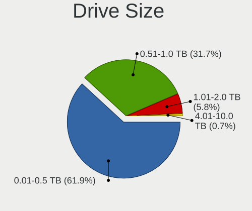
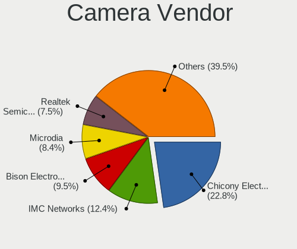

NixOS - Tested Hardware & Statistics (Notebooks)
------------------------------------------------

A project to collect tested hardware configurations for NixOS.

Anyone can contribute to this report by the [hw-probe](https://github.com/linuxhw/hw-probe) tool:

    sudo -E hw-probe -all -upload

Please contribute! Especially if your hardware is rare.

Contents
--------

* [ Test Cases ](#test-cases)

* [ System ](#system)
  - [ OS                       ](#os)
  - [ OS Family                ](#os-family)
  - [ Kernel                   ](#kernel)
  - [ Kernel Family            ](#kernel-family)
  - [ Kernel Major Ver.        ](#kernel-major-ver)
  - [ Arch                     ](#arch)
  - [ DE                       ](#de)
  - [ Display Server           ](#display-server)
  - [ Display Manager          ](#display-manager)
  - [ OS Lang                  ](#os-lang)
  - [ Boot Mode                ](#boot-mode)
  - [ Filesystem               ](#filesystem)
  - [ Part. scheme             ](#part-scheme)
  - [ Dual Boot with Linux/BSD ](#dual-boot-with-linuxbsd)
  - [ Dual Boot (Win)          ](#dual-boot-win)

* [ Board ](#board)
  - [ Vendor                   ](#vendor)
  - [ Model                    ](#model)
  - [ Model Family             ](#model-family)
  - [ MFG Year                 ](#mfg-year)
  - [ Form Factor              ](#form-factor)
  - [ Secure Boot              ](#secure-boot)
  - [ Coreboot                 ](#coreboot)
  - [ RAM Size                 ](#ram-size)
  - [ RAM Used                 ](#ram-used)
  - [ Total Drives             ](#total-drives)
  - [ Has CD-ROM               ](#has-cd-rom)
  - [ Has Ethernet             ](#has-ethernet)
  - [ Has WiFi                 ](#has-wifi)
  - [ Has Bluetooth            ](#has-bluetooth)

* [ Location ](#location)
  - [ Country                  ](#country)
  - [ City                     ](#city)

* [ Drives ](#drives)
  - [ Drive Vendor             ](#drive-vendor)
  - [ Drive Model              ](#drive-model)
  - [ HDD Vendor               ](#hdd-vendor)
  - [ SSD Vendor               ](#ssd-vendor)
  - [ Drive Kind               ](#drive-kind)
  - [ Drive Connector          ](#drive-connector)
  - [ Drive Size               ](#drive-size)
  - [ Space Total              ](#space-total)
  - [ Space Used               ](#space-used)
  - [ Malfunc. Drives          ](#malfunc-drives)
  - [ Malfunc. Drive Vendor    ](#malfunc-drive-vendor)
  - [ Malfunc. HDD Vendor      ](#malfunc-hdd-vendor)
  - [ Malfunc. Drive Kind      ](#malfunc-drive-kind)
  - [ Failed Drives            ](#failed-drives)
  - [ Failed Drive Vendor      ](#failed-drive-vendor)
  - [ Drive Status             ](#drive-status)

* [ Storage controller ](#storage-controller)
  - [ Storage Vendor           ](#storage-vendor)
  - [ Storage Model            ](#storage-model)
  - [ Storage Kind             ](#storage-kind)

* [ Processor ](#processor)
  - [ CPU Vendor               ](#cpu-vendor)
  - [ CPU Model                ](#cpu-model)
  - [ CPU Model Family         ](#cpu-model-family)
  - [ CPU Cores                ](#cpu-cores)
  - [ CPU Sockets              ](#cpu-sockets)
  - [ CPU Threads              ](#cpu-threads)
  - [ CPU Op-Modes             ](#cpu-op-modes)
  - [ CPU Microcode            ](#cpu-microcode)
  - [ CPU Microarch            ](#cpu-microarch)

* [ Graphics ](#graphics)
  - [ GPU Vendor               ](#gpu-vendor)
  - [ GPU Model                ](#gpu-model)
  - [ GPU Combo                ](#gpu-combo)
  - [ GPU Driver               ](#gpu-driver)
  - [ GPU Memory               ](#gpu-memory)

* [ Monitor ](#monitor)
  - [ Monitor Vendor           ](#monitor-vendor)
  - [ Monitor Model            ](#monitor-model)
  - [ Monitor Resolution       ](#monitor-resolution)
  - [ Monitor Diagonal         ](#monitor-diagonal)
  - [ Monitor Width            ](#monitor-width)
  - [ Aspect Ratio             ](#aspect-ratio)
  - [ Monitor Area             ](#monitor-area)
  - [ Pixel Density            ](#pixel-density)
  - [ Multiple Monitors        ](#multiple-monitors)

* [ Network ](#network)
  - [ Net Controller Vendor    ](#net-controller-vendor)
  - [ Net Controller Model     ](#net-controller-model)
  - [ Wireless Vendor          ](#wireless-vendor)
  - [ Wireless Model           ](#wireless-model)
  - [ Ethernet Vendor          ](#ethernet-vendor)
  - [ Ethernet Model           ](#ethernet-model)
  - [ Net Controller Kind      ](#net-controller-kind)
  - [ Used Controller          ](#used-controller)
  - [ NICs                     ](#nics)
  - [ IPv6                     ](#ipv6)

* [ Bluetooth ](#bluetooth)
  - [ Bluetooth Vendor         ](#bluetooth-vendor)
  - [ Bluetooth Model          ](#bluetooth-model)

* [ Sound ](#sound)
  - [ Sound Vendor             ](#sound-vendor)
  - [ Sound Model              ](#sound-model)

* [ Memory ](#memory)
  - [ Memory Vendor            ](#memory-vendor)
  - [ Memory Model             ](#memory-model)
  - [ Memory Kind              ](#memory-kind)
  - [ Memory Form Factor       ](#memory-form-factor)
  - [ Memory Size              ](#memory-size)
  - [ Memory Speed             ](#memory-speed)

* [ Printers & scanners ](#printers--scanners)
  - [ Printer Vendor           ](#printer-vendor)
  - [ Printer Model            ](#printer-model)
  - [ Scanner Vendor           ](#scanner-vendor)
  - [ Scanner Model            ](#scanner-model)

* [ Camera ](#camera)
  - [ Camera Vendor            ](#camera-vendor)
  - [ Camera Model             ](#camera-model)

* [ Security ](#security)
  - [ Fingerprint Vendor       ](#fingerprint-vendor)
  - [ Fingerprint Model        ](#fingerprint-model)
  - [ Chipcard Vendor          ](#chipcard-vendor)
  - [ Chipcard Model           ](#chipcard-model)

* [ Unsupported ](#unsupported)
  - [ Unsupported Devices      ](#unsupported-devices)
  - [ Unsupported Device Types ](#unsupported-device-types)

Test Cases
----------

Total: 308

| Vendor        | Model                       | Probe                                                      | Date         |
|---------------|-----------------------------|------------------------------------------------------------|--------------|
| HP            | Pavilion Plus Laptop 14-... | [161509c62b](https://linux-hardware.org/?probe=161509c62b) | May 09, 2024 |
| Lenovo        | Legion Y540-15IRH 81SX      | [44f44fe800](https://linux-hardware.org/?probe=44f44fe800) | May 06, 2024 |
| Apple         | MacBookPro16,2              | [fe05b165fb](https://linux-hardware.org/?probe=fe05b165fb) | May 04, 2024 |
| Acer          | Predator PH315-51           | [6cadb88b1d](https://linux-hardware.org/?probe=6cadb88b1d) | May 01, 2024 |
| Lenovo        | IdeaPad 5 14ARE05 81YM      | [90807317fb](https://linux-hardware.org/?probe=90807317fb) | May 01, 2024 |
| Apple         | MacBookPro11,2              | [5cd273406c](https://linux-hardware.org/?probe=5cd273406c) | Apr 30, 2024 |
| ASUSTek       | K53SJ                       | [45bc744085](https://linux-hardware.org/?probe=45bc744085) | Apr 28, 2024 |
| Lenovo        | ThinkPad L15 Gen 1 20U70... | [86305e383e](https://linux-hardware.org/?probe=86305e383e) | Apr 25, 2024 |
| Lenovo        | ThinkPad L15 Gen 1 20U70... | [113c93d444](https://linux-hardware.org/?probe=113c93d444) | Apr 25, 2024 |
| Dell          | Latitude 7330 Rugged Ext... | [787276b922](https://linux-hardware.org/?probe=787276b922) | Apr 25, 2024 |
| Dell          | XPS 15 9530                 | [e1d4486b51](https://linux-hardware.org/?probe=e1d4486b51) | Apr 24, 2024 |
| HP            | ProBook 440 G2              | [e5a4a84406](https://linux-hardware.org/?probe=e5a4a84406) | Apr 23, 2024 |
| Lenovo        | ThinkPad T480 20L5CTO1WW    | [bf31c1e8e2](https://linux-hardware.org/?probe=bf31c1e8e2) | Apr 22, 2024 |
| Razer         | Blade 14 - RZ09-0508        | [cc1f5421e7](https://linux-hardware.org/?probe=cc1f5421e7) | Apr 21, 2024 |
| MSI           | GE60 2PE                    | [38cce299c6](https://linux-hardware.org/?probe=38cce299c6) | Apr 18, 2024 |
| ASUSTek       | ROG Strix G513QY_G513QY     | [ba533ecb3a](https://linux-hardware.org/?probe=ba533ecb3a) | Apr 18, 2024 |
| Lenovo        | ThinkPad P50 20EN0007MH     | [d56c554eed](https://linux-hardware.org/?probe=d56c554eed) | Apr 16, 2024 |
| Lenovo        | ThinkPad Z13 Gen 1 21D2C... | [6a7d29fe24](https://linux-hardware.org/?probe=6a7d29fe24) | Apr 15, 2024 |
| Razer         | Blade                       | [8ff543883a](https://linux-hardware.org/?probe=8ff543883a) | Apr 14, 2024 |
| Apple         | MacBookPro11,3              | [159bfe4be5](https://linux-hardware.org/?probe=159bfe4be5) | Apr 13, 2024 |
| Lenovo        | ThinkPad P16s Gen 2 21K9... | [90946053e1](https://linux-hardware.org/?probe=90946053e1) | Apr 11, 2024 |
| Apple         | MacBookPro11,5              | [d48fd50ca7](https://linux-hardware.org/?probe=d48fd50ca7) | Apr 11, 2024 |
| Apple         | MacBookPro10,1              | [c468075794](https://linux-hardware.org/?probe=c468075794) | Apr 11, 2024 |
| MSI           | GL65 9SC                    | [7bc8965c5e](https://linux-hardware.org/?probe=7bc8965c5e) | Apr 10, 2024 |
| Google        | Redrix                      | [6dd8afed85](https://linux-hardware.org/?probe=6dd8afed85) | Apr 10, 2024 |
| Apple         | MacBookPro12,1              | [50c4a83180](https://linux-hardware.org/?probe=50c4a83180) | Apr 07, 2024 |
| System76      | Oryx Pro                    | [4592d774b4](https://linux-hardware.org/?probe=4592d774b4) | Apr 06, 2024 |
| Lenovo        | ThinkPad L14 Gen 3 21C60... | [81925bcc23](https://linux-hardware.org/?probe=81925bcc23) | Apr 05, 2024 |
| Acer          | Swift SF514-54GT            | [c0a1536935](https://linux-hardware.org/?probe=c0a1536935) | Mar 28, 2024 |
| ASUSTek       | ROG Zephyrus G14 GA402RK... | [57aabe3115](https://linux-hardware.org/?probe=57aabe3115) | Mar 26, 2024 |
| Dell          | Latitude 7420               | [511721b690](https://linux-hardware.org/?probe=511721b690) | Mar 23, 2024 |
| Lenovo        | V15-ADA 82C7                | [9fce956c50](https://linux-hardware.org/?probe=9fce956c50) | Mar 23, 2024 |
| HONOR         | BMH-WDX9                    | [4445879c66](https://linux-hardware.org/?probe=4445879c66) | Mar 21, 2024 |
| Timi          | Redmi Book Pro 14 2022      | [164d9ccd8d](https://linux-hardware.org/?probe=164d9ccd8d) | Mar 21, 2024 |
| HONOR         | BMH-WDX9                    | [01284be05a](https://linux-hardware.org/?probe=01284be05a) | Mar 20, 2024 |
| Framework     | Laptop 13 (AMD Ryzen 704... | [027fecc047](https://linux-hardware.org/?probe=027fecc047) | Mar 18, 2024 |
| Lenovo        | ThinkPad P16v Gen 1 21FE... | [def7c584ff](https://linux-hardware.org/?probe=def7c584ff) | Mar 17, 2024 |
| Lenovo        | ThinkPad P16v Gen 1 21FE... | [3906b06830](https://linux-hardware.org/?probe=3906b06830) | Mar 17, 2024 |
| ASUSTek       | VivoBook_ASUSLaptop K360... | [5bad97c6ec](https://linux-hardware.org/?probe=5bad97c6ec) | Mar 15, 2024 |
| Lenovo        | ThinkBook 14 G4 IAP 21DH    | [06ecea6114](https://linux-hardware.org/?probe=06ecea6114) | Mar 12, 2024 |
| ASUSTek       | ROG Strix G814JV_G814JV     | [10e971349c](https://linux-hardware.org/?probe=10e971349c) | Mar 08, 2024 |
| HP            | Pavilion Gaming Laptop 1... | [25074d4407](https://linux-hardware.org/?probe=25074d4407) | Mar 04, 2024 |
| Lenovo        | ThinkPad P14s Gen 2a 21A... | [c2b5dc013f](https://linux-hardware.org/?probe=c2b5dc013f) | Mar 03, 2024 |
| Lenovo        | Legion R9000P ARX8 82WM     | [8a0a1f3b4a](https://linux-hardware.org/?probe=8a0a1f3b4a) | Mar 01, 2024 |
| Lenovo        | ThinkPad T480s 20L7S3750... | [ce625cdb1a](https://linux-hardware.org/?probe=ce625cdb1a) | Feb 29, 2024 |
| HP            | Pavilion Power Laptop 15... | [43919c6c44](https://linux-hardware.org/?probe=43919c6c44) | Feb 29, 2024 |
| Lenovo        | ThinkPad T480s 20L7S3750... | [7b3b02bc41](https://linux-hardware.org/?probe=7b3b02bc41) | Feb 28, 2024 |
| MSI           | GL65 9SC                    | [6981398659](https://linux-hardware.org/?probe=6981398659) | Feb 28, 2024 |
| Lenovo        | ThinkPad T480s 20L7S3750... | [8bdc7efaf7](https://linux-hardware.org/?probe=8bdc7efaf7) | Feb 28, 2024 |
| Dell          | Latitude 7420               | [fd13235e39](https://linux-hardware.org/?probe=fd13235e39) | Feb 27, 2024 |
| Lenovo        | Yoga 2 Pro 20266            | [6185ab568b](https://linux-hardware.org/?probe=6185ab568b) | Feb 27, 2024 |
| Lenovo        | Legion R9000P ARX8 82WM     | [f6c8d11592](https://linux-hardware.org/?probe=f6c8d11592) | Feb 26, 2024 |
| HP            | ProBook 640 G8 Notebook ... | [848c852446](https://linux-hardware.org/?probe=848c852446) | Feb 25, 2024 |
| HP            | ProBook 450 G8 Notebook ... | [f4e1c02b92](https://linux-hardware.org/?probe=f4e1c02b92) | Feb 21, 2024 |
| HP            | ProBook 450 G8 Notebook ... | [bccce50111](https://linux-hardware.org/?probe=bccce50111) | Feb 21, 2024 |
| HP            | ProBook 450 G8 Notebook ... | [d8f261643b](https://linux-hardware.org/?probe=d8f261643b) | Feb 21, 2024 |
| Lenovo        | Y720-15IKB 81CQ             | [c62e8797a8](https://linux-hardware.org/?probe=c62e8797a8) | Feb 19, 2024 |
| Lenovo        | ThinkPad Edge E531 68859... | [45a495ee7d](https://linux-hardware.org/?probe=45a495ee7d) | Feb 14, 2024 |
| Acer          | AOD270                      | [a0b7e5e68a](https://linux-hardware.org/?probe=a0b7e5e68a) | Feb 11, 2024 |
| Lenovo        | XiaoXinPro-13IML 2019 81... | [66c0cc51e3](https://linux-hardware.org/?probe=66c0cc51e3) | Feb 06, 2024 |
| ASUSTek       | ROG Strix G513QE_G513QE     | [ea8930c46e](https://linux-hardware.org/?probe=ea8930c46e) | Feb 06, 2024 |
| HP            | Pavilion Gaming Laptop 1... | [fe7dfd8247](https://linux-hardware.org/?probe=fe7dfd8247) | Feb 02, 2024 |
| Apple         | MacBookPro11,5              | [55197489b0](https://linux-hardware.org/?probe=55197489b0) | Feb 02, 2024 |
| Corsair       | Voyager a1600               | [86aec463cc](https://linux-hardware.org/?probe=86aec463cc) | Jan 30, 2024 |
| Corsair       | Voyager a1600               | [00605bf92c](https://linux-hardware.org/?probe=00605bf92c) | Jan 28, 2024 |
| Sony          | VGN-CS11S_Q                 | [df687ca726](https://linux-hardware.org/?probe=df687ca726) | Jan 26, 2024 |
| Apple         | MacBookPro11,5              | [d7308911e4](https://linux-hardware.org/?probe=d7308911e4) | Jan 26, 2024 |
| Framework     | Laptop                      | [64d0e147fe](https://linux-hardware.org/?probe=64d0e147fe) | Jan 25, 2024 |
| Sony          | VGN-CS11S_Q                 | [4c9e427a30](https://linux-hardware.org/?probe=4c9e427a30) | Jan 25, 2024 |
| Lenovo        | Legion Y530-15ICH 81FV      | [4a41cdcc67](https://linux-hardware.org/?probe=4a41cdcc67) | Jan 25, 2024 |
| Lenovo        | IdeaPad 5 14ALC05 82LM      | [c2be9790ea](https://linux-hardware.org/?probe=c2be9790ea) | Jan 25, 2024 |
| Lenovo        | ThinkPad T495 20NJ0016MX    | [31aa08c915](https://linux-hardware.org/?probe=31aa08c915) | Jan 19, 2024 |
| ASUSTek       | VivoBook_ASUSLaptop X150... | [553986db8b](https://linux-hardware.org/?probe=553986db8b) | Jan 18, 2024 |
| Lenovo        | ThinkPad X1 Carbon Gen 1... | [f73bc25ab5](https://linux-hardware.org/?probe=f73bc25ab5) | Jan 17, 2024 |
| Lenovo        | Yoga Slim 7 13ACN5 82CY     | [ca16a763c8](https://linux-hardware.org/?probe=ca16a763c8) | Jan 17, 2024 |
| System76      | Oryx Pro                    | [db771e1a08](https://linux-hardware.org/?probe=db771e1a08) | Jan 16, 2024 |
| Lenovo        | ThinkPad X1 Carbon Gen 1... | [8578d3d843](https://linux-hardware.org/?probe=8578d3d843) | Jan 15, 2024 |
| Apple         | MacBookPro3,1               | [87d8854210](https://linux-hardware.org/?probe=87d8854210) | Jan 12, 2024 |
| Apple         | MacBookPro11,3              | [9297ef72df](https://linux-hardware.org/?probe=9297ef72df) | Jan 12, 2024 |
| Apple         | MacBookPro11,3              | [17fa0ca044](https://linux-hardware.org/?probe=17fa0ca044) | Jan 12, 2024 |
| Timi          | Xiaomi Book Pro 16 2022     | [ee3988fb25](https://linux-hardware.org/?probe=ee3988fb25) | Jan 09, 2024 |
| Dell          | XPS 15 9530                 | [40a1d7ca08](https://linux-hardware.org/?probe=40a1d7ca08) | Jan 08, 2024 |
| HUAWEI        | WRT-WX9                     | [5b9a494436](https://linux-hardware.org/?probe=5b9a494436) | Jan 08, 2024 |
| Dell          | XPS 9315                    | [af18bb67fd](https://linux-hardware.org/?probe=af18bb67fd) | Jan 08, 2024 |
| Framework     | Laptop (12th Gen Intel C... | [00c7d53339](https://linux-hardware.org/?probe=00c7d53339) | Jan 08, 2024 |
| Fujitsu       | LIFEBOOK U7412              | [e7b60f15e8](https://linux-hardware.org/?probe=e7b60f15e8) | Jan 08, 2024 |
| Lenovo        | ThinkPad L14 Gen 3 21C60... | [739eae84a2](https://linux-hardware.org/?probe=739eae84a2) | Jan 07, 2024 |
| Dell          | Inspiron 5767               | [460e0f5fa4](https://linux-hardware.org/?probe=460e0f5fa4) | Jan 05, 2024 |
| Lenovo        | ThinkPad T470s 20HF0000M... | [8d22dafe25](https://linux-hardware.org/?probe=8d22dafe25) | Jan 03, 2024 |
| Dynabook      | PORTEGE X30L-K              | [9c965e61f4](https://linux-hardware.org/?probe=9c965e61f4) | Jan 02, 2024 |
| Lenovo        | Yoga 7 16IRL8 82YN          | [5ea7f924df](https://linux-hardware.org/?probe=5ea7f924df) | Jan 02, 2024 |
| Lenovo        | ThinkPad Twist 33476LU      | [bb88a71510](https://linux-hardware.org/?probe=bb88a71510) | Jan 01, 2024 |
| System76      | Serval WS                   | [3dd4d45859](https://linux-hardware.org/?probe=3dd4d45859) | Dec 30, 2023 |
| Acer          | Aspire A515-54G             | [35e2f8c10c](https://linux-hardware.org/?probe=35e2f8c10c) | Dec 29, 2023 |
| HP            | ZBook Firefly 14 inch G1... | [97e425d424](https://linux-hardware.org/?probe=97e425d424) | Dec 26, 2023 |
| Dell          | XPS 13 9380                 | [541f2d959f](https://linux-hardware.org/?probe=541f2d959f) | Dec 26, 2023 |
| Fujitsu       | LIFEBOOK U7412              | [a2797ec36b](https://linux-hardware.org/?probe=a2797ec36b) | Dec 26, 2023 |
| HP            | ZBook 17 G5                 | [ad6c489ffc](https://linux-hardware.org/?probe=ad6c489ffc) | Dec 23, 2023 |
| Framework     | Laptop (12th Gen Intel C... | [ef18e09b69](https://linux-hardware.org/?probe=ef18e09b69) | Dec 23, 2023 |
| Lenovo        | Legion Y7000 81FW           | [f67367aa62](https://linux-hardware.org/?probe=f67367aa62) | Dec 23, 2023 |
| ASUSTek       | ROG Zephyrus G15 GA503QR... | [fb187c2fa4](https://linux-hardware.org/?probe=fb187c2fa4) | Dec 20, 2023 |
| ASUSTek       | ZenBook UX425QA_UM425QA     | [73693b1a91](https://linux-hardware.org/?probe=73693b1a91) | Dec 17, 2023 |
| Lenovo        | Legion Y7000 81FW           | [71c27a1bf6](https://linux-hardware.org/?probe=71c27a1bf6) | Dec 17, 2023 |
| Medion        | M14L-256                    | [6cd85934b3](https://linux-hardware.org/?probe=6cd85934b3) | Dec 15, 2023 |
| ASUSTek       | Zenbook 15 UM3504DA_UM35... | [87be870a89](https://linux-hardware.org/?probe=87be870a89) | Dec 09, 2023 |
| MSI           | Prestige 14 A10SC           | [85d6d037cc](https://linux-hardware.org/?probe=85d6d037cc) | Dec 09, 2023 |
| Dell          | G5 5590                     | [6970987854](https://linux-hardware.org/?probe=6970987854) | Dec 08, 2023 |
| HP            | EliteBook 850 G5            | [aae20908c5](https://linux-hardware.org/?probe=aae20908c5) | Dec 05, 2023 |
| Dell          | Latitude 5290 2-in-1        | [525166f0d5](https://linux-hardware.org/?probe=525166f0d5) | Dec 04, 2023 |
| Apple         | MacBookPro9,2               | [1784c4c5b0](https://linux-hardware.org/?probe=1784c4c5b0) | Dec 01, 2023 |
| ASUSTek       | Vivobook Go E1404FA_E140... | [9f7f83e1ee](https://linux-hardware.org/?probe=9f7f83e1ee) | Nov 28, 2023 |
| Timi          | Redmi Book Pro 15 2022      | [05c1dddd8d](https://linux-hardware.org/?probe=05c1dddd8d) | Nov 23, 2023 |
| Lenovo        | ThinkPad T450s 20BX001MU... | [80d4678e90](https://linux-hardware.org/?probe=80d4678e90) | Nov 23, 2023 |
| HP            | EliteBook 850 G5            | [602aeb4101](https://linux-hardware.org/?probe=602aeb4101) | Nov 22, 2023 |
| Lenovo        | Legion Y7000P IAH7 82RC     | [4065934176](https://linux-hardware.org/?probe=4065934176) | Nov 22, 2023 |
| ASUSTek       | ROG Strix G614JV_G614JV     | [fbde674650](https://linux-hardware.org/?probe=fbde674650) | Nov 22, 2023 |
| Apple         | MacBookPro11,4              | [f21a42a965](https://linux-hardware.org/?probe=f21a42a965) | Nov 16, 2023 |
| Apple         | MacBookPro9,2               | [ac7deed0de](https://linux-hardware.org/?probe=ac7deed0de) | Nov 16, 2023 |
| ASUSTek       | ROG Strix G513QE_G513QE     | [455efd5541](https://linux-hardware.org/?probe=455efd5541) | Nov 15, 2023 |
| HP            | ENVY Laptop 13-ba1xxx       | [ce6a10d6a3](https://linux-hardware.org/?probe=ce6a10d6a3) | Nov 15, 2023 |
| ASUSTek       | Vivobook Go E1404FA_E140... | [789eee99a6](https://linux-hardware.org/?probe=789eee99a6) | Nov 12, 2023 |
| Lenovo        | Yoga Slim 7 Carbon 14ACN... | [c55053fa25](https://linux-hardware.org/?probe=c55053fa25) | Nov 12, 2023 |
| HP            | EliteBook 845 14 inch G1... | [dfbaeb29c5](https://linux-hardware.org/?probe=dfbaeb29c5) | Nov 11, 2023 |
| Lenovo        | IdeaPad S540-15IWL          | [79e23fd44a](https://linux-hardware.org/?probe=79e23fd44a) | Nov 07, 2023 |
| Framework     | Laptop (12th Gen Intel C... | [2f6078ab72](https://linux-hardware.org/?probe=2f6078ab72) | Nov 07, 2023 |
| Lenovo        | ThinkPad T14 Gen 2a 20XK... | [49b3b70e38](https://linux-hardware.org/?probe=49b3b70e38) | Nov 07, 2023 |
| Lenovo        | ThinkPad T14s Gen 4 21F8... | [97e043115e](https://linux-hardware.org/?probe=97e043115e) | Nov 04, 2023 |
| Lenovo        | Slim 7 16IAH7 82VB          | [0e5f976d6b](https://linux-hardware.org/?probe=0e5f976d6b) | Nov 02, 2023 |
| Dell          | XPS 9315                    | [6f3e496918](https://linux-hardware.org/?probe=6f3e496918) | Oct 29, 2023 |
| HP            | EliteBook 850 G4            | [68da315076](https://linux-hardware.org/?probe=68da315076) | Oct 28, 2023 |
| Apple         | MacBookPro9,2               | [b075cf8841](https://linux-hardware.org/?probe=b075cf8841) | Oct 28, 2023 |
| HP            | EliteBook Folio 9470m       | [765f6f8003](https://linux-hardware.org/?probe=765f6f8003) | Oct 25, 2023 |
| Lenovo        | Slim 7 16IAH7 82VB          | [a80fcc753e](https://linux-hardware.org/?probe=a80fcc753e) | Oct 25, 2023 |
| MSI           | GE70 2PE                    | [c0bcd133c9](https://linux-hardware.org/?probe=c0bcd133c9) | Oct 22, 2023 |
| HP            | EliteBook Folio 9470m       | [f342373f65](https://linux-hardware.org/?probe=f342373f65) | Oct 20, 2023 |
| Framework     | Laptop                      | [e765d5da63](https://linux-hardware.org/?probe=e765d5da63) | Oct 18, 2023 |
| HP            | ZBook Firefly 14 inch G1... | [f53079d2c1](https://linux-hardware.org/?probe=f53079d2c1) | Oct 16, 2023 |
| HP            | ZBook Firefly 14 inch G1... | [dcb416db8f](https://linux-hardware.org/?probe=dcb416db8f) | Oct 16, 2023 |
| Samsung       | 530U3BI/530U4BI/530U4BH     | [feaf25f8e8](https://linux-hardware.org/?probe=feaf25f8e8) | Oct 15, 2023 |
| Lenovo        | ThinkPad L14 Gen 1 20U50... | [ba690b36a3](https://linux-hardware.org/?probe=ba690b36a3) | Oct 12, 2023 |
| MSI           | Prestige 16Studio A13VE     | [0209063983](https://linux-hardware.org/?probe=0209063983) | Oct 12, 2023 |
| Lenovo        | IdeaPad Flex-14API 81SS     | [7ff5fe9fdd](https://linux-hardware.org/?probe=7ff5fe9fdd) | Oct 11, 2023 |
| Lenovo        | ThinkPad P50 20EQS4QL11     | [a4d6af03fe](https://linux-hardware.org/?probe=a4d6af03fe) | Oct 10, 2023 |
| Lenovo        | ThinkPad T14 Gen 2i 20W0... | [7d1fea3001](https://linux-hardware.org/?probe=7d1fea3001) | Oct 09, 2023 |
| HP            | EliteBook Folio 9470m       | [9cecfe7ba5](https://linux-hardware.org/?probe=9cecfe7ba5) | Oct 09, 2023 |
| Lenovo        | ThinkBook 15 G2 ITL 20VE    | [801a2a4abf](https://linux-hardware.org/?probe=801a2a4abf) | Oct 09, 2023 |
| Dell          | Latitude E6540              | [fc3ea4bb32](https://linux-hardware.org/?probe=fc3ea4bb32) | Oct 08, 2023 |
| Dell          | Inspiron 3542               | [90f777d9cc](https://linux-hardware.org/?probe=90f777d9cc) | Oct 07, 2023 |
| Dell          | Latitude E6540              | [a4fbd5793d](https://linux-hardware.org/?probe=a4fbd5793d) | Oct 02, 2023 |
| Lenovo        | ThinkBook 15 G3 ACL 21A4    | [c67f66f5e3](https://linux-hardware.org/?probe=c67f66f5e3) | Oct 01, 2023 |
| Dell          | Latitude E6540              | [8fdc000f7e](https://linux-hardware.org/?probe=8fdc000f7e) | Oct 01, 2023 |
| Dell          | Latitude E6540              | [a5de8b78e7](https://linux-hardware.org/?probe=a5de8b78e7) | Oct 01, 2023 |
| Lenovo        | ThinkPad T480s 20L7CTO1W... | [1135ddac8e](https://linux-hardware.org/?probe=1135ddac8e) | Sep 30, 2023 |
| Dell          | Latitude 5430               | [583aa8cf02](https://linux-hardware.org/?probe=583aa8cf02) | Sep 29, 2023 |
| Intel         | SharkBay Platform           | [2406bf1c0d](https://linux-hardware.org/?probe=2406bf1c0d) | Sep 29, 2023 |
| Dell          | Latitude E6540              | [1478e1265d](https://linux-hardware.org/?probe=1478e1265d) | Sep 29, 2023 |
| Dell          | XPS 15 9560                 | [009a6a1a98](https://linux-hardware.org/?probe=009a6a1a98) | Sep 27, 2023 |
| Dell          | Latitude E6540              | [7d9885cd7c](https://linux-hardware.org/?probe=7d9885cd7c) | Sep 27, 2023 |
| HP            | EliteBook Folio 9470m       | [78d31814cf](https://linux-hardware.org/?probe=78d31814cf) | Sep 26, 2023 |
| HP            | EliteBook Folio 9470m       | [0d7d5f0613](https://linux-hardware.org/?probe=0d7d5f0613) | Sep 26, 2023 |
| HP            | EliteBook Folio 9470m       | [086b0dc21a](https://linux-hardware.org/?probe=086b0dc21a) | Sep 23, 2023 |
| HP            | EliteBook 8470p             | [220a0f8733](https://linux-hardware.org/?probe=220a0f8733) | Sep 23, 2023 |
| Apple         | MacBookPro9,2               | [bf71bcd90e](https://linux-hardware.org/?probe=bf71bcd90e) | Sep 22, 2023 |
| Lenovo        | ThinkPad T470s 20HF0000M... | [ad989ac089](https://linux-hardware.org/?probe=ad989ac089) | Sep 21, 2023 |
| Apple         | MacBookPro9,2               | [4d2c8f9f07](https://linux-hardware.org/?probe=4d2c8f9f07) | Sep 20, 2023 |
| HP            | EliteBook Folio 9470m       | [5e50efa2c4](https://linux-hardware.org/?probe=5e50efa2c4) | Sep 19, 2023 |
| Lenovo        | IdeaPad S145-15IKB 81XM     | [aebeeb7401](https://linux-hardware.org/?probe=aebeeb7401) | Sep 17, 2023 |
| Dell          | Latitude E6540              | [ff29b23e60](https://linux-hardware.org/?probe=ff29b23e60) | Sep 13, 2023 |
| Acer          | Aspire E5-575G              | [ff31b68cf3](https://linux-hardware.org/?probe=ff31b68cf3) | Sep 12, 2023 |
| Lenovo        | ThinkPad T480 20L6S4RV00    | [8ae7288bf3](https://linux-hardware.org/?probe=8ae7288bf3) | Sep 11, 2023 |
| Lenovo        | ThinkPad S1 Yoga 20CD00B... | [5778731f85](https://linux-hardware.org/?probe=5778731f85) | Sep 10, 2023 |
| Dell          | Precision 5680              | [fdcb7ce5d4](https://linux-hardware.org/?probe=fdcb7ce5d4) | Sep 05, 2023 |
| Lenovo        | ThinkPad T470 20HES2RC00    | [390104a086](https://linux-hardware.org/?probe=390104a086) | Aug 28, 2023 |
| Dell          | Wyse 5470                   | [6d45205020](https://linux-hardware.org/?probe=6d45205020) | Aug 27, 2023 |
| Lenovo        | G50-70 20351                | [aed7eacff0](https://linux-hardware.org/?probe=aed7eacff0) | Aug 20, 2023 |
| HP            | EliteBook 8470p             | [320138e7f5](https://linux-hardware.org/?probe=320138e7f5) | Aug 11, 2023 |
| HUAWEI        | NBLK-WAX9X                  | [72bb72d2aa](https://linux-hardware.org/?probe=72bb72d2aa) | Aug 08, 2023 |
| ASUSTek       | ProArt StudioBook W730G5... | [c384115725](https://linux-hardware.org/?probe=c384115725) | Aug 05, 2023 |
| ASUSTek       | Zenbook UM3402YA_UM3402Y... | [39fbf6393c](https://linux-hardware.org/?probe=39fbf6393c) | Aug 03, 2023 |
| ASUSTek       | Zenbook UM3402YA_UM3402Y... | [a6c2e042e4](https://linux-hardware.org/?probe=a6c2e042e4) | Aug 03, 2023 |
| ASUSTek       | VivoBook_ASUSLaptop M340... | [f75ea8cfef](https://linux-hardware.org/?probe=f75ea8cfef) | Aug 02, 2023 |
| ASUSTek       | VivoBook_ASUSLaptop M340... | [19b6ecf591](https://linux-hardware.org/?probe=19b6ecf591) | Jul 29, 2023 |
| System76      | Pangolin                    | [3b37a9bedb](https://linux-hardware.org/?probe=3b37a9bedb) | Jul 29, 2023 |
| Alienware     | 17                          | [25f67e59b8](https://linux-hardware.org/?probe=25f67e59b8) | Jul 26, 2023 |
| Apple         | MacBookPro11,3              | [8d48a50003](https://linux-hardware.org/?probe=8d48a50003) | Jul 22, 2023 |
| Apple         | MacBookPro11,3              | [c29abaca55](https://linux-hardware.org/?probe=c29abaca55) | Jul 22, 2023 |
| Lenovo        | IdeaPad 3 14ITL05 81X7      | [568ab8dd45](https://linux-hardware.org/?probe=568ab8dd45) | Jul 21, 2023 |
| ASUSTek       | 1005HA                      | [59a0d6a7bb](https://linux-hardware.org/?probe=59a0d6a7bb) | Jul 19, 2023 |
| MSI           | Alpha 15 B5EEK              | [62fac1de1c](https://linux-hardware.org/?probe=62fac1de1c) | Jul 08, 2023 |
| Lenovo        | Legion R9000P ARX8 82WM     | [95c540792e](https://linux-hardware.org/?probe=95c540792e) | Jul 02, 2023 |
| Lenovo        | ThinkPad P14s Gen 1 20Y1... | [4d377fc8b8](https://linux-hardware.org/?probe=4d377fc8b8) | Jul 01, 2023 |
| Dell          | Latitude E5470              | [fd56f44c38](https://linux-hardware.org/?probe=fd56f44c38) | Jun 29, 2023 |
| Lenovo        | IdeaPad S540-15IWL          | [de699b13ba](https://linux-hardware.org/?probe=de699b13ba) | Jun 28, 2023 |
| Lenovo        | ThinkPad X1 Carbon Gen 1... | [699aa2d6e1](https://linux-hardware.org/?probe=699aa2d6e1) | Jun 26, 2023 |
| Microtech     | CoreBook Lite               | [1840bef280](https://linux-hardware.org/?probe=1840bef280) | Jun 24, 2023 |
| ASUSTek       | Zenbook UX3402ZA_Q409ZA     | [2812cf43d0](https://linux-hardware.org/?probe=2812cf43d0) | Jun 23, 2023 |
| HP            | EliteBook 820 G3            | [925e5f0915](https://linux-hardware.org/?probe=925e5f0915) | Jun 22, 2023 |
| MECHREVO      | WUJIE 14                    | [a55e31b287](https://linux-hardware.org/?probe=a55e31b287) | Jun 20, 2023 |
| Lenovo        | ThinkPad X1 Carbon Gen 1... | [9726121d1b](https://linux-hardware.org/?probe=9726121d1b) | Jun 18, 2023 |
| Lenovo        | ThinkPad X1 Carbon Gen 1... | [c5c0838f41](https://linux-hardware.org/?probe=c5c0838f41) | Jun 18, 2023 |
| Lenovo        | Legion Y7000 2019 PG0 81... | [46ffcb9672](https://linux-hardware.org/?probe=46ffcb9672) | Jun 18, 2023 |
| Lenovo        | Yoga 14sARE 2020 82A8       | [fa79d9b26d](https://linux-hardware.org/?probe=fa79d9b26d) | Jun 17, 2023 |
| MACHENIKE     | F117-7P                     | [78ad896b83](https://linux-hardware.org/?probe=78ad896b83) | Jun 10, 2023 |
| Lenovo        | Legion Pro 7 16IRX8H 82W... | [0d31f94244](https://linux-hardware.org/?probe=0d31f94244) | May 30, 2023 |
| Dell          | Latitude 5290 2-in-1        | [6607361205](https://linux-hardware.org/?probe=6607361205) | May 25, 2023 |
| Lenovo        | G50-70 20351                | [19dc1505b5](https://linux-hardware.org/?probe=19dc1505b5) | May 24, 2023 |
| MSI           | Alpha 15 B5EEK              | [b309bee7e9](https://linux-hardware.org/?probe=b309bee7e9) | May 19, 2023 |
| Lenovo        | ThinkPad P14s Gen 3 21J5... | [e0cbba6897](https://linux-hardware.org/?probe=e0cbba6897) | May 16, 2023 |
| Lenovo        | ThinkBook 16 G4+ ARA 21D... | [acd8d0441a](https://linux-hardware.org/?probe=acd8d0441a) | May 15, 2023 |
| Apple         | MacBookPro11,5              | [21ecf73d3a](https://linux-hardware.org/?probe=21ecf73d3a) | May 09, 2023 |
| UNOWHY        | Y13G011S4EI                 | [581cd68800](https://linux-hardware.org/?probe=581cd68800) | May 02, 2023 |
| Lenovo        | G50-70 20351                | [5792e8cfa2](https://linux-hardware.org/?probe=5792e8cfa2) | Apr 29, 2023 |
| ASUSTek       | ROG Zephyrus G14 GA401IV    | [2063d4a9fc](https://linux-hardware.org/?probe=2063d4a9fc) | Apr 27, 2023 |
| Apple         | MacBookPro11,3              | [7fd17e2245](https://linux-hardware.org/?probe=7fd17e2245) | Apr 22, 2023 |
| Avell High... | A70 MOB                     | [869b1ae79b](https://linux-hardware.org/?probe=869b1ae79b) | Apr 17, 2023 |
| Lenovo        | ThinkPad P50 20EN0005GE     | [85a4de4e58](https://linux-hardware.org/?probe=85a4de4e58) | Apr 12, 2023 |
| Lenovo        | ThinkPad E14 Gen 4 21EBC... | [63035ef97f](https://linux-hardware.org/?probe=63035ef97f) | Apr 12, 2023 |
| Dell          | XPS 9320                    | [c78c87474d](https://linux-hardware.org/?probe=c78c87474d) | Apr 05, 2023 |
| GPD           | G1621-02                    | [2ed8b6c147](https://linux-hardware.org/?probe=2ed8b6c147) | Mar 29, 2023 |
| Lenovo        | ThinkPad X1 Carbon 4th 2... | [10ec4f48dd](https://linux-hardware.org/?probe=10ec4f48dd) | Mar 16, 2023 |
| ASUSTek       | 1005HA                      | [3326423f04](https://linux-hardware.org/?probe=3326423f04) | Mar 06, 2023 |
| Lenovo        | Yoga Slim 7 13ACN5 82CY     | [4fc82abdeb](https://linux-hardware.org/?probe=4fc82abdeb) | Mar 04, 2023 |
| Toshiba       | Satellite L50-B             | [8abe852ff0](https://linux-hardware.org/?probe=8abe852ff0) | Mar 03, 2023 |
| Lenovo        | Yoga Slim 7 13ACN5 82CY     | [4c25c88937](https://linux-hardware.org/?probe=4c25c88937) | Mar 03, 2023 |
| Lenovo        | ThinkPad P14s Gen 3 21J5... | [9b044bd920](https://linux-hardware.org/?probe=9b044bd920) | Feb 26, 2023 |
| Lenovo        | ThinkPad P14s Gen 3 21J5... | [c8c79f26d8](https://linux-hardware.org/?probe=c8c79f26d8) | Feb 26, 2023 |
| Lenovo        | ThinkPad X230 2333AZ2       | [d9d0138294](https://linux-hardware.org/?probe=d9d0138294) | Jan 19, 2023 |
| Blackview     | AceBook 1                   | [ea4db42aa8](https://linux-hardware.org/?probe=ea4db42aa8) | Jan 19, 2023 |
| Dell          | Latitude 7420               | [e770b3e784](https://linux-hardware.org/?probe=e770b3e784) | Jan 04, 2023 |
| Dell          | Latitude 7420               | [bab9b86606](https://linux-hardware.org/?probe=bab9b86606) | Jan 04, 2023 |
| Dell          | Precision M4800             | [505f1b47dc](https://linux-hardware.org/?probe=505f1b47dc) | Dec 30, 2022 |
| GPD           | WIN2                        | [d7d31b67d0](https://linux-hardware.org/?probe=d7d31b67d0) | Dec 28, 2022 |
| MSI           | Raider GE67HX 12UGS         | [84c6275c04](https://linux-hardware.org/?probe=84c6275c04) | Dec 25, 2022 |
| Dell          | XPS 15 7590                 | [e070540587](https://linux-hardware.org/?probe=e070540587) | Dec 16, 2022 |
| MECHREVO      | Code01 Ver2.0               | [e4ba0262b4](https://linux-hardware.org/?probe=e4ba0262b4) | Dec 16, 2022 |
| MECHREVO      | Code01 Ver2.0               | [1a9c49eb4f](https://linux-hardware.org/?probe=1a9c49eb4f) | Dec 16, 2022 |
| Framework     | Laptop (12th Gen Intel C... | [893190593e](https://linux-hardware.org/?probe=893190593e) | Dec 12, 2022 |
| ASUSTek       | ROG Zephyrus G14 GA401QM... | [d512bff9cc](https://linux-hardware.org/?probe=d512bff9cc) | Dec 04, 2022 |
| ASUSTek       | ROG Zephyrus G14 GA401QM... | [fef748b3f4](https://linux-hardware.org/?probe=fef748b3f4) | Dec 04, 2022 |
| Acer          | Aspire A315-54K             | [12f19e4fbe](https://linux-hardware.org/?probe=12f19e4fbe) | Nov 23, 2022 |
| Lenovo        | ThinkPad T14s Gen 3 21BR... | [0c889920b5](https://linux-hardware.org/?probe=0c889920b5) | Nov 12, 2022 |
| Dell          | Latitude E5540              | [f2420e40cd](https://linux-hardware.org/?probe=f2420e40cd) | Nov 06, 2022 |
| Dell          | Latitude E5540              | [2456786404](https://linux-hardware.org/?probe=2456786404) | Nov 06, 2022 |
| Lenovo        | Legion S7 15ACH6 82K8       | [b60f8a187c](https://linux-hardware.org/?probe=b60f8a187c) | Nov 04, 2022 |
| Dell          | Inspiron 5570               | [33d3e9ce22](https://linux-hardware.org/?probe=33d3e9ce22) | Nov 03, 2022 |
| Toshiba       | Satellite L50-B             | [c242c45dbe](https://linux-hardware.org/?probe=c242c45dbe) | Nov 01, 2022 |
| Lenovo        | IdeaPad 5 Pro 16ACH6 82L... | [d58a7c30a9](https://linux-hardware.org/?probe=d58a7c30a9) | Oct 26, 2022 |
| Lenovo        | ThinkPad E470 20H1006JIX    | [8bc8778497](https://linux-hardware.org/?probe=8bc8778497) | Oct 26, 2022 |
| Dell          | Precision 5760              | [4255007db8](https://linux-hardware.org/?probe=4255007db8) | Oct 18, 2022 |
| HP            | ZBook Studio G5             | [0a9b0167c7](https://linux-hardware.org/?probe=0a9b0167c7) | Oct 17, 2022 |
| Dell          | XPS 13 9310                 | [99232ffba3](https://linux-hardware.org/?probe=99232ffba3) | Oct 13, 2022 |
| Dell          | Inspiron 15 7510            | [263276babe](https://linux-hardware.org/?probe=263276babe) | Sep 30, 2022 |
| Dell          | Inspiron 15 7510            | [86e1da35ba](https://linux-hardware.org/?probe=86e1da35ba) | Sep 30, 2022 |
| Dell          | XPS 15 9570                 | [564eb3b439](https://linux-hardware.org/?probe=564eb3b439) | Sep 28, 2022 |
| Dell          | XPS 15 9570                 | [085bd81d5b](https://linux-hardware.org/?probe=085bd81d5b) | Sep 28, 2022 |
| Lenovo        | ThinkPad X1 Extreme 20MF... | [7fc4cdb860](https://linux-hardware.org/?probe=7fc4cdb860) | Sep 22, 2022 |
| Dell          | Precision M4800             | [fae4dbff63](https://linux-hardware.org/?probe=fae4dbff63) | Sep 13, 2022 |
| Apple         | MacBookPro11,5              | [305905e674](https://linux-hardware.org/?probe=305905e674) | Sep 07, 2022 |
| Apple         | MacBookPro11,5              | [19d3fab687](https://linux-hardware.org/?probe=19d3fab687) | Aug 21, 2022 |
| HP            | ProBook 445 G7              | [898a635cdd](https://linux-hardware.org/?probe=898a635cdd) | Aug 20, 2022 |
| HP            | ProBook 445 G7              | [28e67ea5a7](https://linux-hardware.org/?probe=28e67ea5a7) | Aug 20, 2022 |
| ASUSTek       | ASUSPRO P1440FAC_P1440FA    | [9351f31042](https://linux-hardware.org/?probe=9351f31042) | Aug 13, 2022 |
| Dell          | Latitude 7420               | [219cf18b1e](https://linux-hardware.org/?probe=219cf18b1e) | Jul 06, 2022 |
| Dell          | XPS 13 9310                 | [380770f287](https://linux-hardware.org/?probe=380770f287) | Jun 15, 2022 |
| Dell          | XPS 13 9310                 | [248f252b2a](https://linux-hardware.org/?probe=248f252b2a) | Jun 13, 2022 |
| Lenovo        | ThinkPad X230 23243E9       | [85ffd2561e](https://linux-hardware.org/?probe=85ffd2561e) | Jun 08, 2022 |
| Dell          | XPS 13 9305                 | [affa614c99](https://linux-hardware.org/?probe=affa614c99) | Jun 07, 2022 |
| Dell          | Latitude 7420               | [5be44c8aae](https://linux-hardware.org/?probe=5be44c8aae) | Jun 01, 2022 |
| Apple         | MacBookPro11,5              | [5cd59453b1](https://linux-hardware.org/?probe=5cd59453b1) | Apr 15, 2022 |
| Framework     | Laptop                      | [4997cab79b](https://linux-hardware.org/?probe=4997cab79b) | Apr 14, 2022 |
| HP            | ProBook 450 G4              | [2cb837e17f](https://linux-hardware.org/?probe=2cb837e17f) | Apr 14, 2022 |
| Lenovo        | ThinkPad T490 20N2000LUK    | [a394ce9693](https://linux-hardware.org/?probe=a394ce9693) | Apr 13, 2022 |
| HP            | ProBook 450 G4              | [fb5bcd7c77](https://linux-hardware.org/?probe=fb5bcd7c77) | Apr 13, 2022 |
| ASUSTek       | ROG Flow X13 GV301QE_GV3... | [502a8c9d32](https://linux-hardware.org/?probe=502a8c9d32) | Apr 13, 2022 |
| Lenovo        | ThinkPad X260 20F5S4BY00    | [729b19eda3](https://linux-hardware.org/?probe=729b19eda3) | Apr 13, 2022 |
| Lenovo        | Yoga Slim 7 13ACN5 82CY     | [4c96d9df2f](https://linux-hardware.org/?probe=4c96d9df2f) | Apr 02, 2022 |
| Lenovo        | ThinkPad T14s Gen 1 20UH... | [5570a879d3](https://linux-hardware.org/?probe=5570a879d3) | Mar 13, 2022 |
| Lenovo        | ThinkPad T14s Gen 1 20UH... | [d6cae900dc](https://linux-hardware.org/?probe=d6cae900dc) | Mar 13, 2022 |
| GPD           | MicroPC                     | [a572eb2b39](https://linux-hardware.org/?probe=a572eb2b39) | Mar 11, 2022 |
| HP            | EliteBook 845 G8 Noteboo... | [f031fb1a5a](https://linux-hardware.org/?probe=f031fb1a5a) | Mar 11, 2022 |
| Lenovo        | ThinkPad T540p 20BE005YM... | [6d0cd0f4b9](https://linux-hardware.org/?probe=6d0cd0f4b9) | Mar 10, 2022 |
| Lenovo        | ThinkPad X260 20F5S6MF02    | [5e026c07c0](https://linux-hardware.org/?probe=5e026c07c0) | Mar 10, 2022 |
| MSI           | Bravo 15 B5DD               | [273737b3d7](https://linux-hardware.org/?probe=273737b3d7) | Feb 25, 2022 |
| OBSIDIAN-P... | N13_N140ZU                  | [9f2fdbfce5](https://linux-hardware.org/?probe=9f2fdbfce5) | Feb 25, 2022 |
| Dell          | Latitude 7420               | [64178dcbb7](https://linux-hardware.org/?probe=64178dcbb7) | Feb 08, 2022 |
| Lenovo        | ThinkPad X390 20Q0CTO1WW    | [cf3fa03922](https://linux-hardware.org/?probe=cf3fa03922) | Jan 08, 2022 |
| Lenovo        | ThinkPad X390 20Q0CTO1WW    | [d62840031f](https://linux-hardware.org/?probe=d62840031f) | Jan 08, 2022 |
| Lenovo        | Legion 5 17ARH05H 82GN      | [9e022a2288](https://linux-hardware.org/?probe=9e022a2288) | Dec 26, 2021 |
| Lenovo        | Legion 5 17ARH05H 82GN      | [8ff8fb5efd](https://linux-hardware.org/?probe=8ff8fb5efd) | Dec 26, 2021 |
| ASUSTek       | ZenBook UX391FA_UX391FA     | [5fb4f1b6a6](https://linux-hardware.org/?probe=5fb4f1b6a6) | Nov 29, 2021 |
| Lenovo        | ThinkPad T14 Gen 1 20UD0... | [dbe8d36249](https://linux-hardware.org/?probe=dbe8d36249) | Nov 04, 2021 |
| Lenovo        | ThinkPad X250 20CLS18S0T    | [0151eadf78](https://linux-hardware.org/?probe=0151eadf78) | Oct 06, 2021 |
| HP            | ProBook 445 G7              | [36c94af49d](https://linux-hardware.org/?probe=36c94af49d) | Aug 09, 2021 |
| HP            | ProBook 445 G7              | [87a418ce6c](https://linux-hardware.org/?probe=87a418ce6c) | Aug 09, 2021 |
| ASUSTek       | ROG Zephyrus G14 GA401QM... | [3df83086ef](https://linux-hardware.org/?probe=3df83086ef) | Aug 07, 2021 |
| ASUSTek       | ROG Zephyrus G14 GA401QM... | [052ccd7a40](https://linux-hardware.org/?probe=052ccd7a40) | Aug 07, 2021 |
| ASUSTek       | ROG Zephyrus G14 GA401QM... | [48fd4d3b89](https://linux-hardware.org/?probe=48fd4d3b89) | Aug 06, 2021 |
| Dell          | Latitude 7420               | [0624aeffd1](https://linux-hardware.org/?probe=0624aeffd1) | Jul 19, 2021 |
| ASUSTek       | ROG Strix G533QR_G533QR     | [d14e0ef395](https://linux-hardware.org/?probe=d14e0ef395) | Jun 18, 2021 |
| Lenovo        | ThinkPad T480 20L5CTO1WW    | [fc12f446bb](https://linux-hardware.org/?probe=fc12f446bb) | May 23, 2021 |
| HP            | ZBook Studio G5             | [d323a9cfbf](https://linux-hardware.org/?probe=d323a9cfbf) | Apr 23, 2021 |
| Lenovo        | ThinkPad T460p 20FWCTO1W... | [38ab65a49b](https://linux-hardware.org/?probe=38ab65a49b) | Mar 18, 2021 |
| Lenovo        | ThinkPad T580 20L90024PB    | [8dc60fafaa](https://linux-hardware.org/?probe=8dc60fafaa) | Oct 13, 2020 |
| Dell          | XPS 15 9550                 | [5656cda6a4](https://linux-hardware.org/?probe=5656cda6a4) | Sep 01, 2020 |
| Dell          | XPS 15 9550                 | [550264c421](https://linux-hardware.org/?probe=550264c421) | Aug 22, 2020 |
| Lenovo        | ThinkPad T15 Gen 1 20S6C... | [71029187b1](https://linux-hardware.org/?probe=71029187b1) | Jul 03, 2020 |
| Acer          | Aspire E5-576G              | [c126c8b2fd](https://linux-hardware.org/?probe=c126c8b2fd) | Apr 15, 2020 |
| Gigabyte      | Sabre 15                    | [4f92cff461](https://linux-hardware.org/?probe=4f92cff461) | Jul 14, 2019 |

System
------

OS
--

Installed operating systems

| Name                             | Notebooks | Percent |
|----------------------------------|-----------|---------|
| NixOS 23.11                      | 66        | 26.94%  |
| NixOS 23.05                      | 62        | 25.31%  |
| NixOS 24.05                      | 49        | 20%     |
| NixOS 22.11                      | 27        | 11.02%  |
| NixOS 22.05                      | 18        | 7.35%   |
| NixOS 21.11                      | 9         | 3.67%   |
| NixOS                            | 2         | 0.82%   |
| NixOS 21.11pre302265.c6c4a3d45ab | 1         | 0.41%   |
| NixOS 21.11.20210606.fbfb794     | 1         | 0.41%   |
| NixOS 21.05.4384.4f37689c8a2     | 1         | 0.41%   |
| NixOS 21.05.3443.ee90403e147     | 1         | 0.41%   |
| NixOS 21.05.2132.733682c3292     | 1         | 0.41%   |
| NixOS 21.05.20210423.c21475e     | 1         | 0.41%   |
| NixOS 21.03.20200927.84d74ae     | 1         | 0.41%   |
| NixOS 20.09pre-git               | 1         | 0.41%   |
| NixOS 20.03.2351.f8248ab6d9e     | 1         | 0.41%   |
| NixOS 19.09.2522.75f4ba05c63     | 1         | 0.41%   |
| NixOS 19.09.2220.92231f4f32f     | 1         | 0.41%   |
| NixOS 19.03.173054.754763ff4ba   | 1         | 0.41%   |

OS Family
---------

OS without a version

| Name  | Notebooks | Percent |
|-------|-----------|---------|
| NixOS | 221       | 100%    |

Kernel
------

Version of the Linux kernel

| Version        | Notebooks | Percent |
|----------------|-----------|---------|
| 6.1.69         | 8         | 3.1%    |
| 6.6.8          | 5         | 1.94%   |
| 6.6.28         | 5         | 1.94%   |
| 6.1.82         | 5         | 1.94%   |
| 6.1.55         | 5         | 1.94%   |
| 6.5.5          | 4         | 1.55%   |
| 6.3.8          | 4         | 1.55%   |
| 6.1.68         | 4         | 1.55%   |
| 6.1.64         | 4         | 1.55%   |
| 6.1.53         | 4         | 1.55%   |
| 6.1.51         | 4         | 1.55%   |
| 6.8.1          | 3         | 1.16%   |
| 6.6.0          | 3         | 1.16%   |
| 6.3.3          | 3         | 1.16%   |
| 6.1.74         | 3         | 1.16%   |
| 6.1.72         | 3         | 1.16%   |
| 6.1.61         | 3         | 1.16%   |
| 6.1.60         | 3         | 1.16%   |
| 6.1.47         | 3         | 1.16%   |
| 6.1.38         | 3         | 1.16%   |
| 6.1.31         | 3         | 1.16%   |
| 5.15.74        | 3         | 1.16%   |
| 5.15.43        | 3         | 1.16%   |
| 6.7.9          | 2         | 0.78%   |
| 6.7.7          | 2         | 0.78%   |
| 6.7.6          | 2         | 0.78%   |
| 6.7.5          | 2         | 0.78%   |
| 6.6.3          | 2         | 0.78%   |
| 6.6.26         | 2         | 0.78%   |
| 6.6.23         | 2         | 0.78%   |
| 6.6.22         | 2         | 0.78%   |
| 6.6.18         | 2         | 0.78%   |
| 6.5.7-xanmod1  | 2         | 0.78%   |
| 6.5.6          | 2         | 0.78%   |
| 6.5.11-xanmod1 | 2         | 0.78%   |
| 6.4.0          | 2         | 0.78%   |
| 6.3.1          | 2         | 0.78%   |
| 6.1.87         | 2         | 0.78%   |
| 6.1.84         | 2         | 0.78%   |
| 6.1.79         | 2         | 0.78%   |

Kernel Family
-------------

Linux kernel without a distro release

| Version | Notebooks | Percent |
|---------|-----------|---------|
| 6.1.69  | 8         | 3.1%    |
| 6.6.8   | 6         | 2.33%   |
| 6.6.28  | 5         | 1.94%   |
| 6.1.82  | 5         | 1.94%   |
| 6.1.55  | 5         | 1.94%   |
| 6.5.5   | 4         | 1.55%   |
| 6.3.8   | 4         | 1.55%   |
| 6.1.68  | 4         | 1.55%   |
| 6.1.64  | 4         | 1.55%   |
| 6.1.53  | 4         | 1.55%   |
| 6.1.51  | 4         | 1.55%   |
| 6.8.1   | 3         | 1.16%   |
| 6.7.5   | 3         | 1.16%   |
| 6.6.0   | 3         | 1.16%   |
| 6.5.11  | 3         | 1.16%   |
| 6.3.3   | 3         | 1.16%   |
| 6.1.74  | 3         | 1.16%   |
| 6.1.72  | 3         | 1.16%   |
| 6.1.61  | 3         | 1.16%   |
| 6.1.60  | 3         | 1.16%   |
| 6.1.47  | 3         | 1.16%   |
| 6.1.38  | 3         | 1.16%   |
| 6.1.31  | 3         | 1.16%   |
| 6.0.10  | 3         | 1.16%   |
| 5.15.74 | 3         | 1.16%   |
| 5.15.43 | 3         | 1.16%   |
| 6.8.6   | 2         | 0.78%   |
| 6.7.9   | 2         | 0.78%   |
| 6.7.7   | 2         | 0.78%   |
| 6.7.6   | 2         | 0.78%   |
| 6.7.0   | 2         | 0.78%   |
| 6.6.4   | 2         | 0.78%   |
| 6.6.3   | 2         | 0.78%   |
| 6.6.26  | 2         | 0.78%   |
| 6.6.23  | 2         | 0.78%   |
| 6.6.22  | 2         | 0.78%   |
| 6.6.18  | 2         | 0.78%   |
| 6.5.7   | 2         | 0.78%   |
| 6.5.6   | 2         | 0.78%   |
| 6.4.0   | 2         | 0.78%   |

Kernel Major Ver.
-----------------

Linux kernel major version

| Version | Notebooks | Percent |
|---------|-----------|---------|
| 6.1     | 89        | 36.33%  |
| 6.6     | 31        | 12.65%  |
| 5.15    | 31        | 12.65%  |
| 6.7     | 13        | 5.31%   |
| 6.5     | 11        | 4.49%   |
| 6.3     | 11        | 4.49%   |
| 6.8     | 10        | 4.08%   |
| 6.4     | 7         | 2.86%   |
| 6.2     | 6         | 2.45%   |
| 6.0     | 6         | 2.45%   |
| 5.16    | 6         | 2.45%   |
| 5.8     | 3         | 1.22%   |
| 5.19    | 3         | 1.22%   |
| 5.13    | 3         | 1.22%   |
| 5.10    | 3         | 1.22%   |
| 5.7     | 2         | 0.82%   |
| 5.4     | 2         | 0.82%   |
| 5.18    | 2         | 0.82%   |
| 5.17    | 2         | 0.82%   |
| 4.19    | 2         | 0.82%   |
| 5.12    | 1         | 0.41%   |
| Unknown | 1         | 0.41%   |

Arch
----

OS architecture (x86_64, i586, etc.)

| Name   | Notebooks | Percent |
|--------|-----------|---------|
| x86_64 | 220       | 99.55%  |
| i686   | 1         | 0.45%   |

DE
--

Desktop Environment

| Name         | Notebooks | Percent |
|--------------|-----------|---------|
| GNOME        | 55        | 23.61%  |
| Unknown      | 53        | 22.75%  |
| Hyprland     | 29        | 12.45%  |
| KDE5         | 26        | 11.16%  |
| sway         | 25        | 10.73%  |
| KDE          | 14        | 6.01%   |
| none+i3      | 9         | 3.86%   |
| KDE6         | 6         | 2.58%   |
| XFCE         | 3         | 1.29%   |
| none+xmonad  | 3         | 1.29%   |
| X-Cinnamon   | 2         | 0.86%   |
| Pantheon     | 2         | 0.86%   |
| none+awesome | 2         | 0.86%   |
| Budgie       | 2         | 0.86%   |
| none+bspwm   | 1         | 0.43%   |
| MATE         | 1         | 0.43%   |

Display Server
--------------

X11 or Wayland

| Name    | Notebooks | Percent |
|---------|-----------|---------|
| Wayland | 110       | 47.01%  |
| Unknown | 75        | 32.05%  |
| X11     | 41        | 17.52%  |
| Tty     | 8         | 3.42%   |

Display Manager
---------------

SDDM, LightDM, etc.

| Name    | Notebooks | Percent |
|---------|-----------|---------|
| Unknown | 83        | 36.56%  |
| GDM     | 63        | 27.75%  |
| SDDM    | 49        | 21.59%  |
| LightDM | 31        | 13.66%  |
| GREETD  | 1         | 0.44%   |

OS Lang
-------

Language

| Lang    | Notebooks | Percent |
|---------|-----------|---------|
| en_US   | 146       | 64.32%  |
| Unknown | 35        | 15.42%  |
| en_GB   | 12        | 5.29%   |
| en_CA   | 4         | 1.76%   |
| en_AU   | 4         | 1.76%   |
| de_DE   | 4         | 1.76%   |
| pt_PT   | 3         | 1.32%   |
| en_DK   | 3         | 1.32%   |
| ru_RU   | 2         | 0.88%   |
| pt_BR   | 2         | 0.88%   |
| fr_FR   | 2         | 0.88%   |
| C       | 2         | 0.88%   |
| ro_RO   | 1         | 0.44%   |
| pl_PL   | 1         | 0.44%   |
| lv_LV   | 1         | 0.44%   |
| lt_LT   | 1         | 0.44%   |
| it_IT   | 1         | 0.44%   |
| es_MX   | 1         | 0.44%   |
| en_SG   | 1         | 0.44%   |
| en_IN   | 1         | 0.44%   |

Boot Mode
---------

EFI or BIOS

| Mode | Notebooks | Percent |
|------|-----------|---------|
| EFI  | 205       | 92.76%  |
| BIOS | 16        | 7.24%   |

Filesystem
----------

Type of filesystem

| Type    | Notebooks | Percent |
|---------|-----------|---------|
| Ext4    | 128       | 56.14%  |
| Btrfs   | 47        | 20.61%  |
| Tmpfs   | 21        | 9.21%   |
| Zfs     | 18        | 7.89%   |
| Xfs     | 9         | 3.95%   |
| Unknown | 3         | 1.32%   |
| F2fs    | 2         | 0.88%   |

Part. scheme
------------

Scheme of partitioning

| Type    | Notebooks | Percent |
|---------|-----------|---------|
| GPT     | 210       | 94.17%  |
| MBR     | 8         | 3.59%   |
| Unknown | 5         | 2.24%   |

Dual Boot with Linux/BSD
------------------------

Hosting more than one Linux/BSD

| Dual boot | Notebooks | Percent |
|-----------|-----------|---------|
| No        | 189       | 84%     |
| Yes       | 36        | 16%     |

Dual Boot (Win)
---------------

Hosting Linux and Windows

| Dual boot | Notebooks | Percent |
|-----------|-----------|---------|
| No        | 170       | 76.58%  |
| Yes       | 52        | 23.42%  |

Board
-----

Vendor
------

Motherboard manufacturer

| Name                   | Notebooks | Percent |
|------------------------|-----------|---------|
| Lenovo                 | 78        | 35.29%  |
| Dell                   | 28        | 12.67%  |
| ASUSTek Computer       | 24        | 10.86%  |
| Hewlett-Packard        | 22        | 9.95%   |
| Apple                  | 16        | 7.24%   |
| MSI                    | 7         | 3.17%   |
| Framework              | 7         | 3.17%   |
| Acer                   | 7         | 3.17%   |
| Timi                   | 3         | 1.36%   |
| System76               | 3         | 1.36%   |
| GPD                    | 3         | 1.36%   |
| Razer                  | 2         | 0.9%    |
| MECHREVO               | 2         | 0.9%    |
| HUAWEI                 | 2         | 0.9%    |
| Toshiba                | 1         | 0.45%   |
| Sony                   | 1         | 0.45%   |
| Samsung Electronics    | 1         | 0.45%   |
| OBSIDIAN-PC            | 1         | 0.45%   |
| Microtech              | 1         | 0.45%   |
| Medion                 | 1         | 0.45%   |
| MACHENIKE              | 1         | 0.45%   |
| Intel                  | 1         | 0.45%   |
| HONOR                  | 1         | 0.45%   |
| Google                 | 1         | 0.45%   |
| Gigabyte Technology    | 1         | 0.45%   |
| Fujitsu                | 1         | 0.45%   |
| Dynabook               | 1         | 0.45%   |
| Corsair                | 1         | 0.45%   |
| Blackview              | 1         | 0.45%   |
| Avell High Performance | 1         | 0.45%   |
| Alienware              | 1         | 0.45%   |

Model
-----

Motherboard model

| Name                                                 | Notebooks | Percent |
|------------------------------------------------------|-----------|---------|
| Apple MacBookPro11,5                                 | 5         | 2.26%   |
| Apple MacBookPro11,3                                 | 4         | 1.81%   |
| Framework Laptop (12th Gen Intel Core)               | 3         | 1.36%   |
| Framework Laptop                                     | 3         | 1.36%   |
| Lenovo ThinkPad T480 20L5CTO1WW                      | 2         | 0.9%    |
| Lenovo Legion R9000P ARX8 82WM                       | 2         | 0.9%    |
| HP ZBook Firefly 14 inch G10 A Mobile Workstation PC | 2         | 0.9%    |
| HP EliteBook 8470p                                   | 2         | 0.9%    |
| Dell XPS 15 9530                                     | 2         | 0.9%    |
| Dell Latitude 7420                                   | 2         | 0.9%    |
| ASUS Vivobook Go E1404FA_E1404FA                     | 2         | 0.9%    |
| Toshiba Satellite L50-B                              | 1         | 0.45%   |
| Timi Xiaomi Book Pro 16 2022                         | 1         | 0.45%   |
| Timi Redmi Book Pro 15 2022                          | 1         | 0.45%   |
| Timi Redmi Book Pro 14 2022                          | 1         | 0.45%   |
| System76 Serval WS                                   | 1         | 0.45%   |
| System76 Pangolin                                    | 1         | 0.45%   |
| System76 Oryx Pro                                    | 1         | 0.45%   |
| Sony VGN-CS11S_Q                                     | 1         | 0.45%   |
| Samsung 530U3BI/530U4BI/530U4BH                      | 1         | 0.45%   |
| Razer Blade 14 - RZ09-0508                           | 1         | 0.45%   |
| Razer Blade                                          | 1         | 0.45%   |
| OBSIDIAN-PC N13_N140ZU                               | 1         | 0.45%   |
| MSI Prestige 16Studio A13VE                          | 1         | 0.45%   |
| MSI Prestige 14 A10SC                                | 1         | 0.45%   |
| MSI GL65 9SC                                         | 1         | 0.45%   |
| MSI GE70 2PE                                         | 1         | 0.45%   |
| MSI GE60 2PE                                         | 1         | 0.45%   |
| MSI Bravo 15 B5DD                                    | 1         | 0.45%   |
| MSI Alpha 15 B5EEK                                   | 1         | 0.45%   |
| Microtech CoreBook Lite                              | 1         | 0.45%   |
| Medion M14L-256                                      | 1         | 0.45%   |
| MECHREVO WUJIE 14                                    | 1         | 0.45%   |
| MECHREVO Code01 Ver2.0                               | 1         | 0.45%   |
| MACHENIKE F117-7P                                    | 1         | 0.45%   |
| Lenovo Yoga Slim 7 Carbon 14ACN6 82L0                | 1         | 0.45%   |
| Lenovo Yoga Slim 7 13ACN5 82CY                       | 1         | 0.45%   |
| Lenovo Yoga 7 16IRL8 82YN                            | 1         | 0.45%   |
| Lenovo Yoga 2 Pro 20266                              | 1         | 0.45%   |
| Lenovo Yoga 14sARE 2020 82A8                         | 1         | 0.45%   |

Model Family
------------

Motherboard model prefix

| Name               | Notebooks | Percent |
|--------------------|-----------|---------|
| Lenovo ThinkPad    | 47        | 21.27%  |
| Dell XPS           | 11        | 4.98%   |
| Apple MacBookPro11 | 11        | 4.98%   |
| Lenovo Legion      | 10        | 4.52%   |
| ASUS ROG           | 10        | 4.52%   |
| HP EliteBook       | 8         | 3.62%   |
| Dell Latitude      | 8         | 3.62%   |
| Lenovo IdeaPad     | 7         | 3.17%   |
| Framework Laptop   | 7         | 3.17%   |
| Lenovo Yoga        | 5         | 2.26%   |
| HP ProBook         | 5         | 2.26%   |
| ASUS Zenbook       | 5         | 2.26%   |
| ASUS Vivobook      | 5         | 2.26%   |
| Lenovo ThinkBook   | 4         | 1.81%   |
| HP ZBook           | 4         | 1.81%   |
| HP Pavilion        | 4         | 1.81%   |
| Dell Inspiron      | 4         | 1.81%   |
| Acer Aspire        | 4         | 1.81%   |
| Dell Precision     | 3         | 1.36%   |
| Timi Redmi         | 2         | 0.9%    |
| Razer Blade        | 2         | 0.9%    |
| MSI Prestige       | 2         | 0.9%    |
| Toshiba Satellite  | 1         | 0.45%   |
| Timi Xiaomi        | 1         | 0.45%   |
| System76 Serval    | 1         | 0.45%   |
| System76 Pangolin  | 1         | 0.45%   |
| System76 Oryx      | 1         | 0.45%   |
| Sony VGN-CS11S     | 1         | 0.45%   |
| Samsung 530U3BI    | 1         | 0.45%   |
| OBSIDIAN-PC N13    | 1         | 0.45%   |
| MSI GL65           | 1         | 0.45%   |
| MSI GE70           | 1         | 0.45%   |
| MSI GE60           | 1         | 0.45%   |
| MSI Bravo          | 1         | 0.45%   |
| MSI Alpha          | 1         | 0.45%   |
| Microtech CoreBook | 1         | 0.45%   |
| Medion M14L-256    | 1         | 0.45%   |
| MECHREVO WUJIE     | 1         | 0.45%   |
| MECHREVO Code01    | 1         | 0.45%   |
| MACHENIKE F117-7P  | 1         | 0.45%   |

MFG Year
--------

Motherboard manufacture year

| Year | Notebooks | Percent |
|------|-----------|---------|
| 2021 | 33        | 14.93%  |
| 2023 | 31        | 14.03%  |
| 2022 | 26        | 11.76%  |
| 2020 | 21        | 9.5%    |
| 2018 | 20        | 9.05%   |
| 2019 | 18        | 8.14%   |
| 2016 | 14        | 6.33%   |
| 2013 | 12        | 5.43%   |
| 2014 | 11        | 4.98%   |
| 2017 | 9         | 4.07%   |
| 2015 | 9         | 4.07%   |
| 2012 | 8         | 3.62%   |
| 2011 | 4         | 1.81%   |
| 2008 | 3         | 1.36%   |
| 2009 | 1         | 0.45%   |
| 2007 | 1         | 0.45%   |

Form Factor
-----------

Physical design of the computer

| Name     | Notebooks | Percent |
|----------|-----------|---------|
| Notebook | 221       | 100%    |

Secure Boot
-----------

Enabled or disabled

| State    | Notebooks | Percent |
|----------|-----------|---------|
| Disabled | 214       | 95.54%  |
| Enabled  | 10        | 4.46%   |

Coreboot
--------

Have coreboot on board

| Used | Notebooks | Percent |
|------|-----------|---------|
| No   | 217       | 98.19%  |
| Yes  | 4         | 1.81%   |

RAM Size
--------

Total RAM memory

| Size in GB  | Notebooks | Percent |
|-------------|-----------|---------|
| 16.01-24.0  | 59        | 26.58%  |
| 8.01-16.0   | 51        | 22.97%  |
| 32.01-64.0  | 47        | 21.17%  |
| 4.01-8.0    | 34        | 15.32%  |
| 64.01-256.0 | 13        | 5.86%   |
| 24.01-32.0  | 11        | 4.95%   |
| 3.01-4.0    | 5         | 2.25%   |
| 2.01-3.0    | 1         | 0.45%   |
| 0.51-1.0    | 1         | 0.45%   |

RAM Used
--------

Used RAM memory

| Used GB    | Notebooks | Percent |
|------------|-----------|---------|
| 4.01-8.0   | 69        | 27.82%  |
| 3.01-4.0   | 51        | 20.56%  |
| 2.01-3.0   | 48        | 19.35%  |
| 8.01-16.0  | 32        | 12.9%   |
| 1.01-2.0   | 21        | 8.47%   |
| 16.01-24.0 | 9         | 3.63%   |
| 0.51-1.0   | 7         | 2.82%   |
| 24.01-32.0 | 6         | 2.42%   |
| 0.01-0.5   | 3         | 1.21%   |
| 32.01-64.0 | 2         | 0.81%   |

Total Drives
------------

Number of drives on board

| Drives | Notebooks | Percent |
|--------|-----------|---------|
| 1      | 168       | 75%     |
| 2      | 51        | 22.77%  |
| 3      | 4         | 1.79%   |
| 4      | 1         | 0.45%   |

Has CD-ROM
----------

Has CD-ROM on board

| Presented | Notebooks | Percent |
|-----------|-----------|---------|
| No        | 203       | 91.86%  |
| Yes       | 18        | 8.14%   |

Has Ethernet
------------

Has Ethernet on board

| Presented | Notebooks | Percent |
|-----------|-----------|---------|
| Yes       | 148       | 66.07%  |
| No        | 76        | 33.93%  |

Has WiFi
--------

Has WiFi module

| Presented | Notebooks | Percent |
|-----------|-----------|---------|
| Yes       | 219       | 99.1%   |
| No        | 2         | 0.9%    |

Has Bluetooth
-------------

Has Bluetooth module

| Presented | Notebooks | Percent |
|-----------|-----------|---------|
| Yes       | 208       | 93.27%  |
| No        | 15        | 6.73%   |

Location
--------

Country
-------

Geographic location (country)

| Country         | Notebooks | Percent |
|-----------------|-----------|---------|
| USA             | 49        | 22.17%  |
| Germany         | 16        | 7.24%   |
| UK              | 12        | 5.43%   |
| Russia          | 12        | 5.43%   |
| Italy           | 12        | 5.43%   |
| France          | 9         | 4.07%   |
| Poland          | 7         | 3.17%   |
| Netherlands     | 7         | 3.17%   |
| Canada          | 7         | 3.17%   |
| Portugal        | 6         | 2.71%   |
| Czechia         | 6         | 2.71%   |
| Sweden          | 5         | 2.26%   |
| Japan           | 5         | 2.26%   |
| Brazil          | 5         | 2.26%   |
| Ukraine         | 4         | 1.81%   |
| Switzerland     | 4         | 1.81%   |
| Singapore       | 3         | 1.36%   |
| Norway          | 3         | 1.36%   |
| India           | 3         | 1.36%   |
| China           | 3         | 1.36%   |
| Austria         | 3         | 1.36%   |
| Thailand        | 2         | 0.9%    |
| Spain           | 2         | 0.9%    |
| Romania         | 2         | 0.9%    |
| Qatar           | 2         | 0.9%    |
| Mexico          | 2         | 0.9%    |
| Iraq            | 2         | 0.9%    |
| Belgium         | 2         | 0.9%    |
| Belarus         | 2         | 0.9%    |
| Australia       | 2         | 0.9%    |
| Vietnam         | 1         | 0.45%   |
| Uzbekistan      | 1         | 0.45%   |
| Uruguay         | 1         | 0.45%   |
| The Netherlands | 1         | 0.45%   |
| Taiwan          | 1         | 0.45%   |
| Slovenia        | 1         | 0.45%   |
| Serbia          | 1         | 0.45%   |
| Peru            | 1         | 0.45%   |
| Malaysia        | 1         | 0.45%   |
| Lithuania       | 1         | 0.45%   |

City
----

Geographic location (city)

| City        | Notebooks | Percent |
|-------------|-----------|---------|
| Amsterdam   | 4         | 1.72%   |
| Vienna      | 3         | 1.29%   |
| Singapore   | 3         | 1.29%   |
| Prague      | 3         | 1.29%   |
| Porto       | 3         | 1.29%   |
| Los Angeles | 3         | 1.29%   |
| London      | 3         | 1.29%   |
| Craigsville | 3         | 1.29%   |
| Warsaw      | 2         | 0.86%   |
| Saratov     | 2         | 0.86%   |
| San Diego   | 2         | 0.86%   |
| Rochester   | 2         | 0.86%   |
| Richmond    | 2         | 0.86%   |
| Pradamano   | 2         | 0.86%   |
| Phoenix     | 2         | 0.86%   |
| Perth       | 2         | 0.86%   |
| Ottawa      | 2         | 0.86%   |
| Oslo        | 2         | 0.86%   |
| Osaka       | 2         | 0.86%   |
| Moscow      | 2         | 0.86%   |
| Montpellier | 2         | 0.86%   |
| Minsk       | 2         | 0.86%   |
| Marki       | 2         | 0.86%   |
| Krakow      | 2         | 0.86%   |
| Kharkiv     | 2         | 0.86%   |
| Islington   | 2         | 0.86%   |
| Hamburg     | 2         | 0.86%   |
| Halifax     | 2         | 0.86%   |
| Doha        | 2         | 0.86%   |
| Chapayevsk  | 2         | 0.86%   |
| Catania     | 2         | 0.86%   |
| Bedford     | 2         | 0.86%   |
| Baghdad     | 2         | 0.86%   |
| Zurich      | 1         | 0.43%   |
| Yoshkar-Ola | 1         | 0.43%   |
| Yangzhou    | 1         | 0.43%   |
| Woodford    | 1         | 0.43%   |
| Woldegk     | 1         | 0.43%   |
| Wenden      | 1         | 0.43%   |
| Waalwijk    | 1         | 0.43%   |

Drives
------

Drive Vendor
------------

Hard drive vendors

| Vendor                         | Notebooks | Drives | Percent |
|--------------------------------|-----------|--------|---------|
| Samsung Electronics            | 72        | 94     | 25.9%   |
| Sandisk                        | 30        | 33     | 10.79%  |
| SK hynix                       | 19        | 24     | 6.83%   |
| Apple                          | 13        | 15     | 4.68%   |
| WDC                            | 12        | 12     | 4.32%   |
| Toshiba                        | 12        | 12     | 4.32%   |
| Seagate                        | 12        | 13     | 4.32%   |
| Micron Technology              | 12        | 13     | 4.32%   |
| Intel                          | 11        | 12     | 3.96%   |
| Crucial                        | 10        | 11     | 3.6%    |
| Unknown                        | 9         | 10     | 3.24%   |
| Kingston                       | 9         | 13     | 3.24%   |
| KIOXIA                         | 7         | 8      | 2.52%   |
| Kingston Technology Company    | 4         | 4      | 1.44%   |
| A-DATA Technology              | 4         | 5      | 1.44%   |
| Union Memory (Shenzhen)        | 3         | 4      | 1.08%   |
| Yangtze Memory Technologies    | 2         | 2      | 0.72%   |
| Transcend                      | 2         | 2      | 0.72%   |
| Silicon Motion                 | 2         | 2      | 0.72%   |
| Realtek                        | 2         | 2      | 0.72%   |
| PNY                            | 2         | 4      | 0.72%   |
| Phison Electronics             | 2         | 3      | 0.72%   |
| Micron/Crucial Technology      | 2         | 2      | 0.72%   |
| MAXIO Technology (Hangzhou)    | 2         | 2      | 0.72%   |
| LITEONIT                       | 2         | 2      | 0.72%   |
| HGST                           | 2         | 2      | 0.72%   |
| Union Memory                   | 1         | 1      | 0.36%   |
| SPCC                           | 1         | 1      | 0.36%   |
| Solid State Storage Technology | 1         | 1      | 0.36%   |
| Shenzhen Longsys Electronics   | 1         | 2      | 0.36%   |
| S3+                            | 1         | 1      | 0.36%   |
| Realtek Semiconductor          | 1         | 1      | 0.36%   |
| Patriot                        | 1         | 1      | 0.36%   |
| Neo Forza                      | 1         | 1      | 0.36%   |
| Lite-On Technology             | 1         | 1      | 0.36%   |
| Lexar                          | 1         | 1      | 0.36%   |
| INNOVATION IT                  | 1         | 1      | 0.36%   |
| Hitachi                        | 1         | 2      | 0.36%   |
| Dogfish                        | 1         | 1      | 0.36%   |
| Corsair                        | 1         | 1      | 0.36%   |

Drive Model
-----------

Hard drive models

| Model                                               | Notebooks | Percent |
|-----------------------------------------------------|-----------|---------|
| Samsung NVMe SSD Controller SM981/PM981/PM983 1TB   | 16        | 5.56%   |
| Samsung NVMe SSD Controller PM9A1/PM9A3/980PRO 1TB  | 14        | 4.86%   |
| Intel SSDPEKNU512GZ 512GB                           | 5         | 1.74%   |
| Toshiba XG6 NVMe SSD Controller 1024GB              | 4         | 1.39%   |
| Sandisk WD_BLACK SN770 1TB                          | 4         | 1.39%   |
| KIOXIA KBG50ZNV512G 512GB                           | 4         | 1.39%   |
| Apple SSD SM0512G 500GB                             | 4         | 1.39%   |
| Unknown MMC Card  32GB                              | 3         | 1.04%   |
| Sandisk WD Blue SN500 / PC SN520 NVMe SSD 512GB     | 3         | 1.04%   |
| Sandisk WD Black SN750 / PC SN730 NVMe SSD 512GB    | 3         | 1.04%   |
| Samsung SSD 850 EVO 500GB                           | 3         | 1.04%   |
| Samsung SSD 850 EVO 250GB                           | 3         | 1.04%   |
| Unknown MMC Card  64GB                              | 2         | 0.69%   |
| Union Memory (Shenzhen) UMIS RPJTJ512MGE1QDQ 512GB  | 2         | 0.69%   |
| SK hynix SKHynix_HFS001TEJ9X162N 1TB                | 2         | 0.69%   |
| SK hynix SKHynix_HFS001TDE9X084N 1TB                | 2         | 0.69%   |
| SK hynix PC801 NVMe 512GB                           | 2         | 0.69%   |
| SK hynix PC801 NVMe 1TB                             | 2         | 0.69%   |
| SK hynix HFM001TD3JX013N 1024GB                     | 2         | 0.69%   |
| Seagate ST2000LM007-1R8174 2TB                      | 2         | 0.69%   |
| Seagate ST1000LM049-2GH172 1TB                      | 2         | 0.69%   |
| Sandisk WD Blue SN570 1TB                           | 2         | 0.69%   |
| Sandisk WD Blue SN550 NVMe SSD 2TB                  | 2         | 0.69%   |
| Sandisk WD Black 2018/SN750 / PC SN720 NVMe SSD 1TB | 2         | 0.69%   |
| Samsung SSD 870 EVO 500GB                           | 2         | 0.69%   |
| Samsung PM9A1 NVMe 1024GB                           | 2         | 0.69%   |
| Samsung NVMe SSD Controller SM961/PM961/SM963 1TB   | 2         | 0.69%   |
| Samsung MZVLQ512HBLU-00BH1 512GB                    | 2         | 0.69%   |
| Samsung MZALQ512HALU-000L2 512GB                    | 2         | 0.69%   |
| PNY CS900 1TB SSD                                   | 2         | 0.69%   |
| Micron/Crucial P2 NVMe PCIe SSD 4TB                 | 2         | 0.69%   |
| Micron MTFDKBA512TFH 512GB                          | 2         | 0.69%   |
| Kingston OM8PCP3512F-AI1 512GB                      | 2         | 0.69%   |
| Intel SSDPEKNU010TZ 1024GB                          | 2         | 0.69%   |
| HGST HTS721010A9E630 1TB                            | 2         | 0.69%   |
| Crucial CT1000MX500SSD1 1TB                         | 2         | 0.69%   |
| Apple SSD SM1024F 1TB                               | 2         | 0.69%   |
| Apple SSD SM0512F 500GB                             | 2         | 0.69%   |
| Yangtze Memory ZHITAI TiPlus7100 2TB                | 1         | 0.35%   |
| Yangtze Memory YMTC PC300-1TB-B                     | 1         | 0.35%   |

HDD Vendor
----------

Hard disk drive vendors

| Vendor  | Notebooks | Drives | Percent |
|---------|-----------|--------|---------|
| Seagate | 12        | 13     | 48%     |
| WDC     | 6         | 6      | 24%     |
| Toshiba | 3         | 3      | 12%     |
| HGST    | 2         | 2      | 8%      |
| Hitachi | 1         | 2      | 4%      |
| Apple   | 1         | 1      | 4%      |

SSD Vendor
----------

Solid state drive vendors

| Vendor              | Notebooks | Drives | Percent |
|---------------------|-----------|--------|---------|
| Samsung Electronics | 20        | 24     | 26.67%  |
| Apple               | 11        | 13     | 14.67%  |
| Crucial             | 9         | 10     | 12%     |
| SanDisk             | 6         | 6      | 8%      |
| Kingston            | 5         | 8      | 6.67%   |
| Transcend           | 2         | 2      | 2.67%   |
| SK hynix            | 2         | 2      | 2.67%   |
| PNY                 | 2         | 4      | 2.67%   |
| Micron Technology   | 2         | 2      | 2.67%   |
| LITEONIT            | 2         | 2      | 2.67%   |
| WDC                 | 1         | 1      | 1.33%   |
| Toshiba             | 1         | 1      | 1.33%   |
| SPCC                | 1         | 1      | 1.33%   |
| S3+                 | 1         | 1      | 1.33%   |
| Patriot             | 1         | 1      | 1.33%   |
| Neo Forza           | 1         | 1      | 1.33%   |
| Lexar               | 1         | 1      | 1.33%   |
| INNOVATION IT       | 1         | 1      | 1.33%   |
| Dogfish             | 1         | 1      | 1.33%   |
| Corsair             | 1         | 1      | 1.33%   |
| China               | 1         | 1      | 1.33%   |
| BIWIN               | 1         | 1      | 1.33%   |
| A-DATA Technology   | 1         | 1      | 1.33%   |
| Unknown             | 1         | 1      | 1.33%   |

Drive Kind
----------

HDD or SSD

| Kind | Notebooks | Drives | Percent |
|------|-----------|--------|---------|
| NVMe | 157       | 204    | 60.15%  |
| SSD  | 70        | 87     | 26.82%  |
| HDD  | 25        | 27     | 9.58%   |
| MMC  | 9         | 10     | 3.45%   |

Drive Connector
---------------

SATA, SAS, NVMe, etc.

| Type | Notebooks | Drives | Percent |
|------|-----------|--------|---------|
| NVMe | 157       | 202    | 62.55%  |
| SATA | 77        | 107    | 30.68%  |
| MMC  | 9         | 10     | 3.59%   |
| SAS  | 8         | 9      | 3.19%   |

Drive Size
----------

Size of hard drive

| Size in TB | Notebooks | Drives | Percent |
|------------|-----------|--------|---------|
| 0.01-0.5   | 58        | 71     | 59.79%  |
| 0.51-1.0   | 34        | 38     | 35.05%  |
| 1.01-2.0   | 4         | 4      | 4.12%   |
| 3.01-4.0   | 1         | 1      | 1.03%   |

Space Total
-----------

Amount of disk space available on the file system

| Size in GB     | Notebooks | Percent |
|----------------|-----------|---------|
| 1-20           | 64        | 27.95%  |
| 251-500        | 38        | 16.59%  |
| Unknown        | 36        | 15.72%  |
| 101-250        | 27        | 11.79%  |
| 501-1000       | 26        | 11.35%  |
| 1001-2000      | 16        | 6.99%   |
| More than 3000 | 12        | 5.24%   |
| 2001-3000      | 8         | 3.49%   |
| 51-100         | 2         | 0.87%   |

Space Used
----------

Amount of used disk space

| Used GB        | Notebooks | Percent |
|----------------|-----------|---------|
| 1-20           | 81        | 34.47%  |
| Unknown        | 36        | 15.32%  |
| 101-250        | 32        | 13.62%  |
| 21-50          | 26        | 11.06%  |
| 251-500        | 17        | 7.23%   |
| 51-100         | 17        | 7.23%   |
| 501-1000       | 11        | 4.68%   |
| 1001-2000      | 8         | 3.4%    |
| More than 3000 | 4         | 1.7%    |
| 2001-3000      | 3         | 1.28%   |

Malfunc. Drives
---------------

Drive models with a malfunction

| Model                                                         | Notebooks | Drives | Percent |
|---------------------------------------------------------------|-----------|--------|---------|
| WDC WD10JPVX-08JC3T5 1TB                                      | 1         | 1      | 7.14%   |
| WDC WD10 JPLX-00MBPT0 1TB                                     | 1         | 1      | 7.14%   |
| Union Memory UMIS RPITJ512PED2OWX 512GB                       | 1         | 1      | 7.14%   |
| Toshiba MQ01ABD100 1TB                                        | 1         | 1      | 7.14%   |
| Toshiba MK2565GSXV 250GB                                      | 1         | 1      | 7.14%   |
| SK hynix PC711 HFS512GDE9X073N 512GB                          | 1         | 1      | 7.14%   |
| SK hynix HFS128G39TND-N210A 128GB SSD                         | 1         | 1      | 7.14%   |
| Seagate ST500LT012-9WS142 500GB                               | 1         | 1      | 7.14%   |
| Seagate ST2000LM015-2E8174 2TB                                | 1         | 1      | 7.14%   |
| Samsung Electronics NVMe SSD Controller SM981/PM981/PM983 1TB | 1         | 1      | 7.14%   |
| Micron Technology 1100_MTFDDAV256TBN 256GB SSD                | 1         | 1      | 7.14%   |
| Crucial CT120M500SSD3 120GB                                   | 1         | 1      | 7.14%   |
| Corsair Force GS 240GB SSD                                    | 1         | 1      | 7.14%   |
| A-DATA Technology IM2P33F3A NVMe 256GB                        | 1         | 2      | 7.14%   |

Malfunc. Drive Vendor
---------------------

Vendors of faulty drives

| Vendor              | Notebooks | Drives | Percent |
|---------------------|-----------|--------|---------|
| WDC                 | 2         | 2      | 14.29%  |
| Toshiba             | 2         | 2      | 14.29%  |
| SK hynix            | 2         | 2      | 14.29%  |
| Seagate             | 2         | 2      | 14.29%  |
| Union Memory        | 1         | 1      | 7.14%   |
| Samsung Electronics | 1         | 1      | 7.14%   |
| Micron Technology   | 1         | 1      | 7.14%   |
| Crucial             | 1         | 1      | 7.14%   |
| Corsair             | 1         | 1      | 7.14%   |
| A-DATA Technology   | 1         | 2      | 7.14%   |

Malfunc. HDD Vendor
-------------------

Vendors of faulty HDD drives

| Vendor  | Notebooks | Drives | Percent |
|---------|-----------|--------|---------|
| WDC     | 2         | 2      | 33.33%  |
| Toshiba | 2         | 2      | 33.33%  |
| Seagate | 2         | 2      | 33.33%  |

Malfunc. Drive Kind
-------------------

Kinds of faulty drives

| Kind | Notebooks | Drives | Percent |
|------|-----------|--------|---------|
| HDD  | 6         | 6      | 42.86%  |
| NVMe | 4         | 5      | 28.57%  |
| SSD  | 4         | 4      | 28.57%  |

Failed Drives
-------------

Failed drive models

| Model                                            | Notebooks | Drives | Percent |
|--------------------------------------------------|-----------|--------|---------|
| Samsung Electronics MZNLN256HCHP-000L7 256GB SSD | 1         | 1      | 100%    |

Failed Drive Vendor
-------------------

Failed drive vendors

| Vendor              | Notebooks | Drives | Percent |
|---------------------|-----------|--------|---------|
| Samsung Electronics | 1         | 1      | 100%    |

Drive Status
------------

Number of failed and malfunc. drives

| Status   | Notebooks | Drives | Percent |
|----------|-----------|--------|---------|
| Works    | 212       | 287    | 85.83%  |
| Detected | 21        | 25     | 8.5%    |
| Malfunc  | 13        | 15     | 5.26%   |
| Failed   | 1         | 1      | 0.4%    |

Storage controller
------------------

Storage Vendor
--------------

Storage controller vendors

| Vendor                                  | Notebooks | Percent |
|-----------------------------------------|-----------|---------|
| Intel                                   | 102       | 36.56%  |
| Samsung Electronics                     | 62        | 22.22%  |
| SanDisk                                 | 29        | 10.39%  |
| SK hynix                                | 17        | 6.09%   |
| Micron Technology                       | 10        | 3.58%   |
| AMD                                     | 10        | 3.58%   |
| Toshiba America Info Systems            | 9         | 3.23%   |
| Kingston Technology Company             | 8         | 2.87%   |
| KIOXIA                                  | 6         | 2.15%   |
| ADATA Technology                        | 4         | 1.43%   |
| Union Memory (Shenzhen)                 | 3         | 1.08%   |
| Micron/Crucial Technology               | 3         | 1.08%   |
| Yangtze Memory Technologies             | 2         | 0.72%   |
| Silicon Motion                          | 2         | 0.72%   |
| Phison Electronics                      | 2         | 0.72%   |
| MAXIO Technology (Hangzhou)             | 2         | 0.72%   |
| Solid State Storage Technology          | 1         | 0.36%   |
| Shenzhen Unionmemory Information System | 1         | 0.36%   |
| Shenzhen Longsys Electronics            | 1         | 0.36%   |
| Realtek Semiconductor                   | 1         | 0.36%   |
| Marvell Technology Group                | 1         | 0.36%   |
| Lite-On Technology                      | 1         | 0.36%   |
| Biwin Storage Technology                | 1         | 0.36%   |
| Apple                                   | 1         | 0.36%   |

Storage Model
-------------

Storage controller models

| Model                                                                          | Notebooks | Percent |
|--------------------------------------------------------------------------------|-----------|---------|
| Samsung NVMe SSD Controller SM981/PM981/PM983                                  | 23        | 8.1%    |
| Samsung NVMe SSD Controller PM9A1/PM9A3/980PRO                                 | 13        | 4.58%   |
| Intel Sunrise Point-LP SATA Controller [AHCI mode]                             | 13        | 4.58%   |
| Samsung NVMe SSD Controller 980 (DRAM-less)                                    | 11        | 3.87%   |
| Intel Cannon Lake Mobile PCH SATA AHCI Controller                              | 11        | 3.87%   |
| Intel Volume Management Device NVMe RAID Controller                            | 10        | 3.52%   |
| AMD FCH SATA Controller [AHCI mode]                                            | 10        | 3.52%   |
| SK hynix Gold P31/BC711/PC711 NVMe Solid State Drive                           | 9         | 3.17%   |
| Intel 7 Series Chipset Family 6-port SATA Controller [AHCI mode]               | 9         | 3.17%   |
| SK hynix Platinum P41/PC801 NVMe Solid State Drive                             | 8         | 2.82%   |
| SanDisk WD Black SN770 / PC SN740 256GB / PC SN560 (DRAM-less) NVMe SSD        | 8         | 2.82%   |
| Intel SSD 670p Series [Keystone Harbor]                                        | 8         | 2.82%   |
| Intel 82801 Mobile SATA Controller [RAID mode]                                 | 8         | 2.82%   |
| Toshiba America Info Systems XG6 NVMe SSD Controller                           | 6         | 2.11%   |
| Intel HM170/QM170 Chipset SATA Controller [AHCI Mode]                          | 6         | 2.11%   |
| Samsung S4LN058A01[SSUBX] AHCI SSD Controller (Apple slot)                     | 5         | 1.76%   |
| Intel Wildcat Point-LP SATA Controller [AHCI Mode]                             | 5         | 1.76%   |
| SanDisk Extreme Pro / WD Black SN750 / PC SN730 / Red SN700 NVMe SSD           | 4         | 1.41%   |
| Samsung S4LN053X01 AHCI SSD Controller(Apple slot)                             | 4         | 1.41%   |
| Micron 2450 NVMe SSD [HendrixV] (DRAM-less)                                    | 4         | 1.41%   |
| KIOXIA NVMe SSD Controller BG5 (DRAM-less)                                     | 4         | 1.41%   |
| Intel Celeron/Pentium Silver Processor SATA Controller                         | 4         | 1.41%   |
| Intel 8 Series/C220 Series Chipset Family 6-port SATA Controller 1 [AHCI mode] | 4         | 1.41%   |
| Intel 8 Series SATA Controller 1 [AHCI mode]                                   | 4         | 1.41%   |
| SanDisk WD Blue SN500 / PC SN520 x2 M.2 2280 NVMe SSD                          | 3         | 1.06%   |
| SanDisk Ultra 3D / WD Blue SN550 NVMe SSD                                      | 3         | 1.06%   |
| SanDisk Extreme Pro / WD Black 2018/SN750/PC SN720 NVMe SSD                    | 3         | 1.06%   |
| Samsung NVMe SSD Controller S4LV008[Pascal]                                    | 3         | 1.06%   |
| Micron 3400 NVMe SSD [Hendrix]                                                 | 3         | 1.06%   |
| Intel Q170/Q150/B150/H170/H110/Z170/CM236 Chipset SATA Controller [AHCI Mode]  | 3         | 1.06%   |
| Union Memory (Shenzhen) AM630 PCIe 4.0 x4 NVMe SSD Controller                  | 2         | 0.7%    |
| SanDisk WD PC SN810 / Black SN850 NVMe SSD                                     | 2         | 0.7%    |
| SanDisk Ultra 3D / WD Blue SN570 NVMe SSD (DRAM-less)                          | 2         | 0.7%    |
| Samsung NVMe SSD Controller SM961/PM961/SM963                                  | 2         | 0.7%    |
| Samsung NVMe SSD Controller SM951/PM951                                        | 2         | 0.7%    |
| Phison PS5019-E19 PCIe4 NVMe Controller (DRAM-less)                            | 2         | 0.7%    |
| Micron/Crucial P2 [Nick P2] / P3 / P3 Plus NVMe PCIe SSD (DRAM-less)           | 2         | 0.7%    |
| Kingston Company OM8PCP Design-In PCIe 3 NVMe SSD (DRAM-less)                  | 2         | 0.7%    |
| Kingston Company NV2 NVMe SSD SM2267XT (DRAM-less)                             | 2         | 0.7%    |
| Intel Volume Management Device NVMe RAID Controller Intel Corporation          | 2         | 0.7%    |

Storage Kind
------------

Kind of storage controller (IDE, SATA, NVMe, SAS, ...)

| Kind | Notebooks | Percent |
|------|-----------|---------|
| NVMe | 156       | 57.78%  |
| SATA | 93        | 34.44%  |
| RAID | 20        | 7.41%   |
| IDE  | 1         | 0.37%   |

Processor
---------

CPU Vendor
----------

Processor vendors

| Vendor | Notebooks | Percent |
|--------|-----------|---------|
| Intel  | 160       | 72.4%   |
| AMD    | 61        | 27.6%   |

CPU Model
---------

Processor models

| Model                                          | Notebooks | Percent |
|------------------------------------------------|-----------|---------|
| Intel Core i7-8750H CPU @ 2.20GHz              | 5         | 2.26%   |
| Intel Core i5-8350U CPU @ 1.70GHz              | 5         | 2.26%   |
| Intel 12th Gen Core i7-1260P                   | 5         | 2.26%   |
| Intel 11th Gen Core i7-1185G7 @ 3.00GHz        | 5         | 2.26%   |
| AMD Ryzen 7 PRO 4750U with Radeon Graphics     | 5         | 2.26%   |
| Intel Core i7-8565U CPU @ 1.80GHz              | 4         | 1.81%   |
| Intel Core i7-8550U CPU @ 1.80GHz              | 4         | 1.81%   |
| Intel Core i7-7700HQ CPU @ 2.80GHz             | 4         | 1.81%   |
| Intel Core i7-4870HQ CPU @ 2.50GHz             | 4         | 1.81%   |
| Intel Core i5-6300U CPU @ 2.40GHz              | 4         | 1.81%   |
| Intel 11th Gen Core i5-1135G7 @ 2.40GHz        | 4         | 1.81%   |
| AMD Ryzen 7 6800H with Radeon Graphics         | 4         | 1.81%   |
| AMD Ryzen 7 5800H with Radeon Graphics         | 4         | 1.81%   |
| Intel Core i7-7500U CPU @ 2.70GHz              | 3         | 1.36%   |
| Intel Core i7-6820HQ CPU @ 2.70GHz             | 3         | 1.36%   |
| Intel Core i7-4980HQ CPU @ 2.80GHz             | 3         | 1.36%   |
| Intel Core i5-9300H CPU @ 2.40GHz              | 3         | 1.36%   |
| Intel Core i5-8265U CPU @ 1.60GHz              | 3         | 1.36%   |
| Intel Core i5-3320M CPU @ 2.60GHz              | 3         | 1.36%   |
| Intel 12th Gen Core i5-1240P                   | 3         | 1.36%   |
| Intel 11th Gen Core i7-11800H @ 2.30GHz        | 3         | 1.36%   |
| Intel 11th Gen Core i7-1165G7 @ 2.80GHz        | 3         | 1.36%   |
| AMD Ryzen 9 5900HX with Radeon Graphics        | 3         | 1.36%   |
| AMD Ryzen 7 PRO 7840HS w/ Radeon 780M Graphics | 3         | 1.36%   |
| AMD Ryzen 7 PRO 5850U with Radeon Graphics     | 3         | 1.36%   |
| AMD Ryzen 5 3500U with Radeon Vega Mobile Gfx  | 3         | 1.36%   |
| Intel Core i7-6700HQ CPU @ 2.60GHz             | 2         | 0.9%    |
| Intel Core i7-6600U CPU @ 2.60GHz              | 2         | 0.9%    |
| Intel Core i7-5600U CPU @ 2.60GHz              | 2         | 0.9%    |
| Intel Core i7-5500U CPU @ 2.40GHz              | 2         | 0.9%    |
| Intel Core i7-4850HQ CPU @ 2.30GHz             | 2         | 0.9%    |
| Intel Core i7-4770HQ CPU @ 2.20GHz             | 2         | 0.9%    |
| Intel Core i7-4700MQ CPU @ 2.40GHz             | 2         | 0.9%    |
| Intel Core i7-4500U CPU @ 1.80GHz              | 2         | 0.9%    |
| Intel Core i7-10710U CPU @ 1.10GHz             | 2         | 0.9%    |
| Intel Core i7-10510U CPU @ 1.80GHz             | 2         | 0.9%    |
| Intel Core i5-7200U CPU @ 2.50GHz              | 2         | 0.9%    |
| Intel Core i5-4210U CPU @ 1.70GHz              | 2         | 0.9%    |
| Intel Celeron N4100 CPU @ 1.10GHz              | 2         | 0.9%    |
| Intel 13th Gen Core i9-13900HX                 | 2         | 0.9%    |

CPU Model Family
----------------

Processor model prefix

| Model              | Notebooks | Percent |
|--------------------|-----------|---------|
| Intel Core i7      | 66        | 29.86%  |
| Other              | 48        | 21.72%  |
| Intel Core i5      | 30        | 13.57%  |
| AMD Ryzen 7        | 23        | 10.41%  |
| AMD Ryzen 7 PRO    | 16        | 7.24%   |
| AMD Ryzen 9        | 13        | 5.88%   |
| AMD Ryzen 5        | 8         | 3.62%   |
| Intel Celeron      | 4         | 1.81%   |
| Intel Core i3      | 3         | 1.36%   |
| Intel Xeon         | 2         | 0.9%    |
| Intel Core 2 Duo   | 2         | 0.9%    |
| Intel Atom         | 2         | 0.9%    |
| Intel Pentium Gold | 1         | 0.45%   |
| Intel Core m3      | 1         | 0.45%   |
| Intel Core i9      | 1         | 0.45%   |
| AMD Ryzen 5 PRO    | 1         | 0.45%   |

CPU Cores
---------

Number of processor cores

| Number | Notebooks | Percent |
|--------|-----------|---------|
| 4      | 79        | 35.75%  |
| 8      | 54        | 24.43%  |
| 2      | 41        | 18.55%  |
| 6      | 14        | 6.33%   |
| 12     | 12        | 5.43%   |
| 14     | 9         | 4.07%   |
| 10     | 7         | 3.17%   |
| 24     | 2         | 0.9%    |
| 16     | 2         | 0.9%    |
| 1      | 1         | 0.45%   |

CPU Sockets
-----------

Number of sockets

| Number | Notebooks | Percent |
|--------|-----------|---------|
| 1      | 221       | 100%    |

CPU Threads
-----------

Threads per core (Hyper-Threading)

| Number | Notebooks | Percent |
|--------|-----------|---------|
| 2      | 212       | 95.93%  |
| 1      | 9         | 4.07%   |

CPU Op-Modes
------------

CPU Operation Modes (32-bit, 64-bit)

| Op mode        | Notebooks | Percent |
|----------------|-----------|---------|
| 32-bit, 64-bit | 220       | 99.1%   |
| 32-bit         | 1         | 0.45%   |
| Unknown        | 1         | 0.45%   |

CPU Microcode
-------------

Microcode number

| Number     | Notebooks | Percent |
|------------|-----------|---------|
| Unknown    | 77        | 33.92%  |
| 0x0a50000c | 16        | 7.05%   |
| 0x806ea    | 8         | 3.52%   |
| 0x40661    | 8         | 3.52%   |
| 0x08600106 | 8         | 3.52%   |
| 0x906ea    | 7         | 3.08%   |
| 0x806c1    | 7         | 3.08%   |
| 0x906a3    | 5         | 2.2%    |
| 0x806e9    | 5         | 2.2%    |
| 0x306d4    | 5         | 2.2%    |
| 0x306c3    | 5         | 2.2%    |
| 0x0a704103 | 5         | 2.2%    |
| 0x806ec    | 4         | 1.76%   |
| 0x806eb    | 4         | 1.76%   |
| 0x406e3    | 4         | 1.76%   |
| 0x40651    | 4         | 1.76%   |
| 0x306a9    | 4         | 1.76%   |
| 0x0a404102 | 4         | 1.76%   |
| 0x906e9    | 3         | 1.32%   |
| 0x506e3    | 3         | 1.32%   |
| 0x08108109 | 3         | 1.32%   |
| 0xb06a3    | 2         | 0.88%   |
| 0xb06a2    | 2         | 0.88%   |
| 0xb0671    | 2         | 0.88%   |
| 0xa0660    | 2         | 0.88%   |
| 0x906ed    | 2         | 0.88%   |
| 0x906a4    | 2         | 0.88%   |
| 0x706a8    | 2         | 0.88%   |
| 0x706a1    | 2         | 0.88%   |
| 0x0a704104 | 2         | 0.88%   |
| 0x0a50000d | 2         | 0.88%   |
| 0x0a404101 | 2         | 0.88%   |
| 0x08a00008 | 2         | 0.88%   |
| 0x08608103 | 2         | 0.88%   |
| 0x08600104 | 2         | 0.88%   |
| 0xa0652    | 1         | 0.44%   |
| 0x806d1    | 1         | 0.44%   |
| 0x706e5    | 1         | 0.44%   |
| 0x30661    | 1         | 0.44%   |
| 0x106c2    | 1         | 0.44%   |

CPU Microarch
-------------

Microarchitecture

| Name             | Notebooks | Percent |
|------------------|-----------|---------|
| KabyLake         | 46        | 20.81%  |
| Unknown          | 31        | 14.03%  |
| Alderlake Hybrid | 27        | 12.22%  |
| Haswell          | 22        | 9.95%   |
| Zen 3            | 20        | 9.05%   |
| TigerLake        | 15        | 6.79%   |
| Skylake          | 12        | 5.43%   |
| Zen 2            | 10        | 4.52%   |
| IvyBridge        | 9         | 4.07%   |
| Broadwell        | 6         | 2.71%   |
| Zen+             | 5         | 2.26%   |
| IceLake          | 5         | 2.26%   |
| Goldmont plus    | 4         | 1.81%   |
| CometLake        | 3         | 1.36%   |
| SandyBridge      | 2         | 0.9%    |
| Bonnell          | 2         | 0.9%    |
| Penryn           | 1         | 0.45%   |
| Core             | 1         | 0.45%   |

Graphics
--------

GPU Vendor
----------

Vendors of graphics cards

| Vendor | Notebooks | Percent |
|--------|-----------|---------|
| Intel  | 145       | 48.99%  |
| Nvidia | 79        | 26.69%  |
| AMD    | 72        | 24.32%  |

GPU Model
---------

Graphics card models

| Model                                                                                 | Notebooks | Percent |
|---------------------------------------------------------------------------------------|-----------|---------|
| AMD Cezanne [Radeon Vega Series / Radeon Vega Mobile Series]                          | 17        | 5.61%   |
| Intel TigerLake-LP GT2 [Iris Xe Graphics]                                             | 14        | 4.62%   |
| Intel CoffeeLake-H GT2 [UHD Graphics 630]                                             | 12        | 3.96%   |
| Intel Alder Lake-P GT2 [Iris Xe Graphics]                                             | 12        | 3.96%   |
| Intel UHD Graphics 620                                                                | 11        | 3.63%   |
| AMD Renoir [Radeon RX Vega 6 (Ryzen 4000/5000 Mobile Series)]                         | 10        | 3.3%    |
| AMD Rembrandt [Radeon 680M]                                                           | 10        | 3.3%    |
| Intel Raptor Lake-P [Iris Xe Graphics]                                                | 9         | 2.97%   |
| Intel 3rd Gen Core processor Graphics Controller                                      | 8         | 2.64%   |
| AMD Phoenix1                                                                          | 8         | 2.64%   |
| Intel WhiskeyLake-U GT2 [UHD Graphics 620]                                            | 7         | 2.31%   |
| Intel Skylake GT2 [HD Graphics 520]                                                   | 7         | 2.31%   |
| Intel HD Graphics 620                                                                 | 6         | 1.98%   |
| Intel 4th Gen Core Processor Integrated Graphics Controller                           | 6         | 1.98%   |
| Nvidia TU117M [GeForce GTX 1650 Mobile / Max-Q]                                       | 5         | 1.65%   |
| Nvidia GP107M [GeForce GTX 1050 Ti Mobile]                                            | 5         | 1.65%   |
| Intel HD Graphics 5500                                                                | 5         | 1.65%   |
| Intel Haswell-ULT Integrated Graphics Controller                                      | 5         | 1.65%   |
| AMD Venus XT [Radeon HD 8870M / R9 M270X/M370X]                                       | 5         | 1.65%   |
| AMD Picasso/Raven 2 [Radeon Vega Series / Radeon Vega Mobile Series]                  | 5         | 1.65%   |
| Nvidia TU116M [GeForce GTX 1660 Ti Mobile]                                            | 4         | 1.32%   |
| Nvidia GP108M [GeForce MX250]                                                         | 4         | 1.32%   |
| Nvidia GK107M [GeForce GT 750M Mac Edition]                                           | 4         | 1.32%   |
| Nvidia GA107M [GeForce RTX 3050 Mobile]                                               | 4         | 1.32%   |
| Nvidia AD107M [GeForce RTX 4060 Max-Q / Mobile]                                       | 4         | 1.32%   |
| Nvidia AD106M [GeForce RTX 4070 Max-Q / Mobile]                                       | 4         | 1.32%   |
| Intel TigerLake-H GT1 [UHD Graphics]                                                  | 4         | 1.32%   |
| Intel Raptor Lake-S UHD Graphics                                                      | 4         | 1.32%   |
| Intel HD Graphics 630                                                                 | 4         | 1.32%   |
| Intel GeminiLake [UHD Graphics 600]                                                   | 4         | 1.32%   |
| AMD Topaz XT [Radeon R7 M260/M265 / M340/M360 / M440/M445 / 530/535 / 620/625 Mobile] | 4         | 1.32%   |
| Nvidia GP107M [GeForce GTX 1050 Mobile]                                               | 3         | 0.99%   |
| Nvidia GA106M [GeForce RTX 3060 Mobile / Max-Q]                                       | 3         | 0.99%   |
| Intel HD Graphics 530                                                                 | 3         | 0.99%   |
| Intel Crystal Well Integrated Graphics Controller                                     | 3         | 0.99%   |
| Intel CometLake-U GT2 [UHD Graphics]                                                  | 3         | 0.99%   |
| Intel Alder Lake-UP3 GT2 [Iris Xe Graphics]                                           | 3         | 0.99%   |
| AMD Lucienne                                                                          | 3         | 0.99%   |
| AMD Barcelo                                                                           | 3         | 0.99%   |
| Nvidia GP108M [GeForce MX150]                                                         | 2         | 0.66%   |

GPU Combo
---------

Combinations of graphics cards

| Name           | Notebooks | Percent |
|----------------|-----------|---------|
| 1 x Intel      | 81        | 36.49%  |
| Intel + Nvidia | 54        | 24.32%  |
| 1 x AMD        | 47        | 21.17%  |
| AMD + Nvidia   | 13        | 5.86%   |
| 1 x Nvidia     | 12        | 5.41%   |
| Intel + AMD    | 8         | 3.6%    |
| 2 x AMD        | 5         | 2.25%   |
| 2 x Intel      | 2         | 0.9%    |

GPU Driver
----------

Free vs proprietary

| Driver      | Notebooks | Percent |
|-------------|-----------|---------|
| Free        | 170       | 75.89%  |
| Proprietary | 51        | 22.77%  |
| Unknown     | 3         | 1.34%   |

GPU Memory
----------

Total video memory

| Size in GB | Notebooks | Percent |
|------------|-----------|---------|
| Unknown    | 135       | 59.73%  |
| 0.01-0.5   | 33        | 14.6%   |
| 1.01-2.0   | 26        | 11.5%   |
| 3.01-4.0   | 14        | 6.19%   |
| 0.51-1.0   | 12        | 5.31%   |
| 7.01-8.0   | 3         | 1.33%   |
| 8.01-16.0  | 3         | 1.33%   |

Monitor
-------

Monitor Vendor
--------------

Monitor vendors

| Vendor               | Notebooks | Percent |
|----------------------|-----------|---------|
| BOE                  | 46        | 16.79%  |
| AU Optronics         | 45        | 16.42%  |
| Chimei Innolux       | 29        | 10.58%  |
| LG Display           | 27        | 9.85%   |
| Samsung Electronics  | 25        | 9.12%   |
| Apple                | 16        | 5.84%   |
| Dell                 | 14        | 5.11%   |
| Sharp                | 11        | 4.01%   |
| Goldstar             | 8         | 2.92%   |
| CSO                  | 8         | 2.92%   |
| PANDA                | 6         | 2.19%   |
| Hewlett-Packard      | 5         | 1.82%   |
| TMX                  | 4         | 1.46%   |
| ASUSTek Computer     | 4         | 1.46%   |
| InfoVision           | 3         | 1.09%   |
| Ancor Communications | 3         | 1.09%   |
| Acer                 | 3         | 1.09%   |
| Philips              | 2         | 0.73%   |
| Panasonic            | 2         | 0.73%   |
| Lenovo               | 2         | 0.73%   |
| HannStar             | 2         | 0.73%   |
| ViewSonic            | 1         | 0.36%   |
| Toshiba              | 1         | 0.36%   |
| Nreal Air            | 1         | 0.36%   |
| KDB                  | 1         | 0.36%   |
| JDI                  | 1         | 0.36%   |
| Eizo                 | 1         | 0.36%   |
| BenQ                 | 1         | 0.36%   |
| AOC                  | 1         | 0.36%   |
| AML                  | 1         | 0.36%   |

Monitor Model
-------------

Monitor models

| Model                                                                 | Notebooks | Percent |
|-----------------------------------------------------------------------|-----------|---------|
| BOE LCD Monitor BOE095F 2256x1504 285x190mm 13.5-inch                 | 6         | 2.19%   |
| AU Optronics LCD Monitor AUO21ED 1920x1080 344x193mm 15.5-inch        | 3         | 1.09%   |
| Apple Color LCD APPA02F 2880x1800 331x207mm 15.4-inch                 | 3         | 1.09%   |
| Apple Color LCD APPA02E 2880x1800 331x207mm 15.4-inch                 | 3         | 1.09%   |
| Apple Color LCD APPA022 2880x1800 331x207mm 15.4-inch                 | 3         | 1.09%   |
| TMX TL156VDXP01 TMX1560 1920x1080 344x194mm 15.5-inch                 | 2         | 0.73%   |
| Samsung Electronics LCD Monitor SDC4171 2880x1800 302x189mm 14.0-inch | 2         | 0.73%   |
| Samsung Electronics LCD Monitor SDC4152 2880x1800 302x189mm 14.0-inch | 2         | 0.73%   |
| Panasonic VVX13F009G00 MEI96A2 1920x1080 344x193mm 15.5-inch          | 2         | 0.73%   |
| LG Display LCD Monitor LGD0521 1920x1080 309x174mm 14.0-inch          | 2         | 0.73%   |
| Dell P2418D DELD0C1 2560x1440 526x296mm 23.8-inch                     | 2         | 0.73%   |
| Chimei Innolux LCD Monitor CMN152A 2560x1440 344x193mm 15.5-inch      | 2         | 0.73%   |
| Chimei Innolux LCD Monitor CMN14F2 1920x1080 309x173mm 13.9-inch      | 2         | 0.73%   |
| Chimei Innolux LCD Monitor CMN14D5 1920x1080 309x173mm 13.9-inch      | 2         | 0.73%   |
| Chimei Innolux LCD Monitor CMN14D4 1920x1080 309x173mm 13.9-inch      | 2         | 0.73%   |
| Chimei Innolux LCD Monitor CMN140A 1920x1080 309x173mm 13.9-inch      | 2         | 0.73%   |
| BOE LCD Monitor BOE0B56 1920x1080 309x174mm 14.0-inch                 | 2         | 0.73%   |
| AU Optronics LCD Monitor AUO6DA8 2560x1600 301x188mm 14.0-inch        | 2         | 0.73%   |
| AU Optronics LCD Monitor AUO61ED 1920x1080 344x194mm 15.5-inch        | 2         | 0.73%   |
| AU Optronics LCD Monitor AUO5B2D 1920x1080 293x162mm 13.2-inch        | 2         | 0.73%   |
| AU Optronics LCD Monitor AUO4A90 1920x1080 309x174mm 14.0-inch        | 2         | 0.73%   |
| AU Optronics LCD Monitor AUO106C 1366x768 277x156mm 12.5-inch         | 2         | 0.73%   |
| AU Optronics LCD Monitor AUO103D 1920x1080 309x173mm 13.9-inch        | 2         | 0.73%   |
| ASUSTek Computer VP28U AUS28B1 3840x2160 621x341mm 27.9-inch          | 2         | 0.73%   |
| Apple Color LCD APPA019 2880x1800 331x207mm 15.4-inch                 | 2         | 0.73%   |
| ViewSonic VA2232 Series VSC8224 1680x1050 474x296mm 22.0-inch         | 1         | 0.36%   |
| Toshiba ScreenXpert TSB8888 1080x2160                                 | 1         | 0.36%   |
| TMX TL140ADXP24-0 TMX2004 2880x1800 300x190mm 14.0-inch               | 1         | 0.36%   |
| TMX TL140ADXP01 TMX1481 2560x1600 301x188mm 14.0-inch                 | 1         | 0.36%   |
| Sharp LQ134N1JW52 SHP151E 1920x1200 288x180mm 13.4-inch               | 1         | 0.36%   |
| Sharp LCD Monitor SHP1548 1920x1200 288x180mm 13.4-inch               | 1         | 0.36%   |
| Sharp LCD Monitor SHP153E 1920x1080 294x165mm 13.3-inch               | 1         | 0.36%   |
| Sharp LCD Monitor SHP14FA 3840x2400 288x180mm 13.4-inch               | 1         | 0.36%   |
| Sharp LCD Monitor SHP14BA 1920x1080 344x194mm 15.5-inch               | 1         | 0.36%   |
| Sharp LCD Monitor SHP14B8 1920x1080 294x165mm 13.3-inch               | 1         | 0.36%   |
| Sharp LCD Monitor SHP149A 1920x1080 344x194mm 15.5-inch               | 1         | 0.36%   |
| Sharp LCD Monitor SHP1479 1920x1280 259x173mm 12.3-inch               | 1         | 0.36%   |
| Sharp LCD Monitor SHP1453 1920x1080 346x194mm 15.6-inch               | 1         | 0.36%   |
| Sharp LCD Monitor SHP143E 3840x2160 346x194mm 15.6-inch               | 1         | 0.36%   |
| Sharp LCD Monitor SHP143B 3840x2160 346x194mm 15.6-inch               | 1         | 0.36%   |

Monitor Resolution
------------------

Monitor screen resolution

| Resolution         | Notebooks | Percent |
|--------------------|-----------|---------|
| 1920x1080 (FHD)    | 112       | 43.24%  |
| 3840x2160 (4K)     | 24        | 9.27%   |
| 2880x1800          | 20        | 7.72%   |
| 2560x1600          | 18        | 6.95%   |
| 1366x768 (WXGA)    | 18        | 6.95%   |
| 2560x1440 (QHD)    | 17        | 6.56%   |
| 1920x1200 (WUXGA)  | 15        | 5.79%   |
| 2256x1504          | 8         | 3.09%   |
| 3440x1440          | 4         | 1.54%   |
| 1600x900 (HD+)     | 4         | 1.54%   |
| 3840x2400          | 3         | 1.16%   |
| 3200x2000          | 2         | 0.77%   |
| 2240x1400          | 2         | 0.77%   |
| 1680x1050 (WSXGA+) | 2         | 0.77%   |
| 1024x600           | 2         | 0.77%   |
| 3840x1200          | 1         | 0.39%   |
| 3840x1080          | 1         | 0.39%   |
| 3456x2160          | 1         | 0.39%   |
| 3200x1800 (QHD+)   | 1         | 0.39%   |
| 2160x1440          | 1         | 0.39%   |
| 1920x1280          | 1         | 0.39%   |
| 1280x800 (WXGA)    | 1         | 0.39%   |
| 1280x1024 (SXGA)   | 1         | 0.39%   |

Monitor Diagonal
----------------

Diagonal size in inches

| Inches | Notebooks | Percent |
|--------|-----------|---------|
| 15     | 80        | 29.63%  |
| 14     | 50        | 18.52%  |
| 13     | 46        | 17.04%  |
| 27     | 19        | 7.04%   |
| 16     | 17        | 6.3%    |
| 24     | 11        | 4.07%   |
| 17     | 10        | 3.7%    |
| 12     | 9         | 3.33%   |
| 34     | 4         | 1.48%   |
| 31     | 4         | 1.48%   |
| 21     | 3         | 1.11%   |
| 86     | 2         | 0.74%   |
| 25     | 2         | 0.74%   |
| 23     | 2         | 0.74%   |
| 22     | 2         | 0.74%   |
| 10     | 2         | 0.74%   |
| 48     | 1         | 0.37%   |
| 46     | 1         | 0.37%   |
| 43     | 1         | 0.37%   |
| 36     | 1         | 0.37%   |
| 26     | 1         | 0.37%   |
| 20     | 1         | 0.37%   |
| 18     | 1         | 0.37%   |

Monitor Width
-------------

Physical width

| Width in mm | Notebooks | Percent |
|-------------|-----------|---------|
| 301-350     | 161       | 60.3%   |
| 201-300     | 41        | 15.36%  |
| 501-600     | 30        | 11.24%  |
| 351-400     | 11        | 4.12%   |
| 601-700     | 8         | 3%      |
| 401-500     | 6         | 2.25%   |
| 701-800     | 4         | 1.5%    |
| 1001-1500   | 4         | 1.5%    |
| 801-900     | 1         | 0.37%   |
| 1501-2000   | 1         | 0.37%   |

Aspect Ratio
------------

Proportional relationship between the width and the height

| Ratio | Notebooks | Percent |
|-------|-----------|---------|
| 16/9  | 154       | 64.98%  |
| 16/10 | 65        | 27.43%  |
| 3/2   | 10        | 4.22%   |
| 21/9  | 4         | 1.69%   |
| 5/4   | 1         | 0.42%   |
| 32/9  | 1         | 0.42%   |
| 3.20  | 1         | 0.42%   |
| 0.56  | 1         | 0.42%   |

Monitor Area
------------

Area in inch

| Area in inch | Notebooks | Percent |
|----------------|-----------|---------|
| 81-90          | 80        | 29.63%  |
| 101-110        | 80        | 29.63%  |
| 301-350        | 20        | 7.41%   |
| 71-80          | 16        | 5.93%   |
| 111-120        | 16        | 5.93%   |
| 201-250        | 14        | 5.19%   |
| 61-70          | 9         | 3.33%   |
| 121-130        | 9         | 3.33%   |
| 351-500        | 8         | 2.96%   |
| 251-300        | 4         | 1.48%   |
| 501-1000       | 4         | 1.48%   |
| 151-200        | 3         | 1.11%   |
| More than 1000 | 2         | 0.74%   |
| 41-50          | 2         | 0.74%   |
| 141-150        | 2         | 0.74%   |
| 131-140        | 1         | 0.37%   |

Pixel Density
-------------

Pixels per inch

| Density       | Notebooks | Percent |
|---------------|-----------|---------|
| 121-160       | 110       | 42.47%  |
| 161-240       | 68        | 26.25%  |
| 101-120       | 31        | 11.97%  |
| 51-100        | 24        | 9.27%   |
| More than 240 | 23        | 8.88%   |
| 1-50          | 3         | 1.16%   |

Multiple Monitors
-----------------

Total monitors connected

| Total | Notebooks | Percent |
|-------|-----------|---------|
| 1     | 168       | 73.04%  |
| 2     | 47        | 20.43%  |
| 0     | 8         | 3.48%   |
| 3     | 7         | 3.04%   |

Network
-------

Net Controller Vendor
---------------------

Controller vendors

| Vendor                            | Notebooks | Percent |
|-----------------------------------|-----------|---------|
| Intel                             | 143       | 42.18%  |
| Realtek Semiconductor             | 102       | 30.09%  |
| MediaTek                          | 24        | 7.08%   |
| Qualcomm Atheros                  | 19        | 5.6%    |
| Broadcom                          | 16        | 4.72%   |
| Qualcomm                          | 9         | 2.65%   |
| Lenovo                            | 4         | 1.18%   |
| Xiaomi                            | 2         | 0.59%   |
| Marvell Technology Group          | 2         | 0.59%   |
| Broadcom Limited                  | 2         | 0.59%   |
| ASIX Electronics                  | 2         | 0.59%   |
| Apple                             | 2         | 0.59%   |
| TP-Link                           | 1         | 0.29%   |
| Qualcomm Technologies             | 1         | 0.29%   |
| Qualcomm Atheros Communications   | 1         | 0.29%   |
| QinHeng Electronics               | 1         | 0.29%   |
| Microsoft                         | 1         | 0.29%   |
| ICS Advent                        | 1         | 0.29%   |
| FIBOCOM                           | 1         | 0.29%   |
| Espressif                         | 1         | 0.29%   |
| Ericsson Business Mobile Networks | 1         | 0.29%   |
| Edimax Technology                 | 1         | 0.29%   |
| DisplayLink                       | 1         | 0.29%   |
| D-Link                            | 1         | 0.29%   |

Net Controller Model
--------------------

Controller models

| Model                                                                  | Notebooks | Percent |
|------------------------------------------------------------------------|-----------|---------|
| Realtek RTL8111/8168/8211/8411 PCI Express Gigabit Ethernet Controller | 62        | 15.66%  |
| Realtek RTL8153 Gigabit Ethernet Adapter                               | 28        | 7.07%   |
| Intel Wi-Fi 6 AX200                                                    | 18        | 4.55%   |
| Intel Wireless 8265 / 8275                                             | 12        | 3.03%   |
| Intel Wi-Fi 6E(802.11ax) AX210/AX1675* 2x2 [Typhoon Peak]              | 12        | 3.03%   |
| Intel Alder Lake-P PCH CNVi WiFi                                       | 12        | 3.03%   |
| MediaTek MT7922 802.11ax PCI Express Wireless Network Adapter          | 10        | 2.53%   |
| Intel Cannon Lake PCH CNVi WiFi                                        | 9         | 2.27%   |
| Intel Wireless 8260                                                    | 8         | 2.02%   |
| Intel Wi-Fi 6 AX201                                                    | 8         | 2.02%   |
| Intel Raptor Lake PCH CNVi WiFi                                        | 8         | 2.02%   |
| Qualcomm QCNFA765 Wireless Network Adapter                             | 7         | 1.77%   |
| Broadcom BCM43602 802.11ac Wireless LAN SoC                            | 7         | 1.77%   |
| Qualcomm Atheros QCA9377 802.11ac Wireless Network Adapter             | 6         | 1.52%   |
| MediaTek MT7921 802.11ax PCI Express Wireless Network Adapter          | 6         | 1.52%   |
| Realtek RTL8125 2.5GbE Controller                                      | 5         | 1.26%   |
| Realtek RTL810xE PCI Express Fast Ethernet controller                  | 5         | 1.26%   |
| Intel Wireless 7265                                                    | 5         | 1.26%   |
| Intel Wireless 7260                                                    | 5         | 1.26%   |
| Intel Wireless 3160                                                    | 5         | 1.26%   |
| Intel Wi-Fi 5(802.11ac) Wireless-AC 9x6x [Thunder Peak]                | 5         | 1.26%   |
| Intel Ethernet Connection I219-LM                                      | 5         | 1.26%   |
| Intel Ethernet Connection (4) I219-V                                   | 5         | 1.26%   |
| Intel Ethernet Connection (4) I219-LM                                  | 5         | 1.26%   |
| Intel Cannon Point-LP CNVi [Wireless-AC]                               | 5         | 1.26%   |
| Intel 82579LM Gigabit Network Connection (Lewisville)                  | 5         | 1.26%   |
| Realtek RTL8852BE PCIe 802.11ax Wireless Network Controller            | 4         | 1.01%   |
| Qualcomm Atheros QCA6174 802.11ac Wireless Network Adapter             | 4         | 1.01%   |
| MediaTek Wi-Fi 6E MT7902 Wireless Network Adapter                      | 4         | 1.01%   |
| MediaTek MT7921K (RZ608) Wi-Fi 6E 80MHz                                | 4         | 1.01%   |
| Intel Tiger Lake PCH CNVi WiFi                                         | 4         | 1.01%   |
| Intel Raptor Lake-S PCH CNVi WiFi                                      | 4         | 1.01%   |
| Intel Comet Lake PCH-LP CNVi WiFi                                      | 4         | 1.01%   |
| Intel Centrino Advanced-N 6205 [Taylor Peak]                           | 4         | 1.01%   |
| Broadcom BCM4360 802.11ac Dual Band Wireless Network Adapter           | 4         | 1.01%   |
| Realtek RTL8852AE 802.11ax PCIe Wireless Network Adapter               | 3         | 0.76%   |
| Realtek RTL8822CE 802.11ac PCIe Wireless Network Adapter               | 3         | 0.76%   |
| Qualcomm Atheros Killer E220x Gigabit Ethernet Controller              | 3         | 0.76%   |
| Intel Wireless 3165                                                    | 3         | 0.76%   |
| Intel Ethernet Connection I217-LM                                      | 3         | 0.76%   |

Wireless Vendor
---------------

Wireless vendors

| Vendor                          | Notebooks | Percent |
|---------------------------------|-----------|---------|
| Intel                           | 142       | 62.83%  |
| MediaTek                        | 24        | 10.62%  |
| Qualcomm Atheros                | 16        | 7.08%   |
| Broadcom                        | 15        | 6.64%   |
| Realtek Semiconductor           | 12        | 5.31%   |
| Qualcomm                        | 8         | 3.54%   |
| Broadcom Limited                | 2         | 0.88%   |
| TP-Link                         | 1         | 0.44%   |
| Qualcomm Technologies           | 1         | 0.44%   |
| Qualcomm Atheros Communications | 1         | 0.44%   |
| Microsoft                       | 1         | 0.44%   |
| FIBOCOM                         | 1         | 0.44%   |
| Edimax Technology               | 1         | 0.44%   |
| D-Link                          | 1         | 0.44%   |

Wireless Model
--------------

Wireless models

| Model                                                            | Notebooks | Percent |
|------------------------------------------------------------------|-----------|---------|
| Intel Wi-Fi 6 AX200                                              | 18        | 7.96%   |
| Intel Wireless 8265 / 8275                                       | 12        | 5.31%   |
| Intel Wi-Fi 6E(802.11ax) AX210/AX1675* 2x2 [Typhoon Peak]        | 12        | 5.31%   |
| Intel Alder Lake-P PCH CNVi WiFi                                 | 12        | 5.31%   |
| MediaTek MT7922 802.11ax PCI Express Wireless Network Adapter    | 10        | 4.42%   |
| Intel Cannon Lake PCH CNVi WiFi                                  | 9         | 3.98%   |
| Intel Wireless 8260                                              | 8         | 3.54%   |
| Intel Wi-Fi 6 AX201                                              | 8         | 3.54%   |
| Intel Raptor Lake PCH CNVi WiFi                                  | 8         | 3.54%   |
| Qualcomm QCNFA765 Wireless Network Adapter                       | 7         | 3.1%    |
| Broadcom BCM43602 802.11ac Wireless LAN SoC                      | 7         | 3.1%    |
| Qualcomm Atheros QCA9377 802.11ac Wireless Network Adapter       | 6         | 2.65%   |
| MediaTek MT7921 802.11ax PCI Express Wireless Network Adapter    | 6         | 2.65%   |
| Intel Wireless 7265                                              | 5         | 2.21%   |
| Intel Wireless 7260                                              | 5         | 2.21%   |
| Intel Wireless 3160                                              | 5         | 2.21%   |
| Intel Wi-Fi 5(802.11ac) Wireless-AC 9x6x [Thunder Peak]          | 5         | 2.21%   |
| Intel Cannon Point-LP CNVi [Wireless-AC]                         | 5         | 2.21%   |
| Realtek RTL8852BE PCIe 802.11ax Wireless Network Controller      | 4         | 1.77%   |
| Qualcomm Atheros QCA6174 802.11ac Wireless Network Adapter       | 4         | 1.77%   |
| MediaTek Wi-Fi 6E MT7902 Wireless Network Adapter                | 4         | 1.77%   |
| MediaTek MT7921K (RZ608) Wi-Fi 6E 80MHz                          | 4         | 1.77%   |
| Intel Tiger Lake PCH CNVi WiFi                                   | 4         | 1.77%   |
| Intel Raptor Lake-S PCH CNVi WiFi                                | 4         | 1.77%   |
| Intel Comet Lake PCH-LP CNVi WiFi                                | 4         | 1.77%   |
| Intel Centrino Advanced-N 6205 [Taylor Peak]                     | 4         | 1.77%   |
| Broadcom BCM4360 802.11ac Dual Band Wireless Network Adapter     | 4         | 1.77%   |
| Realtek RTL8852AE 802.11ax PCIe Wireless Network Adapter         | 3         | 1.33%   |
| Realtek RTL8822CE 802.11ac PCIe Wireless Network Adapter         | 3         | 1.33%   |
| Intel Wireless 3165                                              | 3         | 1.33%   |
| Qualcomm Atheros QCA9565 / AR9565 Wireless Network Adapter       | 2         | 0.88%   |
| Qualcomm Atheros AR9285 Wireless Network Adapter (PCI-Express)   | 2         | 0.88%   |
| Intel Ice Lake-LP PCH CNVi WiFi                                  | 2         | 0.88%   |
| Intel Dual Band Wireless-AC 3168NGW [Stone Peak]                 | 2         | 0.88%   |
| TP-Link TL-WN823N v2/v3 [Realtek RTL8192EU]                      | 1         | 0.44%   |
| Realtek RTL8822BE 802.11a/b/g/n/ac WiFi adapter                  | 1         | 0.44%   |
| Realtek RTL8188EUS 802.11n Wireless Network Adapter              | 1         | 0.44%   |
| Qualcomm WCN785x Wi-Fi 7(802.11be) 320MHz 2x2 [FastConnect 7800] | 1         | 0.44%   |
| Qualcomm QCA6390 Wireless Network Adapter                        | 1         | 0.44%   |
| Qualcomm Atheros AR9271 802.11n                                  | 1         | 0.44%   |

Ethernet Vendor
---------------

Ethernet vendors

| Vendor                   | Notebooks | Percent |
|--------------------------|-----------|---------|
| Realtek Semiconductor    | 93        | 58.86%  |
| Intel                    | 43        | 27.22%  |
| Qualcomm Atheros         | 4         | 2.53%   |
| Lenovo                   | 4         | 2.53%   |
| Broadcom                 | 3         | 1.9%    |
| Xiaomi                   | 2         | 1.27%   |
| Marvell Technology Group | 2         | 1.27%   |
| ASIX Electronics         | 2         | 1.27%   |
| Apple                    | 2         | 1.27%   |
| Qualcomm                 | 1         | 0.63%   |
| ICS Advent               | 1         | 0.63%   |
| DisplayLink              | 1         | 0.63%   |

Ethernet Model
--------------

Ethernet models

| Model                                                                  | Notebooks | Percent |
|------------------------------------------------------------------------|-----------|---------|
| Realtek RTL8111/8168/8211/8411 PCI Express Gigabit Ethernet Controller | 62        | 37.13%  |
| Realtek RTL8153 Gigabit Ethernet Adapter                               | 28        | 16.77%  |
| Realtek RTL8125 2.5GbE Controller                                      | 5         | 2.99%   |
| Realtek RTL810xE PCI Express Fast Ethernet controller                  | 5         | 2.99%   |
| Intel Ethernet Connection I219-LM                                      | 5         | 2.99%   |
| Intel Ethernet Connection (4) I219-V                                   | 5         | 2.99%   |
| Intel Ethernet Connection (4) I219-LM                                  | 5         | 2.99%   |
| Intel 82579LM Gigabit Network Connection (Lewisville)                  | 5         | 2.99%   |
| Qualcomm Atheros Killer E220x Gigabit Ethernet Controller              | 3         | 1.8%    |
| Intel Ethernet Connection I217-LM                                      | 3         | 1.8%    |
| Intel Ethernet Connection (2) I219-LM                                  | 3         | 1.8%    |
| Xiaomi Mi/Redmi series (RNDIS)                                         | 2         | 1.2%    |
| Lenovo ThinkPad Dock Ethernet [Realtek RTL8153B]                       | 2         | 1.2%    |
| Intel Ethernet Connection (7) I219-LM                                  | 2         | 1.2%    |
| Intel Ethernet Connection (6) I219-V                                   | 2         | 1.2%    |
| Intel Ethernet Connection (3) I218-LM                                  | 2         | 1.2%    |
| Intel Ethernet Connection (16) I219-V                                  | 2         | 1.2%    |
| Intel Ethernet Connection (16) I219-LM                                 | 2         | 1.2%    |
| Intel Ethernet Connection (13) I219-LM                                 | 2         | 1.2%    |
| ASIX AX88179 Gigabit Ethernet                                          | 2         | 1.2%    |
| Realtek PCIe GbE Family Controller                                     | 1         | 0.6%    |
| Qualcomm Nokia G42 5G                                                  | 1         | 0.6%    |
| Qualcomm Atheros AR8132 Fast Ethernet                                  | 1         | 0.6%    |
| Marvell Group 88E8058 PCI-E Gigabit Ethernet Controller                | 1         | 0.6%    |
| Marvell Group 88E8040 PCI-E Fast Ethernet Controller                   | 1         | 0.6%    |
| Lenovo USB-C Dock Ethernet                                             | 1         | 0.6%    |
| Lenovo ThinkPad TBT 3 Dock                                             | 1         | 0.6%    |
| Intel I210 Gigabit Network Connection                                  | 1         | 0.6%    |
| Intel Ethernet Connection I218-LM                                      | 1         | 0.6%    |
| Intel Ethernet Connection (7) I219-V                                   | 1         | 0.6%    |
| Intel Ethernet Connection (2) I219-V                                   | 1         | 0.6%    |
| Intel Ethernet Connection (13) I219-V                                  | 1         | 0.6%    |
| Intel Ethernet Connection (10) I219-V                                  | 1         | 0.6%    |
| ICS Advent 10/100M LAN                                                 | 1         | 0.6%    |
| DisplayLink DL-Dock                                                    | 1         | 0.6%    |
| Broadcom NetXtreme BCM57786 Gigabit Ethernet PCIe                      | 1         | 0.6%    |
| Broadcom NetXtreme BCM57765 Gigabit Ethernet PCIe                      | 1         | 0.6%    |
| Broadcom NetXtreme BCM57762 Gigabit Ethernet PCIe                      | 1         | 0.6%    |
| Apple iBridge                                                          | 1         | 0.6%    |
| Apple Ethernet Adapter [A1277]                                         | 1         | 0.6%    |

Net Controller Kind
-------------------

Ethernet, WiFi or modem

| Kind     | Notebooks | Percent |
|----------|-----------|---------|
| WiFi     | 219       | 59.03%  |
| Ethernet | 149       | 40.16%  |
| Modem    | 3         | 0.81%   |

Used Controller
---------------

Currently used network controller

| Kind     | Notebooks | Percent |
|----------|-----------|---------|
| WiFi     | 205       | 84.36%  |
| Ethernet | 38        | 15.64%  |

NICs
----

Total network controllers on board

| Total | Notebooks | Percent |
|-------|-----------|---------|
| 2     | 118       | 53.39%  |
| 1     | 96        | 43.44%  |
| 3     | 6         | 2.71%   |
| 0     | 1         | 0.45%   |

IPv6
----

IPv6 vs IPv4

| Used | Notebooks | Percent |
|------|-----------|---------|
| No   | 165       | 73.66%  |
| Yes  | 59        | 26.34%  |

Bluetooth
---------

Bluetooth Vendor
----------------

Controller vendors

| Vendor                          | Notebooks | Percent |
|---------------------------------|-----------|---------|
| Intel                           | 131       | 62.98%  |
| Apple                           | 15        | 7.21%   |
| Foxconn / Hon Hai               | 14        | 6.73%   |
| IMC Networks                    | 11        | 5.29%   |
| Realtek Semiconductor           | 8         | 3.85%   |
| Qualcomm Atheros Communications | 7         | 3.37%   |
| MediaTek                        | 5         | 2.4%    |
| USI                             | 4         | 1.92%   |
| Broadcom                        | 4         | 1.92%   |
| Lite-On Technology              | 3         | 1.44%   |
| Opticis                         | 2         | 0.96%   |
| Realtek                         | 1         | 0.48%   |
| Integrated System Solution      | 1         | 0.48%   |
| ASUSTek Computer                | 1         | 0.48%   |
| Alps Electric                   | 1         | 0.48%   |

Bluetooth Model
---------------

Controller models

| Model                                            | Notebooks | Percent |
|--------------------------------------------------|-----------|---------|
| Intel AX211 Bluetooth                            | 23        | 11.06%  |
| Intel Bluetooth 9460/9560 Jefferson Peak (JfP)   | 19        | 9.13%   |
| Intel Bluetooth Device                           | 18        | 8.65%   |
| Intel AX200 Bluetooth                            | 18        | 8.65%   |
| Intel Bluetooth wireless interface               | 16        | 7.69%   |
| Intel AX201 Bluetooth                            | 15        | 7.21%   |
| Apple Bluetooth Host Controller                  | 13        | 6.25%   |
| Intel AX210 Bluetooth                            | 12        | 5.77%   |
| IMC Networks Wireless_Device                     | 9         | 4.33%   |
| Foxconn / Hon Hai Wireless_Device                | 7         | 3.37%   |
| Realtek Bluetooth Radio                          | 5         | 2.4%    |
| MediaTek Wireless_Device                         | 5         | 2.4%    |
| Intel Wireless-AC 9260 Bluetooth Adapter         | 5         | 2.4%    |
| USI Bluetooth Device                             | 4         | 1.92%   |
| Foxconn / Hon Hai Bluetooth Device               | 4         | 1.92%   |
| Qualcomm Atheros QCA61x4 Bluetooth 4.0           | 3         | 1.44%   |
| Lite-On Qualcomm Atheros QCA9377 Bluetooth       | 3         | 1.44%   |
| Foxconn / Hon Hai MediaTek Bluetooth Adapter     | 3         | 1.44%   |
| Realtek 802.11ac WLAN Adapter                    | 2         | 0.96%   |
| Qualcomm Atheros  Bluetooth Device               | 2         | 0.96%   |
| Opticis Bluetooth Radio                          | 2         | 0.96%   |
| Intel Wireless-AC 3168 Bluetooth                 | 2         | 0.96%   |
| Intel Centrino Bluetooth Wireless Transceiver    | 2         | 0.96%   |
| Broadcom HP Portable SoftSailing                 | 2         | 0.96%   |
| Realtek RTL8822BE Bluetooth 4.2 Adapter          | 1         | 0.48%   |
| Realtek Bluetooth Radio                          | 1         | 0.48%   |
| Qualcomm Atheros AR9462 Bluetooth                | 1         | 0.48%   |
| Qualcomm Atheros AR3012 Bluetooth 4.0            | 1         | 0.48%   |
| Intel Centrino Advanced-N 6230 Bluetooth adapter | 1         | 0.48%   |
| Integrated System Solution Bluetooth Device      | 1         | 0.48%   |
| IMC Networks Bluetooth Device                    | 1         | 0.48%   |
| IMC Networks BCM20702A0                          | 1         | 0.48%   |
| Broadcom BCM20702A0                              | 1         | 0.48%   |
| Broadcom BCM20702 Bluetooth 4.0 [ThinkPad]       | 1         | 0.48%   |
| ASUS Broadcom Bluetooth 2.1                      | 1         | 0.48%   |
| Apple Bluetooth USB Host Controller              | 1         | 0.48%   |
| Apple Bluetooth HCI                              | 1         | 0.48%   |
| Alps Electric BCM2046 Bluetooth Device           | 1         | 0.48%   |

Sound
-----

Sound Vendor
------------

Sound card vendors

| Vendor                 | Notebooks | Percent |
|------------------------|-----------|---------|
| Intel                  | 161       | 52.27%  |
| AMD                    | 67        | 21.75%  |
| Nvidia                 | 46        | 14.94%  |
| Lenovo                 | 6         | 1.95%   |
| C-Media Electronics    | 5         | 1.62%   |
| Realtek Semiconductor  | 4         | 1.3%    |
| Synaptics              | 2         | 0.65%   |
| Kingston Technology    | 2         | 0.65%   |
| Trust                  | 1         | 0.32%   |
| Satechi                | 1         | 0.32%   |
| Razer USA              | 1         | 0.32%   |
| Logitech               | 1         | 0.32%   |
| JMTek                  | 1         | 0.32%   |
| Hewlett-Packard        | 1         | 0.32%   |
| Goldvish               | 1         | 0.32%   |
| GN Netcom              | 1         | 0.32%   |
| Focusrite-Novation     | 1         | 0.32%   |
| DSEA A/S               | 1         | 0.32%   |
| Creative Technology    | 1         | 0.32%   |
| Corsair                | 1         | 0.32%   |
| AudioQuest             | 1         | 0.32%   |
| Apple                  | 1         | 0.32%   |
| (LCS) USB Audio Device | 1         | 0.32%   |

Sound Model
-----------

Sound card models

| Model                                                                   | Notebooks | Percent |
|-------------------------------------------------------------------------|-----------|---------|
| AMD Family 17h/19h HD Audio Controller                                  | 61        | 15.64%  |
| AMD Renoir Radeon High Definition Audio Controller                      | 31        | 7.95%   |
| Intel Sunrise Point-LP HD Audio                                         | 25        | 6.41%   |
| AMD Rembrandt Radeon High Definition Audio Controller                   | 21        | 5.38%   |
| Intel 8 Series/C220 Series Chipset High Definition Audio Controller     | 17        | 4.36%   |
| Intel Alder Lake PCH-P High Definition Audio Controller                 | 16        | 4.1%    |
| Intel Tiger Lake-LP Smart Sound Technology Audio Controller             | 15        | 3.85%   |
| Intel Cannon Lake PCH cAVS                                              | 14        | 3.59%   |
| Nvidia Audio device                                                     | 13        | 3.33%   |
| Intel Raptor Lake-P/U/H cAVS                                            | 9         | 2.31%   |
| Intel 7 Series/C216 Chipset Family High Definition Audio Controller     | 9         | 2.31%   |
| Nvidia GP107GL High Definition Audio Controller                         | 7         | 1.79%   |
| Intel Cannon Point-LP High Definition Audio Controller                  | 7         | 1.79%   |
| Intel Xeon E3-1200 v3/4th Gen Core Processor HD Audio Controller        | 6         | 1.54%   |
| Intel Wildcat Point-LP High Definition Audio Controller                 | 6         | 1.54%   |
| Intel Broadwell-U Audio Controller                                      | 6         | 1.54%   |
| Nvidia GK107 HDMI Audio Controller                                      | 5         | 1.28%   |
| Intel Haswell-ULT HD Audio Controller                                   | 5         | 1.28%   |
| Intel Comet Lake PCH-LP cAVS                                            | 5         | 1.28%   |
| Intel 8 Series HD Audio Controller                                      | 5         | 1.28%   |
| Intel 100 Series/C230 Series Chipset Family HD Audio Controller         | 5         | 1.28%   |
| AMD Oland/Hainan/Cape Verde/Pitcairn HDMI Audio [Radeon HD 7000 Series] | 5         | 1.28%   |
| Nvidia GM107 High Definition Audio Controller [GeForce 940MX]           | 4         | 1.03%   |
| Intel Tiger Lake-H HD Audio Controller                                  | 4         | 1.03%   |
| Intel Raptor Lake High Definition Audio Controller                      | 4         | 1.03%   |
| Intel CM238 HD Audio Controller                                         | 4         | 1.03%   |
| Intel Celeron/Pentium Silver Processor High Definition Audio            | 4         | 1.03%   |
| AMD Raven/Raven2/Fenghuang HDMI/DP Audio Controller                     | 4         | 1.03%   |
| AMD Navi 21/23 HDMI/DP Audio Controller                                 | 4         | 1.03%   |
| Realtek Semiconductor USB Audio                                         | 3         | 0.77%   |
| Nvidia TU116 High Definition Audio Controller                           | 3         | 0.77%   |
| Nvidia GA106 High Definition Audio Controller                           | 3         | 0.77%   |
| Nvidia GA104 High Definition Audio Controller                           | 3         | 0.77%   |
| Intel Crystal Well HD Audio Controller                                  | 3         | 0.77%   |
| Synaptics CX31993 384Khz HIFI AUDIO                                     | 2         | 0.51%   |
| Nvidia TU107 GeForce GTX 1650 High Definition Audio Controller          | 2         | 0.51%   |
| Nvidia GP106 High Definition Audio Controller                           | 2         | 0.51%   |
| Nvidia GK106 HDMI Audio Controller                                      | 2         | 0.51%   |
| Lenovo ThinkPad Dock Audio                                              | 2         | 0.51%   |
| Intel NM10/ICH7 Family High Definition Audio Controller                 | 2         | 0.51%   |

Memory
------

Memory Vendor
-------------

Memory module vendors

| Vendor                       | Notebooks | Percent |
|------------------------------|-----------|---------|
| Samsung Electronics          | 65        | 24.53%  |
| SK hynix                     | 62        | 23.4%   |
| Micron Technology            | 48        | 18.11%  |
| Kingston                     | 27        | 10.19%  |
| Crucial                      | 20        | 7.55%   |
| Unknown                      | 8         | 3.02%   |
| Unknown                      | 8         | 3.02%   |
| Ramaxel Technology           | 5         | 1.89%   |
| Team                         | 4         | 1.51%   |
| Unknown (ABCD)               | 3         | 1.13%   |
| Patriot                      | 2         | 0.75%   |
| Lexar                        | 2         | 0.75%   |
| Avant                        | 2         | 0.75%   |
| A-DATA Technology            | 2         | 0.75%   |
| Smart Brazil                 | 1         | 0.38%   |
| Patriot Memory (PDP Systems) | 1         | 0.38%   |
| GOODRAM                      | 1         | 0.38%   |
| G.Skill                      | 1         | 0.38%   |
| Corsair                      | 1         | 0.38%   |
| Apacer                       | 1         | 0.38%   |
| AMD                          | 1         | 0.38%   |

Memory Model
------------

Memory module models

| Model                                                            | Notebooks | Percent |
|------------------------------------------------------------------|-----------|---------|
| SK hynix RAM Module 8GB SODIMM DDR3 1600MT/s                     | 10        | 3.6%    |
| Unknown                                                          | 8         | 2.88%   |
| Samsung RAM M471A1G44AB0-CWE 8192MB SODIMM DDR4 3200MT/s         | 5         | 1.8%    |
| Samsung RAM M471A5244CB0-CTD 4GB SODIMM DDR4 3266MT/s            | 4         | 1.44%   |
| Samsung RAM M471A1G44BB0-CWE 8GB SODIMM DDR4 3200MT/s            | 4         | 1.44%   |
| Unknown (ABCD) RAM 123456789012345678 2GB SODIMM LPDDR4 2400MT/s | 3         | 1.08%   |
| SK hynix RAM HMT451S6BFR8A-PB 4GB SODIMM DDR3 1600MT/s           | 3         | 1.08%   |
| SK hynix RAM HMCG78AGBSA092N 16GB SODIMM DDR5 5600MT/s           | 3         | 1.08%   |
| Samsung RAM M471A2K43CB1-CRC 16GB SODIMM DDR4 2667MT/s           | 3         | 1.08%   |
| Ramaxel RAM RMSA3260ME78HAF-2666 8GB SODIMM DDR4 2667MT/s        | 3         | 1.08%   |
| Micron RAM MT53E1G32D2NP-046 8GB SODIMM LPDDR4 4266MT/s          | 3         | 1.08%   |
| Micron RAM 4ATF1G64HZ-3G2E1 8GB SODIMM DDR4 3200MT/s             | 3         | 1.08%   |
| Kingston RAM 9905744-035.A00G 16GB SODIMM DDR4 3200MT/s          | 3         | 1.08%   |
| Team RAM TEAMGROUP-SD4-3200 16384MB SODIMM DDR4 3200MT/s         | 2         | 0.72%   |
| SK hynix RAM Module 8GB SODIMM DDR4 2133MT/s                     | 2         | 0.72%   |
| SK hynix RAM HMCG78AEBSA095N 16GB SODIMM 4800MT/s                | 2         | 0.72%   |
| SK hynix RAM HMAB2GS6AMR6N-XN 16GB SODIMM DDR4 3200MT/s          | 2         | 0.72%   |
| SK hynix RAM HMA81GS6CJR8N-VK 8GB SODIMM DDR4 2667MT/s           | 2         | 0.72%   |
| SK hynix RAM H9JCNNNFA5MLYR-N6E 8GB SODIMM LPDDR5 6400MT/s       | 2         | 0.72%   |
| SK hynix RAM H9JCNNNCP3MLYR-N6E 4GB SODIMM LPDDR5 6400MT/s       | 2         | 0.72%   |
| SK hynix RAM H9JCNNNCP3MLYR-N6E 2GB Row Of Chips LPDDR5 6400MT/s | 2         | 0.72%   |
| SK hynix RAM H9HCNNNCPMALHR-NEE 8GB Row Of Chips LPDDR4 4800MT/s | 2         | 0.72%   |
| Samsung RAM M471B1G73DB0-YK0 8GB SODIMM DDR3 1600MT/s            | 2         | 0.72%   |
| Samsung RAM M471A2K43DB1-CWE 16GB SODIMM DDR4 3200MT/s           | 2         | 0.72%   |
| Samsung RAM M471A2K43BB1-CPB 16GB SODIMM DDR4 2133MT/s           | 2         | 0.72%   |
| Samsung RAM M471A2G44AM0-CWE 16GB SODIMM DDR4 3200MT/s           | 2         | 0.72%   |
| Samsung RAM M471A1K43EB1-CWE 8GB SODIMM DDR4 3200MT/s            | 2         | 0.72%   |
| Samsung RAM M471A1K43CB1-CTD 8GB SODIMM DDR4 2667MT/s            | 2         | 0.72%   |
| Samsung RAM M471A1G44AB0-CWE 8GB Row Of Chips DDR4 3200MT/s      | 2         | 0.72%   |
| Samsung RAM K3LKCKC@BM-MGCP 4GB Row Of Chips LPDDR5 6400MT/s     | 2         | 0.72%   |
| Micron RAM MT62F1G32D4DR-031 4GB SODIMM LPDDR5 5500MT/s          | 2         | 0.72%   |
| Micron RAM Module 8GB SODIMM DDR3 1600MT/s                       | 2         | 0.72%   |
| Micron RAM 8ATF1G64HZ-3G2J1 8GB SODIMM DDR4 3200MT/s             | 2         | 0.72%   |
| Micron RAM 8ATF1G64HZ-2G3E1 8GB SODIMM DDR4 2400MT/s             | 2         | 0.72%   |
| Micron RAM 53E2G32D4NQ-046 4GB Row Of Chips LPDDR4 4267MT/s      | 2         | 0.72%   |
| Micron RAM 4ATS1G64HZ-2G6E1 8192MB SODIMM DDR4 2667MT/s          | 2         | 0.72%   |
| Micron RAM 16KTF2G64HZ-1G6A1 16GB SODIMM DDR3 1600MT/s           | 2         | 0.72%   |
| Kingston RAM MSI16D3LS1KFG/8G 8GB SODIMM DDR3 1600MT/s           | 2         | 0.72%   |
| Crucial RAM CT32G4SFD832A.M16FF 32GB SODIMM DDR4 3200MT/s        | 2         | 0.72%   |
| Crucial RAM CT32G4SFD832A.C16FF 32GB SODIMM DDR4 3200MT/s        | 2         | 0.72%   |

Memory Kind
-----------

Memory module kinds

| Kind    | Notebooks | Percent |
|---------|-----------|---------|
| DDR4    | 107       | 48.86%  |
| DDR3    | 39        | 17.81%  |
| LPDDR5  | 25        | 11.42%  |
| DDR5    | 19        | 8.68%   |
| LPDDR4  | 18        | 8.22%   |
| LPDDR3  | 7         | 3.2%    |
| DDR2    | 2         | 0.91%   |
| SDRAM   | 1         | 0.46%   |
| Unknown | 1         | 0.46%   |

Memory Form Factor
------------------

Physical design of the memory module

| Name         | Notebooks | Percent |
|--------------|-----------|---------|
| SODIMM       | 178       | 78.41%  |
| Row Of Chips | 45        | 19.82%  |
| Chip         | 3         | 1.32%   |
| Unknown      | 1         | 0.44%   |

Memory Size
-----------

Memory module size

| Size  | Notebooks | Percent |
|-------|-----------|---------|
| 8192  | 112       | 46.09%  |
| 16384 | 56        | 23.05%  |
| 4096  | 47        | 19.34%  |
| 32768 | 21        | 8.64%   |
| 2048  | 6         | 2.47%   |
| 1024  | 1         | 0.41%   |

Memory Speed
------------

Memory module speed

| Speed   | Notebooks | Percent |
|---------|-----------|---------|
| 3200    | 52        | 22.03%  |
| 2667    | 45        | 19.07%  |
| 1600    | 36        | 15.25%  |
| 6400    | 20        | 8.47%   |
| 2400    | 15        | 6.36%   |
| 2133    | 15        | 6.36%   |
| 4800    | 12        | 5.08%   |
| 4267    | 9         | 3.81%   |
| 5600    | 8         | 3.39%   |
| 4266    | 4         | 1.69%   |
| 3266    | 4         | 1.69%   |
| 1867    | 3         | 1.27%   |
| Unknown | 3         | 1.27%   |
| 7500    | 2         | 0.85%   |
| 5500    | 2         | 0.85%   |
| 1333    | 2         | 0.85%   |
| 7467    | 1         | 0.42%   |
| 5200    | 1         | 0.42%   |
| 1334    | 1         | 0.42%   |
| 667     | 1         | 0.42%   |

Printers & scanners
-------------------

Printer Vendor
--------------

Printer device vendors

Zero info for selected period =(

Printer Model
-------------

Printer device models

Zero info for selected period =(

Scanner Vendor
--------------

Scanner device vendors

Zero info for selected period =(

Scanner Model
-------------

Scanner device models

Zero info for selected period =(

Camera
------

Camera Vendor
-------------

Camera device vendors

| Vendor                                 | Notebooks | Percent |
|----------------------------------------|-----------|---------|
| Chicony Electronics                    | 47        | 24.23%  |
| IMC Networks                           | 25        | 12.89%  |
| Microdia                               | 19        | 9.79%   |
| Bison Electronics                      | 19        | 9.79%   |
| Realtek Semiconductor                  | 13        | 6.7%    |
| Sunplus Innovation Technology          | 10        | 5.15%   |
| Quanta                                 | 7         | 3.61%   |
| Luxvisions Innotech Limited            | 7         | 3.61%   |
| Logitech                               | 6         | 3.09%   |
| Acer                                   | 6         | 3.09%   |
| Syntek                                 | 5         | 2.58%   |
| Shinetech                              | 5         | 2.58%   |
| Lite-On Technology                     | 4         | 2.06%   |
| Apple                                  | 4         | 2.06%   |
| Sonix Technology                       | 3         | 1.55%   |
| Primax Electronics                     | 2         | 1.03%   |
| Cheng Uei Precision Industry (Foxlink) | 2         | 1.03%   |
| Alcor Micro                            | 2         | 1.03%   |
| Z-Star Microelectronics                | 1         | 0.52%   |
| SunplusIT                              | 1         | 0.52%   |
| Silicon Motion                         | 1         | 0.52%   |
| Samsung Electronics                    | 1         | 0.52%   |
| Ricoh                                  | 1         | 0.52%   |
| OmniVision Technologies                | 1         | 0.52%   |
| globaloptics                           | 1         | 0.52%   |
| 2M UVC CAMERA                          | 1         | 0.52%   |

Camera Model
------------

Camera device models

| Model                                                    | Notebooks | Percent |
|----------------------------------------------------------|-----------|---------|
| Chicony Integrated Camera                                | 24        | 12.18%  |
| IMC Networks Integrated Camera                           | 13        | 6.6%    |
| Microdia Integrated_Webcam_HD                            | 12        | 6.09%   |
| Bison Integrated Camera                                  | 9         | 4.57%   |
| Chicony HP HD Camera                                     | 8         | 4.06%   |
| IMC Networks USB2.0 HD UVC WebCam                        | 6         | 3.05%   |
| Syntek Integrated Camera                                 | 5         | 2.54%   |
| Luxvisions Innotech Limited Integrated Camera            | 5         | 2.54%   |
| Sunplus Integrated_Webcam_FHD                            | 4         | 2.03%   |
| ShineTech USB2.0 HD UVC WebCam                           | 4         | 2.03%   |
| Realtek Laptop Camera                                    | 4         | 2.03%   |
| Logitech HD Pro Webcam C920                              | 4         | 2.03%   |
| Realtek Integrated_Webcam_HD                             | 3         | 1.52%   |
| Lite-On Integrated Camera                                | 3         | 1.52%   |
| Bison HD Webcam                                          | 3         | 1.52%   |
| Sunplus Integrated_Webcam_HD                             | 2         | 1.02%   |
| Sonix USB2.0 HD UVC WebCam                               | 2         | 1.02%   |
| Quanta VGA WebCam                                        | 2         | 1.02%   |
| Quanta USB2.0 HD UVC WebCam                              | 2         | 1.02%   |
| Primax HP HD Webcam [Fixed]                              | 2         | 1.02%   |
| Microdia Webcam Vitade AF                                | 2         | 1.02%   |
| Microdia Integrated Webcam                               | 2         | 1.02%   |
| Chicony USB2.0 Camera                                    | 2         | 1.02%   |
| Chicony HP 5MP Camera                                    | 2         | 1.02%   |
| Bison SunplusIT Integrated Camera                        | 2         | 1.02%   |
| Bison BisonCam,NB Pro                                    | 2         | 1.02%   |
| Apple FaceTime HD Camera (Built-in)                      | 2         | 1.02%   |
| Acer Integrated IR Camera                                | 2         | 1.02%   |
| Z-Star Venus USB2.0 Camera                               | 1         | 0.51%   |
| SunplusIT XiaoMi USB 2.0 Webcam                          | 1         | 0.51%   |
| Sunplus XiaoMi WebCam                                    | 1         | 0.51%   |
| Sunplus XiaoMi USB 2.0 Webcam                            | 1         | 0.51%   |
| Sunplus Lenovo EasyCamera                                | 1         | 0.51%   |
| Sunplus Laptop Integrated Webcam FHD                     | 1         | 0.51%   |
| Sonix USB2.0 FHD UVC WebCam                              | 1         | 0.51%   |
| Silicon Motion WebCam SC-13HDL11431N                     | 1         | 0.51%   |
| Shinetech USB2.0 FHD UVC WebCam                          | 1         | 0.51%   |
| Samsung Galaxy series, misc. (MTP mode)                  | 1         | 0.51%   |
| Ricoh Sony Visual Communication Camera Integrated Webcam | 1         | 0.51%   |
| Realtek USB Boot                                         | 1         | 0.51%   |

Security
--------

Fingerprint Vendor
------------------

Fingerprint sensor vendors

| Vendor                     | Notebooks | Percent |
|----------------------------|-----------|---------|
| Synaptics                  | 22        | 42.31%  |
| Validity Sensors           | 17        | 32.69%  |
| Shenzhen Goodix Technology | 11        | 21.15%  |
| LighTuning Technology      | 1         | 1.92%   |
| Focal-systems.Corp         | 1         | 1.92%   |

Fingerprint Model
-----------------

Fingerprint sensor models

| Model                                                                      | Notebooks | Percent |
|----------------------------------------------------------------------------|-----------|---------|
| Synaptics Prometheus MIS Touch Fingerprint Reader                          | 9         | 17.31%  |
| Shenzhen Goodix Fingerprint Reader                                         | 6         | 11.54%  |
| Shenzhen Goodix  FingerPrint Device                                        | 5         | 9.62%   |
| Validity Sensors VFS7500 Touch Fingerprint Sensor                          | 4         | 7.69%   |
| Synaptics UWP WBDI Device                                                  | 4         | 7.69%   |
| Synaptics FS7604 Touch Fingerprint Sensor with PurePrint                   | 4         | 7.69%   |
| Validity Sensors VFS 5011 fingerprint sensor                               | 3         | 5.77%   |
| Synaptics Metallica MIS Touch Fingerprint Reader                           | 3         | 5.77%   |
| Validity Sensors VFS5011 Fingerprint Reader                                | 2         | 3.85%   |
| Validity Sensors VFS495 Fingerprint Reader                                 | 2         | 3.85%   |
| Validity Sensors VFS491                                                    | 2         | 3.85%   |
| Validity Sensors Synaptics WBDI                                            | 2         | 3.85%   |
| Validity Sensors VFS7552 Touch Fingerprint Sensor                          | 1         | 1.92%   |
| Validity Sensors Synaptics VFS7552 Touch Fingerprint Sensor with PurePrint | 1         | 1.92%   |
| Synaptics WBDI Fingerprint Reader USB 086                                  | 1         | 1.92%   |
| Synaptics UWP WBDI                                                         | 1         | 1.92%   |
| LighTuning EgisTec Touch Fingerprint Sensor                                | 1         | 1.92%   |
| Focal-systems.Corp FT9201Fingerprint.                                      | 1         | 1.92%   |

Chipcard Vendor
---------------

Chipcard module vendors

| Vendor      | Notebooks | Percent |
|-------------|-----------|---------|
| Alcor Micro | 25        | 69.44%  |
| Broadcom    | 6         | 16.67%  |
| Yubico.com  | 4         | 11.11%  |
| Upek        | 1         | 2.78%   |

Chipcard Model
--------------

Chipcard module models

| Model                                                      | Notebooks | Percent |
|------------------------------------------------------------|-----------|---------|
| Alcor Micro AU9540 Smartcard Reader                        | 25        | 69.44%  |
| Yubico.com Yubikey 4/5 U2F+CCID                            | 3         | 8.33%   |
| Broadcom BCM5880 Secure Applications Processor             | 2         | 5.56%   |
| Broadcom 5880                                              | 2         | 5.56%   |
| Broadcom 58200                                             | 2         | 5.56%   |
| Yubico.com Yubikey NEO(-N) U2F+CCID                        | 1         | 2.78%   |
| Upek TouchChip Fingerprint Coprocessor (WBF advanced mode) | 1         | 2.78%   |

Unsupported
-----------

Unsupported Devices
-------------------

Total unsupported devices on board

| Total | Notebooks | Percent |
|-------|-----------|---------|
| 0     | 113       | 49.34%  |
| 1     | 76        | 33.19%  |
| 2     | 34        | 14.85%  |
| 3     | 4         | 1.75%   |
| 4     | 2         | 0.87%   |

Unsupported Device Types
------------------------

Types of unsupported devices

| Type                     | Notebooks | Percent |
|--------------------------|-----------|---------|
| Fingerprint reader       | 50        | 31.85%  |
| Multimedia controller    | 31        | 19.75%  |
| Chipcard                 | 30        | 19.11%  |
| Graphics card            | 20        | 12.74%  |
| Net/wireless             | 8         | 5.1%    |
| Camera                   | 7         | 4.46%   |
| Bluetooth                | 3         | 1.91%   |
| Modem                    | 2         | 1.27%   |
| Card reader              | 2         | 1.27%   |
| Network                  | 1         | 0.64%   |
| Net/ethernet             | 1         | 0.64%   |
| Firewire controller      | 1         | 0.64%   |
| Communication controller | 1         | 0.64%   |

