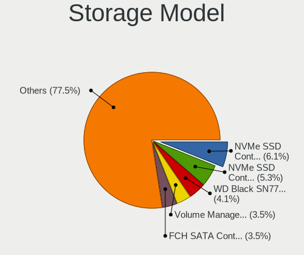
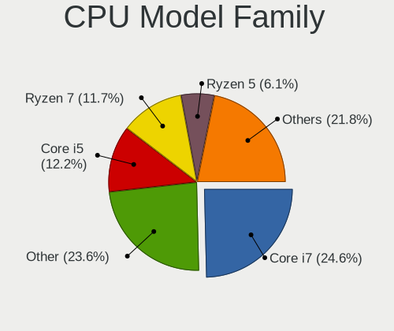
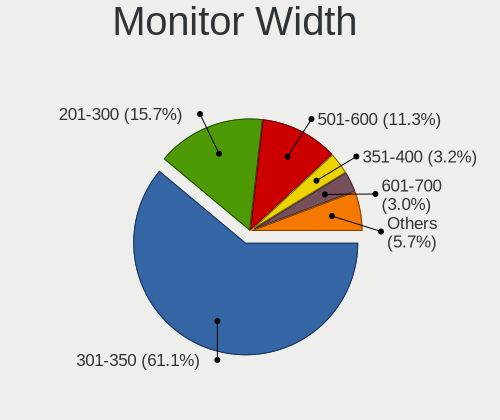

NixOS - Tested Hardware & Statistics (Notebooks)
------------------------------------------------

A project to collect tested hardware configurations for NixOS.

Anyone can contribute to this report by the [hw-probe](https://github.com/linuxhw/hw-probe) tool:

    sudo -E hw-probe -all -upload

Please submit a probe of your configuration if it's not presented on the page or is rare.

Full-feature report is available here: https://linux-hardware.org/?view=trends

Contents
--------

* [ Test Cases ](#test-cases)

* [ System ](#system)
  - [ OS                       ](#os)
  - [ OS Family                ](#os-family)
  - [ Kernel                   ](#kernel)
  - [ Kernel Family            ](#kernel-family)
  - [ Kernel Major Ver.        ](#kernel-major-ver)
  - [ Arch                     ](#arch)
  - [ DE                       ](#de)
  - [ Display Server           ](#display-server)
  - [ Display Manager          ](#display-manager)
  - [ OS Lang                  ](#os-lang)
  - [ Boot Mode                ](#boot-mode)
  - [ Filesystem               ](#filesystem)
  - [ Part. scheme             ](#part-scheme)
  - [ Dual Boot with Linux/BSD ](#dual-boot-with-linuxbsd)
  - [ Dual Boot (Win)          ](#dual-boot-win)

* [ Board ](#board)
  - [ Vendor                   ](#vendor)
  - [ Model                    ](#model)
  - [ Model Family             ](#model-family)
  - [ MFG Year                 ](#mfg-year)
  - [ Form Factor              ](#form-factor)
  - [ Secure Boot              ](#secure-boot)
  - [ Coreboot                 ](#coreboot)
  - [ RAM Size                 ](#ram-size)
  - [ RAM Used                 ](#ram-used)
  - [ Total Drives             ](#total-drives)
  - [ Has CD-ROM               ](#has-cd-rom)
  - [ Has Ethernet             ](#has-ethernet)
  - [ Has WiFi                 ](#has-wifi)
  - [ Has Bluetooth            ](#has-bluetooth)

* [ Location ](#location)
  - [ Country                  ](#country)
  - [ City                     ](#city)

* [ Drives ](#drives)
  - [ Drive Vendor             ](#drive-vendor)
  - [ Drive Model              ](#drive-model)
  - [ HDD Vendor               ](#hdd-vendor)
  - [ SSD Vendor               ](#ssd-vendor)
  - [ Drive Kind               ](#drive-kind)
  - [ Drive Connector          ](#drive-connector)
  - [ Drive Size               ](#drive-size)
  - [ Space Total              ](#space-total)
  - [ Space Used               ](#space-used)
  - [ Malfunc. Drives          ](#malfunc-drives)
  - [ Malfunc. Drive Vendor    ](#malfunc-drive-vendor)
  - [ Malfunc. HDD Vendor      ](#malfunc-hdd-vendor)
  - [ Malfunc. Drive Kind      ](#malfunc-drive-kind)
  - [ Failed Drives            ](#failed-drives)
  - [ Failed Drive Vendor      ](#failed-drive-vendor)
  - [ Drive Status             ](#drive-status)

* [ Storage controller ](#storage-controller)
  - [ Storage Vendor           ](#storage-vendor)
  - [ Storage Model            ](#storage-model)
  - [ Storage Kind             ](#storage-kind)

* [ Processor ](#processor)
  - [ CPU Vendor               ](#cpu-vendor)
  - [ CPU Model                ](#cpu-model)
  - [ CPU Model Family         ](#cpu-model-family)
  - [ CPU Cores                ](#cpu-cores)
  - [ CPU Sockets              ](#cpu-sockets)
  - [ CPU Threads              ](#cpu-threads)
  - [ CPU Op-Modes             ](#cpu-op-modes)
  - [ CPU Microcode            ](#cpu-microcode)
  - [ CPU Microarch            ](#cpu-microarch)

* [ Graphics ](#graphics)
  - [ GPU Vendor               ](#gpu-vendor)
  - [ GPU Model                ](#gpu-model)
  - [ GPU Combo                ](#gpu-combo)
  - [ GPU Driver               ](#gpu-driver)
  - [ GPU Memory               ](#gpu-memory)

* [ Monitor ](#monitor)
  - [ Monitor Vendor           ](#monitor-vendor)
  - [ Monitor Model            ](#monitor-model)
  - [ Monitor Resolution       ](#monitor-resolution)
  - [ Monitor Diagonal         ](#monitor-diagonal)
  - [ Monitor Width            ](#monitor-width)
  - [ Aspect Ratio             ](#aspect-ratio)
  - [ Monitor Area             ](#monitor-area)
  - [ Pixel Density            ](#pixel-density)
  - [ Multiple Monitors        ](#multiple-monitors)

* [ Network ](#network)
  - [ Net Controller Vendor    ](#net-controller-vendor)
  - [ Net Controller Model     ](#net-controller-model)
  - [ Wireless Vendor          ](#wireless-vendor)
  - [ Wireless Model           ](#wireless-model)
  - [ Ethernet Vendor          ](#ethernet-vendor)
  - [ Ethernet Model           ](#ethernet-model)
  - [ Net Controller Kind      ](#net-controller-kind)
  - [ Used Controller          ](#used-controller)
  - [ NICs                     ](#nics)
  - [ IPv6                     ](#ipv6)

* [ Bluetooth ](#bluetooth)
  - [ Bluetooth Vendor         ](#bluetooth-vendor)
  - [ Bluetooth Model          ](#bluetooth-model)

* [ Sound ](#sound)
  - [ Sound Vendor             ](#sound-vendor)
  - [ Sound Model              ](#sound-model)

* [ Memory ](#memory)
  - [ Memory Vendor            ](#memory-vendor)
  - [ Memory Model             ](#memory-model)
  - [ Memory Kind              ](#memory-kind)
  - [ Memory Form Factor       ](#memory-form-factor)
  - [ Memory Size              ](#memory-size)
  - [ Memory Speed             ](#memory-speed)

* [ Printers & scanners ](#printers--scanners)
  - [ Printer Vendor           ](#printer-vendor)
  - [ Printer Model            ](#printer-model)
  - [ Scanner Vendor           ](#scanner-vendor)
  - [ Scanner Model            ](#scanner-model)

* [ Camera ](#camera)
  - [ Camera Vendor            ](#camera-vendor)
  - [ Camera Model             ](#camera-model)

* [ Security ](#security)
  - [ Fingerprint Vendor       ](#fingerprint-vendor)
  - [ Fingerprint Model        ](#fingerprint-model)
  - [ Chipcard Vendor          ](#chipcard-vendor)
  - [ Chipcard Model           ](#chipcard-model)

* [ Unsupported ](#unsupported)
  - [ Unsupported Devices      ](#unsupported-devices)
  - [ Unsupported Device Types ](#unsupported-device-types)

Test Cases
----------

Total: 32

| Vendor        | Model                       | Probe                                                      | Date         |
|---------------|-----------------------------|------------------------------------------------------------|--------------|
| Lenovo        | ThinkPad T14s Gen 1 20UH... | [5570a879d3](https://linux-hardware.org/?probe=5570a879d3) | Mar 13, 2022 |
| Lenovo        | ThinkPad T14s Gen 1 20UH... | [d6cae900dc](https://linux-hardware.org/?probe=d6cae900dc) | Mar 13, 2022 |
| GPD           | MicroPC                     | [a572eb2b39](https://linux-hardware.org/?probe=a572eb2b39) | Mar 11, 2022 |
| HP            | EliteBook 845 G8 Noteboo... | [f031fb1a5a](https://linux-hardware.org/?probe=f031fb1a5a) | Mar 11, 2022 |
| Lenovo        | ThinkPad T540p 20BE005YM... | [6d0cd0f4b9](https://linux-hardware.org/?probe=6d0cd0f4b9) | Mar 10, 2022 |
| Lenovo        | ThinkPad X260 20F5S6MF02    | [5e026c07c0](https://linux-hardware.org/?probe=5e026c07c0) | Mar 10, 2022 |
| MSI           | Bravo 15 B5DD               | [273737b3d7](https://linux-hardware.org/?probe=273737b3d7) | Feb 25, 2022 |
| OBSIDIAN-P... | N13_N140ZU                  | [9f2fdbfce5](https://linux-hardware.org/?probe=9f2fdbfce5) | Feb 25, 2022 |
| Dell          | Latitude 7420               | [64178dcbb7](https://linux-hardware.org/?probe=64178dcbb7) | Feb 08, 2022 |
| Lenovo        | ThinkPad X390 20Q0CTO1WW    | [cf3fa03922](https://linux-hardware.org/?probe=cf3fa03922) | Jan 08, 2022 |
| Lenovo        | ThinkPad X390 20Q0CTO1WW    | [d62840031f](https://linux-hardware.org/?probe=d62840031f) | Jan 08, 2022 |
| Lenovo        | Legion 5 17ARH05H 82GN      | [9e022a2288](https://linux-hardware.org/?probe=9e022a2288) | Dec 26, 2021 |
| Lenovo        | Legion 5 17ARH05H 82GN      | [8ff8fb5efd](https://linux-hardware.org/?probe=8ff8fb5efd) | Dec 26, 2021 |
| ASUSTek       | ZenBook UX391FA_UX391FA     | [5fb4f1b6a6](https://linux-hardware.org/?probe=5fb4f1b6a6) | Nov 29, 2021 |
| Lenovo        | ThinkPad T14 Gen 1 20UD0... | [dbe8d36249](https://linux-hardware.org/?probe=dbe8d36249) | Nov 04, 2021 |
| Lenovo        | ThinkPad X250 20CLS18S0T    | [0151eadf78](https://linux-hardware.org/?probe=0151eadf78) | Oct 06, 2021 |
| HP            | ProBook 445 G7              | [36c94af49d](https://linux-hardware.org/?probe=36c94af49d) | Aug 09, 2021 |
| HP            | ProBook 445 G7              | [87a418ce6c](https://linux-hardware.org/?probe=87a418ce6c) | Aug 09, 2021 |
| ASUSTek       | ROG Zephyrus G14 GA401QM... | [3df83086ef](https://linux-hardware.org/?probe=3df83086ef) | Aug 07, 2021 |
| ASUSTek       | ROG Zephyrus G14 GA401QM... | [052ccd7a40](https://linux-hardware.org/?probe=052ccd7a40) | Aug 07, 2021 |
| ASUSTek       | ROG Zephyrus G14 GA401QM... | [48fd4d3b89](https://linux-hardware.org/?probe=48fd4d3b89) | Aug 06, 2021 |
| Dell          | Latitude 7420               | [0624aeffd1](https://linux-hardware.org/?probe=0624aeffd1) | Jul 19, 2021 |
| ASUSTek       | ROG Strix G533QR_G533QR     | [d14e0ef395](https://linux-hardware.org/?probe=d14e0ef395) | Jun 18, 2021 |
| Lenovo        | ThinkPad T480 20L5CTO1WW    | [fc12f446bb](https://linux-hardware.org/?probe=fc12f446bb) | May 23, 2021 |
| HP            | ZBook Studio G5             | [d323a9cfbf](https://linux-hardware.org/?probe=d323a9cfbf) | Apr 23, 2021 |
| Lenovo        | ThinkPad T460p 20FWCTO1W... | [38ab65a49b](https://linux-hardware.org/?probe=38ab65a49b) | Mar 18, 2021 |
| Lenovo        | ThinkPad T580 20L90024PB    | [8dc60fafaa](https://linux-hardware.org/?probe=8dc60fafaa) | Oct 13, 2020 |
| Dell          | XPS 15 9550                 | [5656cda6a4](https://linux-hardware.org/?probe=5656cda6a4) | Sep 01, 2020 |
| Dell          | XPS 15 9550                 | [550264c421](https://linux-hardware.org/?probe=550264c421) | Aug 22, 2020 |
| Lenovo        | ThinkPad T15 Gen 1 20S6C... | [71029187b1](https://linux-hardware.org/?probe=71029187b1) | Jul 03, 2020 |
| Acer          | Aspire E5-576G              | [c126c8b2fd](https://linux-hardware.org/?probe=c126c8b2fd) | Apr 15, 2020 |
| Gigabyte      | Sabre 15                    | [4f92cff461](https://linux-hardware.org/?probe=4f92cff461) | Jul 14, 2019 |

System
------

OS
--

Installed operating systems

| Name                             | Notebooks | Percent |
|----------------------------------|-----------|---------|
| NixOS 22.05                      | 6         | 24%     |
| NixOS 21.11                      | 5         | 20%     |
| NixOS                            | 2         | 8%      |
| NixOS 21.11pre302265.c6c4a3d45ab | 1         | 4%      |
| NixOS 21.11.20210606.fbfb794     | 1         | 4%      |
| NixOS 21.05.4384.4f37689c8a2     | 1         | 4%      |
| NixOS 21.05.3443.ee90403e147     | 1         | 4%      |
| NixOS 21.05.2132.733682c3292     | 1         | 4%      |
| NixOS 21.05.20210423.c21475e     | 1         | 4%      |
| NixOS 21.03.20200927.84d74ae     | 1         | 4%      |
| NixOS 20.09pre-git               | 1         | 4%      |
| NixOS 20.03.2351.f8248ab6d9e     | 1         | 4%      |
| NixOS 19.09.2522.75f4ba05c63     | 1         | 4%      |
| NixOS 19.09.2220.92231f4f32f     | 1         | 4%      |
| NixOS 19.03.173054.754763ff4ba   | 1         | 4%      |

OS Family
---------

OS without a version

| Name  | Notebooks | Percent |
|-------|-----------|---------|
| NixOS | 24        | 100%    |

Kernel
------

Version of the Linux kernel

| Version         | Notebooks | Percent |
|-----------------|-----------|---------|
| 5.15.26         | 2         | 7.69%   |
| 5.13.7          | 2         | 7.69%   |
| 5.8.4           | 1         | 3.85%   |
| 5.8.16-hardened | 1         | 3.85%   |
| 5.8.11          | 1         | 3.85%   |
| 5.7.4           | 1         | 3.85%   |
| 5.7.17          | 1         | 3.85%   |
| 5.4.24          | 1         | 3.85%   |
| 5.16.8-zen1     | 1         | 3.85%   |
| 5.16.7          | 1         | 3.85%   |
| 5.16.3          | 1         | 3.85%   |
| 5.16.10         | 1         | 3.85%   |
| 5.15.4          | 1         | 3.85%   |
| 5.15.3          | 1         | 3.85%   |
| 5.15.25         | 1         | 3.85%   |
| 5.15.22         | 1         | 3.85%   |
| 5.15.12         | 1         | 3.85%   |
| 5.15.0          | 1         | 3.85%   |
| 5.13.2          | 1         | 3.85%   |
| 5.12.7          | 1         | 3.85%   |
| 5.10.69         | 1         | 3.85%   |
| 5.10.30         | 1         | 3.85%   |
| 4.19.57         | 1         | 3.85%   |
| 4.19.116        | 1         | 3.85%   |

Kernel Family
-------------

Linux kernel without a distro release

| Version  | Notebooks | Percent |
|----------|-----------|---------|
| 5.15.26  | 2         | 7.69%   |
| 5.13.7   | 2         | 7.69%   |
| 5.8.4    | 1         | 3.85%   |
| 5.8.16   | 1         | 3.85%   |
| 5.8.11   | 1         | 3.85%   |
| 5.7.4    | 1         | 3.85%   |
| 5.7.17   | 1         | 3.85%   |
| 5.4.24   | 1         | 3.85%   |
| 5.16.8   | 1         | 3.85%   |
| 5.16.7   | 1         | 3.85%   |
| 5.16.3   | 1         | 3.85%   |
| 5.16.10  | 1         | 3.85%   |
| 5.15.4   | 1         | 3.85%   |
| 5.15.3   | 1         | 3.85%   |
| 5.15.25  | 1         | 3.85%   |
| 5.15.22  | 1         | 3.85%   |
| 5.15.12  | 1         | 3.85%   |
| 5.15.0   | 1         | 3.85%   |
| 5.13.2   | 1         | 3.85%   |
| 5.12.7   | 1         | 3.85%   |
| 5.10.69  | 1         | 3.85%   |
| 5.10.30  | 1         | 3.85%   |
| 4.19.57  | 1         | 3.85%   |
| 4.19.116 | 1         | 3.85%   |

Kernel Major Ver.
-----------------

Linux kernel major version

| Version | Notebooks | Percent |
|---------|-----------|---------|
| 5.15    | 8         | 30.77%  |
| 5.16    | 4         | 15.38%  |
| 5.8     | 3         | 11.54%  |
| 5.13    | 3         | 11.54%  |
| 5.7     | 2         | 7.69%   |
| 5.10    | 2         | 7.69%   |
| 4.19    | 2         | 7.69%   |
| 5.4     | 1         | 3.85%   |
| 5.12    | 1         | 3.85%   |

Arch
----

OS architecture (x86_64, i586, etc.)

| Name   | Notebooks | Percent |
|--------|-----------|---------|
| x86_64 | 24        | 100%    |

DE
--

Desktop Environment

| Name    | Notebooks | Percent |
|---------|-----------|---------|
| Unknown | 21        | 87.5%   |
| XFCE    | 1         | 4.17%   |
| KDE     | 1         | 4.17%   |
| GNOME   | 1         | 4.17%   |

Display Server
--------------

X11 or Wayland

| Name    | Notebooks | Percent |
|---------|-----------|---------|
| Unknown | 20        | 83.33%  |
| X11     | 2         | 8.33%   |
| Wayland | 1         | 4.17%   |
| Tty     | 1         | 4.17%   |

Display Manager
---------------

SDDM, LightDM, etc.

| Name    | Notebooks | Percent |
|---------|-----------|---------|
| Unknown | 23        | 95.83%  |
| GDM     | 1         | 4.17%   |

OS Lang
-------

Language

| Lang    | Notebooks | Percent |
|---------|-----------|---------|
| Unknown | 18        | 75%     |
| en_US   | 5         | 20.83%  |
| ru_RU   | 1         | 4.17%   |

Boot Mode
---------

EFI or BIOS

| Mode | Notebooks | Percent |
|------|-----------|---------|
| EFI  | 20        | 83.33%  |
| BIOS | 4         | 16.67%  |

Filesystem
----------

Type of filesystem

| Type    | Notebooks | Percent |
|---------|-----------|---------|
| Ext4    | 15        | 60%     |
| Btrfs   | 4         | 16%     |
| Tmpfs   | 3         | 12%     |
| Unknown | 3         | 12%     |

Part. scheme
------------

Scheme of partitioning

| Type    | Notebooks | Percent |
|---------|-----------|---------|
| GPT     | 21        | 87.5%   |
| Unknown | 3         | 12.5%   |

Dual Boot with Linux/BSD
------------------------

Hosting more than one Linux/BSD

| Dual boot | Notebooks | Percent |
|-----------|-----------|---------|
| No        | 17        | 70.83%  |
| Yes       | 7         | 29.17%  |

Dual Boot (Win)
---------------

Hosting Linux and Windows

| Dual boot | Notebooks | Percent |
|-----------|-----------|---------|
| No        | 18        | 75%     |
| Yes       | 6         | 25%     |

Board
-----

Vendor
------

Motherboard manufacturer

| Name                | Notebooks | Percent |
|---------------------|-----------|---------|
| Lenovo              | 11        | 45.83%  |
| Hewlett-Packard     | 3         | 12.5%   |
| ASUSTek Computer    | 3         | 12.5%   |
| Dell                | 2         | 8.33%   |
| OBSIDIAN-PC         | 1         | 4.17%   |
| MSI                 | 1         | 4.17%   |
| GPD                 | 1         | 4.17%   |
| Gigabyte Technology | 1         | 4.17%   |
| Acer                | 1         | 4.17%   |

Model
-----

Motherboard model

| Name                                  | Notebooks | Percent |
|---------------------------------------|-----------|---------|
| OBSIDIAN-PC N13_N140ZU                | 1         | 4.17%   |
| MSI Bravo 15 B5DD                     | 1         | 4.17%   |
| Lenovo ThinkPad X390 20Q0CTO1WW       | 1         | 4.17%   |
| Lenovo ThinkPad X260 20F5S6MF02       | 1         | 4.17%   |
| Lenovo ThinkPad X250 20CLS18S0T       | 1         | 4.17%   |
| Lenovo ThinkPad T580 20L90024PB       | 1         | 4.17%   |
| Lenovo ThinkPad T540p 20BE005YMH      | 1         | 4.17%   |
| Lenovo ThinkPad T480 20L5CTO1WW       | 1         | 4.17%   |
| Lenovo ThinkPad T460p 20FWCTO1WW      | 1         | 4.17%   |
| Lenovo ThinkPad T15 Gen 1 20S6CTO1WW  | 1         | 4.17%   |
| Lenovo ThinkPad T14s Gen 1 20UH001AUK | 1         | 4.17%   |
| Lenovo ThinkPad T14 Gen 1 20UD0013RT  | 1         | 4.17%   |
| Lenovo Legion 5 17ARH05H 82GN         | 1         | 4.17%   |
| HP ZBook Studio G5                    | 1         | 4.17%   |
| HP ProBook 445 G7                     | 1         | 4.17%   |
| HP EliteBook 845 G8 Notebook PC       | 1         | 4.17%   |
| GPD MicroPC                           | 1         | 4.17%   |
| Gigabyte Sabre 15                     | 1         | 4.17%   |
| Dell XPS 15 9550                      | 1         | 4.17%   |
| Dell Latitude 7420                    | 1         | 4.17%   |
| ASUS ZenBook UX391FA_UX391FA          | 1         | 4.17%   |
| ASUS ROG Zephyrus G14 GA401QM_GA401QM | 1         | 4.17%   |
| ASUS ROG Strix G533QR_G533QR          | 1         | 4.17%   |
| Acer Aspire E5-576G                   | 1         | 4.17%   |

Model Family
------------

Motherboard model prefix

| Name            | Notebooks | Percent |
|-----------------|-----------|---------|
| Lenovo ThinkPad | 10        | 41.67%  |
| ASUS ROG        | 2         | 8.33%   |
| OBSIDIAN-PC N13 | 1         | 4.17%   |
| MSI Bravo       | 1         | 4.17%   |
| Lenovo Legion   | 1         | 4.17%   |
| HP ZBook        | 1         | 4.17%   |
| HP ProBook      | 1         | 4.17%   |
| HP EliteBook    | 1         | 4.17%   |
| GPD MicroPC     | 1         | 4.17%   |
| Gigabyte Sabre  | 1         | 4.17%   |
| Dell XPS        | 1         | 4.17%   |
| Dell Latitude   | 1         | 4.17%   |
| ASUS ZenBook    | 1         | 4.17%   |
| Acer Aspire     | 1         | 4.17%   |

MFG Year
--------

Motherboard manufacture year

| Year | Notebooks | Percent |
|------|-----------|---------|
| 2020 | 7         | 29.17%  |
| 2018 | 4         | 16.67%  |
| 2021 | 3         | 12.5%   |
| 2019 | 3         | 12.5%   |
| 2017 | 2         | 8.33%   |
| 2016 | 2         | 8.33%   |
| 2015 | 2         | 8.33%   |
| 2013 | 1         | 4.17%   |

Form Factor
-----------

Physical design of the computer

| Name     | Notebooks | Percent |
|----------|-----------|---------|
| Notebook | 24        | 100%    |

Secure Boot
-----------

Enabled or disabled

| State    | Notebooks | Percent |
|----------|-----------|---------|
| Disabled | 24        | 100%    |

Coreboot
--------

Have coreboot on board

| Used | Notebooks | Percent |
|------|-----------|---------|
| No   | 24        | 100%    |

RAM Size
--------

Total RAM memory

| Size in GB | Notebooks | Percent |
|------------|-----------|---------|
| 32.01-64.0 | 10        | 41.67%  |
| 16.01-24.0 | 10        | 41.67%  |
| 8.01-16.0  | 3         | 12.5%   |
| 4.01-8.0   | 1         | 4.17%   |

RAM Used
--------

Used RAM memory

| Used GB    | Notebooks | Percent |
|------------|-----------|---------|
| 4.01-8.0   | 9         | 34.62%  |
| 8.01-16.0  | 6         | 23.08%  |
| 3.01-4.0   | 5         | 19.23%  |
| 2.01-3.0   | 3         | 11.54%  |
| 24.01-32.0 | 2         | 7.69%   |
| 1.01-2.0   | 1         | 3.85%   |

Total Drives
------------

Number of drives on board

| Drives | Notebooks | Percent |
|--------|-----------|---------|
| 1      | 17        | 70.83%  |
| 2      | 7         | 29.17%  |

Has CD-ROM
----------

Has CD-ROM on board

| Presented | Notebooks | Percent |
|-----------|-----------|---------|
| No        | 24        | 100%    |

Has Ethernet
------------

Has Ethernet on board

| Presented | Notebooks | Percent |
|-----------|-----------|---------|
| Yes       | 20        | 80%     |
| No        | 5         | 20%     |

Has WiFi
--------

Has WiFi module

| Presented | Notebooks | Percent |
|-----------|-----------|---------|
| Yes       | 23        | 95.83%  |
| No        | 1         | 4.17%   |

Has Bluetooth
-------------

Has Bluetooth module

| Presented | Notebooks | Percent |
|-----------|-----------|---------|
| Yes       | 22        | 88%     |
| No        | 3         | 12%     |

Location
--------

Country
-------

Geographic location (country)

| Country     | Notebooks | Percent |
|-------------|-----------|---------|
| Ukraine     | 3         | 12.5%   |
| UK          | 3         | 12.5%   |
| Russia      | 2         | 8.33%   |
| Poland      | 2         | 8.33%   |
| France      | 2         | 8.33%   |
| Canada      | 2         | 8.33%   |
| Belgium     | 2         | 8.33%   |
| Uruguay     | 1         | 4.17%   |
| Switzerland | 1         | 4.17%   |
| Spain       | 1         | 4.17%   |
| Portugal    | 1         | 4.17%   |
| Netherlands | 1         | 4.17%   |
| Germany     | 1         | 4.17%   |
| Colombia    | 1         | 4.17%   |
| Austria     | 1         | 4.17%   |

City
----

Geographic location (city)

| City        | Notebooks | Percent |
|-------------|-----------|---------|
| Marki       | 2         | 8%      |
| London      | 2         | 8%      |
| Vienna      | 1         | 4%      |
| Vernouillet | 1         | 4%      |
| Valpacos    | 1         | 4%      |
| Tottenham   | 1         | 4%      |
| Samara      | 1         | 4%      |
| Québec   | 1         | 4%      |
| Mykolayiv   | 1         | 4%      |
| Montevideo  | 1         | 4%      |
| Mons        | 1         | 4%      |
| Melsele     | 1         | 4%      |
| Kiel        | 1         | 4%      |
| Kharkiv     | 1         | 4%      |
| Irpin       | 1         | 4%      |
| Halifax     | 1         | 4%      |
| Getafe      | 1         | 4%      |
| Enschede    | 1         | 4%      |
| Chelyabinsk | 1         | 4%      |
| Cergy       | 1         | 4%      |
| Cartagena   | 1         | 4%      |
| Bedford     | 1         | 4%      |
| Arlesheim   | 1         | 4%      |

Drives
------

Drive Vendor
------------

Hard drive vendors

| Vendor              | Notebooks | Drives | Percent |
|---------------------|-----------|--------|---------|
| Samsung Electronics | 12        | 14     | 40%     |
| SK Hynix            | 3         | 4      | 10%     |
| WDC                 | 2         | 2      | 6.67%   |
| Transcend           | 2         | 2      | 6.67%   |
| Micron Technology   | 2         | 2      | 6.67%   |
| Kingston            | 2         | 2      | 6.67%   |
| Seagate             | 1         | 1      | 3.33%   |
| KIOXIA              | 1         | 1      | 3.33%   |
| Intel               | 1         | 1      | 3.33%   |
| INNOVATION IT       | 1         | 1      | 3.33%   |
| HGST                | 1         | 1      | 3.33%   |
| Crucial             | 1         | 2      | 3.33%   |
| BIWIN               | 1         | 1      | 3.33%   |

Drive Model
-----------

Hard drive models

| Model                                | Notebooks | Percent |
|--------------------------------------|-----------|---------|
| WDC PC SN730 SDBPNTY-1T00-1101 1TB   | 1         | 3.23%   |
| WDC PC SN720 SDAQNTW-512G-1001 512GB | 1         | 3.23%   |
| Transcend TS256GMTS800 256GB SSD     | 1         | 3.23%   |
| Transcend TS256GMTS430S 256GB SSD    | 1         | 3.23%   |
| SK Hynix PC711 HFS512GDE9X073N 512GB | 1         | 3.23%   |
| SK Hynix NVMe SSD Drive 1TB          | 1         | 3.23%   |
| SK Hynix NVMe SSD Drive 1024GB       | 1         | 3.23%   |
| SK Hynix HFM001TD3JX013N 1TB         | 1         | 3.23%   |
| Seagate ST2000LM007-1R8174 2TB       | 1         | 3.23%   |
| Samsung SSD 970 EVO 500GB            | 1         | 3.23%   |
| Samsung SSD 870 EVO 500GB            | 1         | 3.23%   |
| Samsung SSD 860 EVO 1TB              | 1         | 3.23%   |
| Samsung Portable SSD T5 500GB        | 1         | 3.23%   |
| Samsung PM9A1 NVMe 1024GB            | 1         | 3.23%   |
| Samsung NVMe SSD Drive 512GB         | 1         | 3.23%   |
| Samsung MZVLB512HBJQ-000L7 512GB     | 1         | 3.23%   |
| Samsung MZVLB512HAJQ-000H1 512GB     | 1         | 3.23%   |
| Samsung MZVLB512HAJQ-00000 512GB     | 1         | 3.23%   |
| Samsung MZVLB256HAHQ-000L7 256GB     | 1         | 3.23%   |
| Samsung MZVLB1T0HBLR-000L7 1TB       | 1         | 3.23%   |
| Samsung MZ7LN512HMJP-000L7 512GB SSD | 1         | 3.23%   |
| Micron MTFDHBA512TDV 512GB           | 1         | 3.23%   |
| Micron 1100_MTFDDAV256TBN 256GB SSD  | 1         | 3.23%   |
| KIOXIA NVMe SSD Drive 256GB          | 1         | 3.23%   |
| Kingston SA400S37960G 960GB SSD      | 1         | 3.23%   |
| Kingston OM8PCP3512F-AI1 512GB       | 1         | 3.23%   |
| Intel SSDPEKKF010T8L 1TB             | 1         | 3.23%   |
| INNOVATION IT IT 256GB SSD           | 1         | 3.23%   |
| HGST HTS721010A9E630 1TB             | 1         | 3.23%   |
| Crucial CT1000MX500SSD1 1TB          | 1         | 3.23%   |
| BIWIN SSD 128GB                      | 1         | 3.23%   |

HDD Vendor
----------

Hard disk drive vendors

| Vendor  | Notebooks | Drives | Percent |
|---------|-----------|--------|---------|
| Seagate | 1         | 1      | 50%     |
| HGST    | 1         | 1      | 50%     |

SSD Vendor
----------

Solid state drive vendors

| Vendor              | Notebooks | Drives | Percent |
|---------------------|-----------|--------|---------|
| Samsung Electronics | 4         | 4      | 36.36%  |
| Transcend           | 2         | 2      | 18.18%  |
| Micron Technology   | 1         | 1      | 9.09%   |
| Kingston            | 1         | 1      | 9.09%   |
| INNOVATION IT       | 1         | 1      | 9.09%   |
| Crucial             | 1         | 2      | 9.09%   |
| BIWIN               | 1         | 1      | 9.09%   |

Drive Kind
----------

HDD or SSD

| Kind | Notebooks | Drives | Percent |
|------|-----------|--------|---------|
| NVMe | 17        | 20     | 60.71%  |
| SSD  | 9         | 12     | 32.14%  |
| HDD  | 2         | 2      | 7.14%   |

Drive Connector
---------------

SATA, SAS, NVMe, etc.

| Type | Notebooks | Drives | Percent |
|------|-----------|--------|---------|
| NVMe | 17        | 20     | 62.96%  |
| SATA | 9         | 13     | 33.33%  |
| SAS  | 1         | 1      | 3.7%    |

Drive Size
----------

Size of hard drive

| Size in TB | Notebooks | Drives | Percent |
|------------|-----------|--------|---------|
| 0.01-0.5   | 6         | 7      | 50%     |
| 0.51-1.0   | 5         | 6      | 41.67%  |
| 1.01-2.0   | 1         | 1      | 8.33%   |

Space Total
-----------

Amount of disk space available on the file system

| Size in GB | Notebooks | Percent |
|------------|-----------|---------|
| Unknown    | 19        | 79.17%  |
| 1-20       | 2         | 8.33%   |
| 251-500    | 1         | 4.17%   |
| 1001-2000  | 1         | 4.17%   |
| 501-1000   | 1         | 4.17%   |

Space Used
----------

Amount of used disk space

| Used GB | Notebooks | Percent |
|---------|-----------|---------|
| Unknown | 19        | 79.17%  |
| 101-250 | 2         | 8.33%   |
| 1-20    | 2         | 8.33%   |
| 251-500 | 1         | 4.17%   |

Malfunc. Drives
---------------

Drive models with a malfunction

| Model                                          | Notebooks | Drives | Percent |
|------------------------------------------------|-----------|--------|---------|
| SK Hynix PC711 HFS512GDE9X073N 512GB           | 1         | 1      | 50%     |
| Micron Technology 1100_MTFDDAV256TBN 256GB SSD | 1         | 1      | 50%     |

Malfunc. Drive Vendor
---------------------

Vendors of faulty drives

| Vendor            | Notebooks | Drives | Percent |
|-------------------|-----------|--------|---------|
| SK Hynix          | 1         | 1      | 50%     |
| Micron Technology | 1         | 1      | 50%     |

Malfunc. HDD Vendor
-------------------

Vendors of faulty HDD drives

Zero info for selected period =(

Malfunc. Drive Kind
-------------------

Kinds of faulty drives

| Kind | Notebooks | Drives | Percent |
|------|-----------|--------|---------|
| NVMe | 1         | 1      | 50%     |
| SSD  | 1         | 1      | 50%     |

Failed Drives
-------------

Failed drive models

Zero info for selected period =(

Failed Drive Vendor
-------------------

Failed drive vendors

Zero info for selected period =(

Drive Status
------------

Number of failed and malfunc. drives

| Status   | Notebooks | Drives | Percent |
|----------|-----------|--------|---------|
| Works    | 20        | 26     | 76.92%  |
| Detected | 4         | 6      | 15.38%  |
| Malfunc  | 2         | 2      | 7.69%   |

Storage controller
------------------

Storage Vendor
--------------

Storage controller vendors

| Vendor                      | Notebooks | Percent |
|-----------------------------|-----------|---------|
| Intel                       | 11        | 37.93%  |
| Samsung Electronics         | 8         | 27.59%  |
| SK Hynix                    | 3         | 10.34%  |
| Sandisk                     | 2         | 6.9%    |
| AMD                         | 2         | 6.9%    |
| Micron Technology           | 1         | 3.45%   |
| KIOXIA                      | 1         | 3.45%   |
| Kingston Technology Company | 1         | 3.45%   |

Storage Model
-------------

Storage controller models

| Model                                                                          | Notebooks | Percent |
|--------------------------------------------------------------------------------|-----------|---------|
| Samsung NVMe SSD Controller SM981/PM981/PM983                                  | 6         | 20.69%  |
| SK Hynix Gold P31 SSD                                                          | 3         | 10.34%  |
| Intel HM170/QM170 Chipset SATA Controller [AHCI Mode]                          | 3         | 10.34%  |
| Intel Sunrise Point-LP SATA Controller [AHCI mode]                             | 2         | 6.9%    |
| AMD FCH SATA Controller [AHCI mode]                                            | 2         | 6.9%    |
| Sandisk WD Black SN750 / PC SN730 NVMe SSD                                     | 1         | 3.45%   |
| Sandisk WD Black 2018/SN750 / PC SN720 NVMe SSD                                | 1         | 3.45%   |
| Samsung NVMe SSD Controller SM951/PM951                                        | 1         | 3.45%   |
| Samsung NVMe SSD Controller PM9A1/PM9A3/980PRO                                 | 1         | 3.45%   |
| Micron Non-Volatile memory controller                                          | 1         | 3.45%   |
| KIOXIA Non-Volatile memory controller                                          | 1         | 3.45%   |
| Kingston Company Company Non-Volatile memory controller                        | 1         | 3.45%   |
| Intel Wildcat Point-LP SATA Controller [AHCI Mode]                             | 1         | 3.45%   |
| Intel SSD Pro 7600p/760p/E 6100p Series                                        | 1         | 3.45%   |
| Intel Celeron/Pentium Silver Processor SATA Controller                         | 1         | 3.45%   |
| Intel Cannon Point-LP SATA Controller [AHCI Mode]                              | 1         | 3.45%   |
| Intel Cannon Lake Mobile PCH SATA AHCI Controller                              | 1         | 3.45%   |
| Intel 8 Series/C220 Series Chipset Family 6-port SATA Controller 1 [AHCI mode] | 1         | 3.45%   |

Storage Kind
------------

Kind of storage controller (IDE, SATA, NVMe, SAS, ...)

| Kind | Notebooks | Percent |
|------|-----------|---------|
| NVMe | 17        | 58.62%  |
| SATA | 12        | 41.38%  |

Processor
---------

CPU Vendor
----------

Processor vendors

| Vendor | Notebooks | Percent |
|--------|-----------|---------|
| Intel  | 16        | 66.67%  |
| AMD    | 8         | 33.33%  |

CPU Model
---------

Processor models

| Model                                      | Notebooks | Percent |
|--------------------------------------------|-----------|---------|
| Intel Core i7-8550U CPU @ 1.80GHz          | 3         | 12.5%   |
| Intel Core i7-8565U CPU @ 1.80GHz          | 2         | 8.33%   |
| AMD Ryzen 7 PRO 4750U with Radeon Graphics | 2         | 8.33%   |
| AMD Ryzen 7 5800H with Radeon Graphics     | 2         | 8.33%   |
| Intel Xeon E-2176M CPU @ 2.70GHz           | 1         | 4.17%   |
| Intel Core i7-7700HQ CPU @ 2.80GHz         | 1         | 4.17%   |
| Intel Core i7-6820HQ CPU @ 2.70GHz         | 1         | 4.17%   |
| Intel Core i7-6700HQ CPU @ 2.60GHz         | 1         | 4.17%   |
| Intel Core i7-5600U CPU @ 2.60GHz          | 1         | 4.17%   |
| Intel Core i7-4700MQ CPU @ 2.40GHz         | 1         | 4.17%   |
| Intel Core i7-10510U CPU @ 1.80GHz         | 1         | 4.17%   |
| Intel Core i5-8265U CPU @ 1.60GHz          | 1         | 4.17%   |
| Intel Core i5-6300U CPU @ 2.40GHz          | 1         | 4.17%   |
| Intel Celeron N4100 CPU @ 1.10GHz          | 1         | 4.17%   |
| Intel 11th Gen Core i7-1185G7 @ 3.00GHz    | 1         | 4.17%   |
| AMD Ryzen 7 PRO 5850U with Radeon Graphics | 1         | 4.17%   |
| AMD Ryzen 7 5800HS with Radeon Graphics    | 1         | 4.17%   |
| AMD Ryzen 7 4800H with Radeon Graphics     | 1         | 4.17%   |
| AMD Ryzen 7 4700U with Radeon Graphics     | 1         | 4.17%   |

CPU Model Family
----------------

Processor model prefix

| Model           | Notebooks | Percent |
|-----------------|-----------|---------|
| Intel Core i7   | 11        | 45.83%  |
| AMD Ryzen 7     | 5         | 20.83%  |
| AMD Ryzen 7 PRO | 3         | 12.5%   |
| Intel Core i5   | 2         | 8.33%   |
| Other           | 1         | 4.17%   |
| Intel Xeon      | 1         | 4.17%   |
| Intel Celeron   | 1         | 4.17%   |

CPU Cores
---------

Number of processor cores

| Number | Notebooks | Percent |
|--------|-----------|---------|
| 4      | 13        | 54.17%  |
| 8      | 8         | 33.33%  |
| 2      | 2         | 8.33%   |
| 6      | 1         | 4.17%   |

CPU Sockets
-----------

Number of sockets

| Number | Notebooks | Percent |
|--------|-----------|---------|
| 1      | 24        | 100%    |

CPU Threads
-----------

Threads per core (Hyper-Threading)

| Number | Notebooks | Percent |
|--------|-----------|---------|
| 2      | 22        | 91.67%  |
| 1      | 2         | 8.33%   |

CPU Op-Modes
------------

CPU Operation Modes (32-bit, 64-bit)

| Op mode        | Notebooks | Percent |
|----------------|-----------|---------|
| 32-bit, 64-bit | 24        | 100%    |

CPU Microcode
-------------

Microcode number

| Number     | Notebooks | Percent |
|------------|-----------|---------|
| 0x806ea    | 3         | 12.5%   |
| 0x0a50000c | 3         | 12.5%   |
| 0x08600106 | 3         | 12.5%   |
| 0x806ec    | 2         | 8.33%   |
| 0x806eb    | 2         | 8.33%   |
| 0x906ea    | 1         | 4.17%   |
| 0x906e9    | 1         | 4.17%   |
| 0x806c1    | 1         | 4.17%   |
| 0x706a1    | 1         | 4.17%   |
| 0x506e3    | 1         | 4.17%   |
| 0x406e3    | 1         | 4.17%   |
| 0x306d4    | 1         | 4.17%   |
| 0x306c3    | 1         | 4.17%   |
| 0x0a50000b | 1         | 4.17%   |
| 0x08600104 | 1         | 4.17%   |
| Unknown    | 1         | 4.17%   |

CPU Microarch
-------------

Microarchitecture

| Name          | Notebooks | Percent |
|---------------|-----------|---------|
| KabyLake      | 9         | 37.5%   |
| Zen 3         | 4         | 16.67%  |
| Zen 2         | 4         | 16.67%  |
| Skylake       | 3         | 12.5%   |
| TigerLake     | 1         | 4.17%   |
| Haswell       | 1         | 4.17%   |
| Goldmont plus | 1         | 4.17%   |
| Broadwell     | 1         | 4.17%   |

Graphics
--------

GPU Vendor
----------

Vendors of graphics cards

| Vendor | Notebooks | Percent |
|--------|-----------|---------|
| Intel  | 15        | 45.45%  |
| Nvidia | 10        | 30.3%   |
| AMD    | 8         | 24.24%  |

GPU Model
---------

Graphics card models

| Model                                                       | Notebooks | Percent |
|-------------------------------------------------------------|-----------|---------|
| AMD Renoir                                                  | 4         | 11.76%  |
| AMD Cezanne                                                 | 4         | 11.76%  |
| Intel WhiskeyLake-U GT2 [UHD Graphics 620]                  | 3         | 8.82%   |
| Intel UHD Graphics 620                                      | 3         | 8.82%   |
| Nvidia GP108M [GeForce MX150]                               | 2         | 5.88%   |
| Intel HD Graphics 530                                       | 2         | 5.88%   |
| Nvidia TU116M [GeForce GTX 1660 Ti Mobile]                  | 1         | 2.94%   |
| Nvidia GP107M [GeForce GTX 1050 Ti Mobile]                  | 1         | 2.94%   |
| Nvidia GP107GLM [Quadro P1000 Mobile]                       | 1         | 2.94%   |
| Nvidia GM108M [GeForce 940MX]                               | 1         | 2.94%   |
| Nvidia GM107M [GeForce GTX 960M]                            | 1         | 2.94%   |
| Nvidia GK208M [GeForce GT 730M]                             | 1         | 2.94%   |
| Nvidia GA106M [GeForce RTX 3060 Mobile / Max-Q]             | 1         | 2.94%   |
| Nvidia GA104M [GeForce RTX 3070 Mobile / Max-Q]             | 1         | 2.94%   |
| Intel TigerLake-LP GT2 [Iris Xe Graphics]                   | 1         | 2.94%   |
| Intel Skylake GT2 [HD Graphics 520]                         | 1         | 2.94%   |
| Intel HD Graphics 630                                       | 1         | 2.94%   |
| Intel HD Graphics 5500                                      | 1         | 2.94%   |
| Intel GeminiLake [UHD Graphics 600]                         | 1         | 2.94%   |
| Intel CometLake-U GT2 [UHD Graphics]                        | 1         | 2.94%   |
| Intel 4th Gen Core Processor Integrated Graphics Controller | 1         | 2.94%   |
| AMD Navi 14 [Radeon RX 5500/5500M / Pro 5500M]              | 1         | 2.94%   |

GPU Combo
---------

Combinations of graphics cards

| Name           | Notebooks | Percent |
|----------------|-----------|---------|
| 1 x Intel      | 9         | 37.5%   |
| Intel + Nvidia | 6         | 25%     |
| 1 x AMD        | 4         | 16.67%  |
| AMD + Nvidia   | 3         | 12.5%   |
| 2 x AMD        | 1         | 4.17%   |
| 1 x Nvidia     | 1         | 4.17%   |

GPU Driver
----------

Free vs proprietary

| Driver      | Notebooks | Percent |
|-------------|-----------|---------|
| Free        | 21        | 87.5%   |
| Proprietary | 3         | 12.5%   |

GPU Memory
----------

Total video memory

| Size in GB | Notebooks | Percent |
|------------|-----------|---------|
| Unknown    | 13        | 54.17%  |
| 0.01-0.5   | 7         | 29.17%  |
| 1.01-2.0   | 2         | 8.33%   |
| 3.01-4.0   | 1         | 4.17%   |
| 0.51-1.0   | 1         | 4.17%   |

Monitor
-------

Monitor Vendor
--------------

Monitor vendors

| Vendor              | Notebooks | Percent |
|---------------------|-----------|---------|
| AU Optronics        | 5         | 15.63%  |
| LG Display          | 4         | 12.5%   |
| Chimei Innolux      | 4         | 12.5%   |
| Samsung Electronics | 3         | 9.38%   |
| Dell                | 3         | 9.38%   |
| PANDA               | 2         | 6.25%   |
| BOE                 | 2         | 6.25%   |
| Sharp               | 1         | 3.13%   |
| Panasonic           | 1         | 3.13%   |
| Lenovo              | 1         | 3.13%   |
| JDI                 | 1         | 3.13%   |
| InfoVision          | 1         | 3.13%   |
| Hewlett-Packard     | 1         | 3.13%   |
| Eizo                | 1         | 3.13%   |
| ASUSTek Computer    | 1         | 3.13%   |
| AOC                 | 1         | 3.13%   |

Monitor Model
-------------

Monitor models

| Model                                                             | Notebooks | Percent |
|-------------------------------------------------------------------|-----------|---------|
| Sharp LCD Monitor SHP143E 3840x2160 346x194mm 15.6-inch           | 1         | 3.13%   |
| Samsung Electronics S34J55x SAM0F70 3440x1440 800x330mm 34.1-inch | 1         | 3.13%   |
| Samsung Electronics S24B300 SAM08B3 1920x1080 521x293mm 23.5-inch | 1         | 3.13%   |
| Samsung Electronics C32F39M SAM100B 1920x1080 698x393mm 31.5-inch | 1         | 3.13%   |
| PANDA LM156LF1L03 NCP001C 1920x1080 344x194mm 15.5-inch           | 1         | 3.13%   |
| PANDA LCD Monitor NCP005E 1920x1080 309x174mm 14.0-inch           | 1         | 3.13%   |
| Panasonic VVX13F009G00 MEI96A2 1920x1080 344x193mm 15.5-inch      | 1         | 3.13%   |
| LG Display LCD Monitor LGD060F 1920x1080 309x174mm 14.0-inch      | 1         | 3.13%   |
| LG Display LCD Monitor LGD0533 1920x1080 344x194mm 15.5-inch      | 1         | 3.13%   |
| LG Display LCD Monitor LGD049A 2560x1440 310x174mm 14.0-inch      | 1         | 3.13%   |
| LG Display LCD Monitor LGD0437 1920x1080 276x156mm 12.5-inch      | 1         | 3.13%   |
| Lenovo LCD Monitor LEN40BA 1920x1080 344x194mm 15.5-inch          | 1         | 3.13%   |
| JDI LCD Monitor JDI385A 3840x2160 294x165mm 13.3-inch             | 1         | 3.13%   |
| InfoVision LCD Monitor IVO8C78 1920x1080 309x174mm 14.0-inch      | 1         | 3.13%   |
| Hewlett-Packard Z27 HPN3535 3840x2160 597x336mm 27.0-inch         | 1         | 3.13%   |
| Eizo L568 ENC1734 1280x1024 338x270mm 17.0-inch                   | 1         | 3.13%   |
| Dell U2717D DEL40EB 2560x1440 597x336mm 27.0-inch                 | 1         | 3.13%   |
| Dell P2715Q DEL40BD 3840x2160 597x336mm 27.0-inch                 | 1         | 3.13%   |
| Dell P2418D DELD0C2 2560x1440 526x296mm 23.8-inch                 | 1         | 3.13%   |
| Chimei Innolux LCD Monitor CMN175C 1920x1080 381x214mm 17.2-inch  | 1         | 3.13%   |
| Chimei Innolux LCD Monitor CMN152A 2560x1440 344x193mm 15.5-inch  | 1         | 3.13%   |
| Chimei Innolux LCD Monitor CMN14F2 1920x1080 309x173mm 13.9-inch  | 1         | 3.13%   |
| Chimei Innolux LCD Monitor CMN14D2 1920x1080 309x173mm 13.9-inch  | 1         | 3.13%   |
| BOE LCD Monitor BOE0957 1920x1080 344x194mm 15.5-inch             | 1         | 3.13%   |
| BOE LCD Monitor BOE08D8 1920x1080 344x194mm 15.5-inch             | 1         | 3.13%   |
| AU Optronics LCD Monitor AUO5A2D 1920x1080 293x165mm 13.2-inch    | 1         | 3.13%   |
| AU Optronics LCD Monitor AUO573D 1920x1080 309x174mm 14.0-inch    | 1         | 3.13%   |
| AU Optronics LCD Monitor AUO4A90 1920x1080 309x174mm 14.0-inch    | 1         | 3.13%   |
| AU Optronics LCD Monitor AUO2336 2560x1440 309x174mm 14.0-inch    | 1         | 3.13%   |
| AU Optronics LCD Monitor AUO226D 1920x1080 276x155mm 12.5-inch    | 1         | 3.13%   |
| ASUSTek Computer VP28U AUS28B1 3840x2160 621x341mm 27.9-inch      | 1         | 3.13%   |
| AOC 2770 AOC2770 1920x1080 598x336mm 27.0-inch                    | 1         | 3.13%   |

Monitor Resolution
------------------

Monitor screen resolution

| Resolution       | Notebooks | Percent |
|------------------|-----------|---------|
| 1920x1080 (FHD)  | 17        | 56.67%  |
| 3840x2160 (4K)   | 6         | 20%     |
| 2560x1440 (QHD)  | 5         | 16.67%  |
| 3440x1440        | 1         | 3.33%   |
| 1280x1024 (SXGA) | 1         | 3.33%   |

Monitor Diagonal
----------------

Diagonal size in inches

| Inches | Notebooks | Percent |
|--------|-----------|---------|
| 15     | 7         | 21.88%  |
| 14     | 7         | 21.88%  |
| 27     | 5         | 15.63%  |
| 13     | 4         | 12.5%   |
| 17     | 3         | 9.38%   |
| 12     | 2         | 6.25%   |
| 34     | 1         | 3.13%   |
| 31     | 1         | 3.13%   |
| 24     | 1         | 3.13%   |
| 23     | 1         | 3.13%   |

Monitor Width
-------------

Physical width

| Width in mm | Notebooks | Percent |
|-------------|-----------|---------|
| 301-350     | 16        | 51.61%  |
| 501-600     | 6         | 19.35%  |
| 201-300     | 4         | 12.9%   |
| 601-700     | 2         | 6.45%   |
| 351-400     | 2         | 6.45%   |
| 701-800     | 1         | 3.23%   |

Aspect Ratio
------------

Proportional relationship between the width and the height

| Ratio | Notebooks | Percent |
|-------|-----------|---------|
| 16/9  | 22        | 91.67%  |
| 5/4   | 1         | 4.17%   |
| 21/9  | 1         | 4.17%   |

Monitor Area
------------

Area in inch²

| Area in inch² | Notebooks | Percent |
|----------------|-----------|---------|
| 81-90          | 9         | 28.13%  |
| 101-110        | 7         | 21.88%  |
| 301-350        | 5         | 15.63%  |
| 71-80          | 2         | 6.25%   |
| 61-70          | 2         | 6.25%   |
| 351-500        | 2         | 6.25%   |
| 201-250        | 2         | 6.25%   |
| 121-130        | 2         | 6.25%   |
| 141-150        | 1         | 3.13%   |

Pixel Density
-------------

Pixels per inch

| Density       | Notebooks | Percent |
|---------------|-----------|---------|
| 121-160       | 13        | 44.83%  |
| 161-240       | 7         | 24.14%  |
| 51-100        | 4         | 13.79%  |
| More than 240 | 3         | 10.34%  |
| 101-120       | 2         | 6.9%    |

Multiple Monitors
-----------------

Total monitors connected

| Total | Notebooks | Percent |
|-------|-----------|---------|
| 1     | 14        | 56%     |
| 2     | 8         | 32%     |
| 0     | 2         | 8%      |
| 3     | 1         | 4%      |

Network
-------

Net Controller Vendor
---------------------

Controller vendors

| Vendor                            | Notebooks | Percent |
|-----------------------------------|-----------|---------|
| Intel                             | 22        | 55%     |
| Realtek Semiconductor             | 15        | 37.5%   |
| Microsoft                         | 1         | 2.5%    |
| FIBOCOM                           | 1         | 2.5%    |
| Ericsson Business Mobile Networks | 1         | 2.5%    |

Net Controller Model
--------------------

Controller models

| Model                                                             | Notebooks | Percent |
|-------------------------------------------------------------------|-----------|---------|
| Realtek RTL8111/8168/8411 PCI Express Gigabit Ethernet Controller | 10        | 19.61%  |
| Realtek RTL8153 Gigabit Ethernet Adapter                          | 6         | 11.76%  |
| Intel Wi-Fi 6 AX200                                               | 6         | 11.76%  |
| Intel Wireless-AC 9260                                            | 2         | 3.92%   |
| Intel Wireless 8265 / 8275                                        | 2         | 3.92%   |
| Intel Wireless 8260                                               | 2         | 3.92%   |
| Intel Ethernet Connection (4) I219-V                              | 2         | 3.92%   |
| Intel Dual Band Wireless-AC 3168NGW [Stone Peak]                  | 2         | 3.92%   |
| Intel Cannon Point-LP CNVi [Wireless-AC]                          | 2         | 3.92%   |
| Realtek RTL8822CE 802.11ac PCIe Wireless Network Adapter          | 1         | 1.96%   |
| Microsoft Xbox 360 Wireless Adapter                               | 1         | 1.96%   |
| Intel Wireless 7265                                               | 1         | 1.96%   |
| Intel Wireless 7260                                               | 1         | 1.96%   |
| Intel Wireless 3165                                               | 1         | 1.96%   |
| Intel Wi-Fi 6 AX201                                               | 1         | 1.96%   |
| Intel I210 Gigabit Network Connection                             | 1         | 1.96%   |
| Intel Ethernet Connection I219-LM                                 | 1         | 1.96%   |
| Intel Ethernet Connection I217-LM                                 | 1         | 1.96%   |
| Intel Ethernet Connection (6) I219-V                              | 1         | 1.96%   |
| Intel Ethernet Connection (3) I218-LM                             | 1         | 1.96%   |
| Intel Ethernet Connection (2) I219-LM                             | 1         | 1.96%   |
| Intel Ethernet Connection (10) I219-V                             | 1         | 1.96%   |
| Intel Comet Lake PCH-LP CNVi WiFi                                 | 1         | 1.96%   |
| Intel Cannon Lake PCH CNVi WiFi                                   | 1         | 1.96%   |
| FIBOCOM L830-EB                                                   | 1         | 1.96%   |
| Ericsson Business Mobile Networks N5321 gw                        | 1         | 1.96%   |

Wireless Vendor
---------------

Wireless vendors

| Vendor                            | Notebooks | Percent |
|-----------------------------------|-----------|---------|
| Intel                             | 22        | 84.62%  |
| Realtek Semiconductor             | 1         | 3.85%   |
| Microsoft                         | 1         | 3.85%   |
| FIBOCOM                           | 1         | 3.85%   |
| Ericsson Business Mobile Networks | 1         | 3.85%   |

Wireless Model
--------------

Wireless models

| Model                                                    | Notebooks | Percent |
|----------------------------------------------------------|-----------|---------|
| Intel Wi-Fi 6 AX200                                      | 6         | 23.08%  |
| Intel Wireless-AC 9260                                   | 2         | 7.69%   |
| Intel Wireless 8265 / 8275                               | 2         | 7.69%   |
| Intel Wireless 8260                                      | 2         | 7.69%   |
| Intel Dual Band Wireless-AC 3168NGW [Stone Peak]         | 2         | 7.69%   |
| Intel Cannon Point-LP CNVi [Wireless-AC]                 | 2         | 7.69%   |
| Realtek RTL8822CE 802.11ac PCIe Wireless Network Adapter | 1         | 3.85%   |
| Microsoft Xbox 360 Wireless Adapter                      | 1         | 3.85%   |
| Intel Wireless 7265                                      | 1         | 3.85%   |
| Intel Wireless 7260                                      | 1         | 3.85%   |
| Intel Wireless 3165                                      | 1         | 3.85%   |
| Intel Wi-Fi 6 AX201                                      | 1         | 3.85%   |
| Intel Comet Lake PCH-LP CNVi WiFi                        | 1         | 3.85%   |
| Intel Cannon Lake PCH CNVi WiFi                          | 1         | 3.85%   |
| FIBOCOM L830-EB                                          | 1         | 3.85%   |
| Ericsson Business Mobile Networks N5321 gw               | 1         | 3.85%   |

Ethernet Vendor
---------------

Ethernet vendors

| Vendor                | Notebooks | Percent |
|-----------------------|-----------|---------|
| Realtek Semiconductor | 14        | 63.64%  |
| Intel                 | 8         | 36.36%  |

Ethernet Model
--------------

Ethernet models

| Model                                                             | Notebooks | Percent |
|-------------------------------------------------------------------|-----------|---------|
| Realtek RTL8111/8168/8411 PCI Express Gigabit Ethernet Controller | 10        | 40%     |
| Realtek RTL8153 Gigabit Ethernet Adapter                          | 6         | 24%     |
| Intel Ethernet Connection (4) I219-V                              | 2         | 8%      |
| Intel I210 Gigabit Network Connection                             | 1         | 4%      |
| Intel Ethernet Connection I219-LM                                 | 1         | 4%      |
| Intel Ethernet Connection I217-LM                                 | 1         | 4%      |
| Intel Ethernet Connection (6) I219-V                              | 1         | 4%      |
| Intel Ethernet Connection (3) I218-LM                             | 1         | 4%      |
| Intel Ethernet Connection (2) I219-LM                             | 1         | 4%      |
| Intel Ethernet Connection (10) I219-V                             | 1         | 4%      |

Net Controller Kind
-------------------

Ethernet, WiFi or modem

| Kind     | Notebooks | Percent |
|----------|-----------|---------|
| WiFi     | 23        | 53.49%  |
| Ethernet | 20        | 46.51%  |

Used Controller
---------------

Currently used network controller

| Kind     | Notebooks | Percent |
|----------|-----------|---------|
| WiFi     | 22        | 66.67%  |
| Ethernet | 11        | 33.33%  |

NICs
----

Total network controllers on board

| Total | Notebooks | Percent |
|-------|-----------|---------|
| 2     | 16        | 66.67%  |
| 1     | 7         | 29.17%  |
| 3     | 1         | 4.17%   |

IPv6
----

IPv6 vs IPv4

| Used | Notebooks | Percent |
|------|-----------|---------|
| No   | 20        | 83.33%  |
| Yes  | 4         | 16.67%  |

Bluetooth
---------

Bluetooth Vendor
----------------

Controller vendors

| Vendor                | Notebooks | Percent |
|-----------------------|-----------|---------|
| Intel                 | 21        | 95.45%  |
| Realtek Semiconductor | 1         | 4.55%   |

Bluetooth Model
---------------

Controller models

| Model                                          | Notebooks | Percent |
|------------------------------------------------|-----------|---------|
| Intel Bluetooth wireless interface             | 6         | 27.27%  |
| Intel AX200 Bluetooth                          | 6         | 27.27%  |
| Intel Bluetooth 9460/9560 Jefferson Peak (JfP) | 3         | 13.64%  |
| Intel Wireless-AC 3168 Bluetooth               | 2         | 9.09%   |
| Intel Bluetooth Device                         | 2         | 9.09%   |
| Intel AX201 Bluetooth                          | 2         | 9.09%   |
| Realtek Bluetooth Radio                        | 1         | 4.55%   |

Sound
-----

Sound Vendor
------------

Sound card vendors

| Vendor                | Notebooks | Percent |
|-----------------------|-----------|---------|
| Intel                 | 16        | 48.48%  |
| AMD                   | 8         | 24.24%  |
| Nvidia                | 3         | 9.09%   |
| Trust                 | 1         | 3.03%   |
| Realtek Semiconductor | 1         | 3.03%   |
| Lenovo                | 1         | 3.03%   |
| Kingston Technology   | 1         | 3.03%   |
| Corsair               | 1         | 3.03%   |
| C-Media Electronics   | 1         | 3.03%   |

Sound Model
-----------

Sound card models

| Model                                                               | Notebooks | Percent |
|---------------------------------------------------------------------|-----------|---------|
| AMD Family 17h/19h HD Audio Controller                              | 8         | 18.6%   |
| AMD Renoir Radeon High Definition Audio Controller                  | 7         | 16.28%  |
| Intel Sunrise Point-LP HD Audio                                     | 4         | 9.3%    |
| Intel Cannon Point-LP High Definition Audio Controller              | 3         | 6.98%   |
| Intel 100 Series/C230 Series Chipset Family HD Audio Controller     | 2         | 4.65%   |
| Trust USB microphone                                                | 1         | 2.33%   |
| Realtek Semiconductor USB Audio                                     | 1         | 2.33%   |
| Nvidia GP107GL High Definition Audio Controller                     | 1         | 2.33%   |
| Nvidia GA104 High Definition Audio Controller                       | 1         | 2.33%   |
| Nvidia Audio device                                                 | 1         | 2.33%   |
| Lenovo ThinkPad Thunderbolt 4 Dock USB Audio                        | 1         | 2.33%   |
| Kingston Technology HyperX 7.1 Audio                                | 1         | 2.33%   |
| Intel Xeon E3-1200 v3/4th Gen Core Processor HD Audio Controller    | 1         | 2.33%   |
| Intel Wildcat Point-LP High Definition Audio Controller             | 1         | 2.33%   |
| Intel Tiger Lake-LP Smart Sound Technology Audio Controller         | 1         | 2.33%   |
| Intel Comet Lake PCH-LP cAVS                                        | 1         | 2.33%   |
| Intel CM238 HD Audio Controller                                     | 1         | 2.33%   |
| Intel Celeron/Pentium Silver Processor High Definition Audio        | 1         | 2.33%   |
| Intel Cannon Lake PCH cAVS                                          | 1         | 2.33%   |
| Intel Broadwell-U Audio Controller                                  | 1         | 2.33%   |
| Intel 8 Series/C220 Series Chipset High Definition Audio Controller | 1         | 2.33%   |
| Corsair HS70 Pro Wireless Gaming Headset                            | 1         | 2.33%   |
| C-Media Electronics USB Advanced Audio Device                       | 1         | 2.33%   |
| AMD Navi 10 HDMI Audio                                              | 1         | 2.33%   |

Memory
------

Memory Vendor
-------------

Memory module vendors

| Vendor              | Notebooks | Percent |
|---------------------|-----------|---------|
| Samsung Electronics | 10        | 40%     |
| Micron Technology   | 5         | 20%     |
| Kingston            | 2         | 8%      |
| Crucial             | 2         | 8%      |
| Unknown (ABCD)      | 1         | 4%      |
| GOODRAM             | 1         | 4%      |
| G.Skill             | 1         | 4%      |
| Corsair             | 1         | 4%      |
| Avant               | 1         | 4%      |
| AMD                 | 1         | 4%      |

Memory Model
------------

Memory module models

| Model                                                               | Notebooks | Percent |
|---------------------------------------------------------------------|-----------|---------|
| Samsung RAM M471A2G44AM0-CWE 16GB SODIMM DDR4 3200MT/s              | 2         | 7.14%   |
| Samsung RAM M471A1G44AB0-CWE 8GB SODIMM DDR4 3200MT/s               | 2         | 7.14%   |
| Unknown (ABCD) RAM 123456789012345678 2048MB SODIMM LPDDR4 2400MT/s | 1         | 3.57%   |
| Samsung RAM Module 16384MB SODIMM DDR4 3200MT/s                     | 1         | 3.57%   |
| Samsung RAM Module 16384MB SODIMM DDR4 2667MT/s                     | 1         | 3.57%   |
| Samsung RAM M471A4G43MB1-CTD 32GB SODIMM DDR4 2667MT/s              | 1         | 3.57%   |
| Samsung RAM M471A2K43DB1-CWE 16GB SODIMM DDR4 3200MT/s              | 1         | 3.57%   |
| Samsung RAM M471A2K43CB1-CRC 16384MB SODIMM DDR4 2667MT/s           | 1         | 3.57%   |
| Samsung RAM M471A2K43BB1-CPB 16GB SODIMM DDR4 2133MT/s              | 1         | 3.57%   |
| Samsung RAM M471A2K43BB1-CPB 16GB Chip DDR4 2133MT/s                | 1         | 3.57%   |
| Samsung RAM M471A1K43EB1-CWE 8GB SODIMM DDR4 3200MT/s               | 1         | 3.57%   |
| Samsung RAM M471A1K43BB1-CTD 8GB SODIMM DDR4 2667MT/s               | 1         | 3.57%   |
| Micron RAM MT52L1G32D4PG-093 8GB Row Of Chips LPDDR3 2133MT/s       | 1         | 3.57%   |
| Micron RAM 53E2G32D4NQ-046 4GB Row Of Chips LPDDR4 4267MT/s         | 1         | 3.57%   |
| Micron RAM 4ATF1G64HZ-3G2E1 8GB SODIMM DDR4 3200MT/s                | 1         | 3.57%   |
| Micron RAM 16KTF2G64HZ-1G6A1 16GB SODIMM DDR3 1600MT/s              | 1         | 3.57%   |
| Micron RAM 16KTF1G64HZ-1G6E1 8GB SODIMM DDR3 1600MT/s               | 1         | 3.57%   |
| Kingston RAM ACR16D3LS1KBGR/8G 8192MB SODIMM DDR3 1600MT/s          | 1         | 3.57%   |
| Kingston RAM 9905744-035.A00G 16GB SODIMM DDR4 3200MT/s             | 1         | 3.57%   |
| GOODRAM RAM GR2400S464L17S/8G 8GB SODIMM DDR4 2400MT/s              | 1         | 3.57%   |
| G.Skill RAM F4-2400C16-16GRS 16GB SODIMM DDR4 2667MT/s              | 1         | 3.57%   |
| Crucial RAM CT16G4SFD824A.C16FBD 16GB SODIMM DDR4 2667MT/s          | 1         | 3.57%   |
| Crucial RAM CT16G4SFD8213.M16FB 16GB SODIMM DDR4 2133MT/s           | 1         | 3.57%   |
| Corsair RAM CMSO8GX3M1A1600C11 8GB SODIMM DDR3 1600MT/s             | 1         | 3.57%   |
| Avant RAM J642GU42J2320NQ 16384MB SODIMM DDR4 3200MT/s              | 1         | 3.57%   |
| AMD RAM R9432G3206S2S 32GB SODIMM DDR4 3200MT/s                     | 1         | 3.57%   |

Memory Kind
-----------

Memory module kinds

| Kind   | Notebooks | Percent |
|--------|-----------|---------|
| DDR4   | 16        | 72.73%  |
| DDR3   | 3         | 13.64%  |
| LPDDR4 | 2         | 9.09%   |
| LPDDR3 | 1         | 4.55%   |

Memory Form Factor
------------------

Physical design of the memory module

| Name         | Notebooks | Percent |
|--------------|-----------|---------|
| SODIMM       | 20        | 86.96%  |
| Row Of Chips | 2         | 8.7%    |
| Chip         | 1         | 4.35%   |

Memory Size
-----------

Memory module size

| Size  | Notebooks | Percent |
|-------|-----------|---------|
| 16384 | 11        | 45.83%  |
| 8192  | 9         | 37.5%   |
| 32768 | 2         | 8.33%   |
| 4096  | 2         | 8.33%   |

Memory Speed
------------

Memory module speed

| Speed | Notebooks | Percent |
|-------|-----------|---------|
| 3200  | 8         | 36.36%  |
| 2667  | 5         | 22.73%  |
| 2133  | 3         | 13.64%  |
| 1600  | 3         | 13.64%  |
| 2400  | 2         | 9.09%   |
| 4267  | 1         | 4.55%   |

Printers & scanners
-------------------

Printer Vendor
--------------

Printer device vendors

Zero info for selected period =(

Printer Model
-------------

Printer device models

Zero info for selected period =(

Scanner Vendor
--------------

Scanner device vendors

Zero info for selected period =(

Scanner Model
-------------

Scanner device models

Zero info for selected period =(

Camera
------

Camera Vendor
-------------

Camera device vendors

| Vendor                        | Notebooks | Percent |
|-------------------------------|-----------|---------|
| Chicony Electronics           | 8         | 40%     |
| Acer                          | 4         | 20%     |
| Microdia                      | 2         | 10%     |
| IMC Networks                  | 2         | 10%     |
| Sunplus Innovation Technology | 1         | 5%      |
| Quanta                        | 1         | 5%      |
| Logitech                      | 1         | 5%      |
| Lite-On Technology            | 1         | 5%      |

Camera Model
------------

Camera device models

| Model                             | Notebooks | Percent |
|-----------------------------------|-----------|---------|
| Chicony Integrated Camera         | 5         | 23.81%  |
| Chicony HP HD Camera              | 2         | 9.52%   |
| Acer Integrated Camera            | 2         | 9.52%   |
| Sunplus Integrated_Webcam_FHD     | 1         | 4.76%   |
| Quanta HD WebCam                  | 1         | 4.76%   |
| Microdia USB 2.0 Camera           | 1         | 4.76%   |
| Microdia Integrated_Webcam_HD     | 1         | 4.76%   |
| Logitech Webcam C310              | 1         | 4.76%   |
| Lite-On HP HD Camera              | 1         | 4.76%   |
| IMC Networks USB2.0 HD UVC WebCam | 1         | 4.76%   |
| IMC Networks Integrated Camera    | 1         | 4.76%   |
| Chicony USB2.0 Camera             | 1         | 4.76%   |
| Acer SunplusIT Integrated Camera  | 1         | 4.76%   |
| Acer Integrated IR Camera         | 1         | 4.76%   |
| Acer HD Webcam                    | 1         | 4.76%   |

Security
--------

Fingerprint Vendor
------------------

Fingerprint sensor vendors

| Vendor                     | Notebooks | Percent |
|----------------------------|-----------|---------|
| Synaptics                  | 5         | 62.5%   |
| Validity Sensors           | 2         | 25%     |
| Shenzhen Goodix Technology | 1         | 12.5%   |

Fingerprint Model
-----------------

Fingerprint sensor models

| Model                                             | Notebooks | Percent |
|---------------------------------------------------|-----------|---------|
| Synaptics Prometheus MIS Touch Fingerprint Reader | 3         | 37.5%   |
| Validity Sensors VFS7500 Touch Fingerprint Sensor | 1         | 12.5%   |
| Validity Sensors VFS 5011 fingerprint sensor      | 1         | 12.5%   |
| Synaptics Metallica MIS Touch Fingerprint Reader  | 1         | 12.5%   |
| Shenzhen Goodix Fingerprint Reader                | 1         | 12.5%   |
| Unknown                                           | 1         | 12.5%   |

Chipcard Vendor
---------------

Chipcard module vendors

| Vendor      | Notebooks | Percent |
|-------------|-----------|---------|
| Alcor Micro | 7         | 100%    |

Chipcard Model
--------------

Chipcard module models

| Model                               | Notebooks | Percent |
|-------------------------------------|-----------|---------|
| Alcor Micro AU9540 Smartcard Reader | 7         | 100%    |

Unsupported
-----------

Unsupported Devices
-------------------

Total unsupported devices on board

| Total | Notebooks | Percent |
|-------|-----------|---------|
| 1     | 8         | 33.33%  |
| 0     | 8         | 33.33%  |
| 2     | 7         | 29.17%  |
| 4     | 1         | 4.17%   |

Unsupported Device Types
------------------------

Types of unsupported devices

| Type                  | Notebooks | Percent |
|-----------------------|-----------|---------|
| Fingerprint reader    | 7         | 26.92%  |
| Graphics card         | 6         | 23.08%  |
| Chipcard              | 6         | 23.08%  |
| Multimedia controller | 4         | 15.38%  |
| Network               | 1         | 3.85%   |
| Net/wireless          | 1         | 3.85%   |
| Camera                | 1         | 3.85%   |

