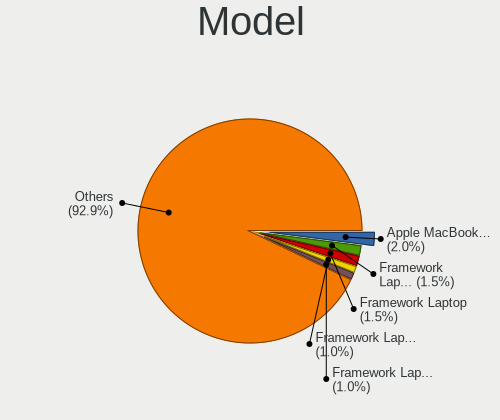
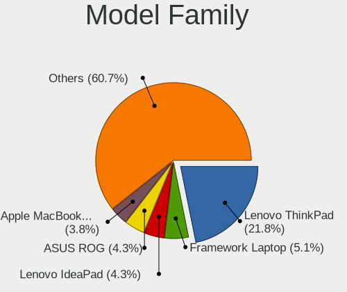
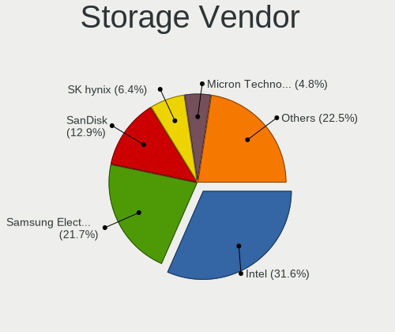
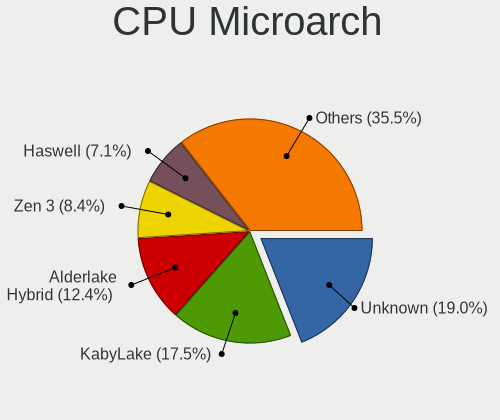

NixOS - Tested Hardware & Statistics (Notebooks)
------------------------------------------------

A project to collect tested hardware configurations for NixOS.

Anyone can contribute to this report by the [hw-probe](https://github.com/linuxhw/hw-probe) tool:

    sudo -E hw-probe -all -upload

Please contribute! Especially if your hardware is rare.

Contents
--------

* [ Test Cases ](#test-cases)

* [ System ](#system)
  - [ OS                       ](#os)
  - [ OS Family                ](#os-family)
  - [ Kernel                   ](#kernel)
  - [ Kernel Family            ](#kernel-family)
  - [ Kernel Major Ver.        ](#kernel-major-ver)
  - [ Arch                     ](#arch)
  - [ DE                       ](#de)
  - [ Display Server           ](#display-server)
  - [ Display Manager          ](#display-manager)
  - [ OS Lang                  ](#os-lang)
  - [ Boot Mode                ](#boot-mode)
  - [ Filesystem               ](#filesystem)
  - [ Part. scheme             ](#part-scheme)
  - [ Dual Boot with Linux/BSD ](#dual-boot-with-linuxbsd)
  - [ Dual Boot (Win)          ](#dual-boot-win)

* [ Board ](#board)
  - [ Vendor                   ](#vendor)
  - [ Model                    ](#model)
  - [ Model Family             ](#model-family)
  - [ MFG Year                 ](#mfg-year)
  - [ Form Factor              ](#form-factor)
  - [ Secure Boot              ](#secure-boot)
  - [ Coreboot                 ](#coreboot)
  - [ RAM Size                 ](#ram-size)
  - [ RAM Used                 ](#ram-used)
  - [ Total Drives             ](#total-drives)
  - [ Has CD-ROM               ](#has-cd-rom)
  - [ Has Ethernet             ](#has-ethernet)
  - [ Has WiFi                 ](#has-wifi)
  - [ Has Bluetooth            ](#has-bluetooth)

* [ Location ](#location)
  - [ Country                  ](#country)
  - [ City                     ](#city)

* [ Drives ](#drives)
  - [ Drive Vendor             ](#drive-vendor)
  - [ Drive Model              ](#drive-model)
  - [ HDD Vendor               ](#hdd-vendor)
  - [ SSD Vendor               ](#ssd-vendor)
  - [ Drive Kind               ](#drive-kind)
  - [ Drive Connector          ](#drive-connector)
  - [ Drive Size               ](#drive-size)
  - [ Space Total              ](#space-total)
  - [ Space Used               ](#space-used)
  - [ Malfunc. Drives          ](#malfunc-drives)
  - [ Malfunc. Drive Vendor    ](#malfunc-drive-vendor)
  - [ Malfunc. HDD Vendor      ](#malfunc-hdd-vendor)
  - [ Malfunc. Drive Kind      ](#malfunc-drive-kind)
  - [ Failed Drives            ](#failed-drives)
  - [ Failed Drive Vendor      ](#failed-drive-vendor)
  - [ Drive Status             ](#drive-status)

* [ Storage controller ](#storage-controller)
  - [ Storage Vendor           ](#storage-vendor)
  - [ Storage Model            ](#storage-model)
  - [ Storage Kind             ](#storage-kind)

* [ Processor ](#processor)
  - [ CPU Vendor               ](#cpu-vendor)
  - [ CPU Model                ](#cpu-model)
  - [ CPU Model Family         ](#cpu-model-family)
  - [ CPU Cores                ](#cpu-cores)
  - [ CPU Sockets              ](#cpu-sockets)
  - [ CPU Threads              ](#cpu-threads)
  - [ CPU Op-Modes             ](#cpu-op-modes)
  - [ CPU Microcode            ](#cpu-microcode)
  - [ CPU Microarch            ](#cpu-microarch)

* [ Graphics ](#graphics)
  - [ GPU Vendor               ](#gpu-vendor)
  - [ GPU Model                ](#gpu-model)
  - [ GPU Combo                ](#gpu-combo)
  - [ GPU Driver               ](#gpu-driver)
  - [ GPU Memory               ](#gpu-memory)

* [ Monitor ](#monitor)
  - [ Monitor Vendor           ](#monitor-vendor)
  - [ Monitor Model            ](#monitor-model)
  - [ Monitor Resolution       ](#monitor-resolution)
  - [ Monitor Diagonal         ](#monitor-diagonal)
  - [ Monitor Width            ](#monitor-width)
  - [ Aspect Ratio             ](#aspect-ratio)
  - [ Monitor Area             ](#monitor-area)
  - [ Pixel Density            ](#pixel-density)
  - [ Multiple Monitors        ](#multiple-monitors)

* [ Network ](#network)
  - [ Net Controller Vendor    ](#net-controller-vendor)
  - [ Net Controller Model     ](#net-controller-model)
  - [ Wireless Vendor          ](#wireless-vendor)
  - [ Wireless Model           ](#wireless-model)
  - [ Ethernet Vendor          ](#ethernet-vendor)
  - [ Ethernet Model           ](#ethernet-model)
  - [ Net Controller Kind      ](#net-controller-kind)
  - [ Used Controller          ](#used-controller)
  - [ NICs                     ](#nics)
  - [ IPv6                     ](#ipv6)

* [ Bluetooth ](#bluetooth)
  - [ Bluetooth Vendor         ](#bluetooth-vendor)
  - [ Bluetooth Model          ](#bluetooth-model)

* [ Sound ](#sound)
  - [ Sound Vendor             ](#sound-vendor)
  - [ Sound Model              ](#sound-model)

* [ Memory ](#memory)
  - [ Memory Vendor            ](#memory-vendor)
  - [ Memory Model             ](#memory-model)
  - [ Memory Kind              ](#memory-kind)
  - [ Memory Form Factor       ](#memory-form-factor)
  - [ Memory Size              ](#memory-size)
  - [ Memory Speed             ](#memory-speed)

* [ Printers & scanners ](#printers--scanners)
  - [ Printer Vendor           ](#printer-vendor)
  - [ Printer Model            ](#printer-model)
  - [ Scanner Vendor           ](#scanner-vendor)
  - [ Scanner Model            ](#scanner-model)

* [ Camera ](#camera)
  - [ Camera Vendor            ](#camera-vendor)
  - [ Camera Model             ](#camera-model)

* [ Security ](#security)
  - [ Fingerprint Vendor       ](#fingerprint-vendor)
  - [ Fingerprint Model        ](#fingerprint-model)
  - [ Chipcard Vendor          ](#chipcard-vendor)
  - [ Chipcard Model           ](#chipcard-model)

* [ Unsupported ](#unsupported)
  - [ Unsupported Devices      ](#unsupported-devices)
  - [ Unsupported Device Types ](#unsupported-device-types)

Test Cases
----------

Total: 78

| Vendor        | Model                       | Probe                                                      | Date         |
|---------------|-----------------------------|------------------------------------------------------------|--------------|
| Dell          | Precision M4800             | [505f1b47dc](https://linux-hardware.org/?probe=505f1b47dc) | Dec 30, 2022 |
| GPD           | WIN2                        | [d7d31b67d0](https://linux-hardware.org/?probe=d7d31b67d0) | Dec 28, 2022 |
| MSI           | Raider GE67HX 12UGS         | [84c6275c04](https://linux-hardware.org/?probe=84c6275c04) | Dec 25, 2022 |
| Dell          | XPS 15 7590                 | [e070540587](https://linux-hardware.org/?probe=e070540587) | Dec 16, 2022 |
| MECHREVO      | Code01 Ver2.0               | [e4ba0262b4](https://linux-hardware.org/?probe=e4ba0262b4) | Dec 16, 2022 |
| MECHREVO      | Code01 Ver2.0               | [1a9c49eb4f](https://linux-hardware.org/?probe=1a9c49eb4f) | Dec 16, 2022 |
| Framework     | Laptop (12th Gen Intel C... | [893190593e](https://linux-hardware.org/?probe=893190593e) | Dec 12, 2022 |
| ASUSTek       | ROG Zephyrus G14 GA401QM... | [d512bff9cc](https://linux-hardware.org/?probe=d512bff9cc) | Dec 04, 2022 |
| ASUSTek       | ROG Zephyrus G14 GA401QM... | [fef748b3f4](https://linux-hardware.org/?probe=fef748b3f4) | Dec 04, 2022 |
| Acer          | Aspire A315-54K             | [12f19e4fbe](https://linux-hardware.org/?probe=12f19e4fbe) | Nov 23, 2022 |
| Lenovo        | ThinkPad T14s Gen 3 21BR... | [0c889920b5](https://linux-hardware.org/?probe=0c889920b5) | Nov 12, 2022 |
| Dell          | Latitude E5540              | [f2420e40cd](https://linux-hardware.org/?probe=f2420e40cd) | Nov 06, 2022 |
| Dell          | Latitude E5540              | [2456786404](https://linux-hardware.org/?probe=2456786404) | Nov 06, 2022 |
| Lenovo        | Legion S7 15ACH6 82K8       | [b60f8a187c](https://linux-hardware.org/?probe=b60f8a187c) | Nov 04, 2022 |
| Dell          | Inspiron 5570               | [33d3e9ce22](https://linux-hardware.org/?probe=33d3e9ce22) | Nov 03, 2022 |
| Toshiba       | Satellite L50-B             | [c242c45dbe](https://linux-hardware.org/?probe=c242c45dbe) | Nov 01, 2022 |
| Lenovo        | IdeaPad 5 Pro 16ACH6 82L... | [d58a7c30a9](https://linux-hardware.org/?probe=d58a7c30a9) | Oct 26, 2022 |
| Lenovo        | ThinkPad E470 20H1006JIX    | [8bc8778497](https://linux-hardware.org/?probe=8bc8778497) | Oct 26, 2022 |
| Dell          | Precision 5760              | [4255007db8](https://linux-hardware.org/?probe=4255007db8) | Oct 18, 2022 |
| HP            | ZBook Studio G5             | [0a9b0167c7](https://linux-hardware.org/?probe=0a9b0167c7) | Oct 17, 2022 |
| Dell          | XPS 13 9310                 | [99232ffba3](https://linux-hardware.org/?probe=99232ffba3) | Oct 13, 2022 |
| Dell          | Inspiron 15 7510            | [263276babe](https://linux-hardware.org/?probe=263276babe) | Sep 30, 2022 |
| Dell          | Inspiron 15 7510            | [86e1da35ba](https://linux-hardware.org/?probe=86e1da35ba) | Sep 30, 2022 |
| Dell          | XPS 15 9570                 | [564eb3b439](https://linux-hardware.org/?probe=564eb3b439) | Sep 28, 2022 |
| Dell          | XPS 15 9570                 | [085bd81d5b](https://linux-hardware.org/?probe=085bd81d5b) | Sep 28, 2022 |
| Lenovo        | ThinkPad X1 Extreme 20MF... | [7fc4cdb860](https://linux-hardware.org/?probe=7fc4cdb860) | Sep 22, 2022 |
| Dell          | Precision M4800             | [fae4dbff63](https://linux-hardware.org/?probe=fae4dbff63) | Sep 13, 2022 |
| Apple         | MacBookPro11,5              | [305905e674](https://linux-hardware.org/?probe=305905e674) | Sep 07, 2022 |
| Apple         | MacBookPro11,5              | [19d3fab687](https://linux-hardware.org/?probe=19d3fab687) | Aug 21, 2022 |
| HP            | ProBook 445 G7              | [898a635cdd](https://linux-hardware.org/?probe=898a635cdd) | Aug 20, 2022 |
| HP            | ProBook 445 G7              | [28e67ea5a7](https://linux-hardware.org/?probe=28e67ea5a7) | Aug 20, 2022 |
| ASUSTek       | ASUSPRO P1440FAC_P1440FA    | [9351f31042](https://linux-hardware.org/?probe=9351f31042) | Aug 13, 2022 |
| Dell          | Latitude 7420               | [219cf18b1e](https://linux-hardware.org/?probe=219cf18b1e) | Jul 06, 2022 |
| Dell          | XPS 13 9310                 | [380770f287](https://linux-hardware.org/?probe=380770f287) | Jun 15, 2022 |
| Dell          | XPS 13 9310                 | [248f252b2a](https://linux-hardware.org/?probe=248f252b2a) | Jun 13, 2022 |
| Lenovo        | ThinkPad X230 23243E9       | [85ffd2561e](https://linux-hardware.org/?probe=85ffd2561e) | Jun 08, 2022 |
| Dell          | XPS 13 9305                 | [affa614c99](https://linux-hardware.org/?probe=affa614c99) | Jun 07, 2022 |
| Dell          | Latitude 7420               | [5be44c8aae](https://linux-hardware.org/?probe=5be44c8aae) | Jun 01, 2022 |
| Apple         | MacBookPro11,5              | [5cd59453b1](https://linux-hardware.org/?probe=5cd59453b1) | Apr 15, 2022 |
| Framework     | Laptop                      | [4997cab79b](https://linux-hardware.org/?probe=4997cab79b) | Apr 14, 2022 |
| HP            | ProBook 450 G4              | [2cb837e17f](https://linux-hardware.org/?probe=2cb837e17f) | Apr 14, 2022 |
| Lenovo        | ThinkPad T490 20N2000LUK    | [a394ce9693](https://linux-hardware.org/?probe=a394ce9693) | Apr 13, 2022 |
| HP            | ProBook 450 G4              | [fb5bcd7c77](https://linux-hardware.org/?probe=fb5bcd7c77) | Apr 13, 2022 |
| ASUSTek       | ROG Flow X13 GV301QE_GV3... | [502a8c9d32](https://linux-hardware.org/?probe=502a8c9d32) | Apr 13, 2022 |
| Lenovo        | ThinkPad X260 20F5S4BY00    | [729b19eda3](https://linux-hardware.org/?probe=729b19eda3) | Apr 13, 2022 |
| Lenovo        | Yoga Slim 7 13ACN5 82CY     | [4c96d9df2f](https://linux-hardware.org/?probe=4c96d9df2f) | Apr 02, 2022 |
| Lenovo        | ThinkPad T14s Gen 1 20UH... | [5570a879d3](https://linux-hardware.org/?probe=5570a879d3) | Mar 13, 2022 |
| Lenovo        | ThinkPad T14s Gen 1 20UH... | [d6cae900dc](https://linux-hardware.org/?probe=d6cae900dc) | Mar 13, 2022 |
| GPD           | MicroPC                     | [a572eb2b39](https://linux-hardware.org/?probe=a572eb2b39) | Mar 11, 2022 |
| HP            | EliteBook 845 G8 Noteboo... | [f031fb1a5a](https://linux-hardware.org/?probe=f031fb1a5a) | Mar 11, 2022 |
| Lenovo        | ThinkPad T540p 20BE005YM... | [6d0cd0f4b9](https://linux-hardware.org/?probe=6d0cd0f4b9) | Mar 10, 2022 |
| Lenovo        | ThinkPad X260 20F5S6MF02    | [5e026c07c0](https://linux-hardware.org/?probe=5e026c07c0) | Mar 10, 2022 |
| MSI           | Bravo 15 B5DD               | [273737b3d7](https://linux-hardware.org/?probe=273737b3d7) | Feb 25, 2022 |
| OBSIDIAN-P... | N13_N140ZU                  | [9f2fdbfce5](https://linux-hardware.org/?probe=9f2fdbfce5) | Feb 25, 2022 |
| Dell          | Latitude 7420               | [64178dcbb7](https://linux-hardware.org/?probe=64178dcbb7) | Feb 08, 2022 |
| Lenovo        | ThinkPad X390 20Q0CTO1WW    | [cf3fa03922](https://linux-hardware.org/?probe=cf3fa03922) | Jan 08, 2022 |
| Lenovo        | ThinkPad X390 20Q0CTO1WW    | [d62840031f](https://linux-hardware.org/?probe=d62840031f) | Jan 08, 2022 |
| Lenovo        | Legion 5 17ARH05H 82GN      | [9e022a2288](https://linux-hardware.org/?probe=9e022a2288) | Dec 26, 2021 |
| Lenovo        | Legion 5 17ARH05H 82GN      | [8ff8fb5efd](https://linux-hardware.org/?probe=8ff8fb5efd) | Dec 26, 2021 |
| ASUSTek       | ZenBook UX391FA_UX391FA     | [5fb4f1b6a6](https://linux-hardware.org/?probe=5fb4f1b6a6) | Nov 29, 2021 |
| Lenovo        | ThinkPad T14 Gen 1 20UD0... | [dbe8d36249](https://linux-hardware.org/?probe=dbe8d36249) | Nov 04, 2021 |
| Lenovo        | ThinkPad X250 20CLS18S0T    | [0151eadf78](https://linux-hardware.org/?probe=0151eadf78) | Oct 06, 2021 |
| HP            | ProBook 445 G7              | [36c94af49d](https://linux-hardware.org/?probe=36c94af49d) | Aug 09, 2021 |
| HP            | ProBook 445 G7              | [87a418ce6c](https://linux-hardware.org/?probe=87a418ce6c) | Aug 09, 2021 |
| ASUSTek       | ROG Zephyrus G14 GA401QM... | [3df83086ef](https://linux-hardware.org/?probe=3df83086ef) | Aug 07, 2021 |
| ASUSTek       | ROG Zephyrus G14 GA401QM... | [052ccd7a40](https://linux-hardware.org/?probe=052ccd7a40) | Aug 07, 2021 |
| ASUSTek       | ROG Zephyrus G14 GA401QM... | [48fd4d3b89](https://linux-hardware.org/?probe=48fd4d3b89) | Aug 06, 2021 |
| Dell          | Latitude 7420               | [0624aeffd1](https://linux-hardware.org/?probe=0624aeffd1) | Jul 19, 2021 |
| ASUSTek       | ROG Strix G533QR_G533QR     | [d14e0ef395](https://linux-hardware.org/?probe=d14e0ef395) | Jun 18, 2021 |
| Lenovo        | ThinkPad T480 20L5CTO1WW    | [fc12f446bb](https://linux-hardware.org/?probe=fc12f446bb) | May 23, 2021 |
| HP            | ZBook Studio G5             | [d323a9cfbf](https://linux-hardware.org/?probe=d323a9cfbf) | Apr 23, 2021 |
| Lenovo        | ThinkPad T460p 20FWCTO1W... | [38ab65a49b](https://linux-hardware.org/?probe=38ab65a49b) | Mar 18, 2021 |
| Lenovo        | ThinkPad T580 20L90024PB    | [8dc60fafaa](https://linux-hardware.org/?probe=8dc60fafaa) | Oct 13, 2020 |
| Dell          | XPS 15 9550                 | [5656cda6a4](https://linux-hardware.org/?probe=5656cda6a4) | Sep 01, 2020 |
| Dell          | XPS 15 9550                 | [550264c421](https://linux-hardware.org/?probe=550264c421) | Aug 22, 2020 |
| Lenovo        | ThinkPad T15 Gen 1 20S6C... | [71029187b1](https://linux-hardware.org/?probe=71029187b1) | Jul 03, 2020 |
| Acer          | Aspire E5-576G              | [c126c8b2fd](https://linux-hardware.org/?probe=c126c8b2fd) | Apr 15, 2020 |
| Gigabyte      | Sabre 15                    | [4f92cff461](https://linux-hardware.org/?probe=4f92cff461) | Jul 14, 2019 |

System
------

OS
--

Installed operating systems

| Name                             | Notebooks | Percent |
|----------------------------------|-----------|---------|
| NixOS 22.11                      | 18        | 30%     |
| NixOS 22.05                      | 18        | 30%     |
| NixOS 21.11                      | 9         | 15%     |
| NixOS                            | 2         | 3.33%   |
| NixOS 23.05                      | 1         | 1.67%   |
| NixOS 21.11pre302265.c6c4a3d45ab | 1         | 1.67%   |
| NixOS 21.11.20210606.fbfb794     | 1         | 1.67%   |
| NixOS 21.05.4384.4f37689c8a2     | 1         | 1.67%   |
| NixOS 21.05.3443.ee90403e147     | 1         | 1.67%   |
| NixOS 21.05.2132.733682c3292     | 1         | 1.67%   |
| NixOS 21.05.20210423.c21475e     | 1         | 1.67%   |
| NixOS 21.03.20200927.84d74ae     | 1         | 1.67%   |
| NixOS 20.09pre-git               | 1         | 1.67%   |
| NixOS 20.03.2351.f8248ab6d9e     | 1         | 1.67%   |
| NixOS 19.09.2522.75f4ba05c63     | 1         | 1.67%   |
| NixOS 19.09.2220.92231f4f32f     | 1         | 1.67%   |
| NixOS 19.03.173054.754763ff4ba   | 1         | 1.67%   |

OS Family
---------

OS without a version

| Name  | Notebooks | Percent |
|-------|-----------|---------|
| NixOS | 53        | 100%    |

Kernel
------

Version of the Linux kernel

| Version          | Notebooks | Percent |
|------------------|-----------|---------|
| 5.15.74          | 3         | 4.76%   |
| 5.15.43          | 3         | 4.76%   |
| 6.1.0            | 2         | 3.17%   |
| 6.0.10           | 2         | 3.17%   |
| 5.16.15          | 2         | 3.17%   |
| 5.15.72          | 2         | 3.17%   |
| 5.15.68          | 2         | 3.17%   |
| 5.15.64          | 2         | 3.17%   |
| 5.15.26          | 2         | 3.17%   |
| 5.13.7           | 2         | 3.17%   |
| 6.0.2-xanmod1-tt | 1         | 1.59%   |
| 6.0.11           | 1         | 1.59%   |
| 6.0.10-zen2      | 1         | 1.59%   |
| 6.0.0-xanmod1    | 1         | 1.59%   |
| 5.8.4            | 1         | 1.59%   |
| 5.8.16-hardened  | 1         | 1.59%   |
| 5.8.11           | 1         | 1.59%   |
| 5.7.4            | 1         | 1.59%   |
| 5.7.17           | 1         | 1.59%   |
| 5.4.24           | 1         | 1.59%   |
| 5.4.209          | 1         | 1.59%   |
| 5.4.187          | 1         | 1.59%   |
| 5.19.2           | 1         | 1.59%   |
| 5.19.17          | 1         | 1.59%   |
| 5.19.0           | 1         | 1.59%   |
| 5.18.7-zen1      | 1         | 1.59%   |
| 5.18.0           | 1         | 1.59%   |
| 5.17.1           | 1         | 1.59%   |
| 5.17.0           | 1         | 1.59%   |
| 5.16.8-zen1      | 1         | 1.59%   |
| 5.16.7           | 1         | 1.59%   |
| 5.16.3           | 1         | 1.59%   |
| 5.16.10          | 1         | 1.59%   |
| 5.15.75          | 1         | 1.59%   |
| 5.15.71          | 1         | 1.59%   |
| 5.15.59          | 1         | 1.59%   |
| 5.15.55          | 1         | 1.59%   |
| 5.15.4           | 1         | 1.59%   |
| 5.15.32          | 1         | 1.59%   |
| 5.15.3           | 1         | 1.59%   |

Kernel Family
-------------

Linux kernel without a distro release

| Version | Notebooks | Percent |
|---------|-----------|---------|
| 6.0.10  | 3         | 4.76%   |
| 5.15.74 | 3         | 4.76%   |
| 5.15.43 | 3         | 4.76%   |
| 6.1.0   | 2         | 3.17%   |
| 5.16.15 | 2         | 3.17%   |
| 5.15.72 | 2         | 3.17%   |
| 5.15.68 | 2         | 3.17%   |
| 5.15.64 | 2         | 3.17%   |
| 5.15.26 | 2         | 3.17%   |
| 5.13.7  | 2         | 3.17%   |
| 6.0.2   | 1         | 1.59%   |
| 6.0.11  | 1         | 1.59%   |
| 6.0.0   | 1         | 1.59%   |
| 5.8.4   | 1         | 1.59%   |
| 5.8.16  | 1         | 1.59%   |
| 5.8.11  | 1         | 1.59%   |
| 5.7.4   | 1         | 1.59%   |
| 5.7.17  | 1         | 1.59%   |
| 5.4.24  | 1         | 1.59%   |
| 5.4.209 | 1         | 1.59%   |
| 5.4.187 | 1         | 1.59%   |
| 5.19.2  | 1         | 1.59%   |
| 5.19.17 | 1         | 1.59%   |
| 5.19.0  | 1         | 1.59%   |
| 5.18.7  | 1         | 1.59%   |
| 5.18.0  | 1         | 1.59%   |
| 5.17.1  | 1         | 1.59%   |
| 5.17.0  | 1         | 1.59%   |
| 5.16.8  | 1         | 1.59%   |
| 5.16.7  | 1         | 1.59%   |
| 5.16.3  | 1         | 1.59%   |
| 5.16.10 | 1         | 1.59%   |
| 5.15.75 | 1         | 1.59%   |
| 5.15.71 | 1         | 1.59%   |
| 5.15.59 | 1         | 1.59%   |
| 5.15.55 | 1         | 1.59%   |
| 5.15.4  | 1         | 1.59%   |
| 5.15.32 | 1         | 1.59%   |
| 5.15.3  | 1         | 1.59%   |
| 5.15.25 | 1         | 1.59%   |

Kernel Major Ver.
-----------------

Linux kernel major version

| Version | Notebooks | Percent |
|---------|-----------|---------|
| 5.15    | 24        | 39.34%  |
| 6.0     | 6         | 9.84%   |
| 5.16    | 6         | 9.84%   |
| 5.8     | 3         | 4.92%   |
| 5.19    | 3         | 4.92%   |
| 5.13    | 3         | 4.92%   |
| 5.10    | 3         | 4.92%   |
| 6.1     | 2         | 3.28%   |
| 5.7     | 2         | 3.28%   |
| 5.4     | 2         | 3.28%   |
| 5.18    | 2         | 3.28%   |
| 5.17    | 2         | 3.28%   |
| 4.19    | 2         | 3.28%   |
| 5.12    | 1         | 1.64%   |

Arch
----

OS architecture (x86_64, i586, etc.)

| Name   | Notebooks | Percent |
|--------|-----------|---------|
| x86_64 | 53        | 100%    |

DE
--

Desktop Environment

| Name        | Notebooks | Percent |
|-------------|-----------|---------|
| Unknown     | 38        | 67.86%  |
| GNOME       | 5         | 8.93%   |
| sway        | 3         | 5.36%   |
| KDE5        | 3         | 5.36%   |
| XFCE        | 2         | 3.57%   |
| none+xmonad | 2         | 3.57%   |
| none+i3     | 1         | 1.79%   |
| none+bspwm  | 1         | 1.79%   |
| KDE         | 1         | 1.79%   |

Display Server
--------------

X11 or Wayland

| Name    | Notebooks | Percent |
|---------|-----------|---------|
| Unknown | 39        | 68.42%  |
| X11     | 10        | 17.54%  |
| Wayland | 7         | 12.28%  |
| Tty     | 1         | 1.75%   |

Display Manager
---------------

SDDM, LightDM, etc.

| Name    | Notebooks | Percent |
|---------|-----------|---------|
| Unknown | 39        | 72.22%  |
| SDDM    | 5         | 9.26%   |
| LightDM | 5         | 9.26%   |
| GDM     | 5         | 9.26%   |

OS Lang
-------

Language

| Lang    | Notebooks | Percent |
|---------|-----------|---------|
| Unknown | 30        | 56.6%   |
| en_US   | 18        | 33.96%  |
| ru_RU   | 1         | 1.89%   |
| ro_RO   | 1         | 1.89%   |
| fr_FR   | 1         | 1.89%   |
| en_GB   | 1         | 1.89%   |
| en_DK   | 1         | 1.89%   |

Boot Mode
---------

EFI or BIOS

| Mode | Notebooks | Percent |
|------|-----------|---------|
| EFI  | 46        | 86.79%  |
| BIOS | 7         | 13.21%  |

Filesystem
----------

Type of filesystem

| Type    | Notebooks | Percent |
|---------|-----------|---------|
| Ext4    | 29        | 51.79%  |
| Btrfs   | 11        | 19.64%  |
| Tmpfs   | 5         | 8.93%   |
| Zfs     | 4         | 7.14%   |
| Xfs     | 4         | 7.14%   |
| Unknown | 3         | 5.36%   |

Part. scheme
------------

Scheme of partitioning

| Type    | Notebooks | Percent |
|---------|-----------|---------|
| GPT     | 50        | 90.91%  |
| Unknown | 5         | 9.09%   |

Dual Boot with Linux/BSD
------------------------

Hosting more than one Linux/BSD

| Dual boot | Notebooks | Percent |
|-----------|-----------|---------|
| No        | 40        | 74.07%  |
| Yes       | 14        | 25.93%  |

Dual Boot (Win)
---------------

Hosting Linux and Windows

| Dual boot | Notebooks | Percent |
|-----------|-----------|---------|
| No        | 38        | 71.7%   |
| Yes       | 15        | 28.3%   |

Board
-----

Vendor
------

Motherboard manufacturer

| Name                | Notebooks | Percent |
|---------------------|-----------|---------|
| Lenovo              | 20        | 37.74%  |
| Dell                | 12        | 22.64%  |
| ASUSTek Computer    | 5         | 9.43%   |
| Hewlett-Packard     | 4         | 7.55%   |
| GPD                 | 2         | 3.77%   |
| Framework           | 2         | 3.77%   |
| Acer                | 2         | 3.77%   |
| Toshiba             | 1         | 1.89%   |
| OBSIDIAN-PC         | 1         | 1.89%   |
| MSI                 | 1         | 1.89%   |
| MECHREVO            | 1         | 1.89%   |
| Gigabyte Technology | 1         | 1.89%   |
| Apple               | 1         | 1.89%   |

Model
-----

Motherboard model

| Name                                   | Notebooks | Percent |
|----------------------------------------|-----------|---------|
| Dell Latitude 7420                     | 2         | 3.77%   |
| Toshiba Satellite L50-B                | 1         | 1.89%   |
| OBSIDIAN-PC N13_N140ZU                 | 1         | 1.89%   |
| MSI Bravo 15 B5DD                      | 1         | 1.89%   |
| MECHREVO Code01 Ver2.0                 | 1         | 1.89%   |
| Lenovo Yoga Slim 7 13ACN5 82CY         | 1         | 1.89%   |
| Lenovo ThinkPad X390 20Q0CTO1WW        | 1         | 1.89%   |
| Lenovo ThinkPad X260 20F5S6MF02        | 1         | 1.89%   |
| Lenovo ThinkPad X260 20F5S4BY00        | 1         | 1.89%   |
| Lenovo ThinkPad X250 20CLS18S0T        | 1         | 1.89%   |
| Lenovo ThinkPad X230 23243E9           | 1         | 1.89%   |
| Lenovo ThinkPad X1 Extreme 20MFCTO1WW  | 1         | 1.89%   |
| Lenovo ThinkPad T580 20L90024PB        | 1         | 1.89%   |
| Lenovo ThinkPad T540p 20BE005YMH       | 1         | 1.89%   |
| Lenovo ThinkPad T490 20N2000LUK        | 1         | 1.89%   |
| Lenovo ThinkPad T480 20L5CTO1WW        | 1         | 1.89%   |
| Lenovo ThinkPad T460p 20FWCTO1WW       | 1         | 1.89%   |
| Lenovo ThinkPad T15 Gen 1 20S6CTO1WW   | 1         | 1.89%   |
| Lenovo ThinkPad T14s Gen 3 21BR000MUS  | 1         | 1.89%   |
| Lenovo ThinkPad T14s Gen 1 20UH001AUK  | 1         | 1.89%   |
| Lenovo ThinkPad T14 Gen 1 20UD0013RT   | 1         | 1.89%   |
| Lenovo ThinkPad E470 20H1006JIX        | 1         | 1.89%   |
| Lenovo Legion S7 15ACH6 82K8           | 1         | 1.89%   |
| Lenovo Legion 5 17ARH05H 82GN          | 1         | 1.89%   |
| Lenovo IdeaPad 5 Pro 16ACH6 82L5       | 1         | 1.89%   |
| HP ZBook Studio G5                     | 1         | 1.89%   |
| HP ProBook 450 G4                      | 1         | 1.89%   |
| HP ProBook 445 G7                      | 1         | 1.89%   |
| HP EliteBook 845 G8 Notebook PC        | 1         | 1.89%   |
| GPD WIN2                               | 1         | 1.89%   |
| GPD MicroPC                            | 1         | 1.89%   |
| Gigabyte Sabre 15                      | 1         | 1.89%   |
| Framework Laptop (12th Gen Intel Core) | 1         | 1.89%   |
| Framework Laptop                       | 1         | 1.89%   |
| Dell XPS 15 9570                       | 1         | 1.89%   |
| Dell XPS 15 9550                       | 1         | 1.89%   |
| Dell XPS 15 7590                       | 1         | 1.89%   |
| Dell XPS 13 9310                       | 1         | 1.89%   |
| Dell XPS 13 9305                       | 1         | 1.89%   |
| Dell Precision M4800                   | 1         | 1.89%   |

Model Family
------------

Motherboard model prefix

| Name               | Notebooks | Percent |
|--------------------|-----------|---------|
| Lenovo ThinkPad    | 16        | 30.19%  |
| Dell XPS           | 5         | 9.43%   |
| Dell Latitude      | 3         | 5.66%   |
| ASUS ROG           | 3         | 5.66%   |
| Lenovo Legion      | 2         | 3.77%   |
| HP ProBook         | 2         | 3.77%   |
| Framework Laptop   | 2         | 3.77%   |
| Dell Precision     | 2         | 3.77%   |
| Dell Inspiron      | 2         | 3.77%   |
| Acer Aspire        | 2         | 3.77%   |
| Toshiba Satellite  | 1         | 1.89%   |
| OBSIDIAN-PC N13    | 1         | 1.89%   |
| MSI Bravo          | 1         | 1.89%   |
| MECHREVO Code01    | 1         | 1.89%   |
| Lenovo Yoga        | 1         | 1.89%   |
| Lenovo IdeaPad     | 1         | 1.89%   |
| HP ZBook           | 1         | 1.89%   |
| HP EliteBook       | 1         | 1.89%   |
| GPD WIN2           | 1         | 1.89%   |
| GPD MicroPC        | 1         | 1.89%   |
| Gigabyte Sabre     | 1         | 1.89%   |
| ASUS ZenBook       | 1         | 1.89%   |
| ASUS ASUSPRO       | 1         | 1.89%   |
| Apple MacBookPro11 | 1         | 1.89%   |

MFG Year
--------

Motherboard manufacture year

| Year | Notebooks | Percent |
|------|-----------|---------|
| 2021 | 11        | 20.75%  |
| 2020 | 9         | 16.98%  |
| 2019 | 8         | 15.09%  |
| 2018 | 6         | 11.32%  |
| 2016 | 6         | 11.32%  |
| 2022 | 3         | 5.66%   |
| 2017 | 3         | 5.66%   |
| 2015 | 2         | 3.77%   |
| 2014 | 2         | 3.77%   |
| 2013 | 2         | 3.77%   |
| 2012 | 1         | 1.89%   |

Form Factor
-----------

Physical design of the computer

| Name     | Notebooks | Percent |
|----------|-----------|---------|
| Notebook | 53        | 100%    |

Secure Boot
-----------

Enabled or disabled

| State    | Notebooks | Percent |
|----------|-----------|---------|
| Disabled | 53        | 98.15%  |
| Enabled  | 1         | 1.85%   |

Coreboot
--------

Have coreboot on board

| Used | Notebooks | Percent |
|------|-----------|---------|
| No   | 52        | 98.11%  |
| Yes  | 1         | 1.89%   |

RAM Size
--------

Total RAM memory

| Size in GB  | Notebooks | Percent |
|-------------|-----------|---------|
| 32.01-64.0  | 19        | 35.19%  |
| 16.01-24.0  | 14        | 25.93%  |
| 8.01-16.0   | 13        | 24.07%  |
| 4.01-8.0    | 5         | 9.26%   |
| 3.01-4.0    | 1         | 1.85%   |
| 24.01-32.0  | 1         | 1.85%   |
| 64.01-256.0 | 1         | 1.85%   |

RAM Used
--------

Used RAM memory

| Used GB    | Notebooks | Percent |
|------------|-----------|---------|
| 4.01-8.0   | 19        | 31.15%  |
| 2.01-3.0   | 11        | 18.03%  |
| 8.01-16.0  | 11        | 18.03%  |
| 3.01-4.0   | 10        | 16.39%  |
| 24.01-32.0 | 4         | 6.56%   |
| 1.01-2.0   | 3         | 4.92%   |
| 0.51-1.0   | 2         | 3.28%   |
| 32.01-64.0 | 1         | 1.64%   |

Total Drives
------------

Number of drives on board

| Drives | Notebooks | Percent |
|--------|-----------|---------|
| 1      | 42        | 77.78%  |
| 2      | 12        | 22.22%  |

Has CD-ROM
----------

Has CD-ROM on board

| Presented | Notebooks | Percent |
|-----------|-----------|---------|
| No        | 49        | 92.45%  |
| Yes       | 4         | 7.55%   |

Has Ethernet
------------

Has Ethernet on board

| Presented | Notebooks | Percent |
|-----------|-----------|---------|
| Yes       | 39        | 70.91%  |
| No        | 16        | 29.09%  |

Has WiFi
--------

Has WiFi module

| Presented | Notebooks | Percent |
|-----------|-----------|---------|
| Yes       | 52        | 98.11%  |
| No        | 1         | 1.89%   |

Has Bluetooth
-------------

Has Bluetooth module

| Presented | Notebooks | Percent |
|-----------|-----------|---------|
| Yes       | 48        | 87.27%  |
| No        | 7         | 12.73%  |

Location
--------

Country
-------

Geographic location (country)

| Country     | Notebooks | Percent |
|-------------|-----------|---------|
| France      | 7         | 13.21%  |
| USA         | 5         | 9.43%   |
| UK          | 5         | 9.43%   |
| Canada      | 4         | 7.55%   |
| Ukraine     | 3         | 5.66%   |
| Russia      | 3         | 5.66%   |
| Poland      | 3         | 5.66%   |
| Italy       | 3         | 5.66%   |
| Netherlands | 2         | 3.77%   |
| Germany     | 2         | 3.77%   |
| Belgium     | 2         | 3.77%   |
| Uruguay     | 1         | 1.89%   |
| Switzerland | 1         | 1.89%   |
| Sweden      | 1         | 1.89%   |
| Spain       | 1         | 1.89%   |
| Romania     | 1         | 1.89%   |
| Portugal    | 1         | 1.89%   |
| Iraq        | 1         | 1.89%   |
| Iran        | 1         | 1.89%   |
| India       | 1         | 1.89%   |
| Denmark     | 1         | 1.89%   |
| Czechia     | 1         | 1.89%   |
| Colombia    | 1         | 1.89%   |
| China       | 1         | 1.89%   |
| Austria     | 1         | 1.89%   |

City
----

Geographic location (city)

| City               | Notebooks | Percent |
|--------------------|-----------|---------|
| Ottawa             | 2         | 3.45%   |
| Marki              | 2         | 3.45%   |
| London             | 2         | 3.45%   |
| Halifax            | 2         | 3.45%   |
| Yangzhou           | 1         | 1.72%   |
| Woodford           | 1         | 1.72%   |
| Villeurbanne       | 1         | 1.72%   |
| Vienna             | 1         | 1.72%   |
| Verneuil-sur-Seine | 1         | 1.72%   |
| Valpacos           | 1         | 1.72%   |
| Trento             | 1         | 1.72%   |
| Tottenham          | 1         | 1.72%   |
| Tolyatti           | 1         | 1.72%   |
| Tehran             | 1         | 1.72%   |
| Stockholm          | 1         | 1.72%   |
| South Deerfield    | 1         | 1.72%   |
| Saratov            | 1         | 1.72%   |
| Rho                | 1         | 1.72%   |
| Prague             | 1         | 1.72%   |
| Plymouth           | 1         | 1.72%   |
| Pittsburgh         | 1         | 1.72%   |
| Odense             | 1         | 1.72%   |
| Nantes             | 1         | 1.72%   |
| Mykolayiv          | 1         | 1.72%   |
| Montpellier        | 1         | 1.72%   |
| Montevideo         | 1         | 1.72%   |
| Mons               | 1         | 1.72%   |
| Milwaukee          | 1         | 1.72%   |
| Melsele            | 1         | 1.72%   |
| Meaux              | 1         | 1.72%   |
| Lyon               | 1         | 1.72%   |
| Lehrte             | 1         | 1.72%   |
| Krakow             | 1         | 1.72%   |
| Kiel               | 1         | 1.72%   |
| Kharkiv            | 1         | 1.72%   |
| Islington          | 1         | 1.72%   |
| Irpin              | 1         | 1.72%   |
| Gurgaon            | 1         | 1.72%   |
| Getafe             | 1         | 1.72%   |
| Enschede           | 1         | 1.72%   |

Drives
------

Drive Vendor
------------

Hard drive vendors

| Vendor                      | Notebooks | Drives | Percent |
|-----------------------------|-----------|--------|---------|
| Samsung Electronics         | 21        | 26     | 32.81%  |
| WDC                         | 6         | 6      | 9.38%   |
| SK hynix                    | 6         | 9      | 9.38%   |
| Toshiba                     | 4         | 4      | 6.25%   |
| Sandisk                     | 4         | 4      | 6.25%   |
| Kingston                    | 3         | 3      | 4.69%   |
| Crucial                     | 3         | 4      | 4.69%   |
| Transcend                   | 2         | 2      | 3.13%   |
| Seagate                     | 2         | 3      | 3.13%   |
| Micron Technology           | 2         | 2      | 3.13%   |
| KIOXIA                      | 2         | 3      | 3.13%   |
| Kingston Technology Company | 2         | 2      | 3.13%   |
| Yangtze Memory Technologies | 1         | 1      | 1.56%   |
| Intel                       | 1         | 1      | 1.56%   |
| INNOVATION IT               | 1         | 1      | 1.56%   |
| HGST                        | 1         | 1      | 1.56%   |
| Dogfish                     | 1         | 1      | 1.56%   |
| BIWIN                       | 1         | 1      | 1.56%   |
| Apple                       | 1         | 3      | 1.56%   |

Drive Model
-----------

Hard drive models

| Model                                                 | Notebooks | Percent |
|-------------------------------------------------------|-----------|---------|
| SK hynix SKHynix_HFS001TDE9X084N 1024GB               | 2         | 3.03%   |
| Samsung SSD 850 EVO 500GB                             | 2         | 3.03%   |
| Samsung PM9A1 NVMe 1024GB                             | 2         | 3.03%   |
| Yangtze Memory ZHITAI TiPlus7100 2TB                  | 1         | 1.52%   |
| WDC WDS480G2G0B-00EPW0 480GB SSD                      | 1         | 1.52%   |
| WDC WDS200T1X0E-00AFY0 2TB                            | 1         | 1.52%   |
| WDC PC SN730 SDBPNTY-1T00-1101 1TB                    | 1         | 1.52%   |
| WDC PC SN720 SDAQNTW-512G-1001 512GB                  | 1         | 1.52%   |
| WDC PC SN530 SDBPTPZ-1T00-1002 1TB                    | 1         | 1.52%   |
| WDC PC SN530 SDBPNPZ-256G-1002 256GB                  | 1         | 1.52%   |
| Transcend TS256GMTS800 256GB SSD                      | 1         | 1.52%   |
| Transcend TS256GMTS430S 256GB SSD                     | 1         | 1.52%   |
| Toshiba MQ01ABD100 1TB                                | 1         | 1.52%   |
| Toshiba MK2565GSXV 250GB                              | 1         | 1.52%   |
| Toshiba KXG6AZNV512G 512GB                            | 1         | 1.52%   |
| Toshiba KXG50ZNV512G NVMe 512GB                       | 1         | 1.52%   |
| SK hynix SC311 SATA 256GB SSD                         | 1         | 1.52%   |
| SK hynix PC711 HFS512GDE9X073N 512GB                  | 1         | 1.52%   |
| SK hynix NVMe SSD Drive 1TB                           | 1         | 1.52%   |
| SK hynix NVMe SSD Drive 1024GB                        | 1         | 1.52%   |
| SK hynix HFM001TD3JX013N 1TB                          | 1         | 1.52%   |
| Seagate ST2000LM007-1R8174 2TB                        | 1         | 1.52%   |
| Seagate ST1000LM035-1RK172 1TB                        | 1         | 1.52%   |
| Sandisk WD Black SN850 1TB                            | 1         | 1.52%   |
| Sandisk WD Black 2018/SN750 / PC SN720 NVMe SSD 256GB | 1         | 1.52%   |
| SanDisk NVMe SSD Drive 1TB                            | 1         | 1.52%   |
| SanDisk 3.2 Gen 1 496GB SSD                           | 1         | 1.52%   |
| Samsung SSD 970 EVO Plus 1TB                          | 1         | 1.52%   |
| Samsung SSD 970 EVO 500GB                             | 1         | 1.52%   |
| Samsung SSD 870 EVO 500GB                             | 1         | 1.52%   |
| Samsung SSD 860 EVO 250GB                             | 1         | 1.52%   |
| Samsung SSD 860 EVO 1TB                               | 1         | 1.52%   |
| Samsung Portable SSD T5 500GB                         | 1         | 1.52%   |
| Samsung PM991a NVMe 512GB                             | 1         | 1.52%   |
| Samsung NVMe SSD Drive 512GB                          | 1         | 1.52%   |
| Samsung NVMe SSD Controller SM981/PM981/PM983 500GB   | 1         | 1.52%   |
| Samsung NVMe SSD Controller PM9A1/PM9A3/980PRO 2TB    | 1         | 1.52%   |
| Samsung MZVLB512HBJQ-000L7 512GB                      | 1         | 1.52%   |
| Samsung MZVLB512HAJQ-000H1 512GB                      | 1         | 1.52%   |
| Samsung MZVLB512HAJQ-00000 512GB                      | 1         | 1.52%   |

HDD Vendor
----------

Hard disk drive vendors

| Vendor  | Notebooks | Drives | Percent |
|---------|-----------|--------|---------|
| Toshiba | 2         | 2      | 40%     |
| Seagate | 2         | 3      | 40%     |
| HGST    | 1         | 1      | 20%     |

SSD Vendor
----------

Solid state drive vendors

| Vendor              | Notebooks | Drives | Percent |
|---------------------|-----------|--------|---------|
| Samsung Electronics | 8         | 8      | 38.1%   |
| Transcend           | 2         | 2      | 9.52%   |
| Crucial             | 2         | 3      | 9.52%   |
| WDC                 | 1         | 1      | 4.76%   |
| SK hynix            | 1         | 1      | 4.76%   |
| SanDisk             | 1         | 1      | 4.76%   |
| Micron Technology   | 1         | 1      | 4.76%   |
| Kingston            | 1         | 1      | 4.76%   |
| INNOVATION IT       | 1         | 1      | 4.76%   |
| Dogfish             | 1         | 1      | 4.76%   |
| BIWIN               | 1         | 1      | 4.76%   |
| Apple               | 1         | 3      | 4.76%   |

Drive Kind
----------

HDD or SSD

| Kind | Notebooks | Drives | Percent |
|------|-----------|--------|---------|
| NVMe | 36        | 47     | 60%     |
| SSD  | 19        | 24     | 31.67%  |
| HDD  | 5         | 6      | 8.33%   |

Drive Connector
---------------

SATA, SAS, NVMe, etc.

| Type | Notebooks | Drives | Percent |
|------|-----------|--------|---------|
| NVMe | 36        | 47     | 63.16%  |
| SATA | 19        | 28     | 33.33%  |
| SAS  | 2         | 2      | 3.51%   |

Drive Size
----------

Size of hard drive

| Size in TB | Notebooks | Drives | Percent |
|------------|-----------|--------|---------|
| 0.01-0.5   | 15        | 19     | 62.5%   |
| 0.51-1.0   | 8         | 10     | 33.33%  |
| 1.01-2.0   | 1         | 1      | 4.17%   |

Space Total
-----------

Amount of disk space available on the file system

| Size in GB     | Notebooks | Percent |
|----------------|-----------|---------|
| Unknown        | 31        | 56.36%  |
| 1-20           | 9         | 16.36%  |
| 251-500        | 4         | 7.27%   |
| 501-1000       | 3         | 5.45%   |
| More than 3000 | 2         | 3.64%   |
| 2001-3000      | 2         | 3.64%   |
| 101-250        | 2         | 3.64%   |
| 1001-2000      | 2         | 3.64%   |

Space Used
----------

Amount of used disk space

| Used GB   | Notebooks | Percent |
|-----------|-----------|---------|
| Unknown   | 31        | 56.36%  |
| 1-20      | 11        | 20%     |
| 101-250   | 7         | 12.73%  |
| 251-500   | 3         | 5.45%   |
| 1001-2000 | 1         | 1.82%   |
| 501-1000  | 1         | 1.82%   |
| 51-100    | 1         | 1.82%   |

Malfunc. Drives
---------------

Drive models with a malfunction

| Model                                          | Notebooks | Drives | Percent |
|------------------------------------------------|-----------|--------|---------|
| Toshiba MQ01ABD100 1TB                         | 1         | 1      | 25%     |
| Toshiba MK2565GSXV 250GB                       | 1         | 1      | 25%     |
| SK hynix PC711 HFS512GDE9X073N 512GB           | 1         | 1      | 25%     |
| Micron Technology 1100_MTFDDAV256TBN 256GB SSD | 1         | 1      | 25%     |

Malfunc. Drive Vendor
---------------------

Vendors of faulty drives

| Vendor            | Notebooks | Drives | Percent |
|-------------------|-----------|--------|---------|
| Toshiba           | 2         | 2      | 50%     |
| SK hynix          | 1         | 1      | 25%     |
| Micron Technology | 1         | 1      | 25%     |

Malfunc. HDD Vendor
-------------------

Vendors of faulty HDD drives

| Vendor  | Notebooks | Drives | Percent |
|---------|-----------|--------|---------|
| Toshiba | 2         | 2      | 100%    |

Malfunc. Drive Kind
-------------------

Kinds of faulty drives

| Kind | Notebooks | Drives | Percent |
|------|-----------|--------|---------|
| HDD  | 2         | 2      | 50%     |
| NVMe | 1         | 1      | 25%     |
| SSD  | 1         | 1      | 25%     |

Failed Drives
-------------

Failed drive models

Zero info for selected period =(

Failed Drive Vendor
-------------------

Failed drive vendors

Zero info for selected period =(

Drive Status
------------

Number of failed and malfunc. drives

| Status   | Notebooks | Drives | Percent |
|----------|-----------|--------|---------|
| Works    | 49        | 63     | 81.67%  |
| Detected | 7         | 10     | 11.67%  |
| Malfunc  | 4         | 4      | 6.67%   |

Storage controller
------------------

Storage Vendor
--------------

Storage controller vendors

| Vendor                       | Notebooks | Percent |
|------------------------------|-----------|---------|
| Intel                        | 26        | 38.24%  |
| Samsung Electronics          | 15        | 22.06%  |
| SanDisk                      | 8         | 11.76%  |
| SK hynix                     | 5         | 7.35%   |
| Kingston Technology Company  | 4         | 5.88%   |
| Toshiba America Info Systems | 3         | 4.41%   |
| AMD                          | 3         | 4.41%   |
| Yangtze Memory Technologies  | 1         | 1.47%   |
| Micron/Crucial Technology    | 1         | 1.47%   |
| Micron Technology            | 1         | 1.47%   |
| KIOXIA                       | 1         | 1.47%   |

Storage Model
-------------

Storage controller models

| Model                                                                          | Notebooks | Percent |
|--------------------------------------------------------------------------------|-----------|---------|
| Samsung NVMe SSD Controller SM981/PM981/PM983                                  | 9         | 13.24%  |
| Intel Sunrise Point-LP SATA Controller [AHCI mode]                             | 7         | 10.29%  |
| SK hynix Gold P31/PC711 NVMe Solid State Drive                                 | 5         | 7.35%   |
| Samsung NVMe SSD Controller PM9A1/PM9A3/980PRO                                 | 3         | 4.41%   |
| Intel HM170/QM170 Chipset SATA Controller [AHCI Mode]                          | 3         | 4.41%   |
| Intel Cannon Lake Mobile PCH SATA AHCI Controller                              | 3         | 4.41%   |
| Intel 82801 Mobile SATA Controller [RAID mode]                                 | 3         | 4.41%   |
| AMD FCH SATA Controller [AHCI mode]                                            | 3         | 4.41%   |
| Toshiba America Info Systems XG6 NVMe SSD Controller                           | 2         | 2.94%   |
| SanDisk WD PC SN810 / Black SN850 NVMe SSD                                     | 2         | 2.94%   |
| SanDisk WD Black 2018/SN750 / PC SN720 NVMe SSD                                | 2         | 2.94%   |
| SanDisk Non-Volatile memory controller                                         | 2         | 2.94%   |
| Kingston Company Company Non-Volatile memory controller                        | 2         | 2.94%   |
| Intel Wildcat Point-LP SATA Controller [AHCI Mode]                             | 2         | 2.94%   |
| Intel Volume Management Device NVMe RAID Controller                            | 2         | 2.94%   |
| Yangtze Memory Non-Volatile memory controller                                  | 1         | 1.47%   |
| Toshiba America Info Systems XG5 NVMe SSD Controller                           | 1         | 1.47%   |
| SanDisk WD Blue SN550 NVMe SSD                                                 | 1         | 1.47%   |
| SanDisk WD Black SN750 / PC SN730 NVMe SSD                                     | 1         | 1.47%   |
| Samsung NVMe SSD Controller SM951/PM951                                        | 1         | 1.47%   |
| Samsung NVMe SSD Controller 980                                                | 1         | 1.47%   |
| Samsung Electronics SATA controller                                            | 1         | 1.47%   |
| Micron/Crucial P5 Plus NVMe PCIe SSD                                           | 1         | 1.47%   |
| Micron Non-Volatile memory controller                                          | 1         | 1.47%   |
| KIOXIA NVMe SSD Controller BG4                                                 | 1         | 1.47%   |
| Kingston Company U-SNS8154P3 NVMe SSD                                          | 1         | 1.47%   |
| Kingston Company OM3PDP3 NVMe SSD                                              | 1         | 1.47%   |
| Intel SSD Pro 7600p/760p/E 6100p Series                                        | 1         | 1.47%   |
| Intel Comet Lake SATA AHCI Controller                                          | 1         | 1.47%   |
| Intel Celeron/Pentium Silver Processor SATA Controller                         | 1         | 1.47%   |
| Intel Cannon Point-LP SATA Controller [AHCI Mode]                              | 1         | 1.47%   |
| Intel 8 Series/C220 Series Chipset Family 6-port SATA Controller 1 [AHCI mode] | 1         | 1.47%   |
| Intel 7 Series Chipset Family 6-port SATA Controller [AHCI mode]               | 1         | 1.47%   |

Storage Kind
------------

Kind of storage controller (IDE, SATA, NVMe, SAS, ...)

| Kind | Notebooks | Percent |
|------|-----------|---------|
| NVMe | 36        | 55.38%  |
| SATA | 24        | 36.92%  |
| RAID | 5         | 7.69%   |

Processor
---------

CPU Vendor
----------

Processor vendors

| Vendor | Notebooks | Percent |
|--------|-----------|---------|
| Intel  | 40        | 75.47%  |
| AMD    | 13        | 24.53%  |

CPU Model
---------

Processor models

| Model                                      | Notebooks | Percent |
|--------------------------------------------|-----------|---------|
| Intel Core i7-8550U CPU @ 1.80GHz          | 4         | 7.55%   |
| Intel Core i7-8565U CPU @ 1.80GHz          | 3         | 5.66%   |
| Intel Core i5-6300U CPU @ 2.40GHz          | 3         | 5.66%   |
| Intel 11th Gen Core i7-1185G7 @ 3.00GHz    | 3         | 5.66%   |
| AMD Ryzen 7 5800H with Radeon Graphics     | 3         | 5.66%   |
| Intel Core i7-8750H CPU @ 2.20GHz          | 2         | 3.77%   |
| Intel Core i7-7500U CPU @ 2.70GHz          | 2         | 3.77%   |
| Intel 11th Gen Core i7-1165G7 @ 2.80GHz    | 2         | 3.77%   |
| AMD Ryzen 7 PRO 4750U with Radeon Graphics | 2         | 3.77%   |
| Intel Xeon E-2176M CPU @ 2.70GHz           | 1         | 1.89%   |
| Intel Core m3-8100Y CPU @ 1.10GHz          | 1         | 1.89%   |
| Intel Core i9-9980HK CPU @ 2.40GHz         | 1         | 1.89%   |
| Intel Core i7-7700HQ CPU @ 2.80GHz         | 1         | 1.89%   |
| Intel Core i7-6820HQ CPU @ 2.70GHz         | 1         | 1.89%   |
| Intel Core i7-6700HQ CPU @ 2.60GHz         | 1         | 1.89%   |
| Intel Core i7-5600U CPU @ 2.60GHz          | 1         | 1.89%   |
| Intel Core i7-5500U CPU @ 2.40GHz          | 1         | 1.89%   |
| Intel Core i7-4910MQ CPU @ 2.90GHz         | 1         | 1.89%   |
| Intel Core i7-4870HQ CPU @ 2.50GHz         | 1         | 1.89%   |
| Intel Core i7-4700MQ CPU @ 2.40GHz         | 1         | 1.89%   |
| Intel Core i7-10510U CPU @ 1.80GHz         | 1         | 1.89%   |
| Intel Core i5-8265U CPU @ 1.60GHz          | 1         | 1.89%   |
| Intel Core i5-4300U CPU @ 1.90GHz          | 1         | 1.89%   |
| Intel Core i5-3320M CPU @ 2.60GHz          | 1         | 1.89%   |
| Intel Core i3-10110U CPU @ 2.10GHz         | 1         | 1.89%   |
| Intel Celeron N4100 CPU @ 1.10GHz          | 1         | 1.89%   |
| Intel 12th Gen Core i7-1270P               | 1         | 1.89%   |
| Intel 12th Gen Core i5-1240P               | 1         | 1.89%   |
| Intel 11th Gen Core i7-11850H @ 2.50GHz    | 1         | 1.89%   |
| Intel 11th Gen Core i7-11800H @ 2.30GHz    | 1         | 1.89%   |
| AMD Ryzen 9 5900HX with Radeon Graphics    | 1         | 1.89%   |
| AMD Ryzen 9 5900HS with Radeon Graphics    | 1         | 1.89%   |
| AMD Ryzen 7 PRO 5850U with Radeon Graphics | 1         | 1.89%   |
| AMD Ryzen 7 6800H with Radeon Graphics     | 1         | 1.89%   |
| AMD Ryzen 7 5800U with Radeon Graphics     | 1         | 1.89%   |
| AMD Ryzen 7 5800HS with Radeon Graphics    | 1         | 1.89%   |
| AMD Ryzen 7 4800H with Radeon Graphics     | 1         | 1.89%   |
| AMD Ryzen 7 4700U with Radeon Graphics     | 1         | 1.89%   |

CPU Model Family
----------------

Processor model prefix

| Model           | Notebooks | Percent |
|-----------------|-----------|---------|
| Intel Core i7   | 20        | 37.74%  |
| Other           | 9         | 16.98%  |
| AMD Ryzen 7     | 8         | 15.09%  |
| Intel Core i5   | 6         | 11.32%  |
| AMD Ryzen 7 PRO | 3         | 5.66%   |
| AMD Ryzen 9     | 2         | 3.77%   |
| Intel Xeon      | 1         | 1.89%   |
| Intel Core m3   | 1         | 1.89%   |
| Intel Core i9   | 1         | 1.89%   |
| Intel Core i3   | 1         | 1.89%   |
| Intel Celeron   | 1         | 1.89%   |

CPU Cores
---------

Number of processor cores

| Number | Notebooks | Percent |
|--------|-----------|---------|
| 4      | 21        | 39.62%  |
| 8      | 16        | 30.19%  |
| 2      | 11        | 20.75%  |
| 6      | 3         | 5.66%   |
| 12     | 2         | 3.77%   |

CPU Sockets
-----------

Number of sockets

| Number | Notebooks | Percent |
|--------|-----------|---------|
| 1      | 53        | 100%    |

CPU Threads
-----------

Threads per core (Hyper-Threading)

| Number | Notebooks | Percent |
|--------|-----------|---------|
| 2      | 51        | 96.23%  |
| 1      | 2         | 3.77%   |

CPU Op-Modes
------------

CPU Operation Modes (32-bit, 64-bit)

| Op mode        | Notebooks | Percent |
|----------------|-----------|---------|
| 32-bit, 64-bit | 53        | 98.15%  |
| Unknown        | 1         | 1.85%   |

CPU Microcode
-------------

Microcode number

| Number     | Notebooks | Percent |
|------------|-----------|---------|
| Unknown    | 8         | 14.81%  |
| 0x0a50000c | 7         | 12.96%  |
| 0x806ea    | 4         | 7.41%   |
| 0x806c1    | 4         | 7.41%   |
| 0x806ec    | 3         | 5.56%   |
| 0x08600106 | 3         | 5.56%   |
| 0x906ea    | 2         | 3.7%    |
| 0x906a3    | 2         | 3.7%    |
| 0x806eb    | 2         | 3.7%    |
| 0x806e9    | 2         | 3.7%    |
| 0x406e3    | 2         | 3.7%    |
| 0x306d4    | 2         | 3.7%    |
| 0x306c3    | 2         | 3.7%    |
| 0x906ed    | 1         | 1.85%   |
| 0x906e9    | 1         | 1.85%   |
| 0x806d1    | 1         | 1.85%   |
| 0x706a1    | 1         | 1.85%   |
| 0x506e3    | 1         | 1.85%   |
| 0x40661    | 1         | 1.85%   |
| 0x40651    | 1         | 1.85%   |
| 0x306a9    | 1         | 1.85%   |
| 0x0a50000b | 1         | 1.85%   |
| 0x0a404102 | 1         | 1.85%   |
| 0x08600104 | 1         | 1.85%   |

CPU Microarch
-------------

Microarchitecture

| Name             | Notebooks | Percent |
|------------------|-----------|---------|
| KabyLake         | 18        | 33.96%  |
| Zen 3            | 8         | 15.09%  |
| TigerLake        | 5         | 9.43%   |
| Skylake          | 5         | 9.43%   |
| Zen 2            | 4         | 7.55%   |
| Haswell          | 4         | 7.55%   |
| Broadwell        | 2         | 3.77%   |
| Alderlake Hybrid | 2         | 3.77%   |
| Unknown          | 2         | 3.77%   |
| IvyBridge        | 1         | 1.89%   |
| Icelake          | 1         | 1.89%   |
| Goldmont plus    | 1         | 1.89%   |

Graphics
--------

GPU Vendor
----------

Vendors of graphics cards

| Vendor | Notebooks | Percent |
|--------|-----------|---------|
| Intel  | 38        | 50.67%  |
| Nvidia | 21        | 28%     |
| AMD    | 16        | 21.33%  |

GPU Model
---------

Graphics card models

| Model                                                                                 | Notebooks | Percent |
|---------------------------------------------------------------------------------------|-----------|---------|
| AMD Cezanne [Radeon Vega Series / Radeon Vega Mobile Series]                          | 8         | 10.53%  |
| Intel TigerLake-LP GT2 [Iris Xe Graphics]                                             | 5         | 6.58%   |
| Intel WhiskeyLake-U GT2 [UHD Graphics 620]                                            | 4         | 5.26%   |
| Intel UHD Graphics 620                                                                | 4         | 5.26%   |
| AMD Renoir                                                                            | 4         | 5.26%   |
| Nvidia GP107M [GeForce GTX 1050 Ti Mobile]                                            | 3         | 3.95%   |
| Intel Skylake GT2 [HD Graphics 520]                                                   | 3         | 3.95%   |
| Intel CoffeeLake-H GT2 [UHD Graphics 630]                                             | 3         | 3.95%   |
| Nvidia GP108M [GeForce MX150]                                                         | 2         | 2.63%   |
| Nvidia GM108M [GeForce 940MX]                                                         | 2         | 2.63%   |
| Nvidia GA107M [GeForce RTX 3050 Mobile]                                               | 2         | 2.63%   |
| Nvidia GA106M [GeForce RTX 3060 Mobile / Max-Q]                                       | 2         | 2.63%   |
| Intel TigerLake-H GT1 [UHD Graphics]                                                  | 2         | 2.63%   |
| Intel HD Graphics 620                                                                 | 2         | 2.63%   |
| Intel HD Graphics 5500                                                                | 2         | 2.63%   |
| Intel HD Graphics 530                                                                 | 2         | 2.63%   |
| Intel CometLake-U GT2 [UHD Graphics]                                                  | 2         | 2.63%   |
| Intel Alder Lake-P Integrated Graphics Controller                                     | 2         | 2.63%   |
| Intel 4th Gen Core Processor Integrated Graphics Controller                           | 2         | 2.63%   |
| AMD Topaz XT [Radeon R7 M260/M265 / M340/M360 / M440/M445 / 530/535 / 620/625 Mobile] | 2         | 2.63%   |
| Nvidia TU117M [GeForce GTX 1650 Mobile / Max-Q]                                       | 1         | 1.32%   |
| Nvidia TU116M [GeForce GTX 1660 Ti Mobile]                                            | 1         | 1.32%   |
| Nvidia GP107GLM [Quadro P1000 Mobile]                                                 | 1         | 1.32%   |
| Nvidia GM108M [GeForce 930MX]                                                         | 1         | 1.32%   |
| Nvidia GM107M [GeForce GTX 960M]                                                      | 1         | 1.32%   |
| Nvidia GK208M [GeForce GT 730M]                                                       | 1         | 1.32%   |
| Nvidia GK106GLM [Quadro K2100M]                                                       | 1         | 1.32%   |
| Nvidia GA107M [GeForce RTX 3050 Ti Mobile]                                            | 1         | 1.32%   |
| Nvidia GA104M [GeForce RTX 3070 Mobile / Max-Q]                                       | 1         | 1.32%   |
| Nvidia GA104GLM [RTX A3000 Mobile]                                                    | 1         | 1.32%   |
| Intel UHD Graphics 615                                                                | 1         | 1.32%   |
| Intel HD Graphics 630                                                                 | 1         | 1.32%   |
| Intel Haswell-ULT Integrated Graphics Controller                                      | 1         | 1.32%   |
| Intel GeminiLake [UHD Graphics 600]                                                   | 1         | 1.32%   |
| Intel 3rd Gen Core processor Graphics Controller                                      | 1         | 1.32%   |
| AMD Venus XT [Radeon HD 8870M / R9 M270X/M370X]                                       | 1         | 1.32%   |
| AMD Rembrandt [Radeon 680M]                                                           | 1         | 1.32%   |
| AMD Navi 14 [Radeon RX 5500/5500M / Pro 5500M]                                        | 1         | 1.32%   |

GPU Combo
---------

Combinations of graphics cards

| Name           | Notebooks | Percent |
|----------------|-----------|---------|
| 1 x Intel      | 22        | 41.51%  |
| Intel + Nvidia | 14        | 26.42%  |
| 1 x AMD        | 7         | 13.21%  |
| AMD + Nvidia   | 6         | 11.32%  |
| Intel + AMD    | 2         | 3.77%   |
| 2 x AMD        | 1         | 1.89%   |
| 1 x Nvidia     | 1         | 1.89%   |

GPU Driver
----------

Free vs proprietary

| Driver      | Notebooks | Percent |
|-------------|-----------|---------|
| Free        | 43        | 79.63%  |
| Proprietary | 9         | 16.67%  |
| Unknown     | 2         | 3.7%    |

GPU Memory
----------

Total video memory

| Size in GB | Notebooks | Percent |
|------------|-----------|---------|
| Unknown    | 32        | 58.18%  |
| 0.01-0.5   | 9         | 16.36%  |
| 1.01-2.0   | 7         | 12.73%  |
| 3.01-4.0   | 6         | 10.91%  |
| 0.51-1.0   | 1         | 1.82%   |

Monitor
-------

Monitor Vendor
--------------

Monitor vendors

| Vendor              | Notebooks | Percent |
|---------------------|-----------|---------|
| AU Optronics        | 12        | 17.65%  |
| LG Display          | 8         | 11.76%  |
| Dell                | 8         | 11.76%  |
| BOE                 | 7         | 10.29%  |
| Samsung Electronics | 5         | 7.35%   |
| Sharp               | 4         | 5.88%   |
| Chimei Innolux      | 4         | 5.88%   |
| PANDA               | 3         | 4.41%   |
| CSO                 | 3         | 4.41%   |
| InfoVision          | 2         | 2.94%   |
| Hewlett-Packard     | 2         | 2.94%   |
| Philips             | 1         | 1.47%   |
| Panasonic           | 1         | 1.47%   |
| Lenovo              | 1         | 1.47%   |
| JDI                 | 1         | 1.47%   |
| Goldstar            | 1         | 1.47%   |
| Eizo                | 1         | 1.47%   |
| ASUSTek Computer    | 1         | 1.47%   |
| Apple               | 1         | 1.47%   |
| AOC                 | 1         | 1.47%   |
| Acer                | 1         | 1.47%   |

Monitor Model
-------------

Monitor models

| Model                                                                 | Notebooks | Percent |
|-----------------------------------------------------------------------|-----------|---------|
| Dell P2418D DELD0C1 2560x1440 526x296mm 23.8-inch                     | 2         | 2.94%   |
| BOE LCD Monitor BOE095F 2256x1504 285x190mm 13.5-inch                 | 2         | 2.94%   |
| AU Optronics LCD Monitor AUO4A90 1920x1080 309x174mm 14.0-inch        | 2         | 2.94%   |
| Sharp LQ134N1JW52 SHP151E 1920x1200 288x180mm 13.4-inch               | 1         | 1.47%   |
| Sharp LCD Monitor SHP14FA 3840x2400 288x180mm 13.4-inch               | 1         | 1.47%   |
| Sharp LCD Monitor SHP149A 1920x1080 344x194mm 15.5-inch               | 1         | 1.47%   |
| Sharp LCD Monitor SHP143E 3840x2160 346x194mm 15.6-inch               | 1         | 1.47%   |
| Samsung Electronics S34J55x SAM0F70 3440x1440 797x333mm 34.0-inch     | 1         | 1.47%   |
| Samsung Electronics S24B300 SAM08B3 1920x1080 521x293mm 23.5-inch     | 1         | 1.47%   |
| Samsung Electronics LCD Monitor SDCA029 3840x2160 344x194mm 15.5-inch | 1         | 1.47%   |
| Samsung Electronics LCD Monitor SAM07C0 1920x1080 890x500mm 40.2-inch | 1         | 1.47%   |
| Samsung Electronics C32F39M SAM100B 1920x1080 698x393mm 31.5-inch     | 1         | 1.47%   |
| Philips PHL 276E8V PHLC18F 3840x2160 600x340mm 27.2-inch              | 1         | 1.47%   |
| PANDA LM156LF1L03 NCP001C 1920x1080 344x194mm 15.5-inch               | 1         | 1.47%   |
| PANDA LCD Monitor NCP0062 1920x1080 309x174mm 14.0-inch               | 1         | 1.47%   |
| PANDA LCD Monitor NCP005E 1920x1080 309x174mm 14.0-inch               | 1         | 1.47%   |
| Panasonic LCD Monitor MEI96A2 2880x1620 344x193mm 15.5-inch           | 1         | 1.47%   |
| LG Display LCD Monitor LGD0649 2560x1600 286x179mm 13.3-inch          | 1         | 1.47%   |
| LG Display LCD Monitor LGD060F 1920x1080 309x174mm 14.0-inch          | 1         | 1.47%   |
| LG Display LCD Monitor LGD0533 1920x1080 344x194mm 15.5-inch          | 1         | 1.47%   |
| LG Display LCD Monitor LGD0504 1366x768 344x194mm 15.5-inch           | 1         | 1.47%   |
| LG Display LCD Monitor LGD049A 2560x1440 310x174mm 14.0-inch          | 1         | 1.47%   |
| LG Display LCD Monitor LGD046F 1920x1080 344x194mm 15.5-inch          | 1         | 1.47%   |
| LG Display LCD Monitor LGD045C 1366x768 345x194mm 15.6-inch           | 1         | 1.47%   |
| LG Display LCD Monitor LGD0437 1920x1080 276x156mm 12.5-inch          | 1         | 1.47%   |
| Lenovo LCD Monitor LEN40BA 1920x1080 344x194mm 15.5-inch              | 1         | 1.47%   |
| JDI LCD Monitor JDI385A 3840x2160 294x165mm 13.3-inch                 | 1         | 1.47%   |
| InfoVision LCD Monitor IVO8C78 1920x1080 309x174mm 14.0-inch          | 1         | 1.47%   |
| InfoVision LCD Monitor IVO04E5 1366x768 276x155mm 12.5-inch           | 1         | 1.47%   |
| Hewlett-Packard Z27 HPN3538 1920x1200 600x340mm 27.2-inch             | 1         | 1.47%   |
| Hewlett-Packard Z27 HPN3535 3840x2160 597x336mm 27.0-inch             | 1         | 1.47%   |
| Goldstar ULTRAGEAR GSM774A 3440x1440 800x335mm 34.1-inch              | 1         | 1.47%   |
| Eizo L568 ENC1734 1280x1024 338x270mm 17.0-inch                       | 1         | 1.47%   |
| Dell U2717D DEL40EB 2560x1440 597x336mm 27.0-inch                     | 1         | 1.47%   |
| Dell S3220DGF DELD0F2 2560x1440 697x392mm 31.5-inch                   | 1         | 1.47%   |
| Dell P2715Q DEL40BD 3840x2160 597x336mm 27.0-inch                     | 1         | 1.47%   |
| Dell P2418D DELD0C2 2560x1440 526x296mm 23.8-inch                     | 1         | 1.47%   |
| Dell P2414H DELA09B 1920x1080 527x297mm 23.8-inch                     | 1         | 1.47%   |
| Dell E228WFP DELD014 1680x1050 470x300mm 22.0-inch                    | 1         | 1.47%   |
| CSO LCD Monitor CSO160A 2560x1600 345x215mm 16.0-inch                 | 1         | 1.47%   |

Monitor Resolution
------------------

Monitor screen resolution

| Resolution         | Notebooks | Percent |
|--------------------|-----------|---------|
| 1920x1080 (FHD)    | 27        | 41.54%  |
| 3840x2160 (4K)     | 11        | 16.92%  |
| 2560x1440 (QHD)    | 8         | 12.31%  |
| 1366x768 (WXGA)    | 7         | 10.77%  |
| 2560x1600          | 3         | 4.62%   |
| 3440x1440          | 2         | 3.08%   |
| 2256x1504          | 2         | 3.08%   |
| 3840x2400          | 1         | 1.54%   |
| 2880x1800          | 1         | 1.54%   |
| 1920x1200 (WUXGA)  | 1         | 1.54%   |
| 1680x1050 (WSXGA+) | 1         | 1.54%   |
| 1280x1024 (SXGA)   | 1         | 1.54%   |

Monitor Diagonal
----------------

Diagonal size in inches

| Inches | Notebooks | Percent |
|--------|-----------|---------|
| 15     | 19        | 27.94%  |
| 13     | 12        | 17.65%  |
| 14     | 9         | 13.24%  |
| 27     | 7         | 10.29%  |
| 24     | 4         | 5.88%   |
| 12     | 4         | 5.88%   |
| 17     | 3         | 4.41%   |
| 34     | 2         | 2.94%   |
| 31     | 2         | 2.94%   |
| 23     | 2         | 2.94%   |
| 16     | 2         | 2.94%   |
| 46     | 1         | 1.47%   |
| 22     | 1         | 1.47%   |

Monitor Width
-------------

Physical width

| Width in mm | Notebooks | Percent |
|-------------|-----------|---------|
| 301-350     | 34        | 50.75%  |
| 501-600     | 12        | 17.91%  |
| 201-300     | 12        | 17.91%  |
| 601-700     | 3         | 4.48%   |
| 701-800     | 2         | 2.99%   |
| 351-400     | 2         | 2.99%   |
| 401-500     | 1         | 1.49%   |
| 1001-1500   | 1         | 1.49%   |

Aspect Ratio
------------

Proportional relationship between the width and the height

| Ratio | Notebooks | Percent |
|-------|-----------|---------|
| 16/9  | 43        | 78.18%  |
| 16/10 | 7         | 12.73%  |
| 3/2   | 2         | 3.64%   |
| 21/9  | 2         | 3.64%   |
| 5/4   | 1         | 1.82%   |

Monitor Area
------------

Area in inch

| Area in inch | Notebooks | Percent |
|----------------|-----------|---------|
| 101-110        | 19        | 27.94%  |
| 81-90          | 15        | 22.06%  |
| 301-350        | 7         | 10.29%  |
| 201-250        | 7         | 10.29%  |
| 71-80          | 6         | 8.82%   |
| 61-70          | 4         | 5.88%   |
| 351-500        | 4         | 5.88%   |
| 121-130        | 2         | 2.94%   |
| 111-120        | 2         | 2.94%   |
| 141-150        | 1         | 1.47%   |
| 501-1000       | 1         | 1.47%   |

Pixel Density
-------------

Pixels per inch

| Density       | Notebooks | Percent |
|---------------|-----------|---------|
| 121-160       | 22        | 36.07%  |
| 161-240       | 16        | 26.23%  |
| 51-100        | 8         | 13.11%  |
| More than 240 | 7         | 11.48%  |
| 101-120       | 7         | 11.48%  |
| 1-50          | 1         | 1.64%   |

Multiple Monitors
-----------------

Total monitors connected

| Total | Notebooks | Percent |
|-------|-----------|---------|
| 1     | 34        | 60.71%  |
| 2     | 16        | 28.57%  |
| 0     | 4         | 7.14%   |
| 3     | 2         | 3.57%   |

Network
-------

Net Controller Vendor
---------------------

Controller vendors

| Vendor                            | Notebooks | Percent |
|-----------------------------------|-----------|---------|
| Intel                             | 44        | 53.01%  |
| Realtek Semiconductor             | 26        | 31.33%  |
| Qualcomm Atheros                  | 3         | 3.61%   |
| MediaTek                          | 2         | 2.41%   |
| Lenovo                            | 2         | 2.41%   |
| Xiaomi                            | 1         | 1.2%    |
| Qualcomm                          | 1         | 1.2%    |
| Microsoft                         | 1         | 1.2%    |
| Fibocom                           | 1         | 1.2%    |
| Ericsson Business Mobile Networks | 1         | 1.2%    |
| Broadcom                          | 1         | 1.2%    |

Net Controller Model
--------------------

Controller models

| Model                                                             | Notebooks | Percent |
|-------------------------------------------------------------------|-----------|---------|
| Realtek RTL8111/8168/8411 PCI Express Gigabit Ethernet Controller | 15        | 14.85%  |
| Realtek RTL8153 Gigabit Ethernet Adapter                          | 11        | 10.89%  |
| Intel Wi-Fi 6 AX200                                               | 10        | 9.9%    |
| Qualcomm Atheros QCA9377 802.11ac Wireless Network Adapter        | 3         | 2.97%   |
| Intel Wireless-AC 9260                                            | 3         | 2.97%   |
| Intel Wireless 8260                                               | 3         | 2.97%   |
| Intel Wireless 7265                                               | 3         | 2.97%   |
| Intel Wireless 7260                                               | 3         | 2.97%   |
| Intel Wi-Fi 6 AX210/AX211/AX411 160MHz                            | 3         | 2.97%   |
| Intel Cannon Point-LP CNVi [Wireless-AC]                          | 3         | 2.97%   |
| Intel Wireless 8265 / 8275                                        | 2         | 1.98%   |
| Intel Wi-Fi 6 AX201                                               | 2         | 1.98%   |
| Intel Tiger Lake PCH CNVi WiFi                                    | 2         | 1.98%   |
| Intel Ethernet Connection I219-LM                                 | 2         | 1.98%   |
| Intel Ethernet Connection I217-LM                                 | 2         | 1.98%   |
| Intel Ethernet Connection (6) I219-V                              | 2         | 1.98%   |
| Intel Ethernet Connection (4) I219-V                              | 2         | 1.98%   |
| Intel Dual Band Wireless-AC 3168NGW [Stone Peak]                  | 2         | 1.98%   |
| Intel Comet Lake PCH-LP CNVi WiFi                                 | 2         | 1.98%   |
| Intel Cannon Lake PCH CNVi WiFi                                   | 2         | 1.98%   |
| Xiaomi Mi/Redmi series (RNDIS)                                    | 1         | 0.99%   |
| Realtek RTL8822CE 802.11ac PCIe Wireless Network Adapter          | 1         | 0.99%   |
| Realtek RTL8125 2.5GbE Controller                                 | 1         | 0.99%   |
| Realtek RTL810xE PCI Express Fast Ethernet controller             | 1         | 0.99%   |
| Qualcomm QCA6390 Wireless Network Adapter                         | 1         | 0.99%   |
| Microsoft Xbox 360 Wireless Adapter                               | 1         | 0.99%   |
| MediaTek MT7921K (RZ608) Wi-Fi 6E 80MHz                           | 1         | 0.99%   |
| MediaTek MT7921 802.11ax PCI Express Wireless Network Adapter     | 1         | 0.99%   |
| Lenovo USB-C Dock Ethernet                                        | 1         | 0.99%   |
| Lenovo ThinkPad TBT 3 Dock                                        | 1         | 0.99%   |
| Intel Wireless 3165                                               | 1         | 0.99%   |
| Intel Wireless 3160                                               | 1         | 0.99%   |
| Intel I210 Gigabit Network Connection                             | 1         | 0.99%   |
| Intel Ethernet Connection I218-LM                                 | 1         | 0.99%   |
| Intel Ethernet Connection (7) I219-V                              | 1         | 0.99%   |
| Intel Ethernet Connection (3) I218-LM                             | 1         | 0.99%   |
| Intel Ethernet Connection (2) I219-LM                             | 1         | 0.99%   |
| Intel Ethernet Connection (10) I219-V                             | 1         | 0.99%   |
| Intel Centrino Advanced-N 6205 [Taylor Peak]                      | 1         | 0.99%   |
| Intel Alder Lake-P PCH CNVi WiFi                                  | 1         | 0.99%   |

Wireless Vendor
---------------

Wireless vendors

| Vendor                | Notebooks | Percent |
|-----------------------|-----------|---------|
| Intel                 | 44        | 81.48%  |
| Qualcomm Atheros      | 3         | 5.56%   |
| MediaTek              | 2         | 3.7%    |
| Realtek Semiconductor | 1         | 1.85%   |
| Qualcomm              | 1         | 1.85%   |
| Microsoft             | 1         | 1.85%   |
| Fibocom               | 1         | 1.85%   |
| Broadcom              | 1         | 1.85%   |

Wireless Model
--------------

Wireless models

| Model                                                         | Notebooks | Percent |
|---------------------------------------------------------------|-----------|---------|
| Intel Wi-Fi 6 AX200                                           | 10        | 18.52%  |
| Qualcomm Atheros QCA9377 802.11ac Wireless Network Adapter    | 3         | 5.56%   |
| Intel Wireless-AC 9260                                        | 3         | 5.56%   |
| Intel Wireless 8260                                           | 3         | 5.56%   |
| Intel Wireless 7265                                           | 3         | 5.56%   |
| Intel Wireless 7260                                           | 3         | 5.56%   |
| Intel Wi-Fi 6 AX210/AX211/AX411 160MHz                        | 3         | 5.56%   |
| Intel Cannon Point-LP CNVi [Wireless-AC]                      | 3         | 5.56%   |
| Intel Wireless 8265 / 8275                                    | 2         | 3.7%    |
| Intel Wi-Fi 6 AX201                                           | 2         | 3.7%    |
| Intel Tiger Lake PCH CNVi WiFi                                | 2         | 3.7%    |
| Intel Dual Band Wireless-AC 3168NGW [Stone Peak]              | 2         | 3.7%    |
| Intel Comet Lake PCH-LP CNVi WiFi                             | 2         | 3.7%    |
| Intel Cannon Lake PCH CNVi WiFi                               | 2         | 3.7%    |
| Realtek RTL8822CE 802.11ac PCIe Wireless Network Adapter      | 1         | 1.85%   |
| Qualcomm QCA6390 Wireless Network Adapter                     | 1         | 1.85%   |
| Microsoft Xbox 360 Wireless Adapter                           | 1         | 1.85%   |
| MediaTek MT7921K (RZ608) Wi-Fi 6E 80MHz                       | 1         | 1.85%   |
| MediaTek MT7921 802.11ax PCI Express Wireless Network Adapter | 1         | 1.85%   |
| Intel Wireless 3165                                           | 1         | 1.85%   |
| Intel Wireless 3160                                           | 1         | 1.85%   |
| Intel Centrino Advanced-N 6205 [Taylor Peak]                  | 1         | 1.85%   |
| Intel Alder Lake-P PCH CNVi WiFi                              | 1         | 1.85%   |
| Fibocom L830-EB-00 LTE WWAN Modem                             | 1         | 1.85%   |
| Broadcom BCM43602 802.11ac Wireless LAN SoC                   | 1         | 1.85%   |

Ethernet Vendor
---------------

Ethernet vendors

| Vendor                | Notebooks | Percent |
|-----------------------|-----------|---------|
| Realtek Semiconductor | 25        | 59.52%  |
| Intel                 | 14        | 33.33%  |
| Lenovo                | 2         | 4.76%   |
| Xiaomi                | 1         | 2.38%   |

Ethernet Model
--------------

Ethernet models

| Model                                                             | Notebooks | Percent |
|-------------------------------------------------------------------|-----------|---------|
| Realtek RTL8111/8168/8411 PCI Express Gigabit Ethernet Controller | 15        | 32.61%  |
| Realtek RTL8153 Gigabit Ethernet Adapter                          | 11        | 23.91%  |
| Intel Ethernet Connection I219-LM                                 | 2         | 4.35%   |
| Intel Ethernet Connection I217-LM                                 | 2         | 4.35%   |
| Intel Ethernet Connection (6) I219-V                              | 2         | 4.35%   |
| Intel Ethernet Connection (4) I219-V                              | 2         | 4.35%   |
| Xiaomi Mi/Redmi series (RNDIS)                                    | 1         | 2.17%   |
| Realtek RTL8125 2.5GbE Controller                                 | 1         | 2.17%   |
| Realtek RTL810xE PCI Express Fast Ethernet controller             | 1         | 2.17%   |
| Lenovo USB-C Dock Ethernet                                        | 1         | 2.17%   |
| Lenovo ThinkPad TBT 3 Dock                                        | 1         | 2.17%   |
| Intel I210 Gigabit Network Connection                             | 1         | 2.17%   |
| Intel Ethernet Connection I218-LM                                 | 1         | 2.17%   |
| Intel Ethernet Connection (7) I219-V                              | 1         | 2.17%   |
| Intel Ethernet Connection (3) I218-LM                             | 1         | 2.17%   |
| Intel Ethernet Connection (2) I219-LM                             | 1         | 2.17%   |
| Intel Ethernet Connection (10) I219-V                             | 1         | 2.17%   |
| Intel 82579LM Gigabit Network Connection (Lewisville)             | 1         | 2.17%   |

Net Controller Kind
-------------------

Ethernet, WiFi or modem

| Kind     | Notebooks | Percent |
|----------|-----------|---------|
| WiFi     | 52        | 55.91%  |
| Ethernet | 40        | 43.01%  |
| Modem    | 1         | 1.08%   |

Used Controller
---------------

Currently used network controller

| Kind     | Notebooks | Percent |
|----------|-----------|---------|
| WiFi     | 49        | 79.03%  |
| Ethernet | 13        | 20.97%  |

NICs
----

Total network controllers on board

| Total | Notebooks | Percent |
|-------|-----------|---------|
| 2     | 29        | 54.72%  |
| 1     | 23        | 43.4%   |
| 3     | 1         | 1.89%   |

IPv6
----

IPv6 vs IPv4

| Used | Notebooks | Percent |
|------|-----------|---------|
| No   | 47        | 87.04%  |
| Yes  | 7         | 12.96%  |

Bluetooth
---------

Bluetooth Vendor
----------------

Controller vendors

| Vendor                          | Notebooks | Percent |
|---------------------------------|-----------|---------|
| Intel                           | 41        | 85.42%  |
| Qualcomm Atheros Communications | 2         | 4.17%   |
| Realtek Semiconductor           | 1         | 2.08%   |
| MediaTek                        | 1         | 2.08%   |
| Lite-On Technology              | 1         | 2.08%   |
| Foxconn / Hon Hai               | 1         | 2.08%   |
| Apple                           | 1         | 2.08%   |

Bluetooth Model
---------------

Controller models

| Model                                          | Notebooks | Percent |
|------------------------------------------------|-----------|---------|
| Intel Bluetooth wireless interface             | 11        | 22.92%  |
| Intel AX200 Bluetooth                          | 10        | 20.83%  |
| Intel Bluetooth 9460/9560 Jefferson Peak (JfP) | 6         | 12.5%   |
| Intel AX201 Bluetooth                          | 5         | 10.42%  |
| Intel Wireless-AC 9260 Bluetooth Adapter       | 3         | 6.25%   |
| Intel AX210 Bluetooth                          | 3         | 6.25%   |
| Qualcomm Atheros  Bluetooth Device             | 2         | 4.17%   |
| Intel Wireless-AC 3168 Bluetooth               | 2         | 4.17%   |
| Realtek Bluetooth Radio                        | 1         | 2.08%   |
| MediaTek Wireless_Device                       | 1         | 2.08%   |
| Lite-On Qualcomm Atheros QCA9377 Bluetooth     | 1         | 2.08%   |
| Intel Bluetooth Device                         | 1         | 2.08%   |
| Foxconn / Hon Hai Wireless_Device              | 1         | 2.08%   |
| Apple Bluetooth Host Controller                | 1         | 2.08%   |

Sound
-----

Sound Vendor
------------

Sound card vendors

| Vendor                 | Notebooks | Percent |
|------------------------|-----------|---------|
| Intel                  | 40        | 50.63%  |
| AMD                    | 14        | 17.72%  |
| Nvidia                 | 7         | 8.86%   |
| Lenovo                 | 3         | 3.8%    |
| C-Media Electronics    | 3         | 3.8%    |
| Synaptics              | 2         | 2.53%   |
| Realtek Semiconductor  | 2         | 2.53%   |
| Trust                  | 1         | 1.27%   |
| Satechi                | 1         | 1.27%   |
| Kingston Technology    | 1         | 1.27%   |
| Focusrite-Novation     | 1         | 1.27%   |
| DSEA A/S               | 1         | 1.27%   |
| Creative Technology    | 1         | 1.27%   |
| Corsair                | 1         | 1.27%   |
| (LCS) USB Audio Device | 1         | 1.27%   |

Sound Model
-----------

Sound card models

| Model                                                                   | Notebooks | Percent |
|-------------------------------------------------------------------------|-----------|---------|
| AMD Family 17h/19h HD Audio Controller                                  | 13        | 13.54%  |
| Intel Sunrise Point-LP HD Audio                                         | 10        | 10.42%  |
| AMD Renoir Radeon High Definition Audio Controller                      | 10        | 10.42%  |
| Intel Tiger Lake-LP Smart Sound Technology Audio Controller             | 5         | 5.21%   |
| Intel Cannon Point-LP High Definition Audio Controller                  | 4         | 4.17%   |
| Intel Cannon Lake PCH cAVS                                              | 4         | 4.17%   |
| Intel 8 Series/C220 Series Chipset High Definition Audio Controller     | 3         | 3.13%   |
| Synaptics KM-HIFI-384KHZ                                                | 2         | 2.08%   |
| Realtek Semiconductor USB Audio                                         | 2         | 2.08%   |
| Nvidia GP107GL High Definition Audio Controller                         | 2         | 2.08%   |
| Nvidia GA106 High Definition Audio Controller                           | 2         | 2.08%   |
| Nvidia GA104 High Definition Audio Controller                           | 2         | 2.08%   |
| Intel Xeon E3-1200 v3/4th Gen Core Processor HD Audio Controller        | 2         | 2.08%   |
| Intel Wildcat Point-LP High Definition Audio Controller                 | 2         | 2.08%   |
| Intel Tiger Lake-H HD Audio Controller                                  | 2         | 2.08%   |
| Intel Comet Lake PCH-LP cAVS                                            | 2         | 2.08%   |
| Intel Broadwell-U Audio Controller                                      | 2         | 2.08%   |
| Intel Alder Lake PCH-P High Definition Audio Controller                 | 2         | 2.08%   |
| Intel 100 Series/C230 Series Chipset Family HD Audio Controller         | 2         | 2.08%   |
| Trust USB microphone                                                    | 1         | 1.04%   |
| Satechi Audio & PD Adapter                                              | 1         | 1.04%   |
| Nvidia GK106 HDMI Audio Controller                                      | 1         | 1.04%   |
| Lenovo ThinkPad USB-C Dock Gen2 USB Audio                               | 1         | 1.04%   |
| Lenovo ThinkPad Thunderbolt 4 Dock USB Audio                            | 1         | 1.04%   |
| Lenovo ThinkPad Thunderbolt 3 Dock USB Audio                            | 1         | 1.04%   |
| Kingston Technology HyperX 7.1 Audio                                    | 1         | 1.04%   |
| Intel Haswell-ULT HD Audio Controller                                   | 1         | 1.04%   |
| Intel CM238 HD Audio Controller                                         | 1         | 1.04%   |
| Intel Celeron/Pentium Silver Processor High Definition Audio            | 1         | 1.04%   |
| Intel 8 Series HD Audio Controller                                      | 1         | 1.04%   |
| Intel 7 Series/C216 Chipset Family High Definition Audio Controller     | 1         | 1.04%   |
| Focusrite-Novation Scarlett Solo USB                                    | 1         | 1.04%   |
| DSEA A/S Headset [PC 8]                                                 | 1         | 1.04%   |
| Creative Technology SoundBlaster Live! 24-bit External SB0490           | 1         | 1.04%   |
| Corsair HS70 Pro Wireless Gaming Headset                                | 1         | 1.04%   |
| C-Media Electronics USB Advanced Audio Device                           | 1         | 1.04%   |
| C-Media Electronics Audio Adapter (Unitek Y-247A)                       | 1         | 1.04%   |
| C-Media Electronics AmazonBasics Desktop Mini Mic                       | 1         | 1.04%   |
| AMD Rembrandt Radeon High Definition Audio Controller                   | 1         | 1.04%   |
| AMD Oland/Hainan/Cape Verde/Pitcairn HDMI Audio [Radeon HD 7000 Series] | 1         | 1.04%   |

Memory
------

Memory Vendor
-------------

Memory module vendors

| Vendor              | Notebooks | Percent |
|---------------------|-----------|---------|
| Samsung Electronics | 26        | 41.27%  |
| Micron Technology   | 10        | 15.87%  |
| Crucial             | 8         | 12.7%   |
| SK hynix            | 5         | 7.94%   |
| Kingston            | 5         | 7.94%   |
| Unknown             | 2         | 3.17%   |
| Unknown (ABCD)      | 1         | 1.59%   |
| Team                | 1         | 1.59%   |
| GOODRAM             | 1         | 1.59%   |
| G.Skill             | 1         | 1.59%   |
| Corsair             | 1         | 1.59%   |
| Avant               | 1         | 1.59%   |
| AMD                 | 1         | 1.59%   |

Memory Model
------------

Memory module models

| Model                                                            | Notebooks | Percent |
|------------------------------------------------------------------|-----------|---------|
| Samsung RAM M471A2K43CB1-CRC 16GB SODIMM DDR4 2667MT/s           | 2         | 2.9%    |
| Samsung RAM M471A2G44AM0-CWE 16GB SODIMM DDR4 3200MT/s           | 2         | 2.9%    |
| Samsung RAM M471A1G44AB0-CWE 8GB SODIMM DDR4 3200MT/s            | 2         | 2.9%    |
| Micron RAM 53E2G32D4NQ-046 4GB Row Of Chips LPDDR4 4267MT/s      | 2         | 2.9%    |
| Unknown RAM Module 4096MB Row Of Chips LPDDR4 4267MT/s           | 1         | 1.45%   |
| Unknown RAM Module 2GB Row Of Chips LPDDR4 4267MT/s              | 1         | 1.45%   |
| Unknown (ABCD) RAM 123456789012345678 2GB SODIMM LPDDR4 2400MT/s | 1         | 1.45%   |
| Team RAM TEAMGROUP-SD4-3200 16GB SODIMM DDR4 3200MT/s            | 1         | 1.45%   |
| SK hynix RAM Module 8GB SODIMM DDR3 1600MT/s                     | 1         | 1.45%   |
| SK hynix RAM Module 8192MB SODIMM DDR3 1600MT/s                  | 1         | 1.45%   |
| SK hynix RAM HMT451S6BFR8A-PB 4GB SODIMM DDR3 1600MT/s           | 1         | 1.45%   |
| SK hynix RAM HMAA1GS6CMR6N-VK 8GB SODIMM DDR4 2667MT/s           | 1         | 1.45%   |
| SK hynix RAM HMA82GS6JJR8N-VK 16GB SODIMM DDR4 2667MT/s          | 1         | 1.45%   |
| SK hynix RAM H9HCNNNCPMMLXR-NEE 8GB Row Of Chips LPDDR4 4266MT/s | 1         | 1.45%   |
| Samsung RAM Module 8GB SODIMM DDR4 2133MT/s                      | 1         | 1.45%   |
| Samsung RAM Module 8192MB SODIMM DDR4 3200MT/s                   | 1         | 1.45%   |
| Samsung RAM Module 16GB SODIMM DDR4 2667MT/s                     | 1         | 1.45%   |
| Samsung RAM Module 16384MB SODIMM DDR4 3200MT/s                  | 1         | 1.45%   |
| Samsung RAM Module 16384MB SODIMM DDR4 2667MT/s                  | 1         | 1.45%   |
| Samsung RAM M471B5173QH0-YK0 4GB SODIMM DDR3 1600MT/s            | 1         | 1.45%   |
| Samsung RAM M471B5173BH0-CK0 4GB DDR3 1600MT/s                   | 1         | 1.45%   |
| Samsung RAM M471B1G73QH0-YK0 8192MB SODIMM DDR3 1600MT/s         | 1         | 1.45%   |
| Samsung RAM M471A5244CB0-CTD 4GB SODIMM DDR4 3266MT/s            | 1         | 1.45%   |
| Samsung RAM M471A4G43MB1-CTD 32GB SODIMM DDR4 2667MT/s           | 1         | 1.45%   |
| Samsung RAM M471A2K43DB1-CWE 16GB SODIMM DDR4 3200MT/s           | 1         | 1.45%   |
| Samsung RAM M471A2K43BB1-CPB 16GB SODIMM DDR4 2133MT/s           | 1         | 1.45%   |
| Samsung RAM M471A2K43BB1-CPB 16GB Chip DDR4 2133MT/s             | 1         | 1.45%   |
| Samsung RAM M471A2G44AM0-CWE 16GB Row Of Chips DDR4 3200MT/s     | 1         | 1.45%   |
| Samsung RAM M471A1K43EB1-CWE 8GB SODIMM DDR4 3200MT/s            | 1         | 1.45%   |
| Samsung RAM M471A1K43DB1-CTD 8GB SODIMM DDR4 2667MT/s            | 1         | 1.45%   |
| Samsung RAM M471A1K43CB1-CRC 8GB SODIMM DDR4 2667MT/s            | 1         | 1.45%   |
| Samsung RAM M471A1K43BB1-CTD 8GB SODIMM DDR4 2667MT/s            | 1         | 1.45%   |
| Samsung RAM M471A1K43BB0-CPB 8GB SODIMM DDR4 2133MT/s            | 1         | 1.45%   |
| Samsung RAM M471A1G44BB0-CWE 8GB SODIMM DDR4 3200MT/s            | 1         | 1.45%   |
| Samsung RAM M471A1G44AB0-CWE 8GB Row Of Chips DDR4 3200MT/s      | 1         | 1.45%   |
| Samsung RAM M425R4GA3BB0-CQKOD 32GB SODIMM DDR5 4800MT/s         | 1         | 1.45%   |
| Samsung RAM M425R1GB4BB0-CQKOL 8GB SODIMM DDR5 4800MT/s          | 1         | 1.45%   |
| Samsung RAM K3LKCKC@BM-MGCP 4GB Row Of Chips LPDDR5 6400MT/s     | 1         | 1.45%   |
| Samsung RAM H9CCNNNBJTMLAR-NUD 4GB Row Of Chips LPDDR3 1867MT/s  | 1         | 1.45%   |
| Micron RAM MT53E1G32D2NP-046 8GB SODIMM LPDDR4 4266MT/s          | 1         | 1.45%   |

Memory Kind
-----------

Memory module kinds

| Kind   | Notebooks | Percent |
|--------|-----------|---------|
| DDR4   | 33        | 63.46%  |
| DDR3   | 8         | 15.38%  |
| LPDDR4 | 7         | 13.46%  |
| LPDDR3 | 2         | 3.85%   |
| LPDDR5 | 1         | 1.92%   |
| DDR5   | 1         | 1.92%   |

Memory Form Factor
------------------

Physical design of the memory module

| Name         | Notebooks | Percent |
|--------------|-----------|---------|
| SODIMM       | 42        | 77.78%  |
| Row Of Chips | 10        | 18.52%  |
| Chip         | 1         | 1.85%   |
| Unknown      | 1         | 1.85%   |

Memory Size
-----------

Memory module size

| Size  | Notebooks | Percent |
|-------|-----------|---------|
| 8192  | 24        | 42.11%  |
| 16384 | 18        | 31.58%  |
| 4096  | 9         | 15.79%  |
| 32768 | 5         | 8.77%   |
| 2048  | 1         | 1.75%   |

Memory Speed
------------

Memory module speed

| Speed | Notebooks | Percent |
|-------|-----------|---------|
| 3200  | 15        | 27.78%  |
| 2667  | 14        | 25.93%  |
| 1600  | 7         | 12.96%  |
| 2133  | 5         | 9.26%   |
| 4267  | 4         | 7.41%   |
| 2400  | 3         | 5.56%   |
| 4266  | 2         | 3.7%    |
| 6400  | 1         | 1.85%   |
| 4800  | 1         | 1.85%   |
| 3266  | 1         | 1.85%   |
| 1867  | 1         | 1.85%   |

Printers & scanners
-------------------

Printer Vendor
--------------

Printer device vendors

Zero info for selected period =(

Printer Model
-------------

Printer device models

Zero info for selected period =(

Scanner Vendor
--------------

Scanner device vendors

Zero info for selected period =(

Scanner Model
-------------

Scanner device models

Zero info for selected period =(

Camera
------

Camera Vendor
-------------

Camera device vendors

| Vendor                        | Notebooks | Percent |
|-------------------------------|-----------|---------|
| Chicony Electronics           | 12        | 25.53%  |
| Microdia                      | 9         | 19.15%  |
| IMC Networks                  | 7         | 14.89%  |
| Acer                          | 6         | 12.77%  |
| Sunplus Innovation Technology | 3         | 6.38%   |
| Realtek Semiconductor         | 3         | 6.38%   |
| Quanta                        | 2         | 4.26%   |
| Logitech                      | 2         | 4.26%   |
| Syntek                        | 1         | 2.13%   |
| Lite-On Technology            | 1         | 2.13%   |
| HD 2MP WEBCAM                 | 1         | 2.13%   |

Camera Model
------------

Camera device models

| Model                                | Notebooks | Percent |
|--------------------------------------|-----------|---------|
| Chicony Integrated Camera            | 8         | 16.33%  |
| Microdia Integrated_Webcam_HD        | 6         | 12.24%  |
| IMC Networks USB2.0 HD UVC WebCam    | 3         | 6.12%   |
| IMC Networks Integrated Camera       | 3         | 6.12%   |
| Chicony HP HD Camera                 | 3         | 6.12%   |
| Acer Integrated Camera               | 3         | 6.12%   |
| Sunplus Integrated_Webcam_FHD        | 2         | 4.08%   |
| Realtek Laptop Camera                | 2         | 4.08%   |
| Acer Integrated IR Camera            | 2         | 4.08%   |
| Syntek Integrated Camera             | 1         | 2.04%   |
| Sunplus Integrated_Webcam_HD         | 1         | 2.04%   |
| Realtek Integrated Webcam            | 1         | 2.04%   |
| Quanta VGA WebCam                    | 1         | 2.04%   |
| Quanta HD WebCam                     | 1         | 2.04%   |
| Microdia USB 2.0 Camera              | 1         | 2.04%   |
| Microdia Laptop_Integrated_Webcam_HD | 1         | 2.04%   |
| Microdia Integrated Webcam           | 1         | 2.04%   |
| Logitech Webcam C310                 | 1         | 2.04%   |
| Logitech HD Pro Webcam C920          | 1         | 2.04%   |
| Lite-On HP HD Camera                 | 1         | 2.04%   |
| IMC Networks XHC Camera              | 1         | 2.04%   |
| HD 2MP WEBCAM HD 2MP WEBCAM          | 1         | 2.04%   |
| Chicony USB2.0 Camera                | 1         | 2.04%   |
| Acer ThinkPad P50 Integrated Camera  | 1         | 2.04%   |
| Acer SunplusIT Integrated Camera     | 1         | 2.04%   |
| Acer HD Webcam                       | 1         | 2.04%   |

Security
--------

Fingerprint Vendor
------------------

Fingerprint sensor vendors

| Vendor                     | Notebooks | Percent |
|----------------------------|-----------|---------|
| Synaptics                  | 6         | 46.15%  |
| Validity Sensors           | 5         | 38.46%  |
| Shenzhen Goodix Technology | 2         | 15.38%  |

Fingerprint Model
-----------------

Fingerprint sensor models

| Model                                             | Notebooks | Percent |
|---------------------------------------------------|-----------|---------|
| Synaptics Prometheus MIS Touch Fingerprint Reader | 4         | 30.77%  |
| Validity Sensors VFS 5011 fingerprint sensor      | 2         | 15.38%  |
| Validity Sensors VFS7500 Touch Fingerprint Sensor | 1         | 7.69%   |
| Validity Sensors VFS5011 Fingerprint Reader       | 1         | 7.69%   |
| Validity Sensors VFS495 Fingerprint Reader        | 1         | 7.69%   |
| Synaptics Metallica MIS Touch Fingerprint Reader  | 1         | 7.69%   |
| Shenzhen Goodix  Fingerprint Device               | 1         | 7.69%   |
| Shenzhen Goodix Fingerprint Reader                | 1         | 7.69%   |
| Unknown                                           | 1         | 7.69%   |

Chipcard Vendor
---------------

Chipcard module vendors

| Vendor      | Notebooks | Percent |
|-------------|-----------|---------|
| Alcor Micro | 8         | 80%     |
| Yubico.com  | 1         | 10%     |
| Broadcom    | 1         | 10%     |

Chipcard Model
--------------

Chipcard module models

| Model                                          | Notebooks | Percent |
|------------------------------------------------|-----------|---------|
| Alcor Micro AU9540 Smartcard Reader            | 8         | 80%     |
| Yubico.com Yubikey 4/5 U2F+CCID                | 1         | 10%     |
| Broadcom BCM5880 Secure Applications Processor | 1         | 10%     |

Unsupported
-----------

Unsupported Devices
-------------------

Total unsupported devices on board

| Total | Notebooks | Percent |
|-------|-----------|---------|
| 0     | 22        | 40%     |
| 1     | 19        | 34.55%  |
| 2     | 13        | 23.64%  |
| 4     | 1         | 1.82%   |

Unsupported Device Types
------------------------

Types of unsupported devices

| Type                     | Notebooks | Percent |
|--------------------------|-----------|---------|
| Graphics card            | 12        | 24.49%  |
| Fingerprint reader       | 11        | 22.45%  |
| Multimedia controller    | 8         | 16.33%  |
| Chipcard                 | 8         | 16.33%  |
| Net/wireless             | 2         | 4.08%   |
| Modem                    | 2         | 4.08%   |
| Camera                   | 2         | 4.08%   |
| Network                  | 1         | 2.04%   |
| Communication controller | 1         | 2.04%   |
| Card reader              | 1         | 2.04%   |
| Bluetooth                | 1         | 2.04%   |

