NixOS - Tested Hardware & Statistics
------------------------------------

A project to collect tested hardware configurations for NixOS.

Anyone can contribute to this report by the [hw-probe](https://github.com/linuxhw/hw-probe) tool:

    sudo -E hw-probe -all -upload

Please contribute! Especially if your hardware is rare.

This is a report for all computer types. See also reports for [desktops](/Dist/NixOS/Desktop/README.md) and [notebooks](/Dist/NixOS/Notebook/README.md).

Contents
--------

* [ Test Cases ](#test-cases)

* [ System ](#system)
  - [ OS                       ](#os)
  - [ OS Family                ](#os-family)
  - [ Kernel                   ](#kernel)
  - [ Kernel Family            ](#kernel-family)
  - [ Kernel Major Ver.        ](#kernel-major-ver)
  - [ Arch                     ](#arch)
  - [ DE                       ](#de)
  - [ Display Server           ](#display-server)
  - [ Display Manager          ](#display-manager)
  - [ OS Lang                  ](#os-lang)
  - [ Boot Mode                ](#boot-mode)
  - [ Filesystem               ](#filesystem)
  - [ Part. scheme             ](#part-scheme)
  - [ Dual Boot with Linux/BSD ](#dual-boot-with-linuxbsd)
  - [ Dual Boot (Win)          ](#dual-boot-win)

* [ Board ](#board)
  - [ Vendor                   ](#vendor)
  - [ Model                    ](#model)
  - [ Model Family             ](#model-family)
  - [ MFG Year                 ](#mfg-year)
  - [ Form Factor              ](#form-factor)
  - [ Secure Boot              ](#secure-boot)
  - [ Coreboot                 ](#coreboot)
  - [ RAM Size                 ](#ram-size)
  - [ RAM Used                 ](#ram-used)
  - [ Total Drives             ](#total-drives)
  - [ Has CD-ROM               ](#has-cd-rom)
  - [ Has Ethernet             ](#has-ethernet)
  - [ Has WiFi                 ](#has-wifi)
  - [ Has Bluetooth            ](#has-bluetooth)

* [ Location ](#location)
  - [ Country                  ](#country)
  - [ City                     ](#city)

* [ Drives ](#drives)
  - [ Drive Vendor             ](#drive-vendor)
  - [ Drive Model              ](#drive-model)
  - [ HDD Vendor               ](#hdd-vendor)
  - [ SSD Vendor               ](#ssd-vendor)
  - [ Drive Kind               ](#drive-kind)
  - [ Drive Connector          ](#drive-connector)
  - [ Drive Size               ](#drive-size)
  - [ Space Total              ](#space-total)
  - [ Space Used               ](#space-used)
  - [ Malfunc. Drives          ](#malfunc-drives)
  - [ Malfunc. Drive Vendor    ](#malfunc-drive-vendor)
  - [ Malfunc. HDD Vendor      ](#malfunc-hdd-vendor)
  - [ Malfunc. Drive Kind      ](#malfunc-drive-kind)
  - [ Failed Drives            ](#failed-drives)
  - [ Failed Drive Vendor      ](#failed-drive-vendor)
  - [ Drive Status             ](#drive-status)

* [ Storage controller ](#storage-controller)
  - [ Storage Vendor           ](#storage-vendor)
  - [ Storage Model            ](#storage-model)
  - [ Storage Kind             ](#storage-kind)

* [ Processor ](#processor)
  - [ CPU Vendor               ](#cpu-vendor)
  - [ CPU Model                ](#cpu-model)
  - [ CPU Model Family         ](#cpu-model-family)
  - [ CPU Cores                ](#cpu-cores)
  - [ CPU Sockets              ](#cpu-sockets)
  - [ CPU Threads              ](#cpu-threads)
  - [ CPU Op-Modes             ](#cpu-op-modes)
  - [ CPU Microcode            ](#cpu-microcode)
  - [ CPU Microarch            ](#cpu-microarch)

* [ Graphics ](#graphics)
  - [ GPU Vendor               ](#gpu-vendor)
  - [ GPU Model                ](#gpu-model)
  - [ GPU Combo                ](#gpu-combo)
  - [ GPU Driver               ](#gpu-driver)
  - [ GPU Memory               ](#gpu-memory)

* [ Monitor ](#monitor)
  - [ Monitor Vendor           ](#monitor-vendor)
  - [ Monitor Model            ](#monitor-model)
  - [ Monitor Resolution       ](#monitor-resolution)
  - [ Monitor Diagonal         ](#monitor-diagonal)
  - [ Monitor Width            ](#monitor-width)
  - [ Aspect Ratio             ](#aspect-ratio)
  - [ Monitor Area             ](#monitor-area)
  - [ Pixel Density            ](#pixel-density)
  - [ Multiple Monitors        ](#multiple-monitors)

* [ Network ](#network)
  - [ Net Controller Vendor    ](#net-controller-vendor)
  - [ Net Controller Model     ](#net-controller-model)
  - [ Wireless Vendor          ](#wireless-vendor)
  - [ Wireless Model           ](#wireless-model)
  - [ Ethernet Vendor          ](#ethernet-vendor)
  - [ Ethernet Model           ](#ethernet-model)
  - [ Net Controller Kind      ](#net-controller-kind)
  - [ Used Controller          ](#used-controller)
  - [ NICs                     ](#nics)
  - [ IPv6                     ](#ipv6)

* [ Bluetooth ](#bluetooth)
  - [ Bluetooth Vendor         ](#bluetooth-vendor)
  - [ Bluetooth Model          ](#bluetooth-model)

* [ Sound ](#sound)
  - [ Sound Vendor             ](#sound-vendor)
  - [ Sound Model              ](#sound-model)

* [ Memory ](#memory)
  - [ Memory Vendor            ](#memory-vendor)
  - [ Memory Model             ](#memory-model)
  - [ Memory Kind              ](#memory-kind)
  - [ Memory Form Factor       ](#memory-form-factor)
  - [ Memory Size              ](#memory-size)
  - [ Memory Speed             ](#memory-speed)

* [ Printers & scanners ](#printers--scanners)
  - [ Printer Vendor           ](#printer-vendor)
  - [ Printer Model            ](#printer-model)
  - [ Scanner Vendor           ](#scanner-vendor)
  - [ Scanner Model            ](#scanner-model)

* [ Camera ](#camera)
  - [ Camera Vendor            ](#camera-vendor)
  - [ Camera Model             ](#camera-model)

* [ Security ](#security)
  - [ Fingerprint Vendor       ](#fingerprint-vendor)
  - [ Fingerprint Model        ](#fingerprint-model)
  - [ Chipcard Vendor          ](#chipcard-vendor)
  - [ Chipcard Model           ](#chipcard-model)

* [ Unsupported ](#unsupported)
  - [ Unsupported Devices      ](#unsupported-devices)
  - [ Unsupported Device Types ](#unsupported-device-types)

Test Cases
----------

Total: 1499

| Vendor        | Model                       | Form-Factor | Probe                                                      | Date         |
|---------------|-----------------------------|-------------|------------------------------------------------------------|--------------|
| Lenovo        | Yoga Pro 7 14AKP10 83KG     | Notebook    | [edc589aee0](https://linux-hardware.org/?probe=edc589aee0) | Jan 03, 2026 |
| MSI           | B450M BAZOOKA MAX WIFI      | Notebook    | [7a3b401066](https://linux-hardware.org/?probe=7a3b401066) | Jan 01, 2026 |
| HP            | EliteBook 855 G8 Noteboo... | Notebook    | [d966eaa4db](https://linux-hardware.org/?probe=d966eaa4db) | Jan 01, 2026 |
| Packard Be... | IMEDIA S2185                | Desktop     | [8cd832ce44](https://linux-hardware.org/?probe=8cd832ce44) | Jan 01, 2026 |
| HP            | ENVY TS 15                  | Notebook    | [bfb610c8d2](https://linux-hardware.org/?probe=bfb610c8d2) | Dec 31, 2025 |
| HP            | EliteBook 840 G3            | Notebook    | [4afb089451](https://linux-hardware.org/?probe=4afb089451) | Dec 29, 2025 |
| HUAWEI        | MDF-XX                      | Notebook    | [d168addfd2](https://linux-hardware.org/?probe=d168addfd2) | Dec 28, 2025 |
| ASRock        | J4125M                      | Desktop     | [73bf79c7ab](https://linux-hardware.org/?probe=73bf79c7ab) | Dec 28, 2025 |
| Lenovo        | Yoga 6 13ABR8 83B2          | Convertible | [8c0796c34e](https://linux-hardware.org/?probe=8c0796c34e) | Dec 28, 2025 |
| ASUSTek       | ProArt X870E-CREATOR WIF... | Desktop     | [332a3f5508](https://linux-hardware.org/?probe=332a3f5508) | Dec 27, 2025 |
| Alienware     | 16X Aurora AC16251          | Notebook    | [841ce2264d](https://linux-hardware.org/?probe=841ce2264d) | Dec 27, 2025 |
| Framework     | Laptop 13 (AMD Ryzen AI ... | Notebook    | [584690970f](https://linux-hardware.org/?probe=584690970f) | Dec 26, 2025 |
| Lenovo        | ThinkPad T490 20N3S64000    | Notebook    | [f93206844c](https://linux-hardware.org/?probe=f93206844c) | Dec 26, 2025 |
| ASUSTek       | ASUS TUF Gaming A16 FA60... | Notebook    | [5a928c58ee](https://linux-hardware.org/?probe=5a928c58ee) | Dec 25, 2025 |
| ASUSTek       | TUF Gaming A620M-PLUS WI... | Notebook    | [0baaeb9bc9](https://linux-hardware.org/?probe=0baaeb9bc9) | Dec 25, 2025 |
| ASUSTek       | VivoBook_ASUSLaptop M160... | Notebook    | [1b81a103ac](https://linux-hardware.org/?probe=1b81a103ac) | Dec 24, 2025 |
| Acer          | Aspire 7750ZG               | Notebook    | [d91ab9d5c0](https://linux-hardware.org/?probe=d91ab9d5c0) | Dec 24, 2025 |
| Gigabyte      | X870 AORUS ELITE WIFI7      | Desktop     | [4e14db0632](https://linux-hardware.org/?probe=4e14db0632) | Dec 21, 2025 |
| Dell          | XPS 9320                    | Notebook    | [42f3e12a5b](https://linux-hardware.org/?probe=42f3e12a5b) | Dec 21, 2025 |
| Dell          | XPS 13 9360                 | Notebook    | [d6cab5950f](https://linux-hardware.org/?probe=d6cab5950f) | Dec 21, 2025 |
| Lenovo        | ThinkPad T580 20L9CTO1WW    | Notebook    | [d4b3104c88](https://linux-hardware.org/?probe=d4b3104c88) | Dec 20, 2025 |
| ASUSTek       | PRIME B550M-A WIFI II       | Desktop     | [cc2b3fa079](https://linux-hardware.org/?probe=cc2b3fa079) | Dec 18, 2025 |
| Gigabyte      | Z270X-UD3-CF                | Desktop     | [6279616824](https://linux-hardware.org/?probe=6279616824) | Dec 18, 2025 |
| Gigabyte      | Z270X-UD3-CF                | Desktop     | [14a7fde1cf](https://linux-hardware.org/?probe=14a7fde1cf) | Dec 18, 2025 |
| ASUSTek       | ROG STRIX B550-I GAMING     | Desktop     | [21ba85fbd1](https://linux-hardware.org/?probe=21ba85fbd1) | Dec 18, 2025 |
| Lenovo        | ThinkBook 14 G7+ ASP 21Q... | Notebook    | [2c3b0e220b](https://linux-hardware.org/?probe=2c3b0e220b) | Dec 16, 2025 |
| TUXEDO        | InfinityBook Pro AMD Gen... | Notebook    | [c4539640af](https://linux-hardware.org/?probe=c4539640af) | Dec 16, 2025 |
| Unknown       | V1.0                        | Mini pc     | [52b73c2ad7](https://linux-hardware.org/?probe=52b73c2ad7) | Dec 15, 2025 |
| Bosgame       | AXB35-02                    | Mini pc     | [a0cd9bd643](https://linux-hardware.org/?probe=a0cd9bd643) | Dec 15, 2025 |
| Dell          | 0YNX56 A02                  | Server      | [7565fd883c](https://linux-hardware.org/?probe=7565fd883c) | Dec 14, 2025 |
| ASUSTek       | ROG STRIX X870-F GAMING ... | Desktop     | [db3911f23f](https://linux-hardware.org/?probe=db3911f23f) | Dec 14, 2025 |
| Lenovo        | ThinkPad X1 Carbon Gen 1... | Notebook    | [f4148167f2](https://linux-hardware.org/?probe=f4148167f2) | Dec 13, 2025 |
| ASUSTek       | ASUS TUF Gaming A16 FA61... | Notebook    | [d6851aa06f](https://linux-hardware.org/?probe=d6851aa06f) | Dec 12, 2025 |
| Acer          | AOD270                      | Notebook    | [0705275e8c](https://linux-hardware.org/?probe=0705275e8c) | Dec 12, 2025 |
| Lenovo        | 1066 NOK                    | Desktop     | [3f6467951f](https://linux-hardware.org/?probe=3f6467951f) | Dec 11, 2025 |
| Gigabyte      | B550 AORUS ELITE V2         | Notebook    | [c2257a2e4d](https://linux-hardware.org/?probe=c2257a2e4d) | Dec 11, 2025 |
| ASUSTek       | UX360UAK                    | Convertible | [375ff2a7ab](https://linux-hardware.org/?probe=375ff2a7ab) | Dec 10, 2025 |
| ASRock        | B850 Steel Legend WiFi      | Desktop     | [2ef0fc7259](https://linux-hardware.org/?probe=2ef0fc7259) | Dec 10, 2025 |
| Dell          | XPS 15 9520                 | Notebook    | [4e3150adf5](https://linux-hardware.org/?probe=4e3150adf5) | Dec 10, 2025 |
| Lenovo        | Yoga Pro 7 14AKP10 83KG     | Notebook    | [4552d0c2aa](https://linux-hardware.org/?probe=4552d0c2aa) | Dec 09, 2025 |
| Lenovo        | ThinkBook 14 G7+ ASP 21Q... | Notebook    | [276308b156](https://linux-hardware.org/?probe=276308b156) | Dec 09, 2025 |
| ASUSTek       | ROG Zephyrus G16 GU603VI... | Notebook    | [39ddbe5930](https://linux-hardware.org/?probe=39ddbe5930) | Dec 09, 2025 |
| Lenovo        | ThinkPad P15v Gen 1 20TQ... | Notebook    | [8b01aac7b4](https://linux-hardware.org/?probe=8b01aac7b4) | Dec 08, 2025 |
| ASRock        | X570 Phantom Gaming-ITX/... | Desktop     | [122966ef35](https://linux-hardware.org/?probe=122966ef35) | Dec 08, 2025 |
| ASUSTek       | ProArt X870E-CREATOR WIF... | Desktop     | [df39a3dd43](https://linux-hardware.org/?probe=df39a3dd43) | Dec 08, 2025 |
| Gigabyte      | Z390 GAMING SLI-CF          | Desktop     | [ce0d048003](https://linux-hardware.org/?probe=ce0d048003) | Dec 08, 2025 |
| Gigabyte      | Z390 GAMING SLI-CF          | Desktop     | [40cdbd71e9](https://linux-hardware.org/?probe=40cdbd71e9) | Dec 08, 2025 |
| Gigabyte      | Z690 UD DDR4                | Desktop     | [5149256742](https://linux-hardware.org/?probe=5149256742) | Dec 08, 2025 |
| Apple         | MacBookAir9,1               | Notebook    | [850efc3c46](https://linux-hardware.org/?probe=850efc3c46) | Dec 07, 2025 |
| Lenovo        | ThinkPad X250 20CLS78N00    | Notebook    | [11106583c4](https://linux-hardware.org/?probe=11106583c4) | Dec 07, 2025 |
| ASUSTek       | PRIME X670E-PRO WIFI        | Desktop     | [59704e13be](https://linux-hardware.org/?probe=59704e13be) | Dec 07, 2025 |
| Gigabyte      | Z170-HD3-CF                 | Desktop     | [db42fcbc8b](https://linux-hardware.org/?probe=db42fcbc8b) | Dec 07, 2025 |
| Gigabyte      | Z170-HD3-CF                 | Desktop     | [ee0dfcae36](https://linux-hardware.org/?probe=ee0dfcae36) | Dec 07, 2025 |
| Lenovo        | 1066 NOK                    | Desktop     | [c25ceb76ec](https://linux-hardware.org/?probe=c25ceb76ec) | Dec 07, 2025 |
| Framework     | Laptop (13th Gen Intel C... | Notebook    | [e4b0af63ab](https://linux-hardware.org/?probe=e4b0af63ab) | Dec 07, 2025 |
| MSI           | MPG B550 GAMING PLUS        | Desktop     | [d60c022572](https://linux-hardware.org/?probe=d60c022572) | Dec 07, 2025 |
| Dell          | 0T7D40 A01                  | Desktop     | [ba6a0add71](https://linux-hardware.org/?probe=ba6a0add71) | Dec 07, 2025 |
| AZW           | MINI S 10                   | Desktop     | [3b25335cca](https://linux-hardware.org/?probe=3b25335cca) | Dec 07, 2025 |
| MSI           | MPG B550 GAMING PLUS        | Desktop     | [3138dced71](https://linux-hardware.org/?probe=3138dced71) | Dec 07, 2025 |
| ASRock        | B550M Steel Legend          | Desktop     | [015b8ef8ac](https://linux-hardware.org/?probe=015b8ef8ac) | Dec 07, 2025 |
| HUAWEI        | HVY-WXX9                    | Notebook    | [82c933cd15](https://linux-hardware.org/?probe=82c933cd15) | Dec 07, 2025 |
| Gigabyte      | B650 AORUS ELITE AX V2      | Desktop     | [ccc7343e86](https://linux-hardware.org/?probe=ccc7343e86) | Dec 07, 2025 |
| ASUSTek       | ROG STRIX B550-F GAMING     | Desktop     | [660f98f6c6](https://linux-hardware.org/?probe=660f98f6c6) | Dec 07, 2025 |
| ASUSTek       | ROG STRIX X570-F GAMING     | Desktop     | [2be248c891](https://linux-hardware.org/?probe=2be248c891) | Dec 07, 2025 |
| ASUSTek       | TUF Gaming X570-PLUS        | Desktop     | [28ba832f3a](https://linux-hardware.org/?probe=28ba832f3a) | Dec 07, 2025 |
| MSI           | PRO B650-S WIFI             | Desktop     | [056a5b7ed0](https://linux-hardware.org/?probe=056a5b7ed0) | Dec 06, 2025 |
| Acer          | Nitro AN515-45              | Notebook    | [0fe5be90d4](https://linux-hardware.org/?probe=0fe5be90d4) | Dec 06, 2025 |
| ASUSTek       | TUF Gaming B550-PLUS        | Desktop     | [922a5ed845](https://linux-hardware.org/?probe=922a5ed845) | Dec 06, 2025 |
| MSI           | MPG X570S CARBON MAX WIF... | Desktop     | [547f3ee0ed](https://linux-hardware.org/?probe=547f3ee0ed) | Dec 06, 2025 |
| Framework     | Laptop 13 (AMD Ryzen 704... | Notebook    | [3ddb77ec99](https://linux-hardware.org/?probe=3ddb77ec99) | Dec 06, 2025 |
| Framework     | Laptop 13 (AMD Ryzen 704... | Notebook    | [4d4406ff68](https://linux-hardware.org/?probe=4d4406ff68) | Dec 06, 2025 |
| ASRock        | B650M PG Riptide            | Desktop     | [cdbdc77a51](https://linux-hardware.org/?probe=cdbdc77a51) | Dec 06, 2025 |
| HP            | OMEN by Gaming Laptop 16... | Notebook    | [377e5eb19e](https://linux-hardware.org/?probe=377e5eb19e) | Dec 06, 2025 |
| MSI           | B450M PRO-M2 MAX            | Desktop     | [e90d7b0917](https://linux-hardware.org/?probe=e90d7b0917) | Dec 06, 2025 |
| Dell          | 0YNX56 A02                  | Server      | [f26b11fecc](https://linux-hardware.org/?probe=f26b11fecc) | Dec 05, 2025 |
| ASRock        | AB350M Pro4                 | Desktop     | [6cd071662d](https://linux-hardware.org/?probe=6cd071662d) | Dec 04, 2025 |
| Lenovo        | ThinkPad T580 20L9CTO1WW    | Notebook    | [78367b63d2](https://linux-hardware.org/?probe=78367b63d2) | Dec 04, 2025 |
| Lenovo        | ThinkPad T14 Gen 3 21CF0... | Notebook    | [8310635b74](https://linux-hardware.org/?probe=8310635b74) | Dec 03, 2025 |
| ASUSTek       | PRIME X670E-PRO WIFI        | Desktop     | [3ea11d6313](https://linux-hardware.org/?probe=3ea11d6313) | Dec 03, 2025 |
| HP            | OmniBook Ultra Laptop 14... | Notebook    | [7463166445](https://linux-hardware.org/?probe=7463166445) | Dec 03, 2025 |
| Timi          | TM1701                      | Notebook    | [0fd10cdb5e](https://linux-hardware.org/?probe=0fd10cdb5e) | Dec 03, 2025 |
| Framework     | Laptop 16 (AMD Ryzen 704... | Notebook    | [a4c0b80f77](https://linux-hardware.org/?probe=a4c0b80f77) | Dec 03, 2025 |
| Lenovo        | IdeaPadFlex 5 14ABR8 82X... | Convertible | [7422644be2](https://linux-hardware.org/?probe=7422644be2) | Dec 03, 2025 |
| Supermicro    | X10SLM+-LN4F                | Server      | [b9d6dbb461](https://linux-hardware.org/?probe=b9d6dbb461) | Dec 02, 2025 |
| Framework     | Laptop 16 (AMD Ryzen 704... | Notebook    | [6cddb5814e](https://linux-hardware.org/?probe=6cddb5814e) | Dec 01, 2025 |
| Gigabyte      | B650 AORUS ELITE AX V2      | Desktop     | [8534198a05](https://linux-hardware.org/?probe=8534198a05) | Dec 01, 2025 |
| Gigabyte      | X870I AORUS PRO ICE         | Desktop     | [a87d4a13b3](https://linux-hardware.org/?probe=a87d4a13b3) | Nov 30, 2025 |
| Gigabyte      | B450 AORUS ELITE            | Desktop     | [f316898d53](https://linux-hardware.org/?probe=f316898d53) | Nov 29, 2025 |
| ASUSTek       | PRIME B650M-A               | Desktop     | [fd87d5b77a](https://linux-hardware.org/?probe=fd87d5b77a) | Nov 29, 2025 |
| Framework     | Laptop 16 (AMD Ryzen 704... | Notebook    | [0331177d7a](https://linux-hardware.org/?probe=0331177d7a) | Nov 29, 2025 |
| Dell          | 0YNX56 A02                  | Server      | [93a1cb2a0c](https://linux-hardware.org/?probe=93a1cb2a0c) | Nov 28, 2025 |
| Apple         | MacBook10,1                 | Notebook    | [7828326f0c](https://linux-hardware.org/?probe=7828326f0c) | Nov 27, 2025 |
| HONOR         | FRI-HXX                     | Notebook    | [08706b033a](https://linux-hardware.org/?probe=08706b033a) | Nov 26, 2025 |
| Lenovo        | Legion 5 15IAH7H 82RB       | Notebook    | [0fb9f5057e](https://linux-hardware.org/?probe=0fb9f5057e) | Nov 24, 2025 |
| HP            | Pavilion Laptop 15-eh1xx... | Notebook    | [48afe7dc29](https://linux-hardware.org/?probe=48afe7dc29) | Nov 20, 2025 |
| ASUSTek       | PRIME B550M-A               | Desktop     | [db6754a9c9](https://linux-hardware.org/?probe=db6754a9c9) | Nov 19, 2025 |
| HP            | EliteBook 855 G7 Noteboo... | Notebook    | [d268f7d786](https://linux-hardware.org/?probe=d268f7d786) | Nov 19, 2025 |
| Supermicro    | X10SLM+-LN4F                | Server      | [f1c2c66d44](https://linux-hardware.org/?probe=f1c2c66d44) | Nov 18, 2025 |
| TUXEDO        | Pulse 14 Gen4               | Notebook    | [293e9fd05d](https://linux-hardware.org/?probe=293e9fd05d) | Nov 17, 2025 |
| MSI           | MAG B850M MORTAR WIFI       | Desktop     | [049e136079](https://linux-hardware.org/?probe=049e136079) | Nov 17, 2025 |
| Gigabyte      | B450 AORUS ELITE            | Desktop     | [8df173db68](https://linux-hardware.org/?probe=8df173db68) | Nov 16, 2025 |
| Casper        | EXCALIBUR G770              | Notebook    | [1028580712](https://linux-hardware.org/?probe=1028580712) | Nov 16, 2025 |
| Lenovo        | ThinkPad X1 Yoga Gen 8 2... | Convertible | [2cb9999f68](https://linux-hardware.org/?probe=2cb9999f68) | Nov 16, 2025 |
| Lenovo        | IdeaPad 5 15ITL05 82FG      | Notebook    | [c9a95e4f34](https://linux-hardware.org/?probe=c9a95e4f34) | Nov 15, 2025 |
| Acer          | Nitro AN515-58              | Notebook    | [1e67beafb2](https://linux-hardware.org/?probe=1e67beafb2) | Nov 12, 2025 |
| HP            | EliteBook 855 G7 Noteboo... | Notebook    | [1e5665630f](https://linux-hardware.org/?probe=1e5665630f) | Nov 12, 2025 |
| ASUSTek       | ROG Flow X13 GV301QE_GV3... | Notebook    | [a723a6a441](https://linux-hardware.org/?probe=a723a6a441) | Nov 11, 2025 |
| Gigabyte      | Z170MX-Gaming 5             | Desktop     | [605ec1fff1](https://linux-hardware.org/?probe=605ec1fff1) | Nov 09, 2025 |
| MSI           | GP60 2QF                    | Notebook    | [393e5011b1](https://linux-hardware.org/?probe=393e5011b1) | Nov 09, 2025 |
| ASUSTek       | PRIME A320M-K               | Desktop     | [9f287a9506](https://linux-hardware.org/?probe=9f287a9506) | Nov 08, 2025 |
| Dell          | XPS 15 9570                 | Notebook    | [5a34471f10](https://linux-hardware.org/?probe=5a34471f10) | Nov 06, 2025 |
| Dell          | XPS 15 9570                 | Notebook    | [45335b5277](https://linux-hardware.org/?probe=45335b5277) | Nov 06, 2025 |
| ASRock        | X670E Taichi                | Desktop     | [b638fb7057](https://linux-hardware.org/?probe=b638fb7057) | Nov 05, 2025 |
| ASRock        | X670E Taichi                | Desktop     | [d296b00f20](https://linux-hardware.org/?probe=d296b00f20) | Nov 05, 2025 |
| Lenovo        | Yoga 7 2-in-1 14AKP10 83... | Convertible | [cc947be280](https://linux-hardware.org/?probe=cc947be280) | Nov 04, 2025 |
| IT Channel... | NH5x_7xEDx,RCx,RDx          | Notebook    | [fc599d83eb](https://linux-hardware.org/?probe=fc599d83eb) | Nov 02, 2025 |
| MSI           | MEG Z490I UNIFY             | Desktop     | [6c7f2eee25](https://linux-hardware.org/?probe=6c7f2eee25) | Oct 30, 2025 |
| ASUSTek       | ROG STRIX B650E-F GAMING... | Desktop     | [a34d1afd16](https://linux-hardware.org/?probe=a34d1afd16) | Oct 29, 2025 |
| ASUSTek       | ASUS Zenbook 14 UM3406HA... | Notebook    | [0b400e7ba0](https://linux-hardware.org/?probe=0b400e7ba0) | Oct 27, 2025 |
| Lenovo        | ThinkPad P14s Gen 3 21J5... | Notebook    | [1599bb6750](https://linux-hardware.org/?probe=1599bb6750) | Oct 26, 2025 |
| ASUSTek       | TUF Gaming X870-PLUS WIF... | Desktop     | [600e34ee6e](https://linux-hardware.org/?probe=600e34ee6e) | Oct 25, 2025 |
| HP            | Victus by Laptop 16-d0xx... | Notebook    | [9a701184f8](https://linux-hardware.org/?probe=9a701184f8) | Oct 25, 2025 |
| HP            | Victus by Gaming Laptop ... | Notebook    | [81e1973822](https://linux-hardware.org/?probe=81e1973822) | Oct 23, 2025 |
| ASUSTek       | ROG Zephyrus G14 GA402RJ... | Notebook    | [ca00cff375](https://linux-hardware.org/?probe=ca00cff375) | Oct 23, 2025 |
| HP            | 250 15.6 inch G9 Noteboo... | Notebook    | [f1c7c84c88](https://linux-hardware.org/?probe=f1c7c84c88) | Oct 23, 2025 |
| Microsoft     | Surface Book                | Tablet      | [7ae79b39c6](https://linux-hardware.org/?probe=7ae79b39c6) | Oct 22, 2025 |
| Dell          | 0YNX56 A02                  | Server      | [3f8b9950b7](https://linux-hardware.org/?probe=3f8b9950b7) | Oct 21, 2025 |
| Dell          | XPS 15 9570                 | Notebook    | [e90104aa30](https://linux-hardware.org/?probe=e90104aa30) | Oct 21, 2025 |
| Lenovo        | ThinkPad P14s Gen 5 AMD ... | Notebook    | [9bab3c0d27](https://linux-hardware.org/?probe=9bab3c0d27) | Oct 18, 2025 |
| SYWZ          | S210HA Series               | Desktop     | [b0a9689e86](https://linux-hardware.org/?probe=b0a9689e86) | Oct 18, 2025 |
| Dell          | XPS 15 9570                 | Notebook    | [873f1297b2](https://linux-hardware.org/?probe=873f1297b2) | Oct 17, 2025 |
| Lenovo        | ThinkPad X12 Detachable ... | Tablet      | [4801ad8c41](https://linux-hardware.org/?probe=4801ad8c41) | Oct 17, 2025 |
| ASUSTek       | ASUS TUF Gaming A15 FA50... | Notebook    | [9d83d4183e](https://linux-hardware.org/?probe=9d83d4183e) | Oct 15, 2025 |
| Dell          | Precision 5560              | Notebook    | [4e5d82046b](https://linux-hardware.org/?probe=4e5d82046b) | Oct 15, 2025 |
| Lenovo        | ThinkPad X1 Carbon Gen 1... | Notebook    | [4e828982c9](https://linux-hardware.org/?probe=4e828982c9) | Oct 15, 2025 |
| Lenovo        | ThinkPad X1 Carbon Gen 1... | Notebook    | [39923e202a](https://linux-hardware.org/?probe=39923e202a) | Oct 15, 2025 |
| Dell          | Inspiron 14 5440            | Notebook    | [4f63aec401](https://linux-hardware.org/?probe=4f63aec401) | Oct 15, 2025 |
| Dell          | Inspiron 14 5440            | Notebook    | [b9438f806f](https://linux-hardware.org/?probe=b9438f806f) | Oct 15, 2025 |
| Unknown       | Unknown                     | Notebook    | [9ac985ec78](https://linux-hardware.org/?probe=9ac985ec78) | Oct 14, 2025 |
| ASUSTek       | ZenBook Pro Duo UX582ZM_... | Notebook    | [ce4beb33f9](https://linux-hardware.org/?probe=ce4beb33f9) | Oct 12, 2025 |
| HP            | Pavilion Laptop 15-eg100    | Notebook    | [b9e72af19d](https://linux-hardware.org/?probe=b9e72af19d) | Oct 10, 2025 |
| Dell          | XPS 15 9570                 | Notebook    | [c481e5f842](https://linux-hardware.org/?probe=c481e5f842) | Oct 10, 2025 |
| Lenovo        | G50-80 80E5                 | Notebook    | [e2ac1616ee](https://linux-hardware.org/?probe=e2ac1616ee) | Oct 09, 2025 |
| HUAWEI        | VGHH-XX                     | Notebook    | [fd64e58a18](https://linux-hardware.org/?probe=fd64e58a18) | Oct 06, 2025 |
| ASUSTek       | ROG Flow Z13 GZ302EA_GZ3... | Tablet      | [013a118e16](https://linux-hardware.org/?probe=013a118e16) | Oct 06, 2025 |
| Lenovo        | ThinkPad T580 20L9CTO1WW    | Notebook    | [b162c12f9b](https://linux-hardware.org/?probe=b162c12f9b) | Oct 02, 2025 |
| ASRock        | B650E PG-ITX WiFi           | Desktop     | [5e94d376e2](https://linux-hardware.org/?probe=5e94d376e2) | Oct 02, 2025 |
| ASUSTek       | PRIME H410M-E               | Desktop     | [662c2990a5](https://linux-hardware.org/?probe=662c2990a5) | Oct 01, 2025 |
| Acer          | Nitro AN515-46              | Notebook    | [4fa0e63acb](https://linux-hardware.org/?probe=4fa0e63acb) | Oct 01, 2025 |
| Toshiba       | IS-1462                     | Notebook    | [c545674c73](https://linux-hardware.org/?probe=c545674c73) | Sep 29, 2025 |
| ASRock        | X870 Steel Legend WiFi      | Desktop     | [3399f186a9](https://linux-hardware.org/?probe=3399f186a9) | Sep 28, 2025 |
| ASUSTek       | X751LAB                     | Notebook    | [689d08acec](https://linux-hardware.org/?probe=689d08acec) | Sep 28, 2025 |
| ASRock        | X870 Steel Legend WiFi      | Desktop     | [5a220ebc6d](https://linux-hardware.org/?probe=5a220ebc6d) | Sep 28, 2025 |
| Framework     | Laptop 16 (AMD Ryzen 704... | Notebook    | [6440969cb1](https://linux-hardware.org/?probe=6440969cb1) | Sep 28, 2025 |
| Lenovo        | ThinkPad T580 20L9CTO1WW    | Notebook    | [76808f5ee3](https://linux-hardware.org/?probe=76808f5ee3) | Sep 26, 2025 |
| Lenovo        | Yoga Pro 7 14IAH10 83KF     | Notebook    | [f94fced166](https://linux-hardware.org/?probe=f94fced166) | Sep 25, 2025 |
| Google        | Jinlon                      | Notebook    | [f2dbc6e2bc](https://linux-hardware.org/?probe=f2dbc6e2bc) | Sep 24, 2025 |
| ASRock        | B450M Steel Legend          | Desktop     | [518241f097](https://linux-hardware.org/?probe=518241f097) | Sep 24, 2025 |
| MSI           | MEG X570 UNIFY              | Desktop     | [8ed7bcf178](https://linux-hardware.org/?probe=8ed7bcf178) | Sep 24, 2025 |
| HONOR         | FRI-HXX                     | Notebook    | [dc447f5149](https://linux-hardware.org/?probe=dc447f5149) | Sep 24, 2025 |
| Shenzhen M... | F8BAC                       | Mini pc     | [fe8995a5da](https://linux-hardware.org/?probe=fe8995a5da) | Sep 24, 2025 |
| ASUSTek       | PRIME X870-P WIFI           | Desktop     | [ef3a971d1e](https://linux-hardware.org/?probe=ef3a971d1e) | Sep 23, 2025 |
| ASRock        | B650M-HDV/M.2               | Desktop     | [3c8eae06aa](https://linux-hardware.org/?probe=3c8eae06aa) | Sep 23, 2025 |
| Framework     | Laptop 13 (AMD Ryzen 704... | Notebook    | [d17492fca0](https://linux-hardware.org/?probe=d17492fca0) | Sep 22, 2025 |
| MSI           | B450-A PRO MAX              | Desktop     | [09c3faca8b](https://linux-hardware.org/?probe=09c3faca8b) | Sep 21, 2025 |
| Lenovo        | ThinkPad X280 20KF001HIV    | Notebook    | [bb0c43da1d](https://linux-hardware.org/?probe=bb0c43da1d) | Sep 21, 2025 |
| HP            | OMEN Laptop 15-en1xxx       | Notebook    | [f54a9e39f6](https://linux-hardware.org/?probe=f54a9e39f6) | Sep 20, 2025 |
| SLIMBOOK      | HERO-RPL-RTX                | Notebook    | [c8b23b79d6](https://linux-hardware.org/?probe=c8b23b79d6) | Sep 20, 2025 |
| Lenovo        | ThinkPad T14 Gen 1 20UES... | Notebook    | [081027cab8](https://linux-hardware.org/?probe=081027cab8) | Sep 19, 2025 |
| Lenovo        | ThinkPad L380 Yoga 20M7S... | Notebook    | [93eb90f7ec](https://linux-hardware.org/?probe=93eb90f7ec) | Sep 19, 2025 |
| ASUSTek       | ASUS TUF Gaming A15 FA50... | Notebook    | [739e1d9d8f](https://linux-hardware.org/?probe=739e1d9d8f) | Sep 17, 2025 |
| Lenovo        | ThinkBook X G2 IAH 21TU     | Notebook    | [bea3a76385](https://linux-hardware.org/?probe=bea3a76385) | Sep 17, 2025 |
| Lenovo        | ThinkPad X1 Yoga 1st 20F... | Convertible | [4ec6a74457](https://linux-hardware.org/?probe=4ec6a74457) | Sep 17, 2025 |
| ASUSTek       | ZenBook Pro Duo UX582ZM_... | Notebook    | [61775de04a](https://linux-hardware.org/?probe=61775de04a) | Sep 17, 2025 |
| Samsung       | 960QFG                      | Convertible | [1fffce827c](https://linux-hardware.org/?probe=1fffce827c) | Sep 14, 2025 |
| Framework     | Laptop                      | Notebook    | [aa9d79982f](https://linux-hardware.org/?probe=aa9d79982f) | Sep 14, 2025 |
| MSI           | X570-A PRO                  | Desktop     | [6c421014ba](https://linux-hardware.org/?probe=6c421014ba) | Sep 13, 2025 |
| HP            | Pavilion 15                 | Notebook    | [5513973630](https://linux-hardware.org/?probe=5513973630) | Sep 13, 2025 |
| Dell          | Latitude 5450               | Notebook    | [e68170b5d0](https://linux-hardware.org/?probe=e68170b5d0) | Sep 12, 2025 |
| Lenovo        | IdeaPad 3 15ALC6 82KU       | Notebook    | [fca82d34a4](https://linux-hardware.org/?probe=fca82d34a4) | Sep 11, 2025 |
| ASUSTek       | PRIME X570-P                | Desktop     | [0ef209cdbe](https://linux-hardware.org/?probe=0ef209cdbe) | Sep 11, 2025 |
| Lenovo        | ThinkPad T14s Gen 6 21M1... | Notebook    | [0ac959506f](https://linux-hardware.org/?probe=0ac959506f) | Sep 10, 2025 |
| ASRock        | B550 Steel Legend           | Desktop     | [64ff43de42](https://linux-hardware.org/?probe=64ff43de42) | Sep 10, 2025 |
| ASUSTek       | ROG Maximus XIII HERO       | Desktop     | [7e7544a889](https://linux-hardware.org/?probe=7e7544a889) | Sep 10, 2025 |
| HP            | Pavilion Laptop 15-eg100    | Notebook    | [dbbdaa39b8](https://linux-hardware.org/?probe=dbbdaa39b8) | Sep 09, 2025 |
| ASUSTek       | ROG Zephyrus G15 GA503QR... | Notebook    | [da0dcd0ea1](https://linux-hardware.org/?probe=da0dcd0ea1) | Sep 09, 2025 |
| MSI           | Alpha 15 B5EEK              | Notebook    | [2dc9392182](https://linux-hardware.org/?probe=2dc9392182) | Sep 08, 2025 |
| Lenovo        | ThinkPad T480 20L6S04000    | Notebook    | [956334c969](https://linux-hardware.org/?probe=956334c969) | Sep 08, 2025 |
| HP            | Pavilion Laptop 15-eg100    | Notebook    | [c2422ea14a](https://linux-hardware.org/?probe=c2422ea14a) | Sep 07, 2025 |
| MSI           | MAG X870 TOMAHAWK WIFI      | Desktop     | [75a32d80db](https://linux-hardware.org/?probe=75a32d80db) | Sep 06, 2025 |
| ASUSTek       | PRIME X870-P WIFI           | Desktop     | [4495fafe55](https://linux-hardware.org/?probe=4495fafe55) | Sep 05, 2025 |
| Lenovo        | IdeaPad 5 15ITL05 82FG      | Notebook    | [583e4debcd](https://linux-hardware.org/?probe=583e4debcd) | Sep 05, 2025 |
| XIAOMI        | Redmi Book Pro 15 2023      | Notebook    | [1c72f56d8d](https://linux-hardware.org/?probe=1c72f56d8d) | Sep 04, 2025 |
| ASUSTek       | TUF Gaming B550M-PLUS       | Desktop     | [8d64b64e12](https://linux-hardware.org/?probe=8d64b64e12) | Aug 30, 2025 |
| MSI           | B650 GAMING PLUS WIFI       | Desktop     | [95255bd2ff](https://linux-hardware.org/?probe=95255bd2ff) | Aug 28, 2025 |
| Framework     | Laptop 13 (AMD Ryzen 704... | Notebook    | [aabb572570](https://linux-hardware.org/?probe=aabb572570) | Aug 27, 2025 |
| HP            | Spectre x360 Convertible... | Convertible | [30fc0b7944](https://linux-hardware.org/?probe=30fc0b7944) | Aug 27, 2025 |
| ASRock        | X670E Taichi                | Desktop     | [f38c4a921b](https://linux-hardware.org/?probe=f38c4a921b) | Aug 26, 2025 |
| ASRock        | X670E Taichi                | Desktop     | [3ed0f55fed](https://linux-hardware.org/?probe=3ed0f55fed) | Aug 26, 2025 |
| HONOR         | BMH-WDX9                    | Notebook    | [9bdf195339](https://linux-hardware.org/?probe=9bdf195339) | Aug 25, 2025 |
| Google        | Jinlon                      | Notebook    | [c92df5e23b](https://linux-hardware.org/?probe=c92df5e23b) | Aug 25, 2025 |
| Raspberry ... | Raspberry Pi 4 Model B      | Soc         | [bac9b36f2a](https://linux-hardware.org/?probe=bac9b36f2a) | Aug 24, 2025 |
| MSI           | B450 TOMAHAWK MAX           | Desktop     | [b7db5ee669](https://linux-hardware.org/?probe=b7db5ee669) | Aug 23, 2025 |
| Lenovo        | ThinkPad T580 20L9CTO1WW    | Notebook    | [c54fe13da6](https://linux-hardware.org/?probe=c54fe13da6) | Aug 22, 2025 |
| Shenzhen M... | F8BAC                       | Mini pc     | [407850a534](https://linux-hardware.org/?probe=407850a534) | Aug 20, 2025 |
| MSI           | H110M PRO-VH                | Desktop     | [e23386359a](https://linux-hardware.org/?probe=e23386359a) | Aug 19, 2025 |
| MSI           | PRO A620M-E                 | Desktop     | [5fa1bb3645](https://linux-hardware.org/?probe=5fa1bb3645) | Aug 16, 2025 |
| Lenovo        | IdeaPad Z560 0914           | Notebook    | [e16f46ec1c](https://linux-hardware.org/?probe=e16f46ec1c) | Aug 16, 2025 |
| Lenovo        | ThinkPad X12 Detachable ... | Tablet      | [01b2be503a](https://linux-hardware.org/?probe=01b2be503a) | Aug 16, 2025 |
| ASUSTek       | ASUS TUF Gaming A17 FA70... | Notebook    | [f4c9cb9661](https://linux-hardware.org/?probe=f4c9cb9661) | Aug 15, 2025 |
| MSI           | B650 GAMING PLUS WIFI       | Desktop     | [bee7322ddf](https://linux-hardware.org/?probe=bee7322ddf) | Aug 14, 2025 |
| MSI           | B650 GAMING PLUS WIFI       | Desktop     | [17f458f35e](https://linux-hardware.org/?probe=17f458f35e) | Aug 14, 2025 |
| HP            | ZBook Ultra G1a 14 inch ... | Notebook    | [75f2f20672](https://linux-hardware.org/?probe=75f2f20672) | Aug 13, 2025 |
| Lenovo        | IdeaPad 1 15AMN7 82VG       | Notebook    | [831a1ebf42](https://linux-hardware.org/?probe=831a1ebf42) | Aug 13, 2025 |
| Dell          | Pro 14 Plus PB14255         | Notebook    | [5fef8a90c9](https://linux-hardware.org/?probe=5fef8a90c9) | Aug 12, 2025 |
| Dell          | Pro 14 Plus PB14255         | Notebook    | [6c65058ea8](https://linux-hardware.org/?probe=6c65058ea8) | Aug 12, 2025 |
| ASUSTek       | ROG Strix G513RW_G513RW     | Notebook    | [9dd6c3f028](https://linux-hardware.org/?probe=9dd6c3f028) | Aug 10, 2025 |
| MSI           | MAG X870E TOMAHAWK WIFI     | Desktop     | [fa5146c4a9](https://linux-hardware.org/?probe=fa5146c4a9) | Aug 08, 2025 |
| ASUSTek       | ROG Maximus XII FORMULA     | Desktop     | [f9c9c6be0a](https://linux-hardware.org/?probe=f9c9c6be0a) | Aug 06, 2025 |
| ASUSTek       | VivoBook_ASUSLaptop X140... | Notebook    | [107a9184d2](https://linux-hardware.org/?probe=107a9184d2) | Aug 06, 2025 |
| ASUSTek       | VivoBook_ASUSLaptop M150... | Notebook    | [643268677f](https://linux-hardware.org/?probe=643268677f) | Aug 05, 2025 |
| Dell          | 0VHWTR A02                  | Desktop     | [6859268e4e](https://linux-hardware.org/?probe=6859268e4e) | Aug 02, 2025 |
| Lenovo        | Legion Y7000P IRH8 82YA     | Notebook    | [2ef145f349](https://linux-hardware.org/?probe=2ef145f349) | Aug 01, 2025 |
| Timi          | Redmi Book Pro 14 2022      | Notebook    | [f178df6629](https://linux-hardware.org/?probe=f178df6629) | Aug 01, 2025 |
| Lenovo        | ThinkPad T440 20B7000WUS    | Notebook    | [ecd27a6f01](https://linux-hardware.org/?probe=ecd27a6f01) | Jul 31, 2025 |
| Lenovo        | ThinkPad T580 20L9CTO1WW    | Notebook    | [3ebd7d23d0](https://linux-hardware.org/?probe=3ebd7d23d0) | Jul 30, 2025 |
| HP            | ENVY x360 Convertible 15... | Convertible | [c020968b5e](https://linux-hardware.org/?probe=c020968b5e) | Jul 29, 2025 |
| Framework     | Laptop 16 (AMD Ryzen 704... | Notebook    | [62f44f6c6b](https://linux-hardware.org/?probe=62f44f6c6b) | Jul 29, 2025 |
| Dell          | Inspiron 5767               | Notebook    | [e31117e688](https://linux-hardware.org/?probe=e31117e688) | Jul 28, 2025 |
| Framework     | Laptop 16 (AMD Ryzen 704... | Notebook    | [3f690161be](https://linux-hardware.org/?probe=3f690161be) | Jul 27, 2025 |
| Dell          | XPS 9315                    | Notebook    | [cabf09323e](https://linux-hardware.org/?probe=cabf09323e) | Jul 27, 2025 |
| HP            | ProBook 450 G3              | Notebook    | [5d185ca929](https://linux-hardware.org/?probe=5d185ca929) | Jul 24, 2025 |
| HP            | ProBook 450 G3              | Notebook    | [c50bd4247e](https://linux-hardware.org/?probe=c50bd4247e) | Jul 24, 2025 |
| Apple         | MacBookAir6,2               | Notebook    | [1c718e02dd](https://linux-hardware.org/?probe=1c718e02dd) | Jul 23, 2025 |
| ASUSTek       | B85-PLUS                    | Desktop     | [ac15c6c9bc](https://linux-hardware.org/?probe=ac15c6c9bc) | Jul 23, 2025 |
| Lenovo        | ThinkBook 14 G4 IAP 21DH    | Notebook    | [e779601bb3](https://linux-hardware.org/?probe=e779601bb3) | Jul 22, 2025 |
| Fujitsu       | D3230-A1 S26361-D3230-A1    | Desktop     | [70f66ccba5](https://linux-hardware.org/?probe=70f66ccba5) | Jul 22, 2025 |
| Fujitsu       | D3230-A1 S26361-D3230-A1    | Desktop     | [10eb6cca09](https://linux-hardware.org/?probe=10eb6cca09) | Jul 22, 2025 |
| ASUSTek       | Zenbook UM6702RC_RM6702R... | Notebook    | [1eab1af538](https://linux-hardware.org/?probe=1eab1af538) | Jul 21, 2025 |
| HP            | ZBook Ultra G1a 14 inch ... | Notebook    | [eea49d9def](https://linux-hardware.org/?probe=eea49d9def) | Jul 21, 2025 |
| GEEKOM        | A6                          | Desktop     | [a23baa592b](https://linux-hardware.org/?probe=a23baa592b) | Jul 21, 2025 |
| ASUSTek       | ROG CROSSHAIR VIII IMPAC... | Desktop     | [afffec8d2e](https://linux-hardware.org/?probe=afffec8d2e) | Jul 19, 2025 |
| MSI           | Z390-A PRO                  | Desktop     | [9d16d99c79](https://linux-hardware.org/?probe=9d16d99c79) | Jul 19, 2025 |
| ASUSTek       | ROG STRIX B650E-I GAMING... | Desktop     | [ac68d184a8](https://linux-hardware.org/?probe=ac68d184a8) | Jul 18, 2025 |
| MSI           | X570-A PRO                  | Desktop     | [a3995d869c](https://linux-hardware.org/?probe=a3995d869c) | Jul 18, 2025 |
| Lenovo        | Legion 5 Pro 16IAH7H 82R... | Notebook    | [9eff834a0a](https://linux-hardware.org/?probe=9eff834a0a) | Jul 18, 2025 |
| Gigabyte      | B250M-DS3H-CF               | Desktop     | [20a8ec52a1](https://linux-hardware.org/?probe=20a8ec52a1) | Jul 17, 2025 |
| ASUSTek       | Zenbook UM6702RC_RM6702R... | Notebook    | [6264caf2b6](https://linux-hardware.org/?probe=6264caf2b6) | Jul 15, 2025 |
| ASRock        | B550M-HDV                   | Desktop     | [4c72b96700](https://linux-hardware.org/?probe=4c72b96700) | Jul 10, 2025 |
| ASUSTek       | PRIME X570-P                | Desktop     | [ab817e3483](https://linux-hardware.org/?probe=ab817e3483) | Jul 10, 2025 |
| MSI           | MAG X670E TOMAHAWK WIFI     | Desktop     | [a192022aa7](https://linux-hardware.org/?probe=a192022aa7) | Jul 08, 2025 |
| Apple         | MacBookAir6,2               | Notebook    | [670fca5b0c](https://linux-hardware.org/?probe=670fca5b0c) | Jul 07, 2025 |
| Lenovo        | XiaoXinPro 14 IAH10 83JK    | Notebook    | [104eb72159](https://linux-hardware.org/?probe=104eb72159) | Jul 07, 2025 |
| ASRock        | B550M-HDV                   | Desktop     | [2a5646ee56](https://linux-hardware.org/?probe=2a5646ee56) | Jul 05, 2025 |
| MSI           | MPG B650I EDGE WIFI         | Desktop     | [143eeb226d](https://linux-hardware.org/?probe=143eeb226d) | Jul 04, 2025 |
| Dell          | 0YNX56 A02                  | Server      | [5f1924948d](https://linux-hardware.org/?probe=5f1924948d) | Jul 03, 2025 |
| HP            | EliteBook X G1a 14 inch ... | Notebook    | [b1f335663f](https://linux-hardware.org/?probe=b1f335663f) | Jul 03, 2025 |
| ASUSTek       | ASUS TUF Dash F15 FX516P... | Notebook    | [fdd424b69b](https://linux-hardware.org/?probe=fdd424b69b) | Jul 03, 2025 |
| ASUSTek       | TUF Z370-PLUS GAMING        | Desktop     | [6a94d5a715](https://linux-hardware.org/?probe=6a94d5a715) | Jul 03, 2025 |
| ASUSTek       | ROG STRIX B550-A GAMING     | Desktop     | [4d63f0af3a](https://linux-hardware.org/?probe=4d63f0af3a) | Jul 02, 2025 |
| Acer          | Aspire AGSP14-31PT          | Convertible | [df90410a70](https://linux-hardware.org/?probe=df90410a70) | Jul 01, 2025 |
| ASUSTek       | ROG Flow Z13 GZ302EA_GZ3... | Tablet      | [863a1282bf](https://linux-hardware.org/?probe=863a1282bf) | Jun 29, 2025 |
| Dell          | Latitude 7330 Rugged Ext... | Notebook    | [1ecd360930](https://linux-hardware.org/?probe=1ecd360930) | Jun 28, 2025 |
| Dell          | Latitude 7330 Rugged Ext... | Notebook    | [ba548690d0](https://linux-hardware.org/?probe=ba548690d0) | Jun 28, 2025 |
| Apple         | MacBookPro9,2               | Notebook    | [1f09f16866](https://linux-hardware.org/?probe=1f09f16866) | Jun 27, 2025 |
| Dell          | Latitude 7330 Rugged Ext... | Notebook    | [2e1dfd5dc9](https://linux-hardware.org/?probe=2e1dfd5dc9) | Jun 27, 2025 |
| Maibenben     | Business Style              | Notebook    | [92b51e42de](https://linux-hardware.org/?probe=92b51e42de) | Jun 26, 2025 |
| Toshiba       | Satellite P50-A             | Notebook    | [e058f6f756](https://linux-hardware.org/?probe=e058f6f756) | Jun 26, 2025 |
| Lenovo        | 36EF SDK0J40709 WIN 3259... | Desktop     | [97e11f9b51](https://linux-hardware.org/?probe=97e11f9b51) | Jun 26, 2025 |
| HP            | Casablanca H710             | Notebook    | [b8efd38b1f](https://linux-hardware.org/?probe=b8efd38b1f) | Jun 24, 2025 |
| HP            | Casablanca H710             | Notebook    | [16148a0270](https://linux-hardware.org/?probe=16148a0270) | Jun 24, 2025 |
| Gigabyte      | Z390 AORUS MASTER-CF        | Desktop     | [bb5d2dca1a](https://linux-hardware.org/?probe=bb5d2dca1a) | Jun 22, 2025 |
| Micro Comp... | V3 SE                       | Tablet      | [19d39bdc83](https://linux-hardware.org/?probe=19d39bdc83) | Jun 21, 2025 |
| ASUSTek       | Pro WS WRX80E-SAGE SE WI... | Desktop     | [49ca453d97](https://linux-hardware.org/?probe=49ca453d97) | Jun 19, 2025 |
| MSI           | MAG B850 TOMAHAWK MAX WI... | Desktop     | [5b127b3a99](https://linux-hardware.org/?probe=5b127b3a99) | Jun 19, 2025 |
| ASUSTek       | ROG STRIX X570-E GAMING     | Desktop     | [d81ee73dd2](https://linux-hardware.org/?probe=d81ee73dd2) | Jun 18, 2025 |
| Star Labs     | StarBook                    | Notebook    | [03113167fa](https://linux-hardware.org/?probe=03113167fa) | Jun 18, 2025 |
| Lenovo        | ThinkPad T14 Gen 1 20S1S... | Notebook    | [a6f4321da2](https://linux-hardware.org/?probe=a6f4321da2) | Jun 17, 2025 |
| MSI           | B850 GAMING PLUS WIFI       | Desktop     | [c795c71b4e](https://linux-hardware.org/?probe=c795c71b4e) | Jun 15, 2025 |
| Lenovo        | ThinkPad T14 Gen 2i 20W0... | Notebook    | [83a35b99e4](https://linux-hardware.org/?probe=83a35b99e4) | Jun 14, 2025 |
| Lenovo        | ThinkPad S5 Yoga 15 20DQ... | Notebook    | [8c4a93c28d](https://linux-hardware.org/?probe=8c4a93c28d) | Jun 14, 2025 |
| Gigabyte      | B450M S2H V2                | Desktop     | [6a331a492d](https://linux-hardware.org/?probe=6a331a492d) | Jun 13, 2025 |
| Lenovo        | ThinkPad P14s Gen 5 AMD ... | Notebook    | [14bf557fb9](https://linux-hardware.org/?probe=14bf557fb9) | Jun 13, 2025 |
| ASUSTek       | ASUS Vivobook S 14 M5406... | Notebook    | [f3ae3cbdea](https://linux-hardware.org/?probe=f3ae3cbdea) | Jun 12, 2025 |
| ASUSTek       | TUF Gaming B650M-E WIFI     | Desktop     | [a54f944f23](https://linux-hardware.org/?probe=a54f944f23) | Jun 12, 2025 |
| Gigabyte      | X570S AORUS PRO AX          | Desktop     | [c8c9cc4291](https://linux-hardware.org/?probe=c8c9cc4291) | Jun 12, 2025 |
| Lenovo        | ThinkBook X G2 IAH 21TU     | Notebook    | [a5c185d3d3](https://linux-hardware.org/?probe=a5c185d3d3) | Jun 11, 2025 |
| Lenovo        | ThinkPad T15 Gen 2i 20W4... | Notebook    | [6431202732](https://linux-hardware.org/?probe=6431202732) | Jun 11, 2025 |
| Lenovo        | ThinkPad L14 Gen 1 20U6S... | Notebook    | [1752a9fe93](https://linux-hardware.org/?probe=1752a9fe93) | Jun 11, 2025 |
| ASUSTek       | PRIME X570-P                | Desktop     | [3df29b8507](https://linux-hardware.org/?probe=3df29b8507) | Jun 11, 2025 |
| Lenovo        | IdeaPad 5 2-in-1 14AHP9 ... | Convertible | [428a862336](https://linux-hardware.org/?probe=428a862336) | Jun 10, 2025 |
| Lenovo        | 3768 SDK0T76461 WIN 3422... | Desktop     | [d99b3bae9c](https://linux-hardware.org/?probe=d99b3bae9c) | Jun 10, 2025 |
| Lenovo        | ThinkPad L14 Gen 1 20U6S... | Notebook    | [057ea6a2cd](https://linux-hardware.org/?probe=057ea6a2cd) | Jun 10, 2025 |
| ASUSTek       | PRIME X670-P WIFI           | Desktop     | [bfdb165b8a](https://linux-hardware.org/?probe=bfdb165b8a) | Jun 10, 2025 |
| ASUSTek       | VivoBook_ASUSLaptop K340... | Notebook    | [854cfb5e7a](https://linux-hardware.org/?probe=854cfb5e7a) | Jun 10, 2025 |
| Lenovo        | ThinkPad T480 20L6S29E25    | Notebook    | [3339901412](https://linux-hardware.org/?probe=3339901412) | Jun 10, 2025 |
| Lenovo        | ThinkPad T580 20L9CTO1WW    | Notebook    | [21d77047f8](https://linux-hardware.org/?probe=21d77047f8) | Jun 09, 2025 |
| Gigabyte      | AERO 15 KD                  | Notebook    | [5ea03ba828](https://linux-hardware.org/?probe=5ea03ba828) | Jun 09, 2025 |
| Lenovo        | ThinkPad T14 Gen 3 21AJ0... | Notebook    | [127f3adaf4](https://linux-hardware.org/?probe=127f3adaf4) | Jun 09, 2025 |
| Lenovo        | ThinkPad P14s Gen 5 AMD ... | Notebook    | [8c03c5fb14](https://linux-hardware.org/?probe=8c03c5fb14) | Jun 08, 2025 |
| Dell          | 0FJM8V A03                  | Server      | [d900d2bf88](https://linux-hardware.org/?probe=d900d2bf88) | Jun 07, 2025 |
| Lenovo        | ThinkPad T580 20L9CTO1WW    | Notebook    | [93129aa44b](https://linux-hardware.org/?probe=93129aa44b) | Jun 06, 2025 |
| HP            | EliteBook X G1a 14 inch ... | Notebook    | [50f035192e](https://linux-hardware.org/?probe=50f035192e) | Jun 06, 2025 |
| ASUSTek       | ROG STRIX X870-I GAMING ... | Desktop     | [addc8f954c](https://linux-hardware.org/?probe=addc8f954c) | Jun 06, 2025 |
| ASUSTek       | ROG Maximus XII FORMULA     | Desktop     | [28cf2a444d](https://linux-hardware.org/?probe=28cf2a444d) | Jun 05, 2025 |
| ASUSTek       | ASUS Zenbook Duo UX8406M... | Tablet      | [7dff869ef4](https://linux-hardware.org/?probe=7dff869ef4) | Jun 05, 2025 |
| HP            | Pavilion Laptop 15-cs0xx... | Notebook    | [3a0365d7ee](https://linux-hardware.org/?probe=3a0365d7ee) | Jun 04, 2025 |
| Acer          | Aspire F5-573G              | Notebook    | [d6d7b937b7](https://linux-hardware.org/?probe=d6d7b937b7) | Jun 03, 2025 |
| HP            | EliteBook 2760p             | Notebook    | [cc394c851e](https://linux-hardware.org/?probe=cc394c851e) | Jun 03, 2025 |
| Lenovo        | ThinkPad T14s Gen 4 21F8... | Notebook    | [b8e9137b79](https://linux-hardware.org/?probe=b8e9137b79) | Jun 03, 2025 |
| Lenovo        | IdeaPad L340-15IRH Gamin... | Notebook    | [8ca4eb3d77](https://linux-hardware.org/?probe=8ca4eb3d77) | Jun 01, 2025 |
| Lenovo        | ThinkPad X13 2-in-1 Gen ... | Convertible | [97f7aabcb4](https://linux-hardware.org/?probe=97f7aabcb4) | Jun 01, 2025 |
| Lenovo        | Legion Y540-15IRH 81SX      | Notebook    | [cdc559bde7](https://linux-hardware.org/?probe=cdc559bde7) | May 31, 2025 |
| Lenovo        | ThinkPad X1 Extreme Gen ... | Notebook    | [40d8ccfd05](https://linux-hardware.org/?probe=40d8ccfd05) | May 30, 2025 |
| Lenovo        | ThinkPad T14s Gen 4 21F8... | Notebook    | [e83cd00959](https://linux-hardware.org/?probe=e83cd00959) | May 29, 2025 |
| Lenovo        | ThinkPad P14s Gen 5 AMD ... | Notebook    | [f3fb213141](https://linux-hardware.org/?probe=f3fb213141) | May 27, 2025 |
| ASUSTek       | Pro A620M-C                 | Desktop     | [4c1ed92a35](https://linux-hardware.org/?probe=4c1ed92a35) | May 26, 2025 |
| Framework     | Laptop 13 (AMD Ryzen AI ... | Notebook    | [d3025cf660](https://linux-hardware.org/?probe=d3025cf660) | May 25, 2025 |
| ASUSTek       | TUF Gaming B650M-E WIFI     | Desktop     | [ac8e0895ad](https://linux-hardware.org/?probe=ac8e0895ad) | May 24, 2025 |
| TUXEDO        | InfinityBook Pro Gen7 (M... | Notebook    | [2b7b773af0](https://linux-hardware.org/?probe=2b7b773af0) | May 24, 2025 |
| Lenovo        | ThinkPad T14 Gen 5 21MCC... | Notebook    | [445fb4a269](https://linux-hardware.org/?probe=445fb4a269) | May 24, 2025 |
| Lenovo        | ThinkPad P14s Gen 2a 21A... | Notebook    | [45461181ba](https://linux-hardware.org/?probe=45461181ba) | May 23, 2025 |
| Lenovo        | ThinkPad P14s Gen 2a 21A... | Notebook    | [7f5c21ffe7](https://linux-hardware.org/?probe=7f5c21ffe7) | May 23, 2025 |
| ASUSTek       | PRIME Z790-P                | Desktop     | [4649651dfb](https://linux-hardware.org/?probe=4649651dfb) | May 21, 2025 |
| Dell          | 0YNX56 A02                  | Server      | [42e9a18d6f](https://linux-hardware.org/?probe=42e9a18d6f) | May 17, 2025 |
| Fujitsu       | LIFEBOOK T901               | Notebook    | [b4586ec9c3](https://linux-hardware.org/?probe=b4586ec9c3) | May 17, 2025 |
| ASUSTek       | Pro A620M-C                 | Desktop     | [b43838d998](https://linux-hardware.org/?probe=b43838d998) | May 15, 2025 |
| Lenovo        | ThinkPad T580 20L9CTO1WW    | Notebook    | [3d27df6c79](https://linux-hardware.org/?probe=3d27df6c79) | May 15, 2025 |
| Acer          | Aspire A315-44P             | Notebook    | [d05868bfa0](https://linux-hardware.org/?probe=d05868bfa0) | May 14, 2025 |
| Gigabyte      | B650M AORUS ELITE AX        | Desktop     | [475489067d](https://linux-hardware.org/?probe=475489067d) | May 14, 2025 |
| ASUSTek       | ROG Flow Z13 GZ301VV_GZ3... | Tablet      | [9397e90b4b](https://linux-hardware.org/?probe=9397e90b4b) | May 13, 2025 |
| Lenovo        | IdeaPad Slim 5 15ARP10 8... | Notebook    | [5e98384d41](https://linux-hardware.org/?probe=5e98384d41) | May 12, 2025 |
| ASUSTek       | ASUS Zenbook S 16 UM5606... | Notebook    | [1b8739d275](https://linux-hardware.org/?probe=1b8739d275) | May 12, 2025 |
| Fujitsu       | LIFEBOOK T901               | Notebook    | [9fb6e5f404](https://linux-hardware.org/?probe=9fb6e5f404) | May 12, 2025 |
| Gigabyte      | B550 UD AC                  | Desktop     | [e6c73323bd](https://linux-hardware.org/?probe=e6c73323bd) | May 12, 2025 |
| ASUSTek       | ROG Strix G512LV_G512LV     | Notebook    | [fbe84180a8](https://linux-hardware.org/?probe=fbe84180a8) | May 11, 2025 |
| Lenovo        | ThinkBook 16p Gen 2 20YM    | Notebook    | [1142416d54](https://linux-hardware.org/?probe=1142416d54) | May 11, 2025 |
| MSI           | Z270 SLI                    | Desktop     | [a34f21ed9c](https://linux-hardware.org/?probe=a34f21ed9c) | May 10, 2025 |
| Lenovo        | ThinkPad T14 Gen 5 21MCC... | Notebook    | [e1fd489d7a](https://linux-hardware.org/?probe=e1fd489d7a) | May 10, 2025 |
| MSI           | PRO X870-P WIFI             | Desktop     | [5c9eca053a](https://linux-hardware.org/?probe=5c9eca053a) | May 10, 2025 |
| ASRock        | Z97 Extreme6/ac             | Desktop     | [57557749f9](https://linux-hardware.org/?probe=57557749f9) | May 07, 2025 |
| ASUSTek       | UX360UAK                    | Convertible | [0e9222e793](https://linux-hardware.org/?probe=0e9222e793) | May 06, 2025 |
| HP            | EliteBook X G1a 14 inch ... | Notebook    | [0b7bc2e8d9](https://linux-hardware.org/?probe=0b7bc2e8d9) | May 05, 2025 |
| Lenovo        | IdeaPad 3 15ABA7 82RN       | Notebook    | [9a2f785812](https://linux-hardware.org/?probe=9a2f785812) | May 05, 2025 |
| HP            | EliteBook X G1a 14 inch ... | Notebook    | [096e508042](https://linux-hardware.org/?probe=096e508042) | May 05, 2025 |
| Lenovo        | Yoga Duet 7 13ITL6 82MA     | Tablet      | [f80cd520c3](https://linux-hardware.org/?probe=f80cd520c3) | May 05, 2025 |
| Google        | Bard                        | Notebook    | [8426eb03bd](https://linux-hardware.org/?probe=8426eb03bd) | May 04, 2025 |
| ASRock        | B360M Pro4                  | Desktop     | [11cb510adf](https://linux-hardware.org/?probe=11cb510adf) | May 04, 2025 |
| ASUSTek       | ROG Flow X13 GV301RA_GV3... | Convertible | [5df7b02d7a](https://linux-hardware.org/?probe=5df7b02d7a) | May 03, 2025 |
| HP            | ZBook Fury 15.6 inch G8 ... | Notebook    | [bdf09cd14f](https://linux-hardware.org/?probe=bdf09cd14f) | May 02, 2025 |
| ASUSTek       | ROG CROSSHAIR VIII HERO     | Desktop     | [0803524a36](https://linux-hardware.org/?probe=0803524a36) | May 02, 2025 |
| Lenovo        | Legion 5 16IRX9 83DG        | Notebook    | [98dce77ed9](https://linux-hardware.org/?probe=98dce77ed9) | May 02, 2025 |
| Lenovo        | Yoga Slim 7 14IMH9 83CV     | Notebook    | [37c61d1c43](https://linux-hardware.org/?probe=37c61d1c43) | May 02, 2025 |
| Lenovo        | Yoga Slim 7 14IMH9 83CV     | Notebook    | [29c57c9f3a](https://linux-hardware.org/?probe=29c57c9f3a) | May 02, 2025 |
| ASUSTek       | ASUS Zenbook S 16 UM5606... | Notebook    | [68a561612e](https://linux-hardware.org/?probe=68a561612e) | Apr 30, 2025 |
| Dell          | XPS 13 7390                 | Notebook    | [0ae08dee26](https://linux-hardware.org/?probe=0ae08dee26) | Apr 30, 2025 |
| Lenovo        | Yoga Pro 7 14IAH10 83KF     | Notebook    | [1f56981d74](https://linux-hardware.org/?probe=1f56981d74) | Apr 30, 2025 |
| Lenovo        | Yoga Pro 7 14IAH10 83KF     | Notebook    | [e47636808b](https://linux-hardware.org/?probe=e47636808b) | Apr 29, 2025 |
| ASUSTek       | TUF Gaming FX505DT_FX505... | Notebook    | [c26c536ae1](https://linux-hardware.org/?probe=c26c536ae1) | Apr 29, 2025 |
| Lenovo        | ThinkPad X1 Yoga 3rd 20L... | Convertible | [382fd369a0](https://linux-hardware.org/?probe=382fd369a0) | Apr 28, 2025 |
| Lenovo        | Legion S7 15ACH6 82K8       | Notebook    | [028fab4d57](https://linux-hardware.org/?probe=028fab4d57) | Apr 28, 2025 |
| Lenovo        | IdeaPad 5 14ALC05 82LM      | Notebook    | [19768ea881](https://linux-hardware.org/?probe=19768ea881) | Apr 27, 2025 |
| Lenovo        | ThinkPad L13 Gen 2 20VH0... | Notebook    | [c128aa3bca](https://linux-hardware.org/?probe=c128aa3bca) | Apr 27, 2025 |
| Lenovo        | Yoga Slim 7 14IMH9 83CV     | Notebook    | [99b5da6557](https://linux-hardware.org/?probe=99b5da6557) | Apr 26, 2025 |
| Dell          | Latitude 7320               | Convertible | [3fe88c70f4](https://linux-hardware.org/?probe=3fe88c70f4) | Apr 26, 2025 |
| ASRock        | B850 Steel Legend WiFi      | Desktop     | [34eea9cea5](https://linux-hardware.org/?probe=34eea9cea5) | Apr 26, 2025 |
| Lenovo        | ThinkPad X1 Yoga 3rd 20L... | Convertible | [25c73309a2](https://linux-hardware.org/?probe=25c73309a2) | Apr 25, 2025 |
| Lenovo        | Yoga Slim 7 15ILL9 83HM     | Notebook    | [d38f839bf0](https://linux-hardware.org/?probe=d38f839bf0) | Apr 25, 2025 |
| Gigabyte      | B650M AORUS ELITE AX        | Desktop     | [5ce8f7b552](https://linux-hardware.org/?probe=5ce8f7b552) | Apr 25, 2025 |
| Dell          | Inspiron 14 5430            | Notebook    | [6ab22ab7dd](https://linux-hardware.org/?probe=6ab22ab7dd) | Apr 24, 2025 |
| Gigabyte      | B650 AORUS ELITE AX ICE     | Desktop     | [d20474d941](https://linux-hardware.org/?probe=d20474d941) | Apr 24, 2025 |
| MSI           | MAG B550 TOMAHAWK           | Desktop     | [a4c246ec26](https://linux-hardware.org/?probe=a4c246ec26) | Apr 24, 2025 |
| Gigabyte      | X870I AORUS PRO ICE         | Desktop     | [cce47c96d7](https://linux-hardware.org/?probe=cce47c96d7) | Apr 22, 2025 |
| ASUSTek       | Maximus VI IMPACT           | Desktop     | [408a5cc5f4](https://linux-hardware.org/?probe=408a5cc5f4) | Apr 22, 2025 |
| ASUSTek       | ASUS TUF Gaming A16 FA61... | Notebook    | [9daa09d379](https://linux-hardware.org/?probe=9daa09d379) | Apr 20, 2025 |
| ASUSTek       | TUF Gaming B650M-PLUS WI... | Desktop     | [3d51e0f2d6](https://linux-hardware.org/?probe=3d51e0f2d6) | Apr 20, 2025 |
| Unknown       | Unknown                     | Desktop     | [af9a49d6db](https://linux-hardware.org/?probe=af9a49d6db) | Apr 19, 2025 |
| Lenovo        | ThinkPad T490 20N3S64000    | Notebook    | [186461e404](https://linux-hardware.org/?probe=186461e404) | Apr 19, 2025 |
| HUAWEI        | DRC-WXX                     | Tablet      | [4ccda3ea59](https://linux-hardware.org/?probe=4ccda3ea59) | Apr 19, 2025 |
| Dell          | Inspiron 14 5430            | Notebook    | [15d50a33bb](https://linux-hardware.org/?probe=15d50a33bb) | Apr 18, 2025 |
| MSI           | MPG Z790 CARBON WIFI        | Desktop     | [50ac4eace2](https://linux-hardware.org/?probe=50ac4eace2) | Apr 18, 2025 |
| Lenovo        | ThinkPad T580 20L9CTO1WW    | Notebook    | [b89399b8b4](https://linux-hardware.org/?probe=b89399b8b4) | Apr 18, 2025 |
| ASUSTek       | Maximus VI IMPACT           | Desktop     | [c9f2ce5f83](https://linux-hardware.org/?probe=c9f2ce5f83) | Apr 18, 2025 |
| MSI           | MPG B650I EDGE WIFI         | Desktop     | [be99dc5e62](https://linux-hardware.org/?probe=be99dc5e62) | Apr 17, 2025 |
| Intel         | NUC10i5FNB K61361-303       | Mini pc     | [794f0fe2e0](https://linux-hardware.org/?probe=794f0fe2e0) | Apr 17, 2025 |
| ASUSTek       | ASUS Zenbook 14 UX3405MA... | Notebook    | [54c717ef5d](https://linux-hardware.org/?probe=54c717ef5d) | Apr 16, 2025 |
| ASUSTek       | TUF Gaming X570-PLUS        | Desktop     | [1581cc4895](https://linux-hardware.org/?probe=1581cc4895) | Apr 15, 2025 |
| Fujitsu       | FMVUH01007                  | Notebook    | [a33cc5ce4b](https://linux-hardware.org/?probe=a33cc5ce4b) | Apr 15, 2025 |
| ASRock        | B550 Phantom Gaming-ITX/... | Desktop     | [31b7e3a60a](https://linux-hardware.org/?probe=31b7e3a60a) | Apr 14, 2025 |
| Lenovo        | ThinkBook 16 G6 ABP 21KK    | Notebook    | [c77acb480d](https://linux-hardware.org/?probe=c77acb480d) | Apr 14, 2025 |
| Lenovo        | ThinkBook 16 G6 ABP 21KK    | Notebook    | [0b40780bb0](https://linux-hardware.org/?probe=0b40780bb0) | Apr 14, 2025 |
| Framework     | Laptop 16 (AMD Ryzen 704... | Notebook    | [0936f097cd](https://linux-hardware.org/?probe=0936f097cd) | Apr 14, 2025 |
| Lenovo        | ThinkPad P15v Gen 1 20TR... | Notebook    | [9b53991d11](https://linux-hardware.org/?probe=9b53991d11) | Apr 14, 2025 |
| Lenovo        | ThinkPad X1 Carbon Gen 1... | Notebook    | [6895dbc794](https://linux-hardware.org/?probe=6895dbc794) | Apr 13, 2025 |
| Raspberry ... | Raspberry Pi 400            | Soc         | [8e8118b79e](https://linux-hardware.org/?probe=8e8118b79e) | Apr 13, 2025 |
| Lenovo        | ThinkPad T410 2537V2F       | Notebook    | [c00af7f001](https://linux-hardware.org/?probe=c00af7f001) | Apr 13, 2025 |
| ASUSTek       | TUF B450-PLUS GAMING        | Desktop     | [5a54c1755a](https://linux-hardware.org/?probe=5a54c1755a) | Apr 13, 2025 |
| ASUSTek       | VivoBook_ASUSLaptop X415... | Notebook    | [3442f91b67](https://linux-hardware.org/?probe=3442f91b67) | Apr 12, 2025 |
| Framework     | Laptop 16 (AMD Ryzen 704... | Notebook    | [b7f9431692](https://linux-hardware.org/?probe=b7f9431692) | Apr 11, 2025 |
| Dell          | Precision 5760              | Notebook    | [7cf2fecab6](https://linux-hardware.org/?probe=7cf2fecab6) | Apr 11, 2025 |
| Lenovo        | IdeaPad 3 14ITL05 81X7      | Notebook    | [1293a3b6d0](https://linux-hardware.org/?probe=1293a3b6d0) | Apr 09, 2025 |
| Lenovo        | ThinkPad T590 20N4CTO1WW    | Notebook    | [5fd3bd9368](https://linux-hardware.org/?probe=5fd3bd9368) | Apr 09, 2025 |
| ASUSTek       | ASUS Zenbook S 14 UX5406... | Notebook    | [355f169946](https://linux-hardware.org/?probe=355f169946) | Apr 07, 2025 |
| Lenovo        | ThinkPad P14s Gen 5 AMD ... | Notebook    | [aa963970fe](https://linux-hardware.org/?probe=aa963970fe) | Apr 07, 2025 |
| Lenovo        | ThinkBook 14 G6 IRL 21NQ    | Notebook    | [af9905813e](https://linux-hardware.org/?probe=af9905813e) | Apr 07, 2025 |
| Lenovo        | ThinkPad T580 20L9CTO1WW    | Notebook    | [b32d221adc](https://linux-hardware.org/?probe=b32d221adc) | Apr 06, 2025 |
| Lenovo        | ThinkPad X1 Yoga 4th 20Q... | Convertible | [60561d5ea9](https://linux-hardware.org/?probe=60561d5ea9) | Apr 05, 2025 |
| Lenovo        | ThinkPad X1 Yoga 4th 20Q... | Convertible | [ef381feb75](https://linux-hardware.org/?probe=ef381feb75) | Apr 05, 2025 |
| Lenovo        | ThinkPad T490 20N3S64000    | Notebook    | [d097cd4276](https://linux-hardware.org/?probe=d097cd4276) | Apr 05, 2025 |
| HUAWEI        | CREM-WXX9                   | Notebook    | [a55634789b](https://linux-hardware.org/?probe=a55634789b) | Apr 05, 2025 |
| Apple         | MacBookPro11,5              | Notebook    | [e8a6c03faa](https://linux-hardware.org/?probe=e8a6c03faa) | Apr 05, 2025 |
| Lenovo        | IdeaPad 1 14AMN7 82VF       | Notebook    | [1e8baeba0d](https://linux-hardware.org/?probe=1e8baeba0d) | Apr 04, 2025 |
| Dell          | 0YNX56 A02                  | Server      | [0113682321](https://linux-hardware.org/?probe=0113682321) | Apr 02, 2025 |
| Framework     | Laptop 13 (AMD Ryzen 704... | Notebook    | [df8c1a2ef1](https://linux-hardware.org/?probe=df8c1a2ef1) | Apr 02, 2025 |
| ASRock        | N100M                       | Desktop     | [752ffaa3ef](https://linux-hardware.org/?probe=752ffaa3ef) | Apr 02, 2025 |
| ASUSTek       | ROG STRIX X870-I GAMING ... | Desktop     | [64fa18486f](https://linux-hardware.org/?probe=64fa18486f) | Mar 31, 2025 |
| HP            | ProBook 450 G3              | Notebook    | [84b5d1db24](https://linux-hardware.org/?probe=84b5d1db24) | Mar 29, 2025 |
| Gigabyte      | B650I AORUS ULTRA           | Desktop     | [19331963fb](https://linux-hardware.org/?probe=19331963fb) | Mar 28, 2025 |
| Unknown       | QADL03                      | Desktop     | [ce22d231b9](https://linux-hardware.org/?probe=ce22d231b9) | Mar 28, 2025 |
| ASUSTek       | ROG CROSSHAIR X870E HERO    | Desktop     | [48cde9515e](https://linux-hardware.org/?probe=48cde9515e) | Mar 27, 2025 |
| ASRock        | B650E PG Riptide WiFi       | Desktop     | [ff3d59962a](https://linux-hardware.org/?probe=ff3d59962a) | Mar 26, 2025 |
| ASUSTek       | ROG STRIX X470-I GAMING     | Desktop     | [1027e6d46a](https://linux-hardware.org/?probe=1027e6d46a) | Mar 26, 2025 |
| ASUSTek       | M5A78L-M/USB3               | Desktop     | [7e550e8391](https://linux-hardware.org/?probe=7e550e8391) | Mar 24, 2025 |
| Dell          | Latitude 7330 Rugged Ext... | Notebook    | [ff3944b669](https://linux-hardware.org/?probe=ff3944b669) | Mar 23, 2025 |
| KVM           | Standard PC pc-q35-8.2      | Desktop     | [7f28fa2bab](https://linux-hardware.org/?probe=7f28fa2bab) | Mar 22, 2025 |
| Gigabyte      | B550M AORUS PRO-P           | Desktop     | [1ae374818c](https://linux-hardware.org/?probe=1ae374818c) | Mar 22, 2025 |
| Framework     | Laptop 16 (AMD Ryzen 704... | Notebook    | [6a016ebec9](https://linux-hardware.org/?probe=6a016ebec9) | Mar 22, 2025 |
| Lenovo        | ThinkPad T14s Gen 2a 20X... | Notebook    | [c8d7f37d6b](https://linux-hardware.org/?probe=c8d7f37d6b) | Mar 22, 2025 |
| Acer          | Swift SFG14-73T             | Notebook    | [e64a96af80](https://linux-hardware.org/?probe=e64a96af80) | Mar 21, 2025 |
| Dell          | 0YNX56 A02                  | Server      | [aed2d23f8d](https://linux-hardware.org/?probe=aed2d23f8d) | Mar 20, 2025 |
| Apple         | MacBookPro16,2              | Notebook    | [e323a2014b](https://linux-hardware.org/?probe=e323a2014b) | Mar 20, 2025 |
| ASUSTek       | TUF Gaming B650M-PLUS       | Desktop     | [0b7ae7e487](https://linux-hardware.org/?probe=0b7ae7e487) | Mar 20, 2025 |
| HP            | ProBook 450 15.6 inch G1... | Notebook    | [c401eeb4b5](https://linux-hardware.org/?probe=c401eeb4b5) | Mar 20, 2025 |
| HUAWEI        | BOHK-WAX9X                  | Notebook    | [543adfe120](https://linux-hardware.org/?probe=543adfe120) | Mar 20, 2025 |
| MSI           | X470 GAMING PLUS            | Desktop     | [eac87e9fda](https://linux-hardware.org/?probe=eac87e9fda) | Mar 18, 2025 |
| MSI           | X470 GAMING PLUS            | Desktop     | [60b7d59c54](https://linux-hardware.org/?probe=60b7d59c54) | Mar 18, 2025 |
| Lenovo        | Legion S7 16IAH7 82TF       | Notebook    | [75784550d0](https://linux-hardware.org/?probe=75784550d0) | Mar 17, 2025 |
| Lenovo        | 3733                        | Desktop     | [7355fd34e3](https://linux-hardware.org/?probe=7355fd34e3) | Mar 17, 2025 |
| Lenovo        | Legion S7 16IAH7 82TF       | Notebook    | [2291ab8e83](https://linux-hardware.org/?probe=2291ab8e83) | Mar 17, 2025 |
| HP            | Laptop 15-dy2xxx            | Notebook    | [fe9a8b543f](https://linux-hardware.org/?probe=fe9a8b543f) | Mar 17, 2025 |
| Lenovo        | IdeaPad 3 14ITL05 81X7      | Notebook    | [614e348118](https://linux-hardware.org/?probe=614e348118) | Mar 17, 2025 |
| Lenovo        | IdeaPad 3 14ITL05 81X7      | Notebook    | [e3c8448c50](https://linux-hardware.org/?probe=e3c8448c50) | Mar 16, 2025 |
| MECHREVO      | WUJIE14XA                   | Notebook    | [d9af608109](https://linux-hardware.org/?probe=d9af608109) | Mar 16, 2025 |
| Lenovo        | ThinkBook 14 G7+ ASP 21Q... | Notebook    | [e9373e84e9](https://linux-hardware.org/?probe=e9373e84e9) | Mar 16, 2025 |
| ASRock        | Z790 Nova WiFi              | Desktop     | [4bdeba6130](https://linux-hardware.org/?probe=4bdeba6130) | Mar 15, 2025 |
| Valve         | Jupiter                     | Notebook    | [ffcfda6117](https://linux-hardware.org/?probe=ffcfda6117) | Mar 15, 2025 |
| AZW           | EQ                          | Desktop     | [1846cfe355](https://linux-hardware.org/?probe=1846cfe355) | Mar 14, 2025 |
| AZW           | EQ                          | Desktop     | [d074853579](https://linux-hardware.org/?probe=d074853579) | Mar 14, 2025 |
| Lenovo        | ThinkPad T495 20NKS00100    | Notebook    | [e71346e854](https://linux-hardware.org/?probe=e71346e854) | Mar 14, 2025 |
| MSI           | MAG X670E TOMAHAWK WIFI     | Desktop     | [ae2333840b](https://linux-hardware.org/?probe=ae2333840b) | Mar 13, 2025 |
| Lenovo        | ThinkBook 14 G6+ IMH 21L... | Notebook    | [8b223477d0](https://linux-hardware.org/?probe=8b223477d0) | Mar 12, 2025 |
| Lenovo        | ThinkBook 14 G7+ ASP 21Q... | Notebook    | [db0daabda2](https://linux-hardware.org/?probe=db0daabda2) | Mar 10, 2025 |
| Lenovo        | ThinkBook 14 G7+ ASP 21Q... | Notebook    | [2bd9c59427](https://linux-hardware.org/?probe=2bd9c59427) | Mar 09, 2025 |
| Lenovo        | Legion Y530-15ICH 81FV      | Notebook    | [478b937083](https://linux-hardware.org/?probe=478b937083) | Mar 09, 2025 |
| Lenovo        | Legion Y530-15ICH 81FV      | Notebook    | [f694744b99](https://linux-hardware.org/?probe=f694744b99) | Mar 09, 2025 |
| HP            | ENVY x360 Convertible 15... | Convertible | [5413a2a865](https://linux-hardware.org/?probe=5413a2a865) | Mar 08, 2025 |
| Dell          | 0YNX56 A02                  | Server      | [2ae2434e36](https://linux-hardware.org/?probe=2ae2434e36) | Mar 08, 2025 |
| ASUSTek       | PRIME B650-PLUS             | Desktop     | [28ab8a7ede](https://linux-hardware.org/?probe=28ab8a7ede) | Mar 06, 2025 |
| HP            | EliteBook 850 G6            | Notebook    | [b3ca2eec42](https://linux-hardware.org/?probe=b3ca2eec42) | Mar 05, 2025 |
| Dell          | 0YNX56 A02                  | Server      | [c3a768c152](https://linux-hardware.org/?probe=c3a768c152) | Mar 05, 2025 |
| ASUSTek       | TUF Gaming X870-PLUS WIF... | Desktop     | [5bbdad4c70](https://linux-hardware.org/?probe=5bbdad4c70) | Mar 05, 2025 |
| MSI           | MAG B650M MORTAR WIFI       | Desktop     | [b5914f98c0](https://linux-hardware.org/?probe=b5914f98c0) | Mar 04, 2025 |
| Google        | Markarth                    | Notebook    | [ed3185ecb8](https://linux-hardware.org/?probe=ed3185ecb8) | Mar 04, 2025 |
| Shenzhen M... | F7BSI                       | Mini pc     | [f787a6f1ff](https://linux-hardware.org/?probe=f787a6f1ff) | Mar 04, 2025 |
| Framework     | Laptop 13 (AMD Ryzen 704... | Notebook    | [c54ac48db7](https://linux-hardware.org/?probe=c54ac48db7) | Mar 02, 2025 |
| Lenovo        | ThinkPad P16v Gen 1 21FE... | Notebook    | [b028b113e4](https://linux-hardware.org/?probe=b028b113e4) | Mar 02, 2025 |
| Lenovo        | ThinkPad T14 Gen 1 20S1S... | Notebook    | [b17ed4634d](https://linux-hardware.org/?probe=b17ed4634d) | Mar 02, 2025 |
| Google        | Markarth                    | Notebook    | [e04006d209](https://linux-hardware.org/?probe=e04006d209) | Mar 01, 2025 |
| Apple         | MacBookPro11,4              | Notebook    | [9fb67e9042](https://linux-hardware.org/?probe=9fb67e9042) | Feb 27, 2025 |
| HP            | OMEN by Transcend 16 inc... | Notebook    | [5ecdd1b28c](https://linux-hardware.org/?probe=5ecdd1b28c) | Feb 27, 2025 |
| Gigabyte      | AERO 15 KD                  | Notebook    | [ed0aedae46](https://linux-hardware.org/?probe=ed0aedae46) | Feb 27, 2025 |
| ASRock        | AB350M Pro4                 | Desktop     | [6162af4f4f](https://linux-hardware.org/?probe=6162af4f4f) | Feb 25, 2025 |
| Dell          | Inspiron 14 5410 2-in-1     | Convertible | [2d308cfa38](https://linux-hardware.org/?probe=2d308cfa38) | Feb 25, 2025 |
| Lenovo        | Legion Y7000P IAH7 82RC     | Notebook    | [09aef34007](https://linux-hardware.org/?probe=09aef34007) | Feb 24, 2025 |
| ASUSTek       | PRIME B650M-A AX6 II        | Desktop     | [05f9ca5af4](https://linux-hardware.org/?probe=05f9ca5af4) | Feb 24, 2025 |
| GMKtec        | NucBox K6                   | Desktop     | [c7404d3e8a](https://linux-hardware.org/?probe=c7404d3e8a) | Feb 22, 2025 |
| Raspberry ... | Raspberry Pi                | Soc         | [25e839e4f8](https://linux-hardware.org/?probe=25e839e4f8) | Feb 22, 2025 |
| Framework     | Laptop 13 (AMD Ryzen 704... | Notebook    | [2776c55951](https://linux-hardware.org/?probe=2776c55951) | Feb 20, 2025 |
| ADVAN         | 1701                        | Notebook    | [3041f37c41](https://linux-hardware.org/?probe=3041f37c41) | Feb 20, 2025 |
| Lenovo        | IdeaPad 5 2-in-1 14AHP9 ... | Convertible | [b70722e9f7](https://linux-hardware.org/?probe=b70722e9f7) | Feb 20, 2025 |
| ASRock        | X570 Taichi                 | Desktop     | [d56295c88d](https://linux-hardware.org/?probe=d56295c88d) | Feb 20, 2025 |
| ASUSTek       | ROG STRIX X870-I GAMING ... | Desktop     | [e92e73e5c2](https://linux-hardware.org/?probe=e92e73e5c2) | Feb 19, 2025 |
| ASUSTek       | ROG STRIX X870-I GAMING ... | Desktop     | [c021d7c409](https://linux-hardware.org/?probe=c021d7c409) | Feb 19, 2025 |
| MSI           | MAG X570S TORPEDO MAX       | Desktop     | [d83dbf9566](https://linux-hardware.org/?probe=d83dbf9566) | Feb 19, 2025 |
| AZW           | MINI S                      | Mini pc     | [d3086e50c8](https://linux-hardware.org/?probe=d3086e50c8) | Feb 17, 2025 |
| ASUSTek       | PRIME Z890M-PLUS WIFI       | Desktop     | [a1e7a6a1ba](https://linux-hardware.org/?probe=a1e7a6a1ba) | Feb 16, 2025 |
| ASUSTek       | Z170M-PLUS                  | Desktop     | [7bbf53115a](https://linux-hardware.org/?probe=7bbf53115a) | Feb 16, 2025 |
| ASUSTek       | Z170M-PLUS                  | Desktop     | [a56a19f682](https://linux-hardware.org/?probe=a56a19f682) | Feb 16, 2025 |
| ASUSTek       | Z97-P                       | Desktop     | [38cfd8a844](https://linux-hardware.org/?probe=38cfd8a844) | Feb 15, 2025 |
| ASUSTek       | Z97-P                       | Desktop     | [c2854fc79e](https://linux-hardware.org/?probe=c2854fc79e) | Feb 15, 2025 |
| Unknown       | Unknown                     | Desktop     | [86358e670a](https://linux-hardware.org/?probe=86358e670a) | Feb 15, 2025 |
| Gigabyte      | B650M DS3H                  | Desktop     | [75dd0b7f14](https://linux-hardware.org/?probe=75dd0b7f14) | Feb 09, 2025 |
| Gigabyte      | X870I AORUS PRO ICE         | Desktop     | [5a57c026a7](https://linux-hardware.org/?probe=5a57c026a7) | Feb 09, 2025 |
| ASUSTek       | ROG CROSSHAIR VIII FORMU... | Desktop     | [7255db5bbd](https://linux-hardware.org/?probe=7255db5bbd) | Feb 08, 2025 |
| Hardkernel    | ODROID-M1S                  | Soc         | [56890324aa](https://linux-hardware.org/?probe=56890324aa) | Feb 07, 2025 |
| ASUSTek       | ROG CROSSHAIR X870E HERO    | Desktop     | [3ff7ae4fe4](https://linux-hardware.org/?probe=3ff7ae4fe4) | Feb 07, 2025 |
| Gigabyte      | Z390 GAMING SLI-CF          | Desktop     | [dc0d009524](https://linux-hardware.org/?probe=dc0d009524) | Feb 07, 2025 |
| Dell          | 0NNNCT A01                  | Desktop     | [b09a2db974](https://linux-hardware.org/?probe=b09a2db974) | Feb 07, 2025 |
| ASUSTek       | ASUS EXPERTBOOK P5405CSA... | Notebook    | [55268ea610](https://linux-hardware.org/?probe=55268ea610) | Feb 07, 2025 |
| Framework     | Laptop 13 (AMD Ryzen 704... | Notebook    | [addf883006](https://linux-hardware.org/?probe=addf883006) | Feb 06, 2025 |
| Gigabyte      | H81M-S2H                    | Desktop     | [6deeb244c5](https://linux-hardware.org/?probe=6deeb244c5) | Feb 06, 2025 |
| HP            | Victus by Laptop 16-e0xx... | Notebook    | [7b8d82d9f4](https://linux-hardware.org/?probe=7b8d82d9f4) | Feb 05, 2025 |
| HP            | 82F2                        | Desktop     | [90f0e0fdc9](https://linux-hardware.org/?probe=90f0e0fdc9) | Feb 04, 2025 |
| Dell          | Precision 5690              | Notebook    | [20d7235736](https://linux-hardware.org/?probe=20d7235736) | Feb 04, 2025 |
| Lenovo        | ThinkPad T580 20L9CTO1WW    | Notebook    | [05d88905af](https://linux-hardware.org/?probe=05d88905af) | Feb 04, 2025 |
| Lenovo        | ThinkPad T580 20L9CTO1WW    | Notebook    | [b6857afb91](https://linux-hardware.org/?probe=b6857afb91) | Feb 04, 2025 |
| ASUSTek       | ROG STRIX X370-F GAMING     | Desktop     | [fa321d8a0f](https://linux-hardware.org/?probe=fa321d8a0f) | Feb 03, 2025 |
| Gigabyte      | X399 AORUS Gaming 7         | Desktop     | [e6b2e04ecd](https://linux-hardware.org/?probe=e6b2e04ecd) | Feb 02, 2025 |
| ASUSTek       | ROG Maximus XII FORMULA     | Desktop     | [2c1e65236a](https://linux-hardware.org/?probe=2c1e65236a) | Feb 02, 2025 |
| Acer          | Nitro AN515-42              | Notebook    | [70d7ce0304](https://linux-hardware.org/?probe=70d7ce0304) | Jan 31, 2025 |
| ASUSTek       | UX360UAK                    | Convertible | [dccecd8ab4](https://linux-hardware.org/?probe=dccecd8ab4) | Jan 30, 2025 |
| Google        | Bard                        | Notebook    | [ad2454ed6f](https://linux-hardware.org/?probe=ad2454ed6f) | Jan 30, 2025 |
| ASUSTek       | ROG STRIX X670E-F GAMING... | Desktop     | [2216bd7cc6](https://linux-hardware.org/?probe=2216bd7cc6) | Jan 30, 2025 |
| ASUSTek       | PRIME A320M-K               | Desktop     | [685afa4a21](https://linux-hardware.org/?probe=685afa4a21) | Jan 30, 2025 |
| Unknown       | Apple MacBook Air (M1, 2... | Notebook    | [ba20322364](https://linux-hardware.org/?probe=ba20322364) | Jan 29, 2025 |
| Unknown       | Unknown                     | Notebook    | [fe8f7c3720](https://linux-hardware.org/?probe=fe8f7c3720) | Jan 27, 2025 |
| ASUSTek       | PRIME B550-PLUS             | Desktop     | [b0cb7234e5](https://linux-hardware.org/?probe=b0cb7234e5) | Jan 27, 2025 |
| Lenovo        | Yoga Pro 7 14IMH9 83E2      | Notebook    | [f99b4b70c4](https://linux-hardware.org/?probe=f99b4b70c4) | Jan 24, 2025 |
| ASRock        | Z790 PG-ITX/TB4             | Desktop     | [ae811e3040](https://linux-hardware.org/?probe=ae811e3040) | Jan 24, 2025 |
| Gigabyte      | B550I AORUS PRO AX          | Desktop     | [28271b6cb4](https://linux-hardware.org/?probe=28271b6cb4) | Jan 22, 2025 |
| ASRock        | Z790M-ITX WiFi              | Desktop     | [ba0daa2003](https://linux-hardware.org/?probe=ba0daa2003) | Jan 22, 2025 |
| HP            | 8158 A01                    | Mini pc     | [e1181da9cd](https://linux-hardware.org/?probe=e1181da9cd) | Jan 21, 2025 |
| Gigabyte      | B650E AORUS PRO X USB4      | Desktop     | [5b1075b9d0](https://linux-hardware.org/?probe=5b1075b9d0) | Jan 20, 2025 |
| GPD           | G1619-04                    | Notebook    | [b028392f3a](https://linux-hardware.org/?probe=b028392f3a) | Jan 19, 2025 |
| AZW           | SER V1                      | Desktop     | [3637369fa6](https://linux-hardware.org/?probe=3637369fa6) | Jan 19, 2025 |
| ASUSTek       | PRIME B550-PLUS             | Desktop     | [2a8d23e278](https://linux-hardware.org/?probe=2a8d23e278) | Jan 17, 2025 |
| GPD           | G1628-04                    | Notebook    | [7419ac8d1c](https://linux-hardware.org/?probe=7419ac8d1c) | Jan 16, 2025 |
| ASUSTek       | ROG STRIX X570-I GAMING     | Desktop     | [c9dcbe7d77](https://linux-hardware.org/?probe=c9dcbe7d77) | Jan 16, 2025 |
| Gigabyte      | B650M AORUS ELITE AX        | Desktop     | [d45077a1a1](https://linux-hardware.org/?probe=d45077a1a1) | Jan 16, 2025 |
| Gigabyte      | AERO 15 KD                  | Notebook    | [f7721fcb66](https://linux-hardware.org/?probe=f7721fcb66) | Jan 13, 2025 |
| ASUSTek       | VivoBook_ASUSLaptop X415... | Notebook    | [65c1dfe05f](https://linux-hardware.org/?probe=65c1dfe05f) | Jan 13, 2025 |
| ASUSTek       | VivoBook_ASUSLaptop X415... | Notebook    | [ebeadb242a](https://linux-hardware.org/?probe=ebeadb242a) | Jan 13, 2025 |
| MSI           | X570-A PRO                  | Desktop     | [c100678ae2](https://linux-hardware.org/?probe=c100678ae2) | Jan 13, 2025 |
| Intel         | NUC12WSBi7 M46422-303       | Mini pc     | [b0c12ebe73](https://linux-hardware.org/?probe=b0c12ebe73) | Jan 12, 2025 |
| Lenovo        | Yoga C640-13IML 81UE        | Convertible | [c276860049](https://linux-hardware.org/?probe=c276860049) | Jan 11, 2025 |
| Lenovo        | Yoga C640-13IML 81UE        | Convertible | [fbfec37c02](https://linux-hardware.org/?probe=fbfec37c02) | Jan 11, 2025 |
| Gigabyte      | B550I AORUS PRO AX          | Desktop     | [b0c36d9151](https://linux-hardware.org/?probe=b0c36d9151) | Jan 11, 2025 |
| Lenovo        | ThinkPad T14 Gen 2a 20XL... | Notebook    | [47ff076cec](https://linux-hardware.org/?probe=47ff076cec) | Jan 09, 2025 |
| Standard      | Unknown                     | Notebook    | [d39dc0e3e7](https://linux-hardware.org/?probe=d39dc0e3e7) | Jan 08, 2025 |
| Supermicro    | X10SLL-F                    | Server      | [15dba6b070](https://linux-hardware.org/?probe=15dba6b070) | Jan 08, 2025 |
| Framework     | Laptop (12th Gen Intel C... | Notebook    | [965b509fd4](https://linux-hardware.org/?probe=965b509fd4) | Jan 07, 2025 |
| MSI           | PRO X870-P WIFI             | Desktop     | [11590952bb](https://linux-hardware.org/?probe=11590952bb) | Jan 07, 2025 |
| Lenovo        | ThinkPad X1 Tablet Gen 2... | Tablet      | [ba288e243c](https://linux-hardware.org/?probe=ba288e243c) | Jan 05, 2025 |
| Lenovo        | ThinkPad T490 20N20030US    | Notebook    | [d4dd35d7dc](https://linux-hardware.org/?probe=d4dd35d7dc) | Jan 04, 2025 |
| HP            | Pavilion Laptop 14-ec0xx... | Notebook    | [9bb39e061b](https://linux-hardware.org/?probe=9bb39e061b) | Jan 04, 2025 |
| MSI           | MEG X570 UNIFY              | Desktop     | [fc581d20c5](https://linux-hardware.org/?probe=fc581d20c5) | Jan 04, 2025 |
| Lenovo        | Legion 7 16IRX9 83FD        | Notebook    | [7bb0cafb81](https://linux-hardware.org/?probe=7bb0cafb81) | Jan 04, 2025 |
| Gigabyte      | B550I AORUS PRO AX          | Desktop     | [465d7bcabe](https://linux-hardware.org/?probe=465d7bcabe) | Jan 03, 2025 |
| Framework     | Laptop 13 (AMD Ryzen 704... | Notebook    | [041f977a25](https://linux-hardware.org/?probe=041f977a25) | Jan 03, 2025 |
| Framework     | Laptop                      | Notebook    | [a74fd192f3](https://linux-hardware.org/?probe=a74fd192f3) | Jan 03, 2025 |
| ASUSTek       | PRIME B550-PLUS             | Desktop     | [1ad78511fb](https://linux-hardware.org/?probe=1ad78511fb) | Jan 02, 2025 |
| Trigkey       | S7                          | Mini pc     | [4188b696fb](https://linux-hardware.org/?probe=4188b696fb) | Jan 02, 2025 |
| Gigabyte      | GA-MA790GP-DS4H             | Desktop     | [ba9e4bcced](https://linux-hardware.org/?probe=ba9e4bcced) | Dec 31, 2024 |
| Framework     | Laptop 13 (AMD Ryzen 704... | Notebook    | [0793ac2320](https://linux-hardware.org/?probe=0793ac2320) | Dec 31, 2024 |
| Lenovo        | IdeaPad C340-15IIL 81XJ     | Convertible | [21702287f9](https://linux-hardware.org/?probe=21702287f9) | Dec 30, 2024 |
| Acer          | Aspire 5742Z                | Notebook    | [0cda57368f](https://linux-hardware.org/?probe=0cda57368f) | Dec 28, 2024 |
| ASUSTek       | ROG STRIX X870-I GAMING ... | Desktop     | [13514b4f65](https://linux-hardware.org/?probe=13514b4f65) | Dec 27, 2024 |
| Dell          | Precision 5690              | Notebook    | [5219297c0d](https://linux-hardware.org/?probe=5219297c0d) | Dec 26, 2024 |
| MSI           | MPG B650I EDGE WIFI         | Desktop     | [9f7cf29dd9](https://linux-hardware.org/?probe=9f7cf29dd9) | Dec 25, 2024 |
| ASUSTek       | ASUS Zenbook 14 UX3405MA... | Notebook    | [95d37ca286](https://linux-hardware.org/?probe=95d37ca286) | Dec 25, 2024 |
| Apple         | MacBookPro11,3              | Notebook    | [b6aa51489b](https://linux-hardware.org/?probe=b6aa51489b) | Dec 22, 2024 |
| Lenovo        | Yoga C740-15IML 81TD        | Convertible | [f553773036](https://linux-hardware.org/?probe=f553773036) | Dec 22, 2024 |
| ASUSTek       | ROG Zephyrus G16 GA605WI... | Notebook    | [0b5149cbce](https://linux-hardware.org/?probe=0b5149cbce) | Dec 18, 2024 |
| Gigabyte      | B550I AORUS PRO AX          | Desktop     | [9c8b89e00a](https://linux-hardware.org/?probe=9c8b89e00a) | Dec 18, 2024 |
| HP            | EliteBook 2560p             | Notebook    | [084e229e45](https://linux-hardware.org/?probe=084e229e45) | Dec 18, 2024 |
| MSI           | PRO B760-VC WIFI 7 BULK     | Desktop     | [624168065a](https://linux-hardware.org/?probe=624168065a) | Dec 18, 2024 |
| Samsung       | 900X3N                      | Notebook    | [672751a071](https://linux-hardware.org/?probe=672751a071) | Dec 17, 2024 |
| GPD           | G1622-01                    | Notebook    | [daa5825210](https://linux-hardware.org/?probe=daa5825210) | Dec 17, 2024 |
| GPD           | G1622-01                    | Notebook    | [bd716cf271](https://linux-hardware.org/?probe=bd716cf271) | Dec 17, 2024 |
| Lenovo        | ThinkPad T14 Gen 5 21ML0... | Notebook    | [063c4b21a8](https://linux-hardware.org/?probe=063c4b21a8) | Dec 16, 2024 |
| Gigabyte      | Z390 AORUS PRO WIFI-CF      | Desktop     | [7e6d9bed21](https://linux-hardware.org/?probe=7e6d9bed21) | Dec 16, 2024 |
| Lenovo        | ThinkBook 14 G6 IRL 21NQ    | Notebook    | [5c45e2bfee](https://linux-hardware.org/?probe=5c45e2bfee) | Dec 16, 2024 |
| CWWK          | MINIPC-G12                  | Desktop     | [b7abc4972b](https://linux-hardware.org/?probe=b7abc4972b) | Dec 15, 2024 |
| CWWK          | MINIPC-G12                  | Desktop     | [da5ce0c723](https://linux-hardware.org/?probe=da5ce0c723) | Dec 15, 2024 |
| Lenovo        | Legion 5 Pro 16ARH7H 82R... | Notebook    | [083f4404b5](https://linux-hardware.org/?probe=083f4404b5) | Dec 14, 2024 |
| Apple         | MacBookPro11,5              | Notebook    | [76bab8abed](https://linux-hardware.org/?probe=76bab8abed) | Dec 14, 2024 |
| ASUSTek       | X99-DELUXE                  | Desktop     | [d27995c12e](https://linux-hardware.org/?probe=d27995c12e) | Dec 12, 2024 |
| Gigabyte      | TRX50 AERO D                | Desktop     | [806cbde5a6](https://linux-hardware.org/?probe=806cbde5a6) | Dec 11, 2024 |
| Gigabyte      | TRX50 AERO D                | Desktop     | [d4cb8b5bdb](https://linux-hardware.org/?probe=d4cb8b5bdb) | Dec 11, 2024 |
| ASUSTek       | ASUS TUF Gaming A16 FA60... | Notebook    | [b5059cca85](https://linux-hardware.org/?probe=b5059cca85) | Dec 10, 2024 |
| ASUSTek       | ASUS TUF Gaming A16 FA60... | Notebook    | [c43e0a8e7d](https://linux-hardware.org/?probe=c43e0a8e7d) | Dec 10, 2024 |
| Dell          | 0C4Y3R A02                  | Server      | [d63adbc5dd](https://linux-hardware.org/?probe=d63adbc5dd) | Dec 09, 2024 |
| ASUSTek       | ROG Flow X16 GV601VI_GV6... | Convertible | [f7c34da554](https://linux-hardware.org/?probe=f7c34da554) | Dec 08, 2024 |
| ASRockRack    | X570D4U                     | Server      | [650a06cbd5](https://linux-hardware.org/?probe=650a06cbd5) | Dec 07, 2024 |
| ASRock        | B550M Steel Legend          | Desktop     | [6f47f74e85](https://linux-hardware.org/?probe=6f47f74e85) | Dec 07, 2024 |
| HP            | Laptop 15-dy2xxx            | Notebook    | [5fd9df1c27](https://linux-hardware.org/?probe=5fd9df1c27) | Dec 07, 2024 |
| Lenovo        | G570 20079                  | Notebook    | [d7ca5ffb0b](https://linux-hardware.org/?probe=d7ca5ffb0b) | Dec 06, 2024 |
| Dell          | Precision 3591              | Notebook    | [af761ba6a9](https://linux-hardware.org/?probe=af761ba6a9) | Dec 05, 2024 |
| Lenovo        | ThinkPad X230 23252CG       | Notebook    | [614068917c](https://linux-hardware.org/?probe=614068917c) | Dec 04, 2024 |
| Dell          | 0C4Y3R A02                  | Server      | [0ad2232f2e](https://linux-hardware.org/?probe=0ad2232f2e) | Dec 03, 2024 |
| Lenovo        | IdeaPad 3 14ITL05 81X7      | Notebook    | [12db03cac4](https://linux-hardware.org/?probe=12db03cac4) | Dec 01, 2024 |
| MSI           | MPG Z490 GAMING EDGE WIF... | Desktop     | [a9d455e4cb](https://linux-hardware.org/?probe=a9d455e4cb) | Nov 29, 2024 |
| Unknown       | QADL03                      | Desktop     | [c2aaa4505e](https://linux-hardware.org/?probe=c2aaa4505e) | Nov 29, 2024 |
| MSI           | MPG Z490 GAMING EDGE WIF... | Desktop     | [c602a79e72](https://linux-hardware.org/?probe=c602a79e72) | Nov 29, 2024 |
| Lenovo        | ThinkPad T450s 20BWS3TM0... | Notebook    | [c32b3f2dd0](https://linux-hardware.org/?probe=c32b3f2dd0) | Nov 28, 2024 |
| ASUSTek       | ROG Zephyrus G14 GA403UV... | Notebook    | [773e88d3be](https://linux-hardware.org/?probe=773e88d3be) | Nov 27, 2024 |
| Dell          | XPS 15 9530                 | Notebook    | [df0fd1e685](https://linux-hardware.org/?probe=df0fd1e685) | Nov 27, 2024 |
| ASUSTek       | ROG Maximus XI HERO         | Desktop     | [1c66e560b6](https://linux-hardware.org/?probe=1c66e560b6) | Nov 27, 2024 |
| Framework     | Laptop 16 (AMD Ryzen 704... | Notebook    | [032327d915](https://linux-hardware.org/?probe=032327d915) | Nov 26, 2024 |
| Gigabyte      | B550M AORUS ELITE           | Desktop     | [f442911c71](https://linux-hardware.org/?probe=f442911c71) | Nov 26, 2024 |
| Lenovo        | ThinkPad X1 Carbon Gen 1... | Notebook    | [24a75e17ae](https://linux-hardware.org/?probe=24a75e17ae) | Nov 26, 2024 |
| HP            | OmniBook Ultra Laptop 14... | Notebook    | [5c64854b38](https://linux-hardware.org/?probe=5c64854b38) | Nov 26, 2024 |
| Gigabyte      | B550M DS3H                  | Desktop     | [7154d27150](https://linux-hardware.org/?probe=7154d27150) | Nov 25, 2024 |
| Lenovo        | ThinkPad T14 Gen 5 21ML0... | Notebook    | [59205e96b5](https://linux-hardware.org/?probe=59205e96b5) | Nov 25, 2024 |
| Lenovo        | ThinkPad E16 Gen 2 21MA0... | Notebook    | [fa8c5128c6](https://linux-hardware.org/?probe=fa8c5128c6) | Nov 25, 2024 |
| ASUSTek       | ASUS Zenbook S 16 UM5606... | Notebook    | [de16a781fa](https://linux-hardware.org/?probe=de16a781fa) | Nov 24, 2024 |
| Lenovo        | IdeaPad Pro 5 14IMH9 83D... | Notebook    | [e7b45b99c1](https://linux-hardware.org/?probe=e7b45b99c1) | Nov 23, 2024 |
| ASUSTek       | ASUS Zenbook S 16 UM5606... | Notebook    | [1d2005d912](https://linux-hardware.org/?probe=1d2005d912) | Nov 23, 2024 |
| ASUSTek       | ASUS Zenbook S 16 UM5606... | Notebook    | [bdcf6c541a](https://linux-hardware.org/?probe=bdcf6c541a) | Nov 21, 2024 |
| Lenovo        | ThinkPad T450s 20BWS3TM0... | Notebook    | [0e39a0bdbe](https://linux-hardware.org/?probe=0e39a0bdbe) | Nov 21, 2024 |
| Lenovo        | ThinkPad E14 Gen 6 21M70... | Notebook    | [81b39da9fd](https://linux-hardware.org/?probe=81b39da9fd) | Nov 19, 2024 |
| Framework     | Laptop 16 (AMD Ryzen 704... | Notebook    | [24d0062e37](https://linux-hardware.org/?probe=24d0062e37) | Nov 19, 2024 |
| ASUSTek       | VivoBook_ASUSLaptop M650... | Notebook    | [fe024604b1](https://linux-hardware.org/?probe=fe024604b1) | Nov 17, 2024 |
| Dell          | Vostro 3500                 | Notebook    | [48169a4553](https://linux-hardware.org/?probe=48169a4553) | Nov 17, 2024 |
| ASUSTek       | ASUS Zenbook S 16 UM5606... | Notebook    | [cf12d8256f](https://linux-hardware.org/?probe=cf12d8256f) | Nov 15, 2024 |
| PC Special... | NS50MU                      | Notebook    | [65a6da58c1](https://linux-hardware.org/?probe=65a6da58c1) | Nov 14, 2024 |
| Framework     | Laptop 16 (AMD Ryzen 704... | Notebook    | [68df2e0f71](https://linux-hardware.org/?probe=68df2e0f71) | Nov 14, 2024 |
| MSI           | B450 GAMING PRO CARBON M... | Desktop     | [2c0c09c053](https://linux-hardware.org/?probe=2c0c09c053) | Nov 14, 2024 |
| ASUSTek       | PRIME TRX40-PRO S           | Desktop     | [1497f6e734](https://linux-hardware.org/?probe=1497f6e734) | Nov 13, 2024 |
| Lenovo        | ThinkPad X1 Carbon Gen 1... | Notebook    | [665265a239](https://linux-hardware.org/?probe=665265a239) | Nov 13, 2024 |
| Lenovo        | ThinkPad T14 Gen 1 20UES... | Notebook    | [3a28af2ad6](https://linux-hardware.org/?probe=3a28af2ad6) | Nov 13, 2024 |
| Framework     | Laptop 16 (AMD Ryzen 704... | Notebook    | [193f9b2369](https://linux-hardware.org/?probe=193f9b2369) | Nov 12, 2024 |
| ASUSTek       | PRIME B760M-A AX6 II        | Desktop     | [435b3b8915](https://linux-hardware.org/?probe=435b3b8915) | Nov 12, 2024 |
| Dell          | Inspiron 14 5410 2-in-1     | Convertible | [30afde84e8](https://linux-hardware.org/?probe=30afde84e8) | Nov 12, 2024 |
| Lenovo        | ThinkBook 13x G2 IAP 21A... | Notebook    | [6370e4afbb](https://linux-hardware.org/?probe=6370e4afbb) | Nov 10, 2024 |
| Dell          | G5 5590                     | Notebook    | [b797a36b4c](https://linux-hardware.org/?probe=b797a36b4c) | Nov 10, 2024 |
| Unknown       | QDNV01                      | Desktop     | [c799dc9a8c](https://linux-hardware.org/?probe=c799dc9a8c) | Nov 08, 2024 |
| Apple         | MacBookPro11,5              | Notebook    | [43a210e9cb](https://linux-hardware.org/?probe=43a210e9cb) | Nov 08, 2024 |
| Apple         | MacBookPro11,5              | Notebook    | [502004fe3d](https://linux-hardware.org/?probe=502004fe3d) | Nov 08, 2024 |
| Samsung       | 960QHA                      | Convertible | [9918d9e630](https://linux-hardware.org/?probe=9918d9e630) | Nov 08, 2024 |
| MSI           | B650 GAMING PLUS WIFI       | Desktop     | [50f70bccb9](https://linux-hardware.org/?probe=50f70bccb9) | Nov 07, 2024 |
| Microsoft     | Surface with Windows 8 P... | Tablet      | [36f734b633](https://linux-hardware.org/?probe=36f734b633) | Nov 05, 2024 |
| Microsoft     | Surface with Windows 8 P... | Tablet      | [ad77d3a4ca](https://linux-hardware.org/?probe=ad77d3a4ca) | Nov 04, 2024 |
| Supermicro    | X10SLM+-LN4F                | Server      | [488874face](https://linux-hardware.org/?probe=488874face) | Nov 04, 2024 |
| Microsoft     | Surface with Windows 8 P... | Tablet      | [ee38748856](https://linux-hardware.org/?probe=ee38748856) | Nov 04, 2024 |
| Dell          | 06NWYK A00                  | Desktop     | [d3d8a8b29a](https://linux-hardware.org/?probe=d3d8a8b29a) | Nov 04, 2024 |
| Gigabyte      | Z390 GAMING SLI-CF          | Desktop     | [fe10e09e4d](https://linux-hardware.org/?probe=fe10e09e4d) | Nov 04, 2024 |
| TUXEDO        | InfinityBook Pro Gen7 (M... | Notebook    | [142462821d](https://linux-hardware.org/?probe=142462821d) | Nov 03, 2024 |
| Gigabyte      | B650M AORUS ELITE AX        | Desktop     | [f84b68557e](https://linux-hardware.org/?probe=f84b68557e) | Nov 03, 2024 |
| Dell          | 0CRWCR A01                  | All in one  | [e755d7e7ce](https://linux-hardware.org/?probe=e755d7e7ce) | Oct 31, 2024 |
| Lenovo        | IdeaPad 3 14ITL05 81X7      | Notebook    | [f1282c521a](https://linux-hardware.org/?probe=f1282c521a) | Oct 30, 2024 |
| Lenovo        | IdeaPad 3 14ITL05 81X7      | Notebook    | [712493f433](https://linux-hardware.org/?probe=712493f433) | Oct 28, 2024 |
| HP            | Pavilion Aero Laptop 13-... | Notebook    | [7e5bbb938b](https://linux-hardware.org/?probe=7e5bbb938b) | Oct 28, 2024 |
| ASRock        | X670E Taichi Carrara        | Desktop     | [bb8f80dc95](https://linux-hardware.org/?probe=bb8f80dc95) | Oct 27, 2024 |
| Framework     | Laptop                      | Notebook    | [072ab62076](https://linux-hardware.org/?probe=072ab62076) | Oct 27, 2024 |
| ASUSTek       | TUF Gaming B760M-PLUS       | Desktop     | [aefe5002a6](https://linux-hardware.org/?probe=aefe5002a6) | Oct 27, 2024 |
| HP            | ZBook Fury 16 G10 Mobile... | Notebook    | [e903944a84](https://linux-hardware.org/?probe=e903944a84) | Oct 26, 2024 |
| HUAWEI        | HVY-WXX9                    | Notebook    | [9dcb081b32](https://linux-hardware.org/?probe=9dcb081b32) | Oct 25, 2024 |
| Lenovo        | IdeaPad Pro 5 14APH8 83A... | Notebook    | [3d80b9eead](https://linux-hardware.org/?probe=3d80b9eead) | Oct 25, 2024 |
| Lenovo        | ThinkPad X1 Carbon 7th 2... | Notebook    | [51f11aa9f2](https://linux-hardware.org/?probe=51f11aa9f2) | Oct 25, 2024 |
| Dell          | XPS 13 9310                 | Notebook    | [56d5b77e54](https://linux-hardware.org/?probe=56d5b77e54) | Oct 25, 2024 |
| HUAWEI        | HVY-WXX9                    | Notebook    | [04f2f2787e](https://linux-hardware.org/?probe=04f2f2787e) | Oct 25, 2024 |
| Gigabyte      | B450 AORUS M                | Desktop     | [bbb7263070](https://linux-hardware.org/?probe=bbb7263070) | Oct 24, 2024 |
| ASRock        | B650I Lightning WiFi        | Desktop     | [c6bb27bfc6](https://linux-hardware.org/?probe=c6bb27bfc6) | Oct 22, 2024 |
| Acer          | Aspire A315-24PT            | Notebook    | [5e327ea424](https://linux-hardware.org/?probe=5e327ea424) | Oct 22, 2024 |
| Acer          | Swift SFG14-71              | Notebook    | [3cfedf7732](https://linux-hardware.org/?probe=3cfedf7732) | Oct 21, 2024 |
| Dell          | 057FFP A00                  | Desktop     | [1f3c1adda1](https://linux-hardware.org/?probe=1f3c1adda1) | Oct 17, 2024 |
| Gigabyte      | B760M DS3H AX DDR4          | Desktop     | [d51c94d9e8](https://linux-hardware.org/?probe=d51c94d9e8) | Oct 16, 2024 |
| Dell          | Latitude 5550               | Notebook    | [31ec440570](https://linux-hardware.org/?probe=31ec440570) | Oct 16, 2024 |
| ASUSTek       | ROG CROSSHAIR VIII HERO     | Desktop     | [6531fb24dd](https://linux-hardware.org/?probe=6531fb24dd) | Oct 16, 2024 |
| Lenovo        | Legion 7 16IRX9 83FD        | Notebook    | [bf913685ba](https://linux-hardware.org/?probe=bf913685ba) | Oct 16, 2024 |
| Samsung       | 960QHA                      | Convertible | [835e33615c](https://linux-hardware.org/?probe=835e33615c) | Oct 15, 2024 |
| MSI           | B450M PRO-VDH MAX           | Desktop     | [e4eac64915](https://linux-hardware.org/?probe=e4eac64915) | Oct 15, 2024 |
| Lenovo        | IdeaPad Gaming 3 15ACH6 ... | Notebook    | [4dbeafbd5f](https://linux-hardware.org/?probe=4dbeafbd5f) | Oct 15, 2024 |
| Lenovo        | ThinkPad X1 Carbon Gen 9... | Notebook    | [329cd43769](https://linux-hardware.org/?probe=329cd43769) | Oct 14, 2024 |
| Lenovo        | ThinkPad X1 Carbon 4th 2... | Notebook    | [661649b768](https://linux-hardware.org/?probe=661649b768) | Oct 13, 2024 |
| Lenovo        | ThinkPad T420 4180DY4       | Notebook    | [5afcda3ff3](https://linux-hardware.org/?probe=5afcda3ff3) | Oct 13, 2024 |
| ASUSTek       | ASUS Zenbook S 14 UX5406... | Notebook    | [20b06b0861](https://linux-hardware.org/?probe=20b06b0861) | Oct 13, 2024 |
| Lenovo        | Yoga 500-14IBD 80N4         | Notebook    | [634a88ef95](https://linux-hardware.org/?probe=634a88ef95) | Oct 12, 2024 |
| Lenovo        | ThinkPad L380 20M6S3UN00    | Notebook    | [8b17bec7be](https://linux-hardware.org/?probe=8b17bec7be) | Oct 12, 2024 |
| Dell          | Latitude E6540              | Notebook    | [ea8afd6f6b](https://linux-hardware.org/?probe=ea8afd6f6b) | Oct 12, 2024 |
| Dell          | Inspiron 5580               | Notebook    | [6e246c56fb](https://linux-hardware.org/?probe=6e246c56fb) | Oct 12, 2024 |
| ASUSTek       | Zenbook UX5401EA_UX5401E... | Notebook    | [3d7009833d](https://linux-hardware.org/?probe=3d7009833d) | Oct 11, 2024 |
| Gigabyte      | B760M DS3H AX DDR4          | Desktop     | [71afcb15a1](https://linux-hardware.org/?probe=71afcb15a1) | Oct 11, 2024 |
| Lenovo        | ThinkPad X1 Carbon Gen 1... | Notebook    | [491f1090ca](https://linux-hardware.org/?probe=491f1090ca) | Oct 10, 2024 |
| HP            | ENVY x360 2-in-1 Laptop ... | Convertible | [0ebd1227de](https://linux-hardware.org/?probe=0ebd1227de) | Oct 09, 2024 |
| Lenovo        | ThinkPad T480s 20L7S0BM0... | Notebook    | [64ef0dbb14](https://linux-hardware.org/?probe=64ef0dbb14) | Oct 09, 2024 |
| Acer          | Aspire A315-44P             | Notebook    | [65b854b6d3](https://linux-hardware.org/?probe=65b854b6d3) | Oct 08, 2024 |
| Dell          | G15 5511                    | Notebook    | [ed9b86e723](https://linux-hardware.org/?probe=ed9b86e723) | Oct 08, 2024 |
| Lenovo        | ThinkPad X1 Carbon Gen 1... | Notebook    | [160ad6e49e](https://linux-hardware.org/?probe=160ad6e49e) | Oct 07, 2024 |
| HP            | 255 15.6 inch G9 Noteboo... | Notebook    | [1e2e268764](https://linux-hardware.org/?probe=1e2e268764) | Oct 06, 2024 |
| HP            | 255 15.6 inch G9 Noteboo... | Notebook    | [728d0f4561](https://linux-hardware.org/?probe=728d0f4561) | Oct 06, 2024 |
| HP            | 802E                        | Desktop     | [b346ea5ea8](https://linux-hardware.org/?probe=b346ea5ea8) | Oct 06, 2024 |
| ASUSTek       | ZenBook UX535LI_UX535LI     | Notebook    | [d44dc9b966](https://linux-hardware.org/?probe=d44dc9b966) | Oct 04, 2024 |
| Acer          | Aspire A315-44P             | Notebook    | [3aaeee6d1b](https://linux-hardware.org/?probe=3aaeee6d1b) | Oct 03, 2024 |
| ASRock        | B650E PG-ITX WiFi           | Desktop     | [d23633905e](https://linux-hardware.org/?probe=d23633905e) | Oct 02, 2024 |
| Microsoft     | Surface Pro 8               | Tablet      | [d5c7662b6d](https://linux-hardware.org/?probe=d5c7662b6d) | Oct 01, 2024 |
| Gigabyte      | B450 I AORUS PRO WIFI-CF    | Desktop     | [a45b22c07c](https://linux-hardware.org/?probe=a45b22c07c) | Sep 29, 2024 |
| MSI           | B550-A PRO                  | Desktop     | [354adca291](https://linux-hardware.org/?probe=354adca291) | Sep 29, 2024 |
| Gigabyte      | B650 GAMING X AX            | Desktop     | [cb693ee232](https://linux-hardware.org/?probe=cb693ee232) | Sep 27, 2024 |
| MSI           | B550-A PRO                  | Desktop     | [1a953cc7cd](https://linux-hardware.org/?probe=1a953cc7cd) | Sep 27, 2024 |
| Lenovo        | ThinkPad X250 20CLS02000    | Notebook    | [bb75759114](https://linux-hardware.org/?probe=bb75759114) | Sep 26, 2024 |
| Acer          | Aspire A715-41G             | Notebook    | [28630e6b4e](https://linux-hardware.org/?probe=28630e6b4e) | Sep 26, 2024 |
| Lenovo        | ThinkPad X1 Carbon Gen 1... | Notebook    | [2fc188f296](https://linux-hardware.org/?probe=2fc188f296) | Sep 25, 2024 |
| Lenovo        | ThinkPad P15s Gen 1 20T4... | Notebook    | [2282ce51ba](https://linux-hardware.org/?probe=2282ce51ba) | Sep 25, 2024 |
| Dell          | Inspiron N5110              | Notebook    | [cf26c5a0b7](https://linux-hardware.org/?probe=cf26c5a0b7) | Sep 25, 2024 |
| MSI           | MAG X670E TOMAHAWK WIFI     | Desktop     | [e18053e73e](https://linux-hardware.org/?probe=e18053e73e) | Sep 24, 2024 |
| Dell          | 0HV8FN A01                  | Desktop     | [c38e664bd9](https://linux-hardware.org/?probe=c38e664bd9) | Sep 24, 2024 |
| ASUSTek       | ROG Zephyrus G14 GA402RK... | Notebook    | [34bb43620b](https://linux-hardware.org/?probe=34bb43620b) | Sep 24, 2024 |
| HP            | Pavilion Aero Laptop 13-... | Notebook    | [fd06da7fc1](https://linux-hardware.org/?probe=fd06da7fc1) | Sep 22, 2024 |
| Trigkey       | S7                          | Mini pc     | [57528d4cfc](https://linux-hardware.org/?probe=57528d4cfc) | Sep 22, 2024 |
| ASUSTek       | ROG Strix G513IE_G513IE     | Notebook    | [6cdf2f1f7f](https://linux-hardware.org/?probe=6cdf2f1f7f) | Sep 22, 2024 |
| HP            | ENVY x360 2-in-1 Laptop ... | Convertible | [34bc9a0466](https://linux-hardware.org/?probe=34bc9a0466) | Sep 22, 2024 |
| Gigabyte      | B550I AORUS PRO AX          | Desktop     | [6e55cb377d](https://linux-hardware.org/?probe=6e55cb377d) | Sep 22, 2024 |
| ASUSTek       | Zenbook 15 UM3504DA_UM35... | Notebook    | [ab1b90b470](https://linux-hardware.org/?probe=ab1b90b470) | Sep 21, 2024 |
| ASRock        | N100M                       | Desktop     | [8089f66e82](https://linux-hardware.org/?probe=8089f66e82) | Sep 21, 2024 |
| ASRock        | N100M                       | Desktop     | [d0230cada1](https://linux-hardware.org/?probe=d0230cada1) | Sep 21, 2024 |
| ASRock        | X670E Steel Legend          | Desktop     | [255badd442](https://linux-hardware.org/?probe=255badd442) | Sep 21, 2024 |
| ASUSTek       | ROG Zephyrus G14 GA403UI... | Notebook    | [3febc58555](https://linux-hardware.org/?probe=3febc58555) | Sep 21, 2024 |
| MSI           | Alpha 15 B5EEK              | Notebook    | [404017af65](https://linux-hardware.org/?probe=404017af65) | Sep 20, 2024 |
| Lenovo        | ThinkPad T14s Gen 1 20UJ... | Notebook    | [fdcd6421d6](https://linux-hardware.org/?probe=fdcd6421d6) | Sep 20, 2024 |
| BESSTAR Te... | UM350                       | Desktop     | [6c34d848f3](https://linux-hardware.org/?probe=6c34d848f3) | Sep 18, 2024 |
| TUXEDO        | InfinityBook Pro Gen7 (M... | Notebook    | [a3f44fecb0](https://linux-hardware.org/?probe=a3f44fecb0) | Sep 18, 2024 |
| Lenovo        | ThinkPad X250 20CLS02000    | Notebook    | [add0feabb8](https://linux-hardware.org/?probe=add0feabb8) | Sep 17, 2024 |
| Gigabyte      | B550M AORUS ELITE           | Desktop     | [b752f4bbb2](https://linux-hardware.org/?probe=b752f4bbb2) | Sep 17, 2024 |
| ASUSTek       | TUF Gaming X570-PLUS        | Desktop     | [8cbd80360d](https://linux-hardware.org/?probe=8cbd80360d) | Sep 16, 2024 |
| Framework     | Laptop 13 (AMD Ryzen 704... | Notebook    | [28e8212852](https://linux-hardware.org/?probe=28e8212852) | Sep 16, 2024 |
| HP            | 8906 SMVB                   | Desktop     | [30ba42125a](https://linux-hardware.org/?probe=30ba42125a) | Sep 13, 2024 |
| Gigabyte      | B450M DS3H-CF               | Desktop     | [d93b2a5052](https://linux-hardware.org/?probe=d93b2a5052) | Sep 12, 2024 |
| ASUSTek       | ROG Maximus XI HERO         | Desktop     | [532287509c](https://linux-hardware.org/?probe=532287509c) | Sep 11, 2024 |
| Acer          | Swift SF314-43              | Notebook    | [58150ad2bf](https://linux-hardware.org/?probe=58150ad2bf) | Sep 11, 2024 |
| Acer          | Predator PT316-51s          | Notebook    | [6115a8c519](https://linux-hardware.org/?probe=6115a8c519) | Sep 11, 2024 |
| Acer          | Predator PH315-54           | Notebook    | [c781f9222b](https://linux-hardware.org/?probe=c781f9222b) | Sep 10, 2024 |
| ASRock        | X399 Taichi                 | Desktop     | [17d92d46bd](https://linux-hardware.org/?probe=17d92d46bd) | Sep 09, 2024 |
| HP            | Victus by Laptop 16-e0xx... | Notebook    | [97358eeb4e](https://linux-hardware.org/?probe=97358eeb4e) | Sep 09, 2024 |
| ASUSTek       | PRIME X670E-PRO WIFI        | Desktop     | [7fb93a9375](https://linux-hardware.org/?probe=7fb93a9375) | Sep 09, 2024 |
| Dell          | Precision 3520              | Notebook    | [860ad42896](https://linux-hardware.org/?probe=860ad42896) | Sep 09, 2024 |
| Dell          | XPS 17 9700                 | Notebook    | [c91858771e](https://linux-hardware.org/?probe=c91858771e) | Sep 09, 2024 |
| Dell          | Inspiron 7548               | Notebook    | [150c9ec14f](https://linux-hardware.org/?probe=150c9ec14f) | Sep 09, 2024 |
| Gigabyte      | B650M DS3H                  | Desktop     | [2f3b657d09](https://linux-hardware.org/?probe=2f3b657d09) | Sep 09, 2024 |
| Lenovo        | ThinkPad P14s Gen 5 AMD ... | Notebook    | [cc11d84cd6](https://linux-hardware.org/?probe=cc11d84cd6) | Sep 09, 2024 |
| Gigabyte      | B550 AORUS ELITE AX V2      | Desktop     | [f1221250ec](https://linux-hardware.org/?probe=f1221250ec) | Sep 09, 2024 |
| ASUSTek       | PRIME X570-P                | Desktop     | [9a0e29b5dd](https://linux-hardware.org/?probe=9a0e29b5dd) | Sep 09, 2024 |
| Lenovo        | ThinkPad L14 Gen 2a 20X5... | Notebook    | [b06892eff4](https://linux-hardware.org/?probe=b06892eff4) | Sep 09, 2024 |
| Lenovo        | ThinkPad P14s Gen 4 21K5... | Notebook    | [062d642cdc](https://linux-hardware.org/?probe=062d642cdc) | Sep 09, 2024 |
| ASUSTek       | TUF Gaming X570-PLUS        | Desktop     | [2ca68fb7e5](https://linux-hardware.org/?probe=2ca68fb7e5) | Sep 09, 2024 |
| ASUSTek       | H61M-A/USB3                 | Desktop     | [727745c91c](https://linux-hardware.org/?probe=727745c91c) | Sep 09, 2024 |
| ASUSTek       | PRIME B550M-A               | Desktop     | [83ac3368b3](https://linux-hardware.org/?probe=83ac3368b3) | Sep 09, 2024 |
| ASUSTek       | ROG STRIX X570-E GAMING     | Desktop     | [262a99dba5](https://linux-hardware.org/?probe=262a99dba5) | Sep 09, 2024 |
| ASUSTek       | ROG Maximus XII HERO        | Desktop     | [547ecee59b](https://linux-hardware.org/?probe=547ecee59b) | Sep 09, 2024 |
| Framework     | Laptop                      | Notebook    | [2e42d66339](https://linux-hardware.org/?probe=2e42d66339) | Sep 09, 2024 |
| HP            | Elite x360 830 13 inch G... | Convertible | [5e7d13c6f3](https://linux-hardware.org/?probe=5e7d13c6f3) | Sep 09, 2024 |
| ASRock        | X570M Pro4                  | Desktop     | [22bdc94b6c](https://linux-hardware.org/?probe=22bdc94b6c) | Sep 09, 2024 |
| Framework     | Laptop (12th Gen Intel C... | Notebook    | [a9c678a896](https://linux-hardware.org/?probe=a9c678a896) | Sep 08, 2024 |
| ASUSTek       | PRIME X670-P                | Desktop     | [6d3e3c0adf](https://linux-hardware.org/?probe=6d3e3c0adf) | Sep 08, 2024 |
| Intel         | BQM5                        | Desktop     | [6fc656eb18](https://linux-hardware.org/?probe=6fc656eb18) | Sep 08, 2024 |
| MSI           | MAG B650 TOMAHAWK WIFI      | Desktop     | [adf334ef70](https://linux-hardware.org/?probe=adf334ef70) | Sep 08, 2024 |
| Lenovo        | ThinkPad T480 20L5CTO1WW    | Notebook    | [224c031297](https://linux-hardware.org/?probe=224c031297) | Sep 08, 2024 |
| ASUSTek       | ASUS BR1100FKA BR1100FKA... | Convertible | [c6caf409c0](https://linux-hardware.org/?probe=c6caf409c0) | Sep 08, 2024 |
| Dell          | Inspiron 7577               | Notebook    | [fd08888941](https://linux-hardware.org/?probe=fd08888941) | Sep 08, 2024 |
| ASRock        | Z690M-ITX/ax                | Desktop     | [ed55d6abbe](https://linux-hardware.org/?probe=ed55d6abbe) | Sep 08, 2024 |
| MSI           | Modern 14 B5M               | Notebook    | [9978e53d19](https://linux-hardware.org/?probe=9978e53d19) | Sep 08, 2024 |
| ASUSTek       | ROG Zephyrus G14 GA401QM... | Notebook    | [69d9359729](https://linux-hardware.org/?probe=69d9359729) | Sep 08, 2024 |
| ASUSTek       | ROG STRIX X570-E GAMING     | Desktop     | [1912bfe794](https://linux-hardware.org/?probe=1912bfe794) | Sep 08, 2024 |
| ASUSTek       | ROG STRIX B550-F GAMING     | Desktop     | [ac0c806aba](https://linux-hardware.org/?probe=ac0c806aba) | Sep 08, 2024 |
| Unknown       | Unknown                     | Desktop     | [39176c7388](https://linux-hardware.org/?probe=39176c7388) | Sep 08, 2024 |
| Lenovo        | ThinkPad T14 Gen 4 21K3C... | Notebook    | [5d86305564](https://linux-hardware.org/?probe=5d86305564) | Sep 08, 2024 |
| HP            | Elite x360 830 13 inch G... | Convertible | [871cd7993d](https://linux-hardware.org/?probe=871cd7993d) | Sep 08, 2024 |
| Apple         | MacBookAir5,2               | Notebook    | [c0b8fe17cd](https://linux-hardware.org/?probe=c0b8fe17cd) | Sep 08, 2024 |
| ASUSTek       | ROG STRIX X570-F GAMING     | Desktop     | [5d92acf8a8](https://linux-hardware.org/?probe=5d92acf8a8) | Sep 08, 2024 |
| Lenovo        | IdeaPad 100-15IBY 80MJ      | Notebook    | [1ef6ad8d15](https://linux-hardware.org/?probe=1ef6ad8d15) | Sep 08, 2024 |
| Dell          | 0NV0M7 A02                  | Desktop     | [f7cd26365e](https://linux-hardware.org/?probe=f7cd26365e) | Sep 08, 2024 |
| Razer         | Blade                       | Notebook    | [b0a9880c36](https://linux-hardware.org/?probe=b0a9880c36) | Sep 08, 2024 |
| ASRock        | X570 Steel Legend           | Desktop     | [d9aeff6714](https://linux-hardware.org/?probe=d9aeff6714) | Sep 08, 2024 |
| Dell          | Inspiron 7570               | Notebook    | [8487de4413](https://linux-hardware.org/?probe=8487de4413) | Sep 08, 2024 |
| Framework     | Laptop 16 (AMD Ryzen 704... | Notebook    | [b44174619d](https://linux-hardware.org/?probe=b44174619d) | Sep 08, 2024 |
| ASUSTek       | PRIME B550-PLUS             | Desktop     | [68aa788771](https://linux-hardware.org/?probe=68aa788771) | Sep 08, 2024 |
| ASUSTek       | ZenBook UX333FN_UX333FN     | Notebook    | [e23fc38add](https://linux-hardware.org/?probe=e23fc38add) | Sep 08, 2024 |
| MSI           | B450M PRO-M2                | Desktop     | [2b071d194a](https://linux-hardware.org/?probe=2b071d194a) | Sep 08, 2024 |
| Gigabyte      | X570 AORUS ELITE            | Desktop     | [f8b0d632dc](https://linux-hardware.org/?probe=f8b0d632dc) | Sep 08, 2024 |
| Dell          | Latitude 7390 2-in-1        | Notebook    | [0acf653766](https://linux-hardware.org/?probe=0acf653766) | Sep 08, 2024 |
| Dell          | G5 5500                     | Notebook    | [047302a678](https://linux-hardware.org/?probe=047302a678) | Sep 08, 2024 |
| Razer         | Blade Stealth 13 (Early ... | Notebook    | [55cb30169f](https://linux-hardware.org/?probe=55cb30169f) | Sep 08, 2024 |
| Timi          | Redmi Book Pro 14 2022      | Notebook    | [7dfc2463f0](https://linux-hardware.org/?probe=7dfc2463f0) | Sep 06, 2024 |
| Gigabyte      | B650M DS3H                  | Desktop     | [9214328551](https://linux-hardware.org/?probe=9214328551) | Sep 05, 2024 |
| Apple         | MacBookPro11,5              | Notebook    | [62a1441324](https://linux-hardware.org/?probe=62a1441324) | Sep 05, 2024 |
| ASUSTek       | M5A78L-M/USB3               | Desktop     | [6f4213eab2](https://linux-hardware.org/?probe=6f4213eab2) | Sep 04, 2024 |
| Lenovo        | Yoga C640-13IML 81UE        | Convertible | [5d923690c3](https://linux-hardware.org/?probe=5d923690c3) | Sep 04, 2024 |
| Lenovo        | Yoga C640-13IML 81UE        | Convertible | [b7fe8367ba](https://linux-hardware.org/?probe=b7fe8367ba) | Sep 04, 2024 |
| ASUSTek       | ROG STRIX X570-E GAMING     | Desktop     | [a1cc07db50](https://linux-hardware.org/?probe=a1cc07db50) | Sep 03, 2024 |
| MSI           | B550M PRO-VDH WIFI          | Desktop     | [7ca08ce5f0](https://linux-hardware.org/?probe=7ca08ce5f0) | Sep 03, 2024 |
| MSI           | Modern 14 B5M               | Notebook    | [3d4ad593f5](https://linux-hardware.org/?probe=3d4ad593f5) | Sep 02, 2024 |
| Lenovo        | ThinkPad P16s Gen 2 21K9... | Notebook    | [7b534afcea](https://linux-hardware.org/?probe=7b534afcea) | Sep 02, 2024 |
| ASUSTek       | PRIME X570-P                | Desktop     | [70ddee6281](https://linux-hardware.org/?probe=70ddee6281) | Sep 02, 2024 |
| Gigabyte      | H81M-S2H                    | Desktop     | [d610978a5b](https://linux-hardware.org/?probe=d610978a5b) | Sep 01, 2024 |
| HP            | ZBook 14 G2                 | Notebook    | [7f0dc8a5ee](https://linux-hardware.org/?probe=7f0dc8a5ee) | Aug 30, 2024 |
| HP            | ZBook 14 G2                 | Notebook    | [0afb138cf7](https://linux-hardware.org/?probe=0afb138cf7) | Aug 30, 2024 |
| Lenovo        | IdeaPad 120S-14IAP 81A5     | Notebook    | [62b809ea1a](https://linux-hardware.org/?probe=62b809ea1a) | Aug 28, 2024 |
| Gigabyte      | B560M DS3H V2               | Desktop     | [f0c3274e0f](https://linux-hardware.org/?probe=f0c3274e0f) | Aug 28, 2024 |
| Gigabyte      | B550I AORUS PRO AX          | Desktop     | [48ee3a93df](https://linux-hardware.org/?probe=48ee3a93df) | Aug 26, 2024 |
| Samsung       | 960XFH                      | Notebook    | [a7b8e567a2](https://linux-hardware.org/?probe=a7b8e567a2) | Aug 23, 2024 |
| TUXEDO        | Pulse 15 Gen2               | Notebook    | [cb12a91b1e](https://linux-hardware.org/?probe=cb12a91b1e) | Aug 23, 2024 |
| ASRock        | X570M Pro4                  | Desktop     | [56a21fdc14](https://linux-hardware.org/?probe=56a21fdc14) | Aug 23, 2024 |
| Framework     | Laptop 16 (AMD Ryzen 704... | Notebook    | [179947d1fc](https://linux-hardware.org/?probe=179947d1fc) | Aug 23, 2024 |
| Framework     | Laptop 16 (AMD Ryzen 704... | Notebook    | [06ff184117](https://linux-hardware.org/?probe=06ff184117) | Aug 23, 2024 |
| ASUSTek       | PRIME X570-PRO              | Desktop     | [70bd40f935](https://linux-hardware.org/?probe=70bd40f935) | Aug 21, 2024 |
| Dell          | XPS 15 9530                 | Notebook    | [ac9fcbda82](https://linux-hardware.org/?probe=ac9fcbda82) | Aug 20, 2024 |
| Lenovo        | ThinkPad T14 Gen 3 21AJS... | Notebook    | [e0af5cb80e](https://linux-hardware.org/?probe=e0af5cb80e) | Aug 19, 2024 |
| ASUSTek       | TUF Gaming X570-PLUS        | Desktop     | [ca58993e0b](https://linux-hardware.org/?probe=ca58993e0b) | Aug 18, 2024 |
| Acer          | Nitro AN515-42              | Notebook    | [87094d4adb](https://linux-hardware.org/?probe=87094d4adb) | Aug 18, 2024 |
| ASUSTek       | ASUS Zenbook Duo UX8406M... | Tablet      | [29c863e625](https://linux-hardware.org/?probe=29c863e625) | Aug 17, 2024 |
| Lenovo        | ThinkCentre M81 7518C5U     | Desktop     | [86596e708e](https://linux-hardware.org/?probe=86596e708e) | Aug 16, 2024 |
| Lenovo        | ThinkPad L13 Gen 2a 21AB... | Notebook    | [01ce920620](https://linux-hardware.org/?probe=01ce920620) | Aug 16, 2024 |
| Lenovo        | IdeaPad 5 14ARE05 81YM      | Notebook    | [4168e29e3b](https://linux-hardware.org/?probe=4168e29e3b) | Aug 16, 2024 |
| Unknown       | Unknown                     | Notebook    | [00173eebcb](https://linux-hardware.org/?probe=00173eebcb) | Aug 16, 2024 |
| System76      | Darter Pro                  | Notebook    | [1fbb688f8e](https://linux-hardware.org/?probe=1fbb688f8e) | Aug 16, 2024 |
| Razer         | Blade 14 - RZ09-0370        | Notebook    | [aec3920dda](https://linux-hardware.org/?probe=aec3920dda) | Aug 15, 2024 |
| ASUSTek       | ROG Flow X13 GV301QH_GV3... | Notebook    | [aa503d6674](https://linux-hardware.org/?probe=aa503d6674) | Aug 15, 2024 |
| Dell          | Vostro 3500                 | Notebook    | [647b4d4e05](https://linux-hardware.org/?probe=647b4d4e05) | Aug 14, 2024 |
| Acer          | Aspire A715-42G             | Notebook    | [59afb561de](https://linux-hardware.org/?probe=59afb561de) | Aug 14, 2024 |
| Lenovo        | ThinkPad T480 20L5000UUS    | Notebook    | [e7ab69fde0](https://linux-hardware.org/?probe=e7ab69fde0) | Aug 11, 2024 |
| AZW           | GTi14 V1.0                  | Mini pc     | [29506c9cc4](https://linux-hardware.org/?probe=29506c9cc4) | Aug 10, 2024 |
| System76      | Pangolin                    | Notebook    | [322cfe0ba1](https://linux-hardware.org/?probe=322cfe0ba1) | Aug 09, 2024 |
| MSI           | MPG X570 GAMING EDGE WIF... | Desktop     | [92577f9db8](https://linux-hardware.org/?probe=92577f9db8) | Aug 09, 2024 |
| Chuwi         | MiniBook X                  | Notebook    | [6440423423](https://linux-hardware.org/?probe=6440423423) | Aug 08, 2024 |
| HP            | Pavilion Laptop 15-eh1xx... | Notebook    | [9465561e04](https://linux-hardware.org/?probe=9465561e04) | Aug 08, 2024 |
| Google        | Bard                        | Notebook    | [73af4eb516](https://linux-hardware.org/?probe=73af4eb516) | Aug 07, 2024 |
| Acer          | Aspire A515-56              | Notebook    | [79f287dfa8](https://linux-hardware.org/?probe=79f287dfa8) | Aug 06, 2024 |
| HP            | Laptop 15s-eq2xxx           | Notebook    | [851c57320e](https://linux-hardware.org/?probe=851c57320e) | Aug 06, 2024 |
| HP            | Pavilion Plus Laptop 14-... | Notebook    | [22d2660f10](https://linux-hardware.org/?probe=22d2660f10) | Aug 04, 2024 |
| Lenovo        | IdeaPadFlex 5 14ALC05 82... | Convertible | [edcdf3e8e4](https://linux-hardware.org/?probe=edcdf3e8e4) | Aug 04, 2024 |
| Dell          | XPS 9315                    | Notebook    | [0532ec9631](https://linux-hardware.org/?probe=0532ec9631) | Aug 03, 2024 |
| AMI           | Aptio CRB                   | Mini pc     | [520f0fd81e](https://linux-hardware.org/?probe=520f0fd81e) | Aug 02, 2024 |
| MSI           | B450M MORTAR MAX            | Desktop     | [e5132e0d40](https://linux-hardware.org/?probe=e5132e0d40) | Aug 02, 2024 |
| ASUSTek       | UX360UAK                    | Convertible | [f1cd6dc657](https://linux-hardware.org/?probe=f1cd6dc657) | Aug 01, 2024 |
| MSI           | B450M PRO-VDH MAX           | Desktop     | [e096f31889](https://linux-hardware.org/?probe=e096f31889) | Aug 01, 2024 |
| Lenovo        | ThinkBook 15 G2 ARE 20VG    | Notebook    | [2f0fc05b00](https://linux-hardware.org/?probe=2f0fc05b00) | Aug 01, 2024 |
| Dell          | Latitude E7240              | Notebook    | [11f88b9caf](https://linux-hardware.org/?probe=11f88b9caf) | Jul 30, 2024 |
| Lenovo        | ThinkPad E14 Gen 3 20Y70... | Notebook    | [9f8143243c](https://linux-hardware.org/?probe=9f8143243c) | Jul 29, 2024 |
| ASRock        | B550M Pro4                  | Desktop     | [8b95588367](https://linux-hardware.org/?probe=8b95588367) | Jul 29, 2024 |
| MSI           | B450M MORTAR MAX            | Desktop     | [8adadff9e1](https://linux-hardware.org/?probe=8adadff9e1) | Jul 28, 2024 |
| Lenovo        | ThinkPad X1 Carbon Gen 1... | Notebook    | [1038ccd86b](https://linux-hardware.org/?probe=1038ccd86b) | Jul 28, 2024 |
| Lenovo        | ThinkPad E16 Gen 1 21JN0... | Notebook    | [a717781b71](https://linux-hardware.org/?probe=a717781b71) | Jul 28, 2024 |
| Lenovo        | ThinkPad X1 Carbon Gen 1... | Notebook    | [a158056c57](https://linux-hardware.org/?probe=a158056c57) | Jul 27, 2024 |
| MSI           | B550M PRO-VDH WIFI          | Desktop     | [31a5f645ab](https://linux-hardware.org/?probe=31a5f645ab) | Jul 27, 2024 |
| Lenovo        | Legion Pro 5 16IRX8 82WK    | Notebook    | [0219498bb7](https://linux-hardware.org/?probe=0219498bb7) | Jul 26, 2024 |
| Framework     | Laptop 16 (AMD Ryzen 704... | Notebook    | [2a25ba03a4](https://linux-hardware.org/?probe=2a25ba03a4) | Jul 25, 2024 |
| Lenovo        | ThinkPad X1 Carbon Gen 1... | Notebook    | [7ddcc47c13](https://linux-hardware.org/?probe=7ddcc47c13) | Jul 24, 2024 |
| Lenovo        | ThinkPad X1 Carbon Gen 1... | Notebook    | [4c5754c4b3](https://linux-hardware.org/?probe=4c5754c4b3) | Jul 24, 2024 |
| Lenovo        | ThinkPad X1 Carbon 6th 2... | Notebook    | [08c05a5904](https://linux-hardware.org/?probe=08c05a5904) | Jul 24, 2024 |
| MSI           | MAG X570 TOMAHAWK WIFI      | Desktop     | [d222ae3b6b](https://linux-hardware.org/?probe=d222ae3b6b) | Jul 23, 2024 |
| MSI           | B450 GAMING PRO CARBON M... | Desktop     | [4ee3f73fe2](https://linux-hardware.org/?probe=4ee3f73fe2) | Jul 22, 2024 |
| Apple         | MacBookPro16,1              | Notebook    | [45cee76121](https://linux-hardware.org/?probe=45cee76121) | Jul 21, 2024 |
| Lenovo        | Yoga 730-15IWL 81JS         | Convertible | [15f41161bf](https://linux-hardware.org/?probe=15f41161bf) | Jul 21, 2024 |
| Acer          | Predator PH315-51           | Notebook    | [f36e31d89f](https://linux-hardware.org/?probe=f36e31d89f) | Jul 20, 2024 |
| Lenovo        | ThinkBook 14 G5+ APO 21J... | Notebook    | [c544d39f9f](https://linux-hardware.org/?probe=c544d39f9f) | Jul 20, 2024 |
| Apple         | Mac-7BA5B2DFE22DDD8C Mac... | Mini pc     | [c7147d93d2](https://linux-hardware.org/?probe=c7147d93d2) | Jul 20, 2024 |
| MSI           | Katana GF76 11UC            | Notebook    | [8ef6e6c1ae](https://linux-hardware.org/?probe=8ef6e6c1ae) | Jul 20, 2024 |
| Dell          | 06NWYK A00                  | Desktop     | [694e65b0fd](https://linux-hardware.org/?probe=694e65b0fd) | Jul 20, 2024 |
| Apple         | Mac-7BA5B2DFE22DDD8C Mac... | Mini pc     | [21e90f3608](https://linux-hardware.org/?probe=21e90f3608) | Jul 19, 2024 |
| HP            | EliteBook 840 14 inch G1... | Notebook    | [90031d618e](https://linux-hardware.org/?probe=90031d618e) | Jul 18, 2024 |
| Acer          | Predator PH315-51           | Notebook    | [c0fb0f5d78](https://linux-hardware.org/?probe=c0fb0f5d78) | Jul 17, 2024 |
| ASUSTek       | VivoBook_ASUSLaptop K360... | Notebook    | [aed926371d](https://linux-hardware.org/?probe=aed926371d) | Jul 15, 2024 |
| Lenovo        | Legion Y7000 81FW           | Notebook    | [828ea2e910](https://linux-hardware.org/?probe=828ea2e910) | Jul 13, 2024 |
| Lenovo        | ThinkPad P51s 20HB000VPG    | Notebook    | [fc2a09d595](https://linux-hardware.org/?probe=fc2a09d595) | Jul 11, 2024 |
| Lenovo        | ThinkPad T495 20NKS2JD00    | Notebook    | [c4c6fededf](https://linux-hardware.org/?probe=c4c6fededf) | Jul 11, 2024 |
| Apple         | MacBookPro11,1              | Notebook    | [ea25c8dde3](https://linux-hardware.org/?probe=ea25c8dde3) | Jul 11, 2024 |
| HUAWEI        | BOM-WXX9                    | Notebook    | [e1097cce91](https://linux-hardware.org/?probe=e1097cce91) | Jul 10, 2024 |
| Lenovo        | IdeaPad Gaming 3 15ACH6 ... | Notebook    | [2d96a14cd7](https://linux-hardware.org/?probe=2d96a14cd7) | Jul 07, 2024 |
| Acer          | Nitro AN515-52              | Notebook    | [96d82e2cb3](https://linux-hardware.org/?probe=96d82e2cb3) | Jul 06, 2024 |
| ASUSTek       | ROG Zephyrus G14 GA402RK... | Notebook    | [f846e6d9a0](https://linux-hardware.org/?probe=f846e6d9a0) | Jul 05, 2024 |
| Lenovo        | ThinkPad E14 Gen 5 21JS0... | Notebook    | [8aec324881](https://linux-hardware.org/?probe=8aec324881) | Jul 03, 2024 |
| Dynabook      | PORTEGE X30L-K              | Notebook    | [20e1176fed](https://linux-hardware.org/?probe=20e1176fed) | Jul 03, 2024 |
| HUAWEI        | VGHH-XX                     | Notebook    | [3676bfc771](https://linux-hardware.org/?probe=3676bfc771) | Jun 24, 2024 |
| ASRock        | X570 Taichi                 | Desktop     | [04653db6d4](https://linux-hardware.org/?probe=04653db6d4) | Jun 24, 2024 |
| ASUSTek       | ROG ZENITH II EXTREME AL... | Desktop     | [b04f8ad772](https://linux-hardware.org/?probe=b04f8ad772) | Jun 24, 2024 |
| Lenovo        | ThinkBook 14s Yoga ITL 2... | Convertible | [7714f5fcfc](https://linux-hardware.org/?probe=7714f5fcfc) | Jun 22, 2024 |
| Apple         | MacBookPro11,4              | Notebook    | [e77b8b7c1a](https://linux-hardware.org/?probe=e77b8b7c1a) | Jun 22, 2024 |
| ASUSTek       | ROG STRIX B650E-I GAMING... | Desktop     | [84e558ae8b](https://linux-hardware.org/?probe=84e558ae8b) | Jun 19, 2024 |
| HP            | OMEN by Transcend Gaming... | Notebook    | [f95edc487c](https://linux-hardware.org/?probe=f95edc487c) | Jun 16, 2024 |
| Lenovo        | ThinkPad X1 Carbon Gen 1... | Notebook    | [238ea6a5e2](https://linux-hardware.org/?probe=238ea6a5e2) | Jun 16, 2024 |
| HP            | ENVY x360 Convertible 15... | Convertible | [8bc2a97217](https://linux-hardware.org/?probe=8bc2a97217) | Jun 16, 2024 |
| Lenovo        | ThinkBook 14s Yoga ITL 2... | Convertible | [d44bf614e8](https://linux-hardware.org/?probe=d44bf614e8) | Jun 15, 2024 |
| PC Special... | Recoil II                   | Notebook    | [9003dfdb47](https://linux-hardware.org/?probe=9003dfdb47) | Jun 12, 2024 |
| ECS           | A55F-M3                     | Desktop     | [a3c0b7c82c](https://linux-hardware.org/?probe=a3c0b7c82c) | Jun 12, 2024 |
| ASRock        | X570 Taichi                 | Desktop     | [c6b236ec91](https://linux-hardware.org/?probe=c6b236ec91) | Jun 12, 2024 |
| Lenovo        | IdeaPad 5 2-in-1 14AHP9 ... | Convertible | [c6237b1eb5](https://linux-hardware.org/?probe=c6237b1eb5) | Jun 09, 2024 |
| ASUSTek       | ASUS TUF Gaming F15 FX50... | Notebook    | [021499aed9](https://linux-hardware.org/?probe=021499aed9) | Jun 08, 2024 |
| HP            | EliteBook Folio 9470m       | Notebook    | [d9e925bab3](https://linux-hardware.org/?probe=d9e925bab3) | Jun 08, 2024 |
| MSI           | MAG X570S TORPEDO MAX       | Desktop     | [24714ff60d](https://linux-hardware.org/?probe=24714ff60d) | Jun 08, 2024 |
| ASUSTek       | VivoBook_ASUSLaptop K340... | Notebook    | [1be0efeb19](https://linux-hardware.org/?probe=1be0efeb19) | Jun 07, 2024 |
| Apple         | Mac-63001698E7A34814 iMa... | All in one  | [5b0b0c9cc3](https://linux-hardware.org/?probe=5b0b0c9cc3) | Jun 07, 2024 |
| ASRock        | B450M-HDV R4.0              | Desktop     | [c7f4708e9a](https://linux-hardware.org/?probe=c7f4708e9a) | Jun 06, 2024 |
| Dell          | G3 3500                     | Notebook    | [e7ad9fe987](https://linux-hardware.org/?probe=e7ad9fe987) | Jun 06, 2024 |
| ASUSTek       | PRIME H410M-E               | Desktop     | [a1345d5c40](https://linux-hardware.org/?probe=a1345d5c40) | Jun 06, 2024 |
| Lenovo        | ThinkPad L14 Gen 3 21C60... | Notebook    | [2c59b90cde](https://linux-hardware.org/?probe=2c59b90cde) | Jun 06, 2024 |
| HP            | Laptop 15-dy2xxx            | Notebook    | [5ef8fbaf58](https://linux-hardware.org/?probe=5ef8fbaf58) | Jun 06, 2024 |
| Lenovo        | IdeaPad Pro 5 14IMH9 83D... | Notebook    | [0e6ffaf99b](https://linux-hardware.org/?probe=0e6ffaf99b) | Jun 02, 2024 |
| Lenovo        | ThinkPad X250 20CLS1EW00    | Notebook    | [6f51b55a35](https://linux-hardware.org/?probe=6f51b55a35) | Jun 01, 2024 |
| Lenovo        | ThinkPad E16 Gen 1 21JN0... | Notebook    | [12df9c0f8e](https://linux-hardware.org/?probe=12df9c0f8e) | Jun 01, 2024 |
| PC Special... | Recoil II                   | Notebook    | [0e6bc15b29](https://linux-hardware.org/?probe=0e6bc15b29) | May 30, 2024 |
| MSI           | MPG B550 GAMING PLUS        | Desktop     | [d8d7c0ad38](https://linux-hardware.org/?probe=d8d7c0ad38) | May 30, 2024 |
| ASUSTek       | Zenbook 15 UM3504DA_UM35... | Notebook    | [38e45316b1](https://linux-hardware.org/?probe=38e45316b1) | May 28, 2024 |
| Gigabyte      | B450 I AORUS PRO WIFI-CF    | Desktop     | [205d0cf89e](https://linux-hardware.org/?probe=205d0cf89e) | May 27, 2024 |
| Lenovo        | IdeaPad 320-15ABR 80XS      | Notebook    | [e63220aa5e](https://linux-hardware.org/?probe=e63220aa5e) | May 27, 2024 |
| Dell          | G3 3779                     | Notebook    | [26ce6cbc7d](https://linux-hardware.org/?probe=26ce6cbc7d) | May 25, 2024 |
| MSI           | B450 GAMING PLUS MAX        | Desktop     | [1d15655bed](https://linux-hardware.org/?probe=1d15655bed) | May 24, 2024 |
| Dell          | Inspiron 7577               | Notebook    | [db403a9f18](https://linux-hardware.org/?probe=db403a9f18) | May 21, 2024 |
| Apple         | MacBookAir7,2               | Notebook    | [3caec5604a](https://linux-hardware.org/?probe=3caec5604a) | May 20, 2024 |
| Gigabyte      | B550M AORUS ELITE           | Desktop     | [ab20443ff3](https://linux-hardware.org/?probe=ab20443ff3) | May 17, 2024 |
| ASUSTek       | ROG STRIX B450-F GAMING     | Desktop     | [930575c4e1](https://linux-hardware.org/?probe=930575c4e1) | May 16, 2024 |
| Dell          | Inspiron 14 7425 2-in-1     | Convertible | [660da65fcb](https://linux-hardware.org/?probe=660da65fcb) | May 15, 2024 |
| Dell          | Inspiron 14 7425 2-in-1     | Convertible | [1b84604d0d](https://linux-hardware.org/?probe=1b84604d0d) | May 14, 2024 |
| MSI           | MAG X570 TOMAHAWK WIFI      | Desktop     | [e1d8dfbde5](https://linux-hardware.org/?probe=e1d8dfbde5) | May 14, 2024 |
| Google        | Babytiger                   | Notebook    | [9fe14fb0f5](https://linux-hardware.org/?probe=9fe14fb0f5) | May 14, 2024 |
| Google        | Babytiger                   | Notebook    | [b0f37ce546](https://linux-hardware.org/?probe=b0f37ce546) | May 14, 2024 |
| Gigabyte      | X570S AORUS MASTER          | Desktop     | [249d632a13](https://linux-hardware.org/?probe=249d632a13) | May 13, 2024 |
| Lenovo        | ThinkPad X395 20NM0002GE    | Notebook    | [2deda1aba0](https://linux-hardware.org/?probe=2deda1aba0) | May 13, 2024 |
| Apple         | MacBookPro8,1               | Notebook    | [3598463988](https://linux-hardware.org/?probe=3598463988) | May 12, 2024 |
| Gigabyte      | B450 AORUS M                | Desktop     | [b522afd531](https://linux-hardware.org/?probe=b522afd531) | May 12, 2024 |
| Acer          | Predator PH315-51           | Notebook    | [a065a819ff](https://linux-hardware.org/?probe=a065a819ff) | May 11, 2024 |
| ASUSTek       | ROG STRIX Z590-F GAMING ... | Desktop     | [2e284b3d40](https://linux-hardware.org/?probe=2e284b3d40) | May 11, 2024 |
| Gigabyte      | B550M AORUS ELITE           | Desktop     | [4648f8b379](https://linux-hardware.org/?probe=4648f8b379) | May 11, 2024 |
| Gigabyte      | B450 AORUS M                | Desktop     | [296accd3a3](https://linux-hardware.org/?probe=296accd3a3) | May 11, 2024 |
| Intel         | NUC6i5SYB H81131-505        | Mini pc     | [f566c56a9f](https://linux-hardware.org/?probe=f566c56a9f) | May 10, 2024 |
| Lenovo        | IdeaPad S145-15IIL 81W8     | Notebook    | [9c7ba4a173](https://linux-hardware.org/?probe=9c7ba4a173) | May 10, 2024 |
| Razer         | Blade 14 - RZ09-0508        | Notebook    | [2f6237a9a5](https://linux-hardware.org/?probe=2f6237a9a5) | May 10, 2024 |
| HP            | Pavilion Plus Laptop 14-... | Notebook    | [161509c62b](https://linux-hardware.org/?probe=161509c62b) | May 09, 2024 |
| ASUSTek       | TUF B450M-PLUS GAMING       | Desktop     | [73060b4642](https://linux-hardware.org/?probe=73060b4642) | May 07, 2024 |
| Acer          | TravelMate Spin P414RN-5... | Convertible | [5d3f93b635](https://linux-hardware.org/?probe=5d3f93b635) | May 07, 2024 |
| Lenovo        | Legion Y540-15IRH 81SX      | Notebook    | [44f44fe800](https://linux-hardware.org/?probe=44f44fe800) | May 06, 2024 |
| HP            | 2B2C                        | Desktop     | [082d220d35](https://linux-hardware.org/?probe=082d220d35) | May 04, 2024 |
| Apple         | MacBookPro16,2              | Notebook    | [fe05b165fb](https://linux-hardware.org/?probe=fe05b165fb) | May 04, 2024 |
| Gigabyte      | Z390 AORUS PRO WIFI-CF      | Desktop     | [1902c0eeab](https://linux-hardware.org/?probe=1902c0eeab) | May 02, 2024 |
| Acer          | Predator PH315-51           | Notebook    | [6cadb88b1d](https://linux-hardware.org/?probe=6cadb88b1d) | May 01, 2024 |
| MSI           | B450 GAMING PLUS MAX        | Desktop     | [3146b9914d](https://linux-hardware.org/?probe=3146b9914d) | May 01, 2024 |
| Apple         | Mac-F60DEB81FF30ACF6 Mac... | Desktop     | [32d8346d26](https://linux-hardware.org/?probe=32d8346d26) | May 01, 2024 |
| Lenovo        | IdeaPad 5 14ARE05 81YM      | Notebook    | [90807317fb](https://linux-hardware.org/?probe=90807317fb) | May 01, 2024 |
| Apple         | MacBookPro11,2              | Notebook    | [5cd273406c](https://linux-hardware.org/?probe=5cd273406c) | Apr 30, 2024 |
| MSI           | PRO Z790-P WIFI             | Desktop     | [836078acb2](https://linux-hardware.org/?probe=836078acb2) | Apr 29, 2024 |
| ASUSTek       | K53SJ                       | Notebook    | [45bc744085](https://linux-hardware.org/?probe=45bc744085) | Apr 28, 2024 |
| ASUSTek       | ROG Maximus XI HERO         | Desktop     | [7c970a2e6f](https://linux-hardware.org/?probe=7c970a2e6f) | Apr 27, 2024 |
| ASUSTek       | ROG Maximus XI HERO         | Desktop     | [33f2b78f07](https://linux-hardware.org/?probe=33f2b78f07) | Apr 27, 2024 |
| Apple         | Mac-F60DEB81FF30ACF6 Mac... | Desktop     | [55a3147182](https://linux-hardware.org/?probe=55a3147182) | Apr 26, 2024 |
| Unknown       | X79A                        | Desktop     | [c0456a0238](https://linux-hardware.org/?probe=c0456a0238) | Apr 26, 2024 |
| Lenovo        | ThinkPad L15 Gen 1 20U70... | Notebook    | [86305e383e](https://linux-hardware.org/?probe=86305e383e) | Apr 25, 2024 |
| Lenovo        | ThinkPad L15 Gen 1 20U70... | Notebook    | [113c93d444](https://linux-hardware.org/?probe=113c93d444) | Apr 25, 2024 |
| Jetway        | 1.0                         | Desktop     | [5410155063](https://linux-hardware.org/?probe=5410155063) | Apr 25, 2024 |
| Dell          | Latitude 7330 Rugged Ext... | Notebook    | [787276b922](https://linux-hardware.org/?probe=787276b922) | Apr 25, 2024 |
| Dell          | XPS 15 9530                 | Notebook    | [e1d4486b51](https://linux-hardware.org/?probe=e1d4486b51) | Apr 24, 2024 |
| MSI           | B450 GAMING PRO CARBON M... | Desktop     | [26f465d651](https://linux-hardware.org/?probe=26f465d651) | Apr 24, 2024 |
| HP            | ProBook 440 G2              | Notebook    | [e5a4a84406](https://linux-hardware.org/?probe=e5a4a84406) | Apr 23, 2024 |
| Lenovo        | ThinkPad T480 20L5CTO1WW    | Notebook    | [bf31c1e8e2](https://linux-hardware.org/?probe=bf31c1e8e2) | Apr 22, 2024 |
| Razer         | Blade 14 - RZ09-0508        | Notebook    | [cc1f5421e7](https://linux-hardware.org/?probe=cc1f5421e7) | Apr 21, 2024 |
| Gigabyte      | Z390 GAMING SLI-CF          | Desktop     | [95968f8653](https://linux-hardware.org/?probe=95968f8653) | Apr 19, 2024 |
| Gigabyte      | Z790 UD                     | Desktop     | [098435751f](https://linux-hardware.org/?probe=098435751f) | Apr 18, 2024 |
| Gigabyte      | Z790 UD                     | Desktop     | [ab7e23fe7d](https://linux-hardware.org/?probe=ab7e23fe7d) | Apr 18, 2024 |
| Raspberry ... | Raspberry Pi 4 Model B R... | Soc         | [d9119d4702](https://linux-hardware.org/?probe=d9119d4702) | Apr 18, 2024 |
| MSI           | GE60 2PE                    | Notebook    | [38cce299c6](https://linux-hardware.org/?probe=38cce299c6) | Apr 18, 2024 |
| Dell          | Latitude 7320 Detachable    | Tablet      | [25827e36e6](https://linux-hardware.org/?probe=25827e36e6) | Apr 18, 2024 |
| ASUSTek       | ROG Strix G513QY_G513QY     | Notebook    | [ba533ecb3a](https://linux-hardware.org/?probe=ba533ecb3a) | Apr 18, 2024 |
| ASUSTek       | ProArt X670E-CREATOR WIF... | Desktop     | [a805996b80](https://linux-hardware.org/?probe=a805996b80) | Apr 16, 2024 |
| Lenovo        | ThinkPad P50 20EN0007MH     | Notebook    | [d56c554eed](https://linux-hardware.org/?probe=d56c554eed) | Apr 16, 2024 |
| Lenovo        | ThinkPad Z13 Gen 1 21D2C... | Notebook    | [6a7d29fe24](https://linux-hardware.org/?probe=6a7d29fe24) | Apr 15, 2024 |
| ASRock        | B650E PG Riptide WiFi       | Desktop     | [edae497a7d](https://linux-hardware.org/?probe=edae497a7d) | Apr 14, 2024 |
| Razer         | Blade                       | Notebook    | [8ff543883a](https://linux-hardware.org/?probe=8ff543883a) | Apr 14, 2024 |
| Apple         | MacBookPro11,3              | Notebook    | [159bfe4be5](https://linux-hardware.org/?probe=159bfe4be5) | Apr 13, 2024 |
| Lenovo        | ThinkPad P16s Gen 2 21K9... | Notebook    | [90946053e1](https://linux-hardware.org/?probe=90946053e1) | Apr 11, 2024 |
| Apple         | MacBookPro11,5              | Notebook    | [d48fd50ca7](https://linux-hardware.org/?probe=d48fd50ca7) | Apr 11, 2024 |
| Apple         | MacBookPro10,1              | Notebook    | [c468075794](https://linux-hardware.org/?probe=c468075794) | Apr 11, 2024 |
| MSI           | GL65 9SC                    | Notebook    | [7bc8965c5e](https://linux-hardware.org/?probe=7bc8965c5e) | Apr 10, 2024 |
| Google        | Redrix                      | Notebook    | [6dd8afed85](https://linux-hardware.org/?probe=6dd8afed85) | Apr 10, 2024 |
| MSI           | B450 GAMING PLUS MAX        | Desktop     | [12d5a6c723](https://linux-hardware.org/?probe=12d5a6c723) | Apr 08, 2024 |
| Apple         | MacBookPro12,1              | Notebook    | [50c4a83180](https://linux-hardware.org/?probe=50c4a83180) | Apr 07, 2024 |
| System76      | Oryx Pro                    | Notebook    | [4592d774b4](https://linux-hardware.org/?probe=4592d774b4) | Apr 06, 2024 |
| Lenovo        | ThinkPad L14 Gen 3 21C60... | Notebook    | [81925bcc23](https://linux-hardware.org/?probe=81925bcc23) | Apr 05, 2024 |
| Microsoft     | Surface Pro 7               | Tablet      | [9314afa830](https://linux-hardware.org/?probe=9314afa830) | Apr 02, 2024 |
| Gigabyte      | GA-H61TN-SI                 | Desktop     | [3f6b496eb7](https://linux-hardware.org/?probe=3f6b496eb7) | Apr 02, 2024 |
| HP            | 89D8 SMVB                   | Desktop     | [32e0d11ee9](https://linux-hardware.org/?probe=32e0d11ee9) | Apr 02, 2024 |
| ASUSTek       | ROG Flow X16 GV601RE_GV6... | Convertible | [50f1f6c6db](https://linux-hardware.org/?probe=50f1f6c6db) | Mar 29, 2024 |
| Intel         | NUC10i7FNB K61360-302       | Mini pc     | [a675b83c7d](https://linux-hardware.org/?probe=a675b83c7d) | Mar 29, 2024 |
| Acer          | Swift SF514-54GT            | Notebook    | [c0a1536935](https://linux-hardware.org/?probe=c0a1536935) | Mar 28, 2024 |
| Gigabyte      | B550I AORUS PRO AX          | Desktop     | [75613012d4](https://linux-hardware.org/?probe=75613012d4) | Mar 27, 2024 |
| ASUSTek       | ROG Zephyrus G14 GA402RK... | Notebook    | [57aabe3115](https://linux-hardware.org/?probe=57aabe3115) | Mar 26, 2024 |
| Dell          | Latitude 7420               | Notebook    | [511721b690](https://linux-hardware.org/?probe=511721b690) | Mar 23, 2024 |
| MSI           | B450-A PRO MAX              | Desktop     | [5448e71afb](https://linux-hardware.org/?probe=5448e71afb) | Mar 23, 2024 |
| Lenovo        | V15-ADA 82C7                | Notebook    | [9fce956c50](https://linux-hardware.org/?probe=9fce956c50) | Mar 23, 2024 |
| Gigabyte      | Z790 AORUS ELITE X WIFI7    | Desktop     | [9a507bf688](https://linux-hardware.org/?probe=9a507bf688) | Mar 23, 2024 |
| HONOR         | BMH-WDX9                    | Notebook    | [4445879c66](https://linux-hardware.org/?probe=4445879c66) | Mar 21, 2024 |
| Xunlong       | Orange Pi 3B                | Soc         | [09e82980da](https://linux-hardware.org/?probe=09e82980da) | Mar 21, 2024 |
| Timi          | Redmi Book Pro 14 2022      | Notebook    | [164d9ccd8d](https://linux-hardware.org/?probe=164d9ccd8d) | Mar 21, 2024 |
| HONOR         | BMH-WDX9                    | Notebook    | [01284be05a](https://linux-hardware.org/?probe=01284be05a) | Mar 20, 2024 |
| Framework     | Laptop 13 (AMD Ryzen 704... | Notebook    | [027fecc047](https://linux-hardware.org/?probe=027fecc047) | Mar 18, 2024 |
| ASUSTek       | ROG Maximus XI HERO         | Desktop     | [b835c572e5](https://linux-hardware.org/?probe=b835c572e5) | Mar 18, 2024 |
| Lenovo        | ThinkPad P16v Gen 1 21FE... | Notebook    | [def7c584ff](https://linux-hardware.org/?probe=def7c584ff) | Mar 17, 2024 |
| Lenovo        | ThinkPad P16v Gen 1 21FE... | Notebook    | [3906b06830](https://linux-hardware.org/?probe=3906b06830) | Mar 17, 2024 |
| ASUSTek       | SABERTOOTH 990FX R2.0       | Desktop     | [1ceb0c75ea](https://linux-hardware.org/?probe=1ceb0c75ea) | Mar 15, 2024 |
| ASUSTek       | VivoBook_ASUSLaptop K360... | Notebook    | [5bad97c6ec](https://linux-hardware.org/?probe=5bad97c6ec) | Mar 15, 2024 |
| MSI           | B450-A PRO                  | Desktop     | [fcf37e125a](https://linux-hardware.org/?probe=fcf37e125a) | Mar 14, 2024 |
| HP            | EliteBook x360 1030 G2      | Convertible | [45cb718f8b](https://linux-hardware.org/?probe=45cb718f8b) | Mar 14, 2024 |
| Gigabyte      | GA-MA790GP-DS4H             | Desktop     | [9ffb06c47b](https://linux-hardware.org/?probe=9ffb06c47b) | Mar 13, 2024 |
| ASUSTek       | TUF Gaming A620M-PLUS WI... | Desktop     | [0772d17a95](https://linux-hardware.org/?probe=0772d17a95) | Mar 13, 2024 |
| ASUSTek       | TUF Gaming A620M-PLUS WI... | Desktop     | [644c52ac31](https://linux-hardware.org/?probe=644c52ac31) | Mar 13, 2024 |
| MSI           | B85M-E45                    | Desktop     | [6623f1bc66](https://linux-hardware.org/?probe=6623f1bc66) | Mar 12, 2024 |
| Lenovo        | ThinkBook 14 G4 IAP 21DH    | Notebook    | [06ecea6114](https://linux-hardware.org/?probe=06ecea6114) | Mar 12, 2024 |
| ASUSTek       | ROG Maximus XII EXTREME     | Desktop     | [260fb753fe](https://linux-hardware.org/?probe=260fb753fe) | Mar 11, 2024 |
| MSI           | MAG Z790 TOMAHAWK MAX WI... | Desktop     | [1bf5956e3f](https://linux-hardware.org/?probe=1bf5956e3f) | Mar 10, 2024 |
| ASUSTek       | ProArt B550-CREATOR         | Desktop     | [34bed62abf](https://linux-hardware.org/?probe=34bed62abf) | Mar 10, 2024 |
| MSI           | MAG X570S TORPEDO MAX       | Desktop     | [dc8badd739](https://linux-hardware.org/?probe=dc8badd739) | Mar 08, 2024 |
| MSI           | MAG X570S TORPEDO MAX       | Desktop     | [36f42c8be7](https://linux-hardware.org/?probe=36f42c8be7) | Mar 08, 2024 |
| ASUSTek       | ROG Strix G814JV_G814JV     | Notebook    | [10e971349c](https://linux-hardware.org/?probe=10e971349c) | Mar 08, 2024 |

...

See full list of test cases in the file [Test_Cases.md](</Dist/NixOS/All/Test_Cases.md>).

System
------

OS
--

Installed operating systems

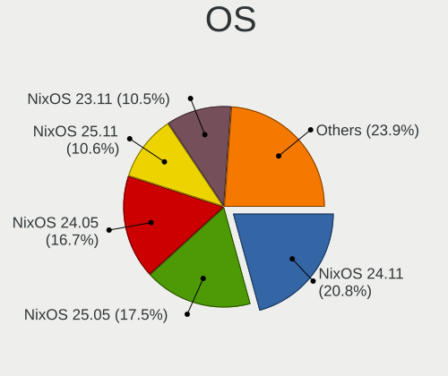

| Name                             | Computers | Percent |
|----------------------------------|-----------|---------|
| NixOS 24.11                      | 254       | 20.75%  |
| NixOS 25.05                      | 214       | 17.48%  |
| NixOS 24.05                      | 205       | 16.75%  |
| NixOS 25.11                      | 130       | 10.62%  |
| NixOS 23.11                      | 129       | 10.54%  |
| NixOS 23.05                      | 107       | 8.74%   |
| NixOS 22.11                      | 55        | 4.49%   |
| NixOS 26.05                      | 40        | 3.27%   |
| NixOS 22.05                      | 37        | 3.02%   |
| NixOS 21.11                      | 18        | 1.47%   |
| NixOS                            | 5         | 0.41%   |
| NixOS 21.05pre-git               | 2         | 0.16%   |
| NixOS 20.09pre-git               | 2         | 0.16%   |
| NixOS 21.11pre302265.c6c4a3d45ab | 1         | 0.08%   |
| NixOS 21.11.20210606.fbfb794     | 1         | 0.08%   |
| NixOS 21.11.20210528.540dccb     | 1         | 0.08%   |
| NixOS 21.05.git.62d4591722f      | 1         | 0.08%   |
| NixOS 21.05.git.2e369bb2f4e      | 1         | 0.08%   |
| NixOS 21.05.993.93963c27b93      | 1         | 0.08%   |
| NixOS 21.05.4384.4f37689c8a2     | 1         | 0.08%   |
| NixOS 21.05.3509.7daf35532d2     | 1         | 0.08%   |
| NixOS 21.05.3443.ee90403e147     | 1         | 0.08%   |
| NixOS 21.05.2132.733682c3292     | 1         | 0.08%   |
| NixOS 21.05.2075.ff1ea3a36c1     | 1         | 0.08%   |
| NixOS 21.05.20210929.ee90403     | 1         | 0.08%   |
| NixOS 21.05.20210430.c8dff32     | 1         | 0.08%   |
| NixOS 21.05.20210423.c21475e     | 1         | 0.08%   |
| NixOS 21.05.20210224.f6b5bfd     | 1         | 0.08%   |
| NixOS 21.05.1471.a7512bb64b1     | 1         | 0.08%   |
| NixOS 21.03pre246062.420f89ceb26 | 1         | 0.08%   |
| NixOS 21.03.git.b4349c13a6d      | 1         | 0.08%   |
| NixOS 21.03.20201007.420f89c     | 1         | 0.08%   |
| NixOS 21.03.20200927.84d74ae     | 1         | 0.08%   |
| NixOS 20.09pre231796.22a81aa5fc1 | 1         | 0.08%   |
| NixOS 20.09.git.4a361b06a93      | 1         | 0.08%   |
| NixOS 20.03.2351.f8248ab6d9e     | 1         | 0.08%   |
| NixOS 19.09.2522.75f4ba05c63     | 1         | 0.08%   |
| NixOS 19.09.2220.92231f4f32f     | 1         | 0.08%   |
| NixOS 19.03.173054.754763ff4ba   | 1         | 0.08%   |

OS Family
---------

OS without a version

| Name  | Computers | Percent |
|-------|-----------|---------|
| NixOS | 1108      | 100%    |

Kernel
------

Version of the Linux kernel

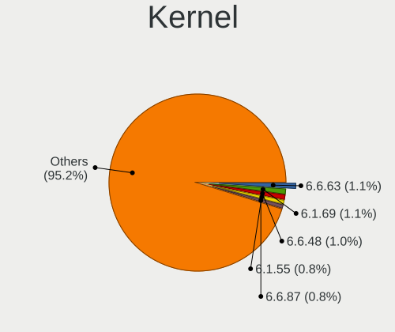

| Version     | Computers | Percent |
|-------------|-----------|---------|
| 6.6.63      | 14        | 1.07%   |
| 6.1.69      | 14        | 1.07%   |
| 6.6.48      | 13        | 1%      |
| 6.1.55      | 11        | 0.84%   |
| 6.6.87      | 10        | 0.77%   |
| 6.6.41      | 10        | 0.77%   |
| 6.18.0      | 10        | 0.77%   |
| 6.10.6      | 10        | 0.77%   |
| 6.6.8       | 9         | 0.69%   |
| 6.6.45      | 9         | 0.69%   |
| 6.6.28      | 9         | 0.69%   |
| 6.12.57     | 9         | 0.69%   |
| 6.10.1-zen1 | 9         | 0.69%   |
| 6.8.9       | 8         | 0.61%   |
| 6.6.32      | 8         | 0.61%   |
| 6.12.33     | 8         | 0.61%   |
| 6.12.30     | 8         | 0.61%   |
| 6.9.3       | 7         | 0.54%   |
| 6.6.46      | 7         | 0.54%   |
| 6.6.43      | 7         | 0.54%   |
| 6.16.0      | 7         | 0.54%   |
| 6.12.47     | 7         | 0.54%   |
| 6.12.35     | 7         | 0.54%   |
| 6.12.32     | 7         | 0.54%   |
| 6.12.1      | 7         | 0.54%   |
| 6.11.0      | 7         | 0.54%   |
| 6.10.8      | 7         | 0.54%   |
| 6.10.7      | 7         | 0.54%   |
| 6.10.3      | 7         | 0.54%   |
| 6.1.61      | 7         | 0.54%   |
| 6.8.1       | 6         | 0.46%   |
| 6.7.6       | 6         | 0.46%   |
| 6.6.58      | 6         | 0.46%   |
| 6.6.54      | 6         | 0.46%   |
| 6.6.49      | 6         | 0.46%   |
| 6.6.0       | 6         | 0.46%   |
| 6.15.1      | 6         | 0.46%   |
| 6.13.1      | 6         | 0.46%   |
| 6.13.0      | 6         | 0.46%   |
| 6.12.59     | 6         | 0.46%   |

Kernel Family
-------------

Linux kernel without a distro release

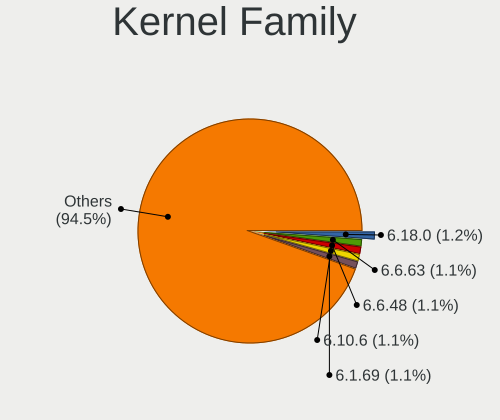

| Version | Computers | Percent |
|---------|-----------|---------|
| 6.18.0  | 15        | 1.15%   |
| 6.6.63  | 14        | 1.08%   |
| 6.6.48  | 14        | 1.08%   |
| 6.10.6  | 14        | 1.08%   |
| 6.1.69  | 14        | 1.08%   |
| 6.10.7  | 13        | 1%      |
| 6.1.55  | 12        | 0.92%   |
| 6.6.87  | 10        | 0.77%   |
| 6.6.8   | 10        | 0.77%   |
| 6.6.41  | 10        | 0.77%   |
| 6.13.1  | 10        | 0.77%   |
| 6.12.57 | 10        | 0.77%   |
| 6.11.0  | 10        | 0.77%   |
| 6.10.8  | 10        | 0.77%   |
| 6.8.9   | 9         | 0.69%   |
| 6.6.45  | 9         | 0.69%   |
| 6.6.28  | 9         | 0.69%   |
| 6.17.9  | 9         | 0.69%   |
| 6.16.0  | 9         | 0.69%   |
| 6.14.0  | 9         | 0.69%   |
| 6.10.1  | 9         | 0.69%   |
| 6.7.6   | 8         | 0.61%   |
| 6.7.0   | 8         | 0.61%   |
| 6.6.32  | 8         | 0.61%   |
| 6.15.0  | 8         | 0.61%   |
| 6.12.59 | 8         | 0.61%   |
| 6.12.47 | 8         | 0.61%   |
| 6.12.33 | 8         | 0.61%   |
| 6.12.30 | 8         | 0.61%   |
| 6.10.3  | 8         | 0.61%   |
| 6.9.3   | 7         | 0.54%   |
| 6.8.1   | 7         | 0.54%   |
| 6.6.46  | 7         | 0.54%   |
| 6.6.43  | 7         | 0.54%   |
| 6.16.7  | 7         | 0.54%   |
| 6.12.35 | 7         | 0.54%   |
| 6.12.32 | 7         | 0.54%   |
| 6.12.13 | 7         | 0.54%   |
| 6.12.1  | 7         | 0.54%   |
| 6.11.5  | 7         | 0.54%   |

Kernel Major Ver.
-----------------

Linux kernel major version

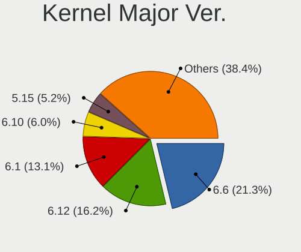

| Version | Computers | Percent |
|---------|-----------|---------|
| 6.6     | 264       | 21.27%  |
| 6.12    | 201       | 16.2%   |
| 6.1     | 162       | 13.05%  |
| 6.10    | 74        | 5.96%   |
| 5.15    | 64        | 5.16%   |
| 6.13    | 38        | 3.06%   |
| 6.17    | 37        | 2.98%   |
| 6.16    | 36        | 2.9%    |
| 6.11    | 36        | 2.9%    |
| 6.14    | 34        | 2.74%   |
| 6.7     | 33        | 2.66%   |
| 6.8     | 32        | 2.58%   |
| 6.15    | 32        | 2.58%   |
| 6.9     | 28        | 2.26%   |
| 6.18    | 24        | 1.93%   |
| 6.5     | 22        | 1.77%   |
| 6.4     | 17        | 1.37%   |
| 5.10    | 14        | 1.13%   |
| 6.3     | 13        | 1.05%   |
| 6.2     | 13        | 1.05%   |
| 6.0     | 13        | 1.05%   |
| 5.4     | 8         | 0.64%   |
| 5.16    | 8         | 0.64%   |
| 5.19    | 7         | 0.56%   |
| 5.8     | 6         | 0.48%   |
| 5.18    | 5         | 0.4%    |
| 5.13    | 4         | 0.32%   |
| 5.7     | 3         | 0.24%   |
| 5.17    | 3         | 0.24%   |
| 5.12    | 3         | 0.24%   |
| 5.14    | 2         | 0.16%   |
| 5.11    | 2         | 0.16%   |
| 4.19    | 2         | 0.16%   |
| Unknown | 1         | 0.08%   |

Arch
----

OS architecture (x86_64, i586, etc.)

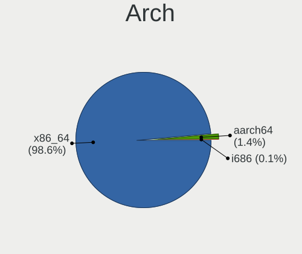

| Name    | Computers | Percent |
|---------|-----------|---------|
| x86_64  | 1092      | 98.56%  |
| aarch64 | 15        | 1.35%   |
| i686    | 1         | 0.09%   |

DE
--

Desktop Environment

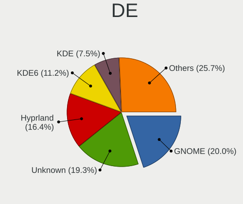

| Name           | Computers | Percent |
|----------------|-----------|---------|
| GNOME          | 232       | 19.97%  |
| Unknown        | 224       | 19.28%  |
| Hyprland       | 190       | 16.35%  |
| KDE6           | 130       | 11.19%  |
| KDE            | 87        | 7.49%   |
| sway           | 82        | 7.06%   |
| KDE5           | 66        | 5.68%   |
| niri           | 30        | 2.58%   |
| XFCE           | 26        | 2.24%   |
| none+i3        | 25        | 2.15%   |
| X-Cinnamon     | 9         | 0.77%   |
| COSMIC         | 9         | 0.77%   |
| none+awesome   | 8         | 0.69%   |
| none+xmonad    | 6         | 0.52%   |
| Pantheon       | 4         | 0.34%   |
| MATE           | 4         | 0.34%   |
| LXQt           | 4         | 0.34%   |
| X-Generic      | 3         | 0.26%   |
| qtile          | 3         | 0.26%   |
| none+bspwm     | 3         | 0.26%   |
| Budgie         | 3         | 0.26%   |
| xsession       | 2         | 0.17%   |
| xterm          | 1         | 0.09%   |
| wlroots        | 1         | 0.09%   |
| Unity          | 1         | 0.09%   |
| start-hyprland | 1         | 0.09%   |
| river          | 1         | 0.09%   |
| plasmawayland  | 1         | 0.09%   |
| plasma         | 1         | 0.09%   |
| none+xsession  | 1         | 0.09%   |
| none+qtile     | 1         | 0.09%   |
| none+dwm       | 1         | 0.09%   |
| HM-awesome     | 1         | 0.09%   |
| cwc            | 1         | 0.09%   |

Display Server
--------------

X11 or Wayland

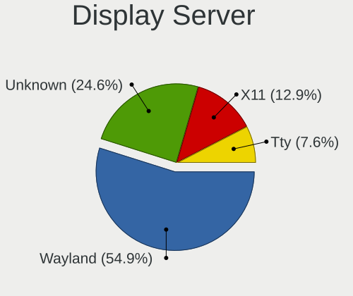

| Name    | Computers | Percent |
|---------|-----------|---------|
| Wayland | 636       | 54.87%  |
| Unknown | 285       | 24.59%  |
| X11     | 150       | 12.94%  |
| Tty     | 88        | 7.59%   |

Display Manager
---------------

SDDM, LightDM, etc.

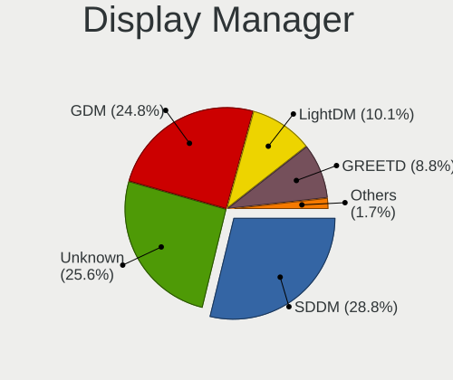

| Name                  | Computers | Percent |
|-----------------------|-----------|---------|
| SDDM                  | 329       | 28.78%  |
| Unknown               | 293       | 25.63%  |
| GDM                   | 284       | 24.85%  |
| LightDM               | 116       | 10.15%  |
| GREETD                | 101       | 8.84%   |
| DISPLAY-MANAGER-START | 19        | 1.66%   |
| LEMURS                | 1         | 0.09%   |

OS Lang
-------

Language

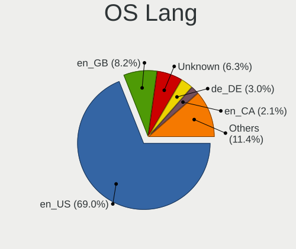

| Lang       | Computers | Percent |
|------------|-----------|---------|
| en_US      | 772       | 68.99%  |
| en_GB      | 92        | 8.22%   |
| Unknown    | 70        | 6.26%   |
| de_DE      | 34        | 3.04%   |
| en_CA      | 23        | 2.06%   |
| en_AU      | 17        | 1.52%   |
| ru_RU      | 16        | 1.43%   |
| fr_FR      | 14        | 1.25%   |
| en_DK      | 13        | 1.16%   |
| en_NZ      | 7         | 0.63%   |
| en_IN      | 7         | 0.63%   |
| pt_BR      | 6         | 0.54%   |
| zh_CN      | 4         | 0.36%   |
| sv_SE      | 4         | 0.36%   |
| pt_PT      | 4         | 0.36%   |
| it_IT      | 4         | 0.36%   |
| en_IE      | 4         | 0.36%   |
| pl_PL      | 3         | 0.27%   |
| C          | 3         | 0.27%   |
| sl_SI      | 2         | 0.18%   |
| nb_NO      | 2         | 0.18%   |
| ja_JP      | 2         | 0.18%   |
| es_MX      | 2         | 0.18%   |
| de_CH      | 2         | 0.18%   |
| cs_CZ      | 2         | 0.18%   |
| ro_RO      | 1         | 0.09%   |
| lv_LV      | 1         | 0.09%   |
| lt_LT      | 1         | 0.09%   |
| es_ES      | 1         | 0.09%   |
| en_US.UTF8 | 1         | 0.09%   |
| en_SG      | 1         | 0.09%   |
| en_PH      | 1         | 0.09%   |
| en_IE.UTF8 | 1         | 0.09%   |
| en_EU      | 1         | 0.09%   |
| de_AT      | 1         | 0.09%   |

Boot Mode
---------

EFI or BIOS

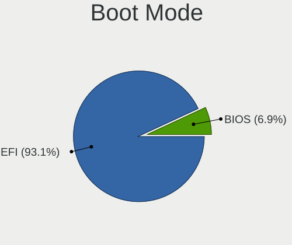

| Mode | Computers | Percent |
|------|-----------|---------|
| EFI  | 1036      | 93.08%  |
| BIOS | 77        | 6.92%   |

Filesystem
----------

Type of filesystem

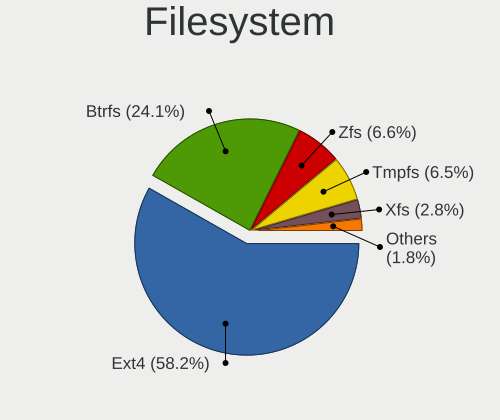

| Type     | Computers | Percent |
|----------|-----------|---------|
| Ext4     | 652       | 58.21%  |
| Btrfs    | 270       | 24.11%  |
| Zfs      | 74        | 6.61%   |
| Tmpfs    | 73        | 6.52%   |
| Xfs      | 31        | 2.77%   |
| Bcachefs | 8         | 0.71%   |
| Unknown  | 7         | 0.63%   |
| F2fs     | 3         | 0.27%   |
| XXXXX    | 1         | 0.09%   |
| Ext2     | 1         | 0.09%   |

Part. scheme
------------

Scheme of partitioning

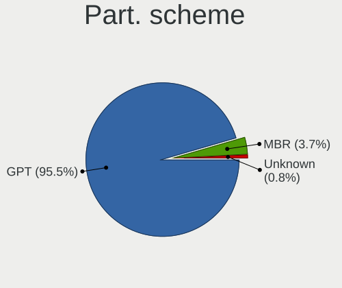

| Type    | Computers | Percent |
|---------|-----------|---------|
| GPT     | 1063      | 95.51%  |
| MBR     | 41        | 3.68%   |
| Unknown | 9         | 0.81%   |

Dual Boot with Linux/BSD
------------------------

Hosting more than one Linux/BSD

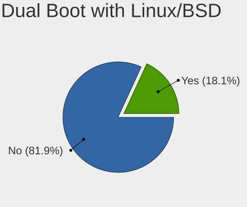

| Dual boot | Computers | Percent |
|-----------|-----------|---------|
| No        | 920       | 81.85%  |
| Yes       | 204       | 18.15%  |

Dual Boot (Win)
---------------

Hosting Linux and Windows

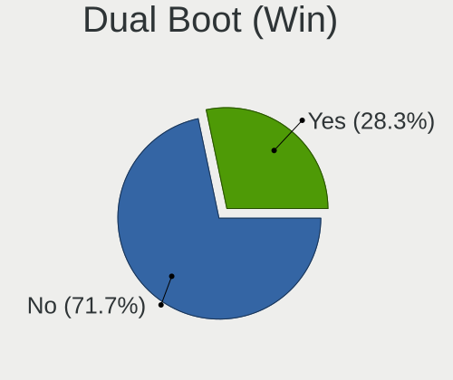

| Dual boot | Computers | Percent |
|-----------|-----------|---------|
| No        | 804       | 71.72%  |
| Yes       | 317       | 28.28%  |

Board
-----

Vendor
------

Motherboard manufacturer

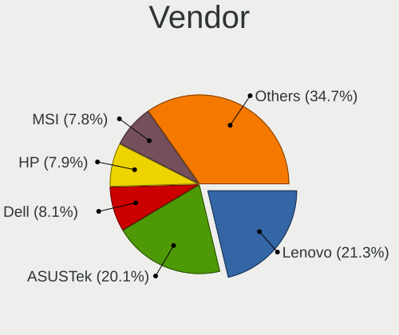

| Name                                 | Computers | Percent |
|--------------------------------------|-----------|---------|
| Lenovo                               | 236       | 21.3%   |
| ASUSTek Computer                     | 223       | 20.13%  |
| Dell                                 | 90        | 8.12%   |
| Hewlett-Packard                      | 88        | 7.94%   |
| MSI                                  | 86        | 7.76%   |
| Gigabyte Technology                  | 76        | 6.86%   |
| ASRock                               | 45        | 4.06%   |
| Apple                                | 38        | 3.43%   |
| Framework                            | 37        | 3.34%   |
| Acer                                 | 33        | 2.98%   |
| Unknown                              | 14        | 1.26%   |
| HUAWEI                               | 11        | 0.99%   |
| Intel                                | 8         | 0.72%   |
| Microsoft                            | 7         | 0.63%   |
| TUXEDO                               | 6         | 0.54%   |
| Raspberry Pi Foundation              | 6         | 0.54%   |
| GPD                                  | 6         | 0.54%   |
| AZW                                  | 6         | 0.54%   |
| Timi                                 | 5         | 0.45%   |
| Samsung Electronics                  | 5         | 0.45%   |
| Razer                                | 5         | 0.45%   |
| Google                               | 5         | 0.45%   |
| System76                             | 4         | 0.36%   |
| Shenzhen Meigao Electronic Equipment | 4         | 0.36%   |
| Fujitsu                              | 4         | 0.36%   |
| Supermicro                           | 3         | 0.27%   |
| Pine Microsystems                    | 3         | 0.27%   |
| MECHREVO                             | 3         | 0.27%   |
| Toshiba                              | 2         | 0.18%   |
| PC Specialist                        | 2         | 0.18%   |
| HONOR                                | 2         | 0.18%   |
| Hardkernel                           | 2         | 0.18%   |
| Alienware                            | 2         | 0.18%   |
| Xunlong                              | 1         | 0.09%   |
| XIAOMI                               | 1         | 0.09%   |
| Win element                          | 1         | 0.09%   |
| Valve                                | 1         | 0.09%   |
| Trigkey                              | 1         | 0.09%   |
| Teclast                              | 1         | 0.09%   |
| SYWZ                                 | 1         | 0.09%   |

Model
-----

Motherboard model

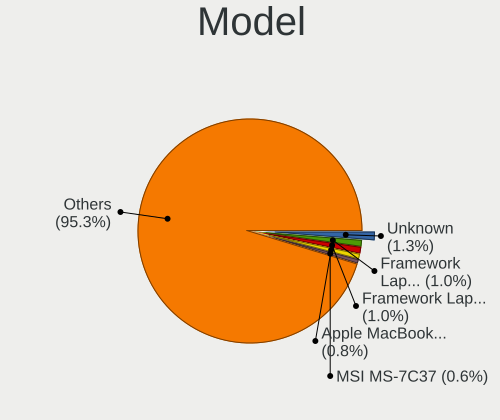

| Name                                               | Computers | Percent |
|----------------------------------------------------|-----------|---------|
| Unknown                                            | 14        | 1.26%   |
| Framework Laptop 16 (AMD Ryzen 7040 Series)        | 11        | 0.99%   |
| Framework Laptop 13 (AMD Ryzen 7040Series)         | 11        | 0.99%   |
| Apple MacBookPro11,5                               | 9         | 0.81%   |
| MSI MS-7C37                                        | 7         | 0.63%   |
| Framework Laptop                                   | 7         | 0.63%   |
| ASUS TUF Gaming X570-PLUS                          | 7         | 0.63%   |
| ASUS All Series                                    | 7         | 0.63%   |
| MSI MS-7C56                                        | 5         | 0.45%   |
| MSI MS-7B86                                        | 5         | 0.45%   |
| Gigabyte B650M AORUS ELITE AX                      | 5         | 0.45%   |
| Framework Laptop (12th Gen Intel Core)             | 5         | 0.45%   |
| MSI MS-7E26                                        | 4         | 0.36%   |
| MSI MS-7E12                                        | 4         | 0.36%   |
| Gigabyte B550I AORUS PRO AX                        | 4         | 0.36%   |
| ASUS ROG STRIX X570-E GAMING                       | 4         | 0.36%   |
| ASUS ROG STRIX B550-F GAMING                       | 4         | 0.36%   |
| ASUS PRIME X570-P                                  | 4         | 0.36%   |
| Apple MacBookPro11,3                               | 4         | 0.36%   |
| Pine Microsystems Pine64 PinePhone (1.2)           | 3         | 0.27%   |
| MSI MS-7C95                                        | 3         | 0.27%   |
| MSI MS-7C84                                        | 3         | 0.27%   |
| MSI MS-7C35                                        | 3         | 0.27%   |
| Microsoft Surface with Windows 8 Pro               | 3         | 0.27%   |
| Lenovo ThinkPad T480 20L5CTO1WW                    | 3         | 0.27%   |
| Lenovo ThinkPad T14s Gen 4 21F8CTO1WW              | 3         | 0.27%   |
| Lenovo IdeaPad 3 14ITL05 81X7                      | 3         | 0.27%   |
| Lenovo 13w Yoga 82S1                               | 3         | 0.27%   |
| HP EliteBook X G1a 14 inch Notebook Next Gen AI PC | 3         | 0.27%   |
| Gigabyte X870I AORUS PRO ICE                       | 3         | 0.27%   |
| Gigabyte B450M DS3H                                | 3         | 0.27%   |
| Gigabyte B450 AORUS M                              | 3         | 0.27%   |
| Dell XPS 9315                                      | 3         | 0.27%   |
| ASUS Zenbook 15 UM3504DA_UM3504DA                  | 3         | 0.27%   |
| ASUS ROG STRIX B550-I GAMING                       | 3         | 0.27%   |
| ASUS PRIME B550M-A                                 | 3         | 0.27%   |
| ASUS ASUS Zenbook S 16 UM5606WA_UM5606WA           | 3         | 0.27%   |
| Apple iMac17,1                                     | 3         | 0.27%   |
| TUXEDO InfinityBook Pro Gen7 (MK1)                 | 2         | 0.18%   |
| Timi Redmi Book Pro 14 2022                        | 2         | 0.18%   |

Model Family
------------

Motherboard model prefix

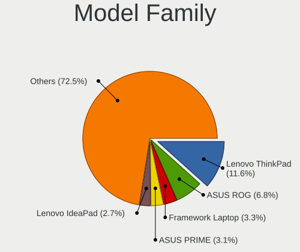

| Name               | Computers | Percent |
|--------------------|-----------|---------|
| Lenovo ThinkPad    | 129       | 11.64%  |
| ASUS ROG           | 75        | 6.77%   |
| Framework Laptop   | 37        | 3.34%   |
| ASUS PRIME         | 34        | 3.07%   |
| Lenovo IdeaPad     | 30        | 2.71%   |
| Lenovo Legion      | 25        | 2.26%   |
| ASUS TUF           | 25        | 2.26%   |
| ASUS ASUS          | 23        | 2.08%   |
| Dell XPS           | 22        | 1.99%   |
| Lenovo Yoga        | 20        | 1.81%   |
| HP EliteBook       | 19        | 1.71%   |
| Dell Inspiron      | 19        | 1.71%   |
| Apple MacBookPro11 | 17        | 1.53%   |
| HP Pavilion        | 16        | 1.44%   |
| ASUS Zenbook       | 16        | 1.44%   |
| Dell Latitude      | 15        | 1.35%   |
| Acer Aspire        | 15        | 1.35%   |
| Lenovo ThinkBook   | 14        | 1.26%   |
| Unknown            | 14        | 1.26%   |
| ASUS VivoBook      | 13        | 1.17%   |
| Dell Precision     | 12        | 1.08%   |
| HP ZBook           | 8         | 0.72%   |
| HP ProBook         | 8         | 0.72%   |
| HP ENVY            | 8         | 0.72%   |
| MSI MS-7C37        | 7         | 0.63%   |
| Microsoft Surface  | 7         | 0.63%   |
| Gigabyte B650M     | 7         | 0.63%   |
| Dell OptiPlex      | 7         | 0.63%   |
| ASUS All           | 7         | 0.63%   |
| Acer Nitro         | 7         | 0.63%   |
| RPi Raspberry      | 6         | 0.54%   |
| Gigabyte Z390      | 6         | 0.54%   |
| Gigabyte B450      | 6         | 0.54%   |
| Dell PowerEdge     | 6         | 0.54%   |
| Razer Blade        | 5         | 0.45%   |
| MSI MS-7C56        | 5         | 0.45%   |
| MSI MS-7B86        | 5         | 0.45%   |
| Lenovo IdeaPadFlex | 5         | 0.45%   |
| HP Victus          | 5         | 0.45%   |
| Gigabyte X570      | 5         | 0.45%   |

MFG Year
--------

Motherboard manufacture year

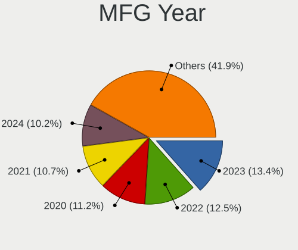

| Year    | Computers | Percent |
|---------|-----------|---------|
| 2023    | 149       | 13.45%  |
| 2022    | 139       | 12.55%  |
| 2020    | 124       | 11.19%  |
| 2021    | 119       | 10.74%  |
| 2024    | 113       | 10.2%   |
| 2019    | 102       | 9.21%   |
| 2018    | 92        | 8.3%    |
| 2017    | 41        | 3.7%    |
| 2016    | 41        | 3.7%    |
| 2013    | 34        | 3.07%   |
| 2015    | 29        | 2.62%   |
| 2014    | 28        | 2.53%   |
| 2012    | 24        | 2.17%   |
| 2025    | 23        | 2.08%   |
| 2011    | 19        | 1.71%   |
| Unknown | 12        | 1.08%   |
| 2008    | 8         | 0.72%   |
| 2010    | 5         | 0.45%   |
| 2009    | 2         | 0.18%   |
| 2007    | 2         | 0.18%   |
| 2006    | 1         | 0.09%   |
| 2000    | 1         | 0.09%   |

Form Factor
-----------

Physical design of the computer

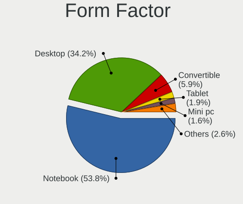

| Name           | Computers | Percent |
|----------------|-----------|---------|
| Notebook       | 596       | 53.79%  |
| Desktop        | 379       | 34.21%  |
| Convertible    | 65        | 5.87%   |
| Tablet         | 21        | 1.9%    |
| Mini pc        | 18        | 1.62%   |
| Server         | 10        | 0.9%    |
| System on chip | 9         | 0.81%   |
| All in one     | 7         | 0.63%   |
| Phone          | 3         | 0.27%   |

Secure Boot
-----------

Enabled or disabled

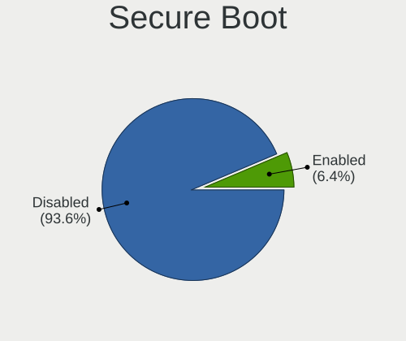

| State    | Computers | Percent |
|----------|-----------|---------|
| Disabled | 1047      | 93.65%  |
| Enabled  | 71        | 6.35%   |

Coreboot
--------

Have coreboot on board

| Used | Computers | Percent |
|------|-----------|---------|
| No   | 1097      | 99.01%  |
| Yes  | 11        | 0.99%   |

RAM Size
--------

Total RAM memory

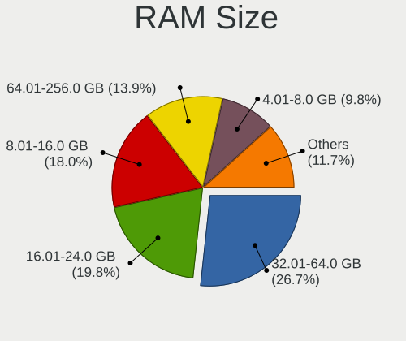

| Size in GB      | Computers | Percent |
|-----------------|-----------|---------|
| 32.01-64.0      | 299       | 26.7%   |
| 16.01-24.0      | 222       | 19.82%  |
| 8.01-16.0       | 202       | 18.04%  |
| 64.01-256.0     | 156       | 13.93%  |
| 4.01-8.0        | 110       | 9.82%   |
| 24.01-32.0      | 87        | 7.77%   |
| 3.01-4.0        | 35        | 3.13%   |
| More than 256.0 | 3         | 0.27%   |
| 2.01-3.0        | 2         | 0.18%   |
| 1.01-2.0        | 2         | 0.18%   |
| 0.51-1.0        | 2         | 0.18%   |

RAM Used
--------

Used RAM memory

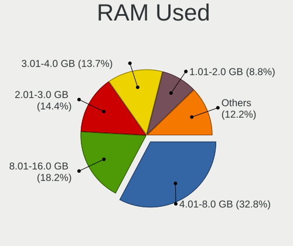

| Used GB     | Computers | Percent |
|-------------|-----------|---------|
| 4.01-8.0    | 397       | 32.76%  |
| 8.01-16.0   | 220       | 18.15%  |
| 2.01-3.0    | 174       | 14.36%  |
| 3.01-4.0    | 166       | 13.7%   |
| 1.01-2.0    | 107       | 8.83%   |
| 16.01-24.0  | 62        | 5.12%   |
| 24.01-32.0  | 25        | 2.06%   |
| 0.51-1.0    | 23        | 1.9%    |
| 32.01-64.0  | 21        | 1.73%   |
| 0.01-0.5    | 12        | 0.99%   |
| 64.01-256.0 | 5         | 0.41%   |

Total Drives
------------

Number of drives on board

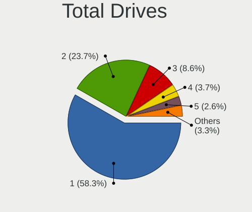

| Drives | Computers | Percent |
|--------|-----------|---------|
| 1      | 660       | 58.25%  |
| 2      | 268       | 23.65%  |
| 3      | 97        | 8.56%   |
| 4      | 42        | 3.71%   |
| 5      | 29        | 2.56%   |
| 6      | 14        | 1.24%   |
| 7      | 8         | 0.71%   |
| 0      | 4         | 0.35%   |
| 8      | 3         | 0.26%   |
| 17     | 2         | 0.18%   |
| 9      | 2         | 0.18%   |
| 23     | 1         | 0.09%   |
| 22     | 1         | 0.09%   |
| 16     | 1         | 0.09%   |
| 11     | 1         | 0.09%   |

Has CD-ROM
----------

Has CD-ROM on board

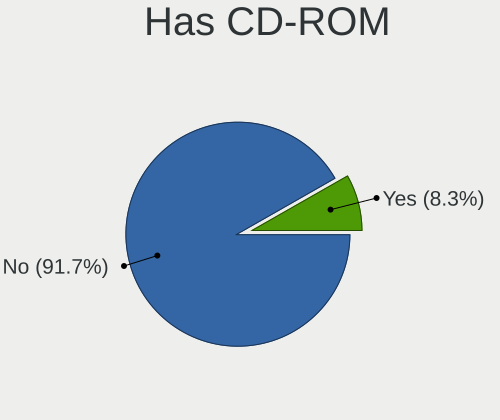

| Presented | Computers | Percent |
|-----------|-----------|---------|
| No        | 1023      | 91.75%  |
| Yes       | 92        | 8.25%   |

Has Ethernet
------------

Has Ethernet on board

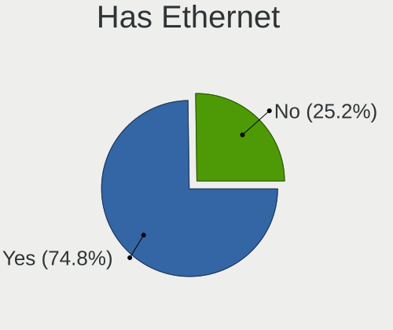

| Presented | Computers | Percent |
|-----------|-----------|---------|
| Yes       | 833       | 74.78%  |
| No        | 281       | 25.22%  |

Has WiFi
--------

Has WiFi module

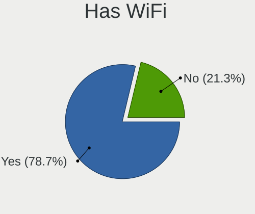

| Presented | Computers | Percent |
|-----------|-----------|---------|
| Yes       | 864       | 77.7%   |
| No        | 248       | 22.3%   |

Has Bluetooth
-------------

Has Bluetooth module

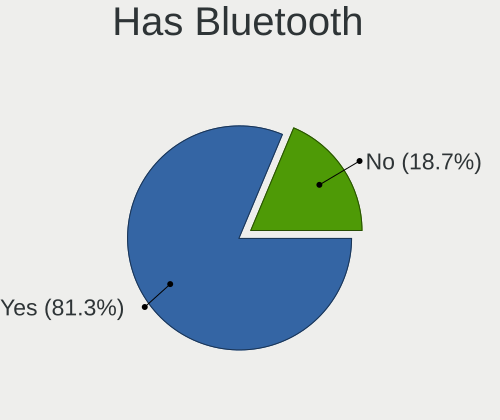

| Presented | Computers | Percent |
|-----------|-----------|---------|
| Yes       | 905       | 81.31%  |
| No        | 208       | 18.69%  |

Location
--------

Country
-------

Geographic location (country)

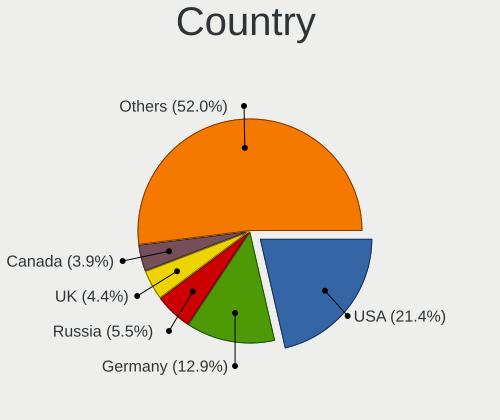

| Country         | Computers | Percent |
|-----------------|-----------|---------|
| USA             | 239       | 21.42%  |
| Germany         | 144       | 12.9%   |
| Russia          | 61        | 5.47%   |
| UK              | 49        | 4.39%   |
| Canada          | 43        | 3.85%   |
| France          | 42        | 3.76%   |
| Netherlands     | 36        | 3.23%   |
| Poland          | 32        | 2.87%   |
| Italy           | 32        | 2.87%   |
| Czechia         | 22        | 1.97%   |
| Brazil          | 22        | 1.97%   |
| Australia       | 22        | 1.97%   |
| Sweden          | 21        | 1.88%   |
| Spain           | 19        | 1.7%    |
| India           | 17        | 1.52%   |
| Austria         | 17        | 1.52%   |
| Switzerland     | 15        | 1.34%   |
| Belgium         | 15        | 1.34%   |
| Japan           | 14        | 1.25%   |
| Romania         | 13        | 1.16%   |
| Portugal        | 13        | 1.16%   |
| Norway          | 13        | 1.16%   |
| Thailand        | 11        | 0.99%   |
| Finland         | 11        | 0.99%   |
| Denmark         | 11        | 0.99%   |
| Hong Kong       | 10        | 0.9%    |
| Ukraine         | 9         | 0.81%   |
| New Zealand     | 9         | 0.81%   |
| Turkey          | 8         | 0.72%   |
| Hungary         | 8         | 0.72%   |
| The Netherlands | 6         | 0.54%   |
| Singapore       | 6         | 0.54%   |
| Vietnam         | 5         | 0.45%   |
| Taiwan          | 5         | 0.45%   |
| Slovenia        | 5         | 0.45%   |
| Saudi Arabia    | 5         | 0.45%   |
| Indonesia       | 5         | 0.45%   |
| China           | 5         | 0.45%   |
| Uruguay         | 4         | 0.36%   |
| Slovakia        | 4         | 0.36%   |

City
----

Geographic location (city)

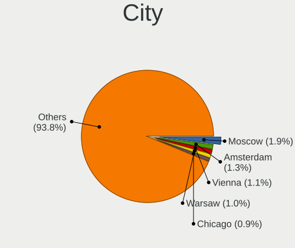

| City              | Computers | Percent |
|-------------------|-----------|---------|
| Moscow            | 22        | 1.88%   |
| Amsterdam         | 15        | 1.28%   |
| Vienna            | 13        | 1.11%   |
| Warsaw            | 12        | 1.03%   |
| Chicago           | 10        | 0.86%   |
| Berlin            | 10        | 0.86%   |
| Prague            | 9         | 0.77%   |
| Los Angeles       | 9         | 0.77%   |
| Tokyo             | 8         | 0.68%   |
| Hamburg           | 8         | 0.68%   |
| Haarlem           | 8         | 0.68%   |
| St Petersburg     | 7         | 0.6%    |
| London            | 7         | 0.6%    |
| Bangkok           | 7         | 0.6%    |
| Sydney            | 6         | 0.51%   |
| Singapore         | 6         | 0.51%   |
| Seattle           | 6         | 0.51%   |
| Salt Lake City    | 6         | 0.51%   |
| Perth             | 6         | 0.51%   |
| Paris             | 6         | 0.51%   |
| Oslo              | 6         | 0.51%   |
| Melbourne         | 6         | 0.51%   |
| Frankfurt am Main | 6         | 0.51%   |
| Darmstadt         | 6         | 0.51%   |
| Cologne           | 6         | 0.51%   |
| Central           | 6         | 0.51%   |
| Budapest          | 6         | 0.51%   |
| Zurich            | 5         | 0.43%   |
| Stockholm         | 5         | 0.43%   |
| San Jose          | 5         | 0.43%   |
| Rochester         | 5         | 0.43%   |
| Richmond          | 5         | 0.43%   |
| Munich            | 5         | 0.43%   |
| Milwaukee         | 5         | 0.43%   |
| Leipzig           | 5         | 0.43%   |
| Kharkiv           | 5         | 0.43%   |
| Austin            | 5         | 0.43%   |
| Tbilisi           | 4         | 0.34%   |
| Stuttgart         | 4         | 0.34%   |
| Sorocaba          | 4         | 0.34%   |

Drives
------

Drive Vendor
------------

Hard drive vendors

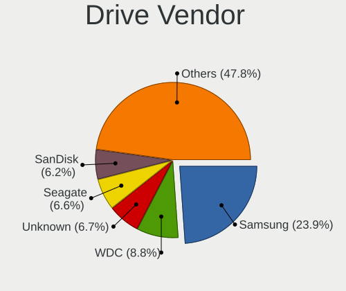

| Vendor                       | Computers | Drives | Percent |
|------------------------------|-----------|--------|---------|
| Samsung Electronics          | 397       | 638    | 23.87%  |
| WDC                          | 146       | 250    | 8.78%   |
| Unknown                      | 112       | 126    | 6.73%   |
| Seagate                      | 110       | 218    | 6.61%   |
| SanDisk                      | 103       | 119    | 6.19%   |
| Crucial                      | 84        | 109    | 5.05%   |
| Kingston                     | 71        | 93     | 4.27%   |
| SK hynix                     | 70        | 85     | 4.21%   |
| Micron Technology            | 64        | 71     | 3.85%   |
| Toshiba                      | 57        | 92     | 3.43%   |
| Intel                        | 47        | 57     | 2.83%   |
| Apple                        | 33        | 48     | 1.98%   |
| KIOXIA                       | 31        | 42     | 1.86%   |
| Kingston Technology Company  | 30        | 50     | 1.8%    |
| A-DATA Technology            | 23        | 28     | 1.38%   |
| Unknown                      | 18        | 23     | 1.08%   |
| Phison Electronics           | 17        | 23     | 1.02%   |
| Micron/Crucial Technology    | 15        | 16     | 0.9%    |
| HGST                         | 13        | 27     | 0.78%   |
| Phison                       | 12        | 16     | 0.72%   |
| MAXIO Technology (Hangzhou)  | 12        | 15     | 0.72%   |
| Silicon Motion               | 11        | 11     | 0.66%   |
| Corsair                      | 11        | 12     | 0.66%   |
| Lexar                        | 9         | 12     | 0.54%   |
| UMIS                         | 7         | 9      | 0.42%   |
| Team                         | 7         | 8      | 0.42%   |
| SPCC                         | 7         | 7      | 0.42%   |
| Hitachi                      | 7         | 11     | 0.42%   |
| Union Memory (Shenzhen)      | 6         | 8      | 0.36%   |
| PNY                          | 6         | 8      | 0.36%   |
| Shenzhen Longsys Electronics | 5         | 6      | 0.3%    |
| Realtek Semiconductor        | 5         | 17     | 0.3%    |
| Apacer                       | 5         | 8      | 0.3%    |
| Yangtze Memory Technologies  | 4         | 7      | 0.24%   |
| Transcend                    | 4         | 4      | 0.24%   |
| LITEONIT                     | 4         | 4      | 0.24%   |
| LITEON                       | 4         | 4      | 0.24%   |
| China                        | 4         | 4      | 0.24%   |
| T-FORCE                      | 3         | 3      | 0.18%   |
| SOLIDIGM                     | 3         | 4      | 0.18%   |

Drive Model
-----------

Hard drive models

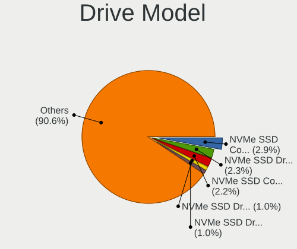

| Model                                              | Computers | Percent |
|----------------------------------------------------|-----------|---------|
| Samsung NVMe SSD Controller SM981/PM981/PM983 1TB  | 55        | 2.91%   |
| Unknown NVMe SSD Drive 1TB                         | 43        | 2.27%   |
| Samsung NVMe SSD Controller PM9A1/PM9A3/980PRO 1TB | 42        | 2.22%   |
| Unknown NVMe SSD Drive 2TB                         | 19        | 1%      |
| Unknown                                            | 18        | 0.95%   |
| Samsung SSD 860 EVO 500GB                          | 17        | 0.9%    |
| Samsung SSD 860 EVO 1TB                            | 17        | 0.9%    |
| Samsung SSD 990 PRO 2TB                            | 16        | 0.85%   |
| Samsung SSD 990 PRO 1TB                            | 16        | 0.85%   |
| Kingston SA400S37480G 480GB SSD                    | 16        | 0.85%   |
| Samsung SSD 970 EVO Plus 1TB                       | 15        | 0.79%   |
| Samsung SSD 970 EVO Plus 2TB                       | 12        | 0.63%   |
| Kingston Company SNV2S1000G 1TB                    | 12        | 0.63%   |
| Samsung SSD 980 1TB                                | 11        | 0.58%   |
| Samsung SSD 850 EVO 250GB                          | 11        | 0.58%   |
| Samsung SSD 870 EVO 500GB                          | 10        | 0.53%   |
| Samsung SSD 850 EVO 500GB                          | 10        | 0.53%   |
| Unknown MMC Card  32GB                             | 9         | 0.48%   |
| Sandisk WD Black SN750 / PC SN730 NVMe SSD 500GB   | 9         | 0.48%   |
| Samsung SSD 980 PRO 2TB                            | 9         | 0.48%   |
| Crucial CT500MX500SSD1 500GB                       | 9         | 0.48%   |
| Apple SSD SM0512G 500GB                            | 9         | 0.48%   |
| WDC WD10EZEX-08WN4A0 1TB                           | 8         | 0.42%   |
| Unknown MMC Card  64GB                             | 8         | 0.42%   |
| Unknown MMC Card  128GB                            | 8         | 0.42%   |
| Samsung SSD 980 PRO 1TB                            | 8         | 0.42%   |
| Samsung SSD 970 EVO 500GB                          | 8         | 0.42%   |
| Micron MTFDKBA1T0QFM-1BD1AABGB 1024GB              | 8         | 0.42%   |
| Intel SSDPEKNU512GZ 512GB                          | 8         | 0.42%   |
| Crucial CT1000BX500SSD1 1TB                        | 8         | 0.42%   |
| Unknown NVMe SSD Drive 512GB                       | 7         | 0.37%   |
| Seagate ST4000DM004-2CV104 4TB                     | 7         | 0.37%   |
| Sandisk WD_BLACK SN770 1TB                         | 7         | 0.37%   |
| Sandisk WD Blue SN550 NVMe SSD 1024GB              | 7         | 0.37%   |
| Samsung SSD 860 QVO 1TB                            | 7         | 0.37%   |
| Micron/Crucial P2 NVMe PCIe SSD 2TB                | 7         | 0.37%   |
| MAXIO (Hangzhou) NVMe SSD Controller MAP1202 2TB   | 7         | 0.37%   |
| Toshiba XG6 NVMe SSD Controller 1024GB             | 6         | 0.32%   |
| SK hynix SKHynix_HFS001TEJ9X115N 1024GB            | 6         | 0.32%   |
| Samsung SSD 990 PRO 4TB                            | 6         | 0.32%   |

HDD Vendor
----------

Hard disk drive vendors

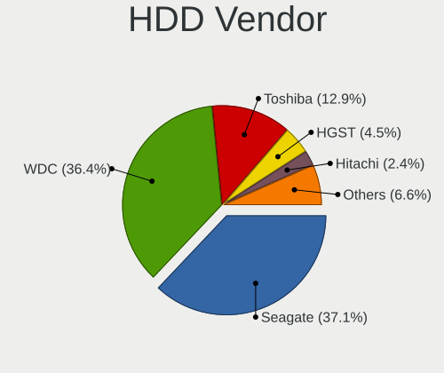

| Vendor              | Computers | Drives | Percent |
|---------------------|-----------|--------|---------|
| Seagate             | 106       | 212    | 37.06%  |
| WDC                 | 104       | 191    | 36.36%  |
| Toshiba             | 37        | 55     | 12.94%  |
| HGST                | 13        | 27     | 4.55%   |
| Hitachi             | 7         | 11     | 2.45%   |
| Samsung Electronics | 6         | 6      | 2.1%    |
| Apple               | 4         | 5      | 1.4%    |
| Unknown             | 2         | 2      | 0.7%    |
| Synology            | 1         | 1      | 0.35%   |
| RSH-339             | 1         | 1      | 0.35%   |
| QEMU                | 1         | 1      | 0.35%   |
| IET                 | 1         | 4      | 0.35%   |
| Fujitsu             | 1         | 3      | 0.35%   |
| External            | 1         | 1      | 0.35%   |
| ASMT                | 1         | 1      | 0.35%   |

SSD Vendor
----------

Solid state drive vendors

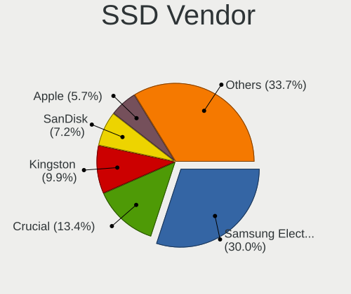

| Vendor              | Computers | Drives | Percent |
|---------------------|-----------|--------|---------|
| Samsung Electronics | 121       | 196    | 30.02%  |
| Crucial             | 54        | 74     | 13.4%   |
| Kingston            | 40        | 50     | 9.93%   |
| SanDisk             | 29        | 35     | 7.2%    |
| Apple               | 23        | 27     | 5.71%   |
| WDC                 | 17        | 20     | 4.22%   |
| Intel               | 11        | 15     | 2.73%   |
| A-DATA Technology   | 9         | 10     | 2.23%   |
| SK hynix            | 7         | 8      | 1.74%   |
| Micron Technology   | 7         | 7      | 1.74%   |
| SPCC                | 6         | 6      | 1.49%   |
| PNY                 | 5         | 7      | 1.24%   |
| LITEONIT            | 4         | 4      | 0.99%   |
| Lexar               | 4         | 7      | 0.99%   |
| Corsair             | 4         | 4      | 0.99%   |
| China               | 4         | 4      | 0.99%   |
| Transcend           | 3         | 3      | 0.74%   |
| Toshiba             | 3         | 3      | 0.74%   |
| Team                | 3         | 4      | 0.74%   |
| Patriot             | 3         | 4      | 0.74%   |
| OCZ                 | 3         | 3      | 0.74%   |
| LITEON              | 3         | 3      | 0.74%   |
| Intenso             | 3         | 3      | 0.74%   |
| Apacer              | 3         | 3      | 0.74%   |
| Unknown             | 3         | 3      | 0.74%   |
| Verbatim            | 2         | 5      | 0.5%    |
| T-FORCE             | 2         | 2      | 0.5%    |
| SABRENT             | 2         | 2      | 0.5%    |
| Netac               | 2         | 2      | 0.5%    |
| GOODRAM             | 2         | 2      | 0.5%    |
| BIWIN               | 2         | 2      | 0.5%    |
| ZHITAI              | 1         | 1      | 0.25%   |
| WALRAM              | 1         | 1      | 0.25%   |
| Unknown             | 1         | 1      | 0.25%   |
| Teclast             | 1         | 3      | 0.25%   |
| Seagate             | 1         | 1      | 0.25%   |
| SD                  | 1         | 2      | 0.25%   |
| S3+                 | 1         | 1      | 0.25%   |
| Ramaxel Technology  | 1         | 1      | 0.25%   |
| Plextor             | 1         | 1      | 0.25%   |

Drive Kind
----------

HDD or SSD

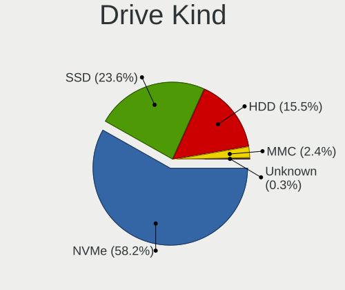

| Kind    | Computers | Drives | Percent |
|---------|-----------|--------|---------|
| NVMe    | 861       | 1290   | 58.18%  |
| SSD     | 349       | 540    | 23.58%  |
| HDD     | 230       | 521    | 15.54%  |
| MMC     | 35        | 43     | 2.36%   |
| Unknown | 5         | 5      | 0.34%   |

Drive Connector
---------------

SATA, SAS, NVMe, etc.

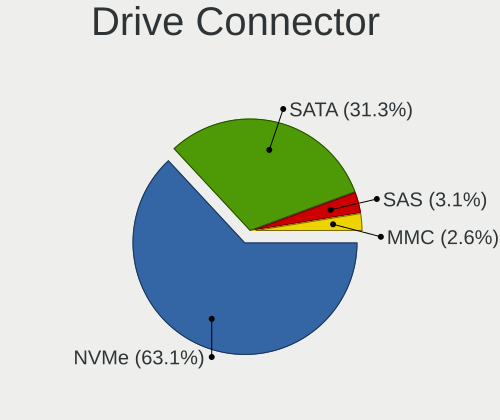

| Type | Computers | Drives | Percent |
|------|-----------|--------|---------|
| NVMe | 861       | 1283   | 63.08%  |
| SATA | 427       | 1009   | 31.28%  |
| SAS  | 42        | 64     | 3.08%   |
| MMC  | 35        | 43     | 2.56%   |

Drive Size
----------

Size of hard drive

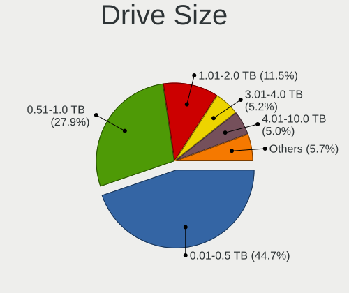

| Size in TB | Computers | Drives | Percent |
|------------|-----------|--------|---------|
| 0.01-0.5   | 285       | 420    | 44.74%  |
| 0.51-1.0   | 178       | 262    | 27.94%  |
| 1.01-2.0   | 73        | 119    | 11.46%  |
| 3.01-4.0   | 33        | 75     | 5.18%   |
| 4.01-10.0  | 32        | 99     | 5.02%   |
| 2.01-3.0   | 24        | 43     | 3.77%   |
| 10.01-20.0 | 12        | 43     | 1.88%   |

Space Total
-----------

Amount of disk space available on the file system

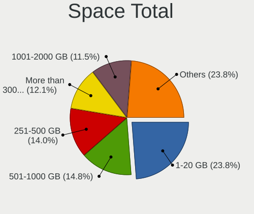

| Size in GB     | Computers | Percent |
|----------------|-----------|---------|
| 1-20           | 271       | 23.77%  |
| 501-1000       | 169       | 14.82%  |
| 251-500        | 160       | 14.04%  |
| More than 3000 | 138       | 12.11%  |
| 1001-2000      | 131       | 11.49%  |
| 101-250        | 107       | 9.39%   |
| Unknown        | 88        | 7.72%   |
| 2001-3000      | 60        | 5.26%   |
| 51-100         | 11        | 0.96%   |
| 21-50          | 5         | 0.44%   |

Space Used
----------

Amount of used disk space

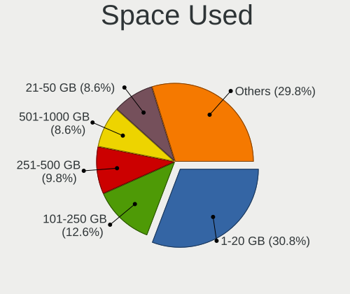

| Used GB        | Computers | Percent |
|----------------|-----------|---------|
| 1-20           | 363       | 30.79%  |
| 101-250        | 148       | 12.55%  |
| 251-500        | 115       | 9.75%   |
| 21-50          | 101       | 8.57%   |
| 501-1000       | 101       | 8.57%   |
| 51-100         | 94        | 7.97%   |
| Unknown        | 88        | 7.46%   |
| 1001-2000      | 78        | 6.62%   |
| More than 3000 | 60        | 5.09%   |
| 2001-3000      | 31        | 2.63%   |

Malfunc. Drives
---------------

Drive models with a malfunction

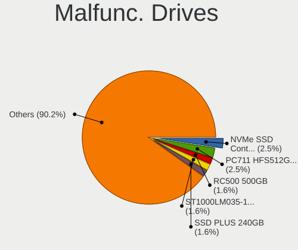

| Model                                                         | Computers | Drives | Percent |
|---------------------------------------------------------------|-----------|--------|---------|
| SK hynix PC711 HFS512GDE9X073N 512GB                          | 3         | 3      | 2.46%   |
| Samsung Electronics NVMe SSD Controller SM981/PM981/PM983 1TB | 3         | 3      | 2.46%   |
| Toshiba RC500 500GB                                           | 2         | 12     | 1.64%   |
| SK hynix HFS128G39TND-N210A 128GB SSD                         | 2         | 3      | 1.64%   |
| SK hynix BC711 HFM512GD3JX013N 512GB                          | 2         | 2      | 1.64%   |
| Seagate ST1000LM035-1RK172 1TB                                | 2         | 6      | 1.64%   |
| SanDisk SSD PLUS 240GB                                        | 2         | 4      | 1.64%   |
| Samsung Electronics SSD 870 EVO 2TB                           | 2         | 2      | 1.64%   |
| A-DATA Technology SP900 256GB SSD                             | 2         | 2      | 1.64%   |
| A-DATA Technology IM2P33F3A NVMe 256GB                        | 2         | 4      | 1.64%   |
| WDC WDS480G2G0A-00JH30 480GB SSD                              | 1         | 1      | 0.82%   |
| WDC WD80EFZZ-68BTXN0 8TB                                      | 1         | 1      | 0.82%   |
| WDC WD800AAJS-00B4A0 80GB                                     | 1         | 1      | 0.82%   |
| WDC WD7500BPKT-00PK4T0 752GB                                  | 1         | 1      | 0.82%   |
| WDC WD5000BEVT-24A0RT0 500GB                                  | 1         | 1      | 0.82%   |
| WDC WD5000AAKX-60U6AA0 500GB                                  | 1         | 1      | 0.82%   |
| WDC WD5000AAKS-65A7B2 500GB                                   | 1         | 1      | 0.82%   |
| WDC WD5000AAKS-00V1A0 500GB                                   | 1         | 1      | 0.82%   |
| WDC WD40PURX-64GVNY0 4TB                                      | 1         | 1      | 0.82%   |
| WDC WD40EZRZ-00WN9B0 4TB                                      | 1         | 2      | 0.82%   |
| WDC WD40EZRX-00SPEB0 4TB                                      | 1         | 1      | 0.82%   |
| WDC WD3200BPVT-22ZEST0 320GB                                  | 1         | 1      | 0.82%   |
| WDC WD30EZRX-00SPEB0 3TB                                      | 1         | 1      | 0.82%   |
| WDC WD30EFRX-68EUZN0 3TB                                      | 1         | 1      | 0.82%   |
| WDC WD30EFRX-68AX9N0 3TB                                      | 1         | 10     | 0.82%   |
| WDC WD20EZRZ-00Z5HB0 2TB                                      | 1         | 1      | 0.82%   |
| WDC WD20EZRX-00D8PB0 2TB                                      | 1         | 1      | 0.82%   |
| WDC WD20EFRX-68EUZN0 2TB                                      | 1         | 1      | 0.82%   |
| WDC WD20EARX-00PASB0 2TB                                      | 1         | 1      | 0.82%   |
| WDC WD20EARX-008FB0 2TB                                       | 1         | 1      | 0.82%   |
| WDC WD20EARS-22MVWB0 2TB                                      | 1         | 3      | 0.82%   |
| WDC WD20EARS-00MVWB0 2TB                                      | 1         | 1      | 0.82%   |
| WDC WD1600JS-00NCB1 160GB                                     | 1         | 1      | 0.82%   |
| WDC WD120EDBZ-11B1HA0 12TB                                    | 1         | 1      | 0.82%   |
| WDC WD10SPZX-21Z10T0 1TB                                      | 1         | 1      | 0.82%   |
| WDC WD10JPVX-08JC3T5 1TB                                      | 1         | 1      | 0.82%   |
| WDC WD10EZEX-60ZF5A0 1TB                                      | 1         | 1      | 0.82%   |
| WDC WD10EZEX-08WN4A0 1TB                                      | 1         | 1      | 0.82%   |
| WDC WD10EALX-009BA0 1TB                                       | 1         | 1      | 0.82%   |
| WDC WD1001FALS-403AA0 1TB                                     | 1         | 4      | 0.82%   |

Malfunc. Drive Vendor
---------------------

Vendors of faulty drives

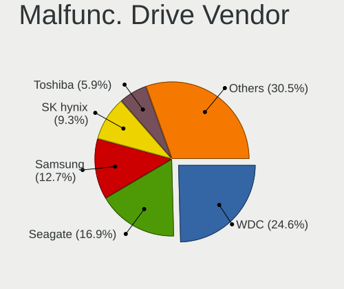

| Vendor                    | Computers | Drives | Percent |
|---------------------------|-----------|--------|---------|
| WDC                       | 29        | 46     | 24.58%  |
| Seagate                   | 20        | 35     | 16.95%  |
| Samsung Electronics       | 15        | 16     | 12.71%  |
| SK hynix                  | 11        | 12     | 9.32%   |
| Toshiba                   | 7         | 19     | 5.93%   |
| Intel                     | 5         | 5      | 4.24%   |
| A-DATA Technology         | 4         | 6      | 3.39%   |
| Micron Technology         | 3         | 4      | 2.54%   |
| Hitachi                   | 3         | 4      | 2.54%   |
| HGST                      | 3         | 3      | 2.54%   |
| Crucial                   | 3         | 3      | 2.54%   |
| SanDisk                   | 2         | 4      | 1.69%   |
| Kingston                  | 2         | 2      | 1.69%   |
| Corsair                   | 2         | 2      | 1.69%   |
| Union Memory              | 1         | 1      | 0.85%   |
| Transcend                 | 1         | 1      | 0.85%   |
| Team                      | 1         | 1      | 0.85%   |
| SD                        | 1         | 1      | 0.85%   |
| Micron/Crucial Technology | 1         | 1      | 0.85%   |
| LITEON                    | 1         | 1      | 0.85%   |
| Intenso                   | 1         | 1      | 0.85%   |
| ASMT                      | 1         | 1      | 0.85%   |
| Apple                     | 1         | 1      | 0.85%   |

Malfunc. HDD Vendor
-------------------

Vendors of faulty HDD drives

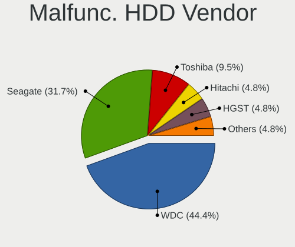

| Vendor              | Computers | Drives | Percent |
|---------------------|-----------|--------|---------|
| WDC                 | 28        | 45     | 44.44%  |
| Seagate             | 20        | 35     | 31.75%  |
| Toshiba             | 6         | 7      | 9.52%   |
| Hitachi             | 3         | 4      | 4.76%   |
| HGST                | 3         | 3      | 4.76%   |
| Samsung Electronics | 2         | 2      | 3.17%   |
| Apple               | 1         | 1      | 1.59%   |

Malfunc. Drive Kind
-------------------

Kinds of faulty drives

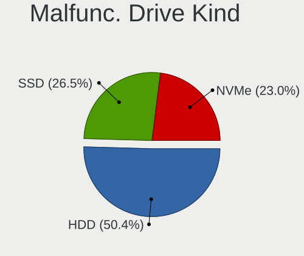

| Kind | Computers | Drives | Percent |
|------|-----------|--------|---------|
| HDD  | 57        | 97     | 50.44%  |
| SSD  | 30        | 33     | 26.55%  |
| NVMe | 26        | 40     | 23.01%  |

Failed Drives
-------------

Failed drive models

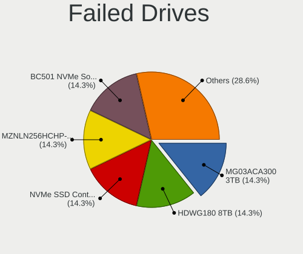

| Model                                                            | Computers | Drives | Percent |
|------------------------------------------------------------------|-----------|--------|---------|
| Toshiba MG03ACA300 3TB                                           | 1         | 1      | 14.29%  |
| Toshiba HDWG180 8TB                                              | 1         | 4      | 14.29%  |
| SK hynix BC501 NVMe Solid State Drive 512GB                      | 1         | 1      | 14.29%  |
| Samsung Electronics NVMe SSD Controller SM961/PM961/SM963 1024GB | 1         | 1      | 14.29%  |
| Samsung Electronics MZNLN256HCHP-000L7 256GB SSD                 | 1         | 1      | 14.29%  |
| HGST HTS545050A7E380 500GB                                       | 1         | 1      | 14.29%  |
| A-DATA Technology SX8200PNP 512GB                                | 1         | 1      | 14.29%  |

Failed Drive Vendor
-------------------

Failed drive vendors

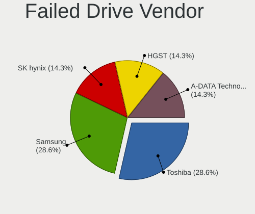

| Vendor              | Computers | Drives | Percent |
|---------------------|-----------|--------|---------|
| Toshiba             | 2         | 5      | 28.57%  |
| Samsung Electronics | 2         | 2      | 28.57%  |
| SK hynix            | 1         | 1      | 14.29%  |
| HGST                | 1         | 1      | 14.29%  |
| A-DATA Technology   | 1         | 1      | 14.29%  |

Drive Status
------------

Number of failed and malfunc. drives

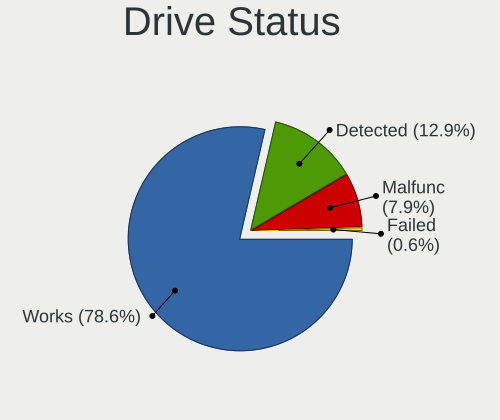

| Status   | Computers | Drives | Percent |
|----------|-----------|--------|---------|
| Works    | 996       | 2000   | 78.61%  |
| Detected | 164       | 219    | 12.94%  |
| Malfunc  | 100       | 170    | 7.89%   |
| Failed   | 7         | 10     | 0.55%   |

Storage controller
------------------

Storage Vendor
--------------

Storage controller vendors

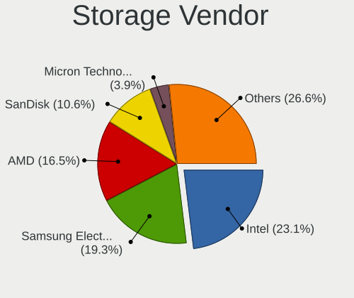

| Vendor                                  | Computers | Percent |
|-----------------------------------------|-----------|---------|
| Intel                                   | 387       | 23.06%  |
| Samsung Electronics                     | 324       | 19.31%  |
| AMD                                     | 277       | 16.51%  |
| SanDisk                                 | 178       | 10.61%  |
| Micron Technology                       | 65        | 3.87%   |
| SK hynix                                | 64        | 3.81%   |
| Kingston Technology Company             | 62        | 3.69%   |
| Phison Electronics                      | 40        | 2.38%   |
| ASMedia Technology                      | 38        | 2.26%   |
| Micron/Crucial Technology               | 36        | 2.15%   |
| KIOXIA                                  | 35        | 2.09%   |
| MAXIO Technology (Hangzhou)             | 27        | 1.61%   |
| Toshiba America Info Systems            | 18        | 1.07%   |
| ADATA Technology                        | 16        | 0.95%   |
| Silicon Motion                          | 11        | 0.66%   |
| Shenzhen Unionmemory Information System | 9         | 0.54%   |
| Realtek Semiconductor                   | 9         | 0.54%   |
| Shenzhen Longsys Electronics            | 8         | 0.48%   |
| Seagate Technology                      | 7         | 0.42%   |
| LSI Logic / Symbios Logic               | 7         | 0.42%   |
| Broadcom / LSI                          | 7         | 0.42%   |
| Yangtze Memory Technologies             | 5         | 0.3%    |
| Union Memory (Shenzhen)                 | 5         | 0.3%    |
| Solidigm                                | 5         | 0.3%    |
| INNOGRIT                                | 5         | 0.3%    |
| Apple                                   | 5         | 0.3%    |
| Marvell Technology Group                | 4         | 0.24%   |
| Lite-On Technology                      | 4         | 0.24%   |
| Solid State Storage Technology          | 3         | 0.18%   |
| Biwin Storage Technology                | 3         | 0.18%   |
| TenaFe                                  | 2         | 0.12%   |
| Hosin Global Electronics                | 2         | 0.12%   |
| VIA Technologies                        | 1         | 0.06%   |
| Transcend                               | 1         | 0.06%   |
| Shenzhen Shichuangyi Electronics        | 1         | 0.06%   |
| Red Hat                                 | 1         | 0.06%   |
| O2 Micro                                | 1         | 0.06%   |
| Nvidia                                  | 1         | 0.06%   |
| Netac Technology                        | 1         | 0.06%   |
| Lenovo                                  | 1         | 0.06%   |

Storage Model
-------------

Storage controller models

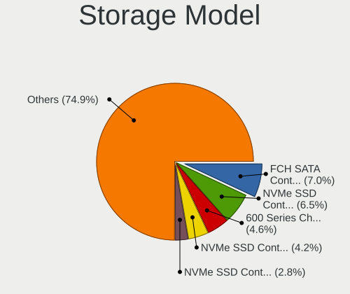

| Model                                                                          | Computers | Percent |
|--------------------------------------------------------------------------------|-----------|---------|
| AMD FCH SATA Controller [AHCI mode]                                            | 125       | 6.98%   |
| Samsung NVMe SSD Controller SM981/PM981/PM983                                  | 116       | 6.47%   |
| AMD 600 Series Chipset SATA Controller                                         | 82        | 4.58%   |
| Samsung NVMe SSD Controller PM9A1/PM9A3/980PRO                                 | 76        | 4.24%   |
| Samsung NVMe SSD Controller S4LV008[Pascal]                                    | 50        | 2.79%   |
| SanDisk WD SN560/SN740/SN770/SN5000 NVMe SSD                                   | 48        | 2.68%   |
| AMD 500 Series Chipset SATA Controller                                         | 48        | 2.68%   |
| Samsung NVMe SSD Controller 980 (DRAM-less)                                    | 42        | 2.34%   |
| AMD 400 Series Chipset SATA Controller                                         | 36        | 2.01%   |
| Intel Volume Management Device NVMe RAID Controller                            | 32        | 1.79%   |
| Sandisk WD Black SN850X NVMe SSD                                               | 29        | 1.62%   |
| ASMedia ASM1061/ASM1062 Serial ATA Controller                                  | 29        | 1.62%   |
| SK hynix Gold P31/BC711/PC711 NVMe Solid State Drive                           | 27        | 1.51%   |
| Intel Sunrise Point-LP SATA Controller [AHCI mode]                             | 27        | 1.51%   |
| SanDisk Extreme Pro / WD Black SN750 / PC SN730 / Red SN700 NVMe SSD           | 24        | 1.34%   |
| Micron 2450 NVMe SSD [HendrixV] (DRAM-less)                                    | 21        | 1.17%   |
| Intel Cannon Lake Mobile PCH SATA AHCI Controller                              | 20        | 1.12%   |
| Intel 8 Series/C220 Series Chipset Family 6-port SATA Controller 1 [AHCI mode] | 20        | 1.12%   |
| Intel SSD 670p Series [Keystone Harbor]                                        | 18        | 1%      |
| SK hynix Platinum P41/PC801 NVMe Solid State Drive                             | 17        | 0.95%   |
| Micron/Crucial P2 [Nick P2] / P3 / P3 Plus NVMe PCIe SSD (DRAM-less)           | 17        | 0.95%   |
| MAXIO (Hangzhou) NVMe SSD Controller MAP1202 (DRAM-less)                       | 17        | 0.95%   |
| Intel Cannon Lake PCH SATA AHCI Controller                                     | 17        | 0.95%   |
| Samsung NVMe SSD Controller SM961/PM961/SM963                                  | 16        | 0.89%   |
| Intel Q170/Q150/B150/H170/H110/Z170/CM236 Chipset SATA Controller [AHCI Mode]  | 16        | 0.89%   |
| Intel 7 Series Chipset Family 6-port SATA Controller [AHCI mode]               | 16        | 0.89%   |
| Micron 2400 NVMe SSD (DRAM-less)                                               | 15        | 0.84%   |
| Intel Wildcat Point-LP SATA Controller [AHCI Mode]                             | 15        | 0.84%   |
| Intel Raptor Lake SATA AHCI Controller                                         | 15        | 0.84%   |
| Intel Comet Lake SATA AHCI Controller                                          | 15        | 0.84%   |
| SanDisk WD PC SN810 / Black SN850 NVMe SSD                                     | 14        | 0.78%   |
| Samsung S4LN058A01[SSUBX] AHCI SSD Controller (Apple slot)                     | 13        | 0.73%   |
| Micron 2550 NVMe SSD (DRAM-less)                                               | 13        | 0.73%   |
| SanDisk Ultra 3D / WD PC SN530, IX SN530, Blue SN550 NVMe SSD (DRAM-less)      | 12        | 0.67%   |
| Samsung NVMe SSD Controller PM9C1a (DRAM-less)                                 | 12        | 0.67%   |
| Kingston Company KC3000/FURY Renegade NVMe SSD [E18]                           | 12        | 0.67%   |
| Intel 82801 Mobile SATA Controller [RAID mode]                                 | 12        | 0.67%   |
| Samsung NVMe SSD Controller PM9B1 (DRAM-less)                                  | 11        | 0.61%   |
| Phison E12 NVMe Controller                                                     | 11        | 0.61%   |
| Toshiba America Info Systems XG6 NVMe SSD Controller                           | 10        | 0.56%   |

Storage Kind
------------

Kind of storage controller (IDE, SATA, NVMe, SAS, ...)

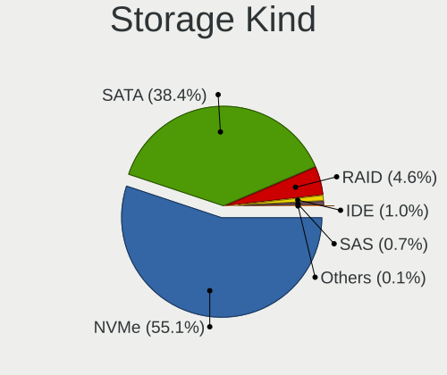

| Kind | Computers | Percent |
|------|-----------|---------|
| NVMe | 856       | 55.12%  |
| SATA | 597       | 38.44%  |
| RAID | 72        | 4.64%   |
| IDE  | 15        | 0.97%   |
| SAS  | 11        | 0.71%   |
| SCSI | 2         | 0.13%   |

Processor
---------

CPU Vendor
----------

Processor vendors

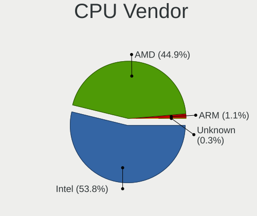

| Vendor  | Computers | Percent |
|---------|-----------|---------|
| Intel   | 596       | 53.79%  |
| AMD     | 497       | 44.86%  |
| ARM     | 12        | 1.08%   |
| Unknown | 3         | 0.27%   |

CPU Model
---------

Processor models

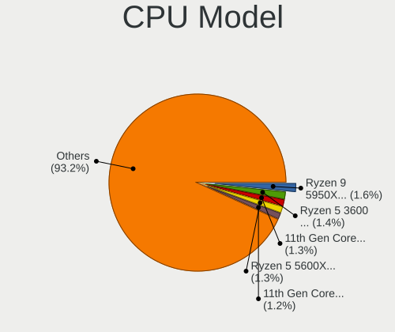

| Model                                         | Computers | Percent |
|-----------------------------------------------|-----------|---------|
| AMD Ryzen 9 5950X 16-Core Processor           | 18        | 1.62%   |
| AMD Ryzen 5 3600 6-Core Processor             | 16        | 1.44%   |
| Intel 11th Gen Core i7-1165G7 @ 2.80GHz       | 14        | 1.26%   |
| AMD Ryzen 5 5600X 6-Core Processor            | 14        | 1.26%   |
| Intel 11th Gen Core i5-1135G7 @ 2.40GHz       | 13        | 1.17%   |
| AMD Ryzen 9 5900X 12-Core Processor           | 13        | 1.17%   |
| Intel Core i7-8550U CPU @ 1.80GHz             | 12        | 1.08%   |
| ARM Processor                                 | 12        | 1.08%   |
| AMD Ryzen 7 7840HS w/ Radeon 780M Graphics    | 12        | 1.08%   |
| AMD Ryzen 7 5800X 8-Core Processor            | 12        | 1.08%   |
| AMD Ryzen 7 5700U with Radeon Graphics        | 12        | 1.08%   |
| Intel 12th Gen Core i7-12700H                 | 11        | 0.99%   |
| Intel 11th Gen Core i7-11800H @ 2.30GHz       | 11        | 0.99%   |
| AMD Ryzen AI 9 HX 370 w/ Radeon 890M          | 11        | 0.99%   |
| AMD Ryzen 7 6800H with Radeon Graphics        | 11        | 0.99%   |
| AMD Ryzen 9 7950X 16-Core Processor           | 10        | 0.9%    |
| AMD Ryzen 7 9800X3D 8-Core Processor          | 10        | 0.9%    |
| AMD Ryzen 7 7800X3D 8-Core Processor          | 10        | 0.9%    |
| Intel Core Ultra 7 155H                       | 9         | 0.81%   |
| Intel Core i7-10510U CPU @ 1.80GHz            | 9         | 0.81%   |
| Intel 12th Gen Core i7-1260P                  | 9         | 0.81%   |
| AMD Ryzen 7 5800X3D 8-Core Processor          | 9         | 0.81%   |
| AMD Ryzen 7 5800H with Radeon Graphics        | 9         | 0.81%   |
| Intel Core Ultra 9 185H                       | 8         | 0.72%   |
| Intel Core i7-8750H CPU @ 2.20GHz             | 8         | 0.72%   |
| Intel Core i7-8565U CPU @ 1.80GHz             | 8         | 0.72%   |
| Intel Core i7-7500U CPU @ 2.70GHz             | 8         | 0.72%   |
| Intel Core i7-4870HQ CPU @ 2.50GHz            | 8         | 0.72%   |
| AMD Ryzen 7 PRO 4750U with Radeon Graphics    | 8         | 0.72%   |
| Intel Core i7-7700HQ CPU @ 2.80GHz            | 7         | 0.63%   |
| Intel Core i5-8350U CPU @ 1.70GHz             | 7         | 0.63%   |
| Intel 12th Gen Core i5-1240P                  | 7         | 0.63%   |
| AMD Ryzen 9 6900HS with Radeon Graphics       | 7         | 0.63%   |
| AMD Ryzen 9 3900X 12-Core Processor           | 7         | 0.63%   |
| AMD Ryzen 7 PRO 7840U w/ Radeon 780M Graphics | 7         | 0.63%   |
| AMD Ryzen 7 PRO 5850U with Radeon Graphics    | 7         | 0.63%   |
| AMD Ryzen 5 7640U w/ Radeon 760M Graphics     | 7         | 0.63%   |
| Intel N100                                    | 6         | 0.54%   |
| Intel Core i7-10750H CPU @ 2.60GHz            | 6         | 0.54%   |
| Intel Core i5-6300U CPU @ 2.40GHz             | 6         | 0.54%   |

CPU Model Family
----------------

Processor model prefix

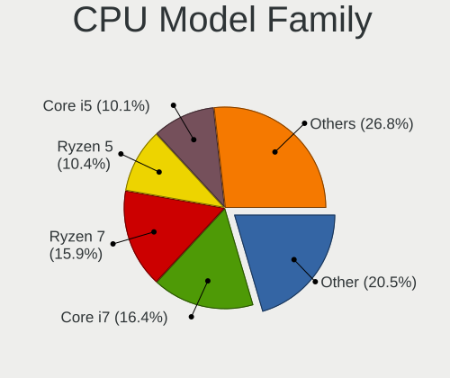

| Model                  | Computers | Percent |
|------------------------|-----------|---------|
| Other                  | 227       | 20.47%  |
| Intel Core i7          | 182       | 16.41%  |
| AMD Ryzen 7            | 176       | 15.87%  |
| AMD Ryzen 5            | 115       | 10.37%  |
| Intel Core i5          | 112       | 10.1%   |
| AMD Ryzen 9            | 108       | 9.74%   |
| Intel Core             | 39        | 3.52%   |
| AMD Ryzen 7 PRO        | 33        | 2.98%   |
| Intel Core i9          | 20        | 1.8%    |
| Intel Celeron          | 17        | 1.53%   |
| Intel Xeon             | 16        | 1.44%   |
| AMD Ryzen Threadripper | 11        | 0.99%   |
| Intel Core i3          | 10        | 0.9%    |
| AMD Ryzen 5 PRO        | 8         | 0.72%   |
| AMD Ryzen 3            | 6         | 0.54%   |
| Intel Pentium          | 4         | 0.36%   |
| Intel Atom             | 4         | 0.36%   |
| AMD FX                 | 4         | 0.36%   |
| Intel Core 2 Duo       | 2         | 0.18%   |
| AMD EPYC               | 2         | 0.18%   |
| Intel Xeon Silver      | 1         | 0.09%   |
| Intel Pentium Gold     | 1         | 0.09%   |
| Intel Pentium D        | 1         | 0.09%   |
| Intel Genuine          | 1         | 0.09%   |
| Intel Core m3          | 1         | 0.09%   |
| Intel Celeron M        | 1         | 0.09%   |
| AMD Ryzen 3 PRO        | 1         | 0.09%   |
| AMD Embedded           | 1         | 0.09%   |
| AMD E1                 | 1         | 0.09%   |
| AMD Athlon II X4       | 1         | 0.09%   |
| AMD Athlon 64 X2       | 1         | 0.09%   |
| AMD Athlon             | 1         | 0.09%   |
| AMD A12                | 1         | 0.09%   |

CPU Cores
---------

Number of processor cores

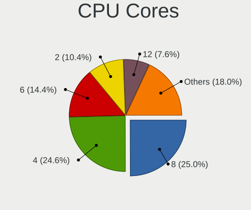

| Number  | Computers | Percent |
|---------|-----------|---------|
| 8       | 277       | 24.98%  |
| 4       | 273       | 24.62%  |
| 6       | 160       | 14.43%  |
| 2       | 115       | 10.37%  |
| 12      | 84        | 7.57%   |
| 16      | 82        | 7.39%   |
| 10      | 42        | 3.79%   |
| 14      | 34        | 3.07%   |
| 24      | 22        | 1.98%   |
| Unknown | 9         | 0.81%   |
| 20      | 4         | 0.36%   |
| 64      | 2         | 0.18%   |
| 1       | 2         | 0.18%   |
| 32      | 1         | 0.09%   |
| 22      | 1         | 0.09%   |
| 3       | 1         | 0.09%   |

CPU Sockets
-----------

Number of sockets

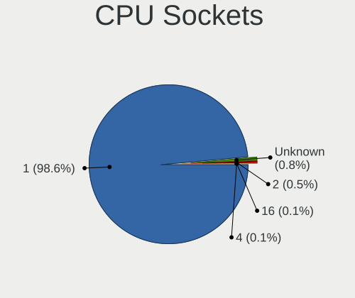

| Number  | Computers | Percent |
|---------|-----------|---------|
| 1       | 1093      | 98.56%  |
| Unknown | 9         | 0.81%   |
| 2       | 5         | 0.45%   |
| 16      | 1         | 0.09%   |
| 4       | 1         | 0.09%   |

CPU Threads
-----------

Threads per core (Hyper-Threading)

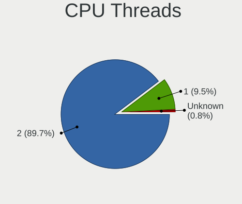

| Number  | Computers | Percent |
|---------|-----------|---------|
| 2       | 995       | 89.72%  |
| 1       | 105       | 9.47%   |
| Unknown | 9         | 0.81%   |

CPU Op-Modes
------------

CPU Operation Modes (32-bit, 64-bit)

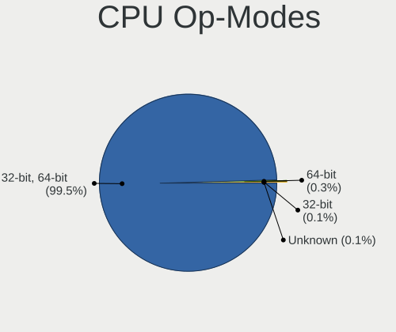

| Op mode        | Computers | Percent |
|----------------|-----------|---------|
| 32-bit, 64-bit | 1104      | 99.55%  |
| 64-bit         | 3         | 0.27%   |
| 32-bit         | 1         | 0.09%   |
| Unknown        | 1         | 0.09%   |

CPU Microcode
-------------

Microcode number

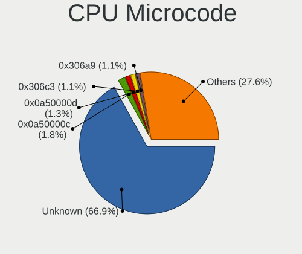

| Number     | Computers | Percent |
|------------|-----------|---------|
| Unknown    | 763       | 66.93%  |
| 0x0a50000c | 21        | 1.84%   |
| 0x0a50000d | 15        | 1.32%   |
| 0x306c3    | 13        | 1.14%   |
| 0x306a9    | 13        | 1.14%   |
| 0x08600106 | 13        | 1.14%   |
| 0x906ea    | 12        | 1.05%   |
| 0x08701021 | 12        | 1.05%   |
| 0x806ea    | 11        | 0.96%   |
| 0x806c1    | 11        | 0.96%   |
| 0x0a404102 | 10        | 0.88%   |
| 0x506e3    | 9         | 0.79%   |
| 0x40661    | 9         | 0.79%   |
| 0x0a601203 | 9         | 0.79%   |
| 0x306d4    | 8         | 0.7%    |
| 0x906a3    | 7         | 0.61%   |
| 0x806e9    | 7         | 0.61%   |
| 0x906e9    | 6         | 0.53%   |
| 0x806ec    | 6         | 0.53%   |
| 0x0a601206 | 6         | 0.53%   |
| 0x08608103 | 6         | 0.53%   |
| 0x08108109 | 6         | 0.53%   |
| 0x806eb    | 5         | 0.44%   |
| 0x0a704104 | 5         | 0.44%   |
| 0x0a704103 | 5         | 0.44%   |
| 0x08701013 | 5         | 0.44%   |
| 0x0800820d | 5         | 0.44%   |
| 0xb06a2    | 4         | 0.35%   |
| 0xb0671    | 4         | 0.35%   |
| 0x406e3    | 4         | 0.35%   |
| 0x40651    | 4         | 0.35%   |
| 0x0a20120e | 4         | 0.35%   |
| 0x0a201025 | 4         | 0.35%   |
| 0x906a4    | 3         | 0.26%   |
| 0x706a8    | 3         | 0.26%   |
| 0x706a1    | 3         | 0.26%   |
| 0x0a404101 | 3         | 0.26%   |
| 0x0a20120a | 3         | 0.26%   |
| 0x0a20102b | 3         | 0.26%   |
| 0x0a201016 | 3         | 0.26%   |

CPU Microarch
-------------

Microarchitecture

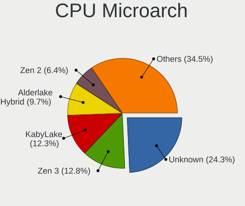

| Name               | Computers | Percent |
|--------------------|-----------|---------|
| Unknown            | 270       | 24.26%  |
| Zen 3              | 143       | 12.85%  |
| KabyLake           | 137       | 12.31%  |
| Alderlake Hybrid   | 108       | 9.7%    |
| Zen 2              | 71        | 6.38%   |
| Haswell            | 56        | 5.03%   |
| TigerLake          | 51        | 4.58%   |
| Skylake            | 35        | 3.14%   |
| IvyBridge          | 29        | 2.61%   |
| Icelake            | 26        | 2.34%   |
| Meteorlake Hybrid  | 25        | 2.25%   |
| Zen+               | 24        | 2.16%   |
| CometLake          | 24        | 2.16%   |
| Broadwell          | 21        | 1.89%   |
| SandyBridge        | 17        | 1.53%   |
| Zen                | 15        | 1.35%   |
| Gracemont          | 9         | 0.81%   |
| Goldmont plus      | 9         | 0.81%   |
| Lunarlake Hybrid   | 8         | 0.72%   |
| Westmere           | 5         | 0.45%   |
| Piledriver         | 4         | 0.36%   |
| ArrowLake-H Hybrid | 4         | 0.36%   |
| Tremont            | 3         | 0.27%   |
| Silvermont         | 3         | 0.27%   |
| Goldmont           | 3         | 0.27%   |
| Nehalem            | 2         | 0.18%   |
| Excavator          | 2         | 0.18%   |
| Core               | 2         | 0.18%   |
| Bonnell            | 2         | 0.18%   |
| Penryn             | 1         | 0.09%   |
| NetBurst           | 1         | 0.09%   |
| K8 Hammer          | 1         | 0.09%   |
| K10 Llano          | 1         | 0.09%   |
| Jaguar             | 1         | 0.09%   |

Graphics
--------

GPU Vendor
----------

Vendors of graphics cards

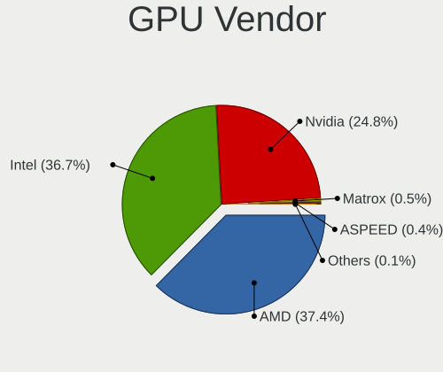

| Vendor                     | Computers | Percent |
|----------------------------|-----------|---------|
| AMD                        | 504       | 37.42%  |
| Intel                      | 495       | 36.75%  |
| Nvidia                     | 334       | 24.8%   |
| Matrox Electronics Systems | 7         | 0.52%   |
| ASPEED Technology          | 5         | 0.37%   |
| VIA Technologies           | 1         | 0.07%   |
| Red Hat                    | 1         | 0.07%   |

GPU Model
---------

Graphics card models

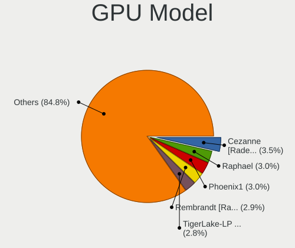

| Model                                                                     | Computers | Percent |
|---------------------------------------------------------------------------|-----------|---------|
| AMD Cezanne [Radeon Vega Series / Radeon Vega Mobile Series]              | 50        | 3.53%   |
| AMD Raphael                                                               | 42        | 2.96%   |
| AMD Phoenix1                                                              | 42        | 2.96%   |
| AMD Rembrandt [Radeon 680M]                                               | 41        | 2.89%   |
| Intel TigerLake-LP GT2 [Iris Xe Graphics]                                 | 40        | 2.82%   |
| Intel Raptor Lake-P [Iris Xe Graphics]                                    | 30        | 2.12%   |
| Intel Alder Lake-P GT2 [Iris Xe Graphics]                                 | 30        | 2.12%   |
| Intel Kaby Lake-R GT2 [UHD Graphics 620]                                  | 29        | 2.05%   |
| AMD Granite Ridge [Radeon Graphics]                                       | 26        | 1.83%   |
| AMD Navi 10 [Radeon RX 5600 OEM/5600 XT / 5700/5700 XT]                   | 25        | 1.76%   |
| Intel CoffeeLake-H GT2 [UHD Graphics 630]                                 | 23        | 1.62%   |
| AMD Renoir [Radeon Vega Series / Radeon Vega Mobile Series]               | 22        | 1.55%   |
| AMD Navi 22 [Radeon RX 6700/6700 XT/6750 XT / 6800M/6850M XT]             | 22        | 1.55%   |
| AMD Ellesmere [Radeon RX 470/480/570/570X/580/580X/590]                   | 22        | 1.55%   |
| Nvidia GA106M [GeForce RTX 3060 Mobile / Max-Q]                           | 19        | 1.34%   |
| Intel Meteor Lake-P [Intel Arc Graphics]                                  | 19        | 1.34%   |
| AMD Strix [Radeon 880M / 890M]                                            | 19        | 1.34%   |
| AMD Lucienne                                                              | 19        | 1.34%   |
| Intel WhiskeyLake-U GT2 [UHD Graphics 620]                                | 18        | 1.27%   |
| AMD Navi 31 [Radeon RX 7900 XT/7900 XTX/7900 GRE/7900M]                   | 18        | 1.27%   |
| AMD Navi 23 [Radeon RX 6600/6600 XT/6600M]                                | 17        | 1.2%    |
| AMD Navi 21 [Radeon RX 6800/6800 XT / 6900 XT]                            | 17        | 1.2%    |
| AMD Barcelo                                                               | 17        | 1.2%    |
| AMD Navi 33 [Radeon RX 7600/7600 XT/7600M XT/7600S/7700S / PRO W7600]     | 16        | 1.13%   |
| Intel 3rd Gen Core processor Graphics Controller                          | 15        | 1.06%   |
| AMD Picasso/Raven 2 [Radeon Vega Series / Radeon Vega Mobile Series]      | 15        | 1.06%   |
| Intel TigerLake-H GT1 [UHD Graphics]                                      | 14        | 0.99%   |
| Intel Kaby Lake-U GT2 [HD Graphics 620]                                   | 14        | 0.99%   |
| Intel CometLake-U GT2 [UHD Graphics]                                      | 14        | 0.99%   |
| AMD HawkPoint1                                                            | 14        | 0.99%   |
| Intel Skylake-U GT2 [HD Graphics 520]                                     | 13        | 0.92%   |
| Intel Broadwell-U GT2 [HD Graphics 5500]                                  | 13        | 0.92%   |
| Intel 2nd Generation Core Processor Family Integrated Graphics Controller | 13        | 0.92%   |
| Nvidia AD107M [GeForce RTX 4060 Max-Q / Mobile]                           | 12        | 0.85%   |
| Nvidia AD106M [GeForce RTX 4070 Max-Q / Mobile]                           | 12        | 0.85%   |
| AMD Navi 32 [Radeon RX 7700 XT / 7800 XT]                                 | 12        | 0.85%   |
| Nvidia GP108M [GeForce MX150]                                             | 11        | 0.78%   |
| Intel Haswell-ULT Integrated Graphics Controller                          | 11        | 0.78%   |
| AMD Navi 48 [Radeon RX 9070/9070 XT/9070 GRE]                             | 11        | 0.78%   |
| Nvidia GA107M [GeForce RTX 3050 Mobile]                                   | 10        | 0.71%   |

GPU Combo
---------

Combinations of graphics cards

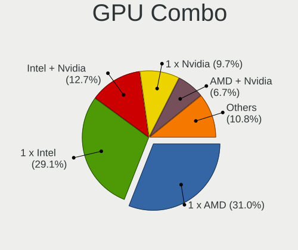

| Name                    | Computers | Percent |
|-------------------------|-----------|---------|
| 1 x AMD                 | 346       | 30.98%  |
| 1 x Intel               | 325       | 29.1%   |
| Intel + Nvidia          | 142       | 12.71%  |
| 1 x Nvidia              | 108       | 9.67%   |
| AMD + Nvidia            | 75        | 6.71%   |
| 2 x AMD                 | 56        | 5.01%   |
| Intel + AMD             | 24        | 2.15%   |
| Other                   | 16        | 1.43%   |
| 1 x Matrox              | 6         | 0.54%   |
| 2 x Nvidia              | 3         | 0.27%   |
| 1 x ASPEED              | 3         | 0.27%   |
| 2 x Intel               | 2         | 0.18%   |
| Nvidia + Matrox         | 2         | 0.18%   |
| Nvidia + ASPEED         | 2         | 0.18%   |
| AMD + ASPEED            | 2         | 0.18%   |
| 2 x Nvidia + 1 x Matrox | 1         | 0.09%   |
| 2 x AMD + 1 x Nvidia    | 1         | 0.09%   |
| 1 x VIA                 | 1         | 0.09%   |
| 1 x Red Hat             | 1         | 0.09%   |
| Intel + 2 x AMD         | 1         | 0.09%   |

GPU Driver
----------

Free vs proprietary

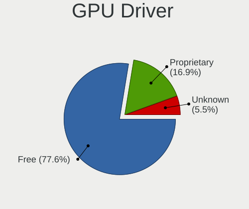

| Driver      | Computers | Percent |
|-------------|-----------|---------|
| Free        | 869       | 77.59%  |
| Proprietary | 189       | 16.88%  |
| Unknown     | 62        | 5.54%   |

GPU Memory
----------

Total video memory

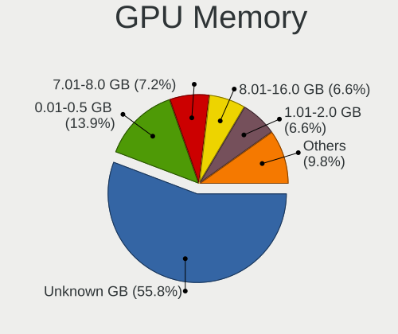

| Size in GB | Computers | Percent |
|------------|-----------|---------|
| Unknown    | 629       | 55.76%  |
| 0.01-0.5   | 157       | 13.92%  |
| 7.01-8.0   | 81        | 7.18%   |
| 1.01-2.0   | 75        | 6.65%   |
| 8.01-16.0  | 75        | 6.65%   |
| 3.01-4.0   | 49        | 4.34%   |
| 0.51-1.0   | 32        | 2.84%   |
| 16.01-24.0 | 18        | 1.6%    |
| 5.01-6.0   | 8         | 0.71%   |
| 2.01-3.0   | 2         | 0.18%   |
| 32.01-64.0 | 1         | 0.09%   |
| 24.01-32.0 | 1         | 0.09%   |

Monitor
-------

Monitor Vendor
--------------

Monitor vendors

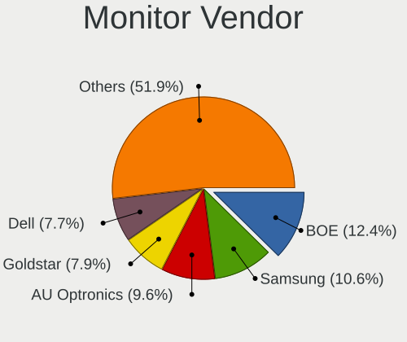

| Vendor               | Computers | Percent |
|----------------------|-----------|---------|
| BOE                  | 163       | 12.36%  |
| Samsung Electronics  | 140       | 10.61%  |
| AU Optronics         | 126       | 9.55%   |
| Goldstar             | 104       | 7.88%   |
| Dell                 | 102       | 7.73%   |
| Chimei Innolux       | 74        | 5.61%   |
| LG Display           | 73        | 5.53%   |
| Acer                 | 44        | 3.34%   |
| Lenovo               | 40        | 3.03%   |
| ASUSTek Computer     | 36        | 2.73%   |
| Apple                | 36        | 2.73%   |
| AOC                  | 33        | 2.5%    |
| Sharp                | 29        | 2.2%    |
| Hewlett-Packard      | 29        | 2.2%    |
| Ancor Communications | 28        | 2.12%   |
| BenQ                 | 22        | 1.67%   |
| Gigabyte Technology  | 20        | 1.52%   |
| Philips              | 18        | 1.36%   |
| MSI                  | 16        | 1.21%   |
| PANDA                | 13        | 0.99%   |
| CSO                  | 13        | 0.99%   |
| ViewSonic            | 11        | 0.83%   |
| TMX                  | 11        | 0.83%   |
| InfoVision           | 11        | 0.83%   |
| Iiyama               | 11        | 0.83%   |
| Unknown              | 6         | 0.45%   |
| Mi                   | 6         | 0.45%   |
| CSOT                 | 6         | 0.45%   |
| Sceptre Tech         | 5         | 0.38%   |
| HKC                  | 5         | 0.38%   |
| Toshiba              | 4         | 0.3%    |
| TMA                  | 4         | 0.3%    |
| Eizo                 | 4         | 0.3%    |
| Pixio                | 3         | 0.23%   |
| Panasonic            | 3         | 0.23%   |
| Hitachi              | 3         | 0.23%   |
| HannStar             | 3         | 0.23%   |
| DENON                | 3         | 0.23%   |
| Vizio                | 2         | 0.15%   |
| Vestel Elektronik    | 2         | 0.15%   |

Monitor Model
-------------

Monitor models

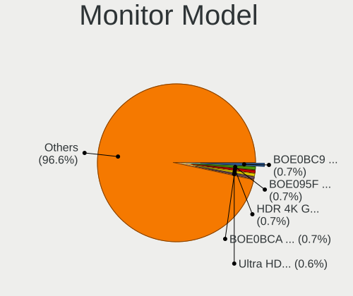

| Model                                                                   | Computers | Percent |
|-------------------------------------------------------------------------|-----------|---------|
| BOE LCD Monitor BOE0BC9 2560x1600 345x215mm 16.0-inch                   | 10        | 0.74%   |
| BOE LCD Monitor BOE095F 2256x1504 285x190mm 13.5-inch                   | 10        | 0.74%   |
| Goldstar HDR 4K GSM7707 3840x2160 600x340mm 27.2-inch                   | 9         | 0.66%   |
| BOE LCD Monitor BOE0BCA 2256x1504 285x190mm 13.5-inch                   | 9         | 0.66%   |
| Goldstar Ultra HD GSM5B09 3840x2160 600x340mm 27.2-inch                 | 8         | 0.59%   |
| Apple Color LCD APPA02E 2880x1800 331x207mm 15.4-inch                   | 8         | 0.59%   |
| Unknown LCD Monitor FFFF 2288x1287 2550x2550mm 142.0-inch               | 6         | 0.44%   |
| Samsung Electronics LCD Monitor SDC419D 2880x1800 302x189mm 14.0-inch   | 6         | 0.44%   |
| Goldstar FULL HD GSM5B55 1920x1080 480x270mm 21.7-inch                  | 6         | 0.44%   |
| BOE NE135A1M-NY1 BOE0CB4 2880x1920 285x190mm 13.5-inch                  | 6         | 0.44%   |
| AU Optronics LCD Monitor AUO403D 1920x1080 309x174mm 14.0-inch          | 6         | 0.44%   |
| Samsung Electronics LCD Monitor SDC4171 2880x1800 302x189mm 14.0-inch   | 5         | 0.37%   |
| Samsung Electronics C24F390 SAM0D2C 1920x1080 521x293mm 23.5-inch       | 5         | 0.37%   |
| Goldstar 27GL850 GSM5B7F 2560x1440 597x336mm 27.0-inch                  | 5         | 0.37%   |
| Dell S2721DGF DEL41D9 2560x1440 597x336mm 27.0-inch                     | 5         | 0.37%   |
| Chimei Innolux LCD Monitor CMN1521 1920x1080 344x193mm 15.5-inch        | 5         | 0.37%   |
| AOC 27G2G4 AOC2702 1920x1080 598x336mm 27.0-inch                        | 5         | 0.37%   |
| Samsung Electronics S24F350 SAM0D20 1920x1080 521x293mm 23.5-inch       | 4         | 0.29%   |
| Samsung Electronics LCD Monitor SDC4154 2880x1800 302x189mm 14.0-inch   | 4         | 0.29%   |
| Samsung Electronics LCD Monitor SDC4143 3840x2160 344x194mm 15.5-inch   | 4         | 0.29%   |
| Goldstar LG TV SSCR2 GSMC0C8 3840x2160                                  | 4         | 0.29%   |
| Gigabyte Technology M27Q GBT270D 2560x1440 597x336mm 27.0-inch          | 4         | 0.29%   |
| Dell U2415 DELA0BA 1920x1200 518x324mm 24.1-inch                        | 4         | 0.29%   |
| Dell U2412M DELA07B 1920x1200 518x324mm 24.1-inch                       | 4         | 0.29%   |
| Dell P2418D DELD0C1 2560x1440 526x296mm 23.8-inch                       | 4         | 0.29%   |
| Chimei Innolux LCD Monitor CMN1614 1920x1200 344x215mm 16.0-inch        | 4         | 0.29%   |
| Chimei Innolux LCD Monitor CMN15E7 1920x1080 344x193mm 15.5-inch        | 4         | 0.29%   |
| Chimei Innolux LCD Monitor CMN14D4 1920x1080 309x173mm 13.9-inch        | 4         | 0.29%   |
| AU Optronics LCD Monitor AUO21ED 1920x1080 344x193mm 15.5-inch          | 4         | 0.29%   |
| AU Optronics LCD Monitor AUO106C 1366x768 276x155mm 12.5-inch           | 4         | 0.29%   |
| AOC 24G2W1G3 AOC2402 1920x1080 527x296mm 23.8-inch                      | 4         | 0.29%   |
| Ancor Communications ASUS VS228 ACI22FD 1920x1080 476x268mm 21.5-inch   | 4         | 0.29%   |
| Ancor Communications ASUS PB287Q ACI28A3 3840x2160 621x341mm 27.9-inch  | 4         | 0.29%   |
| Sharp LQ134N1JW52 SHP151E 1920x1200 288x180mm 13.4-inch                 | 3         | 0.22%   |
| Samsung Electronics Odyssey G85SB SAM72F2 3440x1440 809x354mm 34.8-inch | 3         | 0.22%   |
| Samsung Electronics LF24T35 SAM707D 1920x1080 528x297mm 23.9-inch       | 3         | 0.22%   |
| Samsung Electronics LCD Monitor SEC3242 1920x1080 235x132mm 10.6-inch   | 3         | 0.22%   |
| Samsung Electronics LCD Monitor SDC41B3 2880x1800 302x189mm 14.0-inch   | 3         | 0.22%   |
| Samsung Electronics LCD Monitor SDC419F 2880x1800 302x189mm 14.0-inch   | 3         | 0.22%   |
| Samsung Electronics LCD Monitor SDC4193 2880x1800 302x189mm 14.0-inch   | 3         | 0.22%   |

Monitor Resolution
------------------

Monitor screen resolution

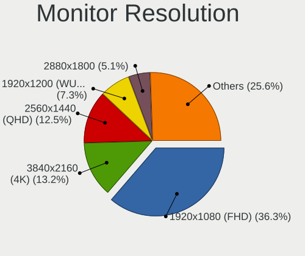

| Resolution         | Computers | Percent |
|--------------------|-----------|---------|
| 1920x1080 (FHD)    | 453       | 36.3%   |
| 3840x2160 (4K)     | 165       | 13.22%  |
| 2560x1440 (QHD)    | 156       | 12.5%   |
| 1920x1200 (WUXGA)  | 91        | 7.29%   |
| 2880x1800          | 64        | 5.13%   |
| 2560x1600          | 61        | 4.89%   |
| 1366x768 (WXGA)    | 45        | 3.61%   |
| 3440x1440          | 44        | 3.53%   |
| 2256x1504          | 21        | 1.68%   |
| 1280x1024 (SXGA)   | 13        | 1.04%   |
| 2560x1080          | 12        | 0.96%   |
| 1600x900 (HD+)     | 10        | 0.8%    |
| Unknown            | 10        | 0.8%    |
| 3840x2400          | 9         | 0.72%   |
| 2880x1920          | 9         | 0.72%   |
| 3840x1600          | 6         | 0.48%   |
| 3840x1080          | 6         | 0.48%   |
| 2288x1287          | 6         | 0.48%   |
| 1280x800 (WXGA)    | 6         | 0.48%   |
| 3200x2000          | 5         | 0.4%    |
| 2240x1400          | 5         | 0.4%    |
| 1920x1280          | 5         | 0.4%    |
| 1680x1050 (WSXGA+) | 5         | 0.4%    |
| 1440x900 (WXGA+)   | 5         | 0.4%    |
| 3840x2560          | 3         | 0.24%   |
| 3072x1920          | 3         | 0.24%   |
| 2160x1440          | 3         | 0.24%   |
| 2944x1840          | 2         | 0.16%   |
| 2880x1620          | 2         | 0.16%   |
| 2560x2880          | 2         | 0.16%   |
| 1600x1200          | 2         | 0.16%   |
| 1360x768           | 2         | 0.16%   |
| 1024x600           | 2         | 0.16%   |
| 800x1280           | 1         | 0.08%   |
| 3840x1200          | 1         | 0.08%   |
| 3840x1100          | 1         | 0.08%   |
| 3456x2160          | 1         | 0.08%   |
| 3200x1800 (QHD+)   | 1         | 0.08%   |
| 3000x2000          | 1         | 0.08%   |
| 2560x1397          | 1         | 0.08%   |

Monitor Diagonal
----------------

Diagonal size in inches

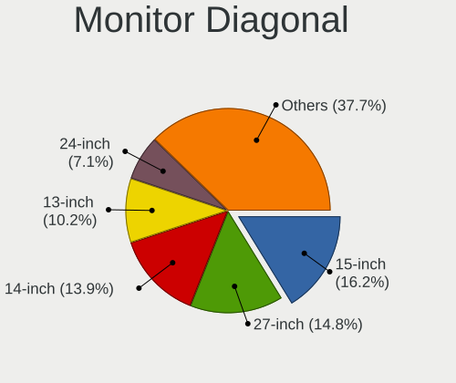

| Inches  | Computers | Percent |
|---------|-----------|---------|
| 15      | 212       | 16.23%  |
| 27      | 193       | 14.78%  |
| 14      | 182       | 13.94%  |
| 13      | 133       | 10.18%  |
| 24      | 93        | 7.12%   |
| 16      | 73        | 5.59%   |
| 31      | 72        | 5.51%   |
| 23      | 66        | 5.05%   |
| 34      | 54        | 4.13%   |
| 21      | 35        | 2.68%   |
| 17      | 22        | 1.68%   |
| 12      | 21        | 1.61%   |
| Unknown | 16        | 1.23%   |
| 26      | 13        | 1%      |
| 84      | 10        | 0.77%   |
| 32      | 9         | 0.69%   |
| 25      | 9         | 0.69%   |
| 19      | 9         | 0.69%   |
| 28      | 8         | 0.61%   |
| 20      | 8         | 0.61%   |
| 142     | 6         | 0.46%   |
| 37      | 6         | 0.46%   |
| 72      | 5         | 0.38%   |
| 48      | 5         | 0.38%   |
| 35      | 5         | 0.38%   |
| 40      | 4         | 0.31%   |
| 39      | 4         | 0.31%   |
| 22      | 4         | 0.31%   |
| 86      | 3         | 0.23%   |
| 63      | 3         | 0.23%   |
| 54      | 3         | 0.23%   |
| 18      | 3         | 0.23%   |
| 11      | 3         | 0.23%   |
| 36      | 2         | 0.15%   |
| 10      | 2         | 0.15%   |
| 85      | 1         | 0.08%   |
| 74      | 1         | 0.08%   |
| 60      | 1         | 0.08%   |
| 49      | 1         | 0.08%   |
| 46      | 1         | 0.08%   |

Monitor Width
-------------

Physical width

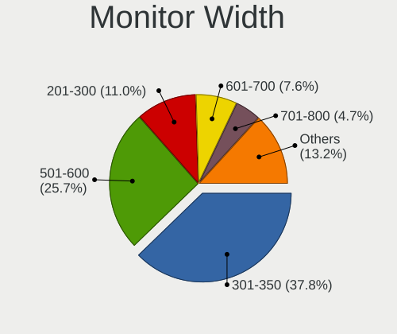

| Width in mm    | Computers | Percent |
|----------------|-----------|---------|
| 301-350        | 480       | 37.77%  |
| 501-600        | 327       | 25.73%  |
| 201-300        | 140       | 11.01%  |
| 601-700        | 96        | 7.55%   |
| 701-800        | 60        | 4.72%   |
| 401-500        | 52        | 4.09%   |
| 351-400        | 33        | 2.6%    |
| 801-900        | 22        | 1.73%   |
| 1501-2000      | 18        | 1.42%   |
| 1001-1500      | 17        | 1.34%   |
| Unknown        | 16        | 1.26%   |
| More than 2000 | 6         | 0.47%   |
| 901-1000       | 2         | 0.16%   |
| 101-200        | 1         | 0.08%   |
| 1-100          | 1         | 0.08%   |

Aspect Ratio
------------

Proportional relationship between the width and the height

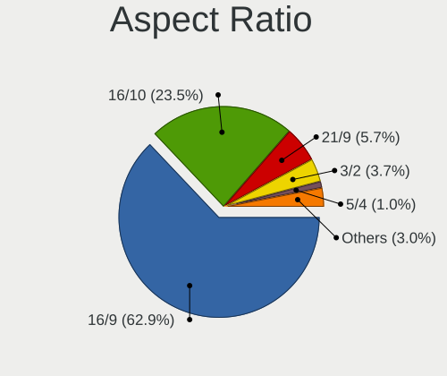

| Ratio   | Computers | Percent |
|---------|-----------|---------|
| 16/9    | 723       | 62.92%  |
| 16/10   | 270       | 23.5%   |
| 21/9    | 66        | 5.74%   |
| 3/2     | 43        | 3.74%   |
| 5/4     | 12        | 1.04%   |
| Unknown | 8         | 0.7%    |
| 32/9    | 7         | 0.61%   |
| 1.00    | 7         | 0.61%   |
| 0.89    | 3         | 0.26%   |
| 4/3     | 2         | 0.17%   |
| 0.56    | 2         | 0.17%   |
| 6/5     | 1         | 0.09%   |
| 3.40    | 1         | 0.09%   |
| 3.20    | 1         | 0.09%   |
| 2.01    | 1         | 0.09%   |
| 0.67    | 1         | 0.09%   |
| 0.63    | 1         | 0.09%   |

Monitor Area
------------

Area in inch²

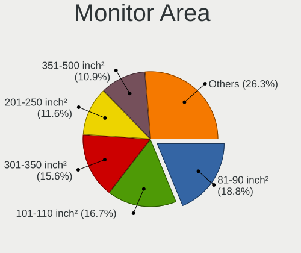

| Area in inch² | Computers | Percent |
|----------------|-----------|---------|
| 81-90          | 242       | 18.79%  |
| 101-110        | 215       | 16.69%  |
| 301-350        | 201       | 15.61%  |
| 201-250        | 150       | 11.65%  |
| 351-500        | 141       | 10.95%  |
| 111-120        | 70        | 5.43%   |
| 71-80          | 68        | 5.28%   |
| 251-300        | 44        | 3.42%   |
| More than 1000 | 33        | 2.56%   |
| 151-200        | 26        | 2.02%   |
| 501-1000       | 24        | 1.86%   |
| 61-70          | 20        | 1.55%   |
| 121-130        | 16        | 1.24%   |
| Unknown        | 16        | 1.24%   |
| 141-150        | 8         | 0.62%   |
| 51-60          | 4         | 0.31%   |
| 91-100         | 4         | 0.31%   |
| 41-50          | 2         | 0.16%   |
| 1-40           | 2         | 0.16%   |
| 131-140        | 2         | 0.16%   |

Pixel Density
-------------

Pixels per inch

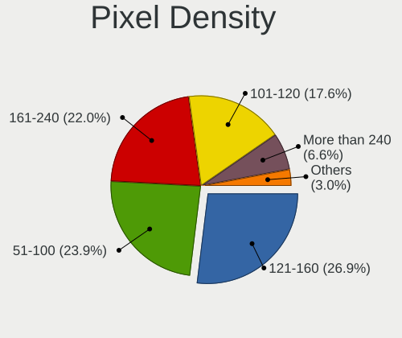

| Density       | Computers | Percent |
|---------------|-----------|---------|
| 121-160       | 337       | 26.94%  |
| 51-100        | 299       | 23.9%   |
| 161-240       | 275       | 21.98%  |
| 101-120       | 220       | 17.59%  |
| More than 240 | 83        | 6.63%   |
| 1-50          | 21        | 1.68%   |
| Unknown       | 16        | 1.28%   |

Multiple Monitors
-----------------

Total monitors connected

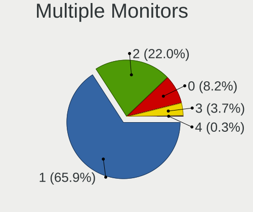

| Total | Computers | Percent |
|-------|-----------|---------|
| 1     | 753       | 65.88%  |
| 2     | 251       | 21.96%  |
| 0     | 94        | 8.22%   |
| 3     | 42        | 3.67%   |
| 4     | 3         | 0.26%   |

Network
-------

Net Controller Vendor
---------------------

Controller vendors

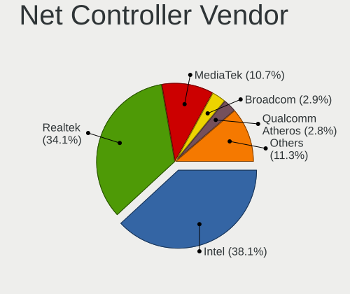

| Vendor                                 | Computers | Percent |
|----------------------------------------|-----------|---------|
| Intel                                  | 623       | 38.13%  |
| Realtek Semiconductor                  | 558       | 34.15%  |
| MediaTek                               | 175       | 10.71%  |
| Broadcom                               | 48        | 2.94%   |
| Qualcomm Atheros                       | 45        | 2.75%   |
| Qualcomm                               | 19        | 1.16%   |
| Aquantia                               | 19        | 1.16%   |
| ASIX Electronics                       | 18        | 1.1%    |
| Qualcomm Technologies                  | 11        | 0.67%   |
| TP-Link                                | 10        | 0.61%   |
| Lenovo                                 | 9         | 0.55%   |
| Shenzhen Goodix Technology             | 7         | 0.43%   |
| Broadcom Limited                       | 7         | 0.43%   |
| QinHeng Electronics                    | 5         | 0.31%   |
| Xiaomi                                 | 4         | 0.24%   |
| Microsoft                              | 4         | 0.24%   |
| Framework Computer                     | 4         | 0.24%   |
| Apple                                  | 4         | 0.24%   |
| Samsung Electronics                    | 3         | 0.18%   |
| Ralink Technology                      | 3         | 0.18%   |
| Ralink                                 | 3         | 0.18%   |
| Marvell Technology Group               | 3         | 0.18%   |
| Google                                 | 3         | 0.18%   |
| Dell                                   | 3         | 0.18%   |
| Suzhou Motorcomm Electronic Technology | 2         | 0.12%   |
| Realtek                                | 2         | 0.12%   |
| Quectel Wireless Solutions             | 2         | 0.12%   |
| Microchip Technology                   | 2         | 0.12%   |
| ICS Advent                             | 2         | 0.12%   |
| Ericsson Business Mobile Networks      | 2         | 0.12%   |
| DisplayLink                            | 2         | 0.12%   |
| D-Link System                          | 2         | 0.12%   |
| D-Link                                 | 2         | 0.12%   |
| ASUSTek Computer                       | 2         | 0.12%   |
| Unknown                                | 2         | 0.12%   |
| Winbond Electronics                    | 1         | 0.06%   |
| VIA Technologies                       | 1         | 0.06%   |
| Texas Instruments                      | 1         | 0.06%   |
| STMicroelectronics                     | 1         | 0.06%   |
| Raspberry Pi                           | 1         | 0.06%   |

Net Controller Model
--------------------

Controller models

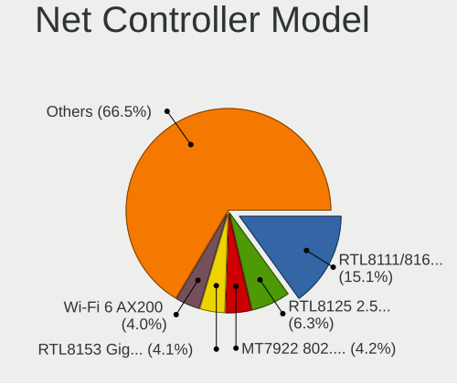

| Model                                                                           | Computers | Percent |
|---------------------------------------------------------------------------------|-----------|---------|
| Realtek RTL8111/8168/8211/8411 PCI Express Gigabit Ethernet Controller          | 289       | 15.05%  |
| Realtek RTL8125 2.5GbE Controller                                               | 121       | 6.3%    |
| MediaTek MT7922 802.11ax PCI Express Wireless Network Adapter                   | 80        | 4.17%   |
| Realtek RTL8153 Gigabit Ethernet Adapter                                        | 78        | 4.06%   |
| Intel Wi-Fi 6 AX200                                                             | 76        | 3.96%   |
| Intel Wi-Fi 6E(802.11ax) AX210/AX1675* 2x2 [Typhoon Peak]                       | 56        | 2.92%   |
| Intel I211 Gigabit Network Connection                                           | 44        | 2.29%   |
| Intel Ethernet Controller I225-V                                                | 39        | 2.03%   |
| Intel Alder Lake-P PCH CNVi WiFi                                                | 39        | 2.03%   |
| Intel Wireless 8265 / 8275                                                      | 34        | 1.77%   |
| Intel Wi-Fi 6 AX201                                                             | 33        | 1.72%   |
| Intel Raptor Lake PCH CNVi WiFi                                                 | 31        | 1.61%   |
| MediaTek MT7921 802.11ax PCIe Wireless Network Adapter [Filogic 330]            | 28        | 1.46%   |
| MediaTek MT7925 802.11be 160MHz 2x2 PCIe Wireless Network Adapter [Filogic 360] | 23        | 1.2%    |
| Realtek RTL8852BE PCIe 802.11ax Wireless Network Controller                     | 22        | 1.15%   |
| Intel Wireless 7265                                                             | 21        | 1.09%   |
| Intel Wi-Fi 5(802.11ac) Wireless-AC 9x6x [Thunder Peak]                         | 19        | 0.99%   |
| Intel Meteor Lake PCH CNVi WiFi                                                 | 19        | 0.99%   |
| ASIX AX88179 Gigabit Ethernet                                                   | 18        | 0.94%   |
| MediaTek MT7921K (RZ608) Wi-Fi 6E 80MHz                                         | 17        | 0.89%   |
| Intel Ethernet Controller I226-V                                                | 17        | 0.89%   |
| Intel Cannon Lake PCH CNVi WiFi                                                 | 17        | 0.89%   |
| MediaTek MT7902 802.11ax PCIe Wireless Network Adapter [Filogic 310]            | 16        | 0.83%   |
| Intel Wireless 8260                                                             | 16        | 0.83%   |
| Intel Comet Lake PCH CNVi WiFi                                                  | 16        | 0.83%   |
| Broadcom BCM43602 802.11ac Wireless LAN SoC                                     | 16        | 0.83%   |
| Qualcomm QCNFA765 Wireless Network Adapter                                      | 15        | 0.78%   |
| Intel Ethernet Connection (7) I219-V                                            | 15        | 0.78%   |
| Intel Comet Lake PCH-LP CNVi WiFi                                               | 15        | 0.78%   |
| Intel Cannon Point-LP CNVi [Wireless-AC]                                        | 15        | 0.78%   |
| Intel 82579LM Gigabit Network Connection (Lewisville)                           | 15        | 0.78%   |
| Realtek RTL8852AE 802.11ax PCIe Wireless Network Adapter                        | 14        | 0.73%   |
| Realtek RTL8822CE 802.11ac PCIe Wireless Network Adapter                        | 14        | 0.73%   |
| Intel Tiger Lake PCH CNVi WiFi                                                  | 14        | 0.73%   |
| Realtek RTL8821CE 802.11ac PCIe Wireless Network Adapter                        | 13        | 0.68%   |
| Realtek RTL8852CE PCIe 802.11ax Wireless Network Controller                     | 12        | 0.63%   |
| Qualcomm Atheros QCA6174 802.11ac Wireless Network Adapter                      | 12        | 0.63%   |
| Intel 700 Series Chipset CNVi WiFi                                              | 12        | 0.63%   |
| Qualcomm WCN785x Wi-Fi 7(802.11be) 320MHz 2x2 [FastConnect 7800]                | 11        | 0.57%   |
| Intel Ethernet Connection (4) I219-V                                            | 11        | 0.57%   |

Wireless Vendor
---------------

Wireless vendors

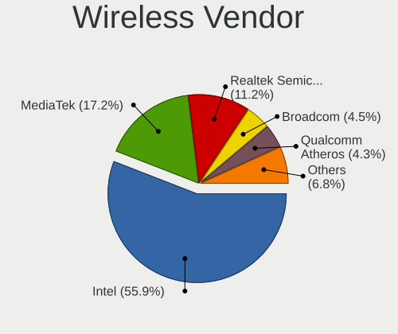

| Vendor                          | Computers | Percent |
|---------------------------------|-----------|---------|
| Intel                           | 492       | 55.91%  |
| MediaTek                        | 151       | 17.16%  |
| Realtek Semiconductor           | 99        | 11.25%  |
| Broadcom                        | 40        | 4.55%   |
| Qualcomm Atheros                | 38        | 4.32%   |
| Qualcomm                        | 15        | 1.7%    |
| TP-Link                         | 9         | 1.02%   |
| Broadcom Limited                | 7         | 0.8%    |
| Qualcomm Technologies           | 6         | 0.68%   |
| Microsoft                       | 4         | 0.45%   |
| Ralink Technology               | 3         | 0.34%   |
| Ralink                          | 3         | 0.34%   |
| Quectel Wireless Solutions      | 2         | 0.23%   |
| D-Link                          | 2         | 0.23%   |
| Qualcomm Atheros Communications | 1         | 0.11%   |
| NetGear                         | 1         | 0.11%   |
| Marvell Technology Group        | 1         | 0.11%   |
| Fibocom                         | 1         | 0.11%   |
| Edimax Technology               | 1         | 0.11%   |
| Dell                            | 1         | 0.11%   |
| D-Link System                   | 1         | 0.11%   |
| ASUSTek Computer                | 1         | 0.11%   |
| Unknown                         | 1         | 0.11%   |

Wireless Model
--------------

Wireless models

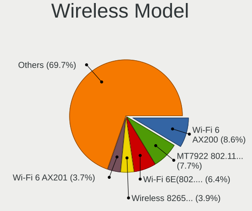

| Model                                                                           | Computers | Percent |
|---------------------------------------------------------------------------------|-----------|---------|
| Intel Wi-Fi 6 AX200                                                             | 76        | 8.63%   |
| MediaTek MT7922 802.11ax PCI Express Wireless Network Adapter                   | 68        | 7.72%   |
| Intel Wi-Fi 6E(802.11ax) AX210/AX1675* 2x2 [Typhoon Peak]                       | 56        | 6.36%   |
| Intel Wireless 8265 / 8275                                                      | 34        | 3.86%   |
| Intel Wi-Fi 6 AX201                                                             | 33        | 3.75%   |
| Intel Raptor Lake PCH CNVi WiFi                                                 | 30        | 3.41%   |
| MediaTek MT7921 802.11ax PCIe Wireless Network Adapter [Filogic 330]            | 28        | 3.18%   |
| Intel Alder Lake-P PCH CNVi WiFi                                                | 27        | 3.06%   |
| Realtek RTL8852BE PCIe 802.11ax Wireless Network Controller                     | 22        | 2.5%    |
| Intel Wireless 7265                                                             | 21        | 2.38%   |
| Intel Wi-Fi 5(802.11ac) Wireless-AC 9x6x [Thunder Peak]                         | 19        | 2.16%   |
| Intel Meteor Lake PCH CNVi WiFi                                                 | 19        | 2.16%   |
| MediaTek MT7921K (RZ608) Wi-Fi 6E 80MHz                                         | 17        | 1.93%   |
| Intel Cannon Lake PCH CNVi WiFi                                                 | 17        | 1.93%   |
| MediaTek MT7902 802.11ax PCIe Wireless Network Adapter [Filogic 310]            | 16        | 1.82%   |
| Intel Wireless 8260                                                             | 16        | 1.82%   |
| Intel Comet Lake PCH CNVi WiFi                                                  | 16        | 1.82%   |
| Broadcom BCM43602 802.11ac Wireless LAN SoC                                     | 16        | 1.82%   |
| MediaTek MT7925 802.11be 160MHz 2x2 PCIe Wireless Network Adapter [Filogic 360] | 15        | 1.7%    |
| Intel Comet Lake PCH-LP CNVi WiFi                                               | 15        | 1.7%    |
| Intel Cannon Point-LP CNVi [Wireless-AC]                                        | 15        | 1.7%    |
| Realtek RTL8852AE 802.11ax PCIe Wireless Network Adapter                        | 14        | 1.59%   |
| Realtek RTL8822CE 802.11ac PCIe Wireless Network Adapter                        | 14        | 1.59%   |
| Qualcomm QCNFA765 Wireless Network Adapter                                      | 14        | 1.59%   |
| Intel Tiger Lake PCH CNVi WiFi                                                  | 14        | 1.59%   |
| Realtek RTL8821CE 802.11ac PCIe Wireless Network Adapter                        | 13        | 1.48%   |
| Qualcomm Atheros QCA6174 802.11ac Wireless Network Adapter                      | 12        | 1.36%   |
| Intel 700 Series Chipset CNVi WiFi                                              | 12        | 1.36%   |
| Qualcomm Atheros QCA9377 802.11ac Wireless Network Adapter                      | 10        | 1.14%   |
| Intel Dual Band Wireless-AC 3168NGW [Stone Peak]                                | 9         | 1.02%   |
| Intel Centrino Advanced-N 6205 [Taylor Peak]                                    | 9         | 1.02%   |
| Realtek RTL8852CE PCIe 802.11ax Wireless Network Controller                     | 8         | 0.91%   |
| Intel Wireless 7260                                                             | 8         | 0.91%   |
| Intel Wireless 3160                                                             | 7         | 0.79%   |
| Intel Wi-Fi 7(802.11be) AX1775*/AX1790*/BE20*/BE401/BE1750* 2x2                 | 7         | 0.79%   |
| Broadcom BCM4360 802.11ac Dual Band Wireless Network Adapter                    | 7         | 0.79%   |
| Qualcomm WCN785x Wi-Fi 7(802.11be) 320MHz 2x2 [FastConnect 7800]                | 6         | 0.68%   |
| Intel Ice Lake-LP PCH CNVi WiFi                                                 | 6         | 0.68%   |
| Intel Alder Lake-N PCH CNVi WiFi                                                | 6         | 0.68%   |
| Realtek RTL8188EUS 802.11n Wireless Network Adapter                             | 5         | 0.57%   |

Ethernet Vendor
---------------

Ethernet vendors

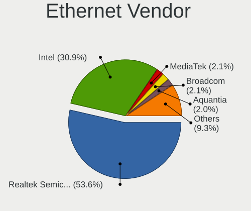

| Vendor                                 | Computers | Percent |
|----------------------------------------|-----------|---------|
| Realtek Semiconductor                  | 508       | 53.59%  |
| Intel                                  | 293       | 30.91%  |
| MediaTek                               | 20        | 2.11%   |
| Broadcom                               | 20        | 2.11%   |
| Aquantia                               | 19        | 2%      |
| ASIX Electronics                       | 18        | 1.9%    |
| Qualcomm Atheros                       | 12        | 1.27%   |
| Lenovo                                 | 9         | 0.95%   |
| Qualcomm Technologies                  | 5         | 0.53%   |
| Xiaomi                                 | 4         | 0.42%   |
| Qualcomm                               | 4         | 0.42%   |
| Apple                                  | 4         | 0.42%   |
| Samsung Electronics                    | 3         | 0.32%   |
| Google                                 | 3         | 0.32%   |
| Suzhou Motorcomm Electronic Technology | 2         | 0.21%   |
| Realtek                                | 2         | 0.21%   |
| Marvell Technology Group               | 2         | 0.21%   |
| ICS Advent                             | 2         | 0.21%   |
| DisplayLink                            | 2         | 0.21%   |
| Dell                                   | 2         | 0.21%   |
| VIA Technologies                       | 1         | 0.11%   |
| TP-Link                                | 1         | 0.11%   |
| Raspberry Pi                           | 1         | 0.11%   |
| QinHeng Electronics                    | 1         | 0.11%   |
| Nvidia                                 | 1         | 0.11%   |
| Motorcomm Microelectronics.            | 1         | 0.11%   |
| Microchip Technology                   | 1         | 0.11%   |
| Mellanox Technologies                  | 1         | 0.11%   |
| Emulex                                 | 1         | 0.11%   |
| D-Link System                          | 1         | 0.11%   |
| Chelsio Communications                 | 1         | 0.11%   |
| ASUSTek Computer                       | 1         | 0.11%   |
| American Megatrends                    | 1         | 0.11%   |
| Unknown                                | 1         | 0.11%   |

Ethernet Model
--------------

Ethernet models

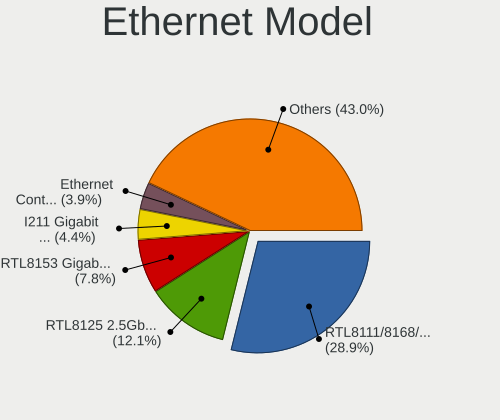

| Model                                                                           | Computers | Percent |
|---------------------------------------------------------------------------------|-----------|---------|
| Realtek RTL8111/8168/8211/8411 PCI Express Gigabit Ethernet Controller          | 289       | 28.87%  |
| Realtek RTL8125 2.5GbE Controller                                               | 121       | 12.09%  |
| Realtek RTL8153 Gigabit Ethernet Adapter                                        | 78        | 7.79%   |
| Intel I211 Gigabit Network Connection                                           | 44        | 4.4%    |
| Intel Ethernet Controller I225-V                                                | 39        | 3.9%    |
| ASIX AX88179 Gigabit Ethernet                                                   | 18        | 1.8%    |
| Intel Ethernet Controller I226-V                                                | 17        | 1.7%    |
| Intel Ethernet Connection (7) I219-V                                            | 15        | 1.5%    |
| Intel 82579LM Gigabit Network Connection (Lewisville)                           | 15        | 1.5%    |
| MediaTek MT7922 802.11ax PCI Express Wireless Network Adapter                   | 12        | 1.2%    |
| Intel Alder Lake-P PCH CNVi WiFi                                                | 12        | 1.2%    |
| Intel Ethernet Connection (4) I219-V                                            | 11        | 1.1%    |
| Intel Ethernet Connection (4) I219-LM                                           | 11        | 1.1%    |
| Intel Ethernet Connection (2) I219-V                                            | 10        | 1%      |
| Realtek RTL810xE PCI Express Fast Ethernet controller                           | 9         | 0.9%    |
| Realtek USB 10/100/1G/2.5 LAN                                                   | 8         | 0.8%    |
| Realtek RTL8126 5GbE Controller                                                 | 8         | 0.8%    |
| MediaTek MT7925 802.11be 160MHz 2x2 PCIe Wireless Network Adapter [Filogic 360] | 8         | 0.8%    |
| Intel Ethernet Connection I219-LM                                               | 7         | 0.7%    |
| Intel Ethernet Connection I217-LM                                               | 7         | 0.7%    |
| Realtek Killer E3000 2.5GbE Controller                                          | 6         | 0.6%    |
| Intel I210 Gigabit Network Connection                                           | 6         | 0.6%    |
| Intel Ethernet Connection (3) I218-LM                                           | 6         | 0.6%    |
| Intel Ethernet Connection (18) I219-LM                                          | 6         | 0.6%    |
| Intel Ethernet Connection (10) I219-V                                           | 6         | 0.6%    |
| Broadcom NetXtreme BCM57766 Gigabit Ethernet PCIe                               | 6         | 0.6%    |
| Realtek Killer E2600 GbE Controller                                             | 5         | 0.5%    |
| Qualcomm WCN785x Wi-Fi 7(802.11be) 320MHz 2x2 [FastConnect 7800]                | 5         | 0.5%    |
| Qualcomm Atheros Killer E220x Gigabit Ethernet Controller                       | 5         | 0.5%    |
| Intel Ethernet Connection (6) I219-V                                            | 5         | 0.5%    |
| Intel Ethernet Connection (6) I219-LM                                           | 5         | 0.5%    |
| Intel Ethernet Connection (2) I219-LM                                           | 5         | 0.5%    |
| Intel 82599ES 10-Gigabit SFI/SFP+ Network Connection                            | 5         | 0.5%    |
| Aquantia AQtion AQC107 NBase-T/IEEE 802.3an Ethernet Controller [Atlantic 10G]  | 5         | 0.5%    |
| Xiaomi Mi/Redmi series (RNDIS)                                                  | 4         | 0.4%    |
| Realtek RTL8852CE PCIe 802.11ax Wireless Network Controller                     | 4         | 0.4%    |
| Realtek RTL8111/8168/8411 PCI Express Gigabit Ethernet Controller               | 4         | 0.4%    |
| Lenovo USB-C Dock Ethernet                                                      | 4         | 0.4%    |
| Intel Ethernet Connection I218-LM                                               | 4         | 0.4%    |
| Intel Ethernet Connection I217-V                                                | 4         | 0.4%    |

Net Controller Kind
-------------------

Ethernet, WiFi or modem

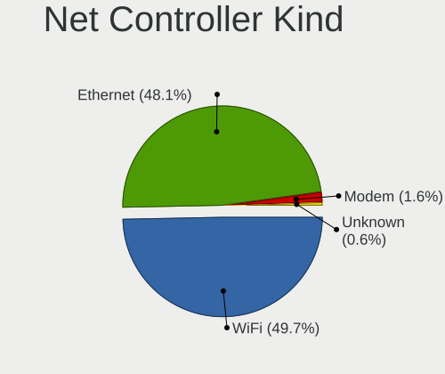

| Kind     | Computers | Percent |
|----------|-----------|---------|
| WiFi     | 858       | 49.68%  |
| Ethernet | 831       | 48.12%  |
| Modem    | 28        | 1.62%   |
| Unknown  | 10        | 0.58%   |

Used Controller
---------------

Currently used network controller

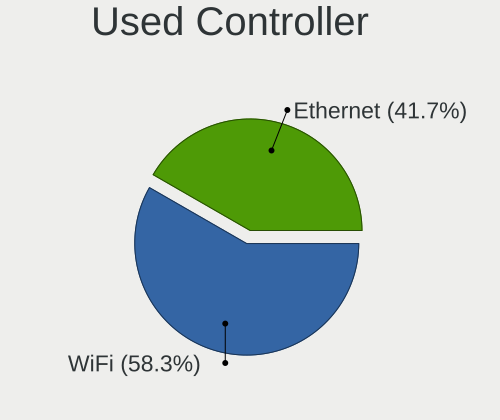

| Kind     | Computers | Percent |
|----------|-----------|---------|
| WiFi     | 663       | 58.31%  |
| Ethernet | 474       | 41.69%  |

NICs
----

Total network controllers on board

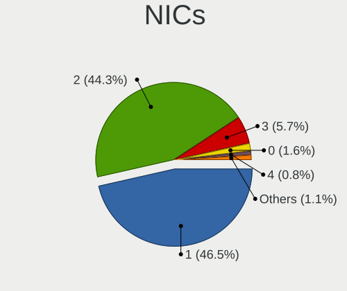

| Total | Computers | Percent |
|-------|-----------|---------|
| 1     | 518       | 46.46%  |
| 2     | 494       | 44.3%   |
| 3     | 64        | 5.74%   |
| 0     | 18        | 1.61%   |
| 4     | 9         | 0.81%   |
| 5     | 6         | 0.54%   |
| 8     | 3         | 0.27%   |
| 6     | 2         | 0.18%   |
| 9     | 1         | 0.09%   |

IPv6
----

IPv6 vs IPv4

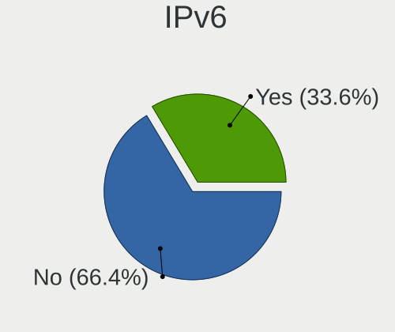

| Used | Computers | Percent |
|------|-----------|---------|
| No   | 756       | 66.37%  |
| Yes  | 383       | 33.63%  |

Bluetooth
---------

Bluetooth Vendor
----------------

Controller vendors

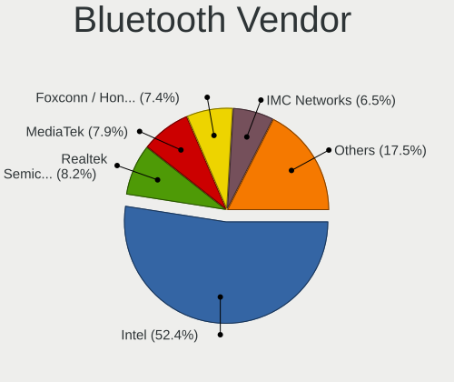

| Vendor                          | Computers | Percent |
|---------------------------------|-----------|---------|
| Intel                           | 482       | 52.45%  |
| Realtek Semiconductor           | 75        | 8.16%   |
| MediaTek                        | 73        | 7.94%   |
| Foxconn / Hon Hai               | 68        | 7.4%    |
| IMC Networks                    | 60        | 6.53%   |
| Cambridge Silicon Radio         | 34        | 3.7%    |
| Apple                           | 32        | 3.48%   |
| Qualcomm Atheros Communications | 15        | 1.63%   |
| ASUSTek Computer                | 15        | 1.63%   |
| Broadcom                        | 13        | 1.41%   |
| Lite-On Technology              | 12        | 1.31%   |
| USI                             | 11        | 1.2%    |
| TP-Link                         | 7         | 0.76%   |
| Realtek                         | 4         | 0.44%   |
| Marvell Semiconductor           | 4         | 0.44%   |
| Quectel Wireless Solutions      | 3         | 0.33%   |
| Opticis                         | 2         | 0.22%   |
| Toshiba                         | 1         | 0.11%   |
| SINO WEALTH                     | 1         | 0.11%   |
| Ralink                          | 1         | 0.11%   |
| Integrated System Solution      | 1         | 0.11%   |
| HTC (High Tech Computer)        | 1         | 0.11%   |
| Chicony Electronics             | 1         | 0.11%   |
| Belkin Components               | 1         | 0.11%   |
| Alps Electric                   | 1         | 0.11%   |
| Unknown                         | 1         | 0.11%   |

Bluetooth Model
---------------

Controller models

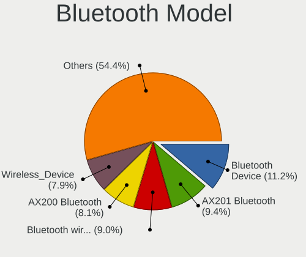

| Model                                               | Computers | Percent |
|-----------------------------------------------------|-----------|---------|
| Intel Bluetooth Device                              | 103       | 11.21%  |
| Intel AX201 Bluetooth                               | 86        | 9.36%   |
| Intel Bluetooth wireless interface                  | 83        | 9.03%   |
| Intel AX200 Bluetooth                               | 74        | 8.05%   |
| MediaTek Wireless_Device                            | 73        | 7.94%   |
| Realtek Bluetooth Radio                             | 68        | 7.4%    |
| Intel AX210 Bluetooth                               | 54        | 5.88%   |
| Intel Bluetooth 9460/9560 Jefferson Peak (JfP)      | 50        | 5.44%   |
| IMC Networks Wireless_Device                        | 45        | 4.9%    |
| Foxconn / Hon Hai Wireless_Device                   | 39        | 4.24%   |
| Cambridge Silicon Radio Bluetooth Dongle (HCI mode) | 34        | 3.7%    |
| Apple Bluetooth Host Controller                     | 21        | 2.29%   |
| Intel Wireless-AC 9260 Bluetooth Adapter            | 17        | 1.85%   |
| Foxconn / Hon Hai Bluetooth Device                  | 17        | 1.85%   |
| USI Bluetooth Device                                | 11        | 1.2%    |
| IMC Networks Bluetooth Radio                        | 11        | 1.2%    |
| Intel Wireless-AC 3168 Bluetooth                    | 9         | 0.98%   |
| Apple Bluetooth USB Host Controller                 | 9         | 0.98%   |
| TP-Link TP-T@- UB500 Adapter                        | 7         | 0.76%   |
| Foxconn / Hon Hai MediaTek Bluetooth Adapter        | 7         | 0.76%   |
| ASUS ASUS USB-BT500                                 | 7         | 0.76%   |
| Qualcomm Atheros  Bluetooth Device                  | 6         | 0.65%   |
| Qualcomm Atheros QCA61x4 Bluetooth 4.0              | 6         | 0.65%   |
| Lite-On Wireless_Device                             | 6         | 0.65%   |
| Broadcom BCM20702A0 Bluetooth 4.0                   | 6         | 0.65%   |
| Realtek Bluetooth Radio                             | 4         | 0.44%   |
| Lite-On Qualcomm Atheros QCA9377 Bluetooth          | 4         | 0.44%   |
| Marvell Bluetooth and Wireless LAN Composite Device | 3         | 0.33%   |
| Intel Centrino Bluetooth Wireless Transceiver       | 3         | 0.33%   |
| ASUS Broadcom BCM20702A0 Bluetooth                  | 3         | 0.33%   |
| Realtek RTL8822BE Bluetooth 4.2 Adapter             | 2         | 0.22%   |
| Realtek RTL8821A Bluetooth                          | 2         | 0.22%   |
| Realtek  Bluetooth 4.2 Adapter                      | 2         | 0.22%   |
| Quectel Wireless Solutions Wireless_Device          | 2         | 0.22%   |
| Qualcomm Atheros AR3012 Bluetooth 4.0               | 2         | 0.22%   |
| Opticis Bluetooth Radio                             | 2         | 0.22%   |
| Lite-On Bluetooth Device                            | 2         | 0.22%   |
| Intel Centrino Advanced-N 6230 Bluetooth adapter    | 2         | 0.22%   |
| IMC Networks Bluetooth Device                       | 2         | 0.22%   |
| IMC Networks BCM20702A0                             | 2         | 0.22%   |

Sound
-----

Sound Vendor
------------

Sound card vendors

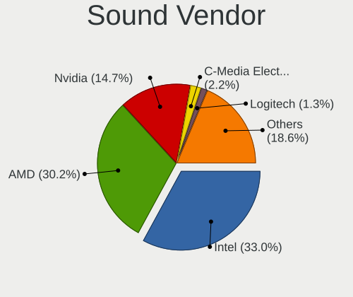

| Vendor                               | Computers | Percent |
|--------------------------------------|-----------|---------|
| Intel                                | 587       | 32.96%  |
| AMD                                  | 538       | 30.21%  |
| Nvidia                               | 261       | 14.65%  |
| C-Media Electronics                  | 40        | 2.25%   |
| Logitech                             | 23        | 1.29%   |
| Focusrite-Novation                   | 23        | 1.29%   |
| ASUSTek Computer                     | 16        | 0.9%    |
| Lenovo                               | 14        | 0.79%   |
| Kingston Technology                  | 14        | 0.79%   |
| Razer USA                            | 13        | 0.73%   |
| Texas Instruments                    | 12        | 0.67%   |
| SteelSeries ApS                      | 11        | 0.62%   |
| JMTek                                | 11        | 0.62%   |
| Micro Star International             | 10        | 0.56%   |
| Thesycon Systemsoftware & Consulting | 8         | 0.45%   |
| RODE Microphones                     | 8         | 0.45%   |
| Sony                                 | 7         | 0.39%   |
| Realtek Semiconductor                | 7         | 0.39%   |
| ASRock                               | 7         | 0.39%   |
| Hewlett-Packard                      | 6         | 0.34%   |
| Giga-Byte Technology                 | 6         | 0.34%   |
| FiiO Electronics Technology          | 6         | 0.34%   |
| Blue Microphones                     | 6         | 0.34%   |
| Apple                                | 6         | 0.34%   |
| Creative Technology                  | 5         | 0.28%   |
| Corsair                              | 5         | 0.28%   |
| Yamaha                               | 4         | 0.22%   |
| Shure                                | 4         | 0.22%   |
| Schiit Audio                         | 4         | 0.22%   |
| Samson Technologies                  | 4         | 0.22%   |
| Jieli Technology                     | 4         | 0.22%   |
| GYROCOM C&C                          | 4         | 0.22%   |
| GN Netcom                            | 4         | 0.22%   |
| FIFINE Microphones                   | 4         | 0.22%   |
| DSEA A/S                             | 4         | 0.22%   |
| Trust                                | 3         | 0.17%   |
| Synaptics                            | 3         | 0.17%   |
| Native Instruments                   | 3         | 0.17%   |
| Medeli Electronics                   | 3         | 0.17%   |
| KTMicro                              | 3         | 0.17%   |

Sound Model
-----------

Sound card models

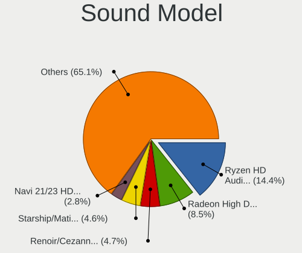

| Model                                                                      | Computers | Percent |
|----------------------------------------------------------------------------|-----------|---------|
| AMD Ryzen HD Audio Controller                                              | 332       | 14.35%  |
| AMD Radeon High Definition Audio Controller                                | 197       | 8.52%   |
| AMD Renoir/Cezanne HDMI/DP Audio Controller                                | 108       | 4.67%   |
| AMD Starship/Matisse HD Audio Controller                                   | 107       | 4.63%   |
| AMD Navi 21/23 HDMI/DP Audio Controller                                    | 64        | 2.77%   |
| Intel Sunrise Point-LP HD Audio                                            | 60        | 2.59%   |
| Intel Tiger Lake-LP Smart Sound Technology Audio Controller                | 51        | 2.2%    |
| Intel Alder Lake PCH-P High Definition Audio Controller                    | 47        | 2.03%   |
| AMD Navi 31 HDMI/DP Audio                                                  | 47        | 2.03%   |
| Intel Cannon Lake PCH cAVS                                                 | 43        | 1.86%   |
| Intel 8 Series/C220 Series Chipset High Definition Audio Controller        | 37        | 1.6%    |
| Intel Raptor Lake-P/U/H cAVS                                               | 36        | 1.56%   |
| AMD Navi 10 HDMI Audio                                                     | 29        | 1.25%   |
| Nvidia GA106 High Definition Audio Controller                              | 27        | 1.17%   |
| Intel Raptor Lake High Definition Audio Controller                         | 26        | 1.12%   |
| Intel Meteor Lake-P HD Audio Controller                                    | 25        | 1.08%   |
| Intel 7 Series/C216 Chipset Family High Definition Audio Controller        | 24        | 1.04%   |
| AMD Ellesmere HDMI Audio [Radeon RX 470/480 / 570/580/590]                 | 24        | 1.04%   |
| Nvidia GA104 High Definition Audio Controller                              | 21        | 0.91%   |
| Intel Tiger Lake-H HD Audio Controller                                     | 20        | 0.86%   |
| Nvidia GP107GL High Definition Audio Controller                            | 19        | 0.82%   |
| Intel Comet Lake PCH cAVS                                                  | 19        | 0.82%   |
| Intel Cannon Point-LP High Definition Audio Controller                     | 18        | 0.78%   |
| Intel Broadwell-U Audio Controller                                         | 18        | 0.78%   |
| Intel 6 Series/C200 Series Chipset Family High Definition Audio Controller | 18        | 0.78%   |
| Intel 100 Series/C230 Series Chipset Family HD Audio Controller            | 18        | 0.78%   |
| AMD Family 17h (Models 00h-0fh) HD Audio Controller                        | 18        | 0.78%   |
| Intel Wildcat Point-LP High Definition Audio Controller                    | 17        | 0.73%   |
| Intel Comet Lake PCH-LP cAVS                                               | 17        | 0.73%   |
| AMD Raven/Raven2/Fenghuang HDMI/DP Audio Controller                        | 17        | 0.73%   |
| Nvidia GA102 High Definition Audio Controller                              | 16        | 0.69%   |
| Nvidia TU106 High Definition Audio Controller                              | 15        | 0.65%   |
| Nvidia AD107 High Definition Audio Controller                              | 15        | 0.65%   |
| Intel Xeon E3-1200 v3/4th Gen Core Processor HD Audio Controller           | 15        | 0.65%   |
| Nvidia TU116 High Definition Audio Controller                              | 14        | 0.61%   |
| Nvidia GP104 High Definition Audio Controller                              | 14        | 0.61%   |
| AMD Oland/Hainan/Cape Verde/Pitcairn HDMI Audio [Radeon HD 7000 Series]    | 14        | 0.61%   |
| AMD Navi 48 HDMI/DP Audio Controller                                       | 14        | 0.61%   |
| ASUSTek Computer USB Audio                                                 | 13        | 0.56%   |
| Nvidia TU107 GeForce GTX 1650 High Definition Audio Controller             | 12        | 0.52%   |

Memory
------

Memory Vendor
-------------

Memory module vendors

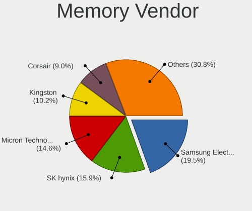

| Vendor                       | Computers | Percent |
|------------------------------|-----------|---------|
| Samsung Electronics          | 240       | 19.51%  |
| SK hynix                     | 195       | 15.85%  |
| Micron Technology            | 180       | 14.63%  |
| Kingston                     | 125       | 10.16%  |
| Corsair                      | 111       | 9.02%   |
| G.Skill                      | 90        | 7.32%   |
| Crucial                      | 90        | 7.32%   |
| Unknown                      | 36        | 2.93%   |
| A-DATA Technology            | 33        | 2.68%   |
| Unknown                      | 30        | 2.44%   |
| Team                         | 22        | 1.79%   |
| Ramaxel Technology           | 17        | 1.38%   |
| Patriot                      | 11        | 0.89%   |
| Unknown (ABCD)               | 5         | 0.41%   |
| Transcend                    | 5         | 0.41%   |
| GOODRAM                      | 5         | 0.41%   |
| Avant                        | 3         | 0.24%   |
| Timetec                      | 2         | 0.16%   |
| Patriot Memory (PDP Systems) | 2         | 0.16%   |
| Lexar Co Limited             | 2         | 0.16%   |
| Lexar                        | 2         | 0.16%   |
| GLOWAY                       | 2         | 0.16%   |
| AMD                          | 2         | 0.16%   |
| Wodposit                     | 1         | 0.08%   |
| Wilk                         | 1         | 0.08%   |
| Unknown (0x59B)              | 1         | 0.08%   |
| Unknown (0x0E9D)             | 1         | 0.08%   |
| Unknown (0x0CB9)             | 1         | 0.08%   |
| TeamGroup                    | 1         | 0.08%   |
| Strontium                    | 1         | 0.08%   |
| Smart Brazil                 | 1         | 0.08%   |
| Silicon Power                | 1         | 0.08%   |
| QEMU                         | 1         | 0.08%   |
| PNY                          | 1         | 0.08%   |
| Nanya Technology             | 1         | 0.08%   |
| Lenovo                       | 1         | 0.08%   |
| Hikvision                    | 1         | 0.08%   |
| GSkill                       | 1         | 0.08%   |
| fef5                         | 1         | 0.08%   |
| Elpida                       | 1         | 0.08%   |

Memory Model
------------

Memory module models

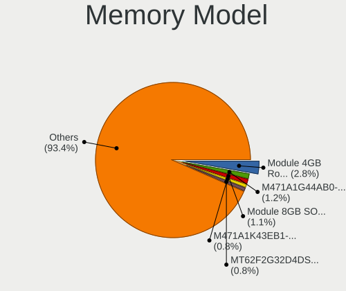

| Model                                                            | Computers | Percent |
|------------------------------------------------------------------|-----------|---------|
| Unknown                                                          | 36        | 2.78%   |
| Samsung RAM M471A1G44AB0-CWE 8GiB SODIMM DDR4 3200MT/s           | 15        | 1.16%   |
| SK hynix RAM Module 8GB SODIMM DDR3 1600MT/s                     | 14        | 1.08%   |
| Samsung RAM M471A1K43EB1-CWE 8GB SODIMM DDR4 3200MT/s            | 10        | 0.77%   |
| Micron RAM MT62F2G32D4DS-026 WT 8GiB SODIMM LPDDR5 7500MT/s      | 10        | 0.77%   |
| Team RAM TEAMGROUP-SD4-3200 16GB SODIMM DDR4 3200MT/s            | 9         | 0.69%   |
| Micron RAM MT62F2G32D4DS-026 4GB Row Of Chips LPDDR5 7500MT/s    | 9         | 0.69%   |
| SK hynix RAM HMAA1GS6CJR6N-XN 8GB SODIMM DDR4 3200MT/s           | 8         | 0.62%   |
| Samsung RAM M471A1G44BB0-CWE 8GB SODIMM DDR4 3200MT/s            | 8         | 0.62%   |
| Corsair RAM CMK64GX4M2E3200C16 32GB DIMM DDR4 3600MT/s           | 8         | 0.62%   |
| SK hynix RAM HMCG78AGBSA092N 16GB SODIMM DDR5 5600MT/s           | 7         | 0.54%   |
| SK hynix RAM HMA81GS6DJR8N-XN 8GB SODIMM DDR4 3200MT/s           | 7         | 0.54%   |
| Samsung RAM M471A2K43CB1-CRC 16GB SODIMM DDR4 2667MT/s           | 7         | 0.54%   |
| Samsung RAM M471A2G44AM0-CWE 16GB SODIMM DDR4 3200MT/s           | 7         | 0.54%   |
| Ramaxel RAM RMSA3260ME78HAF-2666 8GB SODIMM DDR4 2667MT/s        | 7         | 0.54%   |
| G.Skill RAM F5-6000J3040G32G 32GB DIMM DDR5 6200MT/s             | 7         | 0.54%   |
| Corsair RAM CMK16GX4M2B3200C16 8GB DIMM DDR4 3600MT/s            | 7         | 0.54%   |
| SK hynix RAM Module 4GB SODIMM DDR3 1600MT/s                     | 6         | 0.46%   |
| Samsung RAM M471B1G73DB0-YK0 8GB SODIMM DDR3 1600MT/s            | 6         | 0.46%   |
| Samsung RAM M471A1G44AB0-CWE 8GB Row Of Chips DDR4 3200MT/s      | 6         | 0.46%   |
| Micron RAM MTC4C10163S1SC48BA1 8GB SODIMM DDR5 4800MT/s          | 6         | 0.46%   |
| Micron RAM 4ATS1G64HZ-2G6E1 8GB SODIMM DDR4 2667MT/s             | 6         | 0.46%   |
| Micron RAM 4ATF1G64HZ-3G2E1 8GB SODIMM DDR4 3200MT/s             | 6         | 0.46%   |
| G.Skill RAM F5-6000J3038F16G 16GB DIMM DDR5 6000MT/s             | 6         | 0.46%   |
| SK hynix RAM HMT451S6BFR8A-PB 4GB SODIMM DDR3 1600MT/s           | 5         | 0.39%   |
| SK hynix RAM HMAA2GS6CJR8N-XN 16GB SODIMM DDR4 3200MT/s          | 5         | 0.39%   |
| SK hynix RAM H9JCNNNFA5MLYR-N6E 8GB SODIMM LPDDR5 6400MT/s       | 5         | 0.39%   |
| Samsung RAM M471A5244CB0-CWE 4GB SODIMM DDR4 3200MT/s            | 5         | 0.39%   |
| Samsung RAM M471A1K43CB1-CTD 8GB SODIMM DDR4 3200MT/s            | 5         | 0.39%   |
| Samsung RAM K3KL9L90CM-MGCT 4GB Row Of Chips LPDDR5 7500MT/s     | 5         | 0.39%   |
| Micron RAM 4ATF51264HZ-3G2J1 4GB SODIMM DDR4 3200MT/s            | 5         | 0.39%   |
| Micron RAM 4ATF1G64HZ-3G2E1 8GB Row Of Chips DDR4 3200MT/s       | 5         | 0.39%   |
| Kingston RAM KF552C40-32 32GB DIMM DDR5 5200MT/s                 | 5         | 0.39%   |
| G.Skill RAM F4-3600C18-32GTZN 32GB DIMM DDR4 3800MT/s            | 5         | 0.39%   |
| Corsair RAM CMK32GX4M2E3200C16 16GB DIMM DDR4 3600MT/s           | 5         | 0.39%   |
| Corsair RAM CMK32GX4M2B3200C16 16GB DIMM DDR4 3800MT/s           | 5         | 0.39%   |
| Corsair RAM CMK16GX4M2B3000C15 8GB DIMM DDR4 3600MT/s            | 5         | 0.39%   |
| Unknown (ABCD) RAM 123456789012345678 2GB SODIMM LPDDR4 2400MT/s | 4         | 0.31%   |
| Team RAM TEAMGROUP-UD4-3200 8GB DIMM DDR4 3733MT/s               | 4         | 0.31%   |
| SK hynix RAM Module 8GB LPDDR5 8000MT/s                          | 4         | 0.31%   |

Memory Kind
-----------

Memory module kinds

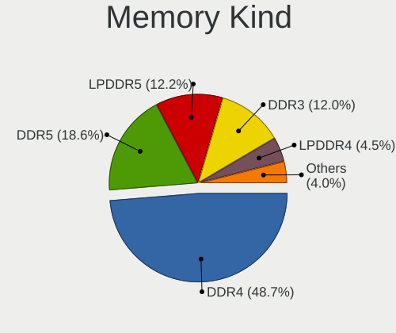

| Kind    | Computers | Percent |
|---------|-----------|---------|
| DDR4    | 530       | 48.71%  |
| DDR5    | 202       | 18.57%  |
| LPDDR5  | 133       | 12.22%  |
| DDR3    | 131       | 12.04%  |
| LPDDR4  | 49        | 4.5%    |
| LPDDR3  | 25        | 2.3%    |
| Unknown | 6         | 0.55%   |
| SDRAM   | 5         | 0.46%   |
| DRAM    | 3         | 0.28%   |
| DDR2    | 2         | 0.18%   |
| RAM     | 1         | 0.09%   |
| DDR     | 1         | 0.09%   |

Memory Form Factor
------------------

Physical design of the memory module

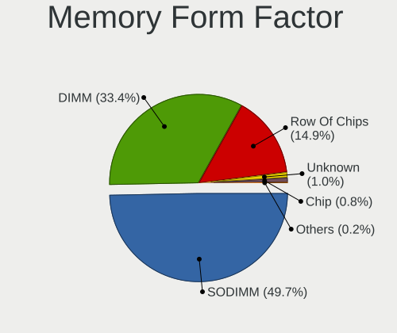

| Name         | Computers | Percent |
|--------------|-----------|---------|
| SODIMM       | 549       | 49.68%  |
| DIMM         | 369       | 33.39%  |
| Row Of Chips | 165       | 14.93%  |
| Unknown      | 11        | 1%      |
| Chip         | 9         | 0.81%   |
| RIMM         | 2         | 0.18%   |

Memory Size
-----------

Memory module size

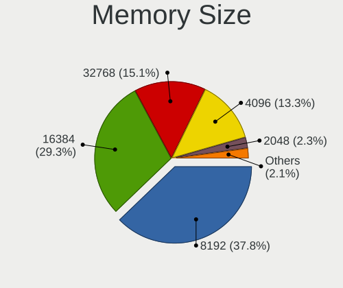

| Size  | Computers | Percent |
|-------|-----------|---------|
| 8192  | 442       | 37.81%  |
| 16384 | 343       | 29.34%  |
| 32768 | 176       | 15.06%  |
| 4096  | 156       | 13.34%  |
| 2048  | 27        | 2.31%   |
| 49152 | 12        | 1.03%   |
| 65536 | 4         | 0.34%   |
| 1024  | 3         | 0.26%   |
| 24576 | 2         | 0.17%   |
| 12288 | 1         | 0.09%   |
| 6144  | 1         | 0.09%   |
| 4000  | 1         | 0.09%   |
| 3072  | 1         | 0.09%   |

Memory Speed
------------

Memory module speed

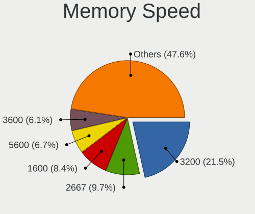

| Speed   | Computers | Percent |
|---------|-----------|---------|
| 3200    | 251       | 21.55%  |
| 2667    | 113       | 9.7%    |
| 1600    | 98        | 8.41%   |
| 5600    | 78        | 6.7%    |
| 3600    | 71        | 6.09%   |
| 6400    | 59        | 5.06%   |
| 4800    | 53        | 4.55%   |
| 2400    | 51        | 4.38%   |
| 7500    | 48        | 4.12%   |
| 2133    | 47        | 4.03%   |
| 6000    | 41        | 3.52%   |
| 4267    | 26        | 2.23%   |
| 3800    | 25        | 2.15%   |
| 1867    | 19        | 1.63%   |
| 3733    | 18        | 1.55%   |
| 1333    | 16        | 1.37%   |
| 8533    | 14        | 1.2%    |
| 5200    | 12        | 1.03%   |
| 4266    | 10        | 0.86%   |
| 7467    | 8         | 0.69%   |
| 12800   | 7         | 0.6%    |
| 6200    | 7         | 0.6%    |
| 8000    | 6         | 0.52%   |
| 4000    | 6         | 0.52%   |
| 3866    | 6         | 0.52%   |
| 3000    | 6         | 0.52%   |
| Unknown | 6         | 0.52%   |
| 3466    | 4         | 0.34%   |
| 3400    | 4         | 0.34%   |
| 3266    | 4         | 0.34%   |
| 2933    | 4         | 0.34%   |
| 2666    | 4         | 0.34%   |
| 8400    | 3         | 0.26%   |
| 4199    | 3         | 0.26%   |
| 1866    | 3         | 0.26%   |
| 667     | 3         | 0.26%   |
| 6800    | 2         | 0.17%   |
| 5500    | 2         | 0.17%   |
| 3933    | 2         | 0.17%   |
| 3334    | 2         | 0.17%   |

Printers & scanners
-------------------

Printer Vendor
--------------

Printer device vendors

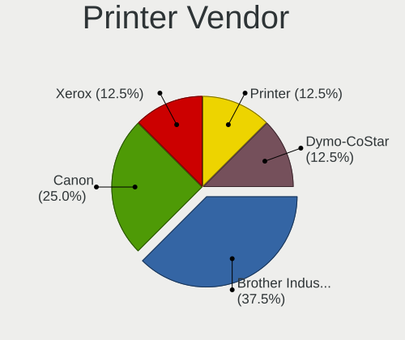

| Vendor             | Computers | Percent |
|--------------------|-----------|---------|
| Brother Industries | 3         | 37.5%   |
| Canon              | 2         | 25%     |
| Xerox              | 1         | 12.5%   |
| Printer            | 1         | 12.5%   |
| Dymo-CoStar        | 1         | 12.5%   |

Printer Model
-------------

Printer device models

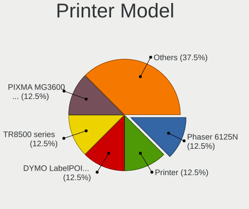

| Model                           | Computers | Percent |
|---------------------------------|-----------|---------|
| Xerox Phaser 6125N              | 1         | 12.5%   |
| Printer Printer                 | 1         | 12.5%   |
| Dymo-CoStar DYMO LabelPOINT 350 | 1         | 12.5%   |
| Canon TR8500 series             | 1         | 12.5%   |
| Canon PIXMA MG3600 Series       | 1         | 12.5%   |
| Brother MFC-J6530DW             | 1         | 12.5%   |
| Brother HL-L2300D series        | 1         | 12.5%   |
| Brother HL-2240D series         | 1         | 12.5%   |

Scanner Vendor
--------------

Scanner device vendors

| Vendor      | Computers | Percent |
|-------------|-----------|---------|
| Seiko Epson | 1         | 100%    |

Scanner Model
-------------

Scanner device models

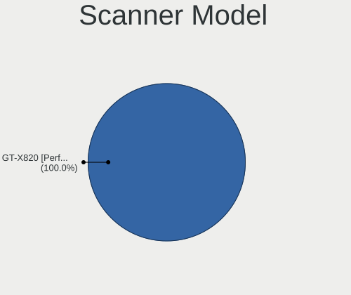

| Model                                       | Computers | Percent |
|---------------------------------------------|-----------|---------|
| Seiko Epson GT-X820 [Perfection V600 Photo] | 1         | 100%    |

Camera
------

Camera Vendor
-------------

Camera device vendors

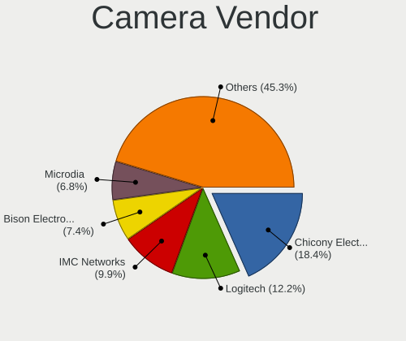

| Vendor                                 | Computers | Percent |
|----------------------------------------|-----------|---------|
| Chicony Electronics                    | 134       | 18.36%  |
| Logitech                               | 89        | 12.19%  |
| IMC Networks                           | 72        | 9.86%   |
| Bison Electronics                      | 54        | 7.4%    |
| Microdia                               | 50        | 6.85%   |
| Realtek Semiconductor                  | 48        | 6.58%   |
| Luxvisions Innotech Limited            | 39        | 5.34%   |
| Quanta                                 | 36        | 4.93%   |
| Sunplus Innovation Technology          | 30        | 4.11%   |
| Shinetech                              | 26        | 3.56%   |
| Syntek                                 | 19        | 2.6%    |
| Apple                                  | 17        | 2.33%   |
| Lite-On Technology                     | 13        | 1.78%   |
| Sonix Technology                       | 9         | 1.23%   |
| MacroSilicon                           | 9         | 1.23%   |
| Cheng Uei Precision Industry (Foxlink) | 8         | 1.1%    |
| Microsoft                              | 7         | 0.96%   |
| SunplusIT                              | 6         | 0.82%   |
| Framework                              | 6         | 0.82%   |
| Samsung Electronics                    | 4         | 0.55%   |
| Razer USA                              | 4         | 0.55%   |
| Acer                                   | 4         | 0.55%   |
| Silicon Motion                         | 3         | 0.41%   |
| kingcome                               | 3         | 0.41%   |
| webcam                                 | 2         | 0.27%   |
| Primax Electronics                     | 2         | 0.27%   |
| Oculus VR                              | 2         | 0.27%   |
| Hopewin Electronic Material            | 2         | 0.27%   |
| Generalplus Technology                 | 2         | 0.27%   |
| Alcor Micro                            | 2         | 0.27%   |
| Z-Star Microelectronics                | 1         | 0.14%   |
| webcamvendor                           | 1         | 0.14%   |
| Valve Software                         | 1         | 0.14%   |
| USB CAMERA                             | 1         | 0.14%   |
| Tripath Technology                     | 1         | 0.14%   |
| Tobii Technology AB                    | 1         | 0.14%   |
| Suyin                                  | 1         | 0.14%   |
| SN0002                                 | 1         | 0.14%   |
| ShineOptics                            | 1         | 0.14%   |
| Ricoh                                  | 1         | 0.14%   |

Camera Model
------------

Camera device models

| Model                                                | Computers | Percent |
|------------------------------------------------------|-----------|---------|
| Chicony Integrated Camera                            | 61        | 8.23%   |
| IMC Networks Integrated Camera                       | 32        | 4.32%   |
| Bison Integrated Camera                              | 28        | 3.78%   |
| IMC Networks USB2.0 HD UVC WebCam                    | 26        | 3.51%   |
| Microdia Integrated_Webcam_HD                        | 22        | 2.97%   |
| Logitech HD Pro Webcam C920                          | 21        | 2.83%   |
| Logitech C922 Pro Stream Webcam                      | 19        | 2.56%   |
| Syntek Integrated Camera                             | 16        | 2.16%   |
| Luxvisions Innotech Limited Integrated Camera        | 16        | 2.16%   |
| Shinetech USB2.0 FHD UVC WebCam                      | 12        | 1.62%   |
| Realtek Integrated_Webcam_HD                         | 12        | 1.62%   |
| Realtek Laptop Camera                                | 11        | 1.48%   |
| Chicony HP HD Camera                                 | 11        | 1.48%   |
| Lite-On Integrated Camera                            | 10        | 1.35%   |
| Apple FaceTime HD Camera (Built-in)                  | 10        | 1.35%   |
| Logitech Webcam C270                                 | 9         | 1.21%   |
| Quanta USB2.0 HD UVC WebCam                          | 8         | 1.08%   |
| MacroSilicon USB Video                               | 8         | 1.08%   |
| Logitech BRIO Ultra HD Webcam                        | 8         | 1.08%   |
| ShineTech USB2.0 HD UVC WebCam                       | 7         | 0.94%   |
| Logitech StreamCam                                   | 7         | 0.94%   |
| Sunplus Integrated_Webcam_HD                         | 6         | 0.81%   |
| Sonix USB2.0 HD UVC WebCam                           | 6         | 0.81%   |
| Shinetech ASUS FHD webcam                            | 6         | 0.81%   |
| Microdia USB 2.0 Camera                              | 6         | 0.81%   |
| Luxvisions Innotech Limited Integrated RGB Camera    | 6         | 0.81%   |
| Logitech C920 PRO HD Webcam                          | 6         | 0.81%   |
| Framework Laptop Webcam Module (2nd Gen)             | 6         | 0.81%   |
| Chicony Integrated Camera (1280x720@30)              | 6         | 0.81%   |
| Bison SunplusIT Integrated Camera                    | 6         | 0.81%   |
| Sunplus Integrated_Webcam_FHD                        | 5         | 0.67%   |
| Quanta HD Webcam                                     | 5         | 0.67%   |
| Luxvisions Innotech Limited HP Wide Vision HD Camera | 5         | 0.67%   |
| Luxvisions Innotech Limited HP 5MP Camera            | 5         | 0.67%   |
| Chicony HP Wide Vision HD Camera                     | 5         | 0.67%   |
| Chicony HD User Facing                               | 5         | 0.67%   |
| Bison Integrated RGB Camera                          | 5         | 0.67%   |
| Sunplus Integrated Camera                            | 4         | 0.54%   |
| Sunplus Full HD webcam                               | 4         | 0.54%   |
| Samsung Galaxy series, misc. (MTP mode)              | 4         | 0.54%   |

Security
--------

Fingerprint Vendor
------------------

Fingerprint sensor vendors

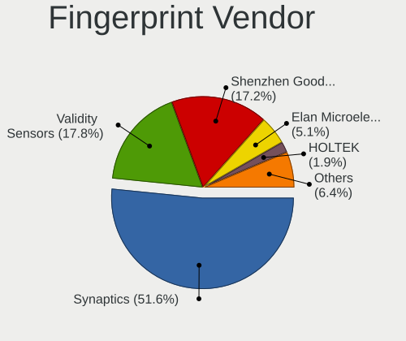

| Vendor                             | Computers | Percent |
|------------------------------------|-----------|---------|
| Synaptics                          | 81        | 51.59%  |
| Validity Sensors                   | 28        | 17.83%  |
| Shenzhen Goodix Technology         | 27        | 17.2%   |
| Elan Microelectronics              | 8         | 5.1%    |
| HOLTEK                             | 3         | 1.91%   |
| Realtek USB2.0 Finger Print Bridge | 2         | 1.27%   |
| LighTuning Technology              | 2         | 1.27%   |
| Focal-systems.Corp                 | 2         | 1.27%   |
| Upek                               | 1         | 0.64%   |
| Samsung Electronics                | 1         | 0.64%   |
| Gingytech                          | 1         | 0.64%   |
| AuthenTec                          | 1         | 0.64%   |

Fingerprint Model
-----------------

Fingerprint sensor models

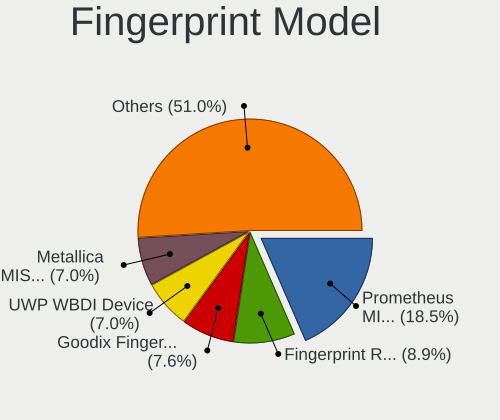

| Model                                                                      | Computers | Percent |
|----------------------------------------------------------------------------|-----------|---------|
| Synaptics Prometheus MIS Touch Fingerprint Reader                          | 29        | 18.47%  |
| Shenzhen Goodix Fingerprint Reader                                         | 14        | 8.92%   |
| Shenzhen Goodix  Fingerprint Device                                        | 12        | 7.64%   |
| Synaptics UWP WBDI Device                                                  | 11        | 7.01%   |
| Synaptics Metallica MIS Touch Fingerprint Reader                           | 11        | 7.01%   |
| Synaptics FS7604 Touch Fingerprint Sensor with PurePrint                   | 9         | 5.73%   |
| Synaptics Prometheus Fingerprint Reader                                    | 7         | 4.46%   |
| Synaptics UWP WBDI                                                         | 6         | 3.82%   |
| Elan ELAN:ARM-M4                                                           | 6         | 3.82%   |
| Validity Sensors VFS7500 Touch Fingerprint Sensor                          | 5         | 3.18%   |
| Validity Sensors VFS 5011 fingerprint sensor                               | 5         | 3.18%   |
| Validity Sensors VFS495 Fingerprint Reader                                 | 4         | 2.55%   |
| Synaptics WBDI                                                             | 4         | 2.55%   |
| Validity Sensors Synaptics WBDI                                            | 3         | 1.91%   |
| HOLTEK FocalTech Fingerprint Device                                        | 3         | 1.91%   |
| Validity Sensors VFS5011 Fingerprint Reader                                | 2         | 1.27%   |
| Validity Sensors VFS491                                                    | 2         | 1.27%   |
| Validity Sensors VFS471 Fingerprint Reader                                 | 2         | 1.27%   |
| Realtek USB2.0 Finger Print Bridge FocalTech Fingerprint Device            | 2         | 1.27%   |
| Focal-systems.Corp FT9201Fingerprint.                                      | 2         | 1.27%   |
| Validity Sensors VFS7552 Touch Fingerprint Sensor                          | 1         | 0.64%   |
| Validity Sensors Synaptics VFS7552 Touch Fingerprint Sensor with PurePrint | 1         | 0.64%   |
| Validity Sensors Synaptics VFS7552 Touch Fingerprint Sensor                | 1         | 0.64%   |
| Validity Sensors Swipe Fingerprint Sensor                                  | 1         | 0.64%   |
| Validity Sensors Fingerprint scanner                                       | 1         | 0.64%   |
| Upek Biometric Touchchip/Touchstrip Fingerprint Sensor                     | 1         | 0.64%   |
| Synaptics WBDI Fingerprint Reader USB 086                                  | 1         | 0.64%   |
| Synaptics  WBDI                                                            | 1         | 0.64%   |
| Synaptics  FS7604 Touch Fingerprint Sensor with PurePrint                  | 1         | 0.64%   |
| Synaptics Metallica MOH Touch Fingerprint Reader                           | 1         | 0.64%   |
| Shenzhen Goodix FingerPrint                                                | 1         | 0.64%   |
| Samsung Fingerprint Device                                                 | 1         | 0.64%   |
| LighTuning Fingerprint Sensor                                              | 1         | 0.64%   |
| LighTuning EgisTec Touch Fingerprint Sensor                                | 1         | 0.64%   |
| Gingytech Fingerprint sensor                                               | 1         | 0.64%   |
| Elan fingerprint sensor [FeinTech FPS00200]                                | 1         | 0.64%   |
| Elan ELAN:Fingerprint                                                      | 1         | 0.64%   |
| AuthenTec Fingerprint Sensor                                               | 1         | 0.64%   |

Chipcard Vendor
---------------

Chipcard module vendors

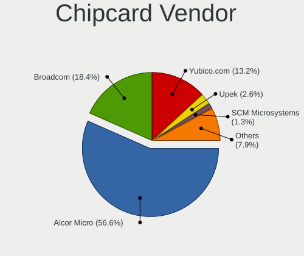

| Vendor                | Computers | Percent |
|-----------------------|-----------|---------|
| Alcor Micro           | 43        | 56.58%  |
| Broadcom              | 14        | 18.42%  |
| Yubico.com            | 10        | 13.16%  |
| Upek                  | 2         | 2.63%   |
| SCM Microsystems      | 1         | 1.32%   |
| OmniKey               | 1         | 1.32%   |
| O2 Micro              | 1         | 1.32%   |
| Microchip Technology  | 1         | 1.32%   |
| Clay Logic            | 1         | 1.32%   |
| Bit4id                | 1         | 1.32%   |
| Advanced Card Systems | 1         | 1.32%   |

Chipcard Model
--------------

Chipcard module models

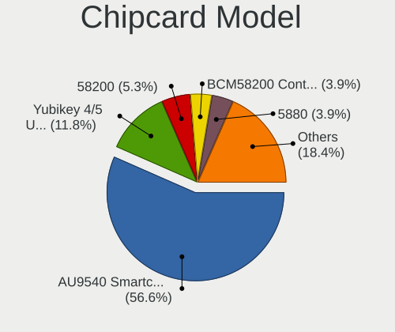

| Model                                                                        | Computers | Percent |
|------------------------------------------------------------------------------|-----------|---------|
| Alcor Micro AU9540 Smartcard Reader                                          | 43        | 56.58%  |
| Yubico.com Yubikey 4/5 U2F+CCID                                              | 9         | 11.84%  |
| Broadcom 58200                                                               | 4         | 5.26%   |
| Broadcom BCM58200 ControlVault 3 (FingerPrint sensor + Contacted SmartCard)  | 3         | 3.95%   |
| Broadcom 5880                                                                | 3         | 3.95%   |
| Upek TouchChip Fingerprint Coprocessor (WBF advanced mode)                   | 2         | 2.63%   |
| Broadcom BCM5880 Secure Applications Processor with fingerprint swipe sensor | 2         | 2.63%   |
| Broadcom BCM5880 Secure Applications Processor                               | 2         | 2.63%   |
| Yubico.com Yubikey NEO(-N) U2F+CCID                                          | 1         | 1.32%   |
| SCM Microsystems SCR331-LC1 / SCR3310 SmartCard Reader                       | 1         | 1.32%   |
| OmniKey CardMan Smart@Link                                                   | 1         | 1.32%   |
| O2 Micro OZ776 CCID Smartcard Reader                                         | 1         | 1.32%   |
| Microchip Technology SMSC USX101x Reader                                     | 1         | 1.32%   |
| Clay Logic Nitrokey HSM                                                      | 1         | 1.32%   |
| Bit4id miniLector EVO                                                        | 1         | 1.32%   |
| Advanced Card Systems ACR39U                                                 | 1         | 1.32%   |

Unsupported
-----------

Unsupported Devices
-------------------

Total unsupported devices on board

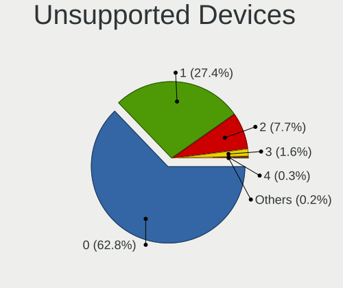

| Total | Computers | Percent |
|-------|-----------|---------|
| 0     | 715       | 62.83%  |
| 1     | 312       | 27.42%  |
| 2     | 88        | 7.73%   |
| 3     | 18        | 1.58%   |
| 4     | 3         | 0.26%   |
| 6     | 2         | 0.18%   |

Unsupported Device Types
------------------------

Types of unsupported devices

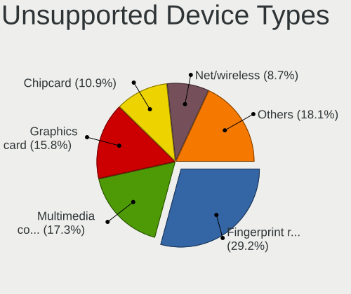

| Type                     | Computers | Percent |
|--------------------------|-----------|---------|
| Fingerprint reader       | 155       | 29.19%  |
| Multimedia controller    | 92        | 17.33%  |
| Graphics card            | 84        | 15.82%  |
| Chipcard                 | 58        | 10.92%  |
| Net/wireless             | 46        | 8.66%   |
| Camera                   | 19        | 3.58%   |
| Sound                    | 15        | 2.82%   |
| Communication controller | 15        | 2.82%   |
| Network                  | 10        | 1.88%   |
| Bluetooth                | 9         | 1.69%   |
| Card reader              | 7         | 1.32%   |
| Unassigned class         | 6         | 1.13%   |
| Net/ethernet             | 4         | 0.75%   |
| Modem                    | 4         | 0.75%   |
| Firewire controller      | 3         | 0.56%   |
| Storage/raid             | 1         | 0.19%   |
| Storage/ata              | 1         | 0.19%   |
| Storage                  | 1         | 0.19%   |
| Dvb card                 | 1         | 0.19%   |

