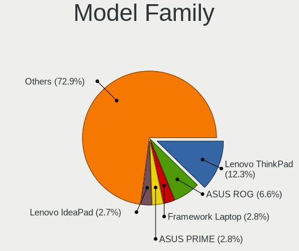
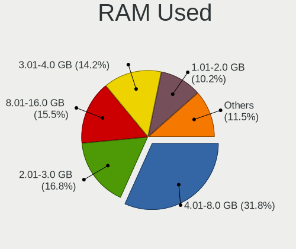
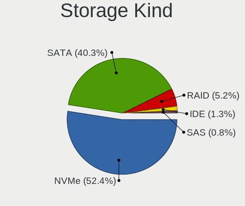
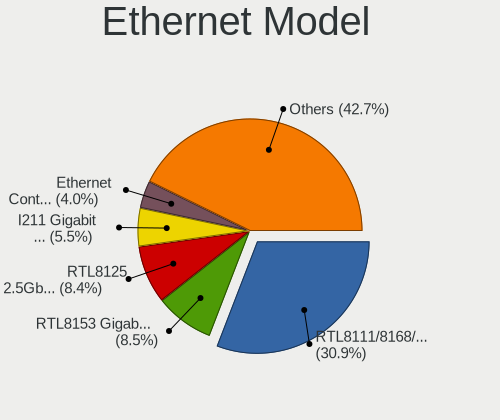
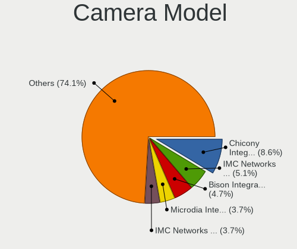
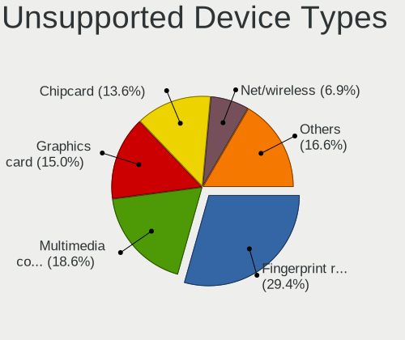

NixOS - Tested Hardware & Statistics
------------------------------------

A project to collect tested hardware configurations for NixOS.

Anyone can contribute to this report by the [hw-probe](https://github.com/linuxhw/hw-probe) tool:

    sudo -E hw-probe -all -upload

Please submit a probe of your configuration if it's not presented on the page or is rare.

This is a report for all computer types. See also reports for [desktops](/Dist/NixOS/Desktop/README.md) and [notebooks](/Dist/NixOS/Notebook/README.md).

Full-feature report is available here: https://linux-hardware.org/?view=trends

Contents
--------

* [ Test Cases ](#test-cases)

* [ System ](#system)
  - [ Kernel                   ](#kernel)
  - [ Kernel Family            ](#kernel-family)
  - [ Kernel Major Ver.        ](#kernel-major-ver)
  - [ Arch                     ](#arch)
  - [ DE                       ](#de)
  - [ Display Server           ](#display-server)
  - [ Display Manager          ](#display-manager)
  - [ OS Lang                  ](#os-lang)
  - [ Boot Mode                ](#boot-mode)
  - [ Filesystem               ](#filesystem)
  - [ Part. scheme             ](#part-scheme)
  - [ Dual Boot with Linux/BSD ](#dual-boot-with-linuxbsd)
  - [ Dual Boot (Win)          ](#dual-boot-win)

* [ Board ](#board)
  - [ Vendor                   ](#vendor)
  - [ Model                    ](#model)
  - [ Model Family             ](#model-family)
  - [ MFG Year                 ](#mfg-year)
  - [ Form Factor              ](#form-factor)
  - [ Secure Boot              ](#secure-boot)
  - [ Coreboot                 ](#coreboot)
  - [ RAM Size                 ](#ram-size)
  - [ RAM Used                 ](#ram-used)
  - [ Total Drives             ](#total-drives)
  - [ Has CD-ROM               ](#has-cd-rom)
  - [ Has Ethernet             ](#has-ethernet)
  - [ Has WiFi                 ](#has-wifi)
  - [ Has Bluetooth            ](#has-bluetooth)

* [ Location ](#location)
  - [ Country                  ](#country)
  - [ City                     ](#city)

* [ Drives ](#drives)
  - [ Drive Vendor             ](#drive-vendor)
  - [ Drive Model              ](#drive-model)
  - [ HDD Vendor               ](#hdd-vendor)
  - [ SSD Vendor               ](#ssd-vendor)
  - [ Drive Kind               ](#drive-kind)
  - [ Drive Connector          ](#drive-connector)
  - [ Drive Size               ](#drive-size)
  - [ Space Total              ](#space-total)
  - [ Space Used               ](#space-used)
  - [ Malfunc. Drives          ](#malfunc-drives)
  - [ Malfunc. Drive Vendor    ](#malfunc-drive-vendor)
  - [ Malfunc. HDD Vendor      ](#malfunc-hdd-vendor)
  - [ Malfunc. Drive Kind      ](#malfunc-drive-kind)
  - [ Failed Drives            ](#failed-drives)
  - [ Failed Drive Vendor      ](#failed-drive-vendor)
  - [ Drive Status             ](#drive-status)

* [ Storage controller ](#storage-controller)
  - [ Storage Vendor           ](#storage-vendor)
  - [ Storage Model            ](#storage-model)
  - [ Storage Kind             ](#storage-kind)

* [ Processor ](#processor)
  - [ CPU Vendor               ](#cpu-vendor)
  - [ CPU Model                ](#cpu-model)
  - [ CPU Model Family         ](#cpu-model-family)
  - [ CPU Cores                ](#cpu-cores)
  - [ CPU Sockets              ](#cpu-sockets)
  - [ CPU Threads              ](#cpu-threads)
  - [ CPU Op-Modes             ](#cpu-op-modes)
  - [ CPU Microcode            ](#cpu-microcode)
  - [ CPU Microarch            ](#cpu-microarch)

* [ Graphics ](#graphics)
  - [ GPU Vendor               ](#gpu-vendor)
  - [ GPU Model                ](#gpu-model)
  - [ GPU Combo                ](#gpu-combo)
  - [ GPU Driver               ](#gpu-driver)
  - [ GPU Memory               ](#gpu-memory)

* [ Monitor ](#monitor)
  - [ Monitor Vendor           ](#monitor-vendor)
  - [ Monitor Model            ](#monitor-model)
  - [ Monitor Resolution       ](#monitor-resolution)
  - [ Monitor Diagonal         ](#monitor-diagonal)
  - [ Monitor Width            ](#monitor-width)
  - [ Aspect Ratio             ](#aspect-ratio)
  - [ Monitor Area             ](#monitor-area)
  - [ Pixel Density            ](#pixel-density)
  - [ Multiple Monitors        ](#multiple-monitors)

* [ Network ](#network)
  - [ Net Controller Vendor    ](#net-controller-vendor)
  - [ Net Controller Model     ](#net-controller-model)
  - [ Wireless Vendor          ](#wireless-vendor)
  - [ Wireless Model           ](#wireless-model)
  - [ Ethernet Vendor          ](#ethernet-vendor)
  - [ Ethernet Model           ](#ethernet-model)
  - [ Net Controller Kind      ](#net-controller-kind)
  - [ Used Controller          ](#used-controller)
  - [ NICs                     ](#nics)
  - [ IPv6                     ](#ipv6)

* [ Bluetooth ](#bluetooth)
  - [ Bluetooth Vendor         ](#bluetooth-vendor)
  - [ Bluetooth Model          ](#bluetooth-model)

* [ Sound ](#sound)
  - [ Sound Vendor             ](#sound-vendor)
  - [ Sound Model              ](#sound-model)

* [ Memory ](#memory)
  - [ Memory Vendor            ](#memory-vendor)
  - [ Memory Model             ](#memory-model)
  - [ Memory Kind              ](#memory-kind)
  - [ Memory Form Factor       ](#memory-form-factor)
  - [ Memory Size              ](#memory-size)
  - [ Memory Speed             ](#memory-speed)

* [ Printers & scanners ](#printers--scanners)
  - [ Printer Vendor           ](#printer-vendor)
  - [ Printer Model            ](#printer-model)
  - [ Scanner Vendor           ](#scanner-vendor)
  - [ Scanner Model            ](#scanner-model)

* [ Camera ](#camera)
  - [ Camera Vendor            ](#camera-vendor)
  - [ Camera Model             ](#camera-model)

* [ Security ](#security)
  - [ Fingerprint Vendor       ](#fingerprint-vendor)
  - [ Fingerprint Model        ](#fingerprint-model)
  - [ Chipcard Vendor          ](#chipcard-vendor)
  - [ Chipcard Model           ](#chipcard-model)

* [ Unsupported ](#unsupported)
  - [ Unsupported Devices      ](#unsupported-devices)
  - [ Unsupported Device Types ](#unsupported-device-types)

Test Cases
----------

| Vendor        | Model                       | Form-Factor | Probe                                                      | Date         |
|---------------|-----------------------------|-------------|------------------------------------------------------------|--------------|
| MSI           | Bravo 15 B5DD               | Notebook    | [273737b3d7](https://linux-hardware.org/?probe=273737b3d7) | Feb 25, 2022 |
| OBSIDIAN-P... | N13_N140ZU                  | Notebook    | [9f2fdbfce5](https://linux-hardware.org/?probe=9f2fdbfce5) | Feb 25, 2022 |
| MSI           | X399 SLI PLUS               | Desktop     | [a1d172dbc0](https://linux-hardware.org/?probe=a1d172dbc0) | Feb 16, 2022 |
| Dell          | Latitude 7420               | Notebook    | [64178dcbb7](https://linux-hardware.org/?probe=64178dcbb7) | Feb 08, 2022 |
| MSI           | MAG X570 TOMAHAWK WIFI      | Desktop     | [051ac4ce21](https://linux-hardware.org/?probe=051ac4ce21) | Jan 13, 2022 |
| Lenovo        | ThinkPad X390 20Q0CTO1WW    | Notebook    | [cf3fa03922](https://linux-hardware.org/?probe=cf3fa03922) | Jan 08, 2022 |
| Lenovo        | ThinkPad X390 20Q0CTO1WW    | Notebook    | [d62840031f](https://linux-hardware.org/?probe=d62840031f) | Jan 08, 2022 |
| MSI           | MAG X570 TOMAHAWK WIFI      | Desktop     | [c84b603f92](https://linux-hardware.org/?probe=c84b603f92) | Jan 04, 2022 |
| Lenovo        | Legion 5 17ARH05H 82GN      | Notebook    | [9e022a2288](https://linux-hardware.org/?probe=9e022a2288) | Dec 26, 2021 |
| Lenovo        | Legion 5 17ARH05H 82GN      | Notebook    | [8ff8fb5efd](https://linux-hardware.org/?probe=8ff8fb5efd) | Dec 26, 2021 |
| ASUSTek       | Z170-P                      | Desktop     | [d4bac456d1](https://linux-hardware.org/?probe=d4bac456d1) | Dec 16, 2021 |
| Lenovo        | Yoga 520-14IKB 81C8         | Convertible | [e5dc04e6a5](https://linux-hardware.org/?probe=e5dc04e6a5) | Dec 16, 2021 |
| Gigabyte      | X570 AORUS ELITE            | Desktop     | [eb5d5f4361](https://linux-hardware.org/?probe=eb5d5f4361) | Dec 12, 2021 |
| ASUSTek       | ZenBook UX391FA_UX391FA     | Notebook    | [5fb4f1b6a6](https://linux-hardware.org/?probe=5fb4f1b6a6) | Nov 29, 2021 |
| ASUSTek       | PRIME Z390-A                | Desktop     | [af887c3f7b](https://linux-hardware.org/?probe=af887c3f7b) | Nov 29, 2021 |
| Lenovo        | ThinkPad T14 Gen 1 20UD0... | Notebook    | [dbe8d36249](https://linux-hardware.org/?probe=dbe8d36249) | Nov 04, 2021 |
| Gigabyte      | H97M-D3H                    | Desktop     | [349fbeb586](https://linux-hardware.org/?probe=349fbeb586) | Oct 23, 2021 |
| Teclast       | F5                          | Convertible | [0854310843](https://linux-hardware.org/?probe=0854310843) | Oct 08, 2021 |
| Lenovo        | ThinkPad X250 20CLS18S0T    | Notebook    | [0151eadf78](https://linux-hardware.org/?probe=0151eadf78) | Oct 06, 2021 |
| HP            | Spectre x360 Convertible... | Convertible | [66d71367c1](https://linux-hardware.org/?probe=66d71367c1) | Aug 24, 2021 |
| HP            | Spectre x360 Convertible... | Convertible | [bd919b4bd6](https://linux-hardware.org/?probe=bd919b4bd6) | Aug 22, 2021 |
| HP            | ProBook 445 G7              | Notebook    | [36c94af49d](https://linux-hardware.org/?probe=36c94af49d) | Aug 09, 2021 |
| HP            | ProBook 445 G7              | Notebook    | [87a418ce6c](https://linux-hardware.org/?probe=87a418ce6c) | Aug 09, 2021 |
| ASUSTek       | ROG Zephyrus G14 GA401QM... | Notebook    | [3df83086ef](https://linux-hardware.org/?probe=3df83086ef) | Aug 07, 2021 |
| ASUSTek       | ROG Zephyrus G14 GA401QM... | Notebook    | [052ccd7a40](https://linux-hardware.org/?probe=052ccd7a40) | Aug 07, 2021 |
| MSI           | X399 SLI PLUS               | Desktop     | [128ae965a7](https://linux-hardware.org/?probe=128ae965a7) | Aug 06, 2021 |
| ASUSTek       | ROG Zephyrus G14 GA401QM... | Notebook    | [48fd4d3b89](https://linux-hardware.org/?probe=48fd4d3b89) | Aug 06, 2021 |
| Dell          | Inspiron 7391 2n1           | Convertible | [f632a64d73](https://linux-hardware.org/?probe=f632a64d73) | Jul 22, 2021 |
| Dell          | Latitude 7420               | Notebook    | [0624aeffd1](https://linux-hardware.org/?probe=0624aeffd1) | Jul 19, 2021 |
| ASRock        | X570 Taichi                 | Desktop     | [d93a80d973](https://linux-hardware.org/?probe=d93a80d973) | Jul 14, 2021 |
| ASRock        | X570 Taichi                 | Desktop     | [59a699d357](https://linux-hardware.org/?probe=59a699d357) | Jul 14, 2021 |
| ASUSTek       | ROG Strix G533QR_G533QR     | Notebook    | [d14e0ef395](https://linux-hardware.org/?probe=d14e0ef395) | Jun 18, 2021 |
| ASUSTek       | SABERTOOTH X99              | Desktop     | [60eed45305](https://linux-hardware.org/?probe=60eed45305) | Jun 18, 2021 |
| MSI           | X570-A PRO                  | Desktop     | [0619809b36](https://linux-hardware.org/?probe=0619809b36) | Jun 01, 2021 |
| ASRock        | B450 Gaming-ITX/ac          | Desktop     | [6056eac50c](https://linux-hardware.org/?probe=6056eac50c) | May 31, 2021 |
| ASRock        | B450 Gaming-ITX/ac          | Desktop     | [bd9fb4818b](https://linux-hardware.org/?probe=bd9fb4818b) | May 31, 2021 |
| ASRock        | B450 Gaming-ITX/ac          | Desktop     | [12fa3ffea5](https://linux-hardware.org/?probe=12fa3ffea5) | May 31, 2021 |
| Lenovo        | ThinkPad T480 20L5CTO1WW    | Notebook    | [fc12f446bb](https://linux-hardware.org/?probe=fc12f446bb) | May 23, 2021 |
| ASUSTek       | ROG STRIX B550-F GAMING     | Desktop     | [f03b19461f](https://linux-hardware.org/?probe=f03b19461f) | May 16, 2021 |
| ASUSTek       | ROG STRIX B550-F GAMING     | Desktop     | [529e915984](https://linux-hardware.org/?probe=529e915984) | May 16, 2021 |
| HP            | ZBook Studio G5             | Notebook    | [d323a9cfbf](https://linux-hardware.org/?probe=d323a9cfbf) | Apr 23, 2021 |
| Lenovo        | ThinkPad T460p 20FWCTO1W... | Notebook    | [38ab65a49b](https://linux-hardware.org/?probe=38ab65a49b) | Mar 18, 2021 |
| ASUSTek       | Pro WS W480-ACE             | Desktop     | [3825190816](https://linux-hardware.org/?probe=3825190816) | Mar 11, 2021 |
| ASUSTek       | ROG STRIX B550-I GAMING     | Desktop     | [d55d51a3e2](https://linux-hardware.org/?probe=d55d51a3e2) | Feb 08, 2021 |
| MSI           | MPG X570 GAMING PLUS        | Desktop     | [188755ebc7](https://linux-hardware.org/?probe=188755ebc7) | Oct 25, 2020 |
| HARDKERNEL    | ODROID-H2                   | Desktop     | [a5d75a24e5](https://linux-hardware.org/?probe=a5d75a24e5) | Oct 13, 2020 |
| Lenovo        | ThinkPad T580 20L90024PB    | Notebook    | [8dc60fafaa](https://linux-hardware.org/?probe=8dc60fafaa) | Oct 13, 2020 |
| ASUSTek       | TUF GAMING X570-PLUS        | Desktop     | [b85fb81c59](https://linux-hardware.org/?probe=b85fb81c59) | Sep 28, 2020 |
| Dell          | XPS 15 9550                 | Notebook    | [5656cda6a4](https://linux-hardware.org/?probe=5656cda6a4) | Sep 01, 2020 |
| Dell          | XPS 15 9550                 | Notebook    | [550264c421](https://linux-hardware.org/?probe=550264c421) | Aug 22, 2020 |
| MSI           | MAG B550M BAZOOKA           | Desktop     | [5f7f2db973](https://linux-hardware.org/?probe=5f7f2db973) | Aug 21, 2020 |
| ASUSTek       | PRIME Z270-K                | Desktop     | [cc8de41afd](https://linux-hardware.org/?probe=cc8de41afd) | Aug 21, 2020 |
| HP            | 8055                        | Desktop     | [1165b457fa](https://linux-hardware.org/?probe=1165b457fa) | Jul 08, 2020 |
| HP            | 8055                        | Desktop     | [a5c65e8d4a](https://linux-hardware.org/?probe=a5c65e8d4a) | Jul 08, 2020 |
| Lenovo        | ThinkPad T15 Gen 1 20S6C... | Notebook    | [71029187b1](https://linux-hardware.org/?probe=71029187b1) | Jul 03, 2020 |
| ASRock        | TRX40 Creator               | Desktop     | [2cefd65bfb](https://linux-hardware.org/?probe=2cefd65bfb) | Jun 29, 2020 |
| Acer          | Aspire E5-576G              | Notebook    | [c126c8b2fd](https://linux-hardware.org/?probe=c126c8b2fd) | Apr 15, 2020 |
| Gigabyte      | Sabre 15                    | Notebook    | [4f92cff461](https://linux-hardware.org/?probe=4f92cff461) | Jul 14, 2019 |

System
------

Kernel
------

Version of the Linux kernel

| Version                | Computers | Percent |
|------------------------|-----------|---------|
| 5.8.1-zen1             | 2         | 4.35%   |
| 5.13.7                 | 2         | 4.35%   |
| 5.13.2                 | 2         | 4.35%   |
| 5.12.15                | 2         | 4.35%   |
| 5.8.4                  | 1         | 2.17%   |
| 5.8.16-hardened        | 1         | 2.17%   |
| 5.8.11                 | 1         | 2.17%   |
| 5.8.10                 | 1         | 2.17%   |
| 5.7.4                  | 1         | 2.17%   |
| 5.7.19                 | 1         | 2.17%   |
| 5.7.17                 | 1         | 2.17%   |
| 5.4.94                 | 1         | 2.17%   |
| 5.4.72                 | 1         | 2.17%   |
| 5.4.69                 | 1         | 2.17%   |
| 5.4.50                 | 1         | 2.17%   |
| 5.4.47                 | 1         | 2.17%   |
| 5.4.24                 | 1         | 2.17%   |
| 5.16.8-zen1            | 1         | 2.17%   |
| 5.16.7                 | 1         | 2.17%   |
| 5.16.3                 | 1         | 2.17%   |
| 5.15.7                 | 1         | 2.17%   |
| 5.15.4                 | 1         | 2.17%   |
| 5.15.3                 | 1         | 2.17%   |
| 5.15.18                | 1         | 2.17%   |
| 5.15.12                | 1         | 2.17%   |
| 5.15.0                 | 1         | 2.17%   |
| 5.14.9                 | 1         | 2.17%   |
| 5.14.16-lqx1           | 1         | 2.17%   |
| 5.12.7                 | 1         | 2.17%   |
| 5.11.16-zen1           | 1         | 2.17%   |
| 5.11.16-xanmod1-cacule | 1         | 2.17%   |
| 5.10.69                | 1         | 2.17%   |
| 5.10.66                | 1         | 2.17%   |
| 5.10.62                | 1         | 2.17%   |
| 5.10.57                | 1         | 2.17%   |
| 5.10.52                | 1         | 2.17%   |
| 5.10.43                | 1         | 2.17%   |
| 5.10.35                | 1         | 2.17%   |
| 5.10.30                | 1         | 2.17%   |
| 5.10.17                | 1         | 2.17%   |
| 4.19.57                | 1         | 2.17%   |
| 4.19.116               | 1         | 2.17%   |

Kernel Family
-------------

Linux kernel without a distro release

| Version  | Computers | Percent |
|----------|-----------|---------|
| 5.8.1    | 2         | 4.35%   |
| 5.13.7   | 2         | 4.35%   |
| 5.13.2   | 2         | 4.35%   |
| 5.12.15  | 2         | 4.35%   |
| 5.11.16  | 2         | 4.35%   |
| 5.8.4    | 1         | 2.17%   |
| 5.8.16   | 1         | 2.17%   |
| 5.8.11   | 1         | 2.17%   |
| 5.8.10   | 1         | 2.17%   |
| 5.7.4    | 1         | 2.17%   |
| 5.7.19   | 1         | 2.17%   |
| 5.7.17   | 1         | 2.17%   |
| 5.4.94   | 1         | 2.17%   |
| 5.4.72   | 1         | 2.17%   |
| 5.4.69   | 1         | 2.17%   |
| 5.4.50   | 1         | 2.17%   |
| 5.4.47   | 1         | 2.17%   |
| 5.4.24   | 1         | 2.17%   |
| 5.16.8   | 1         | 2.17%   |
| 5.16.7   | 1         | 2.17%   |
| 5.16.3   | 1         | 2.17%   |
| 5.15.7   | 1         | 2.17%   |
| 5.15.4   | 1         | 2.17%   |
| 5.15.3   | 1         | 2.17%   |
| 5.15.18  | 1         | 2.17%   |
| 5.15.12  | 1         | 2.17%   |
| 5.15.0   | 1         | 2.17%   |
| 5.14.9   | 1         | 2.17%   |
| 5.14.16  | 1         | 2.17%   |
| 5.12.7   | 1         | 2.17%   |
| 5.10.69  | 1         | 2.17%   |
| 5.10.66  | 1         | 2.17%   |
| 5.10.62  | 1         | 2.17%   |
| 5.10.57  | 1         | 2.17%   |
| 5.10.52  | 1         | 2.17%   |
| 5.10.43  | 1         | 2.17%   |
| 5.10.35  | 1         | 2.17%   |
| 5.10.30  | 1         | 2.17%   |
| 5.10.17  | 1         | 2.17%   |
| 4.19.57  | 1         | 2.17%   |
| 4.19.116 | 1         | 2.17%   |

Kernel Major Ver.
-----------------

Linux kernel major version

| Version | Computers | Percent |
|---------|-----------|---------|
| 5.10    | 9         | 19.57%  |
| 5.8     | 6         | 13.04%  |
| 5.4     | 6         | 13.04%  |
| 5.15    | 6         | 13.04%  |
| 5.13    | 4         | 8.7%    |
| 5.7     | 3         | 6.52%   |
| 5.16    | 3         | 6.52%   |
| 5.12    | 3         | 6.52%   |
| 5.14    | 2         | 4.35%   |
| 5.11    | 2         | 4.35%   |
| 4.19    | 2         | 4.35%   |

Arch
----

OS architecture (x86_64, i586, etc.)

| Name   | Computers | Percent |
|--------|-----------|---------|
| x86_64 | 43        | 100%    |

DE
--

Desktop Environment

| Name    | Computers | Percent |
|---------|-----------|---------|
| Unknown | 37        | 86.05%  |
| XFCE    | 2         | 4.65%   |
| KDE     | 2         | 4.65%   |
| GNOME   | 2         | 4.65%   |

Display Server
--------------

X11 or Wayland

| Name    | Computers | Percent |
|---------|-----------|---------|
| Unknown | 37        | 86.05%  |
| X11     | 5         | 11.63%  |
| Wayland | 1         | 2.33%   |

Display Manager
---------------

SDDM, LightDM, etc.

| Name    | Computers | Percent |
|---------|-----------|---------|
| Unknown | 40        | 93.02%  |
| SDDM    | 1         | 2.33%   |
| LightDM | 1         | 2.33%   |
| GDM     | 1         | 2.33%   |

OS Lang
-------

Language

| Lang    | Computers | Percent |
|---------|-----------|---------|
| Unknown | 31        | 72.09%  |
| en_US   | 8         | 18.6%   |
| ru_RU   | 2         | 4.65%   |
| pt_BR   | 1         | 2.33%   |
| en_DK   | 1         | 2.33%   |

Boot Mode
---------

EFI or BIOS

| Mode | Computers | Percent |
|------|-----------|---------|
| EFI  | 36        | 81.82%  |
| BIOS | 8         | 18.18%  |

Filesystem
----------

Type of filesystem

| Type    | Computers | Percent |
|---------|-----------|---------|
| Ext4    | 25        | 56.82%  |
| Btrfs   | 7         | 15.91%  |
| Unknown | 4         | 9.09%   |
| Xfs     | 3         | 6.82%   |
| Tmpfs   | 3         | 6.82%   |
| Zfs     | 1         | 2.27%   |
| Ext2    | 1         | 2.27%   |

Part. scheme
------------

Scheme of partitioning

| Type    | Computers | Percent |
|---------|-----------|---------|
| GPT     | 39        | 90.7%   |
| Unknown | 4         | 9.3%    |

Dual Boot with Linux/BSD
------------------------

Hosting more than one Linux/BSD

| Dual boot | Computers | Percent |
|-----------|-----------|---------|
| No        | 29        | 67.44%  |
| Yes       | 14        | 32.56%  |

Dual Boot (Win)
---------------

Hosting Linux and Windows

| Dual boot | Computers | Percent |
|-----------|-----------|---------|
| No        | 22        | 51.16%  |
| Yes       | 21        | 48.84%  |

Board
-----

Vendor
------

Motherboard manufacturer

| Name                | Computers | Percent |
|---------------------|-----------|---------|
| ASUSTek Computer    | 11        | 25.58%  |
| Lenovo              | 9         | 20.93%  |
| MSI                 | 6         | 13.95%  |
| Hewlett-Packard     | 4         | 9.3%    |
| Gigabyte Technology | 3         | 6.98%   |
| Dell                | 3         | 6.98%   |
| ASRock              | 3         | 6.98%   |
| Teclast             | 1         | 2.33%   |
| OBSIDIAN-PC         | 1         | 2.33%   |
| HARDKERNEL          | 1         | 2.33%   |
| Acer                | 1         | 2.33%   |

Model
-----

Motherboard model

| Name                                  | Computers | Percent |
|---------------------------------------|-----------|---------|
| MSI MS-7C37                           | 2         | 4.65%   |
| Teclast F5                            | 1         | 2.33%   |
| OBSIDIAN-PC N13_N140ZU                | 1         | 2.33%   |
| MSI MS-7C95                           | 1         | 2.33%   |
| MSI MS-7C84                           | 1         | 2.33%   |
| MSI MS-7B09                           | 1         | 2.33%   |
| MSI Bravo 15 B5DD                     | 1         | 2.33%   |
| Lenovo Yoga 520-14IKB 81C8            | 1         | 2.33%   |
| Lenovo ThinkPad X390 20Q0CTO1WW       | 1         | 2.33%   |
| Lenovo ThinkPad X250 20CLS18S0T       | 1         | 2.33%   |
| Lenovo ThinkPad T580 20L90024PB       | 1         | 2.33%   |
| Lenovo ThinkPad T480 20L5CTO1WW       | 1         | 2.33%   |
| Lenovo ThinkPad T460p 20FWCTO1WW      | 1         | 2.33%   |
| Lenovo ThinkPad T15 Gen 1 20S6CTO1WW  | 1         | 2.33%   |
| Lenovo ThinkPad T14 Gen 1 20UD0013RT  | 1         | 2.33%   |
| Lenovo Legion 5 17ARH05H 82GN         | 1         | 2.33%   |
| HP ZBook Studio G5                    | 1         | 2.33%   |
| HP Spectre x360 Convertible 15-eb0xxx | 1         | 2.33%   |
| HP ProBook 445 G7                     | 1         | 2.33%   |
| HP EliteDesk 800 G2 DM 35W            | 1         | 2.33%   |
| HARDKERNEL ODROID-H2                  | 1         | 2.33%   |
| Gigabyte X570 AORUS ELITE             | 1         | 2.33%   |
| Gigabyte Sabre 15                     | 1         | 2.33%   |
| Gigabyte H97M-D3H                     | 1         | 2.33%   |
| Dell XPS 15 9550                      | 1         | 2.33%   |
| Dell Latitude 7420                    | 1         | 2.33%   |
| Dell Inspiron 7391 2n1                | 1         | 2.33%   |
| ASUS ZenBook UX391FA_UX391FA          | 1         | 2.33%   |
| ASUS Z170-P                           | 1         | 2.33%   |
| ASUS TUF GAMING X570-PLUS             | 1         | 2.33%   |
| ASUS ROG Zephyrus G14 GA401QM_GA401QM | 1         | 2.33%   |
| ASUS ROG Strix G533QR_G533QR          | 1         | 2.33%   |
| ASUS ROG STRIX B550-I GAMING          | 1         | 2.33%   |
| ASUS ROG STRIX B550-F GAMING          | 1         | 2.33%   |
| ASUS Pro WS W480-ACE                  | 1         | 2.33%   |
| ASUS PRIME Z390-A                     | 1         | 2.33%   |
| ASUS PRIME Z270-K                     | 1         | 2.33%   |
| ASUS All Series                       | 1         | 2.33%   |
| ASRock X570 Taichi                    | 1         | 2.33%   |
| ASRock TRX40 Creator                  | 1         | 2.33%   |
| ASRock B450 Gaming-ITX/ac             | 1         | 2.33%   |
| Acer Aspire E5-576G                   | 1         | 2.33%   |

Model Family
------------

Motherboard model prefix

| Name                 | Computers | Percent |
|----------------------|-----------|---------|
| Lenovo ThinkPad      | 7         | 16.28%  |
| ASUS ROG             | 4         | 9.3%    |
| MSI MS-7C37          | 2         | 4.65%   |
| ASUS PRIME           | 2         | 4.65%   |
| Teclast F5           | 1         | 2.33%   |
| OBSIDIAN-PC N13      | 1         | 2.33%   |
| MSI MS-7C95          | 1         | 2.33%   |
| MSI MS-7C84          | 1         | 2.33%   |
| MSI MS-7B09          | 1         | 2.33%   |
| MSI Bravo            | 1         | 2.33%   |
| Lenovo Yoga          | 1         | 2.33%   |
| Lenovo Legion        | 1         | 2.33%   |
| HP ZBook             | 1         | 2.33%   |
| HP Spectre           | 1         | 2.33%   |
| HP ProBook           | 1         | 2.33%   |
| HP EliteDesk         | 1         | 2.33%   |
| HARDKERNEL ODROID-H2 | 1         | 2.33%   |
| Gigabyte X570        | 1         | 2.33%   |
| Gigabyte Sabre       | 1         | 2.33%   |
| Gigabyte H97M-D3H    | 1         | 2.33%   |
| Dell XPS             | 1         | 2.33%   |
| Dell Latitude        | 1         | 2.33%   |
| Dell Inspiron        | 1         | 2.33%   |
| ASUS ZenBook         | 1         | 2.33%   |
| ASUS Z170-P          | 1         | 2.33%   |
| ASUS TUF             | 1         | 2.33%   |
| ASUS Pro             | 1         | 2.33%   |
| ASUS All             | 1         | 2.33%   |
| ASRock X570          | 1         | 2.33%   |
| ASRock TRX40         | 1         | 2.33%   |
| ASRock B450          | 1         | 2.33%   |
| Acer Aspire          | 1         | 2.33%   |

MFG Year
--------

Motherboard manufacture year

| Year | Computers | Percent |
|------|-----------|---------|
| 2020 | 14        | 32.56%  |
| 2019 | 8         | 18.6%   |
| 2018 | 7         | 16.28%  |
| 2017 | 4         | 9.3%    |
| 2015 | 4         | 9.3%    |
| 2016 | 3         | 6.98%   |
| 2021 | 2         | 4.65%   |
| 2014 | 1         | 2.33%   |

Form Factor
-----------

Physical design of the computer

| Name        | Computers | Percent |
|-------------|-----------|---------|
| Desktop     | 20        | 46.51%  |
| Notebook    | 19        | 44.19%  |
| Convertible | 4         | 9.3%    |

Secure Boot
-----------

Enabled or disabled

| State    | Computers | Percent |
|----------|-----------|---------|
| Disabled | 43        | 100%    |

Coreboot
--------

Have coreboot on board

| Used | Computers | Percent |
|------|-----------|---------|
| No   | 43        | 100%    |

RAM Size
--------

Total RAM memory

| Size in GB  | Computers | Percent |
|-------------|-----------|---------|
| 32.01-64.0  | 14        | 32.56%  |
| 16.01-24.0  | 13        | 30.23%  |
| 64.01-256.0 | 8         | 18.6%   |
| 8.01-16.0   | 4         | 9.3%    |
| 4.01-8.0    | 3         | 6.98%   |
| 24.01-32.0  | 1         | 2.33%   |

RAM Used
--------

Used RAM memory

| Used GB    | Computers | Percent |
|------------|-----------|---------|
| 4.01-8.0   | 14        | 31.11%  |
| 8.01-16.0  | 8         | 17.78%  |
| 3.01-4.0   | 7         | 15.56%  |
| 32.01-64.0 | 4         | 8.89%   |
| 2.01-3.0   | 4         | 8.89%   |
| 1.01-2.0   | 4         | 8.89%   |
| 24.01-32.0 | 3         | 6.67%   |
| 16.01-24.0 | 1         | 2.22%   |

Total Drives
------------

Number of drives on board

| Drives | Computers | Percent |
|--------|-----------|---------|
| 1      | 20        | 45.45%  |
| 2      | 14        | 31.82%  |
| 3      | 5         | 11.36%  |
| 6      | 3         | 6.82%   |
| 5      | 1         | 2.27%   |
| 0      | 1         | 2.27%   |

Has CD-ROM
----------

Has CD-ROM on board

| Presented | Computers | Percent |
|-----------|-----------|---------|
| No        | 40        | 93.02%  |
| Yes       | 3         | 6.98%   |

Has Ethernet
------------

Has Ethernet on board

| Presented | Computers | Percent |
|-----------|-----------|---------|
| Yes       | 36        | 81.82%  |
| No        | 8         | 18.18%  |

Has WiFi
--------

Has WiFi module

| Presented | Computers | Percent |
|-----------|-----------|---------|
| Yes       | 30        | 69.77%  |
| No        | 13        | 30.23%  |

Has Bluetooth
-------------

Has Bluetooth module

| Presented | Computers | Percent |
|-----------|-----------|---------|
| Yes       | 30        | 68.18%  |
| No        | 14        | 31.82%  |

Location
--------

Country
-------

Geographic location (country)

| Country     | Computers | Percent |
|-------------|-----------|---------|
| Germany     | 6         | 13.95%  |
| Ukraine     | 5         | 11.63%  |
| Russia      | 5         | 11.63%  |
| USA         | 3         | 6.98%   |
| Austria     | 3         | 6.98%   |
| UK          | 2         | 4.65%   |
| Poland      | 2         | 4.65%   |
| Netherlands | 2         | 4.65%   |
| France      | 2         | 4.65%   |
| Canada      | 2         | 4.65%   |
| Uruguay     | 1         | 2.33%   |
| Switzerland | 1         | 2.33%   |
| Spain       | 1         | 2.33%   |
| Serbia      | 1         | 2.33%   |
| Portugal    | 1         | 2.33%   |
| New Zealand | 1         | 2.33%   |
| Hungary     | 1         | 2.33%   |
| Denmark     | 1         | 2.33%   |
| Czechia     | 1         | 2.33%   |
| Colombia    | 1         | 2.33%   |
| Brazil      | 1         | 2.33%   |

City
----

Geographic location (city)

| City              | Computers | Percent |
|-------------------|-----------|---------|
| Vienna            | 3         | 6.67%   |
| Kharkiv           | 3         | 6.67%   |
| Gdansk            | 2         | 4.44%   |
| Chelyabinsk       | 2         | 4.44%   |
| Bensheim          | 2         | 4.44%   |
| Wellington        | 1         | 2.22%   |
| Vernouillet       | 1         | 2.22%   |
| Valpacos          | 1         | 2.22%   |
| Tottenham         | 1         | 2.22%   |
| Srednyaya Akhtuba | 1         | 2.22%   |
| San Gabriel       | 1         | 2.22%   |
| Samara            | 1         | 2.22%   |
| Redwood City      | 1         | 2.22%   |
| Ramenskoye        | 1         | 2.22%   |
| Québec         | 1         | 2.22%   |
| Osasco            | 1         | 2.22%   |
| Numansdorp        | 1         | 2.22%   |
| Mykolayiv         | 1         | 2.22%   |
| Montevideo        | 1         | 2.22%   |
| Melrose           | 1         | 2.22%   |
| London            | 1         | 2.22%   |
| Kuybyshev         | 1         | 2.22%   |
| Kiel              | 1         | 2.22%   |
| Karlsruhe         | 1         | 2.22%   |
| Irpin             | 1         | 2.22%   |
| Halifax           | 1         | 2.22%   |
| Getafe            | 1         | 2.22%   |
| Frankfurt am Main | 1         | 2.22%   |
| Esbjerg           | 1         | 2.22%   |
| Enschede          | 1         | 2.22%   |
| Elsenfeld         | 1         | 2.22%   |
| Dolni Dunajovice  | 1         | 2.22%   |
| Cergy             | 1         | 2.22%   |
| Cartagena         | 1         | 2.22%   |
| Budapest          | 1         | 2.22%   |
| Belgrade          | 1         | 2.22%   |
| Bedford           | 1         | 2.22%   |
| Arlesheim         | 1         | 2.22%   |

Drives
------

Drive Vendor
------------

Hard drive vendors

| Vendor              | Computers | Drives | Percent |
|---------------------|-----------|--------|---------|
| Samsung Electronics | 22        | 34     | 32.84%  |
| Seagate             | 6         | 6      | 8.96%   |
| Intel               | 6         | 9      | 8.96%   |
| WDC                 | 5         | 9      | 7.46%   |
| Kingston            | 5         | 5      | 7.46%   |
| SanDisk             | 4         | 8      | 5.97%   |
| Toshiba             | 3         | 3      | 4.48%   |
| Transcend           | 2         | 2      | 2.99%   |
| SK Hynix            | 2         | 3      | 2.99%   |
| PLEXTOR             | 2         | 2      | 2.99%   |
| HGST                | 2         | 4      | 2.99%   |
| Crucial             | 2         | 2      | 2.99%   |
| Unknown             | 1         | 1      | 1.49%   |
| Teclast             | 1         | 1      | 1.49%   |
| Micron Technology   | 1         | 1      | 1.49%   |
| KIOXIA              | 1         | 1      | 1.49%   |
| INNOVATION IT       | 1         | 1      | 1.49%   |
| ASMT                | 1         | 1      | 1.49%   |

Drive Model
-----------

Hard drive models

| Model                                | Computers | Percent |
|--------------------------------------|-----------|---------|
| Samsung SSD 970 EVO 500GB            | 3         | 3.7%    |
| Samsung SSD 860 EVO 1TB              | 3         | 3.7%    |
| Seagate ST3000DM001-1ER166 3TB       | 2         | 2.47%   |
| Samsung SSD 970 EVO Plus 2TB         | 2         | 2.47%   |
| Samsung SSD 860 QVO 1TB              | 2         | 2.47%   |
| Samsung SSD 860 EVO 2TB              | 2         | 2.47%   |
| Kingston SA400S37960G 960GB SSD      | 2         | 2.47%   |
| HGST HTS721010A9E630 1TB             | 2         | 2.47%   |
| WDC WDS240G2G0B-00EPW0 240GB SSD     | 1         | 1.23%   |
| WDC WD40EFRX-68N32N0 4TB             | 1         | 1.23%   |
| WDC WD3200BPVT-22JJ5T0 320GB         | 1         | 1.23%   |
| WDC WD10EZEX-00RKKA0 1TB             | 1         | 1.23%   |
| WDC PC SN730 SDBPNTY-1T00-1101 1TB   | 1         | 1.23%   |
| WDC PC SN720 SDAQNTW-512G-1001 512GB | 1         | 1.23%   |
| Unknown MMC Card  32GB               | 1         | 1.23%   |
| Transcend TS256GMTS800 256GB SSD     | 1         | 1.23%   |
| Transcend TS256GMTS430S 256GB SSD    | 1         | 1.23%   |
| Toshiba TR150 960GB SSD              | 1         | 1.23%   |
| Toshiba KBG40ZNS512G NVMe 512GB      | 1         | 1.23%   |
| Toshiba HDWL120 2TB                  | 1         | 1.23%   |
| Teclast 256GB NS550-2242 SSD         | 1         | 1.23%   |
| SK Hynix NVMe SSD Drive 1TB          | 1         | 1.23%   |
| SK Hynix NVMe SSD Drive 1024GB       | 1         | 1.23%   |
| SK Hynix HFM001TD3JX013N 1TB         | 1         | 1.23%   |
| Seagate ST3000VX010-2H916L 3TB       | 1         | 1.23%   |
| Seagate ST2000LM007-1R8174 2TB       | 1         | 1.23%   |
| Seagate ST1000LM024 HN-M101MBB 1TB   | 1         | 1.23%   |
| Seagate ST1000DM003-1CH162 1TB       | 1         | 1.23%   |
| SanDisk Ultra II 960GB SSD           | 1         | 1.23%   |
| SanDisk SSD PLUS 240GB               | 1         | 1.23%   |
| SanDisk SSD PLUS 240 GB              | 1         | 1.23%   |
| SanDisk SSD PLUS 120 GB              | 1         | 1.23%   |
| SanDisk SDSSDHII240G 240GB           | 1         | 1.23%   |
| SanDisk SDSSDA240G 240GB             | 1         | 1.23%   |
| Sandisk NVMe SSD Drive 1TB           | 1         | 1.23%   |
| Samsung SSD 980 PRO 1TB              | 1         | 1.23%   |
| Samsung SSD 970 PRO 512GB            | 1         | 1.23%   |
| Samsung SSD 970 EVO Plus 1TB         | 1         | 1.23%   |
| Samsung SSD 970 EVO 1TB              | 1         | 1.23%   |
| Samsung SSD 960 EVO 1TB              | 1         | 1.23%   |
| Samsung SSD 850 EVO 250GB            | 1         | 1.23%   |
| Samsung SSD 850 EVO 120GB            | 1         | 1.23%   |
| Samsung Portable SSD T5 500GB        | 1         | 1.23%   |
| Samsung PM9A1 NVMe 1024GB            | 1         | 1.23%   |
| Samsung NVMe SSD Drive 512GB         | 1         | 1.23%   |
| Samsung NVMe SSD Drive 500GB         | 1         | 1.23%   |
| Samsung NVMe SSD Drive 1TB           | 1         | 1.23%   |
| Samsung MZVLB512HBJQ-000L7 512GB     | 1         | 1.23%   |
| Samsung MZVLB512HAJQ-000H1 512GB     | 1         | 1.23%   |
| Samsung MZVLB512HAJQ-00000 512GB     | 1         | 1.23%   |
| Samsung MZVLB256HAHQ-000L7 256GB     | 1         | 1.23%   |
| Samsung MZVLB1T0HBLR-000L7 1TB       | 1         | 1.23%   |
| Samsung MZ7LN512HMJP-000L7 512GB SSD | 1         | 1.23%   |
| PLEXTOR PX-512M9PeY 512GB            | 1         | 1.23%   |
| PLEXTOR PX-256M6V 256GB SSD          | 1         | 1.23%   |
| Micron 1100_MTFDDAV256TBN 256GB SSD  | 1         | 1.23%   |
| KIOXIA NVMe SSD Drive 256GB          | 1         | 1.23%   |
| Kingston SVP200S37A60G 64GB SSD      | 1         | 1.23%   |
| Kingston SUV300S37A240G 240GB SSD    | 1         | 1.23%   |
| Kingston OM8PCP3512F-AI1 512GB       | 1         | 1.23%   |

HDD Vendor
----------

Hard disk drive vendors

| Vendor  | Computers | Drives | Percent |
|---------|-----------|--------|---------|
| Seagate | 6         | 6      | 46.15%  |
| WDC     | 3         | 5      | 23.08%  |
| HGST    | 2         | 4      | 15.38%  |
| Toshiba | 1         | 1      | 7.69%   |
| ASMT    | 1         | 1      | 7.69%   |

SSD Vendor
----------

Solid state drive vendors

| Vendor              | Computers | Drives | Percent |
|---------------------|-----------|--------|---------|
| Samsung Electronics | 8         | 11     | 27.59%  |
| Kingston            | 4         | 4      | 13.79%  |
| Intel               | 4         | 6      | 13.79%  |
| SanDisk             | 3         | 6      | 10.34%  |
| Transcend           | 2         | 2      | 6.9%    |
| Crucial             | 2         | 2      | 6.9%    |
| WDC                 | 1         | 2      | 3.45%   |
| Toshiba             | 1         | 1      | 3.45%   |
| Teclast             | 1         | 1      | 3.45%   |
| PLEXTOR             | 1         | 1      | 3.45%   |
| Micron Technology   | 1         | 1      | 3.45%   |
| INNOVATION IT       | 1         | 1      | 3.45%   |

Drive Kind
----------

HDD or SSD

| Kind | Computers | Drives | Percent |
|------|-----------|--------|---------|
| NVMe | 27        | 37     | 44.26%  |
| SSD  | 23        | 38     | 37.7%   |
| HDD  | 10        | 17     | 16.39%  |
| MMC  | 1         | 1      | 1.64%   |

Drive Connector
---------------

SATA, SAS, NVMe, etc.

| Type | Computers | Drives | Percent |
|------|-----------|--------|---------|
| NVMe | 27        | 37     | 48.21%  |
| SATA | 26        | 53     | 46.43%  |
| SAS  | 2         | 2      | 3.57%   |
| MMC  | 1         | 1      | 1.79%   |

Drive Size
----------

Size of hard drive

| Size in TB | Computers | Drives | Percent |
|------------|-----------|--------|---------|
| 0.51-1.0   | 16        | 21     | 40%     |
| 0.01-0.5   | 16        | 25     | 40%     |
| 1.01-2.0   | 4         | 4      | 10%     |
| 2.01-3.0   | 3         | 3      | 7.5%    |
| 3.01-4.0   | 1         | 2      | 2.5%    |

Space Total
-----------

Amount of disk space available on the file system

| Size in GB | Computers | Percent |
|------------|-----------|---------|
| Unknown    | 34        | 79.07%  |
| 501-1000   | 3         | 6.98%   |
| 101-250    | 2         | 4.65%   |
| 251-500    | 1         | 2.33%   |
| 2001-3000  | 1         | 2.33%   |
| 1001-2000  | 1         | 2.33%   |
| 1-20       | 1         | 2.33%   |

Space Used
----------

Amount of used disk space

| Used GB  | Computers | Percent |
|----------|-----------|---------|
| Unknown  | 34        | 79.07%  |
| 101-250  | 3         | 6.98%   |
| 1-20     | 3         | 6.98%   |
| 251-500  | 2         | 4.65%   |
| 501-1000 | 1         | 2.33%   |

Malfunc. Drives
---------------

Drive models with a malfunction

| Model                                          | Computers | Drives | Percent |
|------------------------------------------------|-----------|--------|---------|
| Samsung Electronics SSD 970 EVO 1TB            | 1         | 1      | 25%     |
| Micron Technology 1100_MTFDDAV256TBN 256GB SSD | 1         | 1      | 25%     |
| Intel SSDSC2BW240A4 240GB                      | 1         | 1      | 25%     |
| ASMT 2115 128GB                                | 1         | 1      | 25%     |

Malfunc. Drive Vendor
---------------------

Vendors of faulty drives

| Vendor              | Computers | Drives | Percent |
|---------------------|-----------|--------|---------|
| Samsung Electronics | 1         | 1      | 25%     |
| Micron Technology   | 1         | 1      | 25%     |
| Intel               | 1         | 1      | 25%     |
| ASMT                | 1         | 1      | 25%     |

Malfunc. HDD Vendor
-------------------

Vendors of faulty HDD drives

| Vendor | Computers | Drives | Percent |
|--------|-----------|--------|---------|
| ASMT   | 1         | 1      | 100%    |

Malfunc. Drive Kind
-------------------

Kinds of faulty drives

| Kind | Computers | Drives | Percent |
|------|-----------|--------|---------|
| SSD  | 2         | 2      | 50%     |
| NVMe | 1         | 1      | 25%     |
| HDD  | 1         | 1      | 25%     |

Failed Drives
-------------

Failed drive models

Zero info for selected period =(

Failed Drive Vendor
-------------------

Failed drive vendors

Zero info for selected period =(

Drive Status
------------

Number of failed and malfunc. drives

| Status   | Computers | Drives | Percent |
|----------|-----------|--------|---------|
| Works    | 38        | 77     | 79.17%  |
| Detected | 7         | 12     | 14.58%  |
| Malfunc  | 3         | 4      | 6.25%   |

Storage controller
------------------

Storage Vendor
--------------

Storage controller vendors

| Vendor                      | Computers | Percent |
|-----------------------------|-----------|---------|
| Intel                       | 20        | 32.26%  |
| Samsung Electronics         | 16        | 25.81%  |
| AMD                         | 14        | 22.58%  |
| Sandisk                     | 3         | 4.84%   |
| SK Hynix                    | 2         | 3.23%   |
| KIOXIA                      | 2         | 3.23%   |
| Kingston Technology Company | 2         | 3.23%   |
| ASMedia Technology          | 2         | 3.23%   |
| Lite-On Technology          | 1         | 1.61%   |

Storage Model
-------------

Storage controller models

| Model                                                                         | Computers | Percent |
|-------------------------------------------------------------------------------|-----------|---------|
| Samsung NVMe SSD Controller SM981/PM981/PM983                                 | 13        | 20%     |
| AMD FCH SATA Controller [AHCI mode]                                           | 10        | 15.38%  |
| Intel HM170/QM170 Chipset SATA Controller [AHCI Mode]                         | 3         | 4.62%   |
| AMD Starship/Matisse Chipset SATA Controller [AHCI mode]                      | 3         | 4.62%   |
| SK Hynix Gold P31 SSD                                                         | 2         | 3.08%   |
| Samsung NVMe SSD Controller PM9A1/PM9A3/980PRO                                | 2         | 3.08%   |
| KIOXIA Non-Volatile memory controller                                         | 2         | 3.08%   |
| Intel Q170/Q150/B150/H170/H110/Z170/CM236 Chipset SATA Controller [AHCI Mode] | 2         | 3.08%   |
| Intel Comet Lake SATA AHCI Controller                                         | 2         | 3.08%   |
| Intel Celeron/Pentium Silver Processor SATA Controller                        | 2         | 3.08%   |
| ASMedia ASM1062 Serial ATA Controller                                         | 2         | 3.08%   |
| Sandisk WD Blue SN550 NVMe SSD                                                | 1         | 1.54%   |
| Sandisk WD Black SN750 / PC SN730 NVMe SSD                                    | 1         | 1.54%   |
| Sandisk WD Black 2018/SN750 / PC SN720 NVMe SSD                               | 1         | 1.54%   |
| Samsung NVMe SSD Controller SM961/PM961/SM963                                 | 1         | 1.54%   |
| Samsung NVMe SSD Controller SM951/PM951                                       | 1         | 1.54%   |
| Lite-On Non-Volatile memory controller                                        | 1         | 1.54%   |
| Kingston Company Company Non-Volatile memory controller                       | 1         | 1.54%   |
| Kingston Company A2000 NVMe SSD                                               | 1         | 1.54%   |
| Intel Wildcat Point-LP SATA Controller [AHCI Mode]                            | 1         | 1.54%   |
| Intel Sunrise Point-LP SATA Controller [AHCI mode]                            | 1         | 1.54%   |
| Intel SSD Pro 7600p/760p/E 6100p Series                                       | 1         | 1.54%   |
| Intel Non-Volatile memory controller                                          | 1         | 1.54%   |
| Intel Comet Lake PCH-H RAID                                                   | 1         | 1.54%   |
| Intel Cannon Point-LP SATA Controller [AHCI Mode]                             | 1         | 1.54%   |
| Intel Cannon Lake PCH SATA AHCI Controller                                    | 1         | 1.54%   |
| Intel Cannon Lake Mobile PCH SATA AHCI Controller                             | 1         | 1.54%   |
| Intel C610/X99 series chipset sSATA Controller [AHCI mode]                    | 1         | 1.54%   |
| Intel 9 Series Chipset Family SATA Controller [AHCI Mode]                     | 1         | 1.54%   |
| Intel 82801 Mobile SATA Controller [RAID mode]                                | 1         | 1.54%   |
| Intel 200 Series PCH SATA controller [AHCI mode]                              | 1         | 1.54%   |
| AMD X399 Series Chipset SATA Controller                                       | 1         | 1.54%   |
| AMD 400 Series Chipset SATA Controller                                        | 1         | 1.54%   |

Storage Kind
------------

Kind of storage controller (IDE, SATA, NVMe, SAS, ...)

| Kind | Computers | Percent |
|------|-----------|---------|
| SATA | 31        | 50.82%  |
| NVMe | 28        | 45.9%   |
| RAID | 2         | 3.28%   |

Processor
---------

CPU Vendor
----------

Processor vendors

| Vendor | Computers | Percent |
|--------|-----------|---------|
| Intel  | 25        | 58.14%  |
| AMD    | 18        | 41.86%  |

CPU Model
---------

Processor models

| Model                                          | Computers | Percent |
|------------------------------------------------|-----------|---------|
| Intel Core i7-8550U CPU @ 1.80GHz              | 3         | 6.98%   |
| Intel Core i7-8565U CPU @ 1.80GHz              | 2         | 4.65%   |
| Intel Core i7-10510U CPU @ 1.80GHz             | 2         | 4.65%   |
| AMD Ryzen 7 5800H with Radeon Graphics         | 2         | 4.65%   |
| AMD Ryzen 7 3800X 8-Core Processor             | 2         | 4.65%   |
| AMD Ryzen 5 3600X 6-Core Processor             | 2         | 4.65%   |
| AMD Ryzen 5 3600 6-Core Processor              | 2         | 4.65%   |
| Intel Xeon W-1290P CPU @ 3.70GHz               | 1         | 2.33%   |
| Intel Xeon E-2176M CPU @ 2.70GHz               | 1         | 2.33%   |
| Intel Core i7-8700K CPU @ 3.70GHz              | 1         | 2.33%   |
| Intel Core i7-7700HQ CPU @ 2.80GHz             | 1         | 2.33%   |
| Intel Core i7-6850K CPU @ 3.60GHz              | 1         | 2.33%   |
| Intel Core i7-6820HQ CPU @ 2.70GHz             | 1         | 2.33%   |
| Intel Core i7-6700HQ CPU @ 2.60GHz             | 1         | 2.33%   |
| Intel Core i7-5600U CPU @ 2.60GHz              | 1         | 2.33%   |
| Intel Core i7-4790 CPU @ 3.60GHz               | 1         | 2.33%   |
| Intel Core i7-10750H CPU @ 2.60GHz             | 1         | 2.33%   |
| Intel Core i5-8265U CPU @ 1.60GHz              | 1         | 2.33%   |
| Intel Core i5-7600K CPU @ 3.80GHz              | 1         | 2.33%   |
| Intel Core i5-6500T CPU @ 2.50GHz              | 1         | 2.33%   |
| Intel Core i3-7020U CPU @ 2.30GHz              | 1         | 2.33%   |
| Intel Core i3-6100 CPU @ 3.70GHz               | 1         | 2.33%   |
| Intel Celeron N4100 CPU @ 1.10GHz              | 1         | 2.33%   |
| Intel Celeron J4105 CPU @ 1.50GHz              | 1         | 2.33%   |
| Intel 11th Gen Core i7-1185G7 @ 3.00GHz        | 1         | 2.33%   |
| AMD Ryzen Threadripper 3970X 32-Core Processor | 1         | 2.33%   |
| AMD Ryzen Threadripper 1920X 12-Core Processor | 1         | 2.33%   |
| AMD Ryzen 9 5950X 16-Core Processor            | 1         | 2.33%   |
| AMD Ryzen 9 3900X 12-Core Processor            | 1         | 2.33%   |
| AMD Ryzen 7 PRO 4750U with Radeon Graphics     | 1         | 2.33%   |
| AMD Ryzen 7 5800HS with Radeon Graphics        | 1         | 2.33%   |
| AMD Ryzen 7 4800H with Radeon Graphics         | 1         | 2.33%   |
| AMD Ryzen 7 4700U with Radeon Graphics         | 1         | 2.33%   |
| AMD Ryzen 7 3700X 8-Core Processor             | 1         | 2.33%   |
| AMD Ryzen 5 5600X 6-Core Processor             | 1         | 2.33%   |

CPU Model Family
----------------

Processor model prefix

| Model                  | Computers | Percent |
|------------------------|-----------|---------|
| Intel Core i7          | 15        | 34.88%  |
| AMD Ryzen 7            | 8         | 18.6%   |
| AMD Ryzen 5            | 5         | 11.63%  |
| Intel Core i5          | 3         | 6.98%   |
| Intel Xeon             | 2         | 4.65%   |
| Intel Core i3          | 2         | 4.65%   |
| Intel Celeron          | 2         | 4.65%   |
| AMD Ryzen Threadripper | 2         | 4.65%   |
| AMD Ryzen 9            | 2         | 4.65%   |
| Other                  | 1         | 2.33%   |
| AMD Ryzen 7 PRO        | 1         | 2.33%   |

CPU Cores
---------

Number of processor cores

| Number | Computers | Percent |
|--------|-----------|---------|
| 4      | 17        | 39.53%  |
| 8      | 9         | 20.93%  |
| 6      | 9         | 20.93%  |
| 2      | 3         | 6.98%   |
| 12     | 2         | 4.65%   |
| 32     | 1         | 2.33%   |
| 16     | 1         | 2.33%   |
| 10     | 1         | 2.33%   |

CPU Sockets
-----------

Number of sockets

| Number | Computers | Percent |
|--------|-----------|---------|
| 1      | 43        | 100%    |

CPU Threads
-----------

Threads per core (Hyper-Threading)

| Number | Computers | Percent |
|--------|-----------|---------|
| 2      | 38        | 88.37%  |
| 1      | 5         | 11.63%  |

CPU Op-Modes
------------

CPU Operation Modes (32-bit, 64-bit)

| Op mode        | Computers | Percent |
|----------------|-----------|---------|
| 32-bit, 64-bit | 43        | 100%    |

CPU Microcode
-------------

Microcode number

| Number     | Computers | Percent |
|------------|-----------|---------|
| 0x08701021 | 5         | 11.36%  |
| Unknown    | 5         | 11.36%  |
| 0x806ea    | 4         | 9.09%   |
| 0x806ec    | 3         | 6.82%   |
| 0x506e3    | 3         | 6.82%   |
| 0x906ea    | 2         | 4.55%   |
| 0x906e9    | 2         | 4.55%   |
| 0x806eb    | 2         | 4.55%   |
| 0x0a50000c | 2         | 4.55%   |
| 0x08701013 | 2         | 4.55%   |
| 0x08600106 | 2         | 4.55%   |
| 0xa0652    | 1         | 2.27%   |
| 0x806c1    | 1         | 2.27%   |
| 0x706a1    | 1         | 2.27%   |
| 0x406f1    | 1         | 2.27%   |
| 0x306d4    | 1         | 2.27%   |
| 0x306c3    | 1         | 2.27%   |
| 0x0a50000b | 1         | 2.27%   |
| 0x0a201204 | 1         | 2.27%   |
| 0x0a201009 | 1         | 2.27%   |
| 0x08600104 | 1         | 2.27%   |
| 0x08301025 | 1         | 2.27%   |
| 0x08001137 | 1         | 2.27%   |

CPU Microarch
-------------

Microarchitecture

| Name          | Computers | Percent |
|---------------|-----------|---------|
| KabyLake      | 13        | 30.23%  |
| Zen 2         | 12        | 27.91%  |
| Zen 3         | 5         | 11.63%  |
| Skylake       | 4         | 9.3%    |
| Goldmont plus | 2         | 4.65%   |
| CometLake     | 2         | 4.65%   |
| Broadwell     | 2         | 4.65%   |
| Zen           | 1         | 2.33%   |
| TigerLake     | 1         | 2.33%   |
| Haswell       | 1         | 2.33%   |

Graphics
--------

GPU Vendor
----------

Vendors of graphics cards

| Vendor | Computers | Percent |
|--------|-----------|---------|
| Nvidia | 22        | 39.29%  |
| Intel  | 22        | 39.29%  |
| AMD    | 12        | 21.43%  |

GPU Model
---------

Graphics card models

| Model                                                   | Computers | Percent |
|---------------------------------------------------------|-----------|---------|
| AMD Navi 10 [Radeon RX 5600 OEM/5600 XT / 5700/5700 XT] | 5         | 8.77%   |
| Intel HD Graphics 530                                   | 4         | 7.02%   |
| Intel WhiskeyLake-U GT2 [UHD Graphics 620]              | 3         | 5.26%   |
| Intel UHD Graphics 620                                  | 3         | 5.26%   |
| AMD Renoir                                              | 3         | 5.26%   |
| AMD Cezanne                                             | 3         | 5.26%   |
| Nvidia GP108M [GeForce MX150]                           | 2         | 3.51%   |
| Nvidia GP106 [GeForce GTX 1060 6GB]                     | 2         | 3.51%   |
| Nvidia GK104 [GeForce GTX 760]                          | 2         | 3.51%   |
| Intel HD Graphics 630                                   | 2         | 3.51%   |
| Intel GeminiLake [UHD Graphics 600]                     | 2         | 3.51%   |
| Intel CometLake-U GT2 [UHD Graphics]                    | 2         | 3.51%   |
| Nvidia TU117M [GeForce GTX 1650 Ti Mobile]              | 1         | 1.75%   |
| Nvidia TU116M [GeForce GTX 1660 Ti Mobile]              | 1         | 1.75%   |
| Nvidia TU116 [GeForce GTX 1660 Ti]                      | 1         | 1.75%   |
| Nvidia TU116 [GeForce GTX 1650 SUPER]                   | 1         | 1.75%   |
| Nvidia TU106 [GeForce RTX 2070]                         | 1         | 1.75%   |
| Nvidia TU106 [GeForce RTX 2060 SUPER]                   | 1         | 1.75%   |
| Nvidia GP107M [GeForce GTX 1050 Ti Mobile]              | 1         | 1.75%   |
| Nvidia GP107GLM [Quadro P1000 Mobile]                   | 1         | 1.75%   |
| Nvidia GP104 [GeForce GTX 1080]                         | 1         | 1.75%   |
| Nvidia GP104 [GeForce GTX 1070]                         | 1         | 1.75%   |
| Nvidia GM206 [GeForce GTX 960]                          | 1         | 1.75%   |
| Nvidia GM204 [GeForce GTX 970]                          | 1         | 1.75%   |
| Nvidia GM108M [GeForce 940MX]                           | 1         | 1.75%   |
| Nvidia GM107M [GeForce GTX 960M]                        | 1         | 1.75%   |
| Nvidia GA106M [GeForce RTX 3060 Mobile / Max-Q]         | 1         | 1.75%   |
| Nvidia GA104M [GeForce RTX 3070 Mobile / Max-Q]         | 1         | 1.75%   |
| Intel UHD P630 Graphics                                 | 1         | 1.75%   |
| Intel TigerLake-LP GT2 [Iris Xe Graphics]               | 1         | 1.75%   |
| Intel HD Graphics 620                                   | 1         | 1.75%   |
| Intel HD Graphics 5500                                  | 1         | 1.75%   |
| Intel CometLake-H GT2 [UHD Graphics]                    | 1         | 1.75%   |
| Intel CoffeeLake-S GT2 [UHD Graphics 630]               | 1         | 1.75%   |
| AMD Vega 10 XL/XT [Radeon RX Vega 56/64]                | 1         | 1.75%   |
| AMD Navi 14 [Radeon RX 5500/5500M / Pro 5500M]          | 1         | 1.75%   |

GPU Combo
---------

Combinations of graphics cards

| Name           | Computers | Percent |
|----------------|-----------|---------|
| 1 x Intel      | 14        | 32.56%  |
| 1 x Nvidia     | 10        | 23.26%  |
| Intel + Nvidia | 7         | 16.28%  |
| 1 x AMD        | 6         | 13.95%  |
| AMD + Nvidia   | 5         | 11.63%  |
| 2 x AMD        | 1         | 2.33%   |

GPU Driver
----------

Free vs proprietary

| Driver      | Computers | Percent |
|-------------|-----------|---------|
| Free        | 30        | 69.77%  |
| Proprietary | 12        | 27.91%  |
| Unknown     | 1         | 2.33%   |

GPU Memory
----------

Total video memory

| Size in GB | Computers | Percent |
|------------|-----------|---------|
| Unknown    | 31        | 70.45%  |
| 0.01-0.5   | 5         | 11.36%  |
| 7.01-8.0   | 4         | 9.09%   |
| 3.01-4.0   | 2         | 4.55%   |
| 1.01-2.0   | 2         | 4.55%   |

Monitor
-------

Monitor Vendor
--------------

Monitor vendors

| Vendor               | Computers | Percent |
|----------------------|-----------|---------|
| Dell                 | 10        | 19.61%  |
| Goldstar             | 5         | 9.8%    |
| Samsung Electronics  | 4         | 7.84%   |
| LG Display           | 4         | 7.84%   |
| Chimei Innolux       | 4         | 7.84%   |
| AU Optronics         | 4         | 7.84%   |
| PANDA                | 3         | 5.88%   |
| BOE                  | 3         | 5.88%   |
| AOC                  | 2         | 3.92%   |
| Acer                 | 2         | 3.92%   |
| Unknown (AAA)        | 1         | 1.96%   |
| Sharp                | 1         | 1.96%   |
| Lenovo               | 1         | 1.96%   |
| JDI                  | 1         | 1.96%   |
| HVR                  | 1         | 1.96%   |
| Hewlett-Packard      | 1         | 1.96%   |
| Eizo                 | 1         | 1.96%   |
| BenQ                 | 1         | 1.96%   |
| ASUSTek Computer     | 1         | 1.96%   |
| Ancor Communications | 1         | 1.96%   |

Monitor Model
-------------

Monitor models

| Model                                                                 | Computers | Percent |
|-----------------------------------------------------------------------|-----------|---------|
| Dell U2717D DEL40EB 2560x1440 597x336mm 27.0-inch                     | 2         | 3.77%   |
| Dell U2311H DELA060 1920x1080 509x286mm 23.0-inch                     | 2         | 3.77%   |
| Acer CP3271K P ACR0716 3840x2160 597x336mm 27.0-inch                  | 2         | 3.77%   |
| Unknown (AAA) Monitor AAA0ABF 1920x1080 480x260mm 21.5-inch           | 1         | 1.89%   |
| Sharp LCD Monitor SHP143E 3840x2160 346x194mm 15.6-inch               | 1         | 1.89%   |
| Samsung Electronics S34J55x SAM0F70 3440x1440 797x333mm 34.0-inch     | 1         | 1.89%   |
| Samsung Electronics S24B300 SAM08B3 1920x1080 521x293mm 23.5-inch     | 1         | 1.89%   |
| Samsung Electronics LCD Monitor SDC4143 3840x2160 344x194mm 15.5-inch | 1         | 1.89%   |
| Samsung Electronics C32F39M SAM100B 1920x1080 698x393mm 31.5-inch     | 1         | 1.89%   |
| PANDA LM156LF1L03 NCP001C 1920x1080 344x194mm 15.5-inch               | 1         | 1.89%   |
| PANDA LCD Monitor NCP005E 1920x1080 309x174mm 14.0-inch               | 1         | 1.89%   |
| PANDA LC116LF3L03 NCP000A 1920x1080 256x144mm 11.6-inch               | 1         | 1.89%   |
| LG Display LCD Monitor LGD060F 1920x1080 309x174mm 14.0-inch          | 1         | 1.89%   |
| LG Display LCD Monitor LGD0533 1920x1080 344x194mm 15.5-inch          | 1         | 1.89%   |
| LG Display LCD Monitor LGD049A 2560x1440 310x174mm 14.0-inch          | 1         | 1.89%   |
| LG Display LCD Monitor LGD0437 1920x1080 276x156mm 12.5-inch          | 1         | 1.89%   |
| Lenovo LCD Monitor LEN40BA 1920x1080 344x194mm 15.5-inch              | 1         | 1.89%   |
| JDI LCD Monitor JDI385A 3840x2160 294x165mm 13.3-inch                 | 1         | 1.89%   |
| HVR HTC-VIVE HVRAA01 2160x1200                                        | 1         | 1.89%   |
| Hewlett-Packard Z27 HPN3535 3840x2160 597x336mm 27.0-inch             | 1         | 1.89%   |
| Goldstar ULTRAWIDE GSM76FE 2560x1080 798x334mm 34.1-inch              | 1         | 1.89%   |
| Goldstar ULTRAWIDE GSM59F1 2560x1080 673x284mm 28.8-inch              | 1         | 1.89%   |
| Goldstar HDR WFHD GSM7714 2560x1080 798x334mm 34.1-inch               | 1         | 1.89%   |
| Goldstar HDR 4K GSM7750 3840x2160 697x392mm 31.5-inch                 | 1         | 1.89%   |
| Goldstar HDR 4K GSM7707 3840x2160 600x340mm 27.2-inch                 | 1         | 1.89%   |
| Eizo L568 ENC1734 1280x1024 338x270mm 17.0-inch                       | 1         | 1.89%   |
| Dell U2715H DELD067 2560x1440 597x336mm 27.0-inch                     | 1         | 1.89%   |
| Dell U2415 DELA0BA 1920x1200 520x320mm 24.0-inch                      | 1         | 1.89%   |
| Dell U2415 DELA0B9 1920x1200 518x324mm 24.1-inch                      | 1         | 1.89%   |
| Dell U2312HM DEL4072 1920x1080 510x287mm 23.0-inch                    | 1         | 1.89%   |
| Dell P2715Q DEL40BD 3840x2160 600x340mm 27.2-inch                     | 1         | 1.89%   |
| Dell P2418D DELD0C2 2560x1440 526x296mm 23.8-inch                     | 1         | 1.89%   |
| Dell P2415Q DELA0BE 3840x2160 527x296mm 23.8-inch                     | 1         | 1.89%   |
| Chimei Innolux LCD Monitor CMN175C 1920x1080 381x214mm 17.2-inch      | 1         | 1.89%   |
| Chimei Innolux LCD Monitor CMN152A 2560x1440 344x193mm 15.5-inch      | 1         | 1.89%   |
| Chimei Innolux LCD Monitor CMN14D2 1920x1080 309x173mm 13.9-inch      | 1         | 1.89%   |
| Chimei Innolux LCD Monitor CMN1384 1920x1080 293x165mm 13.2-inch      | 1         | 1.89%   |
| BOE LCD Monitor BOE0957 1920x1080 344x194mm 15.5-inch                 | 1         | 1.89%   |
| BOE LCD Monitor BOE08D8 1920x1080 344x194mm 15.5-inch                 | 1         | 1.89%   |
| BOE LCD Monitor BOE06F3 1920x1080 309x173mm 13.9-inch                 | 1         | 1.89%   |
| BenQ GL2450 BNQ78A5 1920x1080 531x298mm 24.0-inch                     | 1         | 1.89%   |
| AU Optronics LCD Monitor AUO5A2D 1920x1080 293x165mm 13.2-inch        | 1         | 1.89%   |
| AU Optronics LCD Monitor AUO573D 1920x1080 309x174mm 14.0-inch        | 1         | 1.89%   |
| AU Optronics LCD Monitor AUO4A90 1920x1080 309x174mm 14.0-inch        | 1         | 1.89%   |
| AU Optronics LCD Monitor AUO2336 2560x1440 309x174mm 14.0-inch        | 1         | 1.89%   |
| ASUSTek Computer VP28U AUS28B1 3840x2160 621x341mm 27.9-inch          | 1         | 1.89%   |
| AOC G2770 AOC2770 1920x1080 598x336mm 27.0-inch                       | 1         | 1.89%   |
| AOC 2450W AOC2450 1920x1080 521x293mm 23.5-inch                       | 1         | 1.89%   |
| AOC 2280W AOC2280 1920x1080 477x268mm 21.5-inch                       | 1         | 1.89%   |
| Ancor Communications ASUS VC239 ACI23C4 1920x1080 509x286mm 23.0-inch | 1         | 1.89%   |

Monitor Resolution
------------------

Monitor screen resolution

| Resolution       | Computers | Percent |
|------------------|-----------|---------|
| 1920x1080 (FHD)  | 23        | 48.94%  |
| 3840x2160 (4K)   | 11        | 23.4%   |
| 2560x1440 (QHD)  | 7         | 14.89%  |
| 2560x1080        | 3         | 6.38%   |
| 3440x1440        | 1         | 2.13%   |
| 2160x1200        | 1         | 2.13%   |
| 1280x1024 (SXGA) | 1         | 2.13%   |

Monitor Diagonal
----------------

Diagonal size in inches

| Inches  | Computers | Percent |
|---------|-----------|---------|
| 27      | 10        | 20%     |
| 15      | 8         | 16%     |
| 14      | 7         | 14%     |
| 23      | 6         | 12%     |
| 34      | 4         | 8%      |
| 13      | 4         | 8%      |
| 24      | 3         | 6%      |
| 31      | 2         | 4%      |
| 17      | 2         | 4%      |
| 21      | 1         | 2%      |
| 12      | 1         | 2%      |
| 11      | 1         | 2%      |
| Unknown | 1         | 2%      |

Monitor Width
-------------

Physical width

| Width in mm | Computers | Percent |
|-------------|-----------|---------|
| 501-600     | 16        | 34.04%  |
| 301-350     | 16        | 34.04%  |
| 201-300     | 5         | 10.64%  |
| 701-800     | 4         | 8.51%   |
| 601-700     | 3         | 6.38%   |
| 401-500     | 1         | 2.13%   |
| 351-400     | 1         | 2.13%   |
| Unknown     | 1         | 2.13%   |

Aspect Ratio
------------

Proportional relationship between the width and the height

| Ratio | Computers | Percent |
|-------|-----------|---------|
| 16/9  | 33        | 84.62%  |
| 21/9  | 4         | 10.26%  |
| 5/4   | 1         | 2.56%   |
| 16/10 | 1         | 2.56%   |

Monitor Area
------------

Area in inch²

| Area in inch² | Computers | Percent |
|----------------|-----------|---------|
| 301-350        | 10        | 19.61%  |
| 201-250        | 9         | 17.65%  |
| 81-90          | 8         | 15.69%  |
| 101-110        | 8         | 15.69%  |
| 351-500        | 6         | 11.76%  |
| 71-80          | 3         | 5.88%   |
| 61-70          | 1         | 1.96%   |
| 51-60          | 1         | 1.96%   |
| 251-300        | 1         | 1.96%   |
| 151-200        | 1         | 1.96%   |
| 141-150        | 1         | 1.96%   |
| 121-130        | 1         | 1.96%   |
| Unknown        | 1         | 1.96%   |

Pixel Density
-------------

Pixels per inch

| Density       | Computers | Percent |
|---------------|-----------|---------|
| 121-160       | 13        | 27.66%  |
| 51-100        | 13        | 27.66%  |
| 161-240       | 12        | 25.53%  |
| 101-120       | 5         | 10.64%  |
| More than 240 | 3         | 6.38%   |
| Unknown       | 1         | 2.13%   |

Multiple Monitors
-----------------

Total monitors connected

| Total | Computers | Percent |
|-------|-----------|---------|
| 1     | 23        | 52.27%  |
| 2     | 11        | 25%     |
| 0     | 7         | 15.91%  |
| 3     | 3         | 6.82%   |

Network
-------

Net Controller Vendor
---------------------

Controller vendors

| Vendor                | Computers | Percent |
|-----------------------|-----------|---------|
| Intel                 | 33        | 48.53%  |
| Realtek Semiconductor | 26        | 38.24%  |
| Microsoft             | 2         | 2.94%   |
| Aquantia              | 2         | 2.94%   |
| TP-Link               | 1         | 1.47%   |
| Texas Instruments     | 1         | 1.47%   |
| Qualcomm Atheros      | 1         | 1.47%   |
| Oculus VR             | 1         | 1.47%   |
| Fibocom               | 1         | 1.47%   |

Net Controller Model
--------------------

Controller models

| Model                                                             | Computers | Percent |
|-------------------------------------------------------------------|-----------|---------|
| Realtek RTL8111/8168/8411 PCI Express Gigabit Ethernet Controller | 18        | 22.5%   |
| Intel Wi-Fi 6 AX200                                               | 10        | 12.5%   |
| Realtek RTL8153 Gigabit Ethernet Adapter                          | 7         | 8.75%   |
| Intel I211 Gigabit Network Connection                             | 4         | 5%      |
| Intel Dual Band Wireless-AC 3168NGW [Stone Peak]                  | 3         | 3.75%   |
| Realtek RTL8125 2.5GbE Controller                                 | 2         | 2.5%    |
| Microsoft Xbox 360 Wireless Adapter                               | 2         | 2.5%    |
| Intel Wireless-AC 9260                                            | 2         | 2.5%    |
| Intel Wireless 8265 / 8275                                        | 2         | 2.5%    |
| Intel Ethernet Connection (4) I219-V                              | 2         | 2.5%    |
| Intel Ethernet Connection (2) I219-LM                             | 2         | 2.5%    |
| Intel Comet Lake PCH-LP CNVi WiFi                                 | 2         | 2.5%    |
| Intel Cannon Point-LP CNVi [Wireless-AC]                          | 2         | 2.5%    |
| TP-Link AC600 wireless Realtek RTL8811AU [Archer T2U Nano]        | 1         | 1.25%   |
| Texas Instruments CC2538 USB CDC                                  | 1         | 1.25%   |
| Realtek RTL8821CE 802.11ac PCIe Wireless Network Adapter          | 1         | 1.25%   |
| Qualcomm Atheros QCA6174 802.11ac Wireless Network Adapter        | 1         | 1.25%   |
| Oculus VR Rift S                                                  | 1         | 1.25%   |
| Intel Wireless 8260                                               | 1         | 1.25%   |
| Intel Wireless 7265                                               | 1         | 1.25%   |
| Intel Wi-Fi 6 AX201                                               | 1         | 1.25%   |
| Intel I210 Gigabit Network Connection                             | 1         | 1.25%   |
| Intel Ethernet Controller I225-V                                  | 1         | 1.25%   |
| Intel Ethernet Controller I225-LM                                 | 1         | 1.25%   |
| Intel Ethernet Connection (7) I219-V                              | 1         | 1.25%   |
| Intel Ethernet Connection (6) I219-V                              | 1         | 1.25%   |
| Intel Ethernet Connection (3) I218-LM                             | 1         | 1.25%   |
| Intel Ethernet Connection (2) I219-V                              | 1         | 1.25%   |
| Intel Ethernet Connection (2) I218-V                              | 1         | 1.25%   |
| Intel Ethernet Connection (10) I219-V                             | 1         | 1.25%   |
| Intel Comet Lake PCH CNVi WiFi                                    | 1         | 1.25%   |
| Intel Cannon Lake PCH CNVi WiFi                                   | 1         | 1.25%   |
| Fibocom L830-EB-00 LTE WWAN Modem                                 | 1         | 1.25%   |
| Aquantia AQC107 NBase-T/IEEE 802.3bz Ethernet Controller [AQtion] | 1         | 1.25%   |
| Aquantia 5G USB Ethernet Adapter                                  | 1         | 1.25%   |

Wireless Vendor
---------------

Wireless vendors

| Vendor                | Computers | Percent |
|-----------------------|-----------|---------|
| Intel                 | 26        | 81.25%  |
| Microsoft             | 2         | 6.25%   |
| TP-Link               | 1         | 3.13%   |
| Realtek Semiconductor | 1         | 3.13%   |
| Qualcomm Atheros      | 1         | 3.13%   |
| Fibocom               | 1         | 3.13%   |

Wireless Model
--------------

Wireless models

| Model                                                      | Computers | Percent |
|------------------------------------------------------------|-----------|---------|
| Intel Wi-Fi 6 AX200                                        | 10        | 31.25%  |
| Intel Dual Band Wireless-AC 3168NGW [Stone Peak]           | 3         | 9.38%   |
| Microsoft Xbox 360 Wireless Adapter                        | 2         | 6.25%   |
| Intel Wireless-AC 9260                                     | 2         | 6.25%   |
| Intel Wireless 8265 / 8275                                 | 2         | 6.25%   |
| Intel Comet Lake PCH-LP CNVi WiFi                          | 2         | 6.25%   |
| Intel Cannon Point-LP CNVi [Wireless-AC]                   | 2         | 6.25%   |
| TP-Link AC600 wireless Realtek RTL8811AU [Archer T2U Nano] | 1         | 3.13%   |
| Realtek RTL8821CE 802.11ac PCIe Wireless Network Adapter   | 1         | 3.13%   |
| Qualcomm Atheros QCA6174 802.11ac Wireless Network Adapter | 1         | 3.13%   |
| Intel Wireless 8260                                        | 1         | 3.13%   |
| Intel Wireless 7265                                        | 1         | 3.13%   |
| Intel Wi-Fi 6 AX201                                        | 1         | 3.13%   |
| Intel Comet Lake PCH CNVi WiFi                             | 1         | 3.13%   |
| Intel Cannon Lake PCH CNVi WiFi                            | 1         | 3.13%   |
| Fibocom L830-EB-00 LTE WWAN Modem                          | 1         | 3.13%   |

Ethernet Vendor
---------------

Ethernet vendors

| Vendor                | Computers | Percent |
|-----------------------|-----------|---------|
| Realtek Semiconductor | 25        | 58.14%  |
| Intel                 | 16        | 37.21%  |
| Aquantia              | 2         | 4.65%   |

Ethernet Model
--------------

Ethernet models

| Model                                                             | Computers | Percent |
|-------------------------------------------------------------------|-----------|---------|
| Realtek RTL8111/8168/8411 PCI Express Gigabit Ethernet Controller | 18        | 39.13%  |
| Realtek RTL8153 Gigabit Ethernet Adapter                          | 7         | 15.22%  |
| Intel I211 Gigabit Network Connection                             | 4         | 8.7%    |
| Realtek RTL8125 2.5GbE Controller                                 | 2         | 4.35%   |
| Intel Ethernet Connection (4) I219-V                              | 2         | 4.35%   |
| Intel Ethernet Connection (2) I219-LM                             | 2         | 4.35%   |
| Intel I210 Gigabit Network Connection                             | 1         | 2.17%   |
| Intel Ethernet Controller I225-V                                  | 1         | 2.17%   |
| Intel Ethernet Controller I225-LM                                 | 1         | 2.17%   |
| Intel Ethernet Connection (7) I219-V                              | 1         | 2.17%   |
| Intel Ethernet Connection (6) I219-V                              | 1         | 2.17%   |
| Intel Ethernet Connection (3) I218-LM                             | 1         | 2.17%   |
| Intel Ethernet Connection (2) I219-V                              | 1         | 2.17%   |
| Intel Ethernet Connection (2) I218-V                              | 1         | 2.17%   |
| Intel Ethernet Connection (10) I219-V                             | 1         | 2.17%   |
| Aquantia AQC107 NBase-T/IEEE 802.3bz Ethernet Controller [AQtion] | 1         | 2.17%   |
| Aquantia 5G USB Ethernet Adapter                                  | 1         | 2.17%   |

Net Controller Kind
-------------------

Ethernet, WiFi or modem

| Kind     | Computers | Percent |
|----------|-----------|---------|
| Ethernet | 36        | 52.94%  |
| WiFi     | 30        | 44.12%  |
| Modem    | 2         | 2.94%   |

Used Controller
---------------

Currently used network controller

| Kind     | Computers | Percent |
|----------|-----------|---------|
| Ethernet | 27        | 51.92%  |
| WiFi     | 25        | 48.08%  |

NICs
----

Total network controllers on board

| Total | Computers | Percent |
|-------|-----------|---------|
| 1     | 21        | 48.84%  |
| 2     | 19        | 44.19%  |
| 3     | 2         | 4.65%   |
| 0     | 1         | 2.33%   |

IPv6
----

IPv6 vs IPv4

| Used | Computers | Percent |
|------|-----------|---------|
| No   | 34        | 79.07%  |
| Yes  | 9         | 20.93%  |

Bluetooth
---------

Bluetooth Vendor
----------------

Controller vendors

| Vendor                          | Computers | Percent |
|---------------------------------|-----------|---------|
| Intel                           | 24        | 77.42%  |
| Cambridge Silicon Radio         | 2         | 6.45%   |
| ASUSTek Computer                | 2         | 6.45%   |
| Realtek Semiconductor           | 1         | 3.23%   |
| Qualcomm Atheros Communications | 1         | 3.23%   |
| HTC (High Tech Computer)        | 1         | 3.23%   |

Bluetooth Model
---------------

Controller models

| Model                                               | Computers | Percent |
|-----------------------------------------------------|-----------|---------|
| Intel AX200 Bluetooth                               | 8         | 25.81%  |
| Intel Bluetooth Device                              | 7         | 22.58%  |
| Intel Wireless-AC 3168 Bluetooth                    | 3         | 9.68%   |
| Intel AX201 Bluetooth                               | 3         | 9.68%   |
| Intel Wireless-AC 9260 Bluetooth Adapter            | 2         | 6.45%   |
| Cambridge Silicon Radio Bluetooth Dongle (HCI mode) | 2         | 6.45%   |
| Realtek Bluetooth Radio                             | 1         | 3.23%   |
| Qualcomm Atheros  Bluetooth Device                  | 1         | 3.23%   |
| Intel Bluetooth wireless interface                  | 1         | 3.23%   |
| HTC (High Tech Computer) BCM920703 Bluetooth 4.1    | 1         | 3.23%   |
| ASUS Broadcom BCM20702A0 Bluetooth                  | 1         | 3.23%   |
| ASUS ASUS USB-BT500                                 | 1         | 3.23%   |

Sound
-----

Sound Vendor
------------

Sound card vendors

| Vendor                     | Computers | Percent |
|----------------------------|-----------|---------|
| Intel                      | 25        | 34.72%  |
| AMD                        | 18        | 25%     |
| Nvidia                     | 16        | 22.22%  |
| C-Media Electronics        | 2         | 2.78%   |
| Unknown                    | 1         | 1.39%   |
| Trust                      | 1         | 1.39%   |
| Thomann                    | 1         | 1.39%   |
| Realtek Semiconductor      | 1         | 1.39%   |
| PreSonus Audio Electronics | 1         | 1.39%   |
| Lenovo                     | 1         | 1.39%   |
| Kingston Technology        | 1         | 1.39%   |
| GYROCOM C&C                | 1         | 1.39%   |
| Creative Technology        | 1         | 1.39%   |
| Creative Labs              | 1         | 1.39%   |
| Corsair                    | 1         | 1.39%   |

Sound Model
-----------

Sound card models

| Model                                                           | Computers | Percent |
|-----------------------------------------------------------------|-----------|---------|
| AMD Starship/Matisse HD Audio Controller                        | 11        | 12.94%  |
| AMD Navi 10 HDMI Audio                                          | 6         | 7.06%   |
| AMD Family 17h/19h HD Audio Controller                          | 6         | 7.06%   |
| AMD Renoir Radeon High Definition Audio Controller              | 5         | 5.88%   |
| Intel Sunrise Point-LP HD Audio                                 | 4         | 4.71%   |
| Intel 100 Series/C230 Series Chipset Family HD Audio Controller | 4         | 4.71%   |
| Intel Cannon Point-LP High Definition Audio Controller          | 3         | 3.53%   |
| Nvidia TU116 High Definition Audio Controller                   | 2         | 2.35%   |
| Nvidia TU106 High Definition Audio Controller                   | 2         | 2.35%   |
| Nvidia GP106 High Definition Audio Controller                   | 2         | 2.35%   |
| Nvidia GP104 High Definition Audio Controller                   | 2         | 2.35%   |
| Nvidia GK104 HDMI Audio Controller                              | 2         | 2.35%   |
| Intel Comet Lake PCH-LP cAVS                                    | 2         | 2.35%   |
| Intel Comet Lake PCH cAVS                                       | 2         | 2.35%   |
| Intel Celeron/Pentium Silver Processor High Definition Audio    | 2         | 2.35%   |
| Intel Cannon Lake PCH cAVS                                      | 2         | 2.35%   |
| C-Media Electronics USB Advanced Audio Device                   | 2         | 2.35%   |
| Unknown USB Audio                                               | 1         | 1.18%   |
| Trust USB microphone                                            | 1         | 1.18%   |
| Thomann SC450USB                                                | 1         | 1.18%   |
| Realtek Semiconductor USB Audio                                 | 1         | 1.18%   |
| PreSonus Audio Electronics AudioBox                             | 1         | 1.18%   |
| Nvidia TU107 GeForce GTX 1650 High Definition Audio Controller  | 1         | 1.18%   |
| Nvidia GP107GL High Definition Audio Controller                 | 1         | 1.18%   |
| Nvidia GM206 High Definition Audio Controller                   | 1         | 1.18%   |
| Nvidia GM204 High Definition Audio Controller                   | 1         | 1.18%   |
| Nvidia GA104 High Definition Audio Controller                   | 1         | 1.18%   |
| Nvidia Audio device                                             | 1         | 1.18%   |
| Lenovo ThinkPad Thunderbolt 4 Dock USB Audio                    | 1         | 1.18%   |
| Kingston Technology HyperX 7.1 Audio                            | 1         | 1.18%   |
| Intel Wildcat Point-LP High Definition Audio Controller         | 1         | 1.18%   |
| Intel Tiger Lake-LP Smart Sound Technology Audio Controller     | 1         | 1.18%   |
| Intel CM238 HD Audio Controller                                 | 1         | 1.18%   |
| Intel C610/X99 series chipset HD Audio Controller               | 1         | 1.18%   |
| Intel Broadwell-U Audio Controller                              | 1         | 1.18%   |
| Intel 9 Series Chipset Family HD Audio Controller               | 1         | 1.18%   |
| Intel 200 Series PCH HD Audio                                   | 1         | 1.18%   |
| GYROCOM C&C DigiHug USB Audio                                   | 1         | 1.18%   |
| Creative Technology Sound BlasterX G1                           | 1         | 1.18%   |
| Creative Labs CA0108/CA10300 [Sound Blaster Audigy Series]      | 1         | 1.18%   |
| Corsair HS70 Pro Wireless Gaming Headset                        | 1         | 1.18%   |
| AMD Vega 10 HDMI Audio [Radeon Vega 56/64]                      | 1         | 1.18%   |
| AMD Family 17h (Models 00h-0fh) HD Audio Controller             | 1         | 1.18%   |

Memory
------

Memory Vendor
-------------

Memory module vendors

| Vendor              | Computers | Percent |
|---------------------|-----------|---------|
| Samsung Electronics | 11        | 25%     |
| Kingston            | 9         | 20.45%  |
| Corsair             | 7         | 15.91%  |
| Micron Technology   | 5         | 11.36%  |
| G.Skill             | 3         | 6.82%   |
| Crucial             | 3         | 6.82%   |
| Unknown (ABCD)      | 2         | 4.55%   |
| Strontium           | 1         | 2.27%   |
| GOODRAM             | 1         | 2.27%   |
| Avant               | 1         | 2.27%   |
| AMD                 | 1         | 2.27%   |

Memory Model
------------

Memory module models

| Model                                                            | Computers | Percent |
|------------------------------------------------------------------|-----------|---------|
| Samsung RAM M471A2G44AM0-CWE 16GB SODIMM DDR4 3200MT/s           | 2         | 4%      |
| Kingston RAM KHX3200C16D4/16GX 16GB DIMM DDR4 3600MT/s           | 2         | 4%      |
| Kingston RAM KHX2666C16/16G 16GB DIMM DDR4 3200MT/s              | 2         | 4%      |
| Kingston RAM KHX2400C15/16G 16GB DIMM DDR4 3334MT/s              | 2         | 4%      |
| G.Skill RAM F4-3000C16-8GISB 8GB DIMM DDR4 3200MT/s              | 2         | 4%      |
| Corsair RAM CMK64GX4M2E3200C16 32GB DIMM DDR4 3200MT/s           | 2         | 4%      |
| Unknown (ABCD) RAM 123456789012345678 4GB DIMM DDR4 2400MT/s     | 1         | 2%      |
| Unknown (ABCD) RAM 123456789012345678 2GB SODIMM LPDDR4 2400MT/s | 1         | 2%      |
| Strontium RAM SRT8G86U1-P9H 8GB DIMM DDR3 1600MT/s               | 1         | 2%      |
| Samsung RAM Module 4096MB SODIMM DDR4 2133MT/s                   | 1         | 2%      |
| Samsung RAM Module 16384MB SODIMM DDR4 2667MT/s                  | 1         | 2%      |
| Samsung RAM M471A4G43MB1-CTD 32GB SODIMM DDR4 2667MT/s           | 1         | 2%      |
| Samsung RAM M471A2K43DB1-CWE 16GB SODIMM DDR4 3200MT/s           | 1         | 2%      |
| Samsung RAM M471A2K43CB1-CRC 16GB SODIMM DDR4 2667MT/s           | 1         | 2%      |
| Samsung RAM M471A2K43BB1-CRC 16GB SODIMM DDR4 2400MT/s           | 1         | 2%      |
| Samsung RAM M471A2K43BB1-CPB 16GB SODIMM DDR4 2133MT/s           | 1         | 2%      |
| Samsung RAM M471A2K43BB1-CPB 16GB Chip DDR4 2133MT/s             | 1         | 2%      |
| Samsung RAM M471A1K43EB1-CWE 8GB SODIMM DDR4 3200MT/s            | 1         | 2%      |
| Samsung RAM M471A1K43BB1-CTD 8GB SODIMM DDR4 2667MT/s            | 1         | 2%      |
| Samsung RAM M471A1G44AB0-CWE 8GB SODIMM DDR4 3200MT/s            | 1         | 2%      |
| Samsung RAM K4EBE3 4EC-EGCG 8192MB Row Of Chips LPDDR3 2133MT/s  | 1         | 2%      |
| Micron RAM MT52L1G32D4PG-093 8GB Row Of Chips LPDDR3 2133MT/s    | 1         | 2%      |
| Micron RAM MT40A1G16RC-062E:B 8GB SODIMM DDR4 3200MT/s           | 1         | 2%      |
| Micron RAM 53E2G32D4NQ-046 4GB Row Of Chips LPDDR4 4267MT/s      | 1         | 2%      |
| Micron RAM 4ATF1G64HZ-3G2E1 8192MB SODIMM DDR4 3200MT/s          | 1         | 2%      |
| Micron RAM 16KTF2G64HZ-1G6A1 16GB SODIMM DDR3 1600MT/s           | 1         | 2%      |
| Kingston RAM KHX3200C16D4/8GX 8GB DIMM DDR4 3533MT/s             | 1         | 2%      |
| Kingston RAM KHX3200C16D4/32GX 32GB DIMM DDR4 3200MT/s           | 1         | 2%      |
| Kingston RAM KHX2400C15D4/8G 8GB DIMM DDR4 2400MT/s              | 1         | 2%      |
| Kingston RAM ACR16D3LS1KBGR/8G 8192MB SODIMM DDR3 1600MT/s       | 1         | 2%      |
| Kingston RAM 9965745-021.A00G 32GB DIMM DDR4 2933MT/s            | 1         | 2%      |
| Kingston RAM 9905744-035.A00G 16GB SODIMM DDR4 3200MT/s          | 1         | 2%      |
| GOODRAM RAM GR2400S464L17S/8G 8GB SODIMM DDR4 2400MT/s           | 1         | 2%      |
| G.Skill RAM F4-2400C16-16GRS 16GB SODIMM DDR4 2667MT/s           | 1         | 2%      |
| Crucial RAM CT16G4SFD824A.C16FBD 16GB SODIMM DDR4 2667MT/s       | 1         | 2%      |
| Crucial RAM BLS16G4D32AESE.M16FE 16GB DIMM DDR4 3733MT/s         | 1         | 2%      |
| Crucial RAM BL16G32C16U4B.M16FE1 16384MB DIMM DDR4 3200MT/s      | 1         | 2%      |
| Corsair RAM CMZ16GX3M2A1600C10 8GB DIMM DDR3 1600MT/s            | 1         | 2%      |
| Corsair RAM CMW16GX4M2C3200C16 8GB DIMM DDR4 3266MT/s            | 1         | 2%      |
| Corsair RAM CMK32GX4M2B3200C16 16GB DIMM DDR4 3400MT/s           | 1         | 2%      |
| Corsair RAM CMK16GX4M2D3600C18 8GB DIMM DDR4 3600MT/s            | 1         | 2%      |
| Corsair RAM CMD64GX4M4A2666C15 16384MB DIMM DDR4 2133MT/s        | 1         | 2%      |
| Avant RAM J642GU42J2320NQ 16384MB SODIMM DDR4 3200MT/s           | 1         | 2%      |
| AMD RAM R9432G3206S2S 32GB SODIMM DDR4 3200MT/s                  | 1         | 2%      |

Memory Kind
-----------

Memory module kinds

| Kind   | Computers | Percent |
|--------|-----------|---------|
| DDR4   | 32        | 80%     |
| LPDDR4 | 3         | 7.5%    |
| DDR3   | 3         | 7.5%    |
| LPDDR3 | 2         | 5%      |

Memory Form Factor
------------------

Physical design of the memory module

| Name         | Computers | Percent |
|--------------|-----------|---------|
| SODIMM       | 19        | 46.34%  |
| DIMM         | 18        | 43.9%   |
| Row Of Chips | 3         | 7.32%   |
| Chip         | 1         | 2.44%   |

Memory Size
-----------

Memory module size

| Size  | Computers | Percent |
|-------|-----------|---------|
| 16384 | 19        | 43.18%  |
| 8192  | 16        | 36.36%  |
| 32768 | 6         | 13.64%  |
| 4096  | 3         | 6.82%   |

Memory Speed
------------

Memory module speed

| Speed | Computers | Percent |
|-------|-----------|---------|
| 3200  | 15        | 34.09%  |
| 2667  | 5         | 11.36%  |
| 2400  | 5         | 11.36%  |
| 2133  | 5         | 11.36%  |
| 3600  | 3         | 6.82%   |
| 1600  | 3         | 6.82%   |
| 3334  | 2         | 4.55%   |
| 4267  | 1         | 2.27%   |
| 3733  | 1         | 2.27%   |
| 3533  | 1         | 2.27%   |
| 3400  | 1         | 2.27%   |
| 3266  | 1         | 2.27%   |
| 2933  | 1         | 2.27%   |

Printers & scanners
-------------------

Printer Vendor
--------------

Printer device vendors

Zero info for selected period =(

Printer Model
-------------

Printer device models

Zero info for selected period =(

Scanner Vendor
--------------

Scanner device vendors

Zero info for selected period =(

Scanner Model
-------------

Scanner device models

Zero info for selected period =(

Camera
------

Camera Vendor
-------------

Camera device vendors

| Vendor                        | Computers | Percent |
|-------------------------------|-----------|---------|
| Chicony Electronics           | 6         | 22.22%  |
| Microdia                      | 3         | 11.11%  |
| Logitech                      | 3         | 11.11%  |
| Acer                          | 3         | 11.11%  |
| Realtek Semiconductor         | 2         | 7.41%   |
| Quanta                        | 2         | 7.41%   |
| MacroSilicon                  | 2         | 7.41%   |
| IMC Networks                  | 2         | 7.41%   |
| SunplusIT                     | 1         | 3.7%    |
| Sunplus Innovation Technology | 1         | 3.7%    |
| Lite-On Technology            | 1         | 3.7%    |
| Apple                         | 1         | 3.7%    |

Camera Model
------------

Camera device models

| Model                             | Computers | Percent |
|-----------------------------------|-----------|---------|
| Chicony Integrated Camera         | 4         | 14.29%  |
| MacroSilicon USB Video            | 2         | 7.14%   |
| SunplusIT MTD camera              | 1         | 3.57%   |
| Sunplus Integrated_Webcam_FHD     | 1         | 3.57%   |
| Realtek Integrated_Webcam_HD      | 1         | 3.57%   |
| Realtek EasyCamera                | 1         | 3.57%   |
| Quanta HP True Vision HD Camera   | 1         | 3.57%   |
| Quanta HD WebCam                  | 1         | 3.57%   |
| Microdia USB 2.0 Camera           | 1         | 3.57%   |
| Microdia Integrated_Webcam_HD     | 1         | 3.57%   |
| Microdia Camera                   | 1         | 3.57%   |
| Logitech Webcam C310              | 1         | 3.57%   |
| Logitech Webcam C270              | 1         | 3.57%   |
| Logitech C930c                    | 1         | 3.57%   |
| Lite-On HP HD Camera              | 1         | 3.57%   |
| IMC Networks USB2.0 HD UVC WebCam | 1         | 3.57%   |
| IMC Networks Integrated Camera    | 1         | 3.57%   |
| Chicony USB2.0 Camera             | 1         | 3.57%   |
| Chicony HP HD Camera              | 1         | 3.57%   |
| Apple iPhone 5/5C/5S/6/SE         | 1         | 3.57%   |
| Acer SunplusIT Integrated Camera  | 1         | 3.57%   |
| Acer Integrated IR Camera         | 1         | 3.57%   |
| Acer Integrated Camera            | 1         | 3.57%   |
| Acer HD Webcam                    | 1         | 3.57%   |

Security
--------

Fingerprint Vendor
------------------

Fingerprint sensor vendors

| Vendor                     | Computers | Percent |
|----------------------------|-----------|---------|
| Synaptics                  | 4         | 66.67%  |
| Validity Sensors           | 1         | 16.67%  |
| Shenzhen Goodix Technology | 1         | 16.67%  |

Fingerprint Model
-----------------

Fingerprint sensor models

| Model                                             | Computers | Percent |
|---------------------------------------------------|-----------|---------|
| Synaptics Prometheus MIS Touch Fingerprint Reader | 2         | 33.33%  |
| Validity Sensors VFS7500 Touch Fingerprint Sensor | 1         | 16.67%  |
| Synaptics Metallica MIS Touch Fingerprint Reader  | 1         | 16.67%  |
| Shenzhen Goodix Fingerprint Reader                | 1         | 16.67%  |
| Unknown                                           | 1         | 16.67%  |

Chipcard Vendor
---------------

Chipcard module vendors

| Vendor      | Computers | Percent |
|-------------|-----------|---------|
| Alcor Micro | 4         | 100%    |

Chipcard Model
--------------

Chipcard module models

| Model                               | Computers | Percent |
|-------------------------------------|-----------|---------|
| Alcor Micro AU9540 Smartcard Reader | 4         | 100%    |

Unsupported
-----------

Unsupported Devices
-------------------

Total unsupported devices on board

| Total | Computers | Percent |
|-------|-----------|---------|
| 0     | 25        | 58.14%  |
| 1     | 12        | 27.91%  |
| 2     | 5         | 11.63%  |
| 4     | 1         | 2.33%   |

Unsupported Device Types
------------------------

Types of unsupported devices

| Type                  | Computers | Percent |
|-----------------------|-----------|---------|
| Graphics card         | 7         | 28%     |
| Fingerprint reader    | 5         | 20%     |
| Multimedia controller | 3         | 12%     |
| Chipcard              | 3         | 12%     |
| Unassigned class      | 2         | 8%      |
| Net/wireless          | 2         | 8%      |
| Camera                | 2         | 8%      |
| Network               | 1         | 4%      |

