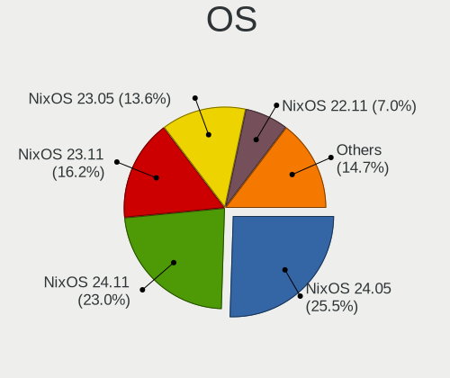
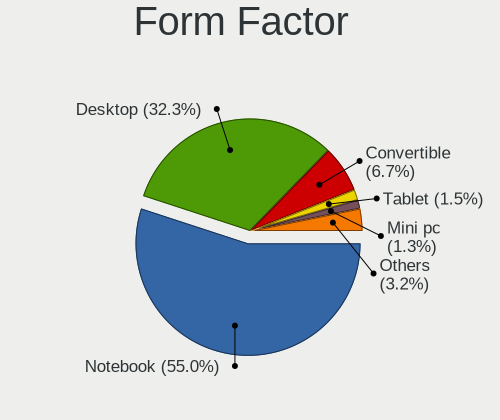
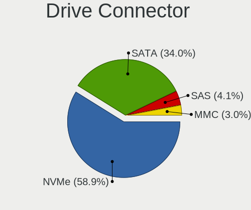
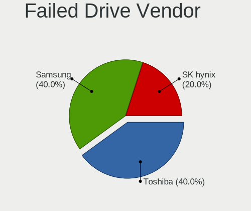
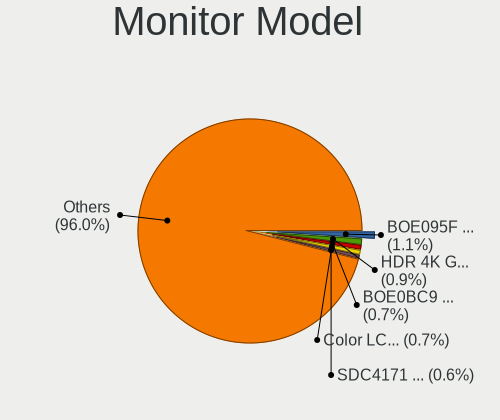
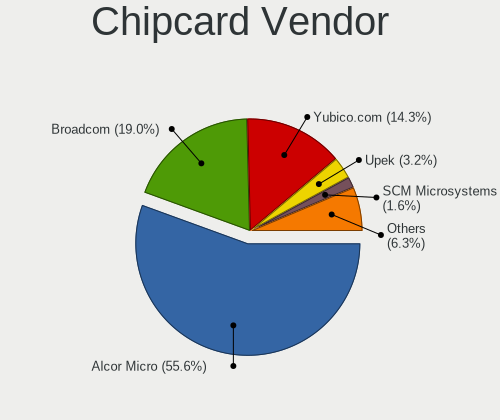

NixOS - Tested Hardware & Statistics
------------------------------------

A project to collect tested hardware configurations for NixOS.

Anyone can contribute to this report by the [hw-probe](https://github.com/linuxhw/hw-probe) tool:

    sudo -E hw-probe -all -upload

Please contribute! Especially if your hardware is rare.

This is a report for all computer types. See also reports for [desktops](/Dist/NixOS/Desktop/README.md) and [notebooks](/Dist/NixOS/Notebook/README.md).

Contents
--------

* [ Test Cases ](#test-cases)

* [ System ](#system)
  - [ OS                       ](#os)
  - [ OS Family                ](#os-family)
  - [ Kernel                   ](#kernel)
  - [ Kernel Family            ](#kernel-family)
  - [ Kernel Major Ver.        ](#kernel-major-ver)
  - [ Arch                     ](#arch)
  - [ DE                       ](#de)
  - [ Display Server           ](#display-server)
  - [ Display Manager          ](#display-manager)
  - [ OS Lang                  ](#os-lang)
  - [ Boot Mode                ](#boot-mode)
  - [ Filesystem               ](#filesystem)
  - [ Part. scheme             ](#part-scheme)
  - [ Dual Boot with Linux/BSD ](#dual-boot-with-linuxbsd)
  - [ Dual Boot (Win)          ](#dual-boot-win)

* [ Board ](#board)
  - [ Vendor                   ](#vendor)
  - [ Model                    ](#model)
  - [ Model Family             ](#model-family)
  - [ MFG Year                 ](#mfg-year)
  - [ Form Factor              ](#form-factor)
  - [ Secure Boot              ](#secure-boot)
  - [ Coreboot                 ](#coreboot)
  - [ RAM Size                 ](#ram-size)
  - [ RAM Used                 ](#ram-used)
  - [ Total Drives             ](#total-drives)
  - [ Has CD-ROM               ](#has-cd-rom)
  - [ Has Ethernet             ](#has-ethernet)
  - [ Has WiFi                 ](#has-wifi)
  - [ Has Bluetooth            ](#has-bluetooth)

* [ Location ](#location)
  - [ Country                  ](#country)
  - [ City                     ](#city)

* [ Drives ](#drives)
  - [ Drive Vendor             ](#drive-vendor)
  - [ Drive Model              ](#drive-model)
  - [ HDD Vendor               ](#hdd-vendor)
  - [ SSD Vendor               ](#ssd-vendor)
  - [ Drive Kind               ](#drive-kind)
  - [ Drive Connector          ](#drive-connector)
  - [ Drive Size               ](#drive-size)
  - [ Space Total              ](#space-total)
  - [ Space Used               ](#space-used)
  - [ Malfunc. Drives          ](#malfunc-drives)
  - [ Malfunc. Drive Vendor    ](#malfunc-drive-vendor)
  - [ Malfunc. HDD Vendor      ](#malfunc-hdd-vendor)
  - [ Malfunc. Drive Kind      ](#malfunc-drive-kind)
  - [ Failed Drives            ](#failed-drives)
  - [ Failed Drive Vendor      ](#failed-drive-vendor)
  - [ Drive Status             ](#drive-status)

* [ Storage controller ](#storage-controller)
  - [ Storage Vendor           ](#storage-vendor)
  - [ Storage Model            ](#storage-model)
  - [ Storage Kind             ](#storage-kind)

* [ Processor ](#processor)
  - [ CPU Vendor               ](#cpu-vendor)
  - [ CPU Model                ](#cpu-model)
  - [ CPU Model Family         ](#cpu-model-family)
  - [ CPU Cores                ](#cpu-cores)
  - [ CPU Sockets              ](#cpu-sockets)
  - [ CPU Threads              ](#cpu-threads)
  - [ CPU Op-Modes             ](#cpu-op-modes)
  - [ CPU Microcode            ](#cpu-microcode)
  - [ CPU Microarch            ](#cpu-microarch)

* [ Graphics ](#graphics)
  - [ GPU Vendor               ](#gpu-vendor)
  - [ GPU Model                ](#gpu-model)
  - [ GPU Combo                ](#gpu-combo)
  - [ GPU Driver               ](#gpu-driver)
  - [ GPU Memory               ](#gpu-memory)

* [ Monitor ](#monitor)
  - [ Monitor Vendor           ](#monitor-vendor)
  - [ Monitor Model            ](#monitor-model)
  - [ Monitor Resolution       ](#monitor-resolution)
  - [ Monitor Diagonal         ](#monitor-diagonal)
  - [ Monitor Width            ](#monitor-width)
  - [ Aspect Ratio             ](#aspect-ratio)
  - [ Monitor Area             ](#monitor-area)
  - [ Pixel Density            ](#pixel-density)
  - [ Multiple Monitors        ](#multiple-monitors)

* [ Network ](#network)
  - [ Net Controller Vendor    ](#net-controller-vendor)
  - [ Net Controller Model     ](#net-controller-model)
  - [ Wireless Vendor          ](#wireless-vendor)
  - [ Wireless Model           ](#wireless-model)
  - [ Ethernet Vendor          ](#ethernet-vendor)
  - [ Ethernet Model           ](#ethernet-model)
  - [ Net Controller Kind      ](#net-controller-kind)
  - [ Used Controller          ](#used-controller)
  - [ NICs                     ](#nics)
  - [ IPv6                     ](#ipv6)

* [ Bluetooth ](#bluetooth)
  - [ Bluetooth Vendor         ](#bluetooth-vendor)
  - [ Bluetooth Model          ](#bluetooth-model)

* [ Sound ](#sound)
  - [ Sound Vendor             ](#sound-vendor)
  - [ Sound Model              ](#sound-model)

* [ Memory ](#memory)
  - [ Memory Vendor            ](#memory-vendor)
  - [ Memory Model             ](#memory-model)
  - [ Memory Kind              ](#memory-kind)
  - [ Memory Form Factor       ](#memory-form-factor)
  - [ Memory Size              ](#memory-size)
  - [ Memory Speed             ](#memory-speed)

* [ Printers & scanners ](#printers--scanners)
  - [ Printer Vendor           ](#printer-vendor)
  - [ Printer Model            ](#printer-model)
  - [ Scanner Vendor           ](#scanner-vendor)
  - [ Scanner Model            ](#scanner-model)

* [ Camera ](#camera)
  - [ Camera Vendor            ](#camera-vendor)
  - [ Camera Model             ](#camera-model)

* [ Security ](#security)
  - [ Fingerprint Vendor       ](#fingerprint-vendor)
  - [ Fingerprint Model        ](#fingerprint-model)
  - [ Chipcard Vendor          ](#chipcard-vendor)
  - [ Chipcard Model           ](#chipcard-model)

* [ Unsupported ](#unsupported)
  - [ Unsupported Devices      ](#unsupported-devices)
  - [ Unsupported Device Types ](#unsupported-device-types)

Test Cases
----------

Total: 957

| Vendor        | Model                       | Form-Factor | Probe                                                      | Date         |
|---------------|-----------------------------|-------------|------------------------------------------------------------|--------------|
| Lenovo        | ThinkPad X1 Tablet Gen 2... | Tablet      | [ba288e243c](https://linux-hardware.org/?probe=ba288e243c) | Jan 05, 2025 |
| Lenovo        | ThinkPad T490 20N20030US    | Notebook    | [d4dd35d7dc](https://linux-hardware.org/?probe=d4dd35d7dc) | Jan 04, 2025 |
| HP            | Pavilion Laptop 14-ec0xx... | Notebook    | [9bb39e061b](https://linux-hardware.org/?probe=9bb39e061b) | Jan 04, 2025 |
| MSI           | MEG X570 UNIFY              | Desktop     | [fc581d20c5](https://linux-hardware.org/?probe=fc581d20c5) | Jan 04, 2025 |
| Lenovo        | Legion 7 16IRX9 83FD        | Notebook    | [7bb0cafb81](https://linux-hardware.org/?probe=7bb0cafb81) | Jan 04, 2025 |
| Gigabyte      | B550I AORUS PRO AX          | Desktop     | [465d7bcabe](https://linux-hardware.org/?probe=465d7bcabe) | Jan 03, 2025 |
| Framework     | Laptop 13 (AMD Ryzen 704... | Notebook    | [041f977a25](https://linux-hardware.org/?probe=041f977a25) | Jan 03, 2025 |
| Framework     | Laptop                      | Notebook    | [a74fd192f3](https://linux-hardware.org/?probe=a74fd192f3) | Jan 03, 2025 |
| ASUSTek       | PRIME B550-PLUS             | Desktop     | [1ad78511fb](https://linux-hardware.org/?probe=1ad78511fb) | Jan 02, 2025 |
| Trigkey       | S7                          | Mini pc     | [4188b696fb](https://linux-hardware.org/?probe=4188b696fb) | Jan 02, 2025 |
| Gigabyte      | GA-MA790GP-DS4H             | Desktop     | [ba9e4bcced](https://linux-hardware.org/?probe=ba9e4bcced) | Dec 31, 2024 |
| Framework     | Laptop 13 (AMD Ryzen 704... | Notebook    | [0793ac2320](https://linux-hardware.org/?probe=0793ac2320) | Dec 31, 2024 |
| Lenovo        | IdeaPad C340-15IIL 81XJ     | Convertible | [21702287f9](https://linux-hardware.org/?probe=21702287f9) | Dec 30, 2024 |
| Acer          | Aspire 5742Z                | Notebook    | [0cda57368f](https://linux-hardware.org/?probe=0cda57368f) | Dec 28, 2024 |
| ASUSTek       | ROG STRIX X870-I GAMING ... | Desktop     | [13514b4f65](https://linux-hardware.org/?probe=13514b4f65) | Dec 27, 2024 |
| Dell          | Precision 5690              | Notebook    | [5219297c0d](https://linux-hardware.org/?probe=5219297c0d) | Dec 26, 2024 |
| MSI           | MPG B650I EDGE WIFI         | Desktop     | [9f7cf29dd9](https://linux-hardware.org/?probe=9f7cf29dd9) | Dec 25, 2024 |
| ASUSTek       | ASUS Zenbook 14 UX3405MA... | Notebook    | [95d37ca286](https://linux-hardware.org/?probe=95d37ca286) | Dec 25, 2024 |
| Apple         | MacBookPro11,3              | Notebook    | [b6aa51489b](https://linux-hardware.org/?probe=b6aa51489b) | Dec 22, 2024 |
| Lenovo        | Yoga C740-15IML 81TD        | Convertible | [f553773036](https://linux-hardware.org/?probe=f553773036) | Dec 22, 2024 |
| ASUSTek       | ROG Zephyrus G16 GA605WI... | Notebook    | [0b5149cbce](https://linux-hardware.org/?probe=0b5149cbce) | Dec 18, 2024 |
| Gigabyte      | B550I AORUS PRO AX          | Desktop     | [9c8b89e00a](https://linux-hardware.org/?probe=9c8b89e00a) | Dec 18, 2024 |
| HP            | EliteBook 2560p             | Notebook    | [084e229e45](https://linux-hardware.org/?probe=084e229e45) | Dec 18, 2024 |
| MSI           | PRO B760-VC WIFI 7 BULK     | Desktop     | [624168065a](https://linux-hardware.org/?probe=624168065a) | Dec 18, 2024 |
| Samsung       | 900X3N                      | Notebook    | [672751a071](https://linux-hardware.org/?probe=672751a071) | Dec 17, 2024 |
| GPD           | G1622-01                    | Notebook    | [daa5825210](https://linux-hardware.org/?probe=daa5825210) | Dec 17, 2024 |
| GPD           | G1622-01                    | Notebook    | [bd716cf271](https://linux-hardware.org/?probe=bd716cf271) | Dec 17, 2024 |
| Lenovo        | ThinkPad T14 Gen 5 21ML0... | Notebook    | [063c4b21a8](https://linux-hardware.org/?probe=063c4b21a8) | Dec 16, 2024 |
| Gigabyte      | Z390 AORUS PRO WIFI-CF      | Desktop     | [7e6d9bed21](https://linux-hardware.org/?probe=7e6d9bed21) | Dec 16, 2024 |
| Lenovo        | ThinkBook 14 G6 IRL 21NQ    | Notebook    | [5c45e2bfee](https://linux-hardware.org/?probe=5c45e2bfee) | Dec 16, 2024 |
| CWWK          | MINIPC-G12                  | Desktop     | [b7abc4972b](https://linux-hardware.org/?probe=b7abc4972b) | Dec 15, 2024 |
| CWWK          | MINIPC-G12                  | Desktop     | [da5ce0c723](https://linux-hardware.org/?probe=da5ce0c723) | Dec 15, 2024 |
| Lenovo        | Legion 5 Pro 16ARH7H 82R... | Notebook    | [083f4404b5](https://linux-hardware.org/?probe=083f4404b5) | Dec 14, 2024 |
| Apple         | MacBookPro11,5              | Notebook    | [76bab8abed](https://linux-hardware.org/?probe=76bab8abed) | Dec 14, 2024 |
| ASUSTek       | X99-DELUXE                  | Desktop     | [d27995c12e](https://linux-hardware.org/?probe=d27995c12e) | Dec 12, 2024 |
| Gigabyte      | TRX50 AERO D                | Desktop     | [806cbde5a6](https://linux-hardware.org/?probe=806cbde5a6) | Dec 11, 2024 |
| Gigabyte      | TRX50 AERO D                | Desktop     | [d4cb8b5bdb](https://linux-hardware.org/?probe=d4cb8b5bdb) | Dec 11, 2024 |
| ASUSTek       | ASUS TUF Gaming A16 FA60... | Notebook    | [b5059cca85](https://linux-hardware.org/?probe=b5059cca85) | Dec 10, 2024 |
| ASUSTek       | ASUS TUF Gaming A16 FA60... | Notebook    | [c43e0a8e7d](https://linux-hardware.org/?probe=c43e0a8e7d) | Dec 10, 2024 |
| Dell          | 0C4Y3R A02                  | Server      | [d63adbc5dd](https://linux-hardware.org/?probe=d63adbc5dd) | Dec 09, 2024 |
| ASUSTek       | ROG Flow X16 GV601VI_GV6... | Convertible | [f7c34da554](https://linux-hardware.org/?probe=f7c34da554) | Dec 08, 2024 |
| ASRockRack    | X570D4U                     | Server      | [650a06cbd5](https://linux-hardware.org/?probe=650a06cbd5) | Dec 07, 2024 |
| ASRock        | B550M Steel Legend          | Desktop     | [6f47f74e85](https://linux-hardware.org/?probe=6f47f74e85) | Dec 07, 2024 |
| HP            | Laptop 15-dy2xxx            | Notebook    | [5fd9df1c27](https://linux-hardware.org/?probe=5fd9df1c27) | Dec 07, 2024 |
| Lenovo        | G570 20079                  | Notebook    | [d7ca5ffb0b](https://linux-hardware.org/?probe=d7ca5ffb0b) | Dec 06, 2024 |
| Dell          | Precision 3591              | Notebook    | [af761ba6a9](https://linux-hardware.org/?probe=af761ba6a9) | Dec 05, 2024 |
| Lenovo        | ThinkPad X230 23252CG       | Notebook    | [614068917c](https://linux-hardware.org/?probe=614068917c) | Dec 04, 2024 |
| Dell          | 0C4Y3R A02                  | Server      | [0ad2232f2e](https://linux-hardware.org/?probe=0ad2232f2e) | Dec 03, 2024 |
| Lenovo        | IdeaPad 3 14ITL05 81X7      | Notebook    | [12db03cac4](https://linux-hardware.org/?probe=12db03cac4) | Dec 01, 2024 |
| MSI           | MPG Z490 GAMING EDGE WIF... | Desktop     | [a9d455e4cb](https://linux-hardware.org/?probe=a9d455e4cb) | Nov 29, 2024 |
| Unknown       | QADL03                      | Desktop     | [c2aaa4505e](https://linux-hardware.org/?probe=c2aaa4505e) | Nov 29, 2024 |
| MSI           | MPG Z490 GAMING EDGE WIF... | Desktop     | [c602a79e72](https://linux-hardware.org/?probe=c602a79e72) | Nov 29, 2024 |
| Lenovo        | ThinkPad T450s 20BWS3TM0... | Notebook    | [c32b3f2dd0](https://linux-hardware.org/?probe=c32b3f2dd0) | Nov 28, 2024 |
| ASUSTek       | ROG Zephyrus G14 GA403UV... | Notebook    | [773e88d3be](https://linux-hardware.org/?probe=773e88d3be) | Nov 27, 2024 |
| Dell          | XPS 15 9530                 | Notebook    | [df0fd1e685](https://linux-hardware.org/?probe=df0fd1e685) | Nov 27, 2024 |
| ASUSTek       | ROG Maximus XI HERO         | Desktop     | [1c66e560b6](https://linux-hardware.org/?probe=1c66e560b6) | Nov 27, 2024 |
| Framework     | Laptop 16 (AMD Ryzen 704... | Notebook    | [032327d915](https://linux-hardware.org/?probe=032327d915) | Nov 26, 2024 |
| Gigabyte      | B550M AORUS ELITE           | Desktop     | [f442911c71](https://linux-hardware.org/?probe=f442911c71) | Nov 26, 2024 |
| Lenovo        | ThinkPad X1 Carbon Gen 1... | Notebook    | [24a75e17ae](https://linux-hardware.org/?probe=24a75e17ae) | Nov 26, 2024 |
| HP            | OmniBook Ultra Laptop 14... | Notebook    | [5c64854b38](https://linux-hardware.org/?probe=5c64854b38) | Nov 26, 2024 |
| Gigabyte      | B550M DS3H                  | Desktop     | [7154d27150](https://linux-hardware.org/?probe=7154d27150) | Nov 25, 2024 |
| Lenovo        | ThinkPad T14 Gen 5 21ML0... | Notebook    | [59205e96b5](https://linux-hardware.org/?probe=59205e96b5) | Nov 25, 2024 |
| Lenovo        | ThinkPad E16 Gen 2 21MA0... | Notebook    | [fa8c5128c6](https://linux-hardware.org/?probe=fa8c5128c6) | Nov 25, 2024 |
| ASUSTek       | ASUS Zenbook S 16 UM5606... | Notebook    | [de16a781fa](https://linux-hardware.org/?probe=de16a781fa) | Nov 24, 2024 |
| Lenovo        | IdeaPad Pro 5 14IMH9 83D... | Notebook    | [e7b45b99c1](https://linux-hardware.org/?probe=e7b45b99c1) | Nov 23, 2024 |
| ASUSTek       | ASUS Zenbook S 16 UM5606... | Notebook    | [1d2005d912](https://linux-hardware.org/?probe=1d2005d912) | Nov 23, 2024 |
| ASUSTek       | ASUS Zenbook S 16 UM5606... | Notebook    | [bdcf6c541a](https://linux-hardware.org/?probe=bdcf6c541a) | Nov 21, 2024 |
| Lenovo        | ThinkPad T450s 20BWS3TM0... | Notebook    | [0e39a0bdbe](https://linux-hardware.org/?probe=0e39a0bdbe) | Nov 21, 2024 |
| Lenovo        | ThinkPad E14 Gen 6 21M70... | Notebook    | [81b39da9fd](https://linux-hardware.org/?probe=81b39da9fd) | Nov 19, 2024 |
| Framework     | Laptop 16 (AMD Ryzen 704... | Notebook    | [24d0062e37](https://linux-hardware.org/?probe=24d0062e37) | Nov 19, 2024 |
| ASUSTek       | VivoBook_ASUSLaptop M650... | Notebook    | [fe024604b1](https://linux-hardware.org/?probe=fe024604b1) | Nov 17, 2024 |
| Dell          | Vostro 3500                 | Notebook    | [48169a4553](https://linux-hardware.org/?probe=48169a4553) | Nov 17, 2024 |
| ASUSTek       | ASUS Zenbook S 16 UM5606... | Notebook    | [cf12d8256f](https://linux-hardware.org/?probe=cf12d8256f) | Nov 15, 2024 |
| PC Special... | NS50MU                      | Notebook    | [65a6da58c1](https://linux-hardware.org/?probe=65a6da58c1) | Nov 14, 2024 |
| Framework     | Laptop 16 (AMD Ryzen 704... | Notebook    | [68df2e0f71](https://linux-hardware.org/?probe=68df2e0f71) | Nov 14, 2024 |
| MSI           | B450 GAMING PRO CARBON M... | Desktop     | [2c0c09c053](https://linux-hardware.org/?probe=2c0c09c053) | Nov 14, 2024 |
| ASUSTek       | PRIME TRX40-PRO S           | Desktop     | [1497f6e734](https://linux-hardware.org/?probe=1497f6e734) | Nov 13, 2024 |
| Lenovo        | ThinkPad X1 Carbon Gen 1... | Notebook    | [665265a239](https://linux-hardware.org/?probe=665265a239) | Nov 13, 2024 |
| Lenovo        | ThinkPad T14 Gen 1 20UES... | Notebook    | [3a28af2ad6](https://linux-hardware.org/?probe=3a28af2ad6) | Nov 13, 2024 |
| Framework     | Laptop 16 (AMD Ryzen 704... | Notebook    | [193f9b2369](https://linux-hardware.org/?probe=193f9b2369) | Nov 12, 2024 |
| ASUSTek       | PRIME B760M-A AX6 II        | Desktop     | [435b3b8915](https://linux-hardware.org/?probe=435b3b8915) | Nov 12, 2024 |
| Dell          | Inspiron 14 5410 2-in-1     | Convertible | [30afde84e8](https://linux-hardware.org/?probe=30afde84e8) | Nov 12, 2024 |
| Lenovo        | ThinkBook 13x G2 IAP 21A... | Notebook    | [6370e4afbb](https://linux-hardware.org/?probe=6370e4afbb) | Nov 10, 2024 |
| Dell          | G5 5590                     | Notebook    | [b797a36b4c](https://linux-hardware.org/?probe=b797a36b4c) | Nov 10, 2024 |
| Unknown       | QDNV01                      | Desktop     | [c799dc9a8c](https://linux-hardware.org/?probe=c799dc9a8c) | Nov 08, 2024 |
| Apple         | MacBookPro11,5              | Notebook    | [43a210e9cb](https://linux-hardware.org/?probe=43a210e9cb) | Nov 08, 2024 |
| Apple         | MacBookPro11,5              | Notebook    | [502004fe3d](https://linux-hardware.org/?probe=502004fe3d) | Nov 08, 2024 |
| Samsung       | 960QHA                      | Convertible | [9918d9e630](https://linux-hardware.org/?probe=9918d9e630) | Nov 08, 2024 |
| MSI           | B650 GAMING PLUS WIFI       | Desktop     | [50f70bccb9](https://linux-hardware.org/?probe=50f70bccb9) | Nov 07, 2024 |
| Microsoft     | Surface with Windows 8 P... | Tablet      | [36f734b633](https://linux-hardware.org/?probe=36f734b633) | Nov 05, 2024 |
| Microsoft     | Surface with Windows 8 P... | Tablet      | [ad77d3a4ca](https://linux-hardware.org/?probe=ad77d3a4ca) | Nov 04, 2024 |
| Supermicro    | X10SLM+-LN4F                | Server      | [488874face](https://linux-hardware.org/?probe=488874face) | Nov 04, 2024 |
| Microsoft     | Surface with Windows 8 P... | Tablet      | [ee38748856](https://linux-hardware.org/?probe=ee38748856) | Nov 04, 2024 |
| Dell          | 06NWYK A00                  | Desktop     | [d3d8a8b29a](https://linux-hardware.org/?probe=d3d8a8b29a) | Nov 04, 2024 |
| Gigabyte      | Z390 GAMING SLI-CF          | Desktop     | [fe10e09e4d](https://linux-hardware.org/?probe=fe10e09e4d) | Nov 04, 2024 |
| TUXEDO        | InfinityBook Pro Gen7 (M... | Notebook    | [142462821d](https://linux-hardware.org/?probe=142462821d) | Nov 03, 2024 |
| Gigabyte      | B650M AORUS ELITE AX        | Desktop     | [f84b68557e](https://linux-hardware.org/?probe=f84b68557e) | Nov 03, 2024 |
| Dell          | 0CRWCR A01                  | All in one  | [e755d7e7ce](https://linux-hardware.org/?probe=e755d7e7ce) | Oct 31, 2024 |
| Lenovo        | IdeaPad 3 14ITL05 81X7      | Notebook    | [f1282c521a](https://linux-hardware.org/?probe=f1282c521a) | Oct 30, 2024 |
| Lenovo        | IdeaPad 3 14ITL05 81X7      | Notebook    | [712493f433](https://linux-hardware.org/?probe=712493f433) | Oct 28, 2024 |
| HP            | Pavilion Aero Laptop 13-... | Notebook    | [7e5bbb938b](https://linux-hardware.org/?probe=7e5bbb938b) | Oct 28, 2024 |
| ASRock        | X670E Taichi Carrara        | Desktop     | [bb8f80dc95](https://linux-hardware.org/?probe=bb8f80dc95) | Oct 27, 2024 |
| Framework     | Laptop                      | Notebook    | [072ab62076](https://linux-hardware.org/?probe=072ab62076) | Oct 27, 2024 |
| ASUSTek       | TUF Gaming B760M-PLUS       | Desktop     | [aefe5002a6](https://linux-hardware.org/?probe=aefe5002a6) | Oct 27, 2024 |
| HP            | ZBook Fury 16 G10 Mobile... | Notebook    | [e903944a84](https://linux-hardware.org/?probe=e903944a84) | Oct 26, 2024 |
| HUAWEI        | HVY-WXX9                    | Notebook    | [9dcb081b32](https://linux-hardware.org/?probe=9dcb081b32) | Oct 25, 2024 |
| Lenovo        | IdeaPad Pro 5 14APH8 83A... | Notebook    | [3d80b9eead](https://linux-hardware.org/?probe=3d80b9eead) | Oct 25, 2024 |
| Lenovo        | ThinkPad X1 Carbon 7th 2... | Notebook    | [51f11aa9f2](https://linux-hardware.org/?probe=51f11aa9f2) | Oct 25, 2024 |
| Dell          | XPS 13 9310                 | Notebook    | [56d5b77e54](https://linux-hardware.org/?probe=56d5b77e54) | Oct 25, 2024 |
| HUAWEI        | HVY-WXX9                    | Notebook    | [04f2f2787e](https://linux-hardware.org/?probe=04f2f2787e) | Oct 25, 2024 |
| Gigabyte      | B450 AORUS M                | Desktop     | [bbb7263070](https://linux-hardware.org/?probe=bbb7263070) | Oct 24, 2024 |
| ASRock        | B650I Lightning WiFi        | Desktop     | [c6bb27bfc6](https://linux-hardware.org/?probe=c6bb27bfc6) | Oct 22, 2024 |
| Acer          | Aspire A315-24PT            | Notebook    | [5e327ea424](https://linux-hardware.org/?probe=5e327ea424) | Oct 22, 2024 |
| Acer          | Swift SFG14-71              | Notebook    | [3cfedf7732](https://linux-hardware.org/?probe=3cfedf7732) | Oct 21, 2024 |
| Dell          | 057FFP A00                  | Desktop     | [1f3c1adda1](https://linux-hardware.org/?probe=1f3c1adda1) | Oct 17, 2024 |
| Gigabyte      | B760M DS3H AX DDR4          | Desktop     | [d51c94d9e8](https://linux-hardware.org/?probe=d51c94d9e8) | Oct 16, 2024 |
| Dell          | Latitude 5550               | Notebook    | [31ec440570](https://linux-hardware.org/?probe=31ec440570) | Oct 16, 2024 |
| ASUSTek       | ROG CROSSHAIR VIII HERO     | Desktop     | [6531fb24dd](https://linux-hardware.org/?probe=6531fb24dd) | Oct 16, 2024 |
| Lenovo        | Legion 7 16IRX9 83FD        | Notebook    | [bf913685ba](https://linux-hardware.org/?probe=bf913685ba) | Oct 16, 2024 |
| Samsung       | 960QHA                      | Convertible | [835e33615c](https://linux-hardware.org/?probe=835e33615c) | Oct 15, 2024 |
| MSI           | B450M PRO-VDH MAX           | Desktop     | [e4eac64915](https://linux-hardware.org/?probe=e4eac64915) | Oct 15, 2024 |
| Lenovo        | IdeaPad Gaming 3 15ACH6 ... | Notebook    | [4dbeafbd5f](https://linux-hardware.org/?probe=4dbeafbd5f) | Oct 15, 2024 |
| Lenovo        | ThinkPad X1 Carbon Gen 9... | Notebook    | [329cd43769](https://linux-hardware.org/?probe=329cd43769) | Oct 14, 2024 |
| Lenovo        | ThinkPad X1 Carbon 4th 2... | Notebook    | [661649b768](https://linux-hardware.org/?probe=661649b768) | Oct 13, 2024 |
| Lenovo        | ThinkPad T420 4180DY4       | Notebook    | [5afcda3ff3](https://linux-hardware.org/?probe=5afcda3ff3) | Oct 13, 2024 |
| ASUSTek       | ASUS Zenbook S 14 UX5406... | Notebook    | [20b06b0861](https://linux-hardware.org/?probe=20b06b0861) | Oct 13, 2024 |
| Lenovo        | Yoga 500-14IBD 80N4         | Notebook    | [634a88ef95](https://linux-hardware.org/?probe=634a88ef95) | Oct 12, 2024 |
| Lenovo        | ThinkPad L380 20M6S3UN00    | Notebook    | [8b17bec7be](https://linux-hardware.org/?probe=8b17bec7be) | Oct 12, 2024 |
| Dell          | Latitude E6540              | Notebook    | [ea8afd6f6b](https://linux-hardware.org/?probe=ea8afd6f6b) | Oct 12, 2024 |
| Dell          | Inspiron 5580               | Notebook    | [6e246c56fb](https://linux-hardware.org/?probe=6e246c56fb) | Oct 12, 2024 |
| ASUSTek       | Zenbook UX5401EA_UX5401E... | Notebook    | [3d7009833d](https://linux-hardware.org/?probe=3d7009833d) | Oct 11, 2024 |
| Gigabyte      | B760M DS3H AX DDR4          | Desktop     | [71afcb15a1](https://linux-hardware.org/?probe=71afcb15a1) | Oct 11, 2024 |
| Lenovo        | ThinkPad X1 Carbon Gen 1... | Notebook    | [491f1090ca](https://linux-hardware.org/?probe=491f1090ca) | Oct 10, 2024 |
| HP            | ENVY x360 2-in-1 Laptop ... | Convertible | [0ebd1227de](https://linux-hardware.org/?probe=0ebd1227de) | Oct 09, 2024 |
| Lenovo        | ThinkPad T480s 20L7S0BM0... | Notebook    | [64ef0dbb14](https://linux-hardware.org/?probe=64ef0dbb14) | Oct 09, 2024 |
| Acer          | Aspire A315-44P             | Notebook    | [65b854b6d3](https://linux-hardware.org/?probe=65b854b6d3) | Oct 08, 2024 |
| Dell          | G15 5511                    | Notebook    | [ed9b86e723](https://linux-hardware.org/?probe=ed9b86e723) | Oct 08, 2024 |
| Lenovo        | ThinkPad X1 Carbon Gen 1... | Notebook    | [160ad6e49e](https://linux-hardware.org/?probe=160ad6e49e) | Oct 07, 2024 |
| HP            | 255 15.6 inch G9 Noteboo... | Notebook    | [1e2e268764](https://linux-hardware.org/?probe=1e2e268764) | Oct 06, 2024 |
| HP            | 255 15.6 inch G9 Noteboo... | Notebook    | [728d0f4561](https://linux-hardware.org/?probe=728d0f4561) | Oct 06, 2024 |
| HP            | 802E                        | Desktop     | [b346ea5ea8](https://linux-hardware.org/?probe=b346ea5ea8) | Oct 06, 2024 |
| ASUSTek       | ZenBook UX535LI_UX535LI     | Notebook    | [d44dc9b966](https://linux-hardware.org/?probe=d44dc9b966) | Oct 04, 2024 |
| Acer          | Aspire A315-44P             | Notebook    | [3aaeee6d1b](https://linux-hardware.org/?probe=3aaeee6d1b) | Oct 03, 2024 |
| ASRock        | B650E PG-ITX WiFi           | Desktop     | [d23633905e](https://linux-hardware.org/?probe=d23633905e) | Oct 02, 2024 |
| Microsoft     | Surface Pro 8               | Tablet      | [d5c7662b6d](https://linux-hardware.org/?probe=d5c7662b6d) | Oct 01, 2024 |
| Gigabyte      | B450 I AORUS PRO WIFI-CF    | Desktop     | [a45b22c07c](https://linux-hardware.org/?probe=a45b22c07c) | Sep 29, 2024 |
| MSI           | B550-A PRO                  | Desktop     | [354adca291](https://linux-hardware.org/?probe=354adca291) | Sep 29, 2024 |
| Gigabyte      | B650 GAMING X AX            | Desktop     | [cb693ee232](https://linux-hardware.org/?probe=cb693ee232) | Sep 27, 2024 |
| MSI           | B550-A PRO                  | Desktop     | [1a953cc7cd](https://linux-hardware.org/?probe=1a953cc7cd) | Sep 27, 2024 |
| Lenovo        | ThinkPad X250 20CLS02000    | Notebook    | [bb75759114](https://linux-hardware.org/?probe=bb75759114) | Sep 26, 2024 |
| Acer          | Aspire A715-41G             | Notebook    | [28630e6b4e](https://linux-hardware.org/?probe=28630e6b4e) | Sep 26, 2024 |
| Lenovo        | ThinkPad X1 Carbon Gen 1... | Notebook    | [2fc188f296](https://linux-hardware.org/?probe=2fc188f296) | Sep 25, 2024 |
| Lenovo        | ThinkPad P15s Gen 1 20T4... | Notebook    | [2282ce51ba](https://linux-hardware.org/?probe=2282ce51ba) | Sep 25, 2024 |
| Dell          | Inspiron N5110              | Notebook    | [cf26c5a0b7](https://linux-hardware.org/?probe=cf26c5a0b7) | Sep 25, 2024 |
| MSI           | MAG X670E TOMAHAWK WIFI     | Desktop     | [e18053e73e](https://linux-hardware.org/?probe=e18053e73e) | Sep 24, 2024 |
| Dell          | 0HV8FN A01                  | Desktop     | [c38e664bd9](https://linux-hardware.org/?probe=c38e664bd9) | Sep 24, 2024 |
| ASUSTek       | ROG Zephyrus G14 GA402RK... | Notebook    | [34bb43620b](https://linux-hardware.org/?probe=34bb43620b) | Sep 24, 2024 |
| HP            | Pavilion Aero Laptop 13-... | Notebook    | [fd06da7fc1](https://linux-hardware.org/?probe=fd06da7fc1) | Sep 22, 2024 |
| Trigkey       | S7                          | Mini pc     | [57528d4cfc](https://linux-hardware.org/?probe=57528d4cfc) | Sep 22, 2024 |
| ASUSTek       | ROG Strix G513IE_G513IE     | Notebook    | [6cdf2f1f7f](https://linux-hardware.org/?probe=6cdf2f1f7f) | Sep 22, 2024 |
| HP            | ENVY x360 2-in-1 Laptop ... | Convertible | [34bc9a0466](https://linux-hardware.org/?probe=34bc9a0466) | Sep 22, 2024 |
| Gigabyte      | B550I AORUS PRO AX          | Desktop     | [6e55cb377d](https://linux-hardware.org/?probe=6e55cb377d) | Sep 22, 2024 |
| ASUSTek       | Zenbook 15 UM3504DA_UM35... | Notebook    | [ab1b90b470](https://linux-hardware.org/?probe=ab1b90b470) | Sep 21, 2024 |
| ASRock        | N100M                       | Desktop     | [8089f66e82](https://linux-hardware.org/?probe=8089f66e82) | Sep 21, 2024 |
| ASRock        | N100M                       | Desktop     | [d0230cada1](https://linux-hardware.org/?probe=d0230cada1) | Sep 21, 2024 |
| ASRock        | X670E Steel Legend          | Desktop     | [255badd442](https://linux-hardware.org/?probe=255badd442) | Sep 21, 2024 |
| ASUSTek       | ROG Zephyrus G14 GA403UI... | Notebook    | [3febc58555](https://linux-hardware.org/?probe=3febc58555) | Sep 21, 2024 |
| MSI           | Alpha 15 B5EEK              | Notebook    | [404017af65](https://linux-hardware.org/?probe=404017af65) | Sep 20, 2024 |
| Lenovo        | ThinkPad T14s Gen 1 20UJ... | Notebook    | [fdcd6421d6](https://linux-hardware.org/?probe=fdcd6421d6) | Sep 20, 2024 |
| BESSTAR Te... | UM350                       | Desktop     | [6c34d848f3](https://linux-hardware.org/?probe=6c34d848f3) | Sep 18, 2024 |
| TUXEDO        | InfinityBook Pro Gen7 (M... | Notebook    | [a3f44fecb0](https://linux-hardware.org/?probe=a3f44fecb0) | Sep 18, 2024 |
| Lenovo        | ThinkPad X250 20CLS02000    | Notebook    | [add0feabb8](https://linux-hardware.org/?probe=add0feabb8) | Sep 17, 2024 |
| Gigabyte      | B550M AORUS ELITE           | Desktop     | [b752f4bbb2](https://linux-hardware.org/?probe=b752f4bbb2) | Sep 17, 2024 |
| ASUSTek       | TUF Gaming X570-PLUS        | Desktop     | [8cbd80360d](https://linux-hardware.org/?probe=8cbd80360d) | Sep 16, 2024 |
| Framework     | Laptop 13 (AMD Ryzen 704... | Notebook    | [28e8212852](https://linux-hardware.org/?probe=28e8212852) | Sep 16, 2024 |
| HP            | 8906 SMVB                   | Desktop     | [30ba42125a](https://linux-hardware.org/?probe=30ba42125a) | Sep 13, 2024 |
| Gigabyte      | B450M DS3H-CF               | Desktop     | [d93b2a5052](https://linux-hardware.org/?probe=d93b2a5052) | Sep 12, 2024 |
| ASUSTek       | ROG Maximus XI HERO         | Desktop     | [532287509c](https://linux-hardware.org/?probe=532287509c) | Sep 11, 2024 |
| Acer          | Swift SF314-43              | Notebook    | [58150ad2bf](https://linux-hardware.org/?probe=58150ad2bf) | Sep 11, 2024 |
| Acer          | Predator PT316-51s          | Notebook    | [6115a8c519](https://linux-hardware.org/?probe=6115a8c519) | Sep 11, 2024 |
| Acer          | Predator PH315-54           | Notebook    | [c781f9222b](https://linux-hardware.org/?probe=c781f9222b) | Sep 10, 2024 |
| ASRock        | X399 Taichi                 | Desktop     | [17d92d46bd](https://linux-hardware.org/?probe=17d92d46bd) | Sep 09, 2024 |
| HP            | Victus by Laptop 16-e0xx... | Notebook    | [97358eeb4e](https://linux-hardware.org/?probe=97358eeb4e) | Sep 09, 2024 |
| ASUSTek       | PRIME X670E-PRO WIFI        | Desktop     | [7fb93a9375](https://linux-hardware.org/?probe=7fb93a9375) | Sep 09, 2024 |
| Dell          | Precision 3520              | Notebook    | [860ad42896](https://linux-hardware.org/?probe=860ad42896) | Sep 09, 2024 |
| Dell          | XPS 17 9700                 | Notebook    | [c91858771e](https://linux-hardware.org/?probe=c91858771e) | Sep 09, 2024 |
| Dell          | Inspiron 7548               | Notebook    | [150c9ec14f](https://linux-hardware.org/?probe=150c9ec14f) | Sep 09, 2024 |
| Gigabyte      | B650M DS3H                  | Desktop     | [2f3b657d09](https://linux-hardware.org/?probe=2f3b657d09) | Sep 09, 2024 |
| Lenovo        | ThinkPad P14s Gen 5 AMD ... | Notebook    | [cc11d84cd6](https://linux-hardware.org/?probe=cc11d84cd6) | Sep 09, 2024 |
| Gigabyte      | B550 AORUS ELITE AX V2      | Desktop     | [f1221250ec](https://linux-hardware.org/?probe=f1221250ec) | Sep 09, 2024 |
| ASUSTek       | PRIME X570-P                | Desktop     | [9a0e29b5dd](https://linux-hardware.org/?probe=9a0e29b5dd) | Sep 09, 2024 |
| Lenovo        | ThinkPad L14 Gen 2a 20X5... | Notebook    | [b06892eff4](https://linux-hardware.org/?probe=b06892eff4) | Sep 09, 2024 |
| Lenovo        | ThinkPad P14s Gen 4 21K5... | Notebook    | [062d642cdc](https://linux-hardware.org/?probe=062d642cdc) | Sep 09, 2024 |
| ASUSTek       | TUF Gaming X570-PLUS        | Desktop     | [2ca68fb7e5](https://linux-hardware.org/?probe=2ca68fb7e5) | Sep 09, 2024 |
| ASUSTek       | H61M-A/USB3                 | Desktop     | [727745c91c](https://linux-hardware.org/?probe=727745c91c) | Sep 09, 2024 |
| ASUSTek       | PRIME B550M-A               | Desktop     | [83ac3368b3](https://linux-hardware.org/?probe=83ac3368b3) | Sep 09, 2024 |
| ASUSTek       | ROG STRIX X570-E GAMING     | Desktop     | [262a99dba5](https://linux-hardware.org/?probe=262a99dba5) | Sep 09, 2024 |
| ASUSTek       | ROG Maximus XII HERO        | Desktop     | [547ecee59b](https://linux-hardware.org/?probe=547ecee59b) | Sep 09, 2024 |
| Framework     | Laptop                      | Notebook    | [2e42d66339](https://linux-hardware.org/?probe=2e42d66339) | Sep 09, 2024 |
| HP            | Elite x360 830 13 inch G... | Convertible | [5e7d13c6f3](https://linux-hardware.org/?probe=5e7d13c6f3) | Sep 09, 2024 |
| ASRock        | X570M Pro4                  | Desktop     | [22bdc94b6c](https://linux-hardware.org/?probe=22bdc94b6c) | Sep 09, 2024 |
| Framework     | Laptop (12th Gen Intel C... | Notebook    | [a9c678a896](https://linux-hardware.org/?probe=a9c678a896) | Sep 08, 2024 |
| ASUSTek       | PRIME X670-P                | Desktop     | [6d3e3c0adf](https://linux-hardware.org/?probe=6d3e3c0adf) | Sep 08, 2024 |
| Intel         | BQM5                        | Desktop     | [6fc656eb18](https://linux-hardware.org/?probe=6fc656eb18) | Sep 08, 2024 |
| MSI           | MAG B650 TOMAHAWK WIFI      | Desktop     | [adf334ef70](https://linux-hardware.org/?probe=adf334ef70) | Sep 08, 2024 |
| Lenovo        | ThinkPad T480 20L5CTO1WW    | Notebook    | [224c031297](https://linux-hardware.org/?probe=224c031297) | Sep 08, 2024 |
| ASUSTek       | ASUS BR1100FKA BR1100FKA... | Convertible | [c6caf409c0](https://linux-hardware.org/?probe=c6caf409c0) | Sep 08, 2024 |
| Dell          | Inspiron 7577               | Notebook    | [fd08888941](https://linux-hardware.org/?probe=fd08888941) | Sep 08, 2024 |
| ASRock        | Z690M-ITX/ax                | Desktop     | [ed55d6abbe](https://linux-hardware.org/?probe=ed55d6abbe) | Sep 08, 2024 |
| MSI           | Modern 14 B5M               | Notebook    | [9978e53d19](https://linux-hardware.org/?probe=9978e53d19) | Sep 08, 2024 |
| ASUSTek       | ROG Zephyrus G14 GA401QM... | Notebook    | [69d9359729](https://linux-hardware.org/?probe=69d9359729) | Sep 08, 2024 |
| ASUSTek       | ROG STRIX X570-E GAMING     | Desktop     | [1912bfe794](https://linux-hardware.org/?probe=1912bfe794) | Sep 08, 2024 |
| ASUSTek       | ROG STRIX B550-F GAMING     | Desktop     | [ac0c806aba](https://linux-hardware.org/?probe=ac0c806aba) | Sep 08, 2024 |
| Unknown       | Unknown                     | Desktop     | [39176c7388](https://linux-hardware.org/?probe=39176c7388) | Sep 08, 2024 |
| Lenovo        | ThinkPad T14 Gen 4 21K3C... | Notebook    | [5d86305564](https://linux-hardware.org/?probe=5d86305564) | Sep 08, 2024 |
| HP            | Elite x360 830 13 inch G... | Convertible | [871cd7993d](https://linux-hardware.org/?probe=871cd7993d) | Sep 08, 2024 |
| Apple         | MacBookAir5,2               | Notebook    | [c0b8fe17cd](https://linux-hardware.org/?probe=c0b8fe17cd) | Sep 08, 2024 |
| ASUSTek       | ROG STRIX X570-F GAMING     | Desktop     | [5d92acf8a8](https://linux-hardware.org/?probe=5d92acf8a8) | Sep 08, 2024 |
| Lenovo        | IdeaPad 100-15IBY 80MJ      | Notebook    | [1ef6ad8d15](https://linux-hardware.org/?probe=1ef6ad8d15) | Sep 08, 2024 |
| Dell          | 0NV0M7 A02                  | Desktop     | [f7cd26365e](https://linux-hardware.org/?probe=f7cd26365e) | Sep 08, 2024 |
| Razer         | Blade                       | Notebook    | [b0a9880c36](https://linux-hardware.org/?probe=b0a9880c36) | Sep 08, 2024 |
| ASRock        | X570 Steel Legend           | Desktop     | [d9aeff6714](https://linux-hardware.org/?probe=d9aeff6714) | Sep 08, 2024 |
| Dell          | Inspiron 7570               | Notebook    | [8487de4413](https://linux-hardware.org/?probe=8487de4413) | Sep 08, 2024 |
| Framework     | Laptop 16 (AMD Ryzen 704... | Notebook    | [b44174619d](https://linux-hardware.org/?probe=b44174619d) | Sep 08, 2024 |
| ASUSTek       | PRIME B550-PLUS             | Desktop     | [68aa788771](https://linux-hardware.org/?probe=68aa788771) | Sep 08, 2024 |
| ASUSTek       | ZenBook UX333FN_UX333FN     | Notebook    | [e23fc38add](https://linux-hardware.org/?probe=e23fc38add) | Sep 08, 2024 |
| MSI           | B450M PRO-M2                | Desktop     | [2b071d194a](https://linux-hardware.org/?probe=2b071d194a) | Sep 08, 2024 |
| Gigabyte      | X570 AORUS ELITE            | Desktop     | [f8b0d632dc](https://linux-hardware.org/?probe=f8b0d632dc) | Sep 08, 2024 |
| Dell          | Latitude 7390 2-in-1        | Notebook    | [0acf653766](https://linux-hardware.org/?probe=0acf653766) | Sep 08, 2024 |
| Dell          | G5 5500                     | Notebook    | [047302a678](https://linux-hardware.org/?probe=047302a678) | Sep 08, 2024 |
| Razer         | Blade Stealth 13 (Early ... | Notebook    | [55cb30169f](https://linux-hardware.org/?probe=55cb30169f) | Sep 08, 2024 |
| Timi          | Redmi Book Pro 14 2022      | Notebook    | [7dfc2463f0](https://linux-hardware.org/?probe=7dfc2463f0) | Sep 06, 2024 |
| Gigabyte      | B650M DS3H                  | Desktop     | [9214328551](https://linux-hardware.org/?probe=9214328551) | Sep 05, 2024 |
| Apple         | MacBookPro11,5              | Notebook    | [62a1441324](https://linux-hardware.org/?probe=62a1441324) | Sep 05, 2024 |
| ASUSTek       | M5A78L-M/USB3               | Desktop     | [6f4213eab2](https://linux-hardware.org/?probe=6f4213eab2) | Sep 04, 2024 |
| Lenovo        | Yoga C640-13IML 81UE        | Convertible | [5d923690c3](https://linux-hardware.org/?probe=5d923690c3) | Sep 04, 2024 |
| Lenovo        | Yoga C640-13IML 81UE        | Convertible | [b7fe8367ba](https://linux-hardware.org/?probe=b7fe8367ba) | Sep 04, 2024 |
| ASUSTek       | ROG STRIX X570-E GAMING     | Desktop     | [a1cc07db50](https://linux-hardware.org/?probe=a1cc07db50) | Sep 03, 2024 |
| MSI           | B550M PRO-VDH WIFI          | Desktop     | [7ca08ce5f0](https://linux-hardware.org/?probe=7ca08ce5f0) | Sep 03, 2024 |
| MSI           | Modern 14 B5M               | Notebook    | [3d4ad593f5](https://linux-hardware.org/?probe=3d4ad593f5) | Sep 02, 2024 |
| Lenovo        | ThinkPad P16s Gen 2 21K9... | Notebook    | [7b534afcea](https://linux-hardware.org/?probe=7b534afcea) | Sep 02, 2024 |
| ASUSTek       | PRIME X570-P                | Desktop     | [70ddee6281](https://linux-hardware.org/?probe=70ddee6281) | Sep 02, 2024 |
| Gigabyte      | H81M-S2H                    | Desktop     | [d610978a5b](https://linux-hardware.org/?probe=d610978a5b) | Sep 01, 2024 |
| HP            | ZBook 14 G2                 | Notebook    | [7f0dc8a5ee](https://linux-hardware.org/?probe=7f0dc8a5ee) | Aug 30, 2024 |
| HP            | ZBook 14 G2                 | Notebook    | [0afb138cf7](https://linux-hardware.org/?probe=0afb138cf7) | Aug 30, 2024 |
| Lenovo        | IdeaPad 120S-14IAP 81A5     | Notebook    | [62b809ea1a](https://linux-hardware.org/?probe=62b809ea1a) | Aug 28, 2024 |
| Gigabyte      | B560M DS3H V2               | Desktop     | [f0c3274e0f](https://linux-hardware.org/?probe=f0c3274e0f) | Aug 28, 2024 |
| Gigabyte      | B550I AORUS PRO AX          | Desktop     | [48ee3a93df](https://linux-hardware.org/?probe=48ee3a93df) | Aug 26, 2024 |
| Samsung       | 960XFH                      | Notebook    | [a7b8e567a2](https://linux-hardware.org/?probe=a7b8e567a2) | Aug 23, 2024 |
| TUXEDO        | Pulse 15 Gen2               | Notebook    | [cb12a91b1e](https://linux-hardware.org/?probe=cb12a91b1e) | Aug 23, 2024 |
| ASRock        | X570M Pro4                  | Desktop     | [56a21fdc14](https://linux-hardware.org/?probe=56a21fdc14) | Aug 23, 2024 |
| Framework     | Laptop 16 (AMD Ryzen 704... | Notebook    | [179947d1fc](https://linux-hardware.org/?probe=179947d1fc) | Aug 23, 2024 |
| Framework     | Laptop 16 (AMD Ryzen 704... | Notebook    | [06ff184117](https://linux-hardware.org/?probe=06ff184117) | Aug 23, 2024 |
| ASUSTek       | PRIME X570-PRO              | Desktop     | [70bd40f935](https://linux-hardware.org/?probe=70bd40f935) | Aug 21, 2024 |
| Dell          | XPS 15 9530                 | Notebook    | [ac9fcbda82](https://linux-hardware.org/?probe=ac9fcbda82) | Aug 20, 2024 |
| Lenovo        | ThinkPad T14 Gen 3 21AJS... | Notebook    | [e0af5cb80e](https://linux-hardware.org/?probe=e0af5cb80e) | Aug 19, 2024 |
| ASUSTek       | TUF Gaming X570-PLUS        | Desktop     | [ca58993e0b](https://linux-hardware.org/?probe=ca58993e0b) | Aug 18, 2024 |
| Acer          | Nitro AN515-42              | Notebook    | [87094d4adb](https://linux-hardware.org/?probe=87094d4adb) | Aug 18, 2024 |
| ASUSTek       | ASUS Zenbook Duo UX8406M... | Tablet      | [29c863e625](https://linux-hardware.org/?probe=29c863e625) | Aug 17, 2024 |
| Lenovo        | ThinkCentre M81 7518C5U     | Desktop     | [86596e708e](https://linux-hardware.org/?probe=86596e708e) | Aug 16, 2024 |
| Lenovo        | ThinkPad L13 Gen 2a 21AB... | Notebook    | [01ce920620](https://linux-hardware.org/?probe=01ce920620) | Aug 16, 2024 |
| Lenovo        | IdeaPad 5 14ARE05 81YM      | Notebook    | [4168e29e3b](https://linux-hardware.org/?probe=4168e29e3b) | Aug 16, 2024 |
| Unknown       | Unknown                     | Notebook    | [00173eebcb](https://linux-hardware.org/?probe=00173eebcb) | Aug 16, 2024 |
| System76      | Darter Pro                  | Notebook    | [1fbb688f8e](https://linux-hardware.org/?probe=1fbb688f8e) | Aug 16, 2024 |
| Razer         | Blade 14 - RZ09-0370        | Notebook    | [aec3920dda](https://linux-hardware.org/?probe=aec3920dda) | Aug 15, 2024 |
| ASUSTek       | ROG Flow X13 GV301QH_GV3... | Notebook    | [aa503d6674](https://linux-hardware.org/?probe=aa503d6674) | Aug 15, 2024 |
| Dell          | Vostro 3500                 | Notebook    | [647b4d4e05](https://linux-hardware.org/?probe=647b4d4e05) | Aug 14, 2024 |
| Acer          | Aspire A715-42G             | Notebook    | [59afb561de](https://linux-hardware.org/?probe=59afb561de) | Aug 14, 2024 |
| Lenovo        | ThinkPad T480 20L5000UUS    | Notebook    | [e7ab69fde0](https://linux-hardware.org/?probe=e7ab69fde0) | Aug 11, 2024 |
| AZW           | GTi14 V1.0                  | Mini pc     | [29506c9cc4](https://linux-hardware.org/?probe=29506c9cc4) | Aug 10, 2024 |
| System76      | Pangolin                    | Notebook    | [322cfe0ba1](https://linux-hardware.org/?probe=322cfe0ba1) | Aug 09, 2024 |
| MSI           | MPG X570 GAMING EDGE WIF... | Desktop     | [92577f9db8](https://linux-hardware.org/?probe=92577f9db8) | Aug 09, 2024 |
| Chuwi         | MiniBook X                  | Notebook    | [6440423423](https://linux-hardware.org/?probe=6440423423) | Aug 08, 2024 |
| HP            | Pavilion Laptop 15-eh1xx... | Notebook    | [9465561e04](https://linux-hardware.org/?probe=9465561e04) | Aug 08, 2024 |
| Google        | Nami                        | Notebook    | [73af4eb516](https://linux-hardware.org/?probe=73af4eb516) | Aug 07, 2024 |
| Acer          | Aspire A515-56              | Notebook    | [79f287dfa8](https://linux-hardware.org/?probe=79f287dfa8) | Aug 06, 2024 |
| HP            | Laptop 15s-eq2xxx           | Notebook    | [851c57320e](https://linux-hardware.org/?probe=851c57320e) | Aug 06, 2024 |
| HP            | Pavilion Plus Laptop 14-... | Notebook    | [22d2660f10](https://linux-hardware.org/?probe=22d2660f10) | Aug 04, 2024 |
| Lenovo        | IdeaPadFlex 5 14ALC05 82... | Convertible | [edcdf3e8e4](https://linux-hardware.org/?probe=edcdf3e8e4) | Aug 04, 2024 |
| Dell          | XPS 9315                    | Notebook    | [0532ec9631](https://linux-hardware.org/?probe=0532ec9631) | Aug 03, 2024 |
| AMI           | Aptio CRB                   | Mini pc     | [520f0fd81e](https://linux-hardware.org/?probe=520f0fd81e) | Aug 02, 2024 |
| MSI           | B450M MORTAR MAX            | Desktop     | [e5132e0d40](https://linux-hardware.org/?probe=e5132e0d40) | Aug 02, 2024 |
| ASUSTek       | UX360UAK                    | Convertible | [f1cd6dc657](https://linux-hardware.org/?probe=f1cd6dc657) | Aug 01, 2024 |
| MSI           | B450M PRO-VDH MAX           | Desktop     | [e096f31889](https://linux-hardware.org/?probe=e096f31889) | Aug 01, 2024 |
| Lenovo        | ThinkBook 15 G2 ARE 20VG    | Notebook    | [2f0fc05b00](https://linux-hardware.org/?probe=2f0fc05b00) | Aug 01, 2024 |
| Dell          | Latitude E7240              | Notebook    | [11f88b9caf](https://linux-hardware.org/?probe=11f88b9caf) | Jul 30, 2024 |
| Lenovo        | ThinkPad E14 Gen 3 20Y70... | Notebook    | [9f8143243c](https://linux-hardware.org/?probe=9f8143243c) | Jul 29, 2024 |
| ASRock        | B550M Pro4                  | Desktop     | [8b95588367](https://linux-hardware.org/?probe=8b95588367) | Jul 29, 2024 |
| MSI           | B450M MORTAR MAX            | Desktop     | [8adadff9e1](https://linux-hardware.org/?probe=8adadff9e1) | Jul 28, 2024 |
| Lenovo        | ThinkPad X1 Carbon Gen 1... | Notebook    | [1038ccd86b](https://linux-hardware.org/?probe=1038ccd86b) | Jul 28, 2024 |
| Lenovo        | ThinkPad E16 Gen 1 21JN0... | Notebook    | [a717781b71](https://linux-hardware.org/?probe=a717781b71) | Jul 28, 2024 |
| Lenovo        | ThinkPad X1 Carbon Gen 1... | Notebook    | [a158056c57](https://linux-hardware.org/?probe=a158056c57) | Jul 27, 2024 |
| MSI           | B550M PRO-VDH WIFI          | Desktop     | [31a5f645ab](https://linux-hardware.org/?probe=31a5f645ab) | Jul 27, 2024 |
| Lenovo        | Legion Pro 5 16IRX8 82WK    | Notebook    | [0219498bb7](https://linux-hardware.org/?probe=0219498bb7) | Jul 26, 2024 |
| Framework     | Laptop 16 (AMD Ryzen 704... | Notebook    | [2a25ba03a4](https://linux-hardware.org/?probe=2a25ba03a4) | Jul 25, 2024 |
| Lenovo        | ThinkPad X1 Carbon Gen 1... | Notebook    | [7ddcc47c13](https://linux-hardware.org/?probe=7ddcc47c13) | Jul 24, 2024 |
| Lenovo        | ThinkPad X1 Carbon Gen 1... | Notebook    | [4c5754c4b3](https://linux-hardware.org/?probe=4c5754c4b3) | Jul 24, 2024 |
| Lenovo        | ThinkPad X1 Carbon 6th 2... | Notebook    | [08c05a5904](https://linux-hardware.org/?probe=08c05a5904) | Jul 24, 2024 |
| MSI           | MAG X570 TOMAHAWK WIFI      | Desktop     | [d222ae3b6b](https://linux-hardware.org/?probe=d222ae3b6b) | Jul 23, 2024 |
| MSI           | B450 GAMING PRO CARBON M... | Desktop     | [4ee3f73fe2](https://linux-hardware.org/?probe=4ee3f73fe2) | Jul 22, 2024 |
| Apple         | MacBookPro16,1              | Notebook    | [45cee76121](https://linux-hardware.org/?probe=45cee76121) | Jul 21, 2024 |
| Lenovo        | Yoga 730-15IWL 81JS         | Convertible | [15f41161bf](https://linux-hardware.org/?probe=15f41161bf) | Jul 21, 2024 |
| Acer          | Predator PH315-51           | Notebook    | [f36e31d89f](https://linux-hardware.org/?probe=f36e31d89f) | Jul 20, 2024 |
| Lenovo        | ThinkBook 14 G5+ APO 21J... | Notebook    | [c544d39f9f](https://linux-hardware.org/?probe=c544d39f9f) | Jul 20, 2024 |
| Apple         | Mac-7BA5B2DFE22DDD8C Mac... | Mini pc     | [c7147d93d2](https://linux-hardware.org/?probe=c7147d93d2) | Jul 20, 2024 |
| MSI           | Katana GF76 11UC            | Notebook    | [8ef6e6c1ae](https://linux-hardware.org/?probe=8ef6e6c1ae) | Jul 20, 2024 |
| Dell          | 06NWYK A00                  | Desktop     | [694e65b0fd](https://linux-hardware.org/?probe=694e65b0fd) | Jul 20, 2024 |
| Apple         | Mac-7BA5B2DFE22DDD8C Mac... | Mini pc     | [21e90f3608](https://linux-hardware.org/?probe=21e90f3608) | Jul 19, 2024 |
| HP            | EliteBook 840 14 inch G1... | Notebook    | [90031d618e](https://linux-hardware.org/?probe=90031d618e) | Jul 18, 2024 |
| Acer          | Predator PH315-51           | Notebook    | [c0fb0f5d78](https://linux-hardware.org/?probe=c0fb0f5d78) | Jul 17, 2024 |
| ASUSTek       | VivoBook_ASUSLaptop K360... | Notebook    | [aed926371d](https://linux-hardware.org/?probe=aed926371d) | Jul 15, 2024 |
| Lenovo        | Legion Y7000 81FW           | Notebook    | [828ea2e910](https://linux-hardware.org/?probe=828ea2e910) | Jul 13, 2024 |
| Lenovo        | ThinkPad P51s 20HB000VPG    | Notebook    | [fc2a09d595](https://linux-hardware.org/?probe=fc2a09d595) | Jul 11, 2024 |
| Lenovo        | ThinkPad T495 20NKS2JD00    | Notebook    | [c4c6fededf](https://linux-hardware.org/?probe=c4c6fededf) | Jul 11, 2024 |
| Apple         | MacBookPro11,1              | Notebook    | [ea25c8dde3](https://linux-hardware.org/?probe=ea25c8dde3) | Jul 11, 2024 |
| HUAWEI        | BOM-WXX9                    | Notebook    | [e1097cce91](https://linux-hardware.org/?probe=e1097cce91) | Jul 10, 2024 |
| Lenovo        | IdeaPad Gaming 3 15ACH6 ... | Notebook    | [2d96a14cd7](https://linux-hardware.org/?probe=2d96a14cd7) | Jul 07, 2024 |
| Acer          | Nitro AN515-52              | Notebook    | [96d82e2cb3](https://linux-hardware.org/?probe=96d82e2cb3) | Jul 06, 2024 |
| ASUSTek       | ROG Zephyrus G14 GA402RK... | Notebook    | [f846e6d9a0](https://linux-hardware.org/?probe=f846e6d9a0) | Jul 05, 2024 |
| Lenovo        | ThinkPad E14 Gen 5 21JS0... | Notebook    | [8aec324881](https://linux-hardware.org/?probe=8aec324881) | Jul 03, 2024 |
| Dynabook      | PORTEGE X30L-K              | Notebook    | [20e1176fed](https://linux-hardware.org/?probe=20e1176fed) | Jul 03, 2024 |
| HUAWEI        | VGHH-XX                     | Notebook    | [3676bfc771](https://linux-hardware.org/?probe=3676bfc771) | Jun 24, 2024 |
| ASRock        | X570 Taichi                 | Desktop     | [04653db6d4](https://linux-hardware.org/?probe=04653db6d4) | Jun 24, 2024 |
| ASUSTek       | ROG ZENITH II EXTREME AL... | Desktop     | [b04f8ad772](https://linux-hardware.org/?probe=b04f8ad772) | Jun 24, 2024 |
| Lenovo        | ThinkBook 14s Yoga ITL 2... | Convertible | [7714f5fcfc](https://linux-hardware.org/?probe=7714f5fcfc) | Jun 22, 2024 |
| Apple         | MacBookPro11,4              | Notebook    | [e77b8b7c1a](https://linux-hardware.org/?probe=e77b8b7c1a) | Jun 22, 2024 |
| ASUSTek       | ROG STRIX B650E-I GAMING... | Desktop     | [84e558ae8b](https://linux-hardware.org/?probe=84e558ae8b) | Jun 19, 2024 |
| HP            | OMEN by Transcend Gaming... | Notebook    | [f95edc487c](https://linux-hardware.org/?probe=f95edc487c) | Jun 16, 2024 |
| Lenovo        | ThinkPad X1 Carbon Gen 1... | Notebook    | [238ea6a5e2](https://linux-hardware.org/?probe=238ea6a5e2) | Jun 16, 2024 |
| HP            | ENVY x360 Convertible 15... | Convertible | [8bc2a97217](https://linux-hardware.org/?probe=8bc2a97217) | Jun 16, 2024 |
| Lenovo        | ThinkBook 14s Yoga ITL 2... | Convertible | [d44bf614e8](https://linux-hardware.org/?probe=d44bf614e8) | Jun 15, 2024 |
| PC Special... | Recoil II                   | Notebook    | [9003dfdb47](https://linux-hardware.org/?probe=9003dfdb47) | Jun 12, 2024 |
| ECS           | A55F-M3                     | Desktop     | [a3c0b7c82c](https://linux-hardware.org/?probe=a3c0b7c82c) | Jun 12, 2024 |
| ASRock        | X570 Taichi                 | Desktop     | [c6b236ec91](https://linux-hardware.org/?probe=c6b236ec91) | Jun 12, 2024 |
| Lenovo        | IdeaPad 5 2-in-1 14AHP9 ... | Convertible | [c6237b1eb5](https://linux-hardware.org/?probe=c6237b1eb5) | Jun 09, 2024 |
| ASUSTek       | ASUS TUF Gaming F15 FX50... | Notebook    | [021499aed9](https://linux-hardware.org/?probe=021499aed9) | Jun 08, 2024 |
| HP            | EliteBook Folio 9470m       | Notebook    | [d9e925bab3](https://linux-hardware.org/?probe=d9e925bab3) | Jun 08, 2024 |
| MSI           | MAG X570S TORPEDO MAX       | Desktop     | [24714ff60d](https://linux-hardware.org/?probe=24714ff60d) | Jun 08, 2024 |
| ASUSTek       | VivoBook_ASUSLaptop K340... | Notebook    | [1be0efeb19](https://linux-hardware.org/?probe=1be0efeb19) | Jun 07, 2024 |
| Apple         | Mac-63001698E7A34814 iMa... | All in one  | [5b0b0c9cc3](https://linux-hardware.org/?probe=5b0b0c9cc3) | Jun 07, 2024 |
| ASRock        | B450M-HDV R4.0              | Desktop     | [c7f4708e9a](https://linux-hardware.org/?probe=c7f4708e9a) | Jun 06, 2024 |
| Dell          | G3 3500                     | Notebook    | [e7ad9fe987](https://linux-hardware.org/?probe=e7ad9fe987) | Jun 06, 2024 |
| ASUSTek       | PRIME H410M-E               | Desktop     | [a1345d5c40](https://linux-hardware.org/?probe=a1345d5c40) | Jun 06, 2024 |
| Lenovo        | ThinkPad L14 Gen 3 21C60... | Notebook    | [2c59b90cde](https://linux-hardware.org/?probe=2c59b90cde) | Jun 06, 2024 |
| HP            | Laptop 15-dy2xxx            | Notebook    | [5ef8fbaf58](https://linux-hardware.org/?probe=5ef8fbaf58) | Jun 06, 2024 |
| Lenovo        | IdeaPad Pro 5 14IMH9 83D... | Notebook    | [0e6ffaf99b](https://linux-hardware.org/?probe=0e6ffaf99b) | Jun 02, 2024 |
| Lenovo        | ThinkPad X250 20CLS1EW00    | Notebook    | [6f51b55a35](https://linux-hardware.org/?probe=6f51b55a35) | Jun 01, 2024 |
| Lenovo        | ThinkPad E16 Gen 1 21JN0... | Notebook    | [12df9c0f8e](https://linux-hardware.org/?probe=12df9c0f8e) | Jun 01, 2024 |
| PC Special... | Recoil II                   | Notebook    | [0e6bc15b29](https://linux-hardware.org/?probe=0e6bc15b29) | May 30, 2024 |
| MSI           | MPG B550 GAMING PLUS        | Desktop     | [d8d7c0ad38](https://linux-hardware.org/?probe=d8d7c0ad38) | May 30, 2024 |
| ASUSTek       | Zenbook 15 UM3504DA_UM35... | Notebook    | [38e45316b1](https://linux-hardware.org/?probe=38e45316b1) | May 28, 2024 |
| Gigabyte      | B450 I AORUS PRO WIFI-CF    | Desktop     | [205d0cf89e](https://linux-hardware.org/?probe=205d0cf89e) | May 27, 2024 |
| Lenovo        | IdeaPad 320-15ABR 80XS      | Notebook    | [e63220aa5e](https://linux-hardware.org/?probe=e63220aa5e) | May 27, 2024 |
| Dell          | G3 3779                     | Notebook    | [26ce6cbc7d](https://linux-hardware.org/?probe=26ce6cbc7d) | May 25, 2024 |
| MSI           | B450 GAMING PLUS MAX        | Desktop     | [1d15655bed](https://linux-hardware.org/?probe=1d15655bed) | May 24, 2024 |
| Dell          | Inspiron 7577               | Notebook    | [db403a9f18](https://linux-hardware.org/?probe=db403a9f18) | May 21, 2024 |
| Apple         | MacBookAir7,2               | Notebook    | [3caec5604a](https://linux-hardware.org/?probe=3caec5604a) | May 20, 2024 |
| Gigabyte      | B550M AORUS ELITE           | Desktop     | [ab20443ff3](https://linux-hardware.org/?probe=ab20443ff3) | May 17, 2024 |
| ASUSTek       | ROG STRIX B450-F GAMING     | Desktop     | [930575c4e1](https://linux-hardware.org/?probe=930575c4e1) | May 16, 2024 |
| Dell          | Inspiron 14 7425 2-in-1     | Convertible | [660da65fcb](https://linux-hardware.org/?probe=660da65fcb) | May 15, 2024 |
| Dell          | Inspiron 14 7425 2-in-1     | Convertible | [1b84604d0d](https://linux-hardware.org/?probe=1b84604d0d) | May 14, 2024 |
| MSI           | MAG X570 TOMAHAWK WIFI      | Desktop     | [e1d8dfbde5](https://linux-hardware.org/?probe=e1d8dfbde5) | May 14, 2024 |
| Google        | Babytiger                   | Notebook    | [9fe14fb0f5](https://linux-hardware.org/?probe=9fe14fb0f5) | May 14, 2024 |
| Google        | Babytiger                   | Notebook    | [b0f37ce546](https://linux-hardware.org/?probe=b0f37ce546) | May 14, 2024 |
| Gigabyte      | X570S AORUS MASTER          | Desktop     | [249d632a13](https://linux-hardware.org/?probe=249d632a13) | May 13, 2024 |
| Lenovo        | ThinkPad X395 20NM0002GE    | Notebook    | [2deda1aba0](https://linux-hardware.org/?probe=2deda1aba0) | May 13, 2024 |
| Apple         | MacBookPro8,1               | Notebook    | [3598463988](https://linux-hardware.org/?probe=3598463988) | May 12, 2024 |
| Gigabyte      | B450 AORUS M                | Desktop     | [b522afd531](https://linux-hardware.org/?probe=b522afd531) | May 12, 2024 |
| Acer          | Predator PH315-51           | Notebook    | [a065a819ff](https://linux-hardware.org/?probe=a065a819ff) | May 11, 2024 |
| ASUSTek       | ROG STRIX Z590-F GAMING ... | Desktop     | [2e284b3d40](https://linux-hardware.org/?probe=2e284b3d40) | May 11, 2024 |
| Gigabyte      | B550M AORUS ELITE           | Desktop     | [4648f8b379](https://linux-hardware.org/?probe=4648f8b379) | May 11, 2024 |
| Gigabyte      | B450 AORUS M                | Desktop     | [296accd3a3](https://linux-hardware.org/?probe=296accd3a3) | May 11, 2024 |
| Intel         | NUC6i5SYB H81131-505        | Mini pc     | [f566c56a9f](https://linux-hardware.org/?probe=f566c56a9f) | May 10, 2024 |
| Lenovo        | IdeaPad S145-15IIL 81W8     | Notebook    | [9c7ba4a173](https://linux-hardware.org/?probe=9c7ba4a173) | May 10, 2024 |
| Razer         | Blade 14 - RZ09-0508        | Notebook    | [2f6237a9a5](https://linux-hardware.org/?probe=2f6237a9a5) | May 10, 2024 |
| HP            | Pavilion Plus Laptop 14-... | Notebook    | [161509c62b](https://linux-hardware.org/?probe=161509c62b) | May 09, 2024 |
| ASUSTek       | TUF B450M-PLUS GAMING       | Desktop     | [73060b4642](https://linux-hardware.org/?probe=73060b4642) | May 07, 2024 |
| Acer          | TravelMate Spin P414RN-5... | Convertible | [5d3f93b635](https://linux-hardware.org/?probe=5d3f93b635) | May 07, 2024 |
| Lenovo        | Legion Y540-15IRH 81SX      | Notebook    | [44f44fe800](https://linux-hardware.org/?probe=44f44fe800) | May 06, 2024 |
| HP            | 2B2C                        | Desktop     | [082d220d35](https://linux-hardware.org/?probe=082d220d35) | May 04, 2024 |
| Apple         | MacBookPro16,2              | Notebook    | [fe05b165fb](https://linux-hardware.org/?probe=fe05b165fb) | May 04, 2024 |
| Gigabyte      | Z390 AORUS PRO WIFI-CF      | Desktop     | [1902c0eeab](https://linux-hardware.org/?probe=1902c0eeab) | May 02, 2024 |
| Acer          | Predator PH315-51           | Notebook    | [6cadb88b1d](https://linux-hardware.org/?probe=6cadb88b1d) | May 01, 2024 |
| MSI           | B450 GAMING PLUS MAX        | Desktop     | [3146b9914d](https://linux-hardware.org/?probe=3146b9914d) | May 01, 2024 |
| Apple         | Mac-F60DEB81FF30ACF6 Mac... | Desktop     | [32d8346d26](https://linux-hardware.org/?probe=32d8346d26) | May 01, 2024 |
| Lenovo        | IdeaPad 5 14ARE05 81YM      | Notebook    | [90807317fb](https://linux-hardware.org/?probe=90807317fb) | May 01, 2024 |
| Apple         | MacBookPro11,2              | Notebook    | [5cd273406c](https://linux-hardware.org/?probe=5cd273406c) | Apr 30, 2024 |
| MSI           | PRO Z790-P WIFI             | Desktop     | [836078acb2](https://linux-hardware.org/?probe=836078acb2) | Apr 29, 2024 |
| ASUSTek       | K53SJ                       | Notebook    | [45bc744085](https://linux-hardware.org/?probe=45bc744085) | Apr 28, 2024 |
| ASUSTek       | ROG Maximus XI HERO         | Desktop     | [7c970a2e6f](https://linux-hardware.org/?probe=7c970a2e6f) | Apr 27, 2024 |
| ASUSTek       | ROG Maximus XI HERO         | Desktop     | [33f2b78f07](https://linux-hardware.org/?probe=33f2b78f07) | Apr 27, 2024 |
| Apple         | Mac-F60DEB81FF30ACF6 Mac... | Desktop     | [55a3147182](https://linux-hardware.org/?probe=55a3147182) | Apr 26, 2024 |
| Unknown       | X79A                        | Desktop     | [c0456a0238](https://linux-hardware.org/?probe=c0456a0238) | Apr 26, 2024 |
| Lenovo        | ThinkPad L15 Gen 1 20U70... | Notebook    | [86305e383e](https://linux-hardware.org/?probe=86305e383e) | Apr 25, 2024 |
| Lenovo        | ThinkPad L15 Gen 1 20U70... | Notebook    | [113c93d444](https://linux-hardware.org/?probe=113c93d444) | Apr 25, 2024 |
| Jetway        | 1.0                         | Desktop     | [5410155063](https://linux-hardware.org/?probe=5410155063) | Apr 25, 2024 |
| Dell          | Latitude 7330 Rugged Ext... | Notebook    | [787276b922](https://linux-hardware.org/?probe=787276b922) | Apr 25, 2024 |
| Dell          | XPS 15 9530                 | Notebook    | [e1d4486b51](https://linux-hardware.org/?probe=e1d4486b51) | Apr 24, 2024 |
| MSI           | B450 GAMING PRO CARBON M... | Desktop     | [26f465d651](https://linux-hardware.org/?probe=26f465d651) | Apr 24, 2024 |
| HP            | ProBook 440 G2              | Notebook    | [e5a4a84406](https://linux-hardware.org/?probe=e5a4a84406) | Apr 23, 2024 |
| Lenovo        | ThinkPad T480 20L5CTO1WW    | Notebook    | [bf31c1e8e2](https://linux-hardware.org/?probe=bf31c1e8e2) | Apr 22, 2024 |
| Razer         | Blade 14 - RZ09-0508        | Notebook    | [cc1f5421e7](https://linux-hardware.org/?probe=cc1f5421e7) | Apr 21, 2024 |
| Gigabyte      | Z390 GAMING SLI-CF          | Desktop     | [95968f8653](https://linux-hardware.org/?probe=95968f8653) | Apr 19, 2024 |
| Gigabyte      | Z790 UD                     | Desktop     | [098435751f](https://linux-hardware.org/?probe=098435751f) | Apr 18, 2024 |
| Gigabyte      | Z790 UD                     | Desktop     | [ab7e23fe7d](https://linux-hardware.org/?probe=ab7e23fe7d) | Apr 18, 2024 |
| Raspberry ... | Raspberry Pi 4 Model B R... | Soc         | [d9119d4702](https://linux-hardware.org/?probe=d9119d4702) | Apr 18, 2024 |
| MSI           | GE60 2PE                    | Notebook    | [38cce299c6](https://linux-hardware.org/?probe=38cce299c6) | Apr 18, 2024 |
| Dell          | Latitude 7320 Detachable    | Tablet      | [25827e36e6](https://linux-hardware.org/?probe=25827e36e6) | Apr 18, 2024 |
| ASUSTek       | ROG Strix G513QY_G513QY     | Notebook    | [ba533ecb3a](https://linux-hardware.org/?probe=ba533ecb3a) | Apr 18, 2024 |
| ASUSTek       | ProArt X670E-CREATOR WIF... | Desktop     | [a805996b80](https://linux-hardware.org/?probe=a805996b80) | Apr 16, 2024 |
| Lenovo        | ThinkPad P50 20EN0007MH     | Notebook    | [d56c554eed](https://linux-hardware.org/?probe=d56c554eed) | Apr 16, 2024 |
| Lenovo        | ThinkPad Z13 Gen 1 21D2C... | Notebook    | [6a7d29fe24](https://linux-hardware.org/?probe=6a7d29fe24) | Apr 15, 2024 |
| ASRock        | B650E PG Riptide WiFi       | Desktop     | [edae497a7d](https://linux-hardware.org/?probe=edae497a7d) | Apr 14, 2024 |
| Razer         | Blade                       | Notebook    | [8ff543883a](https://linux-hardware.org/?probe=8ff543883a) | Apr 14, 2024 |
| Apple         | MacBookPro11,3              | Notebook    | [159bfe4be5](https://linux-hardware.org/?probe=159bfe4be5) | Apr 13, 2024 |
| Lenovo        | ThinkPad P16s Gen 2 21K9... | Notebook    | [90946053e1](https://linux-hardware.org/?probe=90946053e1) | Apr 11, 2024 |
| Apple         | MacBookPro11,5              | Notebook    | [d48fd50ca7](https://linux-hardware.org/?probe=d48fd50ca7) | Apr 11, 2024 |
| Apple         | MacBookPro10,1              | Notebook    | [c468075794](https://linux-hardware.org/?probe=c468075794) | Apr 11, 2024 |
| MSI           | GL65 9SC                    | Notebook    | [7bc8965c5e](https://linux-hardware.org/?probe=7bc8965c5e) | Apr 10, 2024 |
| Google        | Redrix                      | Notebook    | [6dd8afed85](https://linux-hardware.org/?probe=6dd8afed85) | Apr 10, 2024 |
| MSI           | B450 GAMING PLUS MAX        | Desktop     | [12d5a6c723](https://linux-hardware.org/?probe=12d5a6c723) | Apr 08, 2024 |
| Apple         | MacBookPro12,1              | Notebook    | [50c4a83180](https://linux-hardware.org/?probe=50c4a83180) | Apr 07, 2024 |
| System76      | Oryx Pro                    | Notebook    | [4592d774b4](https://linux-hardware.org/?probe=4592d774b4) | Apr 06, 2024 |
| Lenovo        | ThinkPad L14 Gen 3 21C60... | Notebook    | [81925bcc23](https://linux-hardware.org/?probe=81925bcc23) | Apr 05, 2024 |
| Microsoft     | Surface Pro 7               | Tablet      | [9314afa830](https://linux-hardware.org/?probe=9314afa830) | Apr 02, 2024 |
| Gigabyte      | GA-H61TN-SI                 | Desktop     | [3f6b496eb7](https://linux-hardware.org/?probe=3f6b496eb7) | Apr 02, 2024 |
| HP            | 89D8 SMVB                   | Desktop     | [32e0d11ee9](https://linux-hardware.org/?probe=32e0d11ee9) | Apr 02, 2024 |
| ASUSTek       | ROG Flow X16 GV601RE_GV6... | Convertible | [50f1f6c6db](https://linux-hardware.org/?probe=50f1f6c6db) | Mar 29, 2024 |
| Intel         | NUC10i7FNB K61360-302       | Mini pc     | [a675b83c7d](https://linux-hardware.org/?probe=a675b83c7d) | Mar 29, 2024 |
| Acer          | Swift SF514-54GT            | Notebook    | [c0a1536935](https://linux-hardware.org/?probe=c0a1536935) | Mar 28, 2024 |
| Gigabyte      | B550I AORUS PRO AX          | Desktop     | [75613012d4](https://linux-hardware.org/?probe=75613012d4) | Mar 27, 2024 |
| ASUSTek       | ROG Zephyrus G14 GA402RK... | Notebook    | [57aabe3115](https://linux-hardware.org/?probe=57aabe3115) | Mar 26, 2024 |
| Dell          | Latitude 7420               | Notebook    | [511721b690](https://linux-hardware.org/?probe=511721b690) | Mar 23, 2024 |
| MSI           | B450-A PRO MAX              | Desktop     | [5448e71afb](https://linux-hardware.org/?probe=5448e71afb) | Mar 23, 2024 |
| Lenovo        | V15-ADA 82C7                | Notebook    | [9fce956c50](https://linux-hardware.org/?probe=9fce956c50) | Mar 23, 2024 |
| Gigabyte      | Z790 AORUS ELITE X WIFI7    | Desktop     | [9a507bf688](https://linux-hardware.org/?probe=9a507bf688) | Mar 23, 2024 |
| HONOR         | BMH-WDX9                    | Notebook    | [4445879c66](https://linux-hardware.org/?probe=4445879c66) | Mar 21, 2024 |
| Xunlong       | Orange Pi 3B                | Soc         | [09e82980da](https://linux-hardware.org/?probe=09e82980da) | Mar 21, 2024 |
| Timi          | Redmi Book Pro 14 2022      | Notebook    | [164d9ccd8d](https://linux-hardware.org/?probe=164d9ccd8d) | Mar 21, 2024 |
| HONOR         | BMH-WDX9                    | Notebook    | [01284be05a](https://linux-hardware.org/?probe=01284be05a) | Mar 20, 2024 |
| Framework     | Laptop 13 (AMD Ryzen 704... | Notebook    | [027fecc047](https://linux-hardware.org/?probe=027fecc047) | Mar 18, 2024 |
| ASUSTek       | ROG Maximus XI HERO         | Desktop     | [b835c572e5](https://linux-hardware.org/?probe=b835c572e5) | Mar 18, 2024 |
| Lenovo        | ThinkPad P16v Gen 1 21FE... | Notebook    | [def7c584ff](https://linux-hardware.org/?probe=def7c584ff) | Mar 17, 2024 |
| Lenovo        | ThinkPad P16v Gen 1 21FE... | Notebook    | [3906b06830](https://linux-hardware.org/?probe=3906b06830) | Mar 17, 2024 |
| ASUSTek       | SABERTOOTH 990FX R2.0       | Desktop     | [1ceb0c75ea](https://linux-hardware.org/?probe=1ceb0c75ea) | Mar 15, 2024 |
| ASUSTek       | VivoBook_ASUSLaptop K360... | Notebook    | [5bad97c6ec](https://linux-hardware.org/?probe=5bad97c6ec) | Mar 15, 2024 |
| MSI           | B450-A PRO                  | Desktop     | [fcf37e125a](https://linux-hardware.org/?probe=fcf37e125a) | Mar 14, 2024 |
| HP            | EliteBook x360 1030 G2      | Convertible | [45cb718f8b](https://linux-hardware.org/?probe=45cb718f8b) | Mar 14, 2024 |
| Gigabyte      | GA-MA790GP-DS4H             | Desktop     | [9ffb06c47b](https://linux-hardware.org/?probe=9ffb06c47b) | Mar 13, 2024 |
| ASUSTek       | TUF Gaming A620M-PLUS WI... | Desktop     | [0772d17a95](https://linux-hardware.org/?probe=0772d17a95) | Mar 13, 2024 |
| ASUSTek       | TUF Gaming A620M-PLUS WI... | Desktop     | [644c52ac31](https://linux-hardware.org/?probe=644c52ac31) | Mar 13, 2024 |
| MSI           | B85M-E45                    | Desktop     | [6623f1bc66](https://linux-hardware.org/?probe=6623f1bc66) | Mar 12, 2024 |
| Lenovo        | ThinkBook 14 G4 IAP 21DH    | Notebook    | [06ecea6114](https://linux-hardware.org/?probe=06ecea6114) | Mar 12, 2024 |
| ASUSTek       | ROG Maximus XII EXTREME     | Desktop     | [260fb753fe](https://linux-hardware.org/?probe=260fb753fe) | Mar 11, 2024 |
| MSI           | MAG Z790 TOMAHAWK MAX WI... | Desktop     | [1bf5956e3f](https://linux-hardware.org/?probe=1bf5956e3f) | Mar 10, 2024 |
| ASUSTek       | ProArt B550-CREATOR         | Desktop     | [34bed62abf](https://linux-hardware.org/?probe=34bed62abf) | Mar 10, 2024 |
| MSI           | MAG X570S TORPEDO MAX       | Desktop     | [dc8badd739](https://linux-hardware.org/?probe=dc8badd739) | Mar 08, 2024 |
| MSI           | MAG X570S TORPEDO MAX       | Desktop     | [36f42c8be7](https://linux-hardware.org/?probe=36f42c8be7) | Mar 08, 2024 |
| ASUSTek       | ROG Strix G814JV_G814JV     | Notebook    | [10e971349c](https://linux-hardware.org/?probe=10e971349c) | Mar 08, 2024 |
| MSI           | B450-A PRO                  | Desktop     | [ec32ffdea7](https://linux-hardware.org/?probe=ec32ffdea7) | Mar 06, 2024 |
| HP            | Pavilion Gaming Laptop 1... | Notebook    | [25074d4407](https://linux-hardware.org/?probe=25074d4407) | Mar 04, 2024 |
| Lenovo        | ThinkPad P14s Gen 2a 21A... | Notebook    | [c2b5dc013f](https://linux-hardware.org/?probe=c2b5dc013f) | Mar 03, 2024 |
| Lenovo        | Legion R9000P ARX8 82WM     | Notebook    | [8a0a1f3b4a](https://linux-hardware.org/?probe=8a0a1f3b4a) | Mar 01, 2024 |
| Lenovo        | ThinkPad T480s 20L7S3750... | Notebook    | [ce625cdb1a](https://linux-hardware.org/?probe=ce625cdb1a) | Feb 29, 2024 |
| HP            | Pavilion Power Laptop 15... | Notebook    | [43919c6c44](https://linux-hardware.org/?probe=43919c6c44) | Feb 29, 2024 |
| Gigabyte      | B650M AORUS ELITE AX        | Desktop     | [2fae47ca0a](https://linux-hardware.org/?probe=2fae47ca0a) | Feb 29, 2024 |
| Gigabyte      | GA-MA790GP-DS4H             | Desktop     | [0bdc619992](https://linux-hardware.org/?probe=0bdc619992) | Feb 28, 2024 |
| Lenovo        | ThinkPad T480s 20L7S3750... | Notebook    | [7b3b02bc41](https://linux-hardware.org/?probe=7b3b02bc41) | Feb 28, 2024 |
| MSI           | GL65 9SC                    | Notebook    | [6981398659](https://linux-hardware.org/?probe=6981398659) | Feb 28, 2024 |
| Lenovo        | ThinkPad T480s 20L7S3750... | Notebook    | [8bdc7efaf7](https://linux-hardware.org/?probe=8bdc7efaf7) | Feb 28, 2024 |
| Dell          | XPS 13 9310 2-in-1          | Convertible | [b1de481d25](https://linux-hardware.org/?probe=b1de481d25) | Feb 28, 2024 |
| Dell          | Latitude 7420               | Notebook    | [fd13235e39](https://linux-hardware.org/?probe=fd13235e39) | Feb 27, 2024 |
| Lenovo        | Yoga 2 Pro 20266            | Notebook    | [6185ab568b](https://linux-hardware.org/?probe=6185ab568b) | Feb 27, 2024 |
| Microsoft     | Surface Laptop SE           | Tablet      | [fb82ad13c6](https://linux-hardware.org/?probe=fb82ad13c6) | Feb 27, 2024 |
| Lenovo        | Legion R9000P ARX8 82WM     | Notebook    | [f6c8d11592](https://linux-hardware.org/?probe=f6c8d11592) | Feb 26, 2024 |
| HP            | ProBook 640 G8 Notebook ... | Notebook    | [848c852446](https://linux-hardware.org/?probe=848c852446) | Feb 25, 2024 |
| ASUSTek       | TUF Gaming X570-PLUS        | Desktop     | [7a1e61aea2](https://linux-hardware.org/?probe=7a1e61aea2) | Feb 24, 2024 |
| HP            | ProBook 450 G8 Notebook ... | Notebook    | [f4e1c02b92](https://linux-hardware.org/?probe=f4e1c02b92) | Feb 21, 2024 |
| HP            | ProBook 450 G8 Notebook ... | Notebook    | [bccce50111](https://linux-hardware.org/?probe=bccce50111) | Feb 21, 2024 |
| HP            | ProBook 450 G8 Notebook ... | Notebook    | [d8f261643b](https://linux-hardware.org/?probe=d8f261643b) | Feb 21, 2024 |
| Lenovo        | Y720-15IKB 81CQ             | Notebook    | [c62e8797a8](https://linux-hardware.org/?probe=c62e8797a8) | Feb 19, 2024 |
| Win elemen... | M600                        | Desktop     | [706d9a6da6](https://linux-hardware.org/?probe=706d9a6da6) | Feb 15, 2024 |
| Biostar       | TZ590-BTC DUO               | Desktop     | [43894bcb57](https://linux-hardware.org/?probe=43894bcb57) | Feb 15, 2024 |
| Lenovo        | ThinkPad Edge E531 68859... | Notebook    | [45a495ee7d](https://linux-hardware.org/?probe=45a495ee7d) | Feb 14, 2024 |
| ASUSTek       | ROG STRIX B550-I GAMING     | Desktop     | [7efa507cb3](https://linux-hardware.org/?probe=7efa507cb3) | Feb 12, 2024 |
| Acer          | AOD270                      | Notebook    | [a0b7e5e68a](https://linux-hardware.org/?probe=a0b7e5e68a) | Feb 11, 2024 |
| Gigabyte      | Z390 GAMING SLI-CF          | Desktop     | [fefa1b06db](https://linux-hardware.org/?probe=fefa1b06db) | Feb 08, 2024 |
| ASUSTek       | TUF Gaming X570-PLUS        | Desktop     | [9db247a049](https://linux-hardware.org/?probe=9db247a049) | Feb 08, 2024 |
| Lenovo        | XiaoXinPro-13IML 2019 81... | Notebook    | [66c0cc51e3](https://linux-hardware.org/?probe=66c0cc51e3) | Feb 06, 2024 |
| ASUSTek       | ROG Strix G513QE_G513QE     | Notebook    | [ea8930c46e](https://linux-hardware.org/?probe=ea8930c46e) | Feb 06, 2024 |
| Gigabyte      | Z690 AORUS MASTER           | Desktop     | [696b85242c](https://linux-hardware.org/?probe=696b85242c) | Feb 03, 2024 |
| HP            | Pavilion Gaming Laptop 1... | Notebook    | [fe7dfd8247](https://linux-hardware.org/?probe=fe7dfd8247) | Feb 02, 2024 |
| Apple         | MacBookPro11,5              | Notebook    | [55197489b0](https://linux-hardware.org/?probe=55197489b0) | Feb 02, 2024 |
| HP            | EliteBook x360 1030 G2      | Convertible | [1579230b7f](https://linux-hardware.org/?probe=1579230b7f) | Feb 02, 2024 |
| ASUSTek       | ROG Flow X16 GV601RW_GV6... | Convertible | [ae13945074](https://linux-hardware.org/?probe=ae13945074) | Feb 01, 2024 |
| Corsair       | Voyager a1600               | Notebook    | [86aec463cc](https://linux-hardware.org/?probe=86aec463cc) | Jan 30, 2024 |
| Corsair       | Voyager a1600               | Notebook    | [00605bf92c](https://linux-hardware.org/?probe=00605bf92c) | Jan 28, 2024 |
| Biostar       | TZ590-BTC DUO               | Desktop     | [86684436da](https://linux-hardware.org/?probe=86684436da) | Jan 27, 2024 |
| Biostar       | TZ590-BTC DUO               | Desktop     | [68df04d154](https://linux-hardware.org/?probe=68df04d154) | Jan 27, 2024 |
| Sony          | VGN-CS11S_Q                 | Notebook    | [df687ca726](https://linux-hardware.org/?probe=df687ca726) | Jan 26, 2024 |
| Apple         | MacBookPro11,5              | Notebook    | [d7308911e4](https://linux-hardware.org/?probe=d7308911e4) | Jan 26, 2024 |
| Framework     | Laptop                      | Notebook    | [64d0e147fe](https://linux-hardware.org/?probe=64d0e147fe) | Jan 25, 2024 |
| MSI           | MS-B1831                    | Desktop     | [45dd2bc3a1](https://linux-hardware.org/?probe=45dd2bc3a1) | Jan 25, 2024 |
| Sony          | VGN-CS11S_Q                 | Notebook    | [4c9e427a30](https://linux-hardware.org/?probe=4c9e427a30) | Jan 25, 2024 |
| Lenovo        | Legion Y530-15ICH 81FV      | Notebook    | [4a41cdcc67](https://linux-hardware.org/?probe=4a41cdcc67) | Jan 25, 2024 |
| Lenovo        | IdeaPad 5 14ALC05 82LM      | Notebook    | [c2be9790ea](https://linux-hardware.org/?probe=c2be9790ea) | Jan 25, 2024 |
| ASUSTek       | UX370UAF                    | Convertible | [170f79245c](https://linux-hardware.org/?probe=170f79245c) | Jan 20, 2024 |
| Lenovo        | ThinkPad T495 20NJ0016MX    | Notebook    | [31aa08c915](https://linux-hardware.org/?probe=31aa08c915) | Jan 19, 2024 |
| ASUSTek       | VivoBook_ASUSLaptop X150... | Notebook    | [553986db8b](https://linux-hardware.org/?probe=553986db8b) | Jan 18, 2024 |
| Lenovo        | ThinkPad X1 Carbon Gen 1... | Notebook    | [f73bc25ab5](https://linux-hardware.org/?probe=f73bc25ab5) | Jan 17, 2024 |
| Lenovo        | Yoga Slim 7 13ACN5 82CY     | Notebook    | [ca16a763c8](https://linux-hardware.org/?probe=ca16a763c8) | Jan 17, 2024 |
| Gigabyte      | B550I AORUS PRO AX          | Desktop     | [6cfbe412a8](https://linux-hardware.org/?probe=6cfbe412a8) | Jan 16, 2024 |
| System76      | Oryx Pro                    | Notebook    | [db771e1a08](https://linux-hardware.org/?probe=db771e1a08) | Jan 16, 2024 |
| Lenovo        | ThinkPad X1 Carbon Gen 1... | Notebook    | [8578d3d843](https://linux-hardware.org/?probe=8578d3d843) | Jan 15, 2024 |
| ASUSTek       | ASUS EXPERTBOOK B7402FBA... | Convertible | [128765ce37](https://linux-hardware.org/?probe=128765ce37) | Jan 15, 2024 |
| ASUSTek       | ASUS EXPERTBOOK B7402FBA... | Convertible | [3af1df104e](https://linux-hardware.org/?probe=3af1df104e) | Jan 15, 2024 |
| Gigabyte      | B650M GAMING X AX           | Desktop     | [655122ef53](https://linux-hardware.org/?probe=655122ef53) | Jan 14, 2024 |
| ASUSTek       | Pro WS X570-ACE             | Desktop     | [268e37f04e](https://linux-hardware.org/?probe=268e37f04e) | Jan 14, 2024 |
| Apple         | Mac-FFE5EF870D7BA81A iMa... | All in one  | [0d1de0324b](https://linux-hardware.org/?probe=0d1de0324b) | Jan 14, 2024 |
| ASUSTek       | P8Z77-V LE                  | Desktop     | [929c108f73](https://linux-hardware.org/?probe=929c108f73) | Jan 13, 2024 |
| ASUSTek       | STRIX Z270H GAMING          | Desktop     | [c5eb936632](https://linux-hardware.org/?probe=c5eb936632) | Jan 13, 2024 |
| Lenovo        | IdeaPadFlex 5 14ITL05 82... | Convertible | [ec63c6084b](https://linux-hardware.org/?probe=ec63c6084b) | Jan 12, 2024 |
| Apple         | MacBookPro3,1               | Notebook    | [87d8854210](https://linux-hardware.org/?probe=87d8854210) | Jan 12, 2024 |
| Apple         | MacBookPro11,3              | Notebook    | [9297ef72df](https://linux-hardware.org/?probe=9297ef72df) | Jan 12, 2024 |
| Apple         | MacBookPro11,3              | Notebook    | [17fa0ca044](https://linux-hardware.org/?probe=17fa0ca044) | Jan 12, 2024 |
| Gigabyte      | Z690 AORUS MASTER           | Desktop     | [bdc05e8e4e](https://linux-hardware.org/?probe=bdc05e8e4e) | Jan 11, 2024 |
| HP            | EliteBook x360 1030 G2      | Convertible | [579cc62424](https://linux-hardware.org/?probe=579cc62424) | Jan 11, 2024 |
| HP            | EliteBook x360 1030 G2      | Convertible | [508859d8fd](https://linux-hardware.org/?probe=508859d8fd) | Jan 11, 2024 |
| Timi          | Xiaomi Book Pro 16 2022     | Notebook    | [ee3988fb25](https://linux-hardware.org/?probe=ee3988fb25) | Jan 09, 2024 |
| Dell          | XPS 15 9530                 | Notebook    | [40a1d7ca08](https://linux-hardware.org/?probe=40a1d7ca08) | Jan 08, 2024 |
| HUAWEI        | WRT-WX9                     | Notebook    | [5b9a494436](https://linux-hardware.org/?probe=5b9a494436) | Jan 08, 2024 |
| Dell          | XPS 9315                    | Notebook    | [af18bb67fd](https://linux-hardware.org/?probe=af18bb67fd) | Jan 08, 2024 |
| MSI           | Z170A SLI                   | Desktop     | [e58029e4a2](https://linux-hardware.org/?probe=e58029e4a2) | Jan 08, 2024 |
| Framework     | Laptop (12th Gen Intel C... | Notebook    | [00c7d53339](https://linux-hardware.org/?probe=00c7d53339) | Jan 08, 2024 |
| Fujitsu       | LIFEBOOK U7412              | Notebook    | [e7b60f15e8](https://linux-hardware.org/?probe=e7b60f15e8) | Jan 08, 2024 |
| Dell          | 0FXD80 A00                  | Desktop     | [628772fa2d](https://linux-hardware.org/?probe=628772fa2d) | Jan 07, 2024 |
| ASUSTek       | PRIME H410M-E               | Desktop     | [3e11f092ef](https://linux-hardware.org/?probe=3e11f092ef) | Jan 07, 2024 |
| Lenovo        | ThinkPad L14 Gen 3 21C60... | Notebook    | [739eae84a2](https://linux-hardware.org/?probe=739eae84a2) | Jan 07, 2024 |
| Gigabyte      | Z690 AORUS MASTER           | Desktop     | [fb05620dfd](https://linux-hardware.org/?probe=fb05620dfd) | Jan 05, 2024 |
| Dell          | Inspiron 5767               | Notebook    | [460e0f5fa4](https://linux-hardware.org/?probe=460e0f5fa4) | Jan 05, 2024 |
| Dell          | Inspiron 7506 2n1           | Convertible | [ae203f3797](https://linux-hardware.org/?probe=ae203f3797) | Jan 05, 2024 |
| ASUSTek       | Pro WS TRX50-SAGE WIFI      | Desktop     | [cfba81369c](https://linux-hardware.org/?probe=cfba81369c) | Jan 05, 2024 |
| ASUSTek       | ROG STRIX B550-A GAMING     | Desktop     | [527cc7c1d4](https://linux-hardware.org/?probe=527cc7c1d4) | Jan 05, 2024 |
| HP            | 1790                        | Desktop     | [e554a0f029](https://linux-hardware.org/?probe=e554a0f029) | Jan 04, 2024 |
| Lenovo        | ThinkPad T470s 20HF0000M... | Notebook    | [8d22dafe25](https://linux-hardware.org/?probe=8d22dafe25) | Jan 03, 2024 |
| Gigabyte      | Z390 AORUS PRO-CF           | Desktop     | [91b39eb7b5](https://linux-hardware.org/?probe=91b39eb7b5) | Jan 03, 2024 |
| Gigabyte      | B450 AORUS M                | Desktop     | [733b1e64b3](https://linux-hardware.org/?probe=733b1e64b3) | Jan 03, 2024 |
| Dynabook      | PORTEGE X30L-K              | Notebook    | [9c965e61f4](https://linux-hardware.org/?probe=9c965e61f4) | Jan 02, 2024 |
| Lenovo        | Yoga 7 16IRL8 82YN          | Notebook    | [5ea7f924df](https://linux-hardware.org/?probe=5ea7f924df) | Jan 02, 2024 |
| ASUSTek       | TUF Gaming Z490-PLUS        | Desktop     | [f96513dd00](https://linux-hardware.org/?probe=f96513dd00) | Jan 02, 2024 |
| ASUSTek       | TUF Gaming X670E-PLUS WI... | Desktop     | [c6c9c3c74e](https://linux-hardware.org/?probe=c6c9c3c74e) | Jan 01, 2024 |
| Lenovo        | ThinkPad Twist 33476LU      | Notebook    | [bb88a71510](https://linux-hardware.org/?probe=bb88a71510) | Jan 01, 2024 |
| System76      | Serval WS                   | Notebook    | [3dd4d45859](https://linux-hardware.org/?probe=3dd4d45859) | Dec 30, 2023 |
| Acer          | Aspire A515-54G             | Notebook    | [35e2f8c10c](https://linux-hardware.org/?probe=35e2f8c10c) | Dec 29, 2023 |
| AZW           | EQ                          | Desktop     | [f27e8ec7a4](https://linux-hardware.org/?probe=f27e8ec7a4) | Dec 27, 2023 |
| HP            | ZBook Firefly 14 inch G1... | Notebook    | [97e425d424](https://linux-hardware.org/?probe=97e425d424) | Dec 26, 2023 |
| ASUSTek       | PRIME X370-PRO              | Desktop     | [f8483f02ab](https://linux-hardware.org/?probe=f8483f02ab) | Dec 26, 2023 |
| Dell          | XPS 13 9380                 | Notebook    | [541f2d959f](https://linux-hardware.org/?probe=541f2d959f) | Dec 26, 2023 |
| Fujitsu       | LIFEBOOK U7412              | Notebook    | [a2797ec36b](https://linux-hardware.org/?probe=a2797ec36b) | Dec 26, 2023 |
| HP            | ZBook 17 G5                 | Notebook    | [ad6c489ffc](https://linux-hardware.org/?probe=ad6c489ffc) | Dec 23, 2023 |
| Framework     | Laptop (12th Gen Intel C... | Notebook    | [ef18e09b69](https://linux-hardware.org/?probe=ef18e09b69) | Dec 23, 2023 |
| Lenovo        | Legion Y7000 81FW           | Notebook    | [f67367aa62](https://linux-hardware.org/?probe=f67367aa62) | Dec 23, 2023 |
| ASUSTek       | ROG CROSSHAIR VIII IMPAC... | Desktop     | [a953876b2c](https://linux-hardware.org/?probe=a953876b2c) | Dec 23, 2023 |
| Microsoft     | Surface Pro 7               | Tablet      | [ac1d637679](https://linux-hardware.org/?probe=ac1d637679) | Dec 21, 2023 |
| Dell          | Inspiron 7506 2n1           | Convertible | [1d8538aeef](https://linux-hardware.org/?probe=1d8538aeef) | Dec 20, 2023 |
| ASUSTek       | ROG Zephyrus G15 GA503QR... | Notebook    | [fb187c2fa4](https://linux-hardware.org/?probe=fb187c2fa4) | Dec 20, 2023 |
| ASRock        | X670E PG Lightning          | Desktop     | [b6aa52f693](https://linux-hardware.org/?probe=b6aa52f693) | Dec 17, 2023 |
| ASUSTek       | ZenBook UX425QA_UM425QA     | Notebook    | [73693b1a91](https://linux-hardware.org/?probe=73693b1a91) | Dec 17, 2023 |
| Lenovo        | Legion Y7000 81FW           | Notebook    | [71c27a1bf6](https://linux-hardware.org/?probe=71c27a1bf6) | Dec 17, 2023 |
| Medion        | M14L-256                    | Notebook    | [6cd85934b3](https://linux-hardware.org/?probe=6cd85934b3) | Dec 15, 2023 |
| AZW           | EQ                          | Desktop     | [b6aa615ccf](https://linux-hardware.org/?probe=b6aa615ccf) | Dec 14, 2023 |
| ASUSTek       | TUF B360M-PLUS GAMING       | Desktop     | [2982c2a2c6](https://linux-hardware.org/?probe=2982c2a2c6) | Dec 14, 2023 |
| Gigabyte      | Z790 GAMING X AX            | Desktop     | [8617acecda](https://linux-hardware.org/?probe=8617acecda) | Dec 11, 2023 |
| ASUSTek       | Zenbook 15 UM3504DA_UM35... | Notebook    | [87be870a89](https://linux-hardware.org/?probe=87be870a89) | Dec 09, 2023 |
| MSI           | Prestige 14 A10SC           | Notebook    | [85d6d037cc](https://linux-hardware.org/?probe=85d6d037cc) | Dec 09, 2023 |
| Dell          | G5 5590                     | Notebook    | [6970987854](https://linux-hardware.org/?probe=6970987854) | Dec 08, 2023 |
| MSI           | MAG X670E TOMAHAWK WIFI     | Desktop     | [62c4dde3a6](https://linux-hardware.org/?probe=62c4dde3a6) | Dec 07, 2023 |
| Lenovo        | ThinkPad X1 Yoga 4th 20Q... | Convertible | [2ba0c7198a](https://linux-hardware.org/?probe=2ba0c7198a) | Dec 05, 2023 |
| Lenovo        | ThinkPad X1 Yoga 4th 20Q... | Convertible | [5b8e1b7878](https://linux-hardware.org/?probe=5b8e1b7878) | Dec 05, 2023 |
| HP            | EliteBook 850 G5            | Notebook    | [aae20908c5](https://linux-hardware.org/?probe=aae20908c5) | Dec 05, 2023 |
| Dell          | Latitude 5290 2-in-1        | Notebook    | [525166f0d5](https://linux-hardware.org/?probe=525166f0d5) | Dec 04, 2023 |
| AZW           | EQ                          | Desktop     | [c2dedbf2f3](https://linux-hardware.org/?probe=c2dedbf2f3) | Dec 04, 2023 |
| ASRock        | B550 Phantom Gaming-ITX/... | Desktop     | [7273cc93a9](https://linux-hardware.org/?probe=7273cc93a9) | Dec 02, 2023 |
| Apple         | MacBookPro9,2               | Notebook    | [1784c4c5b0](https://linux-hardware.org/?probe=1784c4c5b0) | Dec 01, 2023 |
| Dell          | 0J91V2 A05                  | Server      | [28e8abbbdf](https://linux-hardware.org/?probe=28e8abbbdf) | Dec 01, 2023 |
| ASUSTek       | Vivobook Go E1404FA_E140... | Notebook    | [9f7f83e1ee](https://linux-hardware.org/?probe=9f7f83e1ee) | Nov 28, 2023 |
| retsamarre... | 000-F4423-FBA004-2000-N     | Tablet      | [5f97496a76](https://linux-hardware.org/?probe=5f97496a76) | Nov 26, 2023 |
| Gigabyte      | B550I AORUS PRO AX          | Desktop     | [07e6828b2e](https://linux-hardware.org/?probe=07e6828b2e) | Nov 23, 2023 |
| Timi          | Redmi Book Pro 15 2022      | Notebook    | [05c1dddd8d](https://linux-hardware.org/?probe=05c1dddd8d) | Nov 23, 2023 |
| Lenovo        | ThinkPad T450s 20BX001MU... | Notebook    | [80d4678e90](https://linux-hardware.org/?probe=80d4678e90) | Nov 23, 2023 |
| HP            | EliteBook 850 G5            | Notebook    | [602aeb4101](https://linux-hardware.org/?probe=602aeb4101) | Nov 22, 2023 |
| Lenovo        | Legion Y7000P IAH7 82RC     | Notebook    | [4065934176](https://linux-hardware.org/?probe=4065934176) | Nov 22, 2023 |
| ASUSTek       | ROG Strix G614JV_G614JV     | Notebook    | [fbde674650](https://linux-hardware.org/?probe=fbde674650) | Nov 22, 2023 |
| ASRock        | B550 Phantom Gaming-ITX/... | Desktop     | [34b2b48e8c](https://linux-hardware.org/?probe=34b2b48e8c) | Nov 19, 2023 |
| ASUSTek       | VivoBook_ASUSLaptop TP40... | Convertible | [494b2a6d2f](https://linux-hardware.org/?probe=494b2a6d2f) | Nov 19, 2023 |
| ASUSTek       | ROG Flow X13 GV301RE_GV3... | Convertible | [576d311bde](https://linux-hardware.org/?probe=576d311bde) | Nov 18, 2023 |
| Gigabyte      | X570 I AORUS PRO WIFI       | Desktop     | [0820ebd908](https://linux-hardware.org/?probe=0820ebd908) | Nov 16, 2023 |
| Apple         | MacBookPro11,4              | Notebook    | [f21a42a965](https://linux-hardware.org/?probe=f21a42a965) | Nov 16, 2023 |
| Apple         | MacBookPro9,2               | Notebook    | [ac7deed0de](https://linux-hardware.org/?probe=ac7deed0de) | Nov 16, 2023 |
| ASUSTek       | ROG Strix G513QE_G513QE     | Notebook    | [455efd5541](https://linux-hardware.org/?probe=455efd5541) | Nov 15, 2023 |
| HP            | ENVY Laptop 13-ba1xxx       | Notebook    | [ce6a10d6a3](https://linux-hardware.org/?probe=ce6a10d6a3) | Nov 15, 2023 |
| Gigabyte      | GA-78LMT-USB3               | Desktop     | [a263ed1c12](https://linux-hardware.org/?probe=a263ed1c12) | Nov 13, 2023 |
| ASUSTek       | Vivobook Go E1404FA_E140... | Notebook    | [789eee99a6](https://linux-hardware.org/?probe=789eee99a6) | Nov 12, 2023 |
| Lenovo        | Yoga Slim 7 Carbon 14ACN... | Notebook    | [c55053fa25](https://linux-hardware.org/?probe=c55053fa25) | Nov 12, 2023 |
| ASUSTek       | ROG STRIX B450-F GAMING     | Desktop     | [67938dee90](https://linux-hardware.org/?probe=67938dee90) | Nov 12, 2023 |
| ASRock        | Z690M-ITX/ax                | Desktop     | [503d3690b0](https://linux-hardware.org/?probe=503d3690b0) | Nov 11, 2023 |
| HP            | EliteBook 845 14 inch G1... | Notebook    | [dfbaeb29c5](https://linux-hardware.org/?probe=dfbaeb29c5) | Nov 11, 2023 |
| ASUSTek       | PRIME X399-A                | Desktop     | [e0883e3bd0](https://linux-hardware.org/?probe=e0883e3bd0) | Nov 11, 2023 |
| Apple         | Mac-65CE76090165799A iMa... | All in one  | [35b2509d27](https://linux-hardware.org/?probe=35b2509d27) | Nov 10, 2023 |
| Nvidia        | snc302eeh                   | Desktop     | [2b0a14caec](https://linux-hardware.org/?probe=2b0a14caec) | Nov 10, 2023 |
| ASUSTek       | PRIME X370-PRO              | Desktop     | [d9cad8ffde](https://linux-hardware.org/?probe=d9cad8ffde) | Nov 09, 2023 |
| Unknown       | Unknown                     | Soc         | [97dadee998](https://linux-hardware.org/?probe=97dadee998) | Nov 08, 2023 |
| Lenovo        | IdeaPad S540-15IWL          | Notebook    | [79e23fd44a](https://linux-hardware.org/?probe=79e23fd44a) | Nov 07, 2023 |
| Framework     | Laptop (12th Gen Intel C... | Notebook    | [2f6078ab72](https://linux-hardware.org/?probe=2f6078ab72) | Nov 07, 2023 |
| Lenovo        | ThinkPad T14 Gen 2a 20XK... | Notebook    | [49b3b70e38](https://linux-hardware.org/?probe=49b3b70e38) | Nov 07, 2023 |
| ASUSTek       | PRIME X570-PRO              | Desktop     | [1786e4735e](https://linux-hardware.org/?probe=1786e4735e) | Nov 07, 2023 |
| Apple         | Mac-65CE76090165799A iMa... | All in one  | [0ecfad9d87](https://linux-hardware.org/?probe=0ecfad9d87) | Nov 07, 2023 |
| MSI           | X570-A PRO                  | Desktop     | [30416c0355](https://linux-hardware.org/?probe=30416c0355) | Nov 04, 2023 |
| HP            | 83E1                        | Desktop     | [c82d34ebac](https://linux-hardware.org/?probe=c82d34ebac) | Nov 04, 2023 |
| Lenovo        | ThinkPad T14s Gen 4 21F8... | Notebook    | [97e043115e](https://linux-hardware.org/?probe=97e043115e) | Nov 04, 2023 |
| Lenovo        | Slim 7 16IAH7 82VB          | Notebook    | [0e5f976d6b](https://linux-hardware.org/?probe=0e5f976d6b) | Nov 02, 2023 |
| Dell          | XPS 9315                    | Notebook    | [6f3e496918](https://linux-hardware.org/?probe=6f3e496918) | Oct 29, 2023 |
| HP            | EliteBook 850 G4            | Notebook    | [68da315076](https://linux-hardware.org/?probe=68da315076) | Oct 28, 2023 |
| Apple         | MacBookPro9,2               | Notebook    | [b075cf8841](https://linux-hardware.org/?probe=b075cf8841) | Oct 28, 2023 |
| LattePanda    | Sigma                       | Desktop     | [d287cf2d8a](https://linux-hardware.org/?probe=d287cf2d8a) | Oct 26, 2023 |
| ASRock        | B650M PG Riptide WiFi       | Desktop     | [387c91f530](https://linux-hardware.org/?probe=387c91f530) | Oct 26, 2023 |
| HP            | EliteBook Folio 9470m       | Notebook    | [765f6f8003](https://linux-hardware.org/?probe=765f6f8003) | Oct 25, 2023 |
| ECS           | A55F-M3                     | Desktop     | [6da483b400](https://linux-hardware.org/?probe=6da483b400) | Oct 25, 2023 |
| Lenovo        | Slim 7 16IAH7 82VB          | Notebook    | [a80fcc753e](https://linux-hardware.org/?probe=a80fcc753e) | Oct 25, 2023 |
| MSI           | GE70 2PE                    | Notebook    | [c0bcd133c9](https://linux-hardware.org/?probe=c0bcd133c9) | Oct 22, 2023 |
| HP            | EliteBook Folio 9470m       | Notebook    | [f342373f65](https://linux-hardware.org/?probe=f342373f65) | Oct 20, 2023 |
| Framework     | Laptop                      | Notebook    | [e765d5da63](https://linux-hardware.org/?probe=e765d5da63) | Oct 18, 2023 |
| Unknown       | Apple Mac mini (M1, 2020... | Mini pc     | [e6566d9c7c](https://linux-hardware.org/?probe=e6566d9c7c) | Oct 18, 2023 |
| ASUSTek       | Zenbook UN5401RA UN5401R... | Convertible | [da6815d760](https://linux-hardware.org/?probe=da6815d760) | Oct 18, 2023 |
| HP            | ZBook Firefly 14 inch G1... | Notebook    | [f53079d2c1](https://linux-hardware.org/?probe=f53079d2c1) | Oct 16, 2023 |
| HP            | ZBook Firefly 14 inch G1... | Notebook    | [dcb416db8f](https://linux-hardware.org/?probe=dcb416db8f) | Oct 16, 2023 |
| Samsung       | 530U3BI/530U4BI/530U4BH     | Notebook    | [feaf25f8e8](https://linux-hardware.org/?probe=feaf25f8e8) | Oct 15, 2023 |
| Dell          | XPS 13 7390 2-in-1          | Convertible | [11155b7b3a](https://linux-hardware.org/?probe=11155b7b3a) | Oct 13, 2023 |
| Unknown       | HX90                        | Desktop     | [f247716ab0](https://linux-hardware.org/?probe=f247716ab0) | Oct 13, 2023 |
| Lenovo        | ThinkPad L14 Gen 1 20U50... | Notebook    | [ba690b36a3](https://linux-hardware.org/?probe=ba690b36a3) | Oct 12, 2023 |
| MSI           | Prestige 16Studio A13VE     | Notebook    | [0209063983](https://linux-hardware.org/?probe=0209063983) | Oct 12, 2023 |
| Lenovo        | IdeaPad Flex-14API 81SS     | Notebook    | [7ff5fe9fdd](https://linux-hardware.org/?probe=7ff5fe9fdd) | Oct 11, 2023 |
| Lenovo        | ThinkPad P50 20EQS4QL11     | Notebook    | [a4d6af03fe](https://linux-hardware.org/?probe=a4d6af03fe) | Oct 10, 2023 |
| Lenovo        | ThinkPad T14 Gen 2i 20W0... | Notebook    | [7d1fea3001](https://linux-hardware.org/?probe=7d1fea3001) | Oct 09, 2023 |
| HP            | EliteBook Folio 9470m       | Notebook    | [9cecfe7ba5](https://linux-hardware.org/?probe=9cecfe7ba5) | Oct 09, 2023 |
| Lenovo        | ThinkBook 15 G2 ITL 20VE    | Notebook    | [801a2a4abf](https://linux-hardware.org/?probe=801a2a4abf) | Oct 09, 2023 |
| Dell          | Latitude E6540              | Notebook    | [fc3ea4bb32](https://linux-hardware.org/?probe=fc3ea4bb32) | Oct 08, 2023 |
| ASUSTek       | P7H55                       | Desktop     | [89472bd2f3](https://linux-hardware.org/?probe=89472bd2f3) | Oct 07, 2023 |
| Dell          | Inspiron 3542               | Notebook    | [90f777d9cc](https://linux-hardware.org/?probe=90f777d9cc) | Oct 07, 2023 |
| Dell          | 08DM12 A01                  | Server      | [9faef398d0](https://linux-hardware.org/?probe=9faef398d0) | Oct 07, 2023 |
| ASRock        | Z87 Extreme4                | Desktop     | [642a2f5a9b](https://linux-hardware.org/?probe=642a2f5a9b) | Oct 04, 2023 |
| Dell          | Latitude E6540              | Notebook    | [a4fbd5793d](https://linux-hardware.org/?probe=a4fbd5793d) | Oct 02, 2023 |
| Lenovo        | ThinkBook 15 G3 ACL 21A4    | Notebook    | [c67f66f5e3](https://linux-hardware.org/?probe=c67f66f5e3) | Oct 01, 2023 |
| Gigabyte      | X570 AORUS ELITE WIFI       | Desktop     | [007bb33fbf](https://linux-hardware.org/?probe=007bb33fbf) | Oct 01, 2023 |
| Dell          | Latitude E6540              | Notebook    | [8fdc000f7e](https://linux-hardware.org/?probe=8fdc000f7e) | Oct 01, 2023 |
| Dell          | Latitude E6540              | Notebook    | [a5de8b78e7](https://linux-hardware.org/?probe=a5de8b78e7) | Oct 01, 2023 |
| Lenovo        | ThinkPad T480s 20L7CTO1W... | Notebook    | [1135ddac8e](https://linux-hardware.org/?probe=1135ddac8e) | Sep 30, 2023 |
| MSI           | Z68A-GD65                   | Desktop     | [c0f968740b](https://linux-hardware.org/?probe=c0f968740b) | Sep 29, 2023 |
| Dell          | Latitude 5430               | Notebook    | [583aa8cf02](https://linux-hardware.org/?probe=583aa8cf02) | Sep 29, 2023 |
| Intel         | SharkBay Platform           | Notebook    | [2406bf1c0d](https://linux-hardware.org/?probe=2406bf1c0d) | Sep 29, 2023 |
| Dell          | Latitude E6540              | Notebook    | [1478e1265d](https://linux-hardware.org/?probe=1478e1265d) | Sep 29, 2023 |
| ASUSTek       | ROG STRIX Z690-A GAMING ... | Desktop     | [0177e96165](https://linux-hardware.org/?probe=0177e96165) | Sep 28, 2023 |
| HP            | 3397                        | Desktop     | [5c1b3bed0b](https://linux-hardware.org/?probe=5c1b3bed0b) | Sep 28, 2023 |
| ASUSTek       | P8H77-V                     | Desktop     | [24ff983f95](https://linux-hardware.org/?probe=24ff983f95) | Sep 28, 2023 |
| Dell          | XPS 15 9560                 | Notebook    | [009a6a1a98](https://linux-hardware.org/?probe=009a6a1a98) | Sep 27, 2023 |
| Dell          | Latitude E6540              | Notebook    | [7d9885cd7c](https://linux-hardware.org/?probe=7d9885cd7c) | Sep 27, 2023 |
| HP            | EliteBook Folio 9470m       | Notebook    | [78d31814cf](https://linux-hardware.org/?probe=78d31814cf) | Sep 26, 2023 |
| HP            | EliteBook Folio 9470m       | Notebook    | [0d7d5f0613](https://linux-hardware.org/?probe=0d7d5f0613) | Sep 26, 2023 |
| HP            | EliteBook Folio 9470m       | Notebook    | [086b0dc21a](https://linux-hardware.org/?probe=086b0dc21a) | Sep 23, 2023 |
| HP            | EliteBook 8470p             | Notebook    | [220a0f8733](https://linux-hardware.org/?probe=220a0f8733) | Sep 23, 2023 |
| Apple         | MacBookPro9,2               | Notebook    | [bf71bcd90e](https://linux-hardware.org/?probe=bf71bcd90e) | Sep 22, 2023 |
| Lenovo        | ThinkPad T470s 20HF0000M... | Notebook    | [ad989ac089](https://linux-hardware.org/?probe=ad989ac089) | Sep 21, 2023 |
| Apple         | MacBookPro9,2               | Notebook    | [4d2c8f9f07](https://linux-hardware.org/?probe=4d2c8f9f07) | Sep 20, 2023 |
| HP            | EliteBook Folio 9470m       | Notebook    | [5e50efa2c4](https://linux-hardware.org/?probe=5e50efa2c4) | Sep 19, 2023 |
| Lenovo        | IdeaPad S145-15IKB 81XM     | Notebook    | [aebeeb7401](https://linux-hardware.org/?probe=aebeeb7401) | Sep 17, 2023 |
| HP            | 1998                        | Desktop     | [4af6b915c2](https://linux-hardware.org/?probe=4af6b915c2) | Sep 17, 2023 |
| Dell          | Latitude E6540              | Notebook    | [ff29b23e60](https://linux-hardware.org/?probe=ff29b23e60) | Sep 13, 2023 |
| Acer          | Aspire E5-575G              | Notebook    | [ff31b68cf3](https://linux-hardware.org/?probe=ff31b68cf3) | Sep 12, 2023 |
| Lenovo        | ThinkPad T480 20L6S4RV00    | Notebook    | [8ae7288bf3](https://linux-hardware.org/?probe=8ae7288bf3) | Sep 11, 2023 |
| Lenovo        | ThinkPad S1 Yoga 20CD00B... | Notebook    | [5778731f85](https://linux-hardware.org/?probe=5778731f85) | Sep 10, 2023 |
| HP            | 8767 A                      | Desktop     | [ce91ccf3a9](https://linux-hardware.org/?probe=ce91ccf3a9) | Sep 09, 2023 |
| Dell          | Precision 5680              | Notebook    | [fdcb7ce5d4](https://linux-hardware.org/?probe=fdcb7ce5d4) | Sep 05, 2023 |
| Lenovo        | ThinkPad T470 20HES2RC00    | Notebook    | [390104a086](https://linux-hardware.org/?probe=390104a086) | Aug 28, 2023 |
| Dell          | Wyse 5470                   | Notebook    | [6d45205020](https://linux-hardware.org/?probe=6d45205020) | Aug 27, 2023 |
| Gigabyte      | B550I AORUS PRO AX          | Desktop     | [ac09f27b9d](https://linux-hardware.org/?probe=ac09f27b9d) | Aug 22, 2023 |
| ASUSTek       | ROG CROSSHAIR X670E GENE    | Desktop     | [a9a56ae120](https://linux-hardware.org/?probe=a9a56ae120) | Aug 22, 2023 |
| Lenovo        | G50-70 20351                | Notebook    | [aed7eacff0](https://linux-hardware.org/?probe=aed7eacff0) | Aug 20, 2023 |
| Dell          | Inspiron 7506 2n1           | Convertible | [9e03b48bf3](https://linux-hardware.org/?probe=9e03b48bf3) | Aug 15, 2023 |
| HP            | EliteBook 8470p             | Notebook    | [320138e7f5](https://linux-hardware.org/?probe=320138e7f5) | Aug 11, 2023 |
| HUAWEI        | NBLK-WAX9X                  | Notebook    | [72bb72d2aa](https://linux-hardware.org/?probe=72bb72d2aa) | Aug 08, 2023 |
| AZW           | EQ                          | Desktop     | [4a9aad33f3](https://linux-hardware.org/?probe=4a9aad33f3) | Aug 06, 2023 |
| ASUSTek       | ProArt StudioBook W730G5... | Notebook    | [c384115725](https://linux-hardware.org/?probe=c384115725) | Aug 05, 2023 |
| ASUSTek       | Zenbook UN5401RA UN5401R... | Convertible | [13c8b276bb](https://linux-hardware.org/?probe=13c8b276bb) | Aug 04, 2023 |
| ASUSTek       | PRIME X370-PRO              | Desktop     | [1abcf2ad6f](https://linux-hardware.org/?probe=1abcf2ad6f) | Aug 04, 2023 |
| ASUSTek       | Zenbook UM3402YA_UM3402Y... | Notebook    | [39fbf6393c](https://linux-hardware.org/?probe=39fbf6393c) | Aug 03, 2023 |
| ASUSTek       | Zenbook UM3402YA_UM3402Y... | Notebook    | [a6c2e042e4](https://linux-hardware.org/?probe=a6c2e042e4) | Aug 03, 2023 |
| ASUSTek       | VivoBook_ASUSLaptop M340... | Notebook    | [f75ea8cfef](https://linux-hardware.org/?probe=f75ea8cfef) | Aug 02, 2023 |
| Teclast       | F5                          | Convertible | [76fcc31a43](https://linux-hardware.org/?probe=76fcc31a43) | Aug 01, 2023 |
| Apple         | Mac-B809C3757DA9BB8D iMa... | All in one  | [e452f85fb8](https://linux-hardware.org/?probe=e452f85fb8) | Aug 01, 2023 |
| ASUSTek       | VivoBook_ASUSLaptop M340... | Notebook    | [19b6ecf591](https://linux-hardware.org/?probe=19b6ecf591) | Jul 29, 2023 |
| System76      | Pangolin                    | Notebook    | [3b37a9bedb](https://linux-hardware.org/?probe=3b37a9bedb) | Jul 29, 2023 |
| Alienware     | 17                          | Notebook    | [25f67e59b8](https://linux-hardware.org/?probe=25f67e59b8) | Jul 26, 2023 |
| Gigabyte      | B550I AORUS PRO AX          | Desktop     | [959f3b36df](https://linux-hardware.org/?probe=959f3b36df) | Jul 26, 2023 |
| HP            | 1998                        | Desktop     | [ef5201611b](https://linux-hardware.org/?probe=ef5201611b) | Jul 24, 2023 |
| HP            | 1998                        | Desktop     | [5a95ac128d](https://linux-hardware.org/?probe=5a95ac128d) | Jul 24, 2023 |
| AZW           | EQ                          | Desktop     | [e065c16f2c](https://linux-hardware.org/?probe=e065c16f2c) | Jul 23, 2023 |
| AZW           | EQ                          | Desktop     | [46a76eeb81](https://linux-hardware.org/?probe=46a76eeb81) | Jul 23, 2023 |
| Apple         | MacBookPro11,3              | Notebook    | [8d48a50003](https://linux-hardware.org/?probe=8d48a50003) | Jul 22, 2023 |
| Apple         | MacBookPro11,3              | Notebook    | [c29abaca55](https://linux-hardware.org/?probe=c29abaca55) | Jul 22, 2023 |
| Lenovo        | IdeaPad 3 14ITL05 81X7      | Notebook    | [568ab8dd45](https://linux-hardware.org/?probe=568ab8dd45) | Jul 21, 2023 |
| ASUSTek       | 1005HA                      | Notebook    | [59a0d6a7bb](https://linux-hardware.org/?probe=59a0d6a7bb) | Jul 19, 2023 |
| ASUSTek       | Z87-EXPERT                  | Desktop     | [1e8eeb8513](https://linux-hardware.org/?probe=1e8eeb8513) | Jul 16, 2023 |
| ASUSTek       | Z87-EXPERT                  | Desktop     | [8efa3cf99d](https://linux-hardware.org/?probe=8efa3cf99d) | Jul 16, 2023 |
| Lenovo        | IdeaPadFlex 5 14IAU7 82R... | Convertible | [9bb1b8fbca](https://linux-hardware.org/?probe=9bb1b8fbca) | Jul 12, 2023 |
| MSI           | Alpha 15 B5EEK              | Notebook    | [62fac1de1c](https://linux-hardware.org/?probe=62fac1de1c) | Jul 08, 2023 |
| ASUSTek       | PRIME X370-PRO              | Desktop     | [d7afc91d12](https://linux-hardware.org/?probe=d7afc91d12) | Jul 07, 2023 |
| Acer          | Aspire TC-885 V:1.1         | Desktop     | [a2dc9efa21](https://linux-hardware.org/?probe=a2dc9efa21) | Jul 06, 2023 |
| Gigabyte      | TRX40 AORUS MASTER          | Desktop     | [f1c343e2c2](https://linux-hardware.org/?probe=f1c343e2c2) | Jul 02, 2023 |
| Lenovo        | Legion R9000P ARX8 82WM     | Notebook    | [95c540792e](https://linux-hardware.org/?probe=95c540792e) | Jul 02, 2023 |
| ASUSTek       | TUF Gaming B660-PLUS WIF... | Desktop     | [f15cf1d31b](https://linux-hardware.org/?probe=f15cf1d31b) | Jul 02, 2023 |
| Lenovo        | ThinkPad P14s Gen 1 20Y1... | Notebook    | [4d377fc8b8](https://linux-hardware.org/?probe=4d377fc8b8) | Jul 01, 2023 |
| Dell          | Latitude E5470              | Notebook    | [fd56f44c38](https://linux-hardware.org/?probe=fd56f44c38) | Jun 29, 2023 |
| Dell          | Inspiron 7506 2n1           | Convertible | [4c4d870bdb](https://linux-hardware.org/?probe=4c4d870bdb) | Jun 29, 2023 |
| Lenovo        | IdeaPad S540-15IWL          | Notebook    | [de699b13ba](https://linux-hardware.org/?probe=de699b13ba) | Jun 28, 2023 |
| Lenovo        | ThinkPad X1 Carbon Gen 1... | Notebook    | [699aa2d6e1](https://linux-hardware.org/?probe=699aa2d6e1) | Jun 26, 2023 |
| Pine Micro... | Pine64 PinePhone (1.2)      | Phone       | [cf6a7757d5](https://linux-hardware.org/?probe=cf6a7757d5) | Jun 26, 2023 |
| Microtech     | CoreBook Lite               | Notebook    | [1840bef280](https://linux-hardware.org/?probe=1840bef280) | Jun 24, 2023 |
| ASUSTek       | Zenbook UX3402ZA_Q409ZA     | Notebook    | [2812cf43d0](https://linux-hardware.org/?probe=2812cf43d0) | Jun 23, 2023 |
| HP            | EliteBook 820 G3            | Notebook    | [925e5f0915](https://linux-hardware.org/?probe=925e5f0915) | Jun 22, 2023 |
| MECHREVO      | WUJIE 14                    | Notebook    | [a55e31b287](https://linux-hardware.org/?probe=a55e31b287) | Jun 20, 2023 |
| Lenovo        | ThinkPad X1 Carbon Gen 1... | Notebook    | [9726121d1b](https://linux-hardware.org/?probe=9726121d1b) | Jun 18, 2023 |
| Lenovo        | ThinkPad X1 Carbon Gen 1... | Notebook    | [c5c0838f41](https://linux-hardware.org/?probe=c5c0838f41) | Jun 18, 2023 |
| Lenovo        | Legion Y7000 2019 PG0 81... | Notebook    | [46ffcb9672](https://linux-hardware.org/?probe=46ffcb9672) | Jun 18, 2023 |
| Lenovo        | Yoga 14sARE 2020 82A8       | Notebook    | [fa79d9b26d](https://linux-hardware.org/?probe=fa79d9b26d) | Jun 17, 2023 |
| ASUSTek       | ROG STRIX B550-F GAMING     | Desktop     | [85902981fd](https://linux-hardware.org/?probe=85902981fd) | Jun 11, 2023 |
| MACHENIKE     | F117-7P                     | Notebook    | [78ad896b83](https://linux-hardware.org/?probe=78ad896b83) | Jun 10, 2023 |
| Acer          | Aspire XC600 v1.0           | Desktop     | [754d228b9b](https://linux-hardware.org/?probe=754d228b9b) | Jun 09, 2023 |
| Gigabyte      | X570 AORUS PRO              | Desktop     | [309d09ae8c](https://linux-hardware.org/?probe=309d09ae8c) | Jun 03, 2023 |
| Lenovo        | Legion Pro 7 16IRX8H 82W... | Notebook    | [0d31f94244](https://linux-hardware.org/?probe=0d31f94244) | May 30, 2023 |
| Gigabyte      | B450M DS3H-CF               | Desktop     | [c9c4e5ddb5](https://linux-hardware.org/?probe=c9c4e5ddb5) | May 26, 2023 |
| Gigabyte      | B450M DS3H-CF               | Desktop     | [cc8e36e75a](https://linux-hardware.org/?probe=cc8e36e75a) | May 26, 2023 |
| Dell          | Latitude 5290 2-in-1        | Notebook    | [6607361205](https://linux-hardware.org/?probe=6607361205) | May 25, 2023 |
| Lenovo        | G50-70 20351                | Notebook    | [19dc1505b5](https://linux-hardware.org/?probe=19dc1505b5) | May 24, 2023 |
| Lenovo        | IdeaPadFlex 5 14ITL05 82... | Convertible | [4396db2f33](https://linux-hardware.org/?probe=4396db2f33) | May 22, 2023 |
| MSI           | Alpha 15 B5EEK              | Notebook    | [b309bee7e9](https://linux-hardware.org/?probe=b309bee7e9) | May 19, 2023 |
| Lenovo        | ThinkPad P14s Gen 3 21J5... | Notebook    | [e0cbba6897](https://linux-hardware.org/?probe=e0cbba6897) | May 16, 2023 |
| Lenovo        | ThinkBook 16 G4+ ARA 21D... | Notebook    | [acd8d0441a](https://linux-hardware.org/?probe=acd8d0441a) | May 15, 2023 |
| Intel         | NUC5i5RYB H40999-502        | Mini pc     | [aefc60eaea](https://linux-hardware.org/?probe=aefc60eaea) | May 11, 2023 |
| Intel         | NUC5i5RYB H40999-502        | Mini pc     | [c40c2cb964](https://linux-hardware.org/?probe=c40c2cb964) | May 10, 2023 |
| Acer          | Spin SP514-51N              | Convertible | [6b23655b4b](https://linux-hardware.org/?probe=6b23655b4b) | May 10, 2023 |
| ASUSTek       | PRIME Z370-P II             | Desktop     | [4d84deed6b](https://linux-hardware.org/?probe=4d84deed6b) | May 09, 2023 |
| Apple         | MacBookPro11,5              | Notebook    | [21ecf73d3a](https://linux-hardware.org/?probe=21ecf73d3a) | May 09, 2023 |
| ASUSTek       | ROG STRIX B650E-F GAMING... | Desktop     | [29b2378b4b](https://linux-hardware.org/?probe=29b2378b4b) | May 08, 2023 |
| ASUSTek       | ROG STRIX B650E-F GAMING... | Desktop     | [62b28b69dc](https://linux-hardware.org/?probe=62b28b69dc) | May 08, 2023 |
| UNOWHY        | Y13G011S4EI                 | Notebook    | [581cd68800](https://linux-hardware.org/?probe=581cd68800) | May 02, 2023 |
| Gigabyte      | B760 GAMING X DDR4          | Desktop     | [6ee65c19d2](https://linux-hardware.org/?probe=6ee65c19d2) | May 02, 2023 |
| ASUSTek       | ROG STRIX B550-F GAMING     | Desktop     | [493bc0b894](https://linux-hardware.org/?probe=493bc0b894) | Apr 29, 2023 |
| Lenovo        | G50-70 20351                | Notebook    | [5792e8cfa2](https://linux-hardware.org/?probe=5792e8cfa2) | Apr 29, 2023 |
| Dell          | 0KFKMF A00                  | All in one  | [cbae954ecc](https://linux-hardware.org/?probe=cbae954ecc) | Apr 28, 2023 |
| ASUSTek       | ROG Zephyrus G14 GA401IV    | Notebook    | [2063d4a9fc](https://linux-hardware.org/?probe=2063d4a9fc) | Apr 27, 2023 |
| ASUSTek       | PRIME B350M-A               | Desktop     | [b8b51b29ef](https://linux-hardware.org/?probe=b8b51b29ef) | Apr 25, 2023 |
| Apple         | MacBookPro11,3              | Notebook    | [7fd17e2245](https://linux-hardware.org/?probe=7fd17e2245) | Apr 22, 2023 |
| Gigabyte      | B550I AORUS PRO AX          | Desktop     | [bbbc9206b4](https://linux-hardware.org/?probe=bbbc9206b4) | Apr 17, 2023 |
| Avell High... | A70 MOB                     | Notebook    | [869b1ae79b](https://linux-hardware.org/?probe=869b1ae79b) | Apr 17, 2023 |
| Lenovo        | ThinkPad P50 20EN0005GE     | Notebook    | [85a4de4e58](https://linux-hardware.org/?probe=85a4de4e58) | Apr 12, 2023 |
| Lenovo        | ThinkPad E14 Gen 4 21EBC... | Notebook    | [63035ef97f](https://linux-hardware.org/?probe=63035ef97f) | Apr 12, 2023 |
| Supermicro    | X10SLL-F                    | Server      | [6ce8b7fb26](https://linux-hardware.org/?probe=6ce8b7fb26) | Apr 11, 2023 |
| Dell          | XPS 9320                    | Notebook    | [c78c87474d](https://linux-hardware.org/?probe=c78c87474d) | Apr 05, 2023 |
| GPD           | G1621-02                    | Notebook    | [2ed8b6c147](https://linux-hardware.org/?probe=2ed8b6c147) | Mar 29, 2023 |
| Lenovo        | ThinkPad X1 Carbon 4th 2... | Notebook    | [10ec4f48dd](https://linux-hardware.org/?probe=10ec4f48dd) | Mar 16, 2023 |
| Supermicro    | X10SLL-F                    | Server      | [f53ad14ea5](https://linux-hardware.org/?probe=f53ad14ea5) | Mar 13, 2023 |
| ASUSTek       | 1005HA                      | Notebook    | [3326423f04](https://linux-hardware.org/?probe=3326423f04) | Mar 06, 2023 |
| HP            | Spectre x360 2-in-1 Lapt... | Convertible | [8bf9dd7b83](https://linux-hardware.org/?probe=8bf9dd7b83) | Mar 05, 2023 |
| Lenovo        | Yoga Slim 7 13ACN5 82CY     | Notebook    | [4fc82abdeb](https://linux-hardware.org/?probe=4fc82abdeb) | Mar 04, 2023 |
| MSI           | B550-A PRO                  | Desktop     | [c4f08a9fc3](https://linux-hardware.org/?probe=c4f08a9fc3) | Mar 04, 2023 |
| MSI           | MAG B550 TOMAHAWK           | Desktop     | [c4d51ca1b8](https://linux-hardware.org/?probe=c4d51ca1b8) | Mar 04, 2023 |
| Toshiba       | Satellite L50-B             | Notebook    | [8abe852ff0](https://linux-hardware.org/?probe=8abe852ff0) | Mar 03, 2023 |
| Lenovo        | Yoga Slim 7 13ACN5 82CY     | Notebook    | [4c25c88937](https://linux-hardware.org/?probe=4c25c88937) | Mar 03, 2023 |
| Lenovo        | IdeaPadFlex 5 14ITL05 82... | Convertible | [4f3c01941d](https://linux-hardware.org/?probe=4f3c01941d) | Feb 27, 2023 |
| Lenovo        | ThinkPad P14s Gen 3 21J5... | Notebook    | [9b044bd920](https://linux-hardware.org/?probe=9b044bd920) | Feb 26, 2023 |
| Lenovo        | ThinkPad P14s Gen 3 21J5... | Notebook    | [c8c79f26d8](https://linux-hardware.org/?probe=c8c79f26d8) | Feb 26, 2023 |
| Lenovo        | 13w Yoga 82S1               | Convertible | [616e689b13](https://linux-hardware.org/?probe=616e689b13) | Feb 19, 2023 |
| Lenovo        | 13w Yoga 82S1               | Convertible | [5f59be48e1](https://linux-hardware.org/?probe=5f59be48e1) | Feb 16, 2023 |
| Lenovo        | 13w Yoga 82S1               | Convertible | [68effccd60](https://linux-hardware.org/?probe=68effccd60) | Feb 16, 2023 |
| Teclast       | F5                          | Convertible | [e62bdaaa3b](https://linux-hardware.org/?probe=e62bdaaa3b) | Feb 13, 2023 |
| Teclast       | F5                          | Convertible | [30e30a5c3e](https://linux-hardware.org/?probe=30e30a5c3e) | Feb 13, 2023 |
| ASUSTek       | Zenbook UX3402ZA_UX3402Z... | Convertible | [8ac9c4b4ef](https://linux-hardware.org/?probe=8ac9c4b4ef) | Feb 09, 2023 |
| Acer          | Switch SW713-51GNP          | Tablet      | [46ecb88f1d](https://linux-hardware.org/?probe=46ecb88f1d) | Feb 08, 2023 |
| MSI           | Z77A-G43                    | Desktop     | [eb768bf205](https://linux-hardware.org/?probe=eb768bf205) | Feb 03, 2023 |
| Gigabyte      | B450M DS3H V2               | Desktop     | [75a3416ebc](https://linux-hardware.org/?probe=75a3416ebc) | Jan 31, 2023 |
| Lenovo        | ThinkPad X230 2333AZ2       | Notebook    | [d9d0138294](https://linux-hardware.org/?probe=d9d0138294) | Jan 19, 2023 |
| Blackview     | AceBook 1                   | Notebook    | [ea4db42aa8](https://linux-hardware.org/?probe=ea4db42aa8) | Jan 19, 2023 |
| ASRock        | Z87 Extreme4                | Desktop     | [b795f7c940](https://linux-hardware.org/?probe=b795f7c940) | Jan 19, 2023 |
| ASRock        | B550M Pro4                  | Desktop     | [0e4ba05b0f](https://linux-hardware.org/?probe=0e4ba05b0f) | Jan 15, 2023 |
| Supermicro    | X10SLL-F                    | Server      | [226b8e5ff8](https://linux-hardware.org/?probe=226b8e5ff8) | Jan 15, 2023 |
| Supermicro    | X10SLL-F                    | Server      | [b99e4815bc](https://linux-hardware.org/?probe=b99e4815bc) | Jan 10, 2023 |
| Dell          | Latitude 7420               | Notebook    | [e770b3e784](https://linux-hardware.org/?probe=e770b3e784) | Jan 04, 2023 |
| Dell          | Latitude 7420               | Notebook    | [bab9b86606](https://linux-hardware.org/?probe=bab9b86606) | Jan 04, 2023 |
| Supermicro    | X10SLL-F                    | Server      | [b721a47fa4](https://linux-hardware.org/?probe=b721a47fa4) | Jan 03, 2023 |
| Lenovo        | IdeaPadFlex 5 14ITL05 82... | Convertible | [d5df950832](https://linux-hardware.org/?probe=d5df950832) | Jan 03, 2023 |
| Shenzhen M... | F7BFC                       | Desktop     | [6a53c626dd](https://linux-hardware.org/?probe=6a53c626dd) | Jan 02, 2023 |
| Dell          | Precision M4800             | Notebook    | [505f1b47dc](https://linux-hardware.org/?probe=505f1b47dc) | Dec 30, 2022 |
| ASUSTek       | Z87-C                       | Desktop     | [4929f6a6c9](https://linux-hardware.org/?probe=4929f6a6c9) | Dec 28, 2022 |
| Dell          | Inspiron 7586               | Convertible | [d670af270f](https://linux-hardware.org/?probe=d670af270f) | Dec 28, 2022 |
| GPD           | WIN2                        | Notebook    | [d7d31b67d0](https://linux-hardware.org/?probe=d7d31b67d0) | Dec 28, 2022 |
| MSI           | Raider GE67HX 12UGS         | Notebook    | [84c6275c04](https://linux-hardware.org/?probe=84c6275c04) | Dec 25, 2022 |
| HP            | ENVY x360 Convertible 13... | Convertible | [cf62b1c520](https://linux-hardware.org/?probe=cf62b1c520) | Dec 20, 2022 |
| MSI           | B550-A PRO                  | Desktop     | [db7b91ac2f](https://linux-hardware.org/?probe=db7b91ac2f) | Dec 17, 2022 |
| Dell          | XPS 15 7590                 | Notebook    | [e070540587](https://linux-hardware.org/?probe=e070540587) | Dec 16, 2022 |
| MECHREVO      | Code01 Ver2.0               | Notebook    | [e4ba0262b4](https://linux-hardware.org/?probe=e4ba0262b4) | Dec 16, 2022 |
| MECHREVO      | Code01 Ver2.0               | Notebook    | [1a9c49eb4f](https://linux-hardware.org/?probe=1a9c49eb4f) | Dec 16, 2022 |
| Framework     | Laptop (12th Gen Intel C... | Notebook    | [893190593e](https://linux-hardware.org/?probe=893190593e) | Dec 12, 2022 |
| Raspberry ... | Raspberry Pi 4 Model B R... | Soc         | [ee5f96d645](https://linux-hardware.org/?probe=ee5f96d645) | Dec 09, 2022 |
| ASUSTek       | PRIME B550M-A               | Desktop     | [3c18fca709](https://linux-hardware.org/?probe=3c18fca709) | Dec 09, 2022 |
| Dell          | 0F0XJ6 A11                  | Server      | [3dfa1ba4b1](https://linux-hardware.org/?probe=3dfa1ba4b1) | Dec 09, 2022 |
| Pine Micro... | Pine64 PinePhone (1.2)      | Phone       | [110e3eab7f](https://linux-hardware.org/?probe=110e3eab7f) | Dec 09, 2022 |
| ASUSTek       | ROG Zephyrus G14 GA401QM... | Notebook    | [d512bff9cc](https://linux-hardware.org/?probe=d512bff9cc) | Dec 04, 2022 |
| ASUSTek       | ROG Zephyrus G14 GA401QM... | Notebook    | [fef748b3f4](https://linux-hardware.org/?probe=fef748b3f4) | Dec 04, 2022 |
| Apple         | Mac-B809C3757DA9BB8D iMa... | All in one  | [f698b715e4](https://linux-hardware.org/?probe=f698b715e4) | Nov 30, 2022 |
| Dell          | Inspiron 7586               | Convertible | [91dcb3265a](https://linux-hardware.org/?probe=91dcb3265a) | Nov 24, 2022 |
| Apple         | Mac-B809C3757DA9BB8D iMa... | All in one  | [b79f103dd5](https://linux-hardware.org/?probe=b79f103dd5) | Nov 24, 2022 |
| Acer          | Aspire A315-54K             | Notebook    | [12f19e4fbe](https://linux-hardware.org/?probe=12f19e4fbe) | Nov 23, 2022 |
| Intel         | NUC11PABi7 K90104-305       | Mini pc     | [44a3785f1f](https://linux-hardware.org/?probe=44a3785f1f) | Nov 13, 2022 |
| Lenovo        | ThinkPad T14s Gen 3 21BR... | Notebook    | [0c889920b5](https://linux-hardware.org/?probe=0c889920b5) | Nov 12, 2022 |
| Dell          | Latitude E5540              | Notebook    | [f2420e40cd](https://linux-hardware.org/?probe=f2420e40cd) | Nov 06, 2022 |
| Dell          | Latitude E5540              | Notebook    | [2456786404](https://linux-hardware.org/?probe=2456786404) | Nov 06, 2022 |
| Lenovo        | Legion S7 15ACH6 82K8       | Notebook    | [b60f8a187c](https://linux-hardware.org/?probe=b60f8a187c) | Nov 04, 2022 |
| Dell          | Inspiron 5570               | Notebook    | [33d3e9ce22](https://linux-hardware.org/?probe=33d3e9ce22) | Nov 03, 2022 |
| Toshiba       | Satellite L50-B             | Notebook    | [c242c45dbe](https://linux-hardware.org/?probe=c242c45dbe) | Nov 01, 2022 |
| Pine Micro... | Pine64 PinePhone (1.2)      | Phone       | [fce691523b](https://linux-hardware.org/?probe=fce691523b) | Oct 29, 2022 |
| Lenovo        | IdeaPad 5 Pro 16ACH6 82L... | Notebook    | [d58a7c30a9](https://linux-hardware.org/?probe=d58a7c30a9) | Oct 26, 2022 |
| Lenovo        | ThinkPad E470 20H1006JIX    | Notebook    | [8bc8778497](https://linux-hardware.org/?probe=8bc8778497) | Oct 26, 2022 |
| ASUSTek       | SABERTOOTH 990FX R2.0       | Desktop     | [6ffc032b64](https://linux-hardware.org/?probe=6ffc032b64) | Oct 25, 2022 |
| Lenovo        | IdeaPadFlex 5 14ITL05 82... | Convertible | [d79322ca4a](https://linux-hardware.org/?probe=d79322ca4a) | Oct 19, 2022 |
| Dell          | Precision 5760              | Notebook    | [4255007db8](https://linux-hardware.org/?probe=4255007db8) | Oct 18, 2022 |
| HP            | ZBook Studio G5             | Notebook    | [0a9b0167c7](https://linux-hardware.org/?probe=0a9b0167c7) | Oct 17, 2022 |
| Lenovo        | IdeaPadFlex 5 14ITL05 82... | Convertible | [aa5ea0c17c](https://linux-hardware.org/?probe=aa5ea0c17c) | Oct 14, 2022 |
| Lenovo        | IdeaPadFlex 5 14ITL05 82... | Convertible | [ae775f1f89](https://linux-hardware.org/?probe=ae775f1f89) | Oct 13, 2022 |
| Dell          | XPS 13 9310                 | Notebook    | [99232ffba3](https://linux-hardware.org/?probe=99232ffba3) | Oct 13, 2022 |
| ASUSTek       | PRIME B550M-A               | Desktop     | [c203d7c388](https://linux-hardware.org/?probe=c203d7c388) | Oct 07, 2022 |
| Raspberry ... | Raspberry Pi 4 Model B R... | Soc         | [3a409e83a0](https://linux-hardware.org/?probe=3a409e83a0) | Oct 07, 2022 |
| Dell          | 0F0XJ6 A11                  | Server      | [5eb1758869](https://linux-hardware.org/?probe=5eb1758869) | Oct 07, 2022 |
| ASUSTek       | Zenbook UX3402ZA_UX3402Z... | Convertible | [8e301a5e4e](https://linux-hardware.org/?probe=8e301a5e4e) | Sep 30, 2022 |
| Dell          | Inspiron 15 7510            | Notebook    | [263276babe](https://linux-hardware.org/?probe=263276babe) | Sep 30, 2022 |
| Dell          | Inspiron 15 7510            | Notebook    | [86e1da35ba](https://linux-hardware.org/?probe=86e1da35ba) | Sep 30, 2022 |
| Dell          | XPS 15 9570                 | Notebook    | [564eb3b439](https://linux-hardware.org/?probe=564eb3b439) | Sep 28, 2022 |
| Dell          | XPS 15 9570                 | Notebook    | [085bd81d5b](https://linux-hardware.org/?probe=085bd81d5b) | Sep 28, 2022 |
| Gigabyte      | X570 AORUS ELITE            | Desktop     | [b21f5fee1a](https://linux-hardware.org/?probe=b21f5fee1a) | Sep 26, 2022 |
| Lenovo        | ThinkPad X1 Extreme 20MF... | Notebook    | [7fc4cdb860](https://linux-hardware.org/?probe=7fc4cdb860) | Sep 22, 2022 |
| Raspberry ... | Raspberry Pi 4 Model B R... | Soc         | [3f823868fd](https://linux-hardware.org/?probe=3f823868fd) | Sep 15, 2022 |
| Dell          | Precision M4800             | Notebook    | [fae4dbff63](https://linux-hardware.org/?probe=fae4dbff63) | Sep 13, 2022 |
| Intel         | NUC11PABi7 K90104-305       | Mini pc     | [ad69daf392](https://linux-hardware.org/?probe=ad69daf392) | Sep 11, 2022 |
| Dell          | 0F0XJ6 A11                  | Server      | [a02c8258ba](https://linux-hardware.org/?probe=a02c8258ba) | Sep 11, 2022 |
| Raspberry ... | Raspberry Pi 4 Model B R... | Soc         | [7986ddc1d9](https://linux-hardware.org/?probe=7986ddc1d9) | Sep 11, 2022 |
| ASUSTek       | PRIME B550M-A               | Desktop     | [98fd9b974e](https://linux-hardware.org/?probe=98fd9b974e) | Sep 09, 2022 |
| Apple         | MacBookPro11,5              | Notebook    | [305905e674](https://linux-hardware.org/?probe=305905e674) | Sep 07, 2022 |
| ASRock        | AB350 Pro4                  | Desktop     | [ce872c873e](https://linux-hardware.org/?probe=ce872c873e) | Aug 24, 2022 |
| Apple         | MacBookPro11,5              | Notebook    | [19d3fab687](https://linux-hardware.org/?probe=19d3fab687) | Aug 21, 2022 |
| HP            | ProBook 445 G7              | Notebook    | [898a635cdd](https://linux-hardware.org/?probe=898a635cdd) | Aug 20, 2022 |
| HP            | ProBook 445 G7              | Notebook    | [28e67ea5a7](https://linux-hardware.org/?probe=28e67ea5a7) | Aug 20, 2022 |
| ASUSTek       | ASUSPRO P1440FAC_P1440FA    | Notebook    | [9351f31042](https://linux-hardware.org/?probe=9351f31042) | Aug 13, 2022 |
| Dell          | Latitude 7420               | Notebook    | [219cf18b1e](https://linux-hardware.org/?probe=219cf18b1e) | Jul 06, 2022 |
| ASUSTek       | H97I-PLUS                   | Desktop     | [982df0dba9](https://linux-hardware.org/?probe=982df0dba9) | Jun 22, 2022 |
| Raspberry ... | Raspberry Pi 3 Model B+     | Soc         | [2911b2782c](https://linux-hardware.org/?probe=2911b2782c) | Jun 21, 2022 |
| MSI           | MEG X570 UNIFY              | Desktop     | [6d5fdb800a](https://linux-hardware.org/?probe=6d5fdb800a) | Jun 20, 2022 |
| ASUSTek       | ROG STRIX Z390-F GAMING     | Desktop     | [a4621aa4ec](https://linux-hardware.org/?probe=a4621aa4ec) | Jun 19, 2022 |
| Dell          | XPS 13 9310                 | Notebook    | [380770f287](https://linux-hardware.org/?probe=380770f287) | Jun 15, 2022 |
| Dell          | XPS 13 9310                 | Notebook    | [248f252b2a](https://linux-hardware.org/?probe=248f252b2a) | Jun 13, 2022 |
| MSI           | MEG X570 UNIFY              | Desktop     | [d26f08ea88](https://linux-hardware.org/?probe=d26f08ea88) | Jun 12, 2022 |
| MSI           | MEG X570 UNIFY              | Desktop     | [0123caa2f3](https://linux-hardware.org/?probe=0123caa2f3) | Jun 11, 2022 |
| Lenovo        | ThinkPad X230 23243E9       | Notebook    | [85ffd2561e](https://linux-hardware.org/?probe=85ffd2561e) | Jun 08, 2022 |
| Dell          | XPS 13 9305                 | Notebook    | [affa614c99](https://linux-hardware.org/?probe=affa614c99) | Jun 07, 2022 |
| Dell          | Latitude 7420               | Notebook    | [5be44c8aae](https://linux-hardware.org/?probe=5be44c8aae) | Jun 01, 2022 |
| ASUSTek       | PRIME A520M-K               | Desktop     | [ab13de0478](https://linux-hardware.org/?probe=ab13de0478) | May 27, 2022 |
| Gigabyte      | B550I AORUS PRO AX          | Desktop     | [96b24b0640](https://linux-hardware.org/?probe=96b24b0640) | May 20, 2022 |
| Apple         | MacBookPro11,5              | Notebook    | [5cd59453b1](https://linux-hardware.org/?probe=5cd59453b1) | Apr 15, 2022 |
| Framework     | Laptop                      | Notebook    | [4997cab79b](https://linux-hardware.org/?probe=4997cab79b) | Apr 14, 2022 |
| HP            | ProBook 450 G4              | Notebook    | [2cb837e17f](https://linux-hardware.org/?probe=2cb837e17f) | Apr 14, 2022 |
| Lenovo        | ThinkPad T490 20N2000LUK    | Notebook    | [a394ce9693](https://linux-hardware.org/?probe=a394ce9693) | Apr 13, 2022 |
| ASUSTek       | PRIME X570-P                | Desktop     | [50d2e86de8](https://linux-hardware.org/?probe=50d2e86de8) | Apr 13, 2022 |
| HP            | ProBook 450 G4              | Notebook    | [fb5bcd7c77](https://linux-hardware.org/?probe=fb5bcd7c77) | Apr 13, 2022 |
| ASUSTek       | ROG Flow X13 GV301QE_GV3... | Notebook    | [502a8c9d32](https://linux-hardware.org/?probe=502a8c9d32) | Apr 13, 2022 |
| Lenovo        | ThinkPad X260 20F5S4BY00    | Notebook    | [729b19eda3](https://linux-hardware.org/?probe=729b19eda3) | Apr 13, 2022 |
| Acer          | Nitro N50-610               | Desktop     | [46b46c842f](https://linux-hardware.org/?probe=46b46c842f) | Apr 13, 2022 |
| Supermicro    | X8DT6                       | Server      | [0fd3b261c7](https://linux-hardware.org/?probe=0fd3b261c7) | Apr 03, 2022 |
| Lenovo        | Yoga Slim 7 13ACN5 82CY     | Notebook    | [4c96d9df2f](https://linux-hardware.org/?probe=4c96d9df2f) | Apr 02, 2022 |
| Lenovo        | ThinkPad T14s Gen 1 20UH... | Notebook    | [5570a879d3](https://linux-hardware.org/?probe=5570a879d3) | Mar 13, 2022 |
| Lenovo        | ThinkPad T14s Gen 1 20UH... | Notebook    | [d6cae900dc](https://linux-hardware.org/?probe=d6cae900dc) | Mar 13, 2022 |
| ASUSTek       | P8Q77-M                     | Desktop     | [6cd75b6762](https://linux-hardware.org/?probe=6cd75b6762) | Mar 11, 2022 |
| GPD           | MicroPC                     | Notebook    | [a572eb2b39](https://linux-hardware.org/?probe=a572eb2b39) | Mar 11, 2022 |
| Gigabyte      | X470 AORUS ULTRA GAMING-... | Desktop     | [815cb9ab49](https://linux-hardware.org/?probe=815cb9ab49) | Mar 11, 2022 |
| HP            | EliteBook 845 G8 Noteboo... | Notebook    | [f031fb1a5a](https://linux-hardware.org/?probe=f031fb1a5a) | Mar 11, 2022 |
| MSI           | B450M MORTAR MAX            | Desktop     | [1d6563ada3](https://linux-hardware.org/?probe=1d6563ada3) | Mar 11, 2022 |
| Lenovo        | ThinkPad T540p 20BE005YM... | Notebook    | [6d0cd0f4b9](https://linux-hardware.org/?probe=6d0cd0f4b9) | Mar 10, 2022 |
| Lenovo        | ThinkPad X260 20F5S6MF02    | Notebook    | [5e026c07c0](https://linux-hardware.org/?probe=5e026c07c0) | Mar 10, 2022 |
| ASUSTek       | P8Z77-V LK                  | Desktop     | [5c984c6d9a](https://linux-hardware.org/?probe=5c984c6d9a) | Mar 09, 2022 |
| ASUSTek       | P8Z77-V LK                  | Desktop     | [40d2eced72](https://linux-hardware.org/?probe=40d2eced72) | Mar 09, 2022 |
| EVGA          | X299 FTW K                  | Desktop     | [6f9489b2e6](https://linux-hardware.org/?probe=6f9489b2e6) | Mar 09, 2022 |
| Dell          | 0KJCC5 A00                  | Desktop     | [524b675e7e](https://linux-hardware.org/?probe=524b675e7e) | Mar 09, 2022 |
| MSI           | MAG X570 TOMAHAWK WIFI      | Desktop     | [f38279e396](https://linux-hardware.org/?probe=f38279e396) | Mar 09, 2022 |
| MSI           | Bravo 15 B5DD               | Notebook    | [273737b3d7](https://linux-hardware.org/?probe=273737b3d7) | Feb 25, 2022 |
| OBSIDIAN-P... | N13_N140ZU                  | Notebook    | [9f2fdbfce5](https://linux-hardware.org/?probe=9f2fdbfce5) | Feb 25, 2022 |
| MSI           | X399 SLI PLUS               | Desktop     | [a1d172dbc0](https://linux-hardware.org/?probe=a1d172dbc0) | Feb 16, 2022 |
| Dell          | Latitude 7420               | Notebook    | [64178dcbb7](https://linux-hardware.org/?probe=64178dcbb7) | Feb 08, 2022 |
| Lenovo        | ThinkPad X390 20Q0CTO1WW    | Notebook    | [cf3fa03922](https://linux-hardware.org/?probe=cf3fa03922) | Jan 08, 2022 |
| Lenovo        | ThinkPad X390 20Q0CTO1WW    | Notebook    | [d62840031f](https://linux-hardware.org/?probe=d62840031f) | Jan 08, 2022 |
| MSI           | MAG X570 TOMAHAWK WIFI      | Desktop     | [c84b603f92](https://linux-hardware.org/?probe=c84b603f92) | Jan 04, 2022 |
| Lenovo        | Legion 5 17ARH05H 82GN      | Notebook    | [9e022a2288](https://linux-hardware.org/?probe=9e022a2288) | Dec 26, 2021 |
| Lenovo        | Legion 5 17ARH05H 82GN      | Notebook    | [8ff8fb5efd](https://linux-hardware.org/?probe=8ff8fb5efd) | Dec 26, 2021 |
| ASUSTek       | Z170-P                      | Desktop     | [d4bac456d1](https://linux-hardware.org/?probe=d4bac456d1) | Dec 16, 2021 |
| Lenovo        | Yoga 520-14IKB 81C8         | Convertible | [e5dc04e6a5](https://linux-hardware.org/?probe=e5dc04e6a5) | Dec 16, 2021 |
| Gigabyte      | X570 AORUS ELITE            | Desktop     | [eb5d5f4361](https://linux-hardware.org/?probe=eb5d5f4361) | Dec 12, 2021 |
| ASUSTek       | ZenBook UX391FA_UX391FA     | Notebook    | [5fb4f1b6a6](https://linux-hardware.org/?probe=5fb4f1b6a6) | Nov 29, 2021 |
| ASUSTek       | PRIME Z390-A                | Desktop     | [af887c3f7b](https://linux-hardware.org/?probe=af887c3f7b) | Nov 29, 2021 |
| Lenovo        | ThinkPad T14 Gen 1 20UD0... | Notebook    | [dbe8d36249](https://linux-hardware.org/?probe=dbe8d36249) | Nov 04, 2021 |
| Gigabyte      | H97M-D3H                    | Desktop     | [349fbeb586](https://linux-hardware.org/?probe=349fbeb586) | Oct 23, 2021 |
| Teclast       | F5                          | Convertible | [0854310843](https://linux-hardware.org/?probe=0854310843) | Oct 08, 2021 |
| Lenovo        | ThinkPad X250 20CLS18S0T    | Notebook    | [0151eadf78](https://linux-hardware.org/?probe=0151eadf78) | Oct 06, 2021 |
| HP            | Spectre x360 Convertible... | Convertible | [66d71367c1](https://linux-hardware.org/?probe=66d71367c1) | Aug 24, 2021 |
| HP            | Spectre x360 Convertible... | Convertible | [bd919b4bd6](https://linux-hardware.org/?probe=bd919b4bd6) | Aug 22, 2021 |
| HP            | ProBook 445 G7              | Notebook    | [36c94af49d](https://linux-hardware.org/?probe=36c94af49d) | Aug 09, 2021 |
| HP            | ProBook 445 G7              | Notebook    | [87a418ce6c](https://linux-hardware.org/?probe=87a418ce6c) | Aug 09, 2021 |
| ASUSTek       | ROG Zephyrus G14 GA401QM... | Notebook    | [3df83086ef](https://linux-hardware.org/?probe=3df83086ef) | Aug 07, 2021 |
| ASUSTek       | ROG Zephyrus G14 GA401QM... | Notebook    | [052ccd7a40](https://linux-hardware.org/?probe=052ccd7a40) | Aug 07, 2021 |
| MSI           | X399 SLI PLUS               | Desktop     | [128ae965a7](https://linux-hardware.org/?probe=128ae965a7) | Aug 06, 2021 |
| ASUSTek       | ROG Zephyrus G14 GA401QM... | Notebook    | [48fd4d3b89](https://linux-hardware.org/?probe=48fd4d3b89) | Aug 06, 2021 |
| Dell          | Inspiron 7391 2n1           | Convertible | [f632a64d73](https://linux-hardware.org/?probe=f632a64d73) | Jul 22, 2021 |
| Dell          | Latitude 7420               | Notebook    | [0624aeffd1](https://linux-hardware.org/?probe=0624aeffd1) | Jul 19, 2021 |
| ASRock        | X570 Taichi                 | Desktop     | [d93a80d973](https://linux-hardware.org/?probe=d93a80d973) | Jul 14, 2021 |
| ASRock        | X570 Taichi                 | Desktop     | [59a699d357](https://linux-hardware.org/?probe=59a699d357) | Jul 14, 2021 |
| ASUSTek       | ROG Strix G533QR_G533QR     | Notebook    | [d14e0ef395](https://linux-hardware.org/?probe=d14e0ef395) | Jun 18, 2021 |
| ASUSTek       | SABERTOOTH X99              | Desktop     | [60eed45305](https://linux-hardware.org/?probe=60eed45305) | Jun 18, 2021 |
| MSI           | X570-A PRO                  | Desktop     | [0619809b36](https://linux-hardware.org/?probe=0619809b36) | Jun 01, 2021 |
| ASRock        | B450 Gaming-ITX/ac          | Desktop     | [6056eac50c](https://linux-hardware.org/?probe=6056eac50c) | May 31, 2021 |
| ASRock        | B450 Gaming-ITX/ac          | Desktop     | [bd9fb4818b](https://linux-hardware.org/?probe=bd9fb4818b) | May 31, 2021 |
| ASRock        | B450 Gaming-ITX/ac          | Desktop     | [12fa3ffea5](https://linux-hardware.org/?probe=12fa3ffea5) | May 31, 2021 |
| Lenovo        | ThinkPad T480 20L5CTO1WW    | Notebook    | [fc12f446bb](https://linux-hardware.org/?probe=fc12f446bb) | May 23, 2021 |
| ASUSTek       | ROG STRIX B550-F GAMING     | Desktop     | [f03b19461f](https://linux-hardware.org/?probe=f03b19461f) | May 16, 2021 |
| ASUSTek       | ROG STRIX B550-F GAMING     | Desktop     | [529e915984](https://linux-hardware.org/?probe=529e915984) | May 16, 2021 |
| HP            | ZBook Studio G5             | Notebook    | [d323a9cfbf](https://linux-hardware.org/?probe=d323a9cfbf) | Apr 23, 2021 |
| Lenovo        | ThinkPad T460p 20FWCTO1W... | Notebook    | [38ab65a49b](https://linux-hardware.org/?probe=38ab65a49b) | Mar 18, 2021 |
| ASUSTek       | Pro WS W480-ACE             | Desktop     | [3825190816](https://linux-hardware.org/?probe=3825190816) | Mar 11, 2021 |
| ASUSTek       | ROG STRIX B550-I GAMING     | Desktop     | [d55d51a3e2](https://linux-hardware.org/?probe=d55d51a3e2) | Feb 08, 2021 |
| MSI           | MPG X570 GAMING PLUS        | Desktop     | [188755ebc7](https://linux-hardware.org/?probe=188755ebc7) | Oct 25, 2020 |
| Hardkernel    | ODROID-H2                   | Desktop     | [a5d75a24e5](https://linux-hardware.org/?probe=a5d75a24e5) | Oct 13, 2020 |
| Lenovo        | ThinkPad T580 20L90024PB    | Notebook    | [8dc60fafaa](https://linux-hardware.org/?probe=8dc60fafaa) | Oct 13, 2020 |
| ASUSTek       | TUF Gaming X570-PLUS        | Desktop     | [b85fb81c59](https://linux-hardware.org/?probe=b85fb81c59) | Sep 28, 2020 |
| Dell          | XPS 15 9550                 | Notebook    | [5656cda6a4](https://linux-hardware.org/?probe=5656cda6a4) | Sep 01, 2020 |
| Dell          | XPS 15 9550                 | Notebook    | [550264c421](https://linux-hardware.org/?probe=550264c421) | Aug 22, 2020 |
| MSI           | MAG B550M BAZOOKA           | Desktop     | [5f7f2db973](https://linux-hardware.org/?probe=5f7f2db973) | Aug 21, 2020 |
| ASUSTek       | PRIME Z270-K                | Desktop     | [cc8de41afd](https://linux-hardware.org/?probe=cc8de41afd) | Aug 21, 2020 |
| HP            | 8055                        | Desktop     | [1165b457fa](https://linux-hardware.org/?probe=1165b457fa) | Jul 08, 2020 |
| HP            | 8055                        | Desktop     | [a5c65e8d4a](https://linux-hardware.org/?probe=a5c65e8d4a) | Jul 08, 2020 |
| Lenovo        | ThinkPad T15 Gen 1 20S6C... | Notebook    | [71029187b1](https://linux-hardware.org/?probe=71029187b1) | Jul 03, 2020 |
| ASRock        | TRX40 Creator               | Desktop     | [2cefd65bfb](https://linux-hardware.org/?probe=2cefd65bfb) | Jun 29, 2020 |
| Acer          | Aspire E5-576G              | Notebook    | [c126c8b2fd](https://linux-hardware.org/?probe=c126c8b2fd) | Apr 15, 2020 |
| Gigabyte      | Sabre 15                    | Notebook    | [4f92cff461](https://linux-hardware.org/?probe=4f92cff461) | Jul 14, 2019 |

...

See full list of test cases in the file [Test_Cases.md](</Dist/NixOS/All/Test_Cases.md>).

System
------

OS
--

Installed operating systems

| Name                             | Computers | Percent |
|----------------------------------|-----------|---------|
| NixOS 24.05                      | 200       | 25.51%  |
| NixOS 24.11                      | 180       | 22.96%  |
| NixOS 23.11                      | 127       | 16.2%   |
| NixOS 23.05                      | 107       | 13.65%  |
| NixOS 22.11                      | 55        | 7.02%   |
| NixOS 22.05                      | 37        | 4.72%   |
| NixOS 25.05                      | 25        | 3.19%   |
| NixOS 21.11                      | 18        | 2.3%    |
| NixOS                            | 5         | 0.64%   |
| NixOS 21.05pre-git               | 2         | 0.26%   |
| NixOS 20.09pre-git               | 2         | 0.26%   |
| NixOS 21.11pre302265.c6c4a3d45ab | 1         | 0.13%   |
| NixOS 21.11.20210606.fbfb794     | 1         | 0.13%   |
| NixOS 21.11.20210528.540dccb     | 1         | 0.13%   |
| NixOS 21.05.git.62d4591722f      | 1         | 0.13%   |
| NixOS 21.05.git.2e369bb2f4e      | 1         | 0.13%   |
| NixOS 21.05.993.93963c27b93      | 1         | 0.13%   |
| NixOS 21.05.4384.4f37689c8a2     | 1         | 0.13%   |
| NixOS 21.05.3509.7daf35532d2     | 1         | 0.13%   |
| NixOS 21.05.3443.ee90403e147     | 1         | 0.13%   |
| NixOS 21.05.2132.733682c3292     | 1         | 0.13%   |
| NixOS 21.05.2075.ff1ea3a36c1     | 1         | 0.13%   |
| NixOS 21.05.20210929.ee90403     | 1         | 0.13%   |
| NixOS 21.05.20210430.c8dff32     | 1         | 0.13%   |
| NixOS 21.05.20210423.c21475e     | 1         | 0.13%   |
| NixOS 21.05.20210224.f6b5bfd     | 1         | 0.13%   |
| NixOS 21.05.1471.a7512bb64b1     | 1         | 0.13%   |
| NixOS 21.03pre246062.420f89ceb26 | 1         | 0.13%   |
| NixOS 21.03.git.b4349c13a6d      | 1         | 0.13%   |
| NixOS 21.03.20201007.420f89c     | 1         | 0.13%   |
| NixOS 21.03.20200927.84d74ae     | 1         | 0.13%   |
| NixOS 20.09pre231796.22a81aa5fc1 | 1         | 0.13%   |
| NixOS 20.09.git.4a361b06a93      | 1         | 0.13%   |
| NixOS 20.03.2351.f8248ab6d9e     | 1         | 0.13%   |
| NixOS 19.09.2522.75f4ba05c63     | 1         | 0.13%   |
| NixOS 19.09.2220.92231f4f32f     | 1         | 0.13%   |
| NixOS 19.03.173054.754763ff4ba   | 1         | 0.13%   |

OS Family
---------

OS without a version

| Name  | Computers | Percent |
|-------|-----------|---------|
| NixOS | 716       | 100%    |

Kernel
------

Version of the Linux kernel

| Version     | Computers | Percent |
|-------------|-----------|---------|
| 6.1.69      | 14        | 1.68%   |
| 6.6.48      | 13        | 1.56%   |
| 6.6.63      | 12        | 1.44%   |
| 6.1.55      | 11        | 1.32%   |
| 6.10.6      | 10        | 1.2%    |
| 6.6.8       | 9         | 1.08%   |
| 6.6.45      | 9         | 1.08%   |
| 6.6.28      | 9         | 1.08%   |
| 6.10.1-zen1 | 9         | 1.08%   |
| 6.8.9       | 8         | 0.96%   |
| 6.6.41      | 8         | 0.96%   |
| 6.6.32      | 8         | 0.96%   |
| 6.9.3       | 7         | 0.84%   |
| 6.6.43      | 7         | 0.84%   |
| 6.12.1      | 7         | 0.84%   |
| 6.11.0      | 7         | 0.84%   |
| 6.10.8      | 7         | 0.84%   |
| 6.10.3      | 7         | 0.84%   |
| 6.1.61      | 7         | 0.84%   |
| 6.8.1       | 6         | 0.72%   |
| 6.7.6       | 6         | 0.72%   |
| 6.6.54      | 6         | 0.72%   |
| 6.6.49      | 6         | 0.72%   |
| 6.6.46      | 6         | 0.72%   |
| 6.6.0       | 6         | 0.72%   |
| 6.10.7      | 6         | 0.72%   |
| 6.1.82      | 6         | 0.72%   |
| 6.1.72      | 6         | 0.72%   |
| 6.1.68      | 6         | 0.72%   |
| 6.1.64      | 6         | 0.72%   |
| 6.7.0       | 5         | 0.6%    |
| 6.6.58      | 5         | 0.6%    |
| 6.6.30      | 5         | 0.6%    |
| 6.5.5       | 5         | 0.6%    |
| 6.10.7-zen1 | 5         | 0.6%    |
| 6.1.60      | 5         | 0.6%    |
| 6.1.51      | 5         | 0.6%    |
| 6.1.31      | 5         | 0.6%    |
| 5.15.74     | 5         | 0.6%    |
| 6.9.8       | 4         | 0.48%   |

Kernel Family
-------------

Linux kernel without a distro release

| Version | Computers | Percent |
|---------|-----------|---------|
| 6.6.48  | 14        | 1.68%   |
| 6.10.6  | 14        | 1.68%   |
| 6.1.69  | 14        | 1.68%   |
| 6.6.63  | 12        | 1.44%   |
| 6.10.7  | 12        | 1.44%   |
| 6.1.55  | 12        | 1.44%   |
| 6.6.8   | 10        | 1.2%    |
| 6.11.0  | 10        | 1.2%    |
| 6.10.8  | 10        | 1.2%    |
| 6.8.9   | 9         | 1.08%   |
| 6.6.45  | 9         | 1.08%   |
| 6.6.28  | 9         | 1.08%   |
| 6.10.1  | 9         | 1.08%   |
| 6.7.6   | 8         | 0.96%   |
| 6.7.0   | 8         | 0.96%   |
| 6.6.41  | 8         | 0.96%   |
| 6.6.32  | 8         | 0.96%   |
| 6.10.3  | 8         | 0.96%   |
| 6.9.3   | 7         | 0.84%   |
| 6.8.1   | 7         | 0.84%   |
| 6.6.43  | 7         | 0.84%   |
| 6.12.1  | 7         | 0.84%   |
| 6.11.5  | 7         | 0.84%   |
| 6.10.5  | 7         | 0.84%   |
| 6.1.61  | 7         | 0.84%   |
| 6.6.54  | 6         | 0.72%   |
| 6.6.49  | 6         | 0.72%   |
| 6.6.46  | 6         | 0.72%   |
| 6.6.0   | 6         | 0.72%   |
| 6.4.0   | 6         | 0.72%   |
| 6.12.0  | 6         | 0.72%   |
| 6.1.82  | 6         | 0.72%   |
| 6.1.72  | 6         | 0.72%   |
| 6.1.68  | 6         | 0.72%   |
| 6.1.64  | 6         | 0.72%   |
| 6.1.31  | 6         | 0.72%   |
| 6.8.6   | 5         | 0.6%    |
| 6.6.58  | 5         | 0.6%    |
| 6.6.30  | 5         | 0.6%    |
| 6.5.7   | 5         | 0.6%    |

Kernel Major Ver.
-----------------

Linux kernel major version

| Version | Computers | Percent |
|---------|-----------|---------|
| 6.6     | 201       | 25.44%  |
| 6.1     | 159       | 20.13%  |
| 6.10    | 73        | 9.24%   |
| 5.15    | 64        | 8.1%    |
| 6.7     | 33        | 4.18%   |
| 6.11    | 33        | 4.18%   |
| 6.8     | 32        | 4.05%   |
| 6.9     | 28        | 3.54%   |
| 6.5     | 22        | 2.78%   |
| 6.12    | 22        | 2.78%   |
| 6.4     | 17        | 2.15%   |
| 5.10    | 14        | 1.77%   |
| 6.3     | 13        | 1.65%   |
| 6.2     | 13        | 1.65%   |
| 6.0     | 13        | 1.65%   |
| 5.16    | 8         | 1.01%   |
| 5.4     | 7         | 0.89%   |
| 5.19    | 7         | 0.89%   |
| 5.8     | 6         | 0.76%   |
| 5.18    | 5         | 0.63%   |
| 5.13    | 4         | 0.51%   |
| 5.7     | 3         | 0.38%   |
| 5.17    | 3         | 0.38%   |
| 5.12    | 3         | 0.38%   |
| 5.14    | 2         | 0.25%   |
| 5.11    | 2         | 0.25%   |
| 4.19    | 2         | 0.25%   |
| Unknown | 1         | 0.13%   |

Arch
----

OS architecture (x86_64, i586, etc.)

| Name    | Computers | Percent |
|---------|-----------|---------|
| x86_64  | 706       | 98.6%   |
| aarch64 | 9         | 1.26%   |
| i686    | 1         | 0.14%   |

DE
--

Desktop Environment

| Name          | Computers | Percent |
|---------------|-----------|---------|
| Unknown       | 176       | 23.62%  |
| GNOME         | 144       | 19.33%  |
| Hyprland      | 97        | 13.02%  |
| sway          | 63        | 8.46%   |
| KDE5          | 62        | 8.32%   |
| KDE6          | 58        | 7.79%   |
| KDE           | 46        | 6.17%   |
| none+i3       | 23        | 3.09%   |
| XFCE          | 18        | 2.42%   |
| none+awesome  | 8         | 1.07%   |
| X-Cinnamon    | 6         | 0.81%   |
| niri          | 6         | 0.81%   |
| COSMIC        | 6         | 0.81%   |
| Pantheon      | 4         | 0.54%   |
| X-Generic     | 3         | 0.4%    |
| none+xmonad   | 3         | 0.4%    |
| MATE          | 3         | 0.4%    |
| LXQt          | 3         | 0.4%    |
| Budgie        | 3         | 0.4%    |
| xsession      | 2         | 0.27%   |
| none+bspwm    | 2         | 0.27%   |
| wlroots       | 1         | 0.13%   |
| Unity         | 1         | 0.13%   |
| qtile         | 1         | 0.13%   |
| plasmawayland | 1         | 0.13%   |
| plasma        | 1         | 0.13%   |
| none+xsession | 1         | 0.13%   |
| none+qtile    | 1         | 0.13%   |
| none+dwm      | 1         | 0.13%   |
| HM-awesome    | 1         | 0.13%   |

Display Server
--------------

X11 or Wayland

| Name    | Computers | Percent |
|---------|-----------|---------|
| Wayland | 347       | 46.27%  |
| Unknown | 210       | 28%     |
| X11     | 132       | 17.6%   |
| Tty     | 61        | 8.13%   |

Display Manager
---------------

SDDM, LightDM, etc.

| Name                  | Computers | Percent |
|-----------------------|-----------|---------|
| Unknown               | 229       | 31.24%  |
| SDDM                  | 188       | 25.65%  |
| GDM                   | 181       | 24.69%  |
| LightDM               | 90        | 12.28%  |
| GREETD                | 41        | 5.59%   |
| DISPLAY-MANAGER-START | 3         | 0.41%   |
| LEMURS                | 1         | 0.14%   |

OS Lang
-------

Language

| Lang       | Computers | Percent |
|------------|-----------|---------|
| en_US      | 484       | 66.85%  |
| Unknown    | 70        | 9.67%   |
| en_GB      | 59        | 8.15%   |
| de_DE      | 23        | 3.18%   |
| ru_RU      | 13        | 1.8%    |
| en_AU      | 12        | 1.66%   |
| en_DK      | 9         | 1.24%   |
| en_CA      | 9         | 1.24%   |
| fr_FR      | 8         | 1.1%    |
| pt_BR      | 5         | 0.69%   |
| en_IN      | 5         | 0.69%   |
| pt_PT      | 4         | 0.55%   |
| zh_CN      | 2         | 0.28%   |
| sv_SE      | 2         | 0.28%   |
| pl_PL      | 2         | 0.28%   |
| it_IT      | 2         | 0.28%   |
| en_IE      | 2         | 0.28%   |
| de_CH      | 2         | 0.28%   |
| C          | 2         | 0.28%   |
| ro_RO      | 1         | 0.14%   |
| lv_LV      | 1         | 0.14%   |
| lt_LT      | 1         | 0.14%   |
| ja_JP      | 1         | 0.14%   |
| es_MX      | 1         | 0.14%   |
| es_ES      | 1         | 0.14%   |
| en_SG      | 1         | 0.14%   |
| en_NZ      | 1         | 0.14%   |
| en_IE.UTF8 | 1         | 0.14%   |

Boot Mode
---------

EFI or BIOS

| Mode | Computers | Percent |
|------|-----------|---------|
| EFI  | 662       | 92.07%  |
| BIOS | 57        | 7.93%   |

Filesystem
----------

Type of filesystem

| Type     | Computers | Percent |
|----------|-----------|---------|
| Ext4     | 415       | 57.16%  |
| Btrfs    | 169       | 23.28%  |
| Zfs      | 51        | 7.02%   |
| Tmpfs    | 49        | 6.75%   |
| Xfs      | 25        | 3.44%   |
| Unknown  | 7         | 0.96%   |
| Bcachefs | 6         | 0.83%   |
| F2fs     | 3         | 0.41%   |
| Ext2     | 1         | 0.14%   |

Part. scheme
------------

Scheme of partitioning

| Type    | Computers | Percent |
|---------|-----------|---------|
| GPT     | 684       | 95.13%  |
| MBR     | 27        | 3.76%   |
| Unknown | 8         | 1.11%   |

Dual Boot with Linux/BSD
------------------------

Hosting more than one Linux/BSD

| Dual boot | Computers | Percent |
|-----------|-----------|---------|
| No        | 587       | 80.52%  |
| Yes       | 142       | 19.48%  |

Dual Boot (Win)
---------------

Hosting Linux and Windows

| Dual boot | Computers | Percent |
|-----------|-----------|---------|
| No        | 524       | 72.28%  |
| Yes       | 201       | 27.72%  |

Board
-----

Vendor
------

Motherboard manufacturer

| Name                                 | Computers | Percent |
|--------------------------------------|-----------|---------|
| Lenovo                               | 154       | 21.51%  |
| ASUSTek Computer                     | 139       | 19.41%  |
| Dell                                 | 71        | 9.92%   |
| Hewlett-Packard                      | 55        | 7.68%   |
| MSI                                  | 53        | 7.4%    |
| Gigabyte Technology                  | 46        | 6.42%   |
| Apple                                | 31        | 4.33%   |
| ASRock                               | 25        | 3.49%   |
| Acer                                 | 25        | 3.49%   |
| Framework                            | 20        | 2.79%   |
| Unknown                              | 8         | 1.12%   |
| Microsoft                            | 6         | 0.84%   |
| Intel                                | 6         | 0.84%   |
| Razer                                | 5         | 0.7%    |
| HUAWEI                               | 5         | 0.7%    |
| System76                             | 4         | 0.56%   |
| Samsung Electronics                  | 4         | 0.56%   |
| GPD                                  | 4         | 0.56%   |
| TUXEDO                               | 3         | 0.42%   |
| Timi                                 | 3         | 0.42%   |
| Supermicro                           | 3         | 0.42%   |
| Raspberry Pi Foundation              | 3         | 0.42%   |
| Pine Microsystems                    | 3         | 0.42%   |
| Google                               | 3         | 0.42%   |
| PC Specialist                        | 2         | 0.28%   |
| MECHREVO                             | 2         | 0.28%   |
| AZW                                  | 2         | 0.28%   |
| Xunlong                              | 1         | 0.14%   |
| Win element                          | 1         | 0.14%   |
| Trigkey                              | 1         | 0.14%   |
| Toshiba                              | 1         | 0.14%   |
| Teclast                              | 1         | 0.14%   |
| Sony                                 | 1         | 0.14%   |
| Shenzhen Meigao Electronic Equipment | 1         | 0.14%   |
| retsamarret                          | 1         | 0.14%   |
| OBSIDIAN-PC                          | 1         | 0.14%   |
| Nvidia                               | 1         | 0.14%   |
| Microtech                            | 1         | 0.14%   |
| Medion                               | 1         | 0.14%   |
| MACHENIKE                            | 1         | 0.14%   |

Model
-----

Motherboard model

| Name                                                 | Computers | Percent |
|------------------------------------------------------|-----------|---------|
| Apple MacBookPro11,5                                 | 8         | 1.12%   |
| Unknown                                              | 8         | 1.12%   |
| Framework Laptop 16 (AMD Ryzen 7040 Series)          | 6         | 0.84%   |
| Framework Laptop                                     | 6         | 0.84%   |
| ASUS TUF Gaming X570-PLUS                            | 5         | 0.7%    |
| MSI MS-7C56                                          | 4         | 0.56%   |
| MSI MS-7C37                                          | 4         | 0.56%   |
| MSI MS-7B86                                          | 4         | 0.56%   |
| Framework Laptop 13 (AMD Ryzen 7040Series)           | 4         | 0.56%   |
| Framework Laptop (12th Gen Intel Core)               | 4         | 0.56%   |
| ASUS All Series                                      | 4         | 0.56%   |
| Apple MacBookPro11,3                                 | 4         | 0.56%   |
| Pine Microsystems Pine64 PinePhone (1.2)             | 3         | 0.42%   |
| MSI MS-7C95                                          | 3         | 0.42%   |
| MSI MS-7C84                                          | 3         | 0.42%   |
| Microsoft Surface with Windows 8 Pro                 | 3         | 0.42%   |
| Lenovo ThinkPad T480 20L5CTO1WW                      | 3         | 0.42%   |
| Lenovo 13w Yoga 82S1                                 | 3         | 0.42%   |
| Gigabyte B450M DS3H                                  | 3         | 0.42%   |
| Gigabyte B450 AORUS M                                | 3         | 0.42%   |
| ASUS Zenbook 15 UM3504DA_UM3504DA                    | 3         | 0.42%   |
| ASUS ROG STRIX X570-E GAMING                         | 3         | 0.42%   |
| ASUS ROG STRIX B550-F GAMING                         | 3         | 0.42%   |
| Apple iMac17,1                                       | 3         | 0.42%   |
| Razer Blade                                          | 2         | 0.28%   |
| MSI MS-7E12                                          | 2         | 0.28%   |
| MSI MS-7C35                                          | 2         | 0.28%   |
| MSI MS-7B89                                          | 2         | 0.28%   |
| MSI Modern 14 B5M                                    | 2         | 0.28%   |
| MSI Alpha 15 B5EEK                                   | 2         | 0.28%   |
| Lenovo ThinkPad X1 Carbon Gen 11 21HMCTO1WW          | 2         | 0.28%   |
| Lenovo Legion R9000P ARX8 82WM                       | 2         | 0.28%   |
| Lenovo Legion 7 16IRX9 83FD                          | 2         | 0.28%   |
| Lenovo IdeaPadFlex 5 14ITL05 82HS                    | 2         | 0.28%   |
| Lenovo IdeaPad Pro 5 14IMH9 83D2                     | 2         | 0.28%   |
| Lenovo IdeaPad Gaming 3 15ACH6 82K2                  | 2         | 0.28%   |
| Lenovo IdeaPad 3 14ITL05 81X7                        | 2         | 0.28%   |
| HP ZBook Firefly 14 inch G10 A Mobile Workstation PC | 2         | 0.28%   |
| HP EliteBook 8470p                                   | 2         | 0.28%   |
| Gigabyte Z390 AORUS PRO WIFI                         | 2         | 0.28%   |

Model Family
------------

Motherboard model prefix

| Name                     | Computers | Percent |
|--------------------------|-----------|---------|
| Lenovo ThinkPad          | 88        | 12.29%  |
| ASUS ROG                 | 47        | 6.56%   |
| Framework Laptop         | 20        | 2.79%   |
| ASUS PRIME               | 20        | 2.79%   |
| Lenovo IdeaPad           | 19        | 2.65%   |
| Dell Inspiron            | 17        | 2.37%   |
| Dell XPS                 | 16        | 2.23%   |
| Apple MacBookPro11       | 15        | 2.09%   |
| Lenovo Legion            | 14        | 1.96%   |
| ASUS Zenbook             | 14        | 1.96%   |
| Dell Latitude            | 13        | 1.82%   |
| ASUS TUF                 | 12        | 1.68%   |
| Acer Aspire              | 12        | 1.68%   |
| HP Pavilion              | 11        | 1.54%   |
| HP EliteBook             | 11        | 1.54%   |
| Lenovo Yoga              | 10        | 1.4%    |
| Lenovo ThinkBook         | 9         | 1.26%   |
| ASUS Vivobook            | 9         | 1.26%   |
| ASUS ASUS                | 9         | 1.26%   |
| Dell Precision           | 8         | 1.12%   |
| Unknown                  | 8         | 1.12%   |
| Microsoft Surface        | 6         | 0.84%   |
| HP ZBook                 | 6         | 0.84%   |
| Razer Blade              | 5         | 0.7%    |
| HP ProBook               | 5         | 0.7%    |
| HP ENVY                  | 5         | 0.7%    |
| Gigabyte X570            | 5         | 0.7%    |
| Gigabyte B450            | 5         | 0.7%    |
| Dell OptiPlex            | 5         | 0.7%    |
| MSI MS-7C56              | 4         | 0.56%   |
| MSI MS-7C37              | 4         | 0.56%   |
| MSI MS-7B86              | 4         | 0.56%   |
| Lenovo IdeaPadFlex       | 4         | 0.56%   |
| Gigabyte Z390            | 4         | 0.56%   |
| Gigabyte B650M           | 4         | 0.56%   |
| Gigabyte B450M           | 4         | 0.56%   |
| Dell PowerEdge           | 4         | 0.56%   |
| ASUS All                 | 4         | 0.56%   |
| RPi Raspberry            | 3         | 0.42%   |
| Pine Microsystems Pine64 | 3         | 0.42%   |

MFG Year
--------

Motherboard manufacture year

| Year    | Computers | Percent |
|---------|-----------|---------|
| 2023    | 95        | 13.27%  |
| 2020    | 94        | 13.13%  |
| 2022    | 85        | 11.87%  |
| 2021    | 82        | 11.45%  |
| 2019    | 75        | 10.47%  |
| 2018    | 65        | 9.08%   |
| 2024    | 40        | 5.59%   |
| 2016    | 29        | 4.05%   |
| 2017    | 28        | 3.91%   |
| 2014    | 25        | 3.49%   |
| 2013    | 22        | 3.07%   |
| 2015    | 19        | 2.65%   |
| 2012    | 19        | 2.65%   |
| 2011    | 15        | 2.09%   |
| Unknown | 8         | 1.12%   |
| 2008    | 7         | 0.98%   |
| 2010    | 4         | 0.56%   |
| 2007    | 2         | 0.28%   |
| 2009    | 1         | 0.14%   |
| 2000    | 1         | 0.14%   |

Form Factor
-----------

Physical design of the computer

| Name           | Computers | Percent |
|----------------|-----------|---------|
| Notebook       | 394       | 55.03%  |
| Desktop        | 231       | 32.26%  |
| Convertible    | 48        | 6.7%    |
| Tablet         | 11        | 1.54%   |
| Mini pc        | 9         | 1.26%   |
| Server         | 8         | 1.12%   |
| All in one     | 7         | 0.98%   |
| System on chip | 5         | 0.7%    |
| Phone          | 3         | 0.42%   |

Secure Boot
-----------

Enabled or disabled

| State    | Computers | Percent |
|----------|-----------|---------|
| Disabled | 684       | 94.74%  |
| Enabled  | 38        | 5.26%   |

Coreboot
--------

Have coreboot on board

| Used | Computers | Percent |
|------|-----------|---------|
| No   | 708       | 98.88%  |
| Yes  | 8         | 1.12%   |

RAM Size
--------

Total RAM memory

| Size in GB      | Computers | Percent |
|-----------------|-----------|---------|
| 32.01-64.0      | 179       | 24.72%  |
| 16.01-24.0      | 158       | 21.82%  |
| 8.01-16.0       | 133       | 18.37%  |
| 64.01-256.0     | 95        | 13.12%  |
| 4.01-8.0        | 83        | 11.46%  |
| 24.01-32.0      | 43        | 5.94%   |
| 3.01-4.0        | 26        | 3.59%   |
| More than 256.0 | 3         | 0.41%   |
| 0.51-1.0        | 2         | 0.28%   |
| 2.01-3.0        | 1         | 0.14%   |
| 1.01-2.0        | 1         | 0.14%   |

RAM Used
--------

Used RAM memory

| Used GB     | Computers | Percent |
|-------------|-----------|---------|
| 4.01-8.0    | 248       | 31.75%  |
| 2.01-3.0    | 131       | 16.77%  |
| 8.01-16.0   | 121       | 15.49%  |
| 3.01-4.0    | 111       | 14.21%  |
| 1.01-2.0    | 80        | 10.24%  |
| 16.01-24.0  | 38        | 4.87%   |
| 0.51-1.0    | 16        | 2.05%   |
| 32.01-64.0  | 14        | 1.79%   |
| 24.01-32.0  | 12        | 1.54%   |
| 0.01-0.5    | 7         | 0.9%    |
| 64.01-256.0 | 3         | 0.38%   |

Total Drives
------------

Number of drives on board

| Drives | Computers | Percent |
|--------|-----------|---------|
| 1      | 425       | 58.14%  |
| 2      | 177       | 24.21%  |
| 3      | 62        | 8.48%   |
| 4      | 24        | 3.28%   |
| 5      | 17        | 2.33%   |
| 6      | 10        | 1.37%   |
| 7      | 4         | 0.55%   |
| 8      | 3         | 0.41%   |
| 0      | 3         | 0.41%   |
| 9      | 2         | 0.27%   |
| 23     | 1         | 0.14%   |
| 17     | 1         | 0.14%   |
| 16     | 1         | 0.14%   |
| 11     | 1         | 0.14%   |

Has CD-ROM
----------

Has CD-ROM on board

| Presented | Computers | Percent |
|-----------|-----------|---------|
| No        | 652       | 90.81%  |
| Yes       | 66        | 9.19%   |

Has Ethernet
------------

Has Ethernet on board

| Presented | Computers | Percent |
|-----------|-----------|---------|
| Yes       | 533       | 74.03%  |
| No        | 187       | 25.97%  |

Has WiFi
--------

Has WiFi module

| Presented | Computers | Percent |
|-----------|-----------|---------|
| Yes       | 568       | 78.89%  |
| No        | 152       | 21.11%  |

Has Bluetooth
-------------

Has Bluetooth module

| Presented | Computers | Percent |
|-----------|-----------|---------|
| Yes       | 575       | 79.75%  |
| No        | 146       | 20.25%  |

Location
--------

Country
-------

Geographic location (country)

| Country      | Computers | Percent |
|--------------|-----------|---------|
| USA          | 151       | 20.97%  |
| Germany      | 97        | 13.47%  |
| Russia       | 44        | 6.11%   |
| UK           | 36        | 5%      |
| France       | 27        | 3.75%   |
| Canada       | 25        | 3.47%   |
| Italy        | 22        | 3.06%   |
| Netherlands  | 21        | 2.92%   |
| Brazil       | 17        | 2.36%   |
| Poland       | 16        | 2.22%   |
| Czechia      | 16        | 2.22%   |
| Sweden       | 14        | 1.94%   |
| Australia    | 14        | 1.94%   |
| Spain        | 13        | 1.81%   |
| India        | 11        | 1.53%   |
| Portugal     | 10        | 1.39%   |
| Belgium      | 10        | 1.39%   |
| Austria      | 10        | 1.39%   |
| Romania      | 9         | 1.25%   |
| Ukraine      | 8         | 1.11%   |
| Switzerland  | 8         | 1.11%   |
| Japan        | 8         | 1.11%   |
| Finland      | 8         | 1.11%   |
| Denmark      | 8         | 1.11%   |
| Thailand     | 7         | 0.97%   |
| Norway       | 7         | 0.97%   |
| Vietnam      | 5         | 0.69%   |
| Hong Kong    | 5         | 0.69%   |
| Singapore    | 4         | 0.56%   |
| Mexico       | 4         | 0.56%   |
| China        | 4         | 0.56%   |
| Turkey       | 3         | 0.42%   |
| Taiwan       | 3         | 0.42%   |
| South Africa | 3         | 0.42%   |
| Slovenia     | 3         | 0.42%   |
| Slovakia     | 3         | 0.42%   |
| Israel       | 3         | 0.42%   |
| Indonesia    | 3         | 0.42%   |
| Georgia      | 3         | 0.42%   |
| Bulgaria     | 3         | 0.42%   |

City
----

Geographic location (city)

| City              | Computers | Percent |
|-------------------|-----------|---------|
| Moscow            | 14        | 1.87%   |
| Amsterdam         | 12        | 1.6%    |
| Berlin            | 9         | 1.2%    |
| Vienna            | 8         | 1.07%   |
| Prague            | 7         | 0.93%   |
| Hamburg           | 6         | 0.8%    |
| Warsaw            | 5         | 0.67%   |
| St Petersburg     | 5         | 0.67%   |
| Rochester         | 5         | 0.67%   |
| Richmond          | 5         | 0.67%   |
| Perth             | 5         | 0.67%   |
| Paris             | 5         | 0.67%   |
| Milwaukee         | 5         | 0.67%   |
| Kharkiv           | 5         | 0.67%   |
| Frankfurt am Main | 5         | 0.67%   |
| Chicago           | 5         | 0.67%   |
| Tokyo             | 4         | 0.53%   |
| Stockholm         | 4         | 0.53%   |
| Sorocaba          | 4         | 0.53%   |
| Singapore         | 4         | 0.53%   |
| Salt Lake City    | 4         | 0.53%   |
| Oslo              | 4         | 0.53%   |
| Melbourne         | 4         | 0.53%   |
| Marki             | 4         | 0.53%   |
| Los Angeles       | 4         | 0.53%   |
| London            | 4         | 0.53%   |
| Ho Chi Minh City  | 4         | 0.53%   |
| Hanover           | 4         | 0.53%   |
| Dresden           | 4         | 0.53%   |
| Darmstadt         | 4         | 0.53%   |
| Craigsville       | 4         | 0.53%   |
| Cologne           | 4         | 0.53%   |
| Chelyabinsk       | 4         | 0.53%   |
| Central           | 4         | 0.53%   |
| Bedford           | 4         | 0.53%   |
| Austin            | 4         | 0.53%   |
| Tbilisi           | 3         | 0.4%    |
| Sofia             | 3         | 0.4%    |
| Sibiu             | 3         | 0.4%    |
| Seattle           | 3         | 0.4%    |

Drives
------

Drive Vendor
------------

Hard drive vendors

| Vendor                       | Computers | Drives | Percent |
|------------------------------|-----------|--------|---------|
| Samsung Electronics          | 263       | 429    | 24.58%  |
| SanDisk                      | 98        | 112    | 9.16%   |
| WDC                          | 83        | 148    | 7.76%   |
| Seagate                      | 80        | 148    | 7.48%   |
| Unknown                      | 57        | 64     | 5.33%   |
| SK hynix                     | 44        | 53     | 4.11%   |
| Crucial                      | 44        | 55     | 4.11%   |
| Micron Technology            | 42        | 43     | 3.93%   |
| Toshiba                      | 39        | 60     | 3.64%   |
| Kingston                     | 39        | 52     | 3.64%   |
| Intel                        | 32        | 40     | 2.99%   |
| Apple                        | 25        | 33     | 2.34%   |
| KIOXIA                       | 22        | 26     | 2.06%   |
| Phison Electronics           | 16        | 22     | 1.5%    |
| Kingston Technology Company  | 16        | 26     | 1.5%    |
| Micron/Crucial Technology    | 14        | 15     | 1.31%   |
| MAXIO Technology (Hangzhou)  | 12        | 15     | 1.12%   |
| HGST                         | 11        | 24     | 1.03%   |
| A-DATA Technology            | 11        | 13     | 1.03%   |
| Union Memory (Shenzhen)      | 6         | 8      | 0.56%   |
| Lexar                        | 6         | 6      | 0.56%   |
| Silicon Motion               | 5         | 5      | 0.47%   |
| Shenzhen Longsys Electronics | 5         | 6      | 0.47%   |
| Realtek Semiconductor        | 5         | 17     | 0.47%   |
| Phison                       | 5         | 6      | 0.47%   |
| Unknown                      | 5         | 5      | 0.47%   |
| Yangtze Memory Technologies  | 4         | 6      | 0.37%   |
| SPCC                         | 4         | 4      | 0.37%   |
| PNY                          | 4         | 6      | 0.37%   |
| LITEONIT                     | 4         | 4      | 0.37%   |
| Hitachi                      | 4         | 7      | 0.37%   |
| Seagate Technology           | 3         | 3      | 0.28%   |
| Realtek                      | 3         | 3      | 0.28%   |
| Corsair                      | 3         | 3      | 0.28%   |
| China                        | 3         | 3      | 0.28%   |
| Apacer                       | 3         | 6      | 0.28%   |
| Transcend                    | 2         | 2      | 0.19%   |
| Team                         | 2         | 2      | 0.19%   |
| Plextor                      | 2         | 2      | 0.19%   |
| Patriot                      | 2         | 3      | 0.19%   |

Drive Model
-----------

Hard drive models

| Model                                                | Computers | Percent |
|------------------------------------------------------|-----------|---------|
| Samsung NVMe SSD Controller SM981/PM981/PM983 512GB  | 54        | 4.44%   |
| Samsung NVMe SSD Controller PM9A1/PM9A3/980PRO 512GB | 42        | 3.45%   |
| Unknown NVMe SSD Drive 1TB                           | 16        | 1.32%   |
| Samsung SSD 860 EVO 1TB                              | 15        | 1.23%   |
| Samsung SSD 860 EVO 500GB                            | 12        | 0.99%   |
| Sandisk WD Black SN750 / PC SN730 NVMe SSD 512GB     | 9         | 0.74%   |
| Samsung SSD 990 PRO 1TB                              | 9         | 0.74%   |
| Unknown MMC Card  32GB                               | 8         | 0.66%   |
| Samsung SSD 970 EVO Plus 1TB                         | 8         | 0.66%   |
| Unknown NVMe SSD Drive 2TB                           | 7         | 0.58%   |
| Sandisk WD_BLACK SN770 1TB                           | 7         | 0.58%   |
| Sandisk WD Blue SN550 NVMe SSD 256GB                 | 7         | 0.58%   |
| Samsung SSD 850 EVO 250GB                            | 7         | 0.58%   |
| MAXIO (Hangzhou) NVMe SSD Controller MAP1202 512GB   | 7         | 0.58%   |
| Kingston SA400S37480G 480GB SSD                      | 7         | 0.58%   |
| Crucial CT500MX500SSD1 500GB                         | 7         | 0.58%   |
| Apple SSD SM0512G 500GB                              | 7         | 0.58%   |
| Unknown MMC Card  64GB                               | 6         | 0.49%   |
| Toshiba XG6 NVMe SSD Controller 1024GB               | 6         | 0.49%   |
| Samsung SSD 980 PRO 1TB                              | 6         | 0.49%   |
| Samsung SSD 870 EVO 500GB                            | 6         | 0.49%   |
| Samsung SSD 850 EVO 500GB                            | 6         | 0.49%   |
| Micron/Crucial P2 NVMe PCIe SSD 500GB                | 6         | 0.49%   |
| Micron MTFDKBA1T0QFM-1BD1AABGB 1024GB                | 6         | 0.49%   |
| Kingston OM8PCP3512F-AI1 512GB                       | 6         | 0.49%   |
| Intel SSDPEKNU512GZ 512GB                            | 6         | 0.49%   |
| Intel SSDPEKNU010TZ 1TB                              | 6         | 0.49%   |
| WDC WD10EZEX-08WN4A0 1TB                             | 5         | 0.41%   |
| Unknown MMC Card  128GB                              | 5         | 0.41%   |
| Seagate ST4000DM004-2CV104 4TB                       | 5         | 0.41%   |
| Samsung SSD 990 PRO 2TB                              | 5         | 0.41%   |
| Samsung SSD 980 1TB                                  | 5         | 0.41%   |
| Samsung SSD 970 EVO Plus 2TB                         | 5         | 0.41%   |
| Samsung SSD 970 EVO 500GB                            | 5         | 0.41%   |
| Samsung SSD 870 EVO 2TB                              | 5         | 0.41%   |
| Samsung SSD 860 QVO 1TB                              | 5         | 0.41%   |
| Phison PS5013 E13 NVMe Controller 512GB              | 5         | 0.41%   |
| Micron 2450_MTFDKBA512TFK 512GB                      | 5         | 0.41%   |
| Kingston Company SNV2S1000G 1TB                      | 5         | 0.41%   |
| Crucial CT1000MX500SSD1 1TB                          | 5         | 0.41%   |

HDD Vendor
----------

Hard disk drive vendors

| Vendor              | Computers | Drives | Percent |
|---------------------|-----------|--------|---------|
| Seagate             | 78        | 145    | 40%     |
| WDC                 | 67        | 121    | 34.36%  |
| Toshiba             | 23        | 38     | 11.79%  |
| HGST                | 11        | 24     | 5.64%   |
| Hitachi             | 4         | 7      | 2.05%   |
| Samsung Electronics | 3         | 3      | 1.54%   |
| Apple               | 3         | 3      | 1.54%   |
| ASMT                | 2         | 2      | 1.03%   |
| SABRENT             | 1         | 1      | 0.51%   |
| RSH-339             | 1         | 1      | 0.51%   |
| IET                 | 1         | 4      | 0.51%   |
| External            | 1         | 1      | 0.51%   |

SSD Vendor
----------

Solid state drive vendors

| Vendor              | Computers | Drives | Percent |
|---------------------|-----------|--------|---------|
| Samsung Electronics | 90        | 150    | 31.58%  |
| Crucial             | 37        | 48     | 12.98%  |
| SanDisk             | 24        | 30     | 8.42%   |
| Kingston            | 21        | 28     | 7.37%   |
| Apple               | 20        | 24     | 7.02%   |
| WDC                 | 11        | 14     | 3.86%   |
| Intel               | 8         | 11     | 2.81%   |
| SK hynix            | 6         | 7      | 2.11%   |
| Micron Technology   | 5         | 5      | 1.75%   |
| SPCC                | 4         | 4      | 1.4%    |
| PNY                 | 4         | 6      | 1.4%    |
| LITEONIT            | 4         | 4      | 1.4%    |
| Lexar               | 4         | 4      | 1.4%    |
| A-DATA Technology   | 4         | 4      | 1.4%    |
| Toshiba             | 3         | 3      | 1.05%   |
| Corsair             | 3         | 3      | 1.05%   |
| China               | 3         | 3      | 1.05%   |
| Transcend           | 2         | 2      | 0.7%    |
| Patriot             | 2         | 3      | 0.7%    |
| OCZ                 | 2         | 2      | 0.7%    |
| Netac               | 2         | 2      | 0.7%    |
| Intenso             | 2         | 2      | 0.7%    |
| GOODRAM             | 2         | 2      | 0.7%    |
| BIWIN               | 2         | 2      | 0.7%    |
| Unknown             | 2         | 2      | 0.7%    |
| ZHITAI              | 1         | 1      | 0.35%   |
| Verbatim            | 1         | 1      | 0.35%   |
| Unknown             | 1         | 1      | 0.35%   |
| Teclast             | 1         | 3      | 0.35%   |
| Team                | 1         | 1      | 0.35%   |
| T-FORCE             | 1         | 1      | 0.35%   |
| Seagate             | 1         | 1      | 0.35%   |
| S3+                 | 1         | 1      | 0.35%   |
| Ramaxel Technology  | 1         | 1      | 0.35%   |
| Plextor             | 1         | 1      | 0.35%   |
| Neo Forza           | 1         | 1      | 0.35%   |
| LITEON              | 1         | 1      | 0.35%   |
| KingFast            | 1         | 1      | 0.35%   |
| INNOVATION IT       | 1         | 1      | 0.35%   |
| Indilinx            | 1         | 1      | 0.35%   |

Drive Kind
----------

HDD or SSD

| Kind    | Computers | Drives | Percent |
|---------|-----------|--------|---------|
| NVMe    | 529       | 764    | 54.59%  |
| SSD     | 250       | 385    | 25.8%   |
| HDD     | 158       | 350    | 16.31%  |
| MMC     | 27        | 33     | 2.79%   |
| Unknown | 5         | 5      | 0.52%   |

Drive Connector
---------------

SATA, SAS, NVMe, etc.

| Type | Computers | Drives | Percent |
|------|-----------|--------|---------|
| NVMe | 527       | 759    | 58.88%  |
| SATA | 304       | 700    | 33.97%  |
| SAS  | 37        | 45     | 4.13%   |
| MMC  | 27        | 33     | 3.02%   |

Drive Size
----------

Size of hard drive

| Size in TB | Computers | Drives | Percent |
|------------|-----------|--------|---------|
| 0.01-0.5   | 206       | 301    | 45.58%  |
| 0.51-1.0   | 133       | 193    | 29.42%  |
| 1.01-2.0   | 46        | 66     | 10.18%  |
| 4.01-10.0  | 24        | 74     | 5.31%   |
| 3.01-4.0   | 22        | 47     | 4.87%   |
| 2.01-3.0   | 14        | 29     | 3.1%    |
| 10.01-20.0 | 7         | 25     | 1.55%   |

Space Total
-----------

Amount of disk space available on the file system

| Size in GB     | Computers | Percent |
|----------------|-----------|---------|
| 1-20           | 170       | 23.1%   |
| 251-500        | 103       | 13.99%  |
| 501-1000       | 101       | 13.72%  |
| More than 3000 | 84        | 11.41%  |
| Unknown        | 84        | 11.41%  |
| 1001-2000      | 80        | 10.87%  |
| 101-250        | 78        | 10.6%   |
| 2001-3000      | 28        | 3.8%    |
| 51-100         | 5         | 0.68%   |
| 21-50          | 3         | 0.41%   |

Space Used
----------

Amount of used disk space

| Used GB        | Computers | Percent |
|----------------|-----------|---------|
| 1-20           | 227       | 29.95%  |
| 101-250        | 97        | 12.8%   |
| Unknown        | 84        | 11.08%  |
| 251-500        | 67        | 8.84%   |
| 21-50          | 67        | 8.84%   |
| 51-100         | 62        | 8.18%   |
| 501-1000       | 60        | 7.92%   |
| More than 3000 | 39        | 5.15%   |
| 1001-2000      | 35        | 4.62%   |
| 2001-3000      | 20        | 2.64%   |

Malfunc. Drives
---------------

Drive models with a malfunction

| Model                                                           | Computers | Drives | Percent |
|-----------------------------------------------------------------|-----------|--------|---------|
| Samsung Electronics NVMe SSD Controller SM981/PM981/PM983 512GB | 3         | 3      | 4.11%   |
| SanDisk SSD PLUS 240GB                                          | 2         | 4      | 2.74%   |
| Samsung Electronics SSD 870 EVO 2TB                             | 2         | 2      | 2.74%   |
| A-DATA Technology IM2P33F3A NVMe 256GB                          | 2         | 3      | 2.74%   |
| WDC WD7500BPKT-00PK4T0 752GB                                    | 1         | 1      | 1.37%   |
| WDC WD5000AAKS-00V1A0 500GB                                     | 1         | 1      | 1.37%   |
| WDC WD40PURX-64GVNY0 4TB                                        | 1         | 1      | 1.37%   |
| WDC WD30EZRX-00SPEB0 3TB                                        | 1         | 1      | 1.37%   |
| WDC WD30EFRX-68EUZN0 3TB                                        | 1         | 1      | 1.37%   |
| WDC WD30EFRX-68AX9N0 3TB                                        | 1         | 10     | 1.37%   |
| WDC WD20EZRZ-00Z5HB0 2TB                                        | 1         | 1      | 1.37%   |
| WDC WD20EZRX-00D8PB0 2TB                                        | 1         | 1      | 1.37%   |
| WDC WD20EFRX-68EUZN0 2TB                                        | 1         | 1      | 1.37%   |
| WDC WD20EARX-008FB0 2TB                                         | 1         | 1      | 1.37%   |
| WDC WD20EARS-22MVWB0 2TB                                        | 1         | 2      | 1.37%   |
| WDC WD1600JS-00NCB1 160GB                                       | 1         | 1      | 1.37%   |
| WDC WD10JPVX-08JC3T5 1TB                                        | 1         | 1      | 1.37%   |
| WDC WD10EZEX-60ZF5A0 1TB                                        | 1         | 1      | 1.37%   |
| WDC WD10EZEX-08WN4A0 1TB                                        | 1         | 1      | 1.37%   |
| WDC WD10EALX-009BA0 1TB                                         | 1         | 1      | 1.37%   |
| WDC WD1001FALS-403AA0 1TB                                       | 1         | 3      | 1.37%   |
| WDC WD10 JPLX-00MBPT0 1TB                                       | 1         | 1      | 1.37%   |
| Union Memory UMIS RPITJ512PED2OWX 512GB                         | 1         | 1      | 1.37%   |
| Toshiba RC500 500GB                                             | 1         | 2      | 1.37%   |
| Toshiba MQ01ABD100 1TB                                          | 1         | 1      | 1.37%   |
| Toshiba MK6475GSX 640GB                                         | 1         | 1      | 1.37%   |
| Toshiba MK2565GSXV 250GB                                        | 1         | 1      | 1.37%   |
| Toshiba HDWQ140 4TB                                             | 1         | 1      | 1.37%   |
| SK hynix SC210 2.5 7MM 256GB SSD                                | 1         | 1      | 1.37%   |
| SK hynix PC711 HFS512GDE9X073N 512GB                            | 1         | 1      | 1.37%   |
| SK hynix HFS250G32TND-N1A2A 250GB SSD                           | 1         | 1      | 1.37%   |
| SK hynix HFS128G39TND-N210A 128GB SSD                           | 1         | 2      | 1.37%   |
| SK hynix BC711 HFM512GD3JX013N 512GB                            | 1         | 1      | 1.37%   |
| Seagate ST9320325AS 320GB                                       | 1         | 2      | 1.37%   |
| Seagate ST8000VN004-2M2101 8TB                                  | 1         | 3      | 1.37%   |
| Seagate ST8000VN0022-2EL112 8TB                                 | 1         | 1      | 1.37%   |
| Seagate ST500LX005-1CW162 500GB                                 | 1         | 1      | 1.37%   |
| Seagate ST500LT012-9WS142 500GB                                 | 1         | 1      | 1.37%   |
| Seagate ST3500418AS 500GB                                       | 1         | 1      | 1.37%   |
| Seagate ST31500341AS 1TB                                        | 1         | 2      | 1.37%   |

Malfunc. Drive Vendor
---------------------

Vendors of faulty drives

| Vendor                    | Computers | Drives | Percent |
|---------------------------|-----------|--------|---------|
| WDC                       | 17        | 30     | 23.61%  |
| Samsung Electronics       | 12        | 12     | 16.67%  |
| Seagate                   | 11        | 18     | 15.28%  |
| Toshiba                   | 5         | 6      | 6.94%   |
| SK hynix                  | 5         | 6      | 6.94%   |
| Intel                     | 4         | 4      | 5.56%   |
| SanDisk                   | 2         | 4      | 2.78%   |
| Micron Technology         | 2         | 2      | 2.78%   |
| Hitachi                   | 2         | 2      | 2.78%   |
| HGST                      | 2         | 2      | 2.78%   |
| Crucial                   | 2         | 2      | 2.78%   |
| Corsair                   | 2         | 2      | 2.78%   |
| A-DATA Technology         | 2         | 3      | 2.78%   |
| Union Memory              | 1         | 1      | 1.39%   |
| Micron/Crucial Technology | 1         | 1      | 1.39%   |
| Intenso                   | 1         | 1      | 1.39%   |
| ASMT                      | 1         | 1      | 1.39%   |

Malfunc. HDD Vendor
-------------------

Vendors of faulty HDD drives

| Vendor              | Computers | Drives | Percent |
|---------------------|-----------|--------|---------|
| WDC                 | 17        | 30     | 44.74%  |
| Seagate             | 11        | 18     | 28.95%  |
| Toshiba             | 4         | 4      | 10.53%  |
| Hitachi             | 2         | 2      | 5.26%   |
| HGST                | 2         | 2      | 5.26%   |
| Samsung Electronics | 1         | 1      | 2.63%   |
| ASMT                | 1         | 1      | 2.63%   |

Malfunc. Drive Kind
-------------------

Kinds of faulty drives

| Kind | Computers | Drives | Percent |
|------|-----------|--------|---------|
| HDD  | 37        | 58     | 52.11%  |
| SSD  | 21        | 24     | 29.58%  |
| NVMe | 13        | 15     | 18.31%  |

Failed Drives
-------------

Failed drive models

| Model                                                           | Computers | Drives | Percent |
|-----------------------------------------------------------------|-----------|--------|---------|
| Toshiba MG03ACA300 3TB                                          | 1         | 1      | 20%     |
| Toshiba HDWG180 8TB                                             | 1         | 4      | 20%     |
| SK hynix BC501 NVMe Solid State Drive 512GB                     | 1         | 1      | 20%     |
| Samsung Electronics NVMe SSD Controller SM961/PM961/SM963 256GB | 1         | 1      | 20%     |
| Samsung Electronics MZNLN256HCHP-000L7 256GB SSD                | 1         | 1      | 20%     |

Failed Drive Vendor
-------------------

Failed drive vendors

| Vendor              | Computers | Drives | Percent |
|---------------------|-----------|--------|---------|
| Toshiba             | 2         | 5      | 40%     |
| Samsung Electronics | 2         | 2      | 40%     |
| SK hynix            | 1         | 1      | 20%     |

Drive Status
------------

Number of failed and malfunc. drives

| Status   | Computers | Drives | Percent |
|----------|-----------|--------|---------|
| Works    | 658       | 1311   | 80.34%  |
| Detected | 93        | 121    | 11.36%  |
| Malfunc  | 63        | 97     | 7.69%   |
| Failed   | 5         | 8      | 0.61%   |

Storage controller
------------------

Storage Vendor
--------------

Storage controller vendors

| Vendor                                  | Computers | Percent |
|-----------------------------------------|-----------|---------|
| Intel                                   | 286       | 26.88%  |
| Samsung Electronics                     | 212       | 19.92%  |
| AMD                                     | 164       | 15.41%  |
| SanDisk                                 | 102       | 9.59%   |
| SK hynix                                | 39        | 3.67%   |
| Micron Technology                       | 38        | 3.57%   |
| Kingston Technology Company             | 35        | 3.29%   |
| KIOXIA                                  | 24        | 2.26%   |
| ASMedia Technology                      | 22        | 2.07%   |
| Phison Electronics                      | 21        | 1.97%   |
| Micron/Crucial Technology               | 18        | 1.69%   |
| MAXIO Technology (Hangzhou)             | 17        | 1.6%    |
| Toshiba America Info Systems            | 14        | 1.32%   |
| ADATA Technology                        | 8         | 0.75%   |
| Shenzhen Longsys Electronics            | 6         | 0.56%   |
| Realtek Semiconductor                   | 6         | 0.56%   |
| Silicon Motion                          | 5         | 0.47%   |
| LSI Logic / Symbios Logic               | 5         | 0.47%   |
| Broadcom / LSI                          | 5         | 0.47%   |
| Yangtze Memory Technologies             | 4         | 0.38%   |
| Shenzhen Unionmemory Information System | 4         | 0.38%   |
| Seagate Technology                      | 4         | 0.38%   |
| Union Memory (Shenzhen)                 | 3         | 0.28%   |
| Solid State Storage Technology          | 3         | 0.28%   |
| Marvell Technology Group                | 3         | 0.28%   |
| Lite-On Technology                      | 3         | 0.28%   |
| Apple                                   | 3         | 0.28%   |
| Solidigm                                | 2         | 0.19%   |
| INNOGRIT                                | 2         | 0.19%   |
| Biwin Storage Technology                | 2         | 0.19%   |
| Nvidia                                  | 1         | 0.09%   |
| Netac Technology                        | 1         | 0.09%   |
| Hosin Global Electronics                | 1         | 0.09%   |
| Unknown                                 | 1         | 0.09%   |

Storage Model
-------------

Storage controller models

| Model                                                                          | Computers | Percent |
|--------------------------------------------------------------------------------|-----------|---------|
| AMD FCH SATA Controller [AHCI mode]                                            | 90        | 7.92%   |
| Samsung NVMe SSD Controller SM981/PM981/PM983                                  | 85        | 7.48%   |
| Samsung NVMe SSD Controller PM9A1/PM9A3/980PRO                                 | 57        | 5.01%   |
| SanDisk WD Black SN770 / PC SN740 256GB / PC SN560 (DRAM-less) NVMe SSD        | 30        | 2.64%   |
| AMD 500 Series Chipset SATA Controller                                         | 30        | 2.64%   |
| AMD 600 Series Chipset SATA Controller                                         | 28        | 2.46%   |
| Samsung NVMe SSD Controller 980 (DRAM-less)                                    | 27        | 2.37%   |
| AMD 400 Series Chipset SATA Controller                                         | 26        | 2.29%   |
| Intel Volume Management Device NVMe RAID Controller                            | 25        | 2.2%    |
| Samsung NVMe SSD Controller S4LV008[Pascal]                                    | 23        | 2.02%   |
| Intel Sunrise Point-LP SATA Controller [AHCI mode]                             | 20        | 1.76%   |
| ASMedia ASM1061/ASM1062 Serial ATA Controller                                  | 19        | 1.67%   |
| Sandisk WD Black SN850X NVMe SSD                                               | 16        | 1.41%   |
| SK hynix Gold P31/BC711/PC711 NVMe Solid State Drive                           | 15        | 1.32%   |
| Micron 2450 NVMe SSD [HendrixV] (DRAM-less)                                    | 15        | 1.32%   |
| Intel SSD 670p Series [Keystone Harbor]                                        | 15        | 1.32%   |
| Intel Cannon Lake Mobile PCH SATA AHCI Controller                              | 15        | 1.32%   |
| Intel 7 Series Chipset Family 6-port SATA Controller [AHCI mode]               | 14        | 1.23%   |
| SanDisk Extreme Pro / WD Black SN750 / PC SN730 / Red SN700 NVMe SSD           | 13        | 1.14%   |
| Intel Cannon Lake PCH SATA AHCI Controller                                     | 13        | 1.14%   |
| Intel 8 Series/C220 Series Chipset Family 6-port SATA Controller 1 [AHCI mode] | 13        | 1.14%   |
| Intel Wildcat Point-LP SATA Controller [AHCI Mode]                             | 12        | 1.06%   |
| Intel Comet Lake SATA AHCI Controller                                          | 12        | 1.06%   |
| SK hynix Platinum P41/PC801 NVMe Solid State Drive                             | 11        | 0.97%   |
| Samsung S4LN058A01[SSUBX] AHCI SSD Controller (Apple slot)                     | 11        | 0.97%   |
| Intel Q170/Q150/B150/H170/H110/Z170/CM236 Chipset SATA Controller [AHCI Mode]  | 11        | 0.97%   |
| Intel 82801 Mobile SATA Controller [RAID mode]                                 | 11        | 0.97%   |
| MAXIO (Hangzhou) NVMe SSD Controller MAP1202 (DRAM-less)                       | 10        | 0.88%   |
| Intel Raptor Lake SATA AHCI Controller                                         | 10        | 0.88%   |
| SanDisk Ultra 3D / WD PC SN530, IX SN530, Blue SN550 NVMe SSD (DRAM-less)      | 9         | 0.79%   |
| Micron/Crucial P2 [Nick P2] / P3 / P3 Plus NVMe PCIe SSD (DRAM-less)           | 9         | 0.79%   |
| Micron 2400 NVMe SSD (DRAM-less)                                               | 9         | 0.79%   |
| KIOXIA NVMe SSD Controller BG4 (DRAM-less)                                     | 9         | 0.79%   |
| Intel HM170/QM170 Chipset SATA Controller [AHCI Mode]                          | 9         | 0.79%   |
| Toshiba America Info Systems XG6 NVMe SSD Controller                           | 8         | 0.7%    |
| Kingston Company KC3000/FURY Renegade NVMe SSD [E18]                           | 8         | 0.7%    |
| Intel Volume Management Device NVMe RAID Controller Intel Corporation          | 8         | 0.7%    |
| SanDisk WD PC SN810 / Black SN850 NVMe SSD                                     | 7         | 0.62%   |
| MAXIO (Hangzhou) NVMe SSD Controller MAP1602 (DRAM-less)                       | 7         | 0.62%   |
| KIOXIA NVMe SSD Controller BG5 (DRAM-less)                                     | 7         | 0.62%   |

Storage Kind
------------

Kind of storage controller (IDE, SATA, NVMe, SAS, ...)

| Kind | Computers | Percent |
|------|-----------|---------|
| NVMe | 525       | 52.45%  |
| SATA | 403       | 40.26%  |
| RAID | 52        | 5.19%   |
| IDE  | 13        | 1.3%    |
| SAS  | 8         | 0.8%    |

Processor
---------

CPU Vendor
----------

Processor vendors

| Vendor  | Computers | Percent |
|---------|-----------|---------|
| Intel   | 423       | 59.08%  |
| AMD     | 284       | 39.66%  |
| ARM     | 8         | 1.12%   |
| Unknown | 1         | 0.14%   |

CPU Model
---------

Processor models

| Model                                         | Computers | Percent |
|-----------------------------------------------|-----------|---------|
| AMD Ryzen 9 5950X 16-Core Processor           | 13        | 1.82%   |
| AMD Ryzen 5 3600 6-Core Processor             | 12        | 1.68%   |
| Intel 11th Gen Core i7-1165G7 @ 2.80GHz       | 11        | 1.54%   |
| AMD Ryzen 7 5700U with Radeon Graphics        | 10        | 1.4%    |
| Intel 11th Gen Core i5-1135G7 @ 2.40GHz       | 9         | 1.26%   |
| AMD Ryzen 9 5900X 12-Core Processor           | 9         | 1.26%   |
| Intel Core i7-8565U CPU @ 1.80GHz             | 8         | 1.12%   |
| Intel 12th Gen Core i7-1260P                  | 8         | 1.12%   |
| ARM Processor                                 | 8         | 1.12%   |
| Intel Core Ultra 9 185H                       | 7         | 0.98%   |
| Intel Core i7-8550U CPU @ 1.80GHz             | 7         | 0.98%   |
| Intel Core i7-7700HQ CPU @ 2.80GHz            | 7         | 0.98%   |
| Intel Core i7-7500U CPU @ 2.70GHz             | 7         | 0.98%   |
| Intel Core i7-4870HQ CPU @ 2.50GHz            | 7         | 0.98%   |
| Intel Core i7-8750H CPU @ 2.20GHz             | 6         | 0.84%   |
| Intel Core i7-10510U CPU @ 1.80GHz            | 6         | 0.84%   |
| Intel Core i5-8350U CPU @ 1.70GHz             | 6         | 0.84%   |
| Intel 12th Gen Core i7-12700H                 | 6         | 0.84%   |
| Intel 12th Gen Core i5-1240P                  | 6         | 0.84%   |
| Intel 11th Gen Core i7-11800H @ 2.30GHz       | 6         | 0.84%   |
| AMD Ryzen 9 7950X 16-Core Processor           | 6         | 0.84%   |
| AMD Ryzen 7 PRO 4750U with Radeon Graphics    | 6         | 0.84%   |
| AMD Ryzen 7 7840HS w/ Radeon 780M Graphics    | 6         | 0.84%   |
| AMD Ryzen 7 5800X3D 8-Core Processor          | 6         | 0.84%   |
| AMD Ryzen 7 5800X 8-Core Processor            | 6         | 0.84%   |
| AMD Ryzen 5 5600X 6-Core Processor            | 6         | 0.84%   |
| AMD Ryzen 5 5600G with Radeon Graphics        | 6         | 0.84%   |
| Intel Core Ultra 7 155H                       | 5         | 0.7%    |
| Intel Core i7-10750H CPU @ 2.60GHz            | 5         | 0.7%    |
| Intel Core i5-8265U CPU @ 1.60GHz             | 5         | 0.7%    |
| Intel 11th Gen Core i7-1185G7 @ 3.00GHz       | 5         | 0.7%    |
| Intel 11th Gen Core i3-1115G4 @ 3.00GHz       | 5         | 0.7%    |
| AMD Ryzen 9 6900HS with Radeon Graphics       | 5         | 0.7%    |
| AMD Ryzen 9 5900HX with Radeon Graphics       | 5         | 0.7%    |
| AMD Ryzen 7 PRO 7840U w/ Radeon 780M Graphics | 5         | 0.7%    |
| AMD Ryzen 7 7800X3D 8-Core Processor          | 5         | 0.7%    |
| AMD Ryzen 7 5700G with Radeon Graphics        | 5         | 0.7%    |
| AMD Ryzen 7 3800X 8-Core Processor            | 5         | 0.7%    |
| AMD Ryzen 5 5625U with Radeon Graphics        | 5         | 0.7%    |
| AMD Ryzen 5 5500U with Radeon Graphics        | 5         | 0.7%    |

CPU Model Family
----------------

Processor model prefix

| Model                  | Computers | Percent |
|------------------------|-----------|---------|
| Other                  | 141       | 19.69%  |
| Intel Core i7          | 140       | 19.55%  |
| AMD Ryzen 7            | 97        | 13.55%  |
| Intel Core i5          | 80        | 11.17%  |
| AMD Ryzen 5            | 69        | 9.64%   |
| AMD Ryzen 9            | 66        | 9.22%   |
| AMD Ryzen 7 PRO        | 22        | 3.07%   |
| Intel Core             | 17        | 2.37%   |
| Intel Celeron          | 15        | 2.09%   |
| Intel Xeon             | 13        | 1.82%   |
| Intel Core i9          | 13        | 1.82%   |
| AMD Ryzen Threadripper | 9         | 1.26%   |
| Intel Core i3          | 7         | 0.98%   |
| AMD Ryzen 5 PRO        | 5         | 0.7%    |
| Intel Atom             | 4         | 0.56%   |
| AMD FX                 | 4         | 0.56%   |
| Intel Pentium          | 3         | 0.42%   |
| Intel Core 2 Duo       | 2         | 0.28%   |
| AMD Ryzen 3            | 2         | 0.28%   |
| Intel Pentium Gold     | 1         | 0.14%   |
| Intel Pentium D        | 1         | 0.14%   |
| Intel Core m3          | 1         | 0.14%   |
| AMD EPYC               | 1         | 0.14%   |
| AMD Athlon II X4       | 1         | 0.14%   |
| AMD Athlon 64 X2       | 1         | 0.14%   |
| AMD A12                | 1         | 0.14%   |

CPU Cores
---------

Number of processor cores

| Number  | Computers | Percent |
|---------|-----------|---------|
| 4       | 196       | 27.37%  |
| 8       | 164       | 22.91%  |
| 6       | 98        | 13.69%  |
| 2       | 88        | 12.29%  |
| 12      | 51        | 7.12%   |
| 16      | 42        | 5.87%   |
| 10      | 27        | 3.77%   |
| 14      | 22        | 3.07%   |
| 24      | 15        | 2.09%   |
| Unknown | 7         | 0.98%   |
| 64      | 2         | 0.28%   |
| 32      | 1         | 0.14%   |
| 22      | 1         | 0.14%   |
| 20      | 1         | 0.14%   |
| 1       | 1         | 0.14%   |

CPU Sockets
-----------

Number of sockets

| Number  | Computers | Percent |
|---------|-----------|---------|
| 1       | 705       | 98.46%  |
| Unknown | 7         | 0.98%   |
| 2       | 4         | 0.56%   |

CPU Threads
-----------

Threads per core (Hyper-Threading)

| Number  | Computers | Percent |
|---------|-----------|---------|
| 2       | 647       | 90.36%  |
| 1       | 62        | 8.66%   |
| Unknown | 7         | 0.98%   |

CPU Op-Modes
------------

CPU Operation Modes (32-bit, 64-bit)

| Op mode        | Computers | Percent |
|----------------|-----------|---------|
| 32-bit, 64-bit | 714       | 99.58%  |
| 64-bit         | 1         | 0.14%   |
| 32-bit         | 1         | 0.14%   |
| Unknown        | 1         | 0.14%   |

CPU Microcode
-------------

Microcode number

| Number     | Computers | Percent |
|------------|-----------|---------|
| Unknown    | 384       | 52.03%  |
| 0x0a50000c | 21        | 2.85%   |
| 0x0a50000d | 15        | 2.03%   |
| 0x306c3    | 13        | 1.76%   |
| 0x306a9    | 13        | 1.76%   |
| 0x08600106 | 13        | 1.76%   |
| 0x906ea    | 12        | 1.63%   |
| 0x08701021 | 12        | 1.63%   |
| 0x806c1    | 11        | 1.49%   |
| 0x806ea    | 10        | 1.36%   |
| 0x0a404102 | 10        | 1.36%   |
| 0x506e3    | 8         | 1.08%   |
| 0x40661    | 8         | 1.08%   |
| 0x306d4    | 8         | 1.08%   |
| 0x0a601203 | 8         | 1.08%   |
| 0x906a3    | 7         | 0.95%   |
| 0x806e9    | 7         | 0.95%   |
| 0x906e9    | 6         | 0.81%   |
| 0x806ec    | 6         | 0.81%   |
| 0x0a601206 | 6         | 0.81%   |
| 0x806eb    | 5         | 0.68%   |
| 0x0a704104 | 5         | 0.68%   |
| 0x0a704103 | 5         | 0.68%   |
| 0x08701013 | 5         | 0.68%   |
| 0x08608103 | 5         | 0.68%   |
| 0x08108109 | 5         | 0.68%   |
| 0xb06a2    | 4         | 0.54%   |
| 0xb0671    | 4         | 0.54%   |
| 0x406e3    | 4         | 0.54%   |
| 0x40651    | 4         | 0.54%   |
| 0x0a20120e | 4         | 0.54%   |
| 0x0a201025 | 4         | 0.54%   |
| 0x0800820d | 4         | 0.54%   |
| 0x906a4    | 3         | 0.41%   |
| 0x706a8    | 3         | 0.41%   |
| 0x706a1    | 3         | 0.41%   |
| 0x0a404101 | 3         | 0.41%   |
| 0x0a20120a | 3         | 0.41%   |
| 0x0a20102b | 3         | 0.41%   |
| 0x0a201016 | 3         | 0.41%   |

CPU Microarch
-------------

Microarchitecture

| Name              | Computers | Percent |
|-------------------|-----------|---------|
| Unknown           | 129       | 17.99%  |
| KabyLake          | 99        | 13.81%  |
| Zen 3             | 95        | 13.25%  |
| Alderlake Hybrid  | 72        | 10.04%  |
| Zen 2             | 50        | 6.97%   |
| Haswell           | 41        | 5.72%   |
| TigerLake         | 36        | 5.02%   |
| IvyBridge         | 27        | 3.77%   |
| Skylake           | 23        | 3.21%   |
| CometLake         | 19        | 2.65%   |
| Broadwell         | 17        | 2.37%   |
| Icelake           | 16        | 2.23%   |
| Zen+              | 15        | 2.09%   |
| Meteorlake Hybrid | 15        | 2.09%   |
| SandyBridge       | 12        | 1.67%   |
| Zen               | 11        | 1.53%   |
| Goldmont plus     | 8         | 1.12%   |
| Gracemont         | 5         | 0.7%    |
| Piledriver        | 4         | 0.56%   |
| Westmere          | 3         | 0.42%   |
| Tremont           | 3         | 0.42%   |
| Silvermont        | 3         | 0.42%   |
| Goldmont          | 3         | 0.42%   |
| Lunarlake Hybrid  | 2         | 0.28%   |
| Bonnell           | 2         | 0.28%   |
| Penryn            | 1         | 0.14%   |
| NetBurst          | 1         | 0.14%   |
| Nehalem           | 1         | 0.14%   |
| K8 Hammer         | 1         | 0.14%   |
| K10 Llano         | 1         | 0.14%   |
| Excavator         | 1         | 0.14%   |
| Core              | 1         | 0.14%   |

Graphics
--------

GPU Vendor
----------

Vendors of graphics cards

| Vendor                     | Computers | Percent |
|----------------------------|-----------|---------|
| Intel                      | 348       | 39.91%  |
| AMD                        | 296       | 33.94%  |
| Nvidia                     | 219       | 25.11%  |
| Matrox Electronics Systems | 5         | 0.57%   |
| ASPEED Technology          | 4         | 0.46%   |

GPU Model
---------

Graphics card models

| Model                                                                     | Computers | Percent |
|---------------------------------------------------------------------------|-----------|---------|
| AMD Cezanne [Radeon Vega Series / Radeon Vega Mobile Series]              | 37        | 4.1%    |
| Intel TigerLake-LP GT2 [Iris Xe Graphics]                                 | 29        | 3.22%   |
| AMD Phoenix1                                                              | 25        | 2.77%   |
| Intel Raptor Lake-P [Iris Xe Graphics]                                    | 21        | 2.33%   |
| AMD Rembrandt [Radeon 680M]                                               | 21        | 2.33%   |
| AMD Raphael                                                               | 21        | 2.33%   |
| Intel UHD Graphics 620                                                    | 20        | 2.22%   |
| Intel Alder Lake-P GT2 [Iris Xe Graphics]                                 | 20        | 2.22%   |
| Intel CoffeeLake-H GT2 [UHD Graphics 630]                                 | 18        | 2%      |
| AMD Navi 10 [Radeon RX 5600 OEM/5600 XT / 5700/5700 XT]                   | 18        | 2%      |
| AMD Renoir [Radeon Vega Series / Radeon Vega Mobile Series]               | 16        | 1.77%   |
| AMD Ellesmere [Radeon RX 470/480/570/570X/580/580X/590]                   | 16        | 1.77%   |
| AMD Lucienne                                                              | 15        | 1.66%   |
| Intel WhiskeyLake-U GT2 [UHD Graphics 620]                                | 14        | 1.55%   |
| AMD Navi 22 [Radeon RX 6700/6700 XT/6750 XT / 6800M/6850M XT]             | 14        | 1.55%   |
| Intel 3rd Gen Core processor Graphics Controller                          | 13        | 1.44%   |
| Intel HD Graphics 620                                                     | 12        | 1.33%   |
| AMD Navi 31 [Radeon RX 7900 XT/7900 XTX/7900 GRE/7900M]                   | 12        | 1.33%   |
| AMD Navi 23 [Radeon RX 6600/6600 XT/6600M]                                | 12        | 1.33%   |
| AMD Navi 21 [Radeon RX 6800/6800 XT / 6900 XT]                            | 11        | 1.22%   |
| AMD Barcelo                                                               | 11        | 1.22%   |
| Nvidia AD106M [GeForce RTX 4070 Max-Q / Mobile]                           | 10        | 1.11%   |
| Intel Meteor Lake-P [Intel Arc Graphics]                                  | 10        | 1.11%   |
| Intel HD Graphics 5500                                                    | 10        | 1.11%   |
| Intel Raptor Lake-S UHD Graphics                                          | 9         | 1%      |
| Intel HD Graphics 630                                                     | 9         | 1%      |
| Intel 2nd Generation Core Processor Family Integrated Graphics Controller | 9         | 1%      |
| AMD Picasso/Raven 2 [Radeon Vega Series / Radeon Vega Mobile Series]      | 9         | 1%      |
| Nvidia GA106M [GeForce RTX 3060 Mobile / Max-Q]                           | 8         | 0.89%   |
| Intel TigerLake-H GT1 [UHD Graphics]                                      | 8         | 0.89%   |
| Intel Skylake GT2 [HD Graphics 520]                                       | 8         | 0.89%   |
| Intel GeminiLake [UHD Graphics 600]                                       | 8         | 0.89%   |
| Intel CometLake-U GT2 [UHD Graphics]                                      | 8         | 0.89%   |
| AMD Venus XT [Radeon HD 8870M / R9 M270X/M370X]                           | 8         | 0.89%   |
| Nvidia GA107M [GeForce RTX 3050 Mobile]                                   | 7         | 0.78%   |
| Nvidia AD107M [GeForce RTX 4060 Max-Q / Mobile]                           | 7         | 0.78%   |
| Intel HD Graphics 530                                                     | 7         | 0.78%   |
| Intel Haswell-ULT Integrated Graphics Controller                          | 7         | 0.78%   |
| Intel 4th Gen Core Processor Integrated Graphics Controller               | 7         | 0.78%   |
| AMD Navi 33 [Radeon RX 7600/7600 XT/7600M XT/7600S/7700S / PRO W7600]     | 7         | 0.78%   |

GPU Combo
---------

Combinations of graphics cards

| Name                 | Computers | Percent |
|----------------------|-----------|---------|
| 1 x Intel            | 232       | 32.22%  |
| 1 x AMD              | 210       | 29.17%  |
| Intel + Nvidia       | 99        | 13.75%  |
| 1 x Nvidia           | 72        | 10%     |
| AMD + Nvidia         | 44        | 6.11%   |
| 2 x AMD              | 25        | 3.47%   |
| Intel + AMD          | 13        | 1.81%   |
| Other                | 10        | 1.39%   |
| 1 x Matrox           | 4         | 0.56%   |
| 2 x Intel            | 2         | 0.28%   |
| 1 x ASPEED           | 2         | 0.28%   |
| AMD + ASPEED         | 2         | 0.28%   |
| 2 x Nvidia           | 1         | 0.14%   |
| 2 x AMD + 1 x Nvidia | 1         | 0.14%   |
| Nvidia + Matrox      | 1         | 0.14%   |
| Nvidia + ASPEED      | 1         | 0.14%   |
| Intel + 2 x AMD      | 1         | 0.14%   |

GPU Driver
----------

Free vs proprietary

| Driver      | Computers | Percent |
|-------------|-----------|---------|
| Free        | 526       | 72.75%  |
| Proprietary | 163       | 22.54%  |
| Unknown     | 34        | 4.7%    |

GPU Memory
----------

Total video memory

| Size in GB | Computers | Percent |
|------------|-----------|---------|
| Unknown    | 421       | 58.07%  |
| 0.01-0.5   | 99        | 13.66%  |
| 7.01-8.0   | 52        | 7.17%   |
| 1.01-2.0   | 49        | 6.76%   |
| 8.01-16.0  | 36        | 4.97%   |
| 3.01-4.0   | 34        | 4.69%   |
| 0.51-1.0   | 17        | 2.34%   |
| 16.01-24.0 | 13        | 1.79%   |
| 5.01-6.0   | 3         | 0.41%   |
| 2.01-3.0   | 1         | 0.14%   |

Monitor
-------

Monitor Vendor
--------------

Monitor vendors

| Vendor               | Computers | Percent |
|----------------------|-----------|---------|
| BOE                  | 102       | 12.24%  |
| AU Optronics         | 99        | 11.88%  |
| Samsung Electronics  | 98        | 11.76%  |
| Dell                 | 69        | 8.28%   |
| Goldstar             | 63        | 7.56%   |
| LG Display           | 53        | 6.36%   |
| Chimei Innolux       | 52        | 6.24%   |
| Apple                | 29        | 3.48%   |
| Acer                 | 29        | 3.48%   |
| Sharp                | 21        | 2.52%   |
| ASUSTek Computer     | 19        | 2.28%   |
| Ancor Communications | 19        | 2.28%   |
| Hewlett-Packard      | 17        | 2.04%   |
| Lenovo               | 14        | 1.68%   |
| CSO                  | 13        | 1.56%   |
| BenQ                 | 13        | 1.56%   |
| PANDA                | 10        | 1.2%    |
| AOC                  | 10        | 1.2%    |
| Philips              | 9         | 1.08%   |
| Iiyama               | 9         | 1.08%   |
| Gigabyte Technology  | 9         | 1.08%   |
| ViewSonic            | 6         | 0.72%   |
| InfoVision           | 6         | 0.72%   |
| TMX                  | 5         | 0.6%    |
| MSI                  | 5         | 0.6%    |
| Toshiba              | 4         | 0.48%   |
| Eizo                 | 4         | 0.48%   |
| Sceptre Tech         | 3         | 0.36%   |
| Vizio                | 2         | 0.24%   |
| Unknown              | 2         | 0.24%   |
| Sony                 | 2         | 0.24%   |
| RTK                  | 2         | 0.24%   |
| Panasonic            | 2         | 0.24%   |
| Mi                   | 2         | 0.24%   |
| Hitachi              | 2         | 0.24%   |
| HannStar             | 2         | 0.24%   |
| DENON                | 2         | 0.24%   |
| WST                  | 1         | 0.12%   |
| Wacom                | 1         | 0.12%   |
| VXN                  | 1         | 0.12%   |

Monitor Model
-------------

Monitor models

| Model                                                                  | Computers | Percent |
|------------------------------------------------------------------------|-----------|---------|
| BOE LCD Monitor BOE095F 2256x1504 285x190mm 13.5-inch                  | 9         | 1.06%   |
| Goldstar HDR 4K GSM7707 3840x2160 600x340mm 27.2-inch                  | 8         | 0.94%   |
| BOE LCD Monitor BOE0BC9 2560x1600 345x215mm 16.0-inch                  | 6         | 0.7%    |
| Apple Color LCD APPA02E 2880x1800 331x207mm 15.4-inch                  | 6         | 0.7%    |
| Samsung Electronics LCD Monitor SDC4171 2880x1800 302x189mm 14.0-inch  | 5         | 0.59%   |
| AU Optronics LCD Monitor AUO403D 1920x1080 309x174mm 14.0-inch         | 5         | 0.59%   |
| Samsung Electronics LCD Monitor SDC4154 2880x1800 302x189mm 14.0-inch  | 4         | 0.47%   |
| Goldstar Ultra HD GSM5B09 3840x2160 600x340mm 27.2-inch                | 4         | 0.47%   |
| Dell U2415 DELA0BA 1920x1200 518x324mm 24.1-inch                       | 4         | 0.47%   |
| Dell P2418D DELD0C1 2560x1440 526x296mm 23.8-inch                      | 4         | 0.47%   |
| Chimei Innolux LCD Monitor CMN1614 1920x1200 344x215mm 16.0-inch       | 4         | 0.47%   |
| BOE LCD Monitor BOE0BCA 2256x1504 285x190mm 13.5-inch                  | 4         | 0.47%   |
| Samsung Electronics LF24T35 SAM707D 1920x1080 528x297mm 23.9-inch      | 3         | 0.35%   |
| Samsung Electronics LCD Monitor SEC3242 1920x1080 235x132mm 10.6-inch  | 3         | 0.35%   |
| Samsung Electronics LCD Monitor SDC419D 2880x1800 302x189mm 14.0-inch  | 3         | 0.35%   |
| Samsung Electronics LCD Monitor SDC4193 2880x1800 302x189mm 14.0-inch  | 3         | 0.35%   |
| Samsung Electronics C24F390 SAM0D2C 1920x1080 521x293mm 23.5-inch      | 3         | 0.35%   |
| LG Display LCD Monitor LGD0521 1920x1080 309x174mm 14.0-inch           | 3         | 0.35%   |
| Goldstar ULTRAWIDE GSM59F1 2560x1080 677x290mm 29.0-inch               | 3         | 0.35%   |
| Goldstar HDR WQHD GSM772E 3440x1440 800x335mm 34.1-inch                | 3         | 0.35%   |
| Goldstar FULL HD GSM5B55 1920x1080 480x270mm 21.7-inch                 | 3         | 0.35%   |
| Dell U2412M DELA07B 1920x1200 518x324mm 24.1-inch                      | 3         | 0.35%   |
| Dell S2721DGF DEL41D9 2560x1440 597x336mm 27.0-inch                    | 3         | 0.35%   |
| Chimei Innolux LCD Monitor CMN1521 1920x1080 344x193mm 15.5-inch       | 3         | 0.35%   |
| BOE LCD Monitor BOE0A35 1920x1200 302x189mm 14.0-inch                  | 3         | 0.35%   |
| AU Optronics LCD Monitor AUO80ED 1920x1080 344x193mm 15.5-inch         | 3         | 0.35%   |
| AU Optronics LCD Monitor AUO61ED 1920x1080 344x194mm 15.5-inch         | 3         | 0.35%   |
| AU Optronics LCD Monitor AUO21ED 1920x1080 344x193mm 15.5-inch         | 3         | 0.35%   |
| AU Optronics LCD Monitor AUO106C 1366x768 277x156mm 12.5-inch          | 3         | 0.35%   |
| AU Optronics LCD Monitor AUO103D 1920x1080 309x173mm 13.9-inch         | 3         | 0.35%   |
| AU Optronics LCD Monitor AUO019C 1920x1200 286x178mm 13.3-inch         | 3         | 0.35%   |
| Apple iMac APPAE05 3840x2160 597x336mm 27.0-inch                       | 3         | 0.35%   |
| Apple Color LCD APPA02F 2880x1800 331x207mm 15.4-inch                  | 3         | 0.35%   |
| Apple Color LCD APPA022 2880x1800 331x207mm 15.4-inch                  | 3         | 0.35%   |
| Ancor Communications ASUS VS228 ACI22FD 1920x1080 476x268mm 21.5-inch  | 3         | 0.35%   |
| Ancor Communications ASUS PB287Q ACI28A3 3840x2160 621x341mm 27.9-inch | 3         | 0.35%   |
| Vizio D48-D0 VIZ1004 1920x1080 1070x610mm 48.5-inch                    | 2         | 0.23%   |
| Unknown LCD Monitor FFFF 2288x1287 2550x2550mm 142.0-inch              | 2         | 0.23%   |
| Toshiba ScreenXpert TSB8888 1080x2160                                  | 2         | 0.23%   |
| TMX TL156VDXP01 TMX1560 1920x1080 344x194mm 15.5-inch                  | 2         | 0.23%   |

Monitor Resolution
------------------

Monitor screen resolution

| Resolution         | Computers | Percent |
|--------------------|-----------|---------|
| 1920x1080 (FHD)    | 318       | 39.95%  |
| 3840x2160 (4K)     | 100       | 12.56%  |
| 2560x1440 (QHD)    | 80        | 10.05%  |
| 1920x1200 (WUXGA)  | 51        | 6.41%   |
| 2880x1800          | 48        | 6.03%   |
| 2560x1600          | 40        | 5.03%   |
| 1366x768 (WXGA)    | 33        | 4.15%   |
| 3440x1440          | 22        | 2.76%   |
| 2256x1504          | 15        | 1.88%   |
| 1280x1024 (SXGA)   | 13        | 1.63%   |
| 2560x1080          | 10        | 1.26%   |
| 3840x2400          | 7         | 0.88%   |
| 1600x900 (HD+)     | 6         | 0.75%   |
| 1680x1050 (WSXGA+) | 5         | 0.63%   |
| 3200x2000          | 4         | 0.5%    |
| 2240x1400          | 4         | 0.5%    |
| 3840x1080          | 3         | 0.38%   |
| 1440x900 (WXGA+)   | 3         | 0.38%   |
| 1280x800 (WXGA)    | 3         | 0.38%   |
| Unknown            | 3         | 0.38%   |
| 3840x2560          | 2         | 0.25%   |
| 3840x1600          | 2         | 0.25%   |
| 2880x1920          | 2         | 0.25%   |
| 2880x1620          | 2         | 0.25%   |
| 2288x1287          | 2         | 0.25%   |
| 2160x1440          | 2         | 0.25%   |
| 1920x1280          | 2         | 0.25%   |
| 1360x768           | 2         | 0.25%   |
| 1024x600           | 2         | 0.25%   |
| 3840x1200          | 1         | 0.13%   |
| 3456x2160          | 1         | 0.13%   |
| 3200x1800 (QHD+)   | 1         | 0.13%   |
| 3072x1920          | 1         | 0.13%   |
| 3000x2000          | 1         | 0.13%   |
| 2560x2880          | 1         | 0.13%   |
| 2160x1200          | 1         | 0.13%   |
| 1920x2160          | 1         | 0.13%   |
| 1600x1200          | 1         | 0.13%   |
| 1280x720 (HD)      | 1         | 0.13%   |

Monitor Diagonal
----------------

Diagonal size in inches

| Inches  | Computers | Percent |
|---------|-----------|---------|
| 15      | 142       | 17.21%  |
| 14      | 122       | 14.79%  |
| 27      | 102       | 12.36%  |
| 13      | 95        | 11.52%  |
| 24      | 66        | 8%      |
| 16      | 47        | 5.7%    |
| 31      | 45        | 5.45%   |
| 23      | 40        | 4.85%   |
| 34      | 31        | 3.76%   |
| 21      | 17        | 2.06%   |
| 17      | 17        | 2.06%   |
| 12      | 15        | 1.82%   |
| 19      | 8         | 0.97%   |
| 84      | 7         | 0.85%   |
| 25      | 7         | 0.85%   |
| Unknown | 7         | 0.85%   |
| 32      | 5         | 0.61%   |
| 35      | 4         | 0.48%   |
| 28      | 4         | 0.48%   |
| 26      | 4         | 0.48%   |
| 22      | 4         | 0.48%   |
| 20      | 4         | 0.48%   |
| 86      | 3         | 0.36%   |
| 48      | 3         | 0.36%   |
| 39      | 3         | 0.36%   |
| 11      | 3         | 0.36%   |
| 142     | 2         | 0.24%   |
| 72      | 2         | 0.24%   |
| 54      | 2         | 0.24%   |
| 40      | 2         | 0.24%   |
| 37      | 2         | 0.24%   |
| 10      | 2         | 0.24%   |
| 85      | 1         | 0.12%   |
| 74      | 1         | 0.12%   |
| 60      | 1         | 0.12%   |
| 46      | 1         | 0.12%   |
| 43      | 1         | 0.12%   |
| 38      | 1         | 0.12%   |
| 36      | 1         | 0.12%   |
| 18      | 1         | 0.12%   |

Monitor Width
-------------

Physical width

| Width in mm    | Computers | Percent |
|----------------|-----------|---------|
| 301-350        | 327       | 40.57%  |
| 501-600        | 191       | 23.7%   |
| 201-300        | 98        | 12.16%  |
| 601-700        | 59        | 7.32%   |
| 701-800        | 35        | 4.34%   |
| 401-500        | 27        | 3.35%   |
| 351-400        | 24        | 2.98%   |
| 801-900        | 13        | 1.61%   |
| 1501-2000      | 12        | 1.49%   |
| 1001-1500      | 10        | 1.24%   |
| Unknown        | 7         | 0.87%   |
| More than 2000 | 2         | 0.25%   |
| 901-1000       | 1         | 0.12%   |

Aspect Ratio
------------

Proportional relationship between the width and the height

| Ratio   | Computers | Percent |
|---------|-----------|---------|
| 16/9    | 466       | 63.84%  |
| 16/10   | 173       | 23.7%   |
| 21/9    | 38        | 5.21%   |
| 3/2     | 24        | 3.29%   |
| 5/4     | 12        | 1.64%   |
| 32/9    | 3         | 0.41%   |
| 1.00    | 3         | 0.41%   |
| Unknown | 3         | 0.41%   |
| 0.89    | 2         | 0.27%   |
| 0.56    | 2         | 0.27%   |
| 6/5     | 1         | 0.14%   |
| 4/3     | 1         | 0.14%   |
| 3.20    | 1         | 0.14%   |
| 2.01    | 1         | 0.14%   |

Monitor Area
------------

Area in inch

| Area in inch | Computers | Percent |
|----------------|-----------|---------|
| 81-90          | 167       | 20.47%  |
| 101-110        | 145       | 17.77%  |
| 301-350        | 105       | 12.87%  |
| 201-250        | 97        | 11.89%  |
| 351-500        | 83        | 10.17%  |
| 71-80          | 50        | 6.13%   |
| 111-120        | 44        | 5.39%   |
| 251-300        | 28        | 3.43%   |
| More than 1000 | 19        | 2.33%   |
| 151-200        | 19        | 2.33%   |
| 61-70          | 14        | 1.72%   |
| 501-1000       | 14        | 1.72%   |
| 121-130        | 11        | 1.35%   |
| Unknown        | 7         | 0.86%   |
| 141-150        | 6         | 0.74%   |
| 51-60          | 3         | 0.37%   |
| 41-50          | 2         | 0.25%   |
| 131-140        | 2         | 0.25%   |

Pixel Density
-------------

Pixels per inch

| Density       | Computers | Percent |
|---------------|-----------|---------|
| 121-160       | 233       | 29.42%  |
| 51-100        | 190       | 23.99%  |
| 161-240       | 178       | 22.47%  |
| 101-120       | 120       | 15.15%  |
| More than 240 | 52        | 6.57%   |
| 1-50          | 12        | 1.52%   |
| Unknown       | 7         | 0.88%   |

Multiple Monitors
-----------------

Total monitors connected

| Total | Computers | Percent |
|-------|-----------|---------|
| 1     | 498       | 67.66%  |
| 2     | 149       | 20.24%  |
| 0     | 63        | 8.56%   |
| 3     | 24        | 3.26%   |
| 4     | 2         | 0.27%   |

Network
-------

Net Controller Vendor
---------------------

Controller vendors

| Vendor                            | Computers | Percent |
|-----------------------------------|-----------|---------|
| Intel                             | 430       | 41.11%  |
| Realtek Semiconductor             | 338       | 32.31%  |
| MediaTek                          | 94        | 8.99%   |
| Broadcom                          | 37        | 3.54%   |
| Qualcomm Atheros                  | 32        | 3.06%   |
| Qualcomm                          | 15        | 1.43%   |
| Aquantia                          | 13        | 1.24%   |
| ASIX Electronics                  | 9         | 0.86%   |
| TP-Link                           | 8         | 0.76%   |
| Lenovo                            | 7         | 0.67%   |
| Xiaomi                            | 4         | 0.38%   |
| QinHeng Electronics               | 4         | 0.38%   |
| Broadcom Limited                  | 4         | 0.38%   |
| Ralink Technology                 | 3         | 0.29%   |
| Qualcomm Technologies             | 3         | 0.29%   |
| Microsoft                         | 3         | 0.29%   |
| Apple                             | 3         | 0.29%   |
| Ralink                            | 2         | 0.19%   |
| Marvell Technology Group          | 2         | 0.19%   |
| ICS Advent                        | 2         | 0.19%   |
| Framework Computer                | 2         | 0.19%   |
| Ericsson Business Mobile Networks | 2         | 0.19%   |
| DisplayLink                       | 2         | 0.19%   |
| Dell                              | 2         | 0.19%   |
| D-Link System                     | 2         | 0.19%   |
| ASUSTek Computer                  | 2         | 0.19%   |
| Texas Instruments                 | 1         | 0.1%    |
| STMicroelectronics                | 1         | 0.1%    |
| Samsung Electronics               | 1         | 0.1%    |
| Quectel Wireless Solutions        | 1         | 0.1%    |
| Qualcomm Atheros Communications   | 1         | 0.1%    |
| Pulse-Eight                       | 1         | 0.1%    |
| Oculus VR                         | 1         | 0.1%    |
| Nvidia                            | 1         | 0.1%    |
| Microchip Technology              | 1         | 0.1%    |
| Kinesis                           | 1         | 0.1%    |
| Google                            | 1         | 0.1%    |
| Fibocom                           | 1         | 0.1%    |
| Espressif                         | 1         | 0.1%    |
| Emulex                            | 1         | 0.1%    |

Net Controller Model
--------------------

Controller models

| Model                                                                  | Computers | Percent |
|------------------------------------------------------------------------|-----------|---------|
| Realtek RTL8111/8168/8211/8411 PCI Express Gigabit Ethernet Controller | 195       | 15.84%  |
| Realtek RTL8153 Gigabit Ethernet Adapter                               | 54        | 4.39%   |
| Realtek RTL8125 2.5GbE Controller                                      | 53        | 4.31%   |
| Intel Wi-Fi 6 AX200                                                    | 50        | 4.06%   |
| MediaTek MT7922 802.11ax PCI Express Wireless Network Adapter          | 47        | 3.82%   |
| Intel Wi-Fi 6E(802.11ax) AX210/AX1675* 2x2 [Typhoon Peak]              | 36        | 2.92%   |
| Intel I211 Gigabit Network Connection                                  | 35        | 2.84%   |
| Intel Alder Lake-P PCH CNVi WiFi                                       | 27        | 2.19%   |
| Intel Wireless 8265 / 8275                                             | 25        | 2.03%   |
| Intel Ethernet Controller I225-V                                       | 25        | 2.03%   |
| Intel Wi-Fi 6 AX201                                                    | 23        | 1.87%   |
| Intel Raptor Lake PCH CNVi WiFi                                        | 20        | 1.62%   |
| MediaTek MT7921 802.11ax PCI Express Wireless Network Adapter          | 18        | 1.46%   |
| Intel Wireless 7265                                                    | 18        | 1.46%   |
| MediaTek MT7921K (RZ608) Wi-Fi 6E 80MHz                                | 15        | 1.22%   |
| Intel Wi-Fi 5(802.11ac) Wireless-AC 9x6x [Thunder Peak]                | 15        | 1.22%   |
| Intel Cannon Lake PCH CNVi WiFi                                        | 14        | 1.14%   |
| Broadcom BCM43602 802.11ac Wireless LAN SoC                            | 14        | 1.14%   |
| Intel Wireless 8260                                                    | 13        | 1.06%   |
| Intel 82579LM Gigabit Network Connection (Lewisville)                  | 13        | 1.06%   |
| Intel Meteor Lake PCH CNVi WiFi                                        | 12        | 0.97%   |
| Realtek RTL8852BE PCIe 802.11ax Wireless Network Controller            | 11        | 0.89%   |
| Qualcomm QCNFA765 Wireless Network Adapter                             | 11        | 0.89%   |
| Intel Comet Lake PCH CNVi WiFi                                         | 11        | 0.89%   |
| Intel Cannon Point-LP CNVi [Wireless-AC]                               | 11        | 0.89%   |
| Intel Ethernet Connection (7) I219-V                                   | 10        | 0.81%   |
| Intel Comet Lake PCH-LP CNVi WiFi                                      | 10        | 0.81%   |
| Realtek RTL8852AE 802.11ax PCIe Wireless Network Adapter               | 9         | 0.73%   |
| Qualcomm Atheros QCA6174 802.11ac Wireless Network Adapter             | 9         | 0.73%   |
| Intel Ethernet Controller I226-V                                       | 9         | 0.73%   |
| ASIX AX88179 Gigabit Ethernet                                          | 9         | 0.73%   |
| Realtek RTL8822CE 802.11ac PCIe Wireless Network Adapter               | 8         | 0.65%   |
| MediaTek Wi-Fi 6E MT7902 Wireless Network Adapter                      | 8         | 0.65%   |
| Intel Tiger Lake PCH CNVi WiFi                                         | 8         | 0.65%   |
| Intel Raptor Lake-S PCH CNVi WiFi                                      | 8         | 0.65%   |
| Intel Ethernet Connection (4) I219-V                                   | 8         | 0.65%   |
| Intel Ethernet Connection (4) I219-LM                                  | 8         | 0.65%   |
| Realtek RTL8821CE 802.11ac PCIe Wireless Network Adapter               | 7         | 0.57%   |
| Realtek RTL810xE PCI Express Fast Ethernet controller                  | 7         | 0.57%   |
| Qualcomm Atheros QCA9377 802.11ac Wireless Network Adapter             | 7         | 0.57%   |

Wireless Vendor
---------------

Wireless vendors

| Vendor                          | Computers | Percent |
|---------------------------------|-----------|---------|
| Intel                           | 350       | 60.45%  |
| MediaTek                        | 78        | 13.47%  |
| Realtek Semiconductor           | 53        | 9.15%   |
| Broadcom                        | 29        | 5.01%   |
| Qualcomm Atheros                | 27        | 4.66%   |
| Qualcomm                        | 12        | 2.07%   |
| TP-Link                         | 7         | 1.21%   |
| Broadcom Limited                | 4         | 0.69%   |
| Ralink Technology               | 3         | 0.52%   |
| Qualcomm Technologies           | 3         | 0.52%   |
| Microsoft                       | 3         | 0.52%   |
| Ralink                          | 2         | 0.35%   |
| Quectel Wireless Solutions      | 1         | 0.17%   |
| Qualcomm Atheros Communications | 1         | 0.17%   |
| Fibocom                         | 1         | 0.17%   |
| Edimax Technology               | 1         | 0.17%   |
| Dell                            | 1         | 0.17%   |
| D-Link System                   | 1         | 0.17%   |
| D-Link                          | 1         | 0.17%   |
| ASUSTek Computer                | 1         | 0.17%   |

Wireless Model
--------------

Wireless models

| Model                                                            | Computers | Percent |
|------------------------------------------------------------------|-----------|---------|
| Intel Wi-Fi 6 AX200                                              | 50        | 8.64%   |
| Intel Wi-Fi 6E(802.11ax) AX210/AX1675* 2x2 [Typhoon Peak]        | 36        | 6.22%   |
| MediaTek MT7922 802.11ax PCI Express Wireless Network Adapter    | 33        | 5.7%    |
| Intel Alder Lake-P PCH CNVi WiFi                                 | 27        | 4.66%   |
| Intel Wireless 8265 / 8275                                       | 25        | 4.32%   |
| Intel Wi-Fi 6 AX201                                              | 23        | 3.97%   |
| Intel Raptor Lake PCH CNVi WiFi                                  | 20        | 3.45%   |
| MediaTek MT7921 802.11ax PCI Express Wireless Network Adapter    | 18        | 3.11%   |
| Intel Wireless 7265                                              | 18        | 3.11%   |
| MediaTek MT7921K (RZ608) Wi-Fi 6E 80MHz                          | 15        | 2.59%   |
| Intel Wi-Fi 5(802.11ac) Wireless-AC 9x6x [Thunder Peak]          | 15        | 2.59%   |
| Intel Cannon Lake PCH CNVi WiFi                                  | 14        | 2.42%   |
| Broadcom BCM43602 802.11ac Wireless LAN SoC                      | 14        | 2.42%   |
| Intel Wireless 8260                                              | 13        | 2.25%   |
| Intel Meteor Lake PCH CNVi WiFi                                  | 12        | 2.07%   |
| Realtek RTL8852BE PCIe 802.11ax Wireless Network Controller      | 11        | 1.9%    |
| Qualcomm QCNFA765 Wireless Network Adapter                       | 11        | 1.9%    |
| Intel Comet Lake PCH CNVi WiFi                                   | 11        | 1.9%    |
| Intel Cannon Point-LP CNVi [Wireless-AC]                         | 11        | 1.9%    |
| Intel Comet Lake PCH-LP CNVi WiFi                                | 10        | 1.73%   |
| Realtek RTL8852AE 802.11ax PCIe Wireless Network Adapter         | 9         | 1.55%   |
| Qualcomm Atheros QCA6174 802.11ac Wireless Network Adapter       | 9         | 1.55%   |
| Realtek RTL8822CE 802.11ac PCIe Wireless Network Adapter         | 8         | 1.38%   |
| MediaTek Wi-Fi 6E MT7902 Wireless Network Adapter                | 8         | 1.38%   |
| Intel Tiger Lake PCH CNVi WiFi                                   | 8         | 1.38%   |
| Realtek RTL8821CE 802.11ac PCIe Wireless Network Adapter         | 7         | 1.21%   |
| Qualcomm Atheros QCA9377 802.11ac Wireless Network Adapter       | 7         | 1.21%   |
| Intel Wireless 3160                                              | 7         | 1.21%   |
| Intel Raptor Lake-S PCH CNVi WiFi                                | 7         | 1.21%   |
| Intel Dual Band Wireless-AC 3168NGW [Stone Peak]                 | 7         | 1.21%   |
| Intel Centrino Advanced-N 6205 [Taylor Peak]                     | 7         | 1.21%   |
| Intel Wireless 7260                                              | 6         | 1.04%   |
| Intel Ice Lake-LP PCH CNVi WiFi                                  | 6         | 1.04%   |
| Broadcom BCM4360 802.11ac Dual Band Wireless Network Adapter     | 6         | 1.04%   |
| Realtek RTL8188EUS 802.11n Wireless Network Adapter              | 4         | 0.69%   |
| Qualcomm Atheros AR9285 Wireless Network Adapter (PCI-Express)   | 4         | 0.69%   |
| Broadcom BCM4364 802.11ac Wireless Network Adapter               | 4         | 0.69%   |
| TP-Link TL-WN823N v2/v3 [Realtek RTL8192EU]                      | 3         | 0.52%   |
| Qualcomm WCN785x Wi-Fi 7(802.11be) 320MHz 2x2 [FastConnect 7800] | 3         | 0.52%   |
| MediaTek WLAN controller                                         | 3         | 0.52%   |

Ethernet Vendor
---------------

Ethernet vendors

| Vendor                   | Computers | Percent |
|--------------------------|-----------|---------|
| Realtek Semiconductor    | 310       | 51.58%  |
| Intel                    | 196       | 32.61%  |
| Broadcom                 | 18        | 3%      |
| MediaTek                 | 14        | 2.33%   |
| Aquantia                 | 13        | 2.16%   |
| ASIX Electronics         | 9         | 1.5%    |
| Qualcomm Atheros         | 7         | 1.16%   |
| Lenovo                   | 7         | 1.16%   |
| Xiaomi                   | 4         | 0.67%   |
| Qualcomm                 | 3         | 0.5%    |
| Apple                    | 3         | 0.5%    |
| Marvell Technology Group | 2         | 0.33%   |
| ICS Advent               | 2         | 0.33%   |
| DisplayLink              | 2         | 0.33%   |
| TP-Link                  | 1         | 0.17%   |
| Nvidia                   | 1         | 0.17%   |
| Microchip Technology     | 1         | 0.17%   |
| Google                   | 1         | 0.17%   |
| Emulex                   | 1         | 0.17%   |
| Dell                     | 1         | 0.17%   |
| D-Link System            | 1         | 0.17%   |
| Chelsio Communications   | 1         | 0.17%   |
| ASUSTek Computer         | 1         | 0.17%   |
| American Megatrends      | 1         | 0.17%   |
| Unknown                  | 1         | 0.17%   |

Ethernet Model
--------------

Ethernet models

| Model                                                                          | Computers | Percent |
|--------------------------------------------------------------------------------|-----------|---------|
| Realtek RTL8111/8168/8211/8411 PCI Express Gigabit Ethernet Controller         | 195       | 30.85%  |
| Realtek RTL8153 Gigabit Ethernet Adapter                                       | 54        | 8.54%   |
| Realtek RTL8125 2.5GbE Controller                                              | 53        | 8.39%   |
| Intel I211 Gigabit Network Connection                                          | 35        | 5.54%   |
| Intel Ethernet Controller I225-V                                               | 25        | 3.96%   |
| MediaTek MT7922 802.11ax PCI Express Wireless Network Adapter                  | 14        | 2.22%   |
| Intel 82579LM Gigabit Network Connection (Lewisville)                          | 13        | 2.06%   |
| Intel Ethernet Connection (7) I219-V                                           | 10        | 1.58%   |
| Intel Ethernet Controller I226-V                                               | 9         | 1.42%   |
| ASIX AX88179 Gigabit Ethernet                                                  | 9         | 1.42%   |
| Intel Ethernet Connection (4) I219-V                                           | 8         | 1.27%   |
| Intel Ethernet Connection (4) I219-LM                                          | 8         | 1.27%   |
| Realtek RTL810xE PCI Express Fast Ethernet controller                          | 7         | 1.11%   |
| Intel Ethernet Connection I217-LM                                              | 7         | 1.11%   |
| Intel Ethernet Connection (3) I218-LM                                          | 6         | 0.95%   |
| Broadcom NetXtreme BCM57766 Gigabit Ethernet PCIe                              | 6         | 0.95%   |
| Intel I210 Gigabit Network Connection                                          | 5         | 0.79%   |
| Intel Ethernet Connection I219-LM                                              | 5         | 0.79%   |
| Intel Ethernet Connection (6) I219-V                                           | 5         | 0.79%   |
| Intel Ethernet Connection (2) I219-V                                           | 5         | 0.79%   |
| Intel Ethernet Connection (2) I219-LM                                          | 5         | 0.79%   |
| Xiaomi Mi/Redmi series (RNDIS)                                                 | 4         | 0.63%   |
| Aquantia AQtion AQC107 NBase-T/IEEE 802.3an Ethernet Controller [Atlantic 10G] | 4         | 0.63%   |
| Realtek RTL8852CE PCIe 802.11ax Wireless Network Controller                    | 3         | 0.47%   |
| Realtek RTL8111/8168/8411 PCI Express Gigabit Ethernet Controller              | 3         | 0.47%   |
| Realtek Killer E3000 2.5GbE Controller                                         | 3         | 0.47%   |
| Realtek Killer E2500 Gigabit Ethernet Controller                               | 3         | 0.47%   |
| Qualcomm Atheros Killer E220x Gigabit Ethernet Controller                      | 3         | 0.47%   |
| Lenovo USB-C Dock Ethernet                                                     | 3         | 0.47%   |
| Intel Ethernet Controller I219-V                                               | 3         | 0.47%   |
| Intel Ethernet Controller I219-LM                                              | 3         | 0.47%   |
| Intel Ethernet Connection I217-V                                               | 3         | 0.47%   |
| Intel Ethernet Connection (7) I219-LM                                          | 3         | 0.47%   |
| Intel Ethernet Connection (23) I219-V                                          | 3         | 0.47%   |
| Intel Ethernet Connection (2) I218-V                                           | 3         | 0.47%   |
| Intel Ethernet Connection (16) I219-V                                          | 3         | 0.47%   |
| Intel Ethernet Connection (16) I219-LM                                         | 3         | 0.47%   |
| Intel Ethernet Connection (10) I219-V                                          | 3         | 0.47%   |
| Broadcom NetXtreme BCM57762 Gigabit Ethernet PCIe                              | 3         | 0.47%   |
| Broadcom NetXtreme BCM5720 Gigabit Ethernet PCIe                               | 3         | 0.47%   |

Net Controller Kind
-------------------

Ethernet, WiFi or modem

| Kind     | Computers | Percent |
|----------|-----------|---------|
| WiFi     | 564       | 50.49%  |
| Ethernet | 533       | 47.72%  |
| Modem    | 17        | 1.52%   |
| Unknown  | 3         | 0.27%   |

Used Controller
---------------

Currently used network controller

| Kind     | Computers | Percent |
|----------|-----------|---------|
| WiFi     | 451       | 60.7%   |
| Ethernet | 292       | 39.3%   |

NICs
----

Total network controllers on board

| Total | Computers | Percent |
|-------|-----------|---------|
| 1     | 337       | 46.74%  |
| 2     | 320       | 44.38%  |
| 3     | 37        | 5.13%   |
| 0     | 13        | 1.8%    |
| 4     | 7         | 0.97%   |
| 5     | 4         | 0.55%   |
| 9     | 1         | 0.14%   |
| 8     | 1         | 0.14%   |
| 6     | 1         | 0.14%   |

IPv6
----

IPv6 vs IPv4

| Used | Computers | Percent |
|------|-----------|---------|
| No   | 509       | 69.54%  |
| Yes  | 223       | 30.46%  |

Bluetooth
---------

Bluetooth Vendor
----------------

Controller vendors

| Vendor                          | Computers | Percent |
|---------------------------------|-----------|---------|
| Intel                           | 330       | 56.8%   |
| Realtek Semiconductor           | 39        | 6.71%   |
| MediaTek                        | 36        | 6.2%    |
| Foxconn / Hon Hai               | 36        | 6.2%    |
| Apple                           | 27        | 4.65%   |
| IMC Networks                    | 24        | 4.13%   |
| Cambridge Silicon Radio         | 23        | 3.96%   |
| ASUSTek Computer                | 12        | 2.07%   |
| Qualcomm Atheros Communications | 11        | 1.89%   |
| Lite-On Technology              | 9         | 1.55%   |
| Broadcom                        | 9         | 1.55%   |
| USI                             | 8         | 1.38%   |
| TP-Link                         | 4         | 0.69%   |
| Marvell Semiconductor           | 3         | 0.52%   |
| Realtek                         | 2         | 0.34%   |
| Opticis                         | 2         | 0.34%   |
| SINO WEALTH                     | 1         | 0.17%   |
| Integrated System Solution      | 1         | 0.17%   |
| HTC (High Tech Computer)        | 1         | 0.17%   |
| Chicony Electronics             | 1         | 0.17%   |
| Belkin Components               | 1         | 0.17%   |
| Alps Electric                   | 1         | 0.17%   |

Bluetooth Model
---------------

Controller models

| Model                                               | Computers | Percent |
|-----------------------------------------------------|-----------|---------|
| Intel Bluetooth wireless interface                  | 64        | 11.02%  |
| Intel AX211 Bluetooth                               | 59        | 10.15%  |
| Intel AX201 Bluetooth                               | 56        | 9.64%   |
| Intel AX200 Bluetooth                               | 48        | 8.26%   |
| Intel Bluetooth 9460/9560 Jefferson Peak (JfP)      | 38        | 6.54%   |
| MediaTek Wireless_Device                            | 36        | 6.2%    |
| Intel AX210 Bluetooth                               | 35        | 6.02%   |
| Realtek Bluetooth Radio                             | 33        | 5.68%   |
| Foxconn / Hon Hai Wireless_Device                   | 23        | 3.96%   |
| Cambridge Silicon Radio Bluetooth Dongle (HCI mode) | 23        | 3.96%   |
| IMC Networks Wireless_Device                        | 21        | 3.61%   |
| Apple Bluetooth Host Controller                     | 19        | 3.27%   |
| Intel Wireless-AC 9260 Bluetooth Adapter            | 13        | 2.24%   |
| USI Bluetooth Device                                | 8         | 1.38%   |
| Intel Wireless-AC 3168 Bluetooth                    | 7         | 1.2%    |
| Foxconn / Hon Hai Bluetooth Device                  | 6         | 1.03%   |
| ASUS ASUS USB-BT500                                 | 6         | 1.03%   |
| Apple Bluetooth USB Host Controller                 | 6         | 1.03%   |
| Qualcomm Atheros QCA61x4 Bluetooth 4.0              | 5         | 0.86%   |
| Lite-On Wireless_Device                             | 5         | 0.86%   |
| Intel Bluetooth Device                              | 5         | 0.86%   |
| Foxconn / Hon Hai MediaTek Bluetooth Adapter        | 5         | 0.86%   |
| TP-Link TP-Link Bluetooth USB Adapter               | 4         | 0.69%   |
| Qualcomm Atheros  Bluetooth Device                  | 4         | 0.69%   |
| Broadcom BCM20702A0 Bluetooth 4.0                   | 4         | 0.69%   |
| Marvell Bluetooth and Wireless LAN Composite Device | 3         | 0.52%   |
| Lite-On Qualcomm Atheros QCA9377 Bluetooth          | 3         | 0.52%   |
| Intel Centrino Bluetooth Wireless Transceiver       | 3         | 0.52%   |
| ASUS Broadcom BCM20702A0 Bluetooth                  | 3         | 0.52%   |
| Realtek RTL8821A Bluetooth                          | 2         | 0.34%   |
| Realtek 802.11ac WLAN Adapter                       | 2         | 0.34%   |
| Realtek Bluetooth Radio                             | 2         | 0.34%   |
| Opticis Bluetooth Radio                             | 2         | 0.34%   |
| Intel Centrino Advanced-N 6230 Bluetooth adapter    | 2         | 0.34%   |
| Broadcom HP Portable SoftSailing                    | 2         | 0.34%   |
| Broadcom BCM20702 Bluetooth 4.0 [ThinkPad]          | 2         | 0.34%   |
| SINO WEALTH RK Bluetooth Keyboar                    | 1         | 0.17%   |
| Realtek RTL8822BE Bluetooth 4.2 Adapter             | 1         | 0.17%   |
| Realtek  Bluetooth 4.2 Adapter                      | 1         | 0.17%   |
| Qualcomm Atheros AR9462 Bluetooth                   | 1         | 0.17%   |

Sound
-----

Sound Vendor
------------

Sound card vendors

| Vendor                               | Computers | Percent |
|--------------------------------------|-----------|---------|
| Intel                                | 414       | 37.1%   |
| AMD                                  | 317       | 28.41%  |
| Nvidia                               | 166       | 14.87%  |
| C-Media Electronics                  | 21        | 1.88%   |
| Logitech                             | 15        | 1.34%   |
| Focusrite-Novation                   | 11        | 0.99%   |
| Razer USA                            | 10        | 0.9%    |
| Lenovo                               | 10        | 0.9%    |
| Texas Instruments                    | 8         | 0.72%   |
| ASUSTek Computer                     | 8         | 0.72%   |
| Kingston Technology                  | 7         | 0.63%   |
| RODE Microphones                     | 6         | 0.54%   |
| Realtek Semiconductor                | 5         | 0.45%   |
| JMTek                                | 5         | 0.45%   |
| Blue Microphones                     | 5         | 0.45%   |
| Apple                                | 5         | 0.45%   |
| Thesycon Systemsoftware & Consulting | 4         | 0.36%   |
| Schiit Audio                         | 4         | 0.36%   |
| Micro Star International             | 4         | 0.36%   |
| DSEA A/S                             | 4         | 0.36%   |
| Creative Technology                  | 4         | 0.36%   |
| Corsair                              | 4         | 0.36%   |
| Shure                                | 3         | 0.27%   |
| KTMicro                              | 3         | 0.27%   |
| Hewlett-Packard                      | 3         | 0.27%   |
| fifine Microphones                   | 3         | 0.27%   |
| Elgato Systems                       | 3         | 0.27%   |
| AudioQuest                           | 3         | 0.27%   |
| Unknown                              | 3         | 0.27%   |
| Synaptics                            | 2         | 0.18%   |
| Sony                                 | 2         | 0.18%   |
| PreSonus Audio Electronics           | 2         | 0.18%   |
| Huawei Technologies                  | 2         | 0.18%   |
| GN Netcom                            | 2         | 0.18%   |
| Giga-Byte Technology                 | 2         | 0.18%   |
| Generalplus Technology               | 2         | 0.18%   |
| FiiO Electronics Technology          | 2         | 0.18%   |
| Creative Labs                        | 2         | 0.18%   |
| ASRock                               | 2         | 0.18%   |
| Yamaha                               | 1         | 0.09%   |

Sound Model
-----------

Sound card models

| Model                                                                      | Computers | Percent |
|----------------------------------------------------------------------------|-----------|---------|
| AMD Family 17h/19h/1ah HD Audio Controller                                 | 178       | 12.54%  |
| AMD Rembrandt Radeon High Definition Audio Controller                      | 83        | 5.85%   |
| AMD Renoir Radeon High Definition Audio Controller                         | 81        | 5.7%    |
| AMD Starship/Matisse HD Audio Controller                                   | 71        | 5%      |
| Intel Sunrise Point-LP HD Audio                                            | 43        | 3.03%   |
| AMD Navi 21/23 HDMI/DP Audio Controller                                    | 41        | 2.89%   |
| Intel Tiger Lake-LP Smart Sound Technology Audio Controller                | 36        | 2.54%   |
| Intel Cannon Lake PCH cAVS                                                 | 32        | 2.25%   |
| Intel Alder Lake PCH-P High Definition Audio Controller                    | 32        | 2.25%   |
| Intel 8 Series/C220 Series Chipset High Definition Audio Controller        | 28        | 1.97%   |
| AMD Navi 31 HDMI/DP Audio                                                  | 27        | 1.9%    |
| Intel Raptor Lake-P/U/H cAVS                                               | 22        | 1.55%   |
| Intel 7 Series/C216 Chipset Family High Definition Audio Controller        | 22        | 1.55%   |
| AMD Navi 10 HDMI Audio                                                     | 21        | 1.48%   |
| Intel Raptor Lake High Definition Audio Controller                         | 19        | 1.34%   |
| AMD Ellesmere HDMI Audio [Radeon RX 470/480 / 570/580/590]                 | 17        | 1.2%    |
| Nvidia GP107GL High Definition Audio Controller                            | 15        | 1.06%   |
| Intel Meteor Lake-P HD Audio Controller                                    | 15        | 1.06%   |
| Intel Broadwell-U Audio Controller                                         | 15        | 1.06%   |
| Intel Wildcat Point-LP High Definition Audio Controller                    | 14        | 0.99%   |
| Intel Comet Lake PCH cAVS                                                  | 14        | 0.99%   |
| Intel Cannon Point-LP High Definition Audio Controller                     | 14        | 0.99%   |
| Intel 6 Series/C200 Series Chipset Family High Definition Audio Controller | 14        | 0.99%   |
| Nvidia GA106 High Definition Audio Controller                              | 13        | 0.92%   |
| Intel 100 Series/C230 Series Chipset Family HD Audio Controller            | 13        | 0.92%   |
| AMD Oland/Hainan/Cape Verde/Pitcairn HDMI Audio [Radeon HD 7000 Series]    | 13        | 0.92%   |
| AMD Family 17h (Models 00h-0fh) HD Audio Controller                        | 13        | 0.92%   |
| Nvidia TU116 High Definition Audio Controller                              | 12        | 0.85%   |
| Nvidia GA104 High Definition Audio Controller                              | 12        | 0.85%   |
| Nvidia GP106 High Definition Audio Controller                              | 11        | 0.77%   |
| Intel Tiger Lake-H HD Audio Controller                                     | 11        | 0.77%   |
| Intel Comet Lake PCH-LP cAVS                                               | 11        | 0.77%   |
| Nvidia AD106M High Definition Audio Controller                             | 10        | 0.7%    |
| Intel Xeon E3-1200 v3/4th Gen Core Processor HD Audio Controller           | 10        | 0.7%    |
| AMD Raven/Raven2/Fenghuang HDMI/DP Audio Controller                        | 10        | 0.7%    |
| Nvidia TU106 High Definition Audio Controller                              | 9         | 0.63%   |
| Nvidia GA107 High Definition Audio Controller                              | 8         | 0.56%   |
| Nvidia AD107 High Definition Audio Controller                              | 8         | 0.56%   |
| Intel Ice Lake-LP Smart Sound Technology Audio Controller                  | 8         | 0.56%   |
| Intel Celeron/Pentium Silver Processor High Definition Audio               | 8         | 0.56%   |

Memory
------

Memory Vendor
-------------

Memory module vendors

| Vendor                       | Computers | Percent |
|------------------------------|-----------|---------|
| Samsung Electronics          | 160       | 20%     |
| SK hynix                     | 141       | 17.63%  |
| Micron Technology            | 110       | 13.75%  |
| Kingston                     | 86        | 10.75%  |
| Corsair                      | 68        | 8.5%    |
| G.Skill                      | 55        | 6.88%   |
| Crucial                      | 54        | 6.75%   |
| Unknown                      | 23        | 2.88%   |
| A-DATA Technology            | 20        | 2.5%    |
| Unknown                      | 18        | 2.25%   |
| Team                         | 17        | 2.13%   |
| Ramaxel Technology           | 11        | 1.38%   |
| Patriot                      | 6         | 0.75%   |
| Unknown (ABCD)               | 5         | 0.63%   |
| Transcend                    | 3         | 0.38%   |
| GOODRAM                      | 3         | 0.38%   |
| Avant                        | 3         | 0.38%   |
| Lexar                        | 2         | 0.25%   |
| AMD                          | 2         | 0.25%   |
| Wilk                         | 1         | 0.13%   |
| Unknown (0x59B)              | 1         | 0.13%   |
| Unknown (0x0CB9)             | 1         | 0.13%   |
| Strontium                    | 1         | 0.13%   |
| Smart Brazil                 | 1         | 0.13%   |
| Silicon Power                | 1         | 0.13%   |
| PNY                          | 1         | 0.13%   |
| Patriot Memory (PDP Systems) | 1         | 0.13%   |
| Nanya Technology             | 1         | 0.13%   |
| Lexar Co Limited             | 1         | 0.13%   |
| GLOWAY                       | 1         | 0.13%   |
| fef5                         | 1         | 0.13%   |
| Apacer                       | 1         | 0.13%   |

Memory Model
------------

Memory module models

| Model                                                            | Computers | Percent |
|------------------------------------------------------------------|-----------|---------|
| Unknown                                                          | 18        | 2.14%   |
| SK hynix RAM Module 8GB SODIMM DDR3 1600MT/s                     | 12        | 1.42%   |
| Samsung RAM M471A1G44AB0-CWE 8GB SODIMM DDR4 3200MT/s            | 11        | 1.3%    |
| Team RAM TEAMGROUP-SD4-3200 16GB SODIMM DDR4 3200MT/s            | 8         | 0.95%   |
| Samsung RAM M471A1K43EB1-CWE 8GB SODIMM DDR4 3200MT/s            | 8         | 0.95%   |
| Corsair RAM CMK64GX4M2E3200C16 32GB DIMM DDR4 3600MT/s           | 8         | 0.95%   |
| Samsung RAM M471A1G44BB0-CWE 8GB SODIMM DDR4 3200MT/s            | 7         | 0.83%   |
| SK hynix RAM HMCG78AGBSA092N 16GB SODIMM DDR5 5600MT/s           | 6         | 0.71%   |
| SK hynix RAM HMAA1GS6CJR6N-XN 8GB SODIMM DDR4 3200MT/s           | 6         | 0.71%   |
| Micron RAM 4ATF1G64HZ-3G2E1 8GB SODIMM DDR4 3200MT/s             | 6         | 0.71%   |
| SK hynix RAM H9JCNNNFA5MLYR-N6E 8GB SODIMM LPDDR5 6400MT/s       | 5         | 0.59%   |
| Samsung RAM M471B1G73DB0-YK0 8GB SODIMM DDR3 1600MT/s            | 5         | 0.59%   |
| Samsung RAM M471A2K43CB1-CRC 16GB SODIMM DDR4 2667MT/s           | 5         | 0.59%   |
| Samsung RAM K3KL9L90CM-MGCT 4GB Row Of Chips LPDDR5 7500MT/s     | 5         | 0.59%   |
| Micron RAM MT62F2G32D4DS-026 WT 8GB SODIMM LPDDR5 7500MT/s       | 5         | 0.59%   |
| Micron RAM MT62F2G32D4DS-026 4GB Row Of Chips LPDDR5 7467MT/s    | 5         | 0.59%   |
| Micron RAM 4ATS1G64HZ-2G6E1 8GB SODIMM DDR4 2667MT/s             | 5         | 0.59%   |
| Unknown (ABCD) RAM 123456789012345678 2GB SODIMM LPDDR3 2400MT/s | 4         | 0.47%   |
| SK hynix RAM Module 4GB SODIMM DDR3 1600MT/s                     | 4         | 0.47%   |
| SK hynix RAM HMT451S6BFR8A-PB 4096MB SODIMM DDR3 1600MT/s        | 4         | 0.47%   |
| SK hynix RAM HMCG88AGBSA092N 32GB SODIMM DDR5 5600MT/s           | 4         | 0.47%   |
| SK hynix RAM HMAA1GS6CJR6N-XN 8GB Row Of Chips DDR4 3200MT/s     | 4         | 0.47%   |
| SK hynix RAM HMA81GS6DJR8N-XN 8GB SODIMM DDR4 3200MT/s           | 4         | 0.47%   |
| SK hynix RAM HMA81GS6AFR8N-UH 8GB SODIMM DDR4 2667MT/s           | 4         | 0.47%   |
| SK hynix RAM H9JCNNNCP3MLYR-N6E 2GB Row Of Chips LPDDR5 6400MT/s | 4         | 0.47%   |
| Samsung RAM M471A5244CB0-CTD 4GB SODIMM DDR4 3266MT/s            | 4         | 0.47%   |
| Samsung RAM M471A2K43DB1-CWE 16GB SODIMM DDR4 3200MT/s           | 4         | 0.47%   |
| Samsung RAM M471A1K43CB1-CTD 8GB SODIMM DDR4 2667MT/s            | 4         | 0.47%   |
| Samsung RAM M471A1G44AB0-CWE 8GB Row Of Chips DDR4 3200MT/s      | 4         | 0.47%   |
| Ramaxel RAM RMSA3260ME78HAF-2666 8GB SODIMM DDR4 2667MT/s        | 4         | 0.47%   |
| Micron RAM MT53E1G32D2NP-046 8GB SODIMM LPDDR4 4266MT/s          | 4         | 0.47%   |
| Kingston RAM KF552C40-32 32GB DIMM DDR5 5200MT/s                 | 4         | 0.47%   |
| Corsair RAM CMK32GX4M2E3200C16 16GB DIMM DDR4 3534MT/s           | 4         | 0.47%   |
| Corsair RAM CMK16GX4M2B3200C16 8GB DIMM DDR4 3600MT/s            | 4         | 0.47%   |
| Corsair RAM CMK16GX4M2B3000C15 8GB DIMM DDR4 3600MT/s            | 4         | 0.47%   |
| Team RAM TEAMGROUP-UD4-3200 8GB DIMM DDR4 3733MT/s               | 3         | 0.36%   |
| SK hynix RAM Module 8GB SODIMM DDR3 1867MT/s                     | 3         | 0.36%   |
| SK hynix RAM HMCG78MEBSA092N 16GB SODIMM DDR5 4800MT/s           | 3         | 0.36%   |
| SK hynix RAM HMAA2GS6CJR8N-XN 16GB SODIMM DDR4 3200MT/s          | 3         | 0.36%   |
| SK hynix RAM HMA851S6DJR6N-XN 4GB SODIMM DDR4 3200MT/s           | 3         | 0.36%   |

Memory Kind
-----------

Memory module kinds

| Kind    | Computers | Percent |
|---------|-----------|---------|
| DDR4    | 367       | 52.5%   |
| DDR3    | 101       | 14.45%  |
| DDR5    | 93        | 13.3%   |
| LPDDR5  | 71        | 10.16%  |
| LPDDR4  | 37        | 5.29%   |
| LPDDR3  | 18        | 2.58%   |
| Unknown | 5         | 0.72%   |
| SDRAM   | 3         | 0.43%   |
| DDR2    | 2         | 0.29%   |
| DRAM    | 1         | 0.14%   |
| DDR     | 1         | 0.14%   |

Memory Form Factor
------------------

Physical design of the memory module

| Name         | Computers | Percent |
|--------------|-----------|---------|
| SODIMM       | 370       | 52.11%  |
| DIMM         | 223       | 31.41%  |
| Row Of Chips | 104       | 14.65%  |
| Unknown      | 6         | 0.85%   |
| Chip         | 5         | 0.7%    |
| RIMM         | 2         | 0.28%   |

Memory Size
-----------

Memory module size

| Size  | Computers | Percent |
|-------|-----------|---------|
| 8192  | 312       | 41.27%  |
| 16384 | 206       | 27.25%  |
| 32768 | 105       | 13.89%  |
| 4096  | 104       | 13.76%  |
| 2048  | 19        | 2.51%   |
| 65536 | 3         | 0.4%    |
| 1024  | 3         | 0.4%    |
| 49152 | 2         | 0.26%   |
| 6144  | 1         | 0.13%   |
| 3072  | 1         | 0.13%   |

Memory Speed
------------

Memory module speed

| Speed   | Computers | Percent |
|---------|-----------|---------|
| 3200    | 172       | 22.9%   |
| 2667    | 83        | 11.05%  |
| 1600    | 76        | 10.12%  |
| 3600    | 42        | 5.59%   |
| 2400    | 39        | 5.19%   |
| 6400    | 38        | 5.06%   |
| 5600    | 37        | 4.93%   |
| 2133    | 37        | 4.93%   |
| 4800    | 33        | 4.39%   |
| 7500    | 24        | 3.2%    |
| 4267    | 19        | 2.53%   |
| 1867    | 15        | 2%      |
| 6000    | 13        | 1.73%   |
| 3800    | 13        | 1.73%   |
| 1333    | 13        | 1.73%   |
| 3733    | 11        | 1.46%   |
| 5200    | 9         | 1.2%    |
| 7467    | 8         | 1.07%   |
| 3000    | 8         | 1.07%   |
| 4266    | 7         | 0.93%   |
| 3534    | 4         | 0.53%   |
| 3266    | 4         | 0.53%   |
| 4000    | 3         | 0.4%    |
| 3866    | 3         | 0.4%    |
| 3666    | 3         | 0.4%    |
| 2666    | 3         | 0.4%    |
| 667     | 3         | 0.4%    |
| Unknown | 3         | 0.4%    |
| 8533    | 2         | 0.27%   |
| 5500    | 2         | 0.27%   |
| 4199    | 2         | 0.27%   |
| 3400    | 2         | 0.27%   |
| 3334    | 2         | 0.27%   |
| 3100    | 2         | 0.27%   |
| 2933    | 2         | 0.27%   |
| 1866    | 2         | 0.27%   |
| 1066    | 2         | 0.27%   |
| 800     | 2         | 0.27%   |
| 12800   | 1         | 0.13%   |
| 6800    | 1         | 0.13%   |

Printers & scanners
-------------------

Printer Vendor
--------------

Printer device vendors

| Vendor             | Computers | Percent |
|--------------------|-----------|---------|
| Xerox              | 1         | 25%     |
| Dymo-CoStar        | 1         | 25%     |
| Canon              | 1         | 25%     |
| Brother Industries | 1         | 25%     |

Printer Model
-------------

Printer device models

| Model                           | Computers | Percent |
|---------------------------------|-----------|---------|
| Xerox Phaser 6125N              | 1         | 25%     |
| Dymo-CoStar DYMO LabelPOINT 350 | 1         | 25%     |
| Canon TR8500 series             | 1         | 25%     |
| Brother HL-2240D series         | 1         | 25%     |

Scanner Vendor
--------------

Scanner device vendors

| Vendor      | Computers | Percent |
|-------------|-----------|---------|
| Seiko Epson | 1         | 100%    |

Scanner Model
-------------

Scanner device models

| Model                                       | Computers | Percent |
|---------------------------------------------|-----------|---------|
| Seiko Epson GT-X820 [Perfection V600 Photo] | 1         | 100%    |

Camera
------

Camera Vendor
-------------

Camera device vendors

| Vendor                                 | Computers | Percent |
|----------------------------------------|-----------|---------|
| Chicony Electronics                    | 86        | 17.99%  |
| IMC Networks                           | 54        | 11.3%   |
| Logitech                               | 51        | 10.67%  |
| Bison Electronics                      | 39        | 8.16%   |
| Microdia                               | 36        | 7.53%   |
| Realtek Semiconductor                  | 35        | 7.32%   |
| Sunplus Innovation Technology          | 23        | 4.81%   |
| Quanta                                 | 23        | 4.81%   |
| Luxvisions Innotech Limited            | 19        | 3.97%   |
| ShineTech                              | 16        | 3.35%   |
| Apple                                  | 14        | 2.93%   |
| Syntek                                 | 10        | 2.09%   |
| Microsoft                              | 7         | 1.46%   |
| Lite-On Technology                     | 7         | 1.46%   |
| Sonix Technology                       | 6         | 1.26%   |
| MacroSilicon                           | 6         | 1.26%   |
| Acer                                   | 6         | 1.26%   |
| Samsung Electronics                    | 4         | 0.84%   |
| Cheng Uei Precision Industry (Foxlink) | 3         | 0.63%   |
| SunplusIT                              | 2         | 0.42%   |
| Silicon Motion                         | 2         | 0.42%   |
| Razer USA                              | 2         | 0.42%   |
| Primax Electronics                     | 2         | 0.42%   |
| Oculus VR                              | 2         | 0.42%   |
| icSpring                               | 2         | 0.42%   |
| Alcor Micro                            | 2         | 0.42%   |
| 2M UVC CAMERA                          | 2         | 0.42%   |
| Z-Star Microelectronics                | 1         | 0.21%   |
| Valve Software                         | 1         | 0.21%   |
| Tobii Technology AB                    | 1         | 0.21%   |
| Ricoh                                  | 1         | 0.21%   |
| OPPO Electronics                       | 1         | 0.21%   |
| OmniVision Technologies                | 1         | 0.21%   |
| kingcome                               | 1         | 0.21%   |
| HYGD-220831-A                          | 1         | 0.21%   |
| Hopewin Electronic Material            | 1         | 0.21%   |
| Google                                 | 1         | 0.21%   |
| globaloptics                           | 1         | 0.21%   |
| Generalplus Technology                 | 1         | 0.21%   |
| DRFCB0ABIHX4E3                         | 1         | 0.21%   |

Camera Model
------------

Camera device models

| Model                                             | Computers | Percent |
|---------------------------------------------------|-----------|---------|
| Chicony Integrated Camera                         | 42        | 8.64%   |
| IMC Networks Integrated Camera                    | 25        | 5.14%   |
| Bison Integrated Camera                           | 23        | 4.73%   |
| Microdia Integrated_Webcam_HD                     | 18        | 3.7%    |
| IMC Networks USB2.0 HD UVC WebCam                 | 18        | 3.7%    |
| Logitech HD Pro Webcam C920                       | 14        | 2.88%   |
| Realtek Integrated_Webcam_HD                      | 11        | 2.26%   |
| Syntek Integrated Camera                          | 9         | 1.85%   |
| Luxvisions Innotech Limited Integrated Camera     | 9         | 1.85%   |
| Chicony HP HD Camera                              | 9         | 1.85%   |
| Apple FaceTime HD Camera (Built-in)               | 9         | 1.85%   |
| Shinetech USB2.0 FHD UVC WebCam                   | 8         | 1.65%   |
| Realtek Laptop Camera                             | 8         | 1.65%   |
| Logitech C922 Pro Stream Webcam                   | 8         | 1.65%   |
| Sunplus Integrated_Webcam_HD                      | 6         | 1.23%   |
| MacroSilicon USB Video                            | 6         | 1.23%   |
| Logitech Webcam C270                              | 6         | 1.23%   |
| Logitech StreamCam                                | 6         | 1.23%   |
| Sunplus Integrated_Webcam_FHD                     | 5         | 1.03%   |
| ShineTech USB2.0 HD UVC WebCam                    | 5         | 1.03%   |
| Quanta USB2.0 HD UVC WebCam                       | 5         | 1.03%   |
| Logitech BRIO Ultra HD Webcam                     | 5         | 1.03%   |
| Lite-On Integrated Camera                         | 5         | 1.03%   |
| Samsung Galaxy series, misc. (MTP mode)           | 4         | 0.82%   |
| Microdia USB 2.0 Camera                           | 4         | 0.82%   |
| Microdia Integrated Webcam                        | 4         | 0.82%   |
| Luxvisions Innotech Limited Integrated RGB Camera | 4         | 0.82%   |
| IMC Networks HD Camera                            | 4         | 0.82%   |
| Chicony HP 5MP Camera                             | 4         | 0.82%   |
| Chicony HD User Facing                            | 4         | 0.82%   |
| Bison SunplusIT Integrated Camera                 | 4         | 0.82%   |
| Bison HD Webcam                                   | 4         | 0.82%   |
| Sunplus DICOTA 4K                                 | 3         | 0.62%   |
| Sonix USB2.0 HD UVC WebCam                        | 3         | 0.62%   |
| Shinetech ASUS FHD webcam                         | 3         | 0.62%   |
| Realtek Bluetooth Radio                           | 3         | 0.62%   |
| Quanta HD Webcam                                  | 3         | 0.62%   |
| Quanta HD User Facing                             | 3         | 0.62%   |
| Microsoft Rear LifeCam                            | 3         | 0.62%   |
| Microsoft Front LifeCam                           | 3         | 0.62%   |

Security
--------

Fingerprint Vendor
------------------

Fingerprint sensor vendors

| Vendor                             | Computers | Percent |
|------------------------------------|-----------|---------|
| Synaptics                          | 50        | 46.3%   |
| Shenzhen Goodix Technology         | 24        | 22.22%  |
| Validity Sensors                   | 21        | 19.44%  |
| Elan Microelectronics              | 5         | 4.63%   |
| Realtek USB2.0 Finger Print Bridge | 2         | 1.85%   |
| LighTuning Technology              | 2         | 1.85%   |
| Samsung Electronics                | 1         | 0.93%   |
| HOLTEK                             | 1         | 0.93%   |
| Gingytech                          | 1         | 0.93%   |
| Focal-systems.Corp                 | 1         | 0.93%   |

Fingerprint Model
-----------------

Fingerprint sensor models

| Model                                                                      | Computers | Percent |
|----------------------------------------------------------------------------|-----------|---------|
| Synaptics Prometheus MIS Touch Fingerprint Reader                          | 16        | 14.81%  |
| Shenzhen Goodix Fingerprint Reader                                         | 14        | 12.96%  |
| Shenzhen Goodix  Fingerprint Device                                        | 9         | 8.33%   |
| Synaptics Metallica MIS Touch Fingerprint Reader                           | 7         | 6.48%   |
| Synaptics UWP WBDI Device                                                  | 6         | 5.56%   |
| Synaptics Prometheus Fingerprint Reader                                    | 6         | 5.56%   |
| Synaptics FS7604 Touch Fingerprint Sensor with PurePrint                   | 6         | 5.56%   |
| Validity Sensors VFS7500 Touch Fingerprint Sensor                          | 4         | 3.7%    |
| Validity Sensors VFS 5011 fingerprint sensor                               | 4         | 3.7%    |
| Synaptics UWP WBDI                                                         | 4         | 3.7%    |
| Elan ELAN:ARM-M4                                                           | 4         | 3.7%    |
| Validity Sensors Synaptics WBDI                                            | 3         | 2.78%   |
| Synaptics WBDI                                                             | 3         | 2.78%   |
| Validity Sensors VFS5011 Fingerprint Reader                                | 2         | 1.85%   |
| Validity Sensors VFS495 Fingerprint Reader                                 | 2         | 1.85%   |
| Validity Sensors VFS491                                                    | 2         | 1.85%   |
| Realtek USB2.0 Finger Print Bridge FocalTech Fingerprint Device            | 2         | 1.85%   |
| Validity Sensors VFS7552 Touch Fingerprint Sensor                          | 1         | 0.93%   |
| Validity Sensors VFS471 Fingerprint Reader                                 | 1         | 0.93%   |
| Validity Sensors Synaptics VFS7552 Touch Fingerprint Sensor with PurePrint | 1         | 0.93%   |
| Validity Sensors Synaptics VFS7552 Touch Fingerprint Sensor                | 1         | 0.93%   |
| Synaptics WBDI Fingerprint Reader USB 086                                  | 1         | 0.93%   |
| Synaptics  WBDI                                                            | 1         | 0.93%   |
| Shenzhen Goodix FingerPrint                                                | 1         | 0.93%   |
| Samsung Fingerprint Device                                                 | 1         | 0.93%   |
| LighTuning Fingerprint Sensor                                              | 1         | 0.93%   |
| LighTuning EgisTec Touch Fingerprint Sensor                                | 1         | 0.93%   |
| HOLTEK FocalTech Fingerprint Device                                        | 1         | 0.93%   |
| Gingytech Fingerprint sensor                                               | 1         | 0.93%   |
| Focal-systems.Corp FT9201Fingerprint.                                  | 1         | 0.93%   |
| Elan fingerprint sensor [FeinTech FPS00200]                                | 1         | 0.93%   |

Chipcard Vendor
---------------

Chipcard module vendors

| Vendor                | Computers | Percent |
|-----------------------|-----------|---------|
| Alcor Micro           | 35        | 55.56%  |
| Broadcom              | 12        | 19.05%  |
| Yubico.com            | 9         | 14.29%  |
| Upek                  | 2         | 3.17%   |
| SCM Microsystems      | 1         | 1.59%   |
| OmniKey               | 1         | 1.59%   |
| Microchip Technology  | 1         | 1.59%   |
| Clay Logic            | 1         | 1.59%   |
| Advanced Card Systems | 1         | 1.59%   |

Chipcard Model
--------------

Chipcard module models

| Model                                                                        | Computers | Percent |
|------------------------------------------------------------------------------|-----------|---------|
| Alcor Micro AU9540 Smartcard Reader                                          | 35        | 55.56%  |
| Yubico.com Yubikey 4/5 U2F+CCID                                              | 8         | 12.7%   |
| Broadcom 58200                                                               | 5         | 7.94%   |
| Broadcom 5880                                                                | 3         | 4.76%   |
| Upek TouchChip Fingerprint Coprocessor (WBF advanced mode)                   | 2         | 3.17%   |
| Broadcom BCM5880 Secure Applications Processor with fingerprint swipe sensor | 2         | 3.17%   |
| Broadcom BCM5880 Secure Applications Processor                               | 2         | 3.17%   |
| Yubico.com Yubikey NEO(-N) U2F+CCID                                          | 1         | 1.59%   |
| SCM Microsystems SCR331-LC1 / SCR3310 SmartCard Reader                       | 1         | 1.59%   |
| OmniKey CardMan Smart@Link                                                   | 1         | 1.59%   |
| Microchip Technology SMSC USX101x Reader                                     | 1         | 1.59%   |
| Clay Logic Nitrokey HSM                                                      | 1         | 1.59%   |
| Advanced Card Systems ACR39U                                                 | 1         | 1.59%   |

Unsupported
-----------

Unsupported Devices
-------------------

Total unsupported devices on board

| Total | Computers | Percent |
|-------|-----------|---------|
| 0     | 452       | 61.41%  |
| 1     | 205       | 27.85%  |
| 2     | 65        | 8.83%   |
| 3     | 11        | 1.49%   |
| 4     | 2         | 0.27%   |
| 6     | 1         | 0.14%   |

Unsupported Device Types
------------------------

Types of unsupported devices

| Type                     | Computers | Percent |
|--------------------------|-----------|---------|
| Fingerprint reader       | 106       | 29.36%  |
| Multimedia controller    | 67        | 18.56%  |
| Graphics card            | 54        | 14.96%  |
| Chipcard                 | 49        | 13.57%  |
| Net/wireless             | 25        | 6.93%   |
| Camera                   | 16        | 4.43%   |
| Communication controller | 10        | 2.77%   |
| Bluetooth                | 6         | 1.66%   |
| Unassigned class         | 5         | 1.39%   |
| Sound                    | 5         | 1.39%   |
| Card reader              | 5         | 1.39%   |
| Network                  | 4         | 1.11%   |
| Net/ethernet             | 3         | 0.83%   |
| Modem                    | 2         | 0.55%   |
| Firewire controller      | 2         | 0.55%   |
| Storage/ata              | 1         | 0.28%   |
| Dvb card                 | 1         | 0.28%   |

