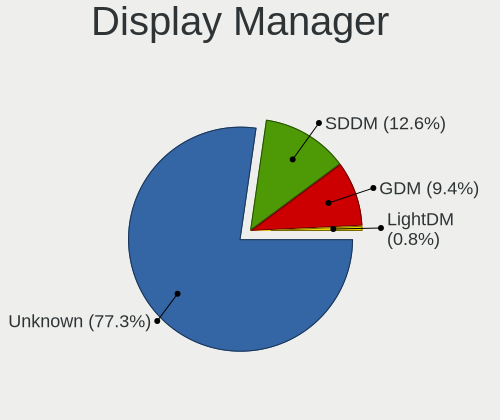
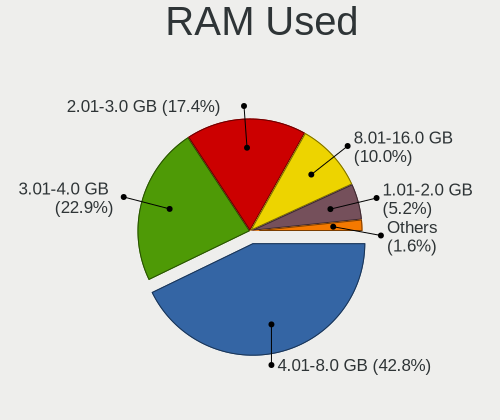
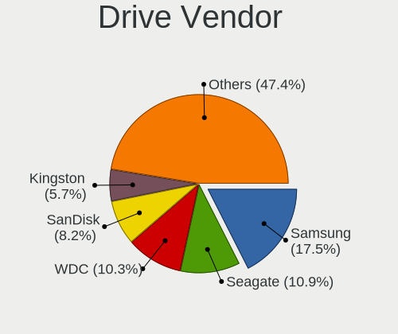
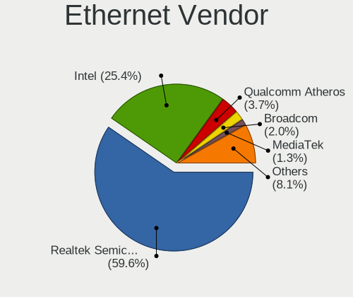
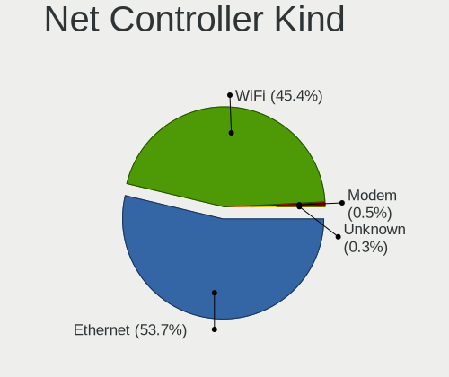

Nobara - Tested Hardware & Statistics
-------------------------------------

A project to collect tested hardware configurations for Nobara.

Anyone can contribute to this report by the [hw-probe](https://github.com/linuxhw/hw-probe) tool:

    sudo -E hw-probe -all -upload

Please contribute! Especially if your hardware is rare.

This is a report for all computer types. See also reports for [desktops](/Dist/Nobara/Desktop/README.md) and [notebooks](/Dist/Nobara/Notebook/README.md).

Contents
--------

* [ Test Cases ](#test-cases)

* [ System ](#system)
  - [ OS                       ](#os)
  - [ OS Family                ](#os-family)
  - [ Kernel                   ](#kernel)
  - [ Kernel Family            ](#kernel-family)
  - [ Kernel Major Ver.        ](#kernel-major-ver)
  - [ Arch                     ](#arch)
  - [ DE                       ](#de)
  - [ Display Server           ](#display-server)
  - [ Display Manager          ](#display-manager)
  - [ OS Lang                  ](#os-lang)
  - [ Boot Mode                ](#boot-mode)
  - [ Filesystem               ](#filesystem)
  - [ Part. scheme             ](#part-scheme)
  - [ Dual Boot with Linux/BSD ](#dual-boot-with-linuxbsd)
  - [ Dual Boot (Win)          ](#dual-boot-win)

* [ Board ](#board)
  - [ Vendor                   ](#vendor)
  - [ Model                    ](#model)
  - [ Model Family             ](#model-family)
  - [ MFG Year                 ](#mfg-year)
  - [ Form Factor              ](#form-factor)
  - [ Secure Boot              ](#secure-boot)
  - [ Coreboot                 ](#coreboot)
  - [ RAM Size                 ](#ram-size)
  - [ RAM Used                 ](#ram-used)
  - [ Total Drives             ](#total-drives)
  - [ Has CD-ROM               ](#has-cd-rom)
  - [ Has Ethernet             ](#has-ethernet)
  - [ Has WiFi                 ](#has-wifi)
  - [ Has Bluetooth            ](#has-bluetooth)

* [ Location ](#location)
  - [ Country                  ](#country)
  - [ City                     ](#city)

* [ Drives ](#drives)
  - [ Drive Vendor             ](#drive-vendor)
  - [ Drive Model              ](#drive-model)
  - [ HDD Vendor               ](#hdd-vendor)
  - [ SSD Vendor               ](#ssd-vendor)
  - [ Drive Kind               ](#drive-kind)
  - [ Drive Connector          ](#drive-connector)
  - [ Drive Size               ](#drive-size)
  - [ Space Total              ](#space-total)
  - [ Space Used               ](#space-used)
  - [ Malfunc. Drives          ](#malfunc-drives)
  - [ Malfunc. Drive Vendor    ](#malfunc-drive-vendor)
  - [ Malfunc. HDD Vendor      ](#malfunc-hdd-vendor)
  - [ Malfunc. Drive Kind      ](#malfunc-drive-kind)
  - [ Failed Drives            ](#failed-drives)
  - [ Failed Drive Vendor      ](#failed-drive-vendor)
  - [ Drive Status             ](#drive-status)

* [ Storage controller ](#storage-controller)
  - [ Storage Vendor           ](#storage-vendor)
  - [ Storage Model            ](#storage-model)
  - [ Storage Kind             ](#storage-kind)

* [ Processor ](#processor)
  - [ CPU Vendor               ](#cpu-vendor)
  - [ CPU Model                ](#cpu-model)
  - [ CPU Model Family         ](#cpu-model-family)
  - [ CPU Cores                ](#cpu-cores)
  - [ CPU Sockets              ](#cpu-sockets)
  - [ CPU Threads              ](#cpu-threads)
  - [ CPU Op-Modes             ](#cpu-op-modes)
  - [ CPU Microcode            ](#cpu-microcode)
  - [ CPU Microarch            ](#cpu-microarch)

* [ Graphics ](#graphics)
  - [ GPU Vendor               ](#gpu-vendor)
  - [ GPU Model                ](#gpu-model)
  - [ GPU Combo                ](#gpu-combo)
  - [ GPU Driver               ](#gpu-driver)
  - [ GPU Memory               ](#gpu-memory)

* [ Monitor ](#monitor)
  - [ Monitor Vendor           ](#monitor-vendor)
  - [ Monitor Model            ](#monitor-model)
  - [ Monitor Resolution       ](#monitor-resolution)
  - [ Monitor Diagonal         ](#monitor-diagonal)
  - [ Monitor Width            ](#monitor-width)
  - [ Aspect Ratio             ](#aspect-ratio)
  - [ Monitor Area             ](#monitor-area)
  - [ Pixel Density            ](#pixel-density)
  - [ Multiple Monitors        ](#multiple-monitors)

* [ Network ](#network)
  - [ Net Controller Vendor    ](#net-controller-vendor)
  - [ Net Controller Model     ](#net-controller-model)
  - [ Wireless Vendor          ](#wireless-vendor)
  - [ Wireless Model           ](#wireless-model)
  - [ Ethernet Vendor          ](#ethernet-vendor)
  - [ Ethernet Model           ](#ethernet-model)
  - [ Net Controller Kind      ](#net-controller-kind)
  - [ Used Controller          ](#used-controller)
  - [ NICs                     ](#nics)
  - [ IPv6                     ](#ipv6)

* [ Bluetooth ](#bluetooth)
  - [ Bluetooth Vendor         ](#bluetooth-vendor)
  - [ Bluetooth Model          ](#bluetooth-model)

* [ Sound ](#sound)
  - [ Sound Vendor             ](#sound-vendor)
  - [ Sound Model              ](#sound-model)

* [ Memory ](#memory)
  - [ Memory Vendor            ](#memory-vendor)
  - [ Memory Model             ](#memory-model)
  - [ Memory Kind              ](#memory-kind)
  - [ Memory Form Factor       ](#memory-form-factor)
  - [ Memory Size              ](#memory-size)
  - [ Memory Speed             ](#memory-speed)

* [ Printers & scanners ](#printers--scanners)
  - [ Printer Vendor           ](#printer-vendor)
  - [ Printer Model            ](#printer-model)
  - [ Scanner Vendor           ](#scanner-vendor)
  - [ Scanner Model            ](#scanner-model)

* [ Camera ](#camera)
  - [ Camera Vendor            ](#camera-vendor)
  - [ Camera Model             ](#camera-model)

* [ Security ](#security)
  - [ Fingerprint Vendor       ](#fingerprint-vendor)
  - [ Fingerprint Model        ](#fingerprint-model)
  - [ Chipcard Vendor          ](#chipcard-vendor)
  - [ Chipcard Model           ](#chipcard-model)

* [ Unsupported ](#unsupported)
  - [ Unsupported Devices      ](#unsupported-devices)
  - [ Unsupported Device Types ](#unsupported-device-types)

Test Cases
----------

Total: 42

| Vendor    | Model                       | Form-Factor | Probe                                                      | Date         |
|-----------|-----------------------------|-------------|------------------------------------------------------------|--------------|
| ASUSTek   | TUF Gaming X570-PRO         | Desktop     | [6eae76b5d0](https://linux-hardware.org/?probe=6eae76b5d0) | Sep 01, 2022 |
| ASRock    | FM2A55M-HD+                 | Desktop     | [2f96c73efb](https://linux-hardware.org/?probe=2f96c73efb) | Sep 01, 2022 |
| ASUSTek   | ASUS TUF Gaming F15 FX50... | Notebook    | [0ca693e2dd](https://linux-hardware.org/?probe=0ca693e2dd) | Aug 31, 2022 |
| Gigabyte  | H110M-H-CF                  | Desktop     | [86fc2bf58f](https://linux-hardware.org/?probe=86fc2bf58f) | Aug 31, 2022 |
| Alienware | 01NYPT A00                  | Desktop     | [cd95b79270](https://linux-hardware.org/?probe=cd95b79270) | Aug 29, 2022 |
| AZW       | SER                         | Mini pc     | [92460ed2a6](https://linux-hardware.org/?probe=92460ed2a6) | Aug 29, 2022 |
| ASUSTek   | TP500LA                     | Notebook    | [de395dddd8](https://linux-hardware.org/?probe=de395dddd8) | Aug 28, 2022 |
| ASRock    | B560 Steel Legend           | Desktop     | [c64907de8d](https://linux-hardware.org/?probe=c64907de8d) | Aug 27, 2022 |
| ASUSTek   | P8Z68-V PRO                 | Desktop     | [37ae937f4d](https://linux-hardware.org/?probe=37ae937f4d) | Aug 26, 2022 |
| ASUSTek   | PRIME X570-PRO              | Desktop     | [663509c999](https://linux-hardware.org/?probe=663509c999) | Aug 24, 2022 |
| ASUSTek   | PRIME X570-PRO              | Desktop     | [2b7d1d59a1](https://linux-hardware.org/?probe=2b7d1d59a1) | Aug 24, 2022 |
| ASUSTek   | PRIME A320M-K               | Desktop     | [928ce75df1](https://linux-hardware.org/?probe=928ce75df1) | Aug 24, 2022 |
| ASRock    | H61M-VG3                    | Desktop     | [a3cd7ba2c1](https://linux-hardware.org/?probe=a3cd7ba2c1) | Aug 22, 2022 |
| Dell      | G15 5511                    | Notebook    | [44fa9bf084](https://linux-hardware.org/?probe=44fa9bf084) | Aug 21, 2022 |
| ASUSTek   | B85M-E                      | Desktop     | [0b5044dacf](https://linux-hardware.org/?probe=0b5044dacf) | Aug 19, 2022 |
| Gigabyte  | B450M DS3H-CF               | Desktop     | [a2b6c2ae17](https://linux-hardware.org/?probe=a2b6c2ae17) | Aug 19, 2022 |
| Notebook  | P7xxDM2(-G)                 | Notebook    | [f074899985](https://linux-hardware.org/?probe=f074899985) | Aug 17, 2022 |
| HP        | Pavilion Gaming Laptop 1... | Notebook    | [315da58d24](https://linux-hardware.org/?probe=315da58d24) | Aug 16, 2022 |
| ASRock    | X470 Master SLI             | Desktop     | [ce62975b20](https://linux-hardware.org/?probe=ce62975b20) | Aug 15, 2022 |
| ASUSTek   | PRIME B350-PLUS             | Desktop     | [b2bbce2845](https://linux-hardware.org/?probe=b2bbce2845) | Aug 15, 2022 |
| ASRock    | Z97 Extreme6                | Desktop     | [31d7973a9d](https://linux-hardware.org/?probe=31d7973a9d) | Aug 14, 2022 |
| ASRock    | 760GM-HDV                   | Desktop     | [beabb7dd99](https://linux-hardware.org/?probe=beabb7dd99) | Aug 14, 2022 |
| Apple     | MacBookPro14,2              | Notebook    | [c66d476513](https://linux-hardware.org/?probe=c66d476513) | Aug 13, 2022 |
| ASUSTek   | ROG Strix G513QY_G513QY     | Notebook    | [df2cc1a299](https://linux-hardware.org/?probe=df2cc1a299) | Aug 12, 2022 |
| MSI       | B450 TOMAHAWK MAX           | Desktop     | [27cd96982f](https://linux-hardware.org/?probe=27cd96982f) | Aug 10, 2022 |
| HP        | 8906 SMVB                   | Desktop     | [8f30392f49](https://linux-hardware.org/?probe=8f30392f49) | Aug 10, 2022 |
| HP        | 8054                        | Desktop     | [469b765fe0](https://linux-hardware.org/?probe=469b765fe0) | Aug 10, 2022 |
| ASUSTek   | G20AJ                       | Desktop     | [613f8a0c36](https://linux-hardware.org/?probe=613f8a0c36) | Aug 08, 2022 |
| Gigabyte  | X570 AORUS ELITE            | Desktop     | [f65ba77de3](https://linux-hardware.org/?probe=f65ba77de3) | Aug 07, 2022 |
| Lenovo    | IdeaPad Y700-15ISK 80NV     | Notebook    | [6beddf67f5](https://linux-hardware.org/?probe=6beddf67f5) | Aug 06, 2022 |
| ASUSTek   | ROG CROSSHAIR VIII HERO     | Desktop     | [7a60eede9a](https://linux-hardware.org/?probe=7a60eede9a) | Aug 04, 2022 |
| MSI       | B450-A PRO MAX              | Desktop     | [e142cf5c91](https://linux-hardware.org/?probe=e142cf5c91) | Aug 04, 2022 |
| MSI       | B450 TOMAHAWK MAX           | Desktop     | [7c4355417f](https://linux-hardware.org/?probe=7c4355417f) | Aug 03, 2022 |
| ASUSTek   | Q504UAK                     | Convertible | [5f2025770d](https://linux-hardware.org/?probe=5f2025770d) | Aug 03, 2022 |
| MSI       | X570-A PRO                  | Desktop     | [f034a02e69](https://linux-hardware.org/?probe=f034a02e69) | Aug 01, 2022 |
| Razer     | Blade                       | Notebook    | [cc3ce45956](https://linux-hardware.org/?probe=cc3ce45956) | Jul 31, 2022 |
| HP        | ZBook 15 G2                 | Notebook    | [3aa2fda09a](https://linux-hardware.org/?probe=3aa2fda09a) | Jul 26, 2022 |
| MSI       | 970 GAMING                  | Desktop     | [bf2a870952](https://linux-hardware.org/?probe=bf2a870952) | Jul 23, 2022 |
| Dell      | 0J8H4R A01                  | Desktop     | [3d7d06475c](https://linux-hardware.org/?probe=3d7d06475c) | Jul 23, 2022 |
| ASUSTek   | PRIME B450-PLUS             | Desktop     | [7d6b6d93d3](https://linux-hardware.org/?probe=7d6b6d93d3) | Jul 21, 2022 |
| eMachines | EL1870                      | Desktop     | [58e76fb684](https://linux-hardware.org/?probe=58e76fb684) | Jul 19, 2022 |
| MSI       | X570-A PRO                  | Desktop     | [c9683ea265](https://linux-hardware.org/?probe=c9683ea265) | Jul 19, 2022 |

System
------

OS
--

Installed operating systems

| Name      | Computers | Percent |
|-----------|-----------|---------|
| Nobara 36 | 40        | 100%    |

OS Family
---------

OS without a version

| Name   | Computers | Percent |
|--------|-----------|---------|
| Nobara | 40        | 100%    |

Kernel
------

Version of the Linux kernel

| Version                       | Computers | Percent |
|-------------------------------|-----------|---------|
| 5.18.13-201.fsync.fc36.x86_64 | 10        | 25%     |
| 5.18.16-201.fsync.fc36.x86_64 | 7         | 17.5%   |
| 5.19.4-201.fsync.fc36.x86_64  | 6         | 15%     |
| 5.18.17-201.fsync.fc36.x86_64 | 6         | 15%     |
| 5.18.19-201.fsync.fc36.x86_64 | 4         | 10%     |
| 5.18.11-201.fsync.fc36.x86_64 | 3         | 7.5%    |
| 5.18.18-201.fsync.fc36.x86_64 | 2         | 5%      |
| 5.19.2-602.inttf.fc36.x86_64  | 1         | 2.5%    |
| 5.18.9-201.fsync.fc36.x86_64  | 1         | 2.5%    |

Kernel Family
-------------

Linux kernel without a distro release

| Version | Computers | Percent |
|---------|-----------|---------|
| 5.18.13 | 10        | 25%     |
| 5.18.16 | 7         | 17.5%   |
| 5.19.4  | 6         | 15%     |
| 5.18.17 | 6         | 15%     |
| 5.18.19 | 4         | 10%     |
| 5.18.11 | 3         | 7.5%    |
| 5.18.18 | 2         | 5%      |
| 5.19.2  | 1         | 2.5%    |
| 5.18.9  | 1         | 2.5%    |

Kernel Major Ver.
-----------------

Linux kernel major version

| Version | Computers | Percent |
|---------|-----------|---------|
| 5.18    | 33        | 82.5%   |
| 5.19    | 7         | 17.5%   |

Arch
----

OS architecture (x86_64, i586, etc.)

| Name   | Computers | Percent |
|--------|-----------|---------|
| x86_64 | 40        | 100%    |

DE
--

Desktop Environment

| Name  | Computers | Percent |
|-------|-----------|---------|
| GNOME | 29        | 72.5%   |
| KDE5  | 11        | 27.5%   |

Display Server
--------------

X11 or Wayland

| Name    | Computers | Percent |
|---------|-----------|---------|
| Wayland | 28        | 70%     |
| X11     | 12        | 30%     |

Display Manager
---------------

SDDM, LightDM, etc.

| Name    | Computers | Percent |
|---------|-----------|---------|
| Unknown | 33        | 82.5%   |
| GDM     | 4         | 10%     |
| SDDM    | 3         | 7.5%    |

OS Lang
-------

Language

| Lang  | Computers | Percent |
|-------|-----------|---------|
| en_US | 25        | 62.5%   |
| en_GB | 5         | 12.5%   |
| ru_RU | 1         | 2.5%    |
| pt_PT | 1         | 2.5%    |
| pt_BR | 1         | 2.5%    |
| nl_NL | 1         | 2.5%    |
| fr_FR | 1         | 2.5%    |
| es_ES | 1         | 2.5%    |
| es_CO | 1         | 2.5%    |
| en_ZA | 1         | 2.5%    |
| en_CA | 1         | 2.5%    |
| de_DE | 1         | 2.5%    |

Boot Mode
---------

EFI or BIOS

| Mode | Computers | Percent |
|------|-----------|---------|
| EFI  | 32        | 80%     |
| BIOS | 8         | 20%     |

Filesystem
----------

Type of filesystem

| Type  | Computers | Percent |
|-------|-----------|---------|
| Ext4  | 29        | 72.5%   |
| Btrfs | 11        | 27.5%   |

Part. scheme
------------

Scheme of partitioning

| Type    | Computers | Percent |
|---------|-----------|---------|
| Unknown | 33        | 82.5%   |
| GPT     | 6         | 15%     |
| MBR     | 1         | 2.5%    |

Dual Boot with Linux/BSD
------------------------

Hosting more than one Linux/BSD

| Dual boot | Computers | Percent |
|-----------|-----------|---------|
| No        | 39        | 97.5%   |
| Yes       | 1         | 2.5%    |

Dual Boot (Win)
---------------

Hosting Linux and Windows

| Dual boot | Computers | Percent |
|-----------|-----------|---------|
| No        | 38        | 95%     |
| Yes       | 2         | 5%      |

Board
-----

Vendor
------

Motherboard manufacturer

| Name                | Computers | Percent |
|---------------------|-----------|---------|
| ASUSTek Computer    | 13        | 32.5%   |
| ASRock              | 6         | 15%     |
| MSI                 | 5         | 12.5%   |
| Hewlett-Packard     | 4         | 10%     |
| Gigabyte Technology | 3         | 7.5%    |
| Dell                | 2         | 5%      |
| Razer               | 1         | 2.5%    |
| Notebook            | 1         | 2.5%    |
| Lenovo              | 1         | 2.5%    |
| eMachines           | 1         | 2.5%    |
| AZW                 | 1         | 2.5%    |
| Apple               | 1         | 2.5%    |
| Alienware           | 1         | 2.5%    |

Model
-----

Motherboard model

| Name                                     | Computers | Percent |
|------------------------------------------|-----------|---------|
| MSI MS-7C02                              | 2         | 5%      |
| Razer Blade                              | 1         | 2.5%    |
| Notebook P7xxDM2(-G)                     | 1         | 2.5%    |
| MSI MS-7C37                              | 1         | 2.5%    |
| MSI MS-7B86                              | 1         | 2.5%    |
| MSI MS-7693                              | 1         | 2.5%    |
| Lenovo IdeaPad Y700-15ISK 80NV           | 1         | 2.5%    |
| HP ZBook 15 G2                           | 1         | 2.5%    |
| HP Pavilion Gaming Laptop 15-ec1xxx      | 1         | 2.5%    |
| HP Pavilion Desktop TP01-2xxx            | 1         | 2.5%    |
| HP EliteDesk 800 G2 SFF                  | 1         | 2.5%    |
| Gigabyte X570 AORUS ELITE                | 1         | 2.5%    |
| Gigabyte H110M-H                         | 1         | 2.5%    |
| Gigabyte B450M DS3H                      | 1         | 2.5%    |
| eMachines EL1870                         | 1         | 2.5%    |
| Dell G15 5511                            | 1         | 2.5%    |
| Dell ASM100                              | 1         | 2.5%    |
| AZW SER                                  | 1         | 2.5%    |
| ASUS TUF Gaming X570-PRO                 | 1         | 2.5%    |
| ASUS TP500LA                             | 1         | 2.5%    |
| ASUS ROG Strix G513QY_G513QY             | 1         | 2.5%    |
| ASUS ROG CROSSHAIR VIII HERO             | 1         | 2.5%    |
| ASUS Q504UAK                             | 1         | 2.5%    |
| ASUS PRO451459                           | 1         | 2.5%    |
| ASUS PRIME X570-PRO                      | 1         | 2.5%    |
| ASUS PRIME B450-PLUS                     | 1         | 2.5%    |
| ASUS PRIME B350-PLUS                     | 1         | 2.5%    |
| ASUS PRIME A320M-K                       | 1         | 2.5%    |
| ASUS P8Z68-V PRO                         | 1         | 2.5%    |
| ASUS G20AJ                               | 1         | 2.5%    |
| ASUS ASUS TUF Gaming F15 FX506LI_FX506LI | 1         | 2.5%    |
| ASRock Z97 Extreme6                      | 1         | 2.5%    |
| ASRock X470 Master SLI                   | 1         | 2.5%    |
| ASRock H61M-VG3                          | 1         | 2.5%    |
| ASRock FM2A55M-HD+                       | 1         | 2.5%    |
| ASRock B560 Steel Legend                 | 1         | 2.5%    |
| ASRock 760GM-HDV                         | 1         | 2.5%    |
| Apple MacBookPro14,2                     | 1         | 2.5%    |
| Alienware Aurora R5                      | 1         | 2.5%    |

Model Family
------------

Motherboard model prefix

| Name                 | Computers | Percent |
|----------------------|-----------|---------|
| ASUS PRIME           | 4         | 10%     |
| MSI MS-7C02          | 2         | 5%      |
| HP Pavilion          | 2         | 5%      |
| ASUS ROG             | 2         | 5%      |
| Razer Blade          | 1         | 2.5%    |
| Notebook P7xxDM2(-G) | 1         | 2.5%    |
| MSI MS-7C37          | 1         | 2.5%    |
| MSI MS-7B86          | 1         | 2.5%    |
| MSI MS-7693          | 1         | 2.5%    |
| Lenovo IdeaPad       | 1         | 2.5%    |
| HP ZBook             | 1         | 2.5%    |
| HP EliteDesk         | 1         | 2.5%    |
| Gigabyte X570        | 1         | 2.5%    |
| Gigabyte H110M-H     | 1         | 2.5%    |
| Gigabyte B450M       | 1         | 2.5%    |
| eMachines EL1870     | 1         | 2.5%    |
| Dell G15             | 1         | 2.5%    |
| Dell ASM100          | 1         | 2.5%    |
| AZW SER              | 1         | 2.5%    |
| ASUS TUF             | 1         | 2.5%    |
| ASUS TP500LA         | 1         | 2.5%    |
| ASUS Q504UAK         | 1         | 2.5%    |
| ASUS PRO451459       | 1         | 2.5%    |
| ASUS P8Z68-V         | 1         | 2.5%    |
| ASUS G20AJ           | 1         | 2.5%    |
| ASUS ASUS            | 1         | 2.5%    |
| ASRock Z97           | 1         | 2.5%    |
| ASRock X470          | 1         | 2.5%    |
| ASRock H61M-VG3      | 1         | 2.5%    |
| ASRock FM2A55M-HD+   | 1         | 2.5%    |
| ASRock B560          | 1         | 2.5%    |
| ASRock 760GM-HDV     | 1         | 2.5%    |
| Apple MacBookPro14   | 1         | 2.5%    |
| Alienware Aurora     | 1         | 2.5%    |

MFG Year
--------

Motherboard manufacture year

| Year | Computers | Percent |
|------|-----------|---------|
| 2019 | 7         | 17.5%   |
| 2018 | 6         | 15%     |
| 2021 | 5         | 12.5%   |
| 2014 | 5         | 12.5%   |
| 2016 | 4         | 10%     |
| 2020 | 3         | 7.5%    |
| 2015 | 3         | 7.5%    |
| 2017 | 2         | 5%      |
| 2011 | 2         | 5%      |
| 2022 | 1         | 2.5%    |
| 2013 | 1         | 2.5%    |
| 2012 | 1         | 2.5%    |

Form Factor
-----------

Physical design of the computer

| Name        | Computers | Percent |
|-------------|-----------|---------|
| Desktop     | 28        | 70%     |
| Notebook    | 10        | 25%     |
| Convertible | 1         | 2.5%    |
| Mini pc     | 1         | 2.5%    |

Secure Boot
-----------

Enabled or disabled

| State    | Computers | Percent |
|----------|-----------|---------|
| Disabled | 40        | 100%    |

Coreboot
--------

Have coreboot on board

| Used | Computers | Percent |
|------|-----------|---------|
| No   | 40        | 100%    |

RAM Size
--------

Total RAM memory

| Size in GB  | Computers | Percent |
|-------------|-----------|---------|
| 16.01-24.0  | 16        | 40%     |
| 8.01-16.0   | 12        | 30%     |
| 32.01-64.0  | 6         | 15%     |
| 4.01-8.0    | 4         | 10%     |
| 3.01-4.0    | 1         | 2.5%    |
| 64.01-256.0 | 1         | 2.5%    |

RAM Used
--------

Used RAM memory

| Used GB   | Computers | Percent |
|-----------|-----------|---------|
| 4.01-8.0  | 20        | 50%     |
| 3.01-4.0  | 9         | 22.5%   |
| 2.01-3.0  | 5         | 12.5%   |
| 8.01-16.0 | 4         | 10%     |
| 1.01-2.0  | 2         | 5%      |

Total Drives
------------

Number of drives on board

| Drives | Computers | Percent |
|--------|-----------|---------|
| 1      | 18        | 45%     |
| 2      | 10        | 25%     |
| 3      | 5         | 12.5%   |
| 5      | 3         | 7.5%    |
| 4      | 3         | 7.5%    |
| 6      | 1         | 2.5%    |

Has CD-ROM
----------

Has CD-ROM on board

| Presented | Computers | Percent |
|-----------|-----------|---------|
| No        | 33        | 82.5%   |
| Yes       | 7         | 17.5%   |

Has Ethernet
------------

Has Ethernet on board

| Presented | Computers | Percent |
|-----------|-----------|---------|
| Yes       | 38        | 95%     |
| No        | 2         | 5%      |

Has WiFi
--------

Has WiFi module

| Presented | Computers | Percent |
|-----------|-----------|---------|
| Yes       | 28        | 70%     |
| No        | 12        | 30%     |

Has Bluetooth
-------------

Has Bluetooth module

| Presented | Computers | Percent |
|-----------|-----------|---------|
| Yes       | 24        | 60%     |
| No        | 16        | 40%     |

Location
--------

Country
-------

Geographic location (country)

| Country      | Computers | Percent |
|--------------|-----------|---------|
| USA          | 20        | 50%     |
| UK           | 3         | 7.5%    |
| France       | 3         | 7.5%    |
| Russia       | 2         | 5%      |
| South Korea  | 1         | 2.5%    |
| South Africa | 1         | 2.5%    |
| Portugal     | 1         | 2.5%    |
| Netherlands  | 1         | 2.5%    |
| Hungary      | 1         | 2.5%    |
| Germany      | 1         | 2.5%    |
| Georgia      | 1         | 2.5%    |
| Czechia      | 1         | 2.5%    |
| Colombia     | 1         | 2.5%    |
| Canada       | 1         | 2.5%    |
| Brazil       | 1         | 2.5%    |
| Argentina    | 1         | 2.5%    |

City
----

Geographic location (city)

| City              | Computers | Percent |
|-------------------|-----------|---------|
| Atlanta           | 2         | 5%      |
| Wooster           | 1         | 2.5%    |
| Wasilla           | 1         | 2.5%    |
| Vineland          | 1         | 2.5%    |
| Tamworth          | 1         | 2.5%    |
| Szeged            | 1         | 2.5%    |
| Smolensk          | 1         | 2.5%    |
| Sao Paulo         | 1         | 2.5%    |
| Salon-de-Provence | 1         | 2.5%    |
| Rozsicka          | 1         | 2.5%    |
| Rotterdam         | 1         | 2.5%    |
| Raleigh           | 1         | 2.5%    |
| Philipsburg       | 1         | 2.5%    |
| Panama City       | 1         | 2.5%    |
| Osa               | 1         | 2.5%    |
| Odessa            | 1         | 2.5%    |
| Mount Pleasant    | 1         | 2.5%    |
| Martigues         | 1         | 2.5%    |
| Lynn              | 1         | 2.5%    |
| Lisbon            | 1         | 2.5%    |
| K'alak'i T'bilisi | 1         | 2.5%    |
| Johannesburg      | 1         | 2.5%    |
| Irvine            | 1         | 2.5%    |
| Holden            | 1         | 2.5%    |
| Granby            | 1         | 2.5%    |
| Goose Creek       | 1         | 2.5%    |
| Floirac           | 1         | 2.5%    |
| Flint             | 1         | 2.5%    |
| Ellwood City      | 1         | 2.5%    |
| Delavan           | 1         | 2.5%    |
| Copperas Cove     | 1         | 2.5%    |
| Casa Grande       | 1         | 2.5%    |
| Buyeo-gun         | 1         | 2.5%    |
| Brownwood         | 1         | 2.5%    |
| Boyne City        | 1         | 2.5%    |
| Bogotá           | 1         | 2.5%    |
| Berlin            | 1         | 2.5%    |
| Bellshill         | 1         | 2.5%    |
| Aberdeen          | 1         | 2.5%    |

Drives
------

Drive Vendor
------------

Hard drive vendors

| Vendor                    | Computers | Drives | Percent |
|---------------------------|-----------|--------|---------|
| Samsung Electronics       | 14        | 19     | 19.18%  |
| WDC                       | 12        | 16     | 16.44%  |
| Seagate                   | 11        | 12     | 15.07%  |
| Crucial                   | 7         | 8      | 9.59%   |
| Kingston                  | 6         | 6      | 8.22%   |
| Toshiba                   | 4         | 4      | 5.48%   |
| SanDisk                   | 3         | 3      | 4.11%   |
| Phison                    | 3         | 4      | 4.11%   |
| PNY                       | 2         | 4      | 2.74%   |
| XPG                       | 1         | 1      | 1.37%   |
| SuperSSpeed               | 1         | 1      | 1.37%   |
| SK hynix                  | 1         | 1      | 1.37%   |
| Mushkin                   | 1         | 1      | 1.37%   |
| Micron/Crucial Technology | 1         | 1      | 1.37%   |
| KIOXIA                    | 1         | 1      | 1.37%   |
| Hitachi                   | 1         | 1      | 1.37%   |
| HGST                      | 1         | 1      | 1.37%   |
| China                     | 1         | 1      | 1.37%   |
| Apple                     | 1         | 2      | 1.37%   |
| Unknown                   | 1         | 1      | 1.37%   |

Drive Model
-----------

Hard drive models

| Model                                   | Computers | Percent |
|-----------------------------------------|-----------|---------|
| WDC WD10EZEX-08WN4A0 1TB                | 2         | 2.33%   |
| Seagate ST2000DX002-2DV164 2TB          | 2         | 2.33%   |
| PNY CS900 500GB SSD                     | 2         | 2.33%   |
| Phison NVMe SSD Drive 2TB               | 2         | 2.33%   |
| Kingston NVMe SSD Drive 512GB           | 2         | 2.33%   |
| Kingston NVMe SSD Drive 500GB           | 2         | 2.33%   |
| XPG SPECTRIX S40G 256GB                 | 1         | 1.16%   |
| WDC WDS240G2G0A-00JH30 240GB SSD        | 1         | 1.16%   |
| WDC WDS120G2G0A-00JH30 120GB SSD        | 1         | 1.16%   |
| WDC WDBNCE5000PNC 500GB SSD             | 1         | 1.16%   |
| WDC WD30EZAZ-00SF3B0 3TB                | 1         | 1.16%   |
| WDC WD2500JS-22NCB1 250GB               | 1         | 1.16%   |
| WDC WD1600AABS-00H4A0 160GB             | 1         | 1.16%   |
| WDC WD120EFBX-68B0EN0 12TB              | 1         | 1.16%   |
| WDC WD10JPVX-60JC3T0 1TB                | 1         | 1.16%   |
| WDC WD10EZEX-60WN4A2 1TB                | 1         | 1.16%   |
| WDC WD10EZEX-08M2NA0 1TB                | 1         | 1.16%   |
| WDC WD10EURX-63FH1Y0 1TB                | 1         | 1.16%   |
| WDC WD10EADS-00M2B0 1TB                 | 1         | 1.16%   |
| WDC WD1003FZEX-00K3CA0 1TB              | 1         | 1.16%   |
| WDC PC SN530 SDBPNPZ-512G-1006 512GB    | 1         | 1.16%   |
| Toshiba HDWE140 4TB                     | 1         | 1.16%   |
| Toshiba HDWD110 1TB                     | 1         | 1.16%   |
| Toshiba DT01ACA100 1TB                  | 1         | 1.16%   |
| Toshiba DT01ACA050 500GB                | 1         | 1.16%   |
| SuperSSpeed S540 240GB                  | 1         | 1.16%   |
| SK hynix C2S3T/120G 120GB               | 1         | 1.16%   |
| Seagate ST3808110AS 80GB                | 1         | 1.16%   |
| Seagate ST3500414CS 500GB               | 1         | 1.16%   |
| Seagate ST2000LM003 HN-M201RAD 2TB      | 1         | 1.16%   |
| Seagate ST2000DM006-2DM164 2TB          | 1         | 1.16%   |
| Seagate ST2000DL003-9VT166 2TB          | 1         | 1.16%   |
| Seagate ST1500DL001-9VT15L 1TB          | 1         | 1.16%   |
| Seagate ST1000DM003-9YN162 1TB          | 1         | 1.16%   |
| Seagate ST10000NM001G-2MW103 10TB       | 1         | 1.16%   |
| Seagate Expansion 500GB                 | 1         | 1.16%   |
| Seagate BACKUP+ 500GB                   | 1         | 1.16%   |
| SanDisk SSD PLUS 480GB                  | 1         | 1.16%   |
| SanDisk SSD PLUS 240GB                  | 1         | 1.16%   |
| SanDisk SDSSDA120G 120GB                | 1         | 1.16%   |
| Samsung SSD 970 EVO Plus 500GB          | 1         | 1.16%   |
| Samsung SSD 870 QVO 1TB                 | 1         | 1.16%   |
| Samsung SSD 870 EVO 500GB               | 1         | 1.16%   |
| Samsung SSD 860 EVO M.2 500GB           | 1         | 1.16%   |
| Samsung SSD 860 EVO 500GB               | 1         | 1.16%   |
| Samsung SSD 860 EVO 1TB                 | 1         | 1.16%   |
| Samsung SSD 850 EVO 500GB               | 1         | 1.16%   |
| Samsung SSD 840 PRO Series 128GB        | 1         | 1.16%   |
| Samsung SSD 830 Series 128GB            | 1         | 1.16%   |
| Samsung SP2504C 250GB                   | 1         | 1.16%   |
| Samsung SM963 2.5" NVMe PCIe SSD 128GB  | 1         | 1.16%   |
| Samsung SM963 2.5" NVMe PCIe SSD 1024GB | 1         | 1.16%   |
| Samsung NVMe SSD Drive 500GB            | 1         | 1.16%   |
| Samsung NVMe SSD Drive 2TB              | 1         | 1.16%   |
| Samsung NVMe SSD Drive 1TB              | 1         | 1.16%   |
| Samsung MZNLN128HCGR-000L2 128GB SSD    | 1         | 1.16%   |
| Samsung MS1PC5ED3ORA3.2T 3.2TB          | 1         | 1.16%   |
| Samsung HD203WI 2TB                     | 1         | 1.16%   |
| Samsung HD103SI 1TB                     | 1         | 1.16%   |
| PNY CS900 1TB SSD                       | 1         | 1.16%   |

HDD Vendor
----------

Hard disk drive vendors

| Vendor              | Computers | Drives | Percent |
|---------------------|-----------|--------|---------|
| Seagate             | 11        | 11     | 39.29%  |
| WDC                 | 9         | 12     | 32.14%  |
| Toshiba             | 4         | 4      | 14.29%  |
| Samsung Electronics | 2         | 3      | 7.14%   |
| Hitachi             | 1         | 1      | 3.57%   |
| HGST                | 1         | 1      | 3.57%   |

SSD Vendor
----------

Solid state drive vendors

| Vendor              | Computers | Drives | Percent |
|---------------------|-----------|--------|---------|
| Samsung Electronics | 8         | 9      | 27.59%  |
| Crucial             | 7         | 8      | 24.14%  |
| WDC                 | 3         | 3      | 10.34%  |
| SanDisk             | 3         | 3      | 10.34%  |
| PNY                 | 2         | 4      | 6.9%    |
| SuperSSpeed         | 1         | 1      | 3.45%   |
| SK hynix            | 1         | 1      | 3.45%   |
| Mushkin             | 1         | 1      | 3.45%   |
| Kingston            | 1         | 1      | 3.45%   |
| China               | 1         | 1      | 3.45%   |
| Unknown             | 1         | 1      | 3.45%   |

Drive Kind
----------

HDD or SSD

| Kind    | Computers | Drives | Percent |
|---------|-----------|--------|---------|
| SSD     | 23        | 33     | 36.51%  |
| HDD     | 22        | 32     | 34.92%  |
| NVMe    | 17        | 22     | 26.98%  |
| Unknown | 1         | 1      | 1.59%   |

Drive Connector
---------------

SATA, SAS, NVMe, etc.

| Type | Computers | Drives | Percent |
|------|-----------|--------|---------|
| SATA | 31        | 64     | 62%     |
| NVMe | 17        | 22     | 34%     |
| SAS  | 2         | 2      | 4%      |

Drive Size
----------

Size of hard drive

| Size in TB | Computers | Drives | Percent |
|------------|-----------|--------|---------|
| 0.01-0.5   | 22        | 31     | 43.14%  |
| 0.51-1.0   | 18        | 22     | 35.29%  |
| 1.01-2.0   | 6         | 7      | 11.76%  |
| 2.01-3.0   | 2         | 2      | 3.92%   |
| 3.01-4.0   | 1         | 1      | 1.96%   |
| 10.01-20.0 | 1         | 1      | 1.96%   |
| 4.01-10.0  | 1         | 1      | 1.96%   |

Space Total
-----------

Amount of disk space available on the file system

| Size in GB     | Computers | Percent |
|----------------|-----------|---------|
| 251-500        | 9         | 22.5%   |
| 1001-2000      | 9         | 22.5%   |
| 101-250        | 8         | 20%     |
| 501-1000       | 6         | 15%     |
| More than 3000 | 4         | 10%     |
| 51-100         | 2         | 5%      |
| 2001-3000      | 1         | 2.5%    |
| 1-20           | 1         | 2.5%    |

Space Used
----------

Amount of used disk space

| Used GB        | Computers | Percent |
|----------------|-----------|---------|
| 1-20           | 9         | 21.95%  |
| 51-100         | 9         | 21.95%  |
| 21-50          | 8         | 19.51%  |
| 501-1000       | 6         | 14.63%  |
| 101-250        | 4         | 9.76%   |
| 251-500        | 3         | 7.32%   |
| More than 3000 | 1         | 2.44%   |
| 2001-3000      | 1         | 2.44%   |

Malfunc. Drives
---------------

Drive models with a malfunction

| Model                          | Computers | Drives | Percent |
|--------------------------------|-----------|--------|---------|
| WDC WD10EZEX-08M2NA0 1TB       | 1         | 1      | 33.33%  |
| Seagate ST2000DX002-2DV164 2TB | 1         | 1      | 33.33%  |
| Seagate ST1000DM003-9YN162 1TB | 1         | 1      | 33.33%  |

Malfunc. Drive Vendor
---------------------

Vendors of faulty drives

| Vendor  | Computers | Drives | Percent |
|---------|-----------|--------|---------|
| Seagate | 2         | 2      | 66.67%  |
| WDC     | 1         | 1      | 33.33%  |

Malfunc. HDD Vendor
-------------------

Vendors of faulty HDD drives

| Vendor  | Computers | Drives | Percent |
|---------|-----------|--------|---------|
| Seagate | 2         | 2      | 66.67%  |
| WDC     | 1         | 1      | 33.33%  |

Malfunc. Drive Kind
-------------------

Kinds of faulty drives

| Kind | Computers | Drives | Percent |
|------|-----------|--------|---------|
| HDD  | 3         | 3      | 100%    |

Failed Drives
-------------

Failed drive models

Zero info for selected period =(

Failed Drive Vendor
-------------------

Failed drive vendors

Zero info for selected period =(

Drive Status
------------

Number of failed and malfunc. drives

| Status   | Computers | Drives | Percent |
|----------|-----------|--------|---------|
| Detected | 33        | 69     | 76.74%  |
| Works    | 7         | 16     | 16.28%  |
| Malfunc  | 3         | 3      | 6.98%   |

Storage controller
------------------

Storage Vendor
--------------

Storage controller vendors

| Vendor                      | Computers | Percent |
|-----------------------------|-----------|---------|
| Intel                       | 19        | 30.65%  |
| AMD                         | 19        | 30.65%  |
| Samsung Electronics         | 7         | 11.29%  |
| Kingston Technology Company | 5         | 8.06%   |
| Phison Electronics          | 3         | 4.84%   |
| ASMedia Technology          | 2         | 3.23%   |
| SanDisk                     | 1         | 1.61%   |
| Realtek Semiconductor       | 1         | 1.61%   |
| Micron/Crucial Technology   | 1         | 1.61%   |
| Marvell Technology Group    | 1         | 1.61%   |
| KIOXIA                      | 1         | 1.61%   |
| JMicron Technology          | 1         | 1.61%   |
| Apple                       | 1         | 1.61%   |

Storage Model
-------------

Storage controller models

| Model                                                                          | Computers | Percent |
|--------------------------------------------------------------------------------|-----------|---------|
| AMD FCH SATA Controller [AHCI mode]                                            | 14        | 20%     |
| AMD 400 Series Chipset SATA Controller                                         | 7         | 10%     |
| Intel 8 Series/C220 Series Chipset Family 6-port SATA Controller 1 [AHCI mode] | 4         | 5.71%   |
| Samsung NVMe SSD Controller SM981/PM981/PM983                                  | 3         | 4.29%   |
| Intel Q170/Q150/B150/H170/H110/Z170/CM236 Chipset SATA Controller [AHCI Mode]  | 3         | 4.29%   |
| Intel 6 Series/C200 Series Chipset Family 6 port Desktop SATA AHCI Controller  | 3         | 4.29%   |
| Kingston Company OM3PDP3 NVMe SSD                                              | 2         | 2.86%   |
| Kingston Company A2000 NVMe SSD                                                | 2         | 2.86%   |
| Intel SATA Controller [RAID mode]                                              | 2         | 2.86%   |
| Intel 500 Series Chipset Family SATA AHCI Controller                           | 2         | 2.86%   |
| ASMedia ASM1062 Serial ATA Controller                                          | 2         | 2.86%   |
| AMD SB7x0/SB8x0/SB9x0 SATA Controller [AHCI mode]                              | 2         | 2.86%   |
| SanDisk WD Blue SN550 NVMe SSD                                                 | 1         | 1.43%   |
| Samsung NVMe SSD Controller SM961/PM961/SM963                                  | 1         | 1.43%   |
| Samsung NVMe SSD Controller PM9A1/PM9A3/980PRO                                 | 1         | 1.43%   |
| Samsung NVMe SSD Controller 980                                                | 1         | 1.43%   |
| Samsung NVMe SSD Controller 172X                                               | 1         | 1.43%   |
| Realtek RTS5763DL NVMe SSD Controller                                          | 1         | 1.43%   |
| Phison NVMe Storage Controller                                                 | 1         | 1.43%   |
| Phison E18 PCIe4 NVMe Controller                                               | 1         | 1.43%   |
| Phison E16 PCIe4 NVMe Controller                                               | 1         | 1.43%   |
| Micron/Crucial Non-Volatile memory controller                                  | 1         | 1.43%   |
| Marvell Group 88SE9172 SATA 6Gb/s Controller                                   | 1         | 1.43%   |
| KIOXIA NVMe SSD Controller BG4                                                 | 1         | 1.43%   |
| Kingston Company Company Non-Volatile memory controller                        | 1         | 1.43%   |
| JMicron JMB362 SATA Controller                                                 | 1         | 1.43%   |
| Intel Sunrise Point-LP SATA Controller [AHCI mode]                             | 1         | 1.43%   |
| Intel HM170/QM170 Chipset SATA Controller [AHCI Mode]                          | 1         | 1.43%   |
| Intel 9 Series Chipset Family SATA Controller [AHCI Mode]                      | 1         | 1.43%   |
| Intel 8 Series SATA Controller 1 [AHCI mode]                                   | 1         | 1.43%   |
| Intel 400 Series Chipset Family SATA AHCI Controller                           | 1         | 1.43%   |
| Apple S3X NVMe Controller                                                      | 1         | 1.43%   |
| AMD SB7x0/SB8x0/SB9x0 IDE Controller                                           | 1         | 1.43%   |
| AMD FCH SATA Controller D                                                      | 1         | 1.43%   |
| AMD FCH IDE Controller                                                         | 1         | 1.43%   |
| AMD 300 Series Chipset SATA Controller                                         | 1         | 1.43%   |

Storage Kind
------------

Kind of storage controller (IDE, SATA, NVMe, SAS, ...)

| Kind | Computers | Percent |
|------|-----------|---------|
| SATA | 36        | 63.16%  |
| NVMe | 17        | 29.82%  |
| RAID | 2         | 3.51%   |
| IDE  | 2         | 3.51%   |

Processor
---------

CPU Vendor
----------

Processor vendors

| Vendor | Computers | Percent |
|--------|-----------|---------|
| Intel  | 20        | 50%     |
| AMD    | 20        | 50%     |

CPU Model
---------

Processor models

| Model                                         | Computers | Percent |
|-----------------------------------------------|-----------|---------|
| AMD Ryzen 9 3900X 12-Core Processor           | 3         | 7.5%    |
| AMD Ryzen 5 2600 Six-Core Processor           | 3         | 7.5%    |
| Intel Core i7-4790 CPU @ 3.60GHz              | 2         | 5%      |
| Intel Core i7-7700 CPU @ 3.60GHz              | 1         | 2.5%    |
| Intel Core i7-7567U CPU @ 3.50GHz             | 1         | 2.5%    |
| Intel Core i7-6700HQ CPU @ 2.60GHz            | 1         | 2.5%    |
| Intel Core i7-4810MQ CPU @ 2.80GHz            | 1         | 2.5%    |
| Intel Core i7-4790K CPU @ 4.00GHz             | 1         | 2.5%    |
| Intel Core i7-4702HQ CPU @ 2.20GHz            | 1         | 2.5%    |
| Intel Core i5-7200U CPU @ 2.50GHz             | 1         | 2.5%    |
| Intel Core i5-6500 CPU @ 3.20GHz              | 1         | 2.5%    |
| Intel Core i5-4590T CPU @ 2.00GHz             | 1         | 2.5%    |
| Intel Core i5-2500K CPU @ 3.30GHz             | 1         | 2.5%    |
| Intel Core i5-10300H CPU @ 2.50GHz            | 1         | 2.5%    |
| Intel Core i3-6100 CPU @ 3.70GHz              | 1         | 2.5%    |
| Intel Core i3-4030U CPU @ 1.90GHz             | 1         | 2.5%    |
| Intel Core i3-3240 CPU @ 3.40GHz              | 1         | 2.5%    |
| Intel Core i3-2120 CPU @ 3.30GHz              | 1         | 2.5%    |
| Intel Celeron CPU G3900 @ 2.80GHz             | 1         | 2.5%    |
| Intel 11th Gen Core i7-11800H @ 2.30GHz       | 1         | 2.5%    |
| Intel 11th Gen Core i5-11400 @ 2.60GHz        | 1         | 2.5%    |
| AMD Ryzen 9 5900HX with Radeon Graphics       | 1         | 2.5%    |
| AMD Ryzen 9 3950X 16-Core Processor           | 1         | 2.5%    |
| AMD Ryzen 7 5700G with Radeon Graphics        | 1         | 2.5%    |
| AMD Ryzen 7 3750H with Radeon Vega Mobile Gfx | 1         | 2.5%    |
| AMD Ryzen 5 5600X 6-Core Processor            | 1         | 2.5%    |
| AMD Ryzen 5 4600H with Radeon Graphics        | 1         | 2.5%    |
| AMD Ryzen 5 3600X 6-Core Processor            | 1         | 2.5%    |
| AMD Ryzen 5 3600 6-Core Processor             | 1         | 2.5%    |
| AMD Ryzen 5 1600X Six-Core Processor          | 1         | 2.5%    |
| AMD Ryzen 3 3200G with Radeon Vega Graphics   | 1         | 2.5%    |
| AMD Ryzen 3 1200 Quad-Core Processor          | 1         | 2.5%    |
| AMD Phenom II X6 1100T Processor              | 1         | 2.5%    |
| AMD FX-8350 Eight-Core Processor              | 1         | 2.5%    |
| AMD Athlon X4 760K Quad Core Processor        | 1         | 2.5%    |

CPU Model Family
----------------

Processor model prefix

| Model            | Computers | Percent |
|------------------|-----------|---------|
| Intel Core i7    | 8         | 20%     |
| AMD Ryzen 5      | 8         | 20%     |
| Intel Core i5    | 5         | 12.5%   |
| AMD Ryzen 9      | 5         | 12.5%   |
| Intel Core i3    | 4         | 10%     |
| Other            | 2         | 5%      |
| AMD Ryzen 7      | 2         | 5%      |
| AMD Ryzen 3      | 2         | 5%      |
| Intel Celeron    | 1         | 2.5%    |
| AMD Phenom II X6 | 1         | 2.5%    |
| AMD FX           | 1         | 2.5%    |
| AMD Athlon X4    | 1         | 2.5%    |

CPU Cores
---------

Number of processor cores

| Number | Computers | Percent |
|--------|-----------|---------|
| 4      | 15        | 37.5%   |
| 6      | 10        | 25%     |
| 2      | 8         | 20%     |
| 12     | 3         | 7.5%    |
| 8      | 3         | 7.5%    |
| 16     | 1         | 2.5%    |

CPU Sockets
-----------

Number of sockets

| Number | Computers | Percent |
|--------|-----------|---------|
| 1      | 40        | 100%    |

CPU Threads
-----------

Threads per core (Hyper-Threading)

| Number | Computers | Percent |
|--------|-----------|---------|
| 2      | 33        | 82.5%   |
| 1      | 7         | 17.5%   |

CPU Op-Modes
------------

CPU Operation Modes (32-bit, 64-bit)

| Op mode        | Computers | Percent |
|----------------|-----------|---------|
| 32-bit, 64-bit | 40        | 100%    |

CPU Microcode
-------------

Microcode number

| Number     | Computers | Percent |
|------------|-----------|---------|
| 0x306c3    | 6         | 15%     |
| 0x08701021 | 6         | 15%     |
| 0x506e3    | 4         | 10%     |
| 0x0800820d | 3         | 7.5%    |
| 0x806e9    | 2         | 5%      |
| 0x206a7    | 2         | 5%      |
| 0x0a50000c | 2         | 5%      |
| 0x08108109 | 2         | 5%      |
| 0x08001138 | 2         | 5%      |
| 0xa0671    | 1         | 2.5%    |
| 0xa0652    | 1         | 2.5%    |
| 0x906e9    | 1         | 2.5%    |
| 0x806d1    | 1         | 2.5%    |
| 0x40651    | 1         | 2.5%    |
| 0x306a9    | 1         | 2.5%    |
| 0x0a201016 | 1         | 2.5%    |
| 0x08600106 | 1         | 2.5%    |
| 0x06001119 | 1         | 2.5%    |
| 0x06000822 | 1         | 2.5%    |
| 0x010000bf | 1         | 2.5%    |

CPU Microarch
-------------

Microarchitecture

| Name        | Computers | Percent |
|-------------|-----------|---------|
| Zen 2       | 7         | 17.5%   |
| Haswell     | 7         | 17.5%   |
| Zen+        | 5         | 12.5%   |
| Skylake     | 4         | 10%     |
| Zen 3       | 3         | 7.5%    |
| KabyLake    | 3         | 7.5%    |
| Zen         | 2         | 5%      |
| SandyBridge | 2         | 5%      |
| Piledriver  | 2         | 5%      |
| Icelake     | 2         | 5%      |
| K10         | 1         | 2.5%    |
| IvyBridge   | 1         | 2.5%    |
| CometLake   | 1         | 2.5%    |

Graphics
--------

GPU Vendor
----------

Vendors of graphics cards

| Vendor | Computers | Percent |
|--------|-----------|---------|
| Nvidia | 20        | 42.55%  |
| AMD    | 17        | 36.17%  |
| Intel  | 10        | 21.28%  |

GPU Model
---------

Graphics card models

| Model                                                                | Computers | Percent |
|----------------------------------------------------------------------|-----------|---------|
| Intel HD Graphics 530                                                | 3         | 6.25%   |
| AMD Navi 22 [Radeon RX 6700/6700 XT/6750 XT / 6800M]                 | 3         | 6.25%   |
| AMD Ellesmere [Radeon RX 470/480/570/570X/580/580X/590]              | 3         | 6.25%   |
| Nvidia TU117M [GeForce GTX 1650 Ti Mobile]                           | 2         | 4.17%   |
| Nvidia GP108 [GeForce GT 1030]                                       | 2         | 4.17%   |
| Nvidia GK104 [GeForce GTX 760]                                       | 2         | 4.17%   |
| Intel 4th Gen Core Processor Integrated Graphics Controller          | 2         | 4.17%   |
| AMD Picasso/Raven 2 [Radeon Vega Series / Radeon Vega Mobile Series] | 2         | 4.17%   |
| AMD Cezanne                                                          | 2         | 4.17%   |
| Nvidia TU116 [GeForce GTX 1660 SUPER]                                | 1         | 2.08%   |
| Nvidia TU104 [GeForce RTX 2060]                                      | 1         | 2.08%   |
| Nvidia GP104BM [GeForce GTX 1070 Mobile]                             | 1         | 2.08%   |
| Nvidia GP104 [GeForce GTX 1080]                                      | 1         | 2.08%   |
| Nvidia GP104 [GeForce GTX 1060 3GB]                                  | 1         | 2.08%   |
| Nvidia GM206 [GeForce GTX 950]                                       | 1         | 2.08%   |
| Nvidia GM107M [GeForce GTX 960M]                                     | 1         | 2.08%   |
| Nvidia GM107M [GeForce GTX 860M]                                     | 1         | 2.08%   |
| Nvidia GK107 [GeForce GTX 650]                                       | 1         | 2.08%   |
| Nvidia GK106GLM [Quadro K2100M]                                      | 1         | 2.08%   |
| Nvidia GK104M [GeForce GTX 870M]                                     | 1         | 2.08%   |
| Nvidia GF108 [GeForce GT 430]                                        | 1         | 2.08%   |
| Nvidia GA106M [GeForce RTX 3060 Mobile / Max-Q]                      | 1         | 2.08%   |
| Nvidia GA102 [GeForce RTX 3080 Lite Hash Rate]                       | 1         | 2.08%   |
| Intel TigerLake-H GT1 [UHD Graphics]                                 | 1         | 2.08%   |
| Intel Iris Plus Graphics 650                                         | 1         | 2.08%   |
| Intel HD Graphics 620                                                | 1         | 2.08%   |
| Intel Haswell-ULT Integrated Graphics Controller                     | 1         | 2.08%   |
| Intel CometLake-H GT2 [UHD Graphics]                                 | 1         | 2.08%   |
| AMD Whistler LE [Radeon HD 6610M/7610M]                              | 1         | 2.08%   |
| AMD Renoir                                                           | 1         | 2.08%   |
| AMD Navi 24 [Radeon RX 6400 / 6500 XT]                               | 1         | 2.08%   |
| AMD Navi 23 [Radeon RX 6600/6600 XT/6600M]                           | 1         | 2.08%   |
| AMD Navi 21 [Radeon RX 6800/6800 XT / 6900 XT]                       | 1         | 2.08%   |
| AMD Navi 10 [Radeon RX 5600 OEM/5600 XT / 5700/5700 XT]              | 1         | 2.08%   |
| AMD Hawaii PRO [Radeon R9 290/390]                                   | 1         | 2.08%   |
| AMD Cape Verde PRO [Radeon HD 7750/8740 / R7 250E]                   | 1         | 2.08%   |

GPU Combo
---------

Combinations of graphics cards

| Name           | Computers | Percent |
|----------------|-----------|---------|
| 1 x AMD        | 15        | 37.5%   |
| 1 x Nvidia     | 14        | 35%     |
| Intel + Nvidia | 5         | 12.5%   |
| 1 x Intel      | 4         | 10%     |
| 2 x AMD        | 1         | 2.5%    |
| AMD + Nvidia   | 1         | 2.5%    |

GPU Driver
----------

Free vs proprietary

| Driver      | Computers | Percent |
|-------------|-----------|---------|
| Free        | 25        | 62.5%   |
| Proprietary | 14        | 35%     |
| Unknown     | 1         | 2.5%    |

GPU Memory
----------

Total video memory

| Size in GB | Computers | Percent |
|------------|-----------|---------|
| Unknown    | 14        | 35%     |
| 1.01-2.0   | 9         | 22.5%   |
| 7.01-8.0   | 7         | 17.5%   |
| 8.01-16.0  | 5         | 12.5%   |
| 3.01-4.0   | 3         | 7.5%    |
| 0.01-0.5   | 2         | 5%      |

Monitor
-------

Monitor Vendor
--------------

Monitor vendors

| Vendor              | Computers | Percent |
|---------------------|-----------|---------|
| Samsung Electronics | 6         | 14.63%  |
| Goldstar            | 4         | 9.76%   |
| Acer                | 4         | 9.76%   |
| Vizio               | 3         | 7.32%   |
| PANDA               | 3         | 7.32%   |
| LG Display          | 3         | 7.32%   |
| Sharp               | 2         | 4.88%   |
| MSI                 | 2         | 4.88%   |
| Lenovo              | 2         | 4.88%   |
| Hewlett-Packard     | 2         | 4.88%   |
| ASUSTek Computer    | 2         | 4.88%   |
| AOC                 | 2         | 4.88%   |
| Sony                | 1         | 2.44%   |
| Sceptre Tech        | 1         | 2.44%   |
| MStar               | 1         | 2.44%   |
| BOE                 | 1         | 2.44%   |
| AU Optronics        | 1         | 2.44%   |
| Apple               | 1         | 2.44%   |

Monitor Model
-------------

Monitor models

| Model                                                                   | Computers | Percent |
|-------------------------------------------------------------------------|-----------|---------|
| Vizio M55Q7-H1 VIZ1039 3840x2160 941x529mm 42.5-inch                    | 1         | 2.38%   |
| Vizio E400i-C2 VIZ1004 1920x1080 477x268mm 21.5-inch                    | 1         | 2.38%   |
| Vizio D24h-G9 VIZ1028 1366x768 521x293mm 23.5-inch                      | 1         | 2.38%   |
| Sony TV *02 SNY9403 1920x1080 1218x685mm 55.0-inch                      | 1         | 2.38%   |
| Sharp LQ156M1JW25 SHP152C 1920x1080 344x194mm 15.5-inch                 | 1         | 2.38%   |
| Sharp LQ140Z1JW01 SHP1401 3200x1800 310x174mm 14.0-inch                 | 1         | 2.38%   |
| Sceptre Tech Sceptre Y40 SPT0FCD 2560x1440 852x480mm 38.5-inch          | 1         | 2.38%   |
| Samsung Electronics U32J59x SAM0F34 3840x2160 697x392mm 31.5-inch       | 1         | 2.38%   |
| Samsung Electronics SyncMaster SAM03E5 1680x1050 474x296mm 22.0-inch    | 1         | 2.38%   |
| Samsung Electronics S24D390 SAM0B65 1920x1080 520x290mm 23.4-inch       | 1         | 2.38%   |
| Samsung Electronics LCD Monitor SAM7129 3840x2160 1020x570mm 46.0-inch  | 1         | 2.38%   |
| Samsung Electronics LCD Monitor SAM0FA5 3840x2160 1872x1053mm 84.6-inch | 1         | 2.38%   |
| Samsung Electronics LCD Monitor SAM0B54 1366x768 609x347mm 27.6-inch    | 1         | 2.38%   |
| PANDA LCD Monitor NCP005F 1920x1080 344x194mm 15.5-inch                 | 1         | 2.38%   |
| PANDA LCD Monitor NCP0058 1920x1080 344x194mm 15.5-inch                 | 1         | 2.38%   |
| PANDA LCD Monitor NCP004D 1920x1080 344x194mm 15.5-inch                 | 1         | 2.38%   |
| MStar Demo MST0030 1920x540 708x398mm 32.0-inch                         | 1         | 2.38%   |
| MSI MAG274R MSI3CA7 1920x1080 597x336mm 27.0-inch                       | 1         | 2.38%   |
| MSI G32C4 MSI3DA6 1920x1080 698x393mm 31.5-inch                         | 1         | 2.38%   |
| MSI AG321CQR MSI3DB4 2560x1440 700x390mm 31.5-inch                      | 1         | 2.38%   |
| LG Display LCD Monitor LGD04D4 3840x2160 344x194mm 15.5-inch            | 1         | 2.38%   |
| LG Display LCD Monitor LGD04A7 1920x1080 344x194mm 15.5-inch            | 1         | 2.38%   |
| LG Display LCD Monitor LGD046F 1920x1080 345x194mm 15.6-inch            | 1         | 2.38%   |
| Lenovo LT2252p Wide LEN0A0C 1680x1050 474x296mm 22.0-inch               | 1         | 2.38%   |
| Lenovo LEN T2424pA LEN60C8 1920x1080 527x296mm 23.8-inch                | 1         | 2.38%   |
| Hewlett-Packard 32f HPN365B 1920x1080 699x393mm 31.6-inch               | 1         | 2.38%   |
| Hewlett-Packard 22xi HWP302E 1920x1080 480x270mm 21.7-inch              | 1         | 2.38%   |
| Goldstar ULTRAWIDE GSM76E4 3440x1440 800x335mm 34.1-inch                | 1         | 2.38%   |
| Goldstar ULTRAGEAR GSM7766 2560x1440 697x392mm 31.5-inch                | 1         | 2.38%   |
| Goldstar TV GSMC0A0 3840x2160                                           | 1         | 2.38%   |
| Goldstar 27GL850 GSM5B7F 2560x1440 597x336mm 27.0-inch                  | 1         | 2.38%   |
| BOE LCD Monitor BOE065F 1920x1080 344x194mm 15.5-inch                   | 1         | 2.38%   |
| AU Optronics LCD Monitor AUO42EC 1366x768 344x193mm 15.5-inch           | 1         | 2.38%   |
| ASUSTek Computer VG24V AUS2420 1920x1080 521x293mm 23.5-inch            | 1         | 2.38%   |
| ASUSTek Computer PA278QV AUS2700 2560x1440 597x336mm 27.0-inch          | 1         | 2.38%   |
| Apple Color LCD APPA034 2880x1800 286x179mm 13.3-inch                   | 1         | 2.38%   |
| AOC 24B1W1 AOC2401 1920x1080 527x296mm 23.8-inch                        | 1         | 2.38%   |
| AOC 2243W AOC2243 1920x1080 477x268mm 21.5-inch                         | 1         | 2.38%   |
| Acer S271HL ACR02CA 1920x1080 598x336mm 27.0-inch                       | 1         | 2.38%   |
| Acer GN246HL ACR02FA 1920x1080 531x299mm 24.0-inch                      | 1         | 2.38%   |
| Acer G276HL ACR0300 1920x1080 598x336mm 27.0-inch                       | 1         | 2.38%   |
| Acer AT2355 ACR2355 1920x1080 510x286mm 23.0-inch                       | 1         | 2.38%   |

Monitor Resolution
------------------

Monitor screen resolution

| Resolution         | Computers | Percent |
|--------------------|-----------|---------|
| 1920x1080 (FHD)    | 19        | 48.72%  |
| 3840x2160 (4K)     | 7         | 17.95%  |
| 2560x1440 (QHD)    | 6         | 15.38%  |
| 1680x1050 (WSXGA+) | 2         | 5.13%   |
| 1366x768 (WXGA)    | 2         | 5.13%   |
| 3440x1440          | 1         | 2.56%   |
| 3200x1800 (QHD+)   | 1         | 2.56%   |
| 2880x1800          | 1         | 2.56%   |

Monitor Diagonal
----------------

Diagonal size in inches

| Inches | Computers | Percent |
|--------|-----------|---------|
| 15     | 9         | 21.43%  |
| 31     | 6         | 14.29%  |
| 27     | 6         | 14.29%  |
| 23     | 4         | 9.52%   |
| 84     | 2         | 4.76%   |
| 24     | 2         | 4.76%   |
| 22     | 2         | 4.76%   |
| 21     | 2         | 4.76%   |
| 72     | 1         | 2.38%   |
| 69     | 1         | 2.38%   |
| 55     | 1         | 2.38%   |
| 52     | 1         | 2.38%   |
| 49     | 1         | 2.38%   |
| 38     | 1         | 2.38%   |
| 34     | 1         | 2.38%   |
| 14     | 1         | 2.38%   |
| 13     | 1         | 2.38%   |

Monitor Width
-------------

Physical width

| Width in mm | Computers | Percent |
|-------------|-----------|---------|
| 501-600     | 10        | 25%     |
| 301-350     | 10        | 25%     |
| 601-700     | 6         | 15%     |
| 401-500     | 4         | 10%     |
| 1501-2000   | 4         | 10%     |
| 1001-1500   | 3         | 7.5%    |
| 801-900     | 1         | 2.5%    |
| 701-800     | 1         | 2.5%    |
| 201-300     | 1         | 2.5%    |

Aspect Ratio
------------

Proportional relationship between the width and the height

| Ratio | Computers | Percent |
|-------|-----------|---------|
| 16/9  | 31        | 86.11%  |
| 16/10 | 4         | 11.11%  |
| 21/9  | 1         | 2.78%   |

Monitor Area
------------

Area in inch²

| Area in inch² | Computers | Percent |
|----------------|-----------|---------|
| 101-110        | 9         | 21.43%  |
| 201-250        | 8         | 19.05%  |
| More than 1000 | 7         | 16.67%  |
| 351-500        | 7         | 16.67%  |
| 301-350        | 6         | 14.29%  |
| 81-90          | 1         | 2.38%   |
| 71-80          | 1         | 2.38%   |
| 251-300        | 1         | 2.38%   |
| 151-200        | 1         | 2.38%   |
| 501-1000       | 1         | 2.38%   |

Pixel Density
-------------

Pixels per inch

| Density       | Computers | Percent |
|---------------|-----------|---------|
| 51-100        | 19        | 47.5%   |
| 121-160       | 8         | 20%     |
| 101-120       | 6         | 15%     |
| 1-50          | 4         | 10%     |
| More than 240 | 3         | 7.5%    |

Multiple Monitors
-----------------

Total monitors connected

| Total | Computers | Percent |
|-------|-----------|---------|
| 1     | 31        | 77.5%   |
| 2     | 8         | 20%     |
| 0     | 1         | 2.5%    |

Network
-------

Net Controller Vendor
---------------------

Controller vendors

| Vendor                | Computers | Percent |
|-----------------------|-----------|---------|
| Realtek Semiconductor | 26        | 40.63%  |
| Intel                 | 23        | 35.94%  |
| Qualcomm Atheros      | 3         | 4.69%   |
| Broadcom              | 3         | 4.69%   |
| TP-Link               | 2         | 3.13%   |
| MediaTek              | 2         | 3.13%   |
| T & A Mobile Phones   | 1         | 1.56%   |
| Realtek               | 1         | 1.56%   |
| Microsoft             | 1         | 1.56%   |
| Google                | 1         | 1.56%   |
| ASIX Electronics      | 1         | 1.56%   |

Net Controller Model
--------------------

Controller models

| Model                                                             | Computers | Percent |
|-------------------------------------------------------------------|-----------|---------|
| Realtek RTL8111/8168/8411 PCI Express Gigabit Ethernet Controller | 22        | 30.99%  |
| Intel Wi-Fi 6 AX200                                               | 6         | 8.45%   |
| Intel I211 Gigabit Network Connection                             | 4         | 5.63%   |
| TP-Link Archer T3U [Realtek RTL8812BU]                            | 2         | 2.82%   |
| Realtek RTL8125 2.5GbE Controller                                 | 2         | 2.82%   |
| Qualcomm Atheros Killer E2400 Gigabit Ethernet Controller         | 2         | 2.82%   |
| Intel Wireless 7265                                               | 2         | 2.82%   |
| Intel Wireless 7260                                               | 2         | 2.82%   |
| Intel Ethernet Connection (2) I218-V                              | 2         | 2.82%   |
| Intel 82579V Gigabit Network Connection                           | 2         | 2.82%   |
| Broadcom BCM4360 802.11ac Wireless Network Adapter                | 2         | 2.82%   |
| T & A Mobile Phones ALCATEL ONETOUCH PIXI 3 (4)                   | 1         | 1.41%   |
| Realtek RTL8822CE 802.11ac PCIe Wireless Network Adapter          | 1         | 1.41%   |
| Realtek RTL8821CE 802.11ac PCIe Wireless Network Adapter          | 1         | 1.41%   |
| Realtek RTL8821AE 802.11ac PCIe Wireless Network Adapter          | 1         | 1.41%   |
| Realtek RTL8812AE 802.11ac PCIe Wireless Network Adapter          | 1         | 1.41%   |
| Realtek Killer E2600 Gigabit Ethernet Controller                  | 1         | 1.41%   |
| Realtek 802.11ac NIC                                              | 1         | 1.41%   |
| Qualcomm Atheros QCA6174 802.11ac Wireless Network Adapter        | 1         | 1.41%   |
| Qualcomm Atheros Killer E220x Gigabit Ethernet Controller         | 1         | 1.41%   |
| Microsoft Xbox 360 Wireless Adapter                               | 1         | 1.41%   |
| MediaTek MT7921 802.11ax PCI Express Wireless Network Adapter     | 1         | 1.41%   |
| MediaTek MT7630e 802.11bgn Wireless Network Adapter               | 1         | 1.41%   |
| Intel Wireless 8260                                               | 1         | 1.41%   |
| Intel Wireless 3165                                               | 1         | 1.41%   |
| Intel Tiger Lake PCH CNVi WiFi                                    | 1         | 1.41%   |
| Intel Ethernet Controller I225-V                                  | 1         | 1.41%   |
| Intel Ethernet Connection I217-LM                                 | 1         | 1.41%   |
| Intel Ethernet Connection (2) I219-LM                             | 1         | 1.41%   |
| Intel Dual Band Wireless-AC 3165 Plus Bluetooth                   | 1         | 1.41%   |
| Intel Comet Lake PCH CNVi WiFi                                    | 1         | 1.41%   |
| Google Pixel 6                                                    | 1         | 1.41%   |
| Broadcom BCM43602 802.11ac Wireless LAN SoC                       | 1         | 1.41%   |
| ASIX AX88179 Gigabit Ethernet                                     | 1         | 1.41%   |

Wireless Vendor
---------------

Wireless vendors

| Vendor                | Computers | Percent |
|-----------------------|-----------|---------|
| Intel                 | 15        | 51.72%  |
| Realtek Semiconductor | 4         | 13.79%  |
| Broadcom              | 3         | 10.34%  |
| TP-Link               | 2         | 6.9%    |
| MediaTek              | 2         | 6.9%    |
| Realtek               | 1         | 3.45%   |
| Qualcomm Atheros      | 1         | 3.45%   |
| Microsoft             | 1         | 3.45%   |

Wireless Model
--------------

Wireless models

| Model                                                         | Computers | Percent |
|---------------------------------------------------------------|-----------|---------|
| Intel Wi-Fi 6 AX200                                           | 6         | 20.69%  |
| TP-Link Archer T3U [Realtek RTL8812BU]                        | 2         | 6.9%    |
| Intel Wireless 7265                                           | 2         | 6.9%    |
| Intel Wireless 7260                                           | 2         | 6.9%    |
| Broadcom BCM4360 802.11ac Wireless Network Adapter            | 2         | 6.9%    |
| Realtek RTL8822CE 802.11ac PCIe Wireless Network Adapter      | 1         | 3.45%   |
| Realtek RTL8821CE 802.11ac PCIe Wireless Network Adapter      | 1         | 3.45%   |
| Realtek RTL8821AE 802.11ac PCIe Wireless Network Adapter      | 1         | 3.45%   |
| Realtek RTL8812AE 802.11ac PCIe Wireless Network Adapter      | 1         | 3.45%   |
| Realtek 802.11ac NIC                                          | 1         | 3.45%   |
| Qualcomm Atheros QCA6174 802.11ac Wireless Network Adapter    | 1         | 3.45%   |
| Microsoft Xbox 360 Wireless Adapter                           | 1         | 3.45%   |
| MediaTek MT7921 802.11ax PCI Express Wireless Network Adapter | 1         | 3.45%   |
| MediaTek MT7630e 802.11bgn Wireless Network Adapter           | 1         | 3.45%   |
| Intel Wireless 8260                                           | 1         | 3.45%   |
| Intel Wireless 3165                                           | 1         | 3.45%   |
| Intel Tiger Lake PCH CNVi WiFi                                | 1         | 3.45%   |
| Intel Dual Band Wireless-AC 3165 Plus Bluetooth               | 1         | 3.45%   |
| Intel Comet Lake PCH CNVi WiFi                                | 1         | 3.45%   |
| Broadcom BCM43602 802.11ac Wireless LAN SoC                   | 1         | 3.45%   |

Ethernet Vendor
---------------

Ethernet vendors

| Vendor                | Computers | Percent |
|-----------------------|-----------|---------|
| Realtek Semiconductor | 25        | 59.52%  |
| Intel                 | 11        | 26.19%  |
| Qualcomm Atheros      | 3         | 7.14%   |
| T & A Mobile Phones   | 1         | 2.38%   |
| Google                | 1         | 2.38%   |
| ASIX Electronics      | 1         | 2.38%   |

Ethernet Model
--------------

Ethernet models

| Model                                                             | Computers | Percent |
|-------------------------------------------------------------------|-----------|---------|
| Realtek RTL8111/8168/8411 PCI Express Gigabit Ethernet Controller | 22        | 52.38%  |
| Intel I211 Gigabit Network Connection                             | 4         | 9.52%   |
| Realtek RTL8125 2.5GbE Controller                                 | 2         | 4.76%   |
| Qualcomm Atheros Killer E2400 Gigabit Ethernet Controller         | 2         | 4.76%   |
| Intel Ethernet Connection (2) I218-V                              | 2         | 4.76%   |
| Intel 82579V Gigabit Network Connection                           | 2         | 4.76%   |
| T & A Mobile Phones ALCATEL ONETOUCH PIXI 3 (4)                   | 1         | 2.38%   |
| Realtek Killer E2600 Gigabit Ethernet Controller                  | 1         | 2.38%   |
| Qualcomm Atheros Killer E220x Gigabit Ethernet Controller         | 1         | 2.38%   |
| Intel Ethernet Controller I225-V                                  | 1         | 2.38%   |
| Intel Ethernet Connection I217-LM                                 | 1         | 2.38%   |
| Intel Ethernet Connection (2) I219-LM                             | 1         | 2.38%   |
| Google Pixel 6                                                    | 1         | 2.38%   |
| ASIX AX88179 Gigabit Ethernet                                     | 1         | 2.38%   |

Net Controller Kind
-------------------

Ethernet, WiFi or modem

| Kind     | Computers | Percent |
|----------|-----------|---------|
| Ethernet | 38        | 57.58%  |
| WiFi     | 28        | 42.42%  |

Used Controller
---------------

Currently used network controller

| Kind     | Computers | Percent |
|----------|-----------|---------|
| Ethernet | 23        | 53.49%  |
| WiFi     | 20        | 46.51%  |

NICs
----

Total network controllers on board

| Total | Computers | Percent |
|-------|-----------|---------|
| 2     | 22        | 55%     |
| 1     | 17        | 42.5%   |
| 3     | 1         | 2.5%    |

IPv6
----

IPv6 vs IPv4

| Used | Computers | Percent |
|------|-----------|---------|
| No   | 30        | 75%     |
| Yes  | 10        | 25%     |

Bluetooth
---------

Bluetooth Vendor
----------------

Controller vendors

| Vendor                          | Computers | Percent |
|---------------------------------|-----------|---------|
| Intel                           | 15        | 65.22%  |
| Realtek Semiconductor           | 2         | 8.7%    |
| IMC Networks                    | 2         | 8.7%    |
| Qualcomm Atheros Communications | 1         | 4.35%   |
| Foxconn / Hon Hai               | 1         | 4.35%   |
| Broadcom                        | 1         | 4.35%   |
| ASUSTek Computer                | 1         | 4.35%   |

Bluetooth Model
---------------

Controller models

| Model                                  | Computers | Percent |
|----------------------------------------|-----------|---------|
| Intel Bluetooth wireless interface     | 7         | 30.43%  |
| Intel AX200 Bluetooth                  | 6         | 26.09%  |
| Realtek Bluetooth Radio                | 2         | 8.7%    |
| Intel AX201 Bluetooth                  | 2         | 8.7%    |
| Qualcomm Atheros QCA61x4 Bluetooth 4.0 | 1         | 4.35%   |
| IMC Networks Wireless_Device           | 1         | 4.35%   |
| IMC Networks Bluetooth Radio           | 1         | 4.35%   |
| Foxconn / Hon Hai BT                   | 1         | 4.35%   |
| Broadcom BCM20702A0 Bluetooth 4.0      | 1         | 4.35%   |
| ASUS ASUS USB-BT500                    | 1         | 4.35%   |

Sound
-----

Sound Vendor
------------

Sound card vendors

| Vendor                 | Computers | Percent |
|------------------------|-----------|---------|
| AMD                    | 24        | 32.88%  |
| Intel                  | 20        | 27.4%   |
| Nvidia                 | 18        | 24.66%  |
| C-Media Electronics    | 2         | 2.74%   |
| SteelSeries ApS        | 1         | 1.37%   |
| Razer USA              | 1         | 1.37%   |
| Plantronics            | 1         | 1.37%   |
| Kingston Technology    | 1         | 1.37%   |
| Generalplus Technology | 1         | 1.37%   |
| Creative Labs          | 1         | 1.37%   |
| Blue Microphones       | 1         | 1.37%   |
| Audio-Technica         | 1         | 1.37%   |
| ASUSTek Computer       | 1         | 1.37%   |

Sound Model
-----------

Sound card models

| Model                                                                      | Computers | Percent |
|----------------------------------------------------------------------------|-----------|---------|
| AMD Starship/Matisse HD Audio Controller                                   | 7         | 7.95%   |
| AMD Navi 21/23 HDMI/DP Audio Controller                                    | 6         | 6.82%   |
| Intel 100 Series/C230 Series Chipset Family HD Audio Controller            | 5         | 5.68%   |
| AMD Family 17h/19h HD Audio Controller                                     | 5         | 5.68%   |
| AMD Family 17h (Models 00h-0fh) HD Audio Controller                        | 5         | 5.68%   |
| Intel 8 Series/C220 Series Chipset High Definition Audio Controller        | 4         | 4.55%   |
| Nvidia GP104 High Definition Audio Controller                              | 3         | 3.41%   |
| Intel 6 Series/C200 Series Chipset Family High Definition Audio Controller | 3         | 3.41%   |
| AMD Ellesmere HDMI Audio [Radeon RX 470/480 / 570/580/590]                 | 3         | 3.41%   |
| Nvidia TU107 GeForce GTX 1650 High Definition Audio Controller             | 2         | 2.27%   |
| Nvidia GP108 High Definition Audio Controller                              | 2         | 2.27%   |
| Nvidia GK104 HDMI Audio Controller                                         | 2         | 2.27%   |
| Intel Tiger Lake-H HD Audio Controller                                     | 2         | 2.27%   |
| Intel Sunrise Point-LP HD Audio                                            | 2         | 2.27%   |
| Intel 9 Series Chipset Family HD Audio Controller                          | 2         | 2.27%   |
| AMD SBx00 Azalia (Intel HDA)                                               | 2         | 2.27%   |
| AMD Renoir Radeon High Definition Audio Controller                         | 2         | 2.27%   |
| AMD Raven/Raven2/Fenghuang HDMI/DP Audio Controller                        | 2         | 2.27%   |
| SteelSeries ApS SteelSeries Arctis 1 Wireless                              | 1         | 1.14%   |
| Razer USA Razer Kraken V3 X                                                | 1         | 1.14%   |
| Plantronics RIG WX1                                                        | 1         | 1.14%   |
| Nvidia TU116 High Definition Audio Controller                              | 1         | 1.14%   |
| Nvidia TU104 HD Audio Controller                                           | 1         | 1.14%   |
| Nvidia GM206 High Definition Audio Controller                              | 1         | 1.14%   |
| Nvidia GM107 High Definition Audio Controller [GeForce 940MX]              | 1         | 1.14%   |
| Nvidia GK107 HDMI Audio Controller                                         | 1         | 1.14%   |
| Nvidia GK106 HDMI Audio Controller                                         | 1         | 1.14%   |
| Nvidia GF108 High Definition Audio Controller                              | 1         | 1.14%   |
| Nvidia GA106 High Definition Audio Controller                              | 1         | 1.14%   |
| Nvidia GA102 High Definition Audio Controller                              | 1         | 1.14%   |
| Kingston Technology HyperX Cloud Stinger Core (Wireless) – PS         | 1         | 1.14%   |
| Intel Xeon E3-1200 v3/4th Gen Core Processor HD Audio Controller           | 1         | 1.14%   |
| Intel Haswell-ULT HD Audio Controller                                      | 1         | 1.14%   |
| Intel Comet Lake PCH cAVS                                                  | 1         | 1.14%   |
| Intel 8 Series HD Audio Controller                                         | 1         | 1.14%   |
| Generalplus Technology USB Audio Device                                    | 1         | 1.14%   |
| Creative Labs EMU10k1 [Sound Blaster Live! Series]                         | 1         | 1.14%   |
| C-Media Electronics USB Audio Device                                       | 1         | 1.14%   |
| C-Media Electronics Schiit Modi Uber                                       | 1         | 1.14%   |
| Blue Microphones Yeti Stereo Microphone                                    | 1         | 1.14%   |
| Audio-Technica AT2020USB+                                                  | 1         | 1.14%   |
| ASUSTek Computer USB Audio                                                 | 1         | 1.14%   |
| AMD Turks HDMI Audio [Radeon HD 6500/6600 / 6700M Series]                  | 1         | 1.14%   |
| AMD Oland/Hainan/Cape Verde/Pitcairn HDMI Audio [Radeon HD 7000 Series]    | 1         | 1.14%   |
| AMD Navi 10 HDMI Audio                                                     | 1         | 1.14%   |
| AMD Hawaii HDMI Audio [Radeon R9 290/290X / 390/390X]                      | 1         | 1.14%   |
| AMD FCH Azalia Controller                                                  | 1         | 1.14%   |

Memory
------

Memory Vendor
-------------

Memory module vendors

| Vendor              | Computers | Percent |
|---------------------|-----------|---------|
| Corsair             | 3         | 37.5%   |
| Samsung Electronics | 2         | 25%     |
| Micron Technology   | 1         | 12.5%   |
| Kingston            | 1         | 12.5%   |
| G.Skill             | 1         | 12.5%   |

Memory Model
------------

Memory module models

| Model                                                 | Computers | Percent |
|-------------------------------------------------------|-----------|---------|
| Corsair RAM CMK16GX4M2B3200C16 8GB DIMM DDR4 3600MT/s | 2         | 22.22%  |
| Samsung RAM M471A5143EB0-CPB 4GB SODIMM DDR4 2133MT/s | 1         | 11.11%  |
| Samsung RAM M471A1K43DB1-CWE 8GB SODIMM DDR4 3200MT/s | 1         | 11.11%  |
| Micron RAM 8ATF1G64HZ-2G3B1 8GB SODIMM DDR4 2400MT/s  | 1         | 11.11%  |
| Kingston RAM KHX3200C16D4/8GX 8GB DIMM DDR4 3600MT/s  | 1         | 11.11%  |
| G.Skill RAM F4-3600C16-8GTZNC 8GB DIMM DDR4 3800MT/s  | 1         | 11.11%  |
| Corsair RAM CMY16GX3M2A1866C9 8GB DIMM DDR3 2400MT/s  | 1         | 11.11%  |
| Corsair RAM CMK16GX4M2B3000C15 8GB DIMM DDR4 3000MT/s | 1         | 11.11%  |

Memory Kind
-----------

Memory module kinds

| Kind | Computers | Percent |
|------|-----------|---------|
| DDR4 | 6         | 85.71%  |
| DDR3 | 1         | 14.29%  |

Memory Form Factor
------------------

Physical design of the memory module

| Name   | Computers | Percent |
|--------|-----------|---------|
| DIMM   | 5         | 71.43%  |
| SODIMM | 2         | 28.57%  |

Memory Size
-----------

Memory module size

| Size | Computers | Percent |
|------|-----------|---------|
| 8192 | 7         | 87.5%   |
| 4096 | 1         | 12.5%   |

Memory Speed
------------

Memory module speed

| Speed | Computers | Percent |
|-------|-----------|---------|
| 3600  | 3         | 33.33%  |
| 2400  | 2         | 22.22%  |
| 3800  | 1         | 11.11%  |
| 3466  | 1         | 11.11%  |
| 3200  | 1         | 11.11%  |
| 2133  | 1         | 11.11%  |

Printers & scanners
-------------------

Printer Vendor
--------------

Printer device vendors

Zero info for selected period =(

Printer Model
-------------

Printer device models

Zero info for selected period =(

Scanner Vendor
--------------

Scanner device vendors

| Vendor          | Computers | Percent |
|-----------------|-----------|---------|
| Hewlett-Packard | 1         | 100%    |

Scanner Model
-------------

Scanner device models

| Model            | Computers | Percent |
|------------------|-----------|---------|
| HP ScanJet 2400c | 1         | 100%    |

Camera
------

Camera Vendor
-------------

Camera device vendors

| Vendor                      | Computers | Percent |
|-----------------------------|-----------|---------|
| Logitech                    | 5         | 29.41%  |
| Realtek Semiconductor       | 2         | 11.76%  |
| Hewlett-Packard             | 2         | 11.76%  |
| Samsung Electronics         | 1         | 5.88%   |
| Microsoft                   | 1         | 5.88%   |
| Microdia                    | 1         | 5.88%   |
| Luxvisions Innotech Limited | 1         | 5.88%   |
| Lite-On Technology          | 1         | 5.88%   |
| IMC Networks                | 1         | 5.88%   |
| Goodong Industry            | 1         | 5.88%   |
| Chicony Electronics         | 1         | 5.88%   |

Camera Model
------------

Camera device models

| Model                                               | Computers | Percent |
|-----------------------------------------------------|-----------|---------|
| Realtek USB Camera                                  | 2         | 11.76%  |
| Logitech Webcam C270                                | 2         | 11.76%  |
| Samsung Galaxy series, misc. (MTP mode)             | 1         | 5.88%   |
| Microsoft Xbox NUI Camera                           | 1         | 5.88%   |
| Microdia Integrated_Webcam_HD                       | 1         | 5.88%   |
| Luxvisions Innotech Limited HP TrueVision HD Camera | 1         | 5.88%   |
| Logitech StreamCam                                  | 1         | 5.88%   |
| Logitech QuickCam Communicate MP/S5500              | 1         | 5.88%   |
| Logitech C922 Pro Stream Webcam                     | 1         | 5.88%   |
| Lite-On HP HD Webcam                                | 1         | 5.88%   |
| IMC Networks USB2.0 HD UVC WebCam                   | 1         | 5.88%   |
| HP Webcam HD-2200                                   | 1         | 5.88%   |
| HP Webcam HD 2300                                   | 1         | 5.88%   |
| Goodong Industry USB2.0 HD UVC WebCam               | 1         | 5.88%   |
| Chicony USB 2.0 Camera                              | 1         | 5.88%   |

Security
--------

Fingerprint Vendor
------------------

Fingerprint sensor vendors

| Vendor                | Computers | Percent |
|-----------------------|-----------|---------|
| Validity Sensors      | 1         | 33.33%  |
| Synaptics             | 1         | 33.33%  |
| Elan Microelectronics | 1         | 33.33%  |

Fingerprint Model
-----------------

Fingerprint sensor models

| Model                                      | Computers | Percent |
|--------------------------------------------|-----------|---------|
| Validity Sensors VFS495 Fingerprint Reader | 1         | 33.33%  |
| Synaptics WBDI Device                      | 1         | 33.33%  |
| Elan ELAN:Fingerprint                      | 1         | 33.33%  |

Chipcard Vendor
---------------

Chipcard module vendors

Zero info for selected period =(

Chipcard Model
--------------

Chipcard module models

Zero info for selected period =(

Unsupported
-----------

Unsupported Devices
-------------------

Total unsupported devices on board

| Total | Computers | Percent |
|-------|-----------|---------|
| 0     | 31        | 77.5%   |
| 1     | 9         | 22.5%   |

Unsupported Device Types
------------------------

Types of unsupported devices

| Type                  | Computers | Percent |
|-----------------------|-----------|---------|
| Net/wireless          | 3         | 33.33%  |
| Fingerprint reader    | 3         | 33.33%  |
| Multimedia controller | 1         | 11.11%  |
| Graphics card         | 1         | 11.11%  |
| Bluetooth             | 1         | 11.11%  |

