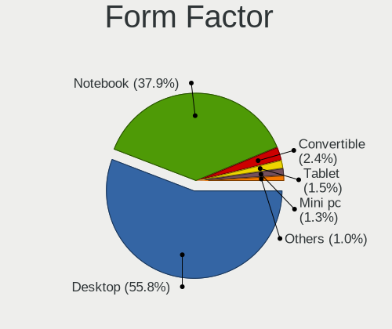
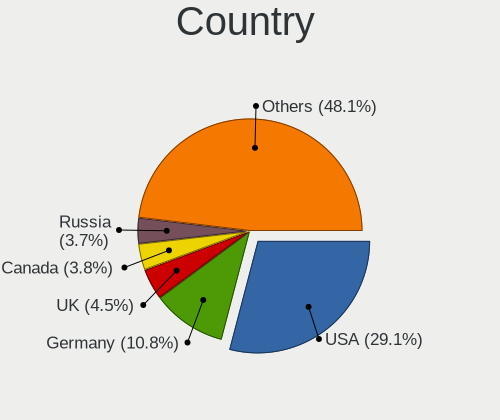
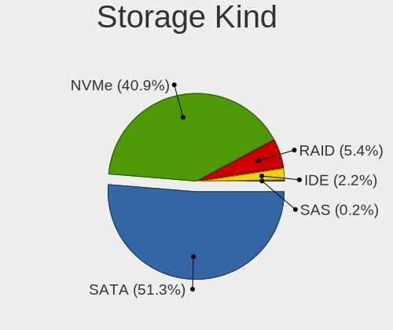
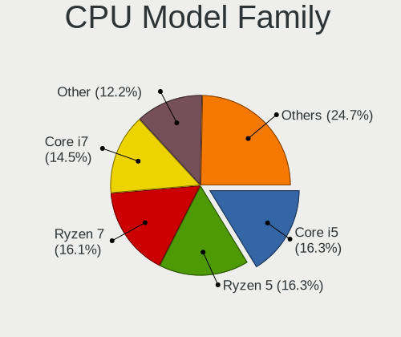
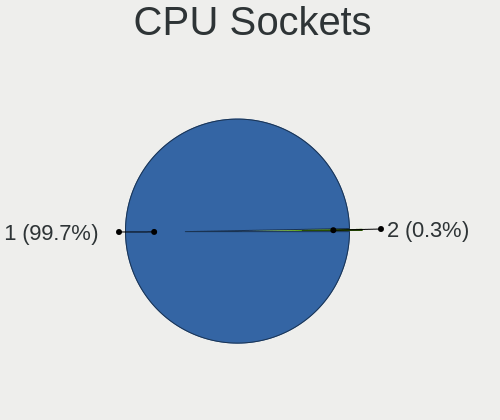
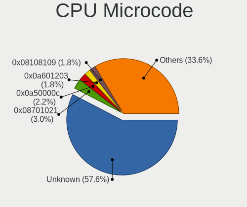
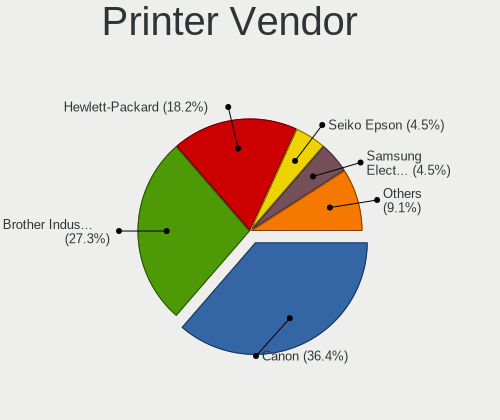

Nobara - Tested Hardware & Statistics
-------------------------------------

A project to collect tested hardware configurations for Nobara.

Anyone can contribute to this report by the [hw-probe](https://github.com/linuxhw/hw-probe) tool:

    sudo -E hw-probe -all -upload

Please contribute! Especially if your hardware is rare.

This is a report for all computer types. See also reports for [desktops](/Dist/Nobara/Desktop/README.md) and [notebooks](/Dist/Nobara/Notebook/README.md).

Contents
--------

* [ Test Cases ](#test-cases)

* [ System ](#system)
  - [ OS                       ](#os)
  - [ OS Family                ](#os-family)
  - [ Kernel                   ](#kernel)
  - [ Kernel Family            ](#kernel-family)
  - [ Kernel Major Ver.        ](#kernel-major-ver)
  - [ Arch                     ](#arch)
  - [ DE                       ](#de)
  - [ Display Server           ](#display-server)
  - [ Display Manager          ](#display-manager)
  - [ OS Lang                  ](#os-lang)
  - [ Boot Mode                ](#boot-mode)
  - [ Filesystem               ](#filesystem)
  - [ Part. scheme             ](#part-scheme)
  - [ Dual Boot with Linux/BSD ](#dual-boot-with-linuxbsd)
  - [ Dual Boot (Win)          ](#dual-boot-win)

* [ Board ](#board)
  - [ Vendor                   ](#vendor)
  - [ Model                    ](#model)
  - [ Model Family             ](#model-family)
  - [ MFG Year                 ](#mfg-year)
  - [ Form Factor              ](#form-factor)
  - [ Secure Boot              ](#secure-boot)
  - [ Coreboot                 ](#coreboot)
  - [ RAM Size                 ](#ram-size)
  - [ RAM Used                 ](#ram-used)
  - [ Total Drives             ](#total-drives)
  - [ Has CD-ROM               ](#has-cd-rom)
  - [ Has Ethernet             ](#has-ethernet)
  - [ Has WiFi                 ](#has-wifi)
  - [ Has Bluetooth            ](#has-bluetooth)

* [ Location ](#location)
  - [ Country                  ](#country)
  - [ City                     ](#city)

* [ Drives ](#drives)
  - [ Drive Vendor             ](#drive-vendor)
  - [ Drive Model              ](#drive-model)
  - [ HDD Vendor               ](#hdd-vendor)
  - [ SSD Vendor               ](#ssd-vendor)
  - [ Drive Kind               ](#drive-kind)
  - [ Drive Connector          ](#drive-connector)
  - [ Drive Size               ](#drive-size)
  - [ Space Total              ](#space-total)
  - [ Space Used               ](#space-used)
  - [ Malfunc. Drives          ](#malfunc-drives)
  - [ Malfunc. Drive Vendor    ](#malfunc-drive-vendor)
  - [ Malfunc. HDD Vendor      ](#malfunc-hdd-vendor)
  - [ Malfunc. Drive Kind      ](#malfunc-drive-kind)
  - [ Failed Drives            ](#failed-drives)
  - [ Failed Drive Vendor      ](#failed-drive-vendor)
  - [ Drive Status             ](#drive-status)

* [ Storage controller ](#storage-controller)
  - [ Storage Vendor           ](#storage-vendor)
  - [ Storage Model            ](#storage-model)
  - [ Storage Kind             ](#storage-kind)

* [ Processor ](#processor)
  - [ CPU Vendor               ](#cpu-vendor)
  - [ CPU Model                ](#cpu-model)
  - [ CPU Model Family         ](#cpu-model-family)
  - [ CPU Cores                ](#cpu-cores)
  - [ CPU Sockets              ](#cpu-sockets)
  - [ CPU Threads              ](#cpu-threads)
  - [ CPU Op-Modes             ](#cpu-op-modes)
  - [ CPU Microcode            ](#cpu-microcode)
  - [ CPU Microarch            ](#cpu-microarch)

* [ Graphics ](#graphics)
  - [ GPU Vendor               ](#gpu-vendor)
  - [ GPU Model                ](#gpu-model)
  - [ GPU Combo                ](#gpu-combo)
  - [ GPU Driver               ](#gpu-driver)
  - [ GPU Memory               ](#gpu-memory)

* [ Monitor ](#monitor)
  - [ Monitor Vendor           ](#monitor-vendor)
  - [ Monitor Model            ](#monitor-model)
  - [ Monitor Resolution       ](#monitor-resolution)
  - [ Monitor Diagonal         ](#monitor-diagonal)
  - [ Monitor Width            ](#monitor-width)
  - [ Aspect Ratio             ](#aspect-ratio)
  - [ Monitor Area             ](#monitor-area)
  - [ Pixel Density            ](#pixel-density)
  - [ Multiple Monitors        ](#multiple-monitors)

* [ Network ](#network)
  - [ Net Controller Vendor    ](#net-controller-vendor)
  - [ Net Controller Model     ](#net-controller-model)
  - [ Wireless Vendor          ](#wireless-vendor)
  - [ Wireless Model           ](#wireless-model)
  - [ Ethernet Vendor          ](#ethernet-vendor)
  - [ Ethernet Model           ](#ethernet-model)
  - [ Net Controller Kind      ](#net-controller-kind)
  - [ Used Controller          ](#used-controller)
  - [ NICs                     ](#nics)
  - [ IPv6                     ](#ipv6)

* [ Bluetooth ](#bluetooth)
  - [ Bluetooth Vendor         ](#bluetooth-vendor)
  - [ Bluetooth Model          ](#bluetooth-model)

* [ Sound ](#sound)
  - [ Sound Vendor             ](#sound-vendor)
  - [ Sound Model              ](#sound-model)

* [ Memory ](#memory)
  - [ Memory Vendor            ](#memory-vendor)
  - [ Memory Model             ](#memory-model)
  - [ Memory Kind              ](#memory-kind)
  - [ Memory Form Factor       ](#memory-form-factor)
  - [ Memory Size              ](#memory-size)
  - [ Memory Speed             ](#memory-speed)

* [ Printers & scanners ](#printers--scanners)
  - [ Printer Vendor           ](#printer-vendor)
  - [ Printer Model            ](#printer-model)
  - [ Scanner Vendor           ](#scanner-vendor)
  - [ Scanner Model            ](#scanner-model)

* [ Camera ](#camera)
  - [ Camera Vendor            ](#camera-vendor)
  - [ Camera Model             ](#camera-model)

* [ Security ](#security)
  - [ Fingerprint Vendor       ](#fingerprint-vendor)
  - [ Fingerprint Model        ](#fingerprint-model)
  - [ Chipcard Vendor          ](#chipcard-vendor)
  - [ Chipcard Model           ](#chipcard-model)

* [ Unsupported ](#unsupported)
  - [ Unsupported Devices      ](#unsupported-devices)
  - [ Unsupported Device Types ](#unsupported-device-types)

Test Cases
----------

Total: 1367

| Vendor        | Model                       | Form-Factor | Probe                                                      | Date         |
|---------------|-----------------------------|-------------|------------------------------------------------------------|--------------|
| Gigabyte      | B450 AORUS ELITE            | Desktop     | [5c2ce66225](https://linux-hardware.org/?probe=5c2ce66225) | May 08, 2024 |
| Lenovo        | IdeaPad S510p 20298         | Notebook    | [b941b8d062](https://linux-hardware.org/?probe=b941b8d062) | May 07, 2024 |
| ASRock        | B450M Pro4-F                | Desktop     | [0c73837ccd](https://linux-hardware.org/?probe=0c73837ccd) | May 07, 2024 |
| ASUSTek       | ASUS TUF Gaming A15 FA50... | Notebook    | [84cc2abe63](https://linux-hardware.org/?probe=84cc2abe63) | May 06, 2024 |
| PC Special... | NH5x_7xDPx                  | Notebook    | [35a25ffdfd](https://linux-hardware.org/?probe=35a25ffdfd) | May 06, 2024 |
| Samsung       | 370E4K                      | Notebook    | [f0c626e7ca](https://linux-hardware.org/?probe=f0c626e7ca) | May 05, 2024 |
| Dell          | Inspiron 5502               | Notebook    | [43fee6a80f](https://linux-hardware.org/?probe=43fee6a80f) | May 05, 2024 |
| Lenovo        | IdeaPad 320-15ISK 80XH      | Notebook    | [55d15ed397](https://linux-hardware.org/?probe=55d15ed397) | May 05, 2024 |
| MSI           | X570-A PRO                  | Desktop     | [6ee8d65521](https://linux-hardware.org/?probe=6ee8d65521) | May 05, 2024 |
| MSI           | X570-A PRO                  | Desktop     | [2fdf2caa36](https://linux-hardware.org/?probe=2fdf2caa36) | May 05, 2024 |
| Gigabyte      | Z68A-D3H-B3                 | Desktop     | [22b510c32b](https://linux-hardware.org/?probe=22b510c32b) | May 04, 2024 |
| ASUSTek       | PRIME B450-PLUS             | Desktop     | [2de27a1ebc](https://linux-hardware.org/?probe=2de27a1ebc) | May 04, 2024 |
| Gigabyte      | Z68AP-D3                    | Desktop     | [7411eab31d](https://linux-hardware.org/?probe=7411eab31d) | May 04, 2024 |
| ASRock        | X370 Taichi                 | Desktop     | [08bb9f240a](https://linux-hardware.org/?probe=08bb9f240a) | May 03, 2024 |
| ASUSTek       | ROG STRIX B450-F GAMING     | Desktop     | [c8e2add151](https://linux-hardware.org/?probe=c8e2add151) | May 03, 2024 |
| ASUSTek       | TUF Gaming X670E-PLUS WI... | Desktop     | [f0c6a403e2](https://linux-hardware.org/?probe=f0c6a403e2) | May 02, 2024 |
| Intel         | X79G V2.x                   | Desktop     | [00807bfaa6](https://linux-hardware.org/?probe=00807bfaa6) | May 02, 2024 |
| Dell          | 0WMJ54 A00                  | Desktop     | [c1af86a1e6](https://linux-hardware.org/?probe=c1af86a1e6) | May 01, 2024 |
| ASRock        | B550 Phantom Gaming 4       | Desktop     | [e6e296b237](https://linux-hardware.org/?probe=e6e296b237) | May 01, 2024 |
| Lenovo        | ThinkPad T430 2347GU8       | Notebook    | [901ee2545c](https://linux-hardware.org/?probe=901ee2545c) | Apr 30, 2024 |
| ASUSTek       | ROG Maximus XI HERO         | Desktop     | [c8d1f19fe6](https://linux-hardware.org/?probe=c8d1f19fe6) | Apr 29, 2024 |
| ASUSTek       | ROG Maximus XI HERO         | Desktop     | [d72dcf834b](https://linux-hardware.org/?probe=d72dcf834b) | Apr 29, 2024 |
| HP            | 18E7                        | Desktop     | [e91218e74f](https://linux-hardware.org/?probe=e91218e74f) | Apr 28, 2024 |
| HP            | OMEN by Laptop 15-dc0xxx    | Notebook    | [a9b063c17b](https://linux-hardware.org/?probe=a9b063c17b) | Apr 28, 2024 |
| HP            | 18E7                        | Desktop     | [4442e8fc4a](https://linux-hardware.org/?probe=4442e8fc4a) | Apr 27, 2024 |
| MSI           | MAG B650 TOMAHAWK WIFI      | Desktop     | [ed27359470](https://linux-hardware.org/?probe=ed27359470) | Apr 27, 2024 |
| MSI           | B550-A PRO                  | Desktop     | [63cd7f6146](https://linux-hardware.org/?probe=63cd7f6146) | Apr 27, 2024 |
| ASUSTek       | ASUS TUF Gaming A15 FA50... | Notebook    | [f619fc2cb1](https://linux-hardware.org/?probe=f619fc2cb1) | Apr 26, 2024 |
| Lenovo        | IdeaPad 1 14IGL7 82V6       | Notebook    | [551ccdf911](https://linux-hardware.org/?probe=551ccdf911) | Apr 26, 2024 |
| Gigabyte      | Z370 AORUS ULTRA GAMING-... | Desktop     | [849a82e562](https://linux-hardware.org/?probe=849a82e562) | Apr 25, 2024 |
| Gigabyte      | X570 AORUS ELITE WIFI       | Desktop     | [31bdb0d059](https://linux-hardware.org/?probe=31bdb0d059) | Apr 24, 2024 |
| MSI           | MAG B650M MORTAR WIFI       | Desktop     | [d4c46c8278](https://linux-hardware.org/?probe=d4c46c8278) | Apr 24, 2024 |
| Lenovo        | ThinkBook 16 G6 IRL 21KH    | Notebook    | [14164a1cf6](https://linux-hardware.org/?probe=14164a1cf6) | Apr 23, 2024 |
| Apple         | Mac-942B5BF58194151B        | All in one  | [1d431b3c1c](https://linux-hardware.org/?probe=1d431b3c1c) | Apr 23, 2024 |
| HP            | 8876 11                     | Notebook    | [a276feeb19](https://linux-hardware.org/?probe=a276feeb19) | Apr 22, 2024 |
| HP            | 8876 11                     | Notebook    | [17290d87ba](https://linux-hardware.org/?probe=17290d87ba) | Apr 22, 2024 |
| Apple         | MacBookPro14,1              | Notebook    | [743a3ab71e](https://linux-hardware.org/?probe=743a3ab71e) | Apr 22, 2024 |
| MSI           | MPG B550 GAMING PLUS        | Desktop     | [549ac56060](https://linux-hardware.org/?probe=549ac56060) | Apr 21, 2024 |
| HP            | EliteBook 8570p             | Notebook    | [98d15b6d8d](https://linux-hardware.org/?probe=98d15b6d8d) | Apr 20, 2024 |
| Apple         | MacBookPro16,1              | Notebook    | [af2c346bb9](https://linux-hardware.org/?probe=af2c346bb9) | Apr 20, 2024 |
| Notebook      | W330SU2                     | Notebook    | [7efde9ff70](https://linux-hardware.org/?probe=7efde9ff70) | Apr 20, 2024 |
| MSI           | MEG X570 UNIFY              | Desktop     | [1e5130ce4b](https://linux-hardware.org/?probe=1e5130ce4b) | Apr 20, 2024 |
| MSI           | MAG B550 TOMAHAWK           | Desktop     | [4b3ef47f33](https://linux-hardware.org/?probe=4b3ef47f33) | Apr 20, 2024 |
| MSI           | MEG X570 UNIFY              | Desktop     | [e79a40955f](https://linux-hardware.org/?probe=e79a40955f) | Apr 19, 2024 |
| Biostar       | TP43E Combo                 | Desktop     | [b952037ea6](https://linux-hardware.org/?probe=b952037ea6) | Apr 19, 2024 |
| Gigabyte      | Z370 HD3-OP-CF              | Desktop     | [0f88ddd572](https://linux-hardware.org/?probe=0f88ddd572) | Apr 19, 2024 |
| Dell          | Latitude E6440              | Notebook    | [82713456e1](https://linux-hardware.org/?probe=82713456e1) | Apr 19, 2024 |
| Microsoft     | Surface Pro                 | Tablet      | [7f26f09fac](https://linux-hardware.org/?probe=7f26f09fac) | Apr 19, 2024 |
| Microsoft     | Surface Pro                 | Tablet      | [1233f9c380](https://linux-hardware.org/?probe=1233f9c380) | Apr 17, 2024 |
| Apple         | Mac-942B5BF58194151B        | All in one  | [1aa89aefa2](https://linux-hardware.org/?probe=1aa89aefa2) | Apr 17, 2024 |
| Acer          | Nitro AN517-52              | Notebook    | [da7720d0f0](https://linux-hardware.org/?probe=da7720d0f0) | Apr 16, 2024 |
| Acer          | Nitro AN517-52              | Notebook    | [a65d6b6abb](https://linux-hardware.org/?probe=a65d6b6abb) | Apr 16, 2024 |
| ASUSTek       | G751JM                      | Notebook    | [78bd2126e9](https://linux-hardware.org/?probe=78bd2126e9) | Apr 15, 2024 |
| MSI           | MPG B650I EDGE WIFI         | Desktop     | [ad026e12f6](https://linux-hardware.org/?probe=ad026e12f6) | Apr 15, 2024 |
| ASUSTek       | ROG Zephyrus G14 GA401QM... | Notebook    | [b160ab4b5b](https://linux-hardware.org/?probe=b160ab4b5b) | Apr 15, 2024 |
| iOTA          | Unknown                     | Tablet      | [ad2e65fccd](https://linux-hardware.org/?probe=ad2e65fccd) | Apr 14, 2024 |
| ASUSTek       | CROSSHAIR VI HERO           | Desktop     | [5b1221e03a](https://linux-hardware.org/?probe=5b1221e03a) | Apr 14, 2024 |
| Dell          | G15 5530                    | Notebook    | [8f4e471788](https://linux-hardware.org/?probe=8f4e471788) | Apr 14, 2024 |
| NZXT          | N7 B550                     | Desktop     | [4a8cd3ae3d](https://linux-hardware.org/?probe=4a8cd3ae3d) | Apr 13, 2024 |
| HP            | 158B                        | Desktop     | [3feac8009d](https://linux-hardware.org/?probe=3feac8009d) | Apr 13, 2024 |
| Gigabyte      | B650M AORUS ELITE AX        | Desktop     | [67a625ad88](https://linux-hardware.org/?probe=67a625ad88) | Apr 13, 2024 |
| ASUSTek       | Pro WS X570-ACE             | Desktop     | [2292771038](https://linux-hardware.org/?probe=2292771038) | Apr 13, 2024 |
| Unknown       | X570 Phantom Gaming-ITX/... | Notebook    | [44b48f5aa1](https://linux-hardware.org/?probe=44b48f5aa1) | Apr 13, 2024 |
| ASUSTek       | TUF Gaming B550-PLUS        | Desktop     | [2bbd6deca8](https://linux-hardware.org/?probe=2bbd6deca8) | Apr 13, 2024 |
| A-DATA Tec... | XENIA 15                    | Notebook    | [08552dc593](https://linux-hardware.org/?probe=08552dc593) | Apr 13, 2024 |
| Apple         | Mac-F221BEC8                | Desktop     | [51f660c2fd](https://linux-hardware.org/?probe=51f660c2fd) | Apr 12, 2024 |
| ANGXUN        | X99 V1.0                    | Desktop     | [2aceaa68c2](https://linux-hardware.org/?probe=2aceaa68c2) | Apr 12, 2024 |
| HP            | 8906 SMVB                   | Desktop     | [2dc18938a1](https://linux-hardware.org/?probe=2dc18938a1) | Apr 10, 2024 |
| Lenovo        | IdeaPad L340-15IRH Gamin... | Notebook    | [1b09cf1322](https://linux-hardware.org/?probe=1b09cf1322) | Apr 10, 2024 |
| Lenovo        | IdeaPad L340-15IRH Gamin... | Notebook    | [46ec5edae0](https://linux-hardware.org/?probe=46ec5edae0) | Apr 10, 2024 |
| MSI           | B550-A PRO                  | Desktop     | [5dc47ea562](https://linux-hardware.org/?probe=5dc47ea562) | Apr 09, 2024 |
| HP            | Laptop 15-fd0xxx            | Notebook    | [344cb034bc](https://linux-hardware.org/?probe=344cb034bc) | Apr 08, 2024 |
| System76      | Gazelle                     | Notebook    | [969d376558](https://linux-hardware.org/?probe=969d376558) | Apr 07, 2024 |
| MSI           | MEG X570 UNIFY              | Desktop     | [3b882c0d29](https://linux-hardware.org/?probe=3b882c0d29) | Apr 07, 2024 |
| MSI           | Z170A GAMING M5             | Desktop     | [3ade43a7b8](https://linux-hardware.org/?probe=3ade43a7b8) | Apr 06, 2024 |
| HC Technol... | HCAR4000-MI                 | Desktop     | [c11da7c4fa](https://linux-hardware.org/?probe=c11da7c4fa) | Apr 05, 2024 |
| ASUSTek       | Maximus VII IMPACT          | Desktop     | [b0756090bc](https://linux-hardware.org/?probe=b0756090bc) | Apr 05, 2024 |
| ASUSTek       | ROG Strix G513QY_G513QY     | Notebook    | [6c1225353c](https://linux-hardware.org/?probe=6c1225353c) | Apr 04, 2024 |
| ASUSTek       | TUF Gaming X670E-PLUS WI... | Desktop     | [c41b82e141](https://linux-hardware.org/?probe=c41b82e141) | Apr 04, 2024 |
| ASUSTek       | PRIME B450M-A               | Desktop     | [4fc3272c07](https://linux-hardware.org/?probe=4fc3272c07) | Apr 04, 2024 |
| Gigabyte      | X570 AORUS MASTER           | Desktop     | [a9b4ee8ca9](https://linux-hardware.org/?probe=a9b4ee8ca9) | Apr 04, 2024 |
| ANGXUN        | X99 V1.0                    | Desktop     | [e99eee7fa6](https://linux-hardware.org/?probe=e99eee7fa6) | Apr 03, 2024 |
| MSI           | MAG B550 TOMAHAWK           | Desktop     | [ea9c66f246](https://linux-hardware.org/?probe=ea9c66f246) | Apr 03, 2024 |
| MSI           | GF65 Thin 10UE              | Notebook    | [92304837ec](https://linux-hardware.org/?probe=92304837ec) | Apr 03, 2024 |
| ASRock        | B650M Pro RS                | Desktop     | [115bed720d](https://linux-hardware.org/?probe=115bed720d) | Apr 02, 2024 |
| ASRock        | B450M-HDV R4.0              | Desktop     | [d2f236e563](https://linux-hardware.org/?probe=d2f236e563) | Apr 02, 2024 |
| Alienware     | 17 R4                       | Notebook    | [0c83302e22](https://linux-hardware.org/?probe=0c83302e22) | Apr 02, 2024 |
| ANGXUN        | X99 V1.0                    | Desktop     | [4c7df42efb](https://linux-hardware.org/?probe=4c7df42efb) | Apr 01, 2024 |
| ASUSTek       | Rampage IV BLACK EDITION    | Desktop     | [519130fe28](https://linux-hardware.org/?probe=519130fe28) | Apr 01, 2024 |
| ASUSTek       | Rampage IV BLACK EDITION    | Desktop     | [daddb2bc79](https://linux-hardware.org/?probe=daddb2bc79) | Mar 31, 2024 |
| Gigabyte      | B550M DS3H                  | Desktop     | [4eaa4702ec](https://linux-hardware.org/?probe=4eaa4702ec) | Mar 31, 2024 |
| HUAWEI        | BOM-WXX9                    | Notebook    | [55199df248](https://linux-hardware.org/?probe=55199df248) | Mar 31, 2024 |
| HP            | OMEN by Laptop 15-dc1xxx    | Notebook    | [67f6104365](https://linux-hardware.org/?probe=67f6104365) | Mar 30, 2024 |
| ASRock        | B550 Steel Legend           | Desktop     | [80bcca8e5b](https://linux-hardware.org/?probe=80bcca8e5b) | Mar 30, 2024 |
| HP            | EliteBook 840 G6            | Notebook    | [5750434b60](https://linux-hardware.org/?probe=5750434b60) | Mar 30, 2024 |
| ASUSTek       | ROG STRIX Z690-E GAMING ... | Desktop     | [7d992f4daa](https://linux-hardware.org/?probe=7d992f4daa) | Mar 29, 2024 |
| MSI           | PRO B760-P WIFI DDR4        | Desktop     | [12ae68d7a3](https://linux-hardware.org/?probe=12ae68d7a3) | Mar 29, 2024 |
| Dell          | Inspiron 1750               | Notebook    | [0c73b8ab73](https://linux-hardware.org/?probe=0c73b8ab73) | Mar 29, 2024 |
| ASUSTek       | ROG STRIX X570-E GAMING ... | Desktop     | [b629da0749](https://linux-hardware.org/?probe=b629da0749) | Mar 28, 2024 |
| HP            | Pavilion Gaming Laptop 1... | Notebook    | [d689049633](https://linux-hardware.org/?probe=d689049633) | Mar 28, 2024 |
| Gigabyte      | B550 AORUS ELITE V2         | Desktop     | [ff9042cc68](https://linux-hardware.org/?probe=ff9042cc68) | Mar 28, 2024 |
| Gigabyte      | H81M-HD3                    | Desktop     | [af704cb4f0](https://linux-hardware.org/?probe=af704cb4f0) | Mar 28, 2024 |
| Lenovo        | ThinkPad P50 20EN001SUS     | Notebook    | [0d5d136c74](https://linux-hardware.org/?probe=0d5d136c74) | Mar 27, 2024 |
| Dell          | 0YC03K A04                  | Desktop     | [5f8bc97385](https://linux-hardware.org/?probe=5f8bc97385) | Mar 27, 2024 |
| ASUSTek       | Pro WS X570-ACE             | Desktop     | [63eb2889bf](https://linux-hardware.org/?probe=63eb2889bf) | Mar 26, 2024 |
| Lenovo        | ThinkPad X1 Nano Gen 3 2... | Notebook    | [6ddc89666f](https://linux-hardware.org/?probe=6ddc89666f) | Mar 26, 2024 |
| HP            | Pavilion x360 Convertibl... | Convertible | [c9687678aa](https://linux-hardware.org/?probe=c9687678aa) | Mar 25, 2024 |
| AWOW          | AiBook 10                   | Tablet      | [0d7ddf1922](https://linux-hardware.org/?probe=0d7ddf1922) | Mar 25, 2024 |
| THUNDEROBO... | 911 Plus                    | Notebook    | [26658bfa2e](https://linux-hardware.org/?probe=26658bfa2e) | Mar 25, 2024 |
| ASUSTek       | PRIME B450M-A               | Desktop     | [d45555c1f3](https://linux-hardware.org/?probe=d45555c1f3) | Mar 25, 2024 |
| HP            | Pavilion Notebook           | Notebook    | [9599687d82](https://linux-hardware.org/?probe=9599687d82) | Mar 25, 2024 |
| Dell          | Latitude 3120               | Notebook    | [82d08cfae1](https://linux-hardware.org/?probe=82d08cfae1) | Mar 25, 2024 |
| Notebook      | W330SU2                     | Notebook    | [5228fe58bf](https://linux-hardware.org/?probe=5228fe58bf) | Mar 24, 2024 |
| ASUSTek       | PRIME H510M-A               | Desktop     | [75f9128122](https://linux-hardware.org/?probe=75f9128122) | Mar 24, 2024 |
| Huanan        | X99-F8 GAMING V5.0          | Desktop     | [e6a2094088](https://linux-hardware.org/?probe=e6a2094088) | Mar 24, 2024 |
| NZXT          | N5 Z690                     | Desktop     | [53116e0b19](https://linux-hardware.org/?probe=53116e0b19) | Mar 24, 2024 |
| ASUSTek       | ROG STRIX B450-F GAMING     | Desktop     | [1f2ecd5d21](https://linux-hardware.org/?probe=1f2ecd5d21) | Mar 24, 2024 |
| ASUSTek       | TUF Gaming B550M-PLUS       | Desktop     | [ae288e9605](https://linux-hardware.org/?probe=ae288e9605) | Mar 23, 2024 |
| Shenzhen M... | F7BAA                       | Desktop     | [f304a949e9](https://linux-hardware.org/?probe=f304a949e9) | Mar 23, 2024 |
| HP            | Pavilion Gaming Laptop 1... | Notebook    | [59e0f44e00](https://linux-hardware.org/?probe=59e0f44e00) | Mar 23, 2024 |
| Huanan        | X99-F8 GAMING V5.0          | Desktop     | [99f9849b94](https://linux-hardware.org/?probe=99f9849b94) | Mar 23, 2024 |
| HP            | 1497                        | Desktop     | [6400d7689a](https://linux-hardware.org/?probe=6400d7689a) | Mar 23, 2024 |
| ASUSTek       | ROG STRIX B650E-F GAMING... | Desktop     | [ebc7895287](https://linux-hardware.org/?probe=ebc7895287) | Mar 23, 2024 |
| Lenovo        | ThinkPad P50 20EN001SUS     | Notebook    | [42607732cf](https://linux-hardware.org/?probe=42607732cf) | Mar 23, 2024 |
| ASUSTek       | P8H77-M                     | Desktop     | [86485df1b9](https://linux-hardware.org/?probe=86485df1b9) | Mar 22, 2024 |
| Gigabyte      | X570 AORUS ELITE            | Desktop     | [488589d270](https://linux-hardware.org/?probe=488589d270) | Mar 22, 2024 |
| Apple         | MacBookAir8,1               | Notebook    | [d0c0446bb2](https://linux-hardware.org/?probe=d0c0446bb2) | Mar 19, 2024 |
| ASUSTek       | ROG STRIX B450-F GAMING ... | Desktop     | [cb3904b8ec](https://linux-hardware.org/?probe=cb3904b8ec) | Mar 19, 2024 |
| ASUSTek       | ROG STRIX B450-F GAMING ... | Desktop     | [5b8baf227c](https://linux-hardware.org/?probe=5b8baf227c) | Mar 18, 2024 |
| Acer          | TM8573T                     | Notebook    | [f60d5f0213](https://linux-hardware.org/?probe=f60d5f0213) | Mar 18, 2024 |
| ASRock        | B550 Phantom Gaming-ITX/... | Desktop     | [a66baca0b3](https://linux-hardware.org/?probe=a66baca0b3) | Mar 17, 2024 |
| Lenovo        | ThinkCentre M91p 4480A5U    | Desktop     | [cf0e48482f](https://linux-hardware.org/?probe=cf0e48482f) | Mar 16, 2024 |
| ASUSTek       | PRIME X570-P                | Desktop     | [c05fb5669f](https://linux-hardware.org/?probe=c05fb5669f) | Mar 15, 2024 |
| MSI           | B560M BOMBER                | Desktop     | [e3c62a717e](https://linux-hardware.org/?probe=e3c62a717e) | Mar 14, 2024 |
| A-DATA Tec... | XENIA 15                    | Notebook    | [0abdf7ee8f](https://linux-hardware.org/?probe=0abdf7ee8f) | Mar 14, 2024 |
| HP            | 8767 A                      | Desktop     | [ec0ecfe148](https://linux-hardware.org/?probe=ec0ecfe148) | Mar 14, 2024 |
| Shenzhen M... | F7BAA                       | Desktop     | [331d8bfd8d](https://linux-hardware.org/?probe=331d8bfd8d) | Mar 13, 2024 |
| MSI           | Z87-G45 GAMING              | Desktop     | [6a52290a2c](https://linux-hardware.org/?probe=6a52290a2c) | Mar 10, 2024 |
| MSI           | Z270 KRAIT GAMING           | Desktop     | [1b8c43466f](https://linux-hardware.org/?probe=1b8c43466f) | Mar 09, 2024 |
| Lenovo        | IdeaPad Gaming 3 15ACH6 ... | Notebook    | [34dc8eb985](https://linux-hardware.org/?probe=34dc8eb985) | Mar 09, 2024 |
| Genuine       | ZEUS 15H (GNB15H-9G650)     | Notebook    | [1cdfbc79db](https://linux-hardware.org/?probe=1cdfbc79db) | Mar 09, 2024 |
| ASUSTek       | ROG STRIX X570-E GAMING     | Desktop     | [367cca2568](https://linux-hardware.org/?probe=367cca2568) | Mar 07, 2024 |
| Acer          | Veriton N4680G              | Desktop     | [56c46ab94d](https://linux-hardware.org/?probe=56c46ab94d) | Mar 07, 2024 |
| HP            | Pavilion Notebook           | Notebook    | [4e9cbe8d8c](https://linux-hardware.org/?probe=4e9cbe8d8c) | Mar 07, 2024 |
| ASUSTek       | VivoBook_ASUSLaptop TP41... | Convertible | [3c51a5f5ed](https://linux-hardware.org/?probe=3c51a5f5ed) | Mar 06, 2024 |
| HUAWEI        | BOD-WXX9                    | Notebook    | [1fc0257c17](https://linux-hardware.org/?probe=1fc0257c17) | Mar 05, 2024 |
| HP            | 14                          | Notebook    | [6e6138e521](https://linux-hardware.org/?probe=6e6138e521) | Mar 04, 2024 |
| ASRock        | AB350 Pro4                  | Desktop     | [c7f6639bd8](https://linux-hardware.org/?probe=c7f6639bd8) | Mar 04, 2024 |
| ASRock        | AB350 Pro4                  | Desktop     | [706ffb75c7](https://linux-hardware.org/?probe=706ffb75c7) | Mar 04, 2024 |
| ASRock        | Z790 PG SONIC               | Desktop     | [294db77884](https://linux-hardware.org/?probe=294db77884) | Mar 04, 2024 |
| ASUSTek       | ROG STRIX B550-E GAMING     | Desktop     | [bb92efd03f](https://linux-hardware.org/?probe=bb92efd03f) | Mar 03, 2024 |
| ASUSTek       | ROG Maximus XI HERO         | Desktop     | [20b84b5546](https://linux-hardware.org/?probe=20b84b5546) | Mar 03, 2024 |
| Dell          | Latitude 3540               | Notebook    | [bec924d898](https://linux-hardware.org/?probe=bec924d898) | Mar 02, 2024 |
| ASRock        | B760M Steel Legend WiFi     | Desktop     | [3a49dcc141](https://linux-hardware.org/?probe=3a49dcc141) | Mar 02, 2024 |
| MSI           | MEG Z790 ACE                | Desktop     | [fe820e6252](https://linux-hardware.org/?probe=fe820e6252) | Mar 02, 2024 |
| MSI           | MEG Z790 ACE                | Desktop     | [ec9f9ed05d](https://linux-hardware.org/?probe=ec9f9ed05d) | Mar 02, 2024 |
| Gigabyte      | H110M-A-CF                  | Desktop     | [f170401477](https://linux-hardware.org/?probe=f170401477) | Mar 01, 2024 |
| Biostar       | B550MX/E PRO                | Desktop     | [b5621fd04d](https://linux-hardware.org/?probe=b5621fd04d) | Mar 01, 2024 |
| HP            | Pavilion 15                 | Notebook    | [15858caed0](https://linux-hardware.org/?probe=15858caed0) | Mar 01, 2024 |
| ASUSTek       | G73Sw                       | Notebook    | [4587c66de2](https://linux-hardware.org/?probe=4587c66de2) | Mar 01, 2024 |
| MSI           | MAG Z690 TOMAHAWK WIFI      | Notebook    | [fd1c373201](https://linux-hardware.org/?probe=fd1c373201) | Mar 01, 2024 |
| Lenovo        | ThinkPad X1 Carbon 7th 2... | Notebook    | [120d90cd85](https://linux-hardware.org/?probe=120d90cd85) | Mar 01, 2024 |
| Lenovo        | IdeaPad L3 15IML05 81Y3     | Notebook    | [08024a8cef](https://linux-hardware.org/?probe=08024a8cef) | Mar 01, 2024 |
| Gigabyte      | X570 AORUS ELITE            | Desktop     | [f95d07fbe2](https://linux-hardware.org/?probe=f95d07fbe2) | Mar 01, 2024 |
| Valve         | Jupiter                     | Notebook    | [aabae1e88f](https://linux-hardware.org/?probe=aabae1e88f) | Mar 01, 2024 |
| ASUSTek       | G73Sw                       | Notebook    | [3605d5ddc7](https://linux-hardware.org/?probe=3605d5ddc7) | Mar 01, 2024 |
| HP            | 87D6 SMVB                   | Desktop     | [0f6fe5731d](https://linux-hardware.org/?probe=0f6fe5731d) | Feb 29, 2024 |
| MSI           | MAG Z690 TOMAHAWK WIFI      | Notebook    | [18a5671738](https://linux-hardware.org/?probe=18a5671738) | Feb 29, 2024 |
| ASRock        | B650M-HDV/M.2               | Desktop     | [d09ab79296](https://linux-hardware.org/?probe=d09ab79296) | Feb 29, 2024 |
| MSI           | Modern 14 B5M               | Notebook    | [565e6c2d46](https://linux-hardware.org/?probe=565e6c2d46) | Feb 29, 2024 |
| Gigabyte      | B85M-D3H                    | Notebook    | [dbbdc72e8a](https://linux-hardware.org/?probe=dbbdc72e8a) | Feb 27, 2024 |
| Medion        | Z370H4-EM                   | Desktop     | [4eb64de4c6](https://linux-hardware.org/?probe=4eb64de4c6) | Feb 27, 2024 |
| MSI           | B560M BOMBER                | Desktop     | [51d0000eeb](https://linux-hardware.org/?probe=51d0000eeb) | Feb 26, 2024 |
| Dell          | Latitude E5470              | Notebook    | [10ab411f6f](https://linux-hardware.org/?probe=10ab411f6f) | Feb 25, 2024 |
| Lenovo        | IdeaPad 5 Pro 14ARH7 82S... | Notebook    | [3015e2635f](https://linux-hardware.org/?probe=3015e2635f) | Feb 25, 2024 |
| ASUSTek       | ASUS TUF Gaming A16 FA61... | Notebook    | [987f6afe4b](https://linux-hardware.org/?probe=987f6afe4b) | Feb 25, 2024 |
| AWOW          | AiBook 10                   | Tablet      | [07372d2796](https://linux-hardware.org/?probe=07372d2796) | Feb 24, 2024 |
| HP            | ProBook 470 G1              | Notebook    | [2ad493fb2d](https://linux-hardware.org/?probe=2ad493fb2d) | Feb 24, 2024 |
| HP            | Laptop 14-dk0xxx            | Notebook    | [e0a472d706](https://linux-hardware.org/?probe=e0a472d706) | Feb 24, 2024 |
| Microsoft     | Surface Pro 4               | Tablet      | [dfae4c4596](https://linux-hardware.org/?probe=dfae4c4596) | Feb 24, 2024 |
| HP            | Pavilion Gaming Laptop 1... | Notebook    | [3b3a145c76](https://linux-hardware.org/?probe=3b3a145c76) | Feb 23, 2024 |
| Acer          | Aspire VN7-592G             | Notebook    | [dd6617c3d7](https://linux-hardware.org/?probe=dd6617c3d7) | Feb 23, 2024 |
| A-DATA Tec... | XENIA 15                    | Notebook    | [6a3f5e5947](https://linux-hardware.org/?probe=6a3f5e5947) | Feb 23, 2024 |
| MSI           | X670E GAMING PLUS WIFI      | Desktop     | [98fae51a1e](https://linux-hardware.org/?probe=98fae51a1e) | Feb 22, 2024 |
| ASUSTek       | ASUS TUF Gaming F15 FX50... | Notebook    | [da357b8940](https://linux-hardware.org/?probe=da357b8940) | Feb 22, 2024 |
| ASRock        | H610M-HDV/M.2+ D5           | Desktop     | [234e2e9bb4](https://linux-hardware.org/?probe=234e2e9bb4) | Feb 21, 2024 |
| Acer          | Nitro AN517-52              | Notebook    | [a5af54a5aa](https://linux-hardware.org/?probe=a5af54a5aa) | Feb 20, 2024 |
| Gigabyte      | A320M-S2H-CF SE1            | Desktop     | [51d0c3c66c](https://linux-hardware.org/?probe=51d0c3c66c) | Feb 19, 2024 |
| ASUSTek       | TUF Gaming B550-PLUS        | Desktop     | [d63b912feb](https://linux-hardware.org/?probe=d63b912feb) | Feb 19, 2024 |
| ASUSTek       | TUF Gaming B550-PLUS        | Desktop     | [710c281afe](https://linux-hardware.org/?probe=710c281afe) | Feb 19, 2024 |
| MSI           | Bravo 15 C7VF               | Notebook    | [82ee626dbd](https://linux-hardware.org/?probe=82ee626dbd) | Feb 19, 2024 |
| BESSTAR Te... | B550                        | Desktop     | [3404bc2a3f](https://linux-hardware.org/?probe=3404bc2a3f) | Feb 19, 2024 |
| Dell          | 00V62H A01                  | Desktop     | [9ca137827d](https://linux-hardware.org/?probe=9ca137827d) | Feb 19, 2024 |
| ASUSTek       | ROG Maximus Z790 HERO       | Desktop     | [e138126881](https://linux-hardware.org/?probe=e138126881) | Feb 18, 2024 |
| Dell          | 00F82W A01                  | Desktop     | [5c6a47036f](https://linux-hardware.org/?probe=5c6a47036f) | Feb 18, 2024 |
| Acer          | Aspire ES1-572              | Notebook    | [7c61f04e95](https://linux-hardware.org/?probe=7c61f04e95) | Feb 18, 2024 |
| ASRock        | B450 Steel Legend           | Desktop     | [af374b16e0](https://linux-hardware.org/?probe=af374b16e0) | Feb 18, 2024 |
| Gigabyte      | B560 HD3                    | Desktop     | [37705691a2](https://linux-hardware.org/?probe=37705691a2) | Feb 18, 2024 |
| ASUSTek       | ROG CROSSHAIR VI HERO       | Desktop     | [a3e402d181](https://linux-hardware.org/?probe=a3e402d181) | Feb 17, 2024 |
| ASRock        | B550 Steel Legend           | Desktop     | [e8cd748b8b](https://linux-hardware.org/?probe=e8cd748b8b) | Feb 16, 2024 |
| Acer          | Nitro AN515-44              | Notebook    | [f5476226be](https://linux-hardware.org/?probe=f5476226be) | Feb 15, 2024 |
| Dell          | Precision M4800             | Notebook    | [c5630bb66f](https://linux-hardware.org/?probe=c5630bb66f) | Feb 15, 2024 |
| Infinix       | INBOOK X2 PLUS              | Notebook    | [ef58804464](https://linux-hardware.org/?probe=ef58804464) | Feb 15, 2024 |
| Infinix       | INBOOK X2 PLUS              | Notebook    | [bf574e4c09](https://linux-hardware.org/?probe=bf574e4c09) | Feb 15, 2024 |
| Intel         | X79G V2.x                   | Desktop     | [077f5b4397](https://linux-hardware.org/?probe=077f5b4397) | Feb 15, 2024 |
| Dell          | XPS 13 9305                 | Notebook    | [cf602689fb](https://linux-hardware.org/?probe=cf602689fb) | Feb 14, 2024 |
| Dell          | XPS 13 9305                 | Notebook    | [531e1ffb52](https://linux-hardware.org/?probe=531e1ffb52) | Feb 14, 2024 |
| Acer          | Nitro AN515-44              | Notebook    | [1edc94c98a](https://linux-hardware.org/?probe=1edc94c98a) | Feb 14, 2024 |
| ASUSTek       | PRIME B450M-A II            | Desktop     | [85ad12404c](https://linux-hardware.org/?probe=85ad12404c) | Feb 14, 2024 |
| Acer          | Aspire A115-31              | Notebook    | [118a35f68d](https://linux-hardware.org/?probe=118a35f68d) | Feb 13, 2024 |
| MSI           | MPG Z390 GAMING PLUS        | Desktop     | [340060f3d6](https://linux-hardware.org/?probe=340060f3d6) | Feb 13, 2024 |
| ASUSTek       | ASUS TUF Gaming F17 FX70... | Notebook    | [8cab6ebd29](https://linux-hardware.org/?probe=8cab6ebd29) | Feb 12, 2024 |
| ASUSTek       | ROG Ally RC71L_RC71L        | Tablet      | [5d7a35b7b3](https://linux-hardware.org/?probe=5d7a35b7b3) | Feb 12, 2024 |
| HP            | Compaq 615                  | Notebook    | [1761631f89](https://linux-hardware.org/?probe=1761631f89) | Feb 11, 2024 |
| Acer          | TravelMate 7520             | Notebook    | [2cdca7160b](https://linux-hardware.org/?probe=2cdca7160b) | Feb 11, 2024 |
| ASUSTek       | TUF Gaming B650-PLUS        | Desktop     | [526bbe59b5](https://linux-hardware.org/?probe=526bbe59b5) | Feb 11, 2024 |
| HP            | 1850                        | Desktop     | [5c07678884](https://linux-hardware.org/?probe=5c07678884) | Feb 11, 2024 |
| ASUSTek       | VivoBook 15 ASUS Laptop ... | Notebook    | [9b3e403b41](https://linux-hardware.org/?probe=9b3e403b41) | Feb 11, 2024 |
| ASUSTek       | VivoBook_ASUSLaptop TP36... | Convertible | [5db23f0711](https://linux-hardware.org/?probe=5db23f0711) | Feb 10, 2024 |
| ASRock        | Z790 Taichi Lite            | Desktop     | [4e10886ed9](https://linux-hardware.org/?probe=4e10886ed9) | Feb 10, 2024 |
| Gigabyte      | Z77M-D3H                    | Desktop     | [dbf87ca96b](https://linux-hardware.org/?probe=dbf87ca96b) | Feb 10, 2024 |
| HP            | ENVY x360 2-in-1 Laptop ... | Convertible | [c5bef6b5e1](https://linux-hardware.org/?probe=c5bef6b5e1) | Feb 10, 2024 |
| Apple         | Mac-942B5BF58194151B        | All in one  | [e5f7545d74](https://linux-hardware.org/?probe=e5f7545d74) | Feb 09, 2024 |
| HP            | 3397                        | Desktop     | [a90269d4c8](https://linux-hardware.org/?probe=a90269d4c8) | Feb 09, 2024 |
| ASUSTek       | TUF Gaming B550-PLUS        | Desktop     | [e1a5930765](https://linux-hardware.org/?probe=e1a5930765) | Feb 08, 2024 |
| MSI           | MPG B550 GAMING PLUS        | Desktop     | [047b50329c](https://linux-hardware.org/?probe=047b50329c) | Feb 08, 2024 |
| MSI           | MPG B550 GAMING PLUS        | Desktop     | [9b330fa0a0](https://linux-hardware.org/?probe=9b330fa0a0) | Feb 08, 2024 |
| HP            | 89E9 0100                   | All in one  | [095148606c](https://linux-hardware.org/?probe=095148606c) | Feb 08, 2024 |
| AZW           | U59                         | Desktop     | [3671f5a1e2](https://linux-hardware.org/?probe=3671f5a1e2) | Feb 08, 2024 |
| ASUSTek       | ROG STRIX X570-E GAMING     | Desktop     | [4839a7f4fd](https://linux-hardware.org/?probe=4839a7f4fd) | Feb 07, 2024 |
| MSI           | A320M-A PRO MAX             | Desktop     | [d0aeeebc1e](https://linux-hardware.org/?probe=d0aeeebc1e) | Feb 07, 2024 |
| MSI           | A320M-A PRO MAX             | Desktop     | [f2f39a59eb](https://linux-hardware.org/?probe=f2f39a59eb) | Feb 07, 2024 |
| Lenovo        | Z50-70 20354                | Notebook    | [9ceb699fc1](https://linux-hardware.org/?probe=9ceb699fc1) | Feb 07, 2024 |
| Lenovo        | Z50-70 20354                | Notebook    | [021c8aa71a](https://linux-hardware.org/?probe=021c8aa71a) | Feb 07, 2024 |
| ASUSTek       | ROG Flow X13 GV302XA_GV3... | Convertible | [003f33d98f](https://linux-hardware.org/?probe=003f33d98f) | Feb 07, 2024 |
| Dell          | Precision M4800             | Notebook    | [8b1cccf4c2](https://linux-hardware.org/?probe=8b1cccf4c2) | Feb 07, 2024 |
| ASUSTek       | ROG STRIX X570-E GAMING     | Desktop     | [8362b7c055](https://linux-hardware.org/?probe=8362b7c055) | Feb 06, 2024 |
| Gigabyte      | A520M DS3H                  | Desktop     | [84c4c9b306](https://linux-hardware.org/?probe=84c4c9b306) | Feb 06, 2024 |
| Gigabyte      | B560 HD3                    | Desktop     | [40dfc4b884](https://linux-hardware.org/?probe=40dfc4b884) | Feb 06, 2024 |
| Gigabyte      | X670E AORUS PRO X           | Desktop     | [b04a151ae2](https://linux-hardware.org/?probe=b04a151ae2) | Feb 06, 2024 |
| Gigabyte      | EP43-S3L                    | Desktop     | [57175cc482](https://linux-hardware.org/?probe=57175cc482) | Feb 06, 2024 |
| ASUSTek       | TUF Gaming B550-PRO         | Desktop     | [848a81b0ad](https://linux-hardware.org/?probe=848a81b0ad) | Feb 04, 2024 |
| ASUSTek       | TUF Gaming B550-PLUS        | Desktop     | [2b1d61e309](https://linux-hardware.org/?probe=2b1d61e309) | Feb 04, 2024 |
| Lenovo        | G500 20236                  | Notebook    | [ef9f082a81](https://linux-hardware.org/?probe=ef9f082a81) | Feb 03, 2024 |
| Lenovo        | IdeaPad S145-15API 81V7     | Notebook    | [d2b295447b](https://linux-hardware.org/?probe=d2b295447b) | Feb 03, 2024 |
| HP            | 1497                        | Desktop     | [97d05336ec](https://linux-hardware.org/?probe=97d05336ec) | Feb 03, 2024 |
| ASUSTek       | TUF Gaming B650M-E WIFI     | Desktop     | [87f113db8c](https://linux-hardware.org/?probe=87f113db8c) | Feb 03, 2024 |
| GEEKOM        | Mini IT13                   | Desktop     | [251ceb1f00](https://linux-hardware.org/?probe=251ceb1f00) | Feb 03, 2024 |
| Toshiba       | Satellite L55-C             | Notebook    | [f32d9dc51a](https://linux-hardware.org/?probe=f32d9dc51a) | Feb 02, 2024 |
| Acer          | Aspire A315-54              | Notebook    | [3621142f4d](https://linux-hardware.org/?probe=3621142f4d) | Feb 02, 2024 |
| HP            | 240 G8 Notebook PC          | Notebook    | [d4c61a6527](https://linux-hardware.org/?probe=d4c61a6527) | Feb 01, 2024 |
| ASUSTek       | TUF Z390-PLUS GAMING        | Desktop     | [f708da8a98](https://linux-hardware.org/?probe=f708da8a98) | Feb 01, 2024 |
| Lenovo        | G500 20236                  | Notebook    | [8b5fd80f76](https://linux-hardware.org/?probe=8b5fd80f76) | Feb 01, 2024 |
| Lenovo        | G500 20236                  | Notebook    | [31fc253b87](https://linux-hardware.org/?probe=31fc253b87) | Feb 01, 2024 |
| ASUSTek       | ProArt B550-CREATOR         | Desktop     | [52f18f604d](https://linux-hardware.org/?probe=52f18f604d) | Feb 01, 2024 |
| Intel         | B75                         | Desktop     | [000ad7f808](https://linux-hardware.org/?probe=000ad7f808) | Jan 31, 2024 |
| HP            | 240 G8 Notebook PC          | Notebook    | [02a1844f63](https://linux-hardware.org/?probe=02a1844f63) | Jan 31, 2024 |
| Toshiba       | Satellite C55-B             | Notebook    | [cfd7031cd9](https://linux-hardware.org/?probe=cfd7031cd9) | Jan 31, 2024 |
| MSI           | GE62 6QE                    | Notebook    | [6d6f9ba002](https://linux-hardware.org/?probe=6d6f9ba002) | Jan 30, 2024 |
| MSI           | MPG Z390 GAMING PLUS        | Desktop     | [df2c10b408](https://linux-hardware.org/?probe=df2c10b408) | Jan 29, 2024 |
| HP            | 1497                        | Desktop     | [edbda38746](https://linux-hardware.org/?probe=edbda38746) | Jan 29, 2024 |
| HP            | 212B                        | Desktop     | [fb3993d66a](https://linux-hardware.org/?probe=fb3993d66a) | Jan 28, 2024 |
| NZXT          | N7 B650E                    | Desktop     | [2a31518f97](https://linux-hardware.org/?probe=2a31518f97) | Jan 28, 2024 |
| ASUSTek       | ROG STRIX X570-E GAMING     | Desktop     | [a85c3034f2](https://linux-hardware.org/?probe=a85c3034f2) | Jan 27, 2024 |
| Lenovo        | IdeaPad Z500 20202          | Notebook    | [88efa5aca1](https://linux-hardware.org/?probe=88efa5aca1) | Jan 27, 2024 |
| HP            | 240 G8 Notebook PC          | Notebook    | [68364930e7](https://linux-hardware.org/?probe=68364930e7) | Jan 27, 2024 |
| HP            | Laptop 14s-fq0xxx           | Notebook    | [96bce63bad](https://linux-hardware.org/?probe=96bce63bad) | Jan 27, 2024 |
| MSI           | MPG X570 GAMING EDGE WIF... | Desktop     | [c1267550bc](https://linux-hardware.org/?probe=c1267550bc) | Jan 27, 2024 |
| ASUSTek       | PRIME B450M-K II            | Desktop     | [531cd352a8](https://linux-hardware.org/?probe=531cd352a8) | Jan 27, 2024 |
| HP            | ENVY x360 Convertible 15... | Convertible | [840164bd48](https://linux-hardware.org/?probe=840164bd48) | Jan 27, 2024 |
| ASUSTek       | TUF Gaming B550M-PLUS       | Desktop     | [30139ed46d](https://linux-hardware.org/?probe=30139ed46d) | Jan 27, 2024 |
| Unknown       | Unknown                     | Notebook    | [9e979ee4e4](https://linux-hardware.org/?probe=9e979ee4e4) | Jan 26, 2024 |
| Unknown       | Unknown                     | Notebook    | [3e9fd3e31a](https://linux-hardware.org/?probe=3e9fd3e31a) | Jan 26, 2024 |
| Gigabyte      | B460M DS3H AC V2-Y1         | Desktop     | [13a3740810](https://linux-hardware.org/?probe=13a3740810) | Jan 26, 2024 |
| ASUSTek       | PRIME B450M-K II            | Desktop     | [04feb5fc7d](https://linux-hardware.org/?probe=04feb5fc7d) | Jan 26, 2024 |
| ASRock        | B450M Pro4 R2.0             | Desktop     | [cb67574020](https://linux-hardware.org/?probe=cb67574020) | Jan 26, 2024 |
| Lenovo        | ThinkPad Edge E430 3254H... | Notebook    | [ec87598c40](https://linux-hardware.org/?probe=ec87598c40) | Jan 26, 2024 |
| ASRock        | B550 Pro4                   | Desktop     | [e6dfa57418](https://linux-hardware.org/?probe=e6dfa57418) | Jan 26, 2024 |
| ASRock        | Z97 Anniversary             | Desktop     | [0973057025](https://linux-hardware.org/?probe=0973057025) | Jan 25, 2024 |
| NZXT          | N7 B650E                    | Desktop     | [9354117703](https://linux-hardware.org/?probe=9354117703) | Jan 25, 2024 |
| Gigabyte      | H510M H                     | Notebook    | [88b87b3353](https://linux-hardware.org/?probe=88b87b3353) | Jan 22, 2024 |
| HP            | Laptop 17z-cp000            | Notebook    | [51e7d942bc](https://linux-hardware.org/?probe=51e7d942bc) | Jan 22, 2024 |
| Lenovo        | IdeaPad Gaming 3 15ACH6 ... | Notebook    | [871f86a545](https://linux-hardware.org/?probe=871f86a545) | Jan 21, 2024 |
| Pegatron      | 2AB6                        | Desktop     | [660b2b76ed](https://linux-hardware.org/?probe=660b2b76ed) | Jan 20, 2024 |
| ASUSTek       | TUF Gaming X570-PLUS        | Desktop     | [f7ebff5e4f](https://linux-hardware.org/?probe=f7ebff5e4f) | Jan 20, 2024 |
| Lenovo        | IdeaPad Gaming 3 15ACH6 ... | Notebook    | [e07a558ed5](https://linux-hardware.org/?probe=e07a558ed5) | Jan 20, 2024 |
| Lenovo        | IdeaPad Pro 5 14APH8 83A... | Notebook    | [12e32cbc19](https://linux-hardware.org/?probe=12e32cbc19) | Jan 19, 2024 |
| Gigabyte      | A5 K1                       | Notebook    | [219882fa36](https://linux-hardware.org/?probe=219882fa36) | Jan 19, 2024 |
| Gigabyte      | A5 K1                       | Notebook    | [2270b0b961](https://linux-hardware.org/?probe=2270b0b961) | Jan 19, 2024 |
| ASUSTek       | VivoBook_ASUSLaptop K660... | Notebook    | [96aa415cee](https://linux-hardware.org/?probe=96aa415cee) | Jan 18, 2024 |
| Lenovo        | ThinkPad X131e 3371AF5      | Notebook    | [1741e3b346](https://linux-hardware.org/?probe=1741e3b346) | Jan 18, 2024 |
| MSI           | MEG X570 UNIFY              | Desktop     | [d732f80c75](https://linux-hardware.org/?probe=d732f80c75) | Jan 18, 2024 |
| ASRock        | B450M Pro4                  | Desktop     | [195a26ad26](https://linux-hardware.org/?probe=195a26ad26) | Jan 17, 2024 |
| ASUSTek       | PRIME A320M-K               | Desktop     | [b4bb61edfe](https://linux-hardware.org/?probe=b4bb61edfe) | Jan 17, 2024 |
| MSI           | B550M PRO-VDH WIFI          | Desktop     | [781a81dea6](https://linux-hardware.org/?probe=781a81dea6) | Jan 17, 2024 |
| MSI           | Z170-A PRO                  | Desktop     | [bcf19edc1d](https://linux-hardware.org/?probe=bcf19edc1d) | Jan 16, 2024 |
| ASUSTek       | Q87M-E                      | Desktop     | [318aab51d9](https://linux-hardware.org/?probe=318aab51d9) | Jan 15, 2024 |
| ASUSTek       | ROG Zephyrus G14 GA402RK... | Notebook    | [0c8e849a73](https://linux-hardware.org/?probe=0c8e849a73) | Jan 15, 2024 |
| Gigabyte      | B550M AORUS PRO-P           | Desktop     | [3ea676a743](https://linux-hardware.org/?probe=3ea676a743) | Jan 14, 2024 |
| Dell          | 0DYHRY A00                  | Desktop     | [d605dd9a8a](https://linux-hardware.org/?probe=d605dd9a8a) | Jan 14, 2024 |
| Digibras      | NH4CU03                     | Notebook    | [7cccdf824c](https://linux-hardware.org/?probe=7cccdf824c) | Jan 13, 2024 |
| ASRock        | Z97M Pro4                   | Desktop     | [594754cd87](https://linux-hardware.org/?probe=594754cd87) | Jan 13, 2024 |
| ASRock        | B760M Steel Legend WiFi     | Desktop     | [a3bc588c07](https://linux-hardware.org/?probe=a3bc588c07) | Jan 13, 2024 |
| ASUSTek       | ROG STRIX B350-F GAMING     | Desktop     | [23c4e3e208](https://linux-hardware.org/?probe=23c4e3e208) | Jan 13, 2024 |
| ASUSTek       | ROG STRIX B350-F GAMING     | Desktop     | [b98091e5e6](https://linux-hardware.org/?probe=b98091e5e6) | Jan 13, 2024 |
| Gigabyte      | B550M AORUS PRO-P           | Desktop     | [e3c1908003](https://linux-hardware.org/?probe=e3c1908003) | Jan 13, 2024 |
| ASUSTek       | TUF Gaming B550-PLUS WIF... | Desktop     | [1b25ee0779](https://linux-hardware.org/?probe=1b25ee0779) | Jan 13, 2024 |
| A-DATA Tec... | XENIA 15                    | Notebook    | [e1560ce8a3](https://linux-hardware.org/?probe=e1560ce8a3) | Jan 13, 2024 |
| ASUSTek       | ROG Strix G733ZM_G733ZM     | Notebook    | [e4f7fe0969](https://linux-hardware.org/?probe=e4f7fe0969) | Jan 13, 2024 |
| ASRock        | X570 Steel Legend           | Notebook    | [2dc1dca01f](https://linux-hardware.org/?probe=2dc1dca01f) | Jan 13, 2024 |
| ASUSTek       | PRIME Z390-A                | Desktop     | [bcbcc04761](https://linux-hardware.org/?probe=bcbcc04761) | Jan 13, 2024 |
| MSI           | B450 GAMING PLUS MAX        | Desktop     | [e5de7f8ed8](https://linux-hardware.org/?probe=e5de7f8ed8) | Jan 13, 2024 |
| ASUSTek       | TUF Gaming B550M-PLUS       | Desktop     | [daefd59105](https://linux-hardware.org/?probe=daefd59105) | Jan 13, 2024 |
| Intel         | X79G V2.x                   | Desktop     | [cf61b1759b](https://linux-hardware.org/?probe=cf61b1759b) | Jan 12, 2024 |
| MSI           | B250M PRO-VD                | Desktop     | [5f11aaf980](https://linux-hardware.org/?probe=5f11aaf980) | Jan 12, 2024 |
| ASUSTek       | ASUS TUF Gaming F15 FX50... | Notebook    | [8e72c34b9e](https://linux-hardware.org/?probe=8e72c34b9e) | Jan 11, 2024 |
| HP            | Laptop 15s-eq2xxx           | Notebook    | [b0705704b0](https://linux-hardware.org/?probe=b0705704b0) | Jan 11, 2024 |
| ASRock        | B650M Pro RS WiFi           | Desktop     | [2a5022eba4](https://linux-hardware.org/?probe=2a5022eba4) | Jan 11, 2024 |
| MSI           | B450M PRO-VDH MAX           | Desktop     | [7c77830f2f](https://linux-hardware.org/?probe=7c77830f2f) | Jan 10, 2024 |
| MSI           | B450M MORTAR TITANIUM       | Desktop     | [03202bdde9](https://linux-hardware.org/?probe=03202bdde9) | Jan 10, 2024 |
| ASUSTek       | ROG Zephyrus G14 GA401IV... | Notebook    | [0df1250b28](https://linux-hardware.org/?probe=0df1250b28) | Jan 10, 2024 |
| Intel         | NUC11PABi5 M68265-400       | Mini pc     | [f6c6a9ba46](https://linux-hardware.org/?probe=f6c6a9ba46) | Jan 10, 2024 |
| ASUSTek       | G10DK                       | Desktop     | [7339bf1ed8](https://linux-hardware.org/?probe=7339bf1ed8) | Jan 09, 2024 |
| Lenovo        | ThinkPad 13 2nd Gen 20J1... | Notebook    | [9cfcebcd8c](https://linux-hardware.org/?probe=9cfcebcd8c) | Jan 09, 2024 |
| Lenovo        | ThinkPad 13 2nd Gen 20J1... | Notebook    | [0306a42404](https://linux-hardware.org/?probe=0306a42404) | Jan 09, 2024 |
| ASUSTek       | ROG STRIX X570-E GAMING     | Desktop     | [e1d9aaa0f2](https://linux-hardware.org/?probe=e1d9aaa0f2) | Jan 09, 2024 |
| MSI           | B450M MORTAR TITANIUM       | Desktop     | [cd8ee8db1f](https://linux-hardware.org/?probe=cd8ee8db1f) | Jan 09, 2024 |
| MSI           | B250M PRO-VD                | Desktop     | [fc9099926d](https://linux-hardware.org/?probe=fc9099926d) | Jan 09, 2024 |
| ASUSTek       | ROG Zephyrus G14 GA401IV... | Notebook    | [91485ca232](https://linux-hardware.org/?probe=91485ca232) | Jan 09, 2024 |
| Gigabyte      | A320M-S2H V2-CF             | Desktop     | [ce4125a4f0](https://linux-hardware.org/?probe=ce4125a4f0) | Jan 09, 2024 |
| Dell          | Latitude E6440              | Notebook    | [bb917628b1](https://linux-hardware.org/?probe=bb917628b1) | Jan 09, 2024 |
| Lenovo        | LOQ 15IRH8 82XV             | Notebook    | [513efe6ed6](https://linux-hardware.org/?probe=513efe6ed6) | Jan 09, 2024 |
| Lenovo        | ThinkPad Edge E430 3254H... | Notebook    | [9ff97bbae7](https://linux-hardware.org/?probe=9ff97bbae7) | Jan 09, 2024 |
| HP            | 8054                        | Desktop     | [94be81d143](https://linux-hardware.org/?probe=94be81d143) | Jan 08, 2024 |
| ASUSTek       | ROG Ally RC71L_RC71L        | Tablet      | [d9dc289509](https://linux-hardware.org/?probe=d9dc289509) | Jan 08, 2024 |
| HP            | ENVY TS 14 Sleekbook        | Notebook    | [48871db703](https://linux-hardware.org/?probe=48871db703) | Jan 08, 2024 |
| ASRock        | B450M Pro4                  | Desktop     | [1c83544337](https://linux-hardware.org/?probe=1c83544337) | Jan 08, 2024 |
| Apple         | MacBookPro8,3               | Notebook    | [4e246bdbaa](https://linux-hardware.org/?probe=4e246bdbaa) | Jan 07, 2024 |
| Alienware     | 0P0JWX A00                  | Desktop     | [47bd2f6e34](https://linux-hardware.org/?probe=47bd2f6e34) | Jan 07, 2024 |
| ASUSTek       | ROG STRIX B650E-I GAMING... | Desktop     | [ea0e1750c9](https://linux-hardware.org/?probe=ea0e1750c9) | Jan 06, 2024 |
| ASUSTek       | ROG Ally RC71L_RC71L        | Tablet      | [6a8402b6a7](https://linux-hardware.org/?probe=6a8402b6a7) | Jan 06, 2024 |
| ASUSTek       | ROG Strix G733ZM_G733ZM     | Notebook    | [b753b7e847](https://linux-hardware.org/?probe=b753b7e847) | Jan 06, 2024 |
| ASUSTek       | PRIME H410M-K               | Desktop     | [c16b44c1ce](https://linux-hardware.org/?probe=c16b44c1ce) | Jan 06, 2024 |
| ASUSTek       | ROG STRIX B550-F GAMING     | Desktop     | [7f28dd699b](https://linux-hardware.org/?probe=7f28dd699b) | Jan 06, 2024 |
| Apple         | MacBookPro8,3               | Notebook    | [6ced1e30f9](https://linux-hardware.org/?probe=6ced1e30f9) | Jan 06, 2024 |
| Lenovo        | MIIX 510-12IKB 80XE         | Tablet      | [009c5330a2](https://linux-hardware.org/?probe=009c5330a2) | Jan 06, 2024 |
| MSI           | MEG X570 UNIFY              | Desktop     | [56df310601](https://linux-hardware.org/?probe=56df310601) | Jan 06, 2024 |
| HP            | 83E1                        | Desktop     | [d3f2371283](https://linux-hardware.org/?probe=d3f2371283) | Jan 05, 2024 |
| Dell          | G7 7700                     | Notebook    | [126b71c515](https://linux-hardware.org/?probe=126b71c515) | Jan 05, 2024 |
| Dell          | XPS 13 9360                 | Notebook    | [6971ec53cd](https://linux-hardware.org/?probe=6971ec53cd) | Jan 05, 2024 |
| ASRock        | H61M                        | Desktop     | [e4a7c28d85](https://linux-hardware.org/?probe=e4a7c28d85) | Jan 04, 2024 |
| Notebook      | P7xxTM1                     | Notebook    | [9ed3be2a69](https://linux-hardware.org/?probe=9ed3be2a69) | Jan 04, 2024 |
| Gigabyte      | Z370P D3-CF                 | Desktop     | [42e67a91b0](https://linux-hardware.org/?probe=42e67a91b0) | Jan 04, 2024 |
| HP            | Pavilion Notebook           | Notebook    | [bb19b91823](https://linux-hardware.org/?probe=bb19b91823) | Jan 04, 2024 |
| Dell          | 0MG0RG A00                  | Desktop     | [f3847b13ce](https://linux-hardware.org/?probe=f3847b13ce) | Jan 04, 2024 |
| Acer          | Aspire A315-54              | Notebook    | [50c718d2c6](https://linux-hardware.org/?probe=50c718d2c6) | Jan 04, 2024 |
| ASUSTek       | Q500A                       | Notebook    | [c3f961d8be](https://linux-hardware.org/?probe=c3f961d8be) | Jan 03, 2024 |
| Gigabyte      | AB350M-DS3H V2-CF           | Desktop     | [fb4e22f4a6](https://linux-hardware.org/?probe=fb4e22f4a6) | Jan 03, 2024 |
| ASUSTek       | ROG STRIX B350-F GAMING     | Desktop     | [f10936a9f7](https://linux-hardware.org/?probe=f10936a9f7) | Jan 02, 2024 |
| ASRock        | B550M-ITX/ac                | Desktop     | [2ae0bbe734](https://linux-hardware.org/?probe=2ae0bbe734) | Jan 01, 2024 |
| MSI           | B250M PRO-VD                | Desktop     | [f0cb030b5f](https://linux-hardware.org/?probe=f0cb030b5f) | Jan 01, 2024 |
| ASUSTek       | TUF Gaming B550M-PLUS       | Desktop     | [e1c9fdb53b](https://linux-hardware.org/?probe=e1c9fdb53b) | Dec 31, 2023 |
| HP            | Pavilion x360 Convertibl... | Convertible | [96395212e8](https://linux-hardware.org/?probe=96395212e8) | Dec 31, 2023 |
| ASRock        | B550M-ITX/ac                | Desktop     | [2f69bdfbc7](https://linux-hardware.org/?probe=2f69bdfbc7) | Dec 30, 2023 |
| Monster       | ABRA A5 V13.4               | Notebook    | [8cb3a2ee0a](https://linux-hardware.org/?probe=8cb3a2ee0a) | Dec 30, 2023 |
| Gigabyte      | Z77X-UD3H                   | Desktop     | [85c8033229](https://linux-hardware.org/?probe=85c8033229) | Dec 30, 2023 |
| HP            | OMEN by Laptop 16-c0xxx     | Notebook    | [ebdb840dba](https://linux-hardware.org/?probe=ebdb840dba) | Dec 30, 2023 |
| HP            | Laptop 15-db0xxx            | Notebook    | [bacd120c51](https://linux-hardware.org/?probe=bacd120c51) | Dec 30, 2023 |
| Monster       | ABRA A5 V13.4               | Notebook    | [274f6e86fc](https://linux-hardware.org/?probe=274f6e86fc) | Dec 29, 2023 |
| ASRock        | B550M-ITX/ac                | Desktop     | [3729a3492e](https://linux-hardware.org/?probe=3729a3492e) | Dec 29, 2023 |
| ASUSTek       | ROG Strix G513QY_G513QY     | Notebook    | [988bd71a05](https://linux-hardware.org/?probe=988bd71a05) | Dec 29, 2023 |
| ASUSTek       | ROG STRIX X570-F GAMING     | Desktop     | [9f85581cdb](https://linux-hardware.org/?probe=9f85581cdb) | Dec 29, 2023 |
| Gigabyte      | H61M-S1                     | Desktop     | [6b98d84cb0](https://linux-hardware.org/?probe=6b98d84cb0) | Dec 28, 2023 |
| HP            | Laptop 14-dk0xxx            | Notebook    | [754b2e0faf](https://linux-hardware.org/?probe=754b2e0faf) | Dec 27, 2023 |
| HP            | Laptop 14-dk0xxx            | Notebook    | [be356bc929](https://linux-hardware.org/?probe=be356bc929) | Dec 27, 2023 |
| AZW           | SER V2.0                    | Mini pc     | [aa60bdb2cb](https://linux-hardware.org/?probe=aa60bdb2cb) | Dec 27, 2023 |
| ASUSTek       | ProArt X670E-CREATOR WIF... | Desktop     | [ce4c03fbee](https://linux-hardware.org/?probe=ce4c03fbee) | Dec 26, 2023 |
| ASUSTek       | TUF B450-PLUS GAMING        | Desktop     | [e1bbb2ee71](https://linux-hardware.org/?probe=e1bbb2ee71) | Dec 26, 2023 |
| HP            | 8767 A                      | Desktop     | [6d2a367189](https://linux-hardware.org/?probe=6d2a367189) | Dec 25, 2023 |
| MSI           | MEG X570 UNIFY              | Desktop     | [5cc2120efc](https://linux-hardware.org/?probe=5cc2120efc) | Dec 25, 2023 |
| MSI           | MEG X570 UNIFY              | Desktop     | [6bcc868ad6](https://linux-hardware.org/?probe=6bcc868ad6) | Dec 25, 2023 |
| Gigabyte      | B550 UD AC                  | Desktop     | [b00112da41](https://linux-hardware.org/?probe=b00112da41) | Dec 24, 2023 |
| MSI           | B550-A PRO                  | Desktop     | [64a00841b2](https://linux-hardware.org/?probe=64a00841b2) | Dec 23, 2023 |
| MSI           | PRO B650M-A WIFI            | Desktop     | [4adc5f3f81](https://linux-hardware.org/?probe=4adc5f3f81) | Dec 22, 2023 |
| Alienware     | 0P0JWX A00                  | Desktop     | [99d0e56ef1](https://linux-hardware.org/?probe=99d0e56ef1) | Dec 22, 2023 |
| HP            | 83E0                        | Desktop     | [07e6f563f9](https://linux-hardware.org/?probe=07e6f563f9) | Dec 22, 2023 |
| HP            | Pavilion Laptop 15-cs3xx... | Notebook    | [18788fe1ea](https://linux-hardware.org/?probe=18788fe1ea) | Dec 22, 2023 |
| ASUSTek       | B85-PLUS                    | Desktop     | [58a2ef76f9](https://linux-hardware.org/?probe=58a2ef76f9) | Dec 22, 2023 |
| MSI           | B250M PRO-VD                | Desktop     | [1a4d75f062](https://linux-hardware.org/?probe=1a4d75f062) | Dec 22, 2023 |
| MSI           | H81M-E34                    | Desktop     | [4b1991c655](https://linux-hardware.org/?probe=4b1991c655) | Dec 21, 2023 |
| ASUSTek       | Pro B550M-C                 | Desktop     | [4e3b422400](https://linux-hardware.org/?probe=4e3b422400) | Dec 19, 2023 |
| MSI           | B250M PRO-VD                | Desktop     | [925bd9bbac](https://linux-hardware.org/?probe=925bd9bbac) | Dec 19, 2023 |
| ASUSTek       | Pro B550M-C                 | Desktop     | [1cd7c1b629](https://linux-hardware.org/?probe=1cd7c1b629) | Dec 19, 2023 |
| Dell          | G3 3590                     | Notebook    | [15decf2dfc](https://linux-hardware.org/?probe=15decf2dfc) | Dec 18, 2023 |
| ASUSTek       | ROG STRIX X570-E GAMING     | Desktop     | [c2a8ace4dd](https://linux-hardware.org/?probe=c2a8ace4dd) | Dec 18, 2023 |
| HP            | Pavilion dv5                | Notebook    | [cf88cdfeb2](https://linux-hardware.org/?probe=cf88cdfeb2) | Dec 18, 2023 |
| ASRock        | B460 Phantom Gaming 4       | Desktop     | [8a69294494](https://linux-hardware.org/?probe=8a69294494) | Dec 17, 2023 |
| MSI           | MAG B650 TOMAHAWK WIFI      | Desktop     | [ec58c18087](https://linux-hardware.org/?probe=ec58c18087) | Dec 17, 2023 |
| Acer          | Aspire A515-56T             | Notebook    | [9579acc8a0](https://linux-hardware.org/?probe=9579acc8a0) | Dec 16, 2023 |
| Gigabyte      | H310M A-CF                  | Desktop     | [cdf7a1ffd4](https://linux-hardware.org/?probe=cdf7a1ffd4) | Dec 15, 2023 |
| MSI           | B450M PRO-M2 MAX            | Desktop     | [93e9419d49](https://linux-hardware.org/?probe=93e9419d49) | Dec 14, 2023 |
| HP            | OMEN by Laptop 16-c0xxx     | Notebook    | [6855d17ce1](https://linux-hardware.org/?probe=6855d17ce1) | Dec 14, 2023 |
| MSI           | X470 GAMING PLUS MAX        | Desktop     | [5d1e9e6d47](https://linux-hardware.org/?probe=5d1e9e6d47) | Dec 13, 2023 |
| HP            | Laptop 14s-fq0xxx           | Notebook    | [2c8846a637](https://linux-hardware.org/?probe=2c8846a637) | Dec 12, 2023 |
| ASRock        | X570 Taichi                 | Desktop     | [e17d6cbfa7](https://linux-hardware.org/?probe=e17d6cbfa7) | Dec 12, 2023 |
| Dell          | G7 7700                     | Notebook    | [9d4e191ab5](https://linux-hardware.org/?probe=9d4e191ab5) | Dec 12, 2023 |
| MACHINIST     | X99-K9 V2.0                 | Desktop     | [68ba082c42](https://linux-hardware.org/?probe=68ba082c42) | Dec 12, 2023 |
| Lenovo        | ThinkPad L14 Gen 1 20U50... | Notebook    | [f49dd0f010](https://linux-hardware.org/?probe=f49dd0f010) | Dec 12, 2023 |
| MSI           | MAG B550 TOMAHAWK           | Desktop     | [dc0acbdb23](https://linux-hardware.org/?probe=dc0acbdb23) | Dec 10, 2023 |
| Lenovo        | IdeaPad Z500 20202          | Notebook    | [bc8d773d9d](https://linux-hardware.org/?probe=bc8d773d9d) | Dec 10, 2023 |
| Apple         | Mac-7BA5B2DFE22DDD8C Mac... | Mini pc     | [114391b743](https://linux-hardware.org/?probe=114391b743) | Dec 10, 2023 |
| ASRock        | X99 Professional Gaming ... | Desktop     | [46be0f459d](https://linux-hardware.org/?probe=46be0f459d) | Dec 10, 2023 |
| Lenovo        | IdeaPad Z500 20202          | Notebook    | [04e25c9660](https://linux-hardware.org/?probe=04e25c9660) | Dec 10, 2023 |
| Gigabyte      | G5 GE                       | Notebook    | [e63d83327b](https://linux-hardware.org/?probe=e63d83327b) | Dec 09, 2023 |
| Dell          | Latitude 7390 2-in-1        | Convertible | [d5d6865b7d](https://linux-hardware.org/?probe=d5d6865b7d) | Dec 09, 2023 |
| AZW           | GTR V02                     | Desktop     | [ece705bc91](https://linux-hardware.org/?probe=ece705bc91) | Dec 09, 2023 |
| ONE-NETBOO... | ONEXPLAYER F1               | Tablet      | [158658e952](https://linux-hardware.org/?probe=158658e952) | Dec 08, 2023 |
| ONE-NETBOO... | ONEXPLAYER F1               | Tablet      | [3539ea142d](https://linux-hardware.org/?probe=3539ea142d) | Dec 08, 2023 |
| ASRock        | B450 Gaming-ITX/ac          | Desktop     | [9da65cd80e](https://linux-hardware.org/?probe=9da65cd80e) | Dec 07, 2023 |
| ASRock        | H61M-VG3                    | Desktop     | [acf5ffd938](https://linux-hardware.org/?probe=acf5ffd938) | Dec 06, 2023 |
| MSI           | X470 GAMING PLUS            | Desktop     | [5326fc7737](https://linux-hardware.org/?probe=5326fc7737) | Dec 06, 2023 |
| Dell          | G5 5505                     | Notebook    | [74d0a53db4](https://linux-hardware.org/?probe=74d0a53db4) | Dec 06, 2023 |
| Samsung       | 960QFG                      | Convertible | [42e5646709](https://linux-hardware.org/?probe=42e5646709) | Dec 06, 2023 |
| Exo           | Smart XQ7                   | Notebook    | [f1ebc77dfc](https://linux-hardware.org/?probe=f1ebc77dfc) | Dec 05, 2023 |
| Exo           | Smart XQ7                   | Notebook    | [3d56eb720e](https://linux-hardware.org/?probe=3d56eb720e) | Dec 05, 2023 |
| ASUSTek       | PRIME B450M-K               | Desktop     | [110604e0da](https://linux-hardware.org/?probe=110604e0da) | Dec 05, 2023 |
| ASUSTek       | ROG Strix G814JV_G814JV     | Notebook    | [6cd3d66979](https://linux-hardware.org/?probe=6cd3d66979) | Dec 05, 2023 |
| ASRock        | H570 Steel Legend           | Desktop     | [e1478d8694](https://linux-hardware.org/?probe=e1478d8694) | Dec 03, 2023 |
| ASRock        | H570 Steel Legend           | Desktop     | [f1d29c75a0](https://linux-hardware.org/?probe=f1d29c75a0) | Dec 03, 2023 |
| HP            | Spectre x360 Convertible... | Convertible | [2787907c00](https://linux-hardware.org/?probe=2787907c00) | Dec 03, 2023 |
| ASUSTek       | VivoBook_ASUSLaptop M350... | Notebook    | [e9e31f8aaa](https://linux-hardware.org/?probe=e9e31f8aaa) | Dec 03, 2023 |
| HP            | 0B54h D                     | Desktop     | [bffc586a45](https://linux-hardware.org/?probe=bffc586a45) | Dec 02, 2023 |
| GPU Compan... | GWNR71517                   | Notebook    | [4f3cfed57b](https://linux-hardware.org/?probe=4f3cfed57b) | Dec 02, 2023 |
| ASUSTek       | TUF B450M-PLUS GAMING       | Desktop     | [a5997eb3f2](https://linux-hardware.org/?probe=a5997eb3f2) | Dec 02, 2023 |
| Dell          | 0FDY5C A00                  | Desktop     | [0d5166b475](https://linux-hardware.org/?probe=0d5166b475) | Dec 02, 2023 |
| ASRock        | B450M Pro4                  | Desktop     | [f86124413d](https://linux-hardware.org/?probe=f86124413d) | Dec 01, 2023 |
| Acer          | Aspire E5-473               | Notebook    | [f3b2c01ef7](https://linux-hardware.org/?probe=f3b2c01ef7) | Dec 01, 2023 |
| ASUSTek       | ZenBook UX564EH_Q528EH      | Convertible | [322ac1cb94](https://linux-hardware.org/?probe=322ac1cb94) | Dec 01, 2023 |
| Lenovo        | Yoga 9 14IRP8 83B1          | Convertible | [515d60d68e](https://linux-hardware.org/?probe=515d60d68e) | Dec 01, 2023 |
| ASRock        | H310CM-DVS                  | Desktop     | [ec402bfe2f](https://linux-hardware.org/?probe=ec402bfe2f) | Nov 30, 2023 |
| Dell          | 0FDY5C A00                  | Desktop     | [2eaa838401](https://linux-hardware.org/?probe=2eaa838401) | Nov 30, 2023 |
| Acer          | Veriton N4680G              | Desktop     | [033223b8bc](https://linux-hardware.org/?probe=033223b8bc) | Nov 30, 2023 |
| MSI           | B450-A PRO MAX              | Desktop     | [6357a41a39](https://linux-hardware.org/?probe=6357a41a39) | Nov 30, 2023 |
| Lenovo        | Legion 5 15ARH05 82B5       | Notebook    | [37545bd915](https://linux-hardware.org/?probe=37545bd915) | Nov 30, 2023 |
| ASUSTek       | VivoBook_ASUSLaptop M350... | Notebook    | [d385ea9309](https://linux-hardware.org/?probe=d385ea9309) | Nov 29, 2023 |
| ASUSTek       | B85M-G R2.0                 | Desktop     | [11d3e45e2d](https://linux-hardware.org/?probe=11d3e45e2d) | Nov 29, 2023 |
| ASUSTek       | B85M-G R2.0                 | Desktop     | [d2dcb1f2da](https://linux-hardware.org/?probe=d2dcb1f2da) | Nov 29, 2023 |
| Acer          | Aspire E5-575               | Notebook    | [b4fbd61258](https://linux-hardware.org/?probe=b4fbd61258) | Nov 28, 2023 |
| MSI           | B450 GAMING PLUS MAX        | Desktop     | [e5509bd1ba](https://linux-hardware.org/?probe=e5509bd1ba) | Nov 28, 2023 |
| ASUSTek       | Maximus VIII FORMULA        | Desktop     | [a39fba5394](https://linux-hardware.org/?probe=a39fba5394) | Nov 27, 2023 |
| Google        | Kench                       | Desktop     | [efdf5874c1](https://linux-hardware.org/?probe=efdf5874c1) | Nov 27, 2023 |
| MSI           | Z170A GAMING M5             | Desktop     | [ab44413728](https://linux-hardware.org/?probe=ab44413728) | Nov 26, 2023 |
| MSI           | PRO H610M-G DDR4            | Desktop     | [5c10f3d5a1](https://linux-hardware.org/?probe=5c10f3d5a1) | Nov 25, 2023 |
| MSI           | PRO H610M-G DDR4            | Desktop     | [05ba5178cb](https://linux-hardware.org/?probe=05ba5178cb) | Nov 25, 2023 |
| HP            | 8054                        | Desktop     | [dfa212d5da](https://linux-hardware.org/?probe=dfa212d5da) | Nov 25, 2023 |
| Dell          | Precision 7740              | Notebook    | [50b0f0be08](https://linux-hardware.org/?probe=50b0f0be08) | Nov 25, 2023 |
| ASUSTek       | PRIME B450M-GAMING/BR       | Desktop     | [0f9d912f7f](https://linux-hardware.org/?probe=0f9d912f7f) | Nov 24, 2023 |
| Dell          | Inspiron 15 3520            | Notebook    | [4f1d1d579c](https://linux-hardware.org/?probe=4f1d1d579c) | Nov 24, 2023 |
| MSI           | MAG X670E TOMAHAWK WIFI     | Desktop     | [c3b398c792](https://linux-hardware.org/?probe=c3b398c792) | Nov 24, 2023 |
| ASRock        | X370 Gaming X               | Notebook    | [0c39910834](https://linux-hardware.org/?probe=0c39910834) | Nov 23, 2023 |
| ASUSTek       | ROG STRIX B650E-I GAMING... | Desktop     | [2ab108f743](https://linux-hardware.org/?probe=2ab108f743) | Nov 22, 2023 |
| Apple         | Mac-00BE6ED71E35EB86 iMa... | All in one  | [0714d466f7](https://linux-hardware.org/?probe=0714d466f7) | Nov 21, 2023 |
| Dell          | Latitude E6430              | Notebook    | [dc02cb2409](https://linux-hardware.org/?probe=dc02cb2409) | Nov 20, 2023 |
| MSI           | MPG Z390 GAMING EDGE AC     | Desktop     | [639c2b7832](https://linux-hardware.org/?probe=639c2b7832) | Nov 20, 2023 |
| MSI           | PRO H610M-G DDR4            | Desktop     | [0d4fe4c2b9](https://linux-hardware.org/?probe=0d4fe4c2b9) | Nov 19, 2023 |
| TUXEDO        | Polaris AMD Gen3 (CZN)      | Notebook    | [1048b240d5](https://linux-hardware.org/?probe=1048b240d5) | Nov 19, 2023 |
| TUXEDO        | Polaris AMD Gen3 (CZN)      | Notebook    | [74162bf452](https://linux-hardware.org/?probe=74162bf452) | Nov 19, 2023 |
| LG Electro... | 16Z90R-G.AD75F              | Notebook    | [83d650792f](https://linux-hardware.org/?probe=83d650792f) | Nov 18, 2023 |
| ASUSTek       | TUF Z390-PLUS GAMING        | Desktop     | [db393353d9](https://linux-hardware.org/?probe=db393353d9) | Nov 18, 2023 |
| ASRock        | B550M Pro4                  | Desktop     | [c00a7584bf](https://linux-hardware.org/?probe=c00a7584bf) | Nov 18, 2023 |
| Lenovo        | IdeaPad C340-14API 81N6     | Notebook    | [adf1b0c27a](https://linux-hardware.org/?probe=adf1b0c27a) | Nov 16, 2023 |
| Lenovo        | IdeaPad C340-14API 81N6     | Notebook    | [168e0af4e6](https://linux-hardware.org/?probe=168e0af4e6) | Nov 16, 2023 |
| MSI           | Cyborg 15 A12VF             | Notebook    | [ca5d20d4a4](https://linux-hardware.org/?probe=ca5d20d4a4) | Nov 16, 2023 |
| MSI           | Cyborg 15 A12VF             | Notebook    | [914e24f740](https://linux-hardware.org/?probe=914e24f740) | Nov 16, 2023 |
| MSI           | B450 TOMAHAWK MAX II        | Notebook    | [aca7636589](https://linux-hardware.org/?probe=aca7636589) | Nov 16, 2023 |
| MSI           | GF62 8RC                    | Notebook    | [8e186cf8b9](https://linux-hardware.org/?probe=8e186cf8b9) | Nov 16, 2023 |
| MSI           | B450 TOMAHAWK MAX II        | Notebook    | [7856865861](https://linux-hardware.org/?probe=7856865861) | Nov 16, 2023 |
| HP            | Pavilion dv9700             | Notebook    | [0b039b15e7](https://linux-hardware.org/?probe=0b039b15e7) | Nov 15, 2023 |
| HP            | Pavilion dv9700             | Notebook    | [b5e651a2bf](https://linux-hardware.org/?probe=b5e651a2bf) | Nov 15, 2023 |
| MSI           | B450M GAMING PLUS           | Desktop     | [038ffaab27](https://linux-hardware.org/?probe=038ffaab27) | Nov 13, 2023 |
| ASUSTek       | ROG Flow X13 GV301QE_GV3... | Notebook    | [f0db6bb1ae](https://linux-hardware.org/?probe=f0db6bb1ae) | Nov 11, 2023 |
| Dell          | Latitude 7390 2-in-1        | Convertible | [99fa1c416d](https://linux-hardware.org/?probe=99fa1c416d) | Nov 11, 2023 |
| MSI           | MPG B550 GAMING PLUS        | Desktop     | [404f1947fd](https://linux-hardware.org/?probe=404f1947fd) | Nov 11, 2023 |
| Microsoft     | Surface Book                | Tablet      | [67575d0e41](https://linux-hardware.org/?probe=67575d0e41) | Nov 08, 2023 |
| ASUSTek       | Q504UAK                     | Convertible | [177cde7808](https://linux-hardware.org/?probe=177cde7808) | Nov 07, 2023 |
| Chuwi         | GemiBook Pro                | Notebook    | [9f1e875996](https://linux-hardware.org/?probe=9f1e875996) | Nov 07, 2023 |
| Gigabyte      | GA-78LMT-USB3               | Desktop     | [993c65a274](https://linux-hardware.org/?probe=993c65a274) | Nov 06, 2023 |
| Gigabyte      | 970A-DS3P FX                | Desktop     | [615e914ddd](https://linux-hardware.org/?probe=615e914ddd) | Nov 05, 2023 |
| Gigabyte      | 970A-DS3P FX                | Desktop     | [7ba5de3dfd](https://linux-hardware.org/?probe=7ba5de3dfd) | Nov 05, 2023 |
| ASRock        | B450M-HDV R4.0              | Desktop     | [c17ad7033c](https://linux-hardware.org/?probe=c17ad7033c) | Nov 05, 2023 |
| ASRock        | X470 Taichi Ultimate        | Desktop     | [2b9b1f909c](https://linux-hardware.org/?probe=2b9b1f909c) | Nov 05, 2023 |
| ASUSTek       | PRIME Z370-P II             | Desktop     | [701314a2ff](https://linux-hardware.org/?probe=701314a2ff) | Nov 04, 2023 |
| Lenovo        | IdeaPad 3 17ABA7 82RQ       | Notebook    | [12b6cd2d09](https://linux-hardware.org/?probe=12b6cd2d09) | Nov 04, 2023 |
| ASUSTek       | ROG STRIX X570-E GAMING     | Desktop     | [119816ea7d](https://linux-hardware.org/?probe=119816ea7d) | Nov 04, 2023 |
| ASUSTek       | TUF B450M-PLUS GAMING       | Desktop     | [6d39c4f814](https://linux-hardware.org/?probe=6d39c4f814) | Nov 03, 2023 |
| ASUSTek       | TUF B450M-PLUS GAMING       | Desktop     | [e928da88d7](https://linux-hardware.org/?probe=e928da88d7) | Nov 03, 2023 |
| Dell          | Precision 7740              | Notebook    | [71b262696a](https://linux-hardware.org/?probe=71b262696a) | Nov 02, 2023 |
| ASUSTek       | ZenBook UX434DA_UM433DA     | Notebook    | [68dd4f08d9](https://linux-hardware.org/?probe=68dd4f08d9) | Nov 02, 2023 |
| MSI           | MPG B550 GAMING PLUS        | Desktop     | [72a2946c83](https://linux-hardware.org/?probe=72a2946c83) | Nov 01, 2023 |
| ONE-NETBOO... | ONE XPLAYER 1002-C          | Notebook    | [b89ceef38d](https://linux-hardware.org/?probe=b89ceef38d) | Nov 01, 2023 |
| Gigabyte      | X670 AORUS ELITE AX         | Desktop     | [8161abddda](https://linux-hardware.org/?probe=8161abddda) | Nov 01, 2023 |
| AOpen         | iBDWMUx-MD R1.04            | Desktop     | [5b82a04d09](https://linux-hardware.org/?probe=5b82a04d09) | Oct 31, 2023 |
| ASUSTek       | ROG Strix G513RC_G513RC     | Notebook    | [70e4b3b007](https://linux-hardware.org/?probe=70e4b3b007) | Oct 31, 2023 |
| ASUSTek       | ROG Strix G513RC_G513RC     | Notebook    | [352bf34e3b](https://linux-hardware.org/?probe=352bf34e3b) | Oct 31, 2023 |
| ASRock        | B450M-HDV R4.0              | Desktop     | [d9da25aaae](https://linux-hardware.org/?probe=d9da25aaae) | Oct 31, 2023 |
| Lenovo        | IdeaPad Gaming 3 15ACH6 ... | Notebook    | [0eae5ed294](https://linux-hardware.org/?probe=0eae5ed294) | Oct 31, 2023 |
| Lenovo        | IdeaPadFlex 5 14ARE05 81... | Convertible | [4254def277](https://linux-hardware.org/?probe=4254def277) | Oct 30, 2023 |
| ASUSTek       | P8H77-M                     | Desktop     | [d40277c6b4](https://linux-hardware.org/?probe=d40277c6b4) | Oct 30, 2023 |
| System76      | Gazelle                     | Notebook    | [3bc4a66a13](https://linux-hardware.org/?probe=3bc4a66a13) | Oct 29, 2023 |
| MSI           | H310M PRO-VDH PLUS          | Desktop     | [9dad78d2eb](https://linux-hardware.org/?probe=9dad78d2eb) | Oct 27, 2023 |
| AZW           | SER V1.0                    | Mini pc     | [354a804750](https://linux-hardware.org/?probe=354a804750) | Oct 27, 2023 |
| HP            | Notebook                    | Notebook    | [b6f188a1fe](https://linux-hardware.org/?probe=b6f188a1fe) | Oct 27, 2023 |
| Dell          | Latitude E5470              | Notebook    | [fbbcdd8d9f](https://linux-hardware.org/?probe=fbbcdd8d9f) | Oct 26, 2023 |
| ASUSTek       | VivoBook_ASUSLaptop M650... | Notebook    | [3d7ad8a1d6](https://linux-hardware.org/?probe=3d7ad8a1d6) | Oct 26, 2023 |
| Dell          | Latitude E5470              | Notebook    | [cac52e6eaf](https://linux-hardware.org/?probe=cac52e6eaf) | Oct 25, 2023 |
| Gigabyte      | Z77-D3H                     | Desktop     | [2355d71878](https://linux-hardware.org/?probe=2355d71878) | Oct 25, 2023 |
| Gigabyte      | B550I AORUS PRO AX          | Desktop     | [38cbc0d5d7](https://linux-hardware.org/?probe=38cbc0d5d7) | Oct 24, 2023 |
| ASUSTek       | ROG STRIX X570-E GAMING     | Desktop     | [29adbcb90f](https://linux-hardware.org/?probe=29adbcb90f) | Oct 24, 2023 |
| ASUSTek       | GL502VSK                    | Notebook    | [5f455e693f](https://linux-hardware.org/?probe=5f455e693f) | Oct 24, 2023 |
| ASRock        | Mac-7BA5B2D9E42DDD94 iMa... | All in one  | [24cad9ca71](https://linux-hardware.org/?probe=24cad9ca71) | Oct 22, 2023 |
| Gigabyte      | H77-D3H                     | Desktop     | [2c786f10b7](https://linux-hardware.org/?probe=2c786f10b7) | Oct 22, 2023 |
| Gigabyte      | H77-D3H                     | Desktop     | [7b1e876aef](https://linux-hardware.org/?probe=7b1e876aef) | Oct 22, 2023 |
| AOpen         | iBDWMUx-MD R1.04            | Desktop     | [72d780f5f7](https://linux-hardware.org/?probe=72d780f5f7) | Oct 22, 2023 |
| MSI           | Z170A PC MATE               | Desktop     | [2f2798b05c](https://linux-hardware.org/?probe=2f2798b05c) | Oct 22, 2023 |
| Dell          | Inspiron 7375               | Notebook    | [451317bd25](https://linux-hardware.org/?probe=451317bd25) | Oct 22, 2023 |
| ASUSTek       | ROG Strix G713RM_G713RM     | Notebook    | [fa46708f8f](https://linux-hardware.org/?probe=fa46708f8f) | Oct 22, 2023 |
| ASUSTek       | ROG Zephyrus G14 GA402RK... | Notebook    | [390f0188b4](https://linux-hardware.org/?probe=390f0188b4) | Oct 19, 2023 |
| HP            | Pavilion Aero Laptop 13-... | Notebook    | [459dc02cda](https://linux-hardware.org/?probe=459dc02cda) | Oct 18, 2023 |
| ASUSTek       | TUF B450M-PLUS GAMING       | Desktop     | [4a7b98d45e](https://linux-hardware.org/?probe=4a7b98d45e) | Oct 18, 2023 |
| MSI           | B350 PC MATE                | Desktop     | [a4661384e1](https://linux-hardware.org/?probe=a4661384e1) | Oct 17, 2023 |
| ASUSTek       | PRIME B450M-GAMING/BR       | Desktop     | [fb2bf1baa8](https://linux-hardware.org/?probe=fb2bf1baa8) | Oct 16, 2023 |
| Lenovo        | ThinkPad T450 20BUS1K50X    | Notebook    | [11ccdc870b](https://linux-hardware.org/?probe=11ccdc870b) | Oct 16, 2023 |
| ASUSTek       | X541UV                      | Notebook    | [c5183a57ce](https://linux-hardware.org/?probe=c5183a57ce) | Oct 16, 2023 |
| MSI           | MPG X570 GAMING EDGE WIF... | Desktop     | [a116875c3f](https://linux-hardware.org/?probe=a116875c3f) | Oct 15, 2023 |
| Pegatron      | 2AB6                        | Desktop     | [9f5a8c985a](https://linux-hardware.org/?probe=9f5a8c985a) | Oct 15, 2023 |
| Pegatron      | 2AB6                        | Desktop     | [6f3a56878d](https://linux-hardware.org/?probe=6f3a56878d) | Oct 15, 2023 |
| ASRock        | X670E PG Lightning          | Desktop     | [d2e0e9fc07](https://linux-hardware.org/?probe=d2e0e9fc07) | Oct 14, 2023 |
| MSI           | GT72S 6QE                   | Notebook    | [9a2d87eb4c](https://linux-hardware.org/?probe=9a2d87eb4c) | Oct 12, 2023 |
| MSI           | GT72S 6QE                   | Notebook    | [4927bfc263](https://linux-hardware.org/?probe=4927bfc263) | Oct 12, 2023 |
| Gigabyte      | X570 AORUS ELITE            | Desktop     | [dc82ec9351](https://linux-hardware.org/?probe=dc82ec9351) | Oct 11, 2023 |
| Toshiba       | Satellite C55D-C            | Notebook    | [e083a8012f](https://linux-hardware.org/?probe=e083a8012f) | Oct 11, 2023 |
| AZW           | SER V1.0                    | Mini pc     | [1014c56a70](https://linux-hardware.org/?probe=1014c56a70) | Oct 10, 2023 |
| ASUSTek       | TUF Gaming A620M-PLUS WI... | Desktop     | [15d9d16ec9](https://linux-hardware.org/?probe=15d9d16ec9) | Oct 09, 2023 |
| Biostar       | A320MH                      | Desktop     | [9623471fc7](https://linux-hardware.org/?probe=9623471fc7) | Oct 09, 2023 |
| Acer          | Aspire A315-42              | Notebook    | [c0e071789f](https://linux-hardware.org/?probe=c0e071789f) | Oct 09, 2023 |
| Acer          | Aspire A315-41              | Notebook    | [85d999063f](https://linux-hardware.org/?probe=85d999063f) | Oct 09, 2023 |
| Microsoft     | Surface Pro                 | Tablet      | [536b59322e](https://linux-hardware.org/?probe=536b59322e) | Oct 07, 2023 |
| Lenovo        | Legion 5 15ACH6H 82JU       | Notebook    | [e087628f2a](https://linux-hardware.org/?probe=e087628f2a) | Oct 07, 2023 |
| Gigabyte      | B550 GAMING X V2            | Desktop     | [06f03211a6](https://linux-hardware.org/?probe=06f03211a6) | Oct 06, 2023 |
| Gigabyte      | B760 GAMING X DDR4          | Desktop     | [811561ec05](https://linux-hardware.org/?probe=811561ec05) | Oct 04, 2023 |
| MSI           | Modern 14 B5M               | Notebook    | [65ae20098f](https://linux-hardware.org/?probe=65ae20098f) | Oct 03, 2023 |
| ASUSTek       | TUF Gaming X570-PLUS        | Desktop     | [d3e6e2aa83](https://linux-hardware.org/?probe=d3e6e2aa83) | Oct 03, 2023 |
| ASUSTek       | ROG Maximus XI HERO         | Desktop     | [78c54897a1](https://linux-hardware.org/?probe=78c54897a1) | Oct 02, 2023 |
| ASUSTek       | TUF Gaming B550M-PLUS       | Desktop     | [288f5f8266](https://linux-hardware.org/?probe=288f5f8266) | Sep 30, 2023 |
| Pegatron      | 2AB6                        | Desktop     | [4bb43a39c1](https://linux-hardware.org/?probe=4bb43a39c1) | Sep 29, 2023 |
| Lenovo        | IdeaPad 330S-15IKB 81JN     | Notebook    | [747f0d45fe](https://linux-hardware.org/?probe=747f0d45fe) | Sep 28, 2023 |
| Acer          | Nitro AN515-42              | Notebook    | [dd4a3f701c](https://linux-hardware.org/?probe=dd4a3f701c) | Sep 27, 2023 |
| HP            | 8906 SMVB                   | Desktop     | [55c34c64a6](https://linux-hardware.org/?probe=55c34c64a6) | Sep 27, 2023 |
| Lenovo        | Yoga 9 14ITL5 82BG          | Convertible | [87a3517005](https://linux-hardware.org/?probe=87a3517005) | Sep 26, 2023 |
| ASUSTek       | ROG STRIX Z690-E GAMING ... | Desktop     | [c33d31195f](https://linux-hardware.org/?probe=c33d31195f) | Sep 26, 2023 |
| Dell          | G5 5505                     | Notebook    | [787ccf4559](https://linux-hardware.org/?probe=787ccf4559) | Sep 25, 2023 |
| GPU Compan... | GWNR71517                   | Notebook    | [93b975d65b](https://linux-hardware.org/?probe=93b975d65b) | Sep 24, 2023 |
| Lenovo        | ThinkPad X380 Yoga 20LH0... | Convertible | [9b6bbb4b56](https://linux-hardware.org/?probe=9b6bbb4b56) | Sep 23, 2023 |
| HP            | Victus by Gaming Laptop ... | Notebook    | [d21f140b5e](https://linux-hardware.org/?probe=d21f140b5e) | Sep 23, 2023 |
| HP            | Victus by Gaming Laptop ... | Notebook    | [c40dbfbd1d](https://linux-hardware.org/?probe=c40dbfbd1d) | Sep 23, 2023 |
| ASUSTek       | TUF B450M-PLUS GAMING       | Desktop     | [5043f41a8d](https://linux-hardware.org/?probe=5043f41a8d) | Sep 20, 2023 |
| AZW           | GTR V02                     | Desktop     | [2d4817f092](https://linux-hardware.org/?probe=2d4817f092) | Sep 18, 2023 |
| Dell          | G3 3579                     | Notebook    | [eff563e086](https://linux-hardware.org/?probe=eff563e086) | Sep 17, 2023 |
| ASUSTek       | ROG Zephyrus G14 GA401IV... | Notebook    | [4c854cc233](https://linux-hardware.org/?probe=4c854cc233) | Sep 17, 2023 |
| ASUSTek       | ROG STRIX B550-F GAMING ... | Desktop     | [27763442c0](https://linux-hardware.org/?probe=27763442c0) | Sep 16, 2023 |
| ASUSTek       | ROG Zephyrus G15 GA503QR... | Notebook    | [cd2fb41835](https://linux-hardware.org/?probe=cd2fb41835) | Sep 15, 2023 |
| MSI           | MPG X570 GAMING EDGE WIF... | Desktop     | [52f0ac41db](https://linux-hardware.org/?probe=52f0ac41db) | Sep 14, 2023 |
| ASUSTek       | ROG CROSSHAIR VIII FORMU... | Desktop     | [caf0257156](https://linux-hardware.org/?probe=caf0257156) | Sep 13, 2023 |
| Dell          | Latitude E6440              | Notebook    | [591c479a8d](https://linux-hardware.org/?probe=591c479a8d) | Sep 13, 2023 |
| ASUSTek       | ROG CROSSHAIR X670E GENE    | Desktop     | [b9f46a8a9b](https://linux-hardware.org/?probe=b9f46a8a9b) | Sep 12, 2023 |
| ASUSTek       | TUF Z390-PLUS GAMING        | Desktop     | [f818765b79](https://linux-hardware.org/?probe=f818765b79) | Sep 10, 2023 |
| ASUSTek       | ROG STRIX B550-F GAMING     | Desktop     | [3857377d7a](https://linux-hardware.org/?probe=3857377d7a) | Sep 09, 2023 |
| ASRock        | B460 Phantom Gaming 4       | Desktop     | [6521407977](https://linux-hardware.org/?probe=6521407977) | Sep 06, 2023 |
| MSI           | MPG B650I EDGE WIFI         | Desktop     | [b395463f0e](https://linux-hardware.org/?probe=b395463f0e) | Sep 06, 2023 |
| Gigabyte      | B550M K                     | Desktop     | [95d0f9505b](https://linux-hardware.org/?probe=95d0f9505b) | Sep 03, 2023 |
| ASUSTek       | VivoBook_ASUSLaptop M150... | Notebook    | [3900a91c0b](https://linux-hardware.org/?probe=3900a91c0b) | Sep 03, 2023 |
| MSI           | PRO X670-P WIFI             | Desktop     | [174cff0e19](https://linux-hardware.org/?probe=174cff0e19) | Sep 02, 2023 |
| MSI           | B450 TOMAHAWK MAX           | Desktop     | [07a44c323f](https://linux-hardware.org/?probe=07a44c323f) | Sep 01, 2023 |
| Pegatron      | 2AB6                        | Desktop     | [a0649549b3](https://linux-hardware.org/?probe=a0649549b3) | Sep 01, 2023 |
| ASUSTek       | TUF Gaming X570-PLUS        | Desktop     | [c865cde7a2](https://linux-hardware.org/?probe=c865cde7a2) | Sep 01, 2023 |
| Lenovo        | Legion Slim 7 16IRH8 82Y... | Notebook    | [ab14d9d9bb](https://linux-hardware.org/?probe=ab14d9d9bb) | Aug 31, 2023 |
| ASRock        | Z490M Pro4                  | Desktop     | [e07d4a9c90](https://linux-hardware.org/?probe=e07d4a9c90) | Aug 30, 2023 |
| MSI           | Z170A GAMING M3             | Desktop     | [cdbff2ba81](https://linux-hardware.org/?probe=cdbff2ba81) | Aug 28, 2023 |
| Gigabyte      | H410M H                     | Desktop     | [a4fe691c36](https://linux-hardware.org/?probe=a4fe691c36) | Aug 28, 2023 |
| ASUSTek       | VivoBook_ASUSLaptop M150... | Notebook    | [0bda6b93da](https://linux-hardware.org/?probe=0bda6b93da) | Aug 27, 2023 |
| Intel         | NUC7i5BNB J31144-311        | Mini pc     | [5af1e720cc](https://linux-hardware.org/?probe=5af1e720cc) | Aug 27, 2023 |
| ASRock        | B650 PG Lightning           | Desktop     | [de1d12ec95](https://linux-hardware.org/?probe=de1d12ec95) | Aug 24, 2023 |
| Gigabyte      | H310M H x.x                 | Desktop     | [523acf034e](https://linux-hardware.org/?probe=523acf034e) | Aug 23, 2023 |
| ASUSTek       | G751JM                      | Notebook    | [7cdb0c52e4](https://linux-hardware.org/?probe=7cdb0c52e4) | Aug 23, 2023 |
| Acer          | Nitro AN515-56              | Notebook    | [530e70e1ab](https://linux-hardware.org/?probe=530e70e1ab) | Aug 22, 2023 |
| HP            | ENVY x360 Convertible 13... | Convertible | [ca9423253c](https://linux-hardware.org/?probe=ca9423253c) | Aug 21, 2023 |
| Acer          | Nitro AN515-56              | Notebook    | [45264bf6e6](https://linux-hardware.org/?probe=45264bf6e6) | Aug 20, 2023 |
| MSI           | PRO X670-P WIFI             | Desktop     | [0887b2e549](https://linux-hardware.org/?probe=0887b2e549) | Aug 20, 2023 |
| Gigabyte      | X670 AORUS ELITE AX         | Desktop     | [f7d3395ffc](https://linux-hardware.org/?probe=f7d3395ffc) | Aug 18, 2023 |
| Infinix       | INBOOK X2 GEN11             | Notebook    | [f368b5bf17](https://linux-hardware.org/?probe=f368b5bf17) | Aug 18, 2023 |
| ASUSTek       | Pro B550M-C                 | Desktop     | [712bd65558](https://linux-hardware.org/?probe=712bd65558) | Aug 16, 2023 |
| Dell          | XPS 17 9730                 | Notebook    | [9c5e7cc1fb](https://linux-hardware.org/?probe=9c5e7cc1fb) | Aug 16, 2023 |
| Pegatron      | Benicia                     | Desktop     | [0ab394fa9e](https://linux-hardware.org/?probe=0ab394fa9e) | Aug 15, 2023 |
| Apple         | Mac-031B6874CF7F642A iMa... | All in one  | [876d7e9992](https://linux-hardware.org/?probe=876d7e9992) | Aug 15, 2023 |
| Samsung       | 340XAA/350XAA/550XAA        | Notebook    | [da3036b8e3](https://linux-hardware.org/?probe=da3036b8e3) | Aug 14, 2023 |
| ASUSTek       | CROSSHAIR VI HERO           | Desktop     | [e9b2347b46](https://linux-hardware.org/?probe=e9b2347b46) | Aug 14, 2023 |
| Lenovo        | IdeaPad 3 15ITL6 82H8       | Notebook    | [f9d07e4f97](https://linux-hardware.org/?probe=f9d07e4f97) | Aug 12, 2023 |
| Lenovo        | IdeaPad 3 15ITL6 82H8       | Notebook    | [ecbc3827d1](https://linux-hardware.org/?probe=ecbc3827d1) | Aug 12, 2023 |
| Gigabyte      | G1.Sniper M3-CF             | Desktop     | [f4d0fd6811](https://linux-hardware.org/?probe=f4d0fd6811) | Aug 12, 2023 |
| Gigabyte      | G1.Sniper M3-CF             | Desktop     | [a5681e12d3](https://linux-hardware.org/?probe=a5681e12d3) | Aug 12, 2023 |
| ASUSTek       | VivoBook_ASUSLaptop M150... | Notebook    | [3a7d1d1f9b](https://linux-hardware.org/?probe=3a7d1d1f9b) | Aug 11, 2023 |
| ASUSTek       | ROG CROSSHAIR X670E GENE    | Desktop     | [f016fa3756](https://linux-hardware.org/?probe=f016fa3756) | Aug 11, 2023 |
| Dell          | Inspiron 3180               | Notebook    | [40c31ab8e5](https://linux-hardware.org/?probe=40c31ab8e5) | Aug 11, 2023 |
| ASRock        | B550 Phantom Gaming-ITX/... | Desktop     | [d490bb32ec](https://linux-hardware.org/?probe=d490bb32ec) | Aug 10, 2023 |
| ASRock        | B550 Phantom Gaming-ITX/... | Desktop     | [fffee60e72](https://linux-hardware.org/?probe=fffee60e72) | Aug 10, 2023 |
| Samsung       | 340XAA/350XAA/550XAA        | Notebook    | [d6b7da58e7](https://linux-hardware.org/?probe=d6b7da58e7) | Aug 08, 2023 |
| MSI           | B450 GAMING PLUS MAX        | Desktop     | [d9c999ffa3](https://linux-hardware.org/?probe=d9c999ffa3) | Aug 08, 2023 |
| HP            | ENVY Laptop 16-h1xxx        | Notebook    | [101c521941](https://linux-hardware.org/?probe=101c521941) | Aug 08, 2023 |
| Lenovo        | 3717 SDK0J40700 WIN 3258... | Desktop     | [f7c7290847](https://linux-hardware.org/?probe=f7c7290847) | Aug 08, 2023 |
| Lenovo        | 3717 SDK0J40700 WIN 3258... | Desktop     | [9a0fa703d7](https://linux-hardware.org/?probe=9a0fa703d7) | Aug 07, 2023 |
| Micro Comp... | NUCXI7                      | Notebook    | [96d3ade9eb](https://linux-hardware.org/?probe=96d3ade9eb) | Aug 07, 2023 |
| Gigabyte      | Z270P-D3-CF                 | Desktop     | [ec7fa20ab4](https://linux-hardware.org/?probe=ec7fa20ab4) | Aug 06, 2023 |
| ASRock        | B550M Steel Legend          | Desktop     | [d9107b9cb9](https://linux-hardware.org/?probe=d9107b9cb9) | Aug 06, 2023 |
| MSI           | FM2-A55M-E33                | Desktop     | [28384fb38c](https://linux-hardware.org/?probe=28384fb38c) | Aug 06, 2023 |
| Gigabyte      | Z270P-D3-CF                 | Desktop     | [5ec7de1222](https://linux-hardware.org/?probe=5ec7de1222) | Aug 06, 2023 |
| HP            | ENVY x360 Convertible 13... | Convertible | [ab9328165e](https://linux-hardware.org/?probe=ab9328165e) | Aug 05, 2023 |
| HP            | EliteBook x360 1030 G2      | Convertible | [2cb4df0aab](https://linux-hardware.org/?probe=2cb4df0aab) | Aug 04, 2023 |
| Lenovo        | ThinkPad T450 20BUS3ES0A    | Notebook    | [1038e99486](https://linux-hardware.org/?probe=1038e99486) | Aug 04, 2023 |
| MSI           | PRO X670-P WIFI             | Desktop     | [cd0d64a16a](https://linux-hardware.org/?probe=cd0d64a16a) | Aug 03, 2023 |
| ASUSTek       | ROG STRIX B550-F GAMING     | Desktop     | [53c9161fc5](https://linux-hardware.org/?probe=53c9161fc5) | Aug 03, 2023 |
| AOpen         | iBDWMUx-MD R1.04            | Desktop     | [18dad15a33](https://linux-hardware.org/?probe=18dad15a33) | Aug 02, 2023 |
| MSI           | MAG Z790 TOMAHAWK WIFI      | Desktop     | [ceb7e754a1](https://linux-hardware.org/?probe=ceb7e754a1) | Aug 02, 2023 |
| ASRock        | Z170 Extreme6+              | Desktop     | [84c1a14a56](https://linux-hardware.org/?probe=84c1a14a56) | Aug 01, 2023 |
| Gigabyte      | B75M-D3H                    | Desktop     | [3aeae112c3](https://linux-hardware.org/?probe=3aeae112c3) | Jul 31, 2023 |
| NZXT          | N7 B650E                    | Desktop     | [38e481c3d5](https://linux-hardware.org/?probe=38e481c3d5) | Jul 29, 2023 |
| Gigabyte      | X570 AORUS MASTER           | Desktop     | [513ac15990](https://linux-hardware.org/?probe=513ac15990) | Jul 28, 2023 |
| ASRock        | WRX80 Creator R2.0          | Other       | [f37cf89f5f](https://linux-hardware.org/?probe=f37cf89f5f) | Jul 28, 2023 |
| Microsoft     | Surface Pro 4               | Tablet      | [23c1f6fa05](https://linux-hardware.org/?probe=23c1f6fa05) | Jul 28, 2023 |
| Dell          | Inspiron 15 3520            | Notebook    | [49cbe32874](https://linux-hardware.org/?probe=49cbe32874) | Jul 28, 2023 |
| Lenovo        | IdeaPad Y700-15ISK 80NV     | Notebook    | [e882db39b8](https://linux-hardware.org/?probe=e882db39b8) | Jul 27, 2023 |
| MSI           | PRO Z690-A WIFI DDR4        | Desktop     | [c9c42e4857](https://linux-hardware.org/?probe=c9c42e4857) | Jul 26, 2023 |
| ASUSTek       | X99-DELUXE II               | Desktop     | [35f41c1327](https://linux-hardware.org/?probe=35f41c1327) | Jul 25, 2023 |
| Dell          | Inspiron 15 3520            | Notebook    | [319cb6659d](https://linux-hardware.org/?probe=319cb6659d) | Jul 24, 2023 |
| ASUSTek       | CROSSHAIR VI HERO           | Desktop     | [567693892b](https://linux-hardware.org/?probe=567693892b) | Jul 23, 2023 |
| HP            | Pavilion Gaming Laptop 1... | Notebook    | [ca354dd42d](https://linux-hardware.org/?probe=ca354dd42d) | Jul 23, 2023 |
| ASUSTek       | ROG STRIX Z690-E GAMING ... | Desktop     | [228ded2955](https://linux-hardware.org/?probe=228ded2955) | Jul 21, 2023 |
| ASUSTek       | TUF Gaming X670E-PLUS WI... | Desktop     | [5f9962eafc](https://linux-hardware.org/?probe=5f9962eafc) | Jul 21, 2023 |
| MSI           | B450M PRO-M2 V2             | Desktop     | [2109b6ace6](https://linux-hardware.org/?probe=2109b6ace6) | Jul 21, 2023 |
| ASUSTek       | TUF Gaming X670E-PLUS WI... | Desktop     | [022d677eda](https://linux-hardware.org/?probe=022d677eda) | Jul 21, 2023 |
| MSI           | B450M BAZOOKA MAX WIFI      | Desktop     | [25311760a9](https://linux-hardware.org/?probe=25311760a9) | Jul 21, 2023 |
| Lenovo        | Yoga 7 14ARB7 82QF          | Convertible | [0ba223e9ae](https://linux-hardware.org/?probe=0ba223e9ae) | Jul 19, 2023 |
| Lenovo        | Yoga 7 14ARB7 82QF          | Convertible | [26313914e4](https://linux-hardware.org/?probe=26313914e4) | Jul 19, 2023 |
| Lenovo        | Legion 5 15ARH05H 82B1      | Notebook    | [00bda81c25](https://linux-hardware.org/?probe=00bda81c25) | Jul 19, 2023 |
| Toshiba       | Satellite S55t-C            | Notebook    | [be8777b248](https://linux-hardware.org/?probe=be8777b248) | Jul 17, 2023 |
| ASRock        | Z170 Extreme6+              | Desktop     | [5ead4ab228](https://linux-hardware.org/?probe=5ead4ab228) | Jul 17, 2023 |
| Acer          | Predator PH315-52           | Notebook    | [8231c1b7c0](https://linux-hardware.org/?probe=8231c1b7c0) | Jul 16, 2023 |
| Apple         | MacBookPro5,4               | Notebook    | [91f38d0ab5](https://linux-hardware.org/?probe=91f38d0ab5) | Jul 16, 2023 |
| HP            | 8906 SMVB                   | Desktop     | [70b7e2a7f5](https://linux-hardware.org/?probe=70b7e2a7f5) | Jul 16, 2023 |
| Acer          | Nitro AN515-54              | Notebook    | [ac55f32c4e](https://linux-hardware.org/?probe=ac55f32c4e) | Jul 16, 2023 |
| ASRock        | H370 Performance            | Desktop     | [43286f18d3](https://linux-hardware.org/?probe=43286f18d3) | Jul 16, 2023 |
| HP            | 3396                        | Desktop     | [5713dca497](https://linux-hardware.org/?probe=5713dca497) | Jul 15, 2023 |
| Gigabyte      | X399 DESIGNARE EX-CF        | Desktop     | [d8550d27e3](https://linux-hardware.org/?probe=d8550d27e3) | Jul 15, 2023 |
| Lenovo        | Yoga 6 13ALC7 82UD          | Convertible | [c27ff02a84](https://linux-hardware.org/?probe=c27ff02a84) | Jul 14, 2023 |
| MSI           | MAG X570S TOMAHAWK MAX W... | Desktop     | [7026c5b007](https://linux-hardware.org/?probe=7026c5b007) | Jul 14, 2023 |
| MSI           | MAG X570S TOMAHAWK MAX W... | Desktop     | [8e3cc576fd](https://linux-hardware.org/?probe=8e3cc576fd) | Jul 14, 2023 |
| Lenovo        | ThinkPad T470 20HES0FA03    | Notebook    | [f416cb06c2](https://linux-hardware.org/?probe=f416cb06c2) | Jul 14, 2023 |
| MSI           | PRO Z690-A WIFI             | Desktop     | [d20f9ee7a7](https://linux-hardware.org/?probe=d20f9ee7a7) | Jul 14, 2023 |
| MSI           | Z87-G45 GAMING              | Desktop     | [110a53c220](https://linux-hardware.org/?probe=110a53c220) | Jul 13, 2023 |
| MSI           | GT70 2PE                    | Notebook    | [9e49d96293](https://linux-hardware.org/?probe=9e49d96293) | Jul 13, 2023 |
| ASUSTek       | TUF Gaming X670E-PLUS       | Desktop     | [e612d95542](https://linux-hardware.org/?probe=e612d95542) | Jul 12, 2023 |
| Unknown       | EA A520M-E                  | Desktop     | [184201d556](https://linux-hardware.org/?probe=184201d556) | Jul 12, 2023 |
| ASUSTek       | TUF Gaming X570-PLUS_BR     | Desktop     | [0e411803b2](https://linux-hardware.org/?probe=0e411803b2) | Jul 10, 2023 |
| Acidanther... | Mac-27AD2F918AE68F61 Mac... | Desktop     | [429e4e7636](https://linux-hardware.org/?probe=429e4e7636) | Jul 10, 2023 |
| Lenovo        | IdeaPad 3 17ABA7 82RQ       | Notebook    | [f273c7ffee](https://linux-hardware.org/?probe=f273c7ffee) | Jul 10, 2023 |
| HP            | Pavilion Gaming Laptop 1... | Notebook    | [e9e376fb10](https://linux-hardware.org/?probe=e9e376fb10) | Jul 09, 2023 |
| Acer          | Nitro N50-620               | Desktop     | [8286ddb9ae](https://linux-hardware.org/?probe=8286ddb9ae) | Jul 08, 2023 |
| Dell          | G7 7790                     | Notebook    | [a6dd0d72f7](https://linux-hardware.org/?probe=a6dd0d72f7) | Jul 06, 2023 |
| Shenzhen M... | F6BFC                       | Desktop     | [f4f1e6f9ff](https://linux-hardware.org/?probe=f4f1e6f9ff) | Jul 05, 2023 |
| ASUSTek       | ROG Zephyrus M16 GU603ZM... | Notebook    | [afa2978397](https://linux-hardware.org/?probe=afa2978397) | Jul 05, 2023 |
| Lenovo        | ThinkPad Yoga 370 20JJS1... | Convertible | [2be3b17236](https://linux-hardware.org/?probe=2be3b17236) | Jul 04, 2023 |
| HP            | Pavilion Gaming Laptop 1... | Notebook    | [9472db0bf4](https://linux-hardware.org/?probe=9472db0bf4) | Jul 04, 2023 |
| GPD           | G1618-03                    | Desktop     | [0cb58087bf](https://linux-hardware.org/?probe=0cb58087bf) | Jul 04, 2023 |
| Dell          | Latitude E5440              | Notebook    | [03ed0e9ebb](https://linux-hardware.org/?probe=03ed0e9ebb) | Jul 03, 2023 |
| Samsung       | 730QED                      | Convertible | [5bcec42625](https://linux-hardware.org/?probe=5bcec42625) | Jul 03, 2023 |
| Gigabyte      | B550M DS3H AC               | Desktop     | [626416c230](https://linux-hardware.org/?probe=626416c230) | Jul 03, 2023 |
| ASUSTek       | X541SA                      | Notebook    | [be7a8d9ce0](https://linux-hardware.org/?probe=be7a8d9ce0) | Jul 02, 2023 |
| Gigabyte      | X570 AORUS ELITE            | Desktop     | [ff0f73c325](https://linux-hardware.org/?probe=ff0f73c325) | Jul 02, 2023 |
| Gigabyte      | X670 GAMING X AX            | Desktop     | [e7e4a3562f](https://linux-hardware.org/?probe=e7e4a3562f) | Jul 02, 2023 |
| MSI           | B450 GAMING PLUS MAX        | Desktop     | [488ebd160a](https://linux-hardware.org/?probe=488ebd160a) | Jul 02, 2023 |
| Dell          | G7 7790                     | Notebook    | [6345fbbe32](https://linux-hardware.org/?probe=6345fbbe32) | Jul 01, 2023 |
| Lenovo        | Legion 5 Pro 16ACH6H 82J... | Notebook    | [c1051d3ef0](https://linux-hardware.org/?probe=c1051d3ef0) | Jul 01, 2023 |
| ASRock        | X299 Taichi CLX             | Desktop     | [ff1f31ff36](https://linux-hardware.org/?probe=ff1f31ff36) | Jul 01, 2023 |
| ASRock        | X299 Taichi CLX             | Desktop     | [d4362fb3ca](https://linux-hardware.org/?probe=d4362fb3ca) | Jul 01, 2023 |
| HP            | ProBook 650 G1              | Notebook    | [593959e6f3](https://linux-hardware.org/?probe=593959e6f3) | Jun 30, 2023 |
| ASUSTek       | ROG CROSSHAIR X670E GENE    | Desktop     | [c93f4f0d0b](https://linux-hardware.org/?probe=c93f4f0d0b) | Jun 30, 2023 |
| ASUSTek       | ROG Strix G533ZW_G533ZW     | Notebook    | [bbd5ba331d](https://linux-hardware.org/?probe=bbd5ba331d) | Jun 30, 2023 |
| Lenovo        | G50-80 80L0                 | Notebook    | [9979e7a733](https://linux-hardware.org/?probe=9979e7a733) | Jun 29, 2023 |
| HP            | Elite x360 1040 14 inch ... | Convertible | [8086d33203](https://linux-hardware.org/?probe=8086d33203) | Jun 29, 2023 |
| Apple         | MacBookPro8,3               | Notebook    | [4846eae54f](https://linux-hardware.org/?probe=4846eae54f) | Jun 28, 2023 |
| Apple         | MacBookPro8,3               | Notebook    | [f5c922b6d3](https://linux-hardware.org/?probe=f5c922b6d3) | Jun 28, 2023 |
| Dell          | Inspiron 15 3520            | Notebook    | [c77b479e22](https://linux-hardware.org/?probe=c77b479e22) | Jun 27, 2023 |
| Dell          | Inspiron 14 7420 2-in-1     | Convertible | [c243b40ffb](https://linux-hardware.org/?probe=c243b40ffb) | Jun 26, 2023 |
| Lenovo        | ThinkPad A485 20MU000TUS    | Notebook    | [5e67041129](https://linux-hardware.org/?probe=5e67041129) | Jun 26, 2023 |
| Google        | Blooglet                    | Notebook    | [88fae074d1](https://linux-hardware.org/?probe=88fae074d1) | Jun 25, 2023 |
| Lenovo        | 30FD SDK0J40697 WIN 3305... | Mini pc     | [279f2cedcc](https://linux-hardware.org/?probe=279f2cedcc) | Jun 24, 2023 |
| MSI           | MAG Z690 TOMAHAWK WIFI D... | Desktop     | [5b780b9ebd](https://linux-hardware.org/?probe=5b780b9ebd) | Jun 24, 2023 |
| Apple         | Mac-BE088AF8C5EB4FA2 iMa... | All in one  | [54d0d54490](https://linux-hardware.org/?probe=54d0d54490) | Jun 24, 2023 |
| Lenovo        | 30FD SDK0J40697 WIN 3305... | Mini pc     | [f83de9c7b9](https://linux-hardware.org/?probe=f83de9c7b9) | Jun 24, 2023 |
| ASRock        | B85M Pro4                   | Desktop     | [0ee3f7532c](https://linux-hardware.org/?probe=0ee3f7532c) | Jun 23, 2023 |
| Lenovo        | ThinkPad A485 20MU000TUS    | Notebook    | [305e202fd3](https://linux-hardware.org/?probe=305e202fd3) | Jun 22, 2023 |
| ASUSTek       | ROG STRIX Z590-E GAMING ... | Desktop     | [379c36642b](https://linux-hardware.org/?probe=379c36642b) | Jun 22, 2023 |
| AOpen         | iBDWMUx-MD R1.04            | Desktop     | [2656caf6b8](https://linux-hardware.org/?probe=2656caf6b8) | Jun 22, 2023 |
| MSI           | H81M-E34                    | Desktop     | [ac0a9c170f](https://linux-hardware.org/?probe=ac0a9c170f) | Jun 22, 2023 |
| MSI           | H81M-E34                    | Desktop     | [666f5d0ce5](https://linux-hardware.org/?probe=666f5d0ce5) | Jun 22, 2023 |
| MSI           | B450 GAMING PRO CARBON A... | Desktop     | [0f5435c665](https://linux-hardware.org/?probe=0f5435c665) | Jun 22, 2023 |
| Acer          | Spin SP314-54N              | Convertible | [2805733dcd](https://linux-hardware.org/?probe=2805733dcd) | Jun 21, 2023 |
| Acer          | Spin SP314-54N              | Convertible | [370e948985](https://linux-hardware.org/?probe=370e948985) | Jun 21, 2023 |
| MSI           | GT70 2OC/2OD                | Notebook    | [d8d81f0614](https://linux-hardware.org/?probe=d8d81f0614) | Jun 20, 2023 |
| MSI           | GE75 Raider 10SE            | Notebook    | [f7a3caaef1](https://linux-hardware.org/?probe=f7a3caaef1) | Jun 20, 2023 |
| MSI           | GE75 Raider 10SE            | Notebook    | [f11d231c6a](https://linux-hardware.org/?probe=f11d231c6a) | Jun 20, 2023 |
| Timi          | A30                         | Notebook    | [34d77f385a](https://linux-hardware.org/?probe=34d77f385a) | Jun 19, 2023 |
| Lenovo        | ThinkPad A485 20MU000TUS    | Notebook    | [10cf405f89](https://linux-hardware.org/?probe=10cf405f89) | Jun 17, 2023 |
| Dell          | Precision 7510              | Notebook    | [cbbfdafd46](https://linux-hardware.org/?probe=cbbfdafd46) | Jun 17, 2023 |
| ASRock        | Z370 Gaming-ITX/ac          | Desktop     | [e05a90c6c5](https://linux-hardware.org/?probe=e05a90c6c5) | Jun 16, 2023 |
| HP            | 8054                        | Desktop     | [97a4b34236](https://linux-hardware.org/?probe=97a4b34236) | Jun 15, 2023 |
| ASRock        | X470 Master SLI             | Desktop     | [448a3cf6b1](https://linux-hardware.org/?probe=448a3cf6b1) | Jun 15, 2023 |
| ASRock        | B650E Steel Legend WiFi     | Desktop     | [3edca35793](https://linux-hardware.org/?probe=3edca35793) | Jun 14, 2023 |
| ASUSTek       | PRIME B760M-A WIFI D4       | Desktop     | [6febc3ef2e](https://linux-hardware.org/?probe=6febc3ef2e) | Jun 13, 2023 |
| Google        | Blooglet                    | Notebook    | [80ce635393](https://linux-hardware.org/?probe=80ce635393) | Jun 13, 2023 |
| Lenovo        | IdeaPad 5 15ITL05 82FG      | Notebook    | [5d21e64704](https://linux-hardware.org/?probe=5d21e64704) | Jun 10, 2023 |
| ASUSTek       | ROG Strix G512LW_G512LW     | Notebook    | [42722d78d8](https://linux-hardware.org/?probe=42722d78d8) | Jun 10, 2023 |
| MSI           | MAG B550M MORTAR WIFI       | Desktop     | [6491127e6e](https://linux-hardware.org/?probe=6491127e6e) | Jun 09, 2023 |
| ASRock        | B450 Steel Legend           | Desktop     | [483ac7223f](https://linux-hardware.org/?probe=483ac7223f) | Jun 08, 2023 |
| ASUSTek       | ROG CROSSHAIR VII HERO      | Desktop     | [12736be80e](https://linux-hardware.org/?probe=12736be80e) | Jun 07, 2023 |
| MSI           | MPG X570 GAMING EDGE WIF... | Desktop     | [bc00b26e0a](https://linux-hardware.org/?probe=bc00b26e0a) | Jun 06, 2023 |
| MSI           | MPG X570 GAMING EDGE WIF... | Desktop     | [ee25039289](https://linux-hardware.org/?probe=ee25039289) | Jun 06, 2023 |
| Infinix       | INBook X1 Pro               | Notebook    | [c558de3b74](https://linux-hardware.org/?probe=c558de3b74) | Jun 05, 2023 |
| Gigabyte      | B550 AORUS ELITE V2         | Desktop     | [43c70efbe7](https://linux-hardware.org/?probe=43c70efbe7) | Jun 05, 2023 |
| Gigabyte      | X570 AORUS PRO              | Desktop     | [efa9cac1df](https://linux-hardware.org/?probe=efa9cac1df) | Jun 04, 2023 |
| Lenovo        | Legion 5 15ARH05H 82B1      | Notebook    | [1285aacf1b](https://linux-hardware.org/?probe=1285aacf1b) | Jun 04, 2023 |
| Intel         | NUC11PHBi7 M26151-404       | Mini pc     | [386f19f4f1](https://linux-hardware.org/?probe=386f19f4f1) | Jun 03, 2023 |
| ASRock        | FM2A68M-DG3+                | Desktop     | [3e7ad22b6b](https://linux-hardware.org/?probe=3e7ad22b6b) | Jun 03, 2023 |
| ASUSTek       | X550JK                      | Notebook    | [ae3bf8f79c](https://linux-hardware.org/?probe=ae3bf8f79c) | Jun 03, 2023 |
| MSI           | MPG X570 GAMING PLUS        | Notebook    | [9a91f8aedc](https://linux-hardware.org/?probe=9a91f8aedc) | Jun 02, 2023 |
| Lenovo        | 30D2 SDK0J40697 WIN 3305... | Desktop     | [259865e80e](https://linux-hardware.org/?probe=259865e80e) | Jun 01, 2023 |
| Alienware     | m17 R5 AMD                  | Notebook    | [f5eeb72c4d](https://linux-hardware.org/?probe=f5eeb72c4d) | May 31, 2023 |
| Samsung       | 730QED                      | Convertible | [8b5ecbd84f](https://linux-hardware.org/?probe=8b5ecbd84f) | May 31, 2023 |
| Gigabyte      | GA-78LMT-S2P                | Desktop     | [54b872a39b](https://linux-hardware.org/?probe=54b872a39b) | May 31, 2023 |
| ASRock        | B650E Steel Legend WiFi     | Desktop     | [88d16bf040](https://linux-hardware.org/?probe=88d16bf040) | May 31, 2023 |
| HP            | Pavilion Gaming Laptop 1... | Notebook    | [0cb4af5367](https://linux-hardware.org/?probe=0cb4af5367) | May 30, 2023 |
| Lenovo        | ThinkPad T480s 20L8S06Q0... | Notebook    | [e54e204b28](https://linux-hardware.org/?probe=e54e204b28) | May 29, 2023 |
| Micro Elec... | MG-VCP2-17A3070T            | Notebook    | [9496942a44](https://linux-hardware.org/?probe=9496942a44) | May 28, 2023 |
| HP            | Pavilion x2 Detachable      | Tablet      | [9099d721d2](https://linux-hardware.org/?probe=9099d721d2) | May 27, 2023 |
| HP            | ENVY x360 Convertible 15... | Convertible | [447bbfbd40](https://linux-hardware.org/?probe=447bbfbd40) | May 27, 2023 |
| Dell          | 0J3C2F A02                  | Desktop     | [c2640c22ff](https://linux-hardware.org/?probe=c2640c22ff) | May 27, 2023 |
| HP            | 1497                        | Desktop     | [94f79f2f74](https://linux-hardware.org/?probe=94f79f2f74) | May 27, 2023 |
| HP            | 1497                        | Desktop     | [d2cca6c2a1](https://linux-hardware.org/?probe=d2cca6c2a1) | May 27, 2023 |
| Shenzhen M... | F7BFC                       | Desktop     | [6bf848e58f](https://linux-hardware.org/?probe=6bf848e58f) | May 25, 2023 |
| AOpen         | iBDWMUx-MD R1.04            | Desktop     | [cc674d2878](https://linux-hardware.org/?probe=cc674d2878) | May 25, 2023 |
| ASRock        | AB350M Pro4                 | Desktop     | [1efd2eb268](https://linux-hardware.org/?probe=1efd2eb268) | May 24, 2023 |
| Gigabyte      | B550 GAMING X V2            | Desktop     | [c43cfd04ad](https://linux-hardware.org/?probe=c43cfd04ad) | May 24, 2023 |
| HP            | Pavilion Gaming Laptop 1... | Notebook    | [0aba7a98b9](https://linux-hardware.org/?probe=0aba7a98b9) | May 24, 2023 |
| Packard Be... | EasyNote LS11HR             | Notebook    | [a5df8ea9d7](https://linux-hardware.org/?probe=a5df8ea9d7) | May 23, 2023 |
| Gigabyte      | X570S AORUS ELITE AX        | Desktop     | [0d3bc48240](https://linux-hardware.org/?probe=0d3bc48240) | May 23, 2023 |
| HP            | Pavilion Gaming Laptop 1... | Notebook    | [d1c4b3ee44](https://linux-hardware.org/?probe=d1c4b3ee44) | May 22, 2023 |
| Lenovo        | ThinkPad X140e 20BLS0040... | Notebook    | [1e648e8f50](https://linux-hardware.org/?probe=1e648e8f50) | May 21, 2023 |
| Apple         | MacBookPro8,1               | Notebook    | [43c5b0db78](https://linux-hardware.org/?probe=43c5b0db78) | May 20, 2023 |
| ASRock        | B650E Steel Legend WiFi     | Desktop     | [b034244bec](https://linux-hardware.org/?probe=b034244bec) | May 20, 2023 |
| langchao      | IPM41-D3                    | Desktop     | [2f659faa92](https://linux-hardware.org/?probe=2f659faa92) | May 20, 2023 |
| MSI           | PRO Z690-A DDR4             | Desktop     | [758f0dbd4b](https://linux-hardware.org/?probe=758f0dbd4b) | May 19, 2023 |
| ASUSTek       | PRIME X670-P WIFI           | Desktop     | [ca0ae58640](https://linux-hardware.org/?probe=ca0ae58640) | May 18, 2023 |
| Samsung       | 730QED                      | Convertible | [7440f51d53](https://linux-hardware.org/?probe=7440f51d53) | May 18, 2023 |
| ASUSTek       | ROG STRIX B550-F GAMING     | Desktop     | [fee6b2f55b](https://linux-hardware.org/?probe=fee6b2f55b) | May 17, 2023 |
| ASUSTek       | TUF B450M-PRO GAMING        | Desktop     | [dc2f3b9cdc](https://linux-hardware.org/?probe=dc2f3b9cdc) | May 17, 2023 |
| ASRock        | Z97 Pro3                    | Desktop     | [f8be8d5d2c](https://linux-hardware.org/?probe=f8be8d5d2c) | May 16, 2023 |
| HP            | Pavilion 15                 | Notebook    | [5a43663b87](https://linux-hardware.org/?probe=5a43663b87) | May 15, 2023 |
| HP            | Pavilion 15                 | Notebook    | [b298e421bb](https://linux-hardware.org/?probe=b298e421bb) | May 15, 2023 |
| ASUSTek       | VivoBook_ASUS Laptop X50... | Notebook    | [204400bcf7](https://linux-hardware.org/?probe=204400bcf7) | May 13, 2023 |
| ASRock        | Z97 Pro3                    | Desktop     | [34b2fb40b9](https://linux-hardware.org/?probe=34b2fb40b9) | May 13, 2023 |
| Lenovo        | Legion Y530-15ICH 81FV      | Notebook    | [71f1904bc6](https://linux-hardware.org/?probe=71f1904bc6) | May 13, 2023 |
| Gigabyte      | B550I AORUS PRO AX          | Desktop     | [bd6f8927b4](https://linux-hardware.org/?probe=bd6f8927b4) | May 12, 2023 |
| ASUSTek       | B85-PLUS                    | Desktop     | [9346ce422f](https://linux-hardware.org/?probe=9346ce422f) | May 11, 2023 |
| MSI           | PRO Z690-A DDR4             | Desktop     | [45c02c8b1b](https://linux-hardware.org/?probe=45c02c8b1b) | May 11, 2023 |
| ASUSTek       | P8B75-M LE                  | Desktop     | [2b0bc04757](https://linux-hardware.org/?probe=2b0bc04757) | May 10, 2023 |
| MSI           | X470 GAMING PLUS MAX        | Desktop     | [ebe0f52831](https://linux-hardware.org/?probe=ebe0f52831) | May 10, 2023 |
| Lenovo        | IdeaPad 320-15ISK 80XH      | Notebook    | [d2d1037c9d](https://linux-hardware.org/?probe=d2d1037c9d) | May 09, 2023 |
| MSI           | X470 GAMING PLUS MAX        | Desktop     | [aa31c3dd8f](https://linux-hardware.org/?probe=aa31c3dd8f) | May 09, 2023 |
| ASRock        | B550 Phantom Gaming-ITX/... | Desktop     | [c39e7fa08d](https://linux-hardware.org/?probe=c39e7fa08d) | May 09, 2023 |
| ASUSTek       | ROG STRIX B650E-F GAMING... | Desktop     | [dc1db599ea](https://linux-hardware.org/?probe=dc1db599ea) | May 09, 2023 |
| Hampoo        | I1D6_C109S_Hi10Pro          | Tablet      | [40d1bba9e2](https://linux-hardware.org/?probe=40d1bba9e2) | May 07, 2023 |
| ASUSTek       | ROG STRIX B650E-I GAMING... | Desktop     | [e2ce1c3d6c](https://linux-hardware.org/?probe=e2ce1c3d6c) | May 07, 2023 |
| Gigabyte      | P43-ES3G                    | Desktop     | [1095d1ef7f](https://linux-hardware.org/?probe=1095d1ef7f) | May 06, 2023 |
| ASUSTek       | TUF Gaming B560M-PLUS       | Desktop     | [de65a79bf1](https://linux-hardware.org/?probe=de65a79bf1) | May 06, 2023 |
| ASUSTek       | TUF Gaming B560M-PLUS       | Desktop     | [4b76463d57](https://linux-hardware.org/?probe=4b76463d57) | May 06, 2023 |
| ASUSTek       | ROG STRIX B650E-I GAMING... | Desktop     | [b0a2a0b536](https://linux-hardware.org/?probe=b0a2a0b536) | May 06, 2023 |
| HP            | Laptop 17-ca1xxx            | Notebook    | [5c506f94e0](https://linux-hardware.org/?probe=5c506f94e0) | May 05, 2023 |
| Hampoo        | I1D6_C109S_Hi10Pro          | Tablet      | [d7c37a25de](https://linux-hardware.org/?probe=d7c37a25de) | May 05, 2023 |
| Samsung       | 535U3C                      | Notebook    | [5f2e46be0a](https://linux-hardware.org/?probe=5f2e46be0a) | May 05, 2023 |
| ASUSTek       | B85-PLUS                    | Desktop     | [352e8b2616](https://linux-hardware.org/?probe=352e8b2616) | May 03, 2023 |
| MSI           | B450 GAMING PLUS            | Desktop     | [017222d810](https://linux-hardware.org/?probe=017222d810) | May 02, 2023 |
| ASUSTek       | ROG Zephyrus Duo 16 GX65... | Notebook    | [b54238dc33](https://linux-hardware.org/?probe=b54238dc33) | May 01, 2023 |
| ASUSTek       | TUF Gaming B550M-PLUS WI... | Desktop     | [62d194e85e](https://linux-hardware.org/?probe=62d194e85e) | May 01, 2023 |
| ASUSTek       | TUF Gaming B550M-PLUS WI... | Desktop     | [e2acacabb3](https://linux-hardware.org/?probe=e2acacabb3) | Apr 30, 2023 |
| MSI           | B450 GAMING PLUS            | Desktop     | [8aa973e0f5](https://linux-hardware.org/?probe=8aa973e0f5) | Apr 30, 2023 |
| MSI           | PRO Z690-A DDR4             | Desktop     | [9419686ec7](https://linux-hardware.org/?probe=9419686ec7) | Apr 30, 2023 |
| MSI           | PRO Z690-A DDR4             | Desktop     | [1f61fda034](https://linux-hardware.org/?probe=1f61fda034) | Apr 30, 2023 |
| ASUSTek       | TUF Gaming B460-PLUS        | Desktop     | [b2616ea409](https://linux-hardware.org/?probe=b2616ea409) | Apr 28, 2023 |
| HP            | Unknown                     | Notebook    | [bba45b8ff0](https://linux-hardware.org/?probe=bba45b8ff0) | Apr 27, 2023 |
| Gigabyte      | X570 AORUS ELITE WIFI       | Desktop     | [169e095fab](https://linux-hardware.org/?probe=169e095fab) | Apr 27, 2023 |
| ASUSTek       | TUF Gaming B550M-PLUS       | Desktop     | [c80b811f3e](https://linux-hardware.org/?probe=c80b811f3e) | Apr 27, 2023 |
| ASRock        | B550M Phantom Gaming 4      | Desktop     | [072b88204c](https://linux-hardware.org/?probe=072b88204c) | Apr 26, 2023 |
| ASUSTek       | TUF Gaming B550M-PLUS WI... | Desktop     | [f02e8339e9](https://linux-hardware.org/?probe=f02e8339e9) | Apr 25, 2023 |
| ASUSTek       | TUF Gaming B550M-PLUS WI... | Desktop     | [8de5e39740](https://linux-hardware.org/?probe=8de5e39740) | Apr 25, 2023 |
| MSI           | MAG Z690 TOMAHAWK WIFI D... | Desktop     | [e4064abe78](https://linux-hardware.org/?probe=e4064abe78) | Apr 24, 2023 |
| Lenovo        | ThinkPad Edge E540 20C6C... | Notebook    | [fc22fb4921](https://linux-hardware.org/?probe=fc22fb4921) | Apr 23, 2023 |
| Acer          | Nitro AN515-52              | Notebook    | [e3dc4788e7](https://linux-hardware.org/?probe=e3dc4788e7) | Apr 22, 2023 |
| MSI           | X470 GAMING PLUS MAX        | Desktop     | [8db6f88fd3](https://linux-hardware.org/?probe=8db6f88fd3) | Apr 22, 2023 |
| ASUSTek       | TUF Gaming A520M-PLUS       | Desktop     | [28631c09aa](https://linux-hardware.org/?probe=28631c09aa) | Apr 22, 2023 |
| Lenovo        | Legion 7 15IMH05 81YT       | Notebook    | [2727f5c463](https://linux-hardware.org/?probe=2727f5c463) | Apr 21, 2023 |
| Micro Elec... | MG-VCP2-17A3070T            | Notebook    | [edf0d6d941](https://linux-hardware.org/?probe=edf0d6d941) | Apr 21, 2023 |
| Apple         | MacBookPro8,3               | Notebook    | [4004491274](https://linux-hardware.org/?probe=4004491274) | Apr 21, 2023 |
| Fujitsu       | LIFEBOOK A557               | Notebook    | [712657fa81](https://linux-hardware.org/?probe=712657fa81) | Apr 20, 2023 |
| MSI           | MAG B650 TOMAHAWK WIFI      | Desktop     | [47831c9091](https://linux-hardware.org/?probe=47831c9091) | Apr 18, 2023 |
| Gigabyte      | B150M-D3H-CF                | Desktop     | [c248c05349](https://linux-hardware.org/?probe=c248c05349) | Apr 18, 2023 |
| Lenovo        | IdeaPadFlex 5 14ABR8 82X... | Convertible | [28d52a565b](https://linux-hardware.org/?probe=28d52a565b) | Apr 18, 2023 |
| MSI           | Z87M GAMING                 | Desktop     | [9552ef2174](https://linux-hardware.org/?probe=9552ef2174) | Apr 17, 2023 |
| HP            | 18E7                        | Desktop     | [ef0b00cf80](https://linux-hardware.org/?probe=ef0b00cf80) | Apr 17, 2023 |
| ASUSTek       | TUF Gaming Z690-PLUS WIF... | Desktop     | [d40208e7f6](https://linux-hardware.org/?probe=d40208e7f6) | Apr 17, 2023 |
| Protectli     | FW6 Ver                     | Desktop     | [7371569bbf](https://linux-hardware.org/?probe=7371569bbf) | Apr 15, 2023 |
| Supermicro    | X10SAE                      | Server      | [4b0cfec9a7](https://linux-hardware.org/?probe=4b0cfec9a7) | Apr 15, 2023 |
| Dell          | 0KWVT8 A00                  | Desktop     | [d1084f0d90](https://linux-hardware.org/?probe=d1084f0d90) | Apr 15, 2023 |
| ASUSTek       | A68HM-K                     | Desktop     | [6419c7fb77](https://linux-hardware.org/?probe=6419c7fb77) | Apr 15, 2023 |
| Protectli     | FW6 Ver                     | Desktop     | [26db4eab1f](https://linux-hardware.org/?probe=26db4eab1f) | Apr 15, 2023 |
| MSI           | B450 GAMING PLUS            | Desktop     | [d49b1775be](https://linux-hardware.org/?probe=d49b1775be) | Apr 14, 2023 |
| Dell          | 0XR1GT A00                  | Desktop     | [1c8d776510](https://linux-hardware.org/?probe=1c8d776510) | Apr 13, 2023 |
| Microsoft     | Surface Pro 7               | Tablet      | [2f29d1d7b8](https://linux-hardware.org/?probe=2f29d1d7b8) | Apr 13, 2023 |
| Dell          | 0XR1GT A00                  | Desktop     | [06e6f2f745](https://linux-hardware.org/?probe=06e6f2f745) | Apr 13, 2023 |
| Microsoft     | Surface Pro 7               | Tablet      | [222d699e31](https://linux-hardware.org/?probe=222d699e31) | Apr 13, 2023 |
| Dell          | Vostro 7590                 | Notebook    | [f759d8ab72](https://linux-hardware.org/?probe=f759d8ab72) | Apr 13, 2023 |
| Dell          | 0KWVT8 A00                  | Desktop     | [4cea64e81b](https://linux-hardware.org/?probe=4cea64e81b) | Apr 13, 2023 |
| GEO           | GeoBook 120                 | Notebook    | [2e51a1bab5](https://linux-hardware.org/?probe=2e51a1bab5) | Apr 12, 2023 |
| Lenovo        | IdeaPad 5 15ITL05 82FG      | Notebook    | [406c02acb0](https://linux-hardware.org/?probe=406c02acb0) | Apr 12, 2023 |
| Acer          | Nitro AN515-45              | Notebook    | [7b4e6e07cf](https://linux-hardware.org/?probe=7b4e6e07cf) | Apr 12, 2023 |
| Unknown       | ACB20                       | Notebook    | [16543ac693](https://linux-hardware.org/?probe=16543ac693) | Apr 12, 2023 |
| Unknown       | ACB20                       | Notebook    | [4c0422096b](https://linux-hardware.org/?probe=4c0422096b) | Apr 12, 2023 |
| ASUSTek       | GL752VW                     | Notebook    | [8abf9b082b](https://linux-hardware.org/?probe=8abf9b082b) | Apr 12, 2023 |
| ASUSTek       | PRIME B450M-A II            | Desktop     | [3e3a141713](https://linux-hardware.org/?probe=3e3a141713) | Apr 11, 2023 |
| HP            | 805F                        | Desktop     | [07bd1b4df7](https://linux-hardware.org/?probe=07bd1b4df7) | Apr 11, 2023 |
| HP            | 805F                        | Desktop     | [7863ff02eb](https://linux-hardware.org/?probe=7863ff02eb) | Apr 11, 2023 |
| Lenovo        | IdeaPad Gaming 3 15ACH6 ... | Notebook    | [eb03b75c27](https://linux-hardware.org/?probe=eb03b75c27) | Apr 11, 2023 |
| MSI           | B450 GAMING PLUS            | Desktop     | [b35b8e1503](https://linux-hardware.org/?probe=b35b8e1503) | Apr 09, 2023 |
| Gigabyte      | G1.Sniper B5-CF             | Desktop     | [e0913458ee](https://linux-hardware.org/?probe=e0913458ee) | Apr 07, 2023 |
| Gigabyte      | B650 AORUS PRO AX           | Desktop     | [5a044a37f7](https://linux-hardware.org/?probe=5a044a37f7) | Apr 07, 2023 |
| Gigabyte      | B650 AORUS PRO AX           | Desktop     | [81a8d7a1fc](https://linux-hardware.org/?probe=81a8d7a1fc) | Apr 07, 2023 |
| Gigabyte      | B550 AORUS ELITE V2         | Desktop     | [c599e701fc](https://linux-hardware.org/?probe=c599e701fc) | Apr 06, 2023 |
| MSI           | B450 TOMAHAWK MAX           | Desktop     | [7aec6da94d](https://linux-hardware.org/?probe=7aec6da94d) | Apr 05, 2023 |
| ASUSTek       | TUF Gaming B550-PLUS        | Desktop     | [aa3b0a7d6f](https://linux-hardware.org/?probe=aa3b0a7d6f) | Apr 04, 2023 |
| MSI           | B450 GAMING PLUS            | Desktop     | [731bd99503](https://linux-hardware.org/?probe=731bd99503) | Apr 03, 2023 |
| Gigabyte      | Z77P-D3                     | Desktop     | [e97e71fc7a](https://linux-hardware.org/?probe=e97e71fc7a) | Apr 02, 2023 |
| Gigabyte      | Z77P-D3                     | Desktop     | [f96e01d74d](https://linux-hardware.org/?probe=f96e01d74d) | Apr 01, 2023 |
| MSI           | B450 GAMING PLUS            | Desktop     | [539137fb36](https://linux-hardware.org/?probe=539137fb36) | Apr 01, 2023 |
| Unknown       | ACB20                       | Notebook    | [6e70bacda5](https://linux-hardware.org/?probe=6e70bacda5) | Apr 01, 2023 |
| ASUSTek       | B85M-G R2.0                 | Desktop     | [4434a1266b](https://linux-hardware.org/?probe=4434a1266b) | Mar 31, 2023 |
| ASUSTek       | B85M-G R2.0                 | Desktop     | [fbef2fe274](https://linux-hardware.org/?probe=fbef2fe274) | Mar 31, 2023 |
| MSI           | B450 TOMAHAWK MAX           | Desktop     | [d79127e48c](https://linux-hardware.org/?probe=d79127e48c) | Mar 31, 2023 |
| Intel         | X79                         | Desktop     | [c06125262b](https://linux-hardware.org/?probe=c06125262b) | Mar 31, 2023 |
| MSI           | MPG B550I GAMING EDGE WI... | Desktop     | [f0540604bc](https://linux-hardware.org/?probe=f0540604bc) | Mar 30, 2023 |
| MSI           | MPG B550I GAMING EDGE WI... | Desktop     | [1c575e8cb6](https://linux-hardware.org/?probe=1c575e8cb6) | Mar 30, 2023 |
| ASRock        | X470 Master SLI             | Desktop     | [e4d56ca8c8](https://linux-hardware.org/?probe=e4d56ca8c8) | Mar 28, 2023 |
| ASUSTek       | M3N78 PRO                   | Desktop     | [0f9abe9400](https://linux-hardware.org/?probe=0f9abe9400) | Mar 28, 2023 |
| MSI           | B450 GAMING PLUS            | Desktop     | [5242d56a0f](https://linux-hardware.org/?probe=5242d56a0f) | Mar 27, 2023 |
| MSI           | B550-A PRO                  | Desktop     | [ebb59fa31d](https://linux-hardware.org/?probe=ebb59fa31d) | Mar 27, 2023 |
| ASUSTek       | TUF Gaming B550-PLUS        | Desktop     | [b084807397](https://linux-hardware.org/?probe=b084807397) | Mar 26, 2023 |
| ASUSTek       | TUF Gaming B550-PLUS        | Desktop     | [bc38c5ed22](https://linux-hardware.org/?probe=bc38c5ed22) | Mar 26, 2023 |
| Gigabyte      | AERO 15 XD                  | Notebook    | [51fd5b8510](https://linux-hardware.org/?probe=51fd5b8510) | Mar 25, 2023 |
| ASUSTek       | PRIME B450M-A               | Desktop     | [6601de8aae](https://linux-hardware.org/?probe=6601de8aae) | Mar 25, 2023 |
| ASUSTek       | GL752VW                     | Notebook    | [8e1cd2ea46](https://linux-hardware.org/?probe=8e1cd2ea46) | Mar 24, 2023 |
| ASUSTek       | TUF Gaming B550-PLUS        | Desktop     | [9240540b33](https://linux-hardware.org/?probe=9240540b33) | Mar 24, 2023 |
| Gigabyte      | GA-970A-DS3                 | Desktop     | [82a69c4ec6](https://linux-hardware.org/?probe=82a69c4ec6) | Mar 23, 2023 |
| Intel         | powered classmate PC        | Notebook    | [0d64280b6d](https://linux-hardware.org/?probe=0d64280b6d) | Mar 22, 2023 |
| ASRock        | B660M-ITX/ac                | Desktop     | [95687a223c](https://linux-hardware.org/?probe=95687a223c) | Mar 22, 2023 |
| Apple         | Mac-031AEE4D24BFF0B1 Mac... | Mini pc     | [70a7fd895e](https://linux-hardware.org/?probe=70a7fd895e) | Mar 22, 2023 |
| Lenovo        | Unknown                     | Notebook    | [121f022799](https://linux-hardware.org/?probe=121f022799) | Mar 21, 2023 |
| Acer          | Extensa 2510G               | Notebook    | [1ac79f58a4](https://linux-hardware.org/?probe=1ac79f58a4) | Mar 21, 2023 |
| Dell          | 0XR1GT A00                  | Desktop     | [0912041935](https://linux-hardware.org/?probe=0912041935) | Mar 21, 2023 |
| Lenovo        | IP 5-14ALC05 82LM           | Notebook    | [5bacaa401a](https://linux-hardware.org/?probe=5bacaa401a) | Mar 21, 2023 |
| Dell          | 0XR1GT A00                  | Desktop     | [61e1c5eff9](https://linux-hardware.org/?probe=61e1c5eff9) | Mar 21, 2023 |
| Apple         | Mac-031AEE4D24BFF0B1 Mac... | Mini pc     | [ca34d8e7d4](https://linux-hardware.org/?probe=ca34d8e7d4) | Mar 20, 2023 |
| Acidanther... | Mac-7BA5B2D9E42DDD94 iMa... | All in one  | [eba8868f8b](https://linux-hardware.org/?probe=eba8868f8b) | Mar 20, 2023 |
| ASRock        | X670E Steel Legend          | Desktop     | [7891e82ac4](https://linux-hardware.org/?probe=7891e82ac4) | Mar 17, 2023 |
| Acer          | Nitro AN515-52              | Notebook    | [6ad4034797](https://linux-hardware.org/?probe=6ad4034797) | Mar 17, 2023 |
| Lenovo        | IdeaPad Gaming 3 15IHU6 ... | Notebook    | [7e6ae6ba16](https://linux-hardware.org/?probe=7e6ae6ba16) | Mar 17, 2023 |
| Lenovo        | IdeaPad 5 Pro 14ACN6 82L... | Notebook    | [2530e262d2](https://linux-hardware.org/?probe=2530e262d2) | Mar 17, 2023 |
| ASUSTek       | X580VD                      | Notebook    | [8c4023bd5d](https://linux-hardware.org/?probe=8c4023bd5d) | Mar 16, 2023 |
| Lenovo        | 30FD SDK0J40697 WIN 3305... | Mini pc     | [ab9d7b857f](https://linux-hardware.org/?probe=ab9d7b857f) | Mar 16, 2023 |
| Lenovo        | 30FD SDK0J40697 WIN 3305... | Mini pc     | [7659c07b7c](https://linux-hardware.org/?probe=7659c07b7c) | Mar 16, 2023 |
| ASUSTek       | X580VD                      | Notebook    | [26b62abfc9](https://linux-hardware.org/?probe=26b62abfc9) | Mar 16, 2023 |
| ASUSTek       | PRIME X370-PRO              | Desktop     | [ab4a88037a](https://linux-hardware.org/?probe=ab4a88037a) | Mar 16, 2023 |
| ASUSTek       | ROG STRIX B650E-E GAMING... | Desktop     | [37bf97e9b3](https://linux-hardware.org/?probe=37bf97e9b3) | Mar 16, 2023 |
| ASUSTek       | PRIME X370-PRO              | Desktop     | [23e21d1440](https://linux-hardware.org/?probe=23e21d1440) | Mar 15, 2023 |
| Gigabyte      | Z77P-D3                     | Desktop     | [34ad3eb730](https://linux-hardware.org/?probe=34ad3eb730) | Mar 15, 2023 |
| Gigabyte      | Z77P-D3                     | Desktop     | [06c53ecdec](https://linux-hardware.org/?probe=06c53ecdec) | Mar 15, 2023 |
| Lenovo        | IdeaPad C340-14API 81N6     | Notebook    | [7637d41bf3](https://linux-hardware.org/?probe=7637d41bf3) | Mar 14, 2023 |
| Intel         | DB85FL AAG89861-203         | Desktop     | [e17dae3447](https://linux-hardware.org/?probe=e17dae3447) | Mar 14, 2023 |
| Intel         | DB85FL AAG89861-203         | Desktop     | [f1004a32e1](https://linux-hardware.org/?probe=f1004a32e1) | Mar 14, 2023 |
| MSI           | X470 GAMING PLUS            | Desktop     | [727390b14d](https://linux-hardware.org/?probe=727390b14d) | Mar 14, 2023 |
| ASRock        | X670E Steel Legend          | Desktop     | [0eefdece9c](https://linux-hardware.org/?probe=0eefdece9c) | Mar 13, 2023 |
| Gigabyte      | Z390 AORUS ULTRA-CF         | Desktop     | [7320131972](https://linux-hardware.org/?probe=7320131972) | Mar 13, 2023 |
| Dell          | Vostro 3400                 | Notebook    | [01bfc3e026](https://linux-hardware.org/?probe=01bfc3e026) | Mar 13, 2023 |
| ASUSTek       | PRIME Z690M-PLUS D4         | Desktop     | [e41f3ed4ab](https://linux-hardware.org/?probe=e41f3ed4ab) | Mar 13, 2023 |
| ASUSTek       | PRIME B450M-A               | Desktop     | [1ad75bea9c](https://linux-hardware.org/?probe=1ad75bea9c) | Mar 12, 2023 |
| ASRock        | X670E Steel Legend          | Desktop     | [3ec784f6be](https://linux-hardware.org/?probe=3ec784f6be) | Mar 11, 2023 |
| ONE-NETBOO... | ONEXPLAYER 2 ARP23 Ver.1... | Notebook    | [9b021e4844](https://linux-hardware.org/?probe=9b021e4844) | Mar 11, 2023 |
| Lenovo        | IdeaPad 330S-15IKB 81F5     | Notebook    | [126b4a73a2](https://linux-hardware.org/?probe=126b4a73a2) | Mar 11, 2023 |
| ASUSTek       | PRIME B450M-A               | Desktop     | [7ba7da9138](https://linux-hardware.org/?probe=7ba7da9138) | Mar 10, 2023 |
| MSI           | B450 GAMING PLUS            | Desktop     | [46b213149e](https://linux-hardware.org/?probe=46b213149e) | Mar 10, 2023 |
| Dell          | Vostro 3400                 | Notebook    | [ed7724b921](https://linux-hardware.org/?probe=ed7724b921) | Mar 10, 2023 |
| Dell          | Vostro 3400                 | Notebook    | [6605d9e257](https://linux-hardware.org/?probe=6605d9e257) | Mar 10, 2023 |
| ASUSTek       | VivoBook_ASUSLaptop X509... | Notebook    | [87eec74772](https://linux-hardware.org/?probe=87eec74772) | Mar 10, 2023 |
| ASUSTek       | VivoBook_ASUSLaptop X509... | Notebook    | [38599c9b97](https://linux-hardware.org/?probe=38599c9b97) | Mar 10, 2023 |
| ASUSTek       | ROG Strix G513QY_G513QY     | Notebook    | [0c14a418fb](https://linux-hardware.org/?probe=0c14a418fb) | Mar 10, 2023 |
| ASUSTek       | VivoBook_ASUSLaptop N760... | Notebook    | [aa31db4d3f](https://linux-hardware.org/?probe=aa31db4d3f) | Mar 09, 2023 |
| Lenovo        | IdeaPad 5 Pro 14ACN6 82L... | Notebook    | [796b1ad7cb](https://linux-hardware.org/?probe=796b1ad7cb) | Mar 09, 2023 |
| ASUSTek       | ROG STRIX X470-F GAMING     | Desktop     | [3629efc5a5](https://linux-hardware.org/?probe=3629efc5a5) | Mar 08, 2023 |
| HP            | ZBook 17                    | Notebook    | [e3fb994c04](https://linux-hardware.org/?probe=e3fb994c04) | Mar 08, 2023 |
| Lenovo        | ThinkPad X1 Extreme Gen ... | Notebook    | [15cd198548](https://linux-hardware.org/?probe=15cd198548) | Mar 07, 2023 |
| Dell          | 0773VG A01                  | Desktop     | [d954bdd915](https://linux-hardware.org/?probe=d954bdd915) | Mar 07, 2023 |
| ASRock        | H310M-HDV                   | Desktop     | [316510fe69](https://linux-hardware.org/?probe=316510fe69) | Mar 07, 2023 |
| Acer          | Aspire X1400                | Desktop     | [195337bbc6](https://linux-hardware.org/?probe=195337bbc6) | Mar 07, 2023 |
| Acer          | Aspire A515-51              | Notebook    | [ebf75e7be8](https://linux-hardware.org/?probe=ebf75e7be8) | Mar 06, 2023 |
| Acer          | Aspire A515-51              | Notebook    | [ef186545cb](https://linux-hardware.org/?probe=ef186545cb) | Mar 06, 2023 |
| ASUSTek       | PRIME B560M-A AC            | Desktop     | [21db48a23b](https://linux-hardware.org/?probe=21db48a23b) | Mar 06, 2023 |
| HP            | ZBook 17 G2                 | Notebook    | [6efd61c4e0](https://linux-hardware.org/?probe=6efd61c4e0) | Mar 05, 2023 |
| Dell          | Latitude 7390               | Notebook    | [892100e074](https://linux-hardware.org/?probe=892100e074) | Mar 05, 2023 |
| Acer          | Aspire VX5-591G             | Notebook    | [e5e134cc80](https://linux-hardware.org/?probe=e5e134cc80) | Mar 04, 2023 |
| ASUSTek       | ROG STRIX B550-F GAMING     | Desktop     | [4eb7bea837](https://linux-hardware.org/?probe=4eb7bea837) | Mar 04, 2023 |
| ASUSTek       | ROG STRIX B550-F GAMING     | Desktop     | [1d24df340b](https://linux-hardware.org/?probe=1d24df340b) | Mar 04, 2023 |
| Apple         | Mac-F4238CC8 PVT            | All in one  | [82994d7312](https://linux-hardware.org/?probe=82994d7312) | Mar 04, 2023 |
| Lenovo        | ThinkPad X1 Extreme Gen ... | Notebook    | [582bc638e0](https://linux-hardware.org/?probe=582bc638e0) | Mar 03, 2023 |
| ASUSTek       | VivoBook_ASUS Laptop X50... | Notebook    | [25d1509478](https://linux-hardware.org/?probe=25d1509478) | Mar 03, 2023 |
| MSI           | GP65 Leopard 9SF            | Notebook    | [45f56a0c5b](https://linux-hardware.org/?probe=45f56a0c5b) | Mar 03, 2023 |
| ASUSTek       | ROG STRIX B550-F GAMING     | Desktop     | [950e36afc7](https://linux-hardware.org/?probe=950e36afc7) | Mar 03, 2023 |
| Schenker      | XMG NEO (M19, RTX 2070)     | Notebook    | [c45dbeb188](https://linux-hardware.org/?probe=c45dbeb188) | Mar 02, 2023 |
| MSI           | P65 Creator 8RD             | Notebook    | [ea8be773a9](https://linux-hardware.org/?probe=ea8be773a9) | Mar 01, 2023 |
| MSI           | P65 Creator 8RD             | Notebook    | [2b97507181](https://linux-hardware.org/?probe=2b97507181) | Mar 01, 2023 |
| ASUSTek       | GL752VW                     | Notebook    | [a3e7201f2e](https://linux-hardware.org/?probe=a3e7201f2e) | Mar 01, 2023 |
| Dell          | Inspiron 3542               | Notebook    | [686db926da](https://linux-hardware.org/?probe=686db926da) | Mar 01, 2023 |
| MSI           | Summit E14Evo A12M          | Notebook    | [ad389112d3](https://linux-hardware.org/?probe=ad389112d3) | Mar 01, 2023 |
| MSI           | MPG Z390M GAMING EDGE AC    | Desktop     | [d0813971b9](https://linux-hardware.org/?probe=d0813971b9) | Feb 28, 2023 |
| ASRock        | B660M-ITX/ac                | Desktop     | [c2e600e445](https://linux-hardware.org/?probe=c2e600e445) | Feb 28, 2023 |
| Lenovo        | IdeaPad 330-15ICH 81FK      | Notebook    | [08f2d1cca5](https://linux-hardware.org/?probe=08f2d1cca5) | Feb 28, 2023 |
| ASRock        | B660M-ITX/ac                | Desktop     | [1efc15e2cc](https://linux-hardware.org/?probe=1efc15e2cc) | Feb 28, 2023 |
| HP            | ZBook 15u G3                | Notebook    | [9c49a1748b](https://linux-hardware.org/?probe=9c49a1748b) | Feb 28, 2023 |
| MSI           | MPG X570 GAMING PRO CARB... | Desktop     | [15318beac5](https://linux-hardware.org/?probe=15318beac5) | Feb 27, 2023 |
| MSI           | Z170A-G45 GAMING            | Desktop     | [a5496030e7](https://linux-hardware.org/?probe=a5496030e7) | Feb 27, 2023 |
| ASUSTek       | ROG CROSSHAIR X670E EXTR... | Desktop     | [659ff1672e](https://linux-hardware.org/?probe=659ff1672e) | Feb 26, 2023 |
| ASUSTek       | P8Z77-M PRO                 | Desktop     | [92f1f7d3b5](https://linux-hardware.org/?probe=92f1f7d3b5) | Feb 26, 2023 |
| Lenovo        | IdeaPad 5 15ITL05 82FG      | Notebook    | [5d17500c5d](https://linux-hardware.org/?probe=5d17500c5d) | Feb 25, 2023 |
| MSI           | GF63 Thin 10SC              | Notebook    | [824f4eafd0](https://linux-hardware.org/?probe=824f4eafd0) | Feb 25, 2023 |
| ASUSTek       | ROG STRIX X570-E GAMING ... | Desktop     | [101d8d4577](https://linux-hardware.org/?probe=101d8d4577) | Feb 25, 2023 |
| Gigabyte      | AERO 15 Classic-SA          | Notebook    | [bc6078dda0](https://linux-hardware.org/?probe=bc6078dda0) | Feb 24, 2023 |
| HP            | ZBook 15u G3                | Notebook    | [92879d708d](https://linux-hardware.org/?probe=92879d708d) | Feb 24, 2023 |
| HP            | ZBook 15u G3                | Notebook    | [8a698df80f](https://linux-hardware.org/?probe=8a698df80f) | Feb 24, 2023 |
| ASUSTek       | ROG Strix G512LW_G512LW     | Notebook    | [012415eb50](https://linux-hardware.org/?probe=012415eb50) | Feb 24, 2023 |
| ASUSTek       | ROG Strix G512LW_G512LW     | Notebook    | [e1c3e1611f](https://linux-hardware.org/?probe=e1c3e1611f) | Feb 24, 2023 |
| HP            | EliteBook x360 1030 G2      | Convertible | [802ba906a0](https://linux-hardware.org/?probe=802ba906a0) | Feb 23, 2023 |
| Sony          | SVF1521N6EW                 | Notebook    | [41e45075c4](https://linux-hardware.org/?probe=41e45075c4) | Feb 22, 2023 |
| ASUSTek       | H97M-E                      | Desktop     | [b2ef9d5ede](https://linux-hardware.org/?probe=b2ef9d5ede) | Feb 21, 2023 |
| MSI           | B450 GAMING PRO CARBON M... | Desktop     | [fb4420dbc4](https://linux-hardware.org/?probe=fb4420dbc4) | Feb 20, 2023 |
| Gigabyte      | B550 AORUS ELITE V2         | Desktop     | [737c043ed7](https://linux-hardware.org/?probe=737c043ed7) | Feb 20, 2023 |
| ASUSTek       | TUF Gaming B550M-PLUS WI... | Desktop     | [2752a9660a](https://linux-hardware.org/?probe=2752a9660a) | Feb 19, 2023 |
| Dell          | G3 3590                     | Notebook    | [1a4fd9ed07](https://linux-hardware.org/?probe=1a4fd9ed07) | Feb 18, 2023 |
| MSI           | PRO B660M-A WIFI DDR4       | Desktop     | [a62c4f0fcd](https://linux-hardware.org/?probe=a62c4f0fcd) | Feb 18, 2023 |
| HP            | ENVY 15                     | Notebook    | [bcdc62a706](https://linux-hardware.org/?probe=bcdc62a706) | Feb 18, 2023 |
| MSI           | B550-A PRO                  | Desktop     | [e81d0741bb](https://linux-hardware.org/?probe=e81d0741bb) | Feb 17, 2023 |
| MSI           | B550-A PRO                  | Desktop     | [dd63e968bd](https://linux-hardware.org/?probe=dd63e968bd) | Feb 17, 2023 |
| HP            | EliteBook Revolve 810 G1    | Notebook    | [a32189e068](https://linux-hardware.org/?probe=a32189e068) | Feb 16, 2023 |
| ASUSTek       | PRIME B450M-A II            | Desktop     | [e486b2bb46](https://linux-hardware.org/?probe=e486b2bb46) | Feb 15, 2023 |
| Dell          | 0KWVT8 A02                  | Desktop     | [486f7258a6](https://linux-hardware.org/?probe=486f7258a6) | Feb 14, 2023 |
| Gigabyte      | X570 AORUS ELITE WIFI       | Desktop     | [dc91c0e32b](https://linux-hardware.org/?probe=dc91c0e32b) | Feb 14, 2023 |
| Dell          | 0KWVT8 A02                  | Desktop     | [c3d08b4f2e](https://linux-hardware.org/?probe=c3d08b4f2e) | Feb 13, 2023 |
| Dell          | Inspiron 5555               | Notebook    | [395077145c](https://linux-hardware.org/?probe=395077145c) | Feb 13, 2023 |
| ASUSTek       | ASUS TUF Gaming F15 FX50... | Notebook    | [a54bcd6d70](https://linux-hardware.org/?probe=a54bcd6d70) | Feb 13, 2023 |
| HP            | EliteBook x360 1030 G2      | Convertible | [b25d844a19](https://linux-hardware.org/?probe=b25d844a19) | Feb 12, 2023 |
| ASRock        | B650M PG Riptide            | Desktop     | [bf986cc448](https://linux-hardware.org/?probe=bf986cc448) | Feb 12, 2023 |
| HP            | Pavilion Gaming Laptop 1... | Notebook    | [28e98cf31f](https://linux-hardware.org/?probe=28e98cf31f) | Feb 12, 2023 |
| HP            | 17E2                        | Mini pc     | [e99d3c0a69](https://linux-hardware.org/?probe=e99d3c0a69) | Feb 12, 2023 |
| ASUSTek       | PRIME X570-P                | Desktop     | [74d6af0f75](https://linux-hardware.org/?probe=74d6af0f75) | Feb 11, 2023 |
| HP            | 17E2                        | Mini pc     | [ff80271dce](https://linux-hardware.org/?probe=ff80271dce) | Feb 11, 2023 |
| HP            | EliteBook x360 1030 G2      | Convertible | [9b95bc446b](https://linux-hardware.org/?probe=9b95bc446b) | Feb 11, 2023 |
| ASUSTek       | ROG Strix G512LI_G512LI     | Notebook    | [6c8760114a](https://linux-hardware.org/?probe=6c8760114a) | Feb 11, 2023 |
| Apple         | Mac-031AEE4D24BFF0B1 Mac... | Mini pc     | [c4eb0b2a62](https://linux-hardware.org/?probe=c4eb0b2a62) | Feb 11, 2023 |
| MSI           | PRO Z690-A DDR4             | Desktop     | [caca2e6be1](https://linux-hardware.org/?probe=caca2e6be1) | Feb 11, 2023 |
| ASUSTek       | ROG Strix G513RM_G513RM     | Notebook    | [9de8235ca5](https://linux-hardware.org/?probe=9de8235ca5) | Feb 10, 2023 |
| ASUSTek       | TUF Gaming B460-PLUS        | Desktop     | [afefa761d5](https://linux-hardware.org/?probe=afefa761d5) | Feb 09, 2023 |
| MSI           | B450M BAZOOKA MAX WIFI      | Desktop     | [fdaab67fe9](https://linux-hardware.org/?probe=fdaab67fe9) | Feb 09, 2023 |
| Acer          | TravelMate P256-M           | Notebook    | [add8ce8459](https://linux-hardware.org/?probe=add8ce8459) | Feb 06, 2023 |
| ASUSTek       | M5A78L-M PLUS/USB3          | Desktop     | [eece150870](https://linux-hardware.org/?probe=eece150870) | Feb 05, 2023 |
| ASUSTek       | K52Jc                       | Notebook    | [464b35f82b](https://linux-hardware.org/?probe=464b35f82b) | Feb 05, 2023 |
| ASUSTek       | TUF Gaming B460-PLUS        | Desktop     | [20086250d5](https://linux-hardware.org/?probe=20086250d5) | Feb 05, 2023 |
| ASUSTek       | TUF Gaming B460-PLUS        | Desktop     | [9905642762](https://linux-hardware.org/?probe=9905642762) | Feb 05, 2023 |

...

See full list of test cases in the file [Test_Cases.md](</Dist/Nobara/All/Test_Cases.md>).

System
------

OS
--

Installed operating systems

| Name      | Computers | Percent |
|-----------|-----------|---------|
| Nobara 39 | 268       | 25.79%  |
| Nobara 37 | 266       | 25.6%   |
| Nobara 36 | 255       | 24.54%  |
| Nobara 38 | 250       | 24.06%  |

OS Family
---------

OS without a version

| Name   | Computers | Percent |
|--------|-----------|---------|
| Nobara | 1008      | 100%    |

Kernel
------

Version of the Linux kernel

| Version                       | Computers | Percent |
|-------------------------------|-----------|---------|
| 6.7.0-204.fsync.fc39.x86_64   | 83        | 7.5%    |
| 6.7.6-201.fsync.fc39.x86_64   | 62        | 5.6%    |
| 6.4.10-202.fsync.fc38.x86_64  | 55        | 4.97%   |
| 6.0.14-201.fsync.fc36.x86_64  | 38        | 3.43%   |
| 6.0.10-201.fc36.x86_64        | 37        | 3.34%   |
| 6.2.14-300.fsync.fc37.x86_64  | 33        | 2.98%   |
| 6.3.12-204.fsync.fc38.x86_64  | 27        | 2.44%   |
| 6.1.14-201.fsync.fc37.x86_64  | 25        | 2.26%   |
| 5.19.14-201.fsync.fc36.x86_64 | 25        | 2.26%   |
| 6.6.9-200.fsync.fc39.x86_64   | 23        | 2.08%   |
| 6.8.5-201.fsync.fc39.x86_64   | 21        | 1.9%    |
| 6.1.11-201.fsync.fc37.x86_64  | 21        | 1.9%    |
| 6.5.9-201.fsync.fc38.x86_64   | 20        | 1.81%   |
| 6.8.7-201.fsync.fc39.x86_64   | 18        | 1.63%   |
| 6.5.6-200.fsync.fc38.x86_64   | 18        | 1.63%   |
| 6.2.12-200.fsync.fc37.x86_64  | 18        | 1.63%   |
| 6.2.6-201.fsync.fc37.x86_64   | 17        | 1.54%   |
| 6.1.9-200.fsync.fc37.x86_64   | 17        | 1.54%   |
| 6.1.4-203.fsync.fc37.x86_64   | 17        | 1.54%   |
| 6.7.5-200.fsync.fc39.x86_64   | 16        | 1.45%   |
| 6.6.7-203.fsync.fc38.x86_64   | 16        | 1.45%   |
| 5.19.9-201.fsync.fc36.x86_64  | 16        | 1.45%   |
| 5.19.7-204.fsync.fc36.x86_64  | 16        | 1.45%   |
| 6.3.10-200.fsync.fc38.x86_64  | 14        | 1.26%   |
| 6.3.7-200.fsync.fc37.x86_64   | 13        | 1.17%   |
| 6.2.10-200.fsync.fc37.x86_64  | 13        | 1.17%   |
| 6.7.0-201.fsync.fc39.x86_64   | 12        | 1.08%   |
| 6.0.7-201.fsync.fc36.x86_64   | 12        | 1.08%   |
| 5.19.16-201.fsync.fc36.x86_64 | 12        | 1.08%   |
| 6.6.8-200.fsync.fc39.x86_64   | 11        | 0.99%   |
| 6.3.12-205.fsync.fc38.x86_64  | 11        | 0.99%   |
| 6.2.8-200.fsync.fc37.x86_64   | 11        | 0.99%   |
| 6.0.5-201.fsync.fc36.x86_64   | 11        | 0.99%   |
| 6.0.16-301.fsync.fc37.x86_64  | 11        | 0.99%   |
| 5.18.13-201.fsync.fc36.x86_64 | 11        | 0.99%   |
| 6.3.5-201.fsync.fc37.x86_64   | 10        | 0.9%    |
| 6.1.6-203.fsync.fc37.x86_64   | 10        | 0.9%    |
| 6.6.4-202.fsync.fc38.x86_64   | 9         | 0.81%   |
| 6.6.2-201.fsync.fc38.x86_64   | 9         | 0.81%   |
| 6.3.12-203.fsync.fc38.x86_64  | 9         | 0.81%   |

Kernel Family
-------------

Linux kernel without a distro release

| Version | Computers | Percent |
|---------|-----------|---------|
| 6.7.0   | 101       | 9.17%   |
| 6.7.6   | 69        | 6.26%   |
| 6.4.10  | 63        | 5.72%   |
| 6.3.12  | 53        | 4.81%   |
| 6.0.14  | 38        | 3.45%   |
| 6.0.10  | 37        | 3.36%   |
| 6.2.14  | 34        | 3.09%   |
| 6.6.7   | 28        | 2.54%   |
| 6.5.9   | 27        | 2.45%   |
| 6.1.14  | 25        | 2.27%   |
| 5.19.14 | 25        | 2.27%   |
| 6.6.9   | 23        | 2.09%   |
| 6.8.7   | 21        | 1.91%   |
| 6.8.5   | 21        | 1.91%   |
| 6.1.11  | 21        | 1.91%   |
| 6.3.10  | 20        | 1.81%   |
| 6.5.6   | 19        | 1.72%   |
| 6.2.12  | 18        | 1.63%   |
| 5.19.7  | 18        | 1.63%   |
| 6.2.6   | 17        | 1.54%   |
| 6.1.9   | 17        | 1.54%   |
| 6.1.4   | 17        | 1.54%   |
| 6.7.5   | 16        | 1.45%   |
| 6.5.5   | 16        | 1.45%   |
| 6.2.11  | 16        | 1.45%   |
| 6.1.6   | 16        | 1.45%   |
| 6.0.7   | 16        | 1.45%   |
| 5.19.9  | 16        | 1.45%   |
| 6.6.8   | 14        | 1.27%   |
| 6.3.7   | 14        | 1.27%   |
| 6.5.3   | 13        | 1.18%   |
| 6.2.10  | 13        | 1.18%   |
| 6.0.9   | 13        | 1.18%   |
| 6.6.4   | 12        | 1.09%   |
| 6.1.8   | 12        | 1.09%   |
| 5.19.16 | 12        | 1.09%   |
| 6.3.5   | 11        | 1%      |
| 6.2.8   | 11        | 1%      |
| 6.0.5   | 11        | 1%      |
| 6.0.16  | 11        | 1%      |

Kernel Major Ver.
-----------------

Linux kernel major version

| Version | Computers | Percent |
|---------|-----------|---------|
| 6.7     | 186       | 17.27%  |
| 6.0     | 131       | 12.16%  |
| 5.19    | 114       | 10.58%  |
| 6.1     | 108       | 10.03%  |
| 6.3     | 106       | 9.84%   |
| 6.2     | 106       | 9.84%   |
| 6.6     | 92        | 8.54%   |
| 6.5     | 82        | 7.61%   |
| 6.4     | 69        | 6.41%   |
| 6.8     | 49        | 4.55%   |
| 5.18    | 34        | 3.16%   |

Arch
----

OS architecture (x86_64, i586, etc.)

| Name   | Computers | Percent |
|--------|-----------|---------|
| x86_64 | 1008      | 100%    |

DE
--

Desktop Environment

| Name          | Computers | Percent |
|---------------|-----------|---------|
| GNOME         | 573       | 55.96%  |
| KDE5          | 353       | 34.47%  |
| KDE6          | 80        | 7.81%   |
| Unknown       | 10        | 0.98%   |
| KDE4          | 2         | 0.2%    |
| Hyprland      | 2         | 0.2%    |
| GNOME Classic | 2         | 0.2%    |
| X-Cinnamon    | 1         | 0.1%    |
| sway          | 1         | 0.1%    |

Display Server
--------------

X11 or Wayland

| Name    | Computers | Percent |
|---------|-----------|---------|
| Wayland | 829       | 80.88%  |
| X11     | 186       | 18.15%  |
| Unknown | 7         | 0.68%   |
| Tty     | 3         | 0.29%   |

Display Manager
---------------

SDDM, LightDM, etc.

| Name    | Computers | Percent |
|---------|-----------|---------|
| Unknown | 815       | 79.9%   |
| GDM     | 111       | 10.88%  |
| SDDM    | 85        | 8.33%   |
| LightDM | 9         | 0.88%   |

OS Lang
-------

Language

| Lang    | Computers | Percent |
|---------|-----------|---------|
| en_US   | 504       | 49.8%   |
| de_DE   | 90        | 8.89%   |
| en_GB   | 77        | 7.61%   |
| es_ES   | 33        | 3.26%   |
| es_MX   | 32        | 3.16%   |
| ru_RU   | 29        | 2.87%   |
| pt_BR   | 23        | 2.27%   |
| en_CA   | 22        | 2.17%   |
| pl_PL   | 20        | 1.98%   |
| fr_FR   | 20        | 1.98%   |
| it_IT   | 18        | 1.78%   |
| es_AR   | 15        | 1.48%   |
| en_AU   | 13        | 1.28%   |
| en_NZ   | 10        | 0.99%   |
| en_IN   | 10        | 0.99%   |
| de_AT   | 8         | 0.79%   |
| hu_HU   | 5         | 0.49%   |
| es_CO   | 5         | 0.49%   |
| Unknown | 5         | 0.49%   |
| pt_PT   | 4         | 0.4%    |
| nl_NL   | 4         | 0.4%    |
| fi_FI   | 4         | 0.4%    |
| en_DK   | 4         | 0.4%    |
| da_DK   | 4         | 0.4%    |
| tr_TR   | 3         | 0.3%    |
| nl_BE   | 3         | 0.3%    |
| fr_BE   | 3         | 0.3%    |
| es_CL   | 3         | 0.3%    |
| en_PH   | 3         | 0.3%    |
| zh_TW   | 2         | 0.2%    |
| uk_UA   | 2         | 0.2%    |
| sv_SE   | 2         | 0.2%    |
| nb_NO   | 2         | 0.2%    |
| es_VE   | 2         | 0.2%    |
| en_ZA   | 2         | 0.2%    |
| en_SG   | 2         | 0.2%    |
| en_IL   | 2         | 0.2%    |
| en_BW   | 2         | 0.2%    |
| ar_SA   | 2         | 0.2%    |
| sk_SK   | 1         | 0.1%    |

Boot Mode
---------

EFI or BIOS

| Mode | Computers | Percent |
|------|-----------|---------|
| EFI  | 825       | 81.2%   |
| BIOS | 191       | 18.8%   |

Filesystem
----------

Type of filesystem

| Type  | Computers | Percent |
|-------|-----------|---------|
| Btrfs | 847       | 83.7%   |
| Ext4  | 163       | 16.11%  |
| Xfs   | 2         | 0.2%    |

Part. scheme
------------

Scheme of partitioning

| Type    | Computers | Percent |
|---------|-----------|---------|
| Unknown | 807       | 79.04%  |
| GPT     | 204       | 19.98%  |
| MBR     | 10        | 0.98%   |

Dual Boot with Linux/BSD
------------------------

Hosting more than one Linux/BSD

| Dual boot | Computers | Percent |
|-----------|-----------|---------|
| No        | 952       | 94.07%  |
| Yes       | 60        | 5.93%   |

Dual Boot (Win)
---------------

Hosting Linux and Windows

| Dual boot | Computers | Percent |
|-----------|-----------|---------|
| No        | 901       | 89.03%  |
| Yes       | 111       | 10.97%  |

Board
-----

Vendor
------

Motherboard manufacturer

| Name                                 | Computers | Percent |
|--------------------------------------|-----------|---------|
| ASUSTek Computer                     | 232       | 23.02%  |
| MSI                                  | 138       | 13.69%  |
| Hewlett-Packard                      | 105       | 10.42%  |
| Lenovo                               | 101       | 10.02%  |
| Gigabyte Technology                  | 96        | 9.52%   |
| ASRock                               | 75        | 7.44%   |
| Dell                                 | 67        | 6.65%   |
| Acer                                 | 35        | 3.47%   |
| Apple                                | 26        | 2.58%   |
| Intel                                | 11        | 1.09%   |
| Toshiba                              | 7         | 0.69%   |
| Samsung Electronics                  | 7         | 0.69%   |
| Microsoft                            | 6         | 0.6%    |
| AZW                                  | 6         | 0.6%    |
| Alienware                            | 6         | 0.6%    |
| Biostar                              | 5         | 0.5%    |
| Unknown                              | 5         | 0.5%    |
| Shenzhen Meigao Electronic Equipment | 4         | 0.4%    |
| NZXT                                 | 4         | 0.4%    |
| Notebook                             | 4         | 0.4%    |
| Infinix                              | 3         | 0.3%    |
| Valve                                | 2         | 0.2%    |
| Positivo                             | 2         | 0.2%    |
| Pegatron                             | 2         | 0.2%    |
| ONE-NETBOOK                          | 2         | 0.2%    |
| Monster                              | 2         | 0.2%    |
| Medion                               | 2         | 0.2%    |
| HUAWEI                               | 2         | 0.2%    |
| Huanan                               | 2         | 0.2%    |
| GPU Company                          | 2         | 0.2%    |
| Google                               | 2         | 0.2%    |
| Fujitsu                              | 2         | 0.2%    |
| Acidanthera                          | 2         | 0.2%    |
| ZOTAC                                | 1         | 0.1%    |
| TUXEDO                               | 1         | 0.1%    |
| Timi                                 | 1         | 0.1%    |
| THUNDEROBOT                          | 1         | 0.1%    |
| System76                             | 1         | 0.1%    |
| Supermicro                           | 1         | 0.1%    |
| Sony                                 | 1         | 0.1%    |

Model
-----

Motherboard model

| Name                                | Computers | Percent |
|-------------------------------------|-----------|---------|
| MSI MS-7B86                         | 10        | 0.99%   |
| Unknown                             | 10        | 0.99%   |
| MSI MS-7C56                         | 9         | 0.89%   |
| MSI MS-7C37                         | 9         | 0.89%   |
| ASUS All Series                     | 7         | 0.69%   |
| MSI MS-7C91                         | 6         | 0.6%    |
| MSI MS-7C02                         | 6         | 0.6%    |
| MSI MS-7B79                         | 6         | 0.6%    |
| MSI MS-7D25                         | 5         | 0.5%    |
| MSI MS-7C35                         | 5         | 0.5%    |
| Gigabyte X570 AORUS ELITE           | 5         | 0.5%    |
| ASUS TUF Gaming B550M-PLUS          | 5         | 0.5%    |
| ASUS TUF Gaming B550-PLUS           | 5         | 0.5%    |
| ASUS ROG STRIX B550-F GAMING        | 5         | 0.5%    |
| Gigabyte B550 AORUS ELITE V2        | 4         | 0.4%    |
| ASUS TUF Gaming X570-PLUS           | 4         | 0.4%    |
| ASUS ROG STRIX B650E-I GAMING WIFI  | 4         | 0.4%    |
| ASUS ROG Maximus XI HERO            | 4         | 0.4%    |
| ASUS PRIME B450M-A                  | 4         | 0.4%    |
| MSI MS-7977                         | 3         | 0.3%    |
| Lenovo Legion 5 15ARH05 82B5        | 3         | 0.3%    |
| Lenovo IdeaPad Y700-15ISK 80NV      | 3         | 0.3%    |
| Lenovo IdeaPad Gaming 3 15ACH6 82K2 | 3         | 0.3%    |
| Lenovo IdeaPad C340-14API 81N6      | 3         | 0.3%    |
| Intel X79                           | 3         | 0.3%    |
| HP Pavilion Notebook                | 3         | 0.3%    |
| HP Pavilion Gaming Laptop 15-ec1xxx | 3         | 0.3%    |
| HP Pavilion 15                      | 3         | 0.3%    |
| Gigabyte X570 AORUS ELITE WIFI      | 3         | 0.3%    |
| Dell XPS 8700                       | 3         | 0.3%    |
| Dell Inspiron 15 3520               | 3         | 0.3%    |
| Dell G5 5505                        | 3         | 0.3%    |
| AZW SER                             | 3         | 0.3%    |
| ASUS TUF Gaming X670E-PLUS WIFI     | 3         | 0.3%    |
| ASUS ROG Strix G513QY_G513QY        | 3         | 0.3%    |
| ASUS ROG STRIX B450-F GAMING        | 3         | 0.3%    |
| ASUS ROG Ally RC71L_RC71L           | 3         | 0.3%    |
| ASUS PRIME A320M-K                  | 3         | 0.3%    |
| ASUS CROSSHAIR VI HERO              | 3         | 0.3%    |
| ASRock B550 Phantom Gaming-ITX/ax   | 3         | 0.3%    |

Model Family
------------

Motherboard model prefix

| Name               | Computers | Percent |
|--------------------|-----------|---------|
| ASUS ROG           | 74        | 7.34%   |
| ASUS TUF           | 40        | 3.97%   |
| ASUS PRIME         | 32        | 3.17%   |
| Lenovo IdeaPad     | 31        | 3.08%   |
| HP Pavilion        | 29        | 2.88%   |
| Lenovo ThinkPad    | 25        | 2.48%   |
| ASUS VivoBook      | 16        | 1.59%   |
| Acer Aspire        | 16        | 1.59%   |
| Lenovo Legion      | 15        | 1.49%   |
| Dell Inspiron      | 13        | 1.29%   |
| Gigabyte X570      | 12        | 1.19%   |
| Dell OptiPlex      | 11        | 1.09%   |
| Dell Latitude      | 11        | 1.09%   |
| Acer Nitro         | 11        | 1.09%   |
| MSI MS-7B86        | 10        | 0.99%   |
| HP Laptop          | 10        | 0.99%   |
| HP EliteBook       | 10        | 0.99%   |
| Unknown            | 10        | 0.99%   |
| MSI MS-7C56        | 9         | 0.89%   |
| MSI MS-7C37        | 9         | 0.89%   |
| HP ENVY            | 9         | 0.89%   |
| Dell Precision     | 9         | 0.89%   |
| ASUS ASUS          | 9         | 0.89%   |
| ASRock B550        | 8         | 0.79%   |
| HP Compaq          | 7         | 0.69%   |
| Gigabyte B550      | 7         | 0.69%   |
| ASUS All           | 7         | 0.69%   |
| Toshiba Satellite  | 6         | 0.6%    |
| MSI MS-7C91        | 6         | 0.6%    |
| MSI MS-7C02        | 6         | 0.6%    |
| MSI MS-7B79        | 6         | 0.6%    |
| Microsoft Surface  | 6         | 0.6%    |
| Lenovo ThinkCentre | 6         | 0.6%    |
| Gigabyte B550M     | 6         | 0.6%    |
| Dell XPS           | 6         | 0.6%    |
| ASRock B450M       | 6         | 0.6%    |
| MSI MS-7D25        | 5         | 0.5%    |
| MSI MS-7C35        | 5         | 0.5%    |
| Lenovo Yoga        | 5         | 0.5%    |
| HP ZBook           | 5         | 0.5%    |

MFG Year
--------

Motherboard manufacture year

| Year | Computers | Percent |
|------|-----------|---------|
| 2020 | 141       | 13.99%  |
| 2021 | 130       | 12.9%   |
| 2019 | 127       | 12.6%   |
| 2022 | 110       | 10.91%  |
| 2018 | 108       | 10.71%  |
| 2023 | 58        | 5.75%   |
| 2013 | 56        | 5.56%   |
| 2012 | 53        | 5.26%   |
| 2017 | 48        | 4.76%   |
| 2014 | 46        | 4.56%   |
| 2016 | 38        | 3.77%   |
| 2015 | 32        | 3.17%   |
| 2011 | 26        | 2.58%   |
| 2010 | 11        | 1.09%   |
| 2009 | 10        | 0.99%   |
| 2008 | 8         | 0.79%   |
| 2024 | 4         | 0.4%    |
| 2007 | 2         | 0.2%    |

Form Factor
-----------

Physical design of the computer

| Name        | Computers | Percent |
|-------------|-----------|---------|
| Desktop     | 536       | 53.17%  |
| Notebook    | 399       | 39.58%  |
| Convertible | 30        | 2.98%   |
| Tablet      | 16        | 1.59%   |
| Mini pc     | 14        | 1.39%   |
| All in one  | 11        | 1.09%   |
| Other       | 1         | 0.1%    |
| Server      | 1         | 0.1%    |

Secure Boot
-----------

Enabled or disabled

| State    | Computers | Percent |
|----------|-----------|---------|
| Disabled | 1008      | 100%    |

Coreboot
--------

Have coreboot on board

| Used | Computers | Percent |
|------|-----------|---------|
| No   | 1005      | 99.7%   |
| Yes  | 3         | 0.3%    |

RAM Size
--------

Total RAM memory

| Size in GB      | Computers | Percent |
|-----------------|-----------|---------|
| 16.01-24.0      | 281       | 27.68%  |
| 32.01-64.0      | 238       | 23.45%  |
| 8.01-16.0       | 159       | 15.67%  |
| 4.01-8.0        | 158       | 15.57%  |
| 3.01-4.0        | 60        | 5.91%   |
| 24.01-32.0      | 56        | 5.52%   |
| 64.01-256.0     | 55        | 5.42%   |
| 1.01-2.0        | 5         | 0.49%   |
| 2.01-3.0        | 2         | 0.2%    |
| More than 256.0 | 1         | 0.1%    |

RAM Used
--------

Used RAM memory

| Used GB    | Computers | Percent |
|------------|-----------|---------|
| 4.01-8.0   | 453       | 42.18%  |
| 3.01-4.0   | 246       | 22.91%  |
| 2.01-3.0   | 202       | 18.81%  |
| 8.01-16.0  | 99        | 9.22%   |
| 1.01-2.0   | 57        | 5.31%   |
| 16.01-24.0 | 13        | 1.21%   |
| 24.01-32.0 | 3         | 0.28%   |
| 32.01-64.0 | 1         | 0.09%   |

Total Drives
------------

Number of drives on board

| Drives | Computers | Percent |
|--------|-----------|---------|
| 1      | 435       | 42.19%  |
| 2      | 296       | 28.71%  |
| 3      | 143       | 13.87%  |
| 4      | 79        | 7.66%   |
| 5      | 43        | 4.17%   |
| 6      | 16        | 1.55%   |
| 7      | 8         | 0.78%   |
| 8      | 5         | 0.48%   |
| 9      | 3         | 0.29%   |
| 10     | 2         | 0.19%   |
| 0      | 1         | 0.1%    |

Has CD-ROM
----------

Has CD-ROM on board

| Presented | Computers | Percent |
|-----------|-----------|---------|
| No        | 823       | 81.16%  |
| Yes       | 191       | 18.84%  |

Has Ethernet
------------

Has Ethernet on board

| Presented | Computers | Percent |
|-----------|-----------|---------|
| Yes       | 892       | 88.23%  |
| No        | 119       | 11.77%  |

Has WiFi
--------

Has WiFi module

| Presented | Computers | Percent |
|-----------|-----------|---------|
| Yes       | 784       | 77.39%  |
| No        | 229       | 22.61%  |

Has Bluetooth
-------------

Has Bluetooth module

| Presented | Computers | Percent |
|-----------|-----------|---------|
| Yes       | 718       | 70.74%  |
| No        | 297       | 29.26%  |

Location
--------

Country
-------

Geographic location (country)

| Country      | Computers | Percent |
|--------------|-----------|---------|
| USA          | 294       | 29.17%  |
| Germany      | 113       | 11.21%  |
| UK           | 45        | 4.46%   |
| Russia       | 37        | 3.67%   |
| Brazil       | 37        | 3.67%   |
| Spain        | 33        | 3.27%   |
| Canada       | 33        | 3.27%   |
| Poland       | 27        | 2.68%   |
| Argentina    | 26        | 2.58%   |
| Italy        | 25        | 2.48%   |
| France       | 25        | 2.48%   |
| Mexico       | 22        | 2.18%   |
| Australia    | 19        | 1.88%   |
| India        | 18        | 1.79%   |
| Sweden       | 15        | 1.49%   |
| Netherlands  | 15        | 1.49%   |
| Austria      | 15        | 1.49%   |
| New Zealand  | 10        | 0.99%   |
| Colombia     | 10        | 0.99%   |
| Indonesia    | 9         | 0.89%   |
| Hungary      | 9         | 0.89%   |
| Belgium      | 9         | 0.89%   |
| Philippines  | 8         | 0.79%   |
| Finland      | 8         | 0.79%   |
| Chile        | 8         | 0.79%   |
| Turkey       | 7         | 0.69%   |
| Portugal     | 7         | 0.69%   |
| Romania      | 6         | 0.6%    |
| Norway       | 6         | 0.6%    |
| Venezuela    | 5         | 0.5%    |
| Switzerland  | 5         | 0.5%    |
| Saudi Arabia | 5         | 0.5%    |
| Denmark      | 5         | 0.5%    |
| South Africa | 4         | 0.4%    |
| Estonia      | 4         | 0.4%    |
| Czechia      | 4         | 0.4%    |
| Vietnam      | 3         | 0.3%    |
| Serbia       | 3         | 0.3%    |
| Pakistan     | 3         | 0.3%    |
| Malaysia     | 3         | 0.3%    |

City
----

Geographic location (city)

| City              | Computers | Percent |
|-------------------|-----------|---------|
| Los Angeles       | 8         | 0.76%   |
| Berlin            | 8         | 0.76%   |
| Vienna            | 6         | 0.57%   |
| Stockholm         | 6         | 0.57%   |
| Melbourne         | 6         | 0.57%   |
| Denver            | 6         | 0.57%   |
| Buenos Aires      | 6         | 0.57%   |
| Warsaw            | 5         | 0.48%   |
| Sydney            | 5         | 0.48%   |
| Guadalajara       | 5         | 0.48%   |
| Auckland          | 5         | 0.48%   |
| Atlanta           | 5         | 0.48%   |
| Toronto           | 4         | 0.38%   |
| San Francisco     | 4         | 0.38%   |
| Milano            | 4         | 0.38%   |
| Milan             | 4         | 0.38%   |
| Madrid            | 4         | 0.38%   |
| Hamburg           | 4         | 0.38%   |
| Frankfurt am Main | 4         | 0.38%   |
| Fortaleza         | 4         | 0.38%   |
| Wroclaw           | 3         | 0.29%   |
| Wellington        | 3         | 0.29%   |
| Tucson            | 3         | 0.29%   |
| St Petersburg     | 3         | 0.29%   |
| Seattle           | 3         | 0.29%   |
| Sao Paulo         | 3         | 0.29%   |
| Santiago          | 3         | 0.29%   |
| San Jos         | 3         | 0.29%   |
| Rotterdam         | 3         | 0.29%   |
| Rome              | 3         | 0.29%   |
| Raleigh           | 3         | 0.29%   |
| Poznan            | 3         | 0.29%   |
| Philadelphia      | 3         | 0.29%   |
| Perm              | 3         | 0.29%   |
| Nuremberg         | 3         | 0.29%   |
| Mansfield         | 3         | 0.29%   |
| Kuala Lumpur      | 3         | 0.29%   |
| Kansas City       | 3         | 0.29%   |
| Houston           | 3         | 0.29%   |
| Helsinki          | 3         | 0.29%   |

Drives
------

Drive Vendor
------------

Hard drive vendors

| Vendor                       | Computers | Drives | Percent |
|------------------------------|-----------|--------|---------|
| Samsung Electronics          | 328       | 517    | 17.67%  |
| Seagate                      | 202       | 275    | 10.88%  |
| WDC                          | 194       | 279    | 10.45%  |
| Sandisk                      | 136       | 168    | 7.33%   |
| Kingston                     | 110       | 129    | 5.93%   |
| Crucial                      | 102       | 144    | 5.5%    |
| Toshiba                      | 87        | 105    | 4.69%   |
| Micron/Crucial Technology    | 57        | 70     | 3.07%   |
| Phison Electronics           | 56        | 69     | 3.02%   |
| Intel                        | 46        | 57     | 2.48%   |
| SK hynix                     | 45        | 49     | 2.42%   |
| Micron Technology            | 41        | 47     | 2.21%   |
| Unknown                      | 30        | 41     | 1.62%   |
| Hitachi                      | 27        | 33     | 1.45%   |
| Kingston Technology Company  | 24        | 29     | 1.29%   |
| HGST                         | 22        | 25     | 1.19%   |
| PNY                          | 21        | 30     | 1.13%   |
| KIOXIA                       | 19        | 22     | 1.02%   |
| China                        | 18        | 20     | 0.97%   |
| Realtek Semiconductor        | 16        | 19     | 0.86%   |
| A-DATA Technology            | 16        | 17     | 0.86%   |
| Apple                        | 15        | 17     | 0.81%   |
| ADATA Technology             | 15        | 17     | 0.81%   |
| Silicon Motion               | 12        | 17     | 0.65%   |
| SPCC                         | 11        | 14     | 0.59%   |
| MAXIO Technology (Hangzhou)  | 10        | 11     | 0.54%   |
| Intenso                      | 10        | 12     | 0.54%   |
| Team                         | 9         | 9      | 0.48%   |
| Shenzhen Longsys Electronics | 9         | 13     | 0.48%   |
| Phison                       | 8         | 9      | 0.43%   |
| Unknown                      | 8         | 10     | 0.43%   |
| OCZ                          | 6         | 6      | 0.32%   |
| Lexar                        | 6         | 7      | 0.32%   |
| GOODRAM                      | 6         | 7      | 0.32%   |
| Corsair                      | 6         | 6      | 0.32%   |
| SABRENT                      | 5         | 6      | 0.27%   |
| Patriot                      | 5         | 5      | 0.27%   |
| Fanxiang                     | 5         | 6      | 0.27%   |
| Apacer                       | 5         | 6      | 0.27%   |
| Verbatim                     | 4         | 5      | 0.22%   |

Drive Model
-----------

Hard drive models

| Model                                                 | Computers | Percent |
|-------------------------------------------------------|-----------|---------|
| Samsung NVMe SSD Controller SM981/PM981/PM983 1TB     | 80        | 3.78%   |
| Samsung NVMe SSD Controller PM9A1/PM9A3/980PRO 1TB    | 39        | 1.84%   |
| Micron/Crucial P2 NVMe PCIe SSD 4TB                   | 38        | 1.8%    |
| Kingston SA400S37240G 240GB SSD                       | 34        | 1.61%   |
| Phison E12 NVMe Controller 2TB                        | 24        | 1.14%   |
| Sandisk WD Blue SN550 NVMe SSD 2TB                    | 23        | 1.09%   |
| Samsung SSD 860 EVO 1TB                               | 21        | 0.99%   |
| Samsung SSD 860 EVO 500GB                             | 20        | 0.95%   |
| Samsung SSD 850 EVO 500GB                             | 19        | 0.9%    |
| Crucial CT1000MX500SSD1 1TB                           | 19        | 0.9%    |
| Seagate ST2000DM008-2FR102 2TB                        | 17        | 0.8%    |
| Samsung NVMe SSD Controller SM961/PM961/SM963 1TB     | 16        | 0.76%   |
| Intel SSD 660P Series 1024GB                          | 16        | 0.76%   |
| Crucial CT1000BX500SSD1 1TB                           | 16        | 0.76%   |
| Samsung SSD 850 EVO 250GB                             | 14        | 0.66%   |
| Samsung SSD 980 1TB                                   | 13        | 0.61%   |
| Phison E16 PCIe4 NVMe Controller 1TB                  | 13        | 0.61%   |
| Kingston SA400S37480G 480GB SSD                       | 12        | 0.57%   |
| Crucial CT500MX500SSD1 500GB                          | 12        | 0.57%   |
| Toshiba DT01ACA100 1TB                                | 11        | 0.52%   |
| Seagate ST4000DM004-2CV104 4TB                        | 11        | 0.52%   |
| Phison PS5013 E13 NVMe Controller 512GB               | 11        | 0.52%   |
| WDC WD20EZRZ-00Z5HB0 2TB                              | 10        | 0.47%   |
| Sandisk WD Black SN750 / PC SN730 NVMe SSD 512GB      | 10        | 0.47%   |
| Samsung SSD 870 EVO 1TB                               | 10        | 0.47%   |
| Crucial CT240BX500SSD1 240GB                          | 10        | 0.47%   |
| Unknown MMC Card  64GB                                | 9         | 0.43%   |
| Samsung NVMe SSD Controller SM951/PM951 256GB         | 9         | 0.43%   |
| Crucial CT2000MX500SSD1 2TB                           | 9         | 0.43%   |
| WDC WDS100T2B0A-00SM50 1TB SSD                        | 8         | 0.38%   |
| WDC WD10EZEX-08WN4A0 1TB                              | 8         | 0.38%   |
| WDC WD10EZEX-00BN5A0 1TB                              | 8         | 0.38%   |
| Toshiba MQ04ABF100 1TB                                | 8         | 0.38%   |
| Silicon Motion SM2263EN/SM2263XT SSD Controller 256GB | 8         | 0.38%   |
| Seagate ST1000DM010-2EP102 1TB                        | 8         | 0.38%   |
| Sandisk WD_BLACK SN770 2TB                            | 8         | 0.38%   |
| Samsung SSD 990 PRO 2TB                               | 8         | 0.38%   |
| Kingston SA400S37120G 120GB SSD                       | 8         | 0.38%   |
| Unknown                                               | 8         | 0.38%   |
| WDC WDS240G2G0A-00JH30 240GB SSD                      | 7         | 0.33%   |

HDD Vendor
----------

Hard disk drive vendors

| Vendor              | Computers | Drives | Percent |
|---------------------|-----------|--------|---------|
| Seagate             | 196       | 265    | 37.98%  |
| WDC                 | 152       | 214    | 29.46%  |
| Toshiba             | 71        | 86     | 13.76%  |
| Hitachi             | 27        | 33     | 5.23%   |
| HGST                | 22        | 25     | 4.26%   |
| Samsung Electronics | 19        | 30     | 3.68%   |
| Apple               | 8         | 8      | 1.55%   |
| SABRENT             | 5         | 6      | 0.97%   |
| Maxtor              | 3         | 3      | 0.58%   |
| ASMT                | 3         | 6      | 0.58%   |
| Unknown             | 2         | 2      | 0.39%   |
| JMicron Technology  | 2         | 5      | 0.39%   |
| TO Exter            | 1         | 1      | 0.19%   |
| Intenso             | 1         | 1      | 0.19%   |
| HGST HTS            | 1         | 1      | 0.19%   |
| Hewlett-Packard     | 1         | 1      | 0.19%   |
| Fujitsu             | 1         | 1      | 0.19%   |
| ACASIS              | 1         | 1      | 0.19%   |

SSD Vendor
----------

Solid state drive vendors

| Vendor              | Computers | Drives | Percent |
|---------------------|-----------|--------|---------|
| Samsung Electronics | 160       | 214    | 25.08%  |
| Crucial             | 100       | 142    | 15.67%  |
| Kingston            | 82        | 92     | 12.85%  |
| WDC                 | 48        | 56     | 7.52%   |
| SanDisk             | 35        | 43     | 5.49%   |
| PNY                 | 21        | 30     | 3.29%   |
| China               | 17        | 19     | 2.66%   |
| A-DATA Technology   | 16        | 17     | 2.51%   |
| SPCC                | 11        | 14     | 1.72%   |
| Intel               | 9         | 10     | 1.41%   |
| Toshiba             | 8         | 9      | 1.25%   |
| Team                | 8         | 8      | 1.25%   |
| SK hynix            | 8         | 8      | 1.25%   |
| Micron Technology   | 8         | 9      | 1.25%   |
| Intenso             | 7         | 8      | 1.1%    |
| OCZ                 | 6         | 6      | 0.94%   |
| GOODRAM             | 6         | 7      | 0.94%   |
| Patriot             | 5         | 5      | 0.78%   |
| Lexar               | 5         | 6      | 0.78%   |
| Corsair             | 5         | 5      | 0.78%   |
| Apacer              | 5         | 6      | 0.78%   |
| KingSpec            | 4         | 5      | 0.63%   |
| Verbatim            | 3         | 4      | 0.47%   |
| USB3.0              | 3         | 3      | 0.47%   |
| Seagate             | 3         | 3      | 0.47%   |
| KIOXIA-EXCERIA      | 3         | 4      | 0.47%   |
| Fanxiang            | 3         | 4      | 0.47%   |
| Unknown             | 3         | 5      | 0.47%   |
| Wibtek              | 2         | 2      | 0.31%   |
| Transcend           | 2         | 2      | 0.31%   |
| Plextor             | 2         | 2      | 0.31%   |
| Mushkin             | 2         | 2      | 0.31%   |
| LITEON              | 2         | 2      | 0.31%   |
| KingFast            | 2         | 2      | 0.31%   |
| Drevo               | 2         | 2      | 0.31%   |
| Apple               | 2         | 2      | 0.31%   |
| AMD                 | 2         | 2      | 0.31%   |
| XSTAR               | 1         | 1      | 0.16%   |
| XrayDisk            | 1         | 1      | 0.16%   |
| WDC WDS             | 1         | 1      | 0.16%   |

Drive Kind
----------

HDD or SSD

| Kind    | Computers | Drives | Percent |
|---------|-----------|--------|---------|
| NVMe    | 604       | 902    | 37.77%  |
| SSD     | 511       | 788    | 31.96%  |
| HDD     | 426       | 689    | 26.64%  |
| Unknown | 37        | 45     | 2.31%   |
| MMC     | 21        | 23     | 1.31%   |

Drive Connector
---------------

SATA, SAS, NVMe, etc.

| Type | Computers | Drives | Percent |
|------|-----------|--------|---------|
| SATA | 682       | 1414   | 49.17%  |
| NVMe | 600       | 895    | 43.26%  |
| SAS  | 84        | 115    | 6.06%   |
| MMC  | 21        | 23     | 1.51%   |

Drive Size
----------

Size of hard drive

| Size in TB | Computers | Drives | Percent |
|------------|-----------|--------|---------|
| 0.01-0.5   | 454       | 674    | 44.03%  |
| 0.51-1.0   | 342       | 475    | 33.17%  |
| 1.01-2.0   | 137       | 198    | 13.29%  |
| 3.01-4.0   | 46        | 66     | 4.46%   |
| 4.01-10.0  | 28        | 35     | 2.72%   |
| 2.01-3.0   | 19        | 23     | 1.84%   |
| 10.01-20.0 | 5         | 6      | 0.48%   |

Space Total
-----------

Amount of disk space available on the file system

| Size in GB     | Computers | Percent |
|----------------|-----------|---------|
| 501-1000       | 207       | 19.94%  |
| 1001-2000      | 196       | 18.88%  |
| More than 3000 | 183       | 17.63%  |
| 251-500        | 162       | 15.61%  |
| 101-250        | 127       | 12.24%  |
| 2001-3000      | 84        | 8.09%   |
| Unknown        | 27        | 2.6%    |
| 21-50          | 24        | 2.31%   |
| 51-100         | 18        | 1.73%   |
| 1-20           | 10        | 0.96%   |

Space Used
----------

Amount of used disk space

| Used GB        | Computers | Percent |
|----------------|-----------|---------|
| 21-50          | 220       | 20.6%   |
| 1-20           | 161       | 15.07%  |
| 101-250        | 155       | 14.51%  |
| 251-500        | 120       | 11.24%  |
| 51-100         | 109       | 10.21%  |
| 501-1000       | 108       | 10.11%  |
| 1001-2000      | 78        | 7.3%    |
| More than 3000 | 47        | 4.4%    |
| 2001-3000      | 43        | 4.03%   |
| Unknown        | 27        | 2.53%   |

Malfunc. Drives
---------------

Drive models with a malfunction

| Model                                          | Computers | Drives | Percent |
|------------------------------------------------|-----------|--------|---------|
| WDC WD5000BEVT-75ZAT0 500GB                    | 2         | 2      | 7.69%   |
| WDC WD5000AAKX-08U6AA0 500GB                   | 1         | 1      | 3.85%   |
| WDC WD30EZRX-00DC0B0 3TB                       | 1         | 1      | 3.85%   |
| WDC WD20EZRZ-00Z5HB0 2TB                       | 1         | 1      | 3.85%   |
| WDC WD20EURS-63S48Y0 2TB                       | 1         | 1      | 3.85%   |
| WDC WD10EZEX-08M2NA0 1TB                       | 1         | 1      | 3.85%   |
| WDC WD10EACS-00D6B0 1TB                        | 1         | 1      | 3.85%   |
| Toshiba MK8052GSX 80GB                         | 1         | 1      | 3.85%   |
| SK hynix HFS128G39TND-N210A 128GB SSD          | 1         | 1      | 3.85%   |
| Seagate ST9160314AS 160GB                      | 1         | 1      | 3.85%   |
| Seagate ST6000DM003-2CY186 6TB                 | 1         | 1      | 3.85%   |
| Seagate ST500DM002-1BD142 500GB                | 1         | 1      | 3.85%   |
| Seagate ST3500418AS 500GB                      | 1         | 1      | 3.85%   |
| Seagate ST2000DX002-2DV164 2TB                 | 1         | 1      | 3.85%   |
| Seagate ST1000DM003-9YN162 1TB                 | 1         | 1      | 3.85%   |
| Samsung Electronics SSD 980 1TB                | 1         | 1      | 3.85%   |
| Samsung Electronics SSD 970 EVO 1TB            | 1         | 1      | 3.85%   |
| Samsung Electronics HD161GJ 160GB              | 1         | 1      | 3.85%   |
| Ramsta SSD S800 240GB                          | 1         | 1      | 3.85%   |
| Micron Technology MTFDDAK256MAM-1K12 256GB SSD | 1         | 1      | 3.85%   |
| Hitachi HTS54323 320GB                         | 1         | 1      | 3.85%   |
| HGST HTS721010A9E630 1TB                       | 1         | 1      | 3.85%   |
| HGST HTS545050A7E380 500GB                     | 1         | 1      | 3.85%   |
| HGST HTS541010A9E680 1TB                       | 1         | 1      | 3.85%   |
| ASMT ASM1156-PM 2TB                            | 1         | 2      | 3.85%   |

Malfunc. Drive Vendor
---------------------

Vendors of faulty drives

| Vendor              | Computers | Drives | Percent |
|---------------------|-----------|--------|---------|
| WDC                 | 8         | 8      | 30.77%  |
| Seagate             | 6         | 6      | 23.08%  |
| Samsung Electronics | 3         | 3      | 11.54%  |
| HGST                | 3         | 3      | 11.54%  |
| Toshiba             | 1         | 1      | 3.85%   |
| SK hynix            | 1         | 1      | 3.85%   |
| Ramsta              | 1         | 1      | 3.85%   |
| Micron Technology   | 1         | 1      | 3.85%   |
| Hitachi             | 1         | 1      | 3.85%   |
| ASMT                | 1         | 2      | 3.85%   |

Malfunc. HDD Vendor
-------------------

Vendors of faulty HDD drives

| Vendor              | Computers | Drives | Percent |
|---------------------|-----------|--------|---------|
| WDC                 | 8         | 8      | 38.1%   |
| Seagate             | 6         | 6      | 28.57%  |
| HGST                | 3         | 3      | 14.29%  |
| Toshiba             | 1         | 1      | 4.76%   |
| Samsung Electronics | 1         | 1      | 4.76%   |
| Hitachi             | 1         | 1      | 4.76%   |
| ASMT                | 1         | 2      | 4.76%   |

Malfunc. Drive Kind
-------------------

Kinds of faulty drives

| Kind | Computers | Drives | Percent |
|------|-----------|--------|---------|
| HDD  | 21        | 22     | 80.77%  |
| SSD  | 3         | 3      | 11.54%  |
| NVMe | 2         | 2      | 7.69%   |

Failed Drives
-------------

Failed drive models

Zero info for selected period =(

Failed Drive Vendor
-------------------

Failed drive vendors

Zero info for selected period =(

Drive Status
------------

Number of failed and malfunc. drives

| Status   | Computers | Drives | Percent |
|----------|-----------|--------|---------|
| Detected | 834       | 2011   | 78.83%  |
| Works    | 199       | 408    | 18.81%  |
| Malfunc  | 24        | 27     | 2.27%   |
| Limited  | 1         | 1      | 0.09%   |

Storage controller
------------------

Storage Vendor
--------------

Storage controller vendors

| Vendor                               | Computers | Percent |
|--------------------------------------|-----------|---------|
| Intel                                | 506       | 31.02%  |
| AMD                                  | 377       | 23.11%  |
| Samsung Electronics                  | 204       | 12.51%  |
| Sandisk                              | 111       | 6.81%   |
| Phison Electronics                   | 64        | 3.92%   |
| Micron/Crucial Technology            | 59        | 3.62%   |
| Kingston Technology Company          | 56        | 3.43%   |
| ASMedia Technology                   | 44        | 2.7%    |
| SK hynix                             | 37        | 2.27%   |
| Micron Technology                    | 33        | 2.02%   |
| KIOXIA                               | 19        | 1.16%   |
| Realtek Semiconductor                | 17        | 1.04%   |
| ADATA Technology                     | 15        | 0.92%   |
| Silicon Motion                       | 12        | 0.74%   |
| MAXIO Technology (Hangzhou)          | 10        | 0.61%   |
| Shenzhen Longsys Electronics         | 9         | 0.55%   |
| Toshiba America Info Systems         | 8         | 0.49%   |
| Nvidia                               | 8         | 0.49%   |
| Marvell Technology Group             | 7         | 0.43%   |
| JMicron Technology                   | 5         | 0.31%   |
| Apple                                | 5         | 0.31%   |
| Broadcom / LSI                       | 4         | 0.25%   |
| Solidigm                             | 3         | 0.18%   |
| Solid State Storage Technology       | 3         | 0.18%   |
| Seagate Technology                   | 3         | 0.18%   |
| INNOGRIT                             | 3         | 0.18%   |
| Union Memory (Shenzhen)              | 2         | 0.12%   |
| Silicon Image                        | 1         | 0.06%   |
| Ramaxel Technology(Shenzhen) Limited | 1         | 0.06%   |
| Netac Technology                     | 1         | 0.06%   |
| LSI Logic / Symbios Logic            | 1         | 0.06%   |
| Lenovo                               | 1         | 0.06%   |
| Hewlett-Packard                      | 1         | 0.06%   |
| Biwin Storage Technology             | 1         | 0.06%   |

Storage Model
-------------

Storage controller models

| Model                                                                          | Computers | Percent |
|--------------------------------------------------------------------------------|-----------|---------|
| AMD FCH SATA Controller [AHCI mode]                                            | 205       | 11.38%  |
| Samsung NVMe SSD Controller SM981/PM981/PM983                                  | 92        | 5.11%   |
| AMD 500 Series Chipset SATA Controller                                         | 76        | 4.22%   |
| AMD 400 Series Chipset SATA Controller                                         | 75        | 4.16%   |
| Samsung NVMe SSD Controller PM9A1/PM9A3/980PRO                                 | 45        | 2.5%    |
| AMD 600 Series Chipset SATA Controller                                         | 44        | 2.44%   |
| ASMedia ASM1061/ASM1062 Serial ATA Controller                                  | 43        | 2.39%   |
| Samsung NVMe SSD Controller 980 (DRAM-less)                                    | 42        | 2.33%   |
| Intel 8 Series/C220 Series Chipset Family 6-port SATA Controller 1 [AHCI mode] | 40        | 2.22%   |
| Micron/Crucial P2 [Nick P2] / P3 / P3 Plus NVMe PCIe SSD (DRAM-less)           | 38        | 2.11%   |
| Intel Volume Management Device NVMe RAID Controller                            | 26        | 1.44%   |
| Intel 82801 Mobile SATA Controller [RAID mode]                                 | 26        | 1.44%   |
| Phison E12 NVMe Controller                                                     | 25        | 1.39%   |
| Intel Cannon Lake PCH SATA AHCI Controller                                     | 25        | 1.39%   |
| SanDisk Ultra 3D / WD Blue SN550 NVMe SSD                                      | 24        | 1.33%   |
| Intel Sunrise Point-LP SATA Controller [AHCI mode]                             | 24        | 1.33%   |
| Intel 8 Series SATA Controller 1 [AHCI mode]                                   | 23        | 1.28%   |
| Intel 400 Series Chipset Family SATA AHCI Controller                           | 22        | 1.22%   |
| Intel Q170/Q150/B150/H170/H110/Z170/CM236 Chipset SATA Controller [AHCI Mode]  | 21        | 1.17%   |
| Intel Cannon Lake Mobile PCH SATA AHCI Controller                              | 21        | 1.17%   |
| Intel Alder Lake-S PCH SATA Controller [AHCI Mode]                             | 21        | 1.17%   |
| Intel 200 Series PCH SATA controller [AHCI mode]                               | 21        | 1.17%   |
| SanDisk WD Black SN770 / PC SN740 256GB / PC SN560 (DRAM-less) NVMe SSD        | 20        | 1.11%   |
| Intel 7 Series/C210 Series Chipset Family 6-port SATA Controller [AHCI mode]   | 19        | 1.05%   |
| Intel 7 Series Chipset Family 6-port SATA Controller [AHCI mode]               | 19        | 1.05%   |
| Intel 6 Series/C200 Series Chipset Family 6 port Desktop SATA AHCI Controller  | 19        | 1.05%   |
| Intel SSD 660P Series                                                          | 18        | 1%      |
| Intel SATA Controller [RAID mode]                                              | 18        | 1%      |
| Samsung NVMe SSD Controller SM961/PM961/SM963                                  | 17        | 0.94%   |
| Phison E16 PCIe4 NVMe Controller                                               | 17        | 0.94%   |
| Intel 500 Series Chipset Family SATA AHCI Controller                           | 17        | 0.94%   |
| Intel Tiger Lake-LP SATA Controller                                            | 15        | 0.83%   |
| Intel HM170/QM170 Chipset SATA Controller [AHCI Mode]                          | 15        | 0.83%   |
| SK hynix Gold P31/BC711/PC711 NVMe Solid State Drive                           | 14        | 0.78%   |
| Kingston Company A2000 NVMe SSD SM2263EN                                       | 14        | 0.78%   |
| SanDisk Ultra 3D / WD Blue SN570 NVMe SSD (DRAM-less)                          | 13        | 0.72%   |
| AMD SB7x0/SB8x0/SB9x0 SATA Controller [AHCI mode]                              | 13        | 0.72%   |
| SanDisk Extreme Pro / WD Black SN750 / PC SN730 / Red SN700 NVMe SSD           | 12        | 0.67%   |
| Micron/Crucial P5 Plus NVMe PCIe SSD                                           | 12        | 0.67%   |
| KIOXIA NVMe SSD Controller BG4 (DRAM-less)                                     | 12        | 0.67%   |

Storage Kind
------------

Kind of storage controller (IDE, SATA, NVMe, SAS, ...)

| Kind | Computers | Percent |
|------|-----------|---------|
| SATA | 790       | 52.18%  |
| NVMe | 600       | 39.63%  |
| RAID | 82        | 5.42%   |
| IDE  | 37        | 2.44%   |
| SAS  | 5         | 0.33%   |

Processor
---------

CPU Vendor
----------

Processor vendors

| Vendor | Computers | Percent |
|--------|-----------|---------|
| Intel  | 559       | 55.46%  |
| AMD    | 449       | 44.54%  |

CPU Model
---------

Processor models

| Model                                         | Computers | Percent |
|-----------------------------------------------|-----------|---------|
| AMD Ryzen 5 5600X 6-Core Processor            | 27        | 2.67%   |
| AMD Ryzen 5 3600 6-Core Processor             | 22        | 2.17%   |
| AMD Ryzen 7 3700X 8-Core Processor            | 19        | 1.88%   |
| AMD Ryzen 7 5800X 8-Core Processor            | 16        | 1.58%   |
| AMD Ryzen 5 2600 Six-Core Processor           | 14        | 1.38%   |
| AMD Ryzen 7 5800X3D 8-Core Processor          | 12        | 1.18%   |
| AMD Ryzen 9 5900X 12-Core Processor           | 11        | 1.09%   |
| AMD Ryzen 7 7800X3D 8-Core Processor          | 11        | 1.09%   |
| AMD Ryzen 7 5800H with Radeon Graphics        | 11        | 1.09%   |
| AMD Ryzen 5 5600G with Radeon Graphics        | 11        | 1.09%   |
| Intel Core i9-9900K CPU @ 3.60GHz             | 10        | 0.99%   |
| AMD Ryzen 9 5950X 16-Core Processor           | 10        | 0.99%   |
| AMD Ryzen 5 4600H with Radeon Graphics        | 10        | 0.99%   |
| Intel Core i7-9750H CPU @ 2.60GHz             | 9         | 0.89%   |
| Intel Core i7-10750H CPU @ 2.60GHz            | 9         | 0.89%   |
| Intel Core i5-8300H CPU @ 2.30GHz             | 9         | 0.89%   |
| Intel 11th Gen Core i7-1165G7 @ 2.80GHz       | 9         | 0.89%   |
| AMD Ryzen 7 5700G with Radeon Graphics        | 9         | 0.89%   |
| Intel Core i5-7200U CPU @ 2.50GHz             | 8         | 0.79%   |
| Intel Core i5-10300H CPU @ 2.50GHz            | 8         | 0.79%   |
| Intel 11th Gen Core i5-1135G7 @ 2.40GHz       | 8         | 0.79%   |
| AMD Ryzen 7 5700X 8-Core Processor            | 8         | 0.79%   |
| AMD Ryzen 3 3200G with Radeon Vega Graphics   | 8         | 0.79%   |
| Intel Core i5-10400F CPU @ 2.90GHz            | 7         | 0.69%   |
| AMD Ryzen 9 6900HX with Radeon Graphics       | 7         | 0.69%   |
| AMD Ryzen 5 7600X 6-Core Processor            | 7         | 0.69%   |
| AMD Ryzen 5 5500U with Radeon Graphics        | 7         | 0.69%   |
| Intel Core i7-7700HQ CPU @ 2.80GHz            | 6         | 0.59%   |
| Intel Core i7-6700HQ CPU @ 2.60GHz            | 6         | 0.59%   |
| Intel Core i7-4790 CPU @ 3.60GHz              | 6         | 0.59%   |
| Intel Core i7-4770 CPU @ 3.40GHz              | 6         | 0.59%   |
| Intel Core i5-9300H CPU @ 2.40GHz             | 6         | 0.59%   |
| Intel Core i5-3470 CPU @ 3.20GHz              | 6         | 0.59%   |
| Intel 11th Gen Core i7-11800H @ 2.30GHz       | 6         | 0.59%   |
| AMD Ryzen 9 7950X 16-Core Processor           | 6         | 0.59%   |
| AMD Ryzen 9 3900X 12-Core Processor           | 6         | 0.59%   |
| AMD Ryzen 7 3800X 8-Core Processor            | 6         | 0.59%   |
| AMD Ryzen 7 3700U with Radeon Vega Mobile Gfx | 6         | 0.59%   |
| AMD Ryzen 5 5600H with Radeon Graphics        | 6         | 0.59%   |
| AMD Ryzen 5 5600 6-Core Processor             | 6         | 0.59%   |

CPU Model Family
----------------

Processor model prefix

| Model                   | Computers | Percent |
|-------------------------|-----------|---------|
| Intel Core i5           | 177       | 17.51%  |
| AMD Ryzen 5             | 161       | 15.92%  |
| Intel Core i7           | 150       | 14.84%  |
| AMD Ryzen 7             | 142       | 14.05%  |
| Other                   | 114       | 11.28%  |
| AMD Ryzen 9             | 67        | 6.63%   |
| Intel Core i3           | 41        | 4.06%   |
| Intel Xeon              | 26        | 2.57%   |
| Intel Celeron           | 20        | 1.98%   |
| AMD Ryzen 3             | 20        | 1.98%   |
| AMD FX                  | 13        | 1.29%   |
| Intel Core i9           | 11        | 1.09%   |
| Intel Core 2 Duo        | 8         | 0.79%   |
| Intel Pentium           | 7         | 0.69%   |
| Intel Atom              | 5         | 0.49%   |
| AMD A6                  | 5         | 0.49%   |
| AMD A10                 | 5         | 0.49%   |
| AMD A4                  | 4         | 0.4%    |
| Intel Pentium Dual-Core | 3         | 0.3%    |
| AMD Phenom II X6        | 3         | 0.3%    |
| Intel Core 2 Quad       | 2         | 0.2%    |
| AMD Turion 64 X2 Mobile | 2         | 0.2%    |
| AMD Ryzen Threadripper  | 2         | 0.2%    |
| AMD Ryzen 7 PRO         | 2         | 0.2%    |
| AMD Athlon              | 2         | 0.2%    |
| AMD A8                  | 2         | 0.2%    |
| Intel Pentium Silver    | 1         | 0.1%    |
| Intel Pentium Gold      | 1         | 0.1%    |
| Intel Core m7           | 1         | 0.1%    |
| Intel Core 2 Extreme    | 1         | 0.1%    |
| AMD Turion              | 1         | 0.1%    |
| AMD Ryzen 5 PRO         | 1         | 0.1%    |
| AMD Ryzen 3 PRO         | 1         | 0.1%    |
| AMD PRO A10             | 1         | 0.1%    |
| AMD Phenom II X4        | 1         | 0.1%    |
| AMD Phenom II           | 1         | 0.1%    |
| AMD Phenom              | 1         | 0.1%    |
| AMD G                   | 1         | 0.1%    |
| AMD E2                  | 1         | 0.1%    |
| AMD E                   | 1         | 0.1%    |

CPU Cores
---------

Number of processor cores

| Number | Computers | Percent |
|--------|-----------|---------|
| 4      | 288       | 28.54%  |
| 6      | 228       | 22.6%   |
| 8      | 196       | 19.43%  |
| 2      | 175       | 17.34%  |
| 12     | 41        | 4.06%   |
| 16     | 32        | 3.17%   |
| 14     | 20        | 1.98%   |
| 10     | 15        | 1.49%   |
| 24     | 5         | 0.5%    |
| 3      | 4         | 0.4%    |
| 1      | 4         | 0.4%    |
| 20     | 1         | 0.1%    |

CPU Sockets
-----------

Number of sockets

| Number | Computers | Percent |
|--------|-----------|---------|
| 1      | 1004      | 99.6%   |
| 2      | 4         | 0.4%    |

CPU Threads
-----------

Threads per core (Hyper-Threading)

| Number | Computers | Percent |
|--------|-----------|---------|
| 2      | 847       | 83.7%   |
| 1      | 165       | 16.3%   |

CPU Op-Modes
------------

CPU Operation Modes (32-bit, 64-bit)

| Op mode        | Computers | Percent |
|----------------|-----------|---------|
| 32-bit, 64-bit | 1008      | 100%    |

CPU Microcode
-------------

Microcode number

| Number     | Computers | Percent |
|------------|-----------|---------|
| Unknown    | 469       | 45.58%  |
| 0x08701021 | 39        | 3.79%   |
| 0x0a50000c | 29        | 2.82%   |
| 0x0a601203 | 24        | 2.33%   |
| 0x08108109 | 23        | 2.24%   |
| 0x0a50000d | 21        | 2.04%   |
| 0x306c3    | 20        | 1.94%   |
| 0x306a9    | 20        | 1.94%   |
| 0x0800820d | 19        | 1.85%   |
| 0x0a201016 | 17        | 1.65%   |
| 0x206a7    | 16        | 1.55%   |
| 0x0a20120a | 16        | 1.55%   |
| 0x906ea    | 15        | 1.46%   |
| 0x40651    | 14        | 1.36%   |
| 0x906e9    | 13        | 1.26%   |
| 0xa0652    | 12        | 1.17%   |
| 0x08600106 | 11        | 1.07%   |
| 0x08701030 | 10        | 0.97%   |
| 0x08608103 | 10        | 0.97%   |
| 0x506e3    | 9         | 0.87%   |
| 0x0a404102 | 9         | 0.87%   |
| 0x906a3    | 8         | 0.78%   |
| 0x806c1    | 8         | 0.78%   |
| 0x08600104 | 8         | 0.78%   |
| 0x06000822 | 8         | 0.78%   |
| 0x806e9    | 7         | 0.68%   |
| 0xa0655    | 6         | 0.58%   |
| 0x90672    | 6         | 0.58%   |
| 0x0a601206 | 6         | 0.58%   |
| 0x0a20120e | 6         | 0.58%   |
| 0x0a201205 | 6         | 0.58%   |
| 0x0a201204 | 6         | 0.58%   |
| 0x08001138 | 6         | 0.58%   |
| 0x906ed    | 5         | 0.49%   |
| 0x806d1    | 5         | 0.49%   |
| 0x406e3    | 5         | 0.49%   |
| 0xa0653    | 4         | 0.39%   |
| 0x906ec    | 4         | 0.39%   |
| 0x206d7    | 4         | 0.39%   |
| 0x1067a    | 4         | 0.39%   |

CPU Microarch
-------------

Microarchitecture

| Name             | Computers | Percent |
|------------------|-----------|---------|
| Zen 3            | 153       | 15.13%  |
| KabyLake         | 129       | 12.76%  |
| Unknown          | 96        | 9.5%    |
| Zen 2            | 91        | 9%      |
| Haswell          | 85        | 8.41%   |
| Zen+             | 58        | 5.74%   |
| Alderlake Hybrid | 58        | 5.74%   |
| IvyBridge        | 46        | 4.55%   |
| CometLake        | 46        | 4.55%   |
| Skylake          | 44        | 4.35%   |
| SandyBridge      | 39        | 3.86%   |
| TigerLake        | 27        | 2.67%   |
| IceLake          | 22        | 2.18%   |
| Zen              | 19        | 1.88%   |
| Piledriver       | 16        | 1.58%   |
| Penryn           | 13        | 1.29%   |
| Broadwell        | 12        | 1.19%   |
| Silvermont       | 10        | 0.99%   |
| Goldmont plus    | 8         | 0.79%   |
| K10              | 7         | 0.69%   |
| Excavator        | 7         | 0.69%   |
| Westmere         | 4         | 0.4%    |
| Steamroller      | 4         | 0.4%    |
| K8 Hammer        | 3         | 0.3%    |
| Bobcat           | 3         | 0.3%    |
| Puma             | 2         | 0.2%    |
| Core             | 2         | 0.2%    |
| Tremont          | 1         | 0.1%    |
| Nehalem          | 1         | 0.1%    |
| K8 & K10 hybrid  | 1         | 0.1%    |
| Jaguar           | 1         | 0.1%    |
| Goldmont         | 1         | 0.1%    |
| Bulldozer        | 1         | 0.1%    |
| Bonnell          | 1         | 0.1%    |

Graphics
--------

GPU Vendor
----------

Vendors of graphics cards

| Vendor | Computers | Percent |
|--------|-----------|---------|
| AMD    | 456       | 36.39%  |
| Nvidia | 419       | 33.44%  |
| Intel  | 378       | 30.17%  |

GPU Model
---------

Graphics card models

| Model                                                                       | Computers | Percent |
|-----------------------------------------------------------------------------|-----------|---------|
| AMD Ellesmere [Radeon RX 470/480/570/570X/580/580X/590]                     | 49        | 3.72%   |
| AMD Cezanne [Radeon Vega Series / Radeon Vega Mobile Series]                | 45        | 3.42%   |
| AMD Navi 22 [Radeon RX 6700/6700 XT/6750 XT / 6800M/6850M XT]               | 44        | 3.34%   |
| AMD Raphael                                                                 | 36        | 2.74%   |
| Intel CoffeeLake-H GT2 [UHD Graphics 630]                                   | 29        | 2.2%    |
| AMD Picasso/Raven 2 [Radeon Vega Series / Radeon Vega Mobile Series]        | 29        | 2.2%    |
| AMD Navi 21 [Radeon RX 6800/6800 XT / 6900 XT]                              | 27        | 2.05%   |
| AMD Navi 23 [Radeon RX 6600/6600 XT/6600M]                                  | 26        | 1.98%   |
| Intel Haswell-ULT Integrated Graphics Controller                            | 25        | 1.9%    |
| Intel TigerLake-LP GT2 [Iris Xe Graphics]                                   | 24        | 1.82%   |
| AMD Navi 10 [Radeon RX 5600 OEM/5600 XT / 5700/5700 XT]                     | 24        | 1.82%   |
| Intel 2nd Generation Core Processor Family Integrated Graphics Controller   | 22        | 1.67%   |
| AMD Renoir [Radeon RX Vega 6 (Ryzen 4000/5000 Mobile Series)]               | 22        | 1.67%   |
| Nvidia TU117M [GeForce GTX 1650 Mobile / Max-Q]                             | 21        | 1.6%    |
| Intel CometLake-H GT2 [UHD Graphics]                                        | 21        | 1.6%    |
| Nvidia GA106M [GeForce RTX 3060 Mobile / Max-Q]                             | 20        | 1.52%   |
| AMD Navi 31 [Radeon RX 7900 XT/7900 XTX/7900M]                              | 20        | 1.52%   |
| AMD Rembrandt [Radeon 680M]                                                 | 18        | 1.37%   |
| Intel Xeon E3-1200 v3/4th Gen Core Processor Integrated Graphics Controller | 17        | 1.29%   |
| Intel HD Graphics 620                                                       | 15        | 1.14%   |
| Intel 4th Gen Core Processor Integrated Graphics Controller                 | 15        | 1.14%   |
| Intel 3rd Gen Core processor Graphics Controller                            | 15        | 1.14%   |
| Intel HD Graphics 530                                                       | 14        | 1.06%   |
| Nvidia GP107M [GeForce GTX 1050 Mobile]                                     | 13        | 0.99%   |
| Nvidia GP104 [GeForce GTX 1070]                                             | 12        | 0.91%   |
| Nvidia GA106 [GeForce RTX 3060 Lite Hash Rate]                              | 12        | 0.91%   |
| Intel Raptor Lake-P [Iris Xe Graphics]                                      | 12        | 0.91%   |
| AMD Lucienne                                                                | 12        | 0.91%   |
| Nvidia GA107M [GeForce RTX 3050 Mobile]                                     | 10        | 0.76%   |
| Intel UHD Graphics 620                                                      | 10        | 0.76%   |
| Intel Alder Lake-P GT2 [Iris Xe Graphics]                                   | 10        | 0.76%   |
| AMD Raven Ridge [Radeon Vega Series / Radeon Vega Mobile Series]            | 10        | 0.76%   |
| Nvidia TU117M [GeForce GTX 1650 Ti Mobile]                                  | 9         | 0.68%   |
| Nvidia TU106M [GeForce RTX 2060 Mobile]                                     | 9         | 0.68%   |
| Intel Skylake GT2 [HD Graphics 520]                                         | 9         | 0.68%   |
| Nvidia GA104 [GeForce RTX 3070]                                             | 8         | 0.61%   |
| Nvidia AD107M [GeForce RTX 4060 Max-Q / Mobile]                             | 8         | 0.61%   |
| Intel Xeon E3-1200 v2/3rd Gen Core processor Graphics Controller            | 8         | 0.61%   |
| Intel HD Graphics 630                                                       | 8         | 0.61%   |
| Intel HD Graphics 5500                                                      | 8         | 0.61%   |

GPU Combo
---------

Combinations of graphics cards

| Name               | Computers | Percent |
|--------------------|-----------|---------|
| 1 x AMD            | 325       | 32.08%  |
| 1 x Nvidia         | 230       | 22.7%   |
| 1 x Intel          | 194       | 19.15%  |
| Intel + Nvidia     | 130       | 12.83%  |
| AMD + Nvidia       | 54        | 5.33%   |
| 2 x AMD            | 51        | 5.03%   |
| Intel + AMD        | 24        | 2.37%   |
| 2 x Nvidia         | 3         | 0.3%    |
| Other              | 1         | 0.1%    |
| Intel + 2 x Nvidia | 1         | 0.1%    |

GPU Driver
----------

Free vs proprietary

| Driver      | Computers | Percent |
|-------------|-----------|---------|
| Free        | 671       | 66.11%  |
| Proprietary | 327       | 32.22%  |
| Unknown     | 17        | 1.67%   |

GPU Memory
----------

Total video memory

| Size in GB | Computers | Percent |
|------------|-----------|---------|
| Unknown    | 445       | 43.41%  |
| 7.01-8.0   | 138       | 13.46%  |
| 0.01-0.5   | 105       | 10.24%  |
| 8.01-16.0  | 100       | 9.76%   |
| 1.01-2.0   | 79        | 7.71%   |
| 3.01-4.0   | 59        | 5.76%   |
| 0.51-1.0   | 39        | 3.8%    |
| 5.01-6.0   | 30        | 2.93%   |
| 16.01-24.0 | 24        | 2.34%   |
| 2.01-3.0   | 6         | 0.59%   |

Monitor
-------

Monitor Vendor
--------------

Monitor vendors

| Vendor                  | Computers | Percent |
|-------------------------|-----------|---------|
| Samsung Electronics     | 161       | 13.25%  |
| AU Optronics            | 101       | 8.31%   |
| Goldstar                | 98        | 8.07%   |
| BOE                     | 83        | 6.83%   |
| Acer                    | 69        | 5.68%   |
| LG Display              | 67        | 5.51%   |
| Dell                    | 63        | 5.19%   |
| Chimei Innolux          | 62        | 5.1%    |
| Ancor Communications    | 45        | 3.7%    |
| BenQ                    | 43        | 3.54%   |
| Hewlett-Packard         | 41        | 3.37%   |
| AOC                     | 37        | 3.05%   |
| ASUSTek Computer        | 33        | 2.72%   |
| Apple                   | 23        | 1.89%   |
| MSI                     | 22        | 1.81%   |
| ViewSonic               | 19        | 1.56%   |
| PANDA                   | 19        | 1.56%   |
| Sony                    | 16        | 1.32%   |
| Philips                 | 16        | 1.32%   |
| Lenovo                  | 15        | 1.23%   |
| Sharp                   | 14        | 1.15%   |
| Vizio                   | 12        | 0.99%   |
| Gigabyte Technology     | 11        | 0.91%   |
| Iiyama                  | 9         | 0.74%   |
| Sceptre Tech            | 8         | 0.66%   |
| InfoVision              | 7         | 0.58%   |
| Toshiba                 | 6         | 0.49%   |
| TMX                     | 6         | 0.49%   |
| HKC                     | 6         | 0.49%   |
| Chi Mei Optoelectronics | 5         | 0.41%   |
| Unknown                 | 4         | 0.33%   |
| Pixio                   | 4         | 0.33%   |
| Panasonic               | 4         | 0.33%   |
| Insignia                | 4         | 0.33%   |
| HUAWEI                  | 4         | 0.33%   |
| Eizo                    | 4         | 0.33%   |
| Valve                   | 3         | 0.25%   |
| SANYO                   | 3         | 0.25%   |
| NEC Computers           | 3         | 0.25%   |
| Mi                      | 3         | 0.25%   |

Monitor Model
-------------

Monitor models

| Model                                                                 | Computers | Percent |
|-----------------------------------------------------------------------|-----------|---------|
| Ancor Communications ROG PG279Q ACI27EC 2560x1440 598x336mm 27.0-inch | 9         | 0.72%   |
| PANDA LCD Monitor NCP004D 1920x1080 344x194mm 15.5-inch               | 7         | 0.56%   |
| Samsung Electronics C24F390 SAM0D2C 1920x1080 521x293mm 23.5-inch     | 6         | 0.48%   |
| AOC 27G2G3 AOC2702 1920x1080 598x336mm 27.0-inch                      | 6         | 0.48%   |
| LG Display LCD Monitor LGD046F 1920x1080 340x190mm 15.3-inch          | 5         | 0.4%    |
| Goldstar Ultra HD GSM5B09 3840x2160 600x340mm 27.2-inch               | 5         | 0.4%    |
| Gigabyte Technology M27Q GBT270D 2560x1440 596x335mm 26.9-inch        | 5         | 0.4%    |
| Chimei Innolux LCD Monitor CMN15D5 1920x1080 344x193mm 15.5-inch      | 5         | 0.4%    |
| Chimei Innolux LCD Monitor CMN14D4 1920x1080 309x173mm 13.9-inch      | 5         | 0.4%    |
| Samsung Electronics C27F390 SAM0D32 1920x1080 598x336mm 27.0-inch     | 4         | 0.32%   |
| MSI G27C4 MSI3CA9 1920x1080 598x336mm 27.0-inch                       | 4         | 0.32%   |
| LG Display LCD Monitor LGD05D8 1920x1080 344x194mm 15.5-inch          | 4         | 0.32%   |
| Goldstar ULTRAGEAR GSM7766 2560x1440 697x392mm 31.5-inch              | 4         | 0.32%   |
| Goldstar ULTRAGEAR GSM5B7F 2560x1440 597x336mm 27.0-inch              | 4         | 0.32%   |
| Dell S2721DGF DEL41D9 2560x1440 597x336mm 27.0-inch                   | 4         | 0.32%   |
| Chimei Innolux LCD Monitor CMN15F5 1920x1080 344x193mm 15.5-inch      | 4         | 0.32%   |
| Chimei Innolux LCD Monitor CMN1521 1920x1080 344x193mm 15.5-inch      | 4         | 0.32%   |
| BenQ GL2460 BNQ78CE 1920x1080 531x299mm 24.0-inch                     | 4         | 0.32%   |
| AU Optronics LCD Monitor AUO61ED 1920x1080 344x194mm 15.5-inch        | 4         | 0.32%   |
| ASUSTek Computer VP28U AUS28B1 3840x2160 621x341mm 27.9-inch          | 4         | 0.32%   |
| AOC Q3279WG5B AOC3279 2560x1440 725x428mm 33.1-inch                   | 4         | 0.32%   |
| Acer GN246HL ACR02F9 1920x1080 531x299mm 24.0-inch                    | 4         | 0.32%   |
| Vizio V555-J01 VIZ1039 3840x2160 1209x680mm 54.6-inch                 | 3         | 0.24%   |
| Unknown LCD Monitor FFFF 2288x1287 2550x2550mm 142.0-inch             | 3         | 0.24%   |
| TMX TL070FVXS01-0 TMX0002 1920x1080 160x100mm 7.4-inch                | 3         | 0.24%   |
| Samsung Electronics LCD Monitor SDC5344 1920x1080 344x194mm 15.5-inch | 3         | 0.24%   |
| Samsung Electronics C49RG9x SAM0F9C 3840x1080 1193x336mm 48.8-inch    | 3         | 0.24%   |
| PANDA LCD Monitor NCP0050 1920x1080 309x174mm 14.0-inch               | 3         | 0.24%   |
| MSI Optix MAG24C MSI1462 1920x1080 521x293mm 23.5-inch                | 3         | 0.24%   |
| MSI G32C4 MSI3DA6 1920x1080 698x393mm 31.5-inch                       | 3         | 0.24%   |
| LG Display LCD Monitor LGD060F 1920x1080 309x174mm 14.0-inch          | 3         | 0.24%   |
| LG Display LCD Monitor LGD0555 2736x1824 260x170mm 12.2-inch          | 3         | 0.24%   |
| LG Display LCD Monitor LGD04A7 1920x1080 344x194mm 15.5-inch          | 3         | 0.24%   |
| Hewlett-Packard X27i HPN3678 2560x1440 597x336mm 27.0-inch            | 3         | 0.24%   |
| Goldstar ULTRAWIDE GSM76E4 3440x1440 800x335mm 34.1-inch              | 3         | 0.24%   |
| Goldstar ULTRAGEAR GSM5BD3 2560x1440 697x392mm 31.5-inch              | 3         | 0.24%   |
| Goldstar TV SSCR2 GSMC0C8 3840x2160                                   | 3         | 0.24%   |
| Goldstar IPS FULLHD GSM5AB8 1920x1080 480x270mm 21.7-inch             | 3         | 0.24%   |
| BenQ EX3501R BNQ7F5E 3440x1440 819x346mm 35.0-inch                    | 3         | 0.24%   |
| AU Optronics LCD Monitor AUOAF90 1920x1080 344x193mm 15.5-inch        | 3         | 0.24%   |

Monitor Resolution
------------------

Monitor screen resolution

| Resolution         | Computers | Percent |
|--------------------|-----------|---------|
| 1920x1080 (FHD)    | 533       | 47%     |
| 2560x1440 (QHD)    | 144       | 12.7%   |
| 3840x2160 (4K)     | 125       | 11.02%  |
| 1366x768 (WXGA)    | 95        | 8.38%   |
| 3440x1440          | 32        | 2.82%   |
| 1920x1200 (WUXGA)  | 26        | 2.29%   |
| 1680x1050 (WSXGA+) | 23        | 2.03%   |
| 2560x1080          | 18        | 1.59%   |
| 1440x900 (WXGA+)   | 16        | 1.41%   |
| 2560x1600          | 15        | 1.32%   |
| 1600x900 (HD+)     | 14        | 1.23%   |
| 1280x1024 (SXGA)   | 13        | 1.15%   |
| 1360x768           | 12        | 1.06%   |
| 2880x1800          | 9         | 0.79%   |
| 1920x540           | 9         | 0.79%   |
| 3840x1080          | 7         | 0.62%   |
| 2736x1824          | 5         | 0.44%   |
| 2288x1287          | 4         | 0.35%   |
| 2240x1400          | 4         | 0.35%   |
| 1280x800 (WXGA)    | 4         | 0.35%   |
| 3200x2000          | 3         | 0.26%   |
| 800x1280           | 2         | 0.18%   |
| 3840x2400          | 2         | 0.18%   |
| 3840x1600          | 2         | 0.18%   |
| 1600x1200          | 2         | 0.18%   |
| Unknown            | 2         | 0.18%   |
| 5760x1080          | 1         | 0.09%   |
| 3840x2560          | 1         | 0.09%   |
| 3456x2160          | 1         | 0.09%   |
| 3200x1800 (QHD+)   | 1         | 0.09%   |
| 3072x1920          | 1         | 0.09%   |
| 2560x2880          | 1         | 0.09%   |
| 2520x1680          | 1         | 0.09%   |
| 2160x1440          | 1         | 0.09%   |
| 2048x1152          | 1         | 0.09%   |
| 1600x2560          | 1         | 0.09%   |
| 1280x960           | 1         | 0.09%   |
| 1280x720 (HD)      | 1         | 0.09%   |
| 1080x1920          | 1         | 0.09%   |

Monitor Diagonal
----------------

Diagonal size in inches

| Inches  | Computers | Percent |
|---------|-----------|---------|
| 15      | 219       | 18.22%  |
| 27      | 183       | 15.22%  |
| 24      | 102       | 8.49%   |
| 23      | 86        | 7.15%   |
| 31      | 71        | 5.91%   |
| 21      | 63        | 5.24%   |
| 13      | 61        | 5.07%   |
| 17      | 57        | 4.74%   |
| 14      | 51        | 4.24%   |
| 34      | 39        | 3.24%   |
| 16      | 20        | 1.66%   |
| 84      | 19        | 1.58%   |
| 32      | 17        | 1.41%   |
| 19      | 17        | 1.41%   |
| 22      | 16        | 1.33%   |
| Unknown | 16        | 1.33%   |
| 72      | 14        | 1.16%   |
| 40      | 14        | 1.16%   |
| 18      | 14        | 1.16%   |
| 48      | 12        | 1%      |
| 20      | 12        | 1%      |
| 42      | 7         | 0.58%   |
| 29      | 7         | 0.58%   |
| 12      | 7         | 0.58%   |
| 26      | 6         | 0.5%    |
| 7       | 5         | 0.42%   |
| 54      | 4         | 0.33%   |
| 52      | 4         | 0.33%   |
| 49      | 4         | 0.33%   |
| 35      | 4         | 0.33%   |
| 33      | 4         | 0.33%   |
| 28      | 4         | 0.33%   |
| 25      | 4         | 0.33%   |
| 11      | 4         | 0.33%   |
| 142     | 3         | 0.25%   |
| 69      | 3         | 0.25%   |
| 47      | 3         | 0.25%   |
| 43      | 3         | 0.25%   |
| 38      | 3         | 0.25%   |
| 60      | 2         | 0.17%   |

Monitor Width
-------------

Physical width

| Width in mm    | Computers | Percent |
|----------------|-----------|---------|
| 501-600        | 330       | 28.11%  |
| 301-350        | 319       | 27.17%  |
| 401-500        | 118       | 10.05%  |
| 601-700        | 103       | 8.77%   |
| 351-400        | 63        | 5.37%   |
| 701-800        | 58        | 4.94%   |
| 201-300        | 48        | 4.09%   |
| 1501-2000      | 38        | 3.24%   |
| 1001-1500      | 35        | 2.98%   |
| 801-900        | 24        | 2.04%   |
| Unknown        | 16        | 1.36%   |
| 901-1000       | 11        | 0.94%   |
| 101-200        | 5         | 0.43%   |
| More than 2000 | 4         | 0.34%   |
| 1-100          | 2         | 0.17%   |

Aspect Ratio
------------

Proportional relationship between the width and the height

| Ratio   | Computers | Percent |
|---------|-----------|---------|
| 16/9    | 807       | 78.89%  |
| 16/10   | 110       | 10.75%  |
| 21/9    | 50        | 4.89%   |
| 5/4     | 15        | 1.47%   |
| 3/2     | 11        | 1.08%   |
| 32/9    | 9         | 0.88%   |
| 4/3     | 6         | 0.59%   |
| 1.00    | 3         | 0.29%   |
| Unknown | 3         | 0.29%   |
| 1.96    | 2         | 0.2%    |
| 0.67    | 2         | 0.2%    |
| 0.62    | 2         | 0.2%    |
| 2.12    | 1         | 0.1%    |
| 0.89    | 1         | 0.1%    |
| 0.56    | 1         | 0.1%    |

Monitor Area
------------

Area in inch

| Area in inch | Computers | Percent |
|----------------|-----------|---------|
| 101-110        | 222       | 18.83%  |
| 201-250        | 211       | 17.9%   |
| 301-350        | 188       | 15.95%  |
| 351-500        | 133       | 11.28%  |
| 81-90          | 85        | 7.21%   |
| More than 1000 | 63        | 5.34%   |
| 151-200        | 51        | 4.33%   |
| 121-130        | 46        | 3.9%    |
| 501-1000       | 44        | 3.73%   |
| 251-300        | 36        | 3.05%   |
| 71-80          | 29        | 2.46%   |
| 141-150        | 16        | 1.36%   |
| 111-120        | 16        | 1.36%   |
| Unknown        | 16        | 1.36%   |
| 1-40           | 7         | 0.59%   |
| 131-140        | 5         | 0.42%   |
| 61-70          | 4         | 0.34%   |
| 51-60          | 4         | 0.34%   |
| 41-50          | 2         | 0.17%   |
| 91-100         | 1         | 0.08%   |

Pixel Density
-------------

Pixels per inch

| Density       | Computers | Percent |
|---------------|-----------|---------|
| 51-100        | 441       | 38.79%  |
| 121-160       | 269       | 23.66%  |
| 101-120       | 253       | 22.25%  |
| 161-240       | 82        | 7.21%   |
| 1-50          | 49        | 4.31%   |
| More than 240 | 27        | 2.37%   |
| Unknown       | 16        | 1.41%   |

Multiple Monitors
-----------------

Total monitors connected

| Total | Computers | Percent |
|-------|-----------|---------|
| 1     | 742       | 72.11%  |
| 2     | 219       | 21.28%  |
| 3     | 37        | 3.6%    |
| 0     | 28        | 2.72%   |
| 4     | 3         | 0.29%   |

Network
-------

Net Controller Vendor
---------------------

Controller vendors

| Vendor                          | Computers | Percent |
|---------------------------------|-----------|---------|
| Realtek Semiconductor           | 622       | 38.71%  |
| Intel                           | 511       | 31.8%   |
| Qualcomm Atheros                | 98        | 6.1%    |
| MediaTek                        | 87        | 5.41%   |
| Broadcom                        | 70        | 4.36%   |
| TP-Link                         | 33        | 2.05%   |
| Microsoft                       | 27        | 1.68%   |
| Ralink Technology               | 16        | 1%      |
| Broadcom Limited                | 13        | 0.81%   |
| ASIX Electronics                | 12        | 0.75%   |
| Xiaomi                          | 10        | 0.62%   |
| Samsung Electronics             | 10        | 0.62%   |
| Marvell Technology Group        | 10        | 0.62%   |
| Aquantia                        | 7         | 0.44%   |
| Qualcomm                        | 6         | 0.37%   |
| ASUSTek Computer                | 6         | 0.37%   |
| Ralink                          | 5         | 0.31%   |
| Nvidia                          | 5         | 0.31%   |
| Qualcomm Atheros Communications | 4         | 0.25%   |
| Motorola PCS                    | 4         | 0.25%   |
| DisplayLink                     | 4         | 0.25%   |
| OPPO Electronics                | 3         | 0.19%   |
| NetGear                         | 3         | 0.19%   |
| Mellanox Technologies           | 3         | 0.19%   |
| Lenovo                          | 3         | 0.19%   |
| Hewlett-Packard                 | 3         | 0.19%   |
| Google                          | 3         | 0.19%   |
| D-Link                          | 3         | 0.19%   |
| Sierra Wireless                 | 2         | 0.12%   |
| Oculus VR                       | 2         | 0.12%   |
| D-Link System                   | 2         | 0.12%   |
| Belkin Components               | 2         | 0.12%   |
| ZTE WCDMA Technologies MSM      | 1         | 0.06%   |
| Wacom                           | 1         | 0.06%   |
| T & A Mobile Phones             | 1         | 0.06%   |
| ROCCAT                          | 1         | 0.06%   |
| Panasonic (Matsushita)          | 1         | 0.06%   |
| Padix (Rockfire)                | 1         | 0.06%   |
| Microchip Technology            | 1         | 0.06%   |
| Loupedeck                       | 1         | 0.06%   |

Net Controller Model
--------------------

Controller models

| Model                                                                  | Computers | Percent |
|------------------------------------------------------------------------|-----------|---------|
| Realtek RTL8111/8168/8211/8411 PCI Express Gigabit Ethernet Controller | 415       | 22.54%  |
| Realtek RTL8125 2.5GbE Controller                                      | 110       | 5.98%   |
| Intel Wi-Fi 6 AX200                                                    | 92        | 5%      |
| Intel I211 Gigabit Network Connection                                  | 53        | 2.88%   |
| Intel Ethernet Controller I225-V                                       | 51        | 2.77%   |
| Intel Wi-Fi 6E(802.11ax) AX210/AX1675* 2x2 [Typhoon Peak]              | 36        | 1.96%   |
| MediaTek MT7922 802.11ax PCI Express Wireless Network Adapter          | 34        | 1.85%   |
| Intel Cannon Lake PCH CNVi WiFi                                        | 28        | 1.52%   |
| MediaTek MT7921 802.11ax PCI Express Wireless Network Adapter          | 25        | 1.36%   |
| MediaTek MT7921K (RZ608) Wi-Fi 6E 80MHz                                | 23        | 1.25%   |
| Realtek RTL8821CE 802.11ac PCIe Wireless Network Adapter               | 22        | 1.2%    |
| Realtek RTL810xE PCI Express Fast Ethernet controller                  | 22        | 1.2%    |
| Intel Wireless 8265 / 8275                                             | 21        | 1.14%   |
| Intel Wi-Fi 6 AX201                                                    | 21        | 1.14%   |
| Intel Comet Lake PCH CNVi WiFi                                         | 21        | 1.14%   |
| Intel Ethernet Connection (7) I219-V                                   | 20        | 1.09%   |
| Qualcomm Atheros QCA9377 802.11ac Wireless Network Adapter             | 19        | 1.03%   |
| Realtek RTL8822CE 802.11ac PCIe Wireless Network Adapter               | 18        | 0.98%   |
| Intel 82579LM Gigabit Network Connection (Lewisville)                  | 18        | 0.98%   |
| Intel Alder Lake-P PCH CNVi WiFi                                       | 17        | 0.92%   |
| Realtek RTL8153 Gigabit Ethernet Adapter                               | 15        | 0.81%   |
| Intel Wireless 8260                                                    | 15        | 0.81%   |
| Intel Wireless 7265                                                    | 15        | 0.81%   |
| Intel Wi-Fi 5(802.11ac) Wireless-AC 9x6x [Thunder Peak]                | 15        | 0.81%   |
| Intel Dual Band Wireless-AC 3168NGW [Stone Peak]                       | 15        | 0.81%   |
| Broadcom BCM4360 802.11ac Dual Band Wireless Network Adapter           | 15        | 0.81%   |
| Intel Wireless 7260                                                    | 13        | 0.71%   |
| Qualcomm Atheros QCA9565 / AR9565 Wireless Network Adapter             | 12        | 0.65%   |
| Intel Ethernet Connection I217-LM                                      | 12        | 0.65%   |
| Realtek RTL8852AE 802.11ax PCIe Wireless Network Adapter               | 11        | 0.6%    |
| Intel Alder Lake-S PCH CNVi WiFi                                       | 11        | 0.6%    |
| Broadcom BCM43142 802.11b/g/n                                          | 11        | 0.6%    |
| ASIX AX88179 Gigabit Ethernet                                          | 11        | 0.6%    |
| Realtek RTL88x2bu [AC1200 Techkey]                                     | 10        | 0.54%   |
| Realtek RTL8188EUS 802.11n Wireless Network Adapter                    | 10        | 0.54%   |
| Qualcomm Atheros AR9485 Wireless Network Adapter                       | 10        | 0.54%   |
| Microsoft Xbox Wireless Adapter for Windows                            | 10        | 0.54%   |
| Intel Ethernet Connection (2) I219-V                                   | 10        | 0.54%   |
| Realtek 802.11ac NIC                                                   | 9         | 0.49%   |
| Qualcomm Atheros QCA6174 802.11ac Wireless Network Adapter             | 9         | 0.49%   |

Wireless Vendor
---------------

Wireless vendors

| Vendor                          | Computers | Percent |
|---------------------------------|-----------|---------|
| Intel                           | 381       | 45.63%  |
| Realtek Semiconductor           | 127       | 15.21%  |
| MediaTek                        | 86        | 10.3%   |
| Qualcomm Atheros                | 64        | 7.66%   |
| Broadcom                        | 59        | 7.07%   |
| TP-Link                         | 32        | 3.83%   |
| Microsoft                       | 25        | 2.99%   |
| Ralink Technology               | 16        | 1.92%   |
| Broadcom Limited                | 9         | 1.08%   |
| ASUSTek Computer                | 6         | 0.72%   |
| Ralink                          | 5         | 0.6%    |
| Marvell Technology Group        | 5         | 0.6%    |
| Qualcomm Atheros Communications | 4         | 0.48%   |
| NetGear                         | 3         | 0.36%   |
| Sierra Wireless                 | 2         | 0.24%   |
| D-Link System                   | 2         | 0.24%   |
| D-Link                          | 2         | 0.24%   |
| Belkin Components               | 2         | 0.24%   |
| Wacom                           | 1         | 0.12%   |
| Panasonic (Matsushita)          | 1         | 0.12%   |
| Linksys                         | 1         | 0.12%   |
| FIBOCOM                         | 1         | 0.12%   |
| AVM                             | 1         | 0.12%   |

Wireless Model
--------------

Wireless models

| Model                                                         | Computers | Percent |
|---------------------------------------------------------------|-----------|---------|
| Intel Wi-Fi 6 AX200                                           | 92        | 10.95%  |
| Intel Wi-Fi 6E(802.11ax) AX210/AX1675* 2x2 [Typhoon Peak]     | 36        | 4.29%   |
| MediaTek MT7922 802.11ax PCI Express Wireless Network Adapter | 34        | 4.05%   |
| Intel Cannon Lake PCH CNVi WiFi                               | 28        | 3.33%   |
| MediaTek MT7921 802.11ax PCI Express Wireless Network Adapter | 25        | 2.98%   |
| MediaTek MT7921K (RZ608) Wi-Fi 6E 80MHz                       | 23        | 2.74%   |
| Realtek RTL8821CE 802.11ac PCIe Wireless Network Adapter      | 22        | 2.62%   |
| Intel Wireless 8265 / 8275                                    | 21        | 2.5%    |
| Intel Wi-Fi 6 AX201                                           | 21        | 2.5%    |
| Intel Comet Lake PCH CNVi WiFi                                | 21        | 2.5%    |
| Qualcomm Atheros QCA9377 802.11ac Wireless Network Adapter    | 19        | 2.26%   |
| Realtek RTL8822CE 802.11ac PCIe Wireless Network Adapter      | 18        | 2.14%   |
| Intel Alder Lake-P PCH CNVi WiFi                              | 17        | 2.02%   |
| Intel Wireless 8260                                           | 15        | 1.79%   |
| Intel Wireless 7265                                           | 15        | 1.79%   |
| Intel Wi-Fi 5(802.11ac) Wireless-AC 9x6x [Thunder Peak]       | 15        | 1.79%   |
| Intel Dual Band Wireless-AC 3168NGW [Stone Peak]              | 15        | 1.79%   |
| Broadcom BCM4360 802.11ac Dual Band Wireless Network Adapter  | 15        | 1.79%   |
| Intel Wireless 7260                                           | 13        | 1.55%   |
| Qualcomm Atheros QCA9565 / AR9565 Wireless Network Adapter    | 12        | 1.43%   |
| Realtek RTL8852AE 802.11ax PCIe Wireless Network Adapter      | 11        | 1.31%   |
| Intel Alder Lake-S PCH CNVi WiFi                              | 11        | 1.31%   |
| Broadcom BCM43142 802.11b/g/n                                 | 11        | 1.31%   |
| Realtek RTL88x2bu [AC1200 Techkey]                            | 10        | 1.19%   |
| Realtek RTL8188EUS 802.11n Wireless Network Adapter           | 10        | 1.19%   |
| Qualcomm Atheros AR9485 Wireless Network Adapter              | 10        | 1.19%   |
| Microsoft Xbox Wireless Adapter for Windows                   | 10        | 1.19%   |
| Realtek 802.11ac NIC                                          | 9         | 1.07%   |
| Qualcomm Atheros QCA6174 802.11ac Wireless Network Adapter    | 9         | 1.07%   |
| Intel Raptor Lake-S PCH CNVi WiFi                             | 9         | 1.07%   |
| Realtek RTL8852BE PCIe 802.11ax Wireless Network Controller   | 8         | 0.95%   |
| Microsoft XBOX ACC                                            | 8         | 0.95%   |
| Microsoft Xbox 360 Wireless Adapter                           | 7         | 0.83%   |
| Intel Tiger Lake PCH CNVi WiFi                                | 7         | 0.83%   |
| Intel Raptor Lake PCH CNVi WiFi                               | 7         | 0.83%   |
| Intel Wireless 3165                                           | 6         | 0.71%   |
| Intel Dual Band Wireless-AC 3165 Plus Bluetooth               | 6         | 0.71%   |
| TP-Link Archer T2U PLUS [RTL8821AU]                           | 5         | 0.6%    |
| TP-Link 802.11ac NIC                                          | 5         | 0.6%    |
| Realtek RTL8822BE 802.11a/b/g/n/ac WiFi adapter               | 5         | 0.6%    |

Ethernet Vendor
---------------

Ethernet vendors

| Vendor                     | Computers | Percent |
|----------------------------|-----------|---------|
| Realtek Semiconductor      | 570       | 58.76%  |
| Intel                      | 247       | 25.46%  |
| Qualcomm Atheros           | 41        | 4.23%   |
| Broadcom                   | 21        | 2.16%   |
| ASIX Electronics           | 12        | 1.24%   |
| Xiaomi                     | 10        | 1.03%   |
| Samsung Electronics        | 9         | 0.93%   |
| Aquantia                   | 7         | 0.72%   |
| Qualcomm                   | 6         | 0.62%   |
| Nvidia                     | 5         | 0.52%   |
| Marvell Technology Group   | 5         | 0.52%   |
| Motorola PCS               | 4         | 0.41%   |
| DisplayLink                | 4         | 0.41%   |
| Broadcom Limited           | 4         | 0.41%   |
| OPPO Electronics           | 3         | 0.31%   |
| Mellanox Technologies      | 3         | 0.31%   |
| Lenovo                     | 3         | 0.31%   |
| Google                     | 3         | 0.31%   |
| Hewlett-Packard            | 2         | 0.21%   |
| ZTE WCDMA Technologies MSM | 1         | 0.1%    |
| TP-Link                    | 1         | 0.1%    |
| T & A Mobile Phones        | 1         | 0.1%    |
| Microsoft                  | 1         | 0.1%    |
| MediaTek                   | 1         | 0.1%    |
| JMicron Technology         | 1         | 0.1%    |
| ICS Advent                 | 1         | 0.1%    |
| Huawei Technologies        | 1         | 0.1%    |
| D-Link                     | 1         | 0.1%    |
| Apple                      | 1         | 0.1%    |
| American Megatrends        | 1         | 0.1%    |

Ethernet Model
--------------

Ethernet models

| Model                                                                  | Computers | Percent |
|------------------------------------------------------------------------|-----------|---------|
| Realtek RTL8111/8168/8211/8411 PCI Express Gigabit Ethernet Controller | 415       | 41.96%  |
| Realtek RTL8125 2.5GbE Controller                                      | 110       | 11.12%  |
| Intel I211 Gigabit Network Connection                                  | 53        | 5.36%   |
| Intel Ethernet Controller I225-V                                       | 51        | 5.16%   |
| Realtek RTL810xE PCI Express Fast Ethernet controller                  | 22        | 2.22%   |
| Intel Ethernet Connection (7) I219-V                                   | 20        | 2.02%   |
| Intel 82579LM Gigabit Network Connection (Lewisville)                  | 18        | 1.82%   |
| Realtek RTL8153 Gigabit Ethernet Adapter                               | 15        | 1.52%   |
| Intel Ethernet Connection I217-LM                                      | 12        | 1.21%   |
| ASIX AX88179 Gigabit Ethernet                                          | 11        | 1.11%   |
| Intel Ethernet Connection (2) I219-V                                   | 10        | 1.01%   |
| Qualcomm Atheros Killer E2400 Gigabit Ethernet Controller              | 9         | 0.91%   |
| Qualcomm Atheros Killer E220x Gigabit Ethernet Controller              | 9         | 0.91%   |
| Intel Ethernet Connection (2) I218-V                                   | 9         | 0.91%   |
| Xiaomi Mi/Redmi series (RNDIS)                                         | 8         | 0.81%   |
| Qualcomm Atheros AR8151 v2.0 Gigabit Ethernet                          | 8         | 0.81%   |
| Samsung Galaxy series, misc. (tethering mode)                          | 7         | 0.71%   |
| Realtek Killer E2600 GbE Controller                                    | 7         | 0.71%   |
| Intel Ethernet Connection (7) I219-LM                                  | 7         | 0.71%   |
| Broadcom NetXtreme BCM57766 Gigabit Ethernet PCIe                      | 7         | 0.71%   |
| Broadcom NetXtreme BCM57765 Gigabit Ethernet PCIe                      | 7         | 0.71%   |
| Qualcomm Atheros Killer E2500 Gigabit Ethernet Controller              | 6         | 0.61%   |
| Intel Ethernet Controller I226-V                                       | 6         | 0.61%   |
| Intel Ethernet Connection I217-V                                       | 6         | 0.61%   |
| Intel 82579V Gigabit Network Connection                                | 6         | 0.61%   |
| Intel Ethernet Connection (17) I219-V                                  | 5         | 0.51%   |
| Realtek Killer E3000 2.5GbE Controller                                 | 4         | 0.4%    |
| Motorola PCS moto g(7) power                                           | 4         | 0.4%    |
| Intel Ethernet Connection I218-LM                                      | 4         | 0.4%    |
| Intel Ethernet Connection (4) I219-V                                   | 4         | 0.4%    |
| Intel Ethernet Connection (3) I218-LM                                  | 4         | 0.4%    |
| Intel Ethernet Connection (2) I219-LM                                  | 4         | 0.4%    |
| Intel Ethernet Connection (14) I219-V                                  | 4         | 0.4%    |
| Intel Ethernet Connection (12) I219-V                                  | 4         | 0.4%    |
| Realtek RTL8152 Fast Ethernet Adapter                                  | 3         | 0.3%    |
| Qualcomm Atheros QCA8172 Fast Ethernet                                 | 3         | 0.3%    |
| OPPO SM8350-MTP _SN:9338D66C                                           | 3         | 0.3%    |
| Nvidia MCP79 Ethernet                                                  | 3         | 0.3%    |
| Intel I210 Gigabit Network Connection                                  | 3         | 0.3%    |
| Intel Ethernet Connection (4) I219-LM                                  | 3         | 0.3%    |

Net Controller Kind
-------------------

Ethernet, WiFi or modem

| Kind     | Computers | Percent |
|----------|-----------|---------|
| Ethernet | 894       | 53.06%  |
| WiFi     | 779       | 46.23%  |
| Modem    | 6         | 0.36%   |
| Unknown  | 6         | 0.36%   |

Used Controller
---------------

Currently used network controller

| Kind     | Computers | Percent |
|----------|-----------|---------|
| Ethernet | 538       | 51.14%  |
| WiFi     | 514       | 48.86%  |

NICs
----

Total network controllers on board

| Total | Computers | Percent |
|-------|-----------|---------|
| 2     | 534       | 52.77%  |
| 1     | 431       | 42.59%  |
| 3     | 34        | 3.36%   |
| 0     | 10        | 0.99%   |
| 6     | 1         | 0.1%    |
| 5     | 1         | 0.1%    |
| 4     | 1         | 0.1%    |

IPv6
----

IPv6 vs IPv4

| Used | Computers | Percent |
|------|-----------|---------|
| No   | 687       | 67.62%  |
| Yes  | 329       | 32.38%  |

Bluetooth
---------

Bluetooth Vendor
----------------

Controller vendors

| Vendor                          | Computers | Percent |
|---------------------------------|-----------|---------|
| Intel                           | 365       | 49.32%  |
| Realtek Semiconductor           | 66        | 8.92%   |
| Cambridge Silicon Radio         | 59        | 7.97%   |
| MediaTek                        | 35        | 4.73%   |
| Foxconn / Hon Hai               | 34        | 4.59%   |
| IMC Networks                    | 32        | 4.32%   |
| Qualcomm Atheros Communications | 29        | 3.92%   |
| Broadcom                        | 25        | 3.38%   |
| Apple                           | 21        | 2.84%   |
| ASUSTek Computer                | 19        | 2.57%   |
| Lite-On Technology              | 18        | 2.43%   |
| TP-Link                         | 9         | 1.22%   |
| Marvell Semiconductor           | 5         | 0.68%   |
| Toshiba                         | 4         | 0.54%   |
| Ralink                          | 3         | 0.41%   |
| Edimax Technology               | 3         | 0.41%   |
| Actions                         | 3         | 0.41%   |
| Realtek                         | 2         | 0.27%   |
| Foxconn International           | 2         | 0.27%   |
| Unknown                         | 2         | 0.27%   |
| Integrated System Solution      | 1         | 0.14%   |
| Hewlett-Packard                 | 1         | 0.14%   |
| Dynex                           | 1         | 0.14%   |
| Dell                            | 1         | 0.14%   |

Bluetooth Model
---------------

Controller models

| Model                                                   | Computers | Percent |
|---------------------------------------------------------|-----------|---------|
| Intel AX200 Bluetooth                                   | 91        | 12.28%  |
| Cambridge Silicon Radio Bluetooth Dongle (HCI mode)     | 59        | 7.96%   |
| Intel AX201 Bluetooth                                   | 55        | 7.42%   |
| Realtek Bluetooth Radio                                 | 48        | 6.48%   |
| Intel Bluetooth wireless interface                      | 45        | 6.07%   |
| Intel Bluetooth 9460/9560 Jefferson Peak (JfP)          | 40        | 5.4%    |
| Intel AX210 Bluetooth                                   | 36        | 4.86%   |
| MediaTek Wireless_Device                                | 34        | 4.59%   |
| Intel Bluetooth Device                                  | 33        | 4.45%   |
| Intel AX211 Bluetooth                                   | 33        | 4.45%   |
| IMC Networks Wireless_Device                            | 18        | 2.43%   |
| Foxconn / Hon Hai Wireless_Device                       | 18        | 2.43%   |
| Intel Wireless-AC 3168 Bluetooth                        | 14        | 1.89%   |
| Intel Wireless-AC 9260 Bluetooth Adapter                | 13        | 1.75%   |
| Apple Bluetooth Host Controller                         | 11        | 1.48%   |
| Qualcomm Atheros  Bluetooth Device                      | 10        | 1.35%   |
| TP-Link UB500 Adapter                                   | 9         | 1.21%   |
| IMC Networks Bluetooth Radio                            | 9         | 1.21%   |
| ASUS ASUS USB-BT500                                     | 9         | 1.21%   |
| Foxconn / Hon Hai MediaTek Bluetooth Adapter            | 8         | 1.08%   |
| Realtek  Bluetooth 4.2 Adapter                          | 7         | 0.94%   |
| Realtek 802.11ac WLAN Adapter                           | 7         | 0.94%   |
| Qualcomm Atheros AR3012 Bluetooth 4.0                   | 7         | 0.94%   |
| Lite-On Qualcomm Atheros QCA9377 Bluetooth              | 6         | 0.81%   |
| Broadcom BCM20702A0 Bluetooth 4.0                       | 6         | 0.81%   |
| Marvell Bluetooth and Wireless LAN Composite            | 5         | 0.67%   |
| Intel Centrino Bluetooth Wireless Transceiver           | 5         | 0.67%   |
| Apple Built-in Bluetooth 2.0+EDR HCI                    | 5         | 0.67%   |
| Lite-On Bluetooth Device                                | 4         | 0.54%   |
| IMC Networks Bluetooth Device                           | 4         | 0.54%   |
| ASUS Broadcom BCM20702A0 Bluetooth                      | 4         | 0.54%   |
| Apple Bluetooth USB Host Controller                     | 4         | 0.54%   |
| Ralink RT3290 Bluetooth                                 | 3         | 0.4%    |
| Qualcomm Atheros QCA61x4 Bluetooth 4.0                  | 3         | 0.4%    |
| Qualcomm Atheros Bluetooth USB Host Controller          | 3         | 0.4%    |
| Qualcomm Atheros AR3011 Bluetooth                       | 3         | 0.4%    |
| Lite-On Bluetooth Radio                                 | 3         | 0.4%    |
| Foxconn / Hon Hai Bluetooth Device                      | 3         | 0.4%    |
| Edimax EW-7611ULB 802.11b/g/n and Bluetooth 4.0 Adapter | 3         | 0.4%    |
| Broadcom BCM43142A0 Bluetooth Device                    | 3         | 0.4%    |

Sound
-----

Sound Vendor
------------

Sound card vendors

| Vendor                     | Computers | Percent |
|----------------------------|-----------|---------|
| Intel                      | 549       | 30.07%  |
| AMD                        | 537       | 29.41%  |
| Nvidia                     | 359       | 19.66%  |
| C-Media Electronics        | 49        | 2.68%   |
| Logitech                   | 41        | 2.25%   |
| ASUSTek Computer           | 20        | 1.1%    |
| Kingston Technology        | 19        | 1.04%   |
| Creative Labs              | 18        | 0.99%   |
| Razer USA                  | 14        | 0.77%   |
| Sony                       | 13        | 0.71%   |
| SteelSeries ApS            | 11        | 0.6%    |
| Creative Technology        | 11        | 0.6%    |
| Texas Instruments          | 10        | 0.55%   |
| Micro Star International   | 10        | 0.55%   |
| JMTek                      | 9         | 0.49%   |
| Plantronics                | 8         | 0.44%   |
| Focusrite-Novation         | 8         | 0.44%   |
| Corsair                    | 8         | 0.44%   |
| Samson Technologies        | 7         | 0.38%   |
| Realtek Semiconductor      | 7         | 0.38%   |
| Hewlett-Packard            | 7         | 0.38%   |
| Blue Microphones           | 7         | 0.38%   |
| Lenovo                     | 5         | 0.27%   |
| Apple                      | 5         | 0.27%   |
| SAVITECH                   | 4         | 0.22%   |
| GN Netcom                  | 4         | 0.22%   |
| Generalplus Technology     | 4         | 0.22%   |
| BEHRINGER International    | 4         | 0.22%   |
| Audio-Technica             | 4         | 0.22%   |
| ROCCAT                     | 3         | 0.16%   |
| PreSonus Audio Electronics | 3         | 0.16%   |
| Astro Gaming               | 3         | 0.16%   |
| Turtle Beach               | 2         | 0.11%   |
| TTGK Technology            | 2         | 0.11%   |
| Tenx Technology            | 2         | 0.11%   |
| Schiit Audio               | 2         | 0.11%   |
| ONN                        | 2         | 0.11%   |
| Native Instruments         | 2         | 0.11%   |
| Edifier Technology         | 2         | 0.11%   |
| Cambridge Silicon Radio    | 2         | 0.11%   |

Sound Model
-----------

Sound card models

| Model                                                                      | Computers | Percent |
|----------------------------------------------------------------------------|-----------|---------|
| AMD Family 17h/19h HD Audio Controller                                     | 198       | 8.78%   |
| AMD Starship/Matisse HD Audio Controller                                   | 145       | 6.43%   |
| AMD Navi 21/23 HDMI/DP Audio Controller                                    | 114       | 5.06%   |
| AMD Renoir Radeon High Definition Audio Controller                         | 80        | 3.55%   |
| AMD Rembrandt Radeon High Definition Audio Controller                      | 59        | 2.62%   |
| Intel Cannon Lake PCH cAVS                                                 | 56        | 2.48%   |
| AMD Ellesmere HDMI Audio [Radeon RX 470/480 / 570/580/590]                 | 54        | 2.39%   |
| Intel 8 Series/C220 Series Chipset High Definition Audio Controller        | 46        | 2.04%   |
| Intel Sunrise Point-LP HD Audio                                            | 45        | 2%      |
| Intel 7 Series/C216 Chipset Family High Definition Audio Controller        | 43        | 1.91%   |
| AMD Raven/Raven2/Fenghuang HDMI/DP Audio Controller                        | 37        | 1.64%   |
| Nvidia TU106 High Definition Audio Controller                              | 35        | 1.55%   |
| Nvidia GA104 High Definition Audio Controller                              | 34        | 1.51%   |
| Nvidia GA106 High Definition Audio Controller                              | 33        | 1.46%   |
| Intel 100 Series/C230 Series Chipset Family HD Audio Controller            | 33        | 1.46%   |
| AMD Family 17h (Models 00h-0fh) HD Audio Controller                        | 33        | 1.46%   |
| Nvidia TU107 GeForce GTX 1650 High Definition Audio Controller             | 32        | 1.42%   |
| Intel 6 Series/C200 Series Chipset Family High Definition Audio Controller | 32        | 1.42%   |
| AMD Navi 31 HDMI/DP Audio                                                  | 31        | 1.37%   |
| Intel Comet Lake PCH cAVS                                                  | 30        | 1.33%   |
| AMD Navi 10 HDMI Audio                                                     | 30        | 1.33%   |
| Intel Xeon E3-1200 v3/4th Gen Core Processor HD Audio Controller           | 29        | 1.29%   |
| Nvidia GP104 High Definition Audio Controller                              | 27        | 1.2%    |
| Intel Tiger Lake-LP Smart Sound Technology Audio Controller                | 27        | 1.2%    |
| Nvidia Audio device                                                        | 26        | 1.15%   |
| Intel 8 Series HD Audio Controller                                         | 26        | 1.15%   |
| Nvidia GP107GL High Definition Audio Controller                            | 24        | 1.06%   |
| Intel Haswell-ULT HD Audio Controller                                      | 24        | 1.06%   |
| Nvidia GA102 High Definition Audio Controller                              | 22        | 0.98%   |
| Intel 200 Series PCH HD Audio                                              | 21        | 0.93%   |
| Intel Alder Lake-S HD Audio Controller                                     | 20        | 0.89%   |
| AMD SBx00 Azalia (Intel HDA)                                               | 19        | 0.84%   |
| Nvidia TU104 HD Audio Controller                                           | 18        | 0.8%    |
| Nvidia TU116 High Definition Audio Controller                              | 17        | 0.75%   |
| Intel Alder Lake PCH-P High Definition Audio Controller                    | 17        | 0.75%   |
| Intel Tiger Lake-H HD Audio Controller                                     | 16        | 0.71%   |
| ASUSTek Computer USB Audio                                                 | 16        | 0.71%   |
| AMD Baffin HDMI/DP Audio [Radeon RX 550 640SP / RX 560/560X]               | 16        | 0.71%   |
| AMD FCH Azalia Controller                                                  | 15        | 0.67%   |
| Nvidia GP106 High Definition Audio Controller                              | 13        | 0.58%   |

Memory
------

Memory Vendor
-------------

Memory module vendors

| Vendor              | Computers | Percent |
|---------------------|-----------|---------|
| Samsung Electronics | 53        | 20.46%  |
| Corsair             | 36        | 13.9%   |
| SK hynix            | 31        | 11.97%  |
| Micron Technology   | 30        | 11.58%  |
| Kingston            | 29        | 11.2%   |
| G.Skill             | 21        | 8.11%   |
| Crucial             | 12        | 4.63%   |
| Unknown             | 11        | 4.25%   |
| Team                | 8         | 3.09%   |
| A-DATA Technology   | 6         | 2.32%   |
| Unknown             | 5         | 1.93%   |
| Ramaxel Technology  | 4         | 1.54%   |
| Unknown (ABCD)      | 3         | 1.16%   |
| Transcend           | 1         | 0.39%   |
| Nanya Technology    | 1         | 0.39%   |
| KLEVV               | 1         | 0.39%   |
| Hewlett-Packard     | 1         | 0.39%   |
| Gowe                | 1         | 0.39%   |
| GOODRAM             | 1         | 0.39%   |
| Golden Empire       | 1         | 0.39%   |
| Elpida              | 1         | 0.39%   |
| Asgard              | 1         | 0.39%   |
| AMD                 | 1         | 0.39%   |

Memory Model
------------

Memory module models

| Model                                                            | Computers | Percent |
|------------------------------------------------------------------|-----------|---------|
| Samsung RAM M471A1G44AB0-CWE 8192MB SODIMM DDR4 3200MT/s         | 5         | 1.85%   |
| Corsair RAM CMK16GX4M2B3200C16 8GB DIMM DDR4 3600MT/s            | 5         | 1.85%   |
| Unknown                                                          | 5         | 1.85%   |
| Samsung RAM M471B5173DB0-YK0 4GB SODIMM DDR3 1600MT/s            | 4         | 1.48%   |
| Micron RAM 4ATF51264HZ-2G6E1 4GB SODIMM DDR4 2667MT/s            | 4         | 1.48%   |
| Unknown (ABCD) RAM 123456789012345678 2GB SODIMM LPDDR4 2400MT/s | 3         | 1.11%   |
| Samsung RAM M471A5244CB0-CTD 4GB SODIMM DDR4 3266MT/s            | 3         | 1.11%   |
| Samsung RAM M471A1K43DB1-CWE 8GB SODIMM DDR4 3200MT/s            | 3         | 1.11%   |
| G.Skill RAM F4-3200C16-8GVKB 8GB DIMM DDR4 3866MT/s              | 3         | 1.11%   |
| Corsair RAM CMK32GX4M2E3200C16 16GB DIMM DDR4 3534MT/s           | 3         | 1.11%   |
| Unknown RAM Module 2GB DIMM DDR3 1066MT/s                        | 2         | 0.74%   |
| Team RAM TEAMGROUP-UD4-3600 16GB DIMM DDR4 3733MT/s              | 2         | 0.74%   |
| SK hynix RAM HMAA1GS6CJR6N-XN 8GB SODIMM DDR4 3200MT/s           | 2         | 0.74%   |
| SK hynix RAM HMA81GS6JJR8N-VK 8GB SODIMM DDR4 2667MT/s           | 2         | 0.74%   |
| SK hynix RAM HMA81GS6DJR8N-XN 8GB SODIMM DDR4 3200MT/s           | 2         | 0.74%   |
| SK hynix RAM HMA81GS6DJR8N-XN 8192MB SODIMM DDR4 3200MT/s        | 2         | 0.74%   |
| Samsung RAM M471B5173QH0-YK0 4GB SODIMM DDR3 1600MT/s            | 2         | 0.74%   |
| Samsung RAM M471A1K43EB1-CWE 8GB SODIMM DDR4 3200MT/s            | 2         | 0.74%   |
| Samsung RAM M471A1K43CB1-CTD 8GB SODIMM DDR4 2667MT/s            | 2         | 0.74%   |
| Samsung RAM M471A1K43CB1-CRC 8GB SODIMM DDR4 2667MT/s            | 2         | 0.74%   |
| Samsung RAM M471A1G44BB0-CWE 8GB SODIMM DDR4 3200MT/s            | 2         | 0.74%   |
| Samsung RAM M471A1G44AB0-CWE 8GB Row Of Chips DDR4 3200MT/s      | 2         | 0.74%   |
| Samsung RAM M425R2GA3BB0-CWMOD 16GB SODIMM DDR5 5600MT/s         | 2         | 0.74%   |
| Samsung RAM M425R2GA3BB0-CQKOL 16GB SODIMM DDR5 4800MT/s         | 2         | 0.74%   |
| Micron RAM MTC8C1084S1SC48BA1 16GB SODIMM DDR5 4800MT/s          | 2         | 0.74%   |
| Micron RAM MTC4C10163S1SC48BA1 8GB SODIMM DDR5 4800MT/s          | 2         | 0.74%   |
| Micron RAM 8ATF1G64HZ-3G2R1 8GB SODIMM DDR4 3200MT/s             | 2         | 0.74%   |
| Micron RAM 8ATF1G64HZ-3G2J1 8GB SODIMM DDR4 3200MT/s             | 2         | 0.74%   |
| Micron RAM 8ATF1G64HZ-2G3B1 8GB SODIMM DDR4 2400MT/s             | 2         | 0.74%   |
| Micron RAM 53E2G32D4NQ-046 4GB Row Of Chips LPDDR4 4267MT/s      | 2         | 0.74%   |
| Micron RAM 4ATF1G64HZ-3G2E1 8GB SODIMM DDR4 3200MT/s             | 2         | 0.74%   |
| Kingston RAM KHX3200C16D4/8GX 8GB DIMM DDR4 3733MT/s             | 2         | 0.74%   |
| Kingston RAM KHX2666C16/8G 8GB DIMM DDR4 3466MT/s                | 2         | 0.74%   |
| Kingston RAM KF560C36-16 16GB DIMM DDR5 6000MT/s                 | 2         | 0.74%   |
| Kingston RAM KF552C40-16 16GB DIMM 5200MT/s                      | 2         | 0.74%   |
| Kingston RAM KF3200C20S4/16G 16GB SODIMM DDR4 3200MT/s           | 2         | 0.74%   |
| G.Skill RAM F4-3600C18-8GTRS 8GB DIMM DDR4 3600MT/s              | 2         | 0.74%   |
| G.Skill RAM F4-3600C16-8GTZNC 8GB DIMM DDR4 3800MT/s             | 2         | 0.74%   |
| G.Skill RAM F4-3200C16-16GVK 16GB DIMM DDR4 3600MT/s             | 2         | 0.74%   |
| Corsair RAM CMY16GX3M2A1866C9 8GB DIMM DDR3 2400MT/s             | 2         | 0.74%   |

Memory Kind
-----------

Memory module kinds

| Kind    | Computers | Percent |
|---------|-----------|---------|
| DDR4    | 139       | 61.5%   |
| DDR3    | 34        | 15.04%  |
| DDR5    | 30        | 13.27%  |
| LPDDR4  | 12        | 5.31%   |
| LPDDR5  | 3         | 1.33%   |
| LPDDR3  | 3         | 1.33%   |
| Unknown | 3         | 1.33%   |
| SDRAM   | 1         | 0.44%   |
| DDR2    | 1         | 0.44%   |

Memory Form Factor
------------------

Physical design of the memory module

| Name         | Computers | Percent |
|--------------|-----------|---------|
| DIMM         | 109       | 48.02%  |
| SODIMM       | 99        | 43.61%  |
| Row Of Chips | 19        | 8.37%   |

Memory Size
-----------

Memory module size

| Size  | Computers | Percent |
|-------|-----------|---------|
| 8192  | 105       | 43.57%  |
| 16384 | 61        | 25.31%  |
| 4096  | 37        | 15.35%  |
| 32768 | 24        | 9.96%   |
| 2048  | 12        | 4.98%   |
| 24576 | 1         | 0.41%   |
| 1024  | 1         | 0.41%   |

Memory Speed
------------

Memory module speed

| Speed | Computers | Percent |
|-------|-----------|---------|
| 3200  | 57        | 23.95%  |
| 2667  | 26        | 10.92%  |
| 1600  | 25        | 10.5%   |
| 3600  | 20        | 8.4%    |
| 2400  | 15        | 6.3%    |
| 4800  | 11        | 4.62%   |
| 6000  | 8         | 3.36%   |
| 3733  | 8         | 3.36%   |
| 1333  | 7         | 2.94%   |
| 2133  | 6         | 2.52%   |
| 5600  | 5         | 2.1%    |
| 4267  | 5         | 2.1%    |
| 5200  | 4         | 1.68%   |
| 3800  | 4         | 1.68%   |
| 3266  | 4         | 1.68%   |
| 6400  | 3         | 1.26%   |
| 3866  | 3         | 1.26%   |
| 3534  | 3         | 1.26%   |
| 1867  | 3         | 1.26%   |
| 3466  | 2         | 0.84%   |
| 2933  | 2         | 0.84%   |
| 1066  | 2         | 0.84%   |
| 8000  | 1         | 0.42%   |
| 7500  | 1         | 0.42%   |
| 5800  | 1         | 0.42%   |
| 4266  | 1         | 0.42%   |
| 3933  | 1         | 0.42%   |
| 3400  | 1         | 0.42%   |
| 3334  | 1         | 0.42%   |
| 3333  | 1         | 0.42%   |
| 3100  | 1         | 0.42%   |
| 3066  | 1         | 0.42%   |
| 2800  | 1         | 0.42%   |
| 2666  | 1         | 0.42%   |
| 1334  | 1         | 0.42%   |
| 975   | 1         | 0.42%   |
| 800   | 1         | 0.42%   |

Printers & scanners
-------------------

Printer Vendor
--------------

Printer device vendors

| Vendor              | Computers | Percent |
|---------------------|-----------|---------|
| Brother Industries  | 6         | 33.33%  |
| Canon               | 5         | 27.78%  |
| Hewlett-Packard     | 3         | 16.67%  |
| STMicroelectronics  | 1         | 5.56%   |
| Seiko Epson         | 1         | 5.56%   |
| Samsung Electronics | 1         | 5.56%   |
| Dell                | 1         | 5.56%   |

Printer Model
-------------

Printer device models

| Model                                                     | Computers | Percent |
|-----------------------------------------------------------|-----------|---------|
| Brother HL-L2320D series                                  | 2         | 11.11%  |
| STMicroelectronics LED badge -- mini LED display -- 11x44 | 1         | 5.56%   |
| Seiko Epson XP-2100 Series                                | 1         | 5.56%   |
| Samsung Composite Device                                  | 1         | 5.56%   |
| HP ENVY 6400 series                                       | 1         | 5.56%   |
| HP DeskJet Plus 4100 series                               | 1         | 5.56%   |
| HP Color LaserJet CP1215                                  | 1         | 5.56%   |
| Dell 1130 Laser Printer                                   | 1         | 5.56%   |
| Canon TS700 series                                        | 1         | 5.56%   |
| Canon TR4500 series                                       | 1         | 5.56%   |
| Canon PIXMA MX370 Series                                  | 1         | 5.56%   |
| Canon PIXMA MP495                                         | 1         | 5.56%   |
| Canon G2000 series                                        | 1         | 5.56%   |
| Brother MFC-L2710DN series                                | 1         | 5.56%   |
| Brother MFC-J460DW                                        | 1         | 5.56%   |
| Brother HL-L2370DW series                                 | 1         | 5.56%   |
| Brother DCP-1510                                          | 1         | 5.56%   |

Scanner Vendor
--------------

Scanner device vendors

| Vendor          | Computers | Percent |
|-----------------|-----------|---------|
| Hewlett-Packard | 2         | 66.67%  |
| Canon           | 1         | 33.33%  |

Scanner Model
-------------

Scanner device models

| Model                         | Computers | Percent |
|-------------------------------|-----------|---------|
| HP ScanJet 82x0C              | 1         | 33.33%  |
| HP ScanJet 2400c              | 1         | 33.33%  |
| Canon CanoScan N1240U/LiDE 30 | 1         | 33.33%  |

Camera
------

Camera Vendor
-------------

Camera device vendors

| Vendor                                 | Computers | Percent |
|----------------------------------------|-----------|---------|
| Chicony Electronics                    | 89        | 18.09%  |
| IMC Networks                           | 43        | 8.74%   |
| Logitech                               | 42        | 8.54%   |
| Microdia                               | 32        | 6.5%    |
| Realtek Semiconductor                  | 28        | 5.69%   |
| Apple                                  | 28        | 5.69%   |
| Quanta                                 | 23        | 4.67%   |
| Bison Electronics                      | 22        | 4.47%   |
| Sunplus Innovation Technology          | 21        | 4.27%   |
| Syntek                                 | 18        | 3.66%   |
| Cheng Uei Precision Industry (Foxlink) | 16        | 3.25%   |
| Sonix Technology                       | 14        | 2.85%   |
| Microsoft                              | 14        | 2.85%   |
| Lite-On Technology                     | 11        | 2.24%   |
| Luxvisions Innotech Limited            | 10        | 2.03%   |
| Suyin                                  | 8         | 1.63%   |
| Acer                                   | 8         | 1.63%   |
| Samsung Electronics                    | 7         | 1.42%   |
| SunplusIT                              | 5         | 1.02%   |
| MacroSilicon                           | 4         | 0.81%   |
| Silicon Motion                         | 3         | 0.61%   |
| Razer USA                              | 3         | 0.61%   |
| Generalplus Technology                 | 3         | 0.61%   |
| ARC International                      | 3         | 0.61%   |
| Tobii Technology AB                    | 2         | 0.41%   |
| Lenovo                                 | 2         | 0.41%   |
| Intel                                  | 2         | 0.41%   |
| HRY                                    | 2         | 0.41%   |
| Hewlett-Packard                        | 2         | 0.41%   |
| Elgato Systems                         | 2         | 0.41%   |
| 2M UVC CAMERA                          | 2         | 0.41%   |
| Z-Star Microelectronics                | 1         | 0.2%    |
| YGTek                                  | 1         | 0.2%    |
| WCM_USB                                | 1         | 0.2%    |
| Shine-optics                           | 1         | 0.2%    |
| SHENZHEN EMEET TECHNOLOGY              | 1         | 0.2%    |
| Ruision                                | 1         | 0.2%    |
| Ricoh                                  | 1         | 0.2%    |
| Owon                                   | 1         | 0.2%    |
| Minton Optic Industry                  | 1         | 0.2%    |

Camera Model
------------

Camera device models

| Model                                               | Computers | Percent |
|-----------------------------------------------------|-----------|---------|
| Chicony Integrated Camera                           | 21        | 4.22%   |
| IMC Networks USB2.0 HD UVC WebCam                   | 17        | 3.41%   |
| Realtek Integrated_Webcam_HD                        | 15        | 3.01%   |
| Syntek Integrated Camera                            | 12        | 2.41%   |
| IMC Networks Integrated Camera                      | 11        | 2.21%   |
| Logitech Webcam C270                                | 10        | 2.01%   |
| Logitech C922 Pro Stream Webcam                     | 10        | 2.01%   |
| Apple iPhone 5/5C/5S/6/SE/7/8/X                     | 10        | 2.01%   |
| Sonix USB2.0 HD UVC WebCam                          | 9         | 1.81%   |
| Microdia Integrated_Webcam_HD                       | 9         | 1.81%   |
| Logitech HD Pro Webcam C920                         | 9         | 1.81%   |
| Chicony HD Webcam                                   | 9         | 1.81%   |
| Apple FaceTime HD Camera (Built-in)                 | 8         | 1.61%   |
| Sunplus Integrated_Webcam_HD                        | 7         | 1.41%   |
| Samsung Galaxy series, misc. (MTP mode)             | 7         | 1.41%   |
| Microdia USB 2.0 Camera                             | 7         | 1.41%   |
| IMC Networks USB2.0 VGA UVC WebCam                  | 6         | 1.2%    |
| Bison HD Webcam                                     | 6         | 1.2%    |
| Sonix USB2.0 FHD UVC WebCam                         | 5         | 1%      |
| Quanta HP Wide Vision HD Camera                     | 5         | 1%      |
| Quanta HP TrueVision HD Camera                      | 5         | 1%      |
| Quanta HD User Facing                               | 5         | 1%      |
| Microsoft LifeCam Cinema                            | 5         | 1%      |
| Chicony HD User Facing                              | 5         | 1%      |
| Sunplus HD WebCam                                   | 4         | 0.8%    |
| MacroSilicon MiraBox Capture                        | 4         | 0.8%    |
| Luxvisions Innotech Limited HP TrueVision HD Camera | 4         | 0.8%    |
| Logitech StreamCam                                  | 4         | 0.8%    |
| Chicony USB2.0 Camera                               | 4         | 0.8%    |
| Chicony HP Wide Vision HD Camera                    | 4         | 0.8%    |
| Chicony HP TrueVision HD                            | 4         | 0.8%    |
| Bison Lenovo Integrated Webcam                      | 4         | 0.8%    |
| Bison Integrated Camera                             | 4         | 0.8%    |
| Bison BisonCam,NB Pro                               | 4         | 0.8%    |
| Apple FaceTime HD Camera                            | 4         | 0.8%    |
| Apple Built-in iSight                               | 4         | 0.8%    |
| Syntek Lenovo EasyCamera                            | 3         | 0.6%    |
| Realtek USB Camera                                  | 3         | 0.6%    |
| Razer USA Gaming Webcam [Kiyo]                      | 3         | 0.6%    |
| Quanta VGA WebCam                                   | 3         | 0.6%    |

Security
--------

Fingerprint Vendor
------------------

Fingerprint sensor vendors

| Vendor                             | Computers | Percent |
|------------------------------------|-----------|---------|
| Validity Sensors                   | 20        | 32.26%  |
| Synaptics                          | 16        | 25.81%  |
| Shenzhen Goodix Technology         | 11        | 17.74%  |
| Elan Microelectronics              | 8         | 12.9%   |
| Realtek USB2.0 Finger Print Bridge | 3         | 4.84%   |
| LighTuning Technology              | 2         | 3.23%   |
| Focal-systems.Corp                 | 2         | 3.23%   |

Fingerprint Model
-----------------

Fingerprint sensor models

| Model                                                           | Computers | Percent |
|-----------------------------------------------------------------|-----------|---------|
| Validity Sensors VFS495 Fingerprint Reader                      | 9         | 14.52%  |
| Shenzhen Goodix  Fingerprint Device                             | 7         | 11.29%  |
| Validity Sensors Synaptics WBDI                                 | 4         | 6.45%   |
| Shenzhen Goodix Fingerprint Reader                              | 4         | 6.45%   |
| Elan ELAN:Fingerprint                                           | 4         | 6.45%   |
| Elan ELAN:ARM-M4                                                | 4         | 6.45%   |
| Synaptics Prometheus MIS Touch Fingerprint Reader               | 3         | 4.84%   |
| Realtek USB2.0 Finger Print Bridge FocalTech Fingerprint Device | 3         | 4.84%   |
| Validity Sensors VFS 5011 fingerprint sensor                    | 2         | 3.23%   |
| Validity Sensors Synaptics VFS7552 Touch Fingerprint Sensor     | 2         | 3.23%   |
| Synaptics WBDI Device                                           | 2         | 3.23%   |
| Synaptics UWP WBDI                                              | 2         | 3.23%   |
| Synaptics Metallica MIS Touch Fingerprint Reader                | 2         | 3.23%   |
| Synaptics Fingerprint reader [HP G6]                            | 2         | 3.23%   |
| Focal-systems.Corp FT9201Fingerprint.                           | 2         | 3.23%   |
| Validity Sensors VFS5011 Fingerprint Reader                     | 1         | 1.61%   |
| Validity Sensors VFS491                                         | 1         | 1.61%   |
| Validity Sensors Swipe Fingerprint Sensor                       | 1         | 1.61%   |
| Synaptics WBDI                                                  | 1         | 1.61%   |
| Synaptics UWP WBDI Device                                       | 1         | 1.61%   |
| Synaptics  WBDI                                                 | 1         | 1.61%   |
| Synaptics FS7604 Touch Fingerprint Sensor with PurePrint        | 1         | 1.61%   |
| Synaptics Fingerprint scanner                                   | 1         | 1.61%   |
| LighTuning Fingerprint Sensor                                   | 1         | 1.61%   |
| LighTuning ES603 Swipe Fingerprint Sensor                       | 1         | 1.61%   |

Chipcard Vendor
---------------

Chipcard module vendors

| Vendor                | Computers | Percent |
|-----------------------|-----------|---------|
| Broadcom              | 7         | 41.18%  |
| Alcor Micro           | 6         | 35.29%  |
| Realtek Semiconductor | 2         | 11.76%  |
| Gemalto (was Gemplus) | 1         | 5.88%   |
| CHERRY                | 1         | 5.88%   |

Chipcard Model
--------------

Chipcard module models

| Model                                                                        | Computers | Percent |
|------------------------------------------------------------------------------|-----------|---------|
| Alcor Micro AU9540 Smartcard Reader                                          | 6         | 35.29%  |
| Broadcom 5880                                                                | 3         | 17.65%  |
| Realtek Semiconductor Smart Card Reader Interface                            | 2         | 11.76%  |
| Broadcom BCM5880 Secure Applications Processor                               | 2         | 11.76%  |
| Gemalto (was Gemplus) GemPC Twin SmartCard Reader                            | 1         | 5.88%   |
| CHERRY SmartCard Reader Keyboard KC 1000 SC                                  | 1         | 5.88%   |
| Broadcom BCM5880 Secure Applications Processor with fingerprint swipe sensor | 1         | 5.88%   |
| Broadcom 58200                                                               | 1         | 5.88%   |

Unsupported
-----------

Unsupported Devices
-------------------

Total unsupported devices on board

| Total | Computers | Percent |
|-------|-----------|---------|
| 0     | 766       | 74.73%  |
| 1     | 226       | 22.05%  |
| 2     | 29        | 2.83%   |
| 3     | 4         | 0.39%   |

Unsupported Device Types
------------------------

Types of unsupported devices

| Type                     | Computers | Percent |
|--------------------------|-----------|---------|
| Net/wireless             | 76        | 25.94%  |
| Graphics card            | 75        | 25.6%   |
| Fingerprint reader       | 60        | 20.48%  |
| Multimedia controller    | 48        | 16.38%  |
| Unassigned class         | 8         | 2.73%   |
| Sound                    | 5         | 1.71%   |
| Camera                   | 4         | 1.37%   |
| Bluetooth                | 4         | 1.37%   |
| Chipcard                 | 3         | 1.02%   |
| Net/ethernet             | 2         | 0.68%   |
| Communication controller | 2         | 0.68%   |
| Card reader              | 2         | 0.68%   |
| Storage/nvme             | 1         | 0.34%   |
| Storage                  | 1         | 0.34%   |
| Network                  | 1         | 0.34%   |
| Modem                    | 1         | 0.34%   |

