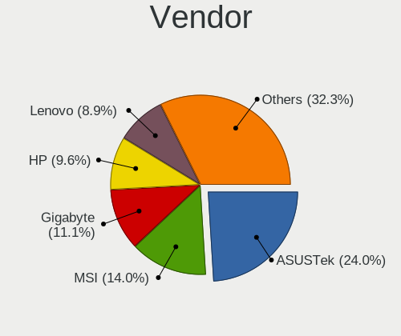
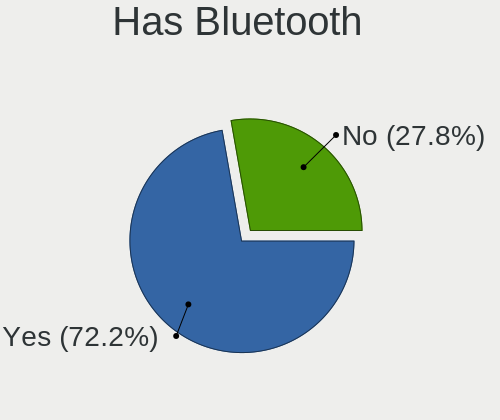
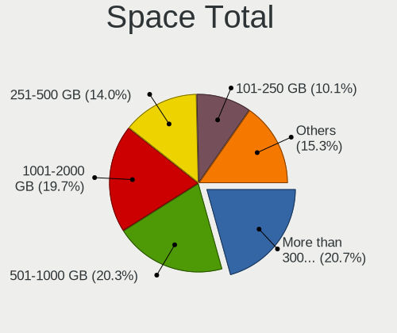
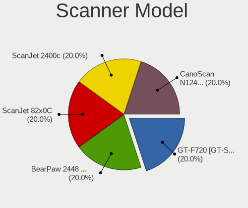
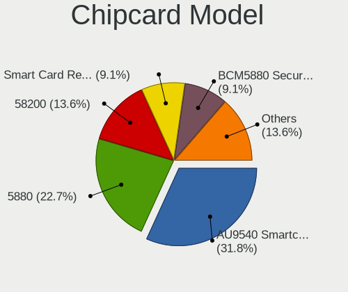

Nobara - Tested Hardware & Statistics
-------------------------------------

A project to collect tested hardware configurations for Nobara.

Anyone can contribute to this report by the [hw-probe](https://github.com/linuxhw/hw-probe) tool:

    sudo -E hw-probe -all -upload

Please contribute! Especially if your hardware is rare.

This is a report for all computer types. See also reports for [desktops](/Dist/Nobara/Desktop/README.md) and [notebooks](/Dist/Nobara/Notebook/README.md).

Contents
--------

* [ Test Cases ](#test-cases)

* [ System ](#system)
  - [ OS                       ](#os)
  - [ OS Family                ](#os-family)
  - [ Kernel                   ](#kernel)
  - [ Kernel Family            ](#kernel-family)
  - [ Kernel Major Ver.        ](#kernel-major-ver)
  - [ Arch                     ](#arch)
  - [ DE                       ](#de)
  - [ Display Server           ](#display-server)
  - [ Display Manager          ](#display-manager)
  - [ OS Lang                  ](#os-lang)
  - [ Boot Mode                ](#boot-mode)
  - [ Filesystem               ](#filesystem)
  - [ Part. scheme             ](#part-scheme)
  - [ Dual Boot with Linux/BSD ](#dual-boot-with-linuxbsd)
  - [ Dual Boot (Win)          ](#dual-boot-win)

* [ Board ](#board)
  - [ Vendor                   ](#vendor)
  - [ Model                    ](#model)
  - [ Model Family             ](#model-family)
  - [ MFG Year                 ](#mfg-year)
  - [ Form Factor              ](#form-factor)
  - [ Secure Boot              ](#secure-boot)
  - [ Coreboot                 ](#coreboot)
  - [ RAM Size                 ](#ram-size)
  - [ RAM Used                 ](#ram-used)
  - [ Total Drives             ](#total-drives)
  - [ Has CD-ROM               ](#has-cd-rom)
  - [ Has Ethernet             ](#has-ethernet)
  - [ Has WiFi                 ](#has-wifi)
  - [ Has Bluetooth            ](#has-bluetooth)

* [ Location ](#location)
  - [ Country                  ](#country)
  - [ City                     ](#city)

* [ Drives ](#drives)
  - [ Drive Vendor             ](#drive-vendor)
  - [ Drive Model              ](#drive-model)
  - [ HDD Vendor               ](#hdd-vendor)
  - [ SSD Vendor               ](#ssd-vendor)
  - [ Drive Kind               ](#drive-kind)
  - [ Drive Connector          ](#drive-connector)
  - [ Drive Size               ](#drive-size)
  - [ Space Total              ](#space-total)
  - [ Space Used               ](#space-used)
  - [ Malfunc. Drives          ](#malfunc-drives)
  - [ Malfunc. Drive Vendor    ](#malfunc-drive-vendor)
  - [ Malfunc. HDD Vendor      ](#malfunc-hdd-vendor)
  - [ Malfunc. Drive Kind      ](#malfunc-drive-kind)
  - [ Failed Drives            ](#failed-drives)
  - [ Failed Drive Vendor      ](#failed-drive-vendor)
  - [ Drive Status             ](#drive-status)

* [ Storage controller ](#storage-controller)
  - [ Storage Vendor           ](#storage-vendor)
  - [ Storage Model            ](#storage-model)
  - [ Storage Kind             ](#storage-kind)

* [ Processor ](#processor)
  - [ CPU Vendor               ](#cpu-vendor)
  - [ CPU Model                ](#cpu-model)
  - [ CPU Model Family         ](#cpu-model-family)
  - [ CPU Cores                ](#cpu-cores)
  - [ CPU Sockets              ](#cpu-sockets)
  - [ CPU Threads              ](#cpu-threads)
  - [ CPU Op-Modes             ](#cpu-op-modes)
  - [ CPU Microcode            ](#cpu-microcode)
  - [ CPU Microarch            ](#cpu-microarch)

* [ Graphics ](#graphics)
  - [ GPU Vendor               ](#gpu-vendor)
  - [ GPU Model                ](#gpu-model)
  - [ GPU Combo                ](#gpu-combo)
  - [ GPU Driver               ](#gpu-driver)
  - [ GPU Memory               ](#gpu-memory)

* [ Monitor ](#monitor)
  - [ Monitor Vendor           ](#monitor-vendor)
  - [ Monitor Model            ](#monitor-model)
  - [ Monitor Resolution       ](#monitor-resolution)
  - [ Monitor Diagonal         ](#monitor-diagonal)
  - [ Monitor Width            ](#monitor-width)
  - [ Aspect Ratio             ](#aspect-ratio)
  - [ Monitor Area             ](#monitor-area)
  - [ Pixel Density            ](#pixel-density)
  - [ Multiple Monitors        ](#multiple-monitors)

* [ Network ](#network)
  - [ Net Controller Vendor    ](#net-controller-vendor)
  - [ Net Controller Model     ](#net-controller-model)
  - [ Wireless Vendor          ](#wireless-vendor)
  - [ Wireless Model           ](#wireless-model)
  - [ Ethernet Vendor          ](#ethernet-vendor)
  - [ Ethernet Model           ](#ethernet-model)
  - [ Net Controller Kind      ](#net-controller-kind)
  - [ Used Controller          ](#used-controller)
  - [ NICs                     ](#nics)
  - [ IPv6                     ](#ipv6)

* [ Bluetooth ](#bluetooth)
  - [ Bluetooth Vendor         ](#bluetooth-vendor)
  - [ Bluetooth Model          ](#bluetooth-model)

* [ Sound ](#sound)
  - [ Sound Vendor             ](#sound-vendor)
  - [ Sound Model              ](#sound-model)

* [ Memory ](#memory)
  - [ Memory Vendor            ](#memory-vendor)
  - [ Memory Model             ](#memory-model)
  - [ Memory Kind              ](#memory-kind)
  - [ Memory Form Factor       ](#memory-form-factor)
  - [ Memory Size              ](#memory-size)
  - [ Memory Speed             ](#memory-speed)

* [ Printers & scanners ](#printers--scanners)
  - [ Printer Vendor           ](#printer-vendor)
  - [ Printer Model            ](#printer-model)
  - [ Scanner Vendor           ](#scanner-vendor)
  - [ Scanner Model            ](#scanner-model)

* [ Camera ](#camera)
  - [ Camera Vendor            ](#camera-vendor)
  - [ Camera Model             ](#camera-model)

* [ Security ](#security)
  - [ Fingerprint Vendor       ](#fingerprint-vendor)
  - [ Fingerprint Model        ](#fingerprint-model)
  - [ Chipcard Vendor          ](#chipcard-vendor)
  - [ Chipcard Model           ](#chipcard-model)

* [ Unsupported ](#unsupported)
  - [ Unsupported Devices      ](#unsupported-devices)
  - [ Unsupported Device Types ](#unsupported-device-types)

Test Cases
----------

Total: 293

| Vendor        | Model                       | Form-Factor | Probe                                                      | Date         |
|---------------|-----------------------------|-------------|------------------------------------------------------------|--------------|
| Apple         | MacBookPro8,1               | Notebook    | [97f93aa235](https://linux-hardware.org/?probe=97f93aa235) | Dec 31, 2022 |
| Apple         | Mac-942B5BF58194151B        | All in one  | [6d047b6620](https://linux-hardware.org/?probe=6d047b6620) | Dec 30, 2022 |
| Apple         | Mac-942B5BF58194151B        | All in one  | [26e56628ec](https://linux-hardware.org/?probe=26e56628ec) | Dec 30, 2022 |
| ASUSTek       | M5A88-M                     | Desktop     | [dc7201711c](https://linux-hardware.org/?probe=dc7201711c) | Dec 30, 2022 |
| Lenovo        | 3181 SEK0T35577 IOT 4247... | Mini pc     | [fa1b60ae23](https://linux-hardware.org/?probe=fa1b60ae23) | Dec 29, 2022 |
| ASUSTek       | ROG CROSSHAIR VII HERO      | Desktop     | [4ca2070d42](https://linux-hardware.org/?probe=4ca2070d42) | Dec 29, 2022 |
| ASUSTek       | VivoBook_ASUSLaptop N760... | Notebook    | [7ef5d874e9](https://linux-hardware.org/?probe=7ef5d874e9) | Dec 28, 2022 |
| HP            | ENVY Notebook               | Notebook    | [8c7d592182](https://linux-hardware.org/?probe=8c7d592182) | Dec 26, 2022 |
| ASUSTek       | PRIME Z270-P                | Desktop     | [b9e4ff3fea](https://linux-hardware.org/?probe=b9e4ff3fea) | Dec 25, 2022 |
| HP            | 1589                        | Desktop     | [4769414712](https://linux-hardware.org/?probe=4769414712) | Dec 24, 2022 |
| HP            | Pavilion Laptop 14-ec0xx... | Notebook    | [978bb114dc](https://linux-hardware.org/?probe=978bb114dc) | Dec 23, 2022 |
| Dell          | G15 5510                    | Notebook    | [86d0642973](https://linux-hardware.org/?probe=86d0642973) | Dec 20, 2022 |
| MSI           | MAG B550 TOMAHAWK           | Desktop     | [353cbeb5c8](https://linux-hardware.org/?probe=353cbeb5c8) | Dec 19, 2022 |
| Lenovo        | ThinkPad X1 Carbon Gen 9... | Notebook    | [03da9468fc](https://linux-hardware.org/?probe=03da9468fc) | Dec 19, 2022 |
| Lenovo        | ThinkPad X1 Extreme Gen ... | Notebook    | [2a1a679e03](https://linux-hardware.org/?probe=2a1a679e03) | Dec 18, 2022 |
| Apple         | MacBookPro11,1              | Notebook    | [d3517edb25](https://linux-hardware.org/?probe=d3517edb25) | Dec 17, 2022 |
| Acer          | Aspire E5-551G              | Notebook    | [56f5130537](https://linux-hardware.org/?probe=56f5130537) | Dec 17, 2022 |
| Biostar       | X470GTN                     | Desktop     | [7c067277b2](https://linux-hardware.org/?probe=7c067277b2) | Dec 17, 2022 |
| ASUSTek       | M5A88-M                     | Desktop     | [3bc811ef2a](https://linux-hardware.org/?probe=3bc811ef2a) | Dec 17, 2022 |
| HP            | EliteBook 8460p             | Notebook    | [0a2731119d](https://linux-hardware.org/?probe=0a2731119d) | Dec 16, 2022 |
| HP            | 2ABD A01                    | Desktop     | [c5c5c07485](https://linux-hardware.org/?probe=c5c5c07485) | Dec 16, 2022 |
| HP            | 2ABD A01                    | Desktop     | [c992b15fbe](https://linux-hardware.org/?probe=c992b15fbe) | Dec 16, 2022 |
| Dynabook      | PORTEGE X30L-K              | Notebook    | [6f9a9428b6](https://linux-hardware.org/?probe=6f9a9428b6) | Dec 16, 2022 |
| ASUSTek       | M5A97 LE R2.0               | Desktop     | [fc8f4624a4](https://linux-hardware.org/?probe=fc8f4624a4) | Dec 16, 2022 |
| ASRock        | H310M-HDV/M.2               | Desktop     | [76dff63f5c](https://linux-hardware.org/?probe=76dff63f5c) | Dec 15, 2022 |
| Dynabook      | PORTEGE X30L-K              | Notebook    | [28c00eabe8](https://linux-hardware.org/?probe=28c00eabe8) | Dec 14, 2022 |
| ASUSTek       | M5A88-M                     | Desktop     | [4378eff64f](https://linux-hardware.org/?probe=4378eff64f) | Dec 13, 2022 |
| Lenovo        | Legion 5 15ACH6H 82JU       | Notebook    | [6177c6a156](https://linux-hardware.org/?probe=6177c6a156) | Dec 13, 2022 |
| MSI           | MAG B660 TOMAHAWK WIFI      | Desktop     | [1beb5ff3c4](https://linux-hardware.org/?probe=1beb5ff3c4) | Dec 13, 2022 |
| ASUSTek       | ROG STRIX B660-F GAMING ... | Desktop     | [3f57fa2c71](https://linux-hardware.org/?probe=3f57fa2c71) | Dec 12, 2022 |
| HP            | EliteBook 8570p             | Notebook    | [52f0fae7e4](https://linux-hardware.org/?probe=52f0fae7e4) | Dec 12, 2022 |
| HP            | EliteBook 8570p             | Notebook    | [be0c42b073](https://linux-hardware.org/?probe=be0c42b073) | Dec 12, 2022 |
| Lenovo        | IdeaPad 330-15IKB 81DE      | Notebook    | [52a8f66027](https://linux-hardware.org/?probe=52a8f66027) | Dec 10, 2022 |
| ASUSTek       | ASUS TUF Gaming A15 FA50... | Notebook    | [febce6b929](https://linux-hardware.org/?probe=febce6b929) | Dec 09, 2022 |
| Apple         | Mac-81E3E92DD6088272 iMa... | All in one  | [94b281cfa1](https://linux-hardware.org/?probe=94b281cfa1) | Dec 09, 2022 |
| Gigabyte      | H81M-H                      | Desktop     | [02ba14a443](https://linux-hardware.org/?probe=02ba14a443) | Dec 09, 2022 |
| Dell          | 0215PR A02                  | Desktop     | [b9d16b98d2](https://linux-hardware.org/?probe=b9d16b98d2) | Dec 09, 2022 |
| Acer          | Aspire E1-532               | Notebook    | [4fd43d5aff](https://linux-hardware.org/?probe=4fd43d5aff) | Dec 09, 2022 |
| Gigabyte      | Z590I VISION D              | Desktop     | [9cc2be8747](https://linux-hardware.org/?probe=9cc2be8747) | Dec 09, 2022 |
| Acer          | Aspire E1-532               | Notebook    | [13e9fa6c58](https://linux-hardware.org/?probe=13e9fa6c58) | Dec 09, 2022 |
| MSI           | GF615M-P33                  | Desktop     | [af4d483414](https://linux-hardware.org/?probe=af4d483414) | Dec 08, 2022 |
| ASUSTek       | M5A88-M                     | Desktop     | [d7b2726838](https://linux-hardware.org/?probe=d7b2726838) | Dec 08, 2022 |
| Dynabook      | PORTEGE X30L-K              | Notebook    | [75a8aa38fc](https://linux-hardware.org/?probe=75a8aa38fc) | Dec 08, 2022 |
| ASUSTek       | STRIX Z270H GAMING          | Desktop     | [c9cc6de1c4](https://linux-hardware.org/?probe=c9cc6de1c4) | Dec 08, 2022 |
| ASUSTek       | STRIX Z270H GAMING          | Desktop     | [8973296b3b](https://linux-hardware.org/?probe=8973296b3b) | Dec 08, 2022 |
| ASUSTek       | M5A88-M                     | Desktop     | [f5bd8a0e5b](https://linux-hardware.org/?probe=f5bd8a0e5b) | Dec 07, 2022 |
| Lenovo        | Z50-70 20354                | Notebook    | [07bf98d8f7](https://linux-hardware.org/?probe=07bf98d8f7) | Dec 07, 2022 |
| MSI           | MAG B550 TOMAHAWK           | Desktop     | [a742429421](https://linux-hardware.org/?probe=a742429421) | Dec 06, 2022 |
| HP            | Laptop 14-cm1xxx            | Notebook    | [6fbbd3608f](https://linux-hardware.org/?probe=6fbbd3608f) | Dec 06, 2022 |
| Lenovo        | V14-IIL 82C4                | Notebook    | [e23dd27dc9](https://linux-hardware.org/?probe=e23dd27dc9) | Dec 06, 2022 |
| ASUSTek       | ROG Zephyrus M15 GU502LV... | Notebook    | [5ce6793478](https://linux-hardware.org/?probe=5ce6793478) | Dec 06, 2022 |
| HP            | ENVY x360 Convertible 13... | Convertible | [f2025f3847](https://linux-hardware.org/?probe=f2025f3847) | Dec 04, 2022 |
| ASUSTek       | M5A88-M                     | Desktop     | [69ed3a0345](https://linux-hardware.org/?probe=69ed3a0345) | Dec 02, 2022 |
| MSI           | MAG B550 TOMAHAWK MAX WI... | Desktop     | [1775ec9d4b](https://linux-hardware.org/?probe=1775ec9d4b) | Dec 01, 2022 |
| MSI           | MAG B550 TOMAHAWK MAX WI... | Desktop     | [097d1c062e](https://linux-hardware.org/?probe=097d1c062e) | Dec 01, 2022 |
| Gigabyte      | Z590I VISION D              | Desktop     | [655e907d62](https://linux-hardware.org/?probe=655e907d62) | Dec 01, 2022 |
| Intel         | X79G V2.x                   | Desktop     | [6b229554fc](https://linux-hardware.org/?probe=6b229554fc) | Nov 28, 2022 |
| Valve         | Jupiter                     | Notebook    | [ef85b8ab38](https://linux-hardware.org/?probe=ef85b8ab38) | Nov 28, 2022 |
| Valve         | Jupiter                     | Notebook    | [622315486c](https://linux-hardware.org/?probe=622315486c) | Nov 28, 2022 |
| Lenovo        | V14-IIL 82C4                | Notebook    | [407b574c57](https://linux-hardware.org/?probe=407b574c57) | Nov 28, 2022 |
| Apple         | Mac-77F17D7DA9285301 iMa... | All in one  | [ae30b95cd8](https://linux-hardware.org/?probe=ae30b95cd8) | Nov 26, 2022 |
| Lenovo        | Legion S7 15ACH6 82K8       | Notebook    | [91fa73480c](https://linux-hardware.org/?probe=91fa73480c) | Nov 26, 2022 |
| Lenovo        | Legion S7 15ACH6 82K8       | Notebook    | [93576caa19](https://linux-hardware.org/?probe=93576caa19) | Nov 26, 2022 |
| Lenovo        | ThinkPad T460 20FMS07000    | Notebook    | [eded61b721](https://linux-hardware.org/?probe=eded61b721) | Nov 25, 2022 |
| Lenovo        | IdeaPad Gaming 3 15ACH6 ... | Notebook    | [be2f8c9fd3](https://linux-hardware.org/?probe=be2f8c9fd3) | Nov 24, 2022 |
| HP            | ProBook 445 14 inch G9 N... | Notebook    | [a20535bd66](https://linux-hardware.org/?probe=a20535bd66) | Nov 24, 2022 |
| Gigabyte      | B450 AORUS PRO WIFI-CF      | Notebook    | [9324629428](https://linux-hardware.org/?probe=9324629428) | Nov 24, 2022 |
| Gigabyte      | B450 AORUS PRO WIFI-CF      | Notebook    | [22a1c81a68](https://linux-hardware.org/?probe=22a1c81a68) | Nov 24, 2022 |
| Gigabyte      | H410M H V3                  | Desktop     | [afea73cc2a](https://linux-hardware.org/?probe=afea73cc2a) | Nov 22, 2022 |
| Coradir       | Coradir/ES10IS5             | Notebook    | [a1fb1953ad](https://linux-hardware.org/?probe=a1fb1953ad) | Nov 22, 2022 |
| Lenovo        | G580 20150                  | Notebook    | [6e28c07a6c](https://linux-hardware.org/?probe=6e28c07a6c) | Nov 22, 2022 |
| ASUSTek       | TUF Gaming B550M-PLUS WI... | Desktop     | [56c9fb93ce](https://linux-hardware.org/?probe=56c9fb93ce) | Nov 22, 2022 |
| ASUSTek       | TUF Gaming B550M-PLUS WI... | Desktop     | [1ec2520541](https://linux-hardware.org/?probe=1ec2520541) | Nov 22, 2022 |
| ASUSTek       | ROG STRIX X570-F GAMING     | Desktop     | [0fd2d81cad](https://linux-hardware.org/?probe=0fd2d81cad) | Nov 22, 2022 |
| OEM           | SHARKBAY JHS695             | Desktop     | [03c915bbd9](https://linux-hardware.org/?probe=03c915bbd9) | Nov 22, 2022 |
| MSI           | GF615M-P33                  | Desktop     | [7a6be335c4](https://linux-hardware.org/?probe=7a6be335c4) | Nov 22, 2022 |
| ASRock        | B550 Extreme4               | Desktop     | [7fba8e38dc](https://linux-hardware.org/?probe=7fba8e38dc) | Nov 20, 2022 |
| Lenovo        | ThinkPad X240 20AMA0LTAU    | Notebook    | [54ce03d1f1](https://linux-hardware.org/?probe=54ce03d1f1) | Nov 20, 2022 |
| HP            | Unknown                     | Notebook    | [9b1181bc4b](https://linux-hardware.org/?probe=9b1181bc4b) | Nov 19, 2022 |
| Gigabyte      | H310M M.2 x.x               | Desktop     | [87406f0722](https://linux-hardware.org/?probe=87406f0722) | Nov 19, 2022 |
| ASUSTek       | VivoBook_ASUSLaptop X515... | Notebook    | [93ad560f52](https://linux-hardware.org/?probe=93ad560f52) | Nov 17, 2022 |
| Alienware     | 0PGRP5 A01                  | Desktop     | [2ff9360669](https://linux-hardware.org/?probe=2ff9360669) | Nov 17, 2022 |
| MSI           | MEG X570 UNIFY              | Desktop     | [750d7eb0d7](https://linux-hardware.org/?probe=750d7eb0d7) | Nov 16, 2022 |
| Dell          | Studio 1737                 | Notebook    | [883ac54ca7](https://linux-hardware.org/?probe=883ac54ca7) | Nov 15, 2022 |
| ZOTAC         | ZBOX-CI320NANO series Re... | Mini pc     | [ab1c46c857](https://linux-hardware.org/?probe=ab1c46c857) | Nov 15, 2022 |
| ASUSTek       | VivoBook_ASUSLaptop X415... | Notebook    | [3ee89779cd](https://linux-hardware.org/?probe=3ee89779cd) | Nov 15, 2022 |
| ASUSTek       | ROG STRIX Z390-H GAMING     | Desktop     | [4d4d5aa456](https://linux-hardware.org/?probe=4d4d5aa456) | Nov 15, 2022 |
| Lenovo        | G50-30 80G0                 | Notebook    | [978fdef2f8](https://linux-hardware.org/?probe=978fdef2f8) | Nov 13, 2022 |
| HUAWEI        | CREM-WXX9                   | Notebook    | [b33f7744b5](https://linux-hardware.org/?probe=b33f7744b5) | Nov 13, 2022 |
| HUAWEI        | CREM-WXX9                   | Notebook    | [9d7853c05b](https://linux-hardware.org/?probe=9d7853c05b) | Nov 13, 2022 |
| Fujitsu       | D3062-A1 S26361-D3062-A1    | Desktop     | [d4240ae5c7](https://linux-hardware.org/?probe=d4240ae5c7) | Nov 12, 2022 |
| Acer          | Swift SFX14-41G             | Notebook    | [a8023a34a0](https://linux-hardware.org/?probe=a8023a34a0) | Nov 11, 2022 |
| MSI           | MPG X570S EDGE MAX WIFI     | Desktop     | [51d6598b74](https://linux-hardware.org/?probe=51d6598b74) | Nov 11, 2022 |
| ASUSTek       | A68HM-K                     | Desktop     | [70daf967f2](https://linux-hardware.org/?probe=70daf967f2) | Nov 10, 2022 |
| Gigabyte      | 990FXA-UD3                  | Desktop     | [a49a1465d3](https://linux-hardware.org/?probe=a49a1465d3) | Nov 10, 2022 |
| HP            | OMEN Laptop 15-ek0xxx       | Notebook    | [3d53644c05](https://linux-hardware.org/?probe=3d53644c05) | Nov 08, 2022 |
| MSI           | GE60 0NC/GE60 0ND           | Notebook    | [c6460ff904](https://linux-hardware.org/?probe=c6460ff904) | Nov 07, 2022 |
| Dell          | Studio 1737                 | Notebook    | [d286ea1b6c](https://linux-hardware.org/?probe=d286ea1b6c) | Nov 07, 2022 |
| ASRock        | N68C-GS4 FX                 | Desktop     | [5e151ea22f](https://linux-hardware.org/?probe=5e151ea22f) | Nov 07, 2022 |
| Intel         | D33217GKE G76540-207        | Desktop     | [f90e6e931c](https://linux-hardware.org/?probe=f90e6e931c) | Nov 07, 2022 |
| Intel         | D33217GKE G76540-207        | Desktop     | [a154fd19a0](https://linux-hardware.org/?probe=a154fd19a0) | Nov 07, 2022 |
| ASUSTek       | TUF Gaming Z490-PLUS        | Desktop     | [4239b9f4a9](https://linux-hardware.org/?probe=4239b9f4a9) | Nov 06, 2022 |
| MSI           | MPG Z390 GAMING PRO CARB... | Desktop     | [05529fe361](https://linux-hardware.org/?probe=05529fe361) | Nov 06, 2022 |
| Dell          | 042P49 A02                  | Desktop     | [55d7ddf0c8](https://linux-hardware.org/?probe=55d7ddf0c8) | Nov 06, 2022 |
| MSI           | MPG Z390 GAMING PRO CARB... | Desktop     | [677dcff84a](https://linux-hardware.org/?probe=677dcff84a) | Nov 06, 2022 |
| MSI           | MPG X570S EDGE MAX WIFI     | Desktop     | [049bac8501](https://linux-hardware.org/?probe=049bac8501) | Nov 06, 2022 |
| ASUSTek       | M5A97 R2.0                  | Desktop     | [5ca257fd77](https://linux-hardware.org/?probe=5ca257fd77) | Nov 06, 2022 |
| MSI           | B450 TOMAHAWK MAX II        | Desktop     | [bd9e0be4e8](https://linux-hardware.org/?probe=bd9e0be4e8) | Nov 03, 2022 |
| ASUSTek       | GL753VD                     | Notebook    | [97e2ee4ee1](https://linux-hardware.org/?probe=97e2ee4ee1) | Nov 01, 2022 |
| HP            | Unknown                     | Notebook    | [1ca885060e](https://linux-hardware.org/?probe=1ca885060e) | Nov 01, 2022 |
| ECS           | H61H2-CM                    | Desktop     | [792ce0e34e](https://linux-hardware.org/?probe=792ce0e34e) | Oct 31, 2022 |
| Acer          | Nitro AN515-42              | Notebook    | [3a00ca53c8](https://linux-hardware.org/?probe=3a00ca53c8) | Oct 31, 2022 |
| Lenovo        | IdeaPad C340-14API 81N6     | Notebook    | [d322bb2739](https://linux-hardware.org/?probe=d322bb2739) | Oct 30, 2022 |
| Apple         | MacBookPro13,3              | Notebook    | [b028075707](https://linux-hardware.org/?probe=b028075707) | Oct 30, 2022 |
| ASUSTek       | VivoBook_ASUS Laptop X50... | Notebook    | [4fdbc3c415](https://linux-hardware.org/?probe=4fdbc3c415) | Oct 30, 2022 |
| ASRock        | Z77 Pro4                    | Desktop     | [5ab5790e5f](https://linux-hardware.org/?probe=5ab5790e5f) | Oct 29, 2022 |
| ASRock        | Z77 Pro4                    | Desktop     | [74cc7f147b](https://linux-hardware.org/?probe=74cc7f147b) | Oct 29, 2022 |
| HP            | 8653 A                      | Desktop     | [bc1f3b445b](https://linux-hardware.org/?probe=bc1f3b445b) | Oct 28, 2022 |
| ASRock        | X570 Taichi                 | Desktop     | [967f52e510](https://linux-hardware.org/?probe=967f52e510) | Oct 28, 2022 |
| HP            | Pavilion Gaming Laptop 1... | Notebook    | [50a8c356f0](https://linux-hardware.org/?probe=50a8c356f0) | Oct 28, 2022 |
| Dell          | 09KPNV A00                  | Desktop     | [c25493f420](https://linux-hardware.org/?probe=c25493f420) | Oct 27, 2022 |
| Gigabyte      | 970A-DS3P                   | Desktop     | [7e31b6af67](https://linux-hardware.org/?probe=7e31b6af67) | Oct 27, 2022 |
| Gigabyte      | 970A-DS3P                   | Desktop     | [6823943242](https://linux-hardware.org/?probe=6823943242) | Oct 27, 2022 |
| Intel         | B75                         | Desktop     | [eb7c27f1e5](https://linux-hardware.org/?probe=eb7c27f1e5) | Oct 26, 2022 |
| HP            | 3029h                       | Desktop     | [c278953154](https://linux-hardware.org/?probe=c278953154) | Oct 25, 2022 |
| ASUSTek       | GL502VMK                    | Notebook    | [9a18ff1b13](https://linux-hardware.org/?probe=9a18ff1b13) | Oct 25, 2022 |
| Gigabyte      | Z590I VISION D              | Desktop     | [be4c6573cd](https://linux-hardware.org/?probe=be4c6573cd) | Oct 25, 2022 |
| ASUSTek       | PRIME A320M-K               | Desktop     | [c0b3f0d88e](https://linux-hardware.org/?probe=c0b3f0d88e) | Oct 24, 2022 |
| Toshiba       | Satellite L850              | Notebook    | [8bfeff52e6](https://linux-hardware.org/?probe=8bfeff52e6) | Oct 24, 2022 |
| ASUSTek       | S550CB                      | Notebook    | [a81f0ecac8](https://linux-hardware.org/?probe=a81f0ecac8) | Oct 24, 2022 |
| ASUSTek       | ROG STRIX Z390-E GAMING     | Desktop     | [7e40be1c82](https://linux-hardware.org/?probe=7e40be1c82) | Oct 23, 2022 |
| ASUSTek       | ROG Zephyrus G14 GA401QM... | Notebook    | [3912d818bd](https://linux-hardware.org/?probe=3912d818bd) | Oct 23, 2022 |
| HP            | OMEN Notebook PC 15         | Notebook    | [1d5ebc92c4](https://linux-hardware.org/?probe=1d5ebc92c4) | Oct 23, 2022 |
| Gigabyte      | Z97-HD3                     | Desktop     | [f79eb0cbb0](https://linux-hardware.org/?probe=f79eb0cbb0) | Oct 23, 2022 |
| ASUSTek       | TUF Gaming X570-PRO WIFI... | Desktop     | [c3b1784ecc](https://linux-hardware.org/?probe=c3b1784ecc) | Oct 21, 2022 |
| Lenovo        | Legion 5 Pro 16IAH7H 82R... | Notebook    | [eaecfdf473](https://linux-hardware.org/?probe=eaecfdf473) | Oct 21, 2022 |
| Lenovo        | Legion 5 Pro 16IAH7H 82R... | Notebook    | [c044987599](https://linux-hardware.org/?probe=c044987599) | Oct 20, 2022 |
| HP            | EliteBook 850 G2            | Notebook    | [b6fd429ceb](https://linux-hardware.org/?probe=b6fd429ceb) | Oct 20, 2022 |
| HP            | EliteBook 850 G2            | Notebook    | [f33baf66a9](https://linux-hardware.org/?probe=f33baf66a9) | Oct 20, 2022 |
| ASUSTek       | TUF Gaming FX504GD_FX80G... | Notebook    | [e5a34da4a2](https://linux-hardware.org/?probe=e5a34da4a2) | Oct 19, 2022 |
| Gigabyte      | B450M DS3H-CF               | Desktop     | [c901f6927c](https://linux-hardware.org/?probe=c901f6927c) | Oct 18, 2022 |
| MSI           | GE60 0NC/GE60 0ND           | Notebook    | [829326a8e5](https://linux-hardware.org/?probe=829326a8e5) | Oct 18, 2022 |
| MSI           | GE60 0NC/GE60 0ND           | Notebook    | [697ccec46b](https://linux-hardware.org/?probe=697ccec46b) | Oct 18, 2022 |
| HP            | EliteBook 850 G1            | Notebook    | [dfeb98414b](https://linux-hardware.org/?probe=dfeb98414b) | Oct 18, 2022 |
| HP            | EliteBook 850 G1            | Notebook    | [7f8c9d778c](https://linux-hardware.org/?probe=7f8c9d778c) | Oct 18, 2022 |
| MSI           | MPG Z390 GAMING PLUS        | Desktop     | [624be3f0f3](https://linux-hardware.org/?probe=624be3f0f3) | Oct 17, 2022 |
| ASUSTek       | TUF Gaming B450M-PLUS II    | Desktop     | [cb63aa5619](https://linux-hardware.org/?probe=cb63aa5619) | Oct 17, 2022 |
| MSI           | MPG Z390 GAMING PRO CARB... | Desktop     | [a4919afa07](https://linux-hardware.org/?probe=a4919afa07) | Oct 16, 2022 |
| Casper        | EXCALIBUR G770              | Notebook    | [7961a3ca3e](https://linux-hardware.org/?probe=7961a3ca3e) | Oct 14, 2022 |
| MSI           | Z87 XPOWER                  | Desktop     | [5e73f5004a](https://linux-hardware.org/?probe=5e73f5004a) | Oct 13, 2022 |
| ASUSTek       | PRIME X370-PRO              | Desktop     | [0a89e9b77e](https://linux-hardware.org/?probe=0a89e9b77e) | Oct 13, 2022 |
| Lenovo        | ThinkPad E14 Gen 3 20Y7C... | Notebook    | [5f013faf39](https://linux-hardware.org/?probe=5f013faf39) | Oct 12, 2022 |
| Toshiba       | Satellite L650              | Notebook    | [89f43e5484](https://linux-hardware.org/?probe=89f43e5484) | Oct 12, 2022 |
| Toshiba       | Satellite L650              | Notebook    | [43f57daebb](https://linux-hardware.org/?probe=43f57daebb) | Oct 12, 2022 |
| MSI           | Pulse GL76 12UEK            | Notebook    | [6a2be4d08c](https://linux-hardware.org/?probe=6a2be4d08c) | Oct 12, 2022 |
| EVOO          | EG-LP10                     | Notebook    | [f8895e9483](https://linux-hardware.org/?probe=f8895e9483) | Oct 11, 2022 |
| MSI           | MPG Z390 GAMING PRO CARB... | Desktop     | [a920c57a3e](https://linux-hardware.org/?probe=a920c57a3e) | Oct 11, 2022 |
| Dell          | Vostro 15 5510              | Notebook    | [2aa595867e](https://linux-hardware.org/?probe=2aa595867e) | Oct 11, 2022 |
| Dell          | Vostro 15 5510              | Notebook    | [bd224480a9](https://linux-hardware.org/?probe=bd224480a9) | Oct 10, 2022 |
| Dell          | 0F6X5P A00                  | Desktop     | [49baafbc65](https://linux-hardware.org/?probe=49baafbc65) | Oct 10, 2022 |
| HP            | 2000                        | Notebook    | [3341a26d0c](https://linux-hardware.org/?probe=3341a26d0c) | Oct 10, 2022 |
| ASUSTek       | GL503VD                     | Notebook    | [1405b367c2](https://linux-hardware.org/?probe=1405b367c2) | Oct 09, 2022 |
| Lenovo        | IdeaPad Y700-15ISK 80NV     | Notebook    | [94ccd99c78](https://linux-hardware.org/?probe=94ccd99c78) | Oct 09, 2022 |
| MSI           | PRO Z690-A DDR4             | Desktop     | [2a1088b211](https://linux-hardware.org/?probe=2a1088b211) | Oct 08, 2022 |
| Apple         | MacBookPro5,5               | Notebook    | [faef78b510](https://linux-hardware.org/?probe=faef78b510) | Oct 08, 2022 |
| HP            | Laptop 15-dw0xxx            | Notebook    | [3427421197](https://linux-hardware.org/?probe=3427421197) | Oct 08, 2022 |
| ASUSTek       | SABERTOOTH 990FX R2.0       | Desktop     | [05dfea29df](https://linux-hardware.org/?probe=05dfea29df) | Oct 07, 2022 |
| ASUSTek       | SABERTOOTH 990FX R2.0       | Desktop     | [24471f06da](https://linux-hardware.org/?probe=24471f06da) | Oct 07, 2022 |
| ASUSTek       | ASUS TUF Gaming A17 FA70... | Notebook    | [2d464da9c8](https://linux-hardware.org/?probe=2d464da9c8) | Oct 07, 2022 |
| HP            | ZBook 17 G6                 | Notebook    | [c215e9e17e](https://linux-hardware.org/?probe=c215e9e17e) | Oct 07, 2022 |
| Dell          | Precision 5530              | Notebook    | [db48ac269b](https://linux-hardware.org/?probe=db48ac269b) | Oct 07, 2022 |
| Gigabyte      | X570 I AORUS PRO WIFI       | Desktop     | [cc955e89b7](https://linux-hardware.org/?probe=cc955e89b7) | Oct 07, 2022 |
| Lenovo        | IdeaPad 320-15IKB 80YH      | Notebook    | [9ccbc0ed3c](https://linux-hardware.org/?probe=9ccbc0ed3c) | Oct 07, 2022 |
| HP            | 1998                        | Desktop     | [f2b9957fdd](https://linux-hardware.org/?probe=f2b9957fdd) | Oct 06, 2022 |
| KELYX ARGE... | KL9120                      | Notebook    | [faa5f13391](https://linux-hardware.org/?probe=faa5f13391) | Oct 06, 2022 |
| Positivo      | N1250                       | Notebook    | [9845103c14](https://linux-hardware.org/?probe=9845103c14) | Oct 05, 2022 |
| MSI           | B450-A PRO MAX              | Desktop     | [b161553abb](https://linux-hardware.org/?probe=b161553abb) | Oct 05, 2022 |
| ASRock        | B450M Steel Legend          | Desktop     | [4f4352de45](https://linux-hardware.org/?probe=4f4352de45) | Oct 04, 2022 |
| HP            | 2000                        | Notebook    | [e6f8f7196d](https://linux-hardware.org/?probe=e6f8f7196d) | Oct 03, 2022 |
| ASUSTek       | TUF Gaming FX505DV_FX505... | Notebook    | [3ec3f59233](https://linux-hardware.org/?probe=3ec3f59233) | Oct 03, 2022 |
| ASUSTek       | TUF Gaming FX505DV_FX505... | Notebook    | [5ed7136249](https://linux-hardware.org/?probe=5ed7136249) | Oct 03, 2022 |
| HP            | 240 G7 Notebook PC          | Notebook    | [05b4e2117b](https://linux-hardware.org/?probe=05b4e2117b) | Oct 03, 2022 |
| ASUSTek       | H61M-K                      | Desktop     | [e0408b49e7](https://linux-hardware.org/?probe=e0408b49e7) | Oct 02, 2022 |
| MSI           | B350 PC MATE                | Desktop     | [a4c73b484e](https://linux-hardware.org/?probe=a4c73b484e) | Oct 02, 2022 |
| Dell          | 0M5DCD A00                  | Desktop     | [3cc1e139dc](https://linux-hardware.org/?probe=3cc1e139dc) | Oct 02, 2022 |
| Toshiba       | Satellite L850              | Notebook    | [0e57d064b0](https://linux-hardware.org/?probe=0e57d064b0) | Oct 02, 2022 |
| Lenovo        | Yoga Slim 7 Pro 14ACH5 O... | Notebook    | [05e921b4aa](https://linux-hardware.org/?probe=05e921b4aa) | Oct 02, 2022 |
| EVOO          | EG-LP10                     | Notebook    | [32c1a174d1](https://linux-hardware.org/?probe=32c1a174d1) | Oct 01, 2022 |
| MSI           | MEG X570 UNIFY              | Desktop     | [4d2e449699](https://linux-hardware.org/?probe=4d2e449699) | Sep 30, 2022 |
| ASRock        | X470 Master SLI             | Desktop     | [47c190b6e9](https://linux-hardware.org/?probe=47c190b6e9) | Sep 30, 2022 |
| ASUSTek       | Q504UAK                     | Convertible | [062910424d](https://linux-hardware.org/?probe=062910424d) | Sep 30, 2022 |
| Acer          | Aspire VX5-591G             | Notebook    | [b321f4561b](https://linux-hardware.org/?probe=b321f4561b) | Sep 29, 2022 |
| Lenovo        | V330-15IKB 81AX             | Notebook    | [0360123f76](https://linux-hardware.org/?probe=0360123f76) | Sep 29, 2022 |
| ASUSTek       | Q504UAK                     | Convertible | [a205e0ea70](https://linux-hardware.org/?probe=a205e0ea70) | Sep 29, 2022 |
| Gigabyte      | H270-Gaming 3               | Desktop     | [9426d21070](https://linux-hardware.org/?probe=9426d21070) | Sep 29, 2022 |
| Gigabyte      | H270-Gaming 3               | Desktop     | [830af9c53e](https://linux-hardware.org/?probe=830af9c53e) | Sep 29, 2022 |
| Lenovo        | G580 20157                  | Notebook    | [2b34d591ab](https://linux-hardware.org/?probe=2b34d591ab) | Sep 29, 2022 |
| Apple         | MacBookAir4,2               | Notebook    | [a423006d4c](https://linux-hardware.org/?probe=a423006d4c) | Sep 29, 2022 |
| Apple         | MacBookAir4,2               | Notebook    | [5dba6cf7fd](https://linux-hardware.org/?probe=5dba6cf7fd) | Sep 29, 2022 |
| Gigabyte      | AB350-Gaming 3-CF           | Desktop     | [365d74f8e4](https://linux-hardware.org/?probe=365d74f8e4) | Sep 28, 2022 |
| Intel         | B75                         | Desktop     | [af5aef869c](https://linux-hardware.org/?probe=af5aef869c) | Sep 28, 2022 |
| Dell          | Inspiron 3542               | Notebook    | [6d35107941](https://linux-hardware.org/?probe=6d35107941) | Sep 28, 2022 |
| Apple         | MacBookPro8,3               | Notebook    | [74927fc7d2](https://linux-hardware.org/?probe=74927fc7d2) | Sep 27, 2022 |
| Gigabyte      | AB350-Gaming 3-CF           | Desktop     | [cfd24b9e0a](https://linux-hardware.org/?probe=cfd24b9e0a) | Sep 27, 2022 |
| MSI           | MAG X570 TOMAHAWK WIFI      | Desktop     | [6bfc8d43ef](https://linux-hardware.org/?probe=6bfc8d43ef) | Sep 27, 2022 |
| Lenovo        | IdeaPad 310-15IAP 80TT      | Notebook    | [65f896ddab](https://linux-hardware.org/?probe=65f896ddab) | Sep 27, 2022 |
| MSI           | A68HM-E33 V2                | Desktop     | [d51c90a7a8](https://linux-hardware.org/?probe=d51c90a7a8) | Sep 27, 2022 |
| ASUSTek       | 970 PRO GAMING/AURA         | Desktop     | [f61a736922](https://linux-hardware.org/?probe=f61a736922) | Sep 26, 2022 |
| ASUSTek       | 970 PRO GAMING/AURA         | Desktop     | [1ecfe379e7](https://linux-hardware.org/?probe=1ecfe379e7) | Sep 26, 2022 |
| ASUSTek       | PRIME H410M-A               | Desktop     | [dafae8d45b](https://linux-hardware.org/?probe=dafae8d45b) | Sep 26, 2022 |
| Lenovo        | 3136 SDK0J40697 WIN 3305... | Mini pc     | [d31088804f](https://linux-hardware.org/?probe=d31088804f) | Sep 24, 2022 |
| MSI           | 970 GAMING                  | Desktop     | [015cd37f26](https://linux-hardware.org/?probe=015cd37f26) | Sep 24, 2022 |
| Dell          | Latitude 7275               | Tablet      | [49ee35636b](https://linux-hardware.org/?probe=49ee35636b) | Sep 24, 2022 |
| Dell          | 0G785M A00                  | Desktop     | [c461ec42d6](https://linux-hardware.org/?probe=c461ec42d6) | Sep 24, 2022 |
| ASUSTek       | PRIME A320M-K               | Desktop     | [d72e6b3865](https://linux-hardware.org/?probe=d72e6b3865) | Sep 23, 2022 |
| Gateway       | NE56R                       | Notebook    | [f603edd045](https://linux-hardware.org/?probe=f603edd045) | Sep 23, 2022 |
| Toshiba       | TECRA A50-A                 | Notebook    | [6ef2538a5a](https://linux-hardware.org/?probe=6ef2538a5a) | Sep 23, 2022 |
| Lenovo        | IdeaPad 5 15ARE05 81YQ      | Notebook    | [605e97df5c](https://linux-hardware.org/?probe=605e97df5c) | Sep 22, 2022 |
| Lenovo        | IdeaPad 5 15ARE05 81YQ      | Notebook    | [94e6332c62](https://linux-hardware.org/?probe=94e6332c62) | Sep 22, 2022 |
| ASUSTek       | ROG Zephyrus G14 GA401II... | Notebook    | [2e36489a4b](https://linux-hardware.org/?probe=2e36489a4b) | Sep 22, 2022 |
| Gigabyte      | EP45-UD3L                   | Desktop     | [71c630ea03](https://linux-hardware.org/?probe=71c630ea03) | Sep 22, 2022 |
| ASUSTek       | ROG Zephyrus G14 GA401II... | Notebook    | [8705683c6f](https://linux-hardware.org/?probe=8705683c6f) | Sep 22, 2022 |
| ASUSTek       | PRIME H310M-E R2.0          | Desktop     | [7299d75966](https://linux-hardware.org/?probe=7299d75966) | Sep 22, 2022 |
| HP            | 8594                        | Desktop     | [281774ad4a](https://linux-hardware.org/?probe=281774ad4a) | Sep 21, 2022 |
| Gigabyte      | EP45-UD3L                   | Desktop     | [2b90168b71](https://linux-hardware.org/?probe=2b90168b71) | Sep 21, 2022 |
| ASRock        | X470 Master SLI             | Desktop     | [3c8fefe578](https://linux-hardware.org/?probe=3c8fefe578) | Sep 20, 2022 |
| ASRock        | X470 Master SLI             | Desktop     | [1975320cad](https://linux-hardware.org/?probe=1975320cad) | Sep 20, 2022 |
| Alienware     | Area-51m R2 A00             | Notebook    | [0ebdec6dd0](https://linux-hardware.org/?probe=0ebdec6dd0) | Sep 20, 2022 |
| ASUSTek       | N56VZ                       | Notebook    | [ce162c52c0](https://linux-hardware.org/?probe=ce162c52c0) | Sep 19, 2022 |
| Dell          | 0G785M A00                  | Desktop     | [8b8c41b401](https://linux-hardware.org/?probe=8b8c41b401) | Sep 19, 2022 |
| Unknown       | T3 MRD                      | Desktop     | [1f60a4d202](https://linux-hardware.org/?probe=1f60a4d202) | Sep 19, 2022 |
| Lenovo        | IdeaPadFlex 10 20324        | Notebook    | [4e7f3b7bac](https://linux-hardware.org/?probe=4e7f3b7bac) | Sep 19, 2022 |
| MSI           | X570-A PRO                  | Desktop     | [cabf88c8be](https://linux-hardware.org/?probe=cabf88c8be) | Sep 19, 2022 |
| Lenovo        | Legion 5 15ARH05 82B5       | Notebook    | [854a0d4410](https://linux-hardware.org/?probe=854a0d4410) | Sep 19, 2022 |
| Dell          | Precision M6400             | Notebook    | [67924c5333](https://linux-hardware.org/?probe=67924c5333) | Sep 19, 2022 |
| Dell          | Precision M6400             | Notebook    | [27a55639e4](https://linux-hardware.org/?probe=27a55639e4) | Sep 19, 2022 |
| HUAWEI        | KLVL-WXXW                   | Notebook    | [e0e49d51d0](https://linux-hardware.org/?probe=e0e49d51d0) | Sep 18, 2022 |
| Gigabyte      | A320M-S2H-CF                | Desktop     | [7b95813c96](https://linux-hardware.org/?probe=7b95813c96) | Sep 18, 2022 |
| HUAWEI        | KLVL-WXXW                   | Notebook    | [812ea842dc](https://linux-hardware.org/?probe=812ea842dc) | Sep 18, 2022 |
| Lenovo        | ThinkBook 15 G3 ACL 21A4    | Notebook    | [004d0a2b9d](https://linux-hardware.org/?probe=004d0a2b9d) | Sep 17, 2022 |
| Unknown       | T3 MRD                      | Desktop     | [b10823b50f](https://linux-hardware.org/?probe=b10823b50f) | Sep 17, 2022 |
| Biostar       | H410MH S2                   | Desktop     | [832dd81851](https://linux-hardware.org/?probe=832dd81851) | Sep 17, 2022 |
| Lenovo        | ThinkPad P1 20MD0020US      | Notebook    | [a701fed148](https://linux-hardware.org/?probe=a701fed148) | Sep 16, 2022 |
| Lenovo        | MAHOBAY NOK                 | Desktop     | [cce010fd53](https://linux-hardware.org/?probe=cce010fd53) | Sep 16, 2022 |
| ASUSTek       | VivoBook_ASUSLaptop X340... | Notebook    | [5ffc7d13ac](https://linux-hardware.org/?probe=5ffc7d13ac) | Sep 16, 2022 |
| Dell          | G5 5505                     | Notebook    | [25755e8605](https://linux-hardware.org/?probe=25755e8605) | Sep 16, 2022 |
| HP            | 15                          | Notebook    | [79aa0d618f](https://linux-hardware.org/?probe=79aa0d618f) | Sep 14, 2022 |
| Acer          | Aspire A315-42              | Notebook    | [820c1e2ac6](https://linux-hardware.org/?probe=820c1e2ac6) | Sep 11, 2022 |
| Dell          | Precision 3510              | Notebook    | [4337a8e018](https://linux-hardware.org/?probe=4337a8e018) | Sep 11, 2022 |
| ASUSTek       | TUF Gaming B550M-PLUS WI... | Desktop     | [d9e9ec9afa](https://linux-hardware.org/?probe=d9e9ec9afa) | Sep 09, 2022 |
| ASUSTek       | TUF Gaming B550M-PLUS WI... | Desktop     | [1cdd7cda15](https://linux-hardware.org/?probe=1cdd7cda15) | Sep 09, 2022 |
| ASUSTek       | TUF Gaming X570-PRO         | Desktop     | [6eae76b5d0](https://linux-hardware.org/?probe=6eae76b5d0) | Sep 01, 2022 |
| ASRock        | FM2A55M-HD+                 | Desktop     | [2f96c73efb](https://linux-hardware.org/?probe=2f96c73efb) | Sep 01, 2022 |
| ASUSTek       | ASUS TUF Gaming F15 FX50... | Notebook    | [0ca693e2dd](https://linux-hardware.org/?probe=0ca693e2dd) | Aug 31, 2022 |
| Gigabyte      | H110M-H-CF                  | Desktop     | [86fc2bf58f](https://linux-hardware.org/?probe=86fc2bf58f) | Aug 31, 2022 |
| Alienware     | 01NYPT A00                  | Desktop     | [cd95b79270](https://linux-hardware.org/?probe=cd95b79270) | Aug 29, 2022 |
| AZW           | SER                         | Mini pc     | [92460ed2a6](https://linux-hardware.org/?probe=92460ed2a6) | Aug 29, 2022 |
| ASUSTek       | TP500LA                     | Notebook    | [de395dddd8](https://linux-hardware.org/?probe=de395dddd8) | Aug 28, 2022 |
| ASRock        | B560 Steel Legend           | Desktop     | [c64907de8d](https://linux-hardware.org/?probe=c64907de8d) | Aug 27, 2022 |
| ASUSTek       | P8Z68-V PRO                 | Desktop     | [37ae937f4d](https://linux-hardware.org/?probe=37ae937f4d) | Aug 26, 2022 |
| ASUSTek       | PRIME X570-PRO              | Desktop     | [663509c999](https://linux-hardware.org/?probe=663509c999) | Aug 24, 2022 |
| ASUSTek       | PRIME X570-PRO              | Desktop     | [2b7d1d59a1](https://linux-hardware.org/?probe=2b7d1d59a1) | Aug 24, 2022 |
| ASUSTek       | PRIME A320M-K               | Desktop     | [928ce75df1](https://linux-hardware.org/?probe=928ce75df1) | Aug 24, 2022 |
| ASRock        | H61M-VG3                    | Desktop     | [a3cd7ba2c1](https://linux-hardware.org/?probe=a3cd7ba2c1) | Aug 22, 2022 |
| Dell          | G15 5511                    | Notebook    | [44fa9bf084](https://linux-hardware.org/?probe=44fa9bf084) | Aug 21, 2022 |
| ASUSTek       | B85M-E                      | Desktop     | [0b5044dacf](https://linux-hardware.org/?probe=0b5044dacf) | Aug 19, 2022 |
| Gigabyte      | B450M DS3H-CF               | Desktop     | [a2b6c2ae17](https://linux-hardware.org/?probe=a2b6c2ae17) | Aug 19, 2022 |
| Notebook      | P7xxDM2(-G)                 | Notebook    | [f074899985](https://linux-hardware.org/?probe=f074899985) | Aug 17, 2022 |
| HP            | Pavilion Gaming Laptop 1... | Notebook    | [315da58d24](https://linux-hardware.org/?probe=315da58d24) | Aug 16, 2022 |
| ASRock        | X470 Master SLI             | Desktop     | [ce62975b20](https://linux-hardware.org/?probe=ce62975b20) | Aug 15, 2022 |
| ASUSTek       | PRIME B350-PLUS             | Desktop     | [b2bbce2845](https://linux-hardware.org/?probe=b2bbce2845) | Aug 15, 2022 |
| ASRock        | Z97 Extreme6                | Desktop     | [31d7973a9d](https://linux-hardware.org/?probe=31d7973a9d) | Aug 14, 2022 |
| ASRock        | 760GM-HDV                   | Desktop     | [beabb7dd99](https://linux-hardware.org/?probe=beabb7dd99) | Aug 14, 2022 |
| Apple         | MacBookPro14,2              | Notebook    | [c66d476513](https://linux-hardware.org/?probe=c66d476513) | Aug 13, 2022 |
| ASUSTek       | ROG Strix G513QY_G513QY     | Notebook    | [df2cc1a299](https://linux-hardware.org/?probe=df2cc1a299) | Aug 12, 2022 |
| MSI           | B450 TOMAHAWK MAX           | Desktop     | [27cd96982f](https://linux-hardware.org/?probe=27cd96982f) | Aug 10, 2022 |
| HP            | 8906 SMVB                   | Desktop     | [8f30392f49](https://linux-hardware.org/?probe=8f30392f49) | Aug 10, 2022 |
| HP            | 8054                        | Desktop     | [469b765fe0](https://linux-hardware.org/?probe=469b765fe0) | Aug 10, 2022 |
| ASUSTek       | G20AJ                       | Desktop     | [613f8a0c36](https://linux-hardware.org/?probe=613f8a0c36) | Aug 08, 2022 |
| Gigabyte      | X570 AORUS ELITE            | Desktop     | [f65ba77de3](https://linux-hardware.org/?probe=f65ba77de3) | Aug 07, 2022 |
| Lenovo        | IdeaPad Y700-15ISK 80NV     | Notebook    | [6beddf67f5](https://linux-hardware.org/?probe=6beddf67f5) | Aug 06, 2022 |
| ASUSTek       | ROG CROSSHAIR VIII HERO     | Desktop     | [7a60eede9a](https://linux-hardware.org/?probe=7a60eede9a) | Aug 04, 2022 |
| MSI           | B450-A PRO MAX              | Desktop     | [e142cf5c91](https://linux-hardware.org/?probe=e142cf5c91) | Aug 04, 2022 |
| MSI           | B450 TOMAHAWK MAX           | Desktop     | [7c4355417f](https://linux-hardware.org/?probe=7c4355417f) | Aug 03, 2022 |
| ASUSTek       | Q504UAK                     | Convertible | [5f2025770d](https://linux-hardware.org/?probe=5f2025770d) | Aug 03, 2022 |
| MSI           | X570-A PRO                  | Desktop     | [f034a02e69](https://linux-hardware.org/?probe=f034a02e69) | Aug 01, 2022 |
| Razer         | Blade                       | Notebook    | [cc3ce45956](https://linux-hardware.org/?probe=cc3ce45956) | Jul 31, 2022 |
| HP            | ZBook 15 G2                 | Notebook    | [3aa2fda09a](https://linux-hardware.org/?probe=3aa2fda09a) | Jul 26, 2022 |
| MSI           | 970 GAMING                  | Desktop     | [bf2a870952](https://linux-hardware.org/?probe=bf2a870952) | Jul 23, 2022 |
| Dell          | 0J8H4R A01                  | Desktop     | [3d7d06475c](https://linux-hardware.org/?probe=3d7d06475c) | Jul 23, 2022 |
| ASUSTek       | PRIME B450-PLUS             | Desktop     | [7d6b6d93d3](https://linux-hardware.org/?probe=7d6b6d93d3) | Jul 21, 2022 |
| eMachines     | EL1870                      | Desktop     | [58e76fb684](https://linux-hardware.org/?probe=58e76fb684) | Jul 19, 2022 |
| MSI           | X570-A PRO                  | Desktop     | [c9683ea265](https://linux-hardware.org/?probe=c9683ea265) | Jul 19, 2022 |

System
------

OS
--

Installed operating systems

| Name      | Computers | Percent |
|-----------|-----------|---------|
| Nobara 36 | 224       | 100%    |

OS Family
---------

OS without a version

| Name   | Computers | Percent |
|--------|-----------|---------|
| Nobara | 224       | 100%    |

Kernel
------

Version of the Linux kernel

| Version                       | Computers | Percent |
|-------------------------------|-----------|---------|
| 6.0.10-201.fc36.x86_64        | 34        | 14.66%  |
| 5.19.14-201.fsync.fc36.x86_64 | 24        | 10.34%  |
| 5.19.9-201.fsync.fc36.x86_64  | 16        | 6.9%    |
| 5.19.7-204.fsync.fc36.x86_64  | 15        | 6.47%   |
| 6.0.7-201.fsync.fc36.x86_64   | 12        | 5.17%   |
| 6.0.5-201.fsync.fc36.x86_64   | 11        | 4.74%   |
| 5.19.16-201.fsync.fc36.x86_64 | 11        | 4.74%   |
| 5.18.13-201.fsync.fc36.x86_64 | 11        | 4.74%   |
| 6.0.9-201.fc36.x86_64         | 9         | 3.88%   |
| 5.19.12-201.fsync.fc36.x86_64 | 8         | 3.45%   |
| 5.19.10-201.fsync.fc36.x86_64 | 8         | 3.45%   |
| 6.0.14-201.fsync.fc36.x86_64  | 7         | 3.02%   |
| 5.19.4-201.fsync.fc36.x86_64  | 7         | 3.02%   |
| 5.18.16-201.fsync.fc36.x86_64 | 7         | 3.02%   |
| 5.19.15-202.fsync.fc36.x86_64 | 6         | 2.59%   |
| 5.19.11-201.fsync.fc36.x86_64 | 6         | 2.59%   |
| 5.18.17-201.fsync.fc36.x86_64 | 6         | 2.59%   |
| 6.0.9-202.fc36.x86_64         | 4         | 1.72%   |
| 6.0.8-201.fsync.fc36.x86_64   | 4         | 1.72%   |
| 6.0.7-202.fsync.fc36.x86_64   | 4         | 1.72%   |
| 5.19.8-201.fsync.fc36.x86_64  | 4         | 1.72%   |
| 5.18.19-201.fsync.fc36.x86_64 | 4         | 1.72%   |
| 5.18.11-201.fsync.fc36.x86_64 | 3         | 1.29%   |
| 5.19.7-203.fsync.fc36.x86_64  | 2         | 0.86%   |
| 5.19.13-202.fsync.fc36.x86_64 | 2         | 0.86%   |
| 5.18.18-201.fsync.fc36.x86_64 | 2         | 0.86%   |
| 6.0.2-xm1.0.fc36.x86_64       | 1         | 0.43%   |
| 6.0.13-201.fsync.fc36.x86_64  | 1         | 0.43%   |
| 5.19.2-602.inttf.fc36.x86_64  | 1         | 0.43%   |
| 5.19.13-201.fsync.fc36.x86_64 | 1         | 0.43%   |
| 5.18.9-201.fsync.fc36.x86_64  | 1         | 0.43%   |

Kernel Family
-------------

Linux kernel without a distro release

| Version | Computers | Percent |
|---------|-----------|---------|
| 6.0.10  | 34        | 14.66%  |
| 5.19.14 | 24        | 10.34%  |
| 5.19.7  | 17        | 7.33%   |
| 6.0.7   | 16        | 6.9%    |
| 5.19.9  | 16        | 6.9%    |
| 6.0.9   | 13        | 5.6%    |
| 6.0.5   | 11        | 4.74%   |
| 5.19.16 | 11        | 4.74%   |
| 5.18.13 | 11        | 4.74%   |
| 5.19.12 | 8         | 3.45%   |
| 5.19.10 | 8         | 3.45%   |
| 6.0.14  | 7         | 3.02%   |
| 5.19.4  | 7         | 3.02%   |
| 5.18.16 | 7         | 3.02%   |
| 5.19.15 | 6         | 2.59%   |
| 5.19.11 | 6         | 2.59%   |
| 5.18.17 | 6         | 2.59%   |
| 6.0.8   | 4         | 1.72%   |
| 5.19.8  | 4         | 1.72%   |
| 5.18.19 | 4         | 1.72%   |
| 5.19.13 | 3         | 1.29%   |
| 5.18.11 | 3         | 1.29%   |
| 5.18.18 | 2         | 0.86%   |
| 6.0.2   | 1         | 0.43%   |
| 6.0.13  | 1         | 0.43%   |
| 5.19.2  | 1         | 0.43%   |
| 5.18.9  | 1         | 0.43%   |

Kernel Major Ver.
-----------------

Linux kernel major version

| Version | Computers | Percent |
|---------|-----------|---------|
| 5.19    | 111       | 48.05%  |
| 6.0     | 86        | 37.23%  |
| 5.18    | 34        | 14.72%  |

Arch
----

OS architecture (x86_64, i586, etc.)

| Name   | Computers | Percent |
|--------|-----------|---------|
| x86_64 | 224       | 100%    |

DE
--

Desktop Environment

| Name          | Computers | Percent |
|---------------|-----------|---------|
| GNOME         | 166       | 73.78%  |
| KDE5          | 52        | 23.11%  |
| Unknown       | 4         | 1.78%   |
| GNOME Classic | 2         | 0.89%   |
| X-Cinnamon    | 1         | 0.44%   |

Display Server
--------------

X11 or Wayland

| Name    | Computers | Percent |
|---------|-----------|---------|
| Wayland | 170       | 74.24%  |
| X11     | 55        | 24.02%  |
| Unknown | 4         | 1.75%   |

Display Manager
---------------

SDDM, LightDM, etc.

| Name    | Computers | Percent |
|---------|-----------|---------|
| Unknown | 191       | 84.51%  |
| GDM     | 20        | 8.85%   |
| SDDM    | 14        | 6.19%   |
| LightDM | 1         | 0.44%   |

OS Lang
-------

Language

| Lang    | Computers | Percent |
|---------|-----------|---------|
| en_US   | 126       | 55.75%  |
| en_GB   | 12        | 5.31%   |
| es_ES   | 9         | 3.98%   |
| es_AR   | 8         | 3.54%   |
| es_MX   | 6         | 2.65%   |
| en_CA   | 6         | 2.65%   |
| de_DE   | 6         | 2.65%   |
| pl_PL   | 5         | 2.21%   |
| ru_RU   | 3         | 1.33%   |
| pt_PT   | 3         | 1.33%   |
| pt_BR   | 3         | 1.33%   |
| it_IT   | 3         | 1.33%   |
| fr_FR   | 3         | 1.33%   |
| es_CO   | 3         | 1.33%   |
| en_NZ   | 3         | 1.33%   |
| en_IN   | 3         | 1.33%   |
| en_AU   | 3         | 1.33%   |
| Unknown | 3         | 1.33%   |
| sv_SE   | 2         | 0.88%   |
| nl_NL   | 2         | 0.88%   |
| fi_FI   | 2         | 0.88%   |
| de_AT   | 2         | 0.88%   |
| sk_SK   | 1         | 0.44%   |
| hu_HU   | 1         | 0.44%   |
| hr_HR   | 1         | 0.44%   |
| es_GT   | 1         | 0.44%   |
| es_EC   | 1         | 0.44%   |
| es_CR   | 1         | 0.44%   |
| es_CL   | 1         | 0.44%   |
| en_ZA   | 1         | 0.44%   |
| cs_CZ   | 1         | 0.44%   |
| C       | 1         | 0.44%   |

Boot Mode
---------

EFI or BIOS

| Mode | Computers | Percent |
|------|-----------|---------|
| EFI  | 175       | 77.78%  |
| BIOS | 50        | 22.22%  |

Filesystem
----------

Type of filesystem

| Type  | Computers | Percent |
|-------|-----------|---------|
| Btrfs | 114       | 50.89%  |
| Ext4  | 109       | 48.66%  |
| Xfs   | 1         | 0.45%   |

Part. scheme
------------

Scheme of partitioning

| Type    | Computers | Percent |
|---------|-----------|---------|
| Unknown | 188       | 82.82%  |
| GPT     | 34        | 14.98%  |
| MBR     | 5         | 2.2%    |

Dual Boot with Linux/BSD
------------------------

Hosting more than one Linux/BSD

| Dual boot | Computers | Percent |
|-----------|-----------|---------|
| No        | 213       | 94.67%  |
| Yes       | 12        | 5.33%   |

Dual Boot (Win)
---------------

Hosting Linux and Windows

| Dual boot | Computers | Percent |
|-----------|-----------|---------|
| No        | 204       | 91.07%  |
| Yes       | 20        | 8.93%   |

Board
-----

Vendor
------

Motherboard manufacturer

| Name                | Computers | Percent |
|---------------------|-----------|---------|
| ASUSTek Computer    | 53        | 23.66%  |
| Lenovo              | 29        | 12.95%  |
| Hewlett-Packard     | 27        | 12.05%  |
| MSI                 | 24        | 10.71%  |
| Gigabyte Technology | 18        | 8.04%   |
| Dell                | 17        | 7.59%   |
| ASRock              | 12        | 5.36%   |
| Apple               | 10        | 4.46%   |
| Acer                | 6         | 2.68%   |
| Toshiba             | 3         | 1.34%   |
| Intel               | 3         | 1.34%   |
| Alienware           | 3         | 1.34%   |
| Biostar             | 2         | 0.89%   |
| ZOTAC               | 1         | 0.45%   |
| Valve               | 1         | 0.45%   |
| Razer               | 1         | 0.45%   |
| Positivo            | 1         | 0.45%   |
| OEM                 | 1         | 0.45%   |
| Notebook            | 1         | 0.45%   |
| HUAWEI              | 1         | 0.45%   |
| Gateway             | 1         | 0.45%   |
| Fujitsu             | 1         | 0.45%   |
| EVOO                | 1         | 0.45%   |
| eMachines           | 1         | 0.45%   |
| ECS                 | 1         | 0.45%   |
| Dynabook            | 1         | 0.45%   |
| Coradir             | 1         | 0.45%   |
| Casper              | 1         | 0.45%   |
| AZW                 | 1         | 0.45%   |
| Unknown             | 1         | 0.45%   |

Model
-----

Motherboard model

| Name                                        | Computers | Percent |
|---------------------------------------------|-----------|---------|
| MSI MS-7C91                                 | 3         | 1.34%   |
| ASUS PRIME A320M-K                          | 3         | 1.34%   |
| Unknown                                     | 3         | 1.34%   |
| MSI MS-7C37                                 | 2         | 0.89%   |
| MSI MS-7C02                                 | 2         | 0.89%   |
| MSI MS-7B86                                 | 2         | 0.89%   |
| MSI MS-7693                                 | 2         | 0.89%   |
| Lenovo IdeaPad Y700-15ISK 80NV              | 2         | 0.89%   |
| Gigabyte Z590I VISION D                     | 2         | 0.89%   |
| Gigabyte B450M DS3H                         | 2         | 0.89%   |
| Dell OptiPlex 390                           | 2         | 0.89%   |
| ZOTAC ZBOX-CI320NANO series                 | 1         | 0.45%   |
| Valve Jupiter                               | 1         | 0.45%   |
| Toshiba TECRA A50-A                         | 1         | 0.45%   |
| Toshiba Satellite L850                      | 1         | 0.45%   |
| Toshiba Satellite L650                      | 1         | 0.45%   |
| Razer Blade                                 | 1         | 0.45%   |
| Positivo N1250                              | 1         | 0.45%   |
| OEM SHARKBAY                                | 1         | 0.45%   |
| Notebook P7xxDM2(-G)                        | 1         | 0.45%   |
| MSI Pulse GL76 12UEK                        | 1         | 0.45%   |
| MSI MS-7D53                                 | 1         | 0.45%   |
| MSI MS-7D41                                 | 1         | 0.45%   |
| MSI MS-7D25                                 | 1         | 0.45%   |
| MSI MS-7C84                                 | 1         | 0.45%   |
| MSI MS-7C35                                 | 1         | 0.45%   |
| MSI MS-7B51                                 | 1         | 0.45%   |
| MSI MS-7B17                                 | 1         | 0.45%   |
| MSI MS-7A34                                 | 1         | 0.45%   |
| MSI MS-7811                                 | 1         | 0.45%   |
| MSI MS-7721                                 | 1         | 0.45%   |
| MSI MS-7597                                 | 1         | 0.45%   |
| MSI GE60 0NC/GE60 0ND                       | 1         | 0.45%   |
| Lenovo Z50-70 20354                         | 1         | 0.45%   |
| Lenovo Yoga Slim 7 Pro 14ACH5 OD 82NK       | 1         | 0.45%   |
| Lenovo V330-15IKB 81AX                      | 1         | 0.45%   |
| Lenovo V14-IIL 82C4                         | 1         | 0.45%   |
| Lenovo ThinkPad X240 20AMA0LTAU             | 1         | 0.45%   |
| Lenovo ThinkPad X1 Extreme Gen 3 20TK0047US | 1         | 0.45%   |
| Lenovo ThinkPad X1 Carbon Gen 9 20XWS0ME00  | 1         | 0.45%   |

Model Family
------------

Motherboard model prefix

| Name                 | Computers | Percent |
|----------------------|-----------|---------|
| ASUS ROG             | 10        | 4.46%   |
| ASUS PRIME           | 10        | 4.46%   |
| Lenovo IdeaPad       | 8         | 3.57%   |
| ASUS TUF             | 6         | 2.68%   |
| Lenovo ThinkPad      | 5         | 2.23%   |
| Dell Precision       | 5         | 2.23%   |
| ASUS VivoBook        | 5         | 2.23%   |
| Lenovo Legion        | 4         | 1.79%   |
| HP Pavilion          | 4         | 1.79%   |
| HP EliteBook         | 4         | 1.79%   |
| Dell OptiPlex        | 4         | 1.79%   |
| Acer Aspire          | 4         | 1.79%   |
| MSI MS-7C91          | 3         | 1.34%   |
| Lenovo ThinkCentre   | 3         | 1.34%   |
| HP EliteDesk         | 3         | 1.34%   |
| ASUS ASUS            | 3         | 1.34%   |
| Unknown              | 3         | 1.34%   |
| Toshiba Satellite    | 2         | 0.89%   |
| MSI MS-7C37          | 2         | 0.89%   |
| MSI MS-7C02          | 2         | 0.89%   |
| MSI MS-7B86          | 2         | 0.89%   |
| MSI MS-7693          | 2         | 0.89%   |
| Lenovo G580          | 2         | 0.89%   |
| HP ZBook             | 2         | 0.89%   |
| HP OMEN              | 2         | 0.89%   |
| HP Laptop            | 2         | 0.89%   |
| HP ENVY              | 2         | 0.89%   |
| Gigabyte Z590I       | 2         | 0.89%   |
| Gigabyte X570        | 2         | 0.89%   |
| Gigabyte B450M       | 2         | 0.89%   |
| Dell G15             | 2         | 0.89%   |
| ASUS M5A97           | 2         | 0.89%   |
| Apple MacBookPro8    | 2         | 0.89%   |
| ZOTAC ZBOX-CI320NANO | 1         | 0.45%   |
| Valve Jupiter        | 1         | 0.45%   |
| Toshiba TECRA        | 1         | 0.45%   |
| Razer Blade          | 1         | 0.45%   |
| Positivo N1250       | 1         | 0.45%   |
| OEM SHARKBAY         | 1         | 0.45%   |
| Notebook P7xxDM2(-G) | 1         | 0.45%   |

MFG Year
--------

Motherboard manufacture year

| Year | Computers | Percent |
|------|-----------|---------|
| 2021 | 34        | 15.18%  |
| 2019 | 33        | 14.73%  |
| 2020 | 20        | 8.93%   |
| 2018 | 19        | 8.48%   |
| 2014 | 18        | 8.04%   |
| 2013 | 18        | 8.04%   |
| 2017 | 17        | 7.59%   |
| 2022 | 14        | 6.25%   |
| 2012 | 14        | 6.25%   |
| 2011 | 11        | 4.91%   |
| 2016 | 10        | 4.46%   |
| 2015 | 8         | 3.57%   |
| 2009 | 3         | 1.34%   |
| 2008 | 3         | 1.34%   |
| 2010 | 2         | 0.89%   |

Form Factor
-----------

Physical design of the computer

| Name        | Computers | Percent |
|-------------|-----------|---------|
| Desktop     | 110       | 49.11%  |
| Notebook    | 104       | 46.43%  |
| Mini pc     | 4         | 1.79%   |
| All in one  | 3         | 1.34%   |
| Convertible | 2         | 0.89%   |
| Tablet      | 1         | 0.45%   |

Secure Boot
-----------

Enabled or disabled

| State    | Computers | Percent |
|----------|-----------|---------|
| Disabled | 224       | 100%    |

Coreboot
--------

Have coreboot on board

| Used | Computers | Percent |
|------|-----------|---------|
| No   | 224       | 100%    |

RAM Size
--------

Total RAM memory

| Size in GB  | Computers | Percent |
|-------------|-----------|---------|
| 16.01-24.0  | 66        | 29.46%  |
| 8.01-16.0   | 48        | 21.43%  |
| 4.01-8.0    | 41        | 18.3%   |
| 32.01-64.0  | 37        | 16.52%  |
| 3.01-4.0    | 25        | 11.16%  |
| 24.01-32.0  | 3         | 1.34%   |
| 64.01-256.0 | 3         | 1.34%   |
| 1.01-2.0    | 1         | 0.45%   |

RAM Used
--------

Used RAM memory

| Used GB    | Computers | Percent |
|------------|-----------|---------|
| 4.01-8.0   | 105       | 45.65%  |
| 3.01-4.0   | 55        | 23.91%  |
| 2.01-3.0   | 41        | 17.83%  |
| 8.01-16.0  | 22        | 9.57%   |
| 1.01-2.0   | 4         | 1.74%   |
| 16.01-24.0 | 2         | 0.87%   |
| 24.01-32.0 | 1         | 0.43%   |

Total Drives
------------

Number of drives on board

| Drives | Computers | Percent |
|--------|-----------|---------|
| 1      | 114       | 50.44%  |
| 2      | 59        | 26.11%  |
| 3      | 32        | 14.16%  |
| 5      | 10        | 4.42%   |
| 4      | 7         | 3.1%    |
| 6      | 2         | 0.88%   |
| 10     | 1         | 0.44%   |
| 7      | 1         | 0.44%   |

Has CD-ROM
----------

Has CD-ROM on board

| Presented | Computers | Percent |
|-----------|-----------|---------|
| No        | 179       | 79.91%  |
| Yes       | 45        | 20.09%  |

Has Ethernet
------------

Has Ethernet on board

| Presented | Computers | Percent |
|-----------|-----------|---------|
| Yes       | 199       | 88.44%  |
| No        | 26        | 11.56%  |

Has WiFi
--------

Has WiFi module

| Presented | Computers | Percent |
|-----------|-----------|---------|
| Yes       | 167       | 74.55%  |
| No        | 57        | 25.45%  |

Has Bluetooth
-------------

Has Bluetooth module

| Presented | Computers | Percent |
|-----------|-----------|---------|
| Yes       | 151       | 67.11%  |
| No        | 74        | 32.89%  |

Location
--------

Country
-------

Geographic location (country)

| Country      | Computers | Percent |
|--------------|-----------|---------|
| USA          | 74        | 33.04%  |
| Germany      | 10        | 4.46%   |
| Canada       | 9         | 4.02%   |
| Argentina    | 9         | 4.02%   |
| UK           | 7         | 3.13%   |
| Poland       | 7         | 3.13%   |
| Spain        | 6         | 2.68%   |
| Mexico       | 6         | 2.68%   |
| France       | 6         | 2.68%   |
| India        | 5         | 2.23%   |
| Chile        | 5         | 2.23%   |
| Brazil       | 5         | 2.23%   |
| Russia       | 4         | 1.79%   |
| Portugal     | 4         | 1.79%   |
| Colombia     | 4         | 1.79%   |
| Serbia       | 3         | 1.34%   |
| Philippines  | 3         | 1.34%   |
| New Zealand  | 3         | 1.34%   |
| Netherlands  | 3         | 1.34%   |
| Italy        | 3         | 1.34%   |
| Hungary      | 3         | 1.34%   |
| Croatia      | 3         | 1.34%   |
| Austria      | 3         | 1.34%   |
| Australia    | 3         | 1.34%   |
| Vietnam      | 2         | 0.89%   |
| Sweden       | 2         | 0.89%   |
| South Africa | 2         | 0.89%   |
| Norway       | 2         | 0.89%   |
| Indonesia    | 2         | 0.89%   |
| Finland      | 2         | 0.89%   |
| Egypt        | 2         | 0.89%   |
| Czechia      | 2         | 0.89%   |
| Belgium      | 2         | 0.89%   |
| Venezuela    | 1         | 0.45%   |
| Taiwan       | 1         | 0.45%   |
| South Korea  | 1         | 0.45%   |
| Slovakia     | 1         | 0.45%   |
| Singapore    | 1         | 0.45%   |
| Romania      | 1         | 0.45%   |
| Panama       | 1         | 0.45%   |

City
----

Geographic location (city)

| City          | Computers | Percent |
|---------------|-----------|---------|
| Buenos Aires  | 3         | 1.3%    |
| Atlanta       | 3         | 1.3%    |
| Wasilla       | 2         | 0.87%   |
| Warsaw        | 2         | 0.87%   |
| Villa Nueva   | 2         | 0.87%   |
| Schmalkalden  | 2         | 0.87%   |
| San Jose      | 2         | 0.87%   |
| San Antonio   | 2         | 0.87%   |
| Rotterdam     | 2         | 0.87%   |
| Poznan        | 2         | 0.87%   |
| Philadelphia  | 2         | 0.87%   |
| Panama City   | 2         | 0.87%   |
| Ochsenfurt    | 2         | 0.87%   |
| Melbourne     | 2         | 0.87%   |
| Johannesburg  | 2         | 0.87%   |
| Guadalajara   | 2         | 0.87%   |
| Fairbanks     | 2         | 0.87%   |
| Belgrade      | 2         | 0.87%   |
| Auckland      | 2         | 0.87%   |
| Zamora        | 1         | 0.43%   |
| Zagreb        | 1         | 0.43%   |
| Zadar         | 1         | 0.43%   |
| Wooster       | 1         | 0.43%   |
| Wiesbaden     | 1         | 0.43%   |
| Wesley Chapel | 1         | 0.43%   |
| Wellington    | 1         | 0.43%   |
| Wayne         | 1         | 0.43%   |
| Waldorf       | 1         | 0.43%   |
| Wabrzezno     | 1         | 0.43%   |
| Vineland      | 1         | 0.43%   |
| Vilnius       | 1         | 0.43%   |
| Villarrica    | 1         | 0.43%   |
| Vienna        | 1         | 0.43%   |
| Veszprm     | 1         | 0.43%   |
| Varadin     | 1         | 0.43%   |
| Valledupar    | 1         | 0.43%   |
| Vagos         | 1         | 0.43%   |
| Tulsa         | 1         | 0.43%   |
| Tucson        | 1         | 0.43%   |
| Tomah         | 1         | 0.43%   |

Drives
------

Drive Vendor
------------

Hard drive vendors

| Vendor                       | Computers | Drives | Percent |
|------------------------------|-----------|--------|---------|
| Samsung Electronics          | 69        | 98     | 18.21%  |
| WDC                          | 57        | 76     | 15.04%  |
| Seagate                      | 44        | 57     | 11.61%  |
| Toshiba                      | 27        | 27     | 7.12%   |
| Kingston                     | 23        | 25     | 6.07%   |
| Crucial                      | 23        | 27     | 6.07%   |
| Sandisk                      | 20        | 21     | 5.28%   |
| Intel                        | 12        | 16     | 3.17%   |
| SK hynix                     | 8         | 8      | 2.11%   |
| Phison Electronics           | 8         | 8      | 2.11%   |
| Hitachi                      | 7         | 8      | 1.85%   |
| Phison                       | 6         | 7      | 1.58%   |
| Micron Technology            | 6         | 6      | 1.58%   |
| China                        | 6         | 6      | 1.58%   |
| Apple                        | 6         | 7      | 1.58%   |
| PNY                          | 5         | 8      | 1.32%   |
| Micron/Crucial Technology    | 5         | 5      | 1.32%   |
| ADATA Technology             | 4         | 4      | 1.06%   |
| Unknown                      | 3         | 3      | 0.79%   |
| KIOXIA                       | 3         | 3      | 0.79%   |
| HGST                         | 3         | 3      | 0.79%   |
| A-DATA Technology            | 3         | 3      | 0.79%   |
| Unknown                      | 3         | 4      | 0.79%   |
| Transcend                    | 2         | 2      | 0.53%   |
| Team                         | 2         | 2      | 0.53%   |
| Realtek Semiconductor        | 2         | 2      | 0.53%   |
| LITEON                       | 2         | 2      | 0.53%   |
| HS-SSD-C100                  | 2         | 2      | 0.53%   |
| XPG                          | 1         | 1      | 0.26%   |
| Verbatim                     | 1         | 1      | 0.26%   |
| SuperSSpeed                  | 1         | 1      | 0.26%   |
| SPCC                         | 1         | 1      | 0.26%   |
| Solid State Storage          | 1         | 1      | 0.26%   |
| Silicon Motion               | 1         | 1      | 0.26%   |
| Shenzhen Longsys Electronics | 1         | 1      | 0.26%   |
| Ramsta                       | 1         | 1      | 0.26%   |
| OCZ                          | 1         | 1      | 0.26%   |
| MyDigitalSSD                 | 1         | 1      | 0.26%   |
| Mushkin                      | 1         | 1      | 0.26%   |
| LITEONIT                     | 1         | 1      | 0.26%   |

Drive Model
-----------

Hard drive models

| Model                                               | Computers | Percent |
|-----------------------------------------------------|-----------|---------|
| Samsung NVMe SSD Controller SM981/PM981/PM983 500GB | 10        | 2.32%   |
| Phison E12 NVMe Controller 1TB                      | 6         | 1.39%   |
| Kingston SA400S37240G 240GB SSD                     | 6         | 1.39%   |
| Toshiba HDWD110 1TB                                 | 5         | 1.16%   |
| Samsung SSD 860 EVO 500GB                           | 5         | 1.16%   |
| Intel SSD 660P Series 1024GB                        | 5         | 1.16%   |
| Crucial CT1000MX500SSD1 1TB                         | 5         | 1.16%   |
| WDC WD10EZEX-08WN4A0 1TB                            | 4         | 0.93%   |
| Seagate ST2000DM008-2FR102 2TB                      | 4         | 0.93%   |
| Sandisk WD Blue SN550 NVMe SSD 500GB                | 4         | 0.93%   |
| Samsung SSD 850 EVO 250GB                           | 4         | 0.93%   |
| WDC WDBNCE5000PNC 500GB SSD                         | 3         | 0.7%    |
| WDC WD10JPCX-24UE4T0 1TB                            | 3         | 0.7%    |
| Toshiba MQ04ABF100 1TB                              | 3         | 0.7%    |
| Toshiba DT01ACA100 1TB                              | 3         | 0.7%    |
| Seagate ST1000LM024 HN-M101MBB 1TB                  | 3         | 0.7%    |
| Sandisk WD Black SN750 / PC SN730 NVMe SSD 512GB    | 3         | 0.7%    |
| Samsung SSD 850 EVO 500GB                           | 3         | 0.7%    |
| Samsung NVMe SSD Controller SM961/PM961/SM963 256GB | 3         | 0.7%    |
| Samsung NVMe SSD Controller PM9A1/PM9A3/980PRO 2TB  | 3         | 0.7%    |
| Micron/Crucial P2 NVMe PCIe SSD 500GB               | 3         | 0.7%    |
| Crucial CT1000BX500SSD1 1TB                         | 3         | 0.7%    |
| Unknown                                             | 3         | 0.7%    |
| WDC WDS480G2G0A-00JH30 480GB SSD                    | 2         | 0.46%   |
| WDC WDS240G2G0B-00EPW0 240GB SSD                    | 2         | 0.46%   |
| WDC WDS240G2G0A-00JH30 240GB SSD                    | 2         | 0.46%   |
| WDC WDS100T2B0A-00SM50 1TB SSD                      | 2         | 0.46%   |
| WDC WD5000BEVT-75ZAT0 500GB                         | 2         | 0.46%   |
| WDC WD20EURS-63S48Y0 2TB                            | 2         | 0.46%   |
| WDC WD10EZEX-00BN5A0 1TB                            | 2         | 0.46%   |
| Toshiba MQ01ABF050 500GB                            | 2         | 0.46%   |
| Seagate ST500LT012-9WS142 500GB                     | 2         | 0.46%   |
| Seagate ST3500418AS 500GB                           | 2         | 0.46%   |
| Seagate ST3500414CS 500GB                           | 2         | 0.46%   |
| Seagate ST2000DX002-2DV164 2TB                      | 2         | 0.46%   |
| Seagate ST2000DM006-2DM164 2TB                      | 2         | 0.46%   |
| Seagate ST2000DM001-1ER164 2TB                      | 2         | 0.46%   |
| Seagate Expansion 4TB                               | 2         | 0.46%   |
| Seagate BUP Portable 4TB                            | 2         | 0.46%   |
| Sandisk WD Black SN850 1TB                          | 2         | 0.46%   |

HDD Vendor
----------

Hard disk drive vendors

| Vendor              | Computers | Drives | Percent |
|---------------------|-----------|--------|---------|
| Seagate             | 44        | 55     | 34.11%  |
| WDC                 | 42        | 56     | 32.56%  |
| Toshiba             | 21        | 21     | 16.28%  |
| Hitachi             | 7         | 8      | 5.43%   |
| Samsung Electronics | 6         | 9      | 4.65%   |
| HGST                | 3         | 3      | 2.33%   |
| Apple               | 3         | 3      | 2.33%   |
| Unknown             | 1         | 1      | 0.78%   |
| HGST HTS            | 1         | 1      | 0.78%   |
| Fujitsu             | 1         | 1      | 0.78%   |

SSD Vendor
----------

Solid state drive vendors

| Vendor              | Computers | Drives | Percent |
|---------------------|-----------|--------|---------|
| Samsung Electronics | 33        | 38     | 24.44%  |
| Crucial             | 23        | 27     | 17.04%  |
| Kingston            | 15        | 17     | 11.11%  |
| WDC                 | 12        | 13     | 8.89%   |
| SanDisk             | 10        | 10     | 7.41%   |
| China               | 6         | 6      | 4.44%   |
| PNY                 | 5         | 8      | 3.7%    |
| A-DATA Technology   | 3         | 3      | 2.22%   |
| Transcend           | 2         | 2      | 1.48%   |
| Toshiba             | 2         | 2      | 1.48%   |
| Micron Technology   | 2         | 2      | 1.48%   |
| LITEON              | 2         | 2      | 1.48%   |
| Intel               | 2         | 2      | 1.48%   |
| Apple               | 2         | 2      | 1.48%   |
| Verbatim            | 1         | 1      | 0.74%   |
| Team                | 1         | 1      | 0.74%   |
| SuperSSpeed         | 1         | 1      | 0.74%   |
| SPCC                | 1         | 1      | 0.74%   |
| SK hynix            | 1         | 1      | 0.74%   |
| Seagate             | 1         | 1      | 0.74%   |
| Ramsta              | 1         | 1      | 0.74%   |
| OCZ                 | 1         | 1      | 0.74%   |
| MyDigitalSSD        | 1         | 1      | 0.74%   |
| Mushkin             | 1         | 1      | 0.74%   |
| LITEONIT            | 1         | 1      | 0.74%   |
| KIOXIA-EXCERIA      | 1         | 1      | 0.74%   |
| KingFast            | 1         | 1      | 0.74%   |
| JMicron Technology  | 1         | 1      | 0.74%   |
| Foxline             | 1         | 1      | 0.74%   |
| Unknown             | 1         | 2      | 0.74%   |

Drive Kind
----------

HDD or SSD

| Kind    | Computers | Drives | Percent |
|---------|-----------|--------|---------|
| SSD     | 113       | 151    | 34.56%  |
| HDD     | 105       | 158    | 32.11%  |
| NVMe    | 101       | 141    | 30.89%  |
| Unknown | 6         | 6      | 1.83%   |
| MMC     | 2         | 2      | 0.61%   |

Drive Connector
---------------

SATA, SAS, NVMe, etc.

| Type | Computers | Drives | Percent |
|------|-----------|--------|---------|
| SATA | 165       | 300    | 58.51%  |
| NVMe | 101       | 141    | 35.82%  |
| SAS  | 14        | 15     | 4.96%   |
| MMC  | 2         | 2      | 0.71%   |

Drive Size
----------

Size of hard drive

| Size in TB | Computers | Drives | Percent |
|------------|-----------|--------|---------|
| 0.01-0.5   | 119       | 153    | 48.57%  |
| 0.51-1.0   | 79        | 100    | 32.24%  |
| 1.01-2.0   | 25        | 34     | 10.2%   |
| 3.01-4.0   | 10        | 10     | 4.08%   |
| 2.01-3.0   | 6         | 6      | 2.45%   |
| 4.01-10.0  | 4         | 4      | 1.63%   |
| 10.01-20.0 | 2         | 2      | 0.82%   |

Space Total
-----------

Amount of disk space available on the file system

| Size in GB     | Computers | Percent |
|----------------|-----------|---------|
| 101-250        | 67        | 29.52%  |
| 251-500        | 50        | 22.03%  |
| 501-1000       | 48        | 21.15%  |
| 1001-2000      | 23        | 10.13%  |
| More than 3000 | 16        | 7.05%   |
| 51-100         | 8         | 3.52%   |
| 2001-3000      | 5         | 2.2%    |
| Unknown        | 5         | 2.2%    |
| 21-50          | 4         | 1.76%   |
| 1-20           | 1         | 0.44%   |

Space Used
----------

Amount of used disk space

| Used GB        | Computers | Percent |
|----------------|-----------|---------|
| 1-20           | 61        | 26.29%  |
| 21-50          | 60        | 25.86%  |
| 101-250        | 29        | 12.5%   |
| 51-100         | 28        | 12.07%  |
| 251-500        | 19        | 8.19%   |
| 501-1000       | 16        | 6.9%    |
| 2001-3000      | 6         | 2.59%   |
| 1001-2000      | 5         | 2.16%   |
| Unknown        | 5         | 2.16%   |
| More than 3000 | 3         | 1.29%   |

Malfunc. Drives
---------------

Drive models with a malfunction

| Model                                          | Computers | Drives | Percent |
|------------------------------------------------|-----------|--------|---------|
| WDC WD5000BEVT-75ZAT0 500GB                    | 2         | 2      | 18.18%  |
| WDC WD20EURS-63S48Y0 2TB                       | 1         | 1      | 9.09%   |
| WDC WD10EZEX-08M2NA0 1TB                       | 1         | 1      | 9.09%   |
| Seagate ST2000DX002-2DV164 2TB                 | 1         | 1      | 9.09%   |
| Seagate ST1000DM003-9YN162 1TB                 | 1         | 1      | 9.09%   |
| Samsung Electronics SSD 970 EVO 1TB            | 1         | 1      | 9.09%   |
| Samsung Electronics HD161GJ 160GB              | 1         | 1      | 9.09%   |
| Ramsta SSD S800 240GB                          | 1         | 1      | 9.09%   |
| Micron Technology MTFDDAK256MAM-1K12 256GB SSD | 1         | 1      | 9.09%   |
| Hitachi HTS54323 320GB                         | 1         | 1      | 9.09%   |

Malfunc. Drive Vendor
---------------------

Vendors of faulty drives

| Vendor              | Computers | Drives | Percent |
|---------------------|-----------|--------|---------|
| WDC                 | 4         | 4      | 36.36%  |
| Seagate             | 2         | 2      | 18.18%  |
| Samsung Electronics | 2         | 2      | 18.18%  |
| Ramsta              | 1         | 1      | 9.09%   |
| Micron Technology   | 1         | 1      | 9.09%   |
| Hitachi             | 1         | 1      | 9.09%   |

Malfunc. HDD Vendor
-------------------

Vendors of faulty HDD drives

| Vendor              | Computers | Drives | Percent |
|---------------------|-----------|--------|---------|
| WDC                 | 4         | 4      | 50%     |
| Seagate             | 2         | 2      | 25%     |
| Samsung Electronics | 1         | 1      | 12.5%   |
| Hitachi             | 1         | 1      | 12.5%   |

Malfunc. Drive Kind
-------------------

Kinds of faulty drives

| Kind | Computers | Drives | Percent |
|------|-----------|--------|---------|
| HDD  | 8         | 8      | 72.73%  |
| SSD  | 2         | 2      | 18.18%  |
| NVMe | 1         | 1      | 9.09%   |

Failed Drives
-------------

Failed drive models

Zero info for selected period =(

Failed Drive Vendor
-------------------

Failed drive vendors

Zero info for selected period =(

Drive Status
------------

Number of failed and malfunc. drives

| Status   | Computers | Drives | Percent |
|----------|-----------|--------|---------|
| Detected | 191       | 372    | 79.58%  |
| Works    | 38        | 74     | 15.83%  |
| Malfunc  | 10        | 11     | 4.17%   |
| Limited  | 1         | 1      | 0.42%   |

Storage controller
------------------

Storage Vendor
--------------

Storage controller vendors

| Vendor                         | Computers | Percent |
|--------------------------------|-----------|---------|
| Intel                          | 126       | 38.53%  |
| AMD                            | 73        | 22.32%  |
| Samsung Electronics            | 41        | 12.54%  |
| SanDisk                        | 15        | 4.59%   |
| Phison Electronics             | 14        | 4.28%   |
| Kingston Technology Company    | 8         | 2.45%   |
| SK hynix                       | 7         | 2.14%   |
| ASMedia Technology             | 7         | 2.14%   |
| Micron/Crucial Technology      | 5         | 1.53%   |
| Micron Technology              | 4         | 1.22%   |
| ADATA Technology               | 4         | 1.22%   |
| Toshiba America Info Systems   | 3         | 0.92%   |
| Realtek Semiconductor          | 3         | 0.92%   |
| Nvidia                         | 3         | 0.92%   |
| Marvell Technology Group       | 3         | 0.92%   |
| KIOXIA                         | 3         | 0.92%   |
| JMicron Technology             | 2         | 0.61%   |
| Solid State Storage Technology | 1         | 0.31%   |
| Silicon Motion                 | 1         | 0.31%   |
| Silicon Image                  | 1         | 0.31%   |
| Shenzhen Longsys Electronics   | 1         | 0.31%   |
| Broadcom / LSI                 | 1         | 0.31%   |
| Apple                          | 1         | 0.31%   |

Storage Model
-------------

Storage controller models

| Model                                                                          | Computers | Percent |
|--------------------------------------------------------------------------------|-----------|---------|
| AMD FCH SATA Controller [AHCI mode]                                            | 52        | 14.13%  |
| Samsung NVMe SSD Controller SM981/PM981/PM983                                  | 17        | 4.62%   |
| AMD 400 Series Chipset SATA Controller                                         | 14        | 3.8%    |
| Samsung NVMe SSD Controller 980                                                | 13        | 3.53%   |
| Intel 8 Series/C220 Series Chipset Family 6-port SATA Controller 1 [AHCI mode] | 10        | 2.72%   |
| Intel 8 Series SATA Controller 1 [AHCI mode]                                   | 9         | 2.45%   |
| AMD SB7x0/SB8x0/SB9x0 SATA Controller [AHCI mode]                              | 9         | 2.45%   |
| Intel 82801 Mobile SATA Controller [RAID mode]                                 | 8         | 2.17%   |
| Intel 7 Series Chipset Family 6-port SATA Controller [AHCI mode]               | 8         | 2.17%   |
| Intel 6 Series/C200 Series Chipset Family 6 port Desktop SATA AHCI Controller  | 8         | 2.17%   |
| Intel SATA Controller [RAID mode]                                              | 7         | 1.9%    |
| Intel Cannon Lake PCH SATA AHCI Controller                                     | 7         | 1.9%    |
| ASMedia ASM1062 Serial ATA Controller                                          | 7         | 1.9%    |
| Phison E12 NVMe Controller                                                     | 6         | 1.63%   |
| Intel SSD 660P Series                                                          | 6         | 1.63%   |
| Intel 500 Series Chipset Family SATA AHCI Controller                           | 6         | 1.63%   |
| SK hynix Gold P31/PC711 NVMe Solid State Drive                                 | 5         | 1.36%   |
| SanDisk WD Blue SN550 NVMe SSD                                                 | 5         | 1.36%   |
| SanDisk WD Black SN750 / PC SN730 NVMe SSD                                     | 5         | 1.36%   |
| Samsung NVMe SSD Controller PM9A1/PM9A3/980PRO                                 | 5         | 1.36%   |
| Intel Volume Management Device NVMe RAID Controller                            | 5         | 1.36%   |
| Intel HM170/QM170 Chipset SATA Controller [AHCI Mode]                          | 5         | 1.36%   |
| Intel 200 Series PCH SATA controller [AHCI mode]                               | 5         | 1.36%   |
| AMD SB7x0/SB8x0/SB9x0 IDE Controller                                           | 5         | 1.36%   |
| AMD 500 Series Chipset SATA Controller                                         | 5         | 1.36%   |
| Samsung NVMe SSD Controller SM961/PM961/SM963                                  | 4         | 1.09%   |
| Micron Non-Volatile memory controller                                          | 4         | 1.09%   |
| Kingston Company A2000 NVMe SSD                                                | 4         | 1.09%   |
| Intel Q170/Q150/B150/H170/H110/Z170/CM236 Chipset SATA Controller [AHCI Mode]  | 4         | 1.09%   |
| Intel 6 Series/C200 Series Chipset Family 6 port Mobile SATA AHCI Controller   | 4         | 1.09%   |
| AMD FCH SATA Controller D                                                      | 4         | 1.09%   |
| Phison E16 PCIe4 NVMe Controller                                               | 3         | 0.82%   |
| Micron/Crucial P2 NVMe PCIe SSD                                                | 3         | 0.82%   |
| Intel Sunrise Point-LP SATA Controller [AHCI mode]                             | 3         | 0.82%   |
| Intel Non-Volatile memory controller                                           | 3         | 0.82%   |
| Intel Cannon Lake Mobile PCH SATA AHCI Controller                              | 3         | 0.82%   |
| Intel Atom Processor E3800 Series SATA AHCI Controller                         | 3         | 0.82%   |
| Intel Alder Lake-S PCH SATA Controller [AHCI Mode]                             | 3         | 0.82%   |
| Intel 7 Series/C210 Series Chipset Family 6-port SATA Controller [AHCI mode]   | 3         | 0.82%   |
| Intel 400 Series Chipset Family SATA AHCI Controller                           | 3         | 0.82%   |

Storage Kind
------------

Kind of storage controller (IDE, SATA, NVMe, SAS, ...)

| Kind | Computers | Percent |
|------|-----------|---------|
| SATA | 175       | 55.73%  |
| NVMe | 101       | 32.17%  |
| RAID | 22        | 7.01%   |
| IDE  | 14        | 4.46%   |
| SAS  | 2         | 0.64%   |

Processor
---------

CPU Vendor
----------

Processor vendors

| Vendor | Computers | Percent |
|--------|-----------|---------|
| Intel  | 136       | 60.71%  |
| AMD    | 88        | 39.29%  |

CPU Model
---------

Processor models

| Model                                       | Computers | Percent |
|---------------------------------------------|-----------|---------|
| AMD Ryzen 5 2600 Six-Core Processor         | 5         | 2.23%   |
| AMD FX-8350 Eight-Core Processor            | 5         | 2.23%   |
| Intel Core i7-7700HQ CPU @ 2.80GHz          | 4         | 1.79%   |
| AMD Ryzen 5 3600 6-Core Processor           | 4         | 1.79%   |
| Intel Core i7-4790 CPU @ 3.60GHz            | 3         | 1.34%   |
| Intel Core i5-9400F CPU @ 2.90GHz           | 3         | 1.34%   |
| Intel Core i5-10300H CPU @ 2.50GHz          | 3         | 1.34%   |
| Intel 12th Gen Core i5-12600K               | 3         | 1.34%   |
| AMD Ryzen 9 5900X 12-Core Processor         | 3         | 1.34%   |
| AMD Ryzen 9 3900X 12-Core Processor         | 3         | 1.34%   |
| AMD Ryzen 7 5800H with Radeon Graphics      | 3         | 1.34%   |
| AMD Ryzen 7 5700U with Radeon Graphics      | 3         | 1.34%   |
| AMD Ryzen 5 4600H with Radeon Graphics      | 3         | 1.34%   |
| AMD FX-6300 Six-Core Processor              | 3         | 1.34%   |
| Intel Pentium CPU B960 @ 2.20GHz            | 2         | 0.89%   |
| Intel Core i9-9900K CPU @ 3.60GHz           | 2         | 0.89%   |
| Intel Core i7-8850H CPU @ 2.60GHz           | 2         | 0.89%   |
| Intel Core i7-6700HQ CPU @ 2.60GHz          | 2         | 0.89%   |
| Intel Core i7-4770 CPU @ 3.40GHz            | 2         | 0.89%   |
| Intel Core i7-10750H CPU @ 2.60GHz          | 2         | 0.89%   |
| Intel Core i5-7600K CPU @ 3.80GHz           | 2         | 0.89%   |
| Intel Core i5-3210M CPU @ 2.50GHz           | 2         | 0.89%   |
| Intel Core i5-10400F CPU @ 2.90GHz          | 2         | 0.89%   |
| Intel Core i3-4030U CPU @ 1.90GHz           | 2         | 0.89%   |
| Intel Core i3-3240 CPU @ 3.40GHz            | 2         | 0.89%   |
| Intel Core i3-2120 CPU @ 3.30GHz            | 2         | 0.89%   |
| Intel 12th Gen Core i7-12700H               | 2         | 0.89%   |
| Intel 11th Gen Core i7-1165G7 @ 2.80GHz     | 2         | 0.89%   |
| Intel 11th Gen Core i5-11300H @ 3.10GHz     | 2         | 0.89%   |
| AMD Ryzen 7 3700X 8-Core Processor          | 2         | 0.89%   |
| AMD Ryzen 5 5600X 6-Core Processor          | 2         | 0.89%   |
| AMD Ryzen 5 3600X 6-Core Processor          | 2         | 0.89%   |
| AMD Ryzen 5 3400G with Radeon Vega Graphics | 2         | 0.89%   |
| AMD Ryzen 3 3200G with Radeon Vega Graphics | 2         | 0.89%   |
| Intel Xeon CPU W3530 @ 2.80GHz              | 1         | 0.45%   |
| Intel Xeon CPU E5-2670 0 @ 2.60GHz          | 1         | 0.45%   |
| Intel Xeon CPU E5-2667 v4 @ 3.20GHz         | 1         | 0.45%   |
| Intel Xeon CPU E5-2667 0 @ 2.90GHz          | 1         | 0.45%   |
| Intel Xeon CPU E3-1240 V2 @ 3.40GHz         | 1         | 0.45%   |
| Intel Pentium CPU N4200 @ 1.10GHz           | 1         | 0.45%   |

CPU Model Family
----------------

Processor model prefix

| Model                | Computers | Percent |
|----------------------|-----------|---------|
| Intel Core i7        | 44        | 19.64%  |
| Intel Core i5        | 37        | 16.52%  |
| AMD Ryzen 5          | 31        | 13.84%  |
| AMD Ryzen 7          | 21        | 9.38%   |
| Other                | 17        | 7.59%   |
| Intel Core i3        | 14        | 6.25%   |
| AMD Ryzen 9          | 10        | 4.46%   |
| AMD FX               | 10        | 4.46%   |
| Intel Celeron        | 6         | 2.68%   |
| Intel Xeon           | 5         | 2.23%   |
| Intel Pentium        | 4         | 1.79%   |
| Intel Core 2 Duo     | 4         | 1.79%   |
| AMD Ryzen 3          | 4         | 1.79%   |
| Intel Core i9        | 2         | 0.89%   |
| Intel Atom           | 2         | 0.89%   |
| AMD Phenom II X6     | 2         | 0.89%   |
| AMD A6               | 2         | 0.89%   |
| AMD A10              | 2         | 0.89%   |
| Intel Core m7        | 1         | 0.45%   |
| Intel Core 2 Extreme | 1         | 0.45%   |
| AMD Ryzen 3 PRO      | 1         | 0.45%   |
| AMD Phenom II X4     | 1         | 0.45%   |
| AMD E                | 1         | 0.45%   |
| AMD Athlon X4        | 1         | 0.45%   |
| AMD Athlon Dual Core | 1         | 0.45%   |

CPU Cores
---------

Number of processor cores

| Number | Computers | Percent |
|--------|-----------|---------|
| 4      | 74        | 33.04%  |
| 2      | 56        | 25%     |
| 6      | 44        | 19.64%  |
| 8      | 31        | 13.84%  |
| 12     | 7         | 3.13%   |
| 10     | 4         | 1.79%   |
| 3      | 3         | 1.34%   |
| 16     | 2         | 0.89%   |
| 14     | 2         | 0.89%   |
| 1      | 1         | 0.45%   |

CPU Sockets
-----------

Number of sockets

| Number | Computers | Percent |
|--------|-----------|---------|
| 1      | 223       | 99.55%  |
| 2      | 1         | 0.45%   |

CPU Threads
-----------

Threads per core (Hyper-Threading)

| Number | Computers | Percent |
|--------|-----------|---------|
| 2      | 180       | 80.36%  |
| 1      | 44        | 19.64%  |

CPU Op-Modes
------------

CPU Operation Modes (32-bit, 64-bit)

| Op mode        | Computers | Percent |
|----------------|-----------|---------|
| 32-bit, 64-bit | 224       | 100%    |

CPU Microcode
-------------

Microcode number

| Number     | Computers | Percent |
|------------|-----------|---------|
| 0x306c3    | 13        | 5.78%   |
| 0x306a9    | 13        | 5.78%   |
| 0x206a7    | 12        | 5.33%   |
| 0x08701021 | 12        | 5.33%   |
| 0x0a50000c | 10        | 4.44%   |
| 0x906e9    | 9         | 4%      |
| 0x40651    | 9         | 4%      |
| Unknown    | 9         | 4%      |
| 0x906ea    | 8         | 3.56%   |
| 0x08108109 | 8         | 3.56%   |
| 0x06000822 | 8         | 3.56%   |
| 0x506e3    | 7         | 3.11%   |
| 0xa0652    | 6         | 2.67%   |
| 0x0800820d | 6         | 2.67%   |
| 0x806c1    | 5         | 2.22%   |
| 0x0a201016 | 5         | 2.22%   |
| 0x08001138 | 5         | 2.22%   |
| 0xa0655    | 4         | 1.78%   |
| 0x906a3    | 4         | 1.78%   |
| 0x806e9    | 4         | 1.78%   |
| 0x08608103 | 4         | 1.78%   |
| 0x906ed    | 3         | 1.33%   |
| 0x90672    | 3         | 1.33%   |
| 0x30678    | 3         | 1.33%   |
| 0x1067a    | 3         | 1.33%   |
| 0x08600106 | 3         | 1.33%   |
| 0x08600104 | 3         | 1.33%   |
| 0x06003106 | 3         | 1.33%   |
| 0xa0653    | 2         | 0.89%   |
| 0x906ec    | 2         | 0.89%   |
| 0x806ea    | 2         | 0.89%   |
| 0x806d1    | 2         | 0.89%   |
| 0x706e5    | 2         | 0.89%   |
| 0x206d7    | 2         | 0.89%   |
| 0x10676    | 2         | 0.89%   |
| 0x0a50000d | 2         | 0.89%   |
| 0x0a201204 | 2         | 0.89%   |
| 0x08108102 | 2         | 0.89%   |
| 0x010000bf | 2         | 0.89%   |
| 0xa0671    | 1         | 0.44%   |

CPU Microarch
-------------

Microarchitecture

| Name             | Computers | Percent |
|------------------|-----------|---------|
| KabyLake         | 30        | 13.39%  |
| Haswell          | 24        | 10.71%  |
| Zen 3            | 21        | 9.38%   |
| Zen 2            | 19        | 8.48%   |
| Zen+             | 16        | 7.14%   |
| SandyBridge      | 15        | 6.7%    |
| IvyBridge        | 13        | 5.8%    |
| CometLake        | 12        | 5.36%   |
| Piledriver       | 10        | 4.46%   |
| Skylake          | 8         | 3.57%   |
| Alderlake Hybrid | 7         | 3.13%   |
| Unknown          | 7         | 3.13%   |
| Zen              | 6         | 2.68%   |
| TigerLake        | 5         | 2.23%   |
| Penryn           | 5         | 2.23%   |
| IceLake          | 5         | 2.23%   |
| Silvermont       | 4         | 1.79%   |
| Steamroller      | 3         | 1.34%   |
| K10              | 3         | 1.34%   |
| Broadwell        | 2         | 0.89%   |
| Westmere         | 1         | 0.45%   |
| Puma             | 1         | 0.45%   |
| Nehalem          | 1         | 0.45%   |
| K8 Hammer        | 1         | 0.45%   |
| Goldmont plus    | 1         | 0.45%   |
| Goldmont         | 1         | 0.45%   |
| Excavator        | 1         | 0.45%   |
| Bonnell          | 1         | 0.45%   |
| Bobcat           | 1         | 0.45%   |

Graphics
--------

GPU Vendor
----------

Vendors of graphics cards

| Vendor | Computers | Percent |
|--------|-----------|---------|
| Nvidia | 103       | 36.4%   |
| AMD    | 91        | 32.16%  |
| Intel  | 89        | 31.45%  |

GPU Model
---------

Graphics card models

| Model                                                                       | Computers | Percent |
|-----------------------------------------------------------------------------|-----------|---------|
| AMD Ellesmere [Radeon RX 470/480/570/570X/580/580X/590]                     | 12        | 4.11%   |
| AMD Cezanne [Radeon Vega Series / Radeon Vega Mobile Series]                | 10        | 3.42%   |
| Intel Haswell-ULT Integrated Graphics Controller                            | 9         | 3.08%   |
| AMD Picasso/Raven 2 [Radeon Vega Series / Radeon Vega Mobile Series]        | 9         | 3.08%   |
| Intel 2nd Generation Core Processor Family Integrated Graphics Controller   | 8         | 2.74%   |
| Intel CometLake-H GT2 [UHD Graphics]                                        | 6         | 2.05%   |
| Nvidia GA106M [GeForce RTX 3060 Mobile / Max-Q]                             | 5         | 1.71%   |
| Intel HD Graphics 530                                                       | 5         | 1.71%   |
| Intel 4th Gen Core Processor Integrated Graphics Controller                 | 5         | 1.71%   |
| Intel 3rd Gen Core processor Graphics Controller                            | 5         | 1.71%   |
| AMD Renoir                                                                  | 5         | 1.71%   |
| AMD Navi 22 [Radeon RX 6700/6700 XT/6750 XT / 6800M]                        | 5         | 1.71%   |
| AMD Navi 10 [Radeon RX 5600 OEM/5600 XT / 5700/5700 XT]                     | 5         | 1.71%   |
| Nvidia TU117M [GeForce GTX 1650 Ti Mobile]                                  | 4         | 1.37%   |
| Nvidia GP107M [GeForce GTX 1050 Mobile]                                     | 4         | 1.37%   |
| Nvidia GA107M [GeForce RTX 3050 Mobile]                                     | 4         | 1.37%   |
| Intel TigerLake-LP GT2 [Iris Xe Graphics]                                   | 4         | 1.37%   |
| Intel CoffeeLake-H GT2 [UHD Graphics 630]                                   | 4         | 1.37%   |
| AMD Navi 23 [Radeon RX 6600/6600 XT/6600M]                                  | 4         | 1.37%   |
| AMD Lucienne                                                                | 4         | 1.37%   |
| AMD Baffin [Radeon RX 460/560D / Pro 450/455/460/555/555X/560/560X]         | 4         | 1.37%   |
| Nvidia TU106M [GeForce RTX 2060 Mobile]                                     | 3         | 1.03%   |
| Nvidia TU106 [GeForce RTX 2070]                                             | 3         | 1.03%   |
| Nvidia GP107 [GeForce GTX 1050 Ti]                                          | 3         | 1.03%   |
| Intel Xeon E3-1200 v3/4th Gen Core Processor Integrated Graphics Controller | 3         | 1.03%   |
| Intel Xeon E3-1200 v2/3rd Gen Core processor Graphics Controller            | 3         | 1.03%   |
| Intel HD Graphics 630                                                       | 3         | 1.03%   |
| Intel HD Graphics 620                                                       | 3         | 1.03%   |
| Intel CoffeeLake-S GT2 [UHD Graphics 630]                                   | 3         | 1.03%   |
| Intel Atom Processor Z36xxx/Z37xxx Series Graphics & Display                | 3         | 1.03%   |
| Intel AlderLake-S GT1                                                       | 3         | 1.03%   |
| Intel Alder Lake-P Integrated Graphics Controller                           | 3         | 1.03%   |
| Nvidia TU117M [GeForce MX450]                                               | 2         | 0.68%   |
| Nvidia TU117M                                                               | 2         | 0.68%   |
| Nvidia TU117 [GeForce GTX 1650]                                             | 2         | 0.68%   |
| Nvidia TU116 [GeForce GTX 1650 SUPER]                                       | 2         | 0.68%   |
| Nvidia TU104 [GeForce RTX 2060]                                             | 2         | 0.68%   |
| Nvidia GP108 [GeForce GT 1030]                                              | 2         | 0.68%   |
| Nvidia GP106 [GeForce GTX 1060 3GB]                                         | 2         | 0.68%   |
| Nvidia GP104 [GeForce GTX 1080]                                             | 2         | 0.68%   |

GPU Combo
---------

Combinations of graphics cards

| Name           | Computers | Percent |
|----------------|-----------|---------|
| 1 x AMD        | 64        | 28.57%  |
| 1 x Nvidia     | 58        | 25.89%  |
| 1 x Intel      | 43        | 19.2%   |
| Intel + Nvidia | 31        | 13.84%  |
| AMD + Nvidia   | 12        | 5.36%   |
| Intel + AMD    | 8         | 3.57%   |
| 2 x AMD        | 6         | 2.68%   |
| 2 x Nvidia     | 2         | 0.89%   |

GPU Driver
----------

Free vs proprietary

| Driver      | Computers | Percent |
|-------------|-----------|---------|
| Free        | 144       | 64%     |
| Proprietary | 80        | 35.56%  |
| Unknown     | 1         | 0.44%   |

GPU Memory
----------

Total video memory

| Size in GB | Computers | Percent |
|------------|-----------|---------|
| Unknown    | 98        | 43.17%  |
| 7.01-8.0   | 27        | 11.89%  |
| 1.01-2.0   | 26        | 11.45%  |
| 0.01-0.5   | 25        | 11.01%  |
| 3.01-4.0   | 18        | 7.93%   |
| 0.51-1.0   | 15        | 6.61%   |
| 8.01-16.0  | 10        | 4.41%   |
| 5.01-6.0   | 5         | 2.2%    |
| 2.01-3.0   | 2         | 0.88%   |
| 16.01-24.0 | 1         | 0.44%   |

Monitor
-------

Monitor Vendor
--------------

Monitor vendors

| Vendor                  | Computers | Percent |
|-------------------------|-----------|---------|
| Samsung Electronics     | 29        | 11.84%  |
| AU Optronics            | 28        | 11.43%  |
| Goldstar                | 15        | 6.12%   |
| BOE                     | 15        | 6.12%   |
| LG Display              | 14        | 5.71%   |
| Chimei Innolux          | 13        | 5.31%   |
| Dell                    | 11        | 4.49%   |
| Acer                    | 11        | 4.49%   |
| Apple                   | 9         | 3.67%   |
| Ancor Communications    | 8         | 3.27%   |
| Sony                    | 7         | 2.86%   |
| PANDA                   | 7         | 2.86%   |
| ASUSTek Computer        | 7         | 2.86%   |
| AOC                     | 7         | 2.86%   |
| Vizio                   | 6         | 2.45%   |
| Sharp                   | 6         | 2.45%   |
| MSI                     | 6         | 2.45%   |
| Hewlett-Packard         | 6         | 2.45%   |
| BenQ                    | 6         | 2.45%   |
| ViewSonic               | 4         | 1.63%   |
| Philips                 | 4         | 1.63%   |
| Lenovo                  | 4         | 1.63%   |
| InfoVision              | 3         | 1.22%   |
| Sceptre Tech            | 2         | 0.82%   |
| Gigabyte Technology     | 2         | 0.82%   |
| ___                     | 1         | 0.41%   |
| Valve                   | 1         | 0.41%   |
| Unknown                 | 1         | 0.41%   |
| Toshiba                 | 1         | 0.41%   |
| SNC                     | 1         | 0.41%   |
| SFX                     | 1         | 0.41%   |
| PRI                     | 1         | 0.41%   |
| NPC                     | 1         | 0.41%   |
| MStar                   | 1         | 0.41%   |
| MLT                     | 1         | 0.41%   |
| HUAWEI                  | 1         | 0.41%   |
| Hitachi                 | 1         | 0.41%   |
| GDH                     | 1         | 0.41%   |
| CSO                     | 1         | 0.41%   |
| Chi Mei Optoelectronics | 1         | 0.41%   |

Monitor Model
-------------

Monitor models

| Model                                                                 | Computers | Percent |
|-----------------------------------------------------------------------|-----------|---------|
| Samsung Electronics C27F390 SAM0D32 1920x1080 598x336mm 27.0-inch     | 2         | 0.78%   |
| Samsung Electronics C24F390 SAM0D2C 1920x1080 521x293mm 23.5-inch     | 2         | 0.78%   |
| PANDA LCD Monitor NCP004D 1920x1080 344x194mm 15.5-inch               | 2         | 0.78%   |
| MSI G27C4 MSI3CA9 1920x1080 598x336mm 27.0-inch                       | 2         | 0.78%   |
| LG Display LCD Monitor LGD046F 1920x1080 344x194mm 15.5-inch          | 2         | 0.78%   |
| Lenovo LT2252p Wide LEN0A0C 1680x1050 474x296mm 22.0-inch             | 2         | 0.78%   |
| Goldstar ULTRAGEAR GSM7766 2560x1440 697x392mm 31.5-inch              | 2         | 0.78%   |
| Chimei Innolux LCD Monitor CMN15D5 1920x1080 344x193mm 15.5-inch      | 2         | 0.78%   |
| Chimei Innolux LCD Monitor CMN14D4 1920x1080 309x173mm 13.9-inch      | 2         | 0.78%   |
| Chimei Innolux LCD Monitor CMN14C4 1366x768 309x173mm 13.9-inch       | 2         | 0.78%   |
| BOE LCD Monitor BOE0998 1920x1080 344x194mm 15.5-inch                 | 2         | 0.78%   |
| AU Optronics LCD Monitor AUO40EC 1366x768 344x193mm 15.5-inch         | 2         | 0.78%   |
| ASUSTek Computer ROG XG27UQR AUS27BA 3840x2160 596x335mm 26.9-inch    | 2         | 0.78%   |
| ASUSTek Computer PA278QV AUS2700 2560x1440 597x336mm 27.0-inch        | 2         | 0.78%   |
| Ancor Communications ROG PG279Q ACI27EC 2560x1440 598x336mm 27.0-inch | 2         | 0.78%   |
| ___ LCDTV16 ___9000 1360x768                                          | 1         | 0.39%   |
| Vizio VX42L HDTV10A VIZ0030 1280x720 930x523mm 42.0-inch              | 1         | 0.39%   |
| Vizio M65Q6-J09 VIZ1039 3840x2160 1428x803mm 64.5-inch                | 1         | 0.39%   |
| Vizio E500i-A0 VIZ0092 1920x1080 1096x616mm 49.5-inch                 | 1         | 0.39%   |
| Vizio E50-C1 VIZ1004 1920x1080 1095x616mm 49.5-inch                   | 1         | 0.39%   |
| Vizio E241i-B1 VIZ1005 1920x1080 521x293mm 23.5-inch                  | 1         | 0.39%   |
| Vizio D24h-G9 VIZ1028 1360x768 521x293mm 23.5-inch                    | 1         | 0.39%   |
| ViewSonic XG2401 SERIES VSCBB31 1920x1080 531x299mm 24.0-inch         | 1         | 0.39%   |
| ViewSonic VX3218-PC-mhd VSCEB3A 1920x1080 609x348mm 27.6-inch         | 1         | 0.39%   |
| ViewSonic VX2768-2KP VSC0A3B 2560x1440 597x336mm 27.0-inch            | 1         | 0.39%   |
| ViewSonic VA2446 Series VSC732E 1920x1080 521x293mm 23.5-inch         | 1         | 0.39%   |
| Valve ANX7530 U VLV3001 800x1280 100x150mm 7.1-inch                   | 1         | 0.39%   |
| Unknown LCDTV 9000 1360x768 1600x900mm 72.3-inch                      | 1         | 0.39%   |
| Toshiba LCD-MONITOR LCDE980 1440x900 408x255mm 18.9-inch              | 1         | 0.39%   |
| Sony TV SNYEB01 1360x768                                              | 1         | 0.39%   |
| Sony TV SNY8F03 1360x768                                              | 1         | 0.39%   |
| Sony TV SNY1B02 1360x768                                              | 1         | 0.39%   |
| Sony TV *02 SNY9403 1920x1080 1218x685mm 55.0-inch                    | 1         | 0.39%   |
| Sony TV *00 SNYF303 1920x1080 1218x685mm 55.0-inch                    | 1         | 0.39%   |
| Sony SDM-HS75P SNY2200 1280x1024 338x270mm 17.0-inch                  | 1         | 0.39%   |
| Sony SAMSUNG SNY2203 1920x540                                         | 1         | 0.39%   |
| SNC SKP_E20-32 SNC3200 1920x1080 477x268mm 21.5-inch                  | 1         | 0.39%   |
| Sharp LQ156M1JW25 SHP152C 1920x1080 344x194mm 15.5-inch               | 1         | 0.39%   |
| Sharp LQ140Z1JW01 SHP1401 3200x1800 310x174mm 14.0-inch               | 1         | 0.39%   |
| Sharp LQ140M1JW49 SHP1523 1920x1080 309x174mm 14.0-inch               | 1         | 0.39%   |

Monitor Resolution
------------------

Monitor screen resolution

| Resolution         | Computers | Percent |
|--------------------|-----------|---------|
| 1920x1080 (FHD)    | 116       | 48.74%  |
| 3840x2160 (4K)     | 27        | 11.34%  |
| 1366x768 (WXGA)    | 27        | 11.34%  |
| 2560x1440 (QHD)    | 22        | 9.24%   |
| 1440x900 (WXGA+)   | 6         | 2.52%   |
| 1680x1050 (WSXGA+) | 5         | 2.1%    |
| 1360x768           | 5         | 2.1%    |
| 2880x1800          | 4         | 1.68%   |
| 2560x1080          | 4         | 1.68%   |
| 1920x1200 (WUXGA)  | 4         | 1.68%   |
| 1600x900 (HD+)     | 4         | 1.68%   |
| 3440x1440          | 2         | 0.84%   |
| 2560x1600          | 2         | 0.84%   |
| 1280x800 (WXGA)    | 2         | 0.84%   |
| 1280x1024 (SXGA)   | 2         | 0.84%   |
| 800x1280           | 1         | 0.42%   |
| 3840x2560          | 1         | 0.42%   |
| 3840x1600          | 1         | 0.42%   |
| 3200x1800 (QHD+)   | 1         | 0.42%   |
| 2520x1680          | 1         | 0.42%   |
| 1920x540           | 1         | 0.42%   |

Monitor Diagonal
----------------

Diagonal size in inches

| Inches  | Computers | Percent |
|---------|-----------|---------|
| 15      | 64        | 25.5%   |
| 27      | 32        | 12.75%  |
| 23      | 19        | 7.57%   |
| 21      | 16        | 6.37%   |
| 24      | 14        | 5.58%   |
| 31      | 13        | 5.18%   |
| 13      | 12        | 4.78%   |
| 17      | 11        | 4.38%   |
| 14      | 11        | 4.38%   |
| 84      | 4         | 1.59%   |
| 72      | 4         | 1.59%   |
| 34      | 4         | 1.59%   |
| 26      | 4         | 1.59%   |
| 19      | 4         | 1.59%   |
| 22      | 3         | 1.2%    |
| 20      | 3         | 1.2%    |
| 16      | 3         | 1.2%    |
| Unknown | 3         | 1.2%    |
| 52      | 2         | 0.8%    |
| 48      | 2         | 0.8%    |
| 42      | 2         | 0.8%    |
| 38      | 2         | 0.8%    |
| 28      | 2         | 0.8%    |
| 18      | 2         | 0.8%    |
| 12      | 2         | 0.8%    |
| 75      | 1         | 0.4%    |
| 69      | 1         | 0.4%    |
| 60      | 1         | 0.4%    |
| 58      | 1         | 0.4%    |
| 55      | 1         | 0.4%    |
| 54      | 1         | 0.4%    |
| 49      | 1         | 0.4%    |
| 37      | 1         | 0.4%    |
| 33      | 1         | 0.4%    |
| 32      | 1         | 0.4%    |
| 29      | 1         | 0.4%    |
| 10      | 1         | 0.4%    |
| 7       | 1         | 0.4%    |

Monitor Width
-------------

Physical width

| Width in mm | Computers | Percent |
|-------------|-----------|---------|
| 301-350     | 85        | 34.84%  |
| 501-600     | 61        | 25%     |
| 401-500     | 28        | 11.48%  |
| 601-700     | 17        | 6.97%   |
| 201-300     | 10        | 4.1%    |
| 1501-2000   | 10        | 4.1%    |
| 351-400     | 9         | 3.69%   |
| 1001-1500   | 9         | 3.69%   |
| 701-800     | 6         | 2.46%   |
| 801-900     | 3         | 1.23%   |
| Unknown     | 3         | 1.23%   |
| 901-1000    | 2         | 0.82%   |
| 1-100       | 1         | 0.41%   |

Aspect Ratio
------------

Proportional relationship between the width and the height

| Ratio | Computers | Percent |
|-------|-----------|---------|
| 16/9  | 176       | 82.24%  |
| 16/10 | 23        | 10.75%  |
| 21/9  | 7         | 3.27%   |
| 5/4   | 2         | 0.93%   |
| 4/3   | 2         | 0.93%   |
| 3/2   | 2         | 0.93%   |
| 32/9  | 1         | 0.47%   |
| 0.67  | 1         | 0.47%   |

Monitor Area
------------

Area in inch

| Area in inch | Computers | Percent |
|----------------|-----------|---------|
| 101-110        | 65        | 26.21%  |
| 201-250        | 42        | 16.94%  |
| 301-350        | 35        | 14.11%  |
| 351-500        | 20        | 8.06%   |
| More than 1000 | 19        | 7.66%   |
| 81-90          | 19        | 7.66%   |
| 151-200        | 12        | 4.84%   |
| 121-130        | 7         | 2.82%   |
| 251-300        | 6         | 2.42%   |
| 501-1000       | 5         | 2.02%   |
| 71-80          | 3         | 1.21%   |
| 141-150        | 3         | 1.21%   |
| 111-120        | 3         | 1.21%   |
| Unknown        | 3         | 1.21%   |
| 61-70          | 2         | 0.81%   |
| 131-140        | 2         | 0.81%   |
| 41-50          | 1         | 0.4%    |
| 1-40           | 1         | 0.4%    |

Pixel Density
-------------

Pixels per inch

| Density       | Computers | Percent |
|---------------|-----------|---------|
| 51-100        | 82        | 34.31%  |
| 121-160       | 61        | 25.52%  |
| 101-120       | 56        | 23.43%  |
| 1-50          | 15        | 6.28%   |
| 161-240       | 14        | 5.86%   |
| More than 240 | 8         | 3.35%   |
| Unknown       | 3         | 1.26%   |

Multiple Monitors
-----------------

Total monitors connected

| Total | Computers | Percent |
|-------|-----------|---------|
| 1     | 173       | 77.23%  |
| 2     | 37        | 16.52%  |
| 0     | 7         | 3.13%   |
| 3     | 6         | 2.68%   |
| 4     | 1         | 0.45%   |

Network
-------

Net Controller Vendor
---------------------

Controller vendors

| Vendor                          | Computers | Percent |
|---------------------------------|-----------|---------|
| Realtek Semiconductor           | 132       | 39.29%  |
| Intel                           | 108       | 32.14%  |
| Qualcomm Atheros                | 27        | 8.04%   |
| Broadcom                        | 20        | 5.95%   |
| MediaTek                        | 10        | 2.98%   |
| TP-Link                         | 8         | 2.38%   |
| Broadcom Limited                | 5         | 1.49%   |
| ASIX Electronics                | 3         | 0.89%   |
| Xiaomi                          | 2         | 0.6%    |
| Ralink                          | 2         | 0.6%    |
| Qualcomm                        | 2         | 0.6%    |
| Microsoft                       | 2         | 0.6%    |
| ASUSTek Computer                | 2         | 0.6%    |
| Wacom                           | 1         | 0.3%    |
| T & A Mobile Phones             | 1         | 0.3%    |
| Samsung Electronics             | 1         | 0.3%    |
| Ralink Technology               | 1         | 0.3%    |
| Qualcomm Atheros Communications | 1         | 0.3%    |
| Panasonic (Matsushita)          | 1         | 0.3%    |
| Nvidia                          | 1         | 0.3%    |
| Linksys                         | 1         | 0.3%    |
| ICS Advent                      | 1         | 0.3%    |
| Holtek Semiconductor            | 1         | 0.3%    |
| Google                          | 1         | 0.3%    |
| D-Link                          | 1         | 0.3%    |
| Afatech                         | 1         | 0.3%    |

Net Controller Model
--------------------

Controller models

| Model                                                             | Computers | Percent |
|-------------------------------------------------------------------|-----------|---------|
| Realtek RTL8111/8168/8411 PCI Express Gigabit Ethernet Controller | 105       | 26.85%  |
| Intel Wi-Fi 6 AX200                                               | 21        | 5.37%   |
| Realtek RTL8125 2.5GbE Controller                                 | 11        | 2.81%   |
| Intel I211 Gigabit Network Connection                             | 11        | 2.81%   |
| Realtek RTL8822CE 802.11ac PCIe Wireless Network Adapter          | 7         | 1.79%   |
| MediaTek MT7921 802.11ax PCI Express Wireless Network Adapter     | 7         | 1.79%   |
| Intel Comet Lake PCH CNVi WiFi                                    | 7         | 1.79%   |
| Intel Ethernet Controller I225-V                                  | 6         | 1.53%   |
| Realtek RTL8852AE 802.11ax PCIe Wireless Network Adapter          | 5         | 1.28%   |
| Qualcomm Atheros AR9485 Wireless Network Adapter                  | 5         | 1.28%   |
| Intel Wireless 7260                                               | 5         | 1.28%   |
| Intel Ethernet Connection (7) I219-V                              | 5         | 1.28%   |
| Intel 82579LM Gigabit Network Connection (Lewisville)             | 5         | 1.28%   |
| Realtek RTL810xE PCI Express Fast Ethernet controller             | 4         | 1.02%   |
| Qualcomm Atheros QCA9565 / AR9565 Wireless Network Adapter        | 4         | 1.02%   |
| Qualcomm Atheros Killer E220x Gigabit Ethernet Controller         | 4         | 1.02%   |
| Intel Wireless 8260                                               | 4         | 1.02%   |
| Intel Wireless 7265                                               | 4         | 1.02%   |
| Intel Wi-Fi 6 AX201                                               | 4         | 1.02%   |
| Intel Ethernet Connection (7) I219-LM                             | 4         | 1.02%   |
| Intel Dual Band Wireless-AC 3165 Plus Bluetooth                   | 4         | 1.02%   |
| Intel Cannon Lake PCH CNVi WiFi                                   | 4         | 1.02%   |
| Intel Alder Lake-P PCH CNVi WiFi                                  | 4         | 1.02%   |
| Realtek RTL8821CE 802.11ac PCIe Wireless Network Adapter          | 3         | 0.77%   |
| Realtek RTL8812AE 802.11ac PCIe Wireless Network Adapter          | 3         | 0.77%   |
| Qualcomm Atheros QCA9377 802.11ac Wireless Network Adapter        | 3         | 0.77%   |
| Qualcomm Atheros QCA6174 802.11ac Wireless Network Adapter        | 3         | 0.77%   |
| Intel Wireless-AC 9260                                            | 3         | 0.77%   |
| Intel Ethernet Connection I217-LM                                 | 3         | 0.77%   |
| Intel 82579V Gigabit Network Connection                           | 3         | 0.77%   |
| Broadcom NetXtreme BCM57765 Gigabit Ethernet PCIe                 | 3         | 0.77%   |
| Broadcom BCM43602 802.11ac Wireless LAN SoC                       | 3         | 0.77%   |
| Broadcom BCM4360 802.11ac Wireless Network Adapter                | 3         | 0.77%   |
| TP-Link Archer T3U [Realtek RTL8812BU]                            | 2         | 0.51%   |
| TP-Link 802.11ac NIC                                              | 2         | 0.51%   |
| Realtek RTL8188FTV 802.11b/g/n 1T1R 2.4G WLAN Adapter             | 2         | 0.51%   |
| Realtek RTL8188EUS 802.11n Wireless Network Adapter               | 2         | 0.51%   |
| Realtek RTL8153 Gigabit Ethernet Adapter                          | 2         | 0.51%   |
| Qualcomm Atheros Killer E2400 Gigabit Ethernet Controller         | 2         | 0.51%   |
| Qualcomm Atheros AR8162 Fast Ethernet                             | 2         | 0.51%   |

Wireless Vendor
---------------

Wireless vendors

| Vendor                          | Computers | Percent |
|---------------------------------|-----------|---------|
| Intel                           | 78        | 44.83%  |
| Realtek Semiconductor           | 32        | 18.39%  |
| Qualcomm Atheros                | 17        | 9.77%   |
| Broadcom                        | 15        | 8.62%   |
| MediaTek                        | 10        | 5.75%   |
| TP-Link                         | 7         | 4.02%   |
| Broadcom Limited                | 3         | 1.72%   |
| Ralink                          | 2         | 1.15%   |
| Microsoft                       | 2         | 1.15%   |
| ASUSTek Computer                | 2         | 1.15%   |
| Wacom                           | 1         | 0.57%   |
| Ralink Technology               | 1         | 0.57%   |
| Qualcomm Atheros Communications | 1         | 0.57%   |
| Panasonic (Matsushita)          | 1         | 0.57%   |
| Linksys                         | 1         | 0.57%   |
| D-Link                          | 1         | 0.57%   |

Wireless Model
--------------

Wireless models

| Model                                                         | Computers | Percent |
|---------------------------------------------------------------|-----------|---------|
| Intel Wi-Fi 6 AX200                                           | 21        | 12.07%  |
| Realtek RTL8822CE 802.11ac PCIe Wireless Network Adapter      | 7         | 4.02%   |
| MediaTek MT7921 802.11ax PCI Express Wireless Network Adapter | 7         | 4.02%   |
| Intel Comet Lake PCH CNVi WiFi                                | 7         | 4.02%   |
| Realtek RTL8852AE 802.11ax PCIe Wireless Network Adapter      | 5         | 2.87%   |
| Qualcomm Atheros AR9485 Wireless Network Adapter              | 5         | 2.87%   |
| Intel Wireless 7260                                           | 5         | 2.87%   |
| Qualcomm Atheros QCA9565 / AR9565 Wireless Network Adapter    | 4         | 2.3%    |
| Intel Wireless 8260                                           | 4         | 2.3%    |
| Intel Wireless 7265                                           | 4         | 2.3%    |
| Intel Wi-Fi 6 AX201                                           | 4         | 2.3%    |
| Intel Dual Band Wireless-AC 3165 Plus Bluetooth               | 4         | 2.3%    |
| Intel Cannon Lake PCH CNVi WiFi                               | 4         | 2.3%    |
| Intel Alder Lake-P PCH CNVi WiFi                              | 4         | 2.3%    |
| Realtek RTL8821CE 802.11ac PCIe Wireless Network Adapter      | 3         | 1.72%   |
| Realtek RTL8812AE 802.11ac PCIe Wireless Network Adapter      | 3         | 1.72%   |
| Qualcomm Atheros QCA9377 802.11ac Wireless Network Adapter    | 3         | 1.72%   |
| Qualcomm Atheros QCA6174 802.11ac Wireless Network Adapter    | 3         | 1.72%   |
| Intel Wireless-AC 9260                                        | 3         | 1.72%   |
| Broadcom BCM43602 802.11ac Wireless LAN SoC                   | 3         | 1.72%   |
| Broadcom BCM4360 802.11ac Wireless Network Adapter            | 3         | 1.72%   |
| TP-Link Archer T3U [Realtek RTL8812BU]                        | 2         | 1.15%   |
| TP-Link 802.11ac NIC                                          | 2         | 1.15%   |
| Realtek RTL8188FTV 802.11b/g/n 1T1R 2.4G WLAN Adapter         | 2         | 1.15%   |
| Realtek RTL8188EUS 802.11n Wireless Network Adapter           | 2         | 1.15%   |
| MediaTek MT7921K (RZ608) Wi-Fi 6E 80MHz                       | 2         | 1.15%   |
| Intel Wireless 8265 / 8275                                    | 2         | 1.15%   |
| Intel Wireless 3165                                           | 2         | 1.15%   |
| Intel Wireless 3160                                           | 2         | 1.15%   |
| Intel WiFi Link 5100                                          | 2         | 1.15%   |
| Intel Wi-Fi 6 AX210/AX211/AX411 160MHz                        | 2         | 1.15%   |
| Intel Tiger Lake PCH CNVi WiFi                                | 2         | 1.15%   |
| Intel Alder Lake-S PCH CNVi WiFi                              | 2         | 1.15%   |
| Broadcom BCM4331 802.11a/b/g/n                                | 2         | 1.15%   |
| Broadcom BCM43142 802.11b/g/n                                 | 2         | 1.15%   |
| Broadcom BCM4313 802.11bgn Wireless Network Adapter           | 2         | 1.15%   |
| Wacom ACK-40401 [Wireless Accessory Kit]                      | 1         | 0.57%   |
| TP-Link TL-WN823N v2/v3 [Realtek RTL8192EU]                   | 1         | 0.57%   |
| TP-Link TL-WN821N v5/v6 [RTL8192EU]                           | 1         | 0.57%   |
| TP-Link TL-WN722N v2/v3 [Realtek RTL8188EUS]                  | 1         | 0.57%   |

Ethernet Vendor
---------------

Ethernet vendors

| Vendor                | Computers | Percent |
|-----------------------|-----------|---------|
| Realtek Semiconductor | 122       | 58.1%   |
| Intel                 | 52        | 24.76%  |
| Qualcomm Atheros      | 12        | 5.71%   |
| Broadcom              | 9         | 4.29%   |
| ASIX Electronics      | 3         | 1.43%   |
| Xiaomi                | 2         | 0.95%   |
| Qualcomm              | 2         | 0.95%   |
| Broadcom Limited      | 2         | 0.95%   |
| TP-Link               | 1         | 0.48%   |
| T & A Mobile Phones   | 1         | 0.48%   |
| Samsung Electronics   | 1         | 0.48%   |
| Nvidia                | 1         | 0.48%   |
| ICS Advent            | 1         | 0.48%   |
| Google                | 1         | 0.48%   |

Ethernet Model
--------------

Ethernet models

| Model                                                             | Computers | Percent |
|-------------------------------------------------------------------|-----------|---------|
| Realtek RTL8111/8168/8411 PCI Express Gigabit Ethernet Controller | 105       | 48.84%  |
| Realtek RTL8125 2.5GbE Controller                                 | 11        | 5.12%   |
| Intel I211 Gigabit Network Connection                             | 11        | 5.12%   |
| Intel Ethernet Controller I225-V                                  | 6         | 2.79%   |
| Intel Ethernet Connection (7) I219-V                              | 5         | 2.33%   |
| Intel 82579LM Gigabit Network Connection (Lewisville)             | 5         | 2.33%   |
| Realtek RTL810xE PCI Express Fast Ethernet controller             | 4         | 1.86%   |
| Qualcomm Atheros Killer E220x Gigabit Ethernet Controller         | 4         | 1.86%   |
| Intel Ethernet Connection (7) I219-LM                             | 4         | 1.86%   |
| Intel Ethernet Connection I217-LM                                 | 3         | 1.4%    |
| Intel 82579V Gigabit Network Connection                           | 3         | 1.4%    |
| Broadcom NetXtreme BCM57765 Gigabit Ethernet PCIe                 | 3         | 1.4%    |
| Realtek RTL8153 Gigabit Ethernet Adapter                          | 2         | 0.93%   |
| Qualcomm Atheros Killer E2400 Gigabit Ethernet Controller         | 2         | 0.93%   |
| Qualcomm Atheros AR8162 Fast Ethernet                             | 2         | 0.93%   |
| Intel Ethernet Connection I218-LM                                 | 2         | 0.93%   |
| Intel Ethernet Connection I217-V                                  | 2         | 0.93%   |
| Intel Ethernet Connection (2) I219-LM                             | 2         | 0.93%   |
| Intel Ethernet Connection (2) I218-V                              | 2         | 0.93%   |
| Intel Ethernet Connection (14) I219-V                             | 2         | 0.93%   |
| Broadcom NetXtreme BCM57766 Gigabit Ethernet PCIe                 | 2         | 0.93%   |
| ASIX AX88179 Gigabit Ethernet                                     | 2         | 0.93%   |
| Xiaomi Mi/Redmi series (RNDIS)                                    | 1         | 0.47%   |
| Xiaomi Mi/Redmi series (RNDIS + ADB)                              | 1         | 0.47%   |
| TP-Link UE300 10/100/1000 LAN (ethernet mode) [Realtek RTL8153]   | 1         | 0.47%   |
| T & A Mobile Phones ALCATEL ONETOUCH PIXI 3 (4)                   | 1         | 0.47%   |
| Samsung GT-I9070 (network tethering, USB debugging enabled)       | 1         | 0.47%   |
| Realtek RTL8152 Fast Ethernet Adapter                             | 1         | 0.47%   |
| Realtek RTL8150 Fast Ethernet Adapter                             | 1         | 0.47%   |
| Realtek Killer E3000 2.5GbE Controller                            | 1         | 0.47%   |
| Realtek Killer E2600 Gigabit Ethernet Controller                  | 1         | 0.47%   |
| Qualcomm MegaFon M150-4                                           | 1         | 0.47%   |
| Qualcomm Atheros QCA8171 Gigabit Ethernet                         | 1         | 0.47%   |
| Qualcomm Atheros Killer E2500 Gigabit Ethernet Controller         | 1         | 0.47%   |
| Qualcomm Atheros AR8161 Gigabit Ethernet                          | 1         | 0.47%   |
| Qualcomm Atheros AR8152 v1.1 Fast Ethernet                        | 1         | 0.47%   |
| Qualcomm Android                                                  | 1         | 0.47%   |
| Nvidia MCP79 Ethernet                                             | 1         | 0.47%   |
| Intel I210 Gigabit Network Connection                             | 1         | 0.47%   |
| Intel Ethernet Connection (3) I218-LM                             | 1         | 0.47%   |

Net Controller Kind
-------------------

Ethernet, WiFi or modem

| Kind     | Computers | Percent |
|----------|-----------|---------|
| Ethernet | 199       | 54.08%  |
| WiFi     | 167       | 45.38%  |
| Unknown  | 2         | 0.54%   |

Used Controller
---------------

Currently used network controller

| Kind     | Computers | Percent |
|----------|-----------|---------|
| WiFi     | 118       | 50.21%  |
| Ethernet | 117       | 49.79%  |

NICs
----

Total network controllers on board

| Total | Computers | Percent |
|-------|-----------|---------|
| 2     | 122       | 54.46%  |
| 1     | 100       | 44.64%  |
| 3     | 1         | 0.45%   |
| 0     | 1         | 0.45%   |

IPv6
----

IPv6 vs IPv4

| Used | Computers | Percent |
|------|-----------|---------|
| No   | 155       | 68.28%  |
| Yes  | 72        | 31.72%  |

Bluetooth
---------

Bluetooth Vendor
----------------

Controller vendors

| Vendor                          | Computers | Percent |
|---------------------------------|-----------|---------|
| Intel                           | 73        | 48.34%  |
| Realtek Semiconductor           | 15        | 9.93%   |
| Cambridge Silicon Radio         | 11        | 7.28%   |
| IMC Networks                    | 8         | 5.3%    |
| Apple                           | 8         | 5.3%    |
| Foxconn / Hon Hai               | 7         | 4.64%   |
| Broadcom                        | 7         | 4.64%   |
| Lite-On Technology              | 6         | 3.97%   |
| Qualcomm Atheros Communications | 5         | 3.31%   |
| MediaTek                        | 2         | 1.32%   |
| ASUSTek Computer                | 2         | 1.32%   |
| TP-Link                         | 1         | 0.66%   |
| Toshiba                         | 1         | 0.66%   |
| Realtek                         | 1         | 0.66%   |
| Ralink                          | 1         | 0.66%   |
| Foxconn International           | 1         | 0.66%   |
| Dell                            | 1         | 0.66%   |
| Unknown                         | 1         | 0.66%   |

Bluetooth Model
---------------

Controller models

| Model                                               | Computers | Percent |
|-----------------------------------------------------|-----------|---------|
| Intel Bluetooth wireless interface                  | 23        | 15.23%  |
| Intel AX200 Bluetooth                               | 21        | 13.91%  |
| Intel AX201 Bluetooth                               | 16        | 10.6%   |
| Realtek Bluetooth Radio                             | 13        | 8.61%   |
| Cambridge Silicon Radio Bluetooth Dongle (HCI mode) | 11        | 7.28%   |
| Intel Bluetooth 9460/9560 Jefferson Peak (JfP)      | 4         | 2.65%   |
| IMC Networks Wireless_Device                        | 4         | 2.65%   |
| Apple Bluetooth Host Controller                     | 4         | 2.65%   |
| Intel Wireless-AC 9260 Bluetooth Adapter            | 3         | 1.99%   |
| Intel Bluetooth Device                              | 3         | 1.99%   |
| IMC Networks Bluetooth Radio                        | 3         | 1.99%   |
| Broadcom BCM20702A0 Bluetooth 4.0                   | 3         | 1.99%   |
| Realtek  Bluetooth 4.2 Adapter                      | 2         | 1.32%   |
| Qualcomm Atheros AR3012 Bluetooth 4.0               | 2         | 1.32%   |
| MediaTek Wireless_Device                            | 2         | 1.32%   |
| Lite-On Bluetooth Device                            | 2         | 1.32%   |
| Intel AX210 Bluetooth                               | 2         | 1.32%   |
| Foxconn / Hon Hai Wireless_Device                   | 2         | 1.32%   |
| Foxconn / Hon Hai Broadcom BCM20702 Bluetooth       | 2         | 1.32%   |
| ASUS Bluetooth Device                               | 2         | 1.32%   |
| Apple Built-in Bluetooth 2.0+EDR HCI                | 2         | 1.32%   |
| Apple Bluetooth USB Host Controller                 | 2         | 1.32%   |
| TP-Link UB500 Adapter                               | 1         | 0.66%   |
| Toshiba Askey Bluetooth Module                      | 1         | 0.66%   |
| Realtek Bluetooth Radio                             | 1         | 0.66%   |
| Ralink RT3290 Bluetooth                             | 1         | 0.66%   |
| Qualcomm Atheros  Bluetooth Device                  | 1         | 0.66%   |
| Qualcomm Atheros QCA61x4 Bluetooth 4.0              | 1         | 0.66%   |
| Qualcomm Atheros AR9462 Bluetooth                   | 1         | 0.66%   |
| Lite-On Wireless_Device                             | 1         | 0.66%   |
| Lite-On Qualcomm Atheros QCA9377 Bluetooth          | 1         | 0.66%   |
| Lite-On Bluetooth Radio                             | 1         | 0.66%   |
| Lite-On Atheros AR3012 Bluetooth                    | 1         | 0.66%   |
| Intel Wireless-AC 3168 Bluetooth                    | 1         | 0.66%   |
| IMC Networks Bluetooth Device                       | 1         | 0.66%   |
| Foxconn International BCM43142A0 Bluetooth module   | 1         | 0.66%   |
| Foxconn / Hon Hai BT                                | 1         | 0.66%   |
| Foxconn / Hon Hai Bluetooth Device                  | 1         | 0.66%   |
| Foxconn / Hon Hai BCM43142A0 broadcom bluetooth     | 1         | 0.66%   |
| Dell Broadcom BCM20702A0 Bluetooth                  | 1         | 0.66%   |

Sound
-----

Sound Vendor
------------

Sound card vendors

| Vendor                   | Computers | Percent |
|--------------------------|-----------|---------|
| Intel                    | 132       | 34.02%  |
| AMD                      | 110       | 28.35%  |
| Nvidia                   | 84        | 21.65%  |
| C-Media Electronics      | 13        | 3.35%   |
| Logitech                 | 5         | 1.29%   |
| Razer USA                | 4         | 1.03%   |
| Plantronics              | 4         | 1.03%   |
| Kingston Technology      | 3         | 0.77%   |
| JMTek                    | 3         | 0.77%   |
| ASUSTek Computer         | 3         | 0.77%   |
| SteelSeries ApS          | 2         | 0.52%   |
| Samson Technologies      | 2         | 0.52%   |
| Generalplus Technology   | 2         | 0.52%   |
| Focusrite-Novation       | 2         | 0.52%   |
| Creative Technology      | 2         | 0.52%   |
| Creative Labs            | 2         | 0.52%   |
| Corsair                  | 2         | 0.52%   |
| Blue Microphones         | 2         | 0.52%   |
| Texas Instruments        | 1         | 0.26%   |
| Sony                     | 1         | 0.26%   |
| ROCCAT                   | 1         | 0.26%   |
| Realtek Semiconductor    | 1         | 0.26%   |
| Positive Grid            | 1         | 0.26%   |
| Micro Star International | 1         | 0.26%   |
| Hewlett-Packard          | 1         | 0.26%   |
| Giga-Byte Technology     | 1         | 0.26%   |
| Elgato Systems           | 1         | 0.26%   |
| Audio-Technica           | 1         | 0.26%   |
| Asahi Kasei Microsystems | 1         | 0.26%   |

Sound Model
-----------

Sound card models

| Model                                                                      | Computers | Percent |
|----------------------------------------------------------------------------|-----------|---------|
| AMD Family 17h/19h HD Audio Controller                                     | 32        | 6.81%   |
| AMD Starship/Matisse HD Audio Controller                                   | 22        | 4.68%   |
| AMD Renoir Radeon High Definition Audio Controller                         | 18        | 3.83%   |
| Intel 6 Series/C200 Series Chipset Family High Definition Audio Controller | 14        | 2.98%   |
| AMD Navi 21/23 HDMI/DP Audio Controller                                    | 13        | 2.77%   |
| Intel Cannon Lake PCH cAVS                                                 | 12        | 2.55%   |
| Intel 7 Series/C216 Chipset Family High Definition Audio Controller        | 12        | 2.55%   |
| AMD Ellesmere HDMI Audio [Radeon RX 470/480 / 570/580/590]                 | 12        | 2.55%   |
| Intel 8 Series/C220 Series Chipset High Definition Audio Controller        | 11        | 2.34%   |
| AMD SBx00 Azalia (Intel HDA)                                               | 11        | 2.34%   |
| AMD Family 17h (Models 00h-0fh) HD Audio Controller                        | 11        | 2.34%   |
| Intel 8 Series HD Audio Controller                                         | 10        | 2.13%   |
| Intel Haswell-ULT HD Audio Controller                                      | 9         | 1.91%   |
| Intel 100 Series/C230 Series Chipset Family HD Audio Controller            | 9         | 1.91%   |
| AMD Raven/Raven2/Fenghuang HDMI/DP Audio Controller                        | 9         | 1.91%   |
| Nvidia TU107 GeForce GTX 1650 High Definition Audio Controller             | 8         | 1.7%    |
| Intel Xeon E3-1200 v3/4th Gen Core Processor HD Audio Controller           | 8         | 1.7%    |
| Intel Comet Lake PCH cAVS                                                  | 8         | 1.7%    |
| Nvidia TU106 High Definition Audio Controller                              | 7         | 1.49%   |
| Nvidia GA106 High Definition Audio Controller                              | 7         | 1.49%   |
| Nvidia GA104 High Definition Audio Controller                              | 7         | 1.49%   |
| Intel Sunrise Point-LP HD Audio                                            | 7         | 1.49%   |
| Nvidia TU116 High Definition Audio Controller                              | 6         | 1.28%   |
| Nvidia TU104 HD Audio Controller                                           | 6         | 1.28%   |
| AMD Navi 10 HDMI Audio                                                     | 6         | 1.28%   |
| AMD FCH Azalia Controller                                                  | 6         | 1.28%   |
| AMD Baffin HDMI/DP Audio [Radeon RX 550 640SP / RX 560/560X]               | 6         | 1.28%   |
| Nvidia GP107GL High Definition Audio Controller                            | 5         | 1.06%   |
| Nvidia GP104 High Definition Audio Controller                              | 5         | 1.06%   |
| Intel Tiger Lake-LP Smart Sound Technology Audio Controller                | 5         | 1.06%   |
| Intel 200 Series PCH HD Audio                                              | 5         | 1.06%   |
| AMD Turks HDMI Audio [Radeon HD 6500/6600 / 6700M Series]                  | 5         | 1.06%   |
| Nvidia GP106 High Definition Audio Controller                              | 4         | 0.85%   |
| Logitech PRO X Wireless Gaming Headset                                     | 4         | 0.85%   |
| Intel CM238 HD Audio Controller                                            | 4         | 0.85%   |
| Intel Alder Lake PCH-P High Definition Audio Controller                    | 4         | 0.85%   |
| C-Media Electronics USB Audio Device                                       | 4         | 0.85%   |
| AMD Oland/Hainan/Cape Verde/Pitcairn HDMI Audio [Radeon HD 7000 Series]    | 4         | 0.85%   |
| Nvidia GM204 High Definition Audio Controller                              | 3         | 0.64%   |
| Nvidia GK107 HDMI Audio Controller                                         | 3         | 0.64%   |

Memory
------

Memory Vendor
-------------

Memory module vendors

| Vendor              | Computers | Percent |
|---------------------|-----------|---------|
| Samsung Electronics | 18        | 31.58%  |
| SK hynix            | 8         | 14.04%  |
| Micron Technology   | 8         | 14.04%  |
| Corsair             | 6         | 10.53%  |
| Kingston            | 4         | 7.02%   |
| G.Skill             | 3         | 5.26%   |
| Unknown             | 2         | 3.51%   |
| Crucial             | 2         | 3.51%   |
| Unknown (ABCD)      | 1         | 1.75%   |
| Transcend           | 1         | 1.75%   |
| Team                | 1         | 1.75%   |
| Ramaxel Technology  | 1         | 1.75%   |
| Nanya Technology    | 1         | 1.75%   |
| Asgard              | 1         | 1.75%   |

Memory Model
------------

Memory module models

| Model                                                            | Computers | Percent |
|------------------------------------------------------------------|-----------|---------|
| Samsung RAM M471A1G44AB0-CWE 8GB SODIMM DDR4 3200MT/s            | 3         | 5%      |
| Samsung RAM M471B5173DB0-YK0 4GB SODIMM DDR3 1600MT/s            | 2         | 3.33%   |
| Samsung RAM M471A1G44AB0-CWE 8GB Row Of Chips DDR4 3200MT/s      | 2         | 3.33%   |
| Micron RAM 4ATF1G64HZ-3G2E1 8GB SODIMM DDR4 3200MT/s             | 2         | 3.33%   |
| Corsair RAM CMK16GX4M2B3200C16 8GB DIMM DDR4 3600MT/s            | 2         | 3.33%   |
| Unknown RAM Module 2GB DIMM DDR3 1066MT/s                        | 1         | 1.67%   |
| Unknown RAM 2400 C15 Series 16384MB DIMM DDR4 2133MT/s           | 1         | 1.67%   |
| Unknown (ABCD) RAM 123456789012345678 2GB SODIMM LPDDR4 2400MT/s | 1         | 1.67%   |
| Transcend RAM JM2666HSH-4G 4GB SODIMM DDR4 2667MT/s              | 1         | 1.67%   |
| Team RAM TEAMGROUP-UD3 8GB DIMM DDR3 1600MT/s                    | 1         | 1.67%   |
| SK hynix RAM Module 2GB SODIMM DDR3 1333MT/s                     | 1         | 1.67%   |
| SK hynix RAM HMT451S6BFR8A-PB 4GB SODIMM DDR3 1600MT/s           | 1         | 1.67%   |
| SK hynix RAM HMT351S6EFR8A-PB 4GB DIMM DDR3 1600MT/s             | 1         | 1.67%   |
| SK hynix RAM HMAA1GS6CJR6N-XN 8GB SODIMM DDR4 3200MT/s           | 1         | 1.67%   |
| SK hynix RAM HMAA1GS6CJR6N-XN 8GB Row Of Chips DDR4 3200MT/s     | 1         | 1.67%   |
| SK hynix RAM HMA851S6CJR6N-VK 4GB SODIMM DDR4 2667MT/s           | 1         | 1.67%   |
| SK hynix RAM HMA81GS6JJR8N-VK 8GB SODIMM DDR4 2667MT/s           | 1         | 1.67%   |
| SK hynix RAM HMA81GS6AFR8N-UH 8GB SODIMM DDR4 2667MT/s           | 1         | 1.67%   |
| Samsung RAM Module 4GB SODIMM DDR3 1333MT/s                      | 1         | 1.67%   |
| Samsung RAM M474A2K43BB1-CPB 16GB SODIMM DDR4 2133MT/s           | 1         | 1.67%   |
| Samsung RAM M471B5674EB0-YK0 2GB SODIMM DDR3 1600MT/s            | 1         | 1.67%   |
| Samsung RAM M471A5143EB0-CPB 4GB SODIMM DDR4 2133MT/s            | 1         | 1.67%   |
| Samsung RAM M471A4G43AB1-CWE 32GB SODIMM DDR4 3200MT/s           | 1         | 1.67%   |
| Samsung RAM M471A1K43DB1-CWE 8GB SODIMM DDR4 3200MT/s            | 1         | 1.67%   |
| Samsung RAM M471A1K43CB1-CRC 8GB SODIMM DDR4 2667MT/s            | 1         | 1.67%   |
| Samsung RAM M471A1G44BB0-CWE 8GB SODIMM DDR4 3200MT/s            | 1         | 1.67%   |
| Samsung RAM M425R2GA3BB0-CQKOL 16GB SODIMM 4800MT/s              | 1         | 1.67%   |
| Samsung RAM M4 70T5663RZ3-CF7 2GB SODIMM DDR2 975MT/s            | 1         | 1.67%   |
| Samsung RAM M3 78T2863QZS-CF7 1GB DIMM DDR2 800MT/s              | 1         | 1.67%   |
| Samsung RAM K4UBE3D4AA-MGCR 8GB SODIMM LPDDR4 4266MT/s           | 1         | 1.67%   |
| Samsung RAM K4AAG165WA-BCWE 8GB SODIMM DDR4 3200MT/s             | 1         | 1.67%   |
| Ramaxel RAM RMR5030ED58E8W1600 2GB DIMM DDR3 1600MT/s            | 1         | 1.67%   |
| Nanya RAM M2S4G64CB8HG4N-DI 4GB SODIMM DDR3 1600MT/s             | 1         | 1.67%   |
| Micron RAM MTC8C1084S1SC48BA1 16GB SODIMM 4800MT/s               | 1         | 1.67%   |
| Micron RAM Module 8GB SODIMM DDR4 3200MT/s                       | 1         | 1.67%   |
| Micron RAM Module 4GB SODIMM DDR3 1333MT/s                       | 1         | 1.67%   |
| Micron RAM Module 2GB Row Of Chips 6400MT/s                      | 1         | 1.67%   |
| Micron RAM 8ATF1G64HZ-2G3B1 8GB SODIMM DDR4 2400MT/s             | 1         | 1.67%   |
| Micron RAM 4ATF1G64HZ-3G2E1 8GB Row Of Chips DDR4 3200MT/s       | 1         | 1.67%   |
| Kingston RAM LV32D4S2S8HD-8 8GB SODIMM DDR4 3200MT/s             | 1         | 1.67%   |

Memory Kind
-----------

Memory module kinds

| Kind    | Computers | Percent |
|---------|-----------|---------|
| DDR4    | 28        | 62.22%  |
| DDR3    | 11        | 24.44%  |
| LPDDR4  | 2         | 4.44%   |
| SDRAM   | 1         | 2.22%   |
| DDR5    | 1         | 2.22%   |
| DDR2    | 1         | 2.22%   |
| Unknown | 1         | 2.22%   |

Memory Form Factor
------------------

Physical design of the memory module

| Name         | Computers | Percent |
|--------------|-----------|---------|
| SODIMM       | 24        | 51.06%  |
| DIMM         | 18        | 38.3%   |
| Row Of Chips | 5         | 10.64%  |

Memory Size
-----------

Memory module size

| Size  | Computers | Percent |
|-------|-----------|---------|
| 8192  | 28        | 56%     |
| 4096  | 8         | 16%     |
| 16384 | 6         | 12%     |
| 2048  | 5         | 10%     |
| 32768 | 2         | 4%      |
| 1024  | 1         | 2%      |

Memory Speed
------------

Memory module speed

| Speed | Computers | Percent |
|-------|-----------|---------|
| 3200  | 14        | 28.57%  |
| 1600  | 8         | 16.33%  |
| 2400  | 5         | 10.2%   |
| 3600  | 4         | 8.16%   |
| 2667  | 4         | 8.16%   |
| 2133  | 2         | 4.08%   |
| 1333  | 2         | 4.08%   |
| 6400  | 1         | 2.04%   |
| 4800  | 1         | 2.04%   |
| 4266  | 1         | 2.04%   |
| 3866  | 1         | 2.04%   |
| 3800  | 1         | 2.04%   |
| 3466  | 1         | 2.04%   |
| 2933  | 1         | 2.04%   |
| 1066  | 1         | 2.04%   |
| 975   | 1         | 2.04%   |
| 800   | 1         | 2.04%   |

Printers & scanners
-------------------

Printer Vendor
--------------

Printer device vendors

| Vendor             | Computers | Percent |
|--------------------|-----------|---------|
| Canon              | 1         | 50%     |
| Brother Industries | 1         | 50%     |

Printer Model
-------------

Printer device models

| Model                      | Computers | Percent |
|----------------------------|-----------|---------|
| Canon TR4500 series        | 1         | 50%     |
| Brother MFC-L2710DN series | 1         | 50%     |

Scanner Vendor
--------------

Scanner device vendors

| Vendor          | Computers | Percent |
|-----------------|-----------|---------|
| Hewlett-Packard | 1         | 100%    |

Scanner Model
-------------

Scanner device models

| Model            | Computers | Percent |
|------------------|-----------|---------|
| HP ScanJet 2400c | 1         | 100%    |

Camera
------

Camera Vendor
-------------

Camera device vendors

| Vendor                                 | Computers | Percent |
|----------------------------------------|-----------|---------|
| Chicony Electronics                    | 18        | 14.63%  |
| Logitech                               | 14        | 11.38%  |
| IMC Networks                           | 14        | 11.38%  |
| Apple                                  | 10        | 8.13%   |
| Acer                                   | 9         | 7.32%   |
| Microdia                               | 8         | 6.5%    |
| Realtek Semiconductor                  | 7         | 5.69%   |
| Sunplus Innovation Technology          | 6         | 4.88%   |
| Quanta                                 | 5         | 4.07%   |
| Syntek                                 | 4         | 3.25%   |
| Sonix Technology                       | 4         | 3.25%   |
| Cheng Uei Precision Industry (Foxlink) | 4         | 3.25%   |
| Luxvisions Innotech Limited            | 3         | 2.44%   |
| Suyin                                  | 2         | 1.63%   |
| Samsung Electronics                    | 2         | 1.63%   |
| Microsoft                              | 2         | 1.63%   |
| Hewlett-Packard                        | 2         | 1.63%   |
| Tobii Technology AB                    | 1         | 0.81%   |
| SunplusIT                              | 1         | 0.81%   |
| Lite-On Technology                     | 1         | 0.81%   |
| Lenovo                                 | 1         | 0.81%   |
| Intel                                  | 1         | 0.81%   |
| Importek                               | 1         | 0.81%   |
| Goodong Industry                       | 1         | 0.81%   |
| ARC International                      | 1         | 0.81%   |
| ANYKA                                  | 1         | 0.81%   |

Camera Model
------------

Camera device models

| Model                                      | Computers | Percent |
|--------------------------------------------|-----------|---------|
| IMC Networks USB2.0 HD UVC WebCam          | 7         | 5.65%   |
| Logitech C922 Pro Stream Webcam            | 4         | 3.23%   |
| Syntek Integrated Camera                   | 3         | 2.42%   |
| Sonix USB2.0 HD UVC WebCam                 | 3         | 2.42%   |
| Realtek USB Camera                         | 3         | 2.42%   |
| Microdia Integrated_Webcam_HD              | 3         | 2.42%   |
| Logitech Webcam C270                       | 3         | 2.42%   |
| IMC Networks Integrated Camera             | 3         | 2.42%   |
| Chicony Integrated Camera                  | 3         | 2.42%   |
| Apple iPhone5/5C/5S/6                      | 3         | 2.42%   |
| Apple FaceTime HD Camera (Built-in)        | 3         | 2.42%   |
| Acer Integrated Camera                     | 3         | 2.42%   |
| Sunplus Integrated_Webcam_HD               | 2         | 1.61%   |
| Samsung Galaxy A5 (MTP)                    | 2         | 1.61%   |
| Realtek Integrated_Webcam_HD               | 2         | 1.61%   |
| Microdia Integrated Camera                 | 2         | 1.61%   |
| Logitech QuickCam Pro 9000                 | 2         | 1.61%   |
| Logitech HD Pro Webcam C920                | 2         | 1.61%   |
| Chicony USB 2.0 Camera                     | 2         | 1.61%   |
| Chicony HP Truevision HD                   | 2         | 1.61%   |
| Apple FaceTime HD Camera                   | 2         | 1.61%   |
| Acer Lenovo Integrated Webcam              | 2         | 1.61%   |
| Acer HD Webcam                             | 2         | 1.61%   |
| Tobii AB EyeChip                           | 1         | 0.81%   |
| Syntek EasyCamera                          | 1         | 0.81%   |
| Suyin HP TrueVision HD Integrated Webcam   | 1         | 0.81%   |
| Suyin HP TrueVision Full HD                | 1         | 0.81%   |
| SunplusIT MTD camera                       | 1         | 0.81%   |
| Sunplus Laptop Integrated WebCam HD        | 1         | 0.81%   |
| Sunplus HP HD Webcam [Fixed]               | 1         | 0.81%   |
| Sunplus HD WebCam                          | 1         | 0.81%   |
| Sunplus Asus Webcam                        | 1         | 0.81%   |
| Sonix USB2.0 FHD UVC WebCam                | 1         | 0.81%   |
| Realtek HP Truevision HD integrated webcam | 1         | 0.81%   |
| Realtek EasyCamera                         | 1         | 0.81%   |
| Quanta VGA WebCam                          | 1         | 0.81%   |
| Quanta USB2.0 VGA UVC WebCam               | 1         | 0.81%   |
| Quanta USB HD Webcam                       | 1         | 0.81%   |
| Quanta HP Wide Vision HD Camera            | 1         | 0.81%   |
| Quanta HD Webcam                           | 1         | 0.81%   |

Security
--------

Fingerprint Vendor
------------------

Fingerprint sensor vendors

| Vendor                             | Computers | Percent |
|------------------------------------|-----------|---------|
| Synaptics                          | 6         | 35.29%  |
| Validity Sensors                   | 4         | 23.53%  |
| Shenzhen Goodix Technology         | 3         | 17.65%  |
| Elan Microelectronics              | 3         | 17.65%  |
| Realtek USB2.0 Finger Print Bridge | 1         | 5.88%   |

Fingerprint Model
-----------------

Fingerprint sensor models

| Model                                                           | Computers | Percent |
|-----------------------------------------------------------------|-----------|---------|
| Validity Sensors VFS495 Fingerprint Reader                      | 3         | 17.65%  |
| Shenzhen Goodix  Fingerprint Device                             | 3         | 17.65%  |
| Elan ELAN:ARM-M4                                                | 2         | 11.76%  |
| Validity Sensors VFS 5011 fingerprint sensor                    | 1         | 5.88%   |
| Synaptics WBDI Device                                           | 1         | 5.88%   |
| Synaptics  WBDI                                                 | 1         | 5.88%   |
| Synaptics  VFS7552 Touch Fingerprint Sensor with PurePrint      | 1         | 5.88%   |
| Synaptics Prometheus MIS Touch Fingerprint Reader               | 1         | 5.88%   |
| Synaptics Metallica MIS Touch Fingerprint Reader                | 1         | 5.88%   |
| Realtek USB2.0 Finger Print Bridge FocalTech Fingerprint Device | 1         | 5.88%   |
| Elan ELAN:Fingerprint                                           | 1         | 5.88%   |
| Unknown                                                         | 1         | 5.88%   |

Chipcard Vendor
---------------

Chipcard module vendors

| Vendor                | Computers | Percent |
|-----------------------|-----------|---------|
| Realtek Semiconductor | 1         | 50%     |
| Broadcom              | 1         | 50%     |

Chipcard Model
--------------

Chipcard module models

| Model                                                                        | Computers | Percent |
|------------------------------------------------------------------------------|-----------|---------|
| Realtek Semiconductor Smart Card Reader Interface                            | 1         | 50%     |
| Broadcom BCM5880 Secure Applications Processor with fingerprint swipe sensor | 1         | 50%     |

Unsupported
-----------

Unsupported Devices
-------------------

Total unsupported devices on board

| Total | Computers | Percent |
|-------|-----------|---------|
| 0     | 172       | 76.11%  |
| 1     | 44        | 19.47%  |
| 2     | 10        | 4.42%   |

Unsupported Device Types
------------------------

Types of unsupported devices

| Type                     | Computers | Percent |
|--------------------------|-----------|---------|
| Fingerprint reader       | 17        | 26.98%  |
| Net/wireless             | 14        | 22.22%  |
| Graphics card            | 14        | 22.22%  |
| Multimedia controller    | 10        | 15.87%  |
| Unassigned class         | 2         | 3.17%   |
| Bluetooth                | 2         | 3.17%   |
| Sound                    | 1         | 1.59%   |
| Modem                    | 1         | 1.59%   |
| Communication controller | 1         | 1.59%   |
| Chipcard                 | 1         | 1.59%   |

