Nobara - Tested Hardware & Statistics (Desktops)
------------------------------------------------

A project to collect tested hardware configurations for Nobara.

Anyone can contribute to this report by the [hw-probe](https://github.com/linuxhw/hw-probe) tool:

    sudo -E hw-probe -all -upload

Please contribute! Especially if your hardware is rare.

Contents
--------

* [ Test Cases ](#test-cases)

* [ System ](#system)
  - [ OS                       ](#os)
  - [ OS Family                ](#os-family)
  - [ Kernel                   ](#kernel)
  - [ Kernel Family            ](#kernel-family)
  - [ Kernel Major Ver.        ](#kernel-major-ver)
  - [ Arch                     ](#arch)
  - [ DE                       ](#de)
  - [ Display Server           ](#display-server)
  - [ Display Manager          ](#display-manager)
  - [ OS Lang                  ](#os-lang)
  - [ Boot Mode                ](#boot-mode)
  - [ Filesystem               ](#filesystem)
  - [ Part. scheme             ](#part-scheme)
  - [ Dual Boot with Linux/BSD ](#dual-boot-with-linuxbsd)
  - [ Dual Boot (Win)          ](#dual-boot-win)

* [ Board ](#board)
  - [ Vendor                   ](#vendor)
  - [ Model                    ](#model)
  - [ Model Family             ](#model-family)
  - [ MFG Year                 ](#mfg-year)
  - [ Form Factor              ](#form-factor)
  - [ Secure Boot              ](#secure-boot)
  - [ Coreboot                 ](#coreboot)
  - [ RAM Size                 ](#ram-size)
  - [ RAM Used                 ](#ram-used)
  - [ Total Drives             ](#total-drives)
  - [ Has CD-ROM               ](#has-cd-rom)
  - [ Has Ethernet             ](#has-ethernet)
  - [ Has WiFi                 ](#has-wifi)
  - [ Has Bluetooth            ](#has-bluetooth)

* [ Location ](#location)
  - [ Country                  ](#country)
  - [ City                     ](#city)

* [ Drives ](#drives)
  - [ Drive Vendor             ](#drive-vendor)
  - [ Drive Model              ](#drive-model)
  - [ HDD Vendor               ](#hdd-vendor)
  - [ SSD Vendor               ](#ssd-vendor)
  - [ Drive Kind               ](#drive-kind)
  - [ Drive Connector          ](#drive-connector)
  - [ Drive Size               ](#drive-size)
  - [ Space Total              ](#space-total)
  - [ Space Used               ](#space-used)
  - [ Malfunc. Drives          ](#malfunc-drives)
  - [ Malfunc. Drive Vendor    ](#malfunc-drive-vendor)
  - [ Malfunc. HDD Vendor      ](#malfunc-hdd-vendor)
  - [ Malfunc. Drive Kind      ](#malfunc-drive-kind)
  - [ Failed Drives            ](#failed-drives)
  - [ Failed Drive Vendor      ](#failed-drive-vendor)
  - [ Drive Status             ](#drive-status)

* [ Storage controller ](#storage-controller)
  - [ Storage Vendor           ](#storage-vendor)
  - [ Storage Model            ](#storage-model)
  - [ Storage Kind             ](#storage-kind)

* [ Processor ](#processor)
  - [ CPU Vendor               ](#cpu-vendor)
  - [ CPU Model                ](#cpu-model)
  - [ CPU Model Family         ](#cpu-model-family)
  - [ CPU Cores                ](#cpu-cores)
  - [ CPU Sockets              ](#cpu-sockets)
  - [ CPU Threads              ](#cpu-threads)
  - [ CPU Op-Modes             ](#cpu-op-modes)
  - [ CPU Microcode            ](#cpu-microcode)
  - [ CPU Microarch            ](#cpu-microarch)

* [ Graphics ](#graphics)
  - [ GPU Vendor               ](#gpu-vendor)
  - [ GPU Model                ](#gpu-model)
  - [ GPU Combo                ](#gpu-combo)
  - [ GPU Driver               ](#gpu-driver)
  - [ GPU Memory               ](#gpu-memory)

* [ Monitor ](#monitor)
  - [ Monitor Vendor           ](#monitor-vendor)
  - [ Monitor Model            ](#monitor-model)
  - [ Monitor Resolution       ](#monitor-resolution)
  - [ Monitor Diagonal         ](#monitor-diagonal)
  - [ Monitor Width            ](#monitor-width)
  - [ Aspect Ratio             ](#aspect-ratio)
  - [ Monitor Area             ](#monitor-area)
  - [ Pixel Density            ](#pixel-density)
  - [ Multiple Monitors        ](#multiple-monitors)

* [ Network ](#network)
  - [ Net Controller Vendor    ](#net-controller-vendor)
  - [ Net Controller Model     ](#net-controller-model)
  - [ Wireless Vendor          ](#wireless-vendor)
  - [ Wireless Model           ](#wireless-model)
  - [ Ethernet Vendor          ](#ethernet-vendor)
  - [ Ethernet Model           ](#ethernet-model)
  - [ Net Controller Kind      ](#net-controller-kind)
  - [ Used Controller          ](#used-controller)
  - [ NICs                     ](#nics)
  - [ IPv6                     ](#ipv6)

* [ Bluetooth ](#bluetooth)
  - [ Bluetooth Vendor         ](#bluetooth-vendor)
  - [ Bluetooth Model          ](#bluetooth-model)

* [ Sound ](#sound)
  - [ Sound Vendor             ](#sound-vendor)
  - [ Sound Model              ](#sound-model)

* [ Memory ](#memory)
  - [ Memory Vendor            ](#memory-vendor)
  - [ Memory Model             ](#memory-model)
  - [ Memory Kind              ](#memory-kind)
  - [ Memory Form Factor       ](#memory-form-factor)
  - [ Memory Size              ](#memory-size)
  - [ Memory Speed             ](#memory-speed)

* [ Printers & scanners ](#printers--scanners)
  - [ Printer Vendor           ](#printer-vendor)
  - [ Printer Model            ](#printer-model)
  - [ Scanner Vendor           ](#scanner-vendor)
  - [ Scanner Model            ](#scanner-model)

* [ Camera ](#camera)
  - [ Camera Vendor            ](#camera-vendor)
  - [ Camera Model             ](#camera-model)

* [ Security ](#security)
  - [ Fingerprint Vendor       ](#fingerprint-vendor)
  - [ Fingerprint Model        ](#fingerprint-model)
  - [ Chipcard Vendor          ](#chipcard-vendor)
  - [ Chipcard Model           ](#chipcard-model)

* [ Unsupported ](#unsupported)
  - [ Unsupported Devices      ](#unsupported-devices)
  - [ Unsupported Device Types ](#unsupported-device-types)

Test Cases
----------

Total: 1371

| Vendor        | Model                       | Probe                                                      | Date         |
|---------------|-----------------------------|------------------------------------------------------------|--------------|
| MSI           | MAG Z390 TOMAHAWK           | [5f975adfc3](https://linux-hardware.org/?probe=5f975adfc3) | Jan 03, 2026 |
| Gigabyte      | B550 GAMING X V2            | [7879fcb8e4](https://linux-hardware.org/?probe=7879fcb8e4) | Jan 03, 2026 |
| MSI           | B450 GAMING PLUS            | [45944d4aeb](https://linux-hardware.org/?probe=45944d4aeb) | Jan 03, 2026 |
| ASUSTek       | ROG CROSSHAIR VIII IMPAC... | [8d2cffe7da](https://linux-hardware.org/?probe=8d2cffe7da) | Dec 31, 2025 |
| ASRock        | X870 Pro RS WiFi            | [d8e41e75bf](https://linux-hardware.org/?probe=d8e41e75bf) | Dec 30, 2025 |
| MSI           | PRO X870-P WIFI             | [48d8b71bd2](https://linux-hardware.org/?probe=48d8b71bd2) | Dec 30, 2025 |
| Gigabyte      | B460M DS3H                  | [37a5b0983a](https://linux-hardware.org/?probe=37a5b0983a) | Dec 29, 2025 |
| ASUSTek       | TUF Gaming X570-PLUS        | [193f8d2ea8](https://linux-hardware.org/?probe=193f8d2ea8) | Dec 29, 2025 |
| ASRock        | B550M-ITX/ac                | [e751fbdc80](https://linux-hardware.org/?probe=e751fbdc80) | Dec 28, 2025 |
| Gigabyte      | X870E AORUS ELITE WIFI7     | [ecedb4f58f](https://linux-hardware.org/?probe=ecedb4f58f) | Dec 26, 2025 |
| Gigabyte      | B550 GAMING X V2            | [46e2b9bbb1](https://linux-hardware.org/?probe=46e2b9bbb1) | Dec 23, 2025 |
| ASUSTek       | ROG STRIX B850-G GAMING ... | [93396a546d](https://linux-hardware.org/?probe=93396a546d) | Dec 21, 2025 |
| ASUSTek       | ROG STRIX X670E-F GAMING... | [3e310cb356](https://linux-hardware.org/?probe=3e310cb356) | Dec 19, 2025 |
| ASUSTek       | ROG STRIX Z790-F GAMING ... | [5d078fa12c](https://linux-hardware.org/?probe=5d078fa12c) | Dec 18, 2025 |
| MSI           | B450M PRO-M2                | [555e9de341](https://linux-hardware.org/?probe=555e9de341) | Dec 17, 2025 |
| Huanan        | X99-QD4 V1.0                | [d3619e272a](https://linux-hardware.org/?probe=d3619e272a) | Dec 16, 2025 |
| ASUSTek       | TUF Z370-PRO GAMING         | [aca2764a00](https://linux-hardware.org/?probe=aca2764a00) | Dec 16, 2025 |
| MSI           | X870 GAMING PLUS WIFI       | [030244a6ec](https://linux-hardware.org/?probe=030244a6ec) | Dec 16, 2025 |
| ASUSTek       | ROG STRIX X670E-F GAMING... | [a200499cab](https://linux-hardware.org/?probe=a200499cab) | Dec 14, 2025 |
| MSI           | MAG X570 TOMAHAWK WIFI      | [e0da88cc6b](https://linux-hardware.org/?probe=e0da88cc6b) | Dec 14, 2025 |
| ASRock        | B850 Pro RS                 | [93c05daf1c](https://linux-hardware.org/?probe=93c05daf1c) | Dec 13, 2025 |
| MSI           | B550M PRO-VDH WIFI          | [666554e30a](https://linux-hardware.org/?probe=666554e30a) | Dec 12, 2025 |
| MSI           | MAG X570S TOMAHAWK MAX W... | [1b0938394e](https://linux-hardware.org/?probe=1b0938394e) | Dec 11, 2025 |
| MSI           | MAG B650M MORTAR WIFI       | [7d68e59d1e](https://linux-hardware.org/?probe=7d68e59d1e) | Dec 11, 2025 |
| MSI           | MAG B650M MORTAR WIFI       | [89d0daaf20](https://linux-hardware.org/?probe=89d0daaf20) | Dec 11, 2025 |
| Dell          | 0H0P0M A00                  | [259f831d77](https://linux-hardware.org/?probe=259f831d77) | Dec 09, 2025 |
| ASUSTek       | B150 PRO GAMING             | [802eeaef5c](https://linux-hardware.org/?probe=802eeaef5c) | Dec 08, 2025 |
| ASUSTek       | B150 PRO GAMING             | [2764cbd0d2](https://linux-hardware.org/?probe=2764cbd0d2) | Dec 08, 2025 |
| ASRock        | Z690 PG Riptide             | [fe76314165](https://linux-hardware.org/?probe=fe76314165) | Dec 07, 2025 |
| MSI           | Z270 PC MATE                | [665f4e24e6](https://linux-hardware.org/?probe=665f4e24e6) | Dec 07, 2025 |
| MSI           | B550M PRO-VDH               | [a8180724ec](https://linux-hardware.org/?probe=a8180724ec) | Dec 07, 2025 |
| ASUSTek       | PRIME Z690-P D4             | [4ee11435ef](https://linux-hardware.org/?probe=4ee11435ef) | Dec 06, 2025 |
| Shenzhen M... | F7BRC                       | [654c8df5dd](https://linux-hardware.org/?probe=654c8df5dd) | Dec 06, 2025 |
| MSI           | Z97 PC Mate                 | [eceabc15c9](https://linux-hardware.org/?probe=eceabc15c9) | Dec 05, 2025 |
| ASUSTek       | TUF Gaming B650M-E WIFI     | [201832b7e3](https://linux-hardware.org/?probe=201832b7e3) | Dec 04, 2025 |
| ASRock        | A620AM Pro-A                | [5350fc4f22](https://linux-hardware.org/?probe=5350fc4f22) | Dec 03, 2025 |
| MSI           | MPG B550 GAMING PLUS        | [f1bb8a08d2](https://linux-hardware.org/?probe=f1bb8a08d2) | Nov 27, 2025 |
| ASUSTek       | ROG CROSSHAIR VIII HERO     | [0ff449cd74](https://linux-hardware.org/?probe=0ff449cd74) | Nov 26, 2025 |
| ASRock        | X370 Killer SLI/ac          | [d4eda50a4f](https://linux-hardware.org/?probe=d4eda50a4f) | Nov 25, 2025 |
| ASUSTek       | ROG STRIX X570-E GAMING     | [193d6ddc2b](https://linux-hardware.org/?probe=193d6ddc2b) | Nov 24, 2025 |
| ASRock        | B450M-HDV R4.0              | [505c37d57e](https://linux-hardware.org/?probe=505c37d57e) | Nov 24, 2025 |
| MSI           | MAG B850 TOMAHAWK MAX WI... | [8b9cd163ed](https://linux-hardware.org/?probe=8b9cd163ed) | Nov 23, 2025 |
| ASUSTek       | ROG STRIX B450-F GAMING     | [af3a81d1ad](https://linux-hardware.org/?probe=af3a81d1ad) | Nov 22, 2025 |
| MSI           | MAG B860 TOMAHAWK WIFI      | [5faf137a5a](https://linux-hardware.org/?probe=5faf137a5a) | Nov 20, 2025 |
| Apple         | Mac-27AD2F918AE68F61 Mac... | [933d662261](https://linux-hardware.org/?probe=933d662261) | Nov 20, 2025 |
| ASRock        | X370 Killer SLI/ac          | [d305cfdcdd](https://linux-hardware.org/?probe=d305cfdcdd) | Nov 17, 2025 |
| Acer          | Predator PO5-650            | [709eac739e](https://linux-hardware.org/?probe=709eac739e) | Nov 15, 2025 |
| ASUSTek       | TUF B450-PLUS GAMING        | [f6d75ffad7](https://linux-hardware.org/?probe=f6d75ffad7) | Nov 12, 2025 |
| ASUSTek       | TUF B450-PLUS GAMING        | [1325d410e5](https://linux-hardware.org/?probe=1325d410e5) | Nov 12, 2025 |
| Gigabyte      | B75M-D3H                    | [882590b8a3](https://linux-hardware.org/?probe=882590b8a3) | Nov 11, 2025 |
| ASUSTek       | P8P67 LE                    | [f3121def4b](https://linux-hardware.org/?probe=f3121def4b) | Nov 11, 2025 |
| Gigabyte      | B660 DS3H DDR4              | [306a7ebe0a](https://linux-hardware.org/?probe=306a7ebe0a) | Nov 10, 2025 |
| Unknown       | Unknown                     | [4e9fad0365](https://linux-hardware.org/?probe=4e9fad0365) | Nov 09, 2025 |
| ASRock        | A320M/ac                    | [08f1053f6b](https://linux-hardware.org/?probe=08f1053f6b) | Nov 05, 2025 |
| ASRock        | A320M/ac                    | [10b1e04ec0](https://linux-hardware.org/?probe=10b1e04ec0) | Nov 05, 2025 |
| MSI           | X870 GAMING PLUS WIFI       | [c27db0064a](https://linux-hardware.org/?probe=c27db0064a) | Nov 04, 2025 |
| MSI           | A320M-A PRO                 | [11493926d7](https://linux-hardware.org/?probe=11493926d7) | Nov 01, 2025 |
| Gigabyte      | B550M AORUS PRO-P           | [09d3147057](https://linux-hardware.org/?probe=09d3147057) | Oct 31, 2025 |
| Gigabyte      | Z690 AORUS ELITE AX         | [610216e847](https://linux-hardware.org/?probe=610216e847) | Oct 28, 2025 |
| MSI           | MAG Z490 TOMAHAWK           | [4d04fc1f85](https://linux-hardware.org/?probe=4d04fc1f85) | Oct 28, 2025 |
| Huanan        | B250-D4 V2.0                | [71ab1304f7](https://linux-hardware.org/?probe=71ab1304f7) | Oct 23, 2025 |
| ASUSTek       | TUF Gaming B550M-PLUS       | [e2ede27963](https://linux-hardware.org/?probe=e2ede27963) | Oct 18, 2025 |
| ASRock        | B550 Phantom Gaming 4       | [fc21ed6f5b](https://linux-hardware.org/?probe=fc21ed6f5b) | Oct 15, 2025 |
| ASUSTek       | TUF Gaming X570-PLUS        | [23d07aae0b](https://linux-hardware.org/?probe=23d07aae0b) | Oct 15, 2025 |
| MSI           | MAG X870E TOMAHAWK WIFI     | [cb7876ef34](https://linux-hardware.org/?probe=cb7876ef34) | Oct 15, 2025 |
| Lenovo        | 3728 NOK                    | [360c14062d](https://linux-hardware.org/?probe=360c14062d) | Oct 14, 2025 |
| MSI           | MAG X870E TOMAHAWK WIFI     | [083f1ea0fc](https://linux-hardware.org/?probe=083f1ea0fc) | Oct 13, 2025 |
| ASUSTek       | H110M-R                     | [b08b49c157](https://linux-hardware.org/?probe=b08b49c157) | Oct 13, 2025 |
| MSI           | MAG X570 TOMAHAWK WIFI      | [85db833299](https://linux-hardware.org/?probe=85db833299) | Oct 12, 2025 |
| ASUSTek       | ROG STRIX B550-F GAMING     | [003aeaf278](https://linux-hardware.org/?probe=003aeaf278) | Oct 09, 2025 |
| ASUSTek       | PRIME B550-PLUS AC-HES      | [81350ebe3d](https://linux-hardware.org/?probe=81350ebe3d) | Oct 08, 2025 |
| ASUSTek       | PRIME B250M-PLUS            | [1da037e7ae](https://linux-hardware.org/?probe=1da037e7ae) | Oct 06, 2025 |
| MSI           | MAG B550 TOMAHAWK MAX WI... | [f52d8b18a4](https://linux-hardware.org/?probe=f52d8b18a4) | Oct 06, 2025 |
| MSI           | MAG B550 TOMAHAWK MAX WI... | [78ccfb07e3](https://linux-hardware.org/?probe=78ccfb07e3) | Oct 06, 2025 |
| MSI           | MPG Z590 GAMING FORCE       | [c4c4ece99f](https://linux-hardware.org/?probe=c4c4ece99f) | Oct 05, 2025 |
| Gigabyte      | X470 AORUS GAMING 7 WIFI... | [bfb40d8675](https://linux-hardware.org/?probe=bfb40d8675) | Oct 05, 2025 |
| JGINYUE       | B650M Snow Dream Ver:       | [9e61a14478](https://linux-hardware.org/?probe=9e61a14478) | Oct 05, 2025 |
| ASUSTek       | ROG STRIX X870E-E GAMING... | [edf8febf31](https://linux-hardware.org/?probe=edf8febf31) | Oct 01, 2025 |
| MSI           | A520M-A PRO                 | [74f396efe9](https://linux-hardware.org/?probe=74f396efe9) | Oct 01, 2025 |
| MSI           | B650M GAMING PLUS WIFI      | [b02140af98](https://linux-hardware.org/?probe=b02140af98) | Sep 29, 2025 |
| ASUSTek       | TUF Gaming B650M-E WIFI     | [c326851265](https://linux-hardware.org/?probe=c326851265) | Sep 29, 2025 |
| ASUSTek       | ROG STRIX B550-XE GAMING... | [4f72b82235](https://linux-hardware.org/?probe=4f72b82235) | Sep 28, 2025 |
| MSI           | PRO B660M-A WIFI DDR4       | [55d9d6e088](https://linux-hardware.org/?probe=55d9d6e088) | Sep 27, 2025 |
| ASUSTek       | M4A785TD-V EVO              | [4d5e029644](https://linux-hardware.org/?probe=4d5e029644) | Sep 25, 2025 |
| Gigabyte      | B550 UD AC-Y1               | [5898881fc3](https://linux-hardware.org/?probe=5898881fc3) | Sep 24, 2025 |
| ASRock        | B850M Pro RS                | [e9163a3790](https://linux-hardware.org/?probe=e9163a3790) | Sep 23, 2025 |
| ASUSTek       | ROG STRIX B550-XE GAMING... | [e336cad3fe](https://linux-hardware.org/?probe=e336cad3fe) | Sep 22, 2025 |
| ASUSTek       | PRIME X470-PRO              | [4433d8e9c1](https://linux-hardware.org/?probe=4433d8e9c1) | Sep 20, 2025 |
| ASRock        | 960GC-GS FX                 | [d0a6aa5dfe](https://linux-hardware.org/?probe=d0a6aa5dfe) | Sep 15, 2025 |
| ASUSTek       | TUF Gaming X670E-PLUS WI... | [19e6103f2f](https://linux-hardware.org/?probe=19e6103f2f) | Sep 15, 2025 |
| Gigabyte      | B650M D3HP AX               | [d3045f17e2](https://linux-hardware.org/?probe=d3045f17e2) | Sep 14, 2025 |
| Gigabyte      | B650M D3HP AX               | [7398d963be](https://linux-hardware.org/?probe=7398d963be) | Sep 14, 2025 |
| Huanan        | X79 V2.5 249PC              | [8cd7c91d90](https://linux-hardware.org/?probe=8cd7c91d90) | Sep 14, 2025 |
| Gigabyte      | X870E AORUS ELITE WIFI7     | [8c26fe682f](https://linux-hardware.org/?probe=8c26fe682f) | Sep 13, 2025 |
| ASRock        | X870E Taichi                | [a5285d0b29](https://linux-hardware.org/?probe=a5285d0b29) | Sep 13, 2025 |
| ASRock        | X370 Killer SLI/ac          | [2a26c05c6c](https://linux-hardware.org/?probe=2a26c05c6c) | Sep 12, 2025 |
| ASUSTek       | ROG STRIX B450-F GAMING     | [ecce2d8074](https://linux-hardware.org/?probe=ecce2d8074) | Sep 11, 2025 |
| MSI           | MAG B650M MORTAR WIFI       | [93f847fba7](https://linux-hardware.org/?probe=93f847fba7) | Sep 11, 2025 |
| MSI           | H510-A PRO                  | [0fb89f64d9](https://linux-hardware.org/?probe=0fb89f64d9) | Sep 10, 2025 |
| ASUSTek       | ROG STRIX B550-XE GAMING... | [4d5fcfeff1](https://linux-hardware.org/?probe=4d5fcfeff1) | Sep 08, 2025 |
| MSI           | Z170A PC MATE               | [909011a839](https://linux-hardware.org/?probe=909011a839) | Sep 08, 2025 |
| Huanan        | X79 V2.5 249PC              | [ecfd63e31b](https://linux-hardware.org/?probe=ecfd63e31b) | Sep 08, 2025 |
| ASUSTek       | ProArt X870E-CREATOR WIF... | [0c6f0170db](https://linux-hardware.org/?probe=0c6f0170db) | Sep 08, 2025 |
| HP            | 8906 SMVB                   | [b5be7cf4a7](https://linux-hardware.org/?probe=b5be7cf4a7) | Sep 08, 2025 |
| MSI           | MPG X570 GAMING EDGE WIF... | [feb59cbf1b](https://linux-hardware.org/?probe=feb59cbf1b) | Sep 07, 2025 |
| MSI           | MEG X570 UNIFY              | [5981763290](https://linux-hardware.org/?probe=5981763290) | Sep 07, 2025 |
| MSI           | Z77A-GD55                   | [d93bd85331](https://linux-hardware.org/?probe=d93bd85331) | Sep 06, 2025 |
| Gigabyte      | B550 GAMING X V2            | [9bb0305202](https://linux-hardware.org/?probe=9bb0305202) | Sep 06, 2025 |
| Gigabyte      | B650E AORUS ELITE X AX I... | [b70f2e8f24](https://linux-hardware.org/?probe=b70f2e8f24) | Sep 04, 2025 |
| ASUSTek       | TUF Gaming B550-PLUS WIF... | [fee795e46e](https://linux-hardware.org/?probe=fee795e46e) | Sep 03, 2025 |
| Gigabyte      | B650 AORUS ELITE AX V2      | [94426b3e40](https://linux-hardware.org/?probe=94426b3e40) | Sep 01, 2025 |
| Gigabyte      | H61M-S2PV                   | [b00c16c354](https://linux-hardware.org/?probe=b00c16c354) | Aug 31, 2025 |
| Acer          | Nitro N50-650               | [38e124dae6](https://linux-hardware.org/?probe=38e124dae6) | Aug 31, 2025 |
| ASUSTek       | TUF Gaming B550-PLUS WIF... | [0452b246b4](https://linux-hardware.org/?probe=0452b246b4) | Aug 31, 2025 |
| ASUSTek       | ROG CROSSHAIR VIII DARK ... | [db22d0ab57](https://linux-hardware.org/?probe=db22d0ab57) | Aug 29, 2025 |
| ASUSTek       | TUF Gaming B550-PLUS WIF... | [c231af44af](https://linux-hardware.org/?probe=c231af44af) | Aug 29, 2025 |
| ASRock        | B450M Pro4                  | [b524e7fcfe](https://linux-hardware.org/?probe=b524e7fcfe) | Aug 25, 2025 |
| ASRock        | A55 Pro3                    | [bfd09c8f3b](https://linux-hardware.org/?probe=bfd09c8f3b) | Aug 23, 2025 |
| MSI           | PRO B650-S WIFI             | [9e4f360888](https://linux-hardware.org/?probe=9e4f360888) | Aug 23, 2025 |
| Gigabyte      | B650E AORUS ELITE X AX I... | [9d30a40dd4](https://linux-hardware.org/?probe=9d30a40dd4) | Aug 21, 2025 |
| ASUSTek       | ROG CROSSHAIR X870E HERO    | [60da616238](https://linux-hardware.org/?probe=60da616238) | Aug 19, 2025 |
| MSI           | MPG B550 GAMING PLUS        | [fb13be64ef](https://linux-hardware.org/?probe=fb13be64ef) | Aug 18, 2025 |
| MSI           | MAG B660 TOMAHAWK WIFI D... | [b247a2933f](https://linux-hardware.org/?probe=b247a2933f) | Aug 18, 2025 |
| ASUSTek       | ROG STRIX X570-E GAMING     | [1bb9a870de](https://linux-hardware.org/?probe=1bb9a870de) | Aug 17, 2025 |
| ASUSTek       | ROG CROSSHAIR X870E HERO    | [d617a0c87f](https://linux-hardware.org/?probe=d617a0c87f) | Aug 16, 2025 |
| Gigabyte      | B550M AORUS ELITE AX        | [197cf7f0bf](https://linux-hardware.org/?probe=197cf7f0bf) | Aug 16, 2025 |
| ASUSTek       | TUF Gaming X670E-PLUS WI... | [55d7b7ac88](https://linux-hardware.org/?probe=55d7b7ac88) | Aug 13, 2025 |
| MSI           | MPG X870E CARBON WIFI       | [b65d1c0e39](https://linux-hardware.org/?probe=b65d1c0e39) | Aug 12, 2025 |
| MSI           | MPG X870E CARBON WIFI       | [3fd2101dc2](https://linux-hardware.org/?probe=3fd2101dc2) | Aug 12, 2025 |
| ASRock        | B850 Steel Legend WiFi      | [b79de15dbd](https://linux-hardware.org/?probe=b79de15dbd) | Aug 11, 2025 |
| Biostar       | B650MS2                     | [ed01e24636](https://linux-hardware.org/?probe=ed01e24636) | Aug 10, 2025 |
| ASUSTek       | TUF Gaming X870-PLUS WIF... | [e070a5c645](https://linux-hardware.org/?probe=e070a5c645) | Aug 10, 2025 |
| Gigabyte      | H61M-S2PV                   | [77e4e64416](https://linux-hardware.org/?probe=77e4e64416) | Aug 08, 2025 |
| ASUSTek       | SABERTOOTH Z97 MARK 2       | [fe42ee45a2](https://linux-hardware.org/?probe=fe42ee45a2) | Aug 07, 2025 |
| Unknown       | Unknown                     | [466172887d](https://linux-hardware.org/?probe=466172887d) | Aug 07, 2025 |
| MSI           | Z370 GAMING PLUS            | [8e5f7c61eb](https://linux-hardware.org/?probe=8e5f7c61eb) | Aug 07, 2025 |
| ASRock        | X670E PG Lightning          | [b4e3185e5f](https://linux-hardware.org/?probe=b4e3185e5f) | Aug 06, 2025 |
| Gigabyte      | Z370 HD3-OP-CF              | [7b6cd61564](https://linux-hardware.org/?probe=7b6cd61564) | Aug 03, 2025 |
| Gigabyte      | B650I AX                    | [b0f0c65f68](https://linux-hardware.org/?probe=b0f0c65f68) | Aug 02, 2025 |
| ASUSTek       | TUF Gaming X570-PLUS        | [af2e660de1](https://linux-hardware.org/?probe=af2e660de1) | Jul 31, 2025 |
| ASUSTek       | Pro B550M-C                 | [488e5af222](https://linux-hardware.org/?probe=488e5af222) | Jul 26, 2025 |
| MSI           | MPG B550 GAMING PLUS        | [86e90ecf40](https://linux-hardware.org/?probe=86e90ecf40) | Jul 24, 2025 |
| Unknown       | Unknown                     | [bba04c4aac](https://linux-hardware.org/?probe=bba04c4aac) | Jul 22, 2025 |
| MSI           | MEG B550 UNIFY              | [fdf2633e57](https://linux-hardware.org/?probe=fdf2633e57) | Jul 22, 2025 |
| Gigabyte      | AB350-Gaming 3-CF           | [afcad55e90](https://linux-hardware.org/?probe=afcad55e90) | Jul 20, 2025 |
| Gigabyte      | X670 AORUS ELITE AX         | [61063315ca](https://linux-hardware.org/?probe=61063315ca) | Jul 20, 2025 |
| Gigabyte      | F2A88XM-D3H                 | [ad5a95a7e1](https://linux-hardware.org/?probe=ad5a95a7e1) | Jul 18, 2025 |
| ASUSTek       | PRIME A520M-K               | [fbde4bb58c](https://linux-hardware.org/?probe=fbde4bb58c) | Jul 18, 2025 |
| ASUSTek       | PRIME B550M-A AC            | [27d9a52008](https://linux-hardware.org/?probe=27d9a52008) | Jul 18, 2025 |
| ASUSTek       | Pro B550M-C                 | [50e320eff5](https://linux-hardware.org/?probe=50e320eff5) | Jul 17, 2025 |
| ASRock        | B450M Steel Legend          | [aa56f8ee9c](https://linux-hardware.org/?probe=aa56f8ee9c) | Jul 17, 2025 |
| ASUSTek       | ProArt X670E-CREATOR WIF... | [ae695d0e1f](https://linux-hardware.org/?probe=ae695d0e1f) | Jul 15, 2025 |
| MSI           | MPG X870E CARBON WIFI       | [ca4878f93e](https://linux-hardware.org/?probe=ca4878f93e) | Jul 13, 2025 |
| ASUSTek       | TUF Gaming B550M-PLUS       | [b4e4852e09](https://linux-hardware.org/?probe=b4e4852e09) | Jul 12, 2025 |
| ASUSTek       | ROG Maximus XII EXTREME     | [f6aca47251](https://linux-hardware.org/?probe=f6aca47251) | Jul 12, 2025 |
| Gigabyte      | B650M D3HP                  | [86f4eb5513](https://linux-hardware.org/?probe=86f4eb5513) | Jul 10, 2025 |
| Gigabyte      | B650M D3HP                  | [a709de1f3a](https://linux-hardware.org/?probe=a709de1f3a) | Jul 10, 2025 |
| MSI           | MAG B550 TOMAHAWK           | [d720f04369](https://linux-hardware.org/?probe=d720f04369) | Jul 10, 2025 |
| Gigabyte      | X299 UD4 Pro-CF             | [e5d3acd73b](https://linux-hardware.org/?probe=e5d3acd73b) | Jul 09, 2025 |
| ASUSTek       | CROSSHAIR VI HERO           | [e318dda864](https://linux-hardware.org/?probe=e318dda864) | Jul 09, 2025 |
| ASUSTek       | TUF Gaming X570-PRO         | [a87965c610](https://linux-hardware.org/?probe=a87965c610) | Jul 07, 2025 |
| Gigabyte      | X870E AORUS ELITE WIFI7     | [15ff2e76a2](https://linux-hardware.org/?probe=15ff2e76a2) | Jul 07, 2025 |
| MSI           | Z170A GAMING M5             | [f3bc0a4277](https://linux-hardware.org/?probe=f3bc0a4277) | Jul 07, 2025 |
| ASUSTek       | PRIME B460M-A               | [b095c29a82](https://linux-hardware.org/?probe=b095c29a82) | Jul 07, 2025 |
| ASUSTek       | TUF Gaming X570-PLUS        | [b01df9e16b](https://linux-hardware.org/?probe=b01df9e16b) | Jul 06, 2025 |
| ASUSTek       | PRIME B460M-A               | [f5e7d4109b](https://linux-hardware.org/?probe=f5e7d4109b) | Jul 05, 2025 |
| Gigabyte      | B550 AORUS ELITE V2         | [443fffe80b](https://linux-hardware.org/?probe=443fffe80b) | Jul 04, 2025 |
| MSI           | PRO B650M-P                 | [a724dbdcd7](https://linux-hardware.org/?probe=a724dbdcd7) | Jul 04, 2025 |
| MSI           | PRO B650M-P                 | [9223bbe0ec](https://linux-hardware.org/?probe=9223bbe0ec) | Jul 03, 2025 |
| MSI           | MAG B550 TOMAHAWK           | [e43adba92b](https://linux-hardware.org/?probe=e43adba92b) | Jul 02, 2025 |
| MSI           | H81M-E33                    | [797c4773ed](https://linux-hardware.org/?probe=797c4773ed) | Jul 01, 2025 |
| MSI           | MAG B550 TOMAHAWK           | [dfb80b158f](https://linux-hardware.org/?probe=dfb80b158f) | Jun 29, 2025 |
| ASRock        | X370 Killer SLI/ac          | [0d445b88d3](https://linux-hardware.org/?probe=0d445b88d3) | Jun 28, 2025 |
| MSI           | MEG X670E ACE               | [7b025ee1d4](https://linux-hardware.org/?probe=7b025ee1d4) | Jun 27, 2025 |
| MSI           | H55M-E33                    | [aab5936218](https://linux-hardware.org/?probe=aab5936218) | Jun 24, 2025 |
| MSI           | H55M-E33                    | [49ef5f61f2](https://linux-hardware.org/?probe=49ef5f61f2) | Jun 24, 2025 |
| ASUSTek       | SABERTOOTH Z97 MARK 2       | [6e18e19162](https://linux-hardware.org/?probe=6e18e19162) | Jun 23, 2025 |
| ASUSTek       | ROG STRIX B650E-F GAMING... | [98c922849b](https://linux-hardware.org/?probe=98c922849b) | Jun 23, 2025 |
| ASUSTek       | SABERTOOTH Z97 MARK 2       | [e8d321b967](https://linux-hardware.org/?probe=e8d321b967) | Jun 23, 2025 |
| Gigabyte      | B550M AORUS ELITE           | [7009a0da44](https://linux-hardware.org/?probe=7009a0da44) | Jun 22, 2025 |
| ASUSTek       | PRIME B550-PLUS             | [366bcbc668](https://linux-hardware.org/?probe=366bcbc668) | Jun 22, 2025 |
| ASUSTek       | ROG STRIX B650E-F GAMING... | [09bafec73a](https://linux-hardware.org/?probe=09bafec73a) | Jun 21, 2025 |
| ASUSTek       | ROG STRIX B550-F GAMING     | [61eabad747](https://linux-hardware.org/?probe=61eabad747) | Jun 20, 2025 |
| ASUSTek       | ROG STRIX B550-F GAMING     | [05b8603365](https://linux-hardware.org/?probe=05b8603365) | Jun 20, 2025 |
| ASUSTek       | PRIME B650M-A WIFI II       | [922c09bb10](https://linux-hardware.org/?probe=922c09bb10) | Jun 17, 2025 |
| MSI           | B550-A PRO                  | [fa664dce82](https://linux-hardware.org/?probe=fa664dce82) | Jun 17, 2025 |
| Biostar       | A320MH                      | [3ca3462950](https://linux-hardware.org/?probe=3ca3462950) | Jun 16, 2025 |
| MSI           | B350M GAMING PRO            | [3a0f5f4c68](https://linux-hardware.org/?probe=3a0f5f4c68) | Jun 16, 2025 |
| MSI           | H81M-E33                    | [5d922ad2df](https://linux-hardware.org/?probe=5d922ad2df) | Jun 15, 2025 |
| Huanan        | A520M-VH V1.0               | [de76da84b5](https://linux-hardware.org/?probe=de76da84b5) | Jun 13, 2025 |
| ASUSTek       | ROG CROSSHAIR VIII DARK ... | [ee01a731af](https://linux-hardware.org/?probe=ee01a731af) | Jun 11, 2025 |
| ASUSTek       | ROG STRIX X470-I GAMING     | [28c26ea4cf](https://linux-hardware.org/?probe=28c26ea4cf) | Jun 11, 2025 |
| ASUSTek       | TUF Gaming B650M-PLUS WI... | [af6034264e](https://linux-hardware.org/?probe=af6034264e) | Jun 11, 2025 |
| Biostar       | A320MH                      | [18c2b6052a](https://linux-hardware.org/?probe=18c2b6052a) | Jun 11, 2025 |
| Gigabyte      | H55-UD3H                    | [5dba3226c3](https://linux-hardware.org/?probe=5dba3226c3) | Jun 10, 2025 |
| ASUSTek       | PRIME B360M-A               | [933ce1aa94](https://linux-hardware.org/?probe=933ce1aa94) | Jun 08, 2025 |
| Gigabyte      | A620M S2H                   | [c589b8ce06](https://linux-hardware.org/?probe=c589b8ce06) | Jun 07, 2025 |
| MSI           | B650 GAMING PLUS WIFI       | [69120196e6](https://linux-hardware.org/?probe=69120196e6) | Jun 06, 2025 |
| ASUSTek       | ROG STRIX X570-E GAMING     | [ca5fbd19b9](https://linux-hardware.org/?probe=ca5fbd19b9) | Jun 04, 2025 |
| Gigabyte      | X870E AORUS ELITE WIFI7     | [63fc4088b3](https://linux-hardware.org/?probe=63fc4088b3) | Jun 01, 2025 |
| ASUSTek       | PRIME B365-PLUS             | [4645a563c1](https://linux-hardware.org/?probe=4645a563c1) | Jun 01, 2025 |
| Unknown       | Unknown                     | [a35feb9d97](https://linux-hardware.org/?probe=a35feb9d97) | May 31, 2025 |
| HP            | 8437                        | [2015060003](https://linux-hardware.org/?probe=2015060003) | May 30, 2025 |
| MSI           | B550M PRO-VDH WIFI          | [93d8e514f9](https://linux-hardware.org/?probe=93d8e514f9) | May 29, 2025 |
| Gigabyte      | X470 AORUS ULTRA GAMING-... | [6ed7868c57](https://linux-hardware.org/?probe=6ed7868c57) | May 28, 2025 |
| ASUSTek       | ProArt X870E-CREATOR WIF... | [57308fba8c](https://linux-hardware.org/?probe=57308fba8c) | May 26, 2025 |
| ASUSTek       | ProArt X870E-CREATOR WIF... | [142cda1464](https://linux-hardware.org/?probe=142cda1464) | May 26, 2025 |
| ASUSTek       | ROG STRIX B550-F GAMING     | [29819a9850](https://linux-hardware.org/?probe=29819a9850) | May 26, 2025 |
| ASUSTek       | ROG STRIX B550-F GAMING ... | [4eac3bbcf0](https://linux-hardware.org/?probe=4eac3bbcf0) | May 25, 2025 |
| Gigabyte      | B650M D3HP AX               | [78ee2cbf06](https://linux-hardware.org/?probe=78ee2cbf06) | May 24, 2025 |
| Gigabyte      | B650 GAMING X AX V2         | [629427ed6a](https://linux-hardware.org/?probe=629427ed6a) | May 23, 2025 |
| MSI           | X299 PRO                    | [fd3d167cbd](https://linux-hardware.org/?probe=fd3d167cbd) | May 22, 2025 |
| ASRock        | B450 Pro4                   | [43c9178cf4](https://linux-hardware.org/?probe=43c9178cf4) | May 21, 2025 |
| Gigabyte      | B650 AORUS ELITE AX V2      | [67fa8031f2](https://linux-hardware.org/?probe=67fa8031f2) | May 18, 2025 |
| Gigabyte      | B550M DS3H                  | [93c2ed0f9e](https://linux-hardware.org/?probe=93c2ed0f9e) | May 18, 2025 |
| MSI           | MEG X570 UNIFY              | [7875aca2c7](https://linux-hardware.org/?probe=7875aca2c7) | May 17, 2025 |
| ASUSTek       | TUF Gaming B460M-PLUS       | [fd77ec2f69](https://linux-hardware.org/?probe=fd77ec2f69) | May 16, 2025 |
| eOBgmB2N8p... | ROG STRIX B550-F GAMING     | [89c337c7d1](https://linux-hardware.org/?probe=89c337c7d1) | May 16, 2025 |
| eOBgmB2N8p... | ROG STRIX B550-F GAMING     | [6bb0e54fef](https://linux-hardware.org/?probe=6bb0e54fef) | May 16, 2025 |
| Gigabyte      | X470 AORUS ULTRA GAMING-... | [66cab782df](https://linux-hardware.org/?probe=66cab782df) | May 13, 2025 |
| ASRock        | B550M PG Riptide            | [df76ac6a41](https://linux-hardware.org/?probe=df76ac6a41) | May 12, 2025 |
| MSI           | MAG B550 TOMAHAWK           | [d661b4d0e3](https://linux-hardware.org/?probe=d661b4d0e3) | May 12, 2025 |
| Gigabyte      | X570 AORUS ULTRA            | [cff7aba8f2](https://linux-hardware.org/?probe=cff7aba8f2) | May 11, 2025 |
| ASUSTek       | ROG STRIX X670E-E GAMING... | [751c070479](https://linux-hardware.org/?probe=751c070479) | May 11, 2025 |
| MSI           | PRO Z690-A DDR4             | [1d95958dd5](https://linux-hardware.org/?probe=1d95958dd5) | May 11, 2025 |
| ASUSTek       | PRIME B650M-A WIFI II       | [5424281f01](https://linux-hardware.org/?probe=5424281f01) | May 10, 2025 |
| Huanan        | A520M-VH V1.0               | [d8da00cecb](https://linux-hardware.org/?probe=d8da00cecb) | May 10, 2025 |
| ASUSTek       | PRIME B650M-A WIFI II       | [4623eb5bc1](https://linux-hardware.org/?probe=4623eb5bc1) | May 09, 2025 |
| ASUSTek       | TUF Gaming A520M-PLUS II    | [af9bc13e60](https://linux-hardware.org/?probe=af9bc13e60) | May 09, 2025 |
| MSI           | MAG B550 TOMAHAWK           | [a8aaafd118](https://linux-hardware.org/?probe=a8aaafd118) | May 09, 2025 |
| Gigabyte      | H610M S2H V2 DDR4           | [a99c7ddcb3](https://linux-hardware.org/?probe=a99c7ddcb3) | May 09, 2025 |
| MSI           | PRO B650-P WIFI             | [2e104c9f63](https://linux-hardware.org/?probe=2e104c9f63) | May 08, 2025 |
| ASRock        | B550M-C                     | [71bcab329c](https://linux-hardware.org/?probe=71bcab329c) | May 06, 2025 |
| Lenovo        | 3100 SDK0J40700 WIN 3258... | [e957e695a0](https://linux-hardware.org/?probe=e957e695a0) | May 05, 2025 |
| ASRock        | Z490 Phantom Gaming 4       | [e620cb1623](https://linux-hardware.org/?probe=e620cb1623) | May 05, 2025 |
| Gigabyte      | B550 AORUS ELITE V2         | [53a44e3d83](https://linux-hardware.org/?probe=53a44e3d83) | May 05, 2025 |
| MSI           | B760M GAMING PLUS WIFI      | [ec6b5c9cd4](https://linux-hardware.org/?probe=ec6b5c9cd4) | May 04, 2025 |
| Biostar       | B450MH                      | [e4baad1ae5](https://linux-hardware.org/?probe=e4baad1ae5) | May 03, 2025 |
| Biostar       | B450MH                      | [4e98ab5b6a](https://linux-hardware.org/?probe=4e98ab5b6a) | May 03, 2025 |
| Gigabyte      | X870 GAMING X WIFI7         | [2af18fcd9c](https://linux-hardware.org/?probe=2af18fcd9c) | May 01, 2025 |
| ASUSTek       | M5A99X EVO                  | [bb9498f154](https://linux-hardware.org/?probe=bb9498f154) | Apr 30, 2025 |
| Gigabyte      | Z790 AORUS MASTER           | [8534604a73](https://linux-hardware.org/?probe=8534604a73) | Apr 29, 2025 |
| MSI           | MAG X570 TOMAHAWK WIFI      | [67a2a79273](https://linux-hardware.org/?probe=67a2a79273) | Apr 29, 2025 |
| Gigabyte      | B660 DS3H DDR4              | [9fe4ae1c3d](https://linux-hardware.org/?probe=9fe4ae1c3d) | Apr 28, 2025 |
| ASUSTek       | ROG STRIX B550-F GAMING     | [11123d7341](https://linux-hardware.org/?probe=11123d7341) | Apr 27, 2025 |
| MSI           | PRO B650M-P                 | [4098f83ef6](https://linux-hardware.org/?probe=4098f83ef6) | Apr 27, 2025 |
| ASUSTek       | PRIME B650M-A WIFI II       | [cdd6f92c60](https://linux-hardware.org/?probe=cdd6f92c60) | Apr 26, 2025 |
| MSI           | B550M PRO-VDH WIFI          | [6e5f9109fb](https://linux-hardware.org/?probe=6e5f9109fb) | Apr 26, 2025 |
| MSI           | Z390-A PRO                  | [dbf4c459e6](https://linux-hardware.org/?probe=dbf4c459e6) | Apr 26, 2025 |
| HP            | 18E7                        | [ff7d45ba99](https://linux-hardware.org/?probe=ff7d45ba99) | Apr 23, 2025 |
| ASUSTek       | ROG CROSSHAIR VIII HERO     | [c6127ea71d](https://linux-hardware.org/?probe=c6127ea71d) | Apr 20, 2025 |
| ASUSTek       | ROG STRIX B350-F GAMING     | [a987d60d74](https://linux-hardware.org/?probe=a987d60d74) | Apr 20, 2025 |
| MSI           | MAG X670E TOMAHAWK WIFI     | [7172e46561](https://linux-hardware.org/?probe=7172e46561) | Apr 20, 2025 |
| MSI           | MAG B650 TOMAHAWK WIFI      | [03bd85bdf3](https://linux-hardware.org/?probe=03bd85bdf3) | Apr 20, 2025 |
| Gigabyte      | Z390 GAMING X-CF            | [f90c4abe0a](https://linux-hardware.org/?probe=f90c4abe0a) | Apr 19, 2025 |
| ASUSTek       | PRIME B760-PLUS             | [a9da5d24c3](https://linux-hardware.org/?probe=a9da5d24c3) | Apr 19, 2025 |
| Gigabyte      | B550M K                     | [a8c43ab38c](https://linux-hardware.org/?probe=a8c43ab38c) | Apr 17, 2025 |
| Intel         | H61                         | [6ee12b3a2a](https://linux-hardware.org/?probe=6ee12b3a2a) | Apr 16, 2025 |
| ASUSTek       | ROG STRIX B650E-E GAMING... | [a4efd9d3e3](https://linux-hardware.org/?probe=a4efd9d3e3) | Apr 14, 2025 |
| ASUSTek       | 970 PRO GAMING/AURA         | [a69599a51e](https://linux-hardware.org/?probe=a69599a51e) | Apr 14, 2025 |
| ASRock        | B450 Gaming K4              | [345f1fc0e1](https://linux-hardware.org/?probe=345f1fc0e1) | Apr 13, 2025 |
| ASUSTek       | TUF Gaming B550-PLUS WIF... | [c7db849fe4](https://linux-hardware.org/?probe=c7db849fe4) | Apr 13, 2025 |
| ASUSTek       | ROG STRIX B450-F GAMING ... | [b18bf11bc1](https://linux-hardware.org/?probe=b18bf11bc1) | Apr 12, 2025 |
| ASUSTek       | ROG STRIX B450-F GAMING ... | [243c205836](https://linux-hardware.org/?probe=243c205836) | Apr 12, 2025 |
| ASUSTek       | ROG STRIX X570-E GAMING     | [3c7a78065b](https://linux-hardware.org/?probe=3c7a78065b) | Apr 11, 2025 |
| ASUSTek       | ROG STRIX X570-E GAMING     | [27d347a878](https://linux-hardware.org/?probe=27d347a878) | Apr 11, 2025 |
| MSI           | B550-A PRO                  | [bcde9064dc](https://linux-hardware.org/?probe=bcde9064dc) | Apr 09, 2025 |
| MSI           | MAG X870 TOMAHAWK WIFI      | [1a43d90478](https://linux-hardware.org/?probe=1a43d90478) | Apr 09, 2025 |
| Biostar       | B450MH                      | [3f7240a388](https://linux-hardware.org/?probe=3f7240a388) | Apr 09, 2025 |
| Gigabyte      | Z97X-Gaming 3               | [d7f051ac4a](https://linux-hardware.org/?probe=d7f051ac4a) | Apr 06, 2025 |
| Gigabyte      | Z97X-Gaming 3               | [d540eeb3f7](https://linux-hardware.org/?probe=d540eeb3f7) | Apr 06, 2025 |
| MSI           | PRO B650-S WIFI             | [c0b5dc0bf2](https://linux-hardware.org/?probe=c0b5dc0bf2) | Apr 06, 2025 |
| ASUSTek       | PRIME A320M-E               | [20dd23511e](https://linux-hardware.org/?probe=20dd23511e) | Apr 05, 2025 |
| ASUSTek       | B85-PRO GAMER               | [b90c54fb65](https://linux-hardware.org/?probe=b90c54fb65) | Apr 05, 2025 |
| Gigabyte      | B650M D3HP AX               | [a922eabe24](https://linux-hardware.org/?probe=a922eabe24) | Apr 05, 2025 |
| ASUSTek       | B85-PRO GAMER               | [63429e7f74](https://linux-hardware.org/?probe=63429e7f74) | Apr 04, 2025 |
| Gigabyte      | H610M H DDR4                | [8b667de1b6](https://linux-hardware.org/?probe=8b667de1b6) | Apr 02, 2025 |
| ASUSTek       | ROG CROSSHAIR VIII HERO     | [4bc4969766](https://linux-hardware.org/?probe=4bc4969766) | Apr 02, 2025 |
| ASUSTek       | ROG STRIX X870-I GAMING ... | [13d90c4baf](https://linux-hardware.org/?probe=13d90c4baf) | Apr 02, 2025 |
| Gigabyte      | B650 UD AC-Y1               | [4f6d179821](https://linux-hardware.org/?probe=4f6d179821) | Apr 01, 2025 |
| HP            | 158B                        | [2443e432df](https://linux-hardware.org/?probe=2443e432df) | Mar 31, 2025 |
| ASUSTek       | STRIX Z270F GAMING          | [6a8b8291bd](https://linux-hardware.org/?probe=6a8b8291bd) | Mar 31, 2025 |
| ASUSTek       | STRIX Z270F GAMING          | [70aa9aa04a](https://linux-hardware.org/?probe=70aa9aa04a) | Mar 31, 2025 |
| MSI           | H81M-P33                    | [06ccf95ac5](https://linux-hardware.org/?probe=06ccf95ac5) | Mar 31, 2025 |
| MSI           | H81M-P33                    | [ee5932ac7a](https://linux-hardware.org/?probe=ee5932ac7a) | Mar 30, 2025 |
| HP            | 158B                        | [0669a119aa](https://linux-hardware.org/?probe=0669a119aa) | Mar 29, 2025 |
| MSI           | MPG B550 GAMING PLUS        | [0ea88f78c4](https://linux-hardware.org/?probe=0ea88f78c4) | Mar 28, 2025 |
| ASUSTek       | ProArt X870E-CREATOR WIF... | [6bb53bfd51](https://linux-hardware.org/?probe=6bb53bfd51) | Mar 25, 2025 |
| Intel         | B75                         | [0330d91ed6](https://linux-hardware.org/?probe=0330d91ed6) | Mar 23, 2025 |
| Intel         | H61                         | [0ed1d04672](https://linux-hardware.org/?probe=0ed1d04672) | Mar 21, 2025 |
| Unknown       | Unknown                     | [c93bffcac2](https://linux-hardware.org/?probe=c93bffcac2) | Mar 19, 2025 |
| ASUSTek       | PRIME B460-PLUS             | [d6f03e531b](https://linux-hardware.org/?probe=d6f03e531b) | Mar 17, 2025 |
| Gigabyte      | B360 AORUS GAMING 3 WIFI... | [9ef8b8ee50](https://linux-hardware.org/?probe=9ef8b8ee50) | Mar 17, 2025 |
| Gigabyte      | B360 AORUS GAMING 3 WIFI... | [3c28e6c95c](https://linux-hardware.org/?probe=3c28e6c95c) | Mar 17, 2025 |
| ASUSTek       | ROG STRIX B550-F GAMING ... | [5dc44095ff](https://linux-hardware.org/?probe=5dc44095ff) | Mar 16, 2025 |
| Gigabyte      | Z390 DESIGNARE-CF           | [7a572090e9](https://linux-hardware.org/?probe=7a572090e9) | Mar 16, 2025 |
| ASUSTek       | TUF Gaming B850M-PLUS WI... | [74218ae466](https://linux-hardware.org/?probe=74218ae466) | Mar 15, 2025 |
| Gigabyte      | Z390 DESIGNARE-CF           | [d822bdf508](https://linux-hardware.org/?probe=d822bdf508) | Mar 14, 2025 |
| Gigabyte      | B550M K                     | [db81aa86bc](https://linux-hardware.org/?probe=db81aa86bc) | Mar 13, 2025 |
| ASUSTek       | M5A78L-M PLUS/USB3          | [75d22d8407](https://linux-hardware.org/?probe=75d22d8407) | Mar 13, 2025 |
| ASUSTek       | PRIME X870-P WIFI           | [0a24ec5ab1](https://linux-hardware.org/?probe=0a24ec5ab1) | Mar 12, 2025 |
| MSI           | B350M GAMING PRO            | [6161651738](https://linux-hardware.org/?probe=6161651738) | Mar 10, 2025 |
| Gigabyte      | X570 AORUS ELITE            | [2fb6796737](https://linux-hardware.org/?probe=2fb6796737) | Mar 06, 2025 |
| MSI           | X470 GAMING PLUS MAX        | [d1b52d9efb](https://linux-hardware.org/?probe=d1b52d9efb) | Mar 05, 2025 |
| ASUSTek       | PRIME B550-PLUS AC-HES      | [189d91342b](https://linux-hardware.org/?probe=189d91342b) | Mar 05, 2025 |
| ASUSTek       | TUF Gaming B550-PLUS WIF... | [02d2bb4098](https://linux-hardware.org/?probe=02d2bb4098) | Mar 03, 2025 |
| Fujitsu       | D3062-A1 S26361-D3062-A1    | [cc350c7018](https://linux-hardware.org/?probe=cc350c7018) | Mar 02, 2025 |
| Gigabyte      | B550 GAMING X V2            | [bc2373c37f](https://linux-hardware.org/?probe=bc2373c37f) | Mar 02, 2025 |
| MSI           | B450 GAMING PLUS MAX        | [29a8653c48](https://linux-hardware.org/?probe=29a8653c48) | Mar 01, 2025 |
| ASUSTek       | PRIME B450M-K               | [e610e35b90](https://linux-hardware.org/?probe=e610e35b90) | Feb 26, 2025 |
| ASUSTek       | PRIME X670E-PRO WIFI        | [d63bb549d5](https://linux-hardware.org/?probe=d63bb549d5) | Feb 26, 2025 |
| MSI           | B450M MORTAR MAX            | [c10f9eb70a](https://linux-hardware.org/?probe=c10f9eb70a) | Feb 25, 2025 |
| Gigabyte      | B360 AORUS GAMING 3 WIFI... | [2acd057348](https://linux-hardware.org/?probe=2acd057348) | Feb 24, 2025 |
| Unknown       | Unknown                     | [78e2974ddf](https://linux-hardware.org/?probe=78e2974ddf) | Feb 24, 2025 |
| Gigabyte      | Z370 AORUS Gaming K3-CF     | [b469159777](https://linux-hardware.org/?probe=b469159777) | Feb 24, 2025 |
| MSI           | 2AE0                        | [7c13d2c8f3](https://linux-hardware.org/?probe=7c13d2c8f3) | Feb 23, 2025 |
| Gigabyte      | B850 AORUS ELITE WIFI7      | [41d9eebee0](https://linux-hardware.org/?probe=41d9eebee0) | Feb 22, 2025 |
| ASUSTek       | TUF Gaming X570-PRO WIFI... | [fc483505a9](https://linux-hardware.org/?probe=fc483505a9) | Feb 22, 2025 |
| ASUSTek       | ROG STRIX Z590-E GAMING ... | [b7b0e0721e](https://linux-hardware.org/?probe=b7b0e0721e) | Feb 21, 2025 |
| ASUSTek       | ProArt X870E-CREATOR WIF... | [694f223eb1](https://linux-hardware.org/?probe=694f223eb1) | Feb 21, 2025 |
| ASUSTek       | ROG STRIX B650E-F GAMING... | [9abb404dc3](https://linux-hardware.org/?probe=9abb404dc3) | Feb 21, 2025 |
| HP            | 212B                        | [4ec74a9e82](https://linux-hardware.org/?probe=4ec74a9e82) | Feb 19, 2025 |
| Gigabyte      | B550M AORUS ELITE AX        | [32d0f67121](https://linux-hardware.org/?probe=32d0f67121) | Feb 19, 2025 |
| ASUSTek       | PRIME B550M-K ARGB          | [23f3ccc19d](https://linux-hardware.org/?probe=23f3ccc19d) | Feb 17, 2025 |
| ASUSTek       | PRIME B350M-K               | [6b21be7d7c](https://linux-hardware.org/?probe=6b21be7d7c) | Feb 16, 2025 |
| ASRock        | X370 Taichi                 | [2e03fb938a](https://linux-hardware.org/?probe=2e03fb938a) | Feb 15, 2025 |
| ASUSTek       | TUF B450-PLUS GAMING        | [d636eb1427](https://linux-hardware.org/?probe=d636eb1427) | Feb 13, 2025 |
| ASUSTek       | TUF B450-PLUS GAMING        | [03b30f85d1](https://linux-hardware.org/?probe=03b30f85d1) | Feb 13, 2025 |
| ASUSTek       | PRIME B450M-A II            | [9ca6492057](https://linux-hardware.org/?probe=9ca6492057) | Feb 13, 2025 |
| MSI           | MPG X570 GAMING PLUS        | [e86fa29da1](https://linux-hardware.org/?probe=e86fa29da1) | Feb 10, 2025 |
| Dell          | 0HHV7N A00                  | [b36075931b](https://linux-hardware.org/?probe=b36075931b) | Feb 10, 2025 |
| ASUSTek       | TUF Gaming X570-PRO WIFI... | [c2c78d049a](https://linux-hardware.org/?probe=c2c78d049a) | Feb 10, 2025 |
| Gigabyte      | F2A55M-DS2                  | [753c68212f](https://linux-hardware.org/?probe=753c68212f) | Feb 09, 2025 |
| MSI           | PRO X870-P WIFI             | [7b2bb1675a](https://linux-hardware.org/?probe=7b2bb1675a) | Feb 08, 2025 |
| MSI           | B450M MORTAR MAX            | [b6b0547b0b](https://linux-hardware.org/?probe=b6b0547b0b) | Feb 08, 2025 |
| ASUSTek       | B365M-PIXIU                 | [bebab512c8](https://linux-hardware.org/?probe=bebab512c8) | Feb 06, 2025 |
| MSI           | MPG X670E CARBON WIFI       | [4cd5de0084](https://linux-hardware.org/?probe=4cd5de0084) | Feb 05, 2025 |
| ASRock        | B550M-HDV                   | [7affd52fa1](https://linux-hardware.org/?probe=7affd52fa1) | Feb 05, 2025 |
| MSI           | B650M GAMING WIFI           | [c589c07fac](https://linux-hardware.org/?probe=c589c07fac) | Feb 05, 2025 |
| ASRock        | B550M Steel Legend          | [bcda83bd2b](https://linux-hardware.org/?probe=bcda83bd2b) | Feb 03, 2025 |
| MSI           | MPG X570 GAMING EDGE WIF... | [6c001d4e4e](https://linux-hardware.org/?probe=6c001d4e4e) | Feb 02, 2025 |
| ASRock        | B650I Lightning WiFi        | [4ce941edcd](https://linux-hardware.org/?probe=4ce941edcd) | Feb 02, 2025 |
| MSI           | A320M-A PRO                 | [e448010d0f](https://linux-hardware.org/?probe=e448010d0f) | Feb 02, 2025 |
| Intel         | H61                         | [ca68ac0882](https://linux-hardware.org/?probe=ca68ac0882) | Feb 02, 2025 |
| HP            | 89B4 A                      | [0a530ae217](https://linux-hardware.org/?probe=0a530ae217) | Feb 01, 2025 |
| ASRock        | B450 Gaming K4              | [af31440052](https://linux-hardware.org/?probe=af31440052) | Jan 31, 2025 |
| ASUSTek       | ROG STRIX B760-I GAMING ... | [4e11a486a1](https://linux-hardware.org/?probe=4e11a486a1) | Jan 29, 2025 |
| Gigabyte      | X870 AORUS ELITE WIFI7      | [647eb2f98d](https://linux-hardware.org/?probe=647eb2f98d) | Jan 27, 2025 |
| ASRock        | B450M Steel Legend          | [cd7579b902](https://linux-hardware.org/?probe=cd7579b902) | Jan 27, 2025 |
| ASRock        | B560M-C                     | [73baeca807](https://linux-hardware.org/?probe=73baeca807) | Jan 26, 2025 |
| ASUSTek       | ROG STRIX Z590-E GAMING ... | [d750d744cc](https://linux-hardware.org/?probe=d750d744cc) | Jan 26, 2025 |
| MSI           | PRO B650-S WIFI             | [45069d10cf](https://linux-hardware.org/?probe=45069d10cf) | Jan 24, 2025 |
| ASUSTek       | TUF B360M-PLUS GAMING S     | [5c11007030](https://linux-hardware.org/?probe=5c11007030) | Jan 24, 2025 |
| Gigabyte      | X570 AORUS PRO WIFI         | [7196bc63a7](https://linux-hardware.org/?probe=7196bc63a7) | Jan 23, 2025 |
| ASUSTek       | ROG CROSSHAIR X870E HERO    | [ad0248a373](https://linux-hardware.org/?probe=ad0248a373) | Jan 22, 2025 |
| Gigabyte      | X570 AORUS ELITE            | [34d5d17bda](https://linux-hardware.org/?probe=34d5d17bda) | Jan 20, 2025 |
| MSI           | MAG X870 TOMAHAWK WIFI      | [cc3eb2c132](https://linux-hardware.org/?probe=cc3eb2c132) | Jan 20, 2025 |
| MSI           | A320M-A PRO                 | [66af96e448](https://linux-hardware.org/?probe=66af96e448) | Jan 18, 2025 |
| Acer          | Veriton N4680G              | [4a14160413](https://linux-hardware.org/?probe=4a14160413) | Jan 16, 2025 |
| MSI           | X670E GAMING PLUS WIFI      | [5b2d5a6fe6](https://linux-hardware.org/?probe=5b2d5a6fe6) | Jan 12, 2025 |
| MSI           | B550M PRO-VDH               | [e791647c9d](https://linux-hardware.org/?probe=e791647c9d) | Jan 11, 2025 |
| ASRock        | X870 Riptide WiFi           | [24cf47471b](https://linux-hardware.org/?probe=24cf47471b) | Jan 11, 2025 |
| ASUSTek       | TUF Gaming X570-PLUS        | [29633fdce4](https://linux-hardware.org/?probe=29633fdce4) | Jan 11, 2025 |
| ASUSTek       | G15CE                       | [818988ec6b](https://linux-hardware.org/?probe=818988ec6b) | Jan 09, 2025 |
| Gigabyte      | B450M GAMING                | [5a81cc630a](https://linux-hardware.org/?probe=5a81cc630a) | Jan 09, 2025 |
| Gigabyte      | B150M-D3H-CF                | [960250ff3b](https://linux-hardware.org/?probe=960250ff3b) | Jan 08, 2025 |
| ASUSTek       | TUF Gaming X570-PRO         | [14c75db4be](https://linux-hardware.org/?probe=14c75db4be) | Jan 07, 2025 |
| MSI           | B450 GAMING PLUS MAX        | [998577b8d6](https://linux-hardware.org/?probe=998577b8d6) | Jan 07, 2025 |
| MSI           | B450 GAMING PLUS MAX        | [13bb9e2ef6](https://linux-hardware.org/?probe=13bb9e2ef6) | Jan 07, 2025 |
| Gigabyte      | X870 GAMING X WIFI7         | [9304e4c18e](https://linux-hardware.org/?probe=9304e4c18e) | Jan 07, 2025 |
| ASUSTek       | ROG STRIX B450-F GAMING ... | [83440c0f5a](https://linux-hardware.org/?probe=83440c0f5a) | Jan 07, 2025 |
| ASUSTek       | TUF Gaming B650M-E WIFI     | [28bea519ec](https://linux-hardware.org/?probe=28bea519ec) | Jan 07, 2025 |
| Dell          | 09KPNV A00                  | [80613dbc44](https://linux-hardware.org/?probe=80613dbc44) | Jan 07, 2025 |
| MSI           | MAG B650M MORTAR WIFI       | [9b920bb94c](https://linux-hardware.org/?probe=9b920bb94c) | Jan 06, 2025 |
| BESSTAR Te... | HM80                        | [84decd497d](https://linux-hardware.org/?probe=84decd497d) | Jan 06, 2025 |
| MSI           | MPG Z590 GAMING PLUS        | [dbc98c4f9d](https://linux-hardware.org/?probe=dbc98c4f9d) | Jan 06, 2025 |
| MSI           | MPG Z590 GAMING PLUS        | [ad5192d23c](https://linux-hardware.org/?probe=ad5192d23c) | Jan 06, 2025 |
| ASUSTek       | PRIME B660M-A WIFI D4       | [f8371d3425](https://linux-hardware.org/?probe=f8371d3425) | Jan 05, 2025 |
| ASRock        | B450 Pro4                   | [f0fac8b3f2](https://linux-hardware.org/?probe=f0fac8b3f2) | Jan 05, 2025 |
| ASUSTek       | TUF Gaming X570-PLUS        | [9ed77fe056](https://linux-hardware.org/?probe=9ed77fe056) | Jan 02, 2025 |
| MSI           | MPG X570 GAMING EDGE WIF... | [364ab4800d](https://linux-hardware.org/?probe=364ab4800d) | Dec 31, 2024 |
| HP            | 82F2                        | [27ef0f9faa](https://linux-hardware.org/?probe=27ef0f9faa) | Dec 31, 2024 |
| BESSTAR Te... | HM80                        | [6762cc7f0e](https://linux-hardware.org/?probe=6762cc7f0e) | Dec 30, 2024 |
| Dell          | 0R790T A00                  | [e4545e5825](https://linux-hardware.org/?probe=e4545e5825) | Dec 28, 2024 |
| Gigabyte      | B550M DS3H AC               | [1767678641](https://linux-hardware.org/?probe=1767678641) | Dec 27, 2024 |
| Biostar       | X670E VALKYRIE              | [3377f74d6c](https://linux-hardware.org/?probe=3377f74d6c) | Dec 23, 2024 |
| Gigabyte      | B550M DS3H                  | [c0781aa880](https://linux-hardware.org/?probe=c0781aa880) | Dec 21, 2024 |
| HP            | 82F2                        | [60bc9eaafd](https://linux-hardware.org/?probe=60bc9eaafd) | Dec 21, 2024 |
| ASRock        | B450 Gaming-ITX/ac          | [d873523130](https://linux-hardware.org/?probe=d873523130) | Dec 20, 2024 |
| ASRock        | B450M-HDV R4.0              | [2a4b115644](https://linux-hardware.org/?probe=2a4b115644) | Dec 20, 2024 |
| ASRock        | B550 Phantom Gaming-ITX/... | [ab0167e7ef](https://linux-hardware.org/?probe=ab0167e7ef) | Dec 19, 2024 |
| MSI           | MAG X870 TOMAHAWK WIFI      | [d130ed5ac4](https://linux-hardware.org/?probe=d130ed5ac4) | Dec 19, 2024 |
| ASUSTek       | Z97-DELUXE                  | [685ed908a7](https://linux-hardware.org/?probe=685ed908a7) | Dec 19, 2024 |
| MSI           | B650 GAMING PLUS WIFI       | [31002e2c11](https://linux-hardware.org/?probe=31002e2c11) | Dec 18, 2024 |
| ASUSTek       | TUF Gaming X570-PLUS        | [cb5b81704a](https://linux-hardware.org/?probe=cb5b81704a) | Dec 17, 2024 |
| MSI           | PRO B660M-A CEC WIFI DDR... | [460955a4a2](https://linux-hardware.org/?probe=460955a4a2) | Dec 15, 2024 |
| MSI           | MAG X670E TOMAHAWK WIFI     | [2e6582243b](https://linux-hardware.org/?probe=2e6582243b) | Dec 14, 2024 |
| ASUSTek       | TUF Gaming B650M-E WIFI     | [2a73c0dba0](https://linux-hardware.org/?probe=2a73c0dba0) | Dec 14, 2024 |
| MSI           | B450 TOMAHAWK MAX II        | [5aad96d6a2](https://linux-hardware.org/?probe=5aad96d6a2) | Dec 12, 2024 |
| MSI           | B550M PRO-VDH WIFI          | [27b32efcbb](https://linux-hardware.org/?probe=27b32efcbb) | Dec 12, 2024 |
| ASUSTek       | Z87-PRO                     | [47f8810b21](https://linux-hardware.org/?probe=47f8810b21) | Dec 10, 2024 |
| Intel         | H61                         | [9182c98522](https://linux-hardware.org/?probe=9182c98522) | Dec 09, 2024 |
| ASUSTek       | TUF Gaming B550-PLUS        | [e74f3d05eb](https://linux-hardware.org/?probe=e74f3d05eb) | Dec 07, 2024 |
| ASUSTek       | TUF Gaming Z490-PLUS        | [781388db83](https://linux-hardware.org/?probe=781388db83) | Dec 06, 2024 |
| Dell          | 0KWVT8 A02                  | [3f0222b962](https://linux-hardware.org/?probe=3f0222b962) | Dec 05, 2024 |
| Intel         | H61                         | [a7db65f6c6](https://linux-hardware.org/?probe=a7db65f6c6) | Dec 03, 2024 |
| ASUSTek       | PRIME A320M-K               | [6f54acb69c](https://linux-hardware.org/?probe=6f54acb69c) | Dec 03, 2024 |
| ASUSTek       | PRIME B550-PLUS             | [c430b5f9c4](https://linux-hardware.org/?probe=c430b5f9c4) | Dec 02, 2024 |
| ASUSTek       | CROSSHAIR VI HERO           | [4f1bc35dbd](https://linux-hardware.org/?probe=4f1bc35dbd) | Dec 02, 2024 |
| ASUSTek       | CROSSHAIR VI HERO           | [7ced21bca6](https://linux-hardware.org/?probe=7ced21bca6) | Dec 02, 2024 |
| Gigabyte      | B660 DS3H DDR4              | [2aaeb0eac6](https://linux-hardware.org/?probe=2aaeb0eac6) | Dec 02, 2024 |
| MSI           | MAG B650M MORTAR WIFI       | [dfd3710904](https://linux-hardware.org/?probe=dfd3710904) | Dec 01, 2024 |
| BESSTAR Te... | HM80                        | [329d588b3e](https://linux-hardware.org/?probe=329d588b3e) | Nov 30, 2024 |
| Gigabyte      | B660 DS3H DDR4              | [e32e466199](https://linux-hardware.org/?probe=e32e466199) | Nov 29, 2024 |
| MSI           | PRO H610M-G DDR4            | [8f59a40a3f](https://linux-hardware.org/?probe=8f59a40a3f) | Nov 29, 2024 |
| MSI           | MPG B550I GAMING EDGE WI... | [09eee5a68b](https://linux-hardware.org/?probe=09eee5a68b) | Nov 28, 2024 |
| MSI           | MAG B460 TOMAHAWK           | [223ec21627](https://linux-hardware.org/?probe=223ec21627) | Nov 28, 2024 |
| Gigabyte      | X570 AORUS ELITE            | [36d1ef2cc9](https://linux-hardware.org/?probe=36d1ef2cc9) | Nov 25, 2024 |
| Gigabyte      | Z690 AORUS ULTRA            | [51ed33c7d7](https://linux-hardware.org/?probe=51ed33c7d7) | Nov 24, 2024 |
| Intel         | X99                         | [67148a7875](https://linux-hardware.org/?probe=67148a7875) | Nov 23, 2024 |
| Huanan        | X99-F8                      | [8c601c199e](https://linux-hardware.org/?probe=8c601c199e) | Nov 22, 2024 |
| ASRock        | B450 Gaming-ITX/ac          | [be07fb315a](https://linux-hardware.org/?probe=be07fb315a) | Nov 20, 2024 |
| ASUSTek       | M4A785TD-M EVO              | [dab12a66ec](https://linux-hardware.org/?probe=dab12a66ec) | Nov 17, 2024 |
| Gigabyte      | X870 GAMING WIFI6           | [561c6e7c57](https://linux-hardware.org/?probe=561c6e7c57) | Nov 16, 2024 |
| ASUSTek       | ROG STRIX Z790-F GAMING ... | [9bb2ab7160](https://linux-hardware.org/?probe=9bb2ab7160) | Nov 14, 2024 |
| ASUSTek       | ROG STRIX B550-F GAMING     | [4a276aef74](https://linux-hardware.org/?probe=4a276aef74) | Nov 14, 2024 |
| Gigabyte      | B650M AORUS ELITE AX        | [63d4e9eb77](https://linux-hardware.org/?probe=63d4e9eb77) | Nov 13, 2024 |
| ASRock        | B650M Pro RS WiFi           | [4b51759f80](https://linux-hardware.org/?probe=4b51759f80) | Nov 13, 2024 |
| ASUSTek       | ROG STRIX Z590-E GAMING ... | [84f5648674](https://linux-hardware.org/?probe=84f5648674) | Nov 12, 2024 |
| Gigabyte      | Z77P-D3                     | [4246bccdbe](https://linux-hardware.org/?probe=4246bccdbe) | Nov 12, 2024 |
| Gigabyte      | X99-Gaming 5P               | [381edc9377](https://linux-hardware.org/?probe=381edc9377) | Nov 11, 2024 |
| Gigabyte      | B760M GAMING X DDR4         | [18074774c5](https://linux-hardware.org/?probe=18074774c5) | Nov 10, 2024 |
| Gigabyte      | B660 DS3H DDR4              | [f450b83e99](https://linux-hardware.org/?probe=f450b83e99) | Nov 08, 2024 |
| Gigabyte      | Z270-HD3P-CF                | [fc085f33cf](https://linux-hardware.org/?probe=fc085f33cf) | Nov 07, 2024 |
| ASUSTek       | Maximus IV Extreme-Z        | [57f123c05b](https://linux-hardware.org/?probe=57f123c05b) | Nov 07, 2024 |
| Intel         | X99                         | [55e94f9a71](https://linux-hardware.org/?probe=55e94f9a71) | Nov 07, 2024 |
| Gigabyte      | X570 AORUS MASTER           | [28f18e44cd](https://linux-hardware.org/?probe=28f18e44cd) | Nov 06, 2024 |
| MSI           | PRO B550M-VC WIFI           | [1880e84034](https://linux-hardware.org/?probe=1880e84034) | Nov 06, 2024 |
| Gigabyte      | B660 DS3H DDR4              | [98e6f66559](https://linux-hardware.org/?probe=98e6f66559) | Nov 05, 2024 |
| MSI           | B450 TOMAHAWK MAX II        | [7650369b4d](https://linux-hardware.org/?probe=7650369b4d) | Nov 05, 2024 |
| Gigabyte      | B660 DS3H DDR4              | [16f355b56f](https://linux-hardware.org/?probe=16f355b56f) | Nov 01, 2024 |
| Intel         | H61                         | [66d0c733e5](https://linux-hardware.org/?probe=66d0c733e5) | Oct 31, 2024 |
| ASUSTek       | TUF Gaming B550-PLUS        | [2d99ad254b](https://linux-hardware.org/?probe=2d99ad254b) | Oct 31, 2024 |
| ASUSTek       | ROG STRIX Z590-E GAMING ... | [db69d467bc](https://linux-hardware.org/?probe=db69d467bc) | Oct 28, 2024 |
| ASUSTek       | M4A785TD-M EVO              | [83298d1f8c](https://linux-hardware.org/?probe=83298d1f8c) | Oct 27, 2024 |
| Gigabyte      | X670E AORUS PRO X           | [e1d10c7809](https://linux-hardware.org/?probe=e1d10c7809) | Oct 27, 2024 |
| MSI           | B550M PRO-VDH WIFI          | [4da1648423](https://linux-hardware.org/?probe=4da1648423) | Oct 26, 2024 |
| Gigabyte      | B450M H                     | [8647102690](https://linux-hardware.org/?probe=8647102690) | Oct 25, 2024 |
| ASRock        | X570 Taichi                 | [005be99781](https://linux-hardware.org/?probe=005be99781) | Oct 23, 2024 |
| ASUSTek       | P8B WS                      | [b00e01b1f8](https://linux-hardware.org/?probe=b00e01b1f8) | Oct 23, 2024 |
| ASUSTek       | ROG STRIX B550-F GAMING ... | [6c3c7b5b6e](https://linux-hardware.org/?probe=6c3c7b5b6e) | Oct 22, 2024 |
| ASUSTek       | P8B WS                      | [254c5baca1](https://linux-hardware.org/?probe=254c5baca1) | Oct 22, 2024 |
| Gigabyte      | B450M DS3H V2               | [65e030034c](https://linux-hardware.org/?probe=65e030034c) | Oct 21, 2024 |
| MSI           | MAG B650 TOMAHAWK WIFI      | [8c3c800cab](https://linux-hardware.org/?probe=8c3c800cab) | Oct 20, 2024 |
| Gigabyte      | B650I AORUS ULTRA           | [3d9e937b26](https://linux-hardware.org/?probe=3d9e937b26) | Oct 19, 2024 |
| MSI           | Z590-A PRO                  | [d30d302c17](https://linux-hardware.org/?probe=d30d302c17) | Oct 19, 2024 |
| Gigabyte      | X570 AORUS ULTRA            | [6a6079e7ce](https://linux-hardware.org/?probe=6a6079e7ce) | Oct 19, 2024 |
| MSI           | Z590-A PRO                  | [81b2d1e1f4](https://linux-hardware.org/?probe=81b2d1e1f4) | Oct 19, 2024 |
| Gigabyte      | X570 AORUS ULTRA            | [9023f68b2e](https://linux-hardware.org/?probe=9023f68b2e) | Oct 19, 2024 |
| Dell          | 042P49 A02                  | [ac7fc8a57f](https://linux-hardware.org/?probe=ac7fc8a57f) | Oct 19, 2024 |
| Dell          | 042P49 A02                  | [7c06334b64](https://linux-hardware.org/?probe=7c06334b64) | Oct 19, 2024 |
| MSI           | B550M PRO-VDH WIFI          | [1b2b89b297](https://linux-hardware.org/?probe=1b2b89b297) | Oct 18, 2024 |
| ASUSTek       | PRIME Z370-P                | [4c9ea3cf69](https://linux-hardware.org/?probe=4c9ea3cf69) | Oct 18, 2024 |
| Gigabyte      | B760M DS3H DDR4             | [4f96194137](https://linux-hardware.org/?probe=4f96194137) | Oct 18, 2024 |
| Gigabyte      | Z370 HD3-OP-CF              | [2d9aabb2f9](https://linux-hardware.org/?probe=2d9aabb2f9) | Oct 13, 2024 |
| ASUSTek       | Z170 PRO GAMING             | [6920c9c6f9](https://linux-hardware.org/?probe=6920c9c6f9) | Oct 13, 2024 |
| Gigabyte      | A520M AORUS ELITE           | [ba7781d62a](https://linux-hardware.org/?probe=ba7781d62a) | Oct 10, 2024 |
| Dell          | 0FDY5C A00                  | [be6f03c7b0](https://linux-hardware.org/?probe=be6f03c7b0) | Oct 09, 2024 |
| Gigabyte      | Z690 AORUS ULTRA            | [6f92c887e2](https://linux-hardware.org/?probe=6f92c887e2) | Oct 09, 2024 |
| ASUSTek       | H97M-E                      | [fc953af8df](https://linux-hardware.org/?probe=fc953af8df) | Oct 09, 2024 |
| Dell          | 0FDY5C A00                  | [cbf0fe0aae](https://linux-hardware.org/?probe=cbf0fe0aae) | Oct 06, 2024 |
| Gigabyte      | B550 GAMING X               | [a334df738b](https://linux-hardware.org/?probe=a334df738b) | Oct 05, 2024 |
| MSI           | MAG X570 TOMAHAWK WIFI      | [1abd4662b5](https://linux-hardware.org/?probe=1abd4662b5) | Oct 04, 2024 |
| ASUSTek       | PRIME B450-PLUS             | [2997e9eb80](https://linux-hardware.org/?probe=2997e9eb80) | Oct 03, 2024 |
| ASUSTek       | ROG STRIX B550-E GAMING     | [eabed62c84](https://linux-hardware.org/?probe=eabed62c84) | Oct 03, 2024 |
| Gigabyte      | X570 AORUS MASTER           | [2a5b806692](https://linux-hardware.org/?probe=2a5b806692) | Oct 01, 2024 |
| Gigabyte      | X570 AORUS MASTER           | [35d2f6e976](https://linux-hardware.org/?probe=35d2f6e976) | Oct 01, 2024 |
| ASRock        | B550M PG Riptide            | [61db53aa55](https://linux-hardware.org/?probe=61db53aa55) | Oct 01, 2024 |
| Gigabyte      | X570 AORUS MASTER           | [6102d7ead8](https://linux-hardware.org/?probe=6102d7ead8) | Sep 30, 2024 |
| MSI           | B250M PRO-VD                | [2a92f059c6](https://linux-hardware.org/?probe=2a92f059c6) | Sep 30, 2024 |
| ASRock        | B450M Steel Legend          | [e3ebc39bd6](https://linux-hardware.org/?probe=e3ebc39bd6) | Sep 26, 2024 |
| ASUSTek       | TUF Gaming X670E-PLUS WI... | [4bffdf9667](https://linux-hardware.org/?probe=4bffdf9667) | Sep 24, 2024 |
| HP            | 8053                        | [6d4fb4cdc0](https://linux-hardware.org/?probe=6d4fb4cdc0) | Sep 24, 2024 |
| ASUSTek       | TUF Gaming B550-PLUS WIF... | [3943663520](https://linux-hardware.org/?probe=3943663520) | Sep 22, 2024 |
| Pegatron      | NARRA5                      | [21ebe3de7c](https://linux-hardware.org/?probe=21ebe3de7c) | Sep 22, 2024 |
| MSI           | X58 Pro-E                   | [7e3363be7b](https://linux-hardware.org/?probe=7e3363be7b) | Sep 22, 2024 |
| ASRock        | B550 Extreme4               | [67f4dc6df2](https://linux-hardware.org/?probe=67f4dc6df2) | Sep 22, 2024 |
| Gigabyte      | 970A-UD3P                   | [4028960ac0](https://linux-hardware.org/?probe=4028960ac0) | Sep 22, 2024 |
| ASUSTek       | TUF Gaming B550-PLUS        | [114a688c94](https://linux-hardware.org/?probe=114a688c94) | Sep 20, 2024 |
| Gigabyte      | B550M AORUS ELITE           | [31f51ca92c](https://linux-hardware.org/?probe=31f51ca92c) | Sep 19, 2024 |
| ASUSTek       | H110M-A/DP                  | [00f803e8a2](https://linux-hardware.org/?probe=00f803e8a2) | Sep 18, 2024 |
| Gigabyte      | B450 AORUS ELITE            | [ccb43a1d7f](https://linux-hardware.org/?probe=ccb43a1d7f) | Sep 17, 2024 |
| ASUSTek       | PRIME B450M-A II            | [82245bc2ce](https://linux-hardware.org/?probe=82245bc2ce) | Sep 17, 2024 |
| ASUSTek       | PRIME B450M-A II            | [6e992b017a](https://linux-hardware.org/?probe=6e992b017a) | Sep 17, 2024 |
| ASUSTek       | ROG STRIX Z590-E GAMING ... | [bd0c809a5c](https://linux-hardware.org/?probe=bd0c809a5c) | Sep 16, 2024 |
| SHANGZHAOY... | B660-Windwalker WiFi        | [2e5ce6f6d6](https://linux-hardware.org/?probe=2e5ce6f6d6) | Sep 16, 2024 |
| Gigabyte      | B650 GAMING X AX            | [82c8700c2c](https://linux-hardware.org/?probe=82c8700c2c) | Sep 15, 2024 |
| Gigabyte      | B650 GAMING X AX            | [ee045918c0](https://linux-hardware.org/?probe=ee045918c0) | Sep 15, 2024 |
| ASUSTek       | H61M-A/BR                   | [1f43f49d79](https://linux-hardware.org/?probe=1f43f49d79) | Sep 14, 2024 |
| Gigabyte      | X670E AORUS PRO X           | [3a2d8ec6fb](https://linux-hardware.org/?probe=3a2d8ec6fb) | Sep 13, 2024 |
| ASUSTek       | TUF Gaming B550M-PLUS       | [3e9ec89bb2](https://linux-hardware.org/?probe=3e9ec89bb2) | Sep 11, 2024 |
| Acer          | Aspire XC-230               | [25af744fe6](https://linux-hardware.org/?probe=25af744fe6) | Sep 11, 2024 |
| MSI           | PRO Z690-A WIFI             | [634498b151](https://linux-hardware.org/?probe=634498b151) | Sep 11, 2024 |
| MSI           | PRO B650-P WIFI             | [9f7d06f4a9](https://linux-hardware.org/?probe=9f7d06f4a9) | Sep 09, 2024 |
| Gigabyte      | Z370 HD3-OP-CF              | [b8bba497a2](https://linux-hardware.org/?probe=b8bba497a2) | Sep 06, 2024 |
| Gigabyte      | X670 GAMING X AX            | [9ae4a883e8](https://linux-hardware.org/?probe=9ae4a883e8) | Sep 06, 2024 |
| ASUSTek       | X99-A                       | [5e83ee6039](https://linux-hardware.org/?probe=5e83ee6039) | Sep 05, 2024 |
| Gigabyte      | Z370 HD3-OP-CF              | [80ad6abbe1](https://linux-hardware.org/?probe=80ad6abbe1) | Sep 04, 2024 |
| Gigabyte      | B450 AORUS ELITE            | [b129e9b2fc](https://linux-hardware.org/?probe=b129e9b2fc) | Sep 04, 2024 |
| Acer          | Veriton N4680G              | [f68b9f3c16](https://linux-hardware.org/?probe=f68b9f3c16) | Sep 03, 2024 |
| ASRock        | X570 Extreme4               | [a5f8e2c232](https://linux-hardware.org/?probe=a5f8e2c232) | Sep 02, 2024 |
| Gigabyte      | Z790 GAMING X AX            | [09a31b189f](https://linux-hardware.org/?probe=09a31b189f) | Sep 02, 2024 |
| MSI           | B450 TOMAHAWK MAX           | [589217f8f1](https://linux-hardware.org/?probe=589217f8f1) | Sep 02, 2024 |
| Gigabyte      | B650 GAMING X AX V2         | [63f20be813](https://linux-hardware.org/?probe=63f20be813) | Sep 02, 2024 |
| Gigabyte      | B550M DS3H                  | [f71f25079f](https://linux-hardware.org/?probe=f71f25079f) | Sep 02, 2024 |
| ASRock        | X570 Extreme4               | [524d7cfc1a](https://linux-hardware.org/?probe=524d7cfc1a) | Sep 01, 2024 |
| Gigabyte      | Z370 AORUS Gaming K3-CF     | [e85401367d](https://linux-hardware.org/?probe=e85401367d) | Sep 01, 2024 |
| ASUSTek       | PRIME X570-P                | [a6b4018475](https://linux-hardware.org/?probe=a6b4018475) | Aug 27, 2024 |
| Intel         | X99 V1.0                    | [354c28bb51](https://linux-hardware.org/?probe=354c28bb51) | Aug 27, 2024 |
| ASUSTek       | PRIME B450-PLUS             | [e909a9e846](https://linux-hardware.org/?probe=e909a9e846) | Aug 27, 2024 |
| MSI           | B450M PRO-VDH MAX           | [082067d04e](https://linux-hardware.org/?probe=082067d04e) | Aug 27, 2024 |
| ASUSTek       | ROG STRIX Z490-F GAMING     | [fafee6010b](https://linux-hardware.org/?probe=fafee6010b) | Aug 27, 2024 |
| ASUSTek       | ROG STRIX Z490-F GAMING     | [d349f84342](https://linux-hardware.org/?probe=d349f84342) | Aug 27, 2024 |
| Dell          | 0GY6Y8 A02                  | [1dad24fb59](https://linux-hardware.org/?probe=1dad24fb59) | Aug 27, 2024 |
| Dell          | 0GY6Y8 A02                  | [09d8b1b16f](https://linux-hardware.org/?probe=09d8b1b16f) | Aug 27, 2024 |
| MSI           | MPG Z390 GAMING PRO CARB... | [75dc555f11](https://linux-hardware.org/?probe=75dc555f11) | Aug 26, 2024 |
| ASUSTek       | ROG STRIX B350-F GAMING     | [868f3a4d90](https://linux-hardware.org/?probe=868f3a4d90) | Aug 24, 2024 |
| ASRock        | B450M Steel Legend          | [f44ffefe98](https://linux-hardware.org/?probe=f44ffefe98) | Aug 24, 2024 |
| ASUSTek       | TUF Gaming X570-PLUS        | [682df42cb8](https://linux-hardware.org/?probe=682df42cb8) | Aug 24, 2024 |
| Gigabyte      | Z270X-Gaming 8              | [1b79ddb751](https://linux-hardware.org/?probe=1b79ddb751) | Aug 24, 2024 |
| ASUSTek       | PRIME B365M-A               | [7e7177ec16](https://linux-hardware.org/?probe=7e7177ec16) | Aug 19, 2024 |
| ASUSTek       | TUF Gaming B550M-PLUS       | [5b21c486ac](https://linux-hardware.org/?probe=5b21c486ac) | Aug 17, 2024 |
| Gigabyte      | A520M K V2                  | [ed533ddae9](https://linux-hardware.org/?probe=ed533ddae9) | Aug 17, 2024 |
| Gigabyte      | A520M K V2                  | [83538e7d51](https://linux-hardware.org/?probe=83538e7d51) | Aug 16, 2024 |
| MSI           | PRO B650-P WIFI             | [eb6240b054](https://linux-hardware.org/?probe=eb6240b054) | Aug 16, 2024 |
| ASUSTek       | PRIME H510M-K               | [2d5671ed8d](https://linux-hardware.org/?probe=2d5671ed8d) | Aug 16, 2024 |
| MSI           | MPG B760I EDGE WIFI         | [1fa3b8f384](https://linux-hardware.org/?probe=1fa3b8f384) | Aug 11, 2024 |
| ASRock        | B650M-HDV/M.2               | [8e7e8b9882](https://linux-hardware.org/?probe=8e7e8b9882) | Aug 11, 2024 |
| Gigabyte      | B550 AORUS ELITE AX V2      | [e164b97c6b](https://linux-hardware.org/?probe=e164b97c6b) | Aug 09, 2024 |
| ASUSTek       | ROG STRIX B760-I GAMING ... | [d9ac4eeac7](https://linux-hardware.org/?probe=d9ac4eeac7) | Aug 09, 2024 |
| ASUSTek       | PRIME X670-P WIFI           | [009890f900](https://linux-hardware.org/?probe=009890f900) | Aug 06, 2024 |
| Biostar       | H510MH                      | [aff65ed9bb](https://linux-hardware.org/?probe=aff65ed9bb) | Aug 05, 2024 |
| Gigabyte      | B450M DS3H-CF               | [b7094c9cc6](https://linux-hardware.org/?probe=b7094c9cc6) | Aug 05, 2024 |
| Gigabyte      | X570 UD                     | [29e8dfd962](https://linux-hardware.org/?probe=29e8dfd962) | Aug 05, 2024 |
| Biostar       | H510MH                      | [73c7b009aa](https://linux-hardware.org/?probe=73c7b009aa) | Aug 05, 2024 |
| ASUSTek       | ROG STRIX Z790-E GAMING ... | [c22bf00268](https://linux-hardware.org/?probe=c22bf00268) | Aug 02, 2024 |
| ASUSTek       | ROG STRIX X670E-E GAMING... | [0df454ac8c](https://linux-hardware.org/?probe=0df454ac8c) | Aug 02, 2024 |
| ASUSTek       | PRIME X570-P                | [262b4a9344](https://linux-hardware.org/?probe=262b4a9344) | Aug 02, 2024 |
| Gigabyte      | B650 AORUS ELITE AX ICE     | [b78a0e3a63](https://linux-hardware.org/?probe=b78a0e3a63) | Aug 02, 2024 |
| ASRock        | X570 Steel Legend           | [c91f442dbc](https://linux-hardware.org/?probe=c91f442dbc) | Aug 02, 2024 |
| ASUSTek       | TUF Gaming X570-PLUS        | [a91a2a9dbd](https://linux-hardware.org/?probe=a91a2a9dbd) | Aug 02, 2024 |
| HP            | 8906 SMVB                   | [9285d60b1f](https://linux-hardware.org/?probe=9285d60b1f) | Jul 30, 2024 |
| MSI           | MPG X570 GAMING PLUS        | [6715f512f6](https://linux-hardware.org/?probe=6715f512f6) | Jul 26, 2024 |
| MSI           | MPG X570 GAMING PLUS        | [1dada87aeb](https://linux-hardware.org/?probe=1dada87aeb) | Jul 26, 2024 |
| ASUSTek       | ROG CROSSHAIR X670E GENE    | [662024db12](https://linux-hardware.org/?probe=662024db12) | Jul 24, 2024 |
| ASUSTek       | ROG STRIX Z390-F GAMING     | [840c02e30a](https://linux-hardware.org/?probe=840c02e30a) | Jul 21, 2024 |
| ASRock        | B450M-HDV R4.0              | [c7518aa4c6](https://linux-hardware.org/?probe=c7518aa4c6) | Jul 20, 2024 |
| ASUSTek       | TUF Gaming X570-PRO         | [a2cf36d4e8](https://linux-hardware.org/?probe=a2cf36d4e8) | Jul 19, 2024 |
| ASUSTek       | TUF Gaming B550-PLUS        | [6607549265](https://linux-hardware.org/?probe=6607549265) | Jul 17, 2024 |
| Apple         | Mac-F60DEB81FF30ACF6 Mac... | [86e19665a9](https://linux-hardware.org/?probe=86e19665a9) | Jul 16, 2024 |
| MSI           | PRO B650-S WIFI             | [c2b885c66a](https://linux-hardware.org/?probe=c2b885c66a) | Jul 16, 2024 |
| ASUSTek       | ROG STRIX X370-F GAMING     | [eadc051df3](https://linux-hardware.org/?probe=eadc051df3) | Jul 13, 2024 |
| ASRock        | B550M Pro4                  | [a9609c5b68](https://linux-hardware.org/?probe=a9609c5b68) | Jul 12, 2024 |
| ASUSTek       | PRIME Z490M-PLUS            | [766f38024b](https://linux-hardware.org/?probe=766f38024b) | Jul 11, 2024 |
| ASUSTek       | TUF Gaming B450M-PLUS II    | [4c8b2c2853](https://linux-hardware.org/?probe=4c8b2c2853) | Jul 11, 2024 |
| ASRock        | X370 Pro4                   | [f11e620b5b](https://linux-hardware.org/?probe=f11e620b5b) | Jul 11, 2024 |
| ASRock        | X370 Pro4                   | [755857b571](https://linux-hardware.org/?probe=755857b571) | Jul 11, 2024 |
| ASUSTek       | ROG STRIX B550-F GAMING     | [6236a3d216](https://linux-hardware.org/?probe=6236a3d216) | Jul 10, 2024 |
| MSI           | MAG B550 TOMAHAWK           | [215839623e](https://linux-hardware.org/?probe=215839623e) | Jul 09, 2024 |
| Gigabyte      | B365M D3H-CF                | [239d73b099](https://linux-hardware.org/?probe=239d73b099) | Jul 09, 2024 |
| ASUSTek       | Maximus VIII HERO           | [43820b64f9](https://linux-hardware.org/?probe=43820b64f9) | Jul 09, 2024 |
| MSI           | B450 TOMAHAWK MAX           | [71a4de6be5](https://linux-hardware.org/?probe=71a4de6be5) | Jul 09, 2024 |
| ASRock        | B650M Pro RS WiFi           | [34e961b399](https://linux-hardware.org/?probe=34e961b399) | Jul 08, 2024 |
| ASUSTek       | Maximus VIII HERO           | [d25386744b](https://linux-hardware.org/?probe=d25386744b) | Jul 08, 2024 |
| MSI           | PRO B650-S WIFI             | [7d1a47096c](https://linux-hardware.org/?probe=7d1a47096c) | Jul 06, 2024 |
| ASUSTek       | PRIME A320M-K               | [20d1b938e7](https://linux-hardware.org/?probe=20d1b938e7) | Jul 05, 2024 |
| ASRock        | B650M Pro RS WiFi           | [6c973d4ba6](https://linux-hardware.org/?probe=6c973d4ba6) | Jul 02, 2024 |
| Gigabyte      | GA-MA770T-UD3P              | [8cab008afc](https://linux-hardware.org/?probe=8cab008afc) | Jul 02, 2024 |
| ASRock        | B650M Pro RS WiFi           | [0d4efe1596](https://linux-hardware.org/?probe=0d4efe1596) | Jun 30, 2024 |
| ASUSTek       | PRIME B760M-A WIFI          | [e642c97c1b](https://linux-hardware.org/?probe=e642c97c1b) | Jun 30, 2024 |
| ASUSTek       | TUF Gaming Z590-PLUS WIF... | [2b24f333f4](https://linux-hardware.org/?probe=2b24f333f4) | Jun 29, 2024 |
| Gigabyte      | X570 AORUS ELITE            | [ebcc1313ce](https://linux-hardware.org/?probe=ebcc1313ce) | Jun 29, 2024 |
| Gigabyte      | B360 AORUS GAMING 3 WIFI... | [c45e854d18](https://linux-hardware.org/?probe=c45e854d18) | Jun 28, 2024 |
| Intel         | H61                         | [37c8512569](https://linux-hardware.org/?probe=37c8512569) | Jun 28, 2024 |
| ASUSTek       | ROG STRIX X670E-E GAMING... | [fe782c8c71](https://linux-hardware.org/?probe=fe782c8c71) | Jun 23, 2024 |
| ASRock        | H410M-HDV                   | [db3bd3a0a9](https://linux-hardware.org/?probe=db3bd3a0a9) | Jun 20, 2024 |
| ASRock        | H410M-HDV                   | [2b0375bd7d](https://linux-hardware.org/?probe=2b0375bd7d) | Jun 20, 2024 |
| Gigabyte      | B550 AORUS PRO AC           | [03bb28cbe2](https://linux-hardware.org/?probe=03bb28cbe2) | Jun 18, 2024 |
| Gigabyte      | B550 AORUS PRO AC           | [8d153983d1](https://linux-hardware.org/?probe=8d153983d1) | Jun 18, 2024 |
| Gigabyte      | B650 AORUS ELITE AX         | [23550a4600](https://linux-hardware.org/?probe=23550a4600) | Jun 17, 2024 |
| ASUSTek       | TUF Gaming B650-PLUS WIF... | [78b31c4750](https://linux-hardware.org/?probe=78b31c4750) | Jun 17, 2024 |
| Gigabyte      | X570 UD                     | [c5ba2fab9d](https://linux-hardware.org/?probe=c5ba2fab9d) | Jun 16, 2024 |
| MSI           | Z170A GAMING M3             | [c8053d6caa](https://linux-hardware.org/?probe=c8053d6caa) | Jun 16, 2024 |
| MSI           | A320M-A PRO                 | [7527e0254e](https://linux-hardware.org/?probe=7527e0254e) | Jun 15, 2024 |
| Gigabyte      | B650 AORUS ELITE AX         | [1452f03d11](https://linux-hardware.org/?probe=1452f03d11) | Jun 15, 2024 |
| MSI           | MPG X570S CARBON MAX WIF... | [df32e85db0](https://linux-hardware.org/?probe=df32e85db0) | Jun 15, 2024 |
| MSI           | B450M PRO-VDH MAX           | [432cebcb58](https://linux-hardware.org/?probe=432cebcb58) | Jun 13, 2024 |
| Gigabyte      | B450 GAMING X               | [1b5d18d182](https://linux-hardware.org/?probe=1b5d18d182) | Jun 13, 2024 |
| ASRock        | B550M Pro4                  | [8c13e001be](https://linux-hardware.org/?probe=8c13e001be) | Jun 13, 2024 |
| Gigabyte      | GA-870A-USB3                | [473d08f39f](https://linux-hardware.org/?probe=473d08f39f) | Jun 12, 2024 |
| Gigabyte      | B550 AORUS PRO AX           | [626f9ea78b](https://linux-hardware.org/?probe=626f9ea78b) | Jun 12, 2024 |
| MSI           | MPG X570 GAMING EDGE WIF... | [5790548050](https://linux-hardware.org/?probe=5790548050) | Jun 11, 2024 |
| MSI           | MPG Z790 EDGE WIFI          | [e4153a0453](https://linux-hardware.org/?probe=e4153a0453) | Jun 09, 2024 |
| ASUSTek       | TUF Gaming X570-PRO         | [bf1d68388b](https://linux-hardware.org/?probe=bf1d68388b) | Jun 08, 2024 |
| MSI           | PRO Z690-A WIFI DDR4        | [c0181b365b](https://linux-hardware.org/?probe=c0181b365b) | Jun 07, 2024 |
| Dell          | 0P301D A02                  | [d62c7c96c8](https://linux-hardware.org/?probe=d62c7c96c8) | Jun 07, 2024 |
| ASUSTek       | ROG STRIX B450-F GAMING     | [5bf18fb60c](https://linux-hardware.org/?probe=5bf18fb60c) | Jun 07, 2024 |
| ASUSTek       | TUF Gaming X570-PRO         | [1e0bffcc4c](https://linux-hardware.org/?probe=1e0bffcc4c) | Jun 07, 2024 |
| Gigabyte      | X99P-SLI-CF                 | [ebaa0e6996](https://linux-hardware.org/?probe=ebaa0e6996) | Jun 06, 2024 |
| Gigabyte      | B360 AORUS GAMING 3 WIFI... | [410de4c679](https://linux-hardware.org/?probe=410de4c679) | Jun 06, 2024 |
| Gigabyte      | GA-MA770T-UD3P              | [c5af84ee59](https://linux-hardware.org/?probe=c5af84ee59) | Jun 05, 2024 |
| Gigabyte      | X99P-SLI-CF                 | [2acdc42990](https://linux-hardware.org/?probe=2acdc42990) | Jun 05, 2024 |
| Dell          | 07KY25 A00                  | [aee7f121ee](https://linux-hardware.org/?probe=aee7f121ee) | Jun 04, 2024 |
| ASRock        | B650E Taichi Lite           | [ff3af03c45](https://linux-hardware.org/?probe=ff3af03c45) | Jun 04, 2024 |
| ASRock        | X470 Taichi                 | [f36f6618b7](https://linux-hardware.org/?probe=f36f6618b7) | Jun 04, 2024 |
| ASUSTek       | ROG STRIX B450-F GAMING     | [1d5e9aec18](https://linux-hardware.org/?probe=1d5e9aec18) | Jun 03, 2024 |
| ASUSTek       | TUF Gaming X670E-PLUS       | [eea3ee6a3f](https://linux-hardware.org/?probe=eea3ee6a3f) | Jun 03, 2024 |
| Gigabyte      | X670 AORUS ELITE AX         | [3ec8313514](https://linux-hardware.org/?probe=3ec8313514) | Jun 03, 2024 |
| ASUSTek       | ROG STRIX B550-F GAMING     | [5444732c74](https://linux-hardware.org/?probe=5444732c74) | Jun 01, 2024 |
| ASUSTek       | PRIME B760M-A WIFI          | [73e7cb47e0](https://linux-hardware.org/?probe=73e7cb47e0) | May 31, 2024 |
| HP            | 1497                        | [c2e3a4d71b](https://linux-hardware.org/?probe=c2e3a4d71b) | May 29, 2024 |
| ASUSTek       | P9X79 WS                    | [f897fa7ea6](https://linux-hardware.org/?probe=f897fa7ea6) | May 27, 2024 |
| AZW           | SER V1                      | [15d96a0603](https://linux-hardware.org/?probe=15d96a0603) | May 27, 2024 |
| Dell          | 006K82 A00                  | [55faa2145e](https://linux-hardware.org/?probe=55faa2145e) | May 25, 2024 |
| MSI           | MPG B550 GAMING PLUS        | [28c04475fd](https://linux-hardware.org/?probe=28c04475fd) | May 22, 2024 |
| MSI           | MPG B550 GAMING PLUS        | [6162aa6302](https://linux-hardware.org/?probe=6162aa6302) | May 22, 2024 |
| MSI           | B360 GAMING PLUS            | [e84f73a023](https://linux-hardware.org/?probe=e84f73a023) | May 21, 2024 |
| ASRock        | X570 Steel Legend           | [64644e0a2b](https://linux-hardware.org/?probe=64644e0a2b) | May 20, 2024 |
| ASUSTek       | ROG STRIX B550-A GAMING     | [30bf8fb88d](https://linux-hardware.org/?probe=30bf8fb88d) | May 20, 2024 |
| ASUSTek       | ROG STRIX B550-A GAMING     | [7290a9caef](https://linux-hardware.org/?probe=7290a9caef) | May 20, 2024 |
| HP            | 87D6 SMVB                   | [c237a1fc2c](https://linux-hardware.org/?probe=c237a1fc2c) | May 18, 2024 |
| ASUSTek       | CROSSHAIR VI HERO           | [c0475026a7](https://linux-hardware.org/?probe=c0475026a7) | May 18, 2024 |
| Acer          | Predator PO3-620            | [af96e0ab5d](https://linux-hardware.org/?probe=af96e0ab5d) | May 15, 2024 |
| MSI           | MPG B550 GAMING PLUS        | [b64fc122a4](https://linux-hardware.org/?probe=b64fc122a4) | May 14, 2024 |
| MSI           | MPG B550 GAMING PLUS        | [0632772575](https://linux-hardware.org/?probe=0632772575) | May 14, 2024 |
| ASRock        | B550 Phantom Gaming-ITX/... | [31c23bfc00](https://linux-hardware.org/?probe=31c23bfc00) | May 14, 2024 |
| MSI           | MAG B650 TOMAHAWK WIFI      | [f129104c67](https://linux-hardware.org/?probe=f129104c67) | May 11, 2024 |
| ASRock        | B550M Steel Legend          | [36cd2d57c9](https://linux-hardware.org/?probe=36cd2d57c9) | May 10, 2024 |
| Gigabyte      | B450 AORUS ELITE            | [5c2ce66225](https://linux-hardware.org/?probe=5c2ce66225) | May 08, 2024 |
| ASRock        | B450M Pro4-F                | [0c73837ccd](https://linux-hardware.org/?probe=0c73837ccd) | May 07, 2024 |
| MSI           | X570-A PRO                  | [6ee8d65521](https://linux-hardware.org/?probe=6ee8d65521) | May 05, 2024 |
| MSI           | X570-A PRO                  | [2fdf2caa36](https://linux-hardware.org/?probe=2fdf2caa36) | May 05, 2024 |
| Gigabyte      | Z68A-D3H-B3                 | [22b510c32b](https://linux-hardware.org/?probe=22b510c32b) | May 04, 2024 |
| ASUSTek       | PRIME B450-PLUS             | [2de27a1ebc](https://linux-hardware.org/?probe=2de27a1ebc) | May 04, 2024 |
| Gigabyte      | Z68AP-D3                    | [7411eab31d](https://linux-hardware.org/?probe=7411eab31d) | May 04, 2024 |
| ASRock        | X370 Taichi                 | [08bb9f240a](https://linux-hardware.org/?probe=08bb9f240a) | May 03, 2024 |
| ASUSTek       | ROG STRIX B450-F GAMING     | [c8e2add151](https://linux-hardware.org/?probe=c8e2add151) | May 03, 2024 |
| ASUSTek       | TUF Gaming X670E-PLUS WI... | [f0c6a403e2](https://linux-hardware.org/?probe=f0c6a403e2) | May 02, 2024 |
| Intel         | X79G V2.x                   | [00807bfaa6](https://linux-hardware.org/?probe=00807bfaa6) | May 02, 2024 |
| Dell          | 0WMJ54 A00                  | [c1af86a1e6](https://linux-hardware.org/?probe=c1af86a1e6) | May 01, 2024 |
| ASRock        | B550 Phantom Gaming 4       | [e6e296b237](https://linux-hardware.org/?probe=e6e296b237) | May 01, 2024 |
| ASUSTek       | ROG Maximus XI HERO         | [c8d1f19fe6](https://linux-hardware.org/?probe=c8d1f19fe6) | Apr 29, 2024 |
| ASUSTek       | ROG Maximus XI HERO         | [d72dcf834b](https://linux-hardware.org/?probe=d72dcf834b) | Apr 29, 2024 |
| HP            | 18E7                        | [e91218e74f](https://linux-hardware.org/?probe=e91218e74f) | Apr 28, 2024 |
| HP            | 18E7                        | [4442e8fc4a](https://linux-hardware.org/?probe=4442e8fc4a) | Apr 27, 2024 |
| MSI           | MAG B650 TOMAHAWK WIFI      | [ed27359470](https://linux-hardware.org/?probe=ed27359470) | Apr 27, 2024 |
| MSI           | B550-A PRO                  | [63cd7f6146](https://linux-hardware.org/?probe=63cd7f6146) | Apr 27, 2024 |
| Gigabyte      | Z370 AORUS ULTRA GAMING-... | [849a82e562](https://linux-hardware.org/?probe=849a82e562) | Apr 25, 2024 |
| Gigabyte      | X570 AORUS ELITE WIFI       | [31bdb0d059](https://linux-hardware.org/?probe=31bdb0d059) | Apr 24, 2024 |
| MSI           | MAG B650M MORTAR WIFI       | [d4c46c8278](https://linux-hardware.org/?probe=d4c46c8278) | Apr 24, 2024 |
| MSI           | MPG B550 GAMING PLUS        | [549ac56060](https://linux-hardware.org/?probe=549ac56060) | Apr 21, 2024 |
| MSI           | MEG X570 UNIFY              | [1e5130ce4b](https://linux-hardware.org/?probe=1e5130ce4b) | Apr 20, 2024 |
| MSI           | MAG B550 TOMAHAWK           | [4b3ef47f33](https://linux-hardware.org/?probe=4b3ef47f33) | Apr 20, 2024 |
| MSI           | MEG X570 UNIFY              | [e79a40955f](https://linux-hardware.org/?probe=e79a40955f) | Apr 19, 2024 |
| Biostar       | TP43E Combo                 | [b952037ea6](https://linux-hardware.org/?probe=b952037ea6) | Apr 19, 2024 |
| Gigabyte      | Z370 HD3-OP-CF              | [0f88ddd572](https://linux-hardware.org/?probe=0f88ddd572) | Apr 19, 2024 |
| MSI           | MPG B650I EDGE WIFI         | [ad026e12f6](https://linux-hardware.org/?probe=ad026e12f6) | Apr 15, 2024 |
| ASUSTek       | CROSSHAIR VI HERO           | [5b1221e03a](https://linux-hardware.org/?probe=5b1221e03a) | Apr 14, 2024 |
| NZXT          | N7 B550                     | [4a8cd3ae3d](https://linux-hardware.org/?probe=4a8cd3ae3d) | Apr 13, 2024 |
| HP            | 158B                        | [3feac8009d](https://linux-hardware.org/?probe=3feac8009d) | Apr 13, 2024 |
| Gigabyte      | B650M AORUS ELITE AX        | [67a625ad88](https://linux-hardware.org/?probe=67a625ad88) | Apr 13, 2024 |
| ASUSTek       | Pro WS X570-ACE             | [2292771038](https://linux-hardware.org/?probe=2292771038) | Apr 13, 2024 |
| ASRock        | X570 Phantom Gaming-ITX/... | [44b48f5aa1](https://linux-hardware.org/?probe=44b48f5aa1) | Apr 13, 2024 |
| ASUSTek       | TUF Gaming B550-PLUS        | [2bbd6deca8](https://linux-hardware.org/?probe=2bbd6deca8) | Apr 13, 2024 |
| Apple         | Mac-F221BEC8                | [51f660c2fd](https://linux-hardware.org/?probe=51f660c2fd) | Apr 12, 2024 |
| ANGXUN        | X99 V1.0                    | [2aceaa68c2](https://linux-hardware.org/?probe=2aceaa68c2) | Apr 12, 2024 |
| HP            | 8906 SMVB                   | [2dc18938a1](https://linux-hardware.org/?probe=2dc18938a1) | Apr 10, 2024 |
| MSI           | B550-A PRO                  | [5dc47ea562](https://linux-hardware.org/?probe=5dc47ea562) | Apr 09, 2024 |
| MSI           | MEG X570 UNIFY              | [3b882c0d29](https://linux-hardware.org/?probe=3b882c0d29) | Apr 07, 2024 |
| MSI           | Z170A GAMING M5             | [3ade43a7b8](https://linux-hardware.org/?probe=3ade43a7b8) | Apr 06, 2024 |
| HC Technol... | HCAR4000-MI                 | [c11da7c4fa](https://linux-hardware.org/?probe=c11da7c4fa) | Apr 05, 2024 |
| ASUSTek       | Maximus VII IMPACT          | [b0756090bc](https://linux-hardware.org/?probe=b0756090bc) | Apr 05, 2024 |
| ASUSTek       | TUF Gaming X670E-PLUS WI... | [c41b82e141](https://linux-hardware.org/?probe=c41b82e141) | Apr 04, 2024 |
| ASUSTek       | PRIME B450M-A               | [4fc3272c07](https://linux-hardware.org/?probe=4fc3272c07) | Apr 04, 2024 |
| Gigabyte      | X570 AORUS MASTER           | [a9b4ee8ca9](https://linux-hardware.org/?probe=a9b4ee8ca9) | Apr 04, 2024 |
| ANGXUN        | X99 V1.0                    | [e99eee7fa6](https://linux-hardware.org/?probe=e99eee7fa6) | Apr 03, 2024 |
| MSI           | MAG B550 TOMAHAWK           | [ea9c66f246](https://linux-hardware.org/?probe=ea9c66f246) | Apr 03, 2024 |
| ASRock        | B650M Pro RS                | [115bed720d](https://linux-hardware.org/?probe=115bed720d) | Apr 02, 2024 |
| ASRock        | B450M-HDV R4.0              | [d2f236e563](https://linux-hardware.org/?probe=d2f236e563) | Apr 02, 2024 |
| ANGXUN        | X99 V1.0                    | [4c7df42efb](https://linux-hardware.org/?probe=4c7df42efb) | Apr 01, 2024 |
| ASUSTek       | Rampage IV BLACK EDITION    | [519130fe28](https://linux-hardware.org/?probe=519130fe28) | Apr 01, 2024 |
| ASUSTek       | Rampage IV BLACK EDITION    | [daddb2bc79](https://linux-hardware.org/?probe=daddb2bc79) | Mar 31, 2024 |
| Gigabyte      | B550M DS3H                  | [4eaa4702ec](https://linux-hardware.org/?probe=4eaa4702ec) | Mar 31, 2024 |
| ASRock        | B550 Steel Legend           | [80bcca8e5b](https://linux-hardware.org/?probe=80bcca8e5b) | Mar 30, 2024 |
| ASUSTek       | ROG STRIX Z690-E GAMING ... | [7d992f4daa](https://linux-hardware.org/?probe=7d992f4daa) | Mar 29, 2024 |
| MSI           | PRO B760-P WIFI DDR4        | [12ae68d7a3](https://linux-hardware.org/?probe=12ae68d7a3) | Mar 29, 2024 |
| ASUSTek       | ROG STRIX X570-E GAMING ... | [b629da0749](https://linux-hardware.org/?probe=b629da0749) | Mar 28, 2024 |
| Gigabyte      | B550 AORUS ELITE V2         | [ff9042cc68](https://linux-hardware.org/?probe=ff9042cc68) | Mar 28, 2024 |
| Gigabyte      | H81M-HD3                    | [af704cb4f0](https://linux-hardware.org/?probe=af704cb4f0) | Mar 28, 2024 |
| Dell          | 0YC03K A04                  | [5f8bc97385](https://linux-hardware.org/?probe=5f8bc97385) | Mar 27, 2024 |
| ASUSTek       | Pro WS X570-ACE             | [63eb2889bf](https://linux-hardware.org/?probe=63eb2889bf) | Mar 26, 2024 |
| ASUSTek       | PRIME B450M-A               | [d45555c1f3](https://linux-hardware.org/?probe=d45555c1f3) | Mar 25, 2024 |
| ASUSTek       | PRIME H510M-A               | [75f9128122](https://linux-hardware.org/?probe=75f9128122) | Mar 24, 2024 |
| Huanan        | X99-F8 GAMING V5.0          | [e6a2094088](https://linux-hardware.org/?probe=e6a2094088) | Mar 24, 2024 |
| NZXT          | N5 Z690                     | [53116e0b19](https://linux-hardware.org/?probe=53116e0b19) | Mar 24, 2024 |
| ASUSTek       | ROG STRIX B450-F GAMING     | [1f2ecd5d21](https://linux-hardware.org/?probe=1f2ecd5d21) | Mar 24, 2024 |
| ASUSTek       | TUF Gaming B550M-PLUS       | [ae288e9605](https://linux-hardware.org/?probe=ae288e9605) | Mar 23, 2024 |
| Shenzhen M... | F7BAA                       | [f304a949e9](https://linux-hardware.org/?probe=f304a949e9) | Mar 23, 2024 |
| Huanan        | X99-F8 GAMING V5.0          | [99f9849b94](https://linux-hardware.org/?probe=99f9849b94) | Mar 23, 2024 |
| HP            | 1497                        | [6400d7689a](https://linux-hardware.org/?probe=6400d7689a) | Mar 23, 2024 |
| ASUSTek       | ROG STRIX B650E-F GAMING... | [ebc7895287](https://linux-hardware.org/?probe=ebc7895287) | Mar 23, 2024 |
| ASUSTek       | P8H77-M                     | [86485df1b9](https://linux-hardware.org/?probe=86485df1b9) | Mar 22, 2024 |
| Gigabyte      | X570 AORUS ELITE            | [488589d270](https://linux-hardware.org/?probe=488589d270) | Mar 22, 2024 |
| ASUSTek       | ROG STRIX B450-F GAMING ... | [cb3904b8ec](https://linux-hardware.org/?probe=cb3904b8ec) | Mar 19, 2024 |
| ASUSTek       | ROG STRIX B450-F GAMING ... | [5b8baf227c](https://linux-hardware.org/?probe=5b8baf227c) | Mar 18, 2024 |
| ASRock        | B550 Phantom Gaming-ITX/... | [a66baca0b3](https://linux-hardware.org/?probe=a66baca0b3) | Mar 17, 2024 |
| Lenovo        | ThinkCentre M91p 4480A5U    | [cf0e48482f](https://linux-hardware.org/?probe=cf0e48482f) | Mar 16, 2024 |
| ASUSTek       | PRIME X570-P                | [c05fb5669f](https://linux-hardware.org/?probe=c05fb5669f) | Mar 15, 2024 |
| MSI           | B560M BOMBER                | [e3c62a717e](https://linux-hardware.org/?probe=e3c62a717e) | Mar 14, 2024 |
| HP            | 8767 A                      | [ec0ecfe148](https://linux-hardware.org/?probe=ec0ecfe148) | Mar 14, 2024 |
| Shenzhen M... | F7BAA                       | [331d8bfd8d](https://linux-hardware.org/?probe=331d8bfd8d) | Mar 13, 2024 |
| MSI           | Z87-G45 GAMING              | [6a52290a2c](https://linux-hardware.org/?probe=6a52290a2c) | Mar 10, 2024 |
| MSI           | Z270 KRAIT GAMING           | [1b8c43466f](https://linux-hardware.org/?probe=1b8c43466f) | Mar 09, 2024 |
| ASUSTek       | ROG STRIX X570-E GAMING     | [367cca2568](https://linux-hardware.org/?probe=367cca2568) | Mar 07, 2024 |
| Acer          | Veriton N4680G              | [56c46ab94d](https://linux-hardware.org/?probe=56c46ab94d) | Mar 07, 2024 |
| ASRock        | AB350 Pro4                  | [c7f6639bd8](https://linux-hardware.org/?probe=c7f6639bd8) | Mar 04, 2024 |
| ASRock        | AB350 Pro4                  | [706ffb75c7](https://linux-hardware.org/?probe=706ffb75c7) | Mar 04, 2024 |
| ASRock        | Z790 PG SONIC               | [294db77884](https://linux-hardware.org/?probe=294db77884) | Mar 04, 2024 |
| ASUSTek       | ROG STRIX B550-E GAMING     | [bb92efd03f](https://linux-hardware.org/?probe=bb92efd03f) | Mar 03, 2024 |
| ASUSTek       | ROG Maximus XI HERO         | [20b84b5546](https://linux-hardware.org/?probe=20b84b5546) | Mar 03, 2024 |
| ASRock        | B760M Steel Legend WiFi     | [3a49dcc141](https://linux-hardware.org/?probe=3a49dcc141) | Mar 02, 2024 |
| MSI           | MEG Z790 ACE                | [fe820e6252](https://linux-hardware.org/?probe=fe820e6252) | Mar 02, 2024 |
| MSI           | MEG Z790 ACE                | [ec9f9ed05d](https://linux-hardware.org/?probe=ec9f9ed05d) | Mar 02, 2024 |
| Gigabyte      | H110M-A-CF                  | [f170401477](https://linux-hardware.org/?probe=f170401477) | Mar 01, 2024 |
| Biostar       | B550MX/E PRO                | [b5621fd04d](https://linux-hardware.org/?probe=b5621fd04d) | Mar 01, 2024 |
| Gigabyte      | X570 AORUS ELITE            | [f95d07fbe2](https://linux-hardware.org/?probe=f95d07fbe2) | Mar 01, 2024 |
| HP            | 87D6 SMVB                   | [0f6fe5731d](https://linux-hardware.org/?probe=0f6fe5731d) | Feb 29, 2024 |
| ASRock        | B650M-HDV/M.2               | [d09ab79296](https://linux-hardware.org/?probe=d09ab79296) | Feb 29, 2024 |
| Medion        | Z370H4-EM                   | [4eb64de4c6](https://linux-hardware.org/?probe=4eb64de4c6) | Feb 27, 2024 |
| MSI           | B560M BOMBER                | [51d0000eeb](https://linux-hardware.org/?probe=51d0000eeb) | Feb 26, 2024 |
| MSI           | X670E GAMING PLUS WIFI      | [98fae51a1e](https://linux-hardware.org/?probe=98fae51a1e) | Feb 22, 2024 |
| ASRock        | H610M-HDV/M.2+ D5           | [234e2e9bb4](https://linux-hardware.org/?probe=234e2e9bb4) | Feb 21, 2024 |
| Gigabyte      | A320M-S2H-CF SE1            | [51d0c3c66c](https://linux-hardware.org/?probe=51d0c3c66c) | Feb 19, 2024 |
| ASUSTek       | TUF Gaming B550-PLUS        | [d63b912feb](https://linux-hardware.org/?probe=d63b912feb) | Feb 19, 2024 |
| ASUSTek       | TUF Gaming B550-PLUS        | [710c281afe](https://linux-hardware.org/?probe=710c281afe) | Feb 19, 2024 |
| BESSTAR Te... | B550                        | [3404bc2a3f](https://linux-hardware.org/?probe=3404bc2a3f) | Feb 19, 2024 |
| Dell          | 00V62H A01                  | [9ca137827d](https://linux-hardware.org/?probe=9ca137827d) | Feb 19, 2024 |
| ASUSTek       | ROG Maximus Z790 HERO       | [e138126881](https://linux-hardware.org/?probe=e138126881) | Feb 18, 2024 |
| Dell          | 00F82W A01                  | [5c6a47036f](https://linux-hardware.org/?probe=5c6a47036f) | Feb 18, 2024 |
| ASRock        | B450 Steel Legend           | [af374b16e0](https://linux-hardware.org/?probe=af374b16e0) | Feb 18, 2024 |
| Gigabyte      | B560 HD3                    | [37705691a2](https://linux-hardware.org/?probe=37705691a2) | Feb 18, 2024 |
| ASUSTek       | ROG CROSSHAIR VI HERO       | [a3e402d181](https://linux-hardware.org/?probe=a3e402d181) | Feb 17, 2024 |
| ASRock        | B550 Steel Legend           | [e8cd748b8b](https://linux-hardware.org/?probe=e8cd748b8b) | Feb 16, 2024 |
| Intel         | X79G V2.x                   | [077f5b4397](https://linux-hardware.org/?probe=077f5b4397) | Feb 15, 2024 |
| ASUSTek       | PRIME B450M-A II            | [85ad12404c](https://linux-hardware.org/?probe=85ad12404c) | Feb 14, 2024 |
| MSI           | MPG Z390 GAMING PLUS        | [340060f3d6](https://linux-hardware.org/?probe=340060f3d6) | Feb 13, 2024 |
| ASUSTek       | TUF Gaming B650-PLUS        | [526bbe59b5](https://linux-hardware.org/?probe=526bbe59b5) | Feb 11, 2024 |
| HP            | 1850                        | [5c07678884](https://linux-hardware.org/?probe=5c07678884) | Feb 11, 2024 |
| ASRock        | Z790 Taichi Lite            | [4e10886ed9](https://linux-hardware.org/?probe=4e10886ed9) | Feb 10, 2024 |
| Gigabyte      | Z77M-D3H                    | [dbf87ca96b](https://linux-hardware.org/?probe=dbf87ca96b) | Feb 10, 2024 |
| HP            | 3397                        | [a90269d4c8](https://linux-hardware.org/?probe=a90269d4c8) | Feb 09, 2024 |
| ASUSTek       | TUF Gaming B550-PLUS        | [e1a5930765](https://linux-hardware.org/?probe=e1a5930765) | Feb 08, 2024 |
| MSI           | MPG B550 GAMING PLUS        | [047b50329c](https://linux-hardware.org/?probe=047b50329c) | Feb 08, 2024 |
| MSI           | MPG B550 GAMING PLUS        | [9b330fa0a0](https://linux-hardware.org/?probe=9b330fa0a0) | Feb 08, 2024 |
| AZW           | U59                         | [3671f5a1e2](https://linux-hardware.org/?probe=3671f5a1e2) | Feb 08, 2024 |
| ASUSTek       | ROG STRIX X570-E GAMING     | [4839a7f4fd](https://linux-hardware.org/?probe=4839a7f4fd) | Feb 07, 2024 |
| MSI           | A320M-A PRO MAX             | [d0aeeebc1e](https://linux-hardware.org/?probe=d0aeeebc1e) | Feb 07, 2024 |
| MSI           | A320M-A PRO MAX             | [f2f39a59eb](https://linux-hardware.org/?probe=f2f39a59eb) | Feb 07, 2024 |
| ASUSTek       | ROG STRIX X570-E GAMING     | [8362b7c055](https://linux-hardware.org/?probe=8362b7c055) | Feb 06, 2024 |
| Gigabyte      | A520M DS3H                  | [84c4c9b306](https://linux-hardware.org/?probe=84c4c9b306) | Feb 06, 2024 |
| Gigabyte      | B560 HD3                    | [40dfc4b884](https://linux-hardware.org/?probe=40dfc4b884) | Feb 06, 2024 |
| Gigabyte      | X670E AORUS PRO X           | [b04a151ae2](https://linux-hardware.org/?probe=b04a151ae2) | Feb 06, 2024 |
| Gigabyte      | EP43-S3L                    | [57175cc482](https://linux-hardware.org/?probe=57175cc482) | Feb 06, 2024 |
| ASUSTek       | TUF Gaming B550-PRO         | [848a81b0ad](https://linux-hardware.org/?probe=848a81b0ad) | Feb 04, 2024 |
| ASUSTek       | TUF Gaming B550-PLUS        | [2b1d61e309](https://linux-hardware.org/?probe=2b1d61e309) | Feb 04, 2024 |
| HP            | 1497                        | [97d05336ec](https://linux-hardware.org/?probe=97d05336ec) | Feb 03, 2024 |
| ASUSTek       | TUF Gaming B650M-E WIFI     | [87f113db8c](https://linux-hardware.org/?probe=87f113db8c) | Feb 03, 2024 |
| GEEKOM        | Mini IT13                   | [251ceb1f00](https://linux-hardware.org/?probe=251ceb1f00) | Feb 03, 2024 |
| ASUSTek       | TUF Z390-PLUS GAMING        | [f708da8a98](https://linux-hardware.org/?probe=f708da8a98) | Feb 01, 2024 |
| ASUSTek       | ProArt B550-CREATOR         | [52f18f604d](https://linux-hardware.org/?probe=52f18f604d) | Feb 01, 2024 |
| Intel         | B75                         | [000ad7f808](https://linux-hardware.org/?probe=000ad7f808) | Jan 31, 2024 |
| MSI           | MPG Z390 GAMING PLUS        | [df2c10b408](https://linux-hardware.org/?probe=df2c10b408) | Jan 29, 2024 |
| HP            | 1497                        | [edbda38746](https://linux-hardware.org/?probe=edbda38746) | Jan 29, 2024 |
| HP            | 212B                        | [fb3993d66a](https://linux-hardware.org/?probe=fb3993d66a) | Jan 28, 2024 |
| NZXT          | N7 B650E                    | [2a31518f97](https://linux-hardware.org/?probe=2a31518f97) | Jan 28, 2024 |
| ASUSTek       | ROG STRIX X570-E GAMING     | [a85c3034f2](https://linux-hardware.org/?probe=a85c3034f2) | Jan 27, 2024 |
| MSI           | MPG X570 GAMING EDGE WIF... | [c1267550bc](https://linux-hardware.org/?probe=c1267550bc) | Jan 27, 2024 |
| ASUSTek       | PRIME B450M-K II            | [531cd352a8](https://linux-hardware.org/?probe=531cd352a8) | Jan 27, 2024 |
| ASUSTek       | TUF Gaming B550M-PLUS       | [30139ed46d](https://linux-hardware.org/?probe=30139ed46d) | Jan 27, 2024 |
| Gigabyte      | B460M DS3H AC V2-Y1         | [13a3740810](https://linux-hardware.org/?probe=13a3740810) | Jan 26, 2024 |
| ASUSTek       | PRIME B450M-K II            | [04feb5fc7d](https://linux-hardware.org/?probe=04feb5fc7d) | Jan 26, 2024 |
| ASRock        | B450M Pro4 R2.0             | [cb67574020](https://linux-hardware.org/?probe=cb67574020) | Jan 26, 2024 |
| ASRock        | B550 Pro4                   | [e6dfa57418](https://linux-hardware.org/?probe=e6dfa57418) | Jan 26, 2024 |
| ASRock        | Z97 Anniversary             | [0973057025](https://linux-hardware.org/?probe=0973057025) | Jan 25, 2024 |
| NZXT          | N7 B650E                    | [9354117703](https://linux-hardware.org/?probe=9354117703) | Jan 25, 2024 |
| Pegatron      | 2AB6                        | [660b2b76ed](https://linux-hardware.org/?probe=660b2b76ed) | Jan 20, 2024 |
| ASUSTek       | TUF Gaming X570-PLUS        | [f7ebff5e4f](https://linux-hardware.org/?probe=f7ebff5e4f) | Jan 20, 2024 |
| MSI           | MEG X570 UNIFY              | [d732f80c75](https://linux-hardware.org/?probe=d732f80c75) | Jan 18, 2024 |
| ASRock        | B450M Pro4                  | [195a26ad26](https://linux-hardware.org/?probe=195a26ad26) | Jan 17, 2024 |
| ASUSTek       | PRIME A320M-K               | [b4bb61edfe](https://linux-hardware.org/?probe=b4bb61edfe) | Jan 17, 2024 |
| MSI           | B550M PRO-VDH WIFI          | [781a81dea6](https://linux-hardware.org/?probe=781a81dea6) | Jan 17, 2024 |
| MSI           | Z170-A PRO                  | [bcf19edc1d](https://linux-hardware.org/?probe=bcf19edc1d) | Jan 16, 2024 |
| ASUSTek       | Q87M-E                      | [318aab51d9](https://linux-hardware.org/?probe=318aab51d9) | Jan 15, 2024 |
| Gigabyte      | B550M AORUS PRO-P           | [3ea676a743](https://linux-hardware.org/?probe=3ea676a743) | Jan 14, 2024 |
| Dell          | 0DYHRY A00                  | [d605dd9a8a](https://linux-hardware.org/?probe=d605dd9a8a) | Jan 14, 2024 |
| ASRock        | Z97M Pro4                   | [594754cd87](https://linux-hardware.org/?probe=594754cd87) | Jan 13, 2024 |
| ASRock        | B760M Steel Legend WiFi     | [a3bc588c07](https://linux-hardware.org/?probe=a3bc588c07) | Jan 13, 2024 |
| ASUSTek       | ROG STRIX B350-F GAMING     | [23c4e3e208](https://linux-hardware.org/?probe=23c4e3e208) | Jan 13, 2024 |
| ASUSTek       | ROG STRIX B350-F GAMING     | [b98091e5e6](https://linux-hardware.org/?probe=b98091e5e6) | Jan 13, 2024 |
| Gigabyte      | B550M AORUS PRO-P           | [e3c1908003](https://linux-hardware.org/?probe=e3c1908003) | Jan 13, 2024 |
| ASUSTek       | TUF Gaming B550-PLUS WIF... | [1b25ee0779](https://linux-hardware.org/?probe=1b25ee0779) | Jan 13, 2024 |
| ASUSTek       | PRIME Z390-A                | [bcbcc04761](https://linux-hardware.org/?probe=bcbcc04761) | Jan 13, 2024 |
| MSI           | B450 GAMING PLUS MAX        | [e5de7f8ed8](https://linux-hardware.org/?probe=e5de7f8ed8) | Jan 13, 2024 |
| ASUSTek       | TUF Gaming B550M-PLUS       | [daefd59105](https://linux-hardware.org/?probe=daefd59105) | Jan 13, 2024 |
| Intel         | X79G V2.x                   | [cf61b1759b](https://linux-hardware.org/?probe=cf61b1759b) | Jan 12, 2024 |
| MSI           | B250M PRO-VD                | [5f11aaf980](https://linux-hardware.org/?probe=5f11aaf980) | Jan 12, 2024 |
| ASRock        | B650M Pro RS WiFi           | [2a5022eba4](https://linux-hardware.org/?probe=2a5022eba4) | Jan 11, 2024 |
| MSI           | B450M PRO-VDH MAX           | [7c77830f2f](https://linux-hardware.org/?probe=7c77830f2f) | Jan 10, 2024 |
| MSI           | B450M MORTAR TITANIUM       | [03202bdde9](https://linux-hardware.org/?probe=03202bdde9) | Jan 10, 2024 |
| ASUSTek       | G10DK                       | [7339bf1ed8](https://linux-hardware.org/?probe=7339bf1ed8) | Jan 09, 2024 |
| ASUSTek       | ROG STRIX X570-E GAMING     | [e1d9aaa0f2](https://linux-hardware.org/?probe=e1d9aaa0f2) | Jan 09, 2024 |
| MSI           | B450M MORTAR TITANIUM       | [cd8ee8db1f](https://linux-hardware.org/?probe=cd8ee8db1f) | Jan 09, 2024 |
| MSI           | B250M PRO-VD                | [fc9099926d](https://linux-hardware.org/?probe=fc9099926d) | Jan 09, 2024 |
| Gigabyte      | A320M-S2H V2-CF             | [ce4125a4f0](https://linux-hardware.org/?probe=ce4125a4f0) | Jan 09, 2024 |
| HP            | 8054                        | [94be81d143](https://linux-hardware.org/?probe=94be81d143) | Jan 08, 2024 |
| ASRock        | B450M Pro4                  | [1c83544337](https://linux-hardware.org/?probe=1c83544337) | Jan 08, 2024 |
| Alienware     | 0P0JWX A00                  | [47bd2f6e34](https://linux-hardware.org/?probe=47bd2f6e34) | Jan 07, 2024 |
| ASUSTek       | ROG STRIX B650E-I GAMING... | [ea0e1750c9](https://linux-hardware.org/?probe=ea0e1750c9) | Jan 06, 2024 |
| ASUSTek       | PRIME H410M-K               | [c16b44c1ce](https://linux-hardware.org/?probe=c16b44c1ce) | Jan 06, 2024 |
| ASUSTek       | ROG STRIX B550-F GAMING     | [7f28dd699b](https://linux-hardware.org/?probe=7f28dd699b) | Jan 06, 2024 |
| MSI           | MEG X570 UNIFY              | [56df310601](https://linux-hardware.org/?probe=56df310601) | Jan 06, 2024 |
| HP            | 83E1                        | [d3f2371283](https://linux-hardware.org/?probe=d3f2371283) | Jan 05, 2024 |
| ASRock        | H61M                        | [e4a7c28d85](https://linux-hardware.org/?probe=e4a7c28d85) | Jan 04, 2024 |
| Gigabyte      | Z370P D3-CF                 | [42e67a91b0](https://linux-hardware.org/?probe=42e67a91b0) | Jan 04, 2024 |
| Dell          | 0MG0RG A00                  | [f3847b13ce](https://linux-hardware.org/?probe=f3847b13ce) | Jan 04, 2024 |
| Gigabyte      | AB350M-DS3H V2-CF           | [fb4e22f4a6](https://linux-hardware.org/?probe=fb4e22f4a6) | Jan 03, 2024 |
| ASUSTek       | ROG STRIX B350-F GAMING     | [f10936a9f7](https://linux-hardware.org/?probe=f10936a9f7) | Jan 02, 2024 |
| ASRock        | B550M-ITX/ac                | [2ae0bbe734](https://linux-hardware.org/?probe=2ae0bbe734) | Jan 01, 2024 |
| MSI           | B250M PRO-VD                | [f0cb030b5f](https://linux-hardware.org/?probe=f0cb030b5f) | Jan 01, 2024 |
| ASUSTek       | TUF Gaming B550M-PLUS       | [e1c9fdb53b](https://linux-hardware.org/?probe=e1c9fdb53b) | Dec 31, 2023 |
| ASRock        | B550M-ITX/ac                | [2f69bdfbc7](https://linux-hardware.org/?probe=2f69bdfbc7) | Dec 30, 2023 |
| Gigabyte      | Z77X-UD3H                   | [85c8033229](https://linux-hardware.org/?probe=85c8033229) | Dec 30, 2023 |
| ASRock        | B550M-ITX/ac                | [3729a3492e](https://linux-hardware.org/?probe=3729a3492e) | Dec 29, 2023 |
| ASUSTek       | ROG STRIX X570-F GAMING     | [9f85581cdb](https://linux-hardware.org/?probe=9f85581cdb) | Dec 29, 2023 |
| Gigabyte      | H61M-S1                     | [6b98d84cb0](https://linux-hardware.org/?probe=6b98d84cb0) | Dec 28, 2023 |
| ASUSTek       | ProArt X670E-CREATOR WIF... | [ce4c03fbee](https://linux-hardware.org/?probe=ce4c03fbee) | Dec 26, 2023 |
| ASUSTek       | TUF B450-PLUS GAMING        | [e1bbb2ee71](https://linux-hardware.org/?probe=e1bbb2ee71) | Dec 26, 2023 |
| HP            | 8767 A                      | [6d2a367189](https://linux-hardware.org/?probe=6d2a367189) | Dec 25, 2023 |
| MSI           | MEG X570 UNIFY              | [5cc2120efc](https://linux-hardware.org/?probe=5cc2120efc) | Dec 25, 2023 |
| MSI           | MEG X570 UNIFY              | [6bcc868ad6](https://linux-hardware.org/?probe=6bcc868ad6) | Dec 25, 2023 |
| Gigabyte      | B550 UD AC                  | [b00112da41](https://linux-hardware.org/?probe=b00112da41) | Dec 24, 2023 |
| MSI           | B550-A PRO                  | [64a00841b2](https://linux-hardware.org/?probe=64a00841b2) | Dec 23, 2023 |
| MSI           | PRO B650M-A WIFI            | [4adc5f3f81](https://linux-hardware.org/?probe=4adc5f3f81) | Dec 22, 2023 |
| Alienware     | 0P0JWX A00                  | [99d0e56ef1](https://linux-hardware.org/?probe=99d0e56ef1) | Dec 22, 2023 |
| HP            | 83E0                        | [07e6f563f9](https://linux-hardware.org/?probe=07e6f563f9) | Dec 22, 2023 |
| ASUSTek       | B85-PLUS                    | [58a2ef76f9](https://linux-hardware.org/?probe=58a2ef76f9) | Dec 22, 2023 |
| MSI           | B250M PRO-VD                | [1a4d75f062](https://linux-hardware.org/?probe=1a4d75f062) | Dec 22, 2023 |
| MSI           | H81M-E34                    | [4b1991c655](https://linux-hardware.org/?probe=4b1991c655) | Dec 21, 2023 |
| ASUSTek       | Pro B550M-C                 | [4e3b422400](https://linux-hardware.org/?probe=4e3b422400) | Dec 19, 2023 |
| MSI           | B250M PRO-VD                | [925bd9bbac](https://linux-hardware.org/?probe=925bd9bbac) | Dec 19, 2023 |
| ASUSTek       | Pro B550M-C                 | [1cd7c1b629](https://linux-hardware.org/?probe=1cd7c1b629) | Dec 19, 2023 |
| ASUSTek       | ROG STRIX X570-E GAMING     | [c2a8ace4dd](https://linux-hardware.org/?probe=c2a8ace4dd) | Dec 18, 2023 |
| ASRock        | B460 Phantom Gaming 4       | [8a69294494](https://linux-hardware.org/?probe=8a69294494) | Dec 17, 2023 |
| MSI           | MAG B650 TOMAHAWK WIFI      | [ec58c18087](https://linux-hardware.org/?probe=ec58c18087) | Dec 17, 2023 |
| Gigabyte      | H310M A-CF                  | [cdf7a1ffd4](https://linux-hardware.org/?probe=cdf7a1ffd4) | Dec 15, 2023 |
| MSI           | B450M PRO-M2 MAX            | [93e9419d49](https://linux-hardware.org/?probe=93e9419d49) | Dec 14, 2023 |
| MSI           | X470 GAMING PLUS MAX        | [5d1e9e6d47](https://linux-hardware.org/?probe=5d1e9e6d47) | Dec 13, 2023 |
| ASRock        | X570 Taichi                 | [e17d6cbfa7](https://linux-hardware.org/?probe=e17d6cbfa7) | Dec 12, 2023 |
| MACHINIST     | X99-K9 V2.0                 | [68ba082c42](https://linux-hardware.org/?probe=68ba082c42) | Dec 12, 2023 |
| MSI           | MAG B550 TOMAHAWK           | [dc0acbdb23](https://linux-hardware.org/?probe=dc0acbdb23) | Dec 10, 2023 |
| ASRock        | X99 Professional Gaming ... | [46be0f459d](https://linux-hardware.org/?probe=46be0f459d) | Dec 10, 2023 |
| AZW           | GTR V02                     | [ece705bc91](https://linux-hardware.org/?probe=ece705bc91) | Dec 09, 2023 |
| ASRock        | B450 Gaming-ITX/ac          | [9da65cd80e](https://linux-hardware.org/?probe=9da65cd80e) | Dec 07, 2023 |
| ASRock        | H61M-VG3                    | [acf5ffd938](https://linux-hardware.org/?probe=acf5ffd938) | Dec 06, 2023 |
| MSI           | X470 GAMING PLUS            | [5326fc7737](https://linux-hardware.org/?probe=5326fc7737) | Dec 06, 2023 |
| ASUSTek       | PRIME B450M-K               | [110604e0da](https://linux-hardware.org/?probe=110604e0da) | Dec 05, 2023 |
| ASRock        | H570 Steel Legend           | [e1478d8694](https://linux-hardware.org/?probe=e1478d8694) | Dec 03, 2023 |
| ASRock        | H570 Steel Legend           | [f1d29c75a0](https://linux-hardware.org/?probe=f1d29c75a0) | Dec 03, 2023 |
| HP            | 0B54h D                     | [bffc586a45](https://linux-hardware.org/?probe=bffc586a45) | Dec 02, 2023 |
| ASUSTek       | TUF B450M-PLUS GAMING       | [a5997eb3f2](https://linux-hardware.org/?probe=a5997eb3f2) | Dec 02, 2023 |
| Dell          | 0FDY5C A00                  | [0d5166b475](https://linux-hardware.org/?probe=0d5166b475) | Dec 02, 2023 |
| ASRock        | B450M Pro4                  | [f86124413d](https://linux-hardware.org/?probe=f86124413d) | Dec 01, 2023 |
| ASRock        | H310CM-DVS                  | [ec402bfe2f](https://linux-hardware.org/?probe=ec402bfe2f) | Nov 30, 2023 |
| Dell          | 0FDY5C A00                  | [2eaa838401](https://linux-hardware.org/?probe=2eaa838401) | Nov 30, 2023 |
| Acer          | Veriton N4680G              | [033223b8bc](https://linux-hardware.org/?probe=033223b8bc) | Nov 30, 2023 |
| MSI           | B450-A PRO MAX              | [6357a41a39](https://linux-hardware.org/?probe=6357a41a39) | Nov 30, 2023 |
| ASUSTek       | B85M-G R2.0                 | [11d3e45e2d](https://linux-hardware.org/?probe=11d3e45e2d) | Nov 29, 2023 |
| ASUSTek       | B85M-G R2.0                 | [d2dcb1f2da](https://linux-hardware.org/?probe=d2dcb1f2da) | Nov 29, 2023 |
| MSI           | B450 GAMING PLUS MAX        | [e5509bd1ba](https://linux-hardware.org/?probe=e5509bd1ba) | Nov 28, 2023 |
| ASUSTek       | Maximus VIII FORMULA        | [a39fba5394](https://linux-hardware.org/?probe=a39fba5394) | Nov 27, 2023 |
| Google        | Kench                       | [efdf5874c1](https://linux-hardware.org/?probe=efdf5874c1) | Nov 27, 2023 |
| MSI           | Z170A GAMING M5             | [ab44413728](https://linux-hardware.org/?probe=ab44413728) | Nov 26, 2023 |
| MSI           | PRO H610M-G DDR4            | [5c10f3d5a1](https://linux-hardware.org/?probe=5c10f3d5a1) | Nov 25, 2023 |
| MSI           | PRO H610M-G DDR4            | [05ba5178cb](https://linux-hardware.org/?probe=05ba5178cb) | Nov 25, 2023 |
| HP            | 8054                        | [dfa212d5da](https://linux-hardware.org/?probe=dfa212d5da) | Nov 25, 2023 |
| ASUSTek       | PRIME B450M-GAMING/BR       | [0f9d912f7f](https://linux-hardware.org/?probe=0f9d912f7f) | Nov 24, 2023 |
| MSI           | MAG X670E TOMAHAWK WIFI     | [c3b398c792](https://linux-hardware.org/?probe=c3b398c792) | Nov 24, 2023 |
| ASUSTek       | ROG STRIX B650E-I GAMING... | [2ab108f743](https://linux-hardware.org/?probe=2ab108f743) | Nov 22, 2023 |
| MSI           | MPG Z390 GAMING EDGE AC     | [639c2b7832](https://linux-hardware.org/?probe=639c2b7832) | Nov 20, 2023 |
| MSI           | PRO H610M-G DDR4            | [0d4fe4c2b9](https://linux-hardware.org/?probe=0d4fe4c2b9) | Nov 19, 2023 |
| ASUSTek       | TUF Z390-PLUS GAMING        | [db393353d9](https://linux-hardware.org/?probe=db393353d9) | Nov 18, 2023 |
| ASRock        | B550M Pro4                  | [c00a7584bf](https://linux-hardware.org/?probe=c00a7584bf) | Nov 18, 2023 |
| MSI           | B450 TOMAHAWK MAX II        | [aca7636589](https://linux-hardware.org/?probe=aca7636589) | Nov 16, 2023 |
| MSI           | B450 TOMAHAWK MAX II        | [7856865861](https://linux-hardware.org/?probe=7856865861) | Nov 16, 2023 |
| MSI           | B450M GAMING PLUS           | [038ffaab27](https://linux-hardware.org/?probe=038ffaab27) | Nov 13, 2023 |
| MSI           | MPG B550 GAMING PLUS        | [404f1947fd](https://linux-hardware.org/?probe=404f1947fd) | Nov 11, 2023 |
| Gigabyte      | GA-78LMT-USB3               | [993c65a274](https://linux-hardware.org/?probe=993c65a274) | Nov 06, 2023 |
| Gigabyte      | 970A-DS3P FX                | [615e914ddd](https://linux-hardware.org/?probe=615e914ddd) | Nov 05, 2023 |
| Gigabyte      | 970A-DS3P FX                | [7ba5de3dfd](https://linux-hardware.org/?probe=7ba5de3dfd) | Nov 05, 2023 |
| ASRock        | B450M-HDV R4.0              | [c17ad7033c](https://linux-hardware.org/?probe=c17ad7033c) | Nov 05, 2023 |
| ASRock        | X470 Taichi Ultimate        | [2b9b1f909c](https://linux-hardware.org/?probe=2b9b1f909c) | Nov 05, 2023 |
| ASUSTek       | PRIME Z370-P II             | [701314a2ff](https://linux-hardware.org/?probe=701314a2ff) | Nov 04, 2023 |
| ASUSTek       | ROG STRIX X570-E GAMING     | [119816ea7d](https://linux-hardware.org/?probe=119816ea7d) | Nov 04, 2023 |
| ASUSTek       | TUF B450M-PLUS GAMING       | [6d39c4f814](https://linux-hardware.org/?probe=6d39c4f814) | Nov 03, 2023 |
| ASUSTek       | TUF B450M-PLUS GAMING       | [e928da88d7](https://linux-hardware.org/?probe=e928da88d7) | Nov 03, 2023 |
| MSI           | MPG B550 GAMING PLUS        | [72a2946c83](https://linux-hardware.org/?probe=72a2946c83) | Nov 01, 2023 |
| Gigabyte      | X670 AORUS ELITE AX         | [8161abddda](https://linux-hardware.org/?probe=8161abddda) | Nov 01, 2023 |
| AOpen         | iBDWMUx-MD R1.04            | [5b82a04d09](https://linux-hardware.org/?probe=5b82a04d09) | Oct 31, 2023 |
| ASRock        | B450M-HDV R4.0              | [d9da25aaae](https://linux-hardware.org/?probe=d9da25aaae) | Oct 31, 2023 |
| ASUSTek       | P8H77-M                     | [d40277c6b4](https://linux-hardware.org/?probe=d40277c6b4) | Oct 30, 2023 |
| MSI           | H310M PRO-VDH PLUS          | [9dad78d2eb](https://linux-hardware.org/?probe=9dad78d2eb) | Oct 27, 2023 |
| Gigabyte      | Z77-D3H                     | [2355d71878](https://linux-hardware.org/?probe=2355d71878) | Oct 25, 2023 |
| Gigabyte      | B550I AORUS PRO AX          | [38cbc0d5d7](https://linux-hardware.org/?probe=38cbc0d5d7) | Oct 24, 2023 |
| ASUSTek       | ROG STRIX X570-E GAMING     | [29adbcb90f](https://linux-hardware.org/?probe=29adbcb90f) | Oct 24, 2023 |
| Gigabyte      | H77-D3H                     | [2c786f10b7](https://linux-hardware.org/?probe=2c786f10b7) | Oct 22, 2023 |
| Gigabyte      | H77-D3H                     | [7b1e876aef](https://linux-hardware.org/?probe=7b1e876aef) | Oct 22, 2023 |
| AOpen         | iBDWMUx-MD R1.04            | [72d780f5f7](https://linux-hardware.org/?probe=72d780f5f7) | Oct 22, 2023 |
| MSI           | Z170A PC MATE               | [2f2798b05c](https://linux-hardware.org/?probe=2f2798b05c) | Oct 22, 2023 |
| ASUSTek       | TUF B450M-PLUS GAMING       | [4a7b98d45e](https://linux-hardware.org/?probe=4a7b98d45e) | Oct 18, 2023 |
| MSI           | B350 PC MATE                | [a4661384e1](https://linux-hardware.org/?probe=a4661384e1) | Oct 17, 2023 |
| ASUSTek       | PRIME B450M-GAMING/BR       | [fb2bf1baa8](https://linux-hardware.org/?probe=fb2bf1baa8) | Oct 16, 2023 |
| MSI           | MPG X570 GAMING EDGE WIF... | [a116875c3f](https://linux-hardware.org/?probe=a116875c3f) | Oct 15, 2023 |
| Pegatron      | 2AB6                        | [9f5a8c985a](https://linux-hardware.org/?probe=9f5a8c985a) | Oct 15, 2023 |
| Pegatron      | 2AB6                        | [6f3a56878d](https://linux-hardware.org/?probe=6f3a56878d) | Oct 15, 2023 |
| ASRock        | X670E PG Lightning          | [d2e0e9fc07](https://linux-hardware.org/?probe=d2e0e9fc07) | Oct 14, 2023 |
| Gigabyte      | X570 AORUS ELITE            | [dc82ec9351](https://linux-hardware.org/?probe=dc82ec9351) | Oct 11, 2023 |
| ASUSTek       | TUF Gaming A620M-PLUS WI... | [15d9d16ec9](https://linux-hardware.org/?probe=15d9d16ec9) | Oct 09, 2023 |
| Biostar       | A320MH                      | [9623471fc7](https://linux-hardware.org/?probe=9623471fc7) | Oct 09, 2023 |
| Gigabyte      | B550 GAMING X V2            | [06f03211a6](https://linux-hardware.org/?probe=06f03211a6) | Oct 06, 2023 |
| Gigabyte      | B760 GAMING X DDR4          | [811561ec05](https://linux-hardware.org/?probe=811561ec05) | Oct 04, 2023 |
| ASUSTek       | TUF Gaming X570-PLUS        | [d3e6e2aa83](https://linux-hardware.org/?probe=d3e6e2aa83) | Oct 03, 2023 |
| ASUSTek       | ROG Maximus XI HERO         | [78c54897a1](https://linux-hardware.org/?probe=78c54897a1) | Oct 02, 2023 |
| ASUSTek       | TUF Gaming B550M-PLUS       | [288f5f8266](https://linux-hardware.org/?probe=288f5f8266) | Sep 30, 2023 |
| Pegatron      | 2AB6                        | [4bb43a39c1](https://linux-hardware.org/?probe=4bb43a39c1) | Sep 29, 2023 |
| HP            | 8906 SMVB                   | [55c34c64a6](https://linux-hardware.org/?probe=55c34c64a6) | Sep 27, 2023 |
| ASUSTek       | ROG STRIX Z690-E GAMING ... | [c33d31195f](https://linux-hardware.org/?probe=c33d31195f) | Sep 26, 2023 |
| ASUSTek       | TUF B450M-PLUS GAMING       | [5043f41a8d](https://linux-hardware.org/?probe=5043f41a8d) | Sep 20, 2023 |
| AZW           | GTR V02                     | [2d4817f092](https://linux-hardware.org/?probe=2d4817f092) | Sep 18, 2023 |
| ASUSTek       | ROG STRIX B550-F GAMING ... | [27763442c0](https://linux-hardware.org/?probe=27763442c0) | Sep 16, 2023 |
| MSI           | MPG X570 GAMING EDGE WIF... | [52f0ac41db](https://linux-hardware.org/?probe=52f0ac41db) | Sep 14, 2023 |
| ASUSTek       | ROG CROSSHAIR VIII FORMU... | [caf0257156](https://linux-hardware.org/?probe=caf0257156) | Sep 13, 2023 |
| ASUSTek       | ROG CROSSHAIR X670E GENE    | [b9f46a8a9b](https://linux-hardware.org/?probe=b9f46a8a9b) | Sep 12, 2023 |
| ASUSTek       | TUF Z390-PLUS GAMING        | [f818765b79](https://linux-hardware.org/?probe=f818765b79) | Sep 10, 2023 |
| ASUSTek       | ROG STRIX B550-F GAMING     | [3857377d7a](https://linux-hardware.org/?probe=3857377d7a) | Sep 09, 2023 |
| ASRock        | B460 Phantom Gaming 4       | [6521407977](https://linux-hardware.org/?probe=6521407977) | Sep 06, 2023 |
| MSI           | MPG B650I EDGE WIFI         | [b395463f0e](https://linux-hardware.org/?probe=b395463f0e) | Sep 06, 2023 |
| Gigabyte      | B550M K                     | [95d0f9505b](https://linux-hardware.org/?probe=95d0f9505b) | Sep 03, 2023 |
| MSI           | PRO X670-P WIFI             | [174cff0e19](https://linux-hardware.org/?probe=174cff0e19) | Sep 02, 2023 |
| MSI           | B450 TOMAHAWK MAX           | [07a44c323f](https://linux-hardware.org/?probe=07a44c323f) | Sep 01, 2023 |
| Pegatron      | 2AB6                        | [a0649549b3](https://linux-hardware.org/?probe=a0649549b3) | Sep 01, 2023 |
| ASUSTek       | TUF Gaming X570-PLUS        | [c865cde7a2](https://linux-hardware.org/?probe=c865cde7a2) | Sep 01, 2023 |
| ASRock        | Z490M Pro4                  | [e07d4a9c90](https://linux-hardware.org/?probe=e07d4a9c90) | Aug 30, 2023 |
| MSI           | Z170A GAMING M3             | [cdbff2ba81](https://linux-hardware.org/?probe=cdbff2ba81) | Aug 28, 2023 |
| Gigabyte      | H410M H                     | [a4fe691c36](https://linux-hardware.org/?probe=a4fe691c36) | Aug 28, 2023 |
| ASRock        | B650 PG Lightning           | [de1d12ec95](https://linux-hardware.org/?probe=de1d12ec95) | Aug 24, 2023 |
| Gigabyte      | H310M H x.x                 | [523acf034e](https://linux-hardware.org/?probe=523acf034e) | Aug 23, 2023 |
| MSI           | PRO X670-P WIFI             | [0887b2e549](https://linux-hardware.org/?probe=0887b2e549) | Aug 20, 2023 |
| Gigabyte      | X670 AORUS ELITE AX         | [f7d3395ffc](https://linux-hardware.org/?probe=f7d3395ffc) | Aug 18, 2023 |
| ASUSTek       | Pro B550M-C                 | [712bd65558](https://linux-hardware.org/?probe=712bd65558) | Aug 16, 2023 |
| Pegatron      | Benicia                     | [0ab394fa9e](https://linux-hardware.org/?probe=0ab394fa9e) | Aug 15, 2023 |
| ASUSTek       | CROSSHAIR VI HERO           | [e9b2347b46](https://linux-hardware.org/?probe=e9b2347b46) | Aug 14, 2023 |
| Gigabyte      | G1.Sniper M3-CF             | [f4d0fd6811](https://linux-hardware.org/?probe=f4d0fd6811) | Aug 12, 2023 |
| Gigabyte      | G1.Sniper M3-CF             | [a5681e12d3](https://linux-hardware.org/?probe=a5681e12d3) | Aug 12, 2023 |
| ASUSTek       | ROG CROSSHAIR X670E GENE    | [f016fa3756](https://linux-hardware.org/?probe=f016fa3756) | Aug 11, 2023 |
| ASRock        | B550 Phantom Gaming-ITX/... | [d490bb32ec](https://linux-hardware.org/?probe=d490bb32ec) | Aug 10, 2023 |
| ASRock        | B550 Phantom Gaming-ITX/... | [fffee60e72](https://linux-hardware.org/?probe=fffee60e72) | Aug 10, 2023 |
| MSI           | B450 GAMING PLUS MAX        | [d9c999ffa3](https://linux-hardware.org/?probe=d9c999ffa3) | Aug 08, 2023 |
| Lenovo        | 3717 SDK0J40700 WIN 3258... | [f7c7290847](https://linux-hardware.org/?probe=f7c7290847) | Aug 08, 2023 |
| Lenovo        | 3717 SDK0J40700 WIN 3258... | [9a0fa703d7](https://linux-hardware.org/?probe=9a0fa703d7) | Aug 07, 2023 |
| Gigabyte      | Z270P-D3-CF                 | [ec7fa20ab4](https://linux-hardware.org/?probe=ec7fa20ab4) | Aug 06, 2023 |
| ASRock        | B550M Steel Legend          | [d9107b9cb9](https://linux-hardware.org/?probe=d9107b9cb9) | Aug 06, 2023 |
| MSI           | FM2-A55M-E33                | [28384fb38c](https://linux-hardware.org/?probe=28384fb38c) | Aug 06, 2023 |
| Gigabyte      | Z270P-D3-CF                 | [5ec7de1222](https://linux-hardware.org/?probe=5ec7de1222) | Aug 06, 2023 |
| MSI           | PRO X670-P WIFI             | [cd0d64a16a](https://linux-hardware.org/?probe=cd0d64a16a) | Aug 03, 2023 |
| ASUSTek       | ROG STRIX B550-F GAMING     | [53c9161fc5](https://linux-hardware.org/?probe=53c9161fc5) | Aug 03, 2023 |
| AOpen         | iBDWMUx-MD R1.04            | [18dad15a33](https://linux-hardware.org/?probe=18dad15a33) | Aug 02, 2023 |
| MSI           | MAG Z790 TOMAHAWK WIFI      | [ceb7e754a1](https://linux-hardware.org/?probe=ceb7e754a1) | Aug 02, 2023 |
| ASRock        | Z170 Extreme6+              | [84c1a14a56](https://linux-hardware.org/?probe=84c1a14a56) | Aug 01, 2023 |
| Gigabyte      | B75M-D3H                    | [3aeae112c3](https://linux-hardware.org/?probe=3aeae112c3) | Jul 31, 2023 |
| NZXT          | N7 B650E                    | [38e481c3d5](https://linux-hardware.org/?probe=38e481c3d5) | Jul 29, 2023 |
| Gigabyte      | X570 AORUS MASTER           | [513ac15990](https://linux-hardware.org/?probe=513ac15990) | Jul 28, 2023 |
| MSI           | PRO Z690-A WIFI DDR4        | [c9c42e4857](https://linux-hardware.org/?probe=c9c42e4857) | Jul 26, 2023 |
| ASUSTek       | X99-DELUXE II               | [35f41c1327](https://linux-hardware.org/?probe=35f41c1327) | Jul 25, 2023 |
| ASUSTek       | CROSSHAIR VI HERO           | [567693892b](https://linux-hardware.org/?probe=567693892b) | Jul 23, 2023 |
| ASUSTek       | ROG STRIX Z690-E GAMING ... | [228ded2955](https://linux-hardware.org/?probe=228ded2955) | Jul 21, 2023 |
| ASUSTek       | TUF Gaming X670E-PLUS WI... | [5f9962eafc](https://linux-hardware.org/?probe=5f9962eafc) | Jul 21, 2023 |
| MSI           | B450M PRO-M2 V2             | [2109b6ace6](https://linux-hardware.org/?probe=2109b6ace6) | Jul 21, 2023 |
| ASUSTek       | TUF Gaming X670E-PLUS WI... | [022d677eda](https://linux-hardware.org/?probe=022d677eda) | Jul 21, 2023 |
| MSI           | B450M BAZOOKA MAX WIFI      | [25311760a9](https://linux-hardware.org/?probe=25311760a9) | Jul 21, 2023 |
| ASRock        | Z170 Extreme6+              | [5ead4ab228](https://linux-hardware.org/?probe=5ead4ab228) | Jul 17, 2023 |
| HP            | 8906 SMVB                   | [70b7e2a7f5](https://linux-hardware.org/?probe=70b7e2a7f5) | Jul 16, 2023 |

...

See full list of test cases in the file [Test_Cases.md](</Dist/Nobara/Desktop/Test_Cases.md>).

System
------

OS
--

Installed operating systems

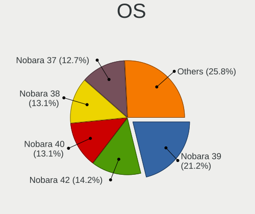

| Name      | Desktops | Percent |
|-----------|----------|---------|
| Nobara 39 | 224      | 21.19%  |
| Nobara 42 | 150      | 14.19%  |
| Nobara 40 | 138      | 13.06%  |
| Nobara 38 | 138      | 13.06%  |
| Nobara 37 | 134      | 12.68%  |
| Nobara 36 | 133      | 12.58%  |
| Nobara 41 | 107      | 10.12%  |
| Nobara 43 | 33       | 3.12%   |

OS Family
---------

OS without a version

| Name   | Desktops | Percent |
|--------|----------|---------|
| Nobara | 1011     | 100%    |

Kernel
------

Version of the Linux kernel

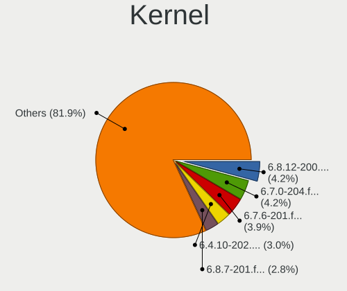

| Version                        | Desktops | Percent |
|--------------------------------|----------|---------|
| 6.8.12-200.fsync.fc39.x86_64   | 48       | 4.22%   |
| 6.7.0-204.fsync.fc39.x86_64    | 48       | 4.22%   |
| 6.7.6-201.fsync.fc39.x86_64    | 44       | 3.87%   |
| 6.4.10-202.fsync.fc38.x86_64   | 34       | 2.99%   |
| 6.8.7-201.fsync.fc39.x86_64    | 32       | 2.81%   |
| 6.11.9-200.fsync.fc40.x86_64   | 31       | 2.73%   |
| 6.0.14-201.fsync.fc36.x86_64   | 26       | 2.29%   |
| 6.2.14-300.fsync.fc37.x86_64   | 20       | 1.76%   |
| 6.12.11-204.nobara.fc41.x86_64 | 18       | 1.58%   |
| 6.15.8-200.nobara.fc42.x86_64  | 16       | 1.41%   |
| 6.11.3-200.fsync.fc40.x86_64   | 16       | 1.41%   |
| 6.1.14-201.fsync.fc37.x86_64   | 16       | 1.41%   |
| 6.0.10-201.fc36.x86_64         | 16       | 1.41%   |
| 6.3.12-204.fsync.fc38.x86_64   | 15       | 1.32%   |
| 6.14.8-200.nobara.fc42.x86_64  | 14       | 1.23%   |
| 6.14.6-200.nobara.fc42.x86_64  | 14       | 1.23%   |
| 6.13.3-201.nobara.fc41.x86_64  | 14       | 1.23%   |
| 6.10.3-201.fsync.fc40.x86_64   | 14       | 1.23%   |
| 6.10.6-200.fsync.fc40.x86_64   | 13       | 1.14%   |
| 6.6.9-200.fsync.fc39.x86_64    | 12       | 1.06%   |
| 6.5.9-201.fsync.fc38.x86_64    | 12       | 1.06%   |
| 6.2.12-200.fsync.fc37.x86_64   | 12       | 1.06%   |
| 6.8.5-201.fsync.fc39.x86_64    | 11       | 0.97%   |
| 6.13.5-200.nobara.fc41.x86_64  | 11       | 0.97%   |
| 6.6.7-203.fsync.fc38.x86_64    | 10       | 0.88%   |
| 6.2.6-201.fsync.fc37.x86_64    | 10       | 0.88%   |
| 6.18.2-200.nobara.fc43.x86_64  | 10       | 0.88%   |
| 6.17.5-200.nobara.fc42.x86_64  | 10       | 0.88%   |
| 6.17.10-200.nobara.fc43.x86_64 | 10       | 0.88%   |
| 6.15.2-200.nobara.fc42.x86_64  | 10       | 0.88%   |
| 6.11.7-201.fsync.fc40.x86_64   | 10       | 0.88%   |
| 6.10.7-200.fsync.fc40.x86_64   | 10       | 0.88%   |
| 6.8.12-201.fsync.fc40.x86_64   | 9        | 0.79%   |
| 6.5.6-200.fsync.fc38.x86_64    | 9        | 0.79%   |
| 6.13.8-201.nobara.fc41.x86_64  | 9        | 0.79%   |
| 5.19.14-201.fsync.fc36.x86_64  | 9        | 0.79%   |
| 6.7.0-201.fsync.fc39.x86_64    | 8        | 0.7%    |
| 6.2.8-200.fsync.fc37.x86_64    | 8        | 0.7%    |
| 6.2.10-200.fsync.fc37.x86_64   | 8        | 0.7%    |
| 6.17.7-200.nobara.fc42.x86_64  | 8        | 0.7%    |

Kernel Family
-------------

Linux kernel without a distro release

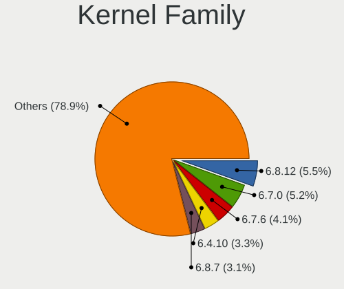

| Version | Desktops | Percent |
|---------|----------|---------|
| 6.8.12  | 62       | 5.47%   |
| 6.7.0   | 59       | 5.21%   |
| 6.7.6   | 46       | 4.06%   |
| 6.4.10  | 37       | 3.27%   |
| 6.8.7   | 35       | 3.09%   |
| 6.3.12  | 31       | 2.74%   |
| 6.11.9  | 31       | 2.74%   |
| 6.0.14  | 26       | 2.29%   |
| 6.12.11 | 24       | 2.12%   |
| 6.2.14  | 20       | 1.77%   |
| 6.6.7   | 19       | 1.68%   |
| 6.15.8  | 16       | 1.41%   |
| 6.11.3  | 16       | 1.41%   |
| 6.1.14  | 16       | 1.41%   |
| 6.0.10  | 16       | 1.41%   |
| 6.5.9   | 15       | 1.32%   |
| 6.14.8  | 14       | 1.24%   |
| 6.14.6  | 14       | 1.24%   |
| 6.13.3  | 14       | 1.24%   |
| 6.10.3  | 14       | 1.24%   |
| 6.10.6  | 13       | 1.15%   |
| 6.6.9   | 12       | 1.06%   |
| 6.2.12  | 12       | 1.06%   |
| 6.8.5   | 11       | 0.97%   |
| 6.14.2  | 11       | 0.97%   |
| 6.13.5  | 11       | 0.97%   |
| 6.11.0  | 11       | 0.97%   |
| 6.6.8   | 10       | 0.88%   |
| 6.2.6   | 10       | 0.88%   |
| 6.18.2  | 10       | 0.88%   |
| 6.17.5  | 10       | 0.88%   |
| 6.17.10 | 10       | 0.88%   |
| 6.15.2  | 10       | 0.88%   |
| 6.11.7  | 10       | 0.88%   |
| 6.10.7  | 10       | 0.88%   |
| 6.5.6   | 9        | 0.79%   |
| 6.5.3   | 9        | 0.79%   |
| 6.3.10  | 9        | 0.79%   |
| 6.13.8  | 9        | 0.79%   |
| 6.1.6   | 9        | 0.79%   |

Kernel Major Ver.
-----------------

Linux kernel major version

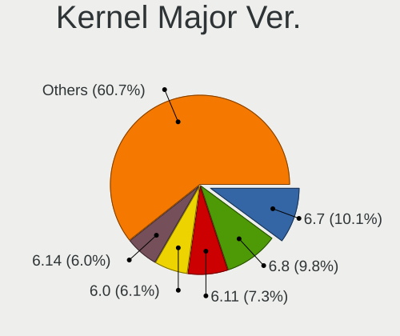

| Version | Desktops | Percent |
|---------|----------|---------|
| 6.7     | 111      | 10.11%  |
| 6.8     | 108      | 9.84%   |
| 6.11    | 80       | 7.29%   |
| 6.0     | 67       | 6.1%    |
| 6.14    | 66       | 6.01%   |
| 6.2     | 63       | 5.74%   |
| 5.19    | 56       | 5.1%    |
| 6.6     | 54       | 4.92%   |
| 6.3     | 53       | 4.83%   |
| 6.1     | 53       | 4.83%   |
| 6.15    | 52       | 4.74%   |
| 6.13    | 51       | 4.64%   |
| 6.17    | 46       | 4.19%   |
| 6.12    | 43       | 3.92%   |
| 6.5     | 42       | 3.83%   |
| 6.4     | 42       | 3.83%   |
| 6.10    | 40       | 3.64%   |
| 6.16    | 37       | 3.37%   |
| 5.18    | 23       | 2.09%   |
| 6.18    | 11       | 1%      |

Arch
----

OS architecture (x86_64, i586, etc.)

| Name   | Desktops | Percent |
|--------|----------|---------|
| x86_64 | 1011     | 100%    |

DE
--

Desktop Environment

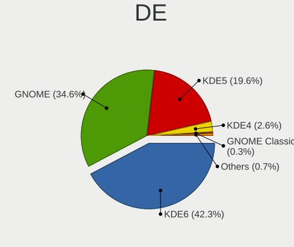

| Name          | Desktops | Percent |
|---------------|----------|---------|
| KDE6          | 438      | 42.28%  |
| GNOME         | 358      | 34.56%  |
| KDE5          | 203      | 19.59%  |
| KDE4          | 27       | 2.61%   |
| GNOME Classic | 3        | 0.29%   |
| Unknown       | 3        | 0.29%   |
| Hyprland      | 2        | 0.19%   |
| X-Cinnamon    | 1        | 0.1%    |
| sway          | 1        | 0.1%    |

Display Server
--------------

X11 or Wayland

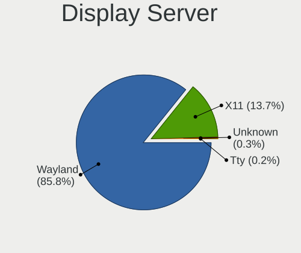

| Name    | Desktops | Percent |
|---------|----------|---------|
| Wayland | 887      | 85.78%  |
| X11     | 142      | 13.73%  |
| Unknown | 3        | 0.29%   |
| Tty     | 2        | 0.19%   |

Display Manager
---------------

SDDM, LightDM, etc.

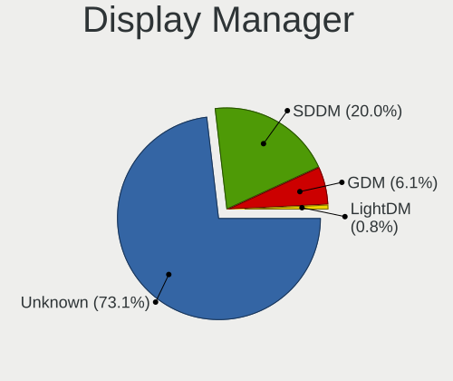

| Name    | Desktops | Percent |
|---------|----------|---------|
| Unknown | 749      | 73.14%  |
| SDDM    | 205      | 20.02%  |
| GDM     | 62       | 6.05%   |
| LightDM | 8        | 0.78%   |

OS Lang
-------

Language

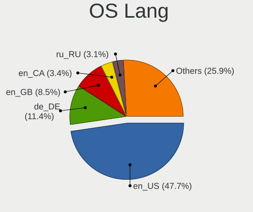

| Lang    | Desktops | Percent |
|---------|----------|---------|
| en_US   | 484      | 47.68%  |
| de_DE   | 116      | 11.43%  |
| en_GB   | 86       | 8.47%   |
| en_CA   | 35       | 3.45%   |
| ru_RU   | 31       | 3.05%   |
| es_ES   | 30       | 2.96%   |
| fr_FR   | 28       | 2.76%   |
| en_AU   | 24       | 2.36%   |
| es_MX   | 21       | 2.07%   |
| pt_BR   | 19       | 1.87%   |
| pl_PL   | 18       | 1.77%   |
| it_IT   | 18       | 1.77%   |
| es_AR   | 15       | 1.48%   |
| de_AT   | 13       | 1.28%   |
| nl_NL   | 5        | 0.49%   |
| es_CO   | 5        | 0.49%   |
| da_DK   | 5        | 0.49%   |
| nb_NO   | 4        | 0.39%   |
| hu_HU   | 4        | 0.39%   |
| en_NZ   | 4        | 0.39%   |
| sv_SE   | 3        | 0.3%    |
| fr_CA   | 3        | 0.3%    |
| fr_BE   | 3        | 0.3%    |
| fi_FI   | 3        | 0.3%    |
| en_IL   | 3        | 0.3%    |
| en_DK   | 3        | 0.3%    |
| nl_BE   | 2        | 0.2%    |
| es_DO   | 2        | 0.2%    |
| en_ZA   | 2        | 0.2%    |
| en_PH   | 2        | 0.2%    |
| de_CH   | 2        | 0.2%    |
| cs_CZ   | 2        | 0.2%    |
| C       | 2        | 0.2%    |
| Unknown | 2        | 0.2%    |
| sk_SK   | 1        | 0.1%    |
| pt_PT   | 1        | 0.1%    |
| ja_JP   | 1        | 0.1%    |
| it_CH   | 1        | 0.1%    |
| es_VE   | 1        | 0.1%    |
| es_UY   | 1        | 0.1%    |

Boot Mode
---------

EFI or BIOS

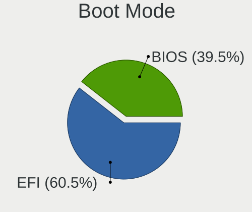

| Mode | Desktops | Percent |
|------|----------|---------|
| EFI  | 620      | 60.55%  |
| BIOS | 404      | 39.45%  |

Filesystem
----------

Type of filesystem

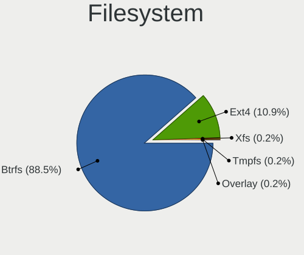

| Type    | Desktops | Percent |
|---------|----------|---------|
| Btrfs   | 901      | 88.51%  |
| Ext4    | 111      | 10.9%   |
| Xfs     | 2        | 0.2%    |
| Tmpfs   | 2        | 0.2%    |
| Overlay | 2        | 0.2%    |

Part. scheme
------------

Scheme of partitioning

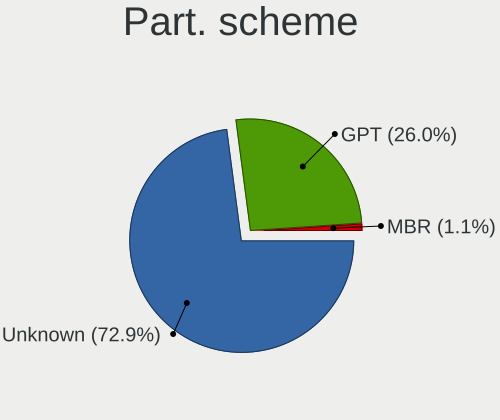

| Type    | Desktops | Percent |
|---------|----------|---------|
| Unknown | 746      | 72.92%  |
| GPT     | 266      | 26%     |
| MBR     | 11       | 1.08%   |

Dual Boot with Linux/BSD
------------------------

Hosting more than one Linux/BSD

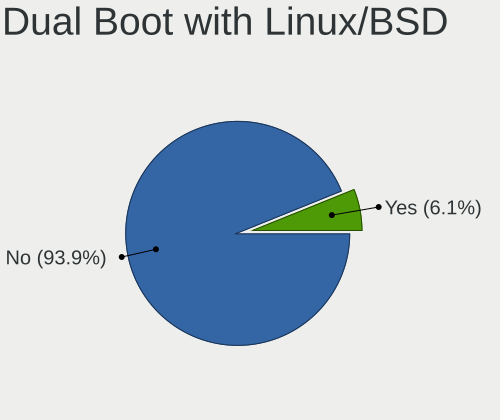

| Dual boot | Desktops | Percent |
|-----------|----------|---------|
| No        | 953      | 93.89%  |
| Yes       | 62       | 6.11%   |

Dual Boot (Win)
---------------

Hosting Linux and Windows

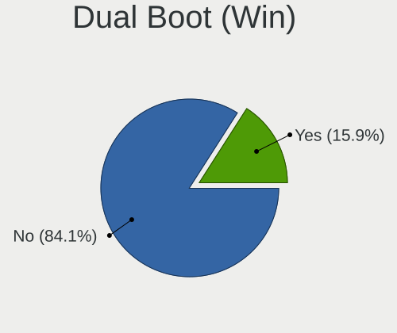

| Dual boot | Desktops | Percent |
|-----------|----------|---------|
| No        | 854      | 84.06%  |
| Yes       | 162      | 15.94%  |

Board
-----

Vendor
------

Motherboard manufacturer

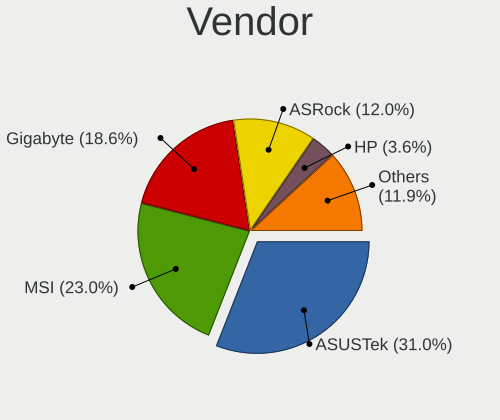

| Name                                 | Desktops | Percent |
|--------------------------------------|----------|---------|
| ASUSTek Computer                     | 313      | 30.96%  |
| MSI                                  | 233      | 23.05%  |
| Gigabyte Technology                  | 188      | 18.6%   |
| ASRock                               | 121      | 11.97%  |
| Hewlett-Packard                      | 36       | 3.56%   |
| Dell                                 | 30       | 2.97%   |
| Intel                                | 13       | 1.29%   |
| Biostar                              | 10       | 0.99%   |
| Acer                                 | 7        | 0.69%   |
| Lenovo                               | 6        | 0.59%   |
| Huanan                               | 6        | 0.59%   |
| Unknown                              | 6        | 0.59%   |
| Shenzhen Meigao Electronic Equipment | 5        | 0.49%   |
| NZXT                                 | 4        | 0.4%    |
| Pegatron                             | 3        | 0.3%    |
| AZW                                  | 3        | 0.3%    |
| Apple                                | 3        | 0.3%    |
| Alienware                            | 3        | 0.3%    |
| Fujitsu                              | 2        | 0.2%    |
| BESSTAR Tech                         | 2        | 0.2%    |
| SHANGZHAOYUAN                        | 1        | 0.1%    |
| Protectli                            | 1        | 0.1%    |
| OEM                                  | 1        | 0.1%    |
| Medion                               | 1        | 0.1%    |
| MACHINIST                            | 1        | 0.1%    |
| langchao                             | 1        | 0.1%    |
| JGINYUE                              | 1        | 0.1%    |
| HC Technology.                       | 1        | 0.1%    |
| GPD                                  | 1        | 0.1%    |
| Google                               | 1        | 0.1%    |
| GEEKOM                               | 1        | 0.1%    |
| eOBgmB2N8pjrlyC                      | 1        | 0.1%    |
| eMachines                            | 1        | 0.1%    |
| ECS                                  | 1        | 0.1%    |
| AOpen                                | 1        | 0.1%    |
| ANGXUN                               | 1        | 0.1%    |
| Acidanthera                          | 1        | 0.1%    |

Model
-----

Motherboard model

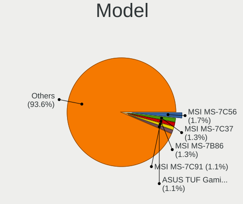

| Name                                 | Desktops | Percent |
|--------------------------------------|----------|---------|
| MSI MS-7C56                          | 17       | 1.68%   |
| MSI MS-7C37                          | 13       | 1.29%   |
| MSI MS-7B86                          | 13       | 1.29%   |
| MSI MS-7C91                          | 11       | 1.09%   |
| ASUS TUF Gaming X570-PLUS            | 11       | 1.09%   |
| ASUS All Series                      | 11       | 1.09%   |
| ASUS TUF Gaming B550-PLUS            | 9        | 0.89%   |
| MSI MS-7D25                          | 8        | 0.79%   |
| MSI MS-7C95                          | 8        | 0.79%   |
| MSI MS-7C02                          | 8        | 0.79%   |
| ASUS TUF Gaming B550M-PLUS           | 8        | 0.79%   |
| ASUS ROG STRIX B550-F GAMING         | 8        | 0.79%   |
| MSI MS-7B79                          | 7        | 0.69%   |
| Gigabyte X570 AORUS ELITE            | 7        | 0.69%   |
| MSI MS-7E26                          | 6        | 0.59%   |
| MSI MS-7C35                          | 6        | 0.59%   |
| Gigabyte B550 GAMING X V2            | 6        | 0.59%   |
| ASUS TUF Gaming B550-PLUS WIFI II    | 6        | 0.59%   |
| ASUS ROG STRIX X570-E GAMING         | 6        | 0.59%   |
| ASUS CROSSHAIR VI HERO               | 6        | 0.59%   |
| Unknown                              | 6        | 0.59%   |
| MSI MS-7D75                          | 5        | 0.49%   |
| Gigabyte B550 AORUS ELITE V2         | 5        | 0.49%   |
| ASUS TUF Gaming X670E-PLUS WIFI      | 5        | 0.49%   |
| ASUS ROG STRIX B650E-F GAMING WIFI   | 5        | 0.49%   |
| ASUS ROG STRIX B450-F GAMING         | 5        | 0.49%   |
| ASUS PRIME A320M-K                   | 5        | 0.49%   |
| ASRock B550 Phantom Gaming-ITX/ax    | 5        | 0.49%   |
| MSI MS-7D76                          | 4        | 0.4%    |
| MSI MS-7C84                          | 4        | 0.4%    |
| MSI MS-7817                          | 4        | 0.4%    |
| HP Pavilion Gaming Desktop TG01-2xxx | 4        | 0.4%    |
| Gigabyte X870E AORUS ELITE WIFI7     | 4        | 0.4%    |
| Gigabyte X570 AORUS MASTER           | 4        | 0.4%    |
| Gigabyte B550M DS3H                  | 4        | 0.4%    |
| ASUS TUF Gaming X570-PRO             | 4        | 0.4%    |
| ASUS ROG STRIX Z590-E GAMING WIFI    | 4        | 0.4%    |
| ASUS ROG STRIX B650E-I GAMING WIFI   | 4        | 0.4%    |
| ASUS ROG Maximus XI HERO             | 4        | 0.4%    |
| ASUS ROG CROSSHAIR VIII HERO         | 4        | 0.4%    |

Model Family
------------

Motherboard model prefix

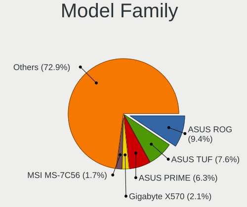

| Name           | Desktops | Percent |
|----------------|----------|---------|
| ASUS ROG       | 95       | 9.4%    |
| ASUS TUF       | 77       | 7.62%   |
| ASUS PRIME     | 64       | 6.33%   |
| Gigabyte X570  | 21       | 2.08%   |
| MSI MS-7C56    | 17       | 1.68%   |
| Gigabyte B550  | 17       | 1.68%   |
| Dell OptiPlex  | 16       | 1.58%   |
| Gigabyte B550M | 15       | 1.48%   |
| MSI MS-7C37    | 13       | 1.29%   |
| MSI MS-7B86    | 13       | 1.29%   |
| ASRock B550    | 12       | 1.19%   |
| MSI MS-7C91    | 11       | 1.09%   |
| HP Pavilion    | 11       | 1.09%   |
| ASUS All       | 11       | 1.09%   |
| ASRock B450M   | 10       | 0.99%   |
| ASRock B550M   | 9        | 0.89%   |
| ASRock B450    | 9        | 0.89%   |
| MSI MS-7D25    | 8        | 0.79%   |
| MSI MS-7C95    | 8        | 0.79%   |
| MSI MS-7C02    | 8        | 0.79%   |
| Gigabyte B650  | 8        | 0.79%   |
| MSI MS-7B79    | 7        | 0.69%   |
| MSI MS-7E26    | 6        | 0.59%   |
| MSI MS-7C35    | 6        | 0.59%   |
| HP EliteDesk   | 6        | 0.59%   |
| HP Compaq      | 6        | 0.59%   |
| Gigabyte B450M | 6        | 0.59%   |
| ASUS CROSSHAIR | 6        | 0.59%   |
| ASRock X570    | 6        | 0.59%   |
| Unknown        | 6        | 0.59%   |
| MSI MS-7D75    | 5        | 0.49%   |
| Dell Precision | 5        | 0.49%   |
| ASUS ProArt    | 5        | 0.49%   |
| MSI MS-7D76    | 4        | 0.4%    |
| MSI MS-7C84    | 4        | 0.4%    |
| MSI MS-7817    | 4        | 0.4%    |
| HP ProDesk     | 4        | 0.4%    |
| Gigabyte X870E | 4        | 0.4%    |
| Gigabyte X670  | 4        | 0.4%    |
| Gigabyte B650M | 4        | 0.4%    |

MFG Year
--------

Motherboard manufacture year

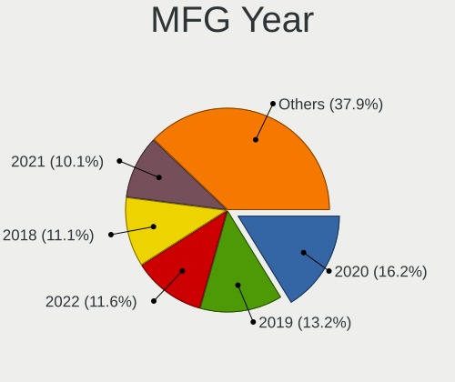

| Year | Desktops | Percent |
|------|----------|---------|
| 2020 | 164      | 16.22%  |
| 2019 | 133      | 13.16%  |
| 2022 | 117      | 11.57%  |
| 2018 | 112      | 11.08%  |
| 2021 | 102      | 10.09%  |
| 2023 | 73       | 7.22%   |
| 2024 | 44       | 4.35%   |
| 2012 | 43       | 4.25%   |
| 2017 | 40       | 3.96%   |
| 2013 | 40       | 3.96%   |
| 2016 | 32       | 3.17%   |
| 2014 | 30       | 2.97%   |
| 2015 | 26       | 2.57%   |
| 2011 | 21       | 2.08%   |
| 2009 | 13       | 1.29%   |
| 2025 | 8        | 0.79%   |
| 2010 | 8        | 0.79%   |
| 2008 | 5        | 0.49%   |

Form Factor
-----------

Physical design of the computer

| Name    | Desktops | Percent |
|---------|----------|---------|
| Desktop | 1011     | 100%    |

Secure Boot
-----------

Enabled or disabled

| State    | Desktops | Percent |
|----------|----------|---------|
| Disabled | 1011     | 100%    |

Coreboot
--------

Have coreboot on board

| Used | Desktops | Percent |
|------|----------|---------|
| No   | 1010     | 99.9%   |
| Yes  | 1        | 0.1%    |

RAM Size
--------

Total RAM memory

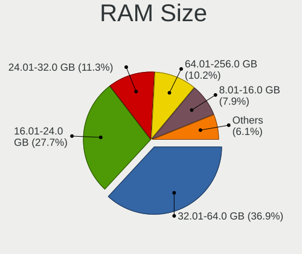

| Size in GB      | Desktops | Percent |
|-----------------|----------|---------|
| 32.01-64.0      | 376      | 36.9%   |
| 16.01-24.0      | 282      | 27.67%  |
| 24.01-32.0      | 115      | 11.29%  |
| 64.01-256.0     | 104      | 10.21%  |
| 8.01-16.0       | 80       | 7.85%   |
| 4.01-8.0        | 42       | 4.12%   |
| 3.01-4.0        | 19       | 1.86%   |
| More than 256.0 | 1        | 0.1%    |

RAM Used
--------

Used RAM memory

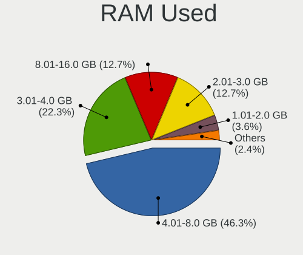

| Used GB    | Desktops | Percent |
|------------|----------|---------|
| 4.01-8.0   | 508      | 46.31%  |
| 3.01-4.0   | 245      | 22.33%  |
| 2.01-3.0   | 139      | 12.67%  |
| 8.01-16.0  | 139      | 12.67%  |
| 1.01-2.0   | 40       | 3.65%   |
| 16.01-24.0 | 22       | 2.01%   |
| 24.01-32.0 | 3        | 0.27%   |
| 32.01-64.0 | 1        | 0.09%   |

Total Drives
------------

Number of drives on board

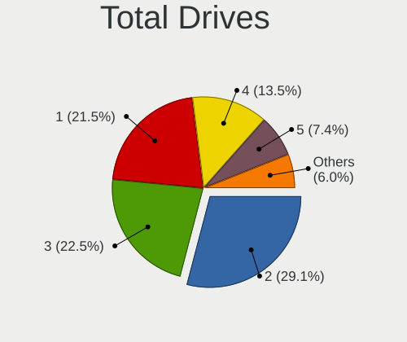

| Drives | Desktops | Percent |
|--------|----------|---------|
| 2      | 303      | 29.08%  |
| 3      | 234      | 22.46%  |
| 1      | 224      | 21.5%   |
| 4      | 141      | 13.53%  |
| 5      | 77       | 7.39%   |
| 6      | 33       | 3.17%   |
| 7      | 13       | 1.25%   |
| 8      | 8        | 0.77%   |
| 10     | 4        | 0.38%   |
| 9      | 3        | 0.29%   |
| 11     | 1        | 0.1%    |
| 0      | 1        | 0.1%    |

Has CD-ROM
----------

Has CD-ROM on board

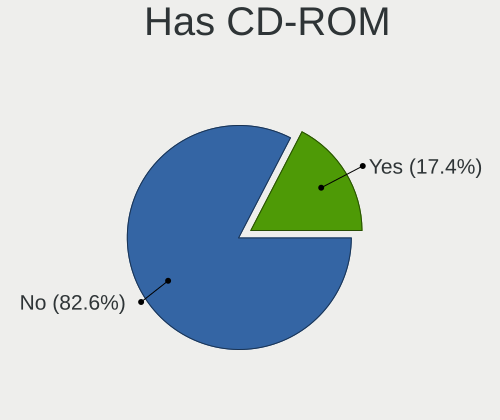

| Presented | Desktops | Percent |
|-----------|----------|---------|
| No        | 841      | 82.61%  |
| Yes       | 177      | 17.39%  |

Has Ethernet
------------

Has Ethernet on board

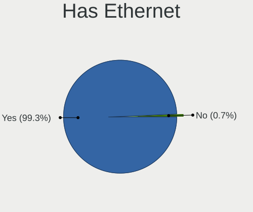

| Presented | Desktops | Percent |
|-----------|----------|---------|
| Yes       | 1004     | 99.31%  |
| No        | 7        | 0.69%   |

Has WiFi
--------

Has WiFi module

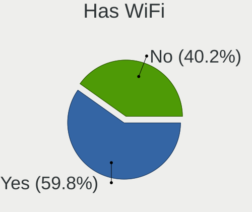

| Presented | Desktops | Percent |
|-----------|----------|---------|
| Yes       | 610      | 59.8%   |
| No        | 410      | 40.2%   |

Has Bluetooth
-------------

Has Bluetooth module

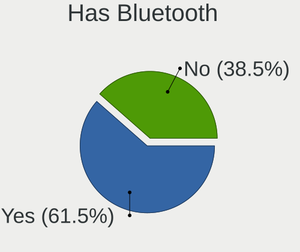

| Presented | Desktops | Percent |
|-----------|----------|---------|
| Yes       | 626      | 61.49%  |
| No        | 392      | 38.51%  |

Location
--------

Country
-------

Geographic location (country)

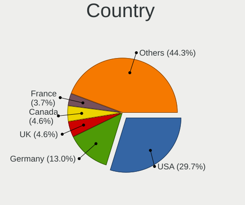

| Country                | Desktops | Percent |
|------------------------|----------|---------|
| USA                    | 301      | 29.74%  |
| Germany                | 132      | 13.04%  |
| UK                     | 47       | 4.64%   |
| Canada                 | 47       | 4.64%   |
| France                 | 37       | 3.66%   |
| Russia                 | 33       | 3.26%   |
| Brazil                 | 32       | 3.16%   |
| Australia              | 32       | 3.16%   |
| Spain                  | 31       | 3.06%   |
| Italy                  | 29       | 2.87%   |
| Poland                 | 27       | 2.67%   |
| Argentina              | 23       | 2.27%   |
| Austria                | 18       | 1.78%   |
| Netherlands            | 17       | 1.68%   |
| Sweden                 | 16       | 1.58%   |
| Mexico                 | 14       | 1.38%   |
| Norway                 | 9        | 0.89%   |
| Hungary                | 9        | 0.89%   |
| Finland                | 9        | 0.89%   |
| Colombia               | 9        | 0.89%   |
| Switzerland            | 8        | 0.79%   |
| Belgium                | 8        | 0.79%   |
| Romania                | 7        | 0.69%   |
| Denmark                | 7        | 0.69%   |
| New Zealand            | 6        | 0.59%   |
| India                  | 6        | 0.59%   |
| Venezuela              | 5        | 0.49%   |
| Portugal               | 5        | 0.49%   |
| Israel                 | 5        | 0.49%   |
| UAE                    | 4        | 0.4%    |
| South Africa           | 4        | 0.4%    |
| Saudi Arabia           | 4        | 0.4%    |
| Philippines            | 4        | 0.4%    |
| Greece                 | 4        | 0.4%    |
| Czechia                | 4        | 0.4%    |
| Bosnia and Herzegovina | 4        | 0.4%    |
| Serbia                 | 3        | 0.3%    |
| Estonia                | 3        | 0.3%    |
| Chile                  | 3        | 0.3%    |
| Turkey                 | 2        | 0.2%    |

City
----

Geographic location (city)

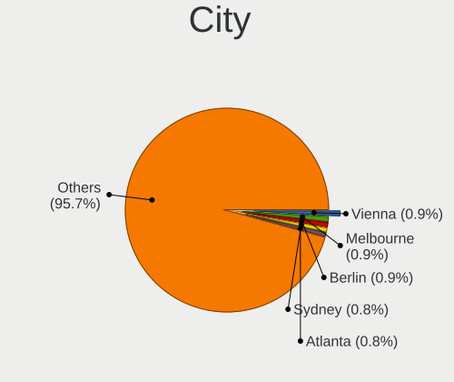

| City              | Desktops | Percent |
|-------------------|----------|---------|
| Vienna            | 10       | 0.95%   |
| Melbourne         | 10       | 0.95%   |
| Berlin            | 9        | 0.85%   |
| Sydney            | 8        | 0.76%   |
| Atlanta           | 8        | 0.76%   |
| Stockholm         | 7        | 0.66%   |
| Brisbane          | 7        | 0.66%   |
| Warsaw            | 6        | 0.57%   |
| Toronto           | 6        | 0.57%   |
| Los Angeles       | 6        | 0.57%   |
| Frankfurt am Main | 6        | 0.57%   |
| Buenos Aires      | 6        | 0.57%   |
| St Petersburg     | 5        | 0.47%   |
| New York          | 5        | 0.47%   |
| Milan             | 5        | 0.47%   |
| Kansas City       | 5        | 0.47%   |
| Denver            | 5        | 0.47%   |
| Cologne           | 5        | 0.47%   |
| Calgary           | 5        | 0.47%   |
| Zurich            | 4        | 0.38%   |
| Stuttgart         | 4        | 0.38%   |
| Seattle           | 4        | 0.38%   |
| Perth             | 4        | 0.38%   |
| Osnabrück        | 4        | 0.38%   |
| Helsinki          | 4        | 0.38%   |
| Düsseldorf       | 4        | 0.38%   |
| Dallas            | 4        | 0.38%   |
| Buffalo           | 4        | 0.38%   |
| Wuppertal         | 3        | 0.28%   |
| Valencia          | 3        | 0.28%   |
| Samara            | 3        | 0.28%   |
| Rome              | 3        | 0.28%   |
| Québec           | 3        | 0.28%   |
| Poznan            | 3        | 0.28%   |
| Portland          | 3        | 0.28%   |
| Paris             | 3        | 0.28%   |
| Ottawa            | 3        | 0.28%   |
| Oslo              | 3        | 0.28%   |
| Omaha             | 3        | 0.28%   |
| Mainz             | 3        | 0.28%   |

Drives
------

Drive Vendor
------------

Hard drive vendors

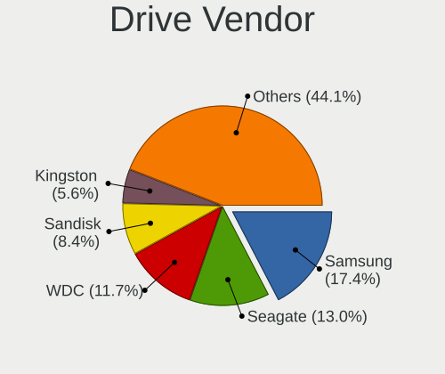

| Vendor                       | Desktops | Drives | Percent |
|------------------------------|----------|--------|---------|
| Samsung Electronics          | 397      | 737    | 17.35%  |
| Seagate                      | 297      | 421    | 12.98%  |
| WDC                          | 267      | 396    | 11.67%  |
| Sandisk                      | 192      | 264    | 8.39%   |
| Kingston                     | 127      | 155    | 5.55%   |
| Crucial                      | 118      | 176    | 5.16%   |
| Toshiba                      | 93       | 119    | 4.06%   |
| Micron/Crucial Technology    | 88       | 109    | 3.85%   |
| Phison Electronics           | 78       | 99     | 3.41%   |
| Kingston Technology Company  | 43       | 55     | 1.88%   |
| ADATA Technology             | 32       | 38     | 1.4%    |
| Intel                        | 31       | 41     | 1.35%   |
| Hitachi                      | 31       | 44     | 1.35%   |
| MAXIO Technology (Hangzhou)  | 26       | 30     | 1.14%   |
| Realtek Semiconductor        | 25       | 29     | 1.09%   |
| PNY                          | 25       | 38     | 1.09%   |
| Micron Technology            | 24       | 30     | 1.05%   |
| A-DATA Technology            | 22       | 26     | 0.96%   |
| Silicon Motion               | 19       | 26     | 0.83%   |
| Shenzhen Longsys Electronics | 19       | 32     | 0.83%   |
| SPCC                         | 18       | 21     | 0.79%   |
| China                        | 16       | 18     | 0.7%    |
| HGST                         | 15       | 20     | 0.66%   |
| Unknown                      | 14       | 22     | 0.61%   |
| SK hynix                     | 14       | 16     | 0.61%   |
| OCZ                          | 11       | 11     | 0.48%   |
| Intenso                      | 11       | 12     | 0.48%   |
| GOODRAM                      | 11       | 12     | 0.48%   |
| Team                         | 10       | 11     | 0.44%   |
| KIOXIA                       | 10       | 12     | 0.44%   |
| Phison                       | 9        | 10     | 0.39%   |
| JMicron Technology           | 9        | 17     | 0.39%   |
| T-FORCE                      | 8        | 8      | 0.35%   |
| Corsair                      | 7        | 10     | 0.31%   |
| Verbatim                     | 6        | 8      | 0.26%   |
| Transcend                    | 6        | 6      | 0.26%   |
| Patriot                      | 6        | 6      | 0.26%   |
| Fanxiang                     | 6        | 8      | 0.26%   |
| XrayDisk                     | 5        | 6      | 0.22%   |
| Realtek                      | 5        | 6      | 0.22%   |

Drive Model
-----------

Hard drive models

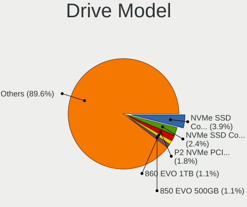

| Model                                                              | Desktops | Percent |
|--------------------------------------------------------------------|----------|---------|
| Samsung NVMe SSD Controller SM981/PM981/PM983 1TB                  | 107      | 3.95%   |
| Samsung NVMe SSD Controller PM9A1/PM9A3/980PRO 1TB                 | 64       | 2.36%   |
| Micron/Crucial P2 NVMe PCIe SSD 2TB                                | 50       | 1.84%   |
| Samsung SSD 860 EVO 1TB                                            | 31       | 1.14%   |
| Samsung SSD 850 EVO 500GB                                          | 30       | 1.11%   |
| Seagate ST2000DM008-2FR102 2TB                                     | 29       | 1.07%   |
| Samsung SSD 860 EVO 500GB                                          | 28       | 1.03%   |
| Crucial CT1000MX500SSD1 1TB                                        | 28       | 1.03%   |
| Kingston SA400S37240G 240GB SSD                                    | 27       | 1%      |
| Samsung SSD 990 PRO 2TB                                            | 26       | 0.96%   |
| Phison E12 NVMe Controller 1TB                                     | 26       | 0.96%   |
| Sandisk WD Blue SN550 NVMe SSD 1024GB                              | 25       | 0.92%   |
| Samsung SSD 850 EVO 250GB                                          | 23       | 0.85%   |
| Toshiba DT01ACA100 1TB                                             | 19       | 0.7%    |
| Seagate ST4000DM004-2CV104 4TB                                     | 19       | 0.7%    |
| Seagate ST1000DM010-2EP102 1TB                                     | 19       | 0.7%    |
| Phison E16 PCIe4 NVMe Controller 1TB                               | 18       | 0.66%   |
| Kingston SA400S37480G 480GB SSD                                    | 18       | 0.66%   |
| Crucial CT1000BX500SSD1 1TB                                        | 18       | 0.66%   |
| Sandisk WD_BLACK SN770 1TB                                         | 16       | 0.59%   |
| Samsung SSD 870 EVO 1TB                                            | 16       | 0.59%   |
| Samsung NVMe SSD Controller SM961/PM961/SM963 1024GB               | 16       | 0.59%   |
| MAXIO (Hangzhou) NVMe SSD Controller MAP1202 2TB                   | 16       | 0.59%   |
| Sandisk WD Black SN850 1TB                                         | 15       | 0.55%   |
| Samsung SSD 980 1TB                                                | 15       | 0.55%   |
| Intel SSD 660P Series 512GB                                        | 15       | 0.55%   |
| Sandisk WD_BLACK SN770 2TB                                         | 14       | 0.52%   |
| Kingston Company SNV2S1000G 1TB                                    | 14       | 0.52%   |
| WDC WD10EZEX-08WN4A0 1TB                                           | 13       | 0.48%   |
| Samsung SSD 870 EVO 2TB                                            | 13       | 0.48%   |
| Sandisk WD_BLACK SN850X 2000GB                                     | 12       | 0.44%   |
| Phison PS5013 E13 NVMe Controller 500GB                            | 12       | 0.44%   |
| Kingston Company A2000 NVMe SSD 250GB                              | 12       | 0.44%   |
| ADATA XPG SX8200 Pro PCIe Gen3x4 M.2 2280 Solid State Drive 1024GB | 12       | 0.44%   |
| WDC WDS500G2B0A-00SM50 500GB                                       | 11       | 0.41%   |
| WDC WD20EZRZ-00Z5HB0 2TB                                           | 11       | 0.41%   |
| WDC WD10EZEX-00BN5A0 1TB                                           | 11       | 0.41%   |
| Toshiba HDWD110 1TB                                                | 11       | 0.41%   |
| Silicon Motion SM2263EN/SM2263XT SSD Controller 512GB              | 11       | 0.41%   |
| Seagate ST500DM002-1BD142 500GB                                    | 11       | 0.41%   |

HDD Vendor
----------

Hard disk drive vendors

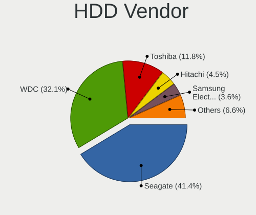

| Vendor              | Desktops | Drives | Percent |
|---------------------|----------|--------|---------|
| Seagate             | 287      | 402    | 41.35%  |
| WDC                 | 223      | 323    | 32.13%  |
| Toshiba             | 82       | 106    | 11.82%  |
| Hitachi             | 31       | 44     | 4.47%   |
| Samsung Electronics | 25       | 37     | 3.6%    |
| HGST                | 15       | 20     | 2.16%   |
| JMicron Technology  | 7        | 15     | 1.01%   |
| Maxtor              | 4        | 4      | 0.58%   |
| Apple               | 4        | 4      | 0.58%   |
| Unknown             | 3        | 3      | 0.43%   |
| ASMT                | 3        | 4      | 0.43%   |
| Unknown             | 2        | 4      | 0.29%   |
| USB3.0              | 1        | 1      | 0.14%   |
| USB 3.1             | 1        | 3      | 0.14%   |
| TO Exter            | 1        | 1      | 0.14%   |
| T-FORCE             | 1        | 1      | 0.14%   |
| SABRENT             | 1        | 2      | 0.14%   |
| Intenso             | 1        | 1      | 0.14%   |
| Hewlett-Packard     | 1        | 1      | 0.14%   |
| ACASIS              | 1        | 1      | 0.14%   |

SSD Vendor
----------

Solid state drive vendors

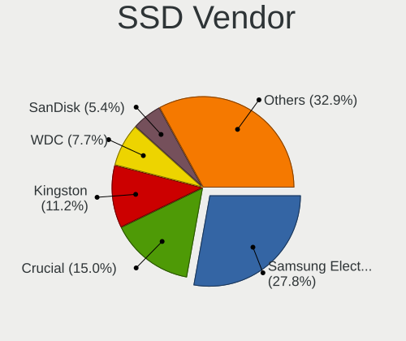

| Vendor              | Desktops | Drives | Percent |
|---------------------|----------|--------|---------|
| Samsung Electronics | 217      | 316    | 27.82%  |
| Crucial             | 117      | 175    | 15%     |
| Kingston            | 87       | 103    | 11.15%  |
| WDC                 | 60       | 70     | 7.69%   |
| SanDisk             | 42       | 51     | 5.38%   |
| PNY                 | 25       | 38     | 3.21%   |
| A-DATA Technology   | 22       | 26     | 2.82%   |
| SPCC                | 18       | 21     | 2.31%   |
| China               | 15       | 17     | 1.92%   |
| OCZ                 | 11       | 11     | 1.41%   |
| GOODRAM             | 11       | 12     | 1.41%   |
| Micron Technology   | 9        | 13     | 1.15%   |
| Team                | 8        | 9      | 1.03%   |
| Intenso             | 8        | 8      | 1.03%   |
| Intel               | 8        | 11     | 1.03%   |
| Transcend           | 6        | 6      | 0.77%   |
| Toshiba             | 6        | 7      | 0.77%   |
| Corsair             | 6        | 9      | 0.77%   |
| Verbatim            | 5        | 7      | 0.64%   |
| Patriot             | 5        | 5      | 0.64%   |
| Lexar               | 5        | 6      | 0.64%   |
| KingSpec            | 5        | 5      | 0.64%   |
| Apacer              | 5        | 6      | 0.64%   |
| XrayDisk            | 4        | 4      | 0.51%   |
| SK hynix            | 4        | 4      | 0.51%   |
| KIOXIA-EXCERIA      | 4        | 5      | 0.51%   |
| Fanxiang            | 4        | 6      | 0.51%   |
| T-FORCE             | 3        | 3      | 0.38%   |
| Seagate             | 3        | 3      | 0.38%   |
| LITEONIT            | 3        | 3      | 0.38%   |
| Gigabyte Technology | 3        | 3      | 0.38%   |
| Drevo               | 3        | 3      | 0.38%   |
| Vi550               | 2        | 2      | 0.26%   |
| Timetec             | 2        | 2      | 0.26%   |
| SABRENT             | 2        | 2      | 0.26%   |
| PNY CS90            | 2        | 2      | 0.26%   |
| Mushkin             | 2        | 2      | 0.26%   |
| Emtec               | 2        | 2      | 0.26%   |
| AMD                 | 2        | 2      | 0.26%   |
| XSTAR               | 1        | 1      | 0.13%   |

Drive Kind
----------

HDD or SSD

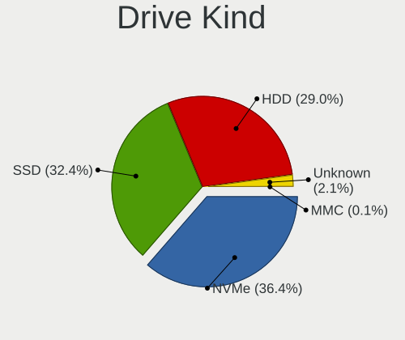

| Kind    | Desktops | Drives | Percent |
|---------|----------|--------|---------|
| NVMe    | 685      | 1215   | 36.38%  |
| SSD     | 610      | 1017   | 32.4%   |
| HDD     | 547      | 977    | 29.05%  |
| Unknown | 40       | 51     | 2.12%   |
| MMC     | 1        | 1      | 0.05%   |

Drive Connector
---------------

SATA, SAS, NVMe, etc.

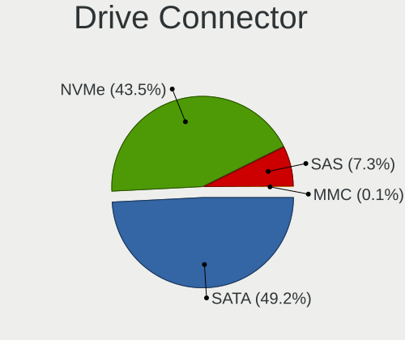

| Type | Desktops | Drives | Percent |
|------|----------|--------|---------|
| SATA | 771      | 1901   | 49.2%   |
| NVMe | 681      | 1193   | 43.46%  |
| SAS  | 114      | 166    | 7.28%   |
| MMC  | 1        | 1      | 0.06%   |

Drive Size
----------

Size of hard drive

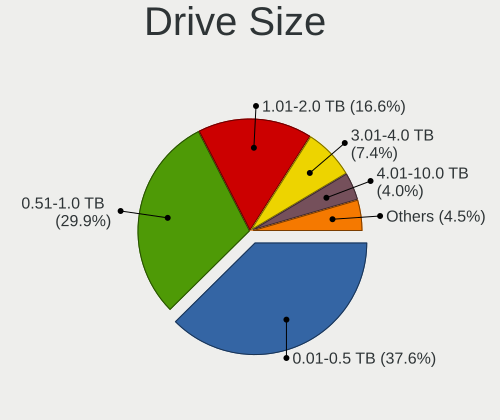

| Size in TB | Desktops | Drives | Percent |
|------------|----------|--------|---------|
| 0.01-0.5   | 492      | 795    | 37.59%  |
| 0.51-1.0   | 391      | 589    | 29.87%  |
| 1.01-2.0   | 217      | 323    | 16.58%  |
| 3.01-4.0   | 97       | 134    | 7.41%   |
| 4.01-10.0  | 53       | 78     | 4.05%   |
| 2.01-3.0   | 38       | 48     | 2.9%    |
| 10.01-20.0 | 20       | 26     | 1.53%   |
| 20.01-50.0 | 1        | 1      | 0.08%   |

Space Total
-----------

Amount of disk space available on the file system

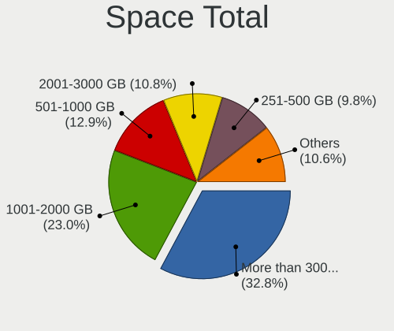

| Size in GB     | Desktops | Percent |
|----------------|----------|---------|
| More than 3000 | 345      | 32.83%  |
| 1001-2000      | 242      | 23.03%  |
| 501-1000       | 136      | 12.94%  |
| 2001-3000      | 114      | 10.85%  |
| 251-500        | 103      | 9.8%    |
| 101-250        | 61       | 5.8%    |
| Unknown        | 17       | 1.62%   |
| 21-50          | 14       | 1.33%   |
| 1-20           | 11       | 1.05%   |
| 51-100         | 8        | 0.76%   |

Space Used
----------

Amount of used disk space

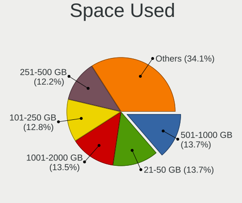

| Used GB        | Desktops | Percent |
|----------------|----------|---------|
| 21-50          | 150      | 13.7%   |
| 501-1000       | 150      | 13.7%   |
| 1001-2000      | 148      | 13.52%  |
| 101-250        | 140      | 12.79%  |
| 251-500        | 134      | 12.24%  |
| More than 3000 | 107      | 9.77%   |
| 1-20           | 91       | 8.31%   |
| 2001-3000      | 79       | 7.21%   |
| 51-100         | 79       | 7.21%   |
| Unknown        | 17       | 1.55%   |

Malfunc. Drives
---------------

Drive models with a malfunction

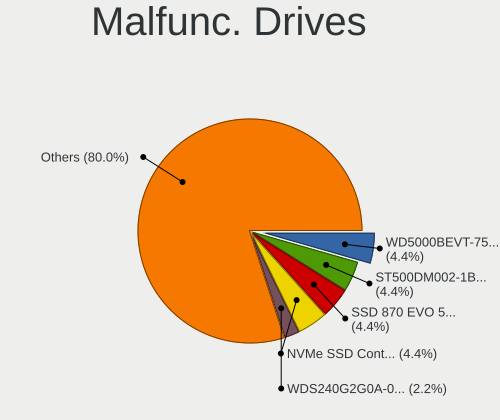

| Model                                                         | Desktops | Drives | Percent |
|---------------------------------------------------------------|----------|--------|---------|
| WDC WD5000BEVT-75ZAT0 500GB                                   | 2        | 2      | 4.44%   |
| Seagate ST500DM002-1BD142 500GB                               | 2        | 2      | 4.44%   |
| Samsung Electronics SSD 870 EVO 500GB                         | 2        | 3      | 4.44%   |
| Samsung Electronics NVMe SSD Controller SM981/PM981/PM983 1TB | 2        | 2      | 4.44%   |
| WDC WDS240G2G0A-00JH30 240GB SSD                              | 1        | 1      | 2.22%   |
| WDC WD5000AAKX-08U6AA0 500GB                                  | 1        | 1      | 2.22%   |
| WDC WD30EZRX-00DC0B0 3TB                                      | 1        | 1      | 2.22%   |
| WDC WD20EZRZ-00Z5HB0 2TB                                      | 1        | 1      | 2.22%   |
| WDC WD20EVDS-63T3B0 2TB                                       | 1        | 1      | 2.22%   |
| WDC WD20EURS-63S48Y0 2TB                                      | 1        | 1      | 2.22%   |
| WDC WD2003FZEX-00Z4SA0 2TB                                    | 1        | 1      | 2.22%   |
| WDC WD15EARS-00S8B1 1TB                                       | 1        | 1      | 2.22%   |
| WDC WD10EZEX-08M2NA0 1TB                                      | 1        | 1      | 2.22%   |
| WDC WD10EADS-00L5B1 1TB                                       | 1        | 1      | 2.22%   |
| WDC WD10EACS-00D6B0 1TB                                       | 1        | 1      | 2.22%   |
| Verbatim Vi550 S3 1024GB                                      | 1        | 1      | 2.22%   |
| Toshiba MK8052GSX 80GB                                        | 1        | 1      | 2.22%   |
| Toshiba DT01ACA300 3TB                                        | 1        | 1      | 2.22%   |
| Toshiba DT01ACA100 1TB                                        | 1        | 1      | 2.22%   |
| Seagate ST9160314AS 160GB                                     | 1        | 1      | 2.22%   |
| Seagate ST8000DM004-2CX188 8TB                                | 1        | 1      | 2.22%   |
| Seagate ST6000DM003-2CY186 6TB                                | 1        | 1      | 2.22%   |
| Seagate ST3500418AS 500GB                                     | 1        | 1      | 2.22%   |
| Seagate ST3000DM008-2DM166 3TB                                | 1        | 1      | 2.22%   |
| Seagate ST2000DX002-2DV164 2TB                                | 1        | 1      | 2.22%   |
| Seagate ST2000DX001-1NS164 2TB                                | 1        | 1      | 2.22%   |
| Seagate ST2000DM001-9YN164 2TB                                | 1        | 1      | 2.22%   |
| Seagate ST2000DM001-1ER164 2TB                                | 1        | 1      | 2.22%   |
| Seagate ST2000DL003-9VT166 2TB                                | 1        | 2      | 2.22%   |
| Seagate ST1000LM035-1RK172 1TB                                | 1        | 1      | 2.22%   |
| Seagate ST1000DM003-9YN162 1TB                                | 1        | 1      | 2.22%   |
| Seagate ST1000DM003-1ER162 1TB                                | 1        | 1      | 2.22%   |
| SanDisk SSD PLUS 240GB                                        | 1        | 1      | 2.22%   |
| Samsung Electronics SSD 980 1TB                               | 1        | 1      | 2.22%   |
| Samsung Electronics SSD 970 EVO 1TB                           | 1        | 1      | 2.22%   |
| Samsung Electronics SSD 840 PRO Series 128GB                  | 1        | 1      | 2.22%   |
| Samsung Electronics SSD 830 Series 256GB                      | 1        | 1      | 2.22%   |
| Samsung Electronics HD161GJ 160GB                             | 1        | 1      | 2.22%   |
| Samsung Electronics HD154UI 1TB                               | 1        | 1      | 2.22%   |
| Micron Technology MTFDDAK256MAM-1K12 256GB SSD                | 1        | 1      | 2.22%   |

Malfunc. Drive Vendor
---------------------

Vendors of faulty drives

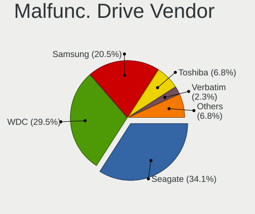

| Vendor              | Desktops | Drives | Percent |
|---------------------|----------|--------|---------|
| Seagate             | 15       | 16     | 34.09%  |
| WDC                 | 13       | 13     | 29.55%  |
| Samsung Electronics | 9        | 11     | 20.45%  |
| Toshiba             | 3        | 3      | 6.82%   |
| Verbatim            | 1        | 1      | 2.27%   |
| SanDisk             | 1        | 1      | 2.27%   |
| Micron Technology   | 1        | 1      | 2.27%   |
| Crucial             | 1        | 1      | 2.27%   |

Malfunc. HDD Vendor
-------------------

Vendors of faulty HDD drives

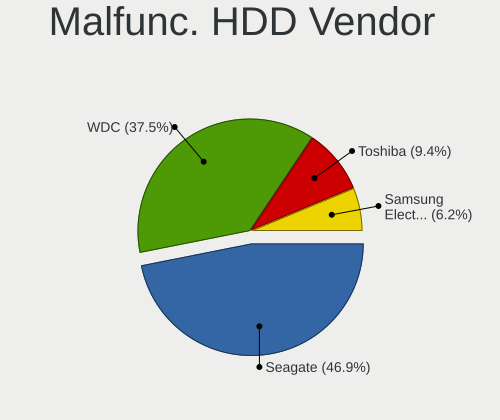

| Vendor              | Desktops | Drives | Percent |
|---------------------|----------|--------|---------|
| Seagate             | 15       | 16     | 46.88%  |
| WDC                 | 12       | 12     | 37.5%   |
| Toshiba             | 3        | 3      | 9.38%   |
| Samsung Electronics | 2        | 2      | 6.25%   |

Malfunc. Drive Kind
-------------------

Kinds of faulty drives

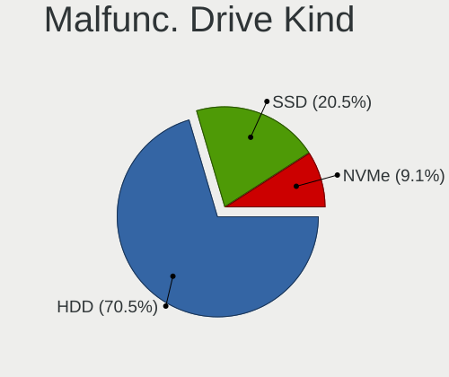

| Kind | Desktops | Drives | Percent |
|------|----------|--------|---------|
| HDD  | 31       | 33     | 70.45%  |
| SSD  | 9        | 10     | 20.45%  |
| NVMe | 4        | 4      | 9.09%   |

Failed Drives
-------------

Failed drive models

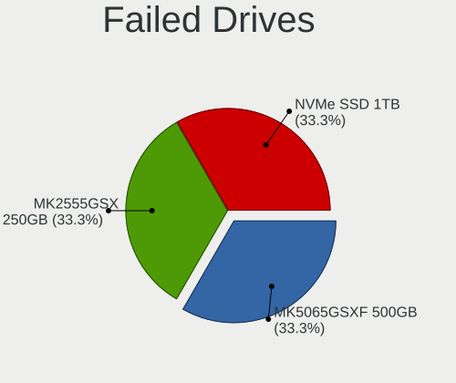

| Model                    | Desktops | Drives | Percent |
|--------------------------|----------|--------|---------|
| Toshiba MK5065GSXF 500GB | 1        | 1      | 33.33%  |
| Toshiba MK2555GSX 250GB  | 1        | 1      | 33.33%  |
| KIOXIA NVMe SSD 1TB      | 1        | 1      | 33.33%  |

Failed Drive Vendor
-------------------

Failed drive vendors

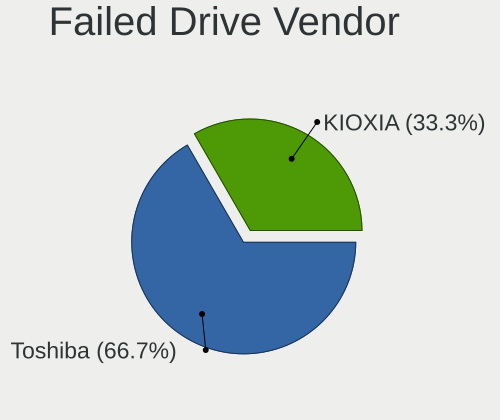

| Vendor  | Desktops | Drives | Percent |
|---------|----------|--------|---------|
| Toshiba | 2        | 2      | 66.67%  |
| KIOXIA  | 1        | 1      | 33.33%  |

Drive Status
------------

Number of failed and malfunc. drives

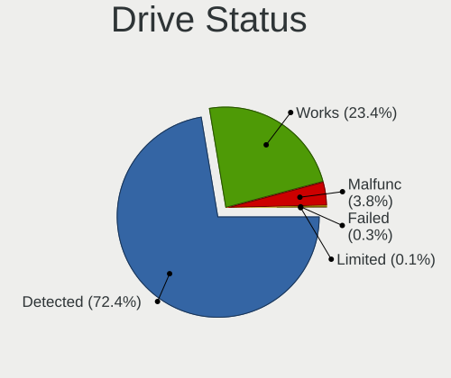

| Status   | Desktops | Drives | Percent |
|----------|----------|--------|---------|
| Detected | 781      | 2495   | 72.38%  |
| Works    | 253      | 715    | 23.45%  |
| Malfunc  | 41       | 47     | 3.8%    |
| Failed   | 3        | 3      | 0.28%   |
| Limited  | 1        | 1      | 0.09%   |

Storage controller
------------------

Storage Vendor
--------------

Storage controller vendors

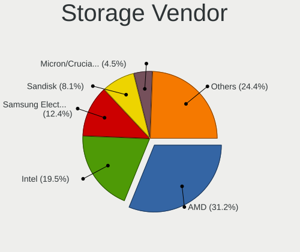

| Vendor                        | Desktops | Percent |
|-------------------------------|----------|---------|
| AMD                           | 619      | 31.17%  |
| Intel                         | 387      | 19.49%  |
| Samsung Electronics           | 246      | 12.39%  |
| Sandisk                       | 160      | 8.06%   |
| Micron/Crucial Technology     | 89       | 4.48%   |
| Phison Electronics            | 88       | 4.43%   |
| ASMedia Technology            | 88       | 4.43%   |
| Kingston Technology Company   | 86       | 4.33%   |
| ADATA Technology              | 32       | 1.61%   |
| Realtek Semiconductor         | 26       | 1.31%   |
| MAXIO Technology (Hangzhou)   | 26       | 1.31%   |
| Silicon Motion                | 19       | 0.96%   |
| Shenzhen Longsys Electronics  | 19       | 0.96%   |
| Micron Technology             | 15       | 0.76%   |
| SK hynix                      | 10       | 0.5%    |
| KIOXIA                        | 10       | 0.5%    |
| JMicron Technology            | 9        | 0.45%   |
| Seagate Technology            | 8        | 0.4%    |
| Marvell Technology Group      | 8        | 0.4%    |
| Solidigm                      | 7        | 0.35%   |
| Broadcom / LSI                | 6        | 0.3%    |
| Toshiba America Info Systems  | 5        | 0.25%   |
| Nvidia                        | 5        | 0.25%   |
| INNOGRIT                      | 4        | 0.2%    |
| Netac Technology              | 3        | 0.15%   |
| Hosin Global Electronics      | 3        | 0.15%   |
| Yangtze Memory Technologies   | 1        | 0.05%   |
| Silicon Image                 | 1        | 0.05%   |
| LSI Logic / Symbios Logic     | 1        | 0.05%   |
| Lite-On Technology            | 1        | 0.05%   |
| Integrated Technology Express | 1        | 0.05%   |
| Hewlett-Packard               | 1        | 0.05%   |
| Biwin Storage Technology      | 1        | 0.05%   |
| Apple                         | 1        | 0.05%   |

Storage Model
-------------

Storage controller models

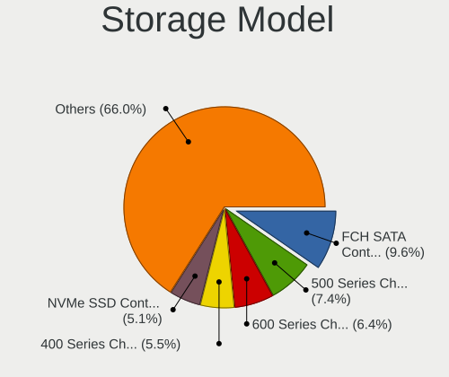

| Model                                                                          | Desktops | Percent |
|--------------------------------------------------------------------------------|----------|---------|
| AMD FCH SATA Controller [AHCI mode]                                            | 215      | 9.62%   |
| AMD 500 Series Chipset SATA Controller                                         | 165      | 7.39%   |
| AMD 600 Series Chipset SATA Controller                                         | 143      | 6.4%    |
| AMD 400 Series Chipset SATA Controller                                         | 123      | 5.51%   |
| Samsung NVMe SSD Controller SM981/PM981/PM983                                  | 113      | 5.06%   |
| ASMedia ASM1061/ASM1062 Serial ATA Controller                                  | 72       | 3.22%   |
| Samsung NVMe SSD Controller PM9A1/PM9A3/980PRO                                 | 67       | 3%      |
| Micron/Crucial P2 [Nick P2] / P3 / P3 Plus NVMe PCIe SSD (DRAM-less)           | 50       | 2.24%   |
| SanDisk WD SN560/SN740/SN770/SN5000 NVMe SSD                                   | 38       | 1.7%    |
| Samsung NVMe SSD Controller S4LV008[Pascal]                                    | 38       | 1.7%    |
| Intel 200 Series PCH SATA controller [AHCI mode]                               | 37       | 1.66%   |
| Intel Alder Lake-S PCH SATA Controller [AHCI Mode]                             | 36       | 1.61%   |
| Intel Cannon Lake PCH SATA AHCI Controller                                     | 33       | 1.48%   |
| Sandisk WD Black SN850X NVMe SSD                                               | 31       | 1.39%   |
| Intel 8 Series/C220 Series Chipset Family 6-port SATA Controller 1 [AHCI mode] | 31       | 1.39%   |
| Phison E12 NVMe Controller                                                     | 28       | 1.25%   |
| Intel 500 Series Chipset Family SATA AHCI Controller                           | 27       | 1.21%   |
| SanDisk Ultra 3D / WD PC SN530, IX SN530, Blue SN550 NVMe SSD (DRAM-less)      | 25       | 1.12%   |
| Samsung NVMe SSD Controller 980 (DRAM-less)                                    | 25       | 1.12%   |
| Intel Raptor Lake SATA AHCI Controller                                         | 25       | 1.12%   |
| Intel Q170/Q150/B150/H170/H110/Z170/CM236 Chipset SATA Controller [AHCI Mode]  | 25       | 1.12%   |
| Intel 6 Series/C200 Series Chipset Family 6 port Desktop SATA AHCI Controller  | 24       | 1.07%   |
| Intel SATA Controller [RAID mode]                                              | 23       | 1.03%   |
| Phison E16 PCIe4 NVMe Controller                                               | 22       | 0.98%   |
| Intel 7 Series/C210 Series Chipset Family 6-port SATA Controller [AHCI mode]   | 22       | 0.98%   |
| Kingston Company KC3000/FURY Renegade NVMe SSD [E18]                           | 19       | 0.85%   |
| Samsung NVMe SSD Controller SM961/PM961/SM963                                  | 18       | 0.81%   |
| Kingston Company NV2 NVMe SSD [SM2267XT] (DRAM-less)                           | 18       | 0.81%   |
| Kingston Company A2000 NVMe SSD [SM2263EN]                                     | 17       | 0.76%   |
| AMD SB7x0/SB8x0/SB9x0 SATA Controller [AHCI mode]                              | 17       | 0.76%   |
| Shenzhen Longsys Lexar NM790 / Patriot Viper VP4300 Lite NVMe SSD (DRAM-less)  | 16       | 0.72%   |
| SanDisk WD PC SN810 / Black SN850 NVMe SSD                                     | 16       | 0.72%   |
| MAXIO (Hangzhou) NVMe SSD Controller MAP1202 (DRAM-less)                       | 16       | 0.72%   |
| AMD A320 Chipset SATA Controller [AHCI mode]                                   | 16       | 0.72%   |
| SanDisk Ultra 3D / WD Blue SN570 NVMe SSD (DRAM-less)                          | 15       | 0.67%   |
| Micron/Crucial P5 Plus NVMe PCIe SSD                                           | 15       | 0.67%   |
| Intel SSD 660P Series                                                          | 15       | 0.67%   |
| AMD SB7x0/SB8x0/SB9x0 IDE Controller                                           | 15       | 0.67%   |
| AMD 300 Series Chipset SATA Controller                                         | 15       | 0.67%   |
| Phison E18 PCIe4 NVMe Controller                                               | 14       | 0.63%   |

Storage Kind
------------

Kind of storage controller (IDE, SATA, NVMe, SAS, ...)

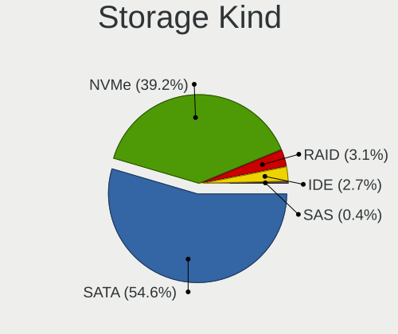

| Kind | Desktops | Percent |
|------|----------|---------|
| SATA | 947      | 54.55%  |
| NVMe | 681      | 39.23%  |
| RAID | 54       | 3.11%   |
| IDE  | 47       | 2.71%   |
| SAS  | 7        | 0.4%    |

Processor
---------

CPU Vendor
----------

Processor vendors

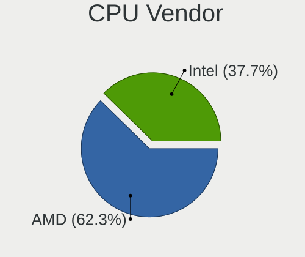

| Vendor | Desktops | Percent |
|--------|----------|---------|
| AMD    | 630      | 62.31%  |
| Intel  | 381      | 37.69%  |

CPU Model
---------

Processor models

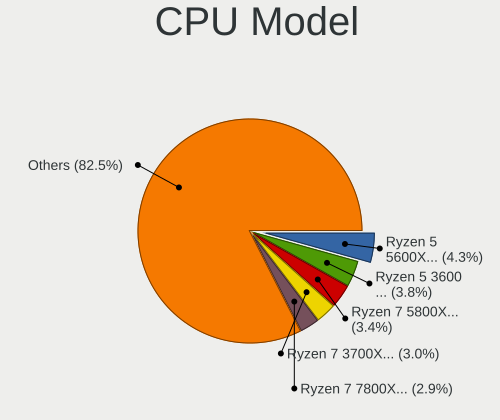

| Model                                       | Desktops | Percent |
|---------------------------------------------|----------|---------|
| AMD Ryzen 5 5600X 6-Core Processor          | 44       | 4.33%   |
| AMD Ryzen 5 3600 6-Core Processor           | 39       | 3.83%   |
| AMD Ryzen 7 5800X 8-Core Processor          | 35       | 3.44%   |
| AMD Ryzen 7 3700X 8-Core Processor          | 31       | 3.05%   |
| AMD Ryzen 7 7800X3D 8-Core Processor        | 29       | 2.85%   |
| AMD Ryzen 9 5900X 12-Core Processor         | 26       | 2.56%   |
| AMD Ryzen 7 5800X3D 8-Core Processor        | 24       | 2.36%   |
| AMD Ryzen 7 5700X 8-Core Processor          | 22       | 2.16%   |
| AMD Ryzen 5 5600G with Radeon Graphics      | 21       | 2.06%   |
| AMD Ryzen 5 5600 6-Core Processor           | 21       | 2.06%   |
| AMD Ryzen 5 7600X 6-Core Processor          | 20       | 1.97%   |
| AMD Ryzen 5 2600 Six-Core Processor         | 19       | 1.87%   |
| AMD Ryzen 9 5950X 16-Core Processor         | 16       | 1.57%   |
| AMD Ryzen 9 3900X 12-Core Processor         | 15       | 1.47%   |
| AMD Ryzen 7 9800X3D 8-Core Processor        | 15       | 1.47%   |
| AMD Ryzen 9 7950X3D 16-Core Processor       | 14       | 1.38%   |
| Intel Core i9-9900K CPU @ 3.60GHz           | 12       | 1.18%   |
| AMD Ryzen 7 5700G with Radeon Graphics      | 12       | 1.18%   |
| AMD Ryzen 7 5700X3D 8-Core Processor        | 11       | 1.08%   |
| AMD Ryzen 9 7950X 16-Core Processor         | 10       | 0.98%   |
| AMD Ryzen 3 3200G with Radeon Vega Graphics | 10       | 0.98%   |
| Intel Core i7-6700K CPU @ 4.00GHz           | 9        | 0.88%   |
| Intel Core i5-9400F CPU @ 2.90GHz           | 9        | 0.88%   |
| Intel Core i5-10400F CPU @ 2.90GHz          | 9        | 0.88%   |
| AMD Ryzen 7 7700X 8-Core Processor          | 9        | 0.88%   |
| AMD Ryzen 5 5500                            | 9        | 0.88%   |
| Intel Core i5-3470 CPU @ 3.20GHz            | 8        | 0.79%   |
| AMD Ryzen 9 7900X 12-Core Processor         | 8        | 0.79%   |
| AMD Ryzen 5 3600X 6-Core Processor          | 8        | 0.79%   |
| Intel Core i7-4790K CPU @ 4.00GHz           | 7        | 0.69%   |
| Intel Core i7-3770 CPU @ 3.40GHz            | 7        | 0.69%   |
| Intel Core i5-10400 CPU @ 2.90GHz           | 7        | 0.69%   |
| Intel 13th Gen Core i5-13400F               | 7        | 0.69%   |
| AMD Ryzen 7 3800X 8-Core Processor          | 7        | 0.69%   |
| Intel Core i7-4790 CPU @ 3.60GHz            | 6        | 0.59%   |
| Intel Core i7-4770 CPU @ 3.40GHz            | 6        | 0.59%   |
| Intel Core i5-8400 CPU @ 2.80GHz            | 6        | 0.59%   |
| Intel 12th Gen Core i5-12600K               | 6        | 0.59%   |
| AMD Ryzen 5 7600 6-Core Processor           | 6        | 0.59%   |
| AMD Ryzen 5 4600G with Radeon Graphics      | 6        | 0.59%   |

CPU Model Family
----------------

Processor model prefix

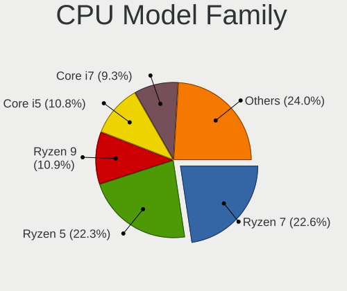

| Model                   | Desktops | Percent |
|-------------------------|----------|---------|
| AMD Ryzen 7             | 230      | 22.64%  |
| AMD Ryzen 5             | 227      | 22.34%  |
| AMD Ryzen 9             | 111      | 10.93%  |
| Intel Core i5           | 110      | 10.83%  |
| Intel Core i7           | 94       | 9.25%   |
| Other                   | 80       | 7.87%   |
| Intel Xeon              | 41       | 4.04%   |
| Intel Core i3           | 22       | 2.17%   |
| Intel Core i9           | 20       | 1.97%   |
| AMD Ryzen 3             | 18       | 1.77%   |
| AMD FX                  | 15       | 1.48%   |
| Intel Pentium           | 5        | 0.49%   |
| AMD Phenom II X6        | 5        | 0.49%   |
| AMD Phenom II X4        | 5        | 0.49%   |
| AMD A8                  | 5        | 0.49%   |
| Intel Core 2 Duo        | 3        | 0.3%    |
| Intel Celeron           | 3        | 0.3%    |
| AMD A10                 | 3        | 0.3%    |
| Intel Core 2 Quad       | 2        | 0.2%    |
| AMD Athlon X4           | 2        | 0.2%    |
| AMD A4                  | 2        | 0.2%    |
| Intel Pentium Gold      | 1        | 0.1%    |
| Intel Pentium Dual-Core | 1        | 0.1%    |
| Intel Core              | 1        | 0.1%    |
| Intel Atom              | 1        | 0.1%    |
| AMD Ryzen Threadripper  | 1        | 0.1%    |
| AMD Ryzen 7 PRO         | 1        | 0.1%    |
| AMD Phenom              | 1        | 0.1%    |
| AMD Athlon II X4        | 1        | 0.1%    |
| AMD Athlon II X2        | 1        | 0.1%    |
| AMD Athlon Dual Core    | 1        | 0.1%    |
| AMD Athlon              | 1        | 0.1%    |
| AMD A6                  | 1        | 0.1%    |
| AMD A12                 | 1        | 0.1%    |

CPU Cores
---------

Number of processor cores

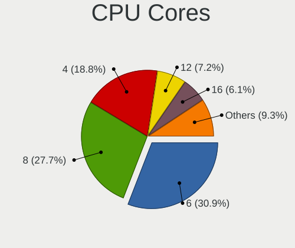

| Number | Desktops | Percent |
|--------|----------|---------|
| 6      | 313      | 30.9%   |
| 8      | 281      | 27.74%  |
| 4      | 190      | 18.76%  |
| 12     | 73       | 7.21%   |
| 16     | 62       | 6.12%   |
| 2      | 40       | 3.95%   |
| 10     | 22       | 2.17%   |
| 14     | 12       | 1.18%   |
| 24     | 9        | 0.89%   |
| 3      | 4        | 0.39%   |
| 20     | 3        | 0.3%    |
| 1      | 3        | 0.3%    |
| 18     | 1        | 0.1%    |

CPU Sockets
-----------

Number of sockets

| Number | Desktops | Percent |
|--------|----------|---------|
| 1      | 1006     | 99.51%  |
| 2      | 5        | 0.49%   |

CPU Threads
-----------

Threads per core (Hyper-Threading)

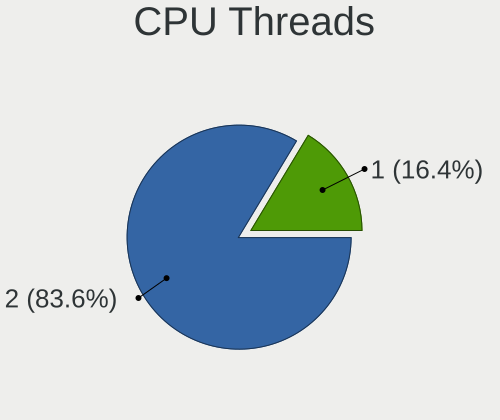

| Number | Desktops | Percent |
|--------|----------|---------|
| 2      | 848      | 83.63%  |
| 1      | 166      | 16.37%  |

CPU Op-Modes
------------

CPU Operation Modes (32-bit, 64-bit)

| Op mode        | Desktops | Percent |
|----------------|----------|---------|
| 32-bit, 64-bit | 1011     | 100%    |

CPU Microcode
-------------

Microcode number

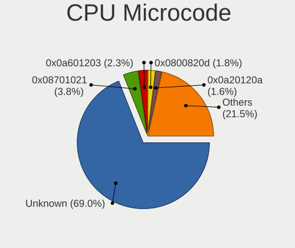

| Number     | Desktops | Percent |
|------------|----------|---------|
| Unknown    | 712      | 68.99%  |
| 0x08701021 | 39       | 3.78%   |
| 0x0a601203 | 24       | 2.33%   |
| 0x0800820d | 19       | 1.84%   |
| 0x0a20120a | 16       | 1.55%   |
| 0x0a201016 | 16       | 1.55%   |
| 0x306c3    | 15       | 1.45%   |
| 0x0a50000d | 13       | 1.26%   |
| 0x306a9    | 12       | 1.16%   |
| 0x08701030 | 9        | 0.87%   |
| 0x08108109 | 8        | 0.78%   |
| 0x06000822 | 8        | 0.78%   |
| 0x206a7    | 7        | 0.68%   |
| 0x0a601206 | 7        | 0.68%   |
| 0x0a201204 | 7        | 0.68%   |
| 0x906ea    | 6        | 0.58%   |
| 0x906e9    | 6        | 0.58%   |
| 0x90672    | 6        | 0.58%   |
| 0x0a20120e | 6        | 0.58%   |
| 0x0a201205 | 6        | 0.58%   |
| 0x08001138 | 6        | 0.58%   |
| 0xa0655    | 5        | 0.48%   |
| 0x0a50000c | 5        | 0.48%   |
| 0xa0653    | 4        | 0.39%   |
| 0x906ed    | 4        | 0.39%   |
| 0x906ec    | 4        | 0.39%   |
| 0x506e3    | 4        | 0.39%   |
| 0x206d7    | 4        | 0.39%   |
| 0x0a201025 | 4        | 0.39%   |
| 0x0a201009 | 4        | 0.39%   |
| 0x08701013 | 4        | 0.39%   |
| 0x0800820b | 3        | 0.29%   |
| 0x06003106 | 3        | 0.29%   |
| 0x06001119 | 3        | 0.29%   |
| 0x010000bf | 3        | 0.29%   |
| 0xa0671    | 2        | 0.19%   |
| 0x1067a    | 2        | 0.19%   |
| 0x0a50000f | 2        | 0.19%   |
| 0x0a404102 | 2        | 0.19%   |
| 0x08600106 | 2        | 0.19%   |

CPU Microarch
-------------

Microarchitecture

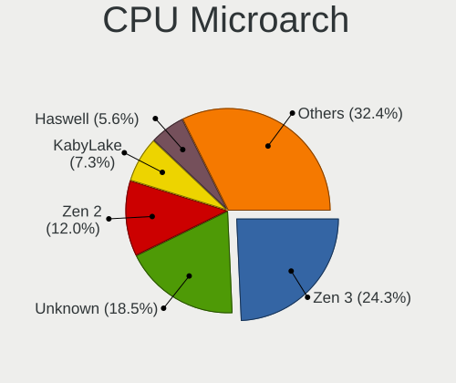

| Name             | Desktops | Percent |
|------------------|----------|---------|
| Zen 3            | 247      | 24.29%  |
| Unknown          | 188      | 18.49%  |
| Zen 2            | 122      | 12%     |
| KabyLake         | 74       | 7.28%   |
| Haswell          | 57       | 5.6%    |
| Zen+             | 52       | 5.11%   |
| IvyBridge        | 45       | 4.42%   |
| CometLake        | 40       | 3.93%   |
| Alderlake Hybrid | 40       | 3.93%   |
| Skylake          | 31       | 3.05%   |
| SandyBridge      | 25       | 2.46%   |
| Piledriver       | 20       | 1.97%   |
| Zen              | 16       | 1.57%   |
| K10              | 13       | 1.28%   |
| Icelake          | 12       | 1.18%   |
| Penryn           | 7        | 0.69%   |
| Broadwell        | 7        | 0.69%   |
| Westmere         | 4        | 0.39%   |
| Steamroller      | 4        | 0.39%   |
| Nehalem          | 3        | 0.29%   |
| Excavator        | 2        | 0.2%    |
| TigerLake        | 1        | 0.1%    |
| Silvermont       | 1        | 0.1%    |
| Puma             | 1        | 0.1%    |
| Lunarlake Hybrid | 1        | 0.1%    |
| K8 Hammer        | 1        | 0.1%    |
| K10 Llano        | 1        | 0.1%    |
| Core             | 1        | 0.1%    |
| Bulldozer        | 1        | 0.1%    |

Graphics
--------

GPU Vendor
----------

Vendors of graphics cards

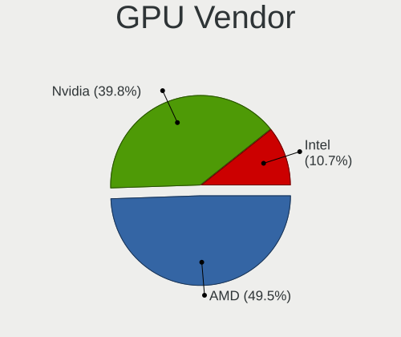

| Vendor | Desktops | Percent |
|--------|----------|---------|
| AMD    | 564      | 49.47%  |
| Nvidia | 454      | 39.82%  |
| Intel  | 122      | 10.7%   |

GPU Model
---------

Graphics card models

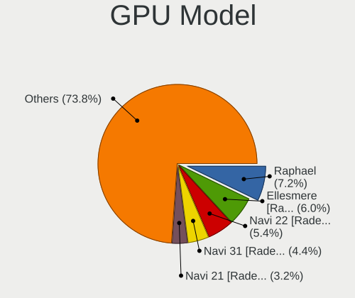

| Model                                                                       | Desktops | Percent |
|-----------------------------------------------------------------------------|----------|---------|
| AMD Raphael                                                                 | 89       | 7.18%   |
| AMD Ellesmere [Radeon RX 470/480/570/570X/580/580X/590]                     | 74       | 5.97%   |
| AMD Navi 22 [Radeon RX 6700/6700 XT/6750 XT / 6800M/6850M XT]               | 67       | 5.41%   |
| AMD Navi 31 [Radeon RX 7900 XT/7900 XTX/7900 GRE/7900M]                     | 54       | 4.36%   |
| AMD Navi 21 [Radeon RX 6800/6800 XT / 6900 XT]                              | 40       | 3.23%   |
| AMD Navi 23 [Radeon RX 6600/6600 XT/6600M]                                  | 38       | 3.07%   |
| AMD Navi 10 [Radeon RX 5600 OEM/5600 XT / 5700/5700 XT]                     | 32       | 2.58%   |
| AMD Navi 32 [Radeon RX 7700 XT / 7800 XT]                                   | 27       | 2.18%   |
| AMD Granite Ridge [Radeon Graphics]                                         | 27       | 2.18%   |
| AMD Cezanne [Radeon Vega Series / Radeon Vega Mobile Series]                | 25       | 2.02%   |
| Nvidia GA106 [GeForce RTX 3060 Lite Hash Rate]                              | 24       | 1.94%   |
| Intel Xeon E3-1200 v3/4th Gen Core Processor Integrated Graphics Controller | 20       | 1.61%   |
| Nvidia GA104 [GeForce RTX 3070]                                             | 17       | 1.37%   |
| Nvidia GA102 [GeForce RTX 3080]                                             | 15       | 1.21%   |
| Nvidia GP104 [GeForce GTX 1070]                                             | 14       | 1.13%   |
| Nvidia GP102 [GeForce GTX 1080 Ti]                                          | 14       | 1.13%   |
| Nvidia GP107 [GeForce GTX 1050 Ti]                                          | 13       | 1.05%   |
| Nvidia GA104 [GeForce RTX 3060 Ti Lite Hash Rate]                           | 13       | 1.05%   |
| Nvidia TU117 [GeForce GTX 1650]                                             | 12       | 0.97%   |
| Nvidia AD102 [GeForce RTX 4090]                                             | 12       | 0.97%   |
| AMD Navi 48 [Radeon RX 9070/9070 XT/9070 GRE]                               | 12       | 0.97%   |
| Nvidia GP104 [GeForce GTX 1080]                                             | 11       | 0.89%   |
| AMD Polaris 20 XL [Radeon RX 580 2048SP]                                    | 11       | 0.89%   |
| Nvidia TU116 [GeForce GTX 1660 SUPER]                                       | 10       | 0.81%   |
| Nvidia TU106 [GeForce RTX 2060 Rev. A]                                      | 10       | 0.81%   |
| Nvidia GM204 [GeForce GTX 970]                                              | 10       | 0.81%   |
| Nvidia GA104 [GeForce RTX 3070 Lite Hash Rate]                              | 10       | 0.81%   |
| Nvidia AD104 [GeForce RTX 4070]                                             | 10       | 0.81%   |
| Intel Xeon E3-1200 v2/3rd Gen Core processor Graphics Controller            | 10       | 0.81%   |
| Intel Raptor Lake-S GT1 [UHD Graphics 770]                                  | 10       | 0.81%   |
| Intel Alder Lake-S GT1 [UHD Graphics 770]                                   | 10       | 0.81%   |
| AMD Renoir [Radeon Vega Series / Radeon Vega Mobile Series]                 | 10       | 0.81%   |
| AMD Picasso/Raven 2 [Radeon Vega Series / Radeon Vega Mobile Series]        | 10       | 0.81%   |
| AMD Navi 33 [Radeon RX 7600/7600 XT/7600M XT/7600S/7700S / PRO W7600]       | 10       | 0.81%   |
| Nvidia GM206 [GeForce GTX 960]                                              | 9        | 0.73%   |
| Nvidia GA102 [GeForce RTX 3090]                                             | 9        | 0.73%   |
| Nvidia GA102 [GeForce RTX 3080 Ti]                                          | 9        | 0.73%   |
| Nvidia AD107 [GeForce RTX 4060]                                             | 9        | 0.73%   |
| Nvidia AD104 [GeForce RTX 4070 SUPER]                                       | 9        | 0.73%   |
| Nvidia AD103 [GeForce RTX 4080]                                             | 9        | 0.73%   |

GPU Combo
---------

Combinations of graphics cards

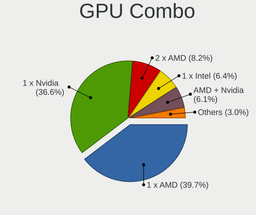

| Name           | Desktops | Percent |
|----------------|----------|---------|
| 1 x AMD        | 405      | 39.67%  |
| 1 x Nvidia     | 374      | 36.63%  |
| 2 x AMD        | 84       | 8.23%   |
| 1 x Intel      | 65       | 6.37%   |
| AMD + Nvidia   | 62       | 6.07%   |
| Intel + Nvidia | 14       | 1.37%   |
| Intel + AMD    | 12       | 1.18%   |
| 2 x Nvidia     | 5        | 0.49%   |

GPU Driver
----------

Free vs proprietary

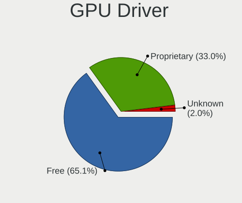

| Driver      | Desktops | Percent |
|-------------|----------|---------|
| Free        | 667      | 65.07%  |
| Proprietary | 338      | 32.98%  |
| Unknown     | 20       | 1.95%   |

GPU Memory
----------

Total video memory

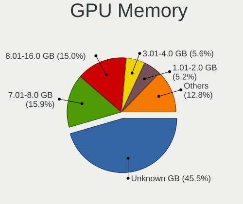

| Size in GB | Desktops | Percent |
|------------|----------|---------|
| Unknown    | 472      | 45.47%  |
| 7.01-8.0   | 165      | 15.9%   |
| 8.01-16.0  | 156      | 15.03%  |
| 3.01-4.0   | 58       | 5.59%   |
| 1.01-2.0   | 54       | 5.2%    |
| 0.01-0.5   | 46       | 4.43%   |
| 16.01-24.0 | 40       | 3.85%   |
| 5.01-6.0   | 22       | 2.12%   |
| 0.51-1.0   | 20       | 1.93%   |
| 2.01-3.0   | 5        | 0.48%   |

Monitor
-------

Monitor Vendor
--------------

Monitor vendors

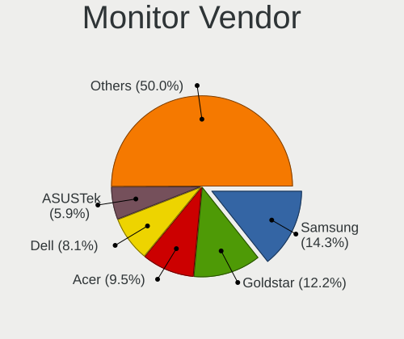

| Vendor               | Desktops | Percent |
|----------------------|----------|---------|
| Samsung Electronics  | 185      | 14.33%  |
| Goldstar             | 157      | 12.16%  |
| Acer                 | 122      | 9.45%   |
| Dell                 | 105      | 8.13%   |
| ASUSTek Computer     | 76       | 5.89%   |
| AOC                  | 70       | 5.42%   |
| BenQ                 | 65       | 5.03%   |
| Ancor Communications | 57       | 4.42%   |
| Hewlett-Packard      | 53       | 4.11%   |
| MSI                  | 45       | 3.49%   |
| ViewSonic            | 29       | 2.25%   |
| Gigabyte Technology  | 27       | 2.09%   |
| Philips              | 26       | 2.01%   |
| Sony                 | 23       | 1.78%   |
| Lenovo               | 21       | 1.63%   |
| Sceptre Tech         | 16       | 1.24%   |
| Iiyama               | 16       | 1.24%   |
| Vizio                | 15       | 1.16%   |
| Mi                   | 11       | 0.85%   |
| Unknown              | 8        | 0.62%   |
| HKC                  | 8        | 0.62%   |
| Pixio                | 7        | 0.54%   |
| NEC Computers        | 7        | 0.54%   |
| Toshiba              | 6        | 0.46%   |
| Eizo                 | 6        | 0.46%   |
| SKG                  | 5        | 0.39%   |
| HUAWEI               | 5        | 0.39%   |
| Hitachi              | 5        | 0.39%   |
| SANYO                | 4        | 0.31%   |
| Insignia             | 4        | 0.31%   |
| Element              | 4        | 0.31%   |
| Apple                | 4        | 0.31%   |
| AOpen                | 4        | 0.31%   |
| Viotek               | 3        | 0.23%   |
| Sharp                | 3        | 0.23%   |
| Panasonic            | 3        | 0.23%   |
| Denver               | 3        | 0.23%   |
| DENON                | 3        | 0.23%   |
| Corsair              | 3        | 0.23%   |
| Unknown              | 3        | 0.23%   |

Monitor Model
-------------

Monitor models

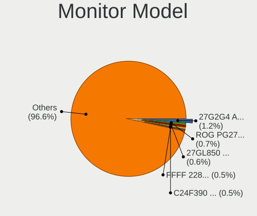

| Model                                                                 | Desktops | Percent |
|-----------------------------------------------------------------------|----------|---------|
| AOC 27G2G4 AOC2702 1920x1080 598x336mm 27.0-inch                      | 16       | 1.16%   |
| Ancor Communications ROG PG279Q ACI27EC 2560x1440 598x336mm 27.0-inch | 9        | 0.65%   |
| Goldstar 27GL850 GSM5B7F 2560x1440 597x336mm 27.0-inch                | 8        | 0.58%   |
| Unknown LCD Monitor FFFF 2288x1287 2550x2550mm 142.0-inch             | 7        | 0.51%   |
| Samsung Electronics C24F390 SAM0D2C 1920x1080 521x293mm 23.5-inch     | 7        | 0.51%   |
| Goldstar LG TV SSCR2 GSMC0C8 3840x2160                                | 7        | 0.51%   |
| Dell S2721DGF DEL41D9 2560x1440 597x336mm 27.0-inch                   | 7        | 0.51%   |
| Samsung Electronics U28E590 SAM0C4D 3840x2160 607x345mm 27.5-inch     | 6        | 0.43%   |
| Samsung Electronics C27F390 SAM0D32 1920x1080 598x336mm 27.0-inch     | 6        | 0.43%   |
| Mi Monitor XMI3444 3440x1440 797x334mm 34.0-inch                      | 6        | 0.43%   |
| Goldstar ULTRAGEAR GSM5BD3 2560x1440 697x392mm 31.5-inch              | 6        | 0.43%   |
| ASUSTek Computer VP28U AUS28B1 3840x2160 621x341mm 27.9-inch          | 6        | 0.43%   |
| Goldstar ULTRAGEAR GSM5B71 1920x1080 597x336mm 27.0-inch              | 5        | 0.36%   |
| Goldstar Ultra HD GSM5B09 3840x2160 600x340mm 27.2-inch               | 5        | 0.36%   |
| Gigabyte Technology M27Q GBT270D 2560x1440 597x336mm 27.0-inch        | 5        | 0.36%   |
| ASUSTek Computer VG27A AUS2722 2560x1440 597x336mm 27.0-inch          | 5        | 0.36%   |
| AOC Q3279WG5B AOC3279 2560x1440 725x428mm 33.1-inch                   | 5        | 0.36%   |
| AOC 2260WG5 AOC2260 1920x1080 477x268mm 21.5-inch                     | 5        | 0.36%   |
| Samsung Electronics C49RG9x SAM0F9C 3360x1440 1193x336mm 48.8-inch    | 4        | 0.29%   |
| Goldstar ULTRAGEAR GSM7766 2560x1440 697x392mm 31.5-inch              | 4        | 0.29%   |
| Dell AW3423DWF DELA212 3440x1440 800x337mm 34.2-inch                  | 4        | 0.29%   |
| BenQ GL2760 BNQ78D5 1920x1080 598x336mm 27.0-inch                     | 4        | 0.29%   |
| BenQ GL2460 BNQ78CE 1920x1080 531x299mm 24.0-inch                     | 4        | 0.29%   |
| ASUSTek Computer VP249 AUS24AF 1920x1080 527x296mm 23.8-inch          | 4        | 0.29%   |
| ASUSTek Computer PG32UCDM AUS32F2 3840x2160 699x395mm 31.6-inch       | 4        | 0.29%   |
| Ancor Communications VX238 ACI23C1 1920x1080 510x290mm 23.1-inch      | 4        | 0.29%   |
| Ancor Communications VG248 ACI24A4 1920x1080 531x299mm 24.0-inch      | 4        | 0.29%   |
| Acer GN246HL ACR02FA 1920x1080 531x299mm 24.0-inch                    | 4        | 0.29%   |
| Acer GN246HL ACR02F9 1920x1080 531x299mm 24.0-inch                    | 4        | 0.29%   |
| Vizio D43f-F1 VIZ1027 1920x1080 940x529mm 42.5-inch                   | 3        | 0.22%   |
| Sony TV *00 SNYF303 1920x1080 952x535mm 43.0-inch                     | 3        | 0.22%   |
| Samsung Electronics LF24T35 SAM707D 1920x1080 528x297mm 23.9-inch     | 3        | 0.22%   |
| Samsung Electronics LF22T35 SAM707B 1920x1080 477x268mm 21.5-inch     | 3        | 0.22%   |
| Samsung Electronics LCD Monitor SAM0F13 3840x2160 950x540mm 43.0-inch | 3        | 0.22%   |
| Samsung Electronics LC32G5xT SAM7089 2560x1440 698x393mm 31.5-inch    | 3        | 0.22%   |
| Samsung Electronics LC27G7xT SAM105C 2560x1440 597x336mm 27.0-inch    | 3        | 0.22%   |
| Samsung Electronics LC27G5xT SAM707A 2560x1440 597x336mm 27.0-inch    | 3        | 0.22%   |
| Philips PHL 240B9 PHL0966 1920x1200 518x324mm 24.1-inch               | 3        | 0.22%   |
| Philips PHL 223V5 PHLC0CF 1920x1080 477x268mm 21.5-inch               | 3        | 0.22%   |
| NEC Computers E233WM NEC2BE5 1920x1080 509x286mm 23.0-inch            | 3        | 0.22%   |

Monitor Resolution
------------------

Monitor screen resolution

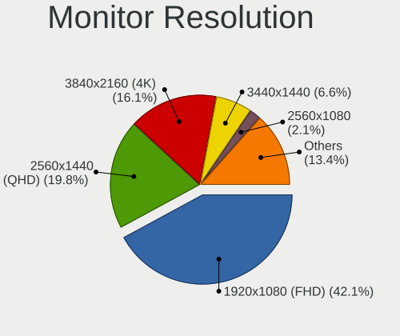

| Resolution         | Desktops | Percent |
|--------------------|----------|---------|
| 1920x1080 (FHD)    | 511      | 42.09%  |
| 2560x1440 (QHD)    | 240      | 19.77%  |
| 3840x2160 (4K)     | 195      | 16.06%  |
| 3440x1440          | 80       | 6.59%   |
| 2560x1080          | 25       | 2.06%   |
| 1680x1050 (WSXGA+) | 24       | 1.98%   |
| 1280x1024 (SXGA)   | 17       | 1.4%    |
| 1600x900 (HD+)     | 16       | 1.32%   |
| 3840x1080          | 15       | 1.24%   |
| 1440x900 (WXGA+)   | 15       | 1.24%   |
| 1920x1200 (WUXGA)  | 13       | 1.07%   |
| 1366x768 (WXGA)    | 13       | 1.07%   |
| 1360x768           | 12       | 0.99%   |
| 1920x540           | 10       | 0.82%   |
| 2288x1287          | 8        | 0.66%   |
| 2560x1600          | 4        | 0.33%   |
| Unknown            | 4        | 0.33%   |
| 3840x1600          | 3        | 0.25%   |
| 2560x2880          | 2        | 0.16%   |
| 1600x1200          | 2        | 0.16%   |
| 5760x1080          | 1        | 0.08%   |
| 3840x2560          | 1        | 0.08%   |
| 2880x1800          | 1        | 0.08%   |
| 2880x1600          | 1        | 0.08%   |
| 2048x1152          | 1        | 0.08%   |

Monitor Diagonal
----------------

Diagonal size in inches

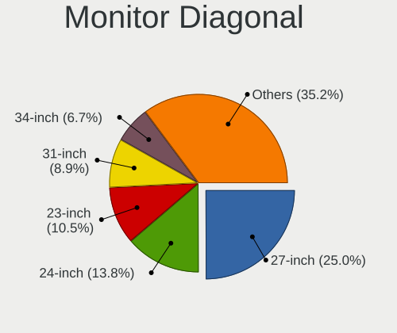

| Inches  | Desktops | Percent |
|---------|----------|---------|
| 27      | 319      | 24.96%  |
| 24      | 176      | 13.77%  |
| 23      | 134      | 10.49%  |
| 31      | 114      | 8.92%   |
| 34      | 85       | 6.65%   |
| 21      | 84       | 6.57%   |
| 84      | 34       | 2.66%   |
| 19      | 25       | 1.96%   |
| 32      | 24       | 1.88%   |
| 22      | 23       | 1.8%    |
| Unknown | 22       | 1.72%   |
| 72      | 21       | 1.64%   |
| 18      | 18       | 1.41%   |
| 48      | 17       | 1.33%   |
| 40      | 17       | 1.33%   |
| 20      | 15       | 1.17%   |
| 26      | 13       | 1.02%   |
| 42      | 11       | 0.86%   |
| 49      | 10       | 0.78%   |
| 25      | 9        | 0.7%    |
| 17      | 9        | 0.7%    |
| 54      | 8        | 0.63%   |
| 35      | 8        | 0.63%   |
| 29      | 8        | 0.63%   |
| 142     | 7        | 0.55%   |
| 28      | 7        | 0.55%   |
| 63      | 6        | 0.47%   |
| 33      | 5        | 0.39%   |
| 75      | 4        | 0.31%   |
| 52      | 4        | 0.31%   |
| 74      | 3        | 0.23%   |
| 65      | 3        | 0.23%   |
| 60      | 3        | 0.23%   |
| 47      | 3        | 0.23%   |
| 46      | 3        | 0.23%   |
| 37      | 3        | 0.23%   |
| 15      | 3        | 0.23%   |
| 14      | 3        | 0.23%   |
| 55      | 2        | 0.16%   |
| 38      | 2        | 0.16%   |

Monitor Width
-------------

Physical width

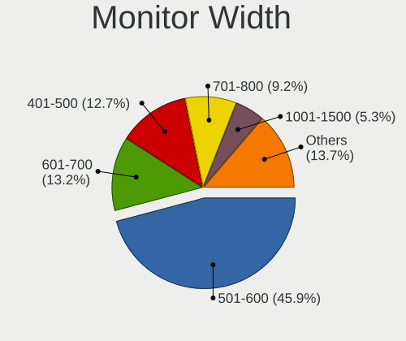

| Width in mm    | Desktops | Percent |
|----------------|----------|---------|
| 501-600        | 555      | 45.87%  |
| 601-700        | 160      | 13.22%  |
| 401-500        | 154      | 12.73%  |
| 701-800        | 111      | 9.17%   |
| 1001-1500      | 64       | 5.29%   |
| 1501-2000      | 63       | 5.21%   |
| 801-900        | 33       | 2.73%   |
| Unknown        | 22       | 1.82%   |
| 301-350        | 15       | 1.24%   |
| 351-400        | 11       | 0.91%   |
| 901-1000       | 11       | 0.91%   |
| More than 2000 | 8        | 0.66%   |
| 201-300        | 3        | 0.25%   |

Aspect Ratio
------------

Proportional relationship between the width and the height

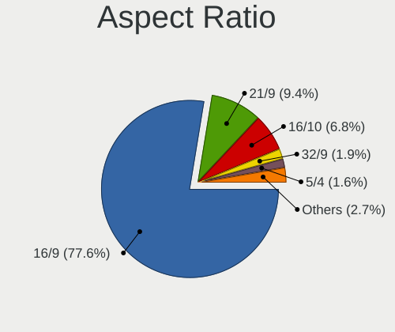

| Ratio   | Desktops | Percent |
|---------|----------|---------|
| 16/9    | 824      | 77.59%  |
| 21/9    | 100      | 9.42%   |
| 16/10   | 72       | 6.78%   |
| 32/9    | 20       | 1.88%   |
| 5/4     | 17       | 1.6%    |
| 4/3     | 7        | 0.66%   |
| 1.00    | 7        | 0.66%   |
| 3/2     | 5        | 0.47%   |
| Unknown | 4        | 0.38%   |
| 0.89    | 2        | 0.19%   |
| 6/5     | 1        | 0.09%   |
| 2.12    | 1        | 0.09%   |
| 2.01    | 1        | 0.09%   |
| 1.96    | 1        | 0.09%   |

Monitor Area
------------

Area in inch²

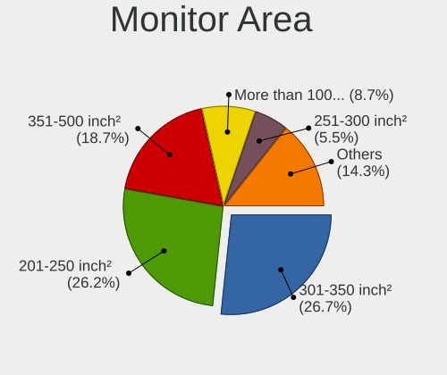

| Area in inch² | Desktops | Percent |
|----------------|----------|---------|
| 301-350        | 330      | 26.66%  |
| 201-250        | 324      | 26.17%  |
| 351-500        | 231      | 18.66%  |
| More than 1000 | 108      | 8.72%   |
| 251-300        | 68       | 5.49%   |
| 151-200        | 66       | 5.33%   |
| 501-1000       | 61       | 4.93%   |
| Unknown        | 22       | 1.78%   |
| 141-150        | 19       | 1.53%   |
| 101-110        | 5        | 0.4%    |
| 81-90          | 2        | 0.16%   |
| 41-50          | 1        | 0.08%   |
| 111-120        | 1        | 0.08%   |

Pixel Density
-------------

Pixels per inch

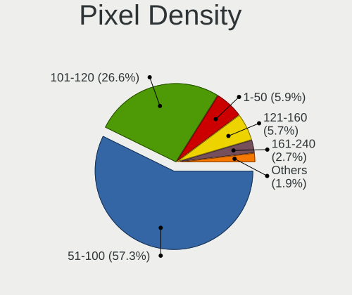

| Density | Desktops | Percent |
|---------|----------|---------|
| 51-100  | 665      | 57.28%  |
| 101-120 | 309      | 26.61%  |
| 1-50    | 68       | 5.86%   |
| 121-160 | 66       | 5.68%   |
| 161-240 | 31       | 2.67%   |
| Unknown | 22       | 1.89%   |

Multiple Monitors
-----------------

Total monitors connected

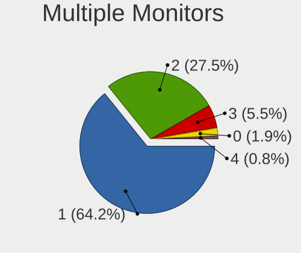

| Total | Desktops | Percent |
|-------|----------|---------|
| 1     | 660      | 64.2%   |
| 2     | 283      | 27.53%  |
| 3     | 57       | 5.54%   |
| 0     | 20       | 1.95%   |
| 4     | 8        | 0.78%   |

Network
-------

Net Controller Vendor
---------------------

Controller vendors

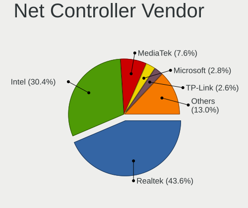

| Vendor                          | Desktops | Percent |
|---------------------------------|----------|---------|
| Realtek Semiconductor           | 690      | 43.59%  |
| Intel                           | 481      | 30.39%  |
| MediaTek                        | 120      | 7.58%   |
| Microsoft                       | 45       | 2.84%   |
| TP-Link                         | 41       | 2.59%   |
| Qualcomm Atheros                | 39       | 2.46%   |
| Broadcom                        | 27       | 1.71%   |
| Ralink Technology               | 17       | 1.07%   |
| Aquantia                        | 14       | 0.88%   |
| Qualcomm Technologies           | 8        | 0.51%   |
| Samsung Electronics             | 7        | 0.44%   |
| NetGear                         | 6        | 0.38%   |
| Broadcom Limited                | 6        | 0.38%   |
| ASIX Electronics                | 6        | 0.38%   |
| Xiaomi                          | 5        | 0.32%   |
| ASUSTek Computer                | 5        | 0.32%   |
| Qualcomm Atheros Communications | 4        | 0.25%   |
| QinHeng Electronics             | 4        | 0.25%   |
| Mellanox Technologies           | 4        | 0.25%   |
| Google                          | 4        | 0.25%   |
| D-Link                          | 4        | 0.25%   |
| Ralink                          | 3        | 0.19%   |
| Qualcomm                        | 3        | 0.19%   |
| OPPO Electronics                | 3        | 0.19%   |
| Oculus VR                       | 3        | 0.19%   |
| Motorola PCS                    | 3        | 0.19%   |
| DisplayLink                     | 3        | 0.19%   |
| Nvidia                          | 2        | 0.13%   |
| Linksys                         | 2        | 0.13%   |
| Edimax Technology               | 2        | 0.13%   |
| D-Link System                   | 2        | 0.13%   |
| Belkin Components               | 2        | 0.13%   |
| ZTE WCDMA Technologies MSM      | 1        | 0.06%   |
| Wacom                           | 1        | 0.06%   |
| T & A Mobile Phones             | 1        | 0.06%   |
| ROCCAT                          | 1        | 0.06%   |
| Razer USA                       | 1        | 0.06%   |
| Padix (Rockfire)                | 1        | 0.06%   |
| Microchip Technology            | 1        | 0.06%   |
| Mercucys                        | 1        | 0.06%   |

Net Controller Model
--------------------

Controller models

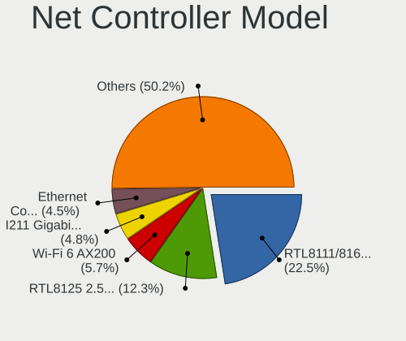

| Model                                                                  | Desktops | Percent |
|------------------------------------------------------------------------|----------|---------|
| Realtek RTL8111/8168/8211/8411 PCI Express Gigabit Ethernet Controller | 420      | 22.52%  |
| Realtek RTL8125 2.5GbE Controller                                      | 229      | 12.28%  |
| Intel Wi-Fi 6 AX200                                                    | 106      | 5.68%   |
| Intel I211 Gigabit Network Connection                                  | 90       | 4.83%   |
| Intel Ethernet Controller I225-V                                       | 84       | 4.5%    |
| MediaTek MT7922 802.11ax PCI Express Wireless Network Adapter          | 69       | 3.7%    |
| Intel Wi-Fi 6E(802.11ax) AX210/AX1675* 2x2 [Typhoon Peak]              | 50       | 2.68%   |
| Intel Ethernet Connection (7) I219-V                                   | 29       | 1.55%   |
| MediaTek MT7921K (RZ608) Wi-Fi 6E 80MHz                                | 27       | 1.45%   |
| Intel Ethernet Connection (2) I219-V                                   | 26       | 1.39%   |
| Intel Dual Band Wireless-AC 3168NGW [Stone Peak]                       | 25       | 1.34%   |
| Intel Ethernet Controller I226-V                                       | 21       | 1.13%   |
| Realtek RTL8821CE 802.11ac PCIe Wireless Network Adapter               | 19       | 1.02%   |
| Microsoft Xbox Wireless Adapter for Windows                            | 19       | 1.02%   |
| Intel Wi-Fi 5(802.11ac) Wireless-AC 9x6x [Thunder Peak]                | 18       | 0.97%   |
| Microsoft Wireless XBox Controller Dongle                              | 17       | 0.91%   |
| Intel 700 Series Chipset CNVi WiFi                                     | 16       | 0.86%   |
| Broadcom BCM4360 802.11ac Dual Band Wireless Network Adapter           | 16       | 0.86%   |
| Realtek 802.11ac NIC                                                   | 15       | 0.8%    |
| Intel Alder Lake-S PCH CNVi WiFi                                       | 15       | 0.8%    |
| Intel 82579LM Gigabit Network Connection (Lewisville)                  | 14       | 0.75%   |
| Realtek RTL8126 5GbE Controller                                        | 13       | 0.7%    |
| Intel Ethernet Connection (2) I218-V                                   | 13       | 0.7%    |
| Intel Cannon Lake PCH CNVi WiFi                                        | 13       | 0.7%    |
| Realtek RTL8852CE PCIe 802.11ax Wireless Network Controller            | 12       | 0.64%   |
| Realtek RTL8188EUS 802.11n Wireless Network Adapter                    | 12       | 0.64%   |
| Realtek RTL88x2bu [AC1200 Techkey]                                     | 11       | 0.59%   |
| Realtek RTL8852BE PCIe 802.11ax Wireless Network Controller            | 10       | 0.54%   |
| Realtek RTL8153 Gigabit Ethernet Adapter                               | 10       | 0.54%   |
| Microsoft Xbox 360 Wireless Adapter                                    | 10       | 0.54%   |
| Intel Ethernet Connection I217-LM                                      | 9        | 0.48%   |
| Intel 82579V Gigabit Network Connection                                | 9        | 0.48%   |
| Realtek RTL8192EE PCIe Wireless Network Adapter                        | 8        | 0.43%   |
| Qualcomm WCN785x Wi-Fi 7(802.11be) 320MHz 2x2 [FastConnect 7800]       | 8        | 0.43%   |
| Qualcomm Atheros Killer E220x Gigabit Ethernet Controller              | 8        | 0.43%   |
| Intel Wireless 7265                                                    | 8        | 0.43%   |
| TP-Link TL-WN823N v2/v3 [Realtek RTL8192EU]                            | 7        | 0.38%   |
| Samsung Galaxy series, misc. (tethering mode)                          | 7        | 0.38%   |
| Realtek Killer E3000 2.5GbE Controller                                 | 7        | 0.38%   |
| Qualcomm Atheros AR8151 v2.0 Gigabit Ethernet                          | 7        | 0.38%   |

Wireless Vendor
---------------

Wireless vendors

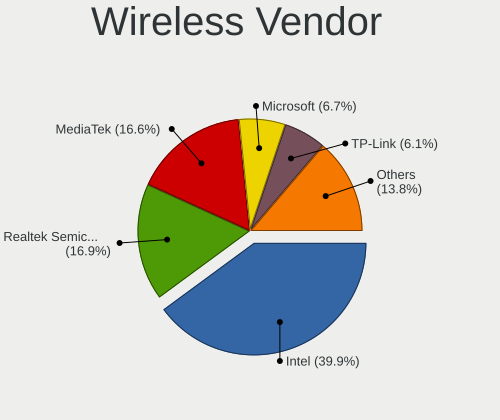

| Vendor                                | Desktops | Percent |
|---------------------------------------|----------|---------|
| Intel                                 | 267      | 39.91%  |
| Realtek Semiconductor                 | 113      | 16.89%  |
| MediaTek                              | 111      | 16.59%  |
| Microsoft                             | 45       | 6.73%   |
| TP-Link                               | 41       | 6.13%   |
| Broadcom                              | 23       | 3.44%   |
| Ralink Technology                     | 17       | 2.54%   |
| Qualcomm Atheros                      | 16       | 2.39%   |
| NetGear                               | 6        | 0.9%    |
| ASUSTek Computer                      | 5        | 0.75%   |
| Qualcomm Atheros Communications       | 4        | 0.6%    |
| Ralink                                | 3        | 0.45%   |
| D-Link                                | 3        | 0.45%   |
| Linksys                               | 2        | 0.3%    |
| Edimax Technology                     | 2        | 0.3%    |
| D-Link System                         | 2        | 0.3%    |
| Broadcom Limited                      | 2        | 0.3%    |
| Belkin Components                     | 2        | 0.3%    |
| Wacom                                 | 1        | 0.15%   |
| Qualcomm Technologies                 | 1        | 0.15%   |
| Mercucys                              | 1        | 0.15%   |
| AVM                                   | 1        | 0.15%   |
| 802.11g Adapter [Linksys WUSB54GC v3] | 1        | 0.15%   |

Wireless Model
--------------

Wireless models

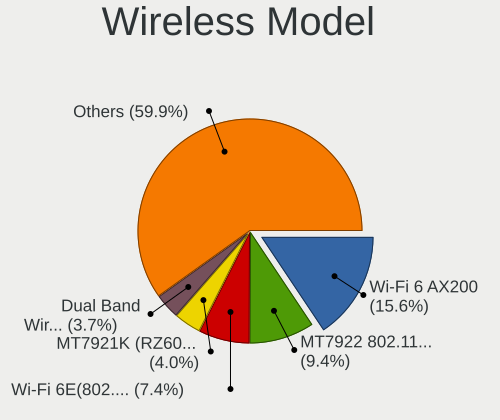

| Model                                                                           | Desktops | Percent |
|---------------------------------------------------------------------------------|----------|---------|
| Intel Wi-Fi 6 AX200                                                             | 106      | 15.63%  |
| MediaTek MT7922 802.11ax PCI Express Wireless Network Adapter                   | 64       | 9.44%   |
| Intel Wi-Fi 6E(802.11ax) AX210/AX1675* 2x2 [Typhoon Peak]                       | 50       | 7.37%   |
| MediaTek MT7921K (RZ608) Wi-Fi 6E 80MHz                                         | 27       | 3.98%   |
| Intel Dual Band Wireless-AC 3168NGW [Stone Peak]                                | 25       | 3.69%   |
| Realtek RTL8821CE 802.11ac PCIe Wireless Network Adapter                        | 19       | 2.8%    |
| Microsoft Xbox Wireless Adapter for Windows                                     | 19       | 2.8%    |
| Intel Wi-Fi 5(802.11ac) Wireless-AC 9x6x [Thunder Peak]                         | 18       | 2.65%   |
| Microsoft Wireless XBox Controller Dongle                                       | 17       | 2.51%   |
| Intel 700 Series Chipset CNVi WiFi                                              | 16       | 2.36%   |
| Broadcom BCM4360 802.11ac Dual Band Wireless Network Adapter                    | 16       | 2.36%   |
| Realtek 802.11ac NIC                                                            | 15       | 2.21%   |
| Intel Cannon Lake PCH CNVi WiFi                                                 | 13       | 1.92%   |
| Realtek RTL8852CE PCIe 802.11ax Wireless Network Controller                     | 12       | 1.77%   |
| Realtek RTL8188EUS 802.11n Wireless Network Adapter                             | 12       | 1.77%   |
| Realtek RTL88x2bu [AC1200 Techkey]                                              | 11       | 1.62%   |
| Microsoft Xbox 360 Wireless Adapter                                             | 10       | 1.47%   |
| Realtek RTL8192EE PCIe Wireless Network Adapter                                 | 8        | 1.18%   |
| Intel Wireless 7265                                                             | 8        | 1.18%   |
| TP-Link TL-WN823N v2/v3 [Realtek RTL8192EU]                                     | 7        | 1.03%   |
| Realtek RTL8852BE PCIe 802.11ax Wireless Network Controller                     | 7        | 1.03%   |
| TP-Link Archer T2U PLUS [RTL8821AU]                                             | 6        | 0.88%   |
| TP-Link 802.11ac NIC                                                            | 6        | 0.88%   |
| Realtek RTL8812AE 802.11ac PCIe Wireless Network Adapter                        | 6        | 0.88%   |
| Ralink RT5370 Wireless Adapter                                                  | 6        | 0.88%   |
| Qualcomm Atheros AR9485 Wireless Network Adapter                                | 6        | 0.88%   |
| MediaTek MT7927 802.11be 320MHz 2x2 PCIe Wireless Network Adapter [Filogic 380] | 6        | 0.88%   |
| Intel Alder Lake-S PCH CNVi WiFi                                                | 6        | 0.88%   |
| TP-Link Archer T4U ver.3                                                        | 5        | 0.74%   |
| Intel Tiger Lake PCH CNVi WiFi                                                  | 5        | 0.74%   |
| Intel Comet Lake PCH CNVi WiFi                                                  | 5        | 0.74%   |
| Ralink MT7601U Wireless Adapter                                                 | 4        | 0.59%   |
| Qualcomm Atheros AR9271 802.11n                                                 | 4        | 0.59%   |
| MediaTek MT7925 802.11be 160MHz 2x2 PCIe Wireless Network Adapter [Filogic 360] | 4        | 0.59%   |
| MediaTek MT7921 802.11ax PCIe Wireless Network Adapter [Filogic 330]            | 4        | 0.59%   |
| MediaTek MT7902 802.11ax PCIe Wireless Network Adapter [Filogic 310]            | 4        | 0.59%   |
| Intel Wireless 8265 / 8275                                                      | 4        | 0.59%   |
| Intel Wireless 7260                                                             | 4        | 0.59%   |
| Broadcom BCM4352 802.11ac Dual Band Wireless Network Adapter                    | 4        | 0.59%   |
| TP-Link TL-WN722N v2/v3 [Realtek RTL8188EUS]                                    | 3        | 0.44%   |

Ethernet Vendor
---------------

Ethernet vendors

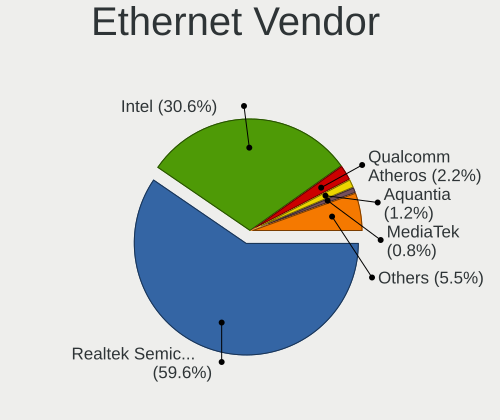

| Vendor                     | Desktops | Percent |
|----------------------------|----------|---------|
| Realtek Semiconductor      | 667      | 59.55%  |
| Intel                      | 343      | 30.63%  |
| Qualcomm Atheros           | 25       | 2.23%   |
| Aquantia                   | 14       | 1.25%   |
| MediaTek                   | 9        | 0.8%    |
| Samsung Electronics        | 7        | 0.63%   |
| Qualcomm Technologies      | 7        | 0.63%   |
| ASIX Electronics           | 6        | 0.54%   |
| Xiaomi                     | 5        | 0.45%   |
| Broadcom                   | 5        | 0.45%   |
| Mellanox Technologies      | 4        | 0.36%   |
| Google                     | 4        | 0.36%   |
| Broadcom Limited           | 4        | 0.36%   |
| Qualcomm                   | 3        | 0.27%   |
| OPPO Electronics           | 3        | 0.27%   |
| Motorola PCS               | 3        | 0.27%   |
| DisplayLink                | 3        | 0.27%   |
| Nvidia                     | 2        | 0.18%   |
| ZTE WCDMA Technologies MSM | 1        | 0.09%   |
| T & A Mobile Phones        | 1        | 0.09%   |
| ICS Advent                 | 1        | 0.09%   |
| Huawei Technologies        | 1        | 0.09%   |
| D-Link                     | 1        | 0.09%   |
| Apple                      | 1        | 0.09%   |

Ethernet Model
--------------

Ethernet models

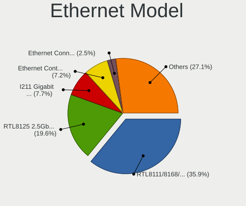

| Model                                                                           | Desktops | Percent |
|---------------------------------------------------------------------------------|----------|---------|
| Realtek RTL8111/8168/8211/8411 PCI Express Gigabit Ethernet Controller          | 420      | 35.93%  |
| Realtek RTL8125 2.5GbE Controller                                               | 229      | 19.59%  |
| Intel I211 Gigabit Network Connection                                           | 90       | 7.7%    |
| Intel Ethernet Controller I225-V                                                | 84       | 7.19%   |
| Intel Ethernet Connection (7) I219-V                                            | 29       | 2.48%   |
| Intel Ethernet Connection (2) I219-V                                            | 26       | 2.22%   |
| Intel Ethernet Controller I226-V                                                | 21       | 1.8%    |
| Intel 82579LM Gigabit Network Connection (Lewisville)                           | 14       | 1.2%    |
| Realtek RTL8126 5GbE Controller                                                 | 13       | 1.11%   |
| Intel Ethernet Connection (2) I218-V                                            | 13       | 1.11%   |
| Realtek RTL8153 Gigabit Ethernet Adapter                                        | 10       | 0.86%   |
| Intel Ethernet Connection I217-LM                                               | 9        | 0.77%   |
| Intel Alder Lake-S PCH CNVi WiFi                                                | 9        | 0.77%   |
| Intel 82579V Gigabit Network Connection                                         | 9        | 0.77%   |
| Qualcomm Atheros Killer E220x Gigabit Ethernet Controller                       | 8        | 0.68%   |
| Samsung Galaxy series, misc. (tethering mode)                                   | 7        | 0.6%    |
| Realtek Killer E3000 2.5GbE Controller                                          | 7        | 0.6%    |
| Qualcomm WCN785x Wi-Fi 7(802.11be) 320MHz 2x2 [FastConnect 7800]                | 7        | 0.6%    |
| Qualcomm Atheros AR8151 v2.0 Gigabit Ethernet                                   | 7        | 0.6%    |
| Intel Ethernet Connection (11) I219-V                                           | 7        | 0.6%    |
| Qualcomm Atheros Killer E2400 Gigabit Ethernet Controller                       | 6        | 0.51%   |
| Intel Ethernet Connection (17) I219-V                                           | 6        | 0.51%   |
| Intel Ethernet Connection (14) I219-V                                           | 6        | 0.51%   |
| ASIX AX88179 Gigabit Ethernet                                                   | 6        | 0.51%   |
| Aquantia AQtion AQC113CS NBase-T/IEEE 802.3an Ethernet Controller [Antigua 10G] | 6        | 0.51%   |
| Aquantia AQtion AQC107 NBase-T/IEEE 802.3an Ethernet Controller [Atlantic 10G]  | 6        | 0.51%   |
| Realtek RTL8922AE 802.11be PCIe Wireless Network Adapter                        | 5        | 0.43%   |
| Realtek RTL810xE PCI Express Fast Ethernet controller                           | 5        | 0.43%   |
| MediaTek MT7922 802.11ax PCI Express Wireless Network Adapter                   | 5        | 0.43%   |
| Intel Ethernet Connection I217-V                                                | 5        | 0.43%   |
| Intel Ethernet Connection (12) I219-V                                           | 5        | 0.43%   |
| Xiaomi Mi/Redmi series (RNDIS)                                                  | 4        | 0.34%   |
| Intel 82574L Gigabit Network Connection                                         | 4        | 0.34%   |
| Google Pixel 9a                                                                 | 4        | 0.34%   |
| Realtek RTL8852BE PCIe 802.11ax Wireless Network Controller                     | 3        | 0.26%   |
| Realtek RTL8111/8168/8411 PCI Express Gigabit Ethernet Controller               | 3        | 0.26%   |
| Realtek RTL-8100/8101L/8139 PCI Fast Ethernet Adapter                           | 3        | 0.26%   |
| Motorola PCS motorola one 5G ace                                                | 3        | 0.26%   |
| Intel Ethernet Connection (7) I219-LM                                           | 3        | 0.26%   |
| Qualcomm Atheros Killer E2500 Gigabit Ethernet Controller                       | 2        | 0.17%   |

Net Controller Kind
-------------------

Ethernet, WiFi or modem

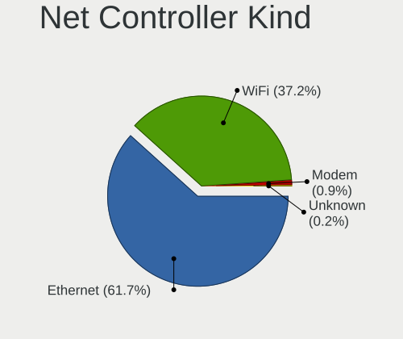

| Kind     | Desktops | Percent |
|----------|----------|---------|
| Ethernet | 1004     | 61.67%  |
| WiFi     | 606      | 37.22%  |
| Modem    | 14       | 0.86%   |
| Unknown  | 4        | 0.25%   |

Used Controller
---------------

Currently used network controller

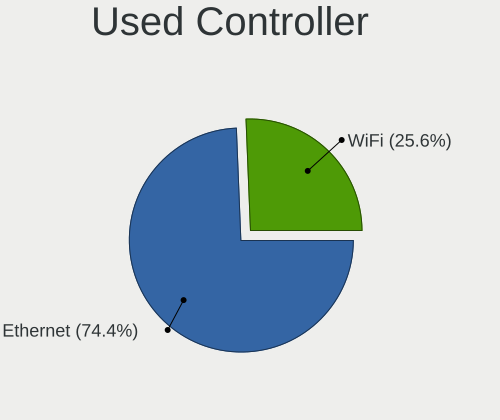

| Kind     | Desktops | Percent |
|----------|----------|---------|
| Ethernet | 789      | 74.36%  |
| WiFi     | 272      | 25.64%  |

NICs
----

Total network controllers on board

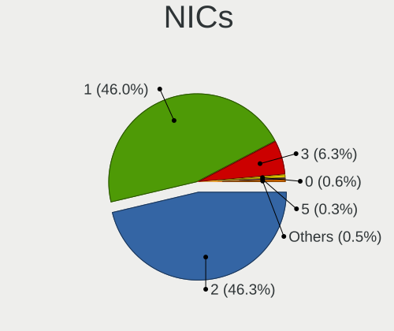

| Total | Desktops | Percent |
|-------|----------|---------|
| 2     | 471      | 46.31%  |
| 1     | 468      | 46.02%  |
| 3     | 64       | 6.29%   |
| 0     | 6        | 0.59%   |
| 5     | 3        | 0.29%   |
| 4     | 3        | 0.29%   |
| 6     | 2        | 0.2%    |

IPv6
----

IPv6 vs IPv4

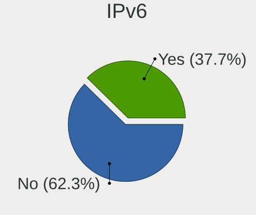

| Used | Desktops | Percent |
|------|----------|---------|
| No   | 639      | 62.34%  |
| Yes  | 386      | 37.66%  |

Bluetooth
---------

Bluetooth Vendor
----------------

Controller vendors

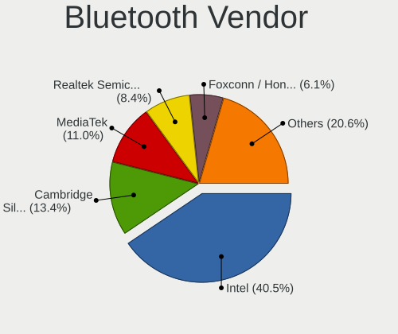

| Vendor                          | Desktops | Percent |
|---------------------------------|----------|---------|
| Intel                           | 266      | 40.55%  |
| Cambridge Silicon Radio         | 88       | 13.41%  |
| MediaTek                        | 72       | 10.98%  |
| Realtek Semiconductor           | 55       | 8.38%   |
| Foxconn / Hon Hai               | 40       | 6.1%    |
| IMC Networks                    | 32       | 4.88%   |
| ASUSTek Computer                | 29       | 4.42%   |
| TP-Link                         | 27       | 4.12%   |
| Broadcom                        | 12       | 1.83%   |
| Qualcomm Atheros Communications | 9        | 1.37%   |
| Unknown                         | 5        | 0.76%   |
| Mercucys                        | 3        | 0.46%   |
| Actions                         | 3        | 0.46%   |
| Lite-On Technology              | 2        | 0.3%    |
| Integrated System Solution      | 2        | 0.3%    |
| HTC (High Tech Computer)        | 2        | 0.3%    |
| Edimax Technology               | 2        | 0.3%    |
| Apple                           | 2        | 0.3%    |
| SINO WEALTH                     | 1        | 0.15%   |
| Realtek                         | 1        | 0.15%   |
| Dynex                           | 1        | 0.15%   |
| Dell                            | 1        | 0.15%   |
| Conwise Technology              | 1        | 0.15%   |

Bluetooth Model
---------------

Controller models

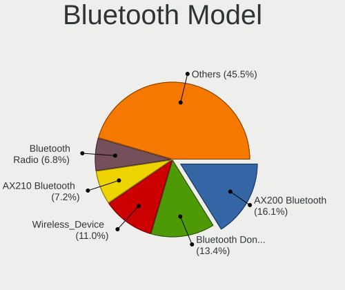

| Model                                                                | Desktops | Percent |
|----------------------------------------------------------------------|----------|---------|
| Intel AX200 Bluetooth                                                | 106      | 16.13%  |
| Cambridge Silicon Radio Bluetooth Dongle (HCI mode)                  | 88       | 13.39%  |
| MediaTek Wireless_Device                                             | 72       | 10.96%  |
| Intel AX210 Bluetooth                                                | 47       | 7.15%   |
| Realtek Bluetooth Radio                                              | 45       | 6.85%   |
| TP-Link TP-T@- UB500 Adapter                                         | 27       | 4.11%   |
| Foxconn / Hon Hai Wireless_Device                                    | 27       | 4.11%   |
| Intel Bluetooth Device                                               | 26       | 3.96%   |
| Intel Wireless-AC 3168 Bluetooth                                     | 24       | 3.65%   |
| IMC Networks Bluetooth Radio                                         | 18       | 2.74%   |
| Intel Bluetooth wireless interface                                   | 17       | 2.59%   |
| Intel AX201 Bluetooth                                                | 16       | 2.44%   |
| Intel Wireless-AC 9260 Bluetooth Adapter                             | 15       | 2.28%   |
| Intel Bluetooth 9460/9560 Jefferson Peak (JfP)                       | 15       | 2.28%   |
| IMC Networks Wireless_Device                                         | 14       | 2.13%   |
| ASUS ASUS USB-BT500                                                  | 14       | 2.13%   |
| Foxconn / Hon Hai Bluetooth Device                                   | 13       | 1.98%   |
| Broadcom BCM20702A0 Bluetooth 4.0                                    | 8        | 1.22%   |
| ASUS Broadcom BCM20702A0 Bluetooth                                   | 6        | 0.91%   |
| Realtek Bluetooth 5.3 Radio                                          | 5        | 0.76%   |
| Unknown                                                              | 5        | 0.76%   |
| Realtek  Bluetooth 4.2 Adapter                                       | 3        | 0.46%   |
| Qualcomm Atheros  Bluetooth Device                                   | 3        | 0.46%   |
| Qualcomm Atheros Bluetooth USB Host Controller                       | 3        | 0.46%   |
| Mercucys Mercusys MA530 Adapter                                      | 3        | 0.46%   |
| ASUS Bluetooth Radio                                                 | 3        | 0.46%   |
| Actions general adapter                                              | 3        | 0.46%   |
| Qualcomm Atheros AR3011 Bluetooth                                    | 2        | 0.3%    |
| Integrated System Solution KY-BT100 Bluetooth Adapter                | 2        | 0.3%    |
| HTC (High Tech Computer) Vive Hub Bluetooth 4.1 (Broadcom BCM920703) | 2        | 0.3%    |
| Edimax EW-7611ULB 802.11b/g/n and Bluetooth 4.0 Adapter              | 2        | 0.3%    |
| Broadcom BCM2045 Bluetooth                                           | 2        | 0.3%    |
| ASUS Qualcomm Bluetooth 4.1                                          | 2        | 0.3%    |
| ASUS BCM20702A0                                                      | 2        | 0.3%    |
| SINO WEALTH RK Bluetooth Keyboard                                    | 1        | 0.15%   |
| Realtek RTL8821A Bluetooth                                           | 1        | 0.15%   |
| Realtek Bluetooth 5.4 Radio                                          | 1        | 0.15%   |
| Realtek Bluetooth Radio                                              | 1        | 0.15%   |
| Qualcomm Atheros QCA61x4 Bluetooth 4.0                               | 1        | 0.15%   |
| Lite-On Wireless_Device                                              | 1        | 0.15%   |

Sound
-----

Sound Vendor
------------

Sound card vendors

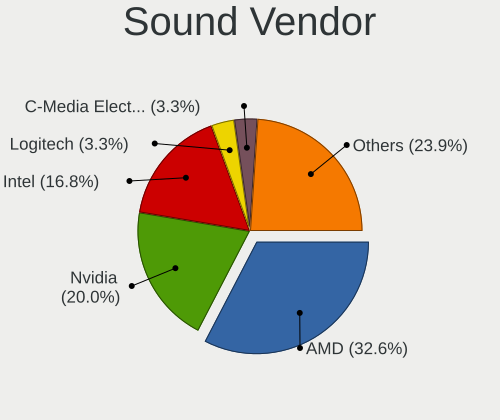

| Vendor                     | Desktops | Percent |
|----------------------------|----------|---------|
| AMD                        | 736      | 32.62%  |
| Nvidia                     | 452      | 20.04%  |
| Intel                      | 378      | 16.76%  |
| Logitech                   | 75       | 3.32%   |
| C-Media Electronics        | 75       | 3.32%   |
| SteelSeries ApS            | 38       | 1.68%   |
| ASUSTek Computer           | 38       | 1.68%   |
| Kingston Technology        | 31       | 1.37%   |
| Razer USA                  | 29       | 1.29%   |
| Creative Labs              | 27       | 1.2%    |
| Micro Star International   | 26       | 1.15%   |
| Creative Technology        | 19       | 0.84%   |
| JMTek                      | 17       | 0.75%   |
| Focusrite-Novation         | 17       | 0.75%   |
| Blue Microphones           | 15       | 0.66%   |
| Corsair                    | 14       | 0.62%   |
| Sony                       | 13       | 0.58%   |
| Hewlett-Packard            | 13       | 0.58%   |
| Texas Instruments          | 12       | 0.53%   |
| Samson Technologies        | 10       | 0.44%   |
| Realtek Semiconductor      | 10       | 0.44%   |
| Plantronics                | 9        | 0.4%    |
| Audio-Technica             | 9        | 0.4%    |
| KTMicro                    | 8        | 0.35%   |
| BEHRINGER International    | 8        | 0.35%   |
| PreSonus Audio Electronics | 6        | 0.27%   |
| Jieli Technology           | 6        | 0.27%   |
| Astro Gaming               | 6        | 0.27%   |
| Unknown                    | 6        | 0.27%   |
| GN Netcom                  | 5        | 0.22%   |
| Generalplus Technology     | 5        | 0.22%   |
| Elgato Systems             | 5        | 0.22%   |
| ASRock                     | 5        | 0.22%   |
| Schiit Audio               | 4        | 0.18%   |
| SAVITECH                   | 4        | 0.18%   |
| DSEA A/S                   | 4        | 0.18%   |
| Apple                      | 4        | 0.18%   |
| XMOS                       | 3        | 0.13%   |
| Valve Software             | 3        | 0.13%   |
| Trust                      | 3        | 0.13%   |

Sound Model
-----------

Sound card models

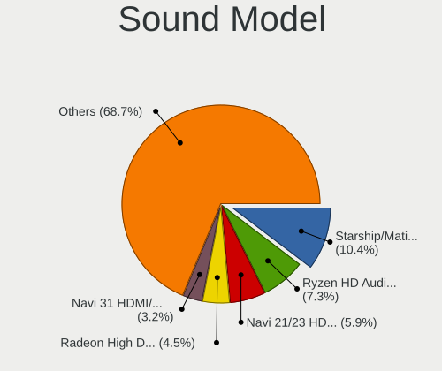

| Model                                                                                           | Desktops | Percent |
|-------------------------------------------------------------------------------------------------|----------|---------|
| AMD Starship/Matisse HD Audio Controller                                                        | 291      | 10.36%  |
| AMD Ryzen HD Audio Controller                                                                   | 206      | 7.33%   |
| AMD Navi 21/23 HDMI/DP Audio Controller                                                         | 165      | 5.87%   |
| AMD Radeon High Definition Audio Controller                                                     | 126      | 4.48%   |
| AMD Navi 31 HDMI/DP Audio                                                                       | 91       | 3.24%   |
| AMD Ellesmere HDMI Audio [Radeon RX 470/480 / 570/580/590]                                      | 86       | 3.06%   |
| Nvidia GA104 High Definition Audio Controller                                                   | 65       | 2.31%   |
| AMD Renoir/Cezanne HDMI/DP Audio Controller                                                     | 56       | 1.99%   |
| Nvidia GA102 High Definition Audio Controller                                                   | 47       | 1.67%   |
| AMD Family 17h (Models 00h-0fh) HD Audio Controller                                             | 45       | 1.6%    |
| Intel 200 Series PCH HD Audio                                                                   | 40       | 1.42%   |
| AMD Navi 10 HDMI Audio                                                                          | 39       | 1.39%   |
| Intel Alder Lake-S HD Audio Controller                                                          | 35       | 1.25%   |
| Intel 8 Series/C220 Series Chipset High Definition Audio Controller                             | 35       | 1.25%   |
| Intel Cannon Lake PCH cAVS                                                                      | 34       | 1.21%   |
| ASUSTek Computer USB Audio                                                                      | 33       | 1.17%   |
| Nvidia GP104 High Definition Audio Controller                                                   | 32       | 1.14%   |
| Nvidia TU106 High Definition Audio Controller                                                   | 30       | 1.07%   |
| Intel 6 Series/C200 Series Chipset Family High Definition Audio Controller                      | 30       | 1.07%   |
| Nvidia GA106 High Definition Audio Controller                                                   | 27       | 0.96%   |
| Nvidia TU116 High Definition Audio Controller                                                   | 26       | 0.93%   |
| Micro Star International USB Audio                                                              | 26       | 0.93%   |
| Intel 7 Series/C216 Chipset Family High Definition Audio Controller                             | 26       | 0.93%   |
| Intel 100 Series/C230 Series Chipset Family HD Audio Controller                                 | 26       | 0.93%   |
| Intel Raptor Lake High Definition Audio Controller                                              | 25       | 0.89%   |
| Nvidia AD104 High Definition Audio Controller                                                   | 24       | 0.85%   |
| Nvidia AD103 High Definition Audio Controller                                                   | 24       | 0.85%   |
| AMD SBx00 Azalia (Intel HDA)                                                                    | 23       | 0.82%   |
| Nvidia TU104 HD Audio Controller                                                                | 22       | 0.78%   |
| AMD Baffin HDMI/DP Audio [Radeon RX 550 640SP / RX 560/560X]                                    | 22       | 0.78%   |
| Intel Xeon E3-1200 v3/4th Gen Core Processor HD Audio Controller                                | 21       | 0.75%   |
| Nvidia GP107GL High Definition Audio Controller                                                 | 20       | 0.71%   |
| AMD Navi 48 HDMI/DP Audio Controller                                                            | 19       | 0.68%   |
| Intel Tiger Lake-H HD Audio Controller                                                          | 18       | 0.64%   |
| Nvidia GP106 High Definition Audio Controller                                                   | 16       | 0.57%   |
| Intel Comet Lake PCH-V cAVS                                                                     | 16       | 0.57%   |
| C-Media Electronics Blue Snowball                                                               | 16       | 0.57%   |
| AMD Raven/Raven2/Fenghuang HDMI/DP Audio Controller                                             | 16       | 0.57%   |
| Creative Labs CA0132 Sound Core3D [Sound Blaster Recon3D / Z-Series / Sound BlasterX AE-5 Plus] | 15       | 0.53%   |
| C-Media Electronics USB Audio Device                                                            | 15       | 0.53%   |

Memory
------

Memory Vendor
-------------

Memory module vendors

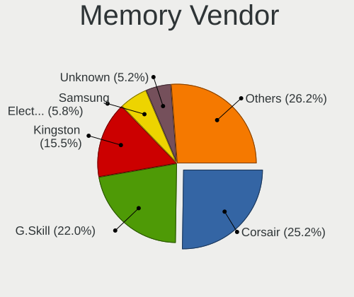

| Vendor                       | Desktops | Percent |
|------------------------------|----------|---------|
| Corsair                      | 78       | 25.24%  |
| G.Skill                      | 68       | 22.01%  |
| Kingston                     | 48       | 15.53%  |
| Samsung Electronics          | 18       | 5.83%   |
| Unknown                      | 16       | 5.18%   |
| Crucial                      | 15       | 4.85%   |
| Unknown                      | 14       | 4.53%   |
| Team                         | 11       | 3.56%   |
| A-DATA Technology            | 11       | 3.56%   |
| Micron Technology            | 9        | 2.91%   |
| SK hynix                     | 6        | 1.94%   |
| Patriot                      | 6        | 1.94%   |
| Ramaxel Technology           | 1        | 0.32%   |
| Patriot Memory (PDP Systems) | 1        | 0.32%   |
| Patriot Memory               | 1        | 0.32%   |
| Lexar                        | 1        | 0.32%   |
| KLEVV                        | 1        | 0.32%   |
| Hewlett-Packard              | 1        | 0.32%   |
| GOODRAM                      | 1        | 0.32%   |
| Golden Empire                | 1        | 0.32%   |
| Asgard                       | 1        | 0.32%   |

Memory Model
------------

Memory module models

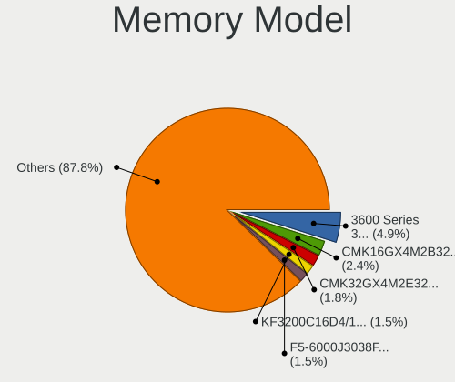

| Model                                                  | Desktops | Percent |
|--------------------------------------------------------|----------|---------|
| Unknown                                                | 16       | 4.89%   |
| Corsair RAM CMK16GX4M2B3200C16 8GB DIMM DDR4 3600MT/s  | 8        | 2.45%   |
| Corsair RAM CMK32GX4M2E3200C16 16GB DIMM DDR4 3600MT/s | 6        | 1.83%   |
| Kingston RAM KF3200C16D4/16GX 16GB DIMM DDR4 3733MT/s  | 5        | 1.53%   |
| G.Skill RAM F5-6000J3038F16G 16GB DIMM DDR5 6000MT/s   | 5        | 1.53%   |
| Corsair RAM CMW16GX4M2C3200C16 8GB DIMM DDR4 3733MT/s  | 5        | 1.53%   |
| Corsair RAM CMK32GX4M2D3600C18 16GB DIMM DDR4 3800MT/s | 5        | 1.53%   |
| A-DATA RAM DDR4 3200 16GB DIMM DDR4 3600MT/s           | 5        | 1.53%   |
| Kingston RAM KF560C36-16 16GB DIMM DDR5 6000MT/s       | 4        | 1.22%   |
| G.Skill RAM F5-6000J3636F16G 16GB DIMM DDR5 6400MT/s   | 4        | 1.22%   |
| G.Skill RAM F4-3200C16-8GVKB 8GB DIMM DDR4 4000MT/s    | 4        | 1.22%   |
| G.Skill RAM F4-3200C16-16GVK 16GB DIMM DDR4 3600MT/s   | 4        | 1.22%   |
| Corsair RAM CMK16GX4M2B3000C15 8GB DIMM DDR4 3600MT/s  | 4        | 1.22%   |
| Unknown RAM Module 16GB DIMM DDR4 2667MT/s             | 3        | 0.92%   |
| Team RAM TEAMGROUP-UD4-3200 8GB DIMM DDR4 3800MT/s     | 3        | 0.92%   |
| Team RAM TEAMGROUP-UD4-3200 8GB DIMM DDR4 3733MT/s     | 3        | 0.92%   |
| Kingston RAM KF3600C17D4/8GX 8GB DIMM DDR4 3600MT/s    | 3        | 0.92%   |
| G.Skill RAM F5-6000J3040G32G 32GB DIMM DDR5 6200MT/s   | 3        | 0.92%   |
| G.Skill RAM F4-3600C16-8GTZNC 8GB DIMM DDR4 3800MT/s   | 3        | 0.92%   |
| G.Skill RAM F4-3600C16-16GVKC 16GB DIMM DDR4 3866MT/s  | 3        | 0.92%   |
| G.Skill RAM F4-3000C16-8GISB 8GB DIMM DDR4 3200MT/s    | 3        | 0.92%   |
| Corsair RAM CMW32GX4M2E3200C16 16GB DIMM DDR4 3200MT/s | 3        | 0.92%   |
| Unknown RAM Module 8GB DIMM DDR3 1333MT/s              | 2        | 0.61%   |
| Unknown RAM Module 8GB DIMM 1333MT/s                   | 2        | 0.61%   |
| Unknown RAM Module 2GB DIMM DDR3 1066MT/s              | 2        | 0.61%   |
| Unknown RAM Module 16GB DIMM DDR4 3200MT/s             | 2        | 0.61%   |
| Team RAM TEAMGROUP-UD4-3600 16GB DIMM DDR4 4000MT/s    | 2        | 0.61%   |
| Team RAM TEAMGROUP-UD4-3600 16GB DIMM DDR4 3600MT/s    | 2        | 0.61%   |
| Micron RAM 4ATF1G64AZ-3G2E1 8GB DIMM DDR4 3200MT/s     | 2        | 0.61%   |
| Kingston RAM KHX3200C16D4/8GX 8GB DIMM DDR4 3733MT/s   | 2        | 0.61%   |
| Kingston RAM KHX2666C16/8G 8GiB DIMM DDR4 3466MT/s     | 2        | 0.61%   |
| Kingston RAM KF560C30-32 32GB DIMM DDR5 6000MT/s       | 2        | 0.61%   |
| Kingston RAM KF560C30-16 16GB DIMM DDR5 6000MT/s       | 2        | 0.61%   |
| Kingston RAM KF552C40-16 16GB DIMM DDR5 5400MT/s       | 2        | 0.61%   |
| Kingston RAM CL16-18-18 D4-3000 8GB DIMM DDR4 3200MT/s | 2        | 0.61%   |
| G.Skill RAM F4-3600C18-16GVK 16GB DIMM DDR4 3733MT/s   | 2        | 0.61%   |
| G.Skill RAM F4-3600C14-8GTZNB 8GB DIMM DDR4 3600MT/s   | 2        | 0.61%   |
| G.Skill RAM F4-3200C16-8GIS 8GB DIMM DDR4 3600MT/s     | 2        | 0.61%   |
| Corsair RAM CMY16GX3M2A1866C9 8GB DIMM DDR3 2400MT/s   | 2        | 0.61%   |
| Corsair RAM CMK5X16G1B60Z40A2 16GB DIMM DDR5 4800MT/s  | 2        | 0.61%   |

Memory Kind
-----------

Memory module kinds

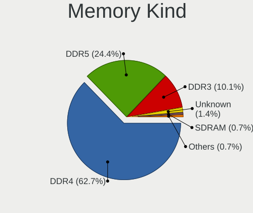

| Kind    | Desktops | Percent |
|---------|----------|---------|
| DDR4    | 180      | 62.72%  |
| DDR5    | 70       | 24.39%  |
| DDR3    | 29       | 10.1%   |
| Unknown | 4        | 1.39%   |
| SDRAM   | 2        | 0.7%    |
| LPDDR4  | 1        | 0.35%   |
| DDR2    | 1        | 0.35%   |

Memory Form Factor
------------------

Physical design of the memory module

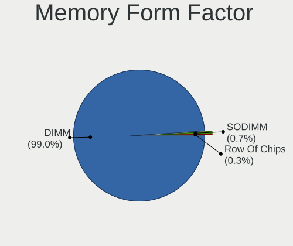

| Name         | Desktops | Percent |
|--------------|----------|---------|
| DIMM         | 283      | 98.95%  |
| SODIMM       | 2        | 0.7%    |
| Row Of Chips | 1        | 0.35%   |

Memory Size
-----------

Memory module size

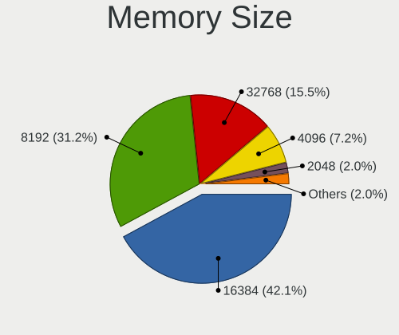

| Size  | Desktops | Percent |
|-------|----------|---------|
| 16384 | 128      | 42.11%  |
| 8192  | 95       | 31.25%  |
| 32768 | 47       | 15.46%  |
| 4096  | 22       | 7.24%   |
| 2048  | 6        | 1.97%   |
| 49152 | 3        | 0.99%   |
| 24576 | 2        | 0.66%   |
| 1024  | 1        | 0.33%   |

Memory Speed
------------

Memory module speed

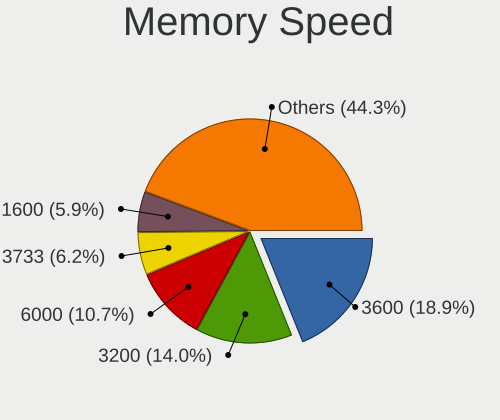

| Speed | Desktops | Percent |
|-------|----------|---------|
| 3600  | 58       | 18.89%  |
| 3200  | 43       | 14.01%  |
| 6000  | 33       | 10.75%  |
| 3733  | 19       | 6.19%   |
| 1600  | 18       | 5.86%   |
| 3800  | 16       | 5.21%   |
| 2667  | 13       | 4.23%   |
| 2400  | 12       | 3.91%   |
| 4800  | 10       | 3.26%   |
| 6400  | 9        | 2.93%   |
| 5600  | 8        | 2.61%   |
| 1333  | 8        | 2.61%   |
| 4000  | 6        | 1.95%   |
| 2133  | 5        | 1.63%   |
| 6200  | 4        | 1.3%    |
| 3866  | 4        | 1.3%    |
| 3466  | 4        | 1.3%    |
| 2666  | 4        | 1.3%    |
| 3400  | 3        | 0.98%   |
| 2933  | 3        | 0.98%   |
| 8000  | 2        | 0.65%   |
| 5400  | 2        | 0.65%   |
| 3334  | 2        | 0.65%   |
| 1066  | 2        | 0.65%   |
| 52217 | 1        | 0.33%   |
| 7000  | 1        | 0.33%   |
| 5800  | 1        | 0.33%   |
| 5200  | 1        | 0.33%   |
| 4267  | 1        | 0.33%   |
| 3933  | 1        | 0.33%   |
| 3533  | 1        | 0.33%   |
| 3500  | 1        | 0.33%   |
| 3467  | 1        | 0.33%   |
| 3266  | 1        | 0.33%   |
| 3100  | 1        | 0.33%   |
| 3066  | 1        | 0.33%   |
| 3000  | 1        | 0.33%   |
| 2934  | 1        | 0.33%   |
| 2800  | 1        | 0.33%   |
| 1867  | 1        | 0.33%   |

Printers & scanners
-------------------

Printer Vendor
--------------

Printer device vendors

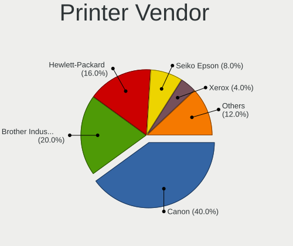

| Vendor              | Desktops | Percent |
|---------------------|----------|---------|
| Canon               | 10       | 40%     |
| Brother Industries  | 5        | 20%     |
| Hewlett-Packard     | 4        | 16%     |
| Seiko Epson         | 2        | 8%      |
| Xerox               | 1        | 4%      |
| STMicroelectronics  | 1        | 4%      |
| Samsung Electronics | 1        | 4%      |
| Dell                | 1        | 4%      |

Printer Model
-------------

Printer device models

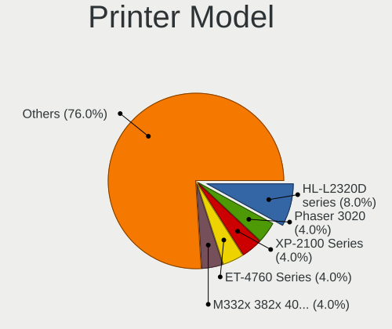

| Model                                                     | Desktops | Percent |
|-----------------------------------------------------------|----------|---------|
| Brother HL-L2320D series                                  | 2        | 8%      |
| Xerox Phaser 3020                                         | 1        | 4%      |
| STMicroelectronics LED badge -- mini LED display -- 11x44 | 1        | 4%      |
| Seiko Epson XP-2100 Series                                | 1        | 4%      |
| Seiko Epson ET-4760 Series                                | 1        | 4%      |
| Samsung M332x 382x 402x Series                            | 1        | 4%      |
| HP ENVY 6400 series                                       | 1        | 4%      |
| HP DeskJet Plus 4100 series                               | 1        | 4%      |
| HP DeskJet 2300 series                                    | 1        | 4%      |
| HP Color LaserJet CP1215                                  | 1        | 4%      |
| Dell 1130 Laser Printer                                   | 1        | 4%      |
| Canon TS700 series                                        | 1        | 4%      |
| Canon TR8500 series                                       | 1        | 4%      |
| Canon TR4500 series                                       | 1        | 4%      |
| Canon PIXMA MX370 Series                                  | 1        | 4%      |
| Canon PIXMA MP495                                         | 1        | 4%      |
| Canon PIXMA MG3600 Series                                 | 1        | 4%      |
| Canon PIXMA MG2500 Series                                 | 1        | 4%      |
| Canon LiDE 300                                            | 1        | 4%      |
| Canon iP7200 series                                       | 1        | 4%      |
| Canon G2000 series                                        | 1        | 4%      |
| Brother MFC-L2710DN series                                | 1        | 4%      |
| Brother HL-L2370DW series                                 | 1        | 4%      |
| Brother DCP-1510                                          | 1        | 4%      |

Scanner Vendor
--------------

Scanner device vendors

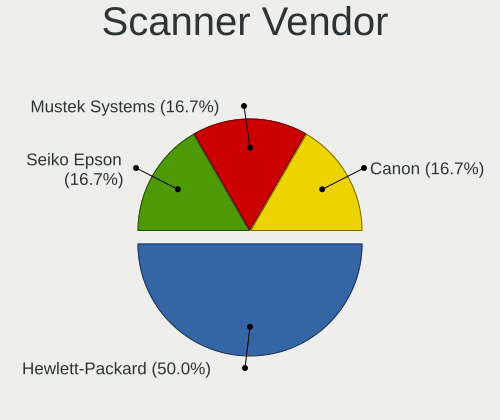

| Vendor          | Desktops | Percent |
|-----------------|----------|---------|
| Hewlett-Packard | 3        | 50%     |
| Seiko Epson     | 1        | 16.67%  |
| Mustek Systems  | 1        | 16.67%  |
| Canon           | 1        | 16.67%  |

Scanner Model
-------------

Scanner device models

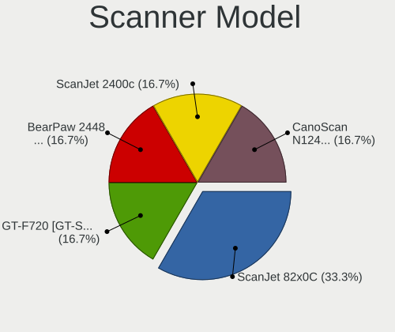

| Model                                                   | Desktops | Percent |
|---------------------------------------------------------|----------|---------|
| HP ScanJet 82x0C                                        | 2        | 33.33%  |
| Seiko Epson GT-F720 [GT-S620/Perfection V30/V300 Photo] | 1        | 16.67%  |
| Mustek Systems BearPaw 2448 TA Plus                     | 1        | 16.67%  |
| HP ScanJet 2400c                                        | 1        | 16.67%  |
| Canon CanoScan N1240U/LiDE 30                           | 1        | 16.67%  |

Camera
------

Camera Vendor
-------------

Camera device vendors

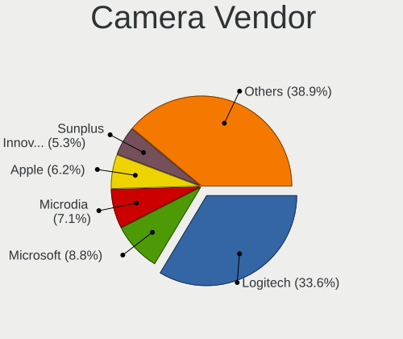

| Vendor                                 | Desktops | Percent |
|----------------------------------------|----------|---------|
| Logitech                               | 76       | 33.63%  |
| Microsoft                              | 20       | 8.85%   |
| Microdia                               | 16       | 7.08%   |
| Apple                                  | 14       | 6.19%   |
| Sunplus Innovation Technology          | 12       | 5.31%   |
| Samsung Electronics                    | 6        | 2.65%   |
| Razer USA                              | 5        | 2.21%   |
| Elgato Systems                         | 5        | 2.21%   |
| AVerMedia Technologies                 | 5        | 2.21%   |
| ARC International                      | 5        | 2.21%   |
| MacroSilicon                           | 4        | 1.77%   |
| Generalplus Technology                 | 4        | 1.77%   |
| eMeet                                  | 4        | 1.77%   |
| webcam                                 | 3        | 1.33%   |
| Creative Technology                    | 3        | 1.33%   |
| Valve Software                         | 2        | 0.88%   |
| LG Electronics                         | 2        | 0.88%   |
| Lenovo                                 | 2        | 0.88%   |
| KYE Systems (Mouse Systems)            | 2        | 0.88%   |
| Hewlett-Packard                        | 2        | 0.88%   |
| Chicony Electronics                    | 2        | 0.88%   |
| Z-Star Microelectronics                | 1        | 0.44%   |
| YGTek                                  | 1        | 0.44%   |
| Xiongmai                               | 1        | 0.44%   |
| XF                                     | 1        | 0.44%   |
| WCM_USB                                | 1        | 0.44%   |
| USB CAMERA                             | 1        | 0.44%   |
| UGREEN 35871                           | 1        | 0.44%   |
| Trust                                  | 1        | 0.44%   |
| Tobii Technology AB                    | 1        | 0.44%   |
| SunplusIT                              | 1        | 0.44%   |
| Sony Ericsson Mobile Communications AB | 1        | 0.44%   |
| SHENZHEN EMEET TECHNOLOGY              | 1        | 0.44%   |
| Realtek Semiconductor                  | 1        | 0.44%   |
| Owon                                   | 1        | 0.44%   |
| Netchip Technology                     | 1        | 0.44%   |
| Minton Optic Industry                  | 1        | 0.44%   |
| lihappe8                               | 1        | 0.44%   |
| Lab126                                 | 1        | 0.44%   |
| Jieli Technology                       | 1        | 0.44%   |

Camera Model
------------

Camera device models

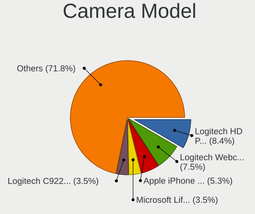

| Model                                    | Desktops | Percent |
|------------------------------------------|----------|---------|
| Logitech HD Pro Webcam C920              | 19       | 8.37%   |
| Logitech Webcam C270                     | 17       | 7.49%   |
| Apple iPhone 5/5C/5S/6/SE/7/8/X          | 12       | 5.29%   |
| Microsoft LifeCam Cinema                 | 8        | 3.52%   |
| Logitech C922 Pro Stream Webcam          | 8        | 3.52%   |
| Sunplus Full HD webcam                   | 6        | 2.64%   |
| Samsung Galaxy series, misc. (MTP mode)  | 6        | 2.64%   |
| Logitech StreamCam                       | 6        | 2.64%   |
| Logitech C920 PRO HD Webcam              | 6        | 2.64%   |
| Microdia USB 2.0 Camera                  | 5        | 2.2%    |
| Microdia Integrated Camera               | 5        | 2.2%    |
| Logitech BRIO Ultra HD Webcam            | 5        | 2.2%    |
| ARC International Camera                 | 5        | 2.2%    |
| MacroSilicon USB Video                   | 4        | 1.76%   |
| webcam webcam                            | 3        | 1.32%   |
| Razer USA Gaming Webcam [Kiyo]           | 3        | 1.32%   |
| Microsoft LifeCam Studio                 | 3        | 1.32%   |
| Logitech HD Webcam B910                  | 3        | 1.32%   |
| eMeet HD Webcam eMeet C970L              | 3        | 1.32%   |
| Elgato Systems Elgato Facecam            | 3        | 1.32%   |
| Valve Software 3D Camera                 | 2        | 0.88%   |
| Sunplus Integrated Camera                | 2        | 0.88%   |
| Microsoft LifeCam VX-800                 | 2        | 0.88%   |
| Microsoft LifeCam HD-3000                | 2        | 0.88%   |
| Logitech QuickCam Pro 9000               | 2        | 0.88%   |
| Logitech HD Webcam C615                  | 2        | 0.88%   |
| Generalplus GENERAL WEBCAM               | 2        | 0.88%   |
| Generalplus 808 Camera #9 (web-cam mode) | 2        | 0.88%   |
| Z-Star A4 TECH USB2.0 PC Camera E        | 1        | 0.44%   |
| YGTek Webcam                             | 1        | 0.44%   |
| Xiongmai web camera                      | 1        | 0.44%   |
| XF HDMI Capture                          | 1        | 0.44%   |
| WCM_USB WEB CAM                          | 1        | 0.44%   |
| USB CAMERA USB CAMERA                    | 1        | 0.44%   |
| UGREEN 35871 UGREEN 35871                | 1        | 0.44%   |
| Trust Full HD Webcam                     | 1        | 0.44%   |
| Tobii AB EyeChip                         | 1        | 0.44%   |
| SunplusIT Umax Webcam W5                 | 1        | 0.44%   |
| Sunplus SPCA2650 PC Camera               | 1        | 0.44%   |
| Sunplus SPCA2281 Web Camera              | 1        | 0.44%   |

Security
--------

Fingerprint Vendor
------------------

Fingerprint sensor vendors

| Vendor                | Desktops | Percent |
|-----------------------|----------|---------|
| LighTuning Technology | 2        | 100%    |

Fingerprint Model
-----------------

Fingerprint sensor models

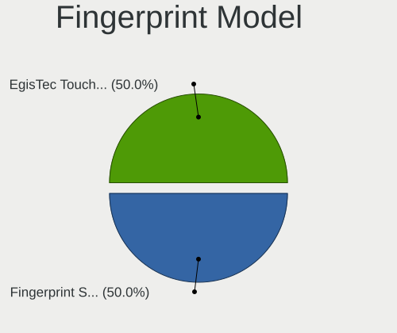

| Model                                       | Desktops | Percent |
|---------------------------------------------|----------|---------|
| LighTuning Fingerprint Sensor               | 1        | 50%     |
| LighTuning EgisTec Touch Fingerprint Sensor | 1        | 50%     |

Chipcard Vendor
---------------

Chipcard module vendors

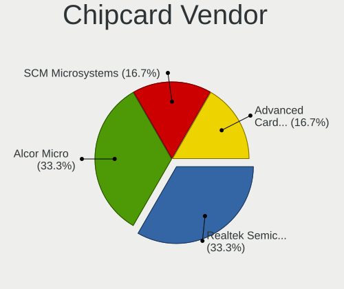

| Vendor                | Desktops | Percent |
|-----------------------|----------|---------|
| Realtek Semiconductor | 2        | 33.33%  |
| Alcor Micro           | 2        | 33.33%  |
| SCM Microsystems      | 1        | 16.67%  |
| Advanced Card Systems | 1        | 16.67%  |

Chipcard Model
--------------

Chipcard module models

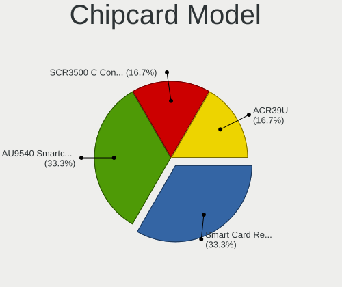

| Model                                             | Desktops | Percent |
|---------------------------------------------------|----------|---------|
| Realtek Semiconductor Smart Card Reader Interface | 2        | 33.33%  |
| Alcor Micro AU9540 Smartcard Reader               | 2        | 33.33%  |
| SCM Microsystems SCR3500 C Contact Reader         | 1        | 16.67%  |
| Advanced Card Systems ACR39U                      | 1        | 16.67%  |

Unsupported
-----------

Unsupported Devices
-------------------

Total unsupported devices on board

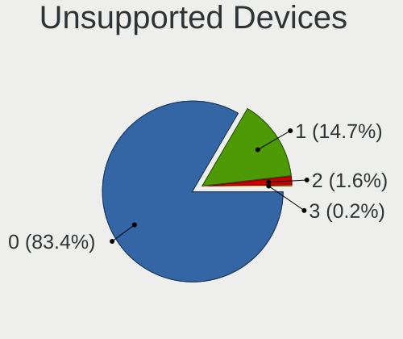

| Total | Desktops | Percent |
|-------|----------|---------|
| 0     | 862      | 83.45%  |
| 1     | 152      | 14.71%  |
| 2     | 17       | 1.65%   |
| 3     | 2        | 0.19%   |

Unsupported Device Types
------------------------

Types of unsupported devices

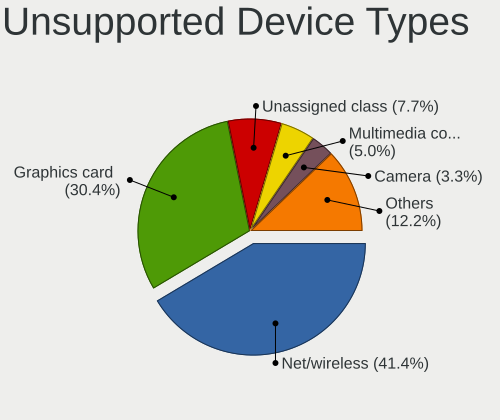

| Type                     | Desktops | Percent |
|--------------------------|----------|---------|
| Net/wireless             | 75       | 41.44%  |
| Graphics card            | 55       | 30.39%  |
| Unassigned class         | 14       | 7.73%   |
| Multimedia controller    | 9        | 4.97%   |
| Camera                   | 6        | 3.31%   |
| Net/ethernet             | 5        | 2.76%   |
| Sound                    | 4        | 2.21%   |
| Network                  | 3        | 1.66%   |
| Chipcard                 | 3        | 1.66%   |
| Fingerprint reader       | 2        | 1.1%    |
| Unclassified device      | 1        | 0.55%   |
| Storage/raid             | 1        | 0.55%   |
| Communication controller | 1        | 0.55%   |
| Card reader              | 1        | 0.55%   |
| Bluetooth                | 1        | 0.55%   |

