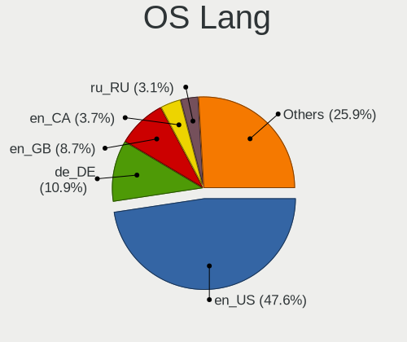
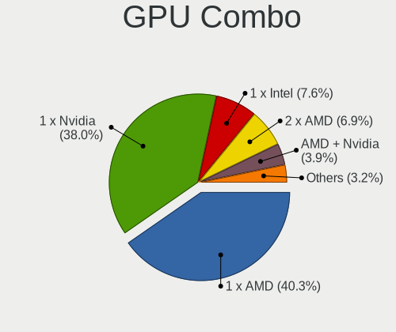
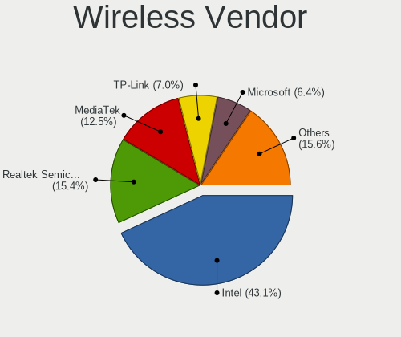
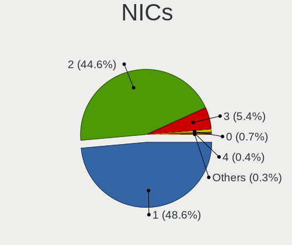
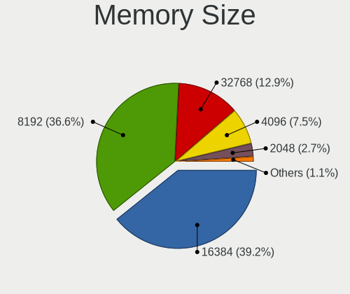
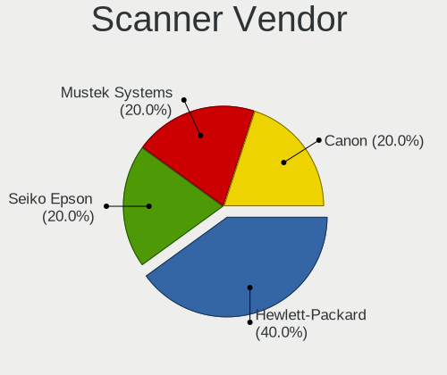
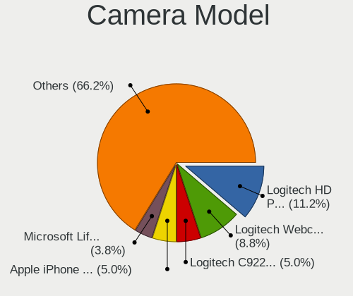

Nobara - Tested Hardware & Statistics (Desktops)
------------------------------------------------

A project to collect tested hardware configurations for Nobara.

Anyone can contribute to this report by the [hw-probe](https://github.com/linuxhw/hw-probe) tool:

    sudo -E hw-probe -all -upload

Please contribute! Especially if your hardware is rare.

Contents
--------

* [ Test Cases ](#test-cases)

* [ System ](#system)
  - [ OS                       ](#os)
  - [ OS Family                ](#os-family)
  - [ Kernel                   ](#kernel)
  - [ Kernel Family            ](#kernel-family)
  - [ Kernel Major Ver.        ](#kernel-major-ver)
  - [ Arch                     ](#arch)
  - [ DE                       ](#de)
  - [ Display Server           ](#display-server)
  - [ Display Manager          ](#display-manager)
  - [ OS Lang                  ](#os-lang)
  - [ Boot Mode                ](#boot-mode)
  - [ Filesystem               ](#filesystem)
  - [ Part. scheme             ](#part-scheme)
  - [ Dual Boot with Linux/BSD ](#dual-boot-with-linuxbsd)
  - [ Dual Boot (Win)          ](#dual-boot-win)

* [ Board ](#board)
  - [ Vendor                   ](#vendor)
  - [ Model                    ](#model)
  - [ Model Family             ](#model-family)
  - [ MFG Year                 ](#mfg-year)
  - [ Form Factor              ](#form-factor)
  - [ Secure Boot              ](#secure-boot)
  - [ Coreboot                 ](#coreboot)
  - [ RAM Size                 ](#ram-size)
  - [ RAM Used                 ](#ram-used)
  - [ Total Drives             ](#total-drives)
  - [ Has CD-ROM               ](#has-cd-rom)
  - [ Has Ethernet             ](#has-ethernet)
  - [ Has WiFi                 ](#has-wifi)
  - [ Has Bluetooth            ](#has-bluetooth)

* [ Location ](#location)
  - [ Country                  ](#country)
  - [ City                     ](#city)

* [ Drives ](#drives)
  - [ Drive Vendor             ](#drive-vendor)
  - [ Drive Model              ](#drive-model)
  - [ HDD Vendor               ](#hdd-vendor)
  - [ SSD Vendor               ](#ssd-vendor)
  - [ Drive Kind               ](#drive-kind)
  - [ Drive Connector          ](#drive-connector)
  - [ Drive Size               ](#drive-size)
  - [ Space Total              ](#space-total)
  - [ Space Used               ](#space-used)
  - [ Malfunc. Drives          ](#malfunc-drives)
  - [ Malfunc. Drive Vendor    ](#malfunc-drive-vendor)
  - [ Malfunc. HDD Vendor      ](#malfunc-hdd-vendor)
  - [ Malfunc. Drive Kind      ](#malfunc-drive-kind)
  - [ Failed Drives            ](#failed-drives)
  - [ Failed Drive Vendor      ](#failed-drive-vendor)
  - [ Drive Status             ](#drive-status)

* [ Storage controller ](#storage-controller)
  - [ Storage Vendor           ](#storage-vendor)
  - [ Storage Model            ](#storage-model)
  - [ Storage Kind             ](#storage-kind)

* [ Processor ](#processor)
  - [ CPU Vendor               ](#cpu-vendor)
  - [ CPU Model                ](#cpu-model)
  - [ CPU Model Family         ](#cpu-model-family)
  - [ CPU Cores                ](#cpu-cores)
  - [ CPU Sockets              ](#cpu-sockets)
  - [ CPU Threads              ](#cpu-threads)
  - [ CPU Op-Modes             ](#cpu-op-modes)
  - [ CPU Microcode            ](#cpu-microcode)
  - [ CPU Microarch            ](#cpu-microarch)

* [ Graphics ](#graphics)
  - [ GPU Vendor               ](#gpu-vendor)
  - [ GPU Model                ](#gpu-model)
  - [ GPU Combo                ](#gpu-combo)
  - [ GPU Driver               ](#gpu-driver)
  - [ GPU Memory               ](#gpu-memory)

* [ Monitor ](#monitor)
  - [ Monitor Vendor           ](#monitor-vendor)
  - [ Monitor Model            ](#monitor-model)
  - [ Monitor Resolution       ](#monitor-resolution)
  - [ Monitor Diagonal         ](#monitor-diagonal)
  - [ Monitor Width            ](#monitor-width)
  - [ Aspect Ratio             ](#aspect-ratio)
  - [ Monitor Area             ](#monitor-area)
  - [ Pixel Density            ](#pixel-density)
  - [ Multiple Monitors        ](#multiple-monitors)

* [ Network ](#network)
  - [ Net Controller Vendor    ](#net-controller-vendor)
  - [ Net Controller Model     ](#net-controller-model)
  - [ Wireless Vendor          ](#wireless-vendor)
  - [ Wireless Model           ](#wireless-model)
  - [ Ethernet Vendor          ](#ethernet-vendor)
  - [ Ethernet Model           ](#ethernet-model)
  - [ Net Controller Kind      ](#net-controller-kind)
  - [ Used Controller          ](#used-controller)
  - [ NICs                     ](#nics)
  - [ IPv6                     ](#ipv6)

* [ Bluetooth ](#bluetooth)
  - [ Bluetooth Vendor         ](#bluetooth-vendor)
  - [ Bluetooth Model          ](#bluetooth-model)

* [ Sound ](#sound)
  - [ Sound Vendor             ](#sound-vendor)
  - [ Sound Model              ](#sound-model)

* [ Memory ](#memory)
  - [ Memory Vendor            ](#memory-vendor)
  - [ Memory Model             ](#memory-model)
  - [ Memory Kind              ](#memory-kind)
  - [ Memory Form Factor       ](#memory-form-factor)
  - [ Memory Size              ](#memory-size)
  - [ Memory Speed             ](#memory-speed)

* [ Printers & scanners ](#printers--scanners)
  - [ Printer Vendor           ](#printer-vendor)
  - [ Printer Model            ](#printer-model)
  - [ Scanner Vendor           ](#scanner-vendor)
  - [ Scanner Model            ](#scanner-model)

* [ Camera ](#camera)
  - [ Camera Vendor            ](#camera-vendor)
  - [ Camera Model             ](#camera-model)

* [ Security ](#security)
  - [ Fingerprint Vendor       ](#fingerprint-vendor)
  - [ Fingerprint Model        ](#fingerprint-model)
  - [ Chipcard Vendor          ](#chipcard-vendor)
  - [ Chipcard Model           ](#chipcard-model)

* [ Unsupported ](#unsupported)
  - [ Unsupported Devices      ](#unsupported-devices)
  - [ Unsupported Device Types ](#unsupported-device-types)

Test Cases
----------

Total: 122

| Vendor    | Model                       | Probe                                                      | Date         |
|-----------|-----------------------------|------------------------------------------------------------|--------------|
| MSI       | MAG B550 TOMAHAWK MAX WI... | [1775ec9d4b](https://linux-hardware.org/?probe=1775ec9d4b) | Dec 01, 2022 |
| MSI       | MAG B550 TOMAHAWK MAX WI... | [097d1c062e](https://linux-hardware.org/?probe=097d1c062e) | Dec 01, 2022 |
| Gigabyte  | Z590I VISION D              | [655e907d62](https://linux-hardware.org/?probe=655e907d62) | Dec 01, 2022 |
| Intel     | X79G V2.x                   | [6b229554fc](https://linux-hardware.org/?probe=6b229554fc) | Nov 28, 2022 |
| Gigabyte  | H410M H V3                  | [afea73cc2a](https://linux-hardware.org/?probe=afea73cc2a) | Nov 22, 2022 |
| ASUSTek   | TUF Gaming B550M-PLUS WI... | [56c9fb93ce](https://linux-hardware.org/?probe=56c9fb93ce) | Nov 22, 2022 |
| ASUSTek   | TUF Gaming B550M-PLUS WI... | [1ec2520541](https://linux-hardware.org/?probe=1ec2520541) | Nov 22, 2022 |
| ASUSTek   | ROG STRIX X570-F GAMING     | [0fd2d81cad](https://linux-hardware.org/?probe=0fd2d81cad) | Nov 22, 2022 |
| OEM       | SHARKBAY JHS695             | [03c915bbd9](https://linux-hardware.org/?probe=03c915bbd9) | Nov 22, 2022 |
| MSI       | GF615M-P33                  | [7a6be335c4](https://linux-hardware.org/?probe=7a6be335c4) | Nov 22, 2022 |
| ASRock    | B550 Extreme4               | [7fba8e38dc](https://linux-hardware.org/?probe=7fba8e38dc) | Nov 20, 2022 |
| Gigabyte  | H310M M.2 x.x               | [87406f0722](https://linux-hardware.org/?probe=87406f0722) | Nov 19, 2022 |
| Alienware | 0PGRP5 A01                  | [2ff9360669](https://linux-hardware.org/?probe=2ff9360669) | Nov 17, 2022 |
| MSI       | MEG X570 UNIFY              | [750d7eb0d7](https://linux-hardware.org/?probe=750d7eb0d7) | Nov 16, 2022 |
| ASUSTek   | ROG STRIX Z390-H GAMING     | [4d4d5aa456](https://linux-hardware.org/?probe=4d4d5aa456) | Nov 15, 2022 |
| Fujitsu   | D3062-A1 S26361-D3062-A1    | [d4240ae5c7](https://linux-hardware.org/?probe=d4240ae5c7) | Nov 12, 2022 |
| MSI       | MPG X570S EDGE MAX WIFI     | [51d6598b74](https://linux-hardware.org/?probe=51d6598b74) | Nov 11, 2022 |
| ASUSTek   | A68HM-K                     | [70daf967f2](https://linux-hardware.org/?probe=70daf967f2) | Nov 10, 2022 |
| Gigabyte  | 990FXA-UD3                  | [a49a1465d3](https://linux-hardware.org/?probe=a49a1465d3) | Nov 10, 2022 |
| ASRock    | N68C-GS4 FX                 | [5e151ea22f](https://linux-hardware.org/?probe=5e151ea22f) | Nov 07, 2022 |
| Intel     | D33217GKE G76540-207        | [f90e6e931c](https://linux-hardware.org/?probe=f90e6e931c) | Nov 07, 2022 |
| Intel     | D33217GKE G76540-207        | [a154fd19a0](https://linux-hardware.org/?probe=a154fd19a0) | Nov 07, 2022 |
| ASUSTek   | TUF Gaming Z490-PLUS        | [4239b9f4a9](https://linux-hardware.org/?probe=4239b9f4a9) | Nov 06, 2022 |
| MSI       | MPG Z390 GAMING PRO CARB... | [05529fe361](https://linux-hardware.org/?probe=05529fe361) | Nov 06, 2022 |
| Dell      | 042P49 A02                  | [55d7ddf0c8](https://linux-hardware.org/?probe=55d7ddf0c8) | Nov 06, 2022 |
| MSI       | MPG Z390 GAMING PRO CARB... | [677dcff84a](https://linux-hardware.org/?probe=677dcff84a) | Nov 06, 2022 |
| MSI       | MPG X570S EDGE MAX WIFI     | [049bac8501](https://linux-hardware.org/?probe=049bac8501) | Nov 06, 2022 |
| ASUSTek   | M5A97 R2.0                  | [5ca257fd77](https://linux-hardware.org/?probe=5ca257fd77) | Nov 06, 2022 |
| MSI       | B450 TOMAHAWK MAX II        | [bd9e0be4e8](https://linux-hardware.org/?probe=bd9e0be4e8) | Nov 03, 2022 |
| ECS       | H61H2-CM                    | [792ce0e34e](https://linux-hardware.org/?probe=792ce0e34e) | Oct 31, 2022 |
| ASRock    | Z77 Pro4                    | [5ab5790e5f](https://linux-hardware.org/?probe=5ab5790e5f) | Oct 29, 2022 |
| ASRock    | Z77 Pro4                    | [74cc7f147b](https://linux-hardware.org/?probe=74cc7f147b) | Oct 29, 2022 |
| HP        | 8653 A                      | [bc1f3b445b](https://linux-hardware.org/?probe=bc1f3b445b) | Oct 28, 2022 |
| ASRock    | X570 Taichi                 | [967f52e510](https://linux-hardware.org/?probe=967f52e510) | Oct 28, 2022 |
| Dell      | 09KPNV A00                  | [c25493f420](https://linux-hardware.org/?probe=c25493f420) | Oct 27, 2022 |
| Gigabyte  | 970A-DS3P                   | [7e31b6af67](https://linux-hardware.org/?probe=7e31b6af67) | Oct 27, 2022 |
| Gigabyte  | 970A-DS3P                   | [6823943242](https://linux-hardware.org/?probe=6823943242) | Oct 27, 2022 |
| Intel     | B75                         | [eb7c27f1e5](https://linux-hardware.org/?probe=eb7c27f1e5) | Oct 26, 2022 |
| HP        | 3029h                       | [c278953154](https://linux-hardware.org/?probe=c278953154) | Oct 25, 2022 |
| Gigabyte  | Z590I VISION D              | [be4c6573cd](https://linux-hardware.org/?probe=be4c6573cd) | Oct 25, 2022 |
| ASUSTek   | PRIME A320M-K               | [c0b3f0d88e](https://linux-hardware.org/?probe=c0b3f0d88e) | Oct 24, 2022 |
| ASUSTek   | ROG STRIX Z390-E GAMING     | [7e40be1c82](https://linux-hardware.org/?probe=7e40be1c82) | Oct 23, 2022 |
| Gigabyte  | Z97-HD3                     | [f79eb0cbb0](https://linux-hardware.org/?probe=f79eb0cbb0) | Oct 23, 2022 |
| ASUSTek   | TUF Gaming X570-PRO WIFI... | [c3b1784ecc](https://linux-hardware.org/?probe=c3b1784ecc) | Oct 21, 2022 |
| Gigabyte  | B450M DS3H-CF               | [c901f6927c](https://linux-hardware.org/?probe=c901f6927c) | Oct 18, 2022 |
| MSI       | MPG Z390 GAMING PLUS        | [624be3f0f3](https://linux-hardware.org/?probe=624be3f0f3) | Oct 17, 2022 |
| ASUSTek   | TUF Gaming B450M-PLUS II    | [cb63aa5619](https://linux-hardware.org/?probe=cb63aa5619) | Oct 17, 2022 |
| MSI       | MPG Z390 GAMING PRO CARB... | [a4919afa07](https://linux-hardware.org/?probe=a4919afa07) | Oct 16, 2022 |
| MSI       | Z87 XPOWER                  | [5e73f5004a](https://linux-hardware.org/?probe=5e73f5004a) | Oct 13, 2022 |
| ASUSTek   | PRIME X370-PRO              | [0a89e9b77e](https://linux-hardware.org/?probe=0a89e9b77e) | Oct 13, 2022 |
| MSI       | MPG Z390 GAMING PRO CARB... | [a920c57a3e](https://linux-hardware.org/?probe=a920c57a3e) | Oct 11, 2022 |
| Dell      | 0F6X5P A00                  | [49baafbc65](https://linux-hardware.org/?probe=49baafbc65) | Oct 10, 2022 |
| MSI       | PRO Z690-A DDR4             | [2a1088b211](https://linux-hardware.org/?probe=2a1088b211) | Oct 08, 2022 |
| ASUSTek   | SABERTOOTH 990FX R2.0       | [05dfea29df](https://linux-hardware.org/?probe=05dfea29df) | Oct 07, 2022 |
| ASUSTek   | SABERTOOTH 990FX R2.0       | [24471f06da](https://linux-hardware.org/?probe=24471f06da) | Oct 07, 2022 |
| Gigabyte  | X570 I AORUS PRO WIFI       | [cc955e89b7](https://linux-hardware.org/?probe=cc955e89b7) | Oct 07, 2022 |
| HP        | 1998                        | [f2b9957fdd](https://linux-hardware.org/?probe=f2b9957fdd) | Oct 06, 2022 |
| MSI       | B450-A PRO MAX              | [b161553abb](https://linux-hardware.org/?probe=b161553abb) | Oct 05, 2022 |
| ASRock    | B450M Steel Legend          | [4f4352de45](https://linux-hardware.org/?probe=4f4352de45) | Oct 04, 2022 |
| ASUSTek   | H61M-K                      | [e0408b49e7](https://linux-hardware.org/?probe=e0408b49e7) | Oct 02, 2022 |
| MSI       | B350 PC MATE                | [a4c73b484e](https://linux-hardware.org/?probe=a4c73b484e) | Oct 02, 2022 |
| Dell      | 0M5DCD A00                  | [3cc1e139dc](https://linux-hardware.org/?probe=3cc1e139dc) | Oct 02, 2022 |
| MSI       | MEG X570 UNIFY              | [4d2e449699](https://linux-hardware.org/?probe=4d2e449699) | Sep 30, 2022 |
| ASRock    | X470 Master SLI             | [47c190b6e9](https://linux-hardware.org/?probe=47c190b6e9) | Sep 30, 2022 |
| Gigabyte  | H270-Gaming 3               | [9426d21070](https://linux-hardware.org/?probe=9426d21070) | Sep 29, 2022 |
| Gigabyte  | H270-Gaming 3               | [830af9c53e](https://linux-hardware.org/?probe=830af9c53e) | Sep 29, 2022 |
| Gigabyte  | AB350-Gaming 3-CF           | [365d74f8e4](https://linux-hardware.org/?probe=365d74f8e4) | Sep 28, 2022 |
| Intel     | B75                         | [af5aef869c](https://linux-hardware.org/?probe=af5aef869c) | Sep 28, 2022 |
| Gigabyte  | AB350-Gaming 3-CF           | [cfd24b9e0a](https://linux-hardware.org/?probe=cfd24b9e0a) | Sep 27, 2022 |
| MSI       | MAG X570 TOMAHAWK WIFI      | [6bfc8d43ef](https://linux-hardware.org/?probe=6bfc8d43ef) | Sep 27, 2022 |
| MSI       | A68HM-E33 V2                | [d51c90a7a8](https://linux-hardware.org/?probe=d51c90a7a8) | Sep 27, 2022 |
| ASUSTek   | 970 PRO GAMING/AURA         | [f61a736922](https://linux-hardware.org/?probe=f61a736922) | Sep 26, 2022 |
| ASUSTek   | 970 PRO GAMING/AURA         | [1ecfe379e7](https://linux-hardware.org/?probe=1ecfe379e7) | Sep 26, 2022 |
| ASUSTek   | PRIME H410M-A               | [dafae8d45b](https://linux-hardware.org/?probe=dafae8d45b) | Sep 26, 2022 |
| MSI       | 970 GAMING                  | [015cd37f26](https://linux-hardware.org/?probe=015cd37f26) | Sep 24, 2022 |
| Dell      | 0G785M A00                  | [c461ec42d6](https://linux-hardware.org/?probe=c461ec42d6) | Sep 24, 2022 |
| ASUSTek   | PRIME A320M-K               | [d72e6b3865](https://linux-hardware.org/?probe=d72e6b3865) | Sep 23, 2022 |
| Gigabyte  | EP45-UD3L                   | [71c630ea03](https://linux-hardware.org/?probe=71c630ea03) | Sep 22, 2022 |
| ASUSTek   | PRIME H310M-E R2.0          | [7299d75966](https://linux-hardware.org/?probe=7299d75966) | Sep 22, 2022 |
| HP        | 8594                        | [281774ad4a](https://linux-hardware.org/?probe=281774ad4a) | Sep 21, 2022 |
| Gigabyte  | EP45-UD3L                   | [2b90168b71](https://linux-hardware.org/?probe=2b90168b71) | Sep 21, 2022 |
| ASRock    | X470 Master SLI             | [3c8fefe578](https://linux-hardware.org/?probe=3c8fefe578) | Sep 20, 2022 |
| ASRock    | X470 Master SLI             | [1975320cad](https://linux-hardware.org/?probe=1975320cad) | Sep 20, 2022 |
| Dell      | 0G785M A00                  | [8b8c41b401](https://linux-hardware.org/?probe=8b8c41b401) | Sep 19, 2022 |
| Unknown   | T3 MRD                      | [1f60a4d202](https://linux-hardware.org/?probe=1f60a4d202) | Sep 19, 2022 |
| MSI       | X570-A PRO                  | [cabf88c8be](https://linux-hardware.org/?probe=cabf88c8be) | Sep 19, 2022 |
| Gigabyte  | A320M-S2H-CF                | [7b95813c96](https://linux-hardware.org/?probe=7b95813c96) | Sep 18, 2022 |
| Unknown   | T3 MRD                      | [b10823b50f](https://linux-hardware.org/?probe=b10823b50f) | Sep 17, 2022 |
| Biostar   | H410MH S2                   | [832dd81851](https://linux-hardware.org/?probe=832dd81851) | Sep 17, 2022 |
| Lenovo    | MAHOBAY NOK                 | [cce010fd53](https://linux-hardware.org/?probe=cce010fd53) | Sep 16, 2022 |
| ASUSTek   | TUF Gaming B550M-PLUS WI... | [d9e9ec9afa](https://linux-hardware.org/?probe=d9e9ec9afa) | Sep 09, 2022 |
| ASUSTek   | TUF Gaming B550M-PLUS WI... | [1cdd7cda15](https://linux-hardware.org/?probe=1cdd7cda15) | Sep 09, 2022 |
| ASUSTek   | TUF Gaming X570-PRO         | [6eae76b5d0](https://linux-hardware.org/?probe=6eae76b5d0) | Sep 01, 2022 |
| ASRock    | FM2A55M-HD+                 | [2f96c73efb](https://linux-hardware.org/?probe=2f96c73efb) | Sep 01, 2022 |
| Gigabyte  | H110M-H-CF                  | [86fc2bf58f](https://linux-hardware.org/?probe=86fc2bf58f) | Aug 31, 2022 |
| Alienware | 01NYPT A00                  | [cd95b79270](https://linux-hardware.org/?probe=cd95b79270) | Aug 29, 2022 |
| ASRock    | B560 Steel Legend           | [c64907de8d](https://linux-hardware.org/?probe=c64907de8d) | Aug 27, 2022 |
| ASUSTek   | P8Z68-V PRO                 | [37ae937f4d](https://linux-hardware.org/?probe=37ae937f4d) | Aug 26, 2022 |
| ASUSTek   | PRIME X570-PRO              | [663509c999](https://linux-hardware.org/?probe=663509c999) | Aug 24, 2022 |
| ASUSTek   | PRIME X570-PRO              | [2b7d1d59a1](https://linux-hardware.org/?probe=2b7d1d59a1) | Aug 24, 2022 |
| ASUSTek   | PRIME A320M-K               | [928ce75df1](https://linux-hardware.org/?probe=928ce75df1) | Aug 24, 2022 |
| ASRock    | H61M-VG3                    | [a3cd7ba2c1](https://linux-hardware.org/?probe=a3cd7ba2c1) | Aug 22, 2022 |
| ASUSTek   | B85M-E                      | [0b5044dacf](https://linux-hardware.org/?probe=0b5044dacf) | Aug 19, 2022 |
| Gigabyte  | B450M DS3H-CF               | [a2b6c2ae17](https://linux-hardware.org/?probe=a2b6c2ae17) | Aug 19, 2022 |
| ASRock    | X470 Master SLI             | [ce62975b20](https://linux-hardware.org/?probe=ce62975b20) | Aug 15, 2022 |
| ASUSTek   | PRIME B350-PLUS             | [b2bbce2845](https://linux-hardware.org/?probe=b2bbce2845) | Aug 15, 2022 |
| ASRock    | Z97 Extreme6                | [31d7973a9d](https://linux-hardware.org/?probe=31d7973a9d) | Aug 14, 2022 |
| ASRock    | 760GM-HDV                   | [beabb7dd99](https://linux-hardware.org/?probe=beabb7dd99) | Aug 14, 2022 |
| MSI       | B450 TOMAHAWK MAX           | [27cd96982f](https://linux-hardware.org/?probe=27cd96982f) | Aug 10, 2022 |
| HP        | 8906 SMVB                   | [8f30392f49](https://linux-hardware.org/?probe=8f30392f49) | Aug 10, 2022 |
| HP        | 8054                        | [469b765fe0](https://linux-hardware.org/?probe=469b765fe0) | Aug 10, 2022 |
| ASUSTek   | G20AJ                       | [613f8a0c36](https://linux-hardware.org/?probe=613f8a0c36) | Aug 08, 2022 |
| Gigabyte  | X570 AORUS ELITE            | [f65ba77de3](https://linux-hardware.org/?probe=f65ba77de3) | Aug 07, 2022 |
| ASUSTek   | ROG CROSSHAIR VIII HERO     | [7a60eede9a](https://linux-hardware.org/?probe=7a60eede9a) | Aug 04, 2022 |
| MSI       | B450-A PRO MAX              | [e142cf5c91](https://linux-hardware.org/?probe=e142cf5c91) | Aug 04, 2022 |
| MSI       | B450 TOMAHAWK MAX           | [7c4355417f](https://linux-hardware.org/?probe=7c4355417f) | Aug 03, 2022 |
| MSI       | X570-A PRO                  | [f034a02e69](https://linux-hardware.org/?probe=f034a02e69) | Aug 01, 2022 |
| MSI       | 970 GAMING                  | [bf2a870952](https://linux-hardware.org/?probe=bf2a870952) | Jul 23, 2022 |
| Dell      | 0J8H4R A01                  | [3d7d06475c](https://linux-hardware.org/?probe=3d7d06475c) | Jul 23, 2022 |
| ASUSTek   | PRIME B450-PLUS             | [7d6b6d93d3](https://linux-hardware.org/?probe=7d6b6d93d3) | Jul 21, 2022 |
| eMachines | EL1870                      | [58e76fb684](https://linux-hardware.org/?probe=58e76fb684) | Jul 19, 2022 |
| MSI       | X570-A PRO                  | [c9683ea265](https://linux-hardware.org/?probe=c9683ea265) | Jul 19, 2022 |

System
------

OS
--

Installed operating systems

| Name      | Desktops | Percent |
|-----------|----------|---------|
| Nobara 36 | 96       | 100%    |

OS Family
---------

OS without a version

| Name   | Desktops | Percent |
|--------|----------|---------|
| Nobara | 96       | 100%    |

Kernel
------

Version of the Linux kernel

| Version                       | Desktops | Percent |
|-------------------------------|----------|---------|
| 5.19.9-201.fsync.fc36.x86_64  | 8        | 8%      |
| 5.19.14-201.fsync.fc36.x86_64 | 8        | 8%      |
| 5.19.7-204.fsync.fc36.x86_64  | 7        | 7%      |
| 5.19.16-201.fsync.fc36.x86_64 | 7        | 7%      |
| 5.18.13-201.fsync.fc36.x86_64 | 7        | 7%      |
| 6.0.9-201.fc36.x86_64         | 6        | 6%      |
| 6.0.7-201.fsync.fc36.x86_64   | 6        | 6%      |
| 5.19.10-201.fsync.fc36.x86_64 | 6        | 6%      |
| 6.0.5-201.fsync.fc36.x86_64   | 5        | 5%      |
| 5.19.4-201.fsync.fc36.x86_64  | 4        | 4%      |
| 5.19.15-202.fsync.fc36.x86_64 | 4        | 4%      |
| 5.18.17-201.fsync.fc36.x86_64 | 4        | 4%      |
| 5.18.16-201.fsync.fc36.x86_64 | 4        | 4%      |
| 6.0.10-201.fc36.x86_64        | 3        | 3%      |
| 5.19.12-201.fsync.fc36.x86_64 | 3        | 3%      |
| 5.18.19-201.fsync.fc36.x86_64 | 3        | 3%      |
| 5.18.11-201.fsync.fc36.x86_64 | 3        | 3%      |
| 6.0.8-201.fsync.fc36.x86_64   | 2        | 2%      |
| 6.0.7-202.fsync.fc36.x86_64   | 2        | 2%      |
| 5.19.11-201.fsync.fc36.x86_64 | 2        | 2%      |
| 5.19.7-203.fsync.fc36.x86_64  | 1        | 1%      |
| 5.19.2-602.inttf.fc36.x86_64  | 1        | 1%      |
| 5.19.13-202.fsync.fc36.x86_64 | 1        | 1%      |
| 5.19.13-201.fsync.fc36.x86_64 | 1        | 1%      |
| 5.18.9-201.fsync.fc36.x86_64  | 1        | 1%      |
| 5.18.18-201.fsync.fc36.x86_64 | 1        | 1%      |

Kernel Family
-------------

Linux kernel without a distro release

| Version | Desktops | Percent |
|---------|----------|---------|
| 6.0.7   | 8        | 8%      |
| 5.19.9  | 8        | 8%      |
| 5.19.7  | 8        | 8%      |
| 5.19.14 | 8        | 8%      |
| 5.19.16 | 7        | 7%      |
| 5.18.13 | 7        | 7%      |
| 6.0.9   | 6        | 6%      |
| 5.19.10 | 6        | 6%      |
| 6.0.5   | 5        | 5%      |
| 5.19.4  | 4        | 4%      |
| 5.19.15 | 4        | 4%      |
| 5.18.17 | 4        | 4%      |
| 5.18.16 | 4        | 4%      |
| 6.0.10  | 3        | 3%      |
| 5.19.12 | 3        | 3%      |
| 5.18.19 | 3        | 3%      |
| 5.18.11 | 3        | 3%      |
| 6.0.8   | 2        | 2%      |
| 5.19.13 | 2        | 2%      |
| 5.19.11 | 2        | 2%      |
| 5.19.2  | 1        | 1%      |
| 5.18.9  | 1        | 1%      |
| 5.18.18 | 1        | 1%      |

Kernel Major Ver.
-----------------

Linux kernel major version

| Version | Desktops | Percent |
|---------|----------|---------|
| 5.19    | 53       | 53%     |
| 6.0     | 24       | 24%     |
| 5.18    | 23       | 23%     |

Arch
----

OS architecture (x86_64, i586, etc.)

| Name   | Desktops | Percent |
|--------|----------|---------|
| x86_64 | 96       | 100%    |

DE
--

Desktop Environment

| Name       | Desktops | Percent |
|------------|----------|---------|
| GNOME      | 72       | 75%     |
| KDE5       | 23       | 23.96%  |
| X-Cinnamon | 1        | 1.04%   |

Display Server
--------------

X11 or Wayland

| Name    | Desktops | Percent |
|---------|----------|---------|
| Wayland | 72       | 72.73%  |
| X11     | 27       | 27.27%  |

Display Manager
---------------

SDDM, LightDM, etc.

| Name    | Desktops | Percent |
|---------|----------|---------|
| Unknown | 82       | 85.42%  |
| GDM     | 9        | 9.38%   |
| SDDM    | 4        | 4.17%   |
| LightDM | 1        | 1.04%   |

OS Lang
-------

Language

| Lang    | Desktops | Percent |
|---------|----------|---------|
| en_US   | 55       | 56.7%   |
| en_GB   | 7        | 7.22%   |
| es_ES   | 4        | 4.12%   |
| es_AR   | 4        | 4.12%   |
| es_MX   | 3        | 3.09%   |
| en_CA   | 3        | 3.09%   |
| de_DE   | 3        | 3.09%   |
| ru_RU   | 2        | 2.06%   |
| fr_FR   | 2        | 2.06%   |
| es_CO   | 2        | 2.06%   |
| en_AU   | 2        | 2.06%   |
| sk_SK   | 1        | 1.03%   |
| pt_BR   | 1        | 1.03%   |
| nl_NL   | 1        | 1.03%   |
| es_GT   | 1        | 1.03%   |
| es_EC   | 1        | 1.03%   |
| en_NZ   | 1        | 1.03%   |
| de_AT   | 1        | 1.03%   |
| cs_CZ   | 1        | 1.03%   |
| C       | 1        | 1.03%   |
| Unknown | 1        | 1.03%   |

Boot Mode
---------

EFI or BIOS

| Mode | Desktops | Percent |
|------|----------|---------|
| EFI  | 68       | 70.83%  |
| BIOS | 28       | 29.17%  |

Filesystem
----------

Type of filesystem

| Type  | Desktops | Percent |
|-------|----------|---------|
| Ext4  | 52       | 54.17%  |
| Btrfs | 44       | 45.83%  |

Part. scheme
------------

Scheme of partitioning

| Type    | Desktops | Percent |
|---------|----------|---------|
| Unknown | 81       | 84.38%  |
| GPT     | 12       | 12.5%   |
| MBR     | 3        | 3.13%   |

Dual Boot with Linux/BSD
------------------------

Hosting more than one Linux/BSD

| Dual boot | Desktops | Percent |
|-----------|----------|---------|
| No        | 91       | 94.79%  |
| Yes       | 5        | 5.21%   |

Dual Boot (Win)
---------------

Hosting Linux and Windows

| Dual boot | Desktops | Percent |
|-----------|----------|---------|
| No        | 89       | 92.71%  |
| Yes       | 7        | 7.29%   |

Board
-----

Vendor
------

Motherboard manufacturer

| Name                | Desktops | Percent |
|---------------------|----------|---------|
| ASUSTek Computer    | 26       | 27.08%  |
| MSI                 | 19       | 19.79%  |
| Gigabyte Technology | 16       | 16.67%  |
| ASRock              | 11       | 11.46%  |
| Hewlett-Packard     | 6        | 6.25%   |
| Dell                | 6        | 6.25%   |
| Intel               | 3        | 3.13%   |
| Alienware           | 2        | 2.08%   |
| OEM                 | 1        | 1.04%   |
| Lenovo              | 1        | 1.04%   |
| Fujitsu             | 1        | 1.04%   |
| eMachines           | 1        | 1.04%   |
| ECS                 | 1        | 1.04%   |
| Biostar             | 1        | 1.04%   |
| Unknown             | 1        | 1.04%   |

Model
-----

Motherboard model

| Name                                 | Desktops | Percent |
|--------------------------------------|----------|---------|
| ASUS PRIME A320M-K                   | 3        | 3.13%   |
| MSI MS-7C37                          | 2        | 2.08%   |
| MSI MS-7C02                          | 2        | 2.08%   |
| MSI MS-7B86                          | 2        | 2.08%   |
| MSI MS-7693                          | 2        | 2.08%   |
| Gigabyte Z590I VISION D              | 2        | 2.08%   |
| Gigabyte B450M DS3H                  | 2        | 2.08%   |
| Dell OptiPlex 390                    | 2        | 2.08%   |
| OEM SHARKBAY                         | 1        | 1.04%   |
| MSI MS-7D53                          | 1        | 1.04%   |
| MSI MS-7D25                          | 1        | 1.04%   |
| MSI MS-7C91                          | 1        | 1.04%   |
| MSI MS-7C84                          | 1        | 1.04%   |
| MSI MS-7C35                          | 1        | 1.04%   |
| MSI MS-7B51                          | 1        | 1.04%   |
| MSI MS-7B17                          | 1        | 1.04%   |
| MSI MS-7A34                          | 1        | 1.04%   |
| MSI MS-7811                          | 1        | 1.04%   |
| MSI MS-7721                          | 1        | 1.04%   |
| MSI MS-7597                          | 1        | 1.04%   |
| Lenovo ThinkCentre M92p 3238E5U      | 1        | 1.04%   |
| Intel X79                            | 1        | 1.04%   |
| Intel D33217GKE G76540-207           | 1        | 1.04%   |
| Intel B75                            | 1        | 1.04%   |
| HP Pavilion Gaming Desktop TG01-0xxx | 1        | 1.04%   |
| HP Pavilion Desktop TP01-2xxx        | 1        | 1.04%   |
| HP EliteDesk 800 G5 Desktop Mini     | 1        | 1.04%   |
| HP EliteDesk 800 G2 SFF              | 1        | 1.04%   |
| HP EliteDesk 800 G1 SFF              | 1        | 1.04%   |
| HP Compaq dc5850 Small Form Factor   | 1        | 1.04%   |
| Gigabyte Z97-HD3                     | 1        | 1.04%   |
| Gigabyte X570 I AORUS PRO WIFI       | 1        | 1.04%   |
| Gigabyte X570 AORUS ELITE            | 1        | 1.04%   |
| Gigabyte H410M H V3                  | 1        | 1.04%   |
| Gigabyte H310M M.2 2.0               | 1        | 1.04%   |
| Gigabyte H270-Gaming 3               | 1        | 1.04%   |
| Gigabyte H110M-H                     | 1        | 1.04%   |
| Gigabyte EP45-UD3L                   | 1        | 1.04%   |
| Gigabyte AB350-Gaming 3              | 1        | 1.04%   |
| Gigabyte A320M-S2H                   | 1        | 1.04%   |

Model Family
------------

Motherboard model prefix

| Name                  | Desktops | Percent |
|-----------------------|----------|---------|
| ASUS PRIME            | 9        | 9.38%   |
| Dell OptiPlex         | 4        | 4.17%   |
| ASUS TUF              | 4        | 4.17%   |
| ASUS ROG              | 4        | 4.17%   |
| HP EliteDesk          | 3        | 3.13%   |
| MSI MS-7C37           | 2        | 2.08%   |
| MSI MS-7C02           | 2        | 2.08%   |
| MSI MS-7B86           | 2        | 2.08%   |
| MSI MS-7693           | 2        | 2.08%   |
| HP Pavilion           | 2        | 2.08%   |
| Gigabyte Z590I        | 2        | 2.08%   |
| Gigabyte X570         | 2        | 2.08%   |
| Gigabyte B450M        | 2        | 2.08%   |
| OEM SHARKBAY          | 1        | 1.04%   |
| MSI MS-7D53           | 1        | 1.04%   |
| MSI MS-7D25           | 1        | 1.04%   |
| MSI MS-7C91           | 1        | 1.04%   |
| MSI MS-7C84           | 1        | 1.04%   |
| MSI MS-7C35           | 1        | 1.04%   |
| MSI MS-7B51           | 1        | 1.04%   |
| MSI MS-7B17           | 1        | 1.04%   |
| MSI MS-7A34           | 1        | 1.04%   |
| MSI MS-7811           | 1        | 1.04%   |
| MSI MS-7721           | 1        | 1.04%   |
| MSI MS-7597           | 1        | 1.04%   |
| Lenovo ThinkCentre    | 1        | 1.04%   |
| Intel X79             | 1        | 1.04%   |
| Intel D33217GKE       | 1        | 1.04%   |
| Intel B75             | 1        | 1.04%   |
| HP Compaq             | 1        | 1.04%   |
| Gigabyte Z97-HD3      | 1        | 1.04%   |
| Gigabyte H410M        | 1        | 1.04%   |
| Gigabyte H310M        | 1        | 1.04%   |
| Gigabyte H270-Gaming  | 1        | 1.04%   |
| Gigabyte H110M-H      | 1        | 1.04%   |
| Gigabyte EP45-UD3L    | 1        | 1.04%   |
| Gigabyte AB350-Gaming | 1        | 1.04%   |
| Gigabyte A320M-S2H    | 1        | 1.04%   |
| Gigabyte 990FXA-UD3   | 1        | 1.04%   |
| Gigabyte 970A-DS3P    | 1        | 1.04%   |

MFG Year
--------

Motherboard manufacture year

| Year | Desktops | Percent |
|------|----------|---------|
| 2019 | 20       | 20.83%  |
| 2021 | 11       | 11.46%  |
| 2013 | 11       | 11.46%  |
| 2018 | 10       | 10.42%  |
| 2017 | 8        | 8.33%   |
| 2014 | 8        | 8.33%   |
| 2020 | 6        | 6.25%   |
| 2011 | 6        | 6.25%   |
| 2016 | 4        | 4.17%   |
| 2012 | 4        | 4.17%   |
| 2022 | 2        | 2.08%   |
| 2015 | 2        | 2.08%   |
| 2008 | 2        | 2.08%   |
| 2010 | 1        | 1.04%   |
| 2009 | 1        | 1.04%   |

Form Factor
-----------

Physical design of the computer

| Name    | Desktops | Percent |
|---------|----------|---------|
| Desktop | 96       | 100%    |

Secure Boot
-----------

Enabled or disabled

| State    | Desktops | Percent |
|----------|----------|---------|
| Disabled | 96       | 100%    |

Coreboot
--------

Have coreboot on board

| Used | Desktops | Percent |
|------|----------|---------|
| No   | 96       | 100%    |

RAM Size
--------

Total RAM memory

| Size in GB  | Desktops | Percent |
|-------------|----------|---------|
| 16.01-24.0  | 37       | 38.54%  |
| 32.01-64.0  | 21       | 21.88%  |
| 8.01-16.0   | 18       | 18.75%  |
| 4.01-8.0    | 10       | 10.42%  |
| 3.01-4.0    | 7        | 7.29%   |
| 64.01-256.0 | 2        | 2.08%   |
| 24.01-32.0  | 1        | 1.04%   |

RAM Used
--------

Used RAM memory

| Used GB    | Desktops | Percent |
|------------|----------|---------|
| 4.01-8.0   | 43       | 42.57%  |
| 3.01-4.0   | 27       | 26.73%  |
| 2.01-3.0   | 14       | 13.86%  |
| 8.01-16.0  | 11       | 10.89%  |
| 1.01-2.0   | 3        | 2.97%   |
| 16.01-24.0 | 2        | 1.98%   |
| 24.01-32.0 | 1        | 0.99%   |

Total Drives
------------

Number of drives on board

| Drives | Desktops | Percent |
|--------|----------|---------|
| 1      | 29       | 29.9%   |
| 2      | 27       | 27.84%  |
| 3      | 23       | 23.71%  |
| 5      | 9        | 9.28%   |
| 4      | 6        | 6.19%   |
| 10     | 1        | 1.03%   |
| 7      | 1        | 1.03%   |
| 6      | 1        | 1.03%   |

Has CD-ROM
----------

Has CD-ROM on board

| Presented | Desktops | Percent |
|-----------|----------|---------|
| No        | 74       | 77.08%  |
| Yes       | 22       | 22.92%  |

Has Ethernet
------------

Has Ethernet on board

| Presented | Desktops | Percent |
|-----------|----------|---------|
| Yes       | 96       | 100%    |

Has WiFi
--------

Has WiFi module

| Presented | Desktops | Percent |
|-----------|----------|---------|
| Yes       | 52       | 54.17%  |
| No        | 44       | 45.83%  |

Has Bluetooth
-------------

Has Bluetooth module

| Presented | Desktops | Percent |
|-----------|----------|---------|
| No        | 52       | 53.61%  |
| Yes       | 45       | 46.39%  |

Location
--------

Country
-------

Geographic location (country)

| Country      | Desktops | Percent |
|--------------|----------|---------|
| USA          | 33       | 34.38%  |
| UK           | 5        | 5.21%   |
| Germany      | 5        | 5.21%   |
| France       | 5        | 5.21%   |
| Canada       | 5        | 5.21%   |
| Argentina    | 5        | 5.21%   |
| Spain        | 3        | 3.13%   |
| Mexico       | 3        | 3.13%   |
| Serbia       | 2        | 2.08%   |
| Russia       | 2        | 2.08%   |
| Netherlands  | 2        | 2.08%   |
| Colombia     | 2        | 2.08%   |
| Chile        | 2        | 2.08%   |
| Brazil       | 2        | 2.08%   |
| Australia    | 2        | 2.08%   |
| Venezuela    | 1        | 1.04%   |
| South Korea  | 1        | 1.04%   |
| South Africa | 1        | 1.04%   |
| Slovakia     | 1        | 1.04%   |
| Portugal     | 1        | 1.04%   |
| Philippines  | 1        | 1.04%   |
| Norway       | 1        | 1.04%   |
| New Zealand  | 1        | 1.04%   |
| Lithuania    | 1        | 1.04%   |
| Jordan       | 1        | 1.04%   |
| Hungary      | 1        | 1.04%   |
| Guatemala    | 1        | 1.04%   |
| Georgia      | 1        | 1.04%   |
| Ecuador      | 1        | 1.04%   |
| Czechia      | 1        | 1.04%   |
| Croatia      | 1        | 1.04%   |
| Belgium      | 1        | 1.04%   |
| Austria      | 1        | 1.04%   |

City
----

Geographic location (city)

| City              | Desktops | Percent |
|-------------------|----------|---------|
| Philadelphia      | 2        | 2.04%   |
| Buenos Aires      | 2        | 2.04%   |
| Atlanta           | 2        | 2.04%   |
| Zagreb            | 1        | 1.02%   |
| Wooster           | 1        | 1.02%   |
| Wiesbaden         | 1        | 1.02%   |
| Wellington        | 1        | 1.02%   |
| Waldorf           | 1        | 1.02%   |
| Vineland          | 1        | 1.02%   |
| Vilnius           | 1        | 1.02%   |
| Villa Nueva       | 1        | 1.02%   |
| Valledupar        | 1        | 1.02%   |
| Tamworth          | 1        | 1.02%   |
| Szeged            | 1        | 1.02%   |
| Seattle           | 1        | 1.02%   |
| Schruns           | 1        | 1.02%   |
| Sao Paulo         | 1        | 1.02%   |
| Santiago          | 1        | 1.02%   |
| San Jose          | 1        | 1.02%   |
| San Antonio       | 1        | 1.02%   |
| Salon-de-Provence | 1        | 1.02%   |
| Sacramento        | 1        | 1.02%   |
| Rotterdam         | 1        | 1.02%   |
| Richardson        | 1        | 1.02%   |
| Raleigh           | 1        | 1.02%   |
| Quito             | 1        | 1.02%   |
| Prague            | 1        | 1.02%   |
| Philipsburg       | 1        | 1.02%   |
| Perth             | 1        | 1.02%   |
| Paris             | 1        | 1.02%   |
| Osa               | 1        | 1.02%   |
| Orenburg          | 1        | 1.02%   |
| North Vancouver   | 1        | 1.02%   |
| Mount Pleasant    | 1        | 1.02%   |
| Monterrey         | 1        | 1.02%   |
| Monte Grande      | 1        | 1.02%   |
| Mendoza           | 1        | 1.02%   |
| Melbourne         | 1        | 1.02%   |
| Martigues         | 1        | 1.02%   |
| Marin             | 1        | 1.02%   |

Drives
------

Drive Vendor
------------

Hard drive vendors

| Vendor                    | Desktops | Drives | Percent |
|---------------------------|----------|--------|---------|
| WDC                       | 41       | 56     | 20.4%   |
| Samsung Electronics       | 31       | 52     | 15.42%  |
| Seagate                   | 28       | 38     | 13.93%  |
| Crucial                   | 15       | 19     | 7.46%   |
| Toshiba                   | 14       | 14     | 6.97%   |
| Sandisk                   | 12       | 13     | 5.97%   |
| Kingston                  | 10       | 12     | 4.98%   |
| PNY                       | 5        | 8      | 2.49%   |
| Phison                    | 5        | 6      | 2.49%   |
| Phison Electronics        | 4        | 4      | 1.99%   |
| Intel                     | 3        | 6      | 1.49%   |
| Hitachi                   | 3        | 3      | 1.49%   |
| Transcend                 | 2        | 2      | 1%      |
| Team                      | 2        | 2      | 1%      |
| Realtek Semiconductor     | 2        | 2      | 1%      |
| Micron Technology         | 2        | 2      | 1%      |
| China                     | 2        | 2      | 1%      |
| ADATA Technology          | 2        | 2      | 1%      |
| XPG                       | 1        | 1      | 0.5%    |
| Verbatim                  | 1        | 1      | 0.5%    |
| Unknown                   | 1        | 1      | 0.5%    |
| SuperSSpeed               | 1        | 1      | 0.5%    |
| SPCC                      | 1        | 1      | 0.5%    |
| SK hynix                  | 1        | 1      | 0.5%    |
| Silicon Motion            | 1        | 1      | 0.5%    |
| OCZ                       | 1        | 1      | 0.5%    |
| MyDigitalSSD              | 1        | 1      | 0.5%    |
| Mushkin                   | 1        | 1      | 0.5%    |
| Micron/Crucial Technology | 1        | 1      | 0.5%    |
| LITEONIT                  | 1        | 1      | 0.5%    |
| KIOXIA-EXCERIA            | 1        | 1      | 0.5%    |
| KIOXIA                    | 1        | 1      | 0.5%    |
| JMicron Technology        | 1        | 1      | 0.5%    |
| Foxline                   | 1        | 1      | 0.5%    |
| Apple                     | 1        | 1      | 0.5%    |
| A-DATA Technology         | 1        | 1      | 0.5%    |

Drive Model
-----------

Hard drive models

| Model                                                | Desktops | Percent |
|------------------------------------------------------|----------|---------|
| Toshiba HDWD110 1TB                                  | 5        | 2.08%   |
| Phison E12 NVMe Controller 2TB                       | 4        | 1.67%   |
| WDC WDBNCE5000PNC 500GB SSD                          | 3        | 1.25%   |
| WDC WD10EZEX-08WN4A0 1TB                             | 3        | 1.25%   |
| Toshiba DT01ACA100 1TB                               | 3        | 1.25%   |
| Samsung SSD 860 EVO 500GB                            | 3        | 1.25%   |
| Samsung SSD 850 EVO 500GB                            | 3        | 1.25%   |
| Intel SSD 660P Series 512GB                          | 3        | 1.25%   |
| WDC WDS480G2G0A-00JH30 480GB SSD                     | 2        | 0.83%   |
| WDC WDS240G2G0A-00JH30 240GB SSD                     | 2        | 0.83%   |
| WDC WDS100T2B0A-00SM50 1TB SSD                       | 2        | 0.83%   |
| WDC WD5000BEVT-75ZAT0 500GB                          | 2        | 0.83%   |
| WDC WD10EZEX-00BN5A0 1TB                             | 2        | 0.83%   |
| Seagate ST3500418AS 500GB                            | 2        | 0.83%   |
| Seagate ST3500414CS 500GB                            | 2        | 0.83%   |
| Seagate ST2000DX002-2DV164 2TB                       | 2        | 0.83%   |
| Seagate ST2000DM008-2FR102 2TB                       | 2        | 0.83%   |
| Seagate ST2000DM001-1ER164 2TB                       | 2        | 0.83%   |
| Sandisk WD Black SN850 256GB                         | 2        | 0.83%   |
| SanDisk SSD PLUS 240GB                               | 2        | 0.83%   |
| Samsung SSD 980 500GB                                | 2        | 0.83%   |
| Samsung SSD 860 EVO 1TB                              | 2        | 0.83%   |
| Samsung SSD 850 EVO 250GB                            | 2        | 0.83%   |
| Samsung NVMe SSD Drive 1TB                           | 2        | 0.83%   |
| Samsung NVMe SSD Controller SM981/PM981/PM983 1TB    | 2        | 0.83%   |
| Samsung NVMe SSD Controller PM9A1/PM9A3/980PRO 250GB | 2        | 0.83%   |
| PNY CS900 500GB SSD                                  | 2        | 0.83%   |
| PNY CS900 1TB SSD                                    | 2        | 0.83%   |
| Phison Sabrent Rocket 4.0 2TB                        | 2        | 0.83%   |
| Phison NVMe SSD Drive 2TB                            | 2        | 0.83%   |
| Kingston SV300S37A240G 240GB SSD                     | 2        | 0.83%   |
| Kingston SA400S37240G 240GB SSD                      | 2        | 0.83%   |
| Kingston NVMe SSD Drive 500GB                        | 2        | 0.83%   |
| Crucial CT240BX500SSD1 240GB                         | 2        | 0.83%   |
| Crucial CT1000MX500SSD1 1TB                          | 2        | 0.83%   |
| Crucial CT1000BX500SSD1 1TB                          | 2        | 0.83%   |
| XPG SPECTRIX S40G 512GB                              | 1        | 0.42%   |
| WDC WDS500G2B0A-00SM50 500GB SSD                     | 1        | 0.42%   |
| WDC WDS240G2G0B-00EPW0 240GB SSD                     | 1        | 0.42%   |
| WDC WDS120G2G0A-00JH30 120GB SSD                     | 1        | 0.42%   |

HDD Vendor
----------

Hard disk drive vendors

| Vendor              | Desktops | Drives | Percent |
|---------------------|----------|--------|---------|
| WDC                 | 32       | 42     | 39.02%  |
| Seagate             | 28       | 36     | 34.15%  |
| Toshiba             | 12       | 12     | 14.63%  |
| Samsung Electronics | 6        | 8      | 7.32%   |
| Hitachi             | 3        | 3      | 3.66%   |
| Apple               | 1        | 1      | 1.22%   |

SSD Vendor
----------

Solid state drive vendors

| Vendor              | Desktops | Drives | Percent |
|---------------------|----------|--------|---------|
| Samsung Electronics | 18       | 23     | 21.69%  |
| Crucial             | 15       | 19     | 18.07%  |
| WDC                 | 11       | 12     | 13.25%  |
| Kingston            | 8        | 10     | 9.64%   |
| SanDisk             | 7        | 7      | 8.43%   |
| PNY                 | 5        | 8      | 6.02%   |
| Transcend           | 2        | 2      | 2.41%   |
| China               | 2        | 2      | 2.41%   |
| Verbatim            | 1        | 1      | 1.2%    |
| Toshiba             | 1        | 1      | 1.2%    |
| Team                | 1        | 1      | 1.2%    |
| SuperSSpeed         | 1        | 1      | 1.2%    |
| SPCC                | 1        | 1      | 1.2%    |
| Seagate             | 1        | 1      | 1.2%    |
| OCZ                 | 1        | 1      | 1.2%    |
| MyDigitalSSD        | 1        | 1      | 1.2%    |
| Mushkin             | 1        | 1      | 1.2%    |
| Micron Technology   | 1        | 1      | 1.2%    |
| LITEONIT            | 1        | 1      | 1.2%    |
| KIOXIA-EXCERIA      | 1        | 1      | 1.2%    |
| JMicron Technology  | 1        | 1      | 1.2%    |
| Foxline             | 1        | 1      | 1.2%    |
| A-DATA Technology   | 1        | 1      | 1.2%    |

Drive Kind
----------

HDD or SSD

| Kind    | Desktops | Drives | Percent |
|---------|----------|--------|---------|
| SSD     | 64       | 98     | 38.79%  |
| HDD     | 63       | 102    | 38.18%  |
| NVMe    | 36       | 59     | 21.82%  |
| MMC     | 1        | 1      | 0.61%   |
| Unknown | 1        | 1      | 0.61%   |

Drive Connector
---------------

SATA, SAS, NVMe, etc.

| Type | Desktops | Drives | Percent |
|------|----------|--------|---------|
| SATA | 87       | 195    | 66.92%  |
| NVMe | 36       | 59     | 27.69%  |
| SAS  | 6        | 6      | 4.62%   |
| MMC  | 1        | 1      | 0.77%   |

Drive Size
----------

Size of hard drive

| Size in TB | Desktops | Drives | Percent |
|------------|----------|--------|---------|
| 0.01-0.5   | 65       | 90     | 43.92%  |
| 0.51-1.0   | 51       | 71     | 34.46%  |
| 1.01-2.0   | 18       | 25     | 12.16%  |
| 3.01-4.0   | 5        | 5      | 3.38%   |
| 2.01-3.0   | 4        | 4      | 2.7%    |
| 4.01-10.0  | 3        | 3      | 2.03%   |
| 10.01-20.0 | 2        | 2      | 1.35%   |

Space Total
-----------

Amount of disk space available on the file system

| Size in GB     | Desktops | Percent |
|----------------|----------|---------|
| 101-250        | 26       | 27.08%  |
| 251-500        | 20       | 20.83%  |
| 1001-2000      | 17       | 17.71%  |
| 501-1000       | 15       | 15.63%  |
| More than 3000 | 9        | 9.38%   |
| 2001-3000      | 4        | 4.17%   |
| 51-100         | 3        | 3.13%   |
| 21-50          | 1        | 1.04%   |
| 1-20           | 1        | 1.04%   |

Space Used
----------

Amount of used disk space

| Used GB        | Desktops | Percent |
|----------------|----------|---------|
| 21-50          | 25       | 25%     |
| 1-20           | 25       | 25%     |
| 51-100         | 13       | 13%     |
| 101-250        | 10       | 10%     |
| 501-1000       | 10       | 10%     |
| 251-500        | 9        | 9%      |
| 2001-3000      | 4        | 4%      |
| 1001-2000      | 3        | 3%      |
| More than 3000 | 1        | 1%      |

Malfunc. Drives
---------------

Drive models with a malfunction

| Model                                          | Desktops | Drives | Percent |
|------------------------------------------------|----------|--------|---------|
| WDC WD5000BEVT-75ZAT0 500GB                    | 2        | 2      | 22.22%  |
| WDC WD20EURS-63S48Y0 2TB                       | 1        | 1      | 11.11%  |
| WDC WD10EZEX-08M2NA0 1TB                       | 1        | 1      | 11.11%  |
| Seagate ST2000DX002-2DV164 2TB                 | 1        | 1      | 11.11%  |
| Seagate ST1000DM003-9YN162 1TB                 | 1        | 1      | 11.11%  |
| Samsung Electronics SSD 970 EVO 1TB            | 1        | 1      | 11.11%  |
| Samsung Electronics HD161GJ 160GB              | 1        | 1      | 11.11%  |
| Micron Technology MTFDDAK256MAM-1K12 256GB SSD | 1        | 1      | 11.11%  |

Malfunc. Drive Vendor
---------------------

Vendors of faulty drives

| Vendor              | Desktops | Drives | Percent |
|---------------------|----------|--------|---------|
| WDC                 | 4        | 4      | 44.44%  |
| Seagate             | 2        | 2      | 22.22%  |
| Samsung Electronics | 2        | 2      | 22.22%  |
| Micron Technology   | 1        | 1      | 11.11%  |

Malfunc. HDD Vendor
-------------------

Vendors of faulty HDD drives

| Vendor              | Desktops | Drives | Percent |
|---------------------|----------|--------|---------|
| WDC                 | 4        | 4      | 57.14%  |
| Seagate             | 2        | 2      | 28.57%  |
| Samsung Electronics | 1        | 1      | 14.29%  |

Malfunc. Drive Kind
-------------------

Kinds of faulty drives

| Kind | Desktops | Drives | Percent |
|------|----------|--------|---------|
| HDD  | 7        | 7      | 77.78%  |
| NVMe | 1        | 1      | 11.11%  |
| SSD  | 1        | 1      | 11.11%  |

Failed Drives
-------------

Failed drive models

Zero info for selected period =(

Failed Drive Vendor
-------------------

Failed drive vendors

Zero info for selected period =(

Drive Status
------------

Number of failed and malfunc. drives

| Status   | Desktops | Drives | Percent |
|----------|----------|--------|---------|
| Detected | 81       | 210    | 77.88%  |
| Works    | 14       | 41     | 13.46%  |
| Malfunc  | 8        | 9      | 7.69%   |
| Limited  | 1        | 1      | 0.96%   |

Storage controller
------------------

Storage Vendor
--------------

Storage controller vendors

| Vendor                       | Desktops | Percent |
|------------------------------|----------|---------|
| Intel                        | 48       | 32%     |
| AMD                          | 47       | 31.33%  |
| Samsung Electronics          | 14       | 9.33%   |
| Phison Electronics           | 9        | 6%      |
| SanDisk                      | 6        | 4%      |
| ASMedia Technology           | 6        | 4%      |
| Realtek Semiconductor        | 3        | 2%      |
| Nvidia                       | 2        | 1.33%   |
| Marvell Technology Group     | 2        | 1.33%   |
| Kingston Technology Company  | 2        | 1.33%   |
| JMicron Technology           | 2        | 1.33%   |
| ADATA Technology             | 2        | 1.33%   |
| Toshiba America Info Systems | 1        | 0.67%   |
| SK hynix                     | 1        | 0.67%   |
| Silicon Motion               | 1        | 0.67%   |
| Silicon Image                | 1        | 0.67%   |
| Micron/Crucial Technology    | 1        | 0.67%   |
| Micron Technology            | 1        | 0.67%   |
| KIOXIA                       | 1        | 0.67%   |

Storage Model
-------------

Storage controller models

| Model                                                                                   | Desktops | Percent |
|-----------------------------------------------------------------------------------------|----------|---------|
| AMD FCH SATA Controller [AHCI mode]                                                     | 30       | 17.05%  |
| AMD 400 Series Chipset SATA Controller                                                  | 11       | 6.25%   |
| AMD SB7x0/SB8x0/SB9x0 SATA Controller [AHCI mode]                                       | 8        | 4.55%   |
| Intel 6 Series/C200 Series Chipset Family 6 port Desktop SATA AHCI Controller           | 7        | 3.98%   |
| Samsung NVMe SSD Controller SM981/PM981/PM983                                           | 6        | 3.41%   |
| ASMedia ASM1062 Serial ATA Controller                                                   | 6        | 3.41%   |
| Intel SATA Controller [RAID mode]                                                       | 5        | 2.84%   |
| Intel Cannon Lake PCH SATA AHCI Controller                                              | 5        | 2.84%   |
| Intel 500 Series Chipset Family SATA AHCI Controller                                    | 5        | 2.84%   |
| Phison E12 NVMe Controller                                                              | 4        | 2.27%   |
| Intel 8 Series/C220 Series Chipset Family 6-port SATA Controller 1 [AHCI mode]          | 4        | 2.27%   |
| AMD SB7x0/SB8x0/SB9x0 IDE Controller                                                    | 4        | 2.27%   |
| AMD FCH SATA Controller D                                                               | 4        | 2.27%   |
| Samsung NVMe SSD Controller PM9A1/PM9A3/980PRO                                          | 3        | 1.7%    |
| Phison E16 PCIe4 NVMe Controller                                                        | 3        | 1.7%    |
| Intel SSD 660P Series                                                                   | 3        | 1.7%    |
| Intel 7 Series/C210 Series Chipset Family 6-port SATA Controller [AHCI mode]            | 3        | 1.7%    |
| Intel 200 Series PCH SATA controller [AHCI mode]                                        | 3        | 1.7%    |
| AMD 500 Series Chipset SATA Controller                                                  | 3        | 1.7%    |
| AMD 300 Series Chipset SATA Controller                                                  | 3        | 1.7%    |
| SanDisk WD PC SN810 / Black SN850 NVMe SSD                                              | 2        | 1.14%   |
| SanDisk WD Black SN750 / PC SN730 NVMe SSD                                              | 2        | 1.14%   |
| Samsung NVMe SSD Controller SM961/PM961/SM963                                           | 2        | 1.14%   |
| Samsung NVMe SSD Controller 980                                                         | 2        | 1.14%   |
| Realtek RTS5763DL NVMe SSD Controller                                                   | 2        | 1.14%   |
| Nvidia MCP61 SATA Controller                                                            | 2        | 1.14%   |
| Nvidia MCP61 IDE                                                                        | 2        | 1.14%   |
| Marvell Group 88SE9172 SATA 6Gb/s Controller                                            | 2        | 1.14%   |
| Kingston Company A2000 NVMe SSD                                                         | 2        | 1.14%   |
| Intel Q170/Q150/B150/H170/H110/Z170/CM236 Chipset SATA Controller [AHCI Mode]           | 2        | 1.14%   |
| Intel 9 Series Chipset Family SATA Controller [AHCI Mode]                               | 2        | 1.14%   |
| Intel 82801JI (ICH10 Family) SATA AHCI Controller                                       | 2        | 1.14%   |
| Intel 6 Series/C200 Series Chipset Family Desktop SATA Controller (IDE mode, ports 4-5) | 2        | 1.14%   |
| Intel 6 Series/C200 Series Chipset Family Desktop SATA Controller (IDE mode, ports 0-3) | 2        | 1.14%   |
| Toshiba America Info Systems XG5 NVMe SSD Controller                                    | 1        | 0.57%   |
| SK hynix Gold P31/PC711 NVMe Solid State Drive                                          | 1        | 0.57%   |
| Silicon Motion SM2263EN/SM2263XT SSD Controller                                         | 1        | 0.57%   |
| Silicon Image SiI 3132 Serial ATA Raid II Controller                                    | 1        | 0.57%   |
| SanDisk WD Blue SN570 NVMe SSD                                                          | 1        | 0.57%   |
| SanDisk WD Blue SN550 NVMe SSD                                                          | 1        | 0.57%   |

Storage Kind
------------

Kind of storage controller (IDE, SATA, NVMe, SAS, ...)

| Kind | Desktops | Percent |
|------|----------|---------|
| SATA | 86       | 62.32%  |
| NVMe | 36       | 26.09%  |
| IDE  | 11       | 7.97%   |
| RAID | 5        | 3.62%   |

Processor
---------

CPU Vendor
----------

Processor vendors

| Vendor | Desktops | Percent |
|--------|----------|---------|
| AMD    | 49       | 51.04%  |
| Intel  | 47       | 48.96%  |

CPU Model
---------

Processor models

| Model                                       | Desktops | Percent |
|---------------------------------------------|----------|---------|
| AMD FX-8350 Eight-Core Processor            | 5        | 5.21%   |
| AMD Ryzen 5 3600 6-Core Processor           | 4        | 4.17%   |
| AMD Ryzen 5 2600 Six-Core Processor         | 4        | 4.17%   |
| Intel Core i7-4790 CPU @ 3.60GHz            | 3        | 3.13%   |
| Intel Core i5-9400F CPU @ 2.90GHz           | 3        | 3.13%   |
| AMD Ryzen 9 3900X 12-Core Processor         | 3        | 3.13%   |
| AMD FX-6300 Six-Core Processor              | 3        | 3.13%   |
| Intel Core i9-9900K CPU @ 3.60GHz           | 2        | 2.08%   |
| Intel Core i7-4770 CPU @ 3.40GHz            | 2        | 2.08%   |
| Intel Core i5-10400F CPU @ 2.90GHz          | 2        | 2.08%   |
| Intel Core i3-3240 CPU @ 3.40GHz            | 2        | 2.08%   |
| Intel Core i3-2120 CPU @ 3.30GHz            | 2        | 2.08%   |
| AMD Ryzen 9 5900X 12-Core Processor         | 2        | 2.08%   |
| AMD Ryzen 5 5600X 6-Core Processor          | 2        | 2.08%   |
| AMD Ryzen 5 3600X 6-Core Processor          | 2        | 2.08%   |
| AMD Ryzen 5 3400G with Radeon Vega Graphics | 2        | 2.08%   |
| AMD Ryzen 3 3200G with Radeon Vega Graphics | 2        | 2.08%   |
| Intel Xeon CPU W3530 @ 2.80GHz              | 1        | 1.04%   |
| Intel Xeon CPU E5-2667 0 @ 2.90GHz          | 1        | 1.04%   |
| Intel Xeon CPU E3-1240 V2 @ 3.40GHz         | 1        | 1.04%   |
| Intel Pentium CPU G640 @ 2.80GHz            | 1        | 1.04%   |
| Intel Core i7-4790K CPU @ 4.00GHz           | 1        | 1.04%   |
| Intel Core i7-4770K CPU @ 3.50GHz           | 1        | 1.04%   |
| Intel Core i7-2600 CPU @ 3.40GHz            | 1        | 1.04%   |
| Intel Core i7-10700KF CPU @ 3.80GHz         | 1        | 1.04%   |
| Intel Core i7-10700F CPU @ 2.90GHz          | 1        | 1.04%   |
| Intel Core i5-9600K CPU @ 3.70GHz           | 1        | 1.04%   |
| Intel Core i5-9500 CPU @ 3.00GHz            | 1        | 1.04%   |
| Intel Core i5-8400 CPU @ 2.80GHz            | 1        | 1.04%   |
| Intel Core i5-7600 CPU @ 3.50GHz            | 1        | 1.04%   |
| Intel Core i5-6500 CPU @ 3.20GHz            | 1        | 1.04%   |
| Intel Core i5-4590T CPU @ 2.00GHz           | 1        | 1.04%   |
| Intel Core i5-4200U CPU @ 1.60GHz           | 1        | 1.04%   |
| Intel Core i5-3470T CPU @ 2.90GHz           | 1        | 1.04%   |
| Intel Core i5-3470 CPU @ 3.20GHz            | 1        | 1.04%   |
| Intel Core i5-2500K CPU @ 3.30GHz           | 1        | 1.04%   |
| Intel Core i5-2400 CPU @ 3.10GHz            | 1        | 1.04%   |
| Intel Core i3-6100 CPU @ 3.70GHz            | 1        | 1.04%   |
| Intel Core i3-3220 CPU @ 3.30GHz            | 1        | 1.04%   |
| Intel Core i3-3217U CPU @ 1.80GHz           | 1        | 1.04%   |

CPU Model Family
----------------

Processor model prefix

| Model                | Desktops | Percent |
|----------------------|----------|---------|
| AMD Ryzen 5          | 20       | 20.83%  |
| Intel Core i5        | 16       | 16.67%  |
| Intel Core i7        | 10       | 10.42%  |
| Intel Core i3        | 8        | 8.33%   |
| AMD FX               | 8        | 8.33%   |
| AMD Ryzen 9          | 7        | 7.29%   |
| AMD Ryzen 7          | 5        | 5.21%   |
| Other                | 3        | 3.13%   |
| Intel Xeon           | 3        | 3.13%   |
| AMD Ryzen 3          | 3        | 3.13%   |
| Intel Core i9        | 2        | 2.08%   |
| Intel Core 2 Duo     | 2        | 2.08%   |
| Intel Pentium        | 1        | 1.04%   |
| Intel Celeron        | 1        | 1.04%   |
| Intel Atom           | 1        | 1.04%   |
| AMD Phenom II X6     | 1        | 1.04%   |
| AMD Phenom II X4     | 1        | 1.04%   |
| AMD Athlon X4        | 1        | 1.04%   |
| AMD Athlon Dual Core | 1        | 1.04%   |
| AMD A6               | 1        | 1.04%   |
| AMD A10              | 1        | 1.04%   |

CPU Cores
---------

Number of processor cores

| Number | Desktops | Percent |
|--------|----------|---------|
| 4      | 30       | 31.25%  |
| 6      | 29       | 30.21%  |
| 2      | 16       | 16.67%  |
| 8      | 10       | 10.42%  |
| 12     | 5        | 5.21%   |
| 3      | 3        | 3.13%   |
| 16     | 1        | 1.04%   |
| 10     | 1        | 1.04%   |
| 1      | 1        | 1.04%   |

CPU Sockets
-----------

Number of sockets

| Number | Desktops | Percent |
|--------|----------|---------|
| 1      | 96       | 100%    |

CPU Threads
-----------

Threads per core (Hyper-Threading)

| Number | Desktops | Percent |
|--------|----------|---------|
| 2      | 72       | 75%     |
| 1      | 24       | 25%     |

CPU Op-Modes
------------

CPU Operation Modes (32-bit, 64-bit)

| Op mode        | Desktops | Percent |
|----------------|----------|---------|
| 32-bit, 64-bit | 96       | 100%    |

CPU Microcode
-------------

Microcode number

| Number     | Desktops | Percent |
|------------|----------|---------|
| 0x08701021 | 11       | 11.46%  |
| 0x306c3    | 8        | 8.33%   |
| 0x306a9    | 7        | 7.29%   |
| 0x06000822 | 7        | 7.29%   |
| 0x206a7    | 5        | 5.21%   |
| 0x0a201016 | 5        | 5.21%   |
| 0x0800820d | 5        | 5.21%   |
| Unknown    | 5        | 5.21%   |
| 0x906ea    | 4        | 4.17%   |
| 0x08001138 | 4        | 4.17%   |
| 0x506e3    | 3        | 3.13%   |
| 0x08108109 | 3        | 3.13%   |
| 0xa0655    | 2        | 2.08%   |
| 0xa0653    | 2        | 2.08%   |
| 0x906ec    | 2        | 2.08%   |
| 0x1067a    | 2        | 2.08%   |
| 0x0a50000c | 2        | 2.08%   |
| 0x0a201204 | 2        | 2.08%   |
| 0x06003106 | 2        | 2.08%   |
| 0xa0671    | 1        | 1.04%   |
| 0x906ed    | 1        | 1.04%   |
| 0x906e9    | 1        | 1.04%   |
| 0x90672    | 1        | 1.04%   |
| 0x406c4    | 1        | 1.04%   |
| 0x40651    | 1        | 1.04%   |
| 0x206d7    | 1        | 1.04%   |
| 0x106a5    | 1        | 1.04%   |
| 0x0a50000d | 1        | 1.04%   |
| 0x0a201205 | 1        | 1.04%   |
| 0x08108102 | 1        | 1.04%   |
| 0x06001119 | 1        | 1.04%   |
| 0x06000817 | 1        | 1.04%   |
| 0x010000bf | 1        | 1.04%   |
| 0x01000086 | 1        | 1.04%   |

CPU Microarch
-------------

Microarchitecture

| Name             | Desktops | Percent |
|------------------|----------|---------|
| Zen 3            | 11       | 11.46%  |
| Zen 2            | 11       | 11.46%  |
| Zen+             | 9        | 9.38%   |
| Piledriver       | 9        | 9.38%   |
| KabyLake         | 9        | 9.38%   |
| Haswell          | 9        | 9.38%   |
| SandyBridge      | 7        | 7.29%   |
| IvyBridge        | 7        | 7.29%   |
| CometLake        | 5        | 5.21%   |
| Zen              | 4        | 4.17%   |
| Skylake          | 3        | 3.13%   |
| Steamroller      | 2        | 2.08%   |
| Penryn           | 2        | 2.08%   |
| K10              | 2        | 2.08%   |
| Silvermont       | 1        | 1.04%   |
| Nehalem          | 1        | 1.04%   |
| K8 Hammer        | 1        | 1.04%   |
| Icelake          | 1        | 1.04%   |
| Alderlake Hybrid | 1        | 1.04%   |
| Unknown          | 1        | 1.04%   |

Graphics
--------

GPU Vendor
----------

Vendors of graphics cards

| Vendor | Desktops | Percent |
|--------|----------|---------|
| Nvidia | 46       | 45.1%   |
| AMD    | 40       | 39.22%  |
| Intel  | 16       | 15.69%  |

GPU Model
---------

Graphics card models

| Model                                                                       | Desktops | Percent |
|-----------------------------------------------------------------------------|----------|---------|
| AMD Ellesmere [Radeon RX 470/480/570/570X/580/580X/590]                     | 11       | 10.48%  |
| AMD Navi 23 [Radeon RX 6600/6600 XT/6600M]                                  | 4        | 3.81%   |
| Nvidia TU106 [GeForce RTX 2070]                                             | 3        | 2.86%   |
| Intel Xeon E3-1200 v3/4th Gen Core Processor Integrated Graphics Controller | 3        | 2.86%   |
| Intel Xeon E3-1200 v2/3rd Gen Core processor Graphics Controller            | 3        | 2.86%   |
| AMD Picasso/Raven 2 [Radeon Vega Series / Radeon Vega Mobile Series]        | 3        | 2.86%   |
| AMD Navi 22 [Radeon RX 6700/6700 XT/6750 XT / 6800M]                        | 3        | 2.86%   |
| Nvidia TU117 [GeForce GTX 1650]                                             | 2        | 1.9%    |
| Nvidia TU116 [GeForce GTX 1650 SUPER]                                       | 2        | 1.9%    |
| Nvidia TU104 [GeForce RTX 2060]                                             | 2        | 1.9%    |
| Nvidia GP108 [GeForce GT 1030]                                              | 2        | 1.9%    |
| Nvidia GP107 [GeForce GTX 1050 Ti]                                          | 2        | 1.9%    |
| Nvidia GP102 [GeForce GTX 1080 Ti]                                          | 2        | 1.9%    |
| Nvidia GM204 [GeForce GTX 970]                                              | 2        | 1.9%    |
| Nvidia GK104 [GeForce GTX 760]                                              | 2        | 1.9%    |
| Nvidia GA104 [GeForce RTX 3060 Ti Lite Hash Rate]                           | 2        | 1.9%    |
| Intel HD Graphics 530                                                       | 2        | 1.9%    |
| Intel CoffeeLake-S GT2 [UHD Graphics 630]                                   | 2        | 1.9%    |
| Intel 2nd Generation Core Processor Family Integrated Graphics Controller   | 2        | 1.9%    |
| AMD Navi 21 [Radeon RX 6800/6800 XT / 6900 XT]                              | 2        | 1.9%    |
| AMD Navi 10 [Radeon RX 5600 OEM/5600 XT / 5700/5700 XT]                     | 2        | 1.9%    |
| AMD Cezanne [Radeon Vega Series / Radeon Vega Mobile Series]                | 2        | 1.9%    |
| Nvidia TU116 [GeForce GTX 1660]                                             | 1        | 0.95%   |
| Nvidia TU116 [GeForce GTX 1660 SUPER]                                       | 1        | 0.95%   |
| Nvidia TU106 [GeForce RTX 2060 SUPER]                                       | 1        | 0.95%   |
| Nvidia TU104GL [Quadro RTX 4000]                                            | 1        | 0.95%   |
| Nvidia TU102 [GeForce RTX 2080 Ti Rev. A]                                   | 1        | 0.95%   |
| Nvidia GP107 [GeForce GTX 1050]                                             | 1        | 0.95%   |
| Nvidia GP106 [GeForce GTX 1060 3GB]                                         | 1        | 0.95%   |
| Nvidia GP104 [GeForce GTX 1080]                                             | 1        | 0.95%   |
| Nvidia GP104 [GeForce GTX 1070]                                             | 1        | 0.95%   |
| Nvidia GP104 [GeForce GTX 1060 3GB]                                         | 1        | 0.95%   |
| Nvidia GM206 [GeForce GTX 960]                                              | 1        | 0.95%   |
| Nvidia GM206 [GeForce GTX 950]                                              | 1        | 0.95%   |
| Nvidia GM107M [GeForce GTX 860M]                                            | 1        | 0.95%   |
| Nvidia GK208B [GeForce GT 730]                                              | 1        | 0.95%   |
| Nvidia GK208 [GeForce GT 630 Rev. 2]                                        | 1        | 0.95%   |
| Nvidia GK107 [GeForce GTX 650]                                              | 1        | 0.95%   |
| Nvidia GK106 [GeForce GTX 650 OEM]                                          | 1        | 0.95%   |
| Nvidia GF108 [GeForce GT 630]                                               | 1        | 0.95%   |

GPU Combo
---------

Combinations of graphics cards

| Name         | Desktops | Percent |
|--------------|----------|---------|
| 1 x Nvidia   | 43       | 44.79%  |
| 1 x AMD      | 37       | 38.54%  |
| 1 x Intel    | 11       | 11.46%  |
| 2 x Nvidia   | 2        | 2.08%   |
| 2 x AMD      | 1        | 1.04%   |
| Intel + AMD  | 1        | 1.04%   |
| AMD + Nvidia | 1        | 1.04%   |

GPU Driver
----------

Free vs proprietary

| Driver      | Desktops | Percent |
|-------------|----------|---------|
| Free        | 59       | 61.46%  |
| Proprietary | 36       | 37.5%   |
| Unknown     | 1        | 1.04%   |

GPU Memory
----------

Total video memory

| Size in GB | Desktops | Percent |
|------------|----------|---------|
| Unknown    | 33       | 34.02%  |
| 7.01-8.0   | 18       | 18.56%  |
| 3.01-4.0   | 13       | 13.4%   |
| 1.01-2.0   | 13       | 13.4%   |
| 8.01-16.0  | 8        | 8.25%   |
| 0.51-1.0   | 5        | 5.15%   |
| 0.01-0.5   | 4        | 4.12%   |
| 5.01-6.0   | 1        | 1.03%   |
| 2.01-3.0   | 1        | 1.03%   |
| 16.01-24.0 | 1        | 1.03%   |

Monitor
-------

Monitor Vendor
--------------

Monitor vendors

| Vendor               | Desktops | Percent |
|----------------------|----------|---------|
| Samsung Electronics  | 15       | 15.15%  |
| Goldstar             | 13       | 13.13%  |
| Acer                 | 8        | 8.08%   |
| Dell                 | 7        | 7.07%   |
| Ancor Communications | 6        | 6.06%   |
| Vizio                | 5        | 5.05%   |
| Hewlett-Packard      | 5        | 5.05%   |
| BenQ                 | 5        | 5.05%   |
| ASUSTek Computer     | 5        | 5.05%   |
| AOC                  | 5        | 5.05%   |
| Philips              | 4        | 4.04%   |
| Sony                 | 3        | 3.03%   |
| MSI                  | 3        | 3.03%   |
| ViewSonic            | 2        | 2.02%   |
| Sceptre Tech         | 2        | 2.02%   |
| Lenovo               | 2        | 2.02%   |
| Toshiba              | 1        | 1.01%   |
| SNC                  | 1        | 1.01%   |
| SFX                  | 1        | 1.01%   |
| NPC                  | 1        | 1.01%   |
| MStar                | 1        | 1.01%   |
| HUAWEI               | 1        | 1.01%   |
| Hitachi              | 1        | 1.01%   |
| Gigabyte Technology  | 1        | 1.01%   |
| GDH                  | 1        | 1.01%   |

Monitor Model
-------------

Monitor models

| Model                                                                   | Desktops | Percent |
|-------------------------------------------------------------------------|----------|---------|
| Goldstar ULTRAGEAR GSM7766 2560x1440 697x392mm 31.5-inch                | 2        | 1.85%   |
| ASUSTek Computer PA278QV AUS2700 2560x1440 597x336mm 27.0-inch          | 2        | 1.85%   |
| Vizio VX42L HDTV10A VIZ0030 1280x720 930x523mm 42.0-inch                | 1        | 0.93%   |
| Vizio V585x-H1 VIZ1039 3840x2160 941x529mm 42.5-inch                    | 1        | 0.93%   |
| Vizio E500i-A0 VIZ0092 1920x1080 1096x616mm 49.5-inch                   | 1        | 0.93%   |
| Vizio E50-C1 VIZ1004 1920x1080 1095x616mm 49.5-inch                     | 1        | 0.93%   |
| Vizio D24h-G9 VIZ1028 1366x768 521x293mm 23.5-inch                      | 1        | 0.93%   |
| ViewSonic VX3218-PC-mhd VSCEB3A 1920x1080 609x348mm 27.6-inch           | 1        | 0.93%   |
| ViewSonic LCD Monitor VSCBB31 1920x1080 530x300mm 24.0-inch             | 1        | 0.93%   |
| Toshiba LCD-MONITOR LCDE980 1440x900 408x255mm 18.9-inch                | 1        | 0.93%   |
| Sony TV SNYEB01 1360x768                                                | 1        | 0.93%   |
| Sony TV SNY8F03 1360x768                                                | 1        | 0.93%   |
| Sony TV *00 SNYF303 1920x1080 1218x685mm 55.0-inch                      | 1        | 0.93%   |
| SNC SKP_E20-32 SNC3200 1920x1080 477x268mm 21.5-inch                    | 1        | 0.93%   |
| SFX HDMI2.0 KVM SFX0100 1920x1080 708x398mm 32.0-inch                   | 1        | 0.93%   |
| Sceptre Tech Sceptre Y40 SPT0FCD 2560x1440 852x480mm 38.5-inch          | 1        | 0.93%   |
| Sceptre Tech Sceptre P30 SPT0BCC 2560x1080 690x291mm 29.5-inch          | 1        | 0.93%   |
| Sceptre Tech Sceptre M27 SPT0ACD 1920x1080 598x336mm 27.0-inch          | 1        | 0.93%   |
| Samsung Electronics U32J59x SAM0F34 3840x2160 697x392mm 31.5-inch       | 1        | 0.93%   |
| Samsung Electronics U28D590 SAM0B80 3840x2160 607x345mm 27.5-inch       | 1        | 0.93%   |
| Samsung Electronics SyncMaster SAM0422 1920x1200 518x324mm 24.1-inch    | 1        | 0.93%   |
| Samsung Electronics SyncMaster SAM03E5 1680x1050 474x296mm 22.0-inch    | 1        | 0.93%   |
| Samsung Electronics SyncMaster SAM0168 1280x1024 338x270mm 17.0-inch    | 1        | 0.93%   |
| Samsung Electronics SMB2030N SAM0634 1600x900 443x249mm 20.0-inch       | 1        | 0.93%   |
| Samsung Electronics S27F350 SAM0D22 1920x1080 598x336mm 27.0-inch       | 1        | 0.93%   |
| Samsung Electronics S24E650 SAM0C86 1920x1200 518x324mm 24.1-inch       | 1        | 0.93%   |
| Samsung Electronics S24B300 SAM08CC 1920x1080 521x293mm 23.5-inch       | 1        | 0.93%   |
| Samsung Electronics LCD Monitor SAM7129 3840x2160 1020x570mm 46.0-inch  | 1        | 0.93%   |
| Samsung Electronics LCD Monitor SAM0FA5 3840x2160 1872x1053mm 84.6-inch | 1        | 0.93%   |
| Samsung Electronics LCD Monitor SAM0B7C 1920x1080 890x500mm 40.2-inch   | 1        | 0.93%   |
| Samsung Electronics LCD Monitor SAM0B54 1366x768 609x347mm 27.6-inch    | 1        | 0.93%   |
| Samsung Electronics LCD Monitor SAM0A7A 1920x1080 1060x626mm 48.5-inch  | 1        | 0.93%   |
| Samsung Electronics LCD Monitor SAM090B 1920x1080 890x500mm 40.2-inch   | 1        | 0.93%   |
| Samsung Electronics C34H89x SAM0E26 1720x1440                           | 1        | 0.93%   |
| Samsung Electronics C27F390 SAM0D32 1920x1080 598x336mm 27.0-inch       | 1        | 0.93%   |
| Samsung Electronics C24F390 SAM0D2C 1920x1080 520x290mm 23.4-inch       | 1        | 0.93%   |
| Philips PHL 323E7 PHLC121 1920x1080 698x393mm 31.5-inch                 | 1        | 0.93%   |
| Philips PHL 276E9Q PHLC17B 1920x1080 598x336mm 27.0-inch                | 1        | 0.93%   |
| Philips PHL 246V5 PHLC0C5 1920x1080 531x299mm 24.0-inch                 | 1        | 0.93%   |
| Philips PHL 221V8 PHLC211 1920x1080 477x268mm 21.5-inch                 | 1        | 0.93%   |

Monitor Resolution
------------------

Monitor screen resolution

| Resolution         | Desktops | Percent |
|--------------------|----------|---------|
| 1920x1080 (FHD)    | 47       | 47%     |
| 3840x2160 (4K)     | 18       | 18%     |
| 2560x1440 (QHD)    | 14       | 14%     |
| 2560x1080          | 3        | 3%      |
| 1680x1050 (WSXGA+) | 3        | 3%      |
| 1600x900 (HD+)     | 3        | 3%      |
| 3440x1440          | 2        | 2%      |
| 1440x900 (WXGA+)   | 2        | 2%      |
| 1366x768 (WXGA)    | 2        | 2%      |
| 1360x768           | 2        | 2%      |
| 3840x2560          | 1        | 1%      |
| 3840x1600          | 1        | 1%      |
| 1920x1200 (WUXGA)  | 1        | 1%      |
| 1280x1024 (SXGA)   | 1        | 1%      |

Monitor Diagonal
----------------

Diagonal size in inches

| Inches  | Desktops | Percent |
|---------|----------|---------|
| 27      | 22       | 21.15%  |
| 23      | 13       | 12.5%   |
| 21      | 12       | 11.54%  |
| 31      | 9        | 8.65%   |
| 24      | 9        | 8.65%   |
| 19      | 4        | 3.85%   |
| 84      | 3        | 2.88%   |
| 34      | 3        | 2.88%   |
| 72      | 2        | 1.92%   |
| 52      | 2        | 1.92%   |
| 42      | 2        | 1.92%   |
| 38      | 2        | 1.92%   |
| 28      | 2        | 1.92%   |
| 22      | 2        | 1.92%   |
| 20      | 2        | 1.92%   |
| 75      | 1        | 0.96%   |
| 69      | 1        | 0.96%   |
| 60      | 1        | 0.96%   |
| 58      | 1        | 0.96%   |
| 54      | 1        | 0.96%   |
| 49      | 1        | 0.96%   |
| 48      | 1        | 0.96%   |
| 37      | 1        | 0.96%   |
| 33      | 1        | 0.96%   |
| 32      | 1        | 0.96%   |
| 29      | 1        | 0.96%   |
| 26      | 1        | 0.96%   |
| 18      | 1        | 0.96%   |
| 17      | 1        | 0.96%   |
| Unknown | 1        | 0.96%   |

Monitor Width
-------------

Physical width

| Width in mm | Desktops | Percent |
|-------------|----------|---------|
| 501-600     | 39       | 39.39%  |
| 401-500     | 21       | 21.21%  |
| 601-700     | 13       | 13.13%  |
| 1501-2000   | 7        | 7.07%   |
| 1001-1500   | 7        | 7.07%   |
| 701-800     | 5        | 5.05%   |
| 801-900     | 3        | 3.03%   |
| 901-1000    | 2        | 2.02%   |
| 301-350     | 1        | 1.01%   |
| Unknown     | 1        | 1.01%   |

Aspect Ratio
------------

Proportional relationship between the width and the height

| Ratio | Desktops | Percent |
|-------|----------|---------|
| 16/9  | 71       | 81.61%  |
| 16/10 | 8        | 9.2%    |
| 21/9  | 6        | 6.9%    |
| 5/4   | 1        | 1.15%   |
| 3/2   | 1        | 1.15%   |

Monitor Area
------------

Area in inch

| Area in inch | Desktops | Percent |
|----------------|----------|---------|
| 201-250        | 30       | 29.41%  |
| 301-350        | 23       | 22.55%  |
| 351-500        | 15       | 14.71%  |
| More than 1000 | 14       | 13.73%  |
| 151-200        | 10       | 9.8%    |
| 501-1000       | 5        | 4.9%    |
| 251-300        | 3        | 2.94%   |
| 141-150        | 1        | 0.98%   |
| Unknown        | 1        | 0.98%   |

Pixel Density
-------------

Pixels per inch

| Density | Desktops | Percent |
|---------|----------|---------|
| 51-100  | 55       | 56.7%   |
| 101-120 | 23       | 23.71%  |
| 1-50    | 11       | 11.34%  |
| 161-240 | 4        | 4.12%   |
| 121-160 | 3        | 3.09%   |
| Unknown | 1        | 1.03%   |

Multiple Monitors
-----------------

Total monitors connected

| Total | Desktops | Percent |
|-------|----------|---------|
| 1     | 68       | 70.83%  |
| 2     | 21       | 21.88%  |
| 0     | 4        | 4.17%   |
| 3     | 2        | 2.08%   |
| 4     | 1        | 1.04%   |

Network
-------

Net Controller Vendor
---------------------

Controller vendors

| Vendor                          | Desktops | Percent |
|---------------------------------|----------|---------|
| Realtek Semiconductor           | 63       | 44.68%  |
| Intel                           | 44       | 31.21%  |
| TP-Link                         | 7        | 4.96%   |
| Qualcomm Atheros                | 7        | 4.96%   |
| MediaTek                        | 3        | 2.13%   |
| Broadcom                        | 3        | 2.13%   |
| Microsoft                       | 2        | 1.42%   |
| Broadcom Limited                | 2        | 1.42%   |
| Wacom                           | 1        | 0.71%   |
| T & A Mobile Phones             | 1        | 0.71%   |
| Ralink Technology               | 1        | 0.71%   |
| Ralink                          | 1        | 0.71%   |
| Qualcomm Atheros Communications | 1        | 0.71%   |
| Linksys                         | 1        | 0.71%   |
| ICS Advent                      | 1        | 0.71%   |
| Holtek Semiconductor            | 1        | 0.71%   |
| D-Link                          | 1        | 0.71%   |
| ASUSTek Computer                | 1        | 0.71%   |

Net Controller Model
--------------------

Controller models

| Model                                                             | Desktops | Percent |
|-------------------------------------------------------------------|----------|---------|
| Realtek RTL8111/8168/8411 PCI Express Gigabit Ethernet Controller | 51       | 31.88%  |
| Intel Wi-Fi 6 AX200                                               | 15       | 9.38%   |
| Intel I211 Gigabit Network Connection                             | 9        | 5.63%   |
| Realtek RTL8125 2.5GbE Controller                                 | 8        | 5%      |
| Intel Ethernet Controller I225-V                                  | 5        | 3.13%   |
| Intel Ethernet Connection (7) I219-V                              | 4        | 2.5%    |
| Realtek RTL8812AE 802.11ac PCIe Wireless Network Adapter          | 3        | 1.88%   |
| Qualcomm Atheros Killer E220x Gigabit Ethernet Controller         | 3        | 1.88%   |
| Intel 82579V Gigabit Network Connection                           | 3        | 1.88%   |
| TP-Link Archer T3U [Realtek RTL8812BU]                            | 2        | 1.25%   |
| TP-Link 802.11ac NIC                                              | 2        | 1.25%   |
| Realtek RTL8821CE 802.11ac PCIe Wireless Network Adapter          | 2        | 1.25%   |
| Realtek RTL8188EUS 802.11n Wireless Network Adapter               | 2        | 1.25%   |
| Realtek 802.11n                                                   | 2        | 1.25%   |
| MediaTek MT7921K (RZ608) Wi-Fi 6E 80MHz                           | 2        | 1.25%   |
| Intel Wi-Fi 6 AX210/AX211/AX411 160MHz                            | 2        | 1.25%   |
| Intel Ethernet Connection (2) I218-V                              | 2        | 1.25%   |
| Intel Ethernet Connection (14) I219-V                             | 2        | 1.25%   |
| Intel 82579LM Gigabit Network Connection (Lewisville)             | 2        | 1.25%   |
| Broadcom BCM4360 802.11ac Wireless Network Adapter                | 2        | 1.25%   |
| Wacom ACK-40401 [Wireless Accessory Kit]                          | 1        | 0.63%   |
| TP-Link TL-WN823N v2/v3 [Realtek RTL8192EU]                       | 1        | 0.63%   |
| TP-Link TL-WN821N v5/v6 [RTL8192EU]                               | 1        | 0.63%   |
| TP-Link TL-WN722N v2/v3 [Realtek RTL8188EUS]                      | 1        | 0.63%   |
| T & A Mobile Phones ALCATEL ONETOUCH PIXI 3 (4)                   | 1        | 0.63%   |
| Realtek RTL88x2bu [AC1200 Techkey]                                | 1        | 0.63%   |
| Realtek RTL8821AE 802.11ac PCIe Wireless Network Adapter          | 1        | 0.63%   |
| Realtek RTL8812AU 802.11a/b/g/n/ac 2T2R DB WLAN Adapter           | 1        | 0.63%   |
| Realtek RTL8150 Fast Ethernet Adapter                             | 1        | 0.63%   |
| Realtek 802.11ac NIC                                              | 1        | 0.63%   |
| Ralink MT7601U Wireless Adapter                                   | 1        | 0.63%   |
| Ralink RT5390 Wireless 802.11n 1T/1R PCIe                         | 1        | 0.63%   |
| Qualcomm Atheros QCA8171 Gigabit Ethernet                         | 1        | 0.63%   |
| Qualcomm Atheros Killer E2500 Gigabit Ethernet Controller         | 1        | 0.63%   |
| Qualcomm Atheros Killer E2400 Gigabit Ethernet Controller         | 1        | 0.63%   |
| Qualcomm Atheros AR9271 802.11n                                   | 1        | 0.63%   |
| Qualcomm Atheros AR9462 Wireless Network Adapter                  | 1        | 0.63%   |
| Microsoft Xbox 360 Wireless Adapter                               | 1        | 0.63%   |
| Microsoft Wireless XBox Controller Dongle                         | 1        | 0.63%   |
| MediaTek MT7921 802.11ax PCI Express Wireless Network Adapter     | 1        | 0.63%   |

Wireless Vendor
---------------

Wireless vendors

| Vendor                          | Desktops | Percent |
|---------------------------------|----------|---------|
| Intel                           | 21       | 36.84%  |
| Realtek Semiconductor           | 13       | 22.81%  |
| TP-Link                         | 7        | 12.28%  |
| MediaTek                        | 3        | 5.26%   |
| Microsoft                       | 2        | 3.51%   |
| Broadcom                        | 2        | 3.51%   |
| Wacom                           | 1        | 1.75%   |
| Ralink Technology               | 1        | 1.75%   |
| Ralink                          | 1        | 1.75%   |
| Qualcomm Atheros Communications | 1        | 1.75%   |
| Qualcomm Atheros                | 1        | 1.75%   |
| Linksys                         | 1        | 1.75%   |
| D-Link                          | 1        | 1.75%   |
| Broadcom Limited                | 1        | 1.75%   |
| ASUSTek Computer                | 1        | 1.75%   |

Wireless Model
--------------

Wireless models

| Model                                                         | Desktops | Percent |
|---------------------------------------------------------------|----------|---------|
| Intel Wi-Fi 6 AX200                                           | 15       | 26.32%  |
| Realtek RTL8812AE 802.11ac PCIe Wireless Network Adapter      | 3        | 5.26%   |
| TP-Link Archer T3U [Realtek RTL8812BU]                        | 2        | 3.51%   |
| TP-Link 802.11ac NIC                                          | 2        | 3.51%   |
| Realtek RTL8821CE 802.11ac PCIe Wireless Network Adapter      | 2        | 3.51%   |
| Realtek RTL8188EUS 802.11n Wireless Network Adapter           | 2        | 3.51%   |
| Realtek 802.11n                                               | 2        | 3.51%   |
| MediaTek MT7921K (RZ608) Wi-Fi 6E 80MHz                       | 2        | 3.51%   |
| Intel Wi-Fi 6 AX210/AX211/AX411 160MHz                        | 2        | 3.51%   |
| Broadcom BCM4360 802.11ac Wireless Network Adapter            | 2        | 3.51%   |
| Wacom ACK-40401 [Wireless Accessory Kit]                      | 1        | 1.75%   |
| TP-Link TL-WN823N v2/v3 [Realtek RTL8192EU]                   | 1        | 1.75%   |
| TP-Link TL-WN821N v5/v6 [RTL8192EU]                           | 1        | 1.75%   |
| TP-Link TL-WN722N v2/v3 [Realtek RTL8188EUS]                  | 1        | 1.75%   |
| Realtek RTL88x2bu [AC1200 Techkey]                            | 1        | 1.75%   |
| Realtek RTL8821AE 802.11ac PCIe Wireless Network Adapter      | 1        | 1.75%   |
| Realtek RTL8812AU 802.11a/b/g/n/ac 2T2R DB WLAN Adapter       | 1        | 1.75%   |
| Realtek 802.11ac NIC                                          | 1        | 1.75%   |
| Ralink MT7601U Wireless Adapter                               | 1        | 1.75%   |
| Ralink RT5390 Wireless 802.11n 1T/1R PCIe                     | 1        | 1.75%   |
| Qualcomm Atheros AR9271 802.11n                               | 1        | 1.75%   |
| Qualcomm Atheros AR9462 Wireless Network Adapter              | 1        | 1.75%   |
| Microsoft Xbox 360 Wireless Adapter                           | 1        | 1.75%   |
| Microsoft Wireless XBox Controller Dongle                     | 1        | 1.75%   |
| MediaTek MT7921 802.11ax PCI Express Wireless Network Adapter | 1        | 1.75%   |
| Linksys WUSB6100M 802.11a/b/g/n/ac Wireless Adapter           | 1        | 1.75%   |
| Intel Wireless 7265                                           | 1        | 1.75%   |
| Intel Wireless 3165                                           | 1        | 1.75%   |
| Intel Centrino Wireless-N 2200                                | 1        | 1.75%   |
| Intel Cannon Lake PCH CNVi WiFi                               | 1        | 1.75%   |
| D-Link 802.11ac NIC                                           | 1        | 1.75%   |
| Broadcom Limited BCM4352 802.11ac Wireless Network Adapter    | 1        | 1.75%   |
| ASUS 802.11ac WLAN                                            | 1        | 1.75%   |

Ethernet Vendor
---------------

Ethernet vendors

| Vendor                | Desktops | Percent |
|-----------------------|----------|---------|
| Realtek Semiconductor | 59       | 58.42%  |
| Intel                 | 32       | 31.68%  |
| Qualcomm Atheros      | 6        | 5.94%   |
| T & A Mobile Phones   | 1        | 0.99%   |
| ICS Advent            | 1        | 0.99%   |
| Broadcom Limited      | 1        | 0.99%   |
| Broadcom              | 1        | 0.99%   |

Ethernet Model
--------------

Ethernet models

| Model                                                             | Desktops | Percent |
|-------------------------------------------------------------------|----------|---------|
| Realtek RTL8111/8168/8411 PCI Express Gigabit Ethernet Controller | 51       | 50%     |
| Intel I211 Gigabit Network Connection                             | 9        | 8.82%   |
| Realtek RTL8125 2.5GbE Controller                                 | 8        | 7.84%   |
| Intel Ethernet Controller I225-V                                  | 5        | 4.9%    |
| Intel Ethernet Connection (7) I219-V                              | 4        | 3.92%   |
| Qualcomm Atheros Killer E220x Gigabit Ethernet Controller         | 3        | 2.94%   |
| Intel 82579V Gigabit Network Connection                           | 3        | 2.94%   |
| Intel Ethernet Connection (2) I218-V                              | 2        | 1.96%   |
| Intel Ethernet Connection (14) I219-V                             | 2        | 1.96%   |
| Intel 82579LM Gigabit Network Connection (Lewisville)             | 2        | 1.96%   |
| T & A Mobile Phones ALCATEL ONETOUCH PIXI 3 (4)                   | 1        | 0.98%   |
| Realtek RTL8150 Fast Ethernet Adapter                             | 1        | 0.98%   |
| Qualcomm Atheros QCA8171 Gigabit Ethernet                         | 1        | 0.98%   |
| Qualcomm Atheros Killer E2500 Gigabit Ethernet Controller         | 1        | 0.98%   |
| Qualcomm Atheros Killer E2400 Gigabit Ethernet Controller         | 1        | 0.98%   |
| Intel Ethernet Connection I217-LM                                 | 1        | 0.98%   |
| Intel Ethernet Connection (7) I219-LM                             | 1        | 0.98%   |
| Intel Ethernet Connection (2) I219-LM                             | 1        | 0.98%   |
| Intel Ethernet Connection (11) I219-V                             | 1        | 0.98%   |
| Intel 82567LM-3 Gigabit Network Connection                        | 1        | 0.98%   |
| ICS Advent 10/100M LAN                                            | 1        | 0.98%   |
| Broadcom NetXtreme BCM5761 Gigabit Ethernet PCIe                  | 1        | 0.98%   |
| Broadcom Limited NetXtreme BCM5754 Gigabit Ethernet PCI Express   | 1        | 0.98%   |

Net Controller Kind
-------------------

Ethernet, WiFi or modem

| Kind     | Desktops | Percent |
|----------|----------|---------|
| Ethernet | 96       | 64.43%  |
| WiFi     | 52       | 34.9%   |
| Unknown  | 1        | 0.67%   |

Used Controller
---------------

Currently used network controller

| Kind     | Desktops | Percent |
|----------|----------|---------|
| Ethernet | 75       | 72.82%  |
| WiFi     | 28       | 27.18%  |

NICs
----

Total network controllers on board

| Total | Desktops | Percent |
|-------|----------|---------|
| 1     | 60       | 62.5%   |
| 2     | 35       | 36.46%  |
| 3     | 1        | 1.04%   |

IPv6
----

IPv6 vs IPv4

| Used | Desktops | Percent |
|------|----------|---------|
| No   | 61       | 62.24%  |
| Yes  | 37       | 37.76%  |

Bluetooth
---------

Bluetooth Vendor
----------------

Controller vendors

| Vendor                  | Desktops | Percent |
|-------------------------|----------|---------|
| Intel                   | 20       | 44.44%  |
| Cambridge Silicon Radio | 9        | 20%     |
| Realtek Semiconductor   | 3        | 6.67%   |
| Broadcom                | 3        | 6.67%   |
| MediaTek                | 2        | 4.44%   |
| IMC Networks            | 2        | 4.44%   |
| ASUSTek Computer        | 2        | 4.44%   |
| TP-Link                 | 1        | 2.22%   |
| Foxconn / Hon Hai       | 1        | 2.22%   |
| Dell                    | 1        | 2.22%   |
| Unknown                 | 1        | 2.22%   |

Bluetooth Model
---------------

Controller models

| Model                                               | Desktops | Percent |
|-----------------------------------------------------|----------|---------|
| Intel AX200 Bluetooth                               | 15       | 33.33%  |
| Cambridge Silicon Radio Bluetooth Dongle (HCI mode) | 9        | 20%     |
| Realtek Bluetooth Radio                             | 2        | 4.44%   |
| MediaTek Wireless_Device                            | 2        | 4.44%   |
| Intel Bluetooth wireless interface                  | 2        | 4.44%   |
| Intel AX210 Bluetooth                               | 2        | 4.44%   |
| Broadcom BCM20702A0 Bluetooth 4.0                   | 2        | 4.44%   |
| ASUS ASUS USB-BT500                                 | 2        | 4.44%   |
| TP-Link UB500 Adapter                               | 1        | 2.22%   |
| Realtek  Bluetooth 4.2 Adapter                      | 1        | 2.22%   |
| Intel Bluetooth 9460/9560 Jefferson Peak (JfP)      | 1        | 2.22%   |
| IMC Networks Wireless_Device                        | 1        | 2.22%   |
| IMC Networks Bluetooth Radio                        | 1        | 2.22%   |
| Foxconn / Hon Hai Bluetooth Device                  | 1        | 2.22%   |
| Dell Broadcom BCM20702A0 Bluetooth                  | 1        | 2.22%   |
| Broadcom Bluetooth Device                           | 1        | 2.22%   |
| Unknown                                             | 1        | 2.22%   |

Sound
-----

Sound Vendor
------------

Sound card vendors

| Vendor                   | Desktops | Percent |
|--------------------------|----------|---------|
| AMD                      | 59       | 30.73%  |
| Nvidia                   | 46       | 23.96%  |
| Intel                    | 45       | 23.44%  |
| C-Media Electronics      | 7        | 3.65%   |
| Razer USA                | 4        | 2.08%   |
| Plantronics              | 3        | 1.56%   |
| JMTek                    | 3        | 1.56%   |
| Samson Technologies      | 2        | 1.04%   |
| Logitech                 | 2        | 1.04%   |
| Kingston Technology      | 2        | 1.04%   |
| Focusrite-Novation       | 2        | 1.04%   |
| Creative Technology      | 2        | 1.04%   |
| Creative Labs            | 2        | 1.04%   |
| SteelSeries ApS          | 1        | 0.52%   |
| ROCCAT                   | 1        | 0.52%   |
| Realtek Semiconductor    | 1        | 0.52%   |
| Positive Grid            | 1        | 0.52%   |
| Micro Star International | 1        | 0.52%   |
| Giga-Byte Technology     | 1        | 0.52%   |
| Generalplus Technology   | 1        | 0.52%   |
| Elgato Systems           | 1        | 0.52%   |
| Corsair                  | 1        | 0.52%   |
| Blue Microphones         | 1        | 0.52%   |
| Audio-Technica           | 1        | 0.52%   |
| ASUSTek Computer         | 1        | 0.52%   |
| Asahi Kasei Microsystems | 1        | 0.52%   |

Sound Model
-----------

Sound card models

| Model                                                                      | Desktops | Percent |
|----------------------------------------------------------------------------|----------|---------|
| AMD Starship/Matisse HD Audio Controller                                   | 19       | 8.37%   |
| AMD Navi 21/23 HDMI/DP Audio Controller                                    | 11       | 4.85%   |
| AMD Ellesmere HDMI Audio [Radeon RX 470/480 / 570/580/590]                 | 11       | 4.85%   |
| Intel 6 Series/C200 Series Chipset Family High Definition Audio Controller | 9        | 3.96%   |
| AMD SBx00 Azalia (Intel HDA)                                               | 9        | 3.96%   |
| AMD Family 17h (Models 00h-0fh) HD Audio Controller                        | 9        | 3.96%   |
| Intel Cannon Lake PCH cAVS                                                 | 6        | 2.64%   |
| AMD Family 17h/19h HD Audio Controller                                     | 6        | 2.64%   |
| Intel 8 Series/C220 Series Chipset High Definition Audio Controller        | 5        | 2.2%    |
| Nvidia TU116 High Definition Audio Controller                              | 4        | 1.76%   |
| Nvidia TU106 High Definition Audio Controller                              | 4        | 1.76%   |
| Nvidia GA104 High Definition Audio Controller                              | 4        | 1.76%   |
| Intel 7 Series/C216 Chipset Family High Definition Audio Controller        | 4        | 1.76%   |
| Nvidia TU104 HD Audio Controller                                           | 3        | 1.32%   |
| Nvidia GP107GL High Definition Audio Controller                            | 3        | 1.32%   |
| Nvidia GP104 High Definition Audio Controller                              | 3        | 1.32%   |
| JMTek USB PnP Audio Device                                                 | 3        | 1.32%   |
| Intel Xeon E3-1200 v3/4th Gen Core Processor HD Audio Controller           | 3        | 1.32%   |
| Intel Audio device                                                         | 3        | 1.32%   |
| Intel 9 Series Chipset Family HD Audio Controller                          | 3        | 1.32%   |
| Intel 200 Series PCH HD Audio                                              | 3        | 1.32%   |
| Intel 100 Series/C230 Series Chipset Family HD Audio Controller            | 3        | 1.32%   |
| AMD Renoir Radeon High Definition Audio Controller                         | 3        | 1.32%   |
| AMD Raven/Raven2/Fenghuang HDMI/DP Audio Controller                        | 3        | 1.32%   |
| AMD Oland/Hainan/Cape Verde/Pitcairn HDMI Audio [Radeon HD 7000 Series]    | 3        | 1.32%   |
| AMD Navi 10 HDMI Audio                                                     | 3        | 1.32%   |
| AMD FCH Azalia Controller                                                  | 3        | 1.32%   |
| Nvidia TU107 GeForce GTX 1650 High Definition Audio Controller             | 2        | 0.88%   |
| Nvidia MCP61 High Definition Audio                                         | 2        | 0.88%   |
| Nvidia GP108 High Definition Audio Controller                              | 2        | 0.88%   |
| Nvidia GP102 HDMI Audio Controller                                         | 2        | 0.88%   |
| Nvidia GM206 High Definition Audio Controller                              | 2        | 0.88%   |
| Nvidia GM204 High Definition Audio Controller                              | 2        | 0.88%   |
| Nvidia GK208 HDMI/DP Audio Controller                                      | 2        | 0.88%   |
| Nvidia GK104 HDMI Audio Controller                                         | 2        | 0.88%   |
| Nvidia GF108 High Definition Audio Controller                              | 2        | 0.88%   |
| Nvidia GA106 High Definition Audio Controller                              | 2        | 0.88%   |
| Nvidia GA102 High Definition Audio Controller                              | 2        | 0.88%   |
| Intel 82801JI (ICH10 Family) HD Audio Controller                           | 2        | 0.88%   |
| C-Media Electronics USB Audio Device                                       | 2        | 0.88%   |

Memory
------

Memory Vendor
-------------

Memory module vendors

| Vendor              | Desktops | Percent |
|---------------------|----------|---------|
| Corsair             | 5        | 27.78%  |
| G.Skill             | 3        | 16.67%  |
| Unknown             | 2        | 11.11%  |
| Samsung Electronics | 2        | 11.11%  |
| Kingston            | 2        | 11.11%  |
| Team                | 1        | 5.56%   |
| Ramaxel Technology  | 1        | 5.56%   |
| Crucial             | 1        | 5.56%   |
| Asgard              | 1        | 5.56%   |

Memory Model
------------

Memory module models

| Model                                                    | Desktops | Percent |
|----------------------------------------------------------|----------|---------|
| Corsair RAM CMK16GX4M2B3200C16 8GB DIMM DDR4 3600MT/s    | 2        | 10%     |
| Unknown RAM Module 2GB DIMM DDR3 1066MT/s                | 1        | 5%      |
| Unknown RAM 2400 C15 Series 16384MB DIMM DDR4 2133MT/s   | 1        | 5%      |
| Team RAM TEAMGROUP-UD3 8GB DIMM DDR3 1600MT/s            | 1        | 5%      |
| Samsung RAM M471B5674EB0-YK0 2GB SODIMM DDR3 1600MT/s    | 1        | 5%      |
| Samsung RAM M471B5173DB0-YK0 4096MB SODIMM DDR3 1600MT/s | 1        | 5%      |
| Samsung RAM M3 78T2863QZS-CF7 1GB DIMM DDR2 800MT/s      | 1        | 5%      |
| Ramaxel RAM RMR5030ED58E8W1600 2GB DIMM DDR3 1600MT/s    | 1        | 5%      |
| Kingston RAM KHX3200C16D4/8GX 8192MB DIMM DDR4 3600MT/s  | 1        | 5%      |
| Kingston RAM KF3200C16D4/32GX 32GB DIMM DDR4 3200MT/s    | 1        | 5%      |
| G.Skill RAM F4-3600C16-8GTZNC 8GB DIMM DDR4 3800MT/s     | 1        | 5%      |
| G.Skill RAM F4-3600C14-8GTZNB 8GB DIMM DDR4 3600MT/s     | 1        | 5%      |
| G.Skill RAM F4-3200C16-8GVKB 8GB DIMM DDR4 3866MT/s      | 1        | 5%      |
| Crucial RAM BL16G32C16U4B.16FE 16GB DIMM DDR4 3200MT/s   | 1        | 5%      |
| Corsair RAM CMZ16GX3M4A2133C11 4GB DIMM DDR3 1600MT/s    | 1        | 5%      |
| Corsair RAM CMY16GX3M2A1866C9 8GB DIMM DDR3 2400MT/s     | 1        | 5%      |
| Corsair RAM CMW32GX4M2Z2933C16 16GB DIMM DDR4 2933MT/s   | 1        | 5%      |
| Corsair RAM CMK16GX4M2B3000C15 8GB DIMM DDR4 3200MT/s    | 1        | 5%      |
| Asgard RAM VMA45UG-MEC1U2AW2 8GB DIMM DDR4 2400MT/s      | 1        | 5%      |

Memory Kind
-----------

Memory module kinds

| Kind  | Desktops | Percent |
|-------|----------|---------|
| DDR4  | 11       | 64.71%  |
| DDR3  | 5        | 29.41%  |
| SDRAM | 1        | 5.88%   |

Memory Form Factor
------------------

Physical design of the memory module

| Name   | Desktops | Percent |
|--------|----------|---------|
| DIMM   | 16       | 94.12%  |
| SODIMM | 1        | 5.88%   |

Memory Size
-----------

Memory module size

| Size  | Desktops | Percent |
|-------|----------|---------|
| 8192  | 9        | 50%     |
| 16384 | 3        | 16.67%  |
| 4096  | 2        | 11.11%  |
| 2048  | 2        | 11.11%  |
| 32768 | 1        | 5.56%   |
| 1024  | 1        | 5.56%   |

Memory Speed
------------

Memory module speed

| Speed | Desktops | Percent |
|-------|----------|---------|
| 3600  | 4        | 21.05%  |
| 1600  | 4        | 21.05%  |
| 2400  | 3        | 15.79%  |
| 3200  | 2        | 10.53%  |
| 3866  | 1        | 5.26%   |
| 3800  | 1        | 5.26%   |
| 3466  | 1        | 5.26%   |
| 2933  | 1        | 5.26%   |
| 1066  | 1        | 5.26%   |
| 800   | 1        | 5.26%   |

Printers & scanners
-------------------

Printer Vendor
--------------

Printer device vendors

| Vendor | Desktops | Percent |
|--------|----------|---------|
| Canon  | 1        | 100%    |

Printer Model
-------------

Printer device models

| Model               | Desktops | Percent |
|---------------------|----------|---------|
| Canon TR4500 series | 1        | 100%    |

Scanner Vendor
--------------

Scanner device vendors

| Vendor          | Desktops | Percent |
|-----------------|----------|---------|
| Hewlett-Packard | 1        | 100%    |

Scanner Model
-------------

Scanner device models

| Model            | Desktops | Percent |
|------------------|----------|---------|
| HP ScanJet 2400c | 1        | 100%    |

Camera
------

Camera Vendor
-------------

Camera device vendors

| Vendor              | Desktops | Percent |
|---------------------|----------|---------|
| Logitech            | 9        | 45%     |
| Apple               | 3        | 15%     |
| Microsoft           | 2        | 10%     |
| Microdia            | 2        | 10%     |
| Hewlett-Packard     | 2        | 10%     |
| Samsung Electronics | 1        | 5%      |
| Lenovo              | 1        | 5%      |

Camera Model
------------

Camera device models

| Model                                   | Desktops | Percent |
|-----------------------------------------|----------|---------|
| Logitech Webcam C270                    | 3        | 15%     |
| Logitech C922 Pro Stream Webcam         | 3        | 15%     |
| Apple iPhone 5/5C/5S/6/SE               | 3        | 15%     |
| Microdia Integrated Camera              | 2        | 10%     |
| Samsung Galaxy series, misc. (MTP mode) | 1        | 5%      |
| Microsoft Xbox NUI Camera               | 1        | 5%      |
| Microsoft LifeCam Cinema                | 1        | 5%      |
| Logitech StreamCam                      | 1        | 5%      |
| Logitech QuickCam Pro 9000              | 1        | 5%      |
| Logitech HD Pro Webcam C920             | 1        | 5%      |
| Lenovo 500 RGB Camera                   | 1        | 5%      |
| HP Webcam HD-2200                       | 1        | 5%      |
| HP Webcam HD 2300                       | 1        | 5%      |

Security
--------

Fingerprint Vendor
------------------

Fingerprint sensor vendors

Zero info for selected period =(

Fingerprint Model
-----------------

Fingerprint sensor models

Zero info for selected period =(

Chipcard Vendor
---------------

Chipcard module vendors

| Vendor                | Desktops | Percent |
|-----------------------|----------|---------|
| Realtek Semiconductor | 1        | 100%    |

Chipcard Model
--------------

Chipcard module models

| Model                                             | Desktops | Percent |
|---------------------------------------------------|----------|---------|
| Realtek Semiconductor Smart Card Reader Interface | 1        | 100%    |

Unsupported
-----------

Unsupported Devices
-------------------

Total unsupported devices on board

| Total | Desktops | Percent |
|-------|----------|---------|
| 0     | 83       | 86.46%  |
| 1     | 12       | 12.5%   |
| 2     | 1        | 1.04%   |

Unsupported Device Types
------------------------

Types of unsupported devices

| Type                     | Desktops | Percent |
|--------------------------|----------|---------|
| Net/wireless             | 8        | 57.14%  |
| Graphics card            | 3        | 21.43%  |
| Sound                    | 1        | 7.14%   |
| Multimedia controller    | 1        | 7.14%   |
| Communication controller | 1        | 7.14%   |

