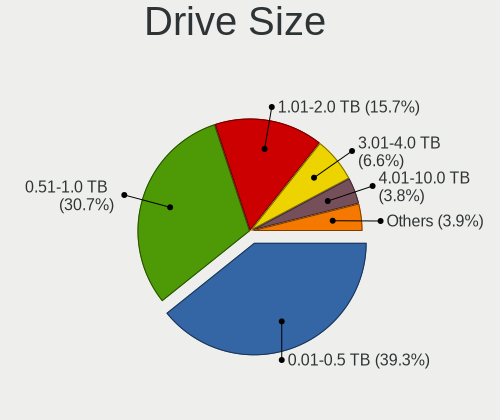
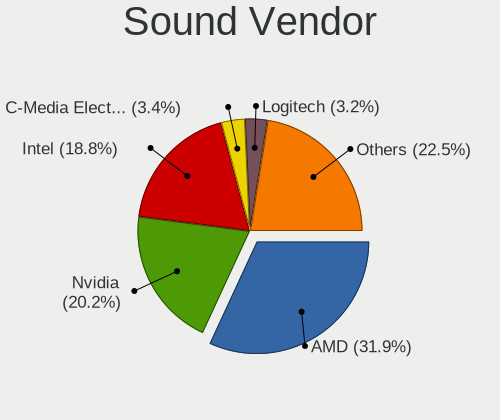
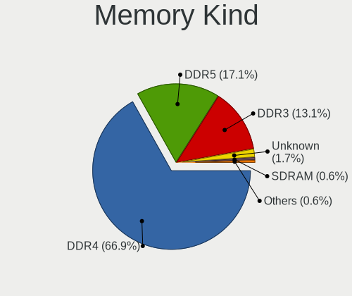

Nobara - Tested Hardware & Statistics (Desktops)
------------------------------------------------

A project to collect tested hardware configurations for Nobara.

Anyone can contribute to this report by the [hw-probe](https://github.com/linuxhw/hw-probe) tool:

    sudo -E hw-probe -all -upload

Please contribute! Especially if your hardware is rare.

Contents
--------

* [ Test Cases ](#test-cases)

* [ System ](#system)
  - [ OS                       ](#os)
  - [ OS Family                ](#os-family)
  - [ Kernel                   ](#kernel)
  - [ Kernel Family            ](#kernel-family)
  - [ Kernel Major Ver.        ](#kernel-major-ver)
  - [ Arch                     ](#arch)
  - [ DE                       ](#de)
  - [ Display Server           ](#display-server)
  - [ Display Manager          ](#display-manager)
  - [ OS Lang                  ](#os-lang)
  - [ Boot Mode                ](#boot-mode)
  - [ Filesystem               ](#filesystem)
  - [ Part. scheme             ](#part-scheme)
  - [ Dual Boot with Linux/BSD ](#dual-boot-with-linuxbsd)
  - [ Dual Boot (Win)          ](#dual-boot-win)

* [ Board ](#board)
  - [ Vendor                   ](#vendor)
  - [ Model                    ](#model)
  - [ Model Family             ](#model-family)
  - [ MFG Year                 ](#mfg-year)
  - [ Form Factor              ](#form-factor)
  - [ Secure Boot              ](#secure-boot)
  - [ Coreboot                 ](#coreboot)
  - [ RAM Size                 ](#ram-size)
  - [ RAM Used                 ](#ram-used)
  - [ Total Drives             ](#total-drives)
  - [ Has CD-ROM               ](#has-cd-rom)
  - [ Has Ethernet             ](#has-ethernet)
  - [ Has WiFi                 ](#has-wifi)
  - [ Has Bluetooth            ](#has-bluetooth)

* [ Location ](#location)
  - [ Country                  ](#country)
  - [ City                     ](#city)

* [ Drives ](#drives)
  - [ Drive Vendor             ](#drive-vendor)
  - [ Drive Model              ](#drive-model)
  - [ HDD Vendor               ](#hdd-vendor)
  - [ SSD Vendor               ](#ssd-vendor)
  - [ Drive Kind               ](#drive-kind)
  - [ Drive Connector          ](#drive-connector)
  - [ Drive Size               ](#drive-size)
  - [ Space Total              ](#space-total)
  - [ Space Used               ](#space-used)
  - [ Malfunc. Drives          ](#malfunc-drives)
  - [ Malfunc. Drive Vendor    ](#malfunc-drive-vendor)
  - [ Malfunc. HDD Vendor      ](#malfunc-hdd-vendor)
  - [ Malfunc. Drive Kind      ](#malfunc-drive-kind)
  - [ Failed Drives            ](#failed-drives)
  - [ Failed Drive Vendor      ](#failed-drive-vendor)
  - [ Drive Status             ](#drive-status)

* [ Storage controller ](#storage-controller)
  - [ Storage Vendor           ](#storage-vendor)
  - [ Storage Model            ](#storage-model)
  - [ Storage Kind             ](#storage-kind)

* [ Processor ](#processor)
  - [ CPU Vendor               ](#cpu-vendor)
  - [ CPU Model                ](#cpu-model)
  - [ CPU Model Family         ](#cpu-model-family)
  - [ CPU Cores                ](#cpu-cores)
  - [ CPU Sockets              ](#cpu-sockets)
  - [ CPU Threads              ](#cpu-threads)
  - [ CPU Op-Modes             ](#cpu-op-modes)
  - [ CPU Microcode            ](#cpu-microcode)
  - [ CPU Microarch            ](#cpu-microarch)

* [ Graphics ](#graphics)
  - [ GPU Vendor               ](#gpu-vendor)
  - [ GPU Model                ](#gpu-model)
  - [ GPU Combo                ](#gpu-combo)
  - [ GPU Driver               ](#gpu-driver)
  - [ GPU Memory               ](#gpu-memory)

* [ Monitor ](#monitor)
  - [ Monitor Vendor           ](#monitor-vendor)
  - [ Monitor Model            ](#monitor-model)
  - [ Monitor Resolution       ](#monitor-resolution)
  - [ Monitor Diagonal         ](#monitor-diagonal)
  - [ Monitor Width            ](#monitor-width)
  - [ Aspect Ratio             ](#aspect-ratio)
  - [ Monitor Area             ](#monitor-area)
  - [ Pixel Density            ](#pixel-density)
  - [ Multiple Monitors        ](#multiple-monitors)

* [ Network ](#network)
  - [ Net Controller Vendor    ](#net-controller-vendor)
  - [ Net Controller Model     ](#net-controller-model)
  - [ Wireless Vendor          ](#wireless-vendor)
  - [ Wireless Model           ](#wireless-model)
  - [ Ethernet Vendor          ](#ethernet-vendor)
  - [ Ethernet Model           ](#ethernet-model)
  - [ Net Controller Kind      ](#net-controller-kind)
  - [ Used Controller          ](#used-controller)
  - [ NICs                     ](#nics)
  - [ IPv6                     ](#ipv6)

* [ Bluetooth ](#bluetooth)
  - [ Bluetooth Vendor         ](#bluetooth-vendor)
  - [ Bluetooth Model          ](#bluetooth-model)

* [ Sound ](#sound)
  - [ Sound Vendor             ](#sound-vendor)
  - [ Sound Model              ](#sound-model)

* [ Memory ](#memory)
  - [ Memory Vendor            ](#memory-vendor)
  - [ Memory Model             ](#memory-model)
  - [ Memory Kind              ](#memory-kind)
  - [ Memory Form Factor       ](#memory-form-factor)
  - [ Memory Size              ](#memory-size)
  - [ Memory Speed             ](#memory-speed)

* [ Printers & scanners ](#printers--scanners)
  - [ Printer Vendor           ](#printer-vendor)
  - [ Printer Model            ](#printer-model)
  - [ Scanner Vendor           ](#scanner-vendor)
  - [ Scanner Model            ](#scanner-model)

* [ Camera ](#camera)
  - [ Camera Vendor            ](#camera-vendor)
  - [ Camera Model             ](#camera-model)

* [ Security ](#security)
  - [ Fingerprint Vendor       ](#fingerprint-vendor)
  - [ Fingerprint Model        ](#fingerprint-model)
  - [ Chipcard Vendor          ](#chipcard-vendor)
  - [ Chipcard Model           ](#chipcard-model)

* [ Unsupported ](#unsupported)
  - [ Unsupported Devices      ](#unsupported-devices)
  - [ Unsupported Device Types ](#unsupported-device-types)

Test Cases
----------

Total: 255

| Vendor    | Model                       | Probe                                                      | Date         |
|-----------|-----------------------------|------------------------------------------------------------|--------------|
| MSI       | B450 GAMING PLUS            | [539137fb36](https://linux-hardware.org/?probe=539137fb36) | Apr 01, 2023 |
| ASUSTek   | B85M-G R2.0                 | [4434a1266b](https://linux-hardware.org/?probe=4434a1266b) | Mar 31, 2023 |
| ASUSTek   | B85M-G R2.0                 | [fbef2fe274](https://linux-hardware.org/?probe=fbef2fe274) | Mar 31, 2023 |
| MSI       | B450 TOMAHAWK MAX           | [d79127e48c](https://linux-hardware.org/?probe=d79127e48c) | Mar 31, 2023 |
| Intel     | X79                         | [c06125262b](https://linux-hardware.org/?probe=c06125262b) | Mar 31, 2023 |
| MSI       | MPG B550I GAMING EDGE WI... | [f0540604bc](https://linux-hardware.org/?probe=f0540604bc) | Mar 30, 2023 |
| MSI       | MPG B550I GAMING EDGE WI... | [1c575e8cb6](https://linux-hardware.org/?probe=1c575e8cb6) | Mar 30, 2023 |
| ASRock    | X470 Master SLI             | [e4d56ca8c8](https://linux-hardware.org/?probe=e4d56ca8c8) | Mar 28, 2023 |
| ASUSTek   | M3N78 PRO                   | [0f9abe9400](https://linux-hardware.org/?probe=0f9abe9400) | Mar 28, 2023 |
| MSI       | B450 GAMING PLUS            | [5242d56a0f](https://linux-hardware.org/?probe=5242d56a0f) | Mar 27, 2023 |
| MSI       | B550-A PRO                  | [ebb59fa31d](https://linux-hardware.org/?probe=ebb59fa31d) | Mar 27, 2023 |
| ASUSTek   | TUF Gaming B550-PLUS        | [b084807397](https://linux-hardware.org/?probe=b084807397) | Mar 26, 2023 |
| ASUSTek   | TUF Gaming B550-PLUS        | [bc38c5ed22](https://linux-hardware.org/?probe=bc38c5ed22) | Mar 26, 2023 |
| ASUSTek   | PRIME B450M-A               | [6601de8aae](https://linux-hardware.org/?probe=6601de8aae) | Mar 25, 2023 |
| ASUSTek   | TUF Gaming B550-PLUS        | [9240540b33](https://linux-hardware.org/?probe=9240540b33) | Mar 24, 2023 |
| Gigabyte  | GA-970A-DS3                 | [82a69c4ec6](https://linux-hardware.org/?probe=82a69c4ec6) | Mar 23, 2023 |
| ASRock    | B660M-ITX/ac                | [95687a223c](https://linux-hardware.org/?probe=95687a223c) | Mar 22, 2023 |
| Dell      | 0XR1GT A00                  | [0912041935](https://linux-hardware.org/?probe=0912041935) | Mar 21, 2023 |
| Dell      | 0XR1GT A00                  | [61e1c5eff9](https://linux-hardware.org/?probe=61e1c5eff9) | Mar 21, 2023 |
| ASRock    | X670E Steel Legend          | [7891e82ac4](https://linux-hardware.org/?probe=7891e82ac4) | Mar 17, 2023 |
| ASUSTek   | PRIME X370-PRO              | [ab4a88037a](https://linux-hardware.org/?probe=ab4a88037a) | Mar 16, 2023 |
| ASUSTek   | ROG STRIX B650E-E GAMING... | [37bf97e9b3](https://linux-hardware.org/?probe=37bf97e9b3) | Mar 16, 2023 |
| ASUSTek   | PRIME X370-PRO              | [23e21d1440](https://linux-hardware.org/?probe=23e21d1440) | Mar 15, 2023 |
| Gigabyte  | Z77P-D3                     | [34ad3eb730](https://linux-hardware.org/?probe=34ad3eb730) | Mar 15, 2023 |
| Gigabyte  | Z77P-D3                     | [06c53ecdec](https://linux-hardware.org/?probe=06c53ecdec) | Mar 15, 2023 |
| Intel     | DB85FL AAG89861-203         | [e17dae3447](https://linux-hardware.org/?probe=e17dae3447) | Mar 14, 2023 |
| Intel     | DB85FL AAG89861-203         | [f1004a32e1](https://linux-hardware.org/?probe=f1004a32e1) | Mar 14, 2023 |
| MSI       | X470 GAMING PLUS            | [727390b14d](https://linux-hardware.org/?probe=727390b14d) | Mar 14, 2023 |
| ASRock    | X670E Steel Legend          | [0eefdece9c](https://linux-hardware.org/?probe=0eefdece9c) | Mar 13, 2023 |
| Gigabyte  | Z390 AORUS ULTRA-CF         | [7320131972](https://linux-hardware.org/?probe=7320131972) | Mar 13, 2023 |
| ASUSTek   | PRIME Z690M-PLUS D4         | [e41f3ed4ab](https://linux-hardware.org/?probe=e41f3ed4ab) | Mar 13, 2023 |
| ASUSTek   | PRIME B450M-A               | [1ad75bea9c](https://linux-hardware.org/?probe=1ad75bea9c) | Mar 12, 2023 |
| ASRock    | X670E Steel Legend          | [3ec784f6be](https://linux-hardware.org/?probe=3ec784f6be) | Mar 11, 2023 |
| ASUSTek   | PRIME B450M-A               | [7ba7da9138](https://linux-hardware.org/?probe=7ba7da9138) | Mar 10, 2023 |
| MSI       | B450 GAMING PLUS            | [46b213149e](https://linux-hardware.org/?probe=46b213149e) | Mar 10, 2023 |
| ASUSTek   | ROG STRIX X470-F GAMING     | [3629efc5a5](https://linux-hardware.org/?probe=3629efc5a5) | Mar 08, 2023 |
| Dell      | 0773VG A01                  | [d954bdd915](https://linux-hardware.org/?probe=d954bdd915) | Mar 07, 2023 |
| ASRock    | H310M-HDV                   | [316510fe69](https://linux-hardware.org/?probe=316510fe69) | Mar 07, 2023 |
| Acer      | Aspire X1400                | [195337bbc6](https://linux-hardware.org/?probe=195337bbc6) | Mar 07, 2023 |
| ASUSTek   | PRIME B560M-A AC            | [21db48a23b](https://linux-hardware.org/?probe=21db48a23b) | Mar 06, 2023 |
| ASUSTek   | ROG STRIX B550-F GAMING     | [4eb7bea837](https://linux-hardware.org/?probe=4eb7bea837) | Mar 04, 2023 |
| ASUSTek   | ROG STRIX B550-F GAMING     | [1d24df340b](https://linux-hardware.org/?probe=1d24df340b) | Mar 04, 2023 |
| ASUSTek   | ROG STRIX B550-F GAMING     | [950e36afc7](https://linux-hardware.org/?probe=950e36afc7) | Mar 03, 2023 |
| MSI       | MPG Z390M GAMING EDGE AC    | [d0813971b9](https://linux-hardware.org/?probe=d0813971b9) | Feb 28, 2023 |
| ASRock    | B660M-ITX/ac                | [c2e600e445](https://linux-hardware.org/?probe=c2e600e445) | Feb 28, 2023 |
| ASRock    | B660M-ITX/ac                | [1efc15e2cc](https://linux-hardware.org/?probe=1efc15e2cc) | Feb 28, 2023 |
| MSI       | MPG X570 GAMING PRO CARB... | [15318beac5](https://linux-hardware.org/?probe=15318beac5) | Feb 27, 2023 |
| MSI       | Z170A-G45 GAMING            | [a5496030e7](https://linux-hardware.org/?probe=a5496030e7) | Feb 27, 2023 |
| ASUSTek   | ROG CROSSHAIR X670E EXTR... | [659ff1672e](https://linux-hardware.org/?probe=659ff1672e) | Feb 26, 2023 |
| ASUSTek   | P8Z77-M PRO                 | [92f1f7d3b5](https://linux-hardware.org/?probe=92f1f7d3b5) | Feb 26, 2023 |
| ASUSTek   | ROG STRIX X570-E GAMING ... | [101d8d4577](https://linux-hardware.org/?probe=101d8d4577) | Feb 25, 2023 |
| ASUSTek   | H97M-E                      | [b2ef9d5ede](https://linux-hardware.org/?probe=b2ef9d5ede) | Feb 21, 2023 |
| MSI       | B450 GAMING PRO CARBON M... | [fb4420dbc4](https://linux-hardware.org/?probe=fb4420dbc4) | Feb 20, 2023 |
| Gigabyte  | B550 AORUS ELITE V2         | [737c043ed7](https://linux-hardware.org/?probe=737c043ed7) | Feb 20, 2023 |
| ASUSTek   | TUF Gaming B550M-PLUS WI... | [2752a9660a](https://linux-hardware.org/?probe=2752a9660a) | Feb 19, 2023 |
| MSI       | PRO B660M-A WIFI DDR4       | [a62c4f0fcd](https://linux-hardware.org/?probe=a62c4f0fcd) | Feb 18, 2023 |
| MSI       | B550-A PRO                  | [e81d0741bb](https://linux-hardware.org/?probe=e81d0741bb) | Feb 17, 2023 |
| MSI       | B550-A PRO                  | [dd63e968bd](https://linux-hardware.org/?probe=dd63e968bd) | Feb 17, 2023 |
| ASUSTek   | PRIME B450M-A II            | [e486b2bb46](https://linux-hardware.org/?probe=e486b2bb46) | Feb 15, 2023 |
| Dell      | 0KWVT8 A02                  | [486f7258a6](https://linux-hardware.org/?probe=486f7258a6) | Feb 14, 2023 |
| Gigabyte  | X570 AORUS ELITE WIFI       | [dc91c0e32b](https://linux-hardware.org/?probe=dc91c0e32b) | Feb 14, 2023 |
| Dell      | 0KWVT8 A02                  | [c3d08b4f2e](https://linux-hardware.org/?probe=c3d08b4f2e) | Feb 13, 2023 |
| ASRock    | B650M PG Riptide            | [bf986cc448](https://linux-hardware.org/?probe=bf986cc448) | Feb 12, 2023 |
| ASUSTek   | PRIME X570-P                | [74d6af0f75](https://linux-hardware.org/?probe=74d6af0f75) | Feb 11, 2023 |
| MSI       | PRO Z690-A DDR4             | [caca2e6be1](https://linux-hardware.org/?probe=caca2e6be1) | Feb 11, 2023 |
| ASUSTek   | TUF Gaming B460-PLUS        | [afefa761d5](https://linux-hardware.org/?probe=afefa761d5) | Feb 09, 2023 |
| MSI       | B450M BAZOOKA MAX WIFI      | [fdaab67fe9](https://linux-hardware.org/?probe=fdaab67fe9) | Feb 09, 2023 |
| ASUSTek   | M5A78L-M PLUS/USB3          | [eece150870](https://linux-hardware.org/?probe=eece150870) | Feb 05, 2023 |
| ASUSTek   | TUF Gaming B460-PLUS        | [20086250d5](https://linux-hardware.org/?probe=20086250d5) | Feb 05, 2023 |
| ASUSTek   | TUF Gaming B460-PLUS        | [9905642762](https://linux-hardware.org/?probe=9905642762) | Feb 05, 2023 |
| ASUSTek   | ROG STRIX Z390-F GAMING     | [cbac9c37ba](https://linux-hardware.org/?probe=cbac9c37ba) | Feb 04, 2023 |
| MSI       | MAG B550 TOMAHAWK           | [8ae0d42e1a](https://linux-hardware.org/?probe=8ae0d42e1a) | Feb 03, 2023 |
| Gigabyte  | B550M AORUS ELITE           | [513dd8e40b](https://linux-hardware.org/?probe=513dd8e40b) | Feb 03, 2023 |
| MSI       | PRO Z690-A DDR4             | [5a7a0cf485](https://linux-hardware.org/?probe=5a7a0cf485) | Feb 03, 2023 |
| Gigabyte  | B360M AORUS Gaming 3-CF     | [7645e16594](https://linux-hardware.org/?probe=7645e16594) | Feb 03, 2023 |
| HP        | 834F                        | [394eb5f9cc](https://linux-hardware.org/?probe=394eb5f9cc) | Feb 02, 2023 |
| HP        | 8054                        | [36f5306e37](https://linux-hardware.org/?probe=36f5306e37) | Jan 30, 2023 |
| Gigabyte  | F2A88XM-D3H                 | [1605fbe62a](https://linux-hardware.org/?probe=1605fbe62a) | Jan 28, 2023 |
| ASUSTek   | ROG Maximus XI HERO         | [95f5d0904e](https://linux-hardware.org/?probe=95f5d0904e) | Jan 26, 2023 |
| MSI       | MAG B550 TOMAHAWK           | [c69db4d96f](https://linux-hardware.org/?probe=c69db4d96f) | Jan 24, 2023 |
| MSI       | B450 GAMING PLUS            | [bc95b86800](https://linux-hardware.org/?probe=bc95b86800) | Jan 22, 2023 |
| Gigabyte  | Z77-D3H                     | [9035a00600](https://linux-hardware.org/?probe=9035a00600) | Jan 22, 2023 |
| MSI       | MPG X570 GAMING PLUS        | [3eb7e4f3cf](https://linux-hardware.org/?probe=3eb7e4f3cf) | Jan 22, 2023 |
| MSI       | MPG Z390M GAMING EDGE AC    | [085d30a350](https://linux-hardware.org/?probe=085d30a350) | Jan 21, 2023 |
| MSI       | Z490-A PRO                  | [0a3fe4cb00](https://linux-hardware.org/?probe=0a3fe4cb00) | Jan 21, 2023 |
| ASUSTek   | ROG STRIX Z490-F GAMING     | [9a70fa222c](https://linux-hardware.org/?probe=9a70fa222c) | Jan 19, 2023 |
| Gigabyte  | B450 AORUS M                | [4d52b408c2](https://linux-hardware.org/?probe=4d52b408c2) | Jan 19, 2023 |
| MSI       | GF615M-P33                  | [bf838ee958](https://linux-hardware.org/?probe=bf838ee958) | Jan 18, 2023 |
| ASUSTek   | PRIME Z370-A                | [f215410f54](https://linux-hardware.org/?probe=f215410f54) | Jan 17, 2023 |
| ASUSTek   | Z97-A                       | [c1b01960be](https://linux-hardware.org/?probe=c1b01960be) | Jan 17, 2023 |
| ASRock    | B450 Gaming-ITX/ac          | [aade436557](https://linux-hardware.org/?probe=aade436557) | Jan 14, 2023 |
| ASUSTek   | ROG STRIX B650E-I GAMING... | [5b50555e06](https://linux-hardware.org/?probe=5b50555e06) | Jan 13, 2023 |
| ASUSTek   | P9X79 DELUXE                | [d73373e8e9](https://linux-hardware.org/?probe=d73373e8e9) | Jan 13, 2023 |
| ASUSTek   | TUF Gaming X570-PLUS        | [73da880450](https://linux-hardware.org/?probe=73da880450) | Jan 12, 2023 |
| HP        | 8054                        | [d4398dee29](https://linux-hardware.org/?probe=d4398dee29) | Jan 08, 2023 |
| MSI       | MAG B560M MORTAR WIFI       | [33f6781ba8](https://linux-hardware.org/?probe=33f6781ba8) | Jan 08, 2023 |
| ASUSTek   | ROG CROSSHAIR VIII HERO     | [c74a6daaaa](https://linux-hardware.org/?probe=c74a6daaaa) | Jan 07, 2023 |
| ASRock    | X470 Master SLI             | [c138f9159c](https://linux-hardware.org/?probe=c138f9159c) | Jan 07, 2023 |
| HP        | 1497                        | [71550a0f21](https://linux-hardware.org/?probe=71550a0f21) | Jan 07, 2023 |
| ASRock    | H77M-ITX                    | [fb6cbfce9a](https://linux-hardware.org/?probe=fb6cbfce9a) | Jan 06, 2023 |
| MSI       | B450 GAMING PLUS MAX        | [406b407b64](https://linux-hardware.org/?probe=406b407b64) | Jan 06, 2023 |
| ASUSTek   | PRIME B450M-A               | [61b7c0cda0](https://linux-hardware.org/?probe=61b7c0cda0) | Jan 06, 2023 |
| ASUSTek   | ROG STRIX B450-F GAMING     | [569f5cd751](https://linux-hardware.org/?probe=569f5cd751) | Jan 06, 2023 |
| Gigabyte  | B550M DS3H                  | [3978c4253f](https://linux-hardware.org/?probe=3978c4253f) | Jan 06, 2023 |
| ASUSTek   | G20AJ                       | [9be7e0b11f](https://linux-hardware.org/?probe=9be7e0b11f) | Jan 05, 2023 |
| ASUSTek   | TUF Gaming B550M-PLUS       | [b6bf9d074f](https://linux-hardware.org/?probe=b6bf9d074f) | Jan 05, 2023 |
| ASUSTek   | PRIME B550M-K               | [11d17c68b8](https://linux-hardware.org/?probe=11d17c68b8) | Jan 05, 2023 |
| MSI       | X470 GAMING PLUS MAX        | [7655f77ada](https://linux-hardware.org/?probe=7655f77ada) | Jan 04, 2023 |
| ASUSTek   | ROG CROSSHAIR VII HERO      | [6c40dc7dd6](https://linux-hardware.org/?probe=6c40dc7dd6) | Jan 03, 2023 |
| ASUSTek   | M5A88-M                     | [dc7201711c](https://linux-hardware.org/?probe=dc7201711c) | Dec 30, 2022 |
| ASUSTek   | ROG CROSSHAIR VII HERO      | [4ca2070d42](https://linux-hardware.org/?probe=4ca2070d42) | Dec 29, 2022 |
| ASUSTek   | PRIME Z270-P                | [b9e4ff3fea](https://linux-hardware.org/?probe=b9e4ff3fea) | Dec 25, 2022 |
| HP        | 1589                        | [4769414712](https://linux-hardware.org/?probe=4769414712) | Dec 24, 2022 |
| MSI       | MAG B550 TOMAHAWK           | [353cbeb5c8](https://linux-hardware.org/?probe=353cbeb5c8) | Dec 19, 2022 |
| Biostar   | X470GTN                     | [7c067277b2](https://linux-hardware.org/?probe=7c067277b2) | Dec 17, 2022 |
| ASUSTek   | M5A88-M                     | [3bc811ef2a](https://linux-hardware.org/?probe=3bc811ef2a) | Dec 17, 2022 |
| HP        | 2ABD A01                    | [c5c5c07485](https://linux-hardware.org/?probe=c5c5c07485) | Dec 16, 2022 |
| HP        | 2ABD A01                    | [c992b15fbe](https://linux-hardware.org/?probe=c992b15fbe) | Dec 16, 2022 |
| ASUSTek   | M5A97 LE R2.0               | [fc8f4624a4](https://linux-hardware.org/?probe=fc8f4624a4) | Dec 16, 2022 |
| ASRock    | H310M-HDV/M.2               | [76dff63f5c](https://linux-hardware.org/?probe=76dff63f5c) | Dec 15, 2022 |
| ASUSTek   | M5A88-M                     | [4378eff64f](https://linux-hardware.org/?probe=4378eff64f) | Dec 13, 2022 |
| MSI       | MAG B660 TOMAHAWK WIFI      | [1beb5ff3c4](https://linux-hardware.org/?probe=1beb5ff3c4) | Dec 13, 2022 |
| ASUSTek   | ROG STRIX B660-F GAMING ... | [3f57fa2c71](https://linux-hardware.org/?probe=3f57fa2c71) | Dec 12, 2022 |
| Gigabyte  | H81M-H                      | [02ba14a443](https://linux-hardware.org/?probe=02ba14a443) | Dec 09, 2022 |
| Dell      | 0215PR A02                  | [b9d16b98d2](https://linux-hardware.org/?probe=b9d16b98d2) | Dec 09, 2022 |
| Gigabyte  | Z590I VISION D              | [9cc2be8747](https://linux-hardware.org/?probe=9cc2be8747) | Dec 09, 2022 |
| MSI       | GF615M-P33                  | [af4d483414](https://linux-hardware.org/?probe=af4d483414) | Dec 08, 2022 |
| ASUSTek   | M5A88-M                     | [d7b2726838](https://linux-hardware.org/?probe=d7b2726838) | Dec 08, 2022 |
| ASUSTek   | STRIX Z270H GAMING          | [c9cc6de1c4](https://linux-hardware.org/?probe=c9cc6de1c4) | Dec 08, 2022 |
| ASUSTek   | STRIX Z270H GAMING          | [8973296b3b](https://linux-hardware.org/?probe=8973296b3b) | Dec 08, 2022 |
| ASUSTek   | M5A88-M                     | [f5bd8a0e5b](https://linux-hardware.org/?probe=f5bd8a0e5b) | Dec 07, 2022 |
| MSI       | MAG B550 TOMAHAWK           | [a742429421](https://linux-hardware.org/?probe=a742429421) | Dec 06, 2022 |
| ASUSTek   | M5A88-M                     | [69ed3a0345](https://linux-hardware.org/?probe=69ed3a0345) | Dec 02, 2022 |
| MSI       | MAG B550 TOMAHAWK MAX WI... | [1775ec9d4b](https://linux-hardware.org/?probe=1775ec9d4b) | Dec 01, 2022 |
| MSI       | MAG B550 TOMAHAWK MAX WI... | [097d1c062e](https://linux-hardware.org/?probe=097d1c062e) | Dec 01, 2022 |
| Gigabyte  | Z590I VISION D              | [655e907d62](https://linux-hardware.org/?probe=655e907d62) | Dec 01, 2022 |
| Intel     | X79G V2.x                   | [6b229554fc](https://linux-hardware.org/?probe=6b229554fc) | Nov 28, 2022 |
| Gigabyte  | H410M H V3                  | [afea73cc2a](https://linux-hardware.org/?probe=afea73cc2a) | Nov 22, 2022 |
| ASUSTek   | TUF Gaming B550M-PLUS WI... | [56c9fb93ce](https://linux-hardware.org/?probe=56c9fb93ce) | Nov 22, 2022 |
| ASUSTek   | TUF Gaming B550M-PLUS WI... | [1ec2520541](https://linux-hardware.org/?probe=1ec2520541) | Nov 22, 2022 |
| ASUSTek   | ROG STRIX X570-F GAMING     | [0fd2d81cad](https://linux-hardware.org/?probe=0fd2d81cad) | Nov 22, 2022 |
| OEM       | SHARKBAY JHS695             | [03c915bbd9](https://linux-hardware.org/?probe=03c915bbd9) | Nov 22, 2022 |
| MSI       | GF615M-P33                  | [7a6be335c4](https://linux-hardware.org/?probe=7a6be335c4) | Nov 22, 2022 |
| ASRock    | B550 Extreme4               | [7fba8e38dc](https://linux-hardware.org/?probe=7fba8e38dc) | Nov 20, 2022 |
| Gigabyte  | H310M M.2 x.x               | [87406f0722](https://linux-hardware.org/?probe=87406f0722) | Nov 19, 2022 |
| Alienware | 0PGRP5 A01                  | [2ff9360669](https://linux-hardware.org/?probe=2ff9360669) | Nov 17, 2022 |
| MSI       | MEG X570 UNIFY              | [750d7eb0d7](https://linux-hardware.org/?probe=750d7eb0d7) | Nov 16, 2022 |
| ASUSTek   | ROG STRIX Z390-H GAMING     | [4d4d5aa456](https://linux-hardware.org/?probe=4d4d5aa456) | Nov 15, 2022 |
| Fujitsu   | D3062-A1 S26361-D3062-A1    | [d4240ae5c7](https://linux-hardware.org/?probe=d4240ae5c7) | Nov 12, 2022 |
| MSI       | MPG X570S EDGE MAX WIFI     | [51d6598b74](https://linux-hardware.org/?probe=51d6598b74) | Nov 11, 2022 |
| ASUSTek   | A68HM-K                     | [70daf967f2](https://linux-hardware.org/?probe=70daf967f2) | Nov 10, 2022 |
| Gigabyte  | 990FXA-UD3                  | [a49a1465d3](https://linux-hardware.org/?probe=a49a1465d3) | Nov 10, 2022 |
| ASRock    | N68C-GS4 FX                 | [5e151ea22f](https://linux-hardware.org/?probe=5e151ea22f) | Nov 07, 2022 |
| Intel     | D33217GKE G76540-207        | [f90e6e931c](https://linux-hardware.org/?probe=f90e6e931c) | Nov 07, 2022 |
| Intel     | D33217GKE G76540-207        | [a154fd19a0](https://linux-hardware.org/?probe=a154fd19a0) | Nov 07, 2022 |
| ASUSTek   | TUF Gaming Z490-PLUS        | [4239b9f4a9](https://linux-hardware.org/?probe=4239b9f4a9) | Nov 06, 2022 |
| MSI       | MPG Z390 GAMING PRO CARB... | [05529fe361](https://linux-hardware.org/?probe=05529fe361) | Nov 06, 2022 |
| Dell      | 042P49 A02                  | [55d7ddf0c8](https://linux-hardware.org/?probe=55d7ddf0c8) | Nov 06, 2022 |
| MSI       | MPG Z390 GAMING PRO CARB... | [677dcff84a](https://linux-hardware.org/?probe=677dcff84a) | Nov 06, 2022 |
| MSI       | MPG X570S EDGE MAX WIFI     | [049bac8501](https://linux-hardware.org/?probe=049bac8501) | Nov 06, 2022 |
| ASUSTek   | M5A97 R2.0                  | [5ca257fd77](https://linux-hardware.org/?probe=5ca257fd77) | Nov 06, 2022 |
| MSI       | B450 TOMAHAWK MAX II        | [bd9e0be4e8](https://linux-hardware.org/?probe=bd9e0be4e8) | Nov 03, 2022 |
| ECS       | H61H2-CM                    | [792ce0e34e](https://linux-hardware.org/?probe=792ce0e34e) | Oct 31, 2022 |
| ASRock    | Z77 Pro4                    | [5ab5790e5f](https://linux-hardware.org/?probe=5ab5790e5f) | Oct 29, 2022 |
| ASRock    | Z77 Pro4                    | [74cc7f147b](https://linux-hardware.org/?probe=74cc7f147b) | Oct 29, 2022 |
| HP        | 8653 A                      | [bc1f3b445b](https://linux-hardware.org/?probe=bc1f3b445b) | Oct 28, 2022 |
| ASRock    | X570 Taichi                 | [967f52e510](https://linux-hardware.org/?probe=967f52e510) | Oct 28, 2022 |
| Dell      | 09KPNV A00                  | [c25493f420](https://linux-hardware.org/?probe=c25493f420) | Oct 27, 2022 |
| Gigabyte  | 970A-DS3P                   | [7e31b6af67](https://linux-hardware.org/?probe=7e31b6af67) | Oct 27, 2022 |
| Gigabyte  | 970A-DS3P                   | [6823943242](https://linux-hardware.org/?probe=6823943242) | Oct 27, 2022 |
| Intel     | B75                         | [eb7c27f1e5](https://linux-hardware.org/?probe=eb7c27f1e5) | Oct 26, 2022 |
| HP        | 3029h                       | [c278953154](https://linux-hardware.org/?probe=c278953154) | Oct 25, 2022 |
| Gigabyte  | Z590I VISION D              | [be4c6573cd](https://linux-hardware.org/?probe=be4c6573cd) | Oct 25, 2022 |
| ASUSTek   | PRIME A320M-K               | [c0b3f0d88e](https://linux-hardware.org/?probe=c0b3f0d88e) | Oct 24, 2022 |
| ASUSTek   | ROG STRIX Z390-E GAMING     | [7e40be1c82](https://linux-hardware.org/?probe=7e40be1c82) | Oct 23, 2022 |
| Gigabyte  | Z97-HD3                     | [f79eb0cbb0](https://linux-hardware.org/?probe=f79eb0cbb0) | Oct 23, 2022 |
| ASUSTek   | TUF Gaming X570-PRO WIFI... | [c3b1784ecc](https://linux-hardware.org/?probe=c3b1784ecc) | Oct 21, 2022 |
| Gigabyte  | B450M DS3H-CF               | [c901f6927c](https://linux-hardware.org/?probe=c901f6927c) | Oct 18, 2022 |
| MSI       | MPG Z390 GAMING PLUS        | [624be3f0f3](https://linux-hardware.org/?probe=624be3f0f3) | Oct 17, 2022 |
| ASUSTek   | TUF Gaming B450M-PLUS II    | [cb63aa5619](https://linux-hardware.org/?probe=cb63aa5619) | Oct 17, 2022 |
| MSI       | MPG Z390 GAMING PRO CARB... | [a4919afa07](https://linux-hardware.org/?probe=a4919afa07) | Oct 16, 2022 |
| MSI       | Z87 XPOWER                  | [5e73f5004a](https://linux-hardware.org/?probe=5e73f5004a) | Oct 13, 2022 |
| ASUSTek   | PRIME X370-PRO              | [0a89e9b77e](https://linux-hardware.org/?probe=0a89e9b77e) | Oct 13, 2022 |
| MSI       | MPG Z390 GAMING PRO CARB... | [a920c57a3e](https://linux-hardware.org/?probe=a920c57a3e) | Oct 11, 2022 |
| Dell      | 0F6X5P A00                  | [49baafbc65](https://linux-hardware.org/?probe=49baafbc65) | Oct 10, 2022 |
| MSI       | PRO Z690-A DDR4             | [2a1088b211](https://linux-hardware.org/?probe=2a1088b211) | Oct 08, 2022 |
| ASUSTek   | SABERTOOTH 990FX R2.0       | [05dfea29df](https://linux-hardware.org/?probe=05dfea29df) | Oct 07, 2022 |
| ASUSTek   | SABERTOOTH 990FX R2.0       | [24471f06da](https://linux-hardware.org/?probe=24471f06da) | Oct 07, 2022 |
| Gigabyte  | X570 I AORUS PRO WIFI       | [cc955e89b7](https://linux-hardware.org/?probe=cc955e89b7) | Oct 07, 2022 |
| HP        | 1998                        | [f2b9957fdd](https://linux-hardware.org/?probe=f2b9957fdd) | Oct 06, 2022 |
| MSI       | B450-A PRO MAX              | [b161553abb](https://linux-hardware.org/?probe=b161553abb) | Oct 05, 2022 |
| ASRock    | B450M Steel Legend          | [4f4352de45](https://linux-hardware.org/?probe=4f4352de45) | Oct 04, 2022 |
| ASUSTek   | H61M-K                      | [e0408b49e7](https://linux-hardware.org/?probe=e0408b49e7) | Oct 02, 2022 |
| MSI       | B350 PC MATE                | [a4c73b484e](https://linux-hardware.org/?probe=a4c73b484e) | Oct 02, 2022 |
| Dell      | 0M5DCD A00                  | [3cc1e139dc](https://linux-hardware.org/?probe=3cc1e139dc) | Oct 02, 2022 |
| MSI       | MEG X570 UNIFY              | [4d2e449699](https://linux-hardware.org/?probe=4d2e449699) | Sep 30, 2022 |
| ASRock    | X470 Master SLI             | [47c190b6e9](https://linux-hardware.org/?probe=47c190b6e9) | Sep 30, 2022 |
| Gigabyte  | H270-Gaming 3               | [9426d21070](https://linux-hardware.org/?probe=9426d21070) | Sep 29, 2022 |
| Gigabyte  | H270-Gaming 3               | [830af9c53e](https://linux-hardware.org/?probe=830af9c53e) | Sep 29, 2022 |
| Gigabyte  | AB350-Gaming 3-CF           | [365d74f8e4](https://linux-hardware.org/?probe=365d74f8e4) | Sep 28, 2022 |
| Intel     | B75                         | [af5aef869c](https://linux-hardware.org/?probe=af5aef869c) | Sep 28, 2022 |
| Gigabyte  | AB350-Gaming 3-CF           | [cfd24b9e0a](https://linux-hardware.org/?probe=cfd24b9e0a) | Sep 27, 2022 |
| MSI       | MAG X570 TOMAHAWK WIFI      | [6bfc8d43ef](https://linux-hardware.org/?probe=6bfc8d43ef) | Sep 27, 2022 |
| MSI       | A68HM-E33 V2                | [d51c90a7a8](https://linux-hardware.org/?probe=d51c90a7a8) | Sep 27, 2022 |
| ASUSTek   | 970 PRO GAMING/AURA         | [f61a736922](https://linux-hardware.org/?probe=f61a736922) | Sep 26, 2022 |
| ASUSTek   | 970 PRO GAMING/AURA         | [1ecfe379e7](https://linux-hardware.org/?probe=1ecfe379e7) | Sep 26, 2022 |
| ASUSTek   | PRIME H410M-A               | [dafae8d45b](https://linux-hardware.org/?probe=dafae8d45b) | Sep 26, 2022 |
| MSI       | 970 GAMING                  | [015cd37f26](https://linux-hardware.org/?probe=015cd37f26) | Sep 24, 2022 |
| Dell      | 0G785M A00                  | [c461ec42d6](https://linux-hardware.org/?probe=c461ec42d6) | Sep 24, 2022 |
| ASUSTek   | PRIME A320M-K               | [d72e6b3865](https://linux-hardware.org/?probe=d72e6b3865) | Sep 23, 2022 |
| Gigabyte  | EP45-UD3L                   | [71c630ea03](https://linux-hardware.org/?probe=71c630ea03) | Sep 22, 2022 |
| ASUSTek   | PRIME H310M-E R2.0          | [7299d75966](https://linux-hardware.org/?probe=7299d75966) | Sep 22, 2022 |
| HP        | 8594                        | [281774ad4a](https://linux-hardware.org/?probe=281774ad4a) | Sep 21, 2022 |
| Gigabyte  | EP45-UD3L                   | [2b90168b71](https://linux-hardware.org/?probe=2b90168b71) | Sep 21, 2022 |
| ASRock    | X470 Master SLI             | [3c8fefe578](https://linux-hardware.org/?probe=3c8fefe578) | Sep 20, 2022 |
| ASRock    | X470 Master SLI             | [1975320cad](https://linux-hardware.org/?probe=1975320cad) | Sep 20, 2022 |
| Dell      | 0G785M A00                  | [8b8c41b401](https://linux-hardware.org/?probe=8b8c41b401) | Sep 19, 2022 |
| Unknown   | T3 MRD                      | [1f60a4d202](https://linux-hardware.org/?probe=1f60a4d202) | Sep 19, 2022 |
| MSI       | X570-A PRO                  | [cabf88c8be](https://linux-hardware.org/?probe=cabf88c8be) | Sep 19, 2022 |
| Gigabyte  | A320M-S2H-CF                | [7b95813c96](https://linux-hardware.org/?probe=7b95813c96) | Sep 18, 2022 |
| Unknown   | T3 MRD                      | [b10823b50f](https://linux-hardware.org/?probe=b10823b50f) | Sep 17, 2022 |
| Biostar   | H410MH S2                   | [832dd81851](https://linux-hardware.org/?probe=832dd81851) | Sep 17, 2022 |
| Lenovo    | MAHOBAY NOK                 | [cce010fd53](https://linux-hardware.org/?probe=cce010fd53) | Sep 16, 2022 |
| ASUSTek   | TUF Gaming B550M-PLUS WI... | [d9e9ec9afa](https://linux-hardware.org/?probe=d9e9ec9afa) | Sep 09, 2022 |
| ASUSTek   | TUF Gaming B550M-PLUS WI... | [1cdd7cda15](https://linux-hardware.org/?probe=1cdd7cda15) | Sep 09, 2022 |
| ASUSTek   | TUF Gaming X570-PRO         | [6eae76b5d0](https://linux-hardware.org/?probe=6eae76b5d0) | Sep 01, 2022 |
| ASRock    | FM2A55M-HD+                 | [2f96c73efb](https://linux-hardware.org/?probe=2f96c73efb) | Sep 01, 2022 |
| Gigabyte  | H110M-H-CF                  | [86fc2bf58f](https://linux-hardware.org/?probe=86fc2bf58f) | Aug 31, 2022 |
| Alienware | 01NYPT A00                  | [cd95b79270](https://linux-hardware.org/?probe=cd95b79270) | Aug 29, 2022 |
| ASRock    | B560 Steel Legend           | [c64907de8d](https://linux-hardware.org/?probe=c64907de8d) | Aug 27, 2022 |
| ASUSTek   | P8Z68-V PRO                 | [37ae937f4d](https://linux-hardware.org/?probe=37ae937f4d) | Aug 26, 2022 |
| ASUSTek   | PRIME X570-PRO              | [663509c999](https://linux-hardware.org/?probe=663509c999) | Aug 24, 2022 |
| ASUSTek   | PRIME X570-PRO              | [2b7d1d59a1](https://linux-hardware.org/?probe=2b7d1d59a1) | Aug 24, 2022 |
| ASUSTek   | PRIME A320M-K               | [928ce75df1](https://linux-hardware.org/?probe=928ce75df1) | Aug 24, 2022 |
| ASRock    | H61M-VG3                    | [a3cd7ba2c1](https://linux-hardware.org/?probe=a3cd7ba2c1) | Aug 22, 2022 |
| ASUSTek   | B85M-E                      | [0b5044dacf](https://linux-hardware.org/?probe=0b5044dacf) | Aug 19, 2022 |
| Gigabyte  | B450M DS3H-CF               | [a2b6c2ae17](https://linux-hardware.org/?probe=a2b6c2ae17) | Aug 19, 2022 |
| ASRock    | X470 Master SLI             | [ce62975b20](https://linux-hardware.org/?probe=ce62975b20) | Aug 15, 2022 |
| ASUSTek   | PRIME B350-PLUS             | [b2bbce2845](https://linux-hardware.org/?probe=b2bbce2845) | Aug 15, 2022 |
| ASRock    | Z97 Extreme6                | [31d7973a9d](https://linux-hardware.org/?probe=31d7973a9d) | Aug 14, 2022 |
| ASRock    | 760GM-HDV                   | [beabb7dd99](https://linux-hardware.org/?probe=beabb7dd99) | Aug 14, 2022 |
| MSI       | B450 TOMAHAWK MAX           | [27cd96982f](https://linux-hardware.org/?probe=27cd96982f) | Aug 10, 2022 |
| HP        | 8906 SMVB                   | [8f30392f49](https://linux-hardware.org/?probe=8f30392f49) | Aug 10, 2022 |
| HP        | 8054                        | [469b765fe0](https://linux-hardware.org/?probe=469b765fe0) | Aug 10, 2022 |
| ASUSTek   | G20AJ                       | [613f8a0c36](https://linux-hardware.org/?probe=613f8a0c36) | Aug 08, 2022 |
| Gigabyte  | X570 AORUS ELITE            | [f65ba77de3](https://linux-hardware.org/?probe=f65ba77de3) | Aug 07, 2022 |
| ASUSTek   | ROG CROSSHAIR VIII HERO     | [7a60eede9a](https://linux-hardware.org/?probe=7a60eede9a) | Aug 04, 2022 |
| MSI       | B450-A PRO MAX              | [e142cf5c91](https://linux-hardware.org/?probe=e142cf5c91) | Aug 04, 2022 |
| MSI       | B450 TOMAHAWK MAX           | [7c4355417f](https://linux-hardware.org/?probe=7c4355417f) | Aug 03, 2022 |
| MSI       | X570-A PRO                  | [f034a02e69](https://linux-hardware.org/?probe=f034a02e69) | Aug 01, 2022 |
| MSI       | 970 GAMING                  | [bf2a870952](https://linux-hardware.org/?probe=bf2a870952) | Jul 23, 2022 |
| Dell      | 0J8H4R A01                  | [3d7d06475c](https://linux-hardware.org/?probe=3d7d06475c) | Jul 23, 2022 |
| ASUSTek   | PRIME B450-PLUS             | [7d6b6d93d3](https://linux-hardware.org/?probe=7d6b6d93d3) | Jul 21, 2022 |
| eMachines | EL1870                      | [58e76fb684](https://linux-hardware.org/?probe=58e76fb684) | Jul 19, 2022 |
| MSI       | X570-A PRO                  | [c9683ea265](https://linux-hardware.org/?probe=c9683ea265) | Jul 19, 2022 |

System
------

OS
--

Installed operating systems

| Name      | Desktops | Percent |
|-----------|----------|---------|
| Nobara 36 | 125      | 64.77%  |
| Nobara 37 | 68       | 35.23%  |

OS Family
---------

OS without a version

| Name   | Desktops | Percent |
|--------|----------|---------|
| Nobara | 190      | 100%    |

Kernel
------

Version of the Linux kernel

| Version                       | Desktops | Percent |
|-------------------------------|----------|---------|
| 6.0.14-201.fsync.fc36.x86_64  | 18       | 8.78%   |
| 6.1.14-201.fsync.fc37.x86_64  | 16       | 7.8%    |
| 6.0.10-201.fc36.x86_64        | 16       | 7.8%    |
| 6.2.6-201.fsync.fc37.x86_64   | 9        | 4.39%   |
| 6.1.9-200.fsync.fc37.x86_64   | 8        | 3.9%    |
| 5.19.9-201.fsync.fc36.x86_64  | 8        | 3.9%    |
| 5.19.16-201.fsync.fc36.x86_64 | 8        | 3.9%    |
| 5.19.14-201.fsync.fc36.x86_64 | 8        | 3.9%    |
| 6.1.6-203.fsync.fc37.x86_64   | 7        | 3.41%   |
| 6.1.4-203.fsync.fc37.x86_64   | 7        | 3.41%   |
| 6.1.11-201.fsync.fc37.x86_64  | 7        | 3.41%   |
| 5.19.7-204.fsync.fc36.x86_64  | 7        | 3.41%   |
| 5.18.13-201.fsync.fc36.x86_64 | 7        | 3.41%   |
| 6.0.9-201.fc36.x86_64         | 6        | 2.93%   |
| 6.0.7-201.fsync.fc36.x86_64   | 6        | 2.93%   |
| 6.0.5-201.fsync.fc36.x86_64   | 6        | 2.93%   |
| 5.19.10-201.fsync.fc36.x86_64 | 6        | 2.93%   |
| 6.1.8-202.fsync.fc37.x86_64   | 4        | 1.95%   |
| 5.19.4-201.fsync.fc36.x86_64  | 4        | 1.95%   |
| 5.19.15-202.fsync.fc36.x86_64 | 4        | 1.95%   |
| 5.18.17-201.fsync.fc36.x86_64 | 4        | 1.95%   |
| 5.18.16-201.fsync.fc36.x86_64 | 4        | 1.95%   |
| 6.2.8-200.fsync.fc37.x86_64   | 3        | 1.46%   |
| 6.0.16-301.fsync.fc37.x86_64  | 3        | 1.46%   |
| 5.19.12-201.fsync.fc36.x86_64 | 3        | 1.46%   |
| 5.18.19-201.fsync.fc36.x86_64 | 3        | 1.46%   |
| 5.18.11-201.fsync.fc36.x86_64 | 3        | 1.46%   |
| 6.1.8-201.fsync.fc37.x86_64   | 2        | 0.98%   |
| 6.1.6-201.fsync.fc37.x86_64   | 2        | 0.98%   |
| 6.0.8-201.fsync.fc36.x86_64   | 2        | 0.98%   |
| 6.0.7-202.fsync.fc36.x86_64   | 2        | 0.98%   |
| 6.0.18-301.fsync.fc37.x86_64  | 2        | 0.98%   |
| 5.19.11-201.fsync.fc36.x86_64 | 2        | 0.98%   |
| 6.1.12_tkg_cfs                | 1        | 0.49%   |
| 6.0.15-301.fsync.fc37.x86_64  | 1        | 0.49%   |
| 5.19.7-203.fsync.fc36.x86_64  | 1        | 0.49%   |
| 5.19.2-602.inttf.fc36.x86_64  | 1        | 0.49%   |
| 5.19.13-202.fsync.fc36.x86_64 | 1        | 0.49%   |
| 5.19.13-201.fsync.fc36.x86_64 | 1        | 0.49%   |
| 5.18.9-201.fsync.fc36.x86_64  | 1        | 0.49%   |

Kernel Family
-------------

Linux kernel without a distro release

| Version | Desktops | Percent |
|---------|----------|---------|
| 6.0.14  | 18       | 8.78%   |
| 6.1.14  | 16       | 7.8%    |
| 6.0.10  | 16       | 7.8%    |
| 6.2.6   | 9        | 4.39%   |
| 6.1.6   | 9        | 4.39%   |
| 6.1.9   | 8        | 3.9%    |
| 6.0.7   | 8        | 3.9%    |
| 5.19.9  | 8        | 3.9%    |
| 5.19.7  | 8        | 3.9%    |
| 5.19.16 | 8        | 3.9%    |
| 5.19.14 | 8        | 3.9%    |
| 6.1.4   | 7        | 3.41%   |
| 6.1.11  | 7        | 3.41%   |
| 5.18.13 | 7        | 3.41%   |
| 6.1.8   | 6        | 2.93%   |
| 6.0.9   | 6        | 2.93%   |
| 6.0.5   | 6        | 2.93%   |
| 5.19.10 | 6        | 2.93%   |
| 5.19.4  | 4        | 1.95%   |
| 5.19.15 | 4        | 1.95%   |
| 5.18.17 | 4        | 1.95%   |
| 5.18.16 | 4        | 1.95%   |
| 6.2.8   | 3        | 1.46%   |
| 6.0.16  | 3        | 1.46%   |
| 5.19.12 | 3        | 1.46%   |
| 5.18.19 | 3        | 1.46%   |
| 5.18.11 | 3        | 1.46%   |
| 6.0.8   | 2        | 0.98%   |
| 6.0.18  | 2        | 0.98%   |
| 5.19.13 | 2        | 0.98%   |
| 5.19.11 | 2        | 0.98%   |
| 6.1.12  | 1        | 0.49%   |
| 6.0.15  | 1        | 0.49%   |
| 5.19.2  | 1        | 0.49%   |
| 5.18.9  | 1        | 0.49%   |
| 5.18.18 | 1        | 0.49%   |

Kernel Major Ver.
-----------------

Linux kernel major version

| Version | Desktops | Percent |
|---------|----------|---------|
| 6.0     | 59       | 29.35%  |
| 5.19    | 54       | 26.87%  |
| 6.1     | 53       | 26.37%  |
| 5.18    | 23       | 11.44%  |
| 6.2     | 12       | 5.97%   |

Arch
----

OS architecture (x86_64, i586, etc.)

| Name   | Desktops | Percent |
|--------|----------|---------|
| x86_64 | 190      | 100%    |

DE
--

Desktop Environment

| Name          | Desktops | Percent |
|---------------|----------|---------|
| GNOME         | 143      | 75.26%  |
| KDE5          | 44       | 23.16%  |
| GNOME Classic | 2        | 1.05%   |
| X-Cinnamon    | 1        | 0.53%   |

Display Server
--------------

X11 or Wayland

| Name    | Desktops | Percent |
|---------|----------|---------|
| Wayland | 139      | 70.92%  |
| X11     | 57       | 29.08%  |

Display Manager
---------------

SDDM, LightDM, etc.

| Name    | Desktops | Percent |
|---------|----------|---------|
| Unknown | 161      | 84.74%  |
| GDM     | 20       | 10.53%  |
| SDDM    | 7        | 3.68%   |
| LightDM | 2        | 1.05%   |

OS Lang
-------

Language

| Lang    | Desktops | Percent |
|---------|----------|---------|
| en_US   | 102      | 53.4%   |
| en_GB   | 19       | 9.95%   |
| de_DE   | 9        | 4.71%   |
| en_CA   | 7        | 3.66%   |
| fr_FR   | 5        | 2.62%   |
| es_MX   | 5        | 2.62%   |
| es_ES   | 5        | 2.62%   |
| es_AR   | 5        | 2.62%   |
| ru_RU   | 4        | 2.09%   |
| de_AT   | 4        | 2.09%   |
| pt_BR   | 3        | 1.57%   |
| es_CO   | 3        | 1.57%   |
| nl_NL   | 2        | 1.05%   |
| it_IT   | 2        | 1.05%   |
| en_AU   | 2        | 1.05%   |
| sv_SE   | 1        | 0.52%   |
| sk_SK   | 1        | 0.52%   |
| pl_PL   | 1        | 0.52%   |
| fi_FI   | 1        | 0.52%   |
| es_GT   | 1        | 0.52%   |
| es_EC   | 1        | 0.52%   |
| en_PH   | 1        | 0.52%   |
| en_NZ   | 1        | 0.52%   |
| en_IL   | 1        | 0.52%   |
| da_DK   | 1        | 0.52%   |
| cs_CZ   | 1        | 0.52%   |
| C       | 1        | 0.52%   |
| ar_SA   | 1        | 0.52%   |
| Unknown | 1        | 0.52%   |

Boot Mode
---------

EFI or BIOS

| Mode | Desktops | Percent |
|------|----------|---------|
| EFI  | 146      | 76.84%  |
| BIOS | 44       | 23.16%  |

Filesystem
----------

Type of filesystem

| Type  | Desktops | Percent |
|-------|----------|---------|
| Btrfs | 129      | 67.54%  |
| Ext4  | 61       | 31.94%  |
| Xfs   | 1        | 0.52%   |

Part. scheme
------------

Scheme of partitioning

| Type    | Desktops | Percent |
|---------|----------|---------|
| Unknown | 160      | 84.21%  |
| GPT     | 25       | 13.16%  |
| MBR     | 5        | 2.63%   |

Dual Boot with Linux/BSD
------------------------

Hosting more than one Linux/BSD

| Dual boot | Desktops | Percent |
|-----------|----------|---------|
| No        | 181      | 95.26%  |
| Yes       | 9        | 4.74%   |

Dual Boot (Win)
---------------

Hosting Linux and Windows

| Dual boot | Desktops | Percent |
|-----------|----------|---------|
| No        | 175      | 92.11%  |
| Yes       | 15       | 7.89%   |

Board
-----

Vendor
------

Motherboard manufacturer

| Name                | Desktops | Percent |
|---------------------|----------|---------|
| ASUSTek Computer    | 65       | 34.21%  |
| MSI                 | 42       | 22.11%  |
| Gigabyte Technology | 28       | 14.74%  |
| ASRock              | 19       | 10%     |
| Dell                | 11       | 5.79%   |
| Hewlett-Packard     | 9        | 4.74%   |
| Intel               | 5        | 2.63%   |
| Biostar             | 2        | 1.05%   |
| Alienware           | 2        | 1.05%   |
| OEM                 | 1        | 0.53%   |
| Lenovo              | 1        | 0.53%   |
| Fujitsu             | 1        | 0.53%   |
| eMachines           | 1        | 0.53%   |
| ECS                 | 1        | 0.53%   |
| Acer                | 1        | 0.53%   |
| Unknown             | 1        | 0.53%   |

Model
-----

Motherboard model

| Name                         | Desktops | Percent |
|------------------------------|----------|---------|
| MSI MS-7C91                  | 5        | 2.63%   |
| MSI MS-7B86                  | 5        | 2.63%   |
| MSI MS-7C37                  | 3        | 1.58%   |
| MSI MS-7C02                  | 3        | 1.58%   |
| ASUS PRIME A320M-K           | 3        | 1.58%   |
| MSI MS-7C56                  | 2        | 1.05%   |
| MSI MS-7B79                  | 2        | 1.05%   |
| MSI MS-7693                  | 2        | 1.05%   |
| Intel X79                    | 2        | 1.05%   |
| Gigabyte Z590I VISION D      | 2        | 1.05%   |
| Gigabyte B450M DS3H          | 2        | 1.05%   |
| Dell XPS 8700                | 2        | 1.05%   |
| Dell OptiPlex 390            | 2        | 1.05%   |
| ASUS TUF Gaming B550-PLUS    | 2        | 1.05%   |
| ASUS ROG STRIX B550-F GAMING | 2        | 1.05%   |
| ASUS ROG CROSSHAIR VIII HERO | 2        | 1.05%   |
| ASUS PRIME X370-PRO          | 2        | 1.05%   |
| ASUS PRIME B450M-A           | 2        | 1.05%   |
| ASUS All Series              | 2        | 1.05%   |
| ASRock X670E Steel Legend    | 2        | 1.05%   |
| OEM SHARKBAY                 | 1        | 0.53%   |
| MSI MS-7D53                  | 1        | 0.53%   |
| MSI MS-7D43                  | 1        | 0.53%   |
| MSI MS-7D41                  | 1        | 0.53%   |
| MSI MS-7D25                  | 1        | 0.53%   |
| MSI MS-7D17                  | 1        | 0.53%   |
| MSI MS-7C92                  | 1        | 0.53%   |
| MSI MS-7C87                  | 1        | 0.53%   |
| MSI MS-7C84                  | 1        | 0.53%   |
| MSI MS-7C75                  | 1        | 0.53%   |
| MSI MS-7C35                  | 1        | 0.53%   |
| MSI MS-7B93                  | 1        | 0.53%   |
| MSI MS-7B85                  | 1        | 0.53%   |
| MSI MS-7B51                  | 1        | 0.53%   |
| MSI MS-7B50                  | 1        | 0.53%   |
| MSI MS-7B17                  | 1        | 0.53%   |
| MSI MS-7A34                  | 1        | 0.53%   |
| MSI MS-7977                  | 1        | 0.53%   |
| MSI MS-7811                  | 1        | 0.53%   |
| MSI MS-7721                  | 1        | 0.53%   |

Model Family
------------

Motherboard model prefix

| Name             | Desktops | Percent |
|------------------|----------|---------|
| ASUS PRIME       | 19       | 10%     |
| ASUS ROG         | 18       | 9.47%   |
| ASUS TUF         | 9        | 4.74%   |
| MSI MS-7C91      | 5        | 2.63%   |
| MSI MS-7B86      | 5        | 2.63%   |
| Dell OptiPlex    | 5        | 2.63%   |
| MSI MS-7C37      | 3        | 1.58%   |
| MSI MS-7C02      | 3        | 1.58%   |
| HP EliteDesk     | 3        | 1.58%   |
| Gigabyte X570    | 3        | 1.58%   |
| MSI MS-7C56      | 2        | 1.05%   |
| MSI MS-7B79      | 2        | 1.05%   |
| MSI MS-7693      | 2        | 1.05%   |
| Intel X79        | 2        | 1.05%   |
| HP Pavilion      | 2        | 1.05%   |
| HP Compaq        | 2        | 1.05%   |
| Gigabyte Z590I   | 2        | 1.05%   |
| Gigabyte B550M   | 2        | 1.05%   |
| Gigabyte B450M   | 2        | 1.05%   |
| Dell XPS         | 2        | 1.05%   |
| Dell Precision   | 2        | 1.05%   |
| ASUS M5A97       | 2        | 1.05%   |
| ASUS All         | 2        | 1.05%   |
| ASRock X670E     | 2        | 1.05%   |
| ASRock H310M-HDV | 2        | 1.05%   |
| OEM SHARKBAY     | 1        | 0.53%   |
| MSI MS-7D53      | 1        | 0.53%   |
| MSI MS-7D43      | 1        | 0.53%   |
| MSI MS-7D41      | 1        | 0.53%   |
| MSI MS-7D25      | 1        | 0.53%   |
| MSI MS-7D17      | 1        | 0.53%   |
| MSI MS-7C92      | 1        | 0.53%   |
| MSI MS-7C87      | 1        | 0.53%   |
| MSI MS-7C84      | 1        | 0.53%   |
| MSI MS-7C75      | 1        | 0.53%   |
| MSI MS-7C35      | 1        | 0.53%   |
| MSI MS-7B93      | 1        | 0.53%   |
| MSI MS-7B85      | 1        | 0.53%   |
| MSI MS-7B51      | 1        | 0.53%   |
| MSI MS-7B50      | 1        | 0.53%   |

MFG Year
--------

Motherboard manufacture year

| Year | Desktops | Percent |
|------|----------|---------|
| 2019 | 31       | 16.32%  |
| 2020 | 29       | 15.26%  |
| 2018 | 24       | 12.63%  |
| 2021 | 18       | 9.47%   |
| 2013 | 17       | 8.95%   |
| 2017 | 12       | 6.32%   |
| 2012 | 12       | 6.32%   |
| 2022 | 10       | 5.26%   |
| 2014 | 10       | 5.26%   |
| 2011 | 9        | 4.74%   |
| 2016 | 8        | 4.21%   |
| 2015 | 3        | 1.58%   |
| 2008 | 3        | 1.58%   |
| 2010 | 2        | 1.05%   |
| 2023 | 1        | 0.53%   |
| 2009 | 1        | 0.53%   |

Form Factor
-----------

Physical design of the computer

| Name    | Desktops | Percent |
|---------|----------|---------|
| Desktop | 190      | 100%    |

Secure Boot
-----------

Enabled or disabled

| State    | Desktops | Percent |
|----------|----------|---------|
| Disabled | 190      | 100%    |

Coreboot
--------

Have coreboot on board

| Used | Desktops | Percent |
|------|----------|---------|
| No   | 190      | 100%    |

RAM Size
--------

Total RAM memory

| Size in GB  | Desktops | Percent |
|-------------|----------|---------|
| 16.01-24.0  | 72       | 37.89%  |
| 32.01-64.0  | 57       | 30%     |
| 8.01-16.0   | 21       | 11.05%  |
| 4.01-8.0    | 13       | 6.84%   |
| 24.01-32.0  | 11       | 5.79%   |
| 3.01-4.0    | 8        | 4.21%   |
| 64.01-256.0 | 8        | 4.21%   |

RAM Used
--------

Used RAM memory

| Used GB    | Desktops | Percent |
|------------|----------|---------|
| 4.01-8.0   | 96       | 48.48%  |
| 3.01-4.0   | 47       | 23.74%  |
| 8.01-16.0  | 27       | 13.64%  |
| 2.01-3.0   | 22       | 11.11%  |
| 1.01-2.0   | 3        | 1.52%   |
| 16.01-24.0 | 2        | 1.01%   |
| 24.01-32.0 | 1        | 0.51%   |

Total Drives
------------

Number of drives on board

| Drives | Desktops | Percent |
|--------|----------|---------|
| 3      | 51       | 26.42%  |
| 2      | 50       | 25.91%  |
| 1      | 49       | 25.39%  |
| 4      | 20       | 10.36%  |
| 5      | 15       | 7.77%   |
| 6      | 4        | 2.07%   |
| 10     | 2        | 1.04%   |
| 7      | 2        | 1.04%   |

Has CD-ROM
----------

Has CD-ROM on board

| Presented | Desktops | Percent |
|-----------|----------|---------|
| No        | 150      | 78.53%  |
| Yes       | 41       | 21.47%  |

Has Ethernet
------------

Has Ethernet on board

| Presented | Desktops | Percent |
|-----------|----------|---------|
| Yes       | 190      | 100%    |

Has WiFi
--------

Has WiFi module

| Presented | Desktops | Percent |
|-----------|----------|---------|
| Yes       | 108      | 56.54%  |
| No        | 83       | 43.46%  |

Has Bluetooth
-------------

Has Bluetooth module

| Presented | Desktops | Percent |
|-----------|----------|---------|
| No        | 96       | 50.26%  |
| Yes       | 95       | 49.74%  |

Location
--------

Country
-------

Geographic location (country)

| Country      | Desktops | Percent |
|--------------|----------|---------|
| USA          | 64       | 33.68%  |
| UK           | 12       | 6.32%   |
| Germany      | 11       | 5.79%   |
| Canada       | 10       | 5.26%   |
| France       | 9        | 4.74%   |
| Argentina    | 8        | 4.21%   |
| Mexico       | 5        | 2.63%   |
| Italy        | 5        | 2.63%   |
| Brazil       | 5        | 2.63%   |
| Spain        | 4        | 2.11%   |
| Russia       | 4        | 2.11%   |
| Austria      | 4        | 2.11%   |
| Sweden       | 3        | 1.58%   |
| Netherlands  | 3        | 1.58%   |
| Colombia     | 3        | 1.58%   |
| Australia    | 3        | 1.58%   |
| Serbia       | 2        | 1.05%   |
| Saudi Arabia | 2        | 1.05%   |
| Philippines  | 2        | 1.05%   |
| Hungary      | 2        | 1.05%   |
| Finland      | 2        | 1.05%   |
| Estonia      | 2        | 1.05%   |
| Czechia      | 2        | 1.05%   |
| Chile        | 2        | 1.05%   |
| Venezuela    | 1        | 0.53%   |
| Ukraine      | 1        | 0.53%   |
| South Korea  | 1        | 0.53%   |
| South Africa | 1        | 0.53%   |
| Slovakia     | 1        | 0.53%   |
| Portugal     | 1        | 0.53%   |
| Poland       | 1        | 0.53%   |
| Norway       | 1        | 0.53%   |
| New Zealand  | 1        | 0.53%   |
| Lithuania    | 1        | 0.53%   |
| Kuwait       | 1        | 0.53%   |
| Jordan       | 1        | 0.53%   |
| Japan        | 1        | 0.53%   |
| Israel       | 1        | 0.53%   |
| Indonesia    | 1        | 0.53%   |
| Guatemala    | 1        | 0.53%   |

City
----

Geographic location (city)

| City               | Desktops | Percent |
|--------------------|----------|---------|
| Buenos Aires       | 3        | 1.53%   |
| Vienna             | 2        | 1.02%   |
| Philadelphia       | 2        | 1.02%   |
| Guadalajara        | 2        | 1.02%   |
| Atlanta            | 2        | 1.02%   |
| Zagreb             | 1        | 0.51%   |
| Wooster            | 1        | 0.51%   |
| Wiesbaden          | 1        | 0.51%   |
| Wellington         | 1        | 0.51%   |
| Waldorf            | 1        | 0.51%   |
| Waite Park         | 1        | 0.51%   |
| Vouziers           | 1        | 0.51%   |
| Vineland           | 1        | 0.51%   |
| Vilnius            | 1        | 0.51%   |
| Villa Nueva        | 1        | 0.51%   |
| Victoria           | 1        | 0.51%   |
| Valledupar         | 1        | 0.51%   |
| Valladolid         | 1        | 0.51%   |
| Toulouse           | 1        | 0.51%   |
| Thornton           | 1        | 0.51%   |
| Thornhill          | 1        | 0.51%   |
| Tartu              | 1        | 0.51%   |
| Tamworth           | 1        | 0.51%   |
| Tampere            | 1        | 0.51%   |
| Tallinn            | 1        | 0.51%   |
| Szeged             | 1        | 0.51%   |
| Stockholm          | 1        | 0.51%   |
| Sterling           | 1        | 0.51%   |
| Springfield        | 1        | 0.51%   |
| Spokane            | 1        | 0.51%   |
| Smethwick          | 1        | 0.51%   |
| Simbach am Inn     | 1        | 0.51%   |
| Shepparton         | 1        | 0.51%   |
| Sestri Levante     | 1        | 0.51%   |
| Sesto San Giovanni | 1        | 0.51%   |
| Serquigny          | 1        | 0.51%   |
| Seattle            | 1        | 0.51%   |
| Schruns            | 1        | 0.51%   |
| Satellite Beach    | 1        | 0.51%   |
| Saskatoon          | 1        | 0.51%   |

Drives
------

Drive Vendor
------------

Hard drive vendors

| Vendor                    | Desktops | Drives | Percent |
|---------------------------|----------|--------|---------|
| WDC                       | 71       | 108    | 17.11%  |
| Samsung Electronics       | 67       | 117    | 16.14%  |
| Seagate                   | 56       | 75     | 13.49%  |
| Kingston                  | 33       | 37     | 7.95%   |
| Crucial                   | 27       | 39     | 6.51%   |
| Toshiba                   | 25       | 28     | 6.02%   |
| Sandisk                   | 23       | 25     | 5.54%   |
| Phison Electronics        | 10       | 11     | 2.41%   |
| Micron/Crucial Technology | 9        | 16     | 2.17%   |
| PNY                       | 8        | 12     | 1.93%   |
| Phison                    | 7        | 8      | 1.69%   |
| Intel                     | 6        | 12     | 1.45%   |
| SPCC                      | 5        | 6      | 1.2%    |
| Hitachi                   | 5        | 8      | 1.2%    |
| Silicon Motion            | 4        | 4      | 0.96%   |
| China                     | 4        | 4      | 0.96%   |
| ADATA Technology          | 4        | 4      | 0.96%   |
| Unknown                   | 3        | 5      | 0.72%   |
| Realtek Semiconductor     | 3        | 3      | 0.72%   |
| Micron Technology         | 3        | 3      | 0.72%   |
| Transcend                 | 2        | 2      | 0.48%   |
| Team                      | 2        | 2      | 0.48%   |
| SK hynix                  | 2        | 3      | 0.48%   |
| Drevo                     | 2        | 2      | 0.48%   |
| Apple                     | 2        | 2      | 0.48%   |
| Apacer                    | 2        | 2      | 0.48%   |
| A-DATA Technology         | 2        | 2      | 0.48%   |
| XSTAR                     | 1        | 1      | 0.24%   |
| XPG                       | 1        | 1      | 0.24%   |
| Verbatim                  | 1        | 1      | 0.24%   |
| USB3.0                    | 1        | 1      | 0.24%   |
| SuperSSpeed               | 1        | 1      | 0.24%   |
| SABRENT                   | 1        | 2      | 0.24%   |
| Realtek                   | 1        | 1      | 0.24%   |
| PNY CS90                  | 1        | 1      | 0.24%   |
| Patriot                   | 1        | 1      | 0.24%   |
| ORTIAL                    | 1        | 1      | 0.24%   |
| OCZ                       | 1        | 1      | 0.24%   |
| Neo                       | 1        | 1      | 0.24%   |
| MyDigitalSSD              | 1        | 1      | 0.24%   |

Drive Model
-----------

Hard drive models

| Model                                               | Desktops | Percent |
|-----------------------------------------------------|----------|---------|
| Samsung NVMe SSD Controller SM981/PM981/PM983 250GB | 11       | 2.2%    |
| Kingston SA400S37240G 240GB SSD                     | 11       | 2.2%    |
| Samsung SSD 860 EVO 500GB                           | 8        | 1.6%    |
| Micron/Crucial P2 NVMe PCIe SSD 1TB                 | 8        | 1.6%    |
| Crucial CT1000MX500SSD1 1TB                         | 7        | 1.4%    |
| Seagate ST2000DM008-2FR102 2TB                      | 6        | 1.2%    |
| Samsung SSD 850 EVO 500GB                           | 6        | 1.2%    |
| Phison E12 NVMe Controller 256GB                    | 6        | 1.2%    |
| Toshiba HDWD110 1TB                                 | 5        | 1%      |
| Toshiba DT01ACA100 1TB                              | 5        | 1%      |
| Seagate ST2000DM001-1ER164 2TB                      | 5        | 1%      |
| Samsung NVMe SSD Controller PM9A1/PM9A3/980PRO 1TB  | 5        | 1%      |
| Intel SSD 660P Series 512GB                         | 5        | 1%      |
| WDC WD10EZEX-08WN4A0 1TB                            | 4        | 0.8%    |
| WDC WD10EZEX-00BN5A0 1TB                            | 4        | 0.8%    |
| Seagate ST1000DM003-1ER162 1TB                      | 4        | 0.8%    |
| Sandisk WD Blue SN550 NVMe SSD 256GB                | 4        | 0.8%    |
| Samsung SSD 980 500GB                               | 4        | 0.8%    |
| Samsung SSD 860 EVO 1TB                             | 4        | 0.8%    |
| Samsung SSD 850 EVO 250GB                           | 4        | 0.8%    |
| Kingston SA400S37120G 120GB SSD                     | 4        | 0.8%    |
| WDC WDS100T2B0A-00SM50 1TB SSD                      | 3        | 0.6%    |
| WDC WDBNCE5000PNC 500GB SSD                         | 3        | 0.6%    |
| WDC WD20EZRZ-00Z5HB0 2TB                            | 3        | 0.6%    |
| WDC WD10JPCX-24UE4T0 1TB                            | 3        | 0.6%    |
| Toshiba DT01ACA200 2TB                              | 3        | 0.6%    |
| SanDisk SSD PLUS 240GB                              | 3        | 0.6%    |
| Samsung SSD 970 EVO Plus 500GB                      | 3        | 0.6%    |
| Samsung SSD 870 EVO 1TB                             | 3        | 0.6%    |
| Samsung SSD 840 EVO 250GB                           | 3        | 0.6%    |
| Samsung NVMe SSD Controller SM961/PM961/SM963 256GB | 3        | 0.6%    |
| PNY CS900 500GB SSD                                 | 3        | 0.6%    |
| Phison PS5013 E13 NVMe Controller 256GB             | 3        | 0.6%    |
| Kingston SA400S37480G 480GB SSD                     | 3        | 0.6%    |
| Crucial CT240BX500SSD1 240GB                        | 3        | 0.6%    |
| Crucial CT2000MX500SSD1 2TB                         | 3        | 0.6%    |
| Crucial CT1000BX500SSD1 1TB                         | 3        | 0.6%    |
| WDC WDS480G2G0A-00JH30 480GB SSD                    | 2        | 0.4%    |
| WDC WDS240G2G0B-00EPW0 240GB SSD                    | 2        | 0.4%    |
| WDC WDS240G2G0A-00JH30 240GB SSD                    | 2        | 0.4%    |

HDD Vendor
----------

Hard disk drive vendors

| Vendor              | Desktops | Drives | Percent |
|---------------------|----------|--------|---------|
| WDC                 | 59       | 87     | 38.56%  |
| Seagate             | 55       | 72     | 35.95%  |
| Toshiba             | 21       | 24     | 13.73%  |
| Samsung Electronics | 7        | 13     | 4.58%   |
| Hitachi             | 5        | 8      | 3.27%   |
| Apple               | 2        | 2      | 1.31%   |
| SABRENT             | 1        | 2      | 0.65%   |
| Maxtor              | 1        | 1      | 0.65%   |
| HGST                | 1        | 1      | 0.65%   |
| Hewlett-Packard     | 1        | 1      | 0.65%   |

SSD Vendor
----------

Solid state drive vendors

| Vendor              | Desktops | Drives | Percent |
|---------------------|----------|--------|---------|
| Samsung Electronics | 43       | 54     | 24.71%  |
| Kingston            | 28       | 31     | 16.09%  |
| Crucial             | 27       | 39     | 15.52%  |
| WDC                 | 17       | 18     | 9.77%   |
| SanDisk             | 10       | 10     | 5.75%   |
| PNY                 | 8        | 12     | 4.6%    |
| SPCC                | 5        | 6      | 2.87%   |
| China               | 4        | 4      | 2.3%    |
| Transcend           | 2        | 2      | 1.15%   |
| Seagate             | 2        | 2      | 1.15%   |
| Micron Technology   | 2        | 2      | 1.15%   |
| Drevo               | 2        | 2      | 1.15%   |
| Apacer              | 2        | 2      | 1.15%   |
| A-DATA Technology   | 2        | 2      | 1.15%   |
| XSTAR               | 1        | 1      | 0.57%   |
| Verbatim            | 1        | 1      | 0.57%   |
| USB3.0              | 1        | 1      | 0.57%   |
| Toshiba             | 1        | 1      | 0.57%   |
| Team                | 1        | 1      | 0.57%   |
| SuperSSpeed         | 1        | 1      | 0.57%   |
| PNY CS90            | 1        | 1      | 0.57%   |
| Patriot             | 1        | 1      | 0.57%   |
| ORTIAL              | 1        | 1      | 0.57%   |
| OCZ                 | 1        | 1      | 0.57%   |
| Neo                 | 1        | 1      | 0.57%   |
| MyDigitalSSD        | 1        | 1      | 0.57%   |
| Mushkin             | 1        | 1      | 0.57%   |
| LITEONIT            | 1        | 1      | 0.57%   |
| KIOXIA-EXCERIA      | 1        | 1      | 0.57%   |
| KingFast            | 1        | 1      | 0.57%   |
| JMicron Technology  | 1        | 1      | 0.57%   |
| Intel               | 1        | 1      | 0.57%   |
| Foxline             | 1        | 1      | 0.57%   |
| Corsair             | 1        | 1      | 0.57%   |

Drive Kind
----------

HDD or SSD

| Kind    | Desktops | Drives | Percent |
|---------|----------|--------|---------|
| SSD     | 136      | 206    | 38.53%  |
| HDD     | 121      | 211    | 34.28%  |
| NVMe    | 89       | 143    | 25.21%  |
| Unknown | 6        | 8      | 1.7%    |
| MMC     | 1        | 1      | 0.28%   |

Drive Connector
---------------

SATA, SAS, NVMe, etc.

| Type | Desktops | Drives | Percent |
|------|----------|--------|---------|
| SATA | 169      | 405    | 61.9%   |
| NVMe | 88       | 142    | 32.23%  |
| SAS  | 15       | 21     | 5.49%   |
| MMC  | 1        | 1      | 0.37%   |

Drive Size
----------

Size of hard drive

| Size in TB | Desktops | Drives | Percent |
|------------|----------|--------|---------|
| 0.01-0.5   | 120      | 186    | 41.38%  |
| 0.51-1.0   | 89       | 126    | 30.69%  |
| 1.01-2.0   | 49       | 68     | 16.9%   |
| 3.01-4.0   | 11       | 11     | 3.79%   |
| 4.01-10.0  | 10       | 14     | 3.45%   |
| 2.01-3.0   | 7        | 7      | 2.41%   |
| 10.01-20.0 | 4        | 5      | 1.38%   |

Space Total
-----------

Amount of disk space available on the file system

| Size in GB     | Desktops | Percent |
|----------------|----------|---------|
| 1001-2000      | 41       | 21.24%  |
| 101-250        | 37       | 19.17%  |
| 251-500        | 33       | 17.1%   |
| 501-1000       | 28       | 14.51%  |
| More than 3000 | 25       | 12.95%  |
| 2001-3000      | 15       | 7.77%   |
| 21-50          | 6        | 3.11%   |
| 51-100         | 4        | 2.07%   |
| Unknown        | 3        | 1.55%   |
| 1-20           | 1        | 0.52%   |

Space Used
----------

Amount of used disk space

| Used GB        | Desktops | Percent |
|----------------|----------|---------|
| 21-50          | 47       | 23.86%  |
| 1-20           | 36       | 18.27%  |
| 101-250        | 28       | 14.21%  |
| 51-100         | 20       | 10.15%  |
| 251-500        | 19       | 9.64%   |
| 501-1000       | 18       | 9.14%   |
| 1001-2000      | 10       | 5.08%   |
| More than 3000 | 9        | 4.57%   |
| 2001-3000      | 7        | 3.55%   |
| Unknown        | 3        | 1.52%   |

Malfunc. Drives
---------------

Drive models with a malfunction

| Model                                          | Desktops | Drives | Percent |
|------------------------------------------------|----------|--------|---------|
| WDC WD5000BEVT-75ZAT0 500GB                    | 2        | 2      | 20%     |
| WDC WD20EURS-63S48Y0 2TB                       | 1        | 1      | 10%     |
| WDC WD10EZEX-08M2NA0 1TB                       | 1        | 1      | 10%     |
| Seagate ST500DM002-1BD142 500GB                | 1        | 1      | 10%     |
| Seagate ST2000DX002-2DV164 2TB                 | 1        | 1      | 10%     |
| Seagate ST1000DM003-9YN162 1TB                 | 1        | 1      | 10%     |
| Samsung Electronics SSD 970 EVO 1TB            | 1        | 1      | 10%     |
| Samsung Electronics HD161GJ 160GB              | 1        | 1      | 10%     |
| Micron Technology MTFDDAK256MAM-1K12 256GB SSD | 1        | 1      | 10%     |

Malfunc. Drive Vendor
---------------------

Vendors of faulty drives

| Vendor              | Desktops | Drives | Percent |
|---------------------|----------|--------|---------|
| WDC                 | 4        | 4      | 40%     |
| Seagate             | 3        | 3      | 30%     |
| Samsung Electronics | 2        | 2      | 20%     |
| Micron Technology   | 1        | 1      | 10%     |

Malfunc. HDD Vendor
-------------------

Vendors of faulty HDD drives

| Vendor              | Desktops | Drives | Percent |
|---------------------|----------|--------|---------|
| WDC                 | 4        | 4      | 50%     |
| Seagate             | 3        | 3      | 37.5%   |
| Samsung Electronics | 1        | 1      | 12.5%   |

Malfunc. Drive Kind
-------------------

Kinds of faulty drives

| Kind | Desktops | Drives | Percent |
|------|----------|--------|---------|
| HDD  | 8        | 8      | 80%     |
| NVMe | 1        | 1      | 10%     |
| SSD  | 1        | 1      | 10%     |

Failed Drives
-------------

Failed drive models

Zero info for selected period =(

Failed Drive Vendor
-------------------

Failed drive vendors

Zero info for selected period =(

Drive Status
------------

Number of failed and malfunc. drives

| Status   | Desktops | Drives | Percent |
|----------|----------|--------|---------|
| Detected | 162      | 472    | 81%     |
| Works    | 28       | 86     | 14%     |
| Malfunc  | 9        | 10     | 4.5%    |
| Limited  | 1        | 1      | 0.5%    |

Storage controller
------------------

Storage Vendor
--------------

Storage controller vendors

| Vendor                       | Desktops | Percent |
|------------------------------|----------|---------|
| AMD                          | 99       | 31.73%  |
| Intel                        | 88       | 28.21%  |
| Samsung Electronics          | 33       | 10.58%  |
| Phison Electronics           | 17       | 5.45%   |
| SanDisk                      | 15       | 4.81%   |
| ASMedia Technology           | 14       | 4.49%   |
| Micron/Crucial Technology    | 9        | 2.88%   |
| Kingston Technology Company  | 7        | 2.24%   |
| Silicon Motion               | 4        | 1.28%   |
| Realtek Semiconductor        | 4        | 1.28%   |
| Nvidia                       | 4        | 1.28%   |
| ADATA Technology             | 4        | 1.28%   |
| Marvell Technology Group     | 3        | 0.96%   |
| Toshiba America Info Systems | 2        | 0.64%   |
| SK hynix                     | 2        | 0.64%   |
| JMicron Technology           | 2        | 0.64%   |
| Silicon Image                | 1        | 0.32%   |
| Micron Technology            | 1        | 0.32%   |
| MAXIO Technology (Hangzhou)  | 1        | 0.32%   |
| KIOXIA                       | 1        | 0.32%   |
| Broadcom / LSI               | 1        | 0.32%   |

Storage Model
-------------

Storage controller models

| Model                                                                          | Desktops | Percent |
|--------------------------------------------------------------------------------|----------|---------|
| AMD FCH SATA Controller [AHCI mode]                                            | 56       | 15.18%  |
| AMD 400 Series Chipset SATA Controller                                         | 28       | 7.59%   |
| Samsung NVMe SSD Controller SM981/PM981/PM983                                  | 19       | 5.15%   |
| AMD 500 Series Chipset SATA Controller                                         | 19       | 5.15%   |
| ASMedia ASM1062 Serial ATA Controller                                          | 13       | 3.52%   |
| Intel Cannon Lake PCH SATA AHCI Controller                                     | 12       | 3.25%   |
| Intel 8 Series/C220 Series Chipset Family 6-port SATA Controller 1 [AHCI mode] | 9        | 2.44%   |
| Intel 6 Series/C200 Series Chipset Family 6 port Desktop SATA AHCI Controller  | 9        | 2.44%   |
| AMD SB7x0/SB8x0/SB9x0 SATA Controller [AHCI mode]                              | 9        | 2.44%   |
| Micron/Crucial P2 NVMe PCIe SSD                                                | 8        | 2.17%   |
| Samsung NVMe SSD Controller PM9A1/PM9A3/980PRO                                 | 7        | 1.9%    |
| Intel 7 Series/C210 Series Chipset Family 6-port SATA Controller [AHCI mode]   | 7        | 1.9%    |
| Intel 500 Series Chipset Family SATA AHCI Controller                           | 7        | 1.9%    |
| AMD SB7x0/SB8x0/SB9x0 IDE Controller                                           | 7        | 1.9%    |
| Samsung NVMe SSD Controller 980                                                | 6        | 1.63%   |
| Phison E12 NVMe Controller                                                     | 6        | 1.63%   |
| Intel SATA Controller [RAID mode]                                              | 6        | 1.63%   |
| Intel Alder Lake-S PCH SATA Controller [AHCI Mode]                             | 6        | 1.63%   |
| Intel 200 Series PCH SATA controller [AHCI mode]                               | 6        | 1.63%   |
| Intel SSD 660P Series                                                          | 5        | 1.36%   |
| SanDisk WD Blue SN550 NVMe SSD                                                 | 4        | 1.08%   |
| Samsung NVMe SSD Controller SM961/PM961/SM963                                  | 4        | 1.08%   |
| Phison E16 PCIe4 NVMe Controller                                               | 4        | 1.08%   |
| Kingston Company A2000 NVMe SSD                                                | 4        | 1.08%   |
| Intel Q170/Q150/B150/H170/H110/Z170/CM236 Chipset SATA Controller [AHCI Mode]  | 4        | 1.08%   |
| Intel 9 Series Chipset Family SATA Controller [AHCI Mode]                      | 4        | 1.08%   |
| AMD SB7x0/SB8x0/SB9x0 SATA Controller [IDE mode]                               | 4        | 1.08%   |
| AMD FCH SATA Controller D                                                      | 4        | 1.08%   |
| Silicon Motion SM2263EN/SM2263XT SSD Controller                                | 3        | 0.81%   |
| SanDisk WD PC SN810 / Black SN850 NVMe SSD                                     | 3        | 0.81%   |
| SanDisk WD Blue SN570 NVMe SSD 1TB                                             | 3        | 0.81%   |
| SanDisk WD Black SN750 / PC SN730 NVMe SSD                                     | 3        | 0.81%   |
| Realtek RTS5763DL NVMe SSD Controller                                          | 3        | 0.81%   |
| Phison PS5013 E13 NVMe Controller                                              | 3        | 0.81%   |
| Phison E18 PCIe4 NVMe Controller                                               | 3        | 0.81%   |
| Nvidia MCP61 SATA Controller                                                   | 3        | 0.81%   |
| Nvidia MCP61 IDE                                                               | 3        | 0.81%   |
| Intel Comet Lake SATA AHCI Controller                                          | 3        | 0.81%   |
| AMD 300 Series Chipset SATA Controller                                         | 3        | 0.81%   |
| Marvell Group 88SE9172 SATA 6Gb/s Controller                                   | 2        | 0.54%   |

Storage Kind
------------

Kind of storage controller (IDE, SATA, NVMe, SAS, ...)

| Kind | Desktops | Percent |
|------|----------|---------|
| SATA | 174      | 59.18%  |
| NVMe | 88       | 29.93%  |
| IDE  | 20       | 6.8%    |
| RAID | 10       | 3.4%    |
| SAS  | 2        | 0.68%   |

Processor
---------

CPU Vendor
----------

Processor vendors

| Vendor | Desktops | Percent |
|--------|----------|---------|
| AMD    | 103      | 54.21%  |
| Intel  | 87       | 45.79%  |

CPU Model
---------

Processor models

| Model                                       | Desktops | Percent |
|---------------------------------------------|----------|---------|
| AMD Ryzen 5 3600 6-Core Processor           | 9        | 4.74%   |
| AMD Ryzen 5 2600 Six-Core Processor         | 8        | 4.21%   |
| AMD Ryzen 7 3700X 8-Core Processor          | 7        | 3.68%   |
| AMD Ryzen 9 5900X 12-Core Processor         | 6        | 3.16%   |
| AMD Ryzen 5 5600X 6-Core Processor          | 5        | 2.63%   |
| AMD FX-8350 Eight-Core Processor            | 5        | 2.63%   |
| Intel Core i9-9900K CPU @ 3.60GHz           | 4        | 2.11%   |
| Intel Core i7-4790 CPU @ 3.60GHz            | 4        | 2.11%   |
| Intel Core i5-9400F CPU @ 2.90GHz           | 4        | 2.11%   |
| Intel 12th Gen Core i5-12600K               | 4        | 2.11%   |
| AMD Ryzen 9 5950X 16-Core Processor         | 4        | 2.11%   |
| Intel Core i7-4770 CPU @ 3.40GHz            | 3        | 1.58%   |
| Intel Core i5-3470 CPU @ 3.20GHz            | 3        | 1.58%   |
| AMD Ryzen 9 7950X 16-Core Processor         | 3        | 1.58%   |
| AMD Ryzen 9 3900X 12-Core Processor         | 3        | 1.58%   |
| AMD Ryzen 7 5800X 8-Core Processor          | 3        | 1.58%   |
| AMD Ryzen 7 5700X 8-Core Processor          | 3        | 1.58%   |
| AMD Ryzen 7 5700G with Radeon Graphics      | 3        | 1.58%   |
| AMD Ryzen 5 5600G with Radeon Graphics      | 3        | 1.58%   |
| AMD Ryzen 5 3600X 6-Core Processor          | 3        | 1.58%   |
| AMD Ryzen 3 3200G with Radeon Vega Graphics | 3        | 1.58%   |
| AMD FX-6300 Six-Core Processor              | 3        | 1.58%   |
| Intel Core i7-9700 CPU @ 3.00GHz            | 2        | 1.05%   |
| Intel Core i5-7600K CPU @ 3.80GHz           | 2        | 1.05%   |
| Intel Core i5-4570 CPU @ 3.20GHz            | 2        | 1.05%   |
| Intel Core i5-2500 CPU @ 3.30GHz            | 2        | 1.05%   |
| Intel Core i5-10400F CPU @ 2.90GHz          | 2        | 1.05%   |
| Intel Core i5-10400 CPU @ 2.90GHz           | 2        | 1.05%   |
| Intel Core i3-3240 CPU @ 3.40GHz            | 2        | 1.05%   |
| Intel Core i3-2120 CPU @ 3.30GHz            | 2        | 1.05%   |
| Intel 12th Gen Core i5-12400                | 2        | 1.05%   |
| Intel 11th Gen Core i5-11400 @ 2.60GHz      | 2        | 1.05%   |
| AMD Ryzen 9 3950X 16-Core Processor         | 2        | 1.05%   |
| AMD Ryzen 7 2700X Eight-Core Processor      | 2        | 1.05%   |
| AMD Ryzen 5 7600X 6-Core Processor          | 2        | 1.05%   |
| AMD Ryzen 5 3400G with Radeon Vega Graphics | 2        | 1.05%   |
| Intel Xeon CPU W3530 @ 2.80GHz              | 1        | 0.53%   |
| Intel Xeon CPU E5-2670 0 @ 2.60GHz          | 1        | 0.53%   |
| Intel Xeon CPU E5-2667 v4 @ 3.20GHz         | 1        | 0.53%   |
| Intel Xeon CPU E5-2667 0 @ 2.90GHz          | 1        | 0.53%   |

CPU Model Family
----------------

Processor model prefix

| Model                | Desktops | Percent |
|----------------------|----------|---------|
| AMD Ryzen 5          | 39       | 20.53%  |
| Intel Core i5        | 31       | 16.32%  |
| Intel Core i7        | 21       | 11.05%  |
| AMD Ryzen 7          | 21       | 11.05%  |
| AMD Ryzen 9          | 18       | 9.47%   |
| AMD FX               | 11       | 5.79%   |
| Intel Core i3        | 10       | 5.26%   |
| Other                | 9        | 4.74%   |
| Intel Xeon           | 6        | 3.16%   |
| Intel Core i9        | 4        | 2.11%   |
| AMD Ryzen 3          | 4        | 2.11%   |
| Intel Pentium        | 2        | 1.05%   |
| Intel Core 2 Duo     | 2        | 1.05%   |
| AMD Phenom II X6     | 2        | 1.05%   |
| Intel Celeron        | 1        | 0.53%   |
| Intel Atom           | 1        | 0.53%   |
| AMD Phenom II X4     | 1        | 0.53%   |
| AMD Phenom           | 1        | 0.53%   |
| AMD Athlon X4        | 1        | 0.53%   |
| AMD Athlon II X2     | 1        | 0.53%   |
| AMD Athlon Dual Core | 1        | 0.53%   |
| AMD A6               | 1        | 0.53%   |
| AMD A4               | 1        | 0.53%   |
| AMD A10              | 1        | 0.53%   |

CPU Cores
---------

Number of processor cores

| Number | Desktops | Percent |
|--------|----------|---------|
| 6      | 59       | 31.05%  |
| 4      | 50       | 26.32%  |
| 8      | 33       | 17.37%  |
| 2      | 20       | 10.53%  |
| 16     | 9        | 4.74%   |
| 12     | 9        | 4.74%   |
| 10     | 4        | 2.11%   |
| 3      | 4        | 2.11%   |
| 1      | 2        | 1.05%   |

CPU Sockets
-----------

Number of sockets

| Number | Desktops | Percent |
|--------|----------|---------|
| 1      | 189      | 99.47%  |
| 2      | 1        | 0.53%   |

CPU Threads
-----------

Threads per core (Hyper-Threading)

| Number | Desktops | Percent |
|--------|----------|---------|
| 2      | 145      | 76.32%  |
| 1      | 45       | 23.68%  |

CPU Op-Modes
------------

CPU Operation Modes (32-bit, 64-bit)

| Op mode        | Desktops | Percent |
|----------------|----------|---------|
| 32-bit, 64-bit | 190      | 100%    |

CPU Microcode
-------------

Microcode number

| Number     | Desktops | Percent |
|------------|----------|---------|
| 0x08701021 | 22       | 11.52%  |
| 0x306c3    | 14       | 7.33%   |
| 0x306a9    | 11       | 5.76%   |
| 0x0800820d | 9        | 4.71%   |
| 0x06000822 | 8        | 4.19%   |
| Unknown    | 8        | 4.19%   |
| 0x206a7    | 7        | 3.66%   |
| 0x906ea    | 6        | 3.14%   |
| 0x90672    | 6        | 3.14%   |
| 0x0a601203 | 6        | 3.14%   |
| 0x0a201016 | 6        | 3.14%   |
| 0xa0655    | 5        | 2.62%   |
| 0x0a20120a | 5        | 2.62%   |
| 0xa0653    | 4        | 2.09%   |
| 0x906ed    | 4        | 2.09%   |
| 0x906ec    | 4        | 2.09%   |
| 0x906e9    | 4        | 2.09%   |
| 0x506e3    | 4        | 2.09%   |
| 0x206d7    | 4        | 2.09%   |
| 0x0a50000c | 4        | 2.09%   |
| 0x0a201205 | 4        | 2.09%   |
| 0x0a201204 | 4        | 2.09%   |
| 0x08108109 | 4        | 2.09%   |
| 0x08001138 | 4        | 2.09%   |
| 0x0a50000d | 3        | 1.57%   |
| 0x08701013 | 3        | 1.57%   |
| 0xa0671    | 2        | 1.05%   |
| 0x1067a    | 2        | 1.05%   |
| 0x0a201009 | 2        | 1.05%   |
| 0x0800820b | 2        | 1.05%   |
| 0x06003106 | 2        | 1.05%   |
| 0x06001119 | 2        | 1.05%   |
| 0x010000bf | 2        | 1.05%   |
| 0x906eb    | 1        | 0.52%   |
| 0x406f1    | 1        | 0.52%   |
| 0x406c4    | 1        | 0.52%   |
| 0x40651    | 1        | 0.52%   |
| 0x106a5    | 1        | 0.52%   |
| 0x08108102 | 1        | 0.52%   |
| 0x08001137 | 1        | 0.52%   |

CPU Microarch
-------------

Microarchitecture

| Name             | Desktops | Percent |
|------------------|----------|---------|
| Zen 3            | 30       | 15.79%  |
| Zen 2            | 25       | 13.16%  |
| KabyLake         | 20       | 10.53%  |
| Zen+             | 16       | 8.42%   |
| Haswell          | 16       | 8.42%   |
| SandyBridge      | 12       | 6.32%   |
| Piledriver       | 12       | 6.32%   |
| IvyBridge        | 12       | 6.32%   |
| CometLake        | 9        | 4.74%   |
| Unknown          | 7        | 3.68%   |
| Alderlake Hybrid | 6        | 3.16%   |
| Zen              | 5        | 2.63%   |
| K10              | 5        | 2.63%   |
| Skylake          | 4        | 2.11%   |
| Steamroller      | 2        | 1.05%   |
| Penryn           | 2        | 1.05%   |
| Icelake          | 2        | 1.05%   |
| Silvermont       | 1        | 0.53%   |
| Nehalem          | 1        | 0.53%   |
| K8 Hammer        | 1        | 0.53%   |
| Bulldozer        | 1        | 0.53%   |
| Broadwell        | 1        | 0.53%   |

Graphics
--------

GPU Vendor
----------

Vendors of graphics cards

| Vendor | Desktops | Percent |
|--------|----------|---------|
| Nvidia | 95       | 45.02%  |
| AMD    | 85       | 40.28%  |
| Intel  | 31       | 14.69%  |

GPU Model
---------

Graphics card models

| Model                                                                       | Desktops | Percent |
|-----------------------------------------------------------------------------|----------|---------|
| AMD Ellesmere [Radeon RX 470/480/570/570X/580/580X/590]                     | 18       | 8.26%   |
| AMD Navi 22 [Radeon RX 6700/6700 XT/6750 XT / 6800M/6850M XT]               | 11       | 5.05%   |
| AMD Navi 23 [Radeon RX 6600/6600 XT/6600M]                                  | 9        | 4.13%   |
| AMD Navi 10 [Radeon RX 5600 OEM/5600 XT / 5700/5700 XT]                     | 8        | 3.67%   |
| Intel Xeon E3-1200 v3/4th Gen Core Processor Integrated Graphics Controller | 7        | 3.21%   |
| AMD Raphael                                                                 | 6        | 2.75%   |
| AMD Navi 21 [Radeon RX 6800/6800 XT / 6900 XT]                              | 6        | 2.75%   |
| Nvidia GP104 [GeForce GTX 1080]                                             | 5        | 2.29%   |
| Intel Xeon E3-1200 v2/3rd Gen Core processor Graphics Controller            | 5        | 2.29%   |
| Nvidia TU117 [GeForce GTX 1650]                                             | 4        | 1.83%   |
| Nvidia TU106 [GeForce RTX 2070]                                             | 4        | 1.83%   |
| Nvidia GP107 [GeForce GTX 1050 Ti]                                          | 4        | 1.83%   |
| Nvidia GP106 [GeForce GTX 1060 3GB]                                         | 4        | 1.83%   |
| Nvidia GM204 [GeForce GTX 970]                                              | 4        | 1.83%   |
| AMD Picasso/Raven 2 [Radeon Vega Series / Radeon Vega Mobile Series]        | 4        | 1.83%   |
| Nvidia GP104 [GeForce GTX 1070]                                             | 3        | 1.38%   |
| Nvidia GA104 [GeForce RTX 3070]                                             | 3        | 1.38%   |
| Nvidia GA104 [GeForce RTX 3060 Ti Lite Hash Rate]                           | 3        | 1.38%   |
| Nvidia GA102 [GeForce RTX 3080]                                             | 3        | 1.38%   |
| Intel CoffeeLake-S GT2 [UHD Graphics 630]                                   | 3        | 1.38%   |
| Intel AlderLake-S GT1                                                       | 3        | 1.38%   |
| Intel 2nd Generation Core Processor Family Integrated Graphics Controller   | 3        | 1.38%   |
| AMD Cezanne [Radeon Vega Series / Radeon Vega Mobile Series]                | 3        | 1.38%   |
| AMD Baffin [Radeon RX 460/560D / Pro 450/455/460/555/555X/560/560X]         | 3        | 1.38%   |
| Nvidia TU116 [GeForce GTX 1660 SUPER]                                       | 2        | 0.92%   |
| Nvidia TU116 [GeForce GTX 1650 SUPER]                                       | 2        | 0.92%   |
| Nvidia TU106 [GeForce RTX 2060 SUPER]                                       | 2        | 0.92%   |
| Nvidia TU104 [GeForce RTX 2070 SUPER]                                       | 2        | 0.92%   |
| Nvidia TU104 [GeForce RTX 2060]                                             | 2        | 0.92%   |
| Nvidia TU102 [GeForce RTX 2080 Ti Rev. A]                                   | 2        | 0.92%   |
| Nvidia GP108 [GeForce GT 1030]                                              | 2        | 0.92%   |
| Nvidia GP102 [GeForce GTX 1080 Ti]                                          | 2        | 0.92%   |
| Nvidia GM206 [GeForce GTX 950]                                              | 2        | 0.92%   |
| Nvidia GK104 [GeForce GTX 760]                                              | 2        | 0.92%   |
| Nvidia GF108 [GeForce GT 630]                                               | 2        | 0.92%   |
| Nvidia GA104 [GeForce RTX 3060]                                             | 2        | 0.92%   |
| Nvidia GA104 [GeForce RTX 3060 Ti]                                          | 2        | 0.92%   |
| Intel HD Graphics 530                                                       | 2        | 0.92%   |
| Intel Alder Lake-S GT1 [UHD Graphics 730]                                   | 2        | 0.92%   |
| AMD Navi 31 [Radeon RX 7900 XT/7900 XTX]                                    | 2        | 0.92%   |

GPU Combo
---------

Combinations of graphics cards

| Name           | Desktops | Percent |
|----------------|----------|---------|
| 1 x Nvidia     | 85       | 44.74%  |
| 1 x AMD        | 71       | 37.37%  |
| 1 x Intel      | 18       | 9.47%   |
| AMD + Nvidia   | 6        | 3.16%   |
| 2 x AMD        | 4        | 2.11%   |
| 2 x Nvidia     | 2        | 1.05%   |
| Intel + Nvidia | 2        | 1.05%   |
| Intel + AMD    | 2        | 1.05%   |

GPU Driver
----------

Free vs proprietary

| Driver      | Desktops | Percent |
|-------------|----------|---------|
| Free        | 115      | 60.21%  |
| Proprietary | 70       | 36.65%  |
| Unknown     | 6        | 3.14%   |

GPU Memory
----------

Total video memory

| Size in GB | Desktops | Percent |
|------------|----------|---------|
| Unknown    | 63       | 32.81%  |
| 7.01-8.0   | 43       | 22.4%   |
| 3.01-4.0   | 23       | 11.98%  |
| 8.01-16.0  | 22       | 11.46%  |
| 1.01-2.0   | 16       | 8.33%   |
| 0.51-1.0   | 7        | 3.65%   |
| 0.01-0.5   | 7        | 3.65%   |
| 5.01-6.0   | 4        | 2.08%   |
| 16.01-24.0 | 4        | 2.08%   |
| 2.01-3.0   | 3        | 1.56%   |

Monitor
-------

Monitor Vendor
--------------

Monitor vendors

| Vendor               | Desktops | Percent |
|----------------------|----------|---------|
| Samsung Electronics  | 36       | 16.82%  |
| Goldstar             | 24       | 11.21%  |
| Acer                 | 18       | 8.41%   |
| Dell                 | 15       | 7.01%   |
| BenQ                 | 15       | 7.01%   |
| Ancor Communications | 13       | 6.07%   |
| ASUSTek Computer     | 12       | 5.61%   |
| Hewlett-Packard      | 10       | 4.67%   |
| AOC                  | 10       | 4.67%   |
| Vizio                | 7        | 3.27%   |
| MSI                  | 7        | 3.27%   |
| ViewSonic            | 6        | 2.8%    |
| Sony                 | 4        | 1.87%   |
| Philips              | 4        | 1.87%   |
| Gigabyte Technology  | 4        | 1.87%   |
| Toshiba              | 3        | 1.4%    |
| Sceptre Tech         | 3        | 1.4%    |
| Lenovo               | 3        | 1.4%    |
| Insignia             | 2        | 0.93%   |
| Iiyama               | 2        | 0.93%   |
| Unknown              | 1        | 0.47%   |
| SNC                  | 1        | 0.47%   |
| SFX                  | 1        | 0.47%   |
| PRI                  | 1        | 0.47%   |
| Olevia               | 1        | 0.47%   |
| OEM                  | 1        | 0.47%   |
| NPC                  | 1        | 0.47%   |
| MStar                | 1        | 0.47%   |
| Impression           | 1        | 0.47%   |
| HUAWEI               | 1        | 0.47%   |
| Hitachi              | 1        | 0.47%   |
| HannStar             | 1        | 0.47%   |
| GDH                  | 1        | 0.47%   |
| Dark Matter          | 1        | 0.47%   |
| AOpen                | 1        | 0.47%   |
| Unknown              | 1        | 0.47%   |

Monitor Model
-------------

Monitor models

| Model                                                                  | Desktops | Percent |
|------------------------------------------------------------------------|----------|---------|
| Ancor Communications ROG PG279Q ACI27EC 2560x1440 598x336mm 27.0-inch  | 3        | 1.3%    |
| Vizio D43-D2 VIZ1004 1920x1080 477x268mm 21.5-inch                     | 2        | 0.87%   |
| Toshiba TV TSB0108 1920x540                                            | 2        | 0.87%   |
| Samsung Electronics SyncMaster SAM03E5 1680x1050 474x296mm 22.0-inch   | 2        | 0.87%   |
| Samsung Electronics LCD Monitor SAM0A7A 1920x1080 1060x626mm 48.5-inch | 2        | 0.87%   |
| Samsung Electronics C27F390 SAM0D32 1920x1080 598x336mm 27.0-inch      | 2        | 0.87%   |
| Samsung Electronics C24F390 SAM0D2C 1920x1080 521x293mm 23.5-inch      | 2        | 0.87%   |
| MSI G27C4 MSI3CA9 1920x1080 598x336mm 27.0-inch                        | 2        | 0.87%   |
| Goldstar ULTRAGEAR GSM7766 2560x1440 697x392mm 31.5-inch               | 2        | 0.87%   |
| Goldstar Ultra HD GSM5B09 3840x2160 600x340mm 27.2-inch                | 2        | 0.87%   |
| Goldstar IPS FULLHD GSM5AB8 1920x1080 480x270mm 21.7-inch              | 2        | 0.87%   |
| Gigabyte Technology M27Q GBT270D 2560x1440 596x335mm 26.9-inch         | 2        | 0.87%   |
| Dell U2717D DEL40EB 2560x1440 597x336mm 27.0-inch                      | 2        | 0.87%   |
| BenQ GL2460 BNQ78CE 1920x1080 531x299mm 24.0-inch                      | 2        | 0.87%   |
| ASUSTek Computer VP28U AUS28B1 3840x2160 621x341mm 27.9-inch           | 2        | 0.87%   |
| ASUSTek Computer ROG XG27UQR AUS27BA 3840x2160 596x335mm 26.9-inch     | 2        | 0.87%   |
| ASUSTek Computer PA278QV AUS2700 2560x1440 597x336mm 27.0-inch         | 2        | 0.87%   |
| AOC Q3279WG5B AOC3279 2560x1440 725x428mm 33.1-inch                    | 2        | 0.87%   |
| AOC 2243W AOC2243 1920x1080 477x268mm 21.5-inch                        | 2        | 0.87%   |
| Vizio VX42L HDTV10A VIZ0030 1280x720 930x523mm 42.0-inch               | 1        | 0.43%   |
| Vizio M55Q6-J01 VIZ1039 3840x2160 1209x680mm 54.6-inch                 | 1        | 0.43%   |
| Vizio E601i-A3 VIZ0092 1920x1080 1329x748mm 60.0-inch                  | 1        | 0.43%   |
| Vizio D32f-E1 VIZ1027 1920x1080 698x392mm 31.5-inch                    | 1        | 0.43%   |
| Vizio D24h-G9 VIZ1028 1366x768 521x293mm 23.5-inch                     | 1        | 0.43%   |
| ViewSonic XG2703-GS VSCBA32 2560x1440 598x336mm 27.0-inch              | 1        | 0.43%   |
| ViewSonic XG2402 SERIES VSC1B35 1920x1080 531x299mm 24.0-inch          | 1        | 0.43%   |
| ViewSonic XG2401 SERIES VSCBB31 1920x1080 531x299mm 24.0-inch          | 1        | 0.43%   |
| ViewSonic VX3218-PC-mhd VSCEB3A 1920x1080 609x348mm 27.6-inch          | 1        | 0.43%   |
| ViewSonic VX2768-2KPC VSC093A 2560x1440 597x336mm 27.0-inch            | 1        | 0.43%   |
| ViewSonic VA2261 Series VSC0F30 1920x1080 477x268mm 21.5-inch          | 1        | 0.43%   |
| Unknown LCD Monitor FFFF 2288x1287 2550x2550mm 142.0-inch              | 1        | 0.43%   |
| Toshiba LCD-MONITOR LCDE980 1440x900 408x255mm 18.9-inch               | 1        | 0.43%   |
| Sony TV SNYEB01 1360x768                                               | 1        | 0.43%   |
| Sony TV SNY8F03 1360x768                                               | 1        | 0.43%   |
| Sony TV *00 SNYF303 1920x1080 1085x610mm 49.0-inch                     | 1        | 0.43%   |
| Sony SDM-HS75P SNY2200 1280x1024 338x270mm 17.0-inch                   | 1        | 0.43%   |
| SNC SKP_E20-32 SNC3200 1920x1080 477x268mm 21.5-inch                   | 1        | 0.43%   |
| SFX HDMI2.0 KVM SFX0100 1920x1080 708x398mm 32.0-inch                  | 1        | 0.43%   |
| Sceptre Tech Sceptre Y40 SPT0FCD 2560x1440 852x480mm 38.5-inch         | 1        | 0.43%   |
| Sceptre Tech Sceptre P30 SPT0BCC 2560x1080 690x291mm 29.5-inch         | 1        | 0.43%   |

Monitor Resolution
------------------

Monitor screen resolution

| Resolution         | Desktops | Percent |
|--------------------|----------|---------|
| 1920x1080 (FHD)    | 86       | 41.35%  |
| 2560x1440 (QHD)    | 38       | 18.27%  |
| 3840x2160 (4K)     | 35       | 16.83%  |
| 3440x1440          | 7        | 3.37%   |
| 1680x1050 (WSXGA+) | 6        | 2.88%   |
| 1600x900 (HD+)     | 5        | 2.4%    |
| 1440x900 (WXGA+)   | 5        | 2.4%    |
| 2560x1080          | 4        | 1.92%   |
| 1920x540           | 4        | 1.92%   |
| 1360x768           | 4        | 1.92%   |
| 1366x768 (WXGA)    | 3        | 1.44%   |
| 1280x1024 (SXGA)   | 3        | 1.44%   |
| 1920x1200 (WUXGA)  | 2        | 0.96%   |
| 5760x1080          | 1        | 0.48%   |
| 3840x2560          | 1        | 0.48%   |
| 3840x1600          | 1        | 0.48%   |
| 3840x1080          | 1        | 0.48%   |
| 2288x1287          | 1        | 0.48%   |
| Unknown            | 1        | 0.48%   |

Monitor Diagonal
----------------

Diagonal size in inches

| Inches  | Desktops | Percent |
|---------|----------|---------|
| 27      | 51       | 23.5%   |
| 24      | 22       | 10.14%  |
| 31      | 20       | 9.22%   |
| 23      | 20       | 9.22%   |
| 21      | 19       | 8.76%   |
| 34      | 8        | 3.69%   |
| 84      | 7        | 3.23%   |
| 19      | 6        | 2.76%   |
| 48      | 5        | 2.3%    |
| 20      | 5        | 2.3%    |
| Unknown | 5        | 2.3%    |
| 72      | 4        | 1.84%   |
| 42      | 4        | 1.84%   |
| 22      | 4        | 1.84%   |
| 49      | 3        | 1.38%   |
| 40      | 3        | 1.38%   |
| 26      | 3        | 1.38%   |
| 17      | 3        | 1.38%   |
| 52      | 2        | 0.92%   |
| 38      | 2        | 0.92%   |
| 37      | 2        | 0.92%   |
| 33      | 2        | 0.92%   |
| 32      | 2        | 0.92%   |
| 29      | 2        | 0.92%   |
| 28      | 2        | 0.92%   |
| 18      | 2        | 0.92%   |
| 142     | 1        | 0.46%   |
| 75      | 1        | 0.46%   |
| 69      | 1        | 0.46%   |
| 60      | 1        | 0.46%   |
| 58      | 1        | 0.46%   |
| 54      | 1        | 0.46%   |
| 35      | 1        | 0.46%   |
| 25      | 1        | 0.46%   |
| 14      | 1        | 0.46%   |

Monitor Width
-------------

Physical width

| Width in mm    | Desktops | Percent |
|----------------|----------|---------|
| 501-600        | 84       | 40.19%  |
| 401-500        | 36       | 17.22%  |
| 601-700        | 29       | 13.88%  |
| 1501-2000      | 13       | 6.22%   |
| 1001-1500      | 13       | 6.22%   |
| 701-800        | 12       | 5.74%   |
| 801-900        | 8        | 3.83%   |
| Unknown        | 5        | 2.39%   |
| 901-1000       | 4        | 1.91%   |
| 301-350        | 3        | 1.44%   |
| More than 2000 | 1        | 0.48%   |
| 201-300        | 1        | 0.48%   |

Aspect Ratio
------------

Proportional relationship between the width and the height

| Ratio   | Desktops | Percent |
|---------|----------|---------|
| 16/9    | 139      | 77.22%  |
| 16/10   | 17       | 9.44%   |
| 21/9    | 12       | 6.67%   |
| 5/4     | 3        | 1.67%   |
| 4/3     | 2        | 1.11%   |
| 32/9    | 2        | 1.11%   |
| Unknown | 2        | 1.11%   |
| 3/2     | 1        | 0.56%   |
| 1.96    | 1        | 0.56%   |
| 1.00    | 1        | 0.56%   |

Monitor Area
------------

Area in inch

| Area in inch | Desktops | Percent |
|----------------|----------|---------|
| 301-350        | 55       | 25.58%  |
| 201-250        | 53       | 24.65%  |
| 351-500        | 32       | 14.88%  |
| More than 1000 | 24       | 11.16%  |
| 151-200        | 20       | 9.3%    |
| 501-1000       | 14       | 6.51%   |
| 251-300        | 8        | 3.72%   |
| Unknown        | 5        | 2.33%   |
| 141-150        | 3        | 1.4%    |
| 101-110        | 1        | 0.47%   |

Pixel Density
-------------

Pixels per inch

| Density | Desktops | Percent |
|---------|----------|---------|
| 51-100  | 111      | 54.68%  |
| 101-120 | 49       | 24.14%  |
| 1-50    | 21       | 10.34%  |
| 121-160 | 9        | 4.43%   |
| 161-240 | 8        | 3.94%   |
| Unknown | 5        | 2.46%   |

Multiple Monitors
-----------------

Total monitors connected

| Total | Desktops | Percent |
|-------|----------|---------|
| 1     | 128      | 67.37%  |
| 2     | 44       | 23.16%  |
| 0     | 9        | 4.74%   |
| 3     | 8        | 4.21%   |
| 4     | 1        | 0.53%   |

Network
-------

Net Controller Vendor
---------------------

Controller vendors

| Vendor                          | Desktops | Percent |
|---------------------------------|----------|---------|
| Realtek Semiconductor           | 122      | 42.96%  |
| Intel                           | 91       | 32.04%  |
| TP-Link                         | 12       | 4.23%   |
| Qualcomm Atheros                | 12       | 4.23%   |
| MediaTek                        | 9        | 3.17%   |
| Microsoft                       | 7        | 2.46%   |
| Broadcom                        | 7        | 2.46%   |
| Ralink Technology               | 5        | 1.76%   |
| Ralink                          | 2        | 0.7%    |
| Broadcom Limited                | 2        | 0.7%    |
| ZTE WCDMA Technologies MSM      | 1        | 0.35%   |
| Wacom                           | 1        | 0.35%   |
| T & A Mobile Phones             | 1        | 0.35%   |
| Samsung Electronics             | 1        | 0.35%   |
| Qualcomm Atheros Communications | 1        | 0.35%   |
| Oculus VR                       | 1        | 0.35%   |
| Nvidia                          | 1        | 0.35%   |
| Motorola PCS                    | 1        | 0.35%   |
| Linksys                         | 1        | 0.35%   |
| ICS Advent                      | 1        | 0.35%   |
| Holtek Semiconductor            | 1        | 0.35%   |
| D-Link System                   | 1        | 0.35%   |
| D-Link                          | 1        | 0.35%   |
| ASUSTek Computer                | 1        | 0.35%   |
| Aquantia                        | 1        | 0.35%   |

Net Controller Model
--------------------

Controller models

| Model                                                             | Desktops | Percent |
|-------------------------------------------------------------------|----------|---------|
| Realtek RTL8111/8168/8411 PCI Express Gigabit Ethernet Controller | 96       | 29%     |
| Realtek RTL8125 2.5GbE Controller                                 | 26       | 7.85%   |
| Intel Wi-Fi 6 AX200                                               | 22       | 6.65%   |
| Intel I211 Gigabit Network Connection                             | 19       | 5.74%   |
| Intel Ethernet Controller I225-V                                  | 12       | 3.63%   |
| Intel Ethernet Connection (7) I219-V                              | 10       | 3.02%   |
| Intel Wi-Fi 6 AX210/AX211/AX411 160MHz                            | 6        | 1.81%   |
| Intel 82579LM Gigabit Network Connection (Lewisville)             | 5        | 1.51%   |
| Broadcom BCM4360 802.11ac Wireless Network Adapter                | 5        | 1.51%   |
| Realtek RTL88x2bu [AC1200 Techkey]                                | 4        | 1.21%   |
| Realtek RTL8188EUS 802.11n Wireless Network Adapter               | 4        | 1.21%   |
| MediaTek MT7922 802.11ax PCI Express Wireless Network Adapter     | 4        | 1.21%   |
| MediaTek MT7921K (RZ608) Wi-Fi 6E 80MHz                           | 4        | 1.21%   |
| Intel Cannon Lake PCH CNVi WiFi                                   | 4        | 1.21%   |
| Intel Alder Lake-S PCH CNVi WiFi                                  | 4        | 1.21%   |
| Intel 82579V Gigabit Network Connection                           | 4        | 1.21%   |
| TP-Link 802.11ac NIC                                              | 3        | 0.91%   |
| Realtek RTL8812AE 802.11ac PCIe Wireless Network Adapter          | 3        | 0.91%   |
| Qualcomm Atheros Killer E220x Gigabit Ethernet Controller         | 3        | 0.91%   |
| Microsoft Xbox 360 Wireless Adapter                               | 3        | 0.91%   |
| Microsoft Wireless XBox Controller Dongle                         | 3        | 0.91%   |
| Intel Ethernet Connection (2) I218-V                              | 3        | 0.91%   |
| Intel Ethernet Connection (14) I219-V                             | 3        | 0.91%   |
| Intel Dual Band Wireless-AC 3168NGW [Stone Peak]                  | 3        | 0.91%   |
| TP-Link TL-WN823N v2/v3 [Realtek RTL8192EU]                       | 2        | 0.6%    |
| TP-Link Archer T3U [Realtek RTL8812BU]                            | 2        | 0.6%    |
| Realtek RTL8821CE 802.11ac PCIe Wireless Network Adapter          | 2        | 0.6%    |
| Realtek RTL8811AU 802.11a/b/g/n/ac WLAN Adapter                   | 2        | 0.6%    |
| Realtek RTL8188FTV 802.11b/g/n 1T1R 2.4G WLAN Adapter             | 2        | 0.6%    |
| Realtek 802.11ac NIC                                              | 2        | 0.6%    |
| Ralink RT5370 Wireless Adapter                                    | 2        | 0.6%    |
| Qualcomm Atheros Killer E2400 Gigabit Ethernet Controller         | 2        | 0.6%    |
| Qualcomm Atheros AR9485 Wireless Network Adapter                  | 2        | 0.6%    |
| Intel Wireless-AC 9260                                            | 2        | 0.6%    |
| Intel Wireless 7265                                               | 2        | 0.6%    |
| Intel Ethernet Connection I217-LM                                 | 2        | 0.6%    |
| Intel Ethernet Connection (2) I219-V                              | 2        | 0.6%    |
| Intel Ethernet Connection (17) I219-V                             | 2        | 0.6%    |
| ZTE WCDMA MSM ZTE BLADE A530                                      | 1        | 0.3%    |
| Wacom ACK-40401 [Wireless Accessory Kit]                          | 1        | 0.3%    |

Wireless Vendor
---------------

Wireless vendors

| Vendor                          | Desktops | Percent |
|---------------------------------|----------|---------|
| Intel                           | 46       | 38.66%  |
| Realtek Semiconductor           | 21       | 17.65%  |
| TP-Link                         | 12       | 10.08%  |
| MediaTek                        | 9        | 7.56%   |
| Microsoft                       | 7        | 5.88%   |
| Broadcom                        | 6        | 5.04%   |
| Ralink Technology               | 5        | 4.2%    |
| Qualcomm Atheros                | 4        | 3.36%   |
| Ralink                          | 2        | 1.68%   |
| Wacom                           | 1        | 0.84%   |
| Qualcomm Atheros Communications | 1        | 0.84%   |
| Linksys                         | 1        | 0.84%   |
| D-Link System                   | 1        | 0.84%   |
| D-Link                          | 1        | 0.84%   |
| Broadcom Limited                | 1        | 0.84%   |
| ASUSTek Computer                | 1        | 0.84%   |

Wireless Model
--------------

Wireless models

| Model                                                         | Desktops | Percent |
|---------------------------------------------------------------|----------|---------|
| Intel Wi-Fi 6 AX200                                           | 22       | 18.33%  |
| Intel Wi-Fi 6 AX210/AX211/AX411 160MHz                        | 6        | 5%      |
| Broadcom BCM4360 802.11ac Wireless Network Adapter            | 5        | 4.17%   |
| Realtek RTL88x2bu [AC1200 Techkey]                            | 4        | 3.33%   |
| Realtek RTL8188EUS 802.11n Wireless Network Adapter           | 4        | 3.33%   |
| MediaTek MT7922 802.11ax PCI Express Wireless Network Adapter | 4        | 3.33%   |
| MediaTek MT7921K (RZ608) Wi-Fi 6E 80MHz                       | 4        | 3.33%   |
| Intel Cannon Lake PCH CNVi WiFi                               | 4        | 3.33%   |
| Intel Alder Lake-S PCH CNVi WiFi                              | 4        | 3.33%   |
| TP-Link 802.11ac NIC                                          | 3        | 2.5%    |
| Realtek RTL8812AE 802.11ac PCIe Wireless Network Adapter      | 3        | 2.5%    |
| Microsoft Xbox 360 Wireless Adapter                           | 3        | 2.5%    |
| Microsoft Wireless XBox Controller Dongle                     | 3        | 2.5%    |
| Intel Dual Band Wireless-AC 3168NGW [Stone Peak]              | 3        | 2.5%    |
| TP-Link TL-WN823N v2/v3 [Realtek RTL8192EU]                   | 2        | 1.67%   |
| TP-Link Archer T3U [Realtek RTL8812BU]                        | 2        | 1.67%   |
| Realtek RTL8821CE 802.11ac PCIe Wireless Network Adapter      | 2        | 1.67%   |
| Realtek RTL8811AU 802.11a/b/g/n/ac WLAN Adapter               | 2        | 1.67%   |
| Realtek RTL8188FTV 802.11b/g/n 1T1R 2.4G WLAN Adapter         | 2        | 1.67%   |
| Realtek 802.11ac NIC                                          | 2        | 1.67%   |
| Ralink RT5370 Wireless Adapter                                | 2        | 1.67%   |
| Qualcomm Atheros AR9485 Wireless Network Adapter              | 2        | 1.67%   |
| Intel Wireless-AC 9260                                        | 2        | 1.67%   |
| Intel Wireless 7265                                           | 2        | 1.67%   |
| Wacom ACK-40401 [Wireless Accessory Kit]                      | 1        | 0.83%   |
| TP-Link TL-WN821N v5/v6 [RTL8192EU]                           | 1        | 0.83%   |
| TP-Link TL-WN722N v2/v3 [Realtek RTL8188EUS]                  | 1        | 0.83%   |
| TP-Link Archer T9UH v1 [Realtek RTL8814AU]                    | 1        | 0.83%   |
| TP-Link Archer T2U PLUS [RTL8821AU]                           | 1        | 0.83%   |
| TP-Link 802.11n NIC                                           | 1        | 0.83%   |
| Realtek RTL8821AE 802.11ac PCIe Wireless Network Adapter      | 1        | 0.83%   |
| Realtek RTL8812AU 802.11a/b/g/n/ac 2T2R DB WLAN Adapter       | 1        | 0.83%   |
| Realtek RTL8192EE PCIe Wireless Network Adapter               | 1        | 0.83%   |
| Ralink RT5572 Wireless Adapter                                | 1        | 0.83%   |
| Ralink RT3572 Wireless Adapter                                | 1        | 0.83%   |
| Ralink MT7601U Wireless Adapter                               | 1        | 0.83%   |
| Ralink RT5390 Wireless 802.11n 1T/1R PCIe                     | 1        | 0.83%   |
| Ralink RT2800 802.11n PCI                                     | 1        | 0.83%   |
| Qualcomm Atheros AR9271 802.11n                               | 1        | 0.83%   |
| Qualcomm Atheros AR9462 Wireless Network Adapter              | 1        | 0.83%   |

Ethernet Vendor
---------------

Ethernet vendors

| Vendor                     | Desktops | Percent |
|----------------------------|----------|---------|
| Realtek Semiconductor      | 116      | 57.71%  |
| Intel                      | 68       | 33.83%  |
| Qualcomm Atheros           | 8        | 3.98%   |
| ZTE WCDMA Technologies MSM | 1        | 0.5%    |
| T & A Mobile Phones        | 1        | 0.5%    |
| Samsung Electronics        | 1        | 0.5%    |
| Nvidia                     | 1        | 0.5%    |
| Motorola PCS               | 1        | 0.5%    |
| ICS Advent                 | 1        | 0.5%    |
| Broadcom Limited           | 1        | 0.5%    |
| Broadcom                   | 1        | 0.5%    |
| Aquantia                   | 1        | 0.5%    |

Ethernet Model
--------------

Ethernet models

| Model                                                               | Desktops | Percent |
|---------------------------------------------------------------------|----------|---------|
| Realtek RTL8111/8168/8411 PCI Express Gigabit Ethernet Controller   | 96       | 45.93%  |
| Realtek RTL8125 2.5GbE Controller                                   | 26       | 12.44%  |
| Intel I211 Gigabit Network Connection                               | 19       | 9.09%   |
| Intel Ethernet Controller I225-V                                    | 12       | 5.74%   |
| Intel Ethernet Connection (7) I219-V                                | 10       | 4.78%   |
| Intel 82579LM Gigabit Network Connection (Lewisville)               | 5        | 2.39%   |
| Intel 82579V Gigabit Network Connection                             | 4        | 1.91%   |
| Qualcomm Atheros Killer E220x Gigabit Ethernet Controller           | 3        | 1.44%   |
| Intel Ethernet Connection (2) I218-V                                | 3        | 1.44%   |
| Intel Ethernet Connection (14) I219-V                               | 3        | 1.44%   |
| Qualcomm Atheros Killer E2400 Gigabit Ethernet Controller           | 2        | 0.96%   |
| Intel Ethernet Connection I217-LM                                   | 2        | 0.96%   |
| Intel Ethernet Connection (2) I219-V                                | 2        | 0.96%   |
| Intel Ethernet Connection (17) I219-V                               | 2        | 0.96%   |
| ZTE WCDMA MSM ZTE BLADE A530                                        | 1        | 0.48%   |
| T & A Mobile Phones A509DL                                          | 1        | 0.48%   |
| Samsung Galaxy series, misc. (tethering mode)                       | 1        | 0.48%   |
| Realtek RTL8150 Fast Ethernet Adapter                               | 1        | 0.48%   |
| Qualcomm Atheros QCA8171 Gigabit Ethernet                           | 1        | 0.48%   |
| Qualcomm Atheros Killer E2500 Gigabit Ethernet Controller           | 1        | 0.48%   |
| Qualcomm Atheros AR8151 v2.0 Gigabit Ethernet                       | 1        | 0.48%   |
| Nvidia MCP61 Ethernet                                               | 1        | 0.48%   |
| Motorola PCS moto g pure                                            | 1        | 0.48%   |
| Intel I210 Gigabit Network Connection                               | 1        | 0.48%   |
| Intel Ethernet Connection I217-V                                    | 1        | 0.48%   |
| Intel Ethernet Connection (7) I219-LM                               | 1        | 0.48%   |
| Intel Ethernet Connection (2) I219-LM                               | 1        | 0.48%   |
| Intel Ethernet Connection (12) I219-V                               | 1        | 0.48%   |
| Intel Ethernet Connection (11) I219-V                               | 1        | 0.48%   |
| Intel 82567LM-3 Gigabit Network Connection                          | 1        | 0.48%   |
| ICS Advent USB 10/100 LAN                                           | 1        | 0.48%   |
| Broadcom NetXtreme BCM5761 Gigabit Ethernet PCIe                    | 1        | 0.48%   |
| Broadcom Limited NetXtreme BCM5754 Gigabit Ethernet PCI Express     | 1        | 0.48%   |
| Aquantia AQC113CS NBase-T/IEEE 802.3bz Ethernet Controller [AQtion] | 1        | 0.48%   |

Net Controller Kind
-------------------

Ethernet, WiFi or modem

| Kind     | Desktops | Percent |
|----------|----------|---------|
| Ethernet | 190      | 63.76%  |
| WiFi     | 106      | 35.57%  |
| Modem    | 1        | 0.34%   |
| Unknown  | 1        | 0.34%   |

Used Controller
---------------

Currently used network controller

| Kind     | Desktops | Percent |
|----------|----------|---------|
| Ethernet | 149      | 73.04%  |
| WiFi     | 55       | 26.96%  |

NICs
----

Total network controllers on board

| Total | Desktops | Percent |
|-------|----------|---------|
| 1     | 108      | 56.84%  |
| 2     | 73       | 38.42%  |
| 3     | 8        | 4.21%   |
| 0     | 1        | 0.53%   |

IPv6
----

IPv6 vs IPv4

| Used | Desktops | Percent |
|------|----------|---------|
| No   | 125      | 65.1%   |
| Yes  | 67       | 34.9%   |

Bluetooth
---------

Bluetooth Vendor
----------------

Controller vendors

| Vendor                          | Desktops | Percent |
|---------------------------------|----------|---------|
| Intel                           | 45       | 46.39%  |
| Cambridge Silicon Radio         | 19       | 19.59%  |
| MediaTek                        | 5        | 5.15%   |
| Broadcom                        | 5        | 5.15%   |
| TP-Link                         | 4        | 4.12%   |
| Realtek Semiconductor           | 3        | 3.09%   |
| Qualcomm Atheros Communications | 3        | 3.09%   |
| Foxconn / Hon Hai               | 3        | 3.09%   |
| ASUSTek Computer                | 3        | 3.09%   |
| IMC Networks                    | 2        | 2.06%   |
| Integrated System Solution      | 1        | 1.03%   |
| Edimax Technology               | 1        | 1.03%   |
| Dynex                           | 1        | 1.03%   |
| Dell                            | 1        | 1.03%   |
| Unknown                         | 1        | 1.03%   |

Bluetooth Model
---------------

Controller models

| Model                                                    | Desktops | Percent |
|----------------------------------------------------------|----------|---------|
| Intel AX200 Bluetooth                                    | 23       | 23.71%  |
| Cambridge Silicon Radio Bluetooth Dongle (HCI mode)      | 19       | 19.59%  |
| Intel Bluetooth 9460/9560 Jefferson Peak (JfP)           | 6        | 6.19%   |
| MediaTek Wireless_Device                                 | 5        | 5.15%   |
| Intel AX210 Bluetooth                                    | 5        | 5.15%   |
| TP-Link UB500 Adapter                                    | 4        | 4.12%   |
| Intel Wireless-AC 3168 Bluetooth                         | 3        | 3.09%   |
| Intel Bluetooth wireless interface                       | 3        | 3.09%   |
| Broadcom BCM20702A0 Bluetooth 4.0                        | 3        | 3.09%   |
| ASUS ASUS USB-BT500                                      | 3        | 3.09%   |
| Realtek Bluetooth Radio                                  | 2        | 2.06%   |
| Qualcomm Atheros Bluetooth USB Host Controller           | 2        | 2.06%   |
| Intel Wireless-AC 9260 Bluetooth Adapter                 | 2        | 2.06%   |
| Intel AX201 Bluetooth                                    | 2        | 2.06%   |
| Foxconn / Hon Hai Wireless_Device                        | 2        | 2.06%   |
| Realtek  Bluetooth 4.2 Adapter                           | 1        | 1.03%   |
| Qualcomm Atheros AR3011 Bluetooth                        | 1        | 1.03%   |
| Intel Bluetooth Device                                   | 1        | 1.03%   |
| Integrated System Solution KY-BT100 Bluetooth Adapter    | 1        | 1.03%   |
| IMC Networks Wireless_Device                             | 1        | 1.03%   |
| IMC Networks Bluetooth Radio                             | 1        | 1.03%   |
| Foxconn / Hon Hai Bluetooth Device                       | 1        | 1.03%   |
| Edimax EW-7611ULB 802.11b/g/n and Bluetooth 4.0 Adapter  | 1        | 1.03%   |
| Dynex Bluetooth 4.0 Adapter [Broadcom, 1.12, BCM20702A0] | 1        | 1.03%   |
| Dell Broadcom BCM20702A0 Bluetooth                       | 1        | 1.03%   |
| Broadcom Bluetooth Device                                | 1        | 1.03%   |
| Broadcom BCM2045 Bluetooth                               | 1        | 1.03%   |
| Unknown                                                  | 1        | 1.03%   |

Sound
-----

Sound Vendor
------------

Sound card vendors

| Vendor                     | Desktops | Percent |
|----------------------------|----------|---------|
| AMD                        | 123      | 31.14%  |
| Nvidia                     | 94       | 23.8%   |
| Intel                      | 82       | 20.76%  |
| C-Media Electronics        | 17       | 4.3%    |
| Logitech                   | 12       | 3.04%   |
| Razer USA                  | 7        | 1.77%   |
| SteelSeries ApS            | 5        | 1.27%   |
| Kingston Technology        | 5        | 1.27%   |
| ASUSTek Computer           | 5        | 1.27%   |
| Plantronics                | 4        | 1.01%   |
| JMTek                      | 4        | 1.01%   |
| Creative Labs              | 4        | 1.01%   |
| Focusrite-Novation         | 3        | 0.76%   |
| Samson Technologies        | 2        | 0.51%   |
| Realtek Semiconductor      | 2        | 0.51%   |
| Creative Technology        | 2        | 0.51%   |
| Corsair                    | 2        | 0.51%   |
| Blue Microphones           | 2        | 0.51%   |
| Audio-Technica             | 2        | 0.51%   |
| Asahi Kasei Microsystems   | 2        | 0.51%   |
| Texas Instruments          | 1        | 0.25%   |
| Tenx Technology            | 1        | 0.25%   |
| Sony                       | 1        | 0.25%   |
| SAVITECH                   | 1        | 0.25%   |
| ROCCAT                     | 1        | 0.25%   |
| PreSonus Audio Electronics | 1        | 0.25%   |
| Positive Grid              | 1        | 0.25%   |
| Micro Star International   | 1        | 0.25%   |
| MCS                        | 1        | 0.25%   |
| Mark of the Unicorn        | 1        | 0.25%   |
| Giga-Byte Technology       | 1        | 0.25%   |
| Generalplus Technology     | 1        | 0.25%   |
| Elgato Systems             | 1        | 0.25%   |
| Cambridge Silicon Radio    | 1        | 0.25%   |
| Astro Gaming               | 1        | 0.25%   |
| AKAI Professional M.I.     | 1        | 0.25%   |

Sound Model
-----------

Sound card models

| Model                                                                      | Desktops | Percent |
|----------------------------------------------------------------------------|----------|---------|
| AMD Starship/Matisse HD Audio Controller                                   | 47       | 9.96%   |
| AMD Navi 21/23 HDMI/DP Audio Controller                                    | 30       | 6.36%   |
| AMD Ellesmere HDMI Audio [Radeon RX 470/480 / 570/580/590]                 | 18       | 3.81%   |
| AMD Family 17h (Models 00h-0fh) HD Audio Controller                        | 16       | 3.39%   |
| AMD Family 17h/19h HD Audio Controller                                     | 14       | 2.97%   |
| Intel Cannon Lake PCH cAVS                                                 | 13       | 2.75%   |
| AMD SBx00 Azalia (Intel HDA)                                               | 13       | 2.75%   |
| Nvidia GP104 High Definition Audio Controller                              | 11       | 2.33%   |
| Nvidia GA104 High Definition Audio Controller                              | 11       | 2.33%   |
| Intel 6 Series/C200 Series Chipset Family High Definition Audio Controller | 11       | 2.33%   |
| Nvidia TU106 High Definition Audio Controller                              | 9        | 1.91%   |
| Intel 8 Series/C220 Series Chipset High Definition Audio Controller        | 9        | 1.91%   |
| Intel 7 Series/C216 Chipset Family High Definition Audio Controller        | 9        | 1.91%   |
| AMD Navi 10 HDMI Audio                                                     | 9        | 1.91%   |
| Intel Xeon E3-1200 v3/4th Gen Core Processor HD Audio Controller           | 8        | 1.69%   |
| Nvidia GA102 High Definition Audio Controller                              | 7        | 1.48%   |
| AMD Renoir Radeon High Definition Audio Controller                         | 7        | 1.48%   |
| AMD Baffin HDMI/DP Audio [Radeon RX 550 640SP / RX 560/560X]               | 7        | 1.48%   |
| Nvidia TU104 HD Audio Controller                                           | 6        | 1.27%   |
| Intel Alder Lake-S HD Audio Controller                                     | 6        | 1.27%   |
| Intel 200 Series PCH HD Audio                                              | 6        | 1.27%   |
| AMD Rembrandt Radeon High Definition Audio Controller                      | 6        | 1.27%   |
| Nvidia TU116 High Definition Audio Controller                              | 5        | 1.06%   |
| Nvidia GP107GL High Definition Audio Controller                            | 5        | 1.06%   |
| Nvidia GP106 High Definition Audio Controller                              | 5        | 1.06%   |
| Intel 9 Series Chipset Family HD Audio Controller                          | 5        | 1.06%   |
| Intel 100 Series/C230 Series Chipset Family HD Audio Controller            | 5        | 1.06%   |
| ASUSTek Computer USB Audio                                                 | 5        | 1.06%   |
| Nvidia TU107 GeForce GTX 1650 High Definition Audio Controller             | 4        | 0.85%   |
| Nvidia GM204 High Definition Audio Controller                              | 4        | 0.85%   |
| Logitech PRO X Wireless Gaming Headset                                     | 4        | 0.85%   |
| Intel Smart Sound Technology (SST) Audio Controller                        | 4        | 0.85%   |
| C-Media Electronics USB Audio Device                                       | 4        | 0.85%   |
| AMD Raven/Raven2/Fenghuang HDMI/DP Audio Controller                        | 4        | 0.85%   |
| AMD Oland/Hainan/Cape Verde/Pitcairn HDMI Audio [Radeon HD 7000 Series]    | 4        | 0.85%   |
| AMD FCH Azalia Controller                                                  | 4        | 0.85%   |
| Nvidia MCP61 High Definition Audio                                         | 3        | 0.64%   |
| Nvidia GM206 High Definition Audio Controller                              | 3        | 0.64%   |
| Nvidia GK208 HDMI/DP Audio Controller                                      | 3        | 0.64%   |
| Nvidia GF108 High Definition Audio Controller                              | 3        | 0.64%   |

Memory
------

Memory Vendor
-------------

Memory module vendors

| Vendor              | Desktops | Percent |
|---------------------|----------|---------|
| Corsair             | 7        | 20%     |
| Kingston            | 6        | 17.14%  |
| G.Skill             | 5        | 14.29%  |
| Unknown             | 4        | 11.43%  |
| Samsung Electronics | 4        | 11.43%  |
| Team                | 3        | 8.57%   |
| Crucial             | 2        | 5.71%   |
| SK hynix            | 1        | 2.86%   |
| Ramaxel Technology  | 1        | 2.86%   |
| Hewlett-Packard     | 1        | 2.86%   |
| Asgard              | 1        | 2.86%   |

Memory Model
------------

Memory module models

| Model                                                     | Desktops | Percent |
|-----------------------------------------------------------|----------|---------|
| Unknown RAM Module 2GB DIMM DDR3 1066MT/s                 | 2        | 5.13%   |
| G.Skill RAM F4-3200C16-8GVKB 8GB DIMM DDR4 3866MT/s       | 2        | 5.13%   |
| Corsair RAM CMK16GX4M2B3200C16 8GB DIMM DDR4 3600MT/s     | 2        | 5.13%   |
| Unknown RAM Module 8GB DIMM 1333MT/s                      | 1        | 2.56%   |
| Unknown RAM 2400 C15 Series 16384MB DIMM DDR4 2133MT/s    | 1        | 2.56%   |
| Team RAM TEAMGROUP-UD4-3600 16GB DIMM DDR4 3733MT/s       | 1        | 2.56%   |
| Team RAM TEAMGROUP-UD4-3600 16GB DIMM DDR4 3600MT/s       | 1        | 2.56%   |
| Team RAM TEAMGROUP-UD3 8GB DIMM DDR3 1600MT/s             | 1        | 2.56%   |
| SK hynix RAM HMT351S6EFR8A-PB 4GB DIMM DDR3 1600MT/s      | 1        | 2.56%   |
| Samsung RAM M471B5674EB0-YK0 2GB SODIMM DDR3 1600MT/s     | 1        | 2.56%   |
| Samsung RAM M471B5173DB0-YK0 4GB SODIMM DDR3 1600MT/s     | 1        | 2.56%   |
| Samsung RAM M392B2G70BM0 16GB DIMM DDR3 1333MT/s          | 1        | 2.56%   |
| Samsung RAM M392B2G70AM0 16GB DIMM DDR3 1333MT/s          | 1        | 2.56%   |
| Samsung RAM M378A1K43CB2-CTD 8GB DIMM DDR4 3266MT/s       | 1        | 2.56%   |
| Samsung RAM M3 78T2863QZS-CF7 1GB DIMM DDR2 800MT/s       | 1        | 2.56%   |
| Ramaxel RAM RMR5030ED58E8W1600 2GB DIMM DDR3 1600MT/s     | 1        | 2.56%   |
| Kingston RAM KHX3200C16D4/8GX 8GB DIMM DDR4 3600MT/s      | 1        | 2.56%   |
| Kingston RAM KHX2933C15D4/8GX 8GB DIMM DDR4 2933MT/s      | 1        | 2.56%   |
| Kingston RAM KHX2666C16/8G 8GB DIMM DDR4 3466MT/s         | 1        | 2.56%   |
| Kingston RAM KHX2400C15/16G 16GB DIMM DDR4 3334MT/s       | 1        | 2.56%   |
| Kingston RAM KF3200C16D4/32GX 32GB DIMM DDR4 3266MT/s     | 1        | 2.56%   |
| Kingston RAM 9965525-111.A00LF 8GB DIMM DDR3 1600MT/s     | 1        | 2.56%   |
| HP RAM 7EH52AA#ABB 8GB DIMM DDR4 2400MT/s                 | 1        | 2.56%   |
| G.Skill RAM F4-3600C16-8GTZNC 8GB DIMM DDR4 3800MT/s      | 1        | 2.56%   |
| G.Skill RAM F4-3600C14-8GTZNB 8GB DIMM DDR4 3600MT/s      | 1        | 2.56%   |
| G.Skill RAM F4-3200C16-8GTZR 8GB DIMM DDR4 3200MT/s       | 1        | 2.56%   |
| Crucial RAM BL16G32C16U4B.M16FE1 16GB DIMM DDR4 3400MT/s  | 1        | 2.56%   |
| Crucial RAM BL16G32C16U4B.16FE 16384MB DIMM DDR4 3200MT/s | 1        | 2.56%   |
| Corsair RAM CMZ16GX3M4A2133C11 4GB DIMM DDR3 1600MT/s     | 1        | 2.56%   |
| Corsair RAM CMY16GX3M2A1866C9 8GB DIMM DDR3 2400MT/s      | 1        | 2.56%   |
| Corsair RAM CMW64GX4M2E3200C16 32GB DIMM DDR4 3200MT/s    | 1        | 2.56%   |
| Corsair RAM CMW32GX4M2Z2933C16 16GB DIMM DDR4 2933MT/s    | 1        | 2.56%   |
| Corsair RAM CMK8GX4M1A2666C16 8GB DIMM DDR4 3000MT/s      | 1        | 2.56%   |
| Corsair RAM CMK8GX4M1A2400C14 8GB DIMM DDR4 2800MT/s      | 1        | 2.56%   |
| Corsair RAM CMK16GX4M2B3000C15 8GB DIMM DDR4 3200MT/s     | 1        | 2.56%   |
| Asgard RAM VMA45UG-MEC1U2AW2 8GB DIMM DDR4 3200MT/s       | 1        | 2.56%   |

Memory Kind
-----------

Memory module kinds

| Kind    | Desktops | Percent |
|---------|----------|---------|
| DDR4    | 22       | 66.67%  |
| DDR3    | 9        | 27.27%  |
| SDRAM   | 1        | 3.03%   |
| Unknown | 1        | 3.03%   |

Memory Form Factor
------------------

Physical design of the memory module

| Name   | Desktops | Percent |
|--------|----------|---------|
| DIMM   | 32       | 96.97%  |
| SODIMM | 1        | 3.03%   |

Memory Size
-----------

Memory module size

| Size  | Desktops | Percent |
|-------|----------|---------|
| 8192  | 17       | 50%     |
| 16384 | 6        | 17.65%  |
| 32768 | 4        | 11.76%  |
| 4096  | 3        | 8.82%   |
| 2048  | 3        | 8.82%   |
| 1024  | 1        | 2.94%   |

Memory Speed
------------

Memory module speed

| Speed | Desktops | Percent |
|-------|----------|---------|
| 3600  | 6        | 16.22%  |
| 1600  | 6        | 16.22%  |
| 3200  | 3        | 8.11%   |
| 2400  | 3        | 8.11%   |
| 3866  | 2        | 5.41%   |
| 3466  | 2        | 5.41%   |
| 3266  | 2        | 5.41%   |
| 2933  | 2        | 5.41%   |
| 1333  | 2        | 5.41%   |
| 1066  | 2        | 5.41%   |
| 3800  | 1        | 2.7%    |
| 3733  | 1        | 2.7%    |
| 3400  | 1        | 2.7%    |
| 3334  | 1        | 2.7%    |
| 3000  | 1        | 2.7%    |
| 2800  | 1        | 2.7%    |
| 800   | 1        | 2.7%    |

Printers & scanners
-------------------

Printer Vendor
--------------

Printer device vendors

| Vendor             | Desktops | Percent |
|--------------------|----------|---------|
| Canon              | 2        | 50%     |
| Brother Industries | 2        | 50%     |

Printer Model
-------------

Printer device models

| Model                      | Desktops | Percent |
|----------------------------|----------|---------|
| Canon TR4500 series        | 1        | 25%     |
| Canon PIXMA MX370 Series   | 1        | 25%     |
| Brother MFC-L2710DN series | 1        | 25%     |
| Brother HL-L2370DW series  | 1        | 25%     |

Scanner Vendor
--------------

Scanner device vendors

| Vendor          | Desktops | Percent |
|-----------------|----------|---------|
| Hewlett-Packard | 1        | 100%    |

Scanner Model
-------------

Scanner device models

| Model            | Desktops | Percent |
|------------------|----------|---------|
| HP ScanJet 2400c | 1        | 100%    |

Camera
------

Camera Vendor
-------------

Camera device vendors

| Vendor                 | Desktops | Percent |
|------------------------|----------|---------|
| Logitech               | 16       | 42.11%  |
| Apple                  | 4        | 10.53%  |
| Microsoft              | 3        | 7.89%   |
| Microdia               | 2        | 5.26%   |
| Hewlett-Packard        | 2        | 5.26%   |
| Chicony Electronics    | 2        | 5.26%   |
| YGTek                  | 1        | 2.63%   |
| SunplusIT              | 1        | 2.63%   |
| Samsung Electronics    | 1        | 2.63%   |
| Owon                   | 1        | 2.63%   |
| Lenovo                 | 1        | 2.63%   |
| Generalplus Technology | 1        | 2.63%   |
| EVGA                   | 1        | 2.63%   |
| ARC International      | 1        | 2.63%   |
| ANYKA                  | 1        | 2.63%   |

Camera Model
------------

Camera device models

| Model                                    | Desktops | Percent |
|------------------------------------------|----------|---------|
| Logitech C922 Pro Stream Webcam          | 5        | 13.16%  |
| Apple iPhone 5/5C/5S/6/SE/7/8/X          | 4        | 10.53%  |
| Logitech Webcam C270                     | 3        | 7.89%   |
| Logitech HD Pro Webcam C920              | 3        | 7.89%   |
| Microsoft LifeCam Cinema                 | 2        | 5.26%   |
| Microdia Integrated Camera               | 2        | 5.26%   |
| Logitech StreamCam                       | 2        | 5.26%   |
| YGTek Webcam                             | 1        | 2.63%   |
| SunplusIT Umax Webcam W5                 | 1        | 2.63%   |
| Samsung Galaxy A5 (MTP)                  | 1        | 2.63%   |
| Owon USB CAMERA                          | 1        | 2.63%   |
| Microsoft Xbox NUI Camera                | 1        | 2.63%   |
| Logitech QuickCam Pro 9000               | 1        | 2.63%   |
| Logitech C920 PRO HD Webcam              | 1        | 2.63%   |
| Logitech BRIO 4K Stream Edition          | 1        | 2.63%   |
| Lenovo 500 RGB Camera                    | 1        | 2.63%   |
| HP Webcam HD-2200                        | 1        | 2.63%   |
| HP Webcam HD 2300                        | 1        | 2.63%   |
| Generalplus 808 Camera #9 (web-cam mode) | 1        | 2.63%   |
| EVGA XR1 Capture Box                     | 1        | 2.63%   |
| Chicony HP Webcam 2100                   | 1        | 2.63%   |
| Chicony CNFA035                          | 1        | 2.63%   |
| ARC International Camera                 | 1        | 2.63%   |
| ANYKA V380 FHD Camera                    | 1        | 2.63%   |

Security
--------

Fingerprint Vendor
------------------

Fingerprint sensor vendors

Zero info for selected period =(

Fingerprint Model
-----------------

Fingerprint sensor models

Zero info for selected period =(

Chipcard Vendor
---------------

Chipcard module vendors

| Vendor                | Desktops | Percent |
|-----------------------|----------|---------|
| Realtek Semiconductor | 1        | 100%    |

Chipcard Model
--------------

Chipcard module models

| Model                                             | Desktops | Percent |
|---------------------------------------------------|----------|---------|
| Realtek Semiconductor Smart Card Reader Interface | 1        | 100%    |

Unsupported
-----------

Unsupported Devices
-------------------

Total unsupported devices on board

| Total | Desktops | Percent |
|-------|----------|---------|
| 0     | 161      | 82.99%  |
| 1     | 30       | 15.46%  |
| 2     | 3        | 1.55%   |

Unsupported Device Types
------------------------

Types of unsupported devices

| Type                     | Desktops | Percent |
|--------------------------|----------|---------|
| Net/wireless             | 19       | 52.78%  |
| Graphics card            | 13       | 36.11%  |
| Unassigned class         | 1        | 2.78%   |
| Sound                    | 1        | 2.78%   |
| Multimedia controller    | 1        | 2.78%   |
| Communication controller | 1        | 2.78%   |

