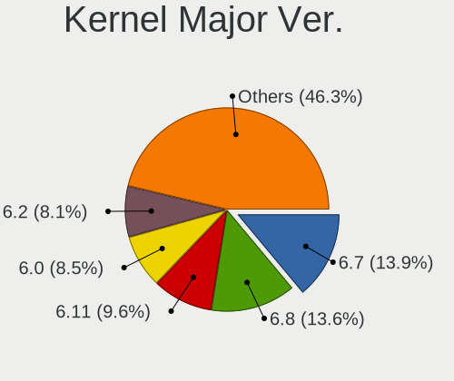
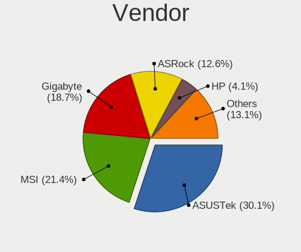
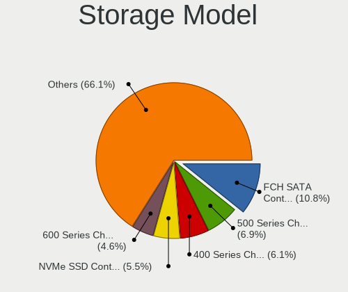
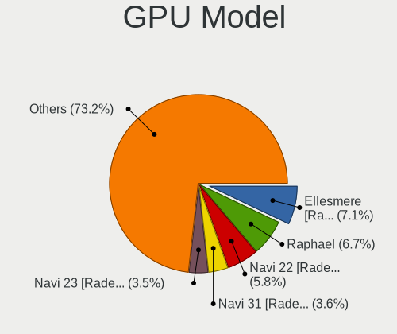

Nobara - Tested Hardware & Statistics (Desktops)
------------------------------------------------

A project to collect tested hardware configurations for Nobara.

Anyone can contribute to this report by the [hw-probe](https://github.com/linuxhw/hw-probe) tool:

    sudo -E hw-probe -all -upload

Please contribute! Especially if your hardware is rare.

Contents
--------

* [ Test Cases ](#test-cases)

* [ System ](#system)
  - [ OS                       ](#os)
  - [ OS Family                ](#os-family)
  - [ Kernel                   ](#kernel)
  - [ Kernel Family            ](#kernel-family)
  - [ Kernel Major Ver.        ](#kernel-major-ver)
  - [ Arch                     ](#arch)
  - [ DE                       ](#de)
  - [ Display Server           ](#display-server)
  - [ Display Manager          ](#display-manager)
  - [ OS Lang                  ](#os-lang)
  - [ Boot Mode                ](#boot-mode)
  - [ Filesystem               ](#filesystem)
  - [ Part. scheme             ](#part-scheme)
  - [ Dual Boot with Linux/BSD ](#dual-boot-with-linuxbsd)
  - [ Dual Boot (Win)          ](#dual-boot-win)

* [ Board ](#board)
  - [ Vendor                   ](#vendor)
  - [ Model                    ](#model)
  - [ Model Family             ](#model-family)
  - [ MFG Year                 ](#mfg-year)
  - [ Form Factor              ](#form-factor)
  - [ Secure Boot              ](#secure-boot)
  - [ Coreboot                 ](#coreboot)
  - [ RAM Size                 ](#ram-size)
  - [ RAM Used                 ](#ram-used)
  - [ Total Drives             ](#total-drives)
  - [ Has CD-ROM               ](#has-cd-rom)
  - [ Has Ethernet             ](#has-ethernet)
  - [ Has WiFi                 ](#has-wifi)
  - [ Has Bluetooth            ](#has-bluetooth)

* [ Location ](#location)
  - [ Country                  ](#country)
  - [ City                     ](#city)

* [ Drives ](#drives)
  - [ Drive Vendor             ](#drive-vendor)
  - [ Drive Model              ](#drive-model)
  - [ HDD Vendor               ](#hdd-vendor)
  - [ SSD Vendor               ](#ssd-vendor)
  - [ Drive Kind               ](#drive-kind)
  - [ Drive Connector          ](#drive-connector)
  - [ Drive Size               ](#drive-size)
  - [ Space Total              ](#space-total)
  - [ Space Used               ](#space-used)
  - [ Malfunc. Drives          ](#malfunc-drives)
  - [ Malfunc. Drive Vendor    ](#malfunc-drive-vendor)
  - [ Malfunc. HDD Vendor      ](#malfunc-hdd-vendor)
  - [ Malfunc. Drive Kind      ](#malfunc-drive-kind)
  - [ Failed Drives            ](#failed-drives)
  - [ Failed Drive Vendor      ](#failed-drive-vendor)
  - [ Drive Status             ](#drive-status)

* [ Storage controller ](#storage-controller)
  - [ Storage Vendor           ](#storage-vendor)
  - [ Storage Model            ](#storage-model)
  - [ Storage Kind             ](#storage-kind)

* [ Processor ](#processor)
  - [ CPU Vendor               ](#cpu-vendor)
  - [ CPU Model                ](#cpu-model)
  - [ CPU Model Family         ](#cpu-model-family)
  - [ CPU Cores                ](#cpu-cores)
  - [ CPU Sockets              ](#cpu-sockets)
  - [ CPU Threads              ](#cpu-threads)
  - [ CPU Op-Modes             ](#cpu-op-modes)
  - [ CPU Microcode            ](#cpu-microcode)
  - [ CPU Microarch            ](#cpu-microarch)

* [ Graphics ](#graphics)
  - [ GPU Vendor               ](#gpu-vendor)
  - [ GPU Model                ](#gpu-model)
  - [ GPU Combo                ](#gpu-combo)
  - [ GPU Driver               ](#gpu-driver)
  - [ GPU Memory               ](#gpu-memory)

* [ Monitor ](#monitor)
  - [ Monitor Vendor           ](#monitor-vendor)
  - [ Monitor Model            ](#monitor-model)
  - [ Monitor Resolution       ](#monitor-resolution)
  - [ Monitor Diagonal         ](#monitor-diagonal)
  - [ Monitor Width            ](#monitor-width)
  - [ Aspect Ratio             ](#aspect-ratio)
  - [ Monitor Area             ](#monitor-area)
  - [ Pixel Density            ](#pixel-density)
  - [ Multiple Monitors        ](#multiple-monitors)

* [ Network ](#network)
  - [ Net Controller Vendor    ](#net-controller-vendor)
  - [ Net Controller Model     ](#net-controller-model)
  - [ Wireless Vendor          ](#wireless-vendor)
  - [ Wireless Model           ](#wireless-model)
  - [ Ethernet Vendor          ](#ethernet-vendor)
  - [ Ethernet Model           ](#ethernet-model)
  - [ Net Controller Kind      ](#net-controller-kind)
  - [ Used Controller          ](#used-controller)
  - [ NICs                     ](#nics)
  - [ IPv6                     ](#ipv6)

* [ Bluetooth ](#bluetooth)
  - [ Bluetooth Vendor         ](#bluetooth-vendor)
  - [ Bluetooth Model          ](#bluetooth-model)

* [ Sound ](#sound)
  - [ Sound Vendor             ](#sound-vendor)
  - [ Sound Model              ](#sound-model)

* [ Memory ](#memory)
  - [ Memory Vendor            ](#memory-vendor)
  - [ Memory Model             ](#memory-model)
  - [ Memory Kind              ](#memory-kind)
  - [ Memory Form Factor       ](#memory-form-factor)
  - [ Memory Size              ](#memory-size)
  - [ Memory Speed             ](#memory-speed)

* [ Printers & scanners ](#printers--scanners)
  - [ Printer Vendor           ](#printer-vendor)
  - [ Printer Model            ](#printer-model)
  - [ Scanner Vendor           ](#scanner-vendor)
  - [ Scanner Model            ](#scanner-model)

* [ Camera ](#camera)
  - [ Camera Vendor            ](#camera-vendor)
  - [ Camera Model             ](#camera-model)

* [ Security ](#security)
  - [ Fingerprint Vendor       ](#fingerprint-vendor)
  - [ Fingerprint Model        ](#fingerprint-model)
  - [ Chipcard Vendor          ](#chipcard-vendor)
  - [ Chipcard Model           ](#chipcard-model)

* [ Unsupported ](#unsupported)
  - [ Unsupported Devices      ](#unsupported-devices)
  - [ Unsupported Device Types ](#unsupported-device-types)

Test Cases
----------

Total: 60

| Vendor    | Model                       | Probe                                                      | Date         |
|-----------|-----------------------------|------------------------------------------------------------|--------------|
| MSI       | MEG X570 UNIFY              | [4d2e449699](https://linux-hardware.org/?probe=4d2e449699) | Sep 30, 2022 |
| ASRock    | X470 Master SLI             | [47c190b6e9](https://linux-hardware.org/?probe=47c190b6e9) | Sep 30, 2022 |
| Gigabyte  | H270-Gaming 3               | [9426d21070](https://linux-hardware.org/?probe=9426d21070) | Sep 29, 2022 |
| Gigabyte  | H270-Gaming 3               | [830af9c53e](https://linux-hardware.org/?probe=830af9c53e) | Sep 29, 2022 |
| Gigabyte  | AB350-Gaming 3-CF           | [365d74f8e4](https://linux-hardware.org/?probe=365d74f8e4) | Sep 28, 2022 |
| Intel     | B75                         | [af5aef869c](https://linux-hardware.org/?probe=af5aef869c) | Sep 28, 2022 |
| Gigabyte  | AB350-Gaming 3-CF           | [cfd24b9e0a](https://linux-hardware.org/?probe=cfd24b9e0a) | Sep 27, 2022 |
| MSI       | MAG X570 TOMAHAWK WIFI      | [6bfc8d43ef](https://linux-hardware.org/?probe=6bfc8d43ef) | Sep 27, 2022 |
| MSI       | A68HM-E33 V2                | [d51c90a7a8](https://linux-hardware.org/?probe=d51c90a7a8) | Sep 27, 2022 |
| ASUSTek   | 970 PRO GAMING/AURA         | [f61a736922](https://linux-hardware.org/?probe=f61a736922) | Sep 26, 2022 |
| ASUSTek   | 970 PRO GAMING/AURA         | [1ecfe379e7](https://linux-hardware.org/?probe=1ecfe379e7) | Sep 26, 2022 |
| ASUSTek   | PRIME H410M-A               | [dafae8d45b](https://linux-hardware.org/?probe=dafae8d45b) | Sep 26, 2022 |
| MSI       | 970 GAMING                  | [015cd37f26](https://linux-hardware.org/?probe=015cd37f26) | Sep 24, 2022 |
| Dell      | 0G785M A00                  | [c461ec42d6](https://linux-hardware.org/?probe=c461ec42d6) | Sep 24, 2022 |
| ASUSTek   | PRIME A320M-K               | [d72e6b3865](https://linux-hardware.org/?probe=d72e6b3865) | Sep 23, 2022 |
| Gigabyte  | EP45-UD3L                   | [71c630ea03](https://linux-hardware.org/?probe=71c630ea03) | Sep 22, 2022 |
| ASUSTek   | PRIME H310M-E R2.0          | [7299d75966](https://linux-hardware.org/?probe=7299d75966) | Sep 22, 2022 |
| HP        | 8594                        | [281774ad4a](https://linux-hardware.org/?probe=281774ad4a) | Sep 21, 2022 |
| Gigabyte  | EP45-UD3L                   | [2b90168b71](https://linux-hardware.org/?probe=2b90168b71) | Sep 21, 2022 |
| ASRock    | X470 Master SLI             | [3c8fefe578](https://linux-hardware.org/?probe=3c8fefe578) | Sep 20, 2022 |
| ASRock    | X470 Master SLI             | [1975320cad](https://linux-hardware.org/?probe=1975320cad) | Sep 20, 2022 |
| Dell      | 0G785M A00                  | [8b8c41b401](https://linux-hardware.org/?probe=8b8c41b401) | Sep 19, 2022 |
| Unknown   | T3 MRD                      | [1f60a4d202](https://linux-hardware.org/?probe=1f60a4d202) | Sep 19, 2022 |
| MSI       | X570-A PRO                  | [cabf88c8be](https://linux-hardware.org/?probe=cabf88c8be) | Sep 19, 2022 |
| Gigabyte  | A320M-S2H-CF                | [7b95813c96](https://linux-hardware.org/?probe=7b95813c96) | Sep 18, 2022 |
| Unknown   | T3 MRD                      | [b10823b50f](https://linux-hardware.org/?probe=b10823b50f) | Sep 17, 2022 |
| Biostar   | H410MH S2                   | [832dd81851](https://linux-hardware.org/?probe=832dd81851) | Sep 17, 2022 |
| Lenovo    | MAHOBAY NOK                 | [cce010fd53](https://linux-hardware.org/?probe=cce010fd53) | Sep 16, 2022 |
| ASUSTek   | TUF Gaming B550M-PLUS WI... | [d9e9ec9afa](https://linux-hardware.org/?probe=d9e9ec9afa) | Sep 09, 2022 |
| ASUSTek   | TUF Gaming B550M-PLUS WI... | [1cdd7cda15](https://linux-hardware.org/?probe=1cdd7cda15) | Sep 09, 2022 |
| ASUSTek   | TUF Gaming X570-PRO         | [6eae76b5d0](https://linux-hardware.org/?probe=6eae76b5d0) | Sep 01, 2022 |
| ASRock    | FM2A55M-HD+                 | [2f96c73efb](https://linux-hardware.org/?probe=2f96c73efb) | Sep 01, 2022 |
| Gigabyte  | H110M-H-CF                  | [86fc2bf58f](https://linux-hardware.org/?probe=86fc2bf58f) | Aug 31, 2022 |
| Alienware | 01NYPT A00                  | [cd95b79270](https://linux-hardware.org/?probe=cd95b79270) | Aug 29, 2022 |
| ASRock    | B560 Steel Legend           | [c64907de8d](https://linux-hardware.org/?probe=c64907de8d) | Aug 27, 2022 |
| ASUSTek   | P8Z68-V PRO                 | [37ae937f4d](https://linux-hardware.org/?probe=37ae937f4d) | Aug 26, 2022 |
| ASUSTek   | PRIME X570-PRO              | [663509c999](https://linux-hardware.org/?probe=663509c999) | Aug 24, 2022 |
| ASUSTek   | PRIME X570-PRO              | [2b7d1d59a1](https://linux-hardware.org/?probe=2b7d1d59a1) | Aug 24, 2022 |
| ASUSTek   | PRIME A320M-K               | [928ce75df1](https://linux-hardware.org/?probe=928ce75df1) | Aug 24, 2022 |
| ASRock    | H61M-VG3                    | [a3cd7ba2c1](https://linux-hardware.org/?probe=a3cd7ba2c1) | Aug 22, 2022 |
| ASUSTek   | B85M-E                      | [0b5044dacf](https://linux-hardware.org/?probe=0b5044dacf) | Aug 19, 2022 |
| Gigabyte  | B450M DS3H-CF               | [a2b6c2ae17](https://linux-hardware.org/?probe=a2b6c2ae17) | Aug 19, 2022 |
| ASRock    | X470 Master SLI             | [ce62975b20](https://linux-hardware.org/?probe=ce62975b20) | Aug 15, 2022 |
| ASUSTek   | PRIME B350-PLUS             | [b2bbce2845](https://linux-hardware.org/?probe=b2bbce2845) | Aug 15, 2022 |
| ASRock    | Z97 Extreme6                | [31d7973a9d](https://linux-hardware.org/?probe=31d7973a9d) | Aug 14, 2022 |
| ASRock    | 760GM-HDV                   | [beabb7dd99](https://linux-hardware.org/?probe=beabb7dd99) | Aug 14, 2022 |
| MSI       | B450 TOMAHAWK MAX           | [27cd96982f](https://linux-hardware.org/?probe=27cd96982f) | Aug 10, 2022 |
| HP        | 8906 SMVB                   | [8f30392f49](https://linux-hardware.org/?probe=8f30392f49) | Aug 10, 2022 |
| HP        | 8054                        | [469b765fe0](https://linux-hardware.org/?probe=469b765fe0) | Aug 10, 2022 |
| ASUSTek   | G20AJ                       | [613f8a0c36](https://linux-hardware.org/?probe=613f8a0c36) | Aug 08, 2022 |
| Gigabyte  | X570 AORUS ELITE            | [f65ba77de3](https://linux-hardware.org/?probe=f65ba77de3) | Aug 07, 2022 |
| ASUSTek   | ROG CROSSHAIR VIII HERO     | [7a60eede9a](https://linux-hardware.org/?probe=7a60eede9a) | Aug 04, 2022 |
| MSI       | B450-A PRO MAX              | [e142cf5c91](https://linux-hardware.org/?probe=e142cf5c91) | Aug 04, 2022 |
| MSI       | B450 TOMAHAWK MAX           | [7c4355417f](https://linux-hardware.org/?probe=7c4355417f) | Aug 03, 2022 |
| MSI       | X570-A PRO                  | [f034a02e69](https://linux-hardware.org/?probe=f034a02e69) | Aug 01, 2022 |
| MSI       | 970 GAMING                  | [bf2a870952](https://linux-hardware.org/?probe=bf2a870952) | Jul 23, 2022 |
| Dell      | 0J8H4R A01                  | [3d7d06475c](https://linux-hardware.org/?probe=3d7d06475c) | Jul 23, 2022 |
| ASUSTek   | PRIME B450-PLUS             | [7d6b6d93d3](https://linux-hardware.org/?probe=7d6b6d93d3) | Jul 21, 2022 |
| eMachines | EL1870                      | [58e76fb684](https://linux-hardware.org/?probe=58e76fb684) | Jul 19, 2022 |
| MSI       | X570-A PRO                  | [c9683ea265](https://linux-hardware.org/?probe=c9683ea265) | Jul 19, 2022 |

System
------

OS
--

Installed operating systems

| Name      | Desktops | Percent |
|-----------|----------|---------|
| Nobara 36 | 48       | 100%    |

OS Family
---------

OS without a version

| Name   | Desktops | Percent |
|--------|----------|---------|
| Nobara | 48       | 100%    |

Kernel
------

Version of the Linux kernel

| Version                       | Desktops | Percent |
|-------------------------------|----------|---------|
| 5.19.9-201.fsync.fc36.x86_64  | 8        | 16.33%  |
| 5.18.13-201.fsync.fc36.x86_64 | 7        | 14.29%  |
| 5.19.7-204.fsync.fc36.x86_64  | 5        | 10.2%   |
| 5.19.10-201.fsync.fc36.x86_64 | 5        | 10.2%   |
| 5.19.4-201.fsync.fc36.x86_64  | 4        | 8.16%   |
| 5.18.17-201.fsync.fc36.x86_64 | 4        | 8.16%   |
| 5.18.16-201.fsync.fc36.x86_64 | 4        | 8.16%   |
| 5.18.19-201.fsync.fc36.x86_64 | 3        | 6.12%   |
| 5.18.11-201.fsync.fc36.x86_64 | 3        | 6.12%   |
| 5.19.11-201.fsync.fc36.x86_64 | 2        | 4.08%   |
| 5.19.7-203.fsync.fc36.x86_64  | 1        | 2.04%   |
| 5.19.2-602.inttf.fc36.x86_64  | 1        | 2.04%   |
| 5.18.9-201.fsync.fc36.x86_64  | 1        | 2.04%   |
| 5.18.18-201.fsync.fc36.x86_64 | 1        | 2.04%   |

Kernel Family
-------------

Linux kernel without a distro release

| Version | Desktops | Percent |
|---------|----------|---------|
| 5.19.9  | 8        | 16.33%  |
| 5.18.13 | 7        | 14.29%  |
| 5.19.7  | 6        | 12.24%  |
| 5.19.10 | 5        | 10.2%   |
| 5.19.4  | 4        | 8.16%   |
| 5.18.17 | 4        | 8.16%   |
| 5.18.16 | 4        | 8.16%   |
| 5.18.19 | 3        | 6.12%   |
| 5.18.11 | 3        | 6.12%   |
| 5.19.11 | 2        | 4.08%   |
| 5.19.2  | 1        | 2.04%   |
| 5.18.9  | 1        | 2.04%   |
| 5.18.18 | 1        | 2.04%   |

Kernel Major Ver.
-----------------

Linux kernel major version

| Version | Desktops | Percent |
|---------|----------|---------|
| 5.19    | 26       | 53.06%  |
| 5.18    | 23       | 46.94%  |

Arch
----

OS architecture (x86_64, i586, etc.)

| Name   | Desktops | Percent |
|--------|----------|---------|
| x86_64 | 48       | 100%    |

DE
--

Desktop Environment

| Name  | Desktops | Percent |
|-------|----------|---------|
| GNOME | 37       | 77.08%  |
| KDE5  | 11       | 22.92%  |

Display Server
--------------

X11 or Wayland

| Name    | Desktops | Percent |
|---------|----------|---------|
| Wayland | 37       | 75.51%  |
| X11     | 12       | 24.49%  |

Display Manager
---------------

SDDM, LightDM, etc.

| Name    | Desktops | Percent |
|---------|----------|---------|
| Unknown | 42       | 87.5%   |
| GDM     | 4        | 8.33%   |
| SDDM    | 2        | 4.17%   |

OS Lang
-------

Language

| Lang    | Desktops | Percent |
|---------|----------|---------|
| en_US   | 25       | 51.02%  |
| en_GB   | 4        | 8.16%   |
| de_DE   | 3        | 6.12%   |
| es_ES   | 2        | 4.08%   |
| es_AR   | 2        | 4.08%   |
| en_CA   | 2        | 4.08%   |
| sk_SK   | 1        | 2.04%   |
| ru_RU   | 1        | 2.04%   |
| pt_BR   | 1        | 2.04%   |
| nl_NL   | 1        | 2.04%   |
| fr_FR   | 1        | 2.04%   |
| es_MX   | 1        | 2.04%   |
| es_EC   | 1        | 2.04%   |
| es_CO   | 1        | 2.04%   |
| en_NZ   | 1        | 2.04%   |
| en_AU   | 1        | 2.04%   |
| Unknown | 1        | 2.04%   |

Boot Mode
---------

EFI or BIOS

| Mode | Desktops | Percent |
|------|----------|---------|
| EFI  | 34       | 70.83%  |
| BIOS | 14       | 29.17%  |

Filesystem
----------

Type of filesystem

| Type  | Desktops | Percent |
|-------|----------|---------|
| Ext4  | 38       | 79.17%  |
| Btrfs | 10       | 20.83%  |

Part. scheme
------------

Scheme of partitioning

| Type    | Desktops | Percent |
|---------|----------|---------|
| Unknown | 43       | 89.58%  |
| GPT     | 4        | 8.33%   |
| MBR     | 1        | 2.08%   |

Dual Boot with Linux/BSD
------------------------

Hosting more than one Linux/BSD

| Dual boot | Desktops | Percent |
|-----------|----------|---------|
| No        | 47       | 97.92%  |
| Yes       | 1        | 2.08%   |

Dual Boot (Win)
---------------

Hosting Linux and Windows

| Dual boot | Desktops | Percent |
|-----------|----------|---------|
| No        | 46       | 95.83%  |
| Yes       | 2        | 4.17%   |

Board
-----

Vendor
------

Motherboard manufacturer

| Name                | Desktops | Percent |
|---------------------|----------|---------|
| ASUSTek Computer    | 14       | 29.17%  |
| MSI                 | 10       | 20.83%  |
| Gigabyte Technology | 7        | 14.58%  |
| ASRock              | 6        | 12.5%   |
| Hewlett-Packard     | 3        | 6.25%   |
| Dell                | 2        | 4.17%   |
| Lenovo              | 1        | 2.08%   |
| Intel               | 1        | 2.08%   |
| eMachines           | 1        | 2.08%   |
| Biostar             | 1        | 2.08%   |
| Alienware           | 1        | 2.08%   |
| Unknown             | 1        | 2.08%   |

Model
-----

Motherboard model

| Name                               | Desktops | Percent |
|------------------------------------|----------|---------|
| MSI MS-7C37                        | 2        | 4.17%   |
| MSI MS-7C02                        | 2        | 4.17%   |
| MSI MS-7693                        | 2        | 4.17%   |
| ASUS PRIME A320M-K                 | 2        | 4.17%   |
| MSI MS-7C84                        | 1        | 2.08%   |
| MSI MS-7C35                        | 1        | 2.08%   |
| MSI MS-7B86                        | 1        | 2.08%   |
| MSI MS-7721                        | 1        | 2.08%   |
| Lenovo ThinkCentre M92p 3238E5U    | 1        | 2.08%   |
| Intel B75                          | 1        | 2.08%   |
| HP Pavilion Desktop TP01-2xxx      | 1        | 2.08%   |
| HP EliteDesk 800 G5 Desktop Mini   | 1        | 2.08%   |
| HP EliteDesk 800 G2 SFF            | 1        | 2.08%   |
| Gigabyte X570 AORUS ELITE          | 1        | 2.08%   |
| Gigabyte H270-Gaming 3             | 1        | 2.08%   |
| Gigabyte H110M-H                   | 1        | 2.08%   |
| Gigabyte EP45-UD3L                 | 1        | 2.08%   |
| Gigabyte B450M DS3H                | 1        | 2.08%   |
| Gigabyte AB350-Gaming 3            | 1        | 2.08%   |
| Gigabyte A320M-S2H                 | 1        | 2.08%   |
| eMachines EL1870                   | 1        | 2.08%   |
| Dell OptiPlex 780                  | 1        | 2.08%   |
| Dell ASM100                        | 1        | 2.08%   |
| Biostar H410MH S2                  | 1        | 2.08%   |
| ASUS TUF Gaming X570-PRO           | 1        | 2.08%   |
| ASUS TUF Gaming B550M-PLUS WIFI II | 1        | 2.08%   |
| ASUS ROG CROSSHAIR VIII HERO       | 1        | 2.08%   |
| ASUS PRO451459                     | 1        | 2.08%   |
| ASUS PRIME X570-PRO                | 1        | 2.08%   |
| ASUS PRIME H410M-A                 | 1        | 2.08%   |
| ASUS PRIME H310M-E R2.0            | 1        | 2.08%   |
| ASUS PRIME B450-PLUS               | 1        | 2.08%   |
| ASUS PRIME B350-PLUS               | 1        | 2.08%   |
| ASUS P8Z68-V PRO                   | 1        | 2.08%   |
| ASUS G20AJ                         | 1        | 2.08%   |
| ASUS 970 PRO GAMING/AURA           | 1        | 2.08%   |
| ASRock Z97 Extreme6                | 1        | 2.08%   |
| ASRock X470 Master SLI             | 1        | 2.08%   |
| ASRock H61M-VG3                    | 1        | 2.08%   |
| ASRock FM2A55M-HD+                 | 1        | 2.08%   |

Model Family
------------

Motherboard model prefix

| Name                  | Desktops | Percent |
|-----------------------|----------|---------|
| ASUS PRIME            | 7        | 14.58%  |
| MSI MS-7C37           | 2        | 4.17%   |
| MSI MS-7C02           | 2        | 4.17%   |
| MSI MS-7693           | 2        | 4.17%   |
| HP EliteDesk          | 2        | 4.17%   |
| ASUS TUF              | 2        | 4.17%   |
| MSI MS-7C84           | 1        | 2.08%   |
| MSI MS-7C35           | 1        | 2.08%   |
| MSI MS-7B86           | 1        | 2.08%   |
| MSI MS-7721           | 1        | 2.08%   |
| Lenovo ThinkCentre    | 1        | 2.08%   |
| Intel B75             | 1        | 2.08%   |
| HP Pavilion           | 1        | 2.08%   |
| Gigabyte X570         | 1        | 2.08%   |
| Gigabyte H270-Gaming  | 1        | 2.08%   |
| Gigabyte H110M-H      | 1        | 2.08%   |
| Gigabyte EP45-UD3L    | 1        | 2.08%   |
| Gigabyte B450M        | 1        | 2.08%   |
| Gigabyte AB350-Gaming | 1        | 2.08%   |
| Gigabyte A320M-S2H    | 1        | 2.08%   |
| eMachines EL1870      | 1        | 2.08%   |
| Dell OptiPlex         | 1        | 2.08%   |
| Dell ASM100           | 1        | 2.08%   |
| Biostar H410MH        | 1        | 2.08%   |
| ASUS ROG              | 1        | 2.08%   |
| ASUS PRO451459        | 1        | 2.08%   |
| ASUS P8Z68-V          | 1        | 2.08%   |
| ASUS G20AJ            | 1        | 2.08%   |
| ASUS 970              | 1        | 2.08%   |
| ASRock Z97            | 1        | 2.08%   |
| ASRock X470           | 1        | 2.08%   |
| ASRock H61M-VG3       | 1        | 2.08%   |
| ASRock FM2A55M-HD+    | 1        | 2.08%   |
| ASRock B560           | 1        | 2.08%   |
| ASRock 760GM-HDV      | 1        | 2.08%   |
| Alienware Aurora      | 1        | 2.08%   |
| Unknown               | 1        | 2.08%   |

MFG Year
--------

Motherboard manufacture year

| Year | Desktops | Percent |
|------|----------|---------|
| 2019 | 11       | 22.92%  |
| 2018 | 7        | 14.58%  |
| 2017 | 5        | 10.42%  |
| 2021 | 4        | 8.33%   |
| 2016 | 4        | 8.33%   |
| 2014 | 4        | 8.33%   |
| 2020 | 3        | 6.25%   |
| 2013 | 3        | 6.25%   |
| 2015 | 2        | 4.17%   |
| 2011 | 2        | 4.17%   |
| 2022 | 1        | 2.08%   |
| 2012 | 1        | 2.08%   |
| 2008 | 1        | 2.08%   |

Form Factor
-----------

Physical design of the computer

| Name    | Desktops | Percent |
|---------|----------|---------|
| Desktop | 48       | 100%    |

Secure Boot
-----------

Enabled or disabled

| State    | Desktops | Percent |
|----------|----------|---------|
| Disabled | 48       | 100%    |

Coreboot
--------

Have coreboot on board

| Used | Desktops | Percent |
|------|----------|---------|
| No   | 48       | 100%    |

RAM Size
--------

Total RAM memory

| Size in GB  | Desktops | Percent |
|-------------|----------|---------|
| 16.01-24.0  | 20       | 41.67%  |
| 8.01-16.0   | 11       | 22.92%  |
| 32.01-64.0  | 8        | 16.67%  |
| 4.01-8.0    | 4        | 8.33%   |
| 3.01-4.0    | 3        | 6.25%   |
| 24.01-32.0  | 1        | 2.08%   |
| 64.01-256.0 | 1        | 2.08%   |

RAM Used
--------

Used RAM memory

| Used GB    | Desktops | Percent |
|------------|----------|---------|
| 4.01-8.0   | 17       | 34.69%  |
| 3.01-4.0   | 14       | 28.57%  |
| 2.01-3.0   | 10       | 20.41%  |
| 8.01-16.0  | 5        | 10.2%   |
| 1.01-2.0   | 2        | 4.08%   |
| 24.01-32.0 | 1        | 2.04%   |

Total Drives
------------

Number of drives on board

| Drives | Desktops | Percent |
|--------|----------|---------|
| 1      | 18       | 37.5%   |
| 2      | 13       | 27.08%  |
| 3      | 7        | 14.58%  |
| 5      | 6        | 12.5%   |
| 4      | 3        | 6.25%   |
| 6      | 1        | 2.08%   |

Has CD-ROM
----------

Has CD-ROM on board

| Presented | Desktops | Percent |
|-----------|----------|---------|
| No        | 36       | 75%     |
| Yes       | 12       | 25%     |

Has Ethernet
------------

Has Ethernet on board

| Presented | Desktops | Percent |
|-----------|----------|---------|
| Yes       | 48       | 100%    |

Has WiFi
--------

Has WiFi module

| Presented | Desktops | Percent |
|-----------|----------|---------|
| Yes       | 27       | 56.25%  |
| No        | 21       | 43.75%  |

Has Bluetooth
-------------

Has Bluetooth module

| Presented | Desktops | Percent |
|-----------|----------|---------|
| No        | 27       | 55.1%   |
| Yes       | 22       | 44.9%   |

Location
--------

Country
-------

Geographic location (country)

| Country     | Desktops | Percent |
|-------------|----------|---------|
| USA         | 16       | 33.33%  |
| Canada      | 4        | 8.33%   |
| UK          | 3        | 6.25%   |
| Germany     | 3        | 6.25%   |
| France      | 3        | 6.25%   |
| Argentina   | 3        | 6.25%   |
| Spain       | 1        | 2.08%   |
| South Korea | 1        | 2.08%   |
| Slovakia    | 1        | 2.08%   |
| Serbia      | 1        | 2.08%   |
| Russia      | 1        | 2.08%   |
| Norway      | 1        | 2.08%   |
| New Zealand | 1        | 2.08%   |
| Netherlands | 1        | 2.08%   |
| Mexico      | 1        | 2.08%   |
| Hungary     | 1        | 2.08%   |
| Georgia     | 1        | 2.08%   |
| Ecuador     | 1        | 2.08%   |
| Colombia    | 1        | 2.08%   |
| Chile       | 1        | 2.08%   |
| Brazil      | 1        | 2.08%   |
| Australia   | 1        | 2.08%   |

City
----

Geographic location (city)

| City              | Desktops | Percent |
|-------------------|----------|---------|
| Atlanta           | 2        | 4.08%   |
| Wooster           | 1        | 2.04%   |
| Wellington        | 1        | 2.04%   |
| Vineland          | 1        | 2.04%   |
| Tamworth          | 1        | 2.04%   |
| Szeged            | 1        | 2.04%   |
| Sao Paulo         | 1        | 2.04%   |
| San Antonio       | 1        | 2.04%   |
| Salon-de-Provence | 1        | 2.04%   |
| Rotterdam         | 1        | 2.04%   |
| Raleigh           | 1        | 2.04%   |
| Quito             | 1        | 2.04%   |
| Philipsburg       | 1        | 2.04%   |
| Osa               | 1        | 2.04%   |
| North Vancouver   | 1        | 2.04%   |
| Mount Pleasant    | 1        | 2.04%   |
| Mendoza           | 1        | 2.04%   |
| Melbourne         | 1        | 2.04%   |
| Martigues         | 1        | 2.04%   |
| Lünen            | 1        | 2.04%   |
| Lake Elsinore     | 1        | 2.04%   |
| La Serena         | 1        | 2.04%   |
| Koblenz           | 1        | 2.04%   |
| K'alak'i T'bilisi | 1        | 2.04%   |
| Istres            | 1        | 2.04%   |
| Hermosillo        | 1        | 2.04%   |
| Grande Prairie    | 1        | 2.04%   |
| Grand Rapids      | 1        | 2.04%   |
| Granby            | 1        | 2.04%   |
| Fornebu           | 1        | 2.04%   |
| Floirac           | 1        | 2.04%   |
| Flint             | 1        | 2.04%   |
| Ellwood City      | 1        | 2.04%   |
| Edmonton          | 1        | 2.04%   |
| Delavan           | 1        | 2.04%   |
| Cheyenne          | 1        | 2.04%   |
| Casa Grande       | 1        | 2.04%   |
| Buyeo-gun         | 1        | 2.04%   |
| Buenos Aires      | 1        | 2.04%   |
| Brownwood         | 1        | 2.04%   |

Drives
------

Drive Vendor
------------

Hard drive vendors

| Vendor                | Desktops | Drives | Percent |
|-----------------------|----------|--------|---------|
| WDC                   | 22       | 29     | 22.68%  |
| Seagate               | 16       | 20     | 16.49%  |
| Samsung Electronics   | 16       | 24     | 16.49%  |
| SanDisk               | 7        | 7      | 7.22%   |
| Crucial               | 7        | 9      | 7.22%   |
| Toshiba               | 6        | 6      | 6.19%   |
| Kingston              | 5        | 5      | 5.15%   |
| PNY                   | 3        | 5      | 3.09%   |
| Phison                | 3        | 4      | 3.09%   |
| XPG                   | 1        | 1      | 1.03%   |
| Unknown               | 1        | 1      | 1.03%   |
| Team                  | 1        | 1      | 1.03%   |
| SuperSSpeed           | 1        | 1      | 1.03%   |
| SPCC                  | 1        | 1      | 1.03%   |
| Realtek Semiconductor | 1        | 1      | 1.03%   |
| Mushkin               | 1        | 1      | 1.03%   |
| Micron Technology     | 1        | 1      | 1.03%   |
| KIOXIA                | 1        | 1      | 1.03%   |
| Intel                 | 1        | 1      | 1.03%   |
| Hitachi               | 1        | 1      | 1.03%   |
| A-DATA Technology     | 1        | 1      | 1.03%   |

Drive Model
-----------

Hard drive models

| Model                            | Desktops | Percent |
|----------------------------------|----------|---------|
| WDC WD10EZEX-08WN4A0 1TB         | 3        | 2.65%   |
| WDC WDS480G2G0A-00JH30 480GB SSD | 2        | 1.77%   |
| WDC WDBNCE5000PNC 500GB SSD      | 2        | 1.77%   |
| Seagate ST2000DX002-2DV164 2TB   | 2        | 1.77%   |
| Samsung SSD 860 EVO 1TB          | 2        | 1.77%   |
| Samsung NVMe SSD Drive 1TB       | 2        | 1.77%   |
| PNY CS900 500GB SSD              | 2        | 1.77%   |
| Phison NVMe SSD Drive 2TB        | 2        | 1.77%   |
| Kingston NVMe SSD Drive 500GB    | 2        | 1.77%   |
| XPG SPECTRIX S40G 256GB          | 1        | 0.88%   |
| WDC WDS240G2G0B-00EPW0 240GB SSD | 1        | 0.88%   |
| WDC WDS240G2G0A-00JH30 240GB SSD | 1        | 0.88%   |
| WDC WDS120G2G0A-00JH30 120GB SSD | 1        | 0.88%   |
| WDC WD6400AAKS-65A7B2 640GB      | 1        | 0.88%   |
| WDC WD40PURZ-74AKKY0 4TB         | 1        | 0.88%   |
| WDC WD30EZAZ-00SF3B0 3TB         | 1        | 0.88%   |
| WDC WD2500JS-22NCB1 250GB        | 1        | 0.88%   |
| WDC WD20EZBX-00AYRA0 2TB         | 1        | 0.88%   |
| WDC WD20EARX-00PASB0 2TB         | 1        | 0.88%   |
| WDC WD1600AAJS-08L7A0 160GB      | 1        | 0.88%   |
| WDC WD1600AABS-00H4A0 160GB      | 1        | 0.88%   |
| WDC WD120EFBX-68B0EN0 12TB       | 1        | 0.88%   |
| WDC WD10PURX-64E5EY0 1TB         | 1        | 0.88%   |
| WDC WD10JPVX-60JC3T0 1TB         | 1        | 0.88%   |
| WDC WD10EZEX-60WN4A2 1TB         | 1        | 0.88%   |
| WDC WD10EZEX-60WN4A0 1TB         | 1        | 0.88%   |
| WDC WD10EZEX-08M2NA0 1TB         | 1        | 0.88%   |
| WDC WD10EZEX-00BN5A0 1TB         | 1        | 0.88%   |
| WDC WD10EURX-63FH1Y0 1TB         | 1        | 0.88%   |
| WDC WD10EADS-00M2B0 1TB          | 1        | 0.88%   |
| WDC WD1003FZEX-00K3CA0 1TB       | 1        | 0.88%   |
| Unknown MMC Card  64GB           | 1        | 0.88%   |
| Toshiba MQ04ABF100 1TB           | 1        | 0.88%   |
| Toshiba HDWE140 4TB              | 1        | 0.88%   |
| Toshiba HDWD110 1TB              | 1        | 0.88%   |
| Toshiba DT01ACA100 1TB           | 1        | 0.88%   |
| Toshiba DT01ACA050 500GB         | 1        | 0.88%   |
| Toshiba A100 120GB SSD           | 1        | 0.88%   |
| Team T2531TB 1024GB SSD          | 1        | 0.88%   |
| SuperSSpeed S540 240GB           | 1        | 0.88%   |

HDD Vendor
----------

Hard disk drive vendors

| Vendor              | Desktops | Drives | Percent |
|---------------------|----------|--------|---------|
| WDC                 | 17       | 22     | 41.46%  |
| Seagate             | 16       | 19     | 39.02%  |
| Toshiba             | 5        | 5      | 12.2%   |
| Samsung Electronics | 2        | 4      | 4.88%   |
| Hitachi             | 1        | 1      | 2.44%   |

SSD Vendor
----------

Solid state drive vendors

| Vendor              | Desktops | Drives | Percent |
|---------------------|----------|--------|---------|
| Samsung Electronics | 10       | 11     | 25.64%  |
| WDC                 | 7        | 7      | 17.95%  |
| Crucial             | 7        | 9      | 17.95%  |
| SanDisk             | 3        | 3      | 7.69%   |
| PNY                 | 3        | 5      | 7.69%   |
| Kingston            | 3        | 3      | 7.69%   |
| Toshiba             | 1        | 1      | 2.56%   |
| Team                | 1        | 1      | 2.56%   |
| SuperSSpeed         | 1        | 1      | 2.56%   |
| SPCC                | 1        | 1      | 2.56%   |
| Mushkin             | 1        | 1      | 2.56%   |
| A-DATA Technology   | 1        | 1      | 2.56%   |

Drive Kind
----------

HDD or SSD

| Kind    | Desktops | Drives | Percent |
|---------|----------|--------|---------|
| HDD     | 32       | 51     | 38.55%  |
| SSD     | 31       | 44     | 37.35%  |
| NVMe    | 18       | 24     | 21.69%  |
| MMC     | 1        | 1      | 1.2%    |
| Unknown | 1        | 1      | 1.2%    |

Drive Connector
---------------

SATA, SAS, NVMe, etc.

| Type | Desktops | Drives | Percent |
|------|----------|--------|---------|
| SATA | 43       | 93     | 66.15%  |
| NVMe | 18       | 24     | 27.69%  |
| SAS  | 3        | 3      | 4.62%   |
| MMC  | 1        | 1      | 1.54%   |

Drive Size
----------

Size of hard drive

| Size in TB | Desktops | Drives | Percent |
|------------|----------|--------|---------|
| 0.01-0.5   | 30       | 41     | 41.67%  |
| 0.51-1.0   | 23       | 31     | 31.94%  |
| 1.01-2.0   | 11       | 15     | 15.28%  |
| 3.01-4.0   | 3        | 3      | 4.17%   |
| 2.01-3.0   | 3        | 3      | 4.17%   |
| 10.01-20.0 | 1        | 1      | 1.39%   |
| 4.01-10.0  | 1        | 1      | 1.39%   |

Space Total
-----------

Amount of disk space available on the file system

| Size in GB     | Desktops | Percent |
|----------------|----------|---------|
| 101-250        | 12       | 25%     |
| 251-500        | 10       | 20.83%  |
| 1001-2000      | 10       | 20.83%  |
| 501-1000       | 6        | 12.5%   |
| More than 3000 | 5        | 10.42%  |
| 2001-3000      | 2        | 4.17%   |
| 51-100         | 2        | 4.17%   |
| 1-20           | 1        | 2.08%   |

Space Used
----------

Amount of used disk space

| Used GB        | Desktops | Percent |
|----------------|----------|---------|
| 21-50          | 15       | 30.61%  |
| 1-20           | 11       | 22.45%  |
| 501-1000       | 7        | 14.29%  |
| 51-100         | 7        | 14.29%  |
| 251-500        | 3        | 6.12%   |
| 101-250        | 3        | 6.12%   |
| 2001-3000      | 2        | 4.08%   |
| More than 3000 | 1        | 2.04%   |

Malfunc. Drives
---------------

Drive models with a malfunction

| Model                          | Desktops | Drives | Percent |
|--------------------------------|----------|--------|---------|
| WDC WD10EZEX-08M2NA0 1TB       | 1        | 1      | 33.33%  |
| Seagate ST2000DX002-2DV164 2TB | 1        | 1      | 33.33%  |
| Seagate ST1000DM003-9YN162 1TB | 1        | 1      | 33.33%  |

Malfunc. Drive Vendor
---------------------

Vendors of faulty drives

| Vendor  | Desktops | Drives | Percent |
|---------|----------|--------|---------|
| Seagate | 2        | 2      | 66.67%  |
| WDC     | 1        | 1      | 33.33%  |

Malfunc. HDD Vendor
-------------------

Vendors of faulty HDD drives

| Vendor  | Desktops | Drives | Percent |
|---------|----------|--------|---------|
| Seagate | 2        | 2      | 66.67%  |
| WDC     | 1        | 1      | 33.33%  |

Malfunc. Drive Kind
-------------------

Kinds of faulty drives

| Kind | Desktops | Drives | Percent |
|------|----------|--------|---------|
| HDD  | 3        | 3      | 100%    |

Failed Drives
-------------

Failed drive models

Zero info for selected period =(

Failed Drive Vendor
-------------------

Failed drive vendors

Zero info for selected period =(

Drive Status
------------

Number of failed and malfunc. drives

| Status   | Desktops | Drives | Percent |
|----------|----------|--------|---------|
| Detected | 43       | 98     | 84.31%  |
| Works    | 5        | 20     | 9.8%    |
| Malfunc  | 3        | 3      | 5.88%   |

Storage controller
------------------

Storage Vendor
--------------

Storage controller vendors

| Vendor                      | Desktops | Percent |
|-----------------------------|----------|---------|
| AMD                         | 27       | 35.53%  |
| Intel                       | 21       | 27.63%  |
| Samsung Electronics         | 8        | 10.53%  |
| SanDisk                     | 4        | 5.26%   |
| Phison Electronics          | 3        | 3.95%   |
| ASMedia Technology          | 3        | 3.95%   |
| Realtek Semiconductor       | 2        | 2.63%   |
| Kingston Technology Company | 2        | 2.63%   |
| JMicron Technology          | 2        | 2.63%   |
| Silicon Image               | 1        | 1.32%   |
| Micron Technology           | 1        | 1.32%   |
| Marvell Technology Group    | 1        | 1.32%   |
| KIOXIA                      | 1        | 1.32%   |

Storage Model
-------------

Storage controller models

| Model                                                                          | Desktops | Percent |
|--------------------------------------------------------------------------------|----------|---------|
| AMD FCH SATA Controller [AHCI mode]                                            | 19       | 21.59%  |
| AMD 400 Series Chipset SATA Controller                                         | 7        | 7.95%   |
| AMD SB7x0/SB8x0/SB9x0 SATA Controller [AHCI mode]                              | 4        | 4.55%   |
| Intel SATA Controller [RAID mode]                                              | 3        | 3.41%   |
| Intel 6 Series/C200 Series Chipset Family 6 port Desktop SATA AHCI Controller  | 3        | 3.41%   |
| ASMedia ASM1062 Serial ATA Controller                                          | 3        | 3.41%   |
| AMD FCH SATA Controller D                                                      | 3        | 3.41%   |
| Samsung NVMe SSD Controller SM981/PM981/PM983                                  | 2        | 2.27%   |
| Samsung NVMe SSD Controller PM9A1/PM9A3/980PRO                                 | 2        | 2.27%   |
| Realtek RTS5763DL NVMe SSD Controller                                          | 2        | 2.27%   |
| Kingston Company A2000 NVMe SSD                                                | 2        | 2.27%   |
| Intel Q170/Q150/B150/H170/H110/Z170/CM236 Chipset SATA Controller [AHCI Mode]  | 2        | 2.27%   |
| Intel 8 Series/C220 Series Chipset Family 6-port SATA Controller 1 [AHCI mode] | 2        | 2.27%   |
| Intel 7 Series/C210 Series Chipset Family 6-port SATA Controller [AHCI mode]   | 2        | 2.27%   |
| Intel 500 Series Chipset Family SATA AHCI Controller                           | 2        | 2.27%   |
| Intel 200 Series PCH SATA controller [AHCI mode]                               | 2        | 2.27%   |
| AMD 300 Series Chipset SATA Controller                                         | 2        | 2.27%   |
| Silicon Image SiI 3132 Serial ATA Raid II Controller                           | 1        | 1.14%   |
| SanDisk WD PC SN810 / Black SN850 NVMe SSD                                     | 1        | 1.14%   |
| SanDisk WD Blue SN570 NVMe SSD                                                 | 1        | 1.14%   |
| SanDisk WD Blue SN550 NVMe SSD                                                 | 1        | 1.14%   |
| SanDisk WD Black SN750 / PC SN730 NVMe SSD                                     | 1        | 1.14%   |
| Samsung NVMe SSD Controller SM961/PM961/SM963                                  | 1        | 1.14%   |
| Samsung NVMe SSD Controller SM951/PM951                                        | 1        | 1.14%   |
| Samsung NVMe SSD Controller 980                                                | 1        | 1.14%   |
| Samsung NVMe SSD Controller 172X                                               | 1        | 1.14%   |
| Phison NVMe Storage Controller                                                 | 1        | 1.14%   |
| Phison E18 PCIe4 NVMe Controller                                               | 1        | 1.14%   |
| Phison E16 PCIe4 NVMe Controller                                               | 1        | 1.14%   |
| Micron Non-Volatile memory controller                                          | 1        | 1.14%   |
| Marvell Group 88SE9172 SATA 6Gb/s Controller                                   | 1        | 1.14%   |
| KIOXIA NVMe SSD Controller BG4                                                 | 1        | 1.14%   |
| JMicron JMB368 IDE controller                                                  | 1        | 1.14%   |
| JMicron JMB362 SATA Controller                                                 | 1        | 1.14%   |
| Intel SSD 660P Series                                                          | 1        | 1.14%   |
| Intel Cannon Lake PCH SATA AHCI Controller                                     | 1        | 1.14%   |
| Intel 9 Series Chipset Family SATA Controller [AHCI Mode]                      | 1        | 1.14%   |
| Intel 82801JI (ICH10 Family) SATA AHCI Controller                              | 1        | 1.14%   |
| Intel 400 Series Chipset Family SATA AHCI Controller                           | 1        | 1.14%   |
| Intel 4 Series Chipset PT IDER Controller                                      | 1        | 1.14%   |

Storage Kind
------------

Kind of storage controller (IDE, SATA, NVMe, SAS, ...)

| Kind | Desktops | Percent |
|------|----------|---------|
| SATA | 44       | 63.77%  |
| NVMe | 18       | 26.09%  |
| IDE  | 4        | 5.8%    |
| RAID | 3        | 4.35%   |

Processor
---------

CPU Vendor
----------

Processor vendors

| Vendor | Desktops | Percent |
|--------|----------|---------|
| AMD    | 27       | 56.25%  |
| Intel  | 21       | 43.75%  |

CPU Model
---------

Processor models

| Model                                           | Desktops | Percent |
|-------------------------------------------------|----------|---------|
| AMD Ryzen 9 3900X 12-Core Processor             | 3        | 6.25%   |
| AMD Ryzen 5 2600 Six-Core Processor             | 3        | 6.25%   |
| AMD FX-8350 Eight-Core Processor                | 3        | 6.25%   |
| Intel Core i7-4790 CPU @ 3.60GHz                | 2        | 4.17%   |
| AMD Ryzen 5 5600X 6-Core Processor              | 2        | 4.17%   |
| AMD Ryzen 3 3200G with Radeon Vega Graphics     | 2        | 4.17%   |
| Intel Core i7-4790K CPU @ 4.00GHz               | 1        | 2.08%   |
| Intel Core i7-10700F CPU @ 2.90GHz              | 1        | 2.08%   |
| Intel Core i5-9500 CPU @ 3.00GHz                | 1        | 2.08%   |
| Intel Core i5-8400 CPU @ 2.80GHz                | 1        | 2.08%   |
| Intel Core i5-7600 CPU @ 3.50GHz                | 1        | 2.08%   |
| Intel Core i5-6500 CPU @ 3.20GHz                | 1        | 2.08%   |
| Intel Core i5-4590T CPU @ 2.00GHz               | 1        | 2.08%   |
| Intel Core i5-3470T CPU @ 2.90GHz               | 1        | 2.08%   |
| Intel Core i5-2500K CPU @ 3.30GHz               | 1        | 2.08%   |
| Intel Core i5-10400F CPU @ 2.90GHz              | 1        | 2.08%   |
| Intel Core i3-6100 CPU @ 3.70GHz                | 1        | 2.08%   |
| Intel Core i3-3240 CPU @ 3.40GHz                | 1        | 2.08%   |
| Intel Core i3-3220 CPU @ 3.30GHz                | 1        | 2.08%   |
| Intel Core i3-2120 CPU @ 3.30GHz                | 1        | 2.08%   |
| Intel Core 2 Duo CPU E8400 @ 3.00GHz            | 1        | 2.08%   |
| Intel Core 2 Duo CPU E7500 @ 2.93GHz            | 1        | 2.08%   |
| Intel Celeron CPU G3900 @ 2.80GHz               | 1        | 2.08%   |
| Intel Atom x5-Z8350 CPU @ 1.44GHz               | 1        | 2.08%   |
| Intel 11th Gen Core i5-11400 @ 2.60GHz          | 1        | 2.08%   |
| AMD Ryzen 9 5900X 12-Core Processor             | 1        | 2.08%   |
| AMD Ryzen 9 3950X 16-Core Processor             | 1        | 2.08%   |
| AMD Ryzen 7 5700X 8-Core Processor              | 1        | 2.08%   |
| AMD Ryzen 7 5700G with Radeon Graphics          | 1        | 2.08%   |
| AMD Ryzen 7 3800X 8-Core Processor              | 1        | 2.08%   |
| AMD Ryzen 5 3600X 6-Core Processor              | 1        | 2.08%   |
| AMD Ryzen 5 3600 6-Core Processor               | 1        | 2.08%   |
| AMD Ryzen 5 3400G with Radeon Vega Graphics     | 1        | 2.08%   |
| AMD Ryzen 5 1600X Six-Core Processor            | 1        | 2.08%   |
| AMD Ryzen 5 1600 Six-Core Processor             | 1        | 2.08%   |
| AMD Ryzen 3 1200 Quad-Core Processor            | 1        | 2.08%   |
| AMD Phenom II X6 1100T Processor                | 1        | 2.08%   |
| AMD Athlon X4 760K Quad Core Processor          | 1        | 2.08%   |
| AMD A10-7860K Radeon R7, 12 Compute Cores 4C+8G | 1        | 2.08%   |

CPU Model Family
----------------

Processor model prefix

| Model            | Desktops | Percent |
|------------------|----------|---------|
| AMD Ryzen 5      | 10       | 20.83%  |
| Intel Core i5    | 8        | 16.67%  |
| AMD Ryzen 9      | 5        | 10.42%  |
| Intel Core i7    | 4        | 8.33%   |
| Intel Core i3    | 4        | 8.33%   |
| AMD Ryzen 7      | 3        | 6.25%   |
| AMD Ryzen 3      | 3        | 6.25%   |
| AMD FX           | 3        | 6.25%   |
| Intel Core 2 Duo | 2        | 4.17%   |
| Other            | 1        | 2.08%   |
| Intel Celeron    | 1        | 2.08%   |
| Intel Atom       | 1        | 2.08%   |
| AMD Phenom II X6 | 1        | 2.08%   |
| AMD Athlon X4    | 1        | 2.08%   |
| AMD A10          | 1        | 2.08%   |

CPU Cores
---------

Number of processor cores

| Number | Desktops | Percent |
|--------|----------|---------|
| 4      | 15       | 31.25%  |
| 6      | 14       | 29.17%  |
| 2      | 10       | 20.83%  |
| 12     | 4        | 8.33%   |
| 8      | 4        | 8.33%   |
| 16     | 1        | 2.08%   |

CPU Sockets
-----------

Number of sockets

| Number | Desktops | Percent |
|--------|----------|---------|
| 1      | 48       | 100%    |

CPU Threads
-----------

Threads per core (Hyper-Threading)

| Number | Desktops | Percent |
|--------|----------|---------|
| 2      | 34       | 70.83%  |
| 1      | 14       | 29.17%  |

CPU Op-Modes
------------

CPU Operation Modes (32-bit, 64-bit)

| Op mode        | Desktops | Percent |
|----------------|----------|---------|
| 32-bit, 64-bit | 48       | 100%    |

CPU Microcode
-------------

Microcode number

| Number     | Desktops | Percent |
|------------|----------|---------|
| 0x08701021 | 7        | 14.58%  |
| 0x306c3    | 4        | 8.33%   |
| 0x506e3    | 3        | 6.25%   |
| 0x306a9    | 3        | 6.25%   |
| 0x0800820d | 3        | 6.25%   |
| 0x08001138 | 3        | 6.25%   |
| 0x06000822 | 3        | 6.25%   |
| 0x906ea    | 2        | 4.17%   |
| 0x206a7    | 2        | 4.17%   |
| 0x1067a    | 2        | 4.17%   |
| 0x0a201204 | 2        | 4.17%   |
| 0x0a201016 | 2        | 4.17%   |
| 0x08108109 | 2        | 4.17%   |
| 0xa0671    | 1        | 2.08%   |
| 0xa0655    | 1        | 2.08%   |
| 0xa0653    | 1        | 2.08%   |
| 0x906e9    | 1        | 2.08%   |
| 0x406c4    | 1        | 2.08%   |
| 0x0a50000c | 1        | 2.08%   |
| 0x08108102 | 1        | 2.08%   |
| 0x06003106 | 1        | 2.08%   |
| 0x06001119 | 1        | 2.08%   |
| 0x010000bf | 1        | 2.08%   |

CPU Microarch
-------------

Microarchitecture

| Name        | Desktops | Percent |
|-------------|----------|---------|
| Zen 2       | 7        | 14.58%  |
| Zen+        | 6        | 12.5%   |
| Zen 3       | 5        | 10.42%  |
| Piledriver  | 4        | 8.33%   |
| Haswell     | 4        | 8.33%   |
| Zen         | 3        | 6.25%   |
| Skylake     | 3        | 6.25%   |
| KabyLake    | 3        | 6.25%   |
| IvyBridge   | 3        | 6.25%   |
| SandyBridge | 2        | 4.17%   |
| Penryn      | 2        | 4.17%   |
| CometLake   | 2        | 4.17%   |
| Steamroller | 1        | 2.08%   |
| Silvermont  | 1        | 2.08%   |
| K10         | 1        | 2.08%   |
| Icelake     | 1        | 2.08%   |

Graphics
--------

GPU Vendor
----------

Vendors of graphics cards

| Vendor | Desktops | Percent |
|--------|----------|---------|
| AMD    | 23       | 46%     |
| Nvidia | 20       | 40%     |
| Intel  | 7        | 14%     |

GPU Model
---------

Graphics card models

| Model                                                                                    | Desktops | Percent |
|------------------------------------------------------------------------------------------|----------|---------|
| AMD Ellesmere [Radeon RX 470/480/570/570X/580/580X/590]                                  | 7        | 13.73%  |
| AMD Picasso/Raven 2 [Radeon Vega Series / Radeon Vega Mobile Series]                     | 3        | 5.88%   |
| Nvidia TU116 [GeForce GTX 1650 SUPER]                                                    | 2        | 3.92%   |
| Nvidia GP108 [GeForce GT 1030]                                                           | 2        | 3.92%   |
| Nvidia GK104 [GeForce GTX 760]                                                           | 2        | 3.92%   |
| Intel Xeon E3-1200 v2/3rd Gen Core processor Graphics Controller                         | 2        | 3.92%   |
| Intel HD Graphics 530                                                                    | 2        | 3.92%   |
| AMD Navi 23 [Radeon RX 6600/6600 XT/6600M]                                               | 2        | 3.92%   |
| AMD Navi 22 [Radeon RX 6700/6700 XT/6750 XT / 6800M]                                     | 2        | 3.92%   |
| AMD Navi 10 [Radeon RX 5600 OEM/5600 XT / 5700/5700 XT]                                  | 2        | 3.92%   |
| Nvidia TU116 [GeForce GTX 1660 SUPER]                                                    | 1        | 1.96%   |
| Nvidia TU104 [GeForce RTX 2060]                                                          | 1        | 1.96%   |
| Nvidia TU102 [GeForce RTX 2080 Ti Rev. A]                                                | 1        | 1.96%   |
| Nvidia GP107 [GeForce GTX 1050 Ti]                                                       | 1        | 1.96%   |
| Nvidia GP104 [GeForce GTX 1080]                                                          | 1        | 1.96%   |
| Nvidia GP104 [GeForce GTX 1070]                                                          | 1        | 1.96%   |
| Nvidia GP104 [GeForce GTX 1060 3GB]                                                      | 1        | 1.96%   |
| Nvidia GM206 [GeForce GTX 950]                                                           | 1        | 1.96%   |
| Nvidia GM107M [GeForce GTX 860M]                                                         | 1        | 1.96%   |
| Nvidia GK107 [GeForce GTX 650]                                                           | 1        | 1.96%   |
| Nvidia GK106 [GeForce GTX 650 OEM]                                                       | 1        | 1.96%   |
| Nvidia GF108 [GeForce GT 430]                                                            | 1        | 1.96%   |
| Nvidia GA104 [GeForce RTX 3060 Ti Lite Hash Rate]                                        | 1        | 1.96%   |
| Nvidia GA102 [GeForce RTX 3080 Lite Hash Rate]                                           | 1        | 1.96%   |
| Intel CoffeeLake-S GT2 [UHD Graphics 630]                                                | 1        | 1.96%   |
| Intel Atom/Celeron/Pentium Processor x5-E8000/J3xxx/N3xxx Integrated Graphics Controller | 1        | 1.96%   |
| Intel 4 Series Chipset Integrated Graphics Controller                                    | 1        | 1.96%   |
| AMD Whistler LE [Radeon HD 6610M/7610M]                                                  | 1        | 1.96%   |
| AMD Navi 24 [Radeon RX 6400 / 6500 XT]                                                   | 1        | 1.96%   |
| AMD Navi 21 [Radeon RX 6800/6800 XT / 6900 XT]                                           | 1        | 1.96%   |
| AMD Kaveri [Radeon R7 Graphics]                                                          | 1        | 1.96%   |
| AMD Hawaii PRO [Radeon R9 290/390]                                                       | 1        | 1.96%   |
| AMD Cezanne                                                                              | 1        | 1.96%   |
| AMD Cape Verde PRO [Radeon HD 7750/8740 / R7 250E]                                       | 1        | 1.96%   |
| AMD Caicos [Radeon HD 6450/7450/8450 / R5 230 OEM]                                       | 1        | 1.96%   |

GPU Combo
---------

Combinations of graphics cards

| Name         | Desktops | Percent |
|--------------|----------|---------|
| 1 x AMD      | 21       | 43.75%  |
| 1 x Nvidia   | 19       | 39.58%  |
| 1 x Intel    | 6        | 12.5%   |
| 2 x AMD      | 1        | 2.08%   |
| AMD + Nvidia | 1        | 2.08%   |

GPU Driver
----------

Free vs proprietary

| Driver      | Desktops | Percent |
|-------------|----------|---------|
| Free        | 32       | 66.67%  |
| Proprietary | 15       | 31.25%  |
| Unknown     | 1        | 2.08%   |

GPU Memory
----------

Total video memory

| Size in GB | Desktops | Percent |
|------------|----------|---------|
| Unknown    | 16       | 33.33%  |
| 7.01-8.0   | 10       | 20.83%  |
| 1.01-2.0   | 9        | 18.75%  |
| 8.01-16.0  | 5        | 10.42%  |
| 3.01-4.0   | 4        | 8.33%   |
| 0.51-1.0   | 3        | 6.25%   |
| 0.01-0.5   | 1        | 2.08%   |

Monitor
-------

Monitor Vendor
--------------

Monitor vendors

| Vendor              | Desktops | Percent |
|---------------------|----------|---------|
| Samsung Electronics | 7        | 16.28%  |
| Goldstar            | 7        | 16.28%  |
| Acer                | 6        | 13.95%  |
| Vizio               | 4        | 9.3%    |
| AOC                 | 4        | 9.3%    |
| Hewlett-Packard     | 3        | 6.98%   |
| MSI                 | 2        | 4.65%   |
| Lenovo              | 2        | 4.65%   |
| ASUSTek Computer    | 2        | 4.65%   |
| ViewSonic           | 1        | 2.33%   |
| Sceptre Tech        | 1        | 2.33%   |
| MStar               | 1        | 2.33%   |
| GDH                 | 1        | 2.33%   |
| Dell                | 1        | 2.33%   |
| BenQ                | 1        | 2.33%   |

Monitor Model
-------------

Monitor models

| Model                                                                   | Desktops | Percent |
|-------------------------------------------------------------------------|----------|---------|
| Vizio M58Q7-J01 VIZ1039 3840x2160 1212x682mm 54.8-inch                  | 1        | 2.22%   |
| Vizio E500i-B1 VIZ1004 1920x1080 1095x616mm 49.5-inch                   | 1        | 2.22%   |
| Vizio E3D420VX VIZ0092 1920x1080 930x523mm 42.0-inch                    | 1        | 2.22%   |
| Vizio D24h-G9 VIZ1028 1366x768 521x293mm 23.5-inch                      | 1        | 2.22%   |
| ViewSonic VX3218-PC-mhd VSCEB3A 1920x1080 609x348mm 27.6-inch           | 1        | 2.22%   |
| Sceptre Tech Sceptre Y40 SPT0FCD 2560x1440 852x480mm 38.5-inch          | 1        | 2.22%   |
| Samsung Electronics U32J59x SAM0F34 3840x2160 697x392mm 31.5-inch       | 1        | 2.22%   |
| Samsung Electronics SyncMaster SAM03E5 1680x1050 470x300mm 22.0-inch    | 1        | 2.22%   |
| Samsung Electronics LCD Monitor SAM7129 3840x2160 1020x570mm 46.0-inch  | 1        | 2.22%   |
| Samsung Electronics LCD Monitor SAM0FA5 3840x2160 1872x1053mm 84.6-inch | 1        | 2.22%   |
| Samsung Electronics LCD Monitor SAM0B54 1366x768 609x347mm 27.6-inch    | 1        | 2.22%   |
| Samsung Electronics LCD Monitor SAM0A7A 1920x1080 480x270mm 21.7-inch   | 1        | 2.22%   |
| Samsung Electronics C34H89x SAM0E26 3440x1440 797x333mm 34.0-inch       | 1        | 2.22%   |
| Samsung Electronics C24F390 SAM0D2C 1920x1080 521x293mm 23.5-inch       | 1        | 2.22%   |
| MStar Demo MST0030 1920x1080 708x398mm 32.0-inch                        | 1        | 2.22%   |
| MSI G32C4 MSI3DA6 1920x1080 698x393mm 31.5-inch                         | 1        | 2.22%   |
| MSI G273 MSI3CA7 1920x1080 597x336mm 27.0-inch                          | 1        | 2.22%   |
| MSI AG321CQR MSI3DB4 2560x1440 700x390mm 31.5-inch                      | 1        | 2.22%   |
| Lenovo LEN T2424pA LEN60C8 1920x1080 527x296mm 23.8-inch                | 1        | 2.22%   |
| Lenovo L2250p Wide LEN0A0C 1680x1050 474x296mm 22.0-inch                | 1        | 2.22%   |
| Hewlett-Packard 23es HWP331E 1920x1080 509x286mm 23.0-inch              | 1        | 2.22%   |
| Hewlett-Packard 22xi HWP302E 1920x1080 480x270mm 21.7-inch              | 1        | 2.22%   |
| Hewlett-Packard 2011 HWP2935 1600x900 443x249mm 20.0-inch               | 1        | 2.22%   |
| Goldstar ULTRAWIDE GSM76E4 3440x1440 800x335mm 34.1-inch                | 1        | 2.22%   |
| Goldstar ULTRAGEAR GSM7766 2560x1440 697x392mm 31.5-inch                | 1        | 2.22%   |
| Goldstar TV GSMC0A0 3840x2160                                           | 1        | 2.22%   |
| Goldstar FULL HD GSM5B55 1920x1080 480x270mm 21.7-inch                  | 1        | 2.22%   |
| Goldstar 2D HD TV GSM59CA 1366x768 509x286mm 23.0-inch                  | 1        | 2.22%   |
| Goldstar 27GL850 GSM5B7F 2560x1440 600x340mm 27.2-inch                  | 1        | 2.22%   |
| Goldstar 22EA53 GSM59A5 1920x1080 477x268mm 21.5-inch                   | 1        | 2.22%   |
| GDH PHILCO GDH0030 1920x540 708x398mm 32.0-inch                         | 1        | 2.22%   |
| Dell ST2220L DELA065 1920x1080 477x268mm 21.5-inch                      | 1        | 2.22%   |
| BenQ PD2700U BNQ802E 3840x2160 597x336mm 27.0-inch                      | 1        | 2.22%   |
| ASUSTek Computer VG24V AUS2420 1920x1080 521x293mm 23.5-inch            | 1        | 2.22%   |
| ASUSTek Computer PA278QV AUS2700 2560x1440 597x336mm 27.0-inch          | 1        | 2.22%   |
| AOC Q3279WG5B AOC3279 2560x1440 725x428mm 33.1-inch                     | 1        | 2.22%   |
| AOC 27B1 AOC2701 1920x1080 598x336mm 27.0-inch                          | 1        | 2.22%   |
| AOC 24P1X AOC2401 1920x1200 518x324mm 24.1-inch                         | 1        | 2.22%   |
| AOC 2243W AOC2243 1920x1080 477x268mm 21.5-inch                         | 1        | 2.22%   |
| Acer X193W+ ACR0014 1680x1050 408x255mm 18.9-inch                       | 1        | 2.22%   |

Monitor Resolution
------------------

Monitor screen resolution

| Resolution         | Desktops | Percent |
|--------------------|----------|---------|
| 1920x1080 (FHD)    | 19       | 44.19%  |
| 3840x2160 (4K)     | 10       | 23.26%  |
| 2560x1440 (QHD)    | 7        | 16.28%  |
| 1680x1050 (WSXGA+) | 3        | 6.98%   |
| 3440x1440          | 2        | 4.65%   |
| 1600x900 (HD+)     | 1        | 2.33%   |
| 1366x768 (WXGA)    | 1        | 2.33%   |

Monitor Diagonal
----------------

Diagonal size in inches

| Inches | Desktops | Percent |
|--------|----------|---------|
| 27     | 9        | 20%     |
| 23     | 7        | 15.56%  |
| 31     | 5        | 11.11%  |
| 21     | 5        | 11.11%  |
| 84     | 2        | 4.44%   |
| 52     | 2        | 4.44%   |
| 34     | 2        | 4.44%   |
| 24     | 2        | 4.44%   |
| 22     | 2        | 4.44%   |
| 72     | 1        | 2.22%   |
| 69     | 1        | 2.22%   |
| 60     | 1        | 2.22%   |
| 49     | 1        | 2.22%   |
| 48     | 1        | 2.22%   |
| 38     | 1        | 2.22%   |
| 33     | 1        | 2.22%   |
| 20     | 1        | 2.22%   |
| 19     | 1        | 2.22%   |

Monitor Width
-------------

Physical width

| Width in mm | Desktops | Percent |
|-------------|----------|---------|
| 501-600     | 15       | 34.88%  |
| 401-500     | 9        | 20.93%  |
| 601-700     | 6        | 13.95%  |
| 1001-1500   | 5        | 11.63%  |
| 1501-2000   | 4        | 9.3%    |
| 701-800     | 3        | 6.98%   |
| 801-900     | 1        | 2.33%   |

Aspect Ratio
------------

Proportional relationship between the width and the height

| Ratio | Desktops | Percent |
|-------|----------|---------|
| 16/9  | 33       | 84.62%  |
| 16/10 | 4        | 10.26%  |
| 21/9  | 2        | 5.13%   |

Monitor Area
------------

Area in inch²

| Area in inch² | Desktops | Percent |
|----------------|----------|---------|
| 201-250        | 14       | 31.11%  |
| More than 1000 | 9        | 20%     |
| 301-350        | 9        | 20%     |
| 351-500        | 8        | 17.78%  |
| 151-200        | 3        | 6.67%   |
| 251-300        | 1        | 2.22%   |
| 501-1000       | 1        | 2.22%   |

Pixel Density
-------------

Pixels per inch

| Density | Desktops | Percent |
|---------|----------|---------|
| 51-100  | 25       | 58.14%  |
| 101-120 | 10       | 23.26%  |
| 1-50    | 6        | 13.95%  |
| 161-240 | 1        | 2.33%   |
| 121-160 | 1        | 2.33%   |

Multiple Monitors
-----------------

Total monitors connected

| Total | Desktops | Percent |
|-------|----------|---------|
| 1     | 36       | 75%     |
| 2     | 10       | 20.83%  |
| 0     | 2        | 4.17%   |

Network
-------

Net Controller Vendor
---------------------

Controller vendors

| Vendor                | Desktops | Percent |
|-----------------------|----------|---------|
| Realtek Semiconductor | 33       | 42.86%  |
| Intel                 | 24       | 31.17%  |
| TP-Link               | 6        | 7.79%   |
| Qualcomm Atheros      | 5        | 6.49%   |
| Microsoft             | 2        | 2.6%    |
| Broadcom              | 2        | 2.6%    |
| T & A Mobile Phones   | 1        | 1.3%    |
| Ralink Technology     | 1        | 1.3%    |
| MediaTek              | 1        | 1.3%    |
| Holtek Semiconductor  | 1        | 1.3%    |
| D-Link                | 1        | 1.3%    |

Net Controller Model
--------------------

Controller models

| Model                                                             | Desktops | Percent |
|-------------------------------------------------------------------|----------|---------|
| Realtek RTL8111/8168/8411 PCI Express Gigabit Ethernet Controller | 26       | 31.71%  |
| Intel Wi-Fi 6 AX200                                               | 9        | 10.98%  |
| Realtek RTL8125 2.5GbE Controller                                 | 5        | 6.1%    |
| Intel I211 Gigabit Network Connection                             | 5        | 6.1%    |
| TP-Link Archer T3U [Realtek RTL8812BU]                            | 2        | 2.44%   |
| Qualcomm Atheros Killer E220x Gigabit Ethernet Controller         | 2        | 2.44%   |
| Intel Ethernet Connection (2) I218-V                              | 2        | 2.44%   |
| Intel 82579V Gigabit Network Connection                           | 2        | 2.44%   |
| Broadcom BCM4360 802.11ac Wireless Network Adapter                | 2        | 2.44%   |
| TP-Link TL-WN823N v2/v3 [Realtek RTL8192EU]                       | 1        | 1.22%   |
| TP-Link TL-WN821N v5/v6 [RTL8192EU]                               | 1        | 1.22%   |
| TP-Link TL-WN722N v2/v3 [Realtek RTL8188EUS]                      | 1        | 1.22%   |
| TP-Link 802.11ac NIC                                              | 1        | 1.22%   |
| T & A Mobile Phones ALCATEL ONETOUCH PIXI 3 (4)                   | 1        | 1.22%   |
| Realtek RTL8821CE 802.11ac PCIe Wireless Network Adapter          | 1        | 1.22%   |
| Realtek RTL8821AE 802.11ac PCIe Wireless Network Adapter          | 1        | 1.22%   |
| Realtek RTL8812AE 802.11ac PCIe Wireless Network Adapter          | 1        | 1.22%   |
| Realtek RTL8188EUS 802.11n Wireless Network Adapter               | 1        | 1.22%   |
| Realtek 802.11ac NIC                                              | 1        | 1.22%   |
| Ralink MT7601U Wireless Adapter                                   | 1        | 1.22%   |
| Qualcomm Atheros Killer E2500 Gigabit Ethernet Controller         | 1        | 1.22%   |
| Qualcomm Atheros Killer E2400 Gigabit Ethernet Controller         | 1        | 1.22%   |
| Qualcomm Atheros AR9462 Wireless Network Adapter                  | 1        | 1.22%   |
| Microsoft Xbox 360 Wireless Adapter                               | 1        | 1.22%   |
| Microsoft Wireless XBox Controller Dongle                         | 1        | 1.22%   |
| MediaTek MT7921 802.11ax PCI Express Wireless Network Adapter     | 1        | 1.22%   |
| Intel Wireless 7265                                               | 1        | 1.22%   |
| Intel Wireless 3165                                               | 1        | 1.22%   |
| Intel Ethernet Controller I225-V                                  | 1        | 1.22%   |
| Intel Ethernet Connection (7) I219-LM                             | 1        | 1.22%   |
| Intel Ethernet Connection (2) I219-LM                             | 1        | 1.22%   |
| Intel Ethernet Connection (14) I219-V                             | 1        | 1.22%   |
| Intel 82579LM Gigabit Network Connection (Lewisville)             | 1        | 1.22%   |
| Intel 82567LM-3 Gigabit Network Connection                        | 1        | 1.22%   |
| Holtek SKILLER SGM1                                               | 1        | 1.22%   |
| D-Link 802.11ac NIC                                               | 1        | 1.22%   |

Wireless Vendor
---------------

Wireless vendors

| Vendor                | Desktops | Percent |
|-----------------------|----------|---------|
| Intel                 | 11       | 36.67%  |
| TP-Link               | 6        | 20%     |
| Realtek Semiconductor | 5        | 16.67%  |
| Microsoft             | 2        | 6.67%   |
| Broadcom              | 2        | 6.67%   |
| Ralink Technology     | 1        | 3.33%   |
| Qualcomm Atheros      | 1        | 3.33%   |
| MediaTek              | 1        | 3.33%   |
| D-Link                | 1        | 3.33%   |

Wireless Model
--------------

Wireless models

| Model                                                         | Desktops | Percent |
|---------------------------------------------------------------|----------|---------|
| Intel Wi-Fi 6 AX200                                           | 9        | 30%     |
| TP-Link Archer T3U [Realtek RTL8812BU]                        | 2        | 6.67%   |
| Broadcom BCM4360 802.11ac Wireless Network Adapter            | 2        | 6.67%   |
| TP-Link TL-WN823N v2/v3 [Realtek RTL8192EU]                   | 1        | 3.33%   |
| TP-Link TL-WN821N v5/v6 [RTL8192EU]                           | 1        | 3.33%   |
| TP-Link TL-WN722N v2/v3 [Realtek RTL8188EUS]                  | 1        | 3.33%   |
| TP-Link 802.11ac NIC                                          | 1        | 3.33%   |
| Realtek RTL8821CE 802.11ac PCIe Wireless Network Adapter      | 1        | 3.33%   |
| Realtek RTL8821AE 802.11ac PCIe Wireless Network Adapter      | 1        | 3.33%   |
| Realtek RTL8812AE 802.11ac PCIe Wireless Network Adapter      | 1        | 3.33%   |
| Realtek RTL8188EUS 802.11n Wireless Network Adapter           | 1        | 3.33%   |
| Realtek 802.11ac NIC                                          | 1        | 3.33%   |
| Ralink MT7601U Wireless Adapter                               | 1        | 3.33%   |
| Qualcomm Atheros AR9462 Wireless Network Adapter              | 1        | 3.33%   |
| Microsoft Xbox 360 Wireless Adapter                           | 1        | 3.33%   |
| Microsoft Wireless XBox Controller Dongle                     | 1        | 3.33%   |
| MediaTek MT7921 802.11ax PCI Express Wireless Network Adapter | 1        | 3.33%   |
| Intel Wireless 7265                                           | 1        | 3.33%   |
| Intel Wireless 3165                                           | 1        | 3.33%   |
| D-Link 802.11ac NIC                                           | 1        | 3.33%   |

Ethernet Vendor
---------------

Ethernet vendors

| Vendor                | Desktops | Percent |
|-----------------------|----------|---------|
| Realtek Semiconductor | 31       | 60.78%  |
| Intel                 | 15       | 29.41%  |
| Qualcomm Atheros      | 4        | 7.84%   |
| T & A Mobile Phones   | 1        | 1.96%   |

Ethernet Model
--------------

Ethernet models

| Model                                                             | Desktops | Percent |
|-------------------------------------------------------------------|----------|---------|
| Realtek RTL8111/8168/8411 PCI Express Gigabit Ethernet Controller | 26       | 50.98%  |
| Realtek RTL8125 2.5GbE Controller                                 | 5        | 9.8%    |
| Intel I211 Gigabit Network Connection                             | 5        | 9.8%    |
| Qualcomm Atheros Killer E220x Gigabit Ethernet Controller         | 2        | 3.92%   |
| Intel Ethernet Connection (2) I218-V                              | 2        | 3.92%   |
| Intel 82579V Gigabit Network Connection                           | 2        | 3.92%   |
| T & A Mobile Phones ALCATEL ONETOUCH PIXI 3 (4)                   | 1        | 1.96%   |
| Qualcomm Atheros Killer E2500 Gigabit Ethernet Controller         | 1        | 1.96%   |
| Qualcomm Atheros Killer E2400 Gigabit Ethernet Controller         | 1        | 1.96%   |
| Intel Ethernet Controller I225-V                                  | 1        | 1.96%   |
| Intel Ethernet Connection (7) I219-LM                             | 1        | 1.96%   |
| Intel Ethernet Connection (2) I219-LM                             | 1        | 1.96%   |
| Intel Ethernet Connection (14) I219-V                             | 1        | 1.96%   |
| Intel 82579LM Gigabit Network Connection (Lewisville)             | 1        | 1.96%   |
| Intel 82567LM-3 Gigabit Network Connection                        | 1        | 1.96%   |

Net Controller Kind
-------------------

Ethernet, WiFi or modem

| Kind     | Desktops | Percent |
|----------|----------|---------|
| Ethernet | 48       | 63.16%  |
| WiFi     | 27       | 35.53%  |
| Unknown  | 1        | 1.32%   |

Used Controller
---------------

Currently used network controller

| Kind     | Desktops | Percent |
|----------|----------|---------|
| Ethernet | 37       | 68.52%  |
| WiFi     | 17       | 31.48%  |

NICs
----

Total network controllers on board

| Total | Desktops | Percent |
|-------|----------|---------|
| 1     | 29       | 60.42%  |
| 2     | 18       | 37.5%   |
| 3     | 1        | 2.08%   |

IPv6
----

IPv6 vs IPv4

| Used | Desktops | Percent |
|------|----------|---------|
| No   | 31       | 63.27%  |
| Yes  | 18       | 36.73%  |

Bluetooth
---------

Bluetooth Vendor
----------------

Controller vendors

| Vendor                  | Desktops | Percent |
|-------------------------|----------|---------|
| Intel                   | 11       | 52.38%  |
| Cambridge Silicon Radio | 4        | 19.05%  |
| IMC Networks            | 2        | 9.52%   |
| Realtek Semiconductor   | 1        | 4.76%   |
| Foxconn / Hon Hai       | 1        | 4.76%   |
| Broadcom                | 1        | 4.76%   |
| ASUSTek Computer        | 1        | 4.76%   |

Bluetooth Model
---------------

Controller models

| Model                                               | Desktops | Percent |
|-----------------------------------------------------|----------|---------|
| Intel AX200 Bluetooth                               | 9        | 42.86%  |
| Cambridge Silicon Radio Bluetooth Dongle (HCI mode) | 4        | 19.05%  |
| Intel Bluetooth wireless interface                  | 2        | 9.52%   |
| Realtek Bluetooth Radio                             | 1        | 4.76%   |
| IMC Networks Wireless_Device                        | 1        | 4.76%   |
| IMC Networks Bluetooth Radio                        | 1        | 4.76%   |
| Foxconn / Hon Hai Bluetooth Device                  | 1        | 4.76%   |
| Broadcom BCM20702A0 Bluetooth 4.0                   | 1        | 4.76%   |
| ASUS ASUS USB-BT500                                 | 1        | 4.76%   |

Sound
-----

Sound Vendor
------------

Sound card vendors

| Vendor                 | Desktops | Percent |
|------------------------|----------|---------|
| AMD                    | 33       | 37.93%  |
| Nvidia                 | 20       | 22.99%  |
| Intel                  | 20       | 22.99%  |
| C-Media Electronics    | 4        | 4.6%    |
| SteelSeries ApS        | 1        | 1.15%   |
| Razer USA              | 1        | 1.15%   |
| Plantronics            | 1        | 1.15%   |
| Logitech               | 1        | 1.15%   |
| Kingston Technology    | 1        | 1.15%   |
| Generalplus Technology | 1        | 1.15%   |
| Creative Labs          | 1        | 1.15%   |
| Blue Microphones       | 1        | 1.15%   |
| Audio-Technica         | 1        | 1.15%   |
| ASUSTek Computer       | 1        | 1.15%   |

Sound Model
-----------

Sound card models

| Model                                                                      | Desktops | Percent |
|----------------------------------------------------------------------------|----------|---------|
| AMD Starship/Matisse HD Audio Controller                                   | 11       | 10.48%  |
| AMD Ellesmere HDMI Audio [Radeon RX 470/480 / 570/580/590]                 | 7        | 6.67%   |
| AMD Navi 21/23 HDMI/DP Audio Controller                                    | 6        | 5.71%   |
| AMD Family 17h (Models 00h-0fh) HD Audio Controller                        | 6        | 5.71%   |
| AMD SBx00 Azalia (Intel HDA)                                               | 4        | 3.81%   |
| AMD Family 17h/19h HD Audio Controller                                     | 4        | 3.81%   |
| Nvidia TU116 High Definition Audio Controller                              | 3        | 2.86%   |
| Nvidia GP104 High Definition Audio Controller                              | 3        | 2.86%   |
| Intel 6 Series/C200 Series Chipset Family High Definition Audio Controller | 3        | 2.86%   |
| Intel 100 Series/C230 Series Chipset Family HD Audio Controller            | 3        | 2.86%   |
| AMD Raven/Raven2/Fenghuang HDMI/DP Audio Controller                        | 3        | 2.86%   |
| Nvidia GP108 High Definition Audio Controller                              | 2        | 1.9%    |
| Nvidia GK104 HDMI Audio Controller                                         | 2        | 1.9%    |
| Intel 9 Series Chipset Family HD Audio Controller                          | 2        | 1.9%    |
| Intel 8 Series/C220 Series Chipset High Definition Audio Controller        | 2        | 1.9%    |
| Intel 7 Series/C216 Chipset Family High Definition Audio Controller        | 2        | 1.9%    |
| Intel 200 Series PCH HD Audio                                              | 2        | 1.9%    |
| C-Media Electronics Blue Snowball                                          | 2        | 1.9%    |
| AMD Navi 10 HDMI Audio                                                     | 2        | 1.9%    |
| AMD FCH Azalia Controller                                                  | 2        | 1.9%    |
| SteelSeries ApS SteelSeries Arctis 1 Wireless                              | 1        | 0.95%   |
| Razer USA Razer Kraken V3 X                                                | 1        | 0.95%   |
| Plantronics RIG WX1                                                        | 1        | 0.95%   |
| Nvidia TU104 HD Audio Controller                                           | 1        | 0.95%   |
| Nvidia TU102 High Definition Audio Controller                              | 1        | 0.95%   |
| Nvidia GP107GL High Definition Audio Controller                            | 1        | 0.95%   |
| Nvidia GM206 High Definition Audio Controller                              | 1        | 0.95%   |
| Nvidia GM107 High Definition Audio Controller [GeForce 940MX]              | 1        | 0.95%   |
| Nvidia GK107 HDMI Audio Controller                                         | 1        | 0.95%   |
| Nvidia GK106 HDMI Audio Controller                                         | 1        | 0.95%   |
| Nvidia GF108 High Definition Audio Controller                              | 1        | 0.95%   |
| Nvidia GA104 High Definition Audio Controller                              | 1        | 0.95%   |
| Nvidia GA102 High Definition Audio Controller                              | 1        | 0.95%   |
| Logitech H390 headset with microphone                                      | 1        | 0.95%   |
| Kingston Technology HyperX Cloud Stinger Core (Wireless) – PS         | 1        | 0.95%   |
| Intel Tiger Lake-H HD Audio Controller                                     | 1        | 0.95%   |
| Intel Comet Lake PCH-V cAVS                                                | 1        | 0.95%   |
| Intel Cannon Lake PCH cAVS                                                 | 1        | 0.95%   |
| Intel Audio device                                                         | 1        | 0.95%   |
| Intel 82801JI (ICH10 Family) HD Audio Controller                           | 1        | 0.95%   |

Memory
------

Memory Vendor
-------------

Memory module vendors

| Vendor   | Desktops | Percent |
|----------|----------|---------|
| Corsair  | 3        | 60%     |
| Kingston | 1        | 20%     |
| G.Skill  | 1        | 20%     |

Memory Model
------------

Memory module models

| Model                                                   | Desktops | Percent |
|---------------------------------------------------------|----------|---------|
| Corsair RAM CMK16GX4M2B3200C16 8GB DIMM DDR4 3600MT/s   | 2        | 33.33%  |
| Kingston RAM KHX3200C16D4/8GX 8GB DIMM DDR4 3600MT/s    | 1        | 16.67%  |
| G.Skill RAM F4-3600C16-8GTZNC 8192MB DIMM DDR4 3800MT/s | 1        | 16.67%  |
| Corsair RAM CMY16GX3M2A1866C9 8GB DIMM DDR3 2400MT/s    | 1        | 16.67%  |
| Corsair RAM CMK16GX4M2B3000C15 8GB DIMM DDR4 3200MT/s   | 1        | 16.67%  |

Memory Kind
-----------

Memory module kinds

| Kind | Desktops | Percent |
|------|----------|---------|
| DDR4 | 4        | 80%     |
| DDR3 | 1        | 20%     |

Memory Form Factor
------------------

Physical design of the memory module

| Name | Desktops | Percent |
|------|----------|---------|
| DIMM | 5        | 100%    |

Memory Size
-----------

Memory module size

| Size | Desktops | Percent |
|------|----------|---------|
| 8192 | 5        | 100%    |

Memory Speed
------------

Memory module speed

| Speed | Desktops | Percent |
|-------|----------|---------|
| 3600  | 3        | 50%     |
| 3800  | 1        | 16.67%  |
| 3466  | 1        | 16.67%  |
| 2400  | 1        | 16.67%  |

Printers & scanners
-------------------

Printer Vendor
--------------

Printer device vendors

Zero info for selected period =(

Printer Model
-------------

Printer device models

Zero info for selected period =(

Scanner Vendor
--------------

Scanner device vendors

| Vendor          | Desktops | Percent |
|-----------------|----------|---------|
| Hewlett-Packard | 1        | 100%    |

Scanner Model
-------------

Scanner device models

| Model            | Desktops | Percent |
|------------------|----------|---------|
| HP ScanJet 2400c | 1        | 100%    |

Camera
------

Camera Vendor
-------------

Camera device vendors

| Vendor              | Desktops | Percent |
|---------------------|----------|---------|
| Logitech            | 5        | 45.45%  |
| Hewlett-Packard     | 2        | 18.18%  |
| Samsung Electronics | 1        | 9.09%   |
| Microsoft           | 1        | 9.09%   |
| Microdia            | 1        | 9.09%   |
| Apple               | 1        | 9.09%   |

Camera Model
------------

Camera device models

| Model                           | Desktops | Percent |
|---------------------------------|----------|---------|
| Logitech Webcam C270            | 3        | 27.27%  |
| Samsung Galaxy A5 (MTP)         | 1        | 9.09%   |
| Microsoft Xbox NUI Camera       | 1        | 9.09%   |
| Microdia Integrated Camera      | 1        | 9.09%   |
| Logitech StreamCam              | 1        | 9.09%   |
| Logitech C922 Pro Stream Webcam | 1        | 9.09%   |
| HP Webcam HD-2200               | 1        | 9.09%   |
| HP Webcam HD 2300               | 1        | 9.09%   |
| Apple iPhone5/5C/5S/6           | 1        | 9.09%   |

Security
--------

Fingerprint Vendor
------------------

Fingerprint sensor vendors

Zero info for selected period =(

Fingerprint Model
-----------------

Fingerprint sensor models

Zero info for selected period =(

Chipcard Vendor
---------------

Chipcard module vendors

Zero info for selected period =(

Chipcard Model
--------------

Chipcard module models

Zero info for selected period =(

Unsupported
-----------

Unsupported Devices
-------------------

Total unsupported devices on board

| Total | Desktops | Percent |
|-------|----------|---------|
| 0     | 42       | 87.5%   |
| 1     | 5        | 10.42%  |
| 2     | 1        | 2.08%   |

Unsupported Device Types
------------------------

Types of unsupported devices

| Type                  | Desktops | Percent |
|-----------------------|----------|---------|
| Net/wireless          | 3        | 50%     |
| Sound                 | 1        | 16.67%  |
| Multimedia controller | 1        | 16.67%  |
| Graphics card         | 1        | 16.67%  |

