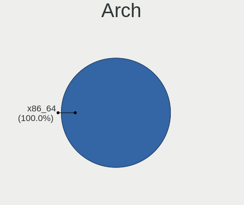
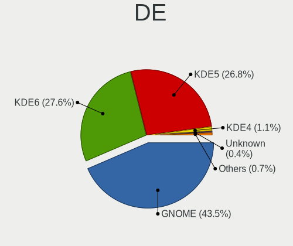
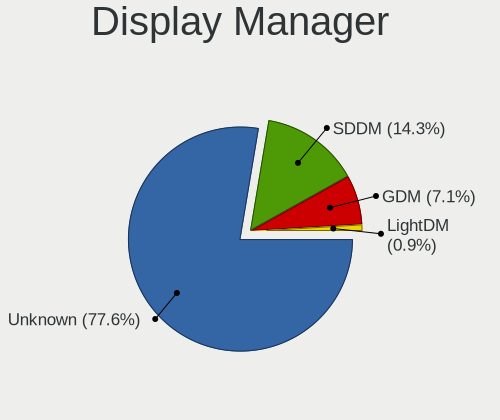
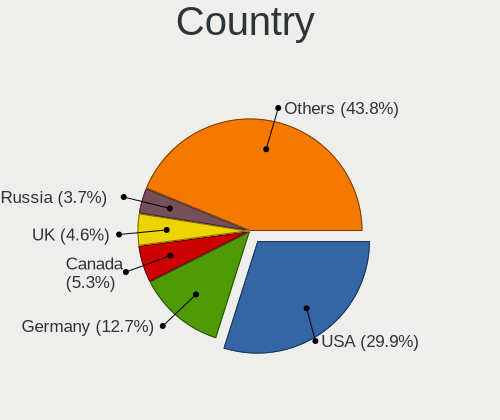
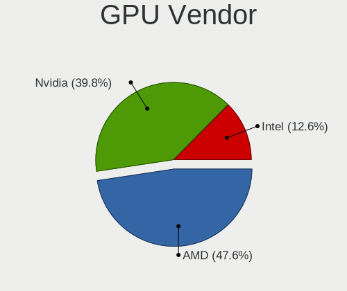
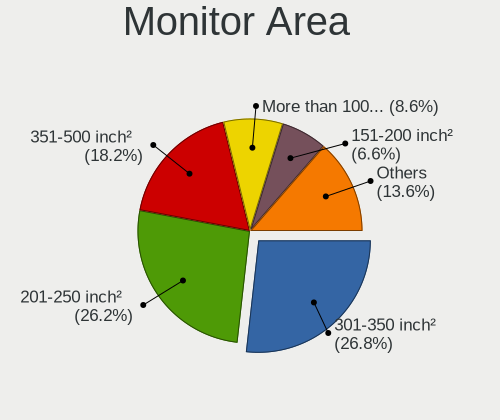
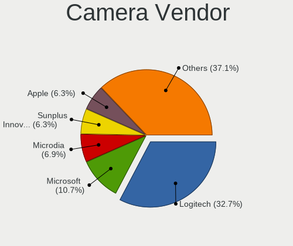

Nobara - Tested Hardware & Statistics (Desktops)
------------------------------------------------

A project to collect tested hardware configurations for Nobara.

Anyone can contribute to this report by the [hw-probe](https://github.com/linuxhw/hw-probe) tool:

    sudo -E hw-probe -all -upload

Please contribute! Especially if your hardware is rare.

Contents
--------

* [ Test Cases ](#test-cases)

* [ System ](#system)
  - [ OS                       ](#os)
  - [ OS Family                ](#os-family)
  - [ Kernel                   ](#kernel)
  - [ Kernel Family            ](#kernel-family)
  - [ Kernel Major Ver.        ](#kernel-major-ver)
  - [ Arch                     ](#arch)
  - [ DE                       ](#de)
  - [ Display Server           ](#display-server)
  - [ Display Manager          ](#display-manager)
  - [ OS Lang                  ](#os-lang)
  - [ Boot Mode                ](#boot-mode)
  - [ Filesystem               ](#filesystem)
  - [ Part. scheme             ](#part-scheme)
  - [ Dual Boot with Linux/BSD ](#dual-boot-with-linuxbsd)
  - [ Dual Boot (Win)          ](#dual-boot-win)

* [ Board ](#board)
  - [ Vendor                   ](#vendor)
  - [ Model                    ](#model)
  - [ Model Family             ](#model-family)
  - [ MFG Year                 ](#mfg-year)
  - [ Form Factor              ](#form-factor)
  - [ Secure Boot              ](#secure-boot)
  - [ Coreboot                 ](#coreboot)
  - [ RAM Size                 ](#ram-size)
  - [ RAM Used                 ](#ram-used)
  - [ Total Drives             ](#total-drives)
  - [ Has CD-ROM               ](#has-cd-rom)
  - [ Has Ethernet             ](#has-ethernet)
  - [ Has WiFi                 ](#has-wifi)
  - [ Has Bluetooth            ](#has-bluetooth)

* [ Location ](#location)
  - [ Country                  ](#country)
  - [ City                     ](#city)

* [ Drives ](#drives)
  - [ Drive Vendor             ](#drive-vendor)
  - [ Drive Model              ](#drive-model)
  - [ HDD Vendor               ](#hdd-vendor)
  - [ SSD Vendor               ](#ssd-vendor)
  - [ Drive Kind               ](#drive-kind)
  - [ Drive Connector          ](#drive-connector)
  - [ Drive Size               ](#drive-size)
  - [ Space Total              ](#space-total)
  - [ Space Used               ](#space-used)
  - [ Malfunc. Drives          ](#malfunc-drives)
  - [ Malfunc. Drive Vendor    ](#malfunc-drive-vendor)
  - [ Malfunc. HDD Vendor      ](#malfunc-hdd-vendor)
  - [ Malfunc. Drive Kind      ](#malfunc-drive-kind)
  - [ Failed Drives            ](#failed-drives)
  - [ Failed Drive Vendor      ](#failed-drive-vendor)
  - [ Drive Status             ](#drive-status)

* [ Storage controller ](#storage-controller)
  - [ Storage Vendor           ](#storage-vendor)
  - [ Storage Model            ](#storage-model)
  - [ Storage Kind             ](#storage-kind)

* [ Processor ](#processor)
  - [ CPU Vendor               ](#cpu-vendor)
  - [ CPU Model                ](#cpu-model)
  - [ CPU Model Family         ](#cpu-model-family)
  - [ CPU Cores                ](#cpu-cores)
  - [ CPU Sockets              ](#cpu-sockets)
  - [ CPU Threads              ](#cpu-threads)
  - [ CPU Op-Modes             ](#cpu-op-modes)
  - [ CPU Microcode            ](#cpu-microcode)
  - [ CPU Microarch            ](#cpu-microarch)

* [ Graphics ](#graphics)
  - [ GPU Vendor               ](#gpu-vendor)
  - [ GPU Model                ](#gpu-model)
  - [ GPU Combo                ](#gpu-combo)
  - [ GPU Driver               ](#gpu-driver)
  - [ GPU Memory               ](#gpu-memory)

* [ Monitor ](#monitor)
  - [ Monitor Vendor           ](#monitor-vendor)
  - [ Monitor Model            ](#monitor-model)
  - [ Monitor Resolution       ](#monitor-resolution)
  - [ Monitor Diagonal         ](#monitor-diagonal)
  - [ Monitor Width            ](#monitor-width)
  - [ Aspect Ratio             ](#aspect-ratio)
  - [ Monitor Area             ](#monitor-area)
  - [ Pixel Density            ](#pixel-density)
  - [ Multiple Monitors        ](#multiple-monitors)

* [ Network ](#network)
  - [ Net Controller Vendor    ](#net-controller-vendor)
  - [ Net Controller Model     ](#net-controller-model)
  - [ Wireless Vendor          ](#wireless-vendor)
  - [ Wireless Model           ](#wireless-model)
  - [ Ethernet Vendor          ](#ethernet-vendor)
  - [ Ethernet Model           ](#ethernet-model)
  - [ Net Controller Kind      ](#net-controller-kind)
  - [ Used Controller          ](#used-controller)
  - [ NICs                     ](#nics)
  - [ IPv6                     ](#ipv6)

* [ Bluetooth ](#bluetooth)
  - [ Bluetooth Vendor         ](#bluetooth-vendor)
  - [ Bluetooth Model          ](#bluetooth-model)

* [ Sound ](#sound)
  - [ Sound Vendor             ](#sound-vendor)
  - [ Sound Model              ](#sound-model)

* [ Memory ](#memory)
  - [ Memory Vendor            ](#memory-vendor)
  - [ Memory Model             ](#memory-model)
  - [ Memory Kind              ](#memory-kind)
  - [ Memory Form Factor       ](#memory-form-factor)
  - [ Memory Size              ](#memory-size)
  - [ Memory Speed             ](#memory-speed)

* [ Printers & scanners ](#printers--scanners)
  - [ Printer Vendor           ](#printer-vendor)
  - [ Printer Model            ](#printer-model)
  - [ Scanner Vendor           ](#scanner-vendor)
  - [ Scanner Model            ](#scanner-model)

* [ Camera ](#camera)
  - [ Camera Vendor            ](#camera-vendor)
  - [ Camera Model             ](#camera-model)

* [ Security ](#security)
  - [ Fingerprint Vendor       ](#fingerprint-vendor)
  - [ Fingerprint Model        ](#fingerprint-model)
  - [ Chipcard Vendor          ](#chipcard-vendor)
  - [ Chipcard Model           ](#chipcard-model)

* [ Unsupported ](#unsupported)
  - [ Unsupported Devices      ](#unsupported-devices)
  - [ Unsupported Device Types ](#unsupported-device-types)

Test Cases
----------

Total: 518

| Vendor        | Model                       | Probe                                                      | Date         |
|---------------|-----------------------------|------------------------------------------------------------|--------------|
| MSI           | B550-A PRO                  | [64a00841b2](https://linux-hardware.org/?probe=64a00841b2) | Dec 23, 2023 |
| MSI           | PRO B650M-A WIFI            | [4adc5f3f81](https://linux-hardware.org/?probe=4adc5f3f81) | Dec 22, 2023 |
| Alienware     | 0P0JWX A00                  | [99d0e56ef1](https://linux-hardware.org/?probe=99d0e56ef1) | Dec 22, 2023 |
| HP            | 83E0                        | [07e6f563f9](https://linux-hardware.org/?probe=07e6f563f9) | Dec 22, 2023 |
| ASUSTek       | B85-PLUS                    | [58a2ef76f9](https://linux-hardware.org/?probe=58a2ef76f9) | Dec 22, 2023 |
| MSI           | B250M PRO-VD                | [1a4d75f062](https://linux-hardware.org/?probe=1a4d75f062) | Dec 22, 2023 |
| MSI           | H81M-E34                    | [4b1991c655](https://linux-hardware.org/?probe=4b1991c655) | Dec 21, 2023 |
| ASUSTek       | Pro B550M-C                 | [4e3b422400](https://linux-hardware.org/?probe=4e3b422400) | Dec 19, 2023 |
| MSI           | B250M PRO-VD                | [925bd9bbac](https://linux-hardware.org/?probe=925bd9bbac) | Dec 19, 2023 |
| ASUSTek       | Pro B550M-C                 | [1cd7c1b629](https://linux-hardware.org/?probe=1cd7c1b629) | Dec 19, 2023 |
| ASUSTek       | ROG STRIX X570-E GAMING     | [c2a8ace4dd](https://linux-hardware.org/?probe=c2a8ace4dd) | Dec 18, 2023 |
| ASRock        | B460 Phantom Gaming 4       | [8a69294494](https://linux-hardware.org/?probe=8a69294494) | Dec 17, 2023 |
| MSI           | MAG B650 TOMAHAWK WIFI      | [ec58c18087](https://linux-hardware.org/?probe=ec58c18087) | Dec 17, 2023 |
| Gigabyte      | H310M A-CF                  | [cdf7a1ffd4](https://linux-hardware.org/?probe=cdf7a1ffd4) | Dec 15, 2023 |
| MSI           | B450M PRO-M2 MAX            | [93e9419d49](https://linux-hardware.org/?probe=93e9419d49) | Dec 14, 2023 |
| MSI           | X470 GAMING PLUS MAX        | [5d1e9e6d47](https://linux-hardware.org/?probe=5d1e9e6d47) | Dec 13, 2023 |
| ASRock        | X570 Taichi                 | [e17d6cbfa7](https://linux-hardware.org/?probe=e17d6cbfa7) | Dec 12, 2023 |
| MACHINIST     | X99-K9 V2.0                 | [68ba082c42](https://linux-hardware.org/?probe=68ba082c42) | Dec 12, 2023 |
| MSI           | MAG B550 TOMAHAWK           | [dc0acbdb23](https://linux-hardware.org/?probe=dc0acbdb23) | Dec 10, 2023 |
| ASRock        | X99 Professional Gaming ... | [46be0f459d](https://linux-hardware.org/?probe=46be0f459d) | Dec 10, 2023 |
| AZW           | GTR V02                     | [ece705bc91](https://linux-hardware.org/?probe=ece705bc91) | Dec 09, 2023 |
| ASRock        | B450 Gaming-ITX/ac          | [9da65cd80e](https://linux-hardware.org/?probe=9da65cd80e) | Dec 07, 2023 |
| ASRock        | H61M-VG3                    | [acf5ffd938](https://linux-hardware.org/?probe=acf5ffd938) | Dec 06, 2023 |
| MSI           | X470 GAMING PLUS            | [5326fc7737](https://linux-hardware.org/?probe=5326fc7737) | Dec 06, 2023 |
| ASUSTek       | PRIME B450M-K               | [110604e0da](https://linux-hardware.org/?probe=110604e0da) | Dec 05, 2023 |
| ASRock        | H570 Steel Legend           | [e1478d8694](https://linux-hardware.org/?probe=e1478d8694) | Dec 03, 2023 |
| ASRock        | H570 Steel Legend           | [f1d29c75a0](https://linux-hardware.org/?probe=f1d29c75a0) | Dec 03, 2023 |
| HP            | 0B54h D                     | [bffc586a45](https://linux-hardware.org/?probe=bffc586a45) | Dec 02, 2023 |
| ASUSTek       | TUF B450M-PLUS GAMING       | [a5997eb3f2](https://linux-hardware.org/?probe=a5997eb3f2) | Dec 02, 2023 |
| Dell          | 0FDY5C A00                  | [0d5166b475](https://linux-hardware.org/?probe=0d5166b475) | Dec 02, 2023 |
| ASRock        | B450M Pro4                  | [f86124413d](https://linux-hardware.org/?probe=f86124413d) | Dec 01, 2023 |
| ASRock        | H310CM-DVS                  | [ec402bfe2f](https://linux-hardware.org/?probe=ec402bfe2f) | Nov 30, 2023 |
| Dell          | 0FDY5C A00                  | [2eaa838401](https://linux-hardware.org/?probe=2eaa838401) | Nov 30, 2023 |
| Acer          | Veriton N4680G              | [033223b8bc](https://linux-hardware.org/?probe=033223b8bc) | Nov 30, 2023 |
| MSI           | B450-A PRO MAX              | [6357a41a39](https://linux-hardware.org/?probe=6357a41a39) | Nov 30, 2023 |
| ASUSTek       | B85M-G R2.0                 | [11d3e45e2d](https://linux-hardware.org/?probe=11d3e45e2d) | Nov 29, 2023 |
| ASUSTek       | B85M-G R2.0                 | [d2dcb1f2da](https://linux-hardware.org/?probe=d2dcb1f2da) | Nov 29, 2023 |
| MSI           | B450 GAMING PLUS MAX        | [e5509bd1ba](https://linux-hardware.org/?probe=e5509bd1ba) | Nov 28, 2023 |
| ASUSTek       | Maximus VIII FORMULA        | [a39fba5394](https://linux-hardware.org/?probe=a39fba5394) | Nov 27, 2023 |
| Google        | Kench                       | [efdf5874c1](https://linux-hardware.org/?probe=efdf5874c1) | Nov 27, 2023 |
| MSI           | Z170A GAMING M5             | [ab44413728](https://linux-hardware.org/?probe=ab44413728) | Nov 26, 2023 |
| MSI           | PRO H610M-G DDR4            | [5c10f3d5a1](https://linux-hardware.org/?probe=5c10f3d5a1) | Nov 25, 2023 |
| MSI           | PRO H610M-G DDR4            | [05ba5178cb](https://linux-hardware.org/?probe=05ba5178cb) | Nov 25, 2023 |
| HP            | 8054                        | [dfa212d5da](https://linux-hardware.org/?probe=dfa212d5da) | Nov 25, 2023 |
| ASUSTek       | PRIME B450M-GAMING/BR       | [0f9d912f7f](https://linux-hardware.org/?probe=0f9d912f7f) | Nov 24, 2023 |
| MSI           | MAG X670E TOMAHAWK WIFI     | [c3b398c792](https://linux-hardware.org/?probe=c3b398c792) | Nov 24, 2023 |
| ASUSTek       | ROG STRIX B650E-I GAMING... | [2ab108f743](https://linux-hardware.org/?probe=2ab108f743) | Nov 22, 2023 |
| MSI           | MPG Z390 GAMING EDGE AC     | [639c2b7832](https://linux-hardware.org/?probe=639c2b7832) | Nov 20, 2023 |
| MSI           | PRO H610M-G DDR4            | [0d4fe4c2b9](https://linux-hardware.org/?probe=0d4fe4c2b9) | Nov 19, 2023 |
| ASUSTek       | TUF Z390-PLUS GAMING        | [db393353d9](https://linux-hardware.org/?probe=db393353d9) | Nov 18, 2023 |
| ASRock        | B550M Pro4                  | [c00a7584bf](https://linux-hardware.org/?probe=c00a7584bf) | Nov 18, 2023 |
| MSI           | B450M GAMING PLUS           | [038ffaab27](https://linux-hardware.org/?probe=038ffaab27) | Nov 13, 2023 |
| MSI           | MPG B550 GAMING PLUS        | [404f1947fd](https://linux-hardware.org/?probe=404f1947fd) | Nov 11, 2023 |
| Gigabyte      | GA-78LMT-USB3               | [993c65a274](https://linux-hardware.org/?probe=993c65a274) | Nov 06, 2023 |
| Gigabyte      | 970A-DS3P FX                | [615e914ddd](https://linux-hardware.org/?probe=615e914ddd) | Nov 05, 2023 |
| Gigabyte      | 970A-DS3P FX                | [7ba5de3dfd](https://linux-hardware.org/?probe=7ba5de3dfd) | Nov 05, 2023 |
| ASRock        | B450M-HDV R4.0              | [c17ad7033c](https://linux-hardware.org/?probe=c17ad7033c) | Nov 05, 2023 |
| ASRock        | X470 Taichi Ultimate        | [2b9b1f909c](https://linux-hardware.org/?probe=2b9b1f909c) | Nov 05, 2023 |
| ASUSTek       | PRIME Z370-P II             | [701314a2ff](https://linux-hardware.org/?probe=701314a2ff) | Nov 04, 2023 |
| ASUSTek       | ROG STRIX X570-E GAMING     | [119816ea7d](https://linux-hardware.org/?probe=119816ea7d) | Nov 04, 2023 |
| ASUSTek       | TUF B450M-PLUS GAMING       | [6d39c4f814](https://linux-hardware.org/?probe=6d39c4f814) | Nov 03, 2023 |
| ASUSTek       | TUF B450M-PLUS GAMING       | [e928da88d7](https://linux-hardware.org/?probe=e928da88d7) | Nov 03, 2023 |
| MSI           | MPG B550 GAMING PLUS        | [72a2946c83](https://linux-hardware.org/?probe=72a2946c83) | Nov 01, 2023 |
| Gigabyte      | X670 AORUS ELITE AX         | [8161abddda](https://linux-hardware.org/?probe=8161abddda) | Nov 01, 2023 |
| AOpen         | iBDWMUx-MD R1.04            | [5b82a04d09](https://linux-hardware.org/?probe=5b82a04d09) | Oct 31, 2023 |
| ASRock        | B450M-HDV R4.0              | [d9da25aaae](https://linux-hardware.org/?probe=d9da25aaae) | Oct 31, 2023 |
| ASUSTek       | P8H77-M                     | [d40277c6b4](https://linux-hardware.org/?probe=d40277c6b4) | Oct 30, 2023 |
| MSI           | H310M PRO-VDH PLUS          | [9dad78d2eb](https://linux-hardware.org/?probe=9dad78d2eb) | Oct 27, 2023 |
| Gigabyte      | Z77-D3H                     | [2355d71878](https://linux-hardware.org/?probe=2355d71878) | Oct 25, 2023 |
| Gigabyte      | B550I AORUS PRO AX          | [38cbc0d5d7](https://linux-hardware.org/?probe=38cbc0d5d7) | Oct 24, 2023 |
| ASUSTek       | ROG STRIX X570-E GAMING     | [29adbcb90f](https://linux-hardware.org/?probe=29adbcb90f) | Oct 24, 2023 |
| Gigabyte      | H77-D3H                     | [2c786f10b7](https://linux-hardware.org/?probe=2c786f10b7) | Oct 22, 2023 |
| Gigabyte      | H77-D3H                     | [7b1e876aef](https://linux-hardware.org/?probe=7b1e876aef) | Oct 22, 2023 |
| AOpen         | iBDWMUx-MD R1.04            | [72d780f5f7](https://linux-hardware.org/?probe=72d780f5f7) | Oct 22, 2023 |
| MSI           | Z170A PC MATE               | [2f2798b05c](https://linux-hardware.org/?probe=2f2798b05c) | Oct 22, 2023 |
| ASUSTek       | TUF B450M-PLUS GAMING       | [4a7b98d45e](https://linux-hardware.org/?probe=4a7b98d45e) | Oct 18, 2023 |
| MSI           | B350 PC MATE                | [a4661384e1](https://linux-hardware.org/?probe=a4661384e1) | Oct 17, 2023 |
| ASUSTek       | PRIME B450M-GAMING/BR       | [fb2bf1baa8](https://linux-hardware.org/?probe=fb2bf1baa8) | Oct 16, 2023 |
| MSI           | MPG X570 GAMING EDGE WIF... | [a116875c3f](https://linux-hardware.org/?probe=a116875c3f) | Oct 15, 2023 |
| Pegatron      | 2AB6                        | [9f5a8c985a](https://linux-hardware.org/?probe=9f5a8c985a) | Oct 15, 2023 |
| Pegatron      | 2AB6                        | [6f3a56878d](https://linux-hardware.org/?probe=6f3a56878d) | Oct 15, 2023 |
| ASRock        | X670E PG Lightning          | [d2e0e9fc07](https://linux-hardware.org/?probe=d2e0e9fc07) | Oct 14, 2023 |
| Gigabyte      | X570 AORUS ELITE            | [dc82ec9351](https://linux-hardware.org/?probe=dc82ec9351) | Oct 11, 2023 |
| ASUSTek       | TUF Gaming A620M-PLUS WI... | [15d9d16ec9](https://linux-hardware.org/?probe=15d9d16ec9) | Oct 09, 2023 |
| Biostar       | A320MH                      | [9623471fc7](https://linux-hardware.org/?probe=9623471fc7) | Oct 09, 2023 |
| Gigabyte      | B550 GAMING X V2            | [06f03211a6](https://linux-hardware.org/?probe=06f03211a6) | Oct 06, 2023 |
| Gigabyte      | B760 GAMING X DDR4          | [811561ec05](https://linux-hardware.org/?probe=811561ec05) | Oct 04, 2023 |
| ASUSTek       | TUF Gaming X570-PLUS        | [d3e6e2aa83](https://linux-hardware.org/?probe=d3e6e2aa83) | Oct 03, 2023 |
| ASUSTek       | ROG Maximus XI HERO         | [78c54897a1](https://linux-hardware.org/?probe=78c54897a1) | Oct 02, 2023 |
| ASUSTek       | TUF Gaming B550M-PLUS       | [288f5f8266](https://linux-hardware.org/?probe=288f5f8266) | Sep 30, 2023 |
| Pegatron      | 2AB6                        | [4bb43a39c1](https://linux-hardware.org/?probe=4bb43a39c1) | Sep 29, 2023 |
| HP            | 8906 SMVB                   | [55c34c64a6](https://linux-hardware.org/?probe=55c34c64a6) | Sep 27, 2023 |
| ASUSTek       | ROG STRIX Z690-E GAMING ... | [c33d31195f](https://linux-hardware.org/?probe=c33d31195f) | Sep 26, 2023 |
| ASUSTek       | TUF B450M-PLUS GAMING       | [5043f41a8d](https://linux-hardware.org/?probe=5043f41a8d) | Sep 20, 2023 |
| AZW           | GTR V02                     | [2d4817f092](https://linux-hardware.org/?probe=2d4817f092) | Sep 18, 2023 |
| ASUSTek       | ROG STRIX B550-F GAMING ... | [27763442c0](https://linux-hardware.org/?probe=27763442c0) | Sep 16, 2023 |
| MSI           | MPG X570 GAMING EDGE WIF... | [52f0ac41db](https://linux-hardware.org/?probe=52f0ac41db) | Sep 14, 2023 |
| ASUSTek       | ROG CROSSHAIR VIII FORMU... | [caf0257156](https://linux-hardware.org/?probe=caf0257156) | Sep 13, 2023 |
| ASUSTek       | ROG CROSSHAIR X670E GENE    | [b9f46a8a9b](https://linux-hardware.org/?probe=b9f46a8a9b) | Sep 12, 2023 |
| ASUSTek       | TUF Z390-PLUS GAMING        | [f818765b79](https://linux-hardware.org/?probe=f818765b79) | Sep 10, 2023 |
| ASUSTek       | ROG STRIX B550-F GAMING     | [3857377d7a](https://linux-hardware.org/?probe=3857377d7a) | Sep 09, 2023 |
| ASRock        | B460 Phantom Gaming 4       | [6521407977](https://linux-hardware.org/?probe=6521407977) | Sep 06, 2023 |
| MSI           | MPG B650I EDGE WIFI         | [b395463f0e](https://linux-hardware.org/?probe=b395463f0e) | Sep 06, 2023 |
| Gigabyte      | B550M K                     | [95d0f9505b](https://linux-hardware.org/?probe=95d0f9505b) | Sep 03, 2023 |
| MSI           | PRO X670-P WIFI             | [174cff0e19](https://linux-hardware.org/?probe=174cff0e19) | Sep 02, 2023 |
| MSI           | B450 TOMAHAWK MAX           | [07a44c323f](https://linux-hardware.org/?probe=07a44c323f) | Sep 01, 2023 |
| Pegatron      | 2AB6                        | [a0649549b3](https://linux-hardware.org/?probe=a0649549b3) | Sep 01, 2023 |
| ASUSTek       | TUF Gaming X570-PLUS        | [c865cde7a2](https://linux-hardware.org/?probe=c865cde7a2) | Sep 01, 2023 |
| ASRock        | Z490M Pro4                  | [e07d4a9c90](https://linux-hardware.org/?probe=e07d4a9c90) | Aug 30, 2023 |
| MSI           | Z170A GAMING M3             | [cdbff2ba81](https://linux-hardware.org/?probe=cdbff2ba81) | Aug 28, 2023 |
| Gigabyte      | H410M H                     | [a4fe691c36](https://linux-hardware.org/?probe=a4fe691c36) | Aug 28, 2023 |
| ASRock        | B650 PG Lightning           | [de1d12ec95](https://linux-hardware.org/?probe=de1d12ec95) | Aug 24, 2023 |
| Gigabyte      | H310M H x.x                 | [523acf034e](https://linux-hardware.org/?probe=523acf034e) | Aug 23, 2023 |
| MSI           | PRO X670-P WIFI             | [0887b2e549](https://linux-hardware.org/?probe=0887b2e549) | Aug 20, 2023 |
| Gigabyte      | X670 AORUS ELITE AX         | [f7d3395ffc](https://linux-hardware.org/?probe=f7d3395ffc) | Aug 18, 2023 |
| ASUSTek       | Pro B550M-C                 | [712bd65558](https://linux-hardware.org/?probe=712bd65558) | Aug 16, 2023 |
| Pegatron      | Benicia                     | [0ab394fa9e](https://linux-hardware.org/?probe=0ab394fa9e) | Aug 15, 2023 |
| ASUSTek       | CROSSHAIR VI HERO           | [e9b2347b46](https://linux-hardware.org/?probe=e9b2347b46) | Aug 14, 2023 |
| Gigabyte      | G1.Sniper M3-CF             | [f4d0fd6811](https://linux-hardware.org/?probe=f4d0fd6811) | Aug 12, 2023 |
| Gigabyte      | G1.Sniper M3-CF             | [a5681e12d3](https://linux-hardware.org/?probe=a5681e12d3) | Aug 12, 2023 |
| ASUSTek       | ROG CROSSHAIR X670E GENE    | [f016fa3756](https://linux-hardware.org/?probe=f016fa3756) | Aug 11, 2023 |
| ASRock        | B550 Phantom Gaming-ITX/... | [d490bb32ec](https://linux-hardware.org/?probe=d490bb32ec) | Aug 10, 2023 |
| ASRock        | B550 Phantom Gaming-ITX/... | [fffee60e72](https://linux-hardware.org/?probe=fffee60e72) | Aug 10, 2023 |
| MSI           | B450 GAMING PLUS MAX        | [d9c999ffa3](https://linux-hardware.org/?probe=d9c999ffa3) | Aug 08, 2023 |
| Lenovo        | 3717 SDK0J40700 WIN 3258... | [f7c7290847](https://linux-hardware.org/?probe=f7c7290847) | Aug 08, 2023 |
| Lenovo        | 3717 SDK0J40700 WIN 3258... | [9a0fa703d7](https://linux-hardware.org/?probe=9a0fa703d7) | Aug 07, 2023 |
| Gigabyte      | Z270P-D3-CF                 | [ec7fa20ab4](https://linux-hardware.org/?probe=ec7fa20ab4) | Aug 06, 2023 |
| ASRock        | B550M Steel Legend          | [d9107b9cb9](https://linux-hardware.org/?probe=d9107b9cb9) | Aug 06, 2023 |
| MSI           | FM2-A55M-E33                | [28384fb38c](https://linux-hardware.org/?probe=28384fb38c) | Aug 06, 2023 |
| Gigabyte      | Z270P-D3-CF                 | [5ec7de1222](https://linux-hardware.org/?probe=5ec7de1222) | Aug 06, 2023 |
| MSI           | PRO X670-P WIFI             | [cd0d64a16a](https://linux-hardware.org/?probe=cd0d64a16a) | Aug 03, 2023 |
| ASUSTek       | ROG STRIX B550-F GAMING     | [53c9161fc5](https://linux-hardware.org/?probe=53c9161fc5) | Aug 03, 2023 |
| AOpen         | iBDWMUx-MD R1.04            | [18dad15a33](https://linux-hardware.org/?probe=18dad15a33) | Aug 02, 2023 |
| MSI           | MAG Z790 TOMAHAWK WIFI      | [ceb7e754a1](https://linux-hardware.org/?probe=ceb7e754a1) | Aug 02, 2023 |
| ASRock        | Z170 Extreme6+              | [84c1a14a56](https://linux-hardware.org/?probe=84c1a14a56) | Aug 01, 2023 |
| Gigabyte      | B75M-D3H                    | [3aeae112c3](https://linux-hardware.org/?probe=3aeae112c3) | Jul 31, 2023 |
| NZXT          | N7 B650E                    | [38e481c3d5](https://linux-hardware.org/?probe=38e481c3d5) | Jul 29, 2023 |
| Gigabyte      | X570 AORUS MASTER           | [513ac15990](https://linux-hardware.org/?probe=513ac15990) | Jul 28, 2023 |
| MSI           | PRO Z690-A WIFI DDR4        | [c9c42e4857](https://linux-hardware.org/?probe=c9c42e4857) | Jul 26, 2023 |
| ASUSTek       | X99-DELUXE II               | [35f41c1327](https://linux-hardware.org/?probe=35f41c1327) | Jul 25, 2023 |
| ASUSTek       | CROSSHAIR VI HERO           | [567693892b](https://linux-hardware.org/?probe=567693892b) | Jul 23, 2023 |
| ASUSTek       | ROG STRIX Z690-E GAMING ... | [228ded2955](https://linux-hardware.org/?probe=228ded2955) | Jul 21, 2023 |
| ASUSTek       | TUF Gaming X670E-PLUS WI... | [5f9962eafc](https://linux-hardware.org/?probe=5f9962eafc) | Jul 21, 2023 |
| MSI           | B450M PRO-M2 V2             | [2109b6ace6](https://linux-hardware.org/?probe=2109b6ace6) | Jul 21, 2023 |
| ASUSTek       | TUF Gaming X670E-PLUS WI... | [022d677eda](https://linux-hardware.org/?probe=022d677eda) | Jul 21, 2023 |
| MSI           | B450M BAZOOKA MAX WIFI      | [25311760a9](https://linux-hardware.org/?probe=25311760a9) | Jul 21, 2023 |
| ASRock        | Z170 Extreme6+              | [5ead4ab228](https://linux-hardware.org/?probe=5ead4ab228) | Jul 17, 2023 |
| HP            | 8906 SMVB                   | [70b7e2a7f5](https://linux-hardware.org/?probe=70b7e2a7f5) | Jul 16, 2023 |
| ASRock        | H370 Performance            | [43286f18d3](https://linux-hardware.org/?probe=43286f18d3) | Jul 16, 2023 |
| HP            | 3396                        | [5713dca497](https://linux-hardware.org/?probe=5713dca497) | Jul 15, 2023 |
| Gigabyte      | X399 DESIGNARE EX-CF        | [d8550d27e3](https://linux-hardware.org/?probe=d8550d27e3) | Jul 15, 2023 |
| MSI           | MAG X570S TOMAHAWK MAX W... | [7026c5b007](https://linux-hardware.org/?probe=7026c5b007) | Jul 14, 2023 |
| MSI           | MAG X570S TOMAHAWK MAX W... | [8e3cc576fd](https://linux-hardware.org/?probe=8e3cc576fd) | Jul 14, 2023 |
| MSI           | PRO Z690-A WIFI             | [d20f9ee7a7](https://linux-hardware.org/?probe=d20f9ee7a7) | Jul 14, 2023 |
| MSI           | Z87-G45 GAMING              | [110a53c220](https://linux-hardware.org/?probe=110a53c220) | Jul 13, 2023 |
| ASUSTek       | TUF Gaming X670E-PLUS       | [e612d95542](https://linux-hardware.org/?probe=e612d95542) | Jul 12, 2023 |
| Unknown       | EA A520M-E                  | [184201d556](https://linux-hardware.org/?probe=184201d556) | Jul 12, 2023 |
| ASUSTek       | TUF Gaming X570-PLUS_BR     | [0e411803b2](https://linux-hardware.org/?probe=0e411803b2) | Jul 10, 2023 |
| Acidanther... | Mac-27AD2F918AE68F61 Mac... | [429e4e7636](https://linux-hardware.org/?probe=429e4e7636) | Jul 10, 2023 |
| Acer          | Nitro N50-620               | [8286ddb9ae](https://linux-hardware.org/?probe=8286ddb9ae) | Jul 08, 2023 |
| Shenzhen M... | F6BFC                       | [f4f1e6f9ff](https://linux-hardware.org/?probe=f4f1e6f9ff) | Jul 05, 2023 |
| GPD           | G1618-03                    | [0cb58087bf](https://linux-hardware.org/?probe=0cb58087bf) | Jul 04, 2023 |
| Gigabyte      | B550M DS3H AC               | [626416c230](https://linux-hardware.org/?probe=626416c230) | Jul 03, 2023 |
| Gigabyte      | X570 AORUS ELITE            | [ff0f73c325](https://linux-hardware.org/?probe=ff0f73c325) | Jul 02, 2023 |
| Gigabyte      | X670 GAMING X AX            | [e7e4a3562f](https://linux-hardware.org/?probe=e7e4a3562f) | Jul 02, 2023 |
| MSI           | B450 GAMING PLUS MAX        | [488ebd160a](https://linux-hardware.org/?probe=488ebd160a) | Jul 02, 2023 |
| ASRock        | X299 Taichi CLX             | [ff1f31ff36](https://linux-hardware.org/?probe=ff1f31ff36) | Jul 01, 2023 |
| ASRock        | X299 Taichi CLX             | [d4362fb3ca](https://linux-hardware.org/?probe=d4362fb3ca) | Jul 01, 2023 |
| ASUSTek       | ROG CROSSHAIR X670E GENE    | [c93f4f0d0b](https://linux-hardware.org/?probe=c93f4f0d0b) | Jun 30, 2023 |
| MSI           | MAG Z690 TOMAHAWK WIFI D... | [5b780b9ebd](https://linux-hardware.org/?probe=5b780b9ebd) | Jun 24, 2023 |
| ASRock        | B85M Pro4                   | [0ee3f7532c](https://linux-hardware.org/?probe=0ee3f7532c) | Jun 23, 2023 |
| ASUSTek       | ROG STRIX Z590-E GAMING ... | [379c36642b](https://linux-hardware.org/?probe=379c36642b) | Jun 22, 2023 |
| AOpen         | iBDWMUx-MD R1.04            | [2656caf6b8](https://linux-hardware.org/?probe=2656caf6b8) | Jun 22, 2023 |
| MSI           | H81M-E34                    | [ac0a9c170f](https://linux-hardware.org/?probe=ac0a9c170f) | Jun 22, 2023 |
| MSI           | H81M-E34                    | [666f5d0ce5](https://linux-hardware.org/?probe=666f5d0ce5) | Jun 22, 2023 |
| MSI           | B450 GAMING PRO CARBON A... | [0f5435c665](https://linux-hardware.org/?probe=0f5435c665) | Jun 22, 2023 |
| ASRock        | Z370 Gaming-ITX/ac          | [e05a90c6c5](https://linux-hardware.org/?probe=e05a90c6c5) | Jun 16, 2023 |
| HP            | 8054                        | [97a4b34236](https://linux-hardware.org/?probe=97a4b34236) | Jun 15, 2023 |
| ASRock        | X470 Master SLI             | [448a3cf6b1](https://linux-hardware.org/?probe=448a3cf6b1) | Jun 15, 2023 |
| ASRock        | B650E Steel Legend WiFi     | [3edca35793](https://linux-hardware.org/?probe=3edca35793) | Jun 14, 2023 |
| ASUSTek       | PRIME B760M-A WIFI D4       | [6febc3ef2e](https://linux-hardware.org/?probe=6febc3ef2e) | Jun 13, 2023 |
| MSI           | MAG B550M MORTAR WIFI       | [6491127e6e](https://linux-hardware.org/?probe=6491127e6e) | Jun 09, 2023 |
| ASRock        | B450 Steel Legend           | [483ac7223f](https://linux-hardware.org/?probe=483ac7223f) | Jun 08, 2023 |
| ASUSTek       | ROG CROSSHAIR VII HERO      | [12736be80e](https://linux-hardware.org/?probe=12736be80e) | Jun 07, 2023 |
| MSI           | MPG X570 GAMING EDGE WIF... | [bc00b26e0a](https://linux-hardware.org/?probe=bc00b26e0a) | Jun 06, 2023 |
| MSI           | MPG X570 GAMING EDGE WIF... | [ee25039289](https://linux-hardware.org/?probe=ee25039289) | Jun 06, 2023 |
| Gigabyte      | B550 AORUS ELITE V2         | [43c70efbe7](https://linux-hardware.org/?probe=43c70efbe7) | Jun 05, 2023 |
| Gigabyte      | X570 AORUS PRO              | [efa9cac1df](https://linux-hardware.org/?probe=efa9cac1df) | Jun 04, 2023 |
| ASRock        | FM2A68M-DG3+                | [3e7ad22b6b](https://linux-hardware.org/?probe=3e7ad22b6b) | Jun 03, 2023 |
| MSI           | MPG X570 GAMING PLUS        | [9a91f8aedc](https://linux-hardware.org/?probe=9a91f8aedc) | Jun 02, 2023 |
| Lenovo        | 30D2 SDK0J40697 WIN 3305... | [259865e80e](https://linux-hardware.org/?probe=259865e80e) | Jun 01, 2023 |
| Gigabyte      | GA-78LMT-S2P                | [54b872a39b](https://linux-hardware.org/?probe=54b872a39b) | May 31, 2023 |
| ASRock        | B650E Steel Legend WiFi     | [88d16bf040](https://linux-hardware.org/?probe=88d16bf040) | May 31, 2023 |
| Dell          | 0J3C2F A02                  | [c2640c22ff](https://linux-hardware.org/?probe=c2640c22ff) | May 27, 2023 |
| HP            | 1497                        | [94f79f2f74](https://linux-hardware.org/?probe=94f79f2f74) | May 27, 2023 |
| HP            | 1497                        | [d2cca6c2a1](https://linux-hardware.org/?probe=d2cca6c2a1) | May 27, 2023 |
| Shenzhen M... | F7BFC                       | [6bf848e58f](https://linux-hardware.org/?probe=6bf848e58f) | May 25, 2023 |
| AOpen         | iBDWMUx-MD R1.04            | [cc674d2878](https://linux-hardware.org/?probe=cc674d2878) | May 25, 2023 |
| ASRock        | AB350M Pro4                 | [1efd2eb268](https://linux-hardware.org/?probe=1efd2eb268) | May 24, 2023 |
| Gigabyte      | B550 GAMING X V2            | [c43cfd04ad](https://linux-hardware.org/?probe=c43cfd04ad) | May 24, 2023 |
| Gigabyte      | X570S AORUS ELITE AX        | [0d3bc48240](https://linux-hardware.org/?probe=0d3bc48240) | May 23, 2023 |
| ASRock        | B650E Steel Legend WiFi     | [b034244bec](https://linux-hardware.org/?probe=b034244bec) | May 20, 2023 |
| langchao      | IPM41-D3                    | [2f659faa92](https://linux-hardware.org/?probe=2f659faa92) | May 20, 2023 |
| MSI           | PRO Z690-A DDR4             | [758f0dbd4b](https://linux-hardware.org/?probe=758f0dbd4b) | May 19, 2023 |
| ASUSTek       | PRIME X670-P WIFI           | [ca0ae58640](https://linux-hardware.org/?probe=ca0ae58640) | May 18, 2023 |
| ASUSTek       | ROG STRIX B550-F GAMING     | [fee6b2f55b](https://linux-hardware.org/?probe=fee6b2f55b) | May 17, 2023 |
| ASUSTek       | TUF B450M-PRO GAMING        | [dc2f3b9cdc](https://linux-hardware.org/?probe=dc2f3b9cdc) | May 17, 2023 |
| ASRock        | Z97 Pro3                    | [f8be8d5d2c](https://linux-hardware.org/?probe=f8be8d5d2c) | May 16, 2023 |
| ASRock        | Z97 Pro3                    | [34b2fb40b9](https://linux-hardware.org/?probe=34b2fb40b9) | May 13, 2023 |
| Gigabyte      | B550I AORUS PRO AX          | [bd6f8927b4](https://linux-hardware.org/?probe=bd6f8927b4) | May 12, 2023 |
| ASUSTek       | B85-PLUS                    | [9346ce422f](https://linux-hardware.org/?probe=9346ce422f) | May 11, 2023 |
| MSI           | PRO Z690-A DDR4             | [45c02c8b1b](https://linux-hardware.org/?probe=45c02c8b1b) | May 11, 2023 |
| ASUSTek       | P8B75-M LE                  | [2b0bc04757](https://linux-hardware.org/?probe=2b0bc04757) | May 10, 2023 |
| MSI           | X470 GAMING PLUS MAX        | [ebe0f52831](https://linux-hardware.org/?probe=ebe0f52831) | May 10, 2023 |
| MSI           | X470 GAMING PLUS MAX        | [aa31c3dd8f](https://linux-hardware.org/?probe=aa31c3dd8f) | May 09, 2023 |
| ASRock        | B550 Phantom Gaming-ITX/... | [c39e7fa08d](https://linux-hardware.org/?probe=c39e7fa08d) | May 09, 2023 |
| ASUSTek       | ROG STRIX B650E-F GAMING... | [dc1db599ea](https://linux-hardware.org/?probe=dc1db599ea) | May 09, 2023 |
| ASUSTek       | ROG STRIX B650E-I GAMING... | [e2ce1c3d6c](https://linux-hardware.org/?probe=e2ce1c3d6c) | May 07, 2023 |
| Gigabyte      | P43-ES3G                    | [1095d1ef7f](https://linux-hardware.org/?probe=1095d1ef7f) | May 06, 2023 |
| ASUSTek       | TUF Gaming B560M-PLUS       | [de65a79bf1](https://linux-hardware.org/?probe=de65a79bf1) | May 06, 2023 |
| ASUSTek       | TUF Gaming B560M-PLUS       | [4b76463d57](https://linux-hardware.org/?probe=4b76463d57) | May 06, 2023 |
| ASUSTek       | ROG STRIX B650E-I GAMING... | [b0a2a0b536](https://linux-hardware.org/?probe=b0a2a0b536) | May 06, 2023 |
| ASUSTek       | B85-PLUS                    | [352e8b2616](https://linux-hardware.org/?probe=352e8b2616) | May 03, 2023 |
| MSI           | B450 GAMING PLUS            | [017222d810](https://linux-hardware.org/?probe=017222d810) | May 02, 2023 |
| ASUSTek       | TUF Gaming B550M-PLUS WI... | [62d194e85e](https://linux-hardware.org/?probe=62d194e85e) | May 01, 2023 |
| ASUSTek       | TUF Gaming B550M-PLUS WI... | [e2acacabb3](https://linux-hardware.org/?probe=e2acacabb3) | Apr 30, 2023 |
| MSI           | B450 GAMING PLUS            | [8aa973e0f5](https://linux-hardware.org/?probe=8aa973e0f5) | Apr 30, 2023 |
| MSI           | PRO Z690-A DDR4             | [9419686ec7](https://linux-hardware.org/?probe=9419686ec7) | Apr 30, 2023 |
| MSI           | PRO Z690-A DDR4             | [1f61fda034](https://linux-hardware.org/?probe=1f61fda034) | Apr 30, 2023 |
| ASUSTek       | TUF Gaming B460-PLUS        | [b2616ea409](https://linux-hardware.org/?probe=b2616ea409) | Apr 28, 2023 |
| Gigabyte      | X570 AORUS ELITE WIFI       | [169e095fab](https://linux-hardware.org/?probe=169e095fab) | Apr 27, 2023 |
| ASUSTek       | TUF Gaming B550M-PLUS       | [c80b811f3e](https://linux-hardware.org/?probe=c80b811f3e) | Apr 27, 2023 |
| ASRock        | B550M Phantom Gaming 4      | [072b88204c](https://linux-hardware.org/?probe=072b88204c) | Apr 26, 2023 |
| ASUSTek       | TUF Gaming B550M-PLUS WI... | [f02e8339e9](https://linux-hardware.org/?probe=f02e8339e9) | Apr 25, 2023 |
| ASUSTek       | TUF Gaming B550M-PLUS WI... | [8de5e39740](https://linux-hardware.org/?probe=8de5e39740) | Apr 25, 2023 |
| MSI           | MAG Z690 TOMAHAWK WIFI D... | [e4064abe78](https://linux-hardware.org/?probe=e4064abe78) | Apr 24, 2023 |
| MSI           | X470 GAMING PLUS MAX        | [8db6f88fd3](https://linux-hardware.org/?probe=8db6f88fd3) | Apr 22, 2023 |
| ASUSTek       | TUF Gaming A520M-PLUS       | [28631c09aa](https://linux-hardware.org/?probe=28631c09aa) | Apr 22, 2023 |
| MSI           | MAG B650 TOMAHAWK WIFI      | [47831c9091](https://linux-hardware.org/?probe=47831c9091) | Apr 18, 2023 |
| Gigabyte      | B150M-D3H-CF                | [c248c05349](https://linux-hardware.org/?probe=c248c05349) | Apr 18, 2023 |
| MSI           | Z87M GAMING                 | [9552ef2174](https://linux-hardware.org/?probe=9552ef2174) | Apr 17, 2023 |
| HP            | 18E7                        | [ef0b00cf80](https://linux-hardware.org/?probe=ef0b00cf80) | Apr 17, 2023 |
| ASUSTek       | TUF Gaming Z690-PLUS WIF... | [d40208e7f6](https://linux-hardware.org/?probe=d40208e7f6) | Apr 17, 2023 |
| Protectli     | FW6 Ver                     | [7371569bbf](https://linux-hardware.org/?probe=7371569bbf) | Apr 15, 2023 |
| Dell          | 0KWVT8 A00                  | [d1084f0d90](https://linux-hardware.org/?probe=d1084f0d90) | Apr 15, 2023 |
| ASUSTek       | A68HM-K                     | [6419c7fb77](https://linux-hardware.org/?probe=6419c7fb77) | Apr 15, 2023 |
| Protectli     | FW6 Ver                     | [26db4eab1f](https://linux-hardware.org/?probe=26db4eab1f) | Apr 15, 2023 |
| MSI           | B450 GAMING PLUS            | [d49b1775be](https://linux-hardware.org/?probe=d49b1775be) | Apr 14, 2023 |
| Dell          | 0XR1GT A00                  | [1c8d776510](https://linux-hardware.org/?probe=1c8d776510) | Apr 13, 2023 |
| Dell          | 0XR1GT A00                  | [06e6f2f745](https://linux-hardware.org/?probe=06e6f2f745) | Apr 13, 2023 |
| Dell          | 0KWVT8 A00                  | [4cea64e81b](https://linux-hardware.org/?probe=4cea64e81b) | Apr 13, 2023 |
| ASUSTek       | PRIME B450M-A II            | [3e3a141713](https://linux-hardware.org/?probe=3e3a141713) | Apr 11, 2023 |
| HP            | 805F                        | [07bd1b4df7](https://linux-hardware.org/?probe=07bd1b4df7) | Apr 11, 2023 |
| HP            | 805F                        | [7863ff02eb](https://linux-hardware.org/?probe=7863ff02eb) | Apr 11, 2023 |
| MSI           | B450 GAMING PLUS            | [b35b8e1503](https://linux-hardware.org/?probe=b35b8e1503) | Apr 09, 2023 |
| Gigabyte      | G1.Sniper B5-CF             | [e0913458ee](https://linux-hardware.org/?probe=e0913458ee) | Apr 07, 2023 |
| Gigabyte      | B650 AORUS PRO AX           | [5a044a37f7](https://linux-hardware.org/?probe=5a044a37f7) | Apr 07, 2023 |
| Gigabyte      | B650 AORUS PRO AX           | [81a8d7a1fc](https://linux-hardware.org/?probe=81a8d7a1fc) | Apr 07, 2023 |
| Gigabyte      | B550 AORUS ELITE V2         | [c599e701fc](https://linux-hardware.org/?probe=c599e701fc) | Apr 06, 2023 |
| MSI           | B450 TOMAHAWK MAX           | [7aec6da94d](https://linux-hardware.org/?probe=7aec6da94d) | Apr 05, 2023 |
| ASUSTek       | TUF Gaming B550-PLUS        | [aa3b0a7d6f](https://linux-hardware.org/?probe=aa3b0a7d6f) | Apr 04, 2023 |
| MSI           | B450 GAMING PLUS            | [731bd99503](https://linux-hardware.org/?probe=731bd99503) | Apr 03, 2023 |
| Gigabyte      | Z77P-D3                     | [e97e71fc7a](https://linux-hardware.org/?probe=e97e71fc7a) | Apr 02, 2023 |
| Gigabyte      | Z77P-D3                     | [f96e01d74d](https://linux-hardware.org/?probe=f96e01d74d) | Apr 01, 2023 |
| MSI           | B450 GAMING PLUS            | [539137fb36](https://linux-hardware.org/?probe=539137fb36) | Apr 01, 2023 |
| ASUSTek       | B85M-G R2.0                 | [4434a1266b](https://linux-hardware.org/?probe=4434a1266b) | Mar 31, 2023 |
| ASUSTek       | B85M-G R2.0                 | [fbef2fe274](https://linux-hardware.org/?probe=fbef2fe274) | Mar 31, 2023 |
| MSI           | B450 TOMAHAWK MAX           | [d79127e48c](https://linux-hardware.org/?probe=d79127e48c) | Mar 31, 2023 |
| Intel         | X79                         | [c06125262b](https://linux-hardware.org/?probe=c06125262b) | Mar 31, 2023 |
| MSI           | MPG B550I GAMING EDGE WI... | [f0540604bc](https://linux-hardware.org/?probe=f0540604bc) | Mar 30, 2023 |
| MSI           | MPG B550I GAMING EDGE WI... | [1c575e8cb6](https://linux-hardware.org/?probe=1c575e8cb6) | Mar 30, 2023 |
| ASRock        | X470 Master SLI             | [e4d56ca8c8](https://linux-hardware.org/?probe=e4d56ca8c8) | Mar 28, 2023 |
| ASUSTek       | M3N78 PRO                   | [0f9abe9400](https://linux-hardware.org/?probe=0f9abe9400) | Mar 28, 2023 |
| MSI           | B450 GAMING PLUS            | [5242d56a0f](https://linux-hardware.org/?probe=5242d56a0f) | Mar 27, 2023 |
| MSI           | B550-A PRO                  | [ebb59fa31d](https://linux-hardware.org/?probe=ebb59fa31d) | Mar 27, 2023 |
| ASUSTek       | TUF Gaming B550-PLUS        | [b084807397](https://linux-hardware.org/?probe=b084807397) | Mar 26, 2023 |
| ASUSTek       | TUF Gaming B550-PLUS        | [bc38c5ed22](https://linux-hardware.org/?probe=bc38c5ed22) | Mar 26, 2023 |
| ASUSTek       | PRIME B450M-A               | [6601de8aae](https://linux-hardware.org/?probe=6601de8aae) | Mar 25, 2023 |
| ASUSTek       | TUF Gaming B550-PLUS        | [9240540b33](https://linux-hardware.org/?probe=9240540b33) | Mar 24, 2023 |
| Gigabyte      | GA-970A-DS3                 | [82a69c4ec6](https://linux-hardware.org/?probe=82a69c4ec6) | Mar 23, 2023 |
| ASRock        | B660M-ITX/ac                | [95687a223c](https://linux-hardware.org/?probe=95687a223c) | Mar 22, 2023 |
| Dell          | 0XR1GT A00                  | [0912041935](https://linux-hardware.org/?probe=0912041935) | Mar 21, 2023 |
| Dell          | 0XR1GT A00                  | [61e1c5eff9](https://linux-hardware.org/?probe=61e1c5eff9) | Mar 21, 2023 |
| ASRock        | X670E Steel Legend          | [7891e82ac4](https://linux-hardware.org/?probe=7891e82ac4) | Mar 17, 2023 |
| ASUSTek       | PRIME X370-PRO              | [ab4a88037a](https://linux-hardware.org/?probe=ab4a88037a) | Mar 16, 2023 |
| ASUSTek       | ROG STRIX B650E-E GAMING... | [37bf97e9b3](https://linux-hardware.org/?probe=37bf97e9b3) | Mar 16, 2023 |
| ASUSTek       | PRIME X370-PRO              | [23e21d1440](https://linux-hardware.org/?probe=23e21d1440) | Mar 15, 2023 |
| Gigabyte      | Z77P-D3                     | [34ad3eb730](https://linux-hardware.org/?probe=34ad3eb730) | Mar 15, 2023 |
| Gigabyte      | Z77P-D3                     | [06c53ecdec](https://linux-hardware.org/?probe=06c53ecdec) | Mar 15, 2023 |
| Intel         | DB85FL AAG89861-203         | [e17dae3447](https://linux-hardware.org/?probe=e17dae3447) | Mar 14, 2023 |
| Intel         | DB85FL AAG89861-203         | [f1004a32e1](https://linux-hardware.org/?probe=f1004a32e1) | Mar 14, 2023 |
| MSI           | X470 GAMING PLUS            | [727390b14d](https://linux-hardware.org/?probe=727390b14d) | Mar 14, 2023 |
| ASRock        | X670E Steel Legend          | [0eefdece9c](https://linux-hardware.org/?probe=0eefdece9c) | Mar 13, 2023 |
| Gigabyte      | Z390 AORUS ULTRA-CF         | [7320131972](https://linux-hardware.org/?probe=7320131972) | Mar 13, 2023 |
| ASUSTek       | PRIME Z690M-PLUS D4         | [e41f3ed4ab](https://linux-hardware.org/?probe=e41f3ed4ab) | Mar 13, 2023 |
| ASUSTek       | PRIME B450M-A               | [1ad75bea9c](https://linux-hardware.org/?probe=1ad75bea9c) | Mar 12, 2023 |
| ASRock        | X670E Steel Legend          | [3ec784f6be](https://linux-hardware.org/?probe=3ec784f6be) | Mar 11, 2023 |
| ASUSTek       | PRIME B450M-A               | [7ba7da9138](https://linux-hardware.org/?probe=7ba7da9138) | Mar 10, 2023 |
| MSI           | B450 GAMING PLUS            | [46b213149e](https://linux-hardware.org/?probe=46b213149e) | Mar 10, 2023 |
| ASUSTek       | ROG STRIX X470-F GAMING     | [3629efc5a5](https://linux-hardware.org/?probe=3629efc5a5) | Mar 08, 2023 |
| Dell          | 0773VG A01                  | [d954bdd915](https://linux-hardware.org/?probe=d954bdd915) | Mar 07, 2023 |
| ASRock        | H310M-HDV                   | [316510fe69](https://linux-hardware.org/?probe=316510fe69) | Mar 07, 2023 |
| Acer          | Aspire X1400                | [195337bbc6](https://linux-hardware.org/?probe=195337bbc6) | Mar 07, 2023 |
| ASUSTek       | PRIME B560M-A AC            | [21db48a23b](https://linux-hardware.org/?probe=21db48a23b) | Mar 06, 2023 |
| ASUSTek       | ROG STRIX B550-F GAMING     | [4eb7bea837](https://linux-hardware.org/?probe=4eb7bea837) | Mar 04, 2023 |
| ASUSTek       | ROG STRIX B550-F GAMING     | [1d24df340b](https://linux-hardware.org/?probe=1d24df340b) | Mar 04, 2023 |
| ASUSTek       | ROG STRIX B550-F GAMING     | [950e36afc7](https://linux-hardware.org/?probe=950e36afc7) | Mar 03, 2023 |
| MSI           | MPG Z390M GAMING EDGE AC    | [d0813971b9](https://linux-hardware.org/?probe=d0813971b9) | Feb 28, 2023 |
| ASRock        | B660M-ITX/ac                | [c2e600e445](https://linux-hardware.org/?probe=c2e600e445) | Feb 28, 2023 |
| ASRock        | B660M-ITX/ac                | [1efc15e2cc](https://linux-hardware.org/?probe=1efc15e2cc) | Feb 28, 2023 |
| MSI           | MPG X570 GAMING PRO CARB... | [15318beac5](https://linux-hardware.org/?probe=15318beac5) | Feb 27, 2023 |
| MSI           | Z170A-G45 GAMING            | [a5496030e7](https://linux-hardware.org/?probe=a5496030e7) | Feb 27, 2023 |
| ASUSTek       | ROG CROSSHAIR X670E EXTR... | [659ff1672e](https://linux-hardware.org/?probe=659ff1672e) | Feb 26, 2023 |
| ASUSTek       | P8Z77-M PRO                 | [92f1f7d3b5](https://linux-hardware.org/?probe=92f1f7d3b5) | Feb 26, 2023 |
| ASUSTek       | ROG STRIX X570-E GAMING ... | [101d8d4577](https://linux-hardware.org/?probe=101d8d4577) | Feb 25, 2023 |
| ASUSTek       | H97M-E                      | [b2ef9d5ede](https://linux-hardware.org/?probe=b2ef9d5ede) | Feb 21, 2023 |
| MSI           | B450 GAMING PRO CARBON M... | [fb4420dbc4](https://linux-hardware.org/?probe=fb4420dbc4) | Feb 20, 2023 |
| Gigabyte      | B550 AORUS ELITE V2         | [737c043ed7](https://linux-hardware.org/?probe=737c043ed7) | Feb 20, 2023 |
| ASUSTek       | TUF Gaming B550M-PLUS WI... | [2752a9660a](https://linux-hardware.org/?probe=2752a9660a) | Feb 19, 2023 |
| MSI           | PRO B660M-A WIFI DDR4       | [a62c4f0fcd](https://linux-hardware.org/?probe=a62c4f0fcd) | Feb 18, 2023 |
| MSI           | B550-A PRO                  | [e81d0741bb](https://linux-hardware.org/?probe=e81d0741bb) | Feb 17, 2023 |
| MSI           | B550-A PRO                  | [dd63e968bd](https://linux-hardware.org/?probe=dd63e968bd) | Feb 17, 2023 |
| ASUSTek       | PRIME B450M-A II            | [e486b2bb46](https://linux-hardware.org/?probe=e486b2bb46) | Feb 15, 2023 |
| Dell          | 0KWVT8 A02                  | [486f7258a6](https://linux-hardware.org/?probe=486f7258a6) | Feb 14, 2023 |
| Gigabyte      | X570 AORUS ELITE WIFI       | [dc91c0e32b](https://linux-hardware.org/?probe=dc91c0e32b) | Feb 14, 2023 |
| Dell          | 0KWVT8 A02                  | [c3d08b4f2e](https://linux-hardware.org/?probe=c3d08b4f2e) | Feb 13, 2023 |
| ASRock        | B650M PG Riptide            | [bf986cc448](https://linux-hardware.org/?probe=bf986cc448) | Feb 12, 2023 |
| ASUSTek       | PRIME X570-P                | [74d6af0f75](https://linux-hardware.org/?probe=74d6af0f75) | Feb 11, 2023 |
| MSI           | PRO Z690-A DDR4             | [caca2e6be1](https://linux-hardware.org/?probe=caca2e6be1) | Feb 11, 2023 |
| ASUSTek       | TUF Gaming B460-PLUS        | [afefa761d5](https://linux-hardware.org/?probe=afefa761d5) | Feb 09, 2023 |
| MSI           | B450M BAZOOKA MAX WIFI      | [fdaab67fe9](https://linux-hardware.org/?probe=fdaab67fe9) | Feb 09, 2023 |
| ASUSTek       | M5A78L-M PLUS/USB3          | [eece150870](https://linux-hardware.org/?probe=eece150870) | Feb 05, 2023 |
| ASUSTek       | TUF Gaming B460-PLUS        | [20086250d5](https://linux-hardware.org/?probe=20086250d5) | Feb 05, 2023 |
| ASUSTek       | TUF Gaming B460-PLUS        | [9905642762](https://linux-hardware.org/?probe=9905642762) | Feb 05, 2023 |
| ASUSTek       | ROG STRIX Z390-F GAMING     | [cbac9c37ba](https://linux-hardware.org/?probe=cbac9c37ba) | Feb 04, 2023 |
| MSI           | MAG B550 TOMAHAWK           | [8ae0d42e1a](https://linux-hardware.org/?probe=8ae0d42e1a) | Feb 03, 2023 |
| Gigabyte      | B550M AORUS ELITE           | [513dd8e40b](https://linux-hardware.org/?probe=513dd8e40b) | Feb 03, 2023 |
| MSI           | PRO Z690-A DDR4             | [5a7a0cf485](https://linux-hardware.org/?probe=5a7a0cf485) | Feb 03, 2023 |
| Gigabyte      | B360M AORUS Gaming 3-CF     | [7645e16594](https://linux-hardware.org/?probe=7645e16594) | Feb 03, 2023 |
| HP            | 834F                        | [394eb5f9cc](https://linux-hardware.org/?probe=394eb5f9cc) | Feb 02, 2023 |
| HP            | 8054                        | [36f5306e37](https://linux-hardware.org/?probe=36f5306e37) | Jan 30, 2023 |
| Gigabyte      | F2A88XM-D3H                 | [1605fbe62a](https://linux-hardware.org/?probe=1605fbe62a) | Jan 28, 2023 |
| ASUSTek       | ROG Maximus XI HERO         | [95f5d0904e](https://linux-hardware.org/?probe=95f5d0904e) | Jan 26, 2023 |
| MSI           | MAG B550 TOMAHAWK           | [c69db4d96f](https://linux-hardware.org/?probe=c69db4d96f) | Jan 24, 2023 |
| MSI           | B450 GAMING PLUS            | [bc95b86800](https://linux-hardware.org/?probe=bc95b86800) | Jan 22, 2023 |
| Gigabyte      | Z77-D3H                     | [9035a00600](https://linux-hardware.org/?probe=9035a00600) | Jan 22, 2023 |
| MSI           | MPG X570 GAMING PLUS        | [3eb7e4f3cf](https://linux-hardware.org/?probe=3eb7e4f3cf) | Jan 22, 2023 |
| MSI           | MPG Z390M GAMING EDGE AC    | [085d30a350](https://linux-hardware.org/?probe=085d30a350) | Jan 21, 2023 |
| MSI           | Z490-A PRO                  | [0a3fe4cb00](https://linux-hardware.org/?probe=0a3fe4cb00) | Jan 21, 2023 |
| ASUSTek       | ROG STRIX Z490-F GAMING     | [9a70fa222c](https://linux-hardware.org/?probe=9a70fa222c) | Jan 19, 2023 |
| Gigabyte      | B450 AORUS M                | [4d52b408c2](https://linux-hardware.org/?probe=4d52b408c2) | Jan 19, 2023 |
| MSI           | GF615M-P33                  | [bf838ee958](https://linux-hardware.org/?probe=bf838ee958) | Jan 18, 2023 |
| ASUSTek       | PRIME Z370-A                | [f215410f54](https://linux-hardware.org/?probe=f215410f54) | Jan 17, 2023 |
| ASUSTek       | Z97-A                       | [c1b01960be](https://linux-hardware.org/?probe=c1b01960be) | Jan 17, 2023 |
| ASRock        | B450 Gaming-ITX/ac          | [aade436557](https://linux-hardware.org/?probe=aade436557) | Jan 14, 2023 |
| ASUSTek       | ROG STRIX B650E-I GAMING... | [5b50555e06](https://linux-hardware.org/?probe=5b50555e06) | Jan 13, 2023 |
| ASUSTek       | P9X79 DELUXE                | [d73373e8e9](https://linux-hardware.org/?probe=d73373e8e9) | Jan 13, 2023 |
| ASUSTek       | TUF Gaming X570-PLUS        | [73da880450](https://linux-hardware.org/?probe=73da880450) | Jan 12, 2023 |
| HP            | 8054                        | [d4398dee29](https://linux-hardware.org/?probe=d4398dee29) | Jan 08, 2023 |
| MSI           | MAG B560M MORTAR WIFI       | [33f6781ba8](https://linux-hardware.org/?probe=33f6781ba8) | Jan 08, 2023 |
| ASUSTek       | ROG CROSSHAIR VIII HERO     | [c74a6daaaa](https://linux-hardware.org/?probe=c74a6daaaa) | Jan 07, 2023 |
| ASRock        | X470 Master SLI             | [c138f9159c](https://linux-hardware.org/?probe=c138f9159c) | Jan 07, 2023 |
| HP            | 1497                        | [71550a0f21](https://linux-hardware.org/?probe=71550a0f21) | Jan 07, 2023 |
| ASRock        | H77M-ITX                    | [fb6cbfce9a](https://linux-hardware.org/?probe=fb6cbfce9a) | Jan 06, 2023 |
| MSI           | B450 GAMING PLUS MAX        | [406b407b64](https://linux-hardware.org/?probe=406b407b64) | Jan 06, 2023 |
| ASUSTek       | PRIME B450M-A               | [61b7c0cda0](https://linux-hardware.org/?probe=61b7c0cda0) | Jan 06, 2023 |
| ASUSTek       | ROG STRIX B450-F GAMING     | [569f5cd751](https://linux-hardware.org/?probe=569f5cd751) | Jan 06, 2023 |
| Gigabyte      | B550M DS3H                  | [3978c4253f](https://linux-hardware.org/?probe=3978c4253f) | Jan 06, 2023 |
| ASUSTek       | G20AJ                       | [9be7e0b11f](https://linux-hardware.org/?probe=9be7e0b11f) | Jan 05, 2023 |
| ASUSTek       | TUF Gaming B550M-PLUS       | [b6bf9d074f](https://linux-hardware.org/?probe=b6bf9d074f) | Jan 05, 2023 |
| ASUSTek       | PRIME B550M-K               | [11d17c68b8](https://linux-hardware.org/?probe=11d17c68b8) | Jan 05, 2023 |
| MSI           | X470 GAMING PLUS MAX        | [7655f77ada](https://linux-hardware.org/?probe=7655f77ada) | Jan 04, 2023 |
| ASUSTek       | ROG CROSSHAIR VII HERO      | [6c40dc7dd6](https://linux-hardware.org/?probe=6c40dc7dd6) | Jan 03, 2023 |
| ASUSTek       | M5A88-M                     | [dc7201711c](https://linux-hardware.org/?probe=dc7201711c) | Dec 30, 2022 |
| ASUSTek       | ROG CROSSHAIR VII HERO      | [4ca2070d42](https://linux-hardware.org/?probe=4ca2070d42) | Dec 29, 2022 |
| ASUSTek       | PRIME Z270-P                | [b9e4ff3fea](https://linux-hardware.org/?probe=b9e4ff3fea) | Dec 25, 2022 |
| HP            | 1589                        | [4769414712](https://linux-hardware.org/?probe=4769414712) | Dec 24, 2022 |
| MSI           | MAG B550 TOMAHAWK           | [353cbeb5c8](https://linux-hardware.org/?probe=353cbeb5c8) | Dec 19, 2022 |
| Biostar       | X470GTN                     | [7c067277b2](https://linux-hardware.org/?probe=7c067277b2) | Dec 17, 2022 |
| ASUSTek       | M5A88-M                     | [3bc811ef2a](https://linux-hardware.org/?probe=3bc811ef2a) | Dec 17, 2022 |
| HP            | 2ABD A01                    | [c5c5c07485](https://linux-hardware.org/?probe=c5c5c07485) | Dec 16, 2022 |
| HP            | 2ABD A01                    | [c992b15fbe](https://linux-hardware.org/?probe=c992b15fbe) | Dec 16, 2022 |
| ASUSTek       | M5A97 LE R2.0               | [fc8f4624a4](https://linux-hardware.org/?probe=fc8f4624a4) | Dec 16, 2022 |
| ASRock        | H310M-HDV/M.2               | [76dff63f5c](https://linux-hardware.org/?probe=76dff63f5c) | Dec 15, 2022 |
| ASUSTek       | M5A88-M                     | [4378eff64f](https://linux-hardware.org/?probe=4378eff64f) | Dec 13, 2022 |
| MSI           | MAG B660 TOMAHAWK WIFI      | [1beb5ff3c4](https://linux-hardware.org/?probe=1beb5ff3c4) | Dec 13, 2022 |
| ASUSTek       | ROG STRIX B660-F GAMING ... | [3f57fa2c71](https://linux-hardware.org/?probe=3f57fa2c71) | Dec 12, 2022 |
| Gigabyte      | H81M-H                      | [02ba14a443](https://linux-hardware.org/?probe=02ba14a443) | Dec 09, 2022 |
| Dell          | 0215PR A02                  | [b9d16b98d2](https://linux-hardware.org/?probe=b9d16b98d2) | Dec 09, 2022 |
| Gigabyte      | Z590I VISION D              | [9cc2be8747](https://linux-hardware.org/?probe=9cc2be8747) | Dec 09, 2022 |
| MSI           | GF615M-P33                  | [af4d483414](https://linux-hardware.org/?probe=af4d483414) | Dec 08, 2022 |
| ASUSTek       | M5A88-M                     | [d7b2726838](https://linux-hardware.org/?probe=d7b2726838) | Dec 08, 2022 |
| ASUSTek       | STRIX Z270H GAMING          | [c9cc6de1c4](https://linux-hardware.org/?probe=c9cc6de1c4) | Dec 08, 2022 |
| ASUSTek       | STRIX Z270H GAMING          | [8973296b3b](https://linux-hardware.org/?probe=8973296b3b) | Dec 08, 2022 |
| ASUSTek       | M5A88-M                     | [f5bd8a0e5b](https://linux-hardware.org/?probe=f5bd8a0e5b) | Dec 07, 2022 |
| MSI           | MAG B550 TOMAHAWK           | [a742429421](https://linux-hardware.org/?probe=a742429421) | Dec 06, 2022 |
| ASUSTek       | M5A88-M                     | [69ed3a0345](https://linux-hardware.org/?probe=69ed3a0345) | Dec 02, 2022 |
| MSI           | MAG B550 TOMAHAWK MAX WI... | [1775ec9d4b](https://linux-hardware.org/?probe=1775ec9d4b) | Dec 01, 2022 |
| MSI           | MAG B550 TOMAHAWK MAX WI... | [097d1c062e](https://linux-hardware.org/?probe=097d1c062e) | Dec 01, 2022 |
| Gigabyte      | Z590I VISION D              | [655e907d62](https://linux-hardware.org/?probe=655e907d62) | Dec 01, 2022 |
| Intel         | X79G V2.x                   | [6b229554fc](https://linux-hardware.org/?probe=6b229554fc) | Nov 28, 2022 |
| Gigabyte      | H410M H V3                  | [afea73cc2a](https://linux-hardware.org/?probe=afea73cc2a) | Nov 22, 2022 |
| ASUSTek       | TUF Gaming B550M-PLUS WI... | [56c9fb93ce](https://linux-hardware.org/?probe=56c9fb93ce) | Nov 22, 2022 |
| ASUSTek       | TUF Gaming B550M-PLUS WI... | [1ec2520541](https://linux-hardware.org/?probe=1ec2520541) | Nov 22, 2022 |
| ASUSTek       | ROG STRIX X570-F GAMING     | [0fd2d81cad](https://linux-hardware.org/?probe=0fd2d81cad) | Nov 22, 2022 |
| OEM           | SHARKBAY JHS695             | [03c915bbd9](https://linux-hardware.org/?probe=03c915bbd9) | Nov 22, 2022 |
| MSI           | GF615M-P33                  | [7a6be335c4](https://linux-hardware.org/?probe=7a6be335c4) | Nov 22, 2022 |
| ASRock        | B550 Extreme4               | [7fba8e38dc](https://linux-hardware.org/?probe=7fba8e38dc) | Nov 20, 2022 |
| Gigabyte      | H310M M.2 x.x               | [87406f0722](https://linux-hardware.org/?probe=87406f0722) | Nov 19, 2022 |
| Alienware     | 0PGRP5 A01                  | [2ff9360669](https://linux-hardware.org/?probe=2ff9360669) | Nov 17, 2022 |
| MSI           | MEG X570 UNIFY              | [750d7eb0d7](https://linux-hardware.org/?probe=750d7eb0d7) | Nov 16, 2022 |
| ASUSTek       | ROG STRIX Z390-H GAMING     | [4d4d5aa456](https://linux-hardware.org/?probe=4d4d5aa456) | Nov 15, 2022 |
| Fujitsu       | D3062-A1 S26361-D3062-A1    | [d4240ae5c7](https://linux-hardware.org/?probe=d4240ae5c7) | Nov 12, 2022 |
| MSI           | MPG X570S EDGE MAX WIFI     | [51d6598b74](https://linux-hardware.org/?probe=51d6598b74) | Nov 11, 2022 |
| ASUSTek       | A68HM-K                     | [70daf967f2](https://linux-hardware.org/?probe=70daf967f2) | Nov 10, 2022 |
| Gigabyte      | 990FXA-UD3                  | [a49a1465d3](https://linux-hardware.org/?probe=a49a1465d3) | Nov 10, 2022 |
| ASRock        | N68C-GS4 FX                 | [5e151ea22f](https://linux-hardware.org/?probe=5e151ea22f) | Nov 07, 2022 |
| Intel         | D33217GKE G76540-207        | [f90e6e931c](https://linux-hardware.org/?probe=f90e6e931c) | Nov 07, 2022 |
| Intel         | D33217GKE G76540-207        | [a154fd19a0](https://linux-hardware.org/?probe=a154fd19a0) | Nov 07, 2022 |
| ASUSTek       | TUF Gaming Z490-PLUS        | [4239b9f4a9](https://linux-hardware.org/?probe=4239b9f4a9) | Nov 06, 2022 |
| MSI           | MPG Z390 GAMING PRO CARB... | [05529fe361](https://linux-hardware.org/?probe=05529fe361) | Nov 06, 2022 |
| Dell          | 042P49 A02                  | [55d7ddf0c8](https://linux-hardware.org/?probe=55d7ddf0c8) | Nov 06, 2022 |
| MSI           | MPG Z390 GAMING PRO CARB... | [677dcff84a](https://linux-hardware.org/?probe=677dcff84a) | Nov 06, 2022 |
| MSI           | MPG X570S EDGE MAX WIFI     | [049bac8501](https://linux-hardware.org/?probe=049bac8501) | Nov 06, 2022 |
| ASUSTek       | M5A97 R2.0                  | [5ca257fd77](https://linux-hardware.org/?probe=5ca257fd77) | Nov 06, 2022 |
| ECS           | H61H2-CM                    | [792ce0e34e](https://linux-hardware.org/?probe=792ce0e34e) | Oct 31, 2022 |
| ASRock        | Z77 Pro4                    | [5ab5790e5f](https://linux-hardware.org/?probe=5ab5790e5f) | Oct 29, 2022 |
| ASRock        | Z77 Pro4                    | [74cc7f147b](https://linux-hardware.org/?probe=74cc7f147b) | Oct 29, 2022 |
| HP            | 8653 A                      | [bc1f3b445b](https://linux-hardware.org/?probe=bc1f3b445b) | Oct 28, 2022 |
| ASRock        | X570 Taichi                 | [967f52e510](https://linux-hardware.org/?probe=967f52e510) | Oct 28, 2022 |
| Dell          | 09KPNV A00                  | [c25493f420](https://linux-hardware.org/?probe=c25493f420) | Oct 27, 2022 |
| Gigabyte      | 970A-DS3P                   | [7e31b6af67](https://linux-hardware.org/?probe=7e31b6af67) | Oct 27, 2022 |
| Gigabyte      | 970A-DS3P                   | [6823943242](https://linux-hardware.org/?probe=6823943242) | Oct 27, 2022 |
| Intel         | B75                         | [eb7c27f1e5](https://linux-hardware.org/?probe=eb7c27f1e5) | Oct 26, 2022 |
| HP            | 3029h                       | [c278953154](https://linux-hardware.org/?probe=c278953154) | Oct 25, 2022 |
| Gigabyte      | Z590I VISION D              | [be4c6573cd](https://linux-hardware.org/?probe=be4c6573cd) | Oct 25, 2022 |
| ASUSTek       | PRIME A320M-K               | [c0b3f0d88e](https://linux-hardware.org/?probe=c0b3f0d88e) | Oct 24, 2022 |
| ASUSTek       | ROG STRIX Z390-E GAMING     | [7e40be1c82](https://linux-hardware.org/?probe=7e40be1c82) | Oct 23, 2022 |
| Gigabyte      | Z97-HD3                     | [f79eb0cbb0](https://linux-hardware.org/?probe=f79eb0cbb0) | Oct 23, 2022 |
| ASUSTek       | TUF Gaming X570-PRO WIFI... | [c3b1784ecc](https://linux-hardware.org/?probe=c3b1784ecc) | Oct 21, 2022 |
| Gigabyte      | B450M DS3H-CF               | [c901f6927c](https://linux-hardware.org/?probe=c901f6927c) | Oct 18, 2022 |
| MSI           | MPG Z390 GAMING PLUS        | [624be3f0f3](https://linux-hardware.org/?probe=624be3f0f3) | Oct 17, 2022 |
| ASUSTek       | TUF Gaming B450M-PLUS II    | [cb63aa5619](https://linux-hardware.org/?probe=cb63aa5619) | Oct 17, 2022 |
| MSI           | MPG Z390 GAMING PRO CARB... | [a4919afa07](https://linux-hardware.org/?probe=a4919afa07) | Oct 16, 2022 |
| MSI           | Z87 XPOWER                  | [5e73f5004a](https://linux-hardware.org/?probe=5e73f5004a) | Oct 13, 2022 |
| ASUSTek       | PRIME X370-PRO              | [0a89e9b77e](https://linux-hardware.org/?probe=0a89e9b77e) | Oct 13, 2022 |
| MSI           | MPG Z390 GAMING PRO CARB... | [a920c57a3e](https://linux-hardware.org/?probe=a920c57a3e) | Oct 11, 2022 |
| Dell          | 0F6X5P A00                  | [49baafbc65](https://linux-hardware.org/?probe=49baafbc65) | Oct 10, 2022 |
| MSI           | PRO Z690-A DDR4             | [2a1088b211](https://linux-hardware.org/?probe=2a1088b211) | Oct 08, 2022 |
| ASUSTek       | SABERTOOTH 990FX R2.0       | [05dfea29df](https://linux-hardware.org/?probe=05dfea29df) | Oct 07, 2022 |
| ASUSTek       | SABERTOOTH 990FX R2.0       | [24471f06da](https://linux-hardware.org/?probe=24471f06da) | Oct 07, 2022 |
| Gigabyte      | X570 I AORUS PRO WIFI       | [cc955e89b7](https://linux-hardware.org/?probe=cc955e89b7) | Oct 07, 2022 |
| HP            | 1998                        | [f2b9957fdd](https://linux-hardware.org/?probe=f2b9957fdd) | Oct 06, 2022 |
| MSI           | B450-A PRO MAX              | [b161553abb](https://linux-hardware.org/?probe=b161553abb) | Oct 05, 2022 |
| ASRock        | B450M Steel Legend          | [4f4352de45](https://linux-hardware.org/?probe=4f4352de45) | Oct 04, 2022 |
| ASUSTek       | H61M-K                      | [e0408b49e7](https://linux-hardware.org/?probe=e0408b49e7) | Oct 02, 2022 |
| MSI           | B350 PC MATE                | [a4c73b484e](https://linux-hardware.org/?probe=a4c73b484e) | Oct 02, 2022 |
| Dell          | 0M5DCD A00                  | [3cc1e139dc](https://linux-hardware.org/?probe=3cc1e139dc) | Oct 02, 2022 |
| MSI           | MEG X570 UNIFY              | [4d2e449699](https://linux-hardware.org/?probe=4d2e449699) | Sep 30, 2022 |
| ASRock        | X470 Master SLI             | [47c190b6e9](https://linux-hardware.org/?probe=47c190b6e9) | Sep 30, 2022 |
| Gigabyte      | H270-Gaming 3               | [9426d21070](https://linux-hardware.org/?probe=9426d21070) | Sep 29, 2022 |
| Gigabyte      | H270-Gaming 3               | [830af9c53e](https://linux-hardware.org/?probe=830af9c53e) | Sep 29, 2022 |
| Gigabyte      | AB350-Gaming 3-CF           | [365d74f8e4](https://linux-hardware.org/?probe=365d74f8e4) | Sep 28, 2022 |
| Intel         | B75                         | [af5aef869c](https://linux-hardware.org/?probe=af5aef869c) | Sep 28, 2022 |
| Gigabyte      | AB350-Gaming 3-CF           | [cfd24b9e0a](https://linux-hardware.org/?probe=cfd24b9e0a) | Sep 27, 2022 |
| MSI           | MAG X570 TOMAHAWK WIFI      | [6bfc8d43ef](https://linux-hardware.org/?probe=6bfc8d43ef) | Sep 27, 2022 |
| MSI           | A68HM-E33 V2                | [d51c90a7a8](https://linux-hardware.org/?probe=d51c90a7a8) | Sep 27, 2022 |
| ASUSTek       | 970 PRO GAMING/AURA         | [f61a736922](https://linux-hardware.org/?probe=f61a736922) | Sep 26, 2022 |
| ASUSTek       | 970 PRO GAMING/AURA         | [1ecfe379e7](https://linux-hardware.org/?probe=1ecfe379e7) | Sep 26, 2022 |
| ASUSTek       | PRIME H410M-A               | [dafae8d45b](https://linux-hardware.org/?probe=dafae8d45b) | Sep 26, 2022 |
| MSI           | 970 GAMING                  | [015cd37f26](https://linux-hardware.org/?probe=015cd37f26) | Sep 24, 2022 |
| Dell          | 0G785M A00                  | [c461ec42d6](https://linux-hardware.org/?probe=c461ec42d6) | Sep 24, 2022 |
| ASUSTek       | PRIME A320M-K               | [d72e6b3865](https://linux-hardware.org/?probe=d72e6b3865) | Sep 23, 2022 |
| Gigabyte      | EP45-UD3L                   | [71c630ea03](https://linux-hardware.org/?probe=71c630ea03) | Sep 22, 2022 |
| ASUSTek       | PRIME H310M-E R2.0          | [7299d75966](https://linux-hardware.org/?probe=7299d75966) | Sep 22, 2022 |
| HP            | 8594                        | [281774ad4a](https://linux-hardware.org/?probe=281774ad4a) | Sep 21, 2022 |
| Gigabyte      | EP45-UD3L                   | [2b90168b71](https://linux-hardware.org/?probe=2b90168b71) | Sep 21, 2022 |
| ASRock        | X470 Master SLI             | [3c8fefe578](https://linux-hardware.org/?probe=3c8fefe578) | Sep 20, 2022 |
| ASRock        | X470 Master SLI             | [1975320cad](https://linux-hardware.org/?probe=1975320cad) | Sep 20, 2022 |
| Dell          | 0G785M A00                  | [8b8c41b401](https://linux-hardware.org/?probe=8b8c41b401) | Sep 19, 2022 |
| Unknown       | T3 MRD                      | [1f60a4d202](https://linux-hardware.org/?probe=1f60a4d202) | Sep 19, 2022 |
| MSI           | X570-A PRO                  | [cabf88c8be](https://linux-hardware.org/?probe=cabf88c8be) | Sep 19, 2022 |
| Gigabyte      | A320M-S2H-CF                | [7b95813c96](https://linux-hardware.org/?probe=7b95813c96) | Sep 18, 2022 |
| Unknown       | T3 MRD                      | [b10823b50f](https://linux-hardware.org/?probe=b10823b50f) | Sep 17, 2022 |
| Biostar       | H410MH S2                   | [832dd81851](https://linux-hardware.org/?probe=832dd81851) | Sep 17, 2022 |
| Lenovo        | MAHOBAY NOK                 | [cce010fd53](https://linux-hardware.org/?probe=cce010fd53) | Sep 16, 2022 |
| ASUSTek       | TUF Gaming B550M-PLUS WI... | [d9e9ec9afa](https://linux-hardware.org/?probe=d9e9ec9afa) | Sep 09, 2022 |
| ASUSTek       | TUF Gaming B550M-PLUS WI... | [1cdd7cda15](https://linux-hardware.org/?probe=1cdd7cda15) | Sep 09, 2022 |
| ASUSTek       | TUF Gaming X570-PRO         | [6eae76b5d0](https://linux-hardware.org/?probe=6eae76b5d0) | Sep 01, 2022 |
| ASRock        | FM2A55M-HD+                 | [2f96c73efb](https://linux-hardware.org/?probe=2f96c73efb) | Sep 01, 2022 |
| Gigabyte      | H110M-H-CF                  | [86fc2bf58f](https://linux-hardware.org/?probe=86fc2bf58f) | Aug 31, 2022 |
| Alienware     | 01NYPT A00                  | [cd95b79270](https://linux-hardware.org/?probe=cd95b79270) | Aug 29, 2022 |
| ASRock        | B560 Steel Legend           | [c64907de8d](https://linux-hardware.org/?probe=c64907de8d) | Aug 27, 2022 |
| ASUSTek       | P8Z68-V PRO                 | [37ae937f4d](https://linux-hardware.org/?probe=37ae937f4d) | Aug 26, 2022 |
| ASUSTek       | PRIME X570-PRO              | [663509c999](https://linux-hardware.org/?probe=663509c999) | Aug 24, 2022 |
| ASUSTek       | PRIME X570-PRO              | [2b7d1d59a1](https://linux-hardware.org/?probe=2b7d1d59a1) | Aug 24, 2022 |
| ASUSTek       | PRIME A320M-K               | [928ce75df1](https://linux-hardware.org/?probe=928ce75df1) | Aug 24, 2022 |
| ASRock        | H61M-VG3                    | [a3cd7ba2c1](https://linux-hardware.org/?probe=a3cd7ba2c1) | Aug 22, 2022 |
| ASUSTek       | B85M-E                      | [0b5044dacf](https://linux-hardware.org/?probe=0b5044dacf) | Aug 19, 2022 |
| Gigabyte      | B450M DS3H-CF               | [a2b6c2ae17](https://linux-hardware.org/?probe=a2b6c2ae17) | Aug 19, 2022 |
| ASRock        | X470 Master SLI             | [ce62975b20](https://linux-hardware.org/?probe=ce62975b20) | Aug 15, 2022 |
| ASUSTek       | PRIME B350-PLUS             | [b2bbce2845](https://linux-hardware.org/?probe=b2bbce2845) | Aug 15, 2022 |
| ASRock        | Z97 Extreme6                | [31d7973a9d](https://linux-hardware.org/?probe=31d7973a9d) | Aug 14, 2022 |
| ASRock        | 760GM-HDV                   | [beabb7dd99](https://linux-hardware.org/?probe=beabb7dd99) | Aug 14, 2022 |
| MSI           | B450 TOMAHAWK MAX           | [27cd96982f](https://linux-hardware.org/?probe=27cd96982f) | Aug 10, 2022 |
| HP            | 8906 SMVB                   | [8f30392f49](https://linux-hardware.org/?probe=8f30392f49) | Aug 10, 2022 |
| HP            | 8054                        | [469b765fe0](https://linux-hardware.org/?probe=469b765fe0) | Aug 10, 2022 |
| ASUSTek       | G20AJ                       | [613f8a0c36](https://linux-hardware.org/?probe=613f8a0c36) | Aug 08, 2022 |
| Gigabyte      | X570 AORUS ELITE            | [f65ba77de3](https://linux-hardware.org/?probe=f65ba77de3) | Aug 07, 2022 |
| ASUSTek       | ROG CROSSHAIR VIII HERO     | [7a60eede9a](https://linux-hardware.org/?probe=7a60eede9a) | Aug 04, 2022 |
| MSI           | B450-A PRO MAX              | [e142cf5c91](https://linux-hardware.org/?probe=e142cf5c91) | Aug 04, 2022 |
| MSI           | B450 TOMAHAWK MAX           | [7c4355417f](https://linux-hardware.org/?probe=7c4355417f) | Aug 03, 2022 |
| MSI           | X570-A PRO                  | [f034a02e69](https://linux-hardware.org/?probe=f034a02e69) | Aug 01, 2022 |
| MSI           | 970 GAMING                  | [bf2a870952](https://linux-hardware.org/?probe=bf2a870952) | Jul 23, 2022 |
| Dell          | 0J8H4R A01                  | [3d7d06475c](https://linux-hardware.org/?probe=3d7d06475c) | Jul 23, 2022 |
| ASUSTek       | PRIME B450-PLUS             | [7d6b6d93d3](https://linux-hardware.org/?probe=7d6b6d93d3) | Jul 21, 2022 |
| eMachines     | EL1870                      | [58e76fb684](https://linux-hardware.org/?probe=58e76fb684) | Jul 19, 2022 |
| MSI           | X570-A PRO                  | [c9683ea265](https://linux-hardware.org/?probe=c9683ea265) | Jul 19, 2022 |

...

See full list of test cases in the file [Test_Cases.md](</Dist/Nobara/Desktop/Test_Cases.md>).

System
------

OS
--

Installed operating systems

| Name      | Desktops | Percent |
|-----------|----------|---------|
| Nobara 37 | 134      | 35.26%  |
| Nobara 36 | 131      | 34.47%  |
| Nobara 38 | 115      | 30.26%  |

OS Family
---------

OS without a version

| Name   | Desktops | Percent |
|--------|----------|---------|
| Nobara | 373      | 100%    |

Kernel
------

Version of the Linux kernel

| Version                       | Desktops | Percent |
|-------------------------------|----------|---------|
| 6.4.10-202.fsync.fc38.x86_64  | 30       | 7.14%   |
| 6.0.14-201.fsync.fc36.x86_64  | 24       | 5.71%   |
| 6.2.14-300.fsync.fc37.x86_64  | 21       | 5%      |
| 6.1.14-201.fsync.fc37.x86_64  | 16       | 3.81%   |
| 6.0.10-201.fc36.x86_64        | 16       | 3.81%   |
| 6.3.12-204.fsync.fc38.x86_64  | 15       | 3.57%   |
| 6.2.12-200.fsync.fc37.x86_64  | 12       | 2.86%   |
| 6.2.6-201.fsync.fc37.x86_64   | 10       | 2.38%   |
| 5.19.14-201.fsync.fc36.x86_64 | 9        | 2.14%   |
| 6.5.6-200.fsync.fc38.x86_64   | 8        | 1.9%    |
| 6.2.8-200.fsync.fc37.x86_64   | 8        | 1.9%    |
| 6.2.10-200.fsync.fc37.x86_64  | 8        | 1.9%    |
| 6.1.9-200.fsync.fc37.x86_64   | 8        | 1.9%    |
| 5.19.9-201.fsync.fc36.x86_64  | 8        | 1.9%    |
| 5.19.7-204.fsync.fc36.x86_64  | 8        | 1.9%    |
| 5.19.16-201.fsync.fc36.x86_64 | 8        | 1.9%    |
| 6.5.9-201.fsync.fc38.x86_64   | 7        | 1.67%   |
| 6.3.7-200.fsync.fc37.x86_64   | 7        | 1.67%   |
| 6.3.12-205.fsync.fc38.x86_64  | 7        | 1.67%   |
| 6.3.10-200.fsync.fc38.x86_64  | 7        | 1.67%   |
| 6.1.6-203.fsync.fc37.x86_64   | 7        | 1.67%   |
| 6.1.4-203.fsync.fc37.x86_64   | 7        | 1.67%   |
| 6.1.11-201.fsync.fc37.x86_64  | 7        | 1.67%   |
| 5.18.13-201.fsync.fc36.x86_64 | 7        | 1.67%   |
| 6.2.11-202.fsync.fc37.x86_64  | 6        | 1.43%   |
| 6.0.9-201.fc36.x86_64         | 6        | 1.43%   |
| 6.0.7-201.fsync.fc36.x86_64   | 6        | 1.43%   |
| 6.0.5-201.fsync.fc36.x86_64   | 6        | 1.43%   |
| 5.19.10-201.fsync.fc36.x86_64 | 6        | 1.43%   |
| 6.6.7-203.fsync.fc38.x86_64   | 5        | 1.19%   |
| 6.5.3-200.fsync.fc37.x86_64   | 5        | 1.19%   |
| 6.3.12-203.fsync.fc38.x86_64  | 5        | 1.19%   |
| 6.6.2-201.fsync.fc38.x86_64   | 4        | 0.95%   |
| 6.5.9-200.fsync.fc38.x86_64   | 4        | 0.95%   |
| 6.5.5-201.fsync.fc38.x86_64   | 4        | 0.95%   |
| 6.1.8-202.fsync.fc37.x86_64   | 4        | 0.95%   |
| 5.19.4-201.fsync.fc36.x86_64  | 4        | 0.95%   |
| 5.19.15-202.fsync.fc36.x86_64 | 4        | 0.95%   |
| 5.18.17-201.fsync.fc36.x86_64 | 4        | 0.95%   |
| 5.18.16-201.fsync.fc36.x86_64 | 4        | 0.95%   |

Kernel Family
-------------

Linux kernel without a distro release

| Version | Desktops | Percent |
|---------|----------|---------|
| 6.4.10  | 33       | 7.89%   |
| 6.3.12  | 31       | 7.42%   |
| 6.0.14  | 24       | 5.74%   |
| 6.2.14  | 21       | 5.02%   |
| 6.1.14  | 16       | 3.83%   |
| 6.0.10  | 16       | 3.83%   |
| 6.2.12  | 12       | 2.87%   |
| 6.5.9   | 10       | 2.39%   |
| 6.2.6   | 10       | 2.39%   |
| 6.6.7   | 9        | 2.15%   |
| 6.3.10  | 9        | 2.15%   |
| 6.1.6   | 9        | 2.15%   |
| 5.19.7  | 9        | 2.15%   |
| 5.19.14 | 9        | 2.15%   |
| 6.5.6   | 8        | 1.91%   |
| 6.2.8   | 8        | 1.91%   |
| 6.2.11  | 8        | 1.91%   |
| 6.2.10  | 8        | 1.91%   |
| 6.1.9   | 8        | 1.91%   |
| 6.0.7   | 8        | 1.91%   |
| 5.19.9  | 8        | 1.91%   |
| 5.19.16 | 8        | 1.91%   |
| 6.5.3   | 7        | 1.67%   |
| 6.3.7   | 7        | 1.67%   |
| 6.1.4   | 7        | 1.67%   |
| 6.1.11  | 7        | 1.67%   |
| 5.18.13 | 7        | 1.67%   |
| 6.1.8   | 6        | 1.44%   |
| 6.0.9   | 6        | 1.44%   |
| 6.0.5   | 6        | 1.44%   |
| 5.19.10 | 6        | 1.44%   |
| 6.6.4   | 5        | 1.2%    |
| 6.5.5   | 5        | 1.2%    |
| 6.6.3   | 4        | 0.96%   |
| 6.6.2   | 4        | 0.96%   |
| 6.4.8   | 4        | 0.96%   |
| 6.3.5   | 4        | 0.96%   |
| 5.19.4  | 4        | 0.96%   |
| 5.19.15 | 4        | 0.96%   |
| 5.18.17 | 4        | 0.96%   |

Kernel Major Ver.
-----------------

Linux kernel major version

| Version | Desktops | Percent |
|---------|----------|---------|
| 6.2     | 64       | 15.72%  |
| 6.0     | 64       | 15.72%  |
| 5.19    | 56       | 13.76%  |
| 6.3     | 53       | 13.02%  |
| 6.1     | 53       | 13.02%  |
| 6.4     | 38       | 9.34%   |
| 6.5     | 32       | 7.86%   |
| 6.6     | 24       | 5.9%    |
| 5.18    | 23       | 5.65%   |

Arch
----

OS architecture (x86_64, i586, etc.)

| Name   | Desktops | Percent |
|--------|----------|---------|
| x86_64 | 373      | 100%    |

DE
--

Desktop Environment

| Name          | Desktops | Percent |
|---------------|----------|---------|
| GNOME         | 256      | 67.9%   |
| KDE5          | 115      | 30.5%   |
| GNOME Classic | 2        | 0.53%   |
| Unknown       | 2        | 0.53%   |
| X-Cinnamon    | 1        | 0.27%   |
| sway          | 1        | 0.27%   |

Display Server
--------------

X11 or Wayland

| Name    | Desktops | Percent |
|---------|----------|---------|
| Wayland | 289      | 75.46%  |
| X11     | 92       | 24.02%  |
| Unknown | 2        | 0.52%   |

Display Manager
---------------

SDDM, LightDM, etc.

| Name    | Desktops | Percent |
|---------|----------|---------|
| Unknown | 310      | 82.67%  |
| GDM     | 41       | 10.93%  |
| SDDM    | 22       | 5.87%   |
| LightDM | 2        | 0.53%   |

OS Lang
-------

Language

| Lang    | Desktops | Percent |
|---------|----------|---------|
| en_US   | 195      | 52.14%  |
| en_GB   | 35       | 9.36%   |
| de_DE   | 31       | 8.29%   |
| en_CA   | 14       | 3.74%   |
| es_ES   | 11       | 2.94%   |
| fr_FR   | 10       | 2.67%   |
| es_MX   | 10       | 2.67%   |
| es_AR   | 8        | 2.14%   |
| ru_RU   | 7        | 1.87%   |
| pt_BR   | 6        | 1.6%    |
| de_AT   | 5        | 1.34%   |
| pl_PL   | 4        | 1.07%   |
| it_IT   | 4        | 1.07%   |
| nl_NL   | 3        | 0.8%    |
| es_CO   | 3        | 0.8%    |
| en_NZ   | 3        | 0.8%    |
| en_AU   | 3        | 0.8%    |
| en_PH   | 2        | 0.53%   |
| da_DK   | 2        | 0.53%   |
| sv_SE   | 1        | 0.27%   |
| sk_SK   | 1        | 0.27%   |
| pt_PT   | 1        | 0.27%   |
| nl_BE   | 1        | 0.27%   |
| hu_HU   | 1        | 0.27%   |
| fr_BE   | 1        | 0.27%   |
| fi_FI   | 1        | 0.27%   |
| es_VE   | 1        | 0.27%   |
| es_UY   | 1        | 0.27%   |
| es_GT   | 1        | 0.27%   |
| es_EC   | 1        | 0.27%   |
| es_CU   | 1        | 0.27%   |
| es_CL   | 1        | 0.27%   |
| en_IL   | 1        | 0.27%   |
| cs_CZ   | 1        | 0.27%   |
| C       | 1        | 0.27%   |
| ar_SA   | 1        | 0.27%   |
| Unknown | 1        | 0.27%   |

Boot Mode
---------

EFI or BIOS

| Mode | Desktops | Percent |
|------|----------|---------|
| EFI  | 295      | 78.46%  |
| BIOS | 81       | 21.54%  |

Filesystem
----------

Type of filesystem

| Type  | Desktops | Percent |
|-------|----------|---------|
| Btrfs | 301      | 80.27%  |
| Ext4  | 73       | 19.47%  |
| Xfs   | 1        | 0.27%   |

Part. scheme
------------

Scheme of partitioning

| Type    | Desktops | Percent |
|---------|----------|---------|
| Unknown | 308      | 81.91%  |
| GPT     | 63       | 16.76%  |
| MBR     | 5        | 1.33%   |

Dual Boot with Linux/BSD
------------------------

Hosting more than one Linux/BSD

| Dual boot | Desktops | Percent |
|-----------|----------|---------|
| No        | 355      | 94.92%  |
| Yes       | 19       | 5.08%   |

Dual Boot (Win)
---------------

Hosting Linux and Windows

| Dual boot | Desktops | Percent |
|-----------|----------|---------|
| No        | 337      | 90.35%  |
| Yes       | 36       | 9.65%   |

Board
-----

Vendor
------

Motherboard manufacturer

| Name                                 | Desktops | Percent |
|--------------------------------------|----------|---------|
| ASUSTek Computer                     | 109      | 29.22%  |
| MSI                                  | 91       | 24.4%   |
| Gigabyte Technology                  | 60       | 16.09%  |
| ASRock                               | 48       | 12.87%  |
| Hewlett-Packard                      | 15       | 4.02%   |
| Dell                                 | 14       | 3.75%   |
| Intel                                | 5        | 1.34%   |
| Lenovo                               | 3        | 0.8%    |
| Biostar                              | 3        | 0.8%    |
| Alienware                            | 3        | 0.8%    |
| Acer                                 | 3        | 0.8%    |
| Shenzhen Meigao Electronic Equipment | 2        | 0.54%   |
| Pegatron                             | 2        | 0.54%   |
| Unknown                              | 2        | 0.54%   |
| Protectli                            | 1        | 0.27%   |
| OEM                                  | 1        | 0.27%   |
| NZXT                                 | 1        | 0.27%   |
| MACHINIST                            | 1        | 0.27%   |
| langchao                             | 1        | 0.27%   |
| GPD                                  | 1        | 0.27%   |
| Google                               | 1        | 0.27%   |
| Fujitsu                              | 1        | 0.27%   |
| eMachines                            | 1        | 0.27%   |
| ECS                                  | 1        | 0.27%   |
| AZW                                  | 1        | 0.27%   |
| AOpen                                | 1        | 0.27%   |
| Acidanthera                          | 1        | 0.27%   |

Model
-----

Motherboard model

| Name                               | Desktops | Percent |
|------------------------------------|----------|---------|
| MSI MS-7B86                        | 9        | 2.41%   |
| MSI MS-7C37                        | 7        | 1.88%   |
| MSI MS-7C91                        | 6        | 1.61%   |
| MSI MS-7B79                        | 6        | 1.61%   |
| MSI MS-7D25                        | 5        | 1.34%   |
| MSI MS-7C56                        | 5        | 1.34%   |
| MSI MS-7C02                        | 5        | 1.34%   |
| ASUS All Series                    | 5        | 1.34%   |
| ASUS ROG STRIX B550-F GAMING       | 4        | 1.07%   |
| Gigabyte X570 AORUS ELITE          | 3        | 0.8%    |
| Gigabyte B550 AORUS ELITE V2       | 3        | 0.8%    |
| Dell XPS 8700                      | 3        | 0.8%    |
| ASUS TUF Gaming X570-PLUS          | 3        | 0.8%    |
| ASUS TUF Gaming B550M-PLUS         | 3        | 0.8%    |
| ASUS ROG STRIX B650E-I GAMING WIFI | 3        | 0.8%    |
| ASUS PRIME A320M-K                 | 3        | 0.8%    |
| MSI MS-7C87                        | 2        | 0.54%   |
| MSI MS-7B85                        | 2        | 0.54%   |
| MSI MS-7B84                        | 2        | 0.54%   |
| MSI MS-7B17                        | 2        | 0.54%   |
| MSI MS-7A34                        | 2        | 0.54%   |
| MSI MS-7977                        | 2        | 0.54%   |
| MSI MS-7817                        | 2        | 0.54%   |
| MSI MS-7721                        | 2        | 0.54%   |
| MSI MS-7693                        | 2        | 0.54%   |
| Intel X79                          | 2        | 0.54%   |
| Gigabyte Z77-D3H                   | 2        | 0.54%   |
| Gigabyte Z590I VISION D            | 2        | 0.54%   |
| Gigabyte X570 AORUS ELITE WIFI     | 2        | 0.54%   |
| Gigabyte B550I AORUS PRO AX        | 2        | 0.54%   |
| Gigabyte B550 GAMING X V2          | 2        | 0.54%   |
| Gigabyte B450M DS3H                | 2        | 0.54%   |
| Dell OptiPlex 390                  | 2        | 0.54%   |
| ASUS TUF Gaming B550-PLUS          | 2        | 0.54%   |
| ASUS TUF Gaming B460-PLUS          | 2        | 0.54%   |
| ASUS ROG STRIX X570-E GAMING       | 2        | 0.54%   |
| ASUS ROG Maximus XI HERO           | 2        | 0.54%   |
| ASUS ROG CROSSHAIR X670E GENE      | 2        | 0.54%   |
| ASUS ROG CROSSHAIR VIII HERO       | 2        | 0.54%   |
| ASUS PRIME X370-PRO                | 2        | 0.54%   |

Model Family
------------

Motherboard model prefix

| Name               | Desktops | Percent |
|--------------------|----------|---------|
| ASUS ROG           | 31       | 8.31%   |
| ASUS PRIME         | 24       | 6.43%   |
| ASUS TUF           | 23       | 6.17%   |
| MSI MS-7B86        | 9        | 2.41%   |
| Gigabyte X570      | 8        | 2.14%   |
| MSI MS-7C37        | 7        | 1.88%   |
| Dell OptiPlex      | 7        | 1.88%   |
| MSI MS-7C91        | 6        | 1.61%   |
| MSI MS-7B79        | 6        | 1.61%   |
| MSI MS-7D25        | 5        | 1.34%   |
| MSI MS-7C56        | 5        | 1.34%   |
| MSI MS-7C02        | 5        | 1.34%   |
| Gigabyte B550      | 5        | 1.34%   |
| ASUS All           | 5        | 1.34%   |
| HP EliteDesk       | 4        | 1.07%   |
| Gigabyte B550M     | 4        | 1.07%   |
| HP Pavilion        | 3        | 0.8%    |
| HP Compaq          | 3        | 0.8%    |
| Gigabyte H310M     | 3        | 0.8%    |
| Dell XPS           | 3        | 0.8%    |
| ASRock X670E       | 3        | 0.8%    |
| ASRock B550M       | 3        | 0.8%    |
| ASRock B550        | 3        | 0.8%    |
| ASRock B450        | 3        | 0.8%    |
| MSI MS-7C87        | 2        | 0.54%   |
| MSI MS-7B85        | 2        | 0.54%   |
| MSI MS-7B84        | 2        | 0.54%   |
| MSI MS-7B17        | 2        | 0.54%   |
| MSI MS-7A34        | 2        | 0.54%   |
| MSI MS-7977        | 2        | 0.54%   |
| MSI MS-7817        | 2        | 0.54%   |
| MSI MS-7721        | 2        | 0.54%   |
| MSI MS-7693        | 2        | 0.54%   |
| Lenovo ThinkCentre | 2        | 0.54%   |
| Intel X79          | 2        | 0.54%   |
| HP ProDesk         | 2        | 0.54%   |
| Gigabyte Z77-D3H   | 2        | 0.54%   |
| Gigabyte Z590I     | 2        | 0.54%   |
| Gigabyte X670      | 2        | 0.54%   |
| Gigabyte H410M     | 2        | 0.54%   |

MFG Year
--------

Motherboard manufacture year

| Year | Desktops | Percent |
|------|----------|---------|
| 2019 | 58       | 15.55%  |
| 2020 | 56       | 15.01%  |
| 2018 | 51       | 13.67%  |
| 2022 | 40       | 10.72%  |
| 2021 | 40       | 10.72%  |
| 2013 | 23       | 6.17%   |
| 2012 | 22       | 5.9%    |
| 2017 | 17       | 4.56%   |
| 2016 | 15       | 4.02%   |
| 2014 | 14       | 3.75%   |
| 2011 | 12       | 3.22%   |
| 2015 | 8        | 2.14%   |
| 2023 | 6        | 1.61%   |
| 2010 | 4        | 1.07%   |
| 2008 | 4        | 1.07%   |
| 2009 | 3        | 0.8%    |

Form Factor
-----------

Physical design of the computer

| Name    | Desktops | Percent |
|---------|----------|---------|
| Desktop | 373      | 100%    |

Secure Boot
-----------

Enabled or disabled

| State    | Desktops | Percent |
|----------|----------|---------|
| Disabled | 373      | 100%    |

Coreboot
--------

Have coreboot on board

| Used | Desktops | Percent |
|------|----------|---------|
| No   | 372      | 99.73%  |
| Yes  | 1        | 0.27%   |

RAM Size
--------

Total RAM memory

| Size in GB  | Desktops | Percent |
|-------------|----------|---------|
| 16.01-24.0  | 132      | 35.11%  |
| 32.01-64.0  | 120      | 31.91%  |
| 24.01-32.0  | 32       | 8.51%   |
| 8.01-16.0   | 32       | 8.51%   |
| 64.01-256.0 | 27       | 7.18%   |
| 4.01-8.0    | 20       | 5.32%   |
| 3.01-4.0    | 13       | 3.46%   |

RAM Used
--------

Used RAM memory

| Used GB    | Desktops | Percent |
|------------|----------|---------|
| 4.01-8.0   | 182      | 45.05%  |
| 3.01-4.0   | 90       | 22.28%  |
| 2.01-3.0   | 58       | 14.36%  |
| 8.01-16.0  | 49       | 12.13%  |
| 1.01-2.0   | 14       | 3.47%   |
| 16.01-24.0 | 8        | 1.98%   |
| 24.01-32.0 | 2        | 0.5%    |
| 32.01-64.0 | 1        | 0.25%   |

Total Drives
------------

Number of drives on board

| Drives | Desktops | Percent |
|--------|----------|---------|
| 2      | 111      | 29.06%  |
| 1      | 89       | 23.3%   |
| 3      | 86       | 22.51%  |
| 4      | 45       | 11.78%  |
| 5      | 27       | 7.07%   |
| 6      | 11       | 2.88%   |
| 7      | 5        | 1.31%   |
| 8      | 4        | 1.05%   |
| 10     | 2        | 0.52%   |
| 9      | 2        | 0.52%   |

Has CD-ROM
----------

Has CD-ROM on board

| Presented | Desktops | Percent |
|-----------|----------|---------|
| No        | 297      | 78.78%  |
| Yes       | 80       | 21.22%  |

Has Ethernet
------------

Has Ethernet on board

| Presented | Desktops | Percent |
|-----------|----------|---------|
| Yes       | 370      | 99.2%   |
| No        | 3        | 0.8%    |

Has WiFi
--------

Has WiFi module

| Presented | Desktops | Percent |
|-----------|----------|---------|
| Yes       | 226      | 59.95%  |
| No        | 151      | 40.05%  |

Has Bluetooth
-------------

Has Bluetooth module

| Presented | Desktops | Percent |
|-----------|----------|---------|
| Yes       | 200      | 53.33%  |
| No        | 175      | 46.67%  |

Location
--------

Country
-------

Geographic location (country)

| Country      | Desktops | Percent |
|--------------|----------|---------|
| USA          | 116      | 31.1%   |
| Germany      | 38       | 10.19%  |
| UK           | 22       | 5.9%    |
| Canada       | 20       | 5.36%   |
| France       | 17       | 4.56%   |
| Argentina    | 13       | 3.49%   |
| Netherlands  | 12       | 3.22%   |
| Spain        | 10       | 2.68%   |
| Brazil       | 10       | 2.68%   |
| Sweden       | 8        | 2.14%   |
| Russia       | 8        | 2.14%   |
| Italy        | 8        | 2.14%   |
| Mexico       | 7        | 1.88%   |
| Australia    | 6        | 1.61%   |
| Poland       | 5        | 1.34%   |
| Austria      | 5        | 1.34%   |
| Saudi Arabia | 4        | 1.07%   |
| Hungary      | 4        | 1.07%   |
| Venezuela    | 3        | 0.8%    |
| Philippines  | 3        | 0.8%    |
| New Zealand  | 3        | 0.8%    |
| Finland      | 3        | 0.8%    |
| Estonia      | 3        | 0.8%    |
| Colombia     | 3        | 0.8%    |
| Chile        | 3        | 0.8%    |
| Belgium      | 3        | 0.8%    |
| Turkey       | 2        | 0.54%   |
| Serbia       | 2        | 0.54%   |
| Portugal     | 2        | 0.54%   |
| Lithuania    | 2        | 0.54%   |
| Japan        | 2        | 0.54%   |
| Denmark      | 2        | 0.54%   |
| Czechia      | 2        | 0.54%   |
| Uruguay      | 1        | 0.27%   |
| Ukraine      | 1        | 0.27%   |
| Thailand     | 1        | 0.27%   |
| Switzerland  | 1        | 0.27%   |
| South Korea  | 1        | 0.27%   |
| South Africa | 1        | 0.27%   |
| Slovakia     | 1        | 0.27%   |

City
----

Geographic location (city)

| City                     | Desktops | Percent |
|--------------------------|----------|---------|
| Buenos Aires             | 4        | 1.03%   |
| Berlin                   | 4        | 1.03%   |
| Stockholm                | 3        | 0.77%   |
| Seattle                  | 3        | 0.77%   |
| Melbourne                | 3        | 0.77%   |
| Atlanta                  | 3        | 0.77%   |
| Amsterdam                | 3        | 0.77%   |
| Vilnius                  | 2        | 0.51%   |
| Vienna                   | 2        | 0.51%   |
| Victoria                 | 2        | 0.51%   |
| Toulouse                 | 2        | 0.51%   |
| Toronto                  | 2        | 0.51%   |
| Tartu                    | 2        | 0.51%   |
| Stuttgart                | 2        | 0.51%   |
| Sacramento               | 2        | 0.51%   |
| Rotterdam                | 2        | 0.51%   |
| Roseville                | 2        | 0.51%   |
| Rome                     | 2        | 0.51%   |
| Philadelphia             | 2        | 0.51%   |
| New York                 | 2        | 0.51%   |
| Los Angeles              | 2        | 0.51%   |
| Herten                   | 2        | 0.51%   |
| Helsinki                 | 2        | 0.51%   |
| Guadalajara              | 2        | 0.51%   |
| Gothenburg               | 2        | 0.51%   |
| Goinia                 | 2        | 0.51%   |
| Gdynia                   | 2        | 0.51%   |
| Frankfurt am Main        | 2        | 0.51%   |
| Donostia / San Sebastian | 2        | 0.51%   |
| Denver                   | 2        | 0.51%   |
| Cologne                  | 2        | 0.51%   |
| Cardiff                  | 2        | 0.51%   |
| Bad Wildbad              | 2        | 0.51%   |
| Auckland                 | 2        | 0.51%   |
| Zurich                   | 1        | 0.26%   |
| Zagreb                   | 1        | 0.26%   |
| Yablonitsy               | 1        | 0.26%   |
| Wuppertal                | 1        | 0.26%   |
| Wooster                  | 1        | 0.26%   |
| Wilkesboro               | 1        | 0.26%   |

Drives
------

Drive Vendor
------------

Hard drive vendors

| Vendor                      | Desktops | Drives | Percent |
|-----------------------------|----------|--------|---------|
| Samsung Electronics         | 144      | 267    | 17.27%  |
| WDC                         | 119      | 179    | 14.27%  |
| Seagate                     | 104      | 152    | 12.47%  |
| SanDisk                     | 60       | 77     | 7.19%   |
| Kingston                    | 55       | 64     | 6.59%   |
| Crucial                     | 53       | 77     | 6.35%   |
| Toshiba                     | 46       | 55     | 5.52%   |
| Micron/Crucial Technology   | 27       | 36     | 3.24%   |
| Phison Electronics          | 24       | 30     | 2.88%   |
| Intel                       | 15       | 22     | 1.8%    |
| PNY                         | 13       | 21     | 1.56%   |
| Hitachi                     | 11       | 15     | 1.32%   |
| Kingston Technology Company | 10       | 13     | 1.2%    |
| Realtek Semiconductor       | 9        | 11     | 1.08%   |
| Silicon Motion              | 8        | 8      | 0.96%   |
| Phison                      | 8        | 9      | 0.96%   |
| Unknown                     | 7        | 14     | 0.84%   |
| SPCC                        | 7        | 8      | 0.84%   |
| China                       | 7        | 7      | 0.84%   |
| ADATA Technology            | 7        | 8      | 0.84%   |
| A-DATA Technology           | 6        | 6      | 0.72%   |
| Team                        | 5        | 5      | 0.6%    |
| SK hynix                    | 5        | 6      | 0.6%    |
| Micron Technology           | 5        | 5      | 0.6%    |
| HGST                        | 5        | 8      | 0.6%    |
| KIOXIA                      | 4        | 5      | 0.48%   |
| Intenso                     | 4        | 5      | 0.48%   |
| Corsair                     | 4        | 4      | 0.48%   |
| Verbatim                    | 3        | 3      | 0.36%   |
| OCZ                         | 3        | 3      | 0.36%   |
| MAXIO Technology (Hangzhou) | 3        | 3      | 0.36%   |
| KIOXIA-EXCERIA              | 3        | 4      | 0.36%   |
| Transcend                   | 2        | 2      | 0.24%   |
| Maxtor                      | 2        | 2      | 0.24%   |
| Lexar                       | 2        | 3      | 0.24%   |
| Drevo                       | 2        | 2      | 0.24%   |
| Apple                       | 2        | 2      | 0.24%   |
| Apacer                      | 2        | 2      | 0.24%   |
| XSTAR                       | 1        | 1      | 0.12%   |
| XPG                         | 1        | 1      | 0.12%   |

Drive Model
-----------

Hard drive models

| Model                                                 | Desktops | Percent |
|-------------------------------------------------------|----------|---------|
| Samsung NVMe SSD Controller SM981/PM981/PM983 250GB   | 32       | 3.21%   |
| Samsung NVMe SSD Controller PM9A1/PM9A3/980PRO 2TB    | 19       | 1.9%    |
| Micron/Crucial P2 NVMe PCIe SSD 1TB                   | 19       | 1.9%    |
| Phison E12 NVMe Controller 512GB                      | 16       | 1.6%    |
| Kingston SA400S37240G 240GB SSD                       | 16       | 1.6%    |
| Samsung SSD 860 EVO 500GB                             | 13       | 1.3%    |
| Seagate ST2000DM008-2FR102 2TB                        | 12       | 1.2%    |
| Samsung SSD 860 EVO 1TB                               | 12       | 1.2%    |
| Samsung SSD 850 EVO 500GB                             | 12       | 1.2%    |
| Crucial CT1000MX500SSD1 1TB                           | 11       | 1.1%    |
| Intel SSD 660P Series 512GB                           | 9        | 0.9%    |
| Sandisk WD Blue SN550 NVMe SSD 512GB                  | 8        | 0.8%    |
| Samsung SSD 980 1TB                                   | 8        | 0.8%    |
| Samsung SSD 850 EVO 250GB                             | 8        | 0.8%    |
| Crucial CT1000BX500SSD1 1TB                           | 8        | 0.8%    |
| Toshiba DT01ACA100 1TB                                | 7        | 0.7%    |
| Crucial CT240BX500SSD1 240GB                          | 7        | 0.7%    |
| WDC WD10EZEX-08WN4A0 1TB                              | 6        | 0.6%    |
| WDC WD10EZEX-00BN5A0 1TB                              | 6        | 0.6%    |
| Toshiba DT01ACA200 2TB                                | 6        | 0.6%    |
| Silicon Motion SM2263EN/SM2263XT SSD Controller 256GB | 6        | 0.6%    |
| Seagate ST2000DM001-1ER164 2TB                        | 6        | 0.6%    |
| Samsung SSD 870 EVO 1TB                               | 6        | 0.6%    |
| Samsung SSD 860 EVO 250GB                             | 6        | 0.6%    |
| Samsung NVMe SSD Controller SM961/PM961/SM963 256GB   | 6        | 0.6%    |
| Crucial CT2000MX500SSD1 2TB                           | 6        | 0.6%    |
| WDC WDS240G2G0A-00JH30 240GB SSD                      | 5        | 0.5%    |
| WDC WDS100T2B0A-00SM50 1TB SSD                        | 5        | 0.5%    |
| WDC WD20EZRZ-00Z5HB0 2TB                              | 5        | 0.5%    |
| Toshiba HDWD110 1TB                                   | 5        | 0.5%    |
| Sandisk WD Blue SN570 500GB                           | 5        | 0.5%    |
| Samsung SSD 980 500GB                                 | 5        | 0.5%    |
| Samsung HD103SI 1TB                                   | 5        | 0.5%    |
| PNY CS900 500GB SSD                                   | 5        | 0.5%    |
| Kingston SA400S37480G 480GB SSD                       | 5        | 0.5%    |
| Kingston SA400S37120G 120GB SSD                       | 5        | 0.5%    |
| WDC WD10JPCX-24UE4T0 1TB                              | 4        | 0.4%    |
| Seagate ST500DM002-1BD142 500GB                       | 4        | 0.4%    |
| Seagate ST4000DM004-2CV104 4TB                        | 4        | 0.4%    |
| Seagate ST1000DM003-1ER162 1TB                        | 4        | 0.4%    |

HDD Vendor
----------

Hard disk drive vendors

| Vendor              | Desktops | Drives | Percent |
|---------------------|----------|--------|---------|
| Seagate             | 102      | 147    | 36.69%  |
| WDC                 | 97       | 141    | 34.89%  |
| Toshiba             | 40       | 48     | 14.39%  |
| Samsung Electronics | 16       | 27     | 5.76%   |
| Hitachi             | 11       | 15     | 3.96%   |
| HGST                | 5        | 8      | 1.8%    |
| Maxtor              | 2        | 2      | 0.72%   |
| Apple               | 2        | 2      | 0.72%   |
| SABRENT             | 1        | 2      | 0.36%   |
| Hewlett-Packard     | 1        | 1      | 0.36%   |
| ASMT                | 1        | 1      | 0.36%   |

SSD Vendor
----------

Solid state drive vendors

| Vendor              | Desktops | Drives | Percent |
|---------------------|----------|--------|---------|
| Samsung Electronics | 89       | 123    | 26.89%  |
| Crucial             | 52       | 76     | 15.71%  |
| Kingston            | 43       | 50     | 12.99%  |
| WDC                 | 30       | 35     | 9.06%   |
| SanDisk             | 19       | 23     | 5.74%   |
| PNY                 | 13       | 21     | 3.93%   |
| SPCC                | 7        | 8      | 2.11%   |
| China               | 7        | 7      | 2.11%   |
| A-DATA Technology   | 6        | 6      | 1.81%   |
| Toshiba             | 4        | 4      | 1.21%   |
| Team                | 4        | 4      | 1.21%   |
| Intel               | 4        | 5      | 1.21%   |
| OCZ                 | 3        | 3      | 0.91%   |
| Micron Technology   | 3        | 3      | 0.91%   |
| KIOXIA-EXCERIA      | 3        | 4      | 0.91%   |
| Intenso             | 3        | 3      | 0.91%   |
| Corsair             | 3        | 3      | 0.91%   |
| Verbatim            | 2        | 2      | 0.6%    |
| Transcend           | 2        | 2      | 0.6%    |
| Seagate             | 2        | 2      | 0.6%    |
| Lexar               | 2        | 3      | 0.6%    |
| Drevo               | 2        | 2      | 0.6%    |
| Apacer              | 2        | 2      | 0.6%    |
| XSTAR               | 1        | 1      | 0.3%    |
| WDC WDS             | 1        | 1      | 0.3%    |
| USB3.0              | 1        | 1      | 0.3%    |
| SuperSSpeed         | 1        | 1      | 0.3%    |
| SK hynix            | 1        | 1      | 0.3%    |
| SD                  | 1        | 1      | 0.3%    |
| SCY                 | 1        | 1      | 0.3%    |
| Ramaxel Technology  | 1        | 1      | 0.3%    |
| PNY CS90            | 1        | 1      | 0.3%    |
| Plextor             | 1        | 1      | 0.3%    |
| Patriot             | 1        | 1      | 0.3%    |
| ORTIAL              | 1        | 1      | 0.3%    |
| Neo                 | 1        | 1      | 0.3%    |
| MyDigitalSSD        | 1        | 1      | 0.3%    |
| Mushkin             | 1        | 1      | 0.3%    |
| LITEONIT            | 1        | 1      | 0.3%    |
| Leven               | 1        | 1      | 0.3%    |

Drive Kind
----------

HDD or SSD

| Kind    | Desktops | Drives | Percent |
|---------|----------|--------|---------|
| SSD     | 257      | 417    | 36.66%  |
| HDD     | 217      | 394    | 30.96%  |
| NVMe    | 212      | 353    | 30.24%  |
| Unknown | 14       | 18     | 2%      |
| MMC     | 1        | 1      | 0.14%   |

Drive Connector
---------------

SATA, SAS, NVMe, etc.

| Type | Desktops | Drives | Percent |
|------|----------|--------|---------|
| SATA | 314      | 785    | 56.47%  |
| NVMe | 210      | 350    | 37.77%  |
| SAS  | 31       | 47     | 5.58%   |
| MMC  | 1        | 1      | 0.18%   |

Drive Size
----------

Size of hard drive

| Size in TB | Desktops | Drives | Percent |
|------------|----------|--------|---------|
| 0.01-0.5   | 213      | 347    | 40.11%  |
| 0.51-1.0   | 169      | 249    | 31.83%  |
| 1.01-2.0   | 85       | 130    | 16.01%  |
| 3.01-4.0   | 24       | 31     | 4.52%   |
| 4.01-10.0  | 22       | 32     | 4.14%   |
| 2.01-3.0   | 14       | 17     | 2.64%   |
| 10.01-20.0 | 4        | 5      | 0.75%   |

Space Total
-----------

Amount of disk space available on the file system

| Size in GB     | Desktops | Percent |
|----------------|----------|---------|
| 1001-2000      | 88       | 22.86%  |
| More than 3000 | 71       | 18.44%  |
| 501-1000       | 65       | 16.88%  |
| 251-500        | 59       | 15.32%  |
| 101-250        | 46       | 11.95%  |
| 2001-3000      | 33       | 8.57%   |
| 21-50          | 10       | 2.6%    |
| 51-100         | 6        | 1.56%   |
| Unknown        | 5        | 1.3%    |
| 1-20           | 2        | 0.52%   |

Space Used
----------

Amount of used disk space

| Used GB        | Desktops | Percent |
|----------------|----------|---------|
| 21-50          | 85       | 21.2%   |
| 1-20           | 63       | 15.71%  |
| 101-250        | 54       | 13.47%  |
| 251-500        | 43       | 10.72%  |
| 501-1000       | 42       | 10.47%  |
| 51-100         | 41       | 10.22%  |
| 1001-2000      | 30       | 7.48%   |
| More than 3000 | 22       | 5.49%   |
| 2001-3000      | 16       | 3.99%   |
| Unknown        | 5        | 1.25%   |

Malfunc. Drives
---------------

Drive models with a malfunction

| Model                                          | Desktops | Drives | Percent |
|------------------------------------------------|----------|--------|---------|
| WDC WD5000BEVT-75ZAT0 500GB                    | 2        | 2      | 16.67%  |
| WDC WD30EZRX-00DC0B0 3TB                       | 1        | 1      | 8.33%   |
| WDC WD20EURS-63S48Y0 2TB                       | 1        | 1      | 8.33%   |
| WDC WD10EZEX-08M2NA0 1TB                       | 1        | 1      | 8.33%   |
| WDC WD10EACS-00D6B0 1TB                        | 1        | 1      | 8.33%   |
| Seagate ST500DM002-1BD142 500GB                | 1        | 1      | 8.33%   |
| Seagate ST2000DX002-2DV164 2TB                 | 1        | 1      | 8.33%   |
| Seagate ST1000DM003-9YN162 1TB                 | 1        | 1      | 8.33%   |
| Samsung Electronics SSD 970 EVO 1TB            | 1        | 1      | 8.33%   |
| Samsung Electronics HD161GJ 160GB              | 1        | 1      | 8.33%   |
| Micron Technology MTFDDAK256MAM-1K12 256GB SSD | 1        | 1      | 8.33%   |

Malfunc. Drive Vendor
---------------------

Vendors of faulty drives

| Vendor              | Desktops | Drives | Percent |
|---------------------|----------|--------|---------|
| WDC                 | 6        | 6      | 50%     |
| Seagate             | 3        | 3      | 25%     |
| Samsung Electronics | 2        | 2      | 16.67%  |
| Micron Technology   | 1        | 1      | 8.33%   |

Malfunc. HDD Vendor
-------------------

Vendors of faulty HDD drives

| Vendor              | Desktops | Drives | Percent |
|---------------------|----------|--------|---------|
| WDC                 | 6        | 6      | 60%     |
| Seagate             | 3        | 3      | 30%     |
| Samsung Electronics | 1        | 1      | 10%     |

Malfunc. Drive Kind
-------------------

Kinds of faulty drives

| Kind | Desktops | Drives | Percent |
|------|----------|--------|---------|
| HDD  | 10       | 10     | 83.33%  |
| NVMe | 1        | 1      | 8.33%   |
| SSD  | 1        | 1      | 8.33%   |

Failed Drives
-------------

Failed drive models

Zero info for selected period =(

Failed Drive Vendor
-------------------

Failed drive vendors

Zero info for selected period =(

Drive Status
------------

Number of failed and malfunc. drives

| Status   | Desktops | Drives | Percent |
|----------|----------|--------|---------|
| Detected | 315      | 987    | 80.56%  |
| Works    | 64       | 183    | 16.37%  |
| Malfunc  | 11       | 12     | 2.81%   |
| Limited  | 1        | 1      | 0.26%   |

Storage controller
------------------

Storage Vendor
--------------

Storage controller vendors

| Vendor                       | Desktops | Percent |
|------------------------------|----------|---------|
| AMD                          | 201      | 30.18%  |
| Intel                        | 171      | 25.68%  |
| Samsung Electronics          | 75       | 11.26%  |
| Sandisk                      | 45       | 6.76%   |
| Phison Electronics           | 32       | 4.8%    |
| ASMedia Technology           | 29       | 4.35%   |
| Micron/Crucial Technology    | 28       | 4.2%    |
| Kingston Technology Company  | 24       | 3.6%    |
| Realtek Semiconductor        | 10       | 1.5%    |
| Silicon Motion               | 8        | 1.2%    |
| ADATA Technology             | 7        | 1.05%   |
| SK hynix                     | 4        | 0.6%    |
| Nvidia                       | 4        | 0.6%    |
| Marvell Technology Group     | 4        | 0.6%    |
| KIOXIA                       | 4        | 0.6%    |
| Solidigm                     | 3        | 0.45%   |
| MAXIO Technology (Hangzhou)  | 3        | 0.45%   |
| JMicron Technology           | 3        | 0.45%   |
| Toshiba America Info Systems | 2        | 0.3%    |
| Micron Technology            | 2        | 0.3%    |
| Broadcom / LSI               | 2        | 0.3%    |
| Silicon Image                | 1        | 0.15%   |
| Shenzhen Longsys Electronics | 1        | 0.15%   |
| Seagate Technology           | 1        | 0.15%   |
| LSI Logic / Symbios Logic    | 1        | 0.15%   |
| Biwin Storage Technology     | 1        | 0.15%   |

Storage Model
-------------

Storage controller models

| Model                                                                          | Desktops | Percent |
|--------------------------------------------------------------------------------|----------|---------|
| AMD FCH SATA Controller [AHCI mode]                                            | 122      | 15.91%  |
| AMD 400 Series Chipset SATA Controller                                         | 53       | 6.91%   |
| AMD 500 Series Chipset SATA Controller                                         | 45       | 5.87%   |
| Samsung NVMe SSD Controller SM981/PM981/PM983                                  | 39       | 5.08%   |
| ASMedia ASM1062 Serial ATA Controller                                          | 28       | 3.65%   |
| Samsung NVMe SSD Controller PM9A1/PM9A3/980PRO                                 | 22       | 2.87%   |
| Micron/Crucial P2 [Nick P2] / P3 / P3 Plus NVMe PCIe SSD (DRAM-less)           | 19       | 2.48%   |
| Intel Cannon Lake PCH SATA AHCI Controller                                     | 18       | 2.35%   |
| Intel 8 Series/C220 Series Chipset Family 6-port SATA Controller 1 [AHCI mode] | 18       | 2.35%   |
| Phison E12 NVMe Controller                                                     | 17       | 2.22%   |
| Intel Alder Lake-S PCH SATA Controller [AHCI Mode]                             | 15       | 1.96%   |
| Intel 200 Series PCH SATA controller [AHCI mode]                               | 15       | 1.96%   |
| Samsung NVMe SSD Controller 980 (DRAM-less)                                    | 13       | 1.69%   |
| Intel Q170/Q150/B150/H170/H110/Z170/CM236 Chipset SATA Controller [AHCI Mode]  | 12       | 1.56%   |
| Intel 7 Series/C210 Series Chipset Family 6-port SATA Controller [AHCI mode]   | 12       | 1.56%   |
| Intel 6 Series/C200 Series Chipset Family 6 port Desktop SATA AHCI Controller  | 12       | 1.56%   |
| Intel 500 Series Chipset Family SATA AHCI Controller                           | 12       | 1.56%   |
| Intel SATA Controller [RAID mode]                                              | 10       | 1.3%    |
| AMD SB7x0/SB8x0/SB9x0 SATA Controller [AHCI mode]                              | 10       | 1.3%    |
| SanDisk WD Black SN770 / PC SN740 256GB / PC SN560 (DRAM-less) NVMe SSD        | 9        | 1.17%   |
| SanDisk Ultra 3D / WD Blue SN570 NVMe SSD (DRAM-less)                          | 9        | 1.17%   |
| Intel SSD 660P Series                                                          | 9        | 1.17%   |
| SanDisk Ultra 3D / WD Blue SN550 NVMe SSD                                      | 8        | 1.04%   |
| Kingston Company A2000 NVMe SSD SM2263EN                                       | 8        | 1.04%   |
| AMD SB7x0/SB8x0/SB9x0 IDE Controller                                           | 8        | 1.04%   |
| Silicon Motion SM2263EN/SM2263XT (DRAM-less) NVMe SSD Controllers              | 7        | 0.91%   |
| Sandisk WD Black SN850X NVMe SSD                                               | 7        | 0.91%   |
| Samsung NVMe SSD Controller SM961/PM961/SM963                                  | 7        | 0.91%   |
| Kingston Company NV2 NVMe SSD SM2267XT                                         | 7        | 0.91%   |
| Phison E16 PCIe4 NVMe Controller                                               | 6        | 0.78%   |
| Micron/Crucial P5 Plus NVMe PCIe SSD                                           | 6        | 0.78%   |
| Intel 400 Series Chipset Family SATA AHCI Controller                           | 6        | 0.78%   |
| SanDisk WD PC SN810 / Black SN850 NVMe SSD                                     | 5        | 0.65%   |
| SanDisk Extreme Pro / WD Black SN750 / PC SN730 / Red SN700 NVMe SSD           | 5        | 0.65%   |
| Intel Volume Management Device NVMe RAID Controller                            | 5        | 0.65%   |
| Intel Comet Lake SATA AHCI Controller                                          | 5        | 0.65%   |
| AMD SB7x0/SB8x0/SB9x0 SATA Controller [IDE mode]                               | 5        | 0.65%   |
| AMD FCH SATA Controller D                                                      | 5        | 0.65%   |
| AMD 300 Series Chipset SATA Controller                                         | 5        | 0.65%   |
| Samsung NVMe SSD Controller S4LV008[Pascal]                                    | 4        | 0.52%   |

Storage Kind
------------

Kind of storage controller (IDE, SATA, NVMe, SAS, ...)

| Kind | Desktops | Percent |
|------|----------|---------|
| SATA | 346      | 57.57%  |
| NVMe | 210      | 34.94%  |
| IDE  | 24       | 3.99%   |
| RAID | 17       | 2.83%   |
| SAS  | 4        | 0.67%   |

Processor
---------

CPU Vendor
----------

Processor vendors

| Vendor | Desktops | Percent |
|--------|----------|---------|
| AMD    | 207      | 55.5%   |
| Intel  | 166      | 44.5%   |

CPU Model
---------

Processor models

| Model                                       | Desktops | Percent |
|---------------------------------------------|----------|---------|
| AMD Ryzen 5 3600 6-Core Processor           | 18       | 4.79%   |
| AMD Ryzen 5 5600X 6-Core Processor          | 14       | 3.72%   |
| AMD Ryzen 5 2600 Six-Core Processor         | 13       | 3.46%   |
| AMD Ryzen 7 3700X 8-Core Processor          | 12       | 3.19%   |
| AMD Ryzen 9 5900X 12-Core Processor         | 9        | 2.39%   |
| AMD Ryzen 7 5800X 8-Core Processor          | 9        | 2.39%   |
| AMD Ryzen 9 5950X 16-Core Processor         | 7        | 1.86%   |
| Intel Core i9-9900K CPU @ 3.60GHz           | 6        | 1.6%    |
| Intel Core i5-3470 CPU @ 3.20GHz            | 6        | 1.6%    |
| AMD Ryzen 9 7950X 16-Core Processor         | 6        | 1.6%    |
| AMD Ryzen 7 7800X3D 8-Core Processor        | 6        | 1.6%    |
| AMD Ryzen 7 5700X 8-Core Processor          | 6        | 1.6%    |
| AMD Ryzen 7 5700G with Radeon Graphics      | 6        | 1.6%    |
| AMD Ryzen 5 7600X 6-Core Processor          | 6        | 1.6%    |
| AMD Ryzen 5 5600G with Radeon Graphics      | 6        | 1.6%    |
| AMD Ryzen 3 3200G with Radeon Vega Graphics | 6        | 1.6%    |
| AMD FX-8350 Eight-Core Processor            | 6        | 1.6%    |
| Intel Core i7-4790 CPU @ 3.60GHz            | 5        | 1.33%   |
| Intel Core i7-4770 CPU @ 3.40GHz            | 5        | 1.33%   |
| AMD Ryzen 9 3900X 12-Core Processor         | 5        | 1.33%   |
| AMD Ryzen 7 5800X3D 8-Core Processor        | 5        | 1.33%   |
| Intel Core i7-6700K CPU @ 4.00GHz           | 4        | 1.06%   |
| Intel Core i5-9400F CPU @ 2.90GHz           | 4        | 1.06%   |
| Intel Core i5-10400F CPU @ 2.90GHz          | 4        | 1.06%   |
| Intel 12th Gen Core i5-12600K               | 4        | 1.06%   |
| AMD Ryzen 9 7900X 12-Core Processor         | 4        | 1.06%   |
| AMD Ryzen 5 5600 6-Core Processor           | 4        | 1.06%   |
| AMD Ryzen 5 5500                            | 4        | 1.06%   |
| Intel Core i7-4790K CPU @ 4.00GHz           | 3        | 0.8%    |
| Intel Core i7-3770 CPU @ 3.40GHz            | 3        | 0.8%    |
| Intel 12th Gen Core i7-12700K               | 3        | 0.8%    |
| Intel 11th Gen Core i5-11400 @ 2.60GHz      | 3        | 0.8%    |
| AMD Ryzen 7 3800X 8-Core Processor          | 3        | 0.8%    |
| AMD Ryzen 7 2700X Eight-Core Processor      | 3        | 0.8%    |
| AMD Ryzen 7 2700 Eight-Core Processor       | 3        | 0.8%    |
| AMD Ryzen 5 3600X 6-Core Processor          | 3        | 0.8%    |
| AMD FX-6300 Six-Core Processor              | 3        | 0.8%    |
| Intel Core i7-9700K CPU @ 3.60GHz           | 2        | 0.53%   |
| Intel Core i7-9700 CPU @ 3.00GHz            | 2        | 0.53%   |
| Intel Core i7-8700 CPU @ 3.20GHz            | 2        | 0.53%   |

CPU Model Family
----------------

Processor model prefix

| Model                   | Desktops | Percent |
|-------------------------|----------|---------|
| AMD Ryzen 5             | 78       | 20.74%  |
| AMD Ryzen 7             | 55       | 14.63%  |
| Intel Core i5           | 52       | 13.83%  |
| Intel Core i7           | 44       | 11.7%   |
| AMD Ryzen 9             | 39       | 10.37%  |
| Other                   | 28       | 7.45%   |
| Intel Core i3           | 16       | 4.26%   |
| Intel Xeon              | 13       | 3.46%   |
| AMD FX                  | 12       | 3.19%   |
| AMD Ryzen 3             | 8        | 2.13%   |
| Intel Core i9           | 7        | 1.86%   |
| AMD Phenom II X6        | 3        | 0.8%    |
| Intel Pentium           | 2        | 0.53%   |
| Intel Core 2 Duo        | 2        | 0.53%   |
| Intel Celeron           | 2        | 0.53%   |
| AMD A4                  | 2        | 0.53%   |
| AMD A10                 | 2        | 0.53%   |
| Intel Pentium Dual-Core | 1        | 0.27%   |
| Intel Core 2 Quad       | 1        | 0.27%   |
| Intel Atom              | 1        | 0.27%   |
| AMD Ryzen Threadripper  | 1        | 0.27%   |
| AMD Phenom II X4        | 1        | 0.27%   |
| AMD Phenom              | 1        | 0.27%   |
| AMD Athlon X4           | 1        | 0.27%   |
| AMD Athlon II X2        | 1        | 0.27%   |
| AMD Athlon Dual Core    | 1        | 0.27%   |
| AMD A8                  | 1        | 0.27%   |
| AMD A6                  | 1        | 0.27%   |

CPU Cores
---------

Number of processor cores

| Number | Desktops | Percent |
|--------|----------|---------|
| 6      | 116      | 31.1%   |
| 4      | 91       | 24.4%   |
| 8      | 76       | 20.38%  |
| 2      | 28       | 7.51%   |
| 12     | 24       | 6.43%   |
| 16     | 21       | 5.63%   |
| 10     | 6        | 1.61%   |
| 3      | 4        | 1.07%   |
| 1      | 3        | 0.8%    |
| 24     | 2        | 0.54%   |
| 14     | 2        | 0.54%   |

CPU Sockets
-----------

Number of sockets

| Number | Desktops | Percent |
|--------|----------|---------|
| 1      | 371      | 99.46%  |
| 2      | 2        | 0.54%   |

CPU Threads
-----------

Threads per core (Hyper-Threading)

| Number | Desktops | Percent |
|--------|----------|---------|
| 2      | 300      | 79.79%  |
| 1      | 76       | 20.21%  |

CPU Op-Modes
------------

CPU Operation Modes (32-bit, 64-bit)

| Op mode        | Desktops | Percent |
|----------------|----------|---------|
| 32-bit, 64-bit | 373      | 100%    |

CPU Microcode
-------------

Microcode number

| Number     | Desktops | Percent |
|------------|----------|---------|
| Unknown    | 90       | 23.68%  |
| 0x08701021 | 34       | 8.95%   |
| 0x0a601203 | 23       | 6.05%   |
| 0x0800820d | 19       | 5%      |
| 0x0a201016 | 17       | 4.47%   |
| 0x306c3    | 15       | 3.95%   |
| 0x306a9    | 12       | 3.16%   |
| 0x0a20120a | 12       | 3.16%   |
| 0x0a50000d | 11       | 2.89%   |
| 0x06000822 | 8        | 2.11%   |
| 0x206a7    | 7        | 1.84%   |
| 0x08108109 | 7        | 1.84%   |
| 0x906ea    | 6        | 1.58%   |
| 0x90672    | 6        | 1.58%   |
| 0x0a201205 | 6        | 1.58%   |
| 0x0a201204 | 6        | 1.58%   |
| 0x08701030 | 6        | 1.58%   |
| 0xa0655    | 5        | 1.32%   |
| 0x906e9    | 5        | 1.32%   |
| 0x0a50000c | 5        | 1.32%   |
| 0xa0653    | 4        | 1.05%   |
| 0x906ed    | 4        | 1.05%   |
| 0x906ec    | 4        | 1.05%   |
| 0x506e3    | 4        | 1.05%   |
| 0x206d7    | 4        | 1.05%   |
| 0x0a201025 | 4        | 1.05%   |
| 0x08701013 | 4        | 1.05%   |
| 0x08001138 | 4        | 1.05%   |
| 0x0a601206 | 3        | 0.79%   |
| 0x0a201009 | 3        | 0.79%   |
| 0x0800820b | 3        | 0.79%   |
| 0x06003106 | 3        | 0.79%   |
| 0x06001119 | 3        | 0.79%   |
| 0x010000bf | 3        | 0.79%   |
| 0xa0671    | 2        | 0.53%   |
| 0x1067a    | 2        | 0.53%   |
| 0x0a404102 | 2        | 0.53%   |
| 0x0a20120e | 2        | 0.53%   |
| 0x00000000 | 2        | 0.53%   |
| 0x906eb    | 1        | 0.26%   |

CPU Microarch
-------------

Microarchitecture

| Name             | Desktops | Percent |
|------------------|----------|---------|
| Zen 3            | 71       | 18.98%  |
| Zen 2            | 44       | 11.76%  |
| KabyLake         | 36       | 9.63%   |
| Unknown          | 32       | 8.56%   |
| Zen+             | 31       | 8.29%   |
| Haswell          | 29       | 7.75%   |
| IvyBridge        | 20       | 5.35%   |
| Alderlake Hybrid | 17       | 4.55%   |
| SandyBridge      | 15       | 4.01%   |
| CometLake        | 15       | 4.01%   |
| Piledriver       | 14       | 3.74%   |
| Skylake          | 13       | 3.48%   |
| Icelake          | 7        | 1.87%   |
| Zen              | 6        | 1.6%    |
| K10              | 6        | 1.6%    |
| Penryn           | 4        | 1.07%   |
| Steamroller      | 3        | 0.8%    |
| Broadwell        | 3        | 0.8%    |
| Westmere         | 1        | 0.27%   |
| TigerLake        | 1        | 0.27%   |
| Silvermont       | 1        | 0.27%   |
| Nehalem          | 1        | 0.27%   |
| K8 Hammer        | 1        | 0.27%   |
| Excavator        | 1        | 0.27%   |
| Core             | 1        | 0.27%   |
| Bulldozer        | 1        | 0.27%   |

Graphics
--------

GPU Vendor
----------

Vendors of graphics cards

| Vendor | Desktops | Percent |
|--------|----------|---------|
| AMD    | 192      | 46.27%  |
| Nvidia | 165      | 39.76%  |
| Intel  | 58       | 13.98%  |

GPU Model
---------

Graphics card models

| Model                                                                       | Desktops | Percent |
|-----------------------------------------------------------------------------|----------|---------|
| AMD Ellesmere [Radeon RX 470/480/570/570X/580/580X/590]                     | 39       | 8.84%   |
| AMD Navi 22 [Radeon RX 6700/6700 XT/6750 XT / 6800M/6850M XT]               | 25       | 5.67%   |
| AMD Raphael                                                                 | 24       | 5.44%   |
| AMD Navi 23 [Radeon RX 6600/6600 XT/6600M]                                  | 18       | 4.08%   |
| AMD Navi 21 [Radeon RX 6800/6800 XT / 6900 XT]                              | 15       | 3.4%    |
| AMD Navi 31 [Radeon RX 7900 XT/7900 XTX]                                    | 12       | 2.72%   |
| AMD Navi 10 [Radeon RX 5600 OEM/5600 XT / 5700/5700 XT]                     | 12       | 2.72%   |
| Intel Xeon E3-1200 v3/4th Gen Core Processor Integrated Graphics Controller | 11       | 2.49%   |
| Nvidia GP104 [GeForce GTX 1070]                                             | 9        | 2.04%   |
| Nvidia GA106 [GeForce RTX 3060 Lite Hash Rate]                              | 8        | 1.81%   |
| AMD Cezanne [Radeon Vega Series / Radeon Vega Mobile Series]                | 8        | 1.81%   |
| Nvidia GA104 [GeForce RTX 3070]                                             | 7        | 1.59%   |
| Intel Xeon E3-1200 v2/3rd Gen Core processor Graphics Controller            | 7        | 1.59%   |
| Nvidia GM206 [GeForce GTX 960]                                              | 6        | 1.36%   |
| Nvidia GA104 [GeForce RTX 3060 Ti Lite Hash Rate]                           | 6        | 1.36%   |
| Nvidia TU106 [GeForce RTX 2070]                                             | 5        | 1.13%   |
| Nvidia GP107 [GeForce GTX 1050 Ti]                                          | 5        | 1.13%   |
| Nvidia GP106 [GeForce GTX 1060 3GB]                                         | 5        | 1.13%   |
| Nvidia GP104 [GeForce GTX 1080]                                             | 5        | 1.13%   |
| Nvidia GM204 [GeForce GTX 970]                                              | 5        | 1.13%   |
| Nvidia GA102 [GeForce RTX 3080 Ti]                                          | 5        | 1.13%   |
| Intel CoffeeLake-S GT2 [UHD Graphics 630]                                   | 5        | 1.13%   |
| Intel AlderLake-S GT1                                                       | 5        | 1.13%   |
| AMD Picasso/Raven 2 [Radeon Vega Series / Radeon Vega Mobile Series]        | 5        | 1.13%   |
| Nvidia TU117 [GeForce GTX 1650]                                             | 4        | 0.91%   |
| Nvidia TU116 [GeForce GTX 1660 SUPER]                                       | 4        | 0.91%   |
| Nvidia TU104 [GeForce RTX 2070 SUPER]                                       | 4        | 0.91%   |
| Nvidia GP107 [GeForce GTX 1050]                                             | 4        | 0.91%   |
| Nvidia GP102 [GeForce GTX 1080 Ti]                                          | 4        | 0.91%   |
| Nvidia GA102 [GeForce RTX 3080]                                             | 4        | 0.91%   |
| Nvidia AD102 [GeForce RTX 4090]                                             | 4        | 0.91%   |
| Intel 2nd Generation Core Processor Family Integrated Graphics Controller   | 4        | 0.91%   |
| AMD Navi 23 [Radeon RX 6650 XT / 6700S / 6800S]                             | 4        | 0.91%   |
| AMD Navi 21 [Radeon RX 6950 XT]                                             | 4        | 0.91%   |
| AMD Lexa PRO [Radeon 540/540X/550/550X / RX 540X/550/550X]                  | 4        | 0.91%   |
| AMD Baffin [Radeon RX 460/560D / Pro 450/455/460/555/555X/560/560X]         | 4        | 0.91%   |
| Nvidia TU116 [GeForce GTX 1650 SUPER]                                       | 3        | 0.68%   |
| Nvidia TU106 [GeForce RTX 2060 SUPER]                                       | 3        | 0.68%   |
| Nvidia TU104 [GeForce RTX 2060]                                             | 3        | 0.68%   |
| Nvidia GP108 [GeForce GT 1030]                                              | 3        | 0.68%   |

GPU Combo
---------

Combinations of graphics cards

| Name           | Desktops | Percent |
|----------------|----------|---------|
| 1 x AMD        | 154      | 40.96%  |
| 1 x Nvidia     | 144      | 38.3%   |
| 1 x Intel      | 35       | 9.31%   |
| 2 x AMD        | 19       | 5.05%   |
| AMD + Nvidia   | 13       | 3.46%   |
| Intel + Nvidia | 5        | 1.33%   |
| 2 x Nvidia     | 3        | 0.8%    |
| Intel + AMD    | 3        | 0.8%    |

GPU Driver
----------

Free vs proprietary

| Driver      | Desktops | Percent |
|-------------|----------|---------|
| Free        | 239      | 63.4%   |
| Proprietary | 129      | 34.22%  |
| Unknown     | 9        | 2.39%   |

GPU Memory
----------

Total video memory

| Size in GB | Desktops | Percent |
|------------|----------|---------|
| Unknown    | 115      | 30.1%   |
| 7.01-8.0   | 94       | 24.61%  |
| 8.01-16.0  | 58       | 15.18%  |
| 3.01-4.0   | 31       | 8.12%   |
| 1.01-2.0   | 26       | 6.81%   |
| 0.01-0.5   | 16       | 4.19%   |
| 16.01-24.0 | 15       | 3.93%   |
| 0.51-1.0   | 12       | 3.14%   |
| 5.01-6.0   | 11       | 2.88%   |
| 2.01-3.0   | 4        | 1.05%   |

Monitor
-------

Monitor Vendor
--------------

Monitor vendors

| Vendor               | Desktops | Percent |
|----------------------|----------|---------|
| Samsung Electronics  | 77       | 17%     |
| Goldstar             | 51       | 11.26%  |
| Acer                 | 43       | 9.49%   |
| Dell                 | 39       | 8.61%   |
| Ancor Communications | 28       | 6.18%   |
| BenQ                 | 26       | 5.74%   |
| Hewlett-Packard      | 21       | 4.64%   |
| ASUSTek Computer     | 21       | 4.64%   |
| AOC                  | 21       | 4.64%   |
| MSI                  | 12       | 2.65%   |
| ViewSonic            | 10       | 2.21%   |
| Vizio                | 9        | 1.99%   |
| Lenovo               | 8        | 1.77%   |
| Gigabyte Technology  | 8        | 1.77%   |
| Sony                 | 7        | 1.55%   |
| Philips              | 7        | 1.55%   |
| Iiyama               | 6        | 1.32%   |
| Sceptre Tech         | 5        | 1.1%    |
| Toshiba              | 4        | 0.88%   |
| Unknown              | 3        | 0.66%   |
| Pixio                | 2        | 0.44%   |
| NEC Computers        | 2        | 0.44%   |
| Insignia             | 2        | 0.44%   |
| Eizo                 | 2        | 0.44%   |
| Corsair              | 2        | 0.44%   |
| Yeyian               | 1        | 0.22%   |
| Yamaha               | 1        | 0.22%   |
| WIT                  | 1        | 0.22%   |
| Viotek               | 1        | 0.22%   |
| Valve                | 1        | 0.22%   |
| SNC                  | 1        | 0.22%   |
| Sharp                | 1        | 0.22%   |
| SFX                  | 1        | 0.22%   |
| SANYO                | 1        | 0.22%   |
| PRI                  | 1        | 0.22%   |
| Panasonic            | 1        | 0.22%   |
| Packard Bell         | 1        | 0.22%   |
| Olevia               | 1        | 0.22%   |
| OEM                  | 1        | 0.22%   |
| ODH                  | 1        | 0.22%   |

Monitor Model
-------------

Monitor models

| Model                                                                  | Desktops | Percent |
|------------------------------------------------------------------------|----------|---------|
| Ancor Communications ROG PG279Q ACI27EC 2560x1440 598x336mm 27.0-inch  | 7        | 1.45%   |
| Samsung Electronics C24F390 SAM0D2C 1920x1080 521x293mm 23.5-inch      | 4        | 0.83%   |
| Gigabyte Technology M27Q GBT270D 2560x1440 596x335mm 26.9-inch         | 4        | 0.83%   |
| AOC Q3279WG5B AOC3279 2560x1440 725x428mm 33.1-inch                    | 4        | 0.83%   |
| Acer GN246HL ACR02F9 1920x1080 531x299mm 24.0-inch                     | 4        | 0.83%   |
| Unknown LCD Monitor FFFF 2288x1287 2550x2550mm 142.0-inch              | 3        | 0.62%   |
| Samsung Electronics C27F390 SAM0D32 1920x1080 598x336mm 27.0-inch      | 3        | 0.62%   |
| MSI Optix MAG27CQ MSI1462 2560x1440 597x336mm 27.0-inch                | 3        | 0.62%   |
| Goldstar LG IPS FULLHD GSM5AB8 1920x1080 480x270mm 21.7-inch           | 3        | 0.62%   |
| ASUSTek Computer VP28U AUS28B1 3840x2160 621x341mm 27.9-inch           | 3        | 0.62%   |
| ASUSTek Computer PA278QV AUS2700 2560x1440 597x336mm 27.0-inch         | 3        | 0.62%   |
| AOC 27V2G5 AOC2702 1920x1080 598x336mm 27.0-inch                       | 3        | 0.62%   |
| Ancor Communications ASUS PB278 ACI27A3 2560x1440 597x336mm 27.0-inch  | 3        | 0.62%   |
| Acer GN246HL ACR02FA 1920x1080 531x299mm 24.0-inch                     | 3        | 0.62%   |
| Vizio V505-H1 VIZ1039 3840x2160 941x529mm 42.5-inch                    | 2        | 0.41%   |
| Vizio E480i-C2 VIZ1004 1920x1080 477x268mm 21.5-inch                   | 2        | 0.41%   |
| ViewSonic XG2401 SERIES VSCBB31 1920x1080 531x299mm 24.0-inch          | 2        | 0.41%   |
| Toshiba TV TSB0108 1280x1024 708x398mm 32.0-inch                       | 2        | 0.41%   |
| Sceptre Tech Sceptre P30 SPT0BCC 2560x1080 690x290mm 29.5-inch         | 2        | 0.41%   |
| Samsung Electronics SyncMaster SAM03E5 1680x1050 474x296mm 22.0-inch   | 2        | 0.41%   |
| Samsung Electronics SMB2230H SAM0648 1920x1080                         | 2        | 0.41%   |
| Samsung Electronics LCD Monitor SAM0A7A 1920x1080 1060x626mm 48.5-inch | 2        | 0.41%   |
| Samsung Electronics LC49G95T SAM7053 3840x1080 1193x336mm 48.8-inch    | 2        | 0.41%   |
| Samsung Electronics LC27G7xT SAM105C 2560x1440 597x336mm 27.0-inch     | 2        | 0.41%   |
| MSI G27C4 MSI3CA9 1920x1080 598x336mm 27.0-inch                        | 2        | 0.41%   |
| Hewlett-Packard X27i HPN3678 2560x1440 597x336mm 27.0-inch             | 2        | 0.41%   |
| Goldstar ULTRAGEAR GSM5BD3 2560x1440 697x392mm 31.5-inch               | 2        | 0.41%   |
| Goldstar QHD GSM772A 2560x1440 697x392mm 31.5-inch                     | 2        | 0.41%   |
| Goldstar LG ULTRAWIDE GSM76E4 3440x1440 800x340mm 34.2-inch            | 2        | 0.41%   |
| Goldstar LG ULTRAGEAR GSM7766 2560x1440 700x390mm 31.5-inch            | 2        | 0.41%   |
| Goldstar LG Ultra HD GSM5B09 3840x2160 600x340mm 27.2-inch             | 2        | 0.41%   |
| Goldstar LG TV SSCR2 GSMC0C8 3840x2160                                 | 2        | 0.41%   |
| Goldstar 29EA93 GSM5974 2560x1080 677x290mm 29.0-inch                  | 2        | 0.41%   |
| Dell U2717D DEL40EB 2560x1440 597x336mm 27.0-inch                      | 2        | 0.41%   |
| Dell S2722DGM DEL4239 2560x1440 600x340mm 27.2-inch                    | 2        | 0.41%   |
| Dell S2721DGF DEL41D9 2560x1440 597x336mm 27.0-inch                    | 2        | 0.41%   |
| Dell P2214H DELA097 1920x1080 477x268mm 21.5-inch                      | 2        | 0.41%   |
| BenQ GL2460 BNQ78CE 1920x1080 531x299mm 24.0-inch                      | 2        | 0.41%   |
| BenQ EX3501R BNQ7F5E 3440x1440 819x346mm 35.0-inch                     | 2        | 0.41%   |
| BenQ EW3270ZL BNQ7945 2560x1440 709x399mm 32.0-inch                    | 2        | 0.41%   |

Monitor Resolution
------------------

Monitor screen resolution

| Resolution         | Desktops | Percent |
|--------------------|----------|---------|
| 1920x1080 (FHD)    | 172      | 39.81%  |
| 2560x1440 (QHD)    | 86       | 19.91%  |
| 3840x2160 (4K)     | 60       | 13.89%  |
| 3440x1440          | 19       | 4.4%    |
| 1680x1050 (WSXGA+) | 16       | 3.7%    |
| 2560x1080          | 10       | 2.31%   |
| 1440x900 (WXGA+)   | 9        | 2.08%   |
| 1280x1024 (SXGA)   | 9        | 2.08%   |
| 1600x900 (HD+)     | 8        | 1.85%   |
| 1360x768           | 7        | 1.62%   |
| 1920x540           | 6        | 1.39%   |
| 1920x1200 (WUXGA)  | 6        | 1.39%   |
| 1366x768 (WXGA)    | 6        | 1.39%   |
| 2288x1287          | 4        | 0.93%   |
| 3840x1080          | 3        | 0.69%   |
| 2560x1600          | 3        | 0.69%   |
| 3840x1600          | 2        | 0.46%   |
| Unknown            | 2        | 0.46%   |
| 5760x1080          | 1        | 0.23%   |
| 3840x2560          | 1        | 0.23%   |
| 2048x1152          | 1        | 0.23%   |
| 1600x1200          | 1        | 0.23%   |

Monitor Diagonal
----------------

Diagonal size in inches

| Inches  | Desktops | Percent |
|---------|----------|---------|
| 27      | 103      | 22.94%  |
| 24      | 49       | 10.91%  |
| 23      | 43       | 9.58%   |
| 31      | 36       | 8.02%   |
| 21      | 33       | 7.35%   |
| 34      | 21       | 4.68%   |
| 84      | 13       | 2.9%    |
| 22      | 12       | 2.67%   |
| 19      | 12       | 2.67%   |
| Unknown | 12       | 2.67%   |
| 40      | 11       | 2.45%   |
| 20      | 9        | 2%      |
| 32      | 8        | 1.78%   |
| 18      | 8        | 1.78%   |
| 72      | 7        | 1.56%   |
| 48      | 7        | 1.56%   |
| 29      | 7        | 1.56%   |
| 17      | 7        | 1.56%   |
| 42      | 5        | 1.11%   |
| 33      | 4        | 0.89%   |
| 26      | 4        | 0.89%   |
| 142     | 3        | 0.67%   |
| 54      | 3        | 0.67%   |
| 52      | 3        | 0.67%   |
| 35      | 3        | 0.67%   |
| 28      | 3        | 0.67%   |
| 25      | 3        | 0.67%   |
| 69      | 2        | 0.45%   |
| 60      | 2        | 0.45%   |
| 38      | 2        | 0.45%   |
| 37      | 2        | 0.45%   |
| 14      | 2        | 0.45%   |
| 100     | 1        | 0.22%   |
| 85      | 1        | 0.22%   |
| 75      | 1        | 0.22%   |
| 58      | 1        | 0.22%   |
| 55      | 1        | 0.22%   |
| 49      | 1        | 0.22%   |
| 47      | 1        | 0.22%   |
| 46      | 1        | 0.22%   |

Monitor Width
-------------

Physical width

| Width in mm    | Desktops | Percent |
|----------------|----------|---------|
| 501-600        | 177      | 40.78%  |
| 401-500        | 72       | 16.59%  |
| 601-700        | 55       | 12.67%  |
| 701-800        | 32       | 7.37%   |
| 1501-2000      | 24       | 5.53%   |
| 1001-1500      | 20       | 4.61%   |
| 801-900        | 18       | 4.15%   |
| Unknown        | 12       | 2.76%   |
| 301-350        | 9        | 2.07%   |
| 901-1000       | 6        | 1.38%   |
| More than 2000 | 4        | 0.92%   |
| 351-400        | 4        | 0.92%   |
| 201-300        | 1        | 0.23%   |

Aspect Ratio
------------

Proportional relationship between the width and the height

| Ratio   | Desktops | Percent |
|---------|----------|---------|
| 16/9    | 284      | 75.33%  |
| 16/10   | 34       | 9.02%   |
| 21/9    | 30       | 7.96%   |
| 5/4     | 10       | 2.65%   |
| 32/9    | 5        | 1.33%   |
| 4/3     | 4        | 1.06%   |
| 3/2     | 3        | 0.8%    |
| 1.00    | 3        | 0.8%    |
| Unknown | 3        | 0.8%    |
| 1.96    | 1        | 0.27%   |

Monitor Area
------------

Area in inch

| Area in inch | Desktops | Percent |
|----------------|----------|---------|
| 201-250        | 111      | 25.52%  |
| 301-350        | 110      | 25.29%  |
| 351-500        | 72       | 16.55%  |
| More than 1000 | 41       | 9.43%   |
| 151-200        | 33       | 7.59%   |
| 501-1000       | 27       | 6.21%   |
| 251-300        | 16       | 3.68%   |
| Unknown        | 12       | 2.76%   |
| 141-150        | 10       | 2.3%    |
| 81-90          | 1        | 0.23%   |
| 101-110        | 1        | 0.23%   |
| 91-100         | 1        | 0.23%   |

Pixel Density
-------------

Pixels per inch

| Density | Desktops | Percent |
|---------|----------|---------|
| 51-100  | 239      | 58.01%  |
| 101-120 | 101      | 24.51%  |
| 1-50    | 31       | 7.52%   |
| 121-160 | 18       | 4.37%   |
| Unknown | 12       | 2.91%   |
| 161-240 | 11       | 2.67%   |

Multiple Monitors
-----------------

Total monitors connected

| Total | Desktops | Percent |
|-------|----------|---------|
| 1     | 253      | 66.4%   |
| 2     | 94       | 24.67%  |
| 3     | 20       | 5.25%   |
| 0     | 12       | 3.15%   |
| 4     | 2        | 0.52%   |

Network
-------

Net Controller Vendor
---------------------

Controller vendors

| Vendor                          | Desktops | Percent |
|---------------------------------|----------|---------|
| Realtek Semiconductor           | 239      | 41.21%  |
| Intel                           | 183      | 31.55%  |
| MediaTek                        | 31       | 5.34%   |
| TP-Link                         | 22       | 3.79%   |
| Qualcomm Atheros                | 21       | 3.62%   |
| Microsoft                       | 17       | 2.93%   |
| Broadcom                        | 14       | 2.41%   |
| Ralink Technology               | 8        | 1.38%   |
| Aquantia                        | 4        | 0.69%   |
| Xiaomi                          | 3        | 0.52%   |
| Broadcom Limited                | 3        | 0.52%   |
| Samsung Electronics             | 2        | 0.34%   |
| Ralink                          | 2        | 0.34%   |
| Qualcomm Atheros Communications | 2        | 0.34%   |
| Qualcomm                        | 2        | 0.34%   |
| Oculus VR                       | 2        | 0.34%   |
| NetGear                         | 2        | 0.34%   |
| Motorola PCS                    | 2        | 0.34%   |
| D-Link System                   | 2        | 0.34%   |
| ASUSTek Computer                | 2        | 0.34%   |
| ZTE WCDMA Technologies MSM      | 1        | 0.17%   |
| Wacom                           | 1        | 0.17%   |
| T & A Mobile Phones             | 1        | 0.17%   |
| ROCCAT                          | 1        | 0.17%   |
| Padix (Rockfire)                | 1        | 0.17%   |
| OPPO Electronics                | 1        | 0.17%   |
| Nvidia                          | 1        | 0.17%   |
| Microchip Technology            | 1        | 0.17%   |
| Mellanox Technologies           | 1        | 0.17%   |
| Loupedeck                       | 1        | 0.17%   |
| Linksys                         | 1        | 0.17%   |
| ICS Advent                      | 1        | 0.17%   |
| Holtek Semiconductor            | 1        | 0.17%   |
| DisplayLink                     | 1        | 0.17%   |
| D-Link                          | 1        | 0.17%   |
| Belkin Components               | 1        | 0.17%   |
| ASIX Electronics                | 1        | 0.17%   |

Net Controller Model
--------------------

Controller models

| Model                                                             | Desktops | Percent |
|-------------------------------------------------------------------|----------|---------|
| Realtek RTL8111/8168/8411 PCI Express Gigabit Ethernet Controller | 172      | 25.44%  |
| Realtek RTL8125 2.5GbE Controller                                 | 60       | 8.88%   |
| Intel Wi-Fi 6 AX200                                               | 37       | 5.47%   |
| Intel I211 Gigabit Network Connection                             | 36       | 5.33%   |
| Intel Ethernet Controller I225-V                                  | 34       | 5.03%   |
| MediaTek MT7921K (RZ608) Wi-Fi 6E 80MHz                           | 15       | 2.22%   |
| Intel Ethernet Connection (7) I219-V                              | 15       | 2.22%   |
| MediaTek MT7922 802.11ax PCI Express Wireless Network Adapter     | 14       | 2.07%   |
| Intel Wi-Fi 6 AX210/AX211/AX411 160MHz                            | 14       | 2.07%   |
| Intel Dual Band Wireless-AC 3168NGW [Stone Peak]                  | 12       | 1.78%   |
| Broadcom BCM4360 802.11ac Dual Band Wireless Network Adapter      | 11       | 1.63%   |
| Intel Alder Lake-S PCH CNVi WiFi                                  | 9        | 1.33%   |
| Microsoft Wireless XBox Controller Dongle                         | 8        | 1.18%   |
| Intel Ethernet Connection (2) I219-V                              | 8        | 1.18%   |
| Realtek RTL8188EUS 802.11n Wireless Network Adapter               | 7        | 1.04%   |
| Intel Cannon Lake PCH CNVi WiFi                                   | 7        | 1.04%   |
| Intel 82579LM Gigabit Network Connection (Lewisville)             | 7        | 1.04%   |
| Intel Wireless-AC 9260                                            | 6        | 0.89%   |
| Intel Ethernet Connection (2) I218-V                              | 6        | 0.89%   |
| Realtek RTL88x2bu [AC1200 Techkey]                                | 5        | 0.74%   |
| Realtek 802.11ac NIC                                              | 5        | 0.74%   |
| Qualcomm Atheros Killer E220x Gigabit Ethernet Controller         | 5        | 0.74%   |
| Microsoft Xbox 360 Wireless Adapter                               | 5        | 0.74%   |
| Intel 82579V Gigabit Network Connection                           | 5        | 0.74%   |
| TP-Link Archer T2U PLUS [RTL8821AU]                               | 4        | 0.59%   |
| TP-Link 802.11ac NIC                                              | 4        | 0.59%   |
| Realtek RTL8812AE 802.11ac PCIe Wireless Network Adapter          | 4        | 0.59%   |
| Qualcomm Atheros Killer E2400 Gigabit Ethernet Controller         | 4        | 0.59%   |
| Qualcomm Atheros AR8151 v2.0 Gigabit Ethernet                     | 4        | 0.59%   |
| Microsoft XBOX ACC                                                | 4        | 0.59%   |
| Intel Wireless 7265                                               | 4        | 0.59%   |
| Intel Ethernet Connection (12) I219-V                             | 4        | 0.59%   |
| Xiaomi Mi/Redmi series (RNDIS)                                    | 3        | 0.44%   |
| TP-Link TL-WN823N v2/v3 [Realtek RTL8192EU]                       | 3        | 0.44%   |
| TP-Link Archer T3U [Realtek RTL8812BU]                            | 3        | 0.44%   |
| Realtek RTL8821CE 802.11ac PCIe Wireless Network Adapter          | 3        | 0.44%   |
| Realtek RTL8192EE PCIe Wireless Network Adapter                   | 3        | 0.44%   |
| Qualcomm Atheros AR9485 Wireless Network Adapter                  | 3        | 0.44%   |
| Intel Tiger Lake PCH CNVi WiFi                                    | 3        | 0.44%   |
| Intel Ethernet Connection I217-V                                  | 3        | 0.44%   |

Wireless Vendor
---------------

Wireless vendors

| Vendor                          | Desktops | Percent |
|---------------------------------|----------|---------|
| Intel                           | 103      | 41.04%  |
| Realtek Semiconductor           | 36       | 14.34%  |
| MediaTek                        | 31       | 12.35%  |
| TP-Link                         | 22       | 8.76%   |
| Microsoft                       | 17       | 6.77%   |
| Broadcom                        | 12       | 4.78%   |
| Ralink Technology               | 8        | 3.19%   |
| Qualcomm Atheros                | 6        | 2.39%   |
| Ralink                          | 2        | 0.8%    |
| Qualcomm Atheros Communications | 2        | 0.8%    |
| NetGear                         | 2        | 0.8%    |
| D-Link System                   | 2        | 0.8%    |
| Broadcom Limited                | 2        | 0.8%    |
| ASUSTek Computer                | 2        | 0.8%    |
| Wacom                           | 1        | 0.4%    |
| Linksys                         | 1        | 0.4%    |
| D-Link                          | 1        | 0.4%    |
| Belkin Components               | 1        | 0.4%    |

Wireless Model
--------------

Wireless models

| Model                                                         | Desktops | Percent |
|---------------------------------------------------------------|----------|---------|
| Intel Wi-Fi 6 AX200                                           | 37       | 14.62%  |
| MediaTek MT7921K (RZ608) Wi-Fi 6E 80MHz                       | 15       | 5.93%   |
| MediaTek MT7922 802.11ax PCI Express Wireless Network Adapter | 14       | 5.53%   |
| Intel Wi-Fi 6 AX210/AX211/AX411 160MHz                        | 14       | 5.53%   |
| Intel Dual Band Wireless-AC 3168NGW [Stone Peak]              | 12       | 4.74%   |
| Broadcom BCM4360 802.11ac Dual Band Wireless Network Adapter  | 11       | 4.35%   |
| Intel Alder Lake-S PCH CNVi WiFi                              | 9        | 3.56%   |
| Microsoft Wireless XBox Controller Dongle                     | 8        | 3.16%   |
| Realtek RTL8188EUS 802.11n Wireless Network Adapter           | 7        | 2.77%   |
| Intel Cannon Lake PCH CNVi WiFi                               | 7        | 2.77%   |
| Intel Wireless-AC 9260                                        | 6        | 2.37%   |
| Realtek RTL88x2bu [AC1200 Techkey]                            | 5        | 1.98%   |
| Realtek 802.11ac NIC                                          | 5        | 1.98%   |
| Microsoft Xbox 360 Wireless Adapter                           | 5        | 1.98%   |
| TP-Link Archer T2U PLUS [RTL8821AU]                           | 4        | 1.58%   |
| TP-Link 802.11ac NIC                                          | 4        | 1.58%   |
| Realtek RTL8812AE 802.11ac PCIe Wireless Network Adapter      | 4        | 1.58%   |
| Microsoft XBOX ACC                                            | 4        | 1.58%   |
| Intel Wireless 7265                                           | 4        | 1.58%   |
| TP-Link TL-WN823N v2/v3 [Realtek RTL8192EU]                   | 3        | 1.19%   |
| TP-Link Archer T3U [Realtek RTL8812BU]                        | 3        | 1.19%   |
| Realtek RTL8821CE 802.11ac PCIe Wireless Network Adapter      | 3        | 1.19%   |
| Realtek RTL8192EE PCIe Wireless Network Adapter               | 3        | 1.19%   |
| Qualcomm Atheros AR9485 Wireless Network Adapter              | 3        | 1.19%   |
| Intel Tiger Lake PCH CNVi WiFi                                | 3        | 1.19%   |
| TP-Link TL-WN722N v2/v3 [Realtek RTL8188EUS]                  | 2        | 0.79%   |
| TP-Link 802.11n NIC                                           | 2        | 0.79%   |
| Realtek RTL8814AU 802.11a/b/g/n/ac Wireless Adapter           | 2        | 0.79%   |
| Realtek RTL8811AU 802.11a/b/g/n/ac WLAN Adapter               | 2        | 0.79%   |
| Realtek RTL8188FTV 802.11b/g/n 1T1R 2.4G WLAN Adapter         | 2        | 0.79%   |
| Ralink RT5370 Wireless Adapter                                | 2        | 0.79%   |
| Ralink MT7601U Wireless Adapter                               | 2        | 0.79%   |
| Qualcomm Atheros AR9271 802.11n                               | 2        | 0.79%   |
| Intel Wireless 8265 / 8275                                    | 2        | 0.79%   |
| Intel 700 Series Chipset Family Wi-Fi                         | 2        | 0.79%   |
| Wacom ACK-40401 [Wireless Accessory Kit]                      | 1        | 0.4%    |
| TP-Link TL-WN822N Version 4 RTL8192EU                         | 1        | 0.4%    |
| TP-Link TL-WN821N v5/v6 [RTL8192EU]                           | 1        | 0.4%    |
| TP-Link Archer T9UH v1 [Realtek RTL8814AU]                    | 1        | 0.4%    |
| TP-Link Archer T4U ver.3                                      | 1        | 0.4%    |

Ethernet Vendor
---------------

Ethernet vendors

| Vendor                     | Desktops | Percent |
|----------------------------|----------|---------|
| Realtek Semiconductor      | 229      | 56.68%  |
| Intel                      | 135      | 33.42%  |
| Qualcomm Atheros           | 15       | 3.71%   |
| Aquantia                   | 4        | 0.99%   |
| Xiaomi                     | 3        | 0.74%   |
| Samsung Electronics        | 2        | 0.5%    |
| Qualcomm                   | 2        | 0.5%    |
| Motorola PCS               | 2        | 0.5%    |
| Broadcom                   | 2        | 0.5%    |
| ZTE WCDMA Technologies MSM | 1        | 0.25%   |
| T & A Mobile Phones        | 1        | 0.25%   |
| OPPO Electronics           | 1        | 0.25%   |
| Nvidia                     | 1        | 0.25%   |
| Mellanox Technologies      | 1        | 0.25%   |
| MediaTek                   | 1        | 0.25%   |
| ICS Advent                 | 1        | 0.25%   |
| DisplayLink                | 1        | 0.25%   |
| Broadcom Limited           | 1        | 0.25%   |
| ASIX Electronics           | 1        | 0.25%   |

Ethernet Model
--------------

Ethernet models

| Model                                                             | Desktops | Percent |
|-------------------------------------------------------------------|----------|---------|
| Realtek RTL8111/8168/8411 PCI Express Gigabit Ethernet Controller | 172      | 41.35%  |
| Realtek RTL8125 2.5GbE Controller                                 | 60       | 14.42%  |
| Intel I211 Gigabit Network Connection                             | 36       | 8.65%   |
| Intel Ethernet Controller I225-V                                  | 34       | 8.17%   |
| Intel Ethernet Connection (7) I219-V                              | 15       | 3.61%   |
| Intel Ethernet Connection (2) I219-V                              | 8        | 1.92%   |
| Intel 82579LM Gigabit Network Connection (Lewisville)             | 7        | 1.68%   |
| Intel Ethernet Connection (2) I218-V                              | 6        | 1.44%   |
| Qualcomm Atheros Killer E220x Gigabit Ethernet Controller         | 5        | 1.2%    |
| Intel 82579V Gigabit Network Connection                           | 5        | 1.2%    |
| Qualcomm Atheros Killer E2400 Gigabit Ethernet Controller         | 4        | 0.96%   |
| Qualcomm Atheros AR8151 v2.0 Gigabit Ethernet                     | 4        | 0.96%   |
| Intel Ethernet Connection (12) I219-V                             | 4        | 0.96%   |
| Xiaomi Mi/Redmi series (RNDIS)                                    | 3        | 0.72%   |
| Intel Ethernet Connection I217-V                                  | 3        | 0.72%   |
| Intel Ethernet Connection I217-LM                                 | 3        | 0.72%   |
| Intel Ethernet Connection (17) I219-V                             | 3        | 0.72%   |
| Intel Ethernet Connection (14) I219-V                             | 3        | 0.72%   |
| Samsung Galaxy series, misc. (tethering mode)                     | 2        | 0.48%   |
| Realtek RTL8153 Gigabit Ethernet Adapter                          | 2        | 0.48%   |
| Motorola PCS moto g62 5G                                          | 2        | 0.48%   |
| Intel I210 Gigabit Network Connection                             | 2        | 0.48%   |
| Intel Ethernet Connection (7) I219-LM                             | 2        | 0.48%   |
| Intel Ethernet Connection (11) I219-V                             | 2        | 0.48%   |
| Aquantia AQC107 NBase-T/IEEE 802.3bz Ethernet Controller [AQtion] | 2        | 0.48%   |
| ZTE WCDMA MSM Unisoc Phone                                        | 1        | 0.24%   |
| T & A Mobile Phones Alcatel 1                                     | 1        | 0.24%   |
| Realtek RTL8150 Fast Ethernet Adapter                             | 1        | 0.24%   |
| Realtek RTL-8100/8101L/8139 PCI Fast Ethernet Adapter             | 1        | 0.24%   |
| Realtek Killer E3000 2.5GbE Controller                            | 1        | 0.24%   |
| Qualcomm Fairphone 4 5G                                           | 1        | 0.24%   |
| Qualcomm Atheros QCA8171 Gigabit Ethernet                         | 1        | 0.24%   |
| Qualcomm Atheros Killer E2500 Gigabit Ethernet Controller         | 1        | 0.24%   |
| Qualcomm A0001                                                    | 1        | 0.24%   |
| OPPO RMX3623                                                      | 1        | 0.24%   |
| Nvidia MCP61 Ethernet                                             | 1        | 0.24%   |
| Mellanox MT27500 Family [ConnectX-3]                              | 1        | 0.24%   |
| MediaTek X55                                                      | 1        | 0.24%   |
| Intel Ethernet Controller I226-V                                  | 1        | 0.24%   |
| Intel Ethernet Controller 10-Gigabit X540-AT2                     | 1        | 0.24%   |

Net Controller Kind
-------------------

Ethernet, WiFi or modem

| Kind     | Desktops | Percent |
|----------|----------|---------|
| Ethernet | 370      | 61.67%  |
| WiFi     | 223      | 37.17%  |
| Modem    | 4        | 0.67%   |
| Unknown  | 3        | 0.5%    |

Used Controller
---------------

Currently used network controller

| Kind     | Desktops | Percent |
|----------|----------|---------|
| Ethernet | 288      | 74.04%  |
| WiFi     | 101      | 25.96%  |

NICs
----

Total network controllers on board

| Total | Desktops | Percent |
|-------|----------|---------|
| 1     | 198      | 52.8%   |
| 2     | 153      | 40.8%   |
| 3     | 20       | 5.33%   |
| 0     | 2        | 0.53%   |
| 6     | 1        | 0.27%   |
| 4     | 1        | 0.27%   |

IPv6
----

IPv6 vs IPv4

| Used | Desktops | Percent |
|------|----------|---------|
| No   | 239      | 63.56%  |
| Yes  | 137      | 36.44%  |

Bluetooth
---------

Bluetooth Vendor
----------------

Controller vendors

| Vendor                          | Desktops | Percent |
|---------------------------------|----------|---------|
| Intel                           | 98       | 47.12%  |
| Cambridge Silicon Radio         | 37       | 17.79%  |
| MediaTek                        | 23       | 11.06%  |
| ASUSTek Computer                | 9        | 4.33%   |
| Realtek Semiconductor           | 8        | 3.85%   |
| Broadcom                        | 7        | 3.37%   |
| TP-Link                         | 6        | 2.88%   |
| Foxconn / Hon Hai               | 5        | 2.4%    |
| Qualcomm Atheros Communications | 4        | 1.92%   |
| IMC Networks                    | 3        | 1.44%   |
| Edimax Technology               | 2        | 0.96%   |
| Actions                         | 2        | 0.96%   |
| Integrated System Solution      | 1        | 0.48%   |
| Dynex                           | 1        | 0.48%   |
| Dell                            | 1        | 0.48%   |
| Unknown                         | 1        | 0.48%   |

Bluetooth Model
---------------

Controller models

| Model                                                    | Desktops | Percent |
|----------------------------------------------------------|----------|---------|
| Cambridge Silicon Radio Bluetooth Dongle (HCI mode)      | 37       | 17.7%   |
| Intel AX200 Bluetooth                                    | 36       | 17.22%  |
| MediaTek Wireless_Device                                 | 23       | 11%     |
| Intel AX210 Bluetooth                                    | 13       | 6.22%   |
| Intel Wireless-AC 3168 Bluetooth                         | 12       | 5.74%   |
| Intel Bluetooth wireless interface                       | 10       | 4.78%   |
| Intel Bluetooth 9460/9560 Jefferson Peak (JfP)           | 9        | 4.31%   |
| Intel AX201 Bluetooth                                    | 8        | 3.83%   |
| TP-Link TP-Cdj+ UB5A Adapter                             | 6        | 2.87%   |
| Realtek Bluetooth Radio                                  | 6        | 2.87%   |
| Intel Wireless-AC 9260 Bluetooth Adapter                 | 5        | 2.39%   |
| Intel Bluetooth Device                                   | 5        | 2.39%   |
| Broadcom BCM20702A0 Bluetooth 4.0                        | 5        | 2.39%   |
| ASUS ASUS USB-BT500                                      | 5        | 2.39%   |
| Foxconn / Hon Hai Wireless_Device                        | 4        | 1.91%   |
| Qualcomm Atheros Bluetooth USB Host Controller           | 3        | 1.44%   |
| IMC Networks Wireless_Device                             | 2        | 0.96%   |
| Edimax EW-7611ULB 802.11b/g/n and Bluetooth 4.0 Adapter  | 2        | 0.96%   |
| ASUS Broadcom BCM20702A0 Bluetooth                       | 2        | 0.96%   |
| Actions general adapter                                  | 2        | 0.96%   |
| Realtek  Bluetooth 4.2 Adapter                           | 1        | 0.48%   |
| Realtek Bluetooth 5.1 Radio                              | 1        | 0.48%   |
| Qualcomm Atheros AR3011 Bluetooth                        | 1        | 0.48%   |
| Intel Centrino Bluetooth Wireless Transceiver            | 1        | 0.48%   |
| Integrated System Solution KY-BT100 Bluetooth Adapter    | 1        | 0.48%   |
| IMC Networks Bluetooth Radio                             | 1        | 0.48%   |
| Foxconn / Hon Hai Bluetooth Device                       | 1        | 0.48%   |
| Dynex Bluetooth 4.0 Adapter [Broadcom, 1.12, BCM20702A0] | 1        | 0.48%   |
| Dell Broadcom BCM20702A0 Bluetooth                       | 1        | 0.48%   |
| Broadcom Bluetooth Device                                | 1        | 0.48%   |
| Broadcom BCM2045 Bluetooth                               | 1        | 0.48%   |
| ASUS Qualcomm Bluetooth 4.1                              | 1        | 0.48%   |
| ASUS Broadcom BCM20702 Single-Chip Bluetooth 4.0 + LE    | 1        | 0.48%   |
| Unknown                                                  | 1        | 0.48%   |

Sound
-----

Sound Vendor
------------

Sound card vendors

| Vendor                     | Desktops | Percent |
|----------------------------|----------|---------|
| AMD                        | 256      | 32.49%  |
| Nvidia                     | 164      | 20.81%  |
| Intel                      | 163      | 20.69%  |
| C-Media Electronics        | 30       | 3.81%   |
| Logitech                   | 26       | 3.3%    |
| Kingston Technology        | 12       | 1.52%   |
| ASUSTek Computer           | 12       | 1.52%   |
| Razer USA                  | 10       | 1.27%   |
| Creative Labs              | 10       | 1.27%   |
| SteelSeries ApS            | 8        | 1.02%   |
| Texas Instruments          | 6        | 0.76%   |
| JMTek                      | 6        | 0.76%   |
| Creative Technology        | 6        | 0.76%   |
| Samson Technologies        | 5        | 0.63%   |
| Plantronics                | 5        | 0.63%   |
| Micro Star International   | 5        | 0.63%   |
| Focusrite-Novation         | 5        | 0.63%   |
| Realtek Semiconductor      | 4        | 0.51%   |
| Corsair                    | 4        | 0.51%   |
| Blue Microphones           | 3        | 0.38%   |
| Audio-Technica             | 3        | 0.38%   |
| Sony                       | 2        | 0.25%   |
| SAVITECH                   | 2        | 0.25%   |
| ROCCAT                     | 2        | 0.25%   |
| PreSonus Audio Electronics | 2        | 0.25%   |
| Hewlett-Packard            | 2        | 0.25%   |
| GN Netcom                  | 2        | 0.25%   |
| Astro Gaming               | 2        | 0.25%   |
| Asahi Kasei Microsystems   | 2        | 0.25%   |
| Unknown                    | 2        | 0.25%   |
| VIA Technologies           | 1        | 0.13%   |
| Turtle Beach               | 1        | 0.13%   |
| Trust                      | 1        | 0.13%   |
| Tenx Technology            | 1        | 0.13%   |
| Solid State System         | 1        | 0.13%   |
| Positive Grid              | 1        | 0.13%   |
| Ploopy                     | 1        | 0.13%   |
| ONN                        | 1        | 0.13%   |
| Native Instruments         | 1        | 0.13%   |
| Nam Tai E&E Products       | 1        | 0.13%   |

Sound Model
-----------

Sound card models

| Model                                                                      | Desktops | Percent |
|----------------------------------------------------------------------------|----------|---------|
| AMD Starship/Matisse HD Audio Controller                                   | 90       | 9.42%   |
| AMD Navi 21/23 HDMI/DP Audio Controller                                    | 69       | 7.23%   |
| AMD Family 17h/19h HD Audio Controller                                     | 47       | 4.92%   |
| AMD Ellesmere HDMI Audio [Radeon RX 470/480 / 570/580/590]                 | 41       | 4.29%   |
| AMD Family 17h (Models 00h-0fh) HD Audio Controller                        | 27       | 2.83%   |
| AMD Rembrandt Radeon High Definition Audio Controller                      | 26       | 2.72%   |
| Nvidia GA104 High Definition Audio Controller                              | 20       | 2.09%   |
| Intel Cannon Lake PCH cAVS                                                 | 19       | 1.99%   |
| Intel 8 Series/C220 Series Chipset High Definition Audio Controller        | 19       | 1.99%   |
| Nvidia GP104 High Definition Audio Controller                              | 18       | 1.88%   |
| AMD Renoir Radeon High Definition Audio Controller                         | 18       | 1.88%   |
| Nvidia GA102 High Definition Audio Controller                              | 16       | 1.68%   |
| Intel 7 Series/C216 Chipset Family High Definition Audio Controller        | 15       | 1.57%   |
| Intel 200 Series PCH HD Audio                                              | 15       | 1.57%   |
| AMD SBx00 Azalia (Intel HDA)                                               | 15       | 1.57%   |
| Intel Alder Lake-S HD Audio Controller                                     | 14       | 1.47%   |
| Intel 6 Series/C200 Series Chipset Family High Definition Audio Controller | 14       | 1.47%   |
| AMD Navi 10 HDMI Audio                                                     | 14       | 1.47%   |
| Nvidia TU106 High Definition Audio Controller                              | 13       | 1.36%   |
| Intel 100 Series/C230 Series Chipset Family HD Audio Controller            | 13       | 1.36%   |
| AMD Navi 31 HDMI/DP Audio                                                  | 13       | 1.36%   |
| ASUSTek Computer USB Audio                                                 | 12       | 1.26%   |
| Intel Xeon E3-1200 v3/4th Gen Core Processor HD Audio Controller           | 11       | 1.15%   |
| AMD Baffin HDMI/DP Audio [Radeon RX 550 640SP / RX 560/560X]               | 11       | 1.15%   |
| Nvidia TU116 High Definition Audio Controller                              | 10       | 1.05%   |
| Nvidia TU104 HD Audio Controller                                           | 10       | 1.05%   |
| Nvidia GP107GL High Definition Audio Controller                            | 9        | 0.94%   |
| Nvidia GA106 High Definition Audio Controller                              | 9        | 0.94%   |
| C-Media Electronics USB Audio Device                                       | 9        | 0.94%   |
| Nvidia GP106 High Definition Audio Controller                              | 8        | 0.84%   |
| Nvidia GM206 High Definition Audio Controller                              | 8        | 0.84%   |
| Intel Tiger Lake-H HD Audio Controller                                     | 7        | 0.73%   |
| Intel Comet Lake PCH-V cAVS                                                | 7        | 0.73%   |
| AMD Oland/Hainan/Cape Verde/Pitcairn HDMI Audio [Radeon HD 7000 Series]    | 7        | 0.73%   |
| AMD FCH Azalia Controller                                                  | 7        | 0.73%   |
| Logitech PRO X Wireless Gaming Headset                                     | 6        | 0.63%   |
| Intel 9 Series Chipset Family HD Audio Controller                          | 6        | 0.63%   |
| AMD Raven/Raven2/Fenghuang HDMI/DP Audio Controller                        | 6        | 0.63%   |
| Nvidia GM204 High Definition Audio Controller                              | 5        | 0.52%   |
| Micro Star International USB Audio                                         | 5        | 0.52%   |

Memory
------

Memory Vendor
-------------

Memory module vendors

| Vendor              | Desktops | Percent |
|---------------------|----------|---------|
| Corsair             | 18       | 21.69%  |
| G.Skill             | 16       | 19.28%  |
| Kingston            | 14       | 16.87%  |
| Samsung Electronics | 7        | 8.43%   |
| Crucial             | 7        | 8.43%   |
| Unknown             | 5        | 6.02%   |
| Team                | 5        | 6.02%   |
| SK hynix            | 3        | 3.61%   |
| A-DATA Technology   | 3        | 3.61%   |
| Ramaxel Technology  | 1        | 1.2%    |
| Micron Technology   | 1        | 1.2%    |
| Hewlett-Packard     | 1        | 1.2%    |
| GOODRAM             | 1        | 1.2%    |
| Asgard              | 1        | 1.2%    |

Memory Model
------------

Memory module models

| Model                                                   | Desktops | Percent |
|---------------------------------------------------------|----------|---------|
| Corsair RAM CMK16GX4M2B3200C16 8GB DIMM DDR4 3600MT/s   | 4        | 4.49%   |
| G.Skill RAM F4-3200C16-8GVKB 8GB DIMM DDR4 3866MT/s     | 3        | 3.37%   |
| Unknown RAM Module 2GB DIMM DDR3 1066MT/s               | 2        | 2.25%   |
| Kingston RAM KHX3200C16D4/8GX 8GB DIMM DDR4 3733MT/s    | 2        | 2.25%   |
| Kingston RAM KHX2666C16/8G 8GB DIMM DDR4 3466MT/s       | 2        | 2.25%   |
| G.Skill RAM F4-3600C16-8GTZNC 8GB DIMM DDR4 3800MT/s    | 2        | 2.25%   |
| G.Skill RAM F4-3200C16-16GVK 16GB DIMM DDR4 3600MT/s    | 2        | 2.25%   |
| Corsair RAM CMY16GX3M2A1866C9 8GB DIMM DDR3 2400MT/s    | 2        | 2.25%   |
| Corsair RAM CMW16GX4M2C3200C16 8GB DIMM DDR4 3733MT/s   | 2        | 2.25%   |
| Corsair RAM CMK32GX4M2E3200C16 16GB DIMM DDR4 3534MT/s  | 2        | 2.25%   |
| Unknown RAM Module 8GB DIMM DDR3 1333MT/s               | 1        | 1.12%   |
| Unknown RAM Module 8GB DIMM 1333MT/s                    | 1        | 1.12%   |
| Unknown RAM 2400 C15 Series 16384MB DIMM DDR4 2133MT/s  | 1        | 1.12%   |
| Team RAM TEAMGROUP-UD4-3600 8GB DIMM DDR4 3733MT/s      | 1        | 1.12%   |
| Team RAM TEAMGROUP-UD4-3600 8GB DIMM DDR4 3600MT/s      | 1        | 1.12%   |
| Team RAM TEAMGROUP-UD4-3200 8GB DIMM DDR4 3733MT/s      | 1        | 1.12%   |
| Team RAM TEAMGROUP-UD4-3200 16GB DIMM DDR4 3800MT/s     | 1        | 1.12%   |
| Team RAM TEAMGROUP-UD3 8GB DIMM DDR3 1600MT/s           | 1        | 1.12%   |
| SK hynix RAM Module 4GB DIMM DDR4 2400MT/s              | 1        | 1.12%   |
| SK hynix RAM Module 2GB DIMM DDR3 1333MT/s              | 1        | 1.12%   |
| SK hynix RAM HMT351S6EFR8A-PB 4GB DIMM DDR3 1600MT/s    | 1        | 1.12%   |
| Samsung RAM Module 8GB DIMM DDR4 2667MT/s               | 1        | 1.12%   |
| Samsung RAM Module 2GB Row Of Chips LPDDR4 4267MT/s     | 1        | 1.12%   |
| Samsung RAM Module 2GB DIMM DDR3 1333MT/s               | 1        | 1.12%   |
| Samsung RAM M471B5674EB0-YK0 2GB SODIMM DDR3 1600MT/s   | 1        | 1.12%   |
| Samsung RAM M471B5173DB0-YK0 4GB SODIMM DDR3 1600MT/s   | 1        | 1.12%   |
| Samsung RAM M392B2G70BM0 16GB DIMM DDR3 1333MT/s        | 1        | 1.12%   |
| Samsung RAM M392B2G70AM0 16GB DIMM DDR3 1333MT/s        | 1        | 1.12%   |
| Samsung RAM M378A1K43CB2-CTD 8GB DIMM DDR4 3266MT/s     | 1        | 1.12%   |
| Samsung RAM M3 78T2863QZS-CF7 1GB DIMM DDR2 800MT/s     | 1        | 1.12%   |
| Ramaxel RAM RMR5030ED58E8W1600 2GB DIMM DDR3 1600MT/s   | 1        | 1.12%   |
| Micron RAM Module 2GB DIMM DDR3 1333MT/s                | 1        | 1.12%   |
| Kingston RAM KHX2933C15D4/8GX 8GB DIMM DDR4 2933MT/s    | 1        | 1.12%   |
| Kingston RAM KHX2400C15/16G 16GB DIMM DDR4 3334MT/s     | 1        | 1.12%   |
| Kingston RAM KF560C36-16 16GB DIMM DDR5 6000MT/s        | 1        | 1.12%   |
| Kingston RAM KF560C32-16 16GB DIMM DDR5 6000MT/s        | 1        | 1.12%   |
| Kingston RAM KF552C40-16 16GB DIMM DDR5 5200MT/s        | 1        | 1.12%   |
| Kingston RAM KF3200C16D4/8GX 8GB DIMM DDR4 3600MT/s     | 1        | 1.12%   |
| Kingston RAM KF3200C16D4/32GX 32GB DIMM DDR4 3933MT/s   | 1        | 1.12%   |
| Kingston RAM CL16-18-18 D4-3200 16GB DIMM DDR4 3200MT/s | 1        | 1.12%   |

Memory Kind
-----------

Memory module kinds

| Kind    | Desktops | Percent |
|---------|----------|---------|
| DDR4    | 49       | 65.33%  |
| DDR3    | 15       | 20%     |
| DDR5    | 8        | 10.67%  |
| SDRAM   | 1        | 1.33%   |
| LPDDR4  | 1        | 1.33%   |
| Unknown | 1        | 1.33%   |

Memory Form Factor
------------------

Physical design of the memory module

| Name         | Desktops | Percent |
|--------------|----------|---------|
| DIMM         | 73       | 97.33%  |
| SODIMM       | 1        | 1.33%   |
| Row Of Chips | 1        | 1.33%   |

Memory Size
-----------

Memory module size

| Size  | Desktops | Percent |
|-------|----------|---------|
| 8192  | 35       | 44.3%   |
| 16384 | 23       | 29.11%  |
| 32768 | 9        | 11.39%  |
| 4096  | 6        | 7.59%   |
| 2048  | 5        | 6.33%   |
| 1024  | 1        | 1.27%   |

Memory Speed
------------

Memory module speed

| Speed | Desktops | Percent |
|-------|----------|---------|
| 3600  | 12       | 14.63%  |
| 3200  | 11       | 13.41%  |
| 1600  | 9        | 10.98%  |
| 3733  | 6        | 7.32%   |
| 2400  | 5        | 6.1%    |
| 6000  | 4        | 4.88%   |
| 1333  | 4        | 4.88%   |
| 3866  | 3        | 3.66%   |
| 3800  | 3        | 3.66%   |
| 2667  | 3        | 3.66%   |
| 5600  | 2        | 2.44%   |
| 3534  | 2        | 2.44%   |
| 3466  | 2        | 2.44%   |
| 2933  | 2        | 2.44%   |
| 1066  | 2        | 2.44%   |
| 5800  | 1        | 1.22%   |
| 5200  | 1        | 1.22%   |
| 4267  | 1        | 1.22%   |
| 3933  | 1        | 1.22%   |
| 3533  | 1        | 1.22%   |
| 3400  | 1        | 1.22%   |
| 3334  | 1        | 1.22%   |
| 3266  | 1        | 1.22%   |
| 3100  | 1        | 1.22%   |
| 3000  | 1        | 1.22%   |
| 2800  | 1        | 1.22%   |
| 800   | 1        | 1.22%   |

Printers & scanners
-------------------

Printer Vendor
--------------

Printer device vendors

| Vendor             | Desktops | Percent |
|--------------------|----------|---------|
| Canon              | 4        | 30.77%  |
| Brother Industries | 4        | 30.77%  |
| Hewlett-Packard    | 2        | 15.38%  |
| STMicroelectronics | 1        | 7.69%   |
| Seiko Epson        | 1        | 7.69%   |
| Dell               | 1        | 7.69%   |

Printer Model
-------------

Printer device models

| Model                                                     | Desktops | Percent |
|-----------------------------------------------------------|----------|---------|
| STMicroelectronics LED badge -- mini LED display -- 11x44 | 1        | 7.69%   |
| Seiko Epson XP-2100 Series                                | 1        | 7.69%   |
| HP DeskJet Plus 4100 series                               | 1        | 7.69%   |
| HP Color LaserJet CP1215                                  | 1        | 7.69%   |
| Dell 1130 Laser Printer                                   | 1        | 7.69%   |
| Canon TS700 series                                        | 1        | 7.69%   |
| Canon TR4500 series                                       | 1        | 7.69%   |
| Canon PIXMA MX370 Series                                  | 1        | 7.69%   |
| Canon G2000 series                                        | 1        | 7.69%   |
| Brother MFC-L2710DN series                                | 1        | 7.69%   |
| Brother HL-L2370DW series                                 | 1        | 7.69%   |
| Brother HL-L2320D series                                  | 1        | 7.69%   |
| Brother DCP-1510                                          | 1        | 7.69%   |

Scanner Vendor
--------------

Scanner device vendors

| Vendor          | Desktops | Percent |
|-----------------|----------|---------|
| Hewlett-Packard | 1        | 50%     |
| Canon           | 1        | 50%     |

Scanner Model
-------------

Scanner device models

| Model                         | Desktops | Percent |
|-------------------------------|----------|---------|
| HP ScanJet 2400c              | 1        | 50%     |
| Canon CanoScan N1240U/LiDE 30 | 1        | 50%     |

Camera
------

Camera Vendor
-------------

Camera device vendors

| Vendor                        | Desktops | Percent |
|-------------------------------|----------|---------|
| Logitech                      | 23       | 31.94%  |
| Microsoft                     | 7        | 9.72%   |
| Apple                         | 7        | 9.72%   |
| Microdia                      | 6        | 8.33%   |
| Sunplus Innovation Technology | 3        | 4.17%   |
| ARC International             | 3        | 4.17%   |
| MacroSilicon                  | 2        | 2.78%   |
| Hewlett-Packard               | 2        | 2.78%   |
| HDR webcam                    | 2        | 2.78%   |
| Chicony Electronics           | 2        | 2.78%   |
| YGTek                         | 1        | 1.39%   |
| WCM_USB                       | 1        | 1.39%   |
| SunplusIT                     | 1        | 1.39%   |
| Samsung Electronics           | 1        | 1.39%   |
| Razer USA                     | 1        | 1.39%   |
| Owon                          | 1        | 1.39%   |
| lihappe8                      | 1        | 1.39%   |
| Lenovo                        | 1        | 1.39%   |
| KYE Systems (Mouse Systems)   | 1        | 1.39%   |
| Generalplus Technology        | 1        | 1.39%   |
| EVGA                          | 1        | 1.39%   |
| Cubeternet                    | 1        | 1.39%   |
| Creative Technology           | 1        | 1.39%   |
| AVerMedia Technologies        | 1        | 1.39%   |
| ANYKA                         | 1        | 1.39%   |

Camera Model
------------

Camera device models

| Model                                               | Desktops | Percent |
|-----------------------------------------------------|----------|---------|
| Logitech C922 Pro Stream Webcam                     | 7        | 9.72%   |
| Apple iPhone 5/5C/5S/6/SE/7/8/X/XR                  | 7        | 9.72%   |
| Logitech HD Pro Webcam C920                         | 6        | 8.33%   |
| Logitech Webcam C270                                | 4        | 5.56%   |
| Logitech StreamCam                                  | 3        | 4.17%   |
| ARC International Camera                            | 3        | 4.17%   |
| Sunplus NexiGo N930AF FHD Webcam                    | 2        | 2.78%   |
| Microsoft LifeCam Cinema                            | 2        | 2.78%   |
| Microdia USB Camera                                 | 2        | 2.78%   |
| Microdia Integrated Camera                          | 2        | 2.78%   |
| MacroSilicon USB Video                              | 2        | 2.78%   |
| HDR webcam HDR webcam                               | 2        | 2.78%   |
| YGTek Webcam                                        | 1        | 1.39%   |
| WCM_USB WEB CAM                                     | 1        | 1.39%   |
| SunplusIT Umax Webcam W5                            | 1        | 1.39%   |
| Sunplus Sandberg USB Webcam Pro                     | 1        | 1.39%   |
| Samsung Galaxy series, misc. (MTP mode)             | 1        | 1.39%   |
| Razer USA Gaming Webcam [Kiyo]                      | 1        | 1.39%   |
| Owon USB CAMERA                                     | 1        | 1.39%   |
| Microsoft Xbox NUI Camera                           | 1        | 1.39%   |
| Microsoft Microsoft LifeCam HD-6000 for Notebooks | 1        | 1.39%   |
| Microsoft LifeCam VX-800                            | 1        | 1.39%   |
| Microsoft LifeCam Studio                            | 1        | 1.39%   |
| Microsoft LifeCam HD-3000                           | 1        | 1.39%   |
| Microdia Webcam Vitade AF                           | 1        | 1.39%   |
| Microdia USB Live camera                            | 1        | 1.39%   |
| Logitech QuickCam Pro 9000                          | 1        | 1.39%   |
| Logitech C920 PRO HD Webcam                         | 1        | 1.39%   |
| Logitech BRIO 4K Stream Edition                     | 1        | 1.39%   |
| lihappe8 USB 2.0 Camera                             | 1        | 1.39%   |
| Lenovo Lenovo 500 RGB Camera                        | 1        | 1.39%   |
| KYE Systems (Mouse Systems) Genius Webcam           | 1        | 1.39%   |
| HP Webcam HD-2200                                   | 1        | 1.39%   |
| HP Webcam HD 2300                                   | 1        | 1.39%   |
| Generalplus 808 Camera #9 (web-cam mode)            | 1        | 1.39%   |
| EVGA XR1 Capture Box                                | 1        | 1.39%   |
| Cubeternet eEver USB Device                         | 1        | 1.39%   |
| Creative Live! Cam Sync [VF0520]                    | 1        | 1.39%   |
| Chicony HP Webcam 2100                              | 1        | 1.39%   |
| Chicony CNFA035                                     | 1        | 1.39%   |

Security
--------

Fingerprint Vendor
------------------

Fingerprint sensor vendors

| Vendor                | Desktops | Percent |
|-----------------------|----------|---------|
| LighTuning Technology | 1        | 100%    |

Fingerprint Model
-----------------

Fingerprint sensor models

| Model                         | Desktops | Percent |
|-------------------------------|----------|---------|
| LighTuning Fingerprint Sensor | 1        | 100%    |

Chipcard Vendor
---------------

Chipcard module vendors

| Vendor                | Desktops | Percent |
|-----------------------|----------|---------|
| Realtek Semiconductor | 1        | 100%    |

Chipcard Model
--------------

Chipcard module models

| Model                                             | Desktops | Percent |
|---------------------------------------------------|----------|---------|
| Realtek Semiconductor Smart Card Reader Interface | 1        | 100%    |

Unsupported
-----------

Unsupported Devices
-------------------

Total unsupported devices on board

| Total | Desktops | Percent |
|-------|----------|---------|
| 0     | 311      | 82.06%  |
| 1     | 62       | 16.36%  |
| 2     | 6        | 1.58%   |

Unsupported Device Types
------------------------

Types of unsupported devices

| Type                     | Desktops | Percent |
|--------------------------|----------|---------|
| Net/wireless             | 33       | 45.83%  |
| Graphics card            | 23       | 31.94%  |
| Unassigned class         | 4        | 5.56%   |
| Multimedia controller    | 4        | 5.56%   |
| Sound                    | 2        | 2.78%   |
| Net/ethernet             | 2        | 2.78%   |
| Fingerprint reader       | 1        | 1.39%   |
| Communication controller | 1        | 1.39%   |
| Card reader              | 1        | 1.39%   |
| Camera                   | 1        | 1.39%   |

