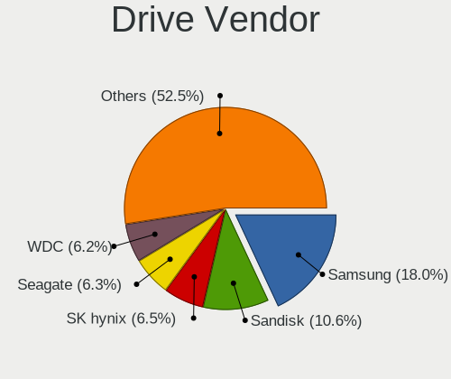
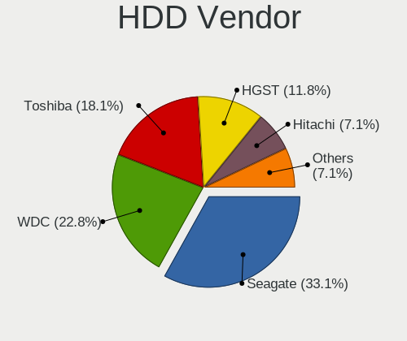
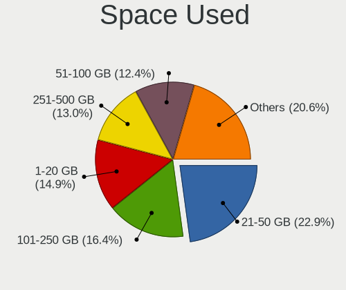
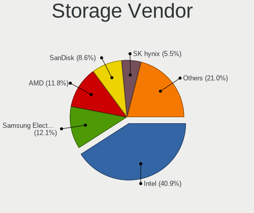

Nobara - Tested Hardware & Statistics (Notebooks)
-------------------------------------------------

A project to collect tested hardware configurations for Nobara.

Anyone can contribute to this report by the [hw-probe](https://github.com/linuxhw/hw-probe) tool:

    sudo -E hw-probe -all -upload

Please contribute! Especially if your hardware is rare.

Contents
--------

* [ Test Cases ](#test-cases)

* [ System ](#system)
  - [ OS                       ](#os)
  - [ OS Family                ](#os-family)
  - [ Kernel                   ](#kernel)
  - [ Kernel Family            ](#kernel-family)
  - [ Kernel Major Ver.        ](#kernel-major-ver)
  - [ Arch                     ](#arch)
  - [ DE                       ](#de)
  - [ Display Server           ](#display-server)
  - [ Display Manager          ](#display-manager)
  - [ OS Lang                  ](#os-lang)
  - [ Boot Mode                ](#boot-mode)
  - [ Filesystem               ](#filesystem)
  - [ Part. scheme             ](#part-scheme)
  - [ Dual Boot with Linux/BSD ](#dual-boot-with-linuxbsd)
  - [ Dual Boot (Win)          ](#dual-boot-win)

* [ Board ](#board)
  - [ Vendor                   ](#vendor)
  - [ Model                    ](#model)
  - [ Model Family             ](#model-family)
  - [ MFG Year                 ](#mfg-year)
  - [ Form Factor              ](#form-factor)
  - [ Secure Boot              ](#secure-boot)
  - [ Coreboot                 ](#coreboot)
  - [ RAM Size                 ](#ram-size)
  - [ RAM Used                 ](#ram-used)
  - [ Total Drives             ](#total-drives)
  - [ Has CD-ROM               ](#has-cd-rom)
  - [ Has Ethernet             ](#has-ethernet)
  - [ Has WiFi                 ](#has-wifi)
  - [ Has Bluetooth            ](#has-bluetooth)

* [ Location ](#location)
  - [ Country                  ](#country)
  - [ City                     ](#city)

* [ Drives ](#drives)
  - [ Drive Vendor             ](#drive-vendor)
  - [ Drive Model              ](#drive-model)
  - [ HDD Vendor               ](#hdd-vendor)
  - [ SSD Vendor               ](#ssd-vendor)
  - [ Drive Kind               ](#drive-kind)
  - [ Drive Connector          ](#drive-connector)
  - [ Drive Size               ](#drive-size)
  - [ Space Total              ](#space-total)
  - [ Space Used               ](#space-used)
  - [ Malfunc. Drives          ](#malfunc-drives)
  - [ Malfunc. Drive Vendor    ](#malfunc-drive-vendor)
  - [ Malfunc. HDD Vendor      ](#malfunc-hdd-vendor)
  - [ Malfunc. Drive Kind      ](#malfunc-drive-kind)
  - [ Failed Drives            ](#failed-drives)
  - [ Failed Drive Vendor      ](#failed-drive-vendor)
  - [ Drive Status             ](#drive-status)

* [ Storage controller ](#storage-controller)
  - [ Storage Vendor           ](#storage-vendor)
  - [ Storage Model            ](#storage-model)
  - [ Storage Kind             ](#storage-kind)

* [ Processor ](#processor)
  - [ CPU Vendor               ](#cpu-vendor)
  - [ CPU Model                ](#cpu-model)
  - [ CPU Model Family         ](#cpu-model-family)
  - [ CPU Cores                ](#cpu-cores)
  - [ CPU Sockets              ](#cpu-sockets)
  - [ CPU Threads              ](#cpu-threads)
  - [ CPU Op-Modes             ](#cpu-op-modes)
  - [ CPU Microcode            ](#cpu-microcode)
  - [ CPU Microarch            ](#cpu-microarch)

* [ Graphics ](#graphics)
  - [ GPU Vendor               ](#gpu-vendor)
  - [ GPU Model                ](#gpu-model)
  - [ GPU Combo                ](#gpu-combo)
  - [ GPU Driver               ](#gpu-driver)
  - [ GPU Memory               ](#gpu-memory)

* [ Monitor ](#monitor)
  - [ Monitor Vendor           ](#monitor-vendor)
  - [ Monitor Model            ](#monitor-model)
  - [ Monitor Resolution       ](#monitor-resolution)
  - [ Monitor Diagonal         ](#monitor-diagonal)
  - [ Monitor Width            ](#monitor-width)
  - [ Aspect Ratio             ](#aspect-ratio)
  - [ Monitor Area             ](#monitor-area)
  - [ Pixel Density            ](#pixel-density)
  - [ Multiple Monitors        ](#multiple-monitors)

* [ Network ](#network)
  - [ Net Controller Vendor    ](#net-controller-vendor)
  - [ Net Controller Model     ](#net-controller-model)
  - [ Wireless Vendor          ](#wireless-vendor)
  - [ Wireless Model           ](#wireless-model)
  - [ Ethernet Vendor          ](#ethernet-vendor)
  - [ Ethernet Model           ](#ethernet-model)
  - [ Net Controller Kind      ](#net-controller-kind)
  - [ Used Controller          ](#used-controller)
  - [ NICs                     ](#nics)
  - [ IPv6                     ](#ipv6)

* [ Bluetooth ](#bluetooth)
  - [ Bluetooth Vendor         ](#bluetooth-vendor)
  - [ Bluetooth Model          ](#bluetooth-model)

* [ Sound ](#sound)
  - [ Sound Vendor             ](#sound-vendor)
  - [ Sound Model              ](#sound-model)

* [ Memory ](#memory)
  - [ Memory Vendor            ](#memory-vendor)
  - [ Memory Model             ](#memory-model)
  - [ Memory Kind              ](#memory-kind)
  - [ Memory Form Factor       ](#memory-form-factor)
  - [ Memory Size              ](#memory-size)
  - [ Memory Speed             ](#memory-speed)

* [ Printers & scanners ](#printers--scanners)
  - [ Printer Vendor           ](#printer-vendor)
  - [ Printer Model            ](#printer-model)
  - [ Scanner Vendor           ](#scanner-vendor)
  - [ Scanner Model            ](#scanner-model)

* [ Camera ](#camera)
  - [ Camera Vendor            ](#camera-vendor)
  - [ Camera Model             ](#camera-model)

* [ Security ](#security)
  - [ Fingerprint Vendor       ](#fingerprint-vendor)
  - [ Fingerprint Model        ](#fingerprint-model)
  - [ Chipcard Vendor          ](#chipcard-vendor)
  - [ Chipcard Model           ](#chipcard-model)

* [ Unsupported ](#unsupported)
  - [ Unsupported Devices      ](#unsupported-devices)
  - [ Unsupported Device Types ](#unsupported-device-types)

Test Cases
----------

Total: 86

| Vendor        | Model                       | Probe                                                      | Date         |
|---------------|-----------------------------|------------------------------------------------------------|--------------|
| ASUSTek       | GL753VD                     | [97e2ee4ee1](https://linux-hardware.org/?probe=97e2ee4ee1) | Nov 01, 2022 |
| HP            | Unknown                     | [1ca885060e](https://linux-hardware.org/?probe=1ca885060e) | Nov 01, 2022 |
| Acer          | Nitro AN515-42              | [3a00ca53c8](https://linux-hardware.org/?probe=3a00ca53c8) | Oct 31, 2022 |
| Lenovo        | IdeaPad C340-14API 81N6     | [d322bb2739](https://linux-hardware.org/?probe=d322bb2739) | Oct 30, 2022 |
| Apple         | MacBookPro13,3              | [b028075707](https://linux-hardware.org/?probe=b028075707) | Oct 30, 2022 |
| ASUSTek       | VivoBook_ASUS Laptop X50... | [4fdbc3c415](https://linux-hardware.org/?probe=4fdbc3c415) | Oct 30, 2022 |
| HP            | Pavilion Gaming Laptop 1... | [50a8c356f0](https://linux-hardware.org/?probe=50a8c356f0) | Oct 28, 2022 |
| ASUSTek       | GL502VMK                    | [9a18ff1b13](https://linux-hardware.org/?probe=9a18ff1b13) | Oct 25, 2022 |
| Toshiba       | Satellite L850              | [8bfeff52e6](https://linux-hardware.org/?probe=8bfeff52e6) | Oct 24, 2022 |
| ASUSTek       | S550CB                      | [a81f0ecac8](https://linux-hardware.org/?probe=a81f0ecac8) | Oct 24, 2022 |
| ASUSTek       | ROG Zephyrus G14 GA401QM... | [3912d818bd](https://linux-hardware.org/?probe=3912d818bd) | Oct 23, 2022 |
| HP            | OMEN Notebook PC 15         | [1d5ebc92c4](https://linux-hardware.org/?probe=1d5ebc92c4) | Oct 23, 2022 |
| Lenovo        | Legion 5 Pro 16IAH7H 82R... | [eaecfdf473](https://linux-hardware.org/?probe=eaecfdf473) | Oct 21, 2022 |
| Lenovo        | Legion 5 Pro 16IAH7H 82R... | [c044987599](https://linux-hardware.org/?probe=c044987599) | Oct 20, 2022 |
| HP            | EliteBook 850 G2            | [b6fd429ceb](https://linux-hardware.org/?probe=b6fd429ceb) | Oct 20, 2022 |
| HP            | EliteBook 850 G2            | [f33baf66a9](https://linux-hardware.org/?probe=f33baf66a9) | Oct 20, 2022 |
| ASUSTek       | TUF Gaming FX504GD_FX80G... | [e5a34da4a2](https://linux-hardware.org/?probe=e5a34da4a2) | Oct 19, 2022 |
| MSI           | GE60 0NC/GE60 0ND           | [829326a8e5](https://linux-hardware.org/?probe=829326a8e5) | Oct 18, 2022 |
| MSI           | GE60 0NC/GE60 0ND           | [697ccec46b](https://linux-hardware.org/?probe=697ccec46b) | Oct 18, 2022 |
| HP            | EliteBook 850 G1            | [dfeb98414b](https://linux-hardware.org/?probe=dfeb98414b) | Oct 18, 2022 |
| HP            | EliteBook 850 G1            | [7f8c9d778c](https://linux-hardware.org/?probe=7f8c9d778c) | Oct 18, 2022 |
| Casper        | EXCALIBUR G770              | [7961a3ca3e](https://linux-hardware.org/?probe=7961a3ca3e) | Oct 14, 2022 |
| Lenovo        | ThinkPad E14 Gen 3 20Y7C... | [5f013faf39](https://linux-hardware.org/?probe=5f013faf39) | Oct 12, 2022 |
| Toshiba       | Satellite L650              | [89f43e5484](https://linux-hardware.org/?probe=89f43e5484) | Oct 12, 2022 |
| Toshiba       | Satellite L650              | [43f57daebb](https://linux-hardware.org/?probe=43f57daebb) | Oct 12, 2022 |
| MSI           | Pulse GL76 12UEK            | [6a2be4d08c](https://linux-hardware.org/?probe=6a2be4d08c) | Oct 12, 2022 |
| EVOO          | EG-LP10                     | [f8895e9483](https://linux-hardware.org/?probe=f8895e9483) | Oct 11, 2022 |
| Dell          | Vostro 15 5510              | [2aa595867e](https://linux-hardware.org/?probe=2aa595867e) | Oct 11, 2022 |
| Dell          | Vostro 15 5510              | [bd224480a9](https://linux-hardware.org/?probe=bd224480a9) | Oct 10, 2022 |
| HP            | 2000                        | [3341a26d0c](https://linux-hardware.org/?probe=3341a26d0c) | Oct 10, 2022 |
| ASUSTek       | GL503VD                     | [1405b367c2](https://linux-hardware.org/?probe=1405b367c2) | Oct 09, 2022 |
| Lenovo        | IdeaPad Y700-15ISK 80NV     | [94ccd99c78](https://linux-hardware.org/?probe=94ccd99c78) | Oct 09, 2022 |
| Apple         | MacBookPro5,5               | [faef78b510](https://linux-hardware.org/?probe=faef78b510) | Oct 08, 2022 |
| HP            | Laptop 15-dw0xxx            | [3427421197](https://linux-hardware.org/?probe=3427421197) | Oct 08, 2022 |
| ASUSTek       | ASUS TUF Gaming A17 FA70... | [2d464da9c8](https://linux-hardware.org/?probe=2d464da9c8) | Oct 07, 2022 |
| HP            | ZBook 17 G6                 | [c215e9e17e](https://linux-hardware.org/?probe=c215e9e17e) | Oct 07, 2022 |
| Dell          | Precision 5530              | [db48ac269b](https://linux-hardware.org/?probe=db48ac269b) | Oct 07, 2022 |
| Lenovo        | IdeaPad 320-15IKB 80YH      | [9ccbc0ed3c](https://linux-hardware.org/?probe=9ccbc0ed3c) | Oct 07, 2022 |
| KELYX ARGE... | KL9120                      | [faa5f13391](https://linux-hardware.org/?probe=faa5f13391) | Oct 06, 2022 |
| Positivo      | N1250                       | [9845103c14](https://linux-hardware.org/?probe=9845103c14) | Oct 05, 2022 |
| HP            | 2000                        | [e6f8f7196d](https://linux-hardware.org/?probe=e6f8f7196d) | Oct 03, 2022 |
| ASUSTek       | TUF Gaming FX505DV_FX505... | [3ec3f59233](https://linux-hardware.org/?probe=3ec3f59233) | Oct 03, 2022 |
| ASUSTek       | TUF Gaming FX505DV_FX505... | [5ed7136249](https://linux-hardware.org/?probe=5ed7136249) | Oct 03, 2022 |
| HP            | 240 G7 Notebook PC          | [05b4e2117b](https://linux-hardware.org/?probe=05b4e2117b) | Oct 03, 2022 |
| Toshiba       | Satellite L850              | [0e57d064b0](https://linux-hardware.org/?probe=0e57d064b0) | Oct 02, 2022 |
| Lenovo        | Yoga Slim 7 Pro 14ACH5 O... | [05e921b4aa](https://linux-hardware.org/?probe=05e921b4aa) | Oct 02, 2022 |
| EVOO          | EG-LP10                     | [32c1a174d1](https://linux-hardware.org/?probe=32c1a174d1) | Oct 01, 2022 |
| Acer          | Aspire VX5-591G             | [b321f4561b](https://linux-hardware.org/?probe=b321f4561b) | Sep 29, 2022 |
| Lenovo        | V330-15IKB 81AX             | [0360123f76](https://linux-hardware.org/?probe=0360123f76) | Sep 29, 2022 |
| Lenovo        | G580 20157                  | [2b34d591ab](https://linux-hardware.org/?probe=2b34d591ab) | Sep 29, 2022 |
| Apple         | MacBookAir4,2               | [a423006d4c](https://linux-hardware.org/?probe=a423006d4c) | Sep 29, 2022 |
| Apple         | MacBookAir4,2               | [5dba6cf7fd](https://linux-hardware.org/?probe=5dba6cf7fd) | Sep 29, 2022 |
| Dell          | Inspiron 3542               | [6d35107941](https://linux-hardware.org/?probe=6d35107941) | Sep 28, 2022 |
| Apple         | MacBookPro8,3               | [74927fc7d2](https://linux-hardware.org/?probe=74927fc7d2) | Sep 27, 2022 |
| Lenovo        | IdeaPad 310-15IAP 80TT      | [65f896ddab](https://linux-hardware.org/?probe=65f896ddab) | Sep 27, 2022 |
| Gateway       | NE56R                       | [f603edd045](https://linux-hardware.org/?probe=f603edd045) | Sep 23, 2022 |
| Toshiba       | TECRA A50-A                 | [6ef2538a5a](https://linux-hardware.org/?probe=6ef2538a5a) | Sep 23, 2022 |
| Lenovo        | IdeaPad 5 15ARE05 81YQ      | [605e97df5c](https://linux-hardware.org/?probe=605e97df5c) | Sep 22, 2022 |
| Lenovo        | IdeaPad 5 15ARE05 81YQ      | [94e6332c62](https://linux-hardware.org/?probe=94e6332c62) | Sep 22, 2022 |
| ASUSTek       | ROG Zephyrus G14 GA401II... | [2e36489a4b](https://linux-hardware.org/?probe=2e36489a4b) | Sep 22, 2022 |
| ASUSTek       | ROG Zephyrus G14 GA401II... | [8705683c6f](https://linux-hardware.org/?probe=8705683c6f) | Sep 22, 2022 |
| Alienware     | Area-51m R2 A00             | [0ebdec6dd0](https://linux-hardware.org/?probe=0ebdec6dd0) | Sep 20, 2022 |
| ASUSTek       | N56VZ                       | [ce162c52c0](https://linux-hardware.org/?probe=ce162c52c0) | Sep 19, 2022 |
| Lenovo        | IdeaPadFlex 10 20324        | [4e7f3b7bac](https://linux-hardware.org/?probe=4e7f3b7bac) | Sep 19, 2022 |
| Lenovo        | Legion 5 15ARH05 82B5       | [854a0d4410](https://linux-hardware.org/?probe=854a0d4410) | Sep 19, 2022 |
| Dell          | Precision M6400             | [67924c5333](https://linux-hardware.org/?probe=67924c5333) | Sep 19, 2022 |
| Dell          | Precision M6400             | [27a55639e4](https://linux-hardware.org/?probe=27a55639e4) | Sep 19, 2022 |
| HUAWEI        | KLVL-WXXW                   | [e0e49d51d0](https://linux-hardware.org/?probe=e0e49d51d0) | Sep 18, 2022 |
| HUAWEI        | KLVL-WXXW                   | [812ea842dc](https://linux-hardware.org/?probe=812ea842dc) | Sep 18, 2022 |
| Lenovo        | ThinkBook 15 G3 ACL 21A4    | [004d0a2b9d](https://linux-hardware.org/?probe=004d0a2b9d) | Sep 17, 2022 |
| Lenovo        | ThinkPad P1 20MD0020US      | [a701fed148](https://linux-hardware.org/?probe=a701fed148) | Sep 16, 2022 |
| ASUSTek       | VivoBook_ASUSLaptop X340... | [5ffc7d13ac](https://linux-hardware.org/?probe=5ffc7d13ac) | Sep 16, 2022 |
| Dell          | G5 5505                     | [25755e8605](https://linux-hardware.org/?probe=25755e8605) | Sep 16, 2022 |
| HP            | 15                          | [79aa0d618f](https://linux-hardware.org/?probe=79aa0d618f) | Sep 14, 2022 |
| Acer          | Aspire A315-42              | [820c1e2ac6](https://linux-hardware.org/?probe=820c1e2ac6) | Sep 11, 2022 |
| Dell          | Precision 3510              | [4337a8e018](https://linux-hardware.org/?probe=4337a8e018) | Sep 11, 2022 |
| ASUSTek       | ASUS TUF Gaming F15 FX50... | [0ca693e2dd](https://linux-hardware.org/?probe=0ca693e2dd) | Aug 31, 2022 |
| ASUSTek       | TP500LA                     | [de395dddd8](https://linux-hardware.org/?probe=de395dddd8) | Aug 28, 2022 |
| Dell          | G15 5511                    | [44fa9bf084](https://linux-hardware.org/?probe=44fa9bf084) | Aug 21, 2022 |
| Notebook      | P7xxDM2(-G)                 | [f074899985](https://linux-hardware.org/?probe=f074899985) | Aug 17, 2022 |
| HP            | Pavilion Gaming Laptop 1... | [315da58d24](https://linux-hardware.org/?probe=315da58d24) | Aug 16, 2022 |
| Apple         | MacBookPro14,2              | [c66d476513](https://linux-hardware.org/?probe=c66d476513) | Aug 13, 2022 |
| ASUSTek       | ROG Strix G513QY_G513QY     | [df2cc1a299](https://linux-hardware.org/?probe=df2cc1a299) | Aug 12, 2022 |
| Lenovo        | IdeaPad Y700-15ISK 80NV     | [6beddf67f5](https://linux-hardware.org/?probe=6beddf67f5) | Aug 06, 2022 |
| Razer         | Blade                       | [cc3ce45956](https://linux-hardware.org/?probe=cc3ce45956) | Jul 31, 2022 |
| HP            | ZBook 15 G2                 | [3aa2fda09a](https://linux-hardware.org/?probe=3aa2fda09a) | Jul 26, 2022 |

System
------

OS
--

Installed operating systems

| Name      | Notebooks | Percent |
|-----------|-----------|---------|
| Nobara 36 | 68        | 100%    |

OS Family
---------

OS without a version

| Name   | Notebooks | Percent |
|--------|-----------|---------|
| Nobara | 68        | 100%    |

Kernel
------

Version of the Linux kernel

| Version                       | Notebooks | Percent |
|-------------------------------|-----------|---------|
| 5.19.14-201.fsync.fc36.x86_64 | 15        | 21.74%  |
| 5.19.9-201.fsync.fc36.x86_64  | 7         | 10.14%  |
| 5.19.7-204.fsync.fc36.x86_64  | 7         | 10.14%  |
| 6.0.5-201.fsync.fc36.x86_64   | 5         | 7.25%   |
| 5.19.12-201.fsync.fc36.x86_64 | 5         | 7.25%   |
| 5.19.8-201.fsync.fc36.x86_64  | 4         | 5.8%    |
| 5.19.16-201.fsync.fc36.x86_64 | 4         | 5.8%    |
| 5.19.11-201.fsync.fc36.x86_64 | 4         | 5.8%    |
| 5.18.16-201.fsync.fc36.x86_64 | 3         | 4.35%   |
| 5.18.13-201.fsync.fc36.x86_64 | 3         | 4.35%   |
| 5.19.4-201.fsync.fc36.x86_64  | 2         | 2.9%    |
| 5.19.15-202.fsync.fc36.x86_64 | 2         | 2.9%    |
| 5.18.17-201.fsync.fc36.x86_64 | 2         | 2.9%    |
| 6.0.2-xm1.0.fc36.x86_64       | 1         | 1.45%   |
| 5.19.7-203.fsync.fc36.x86_64  | 1         | 1.45%   |
| 5.19.13-202.fsync.fc36.x86_64 | 1         | 1.45%   |
| 5.19.10-201.fsync.fc36.x86_64 | 1         | 1.45%   |
| 5.18.19-201.fsync.fc36.x86_64 | 1         | 1.45%   |
| 5.18.18-201.fsync.fc36.x86_64 | 1         | 1.45%   |

Kernel Family
-------------

Linux kernel without a distro release

| Version | Notebooks | Percent |
|---------|-----------|---------|
| 5.19.14 | 15        | 21.74%  |
| 5.19.7  | 8         | 11.59%  |
| 5.19.9  | 7         | 10.14%  |
| 6.0.5   | 5         | 7.25%   |
| 5.19.12 | 5         | 7.25%   |
| 5.19.8  | 4         | 5.8%    |
| 5.19.16 | 4         | 5.8%    |
| 5.19.11 | 4         | 5.8%    |
| 5.18.16 | 3         | 4.35%   |
| 5.18.13 | 3         | 4.35%   |
| 5.19.4  | 2         | 2.9%    |
| 5.19.15 | 2         | 2.9%    |
| 5.18.17 | 2         | 2.9%    |
| 6.0.2   | 1         | 1.45%   |
| 5.19.13 | 1         | 1.45%   |
| 5.19.10 | 1         | 1.45%   |
| 5.18.19 | 1         | 1.45%   |
| 5.18.18 | 1         | 1.45%   |

Kernel Major Ver.
-----------------

Linux kernel major version

| Version | Notebooks | Percent |
|---------|-----------|---------|
| 5.19    | 53        | 76.81%  |
| 5.18    | 10        | 14.49%  |
| 6.0     | 6         | 8.7%    |

Arch
----

OS architecture (x86_64, i586, etc.)

| Name   | Notebooks | Percent |
|--------|-----------|---------|
| x86_64 | 68        | 100%    |

DE
--

Desktop Environment

| Name    | Notebooks | Percent |
|---------|-----------|---------|
| GNOME   | 49        | 72.06%  |
| KDE5    | 17        | 25%     |
| Unknown | 2         | 2.94%   |

Display Server
--------------

X11 or Wayland

| Name    | Notebooks | Percent |
|---------|-----------|---------|
| Wayland | 58        | 85.29%  |
| X11     | 8         | 11.76%  |
| Unknown | 2         | 2.94%   |

Display Manager
---------------

SDDM, LightDM, etc.

| Name    | Notebooks | Percent |
|---------|-----------|---------|
| Unknown | 58        | 84.06%  |
| SDDM    | 8         | 11.59%  |
| GDM     | 3         | 4.35%   |

OS Lang
-------

Language

| Lang  | Notebooks | Percent |
|-------|-----------|---------|
| en_US | 37        | 54.41%  |
| pl_PL | 4         | 5.88%   |
| pt_PT | 3         | 4.41%   |
| en_IN | 3         | 4.41%   |
| en_GB | 3         | 4.41%   |
| it_IT | 2         | 2.94%   |
| es_MX | 2         | 2.94%   |
| es_ES | 2         | 2.94%   |
| es_AR | 2         | 2.94%   |
| de_DE | 2         | 2.94%   |
| sv_SE | 1         | 1.47%   |
| ru_RU | 1         | 1.47%   |
| pt_BR | 1         | 1.47%   |
| hr_HR | 1         | 1.47%   |
| es_CL | 1         | 1.47%   |
| en_ZA | 1         | 1.47%   |
| en_NZ | 1         | 1.47%   |
| en_CA | 1         | 1.47%   |

Boot Mode
---------

EFI or BIOS

| Mode | Notebooks | Percent |
|------|-----------|---------|
| EFI  | 54        | 78.26%  |
| BIOS | 15        | 21.74%  |

Filesystem
----------

Type of filesystem

| Type  | Notebooks | Percent |
|-------|-----------|---------|
| Ext4  | 45        | 66.18%  |
| Btrfs | 22        | 32.35%  |
| Xfs   | 1         | 1.47%   |

Part. scheme
------------

Scheme of partitioning

| Type    | Notebooks | Percent |
|---------|-----------|---------|
| Unknown | 57        | 82.61%  |
| GPT     | 12        | 17.39%  |

Dual Boot with Linux/BSD
------------------------

Hosting more than one Linux/BSD

| Dual boot | Notebooks | Percent |
|-----------|-----------|---------|
| No        | 64        | 94.12%  |
| Yes       | 4         | 5.88%   |

Dual Boot (Win)
---------------

Hosting Linux and Windows

| Dual boot | Notebooks | Percent |
|-----------|-----------|---------|
| No        | 61        | 89.71%  |
| Yes       | 7         | 10.29%  |

Board
-----

Vendor
------

Motherboard manufacturer

| Name             | Notebooks | Percent |
|------------------|-----------|---------|
| Lenovo           | 15        | 22.06%  |
| ASUSTek Computer | 15        | 22.06%  |
| Hewlett-Packard  | 11        | 16.18%  |
| Dell             | 7         | 10.29%  |
| Apple            | 5         | 7.35%   |
| Toshiba          | 3         | 4.41%   |
| Acer             | 3         | 4.41%   |
| MSI              | 2         | 2.94%   |
| Razer            | 1         | 1.47%   |
| Positivo         | 1         | 1.47%   |
| Notebook         | 1         | 1.47%   |
| Gateway          | 1         | 1.47%   |
| EVOO             | 1         | 1.47%   |
| Casper           | 1         | 1.47%   |
| Alienware        | 1         | 1.47%   |

Model
-----

Motherboard model

| Name                                  | Notebooks | Percent |
|---------------------------------------|-----------|---------|
| Lenovo IdeaPad Y700-15ISK 80NV        | 2         | 2.94%   |
| Toshiba TECRA A50-A                   | 1         | 1.47%   |
| Toshiba Satellite L850                | 1         | 1.47%   |
| Toshiba Satellite L650                | 1         | 1.47%   |
| Razer Blade                           | 1         | 1.47%   |
| Positivo N1250                        | 1         | 1.47%   |
| Notebook P7xxDM2(-G)                  | 1         | 1.47%   |
| MSI Pulse GL76 12UEK                  | 1         | 1.47%   |
| MSI GE60 0NC/GE60 0ND                 | 1         | 1.47%   |
| Lenovo Yoga Slim 7 Pro 14ACH5 OD 82NK | 1         | 1.47%   |
| Lenovo V330-15IKB 81AX                | 1         | 1.47%   |
| Lenovo ThinkPad P1 20MD0020US         | 1         | 1.47%   |
| Lenovo ThinkPad E14 Gen 3 20Y7CTO1WW  | 1         | 1.47%   |
| Lenovo ThinkBook 15 G3 ACL 21A4       | 1         | 1.47%   |
| Lenovo Legion 5 Pro 16IAH7H 82RF      | 1         | 1.47%   |
| Lenovo Legion 5 15ARH05 82B5          | 1         | 1.47%   |
| Lenovo IdeaPadFlex 10 20324           | 1         | 1.47%   |
| Lenovo IdeaPad C340-14API 81N6        | 1         | 1.47%   |
| Lenovo IdeaPad 5 15ARE05 81YQ         | 1         | 1.47%   |
| Lenovo IdeaPad 320-15IKB 80YH         | 1         | 1.47%   |
| Lenovo IdeaPad 310-15IAP 80TT         | 1         | 1.47%   |
| Lenovo G580 20157                     | 1         | 1.47%   |
| HP ZBook 17 G6                        | 1         | 1.47%   |
| HP ZBook 15 G2                        | 1         | 1.47%   |
| HP Pavilion Gaming Laptop 15-ec1xxx   | 1         | 1.47%   |
| HP OMEN Notebook PC 15                | 1         | 1.47%   |
| HP Laptop 15-dw0xxx                   | 1         | 1.47%   |
| HP EliteBook 850 G2                   | 1         | 1.47%   |
| HP EliteBook 850 G1                   | 1         | 1.47%   |
| HP 240 G7 Notebook PC                 | 1         | 1.47%   |
| HP 2000                               | 1         | 1.47%   |
| HP 15                                 | 1         | 1.47%   |
| Gateway NE56R                         | 1         | 1.47%   |
| EVOO EG-LP10                          | 1         | 1.47%   |
| Dell Vostro 15 5510                   | 1         | 1.47%   |
| Dell Precision M6400                  | 1         | 1.47%   |
| Dell Precision 5530                   | 1         | 1.47%   |
| Dell Precision 3510                   | 1         | 1.47%   |
| Dell Inspiron 3542                    | 1         | 1.47%   |
| Dell G5 5505                          | 1         | 1.47%   |

Model Family
------------

Motherboard model prefix

| Name                 | Notebooks | Percent |
|----------------------|-----------|---------|
| Lenovo IdeaPad       | 6         | 8.82%   |
| Dell Precision       | 3         | 4.41%   |
| ASUS ROG             | 3         | 4.41%   |
| Toshiba Satellite    | 2         | 2.94%   |
| Lenovo ThinkPad      | 2         | 2.94%   |
| Lenovo Legion        | 2         | 2.94%   |
| HP ZBook             | 2         | 2.94%   |
| HP EliteBook         | 2         | 2.94%   |
| ASUS VivoBook        | 2         | 2.94%   |
| ASUS TUF             | 2         | 2.94%   |
| ASUS ASUS            | 2         | 2.94%   |
| Acer Aspire          | 2         | 2.94%   |
| Toshiba TECRA        | 1         | 1.47%   |
| Razer Blade          | 1         | 1.47%   |
| Positivo N1250       | 1         | 1.47%   |
| Notebook P7xxDM2(-G) | 1         | 1.47%   |
| MSI Pulse            | 1         | 1.47%   |
| MSI GE60             | 1         | 1.47%   |
| Lenovo Yoga          | 1         | 1.47%   |
| Lenovo V330-15IKB    | 1         | 1.47%   |
| Lenovo ThinkBook     | 1         | 1.47%   |
| Lenovo IdeaPadFlex   | 1         | 1.47%   |
| Lenovo G580          | 1         | 1.47%   |
| HP Pavilion          | 1         | 1.47%   |
| HP OMEN              | 1         | 1.47%   |
| HP Laptop            | 1         | 1.47%   |
| HP 240               | 1         | 1.47%   |
| HP 2000              | 1         | 1.47%   |
| HP 15                | 1         | 1.47%   |
| Gateway NE56R        | 1         | 1.47%   |
| EVOO EG-LP10         | 1         | 1.47%   |
| Dell Vostro          | 1         | 1.47%   |
| Dell Inspiron        | 1         | 1.47%   |
| Dell G5              | 1         | 1.47%   |
| Dell G15             | 1         | 1.47%   |
| Casper EXCALIBUR     | 1         | 1.47%   |
| ASUS TP500LA         | 1         | 1.47%   |
| ASUS S550CB          | 1         | 1.47%   |
| ASUS N56VZ           | 1         | 1.47%   |
| ASUS GL753VD         | 1         | 1.47%   |

MFG Year
--------

Motherboard manufacture year

| Year | Notebooks | Percent |
|------|-----------|---------|
| 2021 | 10        | 14.71%  |
| 2020 | 8         | 11.76%  |
| 2018 | 8         | 11.76%  |
| 2019 | 7         | 10.29%  |
| 2012 | 6         | 8.82%   |
| 2017 | 5         | 7.35%   |
| 2015 | 5         | 7.35%   |
| 2014 | 5         | 7.35%   |
| 2016 | 4         | 5.88%   |
| 2022 | 3         | 4.41%   |
| 2013 | 3         | 4.41%   |
| 2009 | 2         | 2.94%   |
| 2011 | 1         | 1.47%   |
| 2010 | 1         | 1.47%   |

Form Factor
-----------

Physical design of the computer

| Name     | Notebooks | Percent |
|----------|-----------|---------|
| Notebook | 68        | 100%    |

Secure Boot
-----------

Enabled or disabled

| State    | Notebooks | Percent |
|----------|-----------|---------|
| Disabled | 68        | 100%    |

Coreboot
--------

Have coreboot on board

| Used | Notebooks | Percent |
|------|-----------|---------|
| No   | 68        | 100%    |

RAM Size
--------

Total RAM memory

| Size in GB | Notebooks | Percent |
|------------|-----------|---------|
| 8.01-16.0  | 18        | 26.47%  |
| 16.01-24.0 | 16        | 23.53%  |
| 4.01-8.0   | 14        | 20.59%  |
| 3.01-4.0   | 12        | 17.65%  |
| 32.01-64.0 | 6         | 8.82%   |
| 24.01-32.0 | 1         | 1.47%   |
| 1.01-2.0   | 1         | 1.47%   |

RAM Used
--------

Used RAM memory

| Used GB   | Notebooks | Percent |
|-----------|-----------|---------|
| 4.01-8.0  | 33        | 48.53%  |
| 2.01-3.0  | 18        | 26.47%  |
| 3.01-4.0  | 12        | 17.65%  |
| 8.01-16.0 | 4         | 5.88%   |
| 1.01-2.0  | 1         | 1.47%   |

Total Drives
------------

Number of drives on board

| Drives | Notebooks | Percent |
|--------|-----------|---------|
| 1      | 47        | 69.12%  |
| 2      | 18        | 26.47%  |
| 3      | 3         | 4.41%   |

Has CD-ROM
----------

Has CD-ROM on board

| Presented | Notebooks | Percent |
|-----------|-----------|---------|
| No        | 52        | 76.47%  |
| Yes       | 16        | 23.53%  |

Has Ethernet
------------

Has Ethernet on board

| Presented | Notebooks | Percent |
|-----------|-----------|---------|
| Yes       | 55        | 80.88%  |
| No        | 13        | 19.12%  |

Has WiFi
--------

Has WiFi module

| Presented | Notebooks | Percent |
|-----------|-----------|---------|
| Yes       | 68        | 100%    |

Has Bluetooth
-------------

Has Bluetooth module

| Presented | Notebooks | Percent |
|-----------|-----------|---------|
| Yes       | 57        | 83.82%  |
| No        | 11        | 16.18%  |

Location
--------

Country
-------

Geographic location (country)

| Country      | Notebooks | Percent |
|--------------|-----------|---------|
| USA          | 22        | 32.35%  |
| Poland       | 4         | 5.88%   |
| India        | 4         | 5.88%   |
| Portugal     | 3         | 4.41%   |
| Mexico       | 3         | 4.41%   |
| Germany      | 3         | 4.41%   |
| Philippines  | 2         | 2.94%   |
| Italy        | 2         | 2.94%   |
| Croatia      | 2         | 2.94%   |
| Brazil       | 2         | 2.94%   |
| Argentina    | 2         | 2.94%   |
| Vietnam      | 1         | 1.47%   |
| UK           | 1         | 1.47%   |
| Sweden       | 1         | 1.47%   |
| Spain        | 1         | 1.47%   |
| South Africa | 1         | 1.47%   |
| Russia       | 1         | 1.47%   |
| Romania      | 1         | 1.47%   |
| Pakistan     | 1         | 1.47%   |
| New Zealand  | 1         | 1.47%   |
| Morocco      | 1         | 1.47%   |
| Kenya        | 1         | 1.47%   |
| Indonesia    | 1         | 1.47%   |
| Czechia      | 1         | 1.47%   |
| Cyprus       | 1         | 1.47%   |
| Colombia     | 1         | 1.47%   |
| Chile        | 1         | 1.47%   |
| Canada       | 1         | 1.47%   |
| Belgium      | 1         | 1.47%   |
| Austria      | 1         | 1.47%   |

City
----

Geographic location (city)

| City          | Notebooks | Percent |
|---------------|-----------|---------|
| Schmalkalden  | 2         | 2.9%    |
| Guadalajara   | 2         | 2.9%    |
| Zamora        | 1         | 1.45%   |
| Zadar         | 1         | 1.45%   |
| Wesley Chapel | 1         | 1.45%   |
| Wayne         | 1         | 1.45%   |
| Wasilla       | 1         | 1.45%   |
| Warsaw        | 1         | 1.45%   |
| Wabrzezno     | 1         | 1.45%   |
| Villarrica    | 1         | 1.45%   |
| Villa Nueva   | 1         | 1.45%   |
| Varaždin     | 1         | 1.45%   |
| Vagos         | 1         | 1.45%   |
| Tulsa         | 1         | 1.45%   |
| Tomah         | 1         | 1.45%   |
| Silves        | 1         | 1.45%   |
| Schenectady   | 1         | 1.45%   |
| San Antonio   | 1         | 1.45%   |
| Saltsjoebaden | 1         | 1.45%   |
| Salem         | 1         | 1.45%   |
| Salamanca     | 1         | 1.45%   |
| Saint-Jerome  | 1         | 1.45%   |
| Rozsicka      | 1         | 1.45%   |
| Rome          | 1         | 1.45%   |
| Ramos Mejia   | 1         | 1.45%   |
| Quezon City   | 1         | 1.45%   |
| Prichsenstadt | 1         | 1.45%   |
| Poznan        | 1         | 1.45%   |
| Panama City   | 1         | 1.45%   |
| Odessa        | 1         | 1.45%   |
| Novosibirsk   | 1         | 1.45%   |
| Nova Mutum    | 1         | 1.45%   |
| Nicosia       | 1         | 1.45%   |
| New Delhi     | 1         | 1.45%   |
| Nairobi       | 1         | 1.45%   |
| Mumbai        | 1         | 1.45%   |
| Milan         | 1         | 1.45%   |
| Los Angeles   | 1         | 1.45%   |
| Long Lake     | 1         | 1.45%   |
| Lisbon        | 1         | 1.45%   |

Drives
------

Drive Vendor
------------

Hard drive vendors

| Vendor                       | Notebooks | Drives | Percent |
|------------------------------|-----------|--------|---------|
| Samsung Electronics          | 16        | 18     | 17.78%  |
| Toshiba                      | 10        | 10     | 11.11%  |
| WDC                          | 7         | 7      | 7.78%   |
| Seagate                      | 7         | 7      | 7.78%   |
| Kingston                     | 7         | 7      | 7.78%   |
| SK hynix                     | 5         | 5      | 5.56%   |
| Intel                        | 5         | 5      | 5.56%   |
| Sandisk                      | 4         | 4      | 4.44%   |
| Crucial                      | 4         | 4      | 4.44%   |
| Micron Technology            | 3         | 3      | 3.33%   |
| Micron/Crucial Technology    | 2         | 2      | 2.22%   |
| LITEON                       | 2         | 2      | 2.22%   |
| KIOXIA                       | 2         | 2      | 2.22%   |
| Hitachi                      | 2         | 2      | 2.22%   |
| HGST                         | 2         | 2      | 2.22%   |
| Apple                        | 2         | 3      | 2.22%   |
| Unknown                      | 2         | 2      | 2.22%   |
| Unknown                      | 1         | 1      | 1.11%   |
| Shenzhen Longsys Electronics | 1         | 1      | 1.11%   |
| Ramsta                       | 1         | 1      | 1.11%   |
| Phison Electronics           | 1         | 1      | 1.11%   |
| HGST HTS                     | 1         | 1      | 1.11%   |
| Fujitsu                      | 1         | 1      | 1.11%   |
| China                        | 1         | 1      | 1.11%   |
| A-DATA Technology            | 1         | 1      | 1.11%   |

Drive Model
-----------

Hard drive models

| Model                                               | Notebooks | Percent |
|-----------------------------------------------------|-----------|---------|
| Samsung NVMe SSD Controller SM981/PM981/PM983 500GB | 3         | 3.23%   |
| Toshiba MQ04ABF100 1TB                              | 2         | 2.15%   |
| Toshiba MQ01ABF050 500GB                            | 2         | 2.15%   |
| Seagate ST1000LM024 HN-M101MBB 1TB                  | 2         | 2.15%   |
| Sandisk WD Blue SN550 NVMe SSD 1TB                  | 2         | 2.15%   |
| Samsung NVMe SSD Drive 1024GB                       | 2         | 2.15%   |
| Kingston SA400S37240G 240GB SSD                     | 2         | 2.15%   |
| Kingston NVMe SSD Drive 512GB                       | 2         | 2.15%   |
| Hitachi HTS547575A9E384 752GB                       | 2         | 2.15%   |
| Unknown                                             | 2         | 2.15%   |
| WDC WDS500G3X0C-00SJG0 500GB                        | 1         | 1.08%   |
| WDC WDS100T2B0C-00PXH0 1TB                          | 1         | 1.08%   |
| WDC WD10SPZX-21Z10T0 1TB                            | 1         | 1.08%   |
| WDC WD10SPCX-24HWST1 1TB                            | 1         | 1.08%   |
| WDC WD10JPVT-22A1YT0 1TB                            | 1         | 1.08%   |
| WDC PC SN530 SDBPNPZ-512G-1006 512GB                | 1         | 1.08%   |
| WDC PC SN520 SDAPNUW-512G-1006 512GB                | 1         | 1.08%   |
| Unknown SD/MMC/MS PRO 1TB                           | 1         | 1.08%   |
| Toshiba TR200 240GB SSD                             | 1         | 1.08%   |
| Toshiba MQ01ABD100 1TB                              | 1         | 1.08%   |
| Toshiba MQ01ABD050 500GB                            | 1         | 1.08%   |
| Toshiba MK7559GSXF 752GB                            | 1         | 1.08%   |
| Toshiba MK3265GSXN 320GB                            | 1         | 1.08%   |
| Toshiba KXG5AZNV512G 512GB                          | 1         | 1.08%   |
| SK hynix SKHynix_HFS512GD9TNI-L2A0B 512GB           | 1         | 1.08%   |
| SK hynix SKHynix_HFS001TDE9X084N 1TB                | 1         | 1.08%   |
| SK hynix SKHynix_HFM256GD3HX015N 256GB              | 1         | 1.08%   |
| SK hynix HFM256GDJTNG-8310A 256GB                   | 1         | 1.08%   |
| SK hynix C2S3T/120G 120GB                           | 1         | 1.08%   |
| Shenzhen Longsys Lexar SSD NM620 512GB              | 1         | 1.08%   |
| Seagate ST500LT012-1DG142 500GB                     | 1         | 1.08%   |
| Seagate ST320LT012-9WS14C 320GB                     | 1         | 1.08%   |
| Seagate ST1000LX015-1U7172 1TB                      | 1         | 1.08%   |
| Seagate ST1000LM035-1RK172 1TB                      | 1         | 1.08%   |
| Seagate BUP Portable 4TB                            | 1         | 1.08%   |
| Sandisk WD Black SN750 / PC SN730 NVMe SSD 1TB      | 1         | 1.08%   |
| SanDisk SD6PP4M-256G-1006 256GB SSD                 | 1         | 1.08%   |
| Samsung SSD 980 1TB                                 | 1         | 1.08%   |
| Samsung SSD 850 PRO 512GB                           | 1         | 1.08%   |
| Samsung SSD 850 PRO 256GB                           | 1         | 1.08%   |

HDD Vendor
----------

Hard disk drive vendors

| Vendor   | Notebooks | Drives | Percent |
|----------|-----------|--------|---------|
| Toshiba  | 8         | 8      | 32%     |
| Seagate  | 7         | 7      | 28%     |
| WDC      | 3         | 3      | 12%     |
| Hitachi  | 2         | 2      | 8%      |
| HGST     | 2         | 2      | 8%      |
| Unknown  | 1         | 1      | 4%      |
| HGST HTS | 1         | 1      | 4%      |
| Fujitsu  | 1         | 1      | 4%      |

SSD Vendor
----------

Solid state drive vendors

| Vendor              | Notebooks | Drives | Percent |
|---------------------|-----------|--------|---------|
| Samsung Electronics | 6         | 6      | 26.09%  |
| Crucial             | 4         | 4      | 17.39%  |
| LITEON              | 2         | 2      | 8.7%    |
| Kingston            | 2         | 2      | 8.7%    |
| Intel               | 2         | 2      | 8.7%    |
| Toshiba             | 1         | 1      | 4.35%   |
| SK hynix            | 1         | 1      | 4.35%   |
| SanDisk             | 1         | 1      | 4.35%   |
| Ramsta              | 1         | 1      | 4.35%   |
| China               | 1         | 1      | 4.35%   |
| Apple               | 1         | 1      | 4.35%   |
| A-DATA Technology   | 1         | 1      | 4.35%   |

Drive Kind
----------

HDD or SSD

| Kind    | Notebooks | Drives | Percent |
|---------|-----------|--------|---------|
| NVMe    | 35        | 43     | 41.67%  |
| HDD     | 24        | 25     | 28.57%  |
| SSD     | 23        | 23     | 27.38%  |
| Unknown | 2         | 2      | 2.38%   |

Drive Connector
---------------

SATA, SAS, NVMe, etc.

| Type | Notebooks | Drives | Percent |
|------|-----------|--------|---------|
| SATA | 42        | 46     | 51.85%  |
| NVMe | 35        | 43     | 43.21%  |
| SAS  | 4         | 4      | 4.94%   |

Drive Size
----------

Size of hard drive

| Size in TB | Notebooks | Drives | Percent |
|------------|-----------|--------|---------|
| 0.01-0.5   | 28        | 28     | 58.33%  |
| 0.51-1.0   | 19        | 19     | 39.58%  |
| 3.01-4.0   | 1         | 1      | 2.08%   |

Space Total
-----------

Amount of disk space available on the file system

| Size in GB     | Notebooks | Percent |
|----------------|-----------|---------|
| 251-500        | 21        | 30.88%  |
| 101-250        | 21        | 30.88%  |
| 501-1000       | 16        | 23.53%  |
| 51-100         | 5         | 7.35%   |
| 1001-2000      | 2         | 2.94%   |
| More than 3000 | 1         | 1.47%   |
| 21-50          | 1         | 1.47%   |
| Unknown        | 1         | 1.47%   |

Space Used
----------

Amount of used disk space

| Used GB   | Notebooks | Percent |
|-----------|-----------|---------|
| 21-50     | 21        | 30.43%  |
| 1-20      | 21        | 30.43%  |
| 101-250   | 11        | 15.94%  |
| 51-100    | 8         | 11.59%  |
| 251-500   | 3         | 4.35%   |
| 501-1000  | 3         | 4.35%   |
| 2001-3000 | 1         | 1.45%   |
| Unknown   | 1         | 1.45%   |

Malfunc. Drives
---------------

Drive models with a malfunction

| Model                 | Notebooks | Drives | Percent |
|-----------------------|-----------|--------|---------|
| Ramsta SSD S800 240GB | 1         | 1      | 100%    |

Malfunc. Drive Vendor
---------------------

Vendors of faulty drives

| Vendor | Notebooks | Drives | Percent |
|--------|-----------|--------|---------|
| Ramsta | 1         | 1      | 100%    |

Malfunc. HDD Vendor
-------------------

Vendors of faulty HDD drives

Zero info for selected period =(

Malfunc. Drive Kind
-------------------

Kinds of faulty drives

| Kind | Notebooks | Drives | Percent |
|------|-----------|--------|---------|
| SSD  | 1         | 1      | 100%    |

Failed Drives
-------------

Failed drive models

Zero info for selected period =(

Failed Drive Vendor
-------------------

Failed drive vendors

Zero info for selected period =(

Drive Status
------------

Number of failed and malfunc. drives

| Status   | Notebooks | Drives | Percent |
|----------|-----------|--------|---------|
| Detected | 59        | 75     | 81.94%  |
| Works    | 12        | 17     | 16.67%  |
| Malfunc  | 1         | 1      | 1.39%   |

Storage controller
------------------

Storage Vendor
--------------

Storage controller vendors

| Vendor                       | Notebooks | Percent |
|------------------------------|-----------|---------|
| Intel                        | 46        | 47.92%  |
| Samsung Electronics          | 11        | 11.46%  |
| AMD                          | 11        | 11.46%  |
| SanDisk                      | 6         | 6.25%   |
| Kingston Technology Company  | 5         | 5.21%   |
| SK hynix                     | 4         | 4.17%   |
| Micron Technology            | 3         | 3.13%   |
| Micron/Crucial Technology    | 2         | 2.08%   |
| KIOXIA                       | 2         | 2.08%   |
| Toshiba America Info Systems | 1         | 1.04%   |
| Shenzhen Longsys Electronics | 1         | 1.04%   |
| Phison Electronics           | 1         | 1.04%   |
| Nvidia                       | 1         | 1.04%   |
| Marvell Technology Group     | 1         | 1.04%   |
| Apple                        | 1         | 1.04%   |

Storage Model
-------------

Storage controller models

| Model                                                                            | Notebooks | Percent |
|----------------------------------------------------------------------------------|-----------|---------|
| AMD FCH SATA Controller [AHCI mode]                                              | 11        | 11%     |
| Intel 82801 Mobile SATA Controller [RAID mode]                                   | 7         | 7%      |
| Samsung NVMe SSD Controller SM981/PM981/PM983                                    | 5         | 5%      |
| Intel HM170/QM170 Chipset SATA Controller [AHCI Mode]                            | 5         | 5%      |
| Intel 7 Series Chipset Family 6-port SATA Controller [AHCI mode]                 | 5         | 5%      |
| Samsung NVMe SSD Controller 980                                                  | 4         | 4%      |
| Intel 8 Series/C220 Series Chipset Family 6-port SATA Controller 1 [AHCI mode]   | 4         | 4%      |
| Intel 8 Series SATA Controller 1 [AHCI mode]                                     | 4         | 4%      |
| SanDisk WD Blue SN550 NVMe SSD                                                   | 3         | 3%      |
| Micron Non-Volatile memory controller                                            | 3         | 3%      |
| Intel Cannon Lake Mobile PCH SATA AHCI Controller                                | 3         | 3%      |
| SK hynix Gold P31 SSD                                                            | 2         | 2%      |
| SanDisk WD Black SN750 / PC SN730 NVMe SSD                                       | 2         | 2%      |
| Kingston Company A2000 NVMe SSD                                                  | 2         | 2%      |
| Intel Volume Management Device NVMe RAID Controller                              | 2         | 2%      |
| Intel 6 Series/C200 Series Chipset Family 6 port Mobile SATA AHCI Controller     | 2         | 2%      |
| Intel 400 Series Chipset Family SATA AHCI Controller                             | 2         | 2%      |
| Toshiba America Info Systems Toshiba America Info Non-Volatile memory controller | 1         | 1%      |
| SK hynix Non-Volatile memory controller                                          | 1         | 1%      |
| SK hynix BC501 NVMe Solid State Drive                                            | 1         | 1%      |
| Shenzhen Longsys Electronics Non-Volatile memory controller                      | 1         | 1%      |
| SanDisk WD Blue SN500 / PC SN520 NVMe SSD                                        | 1         | 1%      |
| Samsung NVMe SSD Controller SM961/PM961/SM963                                    | 1         | 1%      |
| Samsung NVMe SSD Controller PM9A1/PM9A3/980PRO                                   | 1         | 1%      |
| Phison PS5013 E13 NVMe Controller                                                | 1         | 1%      |
| Nvidia MCP79 AHCI Controller                                                     | 1         | 1%      |
| Micron/Crucial P2 NVMe PCIe SSD                                                  | 1         | 1%      |
| Micron/Crucial Non-Volatile memory controller                                    | 1         | 1%      |
| Marvell Group 88SS9183 PCIe SSD Controller                                       | 1         | 1%      |
| KIOXIA NVMe SSD Controller BG4                                                   | 1         | 1%      |
| KIOXIA NVMe SSD                                                                  | 1         | 1%      |
| Kingston Company Company Non-Volatile memory controller                          | 1         | 1%      |
| Kingston Company SNVS2000G [NV1 NVMe PCIe SSD 2TB]                               | 1         | 1%      |
| Kingston Company OM3PDP3 NVMe SSD                                                | 1         | 1%      |
| Intel Wildcat Point-LP SATA Controller [AHCI Mode]                               | 1         | 1%      |
| Intel Sunrise Point-LP SATA Controller [AHCI mode]                               | 1         | 1%      |
| Intel SSD 660P Series                                                            | 1         | 1%      |
| Intel SSD 600P Series                                                            | 1         | 1%      |
| Intel SATA Controller [RAID mode]                                                | 1         | 1%      |
| Intel Q170/Q150/B150/H170/H110/Z170/CM236 Chipset SATA Controller [AHCI Mode]    | 1         | 1%      |

Storage Kind
------------

Kind of storage controller (IDE, SATA, NVMe, SAS, ...)

| Kind | Notebooks | Percent |
|------|-----------|---------|
| SATA | 47        | 50.54%  |
| NVMe | 35        | 37.63%  |
| RAID | 10        | 10.75%  |
| IDE  | 1         | 1.08%   |

Processor
---------

CPU Vendor
----------

Processor vendors

| Vendor | Notebooks | Percent |
|--------|-----------|---------|
| Intel  | 51        | 75%     |
| AMD    | 17        | 25%     |

CPU Model
---------

Processor models

| Model                                    | Notebooks | Percent |
|------------------------------------------|-----------|---------|
| Intel Core i7-7700HQ CPU @ 2.80GHz       | 4         | 5.88%   |
| AMD Ryzen 5 4600H with Radeon Graphics   | 3         | 4.41%   |
| Intel Core i7-8850H CPU @ 2.60GHz        | 2         | 2.94%   |
| Intel Core i7-6700HQ CPU @ 2.60GHz       | 2         | 2.94%   |
| Intel Core i5-3210M CPU @ 2.50GHz        | 2         | 2.94%   |
| Intel Core i5-10300H CPU @ 2.50GHz       | 2         | 2.94%   |
| Intel Core i3-4030U CPU @ 1.90GHz        | 2         | 2.94%   |
| Intel 12th Gen Core i7-12700H            | 2         | 2.94%   |
| Intel 11th Gen Core i5-11300H @ 3.10GHz  | 2         | 2.94%   |
| AMD Ryzen 7 5700U with Radeon Graphics   | 2         | 2.94%   |
| Intel Pentium CPU N4200 @ 1.10GHz        | 1         | 1.47%   |
| Intel Pentium CPU B960 @ 2.20GHz         | 1         | 1.47%   |
| Intel Core i7-9850H CPU @ 2.60GHz        | 1         | 1.47%   |
| Intel Core i7-8565U CPU @ 1.80GHz        | 1         | 1.47%   |
| Intel Core i7-8550U CPU @ 1.80GHz        | 1         | 1.47%   |
| Intel Core i7-7700 CPU @ 3.60GHz         | 1         | 1.47%   |
| Intel Core i7-7567U CPU @ 3.50GHz        | 1         | 1.47%   |
| Intel Core i7-7500U CPU @ 2.70GHz        | 1         | 1.47%   |
| Intel Core i7-6920HQ CPU @ 2.90GHz       | 1         | 1.47%   |
| Intel Core i7-6820HQ CPU @ 2.70GHz       | 1         | 1.47%   |
| Intel Core i7-5600U CPU @ 2.60GHz        | 1         | 1.47%   |
| Intel Core i7-4810MQ CPU @ 2.80GHz       | 1         | 1.47%   |
| Intel Core i7-4710HQ CPU @ 2.50GHz       | 1         | 1.47%   |
| Intel Core i7-4702HQ CPU @ 2.20GHz       | 1         | 1.47%   |
| Intel Core i7-4600U CPU @ 2.10GHz        | 1         | 1.47%   |
| Intel Core i7-3630QM CPU @ 2.40GHz       | 1         | 1.47%   |
| Intel Core i7-3610QM CPU @ 2.30GHz       | 1         | 1.47%   |
| Intel Core i7-3517U CPU @ 1.90GHz        | 1         | 1.47%   |
| Intel Core i7-2720QM CPU @ 2.20GHz       | 1         | 1.47%   |
| Intel Core i7-10700 CPU @ 2.90GHz        | 1         | 1.47%   |
| Intel Core i5-8300H CPU @ 2.30GHz        | 1         | 1.47%   |
| Intel Core i5-4200M CPU @ 2.50GHz        | 1         | 1.47%   |
| Intel Core i5-2557M CPU @ 1.70GHz        | 1         | 1.47%   |
| Intel Core i5 CPU M 480 @ 2.67GHz        | 1         | 1.47%   |
| Intel Core i3-7020U CPU @ 2.30GHz        | 1         | 1.47%   |
| Intel Core i3-4005U CPU @ 1.70GHz        | 1         | 1.47%   |
| Intel Core i3-1005G1 CPU @ 1.20GHz       | 1         | 1.47%   |
| Intel Core 2 Extreme CPU X9100 @ 3.06GHz | 1         | 1.47%   |
| Intel Core 2 Duo CPU P7550 @ 2.26GHz     | 1         | 1.47%   |
| Intel Celeron N4020 CPU @ 1.10GHz        | 1         | 1.47%   |

CPU Model Family
----------------

Processor model prefix

| Model                | Notebooks | Percent |
|----------------------|-----------|---------|
| Intel Core i7        | 26        | 38.24%  |
| Intel Core i5        | 8         | 11.76%  |
| AMD Ryzen 7          | 7         | 10.29%  |
| Other                | 6         | 8.82%   |
| AMD Ryzen 5          | 6         | 8.82%   |
| Intel Core i3        | 5         | 7.35%   |
| Intel Pentium        | 2         | 2.94%   |
| Intel Celeron        | 2         | 2.94%   |
| AMD Ryzen 9          | 2         | 2.94%   |
| Intel Core 2 Extreme | 1         | 1.47%   |
| Intel Core 2 Duo     | 1         | 1.47%   |
| AMD E                | 1         | 1.47%   |
| AMD A6               | 1         | 1.47%   |

CPU Cores
---------

Number of processor cores

| Number | Notebooks | Percent |
|--------|-----------|---------|
| 4      | 28        | 41.18%  |
| 2      | 21        | 30.88%  |
| 8      | 10        | 14.71%  |
| 6      | 7         | 10.29%  |
| 14     | 2         | 2.94%   |

CPU Sockets
-----------

Number of sockets

| Number | Notebooks | Percent |
|--------|-----------|---------|
| 1      | 68        | 100%    |

CPU Threads
-----------

Threads per core (Hyper-Threading)

| Number | Notebooks | Percent |
|--------|-----------|---------|
| 2      | 60        | 88.24%  |
| 1      | 8         | 11.76%  |

CPU Op-Modes
------------

CPU Operation Modes (32-bit, 64-bit)

| Op mode        | Notebooks | Percent |
|----------------|-----------|---------|
| 32-bit, 64-bit | 68        | 100%    |

CPU Microcode
-------------

Microcode number

| Number     | Notebooks | Percent |
|------------|-----------|---------|
| 0x906e9    | 5         | 7.25%   |
| 0x306a9    | 5         | 7.25%   |
| 0x506e3    | 4         | 5.8%    |
| 0x40651    | 4         | 5.8%    |
| Unknown    | 4         | 5.8%    |
| 0x906ea    | 3         | 4.35%   |
| 0x806e9    | 3         | 4.35%   |
| 0x306c3    | 3         | 4.35%   |
| 0x206a7    | 3         | 4.35%   |
| 0x0a50000c | 3         | 4.35%   |
| 0x08600106 | 3         | 4.35%   |
| 0x08600104 | 3         | 4.35%   |
| 0xa0652    | 2         | 2.9%    |
| 0x906a3    | 2         | 2.9%    |
| 0x806d1    | 2         | 2.9%    |
| 0x806c1    | 2         | 2.9%    |
| 0x08608103 | 2         | 2.9%    |
| 0x08108109 | 2         | 2.9%    |
| 0xa0655    | 1         | 1.45%   |
| 0x906ed    | 1         | 1.45%   |
| 0x806ec    | 1         | 1.45%   |
| 0x806ea    | 1         | 1.45%   |
| 0x706e5    | 1         | 1.45%   |
| 0x506c9    | 1         | 1.45%   |
| 0x306d4    | 1         | 1.45%   |
| 0x30678    | 1         | 1.45%   |
| 0x20655    | 1         | 1.45%   |
| 0x1067a    | 1         | 1.45%   |
| 0x10676    | 1         | 1.45%   |
| 0x08108102 | 1         | 1.45%   |
| 0x07030106 | 1         | 1.45%   |
| 0x0500010d | 1         | 1.45%   |

CPU Microarch
-------------

Microarchitecture

| Name             | Notebooks | Percent |
|------------------|-----------|---------|
| KabyLake         | 14        | 20.59%  |
| Haswell          | 8         | 11.76%  |
| Zen 2            | 6         | 8.82%   |
| IvyBridge        | 5         | 7.35%   |
| Skylake          | 4         | 5.88%   |
| Zen+             | 3         | 4.41%   |
| Zen 3            | 3         | 4.41%   |
| SandyBridge      | 3         | 4.41%   |
| Icelake          | 3         | 4.41%   |
| CometLake        | 3         | 4.41%   |
| TigerLake        | 2         | 2.94%   |
| Penryn           | 2         | 2.94%   |
| Alderlake Hybrid | 2         | 2.94%   |
| Unknown          | 2         | 2.94%   |
| Zen              | 1         | 1.47%   |
| Westmere         | 1         | 1.47%   |
| Silvermont       | 1         | 1.47%   |
| Puma             | 1         | 1.47%   |
| Goldmont plus    | 1         | 1.47%   |
| Goldmont         | 1         | 1.47%   |
| Broadwell        | 1         | 1.47%   |
| Bobcat           | 1         | 1.47%   |

Graphics
--------

GPU Vendor
----------

Vendors of graphics cards

| Vendor | Notebooks | Percent |
|--------|-----------|---------|
| Intel  | 44        | 41.9%   |
| Nvidia | 37        | 35.24%  |
| AMD    | 24        | 22.86%  |

GPU Model
---------

Graphics card models

| Model                                                                         | Notebooks | Percent |
|-------------------------------------------------------------------------------|-----------|---------|
| AMD Renoir                                                                    | 5         | 4.59%   |
| Nvidia GP107M [GeForce GTX 1050 Mobile]                                       | 4         | 3.67%   |
| Intel Haswell-ULT Integrated Graphics Controller                              | 4         | 3.67%   |
| Intel CoffeeLake-H GT2 [UHD Graphics 630]                                     | 4         | 3.67%   |
| Intel 4th Gen Core Processor Integrated Graphics Controller                   | 4         | 3.67%   |
| Intel 3rd Gen Core processor Graphics Controller                              | 4         | 3.67%   |
| Nvidia TU117M [GeForce GTX 1650 Ti Mobile]                                    | 3         | 2.75%   |
| Nvidia GA106M [GeForce RTX 3060 Mobile / Max-Q]                               | 3         | 2.75%   |
| Intel HD Graphics 630                                                         | 3         | 2.75%   |
| Intel HD Graphics 530                                                         | 3         | 2.75%   |
| Intel 2nd Generation Core Processor Family Integrated Graphics Controller     | 3         | 2.75%   |
| AMD Picasso/Raven 2 [Radeon Vega Series / Radeon Vega Mobile Series]          | 3         | 2.75%   |
| AMD Cezanne                                                                   | 3         | 2.75%   |
| Nvidia TU117M [GeForce MX450]                                                 | 2         | 1.83%   |
| Nvidia TU117M                                                                 | 2         | 1.83%   |
| Nvidia GM107M [GeForce GTX 960M]                                              | 2         | 1.83%   |
| Intel TigerLake-LP GT2 [Iris Xe Graphics]                                     | 2         | 1.83%   |
| Intel TigerLake-H GT1 [UHD Graphics]                                          | 2         | 1.83%   |
| Intel CometLake-H GT2 [UHD Graphics]                                          | 2         | 1.83%   |
| Intel Alder Lake-P Integrated Graphics Controller                             | 2         | 1.83%   |
| AMD Sun XT [Radeon HD 8670A/8670M/8690M / R5 M330 / M430 / Radeon 520 Mobile] | 2         | 1.83%   |
| AMD Lucienne                                                                  | 2         | 1.83%   |
| AMD Baffin [Radeon RX 460/560D / Pro 450/455/460/555/555X/560/560X]           | 2         | 1.83%   |
| Nvidia TU117M [GeForce GTX 1650 Mobile / Max-Q]                               | 1         | 0.92%   |
| Nvidia TU116M [GeForce GTX 1650 Ti Mobile]                                    | 1         | 0.92%   |
| Nvidia TU106M [GeForce RTX 2060 Mobile]                                       | 1         | 0.92%   |
| Nvidia TU104GLM [Quadro RTX 5000 Mobile / Max-Q]                              | 1         | 0.92%   |
| Nvidia TU104BM [GeForce RTX 2070 SUPER Mobile / Max-Q]                        | 1         | 0.92%   |
| Nvidia GP107GLM [Quadro P2000 Mobile]                                         | 1         | 0.92%   |
| Nvidia GP107GLM [Quadro P1000 Mobile]                                         | 1         | 0.92%   |
| Nvidia GP106BM [GeForce GTX 1060 Mobile 6GB]                                  | 1         | 0.92%   |
| Nvidia GP104BM [GeForce GTX 1070 Mobile]                                      | 1         | 0.92%   |
| Nvidia GM108M [GeForce MX130]                                                 | 1         | 0.92%   |
| Nvidia GM108M [GeForce 940MX]                                                 | 1         | 0.92%   |
| Nvidia GM107M [GeForce GTX 860M]                                              | 1         | 0.92%   |
| Nvidia GK107M [GeForce GTX 660M]                                              | 1         | 0.92%   |
| Nvidia GK107M [GeForce GT 740M]                                               | 1         | 0.92%   |
| Nvidia GK107M [GeForce GT 650M]                                               | 1         | 0.92%   |
| Nvidia GK106GLM [Quadro K2100M]                                               | 1         | 0.92%   |
| Nvidia GK104M [GeForce GTX 870M]                                              | 1         | 0.92%   |

GPU Combo
---------

Combinations of graphics cards

| Name           | Notebooks | Percent |
|----------------|-----------|---------|
| Intel + Nvidia | 25        | 36.76%  |
| 1 x Intel      | 13        | 19.12%  |
| 1 x AMD        | 9         | 13.24%  |
| 1 x Nvidia     | 6         | 8.82%   |
| AMD + Nvidia   | 6         | 8.82%   |
| Intel + AMD    | 5         | 7.35%   |
| 2 x AMD        | 4         | 5.88%   |

GPU Driver
----------

Free vs proprietary

| Driver      | Notebooks | Percent |
|-------------|-----------|---------|
| Free        | 40        | 58.82%  |
| Proprietary | 28        | 41.18%  |

GPU Memory
----------

Total video memory

| Size in GB | Notebooks | Percent |
|------------|-----------|---------|
| Unknown    | 37        | 53.62%  |
| 0.01-0.5   | 10        | 14.49%  |
| 1.01-2.0   | 9         | 13.04%  |
| 0.51-1.0   | 5         | 7.25%   |
| 7.01-8.0   | 3         | 4.35%   |
| 5.01-6.0   | 2         | 2.9%    |
| 3.01-4.0   | 2         | 2.9%    |
| 8.01-16.0  | 1         | 1.45%   |

Monitor
-------

Monitor Vendor
--------------

Monitor vendors

| Vendor                  | Notebooks | Percent |
|-------------------------|-----------|---------|
| AU Optronics            | 16        | 20%     |
| LG Display              | 10        | 12.5%   |
| BOE                     | 9         | 11.25%  |
| Samsung Electronics     | 8         | 10%     |
| Chimei Innolux          | 8         | 10%     |
| PANDA                   | 6         | 7.5%    |
| Apple                   | 5         | 6.25%   |
| Sharp                   | 4         | 5%      |
| Goldstar                | 2         | 2.5%    |
| Dell                    | 2         | 2.5%    |
| ___                     | 1         | 1.25%   |
| Vizio                   | 1         | 1.25%   |
| ViewSonic               | 1         | 1.25%   |
| Unknown                 | 1         | 1.25%   |
| MLT                     | 1         | 1.25%   |
| InfoVision              | 1         | 1.25%   |
| Hewlett-Packard         | 1         | 1.25%   |
| Chi Mei Optoelectronics | 1         | 1.25%   |
| AOC                     | 1         | 1.25%   |
| Acer                    | 1         | 1.25%   |

Monitor Model
-------------

Monitor models

| Model                                                                 | Notebooks | Percent |
|-----------------------------------------------------------------------|-----------|---------|
| PANDA LCD Monitor NCP004D 1920x1080 344x194mm 15.5-inch               | 2         | 2.5%    |
| LG Display LCD Monitor LGD046F 1920x1080 345x194mm 15.6-inch          | 2         | 2.5%    |
| ___ LCD TV ___9000 1360x768                                           | 1         | 1.25%   |
| Vizio D32x-D1 VIZ1005 1920x1080 698x392mm 31.5-inch                   | 1         | 1.25%   |
| ViewSonic VX2768-2KP VSC0A3B 2560x1440 597x336mm 27.0-inch            | 1         | 1.25%   |
| Unknown LCDTV 9000 1360x768 1600x900mm 72.3-inch                      | 1         | 1.25%   |
| Sharp LQ156M1JW25 SHP152C 1920x1080 344x194mm 15.5-inch               | 1         | 1.25%   |
| Sharp LQ140Z1JW01 SHP1401 3200x1800 310x174mm 14.0-inch               | 1         | 1.25%   |
| Sharp LQ140M1JW49 SHP1523 1920x1080 309x174mm 14.0-inch               | 1         | 1.25%   |
| Sharp LCD Monitor SHP149A 1920x1080 344x194mm 15.5-inch               | 1         | 1.25%   |
| Samsung Electronics S24D390 SAM0B65 1920x1080 521x293mm 23.5-inch     | 1         | 1.25%   |
| Samsung Electronics LF24T35 SAM707D 1920x1080 528x297mm 23.9-inch     | 1         | 1.25%   |
| Samsung Electronics LCD Monitor SEC334A 1366x768 344x194mm 15.5-inch  | 1         | 1.25%   |
| Samsung Electronics LCD Monitor SDC5344 1920x1080 344x194mm 15.5-inch | 1         | 1.25%   |
| Samsung Electronics LCD Monitor SDC4171 2880x1800 302x189mm 14.0-inch | 1         | 1.25%   |
| Samsung Electronics LCD Monitor SDC4152 2880x1800 302x189mm 14.0-inch | 1         | 1.25%   |
| Samsung Electronics LCD Monitor SDC3752 1920x1080 344x194mm 15.5-inch | 1         | 1.25%   |
| Samsung Electronics LCD Monitor SAM105F 1366x768 575x323mm 26.0-inch  | 1         | 1.25%   |
| PANDA LCD Monitor NCP005F 1920x1080 344x194mm 15.5-inch               | 1         | 1.25%   |
| PANDA LCD Monitor NCP0058 1920x1080 344x194mm 15.5-inch               | 1         | 1.25%   |
| PANDA LCD Monitor NCP0050 1920x1080 309x174mm 14.0-inch               | 1         | 1.25%   |
| PANDA LCD Monitor NCP0029 1920x1080 344x194mm 15.5-inch               | 1         | 1.25%   |
| MLT MN101 MLT0236 1920x1080 530x280mm 23.6-inch                       | 1         | 1.25%   |
| LG Display LCD Monitor LGD40BA 1920x1080 344x194mm 15.5-inch          | 1         | 1.25%   |
| LG Display LCD Monitor LGD0657 1920x1080 344x194mm 15.5-inch          | 1         | 1.25%   |
| LG Display LCD Monitor LGD05D8 1920x1080 344x194mm 15.5-inch          | 1         | 1.25%   |
| LG Display LCD Monitor LGD04E8 1920x1080 382x215mm 17.3-inch          | 1         | 1.25%   |
| LG Display LCD Monitor LGD04D4 3840x2160 344x194mm 15.5-inch          | 1         | 1.25%   |
| LG Display LCD Monitor LGD04A7 1920x1080 344x194mm 15.5-inch          | 1         | 1.25%   |
| LG Display LCD Monitor LGD0456 1366x768 344x194mm 15.5-inch           | 1         | 1.25%   |
| LG Display LCD Monitor LGD0259 1920x1080 345x194mm 15.6-inch          | 1         | 1.25%   |
| InfoVision LCD Monitor IVO03FA 1366x768 223x125mm 10.1-inch           | 1         | 1.25%   |
| Hewlett-Packard 32f HPN365B 1920x1080 699x393mm 31.6-inch             | 1         | 1.25%   |
| Goldstar W2042 GSM4E7E 1680x1050 434x270mm 20.1-inch                  | 1         | 1.25%   |
| Goldstar ULTRAWIDE GSM76F9 2560x1080 531x298mm 24.0-inch              | 1         | 1.25%   |
| Dell P2720DC DELD0FB 2560x1440 597x336mm 27.0-inch                    | 1         | 1.25%   |
| Dell P2211H DEL4061 1920x1080 477x268mm 21.5-inch                     | 1         | 1.25%   |
| Chimei Innolux LCD Monitor CMN175E 1920x1080 381x214mm 17.2-inch      | 1         | 1.25%   |
| Chimei Innolux LCD Monitor CMN15E6 1366x768 344x193mm 15.5-inch       | 1         | 1.25%   |
| Chimei Innolux LCD Monitor CMN15DC 1366x768 344x193mm 15.5-inch       | 1         | 1.25%   |

Monitor Resolution
------------------

Monitor screen resolution

| Resolution         | Notebooks | Percent |
|--------------------|-----------|---------|
| 1920x1080 (FHD)    | 39        | 52.7%   |
| 1366x768 (WXGA)    | 17        | 22.97%  |
| 2880x1800          | 4         | 5.41%   |
| 1440x900 (WXGA+)   | 3         | 4.05%   |
| 3840x2160 (4K)     | 2         | 2.7%    |
| 2560x1440 (QHD)    | 2         | 2.7%    |
| 3200x1800 (QHD+)   | 1         | 1.35%   |
| 2560x1600          | 1         | 1.35%   |
| 2560x1080          | 1         | 1.35%   |
| 1920x1200 (WUXGA)  | 1         | 1.35%   |
| 1680x1050 (WSXGA+) | 1         | 1.35%   |
| 1360x768           | 1         | 1.35%   |
| 1280x800 (WXGA)    | 1         | 1.35%   |

Monitor Diagonal
----------------

Diagonal size in inches

| Inches  | Notebooks | Percent |
|---------|-----------|---------|
| 15      | 44        | 55%     |
| 17      | 7         | 8.75%   |
| 14      | 6         | 7.5%    |
| 13      | 6         | 7.5%    |
| 23      | 3         | 3.75%   |
| 31      | 2         | 2.5%    |
| 27      | 2         | 2.5%    |
| 72      | 1         | 1.25%   |
| 34      | 1         | 1.25%   |
| 26      | 1         | 1.25%   |
| 24      | 1         | 1.25%   |
| 21      | 1         | 1.25%   |
| 20      | 1         | 1.25%   |
| 18      | 1         | 1.25%   |
| 16      | 1         | 1.25%   |
| 10      | 1         | 1.25%   |
| Unknown | 1         | 1.25%   |

Monitor Width
-------------

Physical width

| Width in mm | Notebooks | Percent |
|-------------|-----------|---------|
| 301-350     | 54        | 67.5%   |
| 501-600     | 7         | 8.75%   |
| 351-400     | 7         | 8.75%   |
| 201-300     | 4         | 5%      |
| 401-500     | 3         | 3.75%   |
| 601-700     | 2         | 2.5%    |
| 701-800     | 1         | 1.25%   |
| 1501-2000   | 1         | 1.25%   |
| Unknown     | 1         | 1.25%   |

Aspect Ratio
------------

Proportional relationship between the width and the height

| Ratio | Notebooks | Percent |
|-------|-----------|---------|
| 16/9  | 56        | 83.58%  |
| 16/10 | 10        | 14.93%  |
| 21/9  | 1         | 1.49%   |

Monitor Area
------------

Area in inch²

| Area in inch² | Notebooks | Percent |
|----------------|-----------|---------|
| 101-110        | 44        | 55%     |
| 81-90          | 11        | 13.75%  |
| 121-130        | 6         | 7.5%    |
| 201-250        | 4         | 5%      |
| 351-500        | 3         | 3.75%   |
| 301-350        | 2         | 2.5%    |
| 251-300        | 2         | 2.5%    |
| More than 1000 | 1         | 1.25%   |
| 71-80          | 1         | 1.25%   |
| 41-50          | 1         | 1.25%   |
| 151-200        | 1         | 1.25%   |
| 141-150        | 1         | 1.25%   |
| 131-140        | 1         | 1.25%   |
| 111-120        | 1         | 1.25%   |
| Unknown        | 1         | 1.25%   |

Pixel Density
-------------

Pixels per inch

| Density       | Notebooks | Percent |
|---------------|-----------|---------|
| 121-160       | 40        | 51.28%  |
| 101-120       | 17        | 21.79%  |
| 51-100        | 11        | 14.1%   |
| More than 240 | 6         | 7.69%   |
| 161-240       | 2         | 2.56%   |
| 1-50          | 1         | 1.28%   |
| Unknown       | 1         | 1.28%   |

Multiple Monitors
-----------------

Total monitors connected

| Total | Notebooks | Percent |
|-------|-----------|---------|
| 1     | 52        | 76.47%  |
| 2     | 11        | 16.18%  |
| 0     | 3         | 4.41%   |
| 3     | 2         | 2.94%   |

Network
-------

Net Controller Vendor
---------------------

Controller vendors

| Vendor                | Notebooks | Percent |
|-----------------------|-----------|---------|
| Realtek Semiconductor | 39        | 34.82%  |
| Intel                 | 33        | 29.46%  |
| Qualcomm Atheros      | 16        | 14.29%  |
| Broadcom              | 8         | 7.14%   |
| MediaTek              | 5         | 4.46%   |
| Qualcomm              | 2         | 1.79%   |
| ASIX Electronics      | 2         | 1.79%   |
| Xiaomi                | 1         | 0.89%   |
| Ralink                | 1         | 0.89%   |
| Nvidia                | 1         | 0.89%   |
| Google                | 1         | 0.89%   |
| Broadcom Limited      | 1         | 0.89%   |
| ASUSTek Computer      | 1         | 0.89%   |
| Afatech               | 1         | 0.89%   |

Net Controller Model
--------------------

Controller models

| Model                                                             | Notebooks | Percent |
|-------------------------------------------------------------------|-----------|---------|
| Realtek RTL8111/8168/8411 PCI Express Gigabit Ethernet Controller | 31        | 23.85%  |
| Qualcomm Atheros AR9485 Wireless Network Adapter                  | 5         | 3.85%   |
| Intel Wi-Fi 6 AX200                                               | 5         | 3.85%   |
| Realtek RTL8822CE 802.11ac PCIe Wireless Network Adapter          | 4         | 3.08%   |
| MediaTek MT7921 802.11ax PCI Express Wireless Network Adapter     | 4         | 3.08%   |
| Intel Wireless 7260                                               | 4         | 3.08%   |
| Realtek RTL810xE PCI Express Fast Ethernet controller             | 3         | 2.31%   |
| Qualcomm Atheros QCA9377 802.11ac Wireless Network Adapter        | 3         | 2.31%   |
| Qualcomm Atheros QCA6174 802.11ac Wireless Network Adapter        | 3         | 2.31%   |
| Intel Wireless 8260                                               | 3         | 2.31%   |
| Intel Dual Band Wireless-AC 3165 Plus Bluetooth                   | 3         | 2.31%   |
| Intel Comet Lake PCH CNVi WiFi                                    | 3         | 2.31%   |
| Qualcomm Atheros QCA9565 / AR9565 Wireless Network Adapter        | 2         | 1.54%   |
| Intel Wireless 7265                                               | 2         | 1.54%   |
| Intel Wi-Fi 6 AX201                                               | 2         | 1.54%   |
| Intel Tiger Lake PCH CNVi WiFi                                    | 2         | 1.54%   |
| Intel Ethernet Connection (7) I219-LM                             | 2         | 1.54%   |
| Intel Cannon Lake PCH CNVi WiFi                                   | 2         | 1.54%   |
| Intel Alder Lake-P PCH CNVi WiFi                                  | 2         | 1.54%   |
| Broadcom BCM43602 802.11ac Wireless LAN SoC                       | 2         | 1.54%   |
| Broadcom BCM4313 802.11bgn Wireless Network Adapter               | 2         | 1.54%   |
| Xiaomi Mi/Redmi series (RNDIS)                                    | 1         | 0.77%   |
| Realtek RTL8852AE 802.11ax PCIe Wireless Network Adapter          | 1         | 0.77%   |
| Realtek RTL8822BE 802.11a/b/g/n/ac WiFi adapter                   | 1         | 0.77%   |
| Realtek RTL8821CE 802.11ac PCIe Wireless Network Adapter          | 1         | 0.77%   |
| Realtek RTL8723BU 802.11b/g/n WLAN Adapter                        | 1         | 0.77%   |
| Realtek RTL8723BE PCIe Wireless Network Adapter                   | 1         | 0.77%   |
| Realtek RTL8153 Gigabit Ethernet Adapter                          | 1         | 0.77%   |
| Realtek RTL8152 Fast Ethernet Adapter                             | 1         | 0.77%   |
| Realtek Killer E3000 2.5GbE Controller                            | 1         | 0.77%   |
| Realtek Killer E2600 Gigabit Ethernet Controller                  | 1         | 0.77%   |
| Ralink RT3290 Wireless 802.11n 1T/1R PCIe                         | 1         | 0.77%   |
| Qualcomm Mobile Router                                            | 1         | 0.77%   |
| Qualcomm MDM9207-MTP _SN:C3431E7E                                 | 1         | 0.77%   |
| Qualcomm Atheros Killer E2400 Gigabit Ethernet Controller         | 1         | 0.77%   |
| Qualcomm Atheros Killer E220x Gigabit Ethernet Controller         | 1         | 0.77%   |
| Qualcomm Atheros AR8162 Fast Ethernet                             | 1         | 0.77%   |
| Qualcomm Atheros AR8161 Gigabit Ethernet                          | 1         | 0.77%   |
| Qualcomm Atheros AR8152 v1.1 Fast Ethernet                        | 1         | 0.77%   |
| Nvidia MCP79 Ethernet                                             | 1         | 0.77%   |

Wireless Vendor
---------------

Wireless vendors

| Vendor                | Notebooks | Percent |
|-----------------------|-----------|---------|
| Intel                 | 33        | 47.83%  |
| Qualcomm Atheros      | 13        | 18.84%  |
| Realtek Semiconductor | 9         | 13.04%  |
| Broadcom              | 7         | 10.14%  |
| MediaTek              | 5         | 7.25%   |
| Ralink                | 1         | 1.45%   |
| ASUSTek Computer      | 1         | 1.45%   |

Wireless Model
--------------

Wireless models

| Model                                                         | Notebooks | Percent |
|---------------------------------------------------------------|-----------|---------|
| Qualcomm Atheros AR9485 Wireless Network Adapter              | 5         | 7.25%   |
| Intel Wi-Fi 6 AX200                                           | 5         | 7.25%   |
| Realtek RTL8822CE 802.11ac PCIe Wireless Network Adapter      | 4         | 5.8%    |
| MediaTek MT7921 802.11ax PCI Express Wireless Network Adapter | 4         | 5.8%    |
| Intel Wireless 7260                                           | 4         | 5.8%    |
| Qualcomm Atheros QCA9377 802.11ac Wireless Network Adapter    | 3         | 4.35%   |
| Qualcomm Atheros QCA6174 802.11ac Wireless Network Adapter    | 3         | 4.35%   |
| Intel Wireless 8260                                           | 3         | 4.35%   |
| Intel Dual Band Wireless-AC 3165 Plus Bluetooth               | 3         | 4.35%   |
| Intel Comet Lake PCH CNVi WiFi                                | 3         | 4.35%   |
| Qualcomm Atheros QCA9565 / AR9565 Wireless Network Adapter    | 2         | 2.9%    |
| Intel Wireless 7265                                           | 2         | 2.9%    |
| Intel Wi-Fi 6 AX201                                           | 2         | 2.9%    |
| Intel Tiger Lake PCH CNVi WiFi                                | 2         | 2.9%    |
| Intel Cannon Lake PCH CNVi WiFi                               | 2         | 2.9%    |
| Intel Alder Lake-P PCH CNVi WiFi                              | 2         | 2.9%    |
| Broadcom BCM43602 802.11ac Wireless LAN SoC                   | 2         | 2.9%    |
| Broadcom BCM4313 802.11bgn Wireless Network Adapter           | 2         | 2.9%    |
| Realtek RTL8852AE 802.11ax PCIe Wireless Network Adapter      | 1         | 1.45%   |
| Realtek RTL8822BE 802.11a/b/g/n/ac WiFi adapter               | 1         | 1.45%   |
| Realtek RTL8821CE 802.11ac PCIe Wireless Network Adapter      | 1         | 1.45%   |
| Realtek RTL8723BU 802.11b/g/n WLAN Adapter                    | 1         | 1.45%   |
| Realtek RTL8723BE PCIe Wireless Network Adapter               | 1         | 1.45%   |
| Ralink RT3290 Wireless 802.11n 1T/1R PCIe                     | 1         | 1.45%   |
| MediaTek MT7630e 802.11bgn Wireless Network Adapter           | 1         | 1.45%   |
| Intel Wireless-AC 9260                                        | 1         | 1.45%   |
| Intel Wireless 8265 / 8275                                    | 1         | 1.45%   |
| Intel Wireless 3160                                           | 1         | 1.45%   |
| Intel WiFi Link 5100                                          | 1         | 1.45%   |
| Intel Centrino Wireless-N 135                                 | 1         | 1.45%   |
| Broadcom BCM4331 802.11a/b/g/n                                | 1         | 1.45%   |
| Broadcom BCM43224 802.11a/b/g/n                               | 1         | 1.45%   |
| Broadcom BCM4322 802.11a/b/g/n Wireless LAN Controller        | 1         | 1.45%   |
| ASUS 802.11ac WLAN Adapter                                    | 1         | 1.45%   |

Ethernet Vendor
---------------

Ethernet vendors

| Vendor                | Notebooks | Percent |
|-----------------------|-----------|---------|
| Realtek Semiconductor | 37        | 62.71%  |
| Intel                 | 7         | 11.86%  |
| Qualcomm Atheros      | 5         | 8.47%   |
| Qualcomm              | 2         | 3.39%   |
| Broadcom              | 2         | 3.39%   |
| ASIX Electronics      | 2         | 3.39%   |
| Xiaomi                | 1         | 1.69%   |
| Nvidia                | 1         | 1.69%   |
| Google                | 1         | 1.69%   |
| Broadcom Limited      | 1         | 1.69%   |

Ethernet Model
--------------

Ethernet models

| Model                                                             | Notebooks | Percent |
|-------------------------------------------------------------------|-----------|---------|
| Realtek RTL8111/8168/8411 PCI Express Gigabit Ethernet Controller | 31        | 51.67%  |
| Realtek RTL810xE PCI Express Fast Ethernet controller             | 3         | 5%      |
| Intel Ethernet Connection (7) I219-LM                             | 2         | 3.33%   |
| Xiaomi Mi/Redmi series (RNDIS)                                    | 1         | 1.67%   |
| Realtek RTL8153 Gigabit Ethernet Adapter                          | 1         | 1.67%   |
| Realtek RTL8152 Fast Ethernet Adapter                             | 1         | 1.67%   |
| Realtek Killer E3000 2.5GbE Controller                            | 1         | 1.67%   |
| Realtek Killer E2600 Gigabit Ethernet Controller                  | 1         | 1.67%   |
| Qualcomm Mobile Router                                            | 1         | 1.67%   |
| Qualcomm MDM9207-MTP _SN:C3431E7E                                 | 1         | 1.67%   |
| Qualcomm Atheros Killer E2400 Gigabit Ethernet Controller         | 1         | 1.67%   |
| Qualcomm Atheros Killer E220x Gigabit Ethernet Controller         | 1         | 1.67%   |
| Qualcomm Atheros AR8162 Fast Ethernet                             | 1         | 1.67%   |
| Qualcomm Atheros AR8161 Gigabit Ethernet                          | 1         | 1.67%   |
| Qualcomm Atheros AR8152 v1.1 Fast Ethernet                        | 1         | 1.67%   |
| Nvidia MCP79 Ethernet                                             | 1         | 1.67%   |
| Intel Ethernet Connection I218-LM                                 | 1         | 1.67%   |
| Intel Ethernet Connection I217-V                                  | 1         | 1.67%   |
| Intel Ethernet Connection I217-LM                                 | 1         | 1.67%   |
| Intel Ethernet Connection (3) I218-LM                             | 1         | 1.67%   |
| Intel Ethernet Connection (2) I219-LM                             | 1         | 1.67%   |
| Google Pixel 6 Pro                                                | 1         | 1.67%   |
| Broadcom NetXtreme BCM57765 Gigabit Ethernet PCIe                 | 1         | 1.67%   |
| Broadcom NetLink BCM57785 Gigabit Ethernet PCIe                   | 1         | 1.67%   |
| Broadcom Limited NetXtreme BCM5761e Gigabit Ethernet PCIe         | 1         | 1.67%   |
| ASIX AX88772B                                                     | 1         | 1.67%   |
| ASIX AX88179 Gigabit Ethernet                                     | 1         | 1.67%   |

Net Controller Kind
-------------------

Ethernet, WiFi or modem

| Kind     | Notebooks | Percent |
|----------|-----------|---------|
| WiFi     | 68        | 54.84%  |
| Ethernet | 55        | 44.35%  |
| Unknown  | 1         | 0.81%   |

Used Controller
---------------

Currently used network controller

| Kind     | Notebooks | Percent |
|----------|-----------|---------|
| WiFi     | 56        | 78.87%  |
| Ethernet | 15        | 21.13%  |

NICs
----

Total network controllers on board

| Total | Notebooks | Percent |
|-------|-----------|---------|
| 2     | 52        | 76.47%  |
| 1     | 15        | 22.06%  |
| 0     | 1         | 1.47%   |

IPv6
----

IPv6 vs IPv4

| Used | Notebooks | Percent |
|------|-----------|---------|
| No   | 50        | 72.46%  |
| Yes  | 19        | 27.54%  |

Bluetooth
---------

Bluetooth Vendor
----------------

Controller vendors

| Vendor                          | Notebooks | Percent |
|---------------------------------|-----------|---------|
| Intel                           | 31        | 54.39%  |
| Realtek Semiconductor           | 5         | 8.77%   |
| Qualcomm Atheros Communications | 4         | 7.02%   |
| Lite-On Technology              | 4         | 7.02%   |
| IMC Networks                    | 4         | 7.02%   |
| Foxconn / Hon Hai               | 4         | 7.02%   |
| Apple                           | 3         | 5.26%   |
| Toshiba                         | 1         | 1.75%   |
| Ralink                          | 1         | 1.75%   |

Bluetooth Model
---------------

Controller models

| Model                                          | Notebooks | Percent |
|------------------------------------------------|-----------|---------|
| Intel Bluetooth wireless interface             | 14        | 24.56%  |
| Intel AX201 Bluetooth                          | 9         | 15.79%  |
| Intel AX200 Bluetooth                          | 5         | 8.77%   |
| Realtek Bluetooth Radio                        | 4         | 7.02%   |
| Lite-On Bluetooth Device                       | 2         | 3.51%   |
| Intel Bluetooth 9460/9560 Jefferson Peak (JfP) | 2         | 3.51%   |
| IMC Networks Wireless_Device                   | 2         | 3.51%   |
| Foxconn / Hon Hai Wireless_Device              | 2         | 3.51%   |
| Apple Bluetooth Host Controller                | 2         | 3.51%   |
| Toshiba Askey Bluetooth Module                 | 1         | 1.75%   |
| Realtek RTL8822BE Bluetooth 4.2 Adapter        | 1         | 1.75%   |
| Ralink RT3290 Bluetooth                        | 1         | 1.75%   |
| Qualcomm Atheros  Bluetooth Device             | 1         | 1.75%   |
| Qualcomm Atheros QCA61x4 Bluetooth 4.0         | 1         | 1.75%   |
| Qualcomm Atheros AR9462 Bluetooth              | 1         | 1.75%   |
| Qualcomm Atheros AR3012 Bluetooth 4.0          | 1         | 1.75%   |
| Lite-On Qualcomm Atheros QCA9377 Bluetooth     | 1         | 1.75%   |
| Lite-On Bluetooth Radio                        | 1         | 1.75%   |
| Intel Wireless-AC 9260 Bluetooth Adapter       | 1         | 1.75%   |
| IMC Networks Bluetooth Radio                   | 1         | 1.75%   |
| IMC Networks Bluetooth Device                  | 1         | 1.75%   |
| Foxconn / Hon Hai BT                           | 1         | 1.75%   |
| Foxconn / Hon Hai Broadcom BCM20702 Bluetooth  | 1         | 1.75%   |
| Apple Built-in Bluetooth 2.0+EDR HCI           | 1         | 1.75%   |

Sound
-----

Sound Vendor
------------

Sound card vendors

| Vendor                 | Notebooks | Percent |
|------------------------|-----------|---------|
| Intel                  | 50        | 50.51%  |
| AMD                    | 22        | 22.22%  |
| Nvidia                 | 21        | 21.21%  |
| C-Media Electronics    | 3         | 3.03%   |
| SteelSeries ApS        | 1         | 1.01%   |
| Logitech               | 1         | 1.01%   |
| Generalplus Technology | 1         | 1.01%   |

Sound Model
-----------

Sound card models

| Model                                                                      | Notebooks | Percent |
|----------------------------------------------------------------------------|-----------|---------|
| AMD Family 17h/19h HD Audio Controller                                     | 15        | 12.2%   |
| AMD Renoir Radeon High Definition Audio Controller                         | 9         | 7.32%   |
| Intel 7 Series/C216 Chipset Family High Definition Audio Controller        | 6         | 4.88%   |
| Nvidia TU107 GeForce GTX 1650 High Definition Audio Controller             | 5         | 4.07%   |
| Intel 100 Series/C230 Series Chipset Family HD Audio Controller            | 5         | 4.07%   |
| Intel Sunrise Point-LP HD Audio                                            | 4         | 3.25%   |
| Intel Haswell-ULT HD Audio Controller                                      | 4         | 3.25%   |
| Intel CM238 HD Audio Controller                                            | 4         | 3.25%   |
| Intel Cannon Lake PCH cAVS                                                 | 4         | 3.25%   |
| Intel 8 Series/C220 Series Chipset High Definition Audio Controller        | 4         | 3.25%   |
| Intel 8 Series HD Audio Controller                                         | 4         | 3.25%   |
| Nvidia GA106 High Definition Audio Controller                              | 3         | 2.44%   |
| Intel Xeon E3-1200 v3/4th Gen Core Processor HD Audio Controller           | 3         | 2.44%   |
| Intel Comet Lake PCH cAVS                                                  | 3         | 2.44%   |
| AMD Raven/Raven2/Fenghuang HDMI/DP Audio Controller                        | 3         | 2.44%   |
| Nvidia TU104 HD Audio Controller                                           | 2         | 1.63%   |
| Nvidia GK107 HDMI Audio Controller                                         | 2         | 1.63%   |
| Intel Tiger Lake-LP Smart Sound Technology Audio Controller                | 2         | 1.63%   |
| Intel Tiger Lake-H HD Audio Controller                                     | 2         | 1.63%   |
| Intel Alder Lake PCH-P High Definition Audio Controller                    | 2         | 1.63%   |
| Intel 6 Series/C200 Series Chipset Family High Definition Audio Controller | 2         | 1.63%   |
| C-Media Electronics USB Audio Device                                       | 2         | 1.63%   |
| AMD Turks HDMI Audio [Radeon HD 6500/6600 / 6700M Series]                  | 2         | 1.63%   |
| AMD FCH Azalia Controller                                                  | 2         | 1.63%   |
| SteelSeries ApS SteelSeries Arctis 7X                                      | 1         | 0.81%   |
| Nvidia TU116 High Definition Audio Controller                              | 1         | 0.81%   |
| Nvidia TU106 High Definition Audio Controller                              | 1         | 0.81%   |
| Nvidia MCP79 High Definition Audio                                         | 1         | 0.81%   |
| Nvidia GP107GL High Definition Audio Controller                            | 1         | 0.81%   |
| Nvidia GP106 High Definition Audio Controller                              | 1         | 0.81%   |
| Nvidia GP104 High Definition Audio Controller                              | 1         | 0.81%   |
| Nvidia GK106 HDMI Audio Controller                                         | 1         | 0.81%   |
| Nvidia GA104 High Definition Audio Controller                              | 1         | 0.81%   |
| Nvidia Audio device                                                        | 1         | 0.81%   |
| Logitech PRO X Wireless Gaming Headset                                     | 1         | 0.81%   |
| Intel Wildcat Point-LP High Definition Audio Controller                    | 1         | 0.81%   |
| Intel Ice Lake-LP Smart Sound Technology Audio Controller                  | 1         | 0.81%   |
| Intel Celeron/Pentium Silver Processor High Definition Audio               | 1         | 0.81%   |
| Intel Celeron N3350/Pentium N4200/Atom E3900 Series Audio Cluster          | 1         | 0.81%   |
| Intel Cannon Point-LP High Definition Audio Controller                     | 1         | 0.81%   |

Memory
------

Memory Vendor
-------------

Memory module vendors

| Vendor              | Notebooks | Percent |
|---------------------|-----------|---------|
| Samsung Electronics | 8         | 36.36%  |
| SK hynix            | 6         | 27.27%  |
| Micron Technology   | 3         | 13.64%  |
| Unknown (ABCD)      | 1         | 4.55%   |
| Transcend           | 1         | 4.55%   |
| Nanya Technology    | 1         | 4.55%   |
| Kingston            | 1         | 4.55%   |
| Crucial             | 1         | 4.55%   |

Memory Model
------------

Memory module models

| Model                                                            | Notebooks | Percent |
|------------------------------------------------------------------|-----------|---------|
| Samsung RAM M471A1G44AB0-CWE 8GB SODIMM DDR4 3200MT/s            | 2         | 9.09%   |
| Micron RAM 4ATF1G64HZ-3G2E1 8GB SODIMM DDR4 3200MT/s             | 2         | 9.09%   |
| Unknown (ABCD) RAM 123456789012345678 2GB SODIMM LPDDR4 2400MT/s | 1         | 4.55%   |
| Transcend RAM JM2666HSH-4G 4GB SODIMM DDR4 2667MT/s              | 1         | 4.55%   |
| SK hynix RAM Module 2GB SODIMM DDR3 1333MT/s                     | 1         | 4.55%   |
| SK hynix RAM HMT451S6BFR8A-PB 4096MB SODIMM DDR3 1600MT/s        | 1         | 4.55%   |
| SK hynix RAM HMAA1GS6CJR6N-XN 8GB Row Of Chips DDR4 3200MT/s     | 1         | 4.55%   |
| SK hynix RAM HMA851S6CJR6N-VK 4GB SODIMM DDR4 2667MT/s           | 1         | 4.55%   |
| SK hynix RAM HMA81GS6JJR8N-VK 8GB SODIMM DDR4 2667MT/s           | 1         | 4.55%   |
| SK hynix RAM HMA81GS6AFR8N-UH 8GB SODIMM DDR4 2667MT/s           | 1         | 4.55%   |
| Samsung RAM M474A2K43BB1-CPB 16GB SODIMM DDR4 2133MT/s           | 1         | 4.55%   |
| Samsung RAM M471B5173DB0-YK0 4GB SODIMM DDR3 1600MT/s            | 1         | 4.55%   |
| Samsung RAM M471A1K43DB1-CWE 8GB SODIMM DDR4 3200MT/s            | 1         | 4.55%   |
| Samsung RAM M471A1K43CB1-CRC 8GB SODIMM DDR4 2667MT/s            | 1         | 4.55%   |
| Samsung RAM M471A1G44BB0-CWE 8GB SODIMM DDR4 3200MT/s            | 1         | 4.55%   |
| Samsung RAM M471A1G44AB0-CWE 8GB Row Of Chips DDR4 3200MT/s      | 1         | 4.55%   |
| Nanya RAM M2S4G64CB8HG4N-DI 4GB SODIMM DDR3 1600MT/s             | 1         | 4.55%   |
| Micron RAM Module 8GB SODIMM DDR4 3200MT/s                       | 1         | 4.55%   |
| Kingston RAM LV32D4S2S8HD-8 8GB SODIMM DDR4 3200MT/s             | 1         | 4.55%   |
| Crucial RAM CB16GS2666.C8ET 16GB SODIMM DDR4 2667MT/s            | 1         | 4.55%   |

Memory Kind
-----------

Memory module kinds

| Kind   | Notebooks | Percent |
|--------|-----------|---------|
| DDR4   | 11        | 73.33%  |
| DDR3   | 3         | 20%     |
| LPDDR4 | 1         | 6.67%   |

Memory Form Factor
------------------

Physical design of the memory module

| Name         | Notebooks | Percent |
|--------------|-----------|---------|
| SODIMM       | 14        | 87.5%   |
| Row Of Chips | 2         | 12.5%   |

Memory Size
-----------

Memory module size

| Size  | Notebooks | Percent |
|-------|-----------|---------|
| 8192  | 10        | 58.82%  |
| 4096  | 4         | 23.53%  |
| 16384 | 2         | 11.76%  |
| 2048  | 1         | 5.88%   |

Memory Speed
------------

Memory module speed

| Speed | Notebooks | Percent |
|-------|-----------|---------|
| 3200  | 7         | 43.75%  |
| 2667  | 4         | 25%     |
| 1600  | 2         | 12.5%   |
| 2400  | 1         | 6.25%   |
| 2133  | 1         | 6.25%   |
| 1333  | 1         | 6.25%   |

Printers & scanners
-------------------

Printer Vendor
--------------

Printer device vendors

Zero info for selected period =(

Printer Model
-------------

Printer device models

Zero info for selected period =(

Scanner Vendor
--------------

Scanner device vendors

Zero info for selected period =(

Scanner Model
-------------

Scanner device models

Zero info for selected period =(

Camera
------

Camera Vendor
-------------

Camera device vendors

| Vendor                                 | Notebooks | Percent |
|----------------------------------------|-----------|---------|
| IMC Networks                           | 10        | 16.39%  |
| Chicony Electronics                    | 10        | 16.39%  |
| Realtek Semiconductor                  | 6         | 9.84%   |
| Acer                                   | 6         | 9.84%   |
| Sunplus Innovation Technology          | 4         | 6.56%   |
| Quanta                                 | 3         | 4.92%   |
| Microdia                               | 3         | 4.92%   |
| Apple                                  | 3         | 4.92%   |
| Syntek                                 | 2         | 3.28%   |
| Suyin                                  | 2         | 3.28%   |
| Cheng Uei Precision Industry (Foxlink) | 2         | 3.28%   |
| Tobii Technology AB                    | 1         | 1.64%   |
| SunplusIT                              | 1         | 1.64%   |
| Sonix Technology                       | 1         | 1.64%   |
| Samsung Electronics                    | 1         | 1.64%   |
| Luxvisions Innotech Limited            | 1         | 1.64%   |
| Logitech                               | 1         | 1.64%   |
| Lite-On Technology                     | 1         | 1.64%   |
| Intel                                  | 1         | 1.64%   |
| Importek                               | 1         | 1.64%   |
| Goodong Industry                       | 1         | 1.64%   |

Camera Model
------------

Camera device models

| Model                                               | Notebooks | Percent |
|-----------------------------------------------------|-----------|---------|
| IMC Networks USB2.0 HD UVC WebCam                   | 6         | 9.68%   |
| Realtek USB Camera                                  | 3         | 4.84%   |
| Microdia Integrated_Webcam_HD                       | 3         | 4.84%   |
| Acer Integrated Camera                              | 3         | 4.84%   |
| Sunplus Integrated_Webcam_HD                        | 2         | 3.23%   |
| Realtek Integrated_Webcam_HD                        | 2         | 3.23%   |
| Chicony Integrated Camera                           | 2         | 3.23%   |
| Acer HD Webcam                                      | 2         | 3.23%   |
| Tobii AB EyeChip                                    | 1         | 1.61%   |
| Syntek Integrated Camera                            | 1         | 1.61%   |
| Syntek EasyCamera                                   | 1         | 1.61%   |
| Suyin HP TrueVision HD Integrated Webcam            | 1         | 1.61%   |
| Suyin HP TrueVision Full HD                         | 1         | 1.61%   |
| SunplusIT MTD camera                                | 1         | 1.61%   |
| Sunplus HD WebCam                                   | 1         | 1.61%   |
| Sunplus Asus Webcam                                 | 1         | 1.61%   |
| Sonix USB2.0 HD UVC WebCam                          | 1         | 1.61%   |
| Samsung Galaxy series, misc. (MTP mode)             | 1         | 1.61%   |
| Realtek HP Truevision HD integrated webcam          | 1         | 1.61%   |
| Quanta VGA WebCam                                   | 1         | 1.61%   |
| Quanta USB HD Webcam                                | 1         | 1.61%   |
| Quanta HD Webcam                                    | 1         | 1.61%   |
| Luxvisions Innotech Limited HP TrueVision HD Camera | 1         | 1.61%   |
| Logitech QuickCam Communicate MP/S5500              | 1         | 1.61%   |
| Lite-On HP HD Webcam                                | 1         | 1.61%   |
| Intel RealSense 3D Camera (Front F200)              | 1         | 1.61%   |
| Importek Laptop Integrated Webcam                   | 1         | 1.61%   |
| IMC Networks USB2.0 VGA UVC WebCam                  | 1         | 1.61%   |
| IMC Networks Lenovo EasyCamera                      | 1         | 1.61%   |
| IMC Networks Integrated Camera                      | 1         | 1.61%   |
| IMC Networks HP TrueVision HD Camera                | 1         | 1.61%   |
| Goodong Industry USB2.0 HD UVC WebCam               | 1         | 1.61%   |
| Chicony USB 2.0 Camera                              | 1         | 1.61%   |
| Chicony TOSHIBA Web Camera - FHD                    | 1         | 1.61%   |
| Chicony TOSHIBA Web Camera                          | 1         | 1.61%   |
| Chicony Integrated IR Camera                        | 1         | 1.61%   |
| Chicony Integrated Camera (1280x720@30)             | 1         | 1.61%   |
| Chicony HP TrueVision HD                            | 1         | 1.61%   |
| Chicony HP HD Camera                                | 1         | 1.61%   |
| Chicony HD WebCam                                   | 1         | 1.61%   |

Security
--------

Fingerprint Vendor
------------------

Fingerprint sensor vendors

| Vendor                     | Notebooks | Percent |
|----------------------------|-----------|---------|
| Synaptics                  | 4         | 40%     |
| Validity Sensors           | 3         | 30%     |
| Shenzhen Goodix Technology | 2         | 20%     |
| Elan Microelectronics      | 1         | 10%     |

Fingerprint Model
-----------------

Fingerprint sensor models

| Model                                                      | Notebooks | Percent |
|------------------------------------------------------------|-----------|---------|
| Validity Sensors VFS495 Fingerprint Reader                 | 3         | 30%     |
| Shenzhen Goodix  FingerPrint Device                        | 2         | 20%     |
| Synaptics WBDI Device                                      | 1         | 10%     |
| Synaptics  WBDI                                            | 1         | 10%     |
| Synaptics  VFS7552 Touch Fingerprint Sensor with PurePrint | 1         | 10%     |
| Synaptics Metallica MIS Touch Fingerprint Reader           | 1         | 10%     |
| Elan ELAN:ARM-M4                                           | 1         | 10%     |

Chipcard Vendor
---------------

Chipcard module vendors

| Vendor   | Notebooks | Percent |
|----------|-----------|---------|
| Broadcom | 1         | 100%    |

Chipcard Model
--------------

Chipcard module models

| Model                                                                        | Notebooks | Percent |
|------------------------------------------------------------------------------|-----------|---------|
| Broadcom BCM5880 Secure Applications Processor with fingerprint swipe sensor | 1         | 100%    |

Unsupported
-----------

Unsupported Devices
-------------------

Total unsupported devices on board

| Total | Notebooks | Percent |
|-------|-----------|---------|
| 0     | 44        | 63.77%  |
| 1     | 19        | 27.54%  |
| 2     | 6         | 8.7%    |

Unsupported Device Types
------------------------

Types of unsupported devices

| Type                  | Notebooks | Percent |
|-----------------------|-----------|---------|
| Fingerprint reader    | 10        | 32.26%  |
| Graphics card         | 9         | 29.03%  |
| Multimedia controller | 6         | 19.35%  |
| Net/wireless          | 2         | 6.45%   |
| Bluetooth             | 2         | 6.45%   |
| Modem                 | 1         | 3.23%   |
| Chipcard              | 1         | 3.23%   |

