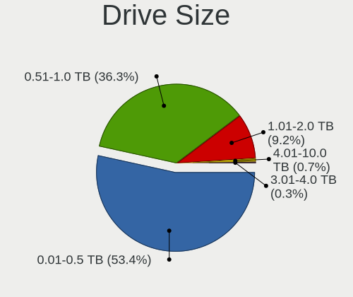
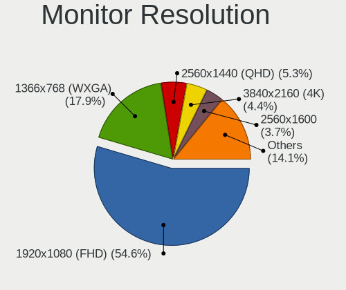
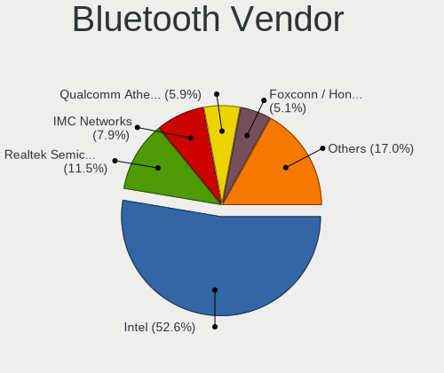
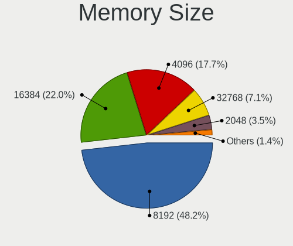

Nobara - Tested Hardware & Statistics (Notebooks)
-------------------------------------------------

A project to collect tested hardware configurations for Nobara.

Anyone can contribute to this report by the [hw-probe](https://github.com/linuxhw/hw-probe) tool:

    sudo -E hw-probe -all -upload

Please contribute! Especially if your hardware is rare.

Contents
--------

* [ Test Cases ](#test-cases)

* [ System ](#system)
  - [ OS                       ](#os)
  - [ OS Family                ](#os-family)
  - [ Kernel                   ](#kernel)
  - [ Kernel Family            ](#kernel-family)
  - [ Kernel Major Ver.        ](#kernel-major-ver)
  - [ Arch                     ](#arch)
  - [ DE                       ](#de)
  - [ Display Server           ](#display-server)
  - [ Display Manager          ](#display-manager)
  - [ OS Lang                  ](#os-lang)
  - [ Boot Mode                ](#boot-mode)
  - [ Filesystem               ](#filesystem)
  - [ Part. scheme             ](#part-scheme)
  - [ Dual Boot with Linux/BSD ](#dual-boot-with-linuxbsd)
  - [ Dual Boot (Win)          ](#dual-boot-win)

* [ Board ](#board)
  - [ Vendor                   ](#vendor)
  - [ Model                    ](#model)
  - [ Model Family             ](#model-family)
  - [ MFG Year                 ](#mfg-year)
  - [ Form Factor              ](#form-factor)
  - [ Secure Boot              ](#secure-boot)
  - [ Coreboot                 ](#coreboot)
  - [ RAM Size                 ](#ram-size)
  - [ RAM Used                 ](#ram-used)
  - [ Total Drives             ](#total-drives)
  - [ Has CD-ROM               ](#has-cd-rom)
  - [ Has Ethernet             ](#has-ethernet)
  - [ Has WiFi                 ](#has-wifi)
  - [ Has Bluetooth            ](#has-bluetooth)

* [ Location ](#location)
  - [ Country                  ](#country)
  - [ City                     ](#city)

* [ Drives ](#drives)
  - [ Drive Vendor             ](#drive-vendor)
  - [ Drive Model              ](#drive-model)
  - [ HDD Vendor               ](#hdd-vendor)
  - [ SSD Vendor               ](#ssd-vendor)
  - [ Drive Kind               ](#drive-kind)
  - [ Drive Connector          ](#drive-connector)
  - [ Drive Size               ](#drive-size)
  - [ Space Total              ](#space-total)
  - [ Space Used               ](#space-used)
  - [ Malfunc. Drives          ](#malfunc-drives)
  - [ Malfunc. Drive Vendor    ](#malfunc-drive-vendor)
  - [ Malfunc. HDD Vendor      ](#malfunc-hdd-vendor)
  - [ Malfunc. Drive Kind      ](#malfunc-drive-kind)
  - [ Failed Drives            ](#failed-drives)
  - [ Failed Drive Vendor      ](#failed-drive-vendor)
  - [ Drive Status             ](#drive-status)

* [ Storage controller ](#storage-controller)
  - [ Storage Vendor           ](#storage-vendor)
  - [ Storage Model            ](#storage-model)
  - [ Storage Kind             ](#storage-kind)

* [ Processor ](#processor)
  - [ CPU Vendor               ](#cpu-vendor)
  - [ CPU Model                ](#cpu-model)
  - [ CPU Model Family         ](#cpu-model-family)
  - [ CPU Cores                ](#cpu-cores)
  - [ CPU Sockets              ](#cpu-sockets)
  - [ CPU Threads              ](#cpu-threads)
  - [ CPU Op-Modes             ](#cpu-op-modes)
  - [ CPU Microcode            ](#cpu-microcode)
  - [ CPU Microarch            ](#cpu-microarch)

* [ Graphics ](#graphics)
  - [ GPU Vendor               ](#gpu-vendor)
  - [ GPU Model                ](#gpu-model)
  - [ GPU Combo                ](#gpu-combo)
  - [ GPU Driver               ](#gpu-driver)
  - [ GPU Memory               ](#gpu-memory)

* [ Monitor ](#monitor)
  - [ Monitor Vendor           ](#monitor-vendor)
  - [ Monitor Model            ](#monitor-model)
  - [ Monitor Resolution       ](#monitor-resolution)
  - [ Monitor Diagonal         ](#monitor-diagonal)
  - [ Monitor Width            ](#monitor-width)
  - [ Aspect Ratio             ](#aspect-ratio)
  - [ Monitor Area             ](#monitor-area)
  - [ Pixel Density            ](#pixel-density)
  - [ Multiple Monitors        ](#multiple-monitors)

* [ Network ](#network)
  - [ Net Controller Vendor    ](#net-controller-vendor)
  - [ Net Controller Model     ](#net-controller-model)
  - [ Wireless Vendor          ](#wireless-vendor)
  - [ Wireless Model           ](#wireless-model)
  - [ Ethernet Vendor          ](#ethernet-vendor)
  - [ Ethernet Model           ](#ethernet-model)
  - [ Net Controller Kind      ](#net-controller-kind)
  - [ Used Controller          ](#used-controller)
  - [ NICs                     ](#nics)
  - [ IPv6                     ](#ipv6)

* [ Bluetooth ](#bluetooth)
  - [ Bluetooth Vendor         ](#bluetooth-vendor)
  - [ Bluetooth Model          ](#bluetooth-model)

* [ Sound ](#sound)
  - [ Sound Vendor             ](#sound-vendor)
  - [ Sound Model              ](#sound-model)

* [ Memory ](#memory)
  - [ Memory Vendor            ](#memory-vendor)
  - [ Memory Model             ](#memory-model)
  - [ Memory Kind              ](#memory-kind)
  - [ Memory Form Factor       ](#memory-form-factor)
  - [ Memory Size              ](#memory-size)
  - [ Memory Speed             ](#memory-speed)

* [ Printers & scanners ](#printers--scanners)
  - [ Printer Vendor           ](#printer-vendor)
  - [ Printer Model            ](#printer-model)
  - [ Scanner Vendor           ](#scanner-vendor)
  - [ Scanner Model            ](#scanner-model)

* [ Camera ](#camera)
  - [ Camera Vendor            ](#camera-vendor)
  - [ Camera Model             ](#camera-model)

* [ Security ](#security)
  - [ Fingerprint Vendor       ](#fingerprint-vendor)
  - [ Fingerprint Model        ](#fingerprint-model)
  - [ Chipcard Vendor          ](#chipcard-vendor)
  - [ Chipcard Model           ](#chipcard-model)

* [ Unsupported ](#unsupported)
  - [ Unsupported Devices      ](#unsupported-devices)
  - [ Unsupported Device Types ](#unsupported-device-types)

Test Cases
----------

Total: 10

| Vendor   | Model                       | Probe                                                      | Date         |
|----------|-----------------------------|------------------------------------------------------------|--------------|
| ASUSTek  | ASUS TUF Gaming F15 FX50... | [0ca693e2dd](https://linux-hardware.org/?probe=0ca693e2dd) | Aug 31, 2022 |
| ASUSTek  | TP500LA                     | [de395dddd8](https://linux-hardware.org/?probe=de395dddd8) | Aug 28, 2022 |
| Dell     | G15 5511                    | [44fa9bf084](https://linux-hardware.org/?probe=44fa9bf084) | Aug 21, 2022 |
| Notebook | P7xxDM2(-G)                 | [f074899985](https://linux-hardware.org/?probe=f074899985) | Aug 17, 2022 |
| HP       | Pavilion Gaming Laptop 1... | [315da58d24](https://linux-hardware.org/?probe=315da58d24) | Aug 16, 2022 |
| Apple    | MacBookPro14,2              | [c66d476513](https://linux-hardware.org/?probe=c66d476513) | Aug 13, 2022 |
| ASUSTek  | ROG Strix G513QY_G513QY     | [df2cc1a299](https://linux-hardware.org/?probe=df2cc1a299) | Aug 12, 2022 |
| Lenovo   | IdeaPad Y700-15ISK 80NV     | [6beddf67f5](https://linux-hardware.org/?probe=6beddf67f5) | Aug 06, 2022 |
| Razer    | Blade                       | [cc3ce45956](https://linux-hardware.org/?probe=cc3ce45956) | Jul 31, 2022 |
| HP       | ZBook 15 G2                 | [3aa2fda09a](https://linux-hardware.org/?probe=3aa2fda09a) | Jul 26, 2022 |

System
------

OS
--

Installed operating systems

| Name      | Notebooks | Percent |
|-----------|-----------|---------|
| Nobara 36 | 10        | 100%    |

OS Family
---------

OS without a version

| Name   | Notebooks | Percent |
|--------|-----------|---------|
| Nobara | 10        | 100%    |

Kernel
------

Version of the Linux kernel

| Version                       | Notebooks | Percent |
|-------------------------------|-----------|---------|
| 5.18.16-201.fsync.fc36.x86_64 | 3         | 30%     |
| 5.18.17-201.fsync.fc36.x86_64 | 2         | 20%     |
| 5.18.13-201.fsync.fc36.x86_64 | 2         | 20%     |
| 5.19.4-201.fsync.fc36.x86_64  | 1         | 10%     |
| 5.18.19-201.fsync.fc36.x86_64 | 1         | 10%     |
| 5.18.18-201.fsync.fc36.x86_64 | 1         | 10%     |

Kernel Family
-------------

Linux kernel without a distro release

| Version | Notebooks | Percent |
|---------|-----------|---------|
| 5.18.16 | 3         | 30%     |
| 5.18.17 | 2         | 20%     |
| 5.18.13 | 2         | 20%     |
| 5.19.4  | 1         | 10%     |
| 5.18.19 | 1         | 10%     |
| 5.18.18 | 1         | 10%     |

Kernel Major Ver.
-----------------

Linux kernel major version

| Version | Notebooks | Percent |
|---------|-----------|---------|
| 5.18    | 9         | 90%     |
| 5.19    | 1         | 10%     |

Arch
----

OS architecture (x86_64, i586, etc.)

| Name   | Notebooks | Percent |
|--------|-----------|---------|
| x86_64 | 10        | 100%    |

DE
--

Desktop Environment

| Name  | Notebooks | Percent |
|-------|-----------|---------|
| GNOME | 7         | 70%     |
| KDE5  | 3         | 30%     |

Display Server
--------------

X11 or Wayland

| Name    | Notebooks | Percent |
|---------|-----------|---------|
| Wayland | 8         | 80%     |
| X11     | 2         | 20%     |

Display Manager
---------------

SDDM, LightDM, etc.

| Name    | Notebooks | Percent |
|---------|-----------|---------|
| Unknown | 9         | 90%     |
| SDDM    | 1         | 10%     |

OS Lang
-------

Language

| Lang  | Notebooks | Percent |
|-------|-----------|---------|
| en_US | 7         | 70%     |
| pt_PT | 1         | 10%     |
| en_ZA | 1         | 10%     |
| en_GB | 1         | 10%     |

Boot Mode
---------

EFI or BIOS

| Mode | Notebooks | Percent |
|------|-----------|---------|
| EFI  | 9         | 90%     |
| BIOS | 1         | 10%     |

Filesystem
----------

Type of filesystem

| Type  | Notebooks | Percent |
|-------|-----------|---------|
| Ext4  | 9         | 90%     |
| Btrfs | 1         | 10%     |

Part. scheme
------------

Scheme of partitioning

| Type    | Notebooks | Percent |
|---------|-----------|---------|
| Unknown | 9         | 90%     |
| GPT     | 1         | 10%     |

Dual Boot with Linux/BSD
------------------------

Hosting more than one Linux/BSD

| Dual boot | Notebooks | Percent |
|-----------|-----------|---------|
| No        | 10        | 100%    |

Dual Boot (Win)
---------------

Hosting Linux and Windows

| Dual boot | Notebooks | Percent |
|-----------|-----------|---------|
| No        | 10        | 100%    |

Board
-----

Vendor
------

Motherboard manufacturer

| Name             | Notebooks | Percent |
|------------------|-----------|---------|
| ASUSTek Computer | 3         | 30%     |
| Hewlett-Packard  | 2         | 20%     |
| Razer            | 1         | 10%     |
| Notebook         | 1         | 10%     |
| Lenovo           | 1         | 10%     |
| Dell             | 1         | 10%     |
| Apple            | 1         | 10%     |

Model
-----

Motherboard model

| Name                                     | Notebooks | Percent |
|------------------------------------------|-----------|---------|
| Razer Blade                              | 1         | 10%     |
| Notebook P7xxDM2(-G)                     | 1         | 10%     |
| Lenovo IdeaPad Y700-15ISK 80NV           | 1         | 10%     |
| HP ZBook 15 G2                           | 1         | 10%     |
| HP Pavilion Gaming Laptop 15-ec1xxx      | 1         | 10%     |
| Dell G15 5511                            | 1         | 10%     |
| ASUS TP500LA                             | 1         | 10%     |
| ASUS ROG Strix G513QY_G513QY             | 1         | 10%     |
| ASUS ASUS TUF Gaming F15 FX506LI_FX506LI | 1         | 10%     |
| Apple MacBookPro14,2                     | 1         | 10%     |

Model Family
------------

Motherboard model prefix

| Name                 | Notebooks | Percent |
|----------------------|-----------|---------|
| Razer Blade          | 1         | 10%     |
| Notebook P7xxDM2(-G) | 1         | 10%     |
| Lenovo IdeaPad       | 1         | 10%     |
| HP ZBook             | 1         | 10%     |
| HP Pavilion          | 1         | 10%     |
| Dell G15             | 1         | 10%     |
| ASUS TP500LA         | 1         | 10%     |
| ASUS ROG             | 1         | 10%     |
| ASUS ASUS            | 1         | 10%     |
| Apple MacBookPro14   | 1         | 10%     |

MFG Year
--------

Motherboard manufacture year

| Year | Notebooks | Percent |
|------|-----------|---------|
| 2021 | 2         | 20%     |
| 2020 | 2         | 20%     |
| 2015 | 2         | 20%     |
| 2014 | 2         | 20%     |
| 2018 | 1         | 10%     |
| 2016 | 1         | 10%     |

Form Factor
-----------

Physical design of the computer

| Name     | Notebooks | Percent |
|----------|-----------|---------|
| Notebook | 10        | 100%    |

Secure Boot
-----------

Enabled or disabled

| State    | Notebooks | Percent |
|----------|-----------|---------|
| Disabled | 10        | 100%    |

Coreboot
--------

Have coreboot on board

| Used | Notebooks | Percent |
|------|-----------|---------|
| No   | 10        | 100%    |

RAM Size
--------

Total RAM memory

| Size in GB | Notebooks | Percent |
|------------|-----------|---------|
| 16.01-24.0 | 4         | 40%     |
| 8.01-16.0  | 3         | 30%     |
| 32.01-64.0 | 2         | 20%     |
| 4.01-8.0   | 1         | 10%     |

RAM Used
--------

Used RAM memory

| Used GB  | Notebooks | Percent |
|----------|-----------|---------|
| 4.01-8.0 | 8         | 80%     |
| 3.01-4.0 | 2         | 20%     |

Total Drives
------------

Number of drives on board

| Drives | Notebooks | Percent |
|--------|-----------|---------|
| 1      | 7         | 70%     |
| 2      | 3         | 30%     |

Has CD-ROM
----------

Has CD-ROM on board

| Presented | Notebooks | Percent |
|-----------|-----------|---------|
| No        | 9         | 90%     |
| Yes       | 1         | 10%     |

Has Ethernet
------------

Has Ethernet on board

| Presented | Notebooks | Percent |
|-----------|-----------|---------|
| Yes       | 9         | 90%     |
| No        | 1         | 10%     |

Has WiFi
--------

Has WiFi module

| Presented | Notebooks | Percent |
|-----------|-----------|---------|
| Yes       | 10        | 100%    |

Has Bluetooth
-------------

Has Bluetooth module

| Presented | Notebooks | Percent |
|-----------|-----------|---------|
| Yes       | 9         | 90%     |
| No        | 1         | 10%     |

Location
--------

Country
-------

Geographic location (country)

| Country      | Notebooks | Percent |
|--------------|-----------|---------|
| USA          | 7         | 70%     |
| South Africa | 1         | 10%     |
| Portugal     | 1         | 10%     |
| Czechia      | 1         | 10%     |

City
----

Geographic location (city)

| City          | Notebooks | Percent |
|---------------|-----------|---------|
| Wasilla       | 1         | 10%     |
| Rozsicka      | 1         | 10%     |
| Panama City   | 1         | 10%     |
| Odessa        | 1         | 10%     |
| Lisbon        | 1         | 10%     |
| Johannesburg  | 1         | 10%     |
| Irvine        | 1         | 10%     |
| Holden        | 1         | 10%     |
| Goose Creek   | 1         | 10%     |
| Copperas Cove | 1         | 10%     |

Drives
------

Drive Vendor
------------

Hard drive vendors

| Vendor                    | Notebooks | Drives | Percent |
|---------------------------|-----------|--------|---------|
| Samsung Electronics       | 3         | 3      | 25%     |
| Kingston                  | 2         | 2      | 16.67%  |
| WDC                       | 1         | 1      | 8.33%   |
| SK hynix                  | 1         | 1      | 8.33%   |
| Micron/Crucial Technology | 1         | 1      | 8.33%   |
| HGST                      | 1         | 1      | 8.33%   |
| Crucial                   | 1         | 1      | 8.33%   |
| China                     | 1         | 1      | 8.33%   |
| Apple                     | 1         | 2      | 8.33%   |

Drive Model
-----------

Hard drive models

| Model                                   | Notebooks | Percent |
|-----------------------------------------|-----------|---------|
| Kingston NVMe SSD Drive 512GB           | 2         | 15.38%  |
| WDC PC SN530 SDBPNPZ-512G-1006 512GB    | 1         | 7.69%   |
| SK hynix C2S3T/120G 120GB               | 1         | 7.69%   |
| Samsung SM963 2.5" NVMe PCIe SSD 1024GB | 1         | 7.69%   |
| Samsung NVMe SSD Drive 500GB            | 1         | 7.69%   |
| Samsung MZNLN128HCGR-000L2 128GB SSD    | 1         | 7.69%   |
| Micron/Crucial NVMe SSD Drive 1TB       | 1         | 7.69%   |
| HGST HTS541010A7E630 1TB                | 1         | 7.69%   |
| Crucial CT512M550SSD4 512GB             | 1         | 7.69%   |
| China SATA SSD 120GB                    | 1         | 7.69%   |
| Apple NVMe SSD Drive 8KB                | 1         | 7.69%   |
| Apple NVMe SSD Drive 500GB              | 1         | 7.69%   |

HDD Vendor
----------

Hard disk drive vendors

| Vendor | Notebooks | Drives | Percent |
|--------|-----------|--------|---------|
| HGST   | 1         | 1      | 100%    |

SSD Vendor
----------

Solid state drive vendors

| Vendor              | Notebooks | Drives | Percent |
|---------------------|-----------|--------|---------|
| SK hynix            | 1         | 1      | 25%     |
| Samsung Electronics | 1         | 1      | 25%     |
| Crucial             | 1         | 1      | 25%     |
| China               | 1         | 1      | 25%     |

Drive Kind
----------

HDD or SSD

| Kind | Notebooks | Drives | Percent |
|------|-----------|--------|---------|
| NVMe | 6         | 8      | 54.55%  |
| SSD  | 4         | 4      | 36.36%  |
| HDD  | 1         | 1      | 9.09%   |

Drive Connector
---------------

SATA, SAS, NVMe, etc.

| Type | Notebooks | Drives | Percent |
|------|-----------|--------|---------|
| NVMe | 6         | 8      | 60%     |
| SATA | 4         | 5      | 40%     |

Drive Size
----------

Size of hard drive

| Size in TB | Notebooks | Drives | Percent |
|------------|-----------|--------|---------|
| 0.01-0.5   | 3         | 3      | 60%     |
| 0.51-1.0   | 2         | 2      | 40%     |

Space Total
-----------

Amount of disk space available on the file system

| Size in GB | Notebooks | Percent |
|------------|-----------|---------|
| 101-250    | 4         | 40%     |
| 251-500    | 3         | 30%     |
| 501-1000   | 3         | 30%     |

Space Used
----------

Amount of used disk space

| Used GB | Notebooks | Percent |
|---------|-----------|---------|
| 1-20    | 3         | 30%     |
| 51-100  | 3         | 30%     |
| 21-50   | 2         | 20%     |
| 251-500 | 1         | 10%     |
| 101-250 | 1         | 10%     |

Malfunc. Drives
---------------

Drive models with a malfunction

Zero info for selected period =(

Malfunc. Drive Vendor
---------------------

Vendors of faulty drives

Zero info for selected period =(

Malfunc. HDD Vendor
-------------------

Vendors of faulty HDD drives

Zero info for selected period =(

Malfunc. Drive Kind
-------------------

Kinds of faulty drives

Zero info for selected period =(

Failed Drives
-------------

Failed drive models

Zero info for selected period =(

Failed Drive Vendor
-------------------

Failed drive vendors

Zero info for selected period =(

Drive Status
------------

Number of failed and malfunc. drives

| Status   | Notebooks | Drives | Percent |
|----------|-----------|--------|---------|
| Detected | 9         | 12     | 90%     |
| Works    | 1         | 1      | 10%     |

Storage controller
------------------

Storage Vendor
--------------

Storage controller vendors

| Vendor                      | Notebooks | Percent |
|-----------------------------|-----------|---------|
| Intel                       | 7         | 46.67%  |
| Samsung Electronics         | 2         | 13.33%  |
| Kingston Technology Company | 2         | 13.33%  |
| SanDisk                     | 1         | 6.67%   |
| Micron/Crucial Technology   | 1         | 6.67%   |
| Apple                       | 1         | 6.67%   |
| AMD                         | 1         | 6.67%   |

Storage Model
-------------

Storage controller models

| Model                                                                          | Notebooks | Percent |
|--------------------------------------------------------------------------------|-----------|---------|
| Intel 8 Series/C220 Series Chipset Family 6-port SATA Controller 1 [AHCI mode] | 2         | 13.33%  |
| SanDisk WD Blue SN550 NVMe SSD                                                 | 1         | 6.67%   |
| Samsung NVMe SSD Controller SM981/PM981/PM983                                  | 1         | 6.67%   |
| Samsung NVMe SSD Controller 980                                                | 1         | 6.67%   |
| Micron/Crucial Non-Volatile memory controller                                  | 1         | 6.67%   |
| Kingston Company Company Non-Volatile memory controller                        | 1         | 6.67%   |
| Kingston Company OM3PDP3 NVMe SSD                                              | 1         | 6.67%   |
| Intel Q170/Q150/B150/H170/H110/Z170/CM236 Chipset SATA Controller [AHCI Mode]  | 1         | 6.67%   |
| Intel HM170/QM170 Chipset SATA Controller [AHCI Mode]                          | 1         | 6.67%   |
| Intel 8 Series SATA Controller 1 [AHCI mode]                                   | 1         | 6.67%   |
| Intel 500 Series Chipset Family SATA AHCI Controller                           | 1         | 6.67%   |
| Intel 400 Series Chipset Family SATA AHCI Controller                           | 1         | 6.67%   |
| Apple S3X NVMe Controller                                                      | 1         | 6.67%   |
| AMD FCH SATA Controller [AHCI mode]                                            | 1         | 6.67%   |

Storage Kind
------------

Kind of storage controller (IDE, SATA, NVMe, SAS, ...)

| Kind | Notebooks | Percent |
|------|-----------|---------|
| SATA | 8         | 57.14%  |
| NVMe | 6         | 42.86%  |

Processor
---------

CPU Vendor
----------

Processor vendors

| Vendor | Notebooks | Percent |
|--------|-----------|---------|
| Intel  | 8         | 80%     |
| AMD    | 2         | 20%     |

CPU Model
---------

Processor models

| Model                                   | Notebooks | Percent |
|-----------------------------------------|-----------|---------|
| Intel Core i7-7700 CPU @ 3.60GHz        | 1         | 10%     |
| Intel Core i7-7567U CPU @ 3.50GHz       | 1         | 10%     |
| Intel Core i7-6700HQ CPU @ 2.60GHz      | 1         | 10%     |
| Intel Core i7-4810MQ CPU @ 2.80GHz      | 1         | 10%     |
| Intel Core i7-4702HQ CPU @ 2.20GHz      | 1         | 10%     |
| Intel Core i5-10300H CPU @ 2.50GHz      | 1         | 10%     |
| Intel Core i3-4030U CPU @ 1.90GHz       | 1         | 10%     |
| Intel 11th Gen Core i7-11800H @ 2.30GHz | 1         | 10%     |
| AMD Ryzen 9 5900HX with Radeon Graphics | 1         | 10%     |
| AMD Ryzen 5 4600H with Radeon Graphics  | 1         | 10%     |

CPU Model Family
----------------

Processor model prefix

| Model         | Notebooks | Percent |
|---------------|-----------|---------|
| Intel Core i7 | 5         | 50%     |
| Other         | 1         | 10%     |
| Intel Core i5 | 1         | 10%     |
| Intel Core i3 | 1         | 10%     |
| AMD Ryzen 9   | 1         | 10%     |
| AMD Ryzen 5   | 1         | 10%     |

CPU Cores
---------

Number of processor cores

| Number | Notebooks | Percent |
|--------|-----------|---------|
| 4      | 5         | 50%     |
| 8      | 2         | 20%     |
| 2      | 2         | 20%     |
| 6      | 1         | 10%     |

CPU Sockets
-----------

Number of sockets

| Number | Notebooks | Percent |
|--------|-----------|---------|
| 1      | 10        | 100%    |

CPU Threads
-----------

Threads per core (Hyper-Threading)

| Number | Notebooks | Percent |
|--------|-----------|---------|
| 2      | 10        | 100%    |

CPU Op-Modes
------------

CPU Operation Modes (32-bit, 64-bit)

| Op mode        | Notebooks | Percent |
|----------------|-----------|---------|
| 32-bit, 64-bit | 10        | 100%    |

CPU Microcode
-------------

Microcode number

| Number     | Notebooks | Percent |
|------------|-----------|---------|
| 0x306c3    | 2         | 20%     |
| 0xa0652    | 1         | 10%     |
| 0x906e9    | 1         | 10%     |
| 0x806e9    | 1         | 10%     |
| 0x806d1    | 1         | 10%     |
| 0x506e3    | 1         | 10%     |
| 0x40651    | 1         | 10%     |
| 0x0a50000c | 1         | 10%     |
| 0x08600106 | 1         | 10%     |

CPU Microarch
-------------

Microarchitecture

| Name      | Notebooks | Percent |
|-----------|-----------|---------|
| Haswell   | 3         | 30%     |
| KabyLake  | 2         | 20%     |
| Zen 3     | 1         | 10%     |
| Zen 2     | 1         | 10%     |
| Skylake   | 1         | 10%     |
| Icelake   | 1         | 10%     |
| CometLake | 1         | 10%     |

Graphics
--------

GPU Vendor
----------

Vendors of graphics cards

| Vendor | Notebooks | Percent |
|--------|-----------|---------|
| Nvidia | 7         | 43.75%  |
| Intel  | 7         | 43.75%  |
| AMD    | 2         | 12.5%   |

GPU Model
---------

Graphics card models

| Model                                                       | Notebooks | Percent |
|-------------------------------------------------------------|-----------|---------|
| Nvidia TU117M [GeForce GTX 1650 Ti Mobile]                  | 2         | 11.76%  |
| Intel 4th Gen Core Processor Integrated Graphics Controller | 2         | 11.76%  |
| Nvidia GP104BM [GeForce GTX 1070 Mobile]                    | 1         | 5.88%   |
| Nvidia GM107M [GeForce GTX 960M]                            | 1         | 5.88%   |
| Nvidia GK106GLM [Quadro K2100M]                             | 1         | 5.88%   |
| Nvidia GK104M [GeForce GTX 870M]                            | 1         | 5.88%   |
| Nvidia GA106M [GeForce RTX 3060 Mobile / Max-Q]             | 1         | 5.88%   |
| Intel TigerLake-H GT1 [UHD Graphics]                        | 1         | 5.88%   |
| Intel Iris Plus Graphics 650                                | 1         | 5.88%   |
| Intel HD Graphics 530                                       | 1         | 5.88%   |
| Intel Haswell-ULT Integrated Graphics Controller            | 1         | 5.88%   |
| Intel CometLake-H GT2 [UHD Graphics]                        | 1         | 5.88%   |
| AMD Renoir                                                  | 1         | 5.88%   |
| AMD Navi 22 [Radeon RX 6700/6700 XT/6750 XT / 6800M]        | 1         | 5.88%   |
| AMD Cezanne                                                 | 1         | 5.88%   |

GPU Combo
---------

Combinations of graphics cards

| Name           | Notebooks | Percent |
|----------------|-----------|---------|
| Intel + Nvidia | 5         | 50%     |
| 1 x Intel      | 2         | 20%     |
| 2 x AMD        | 1         | 10%     |
| 1 x Nvidia     | 1         | 10%     |
| AMD + Nvidia   | 1         | 10%     |

GPU Driver
----------

Free vs proprietary

| Driver      | Notebooks | Percent |
|-------------|-----------|---------|
| Proprietary | 5         | 50%     |
| Free        | 5         | 50%     |

GPU Memory
----------

Total video memory

| Size in GB | Notebooks | Percent |
|------------|-----------|---------|
| Unknown    | 6         | 60%     |
| 7.01-8.0   | 1         | 10%     |
| 1.01-2.0   | 1         | 10%     |
| 8.01-16.0  | 1         | 10%     |
| 0.01-0.5   | 1         | 10%     |

Monitor
-------

Monitor Vendor
--------------

Monitor vendors

| Vendor              | Notebooks | Percent |
|---------------------|-----------|---------|
| PANDA               | 3         | 25%     |
| LG Display          | 3         | 25%     |
| Sharp               | 2         | 16.67%  |
| Samsung Electronics | 1         | 8.33%   |
| Hewlett-Packard     | 1         | 8.33%   |
| AU Optronics        | 1         | 8.33%   |
| Apple               | 1         | 8.33%   |

Monitor Model
-------------

Monitor models

| Model                                                             | Notebooks | Percent |
|-------------------------------------------------------------------|-----------|---------|
| Sharp LQ156M1JW25 SHP152C 1920x1080 344x194mm 15.5-inch           | 1         | 8.33%   |
| Sharp LQ140Z1JW01 SHP1401 3200x1800 310x174mm 14.0-inch           | 1         | 8.33%   |
| Samsung Electronics S24D390 SAM0B65 1920x1080 520x290mm 23.4-inch | 1         | 8.33%   |
| PANDA LCD Monitor NCP005F 1920x1080 344x194mm 15.5-inch           | 1         | 8.33%   |
| PANDA LCD Monitor NCP0058 1920x1080 344x194mm 15.5-inch           | 1         | 8.33%   |
| PANDA LCD Monitor NCP004D 1920x1080 344x194mm 15.5-inch           | 1         | 8.33%   |
| LG Display LCD Monitor LGD04D4 3840x2160 344x194mm 15.5-inch      | 1         | 8.33%   |
| LG Display LCD Monitor LGD04A7 1920x1080 344x194mm 15.5-inch      | 1         | 8.33%   |
| LG Display LCD Monitor LGD046F 1920x1080 345x194mm 15.6-inch      | 1         | 8.33%   |
| Hewlett-Packard 32f HPN365B 1920x1080 699x393mm 31.6-inch         | 1         | 8.33%   |
| AU Optronics LCD Monitor AUO42EC 1366x768 344x193mm 15.5-inch     | 1         | 8.33%   |
| Apple Color LCD APPA034 2880x1800 286x179mm 13.3-inch             | 1         | 8.33%   |

Monitor Resolution
------------------

Monitor screen resolution

| Resolution       | Notebooks | Percent |
|------------------|-----------|---------|
| 1920x1080 (FHD)  | 6         | 60%     |
| 3840x2160 (4K)   | 1         | 10%     |
| 3200x1800 (QHD+) | 1         | 10%     |
| 2880x1800        | 1         | 10%     |
| 1366x768 (WXGA)  | 1         | 10%     |

Monitor Diagonal
----------------

Diagonal size in inches

| Inches | Notebooks | Percent |
|--------|-----------|---------|
| 15     | 8         | 66.67%  |
| 31     | 1         | 8.33%   |
| 23     | 1         | 8.33%   |
| 14     | 1         | 8.33%   |
| 13     | 1         | 8.33%   |

Monitor Width
-------------

Physical width

| Width in mm | Notebooks | Percent |
|-------------|-----------|---------|
| 301-350     | 9         | 75%     |
| 601-700     | 1         | 8.33%   |
| 501-600     | 1         | 8.33%   |
| 201-300     | 1         | 8.33%   |

Aspect Ratio
------------

Proportional relationship between the width and the height

| Ratio | Notebooks | Percent |
|-------|-----------|---------|
| 16/9  | 9         | 90%     |
| 16/10 | 1         | 10%     |

Monitor Area
------------

Area in inch²

| Area in inch² | Notebooks | Percent |
|----------------|-----------|---------|
| 101-110        | 8         | 66.67%  |
| 81-90          | 1         | 8.33%   |
| 71-80          | 1         | 8.33%   |
| 351-500        | 1         | 8.33%   |
| 201-250        | 1         | 8.33%   |

Pixel Density
-------------

Pixels per inch

| Density       | Notebooks | Percent |
|---------------|-----------|---------|
| 121-160       | 6         | 50%     |
| More than 240 | 3         | 25%     |
| 51-100        | 2         | 16.67%  |
| 101-120       | 1         | 8.33%   |

Multiple Monitors
-----------------

Total monitors connected

| Total | Notebooks | Percent |
|-------|-----------|---------|
| 1     | 8         | 80%     |
| 2     | 2         | 20%     |

Network
-------

Net Controller Vendor
---------------------

Controller vendors

| Vendor                | Notebooks | Percent |
|-----------------------|-----------|---------|
| Realtek Semiconductor | 6         | 35.29%  |
| Intel                 | 5         | 29.41%  |
| MediaTek              | 2         | 11.76%  |
| Qualcomm Atheros      | 1         | 5.88%   |
| Google                | 1         | 5.88%   |
| Broadcom              | 1         | 5.88%   |
| ASIX Electronics      | 1         | 5.88%   |

Net Controller Model
--------------------

Controller models

| Model                                                             | Notebooks | Percent |
|-------------------------------------------------------------------|-----------|---------|
| Realtek RTL8111/8168/8411 PCI Express Gigabit Ethernet Controller | 5         | 25%     |
| Intel Wireless 7260                                               | 2         | 10%     |
| Realtek RTL8822CE 802.11ac PCIe Wireless Network Adapter          | 1         | 5%      |
| Realtek Killer E2600 Gigabit Ethernet Controller                  | 1         | 5%      |
| Qualcomm Atheros QCA6174 802.11ac Wireless Network Adapter        | 1         | 5%      |
| Qualcomm Atheros Killer E2400 Gigabit Ethernet Controller         | 1         | 5%      |
| MediaTek MT7921 802.11ax PCI Express Wireless Network Adapter     | 1         | 5%      |
| MediaTek MT7630e 802.11bgn Wireless Network Adapter               | 1         | 5%      |
| Intel Tiger Lake PCH CNVi WiFi                                    | 1         | 5%      |
| Intel Ethernet Connection I217-LM                                 | 1         | 5%      |
| Intel Dual Band Wireless-AC 3165 Plus Bluetooth                   | 1         | 5%      |
| Intel Comet Lake PCH CNVi WiFi                                    | 1         | 5%      |
| Google Pixel 6                                                    | 1         | 5%      |
| Broadcom BCM43602 802.11ac Wireless LAN SoC                       | 1         | 5%      |
| ASIX AX88179 Gigabit Ethernet                                     | 1         | 5%      |

Wireless Vendor
---------------

Wireless vendors

| Vendor                | Notebooks | Percent |
|-----------------------|-----------|---------|
| Intel                 | 5         | 50%     |
| MediaTek              | 2         | 20%     |
| Realtek Semiconductor | 1         | 10%     |
| Qualcomm Atheros      | 1         | 10%     |
| Broadcom              | 1         | 10%     |

Wireless Model
--------------

Wireless models

| Model                                                         | Notebooks | Percent |
|---------------------------------------------------------------|-----------|---------|
| Intel Wireless 7260                                           | 2         | 20%     |
| Realtek RTL8822CE 802.11ac PCIe Wireless Network Adapter      | 1         | 10%     |
| Qualcomm Atheros QCA6174 802.11ac Wireless Network Adapter    | 1         | 10%     |
| MediaTek MT7921 802.11ax PCI Express Wireless Network Adapter | 1         | 10%     |
| MediaTek MT7630e 802.11bgn Wireless Network Adapter           | 1         | 10%     |
| Intel Tiger Lake PCH CNVi WiFi                                | 1         | 10%     |
| Intel Dual Band Wireless-AC 3165 Plus Bluetooth               | 1         | 10%     |
| Intel Comet Lake PCH CNVi WiFi                                | 1         | 10%     |
| Broadcom BCM43602 802.11ac Wireless LAN SoC                   | 1         | 10%     |

Ethernet Vendor
---------------

Ethernet vendors

| Vendor                | Notebooks | Percent |
|-----------------------|-----------|---------|
| Realtek Semiconductor | 6         | 60%     |
| Qualcomm Atheros      | 1         | 10%     |
| Intel                 | 1         | 10%     |
| Google                | 1         | 10%     |
| ASIX Electronics      | 1         | 10%     |

Ethernet Model
--------------

Ethernet models

| Model                                                             | Notebooks | Percent |
|-------------------------------------------------------------------|-----------|---------|
| Realtek RTL8111/8168/8411 PCI Express Gigabit Ethernet Controller | 5         | 50%     |
| Realtek Killer E2600 Gigabit Ethernet Controller                  | 1         | 10%     |
| Qualcomm Atheros Killer E2400 Gigabit Ethernet Controller         | 1         | 10%     |
| Intel Ethernet Connection I217-LM                                 | 1         | 10%     |
| Google Pixel 6                                                    | 1         | 10%     |
| ASIX AX88179 Gigabit Ethernet                                     | 1         | 10%     |

Net Controller Kind
-------------------

Ethernet, WiFi or modem

| Kind     | Notebooks | Percent |
|----------|-----------|---------|
| WiFi     | 10        | 52.63%  |
| Ethernet | 9         | 47.37%  |

Used Controller
---------------

Currently used network controller

| Kind     | Notebooks | Percent |
|----------|-----------|---------|
| WiFi     | 8         | 80%     |
| Ethernet | 2         | 20%     |

NICs
----

Total network controllers on board

| Total | Notebooks | Percent |
|-------|-----------|---------|
| 2     | 8         | 80%     |
| 1     | 2         | 20%     |

IPv6
----

IPv6 vs IPv4

| Used | Notebooks | Percent |
|------|-----------|---------|
| No   | 6         | 60%     |
| Yes  | 4         | 40%     |

Bluetooth
---------

Bluetooth Vendor
----------------

Controller vendors

| Vendor                          | Notebooks | Percent |
|---------------------------------|-----------|---------|
| Intel                           | 5         | 55.56%  |
| Realtek Semiconductor           | 1         | 11.11%  |
| Qualcomm Atheros Communications | 1         | 11.11%  |
| IMC Networks                    | 1         | 11.11%  |
| Foxconn / Hon Hai               | 1         | 11.11%  |

Bluetooth Model
---------------

Controller models

| Model                                  | Notebooks | Percent |
|----------------------------------------|-----------|---------|
| Intel Bluetooth wireless interface     | 3         | 33.33%  |
| Intel AX201 Bluetooth                  | 2         | 22.22%  |
| Realtek Bluetooth Radio                | 1         | 11.11%  |
| Qualcomm Atheros QCA61x4 Bluetooth 4.0 | 1         | 11.11%  |
| IMC Networks Wireless_Device           | 1         | 11.11%  |
| Foxconn / Hon Hai BT                   | 1         | 11.11%  |

Sound
-----

Sound Vendor
------------

Sound card vendors

| Vendor              | Notebooks | Percent |
|---------------------|-----------|---------|
| Intel               | 8         | 50%     |
| Nvidia              | 5         | 31.25%  |
| AMD                 | 2         | 12.5%   |
| C-Media Electronics | 1         | 6.25%   |

Sound Model
-----------

Sound card models

| Model                                                               | Notebooks | Percent |
|---------------------------------------------------------------------|-----------|---------|
| Nvidia TU107 GeForce GTX 1650 High Definition Audio Controller      | 2         | 10%     |
| Intel 8 Series/C220 Series Chipset High Definition Audio Controller | 2         | 10%     |
| Intel 100 Series/C230 Series Chipset Family HD Audio Controller     | 2         | 10%     |
| AMD Family 17h/19h HD Audio Controller                              | 2         | 10%     |
| Nvidia GP104 High Definition Audio Controller                       | 1         | 5%      |
| Nvidia GK106 HDMI Audio Controller                                  | 1         | 5%      |
| Nvidia GA106 High Definition Audio Controller                       | 1         | 5%      |
| Intel Xeon E3-1200 v3/4th Gen Core Processor HD Audio Controller    | 1         | 5%      |
| Intel Tiger Lake-H HD Audio Controller                              | 1         | 5%      |
| Intel Sunrise Point-LP HD Audio                                     | 1         | 5%      |
| Intel Haswell-ULT HD Audio Controller                               | 1         | 5%      |
| Intel Comet Lake PCH cAVS                                           | 1         | 5%      |
| Intel 8 Series HD Audio Controller                                  | 1         | 5%      |
| C-Media Electronics USB Audio Device                                | 1         | 5%      |
| AMD Renoir Radeon High Definition Audio Controller                  | 1         | 5%      |
| AMD Navi 21/23 HDMI/DP Audio Controller                             | 1         | 5%      |

Memory
------

Memory Vendor
-------------

Memory module vendors

| Vendor              | Notebooks | Percent |
|---------------------|-----------|---------|
| Samsung Electronics | 1         | 100%    |

Memory Model
------------

Memory module models

| Model                                                 | Notebooks | Percent |
|-------------------------------------------------------|-----------|---------|
| Samsung RAM M471A1K43DB1-CWE 8GB SODIMM DDR4 3200MT/s | 1         | 100%    |

Memory Kind
-----------

Memory module kinds

| Kind | Notebooks | Percent |
|------|-----------|---------|
| DDR4 | 1         | 100%    |

Memory Form Factor
------------------

Physical design of the memory module

| Name   | Notebooks | Percent |
|--------|-----------|---------|
| SODIMM | 1         | 100%    |

Memory Size
-----------

Memory module size

| Size | Notebooks | Percent |
|------|-----------|---------|
| 8192 | 1         | 100%    |

Memory Speed
------------

Memory module speed

| Speed | Notebooks | Percent |
|-------|-----------|---------|
| 3200  | 1         | 100%    |

Printers & scanners
-------------------

Printer Vendor
--------------

Printer device vendors

Zero info for selected period =(

Printer Model
-------------

Printer device models

Zero info for selected period =(

Scanner Vendor
--------------

Scanner device vendors

Zero info for selected period =(

Scanner Model
-------------

Scanner device models

Zero info for selected period =(

Camera
------

Camera Vendor
-------------

Camera device vendors

| Vendor                      | Notebooks | Percent |
|-----------------------------|-----------|---------|
| Realtek Semiconductor       | 2         | 25%     |
| Microdia                    | 1         | 12.5%   |
| Luxvisions Innotech Limited | 1         | 12.5%   |
| Logitech                    | 1         | 12.5%   |
| Lite-On Technology          | 1         | 12.5%   |
| Goodong Industry            | 1         | 12.5%   |
| Chicony Electronics         | 1         | 12.5%   |

Camera Model
------------

Camera device models

| Model                                               | Notebooks | Percent |
|-----------------------------------------------------|-----------|---------|
| Realtek USB Camera                                  | 2         | 25%     |
| Microdia Integrated_Webcam_HD                       | 1         | 12.5%   |
| Luxvisions Innotech Limited HP TrueVision HD Camera | 1         | 12.5%   |
| Logitech QuickCam Communicate MP/S5500              | 1         | 12.5%   |
| Lite-On HP HD Webcam                                | 1         | 12.5%   |
| Goodong Industry USB2.0 HD UVC WebCam               | 1         | 12.5%   |
| Chicony USB 2.0 Camera                              | 1         | 12.5%   |

Security
--------

Fingerprint Vendor
------------------

Fingerprint sensor vendors

| Vendor           | Notebooks | Percent |
|------------------|-----------|---------|
| Validity Sensors | 1         | 50%     |
| Synaptics        | 1         | 50%     |

Fingerprint Model
-----------------

Fingerprint sensor models

| Model                                      | Notebooks | Percent |
|--------------------------------------------|-----------|---------|
| Validity Sensors VFS495 Fingerprint Reader | 1         | 50%     |
| Synaptics WBDI Device                      | 1         | 50%     |

Chipcard Vendor
---------------

Chipcard module vendors

Zero info for selected period =(

Chipcard Model
--------------

Chipcard module models

Zero info for selected period =(

Unsupported
-----------

Unsupported Devices
-------------------

Total unsupported devices on board

| Total | Notebooks | Percent |
|-------|-----------|---------|
| 1     | 5         | 50%     |
| 0     | 5         | 50%     |

Unsupported Device Types
------------------------

Types of unsupported devices

| Type                  | Notebooks | Percent |
|-----------------------|-----------|---------|
| Fingerprint reader    | 2         | 40%     |
| Net/wireless          | 1         | 20%     |
| Multimedia controller | 1         | 20%     |
| Bluetooth             | 1         | 20%     |

