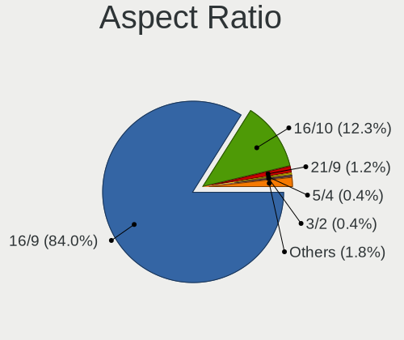

Nobara - Tested Hardware & Statistics (Notebooks)
-------------------------------------------------

A project to collect tested hardware configurations for Nobara.

Anyone can contribute to this report by the [hw-probe](https://github.com/linuxhw/hw-probe) tool:

    sudo -E hw-probe -all -upload

Please contribute! Especially if your hardware is rare.

Contents
--------

* [ Test Cases ](#test-cases)

* [ System ](#system)
  - [ OS                       ](#os)
  - [ OS Family                ](#os-family)
  - [ Kernel                   ](#kernel)
  - [ Kernel Family            ](#kernel-family)
  - [ Kernel Major Ver.        ](#kernel-major-ver)
  - [ Arch                     ](#arch)
  - [ DE                       ](#de)
  - [ Display Server           ](#display-server)
  - [ Display Manager          ](#display-manager)
  - [ OS Lang                  ](#os-lang)
  - [ Boot Mode                ](#boot-mode)
  - [ Filesystem               ](#filesystem)
  - [ Part. scheme             ](#part-scheme)
  - [ Dual Boot with Linux/BSD ](#dual-boot-with-linuxbsd)
  - [ Dual Boot (Win)          ](#dual-boot-win)

* [ Board ](#board)
  - [ Vendor                   ](#vendor)
  - [ Model                    ](#model)
  - [ Model Family             ](#model-family)
  - [ MFG Year                 ](#mfg-year)
  - [ Form Factor              ](#form-factor)
  - [ Secure Boot              ](#secure-boot)
  - [ Coreboot                 ](#coreboot)
  - [ RAM Size                 ](#ram-size)
  - [ RAM Used                 ](#ram-used)
  - [ Total Drives             ](#total-drives)
  - [ Has CD-ROM               ](#has-cd-rom)
  - [ Has Ethernet             ](#has-ethernet)
  - [ Has WiFi                 ](#has-wifi)
  - [ Has Bluetooth            ](#has-bluetooth)

* [ Location ](#location)
  - [ Country                  ](#country)
  - [ City                     ](#city)

* [ Drives ](#drives)
  - [ Drive Vendor             ](#drive-vendor)
  - [ Drive Model              ](#drive-model)
  - [ HDD Vendor               ](#hdd-vendor)
  - [ SSD Vendor               ](#ssd-vendor)
  - [ Drive Kind               ](#drive-kind)
  - [ Drive Connector          ](#drive-connector)
  - [ Drive Size               ](#drive-size)
  - [ Space Total              ](#space-total)
  - [ Space Used               ](#space-used)
  - [ Malfunc. Drives          ](#malfunc-drives)
  - [ Malfunc. Drive Vendor    ](#malfunc-drive-vendor)
  - [ Malfunc. HDD Vendor      ](#malfunc-hdd-vendor)
  - [ Malfunc. Drive Kind      ](#malfunc-drive-kind)
  - [ Failed Drives            ](#failed-drives)
  - [ Failed Drive Vendor      ](#failed-drive-vendor)
  - [ Drive Status             ](#drive-status)

* [ Storage controller ](#storage-controller)
  - [ Storage Vendor           ](#storage-vendor)
  - [ Storage Model            ](#storage-model)
  - [ Storage Kind             ](#storage-kind)

* [ Processor ](#processor)
  - [ CPU Vendor               ](#cpu-vendor)
  - [ CPU Model                ](#cpu-model)
  - [ CPU Model Family         ](#cpu-model-family)
  - [ CPU Cores                ](#cpu-cores)
  - [ CPU Sockets              ](#cpu-sockets)
  - [ CPU Threads              ](#cpu-threads)
  - [ CPU Op-Modes             ](#cpu-op-modes)
  - [ CPU Microcode            ](#cpu-microcode)
  - [ CPU Microarch            ](#cpu-microarch)

* [ Graphics ](#graphics)
  - [ GPU Vendor               ](#gpu-vendor)
  - [ GPU Model                ](#gpu-model)
  - [ GPU Combo                ](#gpu-combo)
  - [ GPU Driver               ](#gpu-driver)
  - [ GPU Memory               ](#gpu-memory)

* [ Monitor ](#monitor)
  - [ Monitor Vendor           ](#monitor-vendor)
  - [ Monitor Model            ](#monitor-model)
  - [ Monitor Resolution       ](#monitor-resolution)
  - [ Monitor Diagonal         ](#monitor-diagonal)
  - [ Monitor Width            ](#monitor-width)
  - [ Aspect Ratio             ](#aspect-ratio)
  - [ Monitor Area             ](#monitor-area)
  - [ Pixel Density            ](#pixel-density)
  - [ Multiple Monitors        ](#multiple-monitors)

* [ Network ](#network)
  - [ Net Controller Vendor    ](#net-controller-vendor)
  - [ Net Controller Model     ](#net-controller-model)
  - [ Wireless Vendor          ](#wireless-vendor)
  - [ Wireless Model           ](#wireless-model)
  - [ Ethernet Vendor          ](#ethernet-vendor)
  - [ Ethernet Model           ](#ethernet-model)
  - [ Net Controller Kind      ](#net-controller-kind)
  - [ Used Controller          ](#used-controller)
  - [ NICs                     ](#nics)
  - [ IPv6                     ](#ipv6)

* [ Bluetooth ](#bluetooth)
  - [ Bluetooth Vendor         ](#bluetooth-vendor)
  - [ Bluetooth Model          ](#bluetooth-model)

* [ Sound ](#sound)
  - [ Sound Vendor             ](#sound-vendor)
  - [ Sound Model              ](#sound-model)

* [ Memory ](#memory)
  - [ Memory Vendor            ](#memory-vendor)
  - [ Memory Model             ](#memory-model)
  - [ Memory Kind              ](#memory-kind)
  - [ Memory Form Factor       ](#memory-form-factor)
  - [ Memory Size              ](#memory-size)
  - [ Memory Speed             ](#memory-speed)

* [ Printers & scanners ](#printers--scanners)
  - [ Printer Vendor           ](#printer-vendor)
  - [ Printer Model            ](#printer-model)
  - [ Scanner Vendor           ](#scanner-vendor)
  - [ Scanner Model            ](#scanner-model)

* [ Camera ](#camera)
  - [ Camera Vendor            ](#camera-vendor)
  - [ Camera Model             ](#camera-model)

* [ Security ](#security)
  - [ Fingerprint Vendor       ](#fingerprint-vendor)
  - [ Fingerprint Model        ](#fingerprint-model)
  - [ Chipcard Vendor          ](#chipcard-vendor)
  - [ Chipcard Model           ](#chipcard-model)

* [ Unsupported ](#unsupported)
  - [ Unsupported Devices      ](#unsupported-devices)
  - [ Unsupported Device Types ](#unsupported-device-types)

Test Cases
----------

Total: 41

| Vendor    | Model                       | Probe                                                      | Date         |
|-----------|-----------------------------|------------------------------------------------------------|--------------|
| EVOO      | EG-LP10                     | [32c1a174d1](https://linux-hardware.org/?probe=32c1a174d1) | Oct 01, 2022 |
| Acer      | Aspire VX5-591G             | [b321f4561b](https://linux-hardware.org/?probe=b321f4561b) | Sep 29, 2022 |
| Lenovo    | V330-15IKB 81AX             | [0360123f76](https://linux-hardware.org/?probe=0360123f76) | Sep 29, 2022 |
| Lenovo    | G580 20157                  | [2b34d591ab](https://linux-hardware.org/?probe=2b34d591ab) | Sep 29, 2022 |
| Apple     | MacBookAir4,2               | [a423006d4c](https://linux-hardware.org/?probe=a423006d4c) | Sep 29, 2022 |
| Apple     | MacBookAir4,2               | [5dba6cf7fd](https://linux-hardware.org/?probe=5dba6cf7fd) | Sep 29, 2022 |
| Dell      | Inspiron 3542               | [6d35107941](https://linux-hardware.org/?probe=6d35107941) | Sep 28, 2022 |
| Apple     | MacBookPro8,3               | [74927fc7d2](https://linux-hardware.org/?probe=74927fc7d2) | Sep 27, 2022 |
| Lenovo    | IdeaPad 310-15IAP 80TT      | [65f896ddab](https://linux-hardware.org/?probe=65f896ddab) | Sep 27, 2022 |
| Gateway   | NE56R                       | [f603edd045](https://linux-hardware.org/?probe=f603edd045) | Sep 23, 2022 |
| Toshiba   | TECRA A50-A                 | [6ef2538a5a](https://linux-hardware.org/?probe=6ef2538a5a) | Sep 23, 2022 |
| Lenovo    | IdeaPad 5 15ARE05 81YQ      | [605e97df5c](https://linux-hardware.org/?probe=605e97df5c) | Sep 22, 2022 |
| Lenovo    | IdeaPad 5 15ARE05 81YQ      | [94e6332c62](https://linux-hardware.org/?probe=94e6332c62) | Sep 22, 2022 |
| ASUSTek   | ROG Zephyrus G14 GA401II... | [2e36489a4b](https://linux-hardware.org/?probe=2e36489a4b) | Sep 22, 2022 |
| ASUSTek   | ROG Zephyrus G14 GA401II... | [8705683c6f](https://linux-hardware.org/?probe=8705683c6f) | Sep 22, 2022 |
| Alienware | Area-51m R2 A00             | [0ebdec6dd0](https://linux-hardware.org/?probe=0ebdec6dd0) | Sep 20, 2022 |
| ASUSTek   | N56VZ                       | [ce162c52c0](https://linux-hardware.org/?probe=ce162c52c0) | Sep 19, 2022 |
| Lenovo    | IdeaPadFlex 10 20324        | [4e7f3b7bac](https://linux-hardware.org/?probe=4e7f3b7bac) | Sep 19, 2022 |
| Lenovo    | Legion 5 15ARH05 82B5       | [854a0d4410](https://linux-hardware.org/?probe=854a0d4410) | Sep 19, 2022 |
| Dell      | Precision M6400             | [67924c5333](https://linux-hardware.org/?probe=67924c5333) | Sep 19, 2022 |
| Dell      | Precision M6400             | [27a55639e4](https://linux-hardware.org/?probe=27a55639e4) | Sep 19, 2022 |
| HUAWEI    | KLVL-WXXW                   | [e0e49d51d0](https://linux-hardware.org/?probe=e0e49d51d0) | Sep 18, 2022 |
| HUAWEI    | KLVL-WXXW                   | [f527016efe](https://linux-hardware.org/?probe=f527016efe) | Sep 18, 2022 |
| HUAWEI    | KLVL-WXXW                   | [812ea842dc](https://linux-hardware.org/?probe=812ea842dc) | Sep 18, 2022 |
| Lenovo    | ThinkBook 15 G3 ACL 21A4    | [004d0a2b9d](https://linux-hardware.org/?probe=004d0a2b9d) | Sep 17, 2022 |
| Lenovo    | ThinkPad P1 20MD0020US      | [a701fed148](https://linux-hardware.org/?probe=a701fed148) | Sep 16, 2022 |
| ASUSTek   | VivoBook_ASUSLaptop X340... | [5ffc7d13ac](https://linux-hardware.org/?probe=5ffc7d13ac) | Sep 16, 2022 |
| Dell      | G5 5505                     | [25755e8605](https://linux-hardware.org/?probe=25755e8605) | Sep 16, 2022 |
| HP        | 15                          | [79aa0d618f](https://linux-hardware.org/?probe=79aa0d618f) | Sep 14, 2022 |
| Acer      | Aspire A315-42              | [820c1e2ac6](https://linux-hardware.org/?probe=820c1e2ac6) | Sep 11, 2022 |
| Dell      | Precision 3510              | [4337a8e018](https://linux-hardware.org/?probe=4337a8e018) | Sep 11, 2022 |
| ASUSTek   | ASUS TUF Gaming F15 FX50... | [0ca693e2dd](https://linux-hardware.org/?probe=0ca693e2dd) | Aug 31, 2022 |
| ASUSTek   | TP500LA                     | [de395dddd8](https://linux-hardware.org/?probe=de395dddd8) | Aug 28, 2022 |
| Dell      | G15 5511                    | [44fa9bf084](https://linux-hardware.org/?probe=44fa9bf084) | Aug 21, 2022 |
| Notebook  | P7xxDM2(-G)                 | [f074899985](https://linux-hardware.org/?probe=f074899985) | Aug 17, 2022 |
| HP        | Pavilion Gaming Laptop 1... | [315da58d24](https://linux-hardware.org/?probe=315da58d24) | Aug 16, 2022 |
| Apple     | MacBookPro14,2              | [c66d476513](https://linux-hardware.org/?probe=c66d476513) | Aug 13, 2022 |
| ASUSTek   | ROG Strix G513QY_G513QY     | [df2cc1a299](https://linux-hardware.org/?probe=df2cc1a299) | Aug 12, 2022 |
| Lenovo    | IdeaPad Y700-15ISK 80NV     | [6beddf67f5](https://linux-hardware.org/?probe=6beddf67f5) | Aug 06, 2022 |
| Razer     | Blade                       | [cc3ce45956](https://linux-hardware.org/?probe=cc3ce45956) | Jul 31, 2022 |
| HP        | ZBook 15 G2                 | [3aa2fda09a](https://linux-hardware.org/?probe=3aa2fda09a) | Jul 26, 2022 |

System
------

OS
--

Installed operating systems

| Name      | Notebooks | Percent |
|-----------|-----------|---------|
| Nobara 36 | 34        | 100%    |

OS Family
---------

OS without a version

| Name   | Notebooks | Percent |
|--------|-----------|---------|
| Nobara | 34        | 100%    |

Kernel
------

Version of the Linux kernel

| Version                       | Notebooks | Percent |
|-------------------------------|-----------|---------|
| 5.19.9-201.fsync.fc36.x86_64  | 7         | 20.59%  |
| 5.19.8-201.fsync.fc36.x86_64  | 4         | 11.76%  |
| 5.19.7-204.fsync.fc36.x86_64  | 4         | 11.76%  |
| 5.19.11-201.fsync.fc36.x86_64 | 4         | 11.76%  |
| 5.18.16-201.fsync.fc36.x86_64 | 3         | 8.82%   |
| 5.18.13-201.fsync.fc36.x86_64 | 3         | 8.82%   |
| 5.19.4-201.fsync.fc36.x86_64  | 2         | 5.88%   |
| 5.18.17-201.fsync.fc36.x86_64 | 2         | 5.88%   |
| 5.19.7-203.fsync.fc36.x86_64  | 1         | 2.94%   |
| 5.19.12-201.fsync.fc36.x86_64 | 1         | 2.94%   |
| 5.19.10-201.fsync.fc36.x86_64 | 1         | 2.94%   |
| 5.18.19-201.fsync.fc36.x86_64 | 1         | 2.94%   |
| 5.18.18-201.fsync.fc36.x86_64 | 1         | 2.94%   |

Kernel Family
-------------

Linux kernel without a distro release

| Version | Notebooks | Percent |
|---------|-----------|---------|
| 5.19.9  | 7         | 20.59%  |
| 5.19.7  | 5         | 14.71%  |
| 5.19.8  | 4         | 11.76%  |
| 5.19.11 | 4         | 11.76%  |
| 5.18.16 | 3         | 8.82%   |
| 5.18.13 | 3         | 8.82%   |
| 5.19.4  | 2         | 5.88%   |
| 5.18.17 | 2         | 5.88%   |
| 5.19.12 | 1         | 2.94%   |
| 5.19.10 | 1         | 2.94%   |
| 5.18.19 | 1         | 2.94%   |
| 5.18.18 | 1         | 2.94%   |

Kernel Major Ver.
-----------------

Linux kernel major version

| Version | Notebooks | Percent |
|---------|-----------|---------|
| 5.19    | 24        | 70.59%  |
| 5.18    | 10        | 29.41%  |

Arch
----

OS architecture (x86_64, i586, etc.)

| Name   | Notebooks | Percent |
|--------|-----------|---------|
| x86_64 | 34        | 100%    |

DE
--

Desktop Environment

| Name    | Notebooks | Percent |
|---------|-----------|---------|
| GNOME   | 24        | 70.59%  |
| KDE5    | 9         | 26.47%  |
| Unknown | 1         | 2.94%   |

Display Server
--------------

X11 or Wayland

| Name    | Notebooks | Percent |
|---------|-----------|---------|
| Wayland | 29        | 85.29%  |
| X11     | 4         | 11.76%  |
| Unknown | 1         | 2.94%   |

Display Manager
---------------

SDDM, LightDM, etc.

| Name    | Notebooks | Percent |
|---------|-----------|---------|
| Unknown | 29        | 85.29%  |
| SDDM    | 4         | 11.76%  |
| GDM     | 1         | 2.94%   |

OS Lang
-------

Language

| Lang  | Notebooks | Percent |
|-------|-----------|---------|
| en_US | 20        | 58.82%  |
| en_IN | 3         | 8.82%   |
| es_ES | 2         | 5.88%   |
| en_GB | 2         | 5.88%   |
| ru_RU | 1         | 2.94%   |
| pt_PT | 1         | 2.94%   |
| hr_HR | 1         | 2.94%   |
| es_MX | 1         | 2.94%   |
| es_CL | 1         | 2.94%   |
| es_AR | 1         | 2.94%   |
| en_ZA | 1         | 2.94%   |

Boot Mode
---------

EFI or BIOS

| Mode | Notebooks | Percent |
|------|-----------|---------|
| EFI  | 27        | 79.41%  |
| BIOS | 7         | 20.59%  |

Filesystem
----------

Type of filesystem

| Type  | Notebooks | Percent |
|-------|-----------|---------|
| Ext4  | 27        | 79.41%  |
| Btrfs | 6         | 17.65%  |
| Xfs   | 1         | 2.94%   |

Part. scheme
------------

Scheme of partitioning

| Type    | Notebooks | Percent |
|---------|-----------|---------|
| Unknown | 28        | 82.35%  |
| GPT     | 6         | 17.65%  |

Dual Boot with Linux/BSD
------------------------

Hosting more than one Linux/BSD

| Dual boot | Notebooks | Percent |
|-----------|-----------|---------|
| No        | 31        | 91.18%  |
| Yes       | 3         | 8.82%   |

Dual Boot (Win)
---------------

Hosting Linux and Windows

| Dual boot | Notebooks | Percent |
|-----------|-----------|---------|
| No        | 30        | 88.24%  |
| Yes       | 4         | 11.76%  |

Board
-----

Vendor
------

Motherboard manufacturer

| Name             | Notebooks | Percent |
|------------------|-----------|---------|
| Lenovo           | 9         | 26.47%  |
| ASUSTek Computer | 6         | 17.65%  |
| Dell             | 5         | 14.71%  |
| Hewlett-Packard  | 3         | 8.82%   |
| Apple            | 3         | 8.82%   |
| Acer             | 2         | 5.88%   |
| Toshiba          | 1         | 2.94%   |
| Razer            | 1         | 2.94%   |
| Notebook         | 1         | 2.94%   |
| Gateway          | 1         | 2.94%   |
| EVOO             | 1         | 2.94%   |
| Alienware        | 1         | 2.94%   |

Model
-----

Motherboard model

| Name                                     | Notebooks | Percent |
|------------------------------------------|-----------|---------|
| Toshiba TECRA A50-A                      | 1         | 2.94%   |
| Razer Blade                              | 1         | 2.94%   |
| Notebook P7xxDM2(-G)                     | 1         | 2.94%   |
| Lenovo V330-15IKB 81AX                   | 1         | 2.94%   |
| Lenovo ThinkPad P1 20MD0020US            | 1         | 2.94%   |
| Lenovo ThinkBook 15 G3 ACL 21A4          | 1         | 2.94%   |
| Lenovo Legion 5 15ARH05 82B5             | 1         | 2.94%   |
| Lenovo IdeaPadFlex 10 20324              | 1         | 2.94%   |
| Lenovo IdeaPad Y700-15ISK 80NV           | 1         | 2.94%   |
| Lenovo IdeaPad 5 15ARE05 81YQ            | 1         | 2.94%   |
| Lenovo IdeaPad 310-15IAP 80TT            | 1         | 2.94%   |
| Lenovo G580 20157                        | 1         | 2.94%   |
| HP ZBook 15 G2                           | 1         | 2.94%   |
| HP Pavilion Gaming Laptop 15-ec1xxx      | 1         | 2.94%   |
| HP 15                                    | 1         | 2.94%   |
| Gateway NE56R                            | 1         | 2.94%   |
| EVOO EG-LP10                             | 1         | 2.94%   |
| Dell Precision M6400                     | 1         | 2.94%   |
| Dell Precision 3510                      | 1         | 2.94%   |
| Dell Inspiron 3542                       | 1         | 2.94%   |
| Dell G5 5505                             | 1         | 2.94%   |
| Dell G15 5511                            | 1         | 2.94%   |
| ASUS VivoBook_ASUSLaptop X3400PH_K3400PH | 1         | 2.94%   |
| ASUS TP500LA                             | 1         | 2.94%   |
| ASUS ROG Zephyrus G14 GA401II_GA401II    | 1         | 2.94%   |
| ASUS ROG Strix G513QY_G513QY             | 1         | 2.94%   |
| ASUS N56VZ                               | 1         | 2.94%   |
| ASUS ASUS TUF Gaming F15 FX506LI_FX506LI | 1         | 2.94%   |
| Apple MacBookPro8,3                      | 1         | 2.94%   |
| Apple MacBookPro14,2                     | 1         | 2.94%   |
| Apple MacBookAir4,2                      | 1         | 2.94%   |
| Alienware Area-51m R2                    | 1         | 2.94%   |
| Acer Aspire VX5-591G                     | 1         | 2.94%   |
| Acer Aspire A315-42                      | 1         | 2.94%   |

Model Family
------------

Motherboard model prefix

| Name                 | Notebooks | Percent |
|----------------------|-----------|---------|
| Lenovo IdeaPad       | 3         | 8.82%   |
| Dell Precision       | 2         | 5.88%   |
| ASUS ROG             | 2         | 5.88%   |
| Acer Aspire          | 2         | 5.88%   |
| Toshiba TECRA        | 1         | 2.94%   |
| Razer Blade          | 1         | 2.94%   |
| Notebook P7xxDM2(-G) | 1         | 2.94%   |
| Lenovo V330-15IKB    | 1         | 2.94%   |
| Lenovo ThinkPad      | 1         | 2.94%   |
| Lenovo ThinkBook     | 1         | 2.94%   |
| Lenovo Legion        | 1         | 2.94%   |
| Lenovo IdeaPadFlex   | 1         | 2.94%   |
| Lenovo G580          | 1         | 2.94%   |
| HP ZBook             | 1         | 2.94%   |
| HP Pavilion          | 1         | 2.94%   |
| HP 15                | 1         | 2.94%   |
| Gateway NE56R        | 1         | 2.94%   |
| EVOO EG-LP10         | 1         | 2.94%   |
| Dell Inspiron        | 1         | 2.94%   |
| Dell G5              | 1         | 2.94%   |
| Dell G15             | 1         | 2.94%   |
| ASUS VivoBook        | 1         | 2.94%   |
| ASUS TP500LA         | 1         | 2.94%   |
| ASUS N56VZ           | 1         | 2.94%   |
| ASUS ASUS            | 1         | 2.94%   |
| Apple MacBookPro8    | 1         | 2.94%   |
| Apple MacBookPro14   | 1         | 2.94%   |
| Apple MacBookAir4    | 1         | 2.94%   |
| Alienware Area-51m   | 1         | 2.94%   |

MFG Year
--------

Motherboard manufacture year

| Year | Notebooks | Percent |
|------|-----------|---------|
| 2020 | 7         | 20.59%  |
| 2021 | 4         | 11.76%  |
| 2014 | 4         | 11.76%  |
| 2012 | 4         | 11.76%  |
| 2017 | 3         | 8.82%   |
| 2015 | 3         | 8.82%   |
| 2018 | 2         | 5.88%   |
| 2016 | 2         | 5.88%   |
| 2013 | 2         | 5.88%   |
| 2022 | 1         | 2.94%   |
| 2019 | 1         | 2.94%   |
| 2009 | 1         | 2.94%   |

Form Factor
-----------

Physical design of the computer

| Name     | Notebooks | Percent |
|----------|-----------|---------|
| Notebook | 34        | 100%    |

Secure Boot
-----------

Enabled or disabled

| State    | Notebooks | Percent |
|----------|-----------|---------|
| Disabled | 34        | 100%    |

Coreboot
--------

Have coreboot on board

| Used | Notebooks | Percent |
|------|-----------|---------|
| No   | 34        | 100%    |

RAM Size
--------

Total RAM memory

| Size in GB | Notebooks | Percent |
|------------|-----------|---------|
| 8.01-16.0  | 12        | 35.29%  |
| 16.01-24.0 | 7         | 20.59%  |
| 4.01-8.0   | 5         | 14.71%  |
| 3.01-4.0   | 5         | 14.71%  |
| 32.01-64.0 | 4         | 11.76%  |
| 1.01-2.0   | 1         | 2.94%   |

RAM Used
--------

Used RAM memory

| Used GB   | Notebooks | Percent |
|-----------|-----------|---------|
| 4.01-8.0  | 17        | 50%     |
| 2.01-3.0  | 8         | 23.53%  |
| 3.01-4.0  | 6         | 17.65%  |
| 8.01-16.0 | 2         | 5.88%   |
| 1.01-2.0  | 1         | 2.94%   |

Total Drives
------------

Number of drives on board

| Drives | Notebooks | Percent |
|--------|-----------|---------|
| 1      | 24        | 70.59%  |
| 2      | 9         | 26.47%  |
| 3      | 1         | 2.94%   |

Has CD-ROM
----------

Has CD-ROM on board

| Presented | Notebooks | Percent |
|-----------|-----------|---------|
| No        | 26        | 76.47%  |
| Yes       | 8         | 23.53%  |

Has Ethernet
------------

Has Ethernet on board

| Presented | Notebooks | Percent |
|-----------|-----------|---------|
| Yes       | 29        | 85.29%  |
| No        | 5         | 14.71%  |

Has WiFi
--------

Has WiFi module

| Presented | Notebooks | Percent |
|-----------|-----------|---------|
| Yes       | 34        | 100%    |

Has Bluetooth
-------------

Has Bluetooth module

| Presented | Notebooks | Percent |
|-----------|-----------|---------|
| Yes       | 30        | 88.24%  |
| No        | 4         | 11.76%  |

Location
--------

Country
-------

Geographic location (country)

| Country      | Notebooks | Percent |
|--------------|-----------|---------|
| USA          | 15        | 44.12%  |
| India        | 4         | 11.76%  |
| Vietnam      | 1         | 2.94%   |
| UK           | 1         | 2.94%   |
| Spain        | 1         | 2.94%   |
| South Africa | 1         | 2.94%   |
| Russia       | 1         | 2.94%   |
| Portugal     | 1         | 2.94%   |
| Mexico       | 1         | 2.94%   |
| Kenya        | 1         | 2.94%   |
| Czechia      | 1         | 2.94%   |
| Croatia      | 1         | 2.94%   |
| Colombia     | 1         | 2.94%   |
| Chile        | 1         | 2.94%   |
| Belgium      | 1         | 2.94%   |
| Austria      | 1         | 2.94%   |
| Argentina    | 1         | 2.94%   |

City
----

Geographic location (city)

| City          | Notebooks | Percent |
|---------------|-----------|---------|
| Zamora        | 1         | 2.94%   |
| Zadar         | 1         | 2.94%   |
| Wesley Chapel | 1         | 2.94%   |
| Wayne         | 1         | 2.94%   |
| Wasilla       | 1         | 2.94%   |
| Villarrica    | 1         | 2.94%   |
| Villa Nueva   | 1         | 2.94%   |
| San Antonio   | 1         | 2.94%   |
| Salem         | 1         | 2.94%   |
| Rozsicka      | 1         | 2.94%   |
| Panama City   | 1         | 2.94%   |
| Odessa        | 1         | 2.94%   |
| Novosibirsk   | 1         | 2.94%   |
| New Delhi     | 1         | 2.94%   |
| Nairobi       | 1         | 2.94%   |
| Mumbai        | 1         | 2.94%   |
| Los Angeles   | 1         | 2.94%   |
| Lisbon        | 1         | 2.94%   |
| Laurel        | 1         | 2.94%   |
| Johannesburg  | 1         | 2.94%   |
| Irvine        | 1         | 2.94%   |
| Innsbruck     | 1         | 2.94%   |
| Holden        | 1         | 2.94%   |
| Hoa Binh      | 1         | 2.94%   |
| Gurgaon       | 1         | 2.94%   |
| Guadalajara   | 1         | 2.94%   |
| Goose Creek   | 1         | 2.94%   |
| Gavere        | 1         | 2.94%   |
| Fort Atkinson | 1         | 2.94%   |
| Dayton        | 1         | 2.94%   |
| Croydon       | 1         | 2.94%   |
| Copperas Cove | 1         | 2.94%   |
| Chiquinquira  | 1         | 2.94%   |
| Baton Rouge   | 1         | 2.94%   |

Drives
------

Drive Vendor
------------

Hard drive vendors

| Vendor                    | Notebooks | Drives | Percent |
|---------------------------|-----------|--------|---------|
| Samsung Electronics       | 8         | 10     | 18.6%   |
| Toshiba                   | 4         | 4      | 9.3%    |
| Seagate                   | 4         | 4      | 9.3%    |
| Kingston                  | 4         | 4      | 9.3%    |
| WDC                       | 3         | 3      | 6.98%   |
| SK hynix                  | 3         | 3      | 6.98%   |
| Crucial                   | 3         | 3      | 6.98%   |
| Sandisk                   | 2         | 2      | 4.65%   |
| Intel                     | 2         | 2      | 4.65%   |
| Apple                     | 2         | 3      | 4.65%   |
| Phison Electronics        | 1         | 1      | 2.33%   |
| Micron/Crucial Technology | 1         | 1      | 2.33%   |
| LITEON                    | 1         | 1      | 2.33%   |
| Hitachi                   | 1         | 1      | 2.33%   |
| HGST                      | 1         | 1      | 2.33%   |
| Fujitsu                   | 1         | 1      | 2.33%   |
| China                     | 1         | 1      | 2.33%   |
| A-DATA Technology         | 1         | 1      | 2.33%   |

Drive Model
-----------

Hard drive models

| Model                                               | Notebooks | Percent |
|-----------------------------------------------------|-----------|---------|
| Seagate ST1000LM024 HN-M101MBB 1TB                  | 2         | 4.35%   |
| Samsung NVMe SSD Drive 1024GB                       | 2         | 4.35%   |
| Kingston NVMe SSD Drive 512GB                       | 2         | 4.35%   |
| WDC WDS100T2B0C-00PXH0 1TB                          | 1         | 2.17%   |
| WDC WD10SPZX-21Z10T0 1TB                            | 1         | 2.17%   |
| WDC PC SN530 SDBPNPZ-512G-1006 512GB                | 1         | 2.17%   |
| Toshiba MQ01ABF050 500GB                            | 1         | 2.17%   |
| Toshiba MQ01ABD100 1TB                              | 1         | 2.17%   |
| Toshiba MQ01ABD050 500GB                            | 1         | 2.17%   |
| Toshiba MK7559GSXF 752GB                            | 1         | 2.17%   |
| SK hynix SKHynix_HFS512GD9TNI-L2A0B 512GB           | 1         | 2.17%   |
| SK hynix HFM256GDJTNG-8310A 256GB                   | 1         | 2.17%   |
| SK hynix C2S3T/120G 120GB                           | 1         | 2.17%   |
| Seagate ST500LT012-1DG142 500GB                     | 1         | 2.17%   |
| Seagate BUP Portable 4TB                            | 1         | 2.17%   |
| Sandisk WD Blue SN550 NVMe SSD 1024GB               | 1         | 2.17%   |
| Sandisk WD Black SN750 / PC SN730 NVMe SSD 1024GB   | 1         | 2.17%   |
| Samsung SSD 850 PRO 256GB                           | 1         | 2.17%   |
| Samsung SSD 750 EVO 250GB                           | 1         | 2.17%   |
| Samsung PSSD T7 500GB                               | 1         | 2.17%   |
| Samsung NVMe SSD Drive 500GB                        | 1         | 2.17%   |
| Samsung NVMe SSD Controller SM981/PM981/PM983 256GB | 1         | 2.17%   |
| Samsung MZVLB512HBJQ-000L2 512GB                    | 1         | 2.17%   |
| Samsung MZNLN128HCGR-000L2 128GB SSD                | 1         | 2.17%   |
| Samsung MZALQ512HBLU-00BL2 512GB                    | 1         | 2.17%   |
| Phison PS5013 E13 NVMe Controller 512GB             | 1         | 2.17%   |
| Micron/Crucial NVMe SSD Drive 1TB                   | 1         | 2.17%   |
| LITEON L8H-256V2G-11 M.2 2280 256GB SSD             | 1         | 2.17%   |
| Kingston SA400S37240G 240GB SSD                     | 1         | 2.17%   |
| Kingston NVMe SSD Drive 250GB                       | 1         | 2.17%   |
| Intel SSDPEKNU512GZ 512GB                           | 1         | 2.17%   |
| Intel SSD 600P Series 256GB                         | 1         | 2.17%   |
| Hitachi HTS547575A9E384 752GB                       | 1         | 2.17%   |
| HGST HTS541010A7E630 1TB                            | 1         | 2.17%   |
| Fujitsu MHZ2250BJ FFS G2 250GB                      | 1         | 2.17%   |
| Crucial CT512M550SSD4 512GB                         | 1         | 2.17%   |
| Crucial CT480BX500SSD1 480GB                        | 1         | 2.17%   |
| Crucial CT1000MX500SSD1 1TB                         | 1         | 2.17%   |
| China SATA SSD 120GB                                | 1         | 2.17%   |
| Apple SSD TS128C 121GB                              | 1         | 2.17%   |

HDD Vendor
----------

Hard disk drive vendors

| Vendor  | Notebooks | Drives | Percent |
|---------|-----------|--------|---------|
| Toshiba | 4         | 4      | 33.33%  |
| Seagate | 4         | 4      | 33.33%  |
| WDC     | 1         | 1      | 8.33%   |
| Hitachi | 1         | 1      | 8.33%   |
| HGST    | 1         | 1      | 8.33%   |
| Fujitsu | 1         | 1      | 8.33%   |

SSD Vendor
----------

Solid state drive vendors

| Vendor              | Notebooks | Drives | Percent |
|---------------------|-----------|--------|---------|
| Samsung Electronics | 4         | 4      | 30.77%  |
| Crucial             | 3         | 3      | 23.08%  |
| SK hynix            | 1         | 1      | 7.69%   |
| LITEON              | 1         | 1      | 7.69%   |
| Kingston            | 1         | 1      | 7.69%   |
| China               | 1         | 1      | 7.69%   |
| Apple               | 1         | 1      | 7.69%   |
| A-DATA Technology   | 1         | 1      | 7.69%   |

Drive Kind
----------

HDD or SSD

| Kind | Notebooks | Drives | Percent |
|------|-----------|--------|---------|
| NVMe | 17        | 21     | 40.48%  |
| SSD  | 13        | 13     | 30.95%  |
| HDD  | 12        | 12     | 28.57%  |

Drive Connector
---------------

SATA, SAS, NVMe, etc.

| Type | Notebooks | Drives | Percent |
|------|-----------|--------|---------|
| SATA | 21        | 23     | 52.5%   |
| NVMe | 17        | 21     | 42.5%   |
| SAS  | 2         | 2      | 5%      |

Drive Size
----------

Size of hard drive

| Size in TB | Notebooks | Drives | Percent |
|------------|-----------|--------|---------|
| 0.01-0.5   | 15        | 15     | 60%     |
| 0.51-1.0   | 9         | 9      | 36%     |
| 3.01-4.0   | 1         | 1      | 4%      |

Space Total
-----------

Amount of disk space available on the file system

| Size in GB     | Notebooks | Percent |
|----------------|-----------|---------|
| 101-250        | 14        | 41.18%  |
| 501-1000       | 9         | 26.47%  |
| 251-500        | 8         | 23.53%  |
| More than 3000 | 1         | 2.94%   |
| 1001-2000      | 1         | 2.94%   |
| 51-100         | 1         | 2.94%   |

Space Used
----------

Amount of used disk space

| Used GB   | Notebooks | Percent |
|-----------|-----------|---------|
| 21-50     | 10        | 29.41%  |
| 1-20      | 8         | 23.53%  |
| 51-100    | 6         | 17.65%  |
| 101-250   | 5         | 14.71%  |
| 501-1000  | 3         | 8.82%   |
| 251-500   | 1         | 2.94%   |
| 2001-3000 | 1         | 2.94%   |

Malfunc. Drives
---------------

Drive models with a malfunction

Zero info for selected period =(

Malfunc. Drive Vendor
---------------------

Vendors of faulty drives

Zero info for selected period =(

Malfunc. HDD Vendor
-------------------

Vendors of faulty HDD drives

Zero info for selected period =(

Malfunc. Drive Kind
-------------------

Kinds of faulty drives

Zero info for selected period =(

Failed Drives
-------------

Failed drive models

Zero info for selected period =(

Failed Drive Vendor
-------------------

Failed drive vendors

Zero info for selected period =(

Drive Status
------------

Number of failed and malfunc. drives

| Status   | Notebooks | Drives | Percent |
|----------|-----------|--------|---------|
| Detected | 29        | 37     | 80.56%  |
| Works    | 7         | 9      | 19.44%  |

Storage controller
------------------

Storage Vendor
--------------

Storage controller vendors

| Vendor                      | Notebooks | Percent |
|-----------------------------|-----------|---------|
| Intel                       | 24        | 50%     |
| AMD                         | 7         | 14.58%  |
| Samsung Electronics         | 5         | 10.42%  |
| SanDisk                     | 4         | 8.33%   |
| Kingston Technology Company | 3         | 6.25%   |
| SK hynix                    | 2         | 4.17%   |
| Phison Electronics          | 1         | 2.08%   |
| Micron/Crucial Technology   | 1         | 2.08%   |
| Apple                       | 1         | 2.08%   |

Storage Model
-------------

Storage controller models

| Model                                                                          | Notebooks | Percent |
|--------------------------------------------------------------------------------|-----------|---------|
| AMD FCH SATA Controller [AHCI mode]                                            | 7         | 13.73%  |
| SanDisk WD Blue SN550 NVMe SSD                                                 | 3         | 5.88%   |
| Samsung NVMe SSD Controller SM981/PM981/PM983                                  | 3         | 5.88%   |
| Intel 8 Series/C220 Series Chipset Family 6-port SATA Controller 1 [AHCI mode] | 3         | 5.88%   |
| Intel 8 Series SATA Controller 1 [AHCI mode]                                   | 3         | 5.88%   |
| Samsung NVMe SSD Controller 980                                                | 2         | 3.92%   |
| Intel HM170/QM170 Chipset SATA Controller [AHCI Mode]                          | 2         | 3.92%   |
| Intel 7 Series Chipset Family 6-port SATA Controller [AHCI mode]               | 2         | 3.92%   |
| Intel 6 Series/C200 Series Chipset Family 6 port Mobile SATA AHCI Controller   | 2         | 3.92%   |
| Intel 400 Series Chipset Family SATA AHCI Controller                           | 2         | 3.92%   |
| SK hynix Non-Volatile memory controller                                        | 1         | 1.96%   |
| SK hynix BC501 NVMe Solid State Drive                                          | 1         | 1.96%   |
| SanDisk WD Black SN750 / PC SN730 NVMe SSD                                     | 1         | 1.96%   |
| Phison PS5013 E13 NVMe Controller                                              | 1         | 1.96%   |
| Micron/Crucial Non-Volatile memory controller                                  | 1         | 1.96%   |
| Kingston Company Company Non-Volatile memory controller                        | 1         | 1.96%   |
| Kingston Company OM3PDP3 NVMe SSD                                              | 1         | 1.96%   |
| Kingston Company A2000 NVMe SSD                                                | 1         | 1.96%   |
| Intel Volume Management Device NVMe RAID Controller                            | 1         | 1.96%   |
| Intel Sunrise Point-LP SATA Controller [AHCI mode]                             | 1         | 1.96%   |
| Intel SSD 600P Series                                                          | 1         | 1.96%   |
| Intel SATA Controller [RAID mode]                                              | 1         | 1.96%   |
| Intel Q170/Q150/B150/H170/H110/Z170/CM236 Chipset SATA Controller [AHCI Mode]  | 1         | 1.96%   |
| Intel Non-Volatile memory controller                                           | 1         | 1.96%   |
| Intel Comet Lake SATA AHCI Controller                                          | 1         | 1.96%   |
| Intel Celeron N3350/Pentium N4200/Atom E3900 Series SATA AHCI Controller       | 1         | 1.96%   |
| Intel Atom Processor E3800 Series SATA AHCI Controller                         | 1         | 1.96%   |
| Intel 82801 Mobile SATA Controller [RAID mode]                                 | 1         | 1.96%   |
| Intel 7 Series Chipset Family 4-port SATA Controller [IDE mode]                | 1         | 1.96%   |
| Intel 7 Series Chipset Family 2-port SATA Controller [IDE mode]                | 1         | 1.96%   |
| Intel 500 Series Chipset Family SATA AHCI Controller                           | 1         | 1.96%   |
| Apple S3X NVMe Controller                                                      | 1         | 1.96%   |

Storage Kind
------------

Kind of storage controller (IDE, SATA, NVMe, SAS, ...)

| Kind | Notebooks | Percent |
|------|-----------|---------|
| SATA | 27        | 56.25%  |
| NVMe | 17        | 35.42%  |
| RAID | 3         | 6.25%   |
| IDE  | 1         | 2.08%   |

Processor
---------

CPU Vendor
----------

Processor vendors

| Vendor | Notebooks | Percent |
|--------|-----------|---------|
| Intel  | 26        | 76.47%  |
| AMD    | 8         | 23.53%  |

CPU Model
---------

Processor models

| Model                                         | Notebooks | Percent |
|-----------------------------------------------|-----------|---------|
| Intel Core i5-3210M CPU @ 2.50GHz             | 2         | 5.88%   |
| Intel Core i5-10300H CPU @ 2.50GHz            | 2         | 5.88%   |
| Intel Core i3-4030U CPU @ 1.90GHz             | 2         | 5.88%   |
| AMD Ryzen 5 4600H with Radeon Graphics        | 2         | 5.88%   |
| Intel Pentium CPU N4200 @ 1.10GHz             | 1         | 2.94%   |
| Intel Pentium CPU B960 @ 2.20GHz              | 1         | 2.94%   |
| Intel Core i7-8850H CPU @ 2.60GHz             | 1         | 2.94%   |
| Intel Core i7-8550U CPU @ 1.80GHz             | 1         | 2.94%   |
| Intel Core i7-7700HQ CPU @ 2.80GHz            | 1         | 2.94%   |
| Intel Core i7-7700 CPU @ 3.60GHz              | 1         | 2.94%   |
| Intel Core i7-7567U CPU @ 3.50GHz             | 1         | 2.94%   |
| Intel Core i7-6820HQ CPU @ 2.70GHz            | 1         | 2.94%   |
| Intel Core i7-6700HQ CPU @ 2.60GHz            | 1         | 2.94%   |
| Intel Core i7-4810MQ CPU @ 2.80GHz            | 1         | 2.94%   |
| Intel Core i7-4702HQ CPU @ 2.20GHz            | 1         | 2.94%   |
| Intel Core i7-2720QM CPU @ 2.20GHz            | 1         | 2.94%   |
| Intel Core i7-10700 CPU @ 2.90GHz             | 1         | 2.94%   |
| Intel Core i5-4200M CPU @ 2.50GHz             | 1         | 2.94%   |
| Intel Core i5-2557M CPU @ 1.70GHz             | 1         | 2.94%   |
| Intel Core i3-4005U CPU @ 1.70GHz             | 1         | 2.94%   |
| Intel Core 2 Extreme CPU X9100 @ 3.06GHz      | 1         | 2.94%   |
| Intel Celeron CPU N2807 @ 1.58GHz             | 1         | 2.94%   |
| Intel 11th Gen Core i7-11800H @ 2.30GHz       | 1         | 2.94%   |
| Intel 11th Gen Core i5-11300H @ 3.10GHz       | 1         | 2.94%   |
| AMD Ryzen 9 5900HX with Radeon Graphics       | 1         | 2.94%   |
| AMD Ryzen 7 5700U with Radeon Graphics        | 1         | 2.94%   |
| AMD Ryzen 7 4800U with Radeon Graphics        | 1         | 2.94%   |
| AMD Ryzen 7 4800HS with Radeon Graphics       | 1         | 2.94%   |
| AMD Ryzen 7 4800H with Radeon Graphics        | 1         | 2.94%   |
| AMD Ryzen 5 3500U with Radeon Vega Mobile Gfx | 1         | 2.94%   |

CPU Model Family
----------------

Processor model prefix

| Model                | Notebooks | Percent |
|----------------------|-----------|---------|
| Intel Core i7        | 11        | 32.35%  |
| Intel Core i5        | 6         | 17.65%  |
| AMD Ryzen 7          | 4         | 11.76%  |
| Intel Core i3        | 3         | 8.82%   |
| AMD Ryzen 5          | 3         | 8.82%   |
| Other                | 2         | 5.88%   |
| Intel Pentium        | 2         | 5.88%   |
| Intel Core 2 Extreme | 1         | 2.94%   |
| Intel Celeron        | 1         | 2.94%   |
| AMD Ryzen 9          | 1         | 2.94%   |

CPU Cores
---------

Number of processor cores

| Number | Notebooks | Percent |
|--------|-----------|---------|
| 4      | 13        | 38.24%  |
| 2      | 11        | 32.35%  |
| 8      | 7         | 20.59%  |
| 6      | 3         | 8.82%   |

CPU Sockets
-----------

Number of sockets

| Number | Notebooks | Percent |
|--------|-----------|---------|
| 1      | 34        | 100%    |

CPU Threads
-----------

Threads per core (Hyper-Threading)

| Number | Notebooks | Percent |
|--------|-----------|---------|
| 2      | 30        | 88.24%  |
| 1      | 4         | 11.76%  |

CPU Op-Modes
------------

CPU Operation Modes (32-bit, 64-bit)

| Op mode        | Notebooks | Percent |
|----------------|-----------|---------|
| 32-bit, 64-bit | 34        | 100%    |

CPU Microcode
-------------

Microcode number

| Number     | Notebooks | Percent |
|------------|-----------|---------|
| 0x40651    | 3         | 8.82%   |
| 0x206a7    | 3         | 8.82%   |
| 0x08600106 | 3         | 8.82%   |
| 0xa0652    | 2         | 5.88%   |
| 0x906e9    | 2         | 5.88%   |
| 0x506e3    | 2         | 5.88%   |
| 0x306c3    | 2         | 5.88%   |
| 0x306a9    | 2         | 5.88%   |
| 0x08600104 | 2         | 5.88%   |
| 0xa0655    | 1         | 2.94%   |
| 0x906ea    | 1         | 2.94%   |
| 0x806ea    | 1         | 2.94%   |
| 0x806e9    | 1         | 2.94%   |
| 0x806d1    | 1         | 2.94%   |
| 0x806c1    | 1         | 2.94%   |
| 0x506c9    | 1         | 2.94%   |
| 0x30678    | 1         | 2.94%   |
| 0x10676    | 1         | 2.94%   |
| 0x0a50000c | 1         | 2.94%   |
| 0x08608103 | 1         | 2.94%   |
| 0x08108109 | 1         | 2.94%   |
| Unknown    | 1         | 2.94%   |

CPU Microarch
-------------

Microarchitecture

| Name        | Notebooks | Percent |
|-------------|-----------|---------|
| Haswell     | 6         | 17.65%  |
| Zen 2       | 5         | 14.71%  |
| KabyLake    | 5         | 14.71%  |
| SandyBridge | 3         | 8.82%   |
| CometLake   | 3         | 8.82%   |
| Skylake     | 2         | 5.88%   |
| IvyBridge   | 2         | 5.88%   |
| Zen+        | 1         | 2.94%   |
| Zen 3       | 1         | 2.94%   |
| TigerLake   | 1         | 2.94%   |
| Silvermont  | 1         | 2.94%   |
| Penryn      | 1         | 2.94%   |
| Icelake     | 1         | 2.94%   |
| Goldmont    | 1         | 2.94%   |
| Unknown     | 1         | 2.94%   |

Graphics
--------

GPU Vendor
----------

Vendors of graphics cards

| Vendor | Notebooks | Percent |
|--------|-----------|---------|
| Intel  | 24        | 48%     |
| Nvidia | 16        | 32%     |
| AMD    | 10        | 20%     |

GPU Model
---------

Graphics card models

| Model                                                                              | Notebooks | Percent |
|------------------------------------------------------------------------------------|-----------|---------|
| AMD Renoir                                                                         | 4         | 7.69%   |
| Nvidia TU117M [GeForce GTX 1650 Ti Mobile]                                         | 3         | 5.77%   |
| Intel Haswell-ULT Integrated Graphics Controller                                   | 3         | 5.77%   |
| Intel 4th Gen Core Processor Integrated Graphics Controller                        | 3         | 5.77%   |
| Intel 2nd Generation Core Processor Family Integrated Graphics Controller          | 3         | 5.77%   |
| Intel HD Graphics 530                                                              | 2         | 3.85%   |
| Intel CometLake-H GT2 [UHD Graphics]                                               | 2         | 3.85%   |
| Intel 3rd Gen Core processor Graphics Controller                                   | 2         | 3.85%   |
| Nvidia TU117M [GeForce GTX 1650 Mobile / Max-Q]                                    | 1         | 1.92%   |
| Nvidia TU117M                                                                      | 1         | 1.92%   |
| Nvidia TU116M [GeForce GTX 1650 Ti Mobile]                                         | 1         | 1.92%   |
| Nvidia TU104BM [GeForce RTX 2070 SUPER Mobile / Max-Q]                             | 1         | 1.92%   |
| Nvidia GP107M [GeForce GTX 1050 Mobile]                                            | 1         | 1.92%   |
| Nvidia GP107GLM [Quadro P2000 Mobile]                                              | 1         | 1.92%   |
| Nvidia GP104BM [GeForce GTX 1070 Mobile]                                           | 1         | 1.92%   |
| Nvidia GM107M [GeForce GTX 960M]                                                   | 1         | 1.92%   |
| Nvidia GK107M [GeForce GT 650M]                                                    | 1         | 1.92%   |
| Nvidia GK106GLM [Quadro K2100M]                                                    | 1         | 1.92%   |
| Nvidia GK104M [GeForce GTX 870M]                                                   | 1         | 1.92%   |
| Nvidia GA106M [GeForce RTX 3060 Mobile / Max-Q]                                    | 1         | 1.92%   |
| Nvidia G94GLM [Quadro FX 2700M]                                                    | 1         | 1.92%   |
| Intel UHD Graphics 620                                                             | 1         | 1.92%   |
| Intel TigerLake-LP GT2 [Iris Xe Graphics]                                          | 1         | 1.92%   |
| Intel TigerLake-H GT1 [UHD Graphics]                                               | 1         | 1.92%   |
| Intel Iris Plus Graphics 650                                                       | 1         | 1.92%   |
| Intel HD Graphics 630                                                              | 1         | 1.92%   |
| Intel CometLake-S GT2 [UHD Graphics 630]                                           | 1         | 1.92%   |
| Intel CoffeeLake-H GT2 [UHD Graphics 630]                                          | 1         | 1.92%   |
| Intel Celeron N3350/Pentium N4200/Atom E3900 Series Integrated Graphics Controller | 1         | 1.92%   |
| Intel Atom Processor Z36xxx/Z37xxx Series Graphics & Display                       | 1         | 1.92%   |
| AMD Whistler [Radeon HD 6630M/6650M/6750M/7670M/7690M]                             | 1         | 1.92%   |
| AMD Sun XT [Radeon HD 8670A/8670M/8690M / R5 M330 / M430 / Radeon 520 Mobile]      | 1         | 1.92%   |
| AMD Picasso/Raven 2 [Radeon Vega Series / Radeon Vega Mobile Series]               | 1         | 1.92%   |
| AMD Navi 22 [Radeon RX 6700/6700 XT/6750 XT / 6800M]                               | 1         | 1.92%   |
| AMD Navi 10 [Radeon RX 5600 OEM/5600 XT / 5700/5700 XT]                            | 1         | 1.92%   |
| AMD Lucienne                                                                       | 1         | 1.92%   |
| AMD Cezanne                                                                        | 1         | 1.92%   |
| AMD Cape Verde PRO / Venus LE / Tropo PRO-L [Radeon HD 8830M / R7 250 / R7 M465X]  | 1         | 1.92%   |

GPU Combo
---------

Combinations of graphics cards

| Name           | Notebooks | Percent |
|----------------|-----------|---------|
| Intel + Nvidia | 10        | 29.41%  |
| 1 x Intel      | 10        | 29.41%  |
| 1 x Nvidia     | 4         | 11.76%  |
| Intel + AMD    | 3         | 8.82%   |
| 1 x AMD        | 3         | 8.82%   |
| 2 x AMD        | 2         | 5.88%   |
| AMD + Nvidia   | 2         | 5.88%   |

GPU Driver
----------

Free vs proprietary

| Driver      | Notebooks | Percent |
|-------------|-----------|---------|
| Free        | 22        | 64.71%  |
| Proprietary | 12        | 35.29%  |

GPU Memory
----------

Total video memory

| Size in GB | Notebooks | Percent |
|------------|-----------|---------|
| Unknown    | 20        | 58.82%  |
| 1.01-2.0   | 6         | 17.65%  |
| 0.01-0.5   | 3         | 8.82%   |
| 7.01-8.0   | 2         | 5.88%   |
| 5.01-6.0   | 1         | 2.94%   |
| 8.01-16.0  | 1         | 2.94%   |
| 0.51-1.0   | 1         | 2.94%   |

Monitor
-------

Monitor Vendor
--------------

Monitor vendors

| Vendor              | Notebooks | Percent |
|---------------------|-----------|---------|
| AU Optronics        | 9         | 20.93%  |
| LG Display          | 6         | 13.95%  |
| Samsung Electronics | 4         | 9.3%    |
| PANDA               | 4         | 9.3%    |
| BOE                 | 4         | 9.3%    |
| Chimei Innolux      | 3         | 6.98%   |
| Apple               | 3         | 6.98%   |
| Sharp               | 2         | 4.65%   |
| Dell                | 2         | 4.65%   |
| Vizio               | 1         | 2.33%   |
| ViewSonic           | 1         | 2.33%   |
| InfoVision          | 1         | 2.33%   |
| Hewlett-Packard     | 1         | 2.33%   |
| Goldstar            | 1         | 2.33%   |
| Acer                | 1         | 2.33%   |

Monitor Model
-------------

Monitor models

| Model                                                                 | Notebooks | Percent |
|-----------------------------------------------------------------------|-----------|---------|
| Vizio M322i-B1 VIZ1005 1920x1080 698x392mm 31.5-inch                  | 1         | 2.33%   |
| ViewSonic VX2768-2KP VSC0A3B 2560x1440 597x336mm 27.0-inch            | 1         | 2.33%   |
| Sharp LQ156M1JW25 SHP152C 1920x1080 344x194mm 15.5-inch               | 1         | 2.33%   |
| Sharp LQ140Z1JW01 SHP1401 3200x1800 310x174mm 14.0-inch               | 1         | 2.33%   |
| Samsung Electronics S24D390 SAM0B65 1920x1080 521x293mm 23.5-inch     | 1         | 2.33%   |
| Samsung Electronics LF24T35 SAM707D 1920x1080 528x297mm 23.9-inch     | 1         | 2.33%   |
| Samsung Electronics LCD Monitor SDC4171 2880x1800 302x189mm 14.0-inch | 1         | 2.33%   |
| Samsung Electronics LCD Monitor SAM105F 1366x768 575x323mm 26.0-inch  | 1         | 2.33%   |
| PANDA LCD Monitor NCP005F 1920x1080 344x194mm 15.5-inch               | 1         | 2.33%   |
| PANDA LCD Monitor NCP0058 1920x1080 344x194mm 15.5-inch               | 1         | 2.33%   |
| PANDA LCD Monitor NCP0050 1920x1080 309x174mm 14.0-inch               | 1         | 2.33%   |
| PANDA LCD Monitor NCP004D 1920x1080 344x194mm 15.5-inch               | 1         | 2.33%   |
| LG Display LCD Monitor LGD40BA 1920x1080 344x194mm 15.5-inch          | 1         | 2.33%   |
| LG Display LCD Monitor LGD0657 1920x1080 344x194mm 15.5-inch          | 1         | 2.33%   |
| LG Display LCD Monitor LGD04D4 3840x2160 344x194mm 15.5-inch          | 1         | 2.33%   |
| LG Display LCD Monitor LGD04A7 1920x1080 344x194mm 15.5-inch          | 1         | 2.33%   |
| LG Display LCD Monitor LGD046F 1920x1080 345x194mm 15.6-inch          | 1         | 2.33%   |
| LG Display LCD Monitor LGD0456 1366x768 344x194mm 15.5-inch           | 1         | 2.33%   |
| InfoVision LCD Monitor IVO03FA 1366x768 223x125mm 10.1-inch           | 1         | 2.33%   |
| Hewlett-Packard 32f HPN365B 1920x1080 699x393mm 31.6-inch             | 1         | 2.33%   |
| Goldstar LG ULTRAWIDE GSM76F9 2560x1080 800x340mm 34.2-inch           | 1         | 2.33%   |
| Dell P2720DC DELD0FB 2560x1440 597x336mm 27.0-inch                    | 1         | 2.33%   |
| Dell P2211H DEL4061 1920x1080 477x268mm 21.5-inch                     | 1         | 2.33%   |
| Chimei Innolux LCD Monitor CMN15DC 1366x768 344x193mm 15.5-inch       | 1         | 2.33%   |
| Chimei Innolux LCD Monitor CMN15C5 1366x768 344x193mm 15.5-inch       | 1         | 2.33%   |
| Chimei Innolux LCD Monitor CMN150C 1920x1080 344x193mm 15.5-inch      | 1         | 2.33%   |
| BOE LCD Monitor BOE07CB 1920x1080 344x193mm 15.5-inch                 | 1         | 2.33%   |
| BOE LCD Monitor BOE078B 1366x768 344x194mm 15.5-inch                  | 1         | 2.33%   |
| BOE LCD Monitor BOE0700 1920x1080 344x194mm 15.5-inch                 | 1         | 2.33%   |
| BOE LCD Monitor BOE06C6 1920x1080 344x194mm 15.5-inch                 | 1         | 2.33%   |
| AU Optronics LCD Monitor AUOEC91 1920x1080 382x215mm 17.3-inch        | 1         | 2.33%   |
| AU Optronics LCD Monitor AUO80ED 1920x1080 344x193mm 15.5-inch        | 1         | 2.33%   |
| AU Optronics LCD Monitor AUO71EC 1366x768 344x193mm 15.5-inch         | 1         | 2.33%   |
| AU Optronics LCD Monitor AUO6387 1440x900 367x229mm 17.0-inch         | 1         | 2.33%   |
| AU Optronics LCD Monitor AUO42EC 1366x768 344x193mm 15.5-inch         | 1         | 2.33%   |
| AU Optronics LCD Monitor AUO32EB 3840x2160 344x193mm 15.5-inch        | 1         | 2.33%   |
| AU Optronics LCD Monitor AUO26EC 1366x768 344x193mm 15.5-inch         | 1         | 2.33%   |
| AU Optronics LCD Monitor AUO24EC 1366x768 344x193mm 15.5-inch         | 1         | 2.33%   |
| AU Optronics LCD Monitor AUO22EC 1366x768 344x193mm 15.5-inch         | 1         | 2.33%   |
| Apple Color LCD APPA034 2880x1800 286x179mm 13.3-inch                 | 1         | 2.33%   |

Monitor Resolution
------------------

Monitor screen resolution

| Resolution        | Notebooks | Percent |
|-------------------|-----------|---------|
| 1920x1080 (FHD)   | 17        | 44.74%  |
| 1366x768 (WXGA)   | 10        | 26.32%  |
| 3840x2160 (4K)    | 2         | 5.26%   |
| 2880x1800         | 2         | 5.26%   |
| 2560x1440 (QHD)   | 2         | 5.26%   |
| 1440x900 (WXGA+)  | 2         | 5.26%   |
| 3200x1800 (QHD+)  | 1         | 2.63%   |
| 2560x1080         | 1         | 2.63%   |
| 1920x1200 (WUXGA) | 1         | 2.63%   |

Monitor Diagonal
----------------

Diagonal size in inches

| Inches | Notebooks | Percent |
|--------|-----------|---------|
| 15     | 24        | 55.81%  |
| 17     | 3         | 6.98%   |
| 14     | 3         | 6.98%   |
| 31     | 2         | 4.65%   |
| 27     | 2         | 4.65%   |
| 23     | 2         | 4.65%   |
| 13     | 2         | 4.65%   |
| 34     | 1         | 2.33%   |
| 26     | 1         | 2.33%   |
| 24     | 1         | 2.33%   |
| 21     | 1         | 2.33%   |
| 10     | 1         | 2.33%   |

Monitor Width
-------------

Physical width

| Width in mm | Notebooks | Percent |
|-------------|-----------|---------|
| 301-350     | 27        | 62.79%  |
| 501-600     | 6         | 13.95%  |
| 351-400     | 3         | 6.98%   |
| 201-300     | 3         | 6.98%   |
| 601-700     | 2         | 4.65%   |
| 701-800     | 1         | 2.33%   |
| 401-500     | 1         | 2.33%   |

Aspect Ratio
------------

Proportional relationship between the width and the height

| Ratio | Notebooks | Percent |
|-------|-----------|---------|
| 16/9  | 28        | 82.35%  |
| 16/10 | 5         | 14.71%  |
| 21/9  | 1         | 2.94%   |

Monitor Area
------------

Area in inch

| Area in inch | Notebooks | Percent |
|----------------|-----------|---------|
| 101-110        | 24        | 55.81%  |
| 81-90          | 4         | 9.3%    |
| 351-500        | 3         | 6.98%   |
| 201-250        | 3         | 6.98%   |
| 301-350        | 2         | 4.65%   |
| 251-300        | 2         | 4.65%   |
| 121-130        | 2         | 4.65%   |
| 71-80          | 1         | 2.33%   |
| 41-50          | 1         | 2.33%   |
| 131-140        | 1         | 2.33%   |

Pixel Density
-------------

Pixels per inch

| Density       | Notebooks | Percent |
|---------------|-----------|---------|
| 121-160       | 18        | 43.9%   |
| 101-120       | 11        | 26.83%  |
| 51-100        | 7         | 17.07%  |
| More than 240 | 5         | 12.2%   |

Multiple Monitors
-----------------

Total monitors connected

| Total | Notebooks | Percent |
|-------|-----------|---------|
| 1     | 24        | 70.59%  |
| 2     | 8         | 23.53%  |
| 3     | 1         | 2.94%   |
| 0     | 1         | 2.94%   |

Network
-------

Net Controller Vendor
---------------------

Controller vendors

| Vendor                | Notebooks | Percent |
|-----------------------|-----------|---------|
| Intel                 | 18        | 30.51%  |
| Realtek Semiconductor | 17        | 28.81%  |
| Qualcomm Atheros      | 8         | 13.56%  |
| Broadcom              | 5         | 8.47%   |
| MediaTek              | 3         | 5.08%   |
| Qualcomm              | 2         | 3.39%   |
| ASIX Electronics      | 2         | 3.39%   |
| Ralink                | 1         | 1.69%   |
| Google                | 1         | 1.69%   |
| Broadcom Limited      | 1         | 1.69%   |
| ASUSTek Computer      | 1         | 1.69%   |

Net Controller Model
--------------------

Controller models

| Model                                                             | Notebooks | Percent |
|-------------------------------------------------------------------|-----------|---------|
| Realtek RTL8111/8168/8411 PCI Express Gigabit Ethernet Controller | 13        | 19.12%  |
| Intel Wi-Fi 6 AX200                                               | 4         | 5.88%   |
| Intel Dual Band Wireless-AC 3165 Plus Bluetooth                   | 3         | 4.41%   |
| Intel Comet Lake PCH CNVi WiFi                                    | 3         | 4.41%   |
| Qualcomm Atheros QCA9565 / AR9565 Wireless Network Adapter        | 2         | 2.94%   |
| Qualcomm Atheros QCA6174 802.11ac Wireless Network Adapter        | 2         | 2.94%   |
| Qualcomm Atheros AR9485 Wireless Network Adapter                  | 2         | 2.94%   |
| MediaTek MT7921 802.11ax PCI Express Wireless Network Adapter     | 2         | 2.94%   |
| Intel Wireless 7260                                               | 2         | 2.94%   |
| Realtek RTL8822CE 802.11ac PCIe Wireless Network Adapter          | 1         | 1.47%   |
| Realtek RTL8153 Gigabit Ethernet Adapter                          | 1         | 1.47%   |
| Realtek RTL8152 Fast Ethernet Adapter                             | 1         | 1.47%   |
| Realtek RTL810xE PCI Express Fast Ethernet controller             | 1         | 1.47%   |
| Realtek Killer E3000 2.5GbE Controller                            | 1         | 1.47%   |
| Realtek Killer E2600 Gigabit Ethernet Controller                  | 1         | 1.47%   |
| Ralink RT3290 Wireless 802.11n 1T/1R PCIe                         | 1         | 1.47%   |
| Qualcomm Mobile Router                                            | 1         | 1.47%   |
| Qualcomm MDM9207-MTP _SN:F0565CAE                                 | 1         | 1.47%   |
| Qualcomm Atheros QCA9377 802.11ac Wireless Network Adapter        | 1         | 1.47%   |
| Qualcomm Atheros Killer E2400 Gigabit Ethernet Controller         | 1         | 1.47%   |
| Qualcomm Atheros AR8162 Fast Ethernet                             | 1         | 1.47%   |
| Qualcomm Atheros AR8161 Gigabit Ethernet                          | 1         | 1.47%   |
| MediaTek MT7630e 802.11bgn Wireless Network Adapter               | 1         | 1.47%   |
| Intel Wireless 8260                                               | 1         | 1.47%   |
| Intel Wireless 3160                                               | 1         | 1.47%   |
| Intel WiFi Link 5100                                              | 1         | 1.47%   |
| Intel Wi-Fi 6 AX201                                               | 1         | 1.47%   |
| Intel Tiger Lake PCH CNVi WiFi                                    | 1         | 1.47%   |
| Intel Ethernet Connection I217-V                                  | 1         | 1.47%   |
| Intel Ethernet Connection I217-LM                                 | 1         | 1.47%   |
| Intel Ethernet Connection (7) I219-LM                             | 1         | 1.47%   |
| Intel Ethernet Connection (2) I219-LM                             | 1         | 1.47%   |
| Intel Cannon Lake PCH CNVi WiFi                                   | 1         | 1.47%   |
| Google Pixel 6                                                    | 1         | 1.47%   |
| Broadcom NetXtreme BCM57765 Gigabit Ethernet PCIe                 | 1         | 1.47%   |
| Broadcom NetLink BCM57785 Gigabit Ethernet PCIe                   | 1         | 1.47%   |
| Broadcom Limited NetXtreme BCM5761e Gigabit Ethernet PCIe         | 1         | 1.47%   |
| Broadcom BCM43602 802.11ac Wireless LAN SoC                       | 1         | 1.47%   |
| Broadcom BCM4331 802.11a/b/g/n                                    | 1         | 1.47%   |
| Broadcom BCM43224 802.11a/b/g/n                                   | 1         | 1.47%   |

Wireless Vendor
---------------

Wireless vendors

| Vendor                | Notebooks | Percent |
|-----------------------|-----------|---------|
| Intel                 | 18        | 51.43%  |
| Qualcomm Atheros      | 7         | 20%     |
| Broadcom              | 4         | 11.43%  |
| MediaTek              | 3         | 8.57%   |
| Realtek Semiconductor | 1         | 2.86%   |
| Ralink                | 1         | 2.86%   |
| ASUSTek Computer      | 1         | 2.86%   |

Wireless Model
--------------

Wireless models

| Model                                                         | Notebooks | Percent |
|---------------------------------------------------------------|-----------|---------|
| Intel Wi-Fi 6 AX200                                           | 4         | 11.43%  |
| Intel Dual Band Wireless-AC 3165 Plus Bluetooth               | 3         | 8.57%   |
| Intel Comet Lake PCH CNVi WiFi                                | 3         | 8.57%   |
| Qualcomm Atheros QCA9565 / AR9565 Wireless Network Adapter    | 2         | 5.71%   |
| Qualcomm Atheros QCA6174 802.11ac Wireless Network Adapter    | 2         | 5.71%   |
| Qualcomm Atheros AR9485 Wireless Network Adapter              | 2         | 5.71%   |
| MediaTek MT7921 802.11ax PCI Express Wireless Network Adapter | 2         | 5.71%   |
| Intel Wireless 7260                                           | 2         | 5.71%   |
| Realtek RTL8822CE 802.11ac PCIe Wireless Network Adapter      | 1         | 2.86%   |
| Ralink RT3290 Wireless 802.11n 1T/1R PCIe                     | 1         | 2.86%   |
| Qualcomm Atheros QCA9377 802.11ac Wireless Network Adapter    | 1         | 2.86%   |
| MediaTek MT7630e 802.11bgn Wireless Network Adapter           | 1         | 2.86%   |
| Intel Wireless 8260                                           | 1         | 2.86%   |
| Intel Wireless 3160                                           | 1         | 2.86%   |
| Intel WiFi Link 5100                                          | 1         | 2.86%   |
| Intel Wi-Fi 6 AX201                                           | 1         | 2.86%   |
| Intel Tiger Lake PCH CNVi WiFi                                | 1         | 2.86%   |
| Intel Cannon Lake PCH CNVi WiFi                               | 1         | 2.86%   |
| Broadcom BCM43602 802.11ac Wireless LAN SoC                   | 1         | 2.86%   |
| Broadcom BCM4331 802.11a/b/g/n                                | 1         | 2.86%   |
| Broadcom BCM43224 802.11a/b/g/n                               | 1         | 2.86%   |
| Broadcom BCM4313 802.11bgn Wireless Network Adapter           | 1         | 2.86%   |
| ASUS 802.11ac WLAN Adapter                                    | 1         | 2.86%   |

Ethernet Vendor
---------------

Ethernet vendors

| Vendor                | Notebooks | Percent |
|-----------------------|-----------|---------|
| Realtek Semiconductor | 17        | 53.13%  |
| Intel                 | 4         | 12.5%   |
| Qualcomm Atheros      | 3         | 9.38%   |
| Qualcomm              | 2         | 6.25%   |
| Broadcom              | 2         | 6.25%   |
| ASIX Electronics      | 2         | 6.25%   |
| Google                | 1         | 3.13%   |
| Broadcom Limited      | 1         | 3.13%   |

Ethernet Model
--------------

Ethernet models

| Model                                                             | Notebooks | Percent |
|-------------------------------------------------------------------|-----------|---------|
| Realtek RTL8111/8168/8411 PCI Express Gigabit Ethernet Controller | 13        | 39.39%  |
| Realtek RTL8153 Gigabit Ethernet Adapter                          | 1         | 3.03%   |
| Realtek RTL8152 Fast Ethernet Adapter                             | 1         | 3.03%   |
| Realtek RTL810xE PCI Express Fast Ethernet controller             | 1         | 3.03%   |
| Realtek Killer E3000 2.5GbE Controller                            | 1         | 3.03%   |
| Realtek Killer E2600 Gigabit Ethernet Controller                  | 1         | 3.03%   |
| Qualcomm Mobile Router                                            | 1         | 3.03%   |
| Qualcomm MDM9207-MTP _SN:F0565CAE                                 | 1         | 3.03%   |
| Qualcomm Atheros Killer E2400 Gigabit Ethernet Controller         | 1         | 3.03%   |
| Qualcomm Atheros AR8162 Fast Ethernet                             | 1         | 3.03%   |
| Qualcomm Atheros AR8161 Gigabit Ethernet                          | 1         | 3.03%   |
| Intel Ethernet Connection I217-V                                  | 1         | 3.03%   |
| Intel Ethernet Connection I217-LM                                 | 1         | 3.03%   |
| Intel Ethernet Connection (7) I219-LM                             | 1         | 3.03%   |
| Intel Ethernet Connection (2) I219-LM                             | 1         | 3.03%   |
| Google Pixel 6                                                    | 1         | 3.03%   |
| Broadcom NetXtreme BCM57765 Gigabit Ethernet PCIe                 | 1         | 3.03%   |
| Broadcom NetLink BCM57785 Gigabit Ethernet PCIe                   | 1         | 3.03%   |
| Broadcom Limited NetXtreme BCM5761e Gigabit Ethernet PCIe         | 1         | 3.03%   |
| ASIX AX88772B                                                     | 1         | 3.03%   |
| ASIX AX88179 Gigabit Ethernet                                     | 1         | 3.03%   |

Net Controller Kind
-------------------

Ethernet, WiFi or modem

| Kind     | Notebooks | Percent |
|----------|-----------|---------|
| WiFi     | 34        | 53.97%  |
| Ethernet | 29        | 46.03%  |

Used Controller
---------------

Currently used network controller

| Kind     | Notebooks | Percent |
|----------|-----------|---------|
| WiFi     | 25        | 71.43%  |
| Ethernet | 10        | 28.57%  |

NICs
----

Total network controllers on board

| Total | Notebooks | Percent |
|-------|-----------|---------|
| 2     | 26        | 76.47%  |
| 1     | 8         | 23.53%  |

IPv6
----

IPv6 vs IPv4

| Used | Notebooks | Percent |
|------|-----------|---------|
| No   | 22        | 64.71%  |
| Yes  | 12        | 35.29%  |

Bluetooth
---------

Bluetooth Vendor
----------------

Controller vendors

| Vendor                          | Notebooks | Percent |
|---------------------------------|-----------|---------|
| Intel                           | 17        | 56.67%  |
| Qualcomm Atheros Communications | 3         | 10%     |
| Foxconn / Hon Hai               | 3         | 10%     |
| Lite-On Technology              | 2         | 6.67%   |
| Apple                           | 2         | 6.67%   |
| Realtek Semiconductor           | 1         | 3.33%   |
| Ralink                          | 1         | 3.33%   |
| IMC Networks                    | 1         | 3.33%   |

Bluetooth Model
---------------

Controller models

| Model                                          | Notebooks | Percent |
|------------------------------------------------|-----------|---------|
| Intel Bluetooth wireless interface             | 7         | 23.33%  |
| Intel AX201 Bluetooth                          | 5         | 16.67%  |
| Intel AX200 Bluetooth                          | 4         | 13.33%  |
| Realtek Bluetooth Radio                        | 1         | 3.33%   |
| Ralink RT3290 Bluetooth                        | 1         | 3.33%   |
| Qualcomm Atheros QCA61x4 Bluetooth 4.0         | 1         | 3.33%   |
| Qualcomm Atheros AR9462 Bluetooth              | 1         | 3.33%   |
| Qualcomm Atheros AR3012 Bluetooth 4.0          | 1         | 3.33%   |
| Lite-On Qualcomm Atheros QCA9377 Bluetooth     | 1         | 3.33%   |
| Lite-On Bluetooth Device                       | 1         | 3.33%   |
| Intel Bluetooth 9460/9560 Jefferson Peak (JfP) | 1         | 3.33%   |
| IMC Networks Wireless_Device                   | 1         | 3.33%   |
| Foxconn / Hon Hai Wireless_Device              | 1         | 3.33%   |
| Foxconn / Hon Hai BT                           | 1         | 3.33%   |
| Foxconn / Hon Hai Broadcom BCM20702 Bluetooth  | 1         | 3.33%   |
| Apple Built-in Bluetooth 2.0+EDR HCI           | 1         | 3.33%   |
| Apple Bluetooth Host Controller                | 1         | 3.33%   |

Sound
-----

Sound Vendor
------------

Sound card vendors

| Vendor              | Notebooks | Percent |
|---------------------|-----------|---------|
| Intel               | 26        | 53.06%  |
| Nvidia              | 11        | 22.45%  |
| AMD                 | 9         | 18.37%  |
| C-Media Electronics | 2         | 4.08%   |
| SteelSeries ApS     | 1         | 2.04%   |

Sound Model
-----------

Sound card models

| Model                                                                      | Notebooks | Percent |
|----------------------------------------------------------------------------|-----------|---------|
| AMD Family 17h/19h HD Audio Controller                                     | 8         | 12.9%   |
| AMD Renoir Radeon High Definition Audio Controller                         | 5         | 8.06%   |
| Nvidia TU107 GeForce GTX 1650 High Definition Audio Controller             | 4         | 6.45%   |
| Intel Haswell-ULT HD Audio Controller                                      | 3         | 4.84%   |
| Intel Comet Lake PCH cAVS                                                  | 3         | 4.84%   |
| Intel 8 Series/C220 Series Chipset High Definition Audio Controller        | 3         | 4.84%   |
| Intel 8 Series HD Audio Controller                                         | 3         | 4.84%   |
| Intel 7 Series/C216 Chipset Family High Definition Audio Controller        | 3         | 4.84%   |
| Intel 100 Series/C230 Series Chipset Family HD Audio Controller            | 3         | 4.84%   |
| Intel Xeon E3-1200 v3/4th Gen Core Processor HD Audio Controller           | 2         | 3.23%   |
| Intel Sunrise Point-LP HD Audio                                            | 2         | 3.23%   |
| Intel 6 Series/C200 Series Chipset Family High Definition Audio Controller | 2         | 3.23%   |
| SteelSeries ApS SteelSeries Arctis 7X                                      | 1         | 1.61%   |
| Nvidia TU116 High Definition Audio Controller                              | 1         | 1.61%   |
| Nvidia TU104 HD Audio Controller                                           | 1         | 1.61%   |
| Nvidia GP107GL High Definition Audio Controller                            | 1         | 1.61%   |
| Nvidia GP104 High Definition Audio Controller                              | 1         | 1.61%   |
| Nvidia GK107 HDMI Audio Controller                                         | 1         | 1.61%   |
| Nvidia GK106 HDMI Audio Controller                                         | 1         | 1.61%   |
| Nvidia GA106 High Definition Audio Controller                              | 1         | 1.61%   |
| Intel Tiger Lake-LP Smart Sound Technology Audio Controller                | 1         | 1.61%   |
| Intel Tiger Lake-H HD Audio Controller                                     | 1         | 1.61%   |
| Intel CM238 HD Audio Controller                                            | 1         | 1.61%   |
| Intel Celeron N3350/Pentium N4200/Atom E3900 Series Audio Cluster          | 1         | 1.61%   |
| Intel Cannon Lake PCH cAVS                                                 | 1         | 1.61%   |
| Intel Atom Processor Z36xxx/Z37xxx Series High Definition Audio Controller | 1         | 1.61%   |
| Intel 82801I (ICH9 Family) HD Audio Controller                             | 1         | 1.61%   |
| C-Media Electronics USB PnP Audio Device                                   | 1         | 1.61%   |
| C-Media Electronics USB Audio Device                                       | 1         | 1.61%   |
| AMD Turks HDMI Audio [Radeon HD 6500/6600 / 6700M Series]                  | 1         | 1.61%   |
| AMD Raven/Raven2/Fenghuang HDMI/DP Audio Controller                        | 1         | 1.61%   |
| AMD Navi 21/23 HDMI/DP Audio Controller                                    | 1         | 1.61%   |
| AMD Navi 10 HDMI Audio                                                     | 1         | 1.61%   |

Memory
------

Memory Vendor
-------------

Memory module vendors

| Vendor              | Notebooks | Percent |
|---------------------|-----------|---------|
| Samsung Electronics | 4         | 40%     |
| SK hynix            | 3         | 30%     |
| Micron Technology   | 1         | 10%     |
| Kingston            | 1         | 10%     |
| Crucial             | 1         | 10%     |

Memory Model
------------

Memory module models

| Model                                                        | Notebooks | Percent |
|--------------------------------------------------------------|-----------|---------|
| SK hynix RAM Module 2GB SODIMM DDR3 1333MT/s                 | 1         | 10%     |
| SK hynix RAM HMT451S6BFR8A-PB 4GB SODIMM DDR3 1600MT/s       | 1         | 10%     |
| SK hynix RAM HMAA1GS6CJR6N-XN 8GB Row Of Chips DDR4 3200MT/s | 1         | 10%     |
| Samsung RAM M471B5173DB0-YK0 4GB SODIMM DDR3 1600MT/s        | 1         | 10%     |
| Samsung RAM M471A1K43DB1-CWE 8192MB SODIMM DDR4 3200MT/s     | 1         | 10%     |
| Samsung RAM M471A1G44AB0-CWE 8GB SODIMM DDR4 3200MT/s        | 1         | 10%     |
| Samsung RAM M471A1G44AB0-CWE 8GB Row Of Chips DDR4 3200MT/s  | 1         | 10%     |
| Micron RAM Module 8GB SODIMM DDR4 3200MT/s                   | 1         | 10%     |
| Kingston RAM LV32D4S2S8HD-8 8GB SODIMM DDR4 3200MT/s         | 1         | 10%     |
| Crucial RAM CB16GS2666.C8ET 16GB SODIMM DDR4 2667MT/s        | 1         | 10%     |

Memory Kind
-----------

Memory module kinds

| Kind | Notebooks | Percent |
|------|-----------|---------|
| DDR4 | 6         | 75%     |
| DDR3 | 2         | 25%     |

Memory Form Factor
------------------

Physical design of the memory module

| Name         | Notebooks | Percent |
|--------------|-----------|---------|
| SODIMM       | 7         | 77.78%  |
| Row Of Chips | 2         | 22.22%  |

Memory Size
-----------

Memory module size

| Size  | Notebooks | Percent |
|-------|-----------|---------|
| 8192  | 5         | 62.5%   |
| 16384 | 1         | 12.5%   |
| 4096  | 1         | 12.5%   |
| 2048  | 1         | 12.5%   |

Memory Speed
------------

Memory module speed

| Speed | Notebooks | Percent |
|-------|-----------|---------|
| 3200  | 5         | 62.5%   |
| 2667  | 1         | 12.5%   |
| 1600  | 1         | 12.5%   |
| 1333  | 1         | 12.5%   |

Printers & scanners
-------------------

Printer Vendor
--------------

Printer device vendors

Zero info for selected period =(

Printer Model
-------------

Printer device models

Zero info for selected period =(

Scanner Vendor
--------------

Scanner device vendors

Zero info for selected period =(

Scanner Model
-------------

Scanner device models

Zero info for selected period =(

Camera
------

Camera Vendor
-------------

Camera device vendors

| Vendor                        | Notebooks | Percent |
|-------------------------------|-----------|---------|
| Chicony Electronics           | 6         | 19.35%  |
| Realtek Semiconductor         | 5         | 16.13%  |
| Acer                          | 4         | 12.9%   |
| Sunplus Innovation Technology | 3         | 9.68%   |
| Microdia                      | 2         | 6.45%   |
| IMC Networks                  | 2         | 6.45%   |
| Apple                         | 2         | 6.45%   |
| Tobii Technology AB           | 1         | 3.23%   |
| Syntek                        | 1         | 3.23%   |
| Quanta                        | 1         | 3.23%   |
| Luxvisions Innotech Limited   | 1         | 3.23%   |
| Logitech                      | 1         | 3.23%   |
| Lite-On Technology            | 1         | 3.23%   |
| Goodong Industry              | 1         | 3.23%   |

Camera Model
------------

Camera device models

| Model                                               | Notebooks | Percent |
|-----------------------------------------------------|-----------|---------|
| Realtek USB Camera                                  | 2         | 6.25%   |
| Realtek Integrated_Webcam_HD                        | 2         | 6.25%   |
| Microdia Integrated_Webcam_HD                       | 2         | 6.25%   |
| Acer Integrated Camera                              | 2         | 6.25%   |
| Tobii AB EyeChip                                    | 1         | 3.13%   |
| Syntek Integrated Camera                            | 1         | 3.13%   |
| Sunplus Integrated_Webcam_HD                        | 1         | 3.13%   |
| Sunplus HD WebCam                                   | 1         | 3.13%   |
| Sunplus ASUS USB2.0 Webcam                          | 1         | 3.13%   |
| Realtek HP Truevision HD integrated webcam          | 1         | 3.13%   |
| Quanta VGA WebCam                                   | 1         | 3.13%   |
| Luxvisions Innotech Limited HP TrueVision HD Camera | 1         | 3.13%   |
| Logitech QuickCam Communicate MP/S5500              | 1         | 3.13%   |
| Lite-On HP HD Webcam                                | 1         | 3.13%   |
| IMC Networks USB2.0 HD UVC WebCam                   | 1         | 3.13%   |
| IMC Networks Lenovo EasyCamera                      | 1         | 3.13%   |
| Goodong Industry USB2.0 HD UVC WebCam               | 1         | 3.13%   |
| Chicony USB 2.0 Camera                              | 1         | 3.13%   |
| Chicony TOSHIBA Web Camera - FHD                    | 1         | 3.13%   |
| Chicony Integrated IR Camera                        | 1         | 3.13%   |
| Chicony Integrated Camera (1280x720@30)             | 1         | 3.13%   |
| Chicony Integrated Camera                           | 1         | 3.13%   |
| Chicony HD WebCam                                   | 1         | 3.13%   |
| Chicony EasyCamera                                  | 1         | 3.13%   |
| Apple FaceTime HD Camera                            | 1         | 3.13%   |
| Apple FaceTime Camera                               | 1         | 3.13%   |
| Acer Lenovo Integrated Webcam                       | 1         | 3.13%   |
| Acer HD Webcam                                      | 1         | 3.13%   |

Security
--------

Fingerprint Vendor
------------------

Fingerprint sensor vendors

| Vendor                     | Notebooks | Percent |
|----------------------------|-----------|---------|
| Synaptics                  | 3         | 60%     |
| Validity Sensors           | 1         | 20%     |
| Shenzhen Goodix Technology | 1         | 20%     |

Fingerprint Model
-----------------

Fingerprint sensor models

| Model                                            | Notebooks | Percent |
|--------------------------------------------------|-----------|---------|
| Validity Sensors VFS495 Fingerprint Reader       | 1         | 20%     |
| Synaptics WBDI Device                            | 1         | 20%     |
| Synaptics  WBDI                                  | 1         | 20%     |
| Synaptics Metallica MIS Touch Fingerprint Reader | 1         | 20%     |
| Shenzhen Goodix  FingerPrint Device              | 1         | 20%     |

Chipcard Vendor
---------------

Chipcard module vendors

| Vendor   | Notebooks | Percent |
|----------|-----------|---------|
| Broadcom | 1         | 100%    |

Chipcard Model
--------------

Chipcard module models

| Model                                                                        | Notebooks | Percent |
|------------------------------------------------------------------------------|-----------|---------|
| Broadcom BCM5880 Secure Applications Processor with fingerprint swipe sensor | 1         | 100%    |

Unsupported
-----------

Unsupported Devices
-------------------

Total unsupported devices on board

| Total | Notebooks | Percent |
|-------|-----------|---------|
| 0     | 22        | 64.71%  |
| 1     | 9         | 26.47%  |
| 2     | 3         | 8.82%   |

Unsupported Device Types
------------------------

Types of unsupported devices

| Type                  | Notebooks | Percent |
|-----------------------|-----------|---------|
| Fingerprint reader    | 5         | 33.33%  |
| Multimedia controller | 4         | 26.67%  |
| Net/wireless          | 2         | 13.33%  |
| Bluetooth             | 2         | 13.33%  |
| Graphics card         | 1         | 6.67%   |
| Chipcard              | 1         | 6.67%   |

