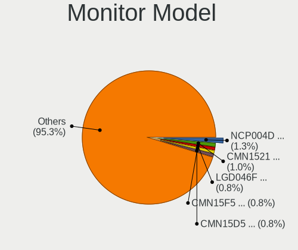
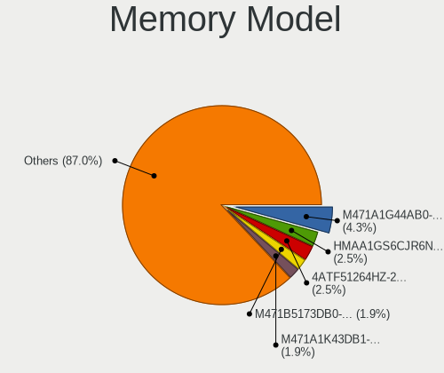
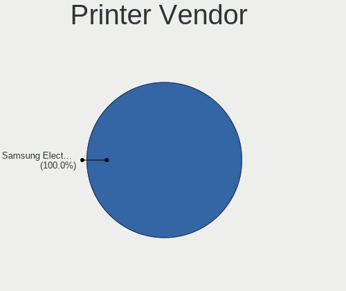

Nobara - Tested Hardware & Statistics (Notebooks)
-------------------------------------------------

A project to collect tested hardware configurations for Nobara.

Anyone can contribute to this report by the [hw-probe](https://github.com/linuxhw/hw-probe) tool:

    sudo -E hw-probe -all -upload

Please contribute! Especially if your hardware is rare.

Contents
--------

* [ Test Cases ](#test-cases)

* [ System ](#system)
  - [ OS                       ](#os)
  - [ OS Family                ](#os-family)
  - [ Kernel                   ](#kernel)
  - [ Kernel Family            ](#kernel-family)
  - [ Kernel Major Ver.        ](#kernel-major-ver)
  - [ Arch                     ](#arch)
  - [ DE                       ](#de)
  - [ Display Server           ](#display-server)
  - [ Display Manager          ](#display-manager)
  - [ OS Lang                  ](#os-lang)
  - [ Boot Mode                ](#boot-mode)
  - [ Filesystem               ](#filesystem)
  - [ Part. scheme             ](#part-scheme)
  - [ Dual Boot with Linux/BSD ](#dual-boot-with-linuxbsd)
  - [ Dual Boot (Win)          ](#dual-boot-win)

* [ Board ](#board)
  - [ Vendor                   ](#vendor)
  - [ Model                    ](#model)
  - [ Model Family             ](#model-family)
  - [ MFG Year                 ](#mfg-year)
  - [ Form Factor              ](#form-factor)
  - [ Secure Boot              ](#secure-boot)
  - [ Coreboot                 ](#coreboot)
  - [ RAM Size                 ](#ram-size)
  - [ RAM Used                 ](#ram-used)
  - [ Total Drives             ](#total-drives)
  - [ Has CD-ROM               ](#has-cd-rom)
  - [ Has Ethernet             ](#has-ethernet)
  - [ Has WiFi                 ](#has-wifi)
  - [ Has Bluetooth            ](#has-bluetooth)

* [ Location ](#location)
  - [ Country                  ](#country)
  - [ City                     ](#city)

* [ Drives ](#drives)
  - [ Drive Vendor             ](#drive-vendor)
  - [ Drive Model              ](#drive-model)
  - [ HDD Vendor               ](#hdd-vendor)
  - [ SSD Vendor               ](#ssd-vendor)
  - [ Drive Kind               ](#drive-kind)
  - [ Drive Connector          ](#drive-connector)
  - [ Drive Size               ](#drive-size)
  - [ Space Total              ](#space-total)
  - [ Space Used               ](#space-used)
  - [ Malfunc. Drives          ](#malfunc-drives)
  - [ Malfunc. Drive Vendor    ](#malfunc-drive-vendor)
  - [ Malfunc. HDD Vendor      ](#malfunc-hdd-vendor)
  - [ Malfunc. Drive Kind      ](#malfunc-drive-kind)
  - [ Failed Drives            ](#failed-drives)
  - [ Failed Drive Vendor      ](#failed-drive-vendor)
  - [ Drive Status             ](#drive-status)

* [ Storage controller ](#storage-controller)
  - [ Storage Vendor           ](#storage-vendor)
  - [ Storage Model            ](#storage-model)
  - [ Storage Kind             ](#storage-kind)

* [ Processor ](#processor)
  - [ CPU Vendor               ](#cpu-vendor)
  - [ CPU Model                ](#cpu-model)
  - [ CPU Model Family         ](#cpu-model-family)
  - [ CPU Cores                ](#cpu-cores)
  - [ CPU Sockets              ](#cpu-sockets)
  - [ CPU Threads              ](#cpu-threads)
  - [ CPU Op-Modes             ](#cpu-op-modes)
  - [ CPU Microcode            ](#cpu-microcode)
  - [ CPU Microarch            ](#cpu-microarch)

* [ Graphics ](#graphics)
  - [ GPU Vendor               ](#gpu-vendor)
  - [ GPU Model                ](#gpu-model)
  - [ GPU Combo                ](#gpu-combo)
  - [ GPU Driver               ](#gpu-driver)
  - [ GPU Memory               ](#gpu-memory)

* [ Monitor ](#monitor)
  - [ Monitor Vendor           ](#monitor-vendor)
  - [ Monitor Model            ](#monitor-model)
  - [ Monitor Resolution       ](#monitor-resolution)
  - [ Monitor Diagonal         ](#monitor-diagonal)
  - [ Monitor Width            ](#monitor-width)
  - [ Aspect Ratio             ](#aspect-ratio)
  - [ Monitor Area             ](#monitor-area)
  - [ Pixel Density            ](#pixel-density)
  - [ Multiple Monitors        ](#multiple-monitors)

* [ Network ](#network)
  - [ Net Controller Vendor    ](#net-controller-vendor)
  - [ Net Controller Model     ](#net-controller-model)
  - [ Wireless Vendor          ](#wireless-vendor)
  - [ Wireless Model           ](#wireless-model)
  - [ Ethernet Vendor          ](#ethernet-vendor)
  - [ Ethernet Model           ](#ethernet-model)
  - [ Net Controller Kind      ](#net-controller-kind)
  - [ Used Controller          ](#used-controller)
  - [ NICs                     ](#nics)
  - [ IPv6                     ](#ipv6)

* [ Bluetooth ](#bluetooth)
  - [ Bluetooth Vendor         ](#bluetooth-vendor)
  - [ Bluetooth Model          ](#bluetooth-model)

* [ Sound ](#sound)
  - [ Sound Vendor             ](#sound-vendor)
  - [ Sound Model              ](#sound-model)

* [ Memory ](#memory)
  - [ Memory Vendor            ](#memory-vendor)
  - [ Memory Model             ](#memory-model)
  - [ Memory Kind              ](#memory-kind)
  - [ Memory Form Factor       ](#memory-form-factor)
  - [ Memory Size              ](#memory-size)
  - [ Memory Speed             ](#memory-speed)

* [ Printers & scanners ](#printers--scanners)
  - [ Printer Vendor           ](#printer-vendor)
  - [ Printer Model            ](#printer-model)
  - [ Scanner Vendor           ](#scanner-vendor)
  - [ Scanner Model            ](#scanner-model)

* [ Camera ](#camera)
  - [ Camera Vendor            ](#camera-vendor)
  - [ Camera Model             ](#camera-model)

* [ Security ](#security)
  - [ Fingerprint Vendor       ](#fingerprint-vendor)
  - [ Fingerprint Model        ](#fingerprint-model)
  - [ Chipcard Vendor          ](#chipcard-vendor)
  - [ Chipcard Model           ](#chipcard-model)

* [ Unsupported ](#unsupported)
  - [ Unsupported Devices      ](#unsupported-devices)
  - [ Unsupported Device Types ](#unsupported-device-types)

Test Cases
----------

Total: 660

| Vendor        | Model                       | Probe                                                      | Date         |
|---------------|-----------------------------|------------------------------------------------------------|--------------|
| HP            | Pavilion Gaming Laptop 1... | [f2de07e3ef](https://linux-hardware.org/?probe=f2de07e3ef) | Jan 06, 2025 |
| Dell          | Latitude E5470              | [57a956fe26](https://linux-hardware.org/?probe=57a956fe26) | Jan 04, 2025 |
| MSI           | GP60 2PE                    | [85033de0ee](https://linux-hardware.org/?probe=85033de0ee) | Jan 04, 2025 |
| Lenovo        | IdeaPad L340-15IRH Gamin... | [8a0d66e0ae](https://linux-hardware.org/?probe=8a0d66e0ae) | Jan 02, 2025 |
| MSI           | Katana 15 B12VFK            | [1596a8dc1a](https://linux-hardware.org/?probe=1596a8dc1a) | Dec 31, 2024 |
| Lenovo        | Legion Pro 7 16IRX8H 82W... | [8e64cf40ca](https://linux-hardware.org/?probe=8e64cf40ca) | Dec 30, 2024 |
| ASUSTek       | ASUS TUF Gaming A14 FA40... | [a135b01a74](https://linux-hardware.org/?probe=a135b01a74) | Dec 29, 2024 |
| Dell          | Latitude 7640               | [931523acc9](https://linux-hardware.org/?probe=931523acc9) | Dec 28, 2024 |
| Dell          | Precision 5560              | [08e596bd75](https://linux-hardware.org/?probe=08e596bd75) | Dec 24, 2024 |
| Dell          | XPS 15 7590                 | [c74f2a3d62](https://linux-hardware.org/?probe=c74f2a3d62) | Dec 20, 2024 |
| TUXEDO        | W65_W67RC                   | [7b484dafab](https://linux-hardware.org/?probe=7b484dafab) | Dec 19, 2024 |
| Lenovo        | Legion Pro 7 16IRX8H 82W... | [4373e85ee0](https://linux-hardware.org/?probe=4373e85ee0) | Dec 19, 2024 |
| ASUSTek       | TUF Gaming FX505DD          | [b9f8f7b1b7](https://linux-hardware.org/?probe=b9f8f7b1b7) | Dec 18, 2024 |
| ASUSTek       | ROG Zephyrus M16 GU603HM... | [8898414b6c](https://linux-hardware.org/?probe=8898414b6c) | Dec 17, 2024 |
| ASUSTek       | TUF Gaming FX505DT_FX505... | [a9b674b142](https://linux-hardware.org/?probe=a9b674b142) | Dec 08, 2024 |
| ASUSTek       | ASUS TUF Gaming A14 FA40... | [5d948ce651](https://linux-hardware.org/?probe=5d948ce651) | Dec 08, 2024 |
| ASUSTek       | ROG Strix G713PV_G713PV     | [5a4b082a2e](https://linux-hardware.org/?probe=5a4b082a2e) | Dec 08, 2024 |
| Lenovo        | ThinkPad T470 20HES22400    | [4a8cc4dd33](https://linux-hardware.org/?probe=4a8cc4dd33) | Nov 25, 2024 |
| ASUSTek       | TUF Gaming FX505DT_FX505... | [5d4ce9594c](https://linux-hardware.org/?probe=5d4ce9594c) | Nov 23, 2024 |
| ASUSTek       | TUF Gaming FX505DT_FX505... | [aaed88422c](https://linux-hardware.org/?probe=aaed88422c) | Nov 22, 2024 |
| Dell          | G3 3500                     | [d340f80f52](https://linux-hardware.org/?probe=d340f80f52) | Nov 22, 2024 |
| Lenovo        | ThinkPad T540p 20BFS3NJ0... | [993e703fe2](https://linux-hardware.org/?probe=993e703fe2) | Nov 20, 2024 |
| ASUSTek       | ASUS TUF Gaming A15 FA50... | [cc9386b2dd](https://linux-hardware.org/?probe=cc9386b2dd) | Nov 19, 2024 |
| Dell          | Vostro 3501                 | [188f410ab2](https://linux-hardware.org/?probe=188f410ab2) | Nov 18, 2024 |
| Apple         | MacBookPro9,2               | [0bb978b3d6](https://linux-hardware.org/?probe=0bb978b3d6) | Nov 18, 2024 |
| Dell          | Inspiron 7370               | [4ebb5ca686](https://linux-hardware.org/?probe=4ebb5ca686) | Nov 17, 2024 |
| Acer          | Nitro ANV15-41              | [41a8d79a11](https://linux-hardware.org/?probe=41a8d79a11) | Nov 14, 2024 |
| Dell          | Latitude 5501               | [795cc9b2a2](https://linux-hardware.org/?probe=795cc9b2a2) | Nov 09, 2024 |
| GPD           | G1619-01                    | [67400e5fef](https://linux-hardware.org/?probe=67400e5fef) | Nov 09, 2024 |
| ASUSTek       | ROG Flow X13 GV301QE_GV3... | [65d7d0e79d](https://linux-hardware.org/?probe=65d7d0e79d) | Nov 07, 2024 |
| ASUSTek       | ASUS EXPERTBOOK B1500CEA... | [62f849e117](https://linux-hardware.org/?probe=62f849e117) | Nov 03, 2024 |
| Lenovo        | IdeaPad 110-15ACL 80TJ      | [61b0699eda](https://linux-hardware.org/?probe=61b0699eda) | Nov 02, 2024 |
| Dell          | G7 7500                     | [54df16b1cb](https://linux-hardware.org/?probe=54df16b1cb) | Nov 02, 2024 |
| Dell          | Latitude 5414               | [9412713b3d](https://linux-hardware.org/?probe=9412713b3d) | Oct 30, 2024 |
| Dell          | Latitude 7640               | [f092c8cc9f](https://linux-hardware.org/?probe=f092c8cc9f) | Oct 27, 2024 |
| HP            | Laptop 14-dk0xxx            | [8e92130871](https://linux-hardware.org/?probe=8e92130871) | Oct 27, 2024 |
| Google        | Voema                       | [44b3046dbb](https://linux-hardware.org/?probe=44b3046dbb) | Oct 20, 2024 |
| TUXEDO        | Polaris AMD Gen3 (CZN)      | [c1a5d4ec9f](https://linux-hardware.org/?probe=c1a5d4ec9f) | Oct 20, 2024 |
| TUXEDO        | Polaris AMD Gen3 (CZN)      | [7721fb9198](https://linux-hardware.org/?probe=7721fb9198) | Oct 20, 2024 |
| HP            | OMEN Laptop 15-en0xxx       | [8366c88c2a](https://linux-hardware.org/?probe=8366c88c2a) | Oct 17, 2024 |
| Positivo      | C4500D                      | [8cc65dc6f7](https://linux-hardware.org/?probe=8cc65dc6f7) | Oct 17, 2024 |
| ASUSTek       | ROG Flow X13 GV301QE_GV3... | [a813c0f99d](https://linux-hardware.org/?probe=a813c0f99d) | Oct 15, 2024 |
| Lenovo        | V110-15ISK 80TL             | [6cef126bcc](https://linux-hardware.org/?probe=6cef126bcc) | Oct 12, 2024 |
| HP            | Pavilion g7                 | [ffeaecbfb8](https://linux-hardware.org/?probe=ffeaecbfb8) | Oct 06, 2024 |
| Medion        | P6634                       | [828ca7861d](https://linux-hardware.org/?probe=828ca7861d) | Oct 04, 2024 |
| Acer          | NC-VN7-571G-71KY            | [961929c4a3](https://linux-hardware.org/?probe=961929c4a3) | Oct 02, 2024 |
| Lenovo        | NB LN Legion PRO 5 16IRX... | [777ce0c1e8](https://linux-hardware.org/?probe=777ce0c1e8) | Oct 01, 2024 |
| ASUSTek       | ASUS TUF Gaming A15 FA50... | [661a6c1dbe](https://linux-hardware.org/?probe=661a6c1dbe) | Sep 27, 2024 |
| HP            | OMEN by Laptop              | [31ca5c69e0](https://linux-hardware.org/?probe=31ca5c69e0) | Sep 26, 2024 |
| Toshiba       | STI NA 1402                 | [41344003cf](https://linux-hardware.org/?probe=41344003cf) | Sep 24, 2024 |
| ASUSTek       | ROG Flow X13 GV301QE_GV3... | [dbbdf82c36](https://linux-hardware.org/?probe=dbbdf82c36) | Sep 21, 2024 |
| Lenovo        | ThinkPad T540p 20BFS3NJ0... | [48cdbf900a](https://linux-hardware.org/?probe=48cdbf900a) | Sep 13, 2024 |
| MSI           | Bravo 15 B5ED               | [c35283718a](https://linux-hardware.org/?probe=c35283718a) | Sep 11, 2024 |
| OriginPC      | EVO15-S                     | [e831dcf496](https://linux-hardware.org/?probe=e831dcf496) | Sep 10, 2024 |
| Lenovo        | Legion S7 15ACH6 82K8       | [2a3aeae658](https://linux-hardware.org/?probe=2a3aeae658) | Sep 09, 2024 |
| ASUSTek       | PRIME B550M-K               | [941a87d145](https://linux-hardware.org/?probe=941a87d145) | Sep 09, 2024 |
| ASUSTek       | PRIME B550M-K               | [d23b83473c](https://linux-hardware.org/?probe=d23b83473c) | Sep 08, 2024 |
| Dell          | Inspiron 13-7378            | [bdc78c2296](https://linux-hardware.org/?probe=bdc78c2296) | Sep 07, 2024 |
| Lenovo        | Yoga Slim 7 14APU8 83AA     | [9669441dff](https://linux-hardware.org/?probe=9669441dff) | Sep 06, 2024 |
| Lenovo        | IdeaPad Gaming 3 15IHU6 ... | [8a131268aa](https://linux-hardware.org/?probe=8a131268aa) | Sep 05, 2024 |
| SKIKK         | Freya 15 II                 | [dfa0e481b8](https://linux-hardware.org/?probe=dfa0e481b8) | Sep 04, 2024 |
| HP            | ENVY 17                     | [bd581d250e](https://linux-hardware.org/?probe=bd581d250e) | Sep 02, 2024 |
| Dell          | Latitude E7470              | [e8dd306c05](https://linux-hardware.org/?probe=e8dd306c05) | Aug 31, 2024 |
| HP            | ENVY 15                     | [0ed23d53d9](https://linux-hardware.org/?probe=0ed23d53d9) | Aug 31, 2024 |
| ASUSTek       | VivoBook_ASUSLaptop X532... | [d5764b3dc3](https://linux-hardware.org/?probe=d5764b3dc3) | Aug 29, 2024 |
| ASUSTek       | ASUS TUF Gaming A15 FA50... | [d3e5b52482](https://linux-hardware.org/?probe=d3e5b52482) | Aug 28, 2024 |
| Intel Clie... | LAPRC510                    | [1fd9d1dc79](https://linux-hardware.org/?probe=1fd9d1dc79) | Aug 21, 2024 |
| Dell          | G15 5511                    | [814c811429](https://linux-hardware.org/?probe=814c811429) | Aug 21, 2024 |
| ASUSTek       | ROG Strix G513QY_G513QY     | [8fff051c21](https://linux-hardware.org/?probe=8fff051c21) | Aug 18, 2024 |
| Lenovo        | LOQ 15IRX9 83DV             | [351efc3c9e](https://linux-hardware.org/?probe=351efc3c9e) | Aug 18, 2024 |
| Lenovo        | LOQ 15IRX9 83DV             | [e587a55332](https://linux-hardware.org/?probe=e587a55332) | Aug 18, 2024 |
| Lenovo        | ThinkPad Edge E430 3254H... | [446f0c7ee7](https://linux-hardware.org/?probe=446f0c7ee7) | Aug 17, 2024 |
| ASUSTek       | ROG Strix G733QS_G733QS     | [af25c599ca](https://linux-hardware.org/?probe=af25c599ca) | Aug 12, 2024 |
| Maibenben     | MaiBook M                   | [c295cb4e1d](https://linux-hardware.org/?probe=c295cb4e1d) | Aug 09, 2024 |
| Gigabyte      | X570 AORUS ELITE WIFI       | [6414beb6f8](https://linux-hardware.org/?probe=6414beb6f8) | Aug 08, 2024 |
| HP            | Pavilion g7                 | [126dbbbc1f](https://linux-hardware.org/?probe=126dbbbc1f) | Aug 06, 2024 |
| ASUSTek       | VivoBook_ASUSLaptop X515... | [47629a128e](https://linux-hardware.org/?probe=47629a128e) | Aug 06, 2024 |
| Lenovo        | G500s 20245                 | [a5fbbc146f](https://linux-hardware.org/?probe=a5fbbc146f) | Aug 05, 2024 |
| ASUSTek       | ROG Zephyrus Duo 15 SE G... | [fad0adb50b](https://linux-hardware.org/?probe=fad0adb50b) | Aug 01, 2024 |
| ASUSTek       | ASUS Vivobook S 16 M5606... | [9c1c5c8eef](https://linux-hardware.org/?probe=9c1c5c8eef) | Jul 29, 2024 |
| Timi          | Mi NoteBook Pro             | [363f9c519e](https://linux-hardware.org/?probe=363f9c519e) | Jul 26, 2024 |
| HP            | Pavilion 17                 | [059579abe8](https://linux-hardware.org/?probe=059579abe8) | Jul 25, 2024 |
| Framework     | Laptop 16 (AMD Ryzen 704... | [16b5d3d099](https://linux-hardware.org/?probe=16b5d3d099) | Jul 20, 2024 |
| Sony          | VPCF13UFX                   | [2aa739a934](https://linux-hardware.org/?probe=2aa739a934) | Jul 19, 2024 |
| Dell          | XPS 15 9500                 | [fc6a4ed60b](https://linux-hardware.org/?probe=fc6a4ed60b) | Jul 18, 2024 |
| Acer          | Nitro AN515-51              | [1e21d843a7](https://linux-hardware.org/?probe=1e21d843a7) | Jul 18, 2024 |
| Acer          | Aspire E1-772G              | [4c667e9426](https://linux-hardware.org/?probe=4c667e9426) | Jul 16, 2024 |
| Acer          | Aspire E1-772G              | [d5c066a3ec](https://linux-hardware.org/?probe=d5c066a3ec) | Jul 16, 2024 |
| HP            | OMEN Laptop 15-ek1xxx       | [57853c11b0](https://linux-hardware.org/?probe=57853c11b0) | Jul 16, 2024 |
| HP            | OMEN Laptop 15-ek1xxx       | [eba04cac19](https://linux-hardware.org/?probe=eba04cac19) | Jul 16, 2024 |
| Lenovo        | V15-ADA 82C7                | [53644a2931](https://linux-hardware.org/?probe=53644a2931) | Jul 14, 2024 |
| Acer          | Swift SFX16-61G             | [bd890bbcfa](https://linux-hardware.org/?probe=bd890bbcfa) | Jul 09, 2024 |
| HP            | Compaq Presario CQ71        | [ffbcb2cf5a](https://linux-hardware.org/?probe=ffbcb2cf5a) | Jul 07, 2024 |
| ASUSTek       | PRIME B450M-A               | [d27fff2ebc](https://linux-hardware.org/?probe=d27fff2ebc) | Jul 06, 2024 |
| MSI           | B550M PRO-VDH WIFI          | [9971b9e563](https://linux-hardware.org/?probe=9971b9e563) | Jul 05, 2024 |
| HP            | Victus by Gaming Laptop ... | [0a85e482f2](https://linux-hardware.org/?probe=0a85e482f2) | Jul 05, 2024 |
| TULPAR        | T7 V20.6                    | [c2d1e64ed3](https://linux-hardware.org/?probe=c2d1e64ed3) | Jul 04, 2024 |
| Unknown       | AX16Pro                     | [2641e1b005](https://linux-hardware.org/?probe=2641e1b005) | Jun 29, 2024 |
| HP            | EliteBook 8560p             | [190ec9dbf4](https://linux-hardware.org/?probe=190ec9dbf4) | Jun 27, 2024 |
| MSI           | GL65 9SCK                   | [6dfd90d8e1](https://linux-hardware.org/?probe=6dfd90d8e1) | Jun 26, 2024 |
| HP            | Laptop 15-ef1xxx            | [7f9e6d2b1b](https://linux-hardware.org/?probe=7f9e6d2b1b) | Jun 26, 2024 |
| Lenovo        | LOQ 15IAX9I 83FQ            | [45183ac6bf](https://linux-hardware.org/?probe=45183ac6bf) | Jun 24, 2024 |
| Intel Clie... | LAPQC71B                    | [d08a11d6d2](https://linux-hardware.org/?probe=d08a11d6d2) | Jun 20, 2024 |
| Lenovo        | ThinkBook 14s G2 ITL 20V... | [5f3b725a8a](https://linux-hardware.org/?probe=5f3b725a8a) | Jun 19, 2024 |
| Acer          | Aspire A315-54              | [cb70d81ffc](https://linux-hardware.org/?probe=cb70d81ffc) | Jun 16, 2024 |
| PC Special... | Standard                    | [4af601ff05](https://linux-hardware.org/?probe=4af601ff05) | Jun 12, 2024 |
| HP            | OMEN by Laptop 16-c0xxx     | [c56f3fc677](https://linux-hardware.org/?probe=c56f3fc677) | Jun 11, 2024 |
| ASUSTek       | Vivobook Go E1504FA_E150... | [8cde2593bf](https://linux-hardware.org/?probe=8cde2593bf) | Jun 09, 2024 |
| Gigabyte      | Z690 UD DDR4                | [79ef3851bf](https://linux-hardware.org/?probe=79ef3851bf) | Jun 08, 2024 |
| HP            | Laptop 14-bs0xx             | [9d0db9afbe](https://linux-hardware.org/?probe=9d0db9afbe) | Jun 06, 2024 |
| HUAWEI        | BOM-WXX9                    | [cf9d7ad424](https://linux-hardware.org/?probe=cf9d7ad424) | Jun 06, 2024 |
| Positivo      | C4500D                      | [43183e276d](https://linux-hardware.org/?probe=43183e276d) | May 31, 2024 |
| Dell          | Latitude E6440              | [9141e75479](https://linux-hardware.org/?probe=9141e75479) | May 30, 2024 |
| ASUSTek       | ASUS TUF Gaming A15 FA50... | [e4547bc1b7](https://linux-hardware.org/?probe=e4547bc1b7) | May 29, 2024 |
| ASUSTek       | ROG Strix G513QY_G513QY     | [2d615ff1bb](https://linux-hardware.org/?probe=2d615ff1bb) | May 26, 2024 |
| HP            | Victus by Gaming Laptop ... | [b1fe406375](https://linux-hardware.org/?probe=b1fe406375) | May 25, 2024 |
| Gigabyte      | AORUS 5 KB                  | [0083b70388](https://linux-hardware.org/?probe=0083b70388) | May 23, 2024 |
| HP            | ProBook 430 G4              | [986474f731](https://linux-hardware.org/?probe=986474f731) | May 21, 2024 |
| Acer          | Aspire SW5-012              | [a7ba598273](https://linux-hardware.org/?probe=a7ba598273) | May 20, 2024 |
| Acer          | Aspire 5749Z                | [320fb5a226](https://linux-hardware.org/?probe=320fb5a226) | May 19, 2024 |
| Acer          | Aspire A515-56              | [4b02f37bde](https://linux-hardware.org/?probe=4b02f37bde) | May 18, 2024 |
| Lenovo        | ThinkPad T430 2347GU8       | [54d8293b03](https://linux-hardware.org/?probe=54d8293b03) | May 18, 2024 |
| MSI           | GS76 Stealth 11UG           | [933bd4fff9](https://linux-hardware.org/?probe=933bd4fff9) | May 13, 2024 |
| ASUSTek       | ASUS TUF Gaming A15 FA50... | [5a708d5ae8](https://linux-hardware.org/?probe=5a708d5ae8) | May 12, 2024 |
| ASUSTek       | ROG Strix G834JY_G834JY     | [1c595a1a2b](https://linux-hardware.org/?probe=1c595a1a2b) | May 12, 2024 |
| HP            | Laptop 15-dw0xxx            | [f1c0565833](https://linux-hardware.org/?probe=f1c0565833) | May 09, 2024 |
| HP            | Laptop 15-dw0xxx            | [4bd0ad2bb9](https://linux-hardware.org/?probe=4bd0ad2bb9) | May 09, 2024 |
| Lenovo        | IdeaPad S510p 20298         | [b941b8d062](https://linux-hardware.org/?probe=b941b8d062) | May 07, 2024 |
| ASUSTek       | ASUS TUF Gaming A15 FA50... | [84cc2abe63](https://linux-hardware.org/?probe=84cc2abe63) | May 06, 2024 |
| PC Special... | NH5x_7xDPx                  | [35a25ffdfd](https://linux-hardware.org/?probe=35a25ffdfd) | May 06, 2024 |
| Samsung       | 370E4K                      | [f0c626e7ca](https://linux-hardware.org/?probe=f0c626e7ca) | May 05, 2024 |
| Dell          | Inspiron 5502               | [43fee6a80f](https://linux-hardware.org/?probe=43fee6a80f) | May 05, 2024 |
| Lenovo        | IdeaPad 320-15ISK 80XH      | [55d15ed397](https://linux-hardware.org/?probe=55d15ed397) | May 05, 2024 |
| Lenovo        | ThinkPad T430 2347GU8       | [901ee2545c](https://linux-hardware.org/?probe=901ee2545c) | Apr 30, 2024 |
| HP            | OMEN by Laptop 15-dc0xxx    | [a9b063c17b](https://linux-hardware.org/?probe=a9b063c17b) | Apr 28, 2024 |
| ASUSTek       | ASUS TUF Gaming A15 FA50... | [f619fc2cb1](https://linux-hardware.org/?probe=f619fc2cb1) | Apr 26, 2024 |
| Lenovo        | IdeaPad 1 14IGL7 82V6       | [551ccdf911](https://linux-hardware.org/?probe=551ccdf911) | Apr 26, 2024 |
| Lenovo        | ThinkBook 16 G6 IRL 21KH    | [14164a1cf6](https://linux-hardware.org/?probe=14164a1cf6) | Apr 23, 2024 |
| HP            | 8876 11                     | [a276feeb19](https://linux-hardware.org/?probe=a276feeb19) | Apr 22, 2024 |
| HP            | 8876 11                     | [17290d87ba](https://linux-hardware.org/?probe=17290d87ba) | Apr 22, 2024 |
| Apple         | MacBookPro14,1              | [743a3ab71e](https://linux-hardware.org/?probe=743a3ab71e) | Apr 22, 2024 |
| HP            | EliteBook 8570p             | [98d15b6d8d](https://linux-hardware.org/?probe=98d15b6d8d) | Apr 20, 2024 |
| Apple         | MacBookPro16,1              | [af2c346bb9](https://linux-hardware.org/?probe=af2c346bb9) | Apr 20, 2024 |
| Notebook      | W330SU2                     | [7efde9ff70](https://linux-hardware.org/?probe=7efde9ff70) | Apr 20, 2024 |
| Dell          | Latitude E6440              | [82713456e1](https://linux-hardware.org/?probe=82713456e1) | Apr 19, 2024 |
| Acer          | Nitro AN517-52              | [da7720d0f0](https://linux-hardware.org/?probe=da7720d0f0) | Apr 16, 2024 |
| Acer          | Nitro AN517-52              | [a65d6b6abb](https://linux-hardware.org/?probe=a65d6b6abb) | Apr 16, 2024 |
| ASUSTek       | G751JM                      | [78bd2126e9](https://linux-hardware.org/?probe=78bd2126e9) | Apr 15, 2024 |
| ASUSTek       | ROG Zephyrus G14 GA401QM... | [b160ab4b5b](https://linux-hardware.org/?probe=b160ab4b5b) | Apr 15, 2024 |
| Dell          | G15 5530                    | [8f4e471788](https://linux-hardware.org/?probe=8f4e471788) | Apr 14, 2024 |
| A-DATA Tec... | XENIA 15                    | [08552dc593](https://linux-hardware.org/?probe=08552dc593) | Apr 13, 2024 |
| Lenovo        | IdeaPad L340-15IRH Gamin... | [1b09cf1322](https://linux-hardware.org/?probe=1b09cf1322) | Apr 10, 2024 |
| Lenovo        | IdeaPad L340-15IRH Gamin... | [46ec5edae0](https://linux-hardware.org/?probe=46ec5edae0) | Apr 10, 2024 |
| HP            | Laptop 15-fd0xxx            | [344cb034bc](https://linux-hardware.org/?probe=344cb034bc) | Apr 08, 2024 |
| System76      | Gazelle                     | [969d376558](https://linux-hardware.org/?probe=969d376558) | Apr 07, 2024 |
| ASUSTek       | ROG Strix G513QY_G513QY     | [6c1225353c](https://linux-hardware.org/?probe=6c1225353c) | Apr 04, 2024 |
| MSI           | GF65 Thin 10UE              | [92304837ec](https://linux-hardware.org/?probe=92304837ec) | Apr 03, 2024 |
| Alienware     | 17 R4                       | [0c83302e22](https://linux-hardware.org/?probe=0c83302e22) | Apr 02, 2024 |
| HUAWEI        | BOM-WXX9                    | [55199df248](https://linux-hardware.org/?probe=55199df248) | Mar 31, 2024 |
| HP            | OMEN by Laptop 15-dc1xxx    | [67f6104365](https://linux-hardware.org/?probe=67f6104365) | Mar 30, 2024 |
| HP            | EliteBook 840 G6            | [5750434b60](https://linux-hardware.org/?probe=5750434b60) | Mar 30, 2024 |
| Dell          | Inspiron 1750               | [0c73b8ab73](https://linux-hardware.org/?probe=0c73b8ab73) | Mar 29, 2024 |
| HP            | Pavilion Gaming Laptop 1... | [d689049633](https://linux-hardware.org/?probe=d689049633) | Mar 28, 2024 |
| Lenovo        | ThinkPad P50 20EN001SUS     | [0d5d136c74](https://linux-hardware.org/?probe=0d5d136c74) | Mar 27, 2024 |
| Lenovo        | ThinkPad X1 Nano Gen 3 2... | [6ddc89666f](https://linux-hardware.org/?probe=6ddc89666f) | Mar 26, 2024 |
| THUNDEROBO... | 911 Plus                    | [26658bfa2e](https://linux-hardware.org/?probe=26658bfa2e) | Mar 25, 2024 |
| HP            | Pavilion Notebook           | [9599687d82](https://linux-hardware.org/?probe=9599687d82) | Mar 25, 2024 |
| Dell          | Latitude 3120               | [82d08cfae1](https://linux-hardware.org/?probe=82d08cfae1) | Mar 25, 2024 |
| Notebook      | W330SU2                     | [5228fe58bf](https://linux-hardware.org/?probe=5228fe58bf) | Mar 24, 2024 |
| HP            | Pavilion Gaming Laptop 1... | [59e0f44e00](https://linux-hardware.org/?probe=59e0f44e00) | Mar 23, 2024 |
| Lenovo        | ThinkPad P50 20EN001SUS     | [42607732cf](https://linux-hardware.org/?probe=42607732cf) | Mar 23, 2024 |
| Apple         | MacBookAir8,1               | [d0c0446bb2](https://linux-hardware.org/?probe=d0c0446bb2) | Mar 19, 2024 |
| Acer          | TM8573T                     | [f60d5f0213](https://linux-hardware.org/?probe=f60d5f0213) | Mar 18, 2024 |
| A-DATA Tec... | XENIA 15                    | [0abdf7ee8f](https://linux-hardware.org/?probe=0abdf7ee8f) | Mar 14, 2024 |
| Lenovo        | IdeaPad Gaming 3 15ACH6 ... | [34dc8eb985](https://linux-hardware.org/?probe=34dc8eb985) | Mar 09, 2024 |
| Genuine       | ZEUS 15H (GNB15H-9G650)     | [1cdfbc79db](https://linux-hardware.org/?probe=1cdfbc79db) | Mar 09, 2024 |
| HP            | Pavilion Notebook           | [4e9cbe8d8c](https://linux-hardware.org/?probe=4e9cbe8d8c) | Mar 07, 2024 |
| HUAWEI        | BOD-WXX9                    | [1fc0257c17](https://linux-hardware.org/?probe=1fc0257c17) | Mar 05, 2024 |
| HP            | 14                          | [6e6138e521](https://linux-hardware.org/?probe=6e6138e521) | Mar 04, 2024 |
| Dell          | Latitude 3540               | [bec924d898](https://linux-hardware.org/?probe=bec924d898) | Mar 02, 2024 |
| HP            | Pavilion 15                 | [15858caed0](https://linux-hardware.org/?probe=15858caed0) | Mar 01, 2024 |
| ASUSTek       | G73Sw                       | [4587c66de2](https://linux-hardware.org/?probe=4587c66de2) | Mar 01, 2024 |
| MSI           | MAG Z690 TOMAHAWK WIFI      | [fd1c373201](https://linux-hardware.org/?probe=fd1c373201) | Mar 01, 2024 |
| Lenovo        | ThinkPad X1 Carbon 7th 2... | [120d90cd85](https://linux-hardware.org/?probe=120d90cd85) | Mar 01, 2024 |
| Lenovo        | IdeaPad L3 15IML05 81Y3     | [08024a8cef](https://linux-hardware.org/?probe=08024a8cef) | Mar 01, 2024 |
| Valve         | Jupiter                     | [aabae1e88f](https://linux-hardware.org/?probe=aabae1e88f) | Mar 01, 2024 |
| ASUSTek       | G73Sw                       | [3605d5ddc7](https://linux-hardware.org/?probe=3605d5ddc7) | Mar 01, 2024 |
| MSI           | MAG Z690 TOMAHAWK WIFI      | [18a5671738](https://linux-hardware.org/?probe=18a5671738) | Feb 29, 2024 |
| MSI           | Modern 14 B5M               | [565e6c2d46](https://linux-hardware.org/?probe=565e6c2d46) | Feb 29, 2024 |
| Gigabyte      | B85M-D3H                    | [dbbdc72e8a](https://linux-hardware.org/?probe=dbbdc72e8a) | Feb 27, 2024 |
| Dell          | Latitude E5470              | [10ab411f6f](https://linux-hardware.org/?probe=10ab411f6f) | Feb 25, 2024 |
| Lenovo        | IdeaPad 5 Pro 14ARH7 82S... | [3015e2635f](https://linux-hardware.org/?probe=3015e2635f) | Feb 25, 2024 |
| ASUSTek       | ASUS TUF Gaming A16 FA61... | [987f6afe4b](https://linux-hardware.org/?probe=987f6afe4b) | Feb 25, 2024 |
| HP            | ProBook 470 G1              | [2ad493fb2d](https://linux-hardware.org/?probe=2ad493fb2d) | Feb 24, 2024 |
| HP            | Laptop 14-dk0xxx            | [e0a472d706](https://linux-hardware.org/?probe=e0a472d706) | Feb 24, 2024 |
| HP            | Pavilion Gaming Laptop 1... | [3b3a145c76](https://linux-hardware.org/?probe=3b3a145c76) | Feb 23, 2024 |
| Acer          | Aspire VN7-592G             | [dd6617c3d7](https://linux-hardware.org/?probe=dd6617c3d7) | Feb 23, 2024 |
| A-DATA Tec... | XENIA 15                    | [6a3f5e5947](https://linux-hardware.org/?probe=6a3f5e5947) | Feb 23, 2024 |
| ASUSTek       | ASUS TUF Gaming F15 FX50... | [da357b8940](https://linux-hardware.org/?probe=da357b8940) | Feb 22, 2024 |
| Acer          | Nitro AN517-52              | [a5af54a5aa](https://linux-hardware.org/?probe=a5af54a5aa) | Feb 20, 2024 |
| MSI           | Bravo 15 C7VF               | [82ee626dbd](https://linux-hardware.org/?probe=82ee626dbd) | Feb 19, 2024 |
| Acer          | Aspire ES1-572              | [7c61f04e95](https://linux-hardware.org/?probe=7c61f04e95) | Feb 18, 2024 |
| Acer          | Nitro AN515-44              | [f5476226be](https://linux-hardware.org/?probe=f5476226be) | Feb 15, 2024 |
| Dell          | Precision M4800             | [c5630bb66f](https://linux-hardware.org/?probe=c5630bb66f) | Feb 15, 2024 |
| Infinix       | INBOOK X2 PLUS              | [ef58804464](https://linux-hardware.org/?probe=ef58804464) | Feb 15, 2024 |
| Infinix       | INBOOK X2 PLUS              | [bf574e4c09](https://linux-hardware.org/?probe=bf574e4c09) | Feb 15, 2024 |
| Dell          | XPS 13 9305                 | [cf602689fb](https://linux-hardware.org/?probe=cf602689fb) | Feb 14, 2024 |
| Dell          | XPS 13 9305                 | [531e1ffb52](https://linux-hardware.org/?probe=531e1ffb52) | Feb 14, 2024 |
| Acer          | Nitro AN515-44              | [1edc94c98a](https://linux-hardware.org/?probe=1edc94c98a) | Feb 14, 2024 |
| Acer          | Aspire A115-31              | [118a35f68d](https://linux-hardware.org/?probe=118a35f68d) | Feb 13, 2024 |
| ASUSTek       | ASUS TUF Gaming F17 FX70... | [8cab6ebd29](https://linux-hardware.org/?probe=8cab6ebd29) | Feb 12, 2024 |
| HP            | Compaq 615                  | [1761631f89](https://linux-hardware.org/?probe=1761631f89) | Feb 11, 2024 |
| Acer          | TravelMate 7520             | [2cdca7160b](https://linux-hardware.org/?probe=2cdca7160b) | Feb 11, 2024 |
| ASUSTek       | VivoBook 15 ASUS Laptop ... | [9b3e403b41](https://linux-hardware.org/?probe=9b3e403b41) | Feb 11, 2024 |
| Lenovo        | Z50-70 20354                | [9ceb699fc1](https://linux-hardware.org/?probe=9ceb699fc1) | Feb 07, 2024 |
| Lenovo        | Z50-70 20354                | [021c8aa71a](https://linux-hardware.org/?probe=021c8aa71a) | Feb 07, 2024 |
| Dell          | Precision M4800             | [8b1cccf4c2](https://linux-hardware.org/?probe=8b1cccf4c2) | Feb 07, 2024 |
| Lenovo        | G500 20236                  | [ef9f082a81](https://linux-hardware.org/?probe=ef9f082a81) | Feb 03, 2024 |
| Lenovo        | IdeaPad S145-15API 81V7     | [d2b295447b](https://linux-hardware.org/?probe=d2b295447b) | Feb 03, 2024 |
| Toshiba       | Satellite L55-C             | [f32d9dc51a](https://linux-hardware.org/?probe=f32d9dc51a) | Feb 02, 2024 |
| Acer          | Aspire A315-54              | [3621142f4d](https://linux-hardware.org/?probe=3621142f4d) | Feb 02, 2024 |
| HP            | 240 G8 Notebook PC          | [d4c61a6527](https://linux-hardware.org/?probe=d4c61a6527) | Feb 01, 2024 |
| Lenovo        | G500 20236                  | [8b5fd80f76](https://linux-hardware.org/?probe=8b5fd80f76) | Feb 01, 2024 |
| Lenovo        | G500 20236                  | [31fc253b87](https://linux-hardware.org/?probe=31fc253b87) | Feb 01, 2024 |
| HP            | 240 G8 Notebook PC          | [02a1844f63](https://linux-hardware.org/?probe=02a1844f63) | Jan 31, 2024 |
| Toshiba       | Satellite C55-B             | [cfd7031cd9](https://linux-hardware.org/?probe=cfd7031cd9) | Jan 31, 2024 |
| MSI           | GE62 6QE                    | [6d6f9ba002](https://linux-hardware.org/?probe=6d6f9ba002) | Jan 30, 2024 |
| Lenovo        | IdeaPad Z500 20202          | [88efa5aca1](https://linux-hardware.org/?probe=88efa5aca1) | Jan 27, 2024 |
| HP            | 240 G8 Notebook PC          | [68364930e7](https://linux-hardware.org/?probe=68364930e7) | Jan 27, 2024 |
| HP            | Laptop 14s-fq0xxx           | [96bce63bad](https://linux-hardware.org/?probe=96bce63bad) | Jan 27, 2024 |
| Unknown       | Unknown                     | [9e979ee4e4](https://linux-hardware.org/?probe=9e979ee4e4) | Jan 26, 2024 |
| Unknown       | Unknown                     | [3e9fd3e31a](https://linux-hardware.org/?probe=3e9fd3e31a) | Jan 26, 2024 |
| Lenovo        | ThinkPad Edge E430 3254H... | [ec87598c40](https://linux-hardware.org/?probe=ec87598c40) | Jan 26, 2024 |
| HP            | Laptop 17z-cp000            | [51e7d942bc](https://linux-hardware.org/?probe=51e7d942bc) | Jan 22, 2024 |
| Lenovo        | IdeaPad Gaming 3 15ACH6 ... | [871f86a545](https://linux-hardware.org/?probe=871f86a545) | Jan 21, 2024 |
| Lenovo        | IdeaPad Gaming 3 15ACH6 ... | [e07a558ed5](https://linux-hardware.org/?probe=e07a558ed5) | Jan 20, 2024 |
| Lenovo        | IdeaPad Pro 5 14APH8 83A... | [12e32cbc19](https://linux-hardware.org/?probe=12e32cbc19) | Jan 19, 2024 |
| Gigabyte      | A5 K1                       | [219882fa36](https://linux-hardware.org/?probe=219882fa36) | Jan 19, 2024 |
| Gigabyte      | A5 K1                       | [2270b0b961](https://linux-hardware.org/?probe=2270b0b961) | Jan 19, 2024 |
| ASUSTek       | VivoBook_ASUSLaptop K660... | [96aa415cee](https://linux-hardware.org/?probe=96aa415cee) | Jan 18, 2024 |
| Lenovo        | ThinkPad X131e 3371AF5      | [1741e3b346](https://linux-hardware.org/?probe=1741e3b346) | Jan 18, 2024 |
| ASUSTek       | ROG Zephyrus G14 GA402RK... | [0c8e849a73](https://linux-hardware.org/?probe=0c8e849a73) | Jan 15, 2024 |
| Digibras      | NH4CU03                     | [7cccdf824c](https://linux-hardware.org/?probe=7cccdf824c) | Jan 13, 2024 |
| A-DATA Tec... | XENIA 15                    | [e1560ce8a3](https://linux-hardware.org/?probe=e1560ce8a3) | Jan 13, 2024 |
| ASUSTek       | ROG Strix G733ZM_G733ZM     | [e4f7fe0969](https://linux-hardware.org/?probe=e4f7fe0969) | Jan 13, 2024 |
| ASRock        | X570 Steel Legend           | [2dc1dca01f](https://linux-hardware.org/?probe=2dc1dca01f) | Jan 13, 2024 |
| ASUSTek       | ASUS TUF Gaming F15 FX50... | [8e72c34b9e](https://linux-hardware.org/?probe=8e72c34b9e) | Jan 11, 2024 |
| HP            | Laptop 15s-eq2xxx           | [b0705704b0](https://linux-hardware.org/?probe=b0705704b0) | Jan 11, 2024 |
| ASUSTek       | ROG Zephyrus G14 GA401IV... | [0df1250b28](https://linux-hardware.org/?probe=0df1250b28) | Jan 10, 2024 |
| Lenovo        | ThinkPad 13 2nd Gen 20J1... | [9cfcebcd8c](https://linux-hardware.org/?probe=9cfcebcd8c) | Jan 09, 2024 |
| Lenovo        | ThinkPad 13 2nd Gen 20J1... | [0306a42404](https://linux-hardware.org/?probe=0306a42404) | Jan 09, 2024 |
| ASUSTek       | ROG Zephyrus G14 GA401IV... | [91485ca232](https://linux-hardware.org/?probe=91485ca232) | Jan 09, 2024 |
| Dell          | Latitude E6440              | [bb917628b1](https://linux-hardware.org/?probe=bb917628b1) | Jan 09, 2024 |
| Lenovo        | LOQ 15IRH8 82XV             | [513efe6ed6](https://linux-hardware.org/?probe=513efe6ed6) | Jan 09, 2024 |
| Lenovo        | ThinkPad Edge E430 3254H... | [9ff97bbae7](https://linux-hardware.org/?probe=9ff97bbae7) | Jan 09, 2024 |
| HP            | ENVY TS 14 Sleekbook        | [48871db703](https://linux-hardware.org/?probe=48871db703) | Jan 08, 2024 |
| Apple         | MacBookPro8,3               | [4e246bdbaa](https://linux-hardware.org/?probe=4e246bdbaa) | Jan 07, 2024 |
| ASUSTek       | ROG Strix G733ZM_G733ZM     | [b753b7e847](https://linux-hardware.org/?probe=b753b7e847) | Jan 06, 2024 |
| Apple         | MacBookPro8,3               | [6ced1e30f9](https://linux-hardware.org/?probe=6ced1e30f9) | Jan 06, 2024 |
| Dell          | G7 7700                     | [126b71c515](https://linux-hardware.org/?probe=126b71c515) | Jan 05, 2024 |
| Dell          | XPS 13 9360                 | [6971ec53cd](https://linux-hardware.org/?probe=6971ec53cd) | Jan 05, 2024 |
| Notebook      | P7xxTM1                     | [9ed3be2a69](https://linux-hardware.org/?probe=9ed3be2a69) | Jan 04, 2024 |
| HP            | Pavilion Notebook           | [bb19b91823](https://linux-hardware.org/?probe=bb19b91823) | Jan 04, 2024 |
| Acer          | Aspire A315-54              | [50c718d2c6](https://linux-hardware.org/?probe=50c718d2c6) | Jan 04, 2024 |
| ASUSTek       | Q500A                       | [c3f961d8be](https://linux-hardware.org/?probe=c3f961d8be) | Jan 03, 2024 |
| Monster       | ABRA A5 V13.4               | [8cb3a2ee0a](https://linux-hardware.org/?probe=8cb3a2ee0a) | Dec 30, 2023 |
| HP            | OMEN by Laptop 16-c0xxx     | [ebdb840dba](https://linux-hardware.org/?probe=ebdb840dba) | Dec 30, 2023 |
| HP            | Laptop 15-db0xxx            | [bacd120c51](https://linux-hardware.org/?probe=bacd120c51) | Dec 30, 2023 |
| Monster       | ABRA A5 V13.4               | [274f6e86fc](https://linux-hardware.org/?probe=274f6e86fc) | Dec 29, 2023 |
| ASUSTek       | ROG Strix G513QY_G513QY     | [988bd71a05](https://linux-hardware.org/?probe=988bd71a05) | Dec 29, 2023 |
| HP            | Laptop 14-dk0xxx            | [754b2e0faf](https://linux-hardware.org/?probe=754b2e0faf) | Dec 27, 2023 |
| HP            | Laptop 14-dk0xxx            | [be356bc929](https://linux-hardware.org/?probe=be356bc929) | Dec 27, 2023 |
| HP            | Pavilion Laptop 15-cs3xx... | [18788fe1ea](https://linux-hardware.org/?probe=18788fe1ea) | Dec 22, 2023 |
| Dell          | G3 3590                     | [15decf2dfc](https://linux-hardware.org/?probe=15decf2dfc) | Dec 18, 2023 |
| HP            | Pavilion dv5                | [cf88cdfeb2](https://linux-hardware.org/?probe=cf88cdfeb2) | Dec 18, 2023 |
| Acer          | Aspire A515-56T             | [9579acc8a0](https://linux-hardware.org/?probe=9579acc8a0) | Dec 16, 2023 |
| HP            | OMEN by Laptop 16-c0xxx     | [6855d17ce1](https://linux-hardware.org/?probe=6855d17ce1) | Dec 14, 2023 |
| HP            | Laptop 14s-fq0xxx           | [2c8846a637](https://linux-hardware.org/?probe=2c8846a637) | Dec 12, 2023 |
| Dell          | G7 7700                     | [9d4e191ab5](https://linux-hardware.org/?probe=9d4e191ab5) | Dec 12, 2023 |
| Lenovo        | ThinkPad L14 Gen 1 20U50... | [f49dd0f010](https://linux-hardware.org/?probe=f49dd0f010) | Dec 12, 2023 |
| Lenovo        | IdeaPad Z500 20202          | [bc8d773d9d](https://linux-hardware.org/?probe=bc8d773d9d) | Dec 10, 2023 |
| Lenovo        | IdeaPad Z500 20202          | [04e25c9660](https://linux-hardware.org/?probe=04e25c9660) | Dec 10, 2023 |
| Gigabyte      | G5 GE                       | [e63d83327b](https://linux-hardware.org/?probe=e63d83327b) | Dec 09, 2023 |
| Dell          | G5 5505                     | [74d0a53db4](https://linux-hardware.org/?probe=74d0a53db4) | Dec 06, 2023 |
| Exo           | Smart XQ7                   | [f1ebc77dfc](https://linux-hardware.org/?probe=f1ebc77dfc) | Dec 05, 2023 |
| Exo           | Smart XQ7                   | [3d56eb720e](https://linux-hardware.org/?probe=3d56eb720e) | Dec 05, 2023 |
| ASUSTek       | ROG Strix G814JV_G814JV     | [6cd3d66979](https://linux-hardware.org/?probe=6cd3d66979) | Dec 05, 2023 |
| ASUSTek       | VivoBook_ASUSLaptop M350... | [e9e31f8aaa](https://linux-hardware.org/?probe=e9e31f8aaa) | Dec 03, 2023 |
| GPU Compan... | GWNR71517                   | [4f3cfed57b](https://linux-hardware.org/?probe=4f3cfed57b) | Dec 02, 2023 |
| Acer          | Aspire E5-473               | [f3b2c01ef7](https://linux-hardware.org/?probe=f3b2c01ef7) | Dec 01, 2023 |
| Lenovo        | Legion 5 15ARH05 82B5       | [37545bd915](https://linux-hardware.org/?probe=37545bd915) | Nov 30, 2023 |
| ASUSTek       | VivoBook_ASUSLaptop M350... | [d385ea9309](https://linux-hardware.org/?probe=d385ea9309) | Nov 29, 2023 |
| Acer          | Aspire E5-575               | [b4fbd61258](https://linux-hardware.org/?probe=b4fbd61258) | Nov 28, 2023 |
| Dell          | Precision 7740              | [50b0f0be08](https://linux-hardware.org/?probe=50b0f0be08) | Nov 25, 2023 |
| Dell          | Inspiron 15 3520            | [4f1d1d579c](https://linux-hardware.org/?probe=4f1d1d579c) | Nov 24, 2023 |
| ASRock        | X370 Gaming X               | [0c39910834](https://linux-hardware.org/?probe=0c39910834) | Nov 23, 2023 |
| Dell          | Latitude E6430              | [dc02cb2409](https://linux-hardware.org/?probe=dc02cb2409) | Nov 20, 2023 |
| TUXEDO        | Polaris AMD Gen3 (CZN)      | [1048b240d5](https://linux-hardware.org/?probe=1048b240d5) | Nov 19, 2023 |
| TUXEDO        | Polaris AMD Gen3 (CZN)      | [74162bf452](https://linux-hardware.org/?probe=74162bf452) | Nov 19, 2023 |
| LG Electro... | 16Z90R-G.AD75F              | [83d650792f](https://linux-hardware.org/?probe=83d650792f) | Nov 18, 2023 |
| Lenovo        | IdeaPad C340-14API 81N6     | [adf1b0c27a](https://linux-hardware.org/?probe=adf1b0c27a) | Nov 16, 2023 |
| Lenovo        | IdeaPad C340-14API 81N6     | [168e0af4e6](https://linux-hardware.org/?probe=168e0af4e6) | Nov 16, 2023 |
| MSI           | Cyborg 15 A12VF             | [ca5d20d4a4](https://linux-hardware.org/?probe=ca5d20d4a4) | Nov 16, 2023 |
| MSI           | Cyborg 15 A12VF             | [914e24f740](https://linux-hardware.org/?probe=914e24f740) | Nov 16, 2023 |
| MSI           | GF62 8RC                    | [8e186cf8b9](https://linux-hardware.org/?probe=8e186cf8b9) | Nov 16, 2023 |
| HP            | Pavilion dv9700             | [0b039b15e7](https://linux-hardware.org/?probe=0b039b15e7) | Nov 15, 2023 |
| HP            | Pavilion dv9700             | [b5e651a2bf](https://linux-hardware.org/?probe=b5e651a2bf) | Nov 15, 2023 |
| ASUSTek       | ROG Flow X13 GV301QE_GV3... | [f0db6bb1ae](https://linux-hardware.org/?probe=f0db6bb1ae) | Nov 11, 2023 |
| Chuwi         | GemiBook Pro                | [9f1e875996](https://linux-hardware.org/?probe=9f1e875996) | Nov 07, 2023 |
| Lenovo        | IdeaPad 3 17ABA7 82RQ       | [12b6cd2d09](https://linux-hardware.org/?probe=12b6cd2d09) | Nov 04, 2023 |
| Dell          | Precision 7740              | [71b262696a](https://linux-hardware.org/?probe=71b262696a) | Nov 02, 2023 |
| ASUSTek       | ZenBook UX434DA_UM433DA     | [68dd4f08d9](https://linux-hardware.org/?probe=68dd4f08d9) | Nov 02, 2023 |
| ONE-NETBOO... | ONE XPLAYER 1002-C          | [b89ceef38d](https://linux-hardware.org/?probe=b89ceef38d) | Nov 01, 2023 |
| ASUSTek       | ROG Strix G513RC_G513RC     | [70e4b3b007](https://linux-hardware.org/?probe=70e4b3b007) | Oct 31, 2023 |
| ASUSTek       | ROG Strix G513RC_G513RC     | [352bf34e3b](https://linux-hardware.org/?probe=352bf34e3b) | Oct 31, 2023 |
| Lenovo        | IdeaPad Gaming 3 15ACH6 ... | [0eae5ed294](https://linux-hardware.org/?probe=0eae5ed294) | Oct 31, 2023 |
| System76      | Gazelle                     | [3bc4a66a13](https://linux-hardware.org/?probe=3bc4a66a13) | Oct 29, 2023 |
| HP            | Notebook                    | [b6f188a1fe](https://linux-hardware.org/?probe=b6f188a1fe) | Oct 27, 2023 |
| Dell          | Latitude E5470              | [fbbcdd8d9f](https://linux-hardware.org/?probe=fbbcdd8d9f) | Oct 26, 2023 |
| ASUSTek       | VivoBook_ASUSLaptop M650... | [3d7ad8a1d6](https://linux-hardware.org/?probe=3d7ad8a1d6) | Oct 26, 2023 |
| Dell          | Latitude E5470              | [cac52e6eaf](https://linux-hardware.org/?probe=cac52e6eaf) | Oct 25, 2023 |
| ASUSTek       | GL502VSK                    | [5f455e693f](https://linux-hardware.org/?probe=5f455e693f) | Oct 24, 2023 |
| Dell          | Inspiron 7375               | [451317bd25](https://linux-hardware.org/?probe=451317bd25) | Oct 22, 2023 |
| ASUSTek       | ROG Strix G713RM_G713RM     | [fa46708f8f](https://linux-hardware.org/?probe=fa46708f8f) | Oct 22, 2023 |
| ASUSTek       | ROG Zephyrus G14 GA402RK... | [390f0188b4](https://linux-hardware.org/?probe=390f0188b4) | Oct 19, 2023 |
| HP            | Pavilion Aero Laptop 13-... | [459dc02cda](https://linux-hardware.org/?probe=459dc02cda) | Oct 18, 2023 |
| Lenovo        | ThinkPad T450 20BUS1K50X    | [11ccdc870b](https://linux-hardware.org/?probe=11ccdc870b) | Oct 16, 2023 |
| ASUSTek       | X541UV                      | [c5183a57ce](https://linux-hardware.org/?probe=c5183a57ce) | Oct 16, 2023 |
| MSI           | GT72S 6QE                   | [9a2d87eb4c](https://linux-hardware.org/?probe=9a2d87eb4c) | Oct 12, 2023 |
| MSI           | GT72S 6QE                   | [4927bfc263](https://linux-hardware.org/?probe=4927bfc263) | Oct 12, 2023 |
| Toshiba       | Satellite C55D-C            | [e083a8012f](https://linux-hardware.org/?probe=e083a8012f) | Oct 11, 2023 |
| Acer          | Aspire A315-42              | [c0e071789f](https://linux-hardware.org/?probe=c0e071789f) | Oct 09, 2023 |
| Acer          | Aspire A315-41              | [85d999063f](https://linux-hardware.org/?probe=85d999063f) | Oct 09, 2023 |
| Lenovo        | Legion 5 15ACH6H 82JU       | [e087628f2a](https://linux-hardware.org/?probe=e087628f2a) | Oct 07, 2023 |
| MSI           | Modern 14 B5M               | [65ae20098f](https://linux-hardware.org/?probe=65ae20098f) | Oct 03, 2023 |
| Lenovo        | IdeaPad 330S-15IKB 81JN     | [747f0d45fe](https://linux-hardware.org/?probe=747f0d45fe) | Sep 28, 2023 |
| Acer          | Nitro AN515-42              | [dd4a3f701c](https://linux-hardware.org/?probe=dd4a3f701c) | Sep 27, 2023 |
| Dell          | G5 5505                     | [787ccf4559](https://linux-hardware.org/?probe=787ccf4559) | Sep 25, 2023 |
| GPU Compan... | GWNR71517                   | [93b975d65b](https://linux-hardware.org/?probe=93b975d65b) | Sep 24, 2023 |
| HP            | Victus by Gaming Laptop ... | [d21f140b5e](https://linux-hardware.org/?probe=d21f140b5e) | Sep 23, 2023 |
| HP            | Victus by Gaming Laptop ... | [c40dbfbd1d](https://linux-hardware.org/?probe=c40dbfbd1d) | Sep 23, 2023 |
| Dell          | G3 3579                     | [eff563e086](https://linux-hardware.org/?probe=eff563e086) | Sep 17, 2023 |
| ASUSTek       | ROG Zephyrus G14 GA401IV... | [4c854cc233](https://linux-hardware.org/?probe=4c854cc233) | Sep 17, 2023 |
| ASUSTek       | ROG Zephyrus G15 GA503QR... | [cd2fb41835](https://linux-hardware.org/?probe=cd2fb41835) | Sep 15, 2023 |
| Dell          | Latitude E6440              | [591c479a8d](https://linux-hardware.org/?probe=591c479a8d) | Sep 13, 2023 |
| ASUSTek       | VivoBook_ASUSLaptop M150... | [3900a91c0b](https://linux-hardware.org/?probe=3900a91c0b) | Sep 03, 2023 |
| Lenovo        | Legion Slim 7 16IRH8 82Y... | [ab14d9d9bb](https://linux-hardware.org/?probe=ab14d9d9bb) | Aug 31, 2023 |
| ASUSTek       | VivoBook_ASUSLaptop M150... | [0bda6b93da](https://linux-hardware.org/?probe=0bda6b93da) | Aug 27, 2023 |
| ASUSTek       | G751JM                      | [7cdb0c52e4](https://linux-hardware.org/?probe=7cdb0c52e4) | Aug 23, 2023 |
| Acer          | Nitro AN515-56              | [530e70e1ab](https://linux-hardware.org/?probe=530e70e1ab) | Aug 22, 2023 |
| Acer          | Nitro AN515-56              | [45264bf6e6](https://linux-hardware.org/?probe=45264bf6e6) | Aug 20, 2023 |
| Infinix       | INBOOK X2 GEN11             | [f368b5bf17](https://linux-hardware.org/?probe=f368b5bf17) | Aug 18, 2023 |
| Dell          | XPS 17 9730                 | [9c5e7cc1fb](https://linux-hardware.org/?probe=9c5e7cc1fb) | Aug 16, 2023 |
| Samsung       | 340XAA/350XAA/550XAA        | [da3036b8e3](https://linux-hardware.org/?probe=da3036b8e3) | Aug 14, 2023 |
| Lenovo        | IdeaPad 3 15ITL6 82H8       | [f9d07e4f97](https://linux-hardware.org/?probe=f9d07e4f97) | Aug 12, 2023 |
| Lenovo        | IdeaPad 3 15ITL6 82H8       | [ecbc3827d1](https://linux-hardware.org/?probe=ecbc3827d1) | Aug 12, 2023 |
| ASUSTek       | VivoBook_ASUSLaptop M150... | [3a7d1d1f9b](https://linux-hardware.org/?probe=3a7d1d1f9b) | Aug 11, 2023 |
| Dell          | Inspiron 3180               | [40c31ab8e5](https://linux-hardware.org/?probe=40c31ab8e5) | Aug 11, 2023 |
| Samsung       | 340XAA/350XAA/550XAA        | [d6b7da58e7](https://linux-hardware.org/?probe=d6b7da58e7) | Aug 08, 2023 |
| HP            | ENVY Laptop 16-h1xxx        | [101c521941](https://linux-hardware.org/?probe=101c521941) | Aug 08, 2023 |
| Micro Comp... | NUCXI7                      | [96d3ade9eb](https://linux-hardware.org/?probe=96d3ade9eb) | Aug 07, 2023 |
| Lenovo        | ThinkPad T450 20BUS3ES0A    | [1038e99486](https://linux-hardware.org/?probe=1038e99486) | Aug 04, 2023 |
| Dell          | Inspiron 15 3520            | [49cbe32874](https://linux-hardware.org/?probe=49cbe32874) | Jul 28, 2023 |
| Lenovo        | IdeaPad Y700-15ISK 80NV     | [e882db39b8](https://linux-hardware.org/?probe=e882db39b8) | Jul 27, 2023 |
| Dell          | Inspiron 15 3520            | [319cb6659d](https://linux-hardware.org/?probe=319cb6659d) | Jul 24, 2023 |
| HP            | Pavilion Gaming Laptop 1... | [ca354dd42d](https://linux-hardware.org/?probe=ca354dd42d) | Jul 23, 2023 |
| Lenovo        | Legion 5 15ARH05H 82B1      | [00bda81c25](https://linux-hardware.org/?probe=00bda81c25) | Jul 19, 2023 |
| Toshiba       | Satellite S55t-C            | [be8777b248](https://linux-hardware.org/?probe=be8777b248) | Jul 17, 2023 |
| Acer          | Predator PH315-52           | [8231c1b7c0](https://linux-hardware.org/?probe=8231c1b7c0) | Jul 16, 2023 |
| Apple         | MacBookPro5,4               | [91f38d0ab5](https://linux-hardware.org/?probe=91f38d0ab5) | Jul 16, 2023 |
| Acer          | Nitro AN515-54              | [ac55f32c4e](https://linux-hardware.org/?probe=ac55f32c4e) | Jul 16, 2023 |
| Lenovo        | ThinkPad T470 20HES0FA03    | [f416cb06c2](https://linux-hardware.org/?probe=f416cb06c2) | Jul 14, 2023 |
| MSI           | GT70 2PE                    | [9e49d96293](https://linux-hardware.org/?probe=9e49d96293) | Jul 13, 2023 |
| Lenovo        | IdeaPad 3 17ABA7 82RQ       | [f273c7ffee](https://linux-hardware.org/?probe=f273c7ffee) | Jul 10, 2023 |
| HP            | Pavilion Gaming Laptop 1... | [e9e376fb10](https://linux-hardware.org/?probe=e9e376fb10) | Jul 09, 2023 |
| Dell          | G7 7790                     | [a6dd0d72f7](https://linux-hardware.org/?probe=a6dd0d72f7) | Jul 06, 2023 |
| ASUSTek       | ROG Zephyrus M16 GU603ZM... | [afa2978397](https://linux-hardware.org/?probe=afa2978397) | Jul 05, 2023 |
| HP            | Pavilion Gaming Laptop 1... | [9472db0bf4](https://linux-hardware.org/?probe=9472db0bf4) | Jul 04, 2023 |
| Dell          | Latitude E5440              | [03ed0e9ebb](https://linux-hardware.org/?probe=03ed0e9ebb) | Jul 03, 2023 |
| ASUSTek       | X541SA                      | [be7a8d9ce0](https://linux-hardware.org/?probe=be7a8d9ce0) | Jul 02, 2023 |
| Dell          | G7 7790                     | [6345fbbe32](https://linux-hardware.org/?probe=6345fbbe32) | Jul 01, 2023 |
| Lenovo        | Legion 5 Pro 16ACH6H 82J... | [c1051d3ef0](https://linux-hardware.org/?probe=c1051d3ef0) | Jul 01, 2023 |
| HP            | ProBook 650 G1              | [593959e6f3](https://linux-hardware.org/?probe=593959e6f3) | Jun 30, 2023 |
| ASUSTek       | ROG Strix G533ZW_G533ZW     | [bbd5ba331d](https://linux-hardware.org/?probe=bbd5ba331d) | Jun 30, 2023 |
| Lenovo        | G50-80 80L0                 | [9979e7a733](https://linux-hardware.org/?probe=9979e7a733) | Jun 29, 2023 |
| Apple         | MacBookPro8,3               | [4846eae54f](https://linux-hardware.org/?probe=4846eae54f) | Jun 28, 2023 |
| Apple         | MacBookPro8,3               | [f5c922b6d3](https://linux-hardware.org/?probe=f5c922b6d3) | Jun 28, 2023 |
| Dell          | Inspiron 15 3520            | [c77b479e22](https://linux-hardware.org/?probe=c77b479e22) | Jun 27, 2023 |
| Lenovo        | ThinkPad A485 20MU000TUS    | [5e67041129](https://linux-hardware.org/?probe=5e67041129) | Jun 26, 2023 |
| Google        | Blooglet                    | [88fae074d1](https://linux-hardware.org/?probe=88fae074d1) | Jun 25, 2023 |
| Lenovo        | ThinkPad A485 20MU000TUS    | [305e202fd3](https://linux-hardware.org/?probe=305e202fd3) | Jun 22, 2023 |
| MSI           | GT70 2OC/2OD                | [d8d81f0614](https://linux-hardware.org/?probe=d8d81f0614) | Jun 20, 2023 |
| MSI           | GE75 Raider 10SE            | [f7a3caaef1](https://linux-hardware.org/?probe=f7a3caaef1) | Jun 20, 2023 |
| MSI           | GE75 Raider 10SE            | [f11d231c6a](https://linux-hardware.org/?probe=f11d231c6a) | Jun 20, 2023 |
| Timi          | A30                         | [34d77f385a](https://linux-hardware.org/?probe=34d77f385a) | Jun 19, 2023 |
| Lenovo        | ThinkPad A485 20MU000TUS    | [10cf405f89](https://linux-hardware.org/?probe=10cf405f89) | Jun 17, 2023 |
| Dell          | Precision 7510              | [cbbfdafd46](https://linux-hardware.org/?probe=cbbfdafd46) | Jun 17, 2023 |
| Google        | Blooglet                    | [80ce635393](https://linux-hardware.org/?probe=80ce635393) | Jun 13, 2023 |
| Lenovo        | IdeaPad 5 15ITL05 82FG      | [5d21e64704](https://linux-hardware.org/?probe=5d21e64704) | Jun 10, 2023 |
| ASUSTek       | ROG Strix G512LW_G512LW     | [42722d78d8](https://linux-hardware.org/?probe=42722d78d8) | Jun 10, 2023 |
| Infinix       | INBook X1 Pro               | [c558de3b74](https://linux-hardware.org/?probe=c558de3b74) | Jun 05, 2023 |
| Lenovo        | Legion 5 15ARH05H 82B1      | [1285aacf1b](https://linux-hardware.org/?probe=1285aacf1b) | Jun 04, 2023 |
| ASUSTek       | X550JK                      | [ae3bf8f79c](https://linux-hardware.org/?probe=ae3bf8f79c) | Jun 03, 2023 |
| MSI           | MPG X570 GAMING PLUS        | [9a91f8aedc](https://linux-hardware.org/?probe=9a91f8aedc) | Jun 02, 2023 |
| Alienware     | m17 R5 AMD                  | [f5eeb72c4d](https://linux-hardware.org/?probe=f5eeb72c4d) | May 31, 2023 |
| HP            | Pavilion Gaming Laptop 1... | [0cb4af5367](https://linux-hardware.org/?probe=0cb4af5367) | May 30, 2023 |
| Lenovo        | ThinkPad T480s 20L8S06Q0... | [e54e204b28](https://linux-hardware.org/?probe=e54e204b28) | May 29, 2023 |
| Micro Elec... | MG-VCP2-17A3070T            | [9496942a44](https://linux-hardware.org/?probe=9496942a44) | May 28, 2023 |
| HP            | Pavilion Gaming Laptop 1... | [0aba7a98b9](https://linux-hardware.org/?probe=0aba7a98b9) | May 24, 2023 |
| Packard Be... | EasyNote LS11HR             | [a5df8ea9d7](https://linux-hardware.org/?probe=a5df8ea9d7) | May 23, 2023 |
| HP            | Pavilion Gaming Laptop 1... | [d1c4b3ee44](https://linux-hardware.org/?probe=d1c4b3ee44) | May 22, 2023 |
| Lenovo        | ThinkPad X140e 20BLS0040... | [1e648e8f50](https://linux-hardware.org/?probe=1e648e8f50) | May 21, 2023 |
| Apple         | MacBookPro8,1               | [43c5b0db78](https://linux-hardware.org/?probe=43c5b0db78) | May 20, 2023 |
| HP            | Pavilion 15                 | [5a43663b87](https://linux-hardware.org/?probe=5a43663b87) | May 15, 2023 |
| HP            | Pavilion 15                 | [b298e421bb](https://linux-hardware.org/?probe=b298e421bb) | May 15, 2023 |
| ASUSTek       | VivoBook_ASUS Laptop X50... | [204400bcf7](https://linux-hardware.org/?probe=204400bcf7) | May 13, 2023 |
| Lenovo        | Legion Y530-15ICH 81FV      | [71f1904bc6](https://linux-hardware.org/?probe=71f1904bc6) | May 13, 2023 |
| Lenovo        | IdeaPad 320-15ISK 80XH      | [d2d1037c9d](https://linux-hardware.org/?probe=d2d1037c9d) | May 09, 2023 |
| HP            | Laptop 17-ca1xxx            | [5c506f94e0](https://linux-hardware.org/?probe=5c506f94e0) | May 05, 2023 |
| Samsung       | 535U3C                      | [5f2e46be0a](https://linux-hardware.org/?probe=5f2e46be0a) | May 05, 2023 |
| ASUSTek       | ROG Zephyrus Duo 16 GX65... | [b54238dc33](https://linux-hardware.org/?probe=b54238dc33) | May 01, 2023 |
| HP            | Unknown                     | [bba45b8ff0](https://linux-hardware.org/?probe=bba45b8ff0) | Apr 27, 2023 |
| Lenovo        | ThinkPad Edge E540 20C6C... | [fc22fb4921](https://linux-hardware.org/?probe=fc22fb4921) | Apr 23, 2023 |
| Acer          | Nitro AN515-52              | [e3dc4788e7](https://linux-hardware.org/?probe=e3dc4788e7) | Apr 22, 2023 |
| Lenovo        | Legion 7 15IMH05 81YT       | [2727f5c463](https://linux-hardware.org/?probe=2727f5c463) | Apr 21, 2023 |
| Micro Elec... | MG-VCP2-17A3070T            | [edf0d6d941](https://linux-hardware.org/?probe=edf0d6d941) | Apr 21, 2023 |
| Apple         | MacBookPro8,3               | [4004491274](https://linux-hardware.org/?probe=4004491274) | Apr 21, 2023 |
| Fujitsu       | LIFEBOOK A557               | [712657fa81](https://linux-hardware.org/?probe=712657fa81) | Apr 20, 2023 |
| Dell          | Vostro 7590                 | [f759d8ab72](https://linux-hardware.org/?probe=f759d8ab72) | Apr 13, 2023 |
| GEO           | GeoBook 120                 | [2e51a1bab5](https://linux-hardware.org/?probe=2e51a1bab5) | Apr 12, 2023 |
| Lenovo        | IdeaPad 5 15ITL05 82FG      | [406c02acb0](https://linux-hardware.org/?probe=406c02acb0) | Apr 12, 2023 |
| Acer          | Nitro AN515-45              | [7b4e6e07cf](https://linux-hardware.org/?probe=7b4e6e07cf) | Apr 12, 2023 |
| Unknown       | ACB20                       | [16543ac693](https://linux-hardware.org/?probe=16543ac693) | Apr 12, 2023 |
| Unknown       | ACB20                       | [4c0422096b](https://linux-hardware.org/?probe=4c0422096b) | Apr 12, 2023 |
| ASUSTek       | GL752VW                     | [8abf9b082b](https://linux-hardware.org/?probe=8abf9b082b) | Apr 12, 2023 |
| Lenovo        | IdeaPad Gaming 3 15ACH6 ... | [eb03b75c27](https://linux-hardware.org/?probe=eb03b75c27) | Apr 11, 2023 |
| Unknown       | ACB20                       | [6e70bacda5](https://linux-hardware.org/?probe=6e70bacda5) | Apr 01, 2023 |
| Gigabyte      | AERO 15 XD                  | [51fd5b8510](https://linux-hardware.org/?probe=51fd5b8510) | Mar 25, 2023 |
| ASUSTek       | GL752VW                     | [8e1cd2ea46](https://linux-hardware.org/?probe=8e1cd2ea46) | Mar 24, 2023 |
| Intel         | powered classmate PC        | [0d64280b6d](https://linux-hardware.org/?probe=0d64280b6d) | Mar 22, 2023 |
| Lenovo        | Unknown                     | [121f022799](https://linux-hardware.org/?probe=121f022799) | Mar 21, 2023 |
| Acer          | Extensa 2510G               | [1ac79f58a4](https://linux-hardware.org/?probe=1ac79f58a4) | Mar 21, 2023 |
| Lenovo        | IP 5-14ALC05 82LM           | [5bacaa401a](https://linux-hardware.org/?probe=5bacaa401a) | Mar 21, 2023 |
| Acer          | Nitro AN515-52              | [6ad4034797](https://linux-hardware.org/?probe=6ad4034797) | Mar 17, 2023 |
| Lenovo        | IdeaPad Gaming 3 15IHU6 ... | [7e6ae6ba16](https://linux-hardware.org/?probe=7e6ae6ba16) | Mar 17, 2023 |
| Lenovo        | IdeaPad 5 Pro 14ACN6 82L... | [2530e262d2](https://linux-hardware.org/?probe=2530e262d2) | Mar 17, 2023 |
| ASUSTek       | X580VD                      | [8c4023bd5d](https://linux-hardware.org/?probe=8c4023bd5d) | Mar 16, 2023 |
| ASUSTek       | X580VD                      | [26b62abfc9](https://linux-hardware.org/?probe=26b62abfc9) | Mar 16, 2023 |
| Lenovo        | IdeaPad C340-14API 81N6     | [7637d41bf3](https://linux-hardware.org/?probe=7637d41bf3) | Mar 14, 2023 |
| Dell          | Vostro 3400                 | [01bfc3e026](https://linux-hardware.org/?probe=01bfc3e026) | Mar 13, 2023 |
| ONE-NETBOO... | ONEXPLAYER 2 ARP23 Ver.1... | [9b021e4844](https://linux-hardware.org/?probe=9b021e4844) | Mar 11, 2023 |
| Lenovo        | IdeaPad 330S-15IKB 81F5     | [126b4a73a2](https://linux-hardware.org/?probe=126b4a73a2) | Mar 11, 2023 |
| Dell          | Vostro 3400                 | [ed7724b921](https://linux-hardware.org/?probe=ed7724b921) | Mar 10, 2023 |
| Dell          | Vostro 3400                 | [6605d9e257](https://linux-hardware.org/?probe=6605d9e257) | Mar 10, 2023 |
| ASUSTek       | VivoBook_ASUSLaptop X509... | [87eec74772](https://linux-hardware.org/?probe=87eec74772) | Mar 10, 2023 |
| ASUSTek       | VivoBook_ASUSLaptop X509... | [38599c9b97](https://linux-hardware.org/?probe=38599c9b97) | Mar 10, 2023 |
| ASUSTek       | ROG Strix G513QY_G513QY     | [0c14a418fb](https://linux-hardware.org/?probe=0c14a418fb) | Mar 10, 2023 |
| ASUSTek       | VivoBook_ASUSLaptop N760... | [aa31db4d3f](https://linux-hardware.org/?probe=aa31db4d3f) | Mar 09, 2023 |
| Lenovo        | IdeaPad 5 Pro 14ACN6 82L... | [796b1ad7cb](https://linux-hardware.org/?probe=796b1ad7cb) | Mar 09, 2023 |
| HP            | ZBook 17                    | [e3fb994c04](https://linux-hardware.org/?probe=e3fb994c04) | Mar 08, 2023 |
| Lenovo        | ThinkPad X1 Extreme Gen ... | [15cd198548](https://linux-hardware.org/?probe=15cd198548) | Mar 07, 2023 |
| Acer          | Aspire A515-51              | [ebf75e7be8](https://linux-hardware.org/?probe=ebf75e7be8) | Mar 06, 2023 |
| Acer          | Aspire A515-51              | [ef186545cb](https://linux-hardware.org/?probe=ef186545cb) | Mar 06, 2023 |
| HP            | ZBook 17 G2                 | [6efd61c4e0](https://linux-hardware.org/?probe=6efd61c4e0) | Mar 05, 2023 |
| Dell          | Latitude 7390               | [892100e074](https://linux-hardware.org/?probe=892100e074) | Mar 05, 2023 |
| Acer          | Aspire VX5-591G             | [e5e134cc80](https://linux-hardware.org/?probe=e5e134cc80) | Mar 04, 2023 |
| Lenovo        | ThinkPad X1 Extreme Gen ... | [582bc638e0](https://linux-hardware.org/?probe=582bc638e0) | Mar 03, 2023 |
| ASUSTek       | VivoBook_ASUS Laptop X50... | [25d1509478](https://linux-hardware.org/?probe=25d1509478) | Mar 03, 2023 |
| MSI           | GP65 Leopard 9SF            | [45f56a0c5b](https://linux-hardware.org/?probe=45f56a0c5b) | Mar 03, 2023 |
| Schenker      | XMG NEO (M19, RTX 2070)     | [c45dbeb188](https://linux-hardware.org/?probe=c45dbeb188) | Mar 02, 2023 |
| MSI           | P65 Creator 8RD             | [ea8be773a9](https://linux-hardware.org/?probe=ea8be773a9) | Mar 01, 2023 |
| MSI           | P65 Creator 8RD             | [2b97507181](https://linux-hardware.org/?probe=2b97507181) | Mar 01, 2023 |
| ASUSTek       | GL752VW                     | [a3e7201f2e](https://linux-hardware.org/?probe=a3e7201f2e) | Mar 01, 2023 |
| Dell          | Inspiron 3542               | [686db926da](https://linux-hardware.org/?probe=686db926da) | Mar 01, 2023 |
| MSI           | Summit E14Evo A12M          | [ad389112d3](https://linux-hardware.org/?probe=ad389112d3) | Mar 01, 2023 |
| Lenovo        | IdeaPad 330-15ICH 81FK      | [08f2d1cca5](https://linux-hardware.org/?probe=08f2d1cca5) | Feb 28, 2023 |
| HP            | ZBook 15u G3                | [9c49a1748b](https://linux-hardware.org/?probe=9c49a1748b) | Feb 28, 2023 |
| Lenovo        | IdeaPad 5 15ITL05 82FG      | [5d17500c5d](https://linux-hardware.org/?probe=5d17500c5d) | Feb 25, 2023 |
| MSI           | GF63 Thin 10SC              | [824f4eafd0](https://linux-hardware.org/?probe=824f4eafd0) | Feb 25, 2023 |
| Gigabyte      | AERO 15 Classic-SA          | [bc6078dda0](https://linux-hardware.org/?probe=bc6078dda0) | Feb 24, 2023 |
| HP            | ZBook 15u G3                | [92879d708d](https://linux-hardware.org/?probe=92879d708d) | Feb 24, 2023 |
| HP            | ZBook 15u G3                | [8a698df80f](https://linux-hardware.org/?probe=8a698df80f) | Feb 24, 2023 |
| ASUSTek       | ROG Strix G512LW_G512LW     | [012415eb50](https://linux-hardware.org/?probe=012415eb50) | Feb 24, 2023 |
| ASUSTek       | ROG Strix G512LW_G512LW     | [e1c3e1611f](https://linux-hardware.org/?probe=e1c3e1611f) | Feb 24, 2023 |
| Sony          | SVF1521N6EW                 | [41e45075c4](https://linux-hardware.org/?probe=41e45075c4) | Feb 22, 2023 |
| Dell          | G3 3590                     | [1a4fd9ed07](https://linux-hardware.org/?probe=1a4fd9ed07) | Feb 18, 2023 |
| HP            | ENVY 15                     | [bcdc62a706](https://linux-hardware.org/?probe=bcdc62a706) | Feb 18, 2023 |
| HP            | EliteBook Revolve 810 G1    | [a32189e068](https://linux-hardware.org/?probe=a32189e068) | Feb 16, 2023 |
| Dell          | Inspiron 5555               | [395077145c](https://linux-hardware.org/?probe=395077145c) | Feb 13, 2023 |
| ASUSTek       | ASUS TUF Gaming F15 FX50... | [a54bcd6d70](https://linux-hardware.org/?probe=a54bcd6d70) | Feb 13, 2023 |
| HP            | Pavilion Gaming Laptop 1... | [28e98cf31f](https://linux-hardware.org/?probe=28e98cf31f) | Feb 12, 2023 |
| ASUSTek       | ROG Strix G512LI_G512LI     | [6c8760114a](https://linux-hardware.org/?probe=6c8760114a) | Feb 11, 2023 |
| ASUSTek       | ROG Strix G513RM_G513RM     | [9de8235ca5](https://linux-hardware.org/?probe=9de8235ca5) | Feb 10, 2023 |
| Acer          | TravelMate P256-M           | [add8ce8459](https://linux-hardware.org/?probe=add8ce8459) | Feb 06, 2023 |
| ASUSTek       | K52Jc                       | [464b35f82b](https://linux-hardware.org/?probe=464b35f82b) | Feb 05, 2023 |
| Lenovo        | ThinkPad P14s Gen 1 20S4... | [4ff2fc81bc](https://linux-hardware.org/?probe=4ff2fc81bc) | Feb 04, 2023 |
| ASUSTek       | VivoBook_ASUS Laptop X50... | [0b1fbca173](https://linux-hardware.org/?probe=0b1fbca173) | Feb 03, 2023 |
| Lenovo        | ThinkPad X1 Carbon Gen 9... | [c1862b275d](https://linux-hardware.org/?probe=c1862b275d) | Feb 01, 2023 |
| Lenovo        | ThinkPad X1 Carbon Gen 9... | [1aa5d63f0c](https://linux-hardware.org/?probe=1aa5d63f0c) | Feb 01, 2023 |
| HP            | ZBook 15u G3                | [7f985597d7](https://linux-hardware.org/?probe=7f985597d7) | Jan 30, 2023 |
| HP            | ZBook 15u G3                | [7a35a6d886](https://linux-hardware.org/?probe=7a35a6d886) | Jan 30, 2023 |
| ASUSTek       | TUF Gaming FX505DT_FX505... | [87502e1eb2](https://linux-hardware.org/?probe=87502e1eb2) | Jan 29, 2023 |
| Lenovo        | ThinkPad T460 20FMS79000    | [2b397905e1](https://linux-hardware.org/?probe=2b397905e1) | Jan 29, 2023 |
| Samsung       | R520/R522/R620              | [8c5c4fecfe](https://linux-hardware.org/?probe=8c5c4fecfe) | Jan 28, 2023 |
| Notebook      | NP5x_NP6x_NP7xHP            | [3b7c64dc34](https://linux-hardware.org/?probe=3b7c64dc34) | Jan 26, 2023 |
| Monster       | ABRA A7 V12.1               | [1882db09fe](https://linux-hardware.org/?probe=1882db09fe) | Jan 25, 2023 |
| MSI           | Katana GF76 11UD            | [5a5a26c29e](https://linux-hardware.org/?probe=5a5a26c29e) | Jan 24, 2023 |
| Positivo      | N1240                       | [e938a6c0b0](https://linux-hardware.org/?probe=e938a6c0b0) | Jan 24, 2023 |
| Lenovo        | Legion 5 15ARH05 82B5       | [8cb10f3212](https://linux-hardware.org/?probe=8cb10f3212) | Jan 23, 2023 |
| Lenovo        | IdeaPad Gaming 3 15ARH05... | [bc070879ba](https://linux-hardware.org/?probe=bc070879ba) | Jan 22, 2023 |
| Medion        | GUARDIAN X10                | [4807ed03d5](https://linux-hardware.org/?probe=4807ed03d5) | Jan 22, 2023 |
| Apple         | MacBook5,1                  | [9732bb65cd](https://linux-hardware.org/?probe=9732bb65cd) | Jan 20, 2023 |
| ASUSTek       | ROG Strix G713RM_G713RM     | [844d97dd92](https://linux-hardware.org/?probe=844d97dd92) | Jan 20, 2023 |
| Lenovo        | IdeaPad 3 15ALC6 82KU       | [87f11d2b18](https://linux-hardware.org/?probe=87f11d2b18) | Jan 19, 2023 |
| HP            | Pavilion Notebook           | [9a0b1c62f5](https://linux-hardware.org/?probe=9a0b1c62f5) | Jan 18, 2023 |
| Acer          | Swift SFX14-51G             | [f0137b1f08](https://linux-hardware.org/?probe=f0137b1f08) | Jan 17, 2023 |
| MSI           | Katana GF76 11UD            | [dcc8c2a63b](https://linux-hardware.org/?probe=dcc8c2a63b) | Jan 17, 2023 |
| Lenovo        | Legion 5 17ACH6H 82JY       | [b49ce7a30a](https://linux-hardware.org/?probe=b49ce7a30a) | Jan 15, 2023 |
| Lenovo        | ThinkPad P51 20HJS02H00     | [ab26ff36b1](https://linux-hardware.org/?probe=ab26ff36b1) | Jan 14, 2023 |
| Medion        | GUARDIAN X10                | [ef011d0700](https://linux-hardware.org/?probe=ef011d0700) | Jan 10, 2023 |
| HP            | Pavilion 15                 | [e60b327d4c](https://linux-hardware.org/?probe=e60b327d4c) | Jan 10, 2023 |
| ASUSTek       | ROG Zephyrus G14 GA402RK... | [899e519abe](https://linux-hardware.org/?probe=899e519abe) | Jan 10, 2023 |
| HP            | Pavilion Laptop 15-eh1xx... | [9f368d248b](https://linux-hardware.org/?probe=9f368d248b) | Jan 10, 2023 |
| ASUSTek       | ROG Flow X13 GV301QE_GV3... | [d679fb0fd0](https://linux-hardware.org/?probe=d679fb0fd0) | Jan 10, 2023 |
| MSI           | GT680R/GX680R/GT683R/GT6... | [0b23cb61e0](https://linux-hardware.org/?probe=0b23cb61e0) | Jan 09, 2023 |
| HP            | EliteBook 840 G1            | [6f4cc6e4c7](https://linux-hardware.org/?probe=6f4cc6e4c7) | Jan 05, 2023 |
| Apple         | MacBookPro8,1               | [97f93aa235](https://linux-hardware.org/?probe=97f93aa235) | Dec 31, 2022 |
| ASUSTek       | VivoBook_ASUSLaptop N760... | [7ef5d874e9](https://linux-hardware.org/?probe=7ef5d874e9) | Dec 28, 2022 |
| HP            | ENVY Notebook               | [8c7d592182](https://linux-hardware.org/?probe=8c7d592182) | Dec 26, 2022 |
| HP            | Pavilion Laptop 14-ec0xx... | [978bb114dc](https://linux-hardware.org/?probe=978bb114dc) | Dec 23, 2022 |
| Dell          | G15 5510                    | [86d0642973](https://linux-hardware.org/?probe=86d0642973) | Dec 20, 2022 |
| Lenovo        | ThinkPad X1 Carbon Gen 9... | [03da9468fc](https://linux-hardware.org/?probe=03da9468fc) | Dec 19, 2022 |
| Lenovo        | ThinkPad X1 Extreme Gen ... | [2a1a679e03](https://linux-hardware.org/?probe=2a1a679e03) | Dec 18, 2022 |
| Apple         | MacBookPro11,1              | [d3517edb25](https://linux-hardware.org/?probe=d3517edb25) | Dec 17, 2022 |
| Acer          | Aspire E5-551G              | [56f5130537](https://linux-hardware.org/?probe=56f5130537) | Dec 17, 2022 |
| HP            | EliteBook 8460p             | [0a2731119d](https://linux-hardware.org/?probe=0a2731119d) | Dec 16, 2022 |
| Dynabook      | PORTEGE X30L-K              | [6f9a9428b6](https://linux-hardware.org/?probe=6f9a9428b6) | Dec 16, 2022 |
| Dynabook      | PORTEGE X30L-K              | [28c00eabe8](https://linux-hardware.org/?probe=28c00eabe8) | Dec 14, 2022 |
| Lenovo        | Legion 5 15ACH6H 82JU       | [6177c6a156](https://linux-hardware.org/?probe=6177c6a156) | Dec 13, 2022 |
| HP            | EliteBook 8570p             | [52f0fae7e4](https://linux-hardware.org/?probe=52f0fae7e4) | Dec 12, 2022 |
| HP            | EliteBook 8570p             | [be0c42b073](https://linux-hardware.org/?probe=be0c42b073) | Dec 12, 2022 |
| Lenovo        | IdeaPad 330-15IKB 81DE      | [52a8f66027](https://linux-hardware.org/?probe=52a8f66027) | Dec 10, 2022 |
| ASUSTek       | ASUS TUF Gaming A15 FA50... | [febce6b929](https://linux-hardware.org/?probe=febce6b929) | Dec 09, 2022 |
| Acer          | Aspire E1-532               | [4fd43d5aff](https://linux-hardware.org/?probe=4fd43d5aff) | Dec 09, 2022 |
| Acer          | Aspire E1-532               | [13e9fa6c58](https://linux-hardware.org/?probe=13e9fa6c58) | Dec 09, 2022 |
| Dynabook      | PORTEGE X30L-K              | [75a8aa38fc](https://linux-hardware.org/?probe=75a8aa38fc) | Dec 08, 2022 |
| Lenovo        | Z50-70 20354                | [07bf98d8f7](https://linux-hardware.org/?probe=07bf98d8f7) | Dec 07, 2022 |
| HP            | Laptop 14-cm1xxx            | [6fbbd3608f](https://linux-hardware.org/?probe=6fbbd3608f) | Dec 06, 2022 |
| Lenovo        | V14-IIL 82C4                | [e23dd27dc9](https://linux-hardware.org/?probe=e23dd27dc9) | Dec 06, 2022 |
| ASUSTek       | ROG Zephyrus M15 GU502LV... | [5ce6793478](https://linux-hardware.org/?probe=5ce6793478) | Dec 06, 2022 |
| Valve         | Jupiter                     | [ef85b8ab38](https://linux-hardware.org/?probe=ef85b8ab38) | Nov 28, 2022 |
| Valve         | Jupiter                     | [622315486c](https://linux-hardware.org/?probe=622315486c) | Nov 28, 2022 |
| Lenovo        | V14-IIL 82C4                | [407b574c57](https://linux-hardware.org/?probe=407b574c57) | Nov 28, 2022 |
| Lenovo        | Legion S7 15ACH6 82K8       | [91fa73480c](https://linux-hardware.org/?probe=91fa73480c) | Nov 26, 2022 |
| Lenovo        | Legion S7 15ACH6 82K8       | [93576caa19](https://linux-hardware.org/?probe=93576caa19) | Nov 26, 2022 |
| Lenovo        | ThinkPad T460 20FMS07000    | [eded61b721](https://linux-hardware.org/?probe=eded61b721) | Nov 25, 2022 |
| Lenovo        | IdeaPad Gaming 3 15ACH6 ... | [be2f8c9fd3](https://linux-hardware.org/?probe=be2f8c9fd3) | Nov 24, 2022 |
| HP            | ProBook 445 14 inch G9 N... | [a20535bd66](https://linux-hardware.org/?probe=a20535bd66) | Nov 24, 2022 |
| Gigabyte      | B450 AORUS PRO WIFI-CF      | [9324629428](https://linux-hardware.org/?probe=9324629428) | Nov 24, 2022 |
| Gigabyte      | B450 AORUS PRO WIFI-CF      | [22a1c81a68](https://linux-hardware.org/?probe=22a1c81a68) | Nov 24, 2022 |
| Coradir       | Coradir/ES10IS5             | [a1fb1953ad](https://linux-hardware.org/?probe=a1fb1953ad) | Nov 22, 2022 |
| Lenovo        | G580 20150                  | [6e28c07a6c](https://linux-hardware.org/?probe=6e28c07a6c) | Nov 22, 2022 |
| Lenovo        | ThinkPad X240 20AMA0LTAU    | [54ce03d1f1](https://linux-hardware.org/?probe=54ce03d1f1) | Nov 20, 2022 |
| HP            | Unknown                     | [9b1181bc4b](https://linux-hardware.org/?probe=9b1181bc4b) | Nov 19, 2022 |
| ASUSTek       | VivoBook_ASUSLaptop X515... | [93ad560f52](https://linux-hardware.org/?probe=93ad560f52) | Nov 17, 2022 |
| Dell          | Studio 1737                 | [883ac54ca7](https://linux-hardware.org/?probe=883ac54ca7) | Nov 15, 2022 |
| ASUSTek       | VivoBook_ASUSLaptop X415... | [3ee89779cd](https://linux-hardware.org/?probe=3ee89779cd) | Nov 15, 2022 |
| Lenovo        | G50-30 80G0                 | [978fdef2f8](https://linux-hardware.org/?probe=978fdef2f8) | Nov 13, 2022 |
| HUAWEI        | CREM-WXX9                   | [b33f7744b5](https://linux-hardware.org/?probe=b33f7744b5) | Nov 13, 2022 |
| HUAWEI        | CREM-WXX9                   | [9d7853c05b](https://linux-hardware.org/?probe=9d7853c05b) | Nov 13, 2022 |
| Acer          | Swift SFX14-41G             | [a8023a34a0](https://linux-hardware.org/?probe=a8023a34a0) | Nov 11, 2022 |
| HP            | OMEN Laptop 15-ek0xxx       | [3d53644c05](https://linux-hardware.org/?probe=3d53644c05) | Nov 08, 2022 |
| MSI           | GE60 0NC/GE60 0ND           | [c6460ff904](https://linux-hardware.org/?probe=c6460ff904) | Nov 07, 2022 |
| Dell          | Studio 1737                 | [d286ea1b6c](https://linux-hardware.org/?probe=d286ea1b6c) | Nov 07, 2022 |
| ASUSTek       | GL753VD                     | [97e2ee4ee1](https://linux-hardware.org/?probe=97e2ee4ee1) | Nov 01, 2022 |
| HP            | Unknown                     | [1ca885060e](https://linux-hardware.org/?probe=1ca885060e) | Nov 01, 2022 |
| Acer          | Nitro AN515-42              | [3a00ca53c8](https://linux-hardware.org/?probe=3a00ca53c8) | Oct 31, 2022 |
| Lenovo        | IdeaPad C340-14API 81N6     | [d322bb2739](https://linux-hardware.org/?probe=d322bb2739) | Oct 30, 2022 |
| Apple         | MacBookPro13,3              | [b028075707](https://linux-hardware.org/?probe=b028075707) | Oct 30, 2022 |
| ASUSTek       | VivoBook_ASUS Laptop X50... | [4fdbc3c415](https://linux-hardware.org/?probe=4fdbc3c415) | Oct 30, 2022 |
| HP            | Pavilion Gaming Laptop 1... | [50a8c356f0](https://linux-hardware.org/?probe=50a8c356f0) | Oct 28, 2022 |
| ASUSTek       | GL502VMK                    | [9a18ff1b13](https://linux-hardware.org/?probe=9a18ff1b13) | Oct 25, 2022 |
| Toshiba       | Satellite L850              | [8bfeff52e6](https://linux-hardware.org/?probe=8bfeff52e6) | Oct 24, 2022 |
| ASUSTek       | S550CB                      | [a81f0ecac8](https://linux-hardware.org/?probe=a81f0ecac8) | Oct 24, 2022 |
| ASUSTek       | ROG Zephyrus G14 GA401QM... | [3912d818bd](https://linux-hardware.org/?probe=3912d818bd) | Oct 23, 2022 |
| HP            | OMEN Notebook PC 15         | [1d5ebc92c4](https://linux-hardware.org/?probe=1d5ebc92c4) | Oct 23, 2022 |
| Lenovo        | Legion 5 Pro 16IAH7H 82R... | [eaecfdf473](https://linux-hardware.org/?probe=eaecfdf473) | Oct 21, 2022 |
| Lenovo        | Legion 5 Pro 16IAH7H 82R... | [c044987599](https://linux-hardware.org/?probe=c044987599) | Oct 20, 2022 |
| HP            | EliteBook 850 G2            | [b6fd429ceb](https://linux-hardware.org/?probe=b6fd429ceb) | Oct 20, 2022 |
| HP            | EliteBook 850 G2            | [f33baf66a9](https://linux-hardware.org/?probe=f33baf66a9) | Oct 20, 2022 |
| ASUSTek       | TUF Gaming FX504GD_FX80G... | [e5a34da4a2](https://linux-hardware.org/?probe=e5a34da4a2) | Oct 19, 2022 |
| MSI           | GE60 0NC/GE60 0ND           | [829326a8e5](https://linux-hardware.org/?probe=829326a8e5) | Oct 18, 2022 |
| MSI           | GE60 0NC/GE60 0ND           | [697ccec46b](https://linux-hardware.org/?probe=697ccec46b) | Oct 18, 2022 |
| HP            | EliteBook 850 G1            | [dfeb98414b](https://linux-hardware.org/?probe=dfeb98414b) | Oct 18, 2022 |
| HP            | EliteBook 850 G1            | [7f8c9d778c](https://linux-hardware.org/?probe=7f8c9d778c) | Oct 18, 2022 |
| Casper        | EXCALIBUR G770              | [7961a3ca3e](https://linux-hardware.org/?probe=7961a3ca3e) | Oct 14, 2022 |
| Lenovo        | ThinkPad E14 Gen 3 20Y7C... | [5f013faf39](https://linux-hardware.org/?probe=5f013faf39) | Oct 12, 2022 |
| Toshiba       | Satellite L650              | [89f43e5484](https://linux-hardware.org/?probe=89f43e5484) | Oct 12, 2022 |
| Toshiba       | Satellite L650              | [43f57daebb](https://linux-hardware.org/?probe=43f57daebb) | Oct 12, 2022 |
| MSI           | Pulse GL76 12UEK            | [6a2be4d08c](https://linux-hardware.org/?probe=6a2be4d08c) | Oct 12, 2022 |
| EVOO          | EG-LP10                     | [f8895e9483](https://linux-hardware.org/?probe=f8895e9483) | Oct 11, 2022 |
| Dell          | Vostro 15 5510              | [2aa595867e](https://linux-hardware.org/?probe=2aa595867e) | Oct 11, 2022 |
| Dell          | Vostro 15 5510              | [bd224480a9](https://linux-hardware.org/?probe=bd224480a9) | Oct 10, 2022 |
| HP            | 2000                        | [3341a26d0c](https://linux-hardware.org/?probe=3341a26d0c) | Oct 10, 2022 |
| ASUSTek       | GL503VD                     | [1405b367c2](https://linux-hardware.org/?probe=1405b367c2) | Oct 09, 2022 |
| Lenovo        | IdeaPad Y700-15ISK 80NV     | [94ccd99c78](https://linux-hardware.org/?probe=94ccd99c78) | Oct 09, 2022 |
| Apple         | MacBookPro5,5               | [faef78b510](https://linux-hardware.org/?probe=faef78b510) | Oct 08, 2022 |
| HP            | Laptop 15-dw0xxx            | [3427421197](https://linux-hardware.org/?probe=3427421197) | Oct 08, 2022 |
| ASUSTek       | ASUS TUF Gaming A17 FA70... | [2d464da9c8](https://linux-hardware.org/?probe=2d464da9c8) | Oct 07, 2022 |
| HP            | ZBook 17 G6                 | [c215e9e17e](https://linux-hardware.org/?probe=c215e9e17e) | Oct 07, 2022 |
| Dell          | Precision 5530              | [db48ac269b](https://linux-hardware.org/?probe=db48ac269b) | Oct 07, 2022 |
| Lenovo        | IdeaPad 320-15IKB 80YH      | [9ccbc0ed3c](https://linux-hardware.org/?probe=9ccbc0ed3c) | Oct 07, 2022 |
| KELYX ARGE... | KL9120                      | [faa5f13391](https://linux-hardware.org/?probe=faa5f13391) | Oct 06, 2022 |
| Positivo      | N1250                       | [9845103c14](https://linux-hardware.org/?probe=9845103c14) | Oct 05, 2022 |
| HP            | 2000                        | [e6f8f7196d](https://linux-hardware.org/?probe=e6f8f7196d) | Oct 03, 2022 |
| ASUSTek       | TUF Gaming FX505DV_FX505... | [3ec3f59233](https://linux-hardware.org/?probe=3ec3f59233) | Oct 03, 2022 |
| ASUSTek       | TUF Gaming FX505DV_FX505... | [5ed7136249](https://linux-hardware.org/?probe=5ed7136249) | Oct 03, 2022 |
| HP            | 240 G7 Notebook PC          | [05b4e2117b](https://linux-hardware.org/?probe=05b4e2117b) | Oct 03, 2022 |
| Toshiba       | Satellite L850              | [0e57d064b0](https://linux-hardware.org/?probe=0e57d064b0) | Oct 02, 2022 |
| Lenovo        | Yoga Slim 7 Pro 14ACH5 O... | [05e921b4aa](https://linux-hardware.org/?probe=05e921b4aa) | Oct 02, 2022 |
| EVOO          | EG-LP10                     | [32c1a174d1](https://linux-hardware.org/?probe=32c1a174d1) | Oct 01, 2022 |
| Acer          | Aspire VX5-591G             | [b321f4561b](https://linux-hardware.org/?probe=b321f4561b) | Sep 29, 2022 |
| Lenovo        | V330-15IKB 81AX             | [0360123f76](https://linux-hardware.org/?probe=0360123f76) | Sep 29, 2022 |
| Lenovo        | G580 20157                  | [2b34d591ab](https://linux-hardware.org/?probe=2b34d591ab) | Sep 29, 2022 |
| Apple         | MacBookAir4,2               | [a423006d4c](https://linux-hardware.org/?probe=a423006d4c) | Sep 29, 2022 |
| Apple         | MacBookAir4,2               | [5dba6cf7fd](https://linux-hardware.org/?probe=5dba6cf7fd) | Sep 29, 2022 |
| Dell          | Inspiron 3542               | [6d35107941](https://linux-hardware.org/?probe=6d35107941) | Sep 28, 2022 |
| Apple         | MacBookPro8,3               | [74927fc7d2](https://linux-hardware.org/?probe=74927fc7d2) | Sep 27, 2022 |
| Lenovo        | IdeaPad 310-15IAP 80TT      | [65f896ddab](https://linux-hardware.org/?probe=65f896ddab) | Sep 27, 2022 |
| Gateway       | NE56R                       | [f603edd045](https://linux-hardware.org/?probe=f603edd045) | Sep 23, 2022 |
| Toshiba       | TECRA A50-A                 | [6ef2538a5a](https://linux-hardware.org/?probe=6ef2538a5a) | Sep 23, 2022 |
| Lenovo        | IdeaPad 5 15ARE05 81YQ      | [605e97df5c](https://linux-hardware.org/?probe=605e97df5c) | Sep 22, 2022 |
| Lenovo        | IdeaPad 5 15ARE05 81YQ      | [94e6332c62](https://linux-hardware.org/?probe=94e6332c62) | Sep 22, 2022 |
| ASUSTek       | ROG Zephyrus G14 GA401II... | [2e36489a4b](https://linux-hardware.org/?probe=2e36489a4b) | Sep 22, 2022 |
| ASUSTek       | ROG Zephyrus G14 GA401II... | [8705683c6f](https://linux-hardware.org/?probe=8705683c6f) | Sep 22, 2022 |
| Alienware     | Area-51m R2 A00             | [0ebdec6dd0](https://linux-hardware.org/?probe=0ebdec6dd0) | Sep 20, 2022 |
| ASUSTek       | N56VZ                       | [ce162c52c0](https://linux-hardware.org/?probe=ce162c52c0) | Sep 19, 2022 |
| Lenovo        | IdeaPadFlex 10 20324        | [4e7f3b7bac](https://linux-hardware.org/?probe=4e7f3b7bac) | Sep 19, 2022 |
| Lenovo        | Legion 5 15ARH05 82B5       | [854a0d4410](https://linux-hardware.org/?probe=854a0d4410) | Sep 19, 2022 |
| Dell          | Precision M6400             | [67924c5333](https://linux-hardware.org/?probe=67924c5333) | Sep 19, 2022 |
| Dell          | Precision M6400             | [27a55639e4](https://linux-hardware.org/?probe=27a55639e4) | Sep 19, 2022 |
| HUAWEI        | KLVL-WXXW                   | [e0e49d51d0](https://linux-hardware.org/?probe=e0e49d51d0) | Sep 18, 2022 |
| HUAWEI        | KLVL-WXXW                   | [812ea842dc](https://linux-hardware.org/?probe=812ea842dc) | Sep 18, 2022 |
| Lenovo        | ThinkBook 15 G3 ACL 21A4    | [004d0a2b9d](https://linux-hardware.org/?probe=004d0a2b9d) | Sep 17, 2022 |
| Lenovo        | ThinkPad P1 20MD0020US      | [a701fed148](https://linux-hardware.org/?probe=a701fed148) | Sep 16, 2022 |
| ASUSTek       | VivoBook_ASUSLaptop X340... | [5ffc7d13ac](https://linux-hardware.org/?probe=5ffc7d13ac) | Sep 16, 2022 |
| Dell          | G5 5505                     | [25755e8605](https://linux-hardware.org/?probe=25755e8605) | Sep 16, 2022 |
| HP            | 15                          | [79aa0d618f](https://linux-hardware.org/?probe=79aa0d618f) | Sep 14, 2022 |
| Acer          | Aspire A315-42              | [820c1e2ac6](https://linux-hardware.org/?probe=820c1e2ac6) | Sep 11, 2022 |
| Dell          | Precision 3510              | [4337a8e018](https://linux-hardware.org/?probe=4337a8e018) | Sep 11, 2022 |
| ASUSTek       | ASUS TUF Gaming F15 FX50... | [0ca693e2dd](https://linux-hardware.org/?probe=0ca693e2dd) | Aug 31, 2022 |
| ASUSTek       | TP500LA                     | [de395dddd8](https://linux-hardware.org/?probe=de395dddd8) | Aug 28, 2022 |
| Dell          | G15 5511                    | [44fa9bf084](https://linux-hardware.org/?probe=44fa9bf084) | Aug 21, 2022 |
| Notebook      | P7xxDM2(-G)                 | [f074899985](https://linux-hardware.org/?probe=f074899985) | Aug 17, 2022 |
| HP            | Pavilion Gaming Laptop 1... | [315da58d24](https://linux-hardware.org/?probe=315da58d24) | Aug 16, 2022 |
| Apple         | MacBookPro14,2              | [c66d476513](https://linux-hardware.org/?probe=c66d476513) | Aug 13, 2022 |
| ASUSTek       | ROG Strix G513QY_G513QY     | [df2cc1a299](https://linux-hardware.org/?probe=df2cc1a299) | Aug 12, 2022 |
| Lenovo        | IdeaPad Y700-15ISK 80NV     | [6beddf67f5](https://linux-hardware.org/?probe=6beddf67f5) | Aug 06, 2022 |
| Razer         | Blade                       | [cc3ce45956](https://linux-hardware.org/?probe=cc3ce45956) | Jul 31, 2022 |
| HP            | ZBook 15 G2                 | [3aa2fda09a](https://linux-hardware.org/?probe=3aa2fda09a) | Jul 26, 2022 |

...

See full list of test cases in the file [Test_Cases.md](</Dist/Nobara/Notebook/Test_Cases.md>).

System
------

OS
--

Installed operating systems

| Name      | Notebooks | Percent |
|-----------|-----------|---------|
| Nobara 39 | 133       | 25.83%  |
| Nobara 36 | 113       | 21.94%  |
| Nobara 37 | 112       | 21.75%  |
| Nobara 38 | 93        | 18.06%  |
| Nobara 40 | 62        | 12.04%  |
| Nobara 41 | 2         | 0.39%   |

OS Family
---------

OS without a version

| Name   | Notebooks | Percent |
|--------|-----------|---------|
| Nobara | 497       | 100%    |

Kernel
------

Version of the Linux kernel

| Version                       | Notebooks | Percent |
|-------------------------------|-----------|---------|
| 6.7.0-204.fsync.fc39.x86_64   | 35        | 6.48%   |
| 6.8.12-200.fsync.fc39.x86_64  | 28        | 5.19%   |
| 6.0.10-201.fc36.x86_64        | 19        | 3.52%   |
| 6.4.10-202.fsync.fc38.x86_64  | 18        | 3.33%   |
| 6.7.6-201.fsync.fc39.x86_64   | 16        | 2.96%   |
| 5.19.14-201.fsync.fc36.x86_64 | 16        | 2.96%   |
| 6.8.7-201.fsync.fc39.x86_64   | 15        | 2.78%   |
| 6.1.11-201.fsync.fc37.x86_64  | 14        | 2.59%   |
| 6.0.14-201.fsync.fc36.x86_64  | 11        | 2.04%   |
| 6.2.14-300.fsync.fc37.x86_64  | 10        | 1.85%   |
| 6.11.9-200.fsync.fc40.x86_64  | 10        | 1.85%   |
| 6.1.4-203.fsync.fc37.x86_64   | 10        | 1.85%   |
| 6.7.5-200.fsync.fc39.x86_64   | 9         | 1.67%   |
| 6.5.6-200.fsync.fc38.x86_64   | 9         | 1.67%   |
| 6.3.12-204.fsync.fc38.x86_64  | 9         | 1.67%   |
| 6.1.14-201.fsync.fc37.x86_64  | 9         | 1.67%   |
| 6.5.9-201.fsync.fc38.x86_64   | 8         | 1.48%   |
| 6.10.3-201.fsync.fc40.x86_64  | 8         | 1.48%   |
| 6.8.5-201.fsync.fc39.x86_64   | 7         | 1.3%    |
| 6.6.9-200.fsync.fc39.x86_64   | 7         | 1.3%    |
| 6.10.7-200.fsync.fc40.x86_64  | 7         | 1.3%    |
| 6.1.9-200.fsync.fc37.x86_64   | 7         | 1.3%    |
| 6.0.16-301.fsync.fc37.x86_64  | 7         | 1.3%    |
| 5.19.9-201.fsync.fc36.x86_64  | 7         | 1.3%    |
| 5.19.7-204.fsync.fc36.x86_64  | 7         | 1.3%    |
| 6.3.5-201.fsync.fc37.x86_64   | 6         | 1.11%   |
| 6.2.11-201.fsync.fc37.x86_64  | 6         | 1.11%   |
| 6.11.8-200.fsync.fc40.x86_64  | 6         | 1.11%   |
| 6.10.6-200.fsync.fc40.x86_64  | 6         | 1.11%   |
| 6.0.7-201.fsync.fc36.x86_64   | 6         | 1.11%   |
| 6.8.12-201.fsync.fc40.x86_64  | 5         | 0.93%   |
| 6.7.6-200.fsync.fc39.x86_64   | 5         | 0.93%   |
| 6.6.8-200.fsync.fc39.x86_64   | 5         | 0.93%   |
| 6.6.7-203.fsync.fc38.x86_64   | 5         | 0.93%   |
| 6.3.7-200.fsync.fc37.x86_64   | 5         | 0.93%   |
| 6.3.10-200.fsync.fc38.x86_64  | 5         | 0.93%   |
| 6.2.12-200.fsync.fc37.x86_64  | 5         | 0.93%   |
| 6.11.7-201.fsync.fc40.x86_64  | 5         | 0.93%   |
| 6.11.3-200.fsync.fc40.x86_64  | 5         | 0.93%   |
| 6.11.0-200.fsync.fc40.x86_64  | 5         | 0.93%   |

Kernel Family
-------------

Linux kernel without a distro release

| Version | Notebooks | Percent |
|---------|-----------|---------|
| 6.7.0   | 42        | 7.81%   |
| 6.8.12  | 33        | 6.13%   |
| 6.4.10  | 22        | 4.09%   |
| 6.7.6   | 20        | 3.72%   |
| 6.0.10  | 19        | 3.53%   |
| 6.3.12  | 17        | 3.16%   |
| 6.8.7   | 16        | 2.97%   |
| 5.19.14 | 16        | 2.97%   |
| 6.1.11  | 14        | 2.6%    |
| 6.5.9   | 11        | 2.04%   |
| 6.0.14  | 11        | 2.04%   |
| 6.3.10  | 10        | 1.86%   |
| 6.2.14  | 10        | 1.86%   |
| 6.11.9  | 10        | 1.86%   |
| 6.1.4   | 10        | 1.86%   |
| 6.7.5   | 9         | 1.67%   |
| 6.5.6   | 9         | 1.67%   |
| 6.5.5   | 9         | 1.67%   |
| 6.1.14  | 9         | 1.67%   |
| 6.10.3  | 8         | 1.49%   |
| 5.19.7  | 8         | 1.49%   |
| 6.8.5   | 7         | 1.3%    |
| 6.6.9   | 7         | 1.3%    |
| 6.6.8   | 7         | 1.3%    |
| 6.6.7   | 7         | 1.3%    |
| 6.2.11  | 7         | 1.3%    |
| 6.10.7  | 7         | 1.3%    |
| 6.1.9   | 7         | 1.3%    |
| 6.1.6   | 7         | 1.3%    |
| 6.0.7   | 7         | 1.3%    |
| 6.0.16  | 7         | 1.3%    |
| 5.19.9  | 7         | 1.3%    |
| 6.3.5   | 6         | 1.12%   |
| 6.11.8  | 6         | 1.12%   |
| 6.10.6  | 6         | 1.12%   |
| 6.0.9   | 6         | 1.12%   |
| 6.5.3   | 5         | 0.93%   |
| 6.3.7   | 5         | 0.93%   |
| 6.2.12  | 5         | 0.93%   |
| 6.11.7  | 5         | 0.93%   |

Kernel Major Ver.
-----------------

Linux kernel major version

| Version | Notebooks | Percent |
|---------|-----------|---------|
| 6.7     | 71        | 13.42%  |
| 6.8     | 60        | 11.34%  |
| 6.0     | 58        | 10.96%  |
| 5.19    | 54        | 10.21%  |
| 6.1     | 52        | 9.83%   |
| 6.3     | 43        | 8.13%   |
| 6.5     | 37        | 6.99%   |
| 6.11    | 36        | 6.81%   |
| 6.2     | 31        | 5.86%   |
| 6.6     | 30        | 5.67%   |
| 6.4     | 23        | 4.35%   |
| 6.10    | 22        | 4.16%   |
| 5.18    | 10        | 1.89%   |
| 6.12    | 2         | 0.38%   |

Arch
----

OS architecture (x86_64, i586, etc.)

| Name   | Notebooks | Percent |
|--------|-----------|---------|
| x86_64 | 497       | 100%    |

DE
--

Desktop Environment

| Name     | Notebooks | Percent |
|----------|-----------|---------|
| GNOME    | 260       | 51.38%  |
| KDE5     | 135       | 26.68%  |
| KDE6     | 99        | 19.57%  |
| Unknown  | 8         | 1.58%   |
| KDE4     | 3         | 0.59%   |
| Hyprland | 1         | 0.2%    |

Display Server
--------------

X11 or Wayland

| Name    | Notebooks | Percent |
|---------|-----------|---------|
| Wayland | 421       | 84.03%  |
| X11     | 74        | 14.77%  |
| Unknown | 5         | 1%      |
| Tty     | 1         | 0.2%    |

Display Manager
---------------

SDDM, LightDM, etc.

| Name    | Notebooks | Percent |
|---------|-----------|---------|
| Unknown | 385       | 76.39%  |
| GDM     | 59        | 11.71%  |
| SDDM    | 57        | 11.31%  |
| LightDM | 3         | 0.6%    |

OS Lang
-------

Language

| Lang    | Notebooks | Percent |
|---------|-----------|---------|
| en_US   | 255       | 50.9%   |
| en_GB   | 33        | 6.59%   |
| de_DE   | 28        | 5.59%   |
| es_ES   | 18        | 3.59%   |
| pt_BR   | 17        | 3.39%   |
| es_MX   | 16        | 3.19%   |
| ru_RU   | 15        | 2.99%   |
| pl_PL   | 14        | 2.79%   |
| it_IT   | 14        | 2.79%   |
| en_IN   | 12        | 2.4%    |
| fr_FR   | 8         | 1.6%    |
| en_AU   | 8         | 1.6%    |
| en_CA   | 7         | 1.4%    |
| hu_HU   | 6         | 1.2%    |
| es_AR   | 5         | 1%      |
| en_NZ   | 5         | 1%      |
| tr_TR   | 4         | 0.8%    |
| pt_PT   | 3         | 0.6%    |
| en_DK   | 3         | 0.6%    |
| Unknown | 3         | 0.6%    |
| zh_TW   | 2         | 0.4%    |
| uk_UA   | 2         | 0.4%    |
| de_AT   | 2         | 0.4%    |
| sv_SE   | 1         | 0.2%    |
| ro_RO   | 1         | 0.2%    |
| nl_BE   | 1         | 0.2%    |
| nb_NO   | 1         | 0.2%    |
| hr_HR   | 1         | 0.2%    |
| fr_BE   | 1         | 0.2%    |
| fi_FI   | 1         | 0.2%    |
| es_VE   | 1         | 0.2%    |
| es_US   | 1         | 0.2%    |
| es_CR   | 1         | 0.2%    |
| es_CO   | 1         | 0.2%    |
| es_CL   | 1         | 0.2%    |
| en_ZA   | 1         | 0.2%    |
| en_SG   | 1         | 0.2%    |
| en_PH   | 1         | 0.2%    |
| en_NG   | 1         | 0.2%    |
| en_IE   | 1         | 0.2%    |

Boot Mode
---------

EFI or BIOS

| Mode | Notebooks | Percent |
|------|-----------|---------|
| EFI  | 386       | 76.28%  |
| BIOS | 120       | 23.72%  |

Filesystem
----------

Type of filesystem

| Type  | Notebooks | Percent |
|-------|-----------|---------|
| Btrfs | 423       | 84.6%   |
| Ext4  | 76        | 15.2%   |
| Xfs   | 1         | 0.2%    |

Part. scheme
------------

Scheme of partitioning

| Type    | Notebooks | Percent |
|---------|-----------|---------|
| Unknown | 379       | 75.2%   |
| GPT     | 122       | 24.21%  |
| MBR     | 3         | 0.6%    |

Dual Boot with Linux/BSD
------------------------

Hosting more than one Linux/BSD

| Dual boot | Notebooks | Percent |
|-----------|-----------|---------|
| No        | 466       | 93.39%  |
| Yes       | 33        | 6.61%   |

Dual Boot (Win)
---------------

Hosting Linux and Windows

| Dual boot | Notebooks | Percent |
|-----------|-----------|---------|
| No        | 436       | 87.37%  |
| Yes       | 63        | 12.63%  |

Board
-----

Vendor
------

Motherboard manufacturer

| Name                             | Notebooks | Percent |
|----------------------------------|-----------|---------|
| Lenovo                           | 101       | 20.32%  |
| ASUSTek Computer                 | 86        | 17.3%   |
| Hewlett-Packard                  | 83        | 16.7%   |
| Dell                             | 56        | 11.27%  |
| Acer                             | 40        | 8.05%   |
| MSI                              | 26        | 5.23%   |
| Apple                            | 15        | 3.02%   |
| Gigabyte Technology              | 9         | 1.81%   |
| Toshiba                          | 7         | 1.41%   |
| Samsung Electronics              | 4         | 0.8%    |
| Notebook                         | 4         | 0.8%    |
| Positivo                         | 3         | 0.6%    |
| Infinix                          | 3         | 0.6%    |
| Alienware                        | 3         | 0.6%    |
| Unknown                          | 3         | 0.6%    |
| Valve                            | 2         | 0.4%    |
| TUXEDO                           | 2         | 0.4%    |
| Timi                             | 2         | 0.4%    |
| Sony                             | 2         | 0.4%    |
| PC Specialist                    | 2         | 0.4%    |
| Monster                          | 2         | 0.4%    |
| Medion                           | 2         | 0.4%    |
| Intel Client Systems             | 2         | 0.4%    |
| HUAWEI                           | 2         | 0.4%    |
| GPU Company                      | 2         | 0.4%    |
| Google                           | 2         | 0.4%    |
| ASRock                           | 2         | 0.4%    |
| TULPAR                           | 1         | 0.2%    |
| THUNDEROBOT                      | 1         | 0.2%    |
| System76                         | 1         | 0.2%    |
| SKIKK                            | 1         | 0.2%    |
| Semp Toshiba                     | 1         | 0.2%    |
| Schenker                         | 1         | 0.2%    |
| Razer                            | 1         | 0.2%    |
| Packard Bell                     | 1         | 0.2%    |
| OriginPC                         | 1         | 0.2%    |
| ONE-NETBOOK TECHNOLOGY           | 1         | 0.2%    |
| ONE-NETBOOK                      | 1         | 0.2%    |
| Micro Electronics                | 1         | 0.2%    |
| Micro Computer (HK) Tech Limited | 1         | 0.2%    |

Model
-----

Motherboard model

| Name                                  | Notebooks | Percent |
|---------------------------------------|-----------|---------|
| Unknown                               | 7         | 1.41%   |
| HP Pavilion Gaming Laptop 15-ec1xxx   | 4         | 0.8%    |
| ASUS ROG Strix G513QY_G513QY          | 4         | 0.8%    |
| Lenovo Legion 5 15ARH05 82B5          | 3         | 0.6%    |
| Lenovo IdeaPad Y700-15ISK 80NV        | 3         | 0.6%    |
| Lenovo IdeaPad Gaming 3 15ACH6 82K2   | 3         | 0.6%    |
| Lenovo IdeaPad C340-14API 81N6        | 3         | 0.6%    |
| HP Pavilion Notebook                  | 3         | 0.6%    |
| HP Pavilion 15                        | 3         | 0.6%    |
| Dell Inspiron 15 3520                 | 3         | 0.6%    |
| Dell G5 5505                          | 3         | 0.6%    |
| ASUS TUF Gaming FX505DT_FX505DT       | 3         | 0.6%    |
| Valve Jupiter                         | 2         | 0.4%    |
| Lenovo Z50-70 20354                   | 2         | 0.4%    |
| Lenovo Legion S7 15ACH6 82K8          | 2         | 0.4%    |
| Lenovo Legion Pro 7 16IRX8H 82WQ      | 2         | 0.4%    |
| Lenovo Legion 5 15ARH05H 82B1         | 2         | 0.4%    |
| Lenovo Legion 5 15ACH6H 82JU          | 2         | 0.4%    |
| Lenovo IdeaPad L340-15IRH Gaming 81LK | 2         | 0.4%    |
| Lenovo IdeaPad 5 15ITL05 82FG         | 2         | 0.4%    |
| Lenovo IdeaPad 320-15ISK 80XH         | 2         | 0.4%    |
| Lenovo G500 20236                     | 2         | 0.4%    |
| HP ZBook 15u G3                       | 2         | 0.4%    |
| HP Pavilion Gaming Laptop 15-ec2xxx   | 2         | 0.4%    |
| HP Pavilion Gaming Laptop 15-cx0xxx   | 2         | 0.4%    |
| HP OMEN by Laptop 16-c0xxx            | 2         | 0.4%    |
| HP Laptop 15-dw0xxx                   | 2         | 0.4%    |
| HP Laptop 14s-fq0xxx                  | 2         | 0.4%    |
| HP ENVY 15                            | 2         | 0.4%    |
| HP EliteBook 8570p                    | 2         | 0.4%    |
| GPU Company GWNR71517                 | 2         | 0.4%    |
| Dell Vostro 3400                      | 2         | 0.4%    |
| Dell Latitude E6440                   | 2         | 0.4%    |
| Dell Inspiron 3542                    | 2         | 0.4%    |
| Dell G3 3590                          | 2         | 0.4%    |
| Dell G15 5511                         | 2         | 0.4%    |
| ASUS ROG Zephyrus G14 GA401QM_GA401QM | 2         | 0.4%    |
| ASUS ROG Zephyrus G14 GA401IV_GA401IV | 2         | 0.4%    |
| ASUS ROG Strix G713RM_G713RM          | 2         | 0.4%    |
| ASUS ROG Strix G512LW_G512LW          | 2         | 0.4%    |

Model Family
------------

Motherboard model prefix

| Name              | Notebooks | Percent |
|-------------------|-----------|---------|
| Lenovo IdeaPad    | 34        | 6.84%   |
| ASUS ROG          | 28        | 5.63%   |
| Lenovo ThinkPad   | 25        | 5.03%   |
| HP Pavilion       | 22        | 4.43%   |
| Acer Aspire       | 19        | 3.82%   |
| Lenovo Legion     | 17        | 3.42%   |
| ASUS VivoBook     | 17        | 3.42%   |
| ASUS ASUS         | 16        | 3.22%   |
| HP Laptop         | 13        | 2.62%   |
| Dell Latitude     | 12        | 2.41%   |
| Dell Inspiron     | 12        | 2.41%   |
| Acer Nitro        | 12        | 2.41%   |
| HP OMEN           | 9         | 1.81%   |
| HP EliteBook      | 9         | 1.81%   |
| Dell Precision    | 7         | 1.41%   |
| Unknown           | 7         | 1.41%   |
| Toshiba Satellite | 6         | 1.21%   |
| HP ENVY           | 6         | 1.21%   |
| ASUS TUF          | 6         | 1.21%   |
| HP ZBook          | 5         | 1.01%   |
| Dell XPS          | 5         | 1.01%   |
| Dell Vostro       | 5         | 1.01%   |
| HP ProBook        | 4         | 0.8%    |
| Dell G3           | 4         | 0.8%    |
| Dell G15          | 4         | 0.8%    |
| Apple MacBookPro8 | 4         | 0.8%    |
| Lenovo ThinkBook  | 3         | 0.6%    |
| Lenovo LOQ        | 3         | 0.6%    |
| Infinix INBook    | 3         | 0.6%    |
| HP Victus         | 3         | 0.6%    |
| Dell G7           | 3         | 0.6%    |
| Dell G5           | 3         | 0.6%    |
| Acer Swift        | 3         | 0.6%    |
| Valve Jupiter     | 2         | 0.4%    |
| MSI Katana        | 2         | 0.4%    |
| MSI GT70          | 2         | 0.4%    |
| MSI Bravo         | 2         | 0.4%    |
| Monster ABRA      | 2         | 0.4%    |
| Lenovo Z50-70     | 2         | 0.4%    |
| Lenovo Yoga       | 2         | 0.4%    |

MFG Year
--------

Motherboard manufacture year

| Year | Notebooks | Percent |
|------|-----------|---------|
| 2021 | 84        | 16.9%   |
| 2020 | 63        | 12.68%  |
| 2019 | 50        | 10.06%  |
| 2023 | 42        | 8.45%   |
| 2022 | 39        | 7.85%   |
| 2018 | 37        | 7.44%   |
| 2013 | 34        | 6.84%   |
| 2014 | 24        | 4.83%   |
| 2016 | 22        | 4.43%   |
| 2012 | 22        | 4.43%   |
| 2017 | 21        | 4.23%   |
| 2015 | 19        | 3.82%   |
| 2011 | 11        | 2.21%   |
| 2024 | 9         | 1.81%   |
| 2010 | 8         | 1.61%   |
| 2009 | 8         | 1.61%   |
| 2008 | 3         | 0.6%    |
| 2007 | 1         | 0.2%    |

Form Factor
-----------

Physical design of the computer

| Name     | Notebooks | Percent |
|----------|-----------|---------|
| Notebook | 497       | 100%    |

Secure Boot
-----------

Enabled or disabled

| State    | Notebooks | Percent |
|----------|-----------|---------|
| Disabled | 497       | 100%    |

Coreboot
--------

Have coreboot on board

| Used | Notebooks | Percent |
|------|-----------|---------|
| No   | 494       | 99.4%   |
| Yes  | 3         | 0.6%    |

RAM Size
--------

Total RAM memory

| Size in GB  | Notebooks | Percent |
|-------------|-----------|---------|
| 4.01-8.0    | 124       | 24.75%  |
| 8.01-16.0   | 119       | 23.75%  |
| 16.01-24.0  | 107       | 21.36%  |
| 32.01-64.0  | 74        | 14.77%  |
| 3.01-4.0    | 47        | 9.38%   |
| 24.01-32.0  | 17        | 3.39%   |
| 64.01-256.0 | 7         | 1.4%    |
| 1.01-2.0    | 4         | 0.8%    |
| 2.01-3.0    | 2         | 0.4%    |

RAM Used
--------

Used RAM memory

| Used GB    | Notebooks | Percent |
|------------|-----------|---------|
| 4.01-8.0   | 215       | 40.95%  |
| 2.01-3.0   | 119       | 22.67%  |
| 3.01-4.0   | 105       | 20%     |
| 8.01-16.0  | 46        | 8.76%   |
| 1.01-2.0   | 39        | 7.43%   |
| 16.01-24.0 | 1         | 0.19%   |

Total Drives
------------

Number of drives on board

| Drives | Notebooks | Percent |
|--------|-----------|---------|
| 1      | 328       | 65.08%  |
| 2      | 145       | 28.77%  |
| 3      | 20        | 3.97%   |
| 4      | 8         | 1.59%   |
| 5      | 3         | 0.6%    |

Has CD-ROM
----------

Has CD-ROM on board

| Presented | Notebooks | Percent |
|-----------|-----------|---------|
| No        | 397       | 79.72%  |
| Yes       | 101       | 20.28%  |

Has Ethernet
------------

Has Ethernet on board

| Presented | Notebooks | Percent |
|-----------|-----------|---------|
| Yes       | 402       | 80.56%  |
| No        | 97        | 19.44%  |

Has WiFi
--------

Has WiFi module

| Presented | Notebooks | Percent |
|-----------|-----------|---------|
| Yes       | 479       | 96.38%  |
| No        | 18        | 3.62%   |

Has Bluetooth
-------------

Has Bluetooth module

| Presented | Notebooks | Percent |
|-----------|-----------|---------|
| Yes       | 448       | 89.78%  |
| No        | 51        | 10.22%  |

Location
--------

Country
-------

Geographic location (country)

| Country     | Notebooks | Percent |
|-------------|-----------|---------|
| USA         | 132       | 26.45%  |
| Germany     | 37        | 7.41%   |
| Brazil      | 22        | 4.41%   |
| UK          | 21        | 4.21%   |
| Poland      | 21        | 4.21%   |
| Russia      | 20        | 4.01%   |
| Spain       | 19        | 3.81%   |
| India       | 19        | 3.81%   |
| Italy       | 16        | 3.21%   |
| Mexico      | 13        | 2.61%   |
| Australia   | 11        | 2.2%    |
| Indonesia   | 9         | 1.8%    |
| Canada      | 9         | 1.8%    |
| Turkey      | 8         | 1.6%    |
| France      | 8         | 1.6%    |
| Argentina   | 8         | 1.6%    |
| Hungary     | 7         | 1.4%    |
| Austria     | 6         | 1.2%    |
| Portugal    | 5         | 1%      |
| New Zealand | 5         | 1%      |
| Romania     | 4         | 0.8%    |
| Philippines | 4         | 0.8%    |
| Czechia     | 4         | 0.8%    |
| Chile       | 4         | 0.8%    |
| Belgium     | 4         | 0.8%    |
| Vietnam     | 3         | 0.6%    |
| Venezuela   | 3         | 0.6%    |
| Ukraine     | 3         | 0.6%    |
| Sweden      | 3         | 0.6%    |
| Norway      | 3         | 0.6%    |
| Netherlands | 3         | 0.6%    |
| Malaysia    | 3         | 0.6%    |
| Greece      | 3         | 0.6%    |
| Egypt       | 3         | 0.6%    |
| Colombia    | 3         | 0.6%    |
| Bulgaria    | 3         | 0.6%    |
| Taiwan      | 2         | 0.4%    |
| Pakistan    | 2         | 0.4%    |
| Morocco     | 2         | 0.4%    |
| Kazakhstan  | 2         | 0.4%    |

City
----

Geographic location (city)

| City          | Notebooks | Percent |
|---------------|-----------|---------|
| Warsaw        | 4         | 0.77%   |
| Sydney        | 4         | 0.77%   |
| Madrid        | 4         | 0.77%   |
| Fortaleza     | 4         | 0.77%   |
| Chennai       | 4         | 0.77%   |
| Berlin        | 4         | 0.77%   |
| Wroclaw       | 3         | 0.58%   |
| San Francisco | 3         | 0.58%   |
| Milano        | 3         | 0.58%   |
| Kuala Lumpur  | 3         | 0.58%   |
| Jakarta       | 3         | 0.58%   |
| Houston       | 3         | 0.58%   |
| Gainesville   | 3         | 0.58%   |
| Auckland      | 3         | 0.58%   |
| Atlanta       | 3         | 0.58%   |
| Zaragoza      | 2         | 0.38%   |
| Wasilla       | 2         | 0.38%   |
| Vienna        | 2         | 0.38%   |
| Valencia      | 2         | 0.38%   |
| Stockholm     | 2         | 0.38%   |
| Sofia         | 2         | 0.38%   |
| Schmalkalden  | 2         | 0.38%   |
| Sao Paulo     | 2         | 0.38%   |
| San Jose      | 2         | 0.38%   |
| Salem         | 2         | 0.38%   |
| Saint Paul    | 2         | 0.38%   |
| Prague        | 2         | 0.38%   |
| Poznan        | 2         | 0.38%   |
| Perm          | 2         | 0.38%   |
| Panama City   | 2         | 0.38%   |
| Ochsenfurt    | 2         | 0.38%   |
| Mumbai        | 2         | 0.38%   |
| Moscow        | 2         | 0.38%   |
| Minsk         | 2         | 0.38%   |
| Milan         | 2         | 0.38%   |
| Michigan City | 2         | 0.38%   |
| Mexico City   | 2         | 0.38%   |
| Melbourne     | 2         | 0.38%   |
| Maipu         | 2         | 0.38%   |
| Lviv          | 2         | 0.38%   |

Drives
------

Drive Vendor
------------

Hard drive vendors

| Vendor                       | Notebooks | Drives | Percent |
|------------------------------|-----------|--------|---------|
| Samsung Electronics          | 123       | 146    | 18.04%  |
| Sandisk                      | 72        | 85     | 10.56%  |
| SK hynix                     | 44        | 49     | 6.45%   |
| Seagate                      | 43        | 46     | 6.3%    |
| WDC                          | 42        | 46     | 6.16%   |
| Kingston                     | 36        | 38     | 5.28%   |
| Toshiba                      | 34        | 41     | 4.99%   |
| Micron Technology            | 33        | 38     | 4.84%   |
| Intel                        | 28        | 31     | 4.11%   |
| Crucial                      | 25        | 30     | 3.67%   |
| Unknown                      | 19        | 21     | 2.79%   |
| Micron/Crucial Technology    | 19        | 21     | 2.79%   |
| Phison Electronics           | 15        | 15     | 2.2%    |
| HGST                         | 15        | 16     | 2.2%    |
| KIOXIA                       | 14        | 16     | 2.05%   |
| Hitachi                      | 9         | 11     | 1.32%   |
| Kingston Technology Company  | 8         | 13     | 1.17%   |
| China                        | 8         | 11     | 1.17%   |
| Apple                        | 6         | 8      | 0.88%   |
| A-DATA Technology            | 6         | 6      | 0.88%   |
| Team                         | 5         | 5      | 0.73%   |
| PNY                          | 5         | 5      | 0.73%   |
| Unknown                      | 5         | 5      | 0.73%   |
| Shenzhen Longsys Electronics | 4         | 4      | 0.59%   |
| Realtek Semiconductor        | 4         | 4      | 0.59%   |
| MAXIO Technology (Hangzhou)  | 4         | 4      | 0.59%   |
| Silicon Motion               | 3         | 3      | 0.44%   |
| SABRENT                      | 3         | 3      | 0.44%   |
| Netac                        | 3         | 3      | 0.44%   |
| Intenso                      | 3         | 4      | 0.44%   |
| Wibtek                       | 2         | 2      | 0.29%   |
| Solid State Storage          | 2         | 2      | 0.29%   |
| Realtek                      | 2         | 2      | 0.29%   |
| Patriot                      | 2         | 2      | 0.29%   |
| LITEON                       | 2         | 2      | 0.29%   |
| Lexar                        | 2         | 2      | 0.29%   |
| HS-SSD-C100                  | 2         | 2      | 0.29%   |
| GOODRAM                      | 2         | 2      | 0.29%   |
| ADATA Technology             | 2         | 2      | 0.29%   |
| Yangtze Memory Technologies  | 1         | 1      | 0.15%   |

Drive Model
-----------

Hard drive models

| Model                                                | Notebooks | Percent |
|------------------------------------------------------|-----------|---------|
| Samsung NVMe SSD Controller SM981/PM981/PM983 512GB  | 26        | 3.66%   |
| Sandisk WD Blue SN550 NVMe SSD 256GB                 | 13        | 1.83%   |
| Samsung NVMe SSD Controller PM9A1/PM9A3/980PRO 512GB | 13        | 1.83%   |
| Micron/Crucial P2 NVMe PCIe SSD 500GB                | 13        | 1.83%   |
| Kingston SA400S37240G 240GB SSD                      | 11        | 1.55%   |
| Samsung SSD 980 1TB                                  | 8         | 1.13%   |
| Sandisk WD Black SN750 / PC SN730 NVMe SSD 512GB     | 7         | 0.99%   |
| Intel SSDPEKNU512GZ 512GB                            | 7         | 0.99%   |
| Intel SSD 660P Series 1024GB                         | 7         | 0.99%   |
| Crucial CT500MX500SSD1 500GB                         | 7         | 0.99%   |
| Unknown MMC Card  64GB                               | 6         | 0.85%   |
| Toshiba MQ04ABF100 1TB                               | 6         | 0.85%   |
| Toshiba MQ01ABF050 500GB                             | 6         | 0.85%   |
| Phison E12 NVMe Controller 480GB                     | 6         | 0.85%   |
| Micron 2210_MTFDHBA512QFD 512GB                      | 6         | 0.85%   |
| Unknown MMC Card  32GB                               | 5         | 0.7%    |
| Toshiba MQ01ABD100 1TB                               | 5         | 0.7%    |
| SK hynix HFM001TD3JX013N 1024GB                      | 5         | 0.7%    |
| SK hynix BC511 512GB                                 | 5         | 0.7%    |
| SK hynix BC501 NVMe Solid State Drive 512GB          | 5         | 0.7%    |
| Seagate ST1000LM024 HN-M101MBB 1TB                   | 5         | 0.7%    |
| Samsung NVMe SSD Controller SM961/PM961/SM963 256GB  | 5         | 0.7%    |
| Samsung MZALQ512HALU-000L2 512GB                     | 5         | 0.7%    |
| Phison PS5013 E13 NVMe Controller 512GB              | 5         | 0.7%    |
| KIOXIA KBG40ZNS512G NVMe 512GB                       | 5         | 0.7%    |
| Kingston SA400S37480G 480GB SSD                      | 5         | 0.7%    |
| HGST HTS721010A9E630 1TB                             | 5         | 0.7%    |
| Crucial CT1000BX500SSD1 1TB                          | 5         | 0.7%    |
| Unknown                                              | 5         | 0.7%    |
| Seagate ST1000LX015-1U7172 1TB                       | 4         | 0.56%   |
| Sandisk WD_BLACK SN770 1TB                           | 4         | 0.56%   |
| Samsung MZVLQ1T0HBLB-00B00 1TB                       | 4         | 0.56%   |
| Micron 3400_MTFDKBA1T0TFH 1TB                        | 4         | 0.56%   |
| Micron 2450_MTFDKBA1T0TFK 1TB                        | 4         | 0.56%   |
| Micron 2400_MTFDKBA512QFM 512GB                      | 4         | 0.56%   |
| MAXIO (Hangzhou) NVMe SSD Controller MAP1202 512GB   | 4         | 0.56%   |
| Kingston Company SNV2S1000G 1TB                      | 4         | 0.56%   |
| WDC WD10SPCX-24HWST1 1TB                             | 3         | 0.42%   |
| WDC WD10JPCX-24UE4T0 1TB                             | 3         | 0.42%   |
| Toshiba XG6 NVMe SSD Controller 1024GB               | 3         | 0.42%   |

HDD Vendor
----------

Hard disk drive vendors

| Vendor   | Notebooks | Drives | Percent |
|----------|-----------|--------|---------|
| Seagate  | 42        | 45     | 33.07%  |
| WDC      | 29        | 31     | 22.83%  |
| Toshiba  | 23        | 28     | 18.11%  |
| HGST     | 15        | 16     | 11.81%  |
| Hitachi  | 9         | 11     | 7.09%   |
| SABRENT  | 3         | 3      | 2.36%   |
| Unknown  | 2         | 2      | 1.57%   |
| USB      | 1         | 1      | 0.79%   |
| HGST HTS | 1         | 1      | 0.79%   |
| Fujitsu  | 1         | 1      | 0.79%   |
| ASMT     | 1         | 4      | 0.79%   |

SSD Vendor
----------

Solid state drive vendors

| Vendor              | Notebooks | Drives | Percent |
|---------------------|-----------|--------|---------|
| Samsung Electronics | 40        | 46     | 21.74%  |
| Kingston            | 24        | 25     | 13.04%  |
| Crucial             | 24        | 29     | 13.04%  |
| SanDisk             | 18        | 22     | 9.78%   |
| WDC                 | 8         | 9      | 4.35%   |
| China               | 8         | 11     | 4.35%   |
| SK hynix            | 7         | 7      | 3.8%    |
| A-DATA Technology   | 6         | 6      | 3.26%   |
| Team                | 5         | 5      | 2.72%   |
| PNY                 | 5         | 5      | 2.72%   |
| Netac               | 3         | 3      | 1.63%   |
| Micron Technology   | 3         | 3      | 1.63%   |
| Intenso             | 3         | 4      | 1.63%   |
| Intel               | 3         | 3      | 1.63%   |
| Wibtek              | 2         | 2      | 1.09%   |
| Toshiba             | 2         | 3      | 1.09%   |
| Patriot             | 2         | 2      | 1.09%   |
| LITEON              | 2         | 2      | 1.09%   |
| GOODRAM             | 2         | 2      | 1.09%   |
| Apple               | 2         | 2      | 1.09%   |
| V-GeN               | 1         | 1      | 0.54%   |
| SPCC                | 1         | 1      | 0.54%   |
| Seagate             | 1         | 1      | 0.54%   |
| Ramsta              | 1         | 1      | 0.54%   |
| Plextor             | 1         | 1      | 0.54%   |
| OCZ                 | 1         | 1      | 0.54%   |
| Mushkin             | 1         | 1      | 0.54%   |
| LITEONIT            | 1         | 1      | 0.54%   |
| Lexar               | 1         | 1      | 0.54%   |
| KingSpec            | 1         | 2      | 0.54%   |
| Firebat             | 1         | 1      | 0.54%   |
| Emtec               | 1         | 1      | 0.54%   |
| Dell                | 1         | 1      | 0.54%   |
| Corsair             | 1         | 1      | 0.54%   |
| Apacer              | 1         | 1      | 0.54%   |

Drive Kind
----------

HDD or SSD

| Kind    | Notebooks | Drives | Percent |
|---------|-----------|--------|---------|
| NVMe    | 303       | 404    | 48.87%  |
| SSD     | 170       | 207    | 27.42%  |
| HDD     | 122       | 143    | 19.68%  |
| MMC     | 15        | 16     | 2.42%   |
| Unknown | 10        | 10     | 1.61%   |

Drive Connector
---------------

SATA, SAS, NVMe, etc.

| Type | Notebooks | Drives | Percent |
|------|-----------|--------|---------|
| NVMe | 302       | 401    | 50.76%  |
| SATA | 247       | 326    | 41.51%  |
| SAS  | 31        | 37     | 5.21%   |
| MMC  | 15        | 16     | 2.52%   |

Drive Size
----------

Size of hard drive

| Size in TB | Notebooks | Drives | Percent |
|------------|-----------|--------|---------|
| 0.01-0.5   | 156       | 183    | 53.42%  |
| 0.51-1.0   | 106       | 129    | 36.3%   |
| 1.01-2.0   | 27        | 35     | 9.25%   |
| 4.01-10.0  | 2         | 2      | 0.68%   |
| 3.01-4.0   | 1         | 1      | 0.34%   |

Space Total
-----------

Amount of disk space available on the file system

| Size in GB     | Notebooks | Percent |
|----------------|-----------|---------|
| 501-1000       | 145       | 28.38%  |
| 251-500        | 94        | 18.4%   |
| 1001-2000      | 84        | 16.44%  |
| 101-250        | 64        | 12.52%  |
| More than 3000 | 44        | 8.61%   |
| 2001-3000      | 29        | 5.68%   |
| Unknown        | 21        | 4.11%   |
| 21-50          | 12        | 2.35%   |
| 51-100         | 12        | 2.35%   |
| 1-20           | 6         | 1.17%   |

Space Used
----------

Amount of used disk space

| Used GB        | Notebooks | Percent |
|----------------|-----------|---------|
| 21-50          | 120       | 22.86%  |
| 101-250        | 86        | 16.38%  |
| 1-20           | 78        | 14.86%  |
| 251-500        | 68        | 12.95%  |
| 51-100         | 65        | 12.38%  |
| 501-1000       | 54        | 10.29%  |
| 1001-2000      | 25        | 4.76%   |
| Unknown        | 21        | 4%      |
| 2001-3000      | 5         | 0.95%   |
| More than 3000 | 3         | 0.57%   |

Malfunc. Drives
---------------

Drive models with a malfunction

| Model                                 | Notebooks | Drives | Percent |
|---------------------------------------|-----------|--------|---------|
| WDC WD10JPVX-60JC3T1 1TB              | 1         | 1      | 9.09%   |
| WDC WD Green 2.5 240GB SSD            | 1         | 1      | 9.09%   |
| SK hynix HFS128G39TND-N210A 128GB SSD | 1         | 1      | 9.09%   |
| Samsung Electronics SSD 980 1TB       | 1         | 1      | 9.09%   |
| Samsung Electronics SSD 870 EVO 1TB   | 1         | 2      | 9.09%   |
| Ramsta SSD S800 240GB                 | 1         | 1      | 9.09%   |
| Hitachi HTS54323 320GB                | 1         | 1      | 9.09%   |
| HGST HTS721010A9E630 1TB              | 1         | 1      | 9.09%   |
| HGST HTS545050A7E380 500GB            | 1         | 1      | 9.09%   |
| HGST HTS541010A9E680 1TB              | 1         | 1      | 9.09%   |
| ASMT ASM1156-PM 2TB                   | 1         | 2      | 9.09%   |

Malfunc. Drive Vendor
---------------------

Vendors of faulty drives

| Vendor              | Notebooks | Drives | Percent |
|---------------------|-----------|--------|---------|
| HGST                | 3         | 3      | 27.27%  |
| WDC                 | 2         | 2      | 18.18%  |
| Samsung Electronics | 2         | 3      | 18.18%  |
| SK hynix            | 1         | 1      | 9.09%   |
| Ramsta              | 1         | 1      | 9.09%   |
| Hitachi             | 1         | 1      | 9.09%   |
| ASMT                | 1         | 2      | 9.09%   |

Malfunc. HDD Vendor
-------------------

Vendors of faulty HDD drives

| Vendor  | Notebooks | Drives | Percent |
|---------|-----------|--------|---------|
| HGST    | 3         | 3      | 50%     |
| WDC     | 1         | 1      | 16.67%  |
| Hitachi | 1         | 1      | 16.67%  |
| ASMT    | 1         | 2      | 16.67%  |

Malfunc. Drive Kind
-------------------

Kinds of faulty drives

| Kind | Notebooks | Drives | Percent |
|------|-----------|--------|---------|
| HDD  | 6         | 7      | 54.55%  |
| SSD  | 4         | 5      | 36.36%  |
| NVMe | 1         | 1      | 9.09%   |

Failed Drives
-------------

Failed drive models

Zero info for selected period =(

Failed Drive Vendor
-------------------

Failed drive vendors

Zero info for selected period =(

Drive Status
------------

Number of failed and malfunc. drives

| Status   | Notebooks | Drives | Percent |
|----------|-----------|--------|---------|
| Detected | 391       | 611    | 75.05%  |
| Works    | 120       | 156    | 23.03%  |
| Malfunc  | 10        | 13     | 1.92%   |

Storage controller
------------------

Storage Vendor
--------------

Storage controller vendors

| Vendor                               | Notebooks | Percent |
|--------------------------------------|-----------|---------|
| Intel                                | 290       | 40.9%   |
| Samsung Electronics                  | 86        | 12.13%  |
| AMD                                  | 84        | 11.85%  |
| SanDisk                              | 61        | 8.6%    |
| SK hynix                             | 39        | 5.5%    |
| Micron Technology                    | 30        | 4.23%   |
| Micron/Crucial Technology            | 20        | 2.82%   |
| Kingston Technology Company          | 20        | 2.82%   |
| Phison Electronics                   | 15        | 2.12%   |
| KIOXIA                               | 15        | 2.12%   |
| Toshiba America Info Systems         | 9         | 1.27%   |
| Shenzhen Longsys Electronics         | 4         | 0.56%   |
| Realtek Semiconductor                | 4         | 0.56%   |
| Nvidia                               | 4         | 0.56%   |
| MAXIO Technology (Hangzhou)          | 4         | 0.56%   |
| Apple                                | 4         | 0.56%   |
| Solid State Storage Technology       | 3         | 0.42%   |
| Silicon Motion                       | 3         | 0.42%   |
| Solidigm                             | 2         | 0.28%   |
| Marvell Technology Group             | 2         | 0.28%   |
| INNOGRIT                             | 2         | 0.28%   |
| ADATA Technology                     | 2         | 0.28%   |
| Yangtze Memory Technologies          | 1         | 0.14%   |
| Union Memory (Shenzhen)              | 1         | 0.14%   |
| Ramaxel Technology(Shenzhen) Limited | 1         | 0.14%   |
| LSI Logic / Symbios Logic            | 1         | 0.14%   |
| Lenovo                               | 1         | 0.14%   |
| ASMedia Technology                   | 1         | 0.14%   |

Storage Model
-------------

Storage controller models

| Model                                                                          | Notebooks | Percent |
|--------------------------------------------------------------------------------|-----------|---------|
| AMD FCH SATA Controller [AHCI mode]                                            | 78        | 10.46%  |
| Samsung NVMe SSD Controller SM981/PM981/PM983                                  | 31        | 4.16%   |
| Samsung NVMe SSD Controller 980 (DRAM-less)                                    | 30        | 4.02%   |
| Intel Cannon Lake Mobile PCH SATA AHCI Controller                              | 26        | 3.49%   |
| Intel 82801 Mobile SATA Controller [RAID mode]                                 | 26        | 3.49%   |
| Intel Volume Management Device NVMe RAID Controller                            | 24        | 3.22%   |
| Intel Sunrise Point-LP SATA Controller [AHCI mode]                             | 24        | 3.22%   |
| Intel 8 Series SATA Controller 1 [AHCI mode]                                   | 23        | 3.08%   |
| Intel 7 Series Chipset Family 6-port SATA Controller [AHCI mode]               | 21        | 2.82%   |
| Intel 8 Series/C220 Series Chipset Family 6-port SATA Controller 1 [AHCI mode] | 18        | 2.41%   |
| Intel 400 Series Chipset Family SATA AHCI Controller                           | 18        | 2.41%   |
| Intel Tiger Lake-LP SATA Controller                                            | 17        | 2.28%   |
| Intel HM170/QM170 Chipset SATA Controller [AHCI Mode]                          | 17        | 2.28%   |
| Samsung NVMe SSD Controller PM9A1/PM9A3/980PRO                                 | 16        | 2.14%   |
| SK hynix Gold P31/BC711/PC711 NVMe Solid State Drive                           | 15        | 2.01%   |
| SanDisk Ultra 3D / WD PC SN530, IX SN530, Blue SN550 NVMe SSD (DRAM-less)      | 14        | 1.88%   |
| Micron/Crucial P2 [Nick P2] / P3 / P3 Plus NVMe PCIe SSD (DRAM-less)           | 13        | 1.74%   |
| Intel 6 Series/C200 Series Chipset Family 6 port Mobile SATA AHCI Controller   | 12        | 1.61%   |
| Intel SSD 670p Series [Keystone Harbor]                                        | 11        | 1.47%   |
| SanDisk WD Black SN770 / PC SN740 256GB / PC SN560 (DRAM-less) NVMe SSD        | 10        | 1.34%   |
| KIOXIA NVMe SSD Controller BG4 (DRAM-less)                                     | 10        | 1.34%   |
| Micron 2210 NVMe SSD [Cobain]                                                  | 9         | 1.21%   |
| Intel SSD 660P Series                                                          | 9         | 1.21%   |
| SanDisk Extreme Pro / WD Black SN750 / PC SN730 / Red SN700 NVMe SSD           | 8         | 1.07%   |
| Intel Wildcat Point-LP SATA Controller [AHCI Mode]                             | 7         | 0.94%   |
| Intel Celeron/Pentium Silver Processor SATA Controller                         | 7         | 0.94%   |
| SK hynix Platinum P41/PC801 NVMe Solid State Drive                             | 6         | 0.8%    |
| SK hynix BC501 NVMe Solid State Drive                                          | 6         | 0.8%    |
| Phison E12 NVMe Controller                                                     | 6         | 0.8%    |
| Micron 2400 NVMe SSD (DRAM-less)                                               | 6         | 0.8%    |
| SK hynix BC511 NVMe SSD                                                        | 5         | 0.67%   |
| Samsung NVMe SSD Controller SM961/PM961/SM963                                  | 5         | 0.67%   |
| Phison PS5013-E13 PCIe3 NVMe Controller (DRAM-less)                            | 5         | 0.67%   |
| Micron 3400 NVMe SSD [Hendrix]                                                 | 5         | 0.67%   |
| Micron 2450 NVMe SSD [HendrixV] (DRAM-less)                                    | 5         | 0.67%   |
| Toshiba America Info Systems XG5 NVMe SSD Controller                           | 4         | 0.54%   |
| SanDisk WD PC SN540 / Green SN350 NVMe SSD 1 TB (DRAM-less)                    | 4         | 0.54%   |
| SanDisk PC SN530 NVMe SSD (DRAM-less)                                          | 4         | 0.54%   |
| MAXIO (Hangzhou) NVMe SSD Controller MAP1202 (DRAM-less)                       | 4         | 0.54%   |
| Kingston Company OM8PCP Design-In PCIe 3 NVMe SSD (DRAM-less)                  | 4         | 0.54%   |

Storage Kind
------------

Kind of storage controller (IDE, SATA, NVMe, SAS, ...)

| Kind | Notebooks | Percent |
|------|-----------|---------|
| SATA | 315       | 46.19%  |
| NVMe | 302       | 44.28%  |
| RAID | 58        | 8.5%    |
| IDE  | 7         | 1.03%   |

Processor
---------

CPU Vendor
----------

Processor vendors

| Vendor | Notebooks | Percent |
|--------|-----------|---------|
| Intel  | 340       | 68.41%  |
| AMD    | 157       | 31.59%  |

CPU Model
---------

Processor models

| Model                                         | Notebooks | Percent |
|-----------------------------------------------|-----------|---------|
| Intel Core i7-10750H CPU @ 2.60GHz            | 14        | 2.81%   |
| AMD Ryzen 7 5800H with Radeon Graphics        | 14        | 2.81%   |
| Intel Core i7-9750H CPU @ 2.60GHz             | 12        | 2.41%   |
| AMD Ryzen 5 4600H with Radeon Graphics        | 12        | 2.41%   |
| Intel Core i5-8300H CPU @ 2.30GHz             | 9         | 1.81%   |
| Intel 11th Gen Core i5-1135G7 @ 2.40GHz       | 9         | 1.81%   |
| Intel Core i5-10300H CPU @ 2.50GHz            | 8         | 1.61%   |
| Intel Core i7-7700HQ CPU @ 2.80GHz            | 7         | 1.41%   |
| Intel Core i7-6700HQ CPU @ 2.60GHz            | 7         | 1.41%   |
| Intel Core i5-9300H CPU @ 2.40GHz             | 7         | 1.41%   |
| Intel Core i5-7200U CPU @ 2.50GHz             | 7         | 1.41%   |
| Intel 11th Gen Core i7-11800H @ 2.30GHz       | 7         | 1.41%   |
| Intel 11th Gen Core i7-1165G7 @ 2.80GHz       | 7         | 1.41%   |
| AMD Ryzen 7 4800H with Radeon Graphics        | 7         | 1.41%   |
| AMD Ryzen 5 5600H with Radeon Graphics        | 6         | 1.2%    |
| AMD Ryzen 5 5500U with Radeon Graphics        | 6         | 1.2%    |
| Intel Core i3-4030U CPU @ 1.90GHz             | 5         | 1%      |
| Intel Core i3-4005U CPU @ 1.70GHz             | 5         | 1%      |
| Intel 12th Gen Core i7-12700H                 | 5         | 1%      |
| Intel 11th Gen Core i5-11300H @ 3.10GHz       | 5         | 1%      |
| AMD Ryzen 9 5900HS with Radeon Graphics       | 5         | 1%      |
| AMD Ryzen 7 3700U with Radeon Vega Mobile Gfx | 5         | 1%      |
| AMD Ryzen 5 3550H with Radeon Vega Mobile Gfx | 5         | 1%      |
| AMD Ryzen 5 3500U with Radeon Vega Mobile Gfx | 5         | 1%      |
| AMD Ryzen 5 2500U with Radeon Vega Mobile Gfx | 5         | 1%      |
| Intel Core i7-8750H CPU @ 2.20GHz             | 4         | 0.8%    |
| Intel Core i7-8550U CPU @ 1.80GHz             | 4         | 0.8%    |
| Intel Core i7-4810MQ CPU @ 2.80GHz            | 4         | 0.8%    |
| Intel Core i5-6300U CPU @ 2.40GHz             | 4         | 0.8%    |
| Intel Core i5-4210U CPU @ 1.70GHz             | 4         | 0.8%    |
| Intel Core i5-4200M CPU @ 2.50GHz             | 4         | 0.8%    |
| Intel Core i5-3210M CPU @ 2.50GHz             | 4         | 0.8%    |
| Intel Core i3-6006U CPU @ 2.00GHz             | 4         | 0.8%    |
| Intel 13th Gen Core i7-13700H                 | 4         | 0.8%    |
| Intel 11th Gen Core i3-1115G4 @ 3.00GHz       | 4         | 0.8%    |
| AMD Ryzen 9 5900HX with Radeon Graphics       | 4         | 0.8%    |
| AMD Ryzen 7 6800H with Radeon Graphics        | 4         | 0.8%    |
| AMD Ryzen 7 5700U with Radeon Graphics        | 4         | 0.8%    |
| AMD Ryzen 5 7535HS with Radeon Graphics       | 4         | 0.8%    |
| Intel Pentium CPU B960 @ 2.20GHz              | 3         | 0.6%    |

CPU Model Family
----------------

Processor model prefix

| Model                   | Notebooks | Percent |
|-------------------------|-----------|---------|
| Intel Core i7           | 109       | 21.93%  |
| Intel Core i5           | 98        | 19.72%  |
| Other                   | 79        | 15.9%   |
| AMD Ryzen 7             | 52        | 10.46%  |
| AMD Ryzen 5             | 51        | 10.26%  |
| Intel Core i3           | 24        | 4.83%   |
| AMD Ryzen 9             | 19        | 3.82%   |
| Intel Celeron           | 16        | 3.22%   |
| AMD Ryzen 3             | 9         | 1.81%   |
| Intel Pentium           | 5         | 1.01%   |
| AMD A6                  | 5         | 1.01%   |
| Intel Core 2 Duo        | 4         | 0.8%    |
| Intel Pentium Dual-Core | 3         | 0.6%    |
| AMD A4                  | 3         | 0.6%    |
| AMD A10                 | 3         | 0.6%    |
| Intel Pentium Silver    | 2         | 0.4%    |
| Intel Atom              | 2         | 0.4%    |
| AMD Turion 64 X2 Mobile | 2         | 0.4%    |
| AMD Ryzen 5 PRO         | 2         | 0.4%    |
| Intel Xeon              | 1         | 0.2%    |
| Intel Core 2 Extreme    | 1         | 0.2%    |
| AMD Turion              | 1         | 0.2%    |
| AMD Ryzen 7 PRO         | 1         | 0.2%    |
| AMD Phenom II           | 1         | 0.2%    |
| AMD FX                  | 1         | 0.2%    |
| AMD E2                  | 1         | 0.2%    |
| AMD E                   | 1         | 0.2%    |
| AMD Athlon              | 1         | 0.2%    |

CPU Cores
---------

Number of processor cores

| Number | Notebooks | Percent |
|--------|-----------|---------|
| 4      | 155       | 31.12%  |
| 2      | 147       | 29.52%  |
| 8      | 84        | 16.87%  |
| 6      | 72        | 14.46%  |
| 14     | 14        | 2.81%   |
| 12     | 13        | 2.61%   |
| 10     | 6         | 1.2%    |
| 24     | 4         | 0.8%    |
| 20     | 1         | 0.2%    |
| 16     | 1         | 0.2%    |
| 1      | 1         | 0.2%    |

CPU Sockets
-----------

Number of sockets

| Number | Notebooks | Percent |
|--------|-----------|---------|
| 1      | 497       | 100%    |

CPU Threads
-----------

Threads per core (Hyper-Threading)

| Number | Notebooks | Percent |
|--------|-----------|---------|
| 2      | 444       | 89.16%  |
| 1      | 54        | 10.84%  |

CPU Op-Modes
------------

CPU Operation Modes (32-bit, 64-bit)

| Op mode        | Notebooks | Percent |
|----------------|-----------|---------|
| 32-bit, 64-bit | 497       | 100%    |

CPU Microcode
-------------

Microcode number

| Number     | Notebooks | Percent |
|------------|-----------|---------|
| Unknown    | 288       | 56.92%  |
| 0x0a50000c | 24        | 4.74%   |
| 0xa0652    | 12        | 2.37%   |
| 0x40651    | 12        | 2.37%   |
| 0x08108109 | 12        | 2.37%   |
| 0x08600106 | 9         | 1.78%   |
| 0x906ea    | 8         | 1.58%   |
| 0x906a3    | 8         | 1.58%   |
| 0x306a9    | 8         | 1.58%   |
| 0x206a7    | 8         | 1.58%   |
| 0x08608103 | 8         | 1.58%   |
| 0x08600104 | 8         | 1.58%   |
| 0x906e9    | 7         | 1.38%   |
| 0x806c1    | 7         | 1.38%   |
| 0x0a404102 | 7         | 1.38%   |
| 0x0a50000d | 6         | 1.19%   |
| 0x806d1    | 5         | 0.99%   |
| 0x506e3    | 5         | 0.99%   |
| 0x306c3    | 5         | 0.99%   |
| 0x806e9    | 4         | 0.79%   |
| 0x406e3    | 4         | 0.79%   |
| 0x806ea    | 3         | 0.59%   |
| 0x10676    | 3         | 0.59%   |
| 0x08108102 | 3         | 0.59%   |
| 0x0810100b | 3         | 0.59%   |
| 0x08101007 | 3         | 0.59%   |
| 0x806ec    | 2         | 0.4%    |
| 0x706e5    | 2         | 0.4%    |
| 0x306d4    | 2         | 0.4%    |
| 0x30678    | 2         | 0.4%    |
| 0x1067a    | 2         | 0.4%    |
| 0x0a404101 | 2         | 0.4%    |
| 0x06006110 | 2         | 0.4%    |
| 0xa0655    | 1         | 0.2%    |
| 0x906ed    | 1         | 0.2%    |
| 0x706a1    | 1         | 0.2%    |
| 0x506c9    | 1         | 0.2%    |
| 0x30661    | 1         | 0.2%    |
| 0x20655    | 1         | 0.2%    |
| 0x20652    | 1         | 0.2%    |

CPU Microarch
-------------

Microarchitecture

| Name             | Notebooks | Percent |
|------------------|-----------|---------|
| KabyLake         | 76        | 15.26%  |
| Unknown          | 53        | 10.64%  |
| Haswell          | 47        | 9.44%   |
| Zen 3            | 42        | 8.43%   |
| CometLake        | 31        | 6.22%   |
| Skylake          | 29        | 5.82%   |
| Alderlake Hybrid | 29        | 5.82%   |
| Zen 2            | 27        | 5.42%   |
| TigerLake        | 27        | 5.42%   |
| Zen+             | 22        | 4.42%   |
| IvyBridge        | 19        | 3.82%   |
| SandyBridge      | 18        | 3.61%   |
| Icelake          | 15        | 3.01%   |
| Zen              | 9         | 1.81%   |
| Penryn           | 8         | 1.61%   |
| Goldmont plus    | 8         | 1.61%   |
| Broadwell        | 7         | 1.41%   |
| Silvermont       | 6         | 1.2%    |
| Excavator        | 5         | 1%      |
| Puma             | 3         | 0.6%    |
| Westmere         | 2         | 0.4%    |
| K8 Hammer        | 2         | 0.4%    |
| Jaguar           | 2         | 0.4%    |
| Goldmont         | 2         | 0.4%    |
| Bobcat           | 2         | 0.4%    |
| Tremont          | 1         | 0.2%    |
| Steamroller      | 1         | 0.2%    |
| Piledriver       | 1         | 0.2%    |
| Nehalem          | 1         | 0.2%    |
| K8 & K10 hybrid  | 1         | 0.2%    |
| K10              | 1         | 0.2%    |
| Bonnell          | 1         | 0.2%    |

Graphics
--------

GPU Vendor
----------

Vendors of graphics cards

| Vendor | Notebooks | Percent |
|--------|-----------|---------|
| Intel  | 309       | 42.39%  |
| Nvidia | 243       | 33.33%  |
| AMD    | 177       | 24.28%  |

GPU Model
---------

Graphics card models

| Model                                                                         | Notebooks | Percent |
|-------------------------------------------------------------------------------|-----------|---------|
| AMD Cezanne [Radeon Vega Series / Radeon Vega Mobile Series]                  | 34        | 4.53%   |
| Intel CoffeeLake-H GT2 [UHD Graphics 630]                                     | 33        | 4.39%   |
| Intel CometLake-H GT2 [UHD Graphics]                                          | 28        | 3.73%   |
| Nvidia TU117M [GeForce GTX 1650 Mobile / Max-Q]                               | 27        | 3.6%    |
| Intel Haswell-ULT Integrated Graphics Controller                              | 26        | 3.46%   |
| Intel TigerLake-LP GT2 [Iris Xe Graphics]                                     | 23        | 3.06%   |
| Nvidia GA106M [GeForce RTX 3060 Mobile / Max-Q]                               | 22        | 2.93%   |
| AMD Picasso/Raven 2 [Radeon Vega Series / Radeon Vega Mobile Series]          | 22        | 2.93%   |
| AMD Renoir [Radeon Vega Series / Radeon Vega Mobile Series]                   | 21        | 2.8%    |
| Intel 4th Gen Core Processor Integrated Graphics Controller                   | 19        | 2.53%   |
| Intel 3rd Gen Core processor Graphics Controller                              | 17        | 2.26%   |
| AMD Rembrandt [Radeon 680M]                                                   | 17        | 2.26%   |
| Nvidia AD107M [GeForce RTX 4060 Max-Q / Mobile]                               | 14        | 1.86%   |
| Intel 2nd Generation Core Processor Family Integrated Graphics Controller     | 14        | 1.86%   |
| Nvidia GP107M [GeForce GTX 1050 Mobile]                                       | 13        | 1.73%   |
| Nvidia GA107M [GeForce RTX 3050 Mobile]                                       | 13        | 1.73%   |
| Intel HD Graphics 530                                                         | 12        | 1.6%    |
| Nvidia TU117M [GeForce GTX 1650 Ti Mobile]                                    | 11        | 1.46%   |
| Intel HD Graphics 620                                                         | 11        | 1.46%   |
| Intel Alder Lake-P GT2 [Iris Xe Graphics]                                     | 11        | 1.46%   |
| AMD Lucienne                                                                  | 11        | 1.46%   |
| Intel TigerLake-H GT1 [UHD Graphics]                                          | 10        | 1.33%   |
| Intel Skylake GT2 [HD Graphics 520]                                           | 10        | 1.33%   |
| Intel Raptor Lake-P [Iris Xe Graphics]                                        | 10        | 1.33%   |
| Nvidia TU106M [GeForce RTX 2060 Mobile]                                       | 9         | 1.2%    |
| Nvidia GA104M [GeForce RTX 3070 Mobile / Max-Q]                               | 8         | 1.07%   |
| Intel UHD Graphics 620                                                        | 8         | 1.07%   |
| AMD Navi 22 [Radeon RX 6700/6700 XT/6750 XT / 6800M/6850M XT]                 | 8         | 1.07%   |
| Intel HD Graphics 630                                                         | 7         | 0.93%   |
| Intel HD Graphics 5500                                                        | 7         | 0.93%   |
| AMD Raven Ridge [Radeon Vega Series / Radeon Vega Mobile Series]              | 7         | 0.93%   |
| Intel GeminiLake [UHD Graphics 600]                                           | 6         | 0.8%    |
| AMD Sun XT [Radeon HD 8670A/8670M/8690M / R5 M330 / M430 / Radeon 520 Mobile] | 6         | 0.8%    |
| Nvidia GP107M [GeForce GTX 1050 Ti Mobile]                                    | 5         | 0.67%   |
| Nvidia GA107M [GeForce RTX 3050 Ti Mobile]                                    | 5         | 0.67%   |
| Intel Raptor Lake-S UHD Graphics                                              | 5         | 0.67%   |
| Intel Iris Plus Graphics G1 (Ice Lake)                                        | 5         | 0.67%   |
| AMD Phoenix1                                                                  | 5         | 0.67%   |
| Nvidia TU116M [GeForce GTX 1660 Ti Mobile]                                    | 4         | 0.53%   |
| Nvidia TU106M [GeForce RTX 2070 Mobile / Max-Q Refresh]                       | 4         | 0.53%   |

GPU Combo
---------

Combinations of graphics cards

| Name               | Notebooks | Percent |
|--------------------|-----------|---------|
| Intel + Nvidia     | 151       | 30.38%  |
| 1 x Intel          | 130       | 26.16%  |
| 1 x AMD            | 84        | 16.9%   |
| AMD + Nvidia       | 54        | 10.87%  |
| 1 x Nvidia         | 36        | 7.24%   |
| Intel + AMD        | 20        | 4.02%   |
| 2 x AMD            | 19        | 3.82%   |
| Other              | 1         | 0.2%    |
| 2 x Intel          | 1         | 0.2%    |
| Intel + 2 x Nvidia | 1         | 0.2%    |

GPU Driver
----------

Free vs proprietary

| Driver      | Notebooks | Percent |
|-------------|-----------|---------|
| Free        | 299       | 59.92%  |
| Proprietary | 193       | 38.68%  |
| Unknown     | 7         | 1.4%    |

GPU Memory
----------

Total video memory

| Size in GB | Notebooks | Percent |
|------------|-----------|---------|
| Unknown    | 312       | 61.9%   |
| 0.01-0.5   | 81        | 16.07%  |
| 1.01-2.0   | 40        | 7.94%   |
| 0.51-1.0   | 23        | 4.56%   |
| 7.01-8.0   | 17        | 3.37%   |
| 3.01-4.0   | 15        | 2.98%   |
| 5.01-6.0   | 10        | 1.98%   |
| 8.01-16.0  | 6         | 1.19%   |

Monitor
-------

Monitor Vendor
--------------

Monitor vendors

| Vendor                  | Notebooks | Percent |
|-------------------------|-----------|---------|
| AU Optronics            | 115       | 18.91%  |
| BOE                     | 95        | 15.63%  |
| Chimei Innolux          | 83        | 13.65%  |
| LG Display              | 72        | 11.84%  |
| Samsung Electronics     | 57        | 9.38%   |
| PANDA                   | 24        | 3.95%   |
| Sharp                   | 16        | 2.63%   |
| Dell                    | 14        | 2.3%    |
| Goldstar                | 13        | 2.14%   |
| Apple                   | 13        | 2.14%   |
| Hewlett-Packard         | 11        | 1.81%   |
| Acer                    | 7         | 1.15%   |
| MSI                     | 6         | 0.99%   |
| Philips                 | 5         | 0.82%   |
| Lenovo                  | 5         | 0.82%   |
| HKC                     | 5         | 0.82%   |
| Chi Mei Optoelectronics | 5         | 0.82%   |
| AOC                     | 5         | 0.82%   |
| ASUSTek Computer        | 4         | 0.66%   |
| TMX                     | 3         | 0.49%   |
| Sony                    | 3         | 0.49%   |
| InfoVision              | 3         | 0.49%   |
| CSO                     | 3         | 0.49%   |
| BenQ                    | 3         | 0.49%   |
| Ancor Communications    | 3         | 0.49%   |
| Vizio                   | 2         | 0.33%   |
| ViewSonic               | 2         | 0.33%   |
| Valve                   | 2         | 0.33%   |
| Mi                      | 2         | 0.33%   |
| Eizo                    | 2         | 0.33%   |
| ___                     | 1         | 0.16%   |
| XUE                     | 1         | 0.16%   |
| Xiaomi                  | 1         | 0.16%   |
| VIE                     | 1         | 0.16%   |
| Unknown                 | 1         | 0.16%   |
| Toshiba                 | 1         | 0.16%   |
| SNC                     | 1         | 0.16%   |
| SLD                     | 1         | 0.16%   |
| SAC                     | 1         | 0.16%   |
| Ruijiang                | 1         | 0.16%   |

Monitor Model
-------------

Monitor models

| Model                                                                 | Notebooks | Percent |
|-----------------------------------------------------------------------|-----------|---------|
| PANDA LCD Monitor NCP004D 1920x1080 344x194mm 15.5-inch               | 8         | 1.31%   |
| Chimei Innolux LCD Monitor CMN1521 1920x1080 344x193mm 15.5-inch      | 6         | 0.98%   |
| LG Display LCD Monitor LGD046F 1920x1080 344x194mm 15.5-inch          | 5         | 0.82%   |
| Chimei Innolux LCD Monitor CMN15F5 1920x1080 344x193mm 15.5-inch      | 5         | 0.82%   |
| Chimei Innolux LCD Monitor CMN15D5 1920x1080 344x193mm 15.5-inch      | 5         | 0.82%   |
| Chimei Innolux LCD Monitor CMN14D4 1920x1080 309x173mm 13.9-inch      | 5         | 0.82%   |
| AU Optronics LCD Monitor AUO61ED 1920x1080 344x194mm 15.5-inch        | 5         | 0.82%   |
| LG Display LCD Monitor LGD05D8 1920x1080 344x194mm 15.5-inch          | 4         | 0.65%   |
| Samsung Electronics LCD Monitor SDC5344 1920x1080 344x194mm 15.5-inch | 3         | 0.49%   |
| PANDA LCD Monitor NCP0050 1920x1080 309x174mm 14.0-inch               | 3         | 0.49%   |
| LG Display LCD Monitor LGD060F 1920x1080 309x174mm 14.0-inch          | 3         | 0.49%   |
| LG Display LCD Monitor LGD04A7 1920x1080 344x194mm 15.5-inch          | 3         | 0.49%   |
| Chimei Innolux LCD Monitor CMN1735 1920x1080 382x215mm 17.3-inch      | 3         | 0.49%   |
| Chimei Innolux LCD Monitor CMN15E7 1920x1080 344x193mm 15.5-inch      | 3         | 0.49%   |
| Chimei Innolux LCD Monitor CMN15E6 1366x768 344x193mm 15.5-inch       | 3         | 0.49%   |
| Chimei Innolux LCD Monitor CMN14C4 1366x768 309x173mm 13.9-inch       | 3         | 0.49%   |
| BOE LCD Monitor BOE0B8B 2560x1600 345x215mm 16.0-inch                 | 3         | 0.49%   |
| BOE LCD Monitor BOE0672 1366x768 344x194mm 15.5-inch                  | 3         | 0.49%   |
| AU Optronics LCD Monitor AUOD1ED 1920x1080 344x193mm 15.5-inch        | 3         | 0.49%   |
| AU Optronics LCD Monitor AUOD0ED 1920x1080 344x193mm 15.5-inch        | 3         | 0.49%   |
| AU Optronics LCD Monitor AUOC199 2560x1600 344x215mm 16.0-inch        | 3         | 0.49%   |
| AU Optronics LCD Monitor AUOAF90 1920x1080 344x193mm 15.5-inch        | 3         | 0.49%   |
| AU Optronics LCD Monitor AUO80ED 1920x1080 344x193mm 15.5-inch        | 3         | 0.49%   |
| AU Optronics LCD Monitor AUO41EC 1366x768 344x193mm 15.5-inch         | 3         | 0.49%   |
| AU Optronics LCD Monitor AUO40EC 1366x768 344x193mm 15.5-inch         | 3         | 0.49%   |
| AU Optronics LCD Monitor AUO23ED 1920x1080 344x194mm 15.5-inch        | 3         | 0.49%   |
| AU Optronics LCD Monitor AUO21ED 1920x1080 344x193mm 15.5-inch        | 3         | 0.49%   |
| Valve ANX7530 U VLV3001 800x1280 100x150mm 7.1-inch                   | 2         | 0.33%   |
| Sharp LQ156M1JW25 SHP152C 1920x1080 344x194mm 15.5-inch               | 2         | 0.33%   |
| Sharp LQ134N1JW52 SHP151E 1920x1200 288x180mm 13.4-inch               | 2         | 0.33%   |
| Samsung Electronics LCD Monitor SDC4178 3200x2000 344x215mm 16.0-inch | 2         | 0.33%   |
| Samsung Electronics Color LCD SDCA029 2160x1440 252x168mm 11.9-inch   | 2         | 0.33%   |
| PANDA LCD Monitor NCP005F 1920x1080 344x194mm 15.5-inch               | 2         | 0.33%   |
| PANDA LCD Monitor NCP002D 1920x1080 344x194mm 15.5-inch               | 2         | 0.33%   |
| PANDA LCD Monitor NCP002B 1920x1080 309x174mm 14.0-inch               | 2         | 0.33%   |
| MSI G32C4 MSI3DA6 1920x1080 698x393mm 31.5-inch                       | 2         | 0.33%   |
| LG Display LCD Monitor LGD0738 1920x1080 344x194mm 15.5-inch          | 2         | 0.33%   |
| LG Display LCD Monitor LGD065B 1920x1080 382x215mm 17.3-inch          | 2         | 0.33%   |
| LG Display LCD Monitor LGD05E5 1920x1080 344x194mm 15.5-inch          | 2         | 0.33%   |
| LG Display LCD Monitor LGD039F 1366x768 345x194mm 15.6-inch           | 2         | 0.33%   |

Monitor Resolution
------------------

Monitor screen resolution

| Resolution         | Notebooks | Percent |
|--------------------|-----------|---------|
| 1920x1080 (FHD)    | 298       | 54.58%  |
| 1366x768 (WXGA)    | 98        | 17.95%  |
| 2560x1440 (QHD)    | 29        | 5.31%   |
| 3840x2160 (4K)     | 24        | 4.4%    |
| 2560x1600          | 20        | 3.66%   |
| 1920x1200 (WUXGA)  | 17        | 3.11%   |
| 1600x900 (HD+)     | 11        | 2.01%   |
| 2880x1800          | 6         | 1.1%    |
| 1440x900 (WXGA+)   | 5         | 0.92%   |
| 1280x800 (WXGA)    | 4         | 0.73%   |
| 3440x1440          | 3         | 0.55%   |
| 3200x2000          | 3         | 0.55%   |
| 2240x1400          | 3         | 0.55%   |
| 800x1280           | 2         | 0.37%   |
| 3840x2400          | 2         | 0.37%   |
| 2560x1080          | 2         | 0.37%   |
| 1680x1050 (WSXGA+) | 2         | 0.37%   |
| 1600x2560          | 2         | 0.37%   |
| 1360x768           | 2         | 0.37%   |
| 3840x1080          | 1         | 0.18%   |
| 3456x2160          | 1         | 0.18%   |
| 3200x1800 (QHD+)   | 1         | 0.18%   |
| 3072x1920          | 1         | 0.18%   |
| 2944x1840          | 1         | 0.18%   |
| 2520x1680          | 1         | 0.18%   |
| 2160x1440          | 1         | 0.18%   |
| 1920x550           | 1         | 0.18%   |
| 1920x540           | 1         | 0.18%   |
| 1600x1200          | 1         | 0.18%   |
| 1280x960           | 1         | 0.18%   |
| 1280x720 (HD)      | 1         | 0.18%   |
| 1280x1024 (SXGA)   | 1         | 0.18%   |

Monitor Diagonal
----------------

Diagonal size in inches

| Inches  | Notebooks | Percent |
|---------|-----------|---------|
| 15      | 267       | 43.99%  |
| 17      | 61        | 10.05%  |
| 13      | 52        | 8.57%   |
| 14      | 47        | 7.74%   |
| 16      | 31        | 5.11%   |
| 27      | 29        | 4.78%   |
| 24      | 22        | 3.62%   |
| 23      | 21        | 3.46%   |
| 31      | 19        | 3.13%   |
| 21      | 7         | 1.15%   |
| 34      | 6         | 0.99%   |
| 18      | 4         | 0.66%   |
| 11      | 4         | 0.66%   |
| Unknown | 4         | 0.66%   |
| 72      | 3         | 0.49%   |
| 48      | 3         | 0.49%   |
| 20      | 3         | 0.49%   |
| 8       | 3         | 0.49%   |
| 86      | 2         | 0.33%   |
| 84      | 2         | 0.33%   |
| 54      | 2         | 0.33%   |
| 43      | 2         | 0.33%   |
| 32      | 2         | 0.33%   |
| 7       | 2         | 0.33%   |
| 69      | 1         | 0.16%   |
| 44      | 1         | 0.16%   |
| 40      | 1         | 0.16%   |
| 37      | 1         | 0.16%   |
| 36      | 1         | 0.16%   |
| 26      | 1         | 0.16%   |
| 19      | 1         | 0.16%   |
| 12      | 1         | 0.16%   |
| 10      | 1         | 0.16%   |

Monitor Width
-------------

Physical width

| Width in mm | Notebooks | Percent |
|-------------|-----------|---------|
| 301-350     | 364       | 60.47%  |
| 351-400     | 73        | 12.13%  |
| 501-600     | 66        | 10.96%  |
| 201-300     | 29        | 4.82%   |
| 601-700     | 21        | 3.49%   |
| 401-500     | 14        | 2.33%   |
| 701-800     | 8         | 1.33%   |
| 1501-2000   | 6         | 1%      |
| 1001-1500   | 6         | 1%      |
| Unknown     | 4         | 0.66%   |
| 801-900     | 3         | 0.5%    |
| 101-200     | 3         | 0.5%    |
| 901-1000    | 3         | 0.5%    |
| 1-100       | 2         | 0.33%   |

Aspect Ratio
------------

Proportional relationship between the width and the height

| Ratio | Notebooks | Percent |
|-------|-----------|---------|
| 16/9  | 429       | 83.95%  |
| 16/10 | 63        | 12.33%  |
| 21/9  | 6         | 1.17%   |
| 5/4   | 2         | 0.39%   |
| 3/2   | 2         | 0.39%   |
| 0.67  | 2         | 0.39%   |
| 0.62  | 2         | 0.39%   |
| 4/3   | 1         | 0.2%    |
| 32/9  | 1         | 0.2%    |
| 1.96  | 1         | 0.2%    |
| 0.63  | 1         | 0.2%    |
| 0.56  | 1         | 0.2%    |

Monitor Area
------------

Area in inch

| Area in inch | Notebooks | Percent |
|----------------|-----------|---------|
| 101-110        | 272       | 44.96%  |
| 81-90          | 83        | 13.72%  |
| 121-130        | 57        | 9.42%   |
| 201-250        | 37        | 6.12%   |
| 301-350        | 29        | 4.79%   |
| 351-500        | 26        | 4.3%    |
| 111-120        | 25        | 4.13%   |
| 71-80          | 15        | 2.48%   |
| More than 1000 | 10        | 1.65%   |
| 251-300        | 10        | 1.65%   |
| 501-1000       | 8         | 1.32%   |
| 151-200        | 7         | 1.16%   |
| 1-40           | 5         | 0.83%   |
| 141-150        | 5         | 0.83%   |
| 131-140        | 5         | 0.83%   |
| 51-60          | 4         | 0.66%   |
| Unknown        | 4         | 0.66%   |
| 61-70          | 1         | 0.17%   |
| 41-50          | 1         | 0.17%   |
| 91-100         | 1         | 0.17%   |

Pixel Density
-------------

Pixels per inch

| Density       | Notebooks | Percent |
|---------------|-----------|---------|
| 121-160       | 286       | 48.31%  |
| 101-120       | 119       | 20.1%   |
| 51-100        | 94        | 15.88%  |
| 161-240       | 59        | 9.97%   |
| More than 240 | 19        | 3.21%   |
| 1-50          | 11        | 1.86%   |
| Unknown       | 4         | 0.68%   |

Multiple Monitors
-----------------

Total monitors connected

| Total | Notebooks | Percent |
|-------|-----------|---------|
| 1     | 386       | 76.28%  |
| 2     | 102       | 20.16%  |
| 3     | 11        | 2.17%   |
| 0     | 6         | 1.19%   |
| 4     | 1         | 0.2%    |

Network
-------

Net Controller Vendor
---------------------

Controller vendors

| Vendor                          | Notebooks | Percent |
|---------------------------------|-----------|---------|
| Realtek Semiconductor           | 321       | 39.1%   |
| Intel                           | 257       | 31.3%   |
| Qualcomm Atheros                | 77        | 9.38%   |
| MediaTek                        | 48        | 5.85%   |
| Broadcom                        | 41        | 4.99%   |
| ASIX Electronics                | 9         | 1.1%    |
| Xiaomi                          | 7         | 0.85%   |
| Samsung Electronics             | 7         | 0.85%   |
| Broadcom Limited                | 7         | 0.85%   |
| Ralink                          | 5         | 0.61%   |
| Marvell Technology Group        | 5         | 0.61%   |
| Qualcomm                        | 4         | 0.49%   |
| Nvidia                          | 4         | 0.49%   |
| Lenovo                          | 4         | 0.49%   |
| TP-Link                         | 3         | 0.37%   |
| Ralink Technology               | 3         | 0.37%   |
| Sierra Wireless                 | 2         | 0.24%   |
| Qualcomm Atheros Communications | 2         | 0.24%   |
| Microsoft                       | 2         | 0.24%   |
| ASUSTek Computer                | 2         | 0.24%   |
| Panasonic (Matsushita)          | 1         | 0.12%   |
| OPPO Electronics                | 1         | 0.12%   |
| Motorola PCS                    | 1         | 0.12%   |
| JMicron Technology              | 1         | 0.12%   |
| Huawei Technologies             | 1         | 0.12%   |
| Hewlett-Packard                 | 1         | 0.12%   |
| Google                          | 1         | 0.12%   |
| DisplayLink                     | 1         | 0.12%   |
| Dell                            | 1         | 0.12%   |
| Apple                           | 1         | 0.12%   |
| Afatech                         | 1         | 0.12%   |

Net Controller Model
--------------------

Controller models

| Model                                                                  | Notebooks | Percent |
|------------------------------------------------------------------------|-----------|---------|
| Realtek RTL8111/8168/8211/8411 PCI Express Gigabit Ethernet Controller | 222       | 23.72%  |
| Intel Wi-Fi 6 AX200                                                    | 39        | 4.17%   |
| MediaTek MT7921 802.11ax PCI Express Wireless Network Adapter          | 28        | 2.99%   |
| Realtek RTL810xE PCI Express Fast Ethernet controller                  | 25        | 2.67%   |
| Intel Comet Lake PCH CNVi WiFi                                         | 25        | 2.67%   |
| Realtek RTL8822CE 802.11ac PCIe Wireless Network Adapter               | 21        | 2.24%   |
| Intel Wi-Fi 6 AX201                                                    | 21        | 2.24%   |
| Intel Cannon Lake PCH CNVi WiFi                                        | 21        | 2.24%   |
| Qualcomm Atheros QCA9377 802.11ac Wireless Network Adapter             | 20        | 2.14%   |
| Realtek RTL8821CE 802.11ac PCIe Wireless Network Adapter               | 19        | 2.03%   |
| Realtek RTL8153 Gigabit Ethernet Adapter                               | 15        | 1.6%    |
| Realtek RTL8125 2.5GbE Controller                                      | 14        | 1.5%    |
| Intel Wi-Fi 6E(802.11ax) AX210/AX1675* 2x2 [Typhoon Peak]              | 14        | 1.5%    |
| Intel Alder Lake-P PCH CNVi WiFi                                       | 14        | 1.5%    |
| Qualcomm Atheros QCA9565 / AR9565 Wireless Network Adapter             | 13        | 1.39%   |
| Intel Wireless 8265 / 8275                                             | 13        | 1.39%   |
| Intel Wireless 8260                                                    | 13        | 1.39%   |
| Broadcom BCM43142 802.11b/g/n                                          | 12        | 1.28%   |
| Intel Wireless 7265                                                    | 11        | 1.18%   |
| Intel Wireless 7260                                                    | 11        | 1.18%   |
| Realtek RTL8852BE PCIe 802.11ax Wireless Network Controller            | 10        | 1.07%   |
| Realtek RTL8852AE 802.11ax PCIe Wireless Network Adapter               | 10        | 1.07%   |
| MediaTek MT7922 802.11ax PCI Express Wireless Network Adapter          | 10        | 1.07%   |
| Qualcomm Atheros AR9485 Wireless Network Adapter                       | 9         | 0.96%   |
| ASIX AX88179 Gigabit Ethernet                                          | 8         | 0.85%   |
| Realtek Killer E2600 GbE Controller                                    | 7         | 0.75%   |
| Qualcomm Atheros QCA6174 802.11ac Wireless Network Adapter             | 7         | 0.75%   |
| Intel Raptor Lake-S PCH CNVi WiFi                                      | 7         | 0.75%   |
| Intel Raptor Lake PCH CNVi WiFi                                        | 7         | 0.75%   |
| Intel Dual Band Wireless-AC 3165 Plus Bluetooth                        | 7         | 0.75%   |
| Intel 82579LM Gigabit Network Connection (Lewisville)                  | 7         | 0.75%   |
| Intel Wireless 3165                                                    | 6         | 0.64%   |
| Intel Wi-Fi 5(802.11ac) Wireless-AC 9x6x [Thunder Peak]                | 6         | 0.64%   |
| Intel Tiger Lake PCH CNVi WiFi                                         | 6         | 0.64%   |
| Xiaomi Mi/Redmi series (RNDIS)                                         | 5         | 0.53%   |
| Qualcomm Atheros Killer E2500 Gigabit Ethernet Controller              | 5         | 0.53%   |
| MediaTek MT7921K (RZ608) Wi-Fi 6E 80MHz                                | 5         | 0.53%   |
| Intel Ethernet Connection I217-LM                                      | 5         | 0.53%   |
| Broadcom NetXtreme BCM57765 Gigabit Ethernet PCIe                      | 5         | 0.53%   |
| Broadcom BCM4331 802.11a/b/g/n                                         | 5         | 0.53%   |

Wireless Vendor
---------------

Wireless vendors

| Vendor                          | Notebooks | Percent |
|---------------------------------|-----------|---------|
| Intel                           | 249       | 50.4%   |
| Realtek Semiconductor           | 78        | 15.79%  |
| Qualcomm Atheros                | 61        | 12.35%  |
| MediaTek                        | 43        | 8.7%    |
| Broadcom                        | 37        | 7.49%   |
| Ralink                          | 5         | 1.01%   |
| Broadcom Limited                | 5         | 1.01%   |
| TP-Link                         | 3         | 0.61%   |
| Ralink Technology               | 3         | 0.61%   |
| Sierra Wireless                 | 2         | 0.4%    |
| Qualcomm Atheros Communications | 2         | 0.4%    |
| Microsoft                       | 2         | 0.4%    |
| ASUSTek Computer                | 2         | 0.4%    |
| Panasonic (Matsushita)          | 1         | 0.2%    |
| Dell                            | 1         | 0.2%    |

Wireless Model
--------------

Wireless models

| Model                                                          | Notebooks | Percent |
|----------------------------------------------------------------|-----------|---------|
| Intel Wi-Fi 6 AX200                                            | 39        | 7.86%   |
| MediaTek MT7921 802.11ax PCI Express Wireless Network Adapter  | 28        | 5.65%   |
| Intel Comet Lake PCH CNVi WiFi                                 | 25        | 5.04%   |
| Realtek RTL8822CE 802.11ac PCIe Wireless Network Adapter       | 21        | 4.23%   |
| Intel Wi-Fi 6 AX201                                            | 21        | 4.23%   |
| Intel Cannon Lake PCH CNVi WiFi                                | 21        | 4.23%   |
| Qualcomm Atheros QCA9377 802.11ac Wireless Network Adapter     | 20        | 4.03%   |
| Realtek RTL8821CE 802.11ac PCIe Wireless Network Adapter       | 19        | 3.83%   |
| Intel Wi-Fi 6E(802.11ax) AX210/AX1675* 2x2 [Typhoon Peak]      | 14        | 2.82%   |
| Intel Alder Lake-P PCH CNVi WiFi                               | 14        | 2.82%   |
| Qualcomm Atheros QCA9565 / AR9565 Wireless Network Adapter     | 13        | 2.62%   |
| Intel Wireless 8265 / 8275                                     | 13        | 2.62%   |
| Intel Wireless 8260                                            | 13        | 2.62%   |
| Broadcom BCM43142 802.11b/g/n                                  | 12        | 2.42%   |
| Intel Wireless 7265                                            | 11        | 2.22%   |
| Intel Wireless 7260                                            | 11        | 2.22%   |
| Realtek RTL8852AE 802.11ax PCIe Wireless Network Adapter       | 10        | 2.02%   |
| Qualcomm Atheros AR9485 Wireless Network Adapter               | 9         | 1.81%   |
| Realtek RTL8852BE PCIe 802.11ax Wireless Network Controller    | 7         | 1.41%   |
| Qualcomm Atheros QCA6174 802.11ac Wireless Network Adapter     | 7         | 1.41%   |
| Intel Raptor Lake-S PCH CNVi WiFi                              | 7         | 1.41%   |
| Intel Raptor Lake PCH CNVi WiFi                                | 7         | 1.41%   |
| Intel Dual Band Wireless-AC 3165 Plus Bluetooth                | 7         | 1.41%   |
| MediaTek MT7922 802.11ax PCI Express Wireless Network Adapter  | 6         | 1.21%   |
| Intel Wireless 3165                                            | 6         | 1.21%   |
| Intel Wi-Fi 5(802.11ac) Wireless-AC 9x6x [Thunder Peak]        | 6         | 1.21%   |
| Intel Tiger Lake PCH CNVi WiFi                                 | 6         | 1.21%   |
| MediaTek MT7921K (RZ608) Wi-Fi 6E 80MHz                        | 5         | 1.01%   |
| Broadcom BCM4331 802.11a/b/g/n                                 | 5         | 1.01%   |
| Broadcom BCM4313 802.11bgn Wireless Network Adapter            | 5         | 1.01%   |
| Realtek RTL8822BE 802.11a/b/g/n/ac WiFi adapter                | 4         | 0.81%   |
| Ralink RT3290 Wireless 802.11n 1T/1R PCIe                      | 4         | 0.81%   |
| Qualcomm Atheros AR9462 Wireless Network Adapter               | 4         | 0.81%   |
| Qualcomm Atheros AR9285 Wireless Network Adapter (PCI-Express) | 4         | 0.81%   |
| Realtek RTL8723BU 802.11b/g/n WLAN Adapter                     | 3         | 0.6%    |
| Realtek RTL8723BE PCIe Wireless Network Adapter                | 3         | 0.6%    |
| Intel Wireless 3160                                            | 3         | 0.6%    |
| Intel Centrino Wireless-N 2230                                 | 3         | 0.6%    |
| Intel Centrino Advanced-N 6205 [Taylor Peak]                   | 3         | 0.6%    |
| Broadcom BCM43228 802.11a/b/g/n                                | 3         | 0.6%    |

Ethernet Vendor
---------------

Ethernet vendors

| Vendor                   | Notebooks | Percent |
|--------------------------|-----------|---------|
| Realtek Semiconductor    | 286       | 67.14%  |
| Intel                    | 55        | 12.91%  |
| Qualcomm Atheros         | 25        | 5.87%   |
| Broadcom                 | 9         | 2.11%   |
| ASIX Electronics         | 9         | 2.11%   |
| Xiaomi                   | 7         | 1.64%   |
| MediaTek                 | 5         | 1.17%   |
| Marvell Technology Group | 5         | 1.17%   |
| Samsung Electronics      | 4         | 0.94%   |
| Qualcomm                 | 4         | 0.94%   |
| Nvidia                   | 4         | 0.94%   |
| Lenovo                   | 4         | 0.94%   |
| Broadcom Limited         | 2         | 0.47%   |
| OPPO Electronics         | 1         | 0.23%   |
| Motorola PCS             | 1         | 0.23%   |
| JMicron Technology       | 1         | 0.23%   |
| Huawei Technologies      | 1         | 0.23%   |
| Google                   | 1         | 0.23%   |
| DisplayLink              | 1         | 0.23%   |
| Apple                    | 1         | 0.23%   |

Ethernet Model
--------------

Ethernet models

| Model                                                                  | Notebooks | Percent |
|------------------------------------------------------------------------|-----------|---------|
| Realtek RTL8111/8168/8211/8411 PCI Express Gigabit Ethernet Controller | 222       | 51.03%  |
| Realtek RTL810xE PCI Express Fast Ethernet controller                  | 25        | 5.75%   |
| Realtek RTL8153 Gigabit Ethernet Adapter                               | 15        | 3.45%   |
| Realtek RTL8125 2.5GbE Controller                                      | 14        | 3.22%   |
| ASIX AX88179 Gigabit Ethernet                                          | 8         | 1.84%   |
| Realtek Killer E2600 GbE Controller                                    | 7         | 1.61%   |
| Intel 82579LM Gigabit Network Connection (Lewisville)                  | 7         | 1.61%   |
| Xiaomi Mi/Redmi series (RNDIS)                                         | 5         | 1.15%   |
| Qualcomm Atheros Killer E2500 Gigabit Ethernet Controller              | 5         | 1.15%   |
| Intel Ethernet Connection I217-LM                                      | 5         | 1.15%   |
| Broadcom NetXtreme BCM57765 Gigabit Ethernet PCIe                      | 5         | 1.15%   |
| Samsung Galaxy series, misc. (tethering mode)                          | 4         | 0.92%   |
| Realtek Killer E2500 Gigabit Ethernet Controller                       | 4         | 0.92%   |
| Qualcomm Atheros QCA8172 Fast Ethernet                                 | 4         | 0.92%   |
| Qualcomm Atheros Killer E2400 Gigabit Ethernet Controller              | 4         | 0.92%   |
| Qualcomm Atheros Killer E220x Gigabit Ethernet Controller              | 4         | 0.92%   |
| MediaTek MT7922 802.11ax PCI Express Wireless Network Adapter          | 4         | 0.92%   |
| Intel I211 Gigabit Network Connection                                  | 4         | 0.92%   |
| Intel Ethernet Controller I225-V                                       | 4         | 0.92%   |
| Intel Ethernet Connection I219-LM                                      | 4         | 0.92%   |
| Intel Ethernet Connection I218-LM                                      | 4         | 0.92%   |
| Intel Ethernet Connection (7) I219-LM                                  | 4         | 0.92%   |
| Realtek RTL8852BE PCIe 802.11ax Wireless Network Controller            | 3         | 0.69%   |
| Realtek RTL8152 Fast Ethernet Adapter                                  | 3         | 0.69%   |
| Nvidia MCP79 Ethernet                                                  | 3         | 0.69%   |
| Intel Ethernet Connection I217-V                                       | 3         | 0.69%   |
| Intel Ethernet Connection (4) I219-LM                                  | 3         | 0.69%   |
| Intel Ethernet Connection (3) I218-LM                                  | 3         | 0.69%   |
| Intel Ethernet Connection (2) I219-LM                                  | 3         | 0.69%   |
| Xiaomi Mi/Redmi series (RNDIS + ADB)                                   | 2         | 0.46%   |
| Realtek Killer E3000 2.5GbE Controller                                 | 2         | 0.46%   |
| Qualcomm Atheros AR8162 Fast Ethernet                                  | 2         | 0.46%   |
| Qualcomm Atheros AR8151 v2.0 Gigabit Ethernet                          | 2         | 0.46%   |
| Qualcomm Airtel 4G                                                     | 2         | 0.46%   |
| Marvell Group 88E8057 PCI-E Gigabit Ethernet Controller                | 2         | 0.46%   |
| Lenovo ThinkPad TBT 3 Dock                                             | 2         | 0.46%   |
| Intel Ethernet Connection (4) I219-V                                   | 2         | 0.46%   |
| Intel Ethernet Connection (23) I219-V                                  | 2         | 0.46%   |
| Qualcomm POCO F3                                                       | 1         | 0.23%   |
| Qualcomm MDM9207-MTP _SN:01E0290C                                      | 1         | 0.23%   |

Net Controller Kind
-------------------

Ethernet, WiFi or modem

| Kind     | Notebooks | Percent |
|----------|-----------|---------|
| WiFi     | 479       | 54%     |
| Ethernet | 403       | 45.43%  |
| Modem    | 4         | 0.45%   |
| Unknown  | 1         | 0.11%   |

Used Controller
---------------

Currently used network controller

| Kind     | Notebooks | Percent |
|----------|-----------|---------|
| WiFi     | 386       | 73.95%  |
| Ethernet | 136       | 26.05%  |

NICs
----

Total network controllers on board

| Total | Notebooks | Percent |
|-------|-----------|---------|
| 2     | 359       | 72.09%  |
| 1     | 132       | 26.51%  |
| 0     | 6         | 1.2%    |
| 3     | 1         | 0.2%    |

IPv6
----

IPv6 vs IPv4

| Used | Notebooks | Percent |
|------|-----------|---------|
| No   | 360       | 72%     |
| Yes  | 140       | 28%     |

Bluetooth
---------

Bluetooth Vendor
----------------

Controller vendors

| Vendor                          | Notebooks | Percent |
|---------------------------------|-----------|---------|
| Intel                           | 239       | 52.64%  |
| Realtek Semiconductor           | 52        | 11.45%  |
| IMC Networks                    | 36        | 7.93%   |
| Qualcomm Atheros Communications | 27        | 5.95%   |
| Foxconn / Hon Hai               | 23        | 5.07%   |
| Lite-On Technology              | 20        | 4.41%   |
| Broadcom                        | 17        | 3.74%   |
| Apple                           | 10        | 2.2%    |
| MediaTek                        | 7         | 1.54%   |
| Toshiba                         | 4         | 0.88%   |
| Ralink                          | 4         | 0.88%   |
| Cambridge Silicon Radio         | 4         | 0.88%   |
| TP-Link                         | 2         | 0.44%   |
| Realtek                         | 2         | 0.44%   |
| Hewlett-Packard                 | 2         | 0.44%   |
| Foxconn International           | 2         | 0.44%   |
| ASUSTek Computer                | 2         | 0.44%   |
| Edimax Technology               | 1         | 0.22%   |

Bluetooth Model
---------------

Controller models

| Model                                               | Notebooks | Percent |
|-----------------------------------------------------|-----------|---------|
| Intel Bluetooth wireless interface                  | 62        | 13.66%  |
| Intel AX201 Bluetooth                               | 57        | 12.56%  |
| Intel AX200 Bluetooth                               | 39        | 8.59%   |
| Realtek Bluetooth Radio                             | 34        | 7.49%   |
| Intel Bluetooth 9460/9560 Jefferson Peak (JfP)      | 31        | 6.83%   |
| Intel AX211 Bluetooth                               | 21        | 4.63%   |
| IMC Networks Wireless_Device                        | 19        | 4.19%   |
| Intel AX210 Bluetooth                               | 15        | 3.3%    |
| IMC Networks Bluetooth Radio                        | 13        | 2.86%   |
| Qualcomm Atheros  Bluetooth Device                  | 12        | 2.64%   |
| Realtek  Bluetooth 4.2 Adapter                      | 10        | 2.2%    |
| Qualcomm Atheros AR3012 Bluetooth 4.0               | 8         | 1.76%   |
| Foxconn / Hon Hai MediaTek Bluetooth Adapter        | 8         | 1.76%   |
| Apple Bluetooth Host Controller                     | 8         | 1.76%   |
| Foxconn / Hon Hai Wireless_Device                   | 7         | 1.54%   |
| MediaTek Wireless_Device                            | 6         | 1.32%   |
| Lite-On Qualcomm Atheros QCA9377 Bluetooth          | 6         | 1.32%   |
| Intel Wireless-AC 9260 Bluetooth Adapter            | 5         | 1.1%    |
| Intel Centrino Bluetooth Wireless Transceiver       | 5         | 1.1%    |
| Realtek 802.11ac WLAN Adapter                       | 4         | 0.88%   |
| Ralink RT3290 Bluetooth                             | 4         | 0.88%   |
| Lite-On Bluetooth Device                            | 4         | 0.88%   |
| Cambridge Silicon Radio Bluetooth Dongle (HCI mode) | 4         | 0.88%   |
| Broadcom BCM43142A0 Bluetooth Device                | 4         | 0.88%   |
| Qualcomm Atheros QCA61x4 Bluetooth 4.0              | 3         | 0.66%   |
| Lite-On Wireless_Device                             | 3         | 0.66%   |
| Lite-On Bluetooth Radio                             | 3         | 0.66%   |
| Lite-On Atheros AR3012 Bluetooth                    | 3         | 0.66%   |
| IMC Networks Bluetooth Device                       | 3         | 0.66%   |
| Foxconn / Hon Hai Bluetooth Device                  | 3         | 0.66%   |
| Broadcom BCM20702A0                                 | 3         | 0.66%   |
| TP-Link TP-Link Bluetooth USB Adapter               | 2         | 0.44%   |
| Toshiba BCM43142A0                                  | 2         | 0.44%   |
| Realtek RTL8822BE Bluetooth 4.2 Adapter             | 2         | 0.44%   |
| Realtek Bluetooth Radio                             | 2         | 0.44%   |
| Qualcomm Atheros AR9462 Bluetooth                   | 2         | 0.44%   |
| Intel Wireless-AC 3168 Bluetooth                    | 2         | 0.44%   |
| Intel Centrino Advanced-N 6230 Bluetooth adapter    | 2         | 0.44%   |
| HP Broadcom 2070 Bluetooth Combo                    | 2         | 0.44%   |
| Foxconn International BCM43142A0 Bluetooth module   | 2         | 0.44%   |

Sound
-----

Sound Vendor
------------

Sound card vendors

| Vendor                     | Notebooks | Percent |
|----------------------------|-----------|---------|
| Intel                      | 335       | 44.97%  |
| Nvidia                     | 172       | 23.09%  |
| AMD                        | 171       | 22.95%  |
| Sony                       | 9         | 1.21%   |
| C-Media Electronics        | 7         | 0.94%   |
| Razer USA                  | 5         | 0.67%   |
| Lenovo                     | 5         | 0.67%   |
| SteelSeries ApS            | 4         | 0.54%   |
| Logitech                   | 3         | 0.4%    |
| TTGK Technology            | 2         | 0.27%   |
| Kingston Technology        | 2         | 0.27%   |
| Hewlett-Packard            | 2         | 0.27%   |
| Creative Technology        | 2         | 0.27%   |
| Corsair                    | 2         | 0.27%   |
| Apple                      | 2         | 0.27%   |
| XMOS                       | 1         | 0.13%   |
| Turtle Beach               | 1         | 0.13%   |
| Texas Instruments          | 1         | 0.13%   |
| Tenx Technology            | 1         | 0.13%   |
| SM950 Microphon            | 1         | 0.13%   |
| Silicon Motion             | 1         | 0.13%   |
| Samsung Electronics        | 1         | 0.13%   |
| RODE Microphones           | 1         | 0.13%   |
| ROCCAT                     | 1         | 0.13%   |
| Realtek Semiconductor      | 1         | 0.13%   |
| PreSonus Audio Electronics | 1         | 0.13%   |
| Native Instruments         | 1         | 0.13%   |
| Micro Star International   | 1         | 0.13%   |
| Jieli Technology           | 1         | 0.13%   |
| Goldvish                   | 1         | 0.13%   |
| GN Netcom                  | 1         | 0.13%   |
| Generalplus Technology     | 1         | 0.13%   |
| Focusrite-Novation         | 1         | 0.13%   |
| Creative Labs              | 1         | 0.13%   |
| Blue Microphones           | 1         | 0.13%   |
| Audio-Technica             | 1         | 0.13%   |
| ASUSTek Computer           | 1         | 0.13%   |

Sound Model
-----------

Sound card models

| Model                                                                      | Notebooks | Percent |
|----------------------------------------------------------------------------|-----------|---------|
| AMD Family 17h/19h/1ah HD Audio Controller                                 | 128       | 13.91%  |
| AMD Renoir Radeon High Definition Audio Controller                         | 52        | 5.65%   |
| Intel Sunrise Point-LP HD Audio                                            | 36        | 3.91%   |
| Intel Cannon Lake PCH cAVS                                                 | 35        | 3.8%    |
| Intel Comet Lake PCH cAVS                                                  | 31        | 3.37%   |
| Nvidia TU107 GeForce GTX 1650 High Definition Audio Controller             | 29        | 3.15%   |
| Intel Tiger Lake-LP Smart Sound Technology Audio Controller                | 27        | 2.93%   |
| Intel 8 Series HD Audio Controller                                         | 26        | 2.83%   |
| Intel Haswell-ULT HD Audio Controller                                      | 25        | 2.72%   |
| Intel 7 Series/C216 Chipset Family High Definition Audio Controller        | 24        | 2.61%   |
| AMD Raven/Raven2/Fenghuang HDMI/DP Audio Controller                        | 24        | 2.61%   |
| Nvidia GA106 High Definition Audio Controller                              | 23        | 2.5%    |
| Intel 8 Series/C220 Series Chipset High Definition Audio Controller        | 21        | 2.28%   |
| AMD Rembrandt Radeon High Definition Audio Controller                      | 21        | 2.28%   |
| Nvidia TU106 High Definition Audio Controller                              | 19        | 2.07%   |
| Nvidia AD107 High Definition Audio Controller                              | 17        | 1.85%   |
| Nvidia GA104 High Definition Audio Controller                              | 16        | 1.74%   |
| Intel 100 Series/C230 Series Chipset Family HD Audio Controller            | 16        | 1.74%   |
| Intel Xeon E3-1200 v3/4th Gen Core Processor HD Audio Controller           | 15        | 1.63%   |
| Intel Alder Lake PCH-P High Definition Audio Controller                    | 15        | 1.63%   |
| Nvidia GP107GL High Definition Audio Controller                            | 14        | 1.52%   |
| AMD Navi 21/23 HDMI/DP Audio Controller                                    | 14        | 1.52%   |
| Intel Raptor Lake-P/U/H cAVS                                               | 13        | 1.41%   |
| Intel 6 Series/C200 Series Chipset Family High Definition Audio Controller | 13        | 1.41%   |
| Nvidia GA107 High Definition Audio Controller                              | 12        | 1.3%    |
| Intel Tiger Lake-H HD Audio Controller                                     | 11        | 1.2%    |
| Intel CM238 HD Audio Controller                                            | 10        | 1.09%   |
| AMD FCH Azalia Controller                                                  | 9         | 0.98%   |
| Intel Celeron/Pentium Silver Processor High Definition Audio               | 8         | 0.87%   |
| AMD Kabini HDMI/DP Audio                                                   | 8         | 0.87%   |
| Intel Wildcat Point-LP High Definition Audio Controller                    | 7         | 0.76%   |
| Intel Raptor Lake High Definition Audio Controller                         | 7         | 0.76%   |
| Intel Ice Lake-LP Smart Sound Technology Audio Controller                  | 7         | 0.76%   |
| Intel Broadwell-U Audio Controller                                         | 7         | 0.76%   |
| Nvidia TU116 High Definition Audio Controller                              | 6         | 0.65%   |
| Nvidia GP104 High Definition Audio Controller                              | 6         | 0.65%   |
| Sony DualSense wireless controller (PS5)                                   | 5         | 0.54%   |
| Nvidia TU104 HD Audio Controller                                           | 5         | 0.54%   |
| Intel 82801I (ICH9 Family) HD Audio Controller                             | 5         | 0.54%   |
| AMD Starship/Matisse HD Audio Controller                                   | 5         | 0.54%   |

Memory
------

Memory Vendor
-------------

Memory module vendors

| Vendor              | Notebooks | Percent |
|---------------------|-----------|---------|
| Samsung Electronics | 51        | 33.12%  |
| SK hynix            | 28        | 18.18%  |
| Micron Technology   | 28        | 18.18%  |
| Kingston            | 9         | 5.84%   |
| Crucial             | 8         | 5.19%   |
| Corsair             | 5         | 3.25%   |
| Unknown             | 4         | 2.6%    |
| Ramaxel Technology  | 4         | 2.6%    |
| G.Skill             | 4         | 2.6%    |
| Unknown (ABCD)      | 2         | 1.3%    |
| Team                | 2         | 1.3%    |
| A-DATA Technology   | 2         | 1.3%    |
| Transcend           | 1         | 0.65%   |
| Timetec             | 1         | 0.65%   |
| Nanya Technology    | 1         | 0.65%   |
| Gowe                | 1         | 0.65%   |
| Elpida              | 1         | 0.65%   |
| AMD                 | 1         | 0.65%   |
| Unknown             | 1         | 0.65%   |

Memory Model
------------

Memory module models

| Model                                                            | Notebooks | Percent |
|------------------------------------------------------------------|-----------|---------|
| Samsung RAM M471A1G44AB0-CWE 8GB SODIMM DDR4 3200MT/s            | 7         | 4.32%   |
| SK hynix RAM HMAA1GS6CJR6N-XN 8GB SODIMM DDR4 3200MT/s           | 4         | 2.47%   |
| Micron RAM 4ATF51264HZ-2G6E1 4GB SODIMM DDR4 2667MT/s            | 4         | 2.47%   |
| SK hynix RAM HMA81GS6DJR8N-XN 8GB SODIMM DDR4 3200MT/s           | 3         | 1.85%   |
| Samsung RAM M471B5173DB0-YK0 4GB SODIMM DDR3 1600MT/s            | 3         | 1.85%   |
| Samsung RAM M471A1K43DB1-CWE 8GB SODIMM DDR4 3200MT/s            | 3         | 1.85%   |
| Samsung RAM M471A1G44AB0-CWE 8GB Row Of Chips DDR4 3200MT/s      | 3         | 1.85%   |
| Samsung RAM M425R2GA3BB0-CWMOD 16GB SODIMM DDR5 5600MT/s         | 3         | 1.85%   |
| Micron RAM 4ATF1G64HZ-3G2E1 8GB SODIMM DDR4 3200MT/s             | 3         | 1.85%   |
| Unknown (ABCD) RAM 123456789012345678 2GB SODIMM LPDDR3 2400MT/s | 2         | 1.23%   |
| SK hynix RAM HMAA1GS6CJR6N-XN 8GB Row Of Chips DDR4 3200MT/s     | 2         | 1.23%   |
| SK hynix RAM HMA81GS6JJR8N-VK 8GB SODIMM DDR4 2667MT/s           | 2         | 1.23%   |
| Samsung RAM M471B5173QH0-YK0 4GB SODIMM DDR3 1600MT/s            | 2         | 1.23%   |
| Samsung RAM M471A5244CB0-CTD 4GB SODIMM DDR4 3266MT/s            | 2         | 1.23%   |
| Samsung RAM M471A2K43EB1-CWE 16GB SODIMM DDR4 3200MT/s           | 2         | 1.23%   |
| Samsung RAM M471A1K43EB1-CWE 8GB SODIMM DDR4 3200MT/s            | 2         | 1.23%   |
| Samsung RAM M471A1K43CB1-CTD 8GB SODIMM DDR4 2667MT/s            | 2         | 1.23%   |
| Samsung RAM M471A1K43CB1-CRC 8GB SODIMM DDR4 2667MT/s            | 2         | 1.23%   |
| Samsung RAM M425R2GA3BB0-CQKOL 16GB SODIMM DDR5 4800MT/s         | 2         | 1.23%   |
| Micron RAM MTC8C1084S1SC48BA1 16GB SODIMM DDR5 4800MT/s          | 2         | 1.23%   |
| Micron RAM MTC4C10163S1SC48BA1 8GB SODIMM DDR5 4800MT/s          | 2         | 1.23%   |
| Micron RAM 8ATF1G64HZ-3G2R1 8GB SODIMM DDR4 3200MT/s             | 2         | 1.23%   |
| Micron RAM 8ATF1G64HZ-3G2J1 8GB SODIMM DDR4 3200MT/s             | 2         | 1.23%   |
| Micron RAM 53E2G32D4NQ-046 4GB Row Of Chips LPDDR4 4267MT/s      | 2         | 1.23%   |
| Corsair RAM CMSX32GX4M2A2400C16 16GB SODIMM DDR4 2400MT/s        | 2         | 1.23%   |
| Unknown RAM Module 8GB SODIMM DDR3 1600MT/s                      | 1         | 0.62%   |
| Unknown RAM Module 8GB SODIMM DDR3 1333MT/s                      | 1         | 0.62%   |
| Unknown RAM Module 4GB SODIMM DDR4 2133MT/s                      | 1         | 0.62%   |
| Unknown RAM Module 2GB Row Of Chips LPDDR4 4267MT/s              | 1         | 0.62%   |
| Transcend RAM JM2666HSH-4G 4GB SODIMM DDR4 2667MT/s              | 1         | 0.62%   |
| Timetec RAM S16G-3200 16GB SODIMM DDR4 3200MT/s                  | 1         | 0.62%   |
| Team RAM TEAMGROUP-SD4-3200 16GB SODIMM DDR4 3200MT/s            | 1         | 0.62%   |
| Team RAM TEAMGROUP-SD4-2666 16GB SODIMM DDR4 2667MT/s            | 1         | 0.62%   |
| SK hynix RAM Module 2GB SODIMM DDR3 1333MT/s                     | 1         | 0.62%   |
| SK hynix RAM HMT451S6BFR8A-PB 4GB SODIMM DDR3 1600MT/s           | 1         | 0.62%   |
| SK hynix RAM HMT41GS6AFR8A-PB 8GB SODIMM DDR3 2667MT/s           | 1         | 0.62%   |
| SK hynix RAM HMT351U6CFR8C-PBA 8GB SODIMM DDR3 1600MT/s          | 1         | 0.62%   |
| SK hynix RAM HMCG88MEBSA095N 32GB SODIMM DDR5 4800MT/s           | 1         | 0.62%   |
| SK hynix RAM HMCG78MEBSA092N 16GB SODIMM DDR5 4800MT/s           | 1         | 0.62%   |
| SK hynix RAM HMCG78AGBSA092N 16GB SODIMM DDR5 5600MT/s           | 1         | 0.62%   |

Memory Kind
-----------

Memory module kinds

| Kind    | Notebooks | Percent |
|---------|-----------|---------|
| DDR4    | 81        | 61.83%  |
| DDR5    | 18        | 13.74%  |
| DDR3    | 16        | 12.21%  |
| LPDDR4  | 11        | 8.4%    |
| LPDDR5  | 2         | 1.53%   |
| LPDDR3  | 1         | 0.76%   |
| DDR2    | 1         | 0.76%   |
| Unknown | 1         | 0.76%   |

Memory Form Factor
------------------

Physical design of the memory module

| Name         | Notebooks | Percent |
|--------------|-----------|---------|
| SODIMM       | 114       | 85.71%  |
| Row Of Chips | 16        | 12.03%  |
| DIMM         | 2         | 1.5%    |
| Unknown      | 1         | 0.75%   |

Memory Size
-----------

Memory module size

| Size  | Notebooks | Percent |
|-------|-----------|---------|
| 8192  | 68        | 48.23%  |
| 16384 | 31        | 21.99%  |
| 4096  | 25        | 17.73%  |
| 32768 | 10        | 7.09%   |
| 2048  | 5         | 3.55%   |
| 12288 | 1         | 0.71%   |
| 1024  | 1         | 0.71%   |

Memory Speed
------------

Memory module speed

| Speed | Notebooks | Percent |
|-------|-----------|---------|
| 3200  | 48        | 35.04%  |
| 2667  | 26        | 18.98%  |
| 1600  | 12        | 8.76%   |
| 4800  | 11        | 8.03%   |
| 5600  | 7         | 5.11%   |
| 2400  | 7         | 5.11%   |
| 2133  | 6         | 4.38%   |
| 4267  | 5         | 3.65%   |
| 6400  | 3         | 2.19%   |
| 3600  | 2         | 1.46%   |
| 3266  | 2         | 1.46%   |
| 1333  | 2         | 1.46%   |
| 5200  | 1         | 0.73%   |
| 4266  | 1         | 0.73%   |
| 3333  | 1         | 0.73%   |
| 1867  | 1         | 0.73%   |
| 1334  | 1         | 0.73%   |
| 975   | 1         | 0.73%   |

Printers & scanners
-------------------

Printer Vendor
--------------

Printer device vendors

| Vendor              | Notebooks | Percent |
|---------------------|-----------|---------|
| Samsung Electronics | 1         | 100%    |

Printer Model
-------------

Printer device models

| Model                    | Notebooks | Percent |
|--------------------------|-----------|---------|
| Samsung Composite Device | 1         | 100%    |

Scanner Vendor
--------------

Scanner device vendors

Zero info for selected period =(

Scanner Model
-------------

Scanner device models

Zero info for selected period =(

Camera
------

Camera Vendor
-------------

Camera device vendors

| Vendor                                 | Notebooks | Percent |
|----------------------------------------|-----------|---------|
| Chicony Electronics                    | 94        | 21.91%  |
| IMC Networks                           | 50        | 11.66%  |
| Realtek Semiconductor                  | 33        | 7.69%   |
| Quanta                                 | 27        | 6.29%   |
| Microdia                               | 26        | 6.06%   |
| Sunplus Innovation Technology          | 22        | 5.13%   |
| Bison Electronics                      | 22        | 5.13%   |
| Syntek                                 | 19        | 4.43%   |
| Cheng Uei Precision Industry (Foxlink) | 19        | 4.43%   |
| Sonix Technology                       | 17        | 3.96%   |
| Acer                                   | 14        | 3.26%   |
| Luxvisions Innotech Limited            | 12        | 2.8%    |
| Lite-On Technology                     | 12        | 2.8%    |
| Suyin                                  | 11        | 2.56%   |
| Apple                                  | 11        | 2.56%   |
| Logitech                               | 10        | 2.33%   |
| Silicon Motion                         | 4         | 0.93%   |
| Samsung Electronics                    | 4         | 0.93%   |
| Tobii Technology AB                    | 2         | 0.47%   |
| SunplusIT                              | 2         | 0.47%   |
| Shine-optics                           | 2         | 0.47%   |
| Ricoh                                  | 2         | 0.47%   |
| Intel                                  | 2         | 0.47%   |
| HRY                                    | 2         | 0.47%   |
| Alcor Micro                            | 2         | 0.47%   |
| Z-Star Microelectronics                | 1         | 0.23%   |
| Shinetech                              | 1         | 0.23%   |
| Ruision                                | 1         | 0.23%   |
| Lenovo                                 | 1         | 0.23%   |
| Importek                               | 1         | 0.23%   |
| Google                                 | 1         | 0.23%   |
| Goodong Industry                       | 1         | 0.23%   |
| Unknown                                | 1         | 0.23%   |

Camera Model
------------

Camera device models

| Model                                               | Notebooks | Percent |
|-----------------------------------------------------|-----------|---------|
| IMC Networks USB2.0 HD UVC WebCam                   | 21        | 4.87%   |
| Chicony Integrated Camera                           | 21        | 4.87%   |
| Realtek Integrated_Webcam_HD                        | 16        | 3.71%   |
| Microdia Integrated_Webcam_HD                       | 14        | 3.25%   |
| IMC Networks Integrated Camera                      | 14        | 3.25%   |
| Syntek Integrated Camera                            | 13        | 3.02%   |
| Sonix USB2.0 HD UVC WebCam                          | 12        | 2.78%   |
| Chicony HD WebCam                                   | 11        | 2.55%   |
| Bison HD Webcam                                     | 8         | 1.86%   |
| Sunplus Integrated_Webcam_HD                        | 7         | 1.62%   |
| Quanta HP TrueVision HD Camera                      | 6         | 1.39%   |
| Luxvisions Innotech Limited HP TrueVision HD Camera | 6         | 1.39%   |
| IMC Networks USB2.0 VGA UVC WebCam                  | 6         | 1.39%   |
| Chicony HD User Facing                              | 6         | 1.39%   |
| Sunplus HD WebCam                                   | 5         | 1.16%   |
| Quanta HP Wide Vision HD Camera                     | 5         | 1.16%   |
| Quanta HD User Facing                               | 5         | 1.16%   |
| Chicony HP Truevision HD                            | 5         | 1.16%   |
| Apple FaceTime HD Camera                            | 5         | 1.16%   |
| Acer BisonCam,NB Pro                                | 5         | 1.16%   |
| Sonix USB2.0 FHD UVC WebCam                         | 4         | 0.93%   |
| Samsung Galaxy series, misc. (MTP mode)             | 4         | 0.93%   |
| Realtek USB Camera                                  | 4         | 0.93%   |
| Microdia USB 2.0 Camera                             | 4         | 0.93%   |
| Lite-On Integrated Camera                           | 4         | 0.93%   |
| Chicony USB 2.0 Camera                              | 4         | 0.93%   |
| Chicony Integrated IR Camera                        | 4         | 0.93%   |
| Chicony EasyCamera                                  | 4         | 0.93%   |
| Bison Integrated Camera                             | 4         | 0.93%   |
| Syntek Lenovo EasyCamera                            | 3         | 0.7%    |
| Suyin HP Truevision HD                              | 3         | 0.7%    |
| Quanta VGA WebCam                                   | 3         | 0.7%    |
| Microdia Laptop_Integrated_Webcam_HD                | 3         | 0.7%    |
| Logitech HD Pro Webcam C920                         | 3         | 0.7%    |
| Logitech C922 Pro Stream Webcam                     | 3         | 0.7%    |
| Lite-On HP HD Webcam                                | 3         | 0.7%    |
| Chicony VGA WebCam                                  | 3         | 0.7%    |
| Chicony USB2.0 HD UVC WebCam                        | 3         | 0.7%    |
| Chicony USB2.0 Camera                               | 3         | 0.7%    |
| Chicony TOSHIBA Web Camera - HD                     | 3         | 0.7%    |

Security
--------

Fingerprint Vendor
------------------

Fingerprint sensor vendors

| Vendor                             | Notebooks | Percent |
|------------------------------------|-----------|---------|
| Validity Sensors                   | 20        | 33.33%  |
| Synaptics                          | 14        | 23.33%  |
| Shenzhen Goodix Technology         | 13        | 21.67%  |
| Elan Microelectronics              | 7         | 11.67%  |
| Realtek USB2.0 Finger Print Bridge | 3         | 5%      |
| Focal-systems.Corp                 | 2         | 3.33%   |
| LighTuning Technology              | 1         | 1.67%   |

Fingerprint Model
-----------------

Fingerprint sensor models

| Model                                                           | Notebooks | Percent |
|-----------------------------------------------------------------|-----------|---------|
| Validity Sensors VFS495 Fingerprint Reader                      | 9         | 15%     |
| Shenzhen Goodix  FingerPrint Device                             | 9         | 15%     |
| Validity Sensors VFS 5011 fingerprint sensor                    | 3         | 5%      |
| Validity Sensors Swipe Fingerprint Sensor                       | 3         | 5%      |
| Synaptics Prometheus MIS Touch Fingerprint Reader               | 3         | 5%      |
| Shenzhen Goodix Fingerprint Reader                              | 3         | 5%      |
| Realtek USB2.0 Finger Print Bridge FocalTech Fingerprint Device | 3         | 5%      |
| Elan ELAN:Fingerprint                                           | 3         | 5%      |
| Elan ELAN:ARM-M4                                                | 3         | 5%      |
| Validity Sensors Synaptics WBDI                                 | 2         | 3.33%   |
| Synaptics WBDI Device                                           | 2         | 3.33%   |
| Synaptics Metallica MIS Touch Fingerprint Reader                | 2         | 3.33%   |
| Synaptics Fingerprint reader [HP G6]                            | 2         | 3.33%   |
| Focal-systems.Corp FT9201Fingerprint.                       | 2         | 3.33%   |
| Validity Sensors VFS5011 Fingerprint Reader                     | 1         | 1.67%   |
| Validity Sensors VFS491                                         | 1         | 1.67%   |
| Validity Sensors VFS471 Fingerprint Reader                      | 1         | 1.67%   |
| Synaptics WBDI                                                  | 1         | 1.67%   |
| Synaptics UWP WBDI Device                                       | 1         | 1.67%   |
| Synaptics TouchPad                                              | 1         | 1.67%   |
| Synaptics  WBDI                                                 | 1         | 1.67%   |
| Synaptics Prometheus Fingerprint Reader                         | 1         | 1.67%   |
| Shenzhen Goodix FingerPrint                                     | 1         | 1.67%   |
| LighTuning ES603 Swipe Fingerprint Sensor                       | 1         | 1.67%   |
| Elan WBF Fingerprint Sensor                                     | 1         | 1.67%   |

Chipcard Vendor
---------------

Chipcard module vendors

| Vendor                | Notebooks | Percent |
|-----------------------|-----------|---------|
| Broadcom              | 10        | 76.92%  |
| Alcor Micro           | 2         | 15.38%  |
| Gemalto (was Gemplus) | 1         | 7.69%   |

Chipcard Model
--------------

Chipcard module models

| Model                                                                        | Notebooks | Percent |
|------------------------------------------------------------------------------|-----------|---------|
| Broadcom 5880                                                                | 4         | 30.77%  |
| Broadcom 58200                                                               | 3         | 23.08%  |
| Broadcom BCM5880 Secure Applications Processor                               | 2         | 15.38%  |
| Alcor Micro AU9540 Smartcard Reader                                          | 2         | 15.38%  |
| Gemalto (was Gemplus) GemPC Twin SmartCard Reader                            | 1         | 7.69%   |
| Broadcom BCM5880 Secure Applications Processor with fingerprint swipe sensor | 1         | 7.69%   |

Unsupported
-----------

Unsupported Devices
-------------------

Total unsupported devices on board

| Total | Notebooks | Percent |
|-------|-----------|---------|
| 0     | 334       | 66.14%  |
| 1     | 143       | 28.32%  |
| 2     | 26        | 5.15%   |
| 3     | 2         | 0.4%    |

Unsupported Device Types
------------------------

Types of unsupported devices

| Type                     | Notebooks | Percent |
|--------------------------|-----------|---------|
| Fingerprint reader       | 58        | 29.15%  |
| Graphics card            | 52        | 26.13%  |
| Multimedia controller    | 43        | 21.61%  |
| Net/wireless             | 28        | 14.07%  |
| Bluetooth                | 5         | 2.51%   |
| Camera                   | 3         | 1.51%   |
| Sound                    | 2         | 1.01%   |
| Chipcard                 | 2         | 1.01%   |
| Card reader              | 2         | 1.01%   |
| Storage/nvme             | 1         | 0.5%    |
| Storage                  | 1         | 0.5%    |
| Modem                    | 1         | 0.5%    |
| Communication controller | 1         | 0.5%    |

