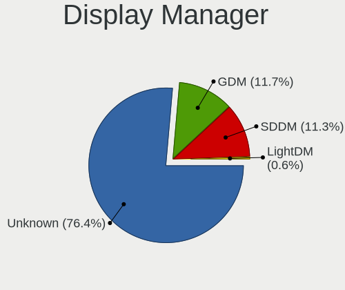
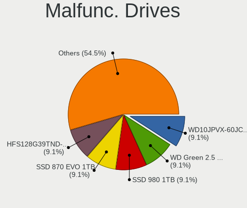
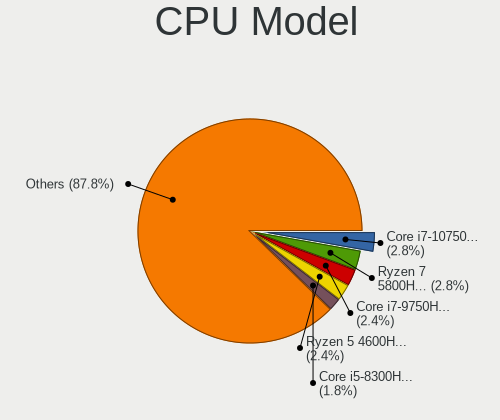
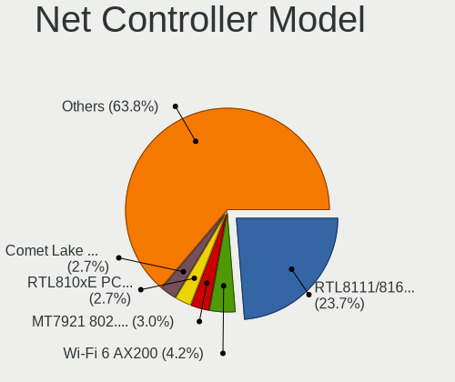
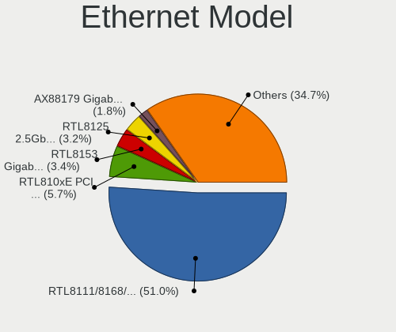

Nobara - Tested Hardware & Statistics (Notebooks)
-------------------------------------------------

A project to collect tested hardware configurations for Nobara.

Anyone can contribute to this report by the [hw-probe](https://github.com/linuxhw/hw-probe) tool:

    sudo -E hw-probe -all -upload

Please contribute! Especially if your hardware is rare.

Contents
--------

* [ Test Cases ](#test-cases)

* [ System ](#system)
  - [ OS                       ](#os)
  - [ OS Family                ](#os-family)
  - [ Kernel                   ](#kernel)
  - [ Kernel Family            ](#kernel-family)
  - [ Kernel Major Ver.        ](#kernel-major-ver)
  - [ Arch                     ](#arch)
  - [ DE                       ](#de)
  - [ Display Server           ](#display-server)
  - [ Display Manager          ](#display-manager)
  - [ OS Lang                  ](#os-lang)
  - [ Boot Mode                ](#boot-mode)
  - [ Filesystem               ](#filesystem)
  - [ Part. scheme             ](#part-scheme)
  - [ Dual Boot with Linux/BSD ](#dual-boot-with-linuxbsd)
  - [ Dual Boot (Win)          ](#dual-boot-win)

* [ Board ](#board)
  - [ Vendor                   ](#vendor)
  - [ Model                    ](#model)
  - [ Model Family             ](#model-family)
  - [ MFG Year                 ](#mfg-year)
  - [ Form Factor              ](#form-factor)
  - [ Secure Boot              ](#secure-boot)
  - [ Coreboot                 ](#coreboot)
  - [ RAM Size                 ](#ram-size)
  - [ RAM Used                 ](#ram-used)
  - [ Total Drives             ](#total-drives)
  - [ Has CD-ROM               ](#has-cd-rom)
  - [ Has Ethernet             ](#has-ethernet)
  - [ Has WiFi                 ](#has-wifi)
  - [ Has Bluetooth            ](#has-bluetooth)

* [ Location ](#location)
  - [ Country                  ](#country)
  - [ City                     ](#city)

* [ Drives ](#drives)
  - [ Drive Vendor             ](#drive-vendor)
  - [ Drive Model              ](#drive-model)
  - [ HDD Vendor               ](#hdd-vendor)
  - [ SSD Vendor               ](#ssd-vendor)
  - [ Drive Kind               ](#drive-kind)
  - [ Drive Connector          ](#drive-connector)
  - [ Drive Size               ](#drive-size)
  - [ Space Total              ](#space-total)
  - [ Space Used               ](#space-used)
  - [ Malfunc. Drives          ](#malfunc-drives)
  - [ Malfunc. Drive Vendor    ](#malfunc-drive-vendor)
  - [ Malfunc. HDD Vendor      ](#malfunc-hdd-vendor)
  - [ Malfunc. Drive Kind      ](#malfunc-drive-kind)
  - [ Failed Drives            ](#failed-drives)
  - [ Failed Drive Vendor      ](#failed-drive-vendor)
  - [ Drive Status             ](#drive-status)

* [ Storage controller ](#storage-controller)
  - [ Storage Vendor           ](#storage-vendor)
  - [ Storage Model            ](#storage-model)
  - [ Storage Kind             ](#storage-kind)

* [ Processor ](#processor)
  - [ CPU Vendor               ](#cpu-vendor)
  - [ CPU Model                ](#cpu-model)
  - [ CPU Model Family         ](#cpu-model-family)
  - [ CPU Cores                ](#cpu-cores)
  - [ CPU Sockets              ](#cpu-sockets)
  - [ CPU Threads              ](#cpu-threads)
  - [ CPU Op-Modes             ](#cpu-op-modes)
  - [ CPU Microcode            ](#cpu-microcode)
  - [ CPU Microarch            ](#cpu-microarch)

* [ Graphics ](#graphics)
  - [ GPU Vendor               ](#gpu-vendor)
  - [ GPU Model                ](#gpu-model)
  - [ GPU Combo                ](#gpu-combo)
  - [ GPU Driver               ](#gpu-driver)
  - [ GPU Memory               ](#gpu-memory)

* [ Monitor ](#monitor)
  - [ Monitor Vendor           ](#monitor-vendor)
  - [ Monitor Model            ](#monitor-model)
  - [ Monitor Resolution       ](#monitor-resolution)
  - [ Monitor Diagonal         ](#monitor-diagonal)
  - [ Monitor Width            ](#monitor-width)
  - [ Aspect Ratio             ](#aspect-ratio)
  - [ Monitor Area             ](#monitor-area)
  - [ Pixel Density            ](#pixel-density)
  - [ Multiple Monitors        ](#multiple-monitors)

* [ Network ](#network)
  - [ Net Controller Vendor    ](#net-controller-vendor)
  - [ Net Controller Model     ](#net-controller-model)
  - [ Wireless Vendor          ](#wireless-vendor)
  - [ Wireless Model           ](#wireless-model)
  - [ Ethernet Vendor          ](#ethernet-vendor)
  - [ Ethernet Model           ](#ethernet-model)
  - [ Net Controller Kind      ](#net-controller-kind)
  - [ Used Controller          ](#used-controller)
  - [ NICs                     ](#nics)
  - [ IPv6                     ](#ipv6)

* [ Bluetooth ](#bluetooth)
  - [ Bluetooth Vendor         ](#bluetooth-vendor)
  - [ Bluetooth Model          ](#bluetooth-model)

* [ Sound ](#sound)
  - [ Sound Vendor             ](#sound-vendor)
  - [ Sound Model              ](#sound-model)

* [ Memory ](#memory)
  - [ Memory Vendor            ](#memory-vendor)
  - [ Memory Model             ](#memory-model)
  - [ Memory Kind              ](#memory-kind)
  - [ Memory Form Factor       ](#memory-form-factor)
  - [ Memory Size              ](#memory-size)
  - [ Memory Speed             ](#memory-speed)

* [ Printers & scanners ](#printers--scanners)
  - [ Printer Vendor           ](#printer-vendor)
  - [ Printer Model            ](#printer-model)
  - [ Scanner Vendor           ](#scanner-vendor)
  - [ Scanner Model            ](#scanner-model)

* [ Camera ](#camera)
  - [ Camera Vendor            ](#camera-vendor)
  - [ Camera Model             ](#camera-model)

* [ Security ](#security)
  - [ Fingerprint Vendor       ](#fingerprint-vendor)
  - [ Fingerprint Model        ](#fingerprint-model)
  - [ Chipcard Vendor          ](#chipcard-vendor)
  - [ Chipcard Model           ](#chipcard-model)

* [ Unsupported ](#unsupported)
  - [ Unsupported Devices      ](#unsupported-devices)
  - [ Unsupported Device Types ](#unsupported-device-types)

Test Cases
----------

Total: 164

| Vendor        | Model                       | Probe                                                      | Date         |
|---------------|-----------------------------|------------------------------------------------------------|--------------|
| Lenovo        | ThinkPad X1 Carbon Gen 9... | [c1862b275d](https://linux-hardware.org/?probe=c1862b275d) | Feb 01, 2023 |
| Lenovo        | ThinkPad X1 Carbon Gen 9... | [1aa5d63f0c](https://linux-hardware.org/?probe=1aa5d63f0c) | Feb 01, 2023 |
| HP            | ZBook 15u G3                | [7f985597d7](https://linux-hardware.org/?probe=7f985597d7) | Jan 30, 2023 |
| HP            | ZBook 15u G3                | [7a35a6d886](https://linux-hardware.org/?probe=7a35a6d886) | Jan 30, 2023 |
| ASUSTek       | TUF Gaming FX505DT_FX505... | [87502e1eb2](https://linux-hardware.org/?probe=87502e1eb2) | Jan 29, 2023 |
| Lenovo        | ThinkPad T460 20FMS79000    | [2b397905e1](https://linux-hardware.org/?probe=2b397905e1) | Jan 29, 2023 |
| Samsung       | R520/R522/R620              | [8c5c4fecfe](https://linux-hardware.org/?probe=8c5c4fecfe) | Jan 28, 2023 |
| Notebook      | NP5x_NP6x_NP7xHP            | [3b7c64dc34](https://linux-hardware.org/?probe=3b7c64dc34) | Jan 26, 2023 |
| Monster       | ABRA A7 V12.1               | [1882db09fe](https://linux-hardware.org/?probe=1882db09fe) | Jan 25, 2023 |
| MSI           | Katana GF76 11UD            | [5a5a26c29e](https://linux-hardware.org/?probe=5a5a26c29e) | Jan 24, 2023 |
| Positivo      | N1240                       | [e938a6c0b0](https://linux-hardware.org/?probe=e938a6c0b0) | Jan 24, 2023 |
| Lenovo        | Legion 5 15ARH05 82B5       | [8cb10f3212](https://linux-hardware.org/?probe=8cb10f3212) | Jan 23, 2023 |
| Lenovo        | IdeaPad Gaming 3 15ARH05... | [bc070879ba](https://linux-hardware.org/?probe=bc070879ba) | Jan 22, 2023 |
| Medion        | GUARDIAN X10                | [4807ed03d5](https://linux-hardware.org/?probe=4807ed03d5) | Jan 22, 2023 |
| Apple         | MacBook5,1                  | [9732bb65cd](https://linux-hardware.org/?probe=9732bb65cd) | Jan 20, 2023 |
| ASUSTek       | ROG Strix G713RM_G713RM     | [844d97dd92](https://linux-hardware.org/?probe=844d97dd92) | Jan 20, 2023 |
| Lenovo        | IdeaPad 3 15ALC6 82KU       | [87f11d2b18](https://linux-hardware.org/?probe=87f11d2b18) | Jan 19, 2023 |
| HP            | Pavilion Notebook           | [9a0b1c62f5](https://linux-hardware.org/?probe=9a0b1c62f5) | Jan 18, 2023 |
| Acer          | Swift SFX14-51G             | [f0137b1f08](https://linux-hardware.org/?probe=f0137b1f08) | Jan 17, 2023 |
| MSI           | Katana GF76 11UD            | [dcc8c2a63b](https://linux-hardware.org/?probe=dcc8c2a63b) | Jan 17, 2023 |
| Lenovo        | Legion 5 17ACH6H 82JY       | [b49ce7a30a](https://linux-hardware.org/?probe=b49ce7a30a) | Jan 15, 2023 |
| Lenovo        | ThinkPad P51 20HJS02H00     | [ab26ff36b1](https://linux-hardware.org/?probe=ab26ff36b1) | Jan 14, 2023 |
| Medion        | GUARDIAN X10                | [ef011d0700](https://linux-hardware.org/?probe=ef011d0700) | Jan 10, 2023 |
| HP            | Pavilion 15                 | [e60b327d4c](https://linux-hardware.org/?probe=e60b327d4c) | Jan 10, 2023 |
| ASUSTek       | ROG Zephyrus G14 GA402RK... | [899e519abe](https://linux-hardware.org/?probe=899e519abe) | Jan 10, 2023 |
| HP            | Pavilion Laptop 15-eh1xx... | [9f368d248b](https://linux-hardware.org/?probe=9f368d248b) | Jan 10, 2023 |
| ASUSTek       | ROG Flow X13 GV301QE_GV3... | [d679fb0fd0](https://linux-hardware.org/?probe=d679fb0fd0) | Jan 10, 2023 |
| MSI           | GT680R/GX680R/GT683R/GT6... | [0b23cb61e0](https://linux-hardware.org/?probe=0b23cb61e0) | Jan 09, 2023 |
| HP            | EliteBook 840 G1            | [6f4cc6e4c7](https://linux-hardware.org/?probe=6f4cc6e4c7) | Jan 05, 2023 |
| ASRock        | X570 Phantom Gaming-ITX/... | [f097aa1c92](https://linux-hardware.org/?probe=f097aa1c92) | Jan 03, 2023 |
| Apple         | MacBookPro8,1               | [97f93aa235](https://linux-hardware.org/?probe=97f93aa235) | Dec 31, 2022 |
| ASUSTek       | VivoBook_ASUSLaptop N760... | [7ef5d874e9](https://linux-hardware.org/?probe=7ef5d874e9) | Dec 28, 2022 |
| HP            | ENVY Notebook               | [8c7d592182](https://linux-hardware.org/?probe=8c7d592182) | Dec 26, 2022 |
| HP            | Pavilion Laptop 14-ec0xx... | [978bb114dc](https://linux-hardware.org/?probe=978bb114dc) | Dec 23, 2022 |
| Dell          | G15 5510                    | [86d0642973](https://linux-hardware.org/?probe=86d0642973) | Dec 20, 2022 |
| Lenovo        | ThinkPad X1 Carbon Gen 9... | [03da9468fc](https://linux-hardware.org/?probe=03da9468fc) | Dec 19, 2022 |
| Lenovo        | ThinkPad X1 Extreme Gen ... | [2a1a679e03](https://linux-hardware.org/?probe=2a1a679e03) | Dec 18, 2022 |
| Apple         | MacBookPro11,1              | [d3517edb25](https://linux-hardware.org/?probe=d3517edb25) | Dec 17, 2022 |
| Acer          | Aspire E5-551G              | [56f5130537](https://linux-hardware.org/?probe=56f5130537) | Dec 17, 2022 |
| HP            | EliteBook 8460p             | [0a2731119d](https://linux-hardware.org/?probe=0a2731119d) | Dec 16, 2022 |
| Dynabook      | PORTEGE X30L-K              | [6f9a9428b6](https://linux-hardware.org/?probe=6f9a9428b6) | Dec 16, 2022 |
| Dynabook      | PORTEGE X30L-K              | [28c00eabe8](https://linux-hardware.org/?probe=28c00eabe8) | Dec 14, 2022 |
| Lenovo        | Legion 5 15ACH6H 82JU       | [6177c6a156](https://linux-hardware.org/?probe=6177c6a156) | Dec 13, 2022 |
| HP            | EliteBook 8570p             | [52f0fae7e4](https://linux-hardware.org/?probe=52f0fae7e4) | Dec 12, 2022 |
| HP            | EliteBook 8570p             | [be0c42b073](https://linux-hardware.org/?probe=be0c42b073) | Dec 12, 2022 |
| Lenovo        | IdeaPad 330-15IKB 81DE      | [52a8f66027](https://linux-hardware.org/?probe=52a8f66027) | Dec 10, 2022 |
| ASUSTek       | ASUS TUF Gaming A15 FA50... | [febce6b929](https://linux-hardware.org/?probe=febce6b929) | Dec 09, 2022 |
| Acer          | Aspire E1-532               | [4fd43d5aff](https://linux-hardware.org/?probe=4fd43d5aff) | Dec 09, 2022 |
| Acer          | Aspire E1-532               | [13e9fa6c58](https://linux-hardware.org/?probe=13e9fa6c58) | Dec 09, 2022 |
| Dynabook      | PORTEGE X30L-K              | [75a8aa38fc](https://linux-hardware.org/?probe=75a8aa38fc) | Dec 08, 2022 |
| Lenovo        | Z50-70 20354                | [07bf98d8f7](https://linux-hardware.org/?probe=07bf98d8f7) | Dec 07, 2022 |
| HP            | Laptop 14-cm1xxx            | [6fbbd3608f](https://linux-hardware.org/?probe=6fbbd3608f) | Dec 06, 2022 |
| Lenovo        | V14-IIL 82C4                | [e23dd27dc9](https://linux-hardware.org/?probe=e23dd27dc9) | Dec 06, 2022 |
| ASUSTek       | ROG Zephyrus M15 GU502LV... | [5ce6793478](https://linux-hardware.org/?probe=5ce6793478) | Dec 06, 2022 |
| Valve         | Jupiter                     | [ef85b8ab38](https://linux-hardware.org/?probe=ef85b8ab38) | Nov 28, 2022 |
| Valve         | Jupiter                     | [622315486c](https://linux-hardware.org/?probe=622315486c) | Nov 28, 2022 |
| Lenovo        | V14-IIL 82C4                | [407b574c57](https://linux-hardware.org/?probe=407b574c57) | Nov 28, 2022 |
| Lenovo        | Legion S7 15ACH6 82K8       | [91fa73480c](https://linux-hardware.org/?probe=91fa73480c) | Nov 26, 2022 |
| Lenovo        | Legion S7 15ACH6 82K8       | [93576caa19](https://linux-hardware.org/?probe=93576caa19) | Nov 26, 2022 |
| Lenovo        | ThinkPad T460 20FMS07000    | [eded61b721](https://linux-hardware.org/?probe=eded61b721) | Nov 25, 2022 |
| Lenovo        | IdeaPad Gaming 3 15ACH6 ... | [be2f8c9fd3](https://linux-hardware.org/?probe=be2f8c9fd3) | Nov 24, 2022 |
| HP            | ProBook 445 14 inch G9 N... | [a20535bd66](https://linux-hardware.org/?probe=a20535bd66) | Nov 24, 2022 |
| Gigabyte      | B450 AORUS PRO WIFI-CF      | [9324629428](https://linux-hardware.org/?probe=9324629428) | Nov 24, 2022 |
| Gigabyte      | B450 AORUS PRO WIFI-CF      | [22a1c81a68](https://linux-hardware.org/?probe=22a1c81a68) | Nov 24, 2022 |
| Coradir       | Coradir/ES10IS5             | [a1fb1953ad](https://linux-hardware.org/?probe=a1fb1953ad) | Nov 22, 2022 |
| Lenovo        | G580 20150                  | [6e28c07a6c](https://linux-hardware.org/?probe=6e28c07a6c) | Nov 22, 2022 |
| Lenovo        | ThinkPad X240 20AMA0LTAU    | [54ce03d1f1](https://linux-hardware.org/?probe=54ce03d1f1) | Nov 20, 2022 |
| HP            | Unknown                     | [9b1181bc4b](https://linux-hardware.org/?probe=9b1181bc4b) | Nov 19, 2022 |
| ASUSTek       | VivoBook_ASUSLaptop X515... | [93ad560f52](https://linux-hardware.org/?probe=93ad560f52) | Nov 17, 2022 |
| Dell          | Studio 1737                 | [883ac54ca7](https://linux-hardware.org/?probe=883ac54ca7) | Nov 15, 2022 |
| ASUSTek       | VivoBook_ASUSLaptop X415... | [3ee89779cd](https://linux-hardware.org/?probe=3ee89779cd) | Nov 15, 2022 |
| Lenovo        | G50-30 80G0                 | [978fdef2f8](https://linux-hardware.org/?probe=978fdef2f8) | Nov 13, 2022 |
| HUAWEI        | CREM-WXX9                   | [b33f7744b5](https://linux-hardware.org/?probe=b33f7744b5) | Nov 13, 2022 |
| HUAWEI        | CREM-WXX9                   | [9d7853c05b](https://linux-hardware.org/?probe=9d7853c05b) | Nov 13, 2022 |
| Acer          | Swift SFX14-41G             | [a8023a34a0](https://linux-hardware.org/?probe=a8023a34a0) | Nov 11, 2022 |
| HP            | OMEN Laptop 15-ek0xxx       | [3d53644c05](https://linux-hardware.org/?probe=3d53644c05) | Nov 08, 2022 |
| MSI           | GE60 0NC/GE60 0ND           | [c6460ff904](https://linux-hardware.org/?probe=c6460ff904) | Nov 07, 2022 |
| Dell          | Studio 1737                 | [d286ea1b6c](https://linux-hardware.org/?probe=d286ea1b6c) | Nov 07, 2022 |
| ASUSTek       | GL753VD                     | [97e2ee4ee1](https://linux-hardware.org/?probe=97e2ee4ee1) | Nov 01, 2022 |
| HP            | Unknown                     | [1ca885060e](https://linux-hardware.org/?probe=1ca885060e) | Nov 01, 2022 |
| Acer          | Nitro AN515-42              | [3a00ca53c8](https://linux-hardware.org/?probe=3a00ca53c8) | Oct 31, 2022 |
| Lenovo        | IdeaPad C340-14API 81N6     | [d322bb2739](https://linux-hardware.org/?probe=d322bb2739) | Oct 30, 2022 |
| Apple         | MacBookPro13,3              | [b028075707](https://linux-hardware.org/?probe=b028075707) | Oct 30, 2022 |
| ASUSTek       | VivoBook_ASUS Laptop X50... | [4fdbc3c415](https://linux-hardware.org/?probe=4fdbc3c415) | Oct 30, 2022 |
| HP            | Pavilion Gaming Laptop 1... | [50a8c356f0](https://linux-hardware.org/?probe=50a8c356f0) | Oct 28, 2022 |
| ASUSTek       | GL502VMK                    | [9a18ff1b13](https://linux-hardware.org/?probe=9a18ff1b13) | Oct 25, 2022 |
| Toshiba       | Satellite L850              | [8bfeff52e6](https://linux-hardware.org/?probe=8bfeff52e6) | Oct 24, 2022 |
| ASUSTek       | S550CB                      | [a81f0ecac8](https://linux-hardware.org/?probe=a81f0ecac8) | Oct 24, 2022 |
| ASUSTek       | ROG Zephyrus G14 GA401QM... | [3912d818bd](https://linux-hardware.org/?probe=3912d818bd) | Oct 23, 2022 |
| HP            | OMEN Notebook PC 15         | [1d5ebc92c4](https://linux-hardware.org/?probe=1d5ebc92c4) | Oct 23, 2022 |
| Lenovo        | Legion 5 Pro 16IAH7H 82R... | [eaecfdf473](https://linux-hardware.org/?probe=eaecfdf473) | Oct 21, 2022 |
| Lenovo        | Legion 5 Pro 16IAH7H 82R... | [c044987599](https://linux-hardware.org/?probe=c044987599) | Oct 20, 2022 |
| HP            | EliteBook 850 G2            | [b6fd429ceb](https://linux-hardware.org/?probe=b6fd429ceb) | Oct 20, 2022 |
| HP            | EliteBook 850 G2            | [f33baf66a9](https://linux-hardware.org/?probe=f33baf66a9) | Oct 20, 2022 |
| ASUSTek       | TUF Gaming FX504GD_FX80G... | [e5a34da4a2](https://linux-hardware.org/?probe=e5a34da4a2) | Oct 19, 2022 |
| MSI           | GE60 0NC/GE60 0ND           | [829326a8e5](https://linux-hardware.org/?probe=829326a8e5) | Oct 18, 2022 |
| MSI           | GE60 0NC/GE60 0ND           | [697ccec46b](https://linux-hardware.org/?probe=697ccec46b) | Oct 18, 2022 |
| HP            | EliteBook 850 G1            | [dfeb98414b](https://linux-hardware.org/?probe=dfeb98414b) | Oct 18, 2022 |
| HP            | EliteBook 850 G1            | [7f8c9d778c](https://linux-hardware.org/?probe=7f8c9d778c) | Oct 18, 2022 |
| Casper        | EXCALIBUR G770              | [7961a3ca3e](https://linux-hardware.org/?probe=7961a3ca3e) | Oct 14, 2022 |
| Lenovo        | ThinkPad E14 Gen 3 20Y7C... | [5f013faf39](https://linux-hardware.org/?probe=5f013faf39) | Oct 12, 2022 |
| Toshiba       | Satellite L650              | [89f43e5484](https://linux-hardware.org/?probe=89f43e5484) | Oct 12, 2022 |
| Toshiba       | Satellite L650              | [43f57daebb](https://linux-hardware.org/?probe=43f57daebb) | Oct 12, 2022 |
| MSI           | Pulse GL76 12UEK            | [6a2be4d08c](https://linux-hardware.org/?probe=6a2be4d08c) | Oct 12, 2022 |
| EVOO          | EG-LP10                     | [f8895e9483](https://linux-hardware.org/?probe=f8895e9483) | Oct 11, 2022 |
| Dell          | Vostro 15 5510              | [2aa595867e](https://linux-hardware.org/?probe=2aa595867e) | Oct 11, 2022 |
| Dell          | Vostro 15 5510              | [bd224480a9](https://linux-hardware.org/?probe=bd224480a9) | Oct 10, 2022 |
| HP            | 2000                        | [3341a26d0c](https://linux-hardware.org/?probe=3341a26d0c) | Oct 10, 2022 |
| ASUSTek       | GL503VD                     | [1405b367c2](https://linux-hardware.org/?probe=1405b367c2) | Oct 09, 2022 |
| Lenovo        | IdeaPad Y700-15ISK 80NV     | [94ccd99c78](https://linux-hardware.org/?probe=94ccd99c78) | Oct 09, 2022 |
| Apple         | MacBookPro5,5               | [faef78b510](https://linux-hardware.org/?probe=faef78b510) | Oct 08, 2022 |
| HP            | Laptop 15-dw0xxx            | [3427421197](https://linux-hardware.org/?probe=3427421197) | Oct 08, 2022 |
| ASUSTek       | ASUS TUF Gaming A17 FA70... | [2d464da9c8](https://linux-hardware.org/?probe=2d464da9c8) | Oct 07, 2022 |
| HP            | ZBook 17 G6                 | [c215e9e17e](https://linux-hardware.org/?probe=c215e9e17e) | Oct 07, 2022 |
| Dell          | Precision 5530              | [db48ac269b](https://linux-hardware.org/?probe=db48ac269b) | Oct 07, 2022 |
| Lenovo        | IdeaPad 320-15IKB 80YH      | [9ccbc0ed3c](https://linux-hardware.org/?probe=9ccbc0ed3c) | Oct 07, 2022 |
| KELYX ARGE... | KL9120                      | [faa5f13391](https://linux-hardware.org/?probe=faa5f13391) | Oct 06, 2022 |
| Positivo      | N1250                       | [9845103c14](https://linux-hardware.org/?probe=9845103c14) | Oct 05, 2022 |
| HP            | 2000                        | [e6f8f7196d](https://linux-hardware.org/?probe=e6f8f7196d) | Oct 03, 2022 |
| ASUSTek       | TUF Gaming FX505DV_FX505... | [3ec3f59233](https://linux-hardware.org/?probe=3ec3f59233) | Oct 03, 2022 |
| ASUSTek       | TUF Gaming FX505DV_FX505... | [5ed7136249](https://linux-hardware.org/?probe=5ed7136249) | Oct 03, 2022 |
| HP            | 240 G7 Notebook PC          | [05b4e2117b](https://linux-hardware.org/?probe=05b4e2117b) | Oct 03, 2022 |
| Toshiba       | Satellite L850              | [0e57d064b0](https://linux-hardware.org/?probe=0e57d064b0) | Oct 02, 2022 |
| Lenovo        | Yoga Slim 7 Pro 14ACH5 O... | [05e921b4aa](https://linux-hardware.org/?probe=05e921b4aa) | Oct 02, 2022 |
| EVOO          | EG-LP10                     | [32c1a174d1](https://linux-hardware.org/?probe=32c1a174d1) | Oct 01, 2022 |
| Acer          | Aspire VX5-591G             | [b321f4561b](https://linux-hardware.org/?probe=b321f4561b) | Sep 29, 2022 |
| Lenovo        | V330-15IKB 81AX             | [0360123f76](https://linux-hardware.org/?probe=0360123f76) | Sep 29, 2022 |
| Lenovo        | G580 20157                  | [2b34d591ab](https://linux-hardware.org/?probe=2b34d591ab) | Sep 29, 2022 |
| Apple         | MacBookAir4,2               | [a423006d4c](https://linux-hardware.org/?probe=a423006d4c) | Sep 29, 2022 |
| Apple         | MacBookAir4,2               | [5dba6cf7fd](https://linux-hardware.org/?probe=5dba6cf7fd) | Sep 29, 2022 |
| Dell          | Inspiron 3542               | [6d35107941](https://linux-hardware.org/?probe=6d35107941) | Sep 28, 2022 |
| Apple         | MacBookPro8,3               | [74927fc7d2](https://linux-hardware.org/?probe=74927fc7d2) | Sep 27, 2022 |
| Lenovo        | IdeaPad 310-15IAP 80TT      | [65f896ddab](https://linux-hardware.org/?probe=65f896ddab) | Sep 27, 2022 |
| Gateway       | NE56R                       | [f603edd045](https://linux-hardware.org/?probe=f603edd045) | Sep 23, 2022 |
| Toshiba       | TECRA A50-A                 | [6ef2538a5a](https://linux-hardware.org/?probe=6ef2538a5a) | Sep 23, 2022 |
| Lenovo        | IdeaPad 5 15ARE05 81YQ      | [605e97df5c](https://linux-hardware.org/?probe=605e97df5c) | Sep 22, 2022 |
| Lenovo        | IdeaPad 5 15ARE05 81YQ      | [94e6332c62](https://linux-hardware.org/?probe=94e6332c62) | Sep 22, 2022 |
| ASUSTek       | ROG Zephyrus G14 GA401II... | [2e36489a4b](https://linux-hardware.org/?probe=2e36489a4b) | Sep 22, 2022 |
| ASUSTek       | ROG Zephyrus G14 GA401II... | [8705683c6f](https://linux-hardware.org/?probe=8705683c6f) | Sep 22, 2022 |
| Alienware     | Area-51m R2 A00             | [0ebdec6dd0](https://linux-hardware.org/?probe=0ebdec6dd0) | Sep 20, 2022 |
| ASUSTek       | N56VZ                       | [ce162c52c0](https://linux-hardware.org/?probe=ce162c52c0) | Sep 19, 2022 |
| Lenovo        | IdeaPadFlex 10 20324        | [4e7f3b7bac](https://linux-hardware.org/?probe=4e7f3b7bac) | Sep 19, 2022 |
| Lenovo        | Legion 5 15ARH05 82B5       | [854a0d4410](https://linux-hardware.org/?probe=854a0d4410) | Sep 19, 2022 |
| Dell          | Precision M6400             | [67924c5333](https://linux-hardware.org/?probe=67924c5333) | Sep 19, 2022 |
| Dell          | Precision M6400             | [27a55639e4](https://linux-hardware.org/?probe=27a55639e4) | Sep 19, 2022 |
| HUAWEI        | KLVL-WXXW                   | [e0e49d51d0](https://linux-hardware.org/?probe=e0e49d51d0) | Sep 18, 2022 |
| HUAWEI        | KLVL-WXXW                   | [812ea842dc](https://linux-hardware.org/?probe=812ea842dc) | Sep 18, 2022 |
| Lenovo        | ThinkBook 15 G3 ACL 21A4    | [004d0a2b9d](https://linux-hardware.org/?probe=004d0a2b9d) | Sep 17, 2022 |
| Lenovo        | ThinkPad P1 20MD0020US      | [a701fed148](https://linux-hardware.org/?probe=a701fed148) | Sep 16, 2022 |
| ASUSTek       | VivoBook_ASUSLaptop X340... | [5ffc7d13ac](https://linux-hardware.org/?probe=5ffc7d13ac) | Sep 16, 2022 |
| Dell          | G5 5505                     | [25755e8605](https://linux-hardware.org/?probe=25755e8605) | Sep 16, 2022 |
| HP            | 15                          | [79aa0d618f](https://linux-hardware.org/?probe=79aa0d618f) | Sep 14, 2022 |
| Acer          | Aspire A315-42              | [820c1e2ac6](https://linux-hardware.org/?probe=820c1e2ac6) | Sep 11, 2022 |
| Dell          | Precision 3510              | [4337a8e018](https://linux-hardware.org/?probe=4337a8e018) | Sep 11, 2022 |
| ASUSTek       | ASUS TUF Gaming F15 FX50... | [0ca693e2dd](https://linux-hardware.org/?probe=0ca693e2dd) | Aug 31, 2022 |
| ASUSTek       | TP500LA                     | [de395dddd8](https://linux-hardware.org/?probe=de395dddd8) | Aug 28, 2022 |
| Dell          | G15 5511                    | [44fa9bf084](https://linux-hardware.org/?probe=44fa9bf084) | Aug 21, 2022 |
| Notebook      | P7xxDM2(-G)                 | [f074899985](https://linux-hardware.org/?probe=f074899985) | Aug 17, 2022 |
| HP            | Pavilion Gaming Laptop 1... | [315da58d24](https://linux-hardware.org/?probe=315da58d24) | Aug 16, 2022 |
| Apple         | MacBookPro14,2              | [c66d476513](https://linux-hardware.org/?probe=c66d476513) | Aug 13, 2022 |
| ASUSTek       | ROG Strix G513QY_G513QY     | [df2cc1a299](https://linux-hardware.org/?probe=df2cc1a299) | Aug 12, 2022 |
| Lenovo        | IdeaPad Y700-15ISK 80NV     | [6beddf67f5](https://linux-hardware.org/?probe=6beddf67f5) | Aug 06, 2022 |
| Razer         | Blade                       | [cc3ce45956](https://linux-hardware.org/?probe=cc3ce45956) | Jul 31, 2022 |
| HP            | ZBook 15 G2                 | [3aa2fda09a](https://linux-hardware.org/?probe=3aa2fda09a) | Jul 26, 2022 |

System
------

OS
--

Installed operating systems

| Name      | Notebooks | Percent |
|-----------|-----------|---------|
| Nobara 36 | 107       | 82.95%  |
| Nobara 37 | 22        | 17.05%  |

OS Family
---------

OS without a version

| Name   | Notebooks | Percent |
|--------|-----------|---------|
| Nobara | 128       | 100%    |

Kernel
------

Version of the Linux kernel

| Version                       | Notebooks | Percent |
|-------------------------------|-----------|---------|
| 6.0.10-201.fc36.x86_64        | 18        | 13.74%  |
| 5.19.14-201.fsync.fc36.x86_64 | 16        | 12.21%  |
| 6.1.4-203.fsync.fc37.x86_64   | 7         | 5.34%   |
| 5.19.9-201.fsync.fc36.x86_64  | 7         | 5.34%   |
| 5.19.7-204.fsync.fc36.x86_64  | 7         | 5.34%   |
| 6.0.7-201.fsync.fc36.x86_64   | 6         | 4.58%   |
| 6.0.5-201.fsync.fc36.x86_64   | 5         | 3.82%   |
| 6.0.16-301.fsync.fc37.x86_64  | 5         | 3.82%   |
| 6.0.14-201.fsync.fc36.x86_64  | 5         | 3.82%   |
| 5.19.12-201.fsync.fc36.x86_64 | 5         | 3.82%   |
| 5.19.8-201.fsync.fc36.x86_64  | 4         | 3.05%   |
| 5.19.16-201.fsync.fc36.x86_64 | 4         | 3.05%   |
| 5.19.11-201.fsync.fc36.x86_64 | 4         | 3.05%   |
| 6.1.6-203.fsync.fc37.x86_64   | 3         | 2.29%   |
| 6.0.9-202.fc36.x86_64         | 3         | 2.29%   |
| 6.0.9-201.fc36.x86_64         | 3         | 2.29%   |
| 5.18.16-201.fsync.fc36.x86_64 | 3         | 2.29%   |
| 5.18.13-201.fsync.fc36.x86_64 | 3         | 2.29%   |
| 6.1.6-202.fsync.fc37.x86_64   | 2         | 1.53%   |
| 6.1.6-201.fsync.fc37.x86_64   | 2         | 1.53%   |
| 6.0.8-201.fsync.fc36.x86_64   | 2         | 1.53%   |
| 5.19.4-201.fsync.fc36.x86_64  | 2         | 1.53%   |
| 5.19.15-202.fsync.fc36.x86_64 | 2         | 1.53%   |
| 5.18.17-201.fsync.fc36.x86_64 | 2         | 1.53%   |
| 6.1.8-201.fsync.fc37.x86_64   | 1         | 0.76%   |
| 6.1.8-200.fsync.fc37.x86_64   | 1         | 0.76%   |
| 6.0.7-202.fsync.fc36.x86_64   | 1         | 0.76%   |
| 6.0.2-xm1.0.fc36.x86_64       | 1         | 0.76%   |
| 6.0.15-301.fsync.fc37.x86_64  | 1         | 0.76%   |
| 6.0.13-201.fsync.fc36.x86_64  | 1         | 0.76%   |
| 5.19.7-203.fsync.fc36.x86_64  | 1         | 0.76%   |
| 5.19.13-202.fsync.fc36.x86_64 | 1         | 0.76%   |
| 5.19.10-201.fsync.fc36.x86_64 | 1         | 0.76%   |
| 5.18.19-201.fsync.fc36.x86_64 | 1         | 0.76%   |
| 5.18.18-201.fsync.fc36.x86_64 | 1         | 0.76%   |

Kernel Family
-------------

Linux kernel without a distro release

| Version | Notebooks | Percent |
|---------|-----------|---------|
| 6.0.10  | 18        | 13.74%  |
| 5.19.14 | 16        | 12.21%  |
| 5.19.7  | 8         | 6.11%   |
| 6.1.6   | 7         | 5.34%   |
| 6.1.4   | 7         | 5.34%   |
| 6.0.7   | 7         | 5.34%   |
| 5.19.9  | 7         | 5.34%   |
| 6.0.9   | 6         | 4.58%   |
| 6.0.5   | 5         | 3.82%   |
| 6.0.16  | 5         | 3.82%   |
| 6.0.14  | 5         | 3.82%   |
| 5.19.12 | 5         | 3.82%   |
| 5.19.8  | 4         | 3.05%   |
| 5.19.16 | 4         | 3.05%   |
| 5.19.11 | 4         | 3.05%   |
| 5.18.16 | 3         | 2.29%   |
| 5.18.13 | 3         | 2.29%   |
| 6.1.8   | 2         | 1.53%   |
| 6.0.8   | 2         | 1.53%   |
| 5.19.4  | 2         | 1.53%   |
| 5.19.15 | 2         | 1.53%   |
| 5.18.17 | 2         | 1.53%   |
| 6.0.2   | 1         | 0.76%   |
| 6.0.15  | 1         | 0.76%   |
| 6.0.13  | 1         | 0.76%   |
| 5.19.13 | 1         | 0.76%   |
| 5.19.10 | 1         | 0.76%   |
| 5.18.19 | 1         | 0.76%   |
| 5.18.18 | 1         | 0.76%   |

Kernel Major Ver.
-----------------

Linux kernel major version

| Version | Notebooks | Percent |
|---------|-----------|---------|
| 5.19    | 54        | 41.22%  |
| 6.0     | 51        | 38.93%  |
| 6.1     | 16        | 12.21%  |
| 5.18    | 10        | 7.63%   |

Arch
----

OS architecture (x86_64, i586, etc.)

| Name   | Notebooks | Percent |
|--------|-----------|---------|
| x86_64 | 128       | 100%    |

DE
--

Desktop Environment

| Name    | Notebooks | Percent |
|---------|-----------|---------|
| GNOME   | 91        | 70.54%  |
| KDE5    | 34        | 26.36%  |
| Unknown | 4         | 3.1%    |

Display Server
--------------

X11 or Wayland

| Name    | Notebooks | Percent |
|---------|-----------|---------|
| Wayland | 101       | 77.69%  |
| X11     | 25        | 19.23%  |
| Unknown | 4         | 3.08%   |

Display Manager
---------------

SDDM, LightDM, etc.

| Name    | Notebooks | Percent |
|---------|-----------|---------|
| Unknown | 106       | 81.54%  |
| GDM     | 12        | 9.23%   |
| SDDM    | 11        | 8.46%   |
| LightDM | 1         | 0.77%   |

OS Lang
-------

Language

| Lang    | Notebooks | Percent |
|---------|-----------|---------|
| en_US   | 72        | 55.81%  |
| pl_PL   | 6         | 4.65%   |
| es_ES   | 5         | 3.88%   |
| en_GB   | 4         | 3.1%    |
| pt_PT   | 3         | 2.33%   |
| it_IT   | 3         | 2.33%   |
| es_MX   | 3         | 2.33%   |
| es_AR   | 3         | 2.33%   |
| en_IN   | 3         | 2.33%   |
| de_DE   | 3         | 2.33%   |
| ru_RU   | 2         | 1.55%   |
| pt_BR   | 2         | 1.55%   |
| en_NZ   | 2         | 1.55%   |
| en_CA   | 2         | 1.55%   |
| Unknown | 2         | 1.55%   |
| tr_TR   | 1         | 0.78%   |
| sv_SE   | 1         | 0.78%   |
| nb_NO   | 1         | 0.78%   |
| hu_HU   | 1         | 0.78%   |
| hr_HR   | 1         | 0.78%   |
| fr_FR   | 1         | 0.78%   |
| fi_FI   | 1         | 0.78%   |
| es_CR   | 1         | 0.78%   |
| es_CO   | 1         | 0.78%   |
| es_CL   | 1         | 0.78%   |
| en_ZA   | 1         | 0.78%   |
| en_IE   | 1         | 0.78%   |
| en_AU   | 1         | 0.78%   |
| de_AT   | 1         | 0.78%   |

Boot Mode
---------

EFI or BIOS

| Mode | Notebooks | Percent |
|------|-----------|---------|
| EFI  | 106       | 82.17%  |
| BIOS | 23        | 17.83%  |

Filesystem
----------

Type of filesystem

| Type  | Notebooks | Percent |
|-------|-----------|---------|
| Btrfs | 73        | 57.03%  |
| Ext4  | 54        | 42.19%  |
| Xfs   | 1         | 0.78%   |

Part. scheme
------------

Scheme of partitioning

| Type    | Notebooks | Percent |
|---------|-----------|---------|
| Unknown | 104       | 79.39%  |
| GPT     | 24        | 18.32%  |
| MBR     | 3         | 2.29%   |

Dual Boot with Linux/BSD
------------------------

Hosting more than one Linux/BSD

| Dual boot | Notebooks | Percent |
|-----------|-----------|---------|
| No        | 121       | 93.8%   |
| Yes       | 8         | 6.2%    |

Dual Boot (Win)
---------------

Hosting Linux and Windows

| Dual boot | Notebooks | Percent |
|-----------|-----------|---------|
| No        | 114       | 89.06%  |
| Yes       | 14        | 10.94%  |

Board
-----

Vendor
------

Motherboard manufacturer

| Name                | Notebooks | Percent |
|---------------------|-----------|---------|
| Lenovo              | 32        | 25%     |
| ASUSTek Computer    | 24        | 18.75%  |
| Hewlett-Packard     | 23        | 17.97%  |
| Dell                | 9         | 7.03%   |
| Apple               | 8         | 6.25%   |
| Acer                | 7         | 5.47%   |
| MSI                 | 4         | 3.13%   |
| Toshiba             | 3         | 2.34%   |
| Positivo            | 2         | 1.56%   |
| Notebook            | 2         | 1.56%   |
| Valve               | 1         | 0.78%   |
| Samsung Electronics | 1         | 0.78%   |
| Razer               | 1         | 0.78%   |
| Monster             | 1         | 0.78%   |
| Medion              | 1         | 0.78%   |
| HUAWEI              | 1         | 0.78%   |
| Gigabyte Technology | 1         | 0.78%   |
| Gateway             | 1         | 0.78%   |
| EVOO                | 1         | 0.78%   |
| Dynabook            | 1         | 0.78%   |
| Coradir             | 1         | 0.78%   |
| Casper              | 1         | 0.78%   |
| ASRock              | 1         | 0.78%   |
| Alienware           | 1         | 0.78%   |

Model
-----

Motherboard model

| Name                                                     | Notebooks | Percent |
|----------------------------------------------------------|-----------|---------|
| Lenovo Legion 5 15ARH05 82B5                             | 2         | 1.56%   |
| Lenovo IdeaPad Y700-15ISK 80NV                           | 2         | 1.56%   |
| Unknown                                                  | 2         | 1.56%   |
| Valve Jupiter                                            | 1         | 0.78%   |
| Toshiba TECRA A50-A                                      | 1         | 0.78%   |
| Toshiba Satellite L850                                   | 1         | 0.78%   |
| Toshiba Satellite L650                                   | 1         | 0.78%   |
| Samsung R520/R522/R620                                   | 1         | 0.78%   |
| Razer Blade                                              | 1         | 0.78%   |
| Positivo N1250                                           | 1         | 0.78%   |
| Positivo N1240                                           | 1         | 0.78%   |
| Notebook P7xxDM2(-G)                                     | 1         | 0.78%   |
| Notebook NP5x_NP6x_NP7xHP                                | 1         | 0.78%   |
| MSI Pulse GL76 12UEK                                     | 1         | 0.78%   |
| MSI Katana GF76 11UD                                     | 1         | 0.78%   |
| MSI GT680R/GX680R/GT683R/GT683DXR/GT685R/GT687R/GX660DXR | 1         | 0.78%   |
| MSI GE60 0NC/GE60 0ND                                    | 1         | 0.78%   |
| Monster ABRA A7 V12.1                                    | 1         | 0.78%   |
| Medion GUARDIAN X10                                      | 1         | 0.78%   |
| Lenovo Z50-70 20354                                      | 1         | 0.78%   |
| Lenovo Yoga Slim 7 Pro 14ACH5 OD 82NK                    | 1         | 0.78%   |
| Lenovo V330-15IKB 81AX                                   | 1         | 0.78%   |
| Lenovo V14-IIL 82C4                                      | 1         | 0.78%   |
| Lenovo ThinkPad X240 20AMA0LTAU                          | 1         | 0.78%   |
| Lenovo ThinkPad X1 Extreme Gen 3 20TK0047US              | 1         | 0.78%   |
| Lenovo ThinkPad X1 Carbon Gen 9 20XWS0ME00               | 1         | 0.78%   |
| Lenovo ThinkPad T460 20FMS79000                          | 1         | 0.78%   |
| Lenovo ThinkPad P51 20HJS02H00                           | 1         | 0.78%   |
| Lenovo ThinkPad P1 20MD0020US                            | 1         | 0.78%   |
| Lenovo ThinkPad E14 Gen 3 20Y7CTO1WW                     | 1         | 0.78%   |
| Lenovo ThinkBook 15 G3 ACL 21A4                          | 1         | 0.78%   |
| Lenovo Legion S7 15ACH6 82K8                             | 1         | 0.78%   |
| Lenovo Legion 5 Pro 16IAH7H 82RF                         | 1         | 0.78%   |
| Lenovo Legion 5 17ACH6H 82JY                             | 1         | 0.78%   |
| Lenovo Legion 5 15ACH6H 82JU                             | 1         | 0.78%   |
| Lenovo IdeaPadFlex 10 20324                              | 1         | 0.78%   |
| Lenovo IdeaPad Gaming 3 15ARH05 82EY                     | 1         | 0.78%   |
| Lenovo IdeaPad Gaming 3 15ACH6 82K2                      | 1         | 0.78%   |
| Lenovo IdeaPad C340-14API 81N6                           | 1         | 0.78%   |
| Lenovo IdeaPad 5 15ARE05 81YQ                            | 1         | 0.78%   |

Model Family
------------

Motherboard model prefix

| Name                 | Notebooks | Percent |
|----------------------|-----------|---------|
| Lenovo IdeaPad       | 10        | 7.81%   |
| Lenovo ThinkPad      | 7         | 5.47%   |
| ASUS ROG             | 7         | 5.47%   |
| Lenovo Legion        | 6         | 4.69%   |
| HP EliteBook         | 5         | 3.91%   |
| ASUS VivoBook        | 5         | 3.91%   |
| HP Pavilion          | 4         | 3.13%   |
| Acer Aspire          | 4         | 3.13%   |
| HP ZBook             | 3         | 2.34%   |
| Dell Precision       | 3         | 2.34%   |
| ASUS TUF             | 3         | 2.34%   |
| ASUS ASUS            | 3         | 2.34%   |
| Toshiba Satellite    | 2         | 1.56%   |
| Lenovo G580          | 2         | 1.56%   |
| HP OMEN              | 2         | 1.56%   |
| HP Laptop            | 2         | 1.56%   |
| Dell G15             | 2         | 1.56%   |
| Apple MacBookPro8    | 2         | 1.56%   |
| Acer Swift           | 2         | 1.56%   |
| Unknown              | 2         | 1.56%   |
| Valve Jupiter        | 1         | 0.78%   |
| Toshiba TECRA        | 1         | 0.78%   |
| Samsung R520         | 1         | 0.78%   |
| Razer Blade          | 1         | 0.78%   |
| Positivo N1250       | 1         | 0.78%   |
| Positivo N1240       | 1         | 0.78%   |
| Notebook P7xxDM2(-G) | 1         | 0.78%   |
| Notebook NP5x        | 1         | 0.78%   |
| MSI Pulse            | 1         | 0.78%   |
| MSI Katana           | 1         | 0.78%   |
| MSI GT680R           | 1         | 0.78%   |
| MSI GE60             | 1         | 0.78%   |
| Monster ABRA         | 1         | 0.78%   |
| Medion GUARDIAN      | 1         | 0.78%   |
| Lenovo Z50-70        | 1         | 0.78%   |
| Lenovo Yoga          | 1         | 0.78%   |
| Lenovo V330-15IKB    | 1         | 0.78%   |
| Lenovo V14-IIL       | 1         | 0.78%   |
| Lenovo ThinkBook     | 1         | 0.78%   |
| Lenovo IdeaPadFlex   | 1         | 0.78%   |

MFG Year
--------

Motherboard manufacture year

| Year | Notebooks | Percent |
|------|-----------|---------|
| 2021 | 25        | 19.53%  |
| 2020 | 16        | 12.5%   |
| 2022 | 13        | 10.16%  |
| 2019 | 12        | 9.38%   |
| 2018 | 9         | 7.03%   |
| 2014 | 9         | 7.03%   |
| 2012 | 9         | 7.03%   |
| 2013 | 8         | 6.25%   |
| 2017 | 7         | 5.47%   |
| 2016 | 6         | 4.69%   |
| 2015 | 5         | 3.91%   |
| 2009 | 4         | 3.13%   |
| 2011 | 3         | 2.34%   |
| 2010 | 1         | 0.78%   |
| 2008 | 1         | 0.78%   |

Form Factor
-----------

Physical design of the computer

| Name     | Notebooks | Percent |
|----------|-----------|---------|
| Notebook | 128       | 100%    |

Secure Boot
-----------

Enabled or disabled

| State    | Notebooks | Percent |
|----------|-----------|---------|
| Disabled | 128       | 100%    |

Coreboot
--------

Have coreboot on board

| Used | Notebooks | Percent |
|------|-----------|---------|
| No   | 128       | 100%    |

RAM Size
--------

Total RAM memory

| Size in GB | Notebooks | Percent |
|------------|-----------|---------|
| 8.01-16.0  | 34        | 26.56%  |
| 4.01-8.0   | 30        | 23.44%  |
| 16.01-24.0 | 25        | 19.53%  |
| 3.01-4.0   | 20        | 15.63%  |
| 32.01-64.0 | 15        | 11.72%  |
| 24.01-32.0 | 3         | 2.34%   |
| 1.01-2.0   | 1         | 0.78%   |

RAM Used
--------

Used RAM memory

| Used GB   | Notebooks | Percent |
|-----------|-----------|---------|
| 4.01-8.0  | 60        | 46.15%  |
| 2.01-3.0  | 34        | 26.15%  |
| 3.01-4.0  | 26        | 20%     |
| 8.01-16.0 | 9         | 6.92%   |
| 1.01-2.0  | 1         | 0.77%   |

Total Drives
------------

Number of drives on board

| Drives | Notebooks | Percent |
|--------|-----------|---------|
| 1      | 90        | 70.31%  |
| 2      | 34        | 26.56%  |
| 3      | 4         | 3.13%   |

Has CD-ROM
----------

Has CD-ROM on board

| Presented | Notebooks | Percent |
|-----------|-----------|---------|
| No        | 102       | 79.69%  |
| Yes       | 26        | 20.31%  |

Has Ethernet
------------

Has Ethernet on board

| Presented | Notebooks | Percent |
|-----------|-----------|---------|
| Yes       | 100       | 78.13%  |
| No        | 28        | 21.88%  |

Has WiFi
--------

Has WiFi module

| Presented | Notebooks | Percent |
|-----------|-----------|---------|
| Yes       | 127       | 99.22%  |
| No        | 1         | 0.78%   |

Has Bluetooth
-------------

Has Bluetooth module

| Presented | Notebooks | Percent |
|-----------|-----------|---------|
| Yes       | 111       | 86.72%  |
| No        | 17        | 13.28%  |

Location
--------

Country
-------

Geographic location (country)

| Country      | Notebooks | Percent |
|--------------|-----------|---------|
| USA          | 38        | 29.69%  |
| Poland       | 10        | 7.81%   |
| Germany      | 7         | 5.47%   |
| India        | 5         | 3.91%   |
| Spain        | 4         | 3.13%   |
| Mexico       | 4         | 3.13%   |
| Brazil       | 4         | 3.13%   |
| Portugal     | 3         | 2.34%   |
| Italy        | 3         | 2.34%   |
| Chile        | 3         | 2.34%   |
| Argentina    | 3         | 2.34%   |
| Vietnam      | 2         | 1.56%   |
| UK           | 2         | 1.56%   |
| Russia       | 2         | 1.56%   |
| Romania      | 2         | 1.56%   |
| Philippines  | 2         | 1.56%   |
| New Zealand  | 2         | 1.56%   |
| Indonesia    | 2         | 1.56%   |
| Egypt        | 2         | 1.56%   |
| Croatia      | 2         | 1.56%   |
| Colombia     | 2         | 1.56%   |
| Canada       | 2         | 1.56%   |
| Austria      | 2         | 1.56%   |
| Turkey       | 1         | 0.78%   |
| Taiwan       | 1         | 0.78%   |
| Sweden       | 1         | 0.78%   |
| South Africa | 1         | 0.78%   |
| Serbia       | 1         | 0.78%   |
| Panama       | 1         | 0.78%   |
| Pakistan     | 1         | 0.78%   |
| Norway       | 1         | 0.78%   |
| Morocco      | 1         | 0.78%   |
| Kenya        | 1         | 0.78%   |
| Ireland      | 1         | 0.78%   |
| Hungary      | 1         | 0.78%   |
| France       | 1         | 0.78%   |
| Finland      | 1         | 0.78%   |
| Czechia      | 1         | 0.78%   |
| Cyprus       | 1         | 0.78%   |
| Costa Rica   | 1         | 0.78%   |

City
----

Geographic location (city)

| City                | Notebooks | Percent |
|---------------------|-----------|---------|
| Wroclaw             | 2         | 1.53%   |
| Wasilla             | 2         | 1.53%   |
| Warsaw              | 2         | 1.53%   |
| Schmalkalden        | 2         | 1.53%   |
| Poznan              | 2         | 1.53%   |
| Panama City         | 2         | 1.53%   |
| Ochsenfurt          | 2         | 1.53%   |
| Guadalajara         | 2         | 1.53%   |
| Fortaleza           | 2         | 1.53%   |
| Auckland            | 2         | 1.53%   |
| Zamora              | 1         | 0.76%   |
| Zadar               | 1         | 0.76%   |
| Wesley Chapel       | 1         | 0.76%   |
| Wayne               | 1         | 0.76%   |
| Wabrzezno           | 1         | 0.76%   |
| Vladivostok         | 1         | 0.76%   |
| Villarrica          | 1         | 0.76%   |
| Villa Nueva         | 1         | 0.76%   |
| Vienna              | 1         | 0.76%   |
| Veszprém           | 1         | 0.76%   |
| Varaždin           | 1         | 0.76%   |
| Valladolid          | 1         | 0.76%   |
| Vagos               | 1         | 0.76%   |
| Ulm                 | 1         | 0.76%   |
| Uhldingen-Muhlhofen | 1         | 0.76%   |
| Tulsa               | 1         | 0.76%   |
| Tomah               | 1         | 0.76%   |
| Tenna               | 1         | 0.76%   |
| Temuco              | 1         | 0.76%   |
| Tampa               | 1         | 0.76%   |
| Sunnyvale           | 1         | 0.76%   |
| Sosnowiec           | 1         | 0.76%   |
| Sofia               | 1         | 0.76%   |
| Slawa               | 1         | 0.76%   |
| Silves              | 1         | 0.76%   |
| Schenectady         | 1         | 0.76%   |
| Sao Paulo           | 1         | 0.76%   |
| San Juan del Río   | 1         | 0.76%   |
| San José           | 1         | 0.76%   |
| San Diego           | 1         | 0.76%   |

Drives
------

Drive Vendor
------------

Hard drive vendors

| Vendor                       | Notebooks | Drives | Percent |
|------------------------------|-----------|--------|---------|
| Samsung Electronics          | 37        | 43     | 22.42%  |
| WDC                          | 13        | 14     | 7.88%   |
| Toshiba                      | 12        | 13     | 7.27%   |
| Kingston                     | 11        | 11     | 6.67%   |
| Seagate                      | 10        | 10     | 6.06%   |
| SanDisk                      | 9         | 9      | 5.45%   |
| Intel                        | 9         | 9      | 5.45%   |
| SK hynix                     | 8         | 8      | 4.85%   |
| Micron Technology            | 7         | 7      | 4.24%   |
| Phison Electronics           | 5         | 5      | 3.03%   |
| Micron/Crucial Technology    | 5         | 5      | 3.03%   |
| Hitachi                      | 4         | 5      | 2.42%   |
| HGST                         | 4         | 4      | 2.42%   |
| Crucial                      | 4         | 4      | 2.42%   |
| China                        | 4         | 4      | 2.42%   |
| Apple                        | 4         | 5      | 2.42%   |
| LITEON                       | 2         | 2      | 1.21%   |
| KIOXIA                       | 2         | 2      | 1.21%   |
| HS-SSD-C100                  | 2         | 2      | 1.21%   |
| Unknown                      | 2         | 2      | 1.21%   |
| Unknown                      | 1         | 1      | 0.61%   |
| Solid State Storage          | 1         | 1      | 0.61%   |
| Shenzhen Longsys Electronics | 1         | 1      | 0.61%   |
| Ramsta                       | 1         | 1      | 0.61%   |
| PNY                          | 1         | 1      | 0.61%   |
| Mushkin                      | 1         | 1      | 0.61%   |
| HGST HTS                     | 1         | 1      | 0.61%   |
| Fujitsu                      | 1         | 1      | 0.61%   |
| Emtec                        | 1         | 1      | 0.61%   |
| ADATA Technology             | 1         | 1      | 0.61%   |
| A-DATA Technology            | 1         | 1      | 0.61%   |

Drive Model
-----------

Hard drive models

| Model                                                | Notebooks | Percent |
|------------------------------------------------------|-----------|---------|
| Samsung NVMe SSD Controller SM981/PM981/PM983 500GB  | 6         | 3.49%   |
| Kingston SA400S37240G 240GB SSD                      | 4         | 2.33%   |
| Sandisk WD Blue SN550 NVMe SSD 1TB                   | 3         | 1.74%   |
| Samsung SSD 980 1TB                                  | 3         | 1.74%   |
| Samsung NVMe SSD Controller PM9A1/PM9A3/980PRO 512GB | 3         | 1.74%   |
| Micron/Crucial P2 NVMe PCIe SSD 500GB                | 3         | 1.74%   |
| Toshiba MQ04ABF100 1TB                               | 2         | 1.16%   |
| Toshiba MQ01ABF050 500GB                             | 2         | 1.16%   |
| Toshiba MQ01ABD100 1TB                               | 2         | 1.16%   |
| Seagate ST1000LM024 HN-M101MBB 1TB                   | 2         | 1.16%   |
| Sandisk WD Black SN750 / PC SN730 NVMe SSD 1TB       | 2         | 1.16%   |
| Samsung SSD 850 EVO 250GB                            | 2         | 1.16%   |
| Samsung NVMe SSD Drive 1024GB                        | 2         | 1.16%   |
| Samsung NVMe SSD Controller SM961/PM961/SM963 256GB  | 2         | 1.16%   |
| Samsung MZALQ512HBLU-00BL2 512GB                     | 2         | 1.16%   |
| Phison PS5013 E13 NVMe Controller 256GB              | 2         | 1.16%   |
| Phison E12 NVMe Controller 1TB                       | 2         | 1.16%   |
| Micron 2450_MTFDKBA1T0TFK 1TB                        | 2         | 1.16%   |
| Micron 2210_MTFDHBA512QFD 512GB                      | 2         | 1.16%   |
| Kingston NVMe SSD Drive 512GB                        | 2         | 1.16%   |
| Intel SSDPEKNU512GZ 512GB                            | 2         | 1.16%   |
| Intel SSD 660P Series 512GB                          | 2         | 1.16%   |
| HS-SSD-C100 120G                                     | 2         | 1.16%   |
| Hitachi HTS547575A9E384 752GB                        | 2         | 1.16%   |
| China SATA SSD 120GB                                 | 2         | 1.16%   |
| Unknown                                              | 2         | 1.16%   |
| WDC WDS500G3X0C-00SJG0 500GB                         | 1         | 0.58%   |
| WDC WDS100T2B0C-00PXH0 1TB                           | 1         | 0.58%   |
| WDC WD5000LPCX-24VHAT0 500GB                         | 1         | 0.58%   |
| WDC WD5000LPCX-00VHAT0 500GB                         | 1         | 0.58%   |
| WDC WD3200BEVT-22A0RT0 320GB                         | 1         | 0.58%   |
| WDC WD20EZRX-00DC0B0 2TB                             | 1         | 0.58%   |
| WDC WD10SPZX-21Z10T0 1TB                             | 1         | 0.58%   |
| WDC WD10SPCX-24HWST1 1TB                             | 1         | 0.58%   |
| WDC WD10JPVT-22A1YT0 1TB                             | 1         | 0.58%   |
| WDC WD10JPCX-24UE4T0 1TB                             | 1         | 0.58%   |
| WDC PC SN530 SDBPNPZ-512G-1006 512GB                 | 1         | 0.58%   |
| WDC PC SN530 SDBPMPZ-512G-1101 512GB                 | 1         | 0.58%   |
| WDC PC SN520 SDAPNUW-512G-1006 512GB                 | 1         | 0.58%   |
| Unknown SD/MMC/MS PRO 2GB                            | 1         | 0.58%   |

HDD Vendor
----------

Hard disk drive vendors

| Vendor   | Notebooks | Drives | Percent |
|----------|-----------|--------|---------|
| Seagate  | 10        | 10     | 25.64%  |
| Toshiba  | 9         | 9      | 23.08%  |
| WDC      | 8         | 9      | 20.51%  |
| Hitachi  | 4         | 5      | 10.26%  |
| HGST     | 4         | 4      | 10.26%  |
| Unknown  | 1         | 1      | 2.56%   |
| HGST HTS | 1         | 1      | 2.56%   |
| Fujitsu  | 1         | 1      | 2.56%   |
| Apple    | 1         | 1      | 2.56%   |

SSD Vendor
----------

Solid state drive vendors

| Vendor              | Notebooks | Drives | Percent |
|---------------------|-----------|--------|---------|
| Samsung Electronics | 11        | 12     | 27.5%   |
| Kingston            | 5         | 5      | 12.5%   |
| Crucial             | 4         | 4      | 10%     |
| China               | 4         | 4      | 10%     |
| SanDisk             | 2         | 2      | 5%      |
| LITEON              | 2         | 2      | 5%      |
| Intel               | 2         | 2      | 5%      |
| Apple               | 2         | 2      | 5%      |
| Toshiba             | 1         | 1      | 2.5%    |
| SK hynix            | 1         | 1      | 2.5%    |
| Ramsta              | 1         | 1      | 2.5%    |
| PNY                 | 1         | 1      | 2.5%    |
| Mushkin             | 1         | 1      | 2.5%    |
| Micron Technology   | 1         | 1      | 2.5%    |
| Emtec               | 1         | 1      | 2.5%    |
| A-DATA Technology   | 1         | 1      | 2.5%    |

Drive Kind
----------

HDD or SSD

| Kind    | Notebooks | Drives | Percent |
|---------|-----------|--------|---------|
| NVMe    | 70        | 89     | 46.36%  |
| SSD     | 39        | 41     | 25.83%  |
| HDD     | 38        | 41     | 25.17%  |
| Unknown | 4         | 4      | 2.65%   |

Drive Connector
---------------

SATA, SAS, NVMe, etc.

| Type | Notebooks | Drives | Percent |
|------|-----------|--------|---------|
| SATA | 71        | 80     | 48.3%   |
| NVMe | 70        | 89     | 47.62%  |
| SAS  | 6         | 6      | 4.08%   |

Drive Size
----------

Size of hard drive

| Size in TB | Notebooks | Drives | Percent |
|------------|-----------|--------|---------|
| 0.01-0.5   | 47        | 51     | 61.04%  |
| 0.51-1.0   | 28        | 29     | 36.36%  |
| 1.01-2.0   | 1         | 1      | 1.3%    |
| 4.01-10.0  | 1         | 1      | 1.3%    |

Space Total
-----------

Amount of disk space available on the file system

| Size in GB     | Notebooks | Percent |
|----------------|-----------|---------|
| 101-250        | 36        | 27.69%  |
| 251-500        | 31        | 23.85%  |
| 501-1000       | 31        | 23.85%  |
| 1001-2000      | 11        | 8.46%   |
| Unknown        | 6         | 4.62%   |
| More than 3000 | 5         | 3.85%   |
| 51-100         | 5         | 3.85%   |
| 21-50          | 3         | 2.31%   |
| 2001-3000      | 2         | 1.54%   |

Space Used
----------

Amount of used disk space

| Used GB        | Notebooks | Percent |
|----------------|-----------|---------|
| 21-50          | 38        | 29.01%  |
| 1-20           | 35        | 26.72%  |
| 101-250        | 18        | 13.74%  |
| 251-500        | 12        | 9.16%   |
| 51-100         | 11        | 8.4%    |
| 501-1000       | 7         | 5.34%   |
| Unknown        | 6         | 4.58%   |
| 1001-2000      | 2         | 1.53%   |
| More than 3000 | 1         | 0.76%   |
| 2001-3000      | 1         | 0.76%   |

Malfunc. Drives
---------------

Drive models with a malfunction

| Model                  | Notebooks | Drives | Percent |
|------------------------|-----------|--------|---------|
| Ramsta SSD S800 240GB  | 1         | 1      | 50%     |
| Hitachi HTS54323 320GB | 1         | 1      | 50%     |

Malfunc. Drive Vendor
---------------------

Vendors of faulty drives

| Vendor  | Notebooks | Drives | Percent |
|---------|-----------|--------|---------|
| Ramsta  | 1         | 1      | 50%     |
| Hitachi | 1         | 1      | 50%     |

Malfunc. HDD Vendor
-------------------

Vendors of faulty HDD drives

| Vendor  | Notebooks | Drives | Percent |
|---------|-----------|--------|---------|
| Hitachi | 1         | 1      | 100%    |

Malfunc. Drive Kind
-------------------

Kinds of faulty drives

| Kind | Notebooks | Drives | Percent |
|------|-----------|--------|---------|
| SSD  | 1         | 1      | 50%     |
| HDD  | 1         | 1      | 50%     |

Failed Drives
-------------

Failed drive models

Zero info for selected period =(

Failed Drive Vendor
-------------------

Failed drive vendors

Zero info for selected period =(

Drive Status
------------

Number of failed and malfunc. drives

| Status   | Notebooks | Drives | Percent |
|----------|-----------|--------|---------|
| Detected | 106       | 137    | 78.52%  |
| Works    | 27        | 36     | 20%     |
| Malfunc  | 2         | 2      | 1.48%   |

Storage controller
------------------

Storage Vendor
--------------

Storage controller vendors

| Vendor                         | Notebooks | Percent |
|--------------------------------|-----------|---------|
| Intel                          | 77        | 42.78%  |
| Samsung Electronics            | 28        | 15.56%  |
| AMD                            | 24        | 13.33%  |
| SanDisk                        | 11        | 6.11%   |
| SK hynix                       | 7         | 3.89%   |
| Micron Technology              | 6         | 3.33%   |
| Kingston Technology Company    | 6         | 3.33%   |
| Phison Electronics             | 5         | 2.78%   |
| Micron/Crucial Technology      | 5         | 2.78%   |
| Toshiba America Info Systems   | 2         | 1.11%   |
| Nvidia                         | 2         | 1.11%   |
| KIOXIA                         | 2         | 1.11%   |
| Solid State Storage Technology | 1         | 0.56%   |
| Shenzhen Longsys Electronics   | 1         | 0.56%   |
| Marvell Technology Group       | 1         | 0.56%   |
| Apple                          | 1         | 0.56%   |
| ADATA Technology               | 1         | 0.56%   |

Storage Model
-------------

Storage controller models

| Model                                                                          | Notebooks | Percent |
|--------------------------------------------------------------------------------|-----------|---------|
| AMD FCH SATA Controller [AHCI mode]                                            | 24        | 12.63%  |
| Samsung NVMe SSD Controller 980                                                | 12        | 6.32%   |
| Samsung NVMe SSD Controller SM981/PM981/PM983                                  | 9         | 4.74%   |
| Intel 8 Series SATA Controller 1 [AHCI mode]                                   | 9         | 4.74%   |
| Intel 82801 Mobile SATA Controller [RAID mode]                                 | 8         | 4.21%   |
| Intel 7 Series Chipset Family 6-port SATA Controller [AHCI mode]               | 7         | 3.68%   |
| Micron Non-Volatile memory controller                                          | 6         | 3.16%   |
| Intel Volume Management Device NVMe RAID Controller                            | 6         | 3.16%   |
| Intel Sunrise Point-LP SATA Controller [AHCI mode]                             | 5         | 2.63%   |
| Intel HM170/QM170 Chipset SATA Controller [AHCI Mode]                          | 5         | 2.63%   |
| Intel 8 Series/C220 Series Chipset Family 6-port SATA Controller 1 [AHCI mode] | 5         | 2.63%   |
| Intel 6 Series/C200 Series Chipset Family 6 port Mobile SATA AHCI Controller   | 5         | 2.63%   |
| SK hynix Gold P31/PC711 NVMe Solid State Drive                                 | 4         | 2.11%   |
| SanDisk WD Blue SN550 NVMe SSD                                                 | 4         | 2.11%   |
| Samsung NVMe SSD Controller PM9A1/PM9A3/980PRO                                 | 4         | 2.11%   |
| Intel 400 Series Chipset Family SATA AHCI Controller                           | 4         | 2.11%   |
| SanDisk WD Black SN750 / PC SN730 NVMe SSD                                     | 3         | 1.58%   |
| Micron/Crucial P2 NVMe PCIe SSD                                                | 3         | 1.58%   |
| Intel SSD 660P Series                                                          | 3         | 1.58%   |
| Intel Non-Volatile memory controller                                           | 3         | 1.58%   |
| Intel Cannon Lake Mobile PCH SATA AHCI Controller                              | 3         | 1.58%   |
| Intel 500 Series Chipset Family SATA AHCI Controller                           | 3         | 1.58%   |
| SanDisk WD Blue SN500 / PC SN520 NVMe SSD                                      | 2         | 1.05%   |
| SanDisk Non-Volatile memory controller                                         | 2         | 1.05%   |
| Samsung NVMe SSD Controller SM961/PM961/SM963                                  | 2         | 1.05%   |
| Phison PS5013 E13 NVMe Controller                                              | 2         | 1.05%   |
| Phison E12 NVMe Controller                                                     | 2         | 1.05%   |
| Nvidia MCP79 AHCI Controller                                                   | 2         | 1.05%   |
| Micron/Crucial Non-Volatile memory controller                                  | 2         | 1.05%   |
| Kingston Company Company Non-Volatile memory controller                        | 2         | 1.05%   |
| Kingston Company A2000 NVMe SSD                                                | 2         | 1.05%   |
| Intel Celeron/Pentium Silver Processor SATA Controller                         | 2         | 1.05%   |
| Intel Atom Processor E3800 Series SATA AHCI Controller                         | 2         | 1.05%   |
| Intel 82801IBM/IEM (ICH9M/ICH9M-E) 4 port SATA Controller [AHCI mode]          | 2         | 1.05%   |
| Toshiba America Info Systems XG6 NVMe SSD Controller                           | 1         | 0.53%   |
| Toshiba America Info Systems XG5 NVMe SSD Controller                           | 1         | 0.53%   |
| Solid State Storage Non-Volatile memory controller                             | 1         | 0.53%   |
| SK hynix Non-Volatile memory controller                                        | 1         | 0.53%   |
| SK hynix BC511                                                                 | 1         | 0.53%   |
| SK hynix BC501 NVMe Solid State Drive                                          | 1         | 0.53%   |

Storage Kind
------------

Kind of storage controller (IDE, SATA, NVMe, SAS, ...)

| Kind | Notebooks | Percent |
|------|-----------|---------|
| SATA | 88        | 50.57%  |
| NVMe | 70        | 40.23%  |
| RAID | 15        | 8.62%   |
| IDE  | 1         | 0.57%   |

Processor
---------

CPU Vendor
----------

Processor vendors

| Vendor | Notebooks | Percent |
|--------|-----------|---------|
| Intel  | 88        | 68.75%  |
| AMD    | 40        | 31.25%  |

CPU Model
---------

Processor models

| Model                                         | Notebooks | Percent |
|-----------------------------------------------|-----------|---------|
| Intel Core i7-7700HQ CPU @ 2.80GHz            | 4         | 3.13%   |
| Intel Core i5-10300H CPU @ 2.50GHz            | 4         | 3.13%   |
| AMD Ryzen 7 5800H with Radeon Graphics        | 4         | 3.13%   |
| AMD Ryzen 5 4600H with Radeon Graphics        | 4         | 3.13%   |
| Intel Core i7-10750H CPU @ 2.60GHz            | 3         | 2.34%   |
| Intel Core i3-4030U CPU @ 1.90GHz             | 3         | 2.34%   |
| Intel 11th Gen Core i7-11800H @ 2.30GHz       | 3         | 2.34%   |
| AMD Ryzen 7 5700U with Radeon Graphics        | 3         | 2.34%   |
| Intel Pentium CPU B960 @ 2.20GHz              | 2         | 1.56%   |
| Intel Core i7-8850H CPU @ 2.60GHz             | 2         | 1.56%   |
| Intel Core i7-6700HQ CPU @ 2.60GHz            | 2         | 1.56%   |
| Intel Core i7-6500U CPU @ 2.50GHz             | 2         | 1.56%   |
| Intel Core i5-4300U CPU @ 1.90GHz             | 2         | 1.56%   |
| Intel Core i5-3210M CPU @ 2.50GHz             | 2         | 1.56%   |
| Intel 12th Gen Core i7-12700H                 | 2         | 1.56%   |
| Intel 11th Gen Core i5-11300H @ 3.10GHz       | 2         | 1.56%   |
| AMD Ryzen 9 5900HS with Radeon Graphics       | 2         | 1.56%   |
| AMD Ryzen 7 6800H with Radeon Graphics        | 2         | 1.56%   |
| AMD Ryzen 7 4800H with Radeon Graphics        | 2         | 1.56%   |
| AMD Ryzen 5 5500U with Radeon Graphics        | 2         | 1.56%   |
| AMD Ryzen 5 3550H with Radeon Vega Mobile Gfx | 2         | 1.56%   |
| Intel Pentium Dual-Core CPU T4200 @ 2.00GHz   | 1         | 0.78%   |
| Intel Pentium CPU N4200 @ 1.10GHz             | 1         | 0.78%   |
| Intel Core i7-9850H CPU @ 2.60GHz             | 1         | 0.78%   |
| Intel Core i7-8565U CPU @ 1.80GHz             | 1         | 0.78%   |
| Intel Core i7-8550U CPU @ 1.80GHz             | 1         | 0.78%   |
| Intel Core i7-7820HQ CPU @ 2.90GHz            | 1         | 0.78%   |
| Intel Core i7-7700 CPU @ 3.60GHz              | 1         | 0.78%   |
| Intel Core i7-7567U CPU @ 3.50GHz             | 1         | 0.78%   |
| Intel Core i7-7500U CPU @ 2.70GHz             | 1         | 0.78%   |
| Intel Core i7-6920HQ CPU @ 2.90GHz            | 1         | 0.78%   |
| Intel Core i7-6820HQ CPU @ 2.70GHz            | 1         | 0.78%   |
| Intel Core i7-5600U CPU @ 2.60GHz             | 1         | 0.78%   |
| Intel Core i7-4810MQ CPU @ 2.80GHz            | 1         | 0.78%   |
| Intel Core i7-4712MQ CPU @ 2.30GHz            | 1         | 0.78%   |
| Intel Core i7-4710HQ CPU @ 2.50GHz            | 1         | 0.78%   |
| Intel Core i7-4702HQ CPU @ 2.20GHz            | 1         | 0.78%   |
| Intel Core i7-4600U CPU @ 2.10GHz             | 1         | 0.78%   |
| Intel Core i7-3630QM CPU @ 2.40GHz            | 1         | 0.78%   |
| Intel Core i7-3610QM CPU @ 2.30GHz            | 1         | 0.78%   |

CPU Model Family
----------------

Processor model prefix

| Model                   | Notebooks | Percent |
|-------------------------|-----------|---------|
| Intel Core i7           | 37        | 28.91%  |
| Intel Core i5           | 18        | 14.06%  |
| AMD Ryzen 7             | 16        | 12.5%   |
| Other                   | 14        | 10.94%  |
| AMD Ryzen 5             | 14        | 10.94%  |
| Intel Core i3           | 6         | 4.69%   |
| Intel Celeron           | 5         | 3.91%   |
| AMD Ryzen 9             | 4         | 3.13%   |
| Intel Pentium           | 3         | 2.34%   |
| Intel Core 2 Duo        | 3         | 2.34%   |
| Intel Pentium Dual-Core | 1         | 0.78%   |
| Intel Core 2 Extreme    | 1         | 0.78%   |
| Intel Atom              | 1         | 0.78%   |
| AMD Ryzen 3             | 1         | 0.78%   |
| AMD FX                  | 1         | 0.78%   |
| AMD E                   | 1         | 0.78%   |
| AMD A6                  | 1         | 0.78%   |
| AMD A10                 | 1         | 0.78%   |

CPU Cores
---------

Number of processor cores

| Number | Notebooks | Percent |
|--------|-----------|---------|
| 2      | 44        | 34.38%  |
| 4      | 39        | 30.47%  |
| 8      | 24        | 18.75%  |
| 6      | 16        | 12.5%   |
| 14     | 2         | 1.56%   |
| 12     | 2         | 1.56%   |
| 10     | 1         | 0.78%   |

CPU Sockets
-----------

Number of sockets

| Number | Notebooks | Percent |
|--------|-----------|---------|
| 1      | 128       | 100%    |

CPU Threads
-----------

Threads per core (Hyper-Threading)

| Number | Notebooks | Percent |
|--------|-----------|---------|
| 2      | 113       | 88.28%  |
| 1      | 15        | 11.72%  |

CPU Op-Modes
------------

CPU Operation Modes (32-bit, 64-bit)

| Op mode        | Notebooks | Percent |
|----------------|-----------|---------|
| 32-bit, 64-bit | 128       | 100%    |

CPU Microcode
-------------

Microcode number

| Number     | Notebooks | Percent |
|------------|-----------|---------|
| 0x0a50000c | 10        | 7.75%   |
| 0x40651    | 9         | 6.98%   |
| 0xa0652    | 8         | 6.2%    |
| 0x206a7    | 7         | 5.43%   |
| 0x906e9    | 6         | 4.65%   |
| 0x306a9    | 6         | 4.65%   |
| Unknown    | 6         | 4.65%   |
| 0x906a3    | 5         | 3.88%   |
| 0x08608103 | 5         | 3.88%   |
| 0x806d1    | 4         | 3.1%    |
| 0x806c1    | 4         | 3.1%    |
| 0x506e3    | 4         | 3.1%    |
| 0x306c3    | 4         | 3.1%    |
| 0x08600104 | 4         | 3.1%    |
| 0x906ea    | 3         | 2.33%   |
| 0x806e9    | 3         | 2.33%   |
| 0x406e3    | 3         | 2.33%   |
| 0x10676    | 3         | 2.33%   |
| 0x08600106 | 3         | 2.33%   |
| 0x08108109 | 3         | 2.33%   |
| 0x806ea    | 2         | 1.55%   |
| 0x706e5    | 2         | 1.55%   |
| 0x30678    | 2         | 1.55%   |
| 0x1067a    | 2         | 1.55%   |
| 0x0a50000d | 2         | 1.55%   |
| 0x0a404101 | 2         | 1.55%   |
| 0x08108102 | 2         | 1.55%   |
| 0xa0655    | 1         | 0.78%   |
| 0x906ed    | 1         | 0.78%   |
| 0x806ec    | 1         | 0.78%   |
| 0x706a1    | 1         | 0.78%   |
| 0x506c9    | 1         | 0.78%   |
| 0x306d4    | 1         | 0.78%   |
| 0x30661    | 1         | 0.78%   |
| 0x20655    | 1         | 0.78%   |
| 0x0a404102 | 1         | 0.78%   |
| 0x08900201 | 1         | 0.78%   |
| 0x08001138 | 1         | 0.78%   |
| 0x07030106 | 1         | 0.78%   |
| 0x06006110 | 1         | 0.78%   |

CPU Microarch
-------------

Microarchitecture

| Name             | Notebooks | Percent |
|------------------|-----------|---------|
| KabyLake         | 16        | 12.5%   |
| Haswell          | 15        | 11.72%  |
| Zen 3            | 12        | 9.38%   |
| CometLake        | 9         | 7.03%   |
| Unknown          | 9         | 7.03%   |
| Zen 2            | 8         | 6.25%   |
| Skylake          | 7         | 5.47%   |
| SandyBridge      | 7         | 5.47%   |
| IvyBridge        | 6         | 4.69%   |
| Icelake          | 6         | 4.69%   |
| Zen+             | 5         | 3.91%   |
| Penryn           | 5         | 3.91%   |
| Alderlake Hybrid | 5         | 3.91%   |
| TigerLake        | 4         | 3.13%   |
| Zen              | 2         | 1.56%   |
| Silvermont       | 2         | 1.56%   |
| Goldmont plus    | 2         | 1.56%   |
| Westmere         | 1         | 0.78%   |
| Steamroller      | 1         | 0.78%   |
| Puma             | 1         | 0.78%   |
| Goldmont         | 1         | 0.78%   |
| Excavator        | 1         | 0.78%   |
| Broadwell        | 1         | 0.78%   |
| Bonnell          | 1         | 0.78%   |
| Bobcat           | 1         | 0.78%   |

Graphics
--------

GPU Vendor
----------

Vendors of graphics cards

| Vendor | Notebooks | Percent |
|--------|-----------|---------|
| Intel  | 74        | 38.95%  |
| Nvidia | 65        | 34.21%  |
| AMD    | 51        | 26.84%  |

GPU Model
---------

Graphics card models

| Model                                                                         | Notebooks | Percent |
|-------------------------------------------------------------------------------|-----------|---------|
| Intel Haswell-ULT Integrated Graphics Controller                              | 10        | 5.08%   |
| AMD Cezanne [Radeon Vega Series / Radeon Vega Mobile Series]                  | 10        | 5.08%   |
| Nvidia GA106M [GeForce RTX 3060 Mobile / Max-Q]                               | 8         | 4.06%   |
| Intel CometLake-H GT2 [UHD Graphics]                                          | 8         | 4.06%   |
| AMD Renoir                                                                    | 6         | 3.05%   |
| Nvidia TU117M [GeForce GTX 1650 Ti Mobile]                                    | 5         | 2.54%   |
| Nvidia GA107M [GeForce RTX 3050 Mobile]                                       | 5         | 2.54%   |
| Intel 4th Gen Core Processor Integrated Graphics Controller                   | 5         | 2.54%   |
| Intel 2nd Generation Core Processor Family Integrated Graphics Controller     | 5         | 2.54%   |
| AMD Picasso/Raven 2 [Radeon Vega Series / Radeon Vega Mobile Series]          | 5         | 2.54%   |
| AMD Lucienne                                                                  | 5         | 2.54%   |
| Nvidia TU117M                                                                 | 4         | 2.03%   |
| Nvidia GP107M [GeForce GTX 1050 Mobile]                                       | 4         | 2.03%   |
| Intel TigerLake-H GT1 [UHD Graphics]                                          | 4         | 2.03%   |
| Intel CoffeeLake-H GT2 [UHD Graphics 630]                                     | 4         | 2.03%   |
| Intel Alder Lake-P Integrated Graphics Controller                             | 4         | 2.03%   |
| Intel 3rd Gen Core processor Graphics Controller                              | 4         | 2.03%   |
| Nvidia TU106M [GeForce RTX 2060 Mobile]                                       | 3         | 1.52%   |
| Intel TigerLake-LP GT2 [Iris Xe Graphics]                                     | 3         | 1.52%   |
| Intel Skylake GT2 [HD Graphics 520]                                           | 3         | 1.52%   |
| Intel HD Graphics 630                                                         | 3         | 1.52%   |
| Intel HD Graphics 530                                                         | 3         | 1.52%   |
| AMD Rembrandt [Radeon 680M]                                                   | 3         | 1.52%   |
| Nvidia TU117M [GeForce MX450]                                                 | 2         | 1.02%   |
| Nvidia TU117M [GeForce GTX 1650 Mobile / Max-Q]                               | 2         | 1.02%   |
| Nvidia GM107M [GeForce GTX 960M]                                              | 2         | 1.02%   |
| Nvidia GA107M [GeForce RTX 3050 Ti Mobile]                                    | 2         | 1.02%   |
| Nvidia C79 [GeForce 9400M]                                                    | 2         | 1.02%   |
| Intel UHD Graphics 620                                                        | 2         | 1.02%   |
| Intel Iris Plus Graphics G1 (Ice Lake)                                        | 2         | 1.02%   |
| Intel HD Graphics 620                                                         | 2         | 1.02%   |
| Intel GeminiLake [UHD Graphics 600]                                           | 2         | 1.02%   |
| Intel Atom Processor Z36xxx/Z37xxx Series Graphics & Display                  | 2         | 1.02%   |
| AMD Sun XT [Radeon HD 8670A/8670M/8690M / R5 M330 / M430 / Radeon 520 Mobile] | 2         | 1.02%   |
| AMD Opal XT [Radeon R7 M265/M365X/M465]                                       | 2         | 1.02%   |
| AMD Navi 22 [Radeon RX 6700/6700 XT/6750 XT / 6800M]                          | 2         | 1.02%   |
| AMD Baffin [Radeon RX 460/560D / Pro 450/455/460/555/555X/560/560X]           | 2         | 1.02%   |
| Nvidia TU116M [GeForce GTX 1650 Ti Mobile]                                    | 1         | 0.51%   |
| Nvidia TU116 [GeForce GTX 1660 Ti]                                            | 1         | 0.51%   |
| Nvidia TU104M [GeForce RTX 2070 SUPER Mobile / Max-Q]                         | 1         | 0.51%   |

GPU Combo
---------

Combinations of graphics cards

| Name               | Notebooks | Percent |
|--------------------|-----------|---------|
| Intel + Nvidia     | 37        | 28.91%  |
| 1 x Intel          | 28        | 21.88%  |
| 1 x AMD            | 22        | 17.19%  |
| AMD + Nvidia       | 16        | 12.5%   |
| 1 x Nvidia         | 11        | 8.59%   |
| Intel + AMD        | 7         | 5.47%   |
| 2 x AMD            | 6         | 4.69%   |
| Intel + 2 x Nvidia | 1         | 0.78%   |

GPU Driver
----------

Free vs proprietary

| Driver      | Notebooks | Percent |
|-------------|-----------|---------|
| Free        | 77        | 59.69%  |
| Proprietary | 51        | 39.53%  |
| Unknown     | 1         | 0.78%   |

GPU Memory
----------

Total video memory

| Size in GB | Notebooks | Percent |
|------------|-----------|---------|
| Unknown    | 67        | 51.54%  |
| 0.01-0.5   | 25        | 19.23%  |
| 1.01-2.0   | 13        | 10%     |
| 0.51-1.0   | 9         | 6.92%   |
| 7.01-8.0   | 5         | 3.85%   |
| 3.01-4.0   | 5         | 3.85%   |
| 5.01-6.0   | 4         | 3.08%   |
| 8.01-16.0  | 2         | 1.54%   |

Monitor
-------

Monitor Vendor
--------------

Monitor vendors

| Vendor                  | Notebooks | Percent |
|-------------------------|-----------|---------|
| AU Optronics            | 34        | 23.13%  |
| BOE                     | 19        | 12.93%  |
| LG Display              | 17        | 11.56%  |
| Chimei Innolux          | 16        | 10.88%  |
| Samsung Electronics     | 13        | 8.84%   |
| PANDA                   | 7         | 4.76%   |
| Apple                   | 7         | 4.76%   |
| Sharp                   | 6         | 4.08%   |
| Goldstar                | 4         | 2.72%   |
| ViewSonic               | 3         | 2.04%   |
| Dell                    | 3         | 2.04%   |
| MSI                     | 2         | 1.36%   |
| InfoVision              | 2         | 1.36%   |
| Acer                    | 2         | 1.36%   |
| ___                     | 1         | 0.68%   |
| Vizio                   | 1         | 0.68%   |
| Valve                   | 1         | 0.68%   |
| Unknown                 | 1         | 0.68%   |
| Sony                    | 1         | 0.68%   |
| MLT                     | 1         | 0.68%   |
| Hewlett-Packard         | 1         | 0.68%   |
| Eizo                    | 1         | 0.68%   |
| CSO                     | 1         | 0.68%   |
| CPT                     | 1         | 0.68%   |
| Chi Mei Optoelectronics | 1         | 0.68%   |
| AOC                     | 1         | 0.68%   |

Monitor Model
-------------

Monitor models

| Model                                                                  | Notebooks | Percent |
|------------------------------------------------------------------------|-----------|---------|
| Samsung Electronics LCD Monitor SDC5344 1920x1080 344x194mm 15.5-inch  | 2         | 1.36%   |
| PANDA LCD Monitor NCP004D 1920x1080 344x194mm 15.5-inch                | 2         | 1.36%   |
| LG Display LCD Monitor LGD046F 1920x1080 344x194mm 15.5-inch           | 2         | 1.36%   |
| Chimei Innolux LCD Monitor CMN15D5 1920x1080 344x193mm 15.5-inch       | 2         | 1.36%   |
| Chimei Innolux LCD Monitor CMN14D4 1920x1080 309x173mm 13.9-inch       | 2         | 1.36%   |
| Chimei Innolux LCD Monitor CMN14C4 1366x768 309x173mm 13.9-inch        | 2         | 1.36%   |
| BOE LCD Monitor BOE0998 1920x1080 344x194mm 15.5-inch                  | 2         | 1.36%   |
| AU Optronics LCD Monitor AUO978F 1920x1080 382x215mm 17.3-inch         | 2         | 1.36%   |
| AU Optronics LCD Monitor AUO40EC 1366x768 344x193mm 15.5-inch          | 2         | 1.36%   |
| ___ LCD TV ___9000 1360x768                                            | 1         | 0.68%   |
| Vizio E241i-A1 VIZ1005 1920x1080 521x293mm 23.5-inch                   | 1         | 0.68%   |
| ViewSonic VX2768-2KP VSC0A3B 2560x1440 600x340mm 27.2-inch             | 1         | 0.68%   |
| ViewSonic VX2452 Series VSCDE2E 1920x1080 521x293mm 23.5-inch          | 1         | 0.68%   |
| ViewSonic VA2446 Series VSC732E 1920x1080 521x293mm 23.5-inch          | 1         | 0.68%   |
| Valve ANX7530 U VLV3001 800x1280 100x150mm 7.1-inch                    | 1         | 0.68%   |
| Unknown LCDTV 9000 1360x768 1600x900mm 72.3-inch                       | 1         | 0.68%   |
| Sony TV SNY1B02 1360x768                                               | 1         | 0.68%   |
| Sharp LQ156M1JW25 SHP152C 1920x1080 344x194mm 15.5-inch                | 1         | 0.68%   |
| Sharp LQ140Z1JW01 SHP1401 3200x1800 310x174mm 14.0-inch                | 1         | 0.68%   |
| Sharp LQ140M1JW49 SHP1523 1920x1080 309x174mm 14.0-inch                | 1         | 0.68%   |
| Sharp LQ134N1JW52 SHP151E 1920x1200 288x180mm 13.4-inch                | 1         | 0.68%   |
| Sharp LCD Monitor SHP14B8 1920x1080 294x165mm 13.3-inch                | 1         | 0.68%   |
| Sharp LCD Monitor SHP149A 1920x1080 344x194mm 15.5-inch                | 1         | 0.68%   |
| Samsung Electronics U32R59x SAM0F94 3840x2160 697x392mm 31.5-inch      | 1         | 0.68%   |
| Samsung Electronics S24D390 SAM0B65 1920x1080 521x293mm 23.5-inch      | 1         | 0.68%   |
| Samsung Electronics LF24T35 SAM707D 1920x1080 528x297mm 23.9-inch      | 1         | 0.68%   |
| Samsung Electronics LCD Monitor SEC5442 1440x900 331x207mm 15.4-inch   | 1         | 0.68%   |
| Samsung Electronics LCD Monitor SEC334A 1366x768 344x194mm 15.5-inch   | 1         | 0.68%   |
| Samsung Electronics LCD Monitor SDC4852 3840x2160 340x190mm 15.3-inch  | 1         | 0.68%   |
| Samsung Electronics LCD Monitor SDC4171 2880x1800 302x189mm 14.0-inch  | 1         | 0.68%   |
| Samsung Electronics LCD Monitor SDC4152 2880x1800 302x189mm 14.0-inch  | 1         | 0.68%   |
| Samsung Electronics LCD Monitor SDC3752 1920x1080 344x194mm 15.5-inch  | 1         | 0.68%   |
| Samsung Electronics LCD Monitor SAM105F 1366x768 575x323mm 26.0-inch   | 1         | 0.68%   |
| Samsung Electronics LCD Monitor SAM0A7D 1920x1080 1060x626mm 48.5-inch | 1         | 0.68%   |
| PANDA LCD Monitor NCP005F 1920x1080 344x194mm 15.5-inch                | 1         | 0.68%   |
| PANDA LCD Monitor NCP0058 1920x1080 344x194mm 15.5-inch                | 1         | 0.68%   |
| PANDA LCD Monitor NCP0050 1920x1080 309x174mm 14.0-inch                | 1         | 0.68%   |
| PANDA LCD Monitor NCP0040 1920x1080 344x194mm 15.5-inch                | 1         | 0.68%   |
| PANDA LCD Monitor NCP0029 1920x1080 344x194mm 15.5-inch                | 1         | 0.68%   |
| MSI G32CQ4 MSI3DB5 2560x1440 697x392mm 31.5-inch                       | 1         | 0.68%   |

Monitor Resolution
------------------

Monitor screen resolution

| Resolution         | Notebooks | Percent |
|--------------------|-----------|---------|
| 1920x1080 (FHD)    | 69        | 51.11%  |
| 1366x768 (WXGA)    | 30        | 22.22%  |
| 3840x2160 (4K)     | 5         | 3.7%    |
| 2880x1800          | 4         | 2.96%   |
| 2560x1440 (QHD)    | 4         | 2.96%   |
| 1920x1200 (WUXGA)  | 4         | 2.96%   |
| 1440x900 (WXGA+)   | 4         | 2.96%   |
| 2560x1600          | 3         | 2.22%   |
| 1280x800 (WXGA)    | 3         | 2.22%   |
| 1360x768           | 2         | 1.48%   |
| 800x1280           | 1         | 0.74%   |
| 3200x1800 (QHD+)   | 1         | 0.74%   |
| 2560x1080          | 1         | 0.74%   |
| 2520x1680          | 1         | 0.74%   |
| 2240x1400          | 1         | 0.74%   |
| 1680x1050 (WSXGA+) | 1         | 0.74%   |
| 1600x900 (HD+)     | 1         | 0.74%   |

Monitor Diagonal
----------------

Diagonal size in inches

| Inches  | Notebooks | Percent |
|---------|-----------|---------|
| 15      | 71        | 48.3%   |
| 13      | 16        | 10.88%  |
| 17      | 15        | 10.2%   |
| 14      | 12        | 8.16%   |
| 23      | 7         | 4.76%   |
| 31      | 4         | 2.72%   |
| 27      | 4         | 2.72%   |
| 16      | 3         | 2.04%   |
| 72      | 2         | 1.36%   |
| 24      | 2         | 1.36%   |
| 18      | 2         | 1.36%   |
| 48      | 1         | 0.68%   |
| 34      | 1         | 0.68%   |
| 26      | 1         | 0.68%   |
| 21      | 1         | 0.68%   |
| 20      | 1         | 0.68%   |
| 12      | 1         | 0.68%   |
| 10      | 1         | 0.68%   |
| 7       | 1         | 0.68%   |
| Unknown | 1         | 0.68%   |

Monitor Width
-------------

Physical width

| Width in mm | Notebooks | Percent |
|-------------|-----------|---------|
| 301-350     | 94        | 64.38%  |
| 351-400     | 15        | 10.27%  |
| 501-600     | 12        | 8.22%   |
| 201-300     | 10        | 6.85%   |
| 601-700     | 5         | 3.42%   |
| 401-500     | 4         | 2.74%   |
| 1501-2000   | 2         | 1.37%   |
| 701-800     | 1         | 0.68%   |
| 1001-1500   | 1         | 0.68%   |
| 1-100       | 1         | 0.68%   |
| Unknown     | 1         | 0.68%   |

Aspect Ratio
------------

Proportional relationship between the width and the height

| Ratio | Notebooks | Percent |
|-------|-----------|---------|
| 16/9  | 105       | 83.33%  |
| 16/10 | 18        | 14.29%  |
| 3/2   | 1         | 0.79%   |
| 21/9  | 1         | 0.79%   |
| 0.67  | 1         | 0.79%   |

Monitor Area
------------

Area in inch²

| Area in inch² | Notebooks | Percent |
|----------------|-----------|---------|
| 101-110        | 71        | 48.63%  |
| 81-90          | 24        | 16.44%  |
| 121-130        | 13        | 8.9%    |
| 201-250        | 8         | 5.48%   |
| 351-500        | 5         | 3.42%   |
| 71-80          | 4         | 2.74%   |
| 301-350        | 4         | 2.74%   |
| More than 1000 | 3         | 2.05%   |
| 111-120        | 3         | 2.05%   |
| 251-300        | 2         | 1.37%   |
| 141-150        | 2         | 1.37%   |
| 131-140        | 2         | 1.37%   |
| 61-70          | 1         | 0.68%   |
| 41-50          | 1         | 0.68%   |
| 1-40           | 1         | 0.68%   |
| 151-200        | 1         | 0.68%   |
| Unknown        | 1         | 0.68%   |

Pixel Density
-------------

Pixels per inch

| Density       | Notebooks | Percent |
|---------------|-----------|---------|
| 121-160       | 69        | 48.25%  |
| 101-120       | 31        | 21.68%  |
| 51-100        | 21        | 14.69%  |
| 161-240       | 11        | 7.69%   |
| More than 240 | 7         | 4.9%    |
| 1-50          | 3         | 2.1%    |
| Unknown       | 1         | 0.7%    |

Multiple Monitors
-----------------

Total monitors connected

| Total | Notebooks | Percent |
|-------|-----------|---------|
| 1     | 101       | 78.91%  |
| 2     | 19        | 14.84%  |
| 0     | 5         | 3.91%   |
| 3     | 3         | 2.34%   |

Network
-------

Net Controller Vendor
---------------------

Controller vendors

| Vendor                   | Notebooks | Percent |
|--------------------------|-----------|---------|
| Realtek Semiconductor    | 73        | 35.78%  |
| Intel                    | 65        | 31.86%  |
| Qualcomm Atheros         | 20        | 9.8%    |
| Broadcom                 | 17        | 8.33%   |
| MediaTek                 | 8         | 3.92%   |
| Broadcom Limited         | 3         | 1.47%   |
| ASIX Electronics         | 3         | 1.47%   |
| Xiaomi                   | 2         | 0.98%   |
| Samsung Electronics      | 2         | 0.98%   |
| Qualcomm                 | 2         | 0.98%   |
| Nvidia                   | 2         | 0.98%   |
| Sierra Wireless          | 1         | 0.49%   |
| Ralink                   | 1         | 0.49%   |
| Panasonic (Matsushita)   | 1         | 0.49%   |
| Marvell Technology Group | 1         | 0.49%   |
| Google                   | 1         | 0.49%   |
| ASUSTek Computer         | 1         | 0.49%   |
| Afatech                  | 1         | 0.49%   |

Net Controller Model
--------------------

Controller models

| Model                                                             | Notebooks | Percent |
|-------------------------------------------------------------------|-----------|---------|
| Realtek RTL8111/8168/8411 PCI Express Gigabit Ethernet Controller | 53        | 22.18%  |
| Intel Wi-Fi 6 AX200                                               | 10        | 4.18%   |
| Realtek RTL8822CE 802.11ac PCIe Wireless Network Adapter          | 9         | 3.77%   |
| Intel Comet Lake PCH CNVi WiFi                                    | 9         | 3.77%   |
| Realtek RTL810xE PCI Express Fast Ethernet controller             | 6         | 2.51%   |
| MediaTek MT7921 802.11ax PCI Express Wireless Network Adapter     | 6         | 2.51%   |
| Intel Wireless 7260                                               | 6         | 2.51%   |
| Realtek RTL8852AE 802.11ax PCIe Wireless Network Adapter          | 5         | 2.09%   |
| Qualcomm Atheros AR9485 Wireless Network Adapter                  | 5         | 2.09%   |
| Intel Wireless 8260                                               | 5         | 2.09%   |
| Intel Alder Lake-P PCH CNVi WiFi                                  | 5         | 2.09%   |
| Qualcomm Atheros QCA9565 / AR9565 Wireless Network Adapter        | 4         | 1.67%   |
| Intel Dual Band Wireless-AC 3165 Plus Bluetooth                   | 4         | 1.67%   |
| Broadcom BCM43142 802.11b/g/n                                     | 4         | 1.67%   |
| Realtek RTL8153 Gigabit Ethernet Adapter                          | 3         | 1.26%   |
| Qualcomm Atheros QCA9377 802.11ac Wireless Network Adapter        | 3         | 1.26%   |
| Qualcomm Atheros QCA6174 802.11ac Wireless Network Adapter        | 3         | 1.26%   |
| Intel Wireless 8265 / 8275                                        | 3         | 1.26%   |
| Intel Wi-Fi 6 AX201                                               | 3         | 1.26%   |
| Intel Tiger Lake PCH CNVi WiFi                                    | 3         | 1.26%   |
| Intel Ethernet Connection I218-LM                                 | 3         | 1.26%   |
| Realtek RTL8821CE 802.11ac PCIe Wireless Network Adapter          | 2         | 0.84%   |
| Realtek RTL8723BU 802.11b/g/n WLAN Adapter                        | 2         | 0.84%   |
| Qualcomm Atheros AR8162 Fast Ethernet                             | 2         | 0.84%   |
| Nvidia MCP79 Ethernet                                             | 2         | 0.84%   |
| Intel Wireless-AC 9260                                            | 2         | 0.84%   |
| Intel Wireless 7265                                               | 2         | 0.84%   |
| Intel WiFi Link 5100                                              | 2         | 0.84%   |
| Intel I211 Gigabit Network Connection                             | 2         | 0.84%   |
| Intel Ethernet Connection I217-V                                  | 2         | 0.84%   |
| Intel Ethernet Connection (7) I219-LM                             | 2         | 0.84%   |
| Intel Cannon Lake PCH CNVi WiFi                                   | 2         | 0.84%   |
| Intel 82579LM Gigabit Network Connection (Lewisville)             | 2         | 0.84%   |
| Broadcom NetXtreme BCM57765 Gigabit Ethernet PCIe                 | 2         | 0.84%   |
| Broadcom BCM43602 802.11ac Wireless LAN SoC                       | 2         | 0.84%   |
| Broadcom BCM4331 802.11a/b/g/n                                    | 2         | 0.84%   |
| Broadcom BCM4322 802.11a/b/g/n Wireless LAN Controller            | 2         | 0.84%   |
| Broadcom BCM4313 802.11bgn Wireless Network Adapter               | 2         | 0.84%   |
| ASIX AX88179 Gigabit Ethernet                                     | 2         | 0.84%   |
| Xiaomi Mi/Redmi series (RNDIS)                                    | 1         | 0.42%   |

Wireless Vendor
---------------

Wireless vendors

| Vendor                 | Notebooks | Percent |
|------------------------|-----------|---------|
| Intel                  | 63        | 48.46%  |
| Realtek Semiconductor  | 23        | 17.69%  |
| Qualcomm Atheros       | 16        | 12.31%  |
| Broadcom               | 14        | 10.77%  |
| MediaTek               | 8         | 6.15%   |
| Broadcom Limited       | 2         | 1.54%   |
| Sierra Wireless        | 1         | 0.77%   |
| Ralink                 | 1         | 0.77%   |
| Panasonic (Matsushita) | 1         | 0.77%   |
| ASUSTek Computer       | 1         | 0.77%   |

Wireless Model
--------------

Wireless models

| Model                                                                   | Notebooks | Percent |
|-------------------------------------------------------------------------|-----------|---------|
| Intel Wi-Fi 6 AX200                                                     | 10        | 7.69%   |
| Realtek RTL8822CE 802.11ac PCIe Wireless Network Adapter                | 9         | 6.92%   |
| Intel Comet Lake PCH CNVi WiFi                                          | 9         | 6.92%   |
| MediaTek MT7921 802.11ax PCI Express Wireless Network Adapter           | 6         | 4.62%   |
| Intel Wireless 7260                                                     | 6         | 4.62%   |
| Realtek RTL8852AE 802.11ax PCIe Wireless Network Adapter                | 5         | 3.85%   |
| Qualcomm Atheros AR9485 Wireless Network Adapter                        | 5         | 3.85%   |
| Intel Wireless 8260                                                     | 5         | 3.85%   |
| Intel Alder Lake-P PCH CNVi WiFi                                        | 5         | 3.85%   |
| Qualcomm Atheros QCA9565 / AR9565 Wireless Network Adapter              | 4         | 3.08%   |
| Intel Dual Band Wireless-AC 3165 Plus Bluetooth                         | 4         | 3.08%   |
| Broadcom BCM43142 802.11b/g/n                                           | 4         | 3.08%   |
| Qualcomm Atheros QCA9377 802.11ac Wireless Network Adapter              | 3         | 2.31%   |
| Qualcomm Atheros QCA6174 802.11ac Wireless Network Adapter              | 3         | 2.31%   |
| Intel Wireless 8265 / 8275                                              | 3         | 2.31%   |
| Intel Wi-Fi 6 AX201                                                     | 3         | 2.31%   |
| Intel Tiger Lake PCH CNVi WiFi                                          | 3         | 2.31%   |
| Realtek RTL8821CE 802.11ac PCIe Wireless Network Adapter                | 2         | 1.54%   |
| Realtek RTL8723BU 802.11b/g/n WLAN Adapter                              | 2         | 1.54%   |
| Intel Wireless-AC 9260                                                  | 2         | 1.54%   |
| Intel Wireless 7265                                                     | 2         | 1.54%   |
| Intel WiFi Link 5100                                                    | 2         | 1.54%   |
| Intel Cannon Lake PCH CNVi WiFi                                         | 2         | 1.54%   |
| Broadcom BCM43602 802.11ac Wireless LAN SoC                             | 2         | 1.54%   |
| Broadcom BCM4331 802.11a/b/g/n                                          | 2         | 1.54%   |
| Broadcom BCM4322 802.11a/b/g/n Wireless LAN Controller                  | 2         | 1.54%   |
| Broadcom BCM4313 802.11bgn Wireless Network Adapter                     | 2         | 1.54%   |
| Sierra Wireless EM7455                                                  | 1         | 0.77%   |
| Realtek RTL8822BE 802.11a/b/g/n/ac WiFi adapter                         | 1         | 0.77%   |
| Realtek RTL8723DE Wireless Network Adapter                              | 1         | 0.77%   |
| Realtek RTL8723BE PCIe Wireless Network Adapter                         | 1         | 0.77%   |
| Realtek RTL8188CE 802.11b/g/n WiFi Adapter                              | 1         | 0.77%   |
| Realtek Realtek Network controller                                      | 1         | 0.77%   |
| Ralink RT3290 Wireless 802.11n 1T/1R PCIe                               | 1         | 0.77%   |
| Qualcomm Atheros AR242x / AR542x Wireless Network Adapter (PCI-Express) | 1         | 0.77%   |
| Panasonic (Matsushita) DY-WL10 802.11abgn Adapter [Broadcom BCM4323]    | 1         | 0.77%   |
| MediaTek WLAN controller                                                | 1         | 0.77%   |
| MediaTek MT7630e 802.11bgn Wireless Network Adapter                     | 1         | 0.77%   |
| Intel Wireless 3165                                                     | 1         | 0.77%   |
| Intel Wireless 3160                                                     | 1         | 0.77%   |

Ethernet Vendor
---------------

Ethernet vendors

| Vendor                   | Notebooks | Percent |
|--------------------------|-----------|---------|
| Realtek Semiconductor    | 65        | 60.75%  |
| Intel                    | 17        | 15.89%  |
| Qualcomm Atheros         | 6         | 5.61%   |
| Broadcom                 | 5         | 4.67%   |
| ASIX Electronics         | 3         | 2.8%    |
| Xiaomi                   | 2         | 1.87%   |
| Samsung Electronics      | 2         | 1.87%   |
| Qualcomm                 | 2         | 1.87%   |
| Nvidia                   | 2         | 1.87%   |
| Marvell Technology Group | 1         | 0.93%   |
| Google                   | 1         | 0.93%   |
| Broadcom Limited         | 1         | 0.93%   |

Ethernet Model
--------------

Ethernet models

| Model                                                             | Notebooks | Percent |
|-------------------------------------------------------------------|-----------|---------|
| Realtek RTL8111/8168/8411 PCI Express Gigabit Ethernet Controller | 53        | 49.07%  |
| Realtek RTL810xE PCI Express Fast Ethernet controller             | 6         | 5.56%   |
| Realtek RTL8153 Gigabit Ethernet Adapter                          | 3         | 2.78%   |
| Intel Ethernet Connection I218-LM                                 | 3         | 2.78%   |
| Qualcomm Atheros AR8162 Fast Ethernet                             | 2         | 1.85%   |
| Nvidia MCP79 Ethernet                                             | 2         | 1.85%   |
| Intel I211 Gigabit Network Connection                             | 2         | 1.85%   |
| Intel Ethernet Connection I217-V                                  | 2         | 1.85%   |
| Intel Ethernet Connection (7) I219-LM                             | 2         | 1.85%   |
| Intel 82579LM Gigabit Network Connection (Lewisville)             | 2         | 1.85%   |
| Broadcom NetXtreme BCM57765 Gigabit Ethernet PCIe                 | 2         | 1.85%   |
| ASIX AX88179 Gigabit Ethernet                                     | 2         | 1.85%   |
| Xiaomi Mi/Redmi series (RNDIS)                                    | 1         | 0.93%   |
| Xiaomi Mi/Redmi series (RNDIS + ADB)                              | 1         | 0.93%   |
| Samsung GT-I9070 (network tethering, USB debugging enabled)       | 1         | 0.93%   |
| Samsung Galaxy series, misc. (tethering mode)                     | 1         | 0.93%   |
| Realtek RTL8152 Fast Ethernet Adapter                             | 1         | 0.93%   |
| Realtek RTL8125 2.5GbE Controller                                 | 1         | 0.93%   |
| Realtek Killer E3000 2.5GbE Controller                            | 1         | 0.93%   |
| Realtek Killer E2600 Gigabit Ethernet Controller                  | 1         | 0.93%   |
| Qualcomm FP3                                                      | 1         | 0.93%   |
| Qualcomm Atheros Killer E2400 Gigabit Ethernet Controller         | 1         | 0.93%   |
| Qualcomm Atheros Killer E220x Gigabit Ethernet Controller         | 1         | 0.93%   |
| Qualcomm Atheros AR8161 Gigabit Ethernet                          | 1         | 0.93%   |
| Qualcomm Atheros AR8152 v1.1 Fast Ethernet                        | 1         | 0.93%   |
| Qualcomm Android                                                  | 1         | 0.93%   |
| Marvell Group 88E8057 PCI-E Gigabit Ethernet Controller           | 1         | 0.93%   |
| Intel Ethernet Connection I219-LM                                 | 1         | 0.93%   |
| Intel Ethernet Connection I217-LM                                 | 1         | 0.93%   |
| Intel Ethernet Connection (5) I219-LM                             | 1         | 0.93%   |
| Intel Ethernet Connection (3) I218-LM                             | 1         | 0.93%   |
| Intel Ethernet Connection (2) I219-LM                             | 1         | 0.93%   |
| Intel Ethernet Connection (16) I219-V                             | 1         | 0.93%   |
| Google Pixel 6                                                    | 1         | 0.93%   |
| Broadcom NetXtreme BCM57786 Gigabit Ethernet PCIe                 | 1         | 0.93%   |
| Broadcom NetLink BCM5784M Gigabit Ethernet PCIe                   | 1         | 0.93%   |
| Broadcom NetLink BCM57785 Gigabit Ethernet PCIe                   | 1         | 0.93%   |
| Broadcom Limited NetXtreme BCM5761e Gigabit Ethernet PCIe         | 1         | 0.93%   |
| ASIX AX88772B                                                     | 1         | 0.93%   |

Net Controller Kind
-------------------

Ethernet, WiFi or modem

| Kind     | Notebooks | Percent |
|----------|-----------|---------|
| WiFi     | 127       | 55.7%   |
| Ethernet | 100       | 43.86%  |
| Unknown  | 1         | 0.44%   |

Used Controller
---------------

Currently used network controller

| Kind     | Notebooks | Percent |
|----------|-----------|---------|
| WiFi     | 103       | 78.03%  |
| Ethernet | 29        | 21.97%  |

NICs
----

Total network controllers on board

| Total | Notebooks | Percent |
|-------|-----------|---------|
| 2     | 93        | 72.66%  |
| 1     | 33        | 25.78%  |
| 0     | 2         | 1.56%   |

IPv6
----

IPv6 vs IPv4

| Used | Notebooks | Percent |
|------|-----------|---------|
| No   | 92        | 71.32%  |
| Yes  | 37        | 28.68%  |

Bluetooth
---------

Bluetooth Vendor
----------------

Controller vendors

| Vendor                          | Notebooks | Percent |
|---------------------------------|-----------|---------|
| Intel                           | 59        | 53.15%  |
| Realtek Semiconductor           | 14        | 12.61%  |
| IMC Networks                    | 7         | 6.31%   |
| Lite-On Technology              | 6         | 5.41%   |
| Foxconn / Hon Hai               | 6         | 5.41%   |
| Apple                           | 6         | 5.41%   |
| Qualcomm Atheros Communications | 5         | 4.5%    |
| Broadcom                        | 4         | 3.6%    |
| Toshiba                         | 1         | 0.9%    |
| Realtek                         | 1         | 0.9%    |
| Ralink                          | 1         | 0.9%    |
| Foxconn International           | 1         | 0.9%    |

Bluetooth Model
---------------

Controller models

| Model                                             | Notebooks | Percent |
|---------------------------------------------------|-----------|---------|
| Intel Bluetooth wireless interface                | 22        | 19.82%  |
| Intel Bluetooth Device                            | 20        | 18.02%  |
| Realtek Bluetooth Radio                           | 12        | 10.81%  |
| Intel AX200 Bluetooth                             | 10        | 9.01%   |
| Apple Bluetooth Host Controller                   | 5         | 4.5%    |
| Lite-On Bluetooth Device                          | 3         | 2.7%    |
| IMC Networks Wireless_Device                      | 3         | 2.7%    |
| IMC Networks Bluetooth Radio                      | 3         | 2.7%    |
| Qualcomm Atheros AR3012 Bluetooth 4.0             | 2         | 1.8%    |
| Intel Wireless-AC 9260 Bluetooth Adapter          | 2         | 1.8%    |
| Intel Bluetooth 9460/9560 Jefferson Peak (JfP)    | 2         | 1.8%    |
| Foxconn / Hon Hai Wireless_Device                 | 2         | 1.8%    |
| Foxconn / Hon Hai Broadcom BCM20702 Bluetooth     | 2         | 1.8%    |
| Toshiba Askey Bluetooth Module                    | 1         | 0.9%    |
| Realtek RTL8822BE Bluetooth 4.2 Adapter           | 1         | 0.9%    |
| Realtek  Bluetooth 4.2 Adapter                    | 1         | 0.9%    |
| Realtek Bluetooth Radio                           | 1         | 0.9%    |
| Ralink RT3290 Bluetooth                           | 1         | 0.9%    |
| Qualcomm Atheros  Bluetooth Device                | 1         | 0.9%    |
| Qualcomm Atheros QCA61x4 Bluetooth 4.0            | 1         | 0.9%    |
| Qualcomm Atheros AR9462 Bluetooth                 | 1         | 0.9%    |
| Lite-On Wireless_Device                           | 1         | 0.9%    |
| Lite-On Bluetooth Radio                           | 1         | 0.9%    |
| Lite-On Atheros AR3012 Bluetooth                  | 1         | 0.9%    |
| Intel Wireless-AC 3168 Bluetooth                  | 1         | 0.9%    |
| Intel Centrino Advanced-N 6230 Bluetooth adapter  | 1         | 0.9%    |
| Intel AX210 Bluetooth                             | 1         | 0.9%    |
| IMC Networks Bluetooth Device                     | 1         | 0.9%    |
| Foxconn International BCM43142A0 Bluetooth module | 1         | 0.9%    |
| Foxconn / Hon Hai BT                              | 1         | 0.9%    |
| Foxconn / Hon Hai BCM43142A0 broadcom bluetooth   | 1         | 0.9%    |
| Broadcom HP Portable SoftSailing                  | 1         | 0.9%    |
| Broadcom HP Portable Bumble Bee                   | 1         | 0.9%    |
| Broadcom BCM43142A0 Bluetooth Device              | 1         | 0.9%    |
| Broadcom BCM43142A0 Bluetooth 4.0                 | 1         | 0.9%    |
| Apple Built-in Bluetooth 2.0+EDR HCI              | 1         | 0.9%    |

Sound
-----

Sound Vendor
------------

Sound card vendors

| Vendor                 | Notebooks | Percent |
|------------------------|-----------|---------|
| Intel                  | 86        | 45.5%   |
| AMD                    | 48        | 25.4%   |
| Nvidia                 | 42        | 22.22%  |
| C-Media Electronics    | 3         | 1.59%   |
| Sony                   | 2         | 1.06%   |
| TTGK Technology        | 1         | 0.53%   |
| SteelSeries ApS        | 1         | 0.53%   |
| Logitech               | 1         | 0.53%   |
| Hewlett-Packard        | 1         | 0.53%   |
| Generalplus Technology | 1         | 0.53%   |
| Corsair                | 1         | 0.53%   |
| Blue Microphones       | 1         | 0.53%   |
| ASUSTek Computer       | 1         | 0.53%   |

Sound Model
-----------

Sound card models

| Model                                                                      | Notebooks | Percent |
|----------------------------------------------------------------------------|-----------|---------|
| AMD Family 17h/19h HD Audio Controller                                     | 33        | 14.04%  |
| AMD Renoir Radeon High Definition Audio Controller                         | 18        | 7.66%   |
| Nvidia TU107 GeForce GTX 1650 High Definition Audio Controller             | 10        | 4.26%   |
| Intel Haswell-ULT HD Audio Controller                                      | 10        | 4.26%   |
| Intel 8 Series HD Audio Controller                                         | 10        | 4.26%   |
| Intel Comet Lake PCH cAVS                                                  | 9         | 3.83%   |
| Nvidia GA106 High Definition Audio Controller                              | 8         | 3.4%    |
| Intel Sunrise Point-LP HD Audio                                            | 8         | 3.4%    |
| Intel 7 Series/C216 Chipset Family High Definition Audio Controller        | 8         | 3.4%    |
| Intel CM238 HD Audio Controller                                            | 5         | 2.13%   |
| Intel Alder Lake PCH-P High Definition Audio Controller                    | 5         | 2.13%   |
| Intel 8 Series/C220 Series Chipset High Definition Audio Controller        | 5         | 2.13%   |
| Intel 6 Series/C200 Series Chipset Family High Definition Audio Controller | 5         | 2.13%   |
| Intel 100 Series/C230 Series Chipset Family HD Audio Controller            | 5         | 2.13%   |
| Intel Xeon E3-1200 v3/4th Gen Core Processor HD Audio Controller           | 4         | 1.7%    |
| Intel Tiger Lake-LP Smart Sound Technology Audio Controller                | 4         | 1.7%    |
| Intel Tiger Lake-H HD Audio Controller                                     | 4         | 1.7%    |
| Intel Cannon Lake PCH cAVS                                                 | 4         | 1.7%    |
| AMD Raven/Raven2/Fenghuang HDMI/DP Audio Controller                        | 4         | 1.7%    |
| Nvidia TU106 High Definition Audio Controller                              | 3         | 1.28%   |
| Nvidia TU104 HD Audio Controller                                           | 3         | 1.28%   |
| Nvidia GA104 High Definition Audio Controller                              | 3         | 1.28%   |
| Intel 82801I (ICH9 Family) HD Audio Controller                             | 3         | 1.28%   |
| AMD Turks HDMI Audio [Radeon HD 6500/6600 / 6700M Series]                  | 3         | 1.28%   |
| AMD Navi 21/23 HDMI/DP Audio Controller                                    | 3         | 1.28%   |
| AMD FCH Azalia Controller                                                  | 3         | 1.28%   |
| Sony DualSense wireless controller (PS5)                                   | 2         | 0.85%   |
| Nvidia TU116 High Definition Audio Controller                              | 2         | 0.85%   |
| Nvidia MCP79 High Definition Audio                                         | 2         | 0.85%   |
| Nvidia GK107 HDMI Audio Controller                                         | 2         | 0.85%   |
| Nvidia Audio device                                                        | 2         | 0.85%   |
| Intel Ice Lake-LP Smart Sound Technology Audio Controller                  | 2         | 0.85%   |
| Intel Celeron/Pentium Silver Processor High Definition Audio               | 2         | 0.85%   |
| Intel Atom Processor Z36xxx/Z37xxx Series High Definition Audio Controller | 2         | 0.85%   |
| C-Media Electronics USB Audio Device                                       | 2         | 0.85%   |
| AMD Rembrandt Radeon High Definition Audio Controller                      | 2         | 0.85%   |
| AMD Kabini HDMI/DP Audio                                                   | 2         | 0.85%   |
| TTGK Technology Audio                                                      | 1         | 0.43%   |
| SteelSeries ApS SteelSeries Arctis 7X                                      | 1         | 0.43%   |
| Nvidia GP107GL High Definition Audio Controller                            | 1         | 0.43%   |

Memory
------

Memory Vendor
-------------

Memory module vendors

| Vendor              | Notebooks | Percent |
|---------------------|-----------|---------|
| Samsung Electronics | 15        | 39.47%  |
| SK hynix            | 8         | 21.05%  |
| Micron Technology   | 8         | 21.05%  |
| Unknown (ABCD)      | 2         | 5.26%   |
| Transcend           | 1         | 2.63%   |
| Nanya Technology    | 1         | 2.63%   |
| Kingston            | 1         | 2.63%   |
| Elpida              | 1         | 2.63%   |
| Crucial             | 1         | 2.63%   |

Memory Model
------------

Memory module models

| Model                                                            | Notebooks | Percent |
|------------------------------------------------------------------|-----------|---------|
| Samsung RAM M471A1G44AB0-CWE 8GB SODIMM DDR4 3200MT/s            | 3         | 7.69%   |
| Unknown (ABCD) RAM 123456789012345678 2GB SODIMM LPDDR4 2400MT/s | 2         | 5.13%   |
| Samsung RAM M471A1G44AB0-CWE 8GB Row Of Chips DDR4 3200MT/s      | 2         | 5.13%   |
| Micron RAM 4ATF1G64HZ-3G2E1 8GB SODIMM DDR4 3200MT/s             | 2         | 5.13%   |
| Transcend RAM JM2666HSH-4G 4GB SODIMM DDR4 2667MT/s              | 1         | 2.56%   |
| SK hynix RAM Module 2GB SODIMM DDR3 1333MT/s                     | 1         | 2.56%   |
| SK hynix RAM HMT451S6BFR8A-PB 4GB SODIMM DDR3 1600MT/s           | 1         | 2.56%   |
| SK hynix RAM HMAA1GS6CJR6N-XN 8GB SODIMM DDR4 3200MT/s           | 1         | 2.56%   |
| SK hynix RAM HMAA1GS6CJR6N-XN 8GB Row Of Chips DDR4 3200MT/s     | 1         | 2.56%   |
| SK hynix RAM HMA851S6DJR6N-XN 4GB SODIMM DDR4 3200MT/s           | 1         | 2.56%   |
| SK hynix RAM HMA851S6CJR6N-VK 8GB SODIMM DDR4 2667MT/s           | 1         | 2.56%   |
| SK hynix RAM HMA81GS6JJR8N-VK 8GB SODIMM DDR4 2667MT/s           | 1         | 2.56%   |
| SK hynix RAM HMA81GS6AFR8N-UH 8192MB SODIMM DDR4 2667MT/s        | 1         | 2.56%   |
| Samsung RAM M474A2K43BB1-CPB 16GB SODIMM DDR4 2133MT/s           | 1         | 2.56%   |
| Samsung RAM M471B5173QH0-YK0 4GB SODIMM DDR3 1600MT/s            | 1         | 2.56%   |
| Samsung RAM M471B5173DB0-YK0 4GB SODIMM DDR3 1600MT/s            | 1         | 2.56%   |
| Samsung RAM M471A4G43AB1-CWE 32GB SODIMM DDR4 3200MT/s           | 1         | 2.56%   |
| Samsung RAM M471A1K43DB1-CWE 8GB SODIMM DDR4 3200MT/s            | 1         | 2.56%   |
| Samsung RAM M471A1K43CB1-CRC 8GB SODIMM DDR4 2667MT/s            | 1         | 2.56%   |
| Samsung RAM M471A1G44BB0-CWE 8GB SODIMM DDR4 3200MT/s            | 1         | 2.56%   |
| Samsung RAM M425R2GA3BB0-CQKOL 16GB SODIMM DDR5 4800MT/s         | 1         | 2.56%   |
| Samsung RAM M425R1GB4BB0-CQKOL 8GB SODIMM DDR5 4800MT/s          | 1         | 2.56%   |
| Samsung RAM M4 70T5663RZ3-CF7 2GB SODIMM DDR 975MT/s             | 1         | 2.56%   |
| Samsung RAM K4UBE3D4AA-MGCR 8GB SODIMM LPDDR4 4266MT/s           | 1         | 2.56%   |
| Nanya RAM M2S4G64CB8HG4N-DI 4GB SODIMM DDR3 1600MT/s             | 1         | 2.56%   |
| Micron RAM MTC8C1084S1SC48BA1 16GB SODIMM DDR5 4800MT/s          | 1         | 2.56%   |
| Micron RAM Module 8GB SODIMM DDR4 3200MT/s                       | 1         | 2.56%   |
| Micron RAM Module 2GB Row Of Chips 6400MT/s                      | 1         | 2.56%   |
| Micron RAM 8ATF1G64HZ-3G2J1 8GB SODIMM DDR4 3200MT/s             | 1         | 2.56%   |
| Micron RAM 53E2G32D4NQ-046 4GB Row Of Chips LPDDR4 4267MT/s      | 1         | 2.56%   |
| Micron RAM 4ATF1G64HZ-3G2E1 8GB Row Of Chips DDR4 3200MT/s       | 1         | 2.56%   |
| Kingston RAM LV32D4S2S8HD-8 8GB SODIMM DDR4 3200MT/s             | 1         | 2.56%   |
| Elpida RAM EBJ40UG8EFU0-GN-F 4GB SODIMM DDR3 1600MT/s            | 1         | 2.56%   |
| Crucial RAM CB16GS2666.C8ET 16GB SODIMM DDR4 2667MT/s            | 1         | 2.56%   |

Memory Kind
-----------

Memory module kinds

| Kind    | Notebooks | Percent |
|---------|-----------|---------|
| DDR4    | 17        | 58.62%  |
| LPDDR4  | 4         | 13.79%  |
| DDR3    | 4         | 13.79%  |
| DDR5    | 2         | 6.9%    |
| DDR2    | 1         | 3.45%   |
| Unknown | 1         | 3.45%   |

Memory Form Factor
------------------

Physical design of the memory module

| Name         | Notebooks | Percent |
|--------------|-----------|---------|
| SODIMM       | 25        | 80.65%  |
| Row Of Chips | 6         | 19.35%  |

Memory Size
-----------

Memory module size

| Size  | Notebooks | Percent |
|-------|-----------|---------|
| 8192  | 19        | 59.38%  |
| 4096  | 6         | 18.75%  |
| 16384 | 3         | 9.38%   |
| 2048  | 3         | 9.38%   |
| 32768 | 1         | 3.13%   |

Memory Speed
------------

Memory module speed

| Speed | Notebooks | Percent |
|-------|-----------|---------|
| 3200  | 13        | 43.33%  |
| 2667  | 4         | 13.33%  |
| 1600  | 3         | 10%     |
| 4800  | 2         | 6.67%   |
| 2400  | 2         | 6.67%   |
| 6400  | 1         | 3.33%   |
| 4267  | 1         | 3.33%   |
| 4266  | 1         | 3.33%   |
| 2133  | 1         | 3.33%   |
| 1333  | 1         | 3.33%   |
| 975   | 1         | 3.33%   |

Printers & scanners
-------------------

Printer Vendor
--------------

Printer device vendors

Zero info for selected period =(

Printer Model
-------------

Printer device models

Zero info for selected period =(

Scanner Vendor
--------------

Scanner device vendors

Zero info for selected period =(

Scanner Model
-------------

Scanner device models

Zero info for selected period =(

Camera
------

Camera Vendor
-------------

Camera device vendors

| Vendor                                 | Notebooks | Percent |
|----------------------------------------|-----------|---------|
| Chicony Electronics                    | 24        | 20.87%  |
| IMC Networks                           | 16        | 13.91%  |
| Acer                                   | 11        | 9.57%   |
| Realtek Semiconductor                  | 7         | 6.09%   |
| Sunplus Innovation Technology          | 6         | 5.22%   |
| Microdia                               | 6         | 5.22%   |
| Cheng Uei Precision Industry (Foxlink) | 6         | 5.22%   |
| Apple                                  | 6         | 5.22%   |
| Syntek                                 | 5         | 4.35%   |
| Quanta                                 | 5         | 4.35%   |
| Sonix Technology                       | 4         | 3.48%   |
| Suyin                                  | 3         | 2.61%   |
| Luxvisions Innotech Limited            | 3         | 2.61%   |
| Logitech                               | 3         | 2.61%   |
| Lite-On Technology                     | 2         | 1.74%   |
| Z-Star Microelectronics                | 1         | 0.87%   |
| Tobii Technology AB                    | 1         | 0.87%   |
| SunplusIT                              | 1         | 0.87%   |
| Silicon Motion                         | 1         | 0.87%   |
| Samsung Electronics                    | 1         | 0.87%   |
| Intel                                  | 1         | 0.87%   |
| Importek                               | 1         | 0.87%   |
| Goodong Industry                       | 1         | 0.87%   |

Camera Model
------------

Camera device models

| Model                                               | Notebooks | Percent |
|-----------------------------------------------------|-----------|---------|
| IMC Networks USB2.0 HD UVC WebCam                   | 9         | 7.76%   |
| Chicony Integrated Camera                           | 6         | 5.17%   |
| Syntek Integrated Camera                            | 4         | 3.45%   |
| Acer Integrated Camera                              | 4         | 3.45%   |
| Sonix USB2.0 HD UVC WebCam                          | 3         | 2.59%   |
| Realtek USB Camera                                  | 3         | 2.59%   |
| Microdia Integrated_Webcam_HD                       | 3         | 2.59%   |
| IMC Networks Integrated Camera                      | 3         | 2.59%   |
| Acer HD Webcam                                      | 3         | 2.59%   |
| Sunplus Integrated_Webcam_HD                        | 2         | 1.72%   |
| Realtek Integrated_Webcam_HD                        | 2         | 1.72%   |
| Chicony USB2.0 Camera                               | 2         | 1.72%   |
| Chicony USB 2.0 Camera                              | 2         | 1.72%   |
| Chicony HP Truevision HD                            | 2         | 1.72%   |
| Chicony HD Webcam                                   | 2         | 1.72%   |
| Cheng Uei Precision Industry (Foxlink) HP HD Webcam | 2         | 1.72%   |
| Apple FaceTime HD Camera                            | 2         | 1.72%   |
| Apple Built-in iSight                               | 2         | 1.72%   |
| Acer Lenovo EasyCamera                              | 2         | 1.72%   |
| Z-Star Namuga 1.3M Webcam                           | 1         | 0.86%   |
| Tobii AB EyeChip                                    | 1         | 0.86%   |
| Syntek EasyCamera                                   | 1         | 0.86%   |
| Suyin HP TrueVision HD Integrated Webcam            | 1         | 0.86%   |
| Suyin HP Truevision HD                              | 1         | 0.86%   |
| Suyin HP TrueVision Full HD                         | 1         | 0.86%   |
| SunplusIT MTD camera                                | 1         | 0.86%   |
| Sunplus Laptop Integrated WebCam HD                 | 1         | 0.86%   |
| Sunplus HP HD Webcam [Fixed]                        | 1         | 0.86%   |
| Sunplus HD WebCam                                   | 1         | 0.86%   |
| Sunplus Asus Webcam                                 | 1         | 0.86%   |
| Sonix USB2.0 FHD UVC WebCam                         | 1         | 0.86%   |
| Silicon Motion 300k Pixel Camera                    | 1         | 0.86%   |
| Samsung Galaxy A5 (MTP)                             | 1         | 0.86%   |
| Realtek HP Truevision HD integrated webcam          | 1         | 0.86%   |
| Realtek EasyCamera                                  | 1         | 0.86%   |
| Quanta VGA WebCam                                   | 1         | 0.86%   |
| Quanta USB2.0 VGA UVC WebCam                        | 1         | 0.86%   |
| Quanta USB HD Webcam                                | 1         | 0.86%   |
| Quanta HP Wide Vision HD Camera                     | 1         | 0.86%   |
| Quanta HD Webcam                                    | 1         | 0.86%   |

Security
--------

Fingerprint Vendor
------------------

Fingerprint sensor vendors

| Vendor                             | Notebooks | Percent |
|------------------------------------|-----------|---------|
| Validity Sensors                   | 8         | 42.11%  |
| Synaptics                          | 5         | 26.32%  |
| Shenzhen Goodix Technology         | 3         | 15.79%  |
| Elan Microelectronics              | 2         | 10.53%  |
| Realtek USB2.0 Finger Print Bridge | 1         | 5.26%   |

Fingerprint Model
-----------------

Fingerprint sensor models

| Model                                                           | Notebooks | Percent |
|-----------------------------------------------------------------|-----------|---------|
| Validity Sensors VFS495 Fingerprint Reader                      | 5         | 26.32%  |
| Shenzhen Goodix  Fingerprint Device                             | 3         | 15.79%  |
| Validity Sensors VFS 5011 fingerprint sensor                    | 2         | 10.53%  |
| Elan ELAN:ARM-M4                                                | 2         | 10.53%  |
| Validity Sensors Synaptics WBDI                                 | 1         | 5.26%   |
| Synaptics WBDI Device                                           | 1         | 5.26%   |
| Synaptics  WBDI                                                 | 1         | 5.26%   |
| Synaptics  VFS7552 Touch Fingerprint Sensor with PurePrint      | 1         | 5.26%   |
| Synaptics Prometheus MIS Touch Fingerprint Reader               | 1         | 5.26%   |
| Synaptics Metallica MIS Touch Fingerprint Reader                | 1         | 5.26%   |
| Realtek USB2.0 Finger Print Bridge FocalTech Fingerprint Device | 1         | 5.26%   |

Chipcard Vendor
---------------

Chipcard module vendors

| Vendor      | Notebooks | Percent |
|-------------|-----------|---------|
| Broadcom    | 1         | 50%     |
| Alcor Micro | 1         | 50%     |

Chipcard Model
--------------

Chipcard module models

| Model                                                                        | Notebooks | Percent |
|------------------------------------------------------------------------------|-----------|---------|
| Broadcom BCM5880 Secure Applications Processor with fingerprint swipe sensor | 1         | 50%     |
| Alcor Micro AU9540 Smartcard Reader                                          | 1         | 50%     |

Unsupported
-----------

Unsupported Devices
-------------------

Total unsupported devices on board

| Total | Notebooks | Percent |
|-------|-----------|---------|
| 0     | 83        | 63.85%  |
| 1     | 37        | 28.46%  |
| 2     | 10        | 7.69%   |

Unsupported Device Types
------------------------

Types of unsupported devices

| Type                  | Notebooks | Percent |
|-----------------------|-----------|---------|
| Fingerprint reader    | 19        | 33.93%  |
| Graphics card         | 14        | 25%     |
| Multimedia controller | 13        | 23.21%  |
| Net/wireless          | 6         | 10.71%  |
| Bluetooth             | 2         | 3.57%   |
| Modem                 | 1         | 1.79%   |
| Chipcard              | 1         | 1.79%   |

