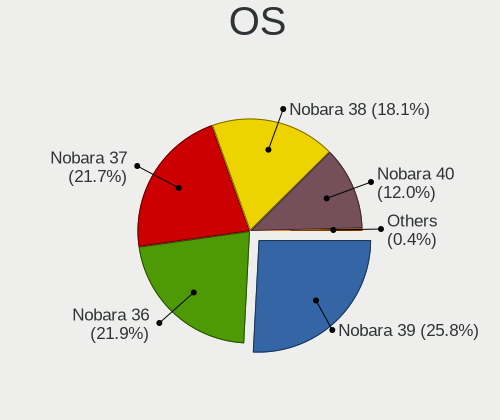
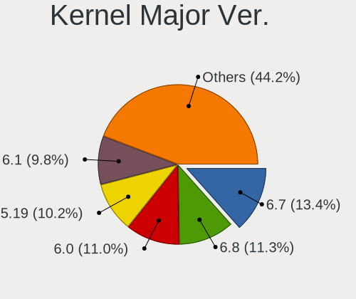
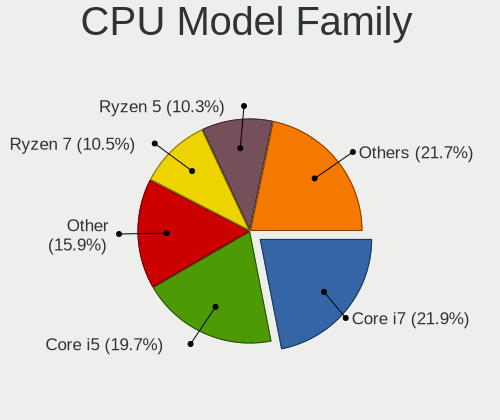
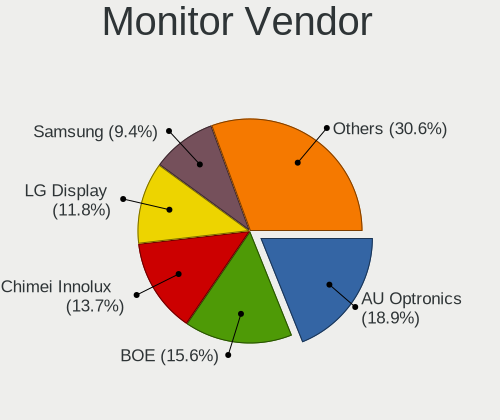
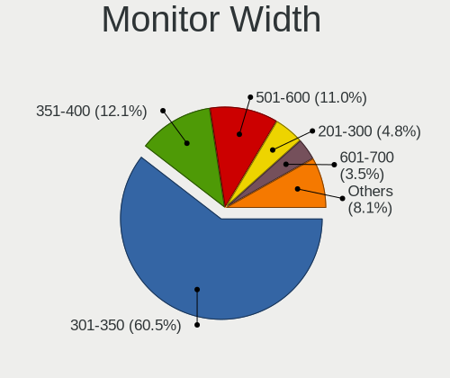
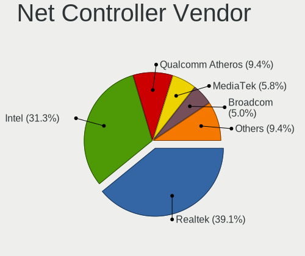
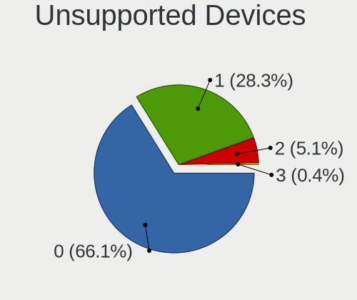

Nobara - Tested Hardware & Statistics (Notebooks)
-------------------------------------------------

A project to collect tested hardware configurations for Nobara.

Anyone can contribute to this report by the [hw-probe](https://github.com/linuxhw/hw-probe) tool:

    sudo -E hw-probe -all -upload

Please contribute! Especially if your hardware is rare.

Contents
--------

* [ Test Cases ](#test-cases)

* [ System ](#system)
  - [ OS                       ](#os)
  - [ OS Family                ](#os-family)
  - [ Kernel                   ](#kernel)
  - [ Kernel Family            ](#kernel-family)
  - [ Kernel Major Ver.        ](#kernel-major-ver)
  - [ Arch                     ](#arch)
  - [ DE                       ](#de)
  - [ Display Server           ](#display-server)
  - [ Display Manager          ](#display-manager)
  - [ OS Lang                  ](#os-lang)
  - [ Boot Mode                ](#boot-mode)
  - [ Filesystem               ](#filesystem)
  - [ Part. scheme             ](#part-scheme)
  - [ Dual Boot with Linux/BSD ](#dual-boot-with-linuxbsd)
  - [ Dual Boot (Win)          ](#dual-boot-win)

* [ Board ](#board)
  - [ Vendor                   ](#vendor)
  - [ Model                    ](#model)
  - [ Model Family             ](#model-family)
  - [ MFG Year                 ](#mfg-year)
  - [ Form Factor              ](#form-factor)
  - [ Secure Boot              ](#secure-boot)
  - [ Coreboot                 ](#coreboot)
  - [ RAM Size                 ](#ram-size)
  - [ RAM Used                 ](#ram-used)
  - [ Total Drives             ](#total-drives)
  - [ Has CD-ROM               ](#has-cd-rom)
  - [ Has Ethernet             ](#has-ethernet)
  - [ Has WiFi                 ](#has-wifi)
  - [ Has Bluetooth            ](#has-bluetooth)

* [ Location ](#location)
  - [ Country                  ](#country)
  - [ City                     ](#city)

* [ Drives ](#drives)
  - [ Drive Vendor             ](#drive-vendor)
  - [ Drive Model              ](#drive-model)
  - [ HDD Vendor               ](#hdd-vendor)
  - [ SSD Vendor               ](#ssd-vendor)
  - [ Drive Kind               ](#drive-kind)
  - [ Drive Connector          ](#drive-connector)
  - [ Drive Size               ](#drive-size)
  - [ Space Total              ](#space-total)
  - [ Space Used               ](#space-used)
  - [ Malfunc. Drives          ](#malfunc-drives)
  - [ Malfunc. Drive Vendor    ](#malfunc-drive-vendor)
  - [ Malfunc. HDD Vendor      ](#malfunc-hdd-vendor)
  - [ Malfunc. Drive Kind      ](#malfunc-drive-kind)
  - [ Failed Drives            ](#failed-drives)
  - [ Failed Drive Vendor      ](#failed-drive-vendor)
  - [ Drive Status             ](#drive-status)

* [ Storage controller ](#storage-controller)
  - [ Storage Vendor           ](#storage-vendor)
  - [ Storage Model            ](#storage-model)
  - [ Storage Kind             ](#storage-kind)

* [ Processor ](#processor)
  - [ CPU Vendor               ](#cpu-vendor)
  - [ CPU Model                ](#cpu-model)
  - [ CPU Model Family         ](#cpu-model-family)
  - [ CPU Cores                ](#cpu-cores)
  - [ CPU Sockets              ](#cpu-sockets)
  - [ CPU Threads              ](#cpu-threads)
  - [ CPU Op-Modes             ](#cpu-op-modes)
  - [ CPU Microcode            ](#cpu-microcode)
  - [ CPU Microarch            ](#cpu-microarch)

* [ Graphics ](#graphics)
  - [ GPU Vendor               ](#gpu-vendor)
  - [ GPU Model                ](#gpu-model)
  - [ GPU Combo                ](#gpu-combo)
  - [ GPU Driver               ](#gpu-driver)
  - [ GPU Memory               ](#gpu-memory)

* [ Monitor ](#monitor)
  - [ Monitor Vendor           ](#monitor-vendor)
  - [ Monitor Model            ](#monitor-model)
  - [ Monitor Resolution       ](#monitor-resolution)
  - [ Monitor Diagonal         ](#monitor-diagonal)
  - [ Monitor Width            ](#monitor-width)
  - [ Aspect Ratio             ](#aspect-ratio)
  - [ Monitor Area             ](#monitor-area)
  - [ Pixel Density            ](#pixel-density)
  - [ Multiple Monitors        ](#multiple-monitors)

* [ Network ](#network)
  - [ Net Controller Vendor    ](#net-controller-vendor)
  - [ Net Controller Model     ](#net-controller-model)
  - [ Wireless Vendor          ](#wireless-vendor)
  - [ Wireless Model           ](#wireless-model)
  - [ Ethernet Vendor          ](#ethernet-vendor)
  - [ Ethernet Model           ](#ethernet-model)
  - [ Net Controller Kind      ](#net-controller-kind)
  - [ Used Controller          ](#used-controller)
  - [ NICs                     ](#nics)
  - [ IPv6                     ](#ipv6)

* [ Bluetooth ](#bluetooth)
  - [ Bluetooth Vendor         ](#bluetooth-vendor)
  - [ Bluetooth Model          ](#bluetooth-model)

* [ Sound ](#sound)
  - [ Sound Vendor             ](#sound-vendor)
  - [ Sound Model              ](#sound-model)

* [ Memory ](#memory)
  - [ Memory Vendor            ](#memory-vendor)
  - [ Memory Model             ](#memory-model)
  - [ Memory Kind              ](#memory-kind)
  - [ Memory Form Factor       ](#memory-form-factor)
  - [ Memory Size              ](#memory-size)
  - [ Memory Speed             ](#memory-speed)

* [ Printers & scanners ](#printers--scanners)
  - [ Printer Vendor           ](#printer-vendor)
  - [ Printer Model            ](#printer-model)
  - [ Scanner Vendor           ](#scanner-vendor)
  - [ Scanner Model            ](#scanner-model)

* [ Camera ](#camera)
  - [ Camera Vendor            ](#camera-vendor)
  - [ Camera Model             ](#camera-model)

* [ Security ](#security)
  - [ Fingerprint Vendor       ](#fingerprint-vendor)
  - [ Fingerprint Model        ](#fingerprint-model)
  - [ Chipcard Vendor          ](#chipcard-vendor)
  - [ Chipcard Model           ](#chipcard-model)

* [ Unsupported ](#unsupported)
  - [ Unsupported Devices      ](#unsupported-devices)
  - [ Unsupported Device Types ](#unsupported-device-types)

Test Cases
----------

Total: 262

| Vendor        | Model                       | Probe                                                      | Date         |
|---------------|-----------------------------|------------------------------------------------------------|--------------|
| Lenovo        | IdeaPad 5 15ITL05 82FG      | [5d21e64704](https://linux-hardware.org/?probe=5d21e64704) | Jun 10, 2023 |
| ASUSTek       | ROG Strix G512LW_G512LW     | [42722d78d8](https://linux-hardware.org/?probe=42722d78d8) | Jun 10, 2023 |
| Infinix       | INBook X1 Pro               | [c558de3b74](https://linux-hardware.org/?probe=c558de3b74) | Jun 05, 2023 |
| Lenovo        | Legion 5 15ARH05H 82B1      | [1285aacf1b](https://linux-hardware.org/?probe=1285aacf1b) | Jun 04, 2023 |
| ASUSTek       | X550JK                      | [ae3bf8f79c](https://linux-hardware.org/?probe=ae3bf8f79c) | Jun 03, 2023 |
| Alienware     | m17 R5 AMD                  | [f5eeb72c4d](https://linux-hardware.org/?probe=f5eeb72c4d) | May 31, 2023 |
| HP            | Pavilion Gaming Laptop 1... | [0cb4af5367](https://linux-hardware.org/?probe=0cb4af5367) | May 30, 2023 |
| Lenovo        | ThinkPad T480s 20L8S06Q0... | [e54e204b28](https://linux-hardware.org/?probe=e54e204b28) | May 29, 2023 |
| Micro Elec... | MG-VCP2-17A3070T            | [9496942a44](https://linux-hardware.org/?probe=9496942a44) | May 28, 2023 |
| HP            | Pavilion Gaming Laptop 1... | [0aba7a98b9](https://linux-hardware.org/?probe=0aba7a98b9) | May 24, 2023 |
| Packard Be... | EasyNote LS11HR             | [a5df8ea9d7](https://linux-hardware.org/?probe=a5df8ea9d7) | May 23, 2023 |
| HP            | Pavilion Gaming Laptop 1... | [d1c4b3ee44](https://linux-hardware.org/?probe=d1c4b3ee44) | May 22, 2023 |
| Lenovo        | ThinkPad X140e 20BLS0040... | [1e648e8f50](https://linux-hardware.org/?probe=1e648e8f50) | May 21, 2023 |
| Apple         | MacBookPro8,1               | [43c5b0db78](https://linux-hardware.org/?probe=43c5b0db78) | May 20, 2023 |
| HP            | Pavilion 15                 | [5a43663b87](https://linux-hardware.org/?probe=5a43663b87) | May 15, 2023 |
| HP            | Pavilion 15                 | [b298e421bb](https://linux-hardware.org/?probe=b298e421bb) | May 15, 2023 |
| ASUSTek       | VivoBook_ASUS Laptop X50... | [204400bcf7](https://linux-hardware.org/?probe=204400bcf7) | May 13, 2023 |
| Lenovo        | Legion Y530-15ICH 81FV      | [71f1904bc6](https://linux-hardware.org/?probe=71f1904bc6) | May 13, 2023 |
| Lenovo        | IdeaPad 320-15ISK 80XH      | [d2d1037c9d](https://linux-hardware.org/?probe=d2d1037c9d) | May 09, 2023 |
| HP            | Laptop 17-ca1xxx            | [5c506f94e0](https://linux-hardware.org/?probe=5c506f94e0) | May 05, 2023 |
| Samsung       | 535U3C                      | [5f2e46be0a](https://linux-hardware.org/?probe=5f2e46be0a) | May 05, 2023 |
| ASUSTek       | ROG Zephyrus Duo 16 GX65... | [b54238dc33](https://linux-hardware.org/?probe=b54238dc33) | May 01, 2023 |
| HP            | Unknown                     | [bba45b8ff0](https://linux-hardware.org/?probe=bba45b8ff0) | Apr 27, 2023 |
| Lenovo        | ThinkPad Edge E540 20C6C... | [fc22fb4921](https://linux-hardware.org/?probe=fc22fb4921) | Apr 23, 2023 |
| Acer          | Nitro AN515-52              | [e3dc4788e7](https://linux-hardware.org/?probe=e3dc4788e7) | Apr 22, 2023 |
| Lenovo        | Legion 7 15IMH05 81YT       | [2727f5c463](https://linux-hardware.org/?probe=2727f5c463) | Apr 21, 2023 |
| Micro Elec... | MG-VCP2-17A3070T            | [edf0d6d941](https://linux-hardware.org/?probe=edf0d6d941) | Apr 21, 2023 |
| Apple         | MacBookPro8,3               | [4004491274](https://linux-hardware.org/?probe=4004491274) | Apr 21, 2023 |
| Fujitsu       | LIFEBOOK A557               | [712657fa81](https://linux-hardware.org/?probe=712657fa81) | Apr 20, 2023 |
| Dell          | Vostro 7590                 | [f759d8ab72](https://linux-hardware.org/?probe=f759d8ab72) | Apr 13, 2023 |
| GEO           | GeoBook 120                 | [2e51a1bab5](https://linux-hardware.org/?probe=2e51a1bab5) | Apr 12, 2023 |
| Lenovo        | IdeaPad 5 15ITL05 82FG      | [406c02acb0](https://linux-hardware.org/?probe=406c02acb0) | Apr 12, 2023 |
| Acer          | Nitro AN515-45              | [7b4e6e07cf](https://linux-hardware.org/?probe=7b4e6e07cf) | Apr 12, 2023 |
| Unknown       | ACB20                       | [16543ac693](https://linux-hardware.org/?probe=16543ac693) | Apr 12, 2023 |
| Unknown       | ACB20                       | [4c0422096b](https://linux-hardware.org/?probe=4c0422096b) | Apr 12, 2023 |
| ASUSTek       | GL752VW                     | [8abf9b082b](https://linux-hardware.org/?probe=8abf9b082b) | Apr 12, 2023 |
| Lenovo        | IdeaPad Gaming 3 15ACH6 ... | [eb03b75c27](https://linux-hardware.org/?probe=eb03b75c27) | Apr 11, 2023 |
| Unknown       | ACB20                       | [6e70bacda5](https://linux-hardware.org/?probe=6e70bacda5) | Apr 01, 2023 |
| Gigabyte      | AERO 15 XD                  | [51fd5b8510](https://linux-hardware.org/?probe=51fd5b8510) | Mar 25, 2023 |
| ASUSTek       | GL752VW                     | [8e1cd2ea46](https://linux-hardware.org/?probe=8e1cd2ea46) | Mar 24, 2023 |
| Intel         | powered classmate PC        | [0d64280b6d](https://linux-hardware.org/?probe=0d64280b6d) | Mar 22, 2023 |
| Lenovo        | Unknown                     | [121f022799](https://linux-hardware.org/?probe=121f022799) | Mar 21, 2023 |
| Acer          | Extensa 2510G               | [1ac79f58a4](https://linux-hardware.org/?probe=1ac79f58a4) | Mar 21, 2023 |
| Lenovo        | IP 5-14ALC05 82LM           | [5bacaa401a](https://linux-hardware.org/?probe=5bacaa401a) | Mar 21, 2023 |
| Acer          | Nitro AN515-52              | [6ad4034797](https://linux-hardware.org/?probe=6ad4034797) | Mar 17, 2023 |
| Lenovo        | IdeaPad Gaming 3 15IHU6 ... | [7e6ae6ba16](https://linux-hardware.org/?probe=7e6ae6ba16) | Mar 17, 2023 |
| Lenovo        | IdeaPad 5 Pro 14ACN6 82L... | [2530e262d2](https://linux-hardware.org/?probe=2530e262d2) | Mar 17, 2023 |
| ASUSTek       | X580VD                      | [8c4023bd5d](https://linux-hardware.org/?probe=8c4023bd5d) | Mar 16, 2023 |
| ASUSTek       | X580VD                      | [26b62abfc9](https://linux-hardware.org/?probe=26b62abfc9) | Mar 16, 2023 |
| Lenovo        | IdeaPad C340-14API 81N6     | [7637d41bf3](https://linux-hardware.org/?probe=7637d41bf3) | Mar 14, 2023 |
| Dell          | Vostro 3400                 | [01bfc3e026](https://linux-hardware.org/?probe=01bfc3e026) | Mar 13, 2023 |
| ONE-NETBOO... | ONEXPLAYER 2 ARP23 Ver.1... | [9b021e4844](https://linux-hardware.org/?probe=9b021e4844) | Mar 11, 2023 |
| Lenovo        | IdeaPad 330S-15IKB 81F5     | [126b4a73a2](https://linux-hardware.org/?probe=126b4a73a2) | Mar 11, 2023 |
| Dell          | Vostro 3400                 | [ed7724b921](https://linux-hardware.org/?probe=ed7724b921) | Mar 10, 2023 |
| Dell          | Vostro 3400                 | [6605d9e257](https://linux-hardware.org/?probe=6605d9e257) | Mar 10, 2023 |
| ASUSTek       | VivoBook_ASUSLaptop X509... | [87eec74772](https://linux-hardware.org/?probe=87eec74772) | Mar 10, 2023 |
| ASUSTek       | VivoBook_ASUSLaptop X509... | [38599c9b97](https://linux-hardware.org/?probe=38599c9b97) | Mar 10, 2023 |
| ASUSTek       | ROG Strix G513QY_G513QY     | [0c14a418fb](https://linux-hardware.org/?probe=0c14a418fb) | Mar 10, 2023 |
| ASUSTek       | VivoBook_ASUSLaptop N760... | [aa31db4d3f](https://linux-hardware.org/?probe=aa31db4d3f) | Mar 09, 2023 |
| Lenovo        | IdeaPad 5 Pro 14ACN6 82L... | [796b1ad7cb](https://linux-hardware.org/?probe=796b1ad7cb) | Mar 09, 2023 |
| HP            | ZBook 17                    | [e3fb994c04](https://linux-hardware.org/?probe=e3fb994c04) | Mar 08, 2023 |
| Lenovo        | ThinkPad X1 Extreme Gen ... | [15cd198548](https://linux-hardware.org/?probe=15cd198548) | Mar 07, 2023 |
| Acer          | Aspire A515-51              | [ebf75e7be8](https://linux-hardware.org/?probe=ebf75e7be8) | Mar 06, 2023 |
| Acer          | Aspire A515-51              | [ef186545cb](https://linux-hardware.org/?probe=ef186545cb) | Mar 06, 2023 |
| HP            | ZBook 17 G2                 | [6efd61c4e0](https://linux-hardware.org/?probe=6efd61c4e0) | Mar 05, 2023 |
| Dell          | Latitude 7390               | [892100e074](https://linux-hardware.org/?probe=892100e074) | Mar 05, 2023 |
| Acer          | Aspire VX5-591G             | [e5e134cc80](https://linux-hardware.org/?probe=e5e134cc80) | Mar 04, 2023 |
| Lenovo        | ThinkPad X1 Extreme Gen ... | [582bc638e0](https://linux-hardware.org/?probe=582bc638e0) | Mar 03, 2023 |
| ASUSTek       | VivoBook_ASUS Laptop X50... | [25d1509478](https://linux-hardware.org/?probe=25d1509478) | Mar 03, 2023 |
| MSI           | GP65 Leopard 9SF            | [45f56a0c5b](https://linux-hardware.org/?probe=45f56a0c5b) | Mar 03, 2023 |
| Schenker      | XMG NEO (M19, RTX 2070)     | [c45dbeb188](https://linux-hardware.org/?probe=c45dbeb188) | Mar 02, 2023 |
| MSI           | P65 Creator 8RD             | [ea8be773a9](https://linux-hardware.org/?probe=ea8be773a9) | Mar 01, 2023 |
| MSI           | P65 Creator 8RD             | [2b97507181](https://linux-hardware.org/?probe=2b97507181) | Mar 01, 2023 |
| ASUSTek       | GL752VW                     | [a3e7201f2e](https://linux-hardware.org/?probe=a3e7201f2e) | Mar 01, 2023 |
| Dell          | Inspiron 3542               | [686db926da](https://linux-hardware.org/?probe=686db926da) | Mar 01, 2023 |
| MSI           | Summit E14Evo A12M          | [ad389112d3](https://linux-hardware.org/?probe=ad389112d3) | Mar 01, 2023 |
| Lenovo        | IdeaPad 330-15ICH 81FK      | [08f2d1cca5](https://linux-hardware.org/?probe=08f2d1cca5) | Feb 28, 2023 |
| HP            | ZBook 15u G3                | [9c49a1748b](https://linux-hardware.org/?probe=9c49a1748b) | Feb 28, 2023 |
| Lenovo        | IdeaPad 5 15ITL05 82FG      | [5d17500c5d](https://linux-hardware.org/?probe=5d17500c5d) | Feb 25, 2023 |
| MSI           | GF63 Thin 10SC              | [824f4eafd0](https://linux-hardware.org/?probe=824f4eafd0) | Feb 25, 2023 |
| Gigabyte      | AERO 15 Classic-SA          | [bc6078dda0](https://linux-hardware.org/?probe=bc6078dda0) | Feb 24, 2023 |
| HP            | ZBook 15u G3                | [92879d708d](https://linux-hardware.org/?probe=92879d708d) | Feb 24, 2023 |
| HP            | ZBook 15u G3                | [8a698df80f](https://linux-hardware.org/?probe=8a698df80f) | Feb 24, 2023 |
| ASUSTek       | ROG Strix G512LW_G512LW     | [012415eb50](https://linux-hardware.org/?probe=012415eb50) | Feb 24, 2023 |
| ASUSTek       | ROG Strix G512LW_G512LW     | [e1c3e1611f](https://linux-hardware.org/?probe=e1c3e1611f) | Feb 24, 2023 |
| Sony          | SVF1521N6EW                 | [41e45075c4](https://linux-hardware.org/?probe=41e45075c4) | Feb 22, 2023 |
| Dell          | G3 3590                     | [1a4fd9ed07](https://linux-hardware.org/?probe=1a4fd9ed07) | Feb 18, 2023 |
| HP            | ENVY 15                     | [bcdc62a706](https://linux-hardware.org/?probe=bcdc62a706) | Feb 18, 2023 |
| HP            | EliteBook Revolve 810 G1    | [a32189e068](https://linux-hardware.org/?probe=a32189e068) | Feb 16, 2023 |
| Dell          | Inspiron 5555               | [395077145c](https://linux-hardware.org/?probe=395077145c) | Feb 13, 2023 |
| ASUSTek       | ASUS TUF Gaming F15 FX50... | [a54bcd6d70](https://linux-hardware.org/?probe=a54bcd6d70) | Feb 13, 2023 |
| HP            | Pavilion Gaming Laptop 1... | [28e98cf31f](https://linux-hardware.org/?probe=28e98cf31f) | Feb 12, 2023 |
| ASUSTek       | ROG Strix G512LI_G512LI     | [6c8760114a](https://linux-hardware.org/?probe=6c8760114a) | Feb 11, 2023 |
| ASUSTek       | ROG Strix G513RM_G513RM     | [9de8235ca5](https://linux-hardware.org/?probe=9de8235ca5) | Feb 10, 2023 |
| Acer          | TravelMate P256-M           | [add8ce8459](https://linux-hardware.org/?probe=add8ce8459) | Feb 06, 2023 |
| ASUSTek       | K52Jc                       | [464b35f82b](https://linux-hardware.org/?probe=464b35f82b) | Feb 05, 2023 |
| Lenovo        | ThinkPad P14s Gen 1 20S4... | [4ff2fc81bc](https://linux-hardware.org/?probe=4ff2fc81bc) | Feb 04, 2023 |
| ASUSTek       | VivoBook_ASUS Laptop X50... | [0b1fbca173](https://linux-hardware.org/?probe=0b1fbca173) | Feb 03, 2023 |
| Lenovo        | ThinkPad X1 Carbon Gen 9... | [c1862b275d](https://linux-hardware.org/?probe=c1862b275d) | Feb 01, 2023 |
| Lenovo        | ThinkPad X1 Carbon Gen 9... | [1aa5d63f0c](https://linux-hardware.org/?probe=1aa5d63f0c) | Feb 01, 2023 |
| HP            | ZBook 15u G3                | [7f985597d7](https://linux-hardware.org/?probe=7f985597d7) | Jan 30, 2023 |
| HP            | ZBook 15u G3                | [7a35a6d886](https://linux-hardware.org/?probe=7a35a6d886) | Jan 30, 2023 |
| ASUSTek       | TUF Gaming FX505DT_FX505... | [87502e1eb2](https://linux-hardware.org/?probe=87502e1eb2) | Jan 29, 2023 |
| Lenovo        | ThinkPad T460 20FMS79000    | [2b397905e1](https://linux-hardware.org/?probe=2b397905e1) | Jan 29, 2023 |
| Samsung       | R520/R522/R620              | [8c5c4fecfe](https://linux-hardware.org/?probe=8c5c4fecfe) | Jan 28, 2023 |
| Notebook      | NP5x_NP6x_NP7xHP            | [3b7c64dc34](https://linux-hardware.org/?probe=3b7c64dc34) | Jan 26, 2023 |
| Monster       | ABRA A7 V12.1               | [1882db09fe](https://linux-hardware.org/?probe=1882db09fe) | Jan 25, 2023 |
| MSI           | Katana GF76 11UD            | [5a5a26c29e](https://linux-hardware.org/?probe=5a5a26c29e) | Jan 24, 2023 |
| Positivo      | N1240                       | [e938a6c0b0](https://linux-hardware.org/?probe=e938a6c0b0) | Jan 24, 2023 |
| Lenovo        | Legion 5 15ARH05 82B5       | [8cb10f3212](https://linux-hardware.org/?probe=8cb10f3212) | Jan 23, 2023 |
| Lenovo        | IdeaPad Gaming 3 15ARH05... | [bc070879ba](https://linux-hardware.org/?probe=bc070879ba) | Jan 22, 2023 |
| Medion        | GUARDIAN X10                | [4807ed03d5](https://linux-hardware.org/?probe=4807ed03d5) | Jan 22, 2023 |
| Apple         | MacBook5,1                  | [9732bb65cd](https://linux-hardware.org/?probe=9732bb65cd) | Jan 20, 2023 |
| ASUSTek       | ROG Strix G713RM_G713RM     | [844d97dd92](https://linux-hardware.org/?probe=844d97dd92) | Jan 20, 2023 |
| Lenovo        | IdeaPad 3 15ALC6 82KU       | [87f11d2b18](https://linux-hardware.org/?probe=87f11d2b18) | Jan 19, 2023 |
| HP            | Pavilion Notebook           | [9a0b1c62f5](https://linux-hardware.org/?probe=9a0b1c62f5) | Jan 18, 2023 |
| Acer          | Swift SFX14-51G             | [f0137b1f08](https://linux-hardware.org/?probe=f0137b1f08) | Jan 17, 2023 |
| MSI           | Katana GF76 11UD            | [dcc8c2a63b](https://linux-hardware.org/?probe=dcc8c2a63b) | Jan 17, 2023 |
| Lenovo        | Legion 5 17ACH6H 82JY       | [b49ce7a30a](https://linux-hardware.org/?probe=b49ce7a30a) | Jan 15, 2023 |
| Lenovo        | ThinkPad P51 20HJS02H00     | [ab26ff36b1](https://linux-hardware.org/?probe=ab26ff36b1) | Jan 14, 2023 |
| Medion        | GUARDIAN X10                | [ef011d0700](https://linux-hardware.org/?probe=ef011d0700) | Jan 10, 2023 |
| HP            | Pavilion 15                 | [e60b327d4c](https://linux-hardware.org/?probe=e60b327d4c) | Jan 10, 2023 |
| ASUSTek       | ROG Zephyrus G14 GA402RK... | [899e519abe](https://linux-hardware.org/?probe=899e519abe) | Jan 10, 2023 |
| HP            | Pavilion Laptop 15-eh1xx... | [9f368d248b](https://linux-hardware.org/?probe=9f368d248b) | Jan 10, 2023 |
| ASUSTek       | ROG Flow X13 GV301QE_GV3... | [d679fb0fd0](https://linux-hardware.org/?probe=d679fb0fd0) | Jan 10, 2023 |
| MSI           | GT680R/GX680R/GT683R/GT6... | [0b23cb61e0](https://linux-hardware.org/?probe=0b23cb61e0) | Jan 09, 2023 |
| HP            | EliteBook 840 G1            | [6f4cc6e4c7](https://linux-hardware.org/?probe=6f4cc6e4c7) | Jan 05, 2023 |
| ASRock        | X570 Phantom Gaming-ITX/... | [f097aa1c92](https://linux-hardware.org/?probe=f097aa1c92) | Jan 03, 2023 |
| Apple         | MacBookPro8,1               | [97f93aa235](https://linux-hardware.org/?probe=97f93aa235) | Dec 31, 2022 |
| ASUSTek       | VivoBook_ASUSLaptop N760... | [7ef5d874e9](https://linux-hardware.org/?probe=7ef5d874e9) | Dec 28, 2022 |
| HP            | ENVY Notebook               | [8c7d592182](https://linux-hardware.org/?probe=8c7d592182) | Dec 26, 2022 |
| HP            | Pavilion Laptop 14-ec0xx... | [978bb114dc](https://linux-hardware.org/?probe=978bb114dc) | Dec 23, 2022 |
| Dell          | G15 5510                    | [86d0642973](https://linux-hardware.org/?probe=86d0642973) | Dec 20, 2022 |
| Lenovo        | ThinkPad X1 Carbon Gen 9... | [03da9468fc](https://linux-hardware.org/?probe=03da9468fc) | Dec 19, 2022 |
| Lenovo        | ThinkPad X1 Extreme Gen ... | [2a1a679e03](https://linux-hardware.org/?probe=2a1a679e03) | Dec 18, 2022 |
| Apple         | MacBookPro11,1              | [d3517edb25](https://linux-hardware.org/?probe=d3517edb25) | Dec 17, 2022 |
| Acer          | Aspire E5-551G              | [56f5130537](https://linux-hardware.org/?probe=56f5130537) | Dec 17, 2022 |
| HP            | EliteBook 8460p             | [0a2731119d](https://linux-hardware.org/?probe=0a2731119d) | Dec 16, 2022 |
| Dynabook      | PORTEGE X30L-K              | [6f9a9428b6](https://linux-hardware.org/?probe=6f9a9428b6) | Dec 16, 2022 |
| Dynabook      | PORTEGE X30L-K              | [28c00eabe8](https://linux-hardware.org/?probe=28c00eabe8) | Dec 14, 2022 |
| Lenovo        | Legion 5 15ACH6H 82JU       | [6177c6a156](https://linux-hardware.org/?probe=6177c6a156) | Dec 13, 2022 |
| HP            | EliteBook 8570p             | [52f0fae7e4](https://linux-hardware.org/?probe=52f0fae7e4) | Dec 12, 2022 |
| HP            | EliteBook 8570p             | [be0c42b073](https://linux-hardware.org/?probe=be0c42b073) | Dec 12, 2022 |
| Lenovo        | IdeaPad 330-15IKB 81DE      | [52a8f66027](https://linux-hardware.org/?probe=52a8f66027) | Dec 10, 2022 |
| ASUSTek       | ASUS TUF Gaming A15 FA50... | [febce6b929](https://linux-hardware.org/?probe=febce6b929) | Dec 09, 2022 |
| Acer          | Aspire E1-532               | [4fd43d5aff](https://linux-hardware.org/?probe=4fd43d5aff) | Dec 09, 2022 |
| Acer          | Aspire E1-532               | [13e9fa6c58](https://linux-hardware.org/?probe=13e9fa6c58) | Dec 09, 2022 |
| Dynabook      | PORTEGE X30L-K              | [75a8aa38fc](https://linux-hardware.org/?probe=75a8aa38fc) | Dec 08, 2022 |
| Lenovo        | Z50-70 20354                | [07bf98d8f7](https://linux-hardware.org/?probe=07bf98d8f7) | Dec 07, 2022 |
| HP            | Laptop 14-cm1xxx            | [6fbbd3608f](https://linux-hardware.org/?probe=6fbbd3608f) | Dec 06, 2022 |
| Lenovo        | V14-IIL 82C4                | [e23dd27dc9](https://linux-hardware.org/?probe=e23dd27dc9) | Dec 06, 2022 |
| ASUSTek       | ROG Zephyrus M15 GU502LV... | [5ce6793478](https://linux-hardware.org/?probe=5ce6793478) | Dec 06, 2022 |
| Valve         | Jupiter                     | [ef85b8ab38](https://linux-hardware.org/?probe=ef85b8ab38) | Nov 28, 2022 |
| Valve         | Jupiter                     | [622315486c](https://linux-hardware.org/?probe=622315486c) | Nov 28, 2022 |
| Lenovo        | V14-IIL 82C4                | [407b574c57](https://linux-hardware.org/?probe=407b574c57) | Nov 28, 2022 |
| Lenovo        | Legion S7 15ACH6 82K8       | [91fa73480c](https://linux-hardware.org/?probe=91fa73480c) | Nov 26, 2022 |
| Lenovo        | Legion S7 15ACH6 82K8       | [93576caa19](https://linux-hardware.org/?probe=93576caa19) | Nov 26, 2022 |
| Lenovo        | ThinkPad T460 20FMS07000    | [eded61b721](https://linux-hardware.org/?probe=eded61b721) | Nov 25, 2022 |
| Lenovo        | IdeaPad Gaming 3 15ACH6 ... | [be2f8c9fd3](https://linux-hardware.org/?probe=be2f8c9fd3) | Nov 24, 2022 |
| HP            | ProBook 445 14 inch G9 N... | [a20535bd66](https://linux-hardware.org/?probe=a20535bd66) | Nov 24, 2022 |
| Gigabyte      | B450 AORUS PRO WIFI-CF      | [9324629428](https://linux-hardware.org/?probe=9324629428) | Nov 24, 2022 |
| Gigabyte      | B450 AORUS PRO WIFI-CF      | [22a1c81a68](https://linux-hardware.org/?probe=22a1c81a68) | Nov 24, 2022 |
| Coradir       | Coradir/ES10IS5             | [a1fb1953ad](https://linux-hardware.org/?probe=a1fb1953ad) | Nov 22, 2022 |
| Lenovo        | G580 20150                  | [6e28c07a6c](https://linux-hardware.org/?probe=6e28c07a6c) | Nov 22, 2022 |
| Lenovo        | ThinkPad X240 20AMA0LTAU    | [54ce03d1f1](https://linux-hardware.org/?probe=54ce03d1f1) | Nov 20, 2022 |
| HP            | Unknown                     | [9b1181bc4b](https://linux-hardware.org/?probe=9b1181bc4b) | Nov 19, 2022 |
| ASUSTek       | VivoBook_ASUSLaptop X515... | [93ad560f52](https://linux-hardware.org/?probe=93ad560f52) | Nov 17, 2022 |
| Dell          | Studio 1737                 | [883ac54ca7](https://linux-hardware.org/?probe=883ac54ca7) | Nov 15, 2022 |
| ASUSTek       | VivoBook_ASUSLaptop X415... | [3ee89779cd](https://linux-hardware.org/?probe=3ee89779cd) | Nov 15, 2022 |
| Lenovo        | G50-30 80G0                 | [978fdef2f8](https://linux-hardware.org/?probe=978fdef2f8) | Nov 13, 2022 |
| HUAWEI        | CREM-WXX9                   | [b33f7744b5](https://linux-hardware.org/?probe=b33f7744b5) | Nov 13, 2022 |
| HUAWEI        | CREM-WXX9                   | [9d7853c05b](https://linux-hardware.org/?probe=9d7853c05b) | Nov 13, 2022 |
| Acer          | Swift SFX14-41G             | [a8023a34a0](https://linux-hardware.org/?probe=a8023a34a0) | Nov 11, 2022 |
| HP            | OMEN Laptop 15-ek0xxx       | [3d53644c05](https://linux-hardware.org/?probe=3d53644c05) | Nov 08, 2022 |
| MSI           | GE60 0NC/GE60 0ND           | [c6460ff904](https://linux-hardware.org/?probe=c6460ff904) | Nov 07, 2022 |
| Dell          | Studio 1737                 | [d286ea1b6c](https://linux-hardware.org/?probe=d286ea1b6c) | Nov 07, 2022 |
| ASUSTek       | GL753VD                     | [97e2ee4ee1](https://linux-hardware.org/?probe=97e2ee4ee1) | Nov 01, 2022 |
| HP            | Unknown                     | [1ca885060e](https://linux-hardware.org/?probe=1ca885060e) | Nov 01, 2022 |
| Acer          | Nitro AN515-42              | [3a00ca53c8](https://linux-hardware.org/?probe=3a00ca53c8) | Oct 31, 2022 |
| Lenovo        | IdeaPad C340-14API 81N6     | [d322bb2739](https://linux-hardware.org/?probe=d322bb2739) | Oct 30, 2022 |
| Apple         | MacBookPro13,3              | [b028075707](https://linux-hardware.org/?probe=b028075707) | Oct 30, 2022 |
| ASUSTek       | VivoBook_ASUS Laptop X50... | [4fdbc3c415](https://linux-hardware.org/?probe=4fdbc3c415) | Oct 30, 2022 |
| HP            | Pavilion Gaming Laptop 1... | [50a8c356f0](https://linux-hardware.org/?probe=50a8c356f0) | Oct 28, 2022 |
| ASUSTek       | GL502VMK                    | [9a18ff1b13](https://linux-hardware.org/?probe=9a18ff1b13) | Oct 25, 2022 |
| Toshiba       | Satellite L850              | [8bfeff52e6](https://linux-hardware.org/?probe=8bfeff52e6) | Oct 24, 2022 |
| ASUSTek       | S550CB                      | [a81f0ecac8](https://linux-hardware.org/?probe=a81f0ecac8) | Oct 24, 2022 |
| ASUSTek       | ROG Zephyrus G14 GA401QM... | [3912d818bd](https://linux-hardware.org/?probe=3912d818bd) | Oct 23, 2022 |
| HP            | OMEN Notebook PC 15         | [1d5ebc92c4](https://linux-hardware.org/?probe=1d5ebc92c4) | Oct 23, 2022 |
| Lenovo        | Legion 5 Pro 16IAH7H 82R... | [eaecfdf473](https://linux-hardware.org/?probe=eaecfdf473) | Oct 21, 2022 |
| Lenovo        | Legion 5 Pro 16IAH7H 82R... | [c044987599](https://linux-hardware.org/?probe=c044987599) | Oct 20, 2022 |
| HP            | EliteBook 850 G2            | [b6fd429ceb](https://linux-hardware.org/?probe=b6fd429ceb) | Oct 20, 2022 |
| HP            | EliteBook 850 G2            | [f33baf66a9](https://linux-hardware.org/?probe=f33baf66a9) | Oct 20, 2022 |
| ASUSTek       | TUF Gaming FX504GD_FX80G... | [e5a34da4a2](https://linux-hardware.org/?probe=e5a34da4a2) | Oct 19, 2022 |
| MSI           | GE60 0NC/GE60 0ND           | [829326a8e5](https://linux-hardware.org/?probe=829326a8e5) | Oct 18, 2022 |
| MSI           | GE60 0NC/GE60 0ND           | [697ccec46b](https://linux-hardware.org/?probe=697ccec46b) | Oct 18, 2022 |
| HP            | EliteBook 850 G1            | [dfeb98414b](https://linux-hardware.org/?probe=dfeb98414b) | Oct 18, 2022 |
| HP            | EliteBook 850 G1            | [7f8c9d778c](https://linux-hardware.org/?probe=7f8c9d778c) | Oct 18, 2022 |
| Casper        | EXCALIBUR G770              | [7961a3ca3e](https://linux-hardware.org/?probe=7961a3ca3e) | Oct 14, 2022 |
| Lenovo        | ThinkPad E14 Gen 3 20Y7C... | [5f013faf39](https://linux-hardware.org/?probe=5f013faf39) | Oct 12, 2022 |
| Toshiba       | Satellite L650              | [89f43e5484](https://linux-hardware.org/?probe=89f43e5484) | Oct 12, 2022 |
| Toshiba       | Satellite L650              | [43f57daebb](https://linux-hardware.org/?probe=43f57daebb) | Oct 12, 2022 |
| MSI           | Pulse GL76 12UEK            | [6a2be4d08c](https://linux-hardware.org/?probe=6a2be4d08c) | Oct 12, 2022 |
| EVOO          | EG-LP10                     | [f8895e9483](https://linux-hardware.org/?probe=f8895e9483) | Oct 11, 2022 |
| Dell          | Vostro 15 5510              | [2aa595867e](https://linux-hardware.org/?probe=2aa595867e) | Oct 11, 2022 |
| Dell          | Vostro 15 5510              | [bd224480a9](https://linux-hardware.org/?probe=bd224480a9) | Oct 10, 2022 |
| HP            | 2000                        | [3341a26d0c](https://linux-hardware.org/?probe=3341a26d0c) | Oct 10, 2022 |
| ASUSTek       | GL503VD                     | [1405b367c2](https://linux-hardware.org/?probe=1405b367c2) | Oct 09, 2022 |
| Lenovo        | IdeaPad Y700-15ISK 80NV     | [94ccd99c78](https://linux-hardware.org/?probe=94ccd99c78) | Oct 09, 2022 |
| Apple         | MacBookPro5,5               | [faef78b510](https://linux-hardware.org/?probe=faef78b510) | Oct 08, 2022 |
| HP            | Laptop 15-dw0xxx            | [3427421197](https://linux-hardware.org/?probe=3427421197) | Oct 08, 2022 |
| ASUSTek       | ASUS TUF Gaming A17 FA70... | [2d464da9c8](https://linux-hardware.org/?probe=2d464da9c8) | Oct 07, 2022 |
| HP            | ZBook 17 G6                 | [c215e9e17e](https://linux-hardware.org/?probe=c215e9e17e) | Oct 07, 2022 |
| Dell          | Precision 5530              | [db48ac269b](https://linux-hardware.org/?probe=db48ac269b) | Oct 07, 2022 |
| Lenovo        | IdeaPad 320-15IKB 80YH      | [9ccbc0ed3c](https://linux-hardware.org/?probe=9ccbc0ed3c) | Oct 07, 2022 |
| KELYX ARGE... | KL9120                      | [faa5f13391](https://linux-hardware.org/?probe=faa5f13391) | Oct 06, 2022 |
| Positivo      | N1250                       | [9845103c14](https://linux-hardware.org/?probe=9845103c14) | Oct 05, 2022 |
| HP            | 2000                        | [e6f8f7196d](https://linux-hardware.org/?probe=e6f8f7196d) | Oct 03, 2022 |
| ASUSTek       | TUF Gaming FX505DV_FX505... | [3ec3f59233](https://linux-hardware.org/?probe=3ec3f59233) | Oct 03, 2022 |
| ASUSTek       | TUF Gaming FX505DV_FX505... | [5ed7136249](https://linux-hardware.org/?probe=5ed7136249) | Oct 03, 2022 |
| HP            | 240 G7 Notebook PC          | [05b4e2117b](https://linux-hardware.org/?probe=05b4e2117b) | Oct 03, 2022 |
| Toshiba       | Satellite L850              | [0e57d064b0](https://linux-hardware.org/?probe=0e57d064b0) | Oct 02, 2022 |
| Lenovo        | Yoga Slim 7 Pro 14ACH5 O... | [05e921b4aa](https://linux-hardware.org/?probe=05e921b4aa) | Oct 02, 2022 |
| EVOO          | EG-LP10                     | [32c1a174d1](https://linux-hardware.org/?probe=32c1a174d1) | Oct 01, 2022 |
| Acer          | Aspire VX5-591G             | [b321f4561b](https://linux-hardware.org/?probe=b321f4561b) | Sep 29, 2022 |
| Lenovo        | V330-15IKB 81AX             | [0360123f76](https://linux-hardware.org/?probe=0360123f76) | Sep 29, 2022 |
| Lenovo        | G580 20157                  | [2b34d591ab](https://linux-hardware.org/?probe=2b34d591ab) | Sep 29, 2022 |
| Apple         | MacBookAir4,2               | [a423006d4c](https://linux-hardware.org/?probe=a423006d4c) | Sep 29, 2022 |
| Apple         | MacBookAir4,2               | [5dba6cf7fd](https://linux-hardware.org/?probe=5dba6cf7fd) | Sep 29, 2022 |
| Dell          | Inspiron 3542               | [6d35107941](https://linux-hardware.org/?probe=6d35107941) | Sep 28, 2022 |
| Apple         | MacBookPro8,3               | [74927fc7d2](https://linux-hardware.org/?probe=74927fc7d2) | Sep 27, 2022 |
| Lenovo        | IdeaPad 310-15IAP 80TT      | [65f896ddab](https://linux-hardware.org/?probe=65f896ddab) | Sep 27, 2022 |
| Gateway       | NE56R                       | [f603edd045](https://linux-hardware.org/?probe=f603edd045) | Sep 23, 2022 |
| Toshiba       | TECRA A50-A                 | [6ef2538a5a](https://linux-hardware.org/?probe=6ef2538a5a) | Sep 23, 2022 |
| Lenovo        | IdeaPad 5 15ARE05 81YQ      | [605e97df5c](https://linux-hardware.org/?probe=605e97df5c) | Sep 22, 2022 |
| Lenovo        | IdeaPad 5 15ARE05 81YQ      | [94e6332c62](https://linux-hardware.org/?probe=94e6332c62) | Sep 22, 2022 |
| ASUSTek       | ROG Zephyrus G14 GA401II... | [2e36489a4b](https://linux-hardware.org/?probe=2e36489a4b) | Sep 22, 2022 |
| ASUSTek       | ROG Zephyrus G14 GA401II... | [8705683c6f](https://linux-hardware.org/?probe=8705683c6f) | Sep 22, 2022 |
| Alienware     | Area-51m R2 A00             | [0ebdec6dd0](https://linux-hardware.org/?probe=0ebdec6dd0) | Sep 20, 2022 |
| ASUSTek       | N56VZ                       | [ce162c52c0](https://linux-hardware.org/?probe=ce162c52c0) | Sep 19, 2022 |
| Lenovo        | IdeaPadFlex 10 20324        | [4e7f3b7bac](https://linux-hardware.org/?probe=4e7f3b7bac) | Sep 19, 2022 |
| Lenovo        | Legion 5 15ARH05 82B5       | [854a0d4410](https://linux-hardware.org/?probe=854a0d4410) | Sep 19, 2022 |
| Dell          | Precision M6400             | [67924c5333](https://linux-hardware.org/?probe=67924c5333) | Sep 19, 2022 |
| Dell          | Precision M6400             | [27a55639e4](https://linux-hardware.org/?probe=27a55639e4) | Sep 19, 2022 |
| HUAWEI        | KLVL-WXXW                   | [e0e49d51d0](https://linux-hardware.org/?probe=e0e49d51d0) | Sep 18, 2022 |
| HUAWEI        | KLVL-WXXW                   | [812ea842dc](https://linux-hardware.org/?probe=812ea842dc) | Sep 18, 2022 |
| Lenovo        | ThinkBook 15 G3 ACL 21A4    | [004d0a2b9d](https://linux-hardware.org/?probe=004d0a2b9d) | Sep 17, 2022 |
| Lenovo        | ThinkPad P1 20MD0020US      | [a701fed148](https://linux-hardware.org/?probe=a701fed148) | Sep 16, 2022 |
| ASUSTek       | VivoBook_ASUSLaptop X340... | [5ffc7d13ac](https://linux-hardware.org/?probe=5ffc7d13ac) | Sep 16, 2022 |
| Dell          | G5 5505                     | [25755e8605](https://linux-hardware.org/?probe=25755e8605) | Sep 16, 2022 |
| HP            | 15                          | [79aa0d618f](https://linux-hardware.org/?probe=79aa0d618f) | Sep 14, 2022 |
| Acer          | Aspire A315-42              | [820c1e2ac6](https://linux-hardware.org/?probe=820c1e2ac6) | Sep 11, 2022 |
| Dell          | Precision 3510              | [4337a8e018](https://linux-hardware.org/?probe=4337a8e018) | Sep 11, 2022 |
| ASUSTek       | ASUS TUF Gaming F15 FX50... | [0ca693e2dd](https://linux-hardware.org/?probe=0ca693e2dd) | Aug 31, 2022 |
| ASUSTek       | TP500LA                     | [de395dddd8](https://linux-hardware.org/?probe=de395dddd8) | Aug 28, 2022 |
| Dell          | G15 5511                    | [44fa9bf084](https://linux-hardware.org/?probe=44fa9bf084) | Aug 21, 2022 |
| Notebook      | P7xxDM2(-G)                 | [f074899985](https://linux-hardware.org/?probe=f074899985) | Aug 17, 2022 |
| HP            | Pavilion Gaming Laptop 1... | [315da58d24](https://linux-hardware.org/?probe=315da58d24) | Aug 16, 2022 |
| Apple         | MacBookPro14,2              | [c66d476513](https://linux-hardware.org/?probe=c66d476513) | Aug 13, 2022 |
| ASUSTek       | ROG Strix G513QY_G513QY     | [df2cc1a299](https://linux-hardware.org/?probe=df2cc1a299) | Aug 12, 2022 |
| Lenovo        | IdeaPad Y700-15ISK 80NV     | [6beddf67f5](https://linux-hardware.org/?probe=6beddf67f5) | Aug 06, 2022 |
| Razer         | Blade                       | [cc3ce45956](https://linux-hardware.org/?probe=cc3ce45956) | Jul 31, 2022 |
| HP            | ZBook 15 G2                 | [3aa2fda09a](https://linux-hardware.org/?probe=3aa2fda09a) | Jul 26, 2022 |

System
------

OS
--

Installed operating systems

| Name      | Notebooks | Percent |
|-----------|-----------|---------|
| Nobara 36 | 112       | 55.17%  |
| Nobara 37 | 91        | 44.83%  |

OS Family
---------

OS without a version

| Name   | Notebooks | Percent |
|--------|-----------|---------|
| Nobara | 200       | 100%    |

Kernel
------

Version of the Linux kernel

| Version                       | Notebooks | Percent |
|-------------------------------|-----------|---------|
| 6.0.10-201.fc36.x86_64        | 19        | 9.09%   |
| 5.19.14-201.fsync.fc36.x86_64 | 16        | 7.66%   |
| 6.1.11-201.fsync.fc37.x86_64  | 12        | 5.74%   |
| 6.0.14-201.fsync.fc36.x86_64  | 10        | 4.78%   |
| 6.2.14-300.fsync.fc37.x86_64  | 9         | 4.31%   |
| 6.1.4-203.fsync.fc37.x86_64   | 9         | 4.31%   |
| 6.1.14-201.fsync.fc37.x86_64  | 9         | 4.31%   |
| 6.1.9-200.fsync.fc37.x86_64   | 7         | 3.35%   |
| 6.0.16-301.fsync.fc37.x86_64  | 7         | 3.35%   |
| 5.19.9-201.fsync.fc36.x86_64  | 7         | 3.35%   |
| 5.19.7-204.fsync.fc36.x86_64  | 7         | 3.35%   |
| 6.2.11-201.fsync.fc37.x86_64  | 6         | 2.87%   |
| 6.0.7-201.fsync.fc36.x86_64   | 6         | 2.87%   |
| 6.3.5-201.fsync.fc37.x86_64   | 5         | 2.39%   |
| 6.0.5-201.fsync.fc36.x86_64   | 5         | 2.39%   |
| 5.19.12-201.fsync.fc36.x86_64 | 5         | 2.39%   |
| 6.2.6-201.fsync.fc37.x86_64   | 4         | 1.91%   |
| 6.2.12-200.fsync.fc37.x86_64  | 4         | 1.91%   |
| 6.1.8-202.fsync.fc37.x86_64   | 4         | 1.91%   |
| 5.19.8-201.fsync.fc36.x86_64  | 4         | 1.91%   |
| 5.19.16-201.fsync.fc36.x86_64 | 4         | 1.91%   |
| 5.19.11-201.fsync.fc36.x86_64 | 4         | 1.91%   |
| 6.2.8-200.fsync.fc37.x86_64   | 3         | 1.44%   |
| 6.2.10-200.fsync.fc37.x86_64  | 3         | 1.44%   |
| 6.1.6-203.fsync.fc37.x86_64   | 3         | 1.44%   |
| 6.0.9-202.fc36.x86_64         | 3         | 1.44%   |
| 6.0.9-201.fc36.x86_64         | 3         | 1.44%   |
| 5.18.16-201.fsync.fc36.x86_64 | 3         | 1.44%   |
| 5.18.13-201.fsync.fc36.x86_64 | 3         | 1.44%   |
| 6.1.6-202.fsync.fc37.x86_64   | 2         | 0.96%   |
| 6.1.6-201.fsync.fc37.x86_64   | 2         | 0.96%   |
| 6.0.8-201.fsync.fc36.x86_64   | 2         | 0.96%   |
| 5.19.4-201.fsync.fc36.x86_64  | 2         | 0.96%   |
| 5.19.15-202.fsync.fc36.x86_64 | 2         | 0.96%   |
| 5.18.17-201.fsync.fc36.x86_64 | 2         | 0.96%   |
| 6.3.4-201.fsync.fc37.x86_64   | 1         | 0.48%   |
| 6.2.11-202.fsync.fc37.x86_64  | 1         | 0.48%   |
| 6.1.8-201.fsync.fc37.x86_64   | 1         | 0.48%   |
| 6.1.8-200.fsync.fc37.x86_64   | 1         | 0.48%   |
| 6.0.7-202.fsync.fc36.x86_64   | 1         | 0.48%   |

Kernel Family
-------------

Linux kernel without a distro release

| Version | Notebooks | Percent |
|---------|-----------|---------|
| 6.0.10  | 19        | 9.09%   |
| 5.19.14 | 16        | 7.66%   |
| 6.1.11  | 12        | 5.74%   |
| 6.0.14  | 10        | 4.78%   |
| 6.2.14  | 9         | 4.31%   |
| 6.1.4   | 9         | 4.31%   |
| 6.1.14  | 9         | 4.31%   |
| 5.19.7  | 8         | 3.83%   |
| 6.2.11  | 7         | 3.35%   |
| 6.1.9   | 7         | 3.35%   |
| 6.1.6   | 7         | 3.35%   |
| 6.0.7   | 7         | 3.35%   |
| 6.0.16  | 7         | 3.35%   |
| 5.19.9  | 7         | 3.35%   |
| 6.1.8   | 6         | 2.87%   |
| 6.0.9   | 6         | 2.87%   |
| 6.3.5   | 5         | 2.39%   |
| 6.0.5   | 5         | 2.39%   |
| 5.19.12 | 5         | 2.39%   |
| 6.2.6   | 4         | 1.91%   |
| 6.2.12  | 4         | 1.91%   |
| 5.19.8  | 4         | 1.91%   |
| 5.19.16 | 4         | 1.91%   |
| 5.19.11 | 4         | 1.91%   |
| 6.2.8   | 3         | 1.44%   |
| 6.2.10  | 3         | 1.44%   |
| 5.18.16 | 3         | 1.44%   |
| 5.18.13 | 3         | 1.44%   |
| 6.0.8   | 2         | 0.96%   |
| 5.19.4  | 2         | 0.96%   |
| 5.19.15 | 2         | 0.96%   |
| 5.18.17 | 2         | 0.96%   |
| 6.3.4   | 1         | 0.48%   |
| 6.0.2   | 1         | 0.48%   |
| 6.0.15  | 1         | 0.48%   |
| 6.0.13  | 1         | 0.48%   |
| 5.19.13 | 1         | 0.48%   |
| 5.19.10 | 1         | 0.48%   |
| 5.18.19 | 1         | 0.48%   |
| 5.18.18 | 1         | 0.48%   |

Kernel Major Ver.
-----------------

Linux kernel major version

| Version | Notebooks | Percent |
|---------|-----------|---------|
| 6.0     | 58        | 28.02%  |
| 5.19    | 54        | 26.09%  |
| 6.1     | 50        | 24.15%  |
| 6.2     | 29        | 14.01%  |
| 5.18    | 10        | 4.83%   |
| 6.3     | 6         | 2.9%    |

Arch
----

OS architecture (x86_64, i586, etc.)

| Name   | Notebooks | Percent |
|--------|-----------|---------|
| x86_64 | 200       | 100%    |

DE
--

Desktop Environment

| Name    | Notebooks | Percent |
|---------|-----------|---------|
| GNOME   | 147       | 72.77%  |
| KDE5    | 50        | 24.75%  |
| Unknown | 5         | 2.48%   |

Display Server
--------------

X11 or Wayland

| Name    | Notebooks | Percent |
|---------|-----------|---------|
| Wayland | 162       | 80.2%   |
| X11     | 35        | 17.33%  |
| Unknown | 4         | 1.98%   |
| Tty     | 1         | 0.5%    |

Display Manager
---------------

SDDM, LightDM, etc.

| Name    | Notebooks | Percent |
|---------|-----------|---------|
| Unknown | 159       | 78.33%  |
| GDM     | 26        | 12.81%  |
| SDDM    | 16        | 7.88%   |
| LightDM | 2         | 0.99%   |

OS Lang
-------

Language

| Lang    | Notebooks | Percent |
|---------|-----------|---------|
| en_US   | 102       | 50.75%  |
| en_GB   | 11        | 5.47%   |
| es_ES   | 10        | 4.98%   |
| ru_RU   | 6         | 2.99%   |
| pt_BR   | 6         | 2.99%   |
| pl_PL   | 6         | 2.99%   |
| it_IT   | 6         | 2.99%   |
| de_DE   | 6         | 2.99%   |
| es_MX   | 5         | 2.49%   |
| en_IN   | 5         | 2.49%   |
| es_AR   | 4         | 1.99%   |
| en_NZ   | 4         | 1.99%   |
| en_CA   | 4         | 1.99%   |
| pt_PT   | 3         | 1.49%   |
| zh_TW   | 2         | 1%      |
| tr_TR   | 2         | 1%      |
| en_AU   | 2         | 1%      |
| Unknown | 2         | 1%      |
| sv_SE   | 1         | 0.5%    |
| ro_RO   | 1         | 0.5%    |
| nb_NO   | 1         | 0.5%    |
| hu_HU   | 1         | 0.5%    |
| hr_HR   | 1         | 0.5%    |
| fr_FR   | 1         | 0.5%    |
| fi_FI   | 1         | 0.5%    |
| es_US   | 1         | 0.5%    |
| es_CR   | 1         | 0.5%    |
| es_CO   | 1         | 0.5%    |
| es_CL   | 1         | 0.5%    |
| en_ZA   | 1         | 0.5%    |
| en_PH   | 1         | 0.5%    |
| en_IE   | 1         | 0.5%    |
| de_AT   | 1         | 0.5%    |

Boot Mode
---------

EFI or BIOS

| Mode | Notebooks | Percent |
|------|-----------|---------|
| EFI  | 166       | 82.18%  |
| BIOS | 36        | 17.82%  |

Filesystem
----------

Type of filesystem

| Type  | Notebooks | Percent |
|-------|-----------|---------|
| Btrfs | 139       | 68.81%  |
| Ext4  | 62        | 30.69%  |
| Xfs   | 1         | 0.5%    |

Part. scheme
------------

Scheme of partitioning

| Type    | Notebooks | Percent |
|---------|-----------|---------|
| Unknown | 156       | 76.47%  |
| GPT     | 45        | 22.06%  |
| MBR     | 3         | 1.47%   |

Dual Boot with Linux/BSD
------------------------

Hosting more than one Linux/BSD

| Dual boot | Notebooks | Percent |
|-----------|-----------|---------|
| No        | 186       | 92.54%  |
| Yes       | 15        | 7.46%   |

Dual Boot (Win)
---------------

Hosting Linux and Windows

| Dual boot | Notebooks | Percent |
|-----------|-----------|---------|
| No        | 176       | 88%     |
| Yes       | 24        | 12%     |

Board
-----

Vendor
------

Motherboard manufacturer

| Name                | Notebooks | Percent |
|---------------------|-----------|---------|
| Lenovo              | 49        | 24.5%   |
| ASUSTek Computer    | 36        | 18%     |
| Hewlett-Packard     | 33        | 16.5%   |
| Dell                | 16        | 8%      |
| Acer                | 14        | 7%      |
| Apple               | 9         | 4.5%    |
| MSI                 | 8         | 4%      |
| Toshiba             | 3         | 1.5%    |
| Gigabyte Technology | 3         | 1.5%    |
| Samsung Electronics | 2         | 1%      |
| Positivo            | 2         | 1%      |
| Notebook            | 2         | 1%      |
| Alienware           | 2         | 1%      |
| Valve               | 1         | 0.5%    |
| Sony                | 1         | 0.5%    |
| Schenker            | 1         | 0.5%    |
| Razer               | 1         | 0.5%    |
| Packard Bell        | 1         | 0.5%    |
| ONE-NETBOOK         | 1         | 0.5%    |
| Monster             | 1         | 0.5%    |
| Micro Electronics   | 1         | 0.5%    |
| Medion              | 1         | 0.5%    |
| Intel               | 1         | 0.5%    |
| Infinix             | 1         | 0.5%    |
| HUAWEI              | 1         | 0.5%    |
| GEO                 | 1         | 0.5%    |
| Gateway             | 1         | 0.5%    |
| Fujitsu             | 1         | 0.5%    |
| EVOO                | 1         | 0.5%    |
| Dynabook            | 1         | 0.5%    |
| Coradir             | 1         | 0.5%    |
| Casper              | 1         | 0.5%    |
| ASRock              | 1         | 0.5%    |
| Unknown             | 1         | 0.5%    |

Model
-----

Motherboard model

| Name                                                     | Notebooks | Percent |
|----------------------------------------------------------|-----------|---------|
| Unknown                                                  | 5         | 2.5%    |
| Lenovo Legion 5 15ARH05 82B5                             | 2         | 1%      |
| Lenovo IdeaPad Y700-15ISK 80NV                           | 2         | 1%      |
| Lenovo IdeaPad Gaming 3 15ACH6 82K2                      | 2         | 1%      |
| Lenovo IdeaPad C340-14API 81N6                           | 2         | 1%      |
| Lenovo IdeaPad 5 15ITL05 82FG                            | 2         | 1%      |
| HP ZBook 15u G3                                          | 2         | 1%      |
| HP Pavilion Gaming Laptop 15-ec1xxx                      | 2         | 1%      |
| HP Pavilion 15                                           | 2         | 1%      |
| Dell Vostro 3400                                         | 2         | 1%      |
| Dell Inspiron 3542                                       | 2         | 1%      |
| ASUS ROG Strix G512LW_G512LW                             | 2         | 1%      |
| Apple MacBookPro8,1                                      | 2         | 1%      |
| Acer Nitro AN515-52                                      | 2         | 1%      |
| Acer Aspire VX5-591G                                     | 2         | 1%      |
| Valve Jupiter                                            | 1         | 0.5%    |
| Toshiba TECRA A50-A                                      | 1         | 0.5%    |
| Toshiba Satellite L850                                   | 1         | 0.5%    |
| Toshiba Satellite L650                                   | 1         | 0.5%    |
| Sony SVF1521N6EW                                         | 1         | 0.5%    |
| Schenker XMG NEO (M19, RTX 2070)                         | 1         | 0.5%    |
| Samsung R520/R522/R620                                   | 1         | 0.5%    |
| Samsung 535U3C                                           | 1         | 0.5%    |
| Razer Blade                                              | 1         | 0.5%    |
| Positivo N1250                                           | 1         | 0.5%    |
| Positivo N1240                                           | 1         | 0.5%    |
| Packard Bell EasyNote LS11HR                             | 1         | 0.5%    |
| ONE-NETBOOK ONEXPLAYER 2 ARP23                           | 1         | 0.5%    |
| Notebook P7xxDM2(-G)                                     | 1         | 0.5%    |
| Notebook NP5x_NP6x_NP7xHP                                | 1         | 0.5%    |
| MSI Summit E14Evo A12M                                   | 1         | 0.5%    |
| MSI Pulse GL76 12UEK                                     | 1         | 0.5%    |
| MSI P65 Creator 8RD                                      | 1         | 0.5%    |
| MSI Katana GF76 11UD                                     | 1         | 0.5%    |
| MSI GT680R/GX680R/GT683R/GT683DXR/GT685R/GT687R/GX660DXR | 1         | 0.5%    |
| MSI GP65 Leopard 9SF                                     | 1         | 0.5%    |
| MSI GF63 Thin 10SC                                       | 1         | 0.5%    |
| MSI GE60 0NC/GE60 0ND                                    | 1         | 0.5%    |
| Monster ABRA A7 V12.1                                    | 1         | 0.5%    |
| Micro MG-VCP2-17A3070T                                   | 1         | 0.5%    |

Model Family
------------

Motherboard model prefix

| Name                   | Notebooks | Percent |
|------------------------|-----------|---------|
| Lenovo IdeaPad         | 17        | 8.5%    |
| Lenovo ThinkPad        | 12        | 6%      |
| ASUS ROG               | 10        | 5%      |
| Lenovo Legion          | 9         | 4.5%    |
| ASUS VivoBook          | 9         | 4.5%    |
| HP Pavilion            | 8         | 4%      |
| HP EliteBook           | 6         | 3%      |
| Acer Aspire            | 6         | 3%      |
| HP ZBook               | 5         | 2.5%    |
| Unknown                | 5         | 2.5%    |
| Dell Vostro            | 4         | 2%      |
| ASUS ASUS              | 4         | 2%      |
| Acer Nitro             | 4         | 2%      |
| HP Laptop              | 3         | 1.5%    |
| Dell Precision         | 3         | 1.5%    |
| Dell Inspiron          | 3         | 1.5%    |
| ASUS TUF               | 3         | 1.5%    |
| Apple MacBookPro8      | 3         | 1.5%    |
| Toshiba Satellite      | 2         | 1%      |
| Lenovo G580            | 2         | 1%      |
| HP OMEN                | 2         | 1%      |
| HP ENVY                | 2         | 1%      |
| Gigabyte AERO          | 2         | 1%      |
| Dell G15               | 2         | 1%      |
| Acer Swift             | 2         | 1%      |
| Valve Jupiter          | 1         | 0.5%    |
| Toshiba TECRA          | 1         | 0.5%    |
| Sony SVF1521N6EW       | 1         | 0.5%    |
| Schenker XMG           | 1         | 0.5%    |
| Samsung R520           | 1         | 0.5%    |
| Samsung 535U3C         | 1         | 0.5%    |
| Razer Blade            | 1         | 0.5%    |
| Positivo N1250         | 1         | 0.5%    |
| Positivo N1240         | 1         | 0.5%    |
| Packard Bell EasyNote  | 1         | 0.5%    |
| ONE-NETBOOK ONEXPLAYER | 1         | 0.5%    |
| Notebook P7xxDM2(-G)   | 1         | 0.5%    |
| Notebook NP5x          | 1         | 0.5%    |
| MSI Summit             | 1         | 0.5%    |
| MSI Pulse              | 1         | 0.5%    |

MFG Year
--------

Motherboard manufacture year

| Year | Notebooks | Percent |
|------|-----------|---------|
| 2021 | 35        | 17.5%   |
| 2020 | 23        | 11.5%   |
| 2018 | 21        | 10.5%   |
| 2022 | 20        | 10%     |
| 2019 | 20        | 10%     |
| 2014 | 15        | 7.5%    |
| 2013 | 13        | 6.5%    |
| 2017 | 11        | 5.5%    |
| 2012 | 10        | 5%      |
| 2016 | 8         | 4%      |
| 2015 | 7         | 3.5%    |
| 2011 | 5         | 2.5%    |
| 2010 | 5         | 2.5%    |
| 2009 | 4         | 2%      |
| 2023 | 2         | 1%      |
| 2008 | 1         | 0.5%    |

Form Factor
-----------

Physical design of the computer

| Name     | Notebooks | Percent |
|----------|-----------|---------|
| Notebook | 200       | 100%    |

Secure Boot
-----------

Enabled or disabled

| State    | Notebooks | Percent |
|----------|-----------|---------|
| Disabled | 200       | 100%    |

Coreboot
--------

Have coreboot on board

| Used | Notebooks | Percent |
|------|-----------|---------|
| No   | 200       | 100%    |

RAM Size
--------

Total RAM memory

| Size in GB | Notebooks | Percent |
|------------|-----------|---------|
| 4.01-8.0   | 53        | 26.5%   |
| 16.01-24.0 | 46        | 23%     |
| 8.01-16.0  | 45        | 22.5%   |
| 3.01-4.0   | 24        | 12%     |
| 32.01-64.0 | 23        | 11.5%   |
| 24.01-32.0 | 7         | 3.5%    |
| 1.01-2.0   | 2         | 1%      |

RAM Used
--------

Used RAM memory

| Used GB   | Notebooks | Percent |
|-----------|-----------|---------|
| 4.01-8.0  | 90        | 43.69%  |
| 2.01-3.0  | 51        | 24.76%  |
| 3.01-4.0  | 45        | 21.84%  |
| 8.01-16.0 | 13        | 6.31%   |
| 1.01-2.0  | 7         | 3.4%    |

Total Drives
------------

Number of drives on board

| Drives | Notebooks | Percent |
|--------|-----------|---------|
| 1      | 141       | 70.5%   |
| 2      | 52        | 26%     |
| 3      | 7         | 3.5%    |

Has CD-ROM
----------

Has CD-ROM on board

| Presented | Notebooks | Percent |
|-----------|-----------|---------|
| No        | 159       | 79.5%   |
| Yes       | 41        | 20.5%   |

Has Ethernet
------------

Has Ethernet on board

| Presented | Notebooks | Percent |
|-----------|-----------|---------|
| Yes       | 160       | 80%     |
| No        | 40        | 20%     |

Has WiFi
--------

Has WiFi module

| Presented | Notebooks | Percent |
|-----------|-----------|---------|
| Yes       | 197       | 98.5%   |
| No        | 3         | 1.5%    |

Has Bluetooth
-------------

Has Bluetooth module

| Presented | Notebooks | Percent |
|-----------|-----------|---------|
| Yes       | 179       | 89.5%   |
| No        | 21        | 10.5%   |

Location
--------

Country
-------

Geographic location (country)

| Country      | Notebooks | Percent |
|--------------|-----------|---------|
| USA          | 54        | 27%     |
| Spain        | 12        | 6%      |
| Poland       | 11        | 5.5%    |
| Germany      | 11        | 5.5%    |
| Brazil       | 8         | 4%      |
| India        | 7         | 3.5%    |
| UK           | 6         | 3%      |
| Russia       | 6         | 3%      |
| Mexico       | 6         | 3%      |
| Italy        | 6         | 3%      |
| Portugal     | 5         | 2.5%    |
| Romania      | 4         | 2%      |
| New Zealand  | 4         | 2%      |
| Canada       | 4         | 2%      |
| Argentina    | 4         | 2%      |
| Sweden       | 3         | 1.5%    |
| Philippines  | 3         | 1.5%    |
| Indonesia    | 3         | 1.5%    |
| Colombia     | 3         | 1.5%    |
| Chile        | 3         | 1.5%    |
| Australia    | 3         | 1.5%    |
| Vietnam      | 2         | 1%      |
| Turkey       | 2         | 1%      |
| Malaysia     | 2         | 1%      |
| Egypt        | 2         | 1%      |
| Croatia      | 2         | 1%      |
| Austria      | 2         | 1%      |
| Venezuela    | 1         | 0.5%    |
| Tunisia      | 1         | 0.5%    |
| Taiwan       | 1         | 0.5%    |
| South Africa | 1         | 0.5%    |
| Slovenia     | 1         | 0.5%    |
| Serbia       | 1         | 0.5%    |
| Panama       | 1         | 0.5%    |
| Pakistan     | 1         | 0.5%    |
| Norway       | 1         | 0.5%    |
| Morocco      | 1         | 0.5%    |
| Kenya        | 1         | 0.5%    |
| Ireland      | 1         | 0.5%    |
| Hungary      | 1         | 0.5%    |

City
----

Geographic location (city)

| City                | Notebooks | Percent |
|---------------------|-----------|---------|
| Wroclaw             | 3         | 1.44%   |
| Madrid              | 3         | 1.44%   |
| Auckland            | 3         | 1.44%   |
| Wasilla             | 2         | 0.96%   |
| Warsaw              | 2         | 0.96%   |
| Stockholm           | 2         | 0.96%   |
| Schmalkalden        | 2         | 0.96%   |
| Salem               | 2         | 0.96%   |
| Poznan              | 2         | 0.96%   |
| Perm                | 2         | 0.96%   |
| Panama City         | 2         | 0.96%   |
| Ochsenfurt          | 2         | 0.96%   |
| Mumbai              | 2         | 0.96%   |
| Milan               | 2         | 0.96%   |
| Lisbon              | 2         | 0.96%   |
| Kuala Lumpur        | 2         | 0.96%   |
| Guadalajara         | 2         | 0.96%   |
| Fortaleza           | 2         | 0.96%   |
| Bucharest           | 2         | 0.96%   |
| Atlanta             | 2         | 0.96%   |
| Zamora              | 1         | 0.48%   |
| Zadar               | 1         | 0.48%   |
| Wesley Chapel       | 1         | 0.48%   |
| Wellington          | 1         | 0.48%   |
| Wayne               | 1         | 0.48%   |
| Wabrzezno           | 1         | 0.48%   |
| Vladivostok         | 1         | 0.48%   |
| Virginia Beach      | 1         | 0.48%   |
| Villarrica          | 1         | 0.48%   |
| Villa Nueva         | 1         | 0.48%   |
| Vienna              | 1         | 0.48%   |
| Veszprm           | 1         | 0.48%   |
| Varadin           | 1         | 0.48%   |
| Valladolid          | 1         | 0.48%   |
| Valencia            | 1         | 0.48%   |
| Vagos               | 1         | 0.48%   |
| Ulm                 | 1         | 0.48%   |
| Uhldingen-Muhlhofen | 1         | 0.48%   |
| beda              | 1         | 0.48%   |
| Tulsa               | 1         | 0.48%   |

Drives
------

Drive Vendor
------------

Hard drive vendors

| Vendor                       | Notebooks | Drives | Percent |
|------------------------------|-----------|--------|---------|
| Samsung Electronics          | 55        | 64     | 21.24%  |
| WDC                          | 18        | 20     | 6.95%   |
| Toshiba                      | 17        | 21     | 6.56%   |
| SanDisk                      | 17        | 17     | 6.56%   |
| SK hynix                     | 16        | 16     | 6.18%   |
| Seagate                      | 16        | 16     | 6.18%   |
| Kingston                     | 16        | 16     | 6.18%   |
| Intel                        | 14        | 14     | 5.41%   |
| Micron Technology            | 9         | 9      | 3.47%   |
| Crucial                      | 9         | 9      | 3.47%   |
| Micron/Crucial Technology    | 8         | 8      | 3.09%   |
| Phison Electronics           | 7         | 7      | 2.7%    |
| Unknown                      | 6         | 6      | 2.32%   |
| HGST                         | 6         | 6      | 2.32%   |
| KIOXIA                       | 5         | 5      | 1.93%   |
| Hitachi                      | 4         | 5      | 1.54%   |
| China                        | 4         | 4      | 1.54%   |
| Apple                        | 4         | 5      | 1.54%   |
| Team                         | 3         | 3      | 1.16%   |
| A-DATA Technology            | 3         | 3      | 1.16%   |
| LITEON                       | 2         | 2      | 0.77%   |
| Kingston Technology Company  | 2         | 2      | 0.77%   |
| HS-SSD-C100                  | 2         | 2      | 0.77%   |
| Unknown                      | 2         | 2      | 0.77%   |
| Union Memory                 | 1         | 2      | 0.39%   |
| T-FORCE                      | 1         | 1      | 0.39%   |
| SPCC                         | 1         | 1      | 0.39%   |
| Solid State Storage          | 1         | 1      | 0.39%   |
| Silicon Motion               | 1         | 1      | 0.39%   |
| Shenzhen Longsys Electronics | 1         | 1      | 0.39%   |
| Ramsta                       | 1         | 1      | 0.39%   |
| PNY                          | 1         | 1      | 0.39%   |
| Mushkin                      | 1         | 1      | 0.39%   |
| HGST HTS                     | 1         | 1      | 0.39%   |
| Fujitsu                      | 1         | 1      | 0.39%   |
| Emtec                        | 1         | 1      | 0.39%   |
| Apacer                       | 1         | 1      | 0.39%   |
| ADATA Technology             | 1         | 1      | 0.39%   |

Drive Model
-----------

Hard drive models

| Model                                               | Notebooks | Percent |
|-----------------------------------------------------|-----------|---------|
| Samsung NVMe SSD Controller SM981/PM981/PM983 256GB | 9         | 3.36%   |
| Kingston SA400S37240G 240GB SSD                     | 7         | 2.61%   |
| Sandisk WD Blue SN550 NVMe SSD 512GB                | 6         | 2.24%   |
| Toshiba MQ04ABF100 1TB                              | 5         | 1.87%   |
| Micron/Crucial P2 NVMe PCIe SSD 1TB                 | 5         | 1.87%   |
| SK hynix BC511 256GB                                | 4         | 1.49%   |
| Samsung NVMe SSD Controller PM9A1/PM9A3/980PRO 1TB  | 4         | 1.49%   |
| Intel SSDPEKNU512GZ 512GB                           | 4         | 1.49%   |
| SK hynix SKHynix_HFS512GD9TNI-L2A0B 512GB           | 3         | 1.12%   |
| Seagate ST1000LM024 HN-M101MBB 1TB                  | 3         | 1.12%   |
| Sandisk WD Black SN750 / PC SN730 NVMe SSD 256GB    | 3         | 1.12%   |
| Samsung SSD 980 1TB                                 | 3         | 1.12%   |
| Samsung NVMe SSD Controller SM961/PM961/SM963 256GB | 3         | 1.12%   |
| Samsung NVMe SSD Controller SM951/PM951 128GB       | 3         | 1.12%   |
| Samsung MZALQ512HBLU-00BL2 512GB                    | 3         | 1.12%   |
| Phison PS5013 E13 NVMe Controller 512GB             | 3         | 1.12%   |
| KIOXIA KBG40ZNS512G NVMe 512GB                      | 3         | 1.12%   |
| Intel SSD 660P Series 512GB                         | 3         | 1.12%   |
| WDC WD10SPZX-21Z10T0 1TB                            | 2         | 0.75%   |
| WDC PC SN530 SDBPMPZ-512G-1101 512GB                | 2         | 0.75%   |
| Unknown MMC Card  32GB                              | 2         | 0.75%   |
| Toshiba MQ01ABF050 500GB                            | 2         | 0.75%   |
| Toshiba MQ01ABD100 1TB                              | 2         | 0.75%   |
| Toshiba MQ01ABD050 500GB                            | 2         | 0.75%   |
| SK hynix HFS128G39TND-N210A 128GB SSD               | 2         | 0.75%   |
| Seagate ST500LT012-1DG142 500GB                     | 2         | 0.75%   |
| Sandisk WD Blue SN500 / PC SN520 NVMe SSD 512GB     | 2         | 0.75%   |
| Samsung SSD 850 EVO 250GB                           | 2         | 0.75%   |
| Samsung NVMe SSD Drive 1024GB                       | 2         | 0.75%   |
| Samsung MZVLQ1T0HBLB-00B00 1TB                      | 2         | 0.75%   |
| Samsung MZALQ512HALU-000L2 512GB                    | 2         | 0.75%   |
| Phison E12 NVMe Controller 256GB                    | 2         | 0.75%   |
| Micron 2450_MTFDKBA1T0TFK 1TB                       | 2         | 0.75%   |
| Micron 2210_MTFDHBA512QFD 512GB                     | 2         | 0.75%   |
| Kingston NVMe SSD Drive 512GB                       | 2         | 0.75%   |
| HS-SSD-C100 120G                                    | 2         | 0.75%   |
| Hitachi HTS547575A9E384 752GB                       | 2         | 0.75%   |
| Crucial CT500MX500SSD1 500GB                        | 2         | 0.75%   |
| China SATA SSD 120GB                                | 2         | 0.75%   |
| Unknown                                             | 2         | 0.75%   |

HDD Vendor
----------

Hard disk drive vendors

| Vendor   | Notebooks | Drives | Percent |
|----------|-----------|--------|---------|
| Seagate  | 16        | 16     | 29.63%  |
| Toshiba  | 13        | 16     | 24.07%  |
| WDC      | 11        | 12     | 20.37%  |
| HGST     | 6         | 6      | 11.11%  |
| Hitachi  | 4         | 5      | 7.41%   |
| Unknown  | 1         | 1      | 1.85%   |
| HGST HTS | 1         | 1      | 1.85%   |
| Fujitsu  | 1         | 1      | 1.85%   |
| Apple    | 1         | 1      | 1.85%   |

SSD Vendor
----------

Solid state drive vendors

| Vendor              | Notebooks | Drives | Percent |
|---------------------|-----------|--------|---------|
| Samsung Electronics | 16        | 17     | 23.88%  |
| Kingston            | 9         | 9      | 13.43%  |
| Crucial             | 8         | 8      | 11.94%  |
| SK hynix            | 4         | 4      | 5.97%   |
| SanDisk             | 4         | 4      | 5.97%   |
| China               | 4         | 4      | 5.97%   |
| Team                | 3         | 3      | 4.48%   |
| A-DATA Technology   | 3         | 3      | 4.48%   |
| Micron Technology   | 2         | 2      | 2.99%   |
| LITEON              | 2         | 2      | 2.99%   |
| Intel               | 2         | 2      | 2.99%   |
| Apple               | 2         | 2      | 2.99%   |
| WDC                 | 1         | 2      | 1.49%   |
| Toshiba             | 1         | 1      | 1.49%   |
| SPCC                | 1         | 1      | 1.49%   |
| Ramsta              | 1         | 1      | 1.49%   |
| PNY                 | 1         | 1      | 1.49%   |
| Mushkin             | 1         | 1      | 1.49%   |
| Emtec               | 1         | 1      | 1.49%   |
| Apacer              | 1         | 1      | 1.49%   |

Drive Kind
----------

HDD or SSD

| Kind    | Notebooks | Drives | Percent |
|---------|-----------|--------|---------|
| NVMe    | 113       | 139    | 47.08%  |
| SSD     | 64        | 69     | 26.67%  |
| HDD     | 53        | 59     | 22.08%  |
| MMC     | 5         | 5      | 2.08%   |
| Unknown | 5         | 5      | 2.08%   |

Drive Connector
---------------

SATA, SAS, NVMe, etc.

| Type | Notebooks | Drives | Percent |
|------|-----------|--------|---------|
| NVMe | 113       | 139    | 48.71%  |
| SATA | 107       | 126    | 46.12%  |
| SAS  | 7         | 7      | 3.02%   |
| MMC  | 5         | 5      | 2.16%   |

Drive Size
----------

Size of hard drive

| Size in TB | Notebooks | Drives | Percent |
|------------|-----------|--------|---------|
| 0.01-0.5   | 67        | 73     | 56.78%  |
| 0.51-1.0   | 45        | 48     | 38.14%  |
| 1.01-2.0   | 5         | 6      | 4.24%   |
| 4.01-10.0  | 1         | 1      | 0.85%   |

Space Total
-----------

Amount of disk space available on the file system

| Size in GB     | Notebooks | Percent |
|----------------|-----------|---------|
| 501-1000       | 57        | 27.94%  |
| 101-250        | 43        | 21.08%  |
| 251-500        | 42        | 20.59%  |
| 1001-2000      | 24        | 11.76%  |
| Unknown        | 10        | 4.9%    |
| More than 3000 | 9         | 4.41%   |
| 51-100         | 7         | 3.43%   |
| 21-50          | 6         | 2.94%   |
| 2001-3000      | 5         | 2.45%   |
| 1-20           | 1         | 0.49%   |

Space Used
----------

Amount of used disk space

| Used GB        | Notebooks | Percent |
|----------------|-----------|---------|
| 21-50          | 57        | 27.67%  |
| 1-20           | 46        | 22.33%  |
| 101-250        | 28        | 13.59%  |
| 251-500        | 23        | 11.17%  |
| 51-100         | 22        | 10.68%  |
| 501-1000       | 13        | 6.31%   |
| Unknown        | 10        | 4.85%   |
| 1001-2000      | 5         | 2.43%   |
| More than 3000 | 1         | 0.49%   |
| 2001-3000      | 1         | 0.49%   |

Malfunc. Drives
---------------

Drive models with a malfunction

| Model                                 | Notebooks | Drives | Percent |
|---------------------------------------|-----------|--------|---------|
| SK hynix HFS128G39TND-N210A 128GB SSD | 1         | 1      | 20%     |
| Ramsta SSD S800 240GB                 | 1         | 1      | 20%     |
| Hitachi HTS54323 320GB                | 1         | 1      | 20%     |
| HGST HTS721010A9E630 1TB              | 1         | 1      | 20%     |
| HGST HTS545050A7E380 500GB            | 1         | 1      | 20%     |

Malfunc. Drive Vendor
---------------------

Vendors of faulty drives

| Vendor   | Notebooks | Drives | Percent |
|----------|-----------|--------|---------|
| HGST     | 2         | 2      | 40%     |
| SK hynix | 1         | 1      | 20%     |
| Ramsta   | 1         | 1      | 20%     |
| Hitachi  | 1         | 1      | 20%     |

Malfunc. HDD Vendor
-------------------

Vendors of faulty HDD drives

| Vendor  | Notebooks | Drives | Percent |
|---------|-----------|--------|---------|
| HGST    | 2         | 2      | 66.67%  |
| Hitachi | 1         | 1      | 33.33%  |

Malfunc. Drive Kind
-------------------

Kinds of faulty drives

| Kind | Notebooks | Drives | Percent |
|------|-----------|--------|---------|
| HDD  | 3         | 3      | 60%     |
| SSD  | 2         | 2      | 40%     |

Failed Drives
-------------

Failed drive models

Zero info for selected period =(

Failed Drive Vendor
-------------------

Failed drive vendors

Zero info for selected period =(

Drive Status
------------

Number of failed and malfunc. drives

| Status   | Notebooks | Drives | Percent |
|----------|-----------|--------|---------|
| Detected | 160       | 211    | 75.83%  |
| Works    | 47        | 61     | 22.27%  |
| Malfunc  | 4         | 5      | 1.9%    |

Storage controller
------------------

Storage Vendor
--------------

Storage controller vendors

| Vendor                         | Notebooks | Percent |
|--------------------------------|-----------|---------|
| Intel                          | 121       | 43.53%  |
| Samsung Electronics            | 41        | 14.75%  |
| AMD                            | 37        | 13.31%  |
| SanDisk                        | 18        | 6.47%   |
| SK hynix                       | 12        | 4.32%   |
| Micron/Crucial Technology      | 9         | 3.24%   |
| Kingston Technology Company    | 9         | 3.24%   |
| Phison Electronics             | 7         | 2.52%   |
| Micron Technology              | 7         | 2.52%   |
| KIOXIA                         | 5         | 1.8%    |
| Toshiba America Info Systems   | 3         | 1.08%   |
| Nvidia                         | 2         | 0.72%   |
| Union Memory (Shenzhen)        | 1         | 0.36%   |
| Solid State Storage Technology | 1         | 0.36%   |
| Silicon Motion                 | 1         | 0.36%   |
| Shenzhen Longsys Electronics   | 1         | 0.36%   |
| Marvell Technology Group       | 1         | 0.36%   |
| Apple                          | 1         | 0.36%   |
| ADATA Technology               | 1         | 0.36%   |

Storage Model
-------------

Storage controller models

| Model                                                                          | Notebooks | Percent |
|--------------------------------------------------------------------------------|-----------|---------|
| AMD FCH SATA Controller [AHCI mode]                                            | 37        | 12.76%  |
| Samsung NVMe SSD Controller SM981/PM981/PM983                                  | 14        | 4.83%   |
| Samsung NVMe SSD Controller 980                                                | 14        | 4.83%   |
| Intel 8 Series SATA Controller 1 [AHCI mode]                                   | 13        | 4.48%   |
| Intel Cannon Lake Mobile PCH SATA AHCI Controller                              | 11        | 3.79%   |
| Intel 82801 Mobile SATA Controller [RAID mode]                                 | 10        | 3.45%   |
| Intel 7 Series Chipset Family 6-port SATA Controller [AHCI mode]               | 10        | 3.45%   |
| Intel Sunrise Point-LP SATA Controller [AHCI mode]                             | 9         | 3.1%    |
| Intel HM170/QM170 Chipset SATA Controller [AHCI Mode]                          | 9         | 3.1%    |
| Intel Volume Management Device NVMe RAID Controller                            | 8         | 2.76%   |
| Intel 8 Series/C220 Series Chipset Family 6-port SATA Controller 1 [AHCI mode] | 8         | 2.76%   |
| SanDisk WD Blue SN550 NVMe SSD                                                 | 7         | 2.41%   |
| Samsung NVMe SSD Controller PM9A1/PM9A3/980PRO                                 | 7         | 2.41%   |
| Micron NVMe Storage Controller                                                 | 7         | 2.41%   |
| Intel 6 Series/C200 Series Chipset Family 6 port Mobile SATA AHCI Controller   | 7         | 2.41%   |
| Intel 400 Series Chipset Family SATA AHCI Controller                           | 6         | 2.07%   |
| Micron/Crucial P2 NVMe PCIe SSD                                                | 5         | 1.72%   |
| Intel Tiger Lake-LP SATA Controller                                            | 5         | 1.72%   |
| Intel SSD 660P Series                                                          | 5         | 1.72%   |
| Intel Non-Volatile memory controller                                           | 5         | 1.72%   |
| SK hynix Gold P31/PC711 NVMe Solid State Drive                                 | 4         | 1.38%   |
| SK hynix BC511                                                                 | 4         | 1.38%   |
| SanDisk WD Black SN750 / PC SN730 NVMe SSD                                     | 4         | 1.38%   |
| SK hynix Non-Volatile memory controller                                        | 3         | 1.03%   |
| SanDisk WD Blue SN500 / PC SN520 NVMe SSD                                      | 3         | 1.03%   |
| Samsung NVMe SSD Controller SM961/PM961/SM963                                  | 3         | 1.03%   |
| Samsung NVMe SSD Controller SM951/PM951                                        | 3         | 1.03%   |
| Phison PS5013 E13 NVMe Controller                                              | 3         | 1.03%   |
| Micron/Crucial NVMe Storage Controller                                         | 3         | 1.03%   |
| KIOXIA NVMe SSD Controller BG4                                                 | 3         | 1.03%   |
| Kingston Company Company Non-Volatile memory controller                        | 3         | 1.03%   |
| Intel Celeron/Pentium Silver Processor SATA Controller                         | 3         | 1.03%   |
| Intel 500 Series Chipset Family SATA AHCI Controller                           | 3         | 1.03%   |
| Toshiba America Info Systems XG5 NVMe SSD Controller                           | 2         | 0.69%   |
| SanDisk NVMe Controller                                                        | 2         | 0.69%   |
| SanDisk Non-Volatile memory controller                                         | 2         | 0.69%   |
| Phison E12 NVMe Controller                                                     | 2         | 0.69%   |
| Nvidia MCP79 AHCI Controller                                                   | 2         | 0.69%   |
| Kingston Company A2000 NVMe SSD                                                | 2         | 0.69%   |
| Intel Wildcat Point-LP SATA Controller [AHCI Mode]                             | 2         | 0.69%   |

Storage Kind
------------

Kind of storage controller (IDE, SATA, NVMe, SAS, ...)

| Kind | Notebooks | Percent |
|------|-----------|---------|
| SATA | 138       | 50.92%  |
| NVMe | 113       | 41.7%   |
| RAID | 19        | 7.01%   |
| IDE  | 1         | 0.37%   |

Processor
---------

CPU Vendor
----------

Processor vendors

| Vendor | Notebooks | Percent |
|--------|-----------|---------|
| Intel  | 141       | 70.5%   |
| AMD    | 59        | 29.5%   |

CPU Model
---------

Processor models

| Model                                         | Notebooks | Percent |
|-----------------------------------------------|-----------|---------|
| Intel Core i7-10750H CPU @ 2.60GHz            | 6         | 3%      |
| Intel Core i5-8300H CPU @ 2.30GHz             | 6         | 3%      |
| AMD Ryzen 5 4600H with Radeon Graphics        | 6         | 3%      |
| Intel Core i7-7700HQ CPU @ 2.80GHz            | 5         | 2.5%    |
| Intel Core i5-10300H CPU @ 2.50GHz            | 5         | 2.5%    |
| AMD Ryzen 7 5800H with Radeon Graphics        | 5         | 2.5%    |
| Intel Core i7-9750H CPU @ 2.60GHz             | 4         | 2%      |
| Intel Core i7-6700HQ CPU @ 2.60GHz            | 4         | 2%      |
| Intel Core i3-4005U CPU @ 1.70GHz             | 4         | 2%      |
| Intel 11th Gen Core i7-11800H @ 2.30GHz       | 4         | 2%      |
| Intel Core i7-6500U CPU @ 2.50GHz             | 3         | 1.5%    |
| Intel Core i3-4030U CPU @ 1.90GHz             | 3         | 1.5%    |
| Intel 12th Gen Core i7-12700H                 | 3         | 1.5%    |
| Intel 11th Gen Core i7-1165G7 @ 2.80GHz       | 3         | 1.5%    |
| AMD Ryzen 7 5700U with Radeon Graphics        | 3         | 1.5%    |
| AMD Ryzen 5 5600H with Radeon Graphics        | 3         | 1.5%    |
| AMD Ryzen 5 5500U with Radeon Graphics        | 3         | 1.5%    |
| AMD Ryzen 5 3500U with Radeon Vega Mobile Gfx | 3         | 1.5%    |
| AMD Ryzen 5 2500U with Radeon Vega Mobile Gfx | 3         | 1.5%    |
| Intel Pentium CPU B960 @ 2.20GHz              | 2         | 1%      |
| Intel Core i7-8850H CPU @ 2.60GHz             | 2         | 1%      |
| Intel Core i7-4810MQ CPU @ 2.80GHz            | 2         | 1%      |
| Intel Core i7-4710HQ CPU @ 2.50GHz            | 2         | 1%      |
| Intel Core i5-8250U CPU @ 1.60GHz             | 2         | 1%      |
| Intel Core i5-7200U CPU @ 2.50GHz             | 2         | 1%      |
| Intel Core i5-4300U CPU @ 1.90GHz             | 2         | 1%      |
| Intel Core i5-4200M CPU @ 2.50GHz             | 2         | 1%      |
| Intel Core i5-3210M CPU @ 2.50GHz             | 2         | 1%      |
| Intel Celeron N4020 CPU @ 1.10GHz             | 2         | 1%      |
| Intel 12th Gen Core i7-12650H                 | 2         | 1%      |
| Intel 12th Gen Core i5-1240P                  | 2         | 1%      |
| Intel 11th Gen Core i5-1135G7 @ 2.40GHz       | 2         | 1%      |
| Intel 11th Gen Core i5-11300H @ 3.10GHz       | 2         | 1%      |
| AMD Ryzen 9 6900HX with Radeon Graphics       | 2         | 1%      |
| AMD Ryzen 9 5900HS with Radeon Graphics       | 2         | 1%      |
| AMD Ryzen 7 6800H with Radeon Graphics        | 2         | 1%      |
| AMD Ryzen 7 4800H with Radeon Graphics        | 2         | 1%      |
| AMD Ryzen 7 3700U with Radeon Vega Mobile Gfx | 2         | 1%      |
| AMD Ryzen 5 5600U with Radeon Graphics        | 2         | 1%      |
| AMD Ryzen 5 3550H with Radeon Vega Mobile Gfx | 2         | 1%      |

CPU Model Family
----------------

Processor model prefix

| Model                   | Notebooks | Percent |
|-------------------------|-----------|---------|
| Intel Core i7           | 55        | 27.5%   |
| Intel Core i5           | 36        | 18%     |
| AMD Ryzen 5             | 25        | 12.5%   |
| Other                   | 22        | 11%     |
| AMD Ryzen 7             | 19        | 9.5%    |
| Intel Core i3           | 12        | 6%      |
| Intel Celeron           | 8         | 4%      |
| AMD Ryzen 9             | 6         | 3%      |
| Intel Pentium           | 3         | 1.5%    |
| Intel Core 2 Duo        | 3         | 1.5%    |
| AMD A6                  | 2         | 1%      |
| AMD A10                 | 2         | 1%      |
| Intel Pentium Dual-Core | 1         | 0.5%    |
| Intel Core 2 Extreme    | 1         | 0.5%    |
| Intel Atom              | 1         | 0.5%    |
| AMD Ryzen 3             | 1         | 0.5%    |
| AMD FX                  | 1         | 0.5%    |
| AMD E                   | 1         | 0.5%    |
| AMD A4                  | 1         | 0.5%    |

CPU Cores
---------

Number of processor cores

| Number | Notebooks | Percent |
|--------|-----------|---------|
| 4      | 67        | 33.5%   |
| 2      | 63        | 31.5%   |
| 6      | 32        | 16%     |
| 8      | 29        | 14.5%   |
| 14     | 3         | 1.5%    |
| 12     | 3         | 1.5%    |
| 10     | 2         | 1%      |
| 1      | 1         | 0.5%    |

CPU Sockets
-----------

Number of sockets

| Number | Notebooks | Percent |
|--------|-----------|---------|
| 1      | 200       | 100%    |

CPU Threads
-----------

Threads per core (Hyper-Threading)

| Number | Notebooks | Percent |
|--------|-----------|---------|
| 2      | 180       | 90%     |
| 1      | 20        | 10%     |

CPU Op-Modes
------------

CPU Operation Modes (32-bit, 64-bit)

| Op mode        | Notebooks | Percent |
|----------------|-----------|---------|
| 32-bit, 64-bit | 200       | 100%    |

CPU Microcode
-------------

Microcode number

| Number     | Notebooks | Percent |
|------------|-----------|---------|
| Unknown    | 33        | 16.1%   |
| 0x0a50000c | 13        | 6.34%   |
| 0xa0652    | 12        | 5.85%   |
| 0x40651    | 11        | 5.37%   |
| 0x906ea    | 8         | 3.9%    |
| 0x906a3    | 8         | 3.9%    |
| 0x306a9    | 8         | 3.9%    |
| 0x206a7    | 8         | 3.9%    |
| 0x906e9    | 7         | 3.41%   |
| 0x806c1    | 7         | 3.41%   |
| 0x08608103 | 6         | 2.93%   |
| 0x08108109 | 6         | 2.93%   |
| 0x806d1    | 5         | 2.44%   |
| 0x506e3    | 5         | 2.44%   |
| 0x306c3    | 5         | 2.44%   |
| 0x08600104 | 5         | 2.44%   |
| 0x806e9    | 4         | 1.95%   |
| 0x406e3    | 4         | 1.95%   |
| 0x0a50000d | 4         | 1.95%   |
| 0x0a404102 | 4         | 1.95%   |
| 0x08600106 | 4         | 1.95%   |
| 0x806ea    | 3         | 1.46%   |
| 0x10676    | 3         | 1.46%   |
| 0x806ec    | 2         | 0.98%   |
| 0x706e5    | 2         | 0.98%   |
| 0x306d4    | 2         | 0.98%   |
| 0x30678    | 2         | 0.98%   |
| 0x1067a    | 2         | 0.98%   |
| 0x0a404101 | 2         | 0.98%   |
| 0x08108102 | 2         | 0.98%   |
| 0x08101007 | 2         | 0.98%   |
| 0x06006110 | 2         | 0.98%   |
| 0xa0655    | 1         | 0.49%   |
| 0x906ed    | 1         | 0.49%   |
| 0x706a1    | 1         | 0.49%   |
| 0x506c9    | 1         | 0.49%   |
| 0x30661    | 1         | 0.49%   |
| 0x20655    | 1         | 0.49%   |
| 0x20652    | 1         | 0.49%   |
| 0x08900201 | 1         | 0.49%   |

CPU Microarch
-------------

Microarchitecture

| Name             | Notebooks | Percent |
|------------------|-----------|---------|
| KabyLake         | 34        | 17%     |
| Haswell          | 22        | 11%     |
| Zen 3            | 17        | 8.5%    |
| CometLake        | 15        | 7.5%    |
| Unknown          | 13        | 6.5%    |
| Skylake          | 11        | 5.5%    |
| Zen 2            | 10        | 5%      |
| SandyBridge      | 10        | 5%      |
| Zen+             | 8         | 4%      |
| TigerLake        | 8         | 4%      |
| IvyBridge        | 8         | 4%      |
| Icelake          | 8         | 4%      |
| Alderlake Hybrid | 8         | 4%      |
| Penryn           | 5         | 2.5%    |
| Zen              | 4         | 2%      |
| Silvermont       | 3         | 1.5%    |
| Goldmont plus    | 3         | 1.5%    |
| Westmere         | 2         | 1%      |
| Excavator        | 2         | 1%      |
| Broadwell        | 2         | 1%      |
| Steamroller      | 1         | 0.5%    |
| Puma             | 1         | 0.5%    |
| Piledriver       | 1         | 0.5%    |
| Jaguar           | 1         | 0.5%    |
| Goldmont         | 1         | 0.5%    |
| Bonnell          | 1         | 0.5%    |
| Bobcat           | 1         | 0.5%    |

Graphics
--------

GPU Vendor
----------

Vendors of graphics cards

| Vendor | Notebooks | Percent |
|--------|-----------|---------|
| Intel  | 126       | 41.86%  |
| Nvidia | 104       | 34.55%  |
| AMD    | 71        | 23.59%  |

GPU Model
---------

Graphics card models

| Model                                                                     | Notebooks | Percent |
|---------------------------------------------------------------------------|-----------|---------|
| Intel CoffeeLake-H GT2 [UHD Graphics 630]                                 | 15        | 4.85%   |
| AMD Cezanne [Radeon Vega Series / Radeon Vega Mobile Series]              | 15        | 4.85%   |
| Intel Haswell-ULT Integrated Graphics Controller                          | 14        | 4.53%   |
| Intel CometLake-H GT2 [UHD Graphics]                                      | 12        | 3.88%   |
| Nvidia GP107M [GeForce GTX 1050 Mobile]                                   | 10        | 3.24%   |
| Nvidia GA106M [GeForce RTX 3060 Mobile / Max-Q]                           | 9         | 2.91%   |
| Intel 4th Gen Core Processor Integrated Graphics Controller               | 8         | 2.59%   |
| Intel 2nd Generation Core Processor Family Integrated Graphics Controller | 8         | 2.59%   |
| AMD Picasso/Raven 2 [Radeon Vega Series / Radeon Vega Mobile Series]      | 8         | 2.59%   |
| Nvidia TU117M [GeForce GTX 1650 Mobile / Max-Q]                           | 7         | 2.27%   |
| Intel TigerLake-LP GT2 [Iris Xe Graphics]                                 | 7         | 2.27%   |
| AMD Renoir                                                                | 7         | 2.27%   |
| Nvidia TU117M [GeForce GTX 1650 Ti Mobile]                                | 6         | 1.94%   |
| Nvidia TU117M                                                             | 6         | 1.94%   |
| Intel Alder Lake-P Integrated Graphics Controller                         | 6         | 1.94%   |
| Intel 3rd Gen Core processor Graphics Controller                          | 6         | 1.94%   |
| AMD Rembrandt [Radeon 680M]                                               | 6         | 1.94%   |
| AMD Lucienne                                                              | 6         | 1.94%   |
| Nvidia GA107M [GeForce RTX 3050 Mobile]                                   | 5         | 1.62%   |
| Intel TigerLake-H GT1 [UHD Graphics]                                      | 5         | 1.62%   |
| Intel HD Graphics 630                                                     | 5         | 1.62%   |
| Intel HD Graphics 530                                                     | 5         | 1.62%   |
| Nvidia TU106M [GeForce RTX 2060 Mobile]                                   | 4         | 1.29%   |
| Intel UHD Graphics 620                                                    | 4         | 1.29%   |
| Intel Skylake GT2 [HD Graphics 520]                                       | 4         | 1.29%   |
| Intel HD Graphics 620                                                     | 4         | 1.29%   |
| Nvidia GM107M [GeForce GTX 960M]                                          | 3         | 0.97%   |
| Nvidia GA107M [GeForce RTX 3050 Ti Mobile]                                | 3         | 0.97%   |
| Intel GeminiLake [UHD Graphics 600]                                       | 3         | 0.97%   |
| AMD Raven Ridge [Radeon Vega Series / Radeon Vega Mobile Series]          | 3         | 0.97%   |
| AMD Opal XT [Radeon R7 M265/M365X/M465]                                   | 3         | 0.97%   |
| AMD Navi 22 [Radeon RX 6700/6700 XT/6750 XT / 6800M/6850M XT]             | 3         | 0.97%   |
| Nvidia TU117M [GeForce MX450]                                             | 2         | 0.65%   |
| Nvidia TU106M [GeForce RTX 2070 Mobile]                                   | 2         | 0.65%   |
| Nvidia TU106M [GeForce RTX 2070 Mobile / Max-Q Refresh]                   | 2         | 0.65%   |
| Nvidia GM108M [GeForce 840M]                                              | 2         | 0.65%   |
| Nvidia GM107M [GeForce GTX 850M]                                          | 2         | 0.65%   |
| Nvidia GA104M [GeForce RTX 3070 Mobile / Max-Q]                           | 2         | 0.65%   |
| Nvidia GA104 [Geforce RTX 3070 Ti Laptop GPU]                             | 2         | 0.65%   |
| Nvidia C79 [GeForce 9400M]                                                | 2         | 0.65%   |

GPU Combo
---------

Combinations of graphics cards

| Name               | Notebooks | Percent |
|--------------------|-----------|---------|
| Intel + Nvidia     | 69        | 34.5%   |
| 1 x Intel          | 46        | 23%     |
| 1 x AMD            | 34        | 17%     |
| AMD + Nvidia       | 21        | 10.5%   |
| 1 x Nvidia         | 13        | 6.5%    |
| Intel + AMD        | 9         | 4.5%    |
| 2 x AMD            | 7         | 3.5%    |
| Intel + 2 x Nvidia | 1         | 0.5%    |

GPU Driver
----------

Free vs proprietary

| Driver      | Notebooks | Percent |
|-------------|-----------|---------|
| Free        | 117       | 58.21%  |
| Proprietary | 83        | 41.29%  |
| Unknown     | 1         | 0.5%    |

GPU Memory
----------

Total video memory

| Size in GB | Notebooks | Percent |
|------------|-----------|---------|
| Unknown    | 114       | 56.16%  |
| 0.01-0.5   | 34        | 16.75%  |
| 1.01-2.0   | 20        | 9.85%   |
| 0.51-1.0   | 14        | 6.9%    |
| 3.01-4.0   | 8         | 3.94%   |
| 7.01-8.0   | 5         | 2.46%   |
| 5.01-6.0   | 5         | 2.46%   |
| 8.01-16.0  | 3         | 1.48%   |

Monitor
-------

Monitor Vendor
--------------

Monitor vendors

| Vendor                  | Notebooks | Percent |
|-------------------------|-----------|---------|
| AU Optronics            | 48        | 20.34%  |
| BOE                     | 34        | 14.41%  |
| Chimei Innolux          | 30        | 12.71%  |
| LG Display              | 28        | 11.86%  |
| Samsung Electronics     | 24        | 10.17%  |
| PANDA                   | 13        | 5.51%   |
| Apple                   | 8         | 3.39%   |
| Sharp                   | 6         | 2.54%   |
| Goldstar                | 5         | 2.12%   |
| Dell                    | 5         | 2.12%   |
| Hewlett-Packard         | 4         | 1.69%   |
| ViewSonic               | 3         | 1.27%   |
| MSI                     | 3         | 1.27%   |
| InfoVision              | 3         | 1.27%   |
| Acer                    | 3         | 1.27%   |
| Philips                 | 2         | 0.85%   |
| Eizo                    | 2         | 0.85%   |
| Chi Mei Optoelectronics | 2         | 0.85%   |
| AOC                     | 2         | 0.85%   |
| ___                     | 1         | 0.42%   |
| Vizio                   | 1         | 0.42%   |
| Valve                   | 1         | 0.42%   |
| Unknown                 | 1         | 0.42%   |
| Sony                    | 1         | 0.42%   |
| Ruijiang                | 1         | 0.42%   |
| Panasonic               | 1         | 0.42%   |
| MLT                     | 1         | 0.42%   |
| Lenovo                  | 1         | 0.42%   |
| CSO                     | 1         | 0.42%   |
| CPT                     | 1         | 0.42%   |

Monitor Model
-------------

Monitor models

| Model                                                                 | Notebooks | Percent |
|-----------------------------------------------------------------------|-----------|---------|
| PANDA LCD Monitor NCP004D 1920x1080 344x194mm 15.5-inch               | 5         | 2.12%   |
| Samsung Electronics LCD Monitor SDC5344 1920x1080 340x190mm 15.3-inch | 3         | 1.27%   |
| LG Display LCD Monitor LGD05D8 1920x1080 344x194mm 15.5-inch          | 3         | 1.27%   |
| Chimei Innolux LCD Monitor CMN15D5 1920x1080 344x193mm 15.5-inch      | 3         | 1.27%   |
| Chimei Innolux LCD Monitor CMN14D4 1920x1080 309x173mm 13.9-inch      | 3         | 1.27%   |
| AU Optronics LCD Monitor AUO40EC 1366x768 344x193mm 15.5-inch         | 3         | 1.27%   |
| PANDA LCD Monitor NCP002B 1920x1080 309x174mm 14.0-inch               | 2         | 0.85%   |
| LG Display LCD Monitor LGD04A7 1920x1080 344x194mm 15.5-inch          | 2         | 0.85%   |
| LG Display LCD Monitor LGD046F 1920x1080 345x194mm 15.6-inch          | 2         | 0.85%   |
| Eizo EV2335W ENC2293 1920x1080 510x287mm 23.0-inch                    | 2         | 0.85%   |
| Chimei Innolux LCD Monitor CMN175E 1920x1080 381x214mm 17.2-inch      | 2         | 0.85%   |
| Chimei Innolux LCD Monitor CMN15F5 1920x1080 344x193mm 15.5-inch      | 2         | 0.85%   |
| Chimei Innolux LCD Monitor CMN15E6 1366x768 344x193mm 15.5-inch       | 2         | 0.85%   |
| Chimei Innolux LCD Monitor CMN14C4 1366x768 309x173mm 13.9-inch       | 2         | 0.85%   |
| BOE LCD Monitor BOE0998 1920x1080 344x194mm 15.5-inch                 | 2         | 0.85%   |
| BOE LCD Monitor BOE08E8 1920x1080 344x194mm 15.5-inch                 | 2         | 0.85%   |
| AU Optronics LCD Monitor AUOC199 2560x1600 344x215mm 16.0-inch        | 2         | 0.85%   |
| AU Optronics LCD Monitor AUO978F 1920x1080 382x215mm 17.3-inch        | 2         | 0.85%   |
| AU Optronics LCD Monitor AUO38ED 1920x1080 344x193mm 15.5-inch        | 2         | 0.85%   |
| AU Optronics LCD Monitor AUO22EC 1366x768 344x193mm 15.5-inch         | 2         | 0.85%   |
| AU Optronics LCD Monitor AUO21ED 1920x1080 344x194mm 15.5-inch        | 2         | 0.85%   |
| ___ LCDTV16 ___9000 1360x768                                          | 1         | 0.42%   |
| Vizio D32x-D1 VIZ1005 1920x1080 698x392mm 31.5-inch                   | 1         | 0.42%   |
| ViewSonic VX2768-2KP VSC0A3B 2560x1440 597x336mm 27.0-inch            | 1         | 0.42%   |
| ViewSonic VX2452 Series VSCDE2E 1920x1080 521x293mm 23.5-inch         | 1         | 0.42%   |
| ViewSonic VA2446 SERIES VSC732E 1920x1080 521x293mm 23.5-inch         | 1         | 0.42%   |
| Valve ANX7530 U VLV3001 800x1280 100x150mm 7.1-inch                   | 1         | 0.42%   |
| Unknown LCDTV 9000 1360x768 1600x900mm 72.3-inch                      | 1         | 0.42%   |
| Sony TV SNY1B02 1360x768                                              | 1         | 0.42%   |
| Sharp LQ156M1JW25 SHP152C 1920x1080 344x194mm 15.5-inch               | 1         | 0.42%   |
| Sharp LQ140Z1JW01 SHP1401 3200x1800 310x174mm 14.0-inch               | 1         | 0.42%   |
| Sharp LQ140M1JW49 SHP1523 1920x1080 309x174mm 14.0-inch               | 1         | 0.42%   |
| Sharp LQ134N1JW52 SHP151E 1920x1200 288x180mm 13.4-inch               | 1         | 0.42%   |
| Sharp LCD Monitor SHP14B8 1920x1080 294x165mm 13.3-inch               | 1         | 0.42%   |
| Sharp LCD Monitor SHP149A 1920x1080 344x194mm 15.5-inch               | 1         | 0.42%   |
| Samsung Electronics U32J59x SAM0F52 3840x2160 697x392mm 31.5-inch     | 1         | 0.42%   |
| Samsung Electronics SyncMaster SAM00D2 1280x1024 338x270mm 17.0-inch  | 1         | 0.42%   |
| Samsung Electronics SMB2440MH SAM06DD 1920x1080                       | 1         | 0.42%   |
| Samsung Electronics S24D390 SAM0B65 1920x1080 521x293mm 23.5-inch     | 1         | 0.42%   |
| Samsung Electronics S19D300 SAM0B34 1366x768 410x230mm 18.5-inch      | 1         | 0.42%   |

Monitor Resolution
------------------

Monitor screen resolution

| Resolution         | Notebooks | Percent |
|--------------------|-----------|---------|
| 1920x1080 (FHD)    | 114       | 53.02%  |
| 1366x768 (WXGA)    | 45        | 20.93%  |
| 3840x2160 (4K)     | 9         | 4.19%   |
| 2560x1440 (QHD)    | 7         | 3.26%   |
| 1920x1200 (WUXGA)  | 6         | 2.79%   |
| 2880x1800          | 4         | 1.86%   |
| 2560x1600          | 4         | 1.86%   |
| 1440x900 (WXGA+)   | 4         | 1.86%   |
| 1280x800 (WXGA)    | 4         | 1.86%   |
| 2560x1080          | 2         | 0.93%   |
| 2240x1400          | 2         | 0.93%   |
| 1680x1050 (WSXGA+) | 2         | 0.93%   |
| 1600x900 (HD+)     | 2         | 0.93%   |
| 1360x768           | 2         | 0.93%   |
| 800x1280           | 1         | 0.47%   |
| 3840x2400          | 1         | 0.47%   |
| 3440x1440          | 1         | 0.47%   |
| 3200x1800 (QHD+)   | 1         | 0.47%   |
| 2520x1680          | 1         | 0.47%   |
| 1600x2560          | 1         | 0.47%   |
| 1280x720 (HD)      | 1         | 0.47%   |
| 1280x1024 (SXGA)   | 1         | 0.47%   |

Monitor Diagonal
----------------

Diagonal size in inches

| Inches  | Notebooks | Percent |
|---------|-----------|---------|
| 15      | 117       | 49.79%  |
| 13      | 23        | 9.79%   |
| 17      | 22        | 9.36%   |
| 14      | 17        | 7.23%   |
| 23      | 10        | 4.26%   |
| 31      | 8         | 3.4%    |
| 27      | 7         | 2.98%   |
| 24      | 5         | 2.13%   |
| 16      | 5         | 2.13%   |
| 34      | 3         | 1.28%   |
| 18      | 3         | 1.28%   |
| 72      | 2         | 0.85%   |
| Unknown | 2         | 0.85%   |
| 86      | 1         | 0.43%   |
| 84      | 1         | 0.43%   |
| 48      | 1         | 0.43%   |
| 26      | 1         | 0.43%   |
| 21      | 1         | 0.43%   |
| 20      | 1         | 0.43%   |
| 12      | 1         | 0.43%   |
| 11      | 1         | 0.43%   |
| 10      | 1         | 0.43%   |
| 8       | 1         | 0.43%   |
| 7       | 1         | 0.43%   |

Monitor Width
-------------

Physical width

| Width in mm | Notebooks | Percent |
|-------------|-----------|---------|
| 301-350     | 153       | 65.38%  |
| 351-400     | 22        | 9.4%    |
| 501-600     | 21        | 8.97%   |
| 201-300     | 13        | 5.56%   |
| 601-700     | 9         | 3.85%   |
| 401-500     | 5         | 2.14%   |
| 1501-2000   | 3         | 1.28%   |
| 701-800     | 2         | 0.85%   |
| Unknown     | 2         | 0.85%   |
| 801-900     | 1         | 0.43%   |
| 101-200     | 1         | 0.43%   |
| 1001-1500   | 1         | 0.43%   |
| 1-100       | 1         | 0.43%   |

Aspect Ratio
------------

Proportional relationship between the width and the height

| Ratio | Notebooks | Percent |
|-------|-----------|---------|
| 16/9  | 170       | 83.74%  |
| 16/10 | 26        | 12.81%  |
| 21/9  | 3         | 1.48%   |
| 5/4   | 1         | 0.49%   |
| 3/2   | 1         | 0.49%   |
| 0.67  | 1         | 0.49%   |
| 0.62  | 1         | 0.49%   |

Monitor Area
------------

Area in inch

| Area in inch | Notebooks | Percent |
|----------------|-----------|---------|
| 101-110        | 117       | 50%     |
| 81-90          | 36        | 15.38%  |
| 121-130        | 20        | 8.55%   |
| 201-250        | 12        | 5.13%   |
| 351-500        | 11        | 4.7%    |
| 301-350        | 7         | 2.99%   |
| 111-120        | 5         | 2.14%   |
| More than 1000 | 4         | 1.71%   |
| 71-80          | 4         | 1.71%   |
| 251-300        | 4         | 1.71%   |
| 141-150        | 4         | 1.71%   |
| 1-40           | 2         | 0.85%   |
| 131-140        | 2         | 0.85%   |
| Unknown        | 2         | 0.85%   |
| 61-70          | 1         | 0.43%   |
| 51-60          | 1         | 0.43%   |
| 41-50          | 1         | 0.43%   |
| 151-200        | 1         | 0.43%   |

Pixel Density
-------------

Pixels per inch

| Density       | Notebooks | Percent |
|---------------|-----------|---------|
| 121-160       | 115       | 50%     |
| 101-120       | 49        | 21.3%   |
| 51-100        | 33        | 14.35%  |
| 161-240       | 16        | 6.96%   |
| More than 240 | 10        | 4.35%   |
| 1-50          | 5         | 2.17%   |
| Unknown       | 2         | 0.87%   |

Multiple Monitors
-----------------

Total monitors connected

| Total | Notebooks | Percent |
|-------|-----------|---------|
| 1     | 156       | 77.61%  |
| 2     | 36        | 17.91%  |
| 0     | 5         | 2.49%   |
| 3     | 4         | 1.99%   |

Network
-------

Net Controller Vendor
---------------------

Controller vendors

| Vendor                          | Notebooks | Percent |
|---------------------------------|-----------|---------|
| Realtek Semiconductor           | 125       | 38.11%  |
| Intel                           | 107       | 32.62%  |
| Qualcomm Atheros                | 30        | 9.15%   |
| Broadcom                        | 21        | 6.4%    |
| MediaTek                        | 14        | 4.27%   |
| Broadcom Limited                | 4         | 1.22%   |
| ASIX Electronics                | 4         | 1.22%   |
| Samsung Electronics             | 3         | 0.91%   |
| Xiaomi                          | 2         | 0.61%   |
| Ralink                          | 2         | 0.61%   |
| Qualcomm Atheros Communications | 2         | 0.61%   |
| Qualcomm                        | 2         | 0.61%   |
| Nvidia                          | 2         | 0.61%   |
| TP-Link                         | 1         | 0.3%    |
| Sierra Wireless                 | 1         | 0.3%    |
| Panasonic (Matsushita)          | 1         | 0.3%    |
| Motorola PCS                    | 1         | 0.3%    |
| Marvell Technology Group        | 1         | 0.3%    |
| Lenovo                          | 1         | 0.3%    |
| JMicron Technology              | 1         | 0.3%    |
| Google                          | 1         | 0.3%    |
| ASUSTek Computer                | 1         | 0.3%    |
| Afatech                         | 1         | 0.3%    |

Net Controller Model
--------------------

Controller models

| Model                                                             | Notebooks | Percent |
|-------------------------------------------------------------------|-----------|---------|
| Realtek RTL8111/8168/8411 PCI Express Gigabit Ethernet Controller | 92        | 24.6%   |
| Intel Wi-Fi 6 AX200                                               | 14        | 3.74%   |
| Intel Comet Lake PCH CNVi WiFi                                    | 14        | 3.74%   |
| MediaTek MT7921 802.11ax PCI Express Wireless Network Adapter     | 11        | 2.94%   |
| Realtek RTL8822CE 802.11ac PCIe Wireless Network Adapter          | 10        | 2.67%   |
| Intel Cannon Lake PCH CNVi WiFi                                   | 10        | 2.67%   |
| Realtek RTL810xE PCI Express Fast Ethernet controller             | 9         | 2.41%   |
| Intel Wireless 7260                                               | 8         | 2.14%   |
| Realtek RTL8852AE 802.11ax PCIe Wireless Network Adapter          | 7         | 1.87%   |
| Intel Wireless 8265 / 8275                                        | 7         | 1.87%   |
| Intel Wi-Fi 6 AX201                                               | 7         | 1.87%   |
| Intel Alder Lake-P PCH CNVi WiFi                                  | 7         | 1.87%   |
| Qualcomm Atheros QCA9565 / AR9565 Wireless Network Adapter        | 6         | 1.6%    |
| Qualcomm Atheros QCA9377 802.11ac Wireless Network Adapter        | 6         | 1.6%    |
| Qualcomm Atheros AR9485 Wireless Network Adapter                  | 6         | 1.6%    |
| Intel Wireless 8260                                               | 6         | 1.6%    |
| Broadcom BCM43142 802.11b/g/n                                     | 6         | 1.6%    |
| Realtek RTL8821CE 802.11ac PCIe Wireless Network Adapter          | 5         | 1.34%   |
| Intel Wi-Fi 6 AX210/AX211/AX411 160MHz                            | 5         | 1.34%   |
| Intel Dual Band Wireless-AC 3165 Plus Bluetooth                   | 5         | 1.34%   |
| Realtek RTL8153 Gigabit Ethernet Adapter                          | 4         | 1.07%   |
| Realtek RTL8125 2.5GbE Controller                                 | 4         | 1.07%   |
| Intel Wireless 7265                                               | 4         | 1.07%   |
| Realtek Killer E2600 Gigabit Ethernet Controller                  | 3         | 0.8%    |
| Qualcomm Atheros QCA6174 802.11ac Wireless Network Adapter        | 3         | 0.8%    |
| Intel Tiger Lake PCH CNVi WiFi                                    | 3         | 0.8%    |
| Intel Ethernet Connection I218-LM                                 | 3         | 0.8%    |
| Intel 82579LM Gigabit Network Connection (Lewisville)             | 3         | 0.8%    |
| Broadcom NetXtreme BCM57765 Gigabit Ethernet PCIe                 | 3         | 0.8%    |
| Broadcom BCM4331 802.11a/b/g/n                                    | 3         | 0.8%    |
| Broadcom BCM4313 802.11bgn Wireless Network Adapter               | 3         | 0.8%    |
| ASIX AX88179 Gigabit Ethernet                                     | 3         | 0.8%    |
| Realtek RTL8822BE 802.11a/b/g/n/ac WiFi adapter                   | 2         | 0.53%   |
| Realtek RTL8723BU 802.11b/g/n WLAN Adapter                        | 2         | 0.53%   |
| Ralink RT3290 Wireless 802.11n 1T/1R PCIe                         | 2         | 0.53%   |
| Qualcomm Atheros AR9271 802.11n                                   | 2         | 0.53%   |
| Qualcomm Atheros AR8162 Fast Ethernet                             | 2         | 0.53%   |
| Nvidia MCP79 Ethernet                                             | 2         | 0.53%   |
| Intel Wireless-AC 9260                                            | 2         | 0.53%   |
| Intel Wireless 3160                                               | 2         | 0.53%   |

Wireless Vendor
---------------

Wireless vendors

| Vendor                          | Notebooks | Percent |
|---------------------------------|-----------|---------|
| Intel                           | 104       | 51.49%  |
| Realtek Semiconductor           | 31        | 15.35%  |
| Qualcomm Atheros                | 24        | 11.88%  |
| Broadcom                        | 18        | 8.91%   |
| MediaTek                        | 14        | 6.93%   |
| Broadcom Limited                | 3         | 1.49%   |
| Ralink                          | 2         | 0.99%   |
| Qualcomm Atheros Communications | 2         | 0.99%   |
| TP-Link                         | 1         | 0.5%    |
| Sierra Wireless                 | 1         | 0.5%    |
| Panasonic (Matsushita)          | 1         | 0.5%    |
| ASUSTek Computer                | 1         | 0.5%    |

Wireless Model
--------------

Wireless models

| Model                                                         | Notebooks | Percent |
|---------------------------------------------------------------|-----------|---------|
| Intel Wi-Fi 6 AX200                                           | 14        | 6.93%   |
| Intel Comet Lake PCH CNVi WiFi                                | 14        | 6.93%   |
| MediaTek MT7921 802.11ax PCI Express Wireless Network Adapter | 11        | 5.45%   |
| Realtek RTL8822CE 802.11ac PCIe Wireless Network Adapter      | 10        | 4.95%   |
| Intel Cannon Lake PCH CNVi WiFi                               | 10        | 4.95%   |
| Intel Wireless 7260                                           | 8         | 3.96%   |
| Realtek RTL8852AE 802.11ax PCIe Wireless Network Adapter      | 7         | 3.47%   |
| Intel Wireless 8265 / 8275                                    | 7         | 3.47%   |
| Intel Wi-Fi 6 AX201                                           | 7         | 3.47%   |
| Intel Alder Lake-P PCH CNVi WiFi                              | 7         | 3.47%   |
| Qualcomm Atheros QCA9565 / AR9565 Wireless Network Adapter    | 6         | 2.97%   |
| Qualcomm Atheros QCA9377 802.11ac Wireless Network Adapter    | 6         | 2.97%   |
| Qualcomm Atheros AR9485 Wireless Network Adapter              | 6         | 2.97%   |
| Intel Wireless 8260                                           | 6         | 2.97%   |
| Broadcom BCM43142 802.11b/g/n                                 | 6         | 2.97%   |
| Realtek RTL8821CE 802.11ac PCIe Wireless Network Adapter      | 5         | 2.48%   |
| Intel Wi-Fi 6 AX210/AX211/AX411 160MHz                        | 5         | 2.48%   |
| Intel Dual Band Wireless-AC 3165 Plus Bluetooth               | 5         | 2.48%   |
| Intel Wireless 7265                                           | 4         | 1.98%   |
| Qualcomm Atheros QCA6174 802.11ac Wireless Network Adapter    | 3         | 1.49%   |
| Intel Tiger Lake PCH CNVi WiFi                                | 3         | 1.49%   |
| Broadcom BCM4331 802.11a/b/g/n                                | 3         | 1.49%   |
| Broadcom BCM4313 802.11bgn Wireless Network Adapter           | 3         | 1.49%   |
| Realtek RTL8822BE 802.11a/b/g/n/ac WiFi adapter               | 2         | 0.99%   |
| Realtek RTL8723BU 802.11b/g/n WLAN Adapter                    | 2         | 0.99%   |
| Ralink RT3290 Wireless 802.11n 1T/1R PCIe                     | 2         | 0.99%   |
| Qualcomm Atheros AR9271 802.11n                               | 2         | 0.99%   |
| Intel Wireless-AC 9260                                        | 2         | 0.99%   |
| Intel Wireless 3160                                           | 2         | 0.99%   |
| Intel WiFi Link 5100                                          | 2         | 0.99%   |
| Broadcom BCM43602 802.11ac Wireless LAN SoC                   | 2         | 0.99%   |
| Broadcom BCM4322 802.11a/b/g/n Wireless LAN Controller        | 2         | 0.99%   |
| TP-Link AC600 wireless Realtek RTL8811AU [Archer T2U Nano]    | 1         | 0.5%    |
| Sierra Wireless EM7455                                        | 1         | 0.5%    |
| Realtek RTL8852BE PCIe 802.11ax Wireless Network Controller   | 1         | 0.5%    |
| Realtek RTL8821AE 802.11ac PCIe Wireless Network Adapter      | 1         | 0.5%    |
| Realtek RTL8723DE Wireless Network Adapter                    | 1         | 0.5%    |
| Realtek RTL8723BE PCIe Wireless Network Adapter               | 1         | 0.5%    |
| Realtek RTL8188CE 802.11b/g/n WiFi Adapter                    | 1         | 0.5%    |
| Qualcomm Atheros AR9462 Wireless Network Adapter              | 1         | 0.5%    |

Ethernet Vendor
---------------

Ethernet vendors

| Vendor                   | Notebooks | Percent |
|--------------------------|-----------|---------|
| Realtek Semiconductor    | 113       | 67.26%  |
| Intel                    | 24        | 14.29%  |
| Qualcomm Atheros         | 8         | 4.76%   |
| Broadcom                 | 6         | 3.57%   |
| ASIX Electronics         | 4         | 2.38%   |
| Xiaomi                   | 2         | 1.19%   |
| Qualcomm                 | 2         | 1.19%   |
| Nvidia                   | 2         | 1.19%   |
| Samsung Electronics      | 1         | 0.6%    |
| Motorola PCS             | 1         | 0.6%    |
| Marvell Technology Group | 1         | 0.6%    |
| Lenovo                   | 1         | 0.6%    |
| JMicron Technology       | 1         | 0.6%    |
| Google                   | 1         | 0.6%    |
| Broadcom Limited         | 1         | 0.6%    |

Ethernet Model
--------------

Ethernet models

| Model                                                             | Notebooks | Percent |
|-------------------------------------------------------------------|-----------|---------|
| Realtek RTL8111/8168/8411 PCI Express Gigabit Ethernet Controller | 92        | 54.44%  |
| Realtek RTL810xE PCI Express Fast Ethernet controller             | 9         | 5.33%   |
| Realtek RTL8153 Gigabit Ethernet Adapter                          | 4         | 2.37%   |
| Realtek RTL8125 2.5GbE Controller                                 | 4         | 2.37%   |
| Realtek Killer E2600 Gigabit Ethernet Controller                  | 3         | 1.78%   |
| Intel Ethernet Connection I218-LM                                 | 3         | 1.78%   |
| Intel 82579LM Gigabit Network Connection (Lewisville)             | 3         | 1.78%   |
| Broadcom NetXtreme BCM57765 Gigabit Ethernet PCIe                 | 3         | 1.78%   |
| ASIX AX88179 Gigabit Ethernet                                     | 3         | 1.78%   |
| Qualcomm Atheros AR8162 Fast Ethernet                             | 2         | 1.18%   |
| Nvidia MCP79 Ethernet                                             | 2         | 1.18%   |
| Intel I211 Gigabit Network Connection                             | 2         | 1.18%   |
| Intel Ethernet Connection I217-V                                  | 2         | 1.18%   |
| Intel Ethernet Connection I217-LM                                 | 2         | 1.18%   |
| Intel Ethernet Connection (7) I219-LM                             | 2         | 1.18%   |
| Xiaomi Mi/Redmi series (RNDIS)                                    | 1         | 0.59%   |
| Xiaomi Mi/Redmi series (RNDIS + ADB)                              | 1         | 0.59%   |
| Samsung Galaxy series, misc. (tethering mode)                     | 1         | 0.59%   |
| Realtek RTL8152 Fast Ethernet Adapter                             | 1         | 0.59%   |
| Realtek Killer E3000 2.5GbE Controller                            | 1         | 0.59%   |
| Qualcomm MDM9207-MTP _SN:E06E7622                                 | 1         | 0.59%   |
| Qualcomm Fairphone 4 5G                                           | 1         | 0.59%   |
| Qualcomm Atheros Killer E2500 Gigabit Ethernet Controller         | 1         | 0.59%   |
| Qualcomm Atheros Killer E2400 Gigabit Ethernet Controller         | 1         | 0.59%   |
| Qualcomm Atheros Killer E220x Gigabit Ethernet Controller         | 1         | 0.59%   |
| Qualcomm Atheros AR8161 Gigabit Ethernet                          | 1         | 0.59%   |
| Qualcomm Atheros AR8152 v1.1 Fast Ethernet                        | 1         | 0.59%   |
| Qualcomm Atheros AR8151 v2.0 Gigabit Ethernet                     | 1         | 0.59%   |
| Motorola PCS moto g(40) fusion                                    | 1         | 0.59%   |
| Marvell Group 88E8057 PCI-E Gigabit Ethernet Controller           | 1         | 0.59%   |
| Lenovo ThinkPad TBT 3 Dock                                        | 1         | 0.59%   |
| JMicron JMC250 PCI Express Gigabit Ethernet Controller            | 1         | 0.59%   |
| Intel Ethernet Controller I225-V                                  | 1         | 0.59%   |
| Intel Ethernet Connection I219-V                                  | 1         | 0.59%   |
| Intel Ethernet Connection I219-LM                                 | 1         | 0.59%   |
| Intel Ethernet Connection (5) I219-LM                             | 1         | 0.59%   |
| Intel Ethernet Connection (4) I219-V                              | 1         | 0.59%   |
| Intel Ethernet Connection (4) I219-LM                             | 1         | 0.59%   |
| Intel Ethernet Connection (3) I218-LM                             | 1         | 0.59%   |
| Intel Ethernet Connection (2) I219-LM                             | 1         | 0.59%   |

Net Controller Kind
-------------------

Ethernet, WiFi or modem

| Kind     | Notebooks | Percent |
|----------|-----------|---------|
| WiFi     | 197       | 54.57%  |
| Ethernet | 161       | 44.6%   |
| Modem    | 2         | 0.55%   |
| Unknown  | 1         | 0.28%   |

Used Controller
---------------

Currently used network controller

| Kind     | Notebooks | Percent |
|----------|-----------|---------|
| WiFi     | 159       | 73.95%  |
| Ethernet | 56        | 26.05%  |

NICs
----

Total network controllers on board

| Total | Notebooks | Percent |
|-------|-----------|---------|
| 2     | 148       | 74%     |
| 1     | 50        | 25%     |
| 0     | 2         | 1%      |

IPv6
----

IPv6 vs IPv4

| Used | Notebooks | Percent |
|------|-----------|---------|
| No   | 145       | 72.14%  |
| Yes  | 56        | 27.86%  |

Bluetooth
---------

Bluetooth Vendor
----------------

Controller vendors

| Vendor                          | Notebooks | Percent |
|---------------------------------|-----------|---------|
| Intel                           | 100       | 55.87%  |
| Realtek Semiconductor           | 21        | 11.73%  |
| Lite-On Technology              | 10        | 5.59%   |
| Qualcomm Atheros Communications | 9         | 5.03%   |
| IMC Networks                    | 9         | 5.03%   |
| Foxconn / Hon Hai               | 9         | 5.03%   |
| Broadcom                        | 8         | 4.47%   |
| Apple                           | 7         | 3.91%   |
| Ralink                          | 2         | 1.12%   |
| Toshiba                         | 1         | 0.56%   |
| Realtek                         | 1         | 0.56%   |
| MediaTek                        | 1         | 0.56%   |
| Foxconn International           | 1         | 0.56%   |

Bluetooth Model
---------------

Controller models

| Model                                             | Notebooks | Percent |
|---------------------------------------------------|-----------|---------|
| Intel Bluetooth wireless interface                | 33        | 18.44%  |
| Intel AX201 Bluetooth                             | 25        | 13.97%  |
| Realtek Bluetooth Radio                           | 16        | 8.94%   |
| Intel AX200 Bluetooth                             | 14        | 7.82%   |
| Intel Bluetooth 9460/9560 Jefferson Peak (JfP)    | 13        | 7.26%   |
| Intel Bluetooth Device                            | 6         | 3.35%   |
| Apple Bluetooth Host Controller                   | 6         | 3.35%   |
| Intel AX210 Bluetooth                             | 5         | 2.79%   |
| Qualcomm Atheros  Bluetooth Device                | 4         | 2.23%   |
| IMC Networks Wireless_Device                      | 4         | 2.23%   |
| IMC Networks Bluetooth Radio                      | 4         | 2.23%   |
| Foxconn / Hon Hai MediaTek Bluetooth Adapter      | 4         | 2.23%   |
| Realtek  Bluetooth 4.2 Adapter                    | 3         | 1.68%   |
| Ralink RT3290 Bluetooth                           | 2         | 1.12%   |
| Qualcomm Atheros AR3012 Bluetooth 4.0             | 2         | 1.12%   |
| Lite-On Wireless_Device                           | 2         | 1.12%   |
| Lite-On Qualcomm Atheros QCA9377 Bluetooth        | 2         | 1.12%   |
| Lite-On Bluetooth Device                          | 2         | 1.12%   |
| Lite-On Atheros AR3012 Bluetooth                  | 2         | 1.12%   |
| Intel Wireless-AC 9260 Bluetooth Adapter          | 2         | 1.12%   |
| Foxconn / Hon Hai Broadcom BCM20702 Bluetooth     | 2         | 1.12%   |
| Broadcom BCM43142A0 Bluetooth Device              | 2         | 1.12%   |
| Toshiba Askey Bluetooth Module                    | 1         | 0.56%   |
| Realtek RTL8822BE Bluetooth 4.2 Adapter           | 1         | 0.56%   |
| Realtek RTL8821A Bluetooth                        | 1         | 0.56%   |
| Realtek Bluetooth Radio                           | 1         | 0.56%   |
| Qualcomm Atheros QCA61x4 Bluetooth 4.0            | 1         | 0.56%   |
| Qualcomm Atheros Bluetooth (AR3011)               | 1         | 0.56%   |
| Qualcomm Atheros AR9462 Bluetooth                 | 1         | 0.56%   |
| MediaTek Wireless_Device                          | 1         | 0.56%   |
| Lite-On Bluetooth Radio                           | 1         | 0.56%   |
| Lite-On BCM43142A0                                | 1         | 0.56%   |
| Intel Wireless-AC 3168 Bluetooth                  | 1         | 0.56%   |
| Intel Centrino Bluetooth Wireless Transceiver     | 1         | 0.56%   |
| IMC Networks Bluetooth Device                     | 1         | 0.56%   |
| Foxconn International BCM43142A0 Bluetooth module | 1         | 0.56%   |
| Foxconn / Hon Hai Wireless_Device                 | 1         | 0.56%   |
| Foxconn / Hon Hai BT                              | 1         | 0.56%   |
| Foxconn / Hon Hai BCM43142A0 broadcom bluetooth   | 1         | 0.56%   |
| Broadcom HP Portable SoftSailing                  | 1         | 0.56%   |

Sound
-----

Sound Vendor
------------

Sound card vendors

| Vendor                 | Notebooks | Percent |
|------------------------|-----------|---------|
| Intel                  | 139       | 47.77%  |
| AMD                    | 67        | 23.02%  |
| Nvidia                 | 66        | 22.68%  |
| C-Media Electronics    | 3         | 1.03%   |
| TTGK Technology        | 2         | 0.69%   |
| Sony                   | 2         | 0.69%   |
| Tenx Technology        | 1         | 0.34%   |
| SteelSeries ApS        | 1         | 0.34%   |
| Samsung Electronics    | 1         | 0.34%   |
| Logitech               | 1         | 0.34%   |
| Lenovo                 | 1         | 0.34%   |
| Hewlett-Packard        | 1         | 0.34%   |
| GN Netcom              | 1         | 0.34%   |
| Generalplus Technology | 1         | 0.34%   |
| Creative Technology    | 1         | 0.34%   |
| Corsair                | 1         | 0.34%   |
| Blue Microphones       | 1         | 0.34%   |
| ASUSTek Computer       | 1         | 0.34%   |

Sound Model
-----------

Sound card models

| Model                                                                      | Notebooks | Percent |
|----------------------------------------------------------------------------|-----------|---------|
| AMD Family 17h/19h HD Audio Controller                                     | 49        | 13.65%  |
| AMD Renoir Radeon High Definition Audio Controller                         | 22        | 6.13%   |
| Nvidia TU107 GeForce GTX 1650 High Definition Audio Controller             | 15        | 4.18%   |
| Intel Comet Lake PCH cAVS                                                  | 15        | 4.18%   |
| Intel Cannon Lake PCH cAVS                                                 | 15        | 4.18%   |
| Intel Sunrise Point-LP HD Audio                                            | 14        | 3.9%    |
| Intel Haswell-ULT HD Audio Controller                                      | 14        | 3.9%    |
| Intel 8 Series HD Audio Controller                                         | 14        | 3.9%    |
| Intel 7 Series/C216 Chipset Family High Definition Audio Controller        | 11        | 3.06%   |
| Nvidia TU106 High Definition Audio Controller                              | 9         | 2.51%   |
| Nvidia GA106 High Definition Audio Controller                              | 9         | 2.51%   |
| AMD Raven/Raven2/Fenghuang HDMI/DP Audio Controller                        | 9         | 2.51%   |
| Intel Tiger Lake-LP Smart Sound Technology Audio Controller                | 8         | 2.23%   |
| Intel Alder Lake PCH-P High Definition Audio Controller                    | 8         | 2.23%   |
| Intel 8 Series/C220 Series Chipset High Definition Audio Controller        | 8         | 2.23%   |
| Intel CM238 HD Audio Controller                                            | 7         | 1.95%   |
| Intel 6 Series/C200 Series Chipset Family High Definition Audio Controller | 7         | 1.95%   |
| Intel 100 Series/C230 Series Chipset Family HD Audio Controller            | 7         | 1.95%   |
| Nvidia GP107GL High Definition Audio Controller                            | 6         | 1.67%   |
| Intel Xeon E3-1200 v3/4th Gen Core Processor HD Audio Controller           | 6         | 1.67%   |
| Nvidia GA104 High Definition Audio Controller                              | 5         | 1.39%   |
| Intel Tiger Lake-H HD Audio Controller                                     | 5         | 1.39%   |
| AMD FCH Azalia Controller                                                  | 5         | 1.39%   |
| AMD Rembrandt Radeon High Definition Audio Controller                      | 4         | 1.11%   |
| AMD Navi 21/23 HDMI/DP Audio Controller                                    | 4         | 1.11%   |
| AMD Kabini HDMI/DP Audio                                                   | 4         | 1.11%   |
| Nvidia TU116 High Definition Audio Controller                              | 3         | 0.84%   |
| Nvidia TU104 HD Audio Controller                                           | 3         | 0.84%   |
| Nvidia Audio device                                                        | 3         | 0.84%   |
| Intel Ice Lake-LP Smart Sound Technology Audio Controller                  | 3         | 0.84%   |
| Intel Celeron/Pentium Silver Processor High Definition Audio               | 3         | 0.84%   |
| Intel 82801I (ICH9 Family) HD Audio Controller                             | 3         | 0.84%   |
| AMD Turks HDMI Audio [Radeon HD 6500/6600 / 6700M Series]                  | 3         | 0.84%   |
| TTGK Technology Audio                                                      | 2         | 0.56%   |
| Sony DualSense wireless controller (PS5)                                   | 2         | 0.56%   |
| Nvidia MCP79 High Definition Audio                                         | 2         | 0.56%   |
| Nvidia GP106 High Definition Audio Controller                              | 2         | 0.56%   |
| Nvidia GK107 HDMI Audio Controller                                         | 2         | 0.56%   |
| Intel Wildcat Point-LP High Definition Audio Controller                    | 2         | 0.56%   |
| Intel Broadwell-U Audio Controller                                         | 2         | 0.56%   |

Memory
------

Memory Vendor
-------------

Memory module vendors

| Vendor              | Notebooks | Percent |
|---------------------|-----------|---------|
| Samsung Electronics | 22        | 33.33%  |
| SK hynix            | 16        | 24.24%  |
| Micron Technology   | 13        | 19.7%   |
| Kingston            | 3         | 4.55%   |
| Unknown (ABCD)      | 2         | 3.03%   |
| Crucial             | 2         | 3.03%   |
| Unknown             | 1         | 1.52%   |
| Transcend           | 1         | 1.52%   |
| Team                | 1         | 1.52%   |
| Nanya Technology    | 1         | 1.52%   |
| G.Skill             | 1         | 1.52%   |
| Elpida              | 1         | 1.52%   |
| Corsair             | 1         | 1.52%   |
| A-DATA Technology   | 1         | 1.52%   |

Memory Model
------------

Memory module models

| Model                                                            | Notebooks | Percent |
|------------------------------------------------------------------|-----------|---------|
| SK hynix RAM HMA81GS6DJR8N-XN 8GB SODIMM DDR4 3200MT/s           | 3         | 4.29%   |
| Samsung RAM M471A1G44AB0-CWE 8GB SODIMM DDR4 3200MT/s            | 3         | 4.29%   |
| Unknown (ABCD) RAM 123456789012345678 2GB SODIMM LPDDR4 2400MT/s | 2         | 2.86%   |
| SK hynix RAM HMA81GS6JJR8N-VK 8GB SODIMM DDR4 2667MT/s           | 2         | 2.86%   |
| Samsung RAM M471B5173DB0-YK0 4GB SODIMM DDR3 1600MT/s            | 2         | 2.86%   |
| Samsung RAM M471A5244CB0-CTD 4GB SODIMM DDR4 3266MT/s            | 2         | 2.86%   |
| Samsung RAM M471A1G44AB0-CWE 8GB Row Of Chips DDR4 3200MT/s      | 2         | 2.86%   |
| Samsung RAM M425R2GA3BB0-CQKOL 16GB SODIMM DDR5 4800MT/s         | 2         | 2.86%   |
| Micron RAM MTC8C1084S1SC48BA1 16GB SODIMM DDR5 4800MT/s          | 2         | 2.86%   |
| Micron RAM 4ATF1G64HZ-3G2E1 8GB SODIMM DDR4 3200MT/s             | 2         | 2.86%   |
| Unknown RAM Module 8GB SODIMM DDR3 1333MT/s                      | 1         | 1.43%   |
| Transcend RAM JM2666HSH-4G 4GB SODIMM DDR4 2667MT/s              | 1         | 1.43%   |
| Team RAM TEAMGROUP-SD4-3200 32GB SODIMM DDR4 3200MT/s            | 1         | 1.43%   |
| SK hynix RAM Module 2GB SODIMM DDR3 1333MT/s                     | 1         | 1.43%   |
| SK hynix RAM HMT451S6BFR8A-PB 4GB SODIMM DDR3 1600MT/s           | 1         | 1.43%   |
| SK hynix RAM HMCG78MEBSA092N 16GB SODIMM DDR5 4800MT/s           | 1         | 1.43%   |
| SK hynix RAM HMAA1GS6CMR6N-VK 8GB SODIMM DDR4 2667MT/s           | 1         | 1.43%   |
| SK hynix RAM HMAA1GS6CJR6N-XN 8GB SODIMM DDR4 3200MT/s           | 1         | 1.43%   |
| SK hynix RAM HMAA1GS6CJR6N-XN 8192MB Row Of Chips DDR4 3200MT/s  | 1         | 1.43%   |
| SK hynix RAM HMA851S6DJR6N-XN 4GB SODIMM DDR4 3200MT/s           | 1         | 1.43%   |
| SK hynix RAM HMA851S6CJR6N-VK 4GB SODIMM DDR4 2667MT/s           | 1         | 1.43%   |
| SK hynix RAM HMA851S6AFR6N-UH 4GB SODIMM DDR4 2667MT/s           | 1         | 1.43%   |
| SK hynix RAM HMA81GS6CJR8N-VK 8GB SODIMM DDR4 2667MT/s           | 1         | 1.43%   |
| SK hynix RAM HMA81GS6AFR8N-UH 8GB SODIMM DDR4 2667MT/s           | 1         | 1.43%   |
| SK hynix RAM HMA425S6AFR6N-UH 2GB SODIMM DDR4 2400MT/s           | 1         | 1.43%   |
| Samsung RAM M474A2K43BB1-CPB 16GB SODIMM DDR4 2133MT/s           | 1         | 1.43%   |
| Samsung RAM M471B5173QH0-YK0 4GB SODIMM DDR3 1600MT/s            | 1         | 1.43%   |
| Samsung RAM M471B1G73QH0-YK0 8GB SODIMM DDR3 1867MT/s            | 1         | 1.43%   |
| Samsung RAM M471B1G73DB0-YK0 8GB SODIMM DDR3 1600MT/s            | 1         | 1.43%   |
| Samsung RAM M471A5244CB0-CRC 4GB SODIMM DDR4 2667MT/s            | 1         | 1.43%   |
| Samsung RAM M471A4G43AB1-CWE 32GB SODIMM DDR4 3200MT/s           | 1         | 1.43%   |
| Samsung RAM M471A1K43DB1-CWE 8GB SODIMM DDR4 3200MT/s            | 1         | 1.43%   |
| Samsung RAM M471A1K43CB1-CTD 8GB SODIMM DDR4 2667MT/s            | 1         | 1.43%   |
| Samsung RAM M471A1K43CB1-CRC 8GB SODIMM DDR4 2667MT/s            | 1         | 1.43%   |
| Samsung RAM M471A1G44BB0-CWE 8GB SODIMM DDR4 3200MT/s            | 1         | 1.43%   |
| Samsung RAM M425R1GB4BB0-CQKOL 8GB SODIMM DDR5 4800MT/s          | 1         | 1.43%   |
| Samsung RAM M4 70T5663RZ3-CF7 2GB SODIMM DDR 975MT/s             | 1         | 1.43%   |
| Samsung RAM K4UBE3D4AA-MGCR 8GB SODIMM LPDDR4 4266MT/s           | 1         | 1.43%   |
| Nanya RAM M2S4G64CB8HG4N-DI 4GB SODIMM DDR3 1600MT/s             | 1         | 1.43%   |
| Micron RAM Module 8GB SODIMM DDR4 3200MT/s                       | 1         | 1.43%   |

Memory Kind
-----------

Memory module kinds

| Kind    | Notebooks | Percent |
|---------|-----------|---------|
| DDR4    | 32        | 61.54%  |
| DDR3    | 8         | 15.38%  |
| LPDDR4  | 6         | 11.54%  |
| DDR5    | 4         | 7.69%   |
| DDR2    | 1         | 1.92%   |
| Unknown | 1         | 1.92%   |

Memory Form Factor
------------------

Physical design of the memory module

| Name         | Notebooks | Percent |
|--------------|-----------|---------|
| SODIMM       | 46        | 86.79%  |
| Row Of Chips | 7         | 13.21%  |

Memory Size
-----------

Memory module size

| Size  | Notebooks | Percent |
|-------|-----------|---------|
| 8192  | 31        | 55.36%  |
| 4096  | 11        | 19.64%  |
| 16384 | 7         | 12.5%   |
| 2048  | 4         | 7.14%   |
| 32768 | 3         | 5.36%   |

Memory Speed
------------

Memory module speed

| Speed | Notebooks | Percent |
|-------|-----------|---------|
| 3200  | 19        | 34.55%  |
| 2667  | 12        | 21.82%  |
| 1600  | 6         | 10.91%  |
| 4800  | 4         | 7.27%   |
| 2400  | 3         | 5.45%   |
| 3266  | 2         | 3.64%   |
| 1333  | 2         | 3.64%   |
| 6400  | 1         | 1.82%   |
| 4267  | 1         | 1.82%   |
| 4266  | 1         | 1.82%   |
| 3333  | 1         | 1.82%   |
| 2133  | 1         | 1.82%   |
| 1334  | 1         | 1.82%   |
| 975   | 1         | 1.82%   |

Printers & scanners
-------------------

Printer Vendor
--------------

Printer device vendors

| Vendor              | Notebooks | Percent |
|---------------------|-----------|---------|
| Samsung Electronics | 1         | 100%    |

Printer Model
-------------

Printer device models

| Model                    | Notebooks | Percent |
|--------------------------|-----------|---------|
| Samsung Composite Device | 1         | 100%    |

Scanner Vendor
--------------

Scanner device vendors

Zero info for selected period =(

Scanner Model
-------------

Scanner device models

Zero info for selected period =(

Camera
------

Camera Vendor
-------------

Camera device vendors

| Vendor                                 | Notebooks | Percent |
|----------------------------------------|-----------|---------|
| Chicony Electronics                    | 39        | 21.79%  |
| IMC Networks                           | 27        | 15.08%  |
| Realtek Semiconductor                  | 12        | 6.7%    |
| Sunplus Innovation Technology          | 11        | 6.15%   |
| Cheng Uei Precision Industry (Foxlink) | 10        | 5.59%   |
| Acer                                   | 10        | 5.59%   |
| Syntek                                 | 9         | 5.03%   |
| Quanta                                 | 8         | 4.47%   |
| Microdia                               | 7         | 3.91%   |
| Apple                                  | 7         | 3.91%   |
| Suyin                                  | 5         | 2.79%   |
| Sonix Technology                       | 5         | 2.79%   |
| Luxvisions Innotech Limited            | 5         | 2.79%   |
| Logitech                               | 5         | 2.79%   |
| Lite-On Technology                     | 5         | 2.79%   |
| Bison Electronics                      | 4         | 2.23%   |
| SunplusIT                              | 2         | 1.12%   |
| Silicon Motion                         | 2         | 1.12%   |
| Z-Star Microelectronics                | 1         | 0.56%   |
| Tobii Technology AB                    | 1         | 0.56%   |
| Samsung Electronics                    | 1         | 0.56%   |
| Intel                                  | 1         | 0.56%   |
| Importek                               | 1         | 0.56%   |
| Goodong Industry                       | 1         | 0.56%   |

Camera Model
------------

Camera device models

| Model                                               | Notebooks | Percent |
|-----------------------------------------------------|-----------|---------|
| IMC Networks USB2.0 HD UVC WebCam                   | 12        | 6.67%   |
| Chicony Integrated Camera                           | 9         | 5%      |
| IMC Networks Integrated Camera                      | 7         | 3.89%   |
| Syntek Integrated Camera                            | 6         | 3.33%   |
| Chicony HD WebCam                                   | 6         | 3.33%   |
| Sunplus Integrated_Webcam_HD                        | 5         | 2.78%   |
| Realtek Integrated_Webcam_HD                        | 4         | 2.22%   |
| Microdia Integrated_Webcam_HD                       | 4         | 2.22%   |
| IMC Networks USB2.0 VGA UVC WebCam                  | 4         | 2.22%   |
| Acer Integrated Camera                              | 4         | 2.22%   |
| Acer HD Webcam                                      | 4         | 2.22%   |
| Sonix USB2.0 HD UVC WebCam                          | 3         | 1.67%   |
| Realtek USB Camera                                  | 3         | 1.67%   |
| Luxvisions Innotech Limited HP TrueVision HD Camera | 3         | 1.67%   |
| Chicony USB 2.0 Camera                              | 3         | 1.67%   |
| Chicony HP Truevision HD                            | 3         | 1.67%   |
| Apple FaceTime HD Camera                            | 3         | 1.67%   |
| Syntek EasyCamera                                   | 2         | 1.11%   |
| SunplusIT MTD camera                                | 2         | 1.11%   |
| Sunplus HD WebCam                                   | 2         | 1.11%   |
| Sonix USB2.0 FHD UVC WebCam                         | 2         | 1.11%   |
| Quanta HD Webcam                                    | 2         | 1.11%   |
| Quanta HD User Facing                               | 2         | 1.11%   |
| Logitech C922 Pro Stream Webcam                     | 2         | 1.11%   |
| Lite-On HP HD Webcam                                | 2         | 1.11%   |
| Lite-On HP HD Camera                                | 2         | 1.11%   |
| Chicony USB2.0 HD UVC WebCam                        | 2         | 1.11%   |
| Chicony USB2.0 Camera                               | 2         | 1.11%   |
| Chicony Integrated Camera (1280x720@30)             | 2         | 1.11%   |
| Chicony EasyCamera                                  | 2         | 1.11%   |
| Cheng Uei Precision Industry (Foxlink) HP Webcam    | 2         | 1.11%   |
| Cheng Uei Precision Industry (Foxlink) HP HD Webcam | 2         | 1.11%   |
| Bison Lenovo Integrated Webcam                      | 2         | 1.11%   |
| Apple Built-in iSight                               | 2         | 1.11%   |
| Z-Star Namuga 1.3M Webcam                           | 1         | 0.56%   |
| Tobii AB EyeChip                                    | 1         | 0.56%   |
| Syntek Lenovo EasyCamera                            | 1         | 0.56%   |
| Suyin Integrated_Webcam_HD                          | 1         | 0.56%   |
| Suyin HP Wide Vision FHD Camera                     | 1         | 0.56%   |
| Suyin HP TrueVision HD Integrated Webcam            | 1         | 0.56%   |

Security
--------

Fingerprint Vendor
------------------

Fingerprint sensor vendors

| Vendor                             | Notebooks | Percent |
|------------------------------------|-----------|---------|
| Validity Sensors                   | 10        | 35.71%  |
| Synaptics                          | 7         | 25%     |
| Shenzhen Goodix Technology         | 5         | 17.86%  |
| Elan Microelectronics              | 4         | 14.29%  |
| Realtek USB2.0 Finger Print Bridge | 2         | 7.14%   |

Fingerprint Model
-----------------

Fingerprint sensor models

| Model                                                           | Notebooks | Percent |
|-----------------------------------------------------------------|-----------|---------|
| Validity Sensors VFS495 Fingerprint Reader                      | 6         | 21.43%  |
| Shenzhen Goodix  FingerPrint Device                             | 4         | 14.29%  |
| Validity Sensors VFS 5011 fingerprint sensor                    | 2         | 7.14%   |
| Synaptics Prometheus MIS Touch Fingerprint Reader               | 2         | 7.14%   |
| Realtek USB2.0 Finger Print Bridge FocalTech Fingerprint Device | 2         | 7.14%   |
| Elan ELAN:Fingerprint                                           | 2         | 7.14%   |
| Elan ELAN:ARM-M4                                                | 2         | 7.14%   |
| Validity Sensors Synaptics WBDI                                 | 1         | 3.57%   |
| Validity Sensors Swipe Fingerprint Sensor                       | 1         | 3.57%   |
| Synaptics WBDI Device                                           | 1         | 3.57%   |
| Synaptics UWP WBDI Device                                       | 1         | 3.57%   |
| Synaptics  WBDI                                                 | 1         | 3.57%   |
| Synaptics  VFS7552 Touch Fingerprint Sensor with PurePrint      | 1         | 3.57%   |
| Synaptics Metallica MIS Touch Fingerprint Reader                | 1         | 3.57%   |
| Shenzhen Goodix Fingerprint Reader                              | 1         | 3.57%   |

Chipcard Vendor
---------------

Chipcard module vendors

| Vendor      | Notebooks | Percent |
|-------------|-----------|---------|
| Broadcom    | 2         | 66.67%  |
| Alcor Micro | 1         | 33.33%  |

Chipcard Model
--------------

Chipcard module models

| Model                                                                        | Notebooks | Percent |
|------------------------------------------------------------------------------|-----------|---------|
| Broadcom BCM5880 Secure Applications Processor with fingerprint swipe sensor | 1         | 33.33%  |
| Broadcom 5880                                                                | 1         | 33.33%  |
| Alcor Micro AU9540 Smartcard Reader                                          | 1         | 33.33%  |

Unsupported
-----------

Unsupported Devices
-------------------

Total unsupported devices on board

| Total | Notebooks | Percent |
|-------|-----------|---------|
| 0     | 135       | 66.5%   |
| 1     | 52        | 25.62%  |
| 2     | 15        | 7.39%   |
| 3     | 1         | 0.49%   |

Unsupported Device Types
------------------------

Types of unsupported devices

| Type                     | Notebooks | Percent |
|--------------------------|-----------|---------|
| Fingerprint reader       | 28        | 32.56%  |
| Graphics card            | 21        | 24.42%  |
| Multimedia controller    | 17        | 19.77%  |
| Net/wireless             | 14        | 16.28%  |
| Bluetooth                | 3         | 3.49%   |
| Modem                    | 1         | 1.16%   |
| Communication controller | 1         | 1.16%   |
| Chipcard                 | 1         | 1.16%   |

