Nobara - Tested Hardware & Statistics
-------------------------------------

A project to collect tested hardware configurations for Nobara.

Anyone can contribute to this report by the [hw-probe](https://github.com/linuxhw/hw-probe) tool:

    sudo -E hw-probe -all -upload

Please contribute! Especially if your hardware is rare.

This is a report for all computer types. See also reports for [desktops](/Dist/Nobara/Desktop/README.md) and [notebooks](/Dist/Nobara/Notebook/README.md).

Contents
--------

* [ Test Cases ](#test-cases)

* [ System ](#system)
  - [ OS                       ](#os)
  - [ OS Family                ](#os-family)
  - [ Kernel                   ](#kernel)
  - [ Kernel Family            ](#kernel-family)
  - [ Kernel Major Ver.        ](#kernel-major-ver)
  - [ Arch                     ](#arch)
  - [ DE                       ](#de)
  - [ Display Server           ](#display-server)
  - [ Display Manager          ](#display-manager)
  - [ OS Lang                  ](#os-lang)
  - [ Boot Mode                ](#boot-mode)
  - [ Filesystem               ](#filesystem)
  - [ Part. scheme             ](#part-scheme)
  - [ Dual Boot with Linux/BSD ](#dual-boot-with-linuxbsd)
  - [ Dual Boot (Win)          ](#dual-boot-win)

* [ Board ](#board)
  - [ Vendor                   ](#vendor)
  - [ Model                    ](#model)
  - [ Model Family             ](#model-family)
  - [ MFG Year                 ](#mfg-year)
  - [ Form Factor              ](#form-factor)
  - [ Secure Boot              ](#secure-boot)
  - [ Coreboot                 ](#coreboot)
  - [ RAM Size                 ](#ram-size)
  - [ RAM Used                 ](#ram-used)
  - [ Total Drives             ](#total-drives)
  - [ Has CD-ROM               ](#has-cd-rom)
  - [ Has Ethernet             ](#has-ethernet)
  - [ Has WiFi                 ](#has-wifi)
  - [ Has Bluetooth            ](#has-bluetooth)

* [ Location ](#location)
  - [ Country                  ](#country)
  - [ City                     ](#city)

* [ Drives ](#drives)
  - [ Drive Vendor             ](#drive-vendor)
  - [ Drive Model              ](#drive-model)
  - [ HDD Vendor               ](#hdd-vendor)
  - [ SSD Vendor               ](#ssd-vendor)
  - [ Drive Kind               ](#drive-kind)
  - [ Drive Connector          ](#drive-connector)
  - [ Drive Size               ](#drive-size)
  - [ Space Total              ](#space-total)
  - [ Space Used               ](#space-used)
  - [ Malfunc. Drives          ](#malfunc-drives)
  - [ Malfunc. Drive Vendor    ](#malfunc-drive-vendor)
  - [ Malfunc. HDD Vendor      ](#malfunc-hdd-vendor)
  - [ Malfunc. Drive Kind      ](#malfunc-drive-kind)
  - [ Failed Drives            ](#failed-drives)
  - [ Failed Drive Vendor      ](#failed-drive-vendor)
  - [ Drive Status             ](#drive-status)

* [ Storage controller ](#storage-controller)
  - [ Storage Vendor           ](#storage-vendor)
  - [ Storage Model            ](#storage-model)
  - [ Storage Kind             ](#storage-kind)

* [ Processor ](#processor)
  - [ CPU Vendor               ](#cpu-vendor)
  - [ CPU Model                ](#cpu-model)
  - [ CPU Model Family         ](#cpu-model-family)
  - [ CPU Cores                ](#cpu-cores)
  - [ CPU Sockets              ](#cpu-sockets)
  - [ CPU Threads              ](#cpu-threads)
  - [ CPU Op-Modes             ](#cpu-op-modes)
  - [ CPU Microcode            ](#cpu-microcode)
  - [ CPU Microarch            ](#cpu-microarch)

* [ Graphics ](#graphics)
  - [ GPU Vendor               ](#gpu-vendor)
  - [ GPU Model                ](#gpu-model)
  - [ GPU Combo                ](#gpu-combo)
  - [ GPU Driver               ](#gpu-driver)
  - [ GPU Memory               ](#gpu-memory)

* [ Monitor ](#monitor)
  - [ Monitor Vendor           ](#monitor-vendor)
  - [ Monitor Model            ](#monitor-model)
  - [ Monitor Resolution       ](#monitor-resolution)
  - [ Monitor Diagonal         ](#monitor-diagonal)
  - [ Monitor Width            ](#monitor-width)
  - [ Aspect Ratio             ](#aspect-ratio)
  - [ Monitor Area             ](#monitor-area)
  - [ Pixel Density            ](#pixel-density)
  - [ Multiple Monitors        ](#multiple-monitors)

* [ Network ](#network)
  - [ Net Controller Vendor    ](#net-controller-vendor)
  - [ Net Controller Model     ](#net-controller-model)
  - [ Wireless Vendor          ](#wireless-vendor)
  - [ Wireless Model           ](#wireless-model)
  - [ Ethernet Vendor          ](#ethernet-vendor)
  - [ Ethernet Model           ](#ethernet-model)
  - [ Net Controller Kind      ](#net-controller-kind)
  - [ Used Controller          ](#used-controller)
  - [ NICs                     ](#nics)
  - [ IPv6                     ](#ipv6)

* [ Bluetooth ](#bluetooth)
  - [ Bluetooth Vendor         ](#bluetooth-vendor)
  - [ Bluetooth Model          ](#bluetooth-model)

* [ Sound ](#sound)
  - [ Sound Vendor             ](#sound-vendor)
  - [ Sound Model              ](#sound-model)

* [ Memory ](#memory)
  - [ Memory Vendor            ](#memory-vendor)
  - [ Memory Model             ](#memory-model)
  - [ Memory Kind              ](#memory-kind)
  - [ Memory Form Factor       ](#memory-form-factor)
  - [ Memory Size              ](#memory-size)
  - [ Memory Speed             ](#memory-speed)

* [ Printers & scanners ](#printers--scanners)
  - [ Printer Vendor           ](#printer-vendor)
  - [ Printer Model            ](#printer-model)
  - [ Scanner Vendor           ](#scanner-vendor)
  - [ Scanner Model            ](#scanner-model)

* [ Camera ](#camera)
  - [ Camera Vendor            ](#camera-vendor)
  - [ Camera Model             ](#camera-model)

* [ Security ](#security)
  - [ Fingerprint Vendor       ](#fingerprint-vendor)
  - [ Fingerprint Model        ](#fingerprint-model)
  - [ Chipcard Vendor          ](#chipcard-vendor)
  - [ Chipcard Model           ](#chipcard-model)

* [ Unsupported ](#unsupported)
  - [ Unsupported Devices      ](#unsupported-devices)
  - [ Unsupported Device Types ](#unsupported-device-types)

Test Cases
----------

Total: 2358

| Vendor        | Model                       | Form-Factor | Probe                                                      | Date         |
|---------------|-----------------------------|-------------|------------------------------------------------------------|--------------|
| MSI           | MAG Z390 TOMAHAWK           | Desktop     | [5f975adfc3](https://linux-hardware.org/?probe=5f975adfc3) | Jan 03, 2026 |
| Gigabyte      | B550 GAMING X V2            | Desktop     | [7879fcb8e4](https://linux-hardware.org/?probe=7879fcb8e4) | Jan 03, 2026 |
| MSI           | B450 GAMING PLUS            | Desktop     | [45944d4aeb](https://linux-hardware.org/?probe=45944d4aeb) | Jan 03, 2026 |
| ASUSTek       | ROG CROSSHAIR VIII IMPAC... | Desktop     | [8d2cffe7da](https://linux-hardware.org/?probe=8d2cffe7da) | Dec 31, 2025 |
| ASRock        | X870 Pro RS WiFi            | Desktop     | [d8e41e75bf](https://linux-hardware.org/?probe=d8e41e75bf) | Dec 30, 2025 |
| MSI           | PRO X870-P WIFI             | Desktop     | [48d8b71bd2](https://linux-hardware.org/?probe=48d8b71bd2) | Dec 30, 2025 |
| Gigabyte      | B460M DS3H                  | Desktop     | [37a5b0983a](https://linux-hardware.org/?probe=37a5b0983a) | Dec 29, 2025 |
| ASUSTek       | TUF Gaming X570-PLUS        | Desktop     | [193f8d2ea8](https://linux-hardware.org/?probe=193f8d2ea8) | Dec 29, 2025 |
| Dell          | Vostro 3580                 | Notebook    | [44dbaa20c4](https://linux-hardware.org/?probe=44dbaa20c4) | Dec 28, 2025 |
| ASRock        | B550M-ITX/ac                | Desktop     | [e751fbdc80](https://linux-hardware.org/?probe=e751fbdc80) | Dec 28, 2025 |
| Samsung       | 550XCJ/550XCR               | Notebook    | [60a4544ecc](https://linux-hardware.org/?probe=60a4544ecc) | Dec 28, 2025 |
| Acer          | Aspire V5-571P              | Notebook    | [c4da0e7f4d](https://linux-hardware.org/?probe=c4da0e7f4d) | Dec 28, 2025 |
| Samsung       | 550XCJ/550XCR               | Notebook    | [92a50351d8](https://linux-hardware.org/?probe=92a50351d8) | Dec 28, 2025 |
| Gigabyte      | X870E AORUS ELITE WIFI7     | Desktop     | [ecedb4f58f](https://linux-hardware.org/?probe=ecedb4f58f) | Dec 26, 2025 |
| Medion        | X682X                       | Notebook    | [b5d3713529](https://linux-hardware.org/?probe=b5d3713529) | Dec 25, 2025 |
| Medion        | X682X                       | Notebook    | [8cb1689371](https://linux-hardware.org/?probe=8cb1689371) | Dec 24, 2025 |
| Gigabyte      | B550 GAMING X V2            | Desktop     | [46e2b9bbb1](https://linux-hardware.org/?probe=46e2b9bbb1) | Dec 23, 2025 |
| Lenovo        | ThinkPad T14 Gen 1 20UES... | Notebook    | [5e47d09cdb](https://linux-hardware.org/?probe=5e47d09cdb) | Dec 22, 2025 |
| ASUSTek       | ROG STRIX B850-G GAMING ... | Desktop     | [93396a546d](https://linux-hardware.org/?probe=93396a546d) | Dec 21, 2025 |
| Acer          | Aspire E1-572P              | Notebook    | [9c9c4d25d7](https://linux-hardware.org/?probe=9c9c4d25d7) | Dec 21, 2025 |
| Razer         | Blade 15 Base Model (Ear... | Notebook    | [7797e9af0e](https://linux-hardware.org/?probe=7797e9af0e) | Dec 20, 2025 |
| ASUSTek       | ROG STRIX X670E-F GAMING... | Desktop     | [3e310cb356](https://linux-hardware.org/?probe=3e310cb356) | Dec 19, 2025 |
| Lenovo        | LOQ 15IRX9 83DV             | Notebook    | [1019de951c](https://linux-hardware.org/?probe=1019de951c) | Dec 19, 2025 |
| ASUSTek       | ROG STRIX Z790-F GAMING ... | Desktop     | [5d078fa12c](https://linux-hardware.org/?probe=5d078fa12c) | Dec 18, 2025 |
| MSI           | B450M PRO-M2                | Desktop     | [555e9de341](https://linux-hardware.org/?probe=555e9de341) | Dec 17, 2025 |
| Huanan        | X99-QD4 V1.0                | Desktop     | [d3619e272a](https://linux-hardware.org/?probe=d3619e272a) | Dec 16, 2025 |
| ASUSTek       | TUF Z370-PRO GAMING         | Desktop     | [aca2764a00](https://linux-hardware.org/?probe=aca2764a00) | Dec 16, 2025 |
| MSI           | X870 GAMING PLUS WIFI       | Desktop     | [030244a6ec](https://linux-hardware.org/?probe=030244a6ec) | Dec 16, 2025 |
| ASUSTek       | ROG STRIX X670E-F GAMING... | Desktop     | [a200499cab](https://linux-hardware.org/?probe=a200499cab) | Dec 14, 2025 |
| MSI           | MAG X570 TOMAHAWK WIFI      | Desktop     | [e0da88cc6b](https://linux-hardware.org/?probe=e0da88cc6b) | Dec 14, 2025 |
| ASRock        | B850 Pro RS                 | Desktop     | [93c05daf1c](https://linux-hardware.org/?probe=93c05daf1c) | Dec 13, 2025 |
| Apple         | Mac-031B6874CF7F642A iMa... | All in one  | [b4e6e8c0a2](https://linux-hardware.org/?probe=b4e6e8c0a2) | Dec 13, 2025 |
| Lenovo        | Yoga Pro 9 16IMH9 83DN      | Notebook    | [c9b7eb3a49](https://linux-hardware.org/?probe=c9b7eb3a49) | Dec 12, 2025 |
| MSI           | B550M PRO-VDH WIFI          | Desktop     | [666554e30a](https://linux-hardware.org/?probe=666554e30a) | Dec 12, 2025 |
| MSI           | MAG X570S TOMAHAWK MAX W... | Desktop     | [1b0938394e](https://linux-hardware.org/?probe=1b0938394e) | Dec 11, 2025 |
| MSI           | MAG B650M MORTAR WIFI       | Desktop     | [7d68e59d1e](https://linux-hardware.org/?probe=7d68e59d1e) | Dec 11, 2025 |
| MSI           | MAG B650M MORTAR WIFI       | Desktop     | [89d0daaf20](https://linux-hardware.org/?probe=89d0daaf20) | Dec 11, 2025 |
| Lenovo        | IdeaPad 5 15IIL05 81YK      | Notebook    | [181b3ff01c](https://linux-hardware.org/?probe=181b3ff01c) | Dec 11, 2025 |
| Acer          | Aspire A515-45G             | Notebook    | [60b96ac3ab](https://linux-hardware.org/?probe=60b96ac3ab) | Dec 09, 2025 |
| Dell          | 0H0P0M A00                  | Desktop     | [259f831d77](https://linux-hardware.org/?probe=259f831d77) | Dec 09, 2025 |
| ASUSTek       | B150 PRO GAMING             | Desktop     | [802eeaef5c](https://linux-hardware.org/?probe=802eeaef5c) | Dec 08, 2025 |
| ASUSTek       | B150 PRO GAMING             | Desktop     | [2764cbd0d2](https://linux-hardware.org/?probe=2764cbd0d2) | Dec 08, 2025 |
| ASRock        | Z690 PG Riptide             | Desktop     | [fe76314165](https://linux-hardware.org/?probe=fe76314165) | Dec 07, 2025 |
| MSI           | Z270 PC MATE                | Desktop     | [665f4e24e6](https://linux-hardware.org/?probe=665f4e24e6) | Dec 07, 2025 |
| MSI           | B550M PRO-VDH               | Desktop     | [a8180724ec](https://linux-hardware.org/?probe=a8180724ec) | Dec 07, 2025 |
| ASUSTek       | PRIME Z690-P D4             | Desktop     | [4ee11435ef](https://linux-hardware.org/?probe=4ee11435ef) | Dec 06, 2025 |
| Shenzhen M... | F7BRC                       | Desktop     | [654c8df5dd](https://linux-hardware.org/?probe=654c8df5dd) | Dec 06, 2025 |
| MSI           | Z97 PC Mate                 | Desktop     | [eceabc15c9](https://linux-hardware.org/?probe=eceabc15c9) | Dec 05, 2025 |
| Dell          | Vostro 3580                 | Notebook    | [d319f195e5](https://linux-hardware.org/?probe=d319f195e5) | Dec 04, 2025 |
| Dell          | G5 5590                     | Notebook    | [a7784fbd62](https://linux-hardware.org/?probe=a7784fbd62) | Dec 04, 2025 |
| ASUSTek       | TUF Gaming B650M-E WIFI     | Desktop     | [201832b7e3](https://linux-hardware.org/?probe=201832b7e3) | Dec 04, 2025 |
| ASRock        | A620AM Pro-A                | Desktop     | [5350fc4f22](https://linux-hardware.org/?probe=5350fc4f22) | Dec 03, 2025 |
| MSI           | Crosshair 16 HX MONSTER ... | Notebook    | [d508a6f0e7](https://linux-hardware.org/?probe=d508a6f0e7) | Dec 01, 2025 |
| ASUSTek       | ASUS TUF Gaming A14 FA40... | Notebook    | [cc9b5e77fa](https://linux-hardware.org/?probe=cc9b5e77fa) | Nov 30, 2025 |
| MSI           | MPG B550 GAMING PLUS        | Desktop     | [f1bb8a08d2](https://linux-hardware.org/?probe=f1bb8a08d2) | Nov 27, 2025 |
| ASUSTek       | ROG CROSSHAIR VIII HERO     | Desktop     | [0ff449cd74](https://linux-hardware.org/?probe=0ff449cd74) | Nov 26, 2025 |
| ASUSTek       | VivoBook_ASUSLaptop X150... | Notebook    | [5bf640a1a4](https://linux-hardware.org/?probe=5bf640a1a4) | Nov 26, 2025 |
| Lenovo        | Legion Go S 8ARP1 83L3      | Tablet      | [51db34fdd9](https://linux-hardware.org/?probe=51db34fdd9) | Nov 25, 2025 |
| ASRock        | X370 Killer SLI/ac          | Desktop     | [d4eda50a4f](https://linux-hardware.org/?probe=d4eda50a4f) | Nov 25, 2025 |
| ASUSTek       | ROG STRIX X570-E GAMING     | Desktop     | [193d6ddc2b](https://linux-hardware.org/?probe=193d6ddc2b) | Nov 24, 2025 |
| ASUSTek       | GL552VW                     | Notebook    | [40e60f67f8](https://linux-hardware.org/?probe=40e60f67f8) | Nov 24, 2025 |
| ASRock        | B450M-HDV R4.0              | Desktop     | [505c37d57e](https://linux-hardware.org/?probe=505c37d57e) | Nov 24, 2025 |
| Dell          | G5 5587                     | Notebook    | [fcdb234ca7](https://linux-hardware.org/?probe=fcdb234ca7) | Nov 23, 2025 |
| MSI           | MAG B850 TOMAHAWK MAX WI... | Desktop     | [8b9cd163ed](https://linux-hardware.org/?probe=8b9cd163ed) | Nov 23, 2025 |
| ASUSTek       | ROG STRIX B450-F GAMING     | Desktop     | [af3a81d1ad](https://linux-hardware.org/?probe=af3a81d1ad) | Nov 22, 2025 |
| Dell          | Latitude 3420               | Notebook    | [9dc456f631](https://linux-hardware.org/?probe=9dc456f631) | Nov 21, 2025 |
| MSI           | MAG B860 TOMAHAWK WIFI      | Desktop     | [5faf137a5a](https://linux-hardware.org/?probe=5faf137a5a) | Nov 20, 2025 |
| Apple         | Mac-27AD2F918AE68F61 Mac... | Desktop     | [933d662261](https://linux-hardware.org/?probe=933d662261) | Nov 20, 2025 |
| ASUSTek       | VivoBook_ASUSLaptop TP42... | Convertible | [d361aed273](https://linux-hardware.org/?probe=d361aed273) | Nov 20, 2025 |
| Dell          | XPS 15 9530                 | Notebook    | [051f01ab3f](https://linux-hardware.org/?probe=051f01ab3f) | Nov 19, 2025 |
| ASRock        | X370 Killer SLI/ac          | Desktop     | [d305cfdcdd](https://linux-hardware.org/?probe=d305cfdcdd) | Nov 17, 2025 |
| Dell          | Vostro 3580                 | Notebook    | [7c6ea3f854](https://linux-hardware.org/?probe=7c6ea3f854) | Nov 16, 2025 |
| Acer          | Predator PO5-650            | Desktop     | [709eac739e](https://linux-hardware.org/?probe=709eac739e) | Nov 15, 2025 |
| ASUSTek       | TUF B450-PLUS GAMING        | Desktop     | [f6d75ffad7](https://linux-hardware.org/?probe=f6d75ffad7) | Nov 12, 2025 |
| ASUSTek       | TUF B450-PLUS GAMING        | Desktop     | [1325d410e5](https://linux-hardware.org/?probe=1325d410e5) | Nov 12, 2025 |
| Medion        | 15 E1                       | Notebook    | [b56fbafcde](https://linux-hardware.org/?probe=b56fbafcde) | Nov 12, 2025 |
| Gigabyte      | B75M-D3H                    | Desktop     | [882590b8a3](https://linux-hardware.org/?probe=882590b8a3) | Nov 11, 2025 |
| ASUSTek       | P8P67 LE                    | Desktop     | [f3121def4b](https://linux-hardware.org/?probe=f3121def4b) | Nov 11, 2025 |
| Itautec       | Infoway w7535               | Notebook    | [b386f7df59](https://linux-hardware.org/?probe=b386f7df59) | Nov 11, 2025 |
| Lenovo        | 3130 SDK0J40697 WIN 3305... | Mini pc     | [c0021b9704](https://linux-hardware.org/?probe=c0021b9704) | Nov 11, 2025 |
| Gigabyte      | B660 DS3H DDR4              | Desktop     | [306a7ebe0a](https://linux-hardware.org/?probe=306a7ebe0a) | Nov 10, 2025 |
| ASUSTek       | ROG Strix G834JZ_G834JZ     | Notebook    | [74bc2decb5](https://linux-hardware.org/?probe=74bc2decb5) | Nov 09, 2025 |
| Unknown       | Unknown                     | Desktop     | [4e9fad0365](https://linux-hardware.org/?probe=4e9fad0365) | Nov 09, 2025 |
| Acer          | Nitro AN515-54              | Notebook    | [3c9f00844c](https://linux-hardware.org/?probe=3c9f00844c) | Nov 07, 2025 |
| ASRock        | A320M/ac                    | Desktop     | [08f1053f6b](https://linux-hardware.org/?probe=08f1053f6b) | Nov 05, 2025 |
| ASRock        | A320M/ac                    | Desktop     | [10b1e04ec0](https://linux-hardware.org/?probe=10b1e04ec0) | Nov 05, 2025 |
| MSI           | X870 GAMING PLUS WIFI       | Desktop     | [c27db0064a](https://linux-hardware.org/?probe=c27db0064a) | Nov 04, 2025 |
| Acer          | Predator PHN16-71           | Notebook    | [11b2d80f28](https://linux-hardware.org/?probe=11b2d80f28) | Nov 02, 2025 |
| MSI           | A320M-A PRO                 | Desktop     | [11493926d7](https://linux-hardware.org/?probe=11493926d7) | Nov 01, 2025 |
| Acer          | Aspire A515-51G             | Notebook    | [6f59868179](https://linux-hardware.org/?probe=6f59868179) | Nov 01, 2025 |
| Acer          | Aspire A515-51G             | Notebook    | [a7fb5f1f57](https://linux-hardware.org/?probe=a7fb5f1f57) | Nov 01, 2025 |
| Gigabyte      | B550M AORUS PRO-P           | Desktop     | [09d3147057](https://linux-hardware.org/?probe=09d3147057) | Oct 31, 2025 |
| MSI           | Crosshair 16 HX MONSTER ... | Notebook    | [7fda05797a](https://linux-hardware.org/?probe=7fda05797a) | Oct 30, 2025 |
| Gigabyte      | Z690 AORUS ELITE AX         | Desktop     | [610216e847](https://linux-hardware.org/?probe=610216e847) | Oct 28, 2025 |
| MSI           | MAG Z490 TOMAHAWK           | Desktop     | [4d04fc1f85](https://linux-hardware.org/?probe=4d04fc1f85) | Oct 28, 2025 |
| Acer          | Predator PH315-51           | Notebook    | [29baa91dd5](https://linux-hardware.org/?probe=29baa91dd5) | Oct 26, 2025 |
| Huanan        | B250-D4 V2.0                | Desktop     | [71ab1304f7](https://linux-hardware.org/?probe=71ab1304f7) | Oct 23, 2025 |
| Lenovo        | IdeaPadFlex 5 14ABR8 82X... | Convertible | [2b6c877f3d](https://linux-hardware.org/?probe=2b6c877f3d) | Oct 22, 2025 |
| ASUSTek       | ROG GU501GM                 | Notebook    | [448f878bdb](https://linux-hardware.org/?probe=448f878bdb) | Oct 21, 2025 |
| ASUSTek       | ROG GU501GM                 | Notebook    | [5924d73212](https://linux-hardware.org/?probe=5924d73212) | Oct 20, 2025 |
| ASUSTek       | VivoBook_ASUSLaptop X140... | Notebook    | [78954db62a](https://linux-hardware.org/?probe=78954db62a) | Oct 20, 2025 |
| ASUSTek       | TUF Gaming B550M-PLUS       | Desktop     | [e2ede27963](https://linux-hardware.org/?probe=e2ede27963) | Oct 18, 2025 |
| ASUSTek       | VivoBook_ASUSLaptop X712... | Notebook    | [1ea563530b](https://linux-hardware.org/?probe=1ea563530b) | Oct 16, 2025 |
| ASRock        | B550 Phantom Gaming 4       | Desktop     | [fc21ed6f5b](https://linux-hardware.org/?probe=fc21ed6f5b) | Oct 15, 2025 |
| ASUSTek       | TUF Gaming X570-PLUS        | Desktop     | [23d07aae0b](https://linux-hardware.org/?probe=23d07aae0b) | Oct 15, 2025 |
| MSI           | MAG X870E TOMAHAWK WIFI     | Desktop     | [cb7876ef34](https://linux-hardware.org/?probe=cb7876ef34) | Oct 15, 2025 |
| Lenovo        | 3728 NOK                    | Desktop     | [360c14062d](https://linux-hardware.org/?probe=360c14062d) | Oct 14, 2025 |
| MSI           | MAG X870E TOMAHAWK WIFI     | Desktop     | [083f1ea0fc](https://linux-hardware.org/?probe=083f1ea0fc) | Oct 13, 2025 |
| Acer          | Predator PH317-51           | Notebook    | [3883812c7d](https://linux-hardware.org/?probe=3883812c7d) | Oct 13, 2025 |
| ASUSTek       | H110M-R                     | Desktop     | [b08b49c157](https://linux-hardware.org/?probe=b08b49c157) | Oct 13, 2025 |
| MSI           | MAG X570 TOMAHAWK WIFI      | Desktop     | [85db833299](https://linux-hardware.org/?probe=85db833299) | Oct 12, 2025 |
| Timi          | Redmi Book Pro 14 2022      | Notebook    | [c8bcf447a9](https://linux-hardware.org/?probe=c8bcf447a9) | Oct 11, 2025 |
| ASUSTek       | ROG STRIX B550-F GAMING     | Desktop     | [003aeaf278](https://linux-hardware.org/?probe=003aeaf278) | Oct 09, 2025 |
| ASUSTek       | PRIME B550-PLUS AC-HES      | Desktop     | [81350ebe3d](https://linux-hardware.org/?probe=81350ebe3d) | Oct 08, 2025 |
| Microsoft     | Surface Book                | Tablet      | [167214f0c5](https://linux-hardware.org/?probe=167214f0c5) | Oct 07, 2025 |
| ASUSTek       | PRIME B250M-PLUS            | Desktop     | [1da037e7ae](https://linux-hardware.org/?probe=1da037e7ae) | Oct 06, 2025 |
| MSI           | MAG B550 TOMAHAWK MAX WI... | Desktop     | [f52d8b18a4](https://linux-hardware.org/?probe=f52d8b18a4) | Oct 06, 2025 |
| MSI           | MAG B550 TOMAHAWK MAX WI... | Desktop     | [78ccfb07e3](https://linux-hardware.org/?probe=78ccfb07e3) | Oct 06, 2025 |
| MSI           | MPG Z590 GAMING FORCE       | Desktop     | [c4c4ece99f](https://linux-hardware.org/?probe=c4c4ece99f) | Oct 05, 2025 |
| Gigabyte      | X470 AORUS GAMING 7 WIFI... | Desktop     | [bfb40d8675](https://linux-hardware.org/?probe=bfb40d8675) | Oct 05, 2025 |
| JGINYUE       | B650M Snow Dream Ver:       | Desktop     | [9e61a14478](https://linux-hardware.org/?probe=9e61a14478) | Oct 05, 2025 |
| Microsoft     | Surface Book                | Tablet      | [eb2c80fb80](https://linux-hardware.org/?probe=eb2c80fb80) | Oct 04, 2025 |
| ASUSTek       | ROG STRIX X870E-E GAMING... | Desktop     | [edf8febf31](https://linux-hardware.org/?probe=edf8febf31) | Oct 01, 2025 |
| MSI           | A520M-A PRO                 | Desktop     | [74f396efe9](https://linux-hardware.org/?probe=74f396efe9) | Oct 01, 2025 |
| MSI           | B650M GAMING PLUS WIFI      | Desktop     | [b02140af98](https://linux-hardware.org/?probe=b02140af98) | Sep 29, 2025 |
| ASUSTek       | TUF Gaming B650M-E WIFI     | Desktop     | [c326851265](https://linux-hardware.org/?probe=c326851265) | Sep 29, 2025 |
| Dell          | G5 5590                     | Notebook    | [3770723293](https://linux-hardware.org/?probe=3770723293) | Sep 28, 2025 |
| ASUSTek       | ROG STRIX B550-XE GAMING... | Desktop     | [4f72b82235](https://linux-hardware.org/?probe=4f72b82235) | Sep 28, 2025 |
| MSI           | PRO B660M-A WIFI DDR4       | Desktop     | [55d9d6e088](https://linux-hardware.org/?probe=55d9d6e088) | Sep 27, 2025 |
| PC Special... | Ionico 15 M                 | Notebook    | [bd2b9da4d3](https://linux-hardware.org/?probe=bd2b9da4d3) | Sep 27, 2025 |
| Samsung       | 950XGK                      | Notebook    | [17b088fa40](https://linux-hardware.org/?probe=17b088fa40) | Sep 26, 2025 |
| ASUSTek       | M4A785TD-V EVO              | Desktop     | [4d5e029644](https://linux-hardware.org/?probe=4d5e029644) | Sep 25, 2025 |
| ASUSTek       | ASUS Vivobook 16 Flip TP... | Notebook    | [5a83a66546](https://linux-hardware.org/?probe=5a83a66546) | Sep 25, 2025 |
| Gigabyte      | B550 UD AC-Y1               | Desktop     | [5898881fc3](https://linux-hardware.org/?probe=5898881fc3) | Sep 24, 2025 |
| ASRock        | B850M Pro RS                | Desktop     | [e9163a3790](https://linux-hardware.org/?probe=e9163a3790) | Sep 23, 2025 |
| HP            | EliteBook 840 14 inch G1... | Notebook    | [6b63612b17](https://linux-hardware.org/?probe=6b63612b17) | Sep 23, 2025 |
| ASUSTek       | ASUS TUF Gaming A17 FA70... | Notebook    | [717df20602](https://linux-hardware.org/?probe=717df20602) | Sep 22, 2025 |
| ASUSTek       | ROG STRIX B550-XE GAMING... | Desktop     | [e336cad3fe](https://linux-hardware.org/?probe=e336cad3fe) | Sep 22, 2025 |
| ASUSTek       | PRIME X470-PRO              | Desktop     | [4433d8e9c1](https://linux-hardware.org/?probe=4433d8e9c1) | Sep 20, 2025 |
| ASUSTek       | PRIME B550-PLUS             | Notebook    | [9f4c1435ec](https://linux-hardware.org/?probe=9f4c1435ec) | Sep 17, 2025 |
| ASRock        | 960GC-GS FX                 | Desktop     | [d0a6aa5dfe](https://linux-hardware.org/?probe=d0a6aa5dfe) | Sep 15, 2025 |
| ASUSTek       | TUF Gaming X670E-PLUS WI... | Desktop     | [19e6103f2f](https://linux-hardware.org/?probe=19e6103f2f) | Sep 15, 2025 |
| Gigabyte      | B650M D3HP AX               | Desktop     | [d3045f17e2](https://linux-hardware.org/?probe=d3045f17e2) | Sep 14, 2025 |
| Gigabyte      | B650M D3HP AX               | Desktop     | [7398d963be](https://linux-hardware.org/?probe=7398d963be) | Sep 14, 2025 |
| Huanan        | X79 V2.5 249PC              | Desktop     | [8cd7c91d90](https://linux-hardware.org/?probe=8cd7c91d90) | Sep 14, 2025 |
| Gigabyte      | X870E AORUS ELITE WIFI7     | Desktop     | [8c26fe682f](https://linux-hardware.org/?probe=8c26fe682f) | Sep 13, 2025 |
| ASRock        | X870E Taichi                | Desktop     | [a5285d0b29](https://linux-hardware.org/?probe=a5285d0b29) | Sep 13, 2025 |
| ASRock        | X370 Killer SLI/ac          | Desktop     | [2a26c05c6c](https://linux-hardware.org/?probe=2a26c05c6c) | Sep 12, 2025 |
| ASUSTek       | ROG STRIX B450-F GAMING     | Desktop     | [ecce2d8074](https://linux-hardware.org/?probe=ecce2d8074) | Sep 11, 2025 |
| MSI           | MAG B650M MORTAR WIFI       | Desktop     | [93f847fba7](https://linux-hardware.org/?probe=93f847fba7) | Sep 11, 2025 |
| MSI           | H510-A PRO                  | Desktop     | [0fb89f64d9](https://linux-hardware.org/?probe=0fb89f64d9) | Sep 10, 2025 |
| ASUSTek       | ROG STRIX B550-XE GAMING... | Desktop     | [4d5fcfeff1](https://linux-hardware.org/?probe=4d5fcfeff1) | Sep 08, 2025 |
| MSI           | Z170A PC MATE               | Desktop     | [909011a839](https://linux-hardware.org/?probe=909011a839) | Sep 08, 2025 |
| Huanan        | X79 V2.5 249PC              | Desktop     | [ecfd63e31b](https://linux-hardware.org/?probe=ecfd63e31b) | Sep 08, 2025 |
| ASUSTek       | ProArt X870E-CREATOR WIF... | Desktop     | [0c6f0170db](https://linux-hardware.org/?probe=0c6f0170db) | Sep 08, 2025 |
| HP            | 8906 SMVB                   | Desktop     | [b5be7cf4a7](https://linux-hardware.org/?probe=b5be7cf4a7) | Sep 08, 2025 |
| MSI           | MPG X570 GAMING EDGE WIF... | Desktop     | [feb59cbf1b](https://linux-hardware.org/?probe=feb59cbf1b) | Sep 07, 2025 |
| MSI           | MEG X570 UNIFY              | Desktop     | [5981763290](https://linux-hardware.org/?probe=5981763290) | Sep 07, 2025 |
| TUXEDO        | Stellaris 17 Intel Gen6     | Notebook    | [40292d2efa](https://linux-hardware.org/?probe=40292d2efa) | Sep 07, 2025 |
| MSI           | Z77A-GD55                   | Desktop     | [d93bd85331](https://linux-hardware.org/?probe=d93bd85331) | Sep 06, 2025 |
| Gigabyte      | B550 GAMING X V2            | Desktop     | [9bb0305202](https://linux-hardware.org/?probe=9bb0305202) | Sep 06, 2025 |
| ASUSTek       | ASUS Vivobook 16 Flip TP... | Notebook    | [7c3dc7a3b4](https://linux-hardware.org/?probe=7c3dc7a3b4) | Sep 06, 2025 |
| GPU Compan... | GWTN141-10                  | Notebook    | [2d8dbee31b](https://linux-hardware.org/?probe=2d8dbee31b) | Sep 06, 2025 |
| ASUSTek       | VivoBook_ASUSLaptop X140... | Notebook    | [d39ac042bc](https://linux-hardware.org/?probe=d39ac042bc) | Sep 04, 2025 |
| Gigabyte      | B650E AORUS ELITE X AX I... | Desktop     | [b70f2e8f24](https://linux-hardware.org/?probe=b70f2e8f24) | Sep 04, 2025 |
| GMKtec        | NucBox EVO-X1               | Mini pc     | [d0d69ac569](https://linux-hardware.org/?probe=d0d69ac569) | Sep 03, 2025 |
| ASUSTek       | TUF Gaming B550-PLUS WIF... | Desktop     | [fee795e46e](https://linux-hardware.org/?probe=fee795e46e) | Sep 03, 2025 |
| Dell          | Inspiron 5458               | Notebook    | [653f5a6121](https://linux-hardware.org/?probe=653f5a6121) | Sep 02, 2025 |
| Gigabyte      | B650 AORUS ELITE AX V2      | Desktop     | [94426b3e40](https://linux-hardware.org/?probe=94426b3e40) | Sep 01, 2025 |
| Gigabyte      | H61M-S2PV                   | Desktop     | [b00c16c354](https://linux-hardware.org/?probe=b00c16c354) | Aug 31, 2025 |
| Acer          | Nitro N50-650               | Desktop     | [38e124dae6](https://linux-hardware.org/?probe=38e124dae6) | Aug 31, 2025 |
| ASUSTek       | TUF Gaming B550-PLUS WIF... | Desktop     | [0452b246b4](https://linux-hardware.org/?probe=0452b246b4) | Aug 31, 2025 |
| ASUSTek       | ROG CROSSHAIR VIII DARK ... | Desktop     | [db22d0ab57](https://linux-hardware.org/?probe=db22d0ab57) | Aug 29, 2025 |
| Dell          | Inspiron 16 5645            | Notebook    | [be6dcb60a5](https://linux-hardware.org/?probe=be6dcb60a5) | Aug 29, 2025 |
| ASUSTek       | TUF Gaming B550-PLUS WIF... | Desktop     | [c231af44af](https://linux-hardware.org/?probe=c231af44af) | Aug 29, 2025 |
| ASRock        | B450M Pro4                  | Desktop     | [b524e7fcfe](https://linux-hardware.org/?probe=b524e7fcfe) | Aug 25, 2025 |
| Apple         | MacBookPro11,1              | Notebook    | [9bc70e68f0](https://linux-hardware.org/?probe=9bc70e68f0) | Aug 25, 2025 |
| Gigabyte      | H510M H                     | Notebook    | [67d8b4b827](https://linux-hardware.org/?probe=67d8b4b827) | Aug 24, 2025 |
| ASRock        | A55 Pro3                    | Desktop     | [bfd09c8f3b](https://linux-hardware.org/?probe=bfd09c8f3b) | Aug 23, 2025 |
| MSI           | PRO B650-S WIFI             | Desktop     | [9e4f360888](https://linux-hardware.org/?probe=9e4f360888) | Aug 23, 2025 |
| Gigabyte      | B650E AORUS ELITE X AX I... | Desktop     | [9d30a40dd4](https://linux-hardware.org/?probe=9d30a40dd4) | Aug 21, 2025 |
| ASUSTek       | ROG CROSSHAIR X870E HERO    | Desktop     | [60da616238](https://linux-hardware.org/?probe=60da616238) | Aug 19, 2025 |
| MSI           | MPG B550 GAMING PLUS        | Desktop     | [fb13be64ef](https://linux-hardware.org/?probe=fb13be64ef) | Aug 18, 2025 |
| MSI           | MAG B660 TOMAHAWK WIFI D... | Desktop     | [b247a2933f](https://linux-hardware.org/?probe=b247a2933f) | Aug 18, 2025 |
| ASUSTek       | ROG STRIX X870-I GAMING ... | Notebook    | [8747c7f79b](https://linux-hardware.org/?probe=8747c7f79b) | Aug 18, 2025 |
| ASUSTek       | ROG STRIX X570-E GAMING     | Desktop     | [1bb9a870de](https://linux-hardware.org/?probe=1bb9a870de) | Aug 17, 2025 |
| ASUSTek       | ROG CROSSHAIR X870E HERO    | Desktop     | [d617a0c87f](https://linux-hardware.org/?probe=d617a0c87f) | Aug 16, 2025 |
| Gigabyte      | B550M AORUS ELITE AX        | Desktop     | [197cf7f0bf](https://linux-hardware.org/?probe=197cf7f0bf) | Aug 16, 2025 |
| ASUSTek       | TUF Gaming X670E-PLUS WI... | Desktop     | [55d7b7ac88](https://linux-hardware.org/?probe=55d7b7ac88) | Aug 13, 2025 |
| MSI           | MPG X870E CARBON WIFI       | Desktop     | [b65d1c0e39](https://linux-hardware.org/?probe=b65d1c0e39) | Aug 12, 2025 |
| MSI           | MPG X870E CARBON WIFI       | Desktop     | [3fd2101dc2](https://linux-hardware.org/?probe=3fd2101dc2) | Aug 12, 2025 |
| ASRock        | B850 Steel Legend WiFi      | Desktop     | [b79de15dbd](https://linux-hardware.org/?probe=b79de15dbd) | Aug 11, 2025 |
| ASUSTek       | ASUS TUF Gaming A15 FA50... | Notebook    | [c783366591](https://linux-hardware.org/?probe=c783366591) | Aug 11, 2025 |
| Biostar       | B650MS2                     | Desktop     | [ed01e24636](https://linux-hardware.org/?probe=ed01e24636) | Aug 10, 2025 |
| ASUSTek       | TUF Gaming X870-PLUS WIF... | Desktop     | [e070a5c645](https://linux-hardware.org/?probe=e070a5c645) | Aug 10, 2025 |
| HP            | OMEN Laptop 15-en1xxx       | Notebook    | [4a0d5718d5](https://linux-hardware.org/?probe=4a0d5718d5) | Aug 09, 2025 |
| Gigabyte      | H61M-S2PV                   | Desktop     | [77e4e64416](https://linux-hardware.org/?probe=77e4e64416) | Aug 08, 2025 |
| ASUSTek       | SABERTOOTH Z97 MARK 2       | Desktop     | [fe42ee45a2](https://linux-hardware.org/?probe=fe42ee45a2) | Aug 07, 2025 |
| Unknown       | Unknown                     | Desktop     | [466172887d](https://linux-hardware.org/?probe=466172887d) | Aug 07, 2025 |
| MSI           | Z370 GAMING PLUS            | Desktop     | [8e5f7c61eb](https://linux-hardware.org/?probe=8e5f7c61eb) | Aug 07, 2025 |
| ASRock        | X670E PG Lightning          | Desktop     | [b4e3185e5f](https://linux-hardware.org/?probe=b4e3185e5f) | Aug 06, 2025 |
| HP            | ProBook x360 11 G5 EE       | Convertible | [b5cec546a3](https://linux-hardware.org/?probe=b5cec546a3) | Aug 06, 2025 |
| Toshiba       | Satellite L745              | Notebook    | [5528206d5a](https://linux-hardware.org/?probe=5528206d5a) | Aug 06, 2025 |
| Gigabyte      | Z370 HD3-OP-CF              | Desktop     | [7b6cd61564](https://linux-hardware.org/?probe=7b6cd61564) | Aug 03, 2025 |
| Gigabyte      | B650I AX                    | Desktop     | [b0f0c65f68](https://linux-hardware.org/?probe=b0f0c65f68) | Aug 02, 2025 |
| Razer         | Blade 17 (2022) - RZ09-0... | Notebook    | [e7c3b4a6e5](https://linux-hardware.org/?probe=e7c3b4a6e5) | Aug 02, 2025 |
| AZW           | MINI S                      | Mini pc     | [a72349820d](https://linux-hardware.org/?probe=a72349820d) | Aug 02, 2025 |
| ASUSTek       | TUF Gaming X570-PLUS        | Desktop     | [af2e660de1](https://linux-hardware.org/?probe=af2e660de1) | Jul 31, 2025 |
| ASUSTek       | X550LN                      | Notebook    | [76d43e3556](https://linux-hardware.org/?probe=76d43e3556) | Jul 30, 2025 |
| HP            | Victus by Gaming Laptop ... | Notebook    | [f65ba6b836](https://linux-hardware.org/?probe=f65ba6b836) | Jul 29, 2025 |
| ASUSTek       | Pro B550M-C                 | Desktop     | [488e5af222](https://linux-hardware.org/?probe=488e5af222) | Jul 26, 2025 |
| MSI           | MPG B550 GAMING PLUS        | Desktop     | [86e90ecf40](https://linux-hardware.org/?probe=86e90ecf40) | Jul 24, 2025 |
| HP            | mt41                        | Notebook    | [f896555128](https://linux-hardware.org/?probe=f896555128) | Jul 24, 2025 |
| HP            | mt41                        | Notebook    | [a064ca1e36](https://linux-hardware.org/?probe=a064ca1e36) | Jul 24, 2025 |
| ASUSTek       | ASUS TUF Gaming A16 FA60... | Notebook    | [c66e85b780](https://linux-hardware.org/?probe=c66e85b780) | Jul 24, 2025 |
| Unknown       | Unknown                     | Desktop     | [bba04c4aac](https://linux-hardware.org/?probe=bba04c4aac) | Jul 22, 2025 |
| MSI           | MEG B550 UNIFY              | Desktop     | [fdf2633e57](https://linux-hardware.org/?probe=fdf2633e57) | Jul 22, 2025 |
| ASUSTek       | ROG Strix G713PV_G713PV     | Notebook    | [af8f39a7f8](https://linux-hardware.org/?probe=af8f39a7f8) | Jul 22, 2025 |
| Dell          | Latitude 3520               | Notebook    | [d05badee9e](https://linux-hardware.org/?probe=d05badee9e) | Jul 21, 2025 |
| Intel         | NUC11ATBPE M49844-500       | Mini pc     | [842c66e422](https://linux-hardware.org/?probe=842c66e422) | Jul 21, 2025 |
| Gigabyte      | AB350-Gaming 3-CF           | Desktop     | [afcad55e90](https://linux-hardware.org/?probe=afcad55e90) | Jul 20, 2025 |
| Gigabyte      | X670 AORUS ELITE AX         | Desktop     | [61063315ca](https://linux-hardware.org/?probe=61063315ca) | Jul 20, 2025 |
| Notebook      | P7xxTM1                     | Notebook    | [d2fdcbf076](https://linux-hardware.org/?probe=d2fdcbf076) | Jul 18, 2025 |
| Gigabyte      | F2A88XM-D3H                 | Desktop     | [ad5a95a7e1](https://linux-hardware.org/?probe=ad5a95a7e1) | Jul 18, 2025 |
| ASUSTek       | PRIME A520M-K               | Desktop     | [fbde4bb58c](https://linux-hardware.org/?probe=fbde4bb58c) | Jul 18, 2025 |
| ASUSTek       | PRIME B550M-A AC            | Desktop     | [27d9a52008](https://linux-hardware.org/?probe=27d9a52008) | Jul 18, 2025 |
| Lenovo        | ThinkPad P52 20M90010US     | Notebook    | [065df78373](https://linux-hardware.org/?probe=065df78373) | Jul 18, 2025 |
| ASUSTek       | Pro B550M-C                 | Desktop     | [50e320eff5](https://linux-hardware.org/?probe=50e320eff5) | Jul 17, 2025 |
| ASUSTek       | UX510UXK                    | Notebook    | [ca075ae988](https://linux-hardware.org/?probe=ca075ae988) | Jul 17, 2025 |
| ASRock        | B450M Steel Legend          | Desktop     | [aa56f8ee9c](https://linux-hardware.org/?probe=aa56f8ee9c) | Jul 17, 2025 |
| ASUSTek       | ProArt X670E-CREATOR WIF... | Desktop     | [ae695d0e1f](https://linux-hardware.org/?probe=ae695d0e1f) | Jul 15, 2025 |
| Panasonic     | CFQV8-1                     | Convertible | [0bd917177b](https://linux-hardware.org/?probe=0bd917177b) | Jul 15, 2025 |
| MSI           | MPG X870E CARBON WIFI       | Desktop     | [ca4878f93e](https://linux-hardware.org/?probe=ca4878f93e) | Jul 13, 2025 |
| ASUSTek       | TUF Gaming B550M-PLUS       | Desktop     | [b4e4852e09](https://linux-hardware.org/?probe=b4e4852e09) | Jul 12, 2025 |
| ASUSTek       | ROG Maximus XII EXTREME     | Desktop     | [f6aca47251](https://linux-hardware.org/?probe=f6aca47251) | Jul 12, 2025 |
| Gigabyte      | B650M D3HP                  | Desktop     | [86f4eb5513](https://linux-hardware.org/?probe=86f4eb5513) | Jul 10, 2025 |
| Gigabyte      | B650M D3HP                  | Desktop     | [a709de1f3a](https://linux-hardware.org/?probe=a709de1f3a) | Jul 10, 2025 |
| MSI           | MAG B550 TOMAHAWK           | Desktop     | [d720f04369](https://linux-hardware.org/?probe=d720f04369) | Jul 10, 2025 |
| Microsoft     | Surface Pro                 | Tablet      | [04ad5a8714](https://linux-hardware.org/?probe=04ad5a8714) | Jul 09, 2025 |
| Gigabyte      | X299 UD4 Pro-CF             | Desktop     | [e5d3acd73b](https://linux-hardware.org/?probe=e5d3acd73b) | Jul 09, 2025 |
| Dell          | XPS 15 9570                 | Notebook    | [1a0d9f5577](https://linux-hardware.org/?probe=1a0d9f5577) | Jul 09, 2025 |
| ASUSTek       | CROSSHAIR VI HERO           | Desktop     | [e318dda864](https://linux-hardware.org/?probe=e318dda864) | Jul 09, 2025 |
| Lenovo        | IdeaPad S145-15IWL 81S9     | Notebook    | [c76a8c2e93](https://linux-hardware.org/?probe=c76a8c2e93) | Jul 08, 2025 |
| Gigabyte      | AORUS 5 SE                  | Notebook    | [b951549788](https://linux-hardware.org/?probe=b951549788) | Jul 08, 2025 |
| ASUSTek       | TUF Gaming X570-PRO         | Desktop     | [a87965c610](https://linux-hardware.org/?probe=a87965c610) | Jul 07, 2025 |
| Gigabyte      | X870E AORUS ELITE WIFI7     | Desktop     | [15ff2e76a2](https://linux-hardware.org/?probe=15ff2e76a2) | Jul 07, 2025 |
| MSI           | Z170A GAMING M5             | Desktop     | [f3bc0a4277](https://linux-hardware.org/?probe=f3bc0a4277) | Jul 07, 2025 |
| ASUSTek       | PRIME B460M-A               | Desktop     | [b095c29a82](https://linux-hardware.org/?probe=b095c29a82) | Jul 07, 2025 |
| ASUSTek       | TUF Gaming X570-PLUS        | Desktop     | [b01df9e16b](https://linux-hardware.org/?probe=b01df9e16b) | Jul 06, 2025 |
| MSI           | Thin 15 B13VE               | Notebook    | [3198cfa98a](https://linux-hardware.org/?probe=3198cfa98a) | Jul 06, 2025 |
| Notebook      | X170SM                      | Notebook    | [1132e96681](https://linux-hardware.org/?probe=1132e96681) | Jul 05, 2025 |
| ASUSTek       | PRIME B460M-A               | Desktop     | [f5e7d4109b](https://linux-hardware.org/?probe=f5e7d4109b) | Jul 05, 2025 |
| Gigabyte      | B550 AORUS ELITE V2         | Desktop     | [443fffe80b](https://linux-hardware.org/?probe=443fffe80b) | Jul 04, 2025 |
| MSI           | PRO B650M-P                 | Desktop     | [a724dbdcd7](https://linux-hardware.org/?probe=a724dbdcd7) | Jul 04, 2025 |
| MSI           | PRO B650M-P                 | Desktop     | [9223bbe0ec](https://linux-hardware.org/?probe=9223bbe0ec) | Jul 03, 2025 |
| MSI           | MAG B550 TOMAHAWK           | Desktop     | [e43adba92b](https://linux-hardware.org/?probe=e43adba92b) | Jul 02, 2025 |
| Intel Clie... | LAPAC71G                    | Notebook    | [3483f5fe6c](https://linux-hardware.org/?probe=3483f5fe6c) | Jul 02, 2025 |
| Lenovo        | ThinkBook 15 G3 ACL 21A4    | Notebook    | [5df24a4d14](https://linux-hardware.org/?probe=5df24a4d14) | Jul 02, 2025 |
| MSI           | H81M-E33                    | Desktop     | [797c4773ed](https://linux-hardware.org/?probe=797c4773ed) | Jul 01, 2025 |
| MSI           | MAG B550 TOMAHAWK           | Desktop     | [dfb80b158f](https://linux-hardware.org/?probe=dfb80b158f) | Jun 29, 2025 |
| Dell          | Latitude 5480               | Notebook    | [0453c3f0e2](https://linux-hardware.org/?probe=0453c3f0e2) | Jun 29, 2025 |
| Dell          | Latitude 5480               | Notebook    | [648b760883](https://linux-hardware.org/?probe=648b760883) | Jun 29, 2025 |
| ASRock        | X370 Killer SLI/ac          | Desktop     | [0d445b88d3](https://linux-hardware.org/?probe=0d445b88d3) | Jun 28, 2025 |
| HP            | ZBook Power 16 inch G11 ... | Notebook    | [ad5273dbc8](https://linux-hardware.org/?probe=ad5273dbc8) | Jun 28, 2025 |
| HP            | Pavilion x360 Convertibl... | Convertible | [9a14e8509b](https://linux-hardware.org/?probe=9a14e8509b) | Jun 27, 2025 |
| MSI           | MEG X670E ACE               | Desktop     | [7b025ee1d4](https://linux-hardware.org/?probe=7b025ee1d4) | Jun 27, 2025 |
| HP            | Pavilion x360 Convertibl... | Convertible | [0168bfc779](https://linux-hardware.org/?probe=0168bfc779) | Jun 26, 2025 |
| MSI           | H55M-E33                    | Desktop     | [aab5936218](https://linux-hardware.org/?probe=aab5936218) | Jun 24, 2025 |
| MSI           | H55M-E33                    | Desktop     | [49ef5f61f2](https://linux-hardware.org/?probe=49ef5f61f2) | Jun 24, 2025 |
| ASUSTek       | SABERTOOTH Z97 MARK 2       | Desktop     | [6e18e19162](https://linux-hardware.org/?probe=6e18e19162) | Jun 23, 2025 |
| ASUSTek       | ROG STRIX B650E-F GAMING... | Desktop     | [98c922849b](https://linux-hardware.org/?probe=98c922849b) | Jun 23, 2025 |
| ASUSTek       | SABERTOOTH Z97 MARK 2       | Desktop     | [e8d321b967](https://linux-hardware.org/?probe=e8d321b967) | Jun 23, 2025 |
| Lenovo        | ThinkPad T480 20L5001DUS    | Notebook    | [ca237bff6a](https://linux-hardware.org/?probe=ca237bff6a) | Jun 23, 2025 |
| Lenovo        | ThinkPad T490s 20NYS3DU0... | Notebook    | [acfc371ed3](https://linux-hardware.org/?probe=acfc371ed3) | Jun 22, 2025 |
| Gigabyte      | B550M AORUS ELITE           | Desktop     | [7009a0da44](https://linux-hardware.org/?probe=7009a0da44) | Jun 22, 2025 |
| ASUSTek       | PRIME B550-PLUS             | Desktop     | [366bcbc668](https://linux-hardware.org/?probe=366bcbc668) | Jun 22, 2025 |
| ASUSTek       | ROG STRIX B650E-F GAMING... | Desktop     | [09bafec73a](https://linux-hardware.org/?probe=09bafec73a) | Jun 21, 2025 |
| ASUSTek       | ROG STRIX B550-F GAMING     | Desktop     | [61eabad747](https://linux-hardware.org/?probe=61eabad747) | Jun 20, 2025 |
| ASUSTek       | ROG STRIX B550-F GAMING     | Desktop     | [05b8603365](https://linux-hardware.org/?probe=05b8603365) | Jun 20, 2025 |
| Samsung       | 450R4E/450R5E/450R4V/450... | Notebook    | [5553cecd2e](https://linux-hardware.org/?probe=5553cecd2e) | Jun 20, 2025 |
| MSI           | GF63 Thin 11UC              | Notebook    | [558a08d969](https://linux-hardware.org/?probe=558a08d969) | Jun 19, 2025 |
| Dell          | Vostro 3580                 | Notebook    | [d15df0928b](https://linux-hardware.org/?probe=d15df0928b) | Jun 19, 2025 |
| HP            | Pavilion Gaming Laptop 1... | Notebook    | [1d81b3c4b7](https://linux-hardware.org/?probe=1d81b3c4b7) | Jun 18, 2025 |
| ASUSTek       | PRIME B650M-A WIFI II       | Desktop     | [922c09bb10](https://linux-hardware.org/?probe=922c09bb10) | Jun 17, 2025 |
| MSI           | B550-A PRO                  | Desktop     | [fa664dce82](https://linux-hardware.org/?probe=fa664dce82) | Jun 17, 2025 |
| Biostar       | A320MH                      | Desktop     | [3ca3462950](https://linux-hardware.org/?probe=3ca3462950) | Jun 16, 2025 |
| MSI           | B350M GAMING PRO            | Desktop     | [3a0f5f4c68](https://linux-hardware.org/?probe=3a0f5f4c68) | Jun 16, 2025 |
| Dell          | Precision 3560              | Notebook    | [7535126903](https://linux-hardware.org/?probe=7535126903) | Jun 16, 2025 |
| MSI           | H81M-E33                    | Desktop     | [5d922ad2df](https://linux-hardware.org/?probe=5d922ad2df) | Jun 15, 2025 |
| Huanan        | A520M-VH V1.0               | Desktop     | [de76da84b5](https://linux-hardware.org/?probe=de76da84b5) | Jun 13, 2025 |
| Acer          | Aspire A715-42G             | Notebook    | [3100e920bb](https://linux-hardware.org/?probe=3100e920bb) | Jun 12, 2025 |
| ASUSTek       | ROG CROSSHAIR VIII DARK ... | Desktop     | [ee01a731af](https://linux-hardware.org/?probe=ee01a731af) | Jun 11, 2025 |
| ASUSTek       | ROG STRIX X470-I GAMING     | Desktop     | [28c26ea4cf](https://linux-hardware.org/?probe=28c26ea4cf) | Jun 11, 2025 |
| ASUSTek       | TUF Gaming B650M-PLUS WI... | Desktop     | [af6034264e](https://linux-hardware.org/?probe=af6034264e) | Jun 11, 2025 |
| Microsoft     | Surface Laptop 3            | Tablet      | [81ebf2f2ae](https://linux-hardware.org/?probe=81ebf2f2ae) | Jun 11, 2025 |
| Biostar       | A320MH                      | Desktop     | [18c2b6052a](https://linux-hardware.org/?probe=18c2b6052a) | Jun 11, 2025 |
| Dell          | Latitude 5420               | Notebook    | [8e1c57c904](https://linux-hardware.org/?probe=8e1c57c904) | Jun 11, 2025 |
| Gigabyte      | H55-UD3H                    | Desktop     | [5dba3226c3](https://linux-hardware.org/?probe=5dba3226c3) | Jun 10, 2025 |
| ASUSTek       | PRIME B360M-A               | Desktop     | [933ce1aa94](https://linux-hardware.org/?probe=933ce1aa94) | Jun 08, 2025 |
| Gigabyte      | A620M S2H                   | Desktop     | [c589b8ce06](https://linux-hardware.org/?probe=c589b8ce06) | Jun 07, 2025 |
| MSI           | B650 GAMING PLUS WIFI       | Desktop     | [69120196e6](https://linux-hardware.org/?probe=69120196e6) | Jun 06, 2025 |
| Timi          | TM1801                      | Notebook    | [5b03537ba4](https://linux-hardware.org/?probe=5b03537ba4) | Jun 05, 2025 |
| ASUSTek       | ROG STRIX X570-E GAMING     | Desktop     | [ca5fbd19b9](https://linux-hardware.org/?probe=ca5fbd19b9) | Jun 04, 2025 |
| ASUSTek       | ROG Flow X13 GV301RC_GV3... | Convertible | [4866641306](https://linux-hardware.org/?probe=4866641306) | Jun 02, 2025 |
| ASUSTek       | ROG Flow X13 GV301RC_GV3... | Convertible | [bfc947c7f1](https://linux-hardware.org/?probe=bfc947c7f1) | Jun 02, 2025 |
| Gigabyte      | X870E AORUS ELITE WIFI7     | Desktop     | [63fc4088b3](https://linux-hardware.org/?probe=63fc4088b3) | Jun 01, 2025 |
| ASUSTek       | PRIME B365-PLUS             | Desktop     | [4645a563c1](https://linux-hardware.org/?probe=4645a563c1) | Jun 01, 2025 |
| Unknown       | Unknown                     | Desktop     | [a35feb9d97](https://linux-hardware.org/?probe=a35feb9d97) | May 31, 2025 |
| Framework     | Laptop 16 (AMD Ryzen 704... | Notebook    | [ae68cc6983](https://linux-hardware.org/?probe=ae68cc6983) | May 30, 2025 |
| Fujitsu       | LIFEBOOK AH531              | Notebook    | [4e9f7195a7](https://linux-hardware.org/?probe=4e9f7195a7) | May 30, 2025 |
| GMKtec        | NucBox9                     | Mini pc     | [1ac6ec9784](https://linux-hardware.org/?probe=1ac6ec9784) | May 30, 2025 |
| HP            | 8437                        | Desktop     | [2015060003](https://linux-hardware.org/?probe=2015060003) | May 30, 2025 |
| MSI           | B550M PRO-VDH WIFI          | Desktop     | [93d8e514f9](https://linux-hardware.org/?probe=93d8e514f9) | May 29, 2025 |
| Intel         | NUC11ATBPE M49844-500       | Mini pc     | [ee699937ac](https://linux-hardware.org/?probe=ee699937ac) | May 29, 2025 |
| Gigabyte      | X470 AORUS ULTRA GAMING-... | Desktop     | [6ed7868c57](https://linux-hardware.org/?probe=6ed7868c57) | May 28, 2025 |
| Toshiba       | Satellite C55-C             | Notebook    | [1479a19681](https://linux-hardware.org/?probe=1479a19681) | May 27, 2025 |
| ASUSTek       | ProArt X870E-CREATOR WIF... | Desktop     | [57308fba8c](https://linux-hardware.org/?probe=57308fba8c) | May 26, 2025 |
| ASUSTek       | ProArt X870E-CREATOR WIF... | Desktop     | [142cda1464](https://linux-hardware.org/?probe=142cda1464) | May 26, 2025 |
| ASUSTek       | ROG STRIX B550-F GAMING     | Desktop     | [29819a9850](https://linux-hardware.org/?probe=29819a9850) | May 26, 2025 |
| HP            | Victus by Laptop 16-e0xx... | Notebook    | [216098b07a](https://linux-hardware.org/?probe=216098b07a) | May 26, 2025 |
| ASUSTek       | ROG STRIX B550-F GAMING ... | Desktop     | [4eac3bbcf0](https://linux-hardware.org/?probe=4eac3bbcf0) | May 25, 2025 |
| Gigabyte      | B650M D3HP AX               | Desktop     | [78ee2cbf06](https://linux-hardware.org/?probe=78ee2cbf06) | May 24, 2025 |
| Gigabyte      | B650 GAMING X AX V2         | Desktop     | [629427ed6a](https://linux-hardware.org/?probe=629427ed6a) | May 23, 2025 |
| MSI           | X299 PRO                    | Desktop     | [fd3d167cbd](https://linux-hardware.org/?probe=fd3d167cbd) | May 22, 2025 |
| Lenovo        | Legion 5 15ACH6H 82JU       | Notebook    | [be233a77f1](https://linux-hardware.org/?probe=be233a77f1) | May 21, 2025 |
| ASRock        | B450 Pro4                   | Desktop     | [43c9178cf4](https://linux-hardware.org/?probe=43c9178cf4) | May 21, 2025 |
| Gigabyte      | B650 AORUS ELITE AX V2      | Desktop     | [67fa8031f2](https://linux-hardware.org/?probe=67fa8031f2) | May 18, 2025 |
| HP            | 15 Notebook PC              | Notebook    | [68c30e0495](https://linux-hardware.org/?probe=68c30e0495) | May 18, 2025 |
| Gigabyte      | B550M DS3H                  | Desktop     | [93c2ed0f9e](https://linux-hardware.org/?probe=93c2ed0f9e) | May 18, 2025 |
| MSI           | MEG X570 UNIFY              | Desktop     | [7875aca2c7](https://linux-hardware.org/?probe=7875aca2c7) | May 17, 2025 |
| HP            | Laptop 17-ak0xx             | Notebook    | [f6b3cbf5f6](https://linux-hardware.org/?probe=f6b3cbf5f6) | May 17, 2025 |
| ASUSTek       | TUF Gaming B460M-PLUS       | Desktop     | [fd77ec2f69](https://linux-hardware.org/?probe=fd77ec2f69) | May 16, 2025 |
| eOBgmB2N8p... | ROG STRIX B550-F GAMING     | Desktop     | [89c337c7d1](https://linux-hardware.org/?probe=89c337c7d1) | May 16, 2025 |
| eOBgmB2N8p... | ROG STRIX B550-F GAMING     | Desktop     | [6bb0e54fef](https://linux-hardware.org/?probe=6bb0e54fef) | May 16, 2025 |
| ASUSTek       | ROG Zephyrus G14 GA401II... | Notebook    | [ded6a4709c](https://linux-hardware.org/?probe=ded6a4709c) | May 14, 2025 |
| ASUSTek       | Vivobook Go E1504GA_E150... | Notebook    | [0d110125b9](https://linux-hardware.org/?probe=0d110125b9) | May 14, 2025 |
| Gigabyte      | X470 AORUS ULTRA GAMING-... | Desktop     | [66cab782df](https://linux-hardware.org/?probe=66cab782df) | May 13, 2025 |
| ASRock        | B550M PG Riptide            | Desktop     | [df76ac6a41](https://linux-hardware.org/?probe=df76ac6a41) | May 12, 2025 |
| HP            | Laptop 15-bs1xx             | Notebook    | [b21d182b39](https://linux-hardware.org/?probe=b21d182b39) | May 12, 2025 |
| HP            | Laptop 15-bs1xx             | Notebook    | [04b5d1100b](https://linux-hardware.org/?probe=04b5d1100b) | May 12, 2025 |
| MSI           | MAG B550 TOMAHAWK           | Desktop     | [d661b4d0e3](https://linux-hardware.org/?probe=d661b4d0e3) | May 12, 2025 |
| Gigabyte      | X570 AORUS ULTRA            | Desktop     | [cff7aba8f2](https://linux-hardware.org/?probe=cff7aba8f2) | May 11, 2025 |
| ASUSTek       | ROG STRIX X670E-E GAMING... | Desktop     | [751c070479](https://linux-hardware.org/?probe=751c070479) | May 11, 2025 |
| MSI           | PRO Z690-A DDR4             | Desktop     | [1d95958dd5](https://linux-hardware.org/?probe=1d95958dd5) | May 11, 2025 |
| Dell          | G3 3579                     | Notebook    | [fbc5de5036](https://linux-hardware.org/?probe=fbc5de5036) | May 10, 2025 |
| Dell          | G3 3579                     | Notebook    | [d47a5fac43](https://linux-hardware.org/?probe=d47a5fac43) | May 10, 2025 |
| ASUSTek       | PRIME B650M-A WIFI II       | Desktop     | [5424281f01](https://linux-hardware.org/?probe=5424281f01) | May 10, 2025 |
| Huanan        | A520M-VH V1.0               | Desktop     | [d8da00cecb](https://linux-hardware.org/?probe=d8da00cecb) | May 10, 2025 |
| ASUSTek       | PRIME B650M-A WIFI II       | Desktop     | [4623eb5bc1](https://linux-hardware.org/?probe=4623eb5bc1) | May 09, 2025 |
| ASUSTek       | TUF Gaming A520M-PLUS II    | Desktop     | [af9bc13e60](https://linux-hardware.org/?probe=af9bc13e60) | May 09, 2025 |
| MSI           | MAG B550 TOMAHAWK           | Desktop     | [a8aaafd118](https://linux-hardware.org/?probe=a8aaafd118) | May 09, 2025 |
| Gigabyte      | H610M S2H V2 DDR4           | Desktop     | [a99c7ddcb3](https://linux-hardware.org/?probe=a99c7ddcb3) | May 09, 2025 |
| Lenovo        | Legion Y530-15ICH 81FV      | Notebook    | [f1c5374fdb](https://linux-hardware.org/?probe=f1c5374fdb) | May 08, 2025 |
| Lenovo        | Legion Y530-15ICH 81FV      | Notebook    | [1843734a30](https://linux-hardware.org/?probe=1843734a30) | May 08, 2025 |
| MSI           | PRO B650-P WIFI             | Desktop     | [2e104c9f63](https://linux-hardware.org/?probe=2e104c9f63) | May 08, 2025 |
| Acer          | Aspire A515-57G             | Notebook    | [c453d32ce0](https://linux-hardware.org/?probe=c453d32ce0) | May 08, 2025 |
| ASRock        | B550M-C                     | Desktop     | [71bcab329c](https://linux-hardware.org/?probe=71bcab329c) | May 06, 2025 |
| Lenovo        | 3100 SDK0J40700 WIN 3258... | Desktop     | [e957e695a0](https://linux-hardware.org/?probe=e957e695a0) | May 05, 2025 |
| ASRock        | Z490 Phantom Gaming 4       | Desktop     | [e620cb1623](https://linux-hardware.org/?probe=e620cb1623) | May 05, 2025 |
| Gigabyte      | B550 AORUS ELITE V2         | Desktop     | [53a44e3d83](https://linux-hardware.org/?probe=53a44e3d83) | May 05, 2025 |
| MSI           | B760M GAMING PLUS WIFI      | Desktop     | [ec6b5c9cd4](https://linux-hardware.org/?probe=ec6b5c9cd4) | May 04, 2025 |
| Biostar       | B450MH                      | Desktop     | [e4baad1ae5](https://linux-hardware.org/?probe=e4baad1ae5) | May 03, 2025 |
| Biostar       | B450MH                      | Desktop     | [4e98ab5b6a](https://linux-hardware.org/?probe=4e98ab5b6a) | May 03, 2025 |
| MSI           | GE63 Raider RGB 9SF         | Notebook    | [1bbb5c2437](https://linux-hardware.org/?probe=1bbb5c2437) | May 01, 2025 |
| Gigabyte      | X870 GAMING X WIFI7         | Desktop     | [2af18fcd9c](https://linux-hardware.org/?probe=2af18fcd9c) | May 01, 2025 |
| Gigabyte      | AORUS 17G YD                | Notebook    | [38234f6152](https://linux-hardware.org/?probe=38234f6152) | Apr 30, 2025 |
| ASUSTek       | M5A99X EVO                  | Desktop     | [bb9498f154](https://linux-hardware.org/?probe=bb9498f154) | Apr 30, 2025 |
| Gigabyte      | AORUS 17G YD                | Notebook    | [b51fe9ec0b](https://linux-hardware.org/?probe=b51fe9ec0b) | Apr 30, 2025 |
| Razer         | Blade 16 - RZ09-0528        | Notebook    | [ba2c54ebb7](https://linux-hardware.org/?probe=ba2c54ebb7) | Apr 30, 2025 |
| Gigabyte      | Z790 AORUS MASTER           | Desktop     | [8534604a73](https://linux-hardware.org/?probe=8534604a73) | Apr 29, 2025 |
| MSI           | MAG X570 TOMAHAWK WIFI      | Desktop     | [67a2a79273](https://linux-hardware.org/?probe=67a2a79273) | Apr 29, 2025 |
| Gigabyte      | B660 DS3H DDR4              | Desktop     | [9fe4ae1c3d](https://linux-hardware.org/?probe=9fe4ae1c3d) | Apr 28, 2025 |
| ASUSTek       | ROG STRIX B550-F GAMING     | Desktop     | [11123d7341](https://linux-hardware.org/?probe=11123d7341) | Apr 27, 2025 |
| MSI           | PRO B650M-P                 | Desktop     | [4098f83ef6](https://linux-hardware.org/?probe=4098f83ef6) | Apr 27, 2025 |
| ASUSTek       | PRIME B650M-A WIFI II       | Desktop     | [cdd6f92c60](https://linux-hardware.org/?probe=cdd6f92c60) | Apr 26, 2025 |
| MSI           | B550M PRO-VDH WIFI          | Desktop     | [6e5f9109fb](https://linux-hardware.org/?probe=6e5f9109fb) | Apr 26, 2025 |
| MSI           | Z390-A PRO                  | Desktop     | [dbf4c459e6](https://linux-hardware.org/?probe=dbf4c459e6) | Apr 26, 2025 |
| HP            | 18E7                        | Desktop     | [ff7d45ba99](https://linux-hardware.org/?probe=ff7d45ba99) | Apr 23, 2025 |
| ASUSTek       | ROG CROSSHAIR VIII HERO     | Desktop     | [c6127ea71d](https://linux-hardware.org/?probe=c6127ea71d) | Apr 20, 2025 |
| ASUSTek       | ROG STRIX B350-F GAMING     | Desktop     | [a987d60d74](https://linux-hardware.org/?probe=a987d60d74) | Apr 20, 2025 |
| MSI           | MAG X670E TOMAHAWK WIFI     | Desktop     | [7172e46561](https://linux-hardware.org/?probe=7172e46561) | Apr 20, 2025 |
| MSI           | MAG B650 TOMAHAWK WIFI      | Desktop     | [03bd85bdf3](https://linux-hardware.org/?probe=03bd85bdf3) | Apr 20, 2025 |
| Gigabyte      | Z390 GAMING X-CF            | Desktop     | [f90c4abe0a](https://linux-hardware.org/?probe=f90c4abe0a) | Apr 19, 2025 |
| ASUSTek       | PRIME B760-PLUS             | Desktop     | [a9da5d24c3](https://linux-hardware.org/?probe=a9da5d24c3) | Apr 19, 2025 |
| Gigabyte      | B550M K                     | Desktop     | [a8c43ab38c](https://linux-hardware.org/?probe=a8c43ab38c) | Apr 17, 2025 |
| Intel         | H61                         | Desktop     | [6ee12b3a2a](https://linux-hardware.org/?probe=6ee12b3a2a) | Apr 16, 2025 |
| Acer          | Nitro AN515-55              | Notebook    | [aa5add4c95](https://linux-hardware.org/?probe=aa5add4c95) | Apr 15, 2025 |
| ASUSTek       | ROG STRIX B650E-E GAMING... | Desktop     | [a4efd9d3e3](https://linux-hardware.org/?probe=a4efd9d3e3) | Apr 14, 2025 |
| ASUSTek       | 970 PRO GAMING/AURA         | Desktop     | [a69599a51e](https://linux-hardware.org/?probe=a69599a51e) | Apr 14, 2025 |
| Alienware     | 17 R3                       | Notebook    | [cc39f5ca9d](https://linux-hardware.org/?probe=cc39f5ca9d) | Apr 13, 2025 |
| ASRock        | B450 Gaming K4              | Desktop     | [345f1fc0e1](https://linux-hardware.org/?probe=345f1fc0e1) | Apr 13, 2025 |
| ASUSTek       | TUF Gaming B550-PLUS WIF... | Desktop     | [c7db849fe4](https://linux-hardware.org/?probe=c7db849fe4) | Apr 13, 2025 |
| ASUSTek       | ROG STRIX B450-F GAMING ... | Desktop     | [b18bf11bc1](https://linux-hardware.org/?probe=b18bf11bc1) | Apr 12, 2025 |
| ASUSTek       | ROG STRIX B450-F GAMING ... | Desktop     | [243c205836](https://linux-hardware.org/?probe=243c205836) | Apr 12, 2025 |
| ASUSTek       | ROG STRIX X570-E GAMING     | Desktop     | [3c7a78065b](https://linux-hardware.org/?probe=3c7a78065b) | Apr 11, 2025 |
| ASUSTek       | ROG STRIX X570-E GAMING     | Desktop     | [27d347a878](https://linux-hardware.org/?probe=27d347a878) | Apr 11, 2025 |
| Lenovo        | Legion 5 15IMH05H 81Y6      | Notebook    | [b8968ef463](https://linux-hardware.org/?probe=b8968ef463) | Apr 10, 2025 |
| ASUSTek       | ROG Flow X13 GV301RE_GV3... | Convertible | [739457c9d0](https://linux-hardware.org/?probe=739457c9d0) | Apr 09, 2025 |
| MSI           | B550-A PRO                  | Desktop     | [bcde9064dc](https://linux-hardware.org/?probe=bcde9064dc) | Apr 09, 2025 |
| Lenovo        | ThinkPad X1 Yoga 3rd 20L... | Convertible | [6d95d3676f](https://linux-hardware.org/?probe=6d95d3676f) | Apr 09, 2025 |
| MSI           | MAG X870 TOMAHAWK WIFI      | Desktop     | [1a43d90478](https://linux-hardware.org/?probe=1a43d90478) | Apr 09, 2025 |
| Lenovo        | ThinkPad X1 Yoga 3rd 20L... | Convertible | [65889c3c1c](https://linux-hardware.org/?probe=65889c3c1c) | Apr 09, 2025 |
| Dell          | Latitude 7420               | Notebook    | [9ab47e59e3](https://linux-hardware.org/?probe=9ab47e59e3) | Apr 09, 2025 |
| Dell          | Latitude 7420               | Notebook    | [63dc7408e9](https://linux-hardware.org/?probe=63dc7408e9) | Apr 09, 2025 |
| Biostar       | B450MH                      | Desktop     | [3f7240a388](https://linux-hardware.org/?probe=3f7240a388) | Apr 09, 2025 |
| HP            | OMEN Laptop 15-ek0xxx       | Notebook    | [bd2f325c6d](https://linux-hardware.org/?probe=bd2f325c6d) | Apr 08, 2025 |
| Lenovo        | ThinkPad X1 Yoga 3rd 20L... | Convertible | [51c4bb29d8](https://linux-hardware.org/?probe=51c4bb29d8) | Apr 07, 2025 |
| Gigabyte      | Z97X-Gaming 3               | Desktop     | [d7f051ac4a](https://linux-hardware.org/?probe=d7f051ac4a) | Apr 06, 2025 |
| Gigabyte      | Z97X-Gaming 3               | Desktop     | [d540eeb3f7](https://linux-hardware.org/?probe=d540eeb3f7) | Apr 06, 2025 |
| MSI           | PRO B650-S WIFI             | Desktop     | [c0b5dc0bf2](https://linux-hardware.org/?probe=c0b5dc0bf2) | Apr 06, 2025 |
| ASUSTek       | PRIME A320M-E               | Desktop     | [20dd23511e](https://linux-hardware.org/?probe=20dd23511e) | Apr 05, 2025 |
| ASUSTek       | B85-PRO GAMER               | Desktop     | [b90c54fb65](https://linux-hardware.org/?probe=b90c54fb65) | Apr 05, 2025 |
| Lenovo        | Legion 5 Pro 16ACH6H 82J... | Notebook    | [7f09cfc279](https://linux-hardware.org/?probe=7f09cfc279) | Apr 05, 2025 |
| Lenovo        | Legion 5 Pro 16ACH6H 82J... | Notebook    | [a1dc4c2c4b](https://linux-hardware.org/?probe=a1dc4c2c4b) | Apr 05, 2025 |
| Gigabyte      | B650M D3HP AX               | Desktop     | [a922eabe24](https://linux-hardware.org/?probe=a922eabe24) | Apr 05, 2025 |
| ASUSTek       | B85-PRO GAMER               | Desktop     | [63429e7f74](https://linux-hardware.org/?probe=63429e7f74) | Apr 04, 2025 |
| ASUSTek       | ROG Zephyrus G14 GA401IV... | Notebook    | [240d895c97](https://linux-hardware.org/?probe=240d895c97) | Apr 04, 2025 |
| ASUSTek       | ROG Strix G513QY_G513QY     | Notebook    | [43e7a08ee7](https://linux-hardware.org/?probe=43e7a08ee7) | Apr 04, 2025 |
| Intel         | NUC11ATBPE M49844-500       | Mini pc     | [90a41595e0](https://linux-hardware.org/?probe=90a41595e0) | Apr 03, 2025 |
| Intel         | NUC11ATBPE M49844-500       | Mini pc     | [07a9a55a4c](https://linux-hardware.org/?probe=07a9a55a4c) | Apr 03, 2025 |
| Gigabyte      | H610M H DDR4                | Desktop     | [8b667de1b6](https://linux-hardware.org/?probe=8b667de1b6) | Apr 02, 2025 |
| ASUSTek       | ROG CROSSHAIR VIII HERO     | Desktop     | [4bc4969766](https://linux-hardware.org/?probe=4bc4969766) | Apr 02, 2025 |
| ASUSTek       | ROG STRIX X870-I GAMING ... | Desktop     | [13d90c4baf](https://linux-hardware.org/?probe=13d90c4baf) | Apr 02, 2025 |
| Gigabyte      | B650 UD AC-Y1               | Desktop     | [4f6d179821](https://linux-hardware.org/?probe=4f6d179821) | Apr 01, 2025 |
| HP            | Victus by Laptop 16-e0xx... | Notebook    | [476a35d8ab](https://linux-hardware.org/?probe=476a35d8ab) | Mar 31, 2025 |
| HP            | 158B                        | Desktop     | [2443e432df](https://linux-hardware.org/?probe=2443e432df) | Mar 31, 2025 |
| ASUSTek       | STRIX Z270F GAMING          | Desktop     | [6a8b8291bd](https://linux-hardware.org/?probe=6a8b8291bd) | Mar 31, 2025 |
| ASUSTek       | STRIX Z270F GAMING          | Desktop     | [70aa9aa04a](https://linux-hardware.org/?probe=70aa9aa04a) | Mar 31, 2025 |
| MSI           | H81M-P33                    | Desktop     | [06ccf95ac5](https://linux-hardware.org/?probe=06ccf95ac5) | Mar 31, 2025 |
| MSI           | H81M-P33                    | Desktop     | [ee5932ac7a](https://linux-hardware.org/?probe=ee5932ac7a) | Mar 30, 2025 |
| HP            | 158B                        | Desktop     | [0669a119aa](https://linux-hardware.org/?probe=0669a119aa) | Mar 29, 2025 |
| MSI           | MPG B550 GAMING PLUS        | Desktop     | [0ea88f78c4](https://linux-hardware.org/?probe=0ea88f78c4) | Mar 28, 2025 |
| Lenovo        | Legion 5 15IMH05H 81Y6      | Notebook    | [c7840c750e](https://linux-hardware.org/?probe=c7840c750e) | Mar 25, 2025 |
| ASUSTek       | ProArt X870E-CREATOR WIF... | Desktop     | [6bb53bfd51](https://linux-hardware.org/?probe=6bb53bfd51) | Mar 25, 2025 |
| Intel         | B75                         | Desktop     | [0330d91ed6](https://linux-hardware.org/?probe=0330d91ed6) | Mar 23, 2025 |
| METAPHYUNI    | MetawillBook03              | Notebook    | [291dc33b5f](https://linux-hardware.org/?probe=291dc33b5f) | Mar 22, 2025 |
| Lenovo        | LOQ 15IRX9 83DV             | Notebook    | [cee7c16ed2](https://linux-hardware.org/?probe=cee7c16ed2) | Mar 21, 2025 |
| Intel         | H61                         | Desktop     | [0ed1d04672](https://linux-hardware.org/?probe=0ed1d04672) | Mar 21, 2025 |
| Lenovo        | ThinkPad X12 Detachable ... | Tablet      | [c26a3d2ff4](https://linux-hardware.org/?probe=c26a3d2ff4) | Mar 20, 2025 |
| HP            | OMEN by Laptop 16-b1xxx     | Notebook    | [32b0030347](https://linux-hardware.org/?probe=32b0030347) | Mar 20, 2025 |
| Unknown       | Unknown                     | Desktop     | [c93bffcac2](https://linux-hardware.org/?probe=c93bffcac2) | Mar 19, 2025 |
| Acer          | Predator PHN16-72           | Notebook    | [c42a87d348](https://linux-hardware.org/?probe=c42a87d348) | Mar 19, 2025 |
| ASUSTek       | PRIME B460-PLUS             | Desktop     | [d6f03e531b](https://linux-hardware.org/?probe=d6f03e531b) | Mar 17, 2025 |
| Gigabyte      | B360 AORUS GAMING 3 WIFI... | Desktop     | [9ef8b8ee50](https://linux-hardware.org/?probe=9ef8b8ee50) | Mar 17, 2025 |
| Gigabyte      | B360 AORUS GAMING 3 WIFI... | Desktop     | [3c28e6c95c](https://linux-hardware.org/?probe=3c28e6c95c) | Mar 17, 2025 |
| HP            | 15 Notebook PC              | Notebook    | [f299976b72](https://linux-hardware.org/?probe=f299976b72) | Mar 17, 2025 |
| ASUSTek       | ROG STRIX B550-F GAMING ... | Desktop     | [5dc44095ff](https://linux-hardware.org/?probe=5dc44095ff) | Mar 16, 2025 |
| Gigabyte      | Z390 DESIGNARE-CF           | Desktop     | [7a572090e9](https://linux-hardware.org/?probe=7a572090e9) | Mar 16, 2025 |
| ASUSTek       | TUF Gaming B850M-PLUS WI... | Desktop     | [74218ae466](https://linux-hardware.org/?probe=74218ae466) | Mar 15, 2025 |
| Nbook HX      | Unknown                     | Notebook    | [3b6350234e](https://linux-hardware.org/?probe=3b6350234e) | Mar 14, 2025 |
| Gigabyte      | Z390 DESIGNARE-CF           | Desktop     | [d822bdf508](https://linux-hardware.org/?probe=d822bdf508) | Mar 14, 2025 |
| Gigabyte      | B550M K                     | Desktop     | [db81aa86bc](https://linux-hardware.org/?probe=db81aa86bc) | Mar 13, 2025 |
| ASUSTek       | M5A78L-M PLUS/USB3          | Desktop     | [75d22d8407](https://linux-hardware.org/?probe=75d22d8407) | Mar 13, 2025 |
| ASUSTek       | PRIME X870-P WIFI           | Desktop     | [0a24ec5ab1](https://linux-hardware.org/?probe=0a24ec5ab1) | Mar 12, 2025 |
| ONE-NETBOO... | ONE XPLAYER                 | Tablet      | [d933d2b867](https://linux-hardware.org/?probe=d933d2b867) | Mar 12, 2025 |
| MSI           | B350M GAMING PRO            | Desktop     | [6161651738](https://linux-hardware.org/?probe=6161651738) | Mar 10, 2025 |
| Timi          | Mi NoteBook 14              | Notebook    | [2f211938b5](https://linux-hardware.org/?probe=2f211938b5) | Mar 08, 2025 |
| Timi          | Mi NoteBook 14              | Notebook    | [19e8e21959](https://linux-hardware.org/?probe=19e8e21959) | Mar 07, 2025 |
| Gigabyte      | X570 AORUS ELITE            | Desktop     | [2fb6796737](https://linux-hardware.org/?probe=2fb6796737) | Mar 06, 2025 |
| Dell          | Latitude 7640               | Notebook    | [abd6719d67](https://linux-hardware.org/?probe=abd6719d67) | Mar 06, 2025 |
| Alienware     | m15 R7                      | Notebook    | [2b5369a1b9](https://linux-hardware.org/?probe=2b5369a1b9) | Mar 06, 2025 |
| MSI           | X470 GAMING PLUS MAX        | Desktop     | [d1b52d9efb](https://linux-hardware.org/?probe=d1b52d9efb) | Mar 05, 2025 |
| ASUSTek       | PRIME B550-PLUS AC-HES      | Desktop     | [189d91342b](https://linux-hardware.org/?probe=189d91342b) | Mar 05, 2025 |
| Lenovo        | ThinkBook 15 G3 ACL 21A4    | Notebook    | [784c4cf5f3](https://linux-hardware.org/?probe=784c4cf5f3) | Mar 03, 2025 |
| ASUSTek       | TUF Gaming B550-PLUS WIF... | Desktop     | [02d2bb4098](https://linux-hardware.org/?probe=02d2bb4098) | Mar 03, 2025 |
| Lenovo        | ThinkBook 15 G3 ACL 21A4    | Notebook    | [31dc5ab3e8](https://linux-hardware.org/?probe=31dc5ab3e8) | Mar 03, 2025 |
| Lenovo        | 3130 SDK0J40697 WIN 3305... | Mini pc     | [51b8226950](https://linux-hardware.org/?probe=51b8226950) | Mar 03, 2025 |
| Unknown       | V00                         | Mini pc     | [21b0878188](https://linux-hardware.org/?probe=21b0878188) | Mar 02, 2025 |
| Fujitsu       | D3062-A1 S26361-D3062-A1    | Desktop     | [cc350c7018](https://linux-hardware.org/?probe=cc350c7018) | Mar 02, 2025 |
| Gigabyte      | B550 GAMING X V2            | Desktop     | [bc2373c37f](https://linux-hardware.org/?probe=bc2373c37f) | Mar 02, 2025 |
| Dell          | Vostro 14-5480              | Notebook    | [a5b538e0f2](https://linux-hardware.org/?probe=a5b538e0f2) | Mar 02, 2025 |
| MSI           | B450 GAMING PLUS MAX        | Desktop     | [29a8653c48](https://linux-hardware.org/?probe=29a8653c48) | Mar 01, 2025 |
| Dell          | G5 5590                     | Notebook    | [8f611efe9b](https://linux-hardware.org/?probe=8f611efe9b) | Feb 27, 2025 |
| ONE-NETBOO... | T1 1003-B                   | Notebook    | [60dfd13582](https://linux-hardware.org/?probe=60dfd13582) | Feb 27, 2025 |
| ASUSTek       | PRIME B450M-K               | Desktop     | [e610e35b90](https://linux-hardware.org/?probe=e610e35b90) | Feb 26, 2025 |
| Dell          | G5 5590                     | Notebook    | [4ba539e8f1](https://linux-hardware.org/?probe=4ba539e8f1) | Feb 26, 2025 |
| ASUSTek       | PRIME X670E-PRO WIFI        | Desktop     | [d63bb549d5](https://linux-hardware.org/?probe=d63bb549d5) | Feb 26, 2025 |
| HP            | EliteBook 830 G5            | Notebook    | [db875d6871](https://linux-hardware.org/?probe=db875d6871) | Feb 25, 2025 |
| MSI           | B450M MORTAR MAX            | Desktop     | [c10f9eb70a](https://linux-hardware.org/?probe=c10f9eb70a) | Feb 25, 2025 |
| Gigabyte      | B360 AORUS GAMING 3 WIFI... | Desktop     | [2acd057348](https://linux-hardware.org/?probe=2acd057348) | Feb 24, 2025 |
| Unknown       | Unknown                     | Desktop     | [78e2974ddf](https://linux-hardware.org/?probe=78e2974ddf) | Feb 24, 2025 |
| Gigabyte      | Z370 AORUS Gaming K3-CF     | Desktop     | [b469159777](https://linux-hardware.org/?probe=b469159777) | Feb 24, 2025 |
| MSI           | 2AE0                        | Desktop     | [7c13d2c8f3](https://linux-hardware.org/?probe=7c13d2c8f3) | Feb 23, 2025 |
| Dell          | Latitude 7640               | Notebook    | [ad3ce4d65c](https://linux-hardware.org/?probe=ad3ce4d65c) | Feb 23, 2025 |
| Gigabyte      | B850 AORUS ELITE WIFI7      | Desktop     | [41d9eebee0](https://linux-hardware.org/?probe=41d9eebee0) | Feb 22, 2025 |
| ASUSTek       | TUF Gaming X570-PRO WIFI... | Desktop     | [fc483505a9](https://linux-hardware.org/?probe=fc483505a9) | Feb 22, 2025 |
| ASUSTek       | ROG STRIX Z590-E GAMING ... | Desktop     | [b7b0e0721e](https://linux-hardware.org/?probe=b7b0e0721e) | Feb 21, 2025 |
| ASUSTek       | ProArt X870E-CREATOR WIF... | Desktop     | [694f223eb1](https://linux-hardware.org/?probe=694f223eb1) | Feb 21, 2025 |
| ASUSTek       | ROG STRIX B650E-F GAMING... | Desktop     | [9abb404dc3](https://linux-hardware.org/?probe=9abb404dc3) | Feb 21, 2025 |
| ASUSTek       | ROG Strix G713IE_G713IE     | Notebook    | [1d75376cd6](https://linux-hardware.org/?probe=1d75376cd6) | Feb 20, 2025 |
| ASUSTek       | ASUS TUF Gaming A15 FA50... | Notebook    | [710aa64a73](https://linux-hardware.org/?probe=710aa64a73) | Feb 20, 2025 |
| HP            | EliteDesk 800 G1 TWR        | Notebook    | [0b59ac1ae0](https://linux-hardware.org/?probe=0b59ac1ae0) | Feb 19, 2025 |
| ASUSTek       | ROG STRIX X670E-E GAMING... | Notebook    | [3ef089afb7](https://linux-hardware.org/?probe=3ef089afb7) | Feb 19, 2025 |
| HP            | 212B                        | Desktop     | [4ec74a9e82](https://linux-hardware.org/?probe=4ec74a9e82) | Feb 19, 2025 |
| Gigabyte      | B550M AORUS ELITE AX        | Desktop     | [32d0f67121](https://linux-hardware.org/?probe=32d0f67121) | Feb 19, 2025 |
| ASUSTek       | Q504UAK                     | Convertible | [3a0850af1a](https://linux-hardware.org/?probe=3a0850af1a) | Feb 18, 2025 |
| ASUSTek       | PRIME B550M-K ARGB          | Desktop     | [23f3ccc19d](https://linux-hardware.org/?probe=23f3ccc19d) | Feb 17, 2025 |
| ASUSTek       | VivoBook_ASUSLaptop M150... | Notebook    | [fea28e6b18](https://linux-hardware.org/?probe=fea28e6b18) | Feb 16, 2025 |
| ASUSTek       | PRIME B350M-K               | Desktop     | [6b21be7d7c](https://linux-hardware.org/?probe=6b21be7d7c) | Feb 16, 2025 |
| ASRock        | X370 Taichi                 | Desktop     | [2e03fb938a](https://linux-hardware.org/?probe=2e03fb938a) | Feb 15, 2025 |
| ASUSTek       | Q504UAK                     | Convertible | [e9209bb085](https://linux-hardware.org/?probe=e9209bb085) | Feb 15, 2025 |
| ASUSTek       | TUF B450-PLUS GAMING        | Desktop     | [d636eb1427](https://linux-hardware.org/?probe=d636eb1427) | Feb 13, 2025 |
| ASUSTek       | TUF B450-PLUS GAMING        | Desktop     | [03b30f85d1](https://linux-hardware.org/?probe=03b30f85d1) | Feb 13, 2025 |
| Dell          | Latitude E7440              | Notebook    | [c94f36ee79](https://linux-hardware.org/?probe=c94f36ee79) | Feb 13, 2025 |
| ASUSTek       | PRIME B450M-A II            | Desktop     | [9ca6492057](https://linux-hardware.org/?probe=9ca6492057) | Feb 13, 2025 |
| MSI           | GE62 6QC                    | Notebook    | [8f5408136e](https://linux-hardware.org/?probe=8f5408136e) | Feb 12, 2025 |
| MSI           | MPG X570 GAMING PLUS        | Desktop     | [e86fa29da1](https://linux-hardware.org/?probe=e86fa29da1) | Feb 10, 2025 |
| Dell          | 0HHV7N A00                  | Desktop     | [b36075931b](https://linux-hardware.org/?probe=b36075931b) | Feb 10, 2025 |
| ASUSTek       | TUF Gaming X570-PRO WIFI... | Desktop     | [c2c78d049a](https://linux-hardware.org/?probe=c2c78d049a) | Feb 10, 2025 |
| Gigabyte      | F2A55M-DS2                  | Desktop     | [753c68212f](https://linux-hardware.org/?probe=753c68212f) | Feb 09, 2025 |
| Gigabyte      | G6X9KG                      | Notebook    | [9f93bf2377](https://linux-hardware.org/?probe=9f93bf2377) | Feb 09, 2025 |
| ASUSTek       | ASUS TUF Dash F15 FX516P... | Notebook    | [9b17c34065](https://linux-hardware.org/?probe=9b17c34065) | Feb 09, 2025 |
| MSI           | PRO X870-P WIFI             | Desktop     | [7b2bb1675a](https://linux-hardware.org/?probe=7b2bb1675a) | Feb 08, 2025 |
| HP            | ENVY x360 Convertible 15... | Convertible | [1dfc8ce4c1](https://linux-hardware.org/?probe=1dfc8ce4c1) | Feb 08, 2025 |
| MSI           | B450M MORTAR MAX            | Desktop     | [b6b0547b0b](https://linux-hardware.org/?probe=b6b0547b0b) | Feb 08, 2025 |
| MSI           | GE75 Raider 8SE             | Notebook    | [1321c03757](https://linux-hardware.org/?probe=1321c03757) | Feb 07, 2025 |
| ASUSTek       | B365M-PIXIU                 | Desktop     | [bebab512c8](https://linux-hardware.org/?probe=bebab512c8) | Feb 06, 2025 |
| Acer          | Nitro AN515-42              | Notebook    | [6f9177e64a](https://linux-hardware.org/?probe=6f9177e64a) | Feb 06, 2025 |
| ASUSTek       | ROG Strix G513RM_G513RM     | Notebook    | [d9d7c3d4b7](https://linux-hardware.org/?probe=d9d7c3d4b7) | Feb 06, 2025 |
| MSI           | MPG X670E CARBON WIFI       | Desktop     | [4cd5de0084](https://linux-hardware.org/?probe=4cd5de0084) | Feb 05, 2025 |
| ASRock        | B550M-HDV                   | Desktop     | [7affd52fa1](https://linux-hardware.org/?probe=7affd52fa1) | Feb 05, 2025 |
| MSI           | B650M GAMING WIFI           | Desktop     | [c589c07fac](https://linux-hardware.org/?probe=c589c07fac) | Feb 05, 2025 |
| ASRock        | B550M Steel Legend          | Desktop     | [bcda83bd2b](https://linux-hardware.org/?probe=bcda83bd2b) | Feb 03, 2025 |
| MSI           | MPG X570 GAMING EDGE WIF... | Desktop     | [6c001d4e4e](https://linux-hardware.org/?probe=6c001d4e4e) | Feb 02, 2025 |
| ASRock        | B650I Lightning WiFi        | Desktop     | [4ce941edcd](https://linux-hardware.org/?probe=4ce941edcd) | Feb 02, 2025 |
| MSI           | A320M-A PRO                 | Desktop     | [e448010d0f](https://linux-hardware.org/?probe=e448010d0f) | Feb 02, 2025 |
| Intel         | H61                         | Desktop     | [ca68ac0882](https://linux-hardware.org/?probe=ca68ac0882) | Feb 02, 2025 |
| HP            | 89B4 A                      | Desktop     | [0a530ae217](https://linux-hardware.org/?probe=0a530ae217) | Feb 01, 2025 |
| Apple         | MacBookPro16,2              | Notebook    | [707323163d](https://linux-hardware.org/?probe=707323163d) | Feb 01, 2025 |
| ASRock        | B450 Gaming K4              | Desktop     | [af31440052](https://linux-hardware.org/?probe=af31440052) | Jan 31, 2025 |
| ASUSTek       | ROG STRIX B760-I GAMING ... | Desktop     | [4e11a486a1](https://linux-hardware.org/?probe=4e11a486a1) | Jan 29, 2025 |
| ASUSTek       | ROG Zephyrus G16 GU603ZU... | Notebook    | [c12dc27099](https://linux-hardware.org/?probe=c12dc27099) | Jan 28, 2025 |
| Dell          | Inspiron 5523               | Notebook    | [824209e86c](https://linux-hardware.org/?probe=824209e86c) | Jan 28, 2025 |
| Framework     | Laptop 16 (AMD Ryzen 704... | Notebook    | [fc5a6ab646](https://linux-hardware.org/?probe=fc5a6ab646) | Jan 27, 2025 |
| Framework     | Laptop 16 (AMD Ryzen 704... | Notebook    | [24347be2df](https://linux-hardware.org/?probe=24347be2df) | Jan 27, 2025 |
| Gigabyte      | X870 AORUS ELITE WIFI7      | Desktop     | [647eb2f98d](https://linux-hardware.org/?probe=647eb2f98d) | Jan 27, 2025 |
| HP            | 15 Notebook PC              | Notebook    | [3fa01b1e58](https://linux-hardware.org/?probe=3fa01b1e58) | Jan 27, 2025 |
| ASRock        | B450M Steel Legend          | Desktop     | [cd7579b902](https://linux-hardware.org/?probe=cd7579b902) | Jan 27, 2025 |
| ASRock        | B560M-C                     | Desktop     | [73baeca807](https://linux-hardware.org/?probe=73baeca807) | Jan 26, 2025 |
| ASUSTek       | ROG STRIX Z590-E GAMING ... | Desktop     | [d750d744cc](https://linux-hardware.org/?probe=d750d744cc) | Jan 26, 2025 |
| Lenovo        | 500w Yoga Gen 4 82VR        | Convertible | [c9076b57fe](https://linux-hardware.org/?probe=c9076b57fe) | Jan 25, 2025 |
| MSI           | PRO B650-S WIFI             | Desktop     | [45069d10cf](https://linux-hardware.org/?probe=45069d10cf) | Jan 24, 2025 |
| ASUSTek       | TUF B360M-PLUS GAMING S     | Desktop     | [5c11007030](https://linux-hardware.org/?probe=5c11007030) | Jan 24, 2025 |
| HP            | Victus by Laptop 16-e0xx... | Notebook    | [2b7d66f139](https://linux-hardware.org/?probe=2b7d66f139) | Jan 23, 2025 |
| Gigabyte      | X570 AORUS PRO WIFI         | Desktop     | [7196bc63a7](https://linux-hardware.org/?probe=7196bc63a7) | Jan 23, 2025 |
| Lenovo        | IdeaPad Gaming 3 16IAH7 ... | Notebook    | [adfd573102](https://linux-hardware.org/?probe=adfd573102) | Jan 22, 2025 |
| ASUSTek       | ROG CROSSHAIR X870E HERO    | Desktop     | [ad0248a373](https://linux-hardware.org/?probe=ad0248a373) | Jan 22, 2025 |
| Lenovo        | LOQ 15AHP9 83DX             | Notebook    | [c4001caa51](https://linux-hardware.org/?probe=c4001caa51) | Jan 22, 2025 |
| Alienware     | 17 R5                       | Notebook    | [8bbe3d6f68](https://linux-hardware.org/?probe=8bbe3d6f68) | Jan 22, 2025 |
| Gigabyte      | X570 AORUS ELITE            | Desktop     | [34d5d17bda](https://linux-hardware.org/?probe=34d5d17bda) | Jan 20, 2025 |
| MSI           | MAG X870 TOMAHAWK WIFI      | Desktop     | [cc3eb2c132](https://linux-hardware.org/?probe=cc3eb2c132) | Jan 20, 2025 |
| Apple         | Mac-F65AE981FFA204ED Mac... | Mini pc     | [45d0550d54](https://linux-hardware.org/?probe=45d0550d54) | Jan 19, 2025 |
| MSI           | A320M-A PRO                 | Desktop     | [66af96e448](https://linux-hardware.org/?probe=66af96e448) | Jan 18, 2025 |
| Dell          | Precision 5560              | Notebook    | [73c92014ce](https://linux-hardware.org/?probe=73c92014ce) | Jan 17, 2025 |
| Acer          | Aspire A515-45              | Notebook    | [3a4114300d](https://linux-hardware.org/?probe=3a4114300d) | Jan 17, 2025 |
| Acer          | Veriton N4680G              | Desktop     | [4a14160413](https://linux-hardware.org/?probe=4a14160413) | Jan 16, 2025 |
| ASUSTek       | VivoBook_ASUSLaptop M160... | Notebook    | [4ce71c370a](https://linux-hardware.org/?probe=4ce71c370a) | Jan 16, 2025 |
| Apple         | MacBookPro11,3              | Notebook    | [0de48e88c2](https://linux-hardware.org/?probe=0de48e88c2) | Jan 15, 2025 |
| Dell          | Latitude 7640               | Notebook    | [f7e928b28a](https://linux-hardware.org/?probe=f7e928b28a) | Jan 14, 2025 |
| ASUSTek       | ROG Strix G733PY_G733PY     | Notebook    | [d2c85fc90d](https://linux-hardware.org/?probe=d2c85fc90d) | Jan 14, 2025 |
| Intel         | NUC11PABi7 K90104-305       | Mini pc     | [494eebe6cc](https://linux-hardware.org/?probe=494eebe6cc) | Jan 14, 2025 |
| ASUSTek       | ROG Strix G733PY_G733PY     | Notebook    | [1ee93641e3](https://linux-hardware.org/?probe=1ee93641e3) | Jan 14, 2025 |
| Dell          | Latitude 7640               | Notebook    | [6d1fd722cb](https://linux-hardware.org/?probe=6d1fd722cb) | Jan 13, 2025 |
| Acer          | Nitro AN515-47              | Notebook    | [1da0f736d4](https://linux-hardware.org/?probe=1da0f736d4) | Jan 13, 2025 |
| MSI           | X670E GAMING PLUS WIFI      | Desktop     | [5b2d5a6fe6](https://linux-hardware.org/?probe=5b2d5a6fe6) | Jan 12, 2025 |
| Lenovo        | Legion 5 17ACH6H 82JY       | Notebook    | [3fbfb49c6a](https://linux-hardware.org/?probe=3fbfb49c6a) | Jan 12, 2025 |
| MSI           | B550M PRO-VDH               | Desktop     | [e791647c9d](https://linux-hardware.org/?probe=e791647c9d) | Jan 11, 2025 |
| Acer          | Nitro ANV15-41              | Notebook    | [c00697f8ba](https://linux-hardware.org/?probe=c00697f8ba) | Jan 11, 2025 |
| ASRock        | X870 Riptide WiFi           | Desktop     | [24cf47471b](https://linux-hardware.org/?probe=24cf47471b) | Jan 11, 2025 |
| ASUSTek       | TUF Gaming X570-PLUS        | Desktop     | [29633fdce4](https://linux-hardware.org/?probe=29633fdce4) | Jan 11, 2025 |
| Intel         | NUC11PABi7 K90104-305       | Mini pc     | [f84376ec3d](https://linux-hardware.org/?probe=f84376ec3d) | Jan 09, 2025 |
| ASUSTek       | G15CE                       | Desktop     | [818988ec6b](https://linux-hardware.org/?probe=818988ec6b) | Jan 09, 2025 |
| MSI           | Katana 15 B12VFK            | Notebook    | [27e19d02ec](https://linux-hardware.org/?probe=27e19d02ec) | Jan 09, 2025 |
| Gigabyte      | B450M GAMING                | Desktop     | [5a81cc630a](https://linux-hardware.org/?probe=5a81cc630a) | Jan 09, 2025 |
| Gigabyte      | B150M-D3H-CF                | Desktop     | [960250ff3b](https://linux-hardware.org/?probe=960250ff3b) | Jan 08, 2025 |
| ASUSTek       | TUF Gaming FX505DT_FX505... | Notebook    | [5937c7cbbc](https://linux-hardware.org/?probe=5937c7cbbc) | Jan 07, 2025 |
| ASUSTek       | TUF Gaming FX505DT_FX505... | Notebook    | [310022d80b](https://linux-hardware.org/?probe=310022d80b) | Jan 07, 2025 |
| ASUSTek       | TUF Gaming X570-PRO         | Desktop     | [14c75db4be](https://linux-hardware.org/?probe=14c75db4be) | Jan 07, 2025 |
| MSI           | B450 GAMING PLUS MAX        | Desktop     | [998577b8d6](https://linux-hardware.org/?probe=998577b8d6) | Jan 07, 2025 |
| MSI           | B450 GAMING PLUS MAX        | Desktop     | [13bb9e2ef6](https://linux-hardware.org/?probe=13bb9e2ef6) | Jan 07, 2025 |
| Gigabyte      | X870 GAMING X WIFI7         | Desktop     | [9304e4c18e](https://linux-hardware.org/?probe=9304e4c18e) | Jan 07, 2025 |
| ASUSTek       | ROG STRIX B450-F GAMING ... | Desktop     | [83440c0f5a](https://linux-hardware.org/?probe=83440c0f5a) | Jan 07, 2025 |
| ASUSTek       | TUF Gaming B650M-E WIFI     | Desktop     | [28bea519ec](https://linux-hardware.org/?probe=28bea519ec) | Jan 07, 2025 |
| Dell          | 09KPNV A00                  | Desktop     | [80613dbc44](https://linux-hardware.org/?probe=80613dbc44) | Jan 07, 2025 |
| MSI           | MAG B650M MORTAR WIFI       | Desktop     | [9b920bb94c](https://linux-hardware.org/?probe=9b920bb94c) | Jan 06, 2025 |
| Intel         | NUC11PABi7 K90104-305       | Mini pc     | [ee0ab7e7ac](https://linux-hardware.org/?probe=ee0ab7e7ac) | Jan 06, 2025 |
| BESSTAR Te... | HM80                        | Desktop     | [84decd497d](https://linux-hardware.org/?probe=84decd497d) | Jan 06, 2025 |
| ONE-NETBOO... | ONEXPLAYER Mini Pro         | Tablet      | [2183eb76b7](https://linux-hardware.org/?probe=2183eb76b7) | Jan 06, 2025 |
| MSI           | MPG Z590 GAMING PLUS        | Desktop     | [dbc98c4f9d](https://linux-hardware.org/?probe=dbc98c4f9d) | Jan 06, 2025 |
| MSI           | MPG Z590 GAMING PLUS        | Desktop     | [ad5192d23c](https://linux-hardware.org/?probe=ad5192d23c) | Jan 06, 2025 |
| HP            | Pavilion Gaming Laptop 1... | Notebook    | [f2de07e3ef](https://linux-hardware.org/?probe=f2de07e3ef) | Jan 06, 2025 |
| ASUSTek       | PRIME B660M-A WIFI D4       | Desktop     | [f8371d3425](https://linux-hardware.org/?probe=f8371d3425) | Jan 05, 2025 |
| ASRock        | B450 Pro4                   | Desktop     | [f0fac8b3f2](https://linux-hardware.org/?probe=f0fac8b3f2) | Jan 05, 2025 |
| Dell          | Latitude E5470              | Notebook    | [57a956fe26](https://linux-hardware.org/?probe=57a956fe26) | Jan 04, 2025 |
| MSI           | GP60 2PE                    | Notebook    | [85033de0ee](https://linux-hardware.org/?probe=85033de0ee) | Jan 04, 2025 |
| ONE-NETBOO... | ONEXPLAYER Mini Pro         | Tablet      | [0c88e1238c](https://linux-hardware.org/?probe=0c88e1238c) | Jan 04, 2025 |
| Intel         | NUC11PABi7 K90104-305       | Mini pc     | [5cb8b93a47](https://linux-hardware.org/?probe=5cb8b93a47) | Jan 03, 2025 |
| Intel         | NUC11PABi7 K90104-305       | Mini pc     | [78aeff840f](https://linux-hardware.org/?probe=78aeff840f) | Jan 03, 2025 |
| Lenovo        | IdeaPad L340-15IRH Gamin... | Notebook    | [8a0d66e0ae](https://linux-hardware.org/?probe=8a0d66e0ae) | Jan 02, 2025 |
| ASUSTek       | TUF Gaming X570-PLUS        | Desktop     | [9ed77fe056](https://linux-hardware.org/?probe=9ed77fe056) | Jan 02, 2025 |
| MSI           | MPG X570 GAMING EDGE WIF... | Desktop     | [364ab4800d](https://linux-hardware.org/?probe=364ab4800d) | Dec 31, 2024 |
| MSI           | Katana 15 B12VFK            | Notebook    | [1596a8dc1a](https://linux-hardware.org/?probe=1596a8dc1a) | Dec 31, 2024 |
| HP            | 82F2                        | Desktop     | [27ef0f9faa](https://linux-hardware.org/?probe=27ef0f9faa) | Dec 31, 2024 |
| BESSTAR Te... | HM80                        | Desktop     | [6762cc7f0e](https://linux-hardware.org/?probe=6762cc7f0e) | Dec 30, 2024 |
| Lenovo        | Legion Pro 7 16IRX8H 82W... | Notebook    | [8e64cf40ca](https://linux-hardware.org/?probe=8e64cf40ca) | Dec 30, 2024 |
| ASUSTek       | ASUS TUF Gaming A14 FA40... | Notebook    | [a135b01a74](https://linux-hardware.org/?probe=a135b01a74) | Dec 29, 2024 |
| Dell          | Latitude 7640               | Notebook    | [931523acc9](https://linux-hardware.org/?probe=931523acc9) | Dec 28, 2024 |
| Dell          | 0R790T A00                  | Desktop     | [e4545e5825](https://linux-hardware.org/?probe=e4545e5825) | Dec 28, 2024 |
| Gigabyte      | B550M DS3H AC               | Desktop     | [1767678641](https://linux-hardware.org/?probe=1767678641) | Dec 27, 2024 |
| Dell          | Precision 5560              | Notebook    | [08e596bd75](https://linux-hardware.org/?probe=08e596bd75) | Dec 24, 2024 |
| Biostar       | X670E VALKYRIE              | Desktop     | [3377f74d6c](https://linux-hardware.org/?probe=3377f74d6c) | Dec 23, 2024 |
| Gigabyte      | B550M DS3H                  | Desktop     | [c0781aa880](https://linux-hardware.org/?probe=c0781aa880) | Dec 21, 2024 |
| HP            | 82F2                        | Desktop     | [60bc9eaafd](https://linux-hardware.org/?probe=60bc9eaafd) | Dec 21, 2024 |
| ASRock        | B450 Gaming-ITX/ac          | Desktop     | [d873523130](https://linux-hardware.org/?probe=d873523130) | Dec 20, 2024 |
| Dell          | XPS 15 7590                 | Notebook    | [c74f2a3d62](https://linux-hardware.org/?probe=c74f2a3d62) | Dec 20, 2024 |
| ASRock        | B450M-HDV R4.0              | Desktop     | [2a4b115644](https://linux-hardware.org/?probe=2a4b115644) | Dec 20, 2024 |
| TUXEDO        | W65_W67RC                   | Notebook    | [7b484dafab](https://linux-hardware.org/?probe=7b484dafab) | Dec 19, 2024 |
| ASRock        | B550 Phantom Gaming-ITX/... | Desktop     | [ab0167e7ef](https://linux-hardware.org/?probe=ab0167e7ef) | Dec 19, 2024 |
| MSI           | MAG X870 TOMAHAWK WIFI      | Desktop     | [d130ed5ac4](https://linux-hardware.org/?probe=d130ed5ac4) | Dec 19, 2024 |
| Lenovo        | Legion Pro 7 16IRX8H 82W... | Notebook    | [4373e85ee0](https://linux-hardware.org/?probe=4373e85ee0) | Dec 19, 2024 |
| ASUSTek       | Z97-DELUXE                  | Desktop     | [685ed908a7](https://linux-hardware.org/?probe=685ed908a7) | Dec 19, 2024 |
| MSI           | B650 GAMING PLUS WIFI       | Desktop     | [31002e2c11](https://linux-hardware.org/?probe=31002e2c11) | Dec 18, 2024 |
| ASUSTek       | TUF Gaming FX505DD          | Notebook    | [b9f8f7b1b7](https://linux-hardware.org/?probe=b9f8f7b1b7) | Dec 18, 2024 |
| ASUSTek       | ROG Zephyrus M16 GU603HM... | Notebook    | [8898414b6c](https://linux-hardware.org/?probe=8898414b6c) | Dec 17, 2024 |
| ASUSTek       | TUF Gaming X570-PLUS        | Desktop     | [cb5b81704a](https://linux-hardware.org/?probe=cb5b81704a) | Dec 17, 2024 |
| MSI           | PRO B660M-A CEC WIFI DDR... | Desktop     | [460955a4a2](https://linux-hardware.org/?probe=460955a4a2) | Dec 15, 2024 |
| MSI           | MAG X670E TOMAHAWK WIFI     | Desktop     | [2e6582243b](https://linux-hardware.org/?probe=2e6582243b) | Dec 14, 2024 |
| ASUSTek       | TUF Gaming B650M-E WIFI     | Desktop     | [2a73c0dba0](https://linux-hardware.org/?probe=2a73c0dba0) | Dec 14, 2024 |
| MSI           | B450 TOMAHAWK MAX II        | Desktop     | [5aad96d6a2](https://linux-hardware.org/?probe=5aad96d6a2) | Dec 12, 2024 |
| MSI           | B550M PRO-VDH WIFI          | Desktop     | [27b32efcbb](https://linux-hardware.org/?probe=27b32efcbb) | Dec 12, 2024 |
| ASUSTek       | Z87-PRO                     | Desktop     | [47f8810b21](https://linux-hardware.org/?probe=47f8810b21) | Dec 10, 2024 |
| Intel         | H61                         | Desktop     | [9182c98522](https://linux-hardware.org/?probe=9182c98522) | Dec 09, 2024 |
| ASUSTek       | TUF Gaming FX505DT_FX505... | Notebook    | [a9b674b142](https://linux-hardware.org/?probe=a9b674b142) | Dec 08, 2024 |
| ASUSTek       | ASUS TUF Gaming A14 FA40... | Notebook    | [5d948ce651](https://linux-hardware.org/?probe=5d948ce651) | Dec 08, 2024 |
| ASUSTek       | ROG Strix G713PV_G713PV     | Notebook    | [5a4b082a2e](https://linux-hardware.org/?probe=5a4b082a2e) | Dec 08, 2024 |
| ASUSTek       | TUF Gaming B550-PLUS        | Desktop     | [e74f3d05eb](https://linux-hardware.org/?probe=e74f3d05eb) | Dec 07, 2024 |
| MSI           | MS-7C04                     | Notebook    | [e3f868a672](https://linux-hardware.org/?probe=e3f868a672) | Dec 07, 2024 |
| ASUSTek       | TUF Gaming Z490-PLUS        | Desktop     | [781388db83](https://linux-hardware.org/?probe=781388db83) | Dec 06, 2024 |
| Dell          | 0KWVT8 A02                  | Desktop     | [3f0222b962](https://linux-hardware.org/?probe=3f0222b962) | Dec 05, 2024 |
| Intel         | H61                         | Desktop     | [a7db65f6c6](https://linux-hardware.org/?probe=a7db65f6c6) | Dec 03, 2024 |
| ASUSTek       | PRIME A320M-K               | Desktop     | [6f54acb69c](https://linux-hardware.org/?probe=6f54acb69c) | Dec 03, 2024 |
| ASUSTek       | PRIME B550-PLUS             | Desktop     | [c430b5f9c4](https://linux-hardware.org/?probe=c430b5f9c4) | Dec 02, 2024 |
| ASUSTek       | CROSSHAIR VI HERO           | Desktop     | [4f1bc35dbd](https://linux-hardware.org/?probe=4f1bc35dbd) | Dec 02, 2024 |
| ASUSTek       | CROSSHAIR VI HERO           | Desktop     | [7ced21bca6](https://linux-hardware.org/?probe=7ced21bca6) | Dec 02, 2024 |
| Gigabyte      | B660 DS3H DDR4              | Desktop     | [2aaeb0eac6](https://linux-hardware.org/?probe=2aaeb0eac6) | Dec 02, 2024 |
| MSI           | MAG B650M MORTAR WIFI       | Desktop     | [dfd3710904](https://linux-hardware.org/?probe=dfd3710904) | Dec 01, 2024 |
| BESSTAR Te... | HM80                        | Desktop     | [329d588b3e](https://linux-hardware.org/?probe=329d588b3e) | Nov 30, 2024 |
| Gigabyte      | B660 DS3H DDR4              | Desktop     | [e32e466199](https://linux-hardware.org/?probe=e32e466199) | Nov 29, 2024 |
| MSI           | PRO H610M-G DDR4            | Desktop     | [8f59a40a3f](https://linux-hardware.org/?probe=8f59a40a3f) | Nov 29, 2024 |
| MSI           | MPG B550I GAMING EDGE WI... | Desktop     | [09eee5a68b](https://linux-hardware.org/?probe=09eee5a68b) | Nov 28, 2024 |
| MSI           | MAG B460 TOMAHAWK           | Desktop     | [223ec21627](https://linux-hardware.org/?probe=223ec21627) | Nov 28, 2024 |
| Gigabyte      | X570 AORUS ELITE            | Desktop     | [36d1ef2cc9](https://linux-hardware.org/?probe=36d1ef2cc9) | Nov 25, 2024 |
| Lenovo        | ThinkPad T470 20HES22400    | Notebook    | [4a8cc4dd33](https://linux-hardware.org/?probe=4a8cc4dd33) | Nov 25, 2024 |
| Gigabyte      | Z690 AORUS ULTRA            | Desktop     | [51ed33c7d7](https://linux-hardware.org/?probe=51ed33c7d7) | Nov 24, 2024 |
| Intel         | X99                         | Desktop     | [67148a7875](https://linux-hardware.org/?probe=67148a7875) | Nov 23, 2024 |
| ASUSTek       | TUF Gaming FX505DT_FX505... | Notebook    | [5d4ce9594c](https://linux-hardware.org/?probe=5d4ce9594c) | Nov 23, 2024 |
| ASUSTek       | TUF Gaming FX505DT_FX505... | Notebook    | [aaed88422c](https://linux-hardware.org/?probe=aaed88422c) | Nov 22, 2024 |
| Dell          | G3 3500                     | Notebook    | [d340f80f52](https://linux-hardware.org/?probe=d340f80f52) | Nov 22, 2024 |
| Huanan        | X99-F8                      | Desktop     | [8c601c199e](https://linux-hardware.org/?probe=8c601c199e) | Nov 22, 2024 |
| ASRock        | B450 Gaming-ITX/ac          | Desktop     | [be07fb315a](https://linux-hardware.org/?probe=be07fb315a) | Nov 20, 2024 |
| Lenovo        | ThinkPad T540p 20BFS3NJ0... | Notebook    | [993e703fe2](https://linux-hardware.org/?probe=993e703fe2) | Nov 20, 2024 |
| ASUSTek       | ASUS TUF Gaming A15 FA50... | Notebook    | [cc9386b2dd](https://linux-hardware.org/?probe=cc9386b2dd) | Nov 19, 2024 |
| Dell          | Vostro 3501                 | Notebook    | [188f410ab2](https://linux-hardware.org/?probe=188f410ab2) | Nov 18, 2024 |
| Apple         | MacBookPro9,2               | Notebook    | [0bb978b3d6](https://linux-hardware.org/?probe=0bb978b3d6) | Nov 18, 2024 |
| ASUSTek       | M4A785TD-M EVO              | Desktop     | [dab12a66ec](https://linux-hardware.org/?probe=dab12a66ec) | Nov 17, 2024 |
| Dell          | Inspiron 7370               | Notebook    | [4ebb5ca686](https://linux-hardware.org/?probe=4ebb5ca686) | Nov 17, 2024 |
| Gigabyte      | X870 GAMING WIFI6           | Desktop     | [561c6e7c57](https://linux-hardware.org/?probe=561c6e7c57) | Nov 16, 2024 |
| Acer          | Nitro ANV15-41              | Notebook    | [41a8d79a11](https://linux-hardware.org/?probe=41a8d79a11) | Nov 14, 2024 |
| ASUSTek       | ROG STRIX Z790-F GAMING ... | Desktop     | [9bb2ab7160](https://linux-hardware.org/?probe=9bb2ab7160) | Nov 14, 2024 |
| ASUSTek       | ROG STRIX B550-F GAMING     | Desktop     | [4a276aef74](https://linux-hardware.org/?probe=4a276aef74) | Nov 14, 2024 |
| Gigabyte      | B650M AORUS ELITE AX        | Desktop     | [63d4e9eb77](https://linux-hardware.org/?probe=63d4e9eb77) | Nov 13, 2024 |
| ASRock        | B650M Pro RS WiFi           | Desktop     | [4b51759f80](https://linux-hardware.org/?probe=4b51759f80) | Nov 13, 2024 |
| ASUSTek       | ROG STRIX Z590-E GAMING ... | Desktop     | [84f5648674](https://linux-hardware.org/?probe=84f5648674) | Nov 12, 2024 |
| Gigabyte      | Z77P-D3                     | Desktop     | [4246bccdbe](https://linux-hardware.org/?probe=4246bccdbe) | Nov 12, 2024 |
| Gigabyte      | X99-Gaming 5P               | Desktop     | [381edc9377](https://linux-hardware.org/?probe=381edc9377) | Nov 11, 2024 |
| Gigabyte      | B760M GAMING X DDR4         | Desktop     | [18074774c5](https://linux-hardware.org/?probe=18074774c5) | Nov 10, 2024 |
| Dell          | Latitude 5501               | Notebook    | [795cc9b2a2](https://linux-hardware.org/?probe=795cc9b2a2) | Nov 09, 2024 |
| GPD           | G1619-01                    | Notebook    | [67400e5fef](https://linux-hardware.org/?probe=67400e5fef) | Nov 09, 2024 |
| Gigabyte      | B660 DS3H DDR4              | Desktop     | [f450b83e99](https://linux-hardware.org/?probe=f450b83e99) | Nov 08, 2024 |
| Gigabyte      | Z270-HD3P-CF                | Desktop     | [fc085f33cf](https://linux-hardware.org/?probe=fc085f33cf) | Nov 07, 2024 |
| ASUSTek       | Maximus IV Extreme-Z        | Desktop     | [57f123c05b](https://linux-hardware.org/?probe=57f123c05b) | Nov 07, 2024 |
| Intel         | X99                         | Desktop     | [55e94f9a71](https://linux-hardware.org/?probe=55e94f9a71) | Nov 07, 2024 |
| ASUSTek       | ROG Flow X13 GV301QE_GV3... | Notebook    | [65d7d0e79d](https://linux-hardware.org/?probe=65d7d0e79d) | Nov 07, 2024 |
| Gigabyte      | X570 AORUS MASTER           | Desktop     | [28f18e44cd](https://linux-hardware.org/?probe=28f18e44cd) | Nov 06, 2024 |
| MSI           | PRO B550M-VC WIFI           | Desktop     | [1880e84034](https://linux-hardware.org/?probe=1880e84034) | Nov 06, 2024 |
| Gigabyte      | B660 DS3H DDR4              | Desktop     | [98e6f66559](https://linux-hardware.org/?probe=98e6f66559) | Nov 05, 2024 |
| MSI           | B450 TOMAHAWK MAX II        | Desktop     | [7650369b4d](https://linux-hardware.org/?probe=7650369b4d) | Nov 05, 2024 |
| Apple         | Mac-35C5E08120C7EEAF Mac... | Mini pc     | [b77fe1b29a](https://linux-hardware.org/?probe=b77fe1b29a) | Nov 04, 2024 |
| ASUSTek       | ASUS EXPERTBOOK B1500CEA... | Notebook    | [62f849e117](https://linux-hardware.org/?probe=62f849e117) | Nov 03, 2024 |
| Lenovo        | IdeaPad 110-15ACL 80TJ      | Notebook    | [61b0699eda](https://linux-hardware.org/?probe=61b0699eda) | Nov 02, 2024 |
| Dell          | G7 7500                     | Notebook    | [54df16b1cb](https://linux-hardware.org/?probe=54df16b1cb) | Nov 02, 2024 |
| Gigabyte      | B660 DS3H DDR4              | Desktop     | [16f355b56f](https://linux-hardware.org/?probe=16f355b56f) | Nov 01, 2024 |
| Intel         | H61                         | Desktop     | [66d0c733e5](https://linux-hardware.org/?probe=66d0c733e5) | Oct 31, 2024 |
| ASUSTek       | TUF Gaming B550-PLUS        | Desktop     | [2d99ad254b](https://linux-hardware.org/?probe=2d99ad254b) | Oct 31, 2024 |
| Dell          | Latitude 5414               | Notebook    | [9412713b3d](https://linux-hardware.org/?probe=9412713b3d) | Oct 30, 2024 |
| ASUSTek       | ROG STRIX Z590-E GAMING ... | Desktop     | [db69d467bc](https://linux-hardware.org/?probe=db69d467bc) | Oct 28, 2024 |
| Dell          | Latitude 7640               | Notebook    | [f092c8cc9f](https://linux-hardware.org/?probe=f092c8cc9f) | Oct 27, 2024 |
| ASUSTek       | M4A785TD-M EVO              | Desktop     | [83298d1f8c](https://linux-hardware.org/?probe=83298d1f8c) | Oct 27, 2024 |
| Gigabyte      | X670E AORUS PRO X           | Desktop     | [e1d10c7809](https://linux-hardware.org/?probe=e1d10c7809) | Oct 27, 2024 |
| HP            | Laptop 14-dk0xxx            | Notebook    | [8e92130871](https://linux-hardware.org/?probe=8e92130871) | Oct 27, 2024 |
| MSI           | B550M PRO-VDH WIFI          | Desktop     | [4da1648423](https://linux-hardware.org/?probe=4da1648423) | Oct 26, 2024 |
| Gigabyte      | B450M H                     | Desktop     | [8647102690](https://linux-hardware.org/?probe=8647102690) | Oct 25, 2024 |
| ASRock        | X570 Taichi                 | Desktop     | [005be99781](https://linux-hardware.org/?probe=005be99781) | Oct 23, 2024 |
| ASUSTek       | P8B WS                      | Desktop     | [b00e01b1f8](https://linux-hardware.org/?probe=b00e01b1f8) | Oct 23, 2024 |
| ASUSTek       | ROG STRIX B550-F GAMING ... | Desktop     | [6c3c7b5b6e](https://linux-hardware.org/?probe=6c3c7b5b6e) | Oct 22, 2024 |
| ASUSTek       | P8B WS                      | Desktop     | [254c5baca1](https://linux-hardware.org/?probe=254c5baca1) | Oct 22, 2024 |
| Gigabyte      | B450M DS3H V2               | Desktop     | [65e030034c](https://linux-hardware.org/?probe=65e030034c) | Oct 21, 2024 |
| Google        | Voema                       | Notebook    | [44b3046dbb](https://linux-hardware.org/?probe=44b3046dbb) | Oct 20, 2024 |
| TUXEDO        | Polaris AMD Gen3 (CZN)      | Notebook    | [c1a5d4ec9f](https://linux-hardware.org/?probe=c1a5d4ec9f) | Oct 20, 2024 |
| MSI           | MAG B650 TOMAHAWK WIFI      | Desktop     | [8c3c800cab](https://linux-hardware.org/?probe=8c3c800cab) | Oct 20, 2024 |
| TUXEDO        | Polaris AMD Gen3 (CZN)      | Notebook    | [7721fb9198](https://linux-hardware.org/?probe=7721fb9198) | Oct 20, 2024 |
| Gigabyte      | B650I AORUS ULTRA           | Desktop     | [3d9e937b26](https://linux-hardware.org/?probe=3d9e937b26) | Oct 19, 2024 |
| MSI           | Z590-A PRO                  | Desktop     | [d30d302c17](https://linux-hardware.org/?probe=d30d302c17) | Oct 19, 2024 |
| Gigabyte      | X570 AORUS ULTRA            | Desktop     | [6a6079e7ce](https://linux-hardware.org/?probe=6a6079e7ce) | Oct 19, 2024 |
| MSI           | Z590-A PRO                  | Desktop     | [81b2d1e1f4](https://linux-hardware.org/?probe=81b2d1e1f4) | Oct 19, 2024 |
| Gigabyte      | X570 AORUS ULTRA            | Desktop     | [9023f68b2e](https://linux-hardware.org/?probe=9023f68b2e) | Oct 19, 2024 |
| Dell          | 042P49 A02                  | Desktop     | [ac7fc8a57f](https://linux-hardware.org/?probe=ac7fc8a57f) | Oct 19, 2024 |
| Dell          | 042P49 A02                  | Desktop     | [7c06334b64](https://linux-hardware.org/?probe=7c06334b64) | Oct 19, 2024 |
| MSI           | B550M PRO-VDH WIFI          | Desktop     | [1b2b89b297](https://linux-hardware.org/?probe=1b2b89b297) | Oct 18, 2024 |
| ASUSTek       | PRIME Z370-P                | Desktop     | [4c9ea3cf69](https://linux-hardware.org/?probe=4c9ea3cf69) | Oct 18, 2024 |
| Gigabyte      | B760M DS3H DDR4             | Desktop     | [4f96194137](https://linux-hardware.org/?probe=4f96194137) | Oct 18, 2024 |
| HP            | OMEN Laptop 15-en0xxx       | Notebook    | [8366c88c2a](https://linux-hardware.org/?probe=8366c88c2a) | Oct 17, 2024 |
| Positivo      | C4500D                      | Notebook    | [8cc65dc6f7](https://linux-hardware.org/?probe=8cc65dc6f7) | Oct 17, 2024 |
| ASUSTek       | ROG Flow X13 GV301QE_GV3... | Notebook    | [a813c0f99d](https://linux-hardware.org/?probe=a813c0f99d) | Oct 15, 2024 |
| Gigabyte      | Z370 HD3-OP-CF              | Desktop     | [2d9aabb2f9](https://linux-hardware.org/?probe=2d9aabb2f9) | Oct 13, 2024 |
| ASUSTek       | Z170 PRO GAMING             | Desktop     | [6920c9c6f9](https://linux-hardware.org/?probe=6920c9c6f9) | Oct 13, 2024 |
| Lenovo        | V110-15ISK 80TL             | Notebook    | [6cef126bcc](https://linux-hardware.org/?probe=6cef126bcc) | Oct 12, 2024 |
| Gigabyte      | A520M AORUS ELITE           | Desktop     | [ba7781d62a](https://linux-hardware.org/?probe=ba7781d62a) | Oct 10, 2024 |
| Dell          | 0FDY5C A00                  | Desktop     | [be6f03c7b0](https://linux-hardware.org/?probe=be6f03c7b0) | Oct 09, 2024 |
| Acer          | TravelMate Spin P414RN-5... | Convertible | [73c9fbba82](https://linux-hardware.org/?probe=73c9fbba82) | Oct 09, 2024 |
| Gigabyte      | Z690 AORUS ULTRA            | Desktop     | [6f92c887e2](https://linux-hardware.org/?probe=6f92c887e2) | Oct 09, 2024 |
| ASUSTek       | H97M-E                      | Desktop     | [fc953af8df](https://linux-hardware.org/?probe=fc953af8df) | Oct 09, 2024 |
| HP            | Pavilion g7                 | Notebook    | [ffeaecbfb8](https://linux-hardware.org/?probe=ffeaecbfb8) | Oct 06, 2024 |
| Dell          | 0FDY5C A00                  | Desktop     | [cbf0fe0aae](https://linux-hardware.org/?probe=cbf0fe0aae) | Oct 06, 2024 |
| Gigabyte      | B550 GAMING X               | Desktop     | [a334df738b](https://linux-hardware.org/?probe=a334df738b) | Oct 05, 2024 |
| MSI           | MAG X570 TOMAHAWK WIFI      | Desktop     | [1abd4662b5](https://linux-hardware.org/?probe=1abd4662b5) | Oct 04, 2024 |
| Acer          | TravelMate Spin P414RN-5... | Convertible | [aef838689a](https://linux-hardware.org/?probe=aef838689a) | Oct 04, 2024 |
| Medion        | P6634                       | Notebook    | [828ca7861d](https://linux-hardware.org/?probe=828ca7861d) | Oct 04, 2024 |
| ASUSTek       | PRIME B450-PLUS             | Desktop     | [2997e9eb80](https://linux-hardware.org/?probe=2997e9eb80) | Oct 03, 2024 |
| ASUSTek       | ROG STRIX B550-E GAMING     | Desktop     | [eabed62c84](https://linux-hardware.org/?probe=eabed62c84) | Oct 03, 2024 |
| Acer          | NC-VN7-571G-71KY            | Notebook    | [961929c4a3](https://linux-hardware.org/?probe=961929c4a3) | Oct 02, 2024 |
| Gigabyte      | X570 AORUS MASTER           | Desktop     | [2a5b806692](https://linux-hardware.org/?probe=2a5b806692) | Oct 01, 2024 |
| Gigabyte      | X570 AORUS MASTER           | Desktop     | [35d2f6e976](https://linux-hardware.org/?probe=35d2f6e976) | Oct 01, 2024 |
| Lenovo        | NB LN Legion PRO 5 16IRX... | Notebook    | [777ce0c1e8](https://linux-hardware.org/?probe=777ce0c1e8) | Oct 01, 2024 |
| ASRock        | B550M PG Riptide            | Desktop     | [61db53aa55](https://linux-hardware.org/?probe=61db53aa55) | Oct 01, 2024 |
| Gigabyte      | X570 AORUS MASTER           | Desktop     | [6102d7ead8](https://linux-hardware.org/?probe=6102d7ead8) | Sep 30, 2024 |
| MSI           | B250M PRO-VD                | Desktop     | [2a92f059c6](https://linux-hardware.org/?probe=2a92f059c6) | Sep 30, 2024 |
| Micro Comp... | V3                          | Tablet      | [0199c1086f](https://linux-hardware.org/?probe=0199c1086f) | Sep 28, 2024 |
| ASUSTek       | ASUS TUF Gaming A15 FA50... | Notebook    | [661a6c1dbe](https://linux-hardware.org/?probe=661a6c1dbe) | Sep 27, 2024 |
| HP            | OMEN by Laptop              | Notebook    | [31ca5c69e0](https://linux-hardware.org/?probe=31ca5c69e0) | Sep 26, 2024 |
| ASRock        | B450M Steel Legend          | Desktop     | [e3ebc39bd6](https://linux-hardware.org/?probe=e3ebc39bd6) | Sep 26, 2024 |
| Toshiba       | STI NA 1402                 | Notebook    | [41344003cf](https://linux-hardware.org/?probe=41344003cf) | Sep 24, 2024 |
| ASUSTek       | TUF Gaming X670E-PLUS WI... | Desktop     | [4bffdf9667](https://linux-hardware.org/?probe=4bffdf9667) | Sep 24, 2024 |
| HP            | 8053                        | Desktop     | [6d4fb4cdc0](https://linux-hardware.org/?probe=6d4fb4cdc0) | Sep 24, 2024 |
| ASUSTek       | TUF Gaming B550-PLUS WIF... | Desktop     | [3943663520](https://linux-hardware.org/?probe=3943663520) | Sep 22, 2024 |
| Pegatron      | NARRA5                      | Desktop     | [21ebe3de7c](https://linux-hardware.org/?probe=21ebe3de7c) | Sep 22, 2024 |
| MSI           | X58 Pro-E                   | Desktop     | [7e3363be7b](https://linux-hardware.org/?probe=7e3363be7b) | Sep 22, 2024 |
| ASRock        | B550 Extreme4               | Desktop     | [67f4dc6df2](https://linux-hardware.org/?probe=67f4dc6df2) | Sep 22, 2024 |
| Gigabyte      | 970A-UD3P                   | Desktop     | [4028960ac0](https://linux-hardware.org/?probe=4028960ac0) | Sep 22, 2024 |
| ASUSTek       | ROG Flow X13 GV301QE_GV3... | Notebook    | [dbbdf82c36](https://linux-hardware.org/?probe=dbbdf82c36) | Sep 21, 2024 |
| ASUSTek       | TUF Gaming B550-PLUS        | Desktop     | [114a688c94](https://linux-hardware.org/?probe=114a688c94) | Sep 20, 2024 |
| Gigabyte      | B550M AORUS ELITE           | Desktop     | [31f51ca92c](https://linux-hardware.org/?probe=31f51ca92c) | Sep 19, 2024 |
| ASUSTek       | H110M-A/DP                  | Desktop     | [00f803e8a2](https://linux-hardware.org/?probe=00f803e8a2) | Sep 18, 2024 |
| Gigabyte      | B450 AORUS ELITE            | Desktop     | [ccb43a1d7f](https://linux-hardware.org/?probe=ccb43a1d7f) | Sep 17, 2024 |
| ASUSTek       | PRIME B450M-A II            | Desktop     | [82245bc2ce](https://linux-hardware.org/?probe=82245bc2ce) | Sep 17, 2024 |
| ASUSTek       | PRIME B450M-A II            | Desktop     | [6e992b017a](https://linux-hardware.org/?probe=6e992b017a) | Sep 17, 2024 |
| ASUSTek       | ROG STRIX Z590-E GAMING ... | Desktop     | [bd0c809a5c](https://linux-hardware.org/?probe=bd0c809a5c) | Sep 16, 2024 |
| SHANGZHAOY... | B660-Windwalker WiFi        | Desktop     | [2e5ce6f6d6](https://linux-hardware.org/?probe=2e5ce6f6d6) | Sep 16, 2024 |
| Gigabyte      | B650 GAMING X AX            | Desktop     | [82c8700c2c](https://linux-hardware.org/?probe=82c8700c2c) | Sep 15, 2024 |
| Gigabyte      | B650 GAMING X AX            | Desktop     | [ee045918c0](https://linux-hardware.org/?probe=ee045918c0) | Sep 15, 2024 |
| ASUSTek       | H61M-A/BR                   | Desktop     | [1f43f49d79](https://linux-hardware.org/?probe=1f43f49d79) | Sep 14, 2024 |
| Gigabyte      | X670E AORUS PRO X           | Desktop     | [3a2d8ec6fb](https://linux-hardware.org/?probe=3a2d8ec6fb) | Sep 13, 2024 |
| Lenovo        | ThinkPad T540p 20BFS3NJ0... | Notebook    | [48cdbf900a](https://linux-hardware.org/?probe=48cdbf900a) | Sep 13, 2024 |
| ASUSTek       | TUF Gaming B550M-PLUS       | Desktop     | [3e9ec89bb2](https://linux-hardware.org/?probe=3e9ec89bb2) | Sep 11, 2024 |
| Acer          | Aspire XC-230               | Desktop     | [25af744fe6](https://linux-hardware.org/?probe=25af744fe6) | Sep 11, 2024 |
| MSI           | PRO Z690-A WIFI             | Desktop     | [634498b151](https://linux-hardware.org/?probe=634498b151) | Sep 11, 2024 |
| MSI           | Bravo 15 B5ED               | Notebook    | [c35283718a](https://linux-hardware.org/?probe=c35283718a) | Sep 11, 2024 |
| OriginPC      | EVO15-S                     | Notebook    | [e831dcf496](https://linux-hardware.org/?probe=e831dcf496) | Sep 10, 2024 |
| MSI           | PRO B650-P WIFI             | Desktop     | [9f7d06f4a9](https://linux-hardware.org/?probe=9f7d06f4a9) | Sep 09, 2024 |
| Lenovo        | Legion S7 15ACH6 82K8       | Notebook    | [2a3aeae658](https://linux-hardware.org/?probe=2a3aeae658) | Sep 09, 2024 |
| Microsoft     | Surface Pro 7               | Tablet      | [ca86aef95f](https://linux-hardware.org/?probe=ca86aef95f) | Sep 09, 2024 |
| ASUSTek       | PRIME B550M-K               | Notebook    | [941a87d145](https://linux-hardware.org/?probe=941a87d145) | Sep 09, 2024 |
| ASUSTek       | PRIME B550M-K               | Notebook    | [d23b83473c](https://linux-hardware.org/?probe=d23b83473c) | Sep 08, 2024 |
| Dell          | Inspiron 13-7378            | Notebook    | [bdc78c2296](https://linux-hardware.org/?probe=bdc78c2296) | Sep 07, 2024 |
| Gigabyte      | Z370 HD3-OP-CF              | Desktop     | [b8bba497a2](https://linux-hardware.org/?probe=b8bba497a2) | Sep 06, 2024 |
| Lenovo        | Yoga Slim 7 14APU8 83AA     | Notebook    | [9669441dff](https://linux-hardware.org/?probe=9669441dff) | Sep 06, 2024 |
| Gigabyte      | X670 GAMING X AX            | Desktop     | [9ae4a883e8](https://linux-hardware.org/?probe=9ae4a883e8) | Sep 06, 2024 |
| ASUSTek       | X99-A                       | Desktop     | [5e83ee6039](https://linux-hardware.org/?probe=5e83ee6039) | Sep 05, 2024 |
| Lenovo        | IdeaPad Gaming 3 15IHU6 ... | Notebook    | [8a131268aa](https://linux-hardware.org/?probe=8a131268aa) | Sep 05, 2024 |
| SKIKK         | Freya 15 II                 | Notebook    | [dfa0e481b8](https://linux-hardware.org/?probe=dfa0e481b8) | Sep 04, 2024 |
| Gigabyte      | Z370 HD3-OP-CF              | Desktop     | [80ad6abbe1](https://linux-hardware.org/?probe=80ad6abbe1) | Sep 04, 2024 |
| Gigabyte      | B450 AORUS ELITE            | Desktop     | [b129e9b2fc](https://linux-hardware.org/?probe=b129e9b2fc) | Sep 04, 2024 |
| Acer          | Veriton N4680G              | Desktop     | [f68b9f3c16](https://linux-hardware.org/?probe=f68b9f3c16) | Sep 03, 2024 |
| HP            | ENVY 17                     | Notebook    | [bd581d250e](https://linux-hardware.org/?probe=bd581d250e) | Sep 02, 2024 |
| ASRock        | X570 Extreme4               | Desktop     | [a5f8e2c232](https://linux-hardware.org/?probe=a5f8e2c232) | Sep 02, 2024 |
| Gigabyte      | Z790 GAMING X AX            | Desktop     | [09a31b189f](https://linux-hardware.org/?probe=09a31b189f) | Sep 02, 2024 |
| MSI           | B450 TOMAHAWK MAX           | Desktop     | [589217f8f1](https://linux-hardware.org/?probe=589217f8f1) | Sep 02, 2024 |
| Gigabyte      | B650 GAMING X AX V2         | Desktop     | [63f20be813](https://linux-hardware.org/?probe=63f20be813) | Sep 02, 2024 |
| Gigabyte      | B550M DS3H                  | Desktop     | [f71f25079f](https://linux-hardware.org/?probe=f71f25079f) | Sep 02, 2024 |
| ASRock        | X570 Extreme4               | Desktop     | [524d7cfc1a](https://linux-hardware.org/?probe=524d7cfc1a) | Sep 01, 2024 |
| Gigabyte      | Z370 AORUS Gaming K3-CF     | Desktop     | [e85401367d](https://linux-hardware.org/?probe=e85401367d) | Sep 01, 2024 |
| Dell          | Latitude E7470              | Notebook    | [e8dd306c05](https://linux-hardware.org/?probe=e8dd306c05) | Aug 31, 2024 |
| HP            | ENVY 15                     | Notebook    | [0ed23d53d9](https://linux-hardware.org/?probe=0ed23d53d9) | Aug 31, 2024 |
| ASUSTek       | VivoBook_ASUSLaptop X532... | Notebook    | [d5764b3dc3](https://linux-hardware.org/?probe=d5764b3dc3) | Aug 29, 2024 |
| ASUSTek       | ASUS TUF Gaming A15 FA50... | Notebook    | [d3e5b52482](https://linux-hardware.org/?probe=d3e5b52482) | Aug 28, 2024 |
| ASUSTek       | PRIME X570-P                | Desktop     | [a6b4018475](https://linux-hardware.org/?probe=a6b4018475) | Aug 27, 2024 |
| Intel         | X99 V1.0                    | Desktop     | [354c28bb51](https://linux-hardware.org/?probe=354c28bb51) | Aug 27, 2024 |
| ASUSTek       | PRIME B450-PLUS             | Desktop     | [e909a9e846](https://linux-hardware.org/?probe=e909a9e846) | Aug 27, 2024 |
| MSI           | B450M PRO-VDH MAX           | Desktop     | [082067d04e](https://linux-hardware.org/?probe=082067d04e) | Aug 27, 2024 |
| ASUSTek       | ROG STRIX Z490-F GAMING     | Desktop     | [fafee6010b](https://linux-hardware.org/?probe=fafee6010b) | Aug 27, 2024 |
| ASUSTek       | ROG STRIX Z490-F GAMING     | Desktop     | [d349f84342](https://linux-hardware.org/?probe=d349f84342) | Aug 27, 2024 |
| Dell          | 0GY6Y8 A02                  | Desktop     | [1dad24fb59](https://linux-hardware.org/?probe=1dad24fb59) | Aug 27, 2024 |
| Dell          | 0GY6Y8 A02                  | Desktop     | [09d8b1b16f](https://linux-hardware.org/?probe=09d8b1b16f) | Aug 27, 2024 |
| MSI           | MPG Z390 GAMING PRO CARB... | Desktop     | [75dc555f11](https://linux-hardware.org/?probe=75dc555f11) | Aug 26, 2024 |
| Microsoft     | Surface Pro 7               | Tablet      | [77bd51a6c1](https://linux-hardware.org/?probe=77bd51a6c1) | Aug 25, 2024 |
| ASUSTek       | ROG STRIX B350-F GAMING     | Desktop     | [868f3a4d90](https://linux-hardware.org/?probe=868f3a4d90) | Aug 24, 2024 |
| ASRock        | B450M Steel Legend          | Desktop     | [f44ffefe98](https://linux-hardware.org/?probe=f44ffefe98) | Aug 24, 2024 |
| ASUSTek       | TUF Gaming X570-PLUS        | Desktop     | [682df42cb8](https://linux-hardware.org/?probe=682df42cb8) | Aug 24, 2024 |
| Gigabyte      | Z270X-Gaming 8              | Desktop     | [1b79ddb751](https://linux-hardware.org/?probe=1b79ddb751) | Aug 24, 2024 |
| Intel Clie... | LAPRC510                    | Notebook    | [1fd9d1dc79](https://linux-hardware.org/?probe=1fd9d1dc79) | Aug 21, 2024 |
| Dell          | G15 5511                    | Notebook    | [814c811429](https://linux-hardware.org/?probe=814c811429) | Aug 21, 2024 |
| ASUSTek       | PRIME B365M-A               | Desktop     | [7e7177ec16](https://linux-hardware.org/?probe=7e7177ec16) | Aug 19, 2024 |
| ASUSTek       | ROG Strix G513QY_G513QY     | Notebook    | [8fff051c21](https://linux-hardware.org/?probe=8fff051c21) | Aug 18, 2024 |
| Lenovo        | LOQ 15IRX9 83DV             | Notebook    | [351efc3c9e](https://linux-hardware.org/?probe=351efc3c9e) | Aug 18, 2024 |
| Lenovo        | LOQ 15IRX9 83DV             | Notebook    | [e587a55332](https://linux-hardware.org/?probe=e587a55332) | Aug 18, 2024 |
| Lenovo        | ThinkPad Edge E430 3254H... | Notebook    | [446f0c7ee7](https://linux-hardware.org/?probe=446f0c7ee7) | Aug 17, 2024 |
| ASUSTek       | TUF Gaming B550M-PLUS       | Desktop     | [5b21c486ac](https://linux-hardware.org/?probe=5b21c486ac) | Aug 17, 2024 |
| Gigabyte      | A520M K V2                  | Desktop     | [ed533ddae9](https://linux-hardware.org/?probe=ed533ddae9) | Aug 17, 2024 |
| Gigabyte      | A520M K V2                  | Desktop     | [83538e7d51](https://linux-hardware.org/?probe=83538e7d51) | Aug 16, 2024 |
| MSI           | PRO B650-P WIFI             | Desktop     | [eb6240b054](https://linux-hardware.org/?probe=eb6240b054) | Aug 16, 2024 |
| ASUSTek       | PRIME H510M-K               | Desktop     | [2d5671ed8d](https://linux-hardware.org/?probe=2d5671ed8d) | Aug 16, 2024 |
| ASUSTek       | ROG Strix G733QS_G733QS     | Notebook    | [af25c599ca](https://linux-hardware.org/?probe=af25c599ca) | Aug 12, 2024 |
| MSI           | MPG B760I EDGE WIFI         | Desktop     | [1fa3b8f384](https://linux-hardware.org/?probe=1fa3b8f384) | Aug 11, 2024 |
| ASRock        | B650M-HDV/M.2               | Desktop     | [8e7e8b9882](https://linux-hardware.org/?probe=8e7e8b9882) | Aug 11, 2024 |
| Gigabyte      | B550 AORUS ELITE AX V2      | Desktop     | [e164b97c6b](https://linux-hardware.org/?probe=e164b97c6b) | Aug 09, 2024 |
| ASUSTek       | ROG STRIX B760-I GAMING ... | Desktop     | [d9ac4eeac7](https://linux-hardware.org/?probe=d9ac4eeac7) | Aug 09, 2024 |
| Maibenben     | MaiBook M                   | Notebook    | [c295cb4e1d](https://linux-hardware.org/?probe=c295cb4e1d) | Aug 09, 2024 |
| Gigabyte      | X570 AORUS ELITE WIFI       | Notebook    | [6414beb6f8](https://linux-hardware.org/?probe=6414beb6f8) | Aug 08, 2024 |
| HP            | Pavilion g7                 | Notebook    | [126dbbbc1f](https://linux-hardware.org/?probe=126dbbbc1f) | Aug 06, 2024 |
| ASUSTek       | PRIME X670-P WIFI           | Desktop     | [009890f900](https://linux-hardware.org/?probe=009890f900) | Aug 06, 2024 |
| ASUSTek       | VivoBook_ASUSLaptop X515... | Notebook    | [47629a128e](https://linux-hardware.org/?probe=47629a128e) | Aug 06, 2024 |
| Biostar       | H510MH                      | Desktop     | [aff65ed9bb](https://linux-hardware.org/?probe=aff65ed9bb) | Aug 05, 2024 |
| Gigabyte      | B450M DS3H-CF               | Desktop     | [b7094c9cc6](https://linux-hardware.org/?probe=b7094c9cc6) | Aug 05, 2024 |
| Gigabyte      | X570 UD                     | Desktop     | [29e8dfd962](https://linux-hardware.org/?probe=29e8dfd962) | Aug 05, 2024 |
| Biostar       | H510MH                      | Desktop     | [73c7b009aa](https://linux-hardware.org/?probe=73c7b009aa) | Aug 05, 2024 |
| Lenovo        | G500s 20245                 | Notebook    | [a5fbbc146f](https://linux-hardware.org/?probe=a5fbbc146f) | Aug 05, 2024 |
| ASUSTek       | ROG STRIX Z790-E GAMING ... | Desktop     | [c22bf00268](https://linux-hardware.org/?probe=c22bf00268) | Aug 02, 2024 |
| ASUSTek       | ROG STRIX X670E-E GAMING... | Desktop     | [0df454ac8c](https://linux-hardware.org/?probe=0df454ac8c) | Aug 02, 2024 |
| ASUSTek       | PRIME X570-P                | Desktop     | [262b4a9344](https://linux-hardware.org/?probe=262b4a9344) | Aug 02, 2024 |
| Gigabyte      | B650 AORUS ELITE AX ICE     | Desktop     | [b78a0e3a63](https://linux-hardware.org/?probe=b78a0e3a63) | Aug 02, 2024 |
| ASRock        | X570 Steel Legend           | Desktop     | [c91f442dbc](https://linux-hardware.org/?probe=c91f442dbc) | Aug 02, 2024 |
| ASUSTek       | TUF Gaming X570-PLUS        | Desktop     | [a91a2a9dbd](https://linux-hardware.org/?probe=a91a2a9dbd) | Aug 02, 2024 |
| ASUSTek       | ROG Zephyrus Duo 15 SE G... | Notebook    | [fad0adb50b](https://linux-hardware.org/?probe=fad0adb50b) | Aug 01, 2024 |
| HP            | 8906 SMVB                   | Desktop     | [9285d60b1f](https://linux-hardware.org/?probe=9285d60b1f) | Jul 30, 2024 |
| ASUSTek       | ASUS Vivobook S 16 M5606... | Notebook    | [9c1c5c8eef](https://linux-hardware.org/?probe=9c1c5c8eef) | Jul 29, 2024 |
| MSI           | MPG X570 GAMING PLUS        | Desktop     | [6715f512f6](https://linux-hardware.org/?probe=6715f512f6) | Jul 26, 2024 |
| MSI           | MPG X570 GAMING PLUS        | Desktop     | [1dada87aeb](https://linux-hardware.org/?probe=1dada87aeb) | Jul 26, 2024 |
| Timi          | Mi NoteBook Pro             | Notebook    | [363f9c519e](https://linux-hardware.org/?probe=363f9c519e) | Jul 26, 2024 |
| HP            | Pavilion 17                 | Notebook    | [059579abe8](https://linux-hardware.org/?probe=059579abe8) | Jul 25, 2024 |
| ASUSTek       | ROG CROSSHAIR X670E GENE    | Desktop     | [662024db12](https://linux-hardware.org/?probe=662024db12) | Jul 24, 2024 |
| ASUSTek       | ROG STRIX Z390-F GAMING     | Desktop     | [840c02e30a](https://linux-hardware.org/?probe=840c02e30a) | Jul 21, 2024 |
| ASRock        | B450M-HDV R4.0              | Desktop     | [c7518aa4c6](https://linux-hardware.org/?probe=c7518aa4c6) | Jul 20, 2024 |
| Framework     | Laptop 16 (AMD Ryzen 704... | Notebook    | [16b5d3d099](https://linux-hardware.org/?probe=16b5d3d099) | Jul 20, 2024 |
| ASUSTek       | TUF Gaming X570-PRO         | Desktop     | [a2cf36d4e8](https://linux-hardware.org/?probe=a2cf36d4e8) | Jul 19, 2024 |
| Sony          | VPCF13UFX                   | Notebook    | [2aa739a934](https://linux-hardware.org/?probe=2aa739a934) | Jul 19, 2024 |
| Dell          | XPS 15 9500                 | Notebook    | [fc6a4ed60b](https://linux-hardware.org/?probe=fc6a4ed60b) | Jul 18, 2024 |
| Acer          | Nitro AN515-51              | Notebook    | [1e21d843a7](https://linux-hardware.org/?probe=1e21d843a7) | Jul 18, 2024 |
| ASUSTek       | TUF Gaming B550-PLUS        | Desktop     | [6607549265](https://linux-hardware.org/?probe=6607549265) | Jul 17, 2024 |
| Acer          | Aspire E1-772G              | Notebook    | [4c667e9426](https://linux-hardware.org/?probe=4c667e9426) | Jul 16, 2024 |
| Apple         | Mac-F60DEB81FF30ACF6 Mac... | Desktop     | [86e19665a9](https://linux-hardware.org/?probe=86e19665a9) | Jul 16, 2024 |
| MSI           | PRO B650-S WIFI             | Desktop     | [c2b885c66a](https://linux-hardware.org/?probe=c2b885c66a) | Jul 16, 2024 |
| Acer          | Aspire E1-772G              | Notebook    | [d5c066a3ec](https://linux-hardware.org/?probe=d5c066a3ec) | Jul 16, 2024 |
| HP            | OMEN Laptop 15-ek1xxx       | Notebook    | [57853c11b0](https://linux-hardware.org/?probe=57853c11b0) | Jul 16, 2024 |
| HP            | OMEN Laptop 15-ek1xxx       | Notebook    | [eba04cac19](https://linux-hardware.org/?probe=eba04cac19) | Jul 16, 2024 |
| Lenovo        | V15-ADA 82C7                | Notebook    | [53644a2931](https://linux-hardware.org/?probe=53644a2931) | Jul 14, 2024 |
| ASUSTek       | ROG STRIX X370-F GAMING     | Desktop     | [eadc051df3](https://linux-hardware.org/?probe=eadc051df3) | Jul 13, 2024 |
| ASRock        | B550M Pro4                  | Desktop     | [a9609c5b68](https://linux-hardware.org/?probe=a9609c5b68) | Jul 12, 2024 |
| ASUSTek       | PRIME Z490M-PLUS            | Desktop     | [766f38024b](https://linux-hardware.org/?probe=766f38024b) | Jul 11, 2024 |
| ASUSTek       | TUF Gaming B450M-PLUS II    | Desktop     | [4c8b2c2853](https://linux-hardware.org/?probe=4c8b2c2853) | Jul 11, 2024 |
| ASRock        | X370 Pro4                   | Desktop     | [f11e620b5b](https://linux-hardware.org/?probe=f11e620b5b) | Jul 11, 2024 |
| ASRock        | X370 Pro4                   | Desktop     | [755857b571](https://linux-hardware.org/?probe=755857b571) | Jul 11, 2024 |
| ASUSTek       | ROG STRIX B550-F GAMING     | Desktop     | [6236a3d216](https://linux-hardware.org/?probe=6236a3d216) | Jul 10, 2024 |
| Acer          | Swift SFX16-61G             | Notebook    | [bd890bbcfa](https://linux-hardware.org/?probe=bd890bbcfa) | Jul 09, 2024 |
| MSI           | MAG B550 TOMAHAWK           | Desktop     | [215839623e](https://linux-hardware.org/?probe=215839623e) | Jul 09, 2024 |
| Gigabyte      | B365M D3H-CF                | Desktop     | [239d73b099](https://linux-hardware.org/?probe=239d73b099) | Jul 09, 2024 |
| ASUSTek       | Maximus VIII HERO           | Desktop     | [43820b64f9](https://linux-hardware.org/?probe=43820b64f9) | Jul 09, 2024 |
| MSI           | B450 TOMAHAWK MAX           | Desktop     | [71a4de6be5](https://linux-hardware.org/?probe=71a4de6be5) | Jul 09, 2024 |
| ASRock        | B650M Pro RS WiFi           | Desktop     | [34e961b399](https://linux-hardware.org/?probe=34e961b399) | Jul 08, 2024 |
| ASUSTek       | Maximus VIII HERO           | Desktop     | [d25386744b](https://linux-hardware.org/?probe=d25386744b) | Jul 08, 2024 |
| HP            | Compaq Presario CQ71        | Notebook    | [ffbcb2cf5a](https://linux-hardware.org/?probe=ffbcb2cf5a) | Jul 07, 2024 |
| MSI           | PRO B650-S WIFI             | Desktop     | [7d1a47096c](https://linux-hardware.org/?probe=7d1a47096c) | Jul 06, 2024 |
| ASUSTek       | PRIME B450M-A               | Notebook    | [d27fff2ebc](https://linux-hardware.org/?probe=d27fff2ebc) | Jul 06, 2024 |
| ASUSTek       | PRIME A320M-K               | Desktop     | [20d1b938e7](https://linux-hardware.org/?probe=20d1b938e7) | Jul 05, 2024 |
| MSI           | B550M PRO-VDH WIFI          | Notebook    | [9971b9e563](https://linux-hardware.org/?probe=9971b9e563) | Jul 05, 2024 |
| HP            | Victus by Gaming Laptop ... | Notebook    | [0a85e482f2](https://linux-hardware.org/?probe=0a85e482f2) | Jul 05, 2024 |
| TULPAR        | T7 V20.6                    | Notebook    | [c2d1e64ed3](https://linux-hardware.org/?probe=c2d1e64ed3) | Jul 04, 2024 |
| ASRock        | B650M Pro RS WiFi           | Desktop     | [6c973d4ba6](https://linux-hardware.org/?probe=6c973d4ba6) | Jul 02, 2024 |
| Gigabyte      | GA-MA770T-UD3P              | Desktop     | [8cab008afc](https://linux-hardware.org/?probe=8cab008afc) | Jul 02, 2024 |
| ASRock        | B650M Pro RS WiFi           | Desktop     | [0d4efe1596](https://linux-hardware.org/?probe=0d4efe1596) | Jun 30, 2024 |
| ASUSTek       | PRIME B760M-A WIFI          | Desktop     | [e642c97c1b](https://linux-hardware.org/?probe=e642c97c1b) | Jun 30, 2024 |
| Unknown       | AX16Pro                     | Notebook    | [2641e1b005](https://linux-hardware.org/?probe=2641e1b005) | Jun 29, 2024 |
| ASUSTek       | TUF Gaming Z590-PLUS WIF... | Desktop     | [2b24f333f4](https://linux-hardware.org/?probe=2b24f333f4) | Jun 29, 2024 |
| Gigabyte      | X570 AORUS ELITE            | Desktop     | [ebcc1313ce](https://linux-hardware.org/?probe=ebcc1313ce) | Jun 29, 2024 |
| Gigabyte      | B360 AORUS GAMING 3 WIFI... | Desktop     | [c45e854d18](https://linux-hardware.org/?probe=c45e854d18) | Jun 28, 2024 |
| Intel         | H61                         | Desktop     | [37c8512569](https://linux-hardware.org/?probe=37c8512569) | Jun 28, 2024 |
| HP            | EliteBook 8560p             | Notebook    | [190ec9dbf4](https://linux-hardware.org/?probe=190ec9dbf4) | Jun 27, 2024 |
| MSI           | GL65 9SCK                   | Notebook    | [6dfd90d8e1](https://linux-hardware.org/?probe=6dfd90d8e1) | Jun 26, 2024 |
| HP            | Laptop 15-ef1xxx            | Notebook    | [7f9e6d2b1b](https://linux-hardware.org/?probe=7f9e6d2b1b) | Jun 26, 2024 |
| Lenovo        | LOQ 15IAX9I 83FQ            | Notebook    | [45183ac6bf](https://linux-hardware.org/?probe=45183ac6bf) | Jun 24, 2024 |
| ASUSTek       | ROG STRIX X670E-E GAMING... | Desktop     | [fe782c8c71](https://linux-hardware.org/?probe=fe782c8c71) | Jun 23, 2024 |
| Intel Clie... | LAPQC71B                    | Notebook    | [d08a11d6d2](https://linux-hardware.org/?probe=d08a11d6d2) | Jun 20, 2024 |
| ASRock        | H410M-HDV                   | Desktop     | [db3bd3a0a9](https://linux-hardware.org/?probe=db3bd3a0a9) | Jun 20, 2024 |
| ASRock        | H410M-HDV                   | Desktop     | [2b0375bd7d](https://linux-hardware.org/?probe=2b0375bd7d) | Jun 20, 2024 |
| Lenovo        | ThinkBook 14s G2 ITL 20V... | Notebook    | [5f3b725a8a](https://linux-hardware.org/?probe=5f3b725a8a) | Jun 19, 2024 |
| Gigabyte      | B550 AORUS PRO AC           | Desktop     | [03bb28cbe2](https://linux-hardware.org/?probe=03bb28cbe2) | Jun 18, 2024 |
| Gigabyte      | B550 AORUS PRO AC           | Desktop     | [8d153983d1](https://linux-hardware.org/?probe=8d153983d1) | Jun 18, 2024 |
| Gigabyte      | B650 AORUS ELITE AX         | Desktop     | [23550a4600](https://linux-hardware.org/?probe=23550a4600) | Jun 17, 2024 |
| ASUSTek       | TUF Gaming B650-PLUS WIF... | Desktop     | [78b31c4750](https://linux-hardware.org/?probe=78b31c4750) | Jun 17, 2024 |
| Gigabyte      | X570 UD                     | Desktop     | [c5ba2fab9d](https://linux-hardware.org/?probe=c5ba2fab9d) | Jun 16, 2024 |
| Apple         | Mac-8ED6AF5B48C039E1 Mac... | Mini pc     | [289fa5b668](https://linux-hardware.org/?probe=289fa5b668) | Jun 16, 2024 |
| Apple         | Mac-8ED6AF5B48C039E1 Mac... | Mini pc     | [5940c3baf9](https://linux-hardware.org/?probe=5940c3baf9) | Jun 16, 2024 |
| Acer          | Aspire A315-54              | Notebook    | [cb70d81ffc](https://linux-hardware.org/?probe=cb70d81ffc) | Jun 16, 2024 |
| MSI           | Z170A GAMING M3             | Desktop     | [c8053d6caa](https://linux-hardware.org/?probe=c8053d6caa) | Jun 16, 2024 |
| MSI           | A320M-A PRO                 | Desktop     | [7527e0254e](https://linux-hardware.org/?probe=7527e0254e) | Jun 15, 2024 |
| Gigabyte      | B650 AORUS ELITE AX         | Desktop     | [1452f03d11](https://linux-hardware.org/?probe=1452f03d11) | Jun 15, 2024 |
| MSI           | MPG X570S CARBON MAX WIF... | Desktop     | [df32e85db0](https://linux-hardware.org/?probe=df32e85db0) | Jun 15, 2024 |
| Dell          | Latitude 7212 Rugged Ext... | Tablet      | [21a4bd396e](https://linux-hardware.org/?probe=21a4bd396e) | Jun 15, 2024 |
| MSI           | B450M PRO-VDH MAX           | Desktop     | [432cebcb58](https://linux-hardware.org/?probe=432cebcb58) | Jun 13, 2024 |
| Gigabyte      | B450 GAMING X               | Desktop     | [1b5d18d182](https://linux-hardware.org/?probe=1b5d18d182) | Jun 13, 2024 |
| ASRock        | B550M Pro4                  | Desktop     | [8c13e001be](https://linux-hardware.org/?probe=8c13e001be) | Jun 13, 2024 |
| Gigabyte      | GA-870A-USB3                | Desktop     | [473d08f39f](https://linux-hardware.org/?probe=473d08f39f) | Jun 12, 2024 |
| Gigabyte      | B550 AORUS PRO AX           | Desktop     | [626f9ea78b](https://linux-hardware.org/?probe=626f9ea78b) | Jun 12, 2024 |
| PC Special... | Standard                    | Notebook    | [4af601ff05](https://linux-hardware.org/?probe=4af601ff05) | Jun 12, 2024 |
| MSI           | MPG X570 GAMING EDGE WIF... | Desktop     | [5790548050](https://linux-hardware.org/?probe=5790548050) | Jun 11, 2024 |
| HP            | OMEN by Laptop 16-c0xxx     | Notebook    | [c56f3fc677](https://linux-hardware.org/?probe=c56f3fc677) | Jun 11, 2024 |
| MSI           | MPG Z790 EDGE WIFI          | Desktop     | [e4153a0453](https://linux-hardware.org/?probe=e4153a0453) | Jun 09, 2024 |
| ASUSTek       | Vivobook Go E1504FA_E150... | Notebook    | [8cde2593bf](https://linux-hardware.org/?probe=8cde2593bf) | Jun 09, 2024 |
| Gigabyte      | Z690 UD DDR4                | Notebook    | [79ef3851bf](https://linux-hardware.org/?probe=79ef3851bf) | Jun 08, 2024 |
| ASUSTek       | TUF Gaming X570-PRO         | Desktop     | [bf1d68388b](https://linux-hardware.org/?probe=bf1d68388b) | Jun 08, 2024 |
| MSI           | PRO Z690-A WIFI DDR4        | Desktop     | [c0181b365b](https://linux-hardware.org/?probe=c0181b365b) | Jun 07, 2024 |
| Dell          | 0P301D A02                  | Desktop     | [d62c7c96c8](https://linux-hardware.org/?probe=d62c7c96c8) | Jun 07, 2024 |
| ASUSTek       | ROG STRIX B450-F GAMING     | Desktop     | [5bf18fb60c](https://linux-hardware.org/?probe=5bf18fb60c) | Jun 07, 2024 |
| ASUSTek       | TUF Gaming X570-PRO         | Desktop     | [1e0bffcc4c](https://linux-hardware.org/?probe=1e0bffcc4c) | Jun 07, 2024 |
| HP            | Laptop 14-bs0xx             | Notebook    | [9d0db9afbe](https://linux-hardware.org/?probe=9d0db9afbe) | Jun 06, 2024 |
| Gigabyte      | X99P-SLI-CF                 | Desktop     | [ebaa0e6996](https://linux-hardware.org/?probe=ebaa0e6996) | Jun 06, 2024 |
| Gigabyte      | B360 AORUS GAMING 3 WIFI... | Desktop     | [410de4c679](https://linux-hardware.org/?probe=410de4c679) | Jun 06, 2024 |
| HUAWEI        | BOM-WXX9                    | Notebook    | [cf9d7ad424](https://linux-hardware.org/?probe=cf9d7ad424) | Jun 06, 2024 |
| Gigabyte      | GA-MA770T-UD3P              | Desktop     | [c5af84ee59](https://linux-hardware.org/?probe=c5af84ee59) | Jun 05, 2024 |
| Gigabyte      | X99P-SLI-CF                 | Desktop     | [2acdc42990](https://linux-hardware.org/?probe=2acdc42990) | Jun 05, 2024 |
| Dell          | 07KY25 A00                  | Desktop     | [aee7f121ee](https://linux-hardware.org/?probe=aee7f121ee) | Jun 04, 2024 |
| ASRock        | B650E Taichi Lite           | Desktop     | [ff3af03c45](https://linux-hardware.org/?probe=ff3af03c45) | Jun 04, 2024 |
| ASRock        | X470 Taichi                 | Desktop     | [f36f6618b7](https://linux-hardware.org/?probe=f36f6618b7) | Jun 04, 2024 |
| ASUSTek       | ROG STRIX B450-F GAMING     | Desktop     | [1d5e9aec18](https://linux-hardware.org/?probe=1d5e9aec18) | Jun 03, 2024 |
| ASUSTek       | TUF Gaming X670E-PLUS       | Desktop     | [eea3ee6a3f](https://linux-hardware.org/?probe=eea3ee6a3f) | Jun 03, 2024 |
| Gigabyte      | X670 AORUS ELITE AX         | Desktop     | [3ec8313514](https://linux-hardware.org/?probe=3ec8313514) | Jun 03, 2024 |
| ASUSTek       | ROG STRIX B550-F GAMING     | Desktop     | [5444732c74](https://linux-hardware.org/?probe=5444732c74) | Jun 01, 2024 |
| ASUSTek       | PRIME B760M-A WIFI          | Desktop     | [73e7cb47e0](https://linux-hardware.org/?probe=73e7cb47e0) | May 31, 2024 |
| Positivo      | C4500D                      | Notebook    | [43183e276d](https://linux-hardware.org/?probe=43183e276d) | May 31, 2024 |
| Dell          | Latitude E6440              | Notebook    | [9141e75479](https://linux-hardware.org/?probe=9141e75479) | May 30, 2024 |
| ASUSTek       | ASUS TUF Gaming A15 FA50... | Notebook    | [e4547bc1b7](https://linux-hardware.org/?probe=e4547bc1b7) | May 29, 2024 |
| HP            | 1497                        | Desktop     | [c2e3a4d71b](https://linux-hardware.org/?probe=c2e3a4d71b) | May 29, 2024 |
| ASUSTek       | ROG Flow X13 GV302XA_GV3... | Convertible | [8e27a0c9ac](https://linux-hardware.org/?probe=8e27a0c9ac) | May 28, 2024 |
| ASUSTek       | P9X79 WS                    | Desktop     | [f897fa7ea6](https://linux-hardware.org/?probe=f897fa7ea6) | May 27, 2024 |
| AZW           | SER V1                      | Desktop     | [15d96a0603](https://linux-hardware.org/?probe=15d96a0603) | May 27, 2024 |
| ASUSTek       | ROG Strix G513QY_G513QY     | Notebook    | [2d615ff1bb](https://linux-hardware.org/?probe=2d615ff1bb) | May 26, 2024 |
| HP            | Victus by Gaming Laptop ... | Notebook    | [b1fe406375](https://linux-hardware.org/?probe=b1fe406375) | May 25, 2024 |
| Dell          | 006K82 A00                  | Desktop     | [55faa2145e](https://linux-hardware.org/?probe=55faa2145e) | May 25, 2024 |
| Gigabyte      | AORUS 5 KB                  | Notebook    | [0083b70388](https://linux-hardware.org/?probe=0083b70388) | May 23, 2024 |
| MSI           | MPG B550 GAMING PLUS        | Desktop     | [28c04475fd](https://linux-hardware.org/?probe=28c04475fd) | May 22, 2024 |
| MSI           | MPG B550 GAMING PLUS        | Desktop     | [6162aa6302](https://linux-hardware.org/?probe=6162aa6302) | May 22, 2024 |
| MSI           | B360 GAMING PLUS            | Desktop     | [e84f73a023](https://linux-hardware.org/?probe=e84f73a023) | May 21, 2024 |
| HP            | ProBook 430 G4              | Notebook    | [986474f731](https://linux-hardware.org/?probe=986474f731) | May 21, 2024 |
| ASRock        | X570 Steel Legend           | Desktop     | [64644e0a2b](https://linux-hardware.org/?probe=64644e0a2b) | May 20, 2024 |
| ASUSTek       | ROG STRIX B550-A GAMING     | Desktop     | [30bf8fb88d](https://linux-hardware.org/?probe=30bf8fb88d) | May 20, 2024 |
| ASUSTek       | ROG STRIX B550-A GAMING     | Desktop     | [7290a9caef](https://linux-hardware.org/?probe=7290a9caef) | May 20, 2024 |
| Acer          | Aspire SW5-012              | Notebook    | [a7ba598273](https://linux-hardware.org/?probe=a7ba598273) | May 20, 2024 |
| Acer          | Aspire 5749Z                | Notebook    | [320fb5a226](https://linux-hardware.org/?probe=320fb5a226) | May 19, 2024 |
| Acer          | Aspire A515-56              | Notebook    | [4b02f37bde](https://linux-hardware.org/?probe=4b02f37bde) | May 18, 2024 |
| HP            | 87D6 SMVB                   | Desktop     | [c237a1fc2c](https://linux-hardware.org/?probe=c237a1fc2c) | May 18, 2024 |
| Lenovo        | ThinkPad T430 2347GU8       | Notebook    | [54d8293b03](https://linux-hardware.org/?probe=54d8293b03) | May 18, 2024 |
| ASUSTek       | CROSSHAIR VI HERO           | Desktop     | [c0475026a7](https://linux-hardware.org/?probe=c0475026a7) | May 18, 2024 |
| Acer          | Predator PO3-620            | Desktop     | [af96e0ab5d](https://linux-hardware.org/?probe=af96e0ab5d) | May 15, 2024 |
| MSI           | MPG B550 GAMING PLUS        | Desktop     | [b64fc122a4](https://linux-hardware.org/?probe=b64fc122a4) | May 14, 2024 |
| MSI           | MPG B550 GAMING PLUS        | Desktop     | [0632772575](https://linux-hardware.org/?probe=0632772575) | May 14, 2024 |
| ASRock        | B550 Phantom Gaming-ITX/... | Desktop     | [31c23bfc00](https://linux-hardware.org/?probe=31c23bfc00) | May 14, 2024 |
| MSI           | GS76 Stealth 11UG           | Notebook    | [933bd4fff9](https://linux-hardware.org/?probe=933bd4fff9) | May 13, 2024 |
| ASUSTek       | ASUS TUF Gaming A15 FA50... | Notebook    | [5a708d5ae8](https://linux-hardware.org/?probe=5a708d5ae8) | May 12, 2024 |
| ASUSTek       | ROG Strix G834JY_G834JY     | Notebook    | [1c595a1a2b](https://linux-hardware.org/?probe=1c595a1a2b) | May 12, 2024 |
| MSI           | MAG B650 TOMAHAWK WIFI      | Desktop     | [f129104c67](https://linux-hardware.org/?probe=f129104c67) | May 11, 2024 |
| ASRock        | B550M Steel Legend          | Desktop     | [36cd2d57c9](https://linux-hardware.org/?probe=36cd2d57c9) | May 10, 2024 |
| HP            | Laptop 15-dw0xxx            | Notebook    | [f1c0565833](https://linux-hardware.org/?probe=f1c0565833) | May 09, 2024 |
| HP            | Laptop 15-dw0xxx            | Notebook    | [4bd0ad2bb9](https://linux-hardware.org/?probe=4bd0ad2bb9) | May 09, 2024 |
| Gigabyte      | B450 AORUS ELITE            | Desktop     | [5c2ce66225](https://linux-hardware.org/?probe=5c2ce66225) | May 08, 2024 |
| Lenovo        | IdeaPad S510p 20298         | Notebook    | [b941b8d062](https://linux-hardware.org/?probe=b941b8d062) | May 07, 2024 |
| ASRock        | B450M Pro4-F                | Desktop     | [0c73837ccd](https://linux-hardware.org/?probe=0c73837ccd) | May 07, 2024 |
| ASUSTek       | ASUS TUF Gaming A15 FA50... | Notebook    | [84cc2abe63](https://linux-hardware.org/?probe=84cc2abe63) | May 06, 2024 |
| PC Special... | NH5x_7xDPx                  | Notebook    | [35a25ffdfd](https://linux-hardware.org/?probe=35a25ffdfd) | May 06, 2024 |
| Samsung       | 370E4K                      | Notebook    | [f0c626e7ca](https://linux-hardware.org/?probe=f0c626e7ca) | May 05, 2024 |
| Dell          | Inspiron 5502               | Notebook    | [43fee6a80f](https://linux-hardware.org/?probe=43fee6a80f) | May 05, 2024 |
| Lenovo        | IdeaPad 320-15ISK 80XH      | Notebook    | [55d15ed397](https://linux-hardware.org/?probe=55d15ed397) | May 05, 2024 |
| MSI           | X570-A PRO                  | Desktop     | [6ee8d65521](https://linux-hardware.org/?probe=6ee8d65521) | May 05, 2024 |

...

See full list of test cases in the file [Test_Cases.md](</Dist/Nobara/All/Test_Cases.md>).

System
------

OS
--

Installed operating systems

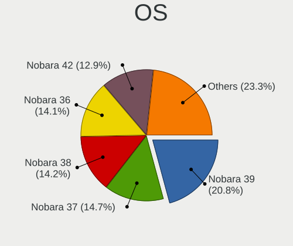

| Name      | Computers | Percent |
|-----------|-----------|---------|
| Nobara 39 | 380       | 20.8%   |
| Nobara 37 | 269       | 14.72%  |
| Nobara 38 | 259       | 14.18%  |
| Nobara 36 | 257       | 14.07%  |
| Nobara 42 | 236       | 12.92%  |
| Nobara 40 | 215       | 11.77%  |
| Nobara 41 | 165       | 9.03%   |
| Nobara 43 | 46        | 2.52%   |

OS Family
---------

OS without a version

| Name   | Computers | Percent |
|--------|-----------|---------|
| Nobara | 1746      | 100%    |

Kernel
------

Version of the Linux kernel

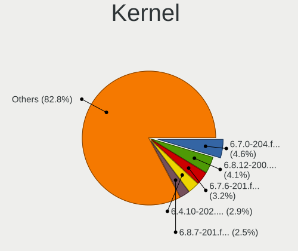

| Version                        | Computers | Percent |
|--------------------------------|-----------|---------|
| 6.7.0-204.fsync.fc39.x86_64    | 89        | 4.58%   |
| 6.8.12-200.fsync.fc39.x86_64   | 80        | 4.12%   |
| 6.7.6-201.fsync.fc39.x86_64    | 62        | 3.19%   |
| 6.4.10-202.fsync.fc38.x86_64   | 56        | 2.88%   |
| 6.8.7-201.fsync.fc39.x86_64    | 48        | 2.47%   |
| 6.11.9-200.fsync.fc40.x86_64   | 44        | 2.26%   |
| 6.0.14-201.fsync.fc36.x86_64   | 40        | 2.06%   |
| 6.0.10-201.fc36.x86_64         | 37        | 1.9%    |
| 6.2.14-300.fsync.fc37.x86_64   | 33        | 1.7%    |
| 6.3.12-204.fsync.fc38.x86_64   | 27        | 1.39%   |
| 6.12.11-204.nobara.fc41.x86_64 | 26        | 1.34%   |
| 6.1.14-201.fsync.fc37.x86_64   | 25        | 1.29%   |
| 5.19.14-201.fsync.fc36.x86_64  | 25        | 1.29%   |
| 6.6.9-200.fsync.fc39.x86_64    | 23        | 1.18%   |
| 6.11.3-200.fsync.fc40.x86_64   | 22        | 1.13%   |
| 6.10.3-201.fsync.fc40.x86_64   | 22        | 1.13%   |
| 6.8.5-201.fsync.fc39.x86_64    | 21        | 1.08%   |
| 6.5.9-201.fsync.fc38.x86_64    | 21        | 1.08%   |
| 6.14.8-200.nobara.fc42.x86_64  | 21        | 1.08%   |
| 6.13.5-200.nobara.fc41.x86_64  | 21        | 1.08%   |
| 6.1.11-201.fsync.fc37.x86_64   | 21        | 1.08%   |
| 6.5.6-200.fsync.fc38.x86_64    | 20        | 1.03%   |
| 6.13.3-201.nobara.fc41.x86_64  | 20        | 1.03%   |
| 6.10.6-200.fsync.fc40.x86_64   | 20        | 1.03%   |
| 6.2.12-200.fsync.fc37.x86_64   | 19        | 0.98%   |
| 6.17.5-200.nobara.fc42.x86_64  | 19        | 0.98%   |
| 6.15.8-200.nobara.fc42.x86_64  | 19        | 0.98%   |
| 6.14.6-200.nobara.fc42.x86_64  | 19        | 0.98%   |
| 6.15.2-200.nobara.fc42.x86_64  | 18        | 0.93%   |
| 6.10.7-200.fsync.fc40.x86_64   | 18        | 0.93%   |
| 6.2.6-201.fsync.fc37.x86_64    | 17        | 0.87%   |
| 6.1.9-200.fsync.fc37.x86_64    | 17        | 0.87%   |
| 6.1.4-203.fsync.fc37.x86_64    | 17        | 0.87%   |
| 6.7.5-200.fsync.fc39.x86_64    | 16        | 0.82%   |
| 6.6.7-203.fsync.fc38.x86_64    | 16        | 0.82%   |
| 6.16.9-200.nobara.fc42.x86_64  | 16        | 0.82%   |
| 5.19.9-201.fsync.fc36.x86_64   | 16        | 0.82%   |
| 5.19.7-204.fsync.fc36.x86_64   | 16        | 0.82%   |
| 6.15.7-200.nobara.fc42.x86_64  | 15        | 0.77%   |
| 6.13.8-201.nobara.fc41.x86_64  | 15        | 0.77%   |

Kernel Family
-------------

Linux kernel without a distro release

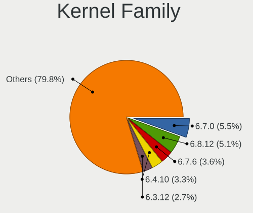

| Version | Computers | Percent |
|---------|-----------|---------|
| 6.7.0   | 107       | 5.52%   |
| 6.8.12  | 99        | 5.11%   |
| 6.7.6   | 69        | 3.56%   |
| 6.4.10  | 64        | 3.3%    |
| 6.3.12  | 53        | 2.74%   |
| 6.8.7   | 52        | 2.68%   |
| 6.11.9  | 44        | 2.27%   |
| 6.0.14  | 40        | 2.07%   |
| 6.0.10  | 37        | 1.91%   |
| 6.12.11 | 36        | 1.86%   |
| 6.2.14  | 34        | 1.76%   |
| 6.6.7   | 28        | 1.45%   |
| 6.5.9   | 28        | 1.45%   |
| 6.1.14  | 25        | 1.29%   |
| 5.19.14 | 25        | 1.29%   |
| 6.6.9   | 23        | 1.19%   |
| 6.11.3  | 22        | 1.14%   |
| 6.10.3  | 22        | 1.14%   |
| 6.8.5   | 21        | 1.08%   |
| 6.5.6   | 21        | 1.08%   |
| 6.3.10  | 21        | 1.08%   |
| 6.14.8  | 21        | 1.08%   |
| 6.13.5  | 21        | 1.08%   |
| 6.13.3  | 21        | 1.08%   |
| 6.1.11  | 21        | 1.08%   |
| 6.10.6  | 20        | 1.03%   |
| 6.2.12  | 19        | 0.98%   |
| 6.17.5  | 19        | 0.98%   |
| 6.15.8  | 19        | 0.98%   |
| 6.14.6  | 19        | 0.98%   |
| 6.15.2  | 18        | 0.93%   |
| 6.10.7  | 18        | 0.93%   |
| 5.19.7  | 18        | 0.93%   |
| 6.6.8   | 17        | 0.88%   |
| 6.5.5   | 17        | 0.88%   |
| 6.2.6   | 17        | 0.88%   |
| 6.11.0  | 17        | 0.88%   |
| 6.1.9   | 17        | 0.88%   |
| 6.1.4   | 17        | 0.88%   |
| 6.7.5   | 16        | 0.83%   |

Kernel Major Ver.
-----------------

Linux kernel major version

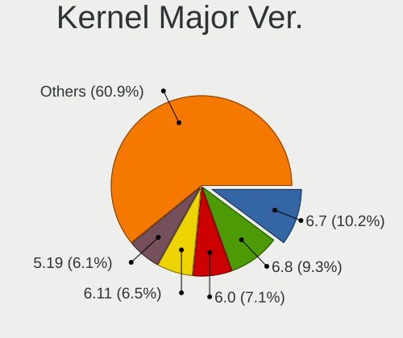

| Version | Computers | Percent |
|---------|-----------|---------|
| 6.7     | 192       | 10.19%  |
| 6.8     | 176       | 9.34%   |
| 6.0     | 133       | 7.06%   |
| 6.11    | 122       | 6.48%   |
| 5.19    | 114       | 6.05%   |
| 6.3     | 108       | 5.73%   |
| 6.2     | 108       | 5.73%   |
| 6.1     | 108       | 5.73%   |
| 6.6     | 95        | 5.04%   |
| 6.14    | 91        | 4.83%   |
| 6.5     | 88        | 4.67%   |
| 6.15    | 85        | 4.51%   |
| 6.13    | 85        | 4.51%   |
| 6.17    | 72        | 3.82%   |
| 6.12    | 71        | 3.77%   |
| 6.4     | 70        | 3.72%   |
| 6.10    | 63        | 3.34%   |
| 6.16    | 56        | 2.97%   |
| 5.18    | 34        | 1.8%    |
| 6.18    | 13        | 0.69%   |

Arch
----

OS architecture (x86_64, i586, etc.)

| Name   | Computers | Percent |
|--------|-----------|---------|
| x86_64 | 1746      | 100%    |

DE
--

Desktop Environment

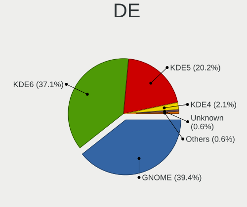

| Name          | Computers | Percent |
|---------------|-----------|---------|
| GNOME         | 701       | 39.36%  |
| KDE6          | 661       | 37.11%  |
| KDE5          | 359       | 20.16%  |
| KDE4          | 38        | 2.13%   |
| Unknown       | 11        | 0.62%   |
| Hyprland      | 5         | 0.28%   |
| GNOME Classic | 4         | 0.22%   |
| X-Cinnamon    | 1         | 0.06%   |
| sway          | 1         | 0.06%   |

Display Server
--------------

X11 or Wayland

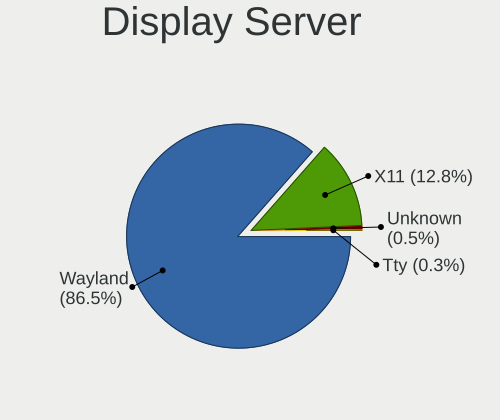

| Name    | Computers | Percent |
|---------|-----------|---------|
| Wayland | 1537      | 86.49%  |
| X11     | 227       | 12.77%  |
| Unknown | 8         | 0.45%   |
| Tty     | 5         | 0.28%   |

Display Manager
---------------

SDDM, LightDM, etc.

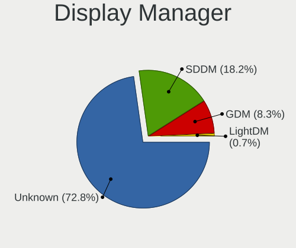

| Name    | Computers | Percent |
|---------|-----------|---------|
| Unknown | 1286      | 72.78%  |
| SDDM    | 322       | 18.22%  |
| GDM     | 146       | 8.26%   |
| LightDM | 13        | 0.74%   |

OS Lang
-------

Language

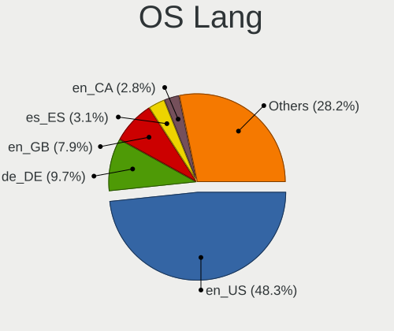

| Lang    | Computers | Percent |
|---------|-----------|---------|
| en_US   | 849       | 48.35%  |
| de_DE   | 170       | 9.68%   |
| en_GB   | 138       | 7.86%   |
| es_ES   | 54        | 3.08%   |
| en_CA   | 49        | 2.79%   |
| ru_RU   | 48        | 2.73%   |
| fr_FR   | 43        | 2.45%   |
| es_MX   | 43        | 2.45%   |
| pt_BR   | 42        | 2.39%   |
| it_IT   | 38        | 2.16%   |
| en_AU   | 38        | 2.16%   |
| pl_PL   | 37        | 2.11%   |
| es_AR   | 24        | 1.37%   |
| en_IN   | 18        | 1.03%   |
| de_AT   | 15        | 0.85%   |
| hu_HU   | 10        | 0.57%   |
| en_NZ   | 10        | 0.57%   |
| sv_SE   | 7         | 0.4%    |
| nl_NL   | 6         | 0.34%   |
| es_CO   | 6         | 0.34%   |
| en_SG   | 6         | 0.34%   |
| en_DK   | 6         | 0.34%   |
| da_DK   | 6         | 0.34%   |
| Unknown | 6         | 0.34%   |
| tr_TR   | 5         | 0.28%   |
| nb_NO   | 5         | 0.28%   |
| pt_PT   | 4         | 0.23%   |
| fr_BE   | 4         | 0.23%   |
| fi_FI   | 4         | 0.23%   |
| en_IL   | 4         | 0.23%   |
| de_CH   | 4         | 0.23%   |
| cs_CZ   | 4         | 0.23%   |
| uk_UA   | 3         | 0.17%   |
| nl_BE   | 3         | 0.17%   |
| fr_CA   | 3         | 0.17%   |
| es_CR   | 3         | 0.17%   |
| es_CL   | 3         | 0.17%   |
| en_ZA   | 3         | 0.17%   |
| en_PH   | 3         | 0.17%   |
| en_NG   | 3         | 0.17%   |

Boot Mode
---------

EFI or BIOS

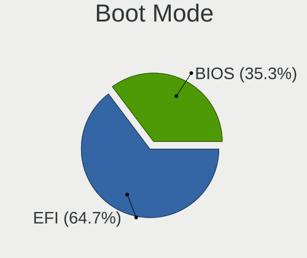

| Mode | Computers | Percent |
|------|-----------|---------|
| EFI  | 1147      | 64.73%  |
| BIOS | 625       | 35.27%  |

Filesystem
----------

Type of filesystem

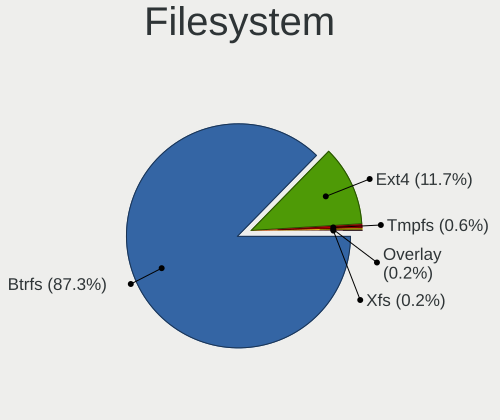

| Type    | Computers | Percent |
|---------|-----------|---------|
| Btrfs   | 1536      | 87.32%  |
| Ext4    | 206       | 11.71%  |
| Tmpfs   | 10        | 0.57%   |
| Overlay | 4         | 0.23%   |
| Xfs     | 3         | 0.17%   |

Part. scheme
------------

Scheme of partitioning

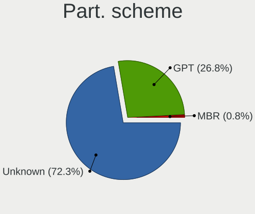

| Type    | Computers | Percent |
|---------|-----------|---------|
| Unknown | 1278      | 72.33%  |
| GPT     | 474       | 26.83%  |
| MBR     | 15        | 0.85%   |

Dual Boot with Linux/BSD
------------------------

Hosting more than one Linux/BSD

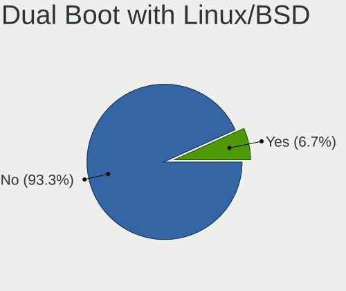

| Dual boot | Computers | Percent |
|-----------|-----------|---------|
| No        | 1635      | 93.27%  |
| Yes       | 118       | 6.73%   |

Dual Boot (Win)
---------------

Hosting Linux and Windows

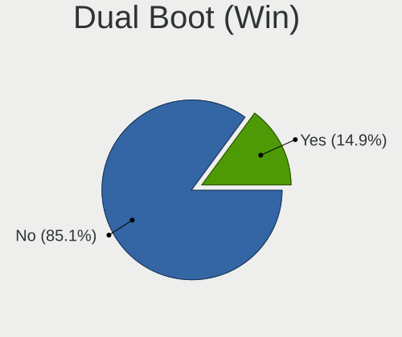

| Dual boot | Computers | Percent |
|-----------|-----------|---------|
| No        | 1494      | 85.08%  |
| Yes       | 262       | 14.92%  |

Board
-----

Vendor
------

Motherboard manufacturer

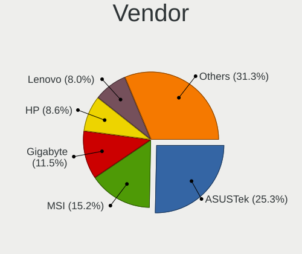

| Name                                 | Computers | Percent |
|--------------------------------------|-----------|---------|
| ASUSTek Computer                     | 442       | 25.32%  |
| MSI                                  | 266       | 15.23%  |
| Gigabyte Technology                  | 201       | 11.51%  |
| Hewlett-Packard                      | 150       | 8.59%   |
| Lenovo                               | 140       | 8.02%   |
| ASRock                               | 125       | 7.16%   |
| Dell                                 | 107       | 6.13%   |
| Acer                                 | 62        | 3.55%   |
| Apple                                | 36        | 2.06%   |
| Intel                                | 20        | 1.15%   |
| Samsung Electronics                  | 10        | 0.57%   |
| Microsoft                            | 10        | 0.57%   |
| Biostar                              | 10        | 0.57%   |
| Unknown                              | 10        | 0.57%   |
| Toshiba                              | 9         | 0.52%   |
| Alienware                            | 8         | 0.46%   |
| AZW                                  | 7         | 0.4%    |
| Timi                                 | 6         | 0.34%   |
| Notebook                             | 6         | 0.34%   |
| Huanan                               | 6         | 0.34%   |
| Shenzhen Meigao Electronic Equipment | 5         | 0.29%   |
| Medion                               | 5         | 0.29%   |
| Razer                                | 4         | 0.23%   |
| NZXT                                 | 4         | 0.23%   |
| Fujitsu                              | 4         | 0.23%   |
| Positivo                             | 3         | 0.17%   |
| Pegatron                             | 3         | 0.17%   |
| PC Specialist                        | 3         | 0.17%   |
| ONE-NETBOOK TECHNOLOGY               | 3         | 0.17%   |
| ONE-NETBOOK                          | 3         | 0.17%   |
| Intel Client Systems                 | 3         | 0.17%   |
| Infinix                              | 3         | 0.17%   |
| GPU Company                          | 3         | 0.17%   |
| Google                               | 3         | 0.17%   |
| Valve                                | 2         | 0.11%   |
| TUXEDO                               | 2         | 0.11%   |
| Sony                                 | 2         | 0.11%   |
| Monster                              | 2         | 0.11%   |
| Micro Computer (HK) Tech Limited     | 2         | 0.11%   |
| HUAWEI                               | 2         | 0.11%   |

Model
-----

Motherboard model

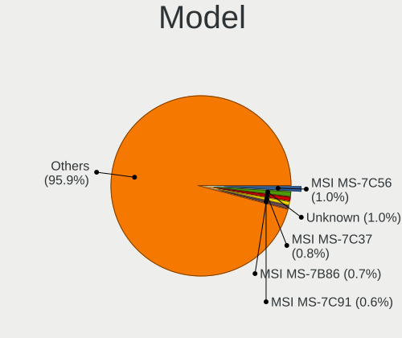

| Name                                 | Computers | Percent |
|--------------------------------------|-----------|---------|
| MSI MS-7C56                          | 17        | 0.97%   |
| Unknown                              | 17        | 0.97%   |
| MSI MS-7C37                          | 14        | 0.8%    |
| MSI MS-7B86                          | 13        | 0.74%   |
| MSI MS-7C91                          | 11        | 0.63%   |
| ASUS TUF Gaming X570-PLUS            | 11        | 0.63%   |
| ASUS All Series                      | 11        | 0.63%   |
| MSI MS-7C95                          | 9         | 0.52%   |
| ASUS TUF Gaming B550-PLUS            | 9         | 0.52%   |
| MSI MS-7D25                          | 8         | 0.46%   |
| MSI MS-7C02                          | 8         | 0.46%   |
| ASUS TUF Gaming B550M-PLUS           | 8         | 0.46%   |
| ASUS ROG STRIX B550-F GAMING         | 8         | 0.46%   |
| MSI MS-7B79                          | 7         | 0.4%    |
| Gigabyte X570 AORUS ELITE            | 7         | 0.4%    |
| MSI MS-7E26                          | 6         | 0.34%   |
| MSI MS-7C35                          | 6         | 0.34%   |
| Gigabyte B550 GAMING X V2            | 6         | 0.34%   |
| ASUS TUF Gaming B550-PLUS WIFI II    | 6         | 0.34%   |
| ASUS ROG STRIX X570-E GAMING         | 6         | 0.34%   |
| ASUS CROSSHAIR VI HERO               | 6         | 0.34%   |
| MSI MS-7D75                          | 5         | 0.29%   |
| Gigabyte B550 AORUS ELITE V2         | 5         | 0.29%   |
| ASUS TUF Gaming X670E-PLUS WIFI      | 5         | 0.29%   |
| ASUS ROG STRIX B650E-F GAMING WIFI   | 5         | 0.29%   |
| ASUS ROG STRIX B450-F GAMING         | 5         | 0.29%   |
| ASUS PRIME B450M-A                   | 5         | 0.29%   |
| ASUS PRIME A320M-K                   | 5         | 0.29%   |
| ASRock B550 Phantom Gaming-ITX/ax    | 5         | 0.29%   |
| MSI MS-7D76                          | 4         | 0.23%   |
| MSI MS-7C84                          | 4         | 0.23%   |
| MSI MS-7817                          | 4         | 0.23%   |
| HP Pavilion Gaming Laptop 15-ec1xxx  | 4         | 0.23%   |
| HP Pavilion Gaming Desktop TG01-2xxx | 4         | 0.23%   |
| Gigabyte X870E AORUS ELITE WIFI7     | 4         | 0.23%   |
| Gigabyte X570 AORUS MASTER           | 4         | 0.23%   |
| Gigabyte X570 AORUS ELITE WIFI       | 4         | 0.23%   |
| Gigabyte B550M DS3H                  | 4         | 0.23%   |
| AZW SER                              | 4         | 0.23%   |
| ASUS TUF Gaming X570-PRO             | 4         | 0.23%   |

Model Family
------------

Motherboard model prefix

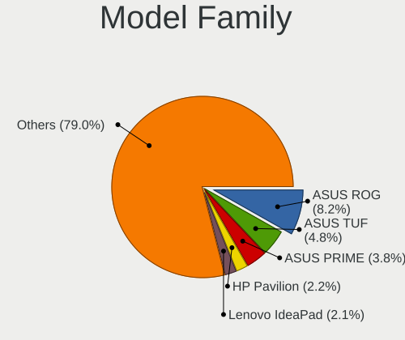

| Name              | Computers | Percent |
|-------------------|-----------|---------|
| ASUS ROG          | 143       | 8.19%   |
| ASUS TUF          | 83        | 4.75%   |
| ASUS PRIME        | 66        | 3.78%   |
| HP Pavilion       | 38        | 2.18%   |
| Lenovo IdeaPad    | 37        | 2.12%   |
| Lenovo ThinkPad   | 33        | 1.89%   |
| ASUS VivoBook     | 27        | 1.55%   |
| Acer Aspire       | 27        | 1.55%   |
| Lenovo Legion     | 22        | 1.26%   |
| Gigabyte X570     | 22        | 1.26%   |
| ASUS ASUS         | 22        | 1.26%   |
| Dell Latitude     | 21        | 1.2%    |
| Dell Inspiron     | 19        | 1.09%   |
| Acer Nitro        | 18        | 1.03%   |
| MSI MS-7C56       | 17        | 0.97%   |
| Gigabyte B550     | 17        | 0.97%   |
| Unknown           | 17        | 0.97%   |
| Dell OptiPlex     | 16        | 0.92%   |
| HP Laptop         | 15        | 0.86%   |
| Gigabyte B550M    | 15        | 0.86%   |
| MSI MS-7C37       | 14        | 0.8%    |
| MSI MS-7B86       | 13        | 0.74%   |
| HP OMEN           | 13        | 0.74%   |
| HP EliteBook      | 13        | 0.74%   |
| Dell Precision    | 13        | 0.74%   |
| HP ENVY           | 12        | 0.69%   |
| ASRock B550       | 12        | 0.69%   |
| MSI MS-7C91       | 11        | 0.63%   |
| Dell XPS          | 11        | 0.63%   |
| ASUS All          | 11        | 0.63%   |
| Microsoft Surface | 10        | 0.57%   |
| ASRock B450M      | 10        | 0.57%   |
| MSI MS-7C95       | 9         | 0.52%   |
| ASRock B550M      | 9         | 0.52%   |
| ASRock B450       | 9         | 0.52%   |
| Toshiba Satellite | 8         | 0.46%   |
| MSI MS-7D25       | 8         | 0.46%   |
| MSI MS-7C02       | 8         | 0.46%   |
| HP Compaq         | 8         | 0.46%   |
| Gigabyte B650     | 8         | 0.46%   |

MFG Year
--------

Motherboard manufacture year

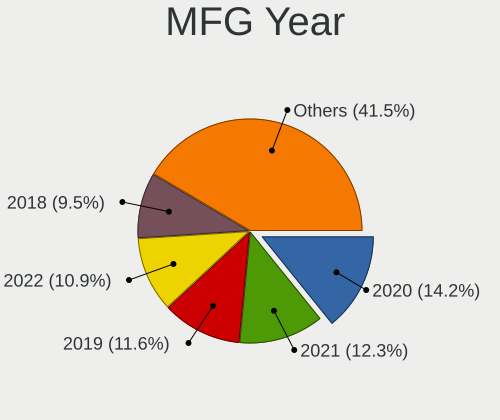

| Year    | Computers | Percent |
|---------|-----------|---------|
| 2020    | 248       | 14.2%   |
| 2021    | 215       | 12.31%  |
| 2019    | 202       | 11.57%  |
| 2022    | 190       | 10.88%  |
| 2018    | 166       | 9.51%   |
| 2023    | 136       | 7.79%   |
| 2024    | 78        | 4.47%   |
| 2013    | 78        | 4.47%   |
| 2017    | 75        | 4.3%    |
| 2012    | 75        | 4.3%    |
| 2014    | 63        | 3.61%   |
| 2016    | 61        | 3.49%   |
| 2015    | 60        | 3.44%   |
| 2011    | 37        | 2.12%   |
| 2009    | 21        | 1.2%    |
| 2010    | 16        | 0.92%   |
| 2025    | 14        | 0.8%    |
| 2008    | 8         | 0.46%   |
| 2007    | 2         | 0.11%   |
| Unknown | 1         | 0.06%   |

Form Factor
-----------

Physical design of the computer

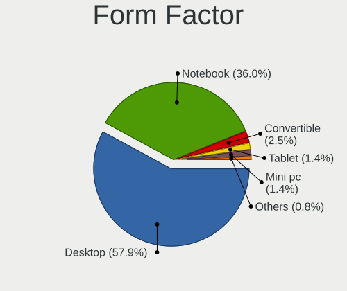

| Name        | Computers | Percent |
|-------------|-----------|---------|
| Desktop     | 1011      | 57.9%   |
| Notebook    | 629       | 36.03%  |
| Convertible | 43        | 2.46%   |
| Tablet      | 25        | 1.43%   |
| Mini pc     | 24        | 1.37%   |
| All in one  | 12        | 0.69%   |
| Other       | 1         | 0.06%   |
| Server      | 1         | 0.06%   |

Secure Boot
-----------

Enabled or disabled

| State    | Computers | Percent |
|----------|-----------|---------|
| Disabled | 1746      | 100%    |

Coreboot
--------

Have coreboot on board

| Used | Computers | Percent |
|------|-----------|---------|
| No   | 1742      | 99.77%  |
| Yes  | 4         | 0.23%   |

RAM Size
--------

Total RAM memory

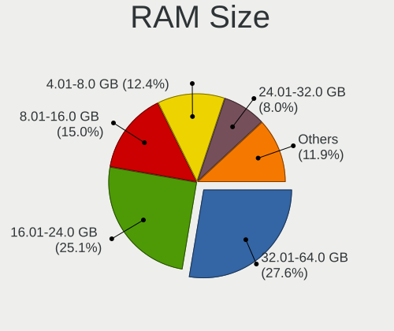

| Size in GB      | Computers | Percent |
|-----------------|-----------|---------|
| 32.01-64.0      | 486       | 27.63%  |
| 16.01-24.0      | 442       | 25.13%  |
| 8.01-16.0       | 263       | 14.95%  |
| 4.01-8.0        | 218       | 12.39%  |
| 24.01-32.0      | 141       | 8.02%   |
| 64.01-256.0     | 121       | 6.88%   |
| 3.01-4.0        | 78        | 4.43%   |
| 1.01-2.0        | 6         | 0.34%   |
| More than 256.0 | 2         | 0.11%   |
| 2.01-3.0        | 2         | 0.11%   |

RAM Used
--------

Used RAM memory

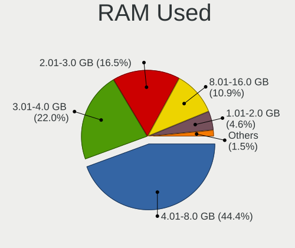

| Used GB    | Computers | Percent |
|------------|-----------|---------|
| 4.01-8.0   | 833       | 44.4%   |
| 3.01-4.0   | 413       | 22.01%  |
| 2.01-3.0   | 310       | 16.52%  |
| 8.01-16.0  | 204       | 10.87%  |
| 1.01-2.0   | 87        | 4.64%   |
| 16.01-24.0 | 24        | 1.28%   |
| 24.01-32.0 | 4         | 0.21%   |
| 32.01-64.0 | 1         | 0.05%   |

Total Drives
------------

Number of drives on board

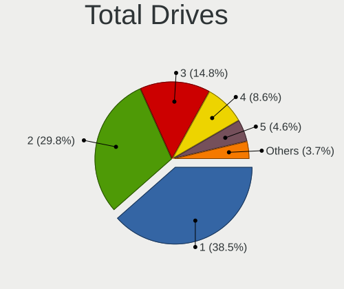

| Drives | Computers | Percent |
|--------|-----------|---------|
| 1      | 688       | 38.5%   |
| 2      | 532       | 29.77%  |
| 3      | 264       | 14.77%  |
| 4      | 154       | 8.62%   |
| 5      | 83        | 4.64%   |
| 6      | 33        | 1.85%   |
| 7      | 14        | 0.78%   |
| 8      | 8         | 0.45%   |
| 10     | 4         | 0.22%   |
| 9      | 3         | 0.17%   |
| 0      | 3         | 0.17%   |
| 11     | 1         | 0.06%   |

Has CD-ROM
----------

Has CD-ROM on board

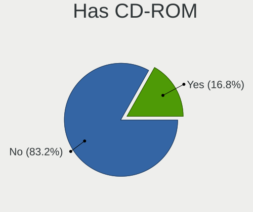

| Presented | Computers | Percent |
|-----------|-----------|---------|
| No        | 1458      | 83.17%  |
| Yes       | 295       | 16.83%  |

Has Ethernet
------------

Has Ethernet on board

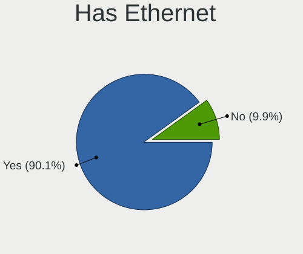

| Presented | Computers | Percent |
|-----------|-----------|---------|
| Yes       | 1576      | 90.06%  |
| No        | 174       | 9.94%   |

Has WiFi
--------

Has WiFi module

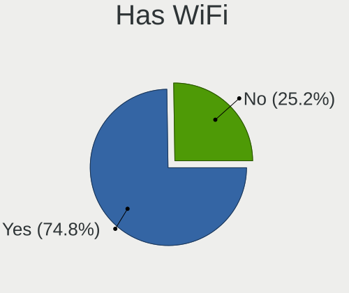

| Presented | Computers | Percent |
|-----------|-----------|---------|
| Yes       | 1312      | 74.76%  |
| No        | 443       | 25.24%  |

Has Bluetooth
-------------

Has Bluetooth module

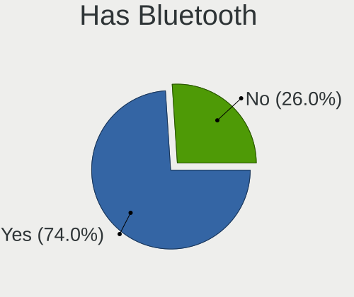

| Presented | Computers | Percent |
|-----------|-----------|---------|
| Yes       | 1298      | 73.96%  |
| No        | 457       | 26.04%  |

Location
--------

Country
-------

Geographic location (country)

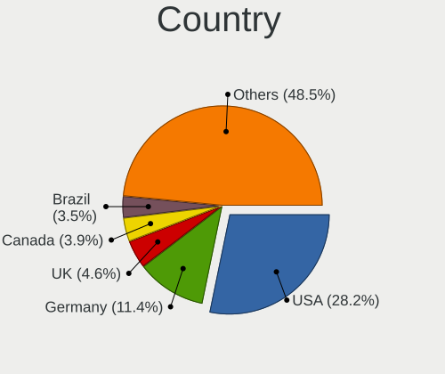

| Country      | Computers | Percent |
|--------------|-----------|---------|
| USA          | 494       | 28.23%  |
| Germany      | 199       | 11.37%  |
| UK           | 80        | 4.57%   |
| Canada       | 68        | 3.89%   |
| Brazil       | 61        | 3.49%   |
| Russia       | 56        | 3.2%    |
| Spain        | 55        | 3.14%   |
| Poland       | 54        | 3.09%   |
| Italy        | 52        | 2.97%   |
| France       | 51        | 2.91%   |
| Australia    | 50        | 2.86%   |
| Argentina    | 34        | 1.94%   |
| Mexico       | 32        | 1.83%   |
| India        | 29        | 1.66%   |
| Austria      | 27        | 1.54%   |
| Sweden       | 25        | 1.43%   |
| Netherlands  | 23        | 1.31%   |
| Hungary      | 17        | 0.97%   |
| Norway       | 14        | 0.8%    |
| Colombia     | 14        | 0.8%    |
| Finland      | 13        | 0.74%   |
| Romania      | 12        | 0.69%   |
| Portugal     | 12        | 0.69%   |
| New Zealand  | 12        | 0.69%   |
| Belgium      | 12        | 0.69%   |
| Turkey       | 11        | 0.63%   |
| Switzerland  | 11        | 0.63%   |
| Indonesia    | 11        | 0.63%   |
| Czechia      | 11        | 0.63%   |
| Chile        | 10        | 0.57%   |
| Philippines  | 9         | 0.51%   |
| Venezuela    | 8         | 0.46%   |
| Israel       | 8         | 0.46%   |
| Denmark      | 8         | 0.46%   |
| Slovakia     | 7         | 0.4%    |
| Greece       | 7         | 0.4%    |
| Ukraine      | 6         | 0.34%   |
| Singapore    | 6         | 0.34%   |
| Saudi Arabia | 6         | 0.34%   |
| Malaysia     | 6         | 0.34%   |

City
----

Geographic location (city)

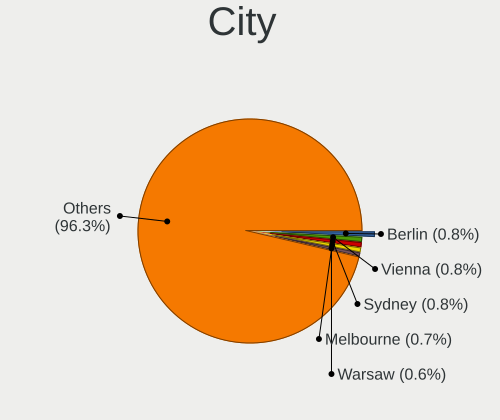

| City              | Computers | Percent |
|-------------------|-----------|---------|
| Berlin            | 15        | 0.82%   |
| Vienna            | 14        | 0.76%   |
| Sydney            | 14        | 0.76%   |
| Melbourne         | 13        | 0.71%   |
| Warsaw            | 11        | 0.6%    |
| Atlanta           | 11        | 0.6%    |
| Stockholm         | 10        | 0.55%   |
| Los Angeles       | 10        | 0.55%   |
| Buenos Aires      | 10        | 0.55%   |
| Brisbane          | 9         | 0.49%   |
| Toronto           | 8         | 0.44%   |
| Madrid            | 8         | 0.44%   |
| St Petersburg     | 7         | 0.38%   |
| Poznan            | 7         | 0.38%   |
| Milan             | 7         | 0.38%   |
| Frankfurt am Main | 7         | 0.38%   |
| Singapore         | 6         | 0.33%   |
| Seattle           | 6         | 0.33%   |
| New York          | 6         | 0.33%   |
| Milano            | 6         | 0.33%   |
| Hamburg           | 6         | 0.33%   |
| Guadalajara       | 6         | 0.33%   |
| Denver            | 6         | 0.33%   |
| Cologne           | 6         | 0.33%   |
| Calgary           | 6         | 0.33%   |
| Valencia          | 5         | 0.27%   |
| Perth             | 5         | 0.27%   |
| Kuala Lumpur      | 5         | 0.27%   |
| Kansas City       | 5         | 0.27%   |
| Gothenburg        | 5         | 0.27%   |
| Düsseldorf       | 5         | 0.27%   |
| Barcelona         | 5         | 0.27%   |
| Auckland          | 5         | 0.27%   |
| Amsterdam         | 5         | 0.27%   |
| Zurich            | 4         | 0.22%   |
| Wuppertal         | 4         | 0.22%   |
| Wroclaw           | 4         | 0.22%   |
| Tucson            | 4         | 0.22%   |
| Stuttgart         | 4         | 0.22%   |
| Sofia             | 4         | 0.22%   |

Drives
------

Drive Vendor
------------

Hard drive vendors

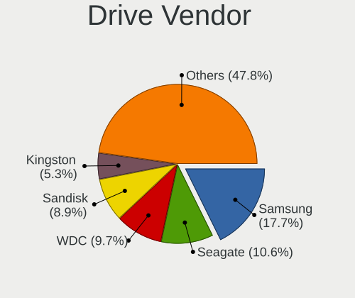

| Vendor                       | Computers | Drives | Percent |
|------------------------------|-----------|--------|---------|
| Samsung Electronics          | 589       | 972    | 17.7%   |
| Seagate                      | 354       | 486    | 10.64%  |
| WDC                          | 322       | 458    | 9.68%   |
| Sandisk                      | 296       | 388    | 8.89%   |
| Kingston                     | 177       | 209    | 5.32%   |
| Crucial                      | 154       | 217    | 4.63%   |
| Toshiba                      | 138       | 171    | 4.15%   |
| Micron/Crucial Technology    | 117       | 144    | 3.52%   |
| Phison Electronics           | 101       | 122    | 3.03%   |
| Micron Technology            | 87        | 99     | 2.61%   |
| SK hynix                     | 79        | 94     | 2.37%   |
| Intel                        | 73        | 88     | 2.19%   |
| Kingston Technology Company  | 59        | 76     | 1.77%   |
| Unknown                      | 50        | 64     | 1.5%    |
| Hitachi                      | 41        | 56     | 1.23%   |
| MAXIO Technology (Hangzhou)  | 39        | 43     | 1.17%   |
| ADATA Technology             | 37        | 43     | 1.11%   |
| HGST                         | 35        | 41     | 1.05%   |
| Realtek Semiconductor        | 30        | 34     | 0.9%    |
| PNY                          | 30        | 43     | 0.9%    |
| KIOXIA                       | 30        | 38     | 0.9%    |
| A-DATA Technology            | 30        | 34     | 0.9%    |
| Shenzhen Longsys Electronics | 27        | 41     | 0.81%   |
| China                        | 26        | 31     | 0.78%   |
| Silicon Motion               | 22        | 29     | 0.66%   |
| SPCC                         | 20        | 24     | 0.6%    |
| Apple                        | 20        | 22     | 0.6%    |
| Intenso                      | 16        | 19     | 0.48%   |
| Team                         | 15        | 16     | 0.45%   |
| GOODRAM                      | 13        | 14     | 0.39%   |
| OCZ                          | 12        | 12     | 0.36%   |
| Unknown                      | 11        | 15     | 0.33%   |
| T-FORCE                      | 10        | 11     | 0.3%    |
| Lexar                        | 10        | 11     | 0.3%    |
| Phison                       | 9         | 10     | 0.27%   |
| Patriot                      | 9         | 9      | 0.27%   |
| JMicron Technology           | 9         | 17     | 0.27%   |
| Fanxiang                     | 9         | 11     | 0.27%   |
| Netac                        | 8         | 9      | 0.24%   |
| Corsair                      | 8         | 11     | 0.24%   |

Drive Model
-----------

Hard drive models

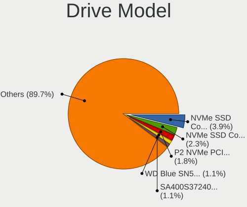

| Model                                                              | Computers | Percent |
|--------------------------------------------------------------------|-----------|---------|
| Samsung NVMe SSD Controller SM981/PM981/PM983 1TB                  | 149       | 3.92%   |
| Samsung NVMe SSD Controller PM9A1/PM9A3/980PRO 1TB                 | 89        | 2.34%   |
| Micron/Crucial P2 NVMe PCIe SSD 2TB                                | 70        | 1.84%   |
| Sandisk WD Blue SN550 NVMe SSD 1024GB                              | 42        | 1.11%   |
| Kingston SA400S37240G 240GB SSD                                    | 41        | 1.08%   |
| Samsung SSD 860 EVO 1TB                                            | 35        | 0.92%   |
| Phison E12 NVMe Controller 1TB                                     | 33        | 0.87%   |
| Samsung SSD 990 PRO 2TB                                            | 32        | 0.84%   |
| Samsung SSD 860 EVO 500GB                                          | 31        | 0.82%   |
| Samsung SSD 850 EVO 500GB                                          | 31        | 0.82%   |
| Crucial CT1000MX500SSD1 1TB                                        | 31        | 0.82%   |
| Seagate ST2000DM008-2FR102 2TB                                     | 30        | 0.79%   |
| MAXIO (Hangzhou) NVMe SSD Controller MAP1202 2TB                   | 28        | 0.74%   |
| Samsung SSD 850 EVO 250GB                                          | 26        | 0.68%   |
| Crucial CT1000BX500SSD1 1TB                                        | 25        | 0.66%   |
| Samsung SSD 980 1TB                                                | 24        | 0.63%   |
| Samsung NVMe SSD Controller SM961/PM961/SM963 1024GB               | 24        | 0.63%   |
| Kingston SA400S37480G 480GB SSD                                    | 24        | 0.63%   |
| Intel SSD 660P Series 512GB                                        | 23        | 0.61%   |
| Sandisk WD Black SN750 / PC SN730 NVMe SSD 500GB                   | 22        | 0.58%   |
| Kingston Company SNV2S1000G 1TB                                    | 22        | 0.58%   |
| Seagate ST1000DM010-2EP102 1TB                                     | 21        | 0.55%   |
| Phison E16 PCIe4 NVMe Controller 1TB                               | 21        | 0.55%   |
| Toshiba DT01ACA100 1TB                                             | 20        | 0.53%   |
| Sandisk WD_BLACK SN770 1TB                                         | 20        | 0.53%   |
| Phison PS5013 E13 NVMe Controller 500GB                            | 20        | 0.53%   |
| Seagate ST4000DM004-2CV104 4TB                                     | 19        | 0.5%    |
| Samsung SSD 870 EVO 1TB                                            | 19        | 0.5%    |
| Crucial CT500MX500SSD1 500GB                                       | 18        | 0.47%   |
| Sandisk WD_BLACK SN770 2TB                                         | 16        | 0.42%   |
| Sandisk WD Black SN850 1TB                                         | 16        | 0.42%   |
| Samsung SSD 870 EVO 2TB                                            | 15        | 0.4%    |
| ADATA XPG SX8200 Pro PCIe Gen3x4 M.2 2280 Solid State Drive 1024GB | 15        | 0.4%    |
| Crucial CT240BX500SSD1 240GB                                       | 14        | 0.37%   |
| WDC WDS500G2B0A-00SM50 500GB                                       | 13        | 0.34%   |
| WDC WD10EZEX-08WN4A0 1TB                                           | 13        | 0.34%   |
| WDC WD20EZRZ-00Z5HB0 2TB                                           | 12        | 0.32%   |
| Silicon Motion SM2263EN/SM2263XT SSD Controller 512GB              | 12        | 0.32%   |
| Sandisk WD_BLACK SN850X 2000GB                                     | 12        | 0.32%   |
| Samsung SSD 860 EVO 250GB                                          | 12        | 0.32%   |

HDD Vendor
----------

Hard disk drive vendors

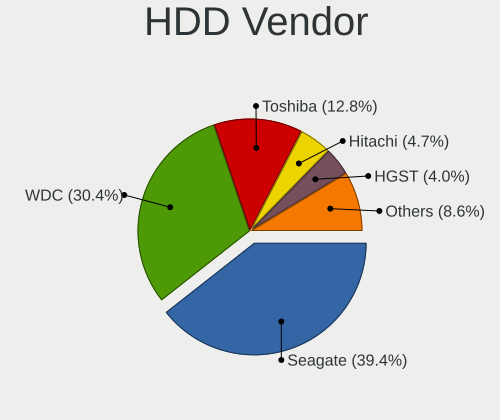

| Vendor              | Computers | Drives | Percent |
|---------------------|-----------|--------|---------|
| Seagate             | 342       | 464    | 39.4%   |
| WDC                 | 264       | 369    | 30.41%  |
| Toshiba             | 111       | 140    | 12.79%  |
| Hitachi             | 41        | 56     | 4.72%   |
| HGST                | 35        | 41     | 4.03%   |
| Samsung Electronics | 25        | 37     | 2.88%   |
| Apple               | 9         | 9      | 1.04%   |
| JMicron Technology  | 7         | 15     | 0.81%   |
| Unknown             | 6         | 6      | 0.69%   |
| Maxtor              | 4         | 4      | 0.46%   |
| ASMT                | 4         | 8      | 0.46%   |
| USB3.0              | 2         | 2      | 0.23%   |
| TO Exter            | 2         | 2      | 0.23%   |
| Intenso             | 2         | 2      | 0.23%   |
| Unknown             | 2         | 4      | 0.23%   |
| USB 3.1             | 1         | 3      | 0.12%   |
| USB                 | 1         | 1      | 0.12%   |
| T-FORCE             | 1         | 1      | 0.12%   |
| SSK                 | 1         | 1      | 0.12%   |
| SABRENT             | 1         | 2      | 0.12%   |
| RSH-339             | 1         | 1      | 0.12%   |
| NVME USB            | 1         | 1      | 0.12%   |
| HGST HTS            | 1         | 1      | 0.12%   |
| Hewlett-Packard     | 1         | 1      | 0.12%   |
| Fujitsu             | 1         | 1      | 0.12%   |
| External            | 1         | 1      | 0.12%   |
| ACASIS              | 1         | 1      | 0.12%   |

SSD Vendor
----------

Solid state drive vendors

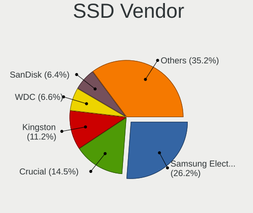

| Vendor              | Computers | Drives | Percent |
|---------------------|-----------|--------|---------|
| Samsung Electronics | 275       | 384    | 26.22%  |
| Crucial             | 152       | 215    | 14.49%  |
| Kingston            | 117       | 134    | 11.15%  |
| WDC                 | 69        | 80     | 6.58%   |
| SanDisk             | 67        | 80     | 6.39%   |
| PNY                 | 30        | 43     | 2.86%   |
| A-DATA Technology   | 30        | 34     | 2.86%   |
| China               | 25        | 30     | 2.38%   |
| SPCC                | 20        | 24     | 1.91%   |
| Micron Technology   | 15        | 20     | 1.43%   |
| SK hynix            | 14        | 14     | 1.33%   |
| Team                | 13        | 14     | 1.24%   |
| GOODRAM             | 13        | 14     | 1.24%   |
| OCZ                 | 12        | 12     | 1.14%   |
| Intenso             | 12        | 14     | 1.14%   |
| Intel               | 12        | 15     | 1.14%   |
| Toshiba             | 9         | 11     | 0.86%   |
| Lexar               | 9         | 10     | 0.86%   |
| Patriot             | 8         | 8      | 0.76%   |
| Corsair             | 7         | 10     | 0.67%   |
| Verbatim            | 6         | 8      | 0.57%   |
| Transcend           | 6         | 6      | 0.57%   |
| KingSpec            | 6         | 7      | 0.57%   |
| Fanxiang            | 6         | 8      | 0.57%   |
| Apacer              | 6         | 7      | 0.57%   |
| SABRENT             | 5         | 5      | 0.48%   |
| LITEONIT            | 5         | 5      | 0.48%   |
| XrayDisk            | 4         | 4      | 0.38%   |
| T-FORCE             | 4         | 4      | 0.38%   |
| Seagate             | 4         | 4      | 0.38%   |
| Netac               | 4         | 5      | 0.38%   |
| KIOXIA-EXCERIA      | 4         | 5      | 0.38%   |
| Emtec               | 4         | 4      | 0.38%   |
| Apple               | 4         | 4      | 0.38%   |
| Unknown             | 4         | 6      | 0.38%   |
| Wibtek              | 3         | 3      | 0.29%   |
| Mushkin             | 3         | 3      | 0.29%   |
| LITEON              | 3         | 3      | 0.29%   |
| Gigabyte Technology | 3         | 3      | 0.29%   |
| Drevo               | 3         | 3      | 0.29%   |

Drive Kind
----------

HDD or SSD

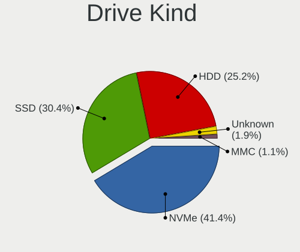

| Kind    | Computers | Drives | Percent |
|---------|-----------|--------|---------|
| NVMe    | 1166      | 1873   | 41.41%  |
| SSD     | 855       | 1319   | 30.36%  |
| HDD     | 711       | 1174   | 25.25%  |
| Unknown | 54        | 66     | 1.92%   |
| MMC     | 30        | 35     | 1.07%   |

Drive Connector
---------------

SATA, SAS, NVMe, etc.

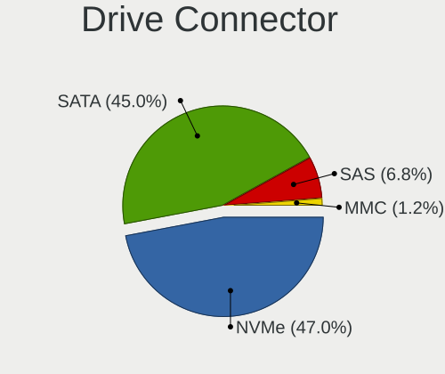

| Type | Computers | Drives | Percent |
|------|-----------|--------|---------|
| NVMe | 1161      | 1847   | 47.02%  |
| SATA | 1110      | 2353   | 44.96%  |
| SAS  | 168       | 232    | 6.8%    |
| MMC  | 30        | 35     | 1.22%   |

Drive Size
----------

Size of hard drive

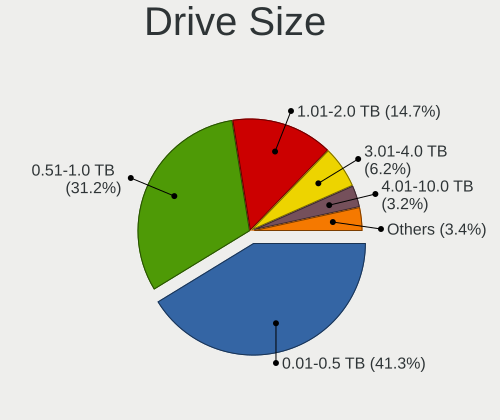

| Size in TB | Computers | Drives | Percent |
|------------|-----------|--------|---------|
| 0.01-0.5   | 711       | 1058   | 41.27%  |
| 0.51-1.0   | 538       | 771    | 31.22%  |
| 1.01-2.0   | 254       | 366    | 14.74%  |
| 3.01-4.0   | 106       | 143    | 6.15%   |
| 4.01-10.0  | 55        | 80     | 3.19%   |
| 2.01-3.0   | 38        | 48     | 2.21%   |
| 10.01-20.0 | 20        | 26     | 1.16%   |
| 20.01-50.0 | 1         | 1      | 0.06%   |

Space Total
-----------

Amount of disk space available on the file system

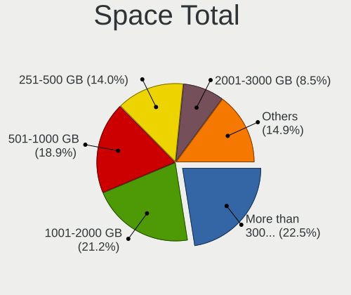

| Size in GB     | Computers | Percent |
|----------------|-----------|---------|
| More than 3000 | 407       | 22.51%  |
| 1001-2000      | 383       | 21.18%  |
| 501-1000       | 342       | 18.92%  |
| 251-500        | 253       | 13.99%  |
| 2001-3000      | 154       | 8.52%   |
| 101-250        | 154       | 8.52%   |
| Unknown        | 42        | 2.32%   |
| 21-50          | 28        | 1.55%   |
| 1-20           | 24        | 1.33%   |
| 51-100         | 21        | 1.16%   |

Space Used
----------

Amount of used disk space

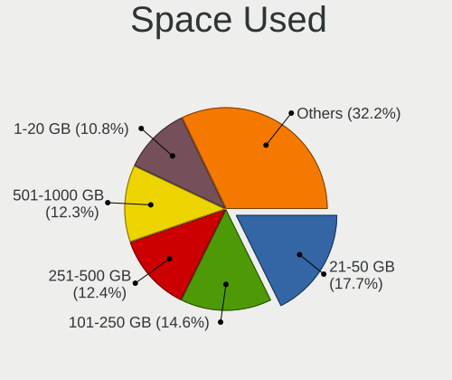

| Used GB        | Computers | Percent |
|----------------|-----------|---------|
| 21-50          | 332       | 17.68%  |
| 101-250        | 275       | 14.64%  |
| 251-500        | 233       | 12.41%  |
| 501-1000       | 231       | 12.3%   |
| 1-20           | 203       | 10.81%  |
| 1001-2000      | 187       | 9.96%   |
| 51-100         | 170       | 9.05%   |
| More than 3000 | 113       | 6.02%   |
| 2001-3000      | 91        | 4.85%   |
| Unknown        | 42        | 2.24%   |
| 0              | 1         | 0.05%   |

Malfunc. Drives
---------------

Drive models with a malfunction

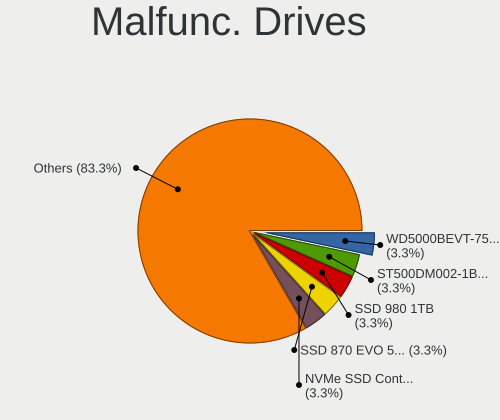

| Model                                                         | Computers | Drives | Percent |
|---------------------------------------------------------------|-----------|--------|---------|
| WDC WD5000BEVT-75ZAT0 500GB                                   | 2         | 2      | 3.33%   |
| Seagate ST500DM002-1BD142 500GB                               | 2         | 2      | 3.33%   |
| Samsung Electronics SSD 980 1TB                               | 2         | 2      | 3.33%   |
| Samsung Electronics SSD 870 EVO 500GB                         | 2         | 3      | 3.33%   |
| Samsung Electronics NVMe SSD Controller SM981/PM981/PM983 1TB | 2         | 2      | 3.33%   |
| WDC WDS240G2G0A-00JH30 240GB SSD                              | 1         | 1      | 1.67%   |
| WDC WD5000AAKX-08U6AA0 500GB                                  | 1         | 1      | 1.67%   |
| WDC WD30EZRX-00DC0B0 3TB                                      | 1         | 1      | 1.67%   |
| WDC WD20EZRZ-00Z5HB0 2TB                                      | 1         | 1      | 1.67%   |
| WDC WD20EVDS-63T3B0 2TB                                       | 1         | 1      | 1.67%   |
| WDC WD20EURS-63S48Y0 2TB                                      | 1         | 1      | 1.67%   |
| WDC WD2003FZEX-00Z4SA0 2TB                                    | 1         | 1      | 1.67%   |
| WDC WD15EARS-00S8B1 1TB                                       | 1         | 1      | 1.67%   |
| WDC WD10JPVX-60JC3T1 1TB                                      | 1         | 1      | 1.67%   |
| WDC WD10EZEX-08M2NA0 1TB                                      | 1         | 1      | 1.67%   |
| WDC WD10EADS-00L5B1 1TB                                       | 1         | 1      | 1.67%   |
| WDC WD10EACS-00D6B0 1TB                                       | 1         | 1      | 1.67%   |
| WDC WD Green 2.5 240GB                                        | 1         | 1      | 1.67%   |
| Verbatim Vi550 S3 1024GB                                      | 1         | 1      | 1.67%   |
| Toshiba MK8052GSX 80GB                                        | 1         | 1      | 1.67%   |
| Toshiba DT01ACA300 3TB                                        | 1         | 1      | 1.67%   |
| Toshiba DT01ACA100 1TB                                        | 1         | 1      | 1.67%   |
| SK hynix HFS256G39TND-N210A 256GB SSD                         | 1         | 1      | 1.67%   |
| SK hynix HFS128G39TND-N210A 128GB SSD                         | 1         | 1      | 1.67%   |
| Seagate ST9250421ASG 250GB                                    | 1         | 1      | 1.67%   |
| Seagate ST9160314AS 160GB                                     | 1         | 1      | 1.67%   |
| Seagate ST8000DM004-2CX188 8TB                                | 1         | 1      | 1.67%   |
| Seagate ST6000DM003-2CY186 6TB                                | 1         | 1      | 1.67%   |
| Seagate ST3500418AS 500GB                                     | 1         | 1      | 1.67%   |
| Seagate ST3000DM008-2DM166 3TB                                | 1         | 1      | 1.67%   |
| Seagate ST2000DX002-2DV164 2TB                                | 1         | 1      | 1.67%   |
| Seagate ST2000DX001-1NS164 2TB                                | 1         | 1      | 1.67%   |
| Seagate ST2000DM001-9YN164 2TB                                | 1         | 1      | 1.67%   |
| Seagate ST2000DM001-1ER164 2TB                                | 1         | 1      | 1.67%   |
| Seagate ST2000DL003-9VT166 2TB                                | 1         | 2      | 1.67%   |
| Seagate ST1000LX015-1U7172 1TB                                | 1         | 1      | 1.67%   |
| Seagate ST1000LM035-1RK172 1TB                                | 1         | 1      | 1.67%   |
| Seagate ST1000DM003-9YN162 1TB                                | 1         | 1      | 1.67%   |
| Seagate ST1000DM003-1ER162 1TB                                | 1         | 1      | 1.67%   |
| SanDisk SSD PLUS 240GB                                        | 1         | 1      | 1.67%   |

Malfunc. Drive Vendor
---------------------

Vendors of faulty drives

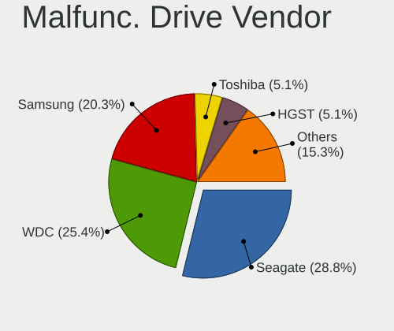

| Vendor              | Computers | Drives | Percent |
|---------------------|-----------|--------|---------|
| Seagate             | 17        | 18     | 28.81%  |
| WDC                 | 15        | 15     | 25.42%  |
| Samsung Electronics | 12        | 15     | 20.34%  |
| Toshiba             | 3         | 3      | 5.08%   |
| HGST                | 3         | 3      | 5.08%   |
| SK hynix            | 2         | 2      | 3.39%   |
| Verbatim            | 1         | 1      | 1.69%   |
| SanDisk             | 1         | 1      | 1.69%   |
| Ramsta              | 1         | 1      | 1.69%   |
| Micron Technology   | 1         | 1      | 1.69%   |
| Hitachi             | 1         | 1      | 1.69%   |
| Crucial             | 1         | 1      | 1.69%   |
| ASMT                | 1         | 2      | 1.69%   |

Malfunc. HDD Vendor
-------------------

Vendors of faulty HDD drives

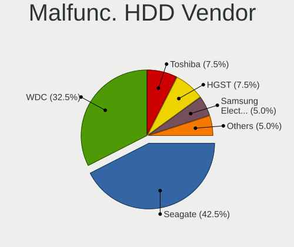

| Vendor              | Computers | Drives | Percent |
|---------------------|-----------|--------|---------|
| Seagate             | 17        | 18     | 42.5%   |
| WDC                 | 13        | 13     | 32.5%   |
| Toshiba             | 3         | 3      | 7.5%    |
| HGST                | 3         | 3      | 7.5%    |
| Samsung Electronics | 2         | 2      | 5%      |
| Hitachi             | 1         | 1      | 2.5%    |
| ASMT                | 1         | 2      | 2.5%    |

Malfunc. Drive Kind
-------------------

Kinds of faulty drives

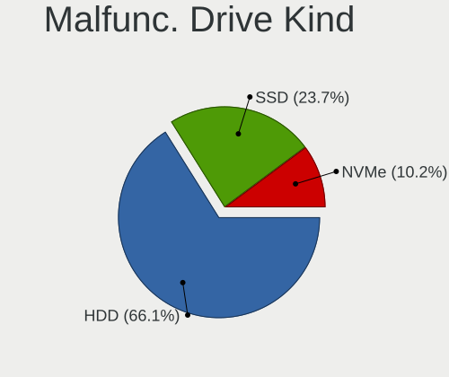

| Kind | Computers | Drives | Percent |
|------|-----------|--------|---------|
| HDD  | 39        | 42     | 66.1%   |
| SSD  | 14        | 16     | 23.73%  |
| NVMe | 6         | 6      | 10.17%  |

Failed Drives
-------------

Failed drive models

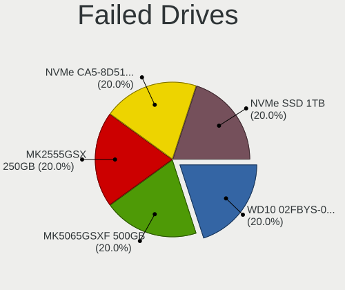

| Model                                    | Computers | Drives | Percent |
|------------------------------------------|-----------|--------|---------|
| WDC WD10 02FBYS-02A6B0 1TB               | 1         | 1      | 20%     |
| Toshiba MK5065GSXF 500GB                 | 1         | 1      | 20%     |
| Toshiba MK2555GSX 250GB                  | 1         | 1      | 20%     |
| Solid State Storage NVMe CA5-8D512 512GB | 1         | 1      | 20%     |
| KIOXIA NVMe SSD 1TB                      | 1         | 1      | 20%     |

Failed Drive Vendor
-------------------

Failed drive vendors

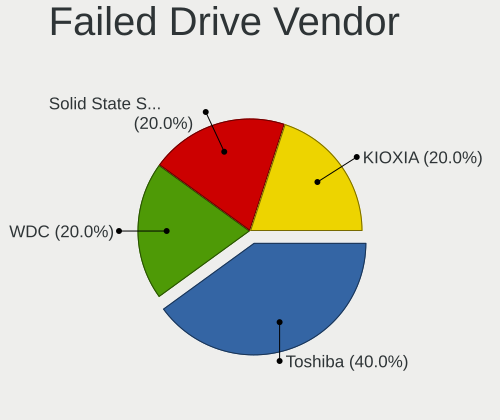

| Vendor              | Computers | Drives | Percent |
|---------------------|-----------|--------|---------|
| Toshiba             | 2         | 2      | 40%     |
| WDC                 | 1         | 1      | 20%     |
| Solid State Storage | 1         | 1      | 20%     |
| KIOXIA              | 1         | 1      | 20%     |

Drive Status
------------

Number of failed and malfunc. drives

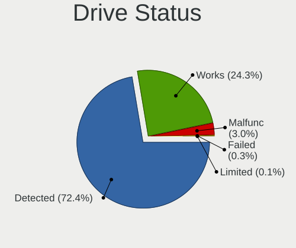

| Status   | Computers | Drives | Percent |
|----------|-----------|--------|---------|
| Detected | 1341      | 3414   | 72.37%  |
| Works    | 451       | 983    | 24.34%  |
| Malfunc  | 55        | 64     | 2.97%   |
| Failed   | 5         | 5      | 0.27%   |
| Limited  | 1         | 1      | 0.05%   |

Storage controller
------------------

Storage Vendor
--------------

Storage controller vendors

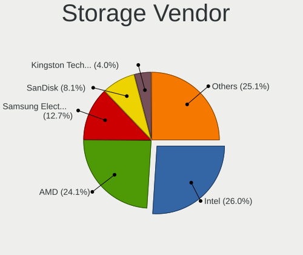

| Vendor                               | Computers | Percent |
|--------------------------------------|-----------|---------|
| Intel                                | 791       | 26.01%  |
| AMD                                  | 733       | 24.1%   |
| Samsung Electronics                  | 387       | 12.73%  |
| SanDisk                              | 245       | 8.06%   |
| Kingston Technology Company          | 123       | 4.04%   |
| Micron/Crucial Technology            | 119       | 3.91%   |
| Phison Electronics                   | 111       | 3.65%   |
| ASMedia Technology                   | 92        | 3.03%   |
| Micron Technology                    | 72        | 2.37%   |
| SK hynix                             | 67        | 2.2%    |
| MAXIO Technology (Hangzhou)          | 39        | 1.28%   |
| ADATA Technology                     | 37        | 1.22%   |
| Realtek Semiconductor                | 31        | 1.02%   |
| KIOXIA                               | 31        | 1.02%   |
| Shenzhen Longsys Electronics         | 27        | 0.89%   |
| Silicon Motion                       | 22        | 0.72%   |
| Toshiba America Info Systems         | 18        | 0.59%   |
| Solidigm                             | 11        | 0.36%   |
| Marvell Technology Group             | 10        | 0.33%   |
| Seagate Technology                   | 9         | 0.3%    |
| Nvidia                               | 9         | 0.3%    |
| JMicron Technology                   | 9         | 0.3%    |
| INNOGRIT                             | 8         | 0.26%   |
| Apple                                | 7         | 0.23%   |
| Broadcom / LSI                       | 6         | 0.2%    |
| Solid State Storage Technology       | 4         | 0.13%   |
| Netac Technology                     | 4         | 0.13%   |
| Yangtze Memory Technologies          | 3         | 0.1%    |
| Union Memory (Shenzhen)              | 3         | 0.1%    |
| Hosin Global Electronics             | 3         | 0.1%    |
| LSI Logic / Symbios Logic            | 2         | 0.07%   |
| Biwin Storage Technology             | 2         | 0.07%   |
| Silicon Image                        | 1         | 0.03%   |
| Ramaxel Technology(Shenzhen) Limited | 1         | 0.03%   |
| Lite-On Technology                   | 1         | 0.03%   |
| Lenovo                               | 1         | 0.03%   |
| Integrated Technology Express        | 1         | 0.03%   |
| Hewlett-Packard                      | 1         | 0.03%   |

Storage Model
-------------

Storage controller models

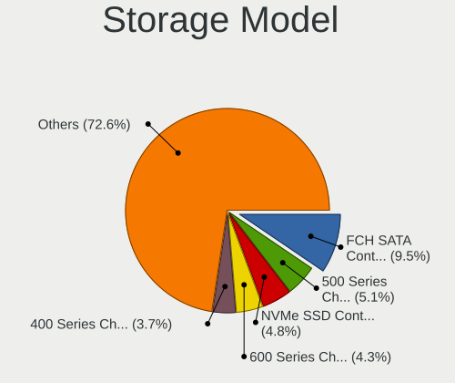

| Model                                                                          | Computers | Percent |
|--------------------------------------------------------------------------------|-----------|---------|
| AMD FCH SATA Controller [AHCI mode]                                            | 317       | 9.47%   |
| AMD 500 Series Chipset SATA Controller                                         | 170       | 5.08%   |
| Samsung NVMe SSD Controller SM981/PM981/PM983                                  | 160       | 4.78%   |
| AMD 600 Series Chipset SATA Controller                                         | 145       | 4.33%   |
| AMD 400 Series Chipset SATA Controller                                         | 125       | 3.73%   |
| Samsung NVMe SSD Controller PM9A1/PM9A3/980PRO                                 | 95        | 2.84%   |
| ASMedia ASM1061/ASM1062 Serial ATA Controller                                  | 76        | 2.27%   |
| Micron/Crucial P2 [Nick P2] / P3 / P3 Plus NVMe PCIe SSD (DRAM-less)           | 70        | 2.09%   |
| Samsung NVMe SSD Controller 980 (DRAM-less)                                    | 63        | 1.88%   |
| SanDisk WD SN560/SN740/SN770/SN5000 NVMe SSD                                   | 52        | 1.55%   |
| Intel 8 Series/C220 Series Chipset Family 6-port SATA Controller 1 [AHCI mode] | 52        | 1.55%   |
| Intel Volume Management Device NVMe RAID Controller                            | 48        | 1.43%   |
| Samsung NVMe SSD Controller S4LV008[Pascal]                                    | 45        | 1.34%   |
| SanDisk Ultra 3D / WD PC SN530, IX SN530, Blue SN550 NVMe SSD (DRAM-less)      | 43        | 1.28%   |
| Intel Alder Lake-S PCH SATA Controller [AHCI Mode]                             | 39        | 1.17%   |
| Intel 200 Series PCH SATA controller [AHCI mode]                               | 39        | 1.17%   |
| Intel Cannon Lake Mobile PCH SATA AHCI Controller                              | 38        | 1.14%   |
| Intel 82801 Mobile SATA Controller [RAID mode]                                 | 36        | 1.08%   |
| Phison E12 NVMe Controller                                                     | 35        | 1.05%   |
| Intel Cannon Lake PCH SATA AHCI Controller                                     | 35        | 1.05%   |
| Sandisk WD Black SN850X NVMe SSD                                               | 34        | 1.02%   |
| Intel Sunrise Point-LP SATA Controller [AHCI mode]                             | 34        | 1.02%   |
| Intel Q170/Q150/B150/H170/H110/Z170/CM236 Chipset SATA Controller [AHCI Mode]  | 31        | 0.93%   |
| Intel 400 Series Chipset Family SATA AHCI Controller                           | 31        | 0.93%   |
| Intel 8 Series SATA Controller 1 [AHCI mode]                                   | 30        | 0.9%    |
| MAXIO (Hangzhou) NVMe SSD Controller MAP1202 (DRAM-less)                       | 28        | 0.84%   |
| Intel 7 Series Chipset Family 6-port SATA Controller [AHCI mode]               | 28        | 0.84%   |
| Intel 500 Series Chipset Family SATA AHCI Controller                           | 28        | 0.84%   |
| Intel 6 Series/C200 Series Chipset Family 6 port Desktop SATA AHCI Controller  | 27        | 0.81%   |
| Samsung NVMe SSD Controller SM961/PM961/SM963                                  | 26        | 0.78%   |
| Intel SATA Controller [RAID mode]                                              | 26        | 0.78%   |
| SK hynix Gold P31/BC711/PC711 NVMe Solid State Drive                           | 25        | 0.75%   |
| Phison E16 PCIe4 NVMe Controller                                               | 25        | 0.75%   |
| Kingston Company KC3000/FURY Renegade NVMe SSD [E18]                           | 25        | 0.75%   |
| Intel SSD 660P Series                                                          | 25        | 0.75%   |
| Intel Raptor Lake SATA AHCI Controller                                         | 25        | 0.75%   |
| SanDisk Extreme Pro / WD Black SN750 / PC SN730 / Red SN700 NVMe SSD           | 24        | 0.72%   |
| Kingston Company NV2 NVMe SSD [SM2267XT] (DRAM-less)                           | 24        | 0.72%   |
| Intel Tiger Lake-LP SATA Controller                                            | 23        | 0.69%   |
| Intel 7 Series/C210 Series Chipset Family 6-port SATA Controller [AHCI mode]   | 23        | 0.69%   |

Storage Kind
------------

Kind of storage controller (IDE, SATA, NVMe, SAS, ...)

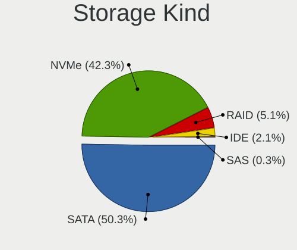

| Kind | Computers | Percent |
|------|-----------|---------|
| SATA | 1378      | 50.27%  |
| NVMe | 1159      | 42.28%  |
| RAID | 140       | 5.11%   |
| IDE  | 57        | 2.08%   |
| SAS  | 7         | 0.26%   |

Processor
---------

CPU Vendor
----------

Processor vendors

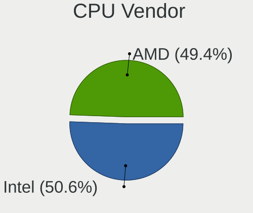

| Vendor | Computers | Percent |
|--------|-----------|---------|
| Intel  | 883       | 50.57%  |
| AMD    | 863       | 49.43%  |

CPU Model
---------

Processor models

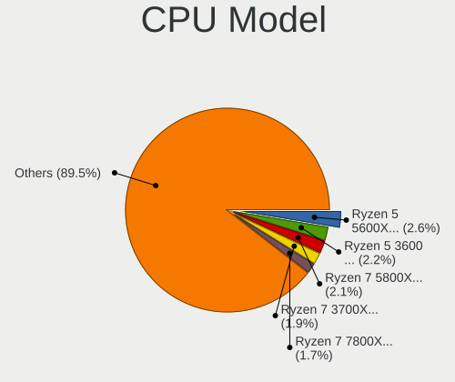

| Model                                       | Computers | Percent |
|---------------------------------------------|-----------|---------|
| AMD Ryzen 5 5600X 6-Core Processor          | 46        | 2.62%   |
| AMD Ryzen 5 3600 6-Core Processor           | 39        | 2.22%   |
| AMD Ryzen 7 5800X 8-Core Processor          | 37        | 2.11%   |
| AMD Ryzen 7 3700X 8-Core Processor          | 33        | 1.88%   |
| AMD Ryzen 7 7800X3D 8-Core Processor        | 29        | 1.65%   |
| AMD Ryzen 9 5900X 12-Core Processor         | 27        | 1.54%   |
| AMD Ryzen 7 5800X3D 8-Core Processor        | 24        | 1.37%   |
| AMD Ryzen 7 5700X 8-Core Processor          | 23        | 1.31%   |
| AMD Ryzen 5 5600G with Radeon Graphics      | 21        | 1.2%    |
| AMD Ryzen 5 5600 6-Core Processor           | 21        | 1.2%    |
| AMD Ryzen 5 7600X 6-Core Processor          | 20        | 1.14%   |
| AMD Ryzen 5 2600 Six-Core Processor         | 19        | 1.08%   |
| AMD Ryzen 7 5800H with Radeon Graphics      | 18        | 1.03%   |
| Intel Core i7-10750H CPU @ 2.60GHz          | 16        | 0.91%   |
| AMD Ryzen 9 5950X 16-Core Processor         | 16        | 0.91%   |
| AMD Ryzen 7 9800X3D 8-Core Processor        | 16        | 0.91%   |
| Intel Core i7-9750H CPU @ 2.60GHz           | 15        | 0.86%   |
| AMD Ryzen 9 7950X3D 16-Core Processor       | 15        | 0.86%   |
| AMD Ryzen 9 3900X 12-Core Processor         | 15        | 0.86%   |
| AMD Ryzen 5 4600H with Radeon Graphics      | 14        | 0.8%    |
| Intel 11th Gen Core i5-1135G7 @ 2.40GHz     | 13        | 0.74%   |
| Intel Core i9-9900K CPU @ 3.60GHz           | 12        | 0.68%   |
| Intel Core i7-8750H CPU @ 2.20GHz           | 12        | 0.68%   |
| Intel Core i5-7200U CPU @ 2.50GHz           | 12        | 0.68%   |
| AMD Ryzen 7 5700G with Radeon Graphics      | 12        | 0.68%   |
| Intel Core i5-8300H CPU @ 2.30GHz           | 11        | 0.63%   |
| Intel 11th Gen Core i7-1165G7 @ 2.80GHz     | 11        | 0.63%   |
| AMD Ryzen 7 5700X3D 8-Core Processor        | 11        | 0.63%   |
| AMD Ryzen 5 5500U with Radeon Graphics      | 11        | 0.63%   |
| Intel Core i7-6700HQ CPU @ 2.60GHz          | 10        | 0.57%   |
| Intel Core i5-10300H CPU @ 2.50GHz          | 10        | 0.57%   |
| AMD Ryzen 9 7950X 16-Core Processor         | 10        | 0.57%   |
| AMD Ryzen 5 5500                            | 10        | 0.57%   |
| AMD Ryzen 3 3200G with Radeon Vega Graphics | 10        | 0.57%   |
| Intel Core i7-6700K CPU @ 4.00GHz           | 9         | 0.51%   |
| Intel Core i5-9400F CPU @ 2.90GHz           | 9         | 0.51%   |
| Intel Core i5-10400F CPU @ 2.90GHz          | 9         | 0.51%   |
| Intel 12th Gen Core i7-12700H               | 9         | 0.51%   |
| AMD Ryzen 7 7700X 8-Core Processor          | 9         | 0.51%   |
| Intel Core i7-7700HQ CPU @ 2.80GHz          | 8         | 0.46%   |

CPU Model Family
----------------

Processor model prefix

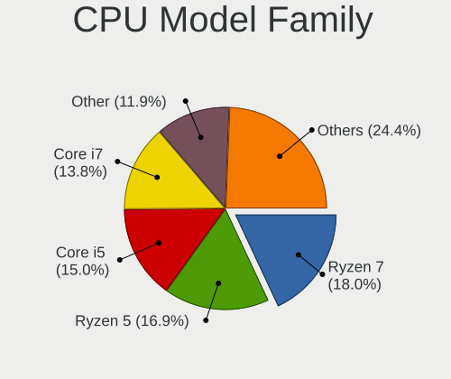

| Model                   | Computers | Percent |
|-------------------------|-----------|---------|
| AMD Ryzen 7             | 316       | 18.04%  |
| AMD Ryzen 5             | 296       | 16.89%  |
| Intel Core i5           | 262       | 14.95%  |
| Intel Core i7           | 242       | 13.81%  |
| Other                   | 209       | 11.93%  |
| AMD Ryzen 9             | 138       | 7.88%   |
| Intel Core i3           | 51        | 2.91%   |
| Intel Xeon              | 44        | 2.51%   |
| AMD Ryzen 3             | 29        | 1.66%   |
| Intel Core i9           | 22        | 1.26%   |
| Intel Celeron           | 22        | 1.26%   |
| AMD FX                  | 16        | 0.91%   |
| Intel Pentium           | 11        | 0.63%   |
| Intel Core 2 Duo        | 8         | 0.46%   |
| Intel Atom              | 6         | 0.34%   |
| AMD A6                  | 6         | 0.34%   |
| AMD A4                  | 6         | 0.34%   |
| AMD A10                 | 6         | 0.34%   |
| Intel Core              | 5         | 0.29%   |
| AMD Phenom II X6        | 5         | 0.29%   |
| AMD Phenom II X4        | 5         | 0.29%   |
| AMD A8                  | 5         | 0.29%   |
| Intel Pentium Silver    | 4         | 0.23%   |
| Intel Pentium Dual-Core | 4         | 0.23%   |
| AMD Ryzen 5 PRO         | 4         | 0.23%   |
| AMD Ryzen 7 PRO         | 3         | 0.17%   |
| Intel Core 2 Quad       | 2         | 0.11%   |
| AMD Turion 64 X2 Mobile | 2         | 0.11%   |
| AMD Ryzen Threadripper  | 2         | 0.11%   |
| AMD PRO A10             | 2         | 0.11%   |
| AMD Athlon X4           | 2         | 0.11%   |
| AMD Athlon              | 2         | 0.11%   |
| AMD A12                 | 2         | 0.11%   |
| Intel Pentium Gold      | 1         | 0.06%   |
| Intel Core m7           | 1         | 0.06%   |
| Intel Core 2 Extreme    | 1         | 0.06%   |
| AMD Turion              | 1         | 0.06%   |
| AMD Ryzen 3 PRO         | 1         | 0.06%   |
| AMD Phenom II           | 1         | 0.06%   |
| AMD Phenom              | 1         | 0.06%   |

CPU Cores
---------

Number of processor cores

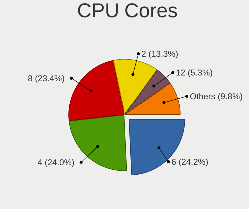

| Number | Computers | Percent |
|--------|-----------|---------|
| 6      | 424       | 24.24%  |
| 4      | 420       | 24.01%  |
| 8      | 410       | 23.44%  |
| 2      | 232       | 13.26%  |
| 12     | 92        | 5.26%   |
| 16     | 70        | 4%      |
| 10     | 38        | 2.17%   |
| 14     | 33        | 1.89%   |
| 24     | 15        | 0.86%   |
| 20     | 6         | 0.34%   |
| 3      | 4         | 0.23%   |
| 1      | 4         | 0.23%   |
| 18     | 1         | 0.06%   |

CPU Sockets
-----------

Number of sockets

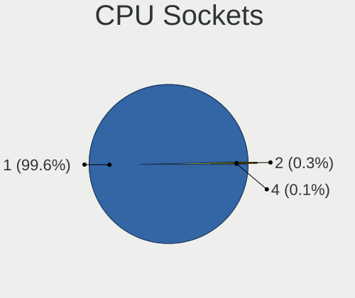

| Number | Computers | Percent |
|--------|-----------|---------|
| 1      | 1740      | 99.6%   |
| 2      | 6         | 0.34%   |
| 4      | 1         | 0.06%   |

CPU Threads
-----------

Threads per core (Hyper-Threading)

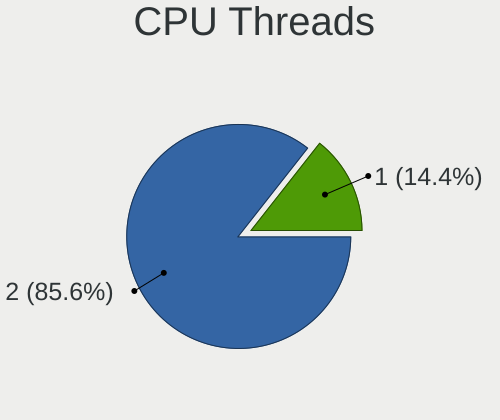

| Number | Computers | Percent |
|--------|-----------|---------|
| 2      | 1499      | 85.61%  |
| 1      | 252       | 14.39%  |

CPU Op-Modes
------------

CPU Operation Modes (32-bit, 64-bit)

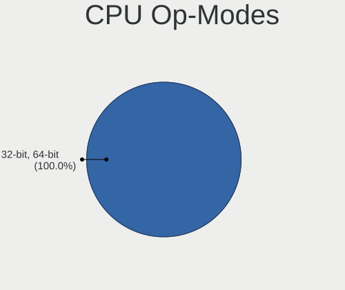

| Op mode        | Computers | Percent |
|----------------|-----------|---------|
| 32-bit, 64-bit | 1746      | 100%    |

CPU Microcode
-------------

Microcode number

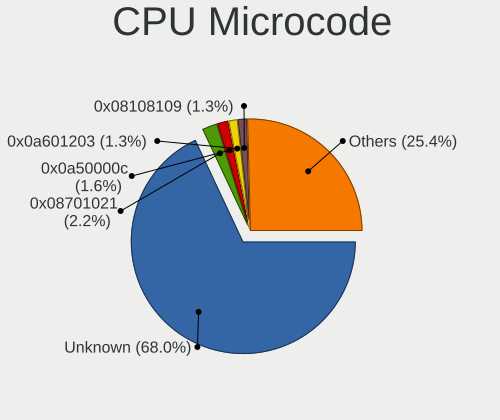

| Number     | Computers | Percent |
|------------|-----------|---------|
| Unknown    | 1210      | 68.02%  |
| 0x08701021 | 40        | 2.25%   |
| 0x0a50000c | 29        | 1.63%   |
| 0x0a601203 | 24        | 1.35%   |
| 0x08108109 | 24        | 1.35%   |
| 0x0a50000d | 22        | 1.24%   |
| 0x306c3    | 20        | 1.12%   |
| 0x306a9    | 20        | 1.12%   |
| 0x0800820d | 19        | 1.07%   |
| 0x0a201016 | 17        | 0.96%   |
| 0x206a7    | 16        | 0.9%    |
| 0x0a20120a | 16        | 0.9%    |
| 0x906ea    | 15        | 0.84%   |
| 0x906e9    | 14        | 0.79%   |
| 0x40651    | 14        | 0.79%   |
| 0xa0652    | 12        | 0.67%   |
| 0x08600106 | 11        | 0.62%   |
| 0x08701030 | 10        | 0.56%   |
| 0x08608103 | 10        | 0.56%   |
| 0x506e3    | 9         | 0.51%   |
| 0x0a404102 | 9         | 0.51%   |
| 0x906a3    | 8         | 0.45%   |
| 0x806c1    | 8         | 0.45%   |
| 0x08600104 | 8         | 0.45%   |
| 0x06000822 | 8         | 0.45%   |
| 0x806e9    | 7         | 0.39%   |
| 0x0a601206 | 7         | 0.39%   |
| 0x0a201204 | 7         | 0.39%   |
| 0x08001138 | 7         | 0.39%   |
| 0xa0655    | 6         | 0.34%   |
| 0x90672    | 6         | 0.34%   |
| 0x0a20120e | 6         | 0.34%   |
| 0x0a201205 | 6         | 0.34%   |
| 0x906ed    | 5         | 0.28%   |
| 0x806d1    | 5         | 0.28%   |
| 0x406e3    | 5         | 0.28%   |
| 0x0810100b | 5         | 0.28%   |
| 0xa0653    | 4         | 0.22%   |
| 0x906ec    | 4         | 0.22%   |
| 0x206d7    | 4         | 0.22%   |

CPU Microarch
-------------

Microarchitecture

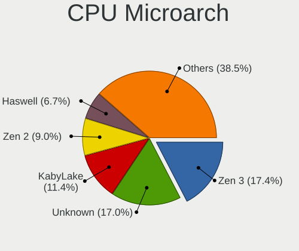

| Name              | Computers | Percent |
|-------------------|-----------|---------|
| Zen 3             | 305       | 17.39%  |
| Unknown           | 298       | 16.99%  |
| KabyLake          | 200       | 11.4%   |
| Zen 2             | 158       | 9.01%   |
| Haswell           | 117       | 6.67%   |
| Alderlake Hybrid  | 86        | 4.9%    |
| Zen+              | 79        | 4.5%    |
| CometLake         | 77        | 4.39%   |
| IvyBridge         | 71        | 4.05%   |
| Skylake           | 68        | 3.88%   |
| SandyBridge       | 50        | 2.85%   |
| TigerLake         | 42        | 2.39%   |
| IceLake           | 34        | 1.94%   |
| Zen               | 27        | 1.54%   |
| Piledriver        | 22        | 1.25%   |
| Broadwell         | 17        | 0.97%   |
| Penryn            | 15        | 0.86%   |
| K10               | 14        | 0.8%    |
| Silvermont        | 12        | 0.68%   |
| Goldmont plus     | 10        | 0.57%   |
| Excavator         | 10        | 0.57%   |
| Westmere          | 6         | 0.34%   |
| Steamroller       | 5         | 0.29%   |
| Puma              | 4         | 0.23%   |
| Nehalem           | 4         | 0.23%   |
| Tremont           | 3         | 0.17%   |
| Meteorlake Hybrid | 3         | 0.17%   |
| K8 Hammer         | 3         | 0.17%   |
| Bobcat            | 3         | 0.17%   |
| Jaguar            | 2         | 0.11%   |
| Goldmont          | 2         | 0.11%   |
| Core              | 2         | 0.11%   |
| Lunarlake Hybrid  | 1         | 0.06%   |
| K8 & K10 hybrid   | 1         | 0.06%   |
| K10 Llano         | 1         | 0.06%   |
| Bulldozer         | 1         | 0.06%   |
| Bonnell           | 1         | 0.06%   |

Graphics
--------

GPU Vendor
----------

Vendors of graphics cards

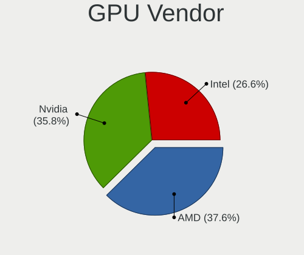

| Vendor | Computers | Percent |
|--------|-----------|---------|
| AMD    | 821       | 37.61%  |
| Nvidia | 781       | 35.78%  |
| Intel  | 581       | 26.61%  |

GPU Model
---------

Graphics card models

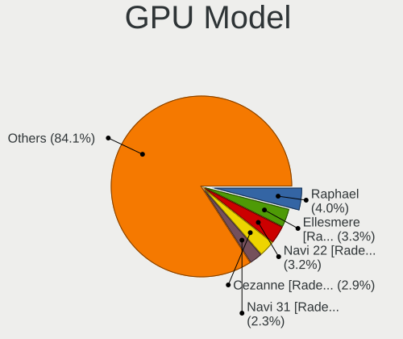

| Model                                                                       | Computers | Percent |
|-----------------------------------------------------------------------------|-----------|---------|
| AMD Raphael                                                                 | 93        | 4.02%   |
| AMD Ellesmere [Radeon RX 470/480/570/570X/580/580X/590]                     | 77        | 3.33%   |
| AMD Navi 22 [Radeon RX 6700/6700 XT/6750 XT / 6800M/6850M XT]               | 75        | 3.24%   |
| AMD Cezanne [Radeon Vega Series / Radeon Vega Mobile Series]                | 68        | 2.94%   |
| AMD Navi 31 [Radeon RX 7900 XT/7900 XTX/7900 GRE/7900M]                     | 54        | 2.34%   |
| Intel CoffeeLake-H GT2 [UHD Graphics 630]                                   | 48        | 2.08%   |
| AMD Navi 23 [Radeon RX 6600/6600 XT/6600M]                                  | 41        | 1.77%   |
| AMD Navi 21 [Radeon RX 6800/6800 XT / 6900 XT]                              | 40        | 1.73%   |
| AMD Renoir [Radeon Vega Series / Radeon Vega Mobile Series]                 | 39        | 1.69%   |
| AMD Picasso/Raven 2 [Radeon Vega Series / Radeon Vega Mobile Series]        | 37        | 1.6%    |
| Intel TigerLake-LP GT2 [Iris Xe Graphics]                                   | 36        | 1.56%   |
| AMD Navi 10 [Radeon RX 5600 OEM/5600 XT / 5700/5700 XT]                     | 36        | 1.56%   |
| Intel Haswell-ULT Integrated Graphics Controller                            | 33        | 1.43%   |
| Intel CometLake-H GT2 [UHD Graphics]                                        | 32        | 1.38%   |
| AMD Rembrandt [Radeon 680M]                                                 | 32        | 1.38%   |
| Nvidia TU117M [GeForce GTX 1650 Mobile / Max-Q]                             | 31        | 1.34%   |
| Intel 2nd Generation Core Processor Family Integrated Graphics Controller   | 30        | 1.3%    |
| Nvidia GA106M [GeForce RTX 3060 Mobile / Max-Q]                             | 28        | 1.21%   |
| AMD Granite Ridge [Radeon Graphics]                                         | 28        | 1.21%   |
| AMD Navi 32 [Radeon RX 7700 XT / 7800 XT]                                   | 27        | 1.17%   |
| Nvidia GA106 [GeForce RTX 3060 Lite Hash Rate]                              | 26        | 1.12%   |
| Intel 3rd Gen Core processor Graphics Controller                            | 24        | 1.04%   |
| Nvidia AD107M [GeForce RTX 4060 Max-Q / Mobile]                             | 21        | 0.91%   |
| Intel Xeon E3-1200 v3/4th Gen Core Processor Integrated Graphics Controller | 21        | 0.91%   |
| Intel Kaby Lake-U GT2 [HD Graphics 620]                                     | 21        | 0.91%   |
| Nvidia GA107M [GeForce RTX 3050 Mobile]                                     | 20        | 0.87%   |
| Intel 4th Gen Core Processor Integrated Graphics Controller                 | 20        | 0.87%   |
| AMD Lucienne                                                                | 19        | 0.82%   |
| Intel Alder Lake-P GT2 [Iris Xe Graphics]                                   | 18        | 0.78%   |
| Nvidia GA104 [GeForce RTX 3070]                                             | 17        | 0.74%   |
| AMD Phoenix1                                                                | 16        | 0.69%   |
| Nvidia GP107M [GeForce GTX 1050 Mobile]                                     | 15        | 0.65%   |
| Nvidia GA102 [GeForce RTX 3080]                                             | 15        | 0.65%   |
| Intel Skylake-H GT2 [HD Graphics 530]                                       | 15        | 0.65%   |
| Intel Raptor Lake-P [Iris Xe Graphics]                                      | 15        | 0.65%   |
| Intel Kaby Lake-R GT2 [UHD Graphics 620]                                    | 15        | 0.65%   |
| AMD Raven Ridge [Radeon Vega Series / Radeon Vega Mobile Series]            | 15        | 0.65%   |
| Nvidia TU117 [GeForce GTX 1650]                                             | 14        | 0.61%   |
| Nvidia GP104 [GeForce GTX 1070]                                             | 14        | 0.61%   |
| Nvidia GP102 [GeForce GTX 1080 Ti]                                          | 14        | 0.61%   |

GPU Combo
---------

Combinations of graphics cards

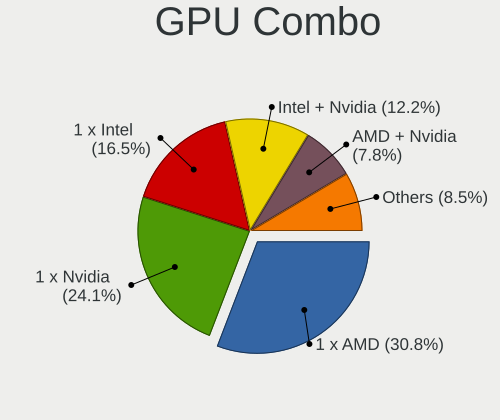

| Name               | Computers | Percent |
|--------------------|-----------|---------|
| 1 x AMD            | 542       | 30.83%  |
| 1 x Nvidia         | 424       | 24.12%  |
| 1 x Intel          | 290       | 16.5%   |
| Intel + Nvidia     | 215       | 12.23%  |
| AMD + Nvidia       | 137       | 7.79%   |
| 2 x AMD            | 109       | 6.2%    |
| Intel + AMD        | 33        | 1.88%   |
| 2 x Nvidia         | 5         | 0.28%   |
| Other              | 1         | 0.06%   |
| 2 x Intel          | 1         | 0.06%   |
| Intel + 2 x Nvidia | 1         | 0.06%   |

GPU Driver
----------

Free vs proprietary

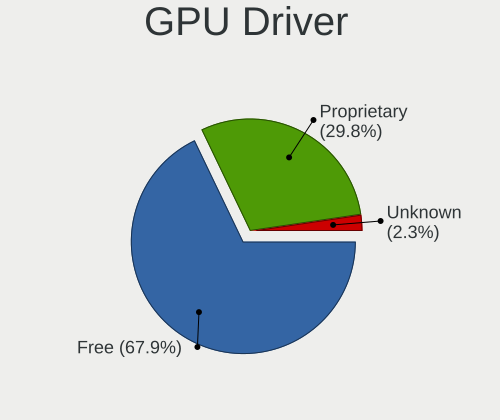

| Driver      | Computers | Percent |
|-------------|-----------|---------|
| Free        | 1196      | 67.88%  |
| Proprietary | 525       | 29.8%   |
| Unknown     | 41        | 2.33%   |

GPU Memory
----------

Total video memory

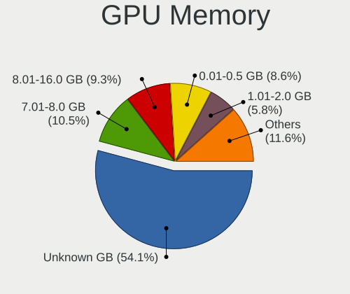

| Size in GB | Computers | Percent |
|------------|-----------|---------|
| Unknown    | 966       | 54.15%  |
| 7.01-8.0   | 188       | 10.54%  |
| 8.01-16.0  | 166       | 9.3%    |
| 0.01-0.5   | 154       | 8.63%   |
| 1.01-2.0   | 103       | 5.77%   |
| 3.01-4.0   | 80        | 4.48%   |
| 0.51-1.0   | 45        | 2.52%   |
| 16.01-24.0 | 40        | 2.24%   |
| 5.01-6.0   | 35        | 1.96%   |
| 2.01-3.0   | 7         | 0.39%   |

Monitor
-------

Monitor Vendor
--------------

Monitor vendors

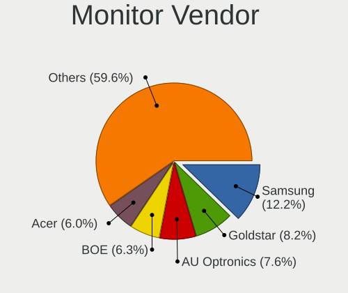

| Vendor                  | Computers | Percent |
|-------------------------|-----------|---------|
| Samsung Electronics     | 266       | 12.23%  |
| Goldstar                | 178       | 8.18%   |
| AU Optronics            | 165       | 7.59%   |
| BOE                     | 138       | 6.34%   |
| Acer                    | 131       | 6.02%   |
| Dell                    | 123       | 5.66%   |
| Chimei Innolux          | 114       | 5.24%   |
| ASUSTek Computer        | 88        | 4.05%   |
| LG Display              | 86        | 3.95%   |
| AOC                     | 81        | 3.72%   |
| BenQ                    | 71        | 3.26%   |
| Hewlett-Packard         | 68        | 3.13%   |
| Ancor Communications    | 63        | 2.9%    |
| MSI                     | 55        | 2.53%   |
| PANDA                   | 33        | 1.52%   |
| Philips                 | 32        | 1.47%   |
| ViewSonic               | 31        | 1.43%   |
| Lenovo                  | 30        | 1.38%   |
| Gigabyte Technology     | 30        | 1.38%   |
| Sony                    | 29        | 1.33%   |
| Apple                   | 29        | 1.33%   |
| Sharp                   | 28        | 1.29%   |
| Iiyama                  | 18        | 0.83%   |
| Vizio                   | 17        | 0.78%   |
| Sceptre Tech            | 17        | 0.78%   |
| Mi                      | 13        | 0.6%    |
| HKC                     | 13        | 0.6%    |
| Unknown                 | 9         | 0.41%   |
| InfoVision              | 9         | 0.41%   |
| Toshiba                 | 8         | 0.37%   |
| Pixio                   | 8         | 0.37%   |
| Panasonic               | 8         | 0.37%   |
| NEC Computers           | 8         | 0.37%   |
| Eizo                    | 8         | 0.37%   |
| HUAWEI                  | 7         | 0.32%   |
| Hitachi                 | 7         | 0.32%   |
| TMX                     | 6         | 0.28%   |
| Insignia                | 6         | 0.28%   |
| SKG                     | 5         | 0.23%   |
| Chi Mei Optoelectronics | 5         | 0.23%   |

Monitor Model
-------------

Monitor models

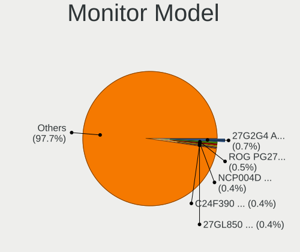

| Model                                                                 | Computers | Percent |
|-----------------------------------------------------------------------|-----------|---------|
| AOC 27G2G4 AOC2702 1920x1080 598x336mm 27.0-inch                      | 17        | 0.75%   |
| Ancor Communications ROG PG279Q ACI27EC 2560x1440 598x336mm 27.0-inch | 11        | 0.48%   |
| PANDA LCD Monitor NCP004D 1920x1080 344x194mm 15.5-inch               | 9         | 0.4%    |
| Samsung Electronics C24F390 SAM0D2C 1920x1080 521x293mm 23.5-inch     | 8         | 0.35%   |
| Goldstar 27GL850 GSM5B7F 2560x1440 597x336mm 27.0-inch                | 8         | 0.35%   |
| Dell S2721DGF DEL41D9 2560x1440 597x336mm 27.0-inch                   | 8         | 0.35%   |
| Unknown LCD Monitor FFFF 2288x1287 2550x2550mm 142.0-inch             | 7         | 0.31%   |
| Goldstar LG TV SSCR2 GSMC0C8 3840x2160                                | 7         | 0.31%   |
| Chimei Innolux LCD Monitor CMN15F5 1920x1080 344x193mm 15.5-inch      | 7         | 0.31%   |
| Chimei Innolux LCD Monitor CMN1521 1920x1080 344x193mm 15.5-inch      | 7         | 0.31%   |
| Samsung Electronics U28E590 SAM0C4D 3840x2160 607x345mm 27.5-inch     | 6         | 0.26%   |
| Samsung Electronics C27F390 SAM0D32 1920x1080 598x336mm 27.0-inch     | 6         | 0.26%   |
| Mi Monitor XMI3444 3440x1440 797x334mm 34.0-inch                      | 6         | 0.26%   |
| Goldstar ULTRAGEAR GSM7766 2560x1440 697x392mm 31.5-inch              | 6         | 0.26%   |
| Goldstar ULTRAGEAR GSM5BD3 2560x1440 697x392mm 31.5-inch              | 6         | 0.26%   |
| Gigabyte Technology M27Q GBT270D 2560x1440 597x336mm 27.0-inch        | 6         | 0.26%   |
| Chimei Innolux LCD Monitor CMN15D5 1920x1080 344x193mm 15.5-inch      | 6         | 0.26%   |
| Chimei Innolux LCD Monitor CMN14D4 1920x1080 309x173mm 13.9-inch      | 6         | 0.26%   |
| AU Optronics LCD Monitor AUO61ED 1920x1080 344x194mm 15.5-inch        | 6         | 0.26%   |
| ASUSTek Computer VP28U AUS28B1 3840x2160 621x341mm 27.9-inch          | 6         | 0.26%   |
| Samsung Electronics C49RG9x SAM0F9C 3360x1440 1193x336mm 48.8-inch    | 5         | 0.22%   |
| PANDA LCD Monitor NCP0050 1920x1080 309x174mm 14.0-inch               | 5         | 0.22%   |
| LG Display LCD Monitor LGD0555 2736x1824 260x173mm 12.3-inch          | 5         | 0.22%   |
| LG Display LCD Monitor LGD046F 1920x1080 344x194mm 15.5-inch          | 5         | 0.22%   |
| Hitachi HISENSE HEC0030 3840x2160 1872x1053mm 84.6-inch               | 5         | 0.22%   |
| Goldstar ULTRAGEAR GSM5B71 1920x1080 597x336mm 27.0-inch              | 5         | 0.22%   |
| Goldstar Ultra HD GSM5B09 3840x2160 600x340mm 27.2-inch               | 5         | 0.22%   |
| Goldstar FULL HD GSM5B55 1920x1080 480x270mm 21.7-inch                | 5         | 0.22%   |
| Chimei Innolux LCD Monitor CMN15E7 1920x1080 344x193mm 15.5-inch      | 5         | 0.22%   |
| BenQ GL2460 BNQ78CE 1920x1080 531x299mm 24.0-inch                     | 5         | 0.22%   |
| AU Optronics LCD Monitor AUOD1ED 1920x1080 344x193mm 15.5-inch        | 5         | 0.22%   |
| ASUSTek Computer VP249 AUS24AF 1920x1080 527x296mm 23.8-inch          | 5         | 0.22%   |
| ASUSTek Computer VG27A AUS2722 2560x1440 597x336mm 27.0-inch          | 5         | 0.22%   |
| AOC Q3279WG5B AOC3279 2560x1440 725x428mm 33.1-inch                   | 5         | 0.22%   |
| AOC 2260WG5 AOC2260 1920x1080 477x268mm 21.5-inch                     | 5         | 0.22%   |
| Samsung Electronics LF24T35 SAM707D 1920x1080 528x297mm 23.9-inch     | 4         | 0.18%   |
| MSI G32C4 MSI3DA6 1920x1080 698x393mm 31.5-inch                       | 4         | 0.18%   |
| MSI G27C5 MSI3CA9 1920x1080 598x336mm 27.0-inch                       | 4         | 0.18%   |
| LG Display LCD Monitor LGD05D8 1920x1080 344x194mm 15.5-inch          | 4         | 0.18%   |
| HUAWEI AD80HW HWV2402 1920x1080 527x296mm 23.8-inch                   | 4         | 0.18%   |

Monitor Resolution
------------------

Monitor screen resolution

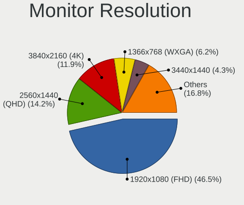

| Resolution         | Computers | Percent |
|--------------------|-----------|---------|
| 1920x1080 (FHD)    | 939       | 46.49%  |
| 2560x1440 (QHD)    | 287       | 14.21%  |
| 3840x2160 (4K)     | 241       | 11.93%  |
| 1366x768 (WXGA)    | 126       | 6.24%   |
| 3440x1440          | 87        | 4.31%   |
| 1920x1200 (WUXGA)  | 56        | 2.77%   |
| 2560x1600          | 32        | 1.58%   |
| 1600x900 (HD+)     | 31        | 1.53%   |
| 1680x1050 (WSXGA+) | 29        | 1.44%   |
| 2560x1080          | 27        | 1.34%   |
| 1440x900 (WXGA+)   | 22        | 1.09%   |
| 1280x1024 (SXGA)   | 19        | 0.94%   |
| 3840x1080          | 17        | 0.84%   |
| 1360x768           | 14        | 0.69%   |
| 2880x1800          | 13        | 0.64%   |
| 1920x540           | 12        | 0.59%   |
| 2288x1287          | 8         | 0.4%    |
| 2880x1920          | 6         | 0.3%    |
| 3200x2000          | 5         | 0.25%   |
| Unknown            | 5         | 0.25%   |
| 2240x1400          | 4         | 0.2%    |
| 1280x800 (WXGA)    | 4         | 0.2%    |
| 3840x1600          | 3         | 0.15%   |
| 1600x2560          | 3         | 0.15%   |
| 1600x1200          | 3         | 0.15%   |
| 800x1280           | 2         | 0.1%    |
| 3840x2400          | 2         | 0.1%    |
| 2736x1824          | 2         | 0.1%    |
| 2560x2880          | 2         | 0.1%    |
| 2160x1440          | 2         | 0.1%    |
| 1280x720 (HD)      | 2         | 0.1%    |
| 5760x1080          | 1         | 0.05%   |
| 3840x2560          | 1         | 0.05%   |
| 3456x2160          | 1         | 0.05%   |
| 3200x1800 (QHD+)   | 1         | 0.05%   |
| 3072x1920          | 1         | 0.05%   |
| 2944x1840          | 1         | 0.05%   |
| 2880x1600          | 1         | 0.05%   |
| 2520x1680          | 1         | 0.05%   |
| 2256x1504          | 1         | 0.05%   |

Monitor Diagonal
----------------

Diagonal size in inches

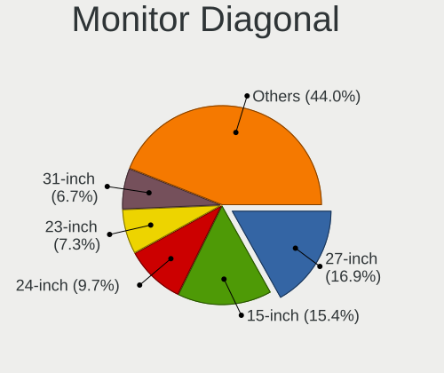

| Inches  | Computers | Percent |
|---------|-----------|---------|
| 27      | 364       | 16.88%  |
| 15      | 332       | 15.39%  |
| 24      | 210       | 9.74%   |
| 23      | 158       | 7.32%   |
| 31      | 144       | 6.68%   |
| 21      | 108       | 5.01%   |
| 34      | 96        | 4.45%   |
| 13      | 88        | 4.08%   |
| 17      | 84        | 3.89%   |
| 14      | 84        | 3.89%   |
| 16      | 50        | 2.32%   |
| 84      | 43        | 1.99%   |
| Unknown | 32        | 1.48%   |
| 19      | 28        | 1.3%    |
| 32      | 26        | 1.21%   |
| 18      | 25        | 1.16%   |
| 72      | 24        | 1.11%   |
| 22      | 24        | 1.11%   |
| 48      | 21        | 0.97%   |
| 20      | 20        | 0.93%   |
| 40      | 19        | 0.88%   |
| 26      | 17        | 0.79%   |
| 42      | 11        | 0.51%   |
| 49      | 10        | 0.46%   |
| 54      | 9         | 0.42%   |
| 29      | 9         | 0.42%   |
| 25      | 9         | 0.42%   |
| 35      | 8         | 0.37%   |
| 12      | 8         | 0.37%   |
| 142     | 7         | 0.32%   |
| 28      | 7         | 0.32%   |
| 63      | 6         | 0.28%   |
| 11      | 6         | 0.28%   |
| 33      | 5         | 0.23%   |
| 7       | 5         | 0.23%   |
| 75      | 4         | 0.19%   |
| 74      | 4         | 0.19%   |
| 65      | 4         | 0.19%   |
| 52      | 4         | 0.19%   |
| 37      | 4         | 0.19%   |

Monitor Width
-------------

Physical width

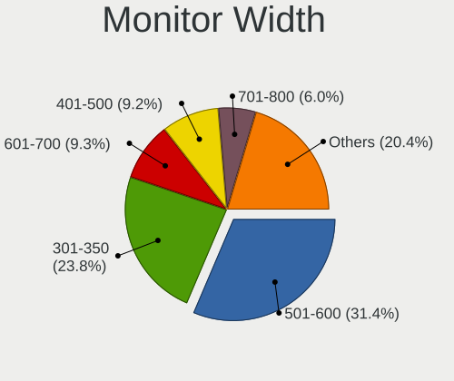

| Width in mm    | Computers | Percent |
|----------------|-----------|---------|
| 501-600        | 654       | 31.41%  |
| 301-350        | 495       | 23.78%  |
| 601-700        | 193       | 9.27%   |
| 401-500        | 191       | 9.17%   |
| 701-800        | 124       | 5.96%   |
| 351-400        | 103       | 4.95%   |
| 1501-2000      | 77        | 3.7%    |
| 1001-1500      | 75        | 3.6%    |
| 201-300        | 70        | 3.36%   |
| 801-900        | 38        | 1.83%   |
| Unknown        | 32        | 1.54%   |
| 901-1000       | 13        | 0.62%   |
| More than 2000 | 8         | 0.38%   |
| 101-200        | 7         | 0.34%   |
| 1-100          | 2         | 0.1%    |

Aspect Ratio
------------

Proportional relationship between the width and the height

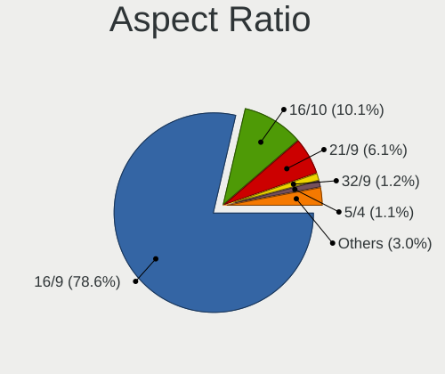

| Ratio   | Computers | Percent |
|---------|-----------|---------|
| 16/9    | 1429      | 78.6%   |
| 16/10   | 183       | 10.07%  |
| 21/9    | 110       | 6.05%   |
| 32/9    | 22        | 1.21%   |
| 5/4     | 20        | 1.1%    |
| 3/2     | 18        | 0.99%   |
| 4/3     | 9         | 0.5%    |
| 1.00    | 7         | 0.39%   |
| Unknown | 4         | 0.22%   |
| 0.62    | 3         | 0.17%   |
| 1.96    | 2         | 0.11%   |
| 0.89    | 2         | 0.11%   |
| 0.67    | 2         | 0.11%   |
| 0.56    | 2         | 0.11%   |
| 6/5     | 1         | 0.06%   |
| 2.12    | 1         | 0.06%   |
| 2.01    | 1         | 0.06%   |
| 0.63    | 1         | 0.06%   |
| 0.58    | 1         | 0.06%   |

Monitor Area
------------

Area in inch²

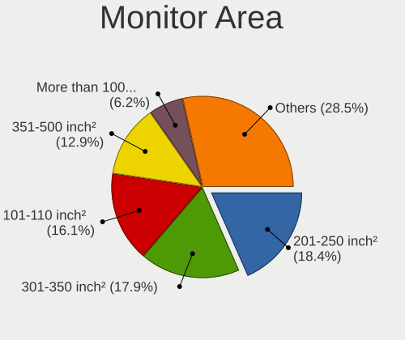

| Area in inch² | Computers | Percent |
|----------------|-----------|---------|
| 201-250        | 389       | 18.41%  |
| 301-350        | 378       | 17.89%  |
| 101-110        | 340       | 16.09%  |
| 351-500        | 273       | 12.92%  |
| More than 1000 | 130       | 6.15%   |
| 81-90          | 128       | 6.06%   |
| 151-200        | 80        | 3.79%   |
| 251-300        | 79        | 3.74%   |
| 501-1000       | 72        | 3.41%   |
| 121-130        | 71        | 3.36%   |
| 111-120        | 43        | 2.04%   |
| 71-80          | 42        | 1.99%   |
| Unknown        | 32        | 1.51%   |
| 141-150        | 26        | 1.23%   |
| 1-40           | 9         | 0.43%   |
| 61-70          | 7         | 0.33%   |
| 51-60          | 6         | 0.28%   |
| 131-140        | 5         | 0.24%   |
| 41-50          | 2         | 0.09%   |
| 91-100         | 1         | 0.05%   |

Pixel Density
-------------

Pixels per inch

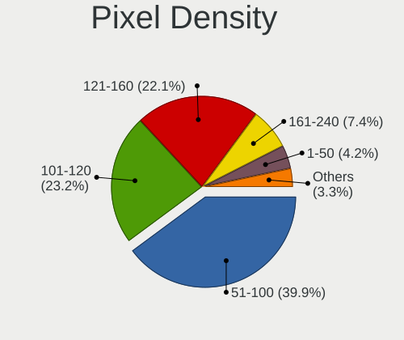

| Density       | Computers | Percent |
|---------------|-----------|---------|
| 51-100        | 806       | 39.88%  |
| 101-120       | 469       | 23.21%  |
| 121-160       | 446       | 22.07%  |
| 161-240       | 149       | 7.37%   |
| 1-50          | 84        | 4.16%   |
| More than 240 | 35        | 1.73%   |
| Unknown       | 32        | 1.58%   |

Multiple Monitors
-----------------

Total monitors connected

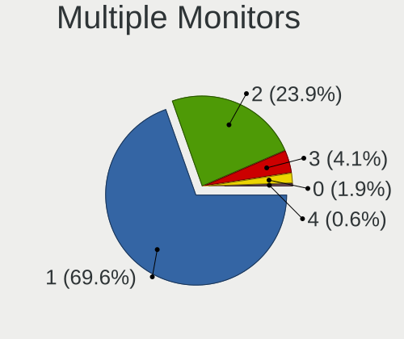

| Total | Computers | Percent |
|-------|-----------|---------|
| 1     | 1235      | 69.62%  |
| 2     | 424       | 23.9%   |
| 3     | 72        | 4.06%   |
| 0     | 33        | 1.86%   |
| 4     | 10        | 0.56%   |

Network
-------

Net Controller Vendor
---------------------

Controller vendors

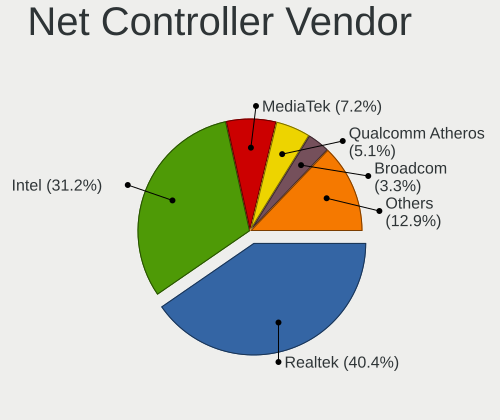

| Vendor                          | Computers | Percent |
|---------------------------------|-----------|---------|
| Realtek Semiconductor           | 1125      | 40.39%  |
| Intel                           | 868       | 31.17%  |
| MediaTek                        | 201       | 7.22%   |
| Qualcomm Atheros                | 141       | 5.06%   |
| Broadcom                        | 92        | 3.3%    |
| Microsoft                       | 50        | 1.8%    |
| TP-Link                         | 47        | 1.69%   |
| Ralink Technology               | 22        | 0.79%   |
| ASIX Electronics                | 20        | 0.72%   |
| Samsung Electronics             | 18        | 0.65%   |
| Broadcom Limited                | 18        | 0.65%   |
| Aquantia                        | 15        | 0.54%   |
| Xiaomi                          | 13        | 0.47%   |
| Marvell Technology Group        | 13        | 0.47%   |
| Qualcomm                        | 9         | 0.32%   |
| ASUSTek Computer                | 9         | 0.32%   |
| Ralink                          | 8         | 0.29%   |
| Qualcomm Technologies           | 8         | 0.29%   |
| Qualcomm Atheros Communications | 6         | 0.22%   |
| Nvidia                          | 6         | 0.22%   |
| NetGear                         | 6         | 0.22%   |
| Motorola PCS                    | 6         | 0.22%   |
| Lenovo                          | 5         | 0.18%   |
| Google                          | 5         | 0.18%   |
| DisplayLink                     | 5         | 0.18%   |
| Shenzhen Goodix Technology      | 4         | 0.14%   |
| QinHeng Electronics             | 4         | 0.14%   |
| OPPO Electronics                | 4         | 0.14%   |
| Mellanox Technologies           | 4         | 0.14%   |
| D-Link                          | 4         | 0.14%   |
| Sierra Wireless                 | 3         | 0.11%   |
| Oculus VR                       | 3         | 0.11%   |
| Hewlett-Packard                 | 3         | 0.11%   |
| Apple                           | 3         | 0.11%   |
| Linksys                         | 2         | 0.07%   |
| JMicron Technology              | 2         | 0.07%   |
| Huawei Technologies             | 2         | 0.07%   |
| Edimax Technology               | 2         | 0.07%   |
| Dell                            | 2         | 0.07%   |
| D-Link System                   | 2         | 0.07%   |

Net Controller Model
--------------------

Controller models

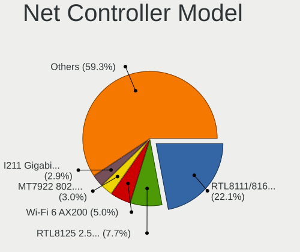

| Model                                                                  | Computers | Percent |
|------------------------------------------------------------------------|-----------|---------|
| Realtek RTL8111/8168/8211/8411 PCI Express Gigabit Ethernet Controller | 713       | 22.07%  |
| Realtek RTL8125 2.5GbE Controller                                      | 249       | 7.71%   |
| Intel Wi-Fi 6 AX200                                                    | 161       | 4.98%   |
| MediaTek MT7922 802.11ax PCI Express Wireless Network Adapter          | 97        | 3%      |
| Intel I211 Gigabit Network Connection                                  | 94        | 2.91%   |
| Intel Ethernet Controller I225-V                                       | 94        | 2.91%   |
| Intel Wi-Fi 6E(802.11ax) AX210/AX1675* 2x2 [Typhoon Peak]              | 72        | 2.23%   |
| Intel Cannon Lake PCH CNVi WiFi                                        | 46        | 1.42%   |
| Realtek RTL8821CE 802.11ac PCIe Wireless Network Adapter               | 42        | 1.3%    |
| MediaTek MT7921 802.11ax PCIe Wireless Network Adapter [Filogic 330]   | 38        | 1.18%   |
| Realtek RTL8153 Gigabit Ethernet Adapter                               | 37        | 1.15%   |
| Intel Comet Lake PCH CNVi WiFi                                         | 34        | 1.05%   |
| Realtek RTL810xE PCI Express Fast Ethernet controller                  | 33        | 1.02%   |
| MediaTek MT7921K (RZ608) Wi-Fi 6E 80MHz                                | 33        | 1.02%   |
| Intel Wi-Fi 6 AX201                                                    | 33        | 1.02%   |
| Intel Wireless 8265 / 8275                                             | 29        | 0.9%    |
| Intel Ethernet Connection (7) I219-V                                   | 29        | 0.9%    |
| Intel 700 Series Chipset CNVi WiFi                                     | 28        | 0.87%   |
| Realtek RTL8822CE 802.11ac PCIe Wireless Network Adapter               | 27        | 0.84%   |
| Intel Dual Band Wireless-AC 3168NGW [Stone Peak]                       | 27        | 0.84%   |
| Qualcomm Atheros QCA9377 802.11ac Wireless Network Adapter             | 26        | 0.8%    |
| Intel Wi-Fi 5(802.11ac) Wireless-AC 9x6x [Thunder Peak]                | 26        | 0.8%    |
| Intel Ethernet Connection (2) I219-V                                   | 26        | 0.8%    |
| Realtek RTL8852BE PCIe 802.11ax Wireless Network Controller            | 25        | 0.77%   |
| Intel Alder Lake-P PCH CNVi WiFi                                       | 24        | 0.74%   |
| Intel Wireless 7265                                                    | 23        | 0.71%   |
| Intel Ethernet Controller I226-V                                       | 23        | 0.71%   |
| Intel 82579LM Gigabit Network Connection (Lewisville)                  | 21        | 0.65%   |
| Broadcom BCM4360 802.11ac Dual Band Wireless Network Adapter           | 21        | 0.65%   |
| Microsoft Xbox Wireless Adapter for Windows                            | 20        | 0.62%   |
| Realtek 802.11ac NIC                                                   | 19        | 0.59%   |
| ASIX AX88179 Gigabit Ethernet                                          | 19        | 0.59%   |
| Microsoft Wireless XBox Controller Dongle                              | 18        | 0.56%   |
| Intel Wireless 8260                                                    | 18        | 0.56%   |
| Qualcomm Atheros AR9485 Wireless Network Adapter                       | 17        | 0.53%   |
| Intel Wireless 7260                                                    | 17        | 0.53%   |
| Intel Alder Lake-S PCH CNVi WiFi                                       | 17        | 0.53%   |
| Realtek RTL8852AE 802.11ax PCIe Wireless Network Adapter               | 16        | 0.5%    |
| Qualcomm Atheros QCA9565 / AR9565 Wireless Network Adapter             | 16        | 0.5%    |
| Qualcomm Atheros QCA6174 802.11ac Wireless Network Adapter             | 16        | 0.5%    |

Wireless Vendor
---------------

Wireless vendors

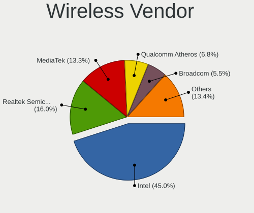

| Vendor                                | Computers | Percent |
|---------------------------------------|-----------|---------|
| Intel                                 | 629       | 45.03%  |
| Realtek Semiconductor                 | 223       | 15.96%  |
| MediaTek                              | 186       | 13.31%  |
| Qualcomm Atheros                      | 95        | 6.8%    |
| Broadcom                              | 77        | 5.51%   |
| Microsoft                             | 47        | 3.36%   |
| TP-Link                               | 46        | 3.29%   |
| Ralink Technology                     | 22        | 1.57%   |
| Broadcom Limited                      | 12        | 0.86%   |
| ASUSTek Computer                      | 9         | 0.64%   |
| Ralink                                | 8         | 0.57%   |
| Marvell Technology Group              | 7         | 0.5%    |
| Qualcomm Atheros Communications       | 6         | 0.43%   |
| NetGear                               | 6         | 0.43%   |
| Sierra Wireless                       | 3         | 0.21%   |
| D-Link                                | 3         | 0.21%   |
| Linksys                               | 2         | 0.14%   |
| Edimax Technology                     | 2         | 0.14%   |
| Dell                                  | 2         | 0.14%   |
| D-Link System                         | 2         | 0.14%   |
| Belkin Components                     | 2         | 0.14%   |
| Wacom                                 | 1         | 0.07%   |
| Samsung Electronics                   | 1         | 0.07%   |
| Qualcomm Technologies                 | 1         | 0.07%   |
| Panasonic (Matsushita)                | 1         | 0.07%   |
| Mercucys                              | 1         | 0.07%   |
| Fibocom                               | 1         | 0.07%   |
| AVM                                   | 1         | 0.07%   |
| 802.11g Adapter [Linksys WUSB54GC v3] | 1         | 0.07%   |

Wireless Model
--------------

Wireless models

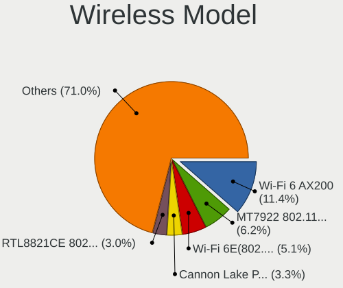

| Model                                                                | Computers | Percent |
|----------------------------------------------------------------------|-----------|---------|
| Intel Wi-Fi 6 AX200                                                  | 161       | 11.43%  |
| MediaTek MT7922 802.11ax PCI Express Wireless Network Adapter        | 87        | 6.18%   |
| Intel Wi-Fi 6E(802.11ax) AX210/AX1675* 2x2 [Typhoon Peak]            | 72        | 5.11%   |
| Intel Cannon Lake PCH CNVi WiFi                                      | 46        | 3.27%   |
| Realtek RTL8821CE 802.11ac PCIe Wireless Network Adapter             | 42        | 2.98%   |
| MediaTek MT7921 802.11ax PCIe Wireless Network Adapter [Filogic 330] | 38        | 2.7%    |
| Intel Comet Lake PCH CNVi WiFi                                       | 34        | 2.41%   |
| MediaTek MT7921K (RZ608) Wi-Fi 6E 80MHz                              | 33        | 2.34%   |
| Intel Wi-Fi 6 AX201                                                  | 33        | 2.34%   |
| Intel Wireless 8265 / 8275                                           | 29        | 2.06%   |
| Intel 700 Series Chipset CNVi WiFi                                   | 28        | 1.99%   |
| Realtek RTL8822CE 802.11ac PCIe Wireless Network Adapter             | 27        | 1.92%   |
| Intel Dual Band Wireless-AC 3168NGW [Stone Peak]                     | 27        | 1.92%   |
| Qualcomm Atheros QCA9377 802.11ac Wireless Network Adapter           | 26        | 1.85%   |
| Intel Wi-Fi 5(802.11ac) Wireless-AC 9x6x [Thunder Peak]              | 26        | 1.85%   |
| Intel Wireless 7265                                                  | 23        | 1.63%   |
| Realtek RTL8852BE PCIe 802.11ax Wireless Network Controller          | 21        | 1.49%   |
| Broadcom BCM4360 802.11ac Dual Band Wireless Network Adapter         | 21        | 1.49%   |
| Microsoft Xbox Wireless Adapter for Windows                          | 20        | 1.42%   |
| Realtek 802.11ac NIC                                                 | 19        | 1.35%   |
| Microsoft Wireless XBox Controller Dongle                            | 18        | 1.28%   |
| Intel Wireless 8260                                                  | 18        | 1.28%   |
| Qualcomm Atheros AR9485 Wireless Network Adapter                     | 17        | 1.21%   |
| Intel Wireless 7260                                                  | 17        | 1.21%   |
| Realtek RTL8852AE 802.11ax PCIe Wireless Network Adapter             | 16        | 1.14%   |
| Qualcomm Atheros QCA9565 / AR9565 Wireless Network Adapter           | 16        | 1.14%   |
| Qualcomm Atheros QCA6174 802.11ac Wireless Network Adapter           | 16        | 1.14%   |
| Intel Alder Lake-P PCH CNVi WiFi                                     | 16        | 1.14%   |
| Realtek RTL8188EUS 802.11n Wireless Network Adapter                  | 14        | 0.99%   |
| Broadcom BCM43142 802.11b/g/n                                        | 14        | 0.99%   |
| Realtek RTL88x2bu [AC1200 Techkey]                                   | 13        | 0.92%   |
| Realtek RTL8852CE PCIe 802.11ax Wireless Network Controller          | 13        | 0.92%   |
| Intel Raptor Lake PCH CNVi WiFi                                      | 13        | 0.92%   |
| Intel Tiger Lake PCH CNVi WiFi                                       | 12        | 0.85%   |
| Microsoft Xbox 360 Wireless Adapter                                  | 10        | 0.71%   |
| MediaTek MT7902 802.11ax PCIe Wireless Network Adapter [Filogic 310] | 10        | 0.71%   |
| Intel Wireless 3165                                                  | 9         | 0.64%   |
| Realtek RTL8192EE PCIe Wireless Network Adapter                      | 8         | 0.57%   |
| Broadcom BCM4331 802.11a/b/g/n                                       | 8         | 0.57%   |
| TP-Link TL-WN823N v2/v3 [Realtek RTL8192EU]                          | 7         | 0.5%    |

Ethernet Vendor
---------------

Ethernet vendors

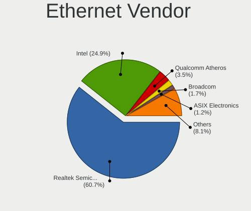

| Vendor                     | Computers | Percent |
|----------------------------|-----------|---------|
| Realtek Semiconductor      | 1053      | 60.66%  |
| Intel                      | 432       | 24.88%  |
| Qualcomm Atheros           | 60        | 3.46%   |
| Broadcom                   | 30        | 1.73%   |
| ASIX Electronics           | 20        | 1.15%   |
| Samsung Electronics        | 17        | 0.98%   |
| MediaTek                   | 15        | 0.86%   |
| Aquantia                   | 15        | 0.86%   |
| Xiaomi                     | 13        | 0.75%   |
| Qualcomm                   | 9         | 0.52%   |
| Qualcomm Technologies      | 7         | 0.4%    |
| Nvidia                     | 6         | 0.35%   |
| Motorola PCS               | 6         | 0.35%   |
| Marvell Technology Group   | 6         | 0.35%   |
| Broadcom Limited           | 6         | 0.35%   |
| Lenovo                     | 5         | 0.29%   |
| Google                     | 5         | 0.29%   |
| DisplayLink                | 5         | 0.29%   |
| OPPO Electronics           | 4         | 0.23%   |
| Mellanox Technologies      | 4         | 0.23%   |
| Apple                      | 3         | 0.17%   |
| Microsoft                  | 2         | 0.12%   |
| JMicron Technology         | 2         | 0.12%   |
| Huawei Technologies        | 2         | 0.12%   |
| Hewlett-Packard            | 2         | 0.12%   |
| ZTE WCDMA Technologies MSM | 1         | 0.06%   |
| TP-Link                    | 1         | 0.06%   |
| T & A Mobile Phones        | 1         | 0.06%   |
| LG Electronics             | 1         | 0.06%   |
| ICS Advent                 | 1         | 0.06%   |
| D-Link                     | 1         | 0.06%   |
| American Megatrends        | 1         | 0.06%   |

Ethernet Model
--------------

Ethernet models

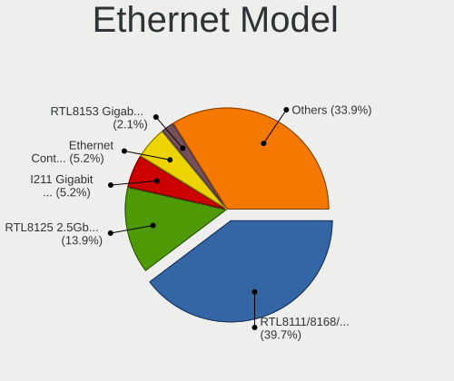

| Model                                                                           | Computers | Percent |
|---------------------------------------------------------------------------------|-----------|---------|
| Realtek RTL8111/8168/8211/8411 PCI Express Gigabit Ethernet Controller          | 713       | 39.7%   |
| Realtek RTL8125 2.5GbE Controller                                               | 249       | 13.86%  |
| Intel I211 Gigabit Network Connection                                           | 94        | 5.23%   |
| Intel Ethernet Controller I225-V                                                | 94        | 5.23%   |
| Realtek RTL8153 Gigabit Ethernet Adapter                                        | 37        | 2.06%   |
| Realtek RTL810xE PCI Express Fast Ethernet controller                           | 33        | 1.84%   |
| Intel Ethernet Connection (7) I219-V                                            | 29        | 1.61%   |
| Intel Ethernet Connection (2) I219-V                                            | 26        | 1.45%   |
| Intel Ethernet Controller I226-V                                                | 23        | 1.28%   |
| Intel 82579LM Gigabit Network Connection (Lewisville)                           | 21        | 1.17%   |
| ASIX AX88179 Gigabit Ethernet                                                   | 19        | 1.06%   |
| Intel Ethernet Connection I217-LM                                               | 16        | 0.89%   |
| Samsung Galaxy series, misc. (tethering mode)                                   | 14        | 0.78%   |
| Realtek RTL8126 5GbE Controller                                                 | 13        | 0.72%   |
| Qualcomm Atheros Killer E2400 Gigabit Ethernet Controller                       | 13        | 0.72%   |
| Qualcomm Atheros Killer E220x Gigabit Ethernet Controller                       | 13        | 0.72%   |
| Intel Ethernet Connection (2) I218-V                                            | 13        | 0.72%   |
| Realtek Killer E3000 2.5GbE Controller                                          | 11        | 0.61%   |
| Realtek Killer E2600 GbE Controller                                             | 11        | 0.61%   |
| Qualcomm Atheros Killer E2500 Gigabit Ethernet Controller                       | 11        | 0.61%   |
| Xiaomi Mi/Redmi series (RNDIS)                                                  | 10        | 0.56%   |
| MediaTek MT7922 802.11ax PCI Express Wireless Network Adapter                   | 10        | 0.56%   |
| Intel Alder Lake-S PCH CNVi WiFi                                                | 10        | 0.56%   |
| Broadcom NetXtreme BCM57766 Gigabit Ethernet PCIe                               | 10        | 0.56%   |
| Qualcomm Atheros AR8151 v2.0 Gigabit Ethernet                                   | 9         | 0.5%    |
| Intel Ethernet Connection (7) I219-LM                                           | 9         | 0.5%    |
| Intel 82579V Gigabit Network Connection                                         | 9         | 0.5%    |
| Broadcom NetXtreme BCM57765 Gigabit Ethernet PCIe                               | 9         | 0.5%    |
| Intel Ethernet Connection I217-V                                                | 8         | 0.45%   |
| Intel Ethernet Connection (4) I219-LM                                           | 8         | 0.45%   |
| Intel Alder Lake-P PCH CNVi WiFi                                                | 8         | 0.45%   |
| Qualcomm WCN785x Wi-Fi 7(802.11be) 320MHz 2x2 [FastConnect 7800]                | 7         | 0.39%   |
| Intel Ethernet Connection (17) I219-V                                           | 7         | 0.39%   |
| Intel Ethernet Connection (11) I219-V                                           | 7         | 0.39%   |
| Aquantia AQtion AQC113CS NBase-T/IEEE 802.3an Ethernet Controller [Antigua 10G] | 7         | 0.39%   |
| Motorola PCS motorola one 5G ace                                                | 6         | 0.33%   |
| Intel Ethernet Connection (14) I219-V                                           | 6         | 0.33%   |
| Aquantia AQtion AQC107 NBase-T/IEEE 802.3an Ethernet Controller [Atlantic 10G]  | 6         | 0.33%   |
| Realtek RTL8922AE 802.11be PCIe Wireless Network Adapter                        | 5         | 0.28%   |
| Realtek Killer E2500 Gigabit Ethernet Controller                                | 5         | 0.28%   |

Net Controller Kind
-------------------

Ethernet, WiFi or modem

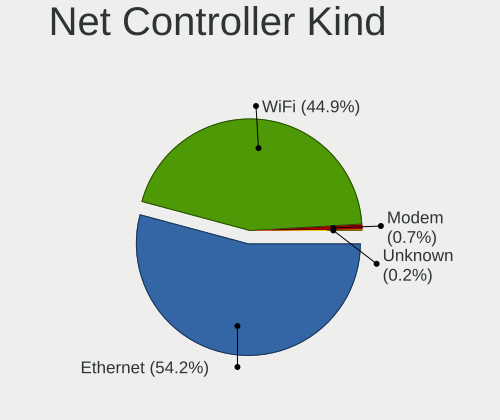

| Kind     | Computers | Percent |
|----------|-----------|---------|
| Ethernet | 1576      | 54.18%  |
| WiFi     | 1306      | 44.9%   |
| Modem    | 21        | 0.72%   |
| Unknown  | 6         | 0.21%   |

Used Controller
---------------

Currently used network controller

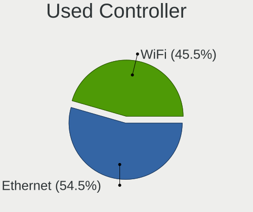

| Kind     | Computers | Percent |
|----------|-----------|---------|
| Ethernet | 995       | 54.46%  |
| WiFi     | 832       | 45.54%  |

NICs
----

Total network controllers on board

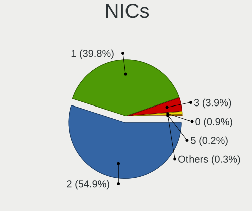

| Total | Computers | Percent |
|-------|-----------|---------|
| 2     | 963       | 54.93%  |
| 1     | 697       | 39.76%  |
| 3     | 69        | 3.94%   |
| 0     | 16        | 0.91%   |
| 5     | 3         | 0.17%   |
| 4     | 3         | 0.17%   |
| 6     | 2         | 0.11%   |

IPv6
----

IPv6 vs IPv4

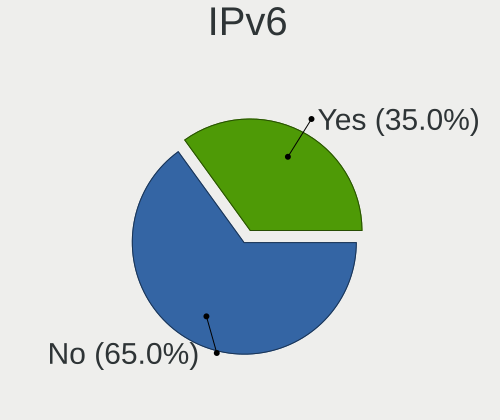

| Used | Computers | Percent |
|------|-----------|---------|
| No   | 1151      | 65.03%  |
| Yes  | 619       | 34.97%  |

Bluetooth
---------

Bluetooth Vendor
----------------

Controller vendors

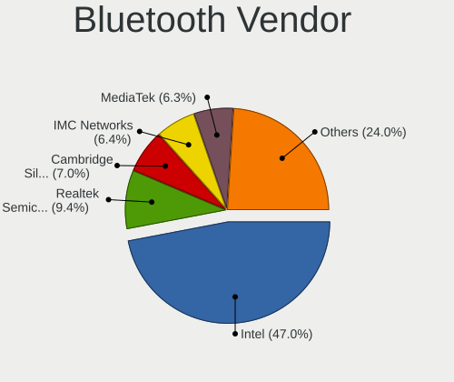

| Vendor                          | Computers | Percent |
|---------------------------------|-----------|---------|
| Intel                           | 627       | 47%     |
| Realtek Semiconductor           | 125       | 9.37%   |
| Cambridge Silicon Radio         | 93        | 6.97%   |
| IMC Networks                    | 85        | 6.37%   |
| MediaTek                        | 84        | 6.3%    |
| Foxconn / Hon Hai               | 79        | 5.92%   |
| Qualcomm Atheros Communications | 45        | 3.37%   |
| ASUSTek Computer                | 32        | 2.4%    |
| Broadcom                        | 31        | 2.32%   |
| TP-Link                         | 30        | 2.25%   |
| Lite-On Technology              | 29        | 2.17%   |
| Apple                           | 28        | 2.1%    |
| Marvell Semiconductor           | 7         | 0.52%   |
| Toshiba                         | 5         | 0.37%   |
| Unknown                         | 5         | 0.37%   |
| Ralink                          | 4         | 0.3%    |
| Edimax Technology               | 4         | 0.3%    |
| Realtek                         | 3         | 0.22%   |
| Mercucys                        | 3         | 0.22%   |
| Actions                         | 3         | 0.22%   |
| Integrated System Solution      | 2         | 0.15%   |
| HTC (High Tech Computer)        | 2         | 0.15%   |
| Hewlett-Packard                 | 2         | 0.15%   |
| Foxconn International           | 2         | 0.15%   |
| SINO WEALTH                     | 1         | 0.07%   |
| Dynex                           | 1         | 0.07%   |
| Dell                            | 1         | 0.07%   |
| Conwise Technology              | 1         | 0.07%   |

Bluetooth Model
---------------

Controller models

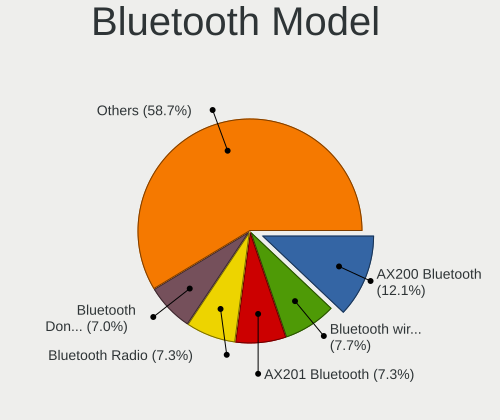

| Model                                               | Computers | Percent |
|-----------------------------------------------------|-----------|---------|
| Intel AX200 Bluetooth                               | 161       | 12.06%  |
| Intel Bluetooth wireless interface                  | 103       | 7.72%   |
| Intel AX201 Bluetooth                               | 98        | 7.34%   |
| Realtek Bluetooth Radio                             | 97        | 7.27%   |
| Cambridge Silicon Radio Bluetooth Dongle (HCI mode) | 93        | 6.97%   |
| MediaTek Wireless_Device                            | 83        | 6.22%   |
| Intel AX210 Bluetooth                               | 70        | 5.24%   |
| Intel Bluetooth Device                              | 69        | 5.17%   |
| Intel Bluetooth 9460/9560 Jefferson Peak (JfP)      | 69        | 5.17%   |
| Foxconn / Hon Hai Wireless_Device                   | 46        | 3.45%   |
| IMC Networks Wireless_Device                        | 44        | 3.3%    |
| IMC Networks Bluetooth Radio                        | 36        | 2.7%    |
| TP-Link TP-T@- UB500 Adapter                        | 30        | 2.25%   |
| Intel Wireless-AC 3168 Bluetooth                    | 26        | 1.95%   |
| Intel Wireless-AC 9260 Bluetooth Adapter            | 22        | 1.65%   |
| Qualcomm Atheros  Bluetooth Device                  | 20        | 1.5%    |
| Realtek  Bluetooth 4.2 Adapter                      | 17        | 1.27%   |
| Foxconn / Hon Hai Bluetooth Device                  | 16        | 1.2%    |
| ASUS ASUS USB-BT500                                 | 16        | 1.2%    |
| Apple Bluetooth Host Controller                     | 16        | 1.2%    |
| Foxconn / Hon Hai MediaTek Bluetooth Adapter        | 11        | 0.82%   |
| Qualcomm Atheros AR3012 Bluetooth 4.0               | 9         | 0.67%   |
| Broadcom BCM20702A0 Bluetooth 4.0                   | 8         | 0.6%    |
| Marvell Bluetooth and Wireless LAN Composite        | 7         | 0.52%   |
| Lite-On Qualcomm Atheros QCA9377 Bluetooth          | 7         | 0.52%   |
| Intel Centrino Bluetooth Wireless Transceiver       | 7         | 0.52%   |
| Realtek Bluetooth 5.3 Radio                         | 6         | 0.45%   |
| Qualcomm Atheros QCA61x4 Bluetooth 4.0              | 6         | 0.45%   |
| Lite-On Bluetooth Device                            | 6         | 0.45%   |
| ASUS Broadcom BCM20702A0 Bluetooth                  | 6         | 0.45%   |
| Apple Bluetooth USB Host Controller                 | 6         | 0.45%   |
| Lite-On Wireless_Device                             | 5         | 0.37%   |
| Lite-On Bluetooth Radio                             | 5         | 0.37%   |
| Apple Built-in Bluetooth 2.0+EDR HCI                | 5         | 0.37%   |
| Unknown                                             | 5         | 0.37%   |
| Ralink RT3290 Bluetooth                             | 4         | 0.3%    |
| Qualcomm Atheros Bluetooth USB Host Controller      | 4         | 0.3%    |
| Lite-On Atheros AR3012 Bluetooth                    | 4         | 0.3%    |
| IMC Networks Bluetooth Device                       | 4         | 0.3%    |
| Broadcom BCM43142A0 Bluetooth Device                | 4         | 0.3%    |

Sound
-----

Sound Vendor
------------

Sound card vendors

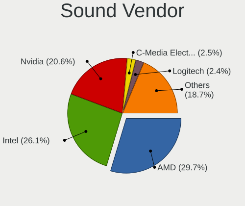

| Vendor                     | Computers | Percent |
|----------------------------|-----------|---------|
| AMD                        | 991       | 29.65%  |
| Intel                      | 871       | 26.06%  |
| Nvidia                     | 690       | 20.65%  |
| C-Media Electronics        | 85        | 2.54%   |
| Logitech                   | 81        | 2.42%   |
| SteelSeries ApS            | 43        | 1.29%   |
| ASUSTek Computer           | 40        | 1.2%    |
| Razer USA                  | 36        | 1.08%   |
| Kingston Technology        | 34        | 1.02%   |
| Creative Labs              | 29        | 0.87%   |
| Micro Star International   | 27        | 0.81%   |
| Sony                       | 26        | 0.78%   |
| Creative Technology        | 21        | 0.63%   |
| JMTek                      | 18        | 0.54%   |
| Focusrite-Novation         | 18        | 0.54%   |
| Corsair                    | 17        | 0.51%   |
| Hewlett-Packard            | 16        | 0.48%   |
| Blue Microphones           | 16        | 0.48%   |
| Texas Instruments          | 13        | 0.39%   |
| Realtek Semiconductor      | 11        | 0.33%   |
| Samson Technologies        | 10        | 0.3%    |
| Plantronics                | 10        | 0.3%    |
| Audio-Technica             | 10        | 0.3%    |
| BEHRINGER International    | 9         | 0.27%   |
| KTMicro                    | 8         | 0.24%   |
| Apple                      | 8         | 0.24%   |
| PreSonus Audio Electronics | 7         | 0.21%   |
| Jieli Technology           | 7         | 0.21%   |
| GN Netcom                  | 7         | 0.21%   |
| Generalplus Technology     | 7         | 0.21%   |
| Lenovo                     | 6         | 0.18%   |
| Astro Gaming               | 6         | 0.18%   |
| ASRock                     | 6         | 0.18%   |
| Unknown                    | 6         | 0.18%   |
| XMOS                       | 5         | 0.15%   |
| Elgato Systems             | 5         | 0.15%   |
| Tenx Technology            | 4         | 0.12%   |
| Schiit Audio               | 4         | 0.12%   |
| SAVITECH                   | 4         | 0.12%   |
| RODE Microphones           | 4         | 0.12%   |

Sound Model
-----------

Sound card models

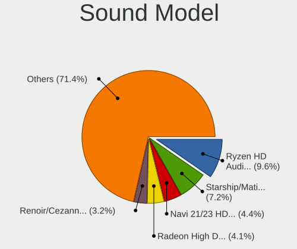

| Model                                                                      | Computers | Percent |
|----------------------------------------------------------------------------|-----------|---------|
| AMD Ryzen HD Audio Controller                                              | 400       | 9.63%   |
| AMD Starship/Matisse HD Audio Controller                                   | 300       | 7.22%   |
| AMD Navi 21/23 HDMI/DP Audio Controller                                    | 181       | 4.36%   |
| AMD Radeon High Definition Audio Controller                                | 172       | 4.14%   |
| AMD Renoir/Cezanne HDMI/DP Audio Controller                                | 135       | 3.25%   |
| AMD Navi 31 HDMI/DP Audio                                                  | 95        | 2.29%   |
| AMD Ellesmere HDMI Audio [Radeon RX 470/480 / 570/580/590]                 | 90        | 2.17%   |
| Intel Cannon Lake PCH cAVS                                                 | 87        | 2.09%   |
| Nvidia GA104 High Definition Audio Controller                              | 84        | 2.02%   |
| Intel Sunrise Point-LP HD Audio                                            | 62        | 1.49%   |
| Intel 8 Series/C220 Series Chipset High Definition Audio Controller        | 62        | 1.49%   |
| Nvidia GA106 High Definition Audio Controller                              | 57        | 1.37%   |
| Intel 7 Series/C216 Chipset Family High Definition Audio Controller        | 57        | 1.37%   |
| Nvidia TU106 High Definition Audio Controller                              | 56        | 1.35%   |
| Intel 6 Series/C200 Series Chipset Family High Definition Audio Controller | 50        | 1.2%    |
| Intel Comet Lake PCH cAVS                                                  | 49        | 1.18%   |
| Nvidia GA102 High Definition Audio Controller                              | 48        | 1.16%   |
| Intel 100 Series/C230 Series Chipset Family HD Audio Controller            | 47        | 1.13%   |
| AMD Raven/Raven2/Fenghuang HDMI/DP Audio Controller                        | 47        | 1.13%   |
| AMD Family 17h (Models 00h-0fh) HD Audio Controller                        | 47        | 1.13%   |
| Nvidia TU107 GeForce GTX 1650 High Definition Audio Controller             | 46        | 1.11%   |
| AMD Navi 10 HDMI Audio                                                     | 44        | 1.06%   |
| Intel Tiger Lake-LP Smart Sound Technology Audio Controller                | 42        | 1.01%   |
| Intel 200 Series PCH HD Audio                                              | 42        | 1.01%   |
| Nvidia GP104 High Definition Audio Controller                              | 39        | 0.94%   |
| Intel Alder Lake-S HD Audio Controller                                     | 39        | 0.94%   |
| Nvidia GP107GL High Definition Audio Controller                            | 38        | 0.91%   |
| Intel Xeon E3-1200 v3/4th Gen Core Processor HD Audio Controller           | 38        | 0.91%   |
| Intel Raptor Lake High Definition Audio Controller                         | 38        | 0.91%   |
| Nvidia AD107 High Definition Audio Controller                              | 37        | 0.89%   |
| Intel 8 Series HD Audio Controller                                         | 34        | 0.82%   |
| Nvidia TU116 High Definition Audio Controller                              | 33        | 0.79%   |
| ASUSTek Computer USB Audio                                                 | 33        | 0.79%   |
| Intel Tiger Lake-H HD Audio Controller                                     | 32        | 0.77%   |
| Intel Haswell-ULT HD Audio Controller                                      | 32        | 0.77%   |
| Intel Alder Lake PCH-P High Definition Audio Controller                    | 31        | 0.75%   |
| Nvidia TU104 HD Audio Controller                                           | 28        | 0.67%   |
| Nvidia AD104 High Definition Audio Controller                              | 28        | 0.67%   |
| Micro Star International USB Audio                                         | 27        | 0.65%   |
| AMD SBx00 Azalia (Intel HDA)                                               | 27        | 0.65%   |

Memory
------

Memory Vendor
-------------

Memory module vendors

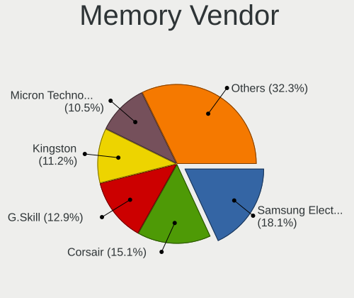

| Vendor                       | Computers | Percent |
|------------------------------|-----------|---------|
| Samsung Electronics          | 102       | 18.09%  |
| Corsair                      | 85        | 15.07%  |
| G.Skill                      | 73        | 12.94%  |
| Kingston                     | 63        | 11.17%  |
| Micron Technology            | 59        | 10.46%  |
| SK hynix                     | 54        | 9.57%   |
| Crucial                      | 28        | 4.96%   |
| Unknown                      | 19        | 3.37%   |
| Unknown                      | 18        | 3.19%   |
| A-DATA Technology            | 15        | 2.66%   |
| Team                         | 13        | 2.3%    |
| Ramaxel Technology           | 6         | 1.06%   |
| Patriot                      | 6         | 1.06%   |
| Unknown (ABCD)               | 3         | 0.53%   |
| Lexar                        | 3         | 0.53%   |
| Lexar Co Limited             | 2         | 0.35%   |
| GOODRAM                      | 2         | 0.35%   |
| Transcend                    | 1         | 0.18%   |
| Timetec                      | 1         | 0.18%   |
| Smart                        | 1         | 0.18%   |
| Patriot Memory (PDP Systems) | 1         | 0.18%   |
| Patriot Memory               | 1         | 0.18%   |
| Nanya Technology             | 1         | 0.18%   |
| KLEVV                        | 1         | 0.18%   |
| Hewlett-Packard              | 1         | 0.18%   |
| Gowe                         | 1         | 0.18%   |
| Golden Empire                | 1         | 0.18%   |
| Elpida                       | 1         | 0.18%   |
| Asgard                       | 1         | 0.18%   |
| AMD                          | 1         | 0.18%   |

Memory Model
------------

Memory module models

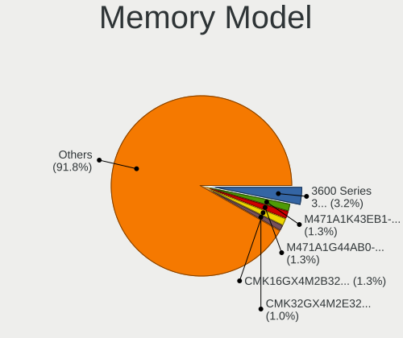

| Model                                                            | Computers | Percent |
|------------------------------------------------------------------|-----------|---------|
| Unknown                                                          | 19        | 3.19%   |
| Samsung RAM M471A1K43EB1-CWE 8GB SODIMM DDR4 3200MT/s            | 8         | 1.34%   |
| Samsung RAM M471A1G44AB0-CWE 8GiB SODIMM DDR4 3200MT/s           | 8         | 1.34%   |
| Corsair RAM CMK16GX4M2B3200C16 8GB DIMM DDR4 3600MT/s            | 8         | 1.34%   |
| Corsair RAM CMK32GX4M2E3200C16 16GB DIMM DDR4 3600MT/s           | 6         | 1.01%   |
| SK hynix RAM HMAA1GS6CJR6N-XN 8GB SODIMM DDR4 3200MT/s           | 5         | 0.84%   |
| Micron RAM 8ATF1G64HZ-3G2J1 8GB SODIMM DDR4 3200MT/s             | 5         | 0.84%   |
| Micron RAM 4ATF51264HZ-2G6E1 4GB SODIMM DDR4 2667MT/s            | 5         | 0.84%   |
| Kingston RAM KF3200C16D4/16GX 16GB DIMM DDR4 3733MT/s            | 5         | 0.84%   |
| G.Skill RAM F5-6000J3038F16G 16GB DIMM DDR5 6000MT/s             | 5         | 0.84%   |
| Corsair RAM CMW16GX4M2C3200C16 8GB DIMM DDR4 3733MT/s            | 5         | 0.84%   |
| Corsair RAM CMK32GX4M2D3600C18 16GB DIMM DDR4 3800MT/s           | 5         | 0.84%   |
| A-DATA RAM DDR4 3200 16GB DIMM DDR4 3600MT/s                     | 5         | 0.84%   |
| SK hynix RAM HMA81GS6DJR8N-XN 8GB SODIMM DDR4 3200MT/s           | 4         | 0.67%   |
| Samsung RAM M471B5173DB0-YK0 4GB SODIMM DDR3 1600MT/s            | 4         | 0.67%   |
| Samsung RAM M471A5244CB0-CTD 4GB SODIMM DDR4 3266MT/s            | 4         | 0.67%   |
| Samsung RAM M471A1K43DB1-CWE 8GB SODIMM DDR4 3200MT/s            | 4         | 0.67%   |
| Kingston RAM KF560C36-16 16GB DIMM DDR5 6000MT/s                 | 4         | 0.67%   |
| G.Skill RAM F5-6000J3636F16G 16GB DIMM DDR5 6400MT/s             | 4         | 0.67%   |
| G.Skill RAM F4-3200C16-8GVKB 8GB DIMM DDR4 4000MT/s              | 4         | 0.67%   |
| G.Skill RAM F4-3200C16-16GVK 16GB DIMM DDR4 3600MT/s             | 4         | 0.67%   |
| Corsair RAM CMK16GX4M2B3000C15 8GB DIMM DDR4 3600MT/s            | 4         | 0.67%   |
| Unknown RAM Module 16GB DIMM DDR4 2667MT/s                       | 3         | 0.5%    |
| Unknown (ABCD) RAM 123456789012345678 2GB SODIMM LPDDR4 2400MT/s | 3         | 0.5%    |
| Team RAM TEAMGROUP-UD4-3200 8GB DIMM DDR4 3800MT/s               | 3         | 0.5%    |
| Team RAM TEAMGROUP-UD4-3200 8GB DIMM DDR4 3733MT/s               | 3         | 0.5%    |
| SK hynix RAM HMAA1GS6CJR6N-XN 8GB Row Of Chips DDR4 3200MT/s     | 3         | 0.5%    |
| Samsung RAM M471A2K43EB1-CWE 16GB SODIMM DDR4 3200MT/s           | 3         | 0.5%    |
| Samsung RAM M471A1K43CB1-CRC 8GB SODIMM DDR4 8400MT/s            | 3         | 0.5%    |
| Samsung RAM M471A1G44AB0-CWE 8GB Row Of Chips DDR4 3200MT/s      | 3         | 0.5%    |
| Samsung RAM M425R2GA3BB0-CWMOD 16GiB SODIMM DDR5 5600MT/s        | 3         | 0.5%    |
| Samsung RAM M425R2GA3BB0-CQKOL 16GB SODIMM DDR5 4800MT/s         | 3         | 0.5%    |
| Micron RAM MTC4C10163S1SC48BA1 8GB SODIMM DDR5 4800MT/s          | 3         | 0.5%    |
| Micron RAM 8ATF1G64HZ-3G2R1 8GB SODIMM DDR4 3200MT/s             | 3         | 0.5%    |
| Micron RAM 8ATF1G64HZ-2G3B1 8GB SODIMM DDR4 2400MT/s             | 3         | 0.5%    |
| Micron RAM 4ATF1G64HZ-3G2E1 8GB SODIMM DDR4 3200MT/s             | 3         | 0.5%    |
| Kingston RAM KF3600C17D4/8GX 8GB DIMM DDR4 3600MT/s              | 3         | 0.5%    |
| G.Skill RAM F5-6000J3040G32G 32GB DIMM DDR5 6200MT/s             | 3         | 0.5%    |
| G.Skill RAM F4-3600C16-8GTZNC 8GB DIMM DDR4 3800MT/s             | 3         | 0.5%    |
| G.Skill RAM F4-3600C16-16GVKC 16GB DIMM DDR4 3866MT/s            | 3         | 0.5%    |

Memory Kind
-----------

Memory module kinds

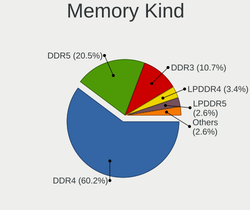

| Kind    | Computers | Percent |
|---------|-----------|---------|
| DDR4    | 303       | 60.24%  |
| DDR5    | 103       | 20.48%  |
| DDR3    | 54        | 10.74%  |
| LPDDR4  | 17        | 3.38%   |
| LPDDR5  | 13        | 2.58%   |
| Unknown | 5         | 0.99%   |
| LPDDR3  | 4         | 0.8%    |
| SDRAM   | 2         | 0.4%    |
| DDR2    | 2         | 0.4%    |

Memory Form Factor
------------------

Physical design of the memory module

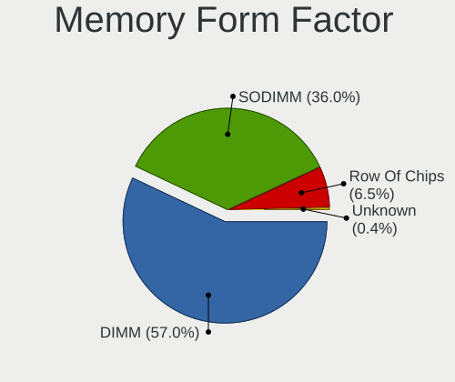

| Name         | Computers | Percent |
|--------------|-----------|---------|
| DIMM         | 288       | 57.03%  |
| SODIMM       | 182       | 36.04%  |
| Row Of Chips | 33        | 6.53%   |
| Unknown      | 2         | 0.4%    |

Memory Size
-----------

Memory module size

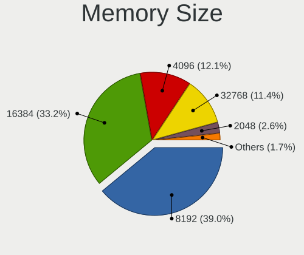

| Size  | Computers | Percent |
|-------|-----------|---------|
| 8192  | 209       | 38.99%  |
| 16384 | 178       | 33.21%  |
| 4096  | 65        | 12.13%  |
| 32768 | 61        | 11.38%  |
| 2048  | 14        | 2.61%   |
| 49152 | 3         | 0.56%   |
| 24576 | 3         | 0.56%   |
| 1024  | 2         | 0.37%   |
| 12288 | 1         | 0.19%   |

Memory Speed
------------

Memory module speed

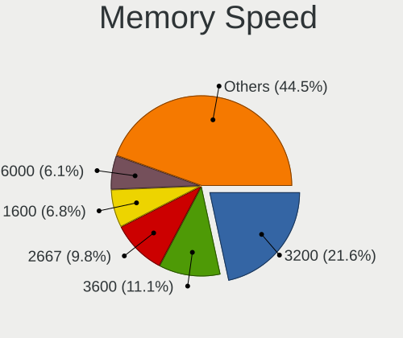

| Speed | Computers | Percent |
|-------|-----------|---------|
| 3200  | 117       | 21.63%  |
| 3600  | 60        | 11.09%  |
| 2667  | 53        | 9.8%    |
| 1600  | 37        | 6.84%   |
| 6000  | 33        | 6.1%    |
| 2400  | 27        | 4.99%   |
| 5600  | 26        | 4.81%   |
| 4800  | 25        | 4.62%   |
| 3733  | 19        | 3.51%   |
| 6400  | 18        | 3.33%   |
| 3800  | 16        | 2.96%   |
| 2133  | 13        | 2.4%    |
| 1333  | 11        | 2.03%   |
| 4267  | 10        | 1.85%   |
| 4000  | 6         | 1.11%   |
| 3266  | 5         | 0.92%   |
| 1867  | 5         | 0.92%   |
| 6200  | 4         | 0.74%   |
| 3866  | 4         | 0.74%   |
| 3466  | 4         | 0.74%   |
| 2666  | 4         | 0.74%   |
| 8400  | 3         | 0.55%   |
| 8000  | 3         | 0.55%   |
| 3400  | 3         | 0.55%   |
| 2933  | 3         | 0.55%   |
| 7500  | 2         | 0.37%   |
| 5400  | 2         | 0.37%   |
| 5200  | 2         | 0.37%   |
| 3334  | 2         | 0.37%   |
| 1334  | 2         | 0.37%   |
| 1066  | 2         | 0.37%   |
| 52217 | 1         | 0.18%   |
| 8533  | 1         | 0.18%   |
| 7467  | 1         | 0.18%   |
| 7000  | 1         | 0.18%   |
| 5800  | 1         | 0.18%   |
| 4266  | 1         | 0.18%   |
| 3933  | 1         | 0.18%   |
| 3533  | 1         | 0.18%   |
| 3500  | 1         | 0.18%   |

Printers & scanners
-------------------

Printer Vendor
--------------

Printer device vendors

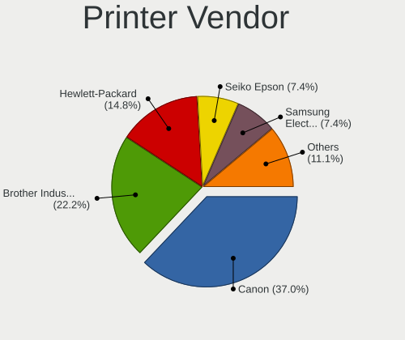

| Vendor              | Computers | Percent |
|---------------------|-----------|---------|
| Canon               | 10        | 37.04%  |
| Brother Industries  | 6         | 22.22%  |
| Hewlett-Packard     | 4         | 14.81%  |
| Seiko Epson         | 2         | 7.41%   |
| Samsung Electronics | 2         | 7.41%   |
| Xerox               | 1         | 3.7%    |
| STMicroelectronics  | 1         | 3.7%    |
| Dell                | 1         | 3.7%    |

Printer Model
-------------

Printer device models

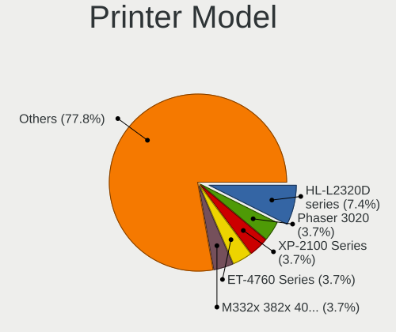

| Model                                                     | Computers | Percent |
|-----------------------------------------------------------|-----------|---------|
| Brother HL-L2320D series                                  | 2         | 7.41%   |
| Xerox Phaser 3020                                         | 1         | 3.7%    |
| STMicroelectronics LED badge -- mini LED display -- 11x44 | 1         | 3.7%    |
| Seiko Epson XP-2100 Series                                | 1         | 3.7%    |
| Seiko Epson ET-4760 Series                                | 1         | 3.7%    |
| Samsung M332x 382x 402x Series                            | 1         | 3.7%    |
| Samsung Composite Device                                  | 1         | 3.7%    |
| HP ENVY 6400 series                                       | 1         | 3.7%    |
| HP DeskJet Plus 4100 series                               | 1         | 3.7%    |
| HP DeskJet 2300 series                                    | 1         | 3.7%    |
| HP Color LaserJet CP1215                                  | 1         | 3.7%    |
| Dell 1130 Laser Printer                                   | 1         | 3.7%    |
| Canon TS700 series                                        | 1         | 3.7%    |
| Canon TR8500 series                                       | 1         | 3.7%    |
| Canon TR4500 series                                       | 1         | 3.7%    |
| Canon PIXMA MX370 Series                                  | 1         | 3.7%    |
| Canon PIXMA MP495                                         | 1         | 3.7%    |
| Canon PIXMA MG3600 Series                                 | 1         | 3.7%    |
| Canon PIXMA MG2500 Series                                 | 1         | 3.7%    |
| Canon LiDE 300                                            | 1         | 3.7%    |
| Canon iP7200 series                                       | 1         | 3.7%    |
| Canon G2000 series                                        | 1         | 3.7%    |
| Brother MFC-L2710DN series                                | 1         | 3.7%    |
| Brother MFC-J460DW                                        | 1         | 3.7%    |
| Brother HL-L2370DW series                                 | 1         | 3.7%    |
| Brother DCP-1510                                          | 1         | 3.7%    |

Scanner Vendor
--------------

Scanner device vendors

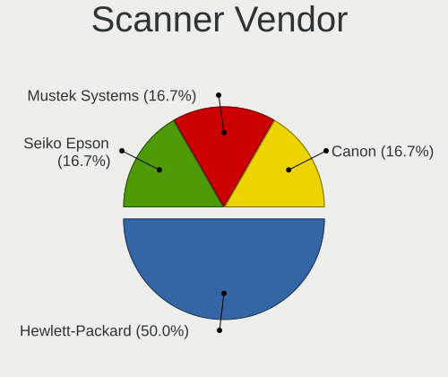

| Vendor          | Computers | Percent |
|-----------------|-----------|---------|
| Hewlett-Packard | 3         | 50%     |
| Seiko Epson     | 1         | 16.67%  |
| Mustek Systems  | 1         | 16.67%  |
| Canon           | 1         | 16.67%  |

Scanner Model
-------------

Scanner device models

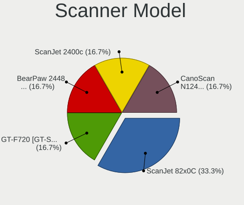

| Model                                                   | Computers | Percent |
|---------------------------------------------------------|-----------|---------|
| HP ScanJet 82x0C                                        | 2         | 33.33%  |
| Seiko Epson GT-F720 [GT-S620/Perfection V30/V300 Photo] | 1         | 16.67%  |
| Mustek Systems BearPaw 2448 TA Plus                     | 1         | 16.67%  |
| HP ScanJet 2400c                                        | 1         | 16.67%  |
| Canon CanoScan N1240U/LiDE 30                           | 1         | 16.67%  |

Camera
------

Camera Vendor
-------------

Camera device vendors

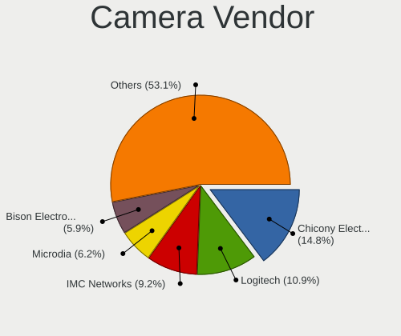

| Vendor                                 | Computers | Percent |
|----------------------------------------|-----------|---------|
| Chicony Electronics                    | 122       | 14.75%  |
| Logitech                               | 90        | 10.88%  |
| IMC Networks                           | 76        | 9.19%   |
| Microdia                               | 51        | 6.17%   |
| Bison Electronics                      | 49        | 5.93%   |
| Realtek Semiconductor                  | 46        | 5.56%   |
| Sunplus Innovation Technology          | 43        | 5.2%    |
| Quanta                                 | 41        | 4.96%   |
| Apple                                  | 41        | 4.96%   |
| Cheng Uei Precision Industry (Foxlink) | 26        | 3.14%   |
| Sonix Technology                       | 24        | 2.9%    |
| Syntek                                 | 22        | 2.66%   |
| Microsoft                              | 21        | 2.54%   |
| Luxvisions Innotech Limited            | 17        | 2.06%   |
| Lite-On Technology                     | 14        | 1.69%   |
| Suyin                                  | 11        | 1.33%   |
| Samsung Electronics                    | 10        | 1.21%   |
| SunplusIT                              | 7         | 0.85%   |
| Razer USA                              | 7         | 0.85%   |
| Silicon Motion                         | 5         | 0.6%    |
| Elgato Systems                         | 5         | 0.6%    |
| AVerMedia Technologies                 | 5         | 0.6%    |
| ARC International                      | 5         | 0.6%    |
| webcam                                 | 4         | 0.48%   |
| Shine-optics                           | 4         | 0.48%   |
| MacroSilicon                           | 4         | 0.48%   |
| Generalplus Technology                 | 4         | 0.48%   |
| eMeet                                  | 4         | 0.48%   |
| Tobii Technology AB                    | 3         | 0.36%   |
| ShineTech                              | 3         | 0.36%   |
| Lenovo                                 | 3         | 0.36%   |
| Creative Technology                    | 3         | 0.36%   |
| Alcor Micro                            | 3         | 0.36%   |
| Z-Star Microelectronics                | 2         | 0.24%   |
| Valve Software                         | 2         | 0.24%   |
| Ricoh                                  | 2         | 0.24%   |
| LG Electronics                         | 2         | 0.24%   |
| KYE Systems (Mouse Systems)            | 2         | 0.24%   |
| kingcome                               | 2         | 0.24%   |
| Intel                                  | 2         | 0.24%   |

Camera Model
------------

Camera device models

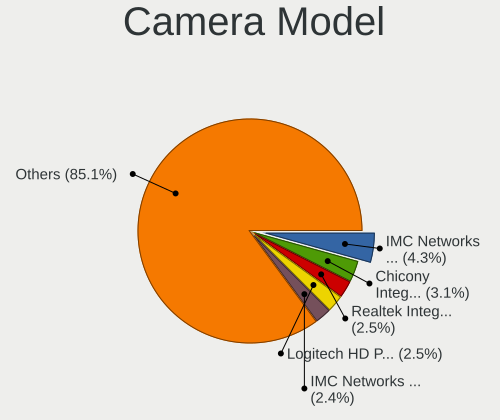

| Model                                               | Computers | Percent |
|-----------------------------------------------------|-----------|---------|
| IMC Networks USB2.0 HD UVC WebCam                   | 36        | 4.32%   |
| Chicony Integrated Camera                           | 26        | 3.12%   |
| Realtek Integrated_Webcam_HD                        | 21        | 2.52%   |
| Logitech HD Pro Webcam C920                         | 21        | 2.52%   |
| IMC Networks Integrated Camera                      | 20        | 2.4%    |
| Logitech Webcam C270                                | 19        | 2.28%   |
| Apple iPhone 5/5C/5S/6/SE/7/8/X                     | 19        | 2.28%   |
| Microdia Integrated_Webcam_HD                       | 17        | 2.04%   |
| Syntek Integrated Camera                            | 16        | 1.92%   |
| Sonix USB2.0 HD UVC WebCam                          | 15        | 1.8%    |
| Bison HD Webcam                                     | 14        | 1.68%   |
| Logitech C922 Pro Stream Webcam                     | 13        | 1.56%   |
| Chicony HD WebCam                                   | 13        | 1.56%   |
| Bison Integrated Camera                             | 11        | 1.32%   |
| Sunplus Integrated_Webcam_HD                        | 10        | 1.2%    |
| Samsung Galaxy series, misc. (MTP mode)             | 10        | 1.2%    |
| Microdia USB 2.0 Camera                             | 10        | 1.2%    |
| Apple FaceTime HD Camera (Built-in)                 | 10        | 1.2%    |
| Quanta HP Wide Vision HD Camera                     | 9         | 1.08%   |
| Sonix USB2.0 FHD UVC WebCam                         | 8         | 0.96%   |
| Microsoft LifeCam Cinema                            | 8         | 0.96%   |
| Chicony HD User Facing                              | 8         | 0.96%   |
| Sunplus HD WebCam                                   | 7         | 0.84%   |
| Sunplus Full HD webcam                              | 7         | 0.84%   |
| Quanta HD User Facing                               | 7         | 0.84%   |
| Logitech C920 PRO HD Webcam                         | 7         | 0.84%   |
| Quanta HP TrueVision HD Camera                      | 6         | 0.72%   |
| Luxvisions Innotech Limited HP TrueVision HD Camera | 6         | 0.72%   |
| Logitech StreamCam                                  | 6         | 0.72%   |
| IMC Networks USB2.0 VGA UVC WebCam                  | 6         | 0.72%   |
| Bison BisonCam,NB Pro                               | 6         | 0.72%   |
| Realtek USB Camera                                  | 5         | 0.6%    |
| Quanta HD Webcam                                    | 5         | 0.6%    |
| Microdia Laptop_Integrated_Webcam_HD                | 5         | 0.6%    |
| Microdia Integrated Camera                          | 5         | 0.6%    |
| Logitech BRIO Ultra HD Webcam                       | 5         | 0.6%    |
| Chicony USB 2.0 Camera                              | 5         | 0.6%    |
| Chicony Integrated IR Camera                        | 5         | 0.6%    |
| Chicony HP Wide Vision HD Camera                    | 5         | 0.6%    |
| Chicony HP Truevision HD                            | 5         | 0.6%    |

Security
--------

Fingerprint Vendor
------------------

Fingerprint sensor vendors

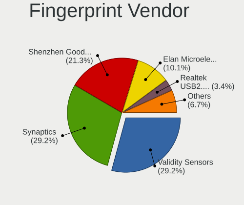

| Vendor                             | Computers | Percent |
|------------------------------------|-----------|---------|
| Validity Sensors                   | 26        | 29.21%  |
| Synaptics                          | 26        | 29.21%  |
| Shenzhen Goodix Technology         | 19        | 21.35%  |
| Elan Microelectronics              | 9         | 10.11%  |
| Realtek USB2.0 Finger Print Bridge | 3         | 3.37%   |
| LighTuning Technology              | 3         | 3.37%   |
| Focal-systems.Corp                 | 2         | 2.25%   |
| HOLTEK                             | 1         | 1.12%   |

Fingerprint Model
-----------------

Fingerprint sensor models

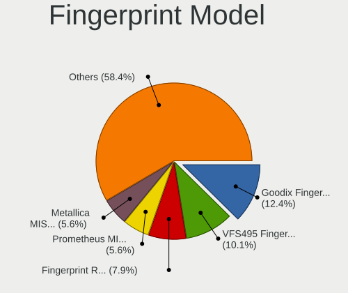

| Model                                                                      | Computers | Percent |
|----------------------------------------------------------------------------|-----------|---------|
| Shenzhen Goodix  FingerPrint Device                                        | 11        | 12.36%  |
| Validity Sensors VFS495 Fingerprint Reader                                 | 9         | 10.11%  |
| Shenzhen Goodix Fingerprint Reader                                         | 7         | 7.87%   |
| Synaptics Prometheus MIS Touch Fingerprint Reader                          | 5         | 5.62%   |
| Synaptics Metallica MIS Touch Fingerprint Reader                           | 5         | 5.62%   |
| Elan ELAN:Fingerprint                                                      | 5         | 5.62%   |
| Validity Sensors Synaptics WBDI                                            | 4         | 4.49%   |
| Elan ELAN:ARM-M4                                                           | 4         | 4.49%   |
| Validity Sensors VFS 5011 fingerprint sensor                               | 3         | 3.37%   |
| Validity Sensors Swipe Fingerprint Sensor                                  | 3         | 3.37%   |
| Synaptics WBDI Device                                                      | 3         | 3.37%   |
| Realtek USB2.0 Finger Print Bridge FocalTech Fingerprint Device            | 3         | 3.37%   |
| Validity Sensors VFS5011 Fingerprint Reader                                | 2         | 2.25%   |
| Validity Sensors Synaptics VFS7552 Touch Fingerprint Sensor                | 2         | 2.25%   |
| Synaptics UWP WBDI                                                         | 2         | 2.25%   |
| Synaptics FS7604 Touch Fingerprint Sensor with PurePrint                   | 2         | 2.25%   |
| Synaptics Fingerprint reader [HP G6]                                       | 2         | 2.25%   |
| Focal-systems.Corp FT9201Fingerprint.                                      | 2         | 2.25%   |
| Validity Sensors VFS491                                                    | 1         | 1.12%   |
| Validity Sensors VFS471 Fingerprint Reader                                 | 1         | 1.12%   |
| Validity Sensors Synaptics VFS7552 Touch Fingerprint Sensor with PurePrint | 1         | 1.12%   |
| Synaptics WBDI                                                             | 1         | 1.12%   |
| Synaptics UWP WBDI Device                                                  | 1         | 1.12%   |
| Synaptics TouchPad                                                         | 1         | 1.12%   |
| Synaptics  WBDI                                                            | 1         | 1.12%   |
| Synaptics Prometheus Fingerprint Reader                                    | 1         | 1.12%   |
| Synaptics Fingerprint scanner                                              | 1         | 1.12%   |
| Shenzhen Goodix FingerPrint                                                | 1         | 1.12%   |
| LighTuning Fingerprint Sensor                                              | 1         | 1.12%   |
| LighTuning ES603 Swipe Fingerprint Sensor                                  | 1         | 1.12%   |
| LighTuning EgisTec Touch Fingerprint Sensor                                | 1         | 1.12%   |
| HOLTEK FocalTech Fingerprint Device                                        | 1         | 1.12%   |
| Unknown                                                                    | 1         | 1.12%   |

Chipcard Vendor
---------------

Chipcard module vendors

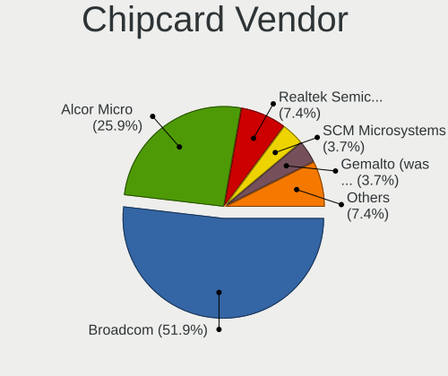

| Vendor                | Computers | Percent |
|-----------------------|-----------|---------|
| Broadcom              | 14        | 51.85%  |
| Alcor Micro           | 7         | 25.93%  |
| Realtek Semiconductor | 2         | 7.41%   |
| SCM Microsystems      | 1         | 3.7%    |
| Gemalto (was Gemplus) | 1         | 3.7%    |
| Cherry                | 1         | 3.7%    |
| Advanced Card Systems | 1         | 3.7%    |

Chipcard Model
--------------

Chipcard module models

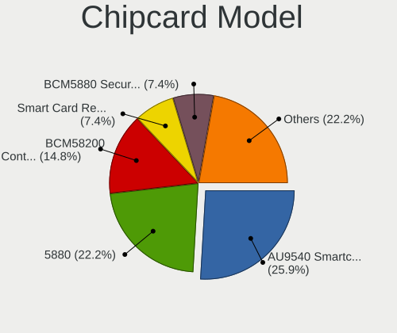

| Model                                                                        | Computers | Percent |
|------------------------------------------------------------------------------|-----------|---------|
| Alcor Micro AU9540 Smartcard Reader                                          | 7         | 25.93%  |
| Broadcom 5880                                                                | 6         | 22.22%  |
| Broadcom BCM58200 ControlVault 3 (FingerPrint sensor + Contacted SmartCard)  | 4         | 14.81%  |
| Realtek Semiconductor Smart Card Reader Interface                            | 2         | 7.41%   |
| Broadcom BCM5880 Secure Applications Processor                               | 2         | 7.41%   |
| SCM Microsystems SCR3500 C Contact Reader                                    | 1         | 3.7%    |
| Gemalto (was Gemplus) GemPC Twin SmartCard Reader                            | 1         | 3.7%    |
| Cherry SmartCard Reader Keyboard KC 1000 SC                                  | 1         | 3.7%    |
| Broadcom BCM5880 Secure Applications Processor with fingerprint swipe sensor | 1         | 3.7%    |
| Broadcom 58200                                                               | 1         | 3.7%    |
| Advanced Card Systems ACR39U                                                 | 1         | 3.7%    |

Unsupported
-----------

Unsupported Devices
-------------------

Total unsupported devices on board

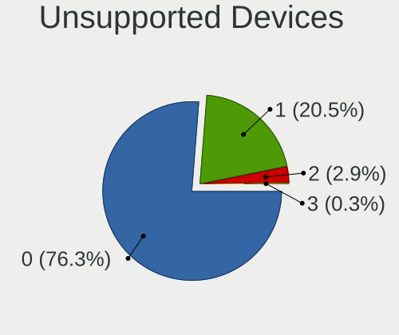

| Total | Computers | Percent |
|-------|-----------|---------|
| 0     | 1355      | 76.25%  |
| 1     | 365       | 20.54%  |
| 2     | 52        | 2.93%   |
| 3     | 5         | 0.28%   |

Unsupported Device Types
------------------------

Types of unsupported devices

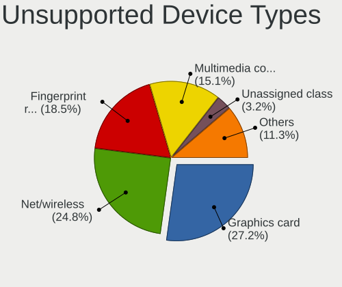

| Type                     | Computers | Percent |
|--------------------------|-----------|---------|
| Graphics card            | 128       | 27.18%  |
| Net/wireless             | 117       | 24.84%  |
| Fingerprint reader       | 87        | 18.47%  |
| Multimedia controller    | 71        | 15.07%  |
| Unassigned class         | 15        | 3.18%   |
| Sound                    | 9         | 1.91%   |
| Camera                   | 9         | 1.91%   |
| Chipcard                 | 8         | 1.7%    |
| Bluetooth                | 7         | 1.49%   |
| Net/ethernet             | 6         | 1.27%   |
| Network                  | 3         | 0.64%   |
| Communication controller | 3         | 0.64%   |
| Card reader              | 3         | 0.64%   |
| Unclassified device      | 1         | 0.21%   |
| Storage/raid             | 1         | 0.21%   |
| Storage/nvme             | 1         | 0.21%   |
| Storage                  | 1         | 0.21%   |
| Modem                    | 1         | 0.21%   |

