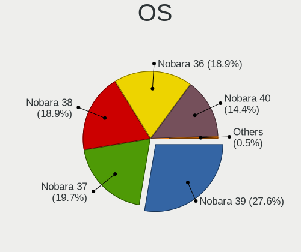
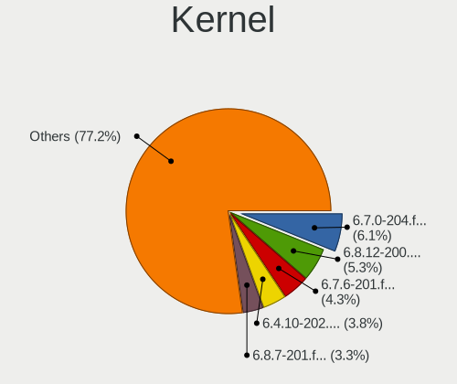
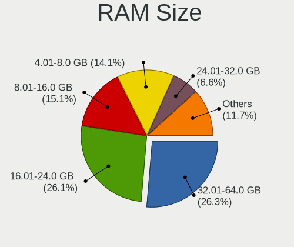
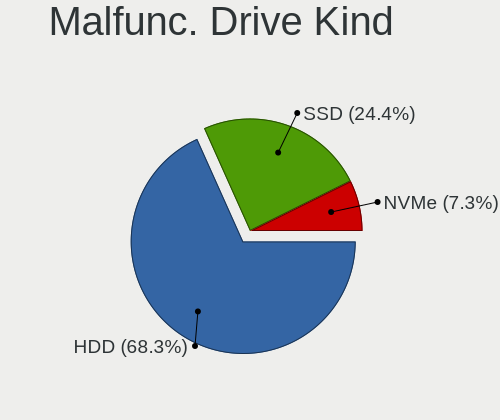
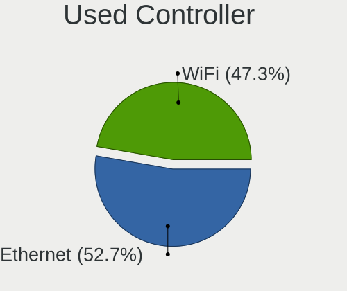
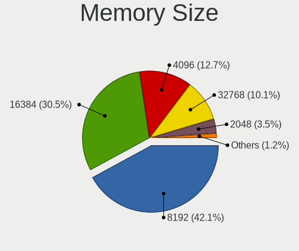

Nobara - Tested Hardware & Statistics
-------------------------------------

A project to collect tested hardware configurations for Nobara.

Anyone can contribute to this report by the [hw-probe](https://github.com/linuxhw/hw-probe) tool:

    sudo -E hw-probe -all -upload

Please contribute! Especially if your hardware is rare.

This is a report for all computer types. See also reports for [desktops](/Dist/Nobara/Desktop/README.md) and [notebooks](/Dist/Nobara/Notebook/README.md).

Contents
--------

* [ Test Cases ](#test-cases)

* [ System ](#system)
  - [ OS                       ](#os)
  - [ OS Family                ](#os-family)
  - [ Kernel                   ](#kernel)
  - [ Kernel Family            ](#kernel-family)
  - [ Kernel Major Ver.        ](#kernel-major-ver)
  - [ Arch                     ](#arch)
  - [ DE                       ](#de)
  - [ Display Server           ](#display-server)
  - [ Display Manager          ](#display-manager)
  - [ OS Lang                  ](#os-lang)
  - [ Boot Mode                ](#boot-mode)
  - [ Filesystem               ](#filesystem)
  - [ Part. scheme             ](#part-scheme)
  - [ Dual Boot with Linux/BSD ](#dual-boot-with-linuxbsd)
  - [ Dual Boot (Win)          ](#dual-boot-win)

* [ Board ](#board)
  - [ Vendor                   ](#vendor)
  - [ Model                    ](#model)
  - [ Model Family             ](#model-family)
  - [ MFG Year                 ](#mfg-year)
  - [ Form Factor              ](#form-factor)
  - [ Secure Boot              ](#secure-boot)
  - [ Coreboot                 ](#coreboot)
  - [ RAM Size                 ](#ram-size)
  - [ RAM Used                 ](#ram-used)
  - [ Total Drives             ](#total-drives)
  - [ Has CD-ROM               ](#has-cd-rom)
  - [ Has Ethernet             ](#has-ethernet)
  - [ Has WiFi                 ](#has-wifi)
  - [ Has Bluetooth            ](#has-bluetooth)

* [ Location ](#location)
  - [ Country                  ](#country)
  - [ City                     ](#city)

* [ Drives ](#drives)
  - [ Drive Vendor             ](#drive-vendor)
  - [ Drive Model              ](#drive-model)
  - [ HDD Vendor               ](#hdd-vendor)
  - [ SSD Vendor               ](#ssd-vendor)
  - [ Drive Kind               ](#drive-kind)
  - [ Drive Connector          ](#drive-connector)
  - [ Drive Size               ](#drive-size)
  - [ Space Total              ](#space-total)
  - [ Space Used               ](#space-used)
  - [ Malfunc. Drives          ](#malfunc-drives)
  - [ Malfunc. Drive Vendor    ](#malfunc-drive-vendor)
  - [ Malfunc. HDD Vendor      ](#malfunc-hdd-vendor)
  - [ Malfunc. Drive Kind      ](#malfunc-drive-kind)
  - [ Failed Drives            ](#failed-drives)
  - [ Failed Drive Vendor      ](#failed-drive-vendor)
  - [ Drive Status             ](#drive-status)

* [ Storage controller ](#storage-controller)
  - [ Storage Vendor           ](#storage-vendor)
  - [ Storage Model            ](#storage-model)
  - [ Storage Kind             ](#storage-kind)

* [ Processor ](#processor)
  - [ CPU Vendor               ](#cpu-vendor)
  - [ CPU Model                ](#cpu-model)
  - [ CPU Model Family         ](#cpu-model-family)
  - [ CPU Cores                ](#cpu-cores)
  - [ CPU Sockets              ](#cpu-sockets)
  - [ CPU Threads              ](#cpu-threads)
  - [ CPU Op-Modes             ](#cpu-op-modes)
  - [ CPU Microcode            ](#cpu-microcode)
  - [ CPU Microarch            ](#cpu-microarch)

* [ Graphics ](#graphics)
  - [ GPU Vendor               ](#gpu-vendor)
  - [ GPU Model                ](#gpu-model)
  - [ GPU Combo                ](#gpu-combo)
  - [ GPU Driver               ](#gpu-driver)
  - [ GPU Memory               ](#gpu-memory)

* [ Monitor ](#monitor)
  - [ Monitor Vendor           ](#monitor-vendor)
  - [ Monitor Model            ](#monitor-model)
  - [ Monitor Resolution       ](#monitor-resolution)
  - [ Monitor Diagonal         ](#monitor-diagonal)
  - [ Monitor Width            ](#monitor-width)
  - [ Aspect Ratio             ](#aspect-ratio)
  - [ Monitor Area             ](#monitor-area)
  - [ Pixel Density            ](#pixel-density)
  - [ Multiple Monitors        ](#multiple-monitors)

* [ Network ](#network)
  - [ Net Controller Vendor    ](#net-controller-vendor)
  - [ Net Controller Model     ](#net-controller-model)
  - [ Wireless Vendor          ](#wireless-vendor)
  - [ Wireless Model           ](#wireless-model)
  - [ Ethernet Vendor          ](#ethernet-vendor)
  - [ Ethernet Model           ](#ethernet-model)
  - [ Net Controller Kind      ](#net-controller-kind)
  - [ Used Controller          ](#used-controller)
  - [ NICs                     ](#nics)
  - [ IPv6                     ](#ipv6)

* [ Bluetooth ](#bluetooth)
  - [ Bluetooth Vendor         ](#bluetooth-vendor)
  - [ Bluetooth Model          ](#bluetooth-model)

* [ Sound ](#sound)
  - [ Sound Vendor             ](#sound-vendor)
  - [ Sound Model              ](#sound-model)

* [ Memory ](#memory)
  - [ Memory Vendor            ](#memory-vendor)
  - [ Memory Model             ](#memory-model)
  - [ Memory Kind              ](#memory-kind)
  - [ Memory Form Factor       ](#memory-form-factor)
  - [ Memory Size              ](#memory-size)
  - [ Memory Speed             ](#memory-speed)

* [ Printers & scanners ](#printers--scanners)
  - [ Printer Vendor           ](#printer-vendor)
  - [ Printer Model            ](#printer-model)
  - [ Scanner Vendor           ](#scanner-vendor)
  - [ Scanner Model            ](#scanner-model)

* [ Camera ](#camera)
  - [ Camera Vendor            ](#camera-vendor)
  - [ Camera Model             ](#camera-model)

* [ Security ](#security)
  - [ Fingerprint Vendor       ](#fingerprint-vendor)
  - [ Fingerprint Model        ](#fingerprint-model)
  - [ Chipcard Vendor          ](#chipcard-vendor)
  - [ Chipcard Model           ](#chipcard-model)

* [ Unsupported ](#unsupported)
  - [ Unsupported Devices      ](#unsupported-devices)
  - [ Unsupported Device Types ](#unsupported-device-types)

Test Cases
----------

Total: 108

| Vendor    | Model                       | Form-Factor | Probe                                                      | Date         |
|-----------|-----------------------------|-------------|------------------------------------------------------------|--------------|
| EVOO      | EG-LP10                     | Notebook    | [32c1a174d1](https://linux-hardware.org/?probe=32c1a174d1) | Oct 01, 2022 |
| MSI       | MEG X570 UNIFY              | Desktop     | [4d2e449699](https://linux-hardware.org/?probe=4d2e449699) | Sep 30, 2022 |
| ASRock    | X470 Master SLI             | Desktop     | [47c190b6e9](https://linux-hardware.org/?probe=47c190b6e9) | Sep 30, 2022 |
| ASUSTek   | Q504UAK                     | Convertible | [062910424d](https://linux-hardware.org/?probe=062910424d) | Sep 30, 2022 |
| Acer      | Aspire VX5-591G             | Notebook    | [b321f4561b](https://linux-hardware.org/?probe=b321f4561b) | Sep 29, 2022 |
| Lenovo    | V330-15IKB 81AX             | Notebook    | [0360123f76](https://linux-hardware.org/?probe=0360123f76) | Sep 29, 2022 |
| ASUSTek   | Q504UAK                     | Convertible | [a205e0ea70](https://linux-hardware.org/?probe=a205e0ea70) | Sep 29, 2022 |
| ASUSTek   | Q504UAK                     | Convertible | [0625d80195](https://linux-hardware.org/?probe=0625d80195) | Sep 29, 2022 |
| Gigabyte  | H270-Gaming 3               | Desktop     | [9426d21070](https://linux-hardware.org/?probe=9426d21070) | Sep 29, 2022 |
| Gigabyte  | H270-Gaming 3               | Desktop     | [830af9c53e](https://linux-hardware.org/?probe=830af9c53e) | Sep 29, 2022 |
| Lenovo    | G580 20157                  | Notebook    | [2b34d591ab](https://linux-hardware.org/?probe=2b34d591ab) | Sep 29, 2022 |
| Apple     | MacBookAir4,2               | Notebook    | [a423006d4c](https://linux-hardware.org/?probe=a423006d4c) | Sep 29, 2022 |
| Apple     | MacBookAir4,2               | Notebook    | [5dba6cf7fd](https://linux-hardware.org/?probe=5dba6cf7fd) | Sep 29, 2022 |
| Gigabyte  | AB350-Gaming 3-CF           | Desktop     | [365d74f8e4](https://linux-hardware.org/?probe=365d74f8e4) | Sep 28, 2022 |
| Intel     | B75                         | Desktop     | [af5aef869c](https://linux-hardware.org/?probe=af5aef869c) | Sep 28, 2022 |
| Dell      | Inspiron 3542               | Notebook    | [6d35107941](https://linux-hardware.org/?probe=6d35107941) | Sep 28, 2022 |
| Apple     | MacBookPro8,3               | Notebook    | [74927fc7d2](https://linux-hardware.org/?probe=74927fc7d2) | Sep 27, 2022 |
| Gigabyte  | AB350-Gaming 3-CF           | Desktop     | [cfd24b9e0a](https://linux-hardware.org/?probe=cfd24b9e0a) | Sep 27, 2022 |
| MSI       | MAG X570 TOMAHAWK WIFI      | Desktop     | [6bfc8d43ef](https://linux-hardware.org/?probe=6bfc8d43ef) | Sep 27, 2022 |
| Lenovo    | IdeaPad 310-15IAP 80TT      | Notebook    | [65f896ddab](https://linux-hardware.org/?probe=65f896ddab) | Sep 27, 2022 |
| MSI       | A68HM-E33 V2                | Desktop     | [d51c90a7a8](https://linux-hardware.org/?probe=d51c90a7a8) | Sep 27, 2022 |
| ASUSTek   | 970 PRO GAMING/AURA         | Desktop     | [f61a736922](https://linux-hardware.org/?probe=f61a736922) | Sep 26, 2022 |
| ASUSTek   | 970 PRO GAMING/AURA         | Desktop     | [1ecfe379e7](https://linux-hardware.org/?probe=1ecfe379e7) | Sep 26, 2022 |
| ASUSTek   | PRIME H410M-A               | Desktop     | [dafae8d45b](https://linux-hardware.org/?probe=dafae8d45b) | Sep 26, 2022 |
| Lenovo    | 3136 SDK0J40697 WIN 3305... | Mini pc     | [d31088804f](https://linux-hardware.org/?probe=d31088804f) | Sep 24, 2022 |
| MSI       | 970 GAMING                  | Desktop     | [015cd37f26](https://linux-hardware.org/?probe=015cd37f26) | Sep 24, 2022 |
| Dell      | Latitude 7275               | Tablet      | [49ee35636b](https://linux-hardware.org/?probe=49ee35636b) | Sep 24, 2022 |
| Dell      | 0G785M A00                  | Desktop     | [c461ec42d6](https://linux-hardware.org/?probe=c461ec42d6) | Sep 24, 2022 |
| ASUSTek   | PRIME A320M-K               | Desktop     | [d72e6b3865](https://linux-hardware.org/?probe=d72e6b3865) | Sep 23, 2022 |
| Gateway   | NE56R                       | Notebook    | [f603edd045](https://linux-hardware.org/?probe=f603edd045) | Sep 23, 2022 |
| Toshiba   | TECRA A50-A                 | Notebook    | [6ef2538a5a](https://linux-hardware.org/?probe=6ef2538a5a) | Sep 23, 2022 |
| Lenovo    | IdeaPad 5 15ARE05 81YQ      | Notebook    | [605e97df5c](https://linux-hardware.org/?probe=605e97df5c) | Sep 22, 2022 |
| Lenovo    | IdeaPad 5 15ARE05 81YQ      | Notebook    | [94e6332c62](https://linux-hardware.org/?probe=94e6332c62) | Sep 22, 2022 |
| ASUSTek   | ROG Zephyrus G14 GA401II... | Notebook    | [2e36489a4b](https://linux-hardware.org/?probe=2e36489a4b) | Sep 22, 2022 |
| Gigabyte  | EP45-UD3L                   | Desktop     | [71c630ea03](https://linux-hardware.org/?probe=71c630ea03) | Sep 22, 2022 |
| ASUSTek   | ROG Zephyrus G14 GA401II... | Notebook    | [8705683c6f](https://linux-hardware.org/?probe=8705683c6f) | Sep 22, 2022 |
| ASUSTek   | PRIME H310M-E R2.0          | Desktop     | [7299d75966](https://linux-hardware.org/?probe=7299d75966) | Sep 22, 2022 |
| HP        | 8594                        | Desktop     | [281774ad4a](https://linux-hardware.org/?probe=281774ad4a) | Sep 21, 2022 |
| Gigabyte  | EP45-UD3L                   | Desktop     | [2b90168b71](https://linux-hardware.org/?probe=2b90168b71) | Sep 21, 2022 |
| ASRock    | X470 Master SLI             | Desktop     | [3c8fefe578](https://linux-hardware.org/?probe=3c8fefe578) | Sep 20, 2022 |
| ASRock    | X470 Master SLI             | Desktop     | [1975320cad](https://linux-hardware.org/?probe=1975320cad) | Sep 20, 2022 |
| Alienware | Area-51m R2 A00             | Notebook    | [0ebdec6dd0](https://linux-hardware.org/?probe=0ebdec6dd0) | Sep 20, 2022 |
| ASUSTek   | N56VZ                       | Notebook    | [ce162c52c0](https://linux-hardware.org/?probe=ce162c52c0) | Sep 19, 2022 |
| Dell      | 0G785M A00                  | Desktop     | [8b8c41b401](https://linux-hardware.org/?probe=8b8c41b401) | Sep 19, 2022 |
| Unknown   | T3 MRD                      | Desktop     | [1f60a4d202](https://linux-hardware.org/?probe=1f60a4d202) | Sep 19, 2022 |
| Lenovo    | IdeaPadFlex 10 20324        | Notebook    | [4e7f3b7bac](https://linux-hardware.org/?probe=4e7f3b7bac) | Sep 19, 2022 |
| MSI       | X570-A PRO                  | Desktop     | [cabf88c8be](https://linux-hardware.org/?probe=cabf88c8be) | Sep 19, 2022 |
| Lenovo    | Legion 5 15ARH05 82B5       | Notebook    | [854a0d4410](https://linux-hardware.org/?probe=854a0d4410) | Sep 19, 2022 |
| Dell      | Precision M6400             | Notebook    | [67924c5333](https://linux-hardware.org/?probe=67924c5333) | Sep 19, 2022 |
| Dell      | Precision M6400             | Notebook    | [27a55639e4](https://linux-hardware.org/?probe=27a55639e4) | Sep 19, 2022 |
| HUAWEI    | KLVL-WXXW                   | Notebook    | [e0e49d51d0](https://linux-hardware.org/?probe=e0e49d51d0) | Sep 18, 2022 |
| Gigabyte  | A320M-S2H-CF                | Desktop     | [7b95813c96](https://linux-hardware.org/?probe=7b95813c96) | Sep 18, 2022 |
| HUAWEI    | KLVL-WXXW                   | Notebook    | [f527016efe](https://linux-hardware.org/?probe=f527016efe) | Sep 18, 2022 |
| HUAWEI    | KLVL-WXXW                   | Notebook    | [812ea842dc](https://linux-hardware.org/?probe=812ea842dc) | Sep 18, 2022 |
| Lenovo    | ThinkBook 15 G3 ACL 21A4    | Notebook    | [004d0a2b9d](https://linux-hardware.org/?probe=004d0a2b9d) | Sep 17, 2022 |
| Unknown   | T3 MRD                      | Desktop     | [b10823b50f](https://linux-hardware.org/?probe=b10823b50f) | Sep 17, 2022 |
| Biostar   | H410MH S2                   | Desktop     | [832dd81851](https://linux-hardware.org/?probe=832dd81851) | Sep 17, 2022 |
| Lenovo    | ThinkPad P1 20MD0020US      | Notebook    | [a701fed148](https://linux-hardware.org/?probe=a701fed148) | Sep 16, 2022 |
| Lenovo    | MAHOBAY NOK                 | Desktop     | [cce010fd53](https://linux-hardware.org/?probe=cce010fd53) | Sep 16, 2022 |
| ASUSTek   | VivoBook_ASUSLaptop X340... | Notebook    | [5ffc7d13ac](https://linux-hardware.org/?probe=5ffc7d13ac) | Sep 16, 2022 |
| Dell      | G5 5505                     | Notebook    | [25755e8605](https://linux-hardware.org/?probe=25755e8605) | Sep 16, 2022 |
| HP        | 15                          | Notebook    | [79aa0d618f](https://linux-hardware.org/?probe=79aa0d618f) | Sep 14, 2022 |
| Acer      | Aspire A315-42              | Notebook    | [820c1e2ac6](https://linux-hardware.org/?probe=820c1e2ac6) | Sep 11, 2022 |
| Dell      | Precision 3510              | Notebook    | [4337a8e018](https://linux-hardware.org/?probe=4337a8e018) | Sep 11, 2022 |
| ASUSTek   | TUF Gaming B550M-PLUS WI... | Desktop     | [d9e9ec9afa](https://linux-hardware.org/?probe=d9e9ec9afa) | Sep 09, 2022 |
| ASUSTek   | TUF Gaming B550M-PLUS WI... | Desktop     | [1cdd7cda15](https://linux-hardware.org/?probe=1cdd7cda15) | Sep 09, 2022 |
| ASUSTek   | TUF Gaming X570-PRO         | Desktop     | [6eae76b5d0](https://linux-hardware.org/?probe=6eae76b5d0) | Sep 01, 2022 |
| ASRock    | FM2A55M-HD+                 | Desktop     | [2f96c73efb](https://linux-hardware.org/?probe=2f96c73efb) | Sep 01, 2022 |
| ASUSTek   | ASUS TUF Gaming F15 FX50... | Notebook    | [0ca693e2dd](https://linux-hardware.org/?probe=0ca693e2dd) | Aug 31, 2022 |
| Gigabyte  | H110M-H-CF                  | Desktop     | [86fc2bf58f](https://linux-hardware.org/?probe=86fc2bf58f) | Aug 31, 2022 |
| Alienware | 01NYPT A00                  | Desktop     | [cd95b79270](https://linux-hardware.org/?probe=cd95b79270) | Aug 29, 2022 |
| AZW       | SER                         | Mini pc     | [92460ed2a6](https://linux-hardware.org/?probe=92460ed2a6) | Aug 29, 2022 |
| ASUSTek   | TP500LA                     | Notebook    | [de395dddd8](https://linux-hardware.org/?probe=de395dddd8) | Aug 28, 2022 |
| ASRock    | B560 Steel Legend           | Desktop     | [c64907de8d](https://linux-hardware.org/?probe=c64907de8d) | Aug 27, 2022 |
| ASUSTek   | P8Z68-V PRO                 | Desktop     | [37ae937f4d](https://linux-hardware.org/?probe=37ae937f4d) | Aug 26, 2022 |
| ASUSTek   | PRIME X570-PRO              | Desktop     | [663509c999](https://linux-hardware.org/?probe=663509c999) | Aug 24, 2022 |
| ASUSTek   | PRIME X570-PRO              | Desktop     | [2b7d1d59a1](https://linux-hardware.org/?probe=2b7d1d59a1) | Aug 24, 2022 |
| ASUSTek   | PRIME A320M-K               | Desktop     | [928ce75df1](https://linux-hardware.org/?probe=928ce75df1) | Aug 24, 2022 |
| ASRock    | H61M-VG3                    | Desktop     | [a3cd7ba2c1](https://linux-hardware.org/?probe=a3cd7ba2c1) | Aug 22, 2022 |
| Dell      | G15 5511                    | Notebook    | [44fa9bf084](https://linux-hardware.org/?probe=44fa9bf084) | Aug 21, 2022 |
| ASUSTek   | B85M-E                      | Desktop     | [0b5044dacf](https://linux-hardware.org/?probe=0b5044dacf) | Aug 19, 2022 |
| Gigabyte  | B450M DS3H-CF               | Desktop     | [a2b6c2ae17](https://linux-hardware.org/?probe=a2b6c2ae17) | Aug 19, 2022 |
| Notebook  | P7xxDM2(-G)                 | Notebook    | [f074899985](https://linux-hardware.org/?probe=f074899985) | Aug 17, 2022 |
| HP        | Pavilion Gaming Laptop 1... | Notebook    | [315da58d24](https://linux-hardware.org/?probe=315da58d24) | Aug 16, 2022 |
| ASRock    | X470 Master SLI             | Desktop     | [ce62975b20](https://linux-hardware.org/?probe=ce62975b20) | Aug 15, 2022 |
| ASUSTek   | PRIME B350-PLUS             | Desktop     | [b2bbce2845](https://linux-hardware.org/?probe=b2bbce2845) | Aug 15, 2022 |
| ASRock    | Z97 Extreme6                | Desktop     | [31d7973a9d](https://linux-hardware.org/?probe=31d7973a9d) | Aug 14, 2022 |
| ASRock    | 760GM-HDV                   | Desktop     | [beabb7dd99](https://linux-hardware.org/?probe=beabb7dd99) | Aug 14, 2022 |
| Apple     | MacBookPro14,2              | Notebook    | [c66d476513](https://linux-hardware.org/?probe=c66d476513) | Aug 13, 2022 |
| ASUSTek   | ROG Strix G513QY_G513QY     | Notebook    | [df2cc1a299](https://linux-hardware.org/?probe=df2cc1a299) | Aug 12, 2022 |
| MSI       | B450 TOMAHAWK MAX           | Desktop     | [27cd96982f](https://linux-hardware.org/?probe=27cd96982f) | Aug 10, 2022 |
| HP        | 8906 SMVB                   | Desktop     | [8f30392f49](https://linux-hardware.org/?probe=8f30392f49) | Aug 10, 2022 |
| HP        | 8054                        | Desktop     | [469b765fe0](https://linux-hardware.org/?probe=469b765fe0) | Aug 10, 2022 |
| ASUSTek   | G20AJ                       | Desktop     | [613f8a0c36](https://linux-hardware.org/?probe=613f8a0c36) | Aug 08, 2022 |
| Gigabyte  | X570 AORUS ELITE            | Desktop     | [f65ba77de3](https://linux-hardware.org/?probe=f65ba77de3) | Aug 07, 2022 |
| Lenovo    | IdeaPad Y700-15ISK 80NV     | Notebook    | [6beddf67f5](https://linux-hardware.org/?probe=6beddf67f5) | Aug 06, 2022 |
| ASUSTek   | ROG CROSSHAIR VIII HERO     | Desktop     | [7a60eede9a](https://linux-hardware.org/?probe=7a60eede9a) | Aug 04, 2022 |
| MSI       | B450-A PRO MAX              | Desktop     | [e142cf5c91](https://linux-hardware.org/?probe=e142cf5c91) | Aug 04, 2022 |
| MSI       | B450 TOMAHAWK MAX           | Desktop     | [7c4355417f](https://linux-hardware.org/?probe=7c4355417f) | Aug 03, 2022 |
| ASUSTek   | Q504UAK                     | Convertible | [5f2025770d](https://linux-hardware.org/?probe=5f2025770d) | Aug 03, 2022 |
| MSI       | X570-A PRO                  | Desktop     | [f034a02e69](https://linux-hardware.org/?probe=f034a02e69) | Aug 01, 2022 |
| Razer     | Blade                       | Notebook    | [cc3ce45956](https://linux-hardware.org/?probe=cc3ce45956) | Jul 31, 2022 |
| HP        | ZBook 15 G2                 | Notebook    | [3aa2fda09a](https://linux-hardware.org/?probe=3aa2fda09a) | Jul 26, 2022 |
| MSI       | 970 GAMING                  | Desktop     | [bf2a870952](https://linux-hardware.org/?probe=bf2a870952) | Jul 23, 2022 |
| Dell      | 0J8H4R A01                  | Desktop     | [3d7d06475c](https://linux-hardware.org/?probe=3d7d06475c) | Jul 23, 2022 |
| ASUSTek   | PRIME B450-PLUS             | Desktop     | [7d6b6d93d3](https://linux-hardware.org/?probe=7d6b6d93d3) | Jul 21, 2022 |
| eMachines | EL1870                      | Desktop     | [58e76fb684](https://linux-hardware.org/?probe=58e76fb684) | Jul 19, 2022 |
| MSI       | X570-A PRO                  | Desktop     | [c9683ea265](https://linux-hardware.org/?probe=c9683ea265) | Jul 19, 2022 |

System
------

OS
--

Installed operating systems

| Name      | Computers | Percent |
|-----------|-----------|---------|
| Nobara 36 | 86        | 100%    |

OS Family
---------

OS without a version

| Name   | Computers | Percent |
|--------|-----------|---------|
| Nobara | 86        | 100%    |

Kernel
------

Version of the Linux kernel

| Version                       | Computers | Percent |
|-------------------------------|-----------|---------|
| 5.19.9-201.fsync.fc36.x86_64  | 16        | 18.18%  |
| 5.18.13-201.fsync.fc36.x86_64 | 11        | 12.5%   |
| 5.19.7-204.fsync.fc36.x86_64  | 10        | 11.36%  |
| 5.19.4-201.fsync.fc36.x86_64  | 7         | 7.95%   |
| 5.19.10-201.fsync.fc36.x86_64 | 7         | 7.95%   |
| 5.18.16-201.fsync.fc36.x86_64 | 7         | 7.95%   |
| 5.19.11-201.fsync.fc36.x86_64 | 6         | 6.82%   |
| 5.18.17-201.fsync.fc36.x86_64 | 6         | 6.82%   |
| 5.19.8-201.fsync.fc36.x86_64  | 4         | 4.55%   |
| 5.18.19-201.fsync.fc36.x86_64 | 4         | 4.55%   |
| 5.18.11-201.fsync.fc36.x86_64 | 3         | 3.41%   |
| 5.19.7-203.fsync.fc36.x86_64  | 2         | 2.27%   |
| 5.18.18-201.fsync.fc36.x86_64 | 2         | 2.27%   |
| 5.19.2-602.inttf.fc36.x86_64  | 1         | 1.14%   |
| 5.19.12-201.fsync.fc36.x86_64 | 1         | 1.14%   |
| 5.18.9-201.fsync.fc36.x86_64  | 1         | 1.14%   |

Kernel Family
-------------

Linux kernel without a distro release

| Version | Computers | Percent |
|---------|-----------|---------|
| 5.19.9  | 16        | 18.18%  |
| 5.19.7  | 12        | 13.64%  |
| 5.18.13 | 11        | 12.5%   |
| 5.19.4  | 7         | 7.95%   |
| 5.19.10 | 7         | 7.95%   |
| 5.18.16 | 7         | 7.95%   |
| 5.19.11 | 6         | 6.82%   |
| 5.18.17 | 6         | 6.82%   |
| 5.19.8  | 4         | 4.55%   |
| 5.18.19 | 4         | 4.55%   |
| 5.18.11 | 3         | 3.41%   |
| 5.18.18 | 2         | 2.27%   |
| 5.19.2  | 1         | 1.14%   |
| 5.19.12 | 1         | 1.14%   |
| 5.18.9  | 1         | 1.14%   |

Kernel Major Ver.
-----------------

Linux kernel major version

| Version | Computers | Percent |
|---------|-----------|---------|
| 5.19    | 54        | 61.36%  |
| 5.18    | 34        | 38.64%  |

Arch
----

OS architecture (x86_64, i586, etc.)

| Name   | Computers | Percent |
|--------|-----------|---------|
| x86_64 | 86        | 100%    |

DE
--

Desktop Environment

| Name    | Computers | Percent |
|---------|-----------|---------|
| GNOME   | 64        | 74.42%  |
| KDE5    | 21        | 24.42%  |
| Unknown | 1         | 1.16%   |

Display Server
--------------

X11 or Wayland

| Name    | Computers | Percent |
|---------|-----------|---------|
| Wayland | 70        | 79.55%  |
| X11     | 17        | 19.32%  |
| Unknown | 1         | 1.14%   |

Display Manager
---------------

SDDM, LightDM, etc.

| Name    | Computers | Percent |
|---------|-----------|---------|
| Unknown | 75        | 86.21%  |
| SDDM    | 6         | 6.9%    |
| GDM     | 6         | 6.9%    |

OS Lang
-------

Language

| Lang    | Computers | Percent |
|---------|-----------|---------|
| en_US   | 48        | 55.17%  |
| en_GB   | 7         | 8.05%   |
| es_ES   | 4         | 4.6%    |
| es_AR   | 3         | 3.45%   |
| en_IN   | 3         | 3.45%   |
| de_DE   | 3         | 3.45%   |
| ru_RU   | 2         | 2.3%    |
| es_MX   | 2         | 2.3%    |
| en_CA   | 2         | 2.3%    |
| sk_SK   | 1         | 1.15%   |
| pt_PT   | 1         | 1.15%   |
| pt_BR   | 1         | 1.15%   |
| nl_NL   | 1         | 1.15%   |
| hr_HR   | 1         | 1.15%   |
| fr_FR   | 1         | 1.15%   |
| es_EC   | 1         | 1.15%   |
| es_CO   | 1         | 1.15%   |
| es_CL   | 1         | 1.15%   |
| en_ZA   | 1         | 1.15%   |
| en_NZ   | 1         | 1.15%   |
| en_AU   | 1         | 1.15%   |
| Unknown | 1         | 1.15%   |

Boot Mode
---------

EFI or BIOS

| Mode | Computers | Percent |
|------|-----------|---------|
| EFI  | 65        | 75.58%  |
| BIOS | 21        | 24.42%  |

Filesystem
----------

Type of filesystem

| Type  | Computers | Percent |
|-------|-----------|---------|
| Ext4  | 69        | 80.23%  |
| Btrfs | 16        | 18.6%   |
| Xfs   | 1         | 1.16%   |

Part. scheme
------------

Scheme of partitioning

| Type    | Computers | Percent |
|---------|-----------|---------|
| Unknown | 75        | 86.21%  |
| GPT     | 11        | 12.64%  |
| MBR     | 1         | 1.15%   |

Dual Boot with Linux/BSD
------------------------

Hosting more than one Linux/BSD

| Dual boot | Computers | Percent |
|-----------|-----------|---------|
| No        | 82        | 95.35%  |
| Yes       | 4         | 4.65%   |

Dual Boot (Win)
---------------

Hosting Linux and Windows

| Dual boot | Computers | Percent |
|-----------|-----------|---------|
| No        | 80        | 93.02%  |
| Yes       | 6         | 6.98%   |

Board
-----

Vendor
------

Motherboard manufacturer

| Name                | Computers | Percent |
|---------------------|-----------|---------|
| ASUSTek Computer    | 21        | 24.42%  |
| Lenovo              | 11        | 12.79%  |
| MSI                 | 10        | 11.63%  |
| Dell                | 8         | 9.3%    |
| Gigabyte Technology | 7         | 8.14%   |
| Hewlett-Packard     | 6         | 6.98%   |
| ASRock              | 6         | 6.98%   |
| Apple               | 3         | 3.49%   |
| Alienware           | 2         | 2.33%   |
| Acer                | 2         | 2.33%   |
| Toshiba             | 1         | 1.16%   |
| Razer               | 1         | 1.16%   |
| Notebook            | 1         | 1.16%   |
| Intel               | 1         | 1.16%   |
| Gateway             | 1         | 1.16%   |
| EVOO                | 1         | 1.16%   |
| eMachines           | 1         | 1.16%   |
| Biostar             | 1         | 1.16%   |
| AZW                 | 1         | 1.16%   |
| Unknown             | 1         | 1.16%   |

Model
-----

Motherboard model

| Name                                | Computers | Percent |
|-------------------------------------|-----------|---------|
| MSI MS-7C37                         | 2         | 2.33%   |
| MSI MS-7C02                         | 2         | 2.33%   |
| MSI MS-7693                         | 2         | 2.33%   |
| ASUS PRIME A320M-K                  | 2         | 2.33%   |
| Toshiba TECRA A50-A                 | 1         | 1.16%   |
| Razer Blade                         | 1         | 1.16%   |
| Notebook P7xxDM2(-G)                | 1         | 1.16%   |
| MSI MS-7C84                         | 1         | 1.16%   |
| MSI MS-7C35                         | 1         | 1.16%   |
| MSI MS-7B86                         | 1         | 1.16%   |
| MSI MS-7721                         | 1         | 1.16%   |
| Lenovo V330-15IKB 81AX              | 1         | 1.16%   |
| Lenovo ThinkPad P1 20MD0020US       | 1         | 1.16%   |
| Lenovo ThinkCentre M92p 3238E5U     | 1         | 1.16%   |
| Lenovo ThinkCentre M920q 10RS0030MX | 1         | 1.16%   |
| Lenovo ThinkBook 15 G3 ACL 21A4     | 1         | 1.16%   |
| Lenovo Legion 5 15ARH05 82B5        | 1         | 1.16%   |
| Lenovo IdeaPadFlex 10 20324         | 1         | 1.16%   |
| Lenovo IdeaPad Y700-15ISK 80NV      | 1         | 1.16%   |
| Lenovo IdeaPad 5 15ARE05 81YQ       | 1         | 1.16%   |
| Lenovo IdeaPad 310-15IAP 80TT       | 1         | 1.16%   |
| Lenovo G580 20157                   | 1         | 1.16%   |
| Intel B75                           | 1         | 1.16%   |
| HP ZBook 15 G2                      | 1         | 1.16%   |
| HP Pavilion Gaming Laptop 15-ec1xxx | 1         | 1.16%   |
| HP Pavilion Desktop TP01-2xxx       | 1         | 1.16%   |
| HP EliteDesk 800 G5 Desktop Mini    | 1         | 1.16%   |
| HP EliteDesk 800 G2 SFF             | 1         | 1.16%   |
| HP 15                               | 1         | 1.16%   |
| Gigabyte X570 AORUS ELITE           | 1         | 1.16%   |
| Gigabyte H270-Gaming 3              | 1         | 1.16%   |
| Gigabyte H110M-H                    | 1         | 1.16%   |
| Gigabyte EP45-UD3L                  | 1         | 1.16%   |
| Gigabyte B450M DS3H                 | 1         | 1.16%   |
| Gigabyte AB350-Gaming 3             | 1         | 1.16%   |
| Gigabyte A320M-S2H                  | 1         | 1.16%   |
| Gateway NE56R                       | 1         | 1.16%   |
| EVOO EG-LP10                        | 1         | 1.16%   |
| eMachines EL1870                    | 1         | 1.16%   |
| Dell Precision M6400                | 1         | 1.16%   |

Model Family
------------

Motherboard model prefix

| Name                  | Computers | Percent |
|-----------------------|-----------|---------|
| ASUS PRIME            | 7         | 8.14%   |
| Lenovo IdeaPad        | 3         | 3.49%   |
| ASUS ROG              | 3         | 3.49%   |
| MSI MS-7C37           | 2         | 2.33%   |
| MSI MS-7C02           | 2         | 2.33%   |
| MSI MS-7693           | 2         | 2.33%   |
| Lenovo ThinkCentre    | 2         | 2.33%   |
| HP Pavilion           | 2         | 2.33%   |
| HP EliteDesk          | 2         | 2.33%   |
| Dell Precision        | 2         | 2.33%   |
| ASUS TUF              | 2         | 2.33%   |
| Acer Aspire           | 2         | 2.33%   |
| Toshiba TECRA         | 1         | 1.16%   |
| Razer Blade           | 1         | 1.16%   |
| Notebook P7xxDM2(-G)  | 1         | 1.16%   |
| MSI MS-7C84           | 1         | 1.16%   |
| MSI MS-7C35           | 1         | 1.16%   |
| MSI MS-7B86           | 1         | 1.16%   |
| MSI MS-7721           | 1         | 1.16%   |
| Lenovo V330-15IKB     | 1         | 1.16%   |
| Lenovo ThinkPad       | 1         | 1.16%   |
| Lenovo ThinkBook      | 1         | 1.16%   |
| Lenovo Legion         | 1         | 1.16%   |
| Lenovo IdeaPadFlex    | 1         | 1.16%   |
| Lenovo G580           | 1         | 1.16%   |
| Intel B75             | 1         | 1.16%   |
| HP ZBook              | 1         | 1.16%   |
| HP 15                 | 1         | 1.16%   |
| Gigabyte X570         | 1         | 1.16%   |
| Gigabyte H270-Gaming  | 1         | 1.16%   |
| Gigabyte H110M-H      | 1         | 1.16%   |
| Gigabyte EP45-UD3L    | 1         | 1.16%   |
| Gigabyte B450M        | 1         | 1.16%   |
| Gigabyte AB350-Gaming | 1         | 1.16%   |
| Gigabyte A320M-S2H    | 1         | 1.16%   |
| Gateway NE56R         | 1         | 1.16%   |
| EVOO EG-LP10          | 1         | 1.16%   |
| eMachines EL1870      | 1         | 1.16%   |
| Dell OptiPlex         | 1         | 1.16%   |
| Dell Latitude         | 1         | 1.16%   |

MFG Year
--------

Motherboard manufacture year

| Year | Computers | Percent |
|------|-----------|---------|
| 2019 | 13        | 15.12%  |
| 2021 | 10        | 11.63%  |
| 2020 | 10        | 11.63%  |
| 2018 | 9         | 10.47%  |
| 2017 | 8         | 9.3%    |
| 2014 | 8         | 9.3%    |
| 2016 | 7         | 8.14%   |
| 2015 | 5         | 5.81%   |
| 2013 | 5         | 5.81%   |
| 2012 | 5         | 5.81%   |
| 2022 | 2         | 2.33%   |
| 2011 | 2         | 2.33%   |
| 2009 | 1         | 1.16%   |
| 2008 | 1         | 1.16%   |

Form Factor
-----------

Physical design of the computer

| Name        | Computers | Percent |
|-------------|-----------|---------|
| Desktop     | 48        | 55.81%  |
| Notebook    | 34        | 39.53%  |
| Mini pc     | 2         | 2.33%   |
| Tablet      | 1         | 1.16%   |
| Convertible | 1         | 1.16%   |

Secure Boot
-----------

Enabled or disabled

| State    | Computers | Percent |
|----------|-----------|---------|
| Disabled | 86        | 100%    |

Coreboot
--------

Have coreboot on board

| Used | Computers | Percent |
|------|-----------|---------|
| No   | 86        | 100%    |

RAM Size
--------

Total RAM memory

| Size in GB  | Computers | Percent |
|-------------|-----------|---------|
| 16.01-24.0  | 27        | 31.4%   |
| 8.01-16.0   | 25        | 29.07%  |
| 32.01-64.0  | 13        | 15.12%  |
| 4.01-8.0    | 10        | 11.63%  |
| 3.01-4.0    | 8         | 9.3%    |
| 24.01-32.0  | 1         | 1.16%   |
| 64.01-256.0 | 1         | 1.16%   |
| 1.01-2.0    | 1         | 1.16%   |

RAM Used
--------

Used RAM memory

| Used GB    | Computers | Percent |
|------------|-----------|---------|
| 4.01-8.0   | 37        | 42.53%  |
| 3.01-4.0   | 21        | 24.14%  |
| 2.01-3.0   | 18        | 20.69%  |
| 8.01-16.0  | 7         | 8.05%   |
| 1.01-2.0   | 3         | 3.45%   |
| 24.01-32.0 | 1         | 1.15%   |

Total Drives
------------

Number of drives on board

| Drives | Computers | Percent |
|--------|-----------|---------|
| 1      | 45        | 51.72%  |
| 2      | 24        | 27.59%  |
| 3      | 8         | 9.2%    |
| 5      | 6         | 6.9%    |
| 4      | 3         | 3.45%   |
| 6      | 1         | 1.15%   |

Has CD-ROM
----------

Has CD-ROM on board

| Presented | Computers | Percent |
|-----------|-----------|---------|
| No        | 66        | 76.74%  |
| Yes       | 20        | 23.26%  |

Has Ethernet
------------

Has Ethernet on board

| Presented | Computers | Percent |
|-----------|-----------|---------|
| Yes       | 80        | 91.95%  |
| No        | 7         | 8.05%   |

Has WiFi
--------

Has WiFi module

| Presented | Computers | Percent |
|-----------|-----------|---------|
| Yes       | 65        | 75.58%  |
| No        | 21        | 24.42%  |

Has Bluetooth
-------------

Has Bluetooth module

| Presented | Computers | Percent |
|-----------|-----------|---------|
| Yes       | 56        | 64.37%  |
| No        | 31        | 35.63%  |

Location
--------

Country
-------

Geographic location (country)

| Country      | Computers | Percent |
|--------------|-----------|---------|
| USA          | 32        | 37.21%  |
| UK           | 4         | 4.65%   |
| India        | 4         | 4.65%   |
| Canada       | 4         | 4.65%   |
| Argentina    | 4         | 4.65%   |
| Russia       | 3         | 3.49%   |
| Germany      | 3         | 3.49%   |
| France       | 3         | 3.49%   |
| Spain        | 2         | 2.33%   |
| Norway       | 2         | 2.33%   |
| Mexico       | 2         | 2.33%   |
| Colombia     | 2         | 2.33%   |
| Chile        | 2         | 2.33%   |
| Vietnam      | 1         | 1.16%   |
| South Korea  | 1         | 1.16%   |
| South Africa | 1         | 1.16%   |
| Slovakia     | 1         | 1.16%   |
| Singapore    | 1         | 1.16%   |
| Serbia       | 1         | 1.16%   |
| Portugal     | 1         | 1.16%   |
| New Zealand  | 1         | 1.16%   |
| Netherlands  | 1         | 1.16%   |
| Kenya        | 1         | 1.16%   |
| Hungary      | 1         | 1.16%   |
| Georgia      | 1         | 1.16%   |
| Ecuador      | 1         | 1.16%   |
| Czechia      | 1         | 1.16%   |
| Croatia      | 1         | 1.16%   |
| Brazil       | 1         | 1.16%   |
| Belgium      | 1         | 1.16%   |
| Austria      | 1         | 1.16%   |
| Australia    | 1         | 1.16%   |

City
----

Geographic location (city)

| City              | Computers | Percent |
|-------------------|-----------|---------|
| San Antonio       | 2         | 2.3%    |
| Atlanta           | 2         | 2.3%    |
| Zamora            | 1         | 1.15%   |
| Zadar             | 1         | 1.15%   |
| Wooster           | 1         | 1.15%   |
| Wesley Chapel     | 1         | 1.15%   |
| Wellington        | 1         | 1.15%   |
| Wayne             | 1         | 1.15%   |
| Wasilla           | 1         | 1.15%   |
| Vineland          | 1         | 1.15%   |
| Villarrica        | 1         | 1.15%   |
| Villa Nueva       | 1         | 1.15%   |
| Tamworth          | 1         | 1.15%   |
| Szeged            | 1         | 1.15%   |
| Smolensk          | 1         | 1.15%   |
| Singapore         | 1         | 1.15%   |
| Sao Paulo         | 1         | 1.15%   |
| Salon-de-Provence | 1         | 1.15%   |
| Salem             | 1         | 1.15%   |
| Rozsicka          | 1         | 1.15%   |
| Rotterdam         | 1         | 1.15%   |
| Raleigh           | 1         | 1.15%   |
| Quito             | 1         | 1.15%   |
| Philipsburg       | 1         | 1.15%   |
| Panama City       | 1         | 1.15%   |
| Osa               | 1         | 1.15%   |
| Odessa            | 1         | 1.15%   |
| Novosibirsk       | 1         | 1.15%   |
| North Vancouver   | 1         | 1.15%   |
| New Delhi         | 1         | 1.15%   |
| Nairobi           | 1         | 1.15%   |
| Mumbai            | 1         | 1.15%   |
| Mount Pleasant    | 1         | 1.15%   |
| Mendoza           | 1         | 1.15%   |
| Melbourne         | 1         | 1.15%   |
| Martigues         | 1         | 1.15%   |
| Lynn              | 1         | 1.15%   |
| Lünen            | 1         | 1.15%   |
| Los Angeles       | 1         | 1.15%   |
| Lisbon            | 1         | 1.15%   |

Drives
------

Drive Vendor
------------

Hard drive vendors

| Vendor                    | Computers | Drives | Percent |
|---------------------------|-----------|--------|---------|
| Samsung Electronics       | 26        | 36     | 17.81%  |
| WDC                       | 25        | 32     | 17.12%  |
| Seagate                   | 20        | 24     | 13.7%   |
| Crucial                   | 11        | 13     | 7.53%   |
| Toshiba                   | 10        | 10     | 6.85%   |
| Kingston                  | 10        | 10     | 6.85%   |
| Sandisk                   | 9         | 9      | 6.16%   |
| SK hynix                  | 3         | 3      | 2.05%   |
| PNY                       | 3         | 5      | 2.05%   |
| Phison                    | 3         | 4      | 2.05%   |
| Intel                     | 3         | 3      | 2.05%   |
| A-DATA Technology         | 3         | 3      | 2.05%   |
| Hitachi                   | 2         | 2      | 1.37%   |
| Apple                     | 2         | 3      | 1.37%   |
| XPG                       | 1         | 1      | 0.68%   |
| Unknown                   | 1         | 1      | 0.68%   |
| Team                      | 1         | 1      | 0.68%   |
| SuperSSpeed               | 1         | 1      | 0.68%   |
| SPCC                      | 1         | 1      | 0.68%   |
| Realtek Semiconductor     | 1         | 1      | 0.68%   |
| Phison Electronics        | 1         | 1      | 0.68%   |
| Mushkin                   | 1         | 1      | 0.68%   |
| Micron/Crucial Technology | 1         | 1      | 0.68%   |
| Micron Technology         | 1         | 1      | 0.68%   |
| LITEON                    | 1         | 1      | 0.68%   |
| KIOXIA                    | 1         | 1      | 0.68%   |
| HGST                      | 1         | 1      | 0.68%   |
| Fujitsu                   | 1         | 1      | 0.68%   |
| China                     | 1         | 1      | 0.68%   |
| Unknown                   | 1         | 2      | 0.68%   |

Drive Model
-----------

Hard drive models

| Model                                               | Computers | Percent |
|-----------------------------------------------------|-----------|---------|
| WDC WD10EZEX-08WN4A0 1TB                            | 3         | 1.82%   |
| Samsung NVMe SSD Controller SM981/PM981/PM983 256GB | 3         | 1.82%   |
| WDC WDS480G2G0A-00JH30 480GB SSD                    | 2         | 1.21%   |
| WDC WDBNCE5000PNC 500GB SSD                         | 2         | 1.21%   |
| Seagate ST2000DX002-2DV164 2TB                      | 2         | 1.21%   |
| Seagate ST1000LM024 HN-M101MBB 1TB                  | 2         | 1.21%   |
| Seagate BUP Portable 4TB                            | 2         | 1.21%   |
| Sandisk WD Blue SN550 NVMe SSD 1024GB               | 2         | 1.21%   |
| Sandisk WD Black SN750 / PC SN730 NVMe SSD 1024GB   | 2         | 1.21%   |
| Samsung SSD 860 EVO 1TB                             | 2         | 1.21%   |
| Samsung NVMe SSD Drive 1TB                          | 2         | 1.21%   |
| Samsung NVMe SSD Drive 1024GB                       | 2         | 1.21%   |
| PNY CS900 500GB SSD                                 | 2         | 1.21%   |
| Phison NVMe SSD Drive 2TB                           | 2         | 1.21%   |
| Kingston SA400S37240G 240GB SSD                     | 2         | 1.21%   |
| Kingston NVMe SSD Drive 512GB                       | 2         | 1.21%   |
| Kingston NVMe SSD Drive 500GB                       | 2         | 1.21%   |
| Crucial CT1000MX500SSD1 1TB                         | 2         | 1.21%   |
| Crucial CT1000BX500SSD1 1TB                         | 2         | 1.21%   |
| XPG SPECTRIX S40G 256GB                             | 1         | 0.61%   |
| WDC WDS240G2G0B-00EPW0 240GB SSD                    | 1         | 0.61%   |
| WDC WDS240G2G0A-00JH30 240GB SSD                    | 1         | 0.61%   |
| WDC WDS120G2G0A-00JH30 120GB SSD                    | 1         | 0.61%   |
| WDC WDS100T2B0C-00PXH0 1TB                          | 1         | 0.61%   |
| WDC WD6400AAKS-65A7B2 640GB                         | 1         | 0.61%   |
| WDC WD40PURZ-74AKKY0 4TB                            | 1         | 0.61%   |
| WDC WD30EZAZ-00SF3B0 3TB                            | 1         | 0.61%   |
| WDC WD2500JS-22NCB1 250GB                           | 1         | 0.61%   |
| WDC WD20EZBX-00AYRA0 2TB                            | 1         | 0.61%   |
| WDC WD20EARX-00PASB0 2TB                            | 1         | 0.61%   |
| WDC WD1600AAJS-08L7A0 160GB                         | 1         | 0.61%   |
| WDC WD1600AABS-00H4A0 160GB                         | 1         | 0.61%   |
| WDC WD120EFBX-68B0EN0 12TB                          | 1         | 0.61%   |
| WDC WD10SPZX-21Z10T0 1TB                            | 1         | 0.61%   |
| WDC WD10PURX-64E5EY0 1TB                            | 1         | 0.61%   |
| WDC WD10JPVX-60JC3T0 1TB                            | 1         | 0.61%   |
| WDC WD10EZEX-60WN4A2 1TB                            | 1         | 0.61%   |
| WDC WD10EZEX-60WN4A0 1TB                            | 1         | 0.61%   |
| WDC WD10EZEX-08M2NA0 1TB                            | 1         | 0.61%   |
| WDC WD10EZEX-00BN5A0 1TB                            | 1         | 0.61%   |

HDD Vendor
----------

Hard disk drive vendors

| Vendor              | Computers | Drives | Percent |
|---------------------|-----------|--------|---------|
| Seagate             | 20        | 23     | 37.74%  |
| WDC                 | 18        | 23     | 33.96%  |
| Toshiba             | 9         | 9      | 16.98%  |
| Samsung Electronics | 2         | 4      | 3.77%   |
| Hitachi             | 2         | 2      | 3.77%   |
| HGST                | 1         | 1      | 1.89%   |
| Fujitsu             | 1         | 1      | 1.89%   |

SSD Vendor
----------

Solid state drive vendors

| Vendor              | Computers | Drives | Percent |
|---------------------|-----------|--------|---------|
| Samsung Electronics | 14        | 15     | 25.45%  |
| Crucial             | 11        | 13     | 20%     |
| WDC                 | 7         | 7      | 12.73%  |
| Kingston            | 4         | 4      | 7.27%   |
| SanDisk             | 3         | 3      | 5.45%   |
| PNY                 | 3         | 5      | 5.45%   |
| A-DATA Technology   | 3         | 3      | 5.45%   |
| Toshiba             | 1         | 1      | 1.82%   |
| Team                | 1         | 1      | 1.82%   |
| SuperSSpeed         | 1         | 1      | 1.82%   |
| SPCC                | 1         | 1      | 1.82%   |
| SK hynix            | 1         | 1      | 1.82%   |
| Mushkin             | 1         | 1      | 1.82%   |
| LITEON              | 1         | 1      | 1.82%   |
| China               | 1         | 1      | 1.82%   |
| Apple               | 1         | 1      | 1.82%   |
| Unknown             | 1         | 2      | 1.82%   |

Drive Kind
----------

HDD or SSD

| Kind    | Computers | Drives | Percent |
|---------|-----------|--------|---------|
| SSD     | 46        | 61     | 35.38%  |
| HDD     | 44        | 63     | 33.85%  |
| NVMe    | 38        | 48     | 29.23%  |
| MMC     | 1         | 1      | 0.77%   |
| Unknown | 1         | 1      | 0.77%   |

Drive Connector
---------------

SATA, SAS, NVMe, etc.

| Type | Computers | Drives | Percent |
|------|-----------|--------|---------|
| SATA | 66        | 119    | 59.46%  |
| NVMe | 38        | 48     | 34.23%  |
| SAS  | 6         | 6      | 5.41%   |
| MMC  | 1         | 1      | 0.9%    |

Drive Size
----------

Size of hard drive

| Size in TB | Computers | Drives | Percent |
|------------|-----------|--------|---------|
| 0.01-0.5   | 46        | 58     | 46%     |
| 0.51-1.0   | 34        | 42     | 34%     |
| 1.01-2.0   | 11        | 15     | 11%     |
| 3.01-4.0   | 4         | 4      | 4%      |
| 2.01-3.0   | 3         | 3      | 3%      |
| 10.01-20.0 | 1         | 1      | 1%      |
| 4.01-10.0  | 1         | 1      | 1%      |

Space Total
-----------

Amount of disk space available on the file system

| Size in GB     | Computers | Percent |
|----------------|-----------|---------|
| 101-250        | 30        | 34.48%  |
| 251-500        | 18        | 20.69%  |
| 501-1000       | 16        | 18.39%  |
| 1001-2000      | 11        | 12.64%  |
| More than 3000 | 6         | 6.9%    |
| 51-100         | 3         | 3.45%   |
| 2001-3000      | 2         | 2.3%    |
| 1-20           | 1         | 1.15%   |

Space Used
----------

Amount of used disk space

| Used GB        | Computers | Percent |
|----------------|-----------|---------|
| 21-50          | 27        | 30.68%  |
| 1-20           | 21        | 23.86%  |
| 51-100         | 14        | 15.91%  |
| 501-1000       | 10        | 11.36%  |
| 101-250        | 8         | 9.09%   |
| 251-500        | 4         | 4.55%   |
| 2001-3000      | 3         | 3.41%   |
| More than 3000 | 1         | 1.14%   |

Malfunc. Drives
---------------

Drive models with a malfunction

| Model                          | Computers | Drives | Percent |
|--------------------------------|-----------|--------|---------|
| WDC WD10EZEX-08M2NA0 1TB       | 1         | 1      | 33.33%  |
| Seagate ST2000DX002-2DV164 2TB | 1         | 1      | 33.33%  |
| Seagate ST1000DM003-9YN162 1TB | 1         | 1      | 33.33%  |

Malfunc. Drive Vendor
---------------------

Vendors of faulty drives

| Vendor  | Computers | Drives | Percent |
|---------|-----------|--------|---------|
| Seagate | 2         | 2      | 66.67%  |
| WDC     | 1         | 1      | 33.33%  |

Malfunc. HDD Vendor
-------------------

Vendors of faulty HDD drives

| Vendor  | Computers | Drives | Percent |
|---------|-----------|--------|---------|
| Seagate | 2         | 2      | 66.67%  |
| WDC     | 1         | 1      | 33.33%  |

Malfunc. Drive Kind
-------------------

Kinds of faulty drives

| Kind | Computers | Drives | Percent |
|------|-----------|--------|---------|
| HDD  | 3         | 3      | 100%    |

Failed Drives
-------------

Failed drive models

Zero info for selected period =(

Failed Drive Vendor
-------------------

Failed drive vendors

Zero info for selected period =(

Drive Status
------------

Number of failed and malfunc. drives

| Status   | Computers | Drives | Percent |
|----------|-----------|--------|---------|
| Detected | 76        | 141    | 82.61%  |
| Works    | 13        | 30     | 14.13%  |
| Malfunc  | 3         | 3      | 3.26%   |

Storage controller
------------------

Storage Vendor
--------------

Storage controller vendors

| Vendor                      | Computers | Percent |
|-----------------------------|-----------|---------|
| Intel                       | 47        | 36.15%  |
| AMD                         | 35        | 26.92%  |
| Samsung Electronics         | 15        | 11.54%  |
| SanDisk                     | 8         | 6.15%   |
| Kingston Technology Company | 6         | 4.62%   |
| Phison Electronics          | 4         | 3.08%   |
| ASMedia Technology          | 3         | 2.31%   |
| SK hynix                    | 2         | 1.54%   |
| Realtek Semiconductor       | 2         | 1.54%   |
| JMicron Technology          | 2         | 1.54%   |
| Silicon Image               | 1         | 0.77%   |
| Micron/Crucial Technology   | 1         | 0.77%   |
| Micron Technology           | 1         | 0.77%   |
| Marvell Technology Group    | 1         | 0.77%   |
| KIOXIA                      | 1         | 0.77%   |
| Apple                       | 1         | 0.77%   |

Storage Model
-------------

Storage controller models

| Model                                                                          | Computers | Percent |
|--------------------------------------------------------------------------------|-----------|---------|
| AMD FCH SATA Controller [AHCI mode]                                            | 27        | 18.62%  |
| Samsung NVMe SSD Controller SM981/PM981/PM983                                  | 7         | 4.83%   |
| AMD 400 Series Chipset SATA Controller                                         | 7         | 4.83%   |
| Intel 8 Series/C220 Series Chipset Family 6-port SATA Controller 1 [AHCI mode] | 5         | 3.45%   |
| SanDisk WD Blue SN550 NVMe SSD                                                 | 4         | 2.76%   |
| Intel SATA Controller [RAID mode]                                              | 4         | 2.76%   |
| AMD SB7x0/SB8x0/SB9x0 SATA Controller [AHCI mode]                              | 4         | 2.76%   |
| Samsung NVMe SSD Controller 980                                                | 3         | 2.07%   |
| Kingston Company A2000 NVMe SSD                                                | 3         | 2.07%   |
| Intel Q170/Q150/B150/H170/H110/Z170/CM236 Chipset SATA Controller [AHCI Mode]  | 3         | 2.07%   |
| Intel 8 Series SATA Controller 1 [AHCI mode]                                   | 3         | 2.07%   |
| Intel 6 Series/C200 Series Chipset Family 6 port Desktop SATA AHCI Controller  | 3         | 2.07%   |
| Intel 500 Series Chipset Family SATA AHCI Controller                           | 3         | 2.07%   |
| Intel 400 Series Chipset Family SATA AHCI Controller                           | 3         | 2.07%   |
| ASMedia ASM1062 Serial ATA Controller                                          | 3         | 2.07%   |
| AMD FCH SATA Controller D                                                      | 3         | 2.07%   |
| SanDisk WD Black SN750 / PC SN730 NVMe SSD                                     | 2         | 1.38%   |
| Samsung NVMe SSD Controller PM9A1/PM9A3/980PRO                                 | 2         | 1.38%   |
| Realtek RTS5763DL NVMe SSD Controller                                          | 2         | 1.38%   |
| Kingston Company OM3PDP3 NVMe SSD                                              | 2         | 1.38%   |
| Intel Sunrise Point-LP SATA Controller [AHCI mode]                             | 2         | 1.38%   |
| Intel HM170/QM170 Chipset SATA Controller [AHCI Mode]                          | 2         | 1.38%   |
| Intel Cannon Lake PCH SATA AHCI Controller                                     | 2         | 1.38%   |
| Intel 7 Series/C210 Series Chipset Family 6-port SATA Controller [AHCI mode]   | 2         | 1.38%   |
| Intel 7 Series Chipset Family 6-port SATA Controller [AHCI mode]               | 2         | 1.38%   |
| Intel 6 Series/C200 Series Chipset Family 6 port Mobile SATA AHCI Controller   | 2         | 1.38%   |
| Intel 200 Series PCH SATA controller [AHCI mode]                               | 2         | 1.38%   |
| AMD 300 Series Chipset SATA Controller                                         | 2         | 1.38%   |
| SK hynix Non-Volatile memory controller                                        | 1         | 0.69%   |
| SK hynix BC501 NVMe Solid State Drive                                          | 1         | 0.69%   |
| Silicon Image SiI 3132 Serial ATA Raid II Controller                           | 1         | 0.69%   |
| SanDisk WD PC SN810 / Black SN850 NVMe SSD                                     | 1         | 0.69%   |
| SanDisk WD Blue SN570 NVMe SSD                                                 | 1         | 0.69%   |
| Samsung NVMe SSD Controller SM961/PM961/SM963                                  | 1         | 0.69%   |
| Samsung NVMe SSD Controller SM951/PM951                                        | 1         | 0.69%   |
| Samsung NVMe SSD Controller 172X                                               | 1         | 0.69%   |
| Phison PS5013 E13 NVMe Controller                                              | 1         | 0.69%   |
| Phison NVMe Storage Controller                                                 | 1         | 0.69%   |
| Phison E18 PCIe4 NVMe Controller                                               | 1         | 0.69%   |
| Phison E16 PCIe4 NVMe Controller                                               | 1         | 0.69%   |

Storage Kind
------------

Kind of storage controller (IDE, SATA, NVMe, SAS, ...)

| Kind | Computers | Percent |
|------|-----------|---------|
| SATA | 74        | 60.16%  |
| NVMe | 38        | 30.89%  |
| RAID | 6         | 4.88%   |
| IDE  | 5         | 4.07%   |

Processor
---------

CPU Vendor
----------

Processor vendors

| Vendor | Computers | Percent |
|--------|-----------|---------|
| Intel  | 50        | 58.14%  |
| AMD    | 36        | 41.86%  |

CPU Model
---------

Processor models

| Model                                       | Computers | Percent |
|---------------------------------------------|-----------|---------|
| AMD Ryzen 9 3900X 12-Core Processor         | 3         | 3.49%   |
| AMD Ryzen 5 2600 Six-Core Processor         | 3         | 3.49%   |
| AMD FX-8350 Eight-Core Processor            | 3         | 3.49%   |
| Intel Core i7-4790 CPU @ 3.60GHz            | 2         | 2.33%   |
| Intel Core i5-3210M CPU @ 2.50GHz           | 2         | 2.33%   |
| Intel Core i5-10300H CPU @ 2.50GHz          | 2         | 2.33%   |
| Intel Core i3-4030U CPU @ 1.90GHz           | 2         | 2.33%   |
| AMD Ryzen 5 5600X 6-Core Processor          | 2         | 2.33%   |
| AMD Ryzen 5 4600H with Radeon Graphics      | 2         | 2.33%   |
| AMD Ryzen 3 3200G with Radeon Vega Graphics | 2         | 2.33%   |
| Intel Pentium CPU N4200 @ 1.10GHz           | 1         | 1.16%   |
| Intel Pentium CPU B960 @ 2.20GHz            | 1         | 1.16%   |
| Intel Core m7-6Y75 CPU @ 1.20GHz            | 1         | 1.16%   |
| Intel Core i7-8850H CPU @ 2.60GHz           | 1         | 1.16%   |
| Intel Core i7-8700T CPU @ 2.40GHz           | 1         | 1.16%   |
| Intel Core i7-8550U CPU @ 1.80GHz           | 1         | 1.16%   |
| Intel Core i7-7700HQ CPU @ 2.80GHz          | 1         | 1.16%   |
| Intel Core i7-7700 CPU @ 3.60GHz            | 1         | 1.16%   |
| Intel Core i7-7567U CPU @ 3.50GHz           | 1         | 1.16%   |
| Intel Core i7-6820HQ CPU @ 2.70GHz          | 1         | 1.16%   |
| Intel Core i7-6700HQ CPU @ 2.60GHz          | 1         | 1.16%   |
| Intel Core i7-4810MQ CPU @ 2.80GHz          | 1         | 1.16%   |
| Intel Core i7-4790K CPU @ 4.00GHz           | 1         | 1.16%   |
| Intel Core i7-4702HQ CPU @ 2.20GHz          | 1         | 1.16%   |
| Intel Core i7-2720QM CPU @ 2.20GHz          | 1         | 1.16%   |
| Intel Core i7-10700F CPU @ 2.90GHz          | 1         | 1.16%   |
| Intel Core i7-10700 CPU @ 2.90GHz           | 1         | 1.16%   |
| Intel Core i5-9500 CPU @ 3.00GHz            | 1         | 1.16%   |
| Intel Core i5-8400 CPU @ 2.80GHz            | 1         | 1.16%   |
| Intel Core i5-7600 CPU @ 3.50GHz            | 1         | 1.16%   |
| Intel Core i5-7200U CPU @ 2.50GHz           | 1         | 1.16%   |
| Intel Core i5-6500 CPU @ 3.20GHz            | 1         | 1.16%   |
| Intel Core i5-4590T CPU @ 2.00GHz           | 1         | 1.16%   |
| Intel Core i5-4200M CPU @ 2.50GHz           | 1         | 1.16%   |
| Intel Core i5-3470T CPU @ 2.90GHz           | 1         | 1.16%   |
| Intel Core i5-2557M CPU @ 1.70GHz           | 1         | 1.16%   |
| Intel Core i5-2500K CPU @ 3.30GHz           | 1         | 1.16%   |
| Intel Core i5-10400F CPU @ 2.90GHz          | 1         | 1.16%   |
| Intel Core i3-6100 CPU @ 3.70GHz            | 1         | 1.16%   |
| Intel Core i3-4005U CPU @ 1.70GHz           | 1         | 1.16%   |

CPU Model Family
----------------

Processor model prefix

| Model                | Computers | Percent |
|----------------------|-----------|---------|
| Intel Core i7        | 16        | 18.6%   |
| Intel Core i5        | 15        | 17.44%  |
| AMD Ryzen 5          | 13        | 15.12%  |
| AMD Ryzen 7          | 8         | 9.3%    |
| Intel Core i3        | 7         | 8.14%   |
| AMD Ryzen 9          | 6         | 6.98%   |
| Other                | 3         | 3.49%   |
| AMD Ryzen 3          | 3         | 3.49%   |
| AMD FX               | 3         | 3.49%   |
| Intel Pentium        | 2         | 2.33%   |
| Intel Core 2 Duo     | 2         | 2.33%   |
| Intel Celeron        | 2         | 2.33%   |
| Intel Core m7        | 1         | 1.16%   |
| Intel Core 2 Extreme | 1         | 1.16%   |
| Intel Atom           | 1         | 1.16%   |
| AMD Phenom II X6     | 1         | 1.16%   |
| AMD Athlon X4        | 1         | 1.16%   |
| AMD A10              | 1         | 1.16%   |

CPU Cores
---------

Number of processor cores

| Number | Computers | Percent |
|--------|-----------|---------|
| 4      | 29        | 33.72%  |
| 2      | 23        | 26.74%  |
| 6      | 18        | 20.93%  |
| 8      | 11        | 12.79%  |
| 12     | 4         | 4.65%   |
| 16     | 1         | 1.16%   |

CPU Sockets
-----------

Number of sockets

| Number | Computers | Percent |
|--------|-----------|---------|
| 1      | 86        | 100%    |

CPU Threads
-----------

Threads per core (Hyper-Threading)

| Number | Computers | Percent |
|--------|-----------|---------|
| 2      | 68        | 79.07%  |
| 1      | 18        | 20.93%  |

CPU Op-Modes
------------

CPU Operation Modes (32-bit, 64-bit)

| Op mode        | Computers | Percent |
|----------------|-----------|---------|
| 32-bit, 64-bit | 86        | 100%    |

CPU Microcode
-------------

Microcode number

| Number     | Computers | Percent |
|------------|-----------|---------|
| 0x08701021 | 7         | 8.14%   |
| 0x306c3    | 6         | 6.98%   |
| 0x506e3    | 5         | 5.81%   |
| 0x306a9    | 5         | 5.81%   |
| 0x206a7    | 5         | 5.81%   |
| 0x906ea    | 4         | 4.65%   |
| 0x08108109 | 4         | 4.65%   |
| 0x906e9    | 3         | 3.49%   |
| 0x40651    | 3         | 3.49%   |
| 0x08600106 | 3         | 3.49%   |
| 0x0800820d | 3         | 3.49%   |
| 0x08001138 | 3         | 3.49%   |
| 0x06000822 | 3         | 3.49%   |
| 0xa0655    | 2         | 2.33%   |
| 0xa0652    | 2         | 2.33%   |
| 0x806e9    | 2         | 2.33%   |
| 0x1067a    | 2         | 2.33%   |
| 0x0a50000c | 2         | 2.33%   |
| 0x0a201204 | 2         | 2.33%   |
| 0x0a201016 | 2         | 2.33%   |
| 0x08600104 | 2         | 2.33%   |
| 0xa0671    | 1         | 1.16%   |
| 0xa0653    | 1         | 1.16%   |
| 0x806ea    | 1         | 1.16%   |
| 0x806d1    | 1         | 1.16%   |
| 0x806c1    | 1         | 1.16%   |
| 0x506c9    | 1         | 1.16%   |
| 0x406e3    | 1         | 1.16%   |
| 0x406c4    | 1         | 1.16%   |
| 0x30678    | 1         | 1.16%   |
| 0x10676    | 1         | 1.16%   |
| 0x08608103 | 1         | 1.16%   |
| 0x08108102 | 1         | 1.16%   |
| 0x06003106 | 1         | 1.16%   |
| 0x06001119 | 1         | 1.16%   |
| 0x010000bf | 1         | 1.16%   |
| Unknown    | 1         | 1.16%   |

CPU Microarch
-------------

Microarchitecture

| Name        | Computers | Percent |
|-------------|-----------|---------|
| Zen 2       | 12        | 13.95%  |
| KabyLake    | 10        | 11.63%  |
| Haswell     | 10        | 11.63%  |
| Zen+        | 8         | 9.3%    |
| Zen 3       | 6         | 6.98%   |
| Skylake     | 6         | 6.98%   |
| SandyBridge | 5         | 5.81%   |
| IvyBridge   | 5         | 5.81%   |
| CometLake   | 5         | 5.81%   |
| Piledriver  | 4         | 4.65%   |
| Zen         | 3         | 3.49%   |
| Penryn      | 3         | 3.49%   |
| Silvermont  | 2         | 2.33%   |
| Icelake     | 2         | 2.33%   |
| TigerLake   | 1         | 1.16%   |
| Steamroller | 1         | 1.16%   |
| K10         | 1         | 1.16%   |
| Goldmont    | 1         | 1.16%   |
| Unknown     | 1         | 1.16%   |

Graphics
--------

GPU Vendor
----------

Vendors of graphics cards

| Vendor | Computers | Percent |
|--------|-----------|---------|
| Nvidia | 36        | 34.62%  |
| Intel  | 34        | 32.69%  |
| AMD    | 34        | 32.69%  |

GPU Model
---------

Graphics card models

| Model                                                                     | Computers | Percent |
|---------------------------------------------------------------------------|-----------|---------|
| AMD Ellesmere [Radeon RX 470/480/570/570X/580/580X/590]                   | 7         | 6.54%   |
| AMD Picasso/Raven 2 [Radeon Vega Series / Radeon Vega Mobile Series]      | 5         | 4.67%   |
| Intel HD Graphics 530                                                     | 4         | 3.74%   |
| AMD Renoir                                                                | 4         | 3.74%   |
| Nvidia TU117M [GeForce GTX 1650 Ti Mobile]                                | 3         | 2.8%    |
| Intel Haswell-ULT Integrated Graphics Controller                          | 3         | 2.8%    |
| Intel 4th Gen Core Processor Integrated Graphics Controller               | 3         | 2.8%    |
| Intel 2nd Generation Core Processor Family Integrated Graphics Controller | 3         | 2.8%    |
| AMD Navi 22 [Radeon RX 6700/6700 XT/6750 XT / 6800M]                      | 3         | 2.8%    |
| AMD Navi 10 [Radeon RX 5600 OEM/5600 XT / 5700/5700 XT]                   | 3         | 2.8%    |
| Nvidia TU116 [GeForce GTX 1650 SUPER]                                     | 2         | 1.87%   |
| Nvidia GP108 [GeForce GT 1030]                                            | 2         | 1.87%   |
| Nvidia GK104 [GeForce GTX 760]                                            | 2         | 1.87%   |
| Intel Xeon E3-1200 v2/3rd Gen Core processor Graphics Controller          | 2         | 1.87%   |
| Intel CometLake-H GT2 [UHD Graphics]                                      | 2         | 1.87%   |
| Intel CoffeeLake-S GT2 [UHD Graphics 630]                                 | 2         | 1.87%   |
| Intel 3rd Gen Core processor Graphics Controller                          | 2         | 1.87%   |
| AMD Navi 23 [Radeon RX 6600/6600 XT/6600M]                                | 2         | 1.87%   |
| AMD Cezanne                                                               | 2         | 1.87%   |
| Nvidia TU117M [GeForce GTX 1650 Mobile / Max-Q]                           | 1         | 0.93%   |
| Nvidia TU117M                                                             | 1         | 0.93%   |
| Nvidia TU116M [GeForce GTX 1650 Ti Mobile]                                | 1         | 0.93%   |
| Nvidia TU116 [GeForce GTX 1660 SUPER]                                     | 1         | 0.93%   |
| Nvidia TU104BM [GeForce RTX 2070 SUPER Mobile / Max-Q]                    | 1         | 0.93%   |
| Nvidia TU104 [GeForce RTX 2060]                                           | 1         | 0.93%   |
| Nvidia TU102 [GeForce RTX 2080 Ti Rev. A]                                 | 1         | 0.93%   |
| Nvidia GP107M [GeForce GTX 1050 Mobile]                                   | 1         | 0.93%   |
| Nvidia GP107GLM [Quadro P2000 Mobile]                                     | 1         | 0.93%   |
| Nvidia GP107 [GeForce GTX 1050 Ti]                                        | 1         | 0.93%   |
| Nvidia GP104BM [GeForce GTX 1070 Mobile]                                  | 1         | 0.93%   |
| Nvidia GP104 [GeForce GTX 1080]                                           | 1         | 0.93%   |
| Nvidia GP104 [GeForce GTX 1070]                                           | 1         | 0.93%   |
| Nvidia GP104 [GeForce GTX 1060 3GB]                                       | 1         | 0.93%   |
| Nvidia GM206 [GeForce GTX 950]                                            | 1         | 0.93%   |
| Nvidia GM107M [GeForce GTX 960M]                                          | 1         | 0.93%   |
| Nvidia GM107M [GeForce GTX 860M]                                          | 1         | 0.93%   |
| Nvidia GK107M [GeForce GT 650M]                                           | 1         | 0.93%   |
| Nvidia GK107 [GeForce GTX 650]                                            | 1         | 0.93%   |
| Nvidia GK106GLM [Quadro K2100M]                                           | 1         | 0.93%   |
| Nvidia GK106 [GeForce GTX 650 OEM]                                        | 1         | 0.93%   |

GPU Combo
---------

Combinations of graphics cards

| Name           | Computers | Percent |
|----------------|-----------|---------|
| 1 x AMD        | 25        | 29.07%  |
| 1 x Nvidia     | 23        | 26.74%  |
| 1 x Intel      | 19        | 22.09%  |
| Intel + Nvidia | 10        | 11.63%  |
| 2 x AMD        | 3         | 3.49%   |
| Intel + AMD    | 3         | 3.49%   |
| AMD + Nvidia   | 3         | 3.49%   |

GPU Driver
----------

Free vs proprietary

| Driver      | Computers | Percent |
|-------------|-----------|---------|
| Free        | 58        | 67.44%  |
| Proprietary | 27        | 31.4%   |
| Unknown     | 1         | 1.16%   |

GPU Memory
----------

Total video memory

| Size in GB | Computers | Percent |
|------------|-----------|---------|
| Unknown    | 39        | 45.35%  |
| 1.01-2.0   | 16        | 18.6%   |
| 7.01-8.0   | 12        | 13.95%  |
| 8.01-16.0  | 6         | 6.98%   |
| 3.01-4.0   | 4         | 4.65%   |
| 0.51-1.0   | 4         | 4.65%   |
| 0.01-0.5   | 4         | 4.65%   |
| 5.01-6.0   | 1         | 1.16%   |

Monitor
-------

Monitor Vendor
--------------

Monitor vendors

| Vendor              | Computers | Percent |
|---------------------|-----------|---------|
| Samsung Electronics | 11        | 12.22%  |
| AU Optronics        | 9         | 10%     |
| Goldstar            | 8         | 8.89%   |
| Acer                | 7         | 7.78%   |
| LG Display          | 6         | 6.67%   |
| Vizio               | 5         | 5.56%   |
| BOE                 | 5         | 5.56%   |
| PANDA               | 4         | 4.44%   |
| Hewlett-Packard     | 4         | 4.44%   |
| AOC                 | 4         | 4.44%   |
| Sharp               | 3         | 3.33%   |
| Lenovo              | 3         | 3.33%   |
| Dell                | 3         | 3.33%   |
| Chimei Innolux      | 3         | 3.33%   |
| Apple               | 3         | 3.33%   |
| ViewSonic           | 2         | 2.22%   |
| MSI                 | 2         | 2.22%   |
| ASUSTek Computer    | 2         | 2.22%   |
| Sony                | 1         | 1.11%   |
| Sceptre Tech        | 1         | 1.11%   |
| MStar               | 1         | 1.11%   |
| InfoVision          | 1         | 1.11%   |
| GDH                 | 1         | 1.11%   |
| BenQ                | 1         | 1.11%   |

Monitor Model
-------------

Monitor models

| Model                                                                   | Computers | Percent |
|-------------------------------------------------------------------------|-----------|---------|
| Vizio M58Q7-J01 VIZ1039 3840x2160 1212x682mm 54.8-inch                  | 1         | 1.09%   |
| Vizio M322i-B1 VIZ1005 1920x1080 698x392mm 31.5-inch                    | 1         | 1.09%   |
| Vizio E500i-B1 VIZ1004 1920x1080 1095x616mm 49.5-inch                   | 1         | 1.09%   |
| Vizio E3D420VX VIZ0092 1920x1080 930x523mm 42.0-inch                    | 1         | 1.09%   |
| Vizio D24h-G9 VIZ1028 1366x768 521x293mm 23.5-inch                      | 1         | 1.09%   |
| ViewSonic VX3218-PC-mhd VSCEB3A 1920x1080 609x348mm 27.6-inch           | 1         | 1.09%   |
| ViewSonic VX2768-2KP VSC0A3B 2560x1440 597x336mm 27.0-inch              | 1         | 1.09%   |
| Sony TV *02 SNY9403 1920x1080 1218x685mm 55.0-inch                      | 1         | 1.09%   |
| Sharp LQ156M1JW25 SHP152C 1920x1080 344x194mm 15.5-inch                 | 1         | 1.09%   |
| Sharp LQ140Z1JW01 SHP1401 3200x1800 310x174mm 14.0-inch                 | 1         | 1.09%   |
| Sharp LCD Monitor SHP143D 3840x2160 276x156mm 12.5-inch                 | 1         | 1.09%   |
| Sceptre Tech Sceptre Y40 SPT0FCD 2560x1440 852x480mm 38.5-inch          | 1         | 1.09%   |
| Samsung Electronics U32J59x SAM0F34 3840x2160 697x392mm 31.5-inch       | 1         | 1.09%   |
| Samsung Electronics SyncMaster SAM03E5 1680x1050 470x300mm 22.0-inch    | 1         | 1.09%   |
| Samsung Electronics S24D390 SAM0B65 1920x1080 521x293mm 23.5-inch       | 1         | 1.09%   |
| Samsung Electronics LF24T35 SAM707D 1920x1080 528x297mm 23.9-inch       | 1         | 1.09%   |
| Samsung Electronics LCD Monitor SDC4171 2880x1800 302x189mm 14.0-inch   | 1         | 1.09%   |
| Samsung Electronics LCD Monitor SAM7129 3840x2160 1020x570mm 46.0-inch  | 1         | 1.09%   |
| Samsung Electronics LCD Monitor SAM105F 1366x768 575x323mm 26.0-inch    | 1         | 1.09%   |
| Samsung Electronics LCD Monitor SAM0FA5 3840x2160 1872x1053mm 84.6-inch | 1         | 1.09%   |
| Samsung Electronics LCD Monitor SAM0B54 1366x768 609x347mm 27.6-inch    | 1         | 1.09%   |
| Samsung Electronics LCD Monitor SAM0A7A 1920x1080 480x270mm 21.7-inch   | 1         | 1.09%   |
| Samsung Electronics C34H89x SAM0E26 3440x1440 797x333mm 34.0-inch       | 1         | 1.09%   |
| Samsung Electronics C24F390 SAM0D2C 1920x1080 521x293mm 23.5-inch       | 1         | 1.09%   |
| PANDA LCD Monitor NCP005F 1920x1080 344x194mm 15.5-inch                 | 1         | 1.09%   |
| PANDA LCD Monitor NCP0058 1920x1080 344x194mm 15.5-inch                 | 1         | 1.09%   |
| PANDA LCD Monitor NCP0050 1920x1080 309x174mm 14.0-inch                 | 1         | 1.09%   |
| PANDA LCD Monitor NCP004D 1920x1080 344x194mm 15.5-inch                 | 1         | 1.09%   |
| MStar Demo MST0030 1920x1080 708x398mm 32.0-inch                        | 1         | 1.09%   |
| MSI G32C4 MSI3DA6 1920x1080 698x393mm 31.5-inch                         | 1         | 1.09%   |
| MSI G273 MSI3CA7 1920x1080 597x336mm 27.0-inch                          | 1         | 1.09%   |
| MSI AG321CQR MSI3DB4 2560x1440 700x390mm 31.5-inch                      | 1         | 1.09%   |
| LG Display LCD Monitor LGD40BA 1920x1080 344x194mm 15.5-inch            | 1         | 1.09%   |
| LG Display LCD Monitor LGD0657 1920x1080 344x194mm 15.5-inch            | 1         | 1.09%   |
| LG Display LCD Monitor LGD04D4 3840x2160 344x194mm 15.5-inch            | 1         | 1.09%   |
| LG Display LCD Monitor LGD04A7 1920x1080 344x194mm 15.5-inch            | 1         | 1.09%   |
| LG Display LCD Monitor LGD046F 1920x1080 345x194mm 15.6-inch            | 1         | 1.09%   |
| LG Display LCD Monitor LGD0456 1366x768 344x194mm 15.5-inch             | 1         | 1.09%   |
| Lenovo LEN T2424pA LEN60C8 1920x1080 527x296mm 23.8-inch                | 1         | 1.09%   |
| Lenovo LEN P27h-10 LEN61AF 2560x1440 597x336mm 27.0-inch                | 1         | 1.09%   |

Monitor Resolution
------------------

Monitor screen resolution

| Resolution         | Computers | Percent |
|--------------------|-----------|---------|
| 1920x1080 (FHD)    | 38        | 44.71%  |
| 3840x2160 (4K)     | 13        | 15.29%  |
| 1366x768 (WXGA)    | 11        | 12.94%  |
| 2560x1440 (QHD)    | 10        | 11.76%  |
| 1680x1050 (WSXGA+) | 3         | 3.53%   |
| 3440x1440          | 2         | 2.35%   |
| 2880x1800          | 2         | 2.35%   |
| 1440x900 (WXGA+)   | 2         | 2.35%   |
| 3200x1800 (QHD+)   | 1         | 1.18%   |
| 2560x1080          | 1         | 1.18%   |
| 1920x1200 (WUXGA)  | 1         | 1.18%   |
| 1600x900 (HD+)     | 1         | 1.18%   |

Monitor Diagonal
----------------

Diagonal size in inches

| Inches | Computers | Percent |
|--------|-----------|---------|
| 15     | 25        | 27.17%  |
| 27     | 12        | 13.04%  |
| 23     | 9         | 9.78%   |
| 31     | 7         | 7.61%   |
| 21     | 6         | 6.52%   |
| 34     | 3         | 3.26%   |
| 24     | 3         | 3.26%   |
| 17     | 3         | 3.26%   |
| 14     | 3         | 3.26%   |
| 84     | 2         | 2.17%   |
| 52     | 2         | 2.17%   |
| 22     | 2         | 2.17%   |
| 13     | 2         | 2.17%   |
| 72     | 1         | 1.09%   |
| 69     | 1         | 1.09%   |
| 60     | 1         | 1.09%   |
| 55     | 1         | 1.09%   |
| 49     | 1         | 1.09%   |
| 48     | 1         | 1.09%   |
| 38     | 1         | 1.09%   |
| 33     | 1         | 1.09%   |
| 26     | 1         | 1.09%   |
| 20     | 1         | 1.09%   |
| 19     | 1         | 1.09%   |
| 12     | 1         | 1.09%   |
| 10     | 1         | 1.09%   |

Monitor Width
-------------

Physical width

| Width in mm | Computers | Percent |
|-------------|-----------|---------|
| 301-350     | 28        | 31.11%  |
| 501-600     | 22        | 24.44%  |
| 401-500     | 10        | 11.11%  |
| 601-700     | 8         | 8.89%   |
| 1001-1500   | 6         | 6.67%   |
| 701-800     | 4         | 4.44%   |
| 201-300     | 4         | 4.44%   |
| 1501-2000   | 4         | 4.44%   |
| 351-400     | 3         | 3.33%   |
| 801-900     | 1         | 1.11%   |

Aspect Ratio
------------

Proportional relationship between the width and the height

| Ratio | Computers | Percent |
|-------|-----------|---------|
| 16/9  | 65        | 84.42%  |
| 16/10 | 9         | 11.69%  |
| 21/9  | 3         | 3.9%    |

Monitor Area
------------

Area in inch²

| Area in inch² | Computers | Percent |
|----------------|-----------|---------|
| 101-110        | 25        | 27.17%  |
| 201-250        | 17        | 18.48%  |
| 301-350        | 12        | 13.04%  |
| 351-500        | 11        | 11.96%  |
| More than 1000 | 10        | 10.87%  |
| 81-90          | 4         | 4.35%   |
| 251-300        | 3         | 3.26%   |
| 151-200        | 3         | 3.26%   |
| 121-130        | 2         | 2.17%   |
| 71-80          | 1         | 1.09%   |
| 61-70          | 1         | 1.09%   |
| 41-50          | 1         | 1.09%   |
| 131-140        | 1         | 1.09%   |
| 501-1000       | 1         | 1.09%   |

Pixel Density
-------------

Pixels per inch

| Density       | Computers | Percent |
|---------------|-----------|---------|
| 51-100        | 32        | 36.36%  |
| 101-120       | 22        | 25%     |
| 121-160       | 20        | 22.73%  |
| 1-50          | 7         | 7.95%   |
| More than 240 | 6         | 6.82%   |
| 161-240       | 1         | 1.14%   |

Multiple Monitors
-----------------

Total monitors connected

| Total | Computers | Percent |
|-------|-----------|---------|
| 1     | 64        | 74.42%  |
| 2     | 18        | 20.93%  |
| 0     | 3         | 3.49%   |
| 3     | 1         | 1.16%   |

Network
-------

Net Controller Vendor
---------------------

Controller vendors

| Vendor                | Computers | Percent |
|-----------------------|-----------|---------|
| Realtek Semiconductor | 51        | 35.92%  |
| Intel                 | 46        | 32.39%  |
| Qualcomm Atheros      | 13        | 9.15%   |
| TP-Link               | 7         | 4.93%   |
| Broadcom              | 7         | 4.93%   |
| MediaTek              | 4         | 2.82%   |
| Qualcomm              | 2         | 1.41%   |
| Microsoft             | 2         | 1.41%   |
| ASIX Electronics      | 2         | 1.41%   |
| T & A Mobile Phones   | 1         | 0.7%    |
| Ralink Technology     | 1         | 0.7%    |
| Ralink                | 1         | 0.7%    |
| Holtek Semiconductor  | 1         | 0.7%    |
| Google                | 1         | 0.7%    |
| D-Link                | 1         | 0.7%    |
| Broadcom Limited      | 1         | 0.7%    |
| ASUSTek Computer      | 1         | 0.7%    |

Net Controller Model
--------------------

Controller models

| Model                                                             | Computers | Percent |
|-------------------------------------------------------------------|-----------|---------|
| Realtek RTL8111/8168/8411 PCI Express Gigabit Ethernet Controller | 40        | 25.48%  |
| Intel Wi-Fi 6 AX200                                               | 14        | 8.92%   |
| Realtek RTL8125 2.5GbE Controller                                 | 5         | 3.18%   |
| Intel I211 Gigabit Network Connection                             | 5         | 3.18%   |
| MediaTek MT7921 802.11ax PCI Express Wireless Network Adapter     | 3         | 1.91%   |
| Intel Ethernet Connection (7) I219-LM                             | 3         | 1.91%   |
| Intel Dual Band Wireless-AC 3165 Plus Bluetooth                   | 3         | 1.91%   |
| Intel Comet Lake PCH CNVi WiFi                                    | 3         | 1.91%   |
| TP-Link Archer T3U [Realtek RTL8812BU]                            | 2         | 1.27%   |
| Qualcomm Atheros QCA9565 / AR9565 Wireless Network Adapter        | 2         | 1.27%   |
| Qualcomm Atheros QCA6174 802.11ac Wireless Network Adapter        | 2         | 1.27%   |
| Qualcomm Atheros Killer E2400 Gigabit Ethernet Controller         | 2         | 1.27%   |
| Qualcomm Atheros Killer E220x Gigabit Ethernet Controller         | 2         | 1.27%   |
| Qualcomm Atheros AR9485 Wireless Network Adapter                  | 2         | 1.27%   |
| Intel Wireless 8260                                               | 2         | 1.27%   |
| Intel Wireless 7265                                               | 2         | 1.27%   |
| Intel Wireless 7260                                               | 2         | 1.27%   |
| Intel Ethernet Connection (2) I219-LM                             | 2         | 1.27%   |
| Intel Ethernet Connection (2) I218-V                              | 2         | 1.27%   |
| Intel Cannon Lake PCH CNVi WiFi                                   | 2         | 1.27%   |
| Intel 82579V Gigabit Network Connection                           | 2         | 1.27%   |
| Broadcom BCM4360 802.11ac Wireless Network Adapter                | 2         | 1.27%   |
| TP-Link UE300 10/100/1000 LAN (ethernet mode) [Realtek RTL8153]   | 1         | 0.64%   |
| TP-Link TL-WN823N v2/v3 [Realtek RTL8192EU]                       | 1         | 0.64%   |
| TP-Link TL-WN821N v5/v6 [RTL8192EU]                               | 1         | 0.64%   |
| TP-Link TL-WN722N v2/v3 [Realtek RTL8188EUS]                      | 1         | 0.64%   |
| TP-Link 802.11ac NIC                                              | 1         | 0.64%   |
| T & A Mobile Phones ALCATEL ONETOUCH PIXI 3 (4)                   | 1         | 0.64%   |
| Realtek RTL8822CE 802.11ac PCIe Wireless Network Adapter          | 1         | 0.64%   |
| Realtek RTL8821CE 802.11ac PCIe Wireless Network Adapter          | 1         | 0.64%   |
| Realtek RTL8821AE 802.11ac PCIe Wireless Network Adapter          | 1         | 0.64%   |
| Realtek RTL8812AE 802.11ac PCIe Wireless Network Adapter          | 1         | 0.64%   |
| Realtek RTL8188EUS 802.11n Wireless Network Adapter               | 1         | 0.64%   |
| Realtek RTL8153 Gigabit Ethernet Adapter                          | 1         | 0.64%   |
| Realtek RTL8152 Fast Ethernet Adapter                             | 1         | 0.64%   |
| Realtek RTL810xE PCI Express Fast Ethernet controller             | 1         | 0.64%   |
| Realtek Killer E3000 2.5GbE Controller                            | 1         | 0.64%   |
| Realtek Killer E2600 Gigabit Ethernet Controller                  | 1         | 0.64%   |
| Realtek 802.11ac NIC                                              | 1         | 0.64%   |
| Ralink MT7601U Wireless Adapter                                   | 1         | 0.64%   |

Wireless Vendor
---------------

Wireless vendors

| Vendor                | Computers | Percent |
|-----------------------|-----------|---------|
| Intel                 | 33        | 47.83%  |
| Qualcomm Atheros      | 8         | 11.59%  |
| TP-Link               | 6         | 8.7%    |
| Realtek Semiconductor | 6         | 8.7%    |
| Broadcom              | 6         | 8.7%    |
| MediaTek              | 4         | 5.8%    |
| Microsoft             | 2         | 2.9%    |
| Ralink Technology     | 1         | 1.45%   |
| Ralink                | 1         | 1.45%   |
| D-Link                | 1         | 1.45%   |
| ASUSTek Computer      | 1         | 1.45%   |

Wireless Model
--------------

Wireless models

| Model                                                         | Computers | Percent |
|---------------------------------------------------------------|-----------|---------|
| Intel Wi-Fi 6 AX200                                           | 14        | 20.29%  |
| MediaTek MT7921 802.11ax PCI Express Wireless Network Adapter | 3         | 4.35%   |
| Intel Dual Band Wireless-AC 3165 Plus Bluetooth               | 3         | 4.35%   |
| Intel Comet Lake PCH CNVi WiFi                                | 3         | 4.35%   |
| TP-Link Archer T3U [Realtek RTL8812BU]                        | 2         | 2.9%    |
| Qualcomm Atheros QCA9565 / AR9565 Wireless Network Adapter    | 2         | 2.9%    |
| Qualcomm Atheros QCA6174 802.11ac Wireless Network Adapter    | 2         | 2.9%    |
| Qualcomm Atheros AR9485 Wireless Network Adapter              | 2         | 2.9%    |
| Intel Wireless 8260                                           | 2         | 2.9%    |
| Intel Wireless 7265                                           | 2         | 2.9%    |
| Intel Wireless 7260                                           | 2         | 2.9%    |
| Intel Cannon Lake PCH CNVi WiFi                               | 2         | 2.9%    |
| Broadcom BCM4360 802.11ac Wireless Network Adapter            | 2         | 2.9%    |
| TP-Link TL-WN823N v2/v3 [Realtek RTL8192EU]                   | 1         | 1.45%   |
| TP-Link TL-WN821N v5/v6 [RTL8192EU]                           | 1         | 1.45%   |
| TP-Link TL-WN722N v2/v3 [Realtek RTL8188EUS]                  | 1         | 1.45%   |
| TP-Link 802.11ac NIC                                          | 1         | 1.45%   |
| Realtek RTL8822CE 802.11ac PCIe Wireless Network Adapter      | 1         | 1.45%   |
| Realtek RTL8821CE 802.11ac PCIe Wireless Network Adapter      | 1         | 1.45%   |
| Realtek RTL8821AE 802.11ac PCIe Wireless Network Adapter      | 1         | 1.45%   |
| Realtek RTL8812AE 802.11ac PCIe Wireless Network Adapter      | 1         | 1.45%   |
| Realtek RTL8188EUS 802.11n Wireless Network Adapter           | 1         | 1.45%   |
| Realtek 802.11ac NIC                                          | 1         | 1.45%   |
| Ralink MT7601U Wireless Adapter                               | 1         | 1.45%   |
| Ralink RT3290 Wireless 802.11n 1T/1R PCIe                     | 1         | 1.45%   |
| Qualcomm Atheros QCA9377 802.11ac Wireless Network Adapter    | 1         | 1.45%   |
| Qualcomm Atheros AR9462 Wireless Network Adapter              | 1         | 1.45%   |
| Microsoft Xbox 360 Wireless Adapter                           | 1         | 1.45%   |
| Microsoft Wireless XBox Controller Dongle                     | 1         | 1.45%   |
| MediaTek MT7630e 802.11bgn Wireless Network Adapter           | 1         | 1.45%   |
| Intel Wireless 3165                                           | 1         | 1.45%   |
| Intel Wireless 3160                                           | 1         | 1.45%   |
| Intel WiFi Link 5100                                          | 1         | 1.45%   |
| Intel Wi-Fi 6 AX201                                           | 1         | 1.45%   |
| Intel Tiger Lake PCH CNVi WiFi                                | 1         | 1.45%   |
| D-Link 802.11ac NIC                                           | 1         | 1.45%   |
| Broadcom BCM43602 802.11ac Wireless LAN SoC                   | 1         | 1.45%   |
| Broadcom BCM4331 802.11a/b/g/n                                | 1         | 1.45%   |
| Broadcom BCM43224 802.11a/b/g/n                               | 1         | 1.45%   |
| Broadcom BCM4313 802.11bgn Wireless Network Adapter           | 1         | 1.45%   |

Ethernet Vendor
---------------

Ethernet vendors

| Vendor                | Computers | Percent |
|-----------------------|-----------|---------|
| Realtek Semiconductor | 49        | 56.98%  |
| Intel                 | 20        | 23.26%  |
| Qualcomm Atheros      | 7         | 8.14%   |
| Qualcomm              | 2         | 2.33%   |
| Broadcom              | 2         | 2.33%   |
| ASIX Electronics      | 2         | 2.33%   |
| TP-Link               | 1         | 1.16%   |
| T & A Mobile Phones   | 1         | 1.16%   |
| Google                | 1         | 1.16%   |
| Broadcom Limited      | 1         | 1.16%   |

Ethernet Model
--------------

Ethernet models

| Model                                                             | Computers | Percent |
|-------------------------------------------------------------------|-----------|---------|
| Realtek RTL8111/8168/8411 PCI Express Gigabit Ethernet Controller | 40        | 45.98%  |
| Realtek RTL8125 2.5GbE Controller                                 | 5         | 5.75%   |
| Intel I211 Gigabit Network Connection                             | 5         | 5.75%   |
| Intel Ethernet Connection (7) I219-LM                             | 3         | 3.45%   |
| Qualcomm Atheros Killer E2400 Gigabit Ethernet Controller         | 2         | 2.3%    |
| Qualcomm Atheros Killer E220x Gigabit Ethernet Controller         | 2         | 2.3%    |
| Intel Ethernet Connection (2) I219-LM                             | 2         | 2.3%    |
| Intel Ethernet Connection (2) I218-V                              | 2         | 2.3%    |
| Intel 82579V Gigabit Network Connection                           | 2         | 2.3%    |
| TP-Link UE300 10/100/1000 LAN (ethernet mode) [Realtek RTL8153]   | 1         | 1.15%   |
| T & A Mobile Phones ALCATEL ONETOUCH PIXI 3 (4)                   | 1         | 1.15%   |
| Realtek RTL8153 Gigabit Ethernet Adapter                          | 1         | 1.15%   |
| Realtek RTL8152 Fast Ethernet Adapter                             | 1         | 1.15%   |
| Realtek RTL810xE PCI Express Fast Ethernet controller             | 1         | 1.15%   |
| Realtek Killer E3000 2.5GbE Controller                            | 1         | 1.15%   |
| Realtek Killer E2600 Gigabit Ethernet Controller                  | 1         | 1.15%   |
| Qualcomm Mobile Router                                            | 1         | 1.15%   |
| Qualcomm MDM9207-MTP _SN:F0565CAE                                 | 1         | 1.15%   |
| Qualcomm Atheros Killer E2500 Gigabit Ethernet Controller         | 1         | 1.15%   |
| Qualcomm Atheros AR8162 Fast Ethernet                             | 1         | 1.15%   |
| Qualcomm Atheros AR8161 Gigabit Ethernet                          | 1         | 1.15%   |
| Intel Ethernet Controller I225-V                                  | 1         | 1.15%   |
| Intel Ethernet Connection I217-V                                  | 1         | 1.15%   |
| Intel Ethernet Connection I217-LM                                 | 1         | 1.15%   |
| Intel Ethernet Connection (14) I219-V                             | 1         | 1.15%   |
| Intel 82579LM Gigabit Network Connection (Lewisville)             | 1         | 1.15%   |
| Intel 82567LM-3 Gigabit Network Connection                        | 1         | 1.15%   |
| Google Pixel 6                                                    | 1         | 1.15%   |
| Broadcom NetXtreme BCM57765 Gigabit Ethernet PCIe                 | 1         | 1.15%   |
| Broadcom NetLink BCM57785 Gigabit Ethernet PCIe                   | 1         | 1.15%   |
| Broadcom Limited NetXtreme BCM5761e Gigabit Ethernet PCIe         | 1         | 1.15%   |
| ASIX AX88772B                                                     | 1         | 1.15%   |
| ASIX AX88179 Gigabit Ethernet                                     | 1         | 1.15%   |

Net Controller Kind
-------------------

Ethernet, WiFi or modem

| Kind     | Computers | Percent |
|----------|-----------|---------|
| Ethernet | 80        | 54.79%  |
| WiFi     | 65        | 44.52%  |
| Unknown  | 1         | 0.68%   |

Used Controller
---------------

Currently used network controller

| Kind     | Computers | Percent |
|----------|-----------|---------|
| Ethernet | 49        | 52.13%  |
| WiFi     | 45        | 47.87%  |

NICs
----

Total network controllers on board

| Total | Computers | Percent |
|-------|-----------|---------|
| 2     | 46        | 53.49%  |
| 1     | 39        | 45.35%  |
| 3     | 1         | 1.16%   |

IPv6
----

IPv6 vs IPv4

| Used | Computers | Percent |
|------|-----------|---------|
| No   | 57        | 65.52%  |
| Yes  | 30        | 34.48%  |

Bluetooth
---------

Bluetooth Vendor
----------------

Controller vendors

| Vendor                          | Computers | Percent |
|---------------------------------|-----------|---------|
| Intel                           | 32        | 58.18%  |
| Foxconn / Hon Hai               | 4         | 7.27%   |
| Cambridge Silicon Radio         | 4         | 7.27%   |
| Qualcomm Atheros Communications | 3         | 5.45%   |
| IMC Networks                    | 3         | 5.45%   |
| Realtek Semiconductor           | 2         | 3.64%   |
| Lite-On Technology              | 2         | 3.64%   |
| Apple                           | 2         | 3.64%   |
| Ralink                          | 1         | 1.82%   |
| Broadcom                        | 1         | 1.82%   |
| ASUSTek Computer                | 1         | 1.82%   |

Bluetooth Model
---------------

Controller models

| Model                                               | Computers | Percent |
|-----------------------------------------------------|-----------|---------|
| Intel AX200 Bluetooth                               | 14        | 25.45%  |
| Intel Bluetooth wireless interface                  | 11        | 20%     |
| Intel AX201 Bluetooth                               | 5         | 9.09%   |
| Cambridge Silicon Radio Bluetooth Dongle (HCI mode) | 4         | 7.27%   |
| Realtek Bluetooth Radio                             | 2         | 3.64%   |
| Intel Bluetooth 9460/9560 Jefferson Peak (JfP)      | 2         | 3.64%   |
| IMC Networks Wireless_Device                        | 2         | 3.64%   |
| Ralink RT3290 Bluetooth                             | 1         | 1.82%   |
| Qualcomm Atheros QCA61x4 Bluetooth 4.0              | 1         | 1.82%   |
| Qualcomm Atheros AR9462 Bluetooth                   | 1         | 1.82%   |
| Qualcomm Atheros AR3012 Bluetooth 4.0               | 1         | 1.82%   |
| Lite-On Qualcomm Atheros QCA9377 Bluetooth          | 1         | 1.82%   |
| Lite-On Bluetooth Device                            | 1         | 1.82%   |
| IMC Networks Bluetooth Radio                        | 1         | 1.82%   |
| Foxconn / Hon Hai Wireless_Device                   | 1         | 1.82%   |
| Foxconn / Hon Hai BT                                | 1         | 1.82%   |
| Foxconn / Hon Hai Broadcom BCM20702 Bluetooth       | 1         | 1.82%   |
| Foxconn / Hon Hai Bluetooth Device                  | 1         | 1.82%   |
| Broadcom BCM20702A0 Bluetooth 4.0                   | 1         | 1.82%   |
| ASUS ASUS USB-BT500                                 | 1         | 1.82%   |
| Apple Built-in Bluetooth 2.0+EDR HCI                | 1         | 1.82%   |
| Apple Bluetooth Host Controller                     | 1         | 1.82%   |

Sound
-----

Sound Vendor
------------

Sound card vendors

| Vendor                 | Computers | Percent |
|------------------------|-----------|---------|
| Intel                  | 49        | 35%     |
| AMD                    | 43        | 30.71%  |
| Nvidia                 | 31        | 22.14%  |
| C-Media Electronics    | 6         | 4.29%   |
| SteelSeries ApS        | 2         | 1.43%   |
| Razer USA              | 1         | 0.71%   |
| Plantronics            | 1         | 0.71%   |
| Logitech               | 1         | 0.71%   |
| Kingston Technology    | 1         | 0.71%   |
| Generalplus Technology | 1         | 0.71%   |
| Creative Labs          | 1         | 0.71%   |
| Blue Microphones       | 1         | 0.71%   |
| Audio-Technica         | 1         | 0.71%   |
| ASUSTek Computer       | 1         | 0.71%   |

Sound Model
-----------

Sound card models

| Model                                                                      | Computers | Percent |
|----------------------------------------------------------------------------|-----------|---------|
| AMD Family 17h/19h HD Audio Controller                                     | 13        | 7.56%   |
| AMD Starship/Matisse HD Audio Controller                                   | 11        | 6.4%    |
| AMD Navi 21/23 HDMI/DP Audio Controller                                    | 7         | 4.07%   |
| AMD Ellesmere HDMI Audio [Radeon RX 470/480 / 570/580/590]                 | 7         | 4.07%   |
| Intel 100 Series/C230 Series Chipset Family HD Audio Controller            | 6         | 3.49%   |
| AMD Renoir Radeon High Definition Audio Controller                         | 6         | 3.49%   |
| AMD Family 17h (Models 00h-0fh) HD Audio Controller                        | 6         | 3.49%   |
| Intel 8 Series/C220 Series Chipset High Definition Audio Controller        | 5         | 2.91%   |
| Intel 7 Series/C216 Chipset Family High Definition Audio Controller        | 5         | 2.91%   |
| Intel 6 Series/C200 Series Chipset Family High Definition Audio Controller | 5         | 2.91%   |
| AMD Raven/Raven2/Fenghuang HDMI/DP Audio Controller                        | 5         | 2.91%   |
| Nvidia TU116 High Definition Audio Controller                              | 4         | 2.33%   |
| Nvidia TU107 GeForce GTX 1650 High Definition Audio Controller             | 4         | 2.33%   |
| Nvidia GP104 High Definition Audio Controller                              | 4         | 2.33%   |
| Intel Sunrise Point-LP HD Audio                                            | 4         | 2.33%   |
| AMD SBx00 Azalia (Intel HDA)                                               | 4         | 2.33%   |
| Intel Haswell-ULT HD Audio Controller                                      | 3         | 1.74%   |
| Intel Comet Lake PCH cAVS                                                  | 3         | 1.74%   |
| Intel Cannon Lake PCH cAVS                                                 | 3         | 1.74%   |
| Intel 8 Series HD Audio Controller                                         | 3         | 1.74%   |
| AMD Navi 10 HDMI Audio                                                     | 3         | 1.74%   |
| Nvidia TU104 HD Audio Controller                                           | 2         | 1.16%   |
| Nvidia GP108 High Definition Audio Controller                              | 2         | 1.16%   |
| Nvidia GP107GL High Definition Audio Controller                            | 2         | 1.16%   |
| Nvidia GK107 HDMI Audio Controller                                         | 2         | 1.16%   |
| Nvidia GK106 HDMI Audio Controller                                         | 2         | 1.16%   |
| Nvidia GK104 HDMI Audio Controller                                         | 2         | 1.16%   |
| Intel Xeon E3-1200 v3/4th Gen Core Processor HD Audio Controller           | 2         | 1.16%   |
| Intel Tiger Lake-H HD Audio Controller                                     | 2         | 1.16%   |
| Intel 9 Series Chipset Family HD Audio Controller                          | 2         | 1.16%   |
| Intel 200 Series PCH HD Audio                                              | 2         | 1.16%   |
| C-Media Electronics Blue Snowball                                          | 2         | 1.16%   |
| AMD Turks HDMI Audio [Radeon HD 6500/6600 / 6700M Series]                  | 2         | 1.16%   |
| AMD FCH Azalia Controller                                                  | 2         | 1.16%   |
| SteelSeries ApS SteelSeries Arctis 7X                                      | 1         | 0.58%   |
| SteelSeries ApS SteelSeries Arctis 1 Wireless                              | 1         | 0.58%   |
| Razer USA Razer Kraken V3 X                                                | 1         | 0.58%   |
| Plantronics RIG WX1                                                        | 1         | 0.58%   |
| Nvidia TU102 High Definition Audio Controller                              | 1         | 0.58%   |
| Nvidia GM206 High Definition Audio Controller                              | 1         | 0.58%   |

Memory
------

Memory Vendor
-------------

Memory module vendors

| Vendor              | Computers | Percent |
|---------------------|-----------|---------|
| Samsung Electronics | 5         | 29.41%  |
| SK hynix            | 3         | 17.65%  |
| Corsair             | 3         | 17.65%  |
| Micron Technology   | 2         | 11.76%  |
| Kingston            | 2         | 11.76%  |
| G.Skill             | 1         | 5.88%   |
| Crucial             | 1         | 5.88%   |

Memory Model
------------

Memory module models

| Model                                                        | Computers | Percent |
|--------------------------------------------------------------|-----------|---------|
| Corsair RAM CMK16GX4M2B3200C16 8GB DIMM DDR4 3600MT/s        | 2         | 11.11%  |
| SK hynix RAM Module 2GB SODIMM DDR3 1333MT/s                 | 1         | 5.56%   |
| SK hynix RAM HMT451S6BFR8A-PB 4GB SODIMM DDR3 1600MT/s       | 1         | 5.56%   |
| SK hynix RAM HMAA1GS6CJR6N-XN 8GB Row Of Chips DDR4 3200MT/s | 1         | 5.56%   |
| Samsung RAM M471B5173DB0-YK0 4GB SODIMM DDR3 1600MT/s        | 1         | 5.56%   |
| Samsung RAM M471A5143EB0-CPB 4GB SODIMM DDR4 2133MT/s        | 1         | 5.56%   |
| Samsung RAM M471A1K43DB1-CWE 8192MB SODIMM DDR4 3200MT/s     | 1         | 5.56%   |
| Samsung RAM M471A1G44AB0-CWE 8GB SODIMM DDR4 3200MT/s        | 1         | 5.56%   |
| Samsung RAM M471A1G44AB0-CWE 8GB Row Of Chips DDR4 3200MT/s  | 1         | 5.56%   |
| Micron RAM Module 8GB SODIMM DDR4 3200MT/s                   | 1         | 5.56%   |
| Micron RAM 8ATF1G64HZ-2G3B1 8GB SODIMM DDR4 2400MT/s         | 1         | 5.56%   |
| Kingston RAM LV32D4S2S8HD-8 8GB SODIMM DDR4 3200MT/s         | 1         | 5.56%   |
| Kingston RAM KHX3200C16D4/8GX 8GB DIMM DDR4 3600MT/s         | 1         | 5.56%   |
| G.Skill RAM F4-3600C16-8GTZNC 8192MB DIMM DDR4 3800MT/s      | 1         | 5.56%   |
| Crucial RAM CB16GS2666.C8ET 16GB SODIMM DDR4 2667MT/s        | 1         | 5.56%   |
| Corsair RAM CMY16GX3M2A1866C9 8GB DIMM DDR3 2400MT/s         | 1         | 5.56%   |
| Corsair RAM CMK16GX4M2B3000C15 8GB DIMM DDR4 3200MT/s        | 1         | 5.56%   |

Memory Kind
-----------

Memory module kinds

| Kind | Computers | Percent |
|------|-----------|---------|
| DDR4 | 11        | 78.57%  |
| DDR3 | 3         | 21.43%  |

Memory Form Factor
------------------

Physical design of the memory module

| Name         | Computers | Percent |
|--------------|-----------|---------|
| SODIMM       | 8         | 53.33%  |
| DIMM         | 5         | 33.33%  |
| Row Of Chips | 2         | 13.33%  |

Memory Size
-----------

Memory module size

| Size  | Computers | Percent |
|-------|-----------|---------|
| 8192  | 11        | 73.33%  |
| 4096  | 2         | 13.33%  |
| 16384 | 1         | 6.67%   |
| 2048  | 1         | 6.67%   |

Memory Speed
------------

Memory module speed

| Speed | Computers | Percent |
|-------|-----------|---------|
| 3200  | 5         | 31.25%  |
| 3600  | 3         | 18.75%  |
| 2400  | 2         | 12.5%   |
| 3800  | 1         | 6.25%   |
| 3466  | 1         | 6.25%   |
| 2667  | 1         | 6.25%   |
| 2133  | 1         | 6.25%   |
| 1600  | 1         | 6.25%   |
| 1333  | 1         | 6.25%   |

Printers & scanners
-------------------

Printer Vendor
--------------

Printer device vendors

Zero info for selected period =(

Printer Model
-------------

Printer device models

Zero info for selected period =(

Scanner Vendor
--------------

Scanner device vendors

| Vendor          | Computers | Percent |
|-----------------|-----------|---------|
| Hewlett-Packard | 1         | 100%    |

Scanner Model
-------------

Scanner device models

| Model            | Computers | Percent |
|------------------|-----------|---------|
| HP ScanJet 2400c | 1         | 100%    |

Camera
------

Camera Vendor
-------------

Camera device vendors

| Vendor                        | Computers | Percent |
|-------------------------------|-----------|---------|
| Logitech                      | 6         | 13.95%  |
| Chicony Electronics           | 6         | 13.95%  |
| Realtek Semiconductor         | 5         | 11.63%  |
| Acer                          | 4         | 9.3%    |
| Sunplus Innovation Technology | 3         | 6.98%   |
| Microdia                      | 3         | 6.98%   |
| IMC Networks                  | 3         | 6.98%   |
| Apple                         | 3         | 6.98%   |
| Hewlett-Packard               | 2         | 4.65%   |
| Tobii Technology AB           | 1         | 2.33%   |
| Syntek                        | 1         | 2.33%   |
| Samsung Electronics           | 1         | 2.33%   |
| Quanta                        | 1         | 2.33%   |
| Microsoft                     | 1         | 2.33%   |
| Luxvisions Innotech Limited   | 1         | 2.33%   |
| Lite-On Technology            | 1         | 2.33%   |
| Goodong Industry              | 1         | 2.33%   |

Camera Model
------------

Camera device models

| Model                                               | Computers | Percent |
|-----------------------------------------------------|-----------|---------|
| Logitech Webcam C270                                | 3         | 6.82%   |
| Realtek USB Camera                                  | 2         | 4.55%   |
| Realtek Integrated_Webcam_HD                        | 2         | 4.55%   |
| Microdia Integrated_Webcam_HD                       | 2         | 4.55%   |
| IMC Networks USB2.0 HD UVC WebCam                   | 2         | 4.55%   |
| Acer Integrated Camera                              | 2         | 4.55%   |
| Tobii AB EyeChip                                    | 1         | 2.27%   |
| Syntek Integrated Camera                            | 1         | 2.27%   |
| Sunplus Integrated_Webcam_HD                        | 1         | 2.27%   |
| Sunplus HD WebCam                                   | 1         | 2.27%   |
| Sunplus ASUS USB2.0 Webcam                          | 1         | 2.27%   |
| Samsung Galaxy A5 (MTP)                             | 1         | 2.27%   |
| Realtek HP Truevision HD integrated webcam          | 1         | 2.27%   |
| Quanta VGA WebCam                                   | 1         | 2.27%   |
| Microsoft Xbox NUI Camera                           | 1         | 2.27%   |
| Microdia Integrated Camera                          | 1         | 2.27%   |
| Luxvisions Innotech Limited HP TrueVision HD Camera | 1         | 2.27%   |
| Logitech StreamCam                                  | 1         | 2.27%   |
| Logitech QuickCam Communicate MP/S5500              | 1         | 2.27%   |
| Logitech C922 Pro Stream Webcam                     | 1         | 2.27%   |
| Lite-On HP HD Webcam                                | 1         | 2.27%   |
| IMC Networks Lenovo EasyCamera                      | 1         | 2.27%   |
| HP Webcam HD-2200                                   | 1         | 2.27%   |
| HP Webcam HD 2300                                   | 1         | 2.27%   |
| Goodong Industry USB2.0 HD UVC WebCam               | 1         | 2.27%   |
| Chicony USB 2.0 Camera                              | 1         | 2.27%   |
| Chicony TOSHIBA Web Camera - FHD                    | 1         | 2.27%   |
| Chicony Integrated IR Camera                        | 1         | 2.27%   |
| Chicony Integrated Camera (1280x720@30)             | 1         | 2.27%   |
| Chicony Integrated Camera                           | 1         | 2.27%   |
| Chicony HD WebCam                                   | 1         | 2.27%   |
| Chicony EasyCamera                                  | 1         | 2.27%   |
| Apple iPhone5/5C/5S/6                               | 1         | 2.27%   |
| Apple FaceTime HD Camera                            | 1         | 2.27%   |
| Apple FaceTime Camera                               | 1         | 2.27%   |
| Acer Lenovo Integrated Webcam                       | 1         | 2.27%   |
| Acer HD Webcam                                      | 1         | 2.27%   |

Security
--------

Fingerprint Vendor
------------------

Fingerprint sensor vendors

| Vendor                     | Computers | Percent |
|----------------------------|-----------|---------|
| Synaptics                  | 3         | 50%     |
| Validity Sensors           | 1         | 16.67%  |
| Shenzhen Goodix Technology | 1         | 16.67%  |
| Elan Microelectronics      | 1         | 16.67%  |

Fingerprint Model
-----------------

Fingerprint sensor models

| Model                                            | Computers | Percent |
|--------------------------------------------------|-----------|---------|
| Validity Sensors VFS495 Fingerprint Reader       | 1         | 16.67%  |
| Synaptics WBDI Device                            | 1         | 16.67%  |
| Synaptics  WBDI                                  | 1         | 16.67%  |
| Synaptics Metallica MIS Touch Fingerprint Reader | 1         | 16.67%  |
| Shenzhen Goodix  FingerPrint Device              | 1         | 16.67%  |
| Elan ELAN:Fingerprint                            | 1         | 16.67%  |

Chipcard Vendor
---------------

Chipcard module vendors

| Vendor   | Computers | Percent |
|----------|-----------|---------|
| Broadcom | 1         | 100%    |

Chipcard Model
--------------

Chipcard module models

| Model                                                                        | Computers | Percent |
|------------------------------------------------------------------------------|-----------|---------|
| Broadcom BCM5880 Secure Applications Processor with fingerprint swipe sensor | 1         | 100%    |

Unsupported
-----------

Unsupported Devices
-------------------

Total unsupported devices on board

| Total | Computers | Percent |
|-------|-----------|---------|
| 0     | 67        | 77.91%  |
| 1     | 15        | 17.44%  |
| 2     | 4         | 4.65%   |

Unsupported Device Types
------------------------

Types of unsupported devices

| Type                  | Computers | Percent |
|-----------------------|-----------|---------|
| Fingerprint reader    | 6         | 27.27%  |
| Net/wireless          | 5         | 22.73%  |
| Multimedia controller | 5         | 22.73%  |
| Graphics card         | 2         | 9.09%   |
| Bluetooth             | 2         | 9.09%   |
| Sound                 | 1         | 4.55%   |
| Chipcard              | 1         | 4.55%   |

