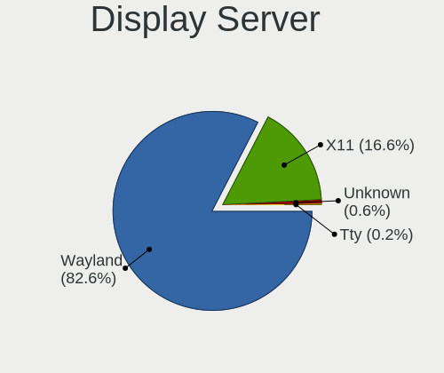
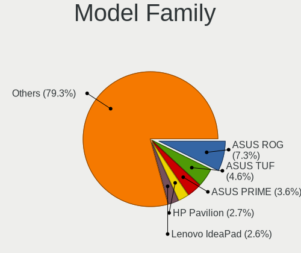
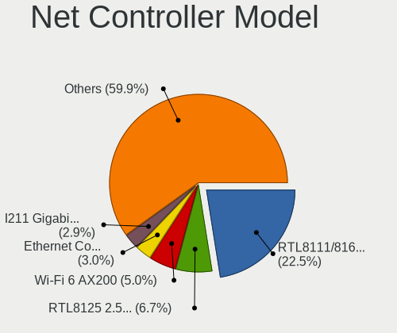
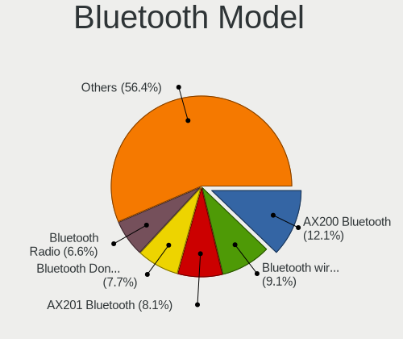
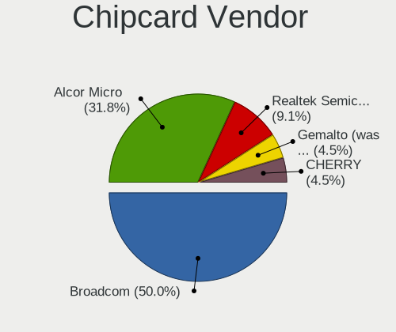

Nobara - Tested Hardware & Statistics
-------------------------------------

A project to collect tested hardware configurations for Nobara.

Anyone can contribute to this report by the [hw-probe](https://github.com/linuxhw/hw-probe) tool:

    sudo -E hw-probe -all -upload

Please contribute! Especially if your hardware is rare.

This is a report for all computer types. See also reports for [desktops](/Dist/Nobara/Desktop/README.md) and [notebooks](/Dist/Nobara/Notebook/README.md).

Contents
--------

* [ Test Cases ](#test-cases)

* [ System ](#system)
  - [ OS                       ](#os)
  - [ OS Family                ](#os-family)
  - [ Kernel                   ](#kernel)
  - [ Kernel Family            ](#kernel-family)
  - [ Kernel Major Ver.        ](#kernel-major-ver)
  - [ Arch                     ](#arch)
  - [ DE                       ](#de)
  - [ Display Server           ](#display-server)
  - [ Display Manager          ](#display-manager)
  - [ OS Lang                  ](#os-lang)
  - [ Boot Mode                ](#boot-mode)
  - [ Filesystem               ](#filesystem)
  - [ Part. scheme             ](#part-scheme)
  - [ Dual Boot with Linux/BSD ](#dual-boot-with-linuxbsd)
  - [ Dual Boot (Win)          ](#dual-boot-win)

* [ Board ](#board)
  - [ Vendor                   ](#vendor)
  - [ Model                    ](#model)
  - [ Model Family             ](#model-family)
  - [ MFG Year                 ](#mfg-year)
  - [ Form Factor              ](#form-factor)
  - [ Secure Boot              ](#secure-boot)
  - [ Coreboot                 ](#coreboot)
  - [ RAM Size                 ](#ram-size)
  - [ RAM Used                 ](#ram-used)
  - [ Total Drives             ](#total-drives)
  - [ Has CD-ROM               ](#has-cd-rom)
  - [ Has Ethernet             ](#has-ethernet)
  - [ Has WiFi                 ](#has-wifi)
  - [ Has Bluetooth            ](#has-bluetooth)

* [ Location ](#location)
  - [ Country                  ](#country)
  - [ City                     ](#city)

* [ Drives ](#drives)
  - [ Drive Vendor             ](#drive-vendor)
  - [ Drive Model              ](#drive-model)
  - [ HDD Vendor               ](#hdd-vendor)
  - [ SSD Vendor               ](#ssd-vendor)
  - [ Drive Kind               ](#drive-kind)
  - [ Drive Connector          ](#drive-connector)
  - [ Drive Size               ](#drive-size)
  - [ Space Total              ](#space-total)
  - [ Space Used               ](#space-used)
  - [ Malfunc. Drives          ](#malfunc-drives)
  - [ Malfunc. Drive Vendor    ](#malfunc-drive-vendor)
  - [ Malfunc. HDD Vendor      ](#malfunc-hdd-vendor)
  - [ Malfunc. Drive Kind      ](#malfunc-drive-kind)
  - [ Failed Drives            ](#failed-drives)
  - [ Failed Drive Vendor      ](#failed-drive-vendor)
  - [ Drive Status             ](#drive-status)

* [ Storage controller ](#storage-controller)
  - [ Storage Vendor           ](#storage-vendor)
  - [ Storage Model            ](#storage-model)
  - [ Storage Kind             ](#storage-kind)

* [ Processor ](#processor)
  - [ CPU Vendor               ](#cpu-vendor)
  - [ CPU Model                ](#cpu-model)
  - [ CPU Model Family         ](#cpu-model-family)
  - [ CPU Cores                ](#cpu-cores)
  - [ CPU Sockets              ](#cpu-sockets)
  - [ CPU Threads              ](#cpu-threads)
  - [ CPU Op-Modes             ](#cpu-op-modes)
  - [ CPU Microcode            ](#cpu-microcode)
  - [ CPU Microarch            ](#cpu-microarch)

* [ Graphics ](#graphics)
  - [ GPU Vendor               ](#gpu-vendor)
  - [ GPU Model                ](#gpu-model)
  - [ GPU Combo                ](#gpu-combo)
  - [ GPU Driver               ](#gpu-driver)
  - [ GPU Memory               ](#gpu-memory)

* [ Monitor ](#monitor)
  - [ Monitor Vendor           ](#monitor-vendor)
  - [ Monitor Model            ](#monitor-model)
  - [ Monitor Resolution       ](#monitor-resolution)
  - [ Monitor Diagonal         ](#monitor-diagonal)
  - [ Monitor Width            ](#monitor-width)
  - [ Aspect Ratio             ](#aspect-ratio)
  - [ Monitor Area             ](#monitor-area)
  - [ Pixel Density            ](#pixel-density)
  - [ Multiple Monitors        ](#multiple-monitors)

* [ Network ](#network)
  - [ Net Controller Vendor    ](#net-controller-vendor)
  - [ Net Controller Model     ](#net-controller-model)
  - [ Wireless Vendor          ](#wireless-vendor)
  - [ Wireless Model           ](#wireless-model)
  - [ Ethernet Vendor          ](#ethernet-vendor)
  - [ Ethernet Model           ](#ethernet-model)
  - [ Net Controller Kind      ](#net-controller-kind)
  - [ Used Controller          ](#used-controller)
  - [ NICs                     ](#nics)
  - [ IPv6                     ](#ipv6)

* [ Bluetooth ](#bluetooth)
  - [ Bluetooth Vendor         ](#bluetooth-vendor)
  - [ Bluetooth Model          ](#bluetooth-model)

* [ Sound ](#sound)
  - [ Sound Vendor             ](#sound-vendor)
  - [ Sound Model              ](#sound-model)

* [ Memory ](#memory)
  - [ Memory Vendor            ](#memory-vendor)
  - [ Memory Model             ](#memory-model)
  - [ Memory Kind              ](#memory-kind)
  - [ Memory Form Factor       ](#memory-form-factor)
  - [ Memory Size              ](#memory-size)
  - [ Memory Speed             ](#memory-speed)

* [ Printers & scanners ](#printers--scanners)
  - [ Printer Vendor           ](#printer-vendor)
  - [ Printer Model            ](#printer-model)
  - [ Scanner Vendor           ](#scanner-vendor)
  - [ Scanner Model            ](#scanner-model)

* [ Camera ](#camera)
  - [ Camera Vendor            ](#camera-vendor)
  - [ Camera Model             ](#camera-model)

* [ Security ](#security)
  - [ Fingerprint Vendor       ](#fingerprint-vendor)
  - [ Fingerprint Model        ](#fingerprint-model)
  - [ Chipcard Vendor          ](#chipcard-vendor)
  - [ Chipcard Model           ](#chipcard-model)

* [ Unsupported ](#unsupported)
  - [ Unsupported Devices      ](#unsupported-devices)
  - [ Unsupported Device Types ](#unsupported-device-types)

Test Cases
----------

Total: 185

| Vendor        | Model                       | Form-Factor | Probe                                                      | Date         |
|---------------|-----------------------------|-------------|------------------------------------------------------------|--------------|
| ASUSTek       | GL753VD                     | Notebook    | [97e2ee4ee1](https://linux-hardware.org/?probe=97e2ee4ee1) | Nov 01, 2022 |
| HP            | Unknown                     | Notebook    | [1ca885060e](https://linux-hardware.org/?probe=1ca885060e) | Nov 01, 2022 |
| ECS           | H61H2-CM                    | Desktop     | [792ce0e34e](https://linux-hardware.org/?probe=792ce0e34e) | Oct 31, 2022 |
| Acer          | Nitro AN515-42              | Notebook    | [3a00ca53c8](https://linux-hardware.org/?probe=3a00ca53c8) | Oct 31, 2022 |
| Lenovo        | IdeaPad C340-14API 81N6     | Notebook    | [d322bb2739](https://linux-hardware.org/?probe=d322bb2739) | Oct 30, 2022 |
| Apple         | MacBookPro13,3              | Notebook    | [b028075707](https://linux-hardware.org/?probe=b028075707) | Oct 30, 2022 |
| ASUSTek       | VivoBook_ASUS Laptop X50... | Notebook    | [4fdbc3c415](https://linux-hardware.org/?probe=4fdbc3c415) | Oct 30, 2022 |
| ASRock        | Z77 Pro4                    | Desktop     | [5ab5790e5f](https://linux-hardware.org/?probe=5ab5790e5f) | Oct 29, 2022 |
| ASRock        | Z77 Pro4                    | Desktop     | [74cc7f147b](https://linux-hardware.org/?probe=74cc7f147b) | Oct 29, 2022 |
| HP            | 8653 A                      | Desktop     | [bc1f3b445b](https://linux-hardware.org/?probe=bc1f3b445b) | Oct 28, 2022 |
| ASRock        | X570 Taichi                 | Desktop     | [967f52e510](https://linux-hardware.org/?probe=967f52e510) | Oct 28, 2022 |
| HP            | Pavilion Gaming Laptop 1... | Notebook    | [50a8c356f0](https://linux-hardware.org/?probe=50a8c356f0) | Oct 28, 2022 |
| Dell          | 09KPNV A00                  | Desktop     | [c25493f420](https://linux-hardware.org/?probe=c25493f420) | Oct 27, 2022 |
| Gigabyte      | 970A-DS3P                   | Desktop     | [7e31b6af67](https://linux-hardware.org/?probe=7e31b6af67) | Oct 27, 2022 |
| Gigabyte      | 970A-DS3P                   | Desktop     | [6823943242](https://linux-hardware.org/?probe=6823943242) | Oct 27, 2022 |
| Intel         | B75                         | Desktop     | [eb7c27f1e5](https://linux-hardware.org/?probe=eb7c27f1e5) | Oct 26, 2022 |
| HP            | 3029h                       | Desktop     | [c278953154](https://linux-hardware.org/?probe=c278953154) | Oct 25, 2022 |
| ASUSTek       | GL502VMK                    | Notebook    | [9a18ff1b13](https://linux-hardware.org/?probe=9a18ff1b13) | Oct 25, 2022 |
| Gigabyte      | Z590I VISION D              | Desktop     | [be4c6573cd](https://linux-hardware.org/?probe=be4c6573cd) | Oct 25, 2022 |
| ASUSTek       | PRIME A320M-K               | Desktop     | [c0b3f0d88e](https://linux-hardware.org/?probe=c0b3f0d88e) | Oct 24, 2022 |
| Toshiba       | Satellite L850              | Notebook    | [8bfeff52e6](https://linux-hardware.org/?probe=8bfeff52e6) | Oct 24, 2022 |
| ASUSTek       | S550CB                      | Notebook    | [a81f0ecac8](https://linux-hardware.org/?probe=a81f0ecac8) | Oct 24, 2022 |
| ASUSTek       | ROG STRIX Z390-E GAMING     | Desktop     | [7e40be1c82](https://linux-hardware.org/?probe=7e40be1c82) | Oct 23, 2022 |
| ASUSTek       | ROG Zephyrus G14 GA401QM... | Notebook    | [3912d818bd](https://linux-hardware.org/?probe=3912d818bd) | Oct 23, 2022 |
| HP            | OMEN Notebook PC 15         | Notebook    | [1d5ebc92c4](https://linux-hardware.org/?probe=1d5ebc92c4) | Oct 23, 2022 |
| Gigabyte      | Z97-HD3                     | Desktop     | [f79eb0cbb0](https://linux-hardware.org/?probe=f79eb0cbb0) | Oct 23, 2022 |
| ASUSTek       | TUF Gaming X570-PRO WIFI... | Desktop     | [c3b1784ecc](https://linux-hardware.org/?probe=c3b1784ecc) | Oct 21, 2022 |
| Lenovo        | Legion 5 Pro 16IAH7H 82R... | Notebook    | [eaecfdf473](https://linux-hardware.org/?probe=eaecfdf473) | Oct 21, 2022 |
| Lenovo        | Legion 5 Pro 16IAH7H 82R... | Notebook    | [c044987599](https://linux-hardware.org/?probe=c044987599) | Oct 20, 2022 |
| HP            | EliteBook 850 G2            | Notebook    | [b6fd429ceb](https://linux-hardware.org/?probe=b6fd429ceb) | Oct 20, 2022 |
| HP            | EliteBook 850 G2            | Notebook    | [f33baf66a9](https://linux-hardware.org/?probe=f33baf66a9) | Oct 20, 2022 |
| ASUSTek       | TUF Gaming FX504GD_FX80G... | Notebook    | [e5a34da4a2](https://linux-hardware.org/?probe=e5a34da4a2) | Oct 19, 2022 |
| Gigabyte      | B450M DS3H-CF               | Desktop     | [c901f6927c](https://linux-hardware.org/?probe=c901f6927c) | Oct 18, 2022 |
| MSI           | GE60 0NC/GE60 0ND           | Notebook    | [829326a8e5](https://linux-hardware.org/?probe=829326a8e5) | Oct 18, 2022 |
| MSI           | GE60 0NC/GE60 0ND           | Notebook    | [697ccec46b](https://linux-hardware.org/?probe=697ccec46b) | Oct 18, 2022 |
| HP            | EliteBook 850 G1            | Notebook    | [dfeb98414b](https://linux-hardware.org/?probe=dfeb98414b) | Oct 18, 2022 |
| HP            | EliteBook 850 G1            | Notebook    | [7f8c9d778c](https://linux-hardware.org/?probe=7f8c9d778c) | Oct 18, 2022 |
| MSI           | MPG Z390 GAMING PLUS        | Desktop     | [624be3f0f3](https://linux-hardware.org/?probe=624be3f0f3) | Oct 17, 2022 |
| ASUSTek       | TUF Gaming B450M-PLUS II    | Desktop     | [cb63aa5619](https://linux-hardware.org/?probe=cb63aa5619) | Oct 17, 2022 |
| MSI           | MPG Z390 GAMING PRO CARB... | Desktop     | [a4919afa07](https://linux-hardware.org/?probe=a4919afa07) | Oct 16, 2022 |
| Casper        | EXCALIBUR G770              | Notebook    | [7961a3ca3e](https://linux-hardware.org/?probe=7961a3ca3e) | Oct 14, 2022 |
| MSI           | Z87 XPOWER                  | Desktop     | [5e73f5004a](https://linux-hardware.org/?probe=5e73f5004a) | Oct 13, 2022 |
| ASUSTek       | PRIME X370-PRO              | Desktop     | [0a89e9b77e](https://linux-hardware.org/?probe=0a89e9b77e) | Oct 13, 2022 |
| Lenovo        | ThinkPad E14 Gen 3 20Y7C... | Notebook    | [5f013faf39](https://linux-hardware.org/?probe=5f013faf39) | Oct 12, 2022 |
| Toshiba       | Satellite L650              | Notebook    | [89f43e5484](https://linux-hardware.org/?probe=89f43e5484) | Oct 12, 2022 |
| Toshiba       | Satellite L650              | Notebook    | [43f57daebb](https://linux-hardware.org/?probe=43f57daebb) | Oct 12, 2022 |
| MSI           | Pulse GL76 12UEK            | Notebook    | [6a2be4d08c](https://linux-hardware.org/?probe=6a2be4d08c) | Oct 12, 2022 |
| EVOO          | EG-LP10                     | Notebook    | [f8895e9483](https://linux-hardware.org/?probe=f8895e9483) | Oct 11, 2022 |
| MSI           | MPG Z390 GAMING PRO CARB... | Desktop     | [a920c57a3e](https://linux-hardware.org/?probe=a920c57a3e) | Oct 11, 2022 |
| Dell          | Vostro 15 5510              | Notebook    | [2aa595867e](https://linux-hardware.org/?probe=2aa595867e) | Oct 11, 2022 |
| Dell          | Vostro 15 5510              | Notebook    | [bd224480a9](https://linux-hardware.org/?probe=bd224480a9) | Oct 10, 2022 |
| Dell          | 0F6X5P A00                  | Desktop     | [49baafbc65](https://linux-hardware.org/?probe=49baafbc65) | Oct 10, 2022 |
| HP            | 2000                        | Notebook    | [3341a26d0c](https://linux-hardware.org/?probe=3341a26d0c) | Oct 10, 2022 |
| ASUSTek       | GL503VD                     | Notebook    | [1405b367c2](https://linux-hardware.org/?probe=1405b367c2) | Oct 09, 2022 |
| Lenovo        | IdeaPad Y700-15ISK 80NV     | Notebook    | [94ccd99c78](https://linux-hardware.org/?probe=94ccd99c78) | Oct 09, 2022 |
| MSI           | PRO Z690-A DDR4             | Desktop     | [2a1088b211](https://linux-hardware.org/?probe=2a1088b211) | Oct 08, 2022 |
| Apple         | MacBookPro5,5               | Notebook    | [faef78b510](https://linux-hardware.org/?probe=faef78b510) | Oct 08, 2022 |
| HP            | Laptop 15-dw0xxx            | Notebook    | [3427421197](https://linux-hardware.org/?probe=3427421197) | Oct 08, 2022 |
| ASUSTek       | SABERTOOTH 990FX R2.0       | Desktop     | [05dfea29df](https://linux-hardware.org/?probe=05dfea29df) | Oct 07, 2022 |
| ASUSTek       | SABERTOOTH 990FX R2.0       | Desktop     | [24471f06da](https://linux-hardware.org/?probe=24471f06da) | Oct 07, 2022 |
| ASUSTek       | ASUS TUF Gaming A17 FA70... | Notebook    | [2d464da9c8](https://linux-hardware.org/?probe=2d464da9c8) | Oct 07, 2022 |
| HP            | ZBook 17 G6                 | Notebook    | [c215e9e17e](https://linux-hardware.org/?probe=c215e9e17e) | Oct 07, 2022 |
| Dell          | Precision 5530              | Notebook    | [db48ac269b](https://linux-hardware.org/?probe=db48ac269b) | Oct 07, 2022 |
| Gigabyte      | X570 I AORUS PRO WIFI       | Desktop     | [cc955e89b7](https://linux-hardware.org/?probe=cc955e89b7) | Oct 07, 2022 |
| Lenovo        | IdeaPad 320-15IKB 80YH      | Notebook    | [9ccbc0ed3c](https://linux-hardware.org/?probe=9ccbc0ed3c) | Oct 07, 2022 |
| HP            | 1998                        | Desktop     | [f2b9957fdd](https://linux-hardware.org/?probe=f2b9957fdd) | Oct 06, 2022 |
| KELYX ARGE... | KL9120                      | Notebook    | [faa5f13391](https://linux-hardware.org/?probe=faa5f13391) | Oct 06, 2022 |
| Positivo      | N1250                       | Notebook    | [9845103c14](https://linux-hardware.org/?probe=9845103c14) | Oct 05, 2022 |
| MSI           | B450-A PRO MAX              | Desktop     | [b161553abb](https://linux-hardware.org/?probe=b161553abb) | Oct 05, 2022 |
| ASRock        | B450M Steel Legend          | Desktop     | [4f4352de45](https://linux-hardware.org/?probe=4f4352de45) | Oct 04, 2022 |
| HP            | 2000                        | Notebook    | [e6f8f7196d](https://linux-hardware.org/?probe=e6f8f7196d) | Oct 03, 2022 |
| ASUSTek       | TUF Gaming FX505DV_FX505... | Notebook    | [3ec3f59233](https://linux-hardware.org/?probe=3ec3f59233) | Oct 03, 2022 |
| ASUSTek       | TUF Gaming FX505DV_FX505... | Notebook    | [5ed7136249](https://linux-hardware.org/?probe=5ed7136249) | Oct 03, 2022 |
| HP            | 240 G7 Notebook PC          | Notebook    | [05b4e2117b](https://linux-hardware.org/?probe=05b4e2117b) | Oct 03, 2022 |
| ASUSTek       | H61M-K                      | Desktop     | [e0408b49e7](https://linux-hardware.org/?probe=e0408b49e7) | Oct 02, 2022 |
| MSI           | B350 PC MATE                | Desktop     | [a4c73b484e](https://linux-hardware.org/?probe=a4c73b484e) | Oct 02, 2022 |
| Dell          | 0M5DCD A00                  | Desktop     | [3cc1e139dc](https://linux-hardware.org/?probe=3cc1e139dc) | Oct 02, 2022 |
| Toshiba       | Satellite L850              | Notebook    | [0e57d064b0](https://linux-hardware.org/?probe=0e57d064b0) | Oct 02, 2022 |
| Lenovo        | Yoga Slim 7 Pro 14ACH5 O... | Notebook    | [05e921b4aa](https://linux-hardware.org/?probe=05e921b4aa) | Oct 02, 2022 |
| EVOO          | EG-LP10                     | Notebook    | [32c1a174d1](https://linux-hardware.org/?probe=32c1a174d1) | Oct 01, 2022 |
| MSI           | MEG X570 UNIFY              | Desktop     | [4d2e449699](https://linux-hardware.org/?probe=4d2e449699) | Sep 30, 2022 |
| ASRock        | X470 Master SLI             | Desktop     | [47c190b6e9](https://linux-hardware.org/?probe=47c190b6e9) | Sep 30, 2022 |
| ASUSTek       | Q504UAK                     | Convertible | [062910424d](https://linux-hardware.org/?probe=062910424d) | Sep 30, 2022 |
| Acer          | Aspire VX5-591G             | Notebook    | [b321f4561b](https://linux-hardware.org/?probe=b321f4561b) | Sep 29, 2022 |
| Lenovo        | V330-15IKB 81AX             | Notebook    | [0360123f76](https://linux-hardware.org/?probe=0360123f76) | Sep 29, 2022 |
| ASUSTek       | Q504UAK                     | Convertible | [a205e0ea70](https://linux-hardware.org/?probe=a205e0ea70) | Sep 29, 2022 |
| Gigabyte      | H270-Gaming 3               | Desktop     | [9426d21070](https://linux-hardware.org/?probe=9426d21070) | Sep 29, 2022 |
| Gigabyte      | H270-Gaming 3               | Desktop     | [830af9c53e](https://linux-hardware.org/?probe=830af9c53e) | Sep 29, 2022 |
| Lenovo        | G580 20157                  | Notebook    | [2b34d591ab](https://linux-hardware.org/?probe=2b34d591ab) | Sep 29, 2022 |
| Apple         | MacBookAir4,2               | Notebook    | [a423006d4c](https://linux-hardware.org/?probe=a423006d4c) | Sep 29, 2022 |
| Apple         | MacBookAir4,2               | Notebook    | [5dba6cf7fd](https://linux-hardware.org/?probe=5dba6cf7fd) | Sep 29, 2022 |
| Gigabyte      | AB350-Gaming 3-CF           | Desktop     | [365d74f8e4](https://linux-hardware.org/?probe=365d74f8e4) | Sep 28, 2022 |
| Intel         | B75                         | Desktop     | [af5aef869c](https://linux-hardware.org/?probe=af5aef869c) | Sep 28, 2022 |
| Dell          | Inspiron 3542               | Notebook    | [6d35107941](https://linux-hardware.org/?probe=6d35107941) | Sep 28, 2022 |
| Apple         | MacBookPro8,3               | Notebook    | [74927fc7d2](https://linux-hardware.org/?probe=74927fc7d2) | Sep 27, 2022 |
| Gigabyte      | AB350-Gaming 3-CF           | Desktop     | [cfd24b9e0a](https://linux-hardware.org/?probe=cfd24b9e0a) | Sep 27, 2022 |
| MSI           | MAG X570 TOMAHAWK WIFI      | Desktop     | [6bfc8d43ef](https://linux-hardware.org/?probe=6bfc8d43ef) | Sep 27, 2022 |
| Lenovo        | IdeaPad 310-15IAP 80TT      | Notebook    | [65f896ddab](https://linux-hardware.org/?probe=65f896ddab) | Sep 27, 2022 |
| MSI           | A68HM-E33 V2                | Desktop     | [d51c90a7a8](https://linux-hardware.org/?probe=d51c90a7a8) | Sep 27, 2022 |
| ASUSTek       | 970 PRO GAMING/AURA         | Desktop     | [f61a736922](https://linux-hardware.org/?probe=f61a736922) | Sep 26, 2022 |
| ASUSTek       | 970 PRO GAMING/AURA         | Desktop     | [1ecfe379e7](https://linux-hardware.org/?probe=1ecfe379e7) | Sep 26, 2022 |
| ASUSTek       | PRIME H410M-A               | Desktop     | [dafae8d45b](https://linux-hardware.org/?probe=dafae8d45b) | Sep 26, 2022 |
| Lenovo        | 3136 SDK0J40697 WIN 3305... | Mini pc     | [d31088804f](https://linux-hardware.org/?probe=d31088804f) | Sep 24, 2022 |
| MSI           | 970 GAMING                  | Desktop     | [015cd37f26](https://linux-hardware.org/?probe=015cd37f26) | Sep 24, 2022 |
| Dell          | Latitude 7275               | Tablet      | [49ee35636b](https://linux-hardware.org/?probe=49ee35636b) | Sep 24, 2022 |
| Dell          | 0G785M A00                  | Desktop     | [c461ec42d6](https://linux-hardware.org/?probe=c461ec42d6) | Sep 24, 2022 |
| ASUSTek       | PRIME A320M-K               | Desktop     | [d72e6b3865](https://linux-hardware.org/?probe=d72e6b3865) | Sep 23, 2022 |
| Gateway       | NE56R                       | Notebook    | [f603edd045](https://linux-hardware.org/?probe=f603edd045) | Sep 23, 2022 |
| Toshiba       | TECRA A50-A                 | Notebook    | [6ef2538a5a](https://linux-hardware.org/?probe=6ef2538a5a) | Sep 23, 2022 |
| Lenovo        | IdeaPad 5 15ARE05 81YQ      | Notebook    | [605e97df5c](https://linux-hardware.org/?probe=605e97df5c) | Sep 22, 2022 |
| Lenovo        | IdeaPad 5 15ARE05 81YQ      | Notebook    | [94e6332c62](https://linux-hardware.org/?probe=94e6332c62) | Sep 22, 2022 |
| ASUSTek       | ROG Zephyrus G14 GA401II... | Notebook    | [2e36489a4b](https://linux-hardware.org/?probe=2e36489a4b) | Sep 22, 2022 |
| Gigabyte      | EP45-UD3L                   | Desktop     | [71c630ea03](https://linux-hardware.org/?probe=71c630ea03) | Sep 22, 2022 |
| ASUSTek       | ROG Zephyrus G14 GA401II... | Notebook    | [8705683c6f](https://linux-hardware.org/?probe=8705683c6f) | Sep 22, 2022 |
| ASUSTek       | PRIME H310M-E R2.0          | Desktop     | [7299d75966](https://linux-hardware.org/?probe=7299d75966) | Sep 22, 2022 |
| HP            | 8594                        | Desktop     | [281774ad4a](https://linux-hardware.org/?probe=281774ad4a) | Sep 21, 2022 |
| Gigabyte      | EP45-UD3L                   | Desktop     | [2b90168b71](https://linux-hardware.org/?probe=2b90168b71) | Sep 21, 2022 |
| ASRock        | X470 Master SLI             | Desktop     | [3c8fefe578](https://linux-hardware.org/?probe=3c8fefe578) | Sep 20, 2022 |
| ASRock        | X470 Master SLI             | Desktop     | [1975320cad](https://linux-hardware.org/?probe=1975320cad) | Sep 20, 2022 |
| Alienware     | Area-51m R2 A00             | Notebook    | [0ebdec6dd0](https://linux-hardware.org/?probe=0ebdec6dd0) | Sep 20, 2022 |
| ASUSTek       | N56VZ                       | Notebook    | [ce162c52c0](https://linux-hardware.org/?probe=ce162c52c0) | Sep 19, 2022 |
| Dell          | 0G785M A00                  | Desktop     | [8b8c41b401](https://linux-hardware.org/?probe=8b8c41b401) | Sep 19, 2022 |
| Unknown       | T3 MRD                      | Desktop     | [1f60a4d202](https://linux-hardware.org/?probe=1f60a4d202) | Sep 19, 2022 |
| Lenovo        | IdeaPadFlex 10 20324        | Notebook    | [4e7f3b7bac](https://linux-hardware.org/?probe=4e7f3b7bac) | Sep 19, 2022 |
| MSI           | X570-A PRO                  | Desktop     | [cabf88c8be](https://linux-hardware.org/?probe=cabf88c8be) | Sep 19, 2022 |
| Lenovo        | Legion 5 15ARH05 82B5       | Notebook    | [854a0d4410](https://linux-hardware.org/?probe=854a0d4410) | Sep 19, 2022 |
| Dell          | Precision M6400             | Notebook    | [67924c5333](https://linux-hardware.org/?probe=67924c5333) | Sep 19, 2022 |
| Dell          | Precision M6400             | Notebook    | [27a55639e4](https://linux-hardware.org/?probe=27a55639e4) | Sep 19, 2022 |
| HUAWEI        | KLVL-WXXW                   | Notebook    | [e0e49d51d0](https://linux-hardware.org/?probe=e0e49d51d0) | Sep 18, 2022 |
| Gigabyte      | A320M-S2H-CF                | Desktop     | [7b95813c96](https://linux-hardware.org/?probe=7b95813c96) | Sep 18, 2022 |
| HUAWEI        | KLVL-WXXW                   | Notebook    | [812ea842dc](https://linux-hardware.org/?probe=812ea842dc) | Sep 18, 2022 |
| Lenovo        | ThinkBook 15 G3 ACL 21A4    | Notebook    | [004d0a2b9d](https://linux-hardware.org/?probe=004d0a2b9d) | Sep 17, 2022 |
| Unknown       | T3 MRD                      | Desktop     | [b10823b50f](https://linux-hardware.org/?probe=b10823b50f) | Sep 17, 2022 |
| Biostar       | H410MH S2                   | Desktop     | [832dd81851](https://linux-hardware.org/?probe=832dd81851) | Sep 17, 2022 |
| Lenovo        | ThinkPad P1 20MD0020US      | Notebook    | [a701fed148](https://linux-hardware.org/?probe=a701fed148) | Sep 16, 2022 |
| Lenovo        | MAHOBAY NOK                 | Desktop     | [cce010fd53](https://linux-hardware.org/?probe=cce010fd53) | Sep 16, 2022 |
| ASUSTek       | VivoBook_ASUSLaptop X340... | Notebook    | [5ffc7d13ac](https://linux-hardware.org/?probe=5ffc7d13ac) | Sep 16, 2022 |
| Dell          | G5 5505                     | Notebook    | [25755e8605](https://linux-hardware.org/?probe=25755e8605) | Sep 16, 2022 |
| HP            | 15                          | Notebook    | [79aa0d618f](https://linux-hardware.org/?probe=79aa0d618f) | Sep 14, 2022 |
| Acer          | Aspire A315-42              | Notebook    | [820c1e2ac6](https://linux-hardware.org/?probe=820c1e2ac6) | Sep 11, 2022 |
| Dell          | Precision 3510              | Notebook    | [4337a8e018](https://linux-hardware.org/?probe=4337a8e018) | Sep 11, 2022 |
| ASUSTek       | TUF Gaming B550M-PLUS WI... | Desktop     | [d9e9ec9afa](https://linux-hardware.org/?probe=d9e9ec9afa) | Sep 09, 2022 |
| ASUSTek       | TUF Gaming B550M-PLUS WI... | Desktop     | [1cdd7cda15](https://linux-hardware.org/?probe=1cdd7cda15) | Sep 09, 2022 |
| ASUSTek       | TUF Gaming X570-PRO         | Desktop     | [6eae76b5d0](https://linux-hardware.org/?probe=6eae76b5d0) | Sep 01, 2022 |
| ASRock        | FM2A55M-HD+                 | Desktop     | [2f96c73efb](https://linux-hardware.org/?probe=2f96c73efb) | Sep 01, 2022 |
| ASUSTek       | ASUS TUF Gaming F15 FX50... | Notebook    | [0ca693e2dd](https://linux-hardware.org/?probe=0ca693e2dd) | Aug 31, 2022 |
| Gigabyte      | H110M-H-CF                  | Desktop     | [86fc2bf58f](https://linux-hardware.org/?probe=86fc2bf58f) | Aug 31, 2022 |
| Alienware     | 01NYPT A00                  | Desktop     | [cd95b79270](https://linux-hardware.org/?probe=cd95b79270) | Aug 29, 2022 |
| AZW           | SER                         | Mini pc     | [92460ed2a6](https://linux-hardware.org/?probe=92460ed2a6) | Aug 29, 2022 |
| ASUSTek       | TP500LA                     | Notebook    | [de395dddd8](https://linux-hardware.org/?probe=de395dddd8) | Aug 28, 2022 |
| ASRock        | B560 Steel Legend           | Desktop     | [c64907de8d](https://linux-hardware.org/?probe=c64907de8d) | Aug 27, 2022 |
| ASUSTek       | P8Z68-V PRO                 | Desktop     | [37ae937f4d](https://linux-hardware.org/?probe=37ae937f4d) | Aug 26, 2022 |
| ASUSTek       | PRIME X570-PRO              | Desktop     | [663509c999](https://linux-hardware.org/?probe=663509c999) | Aug 24, 2022 |
| ASUSTek       | PRIME X570-PRO              | Desktop     | [2b7d1d59a1](https://linux-hardware.org/?probe=2b7d1d59a1) | Aug 24, 2022 |
| ASUSTek       | PRIME A320M-K               | Desktop     | [928ce75df1](https://linux-hardware.org/?probe=928ce75df1) | Aug 24, 2022 |
| ASRock        | H61M-VG3                    | Desktop     | [a3cd7ba2c1](https://linux-hardware.org/?probe=a3cd7ba2c1) | Aug 22, 2022 |
| Dell          | G15 5511                    | Notebook    | [44fa9bf084](https://linux-hardware.org/?probe=44fa9bf084) | Aug 21, 2022 |
| ASUSTek       | B85M-E                      | Desktop     | [0b5044dacf](https://linux-hardware.org/?probe=0b5044dacf) | Aug 19, 2022 |
| Gigabyte      | B450M DS3H-CF               | Desktop     | [a2b6c2ae17](https://linux-hardware.org/?probe=a2b6c2ae17) | Aug 19, 2022 |
| Notebook      | P7xxDM2(-G)                 | Notebook    | [f074899985](https://linux-hardware.org/?probe=f074899985) | Aug 17, 2022 |
| HP            | Pavilion Gaming Laptop 1... | Notebook    | [315da58d24](https://linux-hardware.org/?probe=315da58d24) | Aug 16, 2022 |
| ASRock        | X470 Master SLI             | Desktop     | [ce62975b20](https://linux-hardware.org/?probe=ce62975b20) | Aug 15, 2022 |
| ASUSTek       | PRIME B350-PLUS             | Desktop     | [b2bbce2845](https://linux-hardware.org/?probe=b2bbce2845) | Aug 15, 2022 |
| ASRock        | Z97 Extreme6                | Desktop     | [31d7973a9d](https://linux-hardware.org/?probe=31d7973a9d) | Aug 14, 2022 |
| ASRock        | 760GM-HDV                   | Desktop     | [beabb7dd99](https://linux-hardware.org/?probe=beabb7dd99) | Aug 14, 2022 |
| Apple         | MacBookPro14,2              | Notebook    | [c66d476513](https://linux-hardware.org/?probe=c66d476513) | Aug 13, 2022 |
| ASUSTek       | ROG Strix G513QY_G513QY     | Notebook    | [df2cc1a299](https://linux-hardware.org/?probe=df2cc1a299) | Aug 12, 2022 |
| MSI           | B450 TOMAHAWK MAX           | Desktop     | [27cd96982f](https://linux-hardware.org/?probe=27cd96982f) | Aug 10, 2022 |
| HP            | 8906 SMVB                   | Desktop     | [8f30392f49](https://linux-hardware.org/?probe=8f30392f49) | Aug 10, 2022 |
| HP            | 8054                        | Desktop     | [469b765fe0](https://linux-hardware.org/?probe=469b765fe0) | Aug 10, 2022 |
| ASUSTek       | G20AJ                       | Desktop     | [613f8a0c36](https://linux-hardware.org/?probe=613f8a0c36) | Aug 08, 2022 |
| Gigabyte      | X570 AORUS ELITE            | Desktop     | [f65ba77de3](https://linux-hardware.org/?probe=f65ba77de3) | Aug 07, 2022 |
| Lenovo        | IdeaPad Y700-15ISK 80NV     | Notebook    | [6beddf67f5](https://linux-hardware.org/?probe=6beddf67f5) | Aug 06, 2022 |
| ASUSTek       | ROG CROSSHAIR VIII HERO     | Desktop     | [7a60eede9a](https://linux-hardware.org/?probe=7a60eede9a) | Aug 04, 2022 |
| MSI           | B450-A PRO MAX              | Desktop     | [e142cf5c91](https://linux-hardware.org/?probe=e142cf5c91) | Aug 04, 2022 |
| MSI           | B450 TOMAHAWK MAX           | Desktop     | [7c4355417f](https://linux-hardware.org/?probe=7c4355417f) | Aug 03, 2022 |
| ASUSTek       | Q504UAK                     | Convertible | [5f2025770d](https://linux-hardware.org/?probe=5f2025770d) | Aug 03, 2022 |
| MSI           | X570-A PRO                  | Desktop     | [f034a02e69](https://linux-hardware.org/?probe=f034a02e69) | Aug 01, 2022 |
| Razer         | Blade                       | Notebook    | [cc3ce45956](https://linux-hardware.org/?probe=cc3ce45956) | Jul 31, 2022 |
| HP            | ZBook 15 G2                 | Notebook    | [3aa2fda09a](https://linux-hardware.org/?probe=3aa2fda09a) | Jul 26, 2022 |
| MSI           | 970 GAMING                  | Desktop     | [bf2a870952](https://linux-hardware.org/?probe=bf2a870952) | Jul 23, 2022 |
| Dell          | 0J8H4R A01                  | Desktop     | [3d7d06475c](https://linux-hardware.org/?probe=3d7d06475c) | Jul 23, 2022 |
| ASUSTek       | PRIME B450-PLUS             | Desktop     | [7d6b6d93d3](https://linux-hardware.org/?probe=7d6b6d93d3) | Jul 21, 2022 |
| eMachines     | EL1870                      | Desktop     | [58e76fb684](https://linux-hardware.org/?probe=58e76fb684) | Jul 19, 2022 |
| MSI           | X570-A PRO                  | Desktop     | [c9683ea265](https://linux-hardware.org/?probe=c9683ea265) | Jul 19, 2022 |

System
------

OS
--

Installed operating systems

| Name      | Computers | Percent |
|-----------|-----------|---------|
| Nobara 36 | 148       | 100%    |

OS Family
---------

OS without a version

| Name   | Computers | Percent |
|--------|-----------|---------|
| Nobara | 148       | 100%    |

Kernel
------

Version of the Linux kernel

| Version                       | Computers | Percent |
|-------------------------------|-----------|---------|
| 5.19.14-201.fsync.fc36.x86_64 | 22        | 14.57%  |
| 5.19.9-201.fsync.fc36.x86_64  | 16        | 10.6%   |
| 5.19.7-204.fsync.fc36.x86_64  | 15        | 9.93%   |
| 5.19.16-201.fsync.fc36.x86_64 | 11        | 7.28%   |
| 5.18.13-201.fsync.fc36.x86_64 | 11        | 7.28%   |
| 5.19.12-201.fsync.fc36.x86_64 | 8         | 5.3%    |
| 5.19.10-201.fsync.fc36.x86_64 | 8         | 5.3%    |
| 6.0.5-201.fsync.fc36.x86_64   | 7         | 4.64%   |
| 5.19.4-201.fsync.fc36.x86_64  | 7         | 4.64%   |
| 5.18.16-201.fsync.fc36.x86_64 | 7         | 4.64%   |
| 5.19.15-202.fsync.fc36.x86_64 | 6         | 3.97%   |
| 5.19.11-201.fsync.fc36.x86_64 | 6         | 3.97%   |
| 5.18.17-201.fsync.fc36.x86_64 | 6         | 3.97%   |
| 5.19.8-201.fsync.fc36.x86_64  | 4         | 2.65%   |
| 5.18.19-201.fsync.fc36.x86_64 | 4         | 2.65%   |
| 5.18.11-201.fsync.fc36.x86_64 | 3         | 1.99%   |
| 5.19.7-203.fsync.fc36.x86_64  | 2         | 1.32%   |
| 5.19.13-202.fsync.fc36.x86_64 | 2         | 1.32%   |
| 5.18.18-201.fsync.fc36.x86_64 | 2         | 1.32%   |
| 6.0.2-xm1.0.fc36.x86_64       | 1         | 0.66%   |
| 5.19.2-602.inttf.fc36.x86_64  | 1         | 0.66%   |
| 5.19.13-201.fsync.fc36.x86_64 | 1         | 0.66%   |
| 5.18.9-201.fsync.fc36.x86_64  | 1         | 0.66%   |

Kernel Family
-------------

Linux kernel without a distro release

| Version | Computers | Percent |
|---------|-----------|---------|
| 5.19.14 | 22        | 14.57%  |
| 5.19.7  | 17        | 11.26%  |
| 5.19.9  | 16        | 10.6%   |
| 5.19.16 | 11        | 7.28%   |
| 5.18.13 | 11        | 7.28%   |
| 5.19.12 | 8         | 5.3%    |
| 5.19.10 | 8         | 5.3%    |
| 6.0.5   | 7         | 4.64%   |
| 5.19.4  | 7         | 4.64%   |
| 5.18.16 | 7         | 4.64%   |
| 5.19.15 | 6         | 3.97%   |
| 5.19.11 | 6         | 3.97%   |
| 5.18.17 | 6         | 3.97%   |
| 5.19.8  | 4         | 2.65%   |
| 5.18.19 | 4         | 2.65%   |
| 5.19.13 | 3         | 1.99%   |
| 5.18.11 | 3         | 1.99%   |
| 5.18.18 | 2         | 1.32%   |
| 6.0.2   | 1         | 0.66%   |
| 5.19.2  | 1         | 0.66%   |
| 5.18.9  | 1         | 0.66%   |

Kernel Major Ver.
-----------------

Linux kernel major version

| Version | Computers | Percent |
|---------|-----------|---------|
| 5.19    | 109       | 72.19%  |
| 5.18    | 34        | 22.52%  |
| 6.0     | 8         | 5.3%    |

Arch
----

OS architecture (x86_64, i586, etc.)

| Name   | Computers | Percent |
|--------|-----------|---------|
| x86_64 | 148       | 100%    |

DE
--

Desktop Environment

| Name       | Computers | Percent |
|------------|-----------|---------|
| GNOME      | 108       | 72.97%  |
| KDE5       | 37        | 25%     |
| Unknown    | 2         | 1.35%   |
| X-Cinnamon | 1         | 0.68%   |

Display Server
--------------

X11 or Wayland

| Name    | Computers | Percent |
|---------|-----------|---------|
| Wayland | 114       | 76%     |
| X11     | 34        | 22.67%  |
| Unknown | 2         | 1.33%   |

Display Manager
---------------

SDDM, LightDM, etc.

| Name    | Computers | Percent |
|---------|-----------|---------|
| Unknown | 127       | 84.67%  |
| SDDM    | 11        | 7.33%   |
| GDM     | 11        | 7.33%   |
| LightDM | 1         | 0.67%   |

OS Lang
-------

Language

| Lang    | Computers | Percent |
|---------|-----------|---------|
| en_US   | 83        | 55.7%   |
| en_GB   | 9         | 6.04%   |
| es_ES   | 6         | 4.03%   |
| de_DE   | 5         | 3.36%   |
| pl_PL   | 4         | 2.68%   |
| es_MX   | 4         | 2.68%   |
| es_AR   | 4         | 2.68%   |
| en_CA   | 4         | 2.68%   |
| pt_PT   | 3         | 2.01%   |
| en_IN   | 3         | 2.01%   |
| ru_RU   | 2         | 1.34%   |
| pt_BR   | 2         | 1.34%   |
| it_IT   | 2         | 1.34%   |
| fr_FR   | 2         | 1.34%   |
| en_NZ   | 2         | 1.34%   |
| en_AU   | 2         | 1.34%   |
| sv_SE   | 1         | 0.67%   |
| sk_SK   | 1         | 0.67%   |
| nl_NL   | 1         | 0.67%   |
| hr_HR   | 1         | 0.67%   |
| es_GT   | 1         | 0.67%   |
| es_EC   | 1         | 0.67%   |
| es_CO   | 1         | 0.67%   |
| es_CL   | 1         | 0.67%   |
| en_ZA   | 1         | 0.67%   |
| cs_CZ   | 1         | 0.67%   |
| C       | 1         | 0.67%   |
| Unknown | 1         | 0.67%   |

Boot Mode
---------

EFI or BIOS

| Mode | Computers | Percent |
|------|-----------|---------|
| EFI  | 112       | 75.17%  |
| BIOS | 37        | 24.83%  |

Filesystem
----------

Type of filesystem

| Type  | Computers | Percent |
|-------|-----------|---------|
| Ext4  | 99        | 66.89%  |
| Btrfs | 48        | 32.43%  |
| Xfs   | 1         | 0.68%   |

Part. scheme
------------

Scheme of partitioning

| Type    | Computers | Percent |
|---------|-----------|---------|
| Unknown | 125       | 83.33%  |
| GPT     | 22        | 14.67%  |
| MBR     | 3         | 2%      |

Dual Boot with Linux/BSD
------------------------

Hosting more than one Linux/BSD

| Dual boot | Computers | Percent |
|-----------|-----------|---------|
| No        | 140       | 94.59%  |
| Yes       | 8         | 5.41%   |

Dual Boot (Win)
---------------

Hosting Linux and Windows

| Dual boot | Computers | Percent |
|-----------|-----------|---------|
| No        | 136       | 91.89%  |
| Yes       | 12        | 8.11%   |

Board
-----

Vendor
------

Motherboard manufacturer

| Name                | Computers | Percent |
|---------------------|-----------|---------|
| ASUSTek Computer    | 37        | 25%     |
| MSI                 | 18        | 12.16%  |
| Lenovo              | 17        | 11.49%  |
| Hewlett-Packard     | 17        | 11.49%  |
| Dell                | 13        | 8.78%   |
| Gigabyte Technology | 12        | 8.11%   |
| ASRock              | 9         | 6.08%   |
| Apple               | 5         | 3.38%   |
| Toshiba             | 3         | 2.03%   |
| Acer                | 3         | 2.03%   |
| Alienware           | 2         | 1.35%   |
| Razer               | 1         | 0.68%   |
| Positivo            | 1         | 0.68%   |
| Notebook            | 1         | 0.68%   |
| Intel               | 1         | 0.68%   |
| Gateway             | 1         | 0.68%   |
| EVOO                | 1         | 0.68%   |
| eMachines           | 1         | 0.68%   |
| ECS                 | 1         | 0.68%   |
| Casper              | 1         | 0.68%   |
| Biostar             | 1         | 0.68%   |
| AZW                 | 1         | 0.68%   |
| Unknown             | 1         | 0.68%   |

Model
-----

Motherboard model

| Name                                  | Computers | Percent |
|---------------------------------------|-----------|---------|
| ASUS PRIME A320M-K                    | 3         | 2.03%   |
| MSI MS-7C37                           | 2         | 1.35%   |
| MSI MS-7C02                           | 2         | 1.35%   |
| MSI MS-7B86                           | 2         | 1.35%   |
| MSI MS-7693                           | 2         | 1.35%   |
| Lenovo IdeaPad Y700-15ISK 80NV        | 2         | 1.35%   |
| Gigabyte B450M DS3H                   | 2         | 1.35%   |
| Dell OptiPlex 390                     | 2         | 1.35%   |
| Unknown                               | 2         | 1.35%   |
| Toshiba TECRA A50-A                   | 1         | 0.68%   |
| Toshiba Satellite L850                | 1         | 0.68%   |
| Toshiba Satellite L650                | 1         | 0.68%   |
| Razer Blade                           | 1         | 0.68%   |
| Positivo N1250                        | 1         | 0.68%   |
| Notebook P7xxDM2(-G)                  | 1         | 0.68%   |
| MSI Pulse GL76 12UEK                  | 1         | 0.68%   |
| MSI MS-7D25                           | 1         | 0.68%   |
| MSI MS-7C84                           | 1         | 0.68%   |
| MSI MS-7C35                           | 1         | 0.68%   |
| MSI MS-7B51                           | 1         | 0.68%   |
| MSI MS-7B17                           | 1         | 0.68%   |
| MSI MS-7A34                           | 1         | 0.68%   |
| MSI MS-7811                           | 1         | 0.68%   |
| MSI MS-7721                           | 1         | 0.68%   |
| MSI GE60 0NC/GE60 0ND                 | 1         | 0.68%   |
| Lenovo Yoga Slim 7 Pro 14ACH5 OD 82NK | 1         | 0.68%   |
| Lenovo V330-15IKB 81AX                | 1         | 0.68%   |
| Lenovo ThinkPad P1 20MD0020US         | 1         | 0.68%   |
| Lenovo ThinkPad E14 Gen 3 20Y7CTO1WW  | 1         | 0.68%   |
| Lenovo ThinkCentre M92p 3238E5U       | 1         | 0.68%   |
| Lenovo ThinkCentre M920q 10RS0030MX   | 1         | 0.68%   |
| Lenovo ThinkBook 15 G3 ACL 21A4       | 1         | 0.68%   |
| Lenovo Legion 5 Pro 16IAH7H 82RF      | 1         | 0.68%   |
| Lenovo Legion 5 15ARH05 82B5          | 1         | 0.68%   |
| Lenovo IdeaPadFlex 10 20324           | 1         | 0.68%   |
| Lenovo IdeaPad C340-14API 81N6        | 1         | 0.68%   |
| Lenovo IdeaPad 5 15ARE05 81YQ         | 1         | 0.68%   |
| Lenovo IdeaPad 320-15IKB 80YH         | 1         | 0.68%   |
| Lenovo IdeaPad 310-15IAP 80TT         | 1         | 0.68%   |
| Lenovo G580 20157                     | 1         | 0.68%   |

Model Family
------------

Motherboard model prefix

| Name                 | Computers | Percent |
|----------------------|-----------|---------|
| ASUS PRIME           | 9         | 6.08%   |
| Lenovo IdeaPad       | 6         | 4.05%   |
| ASUS TUF             | 6         | 4.05%   |
| ASUS ROG             | 5         | 3.38%   |
| Dell Precision       | 4         | 2.7%    |
| HP Pavilion          | 3         | 2.03%   |
| HP EliteDesk         | 3         | 2.03%   |
| Dell OptiPlex        | 3         | 2.03%   |
| Toshiba Satellite    | 2         | 1.35%   |
| MSI MS-7C37          | 2         | 1.35%   |
| MSI MS-7C02          | 2         | 1.35%   |
| MSI MS-7B86          | 2         | 1.35%   |
| MSI MS-7693          | 2         | 1.35%   |
| Lenovo ThinkPad      | 2         | 1.35%   |
| Lenovo ThinkCentre   | 2         | 1.35%   |
| Lenovo Legion        | 2         | 1.35%   |
| HP ZBook             | 2         | 1.35%   |
| HP EliteBook         | 2         | 1.35%   |
| Gigabyte X570        | 2         | 1.35%   |
| Gigabyte B450M       | 2         | 1.35%   |
| ASUS VivoBook        | 2         | 1.35%   |
| ASUS ASUS            | 2         | 1.35%   |
| Acer Aspire          | 2         | 1.35%   |
| Unknown              | 2         | 1.35%   |
| Toshiba TECRA        | 1         | 0.68%   |
| Razer Blade          | 1         | 0.68%   |
| Positivo N1250       | 1         | 0.68%   |
| Notebook P7xxDM2(-G) | 1         | 0.68%   |
| MSI Pulse            | 1         | 0.68%   |
| MSI MS-7D25          | 1         | 0.68%   |
| MSI MS-7C84          | 1         | 0.68%   |
| MSI MS-7C35          | 1         | 0.68%   |
| MSI MS-7B51          | 1         | 0.68%   |
| MSI MS-7B17          | 1         | 0.68%   |
| MSI MS-7A34          | 1         | 0.68%   |
| MSI MS-7811          | 1         | 0.68%   |
| MSI MS-7721          | 1         | 0.68%   |
| MSI GE60             | 1         | 0.68%   |
| Lenovo Yoga          | 1         | 0.68%   |
| Lenovo V330-15IKB    | 1         | 0.68%   |

MFG Year
--------

Motherboard manufacture year

| Year | Computers | Percent |
|------|-----------|---------|
| 2019 | 25        | 16.89%  |
| 2021 | 19        | 12.84%  |
| 2018 | 18        | 12.16%  |
| 2017 | 13        | 8.78%   |
| 2020 | 12        | 8.11%   |
| 2014 | 11        | 7.43%   |
| 2016 | 9         | 6.08%   |
| 2013 | 9         | 6.08%   |
| 2012 | 9         | 6.08%   |
| 2015 | 7         | 4.73%   |
| 2011 | 6         | 4.05%   |
| 2022 | 4         | 2.7%    |
| 2010 | 2         | 1.35%   |
| 2009 | 2         | 1.35%   |
| 2008 | 2         | 1.35%   |

Form Factor
-----------

Physical design of the computer

| Name        | Computers | Percent |
|-------------|-----------|---------|
| Desktop     | 76        | 51.35%  |
| Notebook    | 68        | 45.95%  |
| Mini pc     | 2         | 1.35%   |
| Tablet      | 1         | 0.68%   |
| Convertible | 1         | 0.68%   |

Secure Boot
-----------

Enabled or disabled

| State    | Computers | Percent |
|----------|-----------|---------|
| Disabled | 148       | 100%    |

Coreboot
--------

Have coreboot on board

| Used | Computers | Percent |
|------|-----------|---------|
| No   | 148       | 100%    |

RAM Size
--------

Total RAM memory

| Size in GB  | Computers | Percent |
|-------------|-----------|---------|
| 16.01-24.0  | 46        | 31.08%  |
| 8.01-16.0   | 36        | 24.32%  |
| 32.01-64.0  | 23        | 15.54%  |
| 4.01-8.0    | 22        | 14.86%  |
| 3.01-4.0    | 17        | 11.49%  |
| 24.01-32.0  | 2         | 1.35%   |
| 64.01-256.0 | 1         | 0.68%   |
| 1.01-2.0    | 1         | 0.68%   |

RAM Used
--------

Used RAM memory

| Used GB    | Computers | Percent |
|------------|-----------|---------|
| 4.01-8.0   | 71        | 47.33%  |
| 3.01-4.0   | 34        | 22.67%  |
| 2.01-3.0   | 28        | 18.67%  |
| 8.01-16.0  | 11        | 7.33%   |
| 1.01-2.0   | 4         | 2.67%   |
| 24.01-32.0 | 1         | 0.67%   |
| 16.01-24.0 | 1         | 0.67%   |

Total Drives
------------

Number of drives on board

| Drives | Computers | Percent |
|--------|-----------|---------|
| 1      | 74        | 49.33%  |
| 2      | 41        | 27.33%  |
| 3      | 20        | 13.33%  |
| 5      | 9         | 6%      |
| 4      | 4         | 2.67%   |
| 10     | 1         | 0.67%   |
| 6      | 1         | 0.67%   |

Has CD-ROM
----------

Has CD-ROM on board

| Presented | Computers | Percent |
|-----------|-----------|---------|
| No        | 114       | 77.03%  |
| Yes       | 34        | 22.97%  |

Has Ethernet
------------

Has Ethernet on board

| Presented | Computers | Percent |
|-----------|-----------|---------|
| Yes       | 134       | 89.93%  |
| No        | 15        | 10.07%  |

Has WiFi
--------

Has WiFi module

| Presented | Computers | Percent |
|-----------|-----------|---------|
| Yes       | 113       | 76.35%  |
| No        | 35        | 23.65%  |

Has Bluetooth
-------------

Has Bluetooth module

| Presented | Computers | Percent |
|-----------|-----------|---------|
| Yes       | 97        | 65.1%   |
| No        | 52        | 34.9%   |

Location
--------

Country
-------

Geographic location (country)

| Country      | Computers | Percent |
|--------------|-----------|---------|
| USA          | 48        | 32.43%  |
| Germany      | 8         | 5.41%   |
| Canada       | 6         | 4.05%   |
| Mexico       | 5         | 3.38%   |
| France       | 5         | 3.38%   |
| Argentina    | 5         | 3.38%   |
| UK           | 4         | 2.7%    |
| Spain        | 4         | 2.7%    |
| Poland       | 4         | 2.7%    |
| India        | 4         | 2.7%    |
| Brazil       | 4         | 2.7%    |
| Russia       | 3         | 2.03%   |
| Portugal     | 3         | 2.03%   |
| Croatia      | 3         | 2.03%   |
| Chile        | 3         | 2.03%   |
| South Africa | 2         | 1.35%   |
| Serbia       | 2         | 1.35%   |
| Philippines  | 2         | 1.35%   |
| Norway       | 2         | 1.35%   |
| New Zealand  | 2         | 1.35%   |
| Netherlands  | 2         | 1.35%   |
| Italy        | 2         | 1.35%   |
| Czechia      | 2         | 1.35%   |
| Colombia     | 2         | 1.35%   |
| Belgium      | 2         | 1.35%   |
| Australia    | 2         | 1.35%   |
| Vietnam      | 1         | 0.68%   |
| Venezuela    | 1         | 0.68%   |
| Sweden       | 1         | 0.68%   |
| South Korea  | 1         | 0.68%   |
| Slovakia     | 1         | 0.68%   |
| Singapore    | 1         | 0.68%   |
| Romania      | 1         | 0.68%   |
| Pakistan     | 1         | 0.68%   |
| Morocco      | 1         | 0.68%   |
| Kenya        | 1         | 0.68%   |
| Indonesia    | 1         | 0.68%   |
| Hungary      | 1         | 0.68%   |
| Guatemala    | 1         | 0.68%   |
| Georgia      | 1         | 0.68%   |

City
----

Geographic location (city)

| City              | Computers | Percent |
|-------------------|-----------|---------|
| Atlanta           | 3         | 2%      |
| Villa Nueva       | 2         | 1.33%   |
| Schmalkalden      | 2         | 1.33%   |
| San Antonio       | 2         | 1.33%   |
| Philadelphia      | 2         | 1.33%   |
| Johannesburg      | 2         | 1.33%   |
| Guadalajara       | 2         | 1.33%   |
| Zamora            | 1         | 0.67%   |
| Zagreb            | 1         | 0.67%   |
| Zadar             | 1         | 0.67%   |
| Wooster           | 1         | 0.67%   |
| Wiesbaden         | 1         | 0.67%   |
| Wesley Chapel     | 1         | 0.67%   |
| Wellington        | 1         | 0.67%   |
| Wayne             | 1         | 0.67%   |
| Wasilla           | 1         | 0.67%   |
| Warsaw            | 1         | 0.67%   |
| Waldorf           | 1         | 0.67%   |
| Wabrzezno         | 1         | 0.67%   |
| Vineland          | 1         | 0.67%   |
| Villarrica        | 1         | 0.67%   |
| Varadin         | 1         | 0.67%   |
| Vagos             | 1         | 0.67%   |
| Tulsa             | 1         | 0.67%   |
| Tomah             | 1         | 0.67%   |
| Tamworth          | 1         | 0.67%   |
| Szeged            | 1         | 0.67%   |
| Smolensk          | 1         | 0.67%   |
| Singapore         | 1         | 0.67%   |
| Silves            | 1         | 0.67%   |
| Schenectady       | 1         | 0.67%   |
| Sao Paulo         | 1         | 0.67%   |
| Santiago          | 1         | 0.67%   |
| San Jose          | 1         | 0.67%   |
| Saltsjoebaden     | 1         | 0.67%   |
| Salon-de-Provence | 1         | 0.67%   |
| Salem             | 1         | 0.67%   |
| Salamanca         | 1         | 0.67%   |
| Saint-Jerome      | 1         | 0.67%   |
| Rozsicka          | 1         | 0.67%   |

Drives
------

Drive Vendor
------------

Hard drive vendors

| Vendor                       | Computers | Drives | Percent |
|------------------------------|-----------|--------|---------|
| Samsung Electronics          | 45        | 64     | 17.86%  |
| WDC                          | 38        | 50     | 15.08%  |
| Seagate                      | 27        | 33     | 10.71%  |
| Toshiba                      | 22        | 22     | 8.73%   |
| Crucial                      | 19        | 23     | 7.54%   |
| Kingston                     | 16        | 18     | 6.35%   |
| Sandisk                      | 15        | 15     | 5.95%   |
| Intel                        | 7         | 8      | 2.78%   |
| SK hynix                     | 6         | 6      | 2.38%   |
| Phison Electronics           | 4         | 4      | 1.59%   |
| Phison                       | 4         | 5      | 1.59%   |
| Micron Technology            | 4         | 4      | 1.59%   |
| Hitachi                      | 4         | 4      | 1.59%   |
| PNY                          | 3         | 6      | 1.19%   |
| Micron/Crucial Technology    | 3         | 3      | 1.19%   |
| KIOXIA                       | 3         | 3      | 1.19%   |
| A-DATA Technology            | 3         | 3      | 1.19%   |
| Unknown                      | 3         | 4      | 1.19%   |
| Unknown                      | 2         | 2      | 0.79%   |
| LITEON                       | 2         | 2      | 0.79%   |
| HGST                         | 2         | 2      | 0.79%   |
| China                        | 2         | 2      | 0.79%   |
| Apple                        | 2         | 3      | 0.79%   |
| XPG                          | 1         | 1      | 0.4%    |
| Verbatim                     | 1         | 1      | 0.4%    |
| Team                         | 1         | 1      | 0.4%    |
| SuperSSpeed                  | 1         | 1      | 0.4%    |
| SPCC                         | 1         | 1      | 0.4%    |
| Silicon Motion               | 1         | 1      | 0.4%    |
| Shenzhen Longsys Electronics | 1         | 1      | 0.4%    |
| Realtek Semiconductor        | 1         | 1      | 0.4%    |
| Ramsta                       | 1         | 1      | 0.4%    |
| OCZ                          | 1         | 1      | 0.4%    |
| MyDigitalSSD                 | 1         | 1      | 0.4%    |
| Mushkin                      | 1         | 1      | 0.4%    |
| JMicron Technology           | 1         | 1      | 0.4%    |
| HGST HTS                     | 1         | 1      | 0.4%    |
| Fujitsu                      | 1         | 1      | 0.4%    |
| ADATA Technology             | 1         | 1      | 0.4%    |

Drive Model
-----------

Hard drive models

| Model                                                | Computers | Percent |
|------------------------------------------------------|-----------|---------|
| Samsung NVMe SSD Controller SM981/PM981/PM983 500GB  | 6         | 2.1%    |
| Toshiba HDWD110 1TB                                  | 4         | 1.4%    |
| Kingston SA400S37240G 240GB SSD                      | 4         | 1.4%    |
| WDC WDBNCE5000PNC 500GB SSD                          | 3         | 1.05%   |
| WDC WD10EZEX-08WN4A0 1TB                             | 3         | 1.05%   |
| Toshiba MQ04ABF100 1TB                               | 3         | 1.05%   |
| Toshiba DT01ACA100 1TB                               | 3         | 1.05%   |
| Sandisk WD Blue SN550 NVMe SSD 1TB                   | 3         | 1.05%   |
| Samsung SSD 860 EVO 500GB                            | 3         | 1.05%   |
| Samsung SSD 850 EVO 500GB                            | 3         | 1.05%   |
| Phison E12 NVMe Controller 2TB                       | 3         | 1.05%   |
| Intel SSD 660P Series 1024GB                         | 3         | 1.05%   |
| Crucial CT1000MX500SSD1 1TB                          | 3         | 1.05%   |
| Crucial CT1000BX500SSD1 1TB                          | 3         | 1.05%   |
| Unknown                                              | 3         | 1.05%   |
| WDC WDS480G2G0A-00JH30 480GB SSD                     | 2         | 0.7%    |
| WDC WDS240G2G0A-00JH30 240GB SSD                     | 2         | 0.7%    |
| WDC WDS100T2B0A-00SM50 1TB SSD                       | 2         | 0.7%    |
| WDC WD5000BEVT-75ZAT0 500GB                          | 2         | 0.7%    |
| Toshiba MQ01ABF050 500GB                             | 2         | 0.7%    |
| Seagate ST2000DX002-2DV164 2TB                       | 2         | 0.7%    |
| Seagate ST1000LM024 HN-M101MBB 1TB                   | 2         | 0.7%    |
| Seagate BUP Portable 4TB                             | 2         | 0.7%    |
| Sandisk WD Black SN750 / PC SN730 NVMe SSD 1TB       | 2         | 0.7%    |
| SanDisk SSD PLUS 240GB                               | 2         | 0.7%    |
| Samsung SSD 980 500GB                                | 2         | 0.7%    |
| Samsung SSD 860 EVO 1TB                              | 2         | 0.7%    |
| Samsung SSD 850 EVO 250GB                            | 2         | 0.7%    |
| Samsung NVMe SSD Drive 1TB                           | 2         | 0.7%    |
| Samsung NVMe SSD Drive 1024GB                        | 2         | 0.7%    |
| Samsung NVMe SSD Controller PM9A1/PM9A3/980PRO 250GB | 2         | 0.7%    |
| PNY CS900 500GB SSD                                  | 2         | 0.7%    |
| Phison NVMe SSD Drive 2TB                            | 2         | 0.7%    |
| Micron/Crucial P2 NVMe PCIe SSD 500GB                | 2         | 0.7%    |
| Kingston NVMe SSD Drive 512GB                        | 2         | 0.7%    |
| Kingston NVMe SSD Drive 500GB                        | 2         | 0.7%    |
| Hitachi HTS547575A9E384 752GB                        | 2         | 0.7%    |
| Crucial CT500MX500SSD1 500GB                         | 2         | 0.7%    |
| Crucial CT480BX500SSD1 480GB                         | 2         | 0.7%    |
| Crucial CT240BX500SSD1 240GB                         | 2         | 0.7%    |

HDD Vendor
----------

Hard disk drive vendors

| Vendor              | Computers | Drives | Percent |
|---------------------|-----------|--------|---------|
| Seagate             | 27        | 31     | 31.4%   |
| WDC                 | 26        | 34     | 30.23%  |
| Toshiba             | 19        | 19     | 22.09%  |
| Samsung Electronics | 5         | 7      | 5.81%   |
| Hitachi             | 4         | 4      | 4.65%   |
| HGST                | 2         | 2      | 2.33%   |
| Unknown             | 1         | 1      | 1.16%   |
| HGST HTS            | 1         | 1      | 1.16%   |
| Fujitsu             | 1         | 1      | 1.16%   |

SSD Vendor
----------

Solid state drive vendors

| Vendor              | Computers | Drives | Percent |
|---------------------|-----------|--------|---------|
| Samsung Electronics | 23        | 27     | 24.21%  |
| Crucial             | 19        | 23     | 20%     |
| WDC                 | 11        | 12     | 11.58%  |
| SanDisk             | 8         | 8      | 8.42%   |
| Kingston            | 8         | 10     | 8.42%   |
| PNY                 | 3         | 6      | 3.16%   |
| A-DATA Technology   | 3         | 3      | 3.16%   |
| Toshiba             | 2         | 2      | 2.11%   |
| LITEON              | 2         | 2      | 2.11%   |
| Intel               | 2         | 2      | 2.11%   |
| China               | 2         | 2      | 2.11%   |
| Verbatim            | 1         | 1      | 1.05%   |
| Team                | 1         | 1      | 1.05%   |
| SuperSSpeed         | 1         | 1      | 1.05%   |
| SPCC                | 1         | 1      | 1.05%   |
| SK hynix            | 1         | 1      | 1.05%   |
| Seagate             | 1         | 1      | 1.05%   |
| Ramsta              | 1         | 1      | 1.05%   |
| OCZ                 | 1         | 1      | 1.05%   |
| MyDigitalSSD        | 1         | 1      | 1.05%   |
| Mushkin             | 1         | 1      | 1.05%   |
| Apple               | 1         | 1      | 1.05%   |
| Unknown             | 1         | 2      | 1.05%   |

Drive Kind
----------

HDD or SSD

| Kind    | Computers | Drives | Percent |
|---------|-----------|--------|---------|
| SSD     | 77        | 110    | 34.84%  |
| HDD     | 72        | 100    | 32.58%  |
| NVMe    | 68        | 88     | 30.77%  |
| Unknown | 3         | 3      | 1.36%   |
| MMC     | 1         | 1      | 0.45%   |

Drive Connector
---------------

SATA, SAS, NVMe, etc.

| Type | Computers | Drives | Percent |
|------|-----------|--------|---------|
| SATA | 113       | 204    | 59.16%  |
| NVMe | 67        | 87     | 35.08%  |
| SAS  | 10        | 10     | 5.24%   |
| MMC  | 1         | 1      | 0.52%   |

Drive Size
----------

Size of hard drive

| Size in TB | Computers | Drives | Percent |
|------------|-----------|--------|---------|
| 0.01-0.5   | 79        | 102    | 47.31%  |
| 0.51-1.0   | 61        | 75     | 36.53%  |
| 1.01-2.0   | 15        | 21     | 8.98%   |
| 3.01-4.0   | 6         | 6      | 3.59%   |
| 2.01-3.0   | 3         | 3      | 1.8%    |
| 10.01-20.0 | 2         | 2      | 1.2%    |
| 4.01-10.0  | 1         | 1      | 0.6%    |

Space Total
-----------

Amount of disk space available on the file system

| Size in GB     | Computers | Percent |
|----------------|-----------|---------|
| 101-250        | 43        | 28.86%  |
| 251-500        | 39        | 26.17%  |
| 501-1000       | 27        | 18.12%  |
| 1001-2000      | 18        | 12.08%  |
| More than 3000 | 7         | 4.7%    |
| 51-100         | 7         | 4.7%    |
| 2001-3000      | 4         | 2.68%   |
| 21-50          | 2         | 1.34%   |
| 1-20           | 1         | 0.67%   |
| Unknown        | 1         | 0.67%   |

Space Used
----------

Amount of used disk space

| Used GB        | Computers | Percent |
|----------------|-----------|---------|
| 21-50          | 45        | 29.8%   |
| 1-20           | 43        | 28.48%  |
| 101-250        | 17        | 11.26%  |
| 51-100         | 17        | 11.26%  |
| 501-1000       | 13        | 8.61%   |
| 251-500        | 9         | 5.96%   |
| 2001-3000      | 4         | 2.65%   |
| More than 3000 | 1         | 0.66%   |
| 1001-2000      | 1         | 0.66%   |
| Unknown        | 1         | 0.66%   |

Malfunc. Drives
---------------

Drive models with a malfunction

| Model                               | Computers | Drives | Percent |
|-------------------------------------|-----------|--------|---------|
| WDC WD5000BEVT-75ZAT0 500GB         | 2         | 2      | 25%     |
| WDC WD10EZEX-08M2NA0 1TB            | 1         | 1      | 12.5%   |
| Seagate ST2000DX002-2DV164 2TB      | 1         | 1      | 12.5%   |
| Seagate ST1000DM003-9YN162 1TB      | 1         | 1      | 12.5%   |
| Samsung Electronics SSD 970 EVO 1TB | 1         | 1      | 12.5%   |
| Samsung Electronics HD161GJ 160GB   | 1         | 1      | 12.5%   |
| Ramsta SSD S800 240GB               | 1         | 1      | 12.5%   |

Malfunc. Drive Vendor
---------------------

Vendors of faulty drives

| Vendor              | Computers | Drives | Percent |
|---------------------|-----------|--------|---------|
| WDC                 | 3         | 3      | 37.5%   |
| Seagate             | 2         | 2      | 25%     |
| Samsung Electronics | 2         | 2      | 25%     |
| Ramsta              | 1         | 1      | 12.5%   |

Malfunc. HDD Vendor
-------------------

Vendors of faulty HDD drives

| Vendor              | Computers | Drives | Percent |
|---------------------|-----------|--------|---------|
| WDC                 | 3         | 3      | 50%     |
| Seagate             | 2         | 2      | 33.33%  |
| Samsung Electronics | 1         | 1      | 16.67%  |

Malfunc. Drive Kind
-------------------

Kinds of faulty drives

| Kind | Computers | Drives | Percent |
|------|-----------|--------|---------|
| HDD  | 6         | 6      | 75%     |
| NVMe | 1         | 1      | 12.5%   |
| SSD  | 1         | 1      | 12.5%   |

Failed Drives
-------------

Failed drive models

Zero info for selected period =(

Failed Drive Vendor
-------------------

Failed drive vendors

Zero info for selected period =(

Drive Status
------------

Number of failed and malfunc. drives

| Status   | Computers | Drives | Percent |
|----------|-----------|--------|---------|
| Detected | 127       | 244    | 80.38%  |
| Works    | 23        | 50     | 14.56%  |
| Malfunc  | 8         | 8      | 5.06%   |

Storage controller
------------------

Storage Vendor
--------------

Storage controller vendors

| Vendor                       | Computers | Percent |
|------------------------------|-----------|---------|
| Intel                        | 84        | 38.01%  |
| AMD                          | 52        | 23.53%  |
| Samsung Electronics          | 25        | 11.31%  |
| SanDisk                      | 10        | 4.52%   |
| Phison Electronics           | 8         | 3.62%   |
| Kingston Technology Company  | 8         | 3.62%   |
| ASMedia Technology           | 6         | 2.71%   |
| SK hynix                     | 5         | 2.26%   |
| Micron Technology            | 4         | 1.81%   |
| Micron/Crucial Technology    | 3         | 1.36%   |
| KIOXIA                       | 3         | 1.36%   |
| Realtek Semiconductor        | 2         | 0.9%    |
| Marvell Technology Group     | 2         | 0.9%    |
| JMicron Technology           | 2         | 0.9%    |
| Toshiba America Info Systems | 1         | 0.45%   |
| Silicon Motion               | 1         | 0.45%   |
| Silicon Image                | 1         | 0.45%   |
| Shenzhen Longsys Electronics | 1         | 0.45%   |
| Nvidia                       | 1         | 0.45%   |
| Apple                        | 1         | 0.45%   |
| ADATA Technology             | 1         | 0.45%   |

Storage Model
-------------

Storage controller models

| Model                                                                                   | Computers | Percent |
|-----------------------------------------------------------------------------------------|-----------|---------|
| AMD FCH SATA Controller [AHCI mode]                                                     | 39        | 15.79%  |
| Samsung NVMe SSD Controller SM981/PM981/PM983                                           | 12        | 4.86%   |
| AMD 400 Series Chipset SATA Controller                                                  | 11        | 4.45%   |
| Intel 8 Series/C220 Series Chipset Family 6-port SATA Controller 1 [AHCI mode]          | 8         | 3.24%   |
| Intel 82801 Mobile SATA Controller [RAID mode]                                          | 7         | 2.83%   |
| Samsung NVMe SSD Controller 980                                                         | 6         | 2.43%   |
| Intel Cannon Lake PCH SATA AHCI Controller                                              | 6         | 2.43%   |
| ASMedia ASM1062 Serial ATA Controller                                                   | 6         | 2.43%   |
| AMD SB7x0/SB8x0/SB9x0 SATA Controller [AHCI mode]                                       | 6         | 2.43%   |
| Intel HM170/QM170 Chipset SATA Controller [AHCI Mode]                                   | 5         | 2.02%   |
| Intel 7 Series Chipset Family 6-port SATA Controller [AHCI mode]                        | 5         | 2.02%   |
| Intel 6 Series/C200 Series Chipset Family 6 port Desktop SATA AHCI Controller           | 5         | 2.02%   |
| SanDisk WD Blue SN550 NVMe SSD                                                          | 4         | 1.62%   |
| Samsung NVMe SSD Controller PM9A1/PM9A3/980PRO                                          | 4         | 1.62%   |
| Micron Non-Volatile memory controller                                                   | 4         | 1.62%   |
| Kingston Company A2000 NVMe SSD                                                         | 4         | 1.62%   |
| Intel SATA Controller [RAID mode]                                                       | 4         | 1.62%   |
| Intel 8 Series SATA Controller 1 [AHCI mode]                                            | 4         | 1.62%   |
| Intel 500 Series Chipset Family SATA AHCI Controller                                    | 4         | 1.62%   |
| AMD FCH SATA Controller D                                                               | 4         | 1.62%   |
| SK hynix Gold P31 SSD                                                                   | 3         | 1.21%   |
| SanDisk WD Black SN750 / PC SN730 NVMe SSD                                              | 3         | 1.21%   |
| Phison E12 NVMe Controller                                                              | 3         | 1.21%   |
| Intel SSD 660P Series                                                                   | 3         | 1.21%   |
| Intel Q170/Q150/B150/H170/H110/Z170/CM236 Chipset SATA Controller [AHCI Mode]           | 3         | 1.21%   |
| Intel Cannon Lake Mobile PCH SATA AHCI Controller                                       | 3         | 1.21%   |
| Intel 7 Series/C210 Series Chipset Family 6-port SATA Controller [AHCI mode]            | 3         | 1.21%   |
| Intel 400 Series Chipset Family SATA AHCI Controller                                    | 3         | 1.21%   |
| AMD 300 Series Chipset SATA Controller                                                  | 3         | 1.21%   |
| Samsung NVMe SSD Controller SM961/PM961/SM963                                           | 2         | 0.81%   |
| Realtek RTS5763DL NVMe SSD Controller                                                   | 2         | 0.81%   |
| Phison E16 PCIe4 NVMe Controller                                                        | 2         | 0.81%   |
| Micron/Crucial P2 NVMe PCIe SSD                                                         | 2         | 0.81%   |
| KIOXIA NVMe SSD Controller BG4                                                          | 2         | 0.81%   |
| Kingston Company OM3PDP3 NVMe SSD                                                       | 2         | 0.81%   |
| Intel Volume Management Device NVMe RAID Controller                                     | 2         | 0.81%   |
| Intel Sunrise Point-LP SATA Controller [AHCI mode]                                      | 2         | 0.81%   |
| Intel 9 Series Chipset Family SATA Controller [AHCI Mode]                               | 2         | 0.81%   |
| Intel 82801JI (ICH10 Family) SATA AHCI Controller                                       | 2         | 0.81%   |
| Intel 6 Series/C200 Series Chipset Family Desktop SATA Controller (IDE mode, ports 4-5) | 2         | 0.81%   |

Storage Kind
------------

Kind of storage controller (IDE, SATA, NVMe, SAS, ...)

| Kind | Computers | Percent |
|------|-----------|---------|
| SATA | 120       | 57.69%  |
| NVMe | 67        | 32.21%  |
| RAID | 13        | 6.25%   |
| IDE  | 8         | 3.85%   |

Processor
---------

CPU Vendor
----------

Processor vendors

| Vendor | Computers | Percent |
|--------|-----------|---------|
| Intel  | 90        | 60.81%  |
| AMD    | 58        | 39.19%  |

CPU Model
---------

Processor models

| Model                                       | Computers | Percent |
|---------------------------------------------|-----------|---------|
| Intel Core i7-7700HQ CPU @ 2.80GHz          | 4         | 2.7%    |
| AMD Ryzen 5 2600 Six-Core Processor         | 4         | 2.7%    |
| AMD FX-8350 Eight-Core Processor            | 4         | 2.7%    |
| Intel Core i7-4790 CPU @ 3.60GHz            | 3         | 2.03%   |
| AMD Ryzen 9 3900X 12-Core Processor         | 3         | 2.03%   |
| AMD Ryzen 5 4600H with Radeon Graphics      | 3         | 2.03%   |
| AMD Ryzen 5 3600 6-Core Processor           | 3         | 2.03%   |
| Intel Core i9-9900K CPU @ 3.60GHz           | 2         | 1.35%   |
| Intel Core i7-8850H CPU @ 2.60GHz           | 2         | 1.35%   |
| Intel Core i7-6700HQ CPU @ 2.60GHz          | 2         | 1.35%   |
| Intel Core i5-9400F CPU @ 2.90GHz           | 2         | 1.35%   |
| Intel Core i5-3210M CPU @ 2.50GHz           | 2         | 1.35%   |
| Intel Core i5-10300H CPU @ 2.50GHz          | 2         | 1.35%   |
| Intel Core i3-4030U CPU @ 1.90GHz           | 2         | 1.35%   |
| Intel Core i3-3240 CPU @ 3.40GHz            | 2         | 1.35%   |
| Intel Core i3-2120 CPU @ 3.30GHz            | 2         | 1.35%   |
| Intel 12th Gen Core i7-12700H               | 2         | 1.35%   |
| Intel 11th Gen Core i5-11300H @ 3.10GHz     | 2         | 1.35%   |
| AMD Ryzen 9 5900X 12-Core Processor         | 2         | 1.35%   |
| AMD Ryzen 7 5700U with Radeon Graphics      | 2         | 1.35%   |
| AMD Ryzen 5 5600X 6-Core Processor          | 2         | 1.35%   |
| AMD Ryzen 5 3600X 6-Core Processor          | 2         | 1.35%   |
| AMD Ryzen 5 3400G with Radeon Vega Graphics | 2         | 1.35%   |
| AMD Ryzen 3 3200G with Radeon Vega Graphics | 2         | 1.35%   |
| Intel Xeon CPU W3530 @ 2.80GHz              | 1         | 0.68%   |
| Intel Xeon CPU E3-1240 V2 @ 3.40GHz         | 1         | 0.68%   |
| Intel Pentium CPU N4200 @ 1.10GHz           | 1         | 0.68%   |
| Intel Pentium CPU G640 @ 2.80GHz            | 1         | 0.68%   |
| Intel Pentium CPU B960 @ 2.20GHz            | 1         | 0.68%   |
| Intel Core m7-6Y75 CPU @ 1.20GHz            | 1         | 0.68%   |
| Intel Core i7-9850H CPU @ 2.60GHz           | 1         | 0.68%   |
| Intel Core i7-8700T CPU @ 2.40GHz           | 1         | 0.68%   |
| Intel Core i7-8565U CPU @ 1.80GHz           | 1         | 0.68%   |
| Intel Core i7-8550U CPU @ 1.80GHz           | 1         | 0.68%   |
| Intel Core i7-7700 CPU @ 3.60GHz            | 1         | 0.68%   |
| Intel Core i7-7567U CPU @ 3.50GHz           | 1         | 0.68%   |
| Intel Core i7-7500U CPU @ 2.70GHz           | 1         | 0.68%   |
| Intel Core i7-6920HQ CPU @ 2.90GHz          | 1         | 0.68%   |
| Intel Core i7-6820HQ CPU @ 2.70GHz          | 1         | 0.68%   |
| Intel Core i7-5600U CPU @ 2.60GHz           | 1         | 0.68%   |

CPU Model Family
----------------

Processor model prefix

| Model                | Computers | Percent |
|----------------------|-----------|---------|
| Intel Core i7        | 35        | 23.65%  |
| AMD Ryzen 5          | 25        | 16.89%  |
| Intel Core i5        | 19        | 12.84%  |
| Intel Core i3        | 11        | 7.43%   |
| AMD Ryzen 7          | 11        | 7.43%   |
| Other                | 9         | 6.08%   |
| AMD Ryzen 9          | 8         | 5.41%   |
| AMD FX               | 5         | 3.38%   |
| Intel Pentium        | 3         | 2.03%   |
| Intel Core 2 Duo     | 3         | 2.03%   |
| Intel Celeron        | 3         | 2.03%   |
| AMD Ryzen 3          | 3         | 2.03%   |
| Intel Xeon           | 2         | 1.35%   |
| Intel Core i9        | 2         | 1.35%   |
| Intel Core m7        | 1         | 0.68%   |
| Intel Core 2 Extreme | 1         | 0.68%   |
| Intel Atom           | 1         | 0.68%   |
| AMD Phenom II X6     | 1         | 0.68%   |
| AMD E                | 1         | 0.68%   |
| AMD Athlon X4        | 1         | 0.68%   |
| AMD Athlon Dual Core | 1         | 0.68%   |
| AMD A6               | 1         | 0.68%   |
| AMD A10              | 1         | 0.68%   |

CPU Cores
---------

Number of processor cores

| Number | Computers | Percent |
|--------|-----------|---------|
| 4      | 53        | 35.81%  |
| 2      | 37        | 25%     |
| 6      | 32        | 21.62%  |
| 8      | 16        | 10.81%  |
| 12     | 5         | 3.38%   |
| 14     | 2         | 1.35%   |
| 16     | 1         | 0.68%   |
| 10     | 1         | 0.68%   |
| 3      | 1         | 0.68%   |

CPU Sockets
-----------

Number of sockets

| Number | Computers | Percent |
|--------|-----------|---------|
| 1      | 148       | 100%    |

CPU Threads
-----------

Threads per core (Hyper-Threading)

| Number | Computers | Percent |
|--------|-----------|---------|
| 2      | 121       | 81.76%  |
| 1      | 27        | 18.24%  |

CPU Op-Modes
------------

CPU Operation Modes (32-bit, 64-bit)

| Op mode        | Computers | Percent |
|----------------|-----------|---------|
| 32-bit, 64-bit | 148       | 100%    |

CPU Microcode
-------------

Microcode number

| Number     | Computers | Percent |
|------------|-----------|---------|
| 0x306c3    | 10        | 6.71%   |
| 0x306a9    | 10        | 6.71%   |
| 0x08701021 | 10        | 6.71%   |
| Unknown    | 8         | 5.37%   |
| 0x906ea    | 7         | 4.7%    |
| 0x506e3    | 7         | 4.7%    |
| 0x206a7    | 7         | 4.7%    |
| 0x906e9    | 6         | 4.03%   |
| 0x08108109 | 6         | 4.03%   |
| 0x0a50000c | 5         | 3.36%   |
| 0x0800820d | 5         | 3.36%   |
| 0x06000822 | 5         | 3.36%   |
| 0x806e9    | 4         | 2.68%   |
| 0x40651    | 4         | 2.68%   |
| 0x08001138 | 4         | 2.68%   |
| 0x1067a    | 3         | 2.01%   |
| 0x0a201016 | 3         | 2.01%   |
| 0x08600106 | 3         | 2.01%   |
| 0x08600104 | 3         | 2.01%   |
| 0xa0655    | 2         | 1.34%   |
| 0xa0652    | 2         | 1.34%   |
| 0x906ec    | 2         | 1.34%   |
| 0x906a3    | 2         | 1.34%   |
| 0x806d1    | 2         | 1.34%   |
| 0x806c1    | 2         | 1.34%   |
| 0x0a201204 | 2         | 1.34%   |
| 0x08608103 | 2         | 1.34%   |
| 0x08108102 | 2         | 1.34%   |
| 0xa0671    | 1         | 0.67%   |
| 0xa0653    | 1         | 0.67%   |
| 0x906ed    | 1         | 0.67%   |
| 0x90672    | 1         | 0.67%   |
| 0x806ec    | 1         | 0.67%   |
| 0x806ea    | 1         | 0.67%   |
| 0x706e5    | 1         | 0.67%   |
| 0x506c9    | 1         | 0.67%   |
| 0x406e3    | 1         | 0.67%   |
| 0x406c4    | 1         | 0.67%   |
| 0x306d4    | 1         | 0.67%   |
| 0x30678    | 1         | 0.67%   |

CPU Microarch
-------------

Microarchitecture

| Name             | Computers | Percent |
|------------------|-----------|---------|
| KabyLake         | 23        | 15.54%  |
| Zen 2            | 16        | 10.81%  |
| Haswell          | 15        | 10.14%  |
| Zen+             | 13        | 8.78%   |
| Zen 3            | 11        | 7.43%   |
| IvyBridge        | 10        | 6.76%   |
| Skylake          | 8         | 5.41%   |
| SandyBridge      | 8         | 5.41%   |
| Piledriver       | 6         | 4.05%   |
| Zen              | 5         | 3.38%   |
| CometLake        | 5         | 3.38%   |
| Penryn           | 4         | 2.7%    |
| Icelake          | 4         | 2.7%    |
| Alderlake Hybrid | 3         | 2.03%   |
| Unknown          | 3         | 2.03%   |
| TigerLake        | 2         | 1.35%   |
| Silvermont       | 2         | 1.35%   |
| Westmere         | 1         | 0.68%   |
| Steamroller      | 1         | 0.68%   |
| Puma             | 1         | 0.68%   |
| Nehalem          | 1         | 0.68%   |
| K8 Hammer        | 1         | 0.68%   |
| K10              | 1         | 0.68%   |
| Goldmont plus    | 1         | 0.68%   |
| Goldmont         | 1         | 0.68%   |
| Broadwell        | 1         | 0.68%   |
| Bobcat           | 1         | 0.68%   |

Graphics
--------

GPU Vendor
----------

Vendors of graphics cards

| Vendor | Computers | Percent |
|--------|-----------|---------|
| Nvidia | 74        | 39.15%  |
| Intel  | 59        | 31.22%  |
| AMD    | 56        | 29.63%  |

GPU Model
---------

Graphics card models

| Model                                                                         | Computers | Percent |
|-------------------------------------------------------------------------------|-----------|---------|
| AMD Ellesmere [Radeon RX 470/480/570/570X/580/580X/590]                       | 10        | 5.15%   |
| AMD Picasso/Raven 2 [Radeon Vega Series / Radeon Vega Mobile Series]          | 7         | 3.61%   |
| Intel HD Graphics 530                                                         | 5         | 2.58%   |
| Intel 2nd Generation Core Processor Family Integrated Graphics Controller     | 5         | 2.58%   |
| AMD Renoir                                                                    | 5         | 2.58%   |
| AMD Cezanne                                                                   | 5         | 2.58%   |
| Nvidia GP107M [GeForce GTX 1050 Mobile]                                       | 4         | 2.06%   |
| Intel Haswell-ULT Integrated Graphics Controller                              | 4         | 2.06%   |
| Intel CoffeeLake-H GT2 [UHD Graphics 630]                                     | 4         | 2.06%   |
| Intel 4th Gen Core Processor Integrated Graphics Controller                   | 4         | 2.06%   |
| Intel 3rd Gen Core processor Graphics Controller                              | 4         | 2.06%   |
| Nvidia TU117M [GeForce GTX 1650 Ti Mobile]                                    | 3         | 1.55%   |
| Nvidia TU106 [GeForce RTX 2070]                                               | 3         | 1.55%   |
| Nvidia GA106M [GeForce RTX 3060 Mobile / Max-Q]                               | 3         | 1.55%   |
| Intel HD Graphics 630                                                         | 3         | 1.55%   |
| AMD Navi 23 [Radeon RX 6600/6600 XT/6600M]                                    | 3         | 1.55%   |
| AMD Navi 22 [Radeon RX 6700/6700 XT/6750 XT / 6800M]                          | 3         | 1.55%   |
| AMD Navi 10 [Radeon RX 5600 OEM/5600 XT / 5700/5700 XT]                       | 3         | 1.55%   |
| Nvidia TU117M [GeForce MX450]                                                 | 2         | 1.03%   |
| Nvidia TU117M                                                                 | 2         | 1.03%   |
| Nvidia TU117 [GeForce GTX 1650]                                               | 2         | 1.03%   |
| Nvidia TU116 [GeForce GTX 1650 SUPER]                                         | 2         | 1.03%   |
| Nvidia TU104 [GeForce RTX 2060]                                               | 2         | 1.03%   |
| Nvidia GP108 [GeForce GT 1030]                                                | 2         | 1.03%   |
| Nvidia GP107 [GeForce GTX 1050 Ti]                                            | 2         | 1.03%   |
| Nvidia GP102 [GeForce GTX 1080 Ti]                                            | 2         | 1.03%   |
| Nvidia GM107M [GeForce GTX 960M]                                              | 2         | 1.03%   |
| Nvidia GM107M [GeForce GTX 860M]                                              | 2         | 1.03%   |
| Nvidia GK104 [GeForce GTX 760]                                                | 2         | 1.03%   |
| Nvidia GA104 [GeForce RTX 3060 Ti Lite Hash Rate]                             | 2         | 1.03%   |
| Intel Xeon E3-1200 v3/4th Gen Core Processor Integrated Graphics Controller   | 2         | 1.03%   |
| Intel Xeon E3-1200 v2/3rd Gen Core processor Graphics Controller              | 2         | 1.03%   |
| Intel TigerLake-LP GT2 [Iris Xe Graphics]                                     | 2         | 1.03%   |
| Intel TigerLake-H GT1 [UHD Graphics]                                          | 2         | 1.03%   |
| Intel HD Graphics 620                                                         | 2         | 1.03%   |
| Intel CometLake-H GT2 [UHD Graphics]                                          | 2         | 1.03%   |
| Intel CoffeeLake-S GT2 [UHD Graphics 630]                                     | 2         | 1.03%   |
| Intel Alder Lake-P Integrated Graphics Controller                             | 2         | 1.03%   |
| AMD Sun XT [Radeon HD 8670A/8670M/8690M / R5 M330 / M430 / Radeon 520 Mobile] | 2         | 1.03%   |
| AMD Navi 21 [Radeon RX 6800/6800 XT / 6900 XT]                                | 2         | 1.03%   |

GPU Combo
---------

Combinations of graphics cards

| Name           | Computers | Percent |
|----------------|-----------|---------|
| 1 x Nvidia     | 42        | 28.38%  |
| 1 x AMD        | 39        | 26.35%  |
| Intel + Nvidia | 25        | 16.89%  |
| 1 x Intel      | 25        | 16.89%  |
| AMD + Nvidia   | 7         | 4.73%   |
| 2 x AMD        | 5         | 3.38%   |
| Intel + AMD    | 5         | 3.38%   |

GPU Driver
----------

Free vs proprietary

| Driver      | Computers | Percent |
|-------------|-----------|---------|
| Free        | 91        | 61.49%  |
| Proprietary | 56        | 37.84%  |
| Unknown     | 1         | 0.68%   |

GPU Memory
----------

Total video memory

| Size in GB | Computers | Percent |
|------------|-----------|---------|
| Unknown    | 66        | 44.3%   |
| 1.01-2.0   | 19        | 12.75%  |
| 7.01-8.0   | 18        | 12.08%  |
| 0.01-0.5   | 14        | 9.4%    |
| 3.01-4.0   | 11        | 7.38%   |
| 0.51-1.0   | 10        | 6.71%   |
| 8.01-16.0  | 7         | 4.7%    |
| 5.01-6.0   | 3         | 2.01%   |
| 2.01-3.0   | 1         | 0.67%   |

Monitor
-------

Monitor Vendor
--------------

Monitor vendors

| Vendor                  | Computers | Percent |
|-------------------------|-----------|---------|
| Samsung Electronics     | 20        | 12.42%  |
| AU Optronics            | 16        | 9.94%   |
| LG Display              | 10        | 6.21%   |
| Goldstar                | 10        | 6.21%   |
| BOE                     | 10        | 6.21%   |
| Dell                    | 8         | 4.97%   |
| Chimei Innolux          | 8         | 4.97%   |
| Acer                    | 8         | 4.97%   |
| Vizio                   | 6         | 3.73%   |
| PANDA                   | 6         | 3.73%   |
| Hewlett-Packard         | 6         | 3.73%   |
| Sharp                   | 5         | 3.11%   |
| BenQ                    | 5         | 3.11%   |
| Apple                   | 5         | 3.11%   |
| AOC                     | 5         | 3.11%   |
| ViewSonic               | 3         | 1.86%   |
| Sony                    | 3         | 1.86%   |
| Philips                 | 3         | 1.86%   |
| MSI                     | 3         | 1.86%   |
| Lenovo                  | 3         | 1.86%   |
| ASUSTek Computer        | 3         | 1.86%   |
| Ancor Communications    | 3         | 1.86%   |
| Sceptre Tech            | 2         | 1.24%   |
| ___                     | 1         | 0.62%   |
| Unknown                 | 1         | 0.62%   |
| Toshiba                 | 1         | 0.62%   |
| SNC                     | 1         | 0.62%   |
| SFX                     | 1         | 0.62%   |
| MStar                   | 1         | 0.62%   |
| MLT                     | 1         | 0.62%   |
| InfoVision              | 1         | 0.62%   |
| GDH                     | 1         | 0.62%   |
| Chi Mei Optoelectronics | 1         | 0.62%   |

Monitor Model
-------------

Monitor models

| Model                                                                 | Computers | Percent |
|-----------------------------------------------------------------------|-----------|---------|
| PANDA LCD Monitor NCP004D 1920x1080 344x194mm 15.5-inch               | 2         | 1.19%   |
| LG Display LCD Monitor LGD046F 1920x1080 345x194mm 15.6-inch          | 2         | 1.19%   |
| ASUSTek Computer PA278QV AUS2700 2560x1440 597x336mm 27.0-inch        | 2         | 1.19%   |
| ___ LCD TV ___9000 1360x768                                           | 1         | 0.6%    |
| Vizio VX42L HDTV10A VIZ0030 1280x720 930x523mm 42.0-inch              | 1         | 0.6%    |
| Vizio M50Q6-J01 VIZ1039 3840x2160 1095x616mm 49.5-inch                | 1         | 0.6%    |
| Vizio E500i-B1 VIZ1004 1920x1080 1095x616mm 49.5-inch                 | 1         | 0.6%    |
| Vizio E3D420VX VIZ0092 1920x1080 930x523mm 42.0-inch                  | 1         | 0.6%    |
| Vizio D32x-D1 VIZ1005 1920x1080 698x392mm 31.5-inch                   | 1         | 0.6%    |
| Vizio D24h-G9 VIZ1028 1366x768 521x293mm 23.5-inch                    | 1         | 0.6%    |
| ViewSonic XG2401 SERIES VSCBB31 1920x1080 531x299mm 24.0-inch         | 1         | 0.6%    |
| ViewSonic VX3218-PC-mhd VSCEB3A 1920x1080 609x348mm 27.6-inch         | 1         | 0.6%    |
| ViewSonic VX2768-2KP VSC0A3B 2560x1440 597x336mm 27.0-inch            | 1         | 0.6%    |
| Unknown LCDTV 9000 1360x768 1600x900mm 72.3-inch                      | 1         | 0.6%    |
| Toshiba LCD-MONITOR LCDE980 1440x900 408x255mm 18.9-inch              | 1         | 0.6%    |
| Sony TV SNY8F03 1360x768                                              | 1         | 0.6%    |
| Sony TV *02 SNY9403 1920x1080 1218x685mm 55.0-inch                    | 1         | 0.6%    |
| Sony TV *00 SNYF303 1920x1080 1439x809mm 65.0-inch                    | 1         | 0.6%    |
| SNC SKP_E20-32 SNC3200 1920x1080 477x268mm 21.5-inch                  | 1         | 0.6%    |
| Sharp LQ156M1JW25 SHP152C 1920x1080 344x194mm 15.5-inch               | 1         | 0.6%    |
| Sharp LQ140Z1JW01 SHP1401 3200x1800 310x174mm 14.0-inch               | 1         | 0.6%    |
| Sharp LQ140M1JW49 SHP1523 1920x1080 309x174mm 14.0-inch               | 1         | 0.6%    |
| Sharp LCD Monitor SHP149A 1920x1080 344x194mm 15.5-inch               | 1         | 0.6%    |
| Sharp LCD Monitor SHP143D 3840x2160 276x156mm 12.5-inch               | 1         | 0.6%    |
| SFX HDMI2.0 KVM SFX0100 1920x1080 708x398mm 32.0-inch                 | 1         | 0.6%    |
| Sceptre Tech Sceptre Y40 SPT0FCD 2560x1440 852x480mm 38.5-inch        | 1         | 0.6%    |
| Sceptre Tech Sceptre P30 SPT0BCC 2560x1080 690x291mm 29.5-inch        | 1         | 0.6%    |
| Sceptre Tech Sceptre M27 SPT0ACD 1920x1080 598x336mm 27.0-inch        | 1         | 0.6%    |
| Samsung Electronics U32J59x SAM0F34 3840x2160 697x392mm 31.5-inch     | 1         | 0.6%    |
| Samsung Electronics U28D590 SAM0B80 3840x2160 607x345mm 27.5-inch     | 1         | 0.6%    |
| Samsung Electronics SyncMaster SAM0422 1920x1200 518x324mm 24.1-inch  | 1         | 0.6%    |
| Samsung Electronics SyncMaster SAM03E5 1680x1050 474x296mm 22.0-inch  | 1         | 0.6%    |
| Samsung Electronics SyncMaster SAM0168 1280x1024 338x270mm 17.0-inch  | 1         | 0.6%    |
| Samsung Electronics S27F350 SAM0D22 1920x1080 598x336mm 27.0-inch     | 1         | 0.6%    |
| Samsung Electronics S24E650 SAM0C86 1920x1200 518x324mm 24.1-inch     | 1         | 0.6%    |
| Samsung Electronics S24D390 SAM0B65 1920x1080 521x293mm 23.5-inch     | 1         | 0.6%    |
| Samsung Electronics LF24T35 SAM707D 1920x1080 528x297mm 23.9-inch     | 1         | 0.6%    |
| Samsung Electronics LCD Monitor SEC334A 1366x768 344x194mm 15.5-inch  | 1         | 0.6%    |
| Samsung Electronics LCD Monitor SDC5344 1920x1080 344x194mm 15.5-inch | 1         | 0.6%    |
| Samsung Electronics LCD Monitor SDC4171 2880x1800 302x189mm 14.0-inch | 1         | 0.6%    |

Monitor Resolution
------------------

Monitor screen resolution

| Resolution         | Computers | Percent |
|--------------------|-----------|---------|
| 1920x1080 (FHD)    | 79        | 50.97%  |
| 1366x768 (WXGA)    | 19        | 12.26%  |
| 3840x2160 (4K)     | 16        | 10.32%  |
| 2560x1440 (QHD)    | 15        | 9.68%   |
| 2880x1800          | 4         | 2.58%   |
| 1680x1050 (WSXGA+) | 4         | 2.58%   |
| 1440x900 (WXGA+)   | 4         | 2.58%   |
| 3440x1440          | 2         | 1.29%   |
| 2560x1080          | 2         | 1.29%   |
| 1920x1200 (WUXGA)  | 2         | 1.29%   |
| 1600x900 (HD+)     | 2         | 1.29%   |
| 1360x768           | 2         | 1.29%   |
| 3200x1800 (QHD+)   | 1         | 0.65%   |
| 2560x1600          | 1         | 0.65%   |
| 1280x800 (WXGA)    | 1         | 0.65%   |
| 1280x1024 (SXGA)   | 1         | 0.65%   |

Monitor Diagonal
----------------

Diagonal size in inches

| Inches  | Computers | Percent |
|---------|-----------|---------|
| 15      | 45        | 27.11%  |
| 27      | 22        | 13.25%  |
| 23      | 13        | 7.83%   |
| 31      | 10        | 6.02%   |
| 24      | 10        | 6.02%   |
| 21      | 10        | 6.02%   |
| 17      | 8         | 4.82%   |
| 14      | 6         | 3.61%   |
| 13      | 6         | 3.61%   |
| 34      | 3         | 1.81%   |
| 84      | 2         | 1.2%    |
| 72      | 2         | 1.2%    |
| 52      | 2         | 1.2%    |
| 38      | 2         | 1.2%    |
| 22      | 2         | 1.2%    |
| 20      | 2         | 1.2%    |
| 19      | 2         | 1.2%    |
| 18      | 2         | 1.2%    |
| Unknown | 2         | 1.2%    |
| 75      | 1         | 0.6%    |
| 69      | 1         | 0.6%    |
| 60      | 1         | 0.6%    |
| 55      | 1         | 0.6%    |
| 49      | 1         | 0.6%    |
| 48      | 1         | 0.6%    |
| 42      | 1         | 0.6%    |
| 40      | 1         | 0.6%    |
| 33      | 1         | 0.6%    |
| 32      | 1         | 0.6%    |
| 29      | 1         | 0.6%    |
| 26      | 1         | 0.6%    |
| 16      | 1         | 0.6%    |
| 12      | 1         | 0.6%    |
| 10      | 1         | 0.6%    |

Monitor Width
-------------

Physical width

| Width in mm | Computers | Percent |
|-------------|-----------|---------|
| 301-350     | 56        | 34.57%  |
| 501-600     | 40        | 24.69%  |
| 401-500     | 18        | 11.11%  |
| 601-700     | 13        | 8.02%   |
| 351-400     | 7         | 4.32%   |
| 1501-2000   | 6         | 3.7%    |
| 1001-1500   | 6         | 3.7%    |
| 701-800     | 5         | 3.09%   |
| 201-300     | 5         | 3.09%   |
| 801-900     | 3         | 1.85%   |
| Unknown     | 2         | 1.23%   |
| 901-1000    | 1         | 0.62%   |

Aspect Ratio
------------

Proportional relationship between the width and the height

| Ratio | Computers | Percent |
|-------|-----------|---------|
| 16/9  | 117       | 84.78%  |
| 16/10 | 16        | 11.59%  |
| 21/9  | 4         | 2.9%    |
| 5/4   | 1         | 0.72%   |

Monitor Area
------------

Area in inch

| Area in inch | Computers | Percent |
|----------------|-----------|---------|
| 101-110        | 45        | 27.44%  |
| 201-250        | 30        | 18.29%  |
| 301-350        | 22        | 13.41%  |
| 351-500        | 15        | 9.15%   |
| More than 1000 | 12        | 7.32%   |
| 81-90          | 11        | 6.71%   |
| 151-200        | 6         | 3.66%   |
| 121-130        | 6         | 3.66%   |
| 251-300        | 4         | 2.44%   |
| 501-1000       | 4         | 2.44%   |
| 141-150        | 2         | 1.22%   |
| Unknown        | 2         | 1.22%   |
| 71-80          | 1         | 0.61%   |
| 61-70          | 1         | 0.61%   |
| 41-50          | 1         | 0.61%   |
| 131-140        | 1         | 0.61%   |
| 111-120        | 1         | 0.61%   |

Pixel Density
-------------

Pixels per inch

| Density       | Computers | Percent |
|---------------|-----------|---------|
| 51-100        | 55        | 35.03%  |
| 121-160       | 44        | 28.03%  |
| 101-120       | 35        | 22.29%  |
| 1-50          | 10        | 6.37%   |
| More than 240 | 7         | 4.46%   |
| 161-240       | 4         | 2.55%   |
| Unknown       | 2         | 1.27%   |

Multiple Monitors
-----------------

Total monitors connected

| Total | Computers | Percent |
|-------|-----------|---------|
| 1     | 108       | 72.97%  |
| 2     | 30        | 20.27%  |
| 0     | 6         | 4.05%   |
| 3     | 4         | 2.7%    |

Network
-------

Net Controller Vendor
---------------------

Controller vendors

| Vendor                | Computers | Percent |
|-----------------------|-----------|---------|
| Realtek Semiconductor | 89        | 38.7%   |
| Intel                 | 72        | 31.3%   |
| Qualcomm Atheros      | 22        | 9.57%   |
| Broadcom              | 11        | 4.78%   |
| TP-Link               | 8         | 3.48%   |
| MediaTek              | 7         | 3.04%   |
| Ralink                | 2         | 0.87%   |
| Qualcomm              | 2         | 0.87%   |
| Microsoft             | 2         | 0.87%   |
| Broadcom Limited      | 2         | 0.87%   |
| ASUSTek Computer      | 2         | 0.87%   |
| ASIX Electronics      | 2         | 0.87%   |
| Xiaomi                | 1         | 0.43%   |
| T & A Mobile Phones   | 1         | 0.43%   |
| Ralink Technology     | 1         | 0.43%   |
| Nvidia                | 1         | 0.43%   |
| ICS Advent            | 1         | 0.43%   |
| Holtek Semiconductor  | 1         | 0.43%   |
| Google                | 1         | 0.43%   |
| D-Link                | 1         | 0.43%   |
| Afatech               | 1         | 0.43%   |

Net Controller Model
--------------------

Controller models

| Model                                                             | Computers | Percent |
|-------------------------------------------------------------------|-----------|---------|
| Realtek RTL8111/8168/8411 PCI Express Gigabit Ethernet Controller | 74        | 27.92%  |
| Intel Wi-Fi 6 AX200                                               | 20        | 7.55%   |
| Intel I211 Gigabit Network Connection                             | 8         | 3.02%   |
| Realtek RTL8125 2.5GbE Controller                                 | 5         | 1.89%   |
| Qualcomm Atheros AR9485 Wireless Network Adapter                  | 5         | 1.89%   |
| MediaTek MT7921 802.11ax PCI Express Wireless Network Adapter     | 5         | 1.89%   |
| Realtek RTL8822CE 802.11ac PCIe Wireless Network Adapter          | 4         | 1.51%   |
| Qualcomm Atheros Killer E220x Gigabit Ethernet Controller         | 4         | 1.51%   |
| Intel Wireless 8260                                               | 4         | 1.51%   |
| Intel Wireless 7265                                               | 4         | 1.51%   |
| Intel Wireless 7260                                               | 4         | 1.51%   |
| Intel Ethernet Controller I225-V                                  | 4         | 1.51%   |
| Intel Ethernet Connection (7) I219-LM                             | 4         | 1.51%   |
| Intel Cannon Lake PCH CNVi WiFi                                   | 4         | 1.51%   |
| Realtek RTL8821CE 802.11ac PCIe Wireless Network Adapter          | 3         | 1.13%   |
| Realtek RTL810xE PCI Express Fast Ethernet controller             | 3         | 1.13%   |
| Qualcomm Atheros QCA9377 802.11ac Wireless Network Adapter        | 3         | 1.13%   |
| Qualcomm Atheros QCA6174 802.11ac Wireless Network Adapter        | 3         | 1.13%   |
| Intel Ethernet Connection (7) I219-V                              | 3         | 1.13%   |
| Intel Dual Band Wireless-AC 3165 Plus Bluetooth                   | 3         | 1.13%   |
| Intel Comet Lake PCH CNVi WiFi                                    | 3         | 1.13%   |
| TP-Link Archer T3U [Realtek RTL8812BU]                            | 2         | 0.75%   |
| TP-Link 802.11ac NIC                                              | 2         | 0.75%   |
| Realtek RTL8812AE 802.11ac PCIe Wireless Network Adapter          | 2         | 0.75%   |
| Realtek RTL8188EUS 802.11n Wireless Network Adapter               | 2         | 0.75%   |
| Qualcomm Atheros QCA9565 / AR9565 Wireless Network Adapter        | 2         | 0.75%   |
| Qualcomm Atheros Killer E2400 Gigabit Ethernet Controller         | 2         | 0.75%   |
| Intel Wi-Fi 6 AX201                                               | 2         | 0.75%   |
| Intel Tiger Lake PCH CNVi WiFi                                    | 2         | 0.75%   |
| Intel Ethernet Connection I217-LM                                 | 2         | 0.75%   |
| Intel Ethernet Connection (2) I219-LM                             | 2         | 0.75%   |
| Intel Ethernet Connection (2) I218-V                              | 2         | 0.75%   |
| Intel Alder Lake-P PCH CNVi WiFi                                  | 2         | 0.75%   |
| Intel 82579V Gigabit Network Connection                           | 2         | 0.75%   |
| Broadcom BCM43602 802.11ac Wireless LAN SoC                       | 2         | 0.75%   |
| Broadcom BCM4360 802.11ac Wireless Network Adapter                | 2         | 0.75%   |
| Broadcom BCM4313 802.11bgn Wireless Network Adapter               | 2         | 0.75%   |
| Xiaomi Mi/Redmi series (RNDIS)                                    | 1         | 0.38%   |
| TP-Link UE300 10/100/1000 LAN (ethernet mode) [Realtek RTL8153]   | 1         | 0.38%   |
| TP-Link TL-WN823N v2/v3 [Realtek RTL8192EU]                       | 1         | 0.38%   |

Wireless Vendor
---------------

Wireless vendors

| Vendor                | Computers | Percent |
|-----------------------|-----------|---------|
| Intel                 | 54        | 45.76%  |
| Realtek Semiconductor | 19        | 16.1%   |
| Qualcomm Atheros      | 14        | 11.86%  |
| Broadcom              | 9         | 7.63%   |
| TP-Link               | 7         | 5.93%   |
| MediaTek              | 7         | 5.93%   |
| Ralink                | 2         | 1.69%   |
| Microsoft             | 2         | 1.69%   |
| ASUSTek Computer      | 2         | 1.69%   |
| Ralink Technology     | 1         | 0.85%   |
| D-Link                | 1         | 0.85%   |

Wireless Model
--------------

Wireless models

| Model                                                         | Computers | Percent |
|---------------------------------------------------------------|-----------|---------|
| Intel Wi-Fi 6 AX200                                           | 20        | 16.95%  |
| Qualcomm Atheros AR9485 Wireless Network Adapter              | 5         | 4.24%   |
| MediaTek MT7921 802.11ax PCI Express Wireless Network Adapter | 5         | 4.24%   |
| Realtek RTL8822CE 802.11ac PCIe Wireless Network Adapter      | 4         | 3.39%   |
| Intel Wireless 8260                                           | 4         | 3.39%   |
| Intel Wireless 7265                                           | 4         | 3.39%   |
| Intel Wireless 7260                                           | 4         | 3.39%   |
| Intel Cannon Lake PCH CNVi WiFi                               | 4         | 3.39%   |
| Realtek RTL8821CE 802.11ac PCIe Wireless Network Adapter      | 3         | 2.54%   |
| Qualcomm Atheros QCA9377 802.11ac Wireless Network Adapter    | 3         | 2.54%   |
| Qualcomm Atheros QCA6174 802.11ac Wireless Network Adapter    | 3         | 2.54%   |
| Intel Dual Band Wireless-AC 3165 Plus Bluetooth               | 3         | 2.54%   |
| Intel Comet Lake PCH CNVi WiFi                                | 3         | 2.54%   |
| TP-Link Archer T3U [Realtek RTL8812BU]                        | 2         | 1.69%   |
| TP-Link 802.11ac NIC                                          | 2         | 1.69%   |
| Realtek RTL8812AE 802.11ac PCIe Wireless Network Adapter      | 2         | 1.69%   |
| Realtek RTL8188EUS 802.11n Wireless Network Adapter           | 2         | 1.69%   |
| Qualcomm Atheros QCA9565 / AR9565 Wireless Network Adapter    | 2         | 1.69%   |
| Intel Wi-Fi 6 AX201                                           | 2         | 1.69%   |
| Intel Tiger Lake PCH CNVi WiFi                                | 2         | 1.69%   |
| Intel Alder Lake-P PCH CNVi WiFi                              | 2         | 1.69%   |
| Broadcom BCM43602 802.11ac Wireless LAN SoC                   | 2         | 1.69%   |
| Broadcom BCM4360 802.11ac Wireless Network Adapter            | 2         | 1.69%   |
| Broadcom BCM4313 802.11bgn Wireless Network Adapter           | 2         | 1.69%   |
| TP-Link TL-WN823N v2/v3 [Realtek RTL8192EU]                   | 1         | 0.85%   |
| TP-Link TL-WN821N v5/v6 [RTL8192EU]                           | 1         | 0.85%   |
| TP-Link TL-WN722N v2/v3 [Realtek RTL8188EUS]                  | 1         | 0.85%   |
| Realtek RTL88x2bu [AC1200 Techkey]                            | 1         | 0.85%   |
| Realtek RTL8852AE 802.11ax PCIe Wireless Network Adapter      | 1         | 0.85%   |
| Realtek RTL8822BE 802.11a/b/g/n/ac WiFi adapter               | 1         | 0.85%   |
| Realtek RTL8821AE 802.11ac PCIe Wireless Network Adapter      | 1         | 0.85%   |
| Realtek RTL8812AU 802.11a/b/g/n/ac 2T2R DB WLAN Adapter       | 1         | 0.85%   |
| Realtek RTL8723BU 802.11b/g/n WLAN Adapter                    | 1         | 0.85%   |
| Realtek RTL8723BE PCIe Wireless Network Adapter               | 1         | 0.85%   |
| Realtek 802.11ac NIC                                          | 1         | 0.85%   |
| Ralink MT7601U Wireless Adapter                               | 1         | 0.85%   |
| Ralink RT5390 Wireless 802.11n 1T/1R PCIe                     | 1         | 0.85%   |
| Ralink RT3290 Wireless 802.11n 1T/1R PCIe                     | 1         | 0.85%   |
| Qualcomm Atheros AR9462 Wireless Network Adapter              | 1         | 0.85%   |
| Microsoft Xbox 360 Wireless Adapter                           | 1         | 0.85%   |

Ethernet Vendor
---------------

Ethernet vendors

| Vendor                | Computers | Percent |
|-----------------------|-----------|---------|
| Realtek Semiconductor | 85        | 59.44%  |
| Intel                 | 33        | 23.08%  |
| Qualcomm Atheros      | 10        | 6.99%   |
| Broadcom              | 3         | 2.1%    |
| Qualcomm              | 2         | 1.4%    |
| Broadcom Limited      | 2         | 1.4%    |
| ASIX Electronics      | 2         | 1.4%    |
| Xiaomi                | 1         | 0.7%    |
| TP-Link               | 1         | 0.7%    |
| T & A Mobile Phones   | 1         | 0.7%    |
| Nvidia                | 1         | 0.7%    |
| ICS Advent            | 1         | 0.7%    |
| Google                | 1         | 0.7%    |

Ethernet Model
--------------

Ethernet models

| Model                                                             | Computers | Percent |
|-------------------------------------------------------------------|-----------|---------|
| Realtek RTL8111/8168/8411 PCI Express Gigabit Ethernet Controller | 74        | 51.03%  |
| Intel I211 Gigabit Network Connection                             | 8         | 5.52%   |
| Realtek RTL8125 2.5GbE Controller                                 | 5         | 3.45%   |
| Qualcomm Atheros Killer E220x Gigabit Ethernet Controller         | 4         | 2.76%   |
| Intel Ethernet Controller I225-V                                  | 4         | 2.76%   |
| Intel Ethernet Connection (7) I219-LM                             | 4         | 2.76%   |
| Realtek RTL810xE PCI Express Fast Ethernet controller             | 3         | 2.07%   |
| Intel Ethernet Connection (7) I219-V                              | 3         | 2.07%   |
| Qualcomm Atheros Killer E2400 Gigabit Ethernet Controller         | 2         | 1.38%   |
| Intel Ethernet Connection I217-LM                                 | 2         | 1.38%   |
| Intel Ethernet Connection (2) I219-LM                             | 2         | 1.38%   |
| Intel Ethernet Connection (2) I218-V                              | 2         | 1.38%   |
| Intel 82579V Gigabit Network Connection                           | 2         | 1.38%   |
| Xiaomi Mi/Redmi series (RNDIS)                                    | 1         | 0.69%   |
| TP-Link UE300 10/100/1000 LAN (ethernet mode) [Realtek RTL8153]   | 1         | 0.69%   |
| T & A Mobile Phones ALCATEL ONETOUCH PIXI 3 (4)                   | 1         | 0.69%   |
| Realtek RTL8153 Gigabit Ethernet Adapter                          | 1         | 0.69%   |
| Realtek RTL8152 Fast Ethernet Adapter                             | 1         | 0.69%   |
| Realtek RTL8150 Fast Ethernet Adapter                             | 1         | 0.69%   |
| Realtek Killer E3000 2.5GbE Controller                            | 1         | 0.69%   |
| Realtek Killer E2600 Gigabit Ethernet Controller                  | 1         | 0.69%   |
| Qualcomm Mobile Router                                            | 1         | 0.69%   |
| Qualcomm MDM9207-MTP _SN:C3431E7E                                 | 1         | 0.69%   |
| Qualcomm Atheros Killer E2500 Gigabit Ethernet Controller         | 1         | 0.69%   |
| Qualcomm Atheros AR8162 Fast Ethernet                             | 1         | 0.69%   |
| Qualcomm Atheros AR8161 Gigabit Ethernet                          | 1         | 0.69%   |
| Qualcomm Atheros AR8152 v1.1 Fast Ethernet                        | 1         | 0.69%   |
| Nvidia MCP79 Ethernet                                             | 1         | 0.69%   |
| Intel Ethernet Connection I218-LM                                 | 1         | 0.69%   |
| Intel Ethernet Connection I217-V                                  | 1         | 0.69%   |
| Intel Ethernet Connection (3) I218-LM                             | 1         | 0.69%   |
| Intel Ethernet Connection (14) I219-V                             | 1         | 0.69%   |
| Intel 82579LM Gigabit Network Connection (Lewisville)             | 1         | 0.69%   |
| Intel 82567LM-3 Gigabit Network Connection                        | 1         | 0.69%   |
| ICS Advent 10/100M LAN                                            | 1         | 0.69%   |
| Google Pixel 6 Pro                                                | 1         | 0.69%   |
| Broadcom NetXtreme BCM57765 Gigabit Ethernet PCIe                 | 1         | 0.69%   |
| Broadcom NetXtreme BCM5761 Gigabit Ethernet PCIe                  | 1         | 0.69%   |
| Broadcom NetLink BCM57785 Gigabit Ethernet PCIe                   | 1         | 0.69%   |
| Broadcom Limited NetXtreme BCM5761e Gigabit Ethernet PCIe         | 1         | 0.69%   |

Net Controller Kind
-------------------

Ethernet, WiFi or modem

| Kind     | Computers | Percent |
|----------|-----------|---------|
| Ethernet | 134       | 53.82%  |
| WiFi     | 113       | 45.38%  |
| Unknown  | 2         | 0.8%    |

Used Controller
---------------

Currently used network controller

| Kind     | Computers | Percent |
|----------|-----------|---------|
| WiFi     | 82        | 51.9%   |
| Ethernet | 76        | 48.1%   |

NICs
----

Total network controllers on board

| Total | Computers | Percent |
|-------|-----------|---------|
| 2     | 83        | 56.08%  |
| 1     | 63        | 42.57%  |
| 3     | 1         | 0.68%   |
| 0     | 1         | 0.68%   |

IPv6
----

IPv6 vs IPv4

| Used | Computers | Percent |
|------|-----------|---------|
| No   | 101       | 67.33%  |
| Yes  | 49        | 32.67%  |

Bluetooth
---------

Bluetooth Vendor
----------------

Controller vendors

| Vendor                          | Computers | Percent |
|---------------------------------|-----------|---------|
| Intel                           | 52        | 53.61%  |
| Realtek Semiconductor           | 8         | 8.25%   |
| IMC Networks                    | 6         | 6.19%   |
| Cambridge Silicon Radio         | 6         | 6.19%   |
| Foxconn / Hon Hai               | 5         | 5.15%   |
| Qualcomm Atheros Communications | 4         | 4.12%   |
| Lite-On Technology              | 4         | 4.12%   |
| Apple                           | 3         | 3.09%   |
| Broadcom                        | 2         | 2.06%   |
| ASUSTek Computer                | 2         | 2.06%   |
| TP-Link                         | 1         | 1.03%   |
| Toshiba                         | 1         | 1.03%   |
| Ralink                          | 1         | 1.03%   |
| MediaTek                        | 1         | 1.03%   |
| Unknown                         | 1         | 1.03%   |

Bluetooth Model
---------------

Controller models

| Model                                               | Computers | Percent |
|-----------------------------------------------------|-----------|---------|
| Intel AX200 Bluetooth                               | 20        | 20.62%  |
| Intel Bluetooth wireless interface                  | 18        | 18.56%  |
| Intel AX201 Bluetooth                               | 9         | 9.28%   |
| Realtek Bluetooth Radio                             | 6         | 6.19%   |
| Cambridge Silicon Radio Bluetooth Dongle (HCI mode) | 6         | 6.19%   |
| Intel Bluetooth 9460/9560 Jefferson Peak (JfP)      | 4         | 4.12%   |
| IMC Networks Wireless_Device                        | 3         | 3.09%   |
| Lite-On Bluetooth Device                            | 2         | 2.06%   |
| IMC Networks Bluetooth Radio                        | 2         | 2.06%   |
| Foxconn / Hon Hai Wireless_Device                   | 2         | 2.06%   |
| ASUS ASUS USB-BT500                                 | 2         | 2.06%   |
| Apple Bluetooth Host Controller                     | 2         | 2.06%   |
| TP-Link TPuLink UB500 Adapter                       | 1         | 1.03%   |
| Toshiba Askey Bluetooth Module                      | 1         | 1.03%   |
| Realtek RTL8822BE Bluetooth 4.2 Adapter             | 1         | 1.03%   |
| Realtek  Bluetooth 4.2 Adapter                      | 1         | 1.03%   |
| Ralink RT3290 Bluetooth                             | 1         | 1.03%   |
| Qualcomm Atheros  Bluetooth Device                  | 1         | 1.03%   |
| Qualcomm Atheros QCA61x4 Bluetooth 4.0              | 1         | 1.03%   |
| Qualcomm Atheros AR9462 Bluetooth                   | 1         | 1.03%   |
| Qualcomm Atheros AR3012 Bluetooth 4.0               | 1         | 1.03%   |
| MediaTek Wireless_Device                            | 1         | 1.03%   |
| Lite-On Qualcomm Atheros QCA9377 Bluetooth          | 1         | 1.03%   |
| Lite-On Bluetooth Radio                             | 1         | 1.03%   |
| Intel Wireless-AC 9260 Bluetooth Adapter            | 1         | 1.03%   |
| IMC Networks Bluetooth Device                       | 1         | 1.03%   |
| Foxconn / Hon Hai BT                                | 1         | 1.03%   |
| Foxconn / Hon Hai Broadcom BCM20702 Bluetooth       | 1         | 1.03%   |
| Foxconn / Hon Hai Bluetooth Device                  | 1         | 1.03%   |
| Broadcom Bluetooth Device                           | 1         | 1.03%   |
| Broadcom BCM20702A0 Bluetooth 4.0                   | 1         | 1.03%   |
| Apple Built-in Bluetooth 2.0+EDR HCI                | 1         | 1.03%   |
| Unknown                                             | 1         | 1.03%   |

Sound
-----

Sound Vendor
------------

Sound card vendors

| Vendor                 | Computers | Percent |
|------------------------|-----------|---------|
| Intel                  | 87        | 34.39%  |
| AMD                    | 70        | 27.67%  |
| Nvidia                 | 57        | 22.53%  |
| C-Media Electronics    | 9         | 3.56%   |
| Razer USA              | 3         | 1.19%   |
| Plantronics            | 3         | 1.19%   |
| SteelSeries ApS        | 2         | 0.79%   |
| Samson Technologies    | 2         | 0.79%   |
| Logitech               | 2         | 0.79%   |
| Kingston Technology    | 2         | 0.79%   |
| JMTek                  | 2         | 0.79%   |
| Generalplus Technology | 2         | 0.79%   |
| Focusrite-Novation     | 2         | 0.79%   |
| Creative Technology    | 2         | 0.79%   |
| Creative Labs          | 2         | 0.79%   |
| Realtek Semiconductor  | 1         | 0.4%    |
| Elgato Systems         | 1         | 0.4%    |
| Corsair                | 1         | 0.4%    |
| Blue Microphones       | 1         | 0.4%    |
| Audio-Technica         | 1         | 0.4%    |
| ASUSTek Computer       | 1         | 0.4%    |

Sound Model
-----------

Sound card models

| Model                                                                      | Computers | Percent |
|----------------------------------------------------------------------------|-----------|---------|
| AMD Family 17h/19h HD Audio Controller                                     | 22        | 7.24%   |
| AMD Starship/Matisse HD Audio Controller                                   | 15        | 4.93%   |
| AMD Renoir Radeon High Definition Audio Controller                         | 12        | 3.95%   |
| Intel Cannon Lake PCH cAVS                                                 | 10        | 3.29%   |
| AMD Ellesmere HDMI Audio [Radeon RX 470/480 / 570/580/590]                 | 10        | 3.29%   |
| Intel 7 Series/C216 Chipset Family High Definition Audio Controller        | 9         | 2.96%   |
| Intel 6 Series/C200 Series Chipset Family High Definition Audio Controller | 9         | 2.96%   |
| AMD Navi 21/23 HDMI/DP Audio Controller                                    | 9         | 2.96%   |
| AMD Family 17h (Models 00h-0fh) HD Audio Controller                        | 9         | 2.96%   |
| Intel 8 Series/C220 Series Chipset High Definition Audio Controller        | 8         | 2.63%   |
| Intel 100 Series/C230 Series Chipset Family HD Audio Controller            | 8         | 2.63%   |
| Nvidia TU107 GeForce GTX 1650 High Definition Audio Controller             | 7         | 2.3%    |
| AMD SBx00 Azalia (Intel HDA)                                               | 7         | 2.3%    |
| AMD Raven/Raven2/Fenghuang HDMI/DP Audio Controller                        | 7         | 2.3%    |
| Intel Sunrise Point-LP HD Audio                                            | 6         | 1.97%   |
| Nvidia TU116 High Definition Audio Controller                              | 5         | 1.64%   |
| Intel Xeon E3-1200 v3/4th Gen Core Processor HD Audio Controller           | 5         | 1.64%   |
| Nvidia TU106 High Definition Audio Controller                              | 4         | 1.32%   |
| Nvidia TU104 HD Audio Controller                                           | 4         | 1.32%   |
| Nvidia GP104 High Definition Audio Controller                              | 4         | 1.32%   |
| Nvidia GA106 High Definition Audio Controller                              | 4         | 1.32%   |
| Intel Haswell-ULT HD Audio Controller                                      | 4         | 1.32%   |
| Intel CM238 HD Audio Controller                                            | 4         | 1.32%   |
| Intel 8 Series HD Audio Controller                                         | 4         | 1.32%   |
| AMD FCH Azalia Controller                                                  | 4         | 1.32%   |
| Nvidia GP107GL High Definition Audio Controller                            | 3         | 0.99%   |
| Nvidia GK107 HDMI Audio Controller                                         | 3         | 0.99%   |
| Nvidia GA104 High Definition Audio Controller                              | 3         | 0.99%   |
| Intel Tiger Lake-H HD Audio Controller                                     | 3         | 0.99%   |
| Intel Comet Lake PCH cAVS                                                  | 3         | 0.99%   |
| Intel 9 Series Chipset Family HD Audio Controller                          | 3         | 0.99%   |
| C-Media Electronics USB Audio Device                                       | 3         | 0.99%   |
| AMD Turks HDMI Audio [Radeon HD 6500/6600 / 6700M Series]                  | 3         | 0.99%   |
| AMD Oland/Hainan/Cape Verde/Pitcairn HDMI Audio [Radeon HD 7000 Series]    | 3         | 0.99%   |
| AMD Navi 10 HDMI Audio                                                     | 3         | 0.99%   |
| Nvidia GP108 High Definition Audio Controller                              | 2         | 0.66%   |
| Nvidia GP106 High Definition Audio Controller                              | 2         | 0.66%   |
| Nvidia GP102 HDMI Audio Controller                                         | 2         | 0.66%   |
| Nvidia GK106 HDMI Audio Controller                                         | 2         | 0.66%   |
| Nvidia GK104 HDMI Audio Controller                                         | 2         | 0.66%   |

Memory
------

Memory Vendor
-------------

Memory module vendors

| Vendor              | Computers | Percent |
|---------------------|-----------|---------|
| Samsung Electronics | 10        | 26.32%  |
| SK hynix            | 6         | 15.79%  |
| Micron Technology   | 4         | 10.53%  |
| Corsair             | 4         | 10.53%  |
| Unknown             | 2         | 5.26%   |
| Kingston            | 2         | 5.26%   |
| G.Skill             | 2         | 5.26%   |
| Crucial             | 2         | 5.26%   |
| Unknown (ABCD)      | 1         | 2.63%   |
| Transcend           | 1         | 2.63%   |
| Team                | 1         | 2.63%   |
| Ramaxel Technology  | 1         | 2.63%   |
| Nanya Technology    | 1         | 2.63%   |
| Asgard              | 1         | 2.63%   |

Memory Model
------------

Memory module models

| Model                                                            | Computers | Percent |
|------------------------------------------------------------------|-----------|---------|
| Samsung RAM M471A1G44AB0-CWE 8GB SODIMM DDR4 3200MT/s            | 2         | 5.13%   |
| Micron RAM 4ATF1G64HZ-3G2E1 8GB SODIMM DDR4 3200MT/s             | 2         | 5.13%   |
| Corsair RAM CMK16GX4M2B3200C16 8192MB DIMM DDR4 3600MT/s         | 2         | 5.13%   |
| Unknown RAM Module 2GB DIMM DDR3 1066MT/s                        | 1         | 2.56%   |
| Unknown RAM 2400 C15 Series 16384MB DIMM DDR4 2133MT/s           | 1         | 2.56%   |
| Unknown (ABCD) RAM 123456789012345678 2GB SODIMM LPDDR4 2400MT/s | 1         | 2.56%   |
| Transcend RAM JM2666HSH-4G 4GB SODIMM DDR4 2667MT/s              | 1         | 2.56%   |
| Team RAM TEAMGROUP-UD3 8GB DIMM DDR3 1600MT/s                    | 1         | 2.56%   |
| SK hynix RAM Module 2GB SODIMM DDR3 1333MT/s                     | 1         | 2.56%   |
| SK hynix RAM HMT451S6BFR8A-PB 4096MB SODIMM DDR3 1600MT/s        | 1         | 2.56%   |
| SK hynix RAM HMAA1GS6CJR6N-XN 8GB Row Of Chips DDR4 3200MT/s     | 1         | 2.56%   |
| SK hynix RAM HMA851S6CJR6N-VK 4GB SODIMM DDR4 2667MT/s           | 1         | 2.56%   |
| SK hynix RAM HMA81GS6JJR8N-VK 8GB SODIMM DDR4 2667MT/s           | 1         | 2.56%   |
| SK hynix RAM HMA81GS6AFR8N-UH 8GB SODIMM DDR4 2667MT/s           | 1         | 2.56%   |
| Samsung RAM M474A2K43BB1-CPB 16GB SODIMM DDR4 2133MT/s           | 1         | 2.56%   |
| Samsung RAM M471B5173DB0-YK0 4GB SODIMM DDR3 1600MT/s            | 1         | 2.56%   |
| Samsung RAM M471A5143EB0-CPB 4GB SODIMM DDR4 2133MT/s            | 1         | 2.56%   |
| Samsung RAM M471A1K43DB1-CWE 8GB SODIMM DDR4 3200MT/s            | 1         | 2.56%   |
| Samsung RAM M471A1K43CB1-CRC 8GB SODIMM DDR4 2667MT/s            | 1         | 2.56%   |
| Samsung RAM M471A1G44BB0-CWE 8GB SODIMM DDR4 3200MT/s            | 1         | 2.56%   |
| Samsung RAM M471A1G44AB0-CWE 8GB Row Of Chips DDR4 3200MT/s      | 1         | 2.56%   |
| Samsung RAM M3 78T2863QZS-CF7 1GB DIMM DDR2 800MT/s              | 1         | 2.56%   |
| Ramaxel RAM RMR5030ED58E8W1600 2GB DIMM DDR3 1600MT/s            | 1         | 2.56%   |
| Nanya RAM M2S4G64CB8HG4N-DI 4GB SODIMM DDR3 1600MT/s             | 1         | 2.56%   |
| Micron RAM Module 8GB SODIMM DDR4 3200MT/s                       | 1         | 2.56%   |
| Micron RAM 8ATF1G64HZ-2G3B1 8GB SODIMM DDR4 2400MT/s             | 1         | 2.56%   |
| Kingston RAM LV32D4S2S8HD-8 8GB SODIMM DDR4 3200MT/s             | 1         | 2.56%   |
| Kingston RAM KHX3200C16D4/8GX 8GB DIMM DDR4 3600MT/s             | 1         | 2.56%   |
| G.Skill RAM F4-3600C16-8GTZNC 8GB DIMM DDR4 3800MT/s             | 1         | 2.56%   |
| G.Skill RAM F4-3200C16-8GVKB 8GB DIMM DDR4 3866MT/s              | 1         | 2.56%   |
| Crucial RAM CB16GS2666.C8ET 16GB SODIMM DDR4 2667MT/s            | 1         | 2.56%   |
| Crucial RAM BL16G32C16U4B.16FE 16GB DIMM DDR4 3200MT/s           | 1         | 2.56%   |
| Corsair RAM CMZ16GX3M4A2133C11 4GB DIMM DDR3 1600MT/s            | 1         | 2.56%   |
| Corsair RAM CMY16GX3M2A1866C9 8GB DIMM DDR3 2400MT/s             | 1         | 2.56%   |
| Corsair RAM CMK16GX4M2B3000C15 8GB DIMM DDR4 3200MT/s            | 1         | 2.56%   |
| Asgard RAM VMA45UG-MEC1U2AW2 8GB DIMM DDR4 2400MT/s              | 1         | 2.56%   |

Memory Kind
-----------

Memory module kinds

| Kind   | Computers | Percent |
|--------|-----------|---------|
| DDR4   | 20        | 68.97%  |
| DDR3   | 7         | 24.14%  |
| SDRAM  | 1         | 3.45%   |
| LPDDR4 | 1         | 3.45%   |

Memory Form Factor
------------------

Physical design of the memory module

| Name         | Computers | Percent |
|--------------|-----------|---------|
| SODIMM       | 15        | 50%     |
| DIMM         | 13        | 43.33%  |
| Row Of Chips | 2         | 6.67%   |

Memory Size
-----------

Memory module size

| Size  | Computers | Percent |
|-------|-----------|---------|
| 8192  | 19        | 59.38%  |
| 4096  | 6         | 18.75%  |
| 16384 | 4         | 12.5%   |
| 2048  | 2         | 6.25%   |
| 1024  | 1         | 3.13%   |

Memory Speed
------------

Memory module speed

| Speed | Computers | Percent |
|-------|-----------|---------|
| 3200  | 8         | 24.24%  |
| 2400  | 5         | 15.15%  |
| 1600  | 5         | 15.15%  |
| 2667  | 4         | 12.12%  |
| 3600  | 3         | 9.09%   |
| 2133  | 2         | 6.06%   |
| 3866  | 1         | 3.03%   |
| 3800  | 1         | 3.03%   |
| 3466  | 1         | 3.03%   |
| 1333  | 1         | 3.03%   |
| 1066  | 1         | 3.03%   |
| 800   | 1         | 3.03%   |

Printers & scanners
-------------------

Printer Vendor
--------------

Printer device vendors

Zero info for selected period =(

Printer Model
-------------

Printer device models

Zero info for selected period =(

Scanner Vendor
--------------

Scanner device vendors

| Vendor          | Computers | Percent |
|-----------------|-----------|---------|
| Hewlett-Packard | 1         | 100%    |

Scanner Model
-------------

Scanner device models

| Model            | Computers | Percent |
|------------------|-----------|---------|
| HP ScanJet 2400c | 1         | 100%    |

Camera
------

Camera Vendor
-------------

Camera device vendors

| Vendor                                 | Computers | Percent |
|----------------------------------------|-----------|---------|
| IMC Networks                           | 11        | 13.75%  |
| Logitech                               | 10        | 12.5%   |
| Chicony Electronics                    | 10        | 12.5%   |
| Realtek Semiconductor                  | 6         | 7.5%    |
| Acer                                   | 6         | 7.5%    |
| Apple                                  | 5         | 6.25%   |
| Sunplus Innovation Technology          | 4         | 5%      |
| Microdia                               | 4         | 5%      |
| Quanta                                 | 3         | 3.75%   |
| Syntek                                 | 2         | 2.5%    |
| Suyin                                  | 2         | 2.5%    |
| Samsung Electronics                    | 2         | 2.5%    |
| Microsoft                              | 2         | 2.5%    |
| Hewlett-Packard                        | 2         | 2.5%    |
| Cheng Uei Precision Industry (Foxlink) | 2         | 2.5%    |
| Tobii Technology AB                    | 1         | 1.25%   |
| SunplusIT                              | 1         | 1.25%   |
| Sonix Technology                       | 1         | 1.25%   |
| Luxvisions Innotech Limited            | 1         | 1.25%   |
| Lite-On Technology                     | 1         | 1.25%   |
| Lenovo                                 | 1         | 1.25%   |
| Intel                                  | 1         | 1.25%   |
| Importek                               | 1         | 1.25%   |
| Goodong Industry                       | 1         | 1.25%   |

Camera Model
------------

Camera device models

| Model                                               | Computers | Percent |
|-----------------------------------------------------|-----------|---------|
| IMC Networks USB2.0 HD UVC WebCam                   | 7         | 8.64%   |
| Realtek USB Camera                                  | 3         | 3.7%    |
| Microdia Integrated_Webcam_HD                       | 3         | 3.7%    |
| Logitech Webcam C270                                | 3         | 3.7%    |
| Logitech C922 Pro Stream Webcam                     | 3         | 3.7%    |
| Acer Integrated Camera                              | 3         | 3.7%    |
| Sunplus Integrated_Webcam_HD                        | 2         | 2.47%   |
| Samsung Galaxy series, misc. (MTP mode)             | 2         | 2.47%   |
| Realtek Integrated_Webcam_HD                        | 2         | 2.47%   |
| Chicony Integrated Camera                           | 2         | 2.47%   |
| Apple iPhone 5/5C/5S/6/SE                           | 2         | 2.47%   |
| Acer HD Webcam                                      | 2         | 2.47%   |
| Tobii AB EyeChip                                    | 1         | 1.23%   |
| Syntek Integrated Camera                            | 1         | 1.23%   |
| Syntek EasyCamera                                   | 1         | 1.23%   |
| Suyin HP TrueVision HD Integrated Webcam            | 1         | 1.23%   |
| Suyin HP TrueVision Full HD                         | 1         | 1.23%   |
| SunplusIT MTD camera                                | 1         | 1.23%   |
| Sunplus HD WebCam                                   | 1         | 1.23%   |
| Sunplus Asus Webcam                                 | 1         | 1.23%   |
| Sonix USB2.0 HD UVC WebCam                          | 1         | 1.23%   |
| Realtek HP Truevision HD integrated webcam          | 1         | 1.23%   |
| Quanta VGA WebCam                                   | 1         | 1.23%   |
| Quanta USB HD Webcam                                | 1         | 1.23%   |
| Quanta HD Webcam                                    | 1         | 1.23%   |
| Microsoft Xbox NUI Camera                           | 1         | 1.23%   |
| Microsoft LifeCam Cinema                            | 1         | 1.23%   |
| Microdia Integrated Camera                          | 1         | 1.23%   |
| Luxvisions Innotech Limited HP TrueVision HD Camera | 1         | 1.23%   |
| Logitech StreamCam                                  | 1         | 1.23%   |
| Logitech QuickCam Pro 9000                          | 1         | 1.23%   |
| Logitech QuickCam Communicate MP/S5500              | 1         | 1.23%   |
| Logitech HD Pro Webcam C920                         | 1         | 1.23%   |
| Lite-On HP HD Webcam                                | 1         | 1.23%   |
| Lenovo 500 RGB Camera                               | 1         | 1.23%   |
| Intel RealSense 3D Camera (Front F200)              | 1         | 1.23%   |
| Importek Laptop Integrated Webcam                   | 1         | 1.23%   |
| IMC Networks USB2.0 VGA UVC WebCam                  | 1         | 1.23%   |
| IMC Networks Lenovo EasyCamera                      | 1         | 1.23%   |
| IMC Networks Integrated Camera                      | 1         | 1.23%   |

Security
--------

Fingerprint Vendor
------------------

Fingerprint sensor vendors

| Vendor                     | Computers | Percent |
|----------------------------|-----------|---------|
| Synaptics                  | 4         | 36.36%  |
| Validity Sensors           | 3         | 27.27%  |
| Shenzhen Goodix Technology | 2         | 18.18%  |
| Elan Microelectronics      | 2         | 18.18%  |

Fingerprint Model
-----------------

Fingerprint sensor models

| Model                                                      | Computers | Percent |
|------------------------------------------------------------|-----------|---------|
| Validity Sensors VFS495 Fingerprint Reader                 | 3         | 27.27%  |
| Shenzhen Goodix  FingerPrint Device                        | 2         | 18.18%  |
| Synaptics WBDI Device                                      | 1         | 9.09%   |
| Synaptics  WBDI                                            | 1         | 9.09%   |
| Synaptics  VFS7552 Touch Fingerprint Sensor with PurePrint | 1         | 9.09%   |
| Synaptics Metallica MIS Touch Fingerprint Reader           | 1         | 9.09%   |
| Elan ELAN:Fingerprint                                      | 1         | 9.09%   |
| Elan ELAN:ARM-M4                                           | 1         | 9.09%   |

Chipcard Vendor
---------------

Chipcard module vendors

| Vendor   | Computers | Percent |
|----------|-----------|---------|
| Broadcom | 1         | 100%    |

Chipcard Model
--------------

Chipcard module models

| Model                                                                        | Computers | Percent |
|------------------------------------------------------------------------------|-----------|---------|
| Broadcom BCM5880 Secure Applications Processor with fingerprint swipe sensor | 1         | 100%    |

Unsupported
-----------

Unsupported Devices
-------------------

Total unsupported devices on board

| Total | Computers | Percent |
|-------|-----------|---------|
| 0     | 114       | 76.51%  |
| 1     | 28        | 18.79%  |
| 2     | 7         | 4.7%    |

Unsupported Device Types
------------------------

Types of unsupported devices

| Type                     | Computers | Percent |
|--------------------------|-----------|---------|
| Fingerprint reader       | 11        | 26.83%  |
| Graphics card            | 10        | 24.39%  |
| Net/wireless             | 7         | 17.07%  |
| Multimedia controller    | 7         | 17.07%  |
| Bluetooth                | 2         | 4.88%   |
| Sound                    | 1         | 2.44%   |
| Modem                    | 1         | 2.44%   |
| Communication controller | 1         | 2.44%   |
| Chipcard                 | 1         | 2.44%   |

