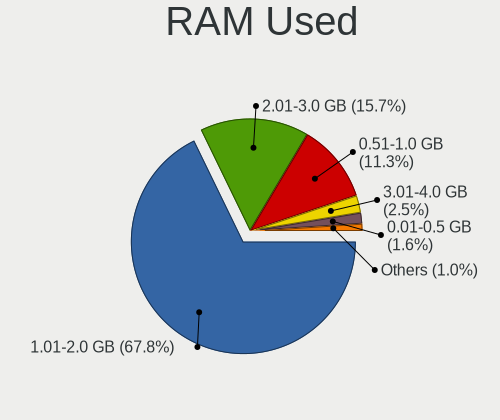
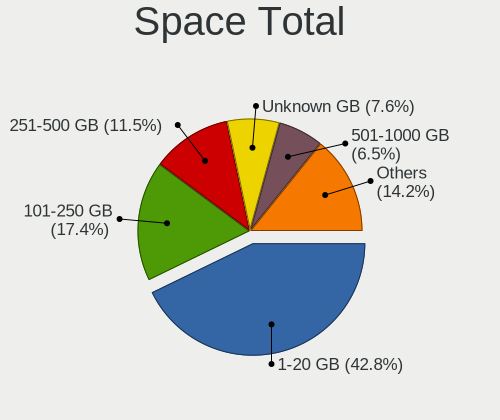
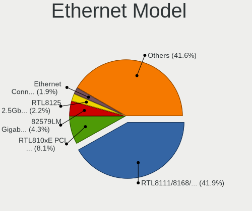
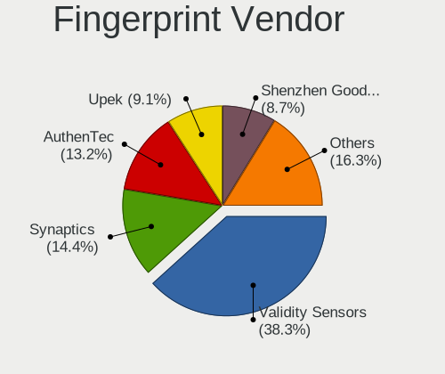
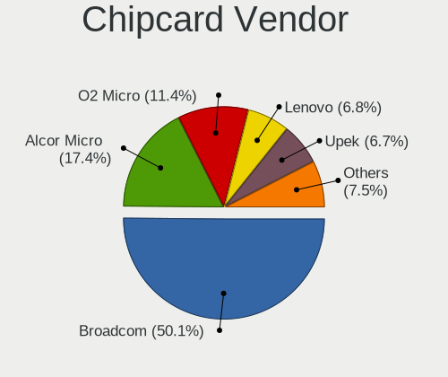

OpenMandriva - Tested Hardware & Statistics
-------------------------------------------

A project to collect tested hardware configurations for OpenMandriva.

Anyone can contribute to this report by the [hw-probe](https://github.com/linuxhw/hw-probe) tool:

    sudo -E hw-probe -all -upload

Please contribute! Especially if your hardware is rare.

This is a report for all computer types. See also reports for [desktops](/Dist/OpenMandriva/Desktop/README.md) and [notebooks](/Dist/OpenMandriva/Notebook/README.md).

Contents
--------

* [ Test Cases ](#test-cases)

* [ System ](#system)
  - [ OS                       ](#os)
  - [ OS Family                ](#os-family)
  - [ Kernel                   ](#kernel)
  - [ Kernel Family            ](#kernel-family)
  - [ Kernel Major Ver.        ](#kernel-major-ver)
  - [ Arch                     ](#arch)
  - [ DE                       ](#de)
  - [ Display Server           ](#display-server)
  - [ Display Manager          ](#display-manager)
  - [ OS Lang                  ](#os-lang)
  - [ Boot Mode                ](#boot-mode)
  - [ Filesystem               ](#filesystem)
  - [ Part. scheme             ](#part-scheme)
  - [ Dual Boot with Linux/BSD ](#dual-boot-with-linuxbsd)
  - [ Dual Boot (Win)          ](#dual-boot-win)

* [ Board ](#board)
  - [ Vendor                   ](#vendor)
  - [ Model                    ](#model)
  - [ Model Family             ](#model-family)
  - [ MFG Year                 ](#mfg-year)
  - [ Form Factor              ](#form-factor)
  - [ Secure Boot              ](#secure-boot)
  - [ Coreboot                 ](#coreboot)
  - [ RAM Size                 ](#ram-size)
  - [ RAM Used                 ](#ram-used)
  - [ Total Drives             ](#total-drives)
  - [ Has CD-ROM               ](#has-cd-rom)
  - [ Has Ethernet             ](#has-ethernet)
  - [ Has WiFi                 ](#has-wifi)
  - [ Has Bluetooth            ](#has-bluetooth)

* [ Location ](#location)
  - [ Country                  ](#country)
  - [ City                     ](#city)

* [ Drives ](#drives)
  - [ Drive Vendor             ](#drive-vendor)
  - [ Drive Model              ](#drive-model)
  - [ HDD Vendor               ](#hdd-vendor)
  - [ SSD Vendor               ](#ssd-vendor)
  - [ Drive Kind               ](#drive-kind)
  - [ Drive Connector          ](#drive-connector)
  - [ Drive Size               ](#drive-size)
  - [ Space Total              ](#space-total)
  - [ Space Used               ](#space-used)
  - [ Malfunc. Drives          ](#malfunc-drives)
  - [ Malfunc. Drive Vendor    ](#malfunc-drive-vendor)
  - [ Malfunc. HDD Vendor      ](#malfunc-hdd-vendor)
  - [ Malfunc. Drive Kind      ](#malfunc-drive-kind)
  - [ Failed Drives            ](#failed-drives)
  - [ Failed Drive Vendor      ](#failed-drive-vendor)
  - [ Drive Status             ](#drive-status)

* [ Storage controller ](#storage-controller)
  - [ Storage Vendor           ](#storage-vendor)
  - [ Storage Model            ](#storage-model)
  - [ Storage Kind             ](#storage-kind)

* [ Processor ](#processor)
  - [ CPU Vendor               ](#cpu-vendor)
  - [ CPU Model                ](#cpu-model)
  - [ CPU Model Family         ](#cpu-model-family)
  - [ CPU Cores                ](#cpu-cores)
  - [ CPU Sockets              ](#cpu-sockets)
  - [ CPU Threads              ](#cpu-threads)
  - [ CPU Op-Modes             ](#cpu-op-modes)
  - [ CPU Microcode            ](#cpu-microcode)
  - [ CPU Microarch            ](#cpu-microarch)

* [ Graphics ](#graphics)
  - [ GPU Vendor               ](#gpu-vendor)
  - [ GPU Model                ](#gpu-model)
  - [ GPU Combo                ](#gpu-combo)
  - [ GPU Driver               ](#gpu-driver)
  - [ GPU Memory               ](#gpu-memory)

* [ Monitor ](#monitor)
  - [ Monitor Vendor           ](#monitor-vendor)
  - [ Monitor Model            ](#monitor-model)
  - [ Monitor Resolution       ](#monitor-resolution)
  - [ Monitor Diagonal         ](#monitor-diagonal)
  - [ Monitor Width            ](#monitor-width)
  - [ Aspect Ratio             ](#aspect-ratio)
  - [ Monitor Area             ](#monitor-area)
  - [ Pixel Density            ](#pixel-density)
  - [ Multiple Monitors        ](#multiple-monitors)

* [ Network ](#network)
  - [ Net Controller Vendor    ](#net-controller-vendor)
  - [ Net Controller Model     ](#net-controller-model)
  - [ Wireless Vendor          ](#wireless-vendor)
  - [ Wireless Model           ](#wireless-model)
  - [ Ethernet Vendor          ](#ethernet-vendor)
  - [ Ethernet Model           ](#ethernet-model)
  - [ Net Controller Kind      ](#net-controller-kind)
  - [ Used Controller          ](#used-controller)
  - [ NICs                     ](#nics)
  - [ IPv6                     ](#ipv6)

* [ Bluetooth ](#bluetooth)
  - [ Bluetooth Vendor         ](#bluetooth-vendor)
  - [ Bluetooth Model          ](#bluetooth-model)

* [ Sound ](#sound)
  - [ Sound Vendor             ](#sound-vendor)
  - [ Sound Model              ](#sound-model)

* [ Memory ](#memory)
  - [ Memory Vendor            ](#memory-vendor)
  - [ Memory Model             ](#memory-model)
  - [ Memory Kind              ](#memory-kind)
  - [ Memory Form Factor       ](#memory-form-factor)
  - [ Memory Size              ](#memory-size)
  - [ Memory Speed             ](#memory-speed)

* [ Printers & scanners ](#printers--scanners)
  - [ Printer Vendor           ](#printer-vendor)
  - [ Printer Model            ](#printer-model)
  - [ Scanner Vendor           ](#scanner-vendor)
  - [ Scanner Model            ](#scanner-model)

* [ Camera ](#camera)
  - [ Camera Vendor            ](#camera-vendor)
  - [ Camera Model             ](#camera-model)

* [ Security ](#security)
  - [ Fingerprint Vendor       ](#fingerprint-vendor)
  - [ Fingerprint Model        ](#fingerprint-model)
  - [ Chipcard Vendor          ](#chipcard-vendor)
  - [ Chipcard Model           ](#chipcard-model)

* [ Unsupported ](#unsupported)
  - [ Unsupported Devices      ](#unsupported-devices)
  - [ Unsupported Device Types ](#unsupported-device-types)

Test Cases
----------

Total: 12050

| Vendor        | Model                       | Form-Factor | Probe                                                      | Date         |
|---------------|-----------------------------|-------------|------------------------------------------------------------|--------------|
| ASRock        | B650E PG Riptide WiFi       | Desktop     | [a637650ff7](https://linux-hardware.org/?probe=a637650ff7) | Mar 01, 2023 |
| Medion        | Erazer X7851 MD60583        | Notebook    | [9ddd4f88b4](https://linux-hardware.org/?probe=9ddd4f88b4) | Feb 28, 2023 |
| Gigabyte      | GA-880GA-UD3H               | Desktop     | [483db5a7bd](https://linux-hardware.org/?probe=483db5a7bd) | Feb 28, 2023 |
| ASUSTek       | X55A                        | Notebook    | [1429627725](https://linux-hardware.org/?probe=1429627725) | Feb 28, 2023 |
| ASRock        | 760GM-HDV                   | Desktop     | [c420a55609](https://linux-hardware.org/?probe=c420a55609) | Feb 28, 2023 |
| Lenovo        | IdeaPad 3 15ALC6 82KU       | Notebook    | [8ec75c8681](https://linux-hardware.org/?probe=8ec75c8681) | Feb 28, 2023 |
| ASUSTek       | N76VB                       | Notebook    | [0043164762](https://linux-hardware.org/?probe=0043164762) | Feb 28, 2023 |
| Acer          | Aspire X3995                | Desktop     | [eccac5b752](https://linux-hardware.org/?probe=eccac5b752) | Feb 28, 2023 |
| Dell          | Latitude 3400               | Notebook    | [2936e7f368](https://linux-hardware.org/?probe=2936e7f368) | Feb 28, 2023 |
| Fujitsu       | D2990-A3 S26361-D2990-A3    | Desktop     | [6f1de5f17c](https://linux-hardware.org/?probe=6f1de5f17c) | Feb 28, 2023 |
| Lenovo        | ThinkPad X1 Yoga 1st 20F... | Convertible | [17605a6808](https://linux-hardware.org/?probe=17605a6808) | Feb 28, 2023 |
| HP            | 8158 A01                    | Mini pc     | [869bfe7d05](https://linux-hardware.org/?probe=869bfe7d05) | Feb 28, 2023 |
| ASUSTek       | PRIME B250-PRO              | Desktop     | [cd58d8a863](https://linux-hardware.org/?probe=cd58d8a863) | Feb 28, 2023 |
| ASUSTek       | VivoBook_ASUSLaptop X412... | Notebook    | [87022bd601](https://linux-hardware.org/?probe=87022bd601) | Feb 28, 2023 |
| HP            | 18E7                        | Desktop     | [a4fb4affcf](https://linux-hardware.org/?probe=a4fb4affcf) | Feb 28, 2023 |
| Acer          | Aspire V3-772               | Notebook    | [5a0c297e10](https://linux-hardware.org/?probe=5a0c297e10) | Feb 28, 2023 |
| HP            | 87D6 SMVB                   | Desktop     | [423aac2b6f](https://linux-hardware.org/?probe=423aac2b6f) | Feb 28, 2023 |
| Philco        | 10D                         | Notebook    | [dd709d35db](https://linux-hardware.org/?probe=dd709d35db) | Feb 28, 2023 |
| Dell          | Latitude D630               | Notebook    | [5175558c99](https://linux-hardware.org/?probe=5175558c99) | Feb 28, 2023 |
| ASUSTek       | PRIME B550M-A               | Desktop     | [a6af4042ea](https://linux-hardware.org/?probe=a6af4042ea) | Feb 28, 2023 |
| ASUSTek       | P8B75-V                     | Desktop     | [cf4c7357eb](https://linux-hardware.org/?probe=cf4c7357eb) | Feb 28, 2023 |
| ASUSTek       | B150M-C                     | Desktop     | [e675a40455](https://linux-hardware.org/?probe=e675a40455) | Feb 28, 2023 |
| Sony          | VPCZ21Z9R                   | Notebook    | [4d3f0c27cd](https://linux-hardware.org/?probe=4d3f0c27cd) | Feb 28, 2023 |
| ASRock        | A320M-HDV                   | Desktop     | [5ba575539c](https://linux-hardware.org/?probe=5ba575539c) | Feb 28, 2023 |
| Sony          | VGN-FW11M                   | Notebook    | [06b355e1de](https://linux-hardware.org/?probe=06b355e1de) | Feb 28, 2023 |
| Foxconn       | G31MX Series                | Desktop     | [79ee8e5da3](https://linux-hardware.org/?probe=79ee8e5da3) | Feb 28, 2023 |
| HP            | EliteBook 8540w             | Notebook    | [057c307bf5](https://linux-hardware.org/?probe=057c307bf5) | Feb 28, 2023 |
| Dell          | Latitude E6420              | Notebook    | [a84f4dbcbb](https://linux-hardware.org/?probe=a84f4dbcbb) | Feb 28, 2023 |
| ASUSTek       | TUF Gaming FX505DD_FX505... | Notebook    | [021853dafb](https://linux-hardware.org/?probe=021853dafb) | Feb 28, 2023 |
| ASUSTek       | PRIME H370-PLUS             | Desktop     | [43afa90be1](https://linux-hardware.org/?probe=43afa90be1) | Feb 28, 2023 |
| Lenovo        | Legion 7 16ACHg6 82N6       | Notebook    | [594ff7091b](https://linux-hardware.org/?probe=594ff7091b) | Feb 27, 2023 |
| ASUSTek       | X550CA                      | Notebook    | [0ce966b8fa](https://linux-hardware.org/?probe=0ce966b8fa) | Feb 27, 2023 |
| ASUSTek       | K75VJ                       | Notebook    | [7fc0fff829](https://linux-hardware.org/?probe=7fc0fff829) | Feb 27, 2023 |
| Intel         | DG41RQ AAE54511-205         | Desktop     | [0cf17a3787](https://linux-hardware.org/?probe=0cf17a3787) | Feb 27, 2023 |
| ASUSTek       | AM1I-A                      | Desktop     | [b5fe605f8b](https://linux-hardware.org/?probe=b5fe605f8b) | Feb 27, 2023 |
| ASUSTek       | M4N68T-M-V2                 | Desktop     | [051b66987e](https://linux-hardware.org/?probe=051b66987e) | Feb 27, 2023 |
| MSI           | B450M MORTAR MAX            | Desktop     | [0335729036](https://linux-hardware.org/?probe=0335729036) | Feb 27, 2023 |
| Acer          | Aspire 8930                 | Notebook    | [837e36aa25](https://linux-hardware.org/?probe=837e36aa25) | Feb 27, 2023 |
| Intel         | H61                         | Desktop     | [b61ef1ed65](https://linux-hardware.org/?probe=b61ef1ed65) | Feb 27, 2023 |
| MSI           | NF750-G55                   | Desktop     | [f279251ffa](https://linux-hardware.org/?probe=f279251ffa) | Feb 27, 2023 |
| ASUSTek       | TUF Gaming B550-PLUS        | Desktop     | [8fc8fee94a](https://linux-hardware.org/?probe=8fc8fee94a) | Feb 27, 2023 |
| HP            | Notebook                    | Notebook    | [7e64e6bc1b](https://linux-hardware.org/?probe=7e64e6bc1b) | Feb 27, 2023 |
| Unknown       | HX90                        | Desktop     | [bc8bed9135](https://linux-hardware.org/?probe=bc8bed9135) | Feb 27, 2023 |
| Acer          | Aspire E5-571               | Notebook    | [5f035002e1](https://linux-hardware.org/?probe=5f035002e1) | Feb 27, 2023 |
| HP            | Notebook                    | Notebook    | [a1180ad479](https://linux-hardware.org/?probe=a1180ad479) | Feb 27, 2023 |
| Lenovo        | G700 20251                  | Notebook    | [8dc4179bbd](https://linux-hardware.org/?probe=8dc4179bbd) | Feb 27, 2023 |
| MSI           | A320M PRO-VH                | Desktop     | [e1266ebf79](https://linux-hardware.org/?probe=e1266ebf79) | Feb 27, 2023 |
| Lenovo        | 3098 SDK0E50510 WIN         | Desktop     | [f15e5303f6](https://linux-hardware.org/?probe=f15e5303f6) | Feb 27, 2023 |
| Acer          | Aspire 1410                 | Notebook    | [40b5704a1c](https://linux-hardware.org/?probe=40b5704a1c) | Feb 26, 2023 |
| Acer          | Aspire ES1-711              | Notebook    | [8e397cc54f](https://linux-hardware.org/?probe=8e397cc54f) | Feb 26, 2023 |
| ASUSTek       | X751LK                      | Notebook    | [f312f303e0](https://linux-hardware.org/?probe=f312f303e0) | Feb 26, 2023 |
| Acer          | EG43M                       | Desktop     | [d533c457eb](https://linux-hardware.org/?probe=d533c457eb) | Feb 26, 2023 |
| ASUSTek       | M5A78L                      | Desktop     | [693582be4e](https://linux-hardware.org/?probe=693582be4e) | Feb 26, 2023 |
| ASUSTek       | PRIME Q270M-C               | Desktop     | [edf748dbbb](https://linux-hardware.org/?probe=edf748dbbb) | Feb 26, 2023 |
| Dell          | Latitude E5530 non-vPro     | Notebook    | [5634c4795c](https://linux-hardware.org/?probe=5634c4795c) | Feb 26, 2023 |
| HP            | 3032h                       | Desktop     | [007bbeffa0](https://linux-hardware.org/?probe=007bbeffa0) | Feb 26, 2023 |
| ASRock        | A320M-HDV R4.0              | Desktop     | [319e003280](https://linux-hardware.org/?probe=319e003280) | Feb 26, 2023 |
| Gigabyte      | M68M-S2P                    | Desktop     | [15b2fe94ae](https://linux-hardware.org/?probe=15b2fe94ae) | Feb 26, 2023 |
| MSI           | MPG X570 GAMING PLUS        | Desktop     | [724039adf2](https://linux-hardware.org/?probe=724039adf2) | Feb 26, 2023 |
| eMachines     | eME728                      | Notebook    | [2331984fc8](https://linux-hardware.org/?probe=2331984fc8) | Feb 26, 2023 |
| Lenovo        | 102F SDK0J40705 WIN 3425... | Desktop     | [484e0755de](https://linux-hardware.org/?probe=484e0755de) | Feb 26, 2023 |
| ASRock        | H110M-HG4                   | Desktop     | [0a5dfbb9e6](https://linux-hardware.org/?probe=0a5dfbb9e6) | Feb 26, 2023 |
| Dell          | Latitude D630               | Notebook    | [cfdc009ff1](https://linux-hardware.org/?probe=cfdc009ff1) | Feb 26, 2023 |
| Dell          | Inspiron 7506 2n1           | Convertible | [3479df4ab9](https://linux-hardware.org/?probe=3479df4ab9) | Feb 26, 2023 |
| ASRock        | 960GM-VGS3 FX               | Desktop     | [66ea6164bf](https://linux-hardware.org/?probe=66ea6164bf) | Feb 25, 2023 |
| Dell          | 0YJHYD A00                  | Desktop     | [5029039f0e](https://linux-hardware.org/?probe=5029039f0e) | Feb 25, 2023 |
| Google        | Lars                        | Notebook    | [ec4b0e7bbc](https://linux-hardware.org/?probe=ec4b0e7bbc) | Feb 25, 2023 |
| Lenovo        | ThinkPad L412 0585A38       | Notebook    | [da6493ef82](https://linux-hardware.org/?probe=da6493ef82) | Feb 25, 2023 |
| Fujitsu       | D3233-A1 S26361-D3233-A1    | Desktop     | [782598981d](https://linux-hardware.org/?probe=782598981d) | Feb 25, 2023 |
| Dell          | 0YF8P5 A00                  | Desktop     | [b387faf4ee](https://linux-hardware.org/?probe=b387faf4ee) | Feb 25, 2023 |
| Acer          | Acadia V1.45                | Notebook    | [faee032e6c](https://linux-hardware.org/?probe=faee032e6c) | Feb 25, 2023 |
| ASRock        | H67M-GE/HT                  | Desktop     | [3410887193](https://linux-hardware.org/?probe=3410887193) | Feb 25, 2023 |
| HP            | 18E7                        | Desktop     | [7b52dfac52](https://linux-hardware.org/?probe=7b52dfac52) | Feb 25, 2023 |
| ASUSTek       | H81M-E                      | Desktop     | [25a3002df1](https://linux-hardware.org/?probe=25a3002df1) | Feb 25, 2023 |
| Samsung       | 550XBE/350XBE               | Notebook    | [d9f49e98fd](https://linux-hardware.org/?probe=d9f49e98fd) | Feb 25, 2023 |
| HP            | Pavilion g7                 | Notebook    | [8f46d24897](https://linux-hardware.org/?probe=8f46d24897) | Feb 25, 2023 |
| Sony          | SVE1513B1EW                 | Notebook    | [c99ef001e4](https://linux-hardware.org/?probe=c99ef001e4) | Feb 25, 2023 |
| Gigabyte      | G31M-S2L                    | Desktop     | [563101d2b2](https://linux-hardware.org/?probe=563101d2b2) | Feb 25, 2023 |
| ASUSTek       | GL702ZC                     | Notebook    | [a40afcb1d9](https://linux-hardware.org/?probe=a40afcb1d9) | Feb 25, 2023 |
| Toshiba       | Satellite C850              | Notebook    | [99d4efbb52](https://linux-hardware.org/?probe=99d4efbb52) | Feb 25, 2023 |
| MSI           | 970A GAMING PRO CARBON      | Desktop     | [0649eea8a9](https://linux-hardware.org/?probe=0649eea8a9) | Feb 25, 2023 |
| ASUSTek       | GL553VD                     | Notebook    | [302b65ed41](https://linux-hardware.org/?probe=302b65ed41) | Feb 25, 2023 |
| ASUSTek       | Z450LA                      | Notebook    | [304be04748](https://linux-hardware.org/?probe=304be04748) | Feb 25, 2023 |
| Gigabyte      | GA-78LMT-USB3 SEx           | Desktop     | [d6fea43eb5](https://linux-hardware.org/?probe=d6fea43eb5) | Feb 25, 2023 |
| Dell          | 0T1D10 A01                  | Desktop     | [87f49d1c7e](https://linux-hardware.org/?probe=87f49d1c7e) | Feb 25, 2023 |
| ASRock        | FM2A58M-VG3+ R2.0           | Desktop     | [92ac86c31b](https://linux-hardware.org/?probe=92ac86c31b) | Feb 25, 2023 |
| Unknown       | 1.0                         | Desktop     | [69594c956a](https://linux-hardware.org/?probe=69594c956a) | Feb 25, 2023 |
| Unknown       | Unknown                     | Notebook    | [6707aef886](https://linux-hardware.org/?probe=6707aef886) | Feb 25, 2023 |
| Dell          | 088DT1 A01                  | Desktop     | [129ed2a520](https://linux-hardware.org/?probe=129ed2a520) | Feb 25, 2023 |
| Dell          | 0VHWTR A01                  | Desktop     | [ab8247e106](https://linux-hardware.org/?probe=ab8247e106) | Feb 24, 2023 |
| Dell          | Latitude D630               | Notebook    | [433f06ecbb](https://linux-hardware.org/?probe=433f06ecbb) | Feb 24, 2023 |
| MSI           | B360M PRO-VH                | Desktop     | [fad0bd20e1](https://linux-hardware.org/?probe=fad0bd20e1) | Feb 24, 2023 |
| Lenovo        | 3111 SDK0J40697 WIN 3305... | Mini pc     | [15cf7c7cd7](https://linux-hardware.org/?probe=15cf7c7cd7) | Feb 24, 2023 |
| ASUSTek       | P5B                         | Desktop     | [60cb8319db](https://linux-hardware.org/?probe=60cb8319db) | Feb 24, 2023 |
| Lenovo        | IdeaPad 3 15ADA05 81W1      | Notebook    | [a8a2fc9d83](https://linux-hardware.org/?probe=a8a2fc9d83) | Feb 24, 2023 |
| HP            | 650                         | Notebook    | [ab0b350259](https://linux-hardware.org/?probe=ab0b350259) | Feb 24, 2023 |
| ASUSTek       | P5QL PRO                    | Desktop     | [c7477f1aca](https://linux-hardware.org/?probe=c7477f1aca) | Feb 24, 2023 |
| Samsung       | 300E4C/300E5C/300E7C        | Notebook    | [c19b7cd0f5](https://linux-hardware.org/?probe=c19b7cd0f5) | Feb 24, 2023 |
| ASUSTek       | B150M-A D3                  | Desktop     | [01caadaee0](https://linux-hardware.org/?probe=01caadaee0) | Feb 24, 2023 |
| MSI           | G41M-P33 Combo              | Desktop     | [91c8d45121](https://linux-hardware.org/?probe=91c8d45121) | Feb 24, 2023 |
| HP            | Pavilion x360 Convertibl... | Convertible | [dc7b5cb76e](https://linux-hardware.org/?probe=dc7b5cb76e) | Feb 24, 2023 |
| HP            | ProBook 4530s               | Notebook    | [305f79455e](https://linux-hardware.org/?probe=305f79455e) | Feb 24, 2023 |
| Fujitsu       | LIFEBOOK A530               | Notebook    | [9035e056b4](https://linux-hardware.org/?probe=9035e056b4) | Feb 24, 2023 |
| HP            | ProBook 4730s               | Notebook    | [6d563800a1](https://linux-hardware.org/?probe=6d563800a1) | Feb 24, 2023 |
| HP            | Compaq CQ58                 | Notebook    | [cfff7e8c96](https://linux-hardware.org/?probe=cfff7e8c96) | Feb 24, 2023 |
| HP            | Notebook                    | Notebook    | [b929a8ff3c](https://linux-hardware.org/?probe=b929a8ff3c) | Feb 24, 2023 |
| ASUSTek       | M4A77T/USB3                 | Desktop     | [6bf574175a](https://linux-hardware.org/?probe=6bf574175a) | Feb 24, 2023 |
| Acer          | Aspire S3                   | Notebook    | [9d0301c490](https://linux-hardware.org/?probe=9d0301c490) | Feb 24, 2023 |
| ASUSTek       | M4A89GTD-PRO/USB3           | Desktop     | [9171567db4](https://linux-hardware.org/?probe=9171567db4) | Feb 24, 2023 |
| ASUSTek       | P8H61-M LX R2.0             | Desktop     | [b410c9f493](https://linux-hardware.org/?probe=b410c9f493) | Feb 24, 2023 |
| ASUSTek       | A68HM-K                     | Desktop     | [5c7e454884](https://linux-hardware.org/?probe=5c7e454884) | Feb 24, 2023 |
| HP            | 1998                        | Desktop     | [145c009f05](https://linux-hardware.org/?probe=145c009f05) | Feb 24, 2023 |
| ASUSTek       | M2N-MX SE Plus              | Desktop     | [21aa20cd64](https://linux-hardware.org/?probe=21aa20cd64) | Feb 24, 2023 |
| Dell          | Inspiron 15-3567            | Notebook    | [f6b6b24623](https://linux-hardware.org/?probe=f6b6b24623) | Feb 24, 2023 |
| ASRock        | A88M-G                      | Desktop     | [917526ad4d](https://linux-hardware.org/?probe=917526ad4d) | Feb 24, 2023 |
| Acer          | Aspire A517-51G             | Notebook    | [12040fcd10](https://linux-hardware.org/?probe=12040fcd10) | Feb 24, 2023 |
| Acer          | AO725                       | Notebook    | [9c6719e733](https://linux-hardware.org/?probe=9c6719e733) | Feb 24, 2023 |
| ASRock        | H81M-HDS                    | Desktop     | [d4a6916e4f](https://linux-hardware.org/?probe=d4a6916e4f) | Feb 24, 2023 |
| Acer          | Aspire E5-575G              | Notebook    | [f7d34fdd3a](https://linux-hardware.org/?probe=f7d34fdd3a) | Feb 24, 2023 |
| Packard Be... | EasyNote TS44HR             | Notebook    | [b0d713ec14](https://linux-hardware.org/?probe=b0d713ec14) | Feb 24, 2023 |
| Gigabyte      | AB350M-Gaming 3-CF          | Desktop     | [2a8b727725](https://linux-hardware.org/?probe=2a8b727725) | Feb 24, 2023 |
| NEC Comput... | PC-VY25AAZR7                | Notebook    | [bc17a98c15](https://linux-hardware.org/?probe=bc17a98c15) | Feb 24, 2023 |
| Lenovo        | IdeaPad S145-15IIL 82DJ     | Notebook    | [c0af9c8bdb](https://linux-hardware.org/?probe=c0af9c8bdb) | Feb 24, 2023 |
| Intel         | NUC10i7FNB K61360-302       | Mini pc     | [fdcb637c97](https://linux-hardware.org/?probe=fdcb637c97) | Feb 24, 2023 |
| Positivo      | N1103                       | Notebook    | [b89c4551aa](https://linux-hardware.org/?probe=b89c4551aa) | Feb 24, 2023 |
| ASRock        | 990FX Killer                | Desktop     | [acfa772cc6](https://linux-hardware.org/?probe=acfa772cc6) | Feb 24, 2023 |
| Toshiba       | Satellite C850-1GF          | Notebook    | [f568855409](https://linux-hardware.org/?probe=f568855409) | Feb 24, 2023 |
| Gigabyte      | B85M-HD3 R4                 | Desktop     | [db83755f3f](https://linux-hardware.org/?probe=db83755f3f) | Feb 24, 2023 |
| HP            | Pavilion Gaming Laptop 1... | Notebook    | [d8d531c22a](https://linux-hardware.org/?probe=d8d531c22a) | Feb 24, 2023 |
| Gigabyte      | Z97-HD3                     | Desktop     | [016a51a4af](https://linux-hardware.org/?probe=016a51a4af) | Feb 23, 2023 |
| Lenovo        | Legion 5 15IMH05C 82AU      | Notebook    | [a5a58a8dc4](https://linux-hardware.org/?probe=a5a58a8dc4) | Feb 23, 2023 |
| Lenovo        | ThinkPad T520 4243F53       | Notebook    | [2e904cc4d7](https://linux-hardware.org/?probe=2e904cc4d7) | Feb 23, 2023 |
| MSI           | B450 TOMAHAWK MAX II        | Desktop     | [bf6fc4a9d6](https://linux-hardware.org/?probe=bf6fc4a9d6) | Feb 23, 2023 |
| Samsung       | RV413/RV513                 | Notebook    | [5b524ddbb0](https://linux-hardware.org/?probe=5b524ddbb0) | Feb 23, 2023 |
| MSI           | X370 GAMING PLUS            | Desktop     | [4d45d5880b](https://linux-hardware.org/?probe=4d45d5880b) | Feb 23, 2023 |
| MSI           | H110M PRO-VH PLUS           | Desktop     | [de05d0d3f6](https://linux-hardware.org/?probe=de05d0d3f6) | Feb 23, 2023 |
| Lenovo        | IdeaPad 330S-15IKB 81F5     | Notebook    | [df8ac668e2](https://linux-hardware.org/?probe=df8ac668e2) | Feb 23, 2023 |
| Lenovo        | IdeaPad 330S-15IKB 81F5     | Notebook    | [0f5352f94f](https://linux-hardware.org/?probe=0f5352f94f) | Feb 23, 2023 |
| Acer          | Aspire A515-46              | Notebook    | [009fbacf68](https://linux-hardware.org/?probe=009fbacf68) | Feb 23, 2023 |
| Dell          | Latitude E7470              | Notebook    | [5e445bd00a](https://linux-hardware.org/?probe=5e445bd00a) | Feb 23, 2023 |
| ASUSTek       | P5K                         | Desktop     | [f564dd9ac5](https://linux-hardware.org/?probe=f564dd9ac5) | Feb 23, 2023 |
| Gigabyte      | G1.Sniper A88X-CF           | Desktop     | [cfe5ecec44](https://linux-hardware.org/?probe=cfe5ecec44) | Feb 23, 2023 |
| Gigabyte      | H61M-S1                     | Desktop     | [ca76e62a1e](https://linux-hardware.org/?probe=ca76e62a1e) | Feb 23, 2023 |
| ASUSTek       | H61M-K                      | Desktop     | [9d39d13682](https://linux-hardware.org/?probe=9d39d13682) | Feb 23, 2023 |
| Biostar       | N68S3B                      | Desktop     | [4572b3d965](https://linux-hardware.org/?probe=4572b3d965) | Feb 23, 2023 |
| Dell          | Latitude 5420               | Notebook    | [948cbeda59](https://linux-hardware.org/?probe=948cbeda59) | Feb 23, 2023 |
| ASRock        | N68-VGS3 FX                 | Desktop     | [b9fbaca53d](https://linux-hardware.org/?probe=b9fbaca53d) | Feb 23, 2023 |
| Lenovo        | V15-ADA 82C7                | Notebook    | [d19ee09dd3](https://linux-hardware.org/?probe=d19ee09dd3) | Feb 23, 2023 |
| Acer          | Nitro AN515-52              | Notebook    | [05f7c375b7](https://linux-hardware.org/?probe=05f7c375b7) | Feb 23, 2023 |
| Foxconn       | 2ADA                        | Desktop     | [75b2eb9c1f](https://linux-hardware.org/?probe=75b2eb9c1f) | Feb 23, 2023 |
| HP            | mt40                        | Notebook    | [16e5f8eb5d](https://linux-hardware.org/?probe=16e5f8eb5d) | Feb 23, 2023 |
| Biostar       | B450MH                      | Desktop     | [7bd9274f23](https://linux-hardware.org/?probe=7bd9274f23) | Feb 23, 2023 |
| Intel         | NUC6i7KYB H90766-403        | Mini pc     | [2948f164d5](https://linux-hardware.org/?probe=2948f164d5) | Feb 23, 2023 |
| ASUSTek       | PRIME A320M-K/BR            | Desktop     | [fd084cb513](https://linux-hardware.org/?probe=fd084cb513) | Feb 23, 2023 |
| Toshiba       | dynabook T653/46JR          | Notebook    | [ac156d2c80](https://linux-hardware.org/?probe=ac156d2c80) | Feb 22, 2023 |
| HP            | 15                          | Notebook    | [470b07302a](https://linux-hardware.org/?probe=470b07302a) | Feb 22, 2023 |
| Lenovo        | IdeaPad Gaming 3 15IMH05... | Notebook    | [d488fc0d9a](https://linux-hardware.org/?probe=d488fc0d9a) | Feb 22, 2023 |
| ASRock        | B450M Pro4                  | Desktop     | [ccd3d2932f](https://linux-hardware.org/?probe=ccd3d2932f) | Feb 22, 2023 |
| ASUSTek       | 1215B                       | Notebook    | [970d77d150](https://linux-hardware.org/?probe=970d77d150) | Feb 22, 2023 |
| Positivo      | S14SL01                     | Notebook    | [914a9e691e](https://linux-hardware.org/?probe=914a9e691e) | Feb 22, 2023 |
| ASUSTek       | A_F_K20CE                   | Desktop     | [2dffc350dd](https://linux-hardware.org/?probe=2dffc350dd) | Feb 22, 2023 |
| Positivo      | S14CT01                     | Notebook    | [af73fc0481](https://linux-hardware.org/?probe=af73fc0481) | Feb 22, 2023 |
| Lenovo        | ThinkPad T430s 23551M9      | Notebook    | [91b6a109b4](https://linux-hardware.org/?probe=91b6a109b4) | Feb 22, 2023 |
| ASUSTek       | X555DG                      | Notebook    | [5e7abe271f](https://linux-hardware.org/?probe=5e7abe271f) | Feb 22, 2023 |
| ASRock        | B660M Pro RS                | Desktop     | [13560ab66d](https://linux-hardware.org/?probe=13560ab66d) | Feb 22, 2023 |
| Lenovo        | V130-15IGM 81HL             | Notebook    | [40205862f6](https://linux-hardware.org/?probe=40205862f6) | Feb 22, 2023 |
| Gigabyte      | H81M-S2PV                   | Desktop     | [ad365efca1](https://linux-hardware.org/?probe=ad365efca1) | Feb 22, 2023 |
| Gigabyte      | X570 GAMING X               | Desktop     | [4803e8ee01](https://linux-hardware.org/?probe=4803e8ee01) | Feb 22, 2023 |
| Lenovo        | ThinkPad T520 4242NS9       | Notebook    | [6e2e5c8285](https://linux-hardware.org/?probe=6e2e5c8285) | Feb 22, 2023 |
| ASUSTek       | P8Z68-V PRO GEN3            | Desktop     | [ad957d0b05](https://linux-hardware.org/?probe=ad957d0b05) | Feb 22, 2023 |
| ASUSTek       | ROG CROSSHAIR VIII DARK ... | Desktop     | [2d36b57c9c](https://linux-hardware.org/?probe=2d36b57c9c) | Feb 22, 2023 |
| Gigabyte      | GA-78LMT-USB3 R2 sex        | Desktop     | [9523a0ccc2](https://linux-hardware.org/?probe=9523a0ccc2) | Feb 22, 2023 |
| MSI           | GF615M-P33                  | Desktop     | [c9cad5f4fa](https://linux-hardware.org/?probe=c9cad5f4fa) | Feb 22, 2023 |
| Lenovo        | MAHOBAY NO DPK              | Desktop     | [186b84313d](https://linux-hardware.org/?probe=186b84313d) | Feb 22, 2023 |
| Gateway       | NV53A                       | Notebook    | [1e2b4ec4d3](https://linux-hardware.org/?probe=1e2b4ec4d3) | Feb 22, 2023 |
| Dell          | Latitude E5420              | Notebook    | [f5a1982d9c](https://linux-hardware.org/?probe=f5a1982d9c) | Feb 22, 2023 |
| Dell          | Inspiron 5547               | Notebook    | [ff88bcbafc](https://linux-hardware.org/?probe=ff88bcbafc) | Feb 22, 2023 |
| ASUSTek       | PRIME X399-A                | Desktop     | [bfe434ab92](https://linux-hardware.org/?probe=bfe434ab92) | Feb 22, 2023 |
| Intel         | NUC8BEB J72692-309          | Mini pc     | [d29d970c4a](https://linux-hardware.org/?probe=d29d970c4a) | Feb 22, 2023 |
| ASRock        | Z690 Extreme                | Desktop     | [16e67a28e4](https://linux-hardware.org/?probe=16e67a28e4) | Feb 22, 2023 |
| Timi          | TM1707                      | Notebook    | [9bc429fbd6](https://linux-hardware.org/?probe=9bc429fbd6) | Feb 22, 2023 |
| ASUSTek       | M2NPV-MX                    | Desktop     | [06d857e2ff](https://linux-hardware.org/?probe=06d857e2ff) | Feb 22, 2023 |
| Fujitsu Si... | AMILO Li3910                | Notebook    | [28890c5346](https://linux-hardware.org/?probe=28890c5346) | Feb 21, 2023 |
| ASUSTek       | AM1M-A/BR                   | Desktop     | [d1c356a1c7](https://linux-hardware.org/?probe=d1c356a1c7) | Feb 21, 2023 |
| ASUSTek       | M5A78L/USB3                 | Desktop     | [b4288b76ee](https://linux-hardware.org/?probe=b4288b76ee) | Feb 21, 2023 |
| ASUSTek       | P5Q-E                       | Desktop     | [1fd091bff9](https://linux-hardware.org/?probe=1fd091bff9) | Feb 21, 2023 |
| HP            | Pavilion dv6                | Notebook    | [526430f218](https://linux-hardware.org/?probe=526430f218) | Feb 21, 2023 |
| MSI           | Z170A XPOWER GAMING TITA... | Desktop     | [b644019f77](https://linux-hardware.org/?probe=b644019f77) | Feb 21, 2023 |
| Gigabyte      | H410M S2 V3                 | Desktop     | [b517bb25cc](https://linux-hardware.org/?probe=b517bb25cc) | Feb 21, 2023 |
| Apple         | MacBookPro9,2               | Notebook    | [80df77e6a1](https://linux-hardware.org/?probe=80df77e6a1) | Feb 21, 2023 |
| Dell          | Vostro 15 7510              | Notebook    | [df764baed8](https://linux-hardware.org/?probe=df764baed8) | Feb 21, 2023 |
| ASUSTek       | ASUS TUF Gaming A15 FA50... | Notebook    | [7e5789e02b](https://linux-hardware.org/?probe=7e5789e02b) | Feb 21, 2023 |
| MSI           | H510M-A PRO                 | Desktop     | [bbef057c8f](https://linux-hardware.org/?probe=bbef057c8f) | Feb 21, 2023 |
| MSI           | A88XI AC V2                 | Desktop     | [42c0cd5d37](https://linux-hardware.org/?probe=42c0cd5d37) | Feb 21, 2023 |
| ASUSTek       | VivoBook_ASUSLaptop X513... | Notebook    | [50f5c21eeb](https://linux-hardware.org/?probe=50f5c21eeb) | Feb 21, 2023 |
| Lenovo        | ThinkPad T430s 2356CV6      | Notebook    | [bb18722cf2](https://linux-hardware.org/?probe=bb18722cf2) | Feb 21, 2023 |
| Dell          | XPS 15 7590                 | Notebook    | [f613ecb9b2](https://linux-hardware.org/?probe=f613ecb9b2) | Feb 20, 2023 |
| Dell          | 02YYK5 A00                  | Desktop     | [cff33d0b1e](https://linux-hardware.org/?probe=cff33d0b1e) | Feb 20, 2023 |
| Dell          | Inspiron 5493               | Notebook    | [ad7bee8a6e](https://linux-hardware.org/?probe=ad7bee8a6e) | Feb 20, 2023 |
| ASUSTek       | PRIME Z390-P                | Desktop     | [d81ff5358a](https://linux-hardware.org/?probe=d81ff5358a) | Feb 20, 2023 |
| Dell          | G15 5510                    | Notebook    | [a1edb7b376](https://linux-hardware.org/?probe=a1edb7b376) | Feb 20, 2023 |
| MSI           | G41M-P23                    | Desktop     | [04211b9202](https://linux-hardware.org/?probe=04211b9202) | Feb 20, 2023 |
| Dell          | Inspiron 3502               | Notebook    | [224f4edab7](https://linux-hardware.org/?probe=224f4edab7) | Feb 20, 2023 |
| ASRock        | AM1B-MH                     | Desktop     | [d67d348d90](https://linux-hardware.org/?probe=d67d348d90) | Feb 20, 2023 |
| Toshiba       | TECRA R850                  | Notebook    | [082f5559c7](https://linux-hardware.org/?probe=082f5559c7) | Feb 20, 2023 |
| Lenovo        | V15 G2 ALC 82KD             | Notebook    | [40468a72ce](https://linux-hardware.org/?probe=40468a72ce) | Feb 20, 2023 |
| ASUSTek       | Z97-K                       | Desktop     | [59931c7434](https://linux-hardware.org/?probe=59931c7434) | Feb 20, 2023 |
| Lenovo        | IdeaPad L340-17API 81LY     | Notebook    | [e26b379150](https://linux-hardware.org/?probe=e26b379150) | Feb 20, 2023 |
| ASUSTek       | ROG STRIX B560-A GAMING ... | Desktop     | [119e106d80](https://linux-hardware.org/?probe=119e106d80) | Feb 20, 2023 |
| Gigabyte      | Z270N-WIFI-CF               | Desktop     | [32ed66a6f9](https://linux-hardware.org/?probe=32ed66a6f9) | Feb 20, 2023 |
| Gigabyte      | G31M-ES2L                   | Desktop     | [7415192b86](https://linux-hardware.org/?probe=7415192b86) | Feb 20, 2023 |
| Unknown       | Unknown                     | Notebook    | [cccf0ea7f3](https://linux-hardware.org/?probe=cccf0ea7f3) | Feb 20, 2023 |
| Acer          | Aspire 6530G                | Notebook    | [c1d73e8ceb](https://linux-hardware.org/?probe=c1d73e8ceb) | Feb 20, 2023 |
| Gigabyte      | GA-78LMT-S2                 | Desktop     | [29758ea823](https://linux-hardware.org/?probe=29758ea823) | Feb 20, 2023 |
| ASUSTek       | ROG STRIX X570-E GAMING     | Desktop     | [576314ab03](https://linux-hardware.org/?probe=576314ab03) | Feb 20, 2023 |
| ASUSTek       | GL702VM                     | Notebook    | [daa3e0f7df](https://linux-hardware.org/?probe=daa3e0f7df) | Feb 20, 2023 |
| IP3 Tech      | rev1.1                      | Mini pc     | [7c4f6801f0](https://linux-hardware.org/?probe=7c4f6801f0) | Feb 20, 2023 |
| Gigabyte      | B560M DS3H                  | Desktop     | [72891de86c](https://linux-hardware.org/?probe=72891de86c) | Feb 20, 2023 |
| MSI           | X370 GAMING PLUS            | Desktop     | [a180732a9f](https://linux-hardware.org/?probe=a180732a9f) | Feb 19, 2023 |
| ASRock        | 880GM-LE FX                 | Desktop     | [db290cd703](https://linux-hardware.org/?probe=db290cd703) | Feb 19, 2023 |
| HP            | Pavilion 17                 | Notebook    | [1a50084a52](https://linux-hardware.org/?probe=1a50084a52) | Feb 19, 2023 |
| HP            | 14                          | Notebook    | [0244e880e1](https://linux-hardware.org/?probe=0244e880e1) | Feb 19, 2023 |
| Dell          | 0C27VV A00                  | Desktop     | [1b522f9105](https://linux-hardware.org/?probe=1b522f9105) | Feb 19, 2023 |
| ASUSTek       | X541NA                      | Notebook    | [b9ddd17e6c](https://linux-hardware.org/?probe=b9ddd17e6c) | Feb 19, 2023 |
| Acer          | G43T-AM3                    | Desktop     | [5ec1aa8af7](https://linux-hardware.org/?probe=5ec1aa8af7) | Feb 19, 2023 |
| Acer          | EG43M                       | Desktop     | [080dfdf76f](https://linux-hardware.org/?probe=080dfdf76f) | Feb 19, 2023 |
| HP            | Pavilion g6                 | Notebook    | [f3552f5183](https://linux-hardware.org/?probe=f3552f5183) | Feb 19, 2023 |
| ASUSTek       | X55U                        | Notebook    | [15322abeb5](https://linux-hardware.org/?probe=15322abeb5) | Feb 19, 2023 |
| Dell          | Vostro1710                  | Notebook    | [91b1af7ed6](https://linux-hardware.org/?probe=91b1af7ed6) | Feb 19, 2023 |
| HP            | 2B56                        | All in one  | [25c4d7a993](https://linux-hardware.org/?probe=25c4d7a993) | Feb 19, 2023 |
| Apple         | Mac-F227BEC8 PVT            | All in one  | [57f4dffc1a](https://linux-hardware.org/?probe=57f4dffc1a) | Feb 19, 2023 |
| Intel         | NUC7JYB J67967-404          | Mini pc     | [6aa1dafa0d](https://linux-hardware.org/?probe=6aa1dafa0d) | Feb 19, 2023 |
| HP            | 250 G6 Notebook PC          | Notebook    | [c32182253e](https://linux-hardware.org/?probe=c32182253e) | Feb 19, 2023 |
| ASRock        | X300M-STX                   | Desktop     | [f689e279bc](https://linux-hardware.org/?probe=f689e279bc) | Feb 19, 2023 |
| ASUSTek       | G10AC                       | Desktop     | [8a367bb885](https://linux-hardware.org/?probe=8a367bb885) | Feb 19, 2023 |
| Biostar       | A520MH                      | Desktop     | [ebdd012874](https://linux-hardware.org/?probe=ebdd012874) | Feb 19, 2023 |
| Lenovo        | B560 43308VG                | Notebook    | [c30b594458](https://linux-hardware.org/?probe=c30b594458) | Feb 19, 2023 |
| Gigabyte      | B75M-D2V                    | Desktop     | [fe04dfeaac](https://linux-hardware.org/?probe=fe04dfeaac) | Feb 19, 2023 |
| HP            | ProBook 4520s               | Notebook    | [8192287499](https://linux-hardware.org/?probe=8192287499) | Feb 19, 2023 |
| Gigabyte      | B460 AORUS PRO AC           | Desktop     | [dc6b25dcef](https://linux-hardware.org/?probe=dc6b25dcef) | Feb 19, 2023 |
| Acer          | H57M01                      | Desktop     | [5e5e9d03a4](https://linux-hardware.org/?probe=5e5e9d03a4) | Feb 19, 2023 |
| MSI           | Z97M GAMING                 | Desktop     | [e983a3704e](https://linux-hardware.org/?probe=e983a3704e) | Feb 19, 2023 |
| Lenovo        | IdeaPad Yoga 11S 20246      | Notebook    | [b0941b8ef0](https://linux-hardware.org/?probe=b0941b8ef0) | Feb 18, 2023 |
| HP            | 255 G8 Notebook PC          | Notebook    | [ecf73f400b](https://linux-hardware.org/?probe=ecf73f400b) | Feb 18, 2023 |
| HP            | Notebook                    | Notebook    | [2d03543f4c](https://linux-hardware.org/?probe=2d03543f4c) | Feb 18, 2023 |
| Acer          | Spin SP315-51               | Convertible | [7a3814b168](https://linux-hardware.org/?probe=7a3814b168) | Feb 18, 2023 |
| ASUSTek       | PRIME B560M-A               | Desktop     | [0a015cdb94](https://linux-hardware.org/?probe=0a015cdb94) | Feb 18, 2023 |
| HP            | 15                          | Notebook    | [60ecad0be7](https://linux-hardware.org/?probe=60ecad0be7) | Feb 18, 2023 |
| HP            | Notebook                    | Notebook    | [3eff638ead](https://linux-hardware.org/?probe=3eff638ead) | Feb 18, 2023 |
| ASRock        | AB350 Pro4                  | Desktop     | [908d615f00](https://linux-hardware.org/?probe=908d615f00) | Feb 18, 2023 |
| HP            | Pavilion g6                 | Notebook    | [2b4de6efbe](https://linux-hardware.org/?probe=2b4de6efbe) | Feb 18, 2023 |
| HP            | 15                          | Notebook    | [4db2520843](https://linux-hardware.org/?probe=4db2520843) | Feb 18, 2023 |
| Samsung       | RF511/RF411/RF711           | Notebook    | [355838f8b2](https://linux-hardware.org/?probe=355838f8b2) | Feb 18, 2023 |
| ASUSTek       | X756UB                      | Notebook    | [713121e0fc](https://linux-hardware.org/?probe=713121e0fc) | Feb 18, 2023 |
| ASUSTek       | PN51-E1                     | Mini pc     | [ff9cd473da](https://linux-hardware.org/?probe=ff9cd473da) | Feb 18, 2023 |
| ASUSTek       | UX31E                       | Notebook    | [4c3c50a992](https://linux-hardware.org/?probe=4c3c50a992) | Feb 18, 2023 |
| Lenovo        | IdeaPad 100-15IBD 80QQ      | Notebook    | [27958da7cc](https://linux-hardware.org/?probe=27958da7cc) | Feb 18, 2023 |
| Gigabyte      | GA-MA785GMT-UD2H            | Desktop     | [c67a2ae3c5](https://linux-hardware.org/?probe=c67a2ae3c5) | Feb 18, 2023 |
| ASUSTek       | X555DA                      | Notebook    | [2ac23d19ec](https://linux-hardware.org/?probe=2ac23d19ec) | Feb 18, 2023 |
| HP            | ProBook 4540s               | Notebook    | [cc3e78f73f](https://linux-hardware.org/?probe=cc3e78f73f) | Feb 18, 2023 |
| Sony          | VGN-FW270J                  | Notebook    | [81ce2212e9](https://linux-hardware.org/?probe=81ce2212e9) | Feb 18, 2023 |
| Gigabyte      | P31-ES3G                    | Desktop     | [2c3eb25bc4](https://linux-hardware.org/?probe=2c3eb25bc4) | Feb 18, 2023 |
| ASUSTek       | STRIX X99 GAMING            | Desktop     | [8dd1992835](https://linux-hardware.org/?probe=8dd1992835) | Feb 18, 2023 |
| HP            | G62                         | Notebook    | [59a7a48e19](https://linux-hardware.org/?probe=59a7a48e19) | Feb 18, 2023 |
| Dell          | XPS 13 9370                 | Notebook    | [96b350db9f](https://linux-hardware.org/?probe=96b350db9f) | Feb 18, 2023 |
| ASRock        | 880GM-LE FX                 | Desktop     | [1d45a444a3](https://linux-hardware.org/?probe=1d45a444a3) | Feb 18, 2023 |
| Acer          | Aspire A515-45              | Notebook    | [ce9f366d7e](https://linux-hardware.org/?probe=ce9f366d7e) | Feb 17, 2023 |
| ASUSTek       | UX31E                       | Notebook    | [e6391763b2](https://linux-hardware.org/?probe=e6391763b2) | Feb 17, 2023 |
| Gigabyte      | G31M-S2L                    | Desktop     | [78e184862a](https://linux-hardware.org/?probe=78e184862a) | Feb 17, 2023 |
| ASUSTek       | P5G41T-M LX2/GB             | Desktop     | [da12f4a29b](https://linux-hardware.org/?probe=da12f4a29b) | Feb 17, 2023 |
| PC Special... | NJ50_70CU                   | Notebook    | [68dd853397](https://linux-hardware.org/?probe=68dd853397) | Feb 17, 2023 |
| Foxconn       | H67M-S/H67M-V/H67M          | Desktop     | [78dc1c5856](https://linux-hardware.org/?probe=78dc1c5856) | Feb 17, 2023 |
| MSI           | MPG Z490 GAMING EDGE WIF... | Desktop     | [3ed988e135](https://linux-hardware.org/?probe=3ed988e135) | Feb 17, 2023 |
| ASRock        | B450M Pro4-F R2.0           | Desktop     | [f1082dcffa](https://linux-hardware.org/?probe=f1082dcffa) | Feb 17, 2023 |
| Gigabyte      | A320M-S2H-CF                | Desktop     | [b4b87d47fb](https://linux-hardware.org/?probe=b4b87d47fb) | Feb 17, 2023 |
| Gigabyte      | H87M-HD3                    | Desktop     | [778b7898e3](https://linux-hardware.org/?probe=778b7898e3) | Feb 17, 2023 |
| ASUSTek       | K53SC                       | Notebook    | [df5351b94d](https://linux-hardware.org/?probe=df5351b94d) | Feb 17, 2023 |
| Dell          | Inspiron 17-7779            | Notebook    | [da4ee713d7](https://linux-hardware.org/?probe=da4ee713d7) | Feb 17, 2023 |
| Samsung       | 550XDA                      | Notebook    | [d7f1482689](https://linux-hardware.org/?probe=d7f1482689) | Feb 17, 2023 |
| AOpen         | iBDWMt-WBOP R1.00H 55WB3... | Desktop     | [c524d923e6](https://linux-hardware.org/?probe=c524d923e6) | Feb 17, 2023 |
| Dell          | Inspiron 5555               | Notebook    | [2051d9e516](https://linux-hardware.org/?probe=2051d9e516) | Feb 17, 2023 |
| ASUSTek       | Rampage Formula             | Desktop     | [61fd1aefee](https://linux-hardware.org/?probe=61fd1aefee) | Feb 17, 2023 |
| Acer          | Aspire 7750G                | Notebook    | [e4b193c332](https://linux-hardware.org/?probe=e4b193c332) | Feb 17, 2023 |
| ASUSTek       | X555LJ                      | Notebook    | [a524479b7a](https://linux-hardware.org/?probe=a524479b7a) | Feb 17, 2023 |
| Toshiba       | Satellite C70-C-18E         | Notebook    | [7642482909](https://linux-hardware.org/?probe=7642482909) | Feb 17, 2023 |
| EVGA          | 151-IB-E699                 | Desktop     | [9e975c7966](https://linux-hardware.org/?probe=9e975c7966) | Feb 17, 2023 |
| Dell          | Latitude E6400              | Notebook    | [d9fc10c008](https://linux-hardware.org/?probe=d9fc10c008) | Feb 17, 2023 |
| ASUSTek       | P8Z77-V                     | Desktop     | [f8dca6a264](https://linux-hardware.org/?probe=f8dca6a264) | Feb 17, 2023 |
| HP            | Pavilion 17                 | Notebook    | [058dbd3d5a](https://linux-hardware.org/?probe=058dbd3d5a) | Feb 17, 2023 |
| ASRock        | FM2A58M-VG3+ R2.0           | Desktop     | [27501ca342](https://linux-hardware.org/?probe=27501ca342) | Feb 17, 2023 |
| HP            | Pavilion 15                 | Notebook    | [a48098f6fc](https://linux-hardware.org/?probe=a48098f6fc) | Feb 17, 2023 |
| Hardkernel    | ODROID-H2                   | Desktop     | [0b85baa5ee](https://linux-hardware.org/?probe=0b85baa5ee) | Feb 17, 2023 |
| Acer          | Aspire V3-771               | Notebook    | [caeb6bc93f](https://linux-hardware.org/?probe=caeb6bc93f) | Feb 17, 2023 |
| HP            | Laptop 15-da0xxx            | Notebook    | [ac458108b4](https://linux-hardware.org/?probe=ac458108b4) | Feb 17, 2023 |
| Pegatron      | IPM31G                      | Desktop     | [42d112d7e0](https://linux-hardware.org/?probe=42d112d7e0) | Feb 17, 2023 |
| ASUSTek       | K54C                        | Notebook    | [ea944628df](https://linux-hardware.org/?probe=ea944628df) | Feb 17, 2023 |
| Acer          | Veriton M4610G              | Desktop     | [7c5f2f584e](https://linux-hardware.org/?probe=7c5f2f584e) | Feb 17, 2023 |
| ASUSTek       | VivoBook_ASUSLaptop X513... | Notebook    | [66c33604c4](https://linux-hardware.org/?probe=66c33604c4) | Feb 17, 2023 |
| Intel         | B75                         | All in one  | [5d2d67dec2](https://linux-hardware.org/?probe=5d2d67dec2) | Feb 17, 2023 |
| Dell          | Latitude E5450              | Notebook    | [cd7e5d61f2](https://linux-hardware.org/?probe=cd7e5d61f2) | Feb 17, 2023 |
| Samsung       | R519/R719                   | Notebook    | [1dc4bc1b72](https://linux-hardware.org/?probe=1dc4bc1b72) | Feb 17, 2023 |
| Lenovo        | IdeaPad S145-15AST 81N3     | Notebook    | [ffd622d65f](https://linux-hardware.org/?probe=ffd622d65f) | Feb 17, 2023 |
| Gigabyte      | GA-MA790X-UD3P              | Desktop     | [8efdbecd75](https://linux-hardware.org/?probe=8efdbecd75) | Feb 17, 2023 |
| Lenovo        | ThinkPad X270 20HN0015GE    | Notebook    | [f546833d76](https://linux-hardware.org/?probe=f546833d76) | Feb 17, 2023 |
| Dell          | Latitude E6410              | Notebook    | [58d4c40618](https://linux-hardware.org/?probe=58d4c40618) | Feb 17, 2023 |
| Dell          | Studio 1558                 | Notebook    | [4a2f0524b9](https://linux-hardware.org/?probe=4a2f0524b9) | Feb 17, 2023 |
| HP            | 2820h                       | Desktop     | [552bdc9930](https://linux-hardware.org/?probe=552bdc9930) | Feb 17, 2023 |
| Lenovo        | ThinkBook 15 G2 ARE 20VG    | Notebook    | [85fd62f731](https://linux-hardware.org/?probe=85fd62f731) | Feb 17, 2023 |
| Lenovo        | ThinkPad T61 7661BM5        | Notebook    | [c829d5ed74](https://linux-hardware.org/?probe=c829d5ed74) | Feb 16, 2023 |
| Dell          | Inspiron 3793               | Notebook    | [08b4259fa6](https://linux-hardware.org/?probe=08b4259fa6) | Feb 16, 2023 |
| MSI           | B450-A PRO MAX              | Desktop     | [92901492fc](https://linux-hardware.org/?probe=92901492fc) | Feb 16, 2023 |
| ASRock        | J3355M                      | Desktop     | [9118f960dd](https://linux-hardware.org/?probe=9118f960dd) | Feb 16, 2023 |
| Unknown       | Unknown                     | Notebook    | [e8183bc042](https://linux-hardware.org/?probe=e8183bc042) | Feb 16, 2023 |
| eMachines     | eMachiens G443              | Notebook    | [096a4bb9e4](https://linux-hardware.org/?probe=096a4bb9e4) | Feb 16, 2023 |
| HP            | Pavilion dv6500             | Notebook    | [95a9115968](https://linux-hardware.org/?probe=95a9115968) | Feb 16, 2023 |
| Gigabyte      | EP35-DS4                    | Desktop     | [00d960f926](https://linux-hardware.org/?probe=00d960f926) | Feb 16, 2023 |
| BESSTAR Te... | VB9                         | All in one  | [deb1c6d3c8](https://linux-hardware.org/?probe=deb1c6d3c8) | Feb 16, 2023 |
| Sony          | VGN-NW240F                  | Notebook    | [6e63237e66](https://linux-hardware.org/?probe=6e63237e66) | Feb 16, 2023 |
| MSI           | H61M-E33                    | Desktop     | [f0c902ce04](https://linux-hardware.org/?probe=f0c902ce04) | Feb 16, 2023 |
| HP            | Stream Laptop 14-ax0XX      | Notebook    | [42b7f88059](https://linux-hardware.org/?probe=42b7f88059) | Feb 16, 2023 |
| MSI           | A78M-E35                    | Desktop     | [30c75db366](https://linux-hardware.org/?probe=30c75db366) | Feb 16, 2023 |
| HP            | 1495                        | Desktop     | [6bc4b54027](https://linux-hardware.org/?probe=6bc4b54027) | Feb 16, 2023 |
| ASUSTek       | M4N68T-M LE                 | Desktop     | [7b5fe965fd](https://linux-hardware.org/?probe=7b5fe965fd) | Feb 16, 2023 |
| MSI           | Z97-G45 GAMING              | Desktop     | [c6a7d3a755](https://linux-hardware.org/?probe=c6a7d3a755) | Feb 16, 2023 |
| ASUSTek       | GL553VD                     | Notebook    | [97f3fd27fa](https://linux-hardware.org/?probe=97f3fd27fa) | Feb 16, 2023 |
| ASUSTek       | X555QG                      | Notebook    | [75924d49a1](https://linux-hardware.org/?probe=75924d49a1) | Feb 16, 2023 |
| Gigabyte      | MZAPLBP-00                  | Desktop     | [b043125d6e](https://linux-hardware.org/?probe=b043125d6e) | Feb 16, 2023 |
| ASUSTek       | ROG CROSSHAIR VIII HERO     | Desktop     | [92a61cd4ee](https://linux-hardware.org/?probe=92a61cd4ee) | Feb 16, 2023 |
| Gigabyte      | GA-MA790XT-UD4P             | Desktop     | [3ce39f40e7](https://linux-hardware.org/?probe=3ce39f40e7) | Feb 16, 2023 |
| MSI           | B350M PRO-VD PLUS           | Desktop     | [63789621e0](https://linux-hardware.org/?probe=63789621e0) | Feb 16, 2023 |
| Lenovo        | 371C No DPK                 | All in one  | [02248f5982](https://linux-hardware.org/?probe=02248f5982) | Feb 16, 2023 |
| Lenovo        | ThinkCentre M91 4518E4S     | Desktop     | [91b1fb7e03](https://linux-hardware.org/?probe=91b1fb7e03) | Feb 16, 2023 |
| Dell          | 03NVJ6 A00                  | Desktop     | [d118fe4ba2](https://linux-hardware.org/?probe=d118fe4ba2) | Feb 16, 2023 |
| HP            | Notebook                    | Notebook    | [3de841fd56](https://linux-hardware.org/?probe=3de841fd56) | Feb 16, 2023 |
| Positivo      | S14BW01                     | Notebook    | [c14428167e](https://linux-hardware.org/?probe=c14428167e) | Feb 16, 2023 |
| Philco        | DTC-A55                     | Desktop     | [e957b8f1cf](https://linux-hardware.org/?probe=e957b8f1cf) | Feb 16, 2023 |
| Gigabyte      | GB-BSi7A-6500               | Notebook    | [9c461d33db](https://linux-hardware.org/?probe=9c461d33db) | Feb 16, 2023 |
| Foxconn       | 2ABF                        | Desktop     | [41f9974254](https://linux-hardware.org/?probe=41f9974254) | Feb 16, 2023 |
| Lenovo        | V15-IGL 82C3                | Notebook    | [76f2f157a5](https://linux-hardware.org/?probe=76f2f157a5) | Feb 16, 2023 |
| Dell          | Inspiron 1545               | Notebook    | [32794e5a2e](https://linux-hardware.org/?probe=32794e5a2e) | Feb 16, 2023 |
| Gigabyte      | F2A78M-HD2                  | Desktop     | [9f9cc6f9e2](https://linux-hardware.org/?probe=9f9cc6f9e2) | Feb 16, 2023 |
| MSI           | Z170A KRAIT GAMING 3X       | Desktop     | [8e521a2efc](https://linux-hardware.org/?probe=8e521a2efc) | Feb 16, 2023 |
| ASUSTek       | P5G41T-M LE                 | Desktop     | [3ebf4858b8](https://linux-hardware.org/?probe=3ebf4858b8) | Feb 16, 2023 |
| ASUSTek       | S551LN                      | Notebook    | [676c244c1d](https://linux-hardware.org/?probe=676c244c1d) | Feb 16, 2023 |
| ASUSTek       | H81T                        | Desktop     | [51aa090e9a](https://linux-hardware.org/?probe=51aa090e9a) | Feb 16, 2023 |
| ASUSTek       | N76VZ                       | Notebook    | [ed9bd6b127](https://linux-hardware.org/?probe=ed9bd6b127) | Feb 16, 2023 |
| Lenovo        | IdeaPad 310-15ISK 80SM      | Notebook    | [abc91903be](https://linux-hardware.org/?probe=abc91903be) | Feb 16, 2023 |
| ASUSTek       | M4A89GTD-PRO/USB3           | Desktop     | [e927a19203](https://linux-hardware.org/?probe=e927a19203) | Feb 16, 2023 |
| Dell          | Latitude E7440              | Notebook    | [86f8d34ba7](https://linux-hardware.org/?probe=86f8d34ba7) | Feb 16, 2023 |
| Dell          | Studio 1555                 | Notebook    | [64746b1c7d](https://linux-hardware.org/?probe=64746b1c7d) | Feb 16, 2023 |
| HP            | 3031h                       | Desktop     | [2b0cc2bd6e](https://linux-hardware.org/?probe=2b0cc2bd6e) | Feb 16, 2023 |
| Toshiba       | dynabook R73/BN             | Notebook    | [df7e69c5c4](https://linux-hardware.org/?probe=df7e69c5c4) | Feb 16, 2023 |
| ASUSTek       | P5K                         | Desktop     | [7767ce777f](https://linux-hardware.org/?probe=7767ce777f) | Feb 16, 2023 |
| ASUSTek       | UX31E                       | Notebook    | [0255141f61](https://linux-hardware.org/?probe=0255141f61) | Feb 15, 2023 |
| Gigabyte      | A320M-S2H V2-CF             | Desktop     | [b19c73e236](https://linux-hardware.org/?probe=b19c73e236) | Feb 15, 2023 |
| Acer          | Swift SF314-59              | Notebook    | [fcf01071e5](https://linux-hardware.org/?probe=fcf01071e5) | Feb 15, 2023 |
| MSI           | B450M PRO-M2                | Desktop     | [eb1d201d1c](https://linux-hardware.org/?probe=eb1d201d1c) | Feb 15, 2023 |
| Lenovo        | ThinkPad X230 23066RC       | Notebook    | [6a223f0a71](https://linux-hardware.org/?probe=6a223f0a71) | Feb 15, 2023 |
| HP            | ProBook 470 G4              | Notebook    | [8730091665](https://linux-hardware.org/?probe=8730091665) | Feb 15, 2023 |
| Apple         | Mac-031AEE4D24BFF0B1 Mac... | Mini pc     | [e78a97227a](https://linux-hardware.org/?probe=e78a97227a) | Feb 15, 2023 |
| Lenovo        | IdeaPad 3 15ALC6 82KU       | Notebook    | [62c4a2d52d](https://linux-hardware.org/?probe=62c4a2d52d) | Feb 15, 2023 |
| HP            | 1494                        | Desktop     | [fd47ccde98](https://linux-hardware.org/?probe=fd47ccde98) | Feb 15, 2023 |
| HP            | Notebook                    | Notebook    | [21442c303e](https://linux-hardware.org/?probe=21442c303e) | Feb 15, 2023 |
| HP            | 250 G6 Notebook PC          | Notebook    | [745ae4d0fb](https://linux-hardware.org/?probe=745ae4d0fb) | Feb 15, 2023 |
| MSI           | MS-7235                     | Desktop     | [519f3742a3](https://linux-hardware.org/?probe=519f3742a3) | Feb 15, 2023 |
| ASUSTek       | SABERTOOTH 990FX R2.0       | Desktop     | [5b6ce8f332](https://linux-hardware.org/?probe=5b6ce8f332) | Feb 15, 2023 |
| Lenovo        | IdeaPad 330-15IKB 81DC      | Notebook    | [b3d3904cef](https://linux-hardware.org/?probe=b3d3904cef) | Feb 15, 2023 |
| Gigabyte      | H410M H V3                  | Desktop     | [59f88fb4d0](https://linux-hardware.org/?probe=59f88fb4d0) | Feb 15, 2023 |
| BESSTAR Te... | DMAF5 V1.0                  | Desktop     | [af47a30d6a](https://linux-hardware.org/?probe=af47a30d6a) | Feb 15, 2023 |
| HP            | 8434 11                     | Desktop     | [2f4023e5f3](https://linux-hardware.org/?probe=2f4023e5f3) | Feb 15, 2023 |
| Dell          | 0NK5PH A00                  | Desktop     | [5455b577db](https://linux-hardware.org/?probe=5455b577db) | Feb 15, 2023 |
| Lenovo        | IdeaPad S145-15AST 81N3     | Notebook    | [bc69f33fa2](https://linux-hardware.org/?probe=bc69f33fa2) | Feb 15, 2023 |
| ASUSTek       | K52N                        | Notebook    | [f87ece85e9](https://linux-hardware.org/?probe=f87ece85e9) | Feb 15, 2023 |
| Gigabyte      | P43-ES3G                    | Desktop     | [528ffce1c7](https://linux-hardware.org/?probe=528ffce1c7) | Feb 15, 2023 |
| Lenovo        | ThinkPad Edge E530 62724... | Notebook    | [fcf87be002](https://linux-hardware.org/?probe=fcf87be002) | Feb 15, 2023 |
| HP            | 1000                        | Notebook    | [57de0f3103](https://linux-hardware.org/?probe=57de0f3103) | Feb 15, 2023 |
| ASUSTek       | PRIME B365M-K               | Desktop     | [20b88dda19](https://linux-hardware.org/?probe=20b88dda19) | Feb 15, 2023 |
| Gigabyte      | G41MT-D3V                   | Desktop     | [8a7ce6b005](https://linux-hardware.org/?probe=8a7ce6b005) | Feb 15, 2023 |
| Supermicro    | X11SCAA                     | Server      | [f445829317](https://linux-hardware.org/?probe=f445829317) | Feb 15, 2023 |
| HP            | 8433 11                     | Desktop     | [3f4ea738b6](https://linux-hardware.org/?probe=3f4ea738b6) | Feb 15, 2023 |
| Dell          | 0GXM1W A00                  | Desktop     | [3ab6d305fc](https://linux-hardware.org/?probe=3ab6d305fc) | Feb 15, 2023 |
| Apple         | Mac-BE088AF8C5EB4FA2 iMa... | All in one  | [f12f20217b](https://linux-hardware.org/?probe=f12f20217b) | Feb 15, 2023 |
| Apple         | MacBookPro8,1               | Notebook    | [7aa1ad0f5b](https://linux-hardware.org/?probe=7aa1ad0f5b) | Feb 15, 2023 |
| MSI           | Z68MA-ED55                  | Desktop     | [e2bd6f0fb4](https://linux-hardware.org/?probe=e2bd6f0fb4) | Feb 15, 2023 |
| Dell          | 0MGK50 A02                  | Desktop     | [43bd1ca5e1](https://linux-hardware.org/?probe=43bd1ca5e1) | Feb 15, 2023 |
| HP            | 0AA8h                       | Desktop     | [e7bbc5903b](https://linux-hardware.org/?probe=e7bbc5903b) | Feb 15, 2023 |
| AZW           | SER V1.0                    | Mini pc     | [5ed6ce46ae](https://linux-hardware.org/?probe=5ed6ce46ae) | Feb 15, 2023 |
| MSI           | MPG Z390 GAMING EDGE AC     | Desktop     | [a572ac5ed3](https://linux-hardware.org/?probe=a572ac5ed3) | Feb 15, 2023 |
| MSI           | MPG B550 GAMING CARBON W... | Desktop     | [f0d6ada218](https://linux-hardware.org/?probe=f0d6ada218) | Feb 15, 2023 |
| ASUSTek       | PRIME X399-A                | Desktop     | [0676daa5b0](https://linux-hardware.org/?probe=0676daa5b0) | Feb 14, 2023 |
| ASUSTek       | PRIME Z690-P WIFI           | Desktop     | [b30e6a84c8](https://linux-hardware.org/?probe=b30e6a84c8) | Feb 14, 2023 |
| ASUSTek       | TUF Gaming X570-PLUS        | Desktop     | [ac367ae940](https://linux-hardware.org/?probe=ac367ae940) | Feb 14, 2023 |
| Gigabyte      | H55M-USB3                   | Desktop     | [08b959d9ec](https://linux-hardware.org/?probe=08b959d9ec) | Feb 14, 2023 |
| Medion        | MS-7800                     | Desktop     | [7827888ac6](https://linux-hardware.org/?probe=7827888ac6) | Feb 14, 2023 |
| Lenovo        | IdeaPad 320-15IKB 80XL      | Notebook    | [9368822d6a](https://linux-hardware.org/?probe=9368822d6a) | Feb 14, 2023 |
| Samsung       | RV419/RV420                 | Notebook    | [7ec9e518c4](https://linux-hardware.org/?probe=7ec9e518c4) | Feb 14, 2023 |
| Medion        | E7220                       | Notebook    | [a1b4318b54](https://linux-hardware.org/?probe=a1b4318b54) | Feb 14, 2023 |
| HP            | 3396                        | Desktop     | [fbff77d7cc](https://linux-hardware.org/?probe=fbff77d7cc) | Feb 14, 2023 |
| MSI           | H310M PRO-D                 | Desktop     | [ce2d236a2d](https://linux-hardware.org/?probe=ce2d236a2d) | Feb 14, 2023 |
| Samsung       | 300E4C/300E5C/300E7C        | Notebook    | [dddbb2d135](https://linux-hardware.org/?probe=dddbb2d135) | Feb 14, 2023 |
| HP            | ProLiant ML310e Gen8 v2     | Desktop     | [3569214674](https://linux-hardware.org/?probe=3569214674) | Feb 14, 2023 |
| MSI           | Z97-G45 GAMING              | Desktop     | [f9318d4390](https://linux-hardware.org/?probe=f9318d4390) | Feb 14, 2023 |
| Gigabyte      | B450M S2H                   | Desktop     | [eb04bfdc84](https://linux-hardware.org/?probe=eb04bfdc84) | Feb 14, 2023 |
| Fujitsu       | D3430-U1 S26361-D3430-U1    | Desktop     | [49f47896e6](https://linux-hardware.org/?probe=49f47896e6) | Feb 14, 2023 |
| MSI           | GP73 Leopard 8RE            | Notebook    | [1d754a5fa3](https://linux-hardware.org/?probe=1d754a5fa3) | Feb 14, 2023 |
| Lenovo        | ThinkPad X240 20AMS4AN00    | Notebook    | [ec8fbb6350](https://linux-hardware.org/?probe=ec8fbb6350) | Feb 14, 2023 |
| Lenovo        | ThinkPad T410 25376B8       | Notebook    | [fc0430b8fe](https://linux-hardware.org/?probe=fc0430b8fe) | Feb 14, 2023 |
| Gigabyte      | H87-D3H-CF                  | Desktop     | [2914a1866d](https://linux-hardware.org/?probe=2914a1866d) | Feb 14, 2023 |
| Gigabyte      | Z68X-UD3H-B3                | Desktop     | [0ad0fe310f](https://linux-hardware.org/?probe=0ad0fe310f) | Feb 14, 2023 |
| Microsoft     | Surface Pro 3               | Tablet      | [4262fa293e](https://linux-hardware.org/?probe=4262fa293e) | Feb 14, 2023 |
| Acer          | Aspire 4732Z                | Notebook    | [abf9d41a29](https://linux-hardware.org/?probe=abf9d41a29) | Feb 14, 2023 |
| Lenovo        | ThinkPad X270 W10DG 20K5... | Notebook    | [bf015f98c2](https://linux-hardware.org/?probe=bf015f98c2) | Feb 14, 2023 |
| Unknown       | Unknown                     | Desktop     | [8f537795bb](https://linux-hardware.org/?probe=8f537795bb) | Feb 14, 2023 |
| Google        | Lulu                        | Notebook    | [15fa093522](https://linux-hardware.org/?probe=15fa093522) | Feb 14, 2023 |
| HP            | 83EE                        | Desktop     | [f83f333b3c](https://linux-hardware.org/?probe=f83f333b3c) | Feb 14, 2023 |
| Lenovo        | SHARKBAY NOK                | Desktop     | [4ccd4c2da2](https://linux-hardware.org/?probe=4ccd4c2da2) | Feb 14, 2023 |
| HP            | OMEN by Laptop 17-ck1xxx    | Notebook    | [18f60be847](https://linux-hardware.org/?probe=18f60be847) | Feb 13, 2023 |
| ASUSTek       | ProArt X570-CREATOR WIFI    | Desktop     | [84420c06ac](https://linux-hardware.org/?probe=84420c06ac) | Feb 13, 2023 |
| Lenovo        | ThinkPad Edge 057872G       | Notebook    | [98ed3bb274](https://linux-hardware.org/?probe=98ed3bb274) | Feb 13, 2023 |
| Medion        | Akoya THE TOUCH 10          | Notebook    | [ec6afad108](https://linux-hardware.org/?probe=ec6afad108) | Feb 13, 2023 |
| Apple         | MacBook4,1                  | Notebook    | [dfb5b14f25](https://linux-hardware.org/?probe=dfb5b14f25) | Feb 13, 2023 |
| ASUSTek       | X555DG                      | Notebook    | [3f51c3533f](https://linux-hardware.org/?probe=3f51c3533f) | Feb 13, 2023 |
| ASRock        | E350M1                      | Desktop     | [ac69adceb6](https://linux-hardware.org/?probe=ac69adceb6) | Feb 13, 2023 |
| ASUSTek       | P7P55D-E EVO                | Desktop     | [f1ec250753](https://linux-hardware.org/?probe=f1ec250753) | Feb 13, 2023 |
| Samsung       | 300V3A/300V4A/300V5A/200... | Notebook    | [c72c5cf640](https://linux-hardware.org/?probe=c72c5cf640) | Feb 13, 2023 |
| ASUSTek       | P8Z68-V LE                  | Desktop     | [dcf82ccac5](https://linux-hardware.org/?probe=dcf82ccac5) | Feb 13, 2023 |
| MSI           | B450M PRO-M2 MAX            | Desktop     | [2032f6e202](https://linux-hardware.org/?probe=2032f6e202) | Feb 13, 2023 |
| Dell          | 0YXT71 A01                  | Desktop     | [cdc2dedbcd](https://linux-hardware.org/?probe=cdc2dedbcd) | Feb 13, 2023 |
| Apple         | Mac-F226BEC8 PVT            | All in one  | [7623da10b8](https://linux-hardware.org/?probe=7623da10b8) | Feb 13, 2023 |
| ASUSTek       | P6TD DELUXE                 | Desktop     | [f9cfe6d485](https://linux-hardware.org/?probe=f9cfe6d485) | Feb 13, 2023 |
| Dell          | Inspiron 1420               | Notebook    | [77c6839e06](https://linux-hardware.org/?probe=77c6839e06) | Feb 13, 2023 |
| Gigabyte      | AORUS 17G XC                | Notebook    | [b178c8781a](https://linux-hardware.org/?probe=b178c8781a) | Feb 13, 2023 |
| Pegatron      | 2A94h                       | Desktop     | [b1b8672218](https://linux-hardware.org/?probe=b1b8672218) | Feb 13, 2023 |
| ASUSTek       | N552VX                      | Notebook    | [0291bab69a](https://linux-hardware.org/?probe=0291bab69a) | Feb 13, 2023 |
| Lenovo        | IdeaPad L340-15API 81LW     | Notebook    | [617c2c847a](https://linux-hardware.org/?probe=617c2c847a) | Feb 12, 2023 |
| ASUSTek       | M5A99X EVO R2.0             | Desktop     | [a74e071a54](https://linux-hardware.org/?probe=a74e071a54) | Feb 12, 2023 |
| ASUSTek       | M4N78-AM                    | Desktop     | [26ecdbcf90](https://linux-hardware.org/?probe=26ecdbcf90) | Feb 12, 2023 |
| Acer          | Aspire XC-704               | Desktop     | [c1ca2c8952](https://linux-hardware.org/?probe=c1ca2c8952) | Feb 12, 2023 |
| Acer          | Aspire E5-574G              | Notebook    | [cdbd2ad757](https://linux-hardware.org/?probe=cdbd2ad757) | Feb 12, 2023 |
| Dell          | Vostro 15 3510              | Notebook    | [8291db193a](https://linux-hardware.org/?probe=8291db193a) | Feb 11, 2023 |
| Colorful T... | CVN B450M GAMING V14        | Desktop     | [fdedcd0d4a](https://linux-hardware.org/?probe=fdedcd0d4a) | Feb 11, 2023 |
| ASRock        | FM2A55M-HD+ R2.0            | Desktop     | [1623076357](https://linux-hardware.org/?probe=1623076357) | Feb 11, 2023 |
| Fujitsu       | LIFEBOOK U748               | Notebook    | [2a189f2497](https://linux-hardware.org/?probe=2a189f2497) | Feb 11, 2023 |
| HP            | Laptop 14s-fq1xxx           | Notebook    | [afe2d79c09](https://linux-hardware.org/?probe=afe2d79c09) | Feb 11, 2023 |
| HP            | 3031h                       | Desktop     | [f9a0848388](https://linux-hardware.org/?probe=f9a0848388) | Feb 11, 2023 |
| Apple         | MacBookAir5,2               | Notebook    | [4f99163f99](https://linux-hardware.org/?probe=4f99163f99) | Feb 11, 2023 |
| Lenovo        | IdeaPad 3 15ALC6 82KU       | Notebook    | [1aba056aa4](https://linux-hardware.org/?probe=1aba056aa4) | Feb 11, 2023 |
| MSI           | A520M-A PRO                 | Desktop     | [7092ef977d](https://linux-hardware.org/?probe=7092ef977d) | Feb 11, 2023 |
| Gigabyte      | Z87X-D3H-CF                 | Desktop     | [e4496f3ff8](https://linux-hardware.org/?probe=e4496f3ff8) | Feb 11, 2023 |
| Lenovo        | 3098 SDK0J40705 WIN         | Desktop     | [6ada8eb627](https://linux-hardware.org/?probe=6ada8eb627) | Feb 10, 2023 |
| ASUSTek       | PRIME X570-PRO              | Desktop     | [f0f4d31de2](https://linux-hardware.org/?probe=f0f4d31de2) | Feb 10, 2023 |
| MSI           | PRO Z690-P DDR4             | Desktop     | [61d03fad19](https://linux-hardware.org/?probe=61d03fad19) | Feb 10, 2023 |
| Lenovo        | ThinkPad T450 20BUS1110E    | Notebook    | [d08c46c46d](https://linux-hardware.org/?probe=d08c46c46d) | Feb 10, 2023 |
| Intel         | NUC6CAYB J23203-409         | Mini pc     | [21a8928972](https://linux-hardware.org/?probe=21a8928972) | Feb 10, 2023 |
| HP            | ProBook 450 G6              | Notebook    | [427533836c](https://linux-hardware.org/?probe=427533836c) | Feb 10, 2023 |
| ASUSTek       | UX31E                       | Notebook    | [e8fdc1676a](https://linux-hardware.org/?probe=e8fdc1676a) | Feb 10, 2023 |
| ASUSTek       | PRIME B360M-A               | Desktop     | [663cbf83ff](https://linux-hardware.org/?probe=663cbf83ff) | Feb 10, 2023 |
| Biostar       | A68N-2100                   | Desktop     | [a0ebf68180](https://linux-hardware.org/?probe=a0ebf68180) | Feb 10, 2023 |
| Lenovo        | ThinkPad X1 Tablet 20GHS... | Tablet      | [6f25e83af0](https://linux-hardware.org/?probe=6f25e83af0) | Feb 10, 2023 |
| Acer          | Aspire One 753              | Notebook    | [b3ef912b35](https://linux-hardware.org/?probe=b3ef912b35) | Feb 10, 2023 |
| Supermicro    | C7Z370-CG-IW                | Server      | [5145e7d26e](https://linux-hardware.org/?probe=5145e7d26e) | Feb 10, 2023 |
| Toshiba       | Satellite L750              | Notebook    | [b6239c152e](https://linux-hardware.org/?probe=b6239c152e) | Feb 10, 2023 |
| HP            | 635                         | Notebook    | [c29c6a3347](https://linux-hardware.org/?probe=c29c6a3347) | Feb 09, 2023 |
| HP            | ProLiant DL320 G6           | Server      | [0d3689fed9](https://linux-hardware.org/?probe=0d3689fed9) | Feb 09, 2023 |
| Lenovo        | Unknown                     | Desktop     | [253bcab6fa](https://linux-hardware.org/?probe=253bcab6fa) | Feb 09, 2023 |
| Lenovo        | ThinkPad T530 2429MY2       | Notebook    | [9b5ffc7c58](https://linux-hardware.org/?probe=9b5ffc7c58) | Feb 09, 2023 |
| HP            | 255 G4                      | Notebook    | [00870a3da9](https://linux-hardware.org/?probe=00870a3da9) | Feb 09, 2023 |
| MSI           | H61M-P23                    | Desktop     | [86404b5b68](https://linux-hardware.org/?probe=86404b5b68) | Feb 09, 2023 |
| Gigabyte      | B365M H                     | Desktop     | [fca49121d5](https://linux-hardware.org/?probe=fca49121d5) | Feb 09, 2023 |
| MSI           | 2A9C                        | Desktop     | [1332640fbd](https://linux-hardware.org/?probe=1332640fbd) | Feb 09, 2023 |
| Lenovo        | ThinkPad T440p 20AWA1MDJ... | Notebook    | [cc5f5375d2](https://linux-hardware.org/?probe=cc5f5375d2) | Feb 09, 2023 |
| Toshiba       | dynabook T653/46JR          | Notebook    | [2422c70d2e](https://linux-hardware.org/?probe=2422c70d2e) | Feb 09, 2023 |
| Medion        | TJ4105                      | Desktop     | [cd654518c0](https://linux-hardware.org/?probe=cd654518c0) | Feb 09, 2023 |
| Sony          | SVE1513U1ESI                | Notebook    | [77dafc35f5](https://linux-hardware.org/?probe=77dafc35f5) | Feb 09, 2023 |
| HP            | Laptop 14-fq0xxx            | Notebook    | [307b9d4a7b](https://linux-hardware.org/?probe=307b9d4a7b) | Feb 09, 2023 |
| HP            | Pavilion 17                 | Notebook    | [6ef7e95717](https://linux-hardware.org/?probe=6ef7e95717) | Feb 09, 2023 |
| HUAWEI        | KPL-W0X                     | Notebook    | [43c589627c](https://linux-hardware.org/?probe=43c589627c) | Feb 09, 2023 |
| ASUSTek       | Z97-K                       | Desktop     | [afaaed1c36](https://linux-hardware.org/?probe=afaaed1c36) | Feb 09, 2023 |
| ASUSTek       | ASUS TUF Gaming A17 FA70... | Notebook    | [f163a3dd38](https://linux-hardware.org/?probe=f163a3dd38) | Feb 09, 2023 |
| Apple         | Mac-F42C88C8 Proto1         | Desktop     | [8532f05156](https://linux-hardware.org/?probe=8532f05156) | Feb 09, 2023 |
| Acer          | Aspire A515-51              | Notebook    | [5e1eb34232](https://linux-hardware.org/?probe=5e1eb34232) | Feb 09, 2023 |
| Dell          | Inspiron 3576               | Notebook    | [69949c02d9](https://linux-hardware.org/?probe=69949c02d9) | Feb 09, 2023 |
| HP            | 1495                        | Desktop     | [627c584065](https://linux-hardware.org/?probe=627c584065) | Feb 09, 2023 |
| Dell          | Precision M6500             | Notebook    | [dcabcd8d63](https://linux-hardware.org/?probe=dcabcd8d63) | Feb 09, 2023 |
| HP            | 2B4B                        | Desktop     | [52e83d1fe3](https://linux-hardware.org/?probe=52e83d1fe3) | Feb 08, 2023 |
| MSI           | MS-B1711                    | Desktop     | [9a5096ba48](https://linux-hardware.org/?probe=9a5096ba48) | Feb 08, 2023 |
| MSI           | A78M-E35                    | Desktop     | [ba4515e5ea](https://linux-hardware.org/?probe=ba4515e5ea) | Feb 08, 2023 |
| EXTRA Comp... | A9100                       | Notebook    | [67278c37d9](https://linux-hardware.org/?probe=67278c37d9) | Feb 08, 2023 |
| ASRock        | X470 Gaming K4              | Desktop     | [086ea7a0e6](https://linux-hardware.org/?probe=086ea7a0e6) | Feb 08, 2023 |
| ASUSTek       | Z170-P                      | Desktop     | [b0e0ac8815](https://linux-hardware.org/?probe=b0e0ac8815) | Feb 08, 2023 |
| Dell          | Inspiron 3558               | Notebook    | [310425ba43](https://linux-hardware.org/?probe=310425ba43) | Feb 08, 2023 |
| MSI           | B350M PRO-VDH               | Desktop     | [41249a7b9f](https://linux-hardware.org/?probe=41249a7b9f) | Feb 08, 2023 |
| Gigabyte      | B550 GAMING X               | Desktop     | [e92a6b0131](https://linux-hardware.org/?probe=e92a6b0131) | Feb 08, 2023 |
| HP            | 0B4Ch D                     | Desktop     | [731d910d0c](https://linux-hardware.org/?probe=731d910d0c) | Feb 08, 2023 |
| HP            | Notebook                    | Notebook    | [7d4a89adea](https://linux-hardware.org/?probe=7d4a89adea) | Feb 08, 2023 |
| ASUSTek       | H97M-PLUS                   | Desktop     | [c5c12033f6](https://linux-hardware.org/?probe=c5c12033f6) | Feb 08, 2023 |
| Gigabyte      | B85M-D3V                    | Desktop     | [21e3210daa](https://linux-hardware.org/?probe=21e3210daa) | Feb 08, 2023 |
| Lenovo        | G780 2182                   | Notebook    | [7a27aa3d93](https://linux-hardware.org/?probe=7a27aa3d93) | Feb 08, 2023 |
| ASUSTek       | PRIME H310M-E R2.0          | Desktop     | [7cc20180f3](https://linux-hardware.org/?probe=7cc20180f3) | Feb 08, 2023 |
| Dell          | Latitude E7440              | Notebook    | [ac0e96d86c](https://linux-hardware.org/?probe=ac0e96d86c) | Feb 08, 2023 |
| MSI           | Z390-A PRO                  | Desktop     | [de25a58c23](https://linux-hardware.org/?probe=de25a58c23) | Feb 07, 2023 |
| HP            | Compaq Presario CQ61        | Notebook    | [df4d59acd5](https://linux-hardware.org/?probe=df4d59acd5) | Feb 07, 2023 |
| HP            | 212A                        | Desktop     | [65c2560f40](https://linux-hardware.org/?probe=65c2560f40) | Feb 07, 2023 |
| ASUSTek       | PRIME B250M-K               | Desktop     | [f632cba0a7](https://linux-hardware.org/?probe=f632cba0a7) | Feb 07, 2023 |
| HP            | ProBook 4530s               | Notebook    | [c081fdc9be](https://linux-hardware.org/?probe=c081fdc9be) | Feb 07, 2023 |
| ASUSTek       | ROG STRIX B550-F GAMING     | Desktop     | [3af865ffdf](https://linux-hardware.org/?probe=3af865ffdf) | Feb 07, 2023 |
| Acer          | F690GVM                     | Desktop     | [8110fd6f99](https://linux-hardware.org/?probe=8110fd6f99) | Feb 07, 2023 |
| Acer          | AO722                       | Notebook    | [d8552fd97a](https://linux-hardware.org/?probe=d8552fd97a) | Feb 07, 2023 |
| Gigabyte      | H310M S2                    | Desktop     | [b84a916a22](https://linux-hardware.org/?probe=b84a916a22) | Feb 07, 2023 |
| HP            | 1905                        | Desktop     | [a442e1de06](https://linux-hardware.org/?probe=a442e1de06) | Feb 07, 2023 |
| ASUSTek       | TUF Gaming X570-PRO         | Desktop     | [d19c266486](https://linux-hardware.org/?probe=d19c266486) | Feb 07, 2023 |
| Foxconn       | ETON                        | Desktop     | [e7cc1c6b15](https://linux-hardware.org/?probe=e7cc1c6b15) | Feb 07, 2023 |
| Intel         | DG31PR AAD97573-301         | Desktop     | [2080f0edf4](https://linux-hardware.org/?probe=2080f0edf4) | Feb 07, 2023 |
| Gigabyte      | G41M-ES2L                   | Desktop     | [0f31a45e98](https://linux-hardware.org/?probe=0f31a45e98) | Feb 07, 2023 |
| HP            | Laptop 15-db0xxx            | Notebook    | [8cb1801046](https://linux-hardware.org/?probe=8cb1801046) | Feb 07, 2023 |
| Lenovo        | ThinkPad X240 20AL00FMGE    | Notebook    | [0ac2678512](https://linux-hardware.org/?probe=0ac2678512) | Feb 06, 2023 |
| ASUSTek       | P8B75-V                     | Desktop     | [3b255608f7](https://linux-hardware.org/?probe=3b255608f7) | Feb 06, 2023 |
| Wortmann      | TERRA_MOBILE_1512/1712      | Notebook    | [d929f6ba34](https://linux-hardware.org/?probe=d929f6ba34) | Feb 06, 2023 |
| Acer          | Aspire E5-573G              | Notebook    | [b0c2be9f04](https://linux-hardware.org/?probe=b0c2be9f04) | Feb 06, 2023 |
| Lenovo        | Yoga C740-14IML 81TC        | Convertible | [298310a082](https://linux-hardware.org/?probe=298310a082) | Feb 06, 2023 |
| ASUSTek       | VivoBook_ASUSLaptop X515... | Notebook    | [a2378e95f6](https://linux-hardware.org/?probe=a2378e95f6) | Feb 06, 2023 |
| HP            | 250 G5 Notebook PC          | Notebook    | [d389ca29d1](https://linux-hardware.org/?probe=d389ca29d1) | Feb 06, 2023 |
| Dell          | 0YF8P5 A00                  | Desktop     | [4bb4dd8a98](https://linux-hardware.org/?probe=4bb4dd8a98) | Feb 06, 2023 |
| Gigabyte      | H55M-D2H                    | Desktop     | [652695efb0](https://linux-hardware.org/?probe=652695efb0) | Feb 06, 2023 |
| Acer          | Extensa 5635                | Notebook    | [8f8f4d24f9](https://linux-hardware.org/?probe=8f8f4d24f9) | Feb 06, 2023 |
| Lenovo        | 0x36A017AA SDK0J40700 WI... | Desktop     | [a527005a2a](https://linux-hardware.org/?probe=a527005a2a) | Feb 06, 2023 |
| Lenovo        | ThinkPad E590 20NBCTO1WW    | Notebook    | [5260560c15](https://linux-hardware.org/?probe=5260560c15) | Feb 06, 2023 |
| ASUSTek       | TUF Gaming FA706IU_FA706... | Notebook    | [e55411b47c](https://linux-hardware.org/?probe=e55411b47c) | Feb 06, 2023 |
| HP            | Pavilion Laptop 15-cw1xx... | Notebook    | [1867884ede](https://linux-hardware.org/?probe=1867884ede) | Feb 06, 2023 |
| Gigabyte      | B85M-D3H                    | Desktop     | [fcf0932318](https://linux-hardware.org/?probe=fcf0932318) | Feb 06, 2023 |
| HP            | EliteBook 8570p             | Notebook    | [93c3d6c151](https://linux-hardware.org/?probe=93c3d6c151) | Feb 06, 2023 |
| Lenovo        | ThinkPad L15 Gen 1 20U70... | Notebook    | [7ca566f68b](https://linux-hardware.org/?probe=7ca566f68b) | Feb 05, 2023 |
| Dell          | 084J0R A00                  | Desktop     | [7fe633b52f](https://linux-hardware.org/?probe=7fe633b52f) | Feb 05, 2023 |
| Quanta        | TWS                         | Notebook    | [275ccf1b58](https://linux-hardware.org/?probe=275ccf1b58) | Feb 05, 2023 |
| MSI           | B250M PRO-VDH               | Desktop     | [b8675ca2ee](https://linux-hardware.org/?probe=b8675ca2ee) | Feb 05, 2023 |
| Gigabyte      | Z390 GAMING X-CF            | Desktop     | [89846cdd59](https://linux-hardware.org/?probe=89846cdd59) | Feb 05, 2023 |
| Standard      | Unknown                     | Notebook    | [c983c471de](https://linux-hardware.org/?probe=c983c471de) | Feb 05, 2023 |
| HP            | Pro x2 612 G1 Tablet        | Notebook    | [6e00c72683](https://linux-hardware.org/?probe=6e00c72683) | Feb 05, 2023 |
| Quanta        | 2AC5 101                    | Desktop     | [fbf7122883](https://linux-hardware.org/?probe=fbf7122883) | Feb 05, 2023 |
| Intel         | DH55TC AAE70932-301         | Desktop     | [350458a94e](https://linux-hardware.org/?probe=350458a94e) | Feb 05, 2023 |
| MSI           | MAG Z490 TOMAHAWK           | Desktop     | [265b48f0d5](https://linux-hardware.org/?probe=265b48f0d5) | Feb 05, 2023 |
| LG Electro... | R590-U.BE57P1               | Desktop     | [7de316c06f](https://linux-hardware.org/?probe=7de316c06f) | Feb 05, 2023 |
| Samsung       | Q330                        | Notebook    | [feddb64b95](https://linux-hardware.org/?probe=feddb64b95) | Feb 05, 2023 |
| ASUSTek       | B75M-PLUS                   | Desktop     | [d2981f72e6](https://linux-hardware.org/?probe=d2981f72e6) | Feb 05, 2023 |
| HP            | EliteBook 8540p             | Notebook    | [1614d002e0](https://linux-hardware.org/?probe=1614d002e0) | Feb 05, 2023 |
| Acer          | Aspire A315-21              | Notebook    | [b452c164d0](https://linux-hardware.org/?probe=b452c164d0) | Feb 05, 2023 |
| HP            | ProBook 450 G8 Notebook ... | Notebook    | [295fd70d70](https://linux-hardware.org/?probe=295fd70d70) | Feb 05, 2023 |
| ASUSTek       | VivoBook 15_ASUS Laptop ... | Notebook    | [5829f2d4a3](https://linux-hardware.org/?probe=5829f2d4a3) | Feb 05, 2023 |
| PCsmart       | PCSGOB14p-C                 | Notebook    | [9cf7aff807](https://linux-hardware.org/?probe=9cf7aff807) | Feb 05, 2023 |
| Toshiba       | Satellite P875              | Notebook    | [9f70f3ba02](https://linux-hardware.org/?probe=9f70f3ba02) | Feb 05, 2023 |
| NEC Comput... | Artemis3 3A3B               | All in one  | [6f613e9791](https://linux-hardware.org/?probe=6f613e9791) | Feb 05, 2023 |
| Lenovo        | G400s VILG1                 | Notebook    | [426348e103](https://linux-hardware.org/?probe=426348e103) | Feb 05, 2023 |
| Toshiba       | Satellite C55-A-168         | Notebook    | [e92c2babc4](https://linux-hardware.org/?probe=e92c2babc4) | Feb 05, 2023 |
| Lenovo        | SHARKBAY SDK0E50510 WIN     | Desktop     | [edbd391f2d](https://linux-hardware.org/?probe=edbd391f2d) | Feb 05, 2023 |
| ASUSTek       | P8H77-M                     | Desktop     | [9e7d0b79cf](https://linux-hardware.org/?probe=9e7d0b79cf) | Feb 05, 2023 |
| Toshiba       | Satellite C855-1LG          | Notebook    | [26ce54002a](https://linux-hardware.org/?probe=26ce54002a) | Feb 05, 2023 |
| Notebook      | W25CSW                      | Notebook    | [b63184cd07](https://linux-hardware.org/?probe=b63184cd07) | Feb 05, 2023 |
| HP            | 255 G8 Notebook PC          | Notebook    | [c373d892e3](https://linux-hardware.org/?probe=c373d892e3) | Feb 05, 2023 |
| Fujitsu       | D3403-A1 S26361-D3403-A1    | Desktop     | [854b52f85c](https://linux-hardware.org/?probe=854b52f85c) | Feb 05, 2023 |
| Lenovo        | ThinkPad X260 20F5S65B0J    | Notebook    | [cca484a94e](https://linux-hardware.org/?probe=cca484a94e) | Feb 04, 2023 |
| Acer          | Aspire TC-1760              | Desktop     | [448340c539](https://linux-hardware.org/?probe=448340c539) | Feb 04, 2023 |
| Apple         | MacBookPro8,1               | Notebook    | [d6adca1255](https://linux-hardware.org/?probe=d6adca1255) | Feb 04, 2023 |
| ASUSTek       | Basswood                    | Desktop     | [7de223a121](https://linux-hardware.org/?probe=7de223a121) | Feb 04, 2023 |
| Unknown       | MZ-B75-S                    | Desktop     | [ed6041df37](https://linux-hardware.org/?probe=ed6041df37) | Feb 04, 2023 |
| Acer          | Aspire ES1-531              | Notebook    | [4d2872e685](https://linux-hardware.org/?probe=4d2872e685) | Feb 04, 2023 |
| Gigabyte      | B550 UD AC                  | Desktop     | [3f8a968bb6](https://linux-hardware.org/?probe=3f8a968bb6) | Feb 04, 2023 |
| ASUSTek       | PRIME A320M-A               | Desktop     | [9de02793ea](https://linux-hardware.org/?probe=9de02793ea) | Feb 04, 2023 |
| HP            | 198E                        | Desktop     | [7dedbbef80](https://linux-hardware.org/?probe=7dedbbef80) | Feb 04, 2023 |
| Apple         | MacBookPro8,1               | Notebook    | [9765b77a43](https://linux-hardware.org/?probe=9765b77a43) | Feb 04, 2023 |
| Toshiba       | dynabook T653/46JR          | Notebook    | [6c1119bb00](https://linux-hardware.org/?probe=6c1119bb00) | Feb 04, 2023 |
| Google        | Peppy                       | Notebook    | [75cf34ef43](https://linux-hardware.org/?probe=75cf34ef43) | Feb 04, 2023 |
| Acer          | Aspire A715-42G             | Notebook    | [b983191b0d](https://linux-hardware.org/?probe=b983191b0d) | Feb 04, 2023 |
| Lenovo        | IdeaPad 120S-11IAP 81A4     | Notebook    | [d6d63e0add](https://linux-hardware.org/?probe=d6d63e0add) | Feb 04, 2023 |
| Gigabyte      | B660M GAMING X DDR4         | Desktop     | [04c5cc4aec](https://linux-hardware.org/?probe=04c5cc4aec) | Feb 04, 2023 |
| HP            | ProBook 6465b               | Notebook    | [00b2021fae](https://linux-hardware.org/?probe=00b2021fae) | Feb 04, 2023 |
| ASUSTek       | K52JT                       | Notebook    | [fa36e91793](https://linux-hardware.org/?probe=fa36e91793) | Feb 04, 2023 |
| Dell          | Latitude 3500               | Notebook    | [79cdb991bf](https://linux-hardware.org/?probe=79cdb991bf) | Feb 03, 2023 |
| ASUSTek       | VivoBook_ASUS Laptop X50... | Notebook    | [c6dae92093](https://linux-hardware.org/?probe=c6dae92093) | Feb 03, 2023 |
| Lenovo        | ThinkPad Edge E430 62715... | Notebook    | [524d0c0226](https://linux-hardware.org/?probe=524d0c0226) | Feb 03, 2023 |
| ASUSTek       | P8H61-M LE/USB3             | Desktop     | [91a070c2aa](https://linux-hardware.org/?probe=91a070c2aa) | Feb 03, 2023 |
| Intel         | H61                         | Desktop     | [21fd40e0a1](https://linux-hardware.org/?probe=21fd40e0a1) | Feb 03, 2023 |
| ASUSTek       | P8P67 PRO                   | Desktop     | [49d8a19239](https://linux-hardware.org/?probe=49d8a19239) | Feb 03, 2023 |
| Acer          | Aspire A315-58              | Notebook    | [32563eeffc](https://linux-hardware.org/?probe=32563eeffc) | Feb 03, 2023 |
| Dell          | Inspiron N5040              | Notebook    | [fc65b60f9b](https://linux-hardware.org/?probe=fc65b60f9b) | Feb 03, 2023 |
| Lenovo        | 3100 SDK0J40700 WIN 3258... | Desktop     | [ea223a4d57](https://linux-hardware.org/?probe=ea223a4d57) | Feb 03, 2023 |
| Acer          | Aspire A715-42G             | Notebook    | [0a29f42fab](https://linux-hardware.org/?probe=0a29f42fab) | Feb 03, 2023 |
| ASUSTek       | P5GDC                       | Desktop     | [6dbac14e8b](https://linux-hardware.org/?probe=6dbac14e8b) | Feb 03, 2023 |
| Dell          | 0K240Y A01                  | Desktop     | [3832ccb44d](https://linux-hardware.org/?probe=3832ccb44d) | Feb 03, 2023 |
| Dell          | Inspiron 7720               | Notebook    | [724d6ad4ed](https://linux-hardware.org/?probe=724d6ad4ed) | Feb 03, 2023 |
| ASUSTek       | TUF B450-PRO GAMING         | Desktop     | [a99bd855d2](https://linux-hardware.org/?probe=a99bd855d2) | Feb 03, 2023 |
| eMachines     | MCP61PM-GM                  | Desktop     | [a03875d012](https://linux-hardware.org/?probe=a03875d012) | Feb 03, 2023 |
| HP            | Unknown                     | Notebook    | [4b28efe30c](https://linux-hardware.org/?probe=4b28efe30c) | Feb 03, 2023 |
| HP            | 339A                        | Desktop     | [a469084c23](https://linux-hardware.org/?probe=a469084c23) | Feb 02, 2023 |
| Lenovo        | V15 G2 ITL 82KB             | Notebook    | [e3ab731c3c](https://linux-hardware.org/?probe=e3ab731c3c) | Feb 02, 2023 |
| Gigabyte      | F2A68HM-DS2                 | Desktop     | [a4a3ea0e4e](https://linux-hardware.org/?probe=a4a3ea0e4e) | Feb 02, 2023 |
| Intel         | NUC7i5BNB J31144-310        | Mini pc     | [87fe173b18](https://linux-hardware.org/?probe=87fe173b18) | Feb 02, 2023 |
| ASUSTek       | TUF Gaming B550-PLUS        | Desktop     | [795ee67158](https://linux-hardware.org/?probe=795ee67158) | Feb 02, 2023 |
| HP            | Notebook                    | Notebook    | [82068da14b](https://linux-hardware.org/?probe=82068da14b) | Feb 02, 2023 |
| ASRock        | AB350 Gaming-ITX/ac         | Desktop     | [471cae20d4](https://linux-hardware.org/?probe=471cae20d4) | Feb 02, 2023 |
| HP            | EliteBook x360 1030 G2      | Convertible | [6a440e41d7](https://linux-hardware.org/?probe=6a440e41d7) | Feb 02, 2023 |
| MSI           | B450M MORTAR MAX            | Desktop     | [4b8bbc4d84](https://linux-hardware.org/?probe=4b8bbc4d84) | Feb 02, 2023 |
| Lenovo        | ThinkPad X1C 5th W10DG 2... | Notebook    | [992dfcbbe6](https://linux-hardware.org/?probe=992dfcbbe6) | Feb 02, 2023 |
| MSI           | GV62 7RD                    | Notebook    | [c22fffb4e9](https://linux-hardware.org/?probe=c22fffb4e9) | Feb 02, 2023 |
| Insyde        | Braswell                    | Notebook    | [928b461a5b](https://linux-hardware.org/?probe=928b461a5b) | Feb 02, 2023 |
| Gateway       | LT41P                       | Notebook    | [1684d937e7](https://linux-hardware.org/?probe=1684d937e7) | Feb 02, 2023 |
| Philco        | 14I                         | Notebook    | [8f9833285e](https://linux-hardware.org/?probe=8f9833285e) | Feb 01, 2023 |
| ASUSTek       | K8N-DL                      | Desktop     | [dde5c844f2](https://linux-hardware.org/?probe=dde5c844f2) | Feb 01, 2023 |
| ASUSTek       | G10DK                       | Desktop     | [80e1fa4ed8](https://linux-hardware.org/?probe=80e1fa4ed8) | Feb 01, 2023 |
| MSI           | A520M-A PRO                 | Desktop     | [f7a88d0dea](https://linux-hardware.org/?probe=f7a88d0dea) | Feb 01, 2023 |
| AMI           | Cherry Trail CR             | Desktop     | [162e744903](https://linux-hardware.org/?probe=162e744903) | Feb 01, 2023 |
| ASUSTek       | S551LN                      | Notebook    | [b7361dbc53](https://linux-hardware.org/?probe=b7361dbc53) | Feb 01, 2023 |
| ASUSTek       | Z87-A                       | Desktop     | [1b880dbac2](https://linux-hardware.org/?probe=1b880dbac2) | Feb 01, 2023 |
| Gigabyte      | B550 AORUS ELITE V2         | Desktop     | [aa3b7e2dc8](https://linux-hardware.org/?probe=aa3b7e2dc8) | Feb 01, 2023 |
| Dell          | 0PU052                      | Desktop     | [d2f241353d](https://linux-hardware.org/?probe=d2f241353d) | Feb 01, 2023 |
| Intel         | DG965OT AAD75595-200        | Desktop     | [8ab85c58be](https://linux-hardware.org/?probe=8ab85c58be) | Feb 01, 2023 |
| Google        | Pantheon                    | Notebook    | [12e0b96dd1](https://linux-hardware.org/?probe=12e0b96dd1) | Feb 01, 2023 |
| Dell          | Precision M6700             | Notebook    | [743cb766c2](https://linux-hardware.org/?probe=743cb766c2) | Feb 01, 2023 |
| Dell          | 0WG860                      | Desktop     | [002a1f805c](https://linux-hardware.org/?probe=002a1f805c) | Feb 01, 2023 |
| ASUSTek       | VivoBook_ASUSLaptop E510... | Notebook    | [08e071efa2](https://linux-hardware.org/?probe=08e071efa2) | Feb 01, 2023 |
| Lenovo        | ThinkPad T14s Gen 2i 20W... | Notebook    | [ab57658c86](https://linux-hardware.org/?probe=ab57658c86) | Jan 31, 2023 |
| ASUSTek       | F2A85-V                     | Desktop     | [c68678a1a5](https://linux-hardware.org/?probe=c68678a1a5) | Jan 31, 2023 |
| HP            | Laptop 14s-dq3xxx           | Notebook    | [12ebaf0896](https://linux-hardware.org/?probe=12ebaf0896) | Jan 31, 2023 |
| ASUSTek       | M5A97 EVO R2.0              | Desktop     | [f4e30fc177](https://linux-hardware.org/?probe=f4e30fc177) | Jan 31, 2023 |
| Dell          | Latitude 5480               | Notebook    | [8b43efc7ea](https://linux-hardware.org/?probe=8b43efc7ea) | Jan 31, 2023 |
| ASRock        | B450 Gaming-ITX/ac          | Desktop     | [25b35d4826](https://linux-hardware.org/?probe=25b35d4826) | Jan 31, 2023 |
| HP            | 21EF                        | Desktop     | [0aacd43b02](https://linux-hardware.org/?probe=0aacd43b02) | Jan 31, 2023 |
| ASUSTek       | ROG STRIX B660-I GAMING ... | Desktop     | [19d65de9b6](https://linux-hardware.org/?probe=19d65de9b6) | Jan 31, 2023 |
| ASUSTek       | Maximus VII GENE            | Desktop     | [c936c07925](https://linux-hardware.org/?probe=c936c07925) | Jan 31, 2023 |
| Aquarius      | Cmp NS685U                  | Notebook    | [b067e76e64](https://linux-hardware.org/?probe=b067e76e64) | Jan 31, 2023 |
| ASUSTek       | M5A78L-M LX/BR              | Desktop     | [d8d386cb1d](https://linux-hardware.org/?probe=d8d386cb1d) | Jan 31, 2023 |
| Dell          | Studio 1558                 | Notebook    | [acfea4cd33](https://linux-hardware.org/?probe=acfea4cd33) | Jan 31, 2023 |
| MSI           | G41M-P28                    | Desktop     | [7f37c4b40e](https://linux-hardware.org/?probe=7f37c4b40e) | Jan 31, 2023 |
| Unknown       | Unknown                     | Notebook    | [e6c824b966](https://linux-hardware.org/?probe=e6c824b966) | Jan 31, 2023 |
| ASRock        | H77 Pro4-M                  | Desktop     | [a37090dd20](https://linux-hardware.org/?probe=a37090dd20) | Jan 31, 2023 |
| Jetway        | I61G-ITX                    | Desktop     | [24cf6ad56e](https://linux-hardware.org/?probe=24cf6ad56e) | Jan 31, 2023 |
| ASUSTek       | PRIME B360M-A               | Desktop     | [1196b501d5](https://linux-hardware.org/?probe=1196b501d5) | Jan 31, 2023 |
| Dell          | Latitude E5420              | Notebook    | [ccc3ca9853](https://linux-hardware.org/?probe=ccc3ca9853) | Jan 31, 2023 |
| ASUSTek       | TUF Gaming B450M-PRO S      | Desktop     | [3be362b4aa](https://linux-hardware.org/?probe=3be362b4aa) | Jan 31, 2023 |
| ASUSTek       | P8H77-V LE                  | Desktop     | [9edd1a1969](https://linux-hardware.org/?probe=9edd1a1969) | Jan 30, 2023 |
| ASUSTek       | X55VD                       | Notebook    | [4120c1019c](https://linux-hardware.org/?probe=4120c1019c) | Jan 30, 2023 |
| Intel         | DQ77MK AAG39642-500         | Desktop     | [3e004045f7](https://linux-hardware.org/?probe=3e004045f7) | Jan 30, 2023 |
| HP            | 3115-AEC13432GR1            | Notebook    | [98eb70341a](https://linux-hardware.org/?probe=98eb70341a) | Jan 30, 2023 |
| ASUSTek       | P5KPL-C/1600                | Desktop     | [dba6d97191](https://linux-hardware.org/?probe=dba6d97191) | Jan 30, 2023 |
| ASUSTek       | ROG STRIX X370-F GAMING     | Desktop     | [3c8b3f4e7d](https://linux-hardware.org/?probe=3c8b3f4e7d) | Jan 30, 2023 |
| Toshiba       | Satellite P750              | Notebook    | [1cc0f342b5](https://linux-hardware.org/?probe=1cc0f342b5) | Jan 30, 2023 |
| HP            | Compaq Presario CQ70        | Notebook    | [07e9e57b88](https://linux-hardware.org/?probe=07e9e57b88) | Jan 30, 2023 |
| Lenovo        | SHARKBAY 0B98401 WIN        | Desktop     | [cbfcb68cc6](https://linux-hardware.org/?probe=cbfcb68cc6) | Jan 30, 2023 |
| Dell          | Inspiron 5758               | Notebook    | [de58233dca](https://linux-hardware.org/?probe=de58233dca) | Jan 30, 2023 |
| Dell          | Latitude E6400              | Notebook    | [a195487665](https://linux-hardware.org/?probe=a195487665) | Jan 30, 2023 |
| MSI           | H81M-P33                    | Desktop     | [32149d3b64](https://linux-hardware.org/?probe=32149d3b64) | Jan 30, 2023 |
| Apple         | Mac-35C5E08120C7EEAF Mac... | Mini pc     | [c89aeaf207](https://linux-hardware.org/?probe=c89aeaf207) | Jan 30, 2023 |
| ASUSTek       | PRIME X570-P                | Desktop     | [a05f6f2f6c](https://linux-hardware.org/?probe=a05f6f2f6c) | Jan 30, 2023 |
| ASUSTek       | H81M2                       | Desktop     | [304b95972c](https://linux-hardware.org/?probe=304b95972c) | Jan 30, 2023 |
| Acer          | Aspire E1-572G              | Notebook    | [6064a923c6](https://linux-hardware.org/?probe=6064a923c6) | Jan 30, 2023 |
| Acer          | Aspire 5755G                | Notebook    | [03c2f11b67](https://linux-hardware.org/?probe=03c2f11b67) | Jan 30, 2023 |
| HP            | 8526 MVB, A                 | Desktop     | [eaa1bf595f](https://linux-hardware.org/?probe=eaa1bf595f) | Jan 30, 2023 |
| Acer          | Aspire A515-41G             | Notebook    | [88db10e257](https://linux-hardware.org/?probe=88db10e257) | Jan 30, 2023 |
| ASUSTek       | PRIME B450M-A               | Desktop     | [f0000c6ae7](https://linux-hardware.org/?probe=f0000c6ae7) | Jan 30, 2023 |
| ASUSTek       | PRIME B350M-A               | Desktop     | [e2721d08d6](https://linux-hardware.org/?probe=e2721d08d6) | Jan 30, 2023 |
| Acer          | Aspire A515-52              | Notebook    | [51fa3ff577](https://linux-hardware.org/?probe=51fa3ff577) | Jan 30, 2023 |
| Unknown       | Unknown                     | Notebook    | [d780984cf9](https://linux-hardware.org/?probe=d780984cf9) | Jan 30, 2023 |
| Fujitsu       | D3222-A1 S26361-D3222-A1    | Desktop     | [ef9c1299e6](https://linux-hardware.org/?probe=ef9c1299e6) | Jan 30, 2023 |
| HP            | 339A                        | Desktop     | [3bc7df3921](https://linux-hardware.org/?probe=3bc7df3921) | Jan 30, 2023 |
| ViewSonic     | VOT132                      | Desktop     | [a8ecfadd53](https://linux-hardware.org/?probe=a8ecfadd53) | Jan 30, 2023 |
| ASRock        | J4125M                      | Desktop     | [535c1b6821](https://linux-hardware.org/?probe=535c1b6821) | Jan 30, 2023 |
| Acer          | Aspire TC-895 V:1.0         | Desktop     | [190e9b4aee](https://linux-hardware.org/?probe=190e9b4aee) | Jan 30, 2023 |
| HP            | ProBook 5320m               | Notebook    | [b8fc81e61c](https://linux-hardware.org/?probe=b8fc81e61c) | Jan 29, 2023 |
| ASUSTek       | TUF Gaming B550-PLUS        | Desktop     | [11b07d4e11](https://linux-hardware.org/?probe=11b07d4e11) | Jan 29, 2023 |
| Lenovo        | IdeaPad Gaming 3 15IMH05... | Notebook    | [51245400df](https://linux-hardware.org/?probe=51245400df) | Jan 29, 2023 |
| HC            | HCAR357-MI V1.0             | Desktop     | [986dd858ba](https://linux-hardware.org/?probe=986dd858ba) | Jan 29, 2023 |
| ASUSTek       | K55A                        | Notebook    | [e3088b45e1](https://linux-hardware.org/?probe=e3088b45e1) | Jan 29, 2023 |
| ASUSTek       | PRIME Z690-P WIFI           | Desktop     | [da2056876e](https://linux-hardware.org/?probe=da2056876e) | Jan 29, 2023 |
| ASUSTek       | PRIME B550M-A AC            | Desktop     | [c11ff840dd](https://linux-hardware.org/?probe=c11ff840dd) | Jan 29, 2023 |
| Intel         | H61                         | Desktop     | [0ce404915f](https://linux-hardware.org/?probe=0ce404915f) | Jan 29, 2023 |
| ASUSTek       | PRIME H310I-PLUS R2.0       | Desktop     | [1b8a1f7b64](https://linux-hardware.org/?probe=1b8a1f7b64) | Jan 29, 2023 |
| HP            | Convertible x360 11-ab0X... | Convertible | [c56cc33809](https://linux-hardware.org/?probe=c56cc33809) | Jan 29, 2023 |
| ASUSTek       | B150M-C                     | Desktop     | [6eb1a5b38e](https://linux-hardware.org/?probe=6eb1a5b38e) | Jan 29, 2023 |
| Clevo         | W240EU/W250EUQ/W270EUQ      | Notebook    | [3912652a13](https://linux-hardware.org/?probe=3912652a13) | Jan 29, 2023 |
| Dell          | Inspiron 5520               | Notebook    | [6de5bc549f](https://linux-hardware.org/?probe=6de5bc549f) | Jan 29, 2023 |
| Positivo      | Q464C-O                     | Notebook    | [e61f2d0622](https://linux-hardware.org/?probe=e61f2d0622) | Jan 29, 2023 |
| ASUSTek       | M5A97 R2.0                  | Desktop     | [703a3a2694](https://linux-hardware.org/?probe=703a3a2694) | Jan 29, 2023 |
| ASRock        | B450 Gaming K4              | Desktop     | [000203af81](https://linux-hardware.org/?probe=000203af81) | Jan 29, 2023 |
| Lenovo        | MAHOBAY NO DPK              | Desktop     | [a6f17c156d](https://linux-hardware.org/?probe=a6f17c156d) | Jan 29, 2023 |
| Lenovo        | Legion Y540-15IRH-PG0 81... | Notebook    | [e2fa9aa820](https://linux-hardware.org/?probe=e2fa9aa820) | Jan 29, 2023 |
| ASRock        | H610M-HVS                   | Desktop     | [2774d547be](https://linux-hardware.org/?probe=2774d547be) | Jan 29, 2023 |
| ASUSTek       | Z97-K                       | Desktop     | [e3f865cd20](https://linux-hardware.org/?probe=e3f865cd20) | Jan 28, 2023 |
| TUXEDO        | N14xWU                      | Notebook    | [5681ab6b5d](https://linux-hardware.org/?probe=5681ab6b5d) | Jan 28, 2023 |
| HP            | Notebook                    | Notebook    | [d38e078368](https://linux-hardware.org/?probe=d38e078368) | Jan 28, 2023 |
| Intel         | X79G V2.x                   | Desktop     | [40bc764c73](https://linux-hardware.org/?probe=40bc764c73) | Jan 28, 2023 |
| ASUSTek       | K43SJ                       | Notebook    | [0cff4ad069](https://linux-hardware.org/?probe=0cff4ad069) | Jan 28, 2023 |
| ASUSTek       | 1215B                       | Notebook    | [8d26a8d157](https://linux-hardware.org/?probe=8d26a8d157) | Jan 28, 2023 |
| ASRock        | N68C-S UCC                  | Desktop     | [de8739d9d5](https://linux-hardware.org/?probe=de8739d9d5) | Jan 28, 2023 |
| ASUSTek       | H110M-K                     | Desktop     | [73b3f84699](https://linux-hardware.org/?probe=73b3f84699) | Jan 28, 2023 |
| Lenovo        | ThinkPad X61 7674BE1        | Notebook    | [a22ac0a9f5](https://linux-hardware.org/?probe=a22ac0a9f5) | Jan 28, 2023 |
| Gateway       | ZX6971                      | All in one  | [585fdaac78](https://linux-hardware.org/?probe=585fdaac78) | Jan 28, 2023 |
| ASUSTek       | VivoBook_ASUSLaptop X513... | Notebook    | [0245809d6a](https://linux-hardware.org/?probe=0245809d6a) | Jan 28, 2023 |
| Lenovo        | V15 G2 ALC 82KD             | Notebook    | [2b2401b0f0](https://linux-hardware.org/?probe=2b2401b0f0) | Jan 28, 2023 |
| ASUSTek       | P8H61-M LE/CSM R2.0         | Desktop     | [7120eb3310](https://linux-hardware.org/?probe=7120eb3310) | Jan 28, 2023 |
| Gigabyte      | GA-73PVM-S2                 | Desktop     | [fcf91f09b4](https://linux-hardware.org/?probe=fcf91f09b4) | Jan 28, 2023 |
| Unknown       | GB01                        | Desktop     | [e907445f6c](https://linux-hardware.org/?probe=e907445f6c) | Jan 28, 2023 |
| Samsung       | 300E4C/300E5C/300E7C        | Notebook    | [796df2715d](https://linux-hardware.org/?probe=796df2715d) | Jan 28, 2023 |
| Lenovo        | IdeaPad 100-15IBY 80MJ      | Notebook    | [25ea296433](https://linux-hardware.org/?probe=25ea296433) | Jan 28, 2023 |
| HP            | EliteBook 8540w (VD444AD... | Notebook    | [eeb394333a](https://linux-hardware.org/?probe=eeb394333a) | Jan 28, 2023 |
| Intel         | DH77EB AAG39073-304         | Desktop     | [8965805130](https://linux-hardware.org/?probe=8965805130) | Jan 27, 2023 |
| ASUSTek       | X540SA                      | Notebook    | [93aed28230](https://linux-hardware.org/?probe=93aed28230) | Jan 27, 2023 |
| Lenovo        | ThinkPad L15 Gen 1 20U70... | Notebook    | [d825caa85e](https://linux-hardware.org/?probe=d825caa85e) | Jan 27, 2023 |
| Acer          | Peppy                       | Notebook    | [9a16262be8](https://linux-hardware.org/?probe=9a16262be8) | Jan 27, 2023 |
| Lenovo        | IdeaPad S130-11IGM 81J1     | Notebook    | [ee351959a0](https://linux-hardware.org/?probe=ee351959a0) | Jan 27, 2023 |
| Dell          | 0VRWRC A00                  | Desktop     | [dac4a44a62](https://linux-hardware.org/?probe=dac4a44a62) | Jan 27, 2023 |
| Acer          | Aspire E1-522               | Notebook    | [b1e1e4bb29](https://linux-hardware.org/?probe=b1e1e4bb29) | Jan 27, 2023 |
| Apple         | MacBook4,1                  | Notebook    | [e00443a9cc](https://linux-hardware.org/?probe=e00443a9cc) | Jan 27, 2023 |
| ASUSTek       | UX31E                       | Notebook    | [d87ac57c19](https://linux-hardware.org/?probe=d87ac57c19) | Jan 27, 2023 |
| Schenker      | XMG FOCUS (M22)             | Notebook    | [b04fdbb6da](https://linux-hardware.org/?probe=b04fdbb6da) | Jan 27, 2023 |
| ASUSTek       | PRIME X299-DELUXE II        | Desktop     | [c7e2bde422](https://linux-hardware.org/?probe=c7e2bde422) | Jan 27, 2023 |
| HP            | 14                          | Notebook    | [53d080d83a](https://linux-hardware.org/?probe=53d080d83a) | Jan 27, 2023 |
| MSI           | CX600                       | Notebook    | [643c7effe7](https://linux-hardware.org/?probe=643c7effe7) | Jan 27, 2023 |
| NEC Comput... | PC-NS350AAR-KS              | Notebook    | [c4aa0da6f4](https://linux-hardware.org/?probe=c4aa0da6f4) | Jan 27, 2023 |
| Gigabyte      | H81N                        | Desktop     | [e7cf6a4216](https://linux-hardware.org/?probe=e7cf6a4216) | Jan 27, 2023 |
| Lenovo        | IdeaPad S145-14AST 81ST     | Notebook    | [85dbbce597](https://linux-hardware.org/?probe=85dbbce597) | Jan 27, 2023 |
| Dell          | 0RW199                      | Desktop     | [04c4f5174d](https://linux-hardware.org/?probe=04c4f5174d) | Jan 27, 2023 |
| Hardkernel    | ODROID-H3                   | Desktop     | [56f9bb1456](https://linux-hardware.org/?probe=56f9bb1456) | Jan 27, 2023 |
| Dell          | Inspiron 3585               | Notebook    | [b41a540bb4](https://linux-hardware.org/?probe=b41a540bb4) | Jan 27, 2023 |
| Intel         | DH61BE AAG14062-211         | Desktop     | [e4a05d50b7](https://linux-hardware.org/?probe=e4a05d50b7) | Jan 27, 2023 |
| Lenovo        | V15-ADA 82C7                | Notebook    | [5e42d7b8a7](https://linux-hardware.org/?probe=5e42d7b8a7) | Jan 27, 2023 |
| Acer          | Aspire R3-131T              | Notebook    | [021d999708](https://linux-hardware.org/?probe=021d999708) | Jan 27, 2023 |
| ASUSTek       | X541UJ                      | Notebook    | [d9ceb3c732](https://linux-hardware.org/?probe=d9ceb3c732) | Jan 27, 2023 |
| EVOO          | TEV-CE-141-2                | Notebook    | [21e4d23b45](https://linux-hardware.org/?probe=21e4d23b45) | Jan 27, 2023 |
| Lenovo        | ThinkPad T14 Gen 3 21AJS... | Notebook    | [e35fa4ee0f](https://linux-hardware.org/?probe=e35fa4ee0f) | Jan 26, 2023 |
| HP            | ProBook 640 G2              | Notebook    | [4e8cd1aa46](https://linux-hardware.org/?probe=4e8cd1aa46) | Jan 26, 2023 |
| Dell          | Inspiron 15 3521            | Notebook    | [41f89081ff](https://linux-hardware.org/?probe=41f89081ff) | Jan 26, 2023 |
| ASUSTek       | X501A1                      | Notebook    | [a0493c6731](https://linux-hardware.org/?probe=a0493c6731) | Jan 26, 2023 |
| Medion        | TJ4125                      | Desktop     | [eaca458ea2](https://linux-hardware.org/?probe=eaca458ea2) | Jan 26, 2023 |
| Dell          | Latitude 7400               | Notebook    | [697e996615](https://linux-hardware.org/?probe=697e996615) | Jan 26, 2023 |
| Lenovo        | ThinkPad T440p 20AN0079M... | Notebook    | [0065b33518](https://linux-hardware.org/?probe=0065b33518) | Jan 26, 2023 |
| Lenovo        | ThinkPad T440p 20AWS24B0... | Notebook    | [e4ddea6092](https://linux-hardware.org/?probe=e4ddea6092) | Jan 26, 2023 |
| HP            | 1497                        | Desktop     | [21a3e07346](https://linux-hardware.org/?probe=21a3e07346) | Jan 26, 2023 |
| Dell          | Precision 7720              | Notebook    | [f5e8281d01](https://linux-hardware.org/?probe=f5e8281d01) | Jan 26, 2023 |
| Lenovo        | MAHOBAY 31900003 STD        | All in one  | [d75e472005](https://linux-hardware.org/?probe=d75e472005) | Jan 26, 2023 |
| Lenovo        | ThinkPad S1 Yoga 20C0S0Q... | Notebook    | [cdd3eb5723](https://linux-hardware.org/?probe=cdd3eb5723) | Jan 26, 2023 |
| Gigabyte      | Z87X-D3H-CF                 | Desktop     | [7fb86baa0e](https://linux-hardware.org/?probe=7fb86baa0e) | Jan 26, 2023 |
| ASUSTek       | P8H77-V LE                  | Desktop     | [0305833fbd](https://linux-hardware.org/?probe=0305833fbd) | Jan 26, 2023 |
| HONOR         | HLYL-WXX9                   | Notebook    | [00c90b28ca](https://linux-hardware.org/?probe=00c90b28ca) | Jan 26, 2023 |
| Gigabyte      | GA-MA78G-DS3H               | Desktop     | [9a1bab8f2c](https://linux-hardware.org/?probe=9a1bab8f2c) | Jan 26, 2023 |
| Apple         | Mac-F2268CC8                | All in one  | [fe389a3724](https://linux-hardware.org/?probe=fe389a3724) | Jan 26, 2023 |
| HP            | 225E                        | Desktop     | [bace147a01](https://linux-hardware.org/?probe=bace147a01) | Jan 26, 2023 |
| Acer          | RS740DVF                    | Desktop     | [6aaeb06f9a](https://linux-hardware.org/?probe=6aaeb06f9a) | Jan 26, 2023 |
| HP            | 3397                        | Desktop     | [1584c8c840](https://linux-hardware.org/?probe=1584c8c840) | Jan 26, 2023 |
| Apple         | Mac-F2208EC8                | Mini pc     | [873ee647b0](https://linux-hardware.org/?probe=873ee647b0) | Jan 26, 2023 |
| Lenovo        | G50-45 80E3                 | Notebook    | [bad5c1a1b8](https://linux-hardware.org/?probe=bad5c1a1b8) | Jan 26, 2023 |
| Shenzhen M... | F6BFC                       | Desktop     | [fab7cead8c](https://linux-hardware.org/?probe=fab7cead8c) | Jan 26, 2023 |
| Lenovo        | 3642 SDK0J40700 WIN 3258... | Desktop     | [ce46ecced0](https://linux-hardware.org/?probe=ce46ecced0) | Jan 26, 2023 |
| AWOW          | NY41                        | Mini pc     | [8f7ec220fe](https://linux-hardware.org/?probe=8f7ec220fe) | Jan 26, 2023 |
| MSI           | PRO Z690-A                  | Desktop     | [4b063ab512](https://linux-hardware.org/?probe=4b063ab512) | Jan 26, 2023 |
| Lenovo        | ThinkPad X1 Carbon Gen 9... | Notebook    | [08204bf161](https://linux-hardware.org/?probe=08204bf161) | Jan 26, 2023 |
| Dell          | 0773VG A00                  | Desktop     | [328dae4014](https://linux-hardware.org/?probe=328dae4014) | Jan 26, 2023 |
| Gigabyte      | B450 AORUS ELITE            | Desktop     | [8128876a22](https://linux-hardware.org/?probe=8128876a22) | Jan 26, 2023 |
| ASUSTek       | PRIME X370-A                | Desktop     | [b1371b8883](https://linux-hardware.org/?probe=b1371b8883) | Jan 26, 2023 |
| HP            | Laptop 15-ef1xxx            | Notebook    | [5ccbc70956](https://linux-hardware.org/?probe=5ccbc70956) | Jan 25, 2023 |
| Notebook      | NL40_50CU                   | Notebook    | [5029ce2c1e](https://linux-hardware.org/?probe=5029ce2c1e) | Jan 25, 2023 |
| Gigabyte      | EX38-DS4                    | Desktop     | [4d5b828cfc](https://linux-hardware.org/?probe=4d5b828cfc) | Jan 25, 2023 |
| Toshiba       | Satellite C870-12F          | Notebook    | [fc9a6d3a7e](https://linux-hardware.org/?probe=fc9a6d3a7e) | Jan 25, 2023 |
| BESSTAR Te... | TH50                        | Desktop     | [da185120e5](https://linux-hardware.org/?probe=da185120e5) | Jan 25, 2023 |
| Intel         | B75                         | Desktop     | [20853a8c8d](https://linux-hardware.org/?probe=20853a8c8d) | Jan 25, 2023 |
| HP            | 3048h                       | Desktop     | [caabf4189f](https://linux-hardware.org/?probe=caabf4189f) | Jan 25, 2023 |
| Toshiba       | Satellite Pro R50-B         | Notebook    | [d08118920b](https://linux-hardware.org/?probe=d08118920b) | Jan 25, 2023 |
| ASUSTek       | Q325UAR                     | Convertible | [669587c16a](https://linux-hardware.org/?probe=669587c16a) | Jan 25, 2023 |
| OEGStone      | C4100/C5100                 | Notebook    | [4365b7b231](https://linux-hardware.org/?probe=4365b7b231) | Jan 25, 2023 |
| HP            | Pavilion g6                 | Notebook    | [a247cbd6d4](https://linux-hardware.org/?probe=a247cbd6d4) | Jan 25, 2023 |
| ASRock        | X300M-STX                   | Desktop     | [f111e4de3b](https://linux-hardware.org/?probe=f111e4de3b) | Jan 25, 2023 |
| ASUSTek       | M5A99X EVO                  | Desktop     | [14b3eb9a58](https://linux-hardware.org/?probe=14b3eb9a58) | Jan 25, 2023 |
| ASRock        | G31M-S                      | Desktop     | [e1d742770d](https://linux-hardware.org/?probe=e1d742770d) | Jan 25, 2023 |
| AZW           | U59                         | Desktop     | [6d2b672b77](https://linux-hardware.org/?probe=6d2b672b77) | Jan 25, 2023 |
| ASUSTek       | P5L-MX                      | Desktop     | [c66369d864](https://linux-hardware.org/?probe=c66369d864) | Jan 25, 2023 |
| ASRock        | B550AM Gaming               | Desktop     | [215973c00f](https://linux-hardware.org/?probe=215973c00f) | Jan 25, 2023 |
| HP            | ProBook 4545s               | Notebook    | [1d832fb2f4](https://linux-hardware.org/?probe=1d832fb2f4) | Jan 25, 2023 |
| Dell          | 0KRC95 A00                  | Desktop     | [bf9e573abf](https://linux-hardware.org/?probe=bf9e573abf) | Jan 25, 2023 |
| ASRock        | 775XFire-VSTA               | Desktop     | [e80788f790](https://linux-hardware.org/?probe=e80788f790) | Jan 24, 2023 |
| HP            | 8433 11                     | Desktop     | [de1465f90e](https://linux-hardware.org/?probe=de1465f90e) | Jan 24, 2023 |
| HP            | EliteBook 8460p             | Notebook    | [bb83f545f7](https://linux-hardware.org/?probe=bb83f545f7) | Jan 24, 2023 |
| Intel         | DH67CL AAG10212-203         | Desktop     | [0e7c3464ac](https://linux-hardware.org/?probe=0e7c3464ac) | Jan 24, 2023 |
| Acer          | Aspire A315-22              | Notebook    | [7c048a8058](https://linux-hardware.org/?probe=7c048a8058) | Jan 24, 2023 |
| HP            | 2AF7                        | Desktop     | [a7cb391a5c](https://linux-hardware.org/?probe=a7cb391a5c) | Jan 24, 2023 |
| Dell          | Inspiron 3421               | Notebook    | [02491de92f](https://linux-hardware.org/?probe=02491de92f) | Jan 24, 2023 |
| Lenovo        | IdeaPad Slim 1-14AST-05 ... | Notebook    | [a1a1be6b56](https://linux-hardware.org/?probe=a1a1be6b56) | Jan 24, 2023 |
| MSI           | G41M-P28                    | Desktop     | [465a715dc7](https://linux-hardware.org/?probe=465a715dc7) | Jan 24, 2023 |
| HP            | Pavilion x360 Convertibl... | Convertible | [5e5552846c](https://linux-hardware.org/?probe=5e5552846c) | Jan 24, 2023 |
| Pegatron      | 2AEE                        | Desktop     | [1c59133176](https://linux-hardware.org/?probe=1c59133176) | Jan 24, 2023 |
| Acer          | Aspire V5-132               | Notebook    | [7f74397112](https://linux-hardware.org/?probe=7f74397112) | Jan 24, 2023 |
| Dell          | 06FW8P A02                  | Desktop     | [091ff86983](https://linux-hardware.org/?probe=091ff86983) | Jan 24, 2023 |
| Toshiba       | dynabook T653/46JR          | Notebook    | [00cabfbb97](https://linux-hardware.org/?probe=00cabfbb97) | Jan 24, 2023 |
| Acer          | Aspire A515-51              | Notebook    | [418e5a2787](https://linux-hardware.org/?probe=418e5a2787) | Jan 24, 2023 |
| Insyde        | Braswell                    | Notebook    | [6abab0adc1](https://linux-hardware.org/?probe=6abab0adc1) | Jan 24, 2023 |
| Toshiba       | Satellite C655D             | Notebook    | [bf86cea0ec](https://linux-hardware.org/?probe=bf86cea0ec) | Jan 24, 2023 |
| Unknown       | Unknown                     | Desktop     | [108bb60066](https://linux-hardware.org/?probe=108bb60066) | Jan 24, 2023 |
| Toshiba       | Satellite Pro C660          | Notebook    | [3ffb5ed458](https://linux-hardware.org/?probe=3ffb5ed458) | Jan 24, 2023 |
| Lenovo        | IdeaPad 320-15ABR 80XS      | Notebook    | [7b23698a1e](https://linux-hardware.org/?probe=7b23698a1e) | Jan 24, 2023 |
| Lenovo        | ThinkPad W541 20EF0020MD    | Notebook    | [fca73ad2a9](https://linux-hardware.org/?probe=fca73ad2a9) | Jan 24, 2023 |
| Apple         | Mac-F22C86C8                | Mini pc     | [8a4e91ad48](https://linux-hardware.org/?probe=8a4e91ad48) | Jan 23, 2023 |
| ASUSTek       | VivoBook_ASUSLaptop TP42... | Convertible | [95898eae6d](https://linux-hardware.org/?probe=95898eae6d) | Jan 23, 2023 |
| ASUSTek       | X51L                        | Notebook    | [b482dc649b](https://linux-hardware.org/?probe=b482dc649b) | Jan 23, 2023 |
| Dell          | Latitude E5530 non-vPro     | Notebook    | [5ddcb9f78b](https://linux-hardware.org/?probe=5ddcb9f78b) | Jan 23, 2023 |
| ASUSTek       | PRIME B450M-A               | Desktop     | [da95f58140](https://linux-hardware.org/?probe=da95f58140) | Jan 23, 2023 |
| Packard Be... | PB56                        | Notebook    | [f26fcb7ee5](https://linux-hardware.org/?probe=f26fcb7ee5) | Jan 23, 2023 |
| Gigabyte      | Z690 UD DDR4                | Desktop     | [872cd0446b](https://linux-hardware.org/?probe=872cd0446b) | Jan 23, 2023 |
| Lenovo        | IdeaPad 330S-15IKB 81F5     | Notebook    | [a05bb7e519](https://linux-hardware.org/?probe=a05bb7e519) | Jan 23, 2023 |
| Lenovo        | 312A NOK                    | Desktop     | [ef4e303beb](https://linux-hardware.org/?probe=ef4e303beb) | Jan 23, 2023 |
| Lenovo        | ThinkPad T430 2344BZU       | Notebook    | [5e8acadc64](https://linux-hardware.org/?probe=5e8acadc64) | Jan 23, 2023 |
| Intel         | NUC8BEB J72688-308          | Mini pc     | [94bc34b452](https://linux-hardware.org/?probe=94bc34b452) | Jan 23, 2023 |
| Gigabyte      | H81M-S1                     | Desktop     | [ab746d7557](https://linux-hardware.org/?probe=ab746d7557) | Jan 23, 2023 |
| Dell          | 0X2MKR A00                  | All in one  | [5b29ed7213](https://linux-hardware.org/?probe=5b29ed7213) | Jan 23, 2023 |
| AMI           | Aptio CRB                   | Mini pc     | [52a02b4c4f](https://linux-hardware.org/?probe=52a02b4c4f) | Jan 23, 2023 |
| HP            | EliteBook 745 G3            | Notebook    | [1fda4d1e4a](https://linux-hardware.org/?probe=1fda4d1e4a) | Jan 23, 2023 |
| HP            | Pavilion x360 Convertibl... | Convertible | [163afb997a](https://linux-hardware.org/?probe=163afb997a) | Jan 23, 2023 |
| ASUSTek       | H81M-K                      | Desktop     | [3c25197bac](https://linux-hardware.org/?probe=3c25197bac) | Jan 23, 2023 |
| Acer          | TravelMate Spin B118-RN     | Convertible | [0cb7f2c4bc](https://linux-hardware.org/?probe=0cb7f2c4bc) | Jan 23, 2023 |
| Gigabyte      | B360HD3                     | Desktop     | [a9b7912b52](https://linux-hardware.org/?probe=a9b7912b52) | Jan 23, 2023 |
| Dell          | 0J3C2F A02                  | Desktop     | [e4b2eae84b](https://linux-hardware.org/?probe=e4b2eae84b) | Jan 23, 2023 |
| Lenovo        | Legion Y540-15IRH-PG0 81... | Notebook    | [40719006ae](https://linux-hardware.org/?probe=40719006ae) | Jan 23, 2023 |
| Gigabyte      | EP35-DS3L                   | Desktop     | [5be0362f3e](https://linux-hardware.org/?probe=5be0362f3e) | Jan 23, 2023 |
| Dell          | Latitude E6430s             | Notebook    | [8d46b5ae49](https://linux-hardware.org/?probe=8d46b5ae49) | Jan 23, 2023 |
| HP            | Pavilion Notebook           | Notebook    | [6383000f9e](https://linux-hardware.org/?probe=6383000f9e) | Jan 23, 2023 |
| Gigabyte      | B250M-DS3H-CF               | Desktop     | [af23cdf7e9](https://linux-hardware.org/?probe=af23cdf7e9) | Jan 23, 2023 |
| Acer          | Nitro AN515-42              | Notebook    | [8692de1465](https://linux-hardware.org/?probe=8692de1465) | Jan 23, 2023 |
| ASUSTek       | K45VM                       | Notebook    | [7fef453cdb](https://linux-hardware.org/?probe=7fef453cdb) | Jan 23, 2023 |
| HP            | 0AACh                       | Desktop     | [7c566e8951](https://linux-hardware.org/?probe=7c566e8951) | Jan 23, 2023 |
| ASRock        | FM2A55M-VG3+                | Desktop     | [c5da4a997d](https://linux-hardware.org/?probe=c5da4a997d) | Jan 23, 2023 |
| ASUSTek       | PRIME H270-PRO              | Desktop     | [ac4fa9fd5f](https://linux-hardware.org/?probe=ac4fa9fd5f) | Jan 23, 2023 |
| ASUSTek       | F2A55-M LK2                 | Desktop     | [93db1bee75](https://linux-hardware.org/?probe=93db1bee75) | Jan 23, 2023 |
| ASUSTek       | H81M-E                      | Desktop     | [2a20dabdd7](https://linux-hardware.org/?probe=2a20dabdd7) | Jan 23, 2023 |
| Biostar       | N61PB-M2S                   | Desktop     | [bce8692808](https://linux-hardware.org/?probe=bce8692808) | Jan 22, 2023 |
| Lenovo        | IdeaPad 330S-15IKB 81F5     | Notebook    | [89c37ebdfa](https://linux-hardware.org/?probe=89c37ebdfa) | Jan 22, 2023 |
| MSI           | PX60 6QE                    | Notebook    | [d820232c9c](https://linux-hardware.org/?probe=d820232c9c) | Jan 22, 2023 |
| Lenovo        | IdeaPad 320-15IKB 80XL      | Notebook    | [36d99ec94e](https://linux-hardware.org/?probe=36d99ec94e) | Jan 22, 2023 |
| Dell          | 0HH807                      | Desktop     | [984a0f6134](https://linux-hardware.org/?probe=984a0f6134) | Jan 22, 2023 |
| ASUSTek       | K30AD_M31AD_M51AD_M32AD     | Desktop     | [076a3479fa](https://linux-hardware.org/?probe=076a3479fa) | Jan 22, 2023 |
| Lenovo        | IdeaPad S145-15API 81V7     | Notebook    | [7d4406c9bc](https://linux-hardware.org/?probe=7d4406c9bc) | Jan 22, 2023 |
| Dell          | 06D7TR A02                  | Desktop     | [f61052df5e](https://linux-hardware.org/?probe=f61052df5e) | Jan 22, 2023 |
| Gigabyte      | A320M-S2H-CF                | Desktop     | [7545ee3eb0](https://linux-hardware.org/?probe=7545ee3eb0) | Jan 22, 2023 |
| Fujitsu       | D2828-A2 S26361-D2828-A2    | Desktop     | [dcecec2239](https://linux-hardware.org/?probe=dcecec2239) | Jan 22, 2023 |
| ASRock        | FM2A85X Extreme4-M          | Desktop     | [f51082b385](https://linux-hardware.org/?probe=f51082b385) | Jan 22, 2023 |
| ASRock        | X370 Pro4                   | Desktop     | [6a8cc962ad](https://linux-hardware.org/?probe=6a8cc962ad) | Jan 22, 2023 |
| Lenovo        | ThinkPad W530 244723G       | Notebook    | [d0e5903d6c](https://linux-hardware.org/?probe=d0e5903d6c) | Jan 22, 2023 |
| ASUSTek       | A68HM-K                     | Desktop     | [770d2f3bb4](https://linux-hardware.org/?probe=770d2f3bb4) | Jan 22, 2023 |
| HP            | Laptop 15-dw3xxx            | Notebook    | [50d894fc60](https://linux-hardware.org/?probe=50d894fc60) | Jan 22, 2023 |
| Lenovo        | SHARKBAY SDK0E50519 WIN     | Desktop     | [e2bec99703](https://linux-hardware.org/?probe=e2bec99703) | Jan 22, 2023 |
| ASRock        | B75M-GL R2.0                | Desktop     | [19b61442fe](https://linux-hardware.org/?probe=19b61442fe) | Jan 22, 2023 |
| Gigabyte      | A320M-S2H V2-CF             | Desktop     | [2851ee7994](https://linux-hardware.org/?probe=2851ee7994) | Jan 22, 2023 |
| HP            | 1905                        | Desktop     | [aaa3a9557c](https://linux-hardware.org/?probe=aaa3a9557c) | Jan 22, 2023 |
| Lenovo        | ThinkPad E15 Gen 3 20YGC... | Notebook    | [09650cf189](https://linux-hardware.org/?probe=09650cf189) | Jan 22, 2023 |
| HP            | 1998                        | Desktop     | [5fcedbdb28](https://linux-hardware.org/?probe=5fcedbdb28) | Jan 22, 2023 |
| ASUSTek       | VivoBook_ASUSLaptop X515... | Notebook    | [a09d1d224c](https://linux-hardware.org/?probe=a09d1d224c) | Jan 22, 2023 |
| Dell          | Latitude E5430 non-vPro     | Notebook    | [4ff88ad220](https://linux-hardware.org/?probe=4ff88ad220) | Jan 22, 2023 |
| Gigabyte      | B450M DS3H WIFI-CF          | Desktop     | [f660cd6d78](https://linux-hardware.org/?probe=f660cd6d78) | Jan 22, 2023 |
| MSI           | B450 TOMAHAWK MAX II        | Desktop     | [447e624609](https://linux-hardware.org/?probe=447e624609) | Jan 22, 2023 |
| Lenovo        | ThinkPad X1C 5th W10DG 2... | Notebook    | [f3e565ffa6](https://linux-hardware.org/?probe=f3e565ffa6) | Jan 22, 2023 |
| ASUSTek       | VivoBook_ASUS Laptop E21... | Notebook    | [6ae7274931](https://linux-hardware.org/?probe=6ae7274931) | Jan 22, 2023 |
| Acer          | Aspire E1-531               | Notebook    | [217c63b8f6](https://linux-hardware.org/?probe=217c63b8f6) | Jan 22, 2023 |
| Toshiba       | dynabook T653/46JR          | Notebook    | [1acfabc208](https://linux-hardware.org/?probe=1acfabc208) | Jan 22, 2023 |
| ASUSTek       | TUF Gaming X570-PLUS        | Desktop     | [476d23dca7](https://linux-hardware.org/?probe=476d23dca7) | Jan 21, 2023 |
| Lenovo        | MT-M4157-16U                | Desktop     | [3507cef137](https://linux-hardware.org/?probe=3507cef137) | Jan 21, 2023 |
| ASUSTek       | PRIME H510M-A               | Desktop     | [42e0ba4db2](https://linux-hardware.org/?probe=42e0ba4db2) | Jan 21, 2023 |
| ASUSTek       | ROG Strix G733CX_G733CX     | Notebook    | [a02df0f932](https://linux-hardware.org/?probe=a02df0f932) | Jan 21, 2023 |
| ASUSTek       | TUF Gaming X570-PLUS        | Desktop     | [d27e517254](https://linux-hardware.org/?probe=d27e517254) | Jan 21, 2023 |
| Gigabyte      | H510M H                     | Desktop     | [40cc1bf7d9](https://linux-hardware.org/?probe=40cc1bf7d9) | Jan 21, 2023 |
| ASUSTek       | TUF Gaming X570-PLUS        | Desktop     | [0a6759f639](https://linux-hardware.org/?probe=0a6759f639) | Jan 21, 2023 |
| ASUSTek       | ZenBook UX325EA_UX325EA     | Notebook    | [40560e6bcd](https://linux-hardware.org/?probe=40560e6bcd) | Jan 21, 2023 |
| ASUSTek       | TUF Z390-PLUS GAMING        | Desktop     | [0f3a750cdc](https://linux-hardware.org/?probe=0f3a750cdc) | Jan 21, 2023 |
| Acer          | Aspire TC-885 V:1.1         | Desktop     | [7475608215](https://linux-hardware.org/?probe=7475608215) | Jan 21, 2023 |
| ASRock        | B550M Pro4                  | Desktop     | [22b030cc5c](https://linux-hardware.org/?probe=22b030cc5c) | Jan 21, 2023 |
| MSI           | X470 GAMING PLUS            | Desktop     | [441e45daa2](https://linux-hardware.org/?probe=441e45daa2) | Jan 21, 2023 |
| ASUSTek       | TUF X470-PLUS GAMING        | Desktop     | [46a3691da9](https://linux-hardware.org/?probe=46a3691da9) | Jan 21, 2023 |
| ASRock        | AB350M Pro4 R2.0            | Desktop     | [e601a547c8](https://linux-hardware.org/?probe=e601a547c8) | Jan 21, 2023 |
| HP            | EliteBook 8570p             | Notebook    | [66c806fbfe](https://linux-hardware.org/?probe=66c806fbfe) | Jan 21, 2023 |
| Acer          | Aspire A515-45G             | Notebook    | [df633f4583](https://linux-hardware.org/?probe=df633f4583) | Jan 21, 2023 |
| ASUSTek       | N56VZ                       | Notebook    | [46ec3e0f8f](https://linux-hardware.org/?probe=46ec3e0f8f) | Jan 21, 2023 |
| Lenovo        | 31900004 STD                | All in one  | [55c11b6b87](https://linux-hardware.org/?probe=55c11b6b87) | Jan 21, 2023 |
| HP            | EliteBook 850 G2            | Notebook    | [a7ba34fed5](https://linux-hardware.org/?probe=a7ba34fed5) | Jan 21, 2023 |
| Philco        | OEM                         | Notebook    | [a39f50ccfd](https://linux-hardware.org/?probe=a39f50ccfd) | Jan 21, 2023 |
| ASRock        | B550 Extreme4               | Desktop     | [329f1d0701](https://linux-hardware.org/?probe=329f1d0701) | Jan 21, 2023 |
| Lenovo        | ThinkPad X120e 05962RU      | Notebook    | [1628e3e66e](https://linux-hardware.org/?probe=1628e3e66e) | Jan 21, 2023 |
| MSI           | H110M PRO-VH                | Desktop     | [7068e861ba](https://linux-hardware.org/?probe=7068e861ba) | Jan 21, 2023 |
| HP            | Compaq Presario C700        | Notebook    | [d2ec58874c](https://linux-hardware.org/?probe=d2ec58874c) | Jan 21, 2023 |
| Acer          | Aspire E1-530               | Notebook    | [af5f0b7f58](https://linux-hardware.org/?probe=af5f0b7f58) | Jan 21, 2023 |
| Gigabyte      | N3050ND3H                   | Desktop     | [1663928526](https://linux-hardware.org/?probe=1663928526) | Jan 21, 2023 |
| ASUSTek       | PRIME Z390M-PLUS            | Desktop     | [6134837cfe](https://linux-hardware.org/?probe=6134837cfe) | Jan 21, 2023 |
| Acer          | Aspire 7745G                | Notebook    | [98d6ab791c](https://linux-hardware.org/?probe=98d6ab791c) | Jan 21, 2023 |
| HP            | Laptop 17-by0xxx            | Notebook    | [88958e2846](https://linux-hardware.org/?probe=88958e2846) | Jan 20, 2023 |
| HP            | Victus by Laptop 16-e1xx... | Notebook    | [65919b95b4](https://linux-hardware.org/?probe=65919b95b4) | Jan 20, 2023 |
| HP            | Pavilion dv5                | Notebook    | [94ba65752b](https://linux-hardware.org/?probe=94ba65752b) | Jan 20, 2023 |
| Lenovo        | SHARKBAY NOK                | Desktop     | [bc8b02043e](https://linux-hardware.org/?probe=bc8b02043e) | Jan 20, 2023 |
| Intel         | B75                         | Desktop     | [40da372747](https://linux-hardware.org/?probe=40da372747) | Jan 20, 2023 |
| AZW           | U59                         | Desktop     | [de70883bbf](https://linux-hardware.org/?probe=de70883bbf) | Jan 20, 2023 |
| ASRock        | A520M-HDVP/DASH             | Desktop     | [72421e0506](https://linux-hardware.org/?probe=72421e0506) | Jan 20, 2023 |
| Lenovo        | IdeaPad Gaming 3 15IHU6 ... | Notebook    | [6364be5249](https://linux-hardware.org/?probe=6364be5249) | Jan 20, 2023 |
| Dell          | Inspiron N4050              | Notebook    | [46e35da681](https://linux-hardware.org/?probe=46e35da681) | Jan 20, 2023 |
| HP            | 843B                        | Desktop     | [2af17234ba](https://linux-hardware.org/?probe=2af17234ba) | Jan 20, 2023 |
| Lenovo        | V570 1066AWU                | Notebook    | [7d86d12566](https://linux-hardware.org/?probe=7d86d12566) | Jan 20, 2023 |
| ASUSTek       | P8H61-M LX2 R2.0            | Desktop     | [2d420c3acb](https://linux-hardware.org/?probe=2d420c3acb) | Jan 20, 2023 |
| ASUSTek       | TUF Gaming B550M-PLUS       | Desktop     | [ddf8638851](https://linux-hardware.org/?probe=ddf8638851) | Jan 20, 2023 |
| ASUSTek       | M5A78L-M LE                 | Desktop     | [af00f739f8](https://linux-hardware.org/?probe=af00f739f8) | Jan 20, 2023 |
| Gigabyte      | H61M-D2-B3                  | Desktop     | [e261893ec4](https://linux-hardware.org/?probe=e261893ec4) | Jan 20, 2023 |
| Lenovo        | 3642 SDK0J40700 WIN 3258... | Desktop     | [bb1826bf63](https://linux-hardware.org/?probe=bb1826bf63) | Jan 20, 2023 |
| ECS           | APLD-MINI                   | Desktop     | [78e90e4760](https://linux-hardware.org/?probe=78e90e4760) | Jan 20, 2023 |
| ASRock        | B450M Pro4-F                | Desktop     | [031b7e3b0a](https://linux-hardware.org/?probe=031b7e3b0a) | Jan 20, 2023 |
| Gigabyte      | M61PME-S2                   | Desktop     | [110d9cb0f9](https://linux-hardware.org/?probe=110d9cb0f9) | Jan 20, 2023 |
| ASUSTek       | TUF Gaming B550-PLUS        | Desktop     | [1a80b30106](https://linux-hardware.org/?probe=1a80b30106) | Jan 20, 2023 |
| Dell          | Inspiron 15-3567            | Notebook    | [33a3aac223](https://linux-hardware.org/?probe=33a3aac223) | Jan 20, 2023 |
| HP            | 339A                        | Desktop     | [5d86fd4411](https://linux-hardware.org/?probe=5d86fd4411) | Jan 20, 2023 |
| Lenovo        | ThinkPad Yoga 11e 4th Ge... | Convertible | [c79dd9971a](https://linux-hardware.org/?probe=c79dd9971a) | Jan 20, 2023 |
| ASUSTek       | PRIME B350M-A               | Desktop     | [17bdbada47](https://linux-hardware.org/?probe=17bdbada47) | Jan 20, 2023 |
| Gigabyte      | G1.SNIPER B7-CF             | Desktop     | [b82a8b3c9e](https://linux-hardware.org/?probe=b82a8b3c9e) | Jan 20, 2023 |
| ASUSTek       | P8H61-M LX3 PLUS R2.0       | Desktop     | [1320f35331](https://linux-hardware.org/?probe=1320f35331) | Jan 20, 2023 |
| Pegatron      | Narra6                      | Desktop     | [ac9462ee8e](https://linux-hardware.org/?probe=ac9462ee8e) | Jan 20, 2023 |
| Lenovo        | Z710 20250                  | Notebook    | [f59ce535eb](https://linux-hardware.org/?probe=f59ce535eb) | Jan 20, 2023 |
| Acer          | Aspire E1-531               | Notebook    | [614c392e0f](https://linux-hardware.org/?probe=614c392e0f) | Jan 20, 2023 |
| Toshiba       | Satellite C45-A             | Notebook    | [16f5bae11f](https://linux-hardware.org/?probe=16f5bae11f) | Jan 20, 2023 |
| Acer          | Aspire E3-111               | Notebook    | [fde7baf9e8](https://linux-hardware.org/?probe=fde7baf9e8) | Jan 19, 2023 |
| MSI           | B560M-A PRO                 | Desktop     | [b7771b2b5d](https://linux-hardware.org/?probe=b7771b2b5d) | Jan 19, 2023 |
| BESSTAR Te... | UM350                       | Desktop     | [4a2292e809](https://linux-hardware.org/?probe=4a2292e809) | Jan 19, 2023 |
| Lenovo        | Yoga 6 13ALC6 82ND          | Convertible | [137c919a12](https://linux-hardware.org/?probe=137c919a12) | Jan 19, 2023 |
| Dell          | Inspiron 5567               | Notebook    | [a993e95dde](https://linux-hardware.org/?probe=a993e95dde) | Jan 19, 2023 |
| Dell          | Vostro 1220                 | Notebook    | [6cd42b6be3](https://linux-hardware.org/?probe=6cd42b6be3) | Jan 19, 2023 |
| Apple         | MacBookPro8,1               | Notebook    | [b7f8407c8f](https://linux-hardware.org/?probe=b7f8407c8f) | Jan 19, 2023 |
| GEEKOM        | MiniAir 11                  | Server      | [0d27879bb6](https://linux-hardware.org/?probe=0d27879bb6) | Jan 19, 2023 |
| Alienware     | 15 R2                       | Notebook    | [3d9c86b05e](https://linux-hardware.org/?probe=3d9c86b05e) | Jan 19, 2023 |
| Gigabyte      | G31M-ES2L                   | Desktop     | [79a45b9ea0](https://linux-hardware.org/?probe=79a45b9ea0) | Jan 19, 2023 |
| Dell          | Inspiron 3585               | Notebook    | [9790dcdef4](https://linux-hardware.org/?probe=9790dcdef4) | Jan 19, 2023 |
| Dell          | Inspiron 5770               | Notebook    | [64976ae263](https://linux-hardware.org/?probe=64976ae263) | Jan 19, 2023 |
| Intel         | H110                        | Desktop     | [532f2a340e](https://linux-hardware.org/?probe=532f2a340e) | Jan 19, 2023 |
| Toshiba       | Satellite L650D             | Notebook    | [86d99d74cd](https://linux-hardware.org/?probe=86d99d74cd) | Jan 19, 2023 |
| Gigabyte      | F2A68HM-DS2                 | Desktop     | [0fc911e254](https://linux-hardware.org/?probe=0fc911e254) | Jan 19, 2023 |
| Lenovo        | ThinkPad T480s 20L8S02D0... | Notebook    | [8bcbca2ea9](https://linux-hardware.org/?probe=8bcbca2ea9) | Jan 19, 2023 |
| ASRock        | B550M-C                     | Desktop     | [267e3db2cb](https://linux-hardware.org/?probe=267e3db2cb) | Jan 19, 2023 |
| ASUSTek       | PRIME A320M-K               | Desktop     | [b48e8ac2ee](https://linux-hardware.org/?probe=b48e8ac2ee) | Jan 19, 2023 |
| Lenovo        | ThinkPad T480s 20L8S02D0... | Notebook    | [3572cb486b](https://linux-hardware.org/?probe=3572cb486b) | Jan 19, 2023 |
| Acer          | Aspire XC-105               | Desktop     | [8192fe90a8](https://linux-hardware.org/?probe=8192fe90a8) | Jan 19, 2023 |
| Lenovo        | ThinkPad SL510 2847CZU      | Notebook    | [710998b216](https://linux-hardware.org/?probe=710998b216) | Jan 19, 2023 |
| Gigabyte      | B550M DS3H AC               | Desktop     | [dae35d1c18](https://linux-hardware.org/?probe=dae35d1c18) | Jan 19, 2023 |
| Sony          | VPCF236FM                   | Notebook    | [c2ed0fe829](https://linux-hardware.org/?probe=c2ed0fe829) | Jan 19, 2023 |
| HP            | Notebook                    | Notebook    | [63f0c0b90c](https://linux-hardware.org/?probe=63f0c0b90c) | Jan 19, 2023 |
| Lenovo        | Yoga Slim 7 13ACN5 82CY     | Notebook    | [da0d1f442a](https://linux-hardware.org/?probe=da0d1f442a) | Jan 19, 2023 |
| Lenovo        | Legion 5 15ARH05 82B5       | Notebook    | [2e66a90abd](https://linux-hardware.org/?probe=2e66a90abd) | Jan 19, 2023 |
| Toshiba       | Satellite C70-A             | Notebook    | [ffaa715bdd](https://linux-hardware.org/?probe=ffaa715bdd) | Jan 19, 2023 |
| Dell          | Inspiron 1525               | Notebook    | [f4df69624c](https://linux-hardware.org/?probe=f4df69624c) | Jan 19, 2023 |
| Digitron      | G31T-M7                     | Desktop     | [ee9978ae25](https://linux-hardware.org/?probe=ee9978ae25) | Jan 19, 2023 |
| ASUSTek       | ROG STRIX X570-F GAMING     | Desktop     | [35e6e9ba34](https://linux-hardware.org/?probe=35e6e9ba34) | Jan 19, 2023 |
| Lenovo        | ThinkPad T450 20BUS39J00    | Notebook    | [d5c413e815](https://linux-hardware.org/?probe=d5c413e815) | Jan 19, 2023 |
| ASUSTek       | Z77-A                       | Desktop     | [10081492a7](https://linux-hardware.org/?probe=10081492a7) | Jan 19, 2023 |
| Acer          | Aspire ES1-432              | Notebook    | [4a81caf8b2](https://linux-hardware.org/?probe=4a81caf8b2) | Jan 18, 2023 |
| Toshiba       | Satellite L70-C-12H         | Notebook    | [aa6340dd48](https://linux-hardware.org/?probe=aa6340dd48) | Jan 18, 2023 |
| MSI           | B550-A PRO[CEC]             | Desktop     | [fc45338444](https://linux-hardware.org/?probe=fc45338444) | Jan 18, 2023 |
| ASRock        | X570 PG Velocita            | Desktop     | [dc43ddb50c](https://linux-hardware.org/?probe=dc43ddb50c) | Jan 18, 2023 |
| ASUSTek       | PRIME B250M-A               | Desktop     | [d2ecbd7302](https://linux-hardware.org/?probe=d2ecbd7302) | Jan 18, 2023 |
| Microsoft     | Surface Go                  | Tablet      | [a6c30f3d53](https://linux-hardware.org/?probe=a6c30f3d53) | Jan 18, 2023 |
| Lenovo        | IdeaPad 5 15ARE05 81YQ      | Notebook    | [3fa537973f](https://linux-hardware.org/?probe=3fa537973f) | Jan 18, 2023 |
| Microsoft     | Surface Go                  | Tablet      | [b582c4f1b5](https://linux-hardware.org/?probe=b582c4f1b5) | Jan 18, 2023 |
| Lenovo        | ThinkPad X200 7459VB9       | Notebook    | [a58c604cf7](https://linux-hardware.org/?probe=a58c604cf7) | Jan 18, 2023 |
| Dell          | Inspiron 3501               | Notebook    | [a9cad4d873](https://linux-hardware.org/?probe=a9cad4d873) | Jan 18, 2023 |
| HP            | Pavilion dv5                | Notebook    | [2ab5c1d05d](https://linux-hardware.org/?probe=2ab5c1d05d) | Jan 18, 2023 |
| Acer          | Iconia Tab W501             | Tablet      | [c3d132fb91](https://linux-hardware.org/?probe=c3d132fb91) | Jan 18, 2023 |
| Lenovo        | IdeaPad 5 15ARE05 81YQ      | Notebook    | [377dd4141e](https://linux-hardware.org/?probe=377dd4141e) | Jan 18, 2023 |
| Intel         | H61                         | Desktop     | [be9b2384b0](https://linux-hardware.org/?probe=be9b2384b0) | Jan 18, 2023 |
| ASUSTek       | C60M1-I                     | Desktop     | [defd3912ae](https://linux-hardware.org/?probe=defd3912ae) | Jan 18, 2023 |
| Panasonic     | CF-53JULCV1M                | Notebook    | [89c1166efc](https://linux-hardware.org/?probe=89c1166efc) | Jan 18, 2023 |
| ASUSTek       | X411UN                      | Notebook    | [fad0f7ce44](https://linux-hardware.org/?probe=fad0f7ce44) | Jan 18, 2023 |
| MSI           | H510M-A PRO                 | Desktop     | [9f9fa2e0be](https://linux-hardware.org/?probe=9f9fa2e0be) | Jan 18, 2023 |
| HP            | Spectre x360 Convertible... | Convertible | [6b721444d5](https://linux-hardware.org/?probe=6b721444d5) | Jan 18, 2023 |
| Unknown       | HX90                        | Desktop     | [2b034e44e2](https://linux-hardware.org/?probe=2b034e44e2) | Jan 18, 2023 |
| ASUSTek       | PRIME B450M-K II            | Desktop     | [7f1cfd2c02](https://linux-hardware.org/?probe=7f1cfd2c02) | Jan 18, 2023 |
| Gigabyte      | MZBSWMP-00                  | Desktop     | [8f292282cb](https://linux-hardware.org/?probe=8f292282cb) | Jan 18, 2023 |
| Dell          | Inspiron N5110              | Notebook    | [bf606ed50a](https://linux-hardware.org/?probe=bf606ed50a) | Jan 18, 2023 |
| Schenker      | XMG FUSION 15 (XFU15L19)    | Notebook    | [04d0c02d29](https://linux-hardware.org/?probe=04d0c02d29) | Jan 18, 2023 |
| Acer          | Aspire 5750G                | Notebook    | [d696233b84](https://linux-hardware.org/?probe=d696233b84) | Jan 18, 2023 |
| Acer          | Aspire ES1-533              | Notebook    | [96f20a9e2f](https://linux-hardware.org/?probe=96f20a9e2f) | Jan 18, 2023 |
| MSI           | Z170A GAMING M7             | Desktop     | [d58a30b560](https://linux-hardware.org/?probe=d58a30b560) | Jan 18, 2023 |
| Lenovo        | Yoga Slim 7 Pro 14IHU5 8... | Notebook    | [5b0e671bb8](https://linux-hardware.org/?probe=5b0e671bb8) | Jan 18, 2023 |
| Dell          | Latitude E6510              | Notebook    | [d26d229a4d](https://linux-hardware.org/?probe=d26d229a4d) | Jan 18, 2023 |
| HP            | EliteBook 850 G5            | Notebook    | [4afba6f67d](https://linux-hardware.org/?probe=4afba6f67d) | Jan 18, 2023 |
| MSI           | Katana GF76 11UC            | Notebook    | [8c0b32cf24](https://linux-hardware.org/?probe=8c0b32cf24) | Jan 18, 2023 |
| ASUSTek       | ASUS EXPERTBOOK L1400CDA... | Notebook    | [7969ad351d](https://linux-hardware.org/?probe=7969ad351d) | Jan 18, 2023 |
| Lenovo        | G550 2958                   | Notebook    | [7b255b7fe7](https://linux-hardware.org/?probe=7b255b7fe7) | Jan 18, 2023 |
| ASRock        | H110M-HDV R3.0              | Desktop     | [70c0fea989](https://linux-hardware.org/?probe=70c0fea989) | Jan 18, 2023 |
| Dell          | XPS 15 7590                 | Notebook    | [9a7659a260](https://linux-hardware.org/?probe=9a7659a260) | Jan 18, 2023 |
| ASUSTek       | Z87-PRO                     | Desktop     | [8647a8be86](https://linux-hardware.org/?probe=8647a8be86) | Jan 18, 2023 |
| Dell          | 0KWVT8 A03                  | Desktop     | [14b74c6ec1](https://linux-hardware.org/?probe=14b74c6ec1) | Jan 18, 2023 |
| ASRock        | B550M Pro4                  | Desktop     | [b781eb32d2](https://linux-hardware.org/?probe=b781eb32d2) | Jan 18, 2023 |
| HP            | 1589                        | Desktop     | [5b3a7234f6](https://linux-hardware.org/?probe=5b3a7234f6) | Jan 18, 2023 |
| Toshiba       | QOSMIO X505                 | Notebook    | [8b6dfa9517](https://linux-hardware.org/?probe=8b6dfa9517) | Jan 18, 2023 |
| Toshiba       | STI 014293                  | Desktop     | [8e47b89089](https://linux-hardware.org/?probe=8e47b89089) | Jan 18, 2023 |
| HP            | ProBook 440 G1              | Notebook    | [035c7a4e2d](https://linux-hardware.org/?probe=035c7a4e2d) | Jan 18, 2023 |
| ASUSTek       | ROG Flow X13 GV301QH_GV3... | Notebook    | [03c7a9b8a1](https://linux-hardware.org/?probe=03c7a9b8a1) | Jan 18, 2023 |
| Medion        | MS-7621                     | Desktop     | [67b535d88f](https://linux-hardware.org/?probe=67b535d88f) | Jan 18, 2023 |
| Dell          | Latitude 7490               | Notebook    | [b611fc6b64](https://linux-hardware.org/?probe=b611fc6b64) | Jan 18, 2023 |
| Dell          | 0M017G A00                  | Desktop     | [7fa3b1ee60](https://linux-hardware.org/?probe=7fa3b1ee60) | Jan 18, 2023 |
| Dell          | Latitude D630               | Notebook    | [0d267a0217](https://linux-hardware.org/?probe=0d267a0217) | Jan 17, 2023 |
| MSI           | H510M-A PRO                 | Desktop     | [221830de98](https://linux-hardware.org/?probe=221830de98) | Jan 17, 2023 |
| Packard Be... | EasyNote LE69KB             | Notebook    | [b1caf1d323](https://linux-hardware.org/?probe=b1caf1d323) | Jan 17, 2023 |
| ASUSTek       | PRIME B450M-K II            | Desktop     | [e44a974b71](https://linux-hardware.org/?probe=e44a974b71) | Jan 17, 2023 |
| ASUSTek       | PRIME B450M-K II            | Desktop     | [04e8f0fb25](https://linux-hardware.org/?probe=04e8f0fb25) | Jan 17, 2023 |
| HUAWEI        | KLVL-WXX9                   | Notebook    | [bf8a560f29](https://linux-hardware.org/?probe=bf8a560f29) | Jan 17, 2023 |
| HP            | 3047h                       | Desktop     | [ad1e495439](https://linux-hardware.org/?probe=ad1e495439) | Jan 17, 2023 |

...

See full list of test cases in the file [Test_Cases.md](</Dist/OpenMandriva/All/Test_Cases.md>).

System
------

OS
--

Installed operating systems

| Name                | Computers | Percent |
|---------------------|-----------|---------|
| OpenMandriva 4.2    | 4606      | 39.12%  |
| OpenMandriva 4.3    | 4290      | 36.43%  |
| OpenMandriva 23.01  | 1557      | 13.22%  |
| OpenMandriva 4.50   | 853       | 7.24%   |
| OpenMandriva 4.90   | 343       | 2.91%   |
| OpenMandriva 22.12  | 76        | 0.65%   |
| OpenMandriva 23.90  | 15        | 0.13%   |
| OpenMandriva 4.1    | 14        | 0.12%   |
| OpenMandriva 22.11  | 8         | 0.07%   |
| OpenMandriva 22.90  | 4         | 0.03%   |
| OpenMandriva 2014.0 | 4         | 0.03%   |
| OpenMandriva 4.0    | 2         | 0.02%   |
| OpenMandriva 3.0    | 2         | 0.02%   |
| OpenMandriva 4.0.1  | 1         | 0.01%   |

OS Family
---------

OS without a version

| Name         | Computers | Percent |
|--------------|-----------|---------|
| OpenMandriva | 11575     | 100%    |

Kernel
------

Version of the Linux kernel

| Version                       | Computers | Percent |
|-------------------------------|-----------|---------|
| 5.10.14-desktop-1omv4002      | 4433      | 37.37%  |
| 5.16.7-desktop-1omv4003       | 4100      | 34.56%  |
| 6.1.1-desktop-1omv2290        | 1412      | 11.9%   |
| 5.12.4-desktop-1omv4050       | 370       | 3.12%   |
| 5.18.12-desktop-3omv4090      | 295       | 2.49%   |
| 5.11.12-desktop-1omv4002      | 200       | 1.69%   |
| 5.16.13-desktop-1omv4003      | 188       | 1.58%   |
| 5.19.5-desktop-1omv4090       | 156       | 1.32%   |
| 5.19.12-desktop-2omv4090      | 119       | 1%      |
| 6.1.4-desktop-1omv2301        | 115       | 0.97%   |
| 5.14.7-desktop-1omv4050       | 106       | 0.89%   |
| 6.0.10-desktop-2omv22090      | 76        | 0.64%   |
| 5.14.14-desktop-1omv4050      | 25        | 0.21%   |
| 5.12.7-desktop-1omv4003       | 22        | 0.19%   |
| 5.17.1-desktop-2omv4050       | 20        | 0.17%   |
| 5.19.11-desktop-2omv4090      | 16        | 0.13%   |
| 6.0.2-desktop-1omv4090        | 15        | 0.13%   |
| 5.5.12-desktop-1omv4001       | 12        | 0.1%    |
| 6.1.2-desktop-1omv2301        | 11        | 0.09%   |
| 5.11.0-desktop-clang-1omv4002 | 10        | 0.08%   |
| 6.2.1-desktop-1omv2390        | 9         | 0.08%   |
| 6.0.2-desktop-1omv4050        | 7         | 0.06%   |
| 6.1.11-desktop-1omv2390       | 6         | 0.05%   |
| 5.19.1-desktop-1omv4090       | 6         | 0.05%   |
| 5.16.3-desktop-2omv4050       | 6         | 0.05%   |
| 6.2.0-desktop-0.rc2.1omv2301  | 5         | 0.04%   |
| 6.0.9-desktop-1omv22090       | 5         | 0.04%   |
| 5.18.13-desktop-1omv4090      | 5         | 0.04%   |
| 5.10.13-desktop-1omv4002      | 5         | 0.04%   |
| 5.18.9-desktop-gcc-1omv4090   | 4         | 0.03%   |
| 6.1.4-desktop-gcc-1omv2301    | 3         | 0.03%   |
| 5.19.0-desktop-1omv4090       | 3         | 0.03%   |
| 5.16.9-desktop-1omv4003       | 3         | 0.03%   |
| 5.16.5-desktop-2omv4003       | 3         | 0.03%   |
| 5.12.7-desktop-clang-1omv4003 | 3         | 0.03%   |
| 6.1.5-desktop-1omv2390        | 2         | 0.02%   |
| 6.0.0-desktop-1omv4050        | 2         | 0.02%   |
| 5.9.12-desktop-1omv4002       | 2         | 0.02%   |
| 5.5.0-desktop-1omv4001        | 2         | 0.02%   |
| 5.19.8-desktop-2omv4090       | 2         | 0.02%   |

Kernel Family
-------------

Linux kernel without a distro release

| Version | Computers | Percent |
|---------|-----------|---------|
| 5.10.14 | 4433      | 37.37%  |
| 5.16.7  | 4102      | 34.58%  |
| 6.1.1   | 1412      | 11.9%   |
| 5.12.4  | 370       | 3.12%   |
| 5.18.12 | 295       | 2.49%   |
| 5.11.12 | 200       | 1.69%   |
| 5.16.13 | 189       | 1.59%   |
| 5.19.5  | 156       | 1.32%   |
| 5.19.12 | 120       | 1.01%   |
| 6.1.4   | 118       | 0.99%   |
| 5.14.7  | 106       | 0.89%   |
| 6.0.10  | 78        | 0.66%   |
| 5.14.14 | 25        | 0.21%   |
| 5.12.7  | 25        | 0.21%   |
| 6.0.2   | 22        | 0.19%   |
| 5.17.1  | 22        | 0.19%   |
| 5.19.11 | 17        | 0.14%   |
| 5.5.12  | 12        | 0.1%    |
| 5.11.0  | 12        | 0.1%    |
| 6.1.2   | 11        | 0.09%   |
| 6.2.1   | 9         | 0.08%   |
| 6.0.9   | 7         | 0.06%   |
| 6.2.0   | 6         | 0.05%   |
| 6.1.11  | 6         | 0.05%   |
| 5.19.1  | 6         | 0.05%   |
| 5.16.3  | 6         | 0.05%   |
| 6.0.0   | 5         | 0.04%   |
| 5.18.13 | 5         | 0.04%   |
| 5.10.13 | 5         | 0.04%   |
| 5.18.9  | 4         | 0.03%   |
| 5.16.9  | 4         | 0.03%   |
| 5.16.5  | 4         | 0.03%   |
| 5.13.2  | 4         | 0.03%   |
| 5.19.0  | 3         | 0.03%   |
| 5.11.11 | 3         | 0.03%   |
| 6.1.5   | 2         | 0.02%   |
| 5.9.12  | 2         | 0.02%   |
| 5.8.13  | 2         | 0.02%   |
| 5.5.0   | 2         | 0.02%   |
| 5.19.8  | 2         | 0.02%   |

Kernel Major Ver.
-----------------

Linux kernel major version

| Version | Computers | Percent |
|---------|-----------|---------|
| 5.10    | 4444      | 37.55%  |
| 5.16    | 4283      | 36.19%  |
| 6.1     | 1553      | 13.12%  |
| 5.12    | 400       | 3.38%   |
| 5.19    | 307       | 2.59%   |
| 5.18    | 307       | 2.59%   |
| 5.11    | 220       | 1.86%   |
| 5.14    | 132       | 1.12%   |
| 6.0     | 113       | 0.95%   |
| 5.17    | 24        | 0.2%    |
| 6.2     | 15        | 0.13%   |
| 5.5     | 14        | 0.12%   |
| 5.13    | 5         | 0.04%   |
| 4.1     | 4         | 0.03%   |
| 5.15    | 3         | 0.03%   |
| 5.9     | 2         | 0.02%   |
| 5.8     | 2         | 0.02%   |
| 5.1     | 2         | 0.02%   |
| 4.19    | 2         | 0.02%   |
| 5.3     | 1         | 0.01%   |
| Unknown | 1         | 0.01%   |

Arch
----

OS architecture (x86_64, i586, etc.)

| Name    | Computers | Percent |
|---------|-----------|---------|
| x86_64  | 11573     | 99.98%  |
| aarch64 | 1         | 0.01%   |
| Unknown | 1         | 0.01%   |

DE
--

Desktop Environment

| Name     | Computers | Percent |
|----------|-----------|---------|
| KDE5     | 11294     | 97.46%  |
| GNOME    | 241       | 2.08%   |
| Unknown  | 20        | 0.17%   |
| LXQt     | 19        | 0.16%   |
| XFCE     | 4         | 0.03%   |
| Cinnamon | 4         | 0.03%   |
| KDE4     | 2         | 0.02%   |
| KDE      | 2         | 0.02%   |
| Budgie   | 2         | 0.02%   |

Display Server
--------------

X11 or Wayland

| Name    | Computers | Percent |
|---------|-----------|---------|
| X11     | 11289     | 97.44%  |
| Wayland | 294       | 2.54%   |
| Unknown | 2         | 0.02%   |
| Tty     | 1         | 0.01%   |

Display Manager
---------------

SDDM, LightDM, etc.

| Name    | Computers | Percent |
|---------|-----------|---------|
| SDDM    | 11331     | 97.82%  |
| GDM     | 239       | 2.06%   |
| LightDM | 6         | 0.05%   |
| Unknown | 6         | 0.05%   |
| KDM     | 2         | 0.02%   |

OS Lang
-------

Language

| Lang    | Computers | Percent |
|---------|-----------|---------|
| en_US   | 6379      | 54.65%  |
| de_DE   | 914       | 7.83%   |
| fr_FR   | 656       | 5.62%   |
| ru_RU   | 639       | 5.47%   |
| pt_BR   | 473       | 4.05%   |
| pl_PL   | 417       | 3.57%   |
| it_IT   | 309       | 2.65%   |
| es_ES   | 273       | 2.34%   |
| en_GB   | 248       | 2.12%   |
| cs_CZ   | 219       | 1.88%   |
| es_MX   | 100       | 0.86%   |
| es_AR   | 92        | 0.79%   |
| de_AT   | 83        | 0.71%   |
| hu_HU   | 77        | 0.66%   |
| nl_NL   | 53        | 0.45%   |
| en_AU   | 49        | 0.42%   |
| en_CA   | 45        | 0.39%   |
| fr_CA   | 41        | 0.35%   |
| es_CO   | 40        | 0.34%   |
| en_IN   | 38        | 0.33%   |
| de_CH   | 38        | 0.33%   |
| pt_PT   | 36        | 0.31%   |
| fr_BE   | 33        | 0.28%   |
| es_CL   | 33        | 0.28%   |
| tr_TR   | 32        | 0.27%   |
| ru_UA   | 28        | 0.24%   |
| da_DK   | 26        | 0.22%   |
| Unknown | 23        | 0.2%    |
| es_VE   | 22        | 0.19%   |
| ro_RO   | 20        | 0.17%   |
| nl_BE   | 20        | 0.17%   |
| es_PE   | 19        | 0.16%   |
| fr_CH   | 15        | 0.13%   |
| nb_NO   | 12        | 0.1%    |
| es_UY   | 12        | 0.1%    |
| uk_UA   | 11        | 0.09%   |
| en_NZ   | 11        | 0.09%   |
| en_HK   | 10        | 0.09%   |
| en_ZA   | 9         | 0.08%   |
| it_CH   | 8         | 0.07%   |

Boot Mode
---------

EFI or BIOS

| Mode | Computers | Percent |
|------|-----------|---------|
| BIOS | 5989      | 51.62%  |
| EFI  | 5614      | 48.38%  |

Filesystem
----------

Type of filesystem

| Type     | Computers | Percent |
|----------|-----------|---------|
| Overlay  | 9361      | 79.37%  |
| Ext4     | 2280      | 19.33%  |
| Btrfs    | 80        | 0.68%   |
| F2fs     | 23        | 0.2%    |
| Xfs      | 20        | 0.17%   |
| Unknown  | 8         | 0.07%   |
| Ext3     | 7         | 0.06%   |
| Ext2     | 7         | 0.06%   |
| Jfs      | 4         | 0.03%   |
| Reiserfs | 3         | 0.03%   |
| Tmpfs    | 1         | 0.01%   |

Part. scheme
------------

Scheme of partitioning

| Type    | Computers | Percent |
|---------|-----------|---------|
| GPT     | 7431      | 63.9%   |
| MBR     | 4165      | 35.82%  |
| Unknown | 33        | 0.28%   |

Dual Boot with Linux/BSD
------------------------

Hosting more than one Linux/BSD

| Dual boot | Computers | Percent |
|-----------|-----------|---------|
| Yes       | 6611      | 56.64%  |
| No        | 5060      | 43.36%  |

Dual Boot (Win)
---------------

Hosting Linux and Windows

| Dual boot | Computers | Percent |
|-----------|-----------|---------|
| No        | 6048      | 52.07%  |
| Yes       | 5568      | 47.93%  |

Board
-----

Vendor
------

Motherboard manufacturer

| Name                | Computers | Percent |
|---------------------|-----------|---------|
| ASUSTek Computer    | 2073      | 17.91%  |
| Hewlett-Packard     | 1492      | 12.89%  |
| Dell                | 1365      | 11.79%  |
| Lenovo              | 1340      | 11.58%  |
| Gigabyte Technology | 994       | 8.59%   |
| Acer                | 776       | 6.7%    |
| MSI                 | 692       | 5.98%   |
| ASRock              | 513       | 4.43%   |
| Toshiba             | 274       | 2.37%   |
| Intel               | 221       | 1.91%   |
| Apple               | 166       | 1.43%   |
| Sony                | 141       | 1.22%   |
| Fujitsu             | 141       | 1.22%   |
| Samsung Electronics | 126       | 1.09%   |
| Medion              | 101       | 0.87%   |
| Pegatron            | 70        | 0.6%    |
| Positivo            | 69        | 0.6%    |
| Unknown             | 68        | 0.59%   |
| Biostar             | 67        | 0.58%   |
| Foxconn             | 66        | 0.57%   |
| Packard Bell        | 60        | 0.52%   |
| ECS                 | 44        | 0.38%   |
| HUAWEI              | 31        | 0.27%   |
| eMachines           | 28        | 0.24%   |
| Fujitsu Siemens     | 26        | 0.22%   |
| Philco              | 25        | 0.22%   |
| Notebook            | 25        | 0.22%   |
| AZW                 | 25        | 0.22%   |
| TUXEDO              | 22        | 0.19%   |
| Gateway             | 22        | 0.19%   |
| BESSTAR Tech        | 20        | 0.17%   |
| Microsoft           | 19        | 0.16%   |
| LG Electronics      | 18        | 0.16%   |
| Alienware           | 18        | 0.16%   |
| Supermicro          | 17        | 0.15%   |
| Chuwi               | 17        | 0.15%   |
| Shuttle             | 14        | 0.12%   |
| PCWare              | 12        | 0.1%    |
| NEC Computers       | 11        | 0.1%    |
| Google              | 11        | 0.1%    |

Model
-----

Motherboard model

| Name                        | Computers | Percent |
|-----------------------------|-----------|---------|
| ASUS All Series             | 117       | 1.01%   |
| ASUS UX31E                  | 113       | 0.98%   |
| Unknown                     | 107       | 0.92%   |
| HP Notebook                 | 61        | 0.53%   |
| Dell Latitude 3120          | 48        | 0.41%   |
| Dell OptiPlex 780           | 37        | 0.32%   |
| Dell OptiPlex 7010          | 35        | 0.3%    |
| Dell Latitude 3190 2-in-1   | 34        | 0.29%   |
| Dell Inspiron 3451          | 32        | 0.28%   |
| Dell Latitude 3310          | 29        | 0.25%   |
| HP Pavilion g6              | 27        | 0.23%   |
| Gigabyte H410M H V3         | 27        | 0.23%   |
| ASUS PRIME A320M-K          | 24        | 0.21%   |
| Toshiba dynabook T653/46JR  | 22        | 0.19%   |
| Intel H61                   | 22        | 0.19%   |
| Gigabyte 970A-DS3P          | 22        | 0.19%   |
| HP Pavilion dv6             | 21        | 0.18%   |
| Dell OptiPlex 9020          | 21        | 0.18%   |
| Sony VGN-FZ31Z              | 20        | 0.17%   |
| HP Compaq Pro 6300 SFF      | 20        | 0.17%   |
| ASUS TUF Gaming X570-PLUS   | 20        | 0.17%   |
| ASUS SABERTOOTH Z77         | 20        | 0.17%   |
| MSI MS-7C37                 | 19        | 0.16%   |
| MSI MS-7721                 | 19        | 0.16%   |
| Gigabyte B450M DS3H         | 19        | 0.16%   |
| Dell OptiPlex 790           | 19        | 0.16%   |
| Dell OptiPlex 3020          | 19        | 0.16%   |
| Dell Latitude E6430         | 19        | 0.16%   |
| ASUS PRIME B450M-A          | 19        | 0.16%   |
| MSI MS-7817                 | 18        | 0.16%   |
| HP Pavilion 15              | 18        | 0.16%   |
| HP EliteDesk 800 G1 SFF     | 18        | 0.16%   |
| Gigabyte A320M-S2H          | 17        | 0.15%   |
| Dell Latitude D630          | 17        | 0.15%   |
| ASUS M5A78L-M/USB3          | 17        | 0.15%   |
| Dell Latitude E6410         | 16        | 0.14%   |
| HP Compaq 8200 Elite SFF PC | 15        | 0.13%   |
| HP 15                       | 15        | 0.13%   |
| Dell OptiPlex 380           | 15        | 0.13%   |
| Dell Latitude E6400         | 15        | 0.13%   |

Model Family
------------

Motherboard model prefix

| Name                  | Computers | Percent |
|-----------------------|-----------|---------|
| Acer Aspire           | 562       | 4.86%   |
| Dell Latitude         | 485       | 4.19%   |
| Lenovo ThinkPad       | 432       | 3.73%   |
| Lenovo IdeaPad        | 336       | 2.9%    |
| Dell OptiPlex         | 302       | 2.61%   |
| Dell Inspiron         | 299       | 2.58%   |
| HP Pavilion           | 256       | 2.21%   |
| ASUS PRIME            | 246       | 2.13%   |
| HP Compaq             | 242       | 2.09%   |
| Toshiba Satellite     | 210       | 1.81%   |
| HP Laptop             | 143       | 1.24%   |
| Lenovo ThinkCentre    | 140       | 1.21%   |
| HP ProBook            | 118       | 1.02%   |
| ASUS VivoBook         | 118       | 1.02%   |
| ASUS All              | 117       | 1.01%   |
| HP EliteBook          | 115       | 0.99%   |
| ASUS ROG              | 114       | 0.98%   |
| ASUS UX31E            | 113       | 0.98%   |
| Unknown               | 107       | 0.92%   |
| ASUS TUF              | 103       | 0.89%   |
| Dell Vostro           | 73        | 0.63%   |
| Dell Precision        | 72        | 0.62%   |
| HP EliteDesk          | 69        | 0.6%    |
| Fujitsu ESPRIMO       | 62        | 0.54%   |
| HP Notebook           | 61        | 0.53%   |
| Dell XPS              | 58        | 0.5%    |
| HP ProDesk            | 57        | 0.49%   |
| Fujitsu LIFEBOOK      | 57        | 0.49%   |
| ASUS M5A78L-M         | 56        | 0.48%   |
| Lenovo IdeaCentre     | 54        | 0.47%   |
| Gigabyte B450M        | 41        | 0.35%   |
| Packard Bell EasyNote | 39        | 0.34%   |
| ASUS P8H61-M          | 38        | 0.33%   |
| Lenovo Yoga           | 37        | 0.32%   |
| ASUS SABERTOOTH       | 36        | 0.31%   |
| Toshiba dynabook      | 35        | 0.3%    |
| Gigabyte B450         | 35        | 0.3%    |
| Acer TravelMate       | 35        | 0.3%    |
| Gigabyte H410M        | 34        | 0.29%   |
| Acer Nitro            | 33        | 0.29%   |

MFG Year
--------

Motherboard manufacture year

| Year    | Computers | Percent |
|---------|-----------|---------|
| 2012    | 1159      | 10.01%  |
| 2011    | 1139      | 9.84%   |
| 2013    | 963       | 8.32%   |
| 2019    | 845       | 7.3%    |
| 2018    | 844       | 7.29%   |
| 2014    | 796       | 6.88%   |
| 2020    | 773       | 6.68%   |
| 2010    | 762       | 6.58%   |
| 2017    | 637       | 5.5%    |
| 2021    | 605       | 5.23%   |
| 2015    | 600       | 5.18%   |
| 2009    | 596       | 5.15%   |
| 2008    | 592       | 5.11%   |
| 2016    | 580       | 5.01%   |
| 2007    | 365       | 3.15%   |
| 2006    | 144       | 1.24%   |
| 2022    | 136       | 1.17%   |
| 2005    | 22        | 0.19%   |
| Unknown | 8         | 0.07%   |
| 2004    | 7         | 0.06%   |
| 2023    | 2         | 0.02%   |

Form Factor
-----------

Physical design of the computer

| Name           | Computers | Percent |
|----------------|-----------|---------|
| Notebook       | 5495      | 47.47%  |
| Desktop        | 5451      | 47.09%  |
| Convertible    | 208       | 1.8%    |
| All in one     | 183       | 1.58%   |
| Mini pc        | 168       | 1.45%   |
| Tablet         | 41        | 0.35%   |
| Server         | 28        | 0.24%   |
| System on chip | 1         | 0.01%   |

Secure Boot
-----------

Enabled or disabled

| State    | Computers | Percent |
|----------|-----------|---------|
| Disabled | 11575     | 100%    |

Coreboot
--------

Have coreboot on board

| Used | Computers | Percent |
|------|-----------|---------|
| No   | 11549     | 99.78%  |
| Yes  | 26        | 0.22%   |

RAM Size
--------

Total RAM memory

| Size in GB      | Computers | Percent |
|-----------------|-----------|---------|
| 3.01-4.0        | 3243      | 27.94%  |
| 4.01-8.0        | 3032      | 26.12%  |
| 8.01-16.0       | 2123      | 18.29%  |
| 16.01-24.0      | 1714      | 14.77%  |
| 32.01-64.0      | 635       | 5.47%   |
| 1.01-2.0        | 422       | 3.64%   |
| 2.01-3.0        | 159       | 1.37%   |
| 24.01-32.0      | 131       | 1.13%   |
| 64.01-256.0     | 121       | 1.04%   |
| 0.51-1.0        | 21        | 0.18%   |
| More than 256.0 | 5         | 0.04%   |
| Unknown         | 1         | 0.01%   |

RAM Used
--------

Used RAM memory

| Used GB    | Computers | Percent |
|------------|-----------|---------|
| 1.01-2.0   | 8817      | 75.08%  |
| 0.51-1.0   | 1435      | 12.22%  |
| 2.01-3.0   | 1098      | 9.35%   |
| 0.01-0.5   | 208       | 1.77%   |
| 3.01-4.0   | 120       | 1.02%   |
| 4.01-8.0   | 46        | 0.39%   |
| 8.01-16.0  | 16        | 0.14%   |
| 16.01-24.0 | 2         | 0.02%   |
| Unknown    | 1         | 0.01%   |

Total Drives
------------

Number of drives on board

| Drives | Computers | Percent |
|--------|-----------|---------|
| 1      | 6908      | 59.34%  |
| 2      | 2799      | 24.04%  |
| 3      | 942       | 8.09%   |
| 4      | 458       | 3.93%   |
| 0      | 198       | 1.7%    |
| 5      | 181       | 1.55%   |
| 6      | 77        | 0.66%   |
| 7      | 35        | 0.3%    |
| 8      | 26        | 0.22%   |
| 9      | 7         | 0.06%   |
| 12     | 4         | 0.03%   |
| 15     | 2         | 0.02%   |
| 11     | 2         | 0.02%   |
| 18     | 1         | 0.01%   |
| 17     | 1         | 0.01%   |
| 10     | 1         | 0.01%   |

Has CD-ROM
----------

Has CD-ROM on board

| Presented | Computers | Percent |
|-----------|-----------|---------|
| Yes       | 6246      | 53.87%  |
| No        | 5349      | 46.13%  |

Has Ethernet
------------

Has Ethernet on board

| Presented | Computers | Percent |
|-----------|-----------|---------|
| Yes       | 10633     | 91.86%  |
| No        | 942       | 8.14%   |

Has WiFi
--------

Has WiFi module

| Presented | Computers | Percent |
|-----------|-----------|---------|
| Yes       | 7890      | 68.08%  |
| No        | 3700      | 31.92%  |

Has Bluetooth
-------------

Has Bluetooth module

| Presented | Computers | Percent |
|-----------|-----------|---------|
| No        | 5928      | 51.13%  |
| Yes       | 5665      | 48.87%  |

Location
--------

Country
-------

Geographic location (country)

| Country     | Computers | Percent |
|-------------|-----------|---------|
| USA         | 1382      | 11.93%  |
| Germany     | 1331      | 11.49%  |
| Russia      | 838       | 7.23%   |
| France      | 838       | 7.23%   |
| Brazil      | 780       | 6.73%   |
| Poland      | 628       | 5.42%   |
| Italy       | 516       | 4.45%   |
| Spain       | 391       | 3.38%   |
| UK          | 382       | 3.3%    |
| Canada      | 316       | 2.73%   |
| Netherlands | 288       | 2.49%   |
| Czechia     | 265       | 2.29%   |
| Mexico      | 197       | 1.7%    |
| Australia   | 178       | 1.54%   |
| India       | 160       | 1.38%   |
| Japan       | 141       | 1.22%   |
| Hungary     | 130       | 1.12%   |
| Ukraine     | 129       | 1.11%   |
| Argentina   | 124       | 1.07%   |
| Austria     | 120       | 1.04%   |
| Portugal    | 113       | 0.98%   |
| Romania     | 112       | 0.97%   |
| Indonesia   | 104       | 0.9%    |
| Belgium     | 104       | 0.9%    |
| Switzerland | 103       | 0.89%   |
| Finland     | 96        | 0.83%   |
| Sweden      | 93        | 0.8%    |
| Turkey      | 78        | 0.67%   |
| Greece      | 76        | 0.66%   |
| Slovakia    | 70        | 0.6%    |
| Serbia      | 67        | 0.58%   |
| Colombia    | 65        | 0.56%   |
| Bulgaria    | 60        | 0.52%   |
| Chile       | 55        | 0.47%   |
| China       | 52        | 0.45%   |
| Norway      | 48        | 0.41%   |
| Denmark     | 44        | 0.38%   |
| Peru        | 41        | 0.35%   |
| Israel      | 39        | 0.34%   |
| Belarus     | 39        | 0.34%   |

City
----

Geographic location (city)

| City             | Computers | Percent |
|------------------|-----------|---------|
| Moscow           | 158       | 1.35%   |
| Schagen          | 137       | 1.17%   |
| Prague           | 136       | 1.16%   |
| Warsaw           | 99        | 0.84%   |
| Paris            | 94        | 0.8%    |
| Berlin           | 93        | 0.79%   |
| Sao Paulo        | 85        | 0.72%   |
| St Petersburg    | 67        | 0.57%   |
| Milan            | 66        | 0.56%   |
| Vienna           | 59        | 0.5%    |
| Rio de Janeiro   | 56        | 0.48%   |
| Munich           | 56        | 0.48%   |
| Rome             | 55        | 0.47%   |
| Mexico City      | 55        | 0.47%   |
| Krakow           | 55        | 0.47%   |
| Madrid           | 44        | 0.38%   |
| Helsinki         | 42        | 0.36%   |
| Hamburg          | 40        | 0.34%   |
| Sydney           | 38        | 0.32%   |
| Melbourne        | 34        | 0.29%   |
| Budapest         | 32        | 0.27%   |
| Jakarta          | 31        | 0.26%   |
| Barcelona        | 30        | 0.26%   |
| Stuttgart        | 29        | 0.25%   |
| Buenos Aires     | 29        | 0.25%   |
| Belgrade         | 29        | 0.25%   |
| Athens           | 29        | 0.25%   |
| Yekaterinburg    | 28        | 0.24%   |
| Poznan           | 27        | 0.23%   |
| Novosibirsk      | 27        | 0.23%   |
| Nizhniy Novgorod | 27        | 0.23%   |
| Istanbul         | 27        | 0.23%   |
| Brisbane         | 27        | 0.23%   |
| Wroclaw          | 26        | 0.22%   |
| Porto Alegre     | 26        | 0.22%   |
| Nuremberg        | 26        | 0.22%   |
| Krasnodar        | 26        | 0.22%   |
| Montreal         | 25        | 0.21%   |
| Lima             | 25        | 0.21%   |
| Cologne          | 25        | 0.21%   |

Drives
------

Drive Vendor
------------

Hard drive vendors

| Vendor              | Computers | Drives | Percent |
|---------------------|-----------|--------|---------|
| WDC                 | 3034      | 3726   | 18.22%  |
| Seagate             | 2730      | 3307   | 16.4%   |
| Samsung Electronics | 2023      | 2498   | 12.15%  |
| Toshiba             | 1183      | 1286   | 7.11%   |
| Kingston            | 1024      | 1121   | 6.15%   |
| SanDisk             | 727       | 794    | 4.37%   |
| Crucial             | 715       | 836    | 4.29%   |
| Hitachi             | 663       | 712    | 3.98%   |
| Unknown             | 446       | 491    | 2.68%   |
| A-DATA Technology   | 351       | 379    | 2.11%   |
| HGST                | 277       | 306    | 1.66%   |
| SK hynix            | 262       | 271    | 1.57%   |
| Intel               | 230       | 258    | 1.38%   |
| China               | 195       | 213    | 1.17%   |
| Micron Technology   | 130       | 135    | 0.78%   |
| PNY                 | 127       | 146    | 0.76%   |
| GOODRAM             | 121       | 136    | 0.73%   |
| SPCC                | 108       | 119    | 0.65%   |
| Intenso             | 108       | 117    | 0.65%   |
| Patriot             | 106       | 113    | 0.64%   |
| Maxtor              | 92        | 105    | 0.55%   |
| JMicron Technology  | 81        | 83     | 0.49%   |
| Phison              | 79        | 94     | 0.47%   |
| Transcend           | 77        | 79     | 0.46%   |
| Fujitsu             | 74        | 75     | 0.44%   |
| Apacer              | 74        | 80     | 0.44%   |
| Unknown             | 74        | 77     | 0.44%   |
| Apple               | 71        | 77     | 0.43%   |
| OCZ                 | 68        | 70     | 0.41%   |
| LITEON              | 61        | 61     | 0.37%   |
| KIOXIA              | 59        | 61     | 0.35%   |
| Corsair             | 57        | 62     | 0.34%   |
| Gigabyte Technology | 54        | 59     | 0.32%   |
| Hewlett-Packard     | 49        | 54     | 0.29%   |
| ASMT                | 49        | 52     | 0.29%   |
| Silicon Motion      | 48        | 52     | 0.29%   |
| Netac               | 48        | 49     | 0.29%   |
| Team                | 43        | 45     | 0.26%   |
| KingSpec            | 38        | 38     | 0.23%   |
| Lexar               | 31        | 31     | 0.19%   |

Drive Model
-----------

Hard drive models

| Model                               | Computers | Percent |
|-------------------------------------|-----------|---------|
| Kingston SA400S37240G 240GB SSD     | 230       | 1.26%   |
| Seagate ST500DM002-1BD142 500GB     | 184       | 1.01%   |
| Seagate ST1000DM010-2EP102 1TB      | 143       | 0.79%   |
| Seagate ST500LT012-1DG142 500GB     | 135       | 0.74%   |
| Samsung SSD 860 EVO 500GB           | 116       | 0.64%   |
| Kingston SA400S37480G 480GB SSD     | 116       | 0.64%   |
| Seagate ST1000LM024 HN-M101MBB 1TB  | 115       | 0.63%   |
| Kingston SA400S37120G 120GB SSD     | 115       | 0.63%   |
| SanDisk SSD U100 256GB              | 113       | 0.62%   |
| Toshiba MQ01ABF050 500GB            | 108       | 0.59%   |
| Toshiba DT01ACA100 1TB              | 106       | 0.58%   |
| Unknown SD/MMC/MS PRO 16GB          | 103       | 0.57%   |
| Kingston SV300S37A120G 120GB SSD    | 101       | 0.55%   |
| Seagate ST2000DM008-2FR102 2TB      | 98        | 0.54%   |
| Seagate ST1000LM035-1RK172 1TB      | 98        | 0.54%   |
| Toshiba MQ01ABD100 1TB              | 97        | 0.53%   |
| Crucial CT500MX500SSD1 500GB        | 96        | 0.53%   |
| Crucial CT240BX500SSD1 240GB        | 94        | 0.52%   |
| WDC WD10EZEX-08WN4A0 1TB            | 90        | 0.49%   |
| Samsung SSD 850 EVO 250GB           | 89        | 0.49%   |
| Samsung SSD 860 EVO 250GB           | 86        | 0.47%   |
| Toshiba DT01ACA050 500GB            | 78        | 0.43%   |
| Crucial CT1000MX500SSD1 1TB         | 77        | 0.42%   |
| Samsung SSD 850 EVO 500GB           | 75        | 0.41%   |
| WDC WDS240G2G0A-00JH30 240GB SSD    | 74        | 0.41%   |
| Unknown                             | 74        | 0.41%   |
| Seagate ST3500418AS 500GB           | 73        | 0.4%    |
| Toshiba MQ04ABF100 1TB              | 69        | 0.38%   |
| Seagate ST1000DM003-1ER162 1TB      | 67        | 0.37%   |
| Samsung SSD 970 EVO Plus 500GB      | 66        | 0.36%   |
| HGST HTS721010A9E630 1TB            | 66        | 0.36%   |
| Seagate ST9500325AS 500GB           | 64        | 0.35%   |
| WDC WDS500G2B0A-00SM50 500GB SSD    | 59        | 0.32%   |
| Crucial CT480BX500SSD1 480GB        | 59        | 0.32%   |
| Toshiba HDWD110 1TB                 | 58        | 0.32%   |
| Seagate ST500LM012 HN-M500MBB 500GB | 54        | 0.3%    |
| Seagate ST3500413AS 500GB           | 53        | 0.29%   |
| HGST HTS545050A7E680 500GB          | 51        | 0.28%   |
| Seagate ST1000DM003-1SB102 1TB      | 50        | 0.27%   |
| Samsung SSD 860 EVO 1TB             | 50        | 0.27%   |

HDD Vendor
----------

Hard disk drive vendors

| Vendor              | Computers | Drives | Percent |
|---------------------|-----------|--------|---------|
| Seagate             | 2691      | 3245   | 33.29%  |
| WDC                 | 2471      | 2986   | 30.57%  |
| Toshiba             | 1041      | 1128   | 12.88%  |
| Hitachi             | 663       | 712    | 8.2%    |
| Samsung Electronics | 441       | 492    | 5.46%   |
| HGST                | 277       | 306    | 3.43%   |
| Unknown             | 107       | 107    | 1.32%   |
| Maxtor              | 89        | 102    | 1.1%    |
| Fujitsu             | 73        | 74     | 0.9%    |
| JMicron Technology  | 50        | 51     | 0.62%   |
| Apple               | 34        | 34     | 0.42%   |
| SABRENT             | 22        | 26     | 0.27%   |
| ASMT                | 20        | 23     | 0.25%   |
| Hewlett-Packard     | 13        | 13     | 0.16%   |
| USB3.0              | 9         | 9      | 0.11%   |
| WD MediaMax         | 8         | 10     | 0.1%    |
| Intenso             | 8         | 8      | 0.1%    |
| ASMedia             | 8         | 8      | 0.1%    |
| IBM/Hitachi         | 6         | 6      | 0.07%   |
| HPE                 | 5         | 5      | 0.06%   |
| ExcelStor           | 5         | 5      | 0.06%   |
| USB                 | 4         | 4      | 0.05%   |
| SAGE                | 4         | 4      | 0.05%   |
| QUANTUM             | 4         | 4      | 0.05%   |
| HGST HTS            | 4         | 4      | 0.05%   |
| Magnetic Data       | 3         | 3      | 0.04%   |
| China               | 3         | 4      | 0.04%   |
| Unknown             | 3         | 3      | 0.04%   |
| MDT                 | 2         | 2      | 0.02%   |
| KESU                | 2         | 2      | 0.02%   |
| USB 3.0             | 1         | 2      | 0.01%   |
| TPH00800640GB       | 1         | 1      | 0.01%   |
| StoreJet            | 1         | 1      | 0.01%   |
| RSH-339             | 1         | 1      | 0.01%   |
| RSH-319             | 1         | 1      | 0.01%   |
| QC-FT-D             | 1         | 1      | 0.01%   |
| Promise             | 1         | 1      | 0.01%   |
| MARVELL             | 1         | 1      | 0.01%   |
| LaCie               | 1         | 1      | 0.01%   |
| IB                  | 1         | 2      | 0.01%   |

SSD Vendor
----------

Solid state drive vendors

| Vendor              | Computers | Drives | Percent |
|---------------------|-----------|--------|---------|
| Samsung Electronics | 1088      | 1279   | 17.86%  |
| Kingston            | 862       | 942    | 14.15%  |
| SanDisk             | 645       | 697    | 10.59%  |
| Crucial             | 610       | 709    | 10.01%  |
| WDC                 | 373       | 400    | 6.12%   |
| A-DATA Technology   | 288       | 305    | 4.73%   |
| China               | 192       | 209    | 3.15%   |
| GOODRAM             | 118       | 131    | 1.94%   |
| PNY                 | 110       | 126    | 1.81%   |
| Intel               | 103       | 110    | 1.69%   |
| Toshiba             | 100       | 105    | 1.64%   |
| Patriot             | 96        | 103    | 1.58%   |
| Intenso             | 96        | 104    | 1.58%   |
| SPCC                | 87        | 96     | 1.43%   |
| SK hynix            | 84        | 86     | 1.38%   |
| Micron Technology   | 80        | 83     | 1.31%   |
| Transcend           | 69        | 70     | 1.13%   |
| OCZ                 | 68        | 70     | 1.12%   |
| Apacer              | 66        | 70     | 1.08%   |
| LITEON              | 54        | 54     | 0.89%   |
| Unknown             | 43        | 44     | 0.71%   |
| Netac               | 39        | 40     | 0.64%   |
| KingSpec            | 38        | 38     | 0.62%   |
| Team                | 37        | 38     | 0.61%   |
| Corsair             | 32        | 35     | 0.53%   |
| Apple               | 31        | 31     | 0.51%   |
| Gigabyte Technology | 30        | 31     | 0.49%   |
| Unknown             | 27        | 28     | 0.44%   |
| Hewlett-Packard     | 27        | 29     | 0.44%   |
| LITEONIT            | 26        | 27     | 0.43%   |
| Lexar               | 25        | 25     | 0.41%   |
| ASMT                | 25        | 25     | 0.41%   |
| Plextor             | 22        | 24     | 0.36%   |
| KIOXIA-EXCERIA      | 21        | 21     | 0.34%   |
| Seagate             | 16        | 18     | 0.26%   |
| KingFast            | 16        | 17     | 0.26%   |
| KingDian            | 16        | 17     | 0.26%   |
| XrayDisk            | 15        | 15     | 0.25%   |
| Leven               | 15        | 15     | 0.25%   |
| TO Exter            | 13        | 13     | 0.21%   |

Drive Kind
----------

HDD or SSD

| Kind    | Computers | Drives | Percent |
|---------|-----------|--------|---------|
| HDD     | 6854      | 9396   | 46.7%   |
| SSD     | 5219      | 6683   | 35.56%  |
| NVMe    | 2091      | 2516   | 14.25%  |
| MMC     | 353       | 384    | 2.41%   |
| Unknown | 159       | 192    | 1.08%   |

Drive Connector
---------------

SATA, SAS, NVMe, etc.

| Type | Computers | Drives | Percent |
|------|-----------|--------|---------|
| SATA | 10055     | 15422  | 76.05%  |
| NVMe | 2078      | 2488   | 15.72%  |
| SAS  | 736       | 877    | 5.57%   |
| MMC  | 353       | 384    | 2.67%   |

Drive Size
----------

Size of hard drive

| Size in TB | Computers | Drives | Percent |
|------------|-----------|--------|---------|
| 0.01-0.5   | 7967      | 10495  | 63.69%  |
| 0.51-1.0   | 3250      | 3981   | 25.98%  |
| 1.01-2.0   | 784       | 963    | 6.27%   |
| 2.01-3.0   | 177       | 216    | 1.41%   |
| 3.01-4.0   | 165       | 212    | 1.32%   |
| 4.01-10.0  | 133       | 174    | 1.06%   |
| 10.01-20.0 | 33        | 38     | 0.26%   |

Space Total
-----------

Amount of disk space available on the file system

| Size in GB     | Computers | Percent |
|----------------|-----------|---------|
| 1-20           | 6188      | 52.44%  |
| 101-250        | 1665      | 14.11%  |
| Unknown        | 1147      | 9.72%   |
| 251-500        | 1067      | 9.04%   |
| 501-1000       | 562       | 4.76%   |
| 51-100         | 491       | 4.16%   |
| 21-50          | 416       | 3.53%   |
| 1001-2000      | 170       | 1.44%   |
| 2001-3000      | 48        | 0.41%   |
| More than 3000 | 46        | 0.39%   |

Space Used
----------

Amount of used disk space

| Used GB        | Computers | Percent |
|----------------|-----------|---------|
| 1-20           | 9566      | 81.36%  |
| Unknown        | 1147      | 9.76%   |
| 21-50          | 265       | 2.25%   |
| 101-250        | 244       | 2.08%   |
| 51-100         | 218       | 1.85%   |
| 251-500        | 152       | 1.29%   |
| 501-1000       | 96        | 0.82%   |
| 1001-2000      | 46        | 0.39%   |
| More than 3000 | 12        | 0.1%    |
| 2001-3000      | 11        | 0.09%   |
| 0              | 1         | 0.01%   |

Malfunc. Drives
---------------

Drive models with a malfunction

| Model                               | Computers | Drives | Percent |
|-------------------------------------|-----------|--------|---------|
| SanDisk SSD U100 256GB              | 113       | 113    | 3.22%   |
| Seagate ST500DM002-1BD142 500GB     | 77        | 79     | 2.19%   |
| Seagate ST9500325AS 500GB           | 49        | 52     | 1.4%    |
| Seagate ST1000LM024 HN-M101MBB 1TB  | 43        | 44     | 1.22%   |
| Seagate ST500LT012-1DG142 500GB     | 40        | 40     | 1.14%   |
| Seagate ST500LT012-9WS142 500GB     | 35        | 36     | 1%      |
| HGST HTS545050A7E680 500GB          | 35        | 35     | 1%      |
| Seagate ST3500418AS 500GB           | 34        | 36     | 0.97%   |
| Toshiba MQ01ABF050 500GB            | 31        | 31     | 0.88%   |
| Toshiba MQ01ABD075 752GB            | 30        | 31     | 0.85%   |
| Kingston SV300S37A120G 120GB SSD    | 29        | 29     | 0.83%   |
| Seagate ST9320325AS 320GB           | 27        | 27     | 0.77%   |
| HGST HTS541010A9E680 1TB            | 25        | 26     | 0.71%   |
| Seagate ST31000524AS 1TB            | 19        | 19     | 0.54%   |
| HGST HTS721010A9E630 1TB            | 19        | 22     | 0.54%   |
| Toshiba MQ01ABD100 1TB              | 18        | 18     | 0.51%   |
| Toshiba DT01ACA100 1TB              | 18        | 18     | 0.51%   |
| Seagate ST1000LM035-1RK172 1TB      | 18        | 18     | 0.51%   |
| Crucial CT240M500SSD1 240GB         | 18        | 18     | 0.51%   |
| WDC WD5000AAKX-001CA0 500GB         | 17        | 19     | 0.48%   |
| Hitachi HTS543232A7A384 320GB       | 17        | 17     | 0.48%   |
| WDC WD10JPVX-22JC3T0 1TB            | 16        | 16     | 0.46%   |
| Toshiba MQ01ABD050 500GB            | 16        | 16     | 0.46%   |
| Toshiba DT01ACA050 500GB            | 16        | 18     | 0.46%   |
| Seagate ST500LM012 HN-M500MBB 500GB | 16        | 16     | 0.46%   |
| Samsung Electronics HD322HJ 320GB   | 16        | 17     | 0.46%   |
| Hitachi HTS545050A7E380 500GB       | 16        | 17     | 0.46%   |
| Seagate ST3500413AS 500GB           | 15        | 15     | 0.43%   |
| Seagate ST31000528AS 1TB            | 15        | 16     | 0.43%   |
| WDC WDS240G2G0A-00JH30 240GB SSD    | 14        | 15     | 0.4%    |
| Seagate ST500LM021-1KJ152 500GB     | 14        | 14     | 0.4%    |
| Seagate ST2000DM001-1CH164 2TB      | 14        | 14     | 0.4%    |
| Seagate ST1000DM010-2EP102 1TB      | 14        | 14     | 0.4%    |
| HGST HTS725050A7E630 500GB          | 14        | 14     | 0.4%    |
| HGST HTS545050A7E380 500GB          | 14        | 14     | 0.4%    |
| Seagate ST3320418AS 320GB           | 13        | 14     | 0.37%   |
| Seagate ST1000DM003-9YN162 1TB      | 13        | 14     | 0.37%   |
| Samsung Electronics HD161HJ 160GB   | 13        | 13     | 0.37%   |
| Hitachi HTS547550A9E384 500GB       | 13        | 14     | 0.37%   |
| Samsung Electronics HD502HJ 500GB   | 12        | 12     | 0.34%   |

Malfunc. Drive Vendor
---------------------

Vendors of faulty drives

| Vendor              | Computers | Drives | Percent |
|---------------------|-----------|--------|---------|
| Seagate             | 925       | 999    | 27.18%  |
| WDC                 | 780       | 868    | 22.92%  |
| Hitachi             | 327       | 348    | 9.61%   |
| Toshiba             | 305       | 312    | 8.96%   |
| Samsung Electronics | 261       | 281    | 7.67%   |
| SanDisk             | 173       | 174    | 5.08%   |
| HGST                | 131       | 136    | 3.85%   |
| Kingston            | 86        | 89     | 2.53%   |
| Maxtor              | 57        | 61     | 1.67%   |
| Crucial             | 50        | 51     | 1.47%   |
| A-DATA Technology   | 34        | 35     | 1%      |
| Intel               | 33        | 34     | 0.97%   |
| Fujitsu             | 26        | 26     | 0.76%   |
| China               | 23        | 23     | 0.68%   |
| SK hynix            | 20        | 21     | 0.59%   |
| OCZ                 | 12        | 12     | 0.35%   |
| Micron Technology   | 12        | 13     | 0.35%   |
| ASMT                | 9         | 9      | 0.26%   |
| Hewlett-Packard     | 8         | 8      | 0.24%   |
| GOODRAM             | 8         | 8      | 0.24%   |
| Apple               | 8         | 8      | 0.24%   |
| SPCC                | 7         | 7      | 0.21%   |
| Corsair             | 7         | 8      | 0.21%   |
| Unknown             | 7         | 7      | 0.21%   |
| LITEON              | 6         | 6      | 0.18%   |
| Netac               | 4         | 4      | 0.12%   |
| KingSpec            | 4         | 4      | 0.12%   |
| IBM/Hitachi         | 4         | 4      | 0.12%   |
| Transcend           | 3         | 3      | 0.09%   |
| Plextor             | 3         | 3      | 0.09%   |
| Patriot             | 3         | 3      | 0.09%   |
| Intenso             | 3         | 3      | 0.09%   |
| Initio              | 3         | 3      | 0.09%   |
| ASMedia             | 3         | 3      | 0.09%   |
| Apacer              | 3         | 4      | 0.09%   |
| XPG                 | 2         | 2      | 0.06%   |
| WD MediaMax         | 2         | 2      | 0.06%   |
| USB3.0              | 2         | 2      | 0.06%   |
| LITEONIT            | 2         | 2      | 0.06%   |
| KingDian            | 2         | 2      | 0.06%   |

Malfunc. HDD Vendor
-------------------

Vendors of faulty HDD drives

| Vendor              | Computers | Drives | Percent |
|---------------------|-----------|--------|---------|
| Seagate             | 925       | 999    | 33.53%  |
| WDC                 | 744       | 828    | 26.97%  |
| Hitachi             | 327       | 348    | 11.85%  |
| Toshiba             | 300       | 307    | 10.87%  |
| Samsung Electronics | 211       | 228    | 7.65%   |
| HGST                | 131       | 136    | 4.75%   |
| Maxtor              | 57        | 61     | 2.07%   |
| Fujitsu             | 26        | 26     | 0.94%   |
| ASMT                | 7         | 7      | 0.25%   |
| Hewlett-Packard     | 6         | 6      | 0.22%   |
| IBM/Hitachi         | 4         | 4      | 0.14%   |
| Apple               | 4         | 4      | 0.14%   |
| ASMedia             | 3         | 3      | 0.11%   |
| WD MediaMax         | 2         | 2      | 0.07%   |
| USB3.0              | 2         | 2      | 0.07%   |
| HPE                 | 2         | 2      | 0.07%   |
| USB                 | 1         | 1      | 0.04%   |
| RSH-339             | 1         | 1      | 0.04%   |
| Quantum             | 1         | 1      | 0.04%   |
| Magnetic Data       | 1         | 1      | 0.04%   |
| IB                  | 1         | 1      | 0.04%   |
| ExcelStor           | 1         | 1      | 0.04%   |
| China               | 1         | 1      | 0.04%   |
| Unknown             | 1         | 1      | 0.04%   |

Malfunc. Drive Kind
-------------------

Kinds of faulty drives

| Kind    | Computers | Drives | Percent |
|---------|-----------|--------|---------|
| HDD     | 2562      | 2971   | 79.99%  |
| SSD     | 603       | 624    | 18.83%  |
| NVMe    | 37        | 38     | 1.16%   |
| Unknown | 1         | 1      | 0.03%   |

Failed Drives
-------------

Failed drive models

| Model                             | Computers | Drives | Percent |
|-----------------------------------|-----------|--------|---------|
| Apple HDD HTS541010A9E662 1TB     | 4         | 4      | 4.35%   |
| Seagate ST3500418AS 500GB         | 3         | 4      | 3.26%   |
| Seagate ST3250318AS 250GB         | 3         | 3      | 3.26%   |
| Samsung Electronics HD103SJ 1TB   | 3         | 3      | 3.26%   |
| WDC WD800JD-00LSA0 80GB           | 2         | 3      | 2.17%   |
| WDC WD3200BEVT-11ZCT0 320GB       | 2         | 2      | 2.17%   |
| WDC WD2500BEVS-22UST0 250GB       | 2         | 2      | 2.17%   |
| WDC WD20EZRX-00D8PB0 2TB          | 2         | 2      | 2.17%   |
| Toshiba MQ01ABD100 1TB            | 2         | 2      | 2.17%   |
| Samsung Electronics HD502HJ 500GB | 2         | 2      | 2.17%   |
| Samsung Electronics HD103UJ 1TB   | 2         | 2      | 2.17%   |
| Hitachi HTS545050A7E380 500GB     | 2         | 2      | 2.17%   |
| Crucial CT500P2SSD8 500GB         | 2         | 2      | 2.17%   |
| WDC WD800JD-75MSA3 80GB           | 1         | 1      | 1.09%   |
| WDC WD7501AALS-00J7B0 752GB       | 1         | 1      | 1.09%   |
| WDC WD7500BPVT-22HXZT3 752GB      | 1         | 1      | 1.09%   |
| WDC WD5000M22K-24Z1LT0-SSHD-16GB  | 1         | 1      | 1.09%   |
| WDC WD5000LPLX-75ZNTT0 500GB      | 1         | 1      | 1.09%   |
| WDC WD5000BPVT-60HXZT1 500GB      | 1         | 1      | 1.09%   |
| WDC WD5000BEVT-22ZAT0 500GB       | 1         | 1      | 1.09%   |
| WDC WD5000BEVT-22A0RT0 500GB      | 1         | 1      | 1.09%   |
| WDC WD5000AAKS-00C8A0 500GB       | 1         | 1      | 1.09%   |
| WDC WD3200BEKT-60KA9T0 320GB      | 1         | 1      | 1.09%   |
| WDC WD3200AAJS-60Z0A0 320GB       | 1         | 1      | 1.09%   |
| WDC WD2500BEVT-60ZCT1 250GB       | 1         | 1      | 1.09%   |
| WDC WD2500BEVT-35A23T0 250GB      | 1         | 1      | 1.09%   |
| WDC WD20EARS-00MVWB0 2TB          | 1         | 1      | 1.09%   |
| WDC WD1600YS-23SHB0 160GB         | 1         | 1      | 1.09%   |
| WDC WD1600BEVT-75A23T0 160GB      | 1         | 1      | 1.09%   |
| WDC WD10JPVX-60JC3T0 1TB          | 1         | 1      | 1.09%   |
| WDC WD10JPVT-75A1YT0 1TB          | 1         | 1      | 1.09%   |
| WDC WD10EARX-22N0YB0 1TB          | 1         | 1      | 1.09%   |
| WDC WD10EALX-759BA1 1TB           | 1         | 1      | 1.09%   |
| TPH00800640GB 640GB               | 1         | 1      | 1.09%   |
| Toshiba MQ01ABF050 500GB          | 1         | 1      | 1.09%   |
| Toshiba MQ01ABD050 500GB          | 1         | 1      | 1.09%   |
| Toshiba MK3265GSXN 320GB          | 1         | 1      | 1.09%   |
| Toshiba MK3259GSXP 320GB          | 1         | 2      | 1.09%   |
| Toshiba MK3256GSY 320GB           | 1         | 1      | 1.09%   |
| Toshiba DT01ACA100 1TB            | 1         | 1      | 1.09%   |

Failed Drive Vendor
-------------------

Failed drive vendors

| Vendor              | Computers | Drives | Percent |
|---------------------|-----------|--------|---------|
| WDC                 | 28        | 29     | 30.43%  |
| Seagate             | 17        | 18     | 18.48%  |
| Samsung Electronics | 17        | 17     | 18.48%  |
| Toshiba             | 8         | 9      | 8.7%    |
| Hitachi             | 7         | 7      | 7.61%   |
| Apple               | 5         | 5      | 5.43%   |
| Crucial             | 2         | 2      | 2.17%   |
| TPH00800640GB       | 1         | 1      | 1.09%   |
| SK hynix            | 1         | 1      | 1.09%   |
| Maxtor              | 1         | 1      | 1.09%   |
| Kingston            | 1         | 1      | 1.09%   |
| Intel               | 1         | 1      | 1.09%   |
| HGST                | 1         | 1      | 1.09%   |
| GOODRAM             | 1         | 1      | 1.09%   |
| External            | 1         | 1      | 1.09%   |

Drive Status
------------

Number of failed and malfunc. drives

| Status   | Computers | Drives | Percent |
|----------|-----------|--------|---------|
| Works    | 8898      | 13944  | 66.77%  |
| Malfunc  | 3138      | 3634   | 23.55%  |
| Detected | 1201      | 1498   | 9.01%   |
| Failed   | 90        | 95     | 0.68%   |

Storage controller
------------------

Storage Vendor
--------------

Storage controller vendors

| Vendor                           | Computers | Percent |
|----------------------------------|-----------|---------|
| Intel                            | 8143      | 58.57%  |
| AMD                              | 2624      | 18.87%  |
| Samsung Electronics              | 657       | 4.73%   |
| SanDisk                          | 356       | 2.56%   |
| Nvidia                           | 260       | 1.87%   |
| ASMedia Technology               | 211       | 1.52%   |
| JMicron Technology               | 209       | 1.5%    |
| Phison Electronics               | 188       | 1.35%   |
| Marvell Technology Group         | 177       | 1.27%   |
| Kingston Technology Company      | 177       | 1.27%   |
| SK hynix                         | 165       | 1.19%   |
| Micron/Crucial Technology        | 110       | 0.79%   |
| Silicon Motion                   | 107       | 0.77%   |
| KIOXIA                           | 62        | 0.45%   |
| Micron Technology                | 59        | 0.42%   |
| VIA Technologies                 | 58        | 0.42%   |
| Toshiba America Info Systems     | 52        | 0.37%   |
| ADATA Technology                 | 52        | 0.37%   |
| Realtek Semiconductor            | 36        | 0.26%   |
| Solid State Storage Technology   | 29        | 0.21%   |
| Union Memory (Shenzhen)          | 23        | 0.17%   |
| Seagate Technology               | 20        | 0.14%   |
| Silicon Image                    | 17        | 0.12%   |
| Broadcom / LSI                   | 13        | 0.09%   |
| MAXIO Technology (Hangzhou)      | 12        | 0.09%   |
| LSI Logic / Symbios Logic        | 12        | 0.09%   |
| Lite-On Technology               | 12        | 0.09%   |
| Silicon Integrated Systems [SiS] | 9         | 0.06%   |
| Shenzhen Longsys Electronics     | 9         | 0.06%   |
| Integrated Technology Express    | 9         | 0.06%   |
| Adaptec                          | 6         | 0.04%   |
| Apple                            | 5         | 0.04%   |
| Lite-On IT Corp. / Plextor       | 4         | 0.03%   |
| Biwin Storage Technology         | 4         | 0.03%   |
| Promise Technology               | 3         | 0.02%   |
| Yangtze Memory Technologies      | 2         | 0.01%   |
| OCZ Technology Group             | 2         | 0.01%   |
| Netac Technology                 | 2         | 0.01%   |
| Lenovo                           | 2         | 0.01%   |
| INNOGRIT                         | 2         | 0.01%   |

Storage Model
-------------

Storage controller models

| Model                                                                                   | Computers | Percent |
|-----------------------------------------------------------------------------------------|-----------|---------|
| AMD FCH SATA Controller [AHCI mode]                                                     | 1592      | 9.57%   |
| Intel 7 Series Chipset Family 6-port SATA Controller [AHCI mode]                        | 602       | 3.62%   |
| Intel 8 Series/C220 Series Chipset Family 6-port SATA Controller 1 [AHCI mode]          | 595       | 3.58%   |
| Intel 6 Series/C200 Series Chipset Family 6 port Mobile SATA AHCI Controller            | 503       | 3.02%   |
| Intel Sunrise Point-LP SATA Controller [AHCI mode]                                      | 491       | 2.95%   |
| AMD SB7x0/SB8x0/SB9x0 SATA Controller [AHCI mode]                                       | 406       | 2.44%   |
| AMD SB7x0/SB8x0/SB9x0 IDE Controller                                                    | 387       | 2.33%   |
| Intel NM10/ICH7 Family SATA Controller [IDE mode]                                       | 346       | 2.08%   |
| Intel 6 Series/C200 Series Chipset Family 6 port Desktop SATA AHCI Controller           | 336       | 2.02%   |
| AMD 400 Series Chipset SATA Controller                                                  | 336       | 2.02%   |
| Intel 82801IBM/IEM (ICH9M/ICH9M-E) 4 port SATA Controller [AHCI mode]                   | 332       | 2%      |
| Intel 82801 Mobile SATA Controller [RAID mode]                                          | 319       | 1.92%   |
| Samsung NVMe SSD Controller SM981/PM981/PM983                                           | 310       | 1.86%   |
| Intel 7 Series/C210 Series Chipset Family 6-port SATA Controller [AHCI mode]            | 274       | 1.65%   |
| Intel Q170/Q150/B150/H170/H110/Z170/CM236 Chipset SATA Controller [AHCI Mode]           | 270       | 1.62%   |
| Intel 82801G (ICH7 Family) IDE Controller                                               | 261       | 1.57%   |
| Intel 8 Series SATA Controller 1 [AHCI mode]                                            | 247       | 1.49%   |
| AMD SB7x0/SB8x0/SB9x0 SATA Controller [IDE mode]                                        | 247       | 1.49%   |
| Intel Celeron/Pentium Silver Processor SATA Controller                                  | 229       | 1.38%   |
| Intel 82801HM/HEM (ICH8M/ICH8M-E) IDE Controller                                        | 228       | 1.37%   |
| Intel 5 Series/3400 Series Chipset 4 port SATA AHCI Controller                          | 221       | 1.33%   |
| Intel 200 Series PCH SATA controller [AHCI mode]                                        | 205       | 1.23%   |
| Intel Atom Processor E3800 Series SATA AHCI Controller                                  | 194       | 1.17%   |
| Intel 82801HM/HEM (ICH8M/ICH8M-E) SATA Controller [AHCI mode]                           | 194       | 1.17%   |
| ASMedia ASM1062 Serial ATA Controller                                                   | 194       | 1.17%   |
| Intel Wildcat Point-LP SATA Controller [AHCI Mode]                                      | 193       | 1.16%   |
| Intel SATA Controller [RAID mode]                                                       | 184       | 1.11%   |
| Intel 5 Series/3400 Series Chipset 6 port SATA AHCI Controller                          | 172       | 1.03%   |
| Intel 6 Series/C200 Series Chipset Family Desktop SATA Controller (IDE mode, ports 4-5) | 171       | 1.03%   |
| Samsung NVMe SSD Controller 980                                                         | 170       | 1.02%   |
| Intel 6 Series/C200 Series Chipset Family Desktop SATA Controller (IDE mode, ports 0-3) | 169       | 1.02%   |
| AMD 500 Series Chipset SATA Controller                                                  | 166       | 1%      |
| Intel Cannon Lake PCH SATA AHCI Controller                                              | 165       | 0.99%   |
| JMicron JMB363 SATA/IDE Controller                                                      | 120       | 0.72%   |
| AMD FCH SATA Controller D                                                               | 120       | 0.72%   |
| SanDisk WD Blue SN550 NVMe SSD                                                          | 113       | 0.68%   |
| Nvidia MCP61 SATA Controller                                                            | 112       | 0.67%   |
| Intel 500 Series Chipset Family SATA AHCI Controller                                    | 110       | 0.66%   |
| Intel Atom/Celeron/Pentium Processor x5-E8000/J3xxx/N3xxx Series SATA Controller        | 105       | 0.63%   |
| Nvidia MCP61 IDE                                                                        | 102       | 0.61%   |

Storage Kind
------------

Kind of storage controller (IDE, SATA, NVMe, SAS, ...)

| Kind | Computers | Percent |
|------|-----------|---------|
| SATA | 9137      | 64.34%  |
| IDE  | 2276      | 16.03%  |
| NVMe | 2070      | 14.58%  |
| RAID | 685       | 4.82%   |
| SAS  | 18        | 0.13%   |
| SCSI | 15        | 0.11%   |

Processor
---------

CPU Vendor
----------

Processor vendors

| Vendor | Computers | Percent |
|--------|-----------|---------|
| Intel  | 8564      | 73.99%  |
| AMD    | 3010      | 26%     |
| ARM    | 1         | 0.01%   |

CPU Model
---------

Processor models

| Model                                         | Computers | Percent |
|-----------------------------------------------|-----------|---------|
| Intel Core i7-2677M CPU @ 1.80GHz             | 113       | 0.98%   |
| Intel Core i5-7200U CPU @ 2.50GHz             | 92        | 0.79%   |
| Intel Core 2 Duo CPU E8400 @ 3.00GHz          | 91        | 0.79%   |
| Intel Celeron CPU N2840 @ 2.16GHz             | 80        | 0.69%   |
| Intel Core i5-8250U CPU @ 1.60GHz             | 76        | 0.66%   |
| Intel Core i5-3470 CPU @ 3.20GHz              | 76        | 0.66%   |
| Intel Core i5-3320M CPU @ 2.60GHz             | 74        | 0.64%   |
| AMD Ryzen 5 3600 6-Core Processor             | 74        | 0.64%   |
| Intel Core i5-3210M CPU @ 2.50GHz             | 70        | 0.6%    |
| AMD Ryzen 5 3500U with Radeon Vega Mobile Gfx | 68        | 0.59%   |
| Intel Core i5-2400 CPU @ 3.10GHz              | 64        | 0.55%   |
| Intel Core i5-5200U CPU @ 2.20GHz             | 62        | 0.54%   |
| Intel Core i5-6200U CPU @ 2.30GHz             | 58        | 0.5%    |
| Intel Core i5-2520M CPU @ 2.50GHz             | 58        | 0.5%    |
| AMD Ryzen 7 3700X 8-Core Processor            | 58        | 0.5%    |
| Intel Core i3-3220 CPU @ 3.30GHz              | 57        | 0.49%   |
| Intel Core i3-2120 CPU @ 3.30GHz              | 57        | 0.49%   |
| Intel Core 2 Duo CPU E7500 @ 2.93GHz          | 57        | 0.49%   |
| AMD FX-8350 Eight-Core Processor              | 57        | 0.49%   |
| Intel Pentium Silver N6000 @ 1.10GHz          | 55        | 0.47%   |
| Intel Core i3-2100 CPU @ 3.10GHz              | 54        | 0.47%   |
| Intel Celeron CPU N3060 @ 1.60GHz             | 54        | 0.47%   |
| Intel Core i5-3230M CPU @ 2.60GHz             | 53        | 0.46%   |
| Intel Core i5-10400 CPU @ 2.90GHz             | 53        | 0.46%   |
| Intel Core i7-3770 CPU @ 3.40GHz              | 52        | 0.45%   |
| Intel Core i3-5005U CPU @ 2.00GHz             | 51        | 0.44%   |
| Intel Core i5-4570 CPU @ 3.20GHz              | 50        | 0.43%   |
| Intel Core i5-4210U CPU @ 1.70GHz             | 50        | 0.43%   |
| Intel Core i5-6300U CPU @ 2.40GHz             | 49        | 0.42%   |
| Intel Core i5-4590 CPU @ 3.30GHz              | 46        | 0.4%    |
| Intel Core i5-3570K CPU @ 3.40GHz             | 46        | 0.4%    |
| Intel Core i5-2450M CPU @ 2.50GHz             | 46        | 0.4%    |
| Intel Core i5-2410M CPU @ 2.30GHz             | 45        | 0.39%   |
| Intel Core i3-2310M CPU @ 2.10GHz             | 45        | 0.39%   |
| Intel Core 2 Quad CPU Q6600 @ 2.40GHz         | 45        | 0.39%   |
| Intel Core i7-8550U CPU @ 1.80GHz             | 44        | 0.38%   |
| Intel Core i5-8265U CPU @ 1.60GHz             | 44        | 0.38%   |
| Intel Celeron CPU N3350 @ 1.10GHz             | 44        | 0.38%   |
| Intel 11th Gen Core i5-1135G7 @ 2.40GHz       | 43        | 0.37%   |
| Intel Core i5 CPU M 520 @ 2.40GHz             | 42        | 0.36%   |

CPU Model Family
----------------

Processor model prefix

| Model                   | Computers | Percent |
|-------------------------|-----------|---------|
| Intel Core i5           | 2499      | 21.58%  |
| Intel Core i7           | 1384      | 11.95%  |
| Intel Core i3           | 1268      | 10.95%  |
| Intel Celeron           | 816       | 7.05%   |
| Intel Core 2 Duo        | 744       | 6.42%   |
| AMD Ryzen 5             | 575       | 4.97%   |
| Intel Pentium           | 475       | 4.1%    |
| AMD Ryzen 7             | 355       | 3.07%   |
| Other                   | 305       | 2.63%   |
| AMD FX                  | 234       | 2.02%   |
| Intel Pentium Dual-Core | 231       | 1.99%   |
| AMD Ryzen 3             | 182       | 1.57%   |
| Intel Xeon              | 173       | 1.49%   |
| Intel Core 2 Quad       | 168       | 1.45%   |
| AMD A8                  | 151       | 1.3%    |
| AMD A6                  | 135       | 1.17%   |
| Intel Pentium Silver    | 125       | 1.08%   |
| AMD A4                  | 115       | 0.99%   |
| AMD A10                 | 109       | 0.94%   |
| AMD Ryzen 9             | 101       | 0.87%   |
| Intel Pentium Dual      | 95        | 0.82%   |
| Intel Core 2            | 90        | 0.78%   |
| AMD Athlon II X2        | 90        | 0.78%   |
| AMD Phenom II X4        | 85        | 0.73%   |
| AMD E                   | 84        | 0.73%   |
| AMD Athlon              | 83        | 0.72%   |
| Intel Atom              | 80        | 0.69%   |
| AMD E1                  | 80        | 0.69%   |
| AMD Athlon 64 X2        | 78        | 0.67%   |
| AMD E2                  | 43        | 0.37%   |
| AMD Athlon II X4        | 37        | 0.32%   |
| Intel Core i9           | 35        | 0.3%    |
| AMD Phenom              | 32        | 0.28%   |
| AMD Phenom II X6        | 30        | 0.26%   |
| Intel Pentium Gold      | 29        | 0.25%   |
| AMD C-60                | 27        | 0.23%   |
| Intel Pentium 4         | 26        | 0.22%   |
| AMD Sempron             | 26        | 0.22%   |
| Intel Pentium D         | 24        | 0.21%   |
| Intel Genuine           | 23        | 0.2%    |

CPU Cores
---------

Number of processor cores

| Number  | Computers | Percent |
|---------|-----------|---------|
| 2       | 6095      | 52.63%  |
| 4       | 3585      | 30.96%  |
| 6       | 846       | 7.31%   |
| 8       | 487       | 4.21%   |
| 1       | 292       | 2.52%   |
| 3       | 99        | 0.85%   |
| 12      | 82        | 0.71%   |
| 16      | 38        | 0.33%   |
| 10      | 25        | 0.22%   |
| 14      | 17        | 0.15%   |
| 24      | 4         | 0.03%   |
| 28      | 3         | 0.03%   |
| 32      | 2         | 0.02%   |
| 128     | 1         | 0.01%   |
| 44      | 1         | 0.01%   |
| 20      | 1         | 0.01%   |
| 5       | 1         | 0.01%   |
| Unknown | 1         | 0.01%   |

CPU Sockets
-----------

Number of sockets

| Number | Computers | Percent |
|--------|-----------|---------|
| 1      | 11540     | 99.69%  |
| 2      | 36        | 0.31%   |

CPU Threads
-----------

Threads per core (Hyper-Threading)

| Number  | Computers | Percent |
|---------|-----------|---------|
| 2       | 6344      | 54.78%  |
| 1       | 5198      | 44.88%  |
| 4       | 22        | 0.19%   |
| 8       | 13        | 0.11%   |
| 12      | 2         | 0.02%   |
| 6       | 1         | 0.01%   |
| Unknown | 1         | 0.01%   |

CPU Op-Modes
------------

CPU Operation Modes (32-bit, 64-bit)

| Op mode        | Computers | Percent |
|----------------|-----------|---------|
| 32-bit, 64-bit | 11569     | 99.95%  |
| Unknown        | 6         | 0.05%   |

CPU Microcode
-------------

Microcode number

| Number     | Computers | Percent |
|------------|-----------|---------|
| 0x206a7    | 1084      | 9.34%   |
| 0x306a9    | 976       | 8.41%   |
| 0x1067a    | 764       | 6.58%   |
| 0x306c3    | 737       | 6.35%   |
| Unknown    | 378       | 3.26%   |
| 0x20655    | 313       | 2.7%    |
| 0x506e3    | 270       | 2.33%   |
| 0x40651    | 263       | 2.27%   |
| 0x906ea    | 242       | 2.09%   |
| 0x6fd      | 230       | 1.98%   |
| 0x406e3    | 227       | 1.96%   |
| 0x306d4    | 223       | 1.92%   |
| 0x806e9    | 217       | 1.87%   |
| 0x08701021 | 203       | 1.75%   |
| 0x906e9    | 194       | 1.67%   |
| 0x08108109 | 191       | 1.65%   |
| 0x10676    | 186       | 1.6%    |
| 0x806ea    | 178       | 1.53%   |
| 0x30678    | 176       | 1.52%   |
| 0x06001119 | 140       | 1.21%   |
| 0x806ec    | 138       | 1.19%   |
| 0x706a1    | 129       | 1.11%   |
| 0x010000c8 | 128       | 1.1%    |
| 0x6fb      | 117       | 1.01%   |
| 0x706a8    | 113       | 0.97%   |
| 0x0800820d | 106       | 0.91%   |
| 0x406c4    | 105       | 0.9%    |
| 0x20652    | 105       | 0.9%    |
| 0x806c1    | 99        | 0.85%   |
| 0x506c9    | 97        | 0.84%   |
| 0x08101016 | 86        | 0.74%   |
| 0xa0653    | 85        | 0.73%   |
| 0x07030105 | 83        | 0.72%   |
| 0x706e5    | 82        | 0.71%   |
| 0x906c0    | 81        | 0.7%    |
| 0x106e5    | 81        | 0.7%    |
| 0x06006705 | 80        | 0.69%   |
| 0x0a50000c | 79        | 0.68%   |
| 0x08600106 | 79        | 0.68%   |
| 0x06000822 | 76        | 0.65%   |

CPU Microarch
-------------

Microarchitecture

| Name             | Computers | Percent |
|------------------|-----------|---------|
| KabyLake         | 1158      | 10%     |
| SandyBridge      | 1120      | 9.67%   |
| Haswell          | 1040      | 8.98%   |
| IvyBridge        | 1003      | 8.66%   |
| Penryn           | 986       | 8.52%   |
| Skylake          | 530       | 4.58%   |
| Core             | 488       | 4.22%   |
| Westmere         | 437       | 3.77%   |
| Zen+             | 403       | 3.48%   |
| K10              | 378       | 3.27%   |
| Zen 2            | 377       | 3.26%   |
| Piledriver       | 361       | 3.12%   |
| Silvermont       | 360       | 3.11%   |
| Zen              | 276       | 2.38%   |
| Broadwell        | 243       | 2.1%    |
| Goldmont plus    | 242       | 2.09%   |
| Zen 3            | 227       | 1.96%   |
| CometLake        | 212       | 1.83%   |
| Excavator        | 173       | 1.49%   |
| Bobcat           | 169       | 1.46%   |
| K8 Hammer        | 139       | 1.2%    |
| Puma             | 130       | 1.12%   |
| IceLake          | 126       | 1.09%   |
| Nehalem          | 124       | 1.07%   |
| TigerLake        | 108       | 0.93%   |
| Unknown          | 108       | 0.93%   |
| Goldmont         | 102       | 0.88%   |
| Steamroller      | 89        | 0.77%   |
| Tremont          | 81        | 0.7%    |
| Jaguar           | 79        | 0.68%   |
| Bonnell          | 61        | 0.53%   |
| K10 Llano        | 60        | 0.52%   |
| Alderlake Hybrid | 58        | 0.5%    |
| NetBurst         | 57        | 0.49%   |
| Bulldozer        | 49        | 0.42%   |
| K8 & K10 hybrid  | 23        | 0.2%    |

Graphics
--------

GPU Vendor
----------

Vendors of graphics cards

| Vendor                           | Computers | Percent |
|----------------------------------|-----------|---------|
| Intel                            | 6352      | 49.57%  |
| Nvidia                           | 3234      | 25.24%  |
| AMD                              | 3192      | 24.91%  |
| Matrox Electronics Systems       | 15        | 0.12%   |
| VIA Technologies                 | 6         | 0.05%   |
| Silicon Integrated Systems [SiS] | 6         | 0.05%   |
| ASPEED Technology                | 6         | 0.05%   |
| ATI Technologies                 | 2         | 0.02%   |
| Conexant Systems                 | 1         | 0.01%   |

GPU Model
---------

Graphics card models

| Model                                                                                    | Computers | Percent |
|------------------------------------------------------------------------------------------|-----------|---------|
| Intel 2nd Generation Core Processor Family Integrated Graphics Controller                | 884       | 6.71%   |
| Intel 3rd Gen Core processor Graphics Controller                                         | 499       | 3.79%   |
| Intel Xeon E3-1200 v3/4th Gen Core Processor Integrated Graphics Controller              | 314       | 2.38%   |
| Intel Mobile 4 Series Chipset Integrated Graphics Controller                             | 295       | 2.24%   |
| Intel Core Processor Integrated Graphics Controller                                      | 290       | 2.2%    |
| AMD Picasso/Raven 2 [Radeon Vega Series / Radeon Vega Mobile Series]                     | 279       | 2.12%   |
| Intel Haswell-ULT Integrated Graphics Controller                                         | 261       | 1.98%   |
| Intel Skylake GT2 [HD Graphics 520]                                                      | 211       | 1.6%    |
| Intel HD Graphics 620                                                                    | 207       | 1.57%   |
| Intel Xeon E3-1200 v2/3rd Gen Core processor Graphics Controller                         | 205       | 1.56%   |
| Intel Atom Processor Z36xxx/Z37xxx Series Graphics & Display                             | 204       | 1.55%   |
| Intel 4 Series Chipset Integrated Graphics Controller                                    | 194       | 1.47%   |
| Intel HD Graphics 5500                                                                   | 192       | 1.46%   |
| Intel GeminiLake [UHD Graphics 600]                                                      | 175       | 1.33%   |
| Intel HD Graphics 530                                                                    | 174       | 1.32%   |
| AMD Ellesmere [Radeon RX 470/480/570/570X/580/580X/590]                                  | 170       | 1.29%   |
| Nvidia GK208B [GeForce GT 710]                                                           | 158       | 1.2%    |
| Intel Atom/Celeron/Pentium Processor x5-E8000/J3xxx/N3xxx Integrated Graphics Controller | 154       | 1.17%   |
| Intel UHD Graphics 620                                                                   | 148       | 1.12%   |
| Intel Mobile GM965/GL960 Integrated Graphics Controller (secondary)                      | 141       | 1.07%   |
| Intel Mobile GM965/GL960 Integrated Graphics Controller (primary)                        | 141       | 1.07%   |
| Intel 4th Gen Core Processor Integrated Graphics Controller                              | 133       | 1.01%   |
| AMD Raven Ridge [Radeon Vega Series / Radeon Vega Mobile Series]                         | 131       | 0.99%   |
| Nvidia GT218 [GeForce 210]                                                               | 123       | 0.93%   |
| AMD Renoir                                                                               | 123       | 0.93%   |
| Intel HD Graphics 630                                                                    | 120       | 0.91%   |
| Intel CoffeeLake-S GT2 [UHD Graphics 630]                                                | 117       | 0.89%   |
| Nvidia GP107 [GeForce GTX 1050 Ti]                                                       | 113       | 0.86%   |
| AMD Cezanne [Radeon Vega Series / Radeon Vega Mobile Series]                             | 107       | 0.81%   |
| AMD Stoney [Radeon R2/R3/R4/R5 Graphics]                                                 | 99        | 0.75%   |
| Nvidia GP108 [GeForce GT 1030]                                                           | 92        | 0.7%    |
| Intel WhiskeyLake-U GT2 [UHD Graphics 620]                                               | 92        | 0.7%    |
| Intel 4th Generation Core Processor Family Integrated Graphics Controller                | 92        | 0.7%    |
| Intel CometLake-S GT2 [UHD Graphics 630]                                                 | 90        | 0.68%   |
| Nvidia GK208B [GeForce GT 730]                                                           | 82        | 0.62%   |
| Intel TigerLake-LP GT2 [Iris Xe Graphics]                                                | 81        | 0.61%   |
| Intel JasperLake [UHD Graphics]                                                          | 81        | 0.61%   |
| Intel HD Graphics 500                                                                    | 81        | 0.61%   |
| AMD Mullins [Radeon R4/R5 Graphics]                                                      | 78        | 0.59%   |
| Intel CoffeeLake-H GT2 [UHD Graphics 630]                                                | 75        | 0.57%   |

GPU Combo
---------

Combinations of graphics cards

| Name                     | Computers | Percent |
|--------------------------|-----------|---------|
| 1 x Intel                | 5120      | 44.14%  |
| 1 x AMD                  | 2713      | 23.39%  |
| 1 x Nvidia               | 2282      | 19.67%  |
| Intel + Nvidia           | 845       | 7.29%   |
| Intel + AMD              | 215       | 1.85%   |
| 2 x AMD                  | 180       | 1.55%   |
| 2 x Intel                | 103       | 0.89%   |
| AMD + Nvidia             | 84        | 0.72%   |
| 2 x Nvidia               | 19        | 0.16%   |
| 1 x Matrox               | 12        | 0.1%    |
| 1 x VIA                  | 6         | 0.05%   |
| 1 x SiS                  | 6         | 0.05%   |
| 1 x ASPEED               | 5         | 0.04%   |
| Nvidia + Matrox          | 2         | 0.02%   |
| Intel + 2 x Nvidia       | 2         | 0.02%   |
| Other                    | 1         | 0.01%   |
| 3 x AMD                  | 1         | 0.01%   |
| 2 x Nvidia + 1 x Matrox  | 1         | 0.01%   |
| Nvidia + ASPEED          | 1         | 0.01%   |
| Intel + Conexant Systems | 1         | 0.01%   |

GPU Driver
----------

Free vs proprietary

| Driver      | Computers | Percent |
|-------------|-----------|---------|
| Free        | 11330     | 97.8%   |
| Unknown     | 237       | 2.05%   |
| Proprietary | 18        | 0.16%   |

GPU Memory
----------

Total video memory

| Size in GB | Computers | Percent |
|------------|-----------|---------|
| Unknown    | 5515      | 47.54%  |
| 0.01-0.5   | 1750      | 15.08%  |
| 1.01-2.0   | 1625      | 14.01%  |
| 0.51-1.0   | 1365      | 11.77%  |
| 3.01-4.0   | 612       | 5.28%   |
| 7.01-8.0   | 381       | 3.28%   |
| 5.01-6.0   | 203       | 1.75%   |
| 2.01-3.0   | 77        | 0.66%   |
| 8.01-16.0  | 62        | 0.53%   |
| 16.01-24.0 | 8         | 0.07%   |
| 4.01-5.0   | 3         | 0.03%   |

Monitor
-------

Monitor Vendor
--------------

Monitor vendors

| Vendor                  | Computers | Percent |
|-------------------------|-----------|---------|
| Samsung Electronics     | 1696      | 14.54%  |
| AU Optronics            | 1255      | 10.76%  |
| LG Display              | 996       | 8.54%   |
| BOE                     | 806       | 6.91%   |
| Chimei Innolux          | 803       | 6.89%   |
| Goldstar                | 740       | 6.35%   |
| Hewlett-Packard         | 559       | 4.79%   |
| Dell                    | 552       | 4.73%   |
| Acer                    | 472       | 4.05%   |
| Philips                 | 368       | 3.16%   |
| AOC                     | 336       | 2.88%   |
| BenQ                    | 273       | 2.34%   |
| Lenovo                  | 243       | 2.08%   |
| Ancor Communications    | 238       | 2.04%   |
| Chi Mei Optoelectronics | 219       | 1.88%   |
| ViewSonic               | 146       | 1.25%   |
| Apple                   | 139       | 1.19%   |
| Iiyama                  | 138       | 1.18%   |
| CPT                     | 132       | 1.13%   |
| Eizo                    | 101       | 0.87%   |
| Sharp                   | 87        | 0.75%   |
| ASUSTek Computer        | 87        | 0.75%   |
| Sony                    | 85        | 0.73%   |
| LG Philips              | 78        | 0.67%   |
| PANDA                   | 66        | 0.57%   |
| InfoVision              | 66        | 0.57%   |
| Fujitsu Siemens         | 58        | 0.5%    |
| NEC Computers           | 53        | 0.45%   |
| HannStar                | 47        | 0.4%    |
| Toshiba                 | 40        | 0.34%   |
| Panasonic               | 38        | 0.33%   |
| Vizio                   | 29        | 0.25%   |
| Medion                  | 29        | 0.25%   |
| Vestel Elektronik       | 26        | 0.22%   |
| Sceptre Tech            | 24        | 0.21%   |
| Unknown                 | 22        | 0.19%   |
| MSI                     | 19        | 0.16%   |
| Hitachi                 | 19        | 0.16%   |
| MStar                   | 16        | 0.14%   |
| InnoLux Display         | 16        | 0.14%   |

Monitor Model
-------------

Monitor models

| Model                                                                    | Computers | Percent |
|--------------------------------------------------------------------------|-----------|---------|
| CPT LCD Monitor COR17DB 1600x900 293x164mm 13.2-inch                     | 113       | 0.96%   |
| Samsung Electronics LCD Monitor SEC5441 1366x768 293x165mm 13.2-inch     | 63        | 0.53%   |
| Chimei Innolux LCD Monitor CMN15F5 1920x1080 344x193mm 15.5-inch         | 55        | 0.47%   |
| LG Display LCD Monitor LGD02DC 1366x768 344x194mm 15.5-inch              | 54        | 0.46%   |
| Chimei Innolux LCD Monitor CMN15DB 1366x768 344x193mm 15.5-inch          | 48        | 0.41%   |
| AU Optronics LCD Monitor AUO38ED 1920x1080 344x193mm 15.5-inch           | 48        | 0.41%   |
| Goldstar FULL HD GSM5B55 1920x1080 480x270mm 21.7-inch                   | 46        | 0.39%   |
| Eizo EV3285 ENC2979 3840x2160 698x393mm 31.5-inch                        | 46        | 0.39%   |
| AU Optronics LCD Monitor AUO26EC 1366x768 344x193mm 15.5-inch            | 44        | 0.37%   |
| AU Optronics LCD Monitor AUO22EC 1366x768 344x193mm 15.5-inch            | 43        | 0.36%   |
| LG Display LCD Monitor LGD033A 1366x768 344x194mm 15.5-inch              | 40        | 0.34%   |
| LG Display LCD Monitor LGD039F 1366x768 345x194mm 15.6-inch              | 34        | 0.29%   |
| BOE LCD Monitor BOE093D 1366x768 256x144mm 11.6-inch                     | 33        | 0.28%   |
| BOE LCD Monitor BOE0629 1366x768 309x173mm 13.9-inch                     | 32        | 0.27%   |
| AU Optronics LCD Monitor AUO21ED 1920x1080 344x193mm 15.5-inch           | 32        | 0.27%   |
| Samsung Electronics C24F390 SAM0D2C 1920x1080 521x293mm 23.5-inch        | 31        | 0.26%   |
| Chi Mei Optoelectronics LCD Monitor CMO15A7 1366x768 344x193mm 15.5-inch | 31        | 0.26%   |
| AU Optronics LCD Monitor AUO71EC 1366x768 344x193mm 15.5-inch            | 31        | 0.26%   |
| AU Optronics LCD Monitor AUO61ED 1920x1080 344x193mm 15.5-inch           | 29        | 0.25%   |
| Samsung Electronics C27F390 SAM0D32 1920x1080 598x336mm 27.0-inch        | 28        | 0.24%   |
| Chimei Innolux LCD Monitor CMN14D4 1920x1080 309x173mm 13.9-inch         | 27        | 0.23%   |
| Vestel Elektronik 42 FHD_LCD-TV VES3700 1920x540                         | 26        | 0.22%   |
| Goldstar ULTRAWIDE GSM59F1 2560x1080 798x334mm 34.1-inch                 | 26        | 0.22%   |
| BOE LCD Monitor BOE0812 1920x1080 344x194mm 15.5-inch                    | 26        | 0.22%   |
| AU Optronics LCD Monitor AUO20EC 1366x768 344x193mm 15.5-inch            | 26        | 0.22%   |
| Chimei Innolux LCD Monitor CMN15CA 1366x768 344x193mm 15.5-inch          | 25        | 0.21%   |
| Samsung Electronics LCD Monitor SEC544B 1600x900 382x214mm 17.2-inch     | 24        | 0.2%    |
| Chimei Innolux LCD Monitor CMN14D6 1366x768 309x173mm 13.9-inch          | 24        | 0.2%    |
| AU Optronics LCD Monitor AUO45EC 1366x768 344x193mm 15.5-inch            | 24        | 0.2%    |
| AU Optronics LCD Monitor AUO106C 1366x768 277x156mm 12.5-inch            | 24        | 0.2%    |
| AOC 2270W AOC2270 1920x1080 477x268mm 21.5-inch                          | 24        | 0.2%    |
| Dell D1918H DEL2005 1366x768 410x230mm 18.5-inch                         | 22        | 0.19%   |
| Chimei Innolux LCD Monitor CMN15E7 1920x1080 344x193mm 15.5-inch         | 22        | 0.19%   |
| AU Optronics LCD Monitor AUO21EC 1366x768 344x193mm 15.5-inch            | 22        | 0.19%   |
| Chi Mei Optoelectronics LCD Monitor CMO15A3 1366x768 344x193mm 15.5-inch | 21        | 0.18%   |
| BOE LCD Monitor BOE0675 1366x768 344x194mm 15.5-inch                     | 21        | 0.18%   |
| AU Optronics LCD Monitor AUO23EC 1366x768 344x193mm 15.5-inch            | 21        | 0.18%   |
| AU Optronics LCD Monitor AUO139E 1600x900 382x214mm 17.2-inch            | 21        | 0.18%   |
| BOE LCD Monitor BOE06A5 1366x768 344x194mm 15.5-inch                     | 20        | 0.17%   |
| AU Optronics LCD Monitor AUO405C 1366x768 256x144mm 11.6-inch            | 20        | 0.17%   |

Monitor Resolution
------------------

Monitor screen resolution

| Resolution         | Computers | Percent |
|--------------------|-----------|---------|
| 1920x1080 (FHD)    | 4502      | 39.27%  |
| 1366x768 (WXGA)    | 2936      | 25.61%  |
| 1600x900 (HD+)     | 702       | 6.12%   |
| 3840x2160 (4K)     | 586       | 5.11%   |
| 1280x1024 (SXGA)   | 527       | 4.6%    |
| 1680x1050 (WSXGA+) | 419       | 3.65%   |
| 1440x900 (WXGA+)   | 386       | 3.37%   |
| 1280x800 (WXGA)    | 338       | 2.95%   |
| 2560x1440 (QHD)    | 320       | 2.79%   |
| 1920x1200 (WUXGA)  | 198       | 1.73%   |
| 1360x768           | 114       | 0.99%   |
| 2560x1080          | 60        | 0.52%   |
| 3440x1440          | 55        | 0.48%   |
| 1920x540           | 39        | 0.34%   |
| 1024x768 (XGA)     | 39        | 0.34%   |
| 2560x1600          | 37        | 0.32%   |
| 1600x1200          | 24        | 0.21%   |
| 1024x600           | 19        | 0.17%   |
| 3200x1800 (QHD+)   | 18        | 0.16%   |
| 1280x720 (HD)      | 15        | 0.13%   |
| 2160x1440          | 13        | 0.11%   |
| 2880x1800          | 11        | 0.1%    |
| 2736x1824          | 10        | 0.09%   |
| 1680x945           | 10        | 0.09%   |
| 1280x960           | 10        | 0.09%   |
| 3840x1080          | 8         | 0.07%   |
| 2288x1287          | 8         | 0.07%   |
| 2048x1152          | 7         | 0.06%   |
| 2256x1504          | 6         | 0.05%   |
| 3840x2400          | 5         | 0.04%   |
| 1920x1280          | 5         | 0.04%   |
| 1280x768           | 5         | 0.04%   |
| 1400x1050          | 4         | 0.03%   |
| 3840x1600          | 3         | 0.03%   |
| 800x1280           | 2         | 0.02%   |
| 3456x2160          | 2         | 0.02%   |
| 2240x1400          | 2         | 0.02%   |
| 1800x1200          | 2         | 0.02%   |
| 1152x864           | 2         | 0.02%   |
| Unknown            | 2         | 0.02%   |

Monitor Diagonal
----------------

Diagonal size in inches

| Inches  | Computers | Percent |
|---------|-----------|---------|
| 15      | 2819      | 24.14%  |
| 23      | 957       | 8.19%   |
| 13      | 941       | 8.06%   |
| 21      | 864       | 7.4%    |
| 17      | 832       | 7.12%   |
| 27      | 773       | 6.62%   |
| 24      | 715       | 6.12%   |
| 14      | 665       | 5.69%   |
| 19      | 502       | 4.3%    |
| 18      | 386       | 3.31%   |
| 31      | 306       | 2.62%   |
| 22      | 285       | 2.44%   |
| 20      | 240       | 2.05%   |
| 11      | 233       | 2%      |
| 12      | 214       | 1.83%   |
| 84      | 103       | 0.88%   |
| 34      | 100       | 0.86%   |
| Unknown | 78        | 0.67%   |
| 32      | 71        | 0.61%   |
| 40      | 57        | 0.49%   |
| 54      | 56        | 0.48%   |
| 72      | 52        | 0.45%   |
| 26      | 49        | 0.42%   |
| 25      | 45        | 0.39%   |
| 16      | 39        | 0.33%   |
| 10      | 36        | 0.31%   |
| 52      | 26        | 0.22%   |
| 65      | 21        | 0.18%   |
| 28      | 19        | 0.16%   |
| 48      | 17        | 0.15%   |
| 37      | 15        | 0.13%   |
| 46      | 13        | 0.11%   |
| 33      | 13        | 0.11%   |
| 42      | 12        | 0.1%    |
| 29      | 12        | 0.1%    |
| 39      | 11        | 0.09%   |
| 35      | 11        | 0.09%   |
| 74      | 10        | 0.09%   |
| 43      | 10        | 0.09%   |
| 49      | 9         | 0.08%   |

Monitor Width
-------------

Physical width

| Width in mm    | Computers | Percent |
|----------------|-----------|---------|
| 301-350        | 4129      | 35.72%  |
| 501-600        | 2352      | 20.35%  |
| 401-500        | 2011      | 17.4%   |
| 201-300        | 955       | 8.26%   |
| 351-400        | 953       | 8.25%   |
| 601-700        | 417       | 3.61%   |
| 701-800        | 189       | 1.64%   |
| 1001-1500      | 179       | 1.55%   |
| 1501-2000      | 167       | 1.44%   |
| 801-900        | 95        | 0.82%   |
| Unknown        | 78        | 0.67%   |
| 901-1000       | 24        | 0.21%   |
| More than 2000 | 7         | 0.06%   |
| 1-100          | 2         | 0.02%   |

Aspect Ratio
------------

Proportional relationship between the width and the height

| Ratio   | Computers | Percent |
|---------|-----------|---------|
| 16/9    | 8837      | 79.36%  |
| 16/10   | 1422      | 12.77%  |
| 5/4     | 511       | 4.59%   |
| 21/9    | 110       | 0.99%   |
| 4/3     | 108       | 0.97%   |
| 3/2     | 92        | 0.83%   |
| 32/9    | 17        | 0.15%   |
| 6/5     | 13        | 0.12%   |
| Unknown | 10        | 0.09%   |
| 1.00    | 7         | 0.06%   |
| 1.96    | 2         | 0.02%   |
| 0.67    | 2         | 0.02%   |
| 3.40    | 1         | 0.01%   |
| 3.20    | 1         | 0.01%   |
| 2.01    | 1         | 0.01%   |
| 0.75    | 1         | 0.01%   |
| 0.56    | 1         | 0.01%   |

Monitor Area
------------

Area in inch

| Area in inch | Computers | Percent |
|----------------|-----------|---------|
| 101-110        | 2798      | 24.11%  |
| 201-250        | 2293      | 19.76%  |
| 81-90          | 1194      | 10.29%  |
| 151-200        | 1050      | 9.05%   |
| 301-350        | 812       | 7%      |
| 141-150        | 583       | 5.02%   |
| 351-500        | 508       | 4.38%   |
| 121-130        | 465       | 4.01%   |
| 71-80          | 424       | 3.65%   |
| More than 1000 | 320       | 2.76%   |
| 251-300        | 294       | 2.53%   |
| 51-60          | 235       | 2.02%   |
| 61-70          | 193       | 1.66%   |
| 501-1000       | 157       | 1.35%   |
| 131-140        | 104       | 0.9%    |
| Unknown        | 78        | 0.67%   |
| 111-120        | 40        | 0.34%   |
| 41-50          | 35        | 0.3%    |
| 91-100         | 22        | 0.19%   |
| 1-40           | 2         | 0.02%   |

Pixel Density
-------------

Pixels per inch

| Density       | Computers | Percent |
|---------------|-----------|---------|
| 51-100        | 4776      | 41.83%  |
| 101-120       | 3692      | 32.33%  |
| 121-160       | 2146      | 18.79%  |
| 161-240       | 369       | 3.23%   |
| 1-50          | 285       | 2.5%    |
| Unknown       | 78        | 0.68%   |
| More than 240 | 72        | 0.63%   |

Multiple Monitors
-----------------

Total monitors connected

| Total | Computers | Percent |
|-------|-----------|---------|
| 1     | 10575     | 91.23%  |
| 2     | 850       | 7.33%   |
| 0     | 123       | 1.06%   |
| 3     | 35        | 0.3%    |
| 4     | 5         | 0.04%   |
| 6     | 2         | 0.02%   |
| 7     | 1         | 0.01%   |
| 5     | 1         | 0.01%   |

Network
-------

Net Controller Vendor
---------------------

Controller vendors

| Vendor                            | Computers | Percent |
|-----------------------------------|-----------|---------|
| Realtek Semiconductor             | 6761      | 39.72%  |
| Intel                             | 4513      | 26.51%  |
| Qualcomm Atheros                  | 2485      | 14.6%   |
| Broadcom                          | 866       | 5.09%   |
| Marvell Technology Group          | 245       | 1.44%   |
| Ralink Technology                 | 229       | 1.35%   |
| Ralink                            | 227       | 1.33%   |
| Broadcom Limited                  | 213       | 1.25%   |
| Nvidia                            | 207       | 1.22%   |
| Samsung Electronics               | 153       | 0.9%    |
| TP-Link                           | 114       | 0.67%   |
| MediaTek                          | 91        | 0.53%   |
| Huawei Technologies               | 75        | 0.44%   |
| JMicron Technology                | 68        | 0.4%    |
| Qualcomm Atheros Communications   | 64        | 0.38%   |
| Dell                              | 50        | 0.29%   |
| D-Link                            | 43        | 0.25%   |
| Ericsson Business Mobile Networks | 41        | 0.24%   |
| ASIX Electronics                  | 41        | 0.24%   |
| D-Link System                     | 39        | 0.23%   |
| NetGear                           | 29        | 0.17%   |
| ASUSTek Computer                  | 27        | 0.16%   |
| VIA Technologies                  | 26        | 0.15%   |
| Belkin Components                 | 25        | 0.15%   |
| Sierra Wireless                   | 24        | 0.14%   |
| Motorola PCS                      | 23        | 0.14%   |
| Xiaomi                            | 21        | 0.12%   |
| Microsoft                         | 20        | 0.12%   |
| Aquantia                          | 20        | 0.12%   |
| DisplayLink                       | 19        | 0.11%   |
| Hewlett-Packard                   | 18        | 0.11%   |
| ZTE WCDMA Technologies MSM        | 16        | 0.09%   |
| Linksys                           | 16        | 0.09%   |
| Edimax Technology                 | 16        | 0.09%   |
| IMC Networks                      | 13        | 0.08%   |
| 3Com                              | 12        | 0.07%   |
| OPPO                              | 11        | 0.06%   |
| Qualcomm                          | 10        | 0.06%   |
| AVM                               | 10        | 0.06%   |
| Silicon Integrated Systems [SiS]  | 9         | 0.05%   |

Net Controller Model
--------------------

Controller models

| Model                                                             | Computers | Percent |
|-------------------------------------------------------------------|-----------|---------|
| Realtek RTL8111/8168/8411 PCI Express Gigabit Ethernet Controller | 4866      | 24.83%  |
| Realtek RTL810xE PCI Express Fast Ethernet controller             | 938       | 4.79%   |
| Intel 82579LM Gigabit Network Connection (Lewisville)             | 465       | 2.37%   |
| Qualcomm Atheros AR9485 Wireless Network Adapter                  | 392       | 2%      |
| Qualcomm Atheros QCA9565 / AR9565 Wireless Network Adapter        | 377       | 1.92%   |
| Qualcomm Atheros AR9285 Wireless Network Adapter (PCI-Express)    | 331       | 1.69%   |
| Qualcomm Atheros QCA9377 802.11ac Wireless Network Adapter        | 313       | 1.6%    |
| Intel Wi-Fi 6 AX200                                               | 275       | 1.4%    |
| Realtek RTL8821CE 802.11ac PCIe Wireless Network Adapter          | 257       | 1.31%   |
| Intel Wireless 7265                                               | 216       | 1.1%    |
| Intel Wireless 8265 / 8275                                        | 192       | 0.98%   |
| Intel Centrino Advanced-N 6205 [Taylor Peak]                      | 192       | 0.98%   |
| Intel Ethernet Connection I217-LM                                 | 191       | 0.97%   |
| Intel I211 Gigabit Network Connection                             | 179       | 0.91%   |
| Realtek RTL8125 2.5GbE Controller                                 | 175       | 0.89%   |
| Intel Wireless 7260                                               | 174       | 0.89%   |
| Realtek RTL8723BE PCIe Wireless Network Adapter                   | 168       | 0.86%   |
| Realtek RTL8188CE 802.11b/g/n WiFi Adapter                        | 160       | 0.82%   |
| Realtek RTL8153 Gigabit Ethernet Adapter                          | 154       | 0.79%   |
| Intel Dual Band Wireless-AC 3168NGW [Stone Peak]                  | 154       | 0.79%   |
| Intel Wireless 3165                                               | 150       | 0.77%   |
| Intel Ethernet Connection (2) I219-V                              | 150       | 0.77%   |
| Samsung Galaxy series, misc. (tethering mode)                     | 145       | 0.74%   |
| Qualcomm Atheros AR8151 v2.0 Gigabit Ethernet                     | 143       | 0.73%   |
| Qualcomm Atheros QCA6174 802.11ac Wireless Network Adapter        | 134       | 0.68%   |
| Intel Wireless 8260                                               | 132       | 0.67%   |
| Realtek RTL8822CE 802.11ac PCIe Wireless Network Adapter          | 131       | 0.67%   |
| Intel 82579V Gigabit Network Connection                           | 130       | 0.66%   |
| Broadcom BCM4313 802.11bgn Wireless Network Adapter               | 126       | 0.64%   |
| Intel 82567LM-3 Gigabit Network Connection                        | 110       | 0.56%   |
| Ralink MT7601U Wireless Adapter                                   | 105       | 0.54%   |
| Intel Wireless 3160                                               | 100       | 0.51%   |
| Nvidia MCP61 Ethernet                                             | 99        | 0.51%   |
| Realtek RTL8188EUS 802.11n Wireless Network Adapter               | 98        | 0.5%    |
| Intel WiFi Link 5100                                              | 97        | 0.49%   |
| Realtek RTL-8100/8101L/8139 PCI Fast Ethernet Adapter             | 91        | 0.46%   |
| Intel 82577LM Gigabit Network Connection                          | 88        | 0.45%   |
| Intel Cannon Lake PCH CNVi WiFi                                   | 85        | 0.43%   |
| Intel PRO/Wireless 3945ABG [Golan] Network Connection             | 83        | 0.42%   |
| Intel Ethernet Controller I225-V                                  | 82        | 0.42%   |

Wireless Vendor
---------------

Wireless vendors

| Vendor                                | Computers | Percent |
|---------------------------------------|-----------|---------|
| Intel                                 | 3109      | 38.05%  |
| Qualcomm Atheros                      | 1976      | 24.19%  |
| Realtek Semiconductor                 | 1503      | 18.4%   |
| Broadcom                              | 488       | 5.97%   |
| Ralink Technology                     | 229       | 2.8%    |
| Ralink                                | 227       | 2.78%   |
| Broadcom Limited                      | 95        | 1.16%   |
| TP-Link                               | 90        | 1.1%    |
| MediaTek                              | 65        | 0.8%    |
| Qualcomm Atheros Communications       | 64        | 0.78%   |
| D-Link                                | 39        | 0.48%   |
| ASUSTek Computer                      | 27        | 0.33%   |
| Dell                                  | 26        | 0.32%   |
| Sierra Wireless                       | 24        | 0.29%   |
| NetGear                               | 24        | 0.29%   |
| Belkin Components                     | 24        | 0.29%   |
| Microsoft                             | 19        | 0.23%   |
| D-Link System                         | 19        | 0.23%   |
| Edimax Technology                     | 16        | 0.2%    |
| Linksys                               | 14        | 0.17%   |
| IMC Networks                          | 13        | 0.16%   |
| Marvell Technology Group              | 12        | 0.15%   |
| AVM                                   | 10        | 0.12%   |
| Ericsson Business Mobile Networks     | 7         | 0.09%   |
| Hewlett-Packard                       | 6         | 0.07%   |
| Wilocity                              | 4         | 0.05%   |
| Sitecom Europe                        | 4         | 0.05%   |
| Mercucys                              | 4         | 0.05%   |
| ZyDAS                                 | 3         | 0.04%   |
| Qcom                                  | 3         | 0.04%   |
| Guillemot                             | 3         | 0.04%   |
| FIBOCOM                               | 3         | 0.04%   |
| 802.11g Adapter [Linksys WUSB54GC v3] | 3         | 0.04%   |
| Wacom                                 | 2         | 0.02%   |
| PLANEX                                | 2         | 0.02%   |
| Philips (or NXP)                      | 2         | 0.02%   |
| Chu Yuen Enterprise                   | 2         | 0.02%   |
| ZyXEL Communications                  | 1         | 0.01%   |
| TRENDnet                              | 1         | 0.01%   |
| Sweex                                 | 1         | 0.01%   |

Wireless Model
--------------

Wireless models

| Model                                                                   | Computers | Percent |
|-------------------------------------------------------------------------|-----------|---------|
| Qualcomm Atheros AR9485 Wireless Network Adapter                        | 392       | 4.78%   |
| Qualcomm Atheros QCA9565 / AR9565 Wireless Network Adapter              | 377       | 4.6%    |
| Qualcomm Atheros AR9285 Wireless Network Adapter (PCI-Express)          | 331       | 4.04%   |
| Qualcomm Atheros QCA9377 802.11ac Wireless Network Adapter              | 313       | 3.82%   |
| Intel Wi-Fi 6 AX200                                                     | 275       | 3.36%   |
| Realtek RTL8821CE 802.11ac PCIe Wireless Network Adapter                | 257       | 3.14%   |
| Intel Wireless 7265                                                     | 216       | 2.64%   |
| Intel Wireless 8265 / 8275                                              | 192       | 2.34%   |
| Intel Centrino Advanced-N 6205 [Taylor Peak]                            | 192       | 2.34%   |
| Intel Wireless 7260                                                     | 174       | 2.12%   |
| Realtek RTL8723BE PCIe Wireless Network Adapter                         | 168       | 2.05%   |
| Realtek RTL8188CE 802.11b/g/n WiFi Adapter                              | 160       | 1.95%   |
| Intel Dual Band Wireless-AC 3168NGW [Stone Peak]                        | 154       | 1.88%   |
| Intel Wireless 3165                                                     | 150       | 1.83%   |
| Qualcomm Atheros QCA6174 802.11ac Wireless Network Adapter              | 134       | 1.64%   |
| Intel Wireless 8260                                                     | 132       | 1.61%   |
| Realtek RTL8822CE 802.11ac PCIe Wireless Network Adapter                | 131       | 1.6%    |
| Broadcom BCM4313 802.11bgn Wireless Network Adapter                     | 126       | 1.54%   |
| Ralink MT7601U Wireless Adapter                                         | 105       | 1.28%   |
| Intel Wireless 3160                                                     | 100       | 1.22%   |
| Realtek RTL8188EUS 802.11n Wireless Network Adapter                     | 98        | 1.2%    |
| Intel WiFi Link 5100                                                    | 97        | 1.18%   |
| Intel Cannon Lake PCH CNVi WiFi                                         | 85        | 1.04%   |
| Intel PRO/Wireless 3945ABG [Golan] Network Connection                   | 83        | 1.01%   |
| Intel Dual Band Wireless-AC 3165 Plus Bluetooth                         | 82        | 1%      |
| Realtek RTL8188EE Wireless Network Adapter                              | 80        | 0.98%   |
| Qualcomm Atheros AR9462 Wireless Network Adapter                        | 80        | 0.98%   |
| Intel PRO/Wireless 4965 AG or AGN [Kedron] Network Connection           | 80        | 0.98%   |
| Intel Wireless-AC 9260                                                  | 78        | 0.95%   |
| Intel Centrino Advanced-N 6200                                          | 76        | 0.93%   |
| Intel Cannon Point-LP CNVi [Wireless-AC]                                | 76        | 0.93%   |
| Qualcomm Atheros AR928X Wireless Network Adapter (PCI-Express)          | 74        | 0.9%    |
| Intel Wi-Fi 6 AX201                                                     | 74        | 0.9%    |
| Qualcomm Atheros AR9287 Wireless Network Adapter (PCI-Express)          | 71        | 0.87%   |
| Qualcomm Atheros AR242x / AR542x Wireless Network Adapter (PCI-Express) | 70        | 0.85%   |
| Intel Centrino Ultimate-N 6300                                          | 65        | 0.79%   |
| Broadcom BCM43142 802.11b/g/n                                           | 65        | 0.79%   |
| Intel Gemini Lake PCH CNVi WiFi                                         | 64        | 0.78%   |
| Intel Comet Lake PCH-LP CNVi WiFi                                       | 64        | 0.78%   |
| Realtek RTL8821AE 802.11ac PCIe Wireless Network Adapter                | 63        | 0.77%   |

Ethernet Vendor
---------------

Ethernet vendors

| Vendor                            | Computers | Percent |
|-----------------------------------|-----------|---------|
| Realtek Semiconductor             | 6234      | 56.11%  |
| Intel                             | 2433      | 21.9%   |
| Qualcomm Atheros                  | 762       | 6.86%   |
| Broadcom                          | 488       | 4.39%   |
| Marvell Technology Group          | 233       | 2.1%    |
| Nvidia                            | 206       | 1.85%   |
| Samsung Electronics               | 153       | 1.38%   |
| Broadcom Limited                  | 120       | 1.08%   |
| JMicron Technology                | 68        | 0.61%   |
| Huawei Technologies               | 67        | 0.6%    |
| ASIX Electronics                  | 41        | 0.37%   |
| TP-Link                           | 26        | 0.23%   |
| MediaTek                          | 26        | 0.23%   |
| VIA Technologies                  | 24        | 0.22%   |
| Xiaomi                            | 21        | 0.19%   |
| D-Link System                     | 20        | 0.18%   |
| Aquantia                          | 20        | 0.18%   |
| DisplayLink                       | 19        | 0.17%   |
| ZTE WCDMA Technologies MSM        | 15        | 0.14%   |
| Motorola PCS                      | 15        | 0.14%   |
| 3Com                              | 12        | 0.11%   |
| OPPO                              | 11        | 0.1%    |
| Qualcomm                          | 10        | 0.09%   |
| Silicon Integrated Systems [SiS]  | 9         | 0.08%   |
| OnePlus Technology (Shenzhen)     | 8         | 0.07%   |
| T & A Mobile Phones               | 5         | 0.05%   |
| NetGear                           | 5         | 0.05%   |
| ICS Advent                        | 5         | 0.05%   |
| HTC (High Tech Computer)          | 4         | 0.04%   |
| Hewlett-Packard                   | 4         | 0.04%   |
| Google                            | 4         | 0.04%   |
| D-Link                            | 4         | 0.04%   |
| Spreadtrum Communications         | 3         | 0.03%   |
| Mellanox Technologies             | 3         | 0.03%   |
| Lenovo                            | 3         | 0.03%   |
| HMD Global                        | 3         | 0.03%   |
| Apple                             | 3         | 0.03%   |
| Sundance Technology Inc / IC Plus | 2         | 0.02%   |
| Linksys                           | 2         | 0.02%   |
| LG Electronics                    | 2         | 0.02%   |

Ethernet Model
--------------

Ethernet models

| Model                                                             | Computers | Percent |
|-------------------------------------------------------------------|-----------|---------|
| Realtek RTL8111/8168/8411 PCI Express Gigabit Ethernet Controller | 4866      | 43.11%  |
| Realtek RTL810xE PCI Express Fast Ethernet controller             | 938       | 8.31%   |
| Intel 82579LM Gigabit Network Connection (Lewisville)             | 465       | 4.12%   |
| Intel Ethernet Connection I217-LM                                 | 191       | 1.69%   |
| Intel I211 Gigabit Network Connection                             | 179       | 1.59%   |
| Realtek RTL8125 2.5GbE Controller                                 | 175       | 1.55%   |
| Realtek RTL8153 Gigabit Ethernet Adapter                          | 154       | 1.36%   |
| Intel Ethernet Connection (2) I219-V                              | 150       | 1.33%   |
| Samsung Galaxy series, misc. (tethering mode)                     | 145       | 1.28%   |
| Qualcomm Atheros AR8151 v2.0 Gigabit Ethernet                     | 143       | 1.27%   |
| Intel 82579V Gigabit Network Connection                           | 130       | 1.15%   |
| Intel 82567LM-3 Gigabit Network Connection                        | 110       | 0.97%   |
| Nvidia MCP61 Ethernet                                             | 99        | 0.88%   |
| Realtek RTL-8100/8101L/8139 PCI Fast Ethernet Adapter             | 91        | 0.81%   |
| Intel 82577LM Gigabit Network Connection                          | 88        | 0.78%   |
| Intel Ethernet Controller I225-V                                  | 82        | 0.73%   |
| Intel 82567LM Gigabit Network Connection                          | 77        | 0.68%   |
| Intel Ethernet Connection (7) I219-V                              | 73        | 0.65%   |
| Qualcomm Atheros AR8152 v2.0 Fast Ethernet                        | 72        | 0.64%   |
| Qualcomm Atheros AR8161 Gigabit Ethernet                          | 71        | 0.63%   |
| Qualcomm Atheros AR8121/AR8113/AR8114 Gigabit or Fast Ethernet    | 66        | 0.58%   |
| Broadcom NetLink BCM57780 Gigabit Ethernet PCIe                   | 66        | 0.58%   |
| Qualcomm Atheros AR8131 Gigabit Ethernet                          | 65        | 0.58%   |
| Intel Ethernet Connection I217-V                                  | 62        | 0.55%   |
| Qualcomm Atheros AR8162 Fast Ethernet                             | 59        | 0.52%   |
| Intel Ethernet Connection I218-LM                                 | 57        | 0.5%    |
| JMicron JMC250 PCI Express Gigabit Ethernet Controller            | 56        | 0.5%    |
| Intel Ethernet Connection (2) I219-LM                             | 56        | 0.5%    |
| Intel Ethernet Connection (3) I218-LM                             | 55        | 0.49%   |
| Intel Ethernet Connection I219-LM                                 | 51        | 0.45%   |
| Qualcomm Atheros Killer E220x Gigabit Ethernet Controller         | 48        | 0.43%   |
| Huawei E353/E3131                                                 | 47        | 0.42%   |
| Broadcom NetXtreme BCM5761 Gigabit Ethernet PCIe                  | 45        | 0.4%    |
| Qualcomm Atheros QCA8171 Gigabit Ethernet                         | 43        | 0.38%   |
| Broadcom NetXtreme BCM57765 Gigabit Ethernet PCIe                 | 43        | 0.38%   |
| Broadcom NetLink BCM57785 Gigabit Ethernet PCIe                   | 43        | 0.38%   |
| Intel 82574L Gigabit Network Connection                           | 42        | 0.37%   |
| Marvell Group 88E8040 PCI-E Fast Ethernet Controller              | 41        | 0.36%   |
| Intel Ethernet Connection (2) I218-V                              | 40        | 0.35%   |
| Intel Ethernet Connection (4) I219-LM                             | 36        | 0.32%   |

Net Controller Kind
-------------------

Ethernet, WiFi or modem

| Kind     | Computers | Percent |
|----------|-----------|---------|
| Ethernet | 10629     | 57.04%  |
| WiFi     | 7892      | 42.35%  |
| Modem    | 94        | 0.5%    |
| Unknown  | 20        | 0.11%   |

Used Controller
---------------

Currently used network controller

| Kind     | Computers | Percent |
|----------|-----------|---------|
| Ethernet | 6515      | 57.39%  |
| WiFi     | 4838      | 42.61%  |

NICs
----

Total network controllers on board

| Total | Computers | Percent |
|-------|-----------|---------|
| 2     | 6104      | 52.69%  |
| 1     | 5217      | 45.04%  |
| 3     | 151       | 1.3%    |
| 0     | 90        | 0.78%   |
| 4     | 17        | 0.15%   |
| 5     | 2         | 0.02%   |
| 10    | 1         | 0.01%   |
| 7     | 1         | 0.01%   |
| 6     | 1         | 0.01%   |

IPv6
----

IPv6 vs IPv4

| Used    | Computers | Percent |
|---------|-----------|---------|
| No      | 8518      | 73.29%  |
| Yes     | 3104      | 26.71%  |
| Unknown | 1         | 0.01%   |

Bluetooth
---------

Bluetooth Vendor
----------------

Controller vendors

| Vendor                          | Computers | Percent |
|---------------------------------|-----------|---------|
| Intel                           | 2223      | 39.02%  |
| Realtek Semiconductor           | 596       | 10.46%  |
| Qualcomm Atheros Communications | 578       | 10.15%  |
| Cambridge Silicon Radio         | 409       | 7.18%   |
| Broadcom                        | 383       | 6.72%   |
| Lite-On Technology              | 293       | 5.14%   |
| IMC Networks                    | 241       | 4.23%   |
| Foxconn / Hon Hai               | 180       | 3.16%   |
| Apple                           | 160       | 2.81%   |
| Dell                            | 114       | 2%      |
| ASUSTek Computer                | 99        | 1.74%   |
| Toshiba                         | 85        | 1.49%   |
| Hewlett-Packard                 | 79        | 1.39%   |
| Ralink                          | 58        | 1.02%   |
| MediaTek                        | 23        | 0.4%    |
| Realtek                         | 22        | 0.39%   |
| Alps Electric                   | 19        | 0.33%   |
| Foxconn International           | 18        | 0.32%   |
| Ralink Technology               | 13        | 0.23%   |
| Marvell Semiconductor           | 13        | 0.23%   |
| Chicony Electronics             | 13        | 0.23%   |
| Integrated System Solution      | 10        | 0.18%   |
| Belkin Components               | 10        | 0.18%   |
| Askey Computer                  | 10        | 0.18%   |
| TP-Link                         | 9         | 0.16%   |
| Fujitsu                         | 5         | 0.09%   |
| Edimax Technology               | 5         | 0.09%   |
| Taiyo Yuden                     | 4         | 0.07%   |
| Micro Star International        | 4         | 0.07%   |
| Dynex                           | 4         | 0.07%   |
| Unknown                         | 3         | 0.05%   |
| Primax Electronics              | 3         | 0.05%   |
| Unknown                         | 3         | 0.05%   |
| SINO WEALTH                     | 2         | 0.04%   |
| Qcom                            | 2         | 0.04%   |
| USI                             | 1         | 0.02%   |
| Opticis                         | 1         | 0.02%   |
| i.Tech Dynamic Limited          | 1         | 0.02%   |
| D-Link System                   | 1         | 0.02%   |

Bluetooth Model
---------------

Controller models

| Model                                                                               | Computers | Percent |
|-------------------------------------------------------------------------------------|-----------|---------|
| Intel Bluetooth wireless interface                                                  | 994       | 17.44%  |
| Cambridge Silicon Radio Bluetooth Dongle (HCI mode)                                 | 409       | 7.18%   |
| Realtek Bluetooth Radio                                                             | 368       | 6.46%   |
| Intel Bluetooth 9460/9560 Jefferson Peak (JfP)                                      | 302       | 5.3%    |
| Intel AX200 Bluetooth                                                               | 264       | 4.63%   |
| Qualcomm Atheros  Bluetooth Device                                                  | 259       | 4.54%   |
| Intel AX201 Bluetooth                                                               | 238       | 4.18%   |
| Realtek  Bluetooth 4.2 Adapter                                                      | 157       | 2.75%   |
| Intel Wireless-AC 3168 Bluetooth                                                    | 152       | 2.67%   |
| Qualcomm Atheros AR3011 Bluetooth                                                   | 110       | 1.93%   |
| Lite-On Qualcomm Atheros QCA9377 Bluetooth                                          | 106       | 1.86%   |
| IMC Networks Bluetooth Radio                                                        | 98        | 1.72%   |
| Intel Centrino Bluetooth Wireless Transceiver                                       | 95        | 1.67%   |
| Qualcomm Atheros AR3012 Bluetooth 4.0                                               | 90        | 1.58%   |
| Broadcom BCM2045B (BDC-2.1)                                                         | 71        | 1.25%   |
| Intel Wireless-AC 9260 Bluetooth Adapter                                            | 70        | 1.23%   |
| Lite-On Atheros AR3012 Bluetooth                                                    | 69        | 1.21%   |
| IMC Networks Bluetooth Device                                                       | 68        | 1.19%   |
| Lite-On Bluetooth Device                                                            | 66        | 1.16%   |
| Foxconn / Hon Hai Bluetooth Device                                                  | 63        | 1.11%   |
| Apple Bluetooth Host Controller                                                     | 61        | 1.07%   |
| Qualcomm Atheros QCA61x4 Bluetooth 4.0                                              | 59        | 1.04%   |
| Ralink RT3290 Bluetooth                                                             | 58        | 1.02%   |
| Broadcom BCM20702 Bluetooth 4.0 [ThinkPad]                                          | 55        | 0.97%   |
| Apple Bluetooth USB Host Controller                                                 | 54        | 0.95%   |
| Dell DW375 Bluetooth Module                                                         | 51        | 0.89%   |
| Intel Centrino Advanced-N 6230 Bluetooth adapter                                    | 48        | 0.84%   |
| Intel AX210 Bluetooth                                                               | 46        | 0.81%   |
| HP Broadcom 2070 Bluetooth Combo                                                    | 44        | 0.77%   |
| IMC Networks Atheros AR3012 Bluetooth 4.0 Adapter                                   | 38        | 0.67%   |
| Broadcom BCM20702A0 Bluetooth 4.0                                                   | 38        | 0.67%   |
| Realtek RTL8723B Bluetooth                                                          | 36        | 0.63%   |
| Qualcomm Atheros AR9462 Bluetooth                                                   | 36        | 0.63%   |
| Dell BCM20702A0 Bluetooth Module                                                    | 33        | 0.58%   |
| HP Bluetooth 2.0 Interface [Broadcom BCM2045]                                       | 32        | 0.56%   |
| Foxconn / Hon Hai Foxconn T77H114 BCM2070 [Single-Chip Bluetooth 2.1 + EDR Adapter] | 30        | 0.53%   |
| Broadcom BCM2045B (BDC-2.1) [Bluetooth Controller]                                  | 28        | 0.49%   |
| Toshiba Bluetooth Device                                                            | 26        | 0.46%   |
| Foxconn / Hon Hai Bluetooth USB Host Controller                                     | 26        | 0.46%   |
| Apple Built-in Bluetooth 2.0+EDR HCI                                                | 26        | 0.46%   |

Sound
-----

Sound Vendor
------------

Sound card vendors

| Vendor                               | Computers | Percent |
|--------------------------------------|-----------|---------|
| Intel                                | 8332      | 54.29%  |
| AMD                                  | 3494      | 22.77%  |
| Nvidia                               | 2536      | 16.52%  |
| C-Media Electronics                  | 214       | 1.39%   |
| Creative Labs                        | 151       | 0.98%   |
| Logitech                             | 71        | 0.46%   |
| Texas Instruments                    | 47        | 0.31%   |
| Creative Technology                  | 37        | 0.24%   |
| JMTek                                | 36        | 0.23%   |
| Generalplus Technology               | 30        | 0.2%    |
| VIA Technologies                     | 25        | 0.16%   |
| ASUSTek Computer                     | 25        | 0.16%   |
| Razer USA                            | 16        | 0.1%    |
| GN Netcom                            | 15        | 0.1%    |
| Tenx Technology                      | 14        | 0.09%   |
| Realtek Semiconductor                | 13        | 0.08%   |
| Focusrite-Novation                   | 11        | 0.07%   |
| Kingston Technology                  | 10        | 0.07%   |
| Silicon Integrated Systems [SiS]     | 9         | 0.06%   |
| Plantronics                          | 9         | 0.06%   |
| XMOS                                 | 8         | 0.05%   |
| Thesycon Systemsoftware & Consulting | 8         | 0.05%   |
| Giga-Byte Technology                 | 8         | 0.05%   |
| M-Audio                              | 7         | 0.05%   |
| KTMicro                              | 7         | 0.05%   |
| Dell                                 | 7         | 0.05%   |
| Yamaha                               | 6         | 0.04%   |
| SteelSeries ApS                      | 6         | 0.04%   |
| SAVITECH                             | 6         | 0.04%   |
| Samson Technologies                  | 6         | 0.04%   |
| Hewlett-Packard                      | 6         | 0.04%   |
| Blue Microphones                     | 6         | 0.04%   |
| Sony                                 | 5         | 0.03%   |
| PreSonus Audio Electronics           | 5         | 0.03%   |
| GYROCOM C&C                          | 5         | 0.03%   |
| Ensoniq                              | 5         | 0.03%   |
| Corsair                              | 5         | 0.03%   |
| BEHRINGER International              | 5         | 0.03%   |
| Trust                                | 4         | 0.03%   |
| ROCCAT                               | 4         | 0.03%   |

Sound Model
-----------

Sound card models

| Model                                                                                             | Computers | Percent |
|---------------------------------------------------------------------------------------------------|-----------|---------|
| Intel 6 Series/C200 Series Chipset Family High Definition Audio Controller                        | 1049      | 5.69%   |
| Intel 7 Series/C216 Chipset Family High Definition Audio Controller                               | 1014      | 5.5%    |
| AMD Family 17h/19h HD Audio Controller                                                            | 768       | 4.16%   |
| AMD SBx00 Azalia (Intel HDA)                                                                      | 673       | 3.65%   |
| Intel 8 Series/C220 Series Chipset High Definition Audio Controller                               | 647       | 3.51%   |
| Intel Sunrise Point-LP HD Audio                                                                   | 627       | 3.4%    |
| AMD FCH Azalia Controller                                                                         | 590       | 3.2%    |
| Intel 82801I (ICH9 Family) HD Audio Controller                                                    | 510       | 2.76%   |
| Intel Xeon E3-1200 v3/4th Gen Core Processor HD Audio Controller                                  | 497       | 2.69%   |
| Intel 5 Series/3400 Series Chipset High Definition Audio                                          | 493       | 2.67%   |
| Intel NM10/ICH7 Family High Definition Audio Controller                                           | 404       | 2.19%   |
| AMD Raven/Raven2/Fenghuang HDMI/DP Audio Controller                                               | 397       | 2.15%   |
| Intel 100 Series/C230 Series Chipset Family HD Audio Controller                                   | 321       | 1.74%   |
| AMD Starship/Matisse HD Audio Controller                                                          | 317       | 1.72%   |
| Intel 82801H (ICH8 Family) HD Audio Controller                                                    | 297       | 1.61%   |
| AMD Renoir Radeon High Definition Audio Controller                                                | 297       | 1.61%   |
| Nvidia GK208 HDMI/DP Audio Controller                                                             | 292       | 1.58%   |
| Intel 8 Series HD Audio Controller                                                                | 265       | 1.44%   |
| Intel Haswell-ULT HD Audio Controller                                                             | 262       | 1.42%   |
| Intel Cannon Lake PCH cAVS                                                                        | 258       | 1.4%    |
| AMD Kabini HDMI/DP Audio                                                                          | 257       | 1.39%   |
| Nvidia GF108 High Definition Audio Controller                                                     | 253       | 1.37%   |
| Intel Celeron/Pentium Silver Processor High Definition Audio                                      | 239       | 1.3%    |
| AMD Family 17h (Models 00h-0fh) HD Audio Controller                                               | 235       | 1.27%   |
| Nvidia High Definition Audio Controller                                                           | 233       | 1.26%   |
| Intel Broadwell-U Audio Controller                                                                | 231       | 1.25%   |
| Intel Wildcat Point-LP High Definition Audio Controller                                           | 226       | 1.23%   |
| Intel 200 Series PCH HD Audio                                                                     | 217       | 1.18%   |
| Intel Atom Processor Z36xxx/Z37xxx Series High Definition Audio Controller                        | 205       | 1.11%   |
| Nvidia GP107GL High Definition Audio Controller                                                   | 201       | 1.09%   |
| AMD Ellesmere HDMI Audio [Radeon RX 470/480 / 570/580/590]                                        | 171       | 0.93%   |
| AMD Family 15h (Models 60h-6fh) Audio Controller                                                  | 169       | 0.92%   |
| Intel 82801JI (ICH10 Family) HD Audio Controller                                                  | 155       | 0.84%   |
| AMD Oland/Hainan/Cape Verde/Pitcairn HDMI Audio [Radeon HD 7000 Series]                           | 148       | 0.8%    |
| Intel Atom/Celeron/Pentium Processor x5-E8000/J3xxx/N3xxx Series High Definition Audio Controller | 138       | 0.75%   |
| AMD Wrestler HDMI Audio                                                                           | 136       | 0.74%   |
| Nvidia GF119 HDMI Audio Controller                                                                | 130       | 0.7%    |
| AMD Cedar HDMI Audio [Radeon HD 5400/6300/7300 Series]                                            | 125       | 0.68%   |
| Nvidia GK107 HDMI Audio Controller                                                                | 121       | 0.66%   |
| Intel Cannon Point-LP High Definition Audio Controller                                            | 121       | 0.66%   |

Memory
------

Memory Vendor
-------------

Memory module vendors

| Vendor              | Computers | Percent |
|---------------------|-----------|---------|
| Samsung Electronics | 2525      | 18.43%  |
| SK hynix            | 2044      | 14.92%  |
| Unknown             | 1894      | 13.82%  |
| Kingston            | 1817      | 13.26%  |
| Micron Technology   | 1048      | 7.65%   |
| Crucial             | 723       | 5.28%   |
| Corsair             | 589       | 4.3%    |
| G.Skill             | 426       | 3.11%   |
| Elpida              | 356       | 2.6%    |
| A-DATA Technology   | 311       | 2.27%   |
| Ramaxel Technology  | 252       | 1.84%   |
| Nanya Technology    | 224       | 1.63%   |
| Smart               | 149       | 1.09%   |
| Unknown             | 118       | 0.86%   |
| Unknown (ABCD)      | 109       | 0.8%    |
| Patriot             | 109       | 0.8%    |
| Team                | 96        | 0.7%    |
| GOODRAM             | 72        | 0.53%   |
| Transcend           | 56        | 0.41%   |
| AMD                 | 51        | 0.37%   |
| Apacer              | 45        | 0.33%   |
| Teikon              | 37        | 0.27%   |
| ASint Technology    | 30        | 0.22%   |
| Kingmax             | 28        | 0.2%    |
| Silicon Power       | 27        | 0.2%    |
| Toshiba             | 25        | 0.18%   |
| Qimonda             | 25        | 0.18%   |
| Avant               | 22        | 0.16%   |
| High Bridge         | 21        | 0.15%   |
| Unifosa             | 20        | 0.15%   |
| GeIL                | 20        | 0.15%   |
| PNY                 | 19        | 0.14%   |
| CSX                 | 17        | 0.12%   |
| Smart Brazil        | 15        | 0.11%   |
| Multilaser          | 15        | 0.11%   |
| Timetec             | 12        | 0.09%   |
| Goldkey             | 11        | 0.08%   |
| Atermiter           | 9         | 0.07%   |
| Super Talent        | 8         | 0.06%   |
| SHARETRONIC         | 8         | 0.06%   |

Memory Model
------------

Memory module models

| Model                                                            | Computers | Percent |
|------------------------------------------------------------------|-----------|---------|
| SK hynix RAM HMT451S6BFR8A-PB 4GB SODIMM DDR3 1600MT/s           | 146       | 0.98%   |
| Samsung RAM M471B5273DH0-CH9 4GB SODIMM DDR3 1334MT/s            | 134       | 0.9%    |
| Samsung RAM M471B5173DB0-YK0 4GB SODIMM DDR3 1600MT/s            | 120       | 0.81%   |
| Unknown RAM Module 2GB SODIMM DDR2 667MT/s                       | 118       | 0.79%   |
| Elpida RAM Module 2GB SODIMM DDR3 1333MT/s                       | 118       | 0.79%   |
| Unknown                                                          | 118       | 0.79%   |
| SK hynix RAM HMT351S6CFR8C-PB 4GB SODIMM DDR3 1600MT/s           | 106       | 0.71%   |
| Samsung RAM M471B5173QH0-YK0 4GB SODIMM DDR3 1600MT/s            | 104       | 0.7%    |
| Samsung RAM M471A5244CB0-CTD 4GB SODIMM DDR4 3266MT/s            | 103       | 0.69%   |
| Samsung RAM M471B5173EB0-YK0 4GB SODIMM DDR3 1600MT/s            | 101       | 0.68%   |
| Unknown RAM Module 2GB DIMM 800MT/s                              | 93        | 0.63%   |
| Samsung RAM M471B5273CH0-CH9 4GB SODIMM DDR3 1334MT/s            | 91        | 0.61%   |
| Unknown RAM Module 2GB DIMM DDR2 800MT/s                         | 85        | 0.57%   |
| Unknown RAM Module 4GB DIMM 1333MT/s                             | 81        | 0.54%   |
| Unknown RAM Module 2GB DIMM SDRAM                                | 79        | 0.53%   |
| SK hynix RAM HMT41GS6BFR8A-PB 8GB SODIMM DDR3 1600MT/s           | 79        | 0.53%   |
| Unknown (ABCD) RAM 123456789012345678 2GB SODIMM LPDDR4 2400MT/s | 77        | 0.52%   |
| Samsung RAM M471A5244CB0-CRC 4GB SODIMM DDR4 2667MT/s            | 74        | 0.5%    |
| SK hynix RAM HMA81GS6AFR8N-UH 8GB SODIMM DDR4 2667MT/s           | 65        | 0.44%   |
| Unknown RAM Module 2GB SODIMM DDR2                               | 61        | 0.41%   |
| Unknown RAM Module 4GB DIMM DDR3 1333MT/s                        | 59        | 0.4%    |
| SK hynix RAM HMT451S6AFR8A-PB 4GB SODIMM DDR3 1600MT/s           | 58        | 0.39%   |
| Unknown RAM Module 2GB DIMM 1333MT/s                             | 54        | 0.36%   |
| Samsung RAM M471B5273DH0-CK0 4GB SODIMM DDR3 1600MT/s            | 53        | 0.36%   |
| Samsung RAM M471B5773CHS-CH9 2GB SODIMM DDR3 4199MT/s            | 52        | 0.35%   |
| Samsung RAM M471B5773DH0-CH9 2GB SODIMM DDR3 1600MT/s            | 51        | 0.34%   |
| Samsung RAM M471A5244CB0-CWE 4GB SODIMM DDR4 3200MT/s            | 51        | 0.34%   |
| Samsung RAM M471A1K43CB1-CRC 8GB SODIMM DDR4 2667MT/s            | 51        | 0.34%   |
| Corsair RAM CMK16GX4M2B3200C16 8GB DIMM DDR4 3600MT/s            | 50        | 0.34%   |
| Unknown RAM Module 4GB SODIMM DDR3                               | 48        | 0.32%   |
| SK hynix RAM HYMP125S64CP8-S6 2GB SODIMM DDR2 800MT/s            | 48        | 0.32%   |
| Samsung RAM M471B5273CH0-CK0 4GB SODIMM DDR3 1600MT/s            | 48        | 0.32%   |
| Unknown RAM Module 1GB SODIMM DDR2 667MT/s                       | 44        | 0.3%    |
| SK hynix RAM HCNNNBKMMLXR-NEE 1GB Row Of Chips LPDDR4 4267MT/s   | 44        | 0.3%    |
| Micron RAM 4ATF51264HZ-2G6E1 4GB SODIMM DDR4 2667MT/s            | 44        | 0.3%    |
| Samsung RAM M471B1G73DB0-YK0 8192MB SODIMM DDR3 1600MT/s         | 43        | 0.29%   |
| Unknown RAM Module 4GB DIMM 1600MT/s                             | 42        | 0.28%   |
| Samsung RAM M378B5173QH0-CK0 4GB DIMM DDR3 1600MT/s              | 42        | 0.28%   |
| Unknown RAM Module 2GB DIMM DDR2 667MT/s                         | 41        | 0.28%   |
| SK hynix RAM HMA851S6AFR6N-UH 4GB SODIMM DDR4 2667MT/s           | 41        | 0.28%   |

Memory Kind
-----------

Memory module kinds

| Kind    | Computers | Percent |
|---------|-----------|---------|
| DDR3    | 5387      | 46.15%  |
| DDR4    | 3624      | 31.05%  |
| DDR2    | 978       | 8.38%   |
| Unknown | 589       | 5.05%   |
| SDRAM   | 562       | 4.81%   |
| LPDDR4  | 292       | 2.5%    |
| DDR     | 101       | 0.87%   |
| LPDDR3  | 82        | 0.7%    |
| DDR5    | 27        | 0.23%   |
| DRAM    | 25        | 0.21%   |
| LPDDR5  | 5         | 0.04%   |

Memory Form Factor
------------------

Physical design of the memory module

| Name         | Computers | Percent |
|--------------|-----------|---------|
| SODIMM       | 5966      | 52%     |
| DIMM         | 5167      | 45.03%  |
| Row Of Chips | 289       | 2.52%   |
| Chip         | 27        | 0.24%   |
| Unknown      | 11        | 0.1%    |
| FB-DIMM      | 8         | 0.07%   |
| RIMM         | 6         | 0.05%   |

Memory Size
-----------

Memory module size

| Size  | Computers | Percent |
|-------|-----------|---------|
| 4096  | 4864      | 37.73%  |
| 8192  | 3633      | 28.18%  |
| 2048  | 2764      | 21.44%  |
| 16384 | 772       | 5.99%   |
| 1024  | 650       | 5.04%   |
| 32768 | 139       | 1.08%   |
| 512   | 64        | 0.5%    |
| 256   | 2         | 0.02%   |
| 65536 | 1         | 0.01%   |
| 3072  | 1         | 0.01%   |
| 64    | 1         | 0.01%   |
| 32    | 1         | 0.01%   |

Memory Speed
------------

Memory module speed

| Speed   | Computers | Percent |
|---------|-----------|---------|
| 1600    | 3328      | 25.65%  |
| 1333    | 1466      | 11.3%   |
| 2667    | 1154      | 8.89%   |
| 2400    | 886       | 6.83%   |
| 3200    | 788       | 6.07%   |
| 1334    | 619       | 4.77%   |
| 667     | 540       | 4.16%   |
| 800     | 538       | 4.15%   |
| 2133    | 447       | 3.45%   |
| Unknown | 380       | 2.93%   |
| 1067    | 271       | 2.09%   |
| 3600    | 259       | 2%      |
| 1867    | 228       | 1.76%   |
| 1066    | 153       | 1.18%   |
| 3266    | 138       | 1.06%   |
| 1866    | 130       | 1%      |
| 4199    | 115       | 0.89%   |
| 2048    | 100       | 0.77%   |
| 533     | 98        | 0.76%   |
| 2666    | 97        | 0.75%   |
| 3400    | 96        | 0.74%   |
| 4267    | 82        | 0.63%   |
| 3000    | 82        | 0.63%   |
| 400     | 79        | 0.61%   |
| 2933    | 77        | 0.59%   |
| 975     | 71        | 0.55%   |
| 1800    | 68        | 0.52%   |
| 3466    | 53        | 0.41%   |
| 3733    | 41        | 0.32%   |
| 3866    | 37        | 0.29%   |
| 2800    | 35        | 0.27%   |
| 3800    | 34        | 0.26%   |
| 333     | 31        | 0.24%   |
| 4266    | 26        | 0.2%    |
| 2000    | 24        | 0.18%   |
| 1639    | 24        | 0.18%   |
| 3666    | 22        | 0.17%   |
| 49926   | 20        | 0.15%   |
| 4800    | 20        | 0.15%   |
| 1648    | 20        | 0.15%   |

Printers & scanners
-------------------

Printer Vendor
--------------

Printer device vendors

| Vendor                | Computers | Percent |
|-----------------------|-----------|---------|
| Hewlett-Packard       | 173       | 41.39%  |
| Brother Industries    | 81        | 19.38%  |
| Canon                 | 60        | 14.35%  |
| Samsung Electronics   | 36        | 8.61%   |
| Seiko Epson           | 32        | 7.66%   |
| Lexmark International | 8         | 1.91%   |
| Prolific Technology   | 6         | 1.44%   |
| QinHeng Electronics   | 5         | 1.2%    |
| Kyocera               | 4         | 0.96%   |
| Xerox                 | 3         | 0.72%   |
| Dymo-CoStar           | 3         | 0.72%   |
| Ricoh                 | 2         | 0.48%   |
| Zebra                 | 1         | 0.24%   |
| Oki Data              | 1         | 0.24%   |
| NXP Semiconductors    | 1         | 0.24%   |
| MIIIW                 | 1         | 0.24%   |
| Citizen               | 1         | 0.24%   |

Printer Model
-------------

Printer device models

| Model                                | Computers | Percent |
|--------------------------------------|-----------|---------|
| HP ENVY 4520 series                  | 7         | 1.66%   |
| HP DeskJet 3630 series               | 7         | 1.66%   |
| HP DeskJet 2700 series               | 7         | 1.66%   |
| HP DeskJet 2620 All-in-One Printer   | 7         | 1.66%   |
| Samsung ML-1640 Series Laser Printer | 6         | 1.42%   |
| Prolific PL2305 Parallel Port        | 6         | 1.42%   |
| Samsung M2020 Series                 | 5         | 1.18%   |
| QinHeng CH340S                       | 5         | 1.18%   |
| HP LaserJet 1020                     | 5         | 1.18%   |
| HP LaserJet 1018                     | 5         | 1.18%   |
| Brother Printer                      | 5         | 1.18%   |
| Samsung M2070 Series                 | 4         | 0.95%   |
| HP LaserJet P1006                    | 4         | 0.95%   |
| HP Ink Tank Wireless 410 series      | 4         | 0.95%   |
| HP ENVY Photo 6200 series            | 4         | 0.95%   |
| HP DeskJet 2130 series               | 4         | 0.95%   |
| Canon PIXMA MX920 Series             | 4         | 0.95%   |
| Canon PIXMA MG3600 Series            | 4         | 0.95%   |
| Brother DCP-7055W                    | 4         | 0.95%   |
| Samsung SCX-3400 Series              | 3         | 0.71%   |
| HP OfficeJet Pro 7740 series         | 3         | 0.71%   |
| HP LaserJet Pro M148f-M149f          | 3         | 0.71%   |
| HP LaserJet P1102                    | 3         | 0.71%   |
| HP LaserJet P1005                    | 3         | 0.71%   |
| HP LaserJet 1200                     | 3         | 0.71%   |
| HP LaserJet 1010                     | 3         | 0.71%   |
| HP Deskjet 1050 J410                 | 3         | 0.71%   |
| Canon PIXMA MG2500 Series            | 3         | 0.71%   |
| Canon iP7200 series                  | 3         | 0.71%   |
| Brother MFC-L2710DW series           | 3         | 0.71%   |
| Brother MFC-J470DW                   | 3         | 0.71%   |
| Brother HL-L2390DW                   | 3         | 0.71%   |
| Brother HL-L2360D series             | 3         | 0.71%   |
| Seiko Epson XP-243 245 247 Series    | 2         | 0.47%   |
| Seiko Epson L365 Series              | 2         | 0.47%   |
| Seiko Epson L120 Series              | 2         | 0.47%   |
| Seiko Epson ET-4760 Series           | 2         | 0.47%   |
| Seiko Epson ET-2710 Series           | 2         | 0.47%   |
| Samsung ML-2010P Mono Laser Printer  | 2         | 0.47%   |
| Samsung CLP-310 Color Laser Printer  | 2         | 0.47%   |

Scanner Vendor
--------------

Scanner device vendors

| Vendor                      | Computers | Percent |
|-----------------------------|-----------|---------|
| Canon                       | 45        | 54.22%  |
| Hewlett-Packard             | 13        | 15.66%  |
| Seiko Epson                 | 12        | 14.46%  |
| Mustek Systems              | 7         | 8.43%   |
| AGFA-Gevaert NV             | 3         | 3.61%   |
| Plustek                     | 1         | 1.2%    |
| KYE Systems (Mouse Systems) | 1         | 1.2%    |
| Fujitsu                     | 1         | 1.2%    |

Scanner Model
-------------

Scanner device models

| Model                                                    | Computers | Percent |
|----------------------------------------------------------|-----------|---------|
| Canon CanoScan LiDE 110                                  | 8         | 9.64%   |
| Canon CanoScan LiDE 210                                  | 6         | 7.23%   |
| Canon CanoScan LiDE 100                                  | 6         | 7.23%   |
| Canon CanoScan LiDE 120                                  | 4         | 4.82%   |
| Mustek Systems ScanExpress 1200 UB                       | 3         | 3.61%   |
| Canon CanoScan N1240U/LiDE 30                            | 3         | 3.61%   |
| Canon CanoScan LIDE 25                                   | 3         | 3.61%   |
| Seiko Epson GT-F500/GT-F550 [Perfection 2480/2580 PHOTO] | 2         | 2.41%   |
| Seiko Epson GT-9300UF [Perfection 2400 PHOTO]            | 2         | 2.41%   |
| HP ScanJet 5590                                          | 2         | 2.41%   |
| HP ScanJet 4500C/5550C                                   | 2         | 2.41%   |
| Canon CanoScan N670U/N676U/LiDE 20                       | 2         | 2.41%   |
| Canon CanoScan LiDE 70                                   | 2         | 2.41%   |
| Canon CanoScan LiDE 60                                   | 2         | 2.41%   |
| Canon CanoScan LiDE 220                                  | 2         | 2.41%   |
| Canon CanoScan LiDE 200                                  | 2         | 2.41%   |
| AGFA-Gevaert NV SnapScan e20                             | 2         | 2.41%   |
| Seiko Epson Scanner                                      | 1         | 1.2%    |
| Seiko Epson GT-X820 [Perfection V600 Photo]              | 1         | 1.2%    |
| Seiko Epson GT-X770 [Perfection V500]                    | 1         | 1.2%    |
| Seiko Epson GT-F730 [GT-S630/Perfection V33/V330 Photo]  | 1         | 1.2%    |
| Seiko Epson GT-F700 [Perfection V350]                    | 1         | 1.2%    |
| Seiko Epson GT-F650 [GT-S600/Perfection V10/V100]        | 1         | 1.2%    |
| Seiko Epson GT-F520/GT-F570 [Perfection 3590 PHOTO]      | 1         | 1.2%    |
| Seiko Epson GT-7400U [Perfection 1270]                   | 1         | 1.2%    |
| Plustek 600DPI USB Scanner                               | 1         | 1.2%    |
| Mustek Systems SNAPSCAN e22                              | 1         | 1.2%    |
| Mustek Systems ScanExpress 1200 CU                       | 1         | 1.2%    |
| Mustek Systems BearPaw 2448 CU Pro                       | 1         | 1.2%    |
| Mustek Systems BearPaw 1200 CU Plus                      | 1         | 1.2%    |
| KYE Systems (Mouse Systems) ColorPage-Vivid4             | 1         | 1.2%    |
| HP ScanJet G4010                                         | 1         | 1.2%    |
| HP ScanJet 4570c                                         | 1         | 1.2%    |
| HP ScanJet 4370                                          | 1         | 1.2%    |
| HP ScanJet 3800c                                         | 1         | 1.2%    |
| HP ScanJet 3670                                          | 1         | 1.2%    |
| HP ScanJet 2400c                                         | 1         | 1.2%    |
| HP ScanJet 2300c                                         | 1         | 1.2%    |
| HP ScanJet 2200c                                         | 1         | 1.2%    |
| HP PSC 1200                                              | 1         | 1.2%    |

Camera
------

Camera Vendor
-------------

Camera device vendors

| Vendor                                 | Computers | Percent |
|----------------------------------------|-----------|---------|
| Chicony Electronics                    | 1350      | 23.1%   |
| Realtek Semiconductor                  | 514       | 8.8%    |
| Microdia                               | 492       | 8.42%   |
| IMC Networks                           | 414       | 7.09%   |
| Acer                                   | 349       | 5.97%   |
| Suyin                                  | 315       | 5.39%   |
| Logitech                               | 303       | 5.19%   |
| Sunplus Innovation Technology          | 285       | 4.88%   |
| Cheng Uei Precision Industry (Foxlink) | 214       | 3.66%   |
| Quanta                                 | 212       | 3.63%   |
| Syntek                                 | 172       | 2.94%   |
| Apple                                  | 126       | 2.16%   |
| Silicon Motion                         | 106       | 1.81%   |
| Alcor Micro                            | 104       | 1.78%   |
| Lite-On Technology                     | 103       | 1.76%   |
| Ricoh                                  | 95        | 1.63%   |
| Microsoft                              | 63        | 1.08%   |
| Z-Star Microelectronics                | 54        | 0.92%   |
| Lenovo                                 | 51        | 0.87%   |
| Importek                               | 41        | 0.7%    |
| Primax Electronics                     | 33        | 0.56%   |
| ALi                                    | 33        | 0.56%   |
| Luxvisions Innotech Limited            | 32        | 0.55%   |
| Samsung Electronics                    | 21        | 0.36%   |
| GEMBIRD                                | 21        | 0.36%   |
| Generalplus Technology                 | 17        | 0.29%   |
| DigiTech                               | 17        | 0.29%   |
| Sonix Technology                       | 16        | 0.27%   |
| Cubeternet                             | 16        | 0.27%   |
| OmniVision Technologies                | 15        | 0.26%   |
| Creative Technology                    | 15        | 0.26%   |
| Aveo Technology                        | 15        | 0.26%   |
| KYE Systems (Mouse Systems)            | 14        | 0.24%   |
| DLEQNA19IFK6G2                         | 12        | 0.21%   |
| ARC International                      | 12        | 0.21%   |
| Genesys Logic                          | 11        | 0.19%   |
| Jieli Technology                       | 10        | 0.17%   |
| Hewlett-Packard                        | 10        | 0.17%   |
| Huawei Technologies                    | 9         | 0.15%   |
| Unknown                                | 8         | 0.14%   |

Camera Model
------------

Camera device models

| Model                                                   | Computers | Percent |
|---------------------------------------------------------|-----------|---------|
| Chicony Integrated Camera                               | 159       | 2.7%    |
| Microdia Integrated_Webcam_HD                           | 149       | 2.53%   |
| Chicony HD WebCam                                       | 143       | 2.43%   |
| Realtek Integrated_Webcam_HD                            | 112       | 1.9%    |
| Sunplus Integrated_Webcam_HD                            | 93        | 1.58%   |
| IMC Networks USB2.0 HD UVC WebCam                       | 92        | 1.56%   |
| IMC Networks USB2.0 VGA UVC WebCam                      | 84        | 1.43%   |
| Logitech Webcam C270                                    | 74        | 1.26%   |
| Acer Integrated Camera                                  | 72        | 1.22%   |
| Syntek Integrated Camera                                | 68        | 1.15%   |
| IMC Networks Integrated Camera                          | 67        | 1.14%   |
| Microdia Integrated Webcam                              | 65        | 1.1%    |
| Suyin Acer/HP Integrated Webcam [CN0314]                | 59        | 1%      |
| Realtek Integrated_Webcam_5M                            | 59        | 1%      |
| Chicony VGA Webcam                                      | 59        | 1%      |
| Chicony USB 2.0 Camera                                  | 57        | 0.97%   |
| Acer Lenovo EasyCamera                                  | 55        | 0.93%   |
| Realtek USB Camera                                      | 54        | 0.92%   |
| Chicony HP TrueVision HD                                | 49        | 0.83%   |
| Chicony TOSHIBA Web Camera - HD                         | 47        | 0.8%    |
| Sunplus HD WebCam                                       | 46        | 0.78%   |
| Syntek Lenovo EasyCamera                                | 45        | 0.76%   |
| Apple Built-in iSight                                   | 45        | 0.76%   |
| Chicony USB2.0 HD UVC WebCam                            | 43        | 0.73%   |
| Chicony Lenovo EasyCamera                               | 43        | 0.73%   |
| Suyin Integrated_Webcam_HD                              | 38        | 0.65%   |
| Logitech HD Pro Webcam C920                             | 38        | 0.65%   |
| Lite-On Integrated Camera                               | 38        | 0.65%   |
| Chicony EasyCamera                                      | 38        | 0.65%   |
| Chicony USB2.0 VGA UVC WebCam                           | 37        | 0.63%   |
| Chicony HP Webcam                                       | 37        | 0.63%   |
| Chicony HP Truevision HD camera                         | 36        | 0.61%   |
| Acer Lenovo Integrated Webcam                           | 36        | 0.61%   |
| Chicony FJ Camera                                       | 34        | 0.58%   |
| Cheng Uei Precision Industry (Foxlink) HP TrueVision HD | 34        | 0.58%   |
| Acer EasyCamera                                         | 34        | 0.58%   |
| Quanta VGA WebCam                                       | 33        | 0.56%   |
| Quanta HD User Facing                                   | 33        | 0.56%   |
| Cheng Uei Precision Industry (Foxlink) HP Webcam        | 33        | 0.56%   |
| IMC Networks UVC VGA Webcam                             | 31        | 0.53%   |

Security
--------

Fingerprint Vendor
------------------

Fingerprint sensor vendors

| Vendor                     | Computers | Percent |
|----------------------------|-----------|---------|
| Validity Sensors           | 249       | 38.19%  |
| AuthenTec                  | 100       | 15.34%  |
| Upek                       | 71        | 10.89%  |
| Synaptics                  | 67        | 10.28%  |
| Shenzhen Goodix Technology | 53        | 8.13%   |
| Elan Microelectronics      | 48        | 7.36%   |
| LighTuning Technology      | 33        | 5.06%   |
| STMicroelectronics         | 26        | 3.99%   |
| Focal-systems.Corp         | 2         | 0.31%   |
| Samsung Electronics        | 1         | 0.15%   |
| HOLTEK                     | 1         | 0.15%   |
| DigitalPersona             | 1         | 0.15%   |

Fingerprint Model
-----------------

Fingerprint sensor models

| Model                                                                      | Computers | Percent |
|----------------------------------------------------------------------------|-----------|---------|
| Upek Biometric Touchchip/Touchstrip Fingerprint Sensor                     | 66        | 10.12%  |
| Validity Sensors VFS495 Fingerprint Reader                                 | 47        | 7.21%   |
| Shenzhen Goodix  FingerPrint Device                                        | 36        | 5.52%   |
| AuthenTec AES2810                                                          | 35        | 5.37%   |
| Validity Sensors VFS 5011 fingerprint sensor                               | 32        | 4.91%   |
| Elan ELAN:Fingerprint                                                      | 32        | 4.91%   |
| STMicroelectronics Fingerprint Reader                                      | 26        | 3.99%   |
| Validity Sensors VFS471 Fingerprint Reader                                 | 25        | 3.83%   |
| AuthenTec AES2501 Fingerprint Sensor                                       | 24        | 3.68%   |
| Validity Sensors VFS5011 Fingerprint Reader                                | 21        | 3.22%   |
| Validity Sensors VFS491                                                    | 20        | 3.07%   |
| Validity Sensors VFS451 Fingerprint Reader                                 | 20        | 3.07%   |
| Unknown                                                                    | 19        | 2.91%   |
| AuthenTec AES1600                                                          | 18        | 2.76%   |
| Elan ELAN:ARM-M4                                                           | 16        | 2.45%   |
| Synaptics  WBDI                                                            | 15        | 2.3%    |
| Shenzhen Goodix Fingerprint Reader                                         | 15        | 2.3%    |
| Validity Sensors Synaptics WBDI                                            | 14        | 2.15%   |
| Validity Sensors Swipe Fingerprint Sensor                                  | 14        | 2.15%   |
| AuthenTec Fingerprint Sensor                                               | 14        | 2.15%   |
| Synaptics Prometheus MIS Touch Fingerprint Reader                          | 13        | 1.99%   |
| LighTuning ES603 Swipe Fingerprint Sensor                                  | 13        | 1.99%   |
| LighTuning EgisTec Touch Fingerprint Sensor                                | 13        | 1.99%   |
| Validity Sensors VFS7500 Touch Fingerprint Sensor                          | 12        | 1.84%   |
| Validity Sensors Fingerprint scanner                                       | 12        | 1.84%   |
| Validity Sensors VFS301 Fingerprint Reader                                 | 8         | 1.23%   |
| Validity Sensors VFS101 Fingerprint Reader                                 | 8         | 1.23%   |
| Synaptics  VFS7552 Touch Fingerprint Sensor with PurePrint                 | 6         | 0.92%   |
| Upek TCS5B Fingerprint sensor                                              | 5         | 0.77%   |
| LighTuning Fingerprint Reader                                              | 5         | 0.77%   |
| AuthenTec AES2550 Fingerprint Sensor                                       | 5         | 0.77%   |
| Validity Sensors VFS Fingerprint sensor                                    | 4         | 0.61%   |
| Synaptics Metallica MOH Touch Fingerprint Reader                           | 4         | 0.61%   |
| Synaptics Metallica MIS Touch Fingerprint Reader                           | 4         | 0.61%   |
| AuthenTec AES1660 Fingerprint Sensor                                       | 4         | 0.61%   |
| Validity Sensors VFS7552 Touch Fingerprint Sensor                          | 3         | 0.46%   |
| Validity Sensors VFS300 Fingerprint Reader                                 | 3         | 0.46%   |
| Validity Sensors Synaptics VFS7552 Touch Fingerprint Sensor with PurePrint | 3         | 0.46%   |
| Validity Sensors Synaptics VFS7552 Touch Fingerprint Sensor                | 3         | 0.46%   |
| Synaptics WBDI Device                                                      | 3         | 0.46%   |

Chipcard Vendor
---------------

Chipcard module vendors

| Vendor                            | Computers | Percent |
|-----------------------------------|-----------|---------|
| Broadcom                          | 195       | 48.99%  |
| Alcor Micro                       | 64        | 16.08%  |
| O2 Micro                          | 46        | 11.56%  |
| Upek                              | 32        | 8.04%   |
| Lenovo                            | 29        | 7.29%   |
| SCM Microsystems                  | 7         | 1.76%   |
| Gemalto (was Gemplus)             | 5         | 1.26%   |
| Realtek Semiconductor             | 4         | 1.01%   |
| OmniKey                           | 3         | 0.75%   |
| BIT4ID                            | 3         | 0.75%   |
| Reiner SCT Kartensysteme          | 2         | 0.5%    |
| Advanced Card Systems             | 2         | 0.5%    |
| VASCO Data Security International | 1         | 0.25%   |
| Microchip Technology              | 1         | 0.25%   |
| Hewlett-Packard                   | 1         | 0.25%   |
| Fujitsu Siemens Computers         | 1         | 0.25%   |
| Cherry                            | 1         | 0.25%   |
| Aladdin Knowledge Systems         | 1         | 0.25%   |

Chipcard Model
--------------

Chipcard module models

| Model                                                                        | Computers | Percent |
|------------------------------------------------------------------------------|-----------|---------|
| Broadcom BCM5880 Secure Applications Processor                               | 102       | 25.63%  |
| Alcor Micro AU9540 Smartcard Reader                                          | 61        | 15.33%  |
| Broadcom BCM5880 Secure Applications Processor with fingerprint swipe sensor | 48        | 12.06%  |
| O2 Micro OZ776 CCID Smartcard Reader                                         | 45        | 11.31%  |
| Broadcom 5880                                                                | 34        | 8.54%   |
| Upek TouchChip Fingerprint Coprocessor (WBF advanced mode)                   | 32        | 8.04%   |
| Lenovo Integrated Smart Card Reader                                          | 29        | 7.29%   |
| Broadcom 58200                                                               | 10        | 2.51%   |
| Realtek Semiconductor Smart Card Reader Interface                            | 4         | 1.01%   |
| SCM Microsystems SCR3340 - ExpressCard54 Smart Card Reader                   | 3         | 0.75%   |
| Reiner SCT Kartensysteme cyberJack RFID basis contactless smartcard reader   | 2         | 0.5%    |
| Gemalto (was Gemplus) GemPC Twin SmartCard Reader                            | 2         | 0.5%    |
| Gemalto (was Gemplus) Compact Smart Card Reader Writer                       | 2         | 0.5%    |
| BIT4ID miniLector EVO                                                        | 2         | 0.5%    |
| Alcor Micro Watchdata W 1981                                                 | 2         | 0.5%    |
| Advanced Card Systems ACR38 SmartCard Reader                                 | 2         | 0.5%    |
| VASCO Data Security International Digipass 905 SmartCard Reader              | 1         | 0.25%   |
| SCM Microsystems uTrust 3700 F CL Reader                                     | 1         | 0.25%   |
| SCM Microsystems SCR335 SmartCard Reader                                     | 1         | 0.25%   |
| SCM Microsystems SCR331-LC1 / SCR3310 SmartCard Reader                       | 1         | 0.25%   |
| SCM Microsystems CLOUD 2700 F Smart Card Reader                              | 1         | 0.25%   |
| OmniKey CardMan 4321                                                         | 1         | 0.25%   |
| OmniKey CardMan 3021 / 3121                                                  | 1         | 0.25%   |
| OmniKey CardMan 1021                                                         | 1         | 0.25%   |
| O2 Micro Oz776 SmartCard Reader                                              | 1         | 0.25%   |
| Microchip Technology SMSC USX101x Reader                                     | 1         | 0.25%   |
| Hewlett-Packard SC Keyboard - Apollo (Liteon)                                | 1         | 0.25%   |
| Gemalto (was Gemplus) GemPC Key SmartCard Reader                             | 1         | 0.25%   |
| Fujitsu Siemens Computers SmartCard Reader 2A                                | 1         | 0.25%   |
| Cherry Smart Terminal XX44                                                   | 1         | 0.25%   |
| Broadcom BCM5880 Secure Applications Processor with fingerprint touch sensor | 1         | 0.25%   |
| BIT4ID miniLector AIR NFC v3                                                 | 1         | 0.25%   |
| Alcor Micro EMV Smartcard Reader                                             | 1         | 0.25%   |
| Aladdin Knowledge Systems Token JC                                           | 1         | 0.25%   |

Unsupported
-----------

Unsupported Devices
-------------------

Total unsupported devices on board

| Total | Computers | Percent |
|-------|-----------|---------|
| 0     | 9644      | 83.21%  |
| 1     | 1692      | 14.6%   |
| 2     | 231       | 1.99%   |
| 3     | 19        | 0.16%   |
| 6     | 2         | 0.02%   |
| 7     | 1         | 0.01%   |
| 4     | 1         | 0.01%   |

Unsupported Device Types
------------------------

Types of unsupported devices

| Type                     | Computers | Percent |
|--------------------------|-----------|---------|
| Fingerprint reader       | 652       | 29.74%  |
| Graphics card            | 455       | 20.76%  |
| Chipcard                 | 387       | 17.66%  |
| Net/wireless             | 222       | 10.13%  |
| Multimedia controller    | 124       | 5.66%   |
| Bluetooth                | 96        | 4.38%   |
| Storage                  | 66        | 3.01%   |
| Communication controller | 48        | 2.19%   |
| Camera                   | 47        | 2.14%   |
| Unassigned class         | 39        | 1.78%   |
| Sound                    | 13        | 0.59%   |
| Network                  | 12        | 0.55%   |
| Card reader              | 8         | 0.36%   |
| Flash memory             | 5         | 0.23%   |
| Wireless                 | 4         | 0.18%   |
| Net/ethernet             | 4         | 0.18%   |
| Modem                    | 4         | 0.18%   |
| Storage/raid             | 2         | 0.09%   |
| Storage/ata              | 2         | 0.09%   |
| Unclassified device      | 1         | 0.05%   |
| Dvb card                 | 1         | 0.05%   |

