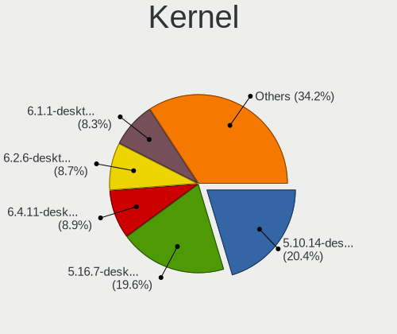
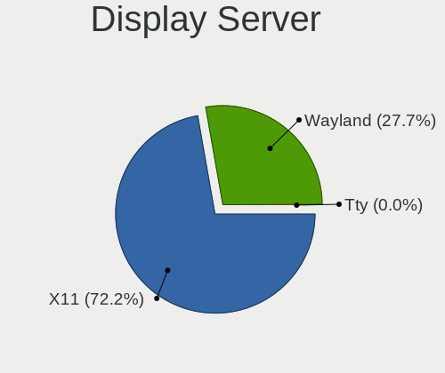
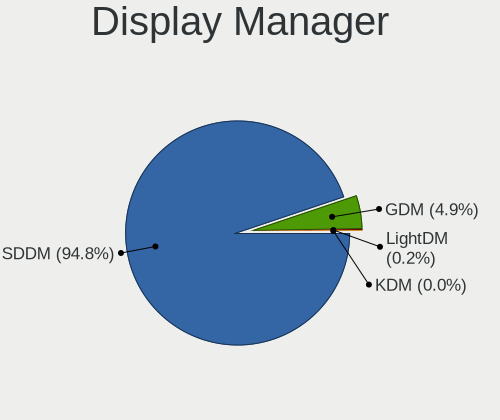
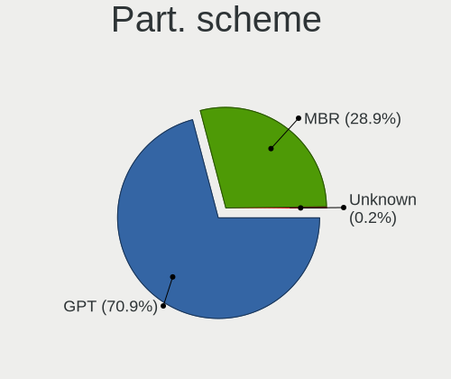
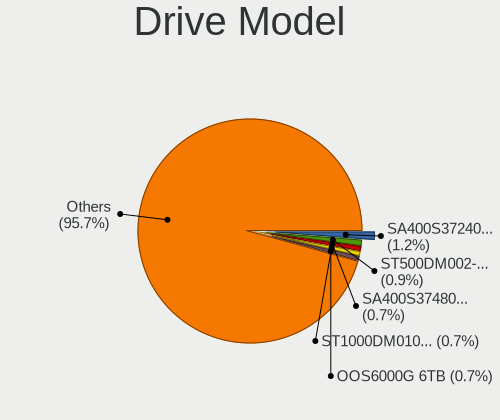
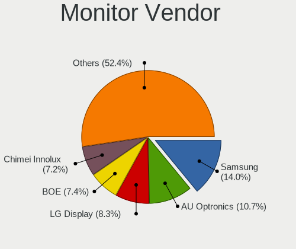
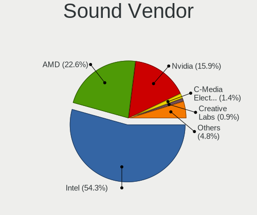

OpenMandriva - Tested Hardware & Statistics
-------------------------------------------

A project to collect tested hardware configurations for OpenMandriva.

Anyone can contribute to this report by the [hw-probe](https://github.com/linuxhw/hw-probe) tool:

    sudo -E hw-probe -all -upload

Please contribute! Especially if your hardware is rare.

This is a report for all computer types. See also reports for [desktops](/Dist/OpenMandriva/Desktop/README.md) and [notebooks](/Dist/OpenMandriva/Notebook/README.md).

Contents
--------

* [ Test Cases ](#test-cases)

* [ System ](#system)
  - [ OS                       ](#os)
  - [ OS Family                ](#os-family)
  - [ Kernel                   ](#kernel)
  - [ Kernel Family            ](#kernel-family)
  - [ Kernel Major Ver.        ](#kernel-major-ver)
  - [ Arch                     ](#arch)
  - [ DE                       ](#de)
  - [ Display Server           ](#display-server)
  - [ Display Manager          ](#display-manager)
  - [ OS Lang                  ](#os-lang)
  - [ Boot Mode                ](#boot-mode)
  - [ Filesystem               ](#filesystem)
  - [ Part. scheme             ](#part-scheme)
  - [ Dual Boot with Linux/BSD ](#dual-boot-with-linuxbsd)
  - [ Dual Boot (Win)          ](#dual-boot-win)

* [ Board ](#board)
  - [ Vendor                   ](#vendor)
  - [ Model                    ](#model)
  - [ Model Family             ](#model-family)
  - [ MFG Year                 ](#mfg-year)
  - [ Form Factor              ](#form-factor)
  - [ Secure Boot              ](#secure-boot)
  - [ Coreboot                 ](#coreboot)
  - [ RAM Size                 ](#ram-size)
  - [ RAM Used                 ](#ram-used)
  - [ Total Drives             ](#total-drives)
  - [ Has CD-ROM               ](#has-cd-rom)
  - [ Has Ethernet             ](#has-ethernet)
  - [ Has WiFi                 ](#has-wifi)
  - [ Has Bluetooth            ](#has-bluetooth)

* [ Location ](#location)
  - [ Country                  ](#country)
  - [ City                     ](#city)

* [ Drives ](#drives)
  - [ Drive Vendor             ](#drive-vendor)
  - [ Drive Model              ](#drive-model)
  - [ HDD Vendor               ](#hdd-vendor)
  - [ SSD Vendor               ](#ssd-vendor)
  - [ Drive Kind               ](#drive-kind)
  - [ Drive Connector          ](#drive-connector)
  - [ Drive Size               ](#drive-size)
  - [ Space Total              ](#space-total)
  - [ Space Used               ](#space-used)
  - [ Malfunc. Drives          ](#malfunc-drives)
  - [ Malfunc. Drive Vendor    ](#malfunc-drive-vendor)
  - [ Malfunc. HDD Vendor      ](#malfunc-hdd-vendor)
  - [ Malfunc. Drive Kind      ](#malfunc-drive-kind)
  - [ Failed Drives            ](#failed-drives)
  - [ Failed Drive Vendor      ](#failed-drive-vendor)
  - [ Drive Status             ](#drive-status)

* [ Storage controller ](#storage-controller)
  - [ Storage Vendor           ](#storage-vendor)
  - [ Storage Model            ](#storage-model)
  - [ Storage Kind             ](#storage-kind)

* [ Processor ](#processor)
  - [ CPU Vendor               ](#cpu-vendor)
  - [ CPU Model                ](#cpu-model)
  - [ CPU Model Family         ](#cpu-model-family)
  - [ CPU Cores                ](#cpu-cores)
  - [ CPU Sockets              ](#cpu-sockets)
  - [ CPU Threads              ](#cpu-threads)
  - [ CPU Op-Modes             ](#cpu-op-modes)
  - [ CPU Microcode            ](#cpu-microcode)
  - [ CPU Microarch            ](#cpu-microarch)

* [ Graphics ](#graphics)
  - [ GPU Vendor               ](#gpu-vendor)
  - [ GPU Model                ](#gpu-model)
  - [ GPU Combo                ](#gpu-combo)
  - [ GPU Driver               ](#gpu-driver)
  - [ GPU Memory               ](#gpu-memory)

* [ Monitor ](#monitor)
  - [ Monitor Vendor           ](#monitor-vendor)
  - [ Monitor Model            ](#monitor-model)
  - [ Monitor Resolution       ](#monitor-resolution)
  - [ Monitor Diagonal         ](#monitor-diagonal)
  - [ Monitor Width            ](#monitor-width)
  - [ Aspect Ratio             ](#aspect-ratio)
  - [ Monitor Area             ](#monitor-area)
  - [ Pixel Density            ](#pixel-density)
  - [ Multiple Monitors        ](#multiple-monitors)

* [ Network ](#network)
  - [ Net Controller Vendor    ](#net-controller-vendor)
  - [ Net Controller Model     ](#net-controller-model)
  - [ Wireless Vendor          ](#wireless-vendor)
  - [ Wireless Model           ](#wireless-model)
  - [ Ethernet Vendor          ](#ethernet-vendor)
  - [ Ethernet Model           ](#ethernet-model)
  - [ Net Controller Kind      ](#net-controller-kind)
  - [ Used Controller          ](#used-controller)
  - [ NICs                     ](#nics)
  - [ IPv6                     ](#ipv6)

* [ Bluetooth ](#bluetooth)
  - [ Bluetooth Vendor         ](#bluetooth-vendor)
  - [ Bluetooth Model          ](#bluetooth-model)

* [ Sound ](#sound)
  - [ Sound Vendor             ](#sound-vendor)
  - [ Sound Model              ](#sound-model)

* [ Memory ](#memory)
  - [ Memory Vendor            ](#memory-vendor)
  - [ Memory Model             ](#memory-model)
  - [ Memory Kind              ](#memory-kind)
  - [ Memory Form Factor       ](#memory-form-factor)
  - [ Memory Size              ](#memory-size)
  - [ Memory Speed             ](#memory-speed)

* [ Printers & scanners ](#printers--scanners)
  - [ Printer Vendor           ](#printer-vendor)
  - [ Printer Model            ](#printer-model)
  - [ Scanner Vendor           ](#scanner-vendor)
  - [ Scanner Model            ](#scanner-model)

* [ Camera ](#camera)
  - [ Camera Vendor            ](#camera-vendor)
  - [ Camera Model             ](#camera-model)

* [ Security ](#security)
  - [ Fingerprint Vendor       ](#fingerprint-vendor)
  - [ Fingerprint Model        ](#fingerprint-model)
  - [ Chipcard Vendor          ](#chipcard-vendor)
  - [ Chipcard Model           ](#chipcard-model)

* [ Unsupported ](#unsupported)
  - [ Unsupported Devices      ](#unsupported-devices)
  - [ Unsupported Device Types ](#unsupported-device-types)

Test Cases
----------

Total: 16348

| Vendor        | Model                       | Form-Factor | Probe                                                      | Date         |
|---------------|-----------------------------|-------------|------------------------------------------------------------|--------------|
| MSI           | B450-A PRO MAX              | Desktop     | [546e058777](https://linux-hardware.org/?probe=546e058777) | Oct 01, 2023 |
| MSI           | B350M PRO-VD PLUS           | Desktop     | [a8c796cebf](https://linux-hardware.org/?probe=a8c796cebf) | Oct 01, 2023 |
| AZW           | MINI S 10                   | Desktop     | [13e3a733fd](https://linux-hardware.org/?probe=13e3a733fd) | Oct 01, 2023 |
| HP            | 0A50h                       | Desktop     | [e2082963e9](https://linux-hardware.org/?probe=e2082963e9) | Oct 01, 2023 |
| MSI           | Z370-A PRO                  | Desktop     | [7c1fdcfb70](https://linux-hardware.org/?probe=7c1fdcfb70) | Oct 01, 2023 |
| HP            | Laptop 17-cn0xxx            | Notebook    | [aa4b869750](https://linux-hardware.org/?probe=aa4b869750) | Oct 01, 2023 |
| Gigabyte      | Z77X-UD5H                   | Desktop     | [def4633785](https://linux-hardware.org/?probe=def4633785) | Oct 01, 2023 |
| Gigabyte      | 970A-DS3P                   | Desktop     | [5d6115a057](https://linux-hardware.org/?probe=5d6115a057) | Oct 01, 2023 |
| ASUSTek       | VivoBook_ASUSLaptop X512... | Notebook    | [2127748080](https://linux-hardware.org/?probe=2127748080) | Oct 01, 2023 |
| ASUSTek       | B85M-G                      | Desktop     | [0166816d1b](https://linux-hardware.org/?probe=0166816d1b) | Oct 01, 2023 |
| Acer          | Aspire A315-58              | Notebook    | [bbab99a4f7](https://linux-hardware.org/?probe=bbab99a4f7) | Sep 30, 2023 |
| Medion        | Deputy P40                  | Notebook    | [7e0fc5b52d](https://linux-hardware.org/?probe=7e0fc5b52d) | Sep 30, 2023 |
| ASRock        | A88M-G                      | Desktop     | [a918b08771](https://linux-hardware.org/?probe=a918b08771) | Sep 30, 2023 |
| Toshiba       | STI 009169                  | Desktop     | [0b76bae8f3](https://linux-hardware.org/?probe=0b76bae8f3) | Sep 30, 2023 |
| Lenovo        | ThinkCentre M55p 8811ZD4    | Desktop     | [710dea5f88](https://linux-hardware.org/?probe=710dea5f88) | Sep 30, 2023 |
| Gigabyte      | H61M-S1                     | Desktop     | [64e8a0bcc2](https://linux-hardware.org/?probe=64e8a0bcc2) | Sep 30, 2023 |
| ASUSTek       | H110M-R                     | Desktop     | [b8aadf6823](https://linux-hardware.org/?probe=b8aadf6823) | Sep 30, 2023 |
| ASUSTek       | ROG STRIX B550-F GAMING ... | Desktop     | [34e5bf82de](https://linux-hardware.org/?probe=34e5bf82de) | Sep 30, 2023 |
| ASUSTek       | P5B-E Plus                  | Desktop     | [78c413cac5](https://linux-hardware.org/?probe=78c413cac5) | Sep 30, 2023 |
| Gigabyte      | P31-ES3G                    | Desktop     | [bee14e504c](https://linux-hardware.org/?probe=bee14e504c) | Sep 30, 2023 |
| Lenovo        | ThinkPad L530 24783R8       | Notebook    | [eda040f456](https://linux-hardware.org/?probe=eda040f456) | Sep 30, 2023 |
| Acer          | Aspire 5560                 | Notebook    | [252d19e4f5](https://linux-hardware.org/?probe=252d19e4f5) | Sep 30, 2023 |
| AZW           | MINI S 10                   | Desktop     | [e065b9c701](https://linux-hardware.org/?probe=e065b9c701) | Sep 30, 2023 |
| Dell          | 0Y958C A00                  | Desktop     | [95bf9d14db](https://linux-hardware.org/?probe=95bf9d14db) | Sep 30, 2023 |
| Toshiba       | Satellite L500              | Notebook    | [9c1b258088](https://linux-hardware.org/?probe=9c1b258088) | Sep 30, 2023 |
| Lenovo        | ThinkPad X1 Carbon 3rd 2... | Notebook    | [2edc7ab56b](https://linux-hardware.org/?probe=2edc7ab56b) | Sep 30, 2023 |
| Toshiba       | Satellite C845D             | Notebook    | [92651c9e51](https://linux-hardware.org/?probe=92651c9e51) | Sep 30, 2023 |
| MSI           | MPG Z390 GAMING EDGE AC     | Desktop     | [5705bf79ad](https://linux-hardware.org/?probe=5705bf79ad) | Sep 30, 2023 |
| Lenovo        | 300s-15ARR 81FB             | Notebook    | [4f7e627fd2](https://linux-hardware.org/?probe=4f7e627fd2) | Sep 30, 2023 |
| Lenovo        | Z50-70 20354                | Notebook    | [eb33abdaae](https://linux-hardware.org/?probe=eb33abdaae) | Sep 29, 2023 |
| ASUSTek       | UX31E                       | Notebook    | [1b6440f722](https://linux-hardware.org/?probe=1b6440f722) | Sep 29, 2023 |
| HP            | ENVY TS Sleekbook 4         | Notebook    | [545098d0d2](https://linux-hardware.org/?probe=545098d0d2) | Sep 29, 2023 |
| OEGStone      | C4100/C5100                 | Notebook    | [0c27e50b14](https://linux-hardware.org/?probe=0c27e50b14) | Sep 29, 2023 |
| ASUSTek       | VivoBook_ASUSLaptop X412... | Notebook    | [6348992a72](https://linux-hardware.org/?probe=6348992a72) | Sep 29, 2023 |
| Dell          | Inspiron 5570               | Notebook    | [7975260826](https://linux-hardware.org/?probe=7975260826) | Sep 29, 2023 |
| MSI           | MPG Z390 GAMING PLUS        | Desktop     | [c602f8fba9](https://linux-hardware.org/?probe=c602f8fba9) | Sep 29, 2023 |
| HP            | 3398                        | Desktop     | [13aa132a7d](https://linux-hardware.org/?probe=13aa132a7d) | Sep 29, 2023 |
| SKIKK         | Sindri 14                   | Notebook    | [9766c80aa9](https://linux-hardware.org/?probe=9766c80aa9) | Sep 29, 2023 |
| Gigabyte      | X570 AORUS ELITE            | Desktop     | [d0fea1d86b](https://linux-hardware.org/?probe=d0fea1d86b) | Sep 29, 2023 |
| WesternDig... | BBC 0001                    | Desktop     | [b31e10d01b](https://linux-hardware.org/?probe=b31e10d01b) | Sep 29, 2023 |
| WesternDig... | BBC 0001                    | Desktop     | [ba340393f7](https://linux-hardware.org/?probe=ba340393f7) | Sep 29, 2023 |
| Dell          | Inspiron 3542               | Notebook    | [b7faf1054b](https://linux-hardware.org/?probe=b7faf1054b) | Sep 29, 2023 |
| Intel         | H110D4-P1                   | Desktop     | [ccedaaab02](https://linux-hardware.org/?probe=ccedaaab02) | Sep 29, 2023 |
| Lenovo        | IdeaPad 3 15IIL05 81WE      | Notebook    | [902918fb1d](https://linux-hardware.org/?probe=902918fb1d) | Sep 29, 2023 |
| HP            | EliteBook 2760p             | Notebook    | [e9d026d0df](https://linux-hardware.org/?probe=e9d026d0df) | Sep 29, 2023 |
| HP            | 1589                        | Desktop     | [c42e75cdd8](https://linux-hardware.org/?probe=c42e75cdd8) | Sep 29, 2023 |
| Pegatron      | Benicia                     | Desktop     | [840b02e356](https://linux-hardware.org/?probe=840b02e356) | Sep 29, 2023 |
| ASUSTek       | PRIME B450M-A               | Desktop     | [6bce0e41d9](https://linux-hardware.org/?probe=6bce0e41d9) | Sep 28, 2023 |
| MSI           | B450M BAZOOKA V2            | Desktop     | [c815d636ce](https://linux-hardware.org/?probe=c815d636ce) | Sep 28, 2023 |
| Lenovo        | H410                        | Desktop     | [f49a6ce32f](https://linux-hardware.org/?probe=f49a6ce32f) | Sep 28, 2023 |
| ASUSTek       | M2N-E SLI                   | Desktop     | [2a5937c5e5](https://linux-hardware.org/?probe=2a5937c5e5) | Sep 28, 2023 |
| Unknown       | Unknown                     | Desktop     | [995b6fba4d](https://linux-hardware.org/?probe=995b6fba4d) | Sep 28, 2023 |
| Intel         | H61                         | Desktop     | [f41171114f](https://linux-hardware.org/?probe=f41171114f) | Sep 28, 2023 |
| HP            | Compaq Presario CQ70        | Notebook    | [8913bbd459](https://linux-hardware.org/?probe=8913bbd459) | Sep 28, 2023 |
| HP            | 84F5                        | Mini pc     | [ef936bc0cb](https://linux-hardware.org/?probe=ef936bc0cb) | Sep 28, 2023 |
| ASUSTek       | VivoBook_ASUSLaptop X509... | Notebook    | [fb4cde69b8](https://linux-hardware.org/?probe=fb4cde69b8) | Sep 28, 2023 |
| Fujitsu       | D3222-A1 S26361-D3222-A1    | Desktop     | [a1ef1eb6e6](https://linux-hardware.org/?probe=a1ef1eb6e6) | Sep 28, 2023 |
| HP            | Laptop 17-bs0xx             | Notebook    | [85548f2790](https://linux-hardware.org/?probe=85548f2790) | Sep 28, 2023 |
| MSI           | Z97-G45 GAMING              | Desktop     | [19c07d0fca](https://linux-hardware.org/?probe=19c07d0fca) | Sep 27, 2023 |
| HP            | ElitePad 1000 G2            | Notebook    | [9c4b30a15c](https://linux-hardware.org/?probe=9c4b30a15c) | Sep 27, 2023 |
| ASUSTek       | PRIME B360M-A               | Desktop     | [7943462da1](https://linux-hardware.org/?probe=7943462da1) | Sep 27, 2023 |
| ASUSTek       | D700MD                      | Desktop     | [91740e63b9](https://linux-hardware.org/?probe=91740e63b9) | Sep 27, 2023 |
| Lenovo        | 3102 SDK0J40697 WIN 3305... | Desktop     | [1d8c54163d](https://linux-hardware.org/?probe=1d8c54163d) | Sep 27, 2023 |
| Toshiba       | Satellite A200              | Notebook    | [6bdac98313](https://linux-hardware.org/?probe=6bdac98313) | Sep 27, 2023 |
| Dell          | 00F82W A01                  | Desktop     | [ac93742033](https://linux-hardware.org/?probe=ac93742033) | Sep 27, 2023 |
| HP            | ElitePad 1000 G2            | Notebook    | [ee4b3f2b76](https://linux-hardware.org/?probe=ee4b3f2b76) | Sep 26, 2023 |
| LG Electro... | 13U70Q-G.AA75B              | Notebook    | [f38b79055b](https://linux-hardware.org/?probe=f38b79055b) | Sep 26, 2023 |
| ASUSTek       | ROG STRIX B550-A GAMING     | Desktop     | [9c9070da5f](https://linux-hardware.org/?probe=9c9070da5f) | Sep 26, 2023 |
| Samsung       | R519/R719                   | Notebook    | [15ae7c9603](https://linux-hardware.org/?probe=15ae7c9603) | Sep 26, 2023 |
| MSI           | B450M-A PRO MAX             | Desktop     | [41f2aab706](https://linux-hardware.org/?probe=41f2aab706) | Sep 26, 2023 |
| Lenovo        | ThinkPad T460 20FMS0RN1S    | Notebook    | [598d621f0d](https://linux-hardware.org/?probe=598d621f0d) | Sep 26, 2023 |
| HP            | EliteBook 840 G3            | Notebook    | [897f671915](https://linux-hardware.org/?probe=897f671915) | Sep 25, 2023 |
| ASUSTek       | UL80VT                      | Notebook    | [1d3c36ccf4](https://linux-hardware.org/?probe=1d3c36ccf4) | Sep 25, 2023 |
| ASUSTek       | TUF B360-PRO GAMING WIFI    | Desktop     | [16c22d9ead](https://linux-hardware.org/?probe=16c22d9ead) | Sep 25, 2023 |
| Acer          | Aspire M5910                | Desktop     | [5b44d1de35](https://linux-hardware.org/?probe=5b44d1de35) | Sep 25, 2023 |
| Dell          | Vostro 1000                 | Notebook    | [38499a1a0f](https://linux-hardware.org/?probe=38499a1a0f) | Sep 25, 2023 |
| Toshiba       | Satellite C50-B             | Notebook    | [92a5c3605c](https://linux-hardware.org/?probe=92a5c3605c) | Sep 25, 2023 |
| Toshiba       | dynabook Satellite B350/... | Notebook    | [2b241af774](https://linux-hardware.org/?probe=2b241af774) | Sep 25, 2023 |
| Gigabyte      | GA-MA770T-UD3               | Desktop     | [85663cb9a6](https://linux-hardware.org/?probe=85663cb9a6) | Sep 25, 2023 |
| Dell          | 0773VG A02                  | Desktop     | [83390c3986](https://linux-hardware.org/?probe=83390c3986) | Sep 25, 2023 |
| HP            | Laptop 17-cn0xxx            | Notebook    | [10ec627bad](https://linux-hardware.org/?probe=10ec627bad) | Sep 25, 2023 |
| Acer          | Aspire F5-573G              | Notebook    | [a2f6814940](https://linux-hardware.org/?probe=a2f6814940) | Sep 25, 2023 |
| Pegatron      | EVANS                       | Desktop     | [b9347254b0](https://linux-hardware.org/?probe=b9347254b0) | Sep 25, 2023 |
| ASRock        | X370 Pro4                   | Desktop     | [1939307392](https://linux-hardware.org/?probe=1939307392) | Sep 25, 2023 |
| Acer          | Aspire E5-571               | Notebook    | [e74a87d3f4](https://linux-hardware.org/?probe=e74a87d3f4) | Sep 25, 2023 |
| ASUSTek       | ROG CROSSHAIR VII HERO      | Desktop     | [78eceb519c](https://linux-hardware.org/?probe=78eceb519c) | Sep 25, 2023 |
| Acer          | Nitro AN515-51              | Notebook    | [6d6d719f30](https://linux-hardware.org/?probe=6d6d719f30) | Sep 25, 2023 |
| ASRock        | FM2A85X Extreme4-M          | Desktop     | [bef6ef227b](https://linux-hardware.org/?probe=bef6ef227b) | Sep 25, 2023 |
| HP            | ElitePad 1000 G2            | Notebook    | [5cfbe2e7e0](https://linux-hardware.org/?probe=5cfbe2e7e0) | Sep 24, 2023 |
| Acer          | Aspire 7730G                | Notebook    | [e21c91c34c](https://linux-hardware.org/?probe=e21c91c34c) | Sep 24, 2023 |
| HP            | 3397                        | Desktop     | [cc6f1cc8ba](https://linux-hardware.org/?probe=cc6f1cc8ba) | Sep 24, 2023 |
| Biostar       | B550MH                      | Desktop     | [4ef9bbad17](https://linux-hardware.org/?probe=4ef9bbad17) | Sep 24, 2023 |
| Toshiba       | Satellite L45-B             | Notebook    | [e998b320d8](https://linux-hardware.org/?probe=e998b320d8) | Sep 24, 2023 |
| Lenovo        | G580 20150                  | Notebook    | [f55e42a884](https://linux-hardware.org/?probe=f55e42a884) | Sep 24, 2023 |
| MSI           | 990FXA-GD80                 | Desktop     | [0648a13752](https://linux-hardware.org/?probe=0648a13752) | Sep 24, 2023 |
| Toshiba       | Satellite S50t-B            | Notebook    | [a574ee83ff](https://linux-hardware.org/?probe=a574ee83ff) | Sep 24, 2023 |
| Gigabyte      | X299 AORUS Gaming-CF        | Desktop     | [4c6071b20c](https://linux-hardware.org/?probe=4c6071b20c) | Sep 24, 2023 |
| Lenovo        | ThinkCentre A70z 0401B7P    | Desktop     | [21a635940f](https://linux-hardware.org/?probe=21a635940f) | Sep 24, 2023 |
| Dell          | System Vostro 3750          | Notebook    | [3b050c2582](https://linux-hardware.org/?probe=3b050c2582) | Sep 24, 2023 |
| ASUSTek       | P5G41T-M LX                 | Desktop     | [a1ced3b0bd](https://linux-hardware.org/?probe=a1ced3b0bd) | Sep 24, 2023 |
| Lenovo        | IdeaPad 320-15ISK 80XH      | Notebook    | [ff891ca545](https://linux-hardware.org/?probe=ff891ca545) | Sep 24, 2023 |
| MSI           | H61MA-E35                   | Desktop     | [888c822527](https://linux-hardware.org/?probe=888c822527) | Sep 24, 2023 |
| Gigabyte      | B550 AORUS PRO V2           | Desktop     | [c0e3bef058](https://linux-hardware.org/?probe=c0e3bef058) | Sep 24, 2023 |
| Acer          | Aspire 5734Z                | Notebook    | [d5219dbfbe](https://linux-hardware.org/?probe=d5219dbfbe) | Sep 24, 2023 |
| PCWare        | APM-A320G                   | Desktop     | [64080404a6](https://linux-hardware.org/?probe=64080404a6) | Sep 24, 2023 |
| Gigabyte      | 945GCM-S2C                  | Desktop     | [9f17460970](https://linux-hardware.org/?probe=9f17460970) | Sep 24, 2023 |
| Dell          | 02YRK5 A02                  | Desktop     | [b738e4741b](https://linux-hardware.org/?probe=b738e4741b) | Sep 23, 2023 |
| Unknown       | Unknown                     | Notebook    | [940b1d1eeb](https://linux-hardware.org/?probe=940b1d1eeb) | Sep 23, 2023 |
| HP            | Dev One Notebook PC         | Notebook    | [1cc979900b](https://linux-hardware.org/?probe=1cc979900b) | Sep 23, 2023 |
| ASUSTek       | Z97-C                       | Desktop     | [e4c1f075b9](https://linux-hardware.org/?probe=e4c1f075b9) | Sep 23, 2023 |
| ASUSTek       | A88XM-A                     | Desktop     | [c2cb8052f9](https://linux-hardware.org/?probe=c2cb8052f9) | Sep 23, 2023 |
| ASUSTek       | PRIME B450-PLUS             | Desktop     | [46a99bb50a](https://linux-hardware.org/?probe=46a99bb50a) | Sep 23, 2023 |
| Gigabyte      | Z68X-UD3H-B3                | Desktop     | [92e5dde8b3](https://linux-hardware.org/?probe=92e5dde8b3) | Sep 23, 2023 |
| Acer          | Aspire 5732Z                | Notebook    | [c86094eac8](https://linux-hardware.org/?probe=c86094eac8) | Sep 23, 2023 |
| Lenovo        | IdeaPad 3 14IIL05 81WD      | Notebook    | [683cbd037a](https://linux-hardware.org/?probe=683cbd037a) | Sep 23, 2023 |
| Lenovo        | ThinkPad L15 Gen 1 20U8S... | Notebook    | [13a9f1d65a](https://linux-hardware.org/?probe=13a9f1d65a) | Sep 23, 2023 |
| Apple         | Mac-BE088AF8C5EB4FA2 iMa... | All in one  | [7e03b87e4b](https://linux-hardware.org/?probe=7e03b87e4b) | Sep 23, 2023 |
| HP            | Laptop 15-dw1xxx            | Notebook    | [be4a46768b](https://linux-hardware.org/?probe=be4a46768b) | Sep 23, 2023 |
| HP            | EliteBook 840 G6            | Notebook    | [10cd0244af](https://linux-hardware.org/?probe=10cd0244af) | Sep 23, 2023 |
| ASUSTek       | TUF Gaming B650-PLUS        | Desktop     | [5783da9442](https://linux-hardware.org/?probe=5783da9442) | Sep 23, 2023 |
| Dell          | 0WR7PY A01                  | Desktop     | [64e4102978](https://linux-hardware.org/?probe=64e4102978) | Sep 23, 2023 |
| Samsung       | 935XDB                      | Notebook    | [a0672b9726](https://linux-hardware.org/?probe=a0672b9726) | Sep 23, 2023 |
| Shuttle       | XS36V                       | Desktop     | [dbcb5658e4](https://linux-hardware.org/?probe=dbcb5658e4) | Sep 23, 2023 |
| ASUSTek       | X750JB                      | Notebook    | [b9db8f6f02](https://linux-hardware.org/?probe=b9db8f6f02) | Sep 23, 2023 |
| HP            | ProBook 4515s               | Notebook    | [0b755bf978](https://linux-hardware.org/?probe=0b755bf978) | Sep 22, 2023 |
| AZW           | GTR V01                     | Mini pc     | [9ea546d36c](https://linux-hardware.org/?probe=9ea546d36c) | Sep 22, 2023 |
| Gigabyte      | 990FXA-UD3 R5               | Desktop     | [2a62bbc302](https://linux-hardware.org/?probe=2a62bbc302) | Sep 22, 2023 |
| LG Electro... | 16Z90P-K.AAS9U1             | Notebook    | [5e60864354](https://linux-hardware.org/?probe=5e60864354) | Sep 22, 2023 |
| Acer          | Aspire A515-47              | Notebook    | [2676f29c41](https://linux-hardware.org/?probe=2676f29c41) | Sep 22, 2023 |
| ASUSTek       | P7P55-M                     | Desktop     | [f5b912e122](https://linux-hardware.org/?probe=f5b912e122) | Sep 22, 2023 |
| Apple         | Mac-942B59F58194171B iMa... | All in one  | [ce0f2babca](https://linux-hardware.org/?probe=ce0f2babca) | Sep 22, 2023 |
| Dell          | Latitude E7440              | Notebook    | [53e90ca355](https://linux-hardware.org/?probe=53e90ca355) | Sep 22, 2023 |
| Apple         | MacBookPro12,1              | Notebook    | [b8b562cc39](https://linux-hardware.org/?probe=b8b562cc39) | Sep 22, 2023 |
| Lenovo        | ThinkCentre M58p 6137B28    | Desktop     | [25c3f2b6f8](https://linux-hardware.org/?probe=25c3f2b6f8) | Sep 22, 2023 |
| HP            | OMEN by Laptop 15-dc1xxx    | Notebook    | [57c3bb43f5](https://linux-hardware.org/?probe=57c3bb43f5) | Sep 22, 2023 |
| Foxconn       | 45CMX/45GMX/45CMX-K         | Desktop     | [43d9a8a827](https://linux-hardware.org/?probe=43d9a8a827) | Sep 22, 2023 |
| ASUSTek       | P5K                         | Desktop     | [4d67ad50cf](https://linux-hardware.org/?probe=4d67ad50cf) | Sep 22, 2023 |
| HP            | Pavilion g6                 | Notebook    | [c5833405a5](https://linux-hardware.org/?probe=c5833405a5) | Sep 22, 2023 |
| HP            | EliteBook 840 G5            | Notebook    | [03d461d3af](https://linux-hardware.org/?probe=03d461d3af) | Sep 22, 2023 |
| Acer          | Aspire VN7-571G             | Notebook    | [0314ce541e](https://linux-hardware.org/?probe=0314ce541e) | Sep 22, 2023 |
| Biostar       | A68N-2100                   | Desktop     | [c035c2e73b](https://linux-hardware.org/?probe=c035c2e73b) | Sep 22, 2023 |
| HP            | 8643 SMVB                   | Desktop     | [913927a01a](https://linux-hardware.org/?probe=913927a01a) | Sep 22, 2023 |
| Acer          | Nitro AN515-57              | Notebook    | [05c9cbc8e5](https://linux-hardware.org/?probe=05c9cbc8e5) | Sep 22, 2023 |
| ASUSTek       | M5A78L-M LX3                | Desktop     | [80928b2dc9](https://linux-hardware.org/?probe=80928b2dc9) | Sep 21, 2023 |
| Acer          | Extensa 5635ZG              | Notebook    | [925fed495b](https://linux-hardware.org/?probe=925fed495b) | Sep 21, 2023 |
| Lenovo        | ThinkPad X220 4286BB2       | Notebook    | [a3b217a707](https://linux-hardware.org/?probe=a3b217a707) | Sep 21, 2023 |
| Fujitsu       | D3230-A1 S26361-D3230-A1    | Desktop     | [3d3b14f0f9](https://linux-hardware.org/?probe=3d3b14f0f9) | Sep 21, 2023 |
| Gigabyte      | AB350N-Gaming WIFI-CF       | Desktop     | [6c9da4e4fa](https://linux-hardware.org/?probe=6c9da4e4fa) | Sep 21, 2023 |
| Acer          | Revo RN86                   | Desktop     | [315559ee42](https://linux-hardware.org/?probe=315559ee42) | Sep 21, 2023 |
| Acer          | Aspire A114-33              | Notebook    | [4b581786a8](https://linux-hardware.org/?probe=4b581786a8) | Sep 21, 2023 |
| Positivo      | POS-AG31AP                  | Desktop     | [2e2072e3ca](https://linux-hardware.org/?probe=2e2072e3ca) | Sep 21, 2023 |
| Megaware      | MW-HDC-M 02/24/2012 - ME... | Desktop     | [d3c9063140](https://linux-hardware.org/?probe=d3c9063140) | Sep 21, 2023 |
| Acer          | Aspire F5-571               | Notebook    | [21bcc4a506](https://linux-hardware.org/?probe=21bcc4a506) | Sep 21, 2023 |
| ASUSTek       | TUF Gaming X570-PLUS        | Desktop     | [4269a04f31](https://linux-hardware.org/?probe=4269a04f31) | Sep 21, 2023 |
| Gigabyte      | B450 AORUS M                | Desktop     | [e2dda8ebb1](https://linux-hardware.org/?probe=e2dda8ebb1) | Sep 21, 2023 |
| Dell          | 0KRC95 A00                  | Desktop     | [61ae2b85c5](https://linux-hardware.org/?probe=61ae2b85c5) | Sep 21, 2023 |
| Gigabyte      | B560M DS3H V2               | Desktop     | [182384fdaa](https://linux-hardware.org/?probe=182384fdaa) | Sep 20, 2023 |
| Unknown       | Unknown                     | Desktop     | [742bffa5fe](https://linux-hardware.org/?probe=742bffa5fe) | Sep 20, 2023 |
| ASUSTek       | TP550LAB                    | Notebook    | [3e07304aa5](https://linux-hardware.org/?probe=3e07304aa5) | Sep 20, 2023 |
| MSI           | Indio                       | Desktop     | [330a2c9640](https://linux-hardware.org/?probe=330a2c9640) | Sep 20, 2023 |
| Intel         | DN2820FYK H24582-204        | Desktop     | [bec0346d1d](https://linux-hardware.org/?probe=bec0346d1d) | Sep 20, 2023 |
| Samsung       | 340XAA/350XAA/550XAA        | Notebook    | [5a74bb7dde](https://linux-hardware.org/?probe=5a74bb7dde) | Sep 20, 2023 |
| HP            | EliteBook 845 14 inch G9... | Notebook    | [35d24c31cf](https://linux-hardware.org/?probe=35d24c31cf) | Sep 20, 2023 |
| Dell          | Latitude 3540               | Notebook    | [3f1c99de44](https://linux-hardware.org/?probe=3f1c99de44) | Sep 20, 2023 |
| Gigabyte      | B760M GAMING X AX DDR4      | Desktop     | [07f641459d](https://linux-hardware.org/?probe=07f641459d) | Sep 20, 2023 |
| Gigabyte      | B660M AORUS PRO AX DDR4     | Desktop     | [c3525c54c3](https://linux-hardware.org/?probe=c3525c54c3) | Sep 20, 2023 |
| ASUSTek       | X453MA                      | Notebook    | [8eacbd2f7a](https://linux-hardware.org/?probe=8eacbd2f7a) | Sep 19, 2023 |
| ASUSTek       | B150M-C D3                  | Desktop     | [179a66ec43](https://linux-hardware.org/?probe=179a66ec43) | Sep 19, 2023 |
| HP            | 83E1                        | Desktop     | [c00bed1d53](https://linux-hardware.org/?probe=c00bed1d53) | Sep 19, 2023 |
| Dell          | Inspiron 3442               | Notebook    | [1f6ca2e4f7](https://linux-hardware.org/?probe=1f6ca2e4f7) | Sep 19, 2023 |
| Biostar       | B550GTQ                     | Desktop     | [5478c7bc91](https://linux-hardware.org/?probe=5478c7bc91) | Sep 19, 2023 |
| ASUSTek       | P9X79                       | Desktop     | [d663285ae0](https://linux-hardware.org/?probe=d663285ae0) | Sep 19, 2023 |
| Pegatron      | 2AB5                        | Desktop     | [b21eddb040](https://linux-hardware.org/?probe=b21eddb040) | Sep 19, 2023 |
| Foxconn       | G31MXP FAB:1.1              | Desktop     | [5c72d9c9a4](https://linux-hardware.org/?probe=5c72d9c9a4) | Sep 19, 2023 |
| HP            | 8298                        | Desktop     | [006592d87f](https://linux-hardware.org/?probe=006592d87f) | Sep 19, 2023 |
| Acer          | Nitro AN517-52              | Notebook    | [32f2e74fe3](https://linux-hardware.org/?probe=32f2e74fe3) | Sep 19, 2023 |
| ASUSTek       | M5A78L-M LX3                | Desktop     | [25d66d7f8a](https://linux-hardware.org/?probe=25d66d7f8a) | Sep 19, 2023 |
| Acer          | Aspire A315-22G             | Notebook    | [0c047cb731](https://linux-hardware.org/?probe=0c047cb731) | Sep 19, 2023 |
| ASUSTek       | VivoBook_ASUSLaptop E410... | Notebook    | [1180346586](https://linux-hardware.org/?probe=1180346586) | Sep 19, 2023 |
| HP            | EliteBook 8470p             | Notebook    | [a8995def08](https://linux-hardware.org/?probe=a8995def08) | Sep 19, 2023 |
| Lenovo        | ThinkPad X240 20AMA1S702    | Notebook    | [5be3b8fc11](https://linux-hardware.org/?probe=5be3b8fc11) | Sep 19, 2023 |
| Pegatron      | 2AB5                        | Desktop     | [6f4fafb23f](https://linux-hardware.org/?probe=6f4fafb23f) | Sep 19, 2023 |
| Acer          | Aspire 5742                 | Notebook    | [430ed1fe6c](https://linux-hardware.org/?probe=430ed1fe6c) | Sep 19, 2023 |
| HP            | Laptop 15s-eq2xxx           | Notebook    | [53549e3b08](https://linux-hardware.org/?probe=53549e3b08) | Sep 18, 2023 |
| Lenovo        | SHARKBAY SDK0E50510 WIN     | Desktop     | [f40bb3790e](https://linux-hardware.org/?probe=f40bb3790e) | Sep 18, 2023 |
| ASUSTek       | M5A78L-M PLUS/USB3          | Desktop     | [0a5f29963e](https://linux-hardware.org/?probe=0a5f29963e) | Sep 18, 2023 |
| Gigabyte      | B85M-D3H                    | Desktop     | [7b51f6f455](https://linux-hardware.org/?probe=7b51f6f455) | Sep 18, 2023 |
| ASUSTek       | A88XM-PLUS                  | Desktop     | [ab79a26993](https://linux-hardware.org/?probe=ab79a26993) | Sep 18, 2023 |
| Lenovo        | ThinkPad T440s 20ARS0NF0... | Notebook    | [54aa39a845](https://linux-hardware.org/?probe=54aa39a845) | Sep 18, 2023 |
| ASUSTek       | PRIME H270M-PLUS            | Desktop     | [fa9b30f699](https://linux-hardware.org/?probe=fa9b30f699) | Sep 18, 2023 |
| Acer          | Swift SF314-42              | Notebook    | [1519801016](https://linux-hardware.org/?probe=1519801016) | Sep 18, 2023 |
| HP            | Notebook                    | Notebook    | [0c80a5c83f](https://linux-hardware.org/?probe=0c80a5c83f) | Sep 18, 2023 |
| MSI           | Modern 14 C11M              | Notebook    | [4c6156df05](https://linux-hardware.org/?probe=4c6156df05) | Sep 18, 2023 |
| ASUSTek       | ASUS TUF Gaming F15 FX50... | Notebook    | [cad09f007e](https://linux-hardware.org/?probe=cad09f007e) | Sep 18, 2023 |
| ASUSTek       | PRIME A320M-K               | Desktop     | [9c94944d56](https://linux-hardware.org/?probe=9c94944d56) | Sep 18, 2023 |
| ASUSTek       | P5GC-MX/1333                | Desktop     | [232bd09926](https://linux-hardware.org/?probe=232bd09926) | Sep 17, 2023 |
| Dell          | 0M863N A01                  | Desktop     | [ef0a92ec76](https://linux-hardware.org/?probe=ef0a92ec76) | Sep 17, 2023 |
| ASUSTek       | M32CD_A_F_K20CD_K31CD       | Desktop     | [e73adff0b5](https://linux-hardware.org/?probe=e73adff0b5) | Sep 17, 2023 |
| MSI           | B450M MORTAR MAX            | Desktop     | [beaa4e5554](https://linux-hardware.org/?probe=beaa4e5554) | Sep 17, 2023 |
| Schenker      | XMG CORE (M19, GTX 1650)    | Notebook    | [612bda7c21](https://linux-hardware.org/?probe=612bda7c21) | Sep 17, 2023 |
| Gigabyte      | A520M H                     | Desktop     | [24efefc447](https://linux-hardware.org/?probe=24efefc447) | Sep 17, 2023 |
| ASUSTek       | P52F                        | Notebook    | [6be70b4b24](https://linux-hardware.org/?probe=6be70b4b24) | Sep 17, 2023 |
| Lenovo        | ThinkPad L440 20ASEB3       | Notebook    | [20d35c7482](https://linux-hardware.org/?probe=20d35c7482) | Sep 17, 2023 |
| Toshiba       | Satellite Pro R50-B         | Notebook    | [e3a895eaa7](https://linux-hardware.org/?probe=e3a895eaa7) | Sep 17, 2023 |
| Notebook      | NP5x_6x_7x_SNx              | Notebook    | [83be57b9aa](https://linux-hardware.org/?probe=83be57b9aa) | Sep 17, 2023 |
| Dell          | System XPS L502X            | Notebook    | [d3154f94d7](https://linux-hardware.org/?probe=d3154f94d7) | Sep 17, 2023 |
| Lenovo        | ThinkPad X270 W10DG 20K6... | Notebook    | [1a5acc2c10](https://linux-hardware.org/?probe=1a5acc2c10) | Sep 17, 2023 |
| NEC Comput... | PC-VK15EBZDG                | Notebook    | [83d74c1e9d](https://linux-hardware.org/?probe=83d74c1e9d) | Sep 17, 2023 |
| Dell          | 0KWVT8 A03                  | Desktop     | [cd0090bea7](https://linux-hardware.org/?probe=cd0090bea7) | Sep 16, 2023 |
| Intel         | H310                        | Desktop     | [7bbb817440](https://linux-hardware.org/?probe=7bbb817440) | Sep 16, 2023 |
| ASUSTek       | K52JT                       | Notebook    | [5cf28fa81f](https://linux-hardware.org/?probe=5cf28fa81f) | Sep 16, 2023 |
| ASRock        | AB350 Pro4                  | Desktop     | [700c5f2d7d](https://linux-hardware.org/?probe=700c5f2d7d) | Sep 16, 2023 |
| Gigabyte      | H55M-UD2H                   | Desktop     | [a95113f868](https://linux-hardware.org/?probe=a95113f868) | Sep 16, 2023 |
| Intel         | DX79SI AAG28808-602         | Desktop     | [2ccc7fc308](https://linux-hardware.org/?probe=2ccc7fc308) | Sep 16, 2023 |
| ASRock        | 960GC-GS FX                 | Desktop     | [513b6982f2](https://linux-hardware.org/?probe=513b6982f2) | Sep 16, 2023 |
| ASUSTek       | PRIME A320M-K               | Desktop     | [bef465f035](https://linux-hardware.org/?probe=bef465f035) | Sep 16, 2023 |
| HP            | EliteBook 725 G3            | Notebook    | [6086fd0180](https://linux-hardware.org/?probe=6086fd0180) | Sep 16, 2023 |
| Lenovo        | ThinkPad X380 Yoga 20LHS... | Convertible | [e18d005071](https://linux-hardware.org/?probe=e18d005071) | Sep 16, 2023 |
| Intel         | DH61CR AAG14064-204         | Desktop     | [e28e555058](https://linux-hardware.org/?probe=e28e555058) | Sep 16, 2023 |
| Lenovo        | ThinkCentre M58 7360BB6     | Desktop     | [cb32849dcc](https://linux-hardware.org/?probe=cb32849dcc) | Sep 16, 2023 |
| Lenovo        | ThinkPad T420 4236B27       | Notebook    | [8cd0ed072f](https://linux-hardware.org/?probe=8cd0ed072f) | Sep 16, 2023 |
| Compaq        | 420                         | Notebook    | [a0ce747ff2](https://linux-hardware.org/?probe=a0ce747ff2) | Sep 16, 2023 |
| ASUSTek       | TUF Gaming B550-PLUS        | Desktop     | [18820f4980](https://linux-hardware.org/?probe=18820f4980) | Sep 15, 2023 |
| HP            | 339A                        | Desktop     | [5808e19d94](https://linux-hardware.org/?probe=5808e19d94) | Sep 15, 2023 |
| HP            | 15                          | Notebook    | [636b9a80a1](https://linux-hardware.org/?probe=636b9a80a1) | Sep 15, 2023 |
| Gigabyte      | P35-DS3                     | Desktop     | [7cf209e4c1](https://linux-hardware.org/?probe=7cf209e4c1) | Sep 15, 2023 |
| MSI           | H310M PRO-VDH               | Desktop     | [100f789658](https://linux-hardware.org/?probe=100f789658) | Sep 15, 2023 |
| HP            | 18E7                        | Desktop     | [e5b07fa901](https://linux-hardware.org/?probe=e5b07fa901) | Sep 15, 2023 |
| Gigabyte      | B450M DS3H-CF               | Desktop     | [b4dcc89eae](https://linux-hardware.org/?probe=b4dcc89eae) | Sep 15, 2023 |
| Fujitsu       | LIFEBOOK E733               | Notebook    | [0613157456](https://linux-hardware.org/?probe=0613157456) | Sep 15, 2023 |
| Gigabyte      | B550 AORUS ELITE            | Desktop     | [dd369f3c60](https://linux-hardware.org/?probe=dd369f3c60) | Sep 15, 2023 |
| ASRock        | H570M Pro4                  | Desktop     | [22dd926ff4](https://linux-hardware.org/?probe=22dd926ff4) | Sep 15, 2023 |
| Lenovo        | IdeaPad 3 17ADA05 81W2      | Notebook    | [e1ac878fa3](https://linux-hardware.org/?probe=e1ac878fa3) | Sep 15, 2023 |
| Lenovo        | ThinkPad T430 2349CV8       | Notebook    | [80e76d50db](https://linux-hardware.org/?probe=80e76d50db) | Sep 15, 2023 |
| Dell          | 073MMW A03                  | Desktop     | [b0fc15849b](https://linux-hardware.org/?probe=b0fc15849b) | Sep 15, 2023 |
| Dell          | 048DY8 A00                  | Desktop     | [3cc67a5e62](https://linux-hardware.org/?probe=3cc67a5e62) | Sep 15, 2023 |
| Gigabyte      | A55M-DS2                    | Desktop     | [6bc7d0b74c](https://linux-hardware.org/?probe=6bc7d0b74c) | Sep 15, 2023 |
| HP            | Compaq 615                  | Notebook    | [f2f7659e5b](https://linux-hardware.org/?probe=f2f7659e5b) | Sep 15, 2023 |
| Foxconn       | 45GM/45CM/45CM-S            | Desktop     | [135712cd9e](https://linux-hardware.org/?probe=135712cd9e) | Sep 14, 2023 |
| Gigabyte      | H61M-S1                     | Desktop     | [40ffb44424](https://linux-hardware.org/?probe=40ffb44424) | Sep 14, 2023 |
| Gigabyte      | B450 AORUS M                | Desktop     | [9b3fc9218b](https://linux-hardware.org/?probe=9b3fc9218b) | Sep 14, 2023 |
| Intel         | H81                         | Desktop     | [34f1a336e3](https://linux-hardware.org/?probe=34f1a336e3) | Sep 14, 2023 |
| Gigabyte      | Z97X-SOC-CF                 | Desktop     | [9c86fc8235](https://linux-hardware.org/?probe=9c86fc8235) | Sep 14, 2023 |
| Lenovo        | ThinkPad T450 20BV000BUS    | Notebook    | [3959de124c](https://linux-hardware.org/?probe=3959de124c) | Sep 14, 2023 |
| Fujitsu       | D3162-A1 S26361-D3162-A1    | Desktop     | [33b3749fc5](https://linux-hardware.org/?probe=33b3749fc5) | Sep 14, 2023 |
| ASUSTek       | TUF Gaming B550M-PLUS       | Desktop     | [9fde2c205d](https://linux-hardware.org/?probe=9fde2c205d) | Sep 14, 2023 |
| BESSTAR Te... | UM700                       | Desktop     | [e839857a74](https://linux-hardware.org/?probe=e839857a74) | Sep 14, 2023 |
| Gigabyte      | GA-MA785GM-US2H             | Desktop     | [b8e5214540](https://linux-hardware.org/?probe=b8e5214540) | Sep 14, 2023 |
| ASUSTek       | NAGAMI2                     | Desktop     | [c0e4ce344f](https://linux-hardware.org/?probe=c0e4ce344f) | Sep 14, 2023 |
| HP            | Laptop 15-bw0xx             | Notebook    | [c0bcb5b2c6](https://linux-hardware.org/?probe=c0bcb5b2c6) | Sep 14, 2023 |
| Dell          | Venue 11 Pro 7130 vPro      | Notebook    | [4ec1be4c03](https://linux-hardware.org/?probe=4ec1be4c03) | Sep 13, 2023 |
| MSI           | B85M-E45                    | Desktop     | [d454b67226](https://linux-hardware.org/?probe=d454b67226) | Sep 13, 2023 |
| Dell          | Latitude 3420               | Notebook    | [e78cbe0564](https://linux-hardware.org/?probe=e78cbe0564) | Sep 13, 2023 |
| HP            | Notebook                    | Notebook    | [1f0357e569](https://linux-hardware.org/?probe=1f0357e569) | Sep 13, 2023 |
| Packard Be... | MCP73                       | Desktop     | [b47efcac04](https://linux-hardware.org/?probe=b47efcac04) | Sep 13, 2023 |
| Acer          | Veriton N4640G              | Desktop     | [df814b2a84](https://linux-hardware.org/?probe=df814b2a84) | Sep 13, 2023 |
| ASUSTek       | P5N72-T PREMIUM             | Desktop     | [e5afd4ceda](https://linux-hardware.org/?probe=e5afd4ceda) | Sep 13, 2023 |
| ASUSTek       | TUF Gaming B550M-PLUS       | Desktop     | [0c8393b2d4](https://linux-hardware.org/?probe=0c8393b2d4) | Sep 13, 2023 |
| HP            | 339A                        | Desktop     | [1b8a467d98](https://linux-hardware.org/?probe=1b8a467d98) | Sep 13, 2023 |
| Positivo      | C14CR21                     | Notebook    | [9d48466eab](https://linux-hardware.org/?probe=9d48466eab) | Sep 13, 2023 |
| Google        | Panther                     | Desktop     | [4bfbab5ff5](https://linux-hardware.org/?probe=4bfbab5ff5) | Sep 13, 2023 |
| ASUSTek       | VivoBook_ASUSLaptop E210... | Notebook    | [1b8a46fc57](https://linux-hardware.org/?probe=1b8a46fc57) | Sep 13, 2023 |
| HP            | 829A                        | Mini pc     | [204c5a2a04](https://linux-hardware.org/?probe=204c5a2a04) | Sep 13, 2023 |
| Pegatron      | 2AC3                        | Desktop     | [4cee44e8ac](https://linux-hardware.org/?probe=4cee44e8ac) | Sep 13, 2023 |
| Acer          | Aspire ES1-311              | Notebook    | [d191439979](https://linux-hardware.org/?probe=d191439979) | Sep 13, 2023 |
| ASUSTek       | PRIME B550M-K               | Desktop     | [3b15d88a26](https://linux-hardware.org/?probe=3b15d88a26) | Sep 13, 2023 |
| MSI           | A88XM GAMING                | Desktop     | [0b0a88f781](https://linux-hardware.org/?probe=0b0a88f781) | Sep 13, 2023 |
| ASUSTek       | G74Sx                       | Notebook    | [aad78d1633](https://linux-hardware.org/?probe=aad78d1633) | Sep 12, 2023 |
| Lenovo        | ThinkPad T61 7659VKF        | Notebook    | [1f07dfc17a](https://linux-hardware.org/?probe=1f07dfc17a) | Sep 12, 2023 |
| LG Electro... | C400-G.BC22P1               | Notebook    | [caef8df1be](https://linux-hardware.org/?probe=caef8df1be) | Sep 12, 2023 |
| Pegatron      | 2ACF                        | Desktop     | [2b7e16f244](https://linux-hardware.org/?probe=2b7e16f244) | Sep 12, 2023 |
| HP            | EliteBook x360 1030 G2      | Convertible | [1d143a22f1](https://linux-hardware.org/?probe=1d143a22f1) | Sep 12, 2023 |
| MSI           | Z170A GAMING M9 ACK         | Desktop     | [49cc8ea6d2](https://linux-hardware.org/?probe=49cc8ea6d2) | Sep 12, 2023 |
| MSI           | B450M PRO-VDH               | Desktop     | [c06182cc86](https://linux-hardware.org/?probe=c06182cc86) | Sep 12, 2023 |
| Intel         | H61                         | Desktop     | [fec08a2214](https://linux-hardware.org/?probe=fec08a2214) | Sep 12, 2023 |
| ZOTAC         | ZBOX-ID88/ID89/ID90         | Mini pc     | [c687b18168](https://linux-hardware.org/?probe=c687b18168) | Sep 12, 2023 |
| ASRock        | AB350M Pro4                 | Desktop     | [dbbb941ae1](https://linux-hardware.org/?probe=dbbb941ae1) | Sep 12, 2023 |
| ASUSTek       | PRIME B550-PLUS AC-HES      | Desktop     | [243a7e547a](https://linux-hardware.org/?probe=243a7e547a) | Sep 12, 2023 |
| Dell          | Latitude E4200              | Notebook    | [ab13ebe930](https://linux-hardware.org/?probe=ab13ebe930) | Sep 12, 2023 |
| Dell          | 0G254H A00                  | Desktop     | [b41d69b7e2](https://linux-hardware.org/?probe=b41d69b7e2) | Sep 12, 2023 |
| HP            | 82A1                        | Desktop     | [8a68160c22](https://linux-hardware.org/?probe=8a68160c22) | Sep 12, 2023 |
| Acer          | Aspire A315-21              | Notebook    | [a7fca90eab](https://linux-hardware.org/?probe=a7fca90eab) | Sep 12, 2023 |
| Lenovo        | ThinkPad Edge E431 62779... | Notebook    | [68f0df2a6c](https://linux-hardware.org/?probe=68f0df2a6c) | Sep 12, 2023 |
| Samsung       | 300E4M/300E4S/300E4L        | Notebook    | [a1f824e885](https://linux-hardware.org/?probe=a1f824e885) | Sep 12, 2023 |
| ASUSTek       | P8Z77-V LE PLUS             | Desktop     | [ef6f0ae453](https://linux-hardware.org/?probe=ef6f0ae453) | Sep 11, 2023 |
| Dell          | 0G3HR7 A00                  | Desktop     | [ae2dfec1af](https://linux-hardware.org/?probe=ae2dfec1af) | Sep 11, 2023 |
| Dell          | Inspiron 5458               | Notebook    | [ab3824f3d0](https://linux-hardware.org/?probe=ab3824f3d0) | Sep 11, 2023 |
| Dell          | OptiPlex 3020               | Desktop     | [12428f0a31](https://linux-hardware.org/?probe=12428f0a31) | Sep 11, 2023 |
| Unknown       | Unknown                     | Desktop     | [7c32a84014](https://linux-hardware.org/?probe=7c32a84014) | Sep 11, 2023 |
| Acer          | Aspire A315-23              | Notebook    | [ecdef7173c](https://linux-hardware.org/?probe=ecdef7173c) | Sep 11, 2023 |
| Intel         | JSL MRD                     | Desktop     | [b360f71c3d](https://linux-hardware.org/?probe=b360f71c3d) | Sep 11, 2023 |
| ASUSTek       | VivoBook_ASUSLaptop X415... | Notebook    | [825795d0df](https://linux-hardware.org/?probe=825795d0df) | Sep 11, 2023 |
| ASUSTek       | M5A97 LE R2.0               | Desktop     | [9c4e42b171](https://linux-hardware.org/?probe=9c4e42b171) | Sep 11, 2023 |
| Lenovo        | SHARKBAY 0B98401 WIN        | Desktop     | [3716cce5f9](https://linux-hardware.org/?probe=3716cce5f9) | Sep 11, 2023 |
| HP            | 304Ah                       | Desktop     | [fe71b825fd](https://linux-hardware.org/?probe=fe71b825fd) | Sep 11, 2023 |
| Intel         | H81 V2.3                    | Desktop     | [0673e1f5ed](https://linux-hardware.org/?probe=0673e1f5ed) | Sep 11, 2023 |
| Lenovo        | Yoga 6 13ALC6 82ND          | Convertible | [32445cd84e](https://linux-hardware.org/?probe=32445cd84e) | Sep 11, 2023 |
| ASUSTek       | P5KPL-AM                    | Desktop     | [3f55a69040](https://linux-hardware.org/?probe=3f55a69040) | Sep 11, 2023 |
| LIVEFAN       | Unknown                     | Notebook    | [102a13c2c5](https://linux-hardware.org/?probe=102a13c2c5) | Sep 11, 2023 |
| Acer          | AOD270                      | Notebook    | [d7d4474d69](https://linux-hardware.org/?probe=d7d4474d69) | Sep 11, 2023 |
| Dell          | Latitude E7440              | Notebook    | [7813372525](https://linux-hardware.org/?probe=7813372525) | Sep 11, 2023 |
| Dell          | 088DT1 A00                  | Desktop     | [08eff7732c](https://linux-hardware.org/?probe=08eff7732c) | Sep 11, 2023 |
| Philco        | DTC-A55                     | Desktop     | [30cdd25bb0](https://linux-hardware.org/?probe=30cdd25bb0) | Sep 11, 2023 |
| ASUSTek       | PRIME H410M-R               | Desktop     | [962fd46c5c](https://linux-hardware.org/?probe=962fd46c5c) | Sep 11, 2023 |
| MSI           | PRO Z690-A                  | Desktop     | [2c892b26d1](https://linux-hardware.org/?probe=2c892b26d1) | Sep 11, 2023 |
| ECS           | A960M-M3                    | Desktop     | [70ee5683a4](https://linux-hardware.org/?probe=70ee5683a4) | Sep 11, 2023 |
| Microsoft     | Surface Go 2                | Tablet      | [f005281aa0](https://linux-hardware.org/?probe=f005281aa0) | Sep 10, 2023 |
| Gigabyte      | GA-880GMA-UD2H              | Desktop     | [36feb258a8](https://linux-hardware.org/?probe=36feb258a8) | Sep 10, 2023 |
| Lenovo        | Z710 20250                  | Notebook    | [9f1aed2560](https://linux-hardware.org/?probe=9f1aed2560) | Sep 10, 2023 |
| Dell          | Vostro 3550                 | Notebook    | [4f0a6ec78c](https://linux-hardware.org/?probe=4f0a6ec78c) | Sep 10, 2023 |
| ASUSTek       | PRIME Z390M-PLUS            | Desktop     | [515cb66794](https://linux-hardware.org/?probe=515cb66794) | Sep 10, 2023 |
| Gigabyte      | H110M-S2PT-CF               | Desktop     | [83ff674ae7](https://linux-hardware.org/?probe=83ff674ae7) | Sep 10, 2023 |
| ASUSTek       | PRIME H310M-E R2.0          | Desktop     | [5cb754a533](https://linux-hardware.org/?probe=5cb754a533) | Sep 10, 2023 |
| Daten Tecn... | DA75PRO                     | Desktop     | [343cbab6e9](https://linux-hardware.org/?probe=343cbab6e9) | Sep 10, 2023 |
| ASRock        | A300M-STX                   | Desktop     | [923e3060e8](https://linux-hardware.org/?probe=923e3060e8) | Sep 10, 2023 |
| HP            | 255 G7 Notebook PC          | Notebook    | [c5be1f9523](https://linux-hardware.org/?probe=c5be1f9523) | Sep 10, 2023 |
| Dell          | Inspiron 11-3162            | Notebook    | [600d8479fe](https://linux-hardware.org/?probe=600d8479fe) | Sep 10, 2023 |
| Dell          | Latitude E6430              | Notebook    | [699eae450e](https://linux-hardware.org/?probe=699eae450e) | Sep 10, 2023 |
| Dell          | 0782GW A00                  | Desktop     | [e763eb02b7](https://linux-hardware.org/?probe=e763eb02b7) | Sep 10, 2023 |
| Foxconn       | H61MXL/H61MXL-K             | Desktop     | [b5b49fefb3](https://linux-hardware.org/?probe=b5b49fefb3) | Sep 09, 2023 |
| MSI           | MAG B550M MORTAR WIFI       | Desktop     | [91b6565880](https://linux-hardware.org/?probe=91b6565880) | Sep 09, 2023 |
| HP            | 8266                        | Desktop     | [fed6cc89fe](https://linux-hardware.org/?probe=fed6cc89fe) | Sep 09, 2023 |
| Fujitsu       | LIFEBOOK S752               | Notebook    | [de16eeb9ef](https://linux-hardware.org/?probe=de16eeb9ef) | Sep 09, 2023 |
| Dell          | Inspiron 3501               | Notebook    | [f7eae2e7c4](https://linux-hardware.org/?probe=f7eae2e7c4) | Sep 09, 2023 |
| ASUSTek       | H110M-R                     | Desktop     | [043800bfdc](https://linux-hardware.org/?probe=043800bfdc) | Sep 09, 2023 |
| ASUSTek       | X541UVK                     | Notebook    | [1a943fda98](https://linux-hardware.org/?probe=1a943fda98) | Sep 09, 2023 |
| ASUSTek       | ROG STRIX B350-F GAMING     | Desktop     | [8723b09478](https://linux-hardware.org/?probe=8723b09478) | Sep 09, 2023 |
| Dell          | Latitude E6400              | Notebook    | [e42cf159af](https://linux-hardware.org/?probe=e42cf159af) | Sep 09, 2023 |
| ASUSTek       | P10S-C Series               | Desktop     | [67829cd702](https://linux-hardware.org/?probe=67829cd702) | Sep 09, 2023 |
| ASRock        | FM2A68M-HD+                 | Desktop     | [a08c0789c1](https://linux-hardware.org/?probe=a08c0789c1) | Sep 09, 2023 |
| HP            | 895E                        | Mini pc     | [13804b587b](https://linux-hardware.org/?probe=13804b587b) | Sep 09, 2023 |
| Lenovo        | V15 G2 ALC 82KD             | Notebook    | [c320e0c618](https://linux-hardware.org/?probe=c320e0c618) | Sep 09, 2023 |
| ASUSTek       | X201EP                      | Notebook    | [a714c5a35a](https://linux-hardware.org/?probe=a714c5a35a) | Sep 09, 2023 |
| Lenovo        | ThinkPad T470 W10DG 20JM... | Notebook    | [218489cc3f](https://linux-hardware.org/?probe=218489cc3f) | Sep 09, 2023 |
| Lenovo        | Annapurna CRB NOK           | Desktop     | [dc4bc20437](https://linux-hardware.org/?probe=dc4bc20437) | Sep 09, 2023 |
| HP            | ProBook 640 G1              | Notebook    | [75c6651a69](https://linux-hardware.org/?probe=75c6651a69) | Sep 09, 2023 |
| ASUSTek       | P8H61-M LE/CSM R2.0         | Desktop     | [59ac0cb01a](https://linux-hardware.org/?probe=59ac0cb01a) | Sep 09, 2023 |
| Dell          | 0WK833                      | Desktop     | [5ec8a9e552](https://linux-hardware.org/?probe=5ec8a9e552) | Sep 09, 2023 |
| HP            | Pavilion m6                 | Notebook    | [2fb7dbd455](https://linux-hardware.org/?probe=2fb7dbd455) | Sep 09, 2023 |
| Dell          | Latitude E6410              | Notebook    | [9b57eaa1eb](https://linux-hardware.org/?probe=9b57eaa1eb) | Sep 09, 2023 |
| HP            | ProBook 6470b               | Notebook    | [1c8817d025](https://linux-hardware.org/?probe=1c8817d025) | Sep 09, 2023 |
| Acer          | EQ45LM                      | Desktop     | [015ea66c32](https://linux-hardware.org/?probe=015ea66c32) | Sep 09, 2023 |
| Dell          | 0YJPT1 A00                  | Desktop     | [b16e6f8c25](https://linux-hardware.org/?probe=b16e6f8c25) | Sep 08, 2023 |
| Dell          | Latitude 7390               | Notebook    | [3644f0b002](https://linux-hardware.org/?probe=3644f0b002) | Sep 08, 2023 |
| HP            | Notebook                    | Notebook    | [5a36d2a3bf](https://linux-hardware.org/?probe=5a36d2a3bf) | Sep 08, 2023 |
| Chuwi         | UBook XPro                  | Convertible | [a4724d44e8](https://linux-hardware.org/?probe=a4724d44e8) | Sep 08, 2023 |
| Apple         | MacBookPro10,1              | Notebook    | [81aab795b5](https://linux-hardware.org/?probe=81aab795b5) | Sep 08, 2023 |
| Lenovo        | Yoga 6-13ALC6 Laptop 82N... | Convertible | [9c82ad0fd7](https://linux-hardware.org/?probe=9c82ad0fd7) | Sep 08, 2023 |
| MSI           | H61MA-E35                   | Desktop     | [e64c5d24b0](https://linux-hardware.org/?probe=e64c5d24b0) | Sep 08, 2023 |
| Dell          | 0J37VM A01                  | Desktop     | [cfd16871a7](https://linux-hardware.org/?probe=cfd16871a7) | Sep 08, 2023 |
| Acer          | Nitro AN515-44              | Notebook    | [032db27cfa](https://linux-hardware.org/?probe=032db27cfa) | Sep 08, 2023 |
| Lenovo        | V15-ADA 82C7                | Notebook    | [d98be8d71c](https://linux-hardware.org/?probe=d98be8d71c) | Sep 08, 2023 |
| Gigabyte      | X570 I AORUS PRO WIFI       | Desktop     | [c06ee9858a](https://linux-hardware.org/?probe=c06ee9858a) | Sep 08, 2023 |
| Intel         | H81                         | Desktop     | [52fa5b7a15](https://linux-hardware.org/?probe=52fa5b7a15) | Sep 08, 2023 |
| ASUSTek       | PRIME B450M-A               | Desktop     | [0db457cc0b](https://linux-hardware.org/?probe=0db457cc0b) | Sep 08, 2023 |
| MSI           | 760GA-P43                   | Desktop     | [b067d69499](https://linux-hardware.org/?probe=b067d69499) | Sep 08, 2023 |
| Apple         | Mac-942B5BF58194151B        | All in one  | [c65d5d49b1](https://linux-hardware.org/?probe=c65d5d49b1) | Sep 08, 2023 |
| ASUSTek       | VivoBook_ASUSLaptop X513... | Notebook    | [ecef237a9c](https://linux-hardware.org/?probe=ecef237a9c) | Sep 07, 2023 |
| ASUSTek       | ROG STRIX B550-E GAMING     | Desktop     | [7a0e6bd16c](https://linux-hardware.org/?probe=7a0e6bd16c) | Sep 07, 2023 |
| Medion        | H110H4-CM2                  | Desktop     | [184f133a7d](https://linux-hardware.org/?probe=184f133a7d) | Sep 07, 2023 |
| ASRock        | H310CM-HDV                  | Desktop     | [7aa11cd98f](https://linux-hardware.org/?probe=7aa11cd98f) | Sep 07, 2023 |
| ASUSTek       | UL80VT                      | Notebook    | [daa7101bf4](https://linux-hardware.org/?probe=daa7101bf4) | Sep 07, 2023 |
| Lenovo        | SHARKBAY SDK0E50510 WIN     | Desktop     | [7bdd695dc3](https://linux-hardware.org/?probe=7bdd695dc3) | Sep 07, 2023 |
| Samsung       | 300E5M/300E5L               | Notebook    | [8274cbca33](https://linux-hardware.org/?probe=8274cbca33) | Sep 07, 2023 |
| Acer          | AO722                       | Notebook    | [ae49a1e9c0](https://linux-hardware.org/?probe=ae49a1e9c0) | Sep 07, 2023 |
| Lenovo        | V15-IGL 82C3                | Notebook    | [78ecb1b882](https://linux-hardware.org/?probe=78ecb1b882) | Sep 07, 2023 |
| Apple         | MacBookPro9,2               | Notebook    | [f3bdad3061](https://linux-hardware.org/?probe=f3bdad3061) | Sep 07, 2023 |
| ASUSTek       | P8H77-V LE                  | Desktop     | [38ebaae5c3](https://linux-hardware.org/?probe=38ebaae5c3) | Sep 07, 2023 |
| Gigabyte      | H610M S2 V2 DDR4            | Desktop     | [7323821425](https://linux-hardware.org/?probe=7323821425) | Sep 07, 2023 |
| Gigabyte      | Z87X-UD3H-CF                | Desktop     | [43f205483a](https://linux-hardware.org/?probe=43f205483a) | Sep 07, 2023 |
| AZW           | GTR V01                     | Mini pc     | [1bc029ed5e](https://linux-hardware.org/?probe=1bc029ed5e) | Sep 07, 2023 |
| Dell          | Latitude 5480               | Notebook    | [166d57f310](https://linux-hardware.org/?probe=166d57f310) | Sep 07, 2023 |
| ASRock        | A68M-ITX                    | Desktop     | [f995094d6b](https://linux-hardware.org/?probe=f995094d6b) | Sep 07, 2023 |
| ASUSTek       | ProArt B550-CREATOR         | Desktop     | [5b276b13a8](https://linux-hardware.org/?probe=5b276b13a8) | Sep 07, 2023 |
| Google        | Blooguard                   | Notebook    | [c9dec98f0f](https://linux-hardware.org/?probe=c9dec98f0f) | Sep 07, 2023 |
| HP            | Pavilion Gaming Laptop 1... | Notebook    | [5254176a5a](https://linux-hardware.org/?probe=5254176a5a) | Sep 07, 2023 |
| Lenovo        | IdeaPad 330-15IKB 81FE      | Notebook    | [7410c2416c](https://linux-hardware.org/?probe=7410c2416c) | Sep 07, 2023 |
| ASUSTek       | PRIME H510M-E               | Desktop     | [0be77d9ece](https://linux-hardware.org/?probe=0be77d9ece) | Sep 07, 2023 |
| Toshiba       | STI 006998G                 | Desktop     | [d34aadcc92](https://linux-hardware.org/?probe=d34aadcc92) | Sep 07, 2023 |
| ASUSTek       | ROG STRIX B560-E GAMING ... | Desktop     | [498958a11d](https://linux-hardware.org/?probe=498958a11d) | Sep 07, 2023 |
| Lenovo        | 32E4 SDK0T76538 WIN 3556... | Mini pc     | [ac035f8420](https://linux-hardware.org/?probe=ac035f8420) | Sep 07, 2023 |
| MSI           | B450 TOMAHAWK MAX II        | Desktop     | [96d3b5db5c](https://linux-hardware.org/?probe=96d3b5db5c) | Sep 07, 2023 |
| HP            | EliteBook 2740p             | Notebook    | [0bada236bc](https://linux-hardware.org/?probe=0bada236bc) | Sep 07, 2023 |
| ALLDOCUBE     | i1025P                      | Tablet      | [987d1bc40e](https://linux-hardware.org/?probe=987d1bc40e) | Sep 06, 2023 |
| ASUSTek       | PRIME Z390M-PLUS            | Desktop     | [f98e7f20ca](https://linux-hardware.org/?probe=f98e7f20ca) | Sep 06, 2023 |
| HC Technol... | HCAR5000-MI                 | Desktop     | [3f98176bb7](https://linux-hardware.org/?probe=3f98176bb7) | Sep 06, 2023 |
| Clevo         | M1100M                      | Notebook    | [399b796d9f](https://linux-hardware.org/?probe=399b796d9f) | Sep 06, 2023 |
| Gigabyte      | H61M-S2PV                   | Desktop     | [29d9f2566a](https://linux-hardware.org/?probe=29d9f2566a) | Sep 06, 2023 |
| ASUSTek       | Z97-K                       | Desktop     | [849ecb3c82](https://linux-hardware.org/?probe=849ecb3c82) | Sep 06, 2023 |
| ASRock        | Z68 Pro3                    | Desktop     | [757ebbe056](https://linux-hardware.org/?probe=757ebbe056) | Sep 06, 2023 |
| Acer          | EQ45LM                      | Desktop     | [22af76a0b6](https://linux-hardware.org/?probe=22af76a0b6) | Sep 06, 2023 |
| Acer          | Swift SF314-51              | Notebook    | [7e7c32364d](https://linux-hardware.org/?probe=7e7c32364d) | Sep 06, 2023 |
| MSI           | GE70 2PE                    | Notebook    | [19dddb0418](https://linux-hardware.org/?probe=19dddb0418) | Sep 06, 2023 |
| MSI           | PRO B650-P WIFI             | Desktop     | [507d1bd39c](https://linux-hardware.org/?probe=507d1bd39c) | Sep 06, 2023 |
| MSI           | Bravo 15 C7VF               | Notebook    | [72b288770a](https://linux-hardware.org/?probe=72b288770a) | Sep 06, 2023 |
| ASUSTek       | ASUS TUF Gaming F17 FX70... | Notebook    | [34fb398b78](https://linux-hardware.org/?probe=34fb398b78) | Sep 06, 2023 |
| Gigabyte      | B75M-D3H                    | Desktop     | [2285c5c493](https://linux-hardware.org/?probe=2285c5c493) | Sep 06, 2023 |
| Gigabyte      | AB350M-Gaming 3-CF          | Desktop     | [a738df6114](https://linux-hardware.org/?probe=a738df6114) | Sep 06, 2023 |
| Intel         | DQ67SW AAG12527-310         | Desktop     | [774ca51623](https://linux-hardware.org/?probe=774ca51623) | Sep 06, 2023 |
| MSI           | Boston                      | Desktop     | [f4749c6ef7](https://linux-hardware.org/?probe=f4749c6ef7) | Sep 06, 2023 |
| Dell          | 00P8G1 A00                  | All in one  | [3ce904c03e](https://linux-hardware.org/?probe=3ce904c03e) | Sep 06, 2023 |
| Gigabyte      | A320M-S2H-CF                | Desktop     | [03e260aff4](https://linux-hardware.org/?probe=03e260aff4) | Sep 06, 2023 |
| ASRock        | H77 Pro4/MVP                | Desktop     | [9e650e7107](https://linux-hardware.org/?probe=9e650e7107) | Sep 06, 2023 |
| Lenovo        | IdeaCentre K330B            | Desktop     | [a53977eb83](https://linux-hardware.org/?probe=a53977eb83) | Sep 06, 2023 |
| Lenovo        | H420                        | Desktop     | [f84aae6411](https://linux-hardware.org/?probe=f84aae6411) | Sep 06, 2023 |
| Intel         | NUC11PABi5 M68265-501       | Mini pc     | [3266fb476d](https://linux-hardware.org/?probe=3266fb476d) | Sep 06, 2023 |
| Dell          | 0PC5F7 A00                  | Desktop     | [9ffb575d81](https://linux-hardware.org/?probe=9ffb575d81) | Sep 06, 2023 |
| Shenzhen M... | F7BFD                       | Desktop     | [3f1c2a5cfa](https://linux-hardware.org/?probe=3f1c2a5cfa) | Sep 06, 2023 |
| Dell          | 0RN4PJ A01                  | Server      | [342dfcbde0](https://linux-hardware.org/?probe=342dfcbde0) | Sep 06, 2023 |
| Lenovo        | MAHOBAY Win8 Pro DPK TPG    | Desktop     | [c43f7a6e53](https://linux-hardware.org/?probe=c43f7a6e53) | Sep 06, 2023 |
| MSI           | GS60 2PC Ghost              | Notebook    | [0b971b067a](https://linux-hardware.org/?probe=0b971b067a) | Sep 06, 2023 |
| Lenovo        | SDK0E50510 WIN              | Desktop     | [4e04252ac1](https://linux-hardware.org/?probe=4e04252ac1) | Sep 06, 2023 |
| Lenovo        | IdeaPad Z360                | Notebook    | [1bb5ebf339](https://linux-hardware.org/?probe=1bb5ebf339) | Sep 06, 2023 |
| ASUSTek       | TUF B450M-PRO GAMING        | Desktop     | [5ba13c092c](https://linux-hardware.org/?probe=5ba13c092c) | Sep 06, 2023 |
| Dell          | 0CU409                      | Desktop     | [f5ae8200cf](https://linux-hardware.org/?probe=f5ae8200cf) | Sep 06, 2023 |
| Google        | Pirika                      | Notebook    | [e05149e1de](https://linux-hardware.org/?probe=e05149e1de) | Sep 06, 2023 |
| Lenovo        | V110-15IAP 80TG             | Notebook    | [783815f79f](https://linux-hardware.org/?probe=783815f79f) | Sep 06, 2023 |
| Acer          | Aspire Z3-615               | All in one  | [10bb2b77f8](https://linux-hardware.org/?probe=10bb2b77f8) | Sep 06, 2023 |
| ASUSTek       | PRIME B450M-A II            | Desktop     | [07f51e668b](https://linux-hardware.org/?probe=07f51e668b) | Sep 06, 2023 |
| ASRock        | B550M Pro4                  | Desktop     | [afba6fc1eb](https://linux-hardware.org/?probe=afba6fc1eb) | Sep 06, 2023 |
| Unknown       | HX90                        | Desktop     | [928ebd5aa7](https://linux-hardware.org/?probe=928ebd5aa7) | Sep 06, 2023 |
| HP            | Notebook                    | Notebook    | [ad9bafda30](https://linux-hardware.org/?probe=ad9bafda30) | Sep 06, 2023 |
| HP            | Pavilion dv4                | Notebook    | [0b01aaddd6](https://linux-hardware.org/?probe=0b01aaddd6) | Sep 06, 2023 |
| Lenovo        | IdeaPad S130-14IGM 81J2     | Notebook    | [dd18138503](https://linux-hardware.org/?probe=dd18138503) | Sep 06, 2023 |
| Purism        | Librem 15 v3                | Notebook    | [d3a66abc8b](https://linux-hardware.org/?probe=d3a66abc8b) | Sep 05, 2023 |
| HP            | 0B54h D                     | Desktop     | [978ff127e9](https://linux-hardware.org/?probe=978ff127e9) | Sep 05, 2023 |
| ASUSTek       | P5KPL-AM-CKD-VISUM-SI       | Desktop     | [4a055a6f9c](https://linux-hardware.org/?probe=4a055a6f9c) | Sep 05, 2023 |
| Lenovo        | ThinkPad T450 20BUS3L502    | Notebook    | [cb8de94658](https://linux-hardware.org/?probe=cb8de94658) | Sep 05, 2023 |
| ASUSTek       | X751LD                      | Notebook    | [ed90b83cc0](https://linux-hardware.org/?probe=ed90b83cc0) | Sep 05, 2023 |
| Lenovo        | Yoga 920-13IKB 80Y7         | Convertible | [5dca7c7315](https://linux-hardware.org/?probe=5dca7c7315) | Sep 05, 2023 |
| MSI           | H270 GAMING M3              | Desktop     | [1c93682de6](https://linux-hardware.org/?probe=1c93682de6) | Sep 05, 2023 |
| ASRock        | 970 Pro3 R2.0               | Desktop     | [01ede034b7](https://linux-hardware.org/?probe=01ede034b7) | Sep 05, 2023 |
| Intel         | H61                         | Desktop     | [d749d1595f](https://linux-hardware.org/?probe=d749d1595f) | Sep 05, 2023 |
| HP            | Laptop 15s-eq2xxx           | Notebook    | [344c861540](https://linux-hardware.org/?probe=344c861540) | Sep 05, 2023 |
| ASUSTek       | UL80VT                      | Notebook    | [aec41416ac](https://linux-hardware.org/?probe=aec41416ac) | Sep 05, 2023 |
| Acer          | Aspire V3-572P              | Notebook    | [1b021435e8](https://linux-hardware.org/?probe=1b021435e8) | Sep 05, 2023 |
| Dell          | Inspiron 3482               | Notebook    | [078746577b](https://linux-hardware.org/?probe=078746577b) | Sep 05, 2023 |
| Dell          | 0T1D10 A01                  | Desktop     | [97ac9f9de8](https://linux-hardware.org/?probe=97ac9f9de8) | Sep 05, 2023 |
| ASRock        | H470M-STX                   | Desktop     | [97e43e20d7](https://linux-hardware.org/?probe=97e43e20d7) | Sep 05, 2023 |
| Intel         | NUC8BEB J72692-303          | Mini pc     | [a66c2d8e50](https://linux-hardware.org/?probe=a66c2d8e50) | Sep 05, 2023 |
| HP            | 0B4Ch D                     | Desktop     | [25b4eff820](https://linux-hardware.org/?probe=25b4eff820) | Sep 05, 2023 |
| Toshiba       | Satellite C650              | Notebook    | [0b87bf5b4b](https://linux-hardware.org/?probe=0b87bf5b4b) | Sep 05, 2023 |
| Toshiba       | Satellite C850-1DZ          | Notebook    | [cf916c2f33](https://linux-hardware.org/?probe=cf916c2f33) | Sep 05, 2023 |
| Lenovo        | ThinkPad Yoga 11e 4th Ge... | Convertible | [5738356b52](https://linux-hardware.org/?probe=5738356b52) | Sep 05, 2023 |
| ASUSTek       | P5G41T-M LX2/GB             | Desktop     | [4823d1487d](https://linux-hardware.org/?probe=4823d1487d) | Sep 05, 2023 |
| ASRock        | E35LM1                      | Desktop     | [663d9ac1e1](https://linux-hardware.org/?probe=663d9ac1e1) | Sep 04, 2023 |
| HP            | mt40                        | Notebook    | [c3a4682e40](https://linux-hardware.org/?probe=c3a4682e40) | Sep 04, 2023 |
| Lenovo        | Dory CRB                    | Desktop     | [4c136b6049](https://linux-hardware.org/?probe=4c136b6049) | Sep 04, 2023 |
| Gigabyte      | H55M-S2HP                   | Desktop     | [f2ac0f8904](https://linux-hardware.org/?probe=f2ac0f8904) | Sep 04, 2023 |
| ASRock        | A55M-HVS                    | Desktop     | [eaa27d1ba6](https://linux-hardware.org/?probe=eaa27d1ba6) | Sep 04, 2023 |
| HP            | Notebook                    | Notebook    | [3a7a5608af](https://linux-hardware.org/?probe=3a7a5608af) | Sep 04, 2023 |
| Dell          | Inspiron 5567               | Notebook    | [3b740d65f2](https://linux-hardware.org/?probe=3b740d65f2) | Sep 04, 2023 |
| Lenovo        | ThinkPad T470 20HD000RUS    | Notebook    | [f7250cb3ae](https://linux-hardware.org/?probe=f7250cb3ae) | Sep 04, 2023 |
| Fujitsu       | D2990-A3 S26361-D2990-A3    | Desktop     | [59b9a21678](https://linux-hardware.org/?probe=59b9a21678) | Sep 04, 2023 |
| ASUSTek       | VivoBook_ASUSLaptop M160... | Notebook    | [08e7b606c8](https://linux-hardware.org/?probe=08e7b606c8) | Sep 04, 2023 |
| ASRock        | X570M Pro4                  | Desktop     | [46627e6392](https://linux-hardware.org/?probe=46627e6392) | Sep 04, 2023 |
| ASUSTek       | P5P43TD/USB3                | Desktop     | [619032e1d0](https://linux-hardware.org/?probe=619032e1d0) | Sep 04, 2023 |
| ASUSTek       | N73SV                       | Notebook    | [1e0b979775](https://linux-hardware.org/?probe=1e0b979775) | Sep 04, 2023 |
| ASUSTek       | M32CD_A_F_K20CD_K31CD       | Desktop     | [c4334a53b6](https://linux-hardware.org/?probe=c4334a53b6) | Sep 04, 2023 |
| ASRock        | B450 Gaming-ITX/ac          | Desktop     | [66dedbf64b](https://linux-hardware.org/?probe=66dedbf64b) | Sep 04, 2023 |
| Dell          | 0J8G6F A03                  | Desktop     | [490dd7a710](https://linux-hardware.org/?probe=490dd7a710) | Sep 04, 2023 |
| ASRock        | B460M-HDV                   | Desktop     | [2380eeae30](https://linux-hardware.org/?probe=2380eeae30) | Sep 04, 2023 |
| ASRock        | N68-S3 FX                   | Desktop     | [2b503dd2b6](https://linux-hardware.org/?probe=2b503dd2b6) | Sep 04, 2023 |
| Lenovo        | ThinkPad SL510 28473QB      | Notebook    | [e1ff8baa87](https://linux-hardware.org/?probe=e1ff8baa87) | Sep 04, 2023 |
| HP            | 8055                        | Desktop     | [2ed2e99af3](https://linux-hardware.org/?probe=2ed2e99af3) | Sep 04, 2023 |
| ASRock        | B450M-HDV R4.0              | Desktop     | [b87e106b6b](https://linux-hardware.org/?probe=b87e106b6b) | Sep 04, 2023 |
| Acer          | Aspire 4741                 | Notebook    | [2f2b673625](https://linux-hardware.org/?probe=2f2b673625) | Sep 04, 2023 |
| Dell          | 06D7TR A00                  | Desktop     | [ce82ba5660](https://linux-hardware.org/?probe=ce82ba5660) | Sep 04, 2023 |
| Dell          | Precision M4800             | Notebook    | [2e40a27b2e](https://linux-hardware.org/?probe=2e40a27b2e) | Sep 04, 2023 |
| ASRock        | NF6-GLAN                    | Desktop     | [80d9233886](https://linux-hardware.org/?probe=80d9233886) | Sep 04, 2023 |
| Dell          | Vostro 5590                 | Notebook    | [24ee101fee](https://linux-hardware.org/?probe=24ee101fee) | Sep 04, 2023 |
| Gigabyte      | EP31-DS3L                   | Desktop     | [bce72e53fa](https://linux-hardware.org/?probe=bce72e53fa) | Sep 04, 2023 |
| Gigabyte      | H310M S2H x.x               | Desktop     | [7c39e7227e](https://linux-hardware.org/?probe=7c39e7227e) | Sep 04, 2023 |
| Acer          | Aspire A315-56              | Notebook    | [1f090fc4fd](https://linux-hardware.org/?probe=1f090fc4fd) | Sep 04, 2023 |
| ASUSTek       | K53TA                       | Notebook    | [b173b156f9](https://linux-hardware.org/?probe=b173b156f9) | Sep 04, 2023 |
| MSI           | H61M-P20                    | Desktop     | [cdf64232fc](https://linux-hardware.org/?probe=cdf64232fc) | Sep 04, 2023 |
| ASRock        | B550 Phantom Gaming-ITX/... | Desktop     | [dcb565d513](https://linux-hardware.org/?probe=dcb565d513) | Sep 04, 2023 |
| HUAWEI        | MateBook HZ-W09             | Tablet      | [1e12adec6b](https://linux-hardware.org/?probe=1e12adec6b) | Sep 04, 2023 |
| Apple         | MacBookPro11,1              | Notebook    | [d8efe50ca5](https://linux-hardware.org/?probe=d8efe50ca5) | Sep 04, 2023 |
| HP            | 8526 MVB, A                 | Desktop     | [3133ab688e](https://linux-hardware.org/?probe=3133ab688e) | Sep 04, 2023 |
| HP            | Laptop 17-by0xxx            | Notebook    | [7c149b5f95](https://linux-hardware.org/?probe=7c149b5f95) | Sep 04, 2023 |
| Lenovo        | ThinkCentre A58 77057FG     | Desktop     | [b96c23b77b](https://linux-hardware.org/?probe=b96c23b77b) | Sep 04, 2023 |
| Lenovo        | IdeaPad 510-15IKB 80SV      | Notebook    | [b3e23f1718](https://linux-hardware.org/?probe=b3e23f1718) | Sep 04, 2023 |
| Intel         | DG41RQ AAE54511-203         | Desktop     | [46aeab1365](https://linux-hardware.org/?probe=46aeab1365) | Sep 04, 2023 |
| OEM           | Intel H81                   | Desktop     | [649a092684](https://linux-hardware.org/?probe=649a092684) | Sep 04, 2023 |
| HUAWEI        | NBLK-WAX9X                  | Notebook    | [02c4374b47](https://linux-hardware.org/?probe=02c4374b47) | Sep 04, 2023 |
| ASRock        | 960GM-VGS3 FX               | Desktop     | [c3059a2ebc](https://linux-hardware.org/?probe=c3059a2ebc) | Sep 04, 2023 |
| Lenovo        | ThinkPad X1 Carbon 3rd 2... | Notebook    | [5f9e18ee26](https://linux-hardware.org/?probe=5f9e18ee26) | Sep 04, 2023 |
| HP            | ProBook 650 G2              | Notebook    | [64026d5e6d](https://linux-hardware.org/?probe=64026d5e6d) | Sep 04, 2023 |
| Samsung       | 950QED                      | Convertible | [3d5bc9f8ca](https://linux-hardware.org/?probe=3d5bc9f8ca) | Sep 04, 2023 |
| Lenovo        | SKYBAY SDK0J40705 WIN 34... | Desktop     | [2ba34b459a](https://linux-hardware.org/?probe=2ba34b459a) | Sep 04, 2023 |
| MSI           | B360M MORTAR                | Desktop     | [d023a05e0b](https://linux-hardware.org/?probe=d023a05e0b) | Sep 04, 2023 |
| AZW           | MINI S 10                   | Desktop     | [54967a6b36](https://linux-hardware.org/?probe=54967a6b36) | Sep 04, 2023 |
| Lenovo        | V130-15IKB 81HN             | Notebook    | [760698ac8a](https://linux-hardware.org/?probe=760698ac8a) | Sep 04, 2023 |
| Dell          | Inspiron 3542               | Notebook    | [6046f9d74b](https://linux-hardware.org/?probe=6046f9d74b) | Sep 04, 2023 |
| Lenovo        | V15-ADA 82C7                | Notebook    | [85cc15f8ea](https://linux-hardware.org/?probe=85cc15f8ea) | Sep 04, 2023 |
| HP            | EliteBook 840 G1            | Notebook    | [318d03cfad](https://linux-hardware.org/?probe=318d03cfad) | Sep 04, 2023 |
| Gigabyte      | GB-BKi3A-7100               | Notebook    | [40c832efb9](https://linux-hardware.org/?probe=40c832efb9) | Sep 04, 2023 |
| MSI           | PRO Z690-A DDR4             | Desktop     | [09e7a8c91b](https://linux-hardware.org/?probe=09e7a8c91b) | Sep 04, 2023 |
| ASRock        | H510M-HDV R2.0              | Desktop     | [27684bd06d](https://linux-hardware.org/?probe=27684bd06d) | Sep 04, 2023 |
| ASUSTek       | PRIME B250M-A               | Desktop     | [02160fded0](https://linux-hardware.org/?probe=02160fded0) | Sep 04, 2023 |
| ASUSTek       | X75A1                       | Notebook    | [d8be6d6952](https://linux-hardware.org/?probe=d8be6d6952) | Sep 04, 2023 |
| Compaq        | 430                         | Notebook    | [ac9fb09e14](https://linux-hardware.org/?probe=ac9fb09e14) | Sep 04, 2023 |
| Gigabyte      | H87-D3H-CF                  | Desktop     | [9918661e50](https://linux-hardware.org/?probe=9918661e50) | Sep 04, 2023 |
| AXIOO         | Mybook 14E                  | Notebook    | [b6ddb628dc](https://linux-hardware.org/?probe=b6ddb628dc) | Sep 04, 2023 |
| SLIMBOOK      | PROX14-AMD                  | Notebook    | [c2da44c04f](https://linux-hardware.org/?probe=c2da44c04f) | Sep 04, 2023 |
| Fujitsu       | D3603-A1 S26361-D3603-A1    | Desktop     | [caa794eff8](https://linux-hardware.org/?probe=caa794eff8) | Sep 04, 2023 |
| HP            | 8449 00100                  | All in one  | [fa5e880618](https://linux-hardware.org/?probe=fa5e880618) | Sep 04, 2023 |
| Foxconn       | G31MX Series                | Desktop     | [4b4c5fb5f8](https://linux-hardware.org/?probe=4b4c5fb5f8) | Sep 04, 2023 |
| HP            | 829E                        | Mini pc     | [205ab47a36](https://linux-hardware.org/?probe=205ab47a36) | Sep 04, 2023 |
| HP            | Pavilion Laptop 14-dv0xx... | Notebook    | [ee6914ebdf](https://linux-hardware.org/?probe=ee6914ebdf) | Sep 04, 2023 |
| Dell          | 0GWHMW A00                  | Desktop     | [b02b2cb5f0](https://linux-hardware.org/?probe=b02b2cb5f0) | Sep 04, 2023 |
| Gigabyte      | AB350M-DS3H V2-CF           | Desktop     | [08a80ee482](https://linux-hardware.org/?probe=08a80ee482) | Sep 04, 2023 |
| ASUSTek       | N56JN                       | Notebook    | [eb9458de08](https://linux-hardware.org/?probe=eb9458de08) | Sep 04, 2023 |
| HP            | 1000                        | Notebook    | [59cd8d1250](https://linux-hardware.org/?probe=59cd8d1250) | Sep 04, 2023 |
| Sony          | VPCEB27FX                   | Notebook    | [268d3a14a7](https://linux-hardware.org/?probe=268d3a14a7) | Sep 04, 2023 |
| HP            | 247 G8 Notebook PC          | Notebook    | [74a7d9e304](https://linux-hardware.org/?probe=74a7d9e304) | Sep 04, 2023 |
| Intel         | NUC12WSBi5 M46425-302       | Mini pc     | [362e60bccc](https://linux-hardware.org/?probe=362e60bccc) | Sep 04, 2023 |
| Chuwi         | GemiBook XPro               | Notebook    | [acf39c0e3f](https://linux-hardware.org/?probe=acf39c0e3f) | Sep 04, 2023 |
| ASUSTek       | PRIME X570-P                | Desktop     | [922ff6eddb](https://linux-hardware.org/?probe=922ff6eddb) | Sep 04, 2023 |
| ASUSTek       | TUF Gaming FA706IU_FA706... | Notebook    | [479e3b96b2](https://linux-hardware.org/?probe=479e3b96b2) | Sep 04, 2023 |
| Dell          | Latitude 5480               | Notebook    | [3a25585a10](https://linux-hardware.org/?probe=3a25585a10) | Sep 04, 2023 |
| Lenovo        | SHARKBAY NOK                | Desktop     | [1cc4b106a4](https://linux-hardware.org/?probe=1cc4b106a4) | Sep 04, 2023 |
| HP            | EliteBook Revolve 810 G2    | Notebook    | [3f102b35e3](https://linux-hardware.org/?probe=3f102b35e3) | Sep 04, 2023 |
| ASUSTek       | ZenBook UX425UA_UM425UA     | Notebook    | [49d36f6acc](https://linux-hardware.org/?probe=49d36f6acc) | Sep 04, 2023 |
| Lenovo        | ThinkPad X220 Tablet 429... | Notebook    | [8e29b0ae51](https://linux-hardware.org/?probe=8e29b0ae51) | Sep 04, 2023 |
| Gigabyte      | H510M H                     | Desktop     | [f235f2e7ef](https://linux-hardware.org/?probe=f235f2e7ef) | Sep 04, 2023 |
| Lenovo        | ThinkPad T400 64758S4       | Notebook    | [efcb0a82e1](https://linux-hardware.org/?probe=efcb0a82e1) | Sep 04, 2023 |
| Gigabyte      | H510M S2H                   | Desktop     | [82f3e710d9](https://linux-hardware.org/?probe=82f3e710d9) | Sep 04, 2023 |
| Gigabyte      | A320M-H-CF                  | Desktop     | [8d171f78bf](https://linux-hardware.org/?probe=8d171f78bf) | Sep 04, 2023 |
| VIT           | P2400                       | Notebook    | [d8ea46cf44](https://linux-hardware.org/?probe=d8ea46cf44) | Sep 04, 2023 |
| ASUSTek       | PRIME B550M-A AC            | Desktop     | [6ca26976b6](https://linux-hardware.org/?probe=6ca26976b6) | Sep 04, 2023 |
| ASUSTek       | VivoBook_ASUSLaptop TP42... | Convertible | [518f9f381b](https://linux-hardware.org/?probe=518f9f381b) | Sep 04, 2023 |
| MSI           | B360M MORTAR ILYA MUROME... | Desktop     | [0899e4058a](https://linux-hardware.org/?probe=0899e4058a) | Sep 04, 2023 |
| ASUSTek       | Maximus VIII RANGER         | Desktop     | [0faa734044](https://linux-hardware.org/?probe=0faa734044) | Sep 04, 2023 |
| Lenovo        | Dory CRB                    | Desktop     | [9bacefd984](https://linux-hardware.org/?probe=9bacefd984) | Sep 04, 2023 |
| Lenovo        | ThinkPad T430 2349MPS       | Notebook    | [183e5c528c](https://linux-hardware.org/?probe=183e5c528c) | Sep 03, 2023 |
| Acer          | Aspire XC-830               | Desktop     | [a3356b9a91](https://linux-hardware.org/?probe=a3356b9a91) | Sep 03, 2023 |
| Fujitsu       | LIFEBOOK E734               | Notebook    | [1b89968327](https://linux-hardware.org/?probe=1b89968327) | Sep 03, 2023 |
| Intel         | NUC8i7HNB J68197-603        | Mini pc     | [cfa756b2c1](https://linux-hardware.org/?probe=cfa756b2c1) | Sep 03, 2023 |
| Acer          | Nitro AN515-57              | Notebook    | [95b036ac9a](https://linux-hardware.org/?probe=95b036ac9a) | Sep 03, 2023 |
| ALLDOCUBE     | i1402A                      | Notebook    | [d5d2c60681](https://linux-hardware.org/?probe=d5d2c60681) | Sep 03, 2023 |
| ASUSTek       | X555LJ                      | Notebook    | [c13b1a693d](https://linux-hardware.org/?probe=c13b1a693d) | Sep 03, 2023 |
| Acer          | Nitro AN515-41              | Notebook    | [8d55fa5be4](https://linux-hardware.org/?probe=8d55fa5be4) | Sep 03, 2023 |
| Lenovo        | IdeaPad Z570 HuronRiver ... | Notebook    | [f92734bf2b](https://linux-hardware.org/?probe=f92734bf2b) | Sep 03, 2023 |
| Dell          | 0D441T A03                  | Desktop     | [3ba5173eb2](https://linux-hardware.org/?probe=3ba5173eb2) | Sep 03, 2023 |
| Toshiba       | Satellite C850              | Notebook    | [188a672b4d](https://linux-hardware.org/?probe=188a672b4d) | Sep 03, 2023 |
| MSI           | MAG B550 TOMAHAWK           | Desktop     | [c5ffec4746](https://linux-hardware.org/?probe=c5ffec4746) | Sep 03, 2023 |
| Lenovo        | Z50-75 80EC                 | Notebook    | [12894bacfb](https://linux-hardware.org/?probe=12894bacfb) | Sep 03, 2023 |
| ASUSTek       | P5E-VM SE                   | Desktop     | [6ce264a945](https://linux-hardware.org/?probe=6ce264a945) | Sep 03, 2023 |
| Gigabyte      | X79-UD3                     | Desktop     | [58ff81abf2](https://linux-hardware.org/?probe=58ff81abf2) | Sep 03, 2023 |
| Lenovo        | ThinkPad E15 Gen 2 20TDC... | Notebook    | [7b776b30bd](https://linux-hardware.org/?probe=7b776b30bd) | Sep 03, 2023 |
| Intel         | H61                         | Desktop     | [209644dbc2](https://linux-hardware.org/?probe=209644dbc2) | Sep 03, 2023 |
| Dell          | Latitude E6410              | Notebook    | [23f9814b2b](https://linux-hardware.org/?probe=23f9814b2b) | Sep 03, 2023 |
| Dell          | Studio 1735                 | Notebook    | [88cf1723e0](https://linux-hardware.org/?probe=88cf1723e0) | Sep 03, 2023 |
| Acer          | Aspire ES1-711              | Notebook    | [36b5fac615](https://linux-hardware.org/?probe=36b5fac615) | Sep 03, 2023 |
| HP            | 1825                        | Desktop     | [ea5da3d446](https://linux-hardware.org/?probe=ea5da3d446) | Sep 03, 2023 |
| MSI           | GF63 Thin 9SC               | Notebook    | [510641439b](https://linux-hardware.org/?probe=510641439b) | Sep 03, 2023 |
| ASRock        | FM2A58M-VG3+ R2.0           | Desktop     | [70172e3461](https://linux-hardware.org/?probe=70172e3461) | Sep 03, 2023 |
| ASUSTek       | VivoBook_ASUS Laptop X50... | Notebook    | [2a24e7410f](https://linux-hardware.org/?probe=2a24e7410f) | Sep 03, 2023 |
| Gigabyte      | G41M-Combo                  | Desktop     | [26c9b8cc2c](https://linux-hardware.org/?probe=26c9b8cc2c) | Sep 03, 2023 |
| ASUSTek       | M2N-MX SE Plus              | Desktop     | [5656c8fd0b](https://linux-hardware.org/?probe=5656c8fd0b) | Sep 03, 2023 |
| ASUSTek       | STRIKER II EXTREME          | Desktop     | [eafb53342a](https://linux-hardware.org/?probe=eafb53342a) | Sep 03, 2023 |
| Acer          | Aspire 7745G                | Notebook    | [ce450a1a6e](https://linux-hardware.org/?probe=ce450a1a6e) | Sep 03, 2023 |
| Lenovo        | ThinkPad T410 25188PG       | Notebook    | [603479bd64](https://linux-hardware.org/?probe=603479bd64) | Sep 03, 2023 |
| BESSTAR Te... | Cherry Trail CR             | Desktop     | [3ad034200f](https://linux-hardware.org/?probe=3ad034200f) | Sep 03, 2023 |
| ASUSTek       | PRIME B365M-A               | Desktop     | [b44e37eec5](https://linux-hardware.org/?probe=b44e37eec5) | Sep 03, 2023 |
| Lenovo        | G570 20079                  | Notebook    | [3e995d059e](https://linux-hardware.org/?probe=3e995d059e) | Sep 03, 2023 |
| Lenovo        | ThinkPad T440 20B7S0RD00    | Notebook    | [af57fd1655](https://linux-hardware.org/?probe=af57fd1655) | Sep 03, 2023 |
| ASRock        | FM2A78M-HD+                 | Desktop     | [a2d8c14a71](https://linux-hardware.org/?probe=a2d8c14a71) | Sep 03, 2023 |
| HP            | ENVY m6                     | Notebook    | [0a810c8663](https://linux-hardware.org/?probe=0a810c8663) | Sep 03, 2023 |
| ASUSTek       | VivoBook_ASUSLaptop TP42... | Convertible | [5ed468ca65](https://linux-hardware.org/?probe=5ed468ca65) | Sep 03, 2023 |
| LG Electro... | 22V280 FAB1                 | All in one  | [f02e3011d3](https://linux-hardware.org/?probe=f02e3011d3) | Sep 03, 2023 |
| Dell          | Latitude E6400              | Notebook    | [d669a79662](https://linux-hardware.org/?probe=d669a79662) | Sep 03, 2023 |
| Gigabyte      | B450M DS3H V2               | Desktop     | [e0b3a3a55b](https://linux-hardware.org/?probe=e0b3a3a55b) | Sep 03, 2023 |
| Acer          | Aspire A515-55              | Notebook    | [71305b0cca](https://linux-hardware.org/?probe=71305b0cca) | Sep 03, 2023 |
| Lenovo        | IdeaPad 3 17IML05 81WC      | Notebook    | [2a900ea3bd](https://linux-hardware.org/?probe=2a900ea3bd) | Sep 03, 2023 |
| ASRock        | A320D4-P1                   | Desktop     | [244c92966f](https://linux-hardware.org/?probe=244c92966f) | Sep 03, 2023 |
| HP            | Laptop 15-bs0xx             | Notebook    | [9651a05c1d](https://linux-hardware.org/?probe=9651a05c1d) | Sep 03, 2023 |
| NEC Comput... | MS-7451MA                   | Desktop     | [963dde730a](https://linux-hardware.org/?probe=963dde730a) | Sep 03, 2023 |
| HP            | 828A                        | Desktop     | [13126d5ce1](https://linux-hardware.org/?probe=13126d5ce1) | Sep 03, 2023 |
| ASUSTek       | M5A78L-M LX V2              | Desktop     | [92b5ca6639](https://linux-hardware.org/?probe=92b5ca6639) | Sep 03, 2023 |
| HP            | 843B                        | Desktop     | [d0cef21578](https://linux-hardware.org/?probe=d0cef21578) | Sep 03, 2023 |
| ASUSTek       | PRIME X470-PRO              | Desktop     | [976846f5c4](https://linux-hardware.org/?probe=976846f5c4) | Sep 03, 2023 |
| Acer          | Aspire 5741G                | Notebook    | [b49fa94760](https://linux-hardware.org/?probe=b49fa94760) | Sep 03, 2023 |
| Packard Be... | EasyNote TJ65               | Notebook    | [55bb236bde](https://linux-hardware.org/?probe=55bb236bde) | Sep 03, 2023 |
| Pegatron      | IPMSB-GS                    | Desktop     | [35b8f645a7](https://linux-hardware.org/?probe=35b8f645a7) | Sep 03, 2023 |
| Lenovo        | IdeaPad Y700-14ISK 80NU     | Notebook    | [a785a4e9bb](https://linux-hardware.org/?probe=a785a4e9bb) | Sep 03, 2023 |
| Apple         | MacBookPro14,1              | Notebook    | [8e63bb873b](https://linux-hardware.org/?probe=8e63bb873b) | Sep 03, 2023 |
| Toshiba       | dynabook R73/J              | Notebook    | [c63c97e4a8](https://linux-hardware.org/?probe=c63c97e4a8) | Sep 03, 2023 |
| Gigabyte      | B450 AORUS M                | Desktop     | [2f09a79291](https://linux-hardware.org/?probe=2f09a79291) | Sep 03, 2023 |
| Google        | Lick                        | Notebook    | [11aec9d97c](https://linux-hardware.org/?probe=11aec9d97c) | Sep 03, 2023 |
| Acer          | Nitro AN515-52              | Notebook    | [45e892a632](https://linux-hardware.org/?probe=45e892a632) | Sep 03, 2023 |
| BESSTAR Te... | UM350                       | Desktop     | [9e80502e5d](https://linux-hardware.org/?probe=9e80502e5d) | Sep 03, 2023 |
| MSI           | Z390-A PRO                  | Desktop     | [16b96480a2](https://linux-hardware.org/?probe=16b96480a2) | Sep 03, 2023 |
| Lenovo        | IdeaPad S145-14AST 81ST     | Notebook    | [959fb04734](https://linux-hardware.org/?probe=959fb04734) | Sep 03, 2023 |
| HP            | Laptop 14-fq0xxx            | Notebook    | [d68ec21cac](https://linux-hardware.org/?probe=d68ec21cac) | Sep 03, 2023 |
| AZW           | SER V1.0                    | Mini pc     | [4cb41c4eb3](https://linux-hardware.org/?probe=4cb41c4eb3) | Sep 03, 2023 |
| Acer          | Aspire E5-471G              | Notebook    | [b1332205f3](https://linux-hardware.org/?probe=b1332205f3) | Sep 03, 2023 |
| HP            | ProBook 440 G7              | Notebook    | [2c90811519](https://linux-hardware.org/?probe=2c90811519) | Sep 03, 2023 |
| ASRock        | B450 Gaming K4              | Desktop     | [96dbf56986](https://linux-hardware.org/?probe=96dbf56986) | Sep 03, 2023 |
| HP            | Laptop 15-rb0xx             | Notebook    | [0f08b5b0ad](https://linux-hardware.org/?probe=0f08b5b0ad) | Sep 03, 2023 |
| Intel         | H81                         | Desktop     | [98f445e831](https://linux-hardware.org/?probe=98f445e831) | Sep 03, 2023 |
| Acer          | Aspire A315-21              | Notebook    | [9c71da2165](https://linux-hardware.org/?probe=9c71da2165) | Sep 03, 2023 |
| Dell          | Inspiron 5559               | Notebook    | [b53be4cf36](https://linux-hardware.org/?probe=b53be4cf36) | Sep 03, 2023 |
| Sony          | VPCYB15AG                   | Notebook    | [e192029ff0](https://linux-hardware.org/?probe=e192029ff0) | Sep 03, 2023 |
| Intel         | H81                         | Desktop     | [75aabbccf5](https://linux-hardware.org/?probe=75aabbccf5) | Sep 03, 2023 |
| ASUSTek       | VivoBook_ASUSLaptop X513... | Notebook    | [1458b372fd](https://linux-hardware.org/?probe=1458b372fd) | Sep 03, 2023 |
| Dell          | Inspiron N4010              | Notebook    | [78f4fd9711](https://linux-hardware.org/?probe=78f4fd9711) | Sep 03, 2023 |
| Acer          | Aspire 5750                 | Notebook    | [2b257d37b3](https://linux-hardware.org/?probe=2b257d37b3) | Sep 03, 2023 |
| ASUSTek       | M2N                         | Desktop     | [1df62dde56](https://linux-hardware.org/?probe=1df62dde56) | Sep 03, 2023 |
| Gigabyte      | F2A88X-UP4                  | Desktop     | [37bfab5442](https://linux-hardware.org/?probe=37bfab5442) | Sep 02, 2023 |
| Chuwi         | GemiBook XPro               | Notebook    | [a76e69489c](https://linux-hardware.org/?probe=a76e69489c) | Sep 02, 2023 |
| Alienware     | m15 R3                      | Notebook    | [c2e00a5341](https://linux-hardware.org/?probe=c2e00a5341) | Sep 02, 2023 |
| Lenovo        | ThinkPad X280 20KESAA400    | Notebook    | [461a3a9bc9](https://linux-hardware.org/?probe=461a3a9bc9) | Sep 02, 2023 |
| Lenovo        | B590 20206                  | Notebook    | [3e11cfff1b](https://linux-hardware.org/?probe=3e11cfff1b) | Sep 02, 2023 |
| Lenovo        | ThinkPad A485 20MVS16C00    | Notebook    | [4d39e78f8f](https://linux-hardware.org/?probe=4d39e78f8f) | Sep 02, 2023 |
| Intel         | DQ77KB AAG40294-401         | Desktop     | [656df7cddd](https://linux-hardware.org/?probe=656df7cddd) | Sep 02, 2023 |
| HP            | 3646h                       | Desktop     | [cd226fee15](https://linux-hardware.org/?probe=cd226fee15) | Sep 02, 2023 |
| MSI           | MPG X570 GAMING PLUS        | Desktop     | [4fa68712c5](https://linux-hardware.org/?probe=4fa68712c5) | Sep 02, 2023 |
| Multilaser    | UM125                       | Mini pc     | [a43bdb65de](https://linux-hardware.org/?probe=a43bdb65de) | Sep 02, 2023 |
| HP            | EliteBook 850 G1            | Notebook    | [adacf1a54a](https://linux-hardware.org/?probe=adacf1a54a) | Sep 02, 2023 |
| Lenovo        | G565 20071                  | Notebook    | [289dd0308b](https://linux-hardware.org/?probe=289dd0308b) | Sep 02, 2023 |
| MSI           | B450M MORTAR MAX            | Desktop     | [b161a13302](https://linux-hardware.org/?probe=b161a13302) | Sep 02, 2023 |
| ASUSTek       | VivoBook_ASUSLaptop M340... | Notebook    | [c5db2939ee](https://linux-hardware.org/?probe=c5db2939ee) | Sep 02, 2023 |
| Lenovo        | ThinkPad T460s 20F9003CU... | Notebook    | [8c94711a27](https://linux-hardware.org/?probe=8c94711a27) | Sep 02, 2023 |
| Apple         | Mac-031AEE4D24BFF0B1 Mac... | Mini pc     | [6a4908587f](https://linux-hardware.org/?probe=6a4908587f) | Sep 02, 2023 |
| HP            | 1497                        | Desktop     | [43c8de838b](https://linux-hardware.org/?probe=43c8de838b) | Sep 02, 2023 |
| UMAX          | 13Wr                        | Notebook    | [574937c731](https://linux-hardware.org/?probe=574937c731) | Sep 02, 2023 |
| ASRock        | N68-S3 UCC                  | Desktop     | [53cd38e0c5](https://linux-hardware.org/?probe=53cd38e0c5) | Sep 02, 2023 |
| MSI           | MPG B560I GAMING EDGE WI... | Desktop     | [d25c5d75c1](https://linux-hardware.org/?probe=d25c5d75c1) | Sep 02, 2023 |
| HP            | 250 G5 Notebook PC          | Notebook    | [66df65e0f0](https://linux-hardware.org/?probe=66df65e0f0) | Sep 02, 2023 |
| ASRock        | B660M Pro RS                | Desktop     | [f24f7fb5bf](https://linux-hardware.org/?probe=f24f7fb5bf) | Sep 02, 2023 |
| Acer          | TravelMate 8372             | Notebook    | [709e81e4a0](https://linux-hardware.org/?probe=709e81e4a0) | Sep 02, 2023 |
| Microtech     | ebookPro                    | Notebook    | [ce14e0ffeb](https://linux-hardware.org/?probe=ce14e0ffeb) | Sep 02, 2023 |
| Biostar       | H81MHV3 5.0                 | Desktop     | [8e05d94e36](https://linux-hardware.org/?probe=8e05d94e36) | Sep 02, 2023 |
| Lenovo        | ThinkPad T540p 20BFCTO      | Notebook    | [6c4bd340bc](https://linux-hardware.org/?probe=6c4bd340bc) | Sep 02, 2023 |
| Dell          | 088DT1 A01                  | Desktop     | [2df9675af1](https://linux-hardware.org/?probe=2df9675af1) | Sep 02, 2023 |
| ASRock        | FM2A55M-VG3+                | Desktop     | [df01a7432c](https://linux-hardware.org/?probe=df01a7432c) | Sep 02, 2023 |
| Dell          | 04YP6J A02                  | Desktop     | [02c6b100f0](https://linux-hardware.org/?probe=02c6b100f0) | Sep 02, 2023 |
| Gigabyte      | X570 AORUS MASTER           | Desktop     | [7907301c2f](https://linux-hardware.org/?probe=7907301c2f) | Sep 02, 2023 |
| Apple         | Mac-942B5BF58194151B        | All in one  | [e7b6359ed9](https://linux-hardware.org/?probe=e7b6359ed9) | Sep 02, 2023 |
| ASUSTek       | PRIME B450-PLUS             | Desktop     | [5590e2e8d6](https://linux-hardware.org/?probe=5590e2e8d6) | Sep 02, 2023 |
| MSI           | H81M-P33                    | Desktop     | [266b226035](https://linux-hardware.org/?probe=266b226035) | Sep 02, 2023 |
| Fujitsu       | D3313-B1 S26361-D3313-B1    | Desktop     | [8533d021f8](https://linux-hardware.org/?probe=8533d021f8) | Sep 02, 2023 |
| Gigabyte      | X570S AORUS ELITE AX        | Desktop     | [c03e79d6e1](https://linux-hardware.org/?probe=c03e79d6e1) | Sep 02, 2023 |
| MSI           | MS-1688                     | Notebook    | [30cd2d6e9a](https://linux-hardware.org/?probe=30cd2d6e9a) | Sep 02, 2023 |
| HP            | Compaq Presario CQ61        | Notebook    | [0cd9e98276](https://linux-hardware.org/?probe=0cd9e98276) | Sep 02, 2023 |
| MSI           | GP70 2OD                    | Notebook    | [4bc109f9a0](https://linux-hardware.org/?probe=4bc109f9a0) | Sep 02, 2023 |
| ASRock        | A620M-HDV/M.2+              | Desktop     | [674da4ba95](https://linux-hardware.org/?probe=674da4ba95) | Sep 02, 2023 |
| Acer          | Aspire TC-875 V:1.0         | Desktop     | [a25ba0bd0c](https://linux-hardware.org/?probe=a25ba0bd0c) | Sep 02, 2023 |
| ASRock        | H570 Steel Legend           | Desktop     | [192d8ebfa3](https://linux-hardware.org/?probe=192d8ebfa3) | Sep 02, 2023 |
| HP            | 1000                        | Notebook    | [aedfad957a](https://linux-hardware.org/?probe=aedfad957a) | Sep 02, 2023 |
| ASUSTek       | TUF Gaming FX505DU_TUF50... | Notebook    | [dd49edce58](https://linux-hardware.org/?probe=dd49edce58) | Sep 02, 2023 |
| ASUSTek       | TUF Gaming X570-PLUS_BR     | Desktop     | [2a9211117f](https://linux-hardware.org/?probe=2a9211117f) | Sep 02, 2023 |
| Dell          | Inspiron 3585               | Notebook    | [a8bdd5bcca](https://linux-hardware.org/?probe=a8bdd5bcca) | Sep 02, 2023 |
| Samsung       | 500R5L/501R5L/500R5P        | Notebook    | [681c0ca0f9](https://linux-hardware.org/?probe=681c0ca0f9) | Sep 02, 2023 |
| Gigabyte      | B450M DS3H WIFI-CF          | Desktop     | [c972b65ed6](https://linux-hardware.org/?probe=c972b65ed6) | Sep 02, 2023 |
| Biostar       | N68S3B                      | Desktop     | [fc063709f7](https://linux-hardware.org/?probe=fc063709f7) | Sep 02, 2023 |
| Dell          | Latitude 2120               | Notebook    | [65eed61467](https://linux-hardware.org/?probe=65eed61467) | Sep 02, 2023 |
| Medion        | B460H6-EM                   | Desktop     | [ec8f0bbb13](https://linux-hardware.org/?probe=ec8f0bbb13) | Sep 02, 2023 |
| Samsung       | 270E5K/270E5Q/271E5K/257... | Notebook    | [1c1b1adcc9](https://linux-hardware.org/?probe=1c1b1adcc9) | Sep 02, 2023 |
| Lenovo        | ThinkPad A275 20KDS01T00    | Notebook    | [e4a45bf853](https://linux-hardware.org/?probe=e4a45bf853) | Sep 02, 2023 |
| Samsung       | 550XBE/350XBE               | Notebook    | [6953a7b5f2](https://linux-hardware.org/?probe=6953a7b5f2) | Sep 02, 2023 |
| Foxconn       | 2ABF                        | Desktop     | [f3655da9eb](https://linux-hardware.org/?probe=f3655da9eb) | Sep 01, 2023 |
| Gigabyte      | B450 AORUS ELITE V2         | Desktop     | [ba40b3b859](https://linux-hardware.org/?probe=ba40b3b859) | Sep 01, 2023 |
| Chuwi         | LapBook Pro                 | Notebook    | [4dd222efaa](https://linux-hardware.org/?probe=4dd222efaa) | Sep 01, 2023 |
| Intel         | NUC10i5FNB K61361-303       | Mini pc     | [7cf0b6a1c4](https://linux-hardware.org/?probe=7cf0b6a1c4) | Sep 01, 2023 |
| Lenovo        | G570 4334                   | Notebook    | [60c351e038](https://linux-hardware.org/?probe=60c351e038) | Sep 01, 2023 |
| Dell          | 0XT4CY A01                  | Desktop     | [26665d2c19](https://linux-hardware.org/?probe=26665d2c19) | Sep 01, 2023 |
| Lenovo        | V145-15AST 81MT             | Notebook    | [741ffec692](https://linux-hardware.org/?probe=741ffec692) | Sep 01, 2023 |
| Lenovo        | ThinkPad 11e 5th Gen 20L... | Notebook    | [f7e029febe](https://linux-hardware.org/?probe=f7e029febe) | Sep 01, 2023 |
| Fujitsu       | D3400-A1 S26361-D3400-A1    | Desktop     | [f11dacb362](https://linux-hardware.org/?probe=f11dacb362) | Sep 01, 2023 |
| Lenovo        | G70-70 80HW                 | Notebook    | [f8ac18ebd1](https://linux-hardware.org/?probe=f8ac18ebd1) | Sep 01, 2023 |
| Intel         | DP67DE AAG10217-300         | Desktop     | [4d0db0b964](https://linux-hardware.org/?probe=4d0db0b964) | Sep 01, 2023 |
| GPU Compan... | GWTC116-2                   | Notebook    | [455a21dde9](https://linux-hardware.org/?probe=455a21dde9) | Sep 01, 2023 |
| HP            | Laptop 17-bs0xx             | Notebook    | [c4727ff179](https://linux-hardware.org/?probe=c4727ff179) | Sep 01, 2023 |
| Intel         | NUC5i7RYB H73774-101        | Mini pc     | [35e287844f](https://linux-hardware.org/?probe=35e287844f) | Sep 01, 2023 |
| HP            | Pavilion g6                 | Notebook    | [0f0960322d](https://linux-hardware.org/?probe=0f0960322d) | Sep 01, 2023 |
| MSI           | PRO Z690-P DDR4             | Desktop     | [6cd52cad83](https://linux-hardware.org/?probe=6cd52cad83) | Sep 01, 2023 |
| Acer          | Veriton M4610G              | Desktop     | [a5e1bdfce5](https://linux-hardware.org/?probe=a5e1bdfce5) | Sep 01, 2023 |
| ASUSTek       | VivoBook 14_ASUS Laptop ... | Notebook    | [28fc3470c8](https://linux-hardware.org/?probe=28fc3470c8) | Sep 01, 2023 |
| ALLDOCUBE     | i1025P                      | Tablet      | [2528493f15](https://linux-hardware.org/?probe=2528493f15) | Sep 01, 2023 |
| Dell          | 00V62H A01                  | Desktop     | [5b976d122b](https://linux-hardware.org/?probe=5b976d122b) | Sep 01, 2023 |
| Medion        | A17                         | Notebook    | [31b4226638](https://linux-hardware.org/?probe=31b4226638) | Sep 01, 2023 |
| Dell          | Vostro 3590                 | Notebook    | [9a914c816e](https://linux-hardware.org/?probe=9a914c816e) | Sep 01, 2023 |
| Lenovo        | ThinkPad L450 20DSS1DT00    | Notebook    | [89ca82b3af](https://linux-hardware.org/?probe=89ca82b3af) | Sep 01, 2023 |
| ASRock        | AB350M Pro4                 | Desktop     | [0f9de0fdf4](https://linux-hardware.org/?probe=0f9de0fdf4) | Sep 01, 2023 |
| Sony          | SVS1512DCXB                 | Notebook    | [b712723d6c](https://linux-hardware.org/?probe=b712723d6c) | Sep 01, 2023 |
| Lenovo        | ThinkPad X250 20CL001DGE    | Notebook    | [f6bc603569](https://linux-hardware.org/?probe=f6bc603569) | Sep 01, 2023 |
| HP            | 3032h                       | Desktop     | [7dfc9fa7a0](https://linux-hardware.org/?probe=7dfc9fa7a0) | Sep 01, 2023 |
| HP            | 1632                        | Desktop     | [a36b07aeda](https://linux-hardware.org/?probe=a36b07aeda) | Sep 01, 2023 |
| ASUSTek       | VivoBook_ASUSLaptop X515... | Notebook    | [1f29e90c7f](https://linux-hardware.org/?probe=1f29e90c7f) | Sep 01, 2023 |
| ASUSTek       | K55VD                       | Notebook    | [3db7c113f4](https://linux-hardware.org/?probe=3db7c113f4) | Sep 01, 2023 |
| Foxconn       | A6VMX 0A                    | Desktop     | [338cdb7d40](https://linux-hardware.org/?probe=338cdb7d40) | Sep 01, 2023 |
| Gigabyte      | GA-MA770T-UD3               | Desktop     | [d5d9154715](https://linux-hardware.org/?probe=d5d9154715) | Sep 01, 2023 |
| Lenovo        | ThinkPad X301 2774LEG       | Notebook    | [50f297712d](https://linux-hardware.org/?probe=50f297712d) | Sep 01, 2023 |
| Gigabyte      | B75M-D3H                    | Desktop     | [9e7e8b4fbd](https://linux-hardware.org/?probe=9e7e8b4fbd) | Sep 01, 2023 |
| Apple         | MacBookPro11,4              | Notebook    | [c833e40c97](https://linux-hardware.org/?probe=c833e40c97) | Sep 01, 2023 |
| Intel         | H110                        | Desktop     | [05970c6811](https://linux-hardware.org/?probe=05970c6811) | Sep 01, 2023 |
| HP            | Compaq 15                   | Notebook    | [2d0b51ccd5](https://linux-hardware.org/?probe=2d0b51ccd5) | Sep 01, 2023 |
| Packard Be... | EasyNote TE11HC             | Notebook    | [2a11f6be15](https://linux-hardware.org/?probe=2a11f6be15) | Sep 01, 2023 |
| HP            | EliteBook 8440p             | Notebook    | [2107ba0ad7](https://linux-hardware.org/?probe=2107ba0ad7) | Sep 01, 2023 |
| AZW           | U59                         | Desktop     | [4cca42eeb3](https://linux-hardware.org/?probe=4cca42eeb3) | Sep 01, 2023 |
| Acer          | Extensa 5635Z               | Notebook    | [da70c2acd8](https://linux-hardware.org/?probe=da70c2acd8) | Sep 01, 2023 |
| ASUSTek       | SABERTOOTH Z77              | Desktop     | [73147203ca](https://linux-hardware.org/?probe=73147203ca) | Sep 01, 2023 |
| ASUSTek       | PRIME B450M-K               | Desktop     | [8cc90dd6b0](https://linux-hardware.org/?probe=8cc90dd6b0) | Sep 01, 2023 |
| ASUSTek       | H81M2                       | Desktop     | [55dd352412](https://linux-hardware.org/?probe=55dd352412) | Sep 01, 2023 |
| Gigabyte      | M5NM1AI-GB                  | Desktop     | [2b2efe00dd](https://linux-hardware.org/?probe=2b2efe00dd) | Sep 01, 2023 |
| Lenovo        | IdeaPad Gaming 3 15ACH6 ... | Notebook    | [c37cbe9bd9](https://linux-hardware.org/?probe=c37cbe9bd9) | Sep 01, 2023 |
| ASUSTek       | P9X79                       | Desktop     | [905ee212e5](https://linux-hardware.org/?probe=905ee212e5) | Sep 01, 2023 |
| Positivo      | Mobile                      | Notebook    | [3b32864073](https://linux-hardware.org/?probe=3b32864073) | Sep 01, 2023 |
| Acer          | TravelMate 5760G            | Notebook    | [1a0a1749fc](https://linux-hardware.org/?probe=1a0a1749fc) | Sep 01, 2023 |
| ASUSTek       | K53SD                       | Notebook    | [9a208331c5](https://linux-hardware.org/?probe=9a208331c5) | Sep 01, 2023 |
| Gigabyte      | B85M-D3H                    | Desktop     | [4660dc9f99](https://linux-hardware.org/?probe=4660dc9f99) | Sep 01, 2023 |
| AOpen         | i65HMx-D R1.04AL            | Desktop     | [aef1de4c53](https://linux-hardware.org/?probe=aef1de4c53) | Sep 01, 2023 |
| ASRock        | H97M Pro4                   | Desktop     | [ff1be33f8e](https://linux-hardware.org/?probe=ff1be33f8e) | Sep 01, 2023 |
| Medion        | B250H4-EM                   | Desktop     | [c2e1f2eb0b](https://linux-hardware.org/?probe=c2e1f2eb0b) | Sep 01, 2023 |
| ASUSTek       | UX305CA                     | Notebook    | [2220cac066](https://linux-hardware.org/?probe=2220cac066) | Sep 01, 2023 |
| Gigabyte      | X58A-UD3R                   | Desktop     | [8ee240ba0b](https://linux-hardware.org/?probe=8ee240ba0b) | Sep 01, 2023 |
| Intel         | SHARKBAY                    | Desktop     | [cc7fea9c3a](https://linux-hardware.org/?probe=cc7fea9c3a) | Sep 01, 2023 |
| Lenovo        | V15-IGL 82C3                | Notebook    | [4ab20a426a](https://linux-hardware.org/?probe=4ab20a426a) | Sep 01, 2023 |
| Lenovo        | IdeaPad Z370                | Notebook    | [5c21431c9d](https://linux-hardware.org/?probe=5c21431c9d) | Sep 01, 2023 |
| ASUSTek       | H110M-A/M.2                 | Desktop     | [6010a74736](https://linux-hardware.org/?probe=6010a74736) | Sep 01, 2023 |
| BGH           | C46G                        | Notebook    | [c56474510e](https://linux-hardware.org/?probe=c56474510e) | Sep 01, 2023 |
| Fanless Mi... | Rev JSL8                    | Mini pc     | [54433f96fd](https://linux-hardware.org/?probe=54433f96fd) | Sep 01, 2023 |
| Dell          | Inspiron 13-7353            | Notebook    | [021bbea0d4](https://linux-hardware.org/?probe=021bbea0d4) | Sep 01, 2023 |
| ASUSTek       | N3050T                      | Desktop     | [fa4b0cbf08](https://linux-hardware.org/?probe=fa4b0cbf08) | Sep 01, 2023 |
| Dell          | Inspiron 13-5368            | Notebook    | [e811db37c5](https://linux-hardware.org/?probe=e811db37c5) | Sep 01, 2023 |
| HP            | EliteBook 6930p             | Notebook    | [f40d8bbc73](https://linux-hardware.org/?probe=f40d8bbc73) | Sep 01, 2023 |
| Foxconn       | G31MXP FAB:1.1              | Desktop     | [4fc2089efc](https://linux-hardware.org/?probe=4fc2089efc) | Sep 01, 2023 |
| ASUSTek       | M4A78LT-M-LE                | Desktop     | [d3d5887ff3](https://linux-hardware.org/?probe=d3d5887ff3) | Sep 01, 2023 |
| Dell          | Inspiron 7786               | Convertible | [bde311c07c](https://linux-hardware.org/?probe=bde311c07c) | Sep 01, 2023 |
| Acer          | Aspire E5-571               | Notebook    | [04f5152e0c](https://linux-hardware.org/?probe=04f5152e0c) | Sep 01, 2023 |
| Lenovo        | ThinkPad X61 76753BJ        | Notebook    | [f90ed18892](https://linux-hardware.org/?probe=f90ed18892) | Sep 01, 2023 |
| Lenovo        | G550 2958                   | Notebook    | [033a5ccf76](https://linux-hardware.org/?probe=033a5ccf76) | Sep 01, 2023 |
| ASUSTek       | H110M-D                     | Desktop     | [b0127b4bff](https://linux-hardware.org/?probe=b0127b4bff) | Sep 01, 2023 |
| Lenovo        | IdeaPad 3 15ITL6 82H8       | Notebook    | [499b5c3b2f](https://linux-hardware.org/?probe=499b5c3b2f) | Sep 01, 2023 |
| ASRock        | A320M-HD                    | Desktop     | [7fd4c8ad9c](https://linux-hardware.org/?probe=7fd4c8ad9c) | Sep 01, 2023 |
| MSI           | MS-7390                     | Desktop     | [7115ad031a](https://linux-hardware.org/?probe=7115ad031a) | Sep 01, 2023 |
| HP            | Laptop 15s-eq2xxx           | Notebook    | [0dbf80863b](https://linux-hardware.org/?probe=0dbf80863b) | Sep 01, 2023 |
| Fujitsu       | D3410-B2 S26361-D3410-B2    | Desktop     | [924293e07f](https://linux-hardware.org/?probe=924293e07f) | Sep 01, 2023 |
| MSI           | X99A WORKSTATION            | Desktop     | [46d1af7083](https://linux-hardware.org/?probe=46d1af7083) | Sep 01, 2023 |
| HP            | 1632                        | Desktop     | [13de11f1ff](https://linux-hardware.org/?probe=13de11f1ff) | Sep 01, 2023 |
| Apple         | MacBookPro11,4              | Notebook    | [406d9fd5fc](https://linux-hardware.org/?probe=406d9fd5fc) | Sep 01, 2023 |
| Gigabyte      | B450 I AORUS PRO WIFI-CF    | Desktop     | [d728ff01da](https://linux-hardware.org/?probe=d728ff01da) | Sep 01, 2023 |
| ASUSTek       | VivoBook_ASUSLaptop X712... | Notebook    | [082d8a2ebf](https://linux-hardware.org/?probe=082d8a2ebf) | Sep 01, 2023 |
| Dell          | Latitude 3320               | Notebook    | [7c40b4eb0d](https://linux-hardware.org/?probe=7c40b4eb0d) | Sep 01, 2023 |
| Apple         | Mac-35C5E08120C7EEAF Mac... | Mini pc     | [16059fa2ec](https://linux-hardware.org/?probe=16059fa2ec) | Sep 01, 2023 |
| MSI           | PRO B660M-A DDR4            | Desktop     | [b6a24176aa](https://linux-hardware.org/?probe=b6a24176aa) | Aug 31, 2023 |
| ASUSTek       | K43SJ                       | Notebook    | [ab5c104bef](https://linux-hardware.org/?probe=ab5c104bef) | Aug 31, 2023 |
| ASUSTek       | WS X299 SAGE                | Desktop     | [a01568da7d](https://linux-hardware.org/?probe=a01568da7d) | Aug 31, 2023 |
| HP            | 18E5                        | Desktop     | [75c3b34f87](https://linux-hardware.org/?probe=75c3b34f87) | Aug 31, 2023 |
| ASUSTek       | S301LP                      | Notebook    | [d33b635602](https://linux-hardware.org/?probe=d33b635602) | Aug 31, 2023 |
| HP            | 3397                        | Desktop     | [b9dabe8514](https://linux-hardware.org/?probe=b9dabe8514) | Aug 31, 2023 |
| Positivo      | ONE500                      | Desktop     | [1e84a5bf44](https://linux-hardware.org/?probe=1e84a5bf44) | Aug 31, 2023 |
| PCWare        | IPX1800E1                   | Desktop     | [bfe03f751b](https://linux-hardware.org/?probe=bfe03f751b) | Aug 31, 2023 |
| Shenzhen M... | F6BFC                       | Desktop     | [c5fc2337ec](https://linux-hardware.org/?probe=c5fc2337ec) | Aug 31, 2023 |
| Foxconn       | G41S/G41S-K                 | Desktop     | [8ad8098315](https://linux-hardware.org/?probe=8ad8098315) | Aug 31, 2023 |
| Intel         | H61                         | Desktop     | [d0bd2f4cfa](https://linux-hardware.org/?probe=d0bd2f4cfa) | Aug 31, 2023 |
| Apple         | Mac-F2238AC8                | All in one  | [b5cdfbd338](https://linux-hardware.org/?probe=b5cdfbd338) | Aug 31, 2023 |
| Intel         | B75                         | Desktop     | [d8367a0977](https://linux-hardware.org/?probe=d8367a0977) | Aug 31, 2023 |
| MSI           | H61M-P20/W8                 | Desktop     | [c35045d386](https://linux-hardware.org/?probe=c35045d386) | Aug 31, 2023 |
| HP            | 339A                        | Desktop     | [1ac5cd4af8](https://linux-hardware.org/?probe=1ac5cd4af8) | Aug 31, 2023 |
| HP            | Stream Laptop 14-ax0XX      | Notebook    | [a45654cfd8](https://linux-hardware.org/?probe=a45654cfd8) | Aug 31, 2023 |
| HP            | 8768 A                      | Desktop     | [99787646c5](https://linux-hardware.org/?probe=99787646c5) | Aug 31, 2023 |
| HP            | 2215                        | Desktop     | [3b3b45d0ce](https://linux-hardware.org/?probe=3b3b45d0ce) | Aug 31, 2023 |
| UMAX          | VisionBook 15Wg Plus        | Notebook    | [e5a1a106cb](https://linux-hardware.org/?probe=e5a1a106cb) | Aug 31, 2023 |
| Lenovo        | ThinkPad X270 W10DG 20K5... | Notebook    | [5720a360fb](https://linux-hardware.org/?probe=5720a360fb) | Aug 31, 2023 |
| Intel         | HM570                       | Desktop     | [d7c97890f9](https://linux-hardware.org/?probe=d7c97890f9) | Aug 31, 2023 |
| Red Hat       | RHEL RHEL-9.2.0 PC          | Desktop     | [ee06e81f13](https://linux-hardware.org/?probe=ee06e81f13) | Aug 31, 2023 |
| Acer          | Aspire A317-33              | Notebook    | [8e27446a62](https://linux-hardware.org/?probe=8e27446a62) | Aug 31, 2023 |
| Intel         | H55                         | Desktop     | [955198ab64](https://linux-hardware.org/?probe=955198ab64) | Aug 31, 2023 |
| Gigabyte      | MTGU5AB-00                  | Desktop     | [2501ea0755](https://linux-hardware.org/?probe=2501ea0755) | Aug 31, 2023 |
| Samsung       | 340XAA/350XAA/550XAA        | Notebook    | [064705b919](https://linux-hardware.org/?probe=064705b919) | Aug 31, 2023 |
| ASUSTek       | PN40                        | Mini pc     | [980ae9bc2d](https://linux-hardware.org/?probe=980ae9bc2d) | Aug 31, 2023 |
| Lenovo        | Z50-70 20354                | Notebook    | [305133ce29](https://linux-hardware.org/?probe=305133ce29) | Aug 31, 2023 |
| Acer          | Extensa 5230                | Notebook    | [e4877c4cd7](https://linux-hardware.org/?probe=e4877c4cd7) | Aug 31, 2023 |
| Acer          | Aspire A315-58              | Notebook    | [ee8a1b4fb5](https://linux-hardware.org/?probe=ee8a1b4fb5) | Aug 31, 2023 |
| Dell          | 0GDG8Y A00                  | Desktop     | [b9c66b93e7](https://linux-hardware.org/?probe=b9c66b93e7) | Aug 31, 2023 |
| Dell          | 0P4T42 A01                  | All in one  | [0dd23cfbaa](https://linux-hardware.org/?probe=0dd23cfbaa) | Aug 31, 2023 |
| Gigabyte      | GA-73PVM-S2H                | Desktop     | [4abb2ab82b](https://linux-hardware.org/?probe=4abb2ab82b) | Aug 31, 2023 |
| Intel         | NUC8BEB J72692-308          | Mini pc     | [e3eb4b9ef5](https://linux-hardware.org/?probe=e3eb4b9ef5) | Aug 31, 2023 |
| Acer          | Veriton N4660G              | Desktop     | [25339d5009](https://linux-hardware.org/?probe=25339d5009) | Aug 31, 2023 |
| Lenovo        | IdeaPad 320-15ABR 80XS      | Notebook    | [a5847ee104](https://linux-hardware.org/?probe=a5847ee104) | Aug 31, 2023 |
| MSI           | X99A RAIDER                 | Desktop     | [5b79d93d0a](https://linux-hardware.org/?probe=5b79d93d0a) | Aug 31, 2023 |
| Medion        | Akoya E6239                 | Notebook    | [ec5460d846](https://linux-hardware.org/?probe=ec5460d846) | Aug 31, 2023 |
| ASUSTek       | PRIME B550M-A               | Desktop     | [19cb61cbf6](https://linux-hardware.org/?probe=19cb61cbf6) | Aug 31, 2023 |
| Gigabyte      | B450M K-CF                  | Desktop     | [2086d348b2](https://linux-hardware.org/?probe=2086d348b2) | Aug 31, 2023 |
| Biostar       | G41D3                       | Desktop     | [0d4f48c335](https://linux-hardware.org/?probe=0d4f48c335) | Aug 31, 2023 |
| Toshiba       | Satellite C50-B             | Notebook    | [9d05ea660f](https://linux-hardware.org/?probe=9d05ea660f) | Aug 31, 2023 |
| ASUSTek       | PRIME B550M-A               | Desktop     | [06860111ba](https://linux-hardware.org/?probe=06860111ba) | Aug 31, 2023 |
| MSI           | MS-B1421                    | Desktop     | [65d24e365e](https://linux-hardware.org/?probe=65d24e365e) | Aug 31, 2023 |
| MSI           | A88X-G41 PC Mate            | Desktop     | [13724b9cc2](https://linux-hardware.org/?probe=13724b9cc2) | Aug 31, 2023 |
| MSI           | A320M PRO-E                 | Desktop     | [92c4032614](https://linux-hardware.org/?probe=92c4032614) | Aug 31, 2023 |
| Lenovo        | IdeaPad Z570 HuronRiver ... | Notebook    | [76f095d7c2](https://linux-hardware.org/?probe=76f095d7c2) | Aug 31, 2023 |
| HP            | 82DD 0001                   | All in one  | [4d67f21aa7](https://linux-hardware.org/?probe=4d67f21aa7) | Aug 31, 2023 |
| ASUSTek       | X75VC                       | Notebook    | [4a2115b7ae](https://linux-hardware.org/?probe=4a2115b7ae) | Aug 31, 2023 |
| Lenovo        | SDK0J40700 WIN              | Desktop     | [12785fd41a](https://linux-hardware.org/?probe=12785fd41a) | Aug 31, 2023 |
| HP            | 1587h                       | Desktop     | [fe659d3db6](https://linux-hardware.org/?probe=fe659d3db6) | Aug 31, 2023 |
| ASUSTek       | VivoBook_ASUSLaptop X580... | Notebook    | [6cd62bfac4](https://linux-hardware.org/?probe=6cd62bfac4) | Aug 31, 2023 |
| HP            | 806A                        | Desktop     | [638dfe4edc](https://linux-hardware.org/?probe=638dfe4edc) | Aug 31, 2023 |
| ASUSTek       | GL753VD                     | Notebook    | [649fb869a6](https://linux-hardware.org/?probe=649fb869a6) | Aug 31, 2023 |
| MSI           | A520M-A PRO                 | Desktop     | [d672293a11](https://linux-hardware.org/?probe=d672293a11) | Aug 31, 2023 |
| ASUSTek       | PRIME X570-P                | Desktop     | [f0f4af9185](https://linux-hardware.org/?probe=f0f4af9185) | Aug 31, 2023 |
| MSI           | Z370-A PRO                  | Desktop     | [56e3937602](https://linux-hardware.org/?probe=56e3937602) | Aug 31, 2023 |
| ViewSonic     | VPC14-WP                    | Desktop     | [a5476c92e7](https://linux-hardware.org/?probe=a5476c92e7) | Aug 31, 2023 |
| Fujitsu       | D2679-B1 S26361-D2679-Bx... | Desktop     | [81ae698cf8](https://linux-hardware.org/?probe=81ae698cf8) | Aug 31, 2023 |
| HP            | 8768 A                      | Desktop     | [3b19eaee36](https://linux-hardware.org/?probe=3b19eaee36) | Aug 31, 2023 |
| Dell          | Latitude 7390               | Notebook    | [3aaefe5b81](https://linux-hardware.org/?probe=3aaefe5b81) | Aug 31, 2023 |
| Lenovo        | 1030 SDK0J40697 WIN 3305... | Desktop     | [e180d8d91b](https://linux-hardware.org/?probe=e180d8d91b) | Aug 31, 2023 |
| Gigabyte      | H110M-H-CF                  | Desktop     | [faf094d2ca](https://linux-hardware.org/?probe=faf094d2ca) | Aug 31, 2023 |
| Dell          | System Inspiron N7110       | Notebook    | [c222da255e](https://linux-hardware.org/?probe=c222da255e) | Aug 31, 2023 |
| Gigabyte      | Z590 AORUS ELITE AX         | Desktop     | [dc63902a68](https://linux-hardware.org/?probe=dc63902a68) | Aug 31, 2023 |
| MSI           | 880G-E45                    | Desktop     | [f10edf60fd](https://linux-hardware.org/?probe=f10edf60fd) | Aug 31, 2023 |
| MSI           | 2A78h                       | Desktop     | [78b5a663f2](https://linux-hardware.org/?probe=78b5a663f2) | Aug 31, 2023 |
| Acer          | Aspire 5755G                | Notebook    | [b938dc8500](https://linux-hardware.org/?probe=b938dc8500) | Aug 31, 2023 |
| Lenovo        | ThinkPad T480s 20L70025U... | Notebook    | [917664de79](https://linux-hardware.org/?probe=917664de79) | Aug 31, 2023 |
| Panasonic     | CF-SX2JDHYS                 | Notebook    | [fab320d1d5](https://linux-hardware.org/?probe=fab320d1d5) | Aug 31, 2023 |
| Dell          | 0KRC95 A02                  | Desktop     | [9173d00240](https://linux-hardware.org/?probe=9173d00240) | Aug 31, 2023 |
| ASUSTek       | M5A99X EVO R2.0             | Desktop     | [1a3fdd076f](https://linux-hardware.org/?probe=1a3fdd076f) | Aug 31, 2023 |
| MSI           | Boston                      | Desktop     | [f43cd6df24](https://linux-hardware.org/?probe=f43cd6df24) | Aug 31, 2023 |
| HP            | Laptop 14-bs1xx             | Notebook    | [335b828114](https://linux-hardware.org/?probe=335b828114) | Aug 31, 2023 |
| HP            | EliteBook 2560p             | Notebook    | [1c5a7bba51](https://linux-hardware.org/?probe=1c5a7bba51) | Aug 31, 2023 |
| Dell          | Inspiron 15-3567            | Notebook    | [9e1df9ff88](https://linux-hardware.org/?probe=9e1df9ff88) | Aug 31, 2023 |
| ECS           | A780GM-A                    | Desktop     | [12787b1e38](https://linux-hardware.org/?probe=12787b1e38) | Aug 31, 2023 |
| Lenovo        | ThinkBook 13s G4 ARB 21A... | Notebook    | [ba81140205](https://linux-hardware.org/?probe=ba81140205) | Aug 31, 2023 |
| Acer          | Aspire E1-571               | Notebook    | [62b0ee9c60](https://linux-hardware.org/?probe=62b0ee9c60) | Aug 31, 2023 |
| Lenovo        | ThinkPad E575 20H8000HUS    | Notebook    | [6af4b49ea2](https://linux-hardware.org/?probe=6af4b49ea2) | Aug 31, 2023 |
| Megaware      | MW-NM70HD-MI 06/11/2012 ... | Desktop     | [7b8812491c](https://linux-hardware.org/?probe=7b8812491c) | Aug 31, 2023 |
| HP            | EliteBook 8440p             | Notebook    | [48fe841736](https://linux-hardware.org/?probe=48fe841736) | Aug 30, 2023 |
| ASUSTek       | P5G41T-M LX                 | Desktop     | [bdae370995](https://linux-hardware.org/?probe=bdae370995) | Aug 30, 2023 |
| ASUSTek       | P8Q77-M                     | Desktop     | [d9760de265](https://linux-hardware.org/?probe=d9760de265) | Aug 30, 2023 |
| ASUSTek       | P8Z68-V LX                  | Desktop     | [7de2ff1052](https://linux-hardware.org/?probe=7de2ff1052) | Aug 30, 2023 |
| HP            | 3647h                       | Desktop     | [50ac4e01a4](https://linux-hardware.org/?probe=50ac4e01a4) | Aug 30, 2023 |
| ASUSTek       | K53SV                       | Notebook    | [17802d53e7](https://linux-hardware.org/?probe=17802d53e7) | Aug 30, 2023 |
| MSI           | 970 GAMING                  | Desktop     | [f468606e38](https://linux-hardware.org/?probe=f468606e38) | Aug 30, 2023 |
| Medion        | P7818                       | Notebook    | [b2e6745157](https://linux-hardware.org/?probe=b2e6745157) | Aug 30, 2023 |
| ASUSTek       | K501LX                      | Notebook    | [ca56f1b803](https://linux-hardware.org/?probe=ca56f1b803) | Aug 30, 2023 |
| HP            | EliteBook 8460p             | Notebook    | [3f2dec6262](https://linux-hardware.org/?probe=3f2dec6262) | Aug 30, 2023 |
| Lenovo        | G40-70 20369                | Notebook    | [f3cef329f6](https://linux-hardware.org/?probe=f3cef329f6) | Aug 30, 2023 |
| Dell          | OptiPlex 7050               | Desktop     | [a35a9d7d8a](https://linux-hardware.org/?probe=a35a9d7d8a) | Aug 30, 2023 |
| ASUSTek       | M5A78L-M LX/BR              | Desktop     | [79783b33ff](https://linux-hardware.org/?probe=79783b33ff) | Aug 30, 2023 |
| ASUSTek       | A8N-E                       | Desktop     | [84578c86e7](https://linux-hardware.org/?probe=84578c86e7) | Aug 30, 2023 |
| Lenovo        | ThinkPad T470 20HES0ET0R    | Notebook    | [65d003a7a0](https://linux-hardware.org/?probe=65d003a7a0) | Aug 30, 2023 |
| Gigabyte      | X570 AORUS ELITE            | Desktop     | [42f87cb09b](https://linux-hardware.org/?probe=42f87cb09b) | Aug 30, 2023 |
| Dell          | Latitude 3510               | Notebook    | [220b298103](https://linux-hardware.org/?probe=220b298103) | Aug 30, 2023 |
| HP            | ProBook 6360b               | Notebook    | [0dbff9ebb3](https://linux-hardware.org/?probe=0dbff9ebb3) | Aug 30, 2023 |
| Dell          | Inspiron 7520               | Notebook    | [f3e3f12f08](https://linux-hardware.org/?probe=f3e3f12f08) | Aug 30, 2023 |
| Lenovo        | 81CA                        | Convertible | [a289ed0457](https://linux-hardware.org/?probe=a289ed0457) | Aug 30, 2023 |
| MSI           | H61MA-E35                   | Desktop     | [5eee145629](https://linux-hardware.org/?probe=5eee145629) | Aug 30, 2023 |
| HUAWEI        | KLVF-XX                     | Notebook    | [747a685cc1](https://linux-hardware.org/?probe=747a685cc1) | Aug 30, 2023 |
| Dell          | 0Y5DDC A00                  | Desktop     | [21ec7587ed](https://linux-hardware.org/?probe=21ec7587ed) | Aug 30, 2023 |
| Acer          | Aspire E1-530               | Notebook    | [39c2df1a0b](https://linux-hardware.org/?probe=39c2df1a0b) | Aug 30, 2023 |
| Dell          | Inspiron 3585               | Notebook    | [02708536f4](https://linux-hardware.org/?probe=02708536f4) | Aug 30, 2023 |
| ASUSTek       | P8H61 EVO                   | Desktop     | [facd465366](https://linux-hardware.org/?probe=facd465366) | Aug 30, 2023 |
| ASRock        | H470M-STX                   | Desktop     | [8ba058add5](https://linux-hardware.org/?probe=8ba058add5) | Aug 30, 2023 |
| HP            | 3047h                       | Desktop     | [5a35a1ebd1](https://linux-hardware.org/?probe=5a35a1ebd1) | Aug 30, 2023 |
| HP            | Laptop 15-db0xxx            | Notebook    | [76eb125a56](https://linux-hardware.org/?probe=76eb125a56) | Aug 30, 2023 |
| Gigabyte      | B450M H                     | Desktop     | [cd7bf0b2db](https://linux-hardware.org/?probe=cd7bf0b2db) | Aug 30, 2023 |
| ASUSTek       | S500CA                      | Notebook    | [60d87bd79b](https://linux-hardware.org/?probe=60d87bd79b) | Aug 30, 2023 |
| Acer          | Aspire XC-330               | Desktop     | [2e1b103708](https://linux-hardware.org/?probe=2e1b103708) | Aug 30, 2023 |
| Dell          | Inspiron 7548               | Notebook    | [6b6a2e7632](https://linux-hardware.org/?probe=6b6a2e7632) | Aug 30, 2023 |
| Dell          | Inspiron 16 7610            | Notebook    | [57c65a2bc8](https://linux-hardware.org/?probe=57c65a2bc8) | Aug 30, 2023 |
| Intel         | DH55TC AAE70932-205         | Desktop     | [5e3be336db](https://linux-hardware.org/?probe=5e3be336db) | Aug 30, 2023 |
| Lenovo        | ThinkPad X1 Carbon 7th 2... | Notebook    | [a452d9eadf](https://linux-hardware.org/?probe=a452d9eadf) | Aug 30, 2023 |
| ASUSTek       | M5A99X EVO R2.0             | Desktop     | [a65c8bb631](https://linux-hardware.org/?probe=a65c8bb631) | Aug 30, 2023 |
| Lenovo        | V15-IGL 82C3                | Notebook    | [3a0999b4a7](https://linux-hardware.org/?probe=3a0999b4a7) | Aug 30, 2023 |
| ASUSTek       | VivoBook_ASUSLaptop X509... | Notebook    | [ef1b605965](https://linux-hardware.org/?probe=ef1b605965) | Aug 30, 2023 |
| HP            | Compaq Presario CQ60        | Notebook    | [ac9c55fcb3](https://linux-hardware.org/?probe=ac9c55fcb3) | Aug 30, 2023 |
| Dell          | Inspiron 3576               | Notebook    | [f69425a68d](https://linux-hardware.org/?probe=f69425a68d) | Aug 30, 2023 |
| Medion        | B460H6-EM                   | Desktop     | [fac263bf1a](https://linux-hardware.org/?probe=fac263bf1a) | Aug 30, 2023 |
| ASUSTek       | P6T                         | Desktop     | [69879aca23](https://linux-hardware.org/?probe=69879aca23) | Aug 30, 2023 |
| MSI           | GP72 7RDX                   | Notebook    | [071785ab97](https://linux-hardware.org/?probe=071785ab97) | Aug 30, 2023 |
| Lenovo        | ThinkPad X230 2325AJG       | Notebook    | [fa550a5ea1](https://linux-hardware.org/?probe=fa550a5ea1) | Aug 30, 2023 |
| HP            | Compaq Presario CQ60        | Notebook    | [12b48399ac](https://linux-hardware.org/?probe=12b48399ac) | Aug 30, 2023 |
| HP            | 0B4Ch D                     | Desktop     | [362ee070d7](https://linux-hardware.org/?probe=362ee070d7) | Aug 30, 2023 |
| ASUSTek       | EB1035                      | All in one  | [ea73e26c86](https://linux-hardware.org/?probe=ea73e26c86) | Aug 30, 2023 |
| Acer          | Nitro AN515-52              | Notebook    | [efee17a022](https://linux-hardware.org/?probe=efee17a022) | Aug 30, 2023 |
| Acer          | Swift SF314-52              | Notebook    | [4f6b648f42](https://linux-hardware.org/?probe=4f6b648f42) | Aug 30, 2023 |
| ASRock        | M3A UCC                     | Desktop     | [b46f15b2d2](https://linux-hardware.org/?probe=b46f15b2d2) | Aug 30, 2023 |
| Acidanther... | Mac-4B682C642B45593E iMa... | All in one  | [8bd315f814](https://linux-hardware.org/?probe=8bd315f814) | Aug 30, 2023 |
| ASUSTek       | TUF Gaming B450-PLUS II     | Desktop     | [a2f37c4111](https://linux-hardware.org/?probe=a2f37c4111) | Aug 30, 2023 |
| ASUSTek       | A88XM-E/USB                 | Desktop     | [376615315b](https://linux-hardware.org/?probe=376615315b) | Aug 30, 2023 |
| Dell          | Precision 7730              | Notebook    | [11c494a20e](https://linux-hardware.org/?probe=11c494a20e) | Aug 30, 2023 |
| Lenovo        | Yoga 300-11IBY 80M0         | Notebook    | [18f51f883e](https://linux-hardware.org/?probe=18f51f883e) | Aug 30, 2023 |
| Dell          | Latitude E6440              | Notebook    | [0b63ef8851](https://linux-hardware.org/?probe=0b63ef8851) | Aug 30, 2023 |
| Lenovo        | ThinkPad X200 7459BN8       | Notebook    | [38c0341384](https://linux-hardware.org/?probe=38c0341384) | Aug 30, 2023 |
| Lenovo        | 312D SDK0J40697 WIN 3305... | Mini pc     | [28c0349031](https://linux-hardware.org/?probe=28c0349031) | Aug 30, 2023 |
| ASUSTek       | P5Q SE PLUS                 | Desktop     | [311596a316](https://linux-hardware.org/?probe=311596a316) | Aug 30, 2023 |
| Lenovo        | SHARKBAY SDK0E50510 WIN     | Desktop     | [f040a85f2f](https://linux-hardware.org/?probe=f040a85f2f) | Aug 30, 2023 |
| ASUSTek       | P8H67-V                     | Desktop     | [24b196c99a](https://linux-hardware.org/?probe=24b196c99a) | Aug 30, 2023 |
| Alurin        | Go Notebook                 | Notebook    | [d07fd99df0](https://linux-hardware.org/?probe=d07fd99df0) | Aug 30, 2023 |
| ASRock        | B450 Gaming-ITX/ac          | Desktop     | [c95eb85e58](https://linux-hardware.org/?probe=c95eb85e58) | Aug 30, 2023 |
| ASUSTek       | TUF B450-PLUS GAMING        | Desktop     | [9ed00c6987](https://linux-hardware.org/?probe=9ed00c6987) | Aug 30, 2023 |
| Foxconn       | H55MXV Series               | Desktop     | [af9d0ad662](https://linux-hardware.org/?probe=af9d0ad662) | Aug 30, 2023 |
| HP            | 876C SMVB                   | Desktop     | [25176eb482](https://linux-hardware.org/?probe=25176eb482) | Aug 30, 2023 |
| MSI           | Katana GF76 11UC            | Notebook    | [dd25d90357](https://linux-hardware.org/?probe=dd25d90357) | Aug 30, 2023 |
| Chuwi         | CoreBook X                  | Notebook    | [c1a4e5d47f](https://linux-hardware.org/?probe=c1a4e5d47f) | Aug 30, 2023 |
| Lenovo        | ThinkPad E15 Gen 2 20TD0... | Notebook    | [44e7ba057b](https://linux-hardware.org/?probe=44e7ba057b) | Aug 30, 2023 |
| ASUSTek       | VivoBook 15_ASUS Laptop ... | Notebook    | [ded378b5da](https://linux-hardware.org/?probe=ded378b5da) | Aug 30, 2023 |
| Gigabyte      | F2A88XM-HD3                 | Desktop     | [43cb5c7282](https://linux-hardware.org/?probe=43cb5c7282) | Aug 30, 2023 |
| HP            | 876C SMVB                   | Desktop     | [246cb7a1ca](https://linux-hardware.org/?probe=246cb7a1ca) | Aug 30, 2023 |
| Lenovo        | IdeaPad 320-15IAP 80XR      | Notebook    | [6f5bafed6c](https://linux-hardware.org/?probe=6f5bafed6c) | Aug 30, 2023 |
| ASRock        | H170M-ITX/ac                | Desktop     | [7921e28c6b](https://linux-hardware.org/?probe=7921e28c6b) | Aug 30, 2023 |
| HUAWEI        | BOHB-WAX9                   | Notebook    | [dda651a1c4](https://linux-hardware.org/?probe=dda651a1c4) | Aug 30, 2023 |
| OEM           | Intel H81                   | Desktop     | [7d179cb8e9](https://linux-hardware.org/?probe=7d179cb8e9) | Aug 30, 2023 |
| Acer          | TMP645-M                    | Notebook    | [17838ce9b0](https://linux-hardware.org/?probe=17838ce9b0) | Aug 30, 2023 |
| Dell          | 0DR845                      | Desktop     | [2b4ff07956](https://linux-hardware.org/?probe=2b4ff07956) | Aug 30, 2023 |
| ASRock        | 970 Pro3 R2.0               | Desktop     | [f59364572a](https://linux-hardware.org/?probe=f59364572a) | Aug 30, 2023 |
| Lenovo        | Yoga 2 Pro 20266            | Notebook    | [958ecd81e5](https://linux-hardware.org/?probe=958ecd81e5) | Aug 30, 2023 |
| Apple         | Mac-77EB7D7DAF985301 iMa... | All in one  | [c7fe7f6c55](https://linux-hardware.org/?probe=c7fe7f6c55) | Aug 30, 2023 |
| Itautec       | ST 4254 ST-4254 Padrao 0... | Desktop     | [fbbbe0087a](https://linux-hardware.org/?probe=fbbbe0087a) | Aug 30, 2023 |
| Microsoft     | Surface Pro 3               | Tablet      | [ea2ba90391](https://linux-hardware.org/?probe=ea2ba90391) | Aug 30, 2023 |
| Apple         | MacBookPro11,1              | Notebook    | [b3caa97382](https://linux-hardware.org/?probe=b3caa97382) | Aug 30, 2023 |
| HP            | Pavilion Gaming Laptop 1... | Notebook    | [aa10544f35](https://linux-hardware.org/?probe=aa10544f35) | Aug 30, 2023 |
| Apple         | Mac-F221BEC8                | Desktop     | [13b77d8273](https://linux-hardware.org/?probe=13b77d8273) | Aug 30, 2023 |
| Acer          | Aspire E1-572               | Notebook    | [77cdb6f4a4](https://linux-hardware.org/?probe=77cdb6f4a4) | Aug 30, 2023 |
| Acer          | Aspire TC-895 V:1.0         | Desktop     | [20bd10b5f4](https://linux-hardware.org/?probe=20bd10b5f4) | Aug 30, 2023 |
| Foxconn       | D180S/D190S/D290S Series... | Desktop     | [5f6030cb69](https://linux-hardware.org/?probe=5f6030cb69) | Aug 30, 2023 |
| Dell          | Latitude 3350               | Notebook    | [4fa556a69f](https://linux-hardware.org/?probe=4fa556a69f) | Aug 30, 2023 |
| Foxconn       | Lucknow                     | Desktop     | [eece5a84ae](https://linux-hardware.org/?probe=eece5a84ae) | Aug 30, 2023 |
| Dell          | Latitude 5290               | Notebook    | [0b4debc293](https://linux-hardware.org/?probe=0b4debc293) | Aug 30, 2023 |
| Apple         | MacBook4,1                  | Notebook    | [04424409ef](https://linux-hardware.org/?probe=04424409ef) | Aug 29, 2023 |
| MSI           | A320M PRO-VD PLUS           | Desktop     | [1782829fec](https://linux-hardware.org/?probe=1782829fec) | Aug 29, 2023 |
| Lenovo        | G500 20236                  | Notebook    | [93f309e8ad](https://linux-hardware.org/?probe=93f309e8ad) | Aug 29, 2023 |
| MSI           | H61M-E22/W8                 | Desktop     | [2439d2ed95](https://linux-hardware.org/?probe=2439d2ed95) | Aug 29, 2023 |
| Acer          | Aspire 5720                 | Notebook    | [36403a156e](https://linux-hardware.org/?probe=36403a156e) | Aug 29, 2023 |
| HP            | 1589                        | Desktop     | [047e0158e8](https://linux-hardware.org/?probe=047e0158e8) | Aug 29, 2023 |
| ASUSTek       | PRIME Z270-P                | Desktop     | [c4bec90c4e](https://linux-hardware.org/?probe=c4bec90c4e) | Aug 29, 2023 |
| Fujitsu       | D3222-A1 S26361-D3222-A1    | Desktop     | [567a59e1bc](https://linux-hardware.org/?probe=567a59e1bc) | Aug 29, 2023 |
| Gigabyte      | G31M-ES2L                   | Desktop     | [7094317c17](https://linux-hardware.org/?probe=7094317c17) | Aug 29, 2023 |
| Lenovo        | 3000 G410                   | Notebook    | [26c592ddd6](https://linux-hardware.org/?probe=26c592ddd6) | Aug 29, 2023 |
| Pegatron      | 2A73h                       | Desktop     | [390b033780](https://linux-hardware.org/?probe=390b033780) | Aug 29, 2023 |
| MSI           | PH61-SP35                   | Desktop     | [590f47f3fd](https://linux-hardware.org/?probe=590f47f3fd) | Aug 29, 2023 |
| Fujitsu       | LIFEBOOK S792               | Notebook    | [7547ab7e8e](https://linux-hardware.org/?probe=7547ab7e8e) | Aug 29, 2023 |
| HP            | Laptop 15s-eq1xxx           | Notebook    | [fe431ea565](https://linux-hardware.org/?probe=fe431ea565) | Aug 29, 2023 |
| Intel         | DG45ID AAE27729-312         | Desktop     | [add370815d](https://linux-hardware.org/?probe=add370815d) | Aug 29, 2023 |
| MSI           | Z97 GAMING 5                | Desktop     | [36cc5803b3](https://linux-hardware.org/?probe=36cc5803b3) | Aug 29, 2023 |
| Kobian        | PI945GCM ECS                | Desktop     | [85683b5fa3](https://linux-hardware.org/?probe=85683b5fa3) | Aug 29, 2023 |
| ASUSTek       | VivoBook_ASUSLaptop X513... | Notebook    | [dc4910965c](https://linux-hardware.org/?probe=dc4910965c) | Aug 29, 2023 |
| Acer          | TravelMate Spin B118-G2-... | Convertible | [c1e12f9da7](https://linux-hardware.org/?probe=c1e12f9da7) | Aug 29, 2023 |
| Lenovo        | IdeaPad 3 15ALC6 82MF       | Notebook    | [2a5afc6557](https://linux-hardware.org/?probe=2a5afc6557) | Aug 29, 2023 |
| HP            | 885F A                      | Desktop     | [d665bb8939](https://linux-hardware.org/?probe=d665bb8939) | Aug 29, 2023 |
| Dell          | Latitude D630               | Notebook    | [d23ff7e118](https://linux-hardware.org/?probe=d23ff7e118) | Aug 29, 2023 |
| Gigabyte      | X58A-UD7                    | Desktop     | [9d47465c31](https://linux-hardware.org/?probe=9d47465c31) | Aug 29, 2023 |
| Lenovo        | IdeaPad 1 15ADA7 82R1       | Notebook    | [9ed16c423b](https://linux-hardware.org/?probe=9ed16c423b) | Aug 29, 2023 |
| Dell          | Latitude 3190               | Notebook    | [7d8714663f](https://linux-hardware.org/?probe=7d8714663f) | Aug 29, 2023 |
| Lenovo        | ThinkPad T430 2349H86       | Notebook    | [6ed258911c](https://linux-hardware.org/?probe=6ed258911c) | Aug 29, 2023 |
| Toshiba       | PORTEGE Z930                | Notebook    | [b4acaedb21](https://linux-hardware.org/?probe=b4acaedb21) | Aug 29, 2023 |
| ASUSTek       | ROG STRIX X570-F GAMING     | Desktop     | [5222737445](https://linux-hardware.org/?probe=5222737445) | Aug 29, 2023 |
| Gigabyte      | A320M-HD2-CF                | Desktop     | [7d9c3aa2ad](https://linux-hardware.org/?probe=7d9c3aa2ad) | Aug 29, 2023 |
| Dell          | Inspiron N4050              | Notebook    | [d354a59a67](https://linux-hardware.org/?probe=d354a59a67) | Aug 29, 2023 |
| MSI           | B550-A PRO                  | Desktop     | [b5ee83c5af](https://linux-hardware.org/?probe=b5ee83c5af) | Aug 29, 2023 |
| System76      | Galago Pro                  | Notebook    | [31330746e6](https://linux-hardware.org/?probe=31330746e6) | Aug 29, 2023 |
| Lenovo        | IdeaPad Z470                | Notebook    | [d3c372d869](https://linux-hardware.org/?probe=d3c372d869) | Aug 29, 2023 |
| Lenovo        | IdeaPad 330-15IGM 81FN      | Notebook    | [a5f9c0a211](https://linux-hardware.org/?probe=a5f9c0a211) | Aug 29, 2023 |
| Lenovo        | ThinkCentre M91p 4518B84    | Desktop     | [e2fd5511ee](https://linux-hardware.org/?probe=e2fd5511ee) | Aug 29, 2023 |
| HP            | 89B4 A                      | Desktop     | [e70b3a2352](https://linux-hardware.org/?probe=e70b3a2352) | Aug 29, 2023 |
| ASUSTek       | M3N78-EH                    | Desktop     | [c0fb869905](https://linux-hardware.org/?probe=c0fb869905) | Aug 29, 2023 |
| ASUSTek       | VivoBook_ASUSLaptop X712... | Notebook    | [338a8026f3](https://linux-hardware.org/?probe=338a8026f3) | Aug 29, 2023 |
| Lenovo        | B50-30 80ES                 | Notebook    | [96aa7b5683](https://linux-hardware.org/?probe=96aa7b5683) | Aug 29, 2023 |
| Panasonic     | CF-54-2                     | Notebook    | [7d2f4f34c9](https://linux-hardware.org/?probe=7d2f4f34c9) | Aug 28, 2023 |
| Lenovo        | V14 G2 ITL 82NM             | Notebook    | [fd0950b7c1](https://linux-hardware.org/?probe=fd0950b7c1) | Aug 28, 2023 |
| HC Technol... | HCAR5000-MI                 | Desktop     | [50b9b4c466](https://linux-hardware.org/?probe=50b9b4c466) | Aug 28, 2023 |
| MSI           | MAG B550 TORPEDO            | Desktop     | [7ac77b7bac](https://linux-hardware.org/?probe=7ac77b7bac) | Aug 28, 2023 |
| Lenovo        | IdeaPad Z570 HuronRiver ... | Notebook    | [9071631c6d](https://linux-hardware.org/?probe=9071631c6d) | Aug 28, 2023 |
| MSI           | G41M-P33 Combo              | Desktop     | [23712e9380](https://linux-hardware.org/?probe=23712e9380) | Aug 28, 2023 |
| Intel         | NUC6CAYB J23203-409         | Mini pc     | [2e7cb45969](https://linux-hardware.org/?probe=2e7cb45969) | Aug 28, 2023 |
| Intel         | H81                         | Desktop     | [9b70a28b25](https://linux-hardware.org/?probe=9b70a28b25) | Aug 28, 2023 |
| Fujitsu       | D3233-A1 S26361-D3233-A1    | Desktop     | [6d4609efa2](https://linux-hardware.org/?probe=6d4609efa2) | Aug 28, 2023 |
| Lenovo        | IdeaPad 330-15IKB 81DE      | Notebook    | [54930549e6](https://linux-hardware.org/?probe=54930549e6) | Aug 28, 2023 |
| HP            | ProBook 430 G4 NOTEBOOK ... | Notebook    | [6ee102c046](https://linux-hardware.org/?probe=6ee102c046) | Aug 28, 2023 |
| HP            | 21D0                        | Desktop     | [8978dfd3bf](https://linux-hardware.org/?probe=8978dfd3bf) | Aug 28, 2023 |
| ASUSTek       | K53E                        | Notebook    | [fa5eab9e81](https://linux-hardware.org/?probe=fa5eab9e81) | Aug 28, 2023 |
| ASUSTek       | M4N68T-M-V2                 | Desktop     | [409ccc747c](https://linux-hardware.org/?probe=409ccc747c) | Aug 28, 2023 |
| Acer          | Aspire 7560                 | Notebook    | [4cb158cafc](https://linux-hardware.org/?probe=4cb158cafc) | Aug 28, 2023 |
| MSI           | B450M PRO-VDH MAX           | Desktop     | [844b4e4dc2](https://linux-hardware.org/?probe=844b4e4dc2) | Aug 28, 2023 |
| Lenovo        | ThinkPad X260 20F5S0V805    | Notebook    | [ec4b2fa095](https://linux-hardware.org/?probe=ec4b2fa095) | Aug 28, 2023 |
| Lenovo        | ThinkPad X201 36809D4       | Notebook    | [1e4311af0b](https://linux-hardware.org/?probe=1e4311af0b) | Aug 28, 2023 |
| ASUSTek       | SABERTOOTH 990FX R2.0       | Desktop     | [22d4876142](https://linux-hardware.org/?probe=22d4876142) | Aug 28, 2023 |
| Gigabyte      | B550M DS3H                  | Desktop     | [90b8d2cb66](https://linux-hardware.org/?probe=90b8d2cb66) | Aug 28, 2023 |
| Lenovo        | ThinkPad L512 259766G       | Notebook    | [4b92af4aba](https://linux-hardware.org/?probe=4b92af4aba) | Aug 28, 2023 |
| Acer          | Aspire V5-573G              | Notebook    | [1afaed6ffa](https://linux-hardware.org/?probe=1afaed6ffa) | Aug 28, 2023 |
| Dell          | Latitude 7480               | Notebook    | [12f61ffe4a](https://linux-hardware.org/?probe=12f61ffe4a) | Aug 28, 2023 |
| Dell          | Latitude 5580               | Notebook    | [eb2a994e98](https://linux-hardware.org/?probe=eb2a994e98) | Aug 28, 2023 |
| HP            | ProBook 6550b               | Notebook    | [2906ded48c](https://linux-hardware.org/?probe=2906ded48c) | Aug 28, 2023 |
| Positivo B... | VJFE43F11X-XXXXXX           | Notebook    | [94f2581f9f](https://linux-hardware.org/?probe=94f2581f9f) | Aug 28, 2023 |
| Acer          | Aspire 5741Z                | Notebook    | [2127326562](https://linux-hardware.org/?probe=2127326562) | Aug 28, 2023 |
| Acer          | Aspire 4738                 | Notebook    | [6051c9190a](https://linux-hardware.org/?probe=6051c9190a) | Aug 28, 2023 |
| Lenovo        | Yoga 310-11IAP 80U2         | Convertible | [5cd969711d](https://linux-hardware.org/?probe=5cd969711d) | Aug 28, 2023 |
| Dell          | 0C0YYY A00                  | Desktop     | [1ac938e884](https://linux-hardware.org/?probe=1ac938e884) | Aug 28, 2023 |
| Sony          | VPCEB43FG                   | Notebook    | [99812c6c56](https://linux-hardware.org/?probe=99812c6c56) | Aug 28, 2023 |
| Lenovo        | IdeaPad Gaming 3 15IMH05... | Notebook    | [e02ef868a3](https://linux-hardware.org/?probe=e02ef868a3) | Aug 28, 2023 |
| Positivo      | C14CU51                     | Notebook    | [7fa280c987](https://linux-hardware.org/?probe=7fa280c987) | Aug 28, 2023 |
| Dell          | Inspiron 16 7620 2-in-1     | Convertible | [590de6cfc8](https://linux-hardware.org/?probe=590de6cfc8) | Aug 28, 2023 |
| HP            | 829A                        | Mini pc     | [603dced1cd](https://linux-hardware.org/?probe=603dced1cd) | Aug 27, 2023 |
| Positivo      | POS-PQ45AU                  | Desktop     | [aba45a4f14](https://linux-hardware.org/?probe=aba45a4f14) | Aug 27, 2023 |
| Dell          | Latitude 7480               | Notebook    | [95f7cd5046](https://linux-hardware.org/?probe=95f7cd5046) | Aug 27, 2023 |
| ASUSTek       | PRIME B450M-A               | Desktop     | [b4411a9169](https://linux-hardware.org/?probe=b4411a9169) | Aug 27, 2023 |
| Fujitsu       | FMVU14003                   | Notebook    | [8da3625e06](https://linux-hardware.org/?probe=8da3625e06) | Aug 27, 2023 |

...

See full list of test cases in the file [Test_Cases.md](</Dist/OpenMandriva/All/Test_Cases.md>).

System
------

OS
--

Installed operating systems

| Name                | Computers | Percent |
|---------------------|-----------|---------|
| OpenMandriva 4.2    | 4671      | 29.41%  |
| OpenMandriva 4.3    | 4588      | 28.89%  |
| OpenMandriva 23.01  | 1979      | 12.46%  |
| OpenMandriva 23.03  | 1893      | 11.92%  |
| OpenMandriva 23.08  | 894       | 5.63%   |
| OpenMandriva 4.50   | 869       | 5.47%   |
| OpenMandriva 4.90   | 351       | 2.21%   |
| OpenMandriva 23.09  | 188       | 1.18%   |
| OpenMandriva 23.07  | 124       | 0.78%   |
| OpenMandriva 23.06  | 112       | 0.71%   |
| OpenMandriva 23.90  | 94        | 0.59%   |
| OpenMandriva 22.12  | 80        | 0.5%    |
| OpenMandriva 4.1    | 14        | 0.09%   |
| OpenMandriva 22.11  | 8         | 0.05%   |
| OpenMandriva 22.90  | 6         | 0.04%   |
| OpenMandriva 2014.0 | 4         | 0.03%   |
| OpenMandriva 3.0    | 3         | 0.02%   |
| OpenMandriva 4.0    | 2         | 0.01%   |
| OpenMandriva 4.0.1  | 1         | 0.01%   |

OS Family
---------

OS without a version

| Name         | Computers | Percent |
|--------------|-----------|---------|
| OpenMandriva | 14887     | 100%    |

Kernel
------

Version of the Linux kernel

| Version                       | Computers | Percent |
|-------------------------------|-----------|---------|
| 5.10.14-desktop-1omv4002      | 4501      | 28.08%  |
| 5.16.7-desktop-1omv4003       | 4298      | 26.81%  |
| 6.2.6-desktop-1omv2390        | 1830      | 11.42%  |
| 6.1.1-desktop-1omv2290        | 1813      | 11.31%  |
| 6.4.11-desktop-1omv2390       | 683       | 4.26%   |
| 5.12.4-desktop-1omv4050       | 372       | 2.32%   |
| 5.16.13-desktop-1omv4003      | 332       | 2.07%   |
| 5.18.12-desktop-3omv4090      | 302       | 1.88%   |
| 6.4.8-desktop-2omv2390        | 228       | 1.42%   |
| 6.3.5-desktop-3omv2390        | 219       | 1.37%   |
| 5.11.12-desktop-1omv4002      | 214       | 1.34%   |
| 5.19.5-desktop-1omv4090       | 165       | 1.03%   |
| 6.1.4-desktop-1omv2301        | 141       | 0.88%   |
| 5.19.12-desktop-2omv4090      | 123       | 0.77%   |
| 5.14.7-desktop-1omv4050       | 107       | 0.67%   |
| 6.0.10-desktop-2omv22090      | 80        | 0.5%    |
| 6.5.0-desktop-1omv2390        | 71        | 0.44%   |
| 6.5.3-desktop-1omv2390        | 56        | 0.35%   |
| 6.2.2-desktop-1omv2390        | 45        | 0.28%   |
| 6.5.1-desktop-1omv2390        | 31        | 0.19%   |
| 6.5.2-desktop-1omv2390        | 26        | 0.16%   |
| 5.14.14-desktop-1omv4050      | 26        | 0.16%   |
| 6.2.1-desktop-1omv2390        | 23        | 0.14%   |
| 5.17.1-desktop-2omv4050       | 22        | 0.14%   |
| 5.12.7-desktop-1omv4003       | 22        | 0.14%   |
| 6.5.5-desktop-1omv2390        | 18        | 0.11%   |
| 5.19.11-desktop-2omv4090      | 17        | 0.11%   |
| 6.0.2-desktop-1omv4090        | 16        | 0.1%    |
| 6.1.2-desktop-1omv2301        | 14        | 0.09%   |
| 5.5.12-desktop-1omv4001       | 12        | 0.07%   |
| 5.11.0-desktop-clang-1omv4002 | 10        | 0.06%   |
| 6.2.8-desktop-1omv2390        | 7         | 0.04%   |
| 6.2.0-desktop-0.rc2.1omv2301  | 7         | 0.04%   |
| 6.1.11-desktop-1omv2390       | 7         | 0.04%   |
| 6.0.2-desktop-1omv4050        | 7         | 0.04%   |
| 5.19.1-desktop-1omv4090       | 6         | 0.04%   |
| 5.18.13-desktop-1omv4090      | 6         | 0.04%   |
| 5.16.3-desktop-2omv4050       | 6         | 0.04%   |
| 6.0.9-desktop-1omv22090       | 5         | 0.03%   |
| 5.16.5-desktop-2omv4003       | 5         | 0.03%   |

Kernel Family
-------------

Linux kernel without a distro release

| Version | Computers | Percent |
|---------|-----------|---------|
| 5.10.14 | 4501      | 28.08%  |
| 5.16.7  | 4300      | 26.83%  |
| 6.2.6   | 1830      | 11.42%  |
| 6.1.1   | 1813      | 11.31%  |
| 6.4.11  | 683       | 4.26%   |
| 5.12.4  | 372       | 2.32%   |
| 5.16.13 | 334       | 2.08%   |
| 5.18.12 | 302       | 1.88%   |
| 6.4.8   | 228       | 1.42%   |
| 6.3.5   | 219       | 1.37%   |
| 5.11.12 | 214       | 1.34%   |
| 5.19.5  | 165       | 1.03%   |
| 6.1.4   | 144       | 0.9%    |
| 5.19.12 | 124       | 0.77%   |
| 5.14.7  | 107       | 0.67%   |
| 6.0.10  | 82        | 0.51%   |
| 6.5.0   | 74        | 0.46%   |
| 6.5.3   | 56        | 0.35%   |
| 6.2.2   | 45        | 0.28%   |
| 6.5.1   | 31        | 0.19%   |
| 6.5.2   | 26        | 0.16%   |
| 5.14.14 | 26        | 0.16%   |
| 5.12.7  | 25        | 0.16%   |
| 5.17.1  | 24        | 0.15%   |
| 6.2.1   | 23        | 0.14%   |
| 6.0.2   | 23        | 0.14%   |
| 6.5.5   | 19        | 0.12%   |
| 5.19.11 | 18        | 0.11%   |
| 6.1.2   | 14        | 0.09%   |
| 5.5.12  | 12        | 0.07%   |
| 5.11.0  | 12        | 0.07%   |
| 6.2.0   | 9         | 0.06%   |
| 6.2.8   | 7         | 0.04%   |
| 6.1.11  | 7         | 0.04%   |
| 6.0.9   | 7         | 0.04%   |
| 5.19.1  | 6         | 0.04%   |
| 5.18.13 | 6         | 0.04%   |
| 5.16.5  | 6         | 0.04%   |
| 5.16.3  | 6         | 0.04%   |
| 6.0.0   | 5         | 0.03%   |

Kernel Major Ver.
-----------------

Linux kernel major version

| Version | Computers | Percent |
|---------|-----------|---------|
| 5.16    | 4581      | 28.72%  |
| 5.10    | 4512      | 28.29%  |
| 6.1     | 1985      | 12.44%  |
| 6.2     | 1919      | 12.03%  |
| 6.4     | 925       | 5.8%    |
| 5.12    | 402       | 2.52%   |
| 5.19    | 323       | 2.02%   |
| 5.18    | 315       | 1.97%   |
| 5.11    | 234       | 1.47%   |
| 6.3     | 230       | 1.44%   |
| 6.5     | 206       | 1.29%   |
| 5.14    | 134       | 0.84%   |
| 6.0     | 121       | 0.76%   |
| 5.17    | 26        | 0.16%   |
| 5.5     | 14        | 0.09%   |
| 5.13    | 5         | 0.03%   |
| 4.1     | 4         | 0.03%   |
| 5.15    | 3         | 0.02%   |
| 5.9     | 2         | 0.01%   |
| 5.8     | 2         | 0.01%   |
| 5.1     | 2         | 0.01%   |
| 4.19    | 2         | 0.01%   |
| 6.6     | 1         | 0.01%   |
| 5.3     | 1         | 0.01%   |
| 4.9     | 1         | 0.01%   |
| Unknown | 1         | 0.01%   |

Arch
----

OS architecture (x86_64, i586, etc.)

| Name    | Computers | Percent |
|---------|-----------|---------|
| x86_64  | 14885     | 99.99%  |
| aarch64 | 1         | 0.01%   |
| Unknown | 1         | 0.01%   |

DE
--

Desktop Environment

| Name     | Computers | Percent |
|----------|-----------|---------|
| KDE5     | 14137     | 93.96%  |
| GNOME    | 556       | 3.7%    |
| LXQt     | 240       | 1.6%    |
| Unknown  | 58        | 0.39%   |
| Cinnamon | 20        | 0.13%   |
| Budgie   | 19        | 0.13%   |
| XFCE     | 10        | 0.07%   |
| KDE4     | 2         | 0.01%   |
| KDE      | 2         | 0.01%   |
| DWM      | 1         | 0.01%   |

Display Server
--------------

X11 or Wayland

| Name    | Computers | Percent |
|---------|-----------|---------|
| X11     | 13576     | 89.61%  |
| Wayland | 1570      | 10.36%  |
| Unknown | 3         | 0.02%   |
| Tty     | 1         | 0.01%   |

Display Manager
---------------

SDDM, LightDM, etc.

| Name    | Computers | Percent |
|---------|-----------|---------|
| SDDM    | 14391     | 96.04%  |
| GDM     | 556       | 3.71%   |
| LightDM | 25        | 0.17%   |
| Unknown | 10        | 0.07%   |
| KDM     | 2         | 0.01%   |

OS Lang
-------

Language

| Lang    | Computers | Percent |
|---------|-----------|---------|
| en_US   | 8051      | 52.77%  |
| de_DE   | 1185      | 7.77%   |
| fr_FR   | 881       | 5.77%   |
| ru_RU   | 837       | 5.49%   |
| pt_BR   | 655       | 4.29%   |
| pl_PL   | 534       | 3.5%    |
| it_IT   | 441       | 2.89%   |
| en_GB   | 426       | 2.79%   |
| es_ES   | 342       | 2.24%   |
| cs_CZ   | 266       | 1.74%   |
| es_MX   | 157       | 1.03%   |
| es_AR   | 111       | 0.73%   |
| de_AT   | 104       | 0.68%   |
| hu_HU   | 100       | 0.66%   |
| en_CA   | 99        | 0.65%   |
| en_AU   | 79        | 0.52%   |
| nl_NL   | 77        | 0.5%    |
| en_IN   | 67        | 0.44%   |
| fr_CA   | 54        | 0.35%   |
| de_CH   | 52        | 0.34%   |
| es_CO   | 50        | 0.33%   |
| pt_PT   | 49        | 0.32%   |
| tr_TR   | 46        | 0.3%    |
| es_CL   | 46        | 0.3%    |
| fr_BE   | 43        | 0.28%   |
| es_VE   | 36        | 0.24%   |
| da_DK   | 34        | 0.22%   |
| nl_BE   | 33        | 0.22%   |
| ru_UA   | 30        | 0.2%    |
| ro_RO   | 26        | 0.17%   |
| es_PE   | 26        | 0.17%   |
| fr_CH   | 24        | 0.16%   |
| Unknown | 24        | 0.16%   |
| es_UY   | 19        | 0.12%   |
| en_NZ   | 16        | 0.1%    |
| en_ZA   | 15        | 0.1%    |
| nb_NO   | 14        | 0.09%   |
| uk_UA   | 13        | 0.09%   |
| ja_JP   | 13        | 0.09%   |
| en_HK   | 12        | 0.08%   |

Boot Mode
---------

EFI or BIOS

| Mode | Computers | Percent |
|------|-----------|---------|
| EFI  | 7608      | 50.7%   |
| BIOS | 7399      | 49.3%   |

Filesystem
----------

Type of filesystem

| Type     | Computers | Percent |
|----------|-----------|---------|
| Overlay  | 10817     | 69.5%   |
| Ext4     | 4294      | 27.59%  |
| Btrfs    | 281       | 1.81%   |
| F2fs     | 62        | 0.4%    |
| Xfs      | 61        | 0.39%   |
| Ext3     | 12        | 0.08%   |
| Ext2     | 11        | 0.07%   |
| Jfs      | 10        | 0.06%   |
| Unknown  | 8         | 0.05%   |
| Reiserfs | 7         | 0.04%   |
| Tmpfs    | 1         | 0.01%   |

Part. scheme
------------

Scheme of partitioning

| Type    | Computers | Percent |
|---------|-----------|---------|
| GPT     | 10151     | 67.3%   |
| MBR     | 4893      | 32.44%  |
| Unknown | 40        | 0.27%   |

Dual Boot with Linux/BSD
------------------------

Hosting more than one Linux/BSD

| Dual boot | Computers | Percent |
|-----------|-----------|---------|
| Yes       | 8234      | 54.02%  |
| No        | 7009      | 45.98%  |

Dual Boot (Win)
---------------

Hosting Linux and Windows

| Dual boot | Computers | Percent |
|-----------|-----------|---------|
| No        | 8012      | 53.2%   |
| Yes       | 7047      | 46.8%   |

Board
-----

Vendor
------

Motherboard manufacturer

| Name                | Computers | Percent |
|---------------------|-----------|---------|
| ASUSTek Computer    | 2588      | 17.38%  |
| Hewlett-Packard     | 1920      | 12.9%   |
| Lenovo              | 1802      | 12.1%   |
| Dell                | 1723      | 11.57%  |
| Gigabyte Technology | 1234      | 8.29%   |
| Acer                | 999       | 6.71%   |
| MSI                 | 877       | 5.89%   |
| ASRock              | 644       | 4.33%   |
| Toshiba             | 349       | 2.34%   |
| Intel               | 299       | 2.01%   |
| Apple               | 221       | 1.48%   |
| Fujitsu             | 196       | 1.32%   |
| Samsung Electronics | 167       | 1.12%   |
| Sony                | 161       | 1.08%   |
| Medion              | 125       | 0.84%   |
| Foxconn             | 94        | 0.63%   |
| Unknown             | 89        | 0.6%    |
| Biostar             | 86        | 0.58%   |
| Positivo            | 85        | 0.57%   |
| Pegatron            | 82        | 0.55%   |
| Packard Bell        | 74        | 0.5%    |
| ECS                 | 58        | 0.39%   |
| Fujitsu Siemens     | 43        | 0.29%   |
| HUAWEI              | 42        | 0.28%   |
| AZW                 | 42        | 0.28%   |
| Chuwi               | 38        | 0.26%   |
| eMachines           | 36        | 0.24%   |
| Notebook            | 32        | 0.21%   |
| Microsoft           | 31        | 0.21%   |
| TUXEDO              | 27        | 0.18%   |
| BESSTAR Tech        | 27        | 0.18%   |
| Philco              | 26        | 0.17%   |
| LG Electronics      | 26        | 0.17%   |
| Gateway             | 23        | 0.15%   |
| Alienware           | 22        | 0.15%   |
| Google              | 21        | 0.14%   |
| Supermicro          | 18        | 0.12%   |
| NEC Computers       | 18        | 0.12%   |
| Shuttle             | 17        | 0.11%   |
| ZOTAC               | 16        | 0.11%   |

Model
-----

Motherboard model

| Name                          | Computers | Percent |
|-------------------------------|-----------|---------|
| ASUS All Series               | 139       | 0.93%   |
| Unknown                       | 135       | 0.91%   |
| ASUS UX31E                    | 126       | 0.85%   |
| HP Notebook                   | 70        | 0.47%   |
| Dell OptiPlex 7010            | 53        | 0.36%   |
| Dell Latitude 3120            | 48        | 0.32%   |
| Dell OptiPlex 780             | 39        | 0.26%   |
| Dell Latitude 3190 2-in-1     | 34        | 0.23%   |
| HP Pavilion g6                | 33        | 0.22%   |
| ASUS PRIME A320M-K            | 33        | 0.22%   |
| Dell Inspiron 3451            | 32        | 0.21%   |
| Intel H61                     | 31        | 0.21%   |
| Dell Latitude 3310            | 29        | 0.19%   |
| Dell OptiPlex 9020            | 28        | 0.19%   |
| Gigabyte H410M H V3           | 27        | 0.18%   |
| HP Pavilion dv6               | 26        | 0.17%   |
| Dell OptiPlex 3020            | 26        | 0.17%   |
| HP EliteDesk 800 G1 SFF       | 25        | 0.17%   |
| Toshiba dynabook T653/46JR    | 24        | 0.16%   |
| MSI MS-7817                   | 24        | 0.16%   |
| Gigabyte B450M DS3H           | 24        | 0.16%   |
| Gigabyte 970A-DS3P            | 24        | 0.16%   |
| Dell Latitude E6430           | 24        | 0.16%   |
| HP Compaq Pro 6300 SFF        | 23        | 0.15%   |
| MSI MS-7721                   | 22        | 0.15%   |
| ASUS TUF Gaming X570-PLUS     | 22        | 0.15%   |
| ASUS PRIME B450M-A            | 22        | 0.15%   |
| Sony VGN-FZ31Z                | 21        | 0.14%   |
| MSI MS-7C37                   | 21        | 0.14%   |
| MSI MS-7C02                   | 21        | 0.14%   |
| ASUS SABERTOOTH Z77           | 21        | 0.14%   |
| HP Pavilion 15                | 20        | 0.13%   |
| Gigabyte A320M-S2H            | 20        | 0.13%   |
| Dell OptiPlex 790             | 20        | 0.13%   |
| Dell Latitude E6410           | 20        | 0.13%   |
| ASUS M5A78L-M/USB3            | 20        | 0.13%   |
| MSI MS-7C91                   | 19        | 0.13%   |
| Dell Latitude E6400           | 19        | 0.13%   |
| Dell Inspiron 15-3567         | 19        | 0.13%   |
| Lenovo IdeaPad 3 15ADA05 81W1 | 18        | 0.12%   |

Model Family
------------

Motherboard model prefix

| Name                  | Computers | Percent |
|-----------------------|-----------|---------|
| Acer Aspire           | 697       | 4.68%   |
| Lenovo ThinkPad       | 612       | 4.11%   |
| Dell Latitude         | 577       | 3.88%   |
| Lenovo IdeaPad        | 430       | 2.89%   |
| Dell Inspiron         | 392       | 2.63%   |
| Dell OptiPlex         | 385       | 2.59%   |
| ASUS PRIME            | 316       | 2.12%   |
| HP Pavilion           | 313       | 2.1%    |
| HP Compaq             | 305       | 2.05%   |
| Toshiba Satellite     | 265       | 1.78%   |
| HP Laptop             | 194       | 1.3%    |
| Lenovo ThinkCentre    | 191       | 1.28%   |
| HP EliteBook          | 164       | 1.1%    |
| ASUS VivoBook         | 162       | 1.09%   |
| HP ProBook            | 142       | 0.95%   |
| ASUS ROG              | 142       | 0.95%   |
| ASUS All              | 139       | 0.93%   |
| Unknown               | 135       | 0.91%   |
| ASUS TUF              | 128       | 0.86%   |
| ASUS UX31E            | 126       | 0.85%   |
| Dell Precision        | 107       | 0.72%   |
| HP EliteDesk          | 100       | 0.67%   |
| Dell Vostro           | 93        | 0.62%   |
| Fujitsu ESPRIMO       | 85        | 0.57%   |
| HP ProDesk            | 76        | 0.51%   |
| Fujitsu LIFEBOOK      | 75        | 0.5%    |
| ASUS M5A78L-M         | 72        | 0.48%   |
| Dell XPS              | 71        | 0.48%   |
| HP Notebook           | 70        | 0.47%   |
| Lenovo IdeaCentre     | 62        | 0.42%   |
| Gigabyte B450M        | 56        | 0.38%   |
| Lenovo Yoga           | 55        | 0.37%   |
| Acer Veriton          | 55        | 0.37%   |
| Packard Bell EasyNote | 51        | 0.34%   |
| Toshiba dynabook      | 47        | 0.32%   |
| ASUS P8H61-M          | 46        | 0.31%   |
| Acer Nitro            | 46        | 0.31%   |
| Acer TravelMate       | 45        | 0.3%    |
| ASUS SABERTOOTH       | 40        | 0.27%   |
| Acer Extensa          | 40        | 0.27%   |

MFG Year
--------

Motherboard manufacture year

| Year    | Computers | Percent |
|---------|-----------|---------|
| 2012    | 1458      | 9.79%   |
| 2011    | 1396      | 9.38%   |
| 2013    | 1201      | 8.07%   |
| 2018    | 1103      | 7.41%   |
| 2014    | 1030      | 6.92%   |
| 2019    | 1027      | 6.9%    |
| 2020    | 1014      | 6.81%   |
| 2010    | 944       | 6.34%   |
| 2021    | 887       | 5.96%   |
| 2017    | 846       | 5.68%   |
| 2015    | 750       | 5.04%   |
| 2008    | 743       | 4.99%   |
| 2009    | 730       | 4.9%    |
| 2016    | 723       | 4.86%   |
| 2007    | 465       | 3.12%   |
| 2022    | 301       | 2.02%   |
| 2006    | 171       | 1.15%   |
| 2023    | 56        | 0.38%   |
| 2005    | 26        | 0.17%   |
| 2004    | 8         | 0.05%   |
| Unknown | 8         | 0.05%   |

Form Factor
-----------

Physical design of the computer

| Name           | Computers | Percent |
|----------------|-----------|---------|
| Notebook       | 7114      | 47.79%  |
| Desktop        | 6956      | 46.73%  |
| Convertible    | 255       | 1.71%   |
| All in one     | 235       | 1.58%   |
| Mini pc        | 225       | 1.51%   |
| Tablet         | 62        | 0.42%   |
| Server         | 39        | 0.26%   |
| System on chip | 1         | 0.01%   |

Secure Boot
-----------

Enabled or disabled

| State    | Computers | Percent |
|----------|-----------|---------|
| Disabled | 14887     | 100%    |

Coreboot
--------

Have coreboot on board

| Used | Computers | Percent |
|------|-----------|---------|
| No   | 14849     | 99.74%  |
| Yes  | 39        | 0.26%   |

RAM Size
--------

Total RAM memory

| Size in GB      | Computers | Percent |
|-----------------|-----------|---------|
| 4.01-8.0        | 4015      | 26.69%  |
| 3.01-4.0        | 3935      | 26.16%  |
| 8.01-16.0       | 2705      | 17.98%  |
| 16.01-24.0      | 2331      | 15.5%   |
| 32.01-64.0      | 888       | 5.9%    |
| 1.01-2.0        | 525       | 3.49%   |
| 2.01-3.0        | 222       | 1.48%   |
| 24.01-32.0      | 197       | 1.31%   |
| 64.01-256.0     | 190       | 1.26%   |
| 0.51-1.0        | 26        | 0.17%   |
| More than 256.0 | 8         | 0.05%   |
| Unknown         | 1         | 0.01%   |

RAM Used
--------

Used RAM memory

| Used GB    | Computers | Percent |
|------------|-----------|---------|
| 1.01-2.0   | 11029     | 71.34%  |
| 2.01-3.0   | 2033      | 13.15%  |
| 0.51-1.0   | 1752      | 11.33%  |
| 3.01-4.0   | 281       | 1.82%   |
| 0.01-0.5   | 249       | 1.61%   |
| 4.01-8.0   | 92        | 0.6%    |
| 8.01-16.0  | 20        | 0.13%   |
| 16.01-24.0 | 2         | 0.01%   |
| 32.01-64.0 | 1         | 0.01%   |
| Unknown    | 1         | 0.01%   |

Total Drives
------------

Number of drives on board

| Drives | Computers | Percent |
|--------|-----------|---------|
| 1      | 8855      | 58.46%  |
| 2      | 3694      | 24.39%  |
| 3      | 1255      | 8.29%   |
| 4      | 607       | 4.01%   |
| 5      | 258       | 1.7%    |
| 0      | 257       | 1.7%    |
| 6      | 110       | 0.73%   |
| 7      | 48        | 0.32%   |
| 8      | 31        | 0.2%    |
| 9      | 9         | 0.06%   |
| 10     | 6         | 0.04%   |
| 12     | 4         | 0.03%   |
| 11     | 4         | 0.03%   |
| 13     | 3         | 0.02%   |
| 15     | 2         | 0.01%   |
| 25     | 1         | 0.01%   |
| 18     | 1         | 0.01%   |
| 17     | 1         | 0.01%   |

Has CD-ROM
----------

Has CD-ROM on board

| Presented | Computers | Percent |
|-----------|-----------|---------|
| Yes       | 7689      | 51.38%  |
| No        | 7276      | 48.62%  |

Has Ethernet
------------

Has Ethernet on board

| Presented | Computers | Percent |
|-----------|-----------|---------|
| Yes       | 13562     | 91.09%  |
| No        | 1326      | 8.91%   |

Has WiFi
--------

Has WiFi module

| Presented | Computers | Percent |
|-----------|-----------|---------|
| Yes       | 10301     | 68.92%  |
| No        | 4646      | 31.08%  |

Has Bluetooth
-------------

Has Bluetooth module

| Presented | Computers | Percent |
|-----------|-----------|---------|
| No        | 7524      | 50.27%  |
| Yes       | 7444      | 49.73%  |

Location
--------

Country
-------

Geographic location (country)

| Country     | Computers | Percent |
|-------------|-----------|---------|
| USA         | 1822      | 12.22%  |
| Germany     | 1671      | 11.21%  |
| France      | 1064      | 7.14%   |
| Russia      | 1052      | 7.06%   |
| Brazil      | 1023      | 6.86%   |
| Poland      | 772       | 5.18%   |
| Italy       | 691       | 4.63%   |
| UK          | 514       | 3.45%   |
| Spain       | 481       | 3.23%   |
| Canada      | 419       | 2.81%   |
| Netherlands | 346       | 2.32%   |
| Czechia     | 315       | 2.11%   |
| Mexico      | 252       | 1.69%   |
| Australia   | 232       | 1.56%   |
| Japan       | 226       | 1.52%   |
| India       | 216       | 1.45%   |
| Hungary     | 166       | 1.11%   |
| Finland     | 156       | 1.05%   |
| Romania     | 151       | 1.01%   |
| Austria     | 147       | 0.99%   |
| Argentina   | 147       | 0.99%   |
| Ukraine     | 142       | 0.95%   |
| Belgium     | 137       | 0.92%   |
| Indonesia   | 135       | 0.91%   |
| Portugal    | 134       | 0.9%    |
| Switzerland | 131       | 0.88%   |
| Sweden      | 115       | 0.77%   |
| Turkey      | 100       | 0.67%   |
| Slovakia    | 93        | 0.62%   |
| Greece      | 93        | 0.62%   |
| Colombia    | 84        | 0.56%   |
| Serbia      | 81        | 0.54%   |
| Bulgaria    | 80        | 0.54%   |
| Chile       | 73        | 0.49%   |
| China       | 69        | 0.46%   |
| Norway      | 66        | 0.44%   |
| Denmark     | 62        | 0.42%   |
| Malaysia    | 57        | 0.38%   |
| Venezuela   | 56        | 0.38%   |
| Peru        | 55        | 0.37%   |

City
----

Geographic location (city)

| City           | Computers | Percent |
|----------------|-----------|---------|
| Moscow         | 198       | 1.28%   |
| Prague         | 153       | 0.99%   |
| Schagen        | 137       | 0.88%   |
| Warsaw         | 131       | 0.85%   |
| Berlin         | 123       | 0.79%   |
| Paris          | 115       | 0.74%   |
| Sao Paulo      | 102       | 0.66%   |
| Milan          | 102       | 0.66%   |
| St Petersburg  | 87        | 0.56%   |
| Vienna         | 74        | 0.48%   |
| Rio de Janeiro | 73        | 0.47%   |
| Rome           | 70        | 0.45%   |
| Munich         | 67        | 0.43%   |
| Krakow         | 67        | 0.43%   |
| Mexico City    | 63        | 0.41%   |
| Helsinki       | 62        | 0.4%    |
| Hamburg        | 60        | 0.39%   |
| Madrid         | 57        | 0.37%   |
| Sydney         | 53        | 0.34%   |
| Melbourne      | 51        | 0.33%   |
| Budapest       | 48        | 0.31%   |
| Athens         | 43        | 0.28%   |
| Brisbane       | 39        | 0.25%   |
| Barcelona      | 39        | 0.25%   |
| Montreal       | 37        | 0.24%   |
| Belgrade       | 37        | 0.24%   |
| Yekaterinburg  | 35        | 0.23%   |
| Jakarta        | 35        | 0.23%   |
| Bucharest      | 35        | 0.23%   |
| Poznan         | 34        | 0.22%   |
| Cologne        | 34        | 0.22%   |
| Bengaluru      | 34        | 0.22%   |
| Krasnodar      | 33        | 0.21%   |
| Buenos Aires   | 33        | 0.21%   |
| Stuttgart      | 32        | 0.21%   |
| Lima           | 32        | 0.21%   |
| Istanbul       | 32        | 0.21%   |
| Curitiba       | 32        | 0.21%   |
| Wroclaw        | 31        | 0.2%    |
| Porto Alegre   | 31        | 0.2%    |

Drives
------

Drive Vendor
------------

Hard drive vendors

| Vendor              | Computers | Drives | Percent |
|---------------------|-----------|--------|---------|
| WDC                 | 3775      | 4897   | 17.27%  |
| Seagate             | 3390      | 4343   | 15.5%   |
| Samsung Electronics | 2636      | 3453   | 12.06%  |
| Toshiba             | 1521      | 1743   | 6.96%   |
| Kingston            | 1347      | 1556   | 6.16%   |
| Crucial             | 975       | 1175   | 4.46%   |
| SanDisk             | 957       | 1090   | 4.38%   |
| Hitachi             | 855       | 951    | 3.91%   |
| Unknown             | 593       | 684    | 2.71%   |
| A-DATA Technology   | 445       | 505    | 2.04%   |
| HGST                | 361       | 423    | 1.65%   |
| SK hynix            | 341       | 367    | 1.56%   |
| Intel               | 312       | 364    | 1.43%   |
| China               | 298       | 329    | 1.36%   |
| Micron Technology   | 192       | 210    | 0.88%   |
| SPCC                | 189       | 217    | 0.86%   |
| PNY                 | 187       | 220    | 0.86%   |
| Patriot             | 155       | 169    | 0.71%   |
| Intenso             | 154       | 172    | 0.7%    |
| GOODRAM             | 153       | 177    | 0.7%    |
| Maxtor              | 118       | 142    | 0.54%   |
| JMicron Technology  | 115       | 120    | 0.53%   |
| Unknown             | 110       | 116    | 0.5%    |
| Transcend           | 107       | 116    | 0.49%   |
| Phison              | 105       | 130    | 0.48%   |
| Apple               | 105       | 117    | 0.48%   |
| Apacer              | 98        | 107    | 0.45%   |
| OCZ                 | 90        | 96     | 0.41%   |
| Fujitsu             | 87        | 91     | 0.4%    |
| KIOXIA              | 83        | 90     | 0.38%   |
| LITEON              | 81        | 83     | 0.37%   |
| Netac               | 80        | 91     | 0.37%   |
| Gigabyte Technology | 73        | 81     | 0.33%   |
| Corsair             | 71        | 78     | 0.32%   |
| Silicon Motion      | 70        | 78     | 0.32%   |
| Team                | 68        | 70     | 0.31%   |
| Hewlett-Packard     | 62        | 76     | 0.28%   |
| KingSpec            | 61        | 62     | 0.28%   |
| ASMT                | 58        | 66     | 0.27%   |
| Lexar               | 54        | 57     | 0.25%   |

Drive Model
-----------

Hard drive models

| Model                               | Computers | Percent |
|-------------------------------------|-----------|---------|
| Kingston SA400S37240G 240GB SSD     | 303       | 1.27%   |
| Seagate ST500DM002-1BD142 500GB     | 230       | 0.96%   |
| Seagate ST1000DM010-2EP102 1TB      | 183       | 0.76%   |
| Kingston SA400S37480G 480GB SSD     | 165       | 0.69%   |
| Seagate ST500LT012-1DG142 500GB     | 154       | 0.64%   |
| Toshiba DT01ACA100 1TB              | 146       | 0.61%   |
| Samsung SSD 860 EVO 500GB           | 143       | 0.6%    |
| Kingston SA400S37120G 120GB SSD     | 140       | 0.58%   |
| Crucial CT240BX500SSD1 240GB        | 135       | 0.56%   |
| Toshiba MQ01ABF050 500GB            | 134       | 0.56%   |
| Crucial CT500MX500SSD1 500GB        | 133       | 0.56%   |
| Seagate ST1000LM024 HN-M101MBB 1TB  | 131       | 0.55%   |
| Unknown SD/MMC/MS PRO 128GB         | 130       | 0.54%   |
| Toshiba MQ01ABD100 1TB              | 126       | 0.53%   |
| SanDisk SSD U100 256GB              | 126       | 0.53%   |
| Kingston SV300S37A120G 120GB SSD    | 123       | 0.51%   |
| Seagate ST1000LM035-1RK172 1TB      | 120       | 0.5%    |
| Seagate ST2000DM008-2FR102 2TB      | 119       | 0.5%    |
| Samsung SSD 850 EVO 250GB           | 110       | 0.46%   |
| Unknown                             | 110       | 0.46%   |
| WDC WD10EZEX-08WN4A0 1TB            | 109       | 0.46%   |
| Toshiba DT01ACA050 500GB            | 102       | 0.43%   |
| Samsung SSD 860 EVO 250GB           | 101       | 0.42%   |
| Crucial CT1000MX500SSD1 1TB         | 101       | 0.42%   |
| Seagate ST3500418AS 500GB           | 97        | 0.41%   |
| WDC WDS240G2G0A-00JH30 240GB SSD    | 95        | 0.4%    |
| Toshiba MQ04ABF100 1TB              | 91        | 0.38%   |
| Samsung SSD 850 EVO 500GB           | 90        | 0.38%   |
| Seagate ST9500325AS 500GB           | 87        | 0.36%   |
| Crucial CT480BX500SSD1 480GB        | 84        | 0.35%   |
| Seagate ST1000DM003-1ER162 1TB      | 81        | 0.34%   |
| Samsung SSD 970 EVO Plus 500GB      | 76        | 0.32%   |
| Toshiba HDWD110 1TB                 | 73        | 0.31%   |
| HGST HTS721010A9E630 1TB            | 73        | 0.31%   |
| WDC WDS500G2B0A-00SM50 500GB SSD    | 68        | 0.28%   |
| Samsung SSD 970 EVO Plus 1TB        | 67        | 0.28%   |
| HGST HTS545050A7E680 500GB          | 67        | 0.28%   |
| Seagate ST500LM012 HN-M500MBB 500GB | 65        | 0.27%   |
| Seagate ST1000DM003-1CH162 1TB      | 65        | 0.27%   |
| Samsung SSD 860 EVO 1TB             | 65        | 0.27%   |

HDD Vendor
----------

Hard disk drive vendors

| Vendor              | Computers | Drives | Percent |
|---------------------|-----------|--------|---------|
| Seagate             | 3338      | 4253   | 33.24%  |
| WDC                 | 3035      | 3862   | 30.22%  |
| Toshiba             | 1328      | 1520   | 13.22%  |
| Hitachi             | 855       | 951    | 8.51%   |
| Samsung Electronics | 531       | 617    | 5.29%   |
| HGST                | 361       | 423    | 3.59%   |
| Unknown             | 134       | 141    | 1.33%   |
| Maxtor              | 114       | 138    | 1.14%   |
| Fujitsu             | 86        | 90     | 0.86%   |
| Apple               | 48        | 49     | 0.48%   |
| SABRENT             | 31        | 38     | 0.31%   |
| External            | 19        | 19     | 0.19%   |
| Hewlett-Packard     | 17        | 23     | 0.17%   |
| USB3.0              | 14        | 14     | 0.14%   |
| Intenso             | 13        | 13     | 0.13%   |
| WD MediaMax         | 9         | 14     | 0.09%   |
| USB                 | 8         | 9      | 0.08%   |
| ExcelStor           | 8         | 8      | 0.08%   |
| IBM/Hitachi         | 7         | 8      | 0.07%   |
| SSK                 | 6         | 8      | 0.06%   |
| SAGE                | 6         | 6      | 0.06%   |
| HGST HTS            | 6         | 6      | 0.06%   |
| ASMT                | 6         | 13     | 0.06%   |
| Quantum             | 5         | 5      | 0.05%   |
| Initio              | 5         | 5      | 0.05%   |
| HPE                 | 5         | 6      | 0.05%   |
| ASMedia             | 4         | 4      | 0.04%   |
| Unknown             | 4         | 4      | 0.04%   |
| StoreJet            | 3         | 3      | 0.03%   |
| Min Yi U            | 3         | 3      | 0.03%   |
| Magnetic Data       | 3         | 3      | 0.03%   |
| JMicron Technology  | 3         | 3      | 0.03%   |
| China               | 3         | 4      | 0.03%   |
| RSH-319             | 2         | 2      | 0.02%   |
| MDT                 | 2         | 2      | 0.02%   |
| LaCie               | 2         | 2      | 0.02%   |
| KESU                | 2         | 3      | 0.02%   |
| WALRAM              | 1         | 1      | 0.01%   |
| USB 3.0             | 1         | 2      | 0.01%   |
| TPH00800640GB       | 1         | 1      | 0.01%   |

SSD Vendor
----------

Solid state drive vendors

| Vendor              | Computers | Drives | Percent |
|---------------------|-----------|--------|---------|
| Samsung Electronics | 1383      | 1739   | 16.75%  |
| Kingston            | 1111      | 1270   | 13.46%  |
| Crucial             | 817       | 966    | 9.9%    |
| SanDisk             | 807       | 912    | 9.78%   |
| WDC                 | 492       | 564    | 5.96%   |
| A-DATA Technology   | 364       | 402    | 4.41%   |
| China               | 295       | 325    | 3.57%   |
| PNY                 | 164       | 191    | 1.99%   |
| SPCC                | 155       | 174    | 1.88%   |
| GOODRAM             | 149       | 170    | 1.8%    |
| Intel               | 139       | 153    | 1.68%   |
| Patriot             | 138       | 152    | 1.67%   |
| Toshiba             | 133       | 146    | 1.61%   |
| Intenso             | 133       | 149    | 1.61%   |
| Micron Technology   | 115       | 126    | 1.39%   |
| SK hynix            | 109       | 117    | 1.32%   |
| Transcend           | 95        | 103    | 1.15%   |
| OCZ                 | 90        | 96     | 1.09%   |
| Apacer              | 86        | 91     | 1.04%   |
| JMicron Technology  | 75        | 79     | 0.91%   |
| LITEON              | 73        | 75     | 0.88%   |
| Netac               | 66        | 76     | 0.8%    |
| KingSpec            | 58        | 59     | 0.7%    |
| Team                | 56        | 57     | 0.68%   |
| Unknown             | 56        | 58     | 0.68%   |
| ASMT                | 47        | 48     | 0.57%   |
| Gigabyte Technology | 44        | 46     | 0.53%   |
| Apple               | 42        | 43     | 0.51%   |
| Lexar               | 37        | 40     | 0.45%   |
| Corsair             | 36        | 40     | 0.44%   |
| LITEONIT            | 32        | 35     | 0.39%   |
| Hewlett-Packard     | 31        | 35     | 0.38%   |
| Unknown             | 28        | 29     | 0.34%   |
| KIOXIA-EXCERIA      | 27        | 28     | 0.33%   |
| Verbatim            | 26        | 29     | 0.31%   |
| Seagate             | 26        | 31     | 0.31%   |
| Plextor             | 25        | 27     | 0.3%    |
| KingFast            | 24        | 26     | 0.29%   |
| Leven               | 23        | 24     | 0.28%   |
| XrayDisk            | 22        | 22     | 0.27%   |

Drive Kind
----------

HDD or SSD

| Kind    | Computers | Drives | Percent |
|---------|-----------|--------|---------|
| HDD     | 8438      | 12293  | 44.23%  |
| SSD     | 6958      | 9422   | 36.47%  |
| NVMe    | 2968      | 3811   | 15.56%  |
| MMC     | 493       | 555    | 2.58%   |
| Unknown | 222       | 273    | 1.16%   |

Drive Connector
---------------

SATA, SAS, NVMe, etc.

| Type | Computers | Drives | Percent |
|------|-----------|--------|---------|
| SATA | 12717     | 20720  | 73.9%   |
| NVMe | 2961      | 3779   | 17.21%  |
| SAS  | 1037      | 1300   | 6.03%   |
| MMC  | 493       | 555    | 2.86%   |

Drive Size
----------

Size of hard drive

| Size in TB      | Computers | Drives | Percent |
|-----------------|-----------|--------|---------|
| 0.01-0.5        | 10075     | 14001  | 63.22%  |
| 0.51-1.0        | 4222      | 5526   | 26.49%  |
| 1.01-2.0        | 985       | 1288   | 6.18%   |
| 3.01-4.0        | 223       | 312    | 1.4%    |
| 2.01-3.0        | 220       | 286    | 1.38%   |
| 4.01-10.0       | 159       | 243    | 1%      |
| 10.01-20.0      | 51        | 57     | 0.32%   |
| More than 100.0 | 1         | 2      | 0.01%   |

Space Total
-----------

Amount of disk space available on the file system

| Size in GB     | Computers | Percent |
|----------------|-----------|---------|
| 1-20           | 7304      | 46.59%  |
| 101-250        | 2537      | 16.18%  |
| 251-500        | 1647      | 10.51%  |
| Unknown        | 1324      | 8.45%   |
| 501-1000       | 929       | 5.93%   |
| 51-100         | 784       | 5%      |
| 21-50          | 641       | 4.09%   |
| 1001-2000      | 312       | 1.99%   |
| 2001-3000      | 102       | 0.65%   |
| More than 3000 | 96        | 0.61%   |

Space Used
----------

Amount of used disk space

| Used GB        | Computers | Percent |
|----------------|-----------|---------|
| 1-20           | 12246     | 79.57%  |
| Unknown        | 1324      | 8.6%    |
| 21-50          | 539       | 3.5%    |
| 101-250        | 385       | 2.5%    |
| 51-100         | 365       | 2.37%   |
| 251-500        | 242       | 1.57%   |
| 501-1000       | 169       | 1.1%    |
| 1001-2000      | 72        | 0.47%   |
| More than 3000 | 27        | 0.18%   |
| 2001-3000      | 21        | 0.14%   |
| 0              | 1         | 0.01%   |

Malfunc. Drives
---------------

Drive models with a malfunction

| Model                               | Computers | Drives | Percent |
|-------------------------------------|-----------|--------|---------|
| SanDisk SSD U100 256GB              | 126       | 127    | 2.8%    |
| Seagate ST500DM002-1BD142 500GB     | 100       | 109    | 2.22%   |
| Seagate ST9500325AS 500GB           | 68        | 72     | 1.51%   |
| Seagate ST1000LM024 HN-M101MBB 1TB  | 49        | 54     | 1.09%   |
| Seagate ST500LT012-1DG142 500GB     | 48        | 51     | 1.07%   |
| Seagate ST3500418AS 500GB           | 44        | 50     | 0.98%   |
| HGST HTS545050A7E680 500GB          | 43        | 45     | 0.96%   |
| Seagate ST500LT012-9WS142 500GB     | 42        | 44     | 0.93%   |
| Kingston SV300S37A120G 120GB SSD    | 37        | 39     | 0.82%   |
| Toshiba MQ01ABD075 752GB            | 35        | 36     | 0.78%   |
| Toshiba MQ01ABF050 500GB            | 33        | 34     | 0.73%   |
| Seagate ST9320325AS 320GB           | 31        | 31     | 0.69%   |
| HGST HTS541010A9E680 1TB            | 31        | 33     | 0.69%   |
| Toshiba MQ01ABD100 1TB              | 28        | 28     | 0.62%   |
| HGST HTS721010A9E630 1TB            | 25        | 32     | 0.56%   |
| Toshiba DT01ACA100 1TB              | 24        | 27     | 0.53%   |
| Seagate ST1000LM035-1RK172 1TB      | 24        | 25     | 0.53%   |
| WDC WD5000AAKX-75U6AA0 500GB        | 22        | 23     | 0.49%   |
| Toshiba MQ01ABD050 500GB            | 22        | 22     | 0.49%   |
| Seagate ST31000528AS 1TB            | 22        | 23     | 0.49%   |
| Seagate ST1000DM010-2EP102 1TB      | 22        | 26     | 0.49%   |
| WDC WD5000AAKX-001CA0 500GB         | 21        | 24     | 0.47%   |
| Toshiba DT01ACA050 500GB            | 21        | 23     | 0.47%   |
| Seagate ST500LM021-1KJ152 500GB     | 21        | 21     | 0.47%   |
| Seagate ST31000524AS 1TB            | 21        | 21     | 0.47%   |
| Hitachi HTS545050A7E380 500GB       | 21        | 23     | 0.47%   |
| Hitachi HTS543232A7A384 320GB       | 21        | 22     | 0.47%   |
| Seagate ST500LM012 HN-M500MBB 500GB | 20        | 20     | 0.44%   |
| Crucial CT240M500SSD1 240GB         | 20        | 21     | 0.44%   |
| HGST HTS725050A7E630 500GB          | 19        | 20     | 0.42%   |
| HGST HTS545050A7E380 500GB          | 19        | 22     | 0.42%   |
| Seagate ST3500413AS 500GB           | 18        | 20     | 0.4%    |
| Samsung Electronics HD322HJ 320GB   | 18        | 20     | 0.4%    |
| Seagate ST2000DM001-1CH164 2TB      | 17        | 17     | 0.38%   |
| Seagate ST1000DM003-9YN162 1TB      | 17        | 18     | 0.38%   |
| Samsung Electronics HD161HJ 160GB   | 17        | 17     | 0.38%   |
| Hitachi HDS721050CLA362 500GB       | 17        | 20     | 0.38%   |
| WDC WDS240G2G0A-00JH30 240GB SSD    | 16        | 18     | 0.36%   |
| WDC WD10JPVX-22JC3T0 1TB            | 16        | 17     | 0.36%   |
| Seagate ST3320418AS 320GB           | 16        | 19     | 0.36%   |

Malfunc. Drive Vendor
---------------------

Vendors of faulty drives

| Vendor              | Computers | Drives | Percent |
|---------------------|-----------|--------|---------|
| Seagate             | 1181      | 1323   | 27.04%  |
| WDC                 | 978       | 1127   | 22.39%  |
| Hitachi             | 430       | 474    | 9.84%   |
| Toshiba             | 391       | 408    | 8.95%   |
| Samsung Electronics | 320       | 359    | 7.33%   |
| SanDisk             | 197       | 202    | 4.51%   |
| HGST                | 168       | 187    | 3.85%   |
| Kingston            | 112       | 120    | 2.56%   |
| Maxtor              | 76        | 86     | 1.74%   |
| Crucial             | 57        | 61     | 1.3%    |
| Intel               | 49        | 53     | 1.12%   |
| A-DATA Technology   | 45        | 50     | 1.03%   |
| China               | 40        | 40     | 0.92%   |
| SK hynix            | 35        | 37     | 0.8%    |
| Fujitsu             | 32        | 34     | 0.73%   |
| Micron Technology   | 22        | 24     | 0.5%    |
| OCZ                 | 15        | 15     | 0.34%   |
| SPCC                | 14        | 14     | 0.32%   |
| Netac               | 11        | 11     | 0.25%   |
| Hewlett-Packard     | 11        | 12     | 0.25%   |
| Apple               | 11        | 11     | 0.25%   |
| LITEON              | 10        | 10     | 0.23%   |
| ASMT                | 10        | 11     | 0.23%   |
| KingSpec            | 8         | 8      | 0.18%   |
| GOODRAM             | 8         | 8      | 0.18%   |
| Unknown             | 8         | 8      | 0.18%   |
| Intenso             | 7         | 8      | 0.16%   |
| Corsair             | 7         | 8      | 0.16%   |
| IBM/Hitachi         | 5         | 6      | 0.11%   |
| Plextor             | 4         | 4      | 0.09%   |
| Patriot             | 4         | 4      | 0.09%   |
| JMicron Technology  | 4         | 4      | 0.09%   |
| ExcelStor           | 4         | 4      | 0.09%   |
| XPG                 | 3         | 3      | 0.07%   |
| WD MediaMax         | 3         | 3      | 0.07%   |
| Transcend           | 3         | 4      | 0.07%   |
| PNY                 | 3         | 4      | 0.07%   |
| Initio              | 3         | 3      | 0.07%   |
| Dogfish             | 3         | 3      | 0.07%   |
| ASMedia             | 3         | 3      | 0.07%   |

Malfunc. HDD Vendor
-------------------

Vendors of faulty HDD drives

| Vendor              | Computers | Drives | Percent |
|---------------------|-----------|--------|---------|
| Seagate             | 1180      | 1322   | 33.64%  |
| WDC                 | 929       | 1067   | 26.48%  |
| Hitachi             | 430       | 474    | 12.26%  |
| Toshiba             | 384       | 401    | 10.95%  |
| Samsung Electronics | 261       | 292    | 7.44%   |
| HGST                | 168       | 187    | 4.79%   |
| Maxtor              | 76        | 86     | 2.17%   |
| Fujitsu             | 32        | 34     | 0.91%   |
| Hewlett-Packard     | 8         | 9      | 0.23%   |
| Apple               | 7         | 7      | 0.2%    |
| IBM/Hitachi         | 5         | 6      | 0.14%   |
| ExcelStor           | 4         | 4      | 0.11%   |
| WD MediaMax         | 3         | 3      | 0.09%   |
| Initio              | 3         | 3      | 0.09%   |
| USB3.0              | 2         | 2      | 0.06%   |
| QUANTUM             | 2         | 2      | 0.06%   |
| HPE                 | 2         | 2      | 0.06%   |
| ASMT                | 2         | 3      | 0.06%   |
| ASMedia             | 2         | 2      | 0.06%   |
| USB                 | 1         | 1      | 0.03%   |
| SAGE                | 1         | 1      | 0.03%   |
| RSH-339             | 1         | 1      | 0.03%   |
| RSH-319             | 1         | 1      | 0.03%   |
| Magnetic Data       | 1         | 1      | 0.03%   |
| IB                  | 1         | 1      | 0.03%   |
| China               | 1         | 1      | 0.03%   |
| Unknown             | 1         | 1      | 0.03%   |

Malfunc. Drive Kind
-------------------

Kinds of faulty drives

| Kind    | Computers | Drives | Percent |
|---------|-----------|--------|---------|
| HDD     | 3240      | 3914   | 79.1%   |
| SSD     | 796       | 855    | 19.43%  |
| NVMe    | 58        | 62     | 1.42%   |
| Unknown | 2         | 2      | 0.05%   |

Failed Drives
-------------

Failed drive models

| Model                             | Computers | Drives | Percent |
|-----------------------------------|-----------|--------|---------|
| Seagate ST3250318AS 250GB         | 4         | 4      | 3.42%   |
| Apple HDD HTS541010A9E662 1TB     | 4         | 4      | 3.42%   |
| Seagate ST3500418AS 500GB         | 3         | 5      | 2.56%   |
| Samsung Electronics HD502HJ 500GB | 3         | 3      | 2.56%   |
| Samsung Electronics HD103SJ 1TB   | 3         | 3      | 2.56%   |
| WDC WD800JD-00LSA0 80GB           | 2         | 3      | 1.71%   |
| WDC WD3200BEVT-11ZCT0 320GB       | 2         | 2      | 1.71%   |
| WDC WD2500BEVS-22UST0 250GB       | 2         | 2      | 1.71%   |
| WDC WD20EZRX-00D8PB0 2TB          | 2         | 2      | 1.71%   |
| Toshiba MQ01ABD100 1TB            | 2         | 2      | 1.71%   |
| Seagate ST500DM002-1BD142 500GB   | 2         | 2      | 1.71%   |
| Seagate ST31000528AS 1TB          | 2         | 2      | 1.71%   |
| Samsung Electronics HD103UJ 1TB   | 2         | 4      | 1.71%   |
| Hitachi HTS545050A7E380 500GB     | 2         | 2      | 1.71%   |
| Crucial CT500P2SSD8 500GB         | 2         | 2      | 1.71%   |
| WDC WD800JD-75MSA3 80GB           | 1         | 1      | 0.85%   |
| WDC WD800JD-00MSA1 80GB           | 1         | 1      | 0.85%   |
| WDC WD7501AALS-00J7B0 752GB       | 1         | 1      | 0.85%   |
| WDC WD7500BPVT-22HXZT3 752GB      | 1         | 1      | 0.85%   |
| WDC WD5000M22K-24Z1LT0-SSHD-16GB  | 1         | 1      | 0.85%   |
| WDC WD5000LPLX-75ZNTT0 500GB      | 1         | 1      | 0.85%   |
| WDC WD5000BPVT-60HXZT1 500GB      | 1         | 1      | 0.85%   |
| WDC WD5000BEVT-22ZAT0 500GB       | 1         | 1      | 0.85%   |
| WDC WD5000BEVT-22A0RT0 500GB      | 1         | 1      | 0.85%   |
| WDC WD5000AAKS-00C8A0 500GB       | 1         | 1      | 0.85%   |
| WDC WD3200BUCT-63TWBY0 320GB      | 1         | 1      | 0.85%   |
| WDC WD3200BPVT-22JJ5T0 320GB      | 1         | 1      | 0.85%   |
| WDC WD3200BPVT-00JJ5T0 320GB      | 1         | 1      | 0.85%   |
| WDC WD3200BEKT-60KA9T0 320GB      | 1         | 1      | 0.85%   |
| WDC WD3200AAJS-60Z0A0 320GB       | 1         | 1      | 0.85%   |
| WDC WD2500BEVT-60ZCT1 250GB       | 1         | 1      | 0.85%   |
| WDC WD2500BEVT-35A23T0 250GB      | 1         | 1      | 0.85%   |
| WDC WD20EARS-00MVWB0 2TB          | 1         | 1      | 0.85%   |
| WDC WD1600YS-23SHB0 160GB         | 1         | 1      | 0.85%   |
| WDC WD1600BEVT-75A23T0 160GB      | 1         | 1      | 0.85%   |
| WDC WD1600AAJS-00YZCA0 160GB      | 1         | 1      | 0.85%   |
| WDC WD10JPVX-60JC3T0 1TB          | 1         | 1      | 0.85%   |
| WDC WD10JPVT-75A1YT0 1TB          | 1         | 1      | 0.85%   |
| WDC WD10EZEX-00BN5A0 1TB          | 1         | 1      | 0.85%   |
| WDC WD10EARX-22N0YB0 1TB          | 1         | 1      | 0.85%   |

Failed Drive Vendor
-------------------

Failed drive vendors

| Vendor              | Computers | Drives | Percent |
|---------------------|-----------|--------|---------|
| WDC                 | 35        | 36     | 29.91%  |
| Seagate             | 22        | 24     | 18.8%   |
| Samsung Electronics | 22        | 24     | 18.8%   |
| Toshiba             | 11        | 12     | 9.4%    |
| Hitachi             | 11        | 11     | 9.4%    |
| Apple               | 5         | 5      | 4.27%   |
| HGST                | 2         | 2      | 1.71%   |
| Crucial             | 2         | 2      | 1.71%   |
| TPH00800640GB       | 1         | 1      | 0.85%   |
| SK hynix            | 1         | 1      | 0.85%   |
| Maxtor              | 1         | 1      | 0.85%   |
| Kingston            | 1         | 1      | 0.85%   |
| Intel               | 1         | 1      | 0.85%   |
| GOODRAM             | 1         | 1      | 0.85%   |
| External            | 1         | 1      | 0.85%   |

Drive Status
------------

Number of failed and malfunc. drives

| Status   | Computers | Drives | Percent |
|----------|-----------|--------|---------|
| Works    | 11608     | 19301  | 66.85%  |
| Malfunc  | 4000      | 4833   | 23.04%  |
| Detected | 1640      | 2097   | 9.45%   |
| Failed   | 115       | 123    | 0.66%   |

Storage controller
------------------

Storage Vendor
--------------

Storage controller vendors

| Vendor                           | Computers | Percent |
|----------------------------------|-----------|---------|
| Intel                            | 10445     | 57.79%  |
| AMD                              | 3322      | 18.38%  |
| Samsung Electronics              | 937       | 5.18%   |
| SanDisk                          | 503       | 2.78%   |
| Nvidia                           | 310       | 1.72%   |
| ASMedia Technology               | 278       | 1.54%   |
| Kingston Technology Company      | 274       | 1.52%   |
| Phison Electronics               | 262       | 1.45%   |
| JMicron Technology               | 254       | 1.41%   |
| SK hynix                         | 212       | 1.17%   |
| Marvell Technology Group         | 203       | 1.12%   |
| Micron/Crucial Technology        | 170       | 0.94%   |
| Silicon Motion                   | 161       | 0.89%   |
| KIOXIA                           | 90        | 0.5%    |
| Micron Technology                | 89        | 0.49%   |
| ADATA Technology                 | 78        | 0.43%   |
| Toshiba America Info Systems     | 74        | 0.41%   |
| VIA Technologies                 | 64        | 0.35%   |
| Realtek Semiconductor            | 52        | 0.29%   |
| Solid State Storage Technology   | 39        | 0.22%   |
| MAXIO Technology (Hangzhou)      | 38        | 0.21%   |
| Union Memory (Shenzhen)          | 32        | 0.18%   |
| Seagate Technology               | 23        | 0.13%   |
| Broadcom / LSI                   | 19        | 0.11%   |
| Silicon Image                    | 18        | 0.1%    |
| Shenzhen Longsys Electronics     | 14        | 0.08%   |
| LSI Logic / Symbios Logic        | 14        | 0.08%   |
| Lite-On Technology               | 13        | 0.07%   |
| Silicon Integrated Systems [SiS] | 12        | 0.07%   |
| Apple                            | 11        | 0.06%   |
| Integrated Technology Express    | 10        | 0.06%   |
| Adaptec                          | 8         | 0.04%   |
| Netac Technology                 | 7         | 0.04%   |
| Biwin Storage Technology         | 7         | 0.04%   |
| Promise Technology               | 5         | 0.03%   |
| Lenovo                           | 5         | 0.03%   |
| INNOGRIT                         | 5         | 0.03%   |
| Lite-On IT Corp. / Plextor       | 4         | 0.02%   |
| Hewlett-Packard                  | 4         | 0.02%   |
| Yangtze Memory Technologies      | 2         | 0.01%   |

Storage Model
-------------

Storage controller models

| Model                                                                                   | Computers | Percent |
|-----------------------------------------------------------------------------------------|-----------|---------|
| AMD FCH SATA Controller [AHCI mode]                                                     | 2034      | 9.45%   |
| Intel 8 Series/C220 Series Chipset Family 6-port SATA Controller 1 [AHCI mode]          | 761       | 3.53%   |
| Intel 7 Series Chipset Family 6-port SATA Controller [AHCI mode]                        | 743       | 3.45%   |
| Intel Sunrise Point-LP SATA Controller [AHCI mode]                                      | 664       | 3.08%   |
| Intel 6 Series/C200 Series Chipset Family 6 port Mobile SATA AHCI Controller            | 624       | 2.9%    |
| AMD SB7x0/SB8x0/SB9x0 SATA Controller [AHCI mode]                                       | 481       | 2.23%   |
| AMD SB7x0/SB8x0/SB9x0 IDE Controller                                                    | 459       | 2.13%   |
| Intel NM10/ICH7 Family SATA Controller [IDE mode]                                       | 442       | 2.05%   |
| Intel 82801IBM/IEM (ICH9M/ICH9M-E) 4 port SATA Controller [AHCI mode]                   | 428       | 1.99%   |
| AMD 400 Series Chipset SATA Controller                                                  | 427       | 1.98%   |
| Samsung NVMe SSD Controller SM981/PM981/PM983                                           | 424       | 1.97%   |
| Intel 6 Series/C200 Series Chipset Family 6 port Desktop SATA AHCI Controller           | 418       | 1.94%   |
| Intel 82801 Mobile SATA Controller [RAID mode]                                          | 400       | 1.86%   |
| Intel Q170/Q150/B150/H170/H110/Z170/CM236 Chipset SATA Controller [AHCI Mode]           | 360       | 1.67%   |
| Intel 7 Series/C210 Series Chipset Family 6-port SATA Controller [AHCI mode]            | 352       | 1.63%   |
| Intel 82801G (ICH7 Family) IDE Controller                                               | 340       | 1.58%   |
| Intel 8 Series SATA Controller 1 [AHCI mode]                                            | 315       | 1.46%   |
| AMD SB7x0/SB8x0/SB9x0 SATA Controller [IDE mode]                                        | 302       | 1.4%    |
| Intel Celeron/Pentium Silver Processor SATA Controller                                  | 298       | 1.38%   |
| Intel 5 Series/3400 Series Chipset 4 port SATA AHCI Controller                          | 281       | 1.31%   |
| Intel 82801HM/HEM (ICH8M/ICH8M-E) IDE Controller                                        | 280       | 1.3%    |
| Intel 200 Series PCH SATA controller [AHCI mode]                                        | 275       | 1.28%   |
| Samsung NVMe SSD Controller 980                                                         | 253       | 1.17%   |
| ASMedia ASM1062 Serial ATA Controller                                                   | 251       | 1.17%   |
| Intel Wildcat Point-LP SATA Controller [AHCI Mode]                                      | 248       | 1.15%   |
| Intel 82801HM/HEM (ICH8M/ICH8M-E) SATA Controller [AHCI mode]                           | 242       | 1.12%   |
| AMD 500 Series Chipset SATA Controller                                                  | 241       | 1.12%   |
| Intel Atom Processor E3800 Series SATA AHCI Controller                                  | 236       | 1.1%    |
| Intel SATA Controller [RAID mode]                                                       | 235       | 1.09%   |
| Intel 5 Series/3400 Series Chipset 6 port SATA AHCI Controller                          | 217       | 1.01%   |
| Intel Cannon Lake PCH SATA AHCI Controller                                              | 208       | 0.97%   |
| Intel 6 Series/C200 Series Chipset Family Desktop SATA Controller (IDE mode, ports 4-5) | 208       | 0.97%   |
| Intel 6 Series/C200 Series Chipset Family Desktop SATA Controller (IDE mode, ports 0-3) | 206       | 0.96%   |
| AMD FCH SATA Controller D                                                               | 159       | 0.74%   |
| SanDisk WD Blue SN550 NVMe SSD                                                          | 154       | 0.72%   |
| Intel Volume Management Device NVMe RAID Controller                                     | 148       | 0.69%   |
| JMicron JMB363 SATA/IDE Controller                                                      | 147       | 0.68%   |
| Intel 500 Series Chipset Family SATA AHCI Controller                                    | 136       | 0.63%   |
| Intel Atom/Celeron/Pentium Processor x5-E8000/J3xxx/N3xxx Series SATA Controller        | 135       | 0.63%   |
| Silicon Motion SM2263EN/SM2263XT (DRAM-less) NVMe SSD Controllers                       | 131       | 0.61%   |

Storage Kind
------------

Kind of storage controller (IDE, SATA, NVMe, SAS, ...)

| Kind | Computers | Percent |
|------|-----------|---------|
| SATA | 11729     | 63.68%  |
| NVMe | 2947      | 16%     |
| IDE  | 2797      | 15.19%  |
| RAID | 898       | 4.88%   |
| SAS  | 29        | 0.16%   |
| SCSI | 19        | 0.1%    |

Processor
---------

CPU Vendor
----------

Processor vendors

| Vendor | Computers | Percent |
|--------|-----------|---------|
| Intel  | 11049     | 74.22%  |
| AMD    | 3837      | 25.77%  |
| ARM    | 1         | 0.01%   |

CPU Model
---------

Processor models

| Model                                         | Computers | Percent |
|-----------------------------------------------|-----------|---------|
| Intel Core i7-2677M CPU @ 1.80GHz             | 126       | 0.84%   |
| Intel Core i5-7200U CPU @ 2.50GHz             | 117       | 0.78%   |
| Intel Core 2 Duo CPU E8400 @ 3.00GHz          | 112       | 0.75%   |
| Intel Core i5-3470 CPU @ 3.20GHz              | 104       | 0.7%    |
| Intel Core i5-8250U CPU @ 1.60GHz             | 101       | 0.68%   |
| AMD Ryzen 5 3600 6-Core Processor             | 92        | 0.62%   |
| Intel Celeron CPU N2840 @ 2.16GHz             | 91        | 0.61%   |
| Intel Core i5-3320M CPU @ 2.60GHz             | 89        | 0.6%    |
| Intel Core i5-3210M CPU @ 2.50GHz             | 88        | 0.59%   |
| AMD Ryzen 5 3500U with Radeon Vega Mobile Gfx | 87        | 0.58%   |
| Intel Core i5-2400 CPU @ 3.10GHz              | 81        | 0.54%   |
| Intel Core i5-6200U CPU @ 2.30GHz             | 80        | 0.54%   |
| AMD Ryzen 7 3700X 8-Core Processor            | 78        | 0.52%   |
| Intel Core i5-2520M CPU @ 2.50GHz             | 76        | 0.51%   |
| Intel Core i5-5200U CPU @ 2.20GHz             | 75        | 0.5%    |
| Intel Core i3-2120 CPU @ 3.30GHz              | 74        | 0.5%    |
| Intel Core i3-3220 CPU @ 3.30GHz              | 73        | 0.49%   |
| AMD FX-8350 Eight-Core Processor              | 71        | 0.48%   |
| Intel Celeron CPU N3060 @ 1.60GHz             | 70        | 0.47%   |
| Intel 11th Gen Core i5-1135G7 @ 2.40GHz       | 70        | 0.47%   |
| Intel Core i5-10400 CPU @ 2.90GHz             | 68        | 0.46%   |
| Intel Core i7-3770 CPU @ 3.40GHz              | 67        | 0.45%   |
| Intel Core i5-4570 CPU @ 3.20GHz              | 65        | 0.44%   |
| Intel Core 2 Duo CPU E7500 @ 2.93GHz          | 65        | 0.44%   |
| AMD Ryzen 5 5600G with Radeon Graphics        | 65        | 0.44%   |
| Intel Core i5-6300U CPU @ 2.40GHz             | 64        | 0.43%   |
| Intel Core i5-4590 CPU @ 3.30GHz              | 64        | 0.43%   |
| Intel Core i5-4210U CPU @ 1.70GHz             | 64        | 0.43%   |
| Intel Core i3-5005U CPU @ 2.00GHz             | 64        | 0.43%   |
| Intel Core i3-2100 CPU @ 3.10GHz              | 64        | 0.43%   |
| Intel Celeron N4020 CPU @ 1.10GHz             | 64        | 0.43%   |
| Intel Core i5-3230M CPU @ 2.60GHz             | 63        | 0.42%   |
| Intel Core i5-2410M CPU @ 2.30GHz             | 60        | 0.4%    |
| AMD Ryzen 5 2600 Six-Core Processor           | 60        | 0.4%    |
| Intel Core i5-2450M CPU @ 2.50GHz             | 59        | 0.4%    |
| Intel Core i7-8550U CPU @ 1.80GHz             | 58        | 0.39%   |
| Intel Core i7-4790 CPU @ 3.60GHz              | 58        | 0.39%   |
| Intel Celeron CPU N3350 @ 1.10GHz             | 58        | 0.39%   |
| Intel Pentium Silver N6000 @ 1.10GHz          | 57        | 0.38%   |
| Intel Core i5 CPU M 520 @ 2.40GHz             | 57        | 0.38%   |

CPU Model Family
----------------

Processor model prefix

| Model                   | Computers | Percent |
|-------------------------|-----------|---------|
| Intel Core i5           | 3234      | 21.69%  |
| Intel Core i7           | 1784      | 11.97%  |
| Intel Core i3           | 1604      | 10.76%  |
| Intel Celeron           | 1050      | 7.04%   |
| Intel Core 2 Duo        | 920       | 6.17%   |
| AMD Ryzen 5             | 789       | 5.29%   |
| Intel Pentium           | 585       | 3.92%   |
| Other                   | 519       | 3.48%   |
| AMD Ryzen 7             | 487       | 3.27%   |
| AMD FX                  | 293       | 1.97%   |
| Intel Pentium Dual-Core | 290       | 1.95%   |
| AMD Ryzen 3             | 240       | 1.61%   |
| Intel Xeon              | 233       | 1.56%   |
| Intel Core 2 Quad       | 208       | 1.4%    |
| AMD A8                  | 183       | 1.23%   |
| AMD A6                  | 160       | 1.07%   |
| Intel Pentium Silver    | 139       | 0.93%   |
| AMD A4                  | 139       | 0.93%   |
| AMD Ryzen 9             | 132       | 0.89%   |
| AMD A10                 | 128       | 0.86%   |
| Intel Pentium Dual      | 121       | 0.81%   |
| Intel Atom              | 113       | 0.76%   |
| Intel Core 2            | 109       | 0.73%   |
| AMD Athlon II X2        | 105       | 0.7%    |
| AMD Athlon              | 102       | 0.68%   |
| AMD Phenom II X4        | 98        | 0.66%   |
| AMD E                   | 94        | 0.63%   |
| AMD Athlon 64 X2        | 93        | 0.62%   |
| AMD E1                  | 87        | 0.58%   |
| AMD E2                  | 49        | 0.33%   |
| AMD Athlon II X4        | 45        | 0.3%    |
| Intel Core i9           | 44        | 0.3%    |
| Intel Pentium Gold      | 43        | 0.29%   |
| Intel Genuine           | 41        | 0.28%   |
| AMD Ryzen 5 PRO         | 40        | 0.27%   |
| AMD Phenom II X6        | 38        | 0.25%   |
| AMD Phenom              | 34        | 0.23%   |
| AMD Sempron             | 33        | 0.22%   |
| Intel Pentium 4         | 32        | 0.21%   |
| AMD C-60                | 32        | 0.21%   |

CPU Cores
---------

Number of processor cores

| Number  | Computers | Percent |
|---------|-----------|---------|
| 2       | 7673      | 51.43%  |
| 4       | 4647      | 31.15%  |
| 6       | 1148      | 7.7%    |
| 8       | 679       | 4.55%   |
| 1       | 382       | 2.56%   |
| 3       | 121       | 0.81%   |
| 12      | 114       | 0.76%   |
| 16      | 57        | 0.38%   |
| 10      | 38        | 0.25%   |
| 14      | 37        | 0.25%   |
| 24      | 10        | 0.07%   |
| 28      | 3         | 0.02%   |
| 32      | 2         | 0.01%   |
| 20      | 2         | 0.01%   |
| 5       | 2         | 0.01%   |
| 128     | 1         | 0.01%   |
| 44      | 1         | 0.01%   |
| Unknown | 1         | 0.01%   |

CPU Sockets
-----------

Number of sockets

| Number | Computers | Percent |
|--------|-----------|---------|
| 1      | 14835     | 99.64%  |
| 2      | 51        | 0.34%   |
| 16     | 1         | 0.01%   |
| 14     | 1         | 0.01%   |

CPU Threads
-----------

Threads per core (Hyper-Threading)

| Number  | Computers | Percent |
|---------|-----------|---------|
| 2       | 8356      | 56.04%  |
| 1       | 6493      | 43.55%  |
| 4       | 34        | 0.23%   |
| 8       | 19        | 0.13%   |
| 12      | 6         | 0.04%   |
| 16      | 1         | 0.01%   |
| 6       | 1         | 0.01%   |
| Unknown | 1         | 0.01%   |

CPU Op-Modes
------------

CPU Operation Modes (32-bit, 64-bit)

| Op mode        | Computers | Percent |
|----------------|-----------|---------|
| 32-bit, 64-bit | 14882     | 99.96%  |
| Unknown        | 6         | 0.04%   |

CPU Microcode
-------------

Microcode number

| Number     | Computers | Percent |
|------------|-----------|---------|
| Unknown    | 2863      | 18.59%  |
| 0x206a7    | 1142      | 7.41%   |
| 0x306a9    | 1028      | 6.67%   |
| 0x1067a    | 806       | 5.23%   |
| 0x306c3    | 786       | 5.1%    |
| 0x20655    | 331       | 2.15%   |
| 0x506e3    | 285       | 1.85%   |
| 0x40651    | 280       | 1.82%   |
| 0x08108109 | 263       | 1.71%   |
| 0x906ea    | 248       | 1.61%   |
| 0x6fd      | 248       | 1.61%   |
| 0x406e3    | 244       | 1.58%   |
| 0x08701021 | 238       | 1.55%   |
| 0x306d4    | 233       | 1.51%   |
| 0x806e9    | 228       | 1.48%   |
| 0x906e9    | 206       | 1.34%   |
| 0x10676    | 195       | 1.27%   |
| 0x806ea    | 192       | 1.25%   |
| 0x30678    | 181       | 1.18%   |
| 0x06001119 | 169       | 1.1%    |
| 0x010000c8 | 157       | 1.02%   |
| 0x806ec    | 144       | 0.93%   |
| 0x0800820d | 136       | 0.88%   |
| 0x706a1    | 132       | 0.86%   |
| 0x6fb      | 123       | 0.8%    |
| 0x0a50000c | 122       | 0.79%   |
| 0x706a8    | 119       | 0.77%   |
| 0x406c4    | 114       | 0.74%   |
| 0x20652    | 114       | 0.74%   |
| 0x06006705 | 108       | 0.7%    |
| 0x506c9    | 105       | 0.68%   |
| 0x806c1    | 104       | 0.68%   |
| 0x08101016 | 102       | 0.66%   |
| 0x06000822 | 97        | 0.63%   |
| 0x08600106 | 95        | 0.62%   |
| 0x0a50000d | 94        | 0.61%   |
| 0xa0653    | 92        | 0.6%    |
| 0x07030105 | 91        | 0.59%   |
| 0x06003106 | 90        | 0.58%   |
| 0x106e5    | 89        | 0.58%   |

CPU Microarch
-------------

Microarchitecture

| Name             | Computers | Percent |
|------------------|-----------|---------|
| KabyLake         | 1514      | 10.16%  |
| SandyBridge      | 1375      | 9.23%   |
| Haswell          | 1340      | 8.99%   |
| IvyBridge        | 1268      | 8.51%   |
| Penryn           | 1225      | 8.22%   |
| Skylake          | 720       | 4.83%   |
| Core             | 610       | 4.09%   |
| Westmere         | 552       | 3.7%    |
| Zen+             | 525       | 3.52%   |
| Zen 2            | 470       | 3.15%   |
| Silvermont       | 458       | 3.07%   |
| K10              | 444       | 2.98%   |
| Piledriver       | 438       | 2.94%   |
| Zen 3            | 381       | 2.56%   |
| Zen              | 338       | 2.27%   |
| Goldmont plus    | 318       | 2.13%   |
| Broadwell        | 314       | 2.11%   |
| CometLake        | 284       | 1.91%   |
| Excavator        | 234       | 1.57%   |
| Bobcat           | 196       | 1.32%   |
| IceLake          | 186       | 1.25%   |
| TigerLake        | 183       | 1.23%   |
| Unknown          | 183       | 1.23%   |
| K8 Hammer        | 169       | 1.13%   |
| Nehalem          | 152       | 1.02%   |
| Puma             | 138       | 0.93%   |
| Goldmont         | 132       | 0.89%   |
| Alderlake Hybrid | 125       | 0.84%   |
| Steamroller      | 112       | 0.75%   |
| Tremont          | 99        | 0.66%   |
| Jaguar           | 91        | 0.61%   |
| Bonnell          | 80        | 0.54%   |
| K10 Llano        | 77        | 0.52%   |
| NetBurst         | 69        | 0.46%   |
| Bulldozer        | 60        | 0.4%    |
| K8 & K10 hybrid  | 32        | 0.21%   |
| Gracemont        | 9         | 0.06%   |

Graphics
--------

GPU Vendor
----------

Vendors of graphics cards

| Vendor                                       | Computers | Percent |
|----------------------------------------------|-----------|---------|
| Intel                                        | 8272      | 50.05%  |
| AMD                                          | 4108      | 24.85%  |
| Nvidia                                       | 4097      | 24.79%  |
| Matrox Electronics Systems                   | 19        | 0.11%   |
| Silicon Integrated Systems [SiS]             | 8         | 0.05%   |
| ASPEED Technology                            | 8         | 0.05%   |
| VIA Technologies                             | 6         | 0.04%   |
| ATI Technologies                             | 4         | 0.02%   |
| Red Hat                                      | 2         | 0.01%   |
| XGI Technology (eXtreme Graphics Innovation) | 1         | 0.01%   |
| S3 Graphics                                  | 1         | 0.01%   |
| NVidia / SGS Thomson (Joint Venture)         | 1         | 0.01%   |
| Conexant Systems                             | 1         | 0.01%   |

GPU Model
---------

Graphics card models

| Model                                                                                    | Computers | Percent |
|------------------------------------------------------------------------------------------|-----------|---------|
| Intel 2nd Generation Core Processor Family Integrated Graphics Controller                | 1086      | 6.39%   |
| Intel 3rd Gen Core processor Graphics Controller                                         | 619       | 3.64%   |
| Intel Xeon E3-1200 v3/4th Gen Core Processor Integrated Graphics Controller              | 406       | 2.39%   |
| Intel Mobile 4 Series Chipset Integrated Graphics Controller                             | 386       | 2.27%   |
| AMD Picasso/Raven 2 [Radeon Vega Series / Radeon Vega Mobile Series]                     | 372       | 2.19%   |
| Intel Core Processor Integrated Graphics Controller                                      | 357       | 2.1%    |
| Intel Haswell-ULT Integrated Graphics Controller                                         | 338       | 1.99%   |
| Intel Skylake GT2 [HD Graphics 520]                                                      | 282       | 1.66%   |
| Intel HD Graphics 620                                                                    | 274       | 1.61%   |
| Intel Xeon E3-1200 v2/3rd Gen Core processor Graphics Controller                         | 273       | 1.61%   |
| Intel Atom Processor Z36xxx/Z37xxx Series Graphics & Display                             | 254       | 1.49%   |
| Intel 4 Series Chipset Integrated Graphics Controller                                    | 254       | 1.49%   |
| Intel HD Graphics 5500                                                                   | 248       | 1.46%   |
| Intel HD Graphics 530                                                                    | 244       | 1.43%   |
| Intel GeminiLake [UHD Graphics 600]                                                      | 240       | 1.41%   |
| AMD Ellesmere [Radeon RX 470/480/570/570X/580/580X/590]                                  | 217       | 1.28%   |
| Intel UHD Graphics 620                                                                   | 205       | 1.21%   |
| Intel Atom/Celeron/Pentium Processor x5-E8000/J3xxx/N3xxx Integrated Graphics Controller | 202       | 1.19%   |
| Nvidia GK208B [GeForce GT 710]                                                           | 189       | 1.11%   |
| AMD Cezanne [Radeon Vega Series / Radeon Vega Mobile Series]                             | 178       | 1.05%   |
| Intel Mobile GM965/GL960 Integrated Graphics Controller (secondary)                      | 175       | 1.03%   |
| Intel Mobile GM965/GL960 Integrated Graphics Controller (primary)                        | 175       | 1.03%   |
| Intel 4th Gen Core Processor Integrated Graphics Controller                              | 166       | 0.98%   |
| AMD Raven Ridge [Radeon Vega Series / Radeon Vega Mobile Series]                         | 163       | 0.96%   |
| Intel HD Graphics 630                                                                    | 157       | 0.92%   |
| AMD Renoir                                                                               | 157       | 0.92%   |
| Intel CoffeeLake-S GT2 [UHD Graphics 630]                                                | 153       | 0.9%    |
| Nvidia GP107 [GeForce GTX 1050 Ti]                                                       | 148       | 0.87%   |
| Nvidia GT218 [GeForce 210]                                                               | 140       | 0.82%   |
| Intel TigerLake-LP GT2 [Iris Xe Graphics]                                                | 133       | 0.78%   |
| AMD Stoney [Radeon R2/R3/R4/R5 Graphics]                                                 | 132       | 0.78%   |
| Nvidia GP108 [GeForce GT 1030]                                                           | 122       | 0.72%   |
| Intel CometLake-S GT2 [UHD Graphics 630]                                                 | 113       | 0.66%   |
| Intel 4th Generation Core Processor Family Integrated Graphics Controller                | 109       | 0.64%   |
| Intel WhiskeyLake-U GT2 [UHD Graphics 620]                                               | 108       | 0.64%   |
| Nvidia GK208B [GeForce GT 730]                                                           | 102       | 0.6%    |
| Intel CometLake-U GT2 [UHD Graphics]                                                     | 101       | 0.59%   |
| AMD Lucienne                                                                             | 101       | 0.59%   |
| Intel JasperLake [UHD Graphics]                                                          | 100       | 0.59%   |
| Intel HD Graphics 500                                                                    | 100       | 0.59%   |

GPU Combo
---------

Combinations of graphics cards

| Name                                     | Computers | Percent |
|------------------------------------------|-----------|---------|
| 1 x Intel                                | 6561      | 43.8%   |
| 1 x AMD                                  | 3484      | 23.26%  |
| 1 x Nvidia                               | 2847      | 19%     |
| Intel + Nvidia                           | 1105      | 7.38%   |
| Intel + AMD                              | 281       | 1.88%   |
| 2 x Intel                                | 278       | 1.86%   |
| 2 x AMD                                  | 226       | 1.51%   |
| AMD + Nvidia                             | 122       | 0.81%   |
| 2 x Nvidia                               | 23        | 0.15%   |
| 1 x Matrox                               | 15        | 0.1%    |
| 1 x SiS                                  | 8         | 0.05%   |
| 1 x VIA                                  | 6         | 0.04%   |
| 1 x ASPEED                               | 6         | 0.04%   |
| 1 x Red Hat                              | 2         | 0.01%   |
| Nvidia + Matrox                          | 2         | 0.01%   |
| Nvidia + ASPEED                          | 2         | 0.01%   |
| Intel + 2 x Nvidia                       | 2         | 0.01%   |
| Intel + AMD + 1 x Nvidia                 | 2         | 0.01%   |
| Other                                    | 1         | 0.01%   |
| 3 x AMD                                  | 1         | 0.01%   |
| 2 x Nvidia + 1 x Matrox                  | 1         | 0.01%   |
| 2 x Intel + 1 x Nvidia                   | 1         | 0.01%   |
| 1 x S3 Graphics                          | 1         | 0.01%   |
| 1 x NVidia / SGS Thomson (Joint Venture) | 1         | 0.01%   |
| Nvidia + XGI                             | 1         | 0.01%   |
| Intel + Conexant Systems                 | 1         | 0.01%   |
| AMD + Matrox                             | 1         | 0.01%   |

GPU Driver
----------

Free vs proprietary

| Driver      | Computers | Percent |
|-------------|-----------|---------|
| Free        | 14525     | 97.2%   |
| Unknown     | 315       | 2.11%   |
| Proprietary | 104       | 0.7%    |

GPU Memory
----------

Total video memory

| Size in GB | Computers | Percent |
|------------|-----------|---------|
| Unknown    | 7209      | 48.07%  |
| 0.01-0.5   | 2196      | 14.64%  |
| 1.01-2.0   | 2097      | 13.98%  |
| 0.51-1.0   | 1667      | 11.11%  |
| 3.01-4.0   | 820       | 5.47%   |
| 7.01-8.0   | 511       | 3.41%   |
| 5.01-6.0   | 278       | 1.85%   |
| 8.01-16.0  | 112       | 0.75%   |
| 2.01-3.0   | 90        | 0.6%    |
| 16.01-24.0 | 13        | 0.09%   |
| 4.01-5.0   | 5         | 0.03%   |

Monitor
-------

Monitor Vendor
--------------

Monitor vendors

| Vendor                  | Computers | Percent |
|-------------------------|-----------|---------|
| Samsung Electronics     | 2135      | 14.19%  |
| AU Optronics            | 1605      | 10.67%  |
| LG Display              | 1277      | 8.49%   |
| BOE                     | 1077      | 7.16%   |
| Chimei Innolux          | 1050      | 6.98%   |
| Goldstar                | 922       | 6.13%   |
| Dell                    | 715       | 4.75%   |
| Hewlett-Packard         | 691       | 4.59%   |
| Acer                    | 608       | 4.04%   |
| Philips                 | 455       | 3.02%   |
| AOC                     | 442       | 2.94%   |
| BenQ                    | 348       | 2.31%   |
| Lenovo                  | 310       | 2.06%   |
| Ancor Communications    | 297       | 1.97%   |
| Chi Mei Optoelectronics | 264       | 1.75%   |
| ViewSonic               | 194       | 1.29%   |
| Apple                   | 190       | 1.26%   |
| Iiyama                  | 177       | 1.18%   |
| CPT                     | 148       | 0.98%   |
| ASUSTek Computer        | 128       | 0.85%   |
| Eizo                    | 126       | 0.84%   |
| Sharp                   | 120       | 0.8%    |
| Sony                    | 110       | 0.73%   |
| LG Philips              | 110       | 0.73%   |
| PANDA                   | 92        | 0.61%   |
| InfoVision              | 83        | 0.55%   |
| Fujitsu Siemens         | 74        | 0.49%   |
| NEC Computers           | 68        | 0.45%   |
| HannStar                | 58        | 0.39%   |
| Panasonic               | 50        | 0.33%   |
| Toshiba                 | 48        | 0.32%   |
| Unknown                 | 41        | 0.27%   |
| MSI                     | 39        | 0.26%   |
| Vizio                   | 34        | 0.23%   |
| Sceptre Tech            | 34        | 0.23%   |
| Medion                  | 33        | 0.22%   |
| Vestel Elektronik       | 30        | 0.2%    |
| Hitachi                 | 27        | 0.18%   |
| RTK                     | 22        | 0.15%   |
| MStar                   | 20        | 0.13%   |

Monitor Model
-------------

Monitor models

| Model                                                                    | Computers | Percent |
|--------------------------------------------------------------------------|-----------|---------|
| CPT LCD Monitor COR17DB 1600x900 293x164mm 13.2-inch                     | 126       | 0.83%   |
| Samsung Electronics LCD Monitor SEC5441 1366x768 344x194mm 15.5-inch     | 77        | 0.51%   |
| Chimei Innolux LCD Monitor CMN15F5 1920x1080 344x193mm 15.5-inch         | 74        | 0.49%   |
| LG Display LCD Monitor LGD02DC 1366x768 344x194mm 15.5-inch              | 69        | 0.45%   |
| AU Optronics LCD Monitor AUO38ED 1920x1080 344x193mm 15.5-inch           | 63        | 0.41%   |
| AU Optronics LCD Monitor AUO26EC 1366x768 344x193mm 15.5-inch            | 61        | 0.4%    |
| Chimei Innolux LCD Monitor CMN15DB 1366x768 344x193mm 15.5-inch          | 58        | 0.38%   |
| Eizo EV3285 ENC2979 3840x2160 698x393mm 31.5-inch                        | 57        | 0.37%   |
| Goldstar FULL HD GSM5B55 1920x1080 480x270mm 21.7-inch                   | 52        | 0.34%   |
| AU Optronics LCD Monitor AUO22EC 1366x768 344x193mm 15.5-inch            | 52        | 0.34%   |
| LG Display LCD Monitor LGD033A 1366x768 344x194mm 15.5-inch              | 51        | 0.33%   |
| Chimei Innolux LCD Monitor CMN14D4 1920x1080 309x173mm 13.9-inch         | 41        | 0.27%   |
| AU Optronics LCD Monitor AUO21ED 1920x1080 344x194mm 15.5-inch           | 40        | 0.26%   |
| LG Display LCD Monitor LGD039F 1366x768 345x194mm 15.6-inch              | 38        | 0.25%   |
| Samsung Electronics C24F390 SAM0D2C 1920x1080 521x293mm 23.5-inch        | 37        | 0.24%   |
| Chi Mei Optoelectronics LCD Monitor CMO15A7 1366x768 344x193mm 15.5-inch | 37        | 0.24%   |
| AU Optronics LCD Monitor AUO71EC 1366x768 344x193mm 15.5-inch            | 37        | 0.24%   |
| Samsung Electronics C27F390 SAM0D32 1920x1080 598x336mm 27.0-inch        | 33        | 0.22%   |
| Chimei Innolux LCD Monitor CMN15E7 1920x1080 344x193mm 15.5-inch         | 33        | 0.22%   |
| BOE LCD Monitor BOE093D 1366x768 256x144mm 11.6-inch                     | 33        | 0.22%   |
| Chimei Innolux LCD Monitor CMN14D6 1366x768 309x173mm 13.9-inch          | 32        | 0.21%   |
| BOE LCD Monitor BOE0629 1366x768 309x173mm 13.9-inch                     | 32        | 0.21%   |
| AU Optronics LCD Monitor AUO20EC 1366x768 344x193mm 15.5-inch            | 31        | 0.2%    |
| AU Optronics LCD Monitor AUO106C 1366x768 277x156mm 12.5-inch            | 31        | 0.2%    |
| Vestel Elektronik 32W_LCD_TV VES3700 1920x1080 710x400mm 32.1-inch       | 30        | 0.2%    |
| Samsung Electronics LCD Monitor SEC544B 1600x900 382x215mm 17.3-inch     | 30        | 0.2%    |
| Goldstar ULTRAWIDE GSM59F1 2560x1080 673x284mm 28.8-inch                 | 29        | 0.19%   |
| AU Optronics LCD Monitor AUO183C 1366x768 309x173mm 13.9-inch            | 29        | 0.19%   |
| AOC 2270W AOC2270 1920x1080 477x268mm 21.5-inch                          | 29        | 0.19%   |
| Chimei Innolux LCD Monitor CMN15CA 1366x768 344x193mm 15.5-inch          | 28        | 0.18%   |
| BOE LCD Monitor BOE0812 1920x1080 344x194mm 15.5-inch                    | 28        | 0.18%   |
| Samsung Electronics S24F350 SAM0D20 1920x1080 521x293mm 23.5-inch        | 27        | 0.18%   |
| AU Optronics LCD Monitor AUO70EC 1366x768 340x190mm 15.3-inch            | 27        | 0.18%   |
| BOE LCD Monitor BOE06A5 1366x768 344x194mm 15.5-inch                     | 26        | 0.17%   |
| AU Optronics LCD Monitor AUO45EC 1366x768 344x193mm 15.5-inch            | 26        | 0.17%   |
| Chimei Innolux LCD Monitor CMN15E6 1366x768 344x193mm 15.5-inch          | 25        | 0.16%   |
| Chi Mei Optoelectronics LCD Monitor CMO15A3 1366x768 344x193mm 15.5-inch | 24        | 0.16%   |
| Chi Mei Optoelectronics LCD Monitor CMO1592 1366x768 344x193mm 15.5-inch | 24        | 0.16%   |
| AU Optronics LCD Monitor AUO23EC 1366x768 344x193mm 15.5-inch            | 24        | 0.16%   |
| AU Optronics LCD Monitor AUO21EC 1366x768 344x193mm 15.5-inch            | 24        | 0.16%   |

Monitor Resolution
------------------

Monitor screen resolution

| Resolution         | Computers | Percent |
|--------------------|-----------|---------|
| 1920x1080 (FHD)    | 5936      | 40.18%  |
| 1366x768 (WXGA)    | 3654      | 24.74%  |
| 1600x900 (HD+)     | 863       | 5.84%   |
| 3840x2160 (4K)     | 757       | 5.12%   |
| 1280x1024 (SXGA)   | 629       | 4.26%   |
| 1680x1050 (WSXGA+) | 520       | 3.52%   |
| 1440x900 (WXGA+)   | 486       | 3.29%   |
| 2560x1440 (QHD)    | 448       | 3.03%   |
| 1280x800 (WXGA)    | 411       | 2.78%   |
| 1920x1200 (WUXGA)  | 281       | 1.9%    |
| 1360x768           | 147       | 1%      |
| 2560x1080          | 77        | 0.52%   |
| 3440x1440          | 76        | 0.51%   |
| 2560x1600          | 71        | 0.48%   |
| 1920x540           | 53        | 0.36%   |
| 1024x768 (XGA)     | 49        | 0.33%   |
| 1600x1200          | 29        | 0.2%    |
| 2160x1440          | 25        | 0.17%   |
| 2880x1800          | 24        | 0.16%   |
| 1024x600           | 24        | 0.16%   |
| 3200x1800 (QHD+)   | 21        | 0.14%   |
| 1280x720 (HD)      | 21        | 0.14%   |
| 2288x1287          | 20        | 0.14%   |
| 2736x1824          | 15        | 0.1%    |
| 1280x960           | 13        | 0.09%   |
| 1920x1280          | 12        | 0.08%   |
| 1680x945           | 11        | 0.07%   |
| 3840x2400          | 10        | 0.07%   |
| 3840x1080          | 10        | 0.07%   |
| 2048x1152          | 9         | 0.06%   |
| Unknown            | 9         | 0.06%   |
| 2256x1504          | 7         | 0.05%   |
| 1400x1050          | 5         | 0.03%   |
| 1280x768           | 5         | 0.03%   |
| 3840x1600          | 4         | 0.03%   |
| 1152x864           | 4         | 0.03%   |
| 800x1280           | 3         | 0.02%   |
| 3456x2160          | 3         | 0.02%   |
| 2880x1920          | 3         | 0.02%   |
| 2240x1400          | 3         | 0.02%   |

Monitor Diagonal
----------------

Diagonal size in inches

| Inches  | Computers | Percent |
|---------|-----------|---------|
| 15      | 3577      | 23.75%  |
| 13      | 1219      | 8.09%   |
| 23      | 1215      | 8.07%   |
| 21      | 1098      | 7.29%   |
| 17      | 1031      | 6.84%   |
| 27      | 997       | 6.62%   |
| 24      | 965       | 6.41%   |
| 14      | 906       | 6.01%   |
| 19      | 620       | 4.12%   |
| 18      | 478       | 3.17%   |
| 31      | 389       | 2.58%   |
| 22      | 359       | 2.38%   |
| 20      | 311       | 2.06%   |
| 11      | 280       | 1.86%   |
| 12      | 277       | 1.84%   |
| Unknown | 155       | 1.03%   |
| 84      | 131       | 0.87%   |
| 34      | 131       | 0.87%   |
| 54      | 86        | 0.57%   |
| 32      | 86        | 0.57%   |
| 72      | 76        | 0.5%    |
| 16      | 72        | 0.48%   |
| 40      | 68        | 0.45%   |
| 26      | 67        | 0.44%   |
| 25      | 54        | 0.36%   |
| 10      | 53        | 0.35%   |
| 52      | 35        | 0.23%   |
| 65      | 28        | 0.19%   |
| 48      | 26        | 0.17%   |
| 28      | 26        | 0.17%   |
| 37      | 22        | 0.15%   |
| 46      | 21        | 0.14%   |
| 39      | 21        | 0.14%   |
| 33      | 21        | 0.14%   |
| 142     | 16        | 0.11%   |
| 42      | 16        | 0.11%   |
| 29      | 15        | 0.1%    |
| 35      | 14        | 0.09%   |
| 74      | 12        | 0.08%   |
| 36      | 11        | 0.07%   |

Monitor Width
-------------

Physical width

| Width in mm    | Computers | Percent |
|----------------|-----------|---------|
| 301-350        | 5320      | 35.74%  |
| 501-600        | 3038      | 20.41%  |
| 401-500        | 2533      | 17.02%  |
| 201-300        | 1214      | 8.16%   |
| 351-400        | 1205      | 8.09%   |
| 601-700        | 527       | 3.54%   |
| 701-800        | 250       | 1.68%   |
| 1001-1500      | 245       | 1.65%   |
| 1501-2000      | 224       | 1.5%    |
| Unknown        | 155       | 1.04%   |
| 801-900        | 127       | 0.85%   |
| 901-1000       | 28        | 0.19%   |
| More than 2000 | 16        | 0.11%   |
| 1-100          | 3         | 0.02%   |
| 101-200        | 1         | 0.01%   |

Aspect Ratio
------------

Proportional relationship between the width and the height

| Ratio   | Computers | Percent |
|---------|-----------|---------|
| 16/9    | 11315     | 78.99%  |
| 16/10   | 1841      | 12.85%  |
| 5/4     | 619       | 4.32%   |
| 21/9    | 147       | 1.03%   |
| 4/3     | 139       | 0.97%   |
| 3/2     | 137       | 0.96%   |
| Unknown | 59        | 0.41%   |
| 32/9    | 18        | 0.13%   |
| 1.00    | 16        | 0.11%   |
| 6/5     | 14        | 0.1%    |
| 1.96    | 5         | 0.03%   |
| 0.67    | 3         | 0.02%   |
| 2.12    | 2         | 0.01%   |
| 2.00    | 2         | 0.01%   |
| 0.56    | 2         | 0.01%   |
| 3.40    | 1         | 0.01%   |
| 3.20    | 1         | 0.01%   |
| 2.01    | 1         | 0.01%   |
| 0.75    | 1         | 0.01%   |
| 0.63    | 1         | 0.01%   |

Monitor Area
------------

Area in inch

| Area in inch | Computers | Percent |
|----------------|-----------|---------|
| 101-110        | 3550      | 23.72%  |
| 201-250        | 2946      | 19.69%  |
| 81-90          | 1601      | 10.7%   |
| 151-200        | 1301      | 8.69%   |
| 301-350        | 1044      | 6.98%   |
| 141-150        | 703       | 4.7%    |
| 351-500        | 653       | 4.36%   |
| 121-130        | 587       | 3.92%   |
| 71-80          | 542       | 3.62%   |
| More than 1000 | 448       | 2.99%   |
| 251-300        | 406       | 2.71%   |
| 51-60          | 288       | 1.92%   |
| 61-70          | 245       | 1.64%   |
| 501-1000       | 198       | 1.32%   |
| Unknown        | 155       | 1.04%   |
| 131-140        | 145       | 0.97%   |
| 111-120        | 71        | 0.47%   |
| 41-50          | 47        | 0.31%   |
| 91-100         | 30        | 0.2%    |
| 1-40           | 4         | 0.03%   |

Pixel Density
-------------

Pixels per inch

| Density       | Computers | Percent |
|---------------|-----------|---------|
| 51-100        | 6039      | 41.15%  |
| 101-120       | 4638      | 31.6%   |
| 121-160       | 2837      | 19.33%  |
| 161-240       | 519       | 3.54%   |
| 1-50          | 384       | 2.62%   |
| Unknown       | 155       | 1.06%   |
| More than 240 | 103       | 0.7%    |

Multiple Monitors
-----------------

Total monitors connected

| Total | Computers | Percent |
|-------|-----------|---------|
| 1     | 13595     | 90.83%  |
| 2     | 1132      | 7.56%   |
| 0     | 175       | 1.17%   |
| 3     | 54        | 0.36%   |
| 4     | 7         | 0.05%   |
| 6     | 2         | 0.01%   |
| 7     | 1         | 0.01%   |
| 5     | 1         | 0.01%   |

Network
-------

Net Controller Vendor
---------------------

Controller vendors

| Vendor                            | Computers | Percent |
|-----------------------------------|-----------|---------|
| Realtek Semiconductor             | 8684      | 39.65%  |
| Intel                             | 5931      | 27.08%  |
| Qualcomm Atheros                  | 3065      | 13.99%  |
| Broadcom                          | 1098      | 5.01%   |
| Ralink Technology                 | 290       | 1.32%   |
| Marvell Technology Group          | 290       | 1.32%   |
| Broadcom Limited                  | 286       | 1.31%   |
| Ralink                            | 267       | 1.22%   |
| Nvidia                            | 246       | 1.12%   |
| Samsung Electronics               | 179       | 0.82%   |
| MediaTek                          | 170       | 0.78%   |
| TP-Link                           | 167       | 0.76%   |
| Qualcomm Atheros Communications   | 96        | 0.44%   |
| Huawei Technologies               | 87        | 0.4%    |
| JMicron Technology                | 78        | 0.36%   |
| Dell                              | 66        | 0.3%    |
| ASIX Electronics                  | 65        | 0.3%    |
| D-Link                            | 59        | 0.27%   |
| Ericsson Business Mobile Networks | 50        | 0.23%   |
| NetGear                           | 48        | 0.22%   |
| D-Link System                     | 47        | 0.21%   |
| ASUSTek Computer                  | 44        | 0.2%    |
| Sierra Wireless                   | 40        | 0.18%   |
| Xiaomi                            | 31        | 0.14%   |
| Belkin Components                 | 31        | 0.14%   |
| VIA Technologies                  | 28        | 0.13%   |
| Microsoft                         | 28        | 0.13%   |
| Motorola PCS                      | 25        | 0.11%   |
| Aquantia                          | 25        | 0.11%   |
| ZTE WCDMA Technologies MSM        | 22        | 0.1%    |
| DisplayLink                       | 22        | 0.1%    |
| Linksys                           | 21        | 0.1%    |
| Hewlett-Packard                   | 20        | 0.09%   |
| OPPO Electronics                  | 19        | 0.09%   |
| Edimax Technology                 | 19        | 0.09%   |
| IMC Networks                      | 15        | 0.07%   |
| AVM                               | 15        | 0.07%   |
| Qualcomm                          | 14        | 0.06%   |
| 3Com                              | 14        | 0.06%   |
| Silicon Integrated Systems [SiS]  | 12        | 0.05%   |

Net Controller Model
--------------------

Controller models

| Model                                                             | Computers | Percent |
|-------------------------------------------------------------------|-----------|---------|
| Realtek RTL8111/8168/8411 PCI Express Gigabit Ethernet Controller | 6154      | 24.32%  |
| Realtek RTL810xE PCI Express Fast Ethernet controller             | 1179      | 4.66%   |
| Intel 82579LM Gigabit Network Connection (Lewisville)             | 600       | 2.37%   |
| Qualcomm Atheros AR9485 Wireless Network Adapter                  | 475       | 1.88%   |
| Qualcomm Atheros QCA9565 / AR9565 Wireless Network Adapter        | 457       | 1.81%   |
| Qualcomm Atheros QCA9377 802.11ac Wireless Network Adapter        | 399       | 1.58%   |
| Qualcomm Atheros AR9285 Wireless Network Adapter (PCI-Express)    | 391       | 1.55%   |
| Realtek RTL8821CE 802.11ac PCIe Wireless Network Adapter          | 352       | 1.39%   |
| Intel Wi-Fi 6 AX200                                               | 347       | 1.37%   |
| Intel Wireless 7265                                               | 302       | 1.19%   |
| Intel Ethernet Connection I217-LM                                 | 264       | 1.04%   |
| Intel Wireless 8265 / 8275                                        | 259       | 1.02%   |
| Realtek RTL8125 2.5GbE Controller                                 | 246       | 0.97%   |
| Intel Centrino Advanced-N 6205 [Taylor Peak]                      | 237       | 0.94%   |
| Intel Wireless 7260                                               | 234       | 0.92%   |
| Realtek RTL8153 Gigabit Ethernet Adapter                          | 214       | 0.85%   |
| Intel I211 Gigabit Network Connection                             | 214       | 0.85%   |
| Intel Wireless 3165                                               | 203       | 0.8%    |
| Intel Dual Band Wireless-AC 3168NGW [Stone Peak]                  | 200       | 0.79%   |
| Realtek RTL8822CE 802.11ac PCIe Wireless Network Adapter          | 196       | 0.77%   |
| Realtek RTL8723BE PCIe Wireless Network Adapter                   | 193       | 0.76%   |
| Qualcomm Atheros AR8151 v2.0 Gigabit Ethernet                     | 192       | 0.76%   |
| Realtek RTL8188CE 802.11b/g/n WiFi Adapter                        | 190       | 0.75%   |
| Intel Wireless 8260                                               | 188       | 0.74%   |
| Intel Ethernet Connection (2) I219-V                              | 187       | 0.74%   |
| Samsung Galaxy series, misc. (tethering mode)                     | 168       | 0.66%   |
| Qualcomm Atheros QCA6174 802.11ac Wireless Network Adapter        | 164       | 0.65%   |
| Intel 82579V Gigabit Network Connection                           | 163       | 0.64%   |
| Broadcom BCM4313 802.11bgn Wireless Network Adapter               | 159       | 0.63%   |
| Ralink MT7601U Wireless Adapter                                   | 137       | 0.54%   |
| Intel 82567LM-3 Gigabit Network Connection                        | 136       | 0.54%   |
| Intel Wireless 3160                                               | 130       | 0.51%   |
| Realtek RTL8188EUS 802.11n Wireless Network Adapter               | 126       | 0.5%    |
| Intel Wi-Fi 6 AX201                                               | 125       | 0.49%   |
| Intel Ethernet Controller I225-V                                  | 121       | 0.48%   |
| Intel WiFi Link 5100                                              | 118       | 0.47%   |
| Nvidia MCP61 Ethernet                                             | 113       | 0.45%   |
| Realtek RTL-8100/8101L/8139 PCI Fast Ethernet Adapter             | 111       | 0.44%   |
| Intel Cannon Lake PCH CNVi WiFi                                   | 111       | 0.44%   |
| Realtek RTL8188EE Wireless Network Adapter                        | 109       | 0.43%   |

Wireless Vendor
---------------

Wireless vendors

| Vendor                                | Computers | Percent |
|---------------------------------------|-----------|---------|
| Intel                                 | 4126      | 38.57%  |
| Qualcomm Atheros                      | 2421      | 22.63%  |
| Realtek Semiconductor                 | 2017      | 18.85%  |
| Broadcom                              | 623       | 5.82%   |
| Ralink Technology                     | 290       | 2.71%   |
| Ralink                                | 267       | 2.5%    |
| MediaTek                              | 146       | 1.36%   |
| TP-Link                               | 131       | 1.22%   |
| Broadcom Limited                      | 125       | 1.17%   |
| Qualcomm Atheros Communications       | 96        | 0.9%    |
| D-Link                                | 55        | 0.51%   |
| ASUSTek Computer                      | 42        | 0.39%   |
| NetGear                               | 41        | 0.38%   |
| Sierra Wireless                       | 40        | 0.37%   |
| Dell                                  | 34        | 0.32%   |
| Belkin Components                     | 30        | 0.28%   |
| Microsoft                             | 26        | 0.24%   |
| D-Link System                         | 26        | 0.24%   |
| Linksys                               | 19        | 0.18%   |
| Edimax Technology                     | 19        | 0.18%   |
| Marvell Technology Group              | 17        | 0.16%   |
| IMC Networks                          | 15        | 0.14%   |
| AVM                                   | 15        | 0.14%   |
| Mercucys                              | 6         | 0.06%   |
| Hewlett-Packard                       | 6         | 0.06%   |
| 802.11g Adapter [Linksys WUSB54GC v3] | 5         | 0.05%   |
| ZyDAS                                 | 4         | 0.04%   |
| Wilocity                              | 4         | 0.04%   |
| Sitecom Europe                        | 4         | 0.04%   |
| Guillemot                             | 4         | 0.04%   |
| Gemtek                                | 4         | 0.04%   |
| Fibocom                               | 4         | 0.04%   |
| BUFFALO                               | 4         | 0.04%   |
| Qualcomm                              | 3         | 0.03%   |
| Qcom                                  | 3         | 0.03%   |
| PLANEX                                | 3         | 0.03%   |
| ZyXEL Communications                  | 2         | 0.02%   |
| Wacom                                 | 2         | 0.02%   |
| Tenda                                 | 2         | 0.02%   |
| Sweex                                 | 2         | 0.02%   |

Wireless Model
--------------

Wireless models

| Model                                                                   | Computers | Percent |
|-------------------------------------------------------------------------|-----------|---------|
| Qualcomm Atheros AR9485 Wireless Network Adapter                        | 475       | 4.42%   |
| Qualcomm Atheros QCA9565 / AR9565 Wireless Network Adapter              | 457       | 4.25%   |
| Qualcomm Atheros QCA9377 802.11ac Wireless Network Adapter              | 399       | 3.71%   |
| Qualcomm Atheros AR9285 Wireless Network Adapter (PCI-Express)          | 391       | 3.64%   |
| Realtek RTL8821CE 802.11ac PCIe Wireless Network Adapter                | 352       | 3.28%   |
| Intel Wi-Fi 6 AX200                                                     | 347       | 3.23%   |
| Intel Wireless 7265                                                     | 302       | 2.81%   |
| Intel Wireless 8265 / 8275                                              | 259       | 2.41%   |
| Intel Centrino Advanced-N 6205 [Taylor Peak]                            | 237       | 2.21%   |
| Intel Wireless 7260                                                     | 234       | 2.18%   |
| Intel Wireless 3165                                                     | 203       | 1.89%   |
| Intel Dual Band Wireless-AC 3168NGW [Stone Peak]                        | 200       | 1.86%   |
| Realtek RTL8822CE 802.11ac PCIe Wireless Network Adapter                | 196       | 1.82%   |
| Realtek RTL8723BE PCIe Wireless Network Adapter                         | 193       | 1.8%    |
| Realtek RTL8188CE 802.11b/g/n WiFi Adapter                              | 190       | 1.77%   |
| Intel Wireless 8260                                                     | 188       | 1.75%   |
| Qualcomm Atheros QCA6174 802.11ac Wireless Network Adapter              | 164       | 1.53%   |
| Broadcom BCM4313 802.11bgn Wireless Network Adapter                     | 159       | 1.48%   |
| Ralink MT7601U Wireless Adapter                                         | 137       | 1.28%   |
| Intel Wireless 3160                                                     | 130       | 1.21%   |
| Realtek RTL8188EUS 802.11n Wireless Network Adapter                     | 126       | 1.17%   |
| Intel Wi-Fi 6 AX201                                                     | 125       | 1.16%   |
| Intel WiFi Link 5100                                                    | 118       | 1.1%    |
| Intel Cannon Lake PCH CNVi WiFi                                         | 111       | 1.03%   |
| Realtek RTL8188EE Wireless Network Adapter                              | 109       | 1.01%   |
| Intel PRO/Wireless 3945ABG [Golan] Network Connection                   | 106       | 0.99%   |
| Intel Dual Band Wireless-AC 3165 Plus Bluetooth                         | 104       | 0.97%   |
| Intel Wireless-AC 9260                                                  | 101       | 0.94%   |
| Qualcomm Atheros AR9462 Wireless Network Adapter                        | 99        | 0.92%   |
| Intel PRO/Wireless 4965 AG or AGN [Kedron] Network Connection           | 97        | 0.9%    |
| Qualcomm Atheros AR928X Wireless Network Adapter (PCI-Express)          | 96        | 0.89%   |
| Qualcomm Atheros AR242x / AR542x Wireless Network Adapter (PCI-Express) | 92        | 0.86%   |
| Intel Centrino Advanced-N 6200                                          | 92        | 0.86%   |
| Intel Cannon Point-LP CNVi [Wireless-AC]                                | 91        | 0.85%   |
| Qualcomm Atheros AR9287 Wireless Network Adapter (PCI-Express)          | 90        | 0.84%   |
| Intel Gemini Lake PCH CNVi WiFi                                         | 88        | 0.82%   |
| Intel Wi-Fi 6 AX210/AX211/AX411 160MHz                                  | 85        | 0.79%   |
| Intel Comet Lake PCH-LP CNVi WiFi                                       | 84        | 0.78%   |
| Intel Centrino Ultimate-N 6300                                          | 84        | 0.78%   |
| Qualcomm Atheros AR9271 802.11n                                         | 81        | 0.75%   |

Ethernet Vendor
---------------

Ethernet vendors

| Vendor                           | Computers | Percent |
|----------------------------------|-----------|---------|
| Realtek Semiconductor            | 7925      | 55.95%  |
| Intel                            | 3195      | 22.56%  |
| Qualcomm Atheros                 | 960       | 6.78%   |
| Broadcom                         | 616       | 4.35%   |
| Marvell Technology Group         | 273       | 1.93%   |
| Nvidia                           | 245       | 1.73%   |
| Samsung Electronics              | 179       | 1.26%   |
| Broadcom Limited                 | 165       | 1.16%   |
| JMicron Technology               | 78        | 0.55%   |
| Huawei Technologies              | 77        | 0.54%   |
| ASIX Electronics                 | 65        | 0.46%   |
| TP-Link                          | 38        | 0.27%   |
| Xiaomi                           | 31        | 0.22%   |
| VIA Technologies                 | 25        | 0.18%   |
| Aquantia                         | 25        | 0.18%   |
| MediaTek                         | 24        | 0.17%   |
| DisplayLink                      | 22        | 0.16%   |
| ZTE WCDMA Technologies MSM       | 21        | 0.15%   |
| D-Link System                    | 21        | 0.15%   |
| OPPO Electronics                 | 19        | 0.13%   |
| Motorola PCS                     | 17        | 0.12%   |
| 3Com                             | 14        | 0.1%    |
| Silicon Integrated Systems [SiS] | 12        | 0.08%   |
| Qualcomm                         | 11        | 0.08%   |
| ICS Advent                       | 9         | 0.06%   |
| OnePlus Technology (Shenzhen)    | 8         | 0.06%   |
| NetGear                          | 7         | 0.05%   |
| Lenovo                           | 7         | 0.05%   |
| Apple                            | 7         | 0.05%   |
| T & A Mobile Phones              | 6         | 0.04%   |
| Hewlett-Packard                  | 5         | 0.04%   |
| Spreadtrum Communications        | 4         | 0.03%   |
| LG Electronics                   | 4         | 0.03%   |
| HTC (High Tech Computer)         | 4         | 0.03%   |
| Google                           | 4         | 0.03%   |
| D-Link                           | 4         | 0.03%   |
| Attansic Technology              | 4         | 0.03%   |
| vivo                             | 3         | 0.02%   |
| Microchip Technology             | 3         | 0.02%   |
| Mellanox Technologies            | 3         | 0.02%   |

Ethernet Model
--------------

Ethernet models

| Model                                                             | Computers | Percent |
|-------------------------------------------------------------------|-----------|---------|
| Realtek RTL8111/8168/8411 PCI Express Gigabit Ethernet Controller | 6154      | 42.72%  |
| Realtek RTL810xE PCI Express Fast Ethernet controller             | 1179      | 8.18%   |
| Intel 82579LM Gigabit Network Connection (Lewisville)             | 600       | 4.17%   |
| Intel Ethernet Connection I217-LM                                 | 264       | 1.83%   |
| Realtek RTL8125 2.5GbE Controller                                 | 246       | 1.71%   |
| Realtek RTL8153 Gigabit Ethernet Adapter                          | 214       | 1.49%   |
| Intel I211 Gigabit Network Connection                             | 214       | 1.49%   |
| Qualcomm Atheros AR8151 v2.0 Gigabit Ethernet                     | 192       | 1.33%   |
| Intel Ethernet Connection (2) I219-V                              | 187       | 1.3%    |
| Samsung Galaxy series, misc. (tethering mode)                     | 168       | 1.17%   |
| Intel 82579V Gigabit Network Connection                           | 163       | 1.13%   |
| Intel 82567LM-3 Gigabit Network Connection                        | 136       | 0.94%   |
| Intel Ethernet Controller I225-V                                  | 121       | 0.84%   |
| Nvidia MCP61 Ethernet                                             | 113       | 0.78%   |
| Realtek RTL-8100/8101L/8139 PCI Fast Ethernet Adapter             | 111       | 0.77%   |
| Intel 82577LM Gigabit Network Connection                          | 107       | 0.74%   |
| Intel 82567LM Gigabit Network Connection                          | 99        | 0.69%   |
| Intel Ethernet Connection (7) I219-V                              | 96        | 0.67%   |
| Qualcomm Atheros AR8131 Gigabit Ethernet                          | 92        | 0.64%   |
| Qualcomm Atheros AR8161 Gigabit Ethernet                          | 89        | 0.62%   |
| Qualcomm Atheros AR8152 v2.0 Fast Ethernet                        | 89        | 0.62%   |
| Intel Ethernet Connection (2) I219-LM                             | 86        | 0.6%    |
| Broadcom NetLink BCM57780 Gigabit Ethernet PCIe                   | 86        | 0.6%    |
| Intel Ethernet Connection (3) I218-LM                             | 76        | 0.53%   |
| Qualcomm Atheros AR8121/AR8113/AR8114 Gigabit or Fast Ethernet    | 75        | 0.52%   |
| Intel Ethernet Connection I217-V                                  | 75        | 0.52%   |
| Intel Ethernet Connection I218-LM                                 | 74        | 0.51%   |
| Qualcomm Atheros AR8162 Fast Ethernet                             | 72        | 0.5%    |
| Intel Ethernet Connection I219-LM                                 | 70        | 0.49%   |
| Intel Ethernet Connection (4) I219-LM                             | 69        | 0.48%   |
| JMicron JMC250 PCI Express Gigabit Ethernet Controller            | 62        | 0.43%   |
| Qualcomm Atheros Killer E220x Gigabit Ethernet Controller         | 56        | 0.39%   |
| Huawei E353/E3131                                                 | 56        | 0.39%   |
| Broadcom NetXtreme BCM57765 Gigabit Ethernet PCIe                 | 56        | 0.39%   |
| Qualcomm Atheros QCA8171 Gigabit Ethernet                         | 54        | 0.37%   |
| Broadcom NetXtreme BCM5761 Gigabit Ethernet PCIe                  | 53        | 0.37%   |
| Broadcom NetLink BCM57785 Gigabit Ethernet PCIe                   | 52        | 0.36%   |
| Intel 82574L Gigabit Network Connection                           | 51        | 0.35%   |
| Intel Ethernet Connection (2) I218-V                              | 49        | 0.34%   |
| ASIX AX88179 Gigabit Ethernet                                     | 49        | 0.34%   |

Net Controller Kind
-------------------

Ethernet, WiFi or modem

| Kind     | Computers | Percent |
|----------|-----------|---------|
| Ethernet | 13557     | 56.45%  |
| WiFi     | 10303     | 42.9%   |
| Modem    | 129       | 0.54%   |
| Unknown  | 29        | 0.12%   |

Used Controller
---------------

Currently used network controller

| Kind     | Computers | Percent |
|----------|-----------|---------|
| Ethernet | 8235      | 55.99%  |
| WiFi     | 6473      | 44.01%  |
| Modem    | 1         | 0.01%   |

NICs
----

Total network controllers on board

| Total | Computers | Percent |
|-------|-----------|---------|
| 2     | 7808      | 52.34%  |
| 1     | 6725      | 45.08%  |
| 3     | 206       | 1.38%   |
| 0     | 147       | 0.99%   |
| 4     | 24        | 0.16%   |
| 5     | 4         | 0.03%   |
| 6     | 2         | 0.01%   |
| 10    | 1         | 0.01%   |
| 7     | 1         | 0.01%   |

IPv6
----

IPv6 vs IPv4

| Used    | Computers | Percent |
|---------|-----------|---------|
| No      | 10768     | 71.37%  |
| Yes     | 4318      | 28.62%  |
| Unknown | 1         | 0.01%   |

Bluetooth
---------

Bluetooth Vendor
----------------

Controller vendors

| Vendor                          | Computers | Percent |
|---------------------------------|-----------|---------|
| Intel                           | 3007      | 40.08%  |
| Realtek Semiconductor           | 823       | 10.97%  |
| Qualcomm Atheros Communications | 707       | 9.42%   |
| Cambridge Silicon Radio         | 527       | 7.02%   |
| Broadcom                        | 461       | 6.15%   |
| Lite-On Technology              | 366       | 4.88%   |
| IMC Networks                    | 344       | 4.59%   |
| Foxconn / Hon Hai               | 235       | 3.13%   |
| Apple                           | 207       | 2.76%   |
| Dell                            | 135       | 1.8%    |
| ASUSTek Computer                | 124       | 1.65%   |
| Toshiba                         | 114       | 1.52%   |
| Hewlett-Packard                 | 104       | 1.39%   |
| Ralink                          | 63        | 0.84%   |
| MediaTek                        | 47        | 0.63%   |
| Realtek                         | 30        | 0.4%    |
| Foxconn International           | 22        | 0.29%   |
| Alps Electric                   | 21        | 0.28%   |
| TP-Link                         | 19        | 0.25%   |
| Marvell Semiconductor           | 18        | 0.24%   |
| Ralink Technology               | 14        | 0.19%   |
| Chicony Electronics             | 13        | 0.17%   |
| Belkin Components               | 13        | 0.17%   |
| Integrated System Solution      | 12        | 0.16%   |
| Askey Computer                  | 12        | 0.16%   |
| Fujitsu                         | 7         | 0.09%   |
| Edimax Technology               | 7         | 0.09%   |
| Dynex                           | 7         | 0.09%   |
| Taiyo Yuden                     | 6         | 0.08%   |
| Primax Electronics              | 6         | 0.08%   |
| Micro Star International        | 6         | 0.08%   |
| Unknown                         | 6         | 0.08%   |
| USI                             | 3         | 0.04%   |
| Qcom                            | 3         | 0.04%   |
| ISSC                            | 3         | 0.04%   |
| Smart Modular Technologies      | 2         | 0.03%   |
| SINO WEALTH                     | 2         | 0.03%   |
| Accel Semiconductor             | 2         | 0.03%   |
| Unknown                         | 1         | 0.01%   |
| Opticis                         | 1         | 0.01%   |

Bluetooth Model
---------------

Controller models

| Model                                                                               | Computers | Percent |
|-------------------------------------------------------------------------------------|-----------|---------|
| Intel Bluetooth wireless interface                                                  | 1344      | 17.91%  |
| Cambridge Silicon Radio Bluetooth Dongle (HCI mode)                                 | 527       | 7.02%   |
| Realtek Bluetooth Radio                                                             | 525       | 6.99%   |
| Intel Bluetooth 9460/9560 Jefferson Peak (JfP)                                      | 398       | 5.3%    |
| Intel AX201 Bluetooth                                                               | 338       | 4.5%    |
| Intel AX200 Bluetooth                                                               | 332       | 4.42%   |
| Qualcomm Atheros  Bluetooth Device                                                  | 321       | 4.28%   |
| Realtek  Bluetooth 4.2 Adapter                                                      | 207       | 2.76%   |
| Intel Wireless-AC 3168 Bluetooth                                                    | 197       | 2.62%   |
| IMC Networks Bluetooth Radio                                                        | 137       | 1.83%   |
| Lite-On Qualcomm Atheros QCA9377 Bluetooth                                          | 132       | 1.76%   |
| Qualcomm Atheros AR3011 Bluetooth                                                   | 131       | 1.75%   |
| Intel Centrino Bluetooth Wireless Transceiver                                       | 119       | 1.59%   |
| Qualcomm Atheros AR3012 Bluetooth 4.0                                               | 113       | 1.51%   |
| IMC Networks Bluetooth Device                                                       | 99        | 1.32%   |
| Intel Wireless-AC 9260 Bluetooth Adapter                                            | 92        | 1.23%   |
| Broadcom BCM2045B (BDC-2.1)                                                         | 90        | 1.2%    |
| Apple Bluetooth Host Controller                                                     | 87        | 1.16%   |
| Lite-On Bluetooth Device                                                            | 85        | 1.13%   |
| Lite-On Atheros AR3012 Bluetooth                                                    | 84        | 1.12%   |
| Intel AX210 Bluetooth                                                               | 82        | 1.09%   |
| Qualcomm Atheros QCA61x4 Bluetooth 4.0                                              | 72        | 0.96%   |
| Foxconn / Hon Hai Bluetooth Device                                                  | 71        | 0.95%   |
| Broadcom BCM20702 Bluetooth 4.0 [ThinkPad]                                          | 65        | 0.87%   |
| Ralink RT3290 Bluetooth                                                             | 63        | 0.84%   |
| Intel Centrino Advanced-N 6230 Bluetooth adapter                                    | 61        | 0.81%   |
| Apple Bluetooth USB Host Controller                                                 | 61        | 0.81%   |
| HP Broadcom 2070 Bluetooth Combo                                                    | 58        | 0.77%   |
| Dell DW375 Bluetooth Module                                                         | 58        | 0.77%   |
| Intel Bluetooth Device                                                              | 46        | 0.61%   |
| Qualcomm Atheros AR9462 Bluetooth                                                   | 45        | 0.6%    |
| IMC Networks Atheros AR3012 Bluetooth 4.0 Adapter                                   | 45        | 0.6%    |
| MediaTek Wireless_Device                                                            | 44        | 0.59%   |
| HP Bluetooth 2.0 Interface [Broadcom BCM2045]                                       | 43        | 0.57%   |
| Dell BCM20702A0 Bluetooth Module                                                    | 42        | 0.56%   |
| Broadcom BCM20702A0 Bluetooth 4.0                                                   | 41        | 0.55%   |
| Realtek RTL8723B Bluetooth                                                          | 38        | 0.51%   |
| Toshiba Bluetooth Device                                                            | 37        | 0.49%   |
| Apple Built-in Bluetooth 2.0+EDR HCI                                                | 37        | 0.49%   |
| Foxconn / Hon Hai Foxconn T77H114 BCM2070 [Single-Chip Bluetooth 2.1 + EDR Adapter] | 34        | 0.45%   |

Sound
-----

Sound Vendor
------------

Sound card vendors

| Vendor                               | Computers | Percent |
|--------------------------------------|-----------|---------|
| Intel                                | 10767     | 54.46%  |
| AMD                                  | 4463      | 22.57%  |
| Nvidia                               | 3209      | 16.23%  |
| C-Media Electronics                  | 276       | 1.4%    |
| Creative Labs                        | 184       | 0.93%   |
| Logitech                             | 87        | 0.44%   |
| Texas Instruments                    | 59        | 0.3%    |
| Generalplus Technology               | 54        | 0.27%   |
| Creative Technology                  | 48        | 0.24%   |
| JMTek                                | 46        | 0.23%   |
| ASUSTek Computer                     | 34        | 0.17%   |
| VIA Technologies                     | 31        | 0.16%   |
| GN Netcom                            | 22        | 0.11%   |
| Razer USA                            | 20        | 0.1%    |
| Tenx Technology                      | 19        | 0.1%    |
| Realtek Semiconductor                | 16        | 0.08%   |
| Kingston Technology                  | 16        | 0.08%   |
| Focusrite-Novation                   | 16        | 0.08%   |
| Plantronics                          | 14        | 0.07%   |
| Silicon Integrated Systems [SiS]     | 12        | 0.06%   |
| Micro Star International             | 12        | 0.06%   |
| KTMicro                              | 12        | 0.06%   |
| Thesycon Systemsoftware & Consulting | 11        | 0.06%   |
| XMOS                                 | 10        | 0.05%   |
| SteelSeries ApS                      | 10        | 0.05%   |
| Samson Technologies                  | 10        | 0.05%   |
| Dell                                 | 10        | 0.05%   |
| Corsair                              | 10        | 0.05%   |
| Apple                                | 10        | 0.05%   |
| Yamaha                               | 9         | 0.05%   |
| Hewlett-Packard                      | 9         | 0.05%   |
| SAVITECH                             | 8         | 0.04%   |
| M-Audio                              | 8         | 0.04%   |
| Giga-Byte Technology                 | 8         | 0.04%   |
| Ensoniq                              | 8         | 0.04%   |
| PreSonus Audio Electronics           | 7         | 0.04%   |
| Lenovo                               | 7         | 0.04%   |
| GYROCOM C&C                          | 7         | 0.04%   |
| Blue Microphones                     | 7         | 0.04%   |
| BEHRINGER International              | 7         | 0.04%   |

Sound Model
-----------

Sound card models

| Model                                                                                             | Computers | Percent |
|---------------------------------------------------------------------------------------------------|-----------|---------|
| Intel 6 Series/C200 Series Chipset Family High Definition Audio Controller                        | 1299      | 5.46%   |
| Intel 7 Series/C216 Chipset Family High Definition Audio Controller                               | 1263      | 5.3%    |
| AMD Family 17h/19h HD Audio Controller                                                            | 1093      | 4.59%   |
| Intel Sunrise Point-LP HD Audio                                                                   | 852       | 3.58%   |
| Intel 8 Series/C220 Series Chipset High Definition Audio Controller                               | 832       | 3.49%   |
| AMD SBx00 Azalia (Intel HDA)                                                                      | 808       | 3.39%   |
| AMD FCH Azalia Controller                                                                         | 696       | 2.92%   |
| Intel 82801I (ICH9 Family) HD Audio Controller                                                    | 646       | 2.71%   |
| Intel Xeon E3-1200 v3/4th Gen Core Processor HD Audio Controller                                  | 627       | 2.63%   |
| Intel 5 Series/3400 Series Chipset High Definition Audio                                          | 621       | 2.61%   |
| Intel NM10/ICH7 Family High Definition Audio Controller                                           | 523       | 2.2%    |
| AMD Raven/Raven2/Fenghuang HDMI/DP Audio Controller                                               | 517       | 2.17%   |
| AMD Renoir Radeon High Definition Audio Controller                                                | 464       | 1.95%   |
| Intel 100 Series/C230 Series Chipset Family HD Audio Controller                                   | 428       | 1.8%    |
| AMD Starship/Matisse HD Audio Controller                                                          | 416       | 1.75%   |
| Intel 82801H (ICH8 Family) HD Audio Controller                                                    | 368       | 1.55%   |
| Nvidia GK208 HDMI/DP Audio Controller                                                             | 352       | 1.48%   |
| Intel 8 Series HD Audio Controller                                                                | 343       | 1.44%   |
| Intel Haswell-ULT HD Audio Controller                                                             | 339       | 1.42%   |
| Intel Cannon Lake PCH cAVS                                                                        | 326       | 1.37%   |
| Nvidia GF108 High Definition Audio Controller                                                     | 315       | 1.32%   |
| Intel Celeron/Pentium Silver Processor High Definition Audio                                      | 315       | 1.32%   |
| AMD Kabini HDMI/DP Audio                                                                          | 296       | 1.24%   |
| Intel Broadwell-U Audio Controller                                                                | 295       | 1.24%   |
| Intel Wildcat Point-LP High Definition Audio Controller                                           | 291       | 1.22%   |
| Intel 200 Series PCH HD Audio                                                                     | 290       | 1.22%   |
| AMD Family 17h (Models 00h-0fh) HD Audio Controller                                               | 288       | 1.21%   |
| Nvidia High Definition Audio Controller                                                           | 276       | 1.16%   |
| Nvidia GP107GL High Definition Audio Controller                                                   | 261       | 1.1%    |
| Intel Atom Processor Z36xxx/Z37xxx Series High Definition Audio Controller                        | 251       | 1.05%   |
| AMD Family 15h (Models 60h-6fh) Audio Controller                                                  | 228       | 0.96%   |
| AMD Ellesmere HDMI Audio [Radeon RX 470/480 / 570/580/590]                                        | 220       | 0.92%   |
| AMD Oland/Hainan/Cape Verde/Pitcairn HDMI Audio [Radeon HD 7000 Series]                           | 183       | 0.77%   |
| Intel Tiger Lake-LP Smart Sound Technology Audio Controller                                       | 182       | 0.76%   |
| Intel 82801JI (ICH10 Family) HD Audio Controller                                                  | 181       | 0.76%   |
| Intel Atom/Celeron/Pentium Processor x5-E8000/J3xxx/N3xxx Series High Definition Audio Controller | 180       | 0.76%   |
| AMD Wrestler HDMI Audio                                                                           | 158       | 0.66%   |
| Nvidia GM107 High Definition Audio Controller [GeForce 940MX]                                     | 157       | 0.66%   |
| AMD Cedar HDMI Audio [Radeon HD 5400/6300/7300 Series]                                            | 156       | 0.66%   |
| Nvidia GF119 HDMI Audio Controller                                                                | 153       | 0.64%   |

Memory
------

Memory Vendor
-------------

Memory module vendors

| Vendor              | Computers | Percent |
|---------------------|-----------|---------|
| Samsung Electronics | 3320      | 18.75%  |
| SK hynix            | 2664      | 15.04%  |
| Unknown             | 2328      | 13.14%  |
| Kingston            | 2309      | 13.04%  |
| Micron Technology   | 1409      | 7.96%   |
| Crucial             | 942       | 5.32%   |
| Corsair             | 746       | 4.21%   |
| G.Skill             | 541       | 3.05%   |
| Elpida              | 437       | 2.47%   |
| A-DATA Technology   | 386       | 2.18%   |
| Ramaxel Technology  | 329       | 1.86%   |
| Nanya Technology    | 302       | 1.71%   |
| Smart               | 184       | 1.04%   |
| Unknown             | 165       | 0.93%   |
| Unknown (ABCD)      | 163       | 0.92%   |
| Team                | 136       | 0.77%   |
| Patriot             | 136       | 0.77%   |
| GOODRAM             | 86        | 0.49%   |
| Transcend           | 80        | 0.45%   |
| Apacer              | 62        | 0.35%   |
| AMD                 | 61        | 0.34%   |
| Teikon              | 50        | 0.28%   |
| ASint Technology    | 37        | 0.21%   |
| Kingmax             | 34        | 0.19%   |
| Silicon Power       | 33        | 0.19%   |
| Toshiba             | 32        | 0.18%   |
| Qimonda             | 31        | 0.18%   |
| Avant               | 31        | 0.18%   |
| High Bridge         | 26        | 0.15%   |
| Unifosa             | 24        | 0.14%   |
| GeIL                | 24        | 0.14%   |
| PNY                 | 23        | 0.13%   |
| Multilaser          | 22        | 0.12%   |
| CSX                 | 22        | 0.12%   |
| Smart Brazil        | 19        | 0.11%   |
| Timetec             | 17        | 0.1%    |
| Atermiter           | 15        | 0.08%   |
| Goldkey             | 14        | 0.08%   |
| Kllisre             | 13        | 0.07%   |
| 48spaces            | 12        | 0.07%   |

Memory Model
------------

Memory module models

| Model                                                            | Computers | Percent |
|------------------------------------------------------------------|-----------|---------|
| Unknown                                                          | 165       | 0.86%   |
| Samsung RAM M471B5273DH0-CH9 4GB SODIMM DDR3 1334MT/s            | 161       | 0.83%   |
| Samsung RAM M471B5173DB0-YK0 4GB SODIMM DDR3 1600MT/s            | 156       | 0.81%   |
| SK hynix RAM HMT451S6BFR8A-PB 4GB SODIMM DDR3 1600MT/s           | 152       | 0.79%   |
| Unknown RAM Module 2GB SODIMM DDR2 667MT/s                       | 147       | 0.76%   |
| SK hynix RAM HMT351S6CFR8C-PB 4GB SODIMM DDR3 1600MT/s           | 133       | 0.69%   |
| Elpida RAM Module 2GB SODIMM DDR3 1333MT/s                       | 133       | 0.69%   |
| Samsung RAM M471B5173QH0-YK0 4GB SODIMM DDR3 1600MT/s            | 131       | 0.68%   |
| Samsung RAM M471B5173EB0-YK0 4GB SODIMM DDR3 1600MT/s            | 131       | 0.68%   |
| Samsung RAM M471A5244CB0-CTD 4GB SODIMM DDR4 3266MT/s            | 130       | 0.67%   |
| Unknown (ABCD) RAM 123456789012345678 1GB SODIMM LPDDR4 2400MT/s | 121       | 0.63%   |
| Samsung RAM M471B5273CH0-CH9 4GB SODIMM DDR3 1334MT/s            | 113       | 0.59%   |
| Unknown RAM Module 2GB DIMM 800MT/s                              | 108       | 0.56%   |
| Unknown RAM Module 2GB DIMM SDRAM                                | 106       | 0.55%   |
| Unknown RAM Module 4GB DIMM 1333MT/s                             | 102       | 0.53%   |
| Unknown RAM Module 2GB DIMM DDR2 800MT/s                         | 102       | 0.53%   |
| Samsung RAM M471A5244CB0-CRC 4GB SODIMM DDR4 2667MT/s            | 99        | 0.51%   |
| SK hynix RAM HMT41GS6BFR8A-PB 8GB SODIMM DDR3 1600MT/s           | 96        | 0.5%    |
| SK hynix RAM HMA81GS6AFR8N-UH 8GB SODIMM DDR4 2667MT/s           | 93        | 0.48%   |
| Unknown RAM Module 4GB DIMM DDR3 1333MT/s                        | 77        | 0.4%    |
| Samsung RAM M471A1K43CB1-CRC 8GB SODIMM DDR4 2667MT/s            | 76        | 0.39%   |
| SK hynix RAM HMT451S6AFR8A-PB 4GB SODIMM DDR3 1600MT/s           | 71        | 0.37%   |
| Unknown RAM Module 2GB SODIMM DDR2                               | 68        | 0.35%   |
| Samsung RAM M471A5244CB0-CWE 4GB SODIMM DDR4 3200MT/s            | 68        | 0.35%   |
| Unknown RAM Module 2GB DIMM 1333MT/s                             | 66        | 0.34%   |
| Samsung RAM M471B5773CHS-CH9 2GB SODIMM DDR3 4199MT/s            | 66        | 0.34%   |
| Corsair RAM CMK16GX4M2B3200C16 8GB DIMM DDR4 3600MT/s            | 65        | 0.34%   |
| Micron RAM 4ATF51264HZ-2G6E1 4GB SODIMM DDR4 2667MT/s            | 61        | 0.32%   |
| Unknown RAM Module 4GB SODIMM DDR3                               | 58        | 0.3%    |
| Samsung RAM M471B5273DH0-CK0 4GB SODIMM DDR3 1600MT/s            | 58        | 0.3%    |
| SK hynix RAM HYMP125S64CP8-S6 2GB SODIMM DDR2 975MT/s            | 57        | 0.3%    |
| Samsung RAM M378B5173QH0-CK0 4GB DIMM DDR3 1600MT/s              | 57        | 0.3%    |
| Micron RAM 8JTF51264AZ-1G6E1 4GB DIMM DDR3 1600MT/s              | 57        | 0.3%    |
| Unknown RAM Module 2GB DIMM DDR2 667MT/s                         | 56        | 0.29%   |
| Samsung RAM M471B1G73DB0-YK0 8GB SODIMM DDR3 1600MT/s            | 56        | 0.29%   |
| Micron RAM 4ATF51264HZ-2G3B1 4GB SODIMM DDR4 3200MT/s            | 56        | 0.29%   |
| Samsung RAM M471B5773DH0-CH9 2048MB SODIMM DDR3 1600MT/s         | 55        | 0.29%   |
| SK hynix RAM HMA851S6AFR6N-UH 4GB SODIMM DDR4 2667MT/s           | 54        | 0.28%   |
| SK hynix RAM HMT351S6BFR8C-H9 4GB SODIMM DDR3 1333MT/s           | 53        | 0.27%   |
| Samsung RAM M471B5273CH0-CK0 4GB SODIMM DDR3 1600MT/s            | 53        | 0.27%   |

Memory Kind
-----------

Memory module kinds

| Kind    | Computers | Percent |
|---------|-----------|---------|
| DDR3    | 6698      | 44.54%  |
| DDR4    | 4902      | 32.6%   |
| DDR2    | 1229      | 8.17%   |
| SDRAM   | 722       | 4.8%    |
| Unknown | 718       | 4.77%   |
| LPDDR4  | 406       | 2.7%    |
| DDR     | 126       | 0.84%   |
| LPDDR3  | 110       | 0.73%   |
| DDR5    | 61        | 0.41%   |
| DRAM    | 39        | 0.26%   |
| LPDDR5  | 26        | 0.17%   |
| RAM     | 2         | 0.01%   |

Memory Form Factor
------------------

Physical design of the memory module

| Name         | Computers | Percent |
|--------------|-----------|---------|
| SODIMM       | 7742      | 52.36%  |
| DIMM         | 6536      | 44.2%   |
| Row Of Chips | 431       | 2.91%   |
| Chip         | 33        | 0.22%   |
| Unknown      | 26        | 0.18%   |
| RIMM         | 11        | 0.07%   |
| FB-DIMM      | 8         | 0.05%   |

Memory Size
-----------

Memory module size

| Size  | Computers | Percent |
|-------|-----------|---------|
| 4096  | 5901      | 35.17%  |
| 8192  | 5096      | 30.37%  |
| 2048  | 3454      | 20.59%  |
| 16384 | 1153      | 6.87%   |
| 1024  | 793       | 4.73%   |
| 32768 | 290       | 1.73%   |
| 512   | 82        | 0.49%   |
| 256   | 3         | 0.02%   |
| 65536 | 1         | 0.01%   |
| 15616 | 1         | 0.01%   |
| 12333 | 1         | 0.01%   |
| 3072  | 1         | 0.01%   |
| 64    | 1         | 0.01%   |
| 32    | 1         | 0.01%   |

Memory Speed
------------

Memory module speed

| Speed   | Computers | Percent |
|---------|-----------|---------|
| 1600    | 4138      | 24.72%  |
| 1333    | 1785      | 10.66%  |
| 2667    | 1541      | 9.2%    |
| 3200    | 1298      | 7.75%   |
| 2400    | 1105      | 6.6%    |
| 1334    | 781       | 4.66%   |
| 667     | 687       | 4.1%    |
| 800     | 662       | 3.95%   |
| 2133    | 585       | 3.49%   |
| Unknown | 471       | 2.81%   |
| 3600    | 358       | 2.14%   |
| 1067    | 323       | 1.93%   |
| 1867    | 284       | 1.7%    |
| 1066    | 194       | 1.16%   |
| 3266    | 170       | 1.02%   |
| 1866    | 164       | 0.98%   |
| 4199    | 148       | 0.88%   |
| 2048    | 128       | 0.76%   |
| 1800    | 127       | 0.76%   |
| 533     | 122       | 0.73%   |
| 2666    | 119       | 0.71%   |
| 4267    | 106       | 0.63%   |
| 2933    | 105       | 0.63%   |
| 3400    | 103       | 0.62%   |
| 3000    | 102       | 0.61%   |
| 975     | 91        | 0.54%   |
| 400     | 89        | 0.53%   |
| 3733    | 66        | 0.39%   |
| 3800    | 49        | 0.29%   |
| 2800    | 47        | 0.28%   |
| 3866    | 45        | 0.27%   |
| 4800    | 42        | 0.25%   |
| 3533    | 37        | 0.22%   |
| 3466    | 37        | 0.22%   |
| 333     | 36        | 0.22%   |
| 4266    | 35        | 0.21%   |
| 2000    | 32        | 0.19%   |
| 3666    | 31        | 0.19%   |
| 1639    | 30        | 0.18%   |
| 6400    | 27        | 0.16%   |

Printers & scanners
-------------------

Printer Vendor
--------------

Printer device vendors

| Vendor                | Computers | Percent |
|-----------------------|-----------|---------|
| Hewlett-Packard       | 216       | 40.53%  |
| Brother Industries    | 103       | 19.32%  |
| Canon                 | 80        | 15.01%  |
| Samsung Electronics   | 46        | 8.63%   |
| Seiko Epson           | 45        | 8.44%   |
| Lexmark International | 11        | 2.06%   |
| Prolific Technology   | 7         | 1.31%   |
| Xerox                 | 5         | 0.94%   |
| QinHeng Electronics   | 5         | 0.94%   |
| Kyocera               | 4         | 0.75%   |
| Dymo-CoStar           | 3         | 0.56%   |
| Ricoh                 | 2         | 0.38%   |
| Zebra                 | 1         | 0.19%   |
| Philips (or NXP)      | 1         | 0.19%   |
| Oki Data              | 1         | 0.19%   |
| NXP Semiconductors    | 1         | 0.19%   |
| MIIIW                 | 1         | 0.19%   |
| Citizen               | 1         | 0.19%   |

Printer Model
-------------

Printer device models

| Model                                | Computers | Percent |
|--------------------------------------|-----------|---------|
| HP DeskJet 2600 series               | 13        | 2.4%    |
| HP DeskJet 2700 series               | 9         | 1.66%   |
| Samsung ML-1640 Series Laser Printer | 8         | 1.48%   |
| HP ENVY 4520 series                  | 8         | 1.48%   |
| Prolific PL2305 Parallel Port        | 7         | 1.29%   |
| HP LaserJet 1020                     | 7         | 1.29%   |
| HP DeskJet 3630 series               | 7         | 1.29%   |
| Samsung M2070 Series                 | 6         | 1.11%   |
| Samsung M2020 Series                 | 6         | 1.11%   |
| HP DeskJet 2130 series               | 6         | 1.11%   |
| Brother Printer                      | 6         | 1.11%   |
| Brother HL-L2390DW                   | 6         | 1.11%   |
| QinHeng CH340S                       | 5         | 0.92%   |
| HP LaserJet 1018                     | 5         | 0.92%   |
| Canon PIXMA MG3600 Series            | 5         | 0.92%   |
| Seiko Epson L120 Series              | 4         | 0.74%   |
| Seiko Epson ET-2710 Series           | 4         | 0.74%   |
| HP OfficeJet Pro 7740 series         | 4         | 0.74%   |
| HP LaserJet P1006                    | 4         | 0.74%   |
| HP LaserJet P1005                    | 4         | 0.74%   |
| HP Ink Tank Wireless 410 series      | 4         | 0.74%   |
| HP ENVY Photo 6200 series            | 4         | 0.74%   |
| HP ENVY 5000 series                  | 4         | 0.74%   |
| Canon PIXMA MX920 Series             | 4         | 0.74%   |
| Canon LiDE 400                       | 4         | 0.74%   |
| Canon LiDE 300                       | 4         | 0.74%   |
| Canon LBP2900                        | 4         | 0.74%   |
| Brother HL-3140CW series             | 4         | 0.74%   |
| Brother DCP-7055W                    | 4         | 0.74%   |
| Seiko Epson L365 Series              | 3         | 0.55%   |
| Samsung SCX-3400 Series              | 3         | 0.55%   |
| Samsung ML-2010P Mono Laser Printer  | 3         | 0.55%   |
| HP OfficeJet 6950                    | 3         | 0.55%   |
| HP OfficeJet 3830 series             | 3         | 0.55%   |
| HP LaserJet Pro M148f-M149f          | 3         | 0.55%   |
| HP LaserJet P1102                    | 3         | 0.55%   |
| HP LaserJet M14-M17                  | 3         | 0.55%   |
| HP LaserJet 1200                     | 3         | 0.55%   |
| HP LaserJet 1010                     | 3         | 0.55%   |
| HP Deskjet F4500 series              | 3         | 0.55%   |

Scanner Vendor
--------------

Scanner device vendors

| Vendor                      | Computers | Percent |
|-----------------------------|-----------|---------|
| Canon                       | 55        | 56.12%  |
| Hewlett-Packard             | 15        | 15.31%  |
| Seiko Epson                 | 13        | 13.27%  |
| Mustek Systems              | 7         | 7.14%   |
| AGFA-Gevaert NV             | 3         | 3.06%   |
| KYE Systems (Mouse Systems) | 2         | 2.04%   |
| Plustek                     | 1         | 1.02%   |
| Fujitsu                     | 1         | 1.02%   |
| Acer Peripherals (now BenQ) | 1         | 1.02%   |

Scanner Model
-------------

Scanner device models

| Model                                                    | Computers | Percent |
|----------------------------------------------------------|-----------|---------|
| Canon CanoScan LiDE 110                                  | 10        | 10.2%   |
| Canon CanoScan LiDE 210                                  | 7         | 7.14%   |
| Canon CanoScan LiDE 100                                  | 6         | 6.12%   |
| Canon CanoScan LIDE 25                                   | 5         | 5.1%    |
| Canon CanoScan N1240U/LiDE 30                            | 4         | 4.08%   |
| Canon CanoScan LiDE 120                                  | 4         | 4.08%   |
| Mustek Systems ScanExpress 1200 UB                       | 3         | 3.06%   |
| Canon CanoScan N670U/N676U/LiDE 20                       | 3         | 3.06%   |
| Canon CanoScan LiDE 220                                  | 3         | 3.06%   |
| Seiko Epson GT-F500/GT-F550 [Perfection 2480/2580 PHOTO] | 2         | 2.04%   |
| Seiko Epson GT-9300UF [Perfection 2400 PHOTO]            | 2         | 2.04%   |
| HP ScanJet 5590                                          | 2         | 2.04%   |
| HP ScanJet 4500C/5550C                                   | 2         | 2.04%   |
| HP ScanJet 2400c                                         | 2         | 2.04%   |
| Canon CanoScan LiDE 70                                   | 2         | 2.04%   |
| Canon CanoScan LiDE 60                                   | 2         | 2.04%   |
| Canon CanoScan LiDE 200                                  | 2         | 2.04%   |
| AGFA-Gevaert NV SnapScan e20                             | 2         | 2.04%   |
| Seiko Epson Scanner                                      | 1         | 1.02%   |
| Seiko Epson GT-X820 [Perfection V600 Photo]              | 1         | 1.02%   |
| Seiko Epson GT-X770 [Perfection V500]                    | 1         | 1.02%   |
| Seiko Epson GT-F730 [GT-S630/Perfection V33/V330 Photo]  | 1         | 1.02%   |
| Seiko Epson GT-F700 [Perfection V350]                    | 1         | 1.02%   |
| Seiko Epson GT-F650 [GT-S600/Perfection V10/V100]        | 1         | 1.02%   |
| Seiko Epson GT-F520/GT-F570 [Perfection 3590 PHOTO]      | 1         | 1.02%   |
| Seiko Epson GT-9400UF [Perfection 3170]                  | 1         | 1.02%   |
| Seiko Epson GT-7400U [Perfection 1270]                   | 1         | 1.02%   |
| Plustek 600DPI USB Scanner                               | 1         | 1.02%   |
| Mustek Systems SNAPSCAN e22                              | 1         | 1.02%   |
| Mustek Systems ScanExpress 1200 CU                       | 1         | 1.02%   |
| Mustek Systems BearPaw 2448 CU Pro                       | 1         | 1.02%   |
| Mustek Systems BearPaw 1200 CU Plus                      | 1         | 1.02%   |
| KYE Systems (Mouse Systems) ColorPage-Vivid4             | 1         | 1.02%   |
| KYE Systems (Mouse Systems) ColorPage-Vivid 1200 XE      | 1         | 1.02%   |
| HP ScanJet G4010                                         | 1         | 1.02%   |
| HP Scanjet G2710                                         | 1         | 1.02%   |
| HP ScanJet 4570c                                         | 1         | 1.02%   |
| HP ScanJet 4370                                          | 1         | 1.02%   |
| HP ScanJet 3800c                                         | 1         | 1.02%   |
| HP ScanJet 3670                                          | 1         | 1.02%   |

Camera
------

Camera Vendor
-------------

Camera device vendors

| Vendor                                 | Computers | Percent |
|----------------------------------------|-----------|---------|
| Chicony Electronics                    | 1752      | 23.34%  |
| Realtek Semiconductor                  | 641       | 8.54%   |
| Microdia                               | 629       | 8.38%   |
| IMC Networks                           | 542       | 7.22%   |
| Suyin                                  | 391       | 5.21%   |
| Logitech                               | 364       | 4.85%   |
| Sunplus Innovation Technology          | 362       | 4.82%   |
| Bison Electronics                      | 321       | 4.28%   |
| Quanta                                 | 286       | 3.81%   |
| Cheng Uei Precision Industry (Foxlink) | 268       | 3.57%   |
| Syntek                                 | 219       | 2.92%   |
| Apple                                  | 169       | 2.25%   |
| Acer                                   | 167       | 2.23%   |
| Silicon Motion                         | 131       | 1.75%   |
| Alcor Micro                            | 131       | 1.75%   |
| Lite-On Technology                     | 128       | 1.71%   |
| Ricoh                                  | 109       | 1.45%   |
| Microsoft                              | 76        | 1.01%   |
| Luxvisions Innotech Limited            | 63        | 0.84%   |
| Lenovo                                 | 63        | 0.84%   |
| Z-Star Microelectronics                | 61        | 0.81%   |
| Importek                               | 54        | 0.72%   |
| ALi                                    | 43        | 0.57%   |
| Samsung Electronics                    | 31        | 0.41%   |
| Primax Electronics                     | 27        | 0.36%   |
| Generalplus Technology                 | 27        | 0.36%   |
| Sonix Technology                       | 26        | 0.35%   |
| GEMBIRD                                | 23        | 0.31%   |
| OmniVision Technologies                | 20        | 0.27%   |
| DigiTech                               | 19        | 0.25%   |
| KYE Systems (Mouse Systems)            | 18        | 0.24%   |
| Cubeternet                             | 17        | 0.23%   |
| Creative Technology                    | 17        | 0.23%   |
| Aveo Technology                        | 17        | 0.23%   |
| ARC International                      | 15        | 0.2%    |
| Hewlett-Packard                        | 14        | 0.19%   |
| Genesys Logic                          | 13        | 0.17%   |
| Sunplus Technology                     | 12        | 0.16%   |
| Jieli Technology                       | 12        | 0.16%   |
| Colorado                               | 11        | 0.15%   |

Camera Model
------------

Camera device models

| Model                                               | Computers | Percent |
|-----------------------------------------------------|-----------|---------|
| Chicony Integrated Camera                           | 233       | 3.08%   |
| Microdia Integrated_Webcam_HD                       | 184       | 2.43%   |
| Chicony HD WebCam                                   | 147       | 1.94%   |
| Realtek Integrated_Webcam_HD                        | 138       | 1.83%   |
| Sunplus Integrated_Webcam_HD                        | 124       | 1.64%   |
| IMC Networks USB2.0 HD UVC WebCam                   | 117       | 1.55%   |
| IMC Networks USB2.0 VGA UVC WebCam                  | 107       | 1.42%   |
| Syntek Integrated Camera                            | 98        | 1.3%    |
| IMC Networks Integrated Camera                      | 97        | 1.28%   |
| Logitech Webcam C270                                | 88        | 1.16%   |
| Microdia Integrated Webcam                          | 81        | 1.07%   |
| Chicony USB 2.0 Camera                              | 79        | 1.05%   |
| Suyin Acer/HP Integrated Webcam [CN0314]            | 74        | 0.98%   |
| Realtek USB Camera                                  | 74        | 0.98%   |
| Chicony VGA WebCam                                  | 68        | 0.9%    |
| Bison Integrated Camera                             | 66        | 0.87%   |
| Realtek Integrated_Webcam_5M                        | 59        | 0.78%   |
| Sunplus HD WebCam                                   | 58        | 0.77%   |
| Chicony HP TrueVision HD                            | 57        | 0.75%   |
| Chicony Lenovo EasyCamera                           | 56        | 0.74%   |
| Acer Integrated Camera                              | 55        | 0.73%   |
| Chicony USB2.0 HD UVC WebCam                        | 53        | 0.7%    |
| Chicony HP TrueVision HD Camera                     | 52        | 0.69%   |
| Syntek Lenovo EasyCamera                            | 51        | 0.67%   |
| Apple Built-in iSight                               | 51        | 0.67%   |
| Chicony FJ Camera                                   | 50        | 0.66%   |
| Chicony EasyCamera                                  | 50        | 0.66%   |
| Bison Lenovo EasyCamera                             | 50        | 0.66%   |
| Microdia USB 2.0 Camera                             | 49        | 0.65%   |
| Quanta HD User Facing                               | 48        | 0.64%   |
| Logitech HD Pro Webcam C920                         | 47        | 0.62%   |
| Apple FaceTime HD Camera (Built-in)                 | 47        | 0.62%   |
| Cheng Uei Precision Industry (Foxlink) HP Webcam    | 46        | 0.61%   |
| Lite-On Integrated Camera                           | 45        | 0.6%    |
| Chicony USB2.0 VGA UVC WebCam                       | 45        | 0.6%    |
| Chicony HD User Facing                              | 45        | 0.6%    |
| Chicony HP Webcam                                   | 42        | 0.56%   |
| Quanta VGA WebCam                                   | 41        | 0.54%   |
| Luxvisions Innotech Limited HP TrueVision HD Camera | 41        | 0.54%   |
| Suyin Integrated_Webcam_HD                          | 40        | 0.53%   |

Security
--------

Fingerprint Vendor
------------------

Fingerprint sensor vendors

| Vendor                             | Computers | Percent |
|------------------------------------|-----------|---------|
| Validity Sensors                   | 348       | 38.24%  |
| AuthenTec                          | 135       | 14.84%  |
| Synaptics                          | 109       | 11.98%  |
| Upek                               | 89        | 9.78%   |
| Shenzhen Goodix Technology         | 74        | 8.13%   |
| Elan Microelectronics              | 65        | 7.14%   |
| LighTuning Technology              | 43        | 4.73%   |
| STMicroelectronics                 | 32        | 3.52%   |
| Focal-systems.Corp                 | 8         | 0.88%   |
| Samsung Electronics                | 4         | 0.44%   |
| Realtek USB2.0 Finger Print Bridge | 1         | 0.11%   |
| HOLTEK                             | 1         | 0.11%   |
| DigitalPersona                     | 1         | 0.11%   |

Fingerprint Model
-----------------

Fingerprint sensor models

| Model                                                                      | Computers | Percent |
|----------------------------------------------------------------------------|-----------|---------|
| Upek Biometric Touchchip/Touchstrip Fingerprint Sensor                     | 82        | 9.01%   |
| Validity Sensors VFS495 Fingerprint Reader                                 | 62        | 6.81%   |
| AuthenTec AES2810                                                          | 51        | 5.6%    |
| Validity Sensors VFS 5011 fingerprint sensor                               | 48        | 5.27%   |
| Shenzhen Goodix  FingerPrint Device                                        | 48        | 5.27%   |
| Validity Sensors VFS5011 Fingerprint Reader                                | 35        | 3.85%   |
| AuthenTec AES2501 Fingerprint Sensor                                       | 34        | 3.74%   |
| Validity Sensors VFS491                                                    | 32        | 3.52%   |
| STMicroelectronics Fingerprint Reader                                      | 32        | 3.52%   |
| Validity Sensors VFS471 Fingerprint Reader                                 | 30        | 3.3%    |
| Elan ELAN:Fingerprint                                                      | 29        | 3.19%   |
| Validity Sensors Synaptics WBDI                                            | 27        | 2.97%   |
| Validity Sensors VFS451 Fingerprint Reader                                 | 25        | 2.75%   |
| Elan ELAN:ARM-M4                                                           | 25        | 2.75%   |
| Synaptics Prometheus MIS Touch Fingerprint Reader                          | 22        | 2.42%   |
| Shenzhen Goodix Fingerprint Reader                                         | 22        | 2.42%   |
| Synaptics  WBDI                                                            | 21        | 2.31%   |
| AuthenTec AES1600                                                          | 19        | 2.09%   |
| Validity Sensors Swipe Fingerprint Sensor                                  | 18        | 1.98%   |
| AuthenTec Fingerprint Sensor                                               | 18        | 1.98%   |
| Validity Sensors VFS7500 Touch Fingerprint Sensor                          | 16        | 1.76%   |
| LighTuning ES603 Swipe Fingerprint Sensor                                  | 16        | 1.76%   |
| Validity Sensors Fingerprint scanner                                       | 15        | 1.65%   |
| LighTuning EgisTec Touch Fingerprint Sensor                                | 14        | 1.54%   |
| Synaptics Metallica MIS Touch Fingerprint Reader                           | 12        | 1.32%   |
| Elan WBF Fingerprint Sensor                                                | 11        | 1.21%   |
| Validity Sensors VFS101 Fingerprint Reader                                 | 9         | 0.99%   |
| Validity Sensors VFS301 Fingerprint Reader                                 | 8         | 0.88%   |
| Synaptics Metallica MOH Touch Fingerprint Reader                           | 8         | 0.88%   |
| LighTuning Fingerprint Reader                                              | 8         | 0.88%   |
| Focal-systems.Corp FT9201Fingerprint.                                      | 8         | 0.88%   |
| Upek TCS5B Fingerprint sensor                                              | 7         | 0.77%   |
| Synaptics WBDI                                                             | 7         | 0.77%   |
| Synaptics UWP WBDI Device                                                  | 7         | 0.77%   |
| Synaptics UWP WBDI                                                         | 7         | 0.77%   |
| AuthenTec AES2550 Fingerprint Sensor                                       | 7         | 0.77%   |
| Validity Sensors VFS Fingerprint sensor                                    | 6         | 0.66%   |
| Validity Sensors Synaptics VFS7552 Touch Fingerprint Sensor with PurePrint | 6         | 0.66%   |
| Synaptics Fingerprint reader [HP G6]                                       | 6         | 0.66%   |
| AuthenTec AES1660 Fingerprint Sensor                                       | 6         | 0.66%   |

Chipcard Vendor
---------------

Chipcard module vendors

| Vendor                            | Computers | Percent |
|-----------------------------------|-----------|---------|
| Broadcom                          | 249       | 48.16%  |
| Alcor Micro                       | 88        | 17.02%  |
| O2 Micro                          | 63        | 12.19%  |
| Upek                              | 38        | 7.35%   |
| Lenovo                            | 37        | 7.16%   |
| SCM Microsystems                  | 9         | 1.74%   |
| Gemalto (was Gemplus)             | 7         | 1.35%   |
| Realtek Semiconductor             | 5         | 0.97%   |
| OmniKey                           | 3         | 0.58%   |
| BIT4ID                            | 3         | 0.58%   |
| Advanced Card Systems             | 3         | 0.58%   |
| Yubico.com                        | 2         | 0.39%   |
| Reiner SCT Kartensysteme          | 2         | 0.39%   |
| Cherry                            | 2         | 0.39%   |
| VASCO Data Security International | 1         | 0.19%   |
| Microchip Technology              | 1         | 0.19%   |
| Hewlett-Packard                   | 1         | 0.19%   |
| Fujitsu Siemens Computers         | 1         | 0.19%   |
| Castles Technology                | 1         | 0.19%   |
| Aladdin Knowledge Systems         | 1         | 0.19%   |

Chipcard Model
--------------

Chipcard module models

| Model                                                                        | Computers | Percent |
|------------------------------------------------------------------------------|-----------|---------|
| Broadcom BCM5880 Secure Applications Processor                               | 124       | 23.98%  |
| Alcor Micro AU9540 Smartcard Reader                                          | 85        | 16.44%  |
| O2 Micro OZ776 CCID Smartcard Reader                                         | 62        | 11.99%  |
| Broadcom BCM5880 Secure Applications Processor with fingerprint swipe sensor | 59        | 11.41%  |
| Broadcom 5880                                                                | 53        | 10.25%  |
| Upek TouchChip Fingerprint Coprocessor (WBF advanced mode)                   | 38        | 7.35%   |
| Lenovo Integrated Smart Card Reader                                          | 37        | 7.16%   |
| Broadcom 58200                                                               | 12        | 2.32%   |
| Realtek Semiconductor Smart Card Reader Interface                            | 5         | 0.97%   |
| SCM Microsystems SCR3340 - ExpressCard54 Smart Card Reader                   | 3         | 0.58%   |
| Gemalto (was Gemplus) GemPC Twin SmartCard Reader                            | 3         | 0.58%   |
| Gemalto (was Gemplus) Compact Smart Card Reader Writer                       | 3         | 0.58%   |
| Yubico.com Yubikey 4/5 U2F+CCID                                              | 2         | 0.39%   |
| SCM Microsystems SCR331-LC1 / SCR3310 SmartCard Reader                       | 2         | 0.39%   |
| Reiner SCT Kartensysteme cyberJack RFID basis contactless smartcard reader   | 2         | 0.39%   |
| BIT4ID miniLector EVO                                                        | 2         | 0.39%   |
| Alcor Micro Watchdata W 1981                                                 | 2         | 0.39%   |
| Advanced Card Systems ACR38 SmartCard Reader                                 | 2         | 0.39%   |
| VASCO Data Security International Digipass 905 SmartCard Reader              | 1         | 0.19%   |
| SCM Microsystems uTrust 3700 F CL Reader                                     | 1         | 0.19%   |
| SCM Microsystems SCR335 SmartCard Reader                                     | 1         | 0.19%   |
| SCM Microsystems SCR333 SmartCard Reader                                     | 1         | 0.19%   |
| SCM Microsystems CLOUD 2700 F Smart Card Reader                              | 1         | 0.19%   |
| OmniKey CardMan 4321                                                         | 1         | 0.19%   |
| OmniKey CardMan 3021 / 3121                                                  | 1         | 0.19%   |
| OmniKey CardMan 1021                                                         | 1         | 0.19%   |
| O2 Micro Oz776 SmartCard Reader                                              | 1         | 0.19%   |
| Microchip Technology SMSC USX101x Reader                                     | 1         | 0.19%   |
| Hewlett-Packard SC Keyboard - Apollo (Liteon)                                | 1         | 0.19%   |
| Gemalto (was Gemplus) GemPC Key SmartCard Reader                             | 1         | 0.19%   |
| Fujitsu Siemens Computers SmartCard Reader 2A                                | 1         | 0.19%   |
| Cherry SmartCard Reader Keyboard KC 1000 SC                                  | 1         | 0.19%   |
| Cherry Smart Terminal XX44                                                   | 1         | 0.19%   |
| Castles Technology EZCCID Smart Card Reader                                  | 1         | 0.19%   |
| Broadcom BCM5880 Secure Applications Processor with fingerprint touch sensor | 1         | 0.19%   |
| BIT4ID miniLector AIR NFC v3                                                 | 1         | 0.19%   |
| Alcor Micro EMV Smartcard Reader                                             | 1         | 0.19%   |
| Aladdin Knowledge Systems Token JC                                           | 1         | 0.19%   |
| Advanced Card Systems ACR122U                                                | 1         | 0.19%   |

Unsupported
-----------

Unsupported Devices
-------------------

Total unsupported devices on board

| Total | Computers | Percent |
|-------|-----------|---------|
| 0     | 12295     | 82.1%   |
| 1     | 2298      | 15.35%  |
| 2     | 338       | 2.26%   |
| 3     | 39        | 0.26%   |
| 6     | 2         | 0.01%   |
| 4     | 2         | 0.01%   |
| 7     | 1         | 0.01%   |

Unsupported Device Types
------------------------

Types of unsupported devices

| Type                     | Computers | Percent |
|--------------------------|-----------|---------|
| Fingerprint reader       | 910       | 30%     |
| Graphics card            | 739       | 24.37%  |
| Chipcard                 | 503       | 16.58%  |
| Net/wireless             | 274       | 9.03%   |
| Multimedia controller    | 150       | 4.95%   |
| Bluetooth                | 108       | 3.56%   |
| Storage                  | 84        | 2.77%   |
| Communication controller | 72        | 2.37%   |
| Unassigned class         | 64        | 2.11%   |
| Camera                   | 64        | 2.11%   |
| Sound                    | 14        | 0.46%   |
| Network                  | 13        | 0.43%   |
| Card reader              | 10        | 0.33%   |
| Net/ethernet             | 6         | 0.2%    |
| Flash memory             | 6         | 0.2%    |
| Wireless                 | 4         | 0.13%   |
| Modem                    | 4         | 0.13%   |
| Dvb card                 | 3         | 0.1%    |
| Storage/raid             | 2         | 0.07%   |
| Storage/ata              | 2         | 0.07%   |
| Unclassified device      | 1         | 0.03%   |

