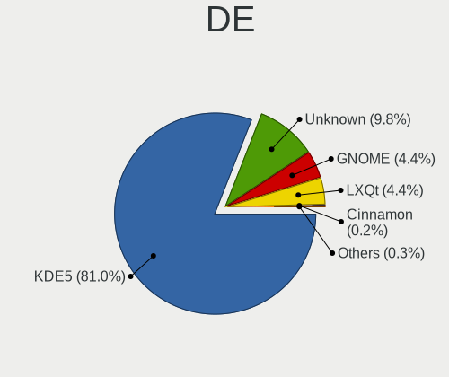
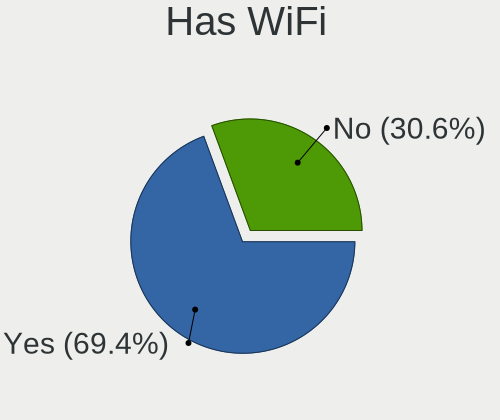
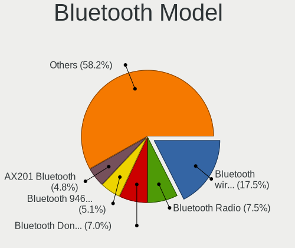

OpenMandriva - Tested Hardware & Statistics
-------------------------------------------

A project to collect tested hardware configurations for OpenMandriva.

Anyone can contribute to this report by the [hw-probe](https://github.com/linuxhw/hw-probe) tool:

    sudo -E hw-probe -all -upload

Please contribute! Especially if your hardware is rare.

This is a report for all computer types. See also reports for [desktops](/Dist/OpenMandriva/Desktop/README.md) and [notebooks](/Dist/OpenMandriva/Notebook/README.md).

Contents
--------

* [ Test Cases ](#test-cases)

* [ System ](#system)
  - [ OS                       ](#os)
  - [ OS Family                ](#os-family)
  - [ Kernel                   ](#kernel)
  - [ Kernel Family            ](#kernel-family)
  - [ Kernel Major Ver.        ](#kernel-major-ver)
  - [ Arch                     ](#arch)
  - [ DE                       ](#de)
  - [ Display Server           ](#display-server)
  - [ Display Manager          ](#display-manager)
  - [ OS Lang                  ](#os-lang)
  - [ Boot Mode                ](#boot-mode)
  - [ Filesystem               ](#filesystem)
  - [ Part. scheme             ](#part-scheme)
  - [ Dual Boot with Linux/BSD ](#dual-boot-with-linuxbsd)
  - [ Dual Boot (Win)          ](#dual-boot-win)

* [ Board ](#board)
  - [ Vendor                   ](#vendor)
  - [ Model                    ](#model)
  - [ Model Family             ](#model-family)
  - [ MFG Year                 ](#mfg-year)
  - [ Form Factor              ](#form-factor)
  - [ Secure Boot              ](#secure-boot)
  - [ Coreboot                 ](#coreboot)
  - [ RAM Size                 ](#ram-size)
  - [ RAM Used                 ](#ram-used)
  - [ Total Drives             ](#total-drives)
  - [ Has CD-ROM               ](#has-cd-rom)
  - [ Has Ethernet             ](#has-ethernet)
  - [ Has WiFi                 ](#has-wifi)
  - [ Has Bluetooth            ](#has-bluetooth)

* [ Location ](#location)
  - [ Country                  ](#country)
  - [ City                     ](#city)

* [ Drives ](#drives)
  - [ Drive Vendor             ](#drive-vendor)
  - [ Drive Model              ](#drive-model)
  - [ HDD Vendor               ](#hdd-vendor)
  - [ SSD Vendor               ](#ssd-vendor)
  - [ Drive Kind               ](#drive-kind)
  - [ Drive Connector          ](#drive-connector)
  - [ Drive Size               ](#drive-size)
  - [ Space Total              ](#space-total)
  - [ Space Used               ](#space-used)
  - [ Malfunc. Drives          ](#malfunc-drives)
  - [ Malfunc. Drive Vendor    ](#malfunc-drive-vendor)
  - [ Malfunc. HDD Vendor      ](#malfunc-hdd-vendor)
  - [ Malfunc. Drive Kind      ](#malfunc-drive-kind)
  - [ Failed Drives            ](#failed-drives)
  - [ Failed Drive Vendor      ](#failed-drive-vendor)
  - [ Drive Status             ](#drive-status)

* [ Storage controller ](#storage-controller)
  - [ Storage Vendor           ](#storage-vendor)
  - [ Storage Model            ](#storage-model)
  - [ Storage Kind             ](#storage-kind)

* [ Processor ](#processor)
  - [ CPU Vendor               ](#cpu-vendor)
  - [ CPU Model                ](#cpu-model)
  - [ CPU Model Family         ](#cpu-model-family)
  - [ CPU Cores                ](#cpu-cores)
  - [ CPU Sockets              ](#cpu-sockets)
  - [ CPU Threads              ](#cpu-threads)
  - [ CPU Op-Modes             ](#cpu-op-modes)
  - [ CPU Microcode            ](#cpu-microcode)
  - [ CPU Microarch            ](#cpu-microarch)

* [ Graphics ](#graphics)
  - [ GPU Vendor               ](#gpu-vendor)
  - [ GPU Model                ](#gpu-model)
  - [ GPU Combo                ](#gpu-combo)
  - [ GPU Driver               ](#gpu-driver)
  - [ GPU Memory               ](#gpu-memory)

* [ Monitor ](#monitor)
  - [ Monitor Vendor           ](#monitor-vendor)
  - [ Monitor Model            ](#monitor-model)
  - [ Monitor Resolution       ](#monitor-resolution)
  - [ Monitor Diagonal         ](#monitor-diagonal)
  - [ Monitor Width            ](#monitor-width)
  - [ Aspect Ratio             ](#aspect-ratio)
  - [ Monitor Area             ](#monitor-area)
  - [ Pixel Density            ](#pixel-density)
  - [ Multiple Monitors        ](#multiple-monitors)

* [ Network ](#network)
  - [ Net Controller Vendor    ](#net-controller-vendor)
  - [ Net Controller Model     ](#net-controller-model)
  - [ Wireless Vendor          ](#wireless-vendor)
  - [ Wireless Model           ](#wireless-model)
  - [ Ethernet Vendor          ](#ethernet-vendor)
  - [ Ethernet Model           ](#ethernet-model)
  - [ Net Controller Kind      ](#net-controller-kind)
  - [ Used Controller          ](#used-controller)
  - [ NICs                     ](#nics)
  - [ IPv6                     ](#ipv6)

* [ Bluetooth ](#bluetooth)
  - [ Bluetooth Vendor         ](#bluetooth-vendor)
  - [ Bluetooth Model          ](#bluetooth-model)

* [ Sound ](#sound)
  - [ Sound Vendor             ](#sound-vendor)
  - [ Sound Model              ](#sound-model)

* [ Memory ](#memory)
  - [ Memory Vendor            ](#memory-vendor)
  - [ Memory Model             ](#memory-model)
  - [ Memory Kind              ](#memory-kind)
  - [ Memory Form Factor       ](#memory-form-factor)
  - [ Memory Size              ](#memory-size)
  - [ Memory Speed             ](#memory-speed)

* [ Printers & scanners ](#printers--scanners)
  - [ Printer Vendor           ](#printer-vendor)
  - [ Printer Model            ](#printer-model)
  - [ Scanner Vendor           ](#scanner-vendor)
  - [ Scanner Model            ](#scanner-model)

* [ Camera ](#camera)
  - [ Camera Vendor            ](#camera-vendor)
  - [ Camera Model             ](#camera-model)

* [ Security ](#security)
  - [ Fingerprint Vendor       ](#fingerprint-vendor)
  - [ Fingerprint Model        ](#fingerprint-model)
  - [ Chipcard Vendor          ](#chipcard-vendor)
  - [ Chipcard Model           ](#chipcard-model)

* [ Unsupported ](#unsupported)
  - [ Unsupported Devices      ](#unsupported-devices)
  - [ Unsupported Device Types ](#unsupported-device-types)

Test Cases
----------

Total: 10110

| Vendor        | Model                       | Form-Factor | Probe                                                      | Date         |
|---------------|-----------------------------|-------------|------------------------------------------------------------|--------------|
| ASUSTek       | PRIME A320M-K               | Desktop     | [afbe6b4362](https://linux-hardware.org/?probe=afbe6b4362) | Dec 31, 2022 |
| Toshiba       | Satellite A305D             | Notebook    | [b85a377462](https://linux-hardware.org/?probe=b85a377462) | Dec 31, 2022 |
| ASUSTek       | TUF Gaming B560-PLUS WIF... | Desktop     | [7295ec02b5](https://linux-hardware.org/?probe=7295ec02b5) | Dec 31, 2022 |
| ASUSTek       | UN45                        | Desktop     | [bde2e2efb1](https://linux-hardware.org/?probe=bde2e2efb1) | Dec 31, 2022 |
| Dynabook      | Satellite Pro C40-G         | Notebook    | [e7555a4df8](https://linux-hardware.org/?probe=e7555a4df8) | Dec 31, 2022 |
| MSI           | MS-7502 Fab D               | Desktop     | [9126e1035f](https://linux-hardware.org/?probe=9126e1035f) | Dec 31, 2022 |
| Dell          | 0VNP2H A02                  | Desktop     | [5d3da04d45](https://linux-hardware.org/?probe=5d3da04d45) | Dec 31, 2022 |
| Gigabyte      | GA-78LMT-USB3 SEx           | Desktop     | [b0dd8fc6b5](https://linux-hardware.org/?probe=b0dd8fc6b5) | Dec 31, 2022 |
| Lenovo        | ThinkPad T410 2537BF9       | Notebook    | [f83ed1dd39](https://linux-hardware.org/?probe=f83ed1dd39) | Dec 30, 2022 |
| ASUSTek       | TP501UA                     | Notebook    | [1f2aaf8804](https://linux-hardware.org/?probe=1f2aaf8804) | Dec 30, 2022 |
| Lenovo        | ThinkPad X250 20CLS2D404    | Notebook    | [68afcc38f2](https://linux-hardware.org/?probe=68afcc38f2) | Dec 30, 2022 |
| ASUSTek       | K55VD                       | Notebook    | [e4c90250df](https://linux-hardware.org/?probe=e4c90250df) | Dec 30, 2022 |
| HP            | Pavilion Laptop 15-cw1xx... | Notebook    | [7a685e175c](https://linux-hardware.org/?probe=7a685e175c) | Dec 30, 2022 |
| Gigabyte      | B550M AORUS PRO-P           | Desktop     | [de6ea0ae2e](https://linux-hardware.org/?probe=de6ea0ae2e) | Dec 30, 2022 |
| ASUSTek       | X555UJ                      | Notebook    | [f4ba8643aa](https://linux-hardware.org/?probe=f4ba8643aa) | Dec 30, 2022 |
| ASUSTek       | X556UQK                     | Notebook    | [42a9dc760d](https://linux-hardware.org/?probe=42a9dc760d) | Dec 30, 2022 |
| Medion        | Akoya E6416                 | Notebook    | [ddd9ba1ffc](https://linux-hardware.org/?probe=ddd9ba1ffc) | Dec 29, 2022 |
| Acer          | Nitro AN515-57              | Notebook    | [b0bfa9530a](https://linux-hardware.org/?probe=b0bfa9530a) | Dec 29, 2022 |
| Toshiba       | dynabook T653/46JR          | Notebook    | [a1f59f6ff9](https://linux-hardware.org/?probe=a1f59f6ff9) | Dec 29, 2022 |
| ASUSTek       | STRIKER II EXTREME          | Desktop     | [3258ffa0c1](https://linux-hardware.org/?probe=3258ffa0c1) | Dec 29, 2022 |
| ASUSTek       | G1                          | Notebook    | [1f8e426f96](https://linux-hardware.org/?probe=1f8e426f96) | Dec 29, 2022 |
| Gigabyte      | H61M-D2H                    | Desktop     | [28aede6faf](https://linux-hardware.org/?probe=28aede6faf) | Dec 29, 2022 |
| Lenovo        | ThinkPad T500 2089W3A       | Notebook    | [401f529e18](https://linux-hardware.org/?probe=401f529e18) | Dec 29, 2022 |
| MSI           | MPG Z490 GAMING EDGE WIF... | Desktop     | [a72887241e](https://linux-hardware.org/?probe=a72887241e) | Dec 29, 2022 |
| MSI           | Z97 PC Mate                 | Desktop     | [1b7e70ab6e](https://linux-hardware.org/?probe=1b7e70ab6e) | Dec 29, 2022 |
| HP            | Notebook                    | Notebook    | [91bc85bf6e](https://linux-hardware.org/?probe=91bc85bf6e) | Dec 29, 2022 |
| Samsung       | NB30/N146                   | Notebook    | [7f9b976789](https://linux-hardware.org/?probe=7f9b976789) | Dec 29, 2022 |
| Apple         | MacBookAir7,2               | Notebook    | [0ad2bdf744](https://linux-hardware.org/?probe=0ad2bdf744) | Dec 29, 2022 |
| HP            | 0B4Ch D                     | Desktop     | [ed3b8e2e69](https://linux-hardware.org/?probe=ed3b8e2e69) | Dec 29, 2022 |
| ASUSTek       | P5K SE/EPU                  | Desktop     | [3f0c89985c](https://linux-hardware.org/?probe=3f0c89985c) | Dec 29, 2022 |
| Fujitsu       | LIFEBOOK P702               | Notebook    | [4734f4370b](https://linux-hardware.org/?probe=4734f4370b) | Dec 28, 2022 |
| Lenovo        | V560                        | Notebook    | [f937de4c61](https://linux-hardware.org/?probe=f937de4c61) | Dec 28, 2022 |
| ASUSTek       | VivoBook_ASUSLaptop X509... | Notebook    | [1ff4c4bf09](https://linux-hardware.org/?probe=1ff4c4bf09) | Dec 28, 2022 |
| HP            | Compaq Presario CQ60        | Notebook    | [92ece593f5](https://linux-hardware.org/?probe=92ece593f5) | Dec 28, 2022 |
| HP            | EliteBook 820 G2            | Notebook    | [bd56ec4f01](https://linux-hardware.org/?probe=bd56ec4f01) | Dec 28, 2022 |
| Google        | Gnawty                      | Notebook    | [98902e9806](https://linux-hardware.org/?probe=98902e9806) | Dec 28, 2022 |
| Gigabyte      | MJPLNBB-00                  | Desktop     | [879a5b77ff](https://linux-hardware.org/?probe=879a5b77ff) | Dec 28, 2022 |
| Acer          | Aspire E5-573G              | Notebook    | [6e1255aa44](https://linux-hardware.org/?probe=6e1255aa44) | Dec 28, 2022 |
| Dell          | 0HN7XN A01                  | Desktop     | [43a0d87199](https://linux-hardware.org/?probe=43a0d87199) | Dec 28, 2022 |
| Positivo      | Hendrix                     | Notebook    | [55aa2f92d7](https://linux-hardware.org/?probe=55aa2f92d7) | Dec 27, 2022 |
| Dell          | Latitude 7480               | Notebook    | [45b0f992f6](https://linux-hardware.org/?probe=45b0f992f6) | Dec 27, 2022 |
| Pegatron      | APX85-GS                    | Desktop     | [82db9f15c6](https://linux-hardware.org/?probe=82db9f15c6) | Dec 27, 2022 |
| Samsung       | 300E4C/300E5C/300E7C        | Notebook    | [7a3513a2e1](https://linux-hardware.org/?probe=7a3513a2e1) | Dec 27, 2022 |
| Acer          | Nitro AN515-44              | Notebook    | [58b02cceb0](https://linux-hardware.org/?probe=58b02cceb0) | Dec 27, 2022 |
| Acer          | Aspire TC-865 V:1.1         | Desktop     | [0c8add55fe](https://linux-hardware.org/?probe=0c8add55fe) | Dec 27, 2022 |
| Lenovo        | IdeaPad S145-15AST 81N3     | Notebook    | [9e6b5e5ebf](https://linux-hardware.org/?probe=9e6b5e5ebf) | Dec 27, 2022 |
| Acer          | Nitro AN515-57              | Notebook    | [8ecb7e11b3](https://linux-hardware.org/?probe=8ecb7e11b3) | Dec 26, 2022 |
| MSI           | X470 GAMING PLUS MAX        | Desktop     | [bc68280036](https://linux-hardware.org/?probe=bc68280036) | Dec 26, 2022 |
| Samsung       | 270E5G/270E5U               | Notebook    | [705baed85a](https://linux-hardware.org/?probe=705baed85a) | Dec 26, 2022 |
| MSI           | GS76 Stealth 11UG           | Notebook    | [10e22b317f](https://linux-hardware.org/?probe=10e22b317f) | Dec 26, 2022 |
| HUAWEI        | BOHK-WAX9X                  | Notebook    | [6703f01cfc](https://linux-hardware.org/?probe=6703f01cfc) | Dec 26, 2022 |
| HP            | EliteBook 820 G1            | Notebook    | [6a2c20cb74](https://linux-hardware.org/?probe=6a2c20cb74) | Dec 26, 2022 |
| Lenovo        | SHARKBAY NOK                | Desktop     | [46123218f3](https://linux-hardware.org/?probe=46123218f3) | Dec 26, 2022 |
| Toshiba       | Satellite L500              | Notebook    | [08b4f83030](https://linux-hardware.org/?probe=08b4f83030) | Dec 26, 2022 |
| Lenovo        | ThinkPad X1 Carbon 34604... | Notebook    | [dfb555f802](https://linux-hardware.org/?probe=dfb555f802) | Dec 26, 2022 |
| Gigabyte      | G41MT-S2PT                  | Desktop     | [14611d6c99](https://linux-hardware.org/?probe=14611d6c99) | Dec 26, 2022 |
| HP            | 2AF7                        | Desktop     | [96344d97ba](https://linux-hardware.org/?probe=96344d97ba) | Dec 26, 2022 |
| Gigabyte      | Z590 AORUS ULTRA            | Desktop     | [4ab759533b](https://linux-hardware.org/?probe=4ab759533b) | Dec 25, 2022 |
| Apple         | MacBookAir7,2               | Notebook    | [9d48f30feb](https://linux-hardware.org/?probe=9d48f30feb) | Dec 25, 2022 |
| Acer          | Aspire A315-53              | Notebook    | [e012bb5bc1](https://linux-hardware.org/?probe=e012bb5bc1) | Dec 25, 2022 |
| Gigabyte      | AERO 17 XD                  | Notebook    | [c45ec6b46d](https://linux-hardware.org/?probe=c45ec6b46d) | Dec 25, 2022 |
| Huanan        | B660-D4 V1.0                | Desktop     | [2a3d5dc01f](https://linux-hardware.org/?probe=2a3d5dc01f) | Dec 25, 2022 |
| ASUSTek       | M51Tr                       | Notebook    | [dffa412a98](https://linux-hardware.org/?probe=dffa412a98) | Dec 25, 2022 |
| Gigabyte      | B450M S2H                   | Desktop     | [500abd4186](https://linux-hardware.org/?probe=500abd4186) | Dec 25, 2022 |
| ASUSTek       | NARRA3                      | Desktop     | [cc0a64d0df](https://linux-hardware.org/?probe=cc0a64d0df) | Dec 25, 2022 |
| Pegatron      | IPPPV-D3G                   | Desktop     | [4d1a2299dc](https://linux-hardware.org/?probe=4d1a2299dc) | Dec 24, 2022 |
| Dell          | G7 7790                     | Notebook    | [da767d5fd4](https://linux-hardware.org/?probe=da767d5fd4) | Dec 24, 2022 |
| ASUSTek       | TUF B450-PLUS GAMING        | Desktop     | [9e269ee2a4](https://linux-hardware.org/?probe=9e269ee2a4) | Dec 24, 2022 |
| Lenovo        | IdeaPad S145-15AST 81N3     | Notebook    | [8c835888d6](https://linux-hardware.org/?probe=8c835888d6) | Dec 24, 2022 |
| ASUSTek       | UX31E                       | Notebook    | [08a1ad1c63](https://linux-hardware.org/?probe=08a1ad1c63) | Dec 24, 2022 |
| Acer          | Aspire A315-21G             | Notebook    | [435933801a](https://linux-hardware.org/?probe=435933801a) | Dec 24, 2022 |
| ASRock        | FM2A68M-DG3+                | Desktop     | [11eb39826a](https://linux-hardware.org/?probe=11eb39826a) | Dec 24, 2022 |
| Dell          | 0M863N A00                  | Desktop     | [ce9fc7a224](https://linux-hardware.org/?probe=ce9fc7a224) | Dec 24, 2022 |
| Toshiba       | Satellite C55-A             | Notebook    | [02a3f1cf18](https://linux-hardware.org/?probe=02a3f1cf18) | Dec 24, 2022 |
| Foxconn       | 2AA9                        | Desktop     | [07650be639](https://linux-hardware.org/?probe=07650be639) | Dec 24, 2022 |
| Dell          | XPS L322X                   | Notebook    | [c127721464](https://linux-hardware.org/?probe=c127721464) | Dec 24, 2022 |
| ASRock        | B75 Pro3-M                  | Desktop     | [e24692f75f](https://linux-hardware.org/?probe=e24692f75f) | Dec 24, 2022 |
| MACHINIST     | X99-RS9 V2.0                | Desktop     | [27612d2f72](https://linux-hardware.org/?probe=27612d2f72) | Dec 24, 2022 |
| ASUSTek       | VivoBook_ASUSLaptop X421... | Notebook    | [cf4ba78c7d](https://linux-hardware.org/?probe=cf4ba78c7d) | Dec 24, 2022 |
| Acer          | Aspire VX5-591G             | Notebook    | [f2e0369ba1](https://linux-hardware.org/?probe=f2e0369ba1) | Dec 24, 2022 |
| ASRock        | B550 Phantom Gaming 4/ac    | Desktop     | [2d3121d44e](https://linux-hardware.org/?probe=2d3121d44e) | Dec 24, 2022 |
| Positivo      | Mobile                      | Notebook    | [6031910e64](https://linux-hardware.org/?probe=6031910e64) | Dec 24, 2022 |
| Lenovo        | ThinkPad SL 2746N8G         | Notebook    | [f540a3a892](https://linux-hardware.org/?probe=f540a3a892) | Dec 23, 2022 |
| Positivo      | H14BT58                     | Notebook    | [9914219613](https://linux-hardware.org/?probe=9914219613) | Dec 23, 2022 |
| ASUSTek       | VivoBook_ASUSLaptop X509... | Notebook    | [beb602dcf6](https://linux-hardware.org/?probe=beb602dcf6) | Dec 23, 2022 |
| Dell          | 0J3C2F A00                  | Desktop     | [f993ebb9ed](https://linux-hardware.org/?probe=f993ebb9ed) | Dec 23, 2022 |
| ASUSTek       | K53SC                       | Notebook    | [5105f25e5e](https://linux-hardware.org/?probe=5105f25e5e) | Dec 23, 2022 |
| Acer          | Aspire VX5-591G             | Notebook    | [7defe87998](https://linux-hardware.org/?probe=7defe87998) | Dec 23, 2022 |
| Apple         | MacBookAir7,2               | Notebook    | [00e62a7231](https://linux-hardware.org/?probe=00e62a7231) | Dec 23, 2022 |
| MSI           | 880GM-E41                   | Desktop     | [2880803d71](https://linux-hardware.org/?probe=2880803d71) | Dec 23, 2022 |
| ASUSTek       | TUF B360-PRO GAMING         | Desktop     | [561b98afc3](https://linux-hardware.org/?probe=561b98afc3) | Dec 23, 2022 |
| Dell          | 0JJW8N A03                  | Desktop     | [5917cccca0](https://linux-hardware.org/?probe=5917cccca0) | Dec 23, 2022 |
| ASUSTek       | TUF Gaming B550-PLUS        | Desktop     | [87da3fdf4d](https://linux-hardware.org/?probe=87da3fdf4d) | Dec 23, 2022 |
| Lenovo        | ThinkPad X220 Tablet 429... | Notebook    | [791ace450e](https://linux-hardware.org/?probe=791ace450e) | Dec 23, 2022 |
| ASUSTek       | M51Vr                       | Notebook    | [ffc48a52ea](https://linux-hardware.org/?probe=ffc48a52ea) | Dec 22, 2022 |
| ASRock        | FM2A88M-HD+                 | Desktop     | [18b83ae613](https://linux-hardware.org/?probe=18b83ae613) | Dec 22, 2022 |
| ASUSTek       | P5K                         | Desktop     | [406d3a2d92](https://linux-hardware.org/?probe=406d3a2d92) | Dec 22, 2022 |
| MSI           | 2A9C                        | Desktop     | [031afb1b20](https://linux-hardware.org/?probe=031afb1b20) | Dec 22, 2022 |
| Dell          | Latitude 5280               | Notebook    | [59002e923b](https://linux-hardware.org/?probe=59002e923b) | Dec 22, 2022 |
| Acer          | Aspire M3920                | Desktop     | [803cd5d8f9](https://linux-hardware.org/?probe=803cd5d8f9) | Dec 22, 2022 |
| Gigabyte      | EP43-DS3                    | Desktop     | [d0f0cd82f9](https://linux-hardware.org/?probe=d0f0cd82f9) | Dec 22, 2022 |
| HP            | Pavilion dv9000 (RR329EA... | Notebook    | [6fc7281f2f](https://linux-hardware.org/?probe=6fc7281f2f) | Dec 22, 2022 |
| ASUSTek       | 1015BXO                     | Notebook    | [7cce9a65ec](https://linux-hardware.org/?probe=7cce9a65ec) | Dec 22, 2022 |
| Toshiba       | dynabook T653/46JR          | Notebook    | [1f10cd2a64](https://linux-hardware.org/?probe=1f10cd2a64) | Dec 22, 2022 |
| HP            | Pavilion 11 x360 PC         | Notebook    | [1397ed80b3](https://linux-hardware.org/?probe=1397ed80b3) | Dec 21, 2022 |
| Toshiba       | Satellite C55-B             | Notebook    | [8f81c02bbf](https://linux-hardware.org/?probe=8f81c02bbf) | Dec 21, 2022 |
| Gigabyte      | X470 AORUS GAMING 5 WIFI... | Desktop     | [003ac98d7f](https://linux-hardware.org/?probe=003ac98d7f) | Dec 21, 2022 |
| Samsung       | R540/R580/R780/SA41/E452... | Notebook    | [044928d818](https://linux-hardware.org/?probe=044928d818) | Dec 21, 2022 |
| Lenovo        | IdeaPad Y510P 20217         | Notebook    | [06d78a17c1](https://linux-hardware.org/?probe=06d78a17c1) | Dec 21, 2022 |
| PERTOSA       | GA-H110TN-M                 | Desktop     | [048d8cca49](https://linux-hardware.org/?probe=048d8cca49) | Dec 21, 2022 |
| HP            | 212A                        | Desktop     | [32c96df530](https://linux-hardware.org/?probe=32c96df530) | Dec 20, 2022 |
| Dell          | 0VHWTR A01                  | Desktop     | [a5070ec279](https://linux-hardware.org/?probe=a5070ec279) | Dec 20, 2022 |
| ASUSTek       | P5K                         | Desktop     | [e88b53b804](https://linux-hardware.org/?probe=e88b53b804) | Dec 20, 2022 |
| Apple         | Mac-942B59F58194171B iMa... | All in one  | [ec2528ae6f](https://linux-hardware.org/?probe=ec2528ae6f) | Dec 20, 2022 |
| Acer          | Aspire 5336                 | Notebook    | [9724b5d705](https://linux-hardware.org/?probe=9724b5d705) | Dec 20, 2022 |
| HP            | 8906 SMVB                   | Desktop     | [c7b2f48d96](https://linux-hardware.org/?probe=c7b2f48d96) | Dec 20, 2022 |
| RM Educati... | RM                          | Notebook    | [758b521362](https://linux-hardware.org/?probe=758b521362) | Dec 20, 2022 |
| Acer          | Aspire XC-830               | Desktop     | [ee5a538a22](https://linux-hardware.org/?probe=ee5a538a22) | Dec 20, 2022 |
| Langchao      | NF5110                      | Server      | [3578ca8ceb](https://linux-hardware.org/?probe=3578ca8ceb) | Dec 20, 2022 |
| Lenovo        | IdeaPad 3 14ALC6 82KT       | Notebook    | [7c07fab7e4](https://linux-hardware.org/?probe=7c07fab7e4) | Dec 20, 2022 |
| Lenovo        | ThinkPad W510 4318CTO       | Notebook    | [215feb2d5e](https://linux-hardware.org/?probe=215feb2d5e) | Dec 20, 2022 |
| ECS           | G31T-M7                     | Desktop     | [327ac25b68](https://linux-hardware.org/?probe=327ac25b68) | Dec 20, 2022 |
| Gigabyte      | 945GCMX-S2                  | Desktop     | [3b9937e6df](https://linux-hardware.org/?probe=3b9937e6df) | Dec 20, 2022 |
| MSI           | GE62 6QD                    | Notebook    | [20d959e778](https://linux-hardware.org/?probe=20d959e778) | Dec 19, 2022 |
| LG Electro... | 17Z90P-G.AA56F              | Notebook    | [fa43417151](https://linux-hardware.org/?probe=fa43417151) | Dec 19, 2022 |
| MSI           | H81M-E34                    | Desktop     | [3aa811568d](https://linux-hardware.org/?probe=3aa811568d) | Dec 19, 2022 |
| Toshiba       | EQUIUM A300D                | Notebook    | [ffde5ccef4](https://linux-hardware.org/?probe=ffde5ccef4) | Dec 19, 2022 |
| ASUSTek       | S551LN                      | Notebook    | [df4a754b5d](https://linux-hardware.org/?probe=df4a754b5d) | Dec 19, 2022 |
| ASUSTek       | P5QL PRO                    | Desktop     | [5f3343c803](https://linux-hardware.org/?probe=5f3343c803) | Dec 19, 2022 |
| ASUSTek       | X555LD                      | Notebook    | [d1d5c6a19e](https://linux-hardware.org/?probe=d1d5c6a19e) | Dec 19, 2022 |
| Gigabyte      | H61M-DS2                    | Desktop     | [b5c4e6cf61](https://linux-hardware.org/?probe=b5c4e6cf61) | Dec 19, 2022 |
| ASUSTek       | ROG STRIX B550-F GAMING ... | Desktop     | [743b2176f1](https://linux-hardware.org/?probe=743b2176f1) | Dec 19, 2022 |
| Dell          | 0M858N A00                  | Desktop     | [e46a95080d](https://linux-hardware.org/?probe=e46a95080d) | Dec 18, 2022 |
| ASUSTek       | UX31E                       | Notebook    | [4f41f354cd](https://linux-hardware.org/?probe=4f41f354cd) | Dec 18, 2022 |
| MSI           | 790GX-G65                   | Desktop     | [7ad3c8f807](https://linux-hardware.org/?probe=7ad3c8f807) | Dec 18, 2022 |
| Gigabyte      | MQLP3AP-WG                  | Desktop     | [bdb3b0161e](https://linux-hardware.org/?probe=bdb3b0161e) | Dec 18, 2022 |
| ASUSTek       | N551JM                      | Notebook    | [e02ba85a63](https://linux-hardware.org/?probe=e02ba85a63) | Dec 18, 2022 |
| ASUSTek       | PN50                        | Mini pc     | [ff287eecab](https://linux-hardware.org/?probe=ff287eecab) | Dec 18, 2022 |
| Dell          | 0RY007                      | Desktop     | [3791fa08dd](https://linux-hardware.org/?probe=3791fa08dd) | Dec 18, 2022 |
| Acer          | Aspire ES1-531              | Notebook    | [28dc03a1bc](https://linux-hardware.org/?probe=28dc03a1bc) | Dec 18, 2022 |
| MSI           | A520M-A PRO                 | Desktop     | [164b37d0e5](https://linux-hardware.org/?probe=164b37d0e5) | Dec 18, 2022 |
| MSI           | MPG X570S EDGE MAX WIFI     | Desktop     | [45eafa4ade](https://linux-hardware.org/?probe=45eafa4ade) | Dec 17, 2022 |
| Gigabyte      | X399 AORUS PRO-CF           | Desktop     | [71ebf721cc](https://linux-hardware.org/?probe=71ebf721cc) | Dec 17, 2022 |
| Toshiba       | dynabook T653/46JR          | Notebook    | [5a05dc8c43](https://linux-hardware.org/?probe=5a05dc8c43) | Dec 17, 2022 |
| Biostar       | H81MHV3 5.0                 | Desktop     | [57191b83bb](https://linux-hardware.org/?probe=57191b83bb) | Dec 17, 2022 |
| HP            | 8055                        | Desktop     | [6c7fa83dc9](https://linux-hardware.org/?probe=6c7fa83dc9) | Dec 17, 2022 |
| Dell          | Latitude E6330              | Notebook    | [ca6551bf8e](https://linux-hardware.org/?probe=ca6551bf8e) | Dec 17, 2022 |
| Notebook      | W65_67SZ                    | Notebook    | [770c00f7d9](https://linux-hardware.org/?probe=770c00f7d9) | Dec 17, 2022 |
| MSI           | MS-B1711                    | Desktop     | [a5b142e258](https://linux-hardware.org/?probe=a5b142e258) | Dec 17, 2022 |
| Lenovo        | ThinkPad X200s 7466A17      | Notebook    | [1831439f56](https://linux-hardware.org/?probe=1831439f56) | Dec 16, 2022 |
| Samsung       | 305E4A/305E5A/305E7A        | Notebook    | [0d7a54bc21](https://linux-hardware.org/?probe=0d7a54bc21) | Dec 16, 2022 |
| ASUSTek       | PRIME H510M-K               | Desktop     | [ca088f2039](https://linux-hardware.org/?probe=ca088f2039) | Dec 16, 2022 |
| Biostar       | A10N-8800E                  | Desktop     | [bc96dc9caf](https://linux-hardware.org/?probe=bc96dc9caf) | Dec 16, 2022 |
| Dell          | 0RW203                      | Desktop     | [2f5bede488](https://linux-hardware.org/?probe=2f5bede488) | Dec 16, 2022 |
| Lenovo        | IdeaPad 1 14ADA05 82GW      | Notebook    | [ffa7e28596](https://linux-hardware.org/?probe=ffa7e28596) | Dec 16, 2022 |
| Lenovo        | Yoga 2-11 20332             | Notebook    | [92a038a164](https://linux-hardware.org/?probe=92a038a164) | Dec 16, 2022 |
| Lenovo        | ThinkPad X240 20AL007AMZ    | Notebook    | [8290c7e597](https://linux-hardware.org/?probe=8290c7e597) | Dec 16, 2022 |
| Lenovo        | IdeaPad S145-14AST 81ST     | Notebook    | [04cc986bf6](https://linux-hardware.org/?probe=04cc986bf6) | Dec 15, 2022 |
| ASUSTek       | B75M-A                      | Desktop     | [e350e12e7c](https://linux-hardware.org/?probe=e350e12e7c) | Dec 15, 2022 |
| Lenovo        | SHARKBAY 0B98401 PRO        | Desktop     | [226bab8281](https://linux-hardware.org/?probe=226bab8281) | Dec 15, 2022 |
| HP            | Presario CQ62               | Notebook    | [fce21eae2c](https://linux-hardware.org/?probe=fce21eae2c) | Dec 15, 2022 |
| Gigabyte      | F2A85X-UP4                  | Desktop     | [80358a5ba1](https://linux-hardware.org/?probe=80358a5ba1) | Dec 15, 2022 |
| Lenovo        | B590 20206                  | Notebook    | [b2b98c19da](https://linux-hardware.org/?probe=b2b98c19da) | Dec 15, 2022 |
| Acer          | Veriton N2620G              | Desktop     | [a626bf668e](https://linux-hardware.org/?probe=a626bf668e) | Dec 15, 2022 |
| Dell          | 050Nt9 A00                  | All in one  | [075f206957](https://linux-hardware.org/?probe=075f206957) | Dec 15, 2022 |
| Pegatron      | IPM41-D3                    | Desktop     | [a41e0d92a7](https://linux-hardware.org/?probe=a41e0d92a7) | Dec 15, 2022 |
| Lenovo        | 364F SDK0J40700 WIN 3258... | Desktop     | [ffe60f958c](https://linux-hardware.org/?probe=ffe60f958c) | Dec 15, 2022 |
| ASUSTek       | K40IJ                       | Notebook    | [191b6ded65](https://linux-hardware.org/?probe=191b6ded65) | Dec 15, 2022 |
| Dell          | 0FR6WH A01                  | Desktop     | [46d6c645fe](https://linux-hardware.org/?probe=46d6c645fe) | Dec 15, 2022 |
| Gigabyte      | F2A68HM-H                   | Desktop     | [f18234034f](https://linux-hardware.org/?probe=f18234034f) | Dec 15, 2022 |
| Lenovo        | G700 20251                  | Notebook    | [f72bd71975](https://linux-hardware.org/?probe=f72bd71975) | Dec 15, 2022 |
| HP            | 2AFB                        | Desktop     | [4c57ea0ee7](https://linux-hardware.org/?probe=4c57ea0ee7) | Dec 15, 2022 |
| ASUSTek       | ROG STRIX X570-I GAMING     | Desktop     | [587fac961e](https://linux-hardware.org/?probe=587fac961e) | Dec 15, 2022 |
| Dell          | 0VD92X A00                  | Desktop     | [9feb549665](https://linux-hardware.org/?probe=9feb549665) | Dec 15, 2022 |
| Gigabyte      | H410M H V3                  | Desktop     | [cf668e53f4](https://linux-hardware.org/?probe=cf668e53f4) | Dec 15, 2022 |
| Gigabyte      | B550 AORUS ELITE V2         | Desktop     | [ad1e402db3](https://linux-hardware.org/?probe=ad1e402db3) | Dec 15, 2022 |
| Lenovo        | ThinkPad X230 23245QP       | Notebook    | [e525a77c95](https://linux-hardware.org/?probe=e525a77c95) | Dec 15, 2022 |
| Acer          | Aspire A514-54              | Notebook    | [78482cbf69](https://linux-hardware.org/?probe=78482cbf69) | Dec 15, 2022 |
| MSI           | Z77MA-G45                   | Desktop     | [24a7d4b636](https://linux-hardware.org/?probe=24a7d4b636) | Dec 15, 2022 |
| ASUSTek       | EX-A320M-GAMING             | Desktop     | [6bd184b75a](https://linux-hardware.org/?probe=6bd184b75a) | Dec 15, 2022 |
| Lenovo        | G460 20041                  | Notebook    | [b76fa704f7](https://linux-hardware.org/?probe=b76fa704f7) | Dec 15, 2022 |
| Dell          | 00V62H A01                  | Desktop     | [8b003bd5f2](https://linux-hardware.org/?probe=8b003bd5f2) | Dec 15, 2022 |
| Microsoft     | Surface Pro 4               | Tablet      | [d39c428918](https://linux-hardware.org/?probe=d39c428918) | Dec 15, 2022 |
| Lenovo        | 3111 SDK0J40697 WIN 3305... | Mini pc     | [a9d66f9686](https://linux-hardware.org/?probe=a9d66f9686) | Dec 14, 2022 |
| Dell          | 05XGC8 A01                  | Desktop     | [f0e99676be](https://linux-hardware.org/?probe=f0e99676be) | Dec 14, 2022 |
| Lenovo        | IdeaPad Gaming 3 15IMH05... | Notebook    | [259226594a](https://linux-hardware.org/?probe=259226594a) | Dec 14, 2022 |
| Dell          | Inspiron 11 - 3147          | Notebook    | [d5aa2c3900](https://linux-hardware.org/?probe=d5aa2c3900) | Dec 14, 2022 |
| HP            | Compaq 6735s                | Notebook    | [72d29aa11f](https://linux-hardware.org/?probe=72d29aa11f) | Dec 14, 2022 |
| Dell          | Inspiron 3451               | Notebook    | [de7f9d5e33](https://linux-hardware.org/?probe=de7f9d5e33) | Dec 14, 2022 |
| ASUSTek       | P8H61-M LX2/CSM             | Desktop     | [cc6e7dae77](https://linux-hardware.org/?probe=cc6e7dae77) | Dec 14, 2022 |
| ASUSTek       | M5A78L-M PLUS/USB3          | Desktop     | [0a564c9f0f](https://linux-hardware.org/?probe=0a564c9f0f) | Dec 14, 2022 |
| Gigabyte      | B150-HD3-CF                 | Desktop     | [173dde2177](https://linux-hardware.org/?probe=173dde2177) | Dec 14, 2022 |
| Datto         | SSD                         | Desktop     | [a9bff0a51c](https://linux-hardware.org/?probe=a9bff0a51c) | Dec 14, 2022 |
| Lenovo        | Yoga 710-15IKB 80V5         | Convertible | [373f71370e](https://linux-hardware.org/?probe=373f71370e) | Dec 14, 2022 |
| Supermicro    | X11SSV-Q                    | Server      | [7fd98e489a](https://linux-hardware.org/?probe=7fd98e489a) | Dec 14, 2022 |
| ASUSTek       | M5A97 R2.0                  | Desktop     | [c337db1381](https://linux-hardware.org/?probe=c337db1381) | Dec 14, 2022 |
| ASRock        | M3A770DE                    | Desktop     | [2e6b1f9c2d](https://linux-hardware.org/?probe=2e6b1f9c2d) | Dec 13, 2022 |
| Star Labs     | StarBook                    | Notebook    | [719a73ae26](https://linux-hardware.org/?probe=719a73ae26) | Dec 13, 2022 |
| Dell          | Inspiron 1525               | Notebook    | [5a88d1f0e3](https://linux-hardware.org/?probe=5a88d1f0e3) | Dec 13, 2022 |
| HP            | 304Ah                       | Desktop     | [d8b600f39e](https://linux-hardware.org/?probe=d8b600f39e) | Dec 13, 2022 |
| ECS           | H61H2-M2                    | Desktop     | [8525777743](https://linux-hardware.org/?probe=8525777743) | Dec 13, 2022 |
| Dell          | Latitude E7250              | Notebook    | [3e40466ae4](https://linux-hardware.org/?probe=3e40466ae4) | Dec 13, 2022 |
| HUAWEI        | HVY-WXX9                    | Notebook    | [37284f659a](https://linux-hardware.org/?probe=37284f659a) | Dec 13, 2022 |
| HP            | Pavilion 15                 | Notebook    | [5d88eed564](https://linux-hardware.org/?probe=5d88eed564) | Dec 13, 2022 |
| Dell          | 0T10XW A02                  | Desktop     | [1539e12262](https://linux-hardware.org/?probe=1539e12262) | Dec 13, 2022 |
| AZW           | U59                         | Desktop     | [fd5ccbfbd2](https://linux-hardware.org/?probe=fd5ccbfbd2) | Dec 13, 2022 |
| ASUSTek       | Z10PH-D16 Series            | Desktop     | [18911cf243](https://linux-hardware.org/?probe=18911cf243) | Dec 13, 2022 |
| Clevo         | M740TU/M760TU               | Notebook    | [5f1a4b58fb](https://linux-hardware.org/?probe=5f1a4b58fb) | Dec 13, 2022 |
| ASUSTek       | NODUS M                     | Desktop     | [c415b9aeb6](https://linux-hardware.org/?probe=c415b9aeb6) | Dec 12, 2022 |
| HP            | Notebook                    | Notebook    | [07b9e8995f](https://linux-hardware.org/?probe=07b9e8995f) | Dec 12, 2022 |
| ASUSTek       | UX31E                       | Notebook    | [651fa58fbd](https://linux-hardware.org/?probe=651fa58fbd) | Dec 12, 2022 |
| MSI           | GS65 Stealth Thin 8RF       | Notebook    | [074195107c](https://linux-hardware.org/?probe=074195107c) | Dec 12, 2022 |
| Gigabyte      | H310M S2V                   | Desktop     | [6895902fe7](https://linux-hardware.org/?probe=6895902fe7) | Dec 12, 2022 |
| Apple         | Mac-942B5BF58194151B        | All in one  | [c832b9b688](https://linux-hardware.org/?probe=c832b9b688) | Dec 12, 2022 |
| Dell          | Latitude 5411               | Notebook    | [334ca886a4](https://linux-hardware.org/?probe=334ca886a4) | Dec 12, 2022 |
| Lenovo        | Yoga 6 13ALC6 82ND          | Convertible | [bc4a9d103c](https://linux-hardware.org/?probe=bc4a9d103c) | Dec 12, 2022 |
| ASUSTek       | PN41                        | Mini pc     | [ec5acc536f](https://linux-hardware.org/?probe=ec5acc536f) | Dec 12, 2022 |
| ASUSTek       | AM1M-A                      | Desktop     | [260a382d54](https://linux-hardware.org/?probe=260a382d54) | Dec 12, 2022 |
| Lenovo        | IdeaPad Z580                | Notebook    | [4784b53f14](https://linux-hardware.org/?probe=4784b53f14) | Dec 12, 2022 |
| Fujitsu       | D3161-A1 S26361-D3161-A1    | Desktop     | [62f6fd5f8d](https://linux-hardware.org/?probe=62f6fd5f8d) | Dec 12, 2022 |
| MSI           | MPG B550 GAMING EDGE WIF... | Desktop     | [9537bff125](https://linux-hardware.org/?probe=9537bff125) | Dec 11, 2022 |
| HP            | Laptop 15-bw0xx             | Notebook    | [1d2ea30fb2](https://linux-hardware.org/?probe=1d2ea30fb2) | Dec 11, 2022 |
| Lenovo        | ThinkPad P51 20HH0018GE     | Notebook    | [4d5dd8fdc0](https://linux-hardware.org/?probe=4d5dd8fdc0) | Dec 11, 2022 |
| HP            | 8265                        | Desktop     | [da426053be](https://linux-hardware.org/?probe=da426053be) | Dec 11, 2022 |
| Dell          | 0KG317                      | Desktop     | [cf7f697a0a](https://linux-hardware.org/?probe=cf7f697a0a) | Dec 11, 2022 |
| Dell          | 042P49 A02                  | Desktop     | [8b97211b80](https://linux-hardware.org/?probe=8b97211b80) | Dec 11, 2022 |
| HP            | 650                         | Notebook    | [9bb3729969](https://linux-hardware.org/?probe=9bb3729969) | Dec 11, 2022 |
| MSI           | MS-AE031                    | All in one  | [7047861d13](https://linux-hardware.org/?probe=7047861d13) | Dec 11, 2022 |
| Lenovo        | ThinkBook 15 G2 ITL 20VE    | Notebook    | [a7a3ccf712](https://linux-hardware.org/?probe=a7a3ccf712) | Dec 11, 2022 |
| MSI           | GF63 Thin 9RCX              | Notebook    | [b3c750c720](https://linux-hardware.org/?probe=b3c750c720) | Dec 11, 2022 |
| HP            | Pavilion dv6000 (RY649EA... | Notebook    | [9deecc89f5](https://linux-hardware.org/?probe=9deecc89f5) | Dec 10, 2022 |
| ASUSTek       | ROG Flow X13 GV301RA_GV3... | Convertible | [d7ea1184a2](https://linux-hardware.org/?probe=d7ea1184a2) | Dec 10, 2022 |
| ASUSTek       | PRIME X370-PRO              | Desktop     | [4bb3c91677](https://linux-hardware.org/?probe=4bb3c91677) | Dec 10, 2022 |
| Acer          | Aspire V5-573               | Notebook    | [1d88db5ee2](https://linux-hardware.org/?probe=1d88db5ee2) | Dec 10, 2022 |
| Sony          | VGN-FZ31Z                   | Notebook    | [4f392d3575](https://linux-hardware.org/?probe=4f392d3575) | Dec 10, 2022 |
| ASUSTek       | P8Z77-V LX                  | Desktop     | [d53608f3e3](https://linux-hardware.org/?probe=d53608f3e3) | Dec 10, 2022 |
| ASUSTek       | P8Z77-V LX                  | Desktop     | [363ac45af6](https://linux-hardware.org/?probe=363ac45af6) | Dec 10, 2022 |
| Acer          | Aspire E1-571G              | Notebook    | [344383d85d](https://linux-hardware.org/?probe=344383d85d) | Dec 10, 2022 |
| HP            | Pavilion Laptop 15-cw1xx... | Notebook    | [e0584a11c0](https://linux-hardware.org/?probe=e0584a11c0) | Dec 10, 2022 |
| Dell          | 01TKCC A01                  | Desktop     | [0dc9bb1cf4](https://linux-hardware.org/?probe=0dc9bb1cf4) | Dec 09, 2022 |
| Lenovo        | ThinkCentre M70e 0829RB4    | Desktop     | [5a5b271c35](https://linux-hardware.org/?probe=5a5b271c35) | Dec 09, 2022 |
| HP            | 18E7                        | Desktop     | [9759493e06](https://linux-hardware.org/?probe=9759493e06) | Dec 09, 2022 |
| HP            | Compaq Presario CQ71        | Notebook    | [503b61f120](https://linux-hardware.org/?probe=503b61f120) | Dec 09, 2022 |
| Dell          | 0C27VV A03                  | Desktop     | [ef9e07a125](https://linux-hardware.org/?probe=ef9e07a125) | Dec 09, 2022 |
| ASRock        | 945GCM-S                    | Desktop     | [926787ea67](https://linux-hardware.org/?probe=926787ea67) | Dec 09, 2022 |
| Pegatron      | 2AB5                        | Desktop     | [6392174b0f](https://linux-hardware.org/?probe=6392174b0f) | Dec 09, 2022 |
| Positivo      | Mobile                      | Notebook    | [bc5f4e6c85](https://linux-hardware.org/?probe=bc5f4e6c85) | Dec 09, 2022 |
| Acer          | TravelMate 5720             | Notebook    | [d0a54f621e](https://linux-hardware.org/?probe=d0a54f621e) | Dec 09, 2022 |
| Acer          | Aspire A515-52              | Notebook    | [99e671f55f](https://linux-hardware.org/?probe=99e671f55f) | Dec 09, 2022 |
| ASRock        | X570 Phantom Gaming 4       | Desktop     | [aae285b0ea](https://linux-hardware.org/?probe=aae285b0ea) | Dec 09, 2022 |
| ASUSTek       | TUF B450-PRO GAMING         | Desktop     | [945412b0cc](https://linux-hardware.org/?probe=945412b0cc) | Dec 09, 2022 |
| Dell          | 0P301D A02                  | Desktop     | [8ab7a916f1](https://linux-hardware.org/?probe=8ab7a916f1) | Dec 08, 2022 |
| HP            | Pavilion Notebook           | Notebook    | [8cc721f649](https://linux-hardware.org/?probe=8cc721f649) | Dec 08, 2022 |
| HP            | 15                          | Notebook    | [20dfd7b8f5](https://linux-hardware.org/?probe=20dfd7b8f5) | Dec 08, 2022 |
| MSI           | 760GM-P23                   | Desktop     | [29337f7359](https://linux-hardware.org/?probe=29337f7359) | Dec 08, 2022 |
| ASRock        | B550 Taichi                 | Desktop     | [0203e79add](https://linux-hardware.org/?probe=0203e79add) | Dec 08, 2022 |
| Packard Be... | DOT S                       | Notebook    | [753f17a658](https://linux-hardware.org/?probe=753f17a658) | Dec 08, 2022 |
| Acer          | Aspire A315-34              | Notebook    | [85794e606c](https://linux-hardware.org/?probe=85794e606c) | Dec 08, 2022 |
| ASUSTek       | H110-PLUS                   | Desktop     | [57e0d3651c](https://linux-hardware.org/?probe=57e0d3651c) | Dec 08, 2022 |
| Lenovo        | ThinkPad L530 24783R8       | Notebook    | [406c066d36](https://linux-hardware.org/?probe=406c066d36) | Dec 08, 2022 |
| ASUSTek       | K55VD                       | Notebook    | [469f0a1d1f](https://linux-hardware.org/?probe=469f0a1d1f) | Dec 07, 2022 |
| Gigabyte      | Z370M D3H-CF                | Desktop     | [dabda33265](https://linux-hardware.org/?probe=dabda33265) | Dec 07, 2022 |
| Acer          | Aspire A315-51              | Notebook    | [3ab56a93d6](https://linux-hardware.org/?probe=3ab56a93d6) | Dec 07, 2022 |
| Lenovo        | IdeaPad Gaming 3 15ARH7 ... | Notebook    | [9ff2e9b61a](https://linux-hardware.org/?probe=9ff2e9b61a) | Dec 07, 2022 |
| Toshiba       | Satellite C855              | Notebook    | [1a35ba24c1](https://linux-hardware.org/?probe=1a35ba24c1) | Dec 07, 2022 |
| ASUSTek       | K53SV                       | Notebook    | [a745b1ead9](https://linux-hardware.org/?probe=a745b1ead9) | Dec 07, 2022 |
| Positivo      | H14BT58                     | Notebook    | [c038df5c8c](https://linux-hardware.org/?probe=c038df5c8c) | Dec 07, 2022 |
| ASUSTek       | P5Q-E                       | Desktop     | [fb93b5bdfa](https://linux-hardware.org/?probe=fb93b5bdfa) | Dec 06, 2022 |
| MAXSUN        | MS-TZZ A320M.2-VH           | Desktop     | [c3fc86b5d4](https://linux-hardware.org/?probe=c3fc86b5d4) | Dec 06, 2022 |
| Acer          | Aspire E5-772               | Notebook    | [35c8c05d6c](https://linux-hardware.org/?probe=35c8c05d6c) | Dec 06, 2022 |
| HC Technol... | HCAR4000-MI                 | Desktop     | [596c3680f3](https://linux-hardware.org/?probe=596c3680f3) | Dec 06, 2022 |
| Toshiba       | Satellite L655              | Notebook    | [741c3e22b7](https://linux-hardware.org/?probe=741c3e22b7) | Dec 06, 2022 |
| Gigabyte      | GA-MA770-ES3                | Desktop     | [70c1a43352](https://linux-hardware.org/?probe=70c1a43352) | Dec 06, 2022 |
| ASUSTek       | P8Z77-V LX                  | Desktop     | [e64c5d7bdc](https://linux-hardware.org/?probe=e64c5d7bdc) | Dec 06, 2022 |
| ASUSTek       | P8H61-M LX R2.0             | Desktop     | [664d064b07](https://linux-hardware.org/?probe=664d064b07) | Dec 06, 2022 |
| Acer          | Nitro AN515-57              | Notebook    | [b0bc15145c](https://linux-hardware.org/?probe=b0bc15145c) | Dec 06, 2022 |
| ASUSTek       | P6T                         | Desktop     | [8268d853c9](https://linux-hardware.org/?probe=8268d853c9) | Dec 06, 2022 |
| Apple         | Mac-F22C86C8                | Mini pc     | [13ca001c57](https://linux-hardware.org/?probe=13ca001c57) | Dec 06, 2022 |
| HP            | 15                          | Notebook    | [e5a0cdc9de](https://linux-hardware.org/?probe=e5a0cdc9de) | Dec 06, 2022 |
| Lenovo        | 0x36A017AA 31900058 STD     | Desktop     | [ccc212b757](https://linux-hardware.org/?probe=ccc212b757) | Dec 06, 2022 |
| Dell          | Latitude E6540              | Notebook    | [20786b000c](https://linux-hardware.org/?probe=20786b000c) | Dec 05, 2022 |
| Lenovo        | SHARKBAY 0B98401 WIN        | Desktop     | [a4a47ea164](https://linux-hardware.org/?probe=a4a47ea164) | Dec 05, 2022 |
| Lenovo        | Y520-15IKBN 80WK            | Notebook    | [119ec75a5f](https://linux-hardware.org/?probe=119ec75a5f) | Dec 05, 2022 |
| Intel         | HURONRIVER                  | Desktop     | [d8a4f4a923](https://linux-hardware.org/?probe=d8a4f4a923) | Dec 05, 2022 |
| HP            | ProLiant ML350e Gen8        | Desktop     | [984fe41e3c](https://linux-hardware.org/?probe=984fe41e3c) | Dec 05, 2022 |
| ECS           | 945P/PL-A                   | Desktop     | [8db8eec28d](https://linux-hardware.org/?probe=8db8eec28d) | Dec 05, 2022 |
| ASUSTek       | A_F_K31AN                   | Desktop     | [440d9055ff](https://linux-hardware.org/?probe=440d9055ff) | Dec 05, 2022 |
| ASRock        | B450 Pro4                   | Desktop     | [f96de923f4](https://linux-hardware.org/?probe=f96de923f4) | Dec 05, 2022 |
| HP            | Pavilion dv6000 (RV009UA... | Notebook    | [6dcd661136](https://linux-hardware.org/?probe=6dcd661136) | Dec 05, 2022 |
| ASUSTek       | A55BM-K                     | Desktop     | [e78b25a518](https://linux-hardware.org/?probe=e78b25a518) | Dec 05, 2022 |
| Gigabyte      | GA-78LMT-S2                 | Desktop     | [fa3aeacc17](https://linux-hardware.org/?probe=fa3aeacc17) | Dec 05, 2022 |
| MSI           | Z490-A PRO                  | Desktop     | [34157244aa](https://linux-hardware.org/?probe=34157244aa) | Dec 05, 2022 |
| MSI           | GF63 Thin 9RCX              | Notebook    | [1bf4364f61](https://linux-hardware.org/?probe=1bf4364f61) | Dec 05, 2022 |
| ASUSTek       | Z170 PRO GAMING             | Desktop     | [60d47a3b37](https://linux-hardware.org/?probe=60d47a3b37) | Dec 05, 2022 |
| Dell          | 0M863N A01                  | Desktop     | [ee8183087b](https://linux-hardware.org/?probe=ee8183087b) | Dec 04, 2022 |
| Pegatron      | 2ACF                        | Desktop     | [2d39768d80](https://linux-hardware.org/?probe=2d39768d80) | Dec 04, 2022 |
| Positivo      | POS-PIQ77CL POSITIVO        | Desktop     | [e98fcde376](https://linux-hardware.org/?probe=e98fcde376) | Dec 04, 2022 |
| Sony          | VPCEL2S1E                   | Notebook    | [0c98b9d570](https://linux-hardware.org/?probe=0c98b9d570) | Dec 04, 2022 |
| Apple         | MacBookAir6,1               | Notebook    | [af63449087](https://linux-hardware.org/?probe=af63449087) | Dec 04, 2022 |
| Lenovo        | G770 20089                  | Notebook    | [d35d60f972](https://linux-hardware.org/?probe=d35d60f972) | Dec 04, 2022 |
| Lenovo        | SHARKBAY NOK                | Desktop     | [ef7a013f9b](https://linux-hardware.org/?probe=ef7a013f9b) | Dec 04, 2022 |
| pine64,roc... | RockPro64 v2.1              | Soc         | [9973baf711](https://linux-hardware.org/?probe=9973baf711) | Dec 04, 2022 |
| Lenovo        | IdeaPad 100-15IBD 80QQ      | Notebook    | [fd9114a304](https://linux-hardware.org/?probe=fd9114a304) | Dec 04, 2022 |
| ACTION        | ACTINA GA-G31M-S2L          | Desktop     | [2a2934f919](https://linux-hardware.org/?probe=2a2934f919) | Dec 04, 2022 |
| HP            | Pavilion Notebook           | Notebook    | [df4873cc34](https://linux-hardware.org/?probe=df4873cc34) | Dec 04, 2022 |
| ASUSTek       | UX31E                       | Notebook    | [7bde8b90c7](https://linux-hardware.org/?probe=7bde8b90c7) | Dec 04, 2022 |
| Sony          | VGN-NW31JF_S                | Notebook    | [ebfbfb034a](https://linux-hardware.org/?probe=ebfbfb034a) | Dec 04, 2022 |
| ASUSTek       | K42F                        | Notebook    | [05ddce411d](https://linux-hardware.org/?probe=05ddce411d) | Dec 04, 2022 |
| Acer          | Aspire 5750                 | Notebook    | [bfe28498bd](https://linux-hardware.org/?probe=bfe28498bd) | Dec 04, 2022 |
| Lenovo        | Win8 Pro DPK TPG            | Desktop     | [1dbda8e648](https://linux-hardware.org/?probe=1dbda8e648) | Dec 04, 2022 |
| ASUSTek       | PRIME Z690-P WIFI D4        | Desktop     | [1f3b1d433c](https://linux-hardware.org/?probe=1f3b1d433c) | Dec 04, 2022 |
| ASUSTek       | PRIME B560M-A AC            | Desktop     | [576dda0a6e](https://linux-hardware.org/?probe=576dda0a6e) | Dec 04, 2022 |
| Dell          | Latitude E5510              | Notebook    | [6027856ab6](https://linux-hardware.org/?probe=6027856ab6) | Dec 03, 2022 |
| Acer          | Aspire X3950                | Desktop     | [96044c1932](https://linux-hardware.org/?probe=96044c1932) | Dec 03, 2022 |
| ASUSTek       | H97-PLUS                    | Desktop     | [c79b15a3cf](https://linux-hardware.org/?probe=c79b15a3cf) | Dec 03, 2022 |
| AMI           | Aptio CRB                   | Mini pc     | [416fba6c0c](https://linux-hardware.org/?probe=416fba6c0c) | Dec 03, 2022 |
| Toshiba       | dynabook T653/46JR          | Notebook    | [601575b385](https://linux-hardware.org/?probe=601575b385) | Dec 03, 2022 |
| Toshiba       | Satellite L635              | Notebook    | [be223c0ff1](https://linux-hardware.org/?probe=be223c0ff1) | Dec 03, 2022 |
| Lenovo        | SHARKBAY SDK0E50510 WIN     | Desktop     | [7fe4c21bf6](https://linux-hardware.org/?probe=7fe4c21bf6) | Dec 03, 2022 |
| HP            | 3648h                       | Desktop     | [099f2cd973](https://linux-hardware.org/?probe=099f2cd973) | Dec 03, 2022 |
| HP            | ZBook 15u G6                | Notebook    | [1b1fbc9954](https://linux-hardware.org/?probe=1b1fbc9954) | Dec 03, 2022 |
| Gigabyte      | 970A-DS3P                   | Desktop     | [a4a8d6dcec](https://linux-hardware.org/?probe=a4a8d6dcec) | Dec 03, 2022 |
| HP            | ProBook 4530s               | Notebook    | [f8f94617e8](https://linux-hardware.org/?probe=f8f94617e8) | Dec 03, 2022 |
| Dell          | 02YYK5 A01                  | Desktop     | [eb9887d9d4](https://linux-hardware.org/?probe=eb9887d9d4) | Dec 02, 2022 |
| HP            | 8648                        | Desktop     | [79673ee467](https://linux-hardware.org/?probe=79673ee467) | Dec 02, 2022 |
| Gigabyte      | GA-78LMT-USB3               | Desktop     | [85eab170d2](https://linux-hardware.org/?probe=85eab170d2) | Dec 02, 2022 |
| Intel         | NUC10i5FNB K61361-303       | Mini pc     | [d9bba42204](https://linux-hardware.org/?probe=d9bba42204) | Dec 02, 2022 |
| Lenovo        | IdeaPad 100-15IBY 80MJ      | Notebook    | [78f2f440eb](https://linux-hardware.org/?probe=78f2f440eb) | Dec 02, 2022 |
| ASUSTek       | X550CL                      | Notebook    | [8a2aad437e](https://linux-hardware.org/?probe=8a2aad437e) | Dec 02, 2022 |
| Unknown       | Unknown                     | Notebook    | [6d3639b02c](https://linux-hardware.org/?probe=6d3639b02c) | Dec 02, 2022 |
| Acer          | Predator PH317-56           | Notebook    | [ea1d794b18](https://linux-hardware.org/?probe=ea1d794b18) | Dec 02, 2022 |
| Langchao      | NF5110                      | Server      | [ae8b7868da](https://linux-hardware.org/?probe=ae8b7868da) | Dec 02, 2022 |
| ASUSTek       | P7P55D PRO                  | Desktop     | [b566591b3c](https://linux-hardware.org/?probe=b566591b3c) | Dec 02, 2022 |
| Lenovo        | ThinkPad X1 Carbon 7th 2... | Notebook    | [8e0ea55ccc](https://linux-hardware.org/?probe=8e0ea55ccc) | Dec 02, 2022 |
| Dell          | Latitude E6420              | Notebook    | [011df4cb7f](https://linux-hardware.org/?probe=011df4cb7f) | Dec 02, 2022 |
| ASUSTek       | M5A97 PLUS                  | Desktop     | [63820e3937](https://linux-hardware.org/?probe=63820e3937) | Dec 01, 2022 |
| Lenovo        | IdeaPad 100-15IBD 80QQ      | Notebook    | [929550dc41](https://linux-hardware.org/?probe=929550dc41) | Dec 01, 2022 |
| ASUSTek       | S551LN                      | Notebook    | [b21b106fdf](https://linux-hardware.org/?probe=b21b106fdf) | Dec 01, 2022 |
| ASUSTek       | PRIME B250M-K               | Desktop     | [97a1793680](https://linux-hardware.org/?probe=97a1793680) | Dec 01, 2022 |
| Lenovo        | Legion 5 Pro 16ACH6H 82J... | Notebook    | [794fbb64f9](https://linux-hardware.org/?probe=794fbb64f9) | Dec 01, 2022 |
| ASUSTek       | ROG STRIX X570-F GAMING     | Desktop     | [1ebd8b1b89](https://linux-hardware.org/?probe=1ebd8b1b89) | Dec 01, 2022 |
| ASUSTek       | P5K WS                      | Desktop     | [f3608476bf](https://linux-hardware.org/?probe=f3608476bf) | Dec 01, 2022 |
| Medion        | MS-7748                     | Desktop     | [0e92aa55ca](https://linux-hardware.org/?probe=0e92aa55ca) | Nov 30, 2022 |
| Dell          | 0N4YC8 A00                  | Desktop     | [2e53fa79ed](https://linux-hardware.org/?probe=2e53fa79ed) | Nov 30, 2022 |
| Lenovo        | ThinkPad T530 24297ZG       | Notebook    | [422f84a794](https://linux-hardware.org/?probe=422f84a794) | Nov 30, 2022 |
| Samsung       | 300E5K/300E5Q               | Notebook    | [f6bb652f5a](https://linux-hardware.org/?probe=f6bb652f5a) | Nov 30, 2022 |
| ASUSTek       | Z170-E                      | Desktop     | [5e68d23175](https://linux-hardware.org/?probe=5e68d23175) | Nov 30, 2022 |
| Samsung       | 550XDA                      | Notebook    | [7614fde301](https://linux-hardware.org/?probe=7614fde301) | Nov 30, 2022 |
| Medion        | MS-7800                     | Desktop     | [a5658a6933](https://linux-hardware.org/?probe=a5658a6933) | Nov 30, 2022 |
| ASRock        | N68-S3 UCC                  | Desktop     | [1d20e4ba6d](https://linux-hardware.org/?probe=1d20e4ba6d) | Nov 30, 2022 |
| Dell          | 0YHMCJ A01                  | Server      | [77f946c99b](https://linux-hardware.org/?probe=77f946c99b) | Nov 30, 2022 |
| MACHINIST     | X99-D8-MAX V1.0             | Desktop     | [c2430965a1](https://linux-hardware.org/?probe=c2430965a1) | Nov 30, 2022 |
| ASUSTek       | VivoBook_ASUSLaptop E410... | Notebook    | [9505f905e8](https://linux-hardware.org/?probe=9505f905e8) | Nov 30, 2022 |
| Philco        | 14H                         | Notebook    | [8d29065667](https://linux-hardware.org/?probe=8d29065667) | Nov 30, 2022 |
| HP            | Spectre x360 Convertible... | Convertible | [f1d4630160](https://linux-hardware.org/?probe=f1d4630160) | Nov 30, 2022 |
| Dell          | Inspiron 5423               | Notebook    | [db57850733](https://linux-hardware.org/?probe=db57850733) | Nov 29, 2022 |
| ASRock        | H470M-HDV/M.2               | Desktop     | [c01129a199](https://linux-hardware.org/?probe=c01129a199) | Nov 29, 2022 |
| Lenovo        | IdeaPad 3 15ADA05 81W1      | Notebook    | [1a742c23df](https://linux-hardware.org/?probe=1a742c23df) | Nov 29, 2022 |
| HP            | EliteBook 840 G6            | Notebook    | [3f545fe7c9](https://linux-hardware.org/?probe=3f545fe7c9) | Nov 29, 2022 |
| MSI           | D2414 S26361-D2414-A10      | Desktop     | [ef1367a574](https://linux-hardware.org/?probe=ef1367a574) | Nov 29, 2022 |
| Toshiba       | Satellite L40               | Notebook    | [fa36933936](https://linux-hardware.org/?probe=fa36933936) | Nov 29, 2022 |
| Lenovo        | IdeaPad 110-15AST 80TR      | Notebook    | [cbb0c1dca7](https://linux-hardware.org/?probe=cbb0c1dca7) | Nov 29, 2022 |
| Dell          | XPS 13 9365                 | Convertible | [9d7352a65d](https://linux-hardware.org/?probe=9d7352a65d) | Nov 29, 2022 |
| Apple         | MacBookPro12,1              | Notebook    | [f03f3a9325](https://linux-hardware.org/?probe=f03f3a9325) | Nov 29, 2022 |
| Dell          | Inspiron 15-3567            | Notebook    | [20219ca82a](https://linux-hardware.org/?probe=20219ca82a) | Nov 29, 2022 |
| HP            | 255 G7 Notebook PC          | Notebook    | [0bd83a29f4](https://linux-hardware.org/?probe=0bd83a29f4) | Nov 29, 2022 |
| Sony          | VGN-NS150FJ                 | Notebook    | [e675a19a27](https://linux-hardware.org/?probe=e675a19a27) | Nov 29, 2022 |
| ECS           | 945P/PL-A                   | Desktop     | [ff47651dd8](https://linux-hardware.org/?probe=ff47651dd8) | Nov 29, 2022 |
| Biostar       | H81MHV3 5.0                 | Desktop     | [d89a05dd31](https://linux-hardware.org/?probe=d89a05dd31) | Nov 29, 2022 |
| Dell          | Inspiron 5558               | Notebook    | [c506dd4125](https://linux-hardware.org/?probe=c506dd4125) | Nov 28, 2022 |
| Gigabyte      | B450 AORUS M                | Desktop     | [d20243efed](https://linux-hardware.org/?probe=d20243efed) | Nov 28, 2022 |
| ASUSTek       | UX31E                       | Notebook    | [97c63f232d](https://linux-hardware.org/?probe=97c63f232d) | Nov 28, 2022 |
| Toshiba       | Satellite L875              | Notebook    | [2d5e211d72](https://linux-hardware.org/?probe=2d5e211d72) | Nov 28, 2022 |
| Toshiba       | PORTEGE Z30t-A              | Notebook    | [8af94993bd](https://linux-hardware.org/?probe=8af94993bd) | Nov 28, 2022 |
| Lenovo        | IdeaPad 3 15ADA05 81W1      | Notebook    | [3433fd5db6](https://linux-hardware.org/?probe=3433fd5db6) | Nov 28, 2022 |
| Samsung       | 3570R/370R/470R/450R/510... | Notebook    | [51d2b67ca3](https://linux-hardware.org/?probe=51d2b67ca3) | Nov 28, 2022 |
| Gigabyte      | B360 AORUS GAMING 3 WIFI... | Desktop     | [e479f87a66](https://linux-hardware.org/?probe=e479f87a66) | Nov 28, 2022 |
| ASUSTek       | X555YA                      | Notebook    | [0e9bb436b5](https://linux-hardware.org/?probe=0e9bb436b5) | Nov 27, 2022 |
| Medion        | E11201                      | Notebook    | [0838f9db75](https://linux-hardware.org/?probe=0838f9db75) | Nov 27, 2022 |
| Gateway       | M-1631U                     | Notebook    | [f0f0517dab](https://linux-hardware.org/?probe=f0f0517dab) | Nov 27, 2022 |
| HP            | Compaq Presario CQ60        | Notebook    | [1f521f98cb](https://linux-hardware.org/?probe=1f521f98cb) | Nov 27, 2022 |
| Medion        | E2292                       | Convertible | [98818a6a22](https://linux-hardware.org/?probe=98818a6a22) | Nov 27, 2022 |
| ASRock        | B550M-ITX/ac                | Desktop     | [31f70fbb3e](https://linux-hardware.org/?probe=31f70fbb3e) | Nov 27, 2022 |
| ASUSTek       | PRIME X570-PRO              | Desktop     | [c218724cb4](https://linux-hardware.org/?probe=c218724cb4) | Nov 27, 2022 |
| MSI           | Z77MA-G45                   | Desktop     | [feb165c344](https://linux-hardware.org/?probe=feb165c344) | Nov 27, 2022 |
| ASRock        | A88M-G                      | Desktop     | [323199813d](https://linux-hardware.org/?probe=323199813d) | Nov 27, 2022 |
| Lenovo        | 3000 N500 42336DS           | Notebook    | [f3d917b782](https://linux-hardware.org/?probe=f3d917b782) | Nov 26, 2022 |
| MSI           | P55-CD53                    | Desktop     | [a602949484](https://linux-hardware.org/?probe=a602949484) | Nov 26, 2022 |
| ASUSTek       | PRIME H410M-R               | Desktop     | [b680eec959](https://linux-hardware.org/?probe=b680eec959) | Nov 26, 2022 |
| ASUSTek       | SABERTOOTH 990FX R2.0       | Desktop     | [02b1483a02](https://linux-hardware.org/?probe=02b1483a02) | Nov 26, 2022 |
| ASUSTek       | X550CL                      | Notebook    | [06c7fdf5c9](https://linux-hardware.org/?probe=06c7fdf5c9) | Nov 26, 2022 |
| Dell          | Latitude E6220              | Notebook    | [aa8d2d2fc7](https://linux-hardware.org/?probe=aa8d2d2fc7) | Nov 26, 2022 |
| HP            | 3397                        | Desktop     | [c943f7435d](https://linux-hardware.org/?probe=c943f7435d) | Nov 26, 2022 |
| Dell          | Inspiron MP061              | Notebook    | [d70d7496df](https://linux-hardware.org/?probe=d70d7496df) | Nov 26, 2022 |
| ASUSTek       | M4A88TD-V EVO/USB3          | Desktop     | [9419d2017e](https://linux-hardware.org/?probe=9419d2017e) | Nov 26, 2022 |
| Gigabyte      | G31M-ES2L                   | Desktop     | [1eb32c408c](https://linux-hardware.org/?probe=1eb32c408c) | Nov 26, 2022 |
| HP            | 0AECh D                     | Desktop     | [857616948b](https://linux-hardware.org/?probe=857616948b) | Nov 26, 2022 |
| Acer          | Aspire A315-42              | Notebook    | [3413fb7947](https://linux-hardware.org/?probe=3413fb7947) | Nov 26, 2022 |
| HP            | 1589                        | Desktop     | [077a89fb54](https://linux-hardware.org/?probe=077a89fb54) | Nov 26, 2022 |
| Dell          | 0VRWRC A00                  | Desktop     | [26bfa13122](https://linux-hardware.org/?probe=26bfa13122) | Nov 25, 2022 |
| ASUSTek       | P8B75-M LX PLUS             | Desktop     | [7948a35f59](https://linux-hardware.org/?probe=7948a35f59) | Nov 25, 2022 |
| Acer          | Aspire ES1-512              | Notebook    | [85c0936ee0](https://linux-hardware.org/?probe=85c0936ee0) | Nov 25, 2022 |
| Acer          | Veriton L6620G v1.0         | Desktop     | [33f168992e](https://linux-hardware.org/?probe=33f168992e) | Nov 25, 2022 |
| Acer          | NC-ES1-512-C3AH             | Notebook    | [0670f9ed15](https://linux-hardware.org/?probe=0670f9ed15) | Nov 25, 2022 |
| Dell          | Inspiron 7559               | Notebook    | [620f0d5cec](https://linux-hardware.org/?probe=620f0d5cec) | Nov 25, 2022 |
| HP            | OMEN Laptop 15-ek0xxx       | Notebook    | [a7b7f4f100](https://linux-hardware.org/?probe=a7b7f4f100) | Nov 25, 2022 |
| HP            | 2215                        | Desktop     | [0134898651](https://linux-hardware.org/?probe=0134898651) | Nov 25, 2022 |
| Lenovo        | B590 20208                  | Notebook    | [9f49ff06cf](https://linux-hardware.org/?probe=9f49ff06cf) | Nov 24, 2022 |
| Lenovo        | IdeaPad 3 15IML05 82BS      | Notebook    | [418849100f](https://linux-hardware.org/?probe=418849100f) | Nov 24, 2022 |
| HP            | 650                         | Notebook    | [15c69c43ca](https://linux-hardware.org/?probe=15c69c43ca) | Nov 24, 2022 |
| Acer          | Aspire ES1-523              | Notebook    | [333d3583b1](https://linux-hardware.org/?probe=333d3583b1) | Nov 24, 2022 |
| MSI           | B75A-G43                    | Desktop     | [7f635dae7f](https://linux-hardware.org/?probe=7f635dae7f) | Nov 24, 2022 |
| HP            | EliteBook 8560p             | Notebook    | [e7bf51183d](https://linux-hardware.org/?probe=e7bf51183d) | Nov 24, 2022 |
| Wistron       | ProLiant ML110 G6           | Desktop     | [7d448ab5cc](https://linux-hardware.org/?probe=7d448ab5cc) | Nov 24, 2022 |
| HP            | ProBook 430 G3              | Notebook    | [0fa29b61e3](https://linux-hardware.org/?probe=0fa29b61e3) | Nov 24, 2022 |
| ASUSTek       | M4A87TD/USB3                | Desktop     | [81a2eaf6e4](https://linux-hardware.org/?probe=81a2eaf6e4) | Nov 24, 2022 |
| HUAWEI        | NBLK-WAX9X                  | Notebook    | [600e3f0f09](https://linux-hardware.org/?probe=600e3f0f09) | Nov 24, 2022 |
| Samsung       | 300E5EV/300E4EV/270E5EV/... | Notebook    | [adcb4db30d](https://linux-hardware.org/?probe=adcb4db30d) | Nov 24, 2022 |
| Unknown       | Unknown                     | Notebook    | [9b50d75b30](https://linux-hardware.org/?probe=9b50d75b30) | Nov 24, 2022 |
| ASRock        | X670E Taichi Carrara        | Desktop     | [7e844d7172](https://linux-hardware.org/?probe=7e844d7172) | Nov 24, 2022 |
| Foxconn       | 2A92                        | Desktop     | [e21715c047](https://linux-hardware.org/?probe=e21715c047) | Nov 24, 2022 |
| Supermicro    | PDSMi+                      | Desktop     | [3a70b82d42](https://linux-hardware.org/?probe=3a70b82d42) | Nov 24, 2022 |
| Intel         | B75                         | Desktop     | [a8932d4a21](https://linux-hardware.org/?probe=a8932d4a21) | Nov 24, 2022 |
| Lenovo        | ThinkPad T420 4180GH5       | Notebook    | [8dba4b2123](https://linux-hardware.org/?probe=8dba4b2123) | Nov 23, 2022 |
| ASUSTek       | K70IJ                       | Notebook    | [8df764e624](https://linux-hardware.org/?probe=8df764e624) | Nov 23, 2022 |
| Foxconn       | 2ADA                        | Desktop     | [3be30a3d31](https://linux-hardware.org/?probe=3be30a3d31) | Nov 23, 2022 |
| Wistron       | ProLiant ML110 G5           | Desktop     | [67cc68fbfe](https://linux-hardware.org/?probe=67cc68fbfe) | Nov 23, 2022 |
| HP            | 8582 01100                  | All in one  | [4977f9d91d](https://linux-hardware.org/?probe=4977f9d91d) | Nov 23, 2022 |
| MSI           | B450M-A PRO MAX             | Desktop     | [e4904d14cc](https://linux-hardware.org/?probe=e4904d14cc) | Nov 23, 2022 |
| Sony          | VPCEG16EG                   | Notebook    | [ee22559858](https://linux-hardware.org/?probe=ee22559858) | Nov 23, 2022 |
| Dell          | 0M863N A01                  | Desktop     | [ca7e5eab8d](https://linux-hardware.org/?probe=ca7e5eab8d) | Nov 23, 2022 |
| Gigabyte      | 970A-DS3P                   | Desktop     | [681bcb945c](https://linux-hardware.org/?probe=681bcb945c) | Nov 23, 2022 |
| ASUSTek       | P5KPL-AM SE                 | Desktop     | [eca478ef1d](https://linux-hardware.org/?probe=eca478ef1d) | Nov 23, 2022 |
| HP            | Notebook                    | Notebook    | [616c071073](https://linux-hardware.org/?probe=616c071073) | Nov 23, 2022 |
| Apple         | MacBookPro12,1              | Notebook    | [063ffbb0e8](https://linux-hardware.org/?probe=063ffbb0e8) | Nov 23, 2022 |
| Lenovo        | IdeaPad U310 Touch          | Notebook    | [09beadc5ae](https://linux-hardware.org/?probe=09beadc5ae) | Nov 22, 2022 |
| Intel         | DG41TY AAE47335-302         | Desktop     | [ae2fb8d0b3](https://linux-hardware.org/?probe=ae2fb8d0b3) | Nov 22, 2022 |
| Gigabyte      | B550M AORUS ELITE           | Desktop     | [324b5a49e4](https://linux-hardware.org/?probe=324b5a49e4) | Nov 22, 2022 |
| Intel         | powered classmate PC        | Notebook    | [d74f69f66a](https://linux-hardware.org/?probe=d74f69f66a) | Nov 22, 2022 |
| Lenovo        | ThinkPad R500 2716AZJ       | Notebook    | [ecf18761e4](https://linux-hardware.org/?probe=ecf18761e4) | Nov 22, 2022 |
| Dell          | Latitude 7390               | Notebook    | [8364d36618](https://linux-hardware.org/?probe=8364d36618) | Nov 22, 2022 |
| HP            | Notebook                    | Notebook    | [a062aaddcd](https://linux-hardware.org/?probe=a062aaddcd) | Nov 21, 2022 |
| ASUSTek       | V-P5G43 R1.04G              | Desktop     | [b400ca5e29](https://linux-hardware.org/?probe=b400ca5e29) | Nov 21, 2022 |
| Dell          | Inspiron 3501               | Notebook    | [1c7b4c3780](https://linux-hardware.org/?probe=1c7b4c3780) | Nov 21, 2022 |
| Dell          | Latitude E6410              | Notebook    | [22585074f3](https://linux-hardware.org/?probe=22585074f3) | Nov 21, 2022 |
| HP            | 3399                        | Desktop     | [bce6df1ffb](https://linux-hardware.org/?probe=bce6df1ffb) | Nov 21, 2022 |
| Gigabyte      | Z77-D3H                     | Desktop     | [aecddcf17e](https://linux-hardware.org/?probe=aecddcf17e) | Nov 21, 2022 |
| ASUSTek       | F1A55-M LE                  | Desktop     | [f2120128c1](https://linux-hardware.org/?probe=f2120128c1) | Nov 21, 2022 |
| Gigabyte      | H61M-DS2 x.x                | Desktop     | [cd65013120](https://linux-hardware.org/?probe=cd65013120) | Nov 21, 2022 |
| ASRock        | B450M Steel Legend          | Desktop     | [4792cdbba2](https://linux-hardware.org/?probe=4792cdbba2) | Nov 21, 2022 |
| Lenovo        | 32E9 SDK0T76465 WIN 3422... | Desktop     | [ec30826806](https://linux-hardware.org/?probe=ec30826806) | Nov 21, 2022 |
| Lenovo        | MAHOBAY                     | Desktop     | [d74e4882d8](https://linux-hardware.org/?probe=d74e4882d8) | Nov 21, 2022 |
| Pegatron      | NARRA5                      | Desktop     | [d8632e2872](https://linux-hardware.org/?probe=d8632e2872) | Nov 21, 2022 |
| ASRock        | P67 Extreme4                | Desktop     | [569fd8178d](https://linux-hardware.org/?probe=569fd8178d) | Nov 21, 2022 |
| Pegatron      | NARRA5                      | Desktop     | [42e5fe9c22](https://linux-hardware.org/?probe=42e5fe9c22) | Nov 21, 2022 |
| ASUSTek       | PRIME Z690-P D4             | Desktop     | [049f06f11d](https://linux-hardware.org/?probe=049f06f11d) | Nov 21, 2022 |
| AZW           | SEi                         | Desktop     | [a8e813c483](https://linux-hardware.org/?probe=a8e813c483) | Nov 21, 2022 |
| HP            | 2AF3                        | Desktop     | [babcb0bf93](https://linux-hardware.org/?probe=babcb0bf93) | Nov 21, 2022 |
| Dell          | 00NNT0 A00                  | Desktop     | [c25787d8b9](https://linux-hardware.org/?probe=c25787d8b9) | Nov 20, 2022 |
| ASUSTek       | M2N-E                       | Desktop     | [150565ed00](https://linux-hardware.org/?probe=150565ed00) | Nov 20, 2022 |
| ASUSTek       | H81M-PLUS                   | Desktop     | [880e6565e8](https://linux-hardware.org/?probe=880e6565e8) | Nov 20, 2022 |
| Alienware     | M17xR3                      | Notebook    | [d472e55685](https://linux-hardware.org/?probe=d472e55685) | Nov 20, 2022 |
| Sony          | VPCEB2M1E                   | Notebook    | [eeefed51e4](https://linux-hardware.org/?probe=eeefed51e4) | Nov 20, 2022 |
| ASUSTek       | Z97-C                       | Desktop     | [733140c078](https://linux-hardware.org/?probe=733140c078) | Nov 20, 2022 |
| HP            | Compaq Presario CQ71        | Notebook    | [52c86bac3f](https://linux-hardware.org/?probe=52c86bac3f) | Nov 20, 2022 |
| Apple         | MacBookAir4,2               | Notebook    | [7d3f0e5604](https://linux-hardware.org/?probe=7d3f0e5604) | Nov 20, 2022 |
| MSI           | PRO Z690-A WIFI             | Desktop     | [5b31194732](https://linux-hardware.org/?probe=5b31194732) | Nov 20, 2022 |
| Chuwi         | LapBook SE                  | Notebook    | [ecc56a3703](https://linux-hardware.org/?probe=ecc56a3703) | Nov 19, 2022 |
| HP            | ProBook 4330s               | Notebook    | [5680f376db](https://linux-hardware.org/?probe=5680f376db) | Nov 19, 2022 |
| HP            | EliteBook 840 G1            | Notebook    | [45a5881e61](https://linux-hardware.org/?probe=45a5881e61) | Nov 19, 2022 |
| Gigabyte      | B550 AORUS ELITE V2         | Desktop     | [61738f6d8a](https://linux-hardware.org/?probe=61738f6d8a) | Nov 19, 2022 |
| Shuttle       | FS61                        | Desktop     | [7a940c8fa3](https://linux-hardware.org/?probe=7a940c8fa3) | Nov 19, 2022 |
| Lenovo        | S145-15API 81UT             | Notebook    | [fd832d05e2](https://linux-hardware.org/?probe=fd832d05e2) | Nov 19, 2022 |
| HP            | Pavilion dv7                | Notebook    | [839266e415](https://linux-hardware.org/?probe=839266e415) | Nov 19, 2022 |
| HP            | Pavilion g7                 | Notebook    | [fae1d08109](https://linux-hardware.org/?probe=fae1d08109) | Nov 19, 2022 |
| Pegatron      | 2A94h                       | Desktop     | [be99475703](https://linux-hardware.org/?probe=be99475703) | Nov 19, 2022 |
| HP            | Pavilion dm4                | Notebook    | [d90ac7b5c2](https://linux-hardware.org/?probe=d90ac7b5c2) | Nov 19, 2022 |
| ECS           | G41T-M7                     | Desktop     | [f97036df33](https://linux-hardware.org/?probe=f97036df33) | Nov 18, 2022 |
| Intel         | X99                         | Desktop     | [c95c1d173b](https://linux-hardware.org/?probe=c95c1d173b) | Nov 18, 2022 |
| ASUSTek       | P8H61-M PLUS V2             | Desktop     | [ff279b1860](https://linux-hardware.org/?probe=ff279b1860) | Nov 18, 2022 |
| TPV-INVENT... | 2AC6 A01                    | Desktop     | [04b3ba4242](https://linux-hardware.org/?probe=04b3ba4242) | Nov 18, 2022 |
| Gigabyte      | 970A-DS3P                   | Desktop     | [fc7b21bd04](https://linux-hardware.org/?probe=fc7b21bd04) | Nov 18, 2022 |
| Lenovo        | V15 G1 IML 82NB             | Notebook    | [a120cac88b](https://linux-hardware.org/?probe=a120cac88b) | Nov 18, 2022 |
| ASUSTek       | K53SM                       | Notebook    | [ea2f588ed8](https://linux-hardware.org/?probe=ea2f588ed8) | Nov 18, 2022 |
| Apple         | Mac-F42C88C8 Proto1         | Desktop     | [a61b66e4ed](https://linux-hardware.org/?probe=a61b66e4ed) | Nov 18, 2022 |
| Gigabyte      | A520M H                     | Desktop     | [c2ad29d3e8](https://linux-hardware.org/?probe=c2ad29d3e8) | Nov 18, 2022 |
| HP            | Notebook                    | Notebook    | [ded915d6cd](https://linux-hardware.org/?probe=ded915d6cd) | Nov 18, 2022 |
| Acer          | Aspire S24-880              | All in one  | [a255155f98](https://linux-hardware.org/?probe=a255155f98) | Nov 18, 2022 |
| Fujitsu Si... | D2364-A3 S26361-D2364-A3    | Desktop     | [62ce7f9a0b](https://linux-hardware.org/?probe=62ce7f9a0b) | Nov 18, 2022 |
| Huanan        | X99-8M-F V1.1               | Desktop     | [b1d1b0ad4c](https://linux-hardware.org/?probe=b1d1b0ad4c) | Nov 18, 2022 |
| HP            | Presario CQ43               | Notebook    | [0ed80872c0](https://linux-hardware.org/?probe=0ed80872c0) | Nov 18, 2022 |
| Acer          | Aspire one 1-431            | Notebook    | [c27978fdc4](https://linux-hardware.org/?probe=c27978fdc4) | Nov 18, 2022 |
| Acer          | Aspire 6930G                | Notebook    | [05ad62f97d](https://linux-hardware.org/?probe=05ad62f97d) | Nov 17, 2022 |
| Packard Be... | EasyNote TK81               | Notebook    | [c396423368](https://linux-hardware.org/?probe=c396423368) | Nov 17, 2022 |
| Lenovo        | IdeaPad L340-17IRH Gamin... | Notebook    | [dd25be7aef](https://linux-hardware.org/?probe=dd25be7aef) | Nov 17, 2022 |
| ASUSTek       | K54HR                       | Notebook    | [ba95174feb](https://linux-hardware.org/?probe=ba95174feb) | Nov 17, 2022 |
| Compaq        | 420                         | Notebook    | [07ab1c2b0f](https://linux-hardware.org/?probe=07ab1c2b0f) | Nov 17, 2022 |
| Dell          | Inspiron 13-5368            | Notebook    | [203df386a1](https://linux-hardware.org/?probe=203df386a1) | Nov 17, 2022 |
| Dell          | Inspiron 3451               | Notebook    | [105a376344](https://linux-hardware.org/?probe=105a376344) | Nov 17, 2022 |
| Toshiba       | dynabook T653/46JR          | Notebook    | [09569f3154](https://linux-hardware.org/?probe=09569f3154) | Nov 17, 2022 |
| Dell          | 0FDT3J A03                  | Server      | [438f28559c](https://linux-hardware.org/?probe=438f28559c) | Nov 16, 2022 |
| ASUSTek       | P5KPL/1600                  | Desktop     | [24b13d1967](https://linux-hardware.org/?probe=24b13d1967) | Nov 16, 2022 |
| Lenovo        | Z50-70 20354                | Notebook    | [15087fec90](https://linux-hardware.org/?probe=15087fec90) | Nov 16, 2022 |
| ASUSTek       | N53Jf                       | Notebook    | [61f5cf6214](https://linux-hardware.org/?probe=61f5cf6214) | Nov 16, 2022 |
| Acer          | Aspire 5720Z                | Notebook    | [930beb6857](https://linux-hardware.org/?probe=930beb6857) | Nov 16, 2022 |
| HP            | 843B                        | Desktop     | [373e5cc61d](https://linux-hardware.org/?probe=373e5cc61d) | Nov 16, 2022 |
| Intel         | H61                         | Desktop     | [faeac27433](https://linux-hardware.org/?probe=faeac27433) | Nov 16, 2022 |
| Medion        | MS-7728                     | Desktop     | [813d86814d](https://linux-hardware.org/?probe=813d86814d) | Nov 16, 2022 |
| MSI           | CR620                       | Notebook    | [4d90de18ca](https://linux-hardware.org/?probe=4d90de18ca) | Nov 16, 2022 |
| Acer          | Veriton N4630G              | Desktop     | [f4566a57a9](https://linux-hardware.org/?probe=f4566a57a9) | Nov 16, 2022 |
| Lenovo        | Legion 5 Pro 16ACH6H 82J... | Notebook    | [9c25ade74d](https://linux-hardware.org/?probe=9c25ade74d) | Nov 16, 2022 |
| Fujitsu       | D3161-A1 S26361-D3161-A1    | Desktop     | [90662fa2e9](https://linux-hardware.org/?probe=90662fa2e9) | Nov 16, 2022 |
| Toshiba       | Satellite Pro U500          | Notebook    | [064a36a5bb](https://linux-hardware.org/?probe=064a36a5bb) | Nov 16, 2022 |
| Apple         | MacBookPro8,1               | Notebook    | [6f3ecf327d](https://linux-hardware.org/?probe=6f3ecf327d) | Nov 16, 2022 |
| ALDO          | C2016-BSWI-D2               | Desktop     | [0e4c4c6806](https://linux-hardware.org/?probe=0e4c4c6806) | Nov 16, 2022 |
| Fujitsu       | LIFEBOOK E554               | Notebook    | [df8344d098](https://linux-hardware.org/?probe=df8344d098) | Nov 16, 2022 |
| AZW           | Gemini M                    | Desktop     | [683123c4f5](https://linux-hardware.org/?probe=683123c4f5) | Nov 16, 2022 |
| HP            | EliteBook Folio 1040 G2     | Notebook    | [3f95d3f191](https://linux-hardware.org/?probe=3f95d3f191) | Nov 15, 2022 |
| Lenovo        | IdeaPad 320-15IKB 80XL      | Notebook    | [b139741f4f](https://linux-hardware.org/?probe=b139741f4f) | Nov 15, 2022 |
| LDLC          | SPC-N                       | Notebook    | [acec489419](https://linux-hardware.org/?probe=acec489419) | Nov 15, 2022 |
| ASUSTek       | H81M-A                      | Desktop     | [ff63827781](https://linux-hardware.org/?probe=ff63827781) | Nov 15, 2022 |
| ASUSTek       | PRIME B450M-GAMING/BR       | Desktop     | [e7f05e6eac](https://linux-hardware.org/?probe=e7f05e6eac) | Nov 15, 2022 |
| Lenovo        | ThinkPad T490s 20NYS02B0... | Notebook    | [7d2cffcf6a](https://linux-hardware.org/?probe=7d2cffcf6a) | Nov 15, 2022 |
| Dell          | 0UR033 A00                  | Server      | [2ff8924b15](https://linux-hardware.org/?probe=2ff8924b15) | Nov 15, 2022 |
| ASRock        | B450M Steel Legend          | Desktop     | [6cb0948dfd](https://linux-hardware.org/?probe=6cb0948dfd) | Nov 15, 2022 |
| Toshiba       | dynabook T653/46JR          | Notebook    | [69d4f912f9](https://linux-hardware.org/?probe=69d4f912f9) | Nov 15, 2022 |
| MSI           | H61M-P31/W8                 | Desktop     | [a7d3a01ab2](https://linux-hardware.org/?probe=a7d3a01ab2) | Nov 15, 2022 |
| ASUSTek       | N751JX                      | Notebook    | [cea52af467](https://linux-hardware.org/?probe=cea52af467) | Nov 14, 2022 |
| Lenovo        | ThinkPad T470s W10DG 20J... | Notebook    | [298f1bd357](https://linux-hardware.org/?probe=298f1bd357) | Nov 14, 2022 |
| Dell          | XPS 9315                    | Notebook    | [9f97a6b66c](https://linux-hardware.org/?probe=9f97a6b66c) | Nov 14, 2022 |
| HP            | 22F8                        | Desktop     | [754ebee9c8](https://linux-hardware.org/?probe=754ebee9c8) | Nov 14, 2022 |
| Gigabyte      | H77-DS3H                    | Desktop     | [f28540c049](https://linux-hardware.org/?probe=f28540c049) | Nov 14, 2022 |
| Lenovo        | G550 20023                  | Notebook    | [80be7e8e25](https://linux-hardware.org/?probe=80be7e8e25) | Nov 14, 2022 |
| Lenovo        | ThinkPad T470p 20J6CTO1W... | Notebook    | [4121297e16](https://linux-hardware.org/?probe=4121297e16) | Nov 14, 2022 |
| Packard Be... | DOT S                       | Notebook    | [4e6d343f5c](https://linux-hardware.org/?probe=4e6d343f5c) | Nov 14, 2022 |
| Sony          | SVE1411EGXB                 | Notebook    | [dafea482eb](https://linux-hardware.org/?probe=dafea482eb) | Nov 14, 2022 |
| ASUSTek       | P8Z77-V LX                  | Desktop     | [2d904e2be7](https://linux-hardware.org/?probe=2d904e2be7) | Nov 13, 2022 |
| ASUSTek       | N50Vc                       | Notebook    | [36b3155007](https://linux-hardware.org/?probe=36b3155007) | Nov 13, 2022 |
| Lenovo        | IdeaPad 320-15IAP 80XR      | Notebook    | [9506350a75](https://linux-hardware.org/?probe=9506350a75) | Nov 13, 2022 |
| MSI           | B450M PRO-M2 MAX            | Desktop     | [27d4e1c496](https://linux-hardware.org/?probe=27d4e1c496) | Nov 13, 2022 |
| Lenovo        | 0x36C4 SDK0K17763 WIN 18... | All in one  | [7a3f735fc0](https://linux-hardware.org/?probe=7a3f735fc0) | Nov 13, 2022 |
| Apple         | MacBookPro5,5               | Notebook    | [9ef06fcef1](https://linux-hardware.org/?probe=9ef06fcef1) | Nov 13, 2022 |
| HP            | 84FD                        | Desktop     | [6ee4b6828c](https://linux-hardware.org/?probe=6ee4b6828c) | Nov 13, 2022 |
| Deltron       | H81H3-M4                    | Desktop     | [49530f2e0b](https://linux-hardware.org/?probe=49530f2e0b) | Nov 13, 2022 |
| MSI           | H97 GUARD-PRO               | Desktop     | [3ea9d7a74a](https://linux-hardware.org/?probe=3ea9d7a74a) | Nov 13, 2022 |
| Gigabyte      | H87-HD3                     | Desktop     | [e5a8d4700d](https://linux-hardware.org/?probe=e5a8d4700d) | Nov 12, 2022 |
| ASRock        | B450M Pro4 R2.0             | Desktop     | [c5952a73e7](https://linux-hardware.org/?probe=c5952a73e7) | Nov 12, 2022 |
| ASUSTek       | H81M-K                      | Desktop     | [052f42f29a](https://linux-hardware.org/?probe=052f42f29a) | Nov 12, 2022 |
| Fujitsu       | LIFEBOOK E782               | Notebook    | [f6b2530682](https://linux-hardware.org/?probe=f6b2530682) | Nov 12, 2022 |
| HP            | ProBook 455 G2              | Notebook    | [1a5d0a1618](https://linux-hardware.org/?probe=1a5d0a1618) | Nov 12, 2022 |
| ASUSTek       | M5A97 EVO R2.0              | Desktop     | [2677116eee](https://linux-hardware.org/?probe=2677116eee) | Nov 12, 2022 |
| Apple         | MacBookPro9,2               | Notebook    | [e974c2ceff](https://linux-hardware.org/?probe=e974c2ceff) | Nov 12, 2022 |
| Dell          | Vostro 3300                 | Notebook    | [be3a3b081d](https://linux-hardware.org/?probe=be3a3b081d) | Nov 12, 2022 |
| Acer          | Aspire 7741                 | Notebook    | [d5166a002a](https://linux-hardware.org/?probe=d5166a002a) | Nov 11, 2022 |
| HP            | 250 G5 Notebook PC          | Notebook    | [d710968897](https://linux-hardware.org/?probe=d710968897) | Nov 11, 2022 |
| Toshiba       | Satellite C870-D7K          | Notebook    | [b2f60a1b4d](https://linux-hardware.org/?probe=b2f60a1b4d) | Nov 11, 2022 |
| Lenovo        | 36DC SDK0J40709 WIN 3259... | All in one  | [929685d936](https://linux-hardware.org/?probe=929685d936) | Nov 11, 2022 |
| ASUSTek       | UX31E                       | Notebook    | [fa27762189](https://linux-hardware.org/?probe=fa27762189) | Nov 11, 2022 |
| ASUSTek       | P5K SE/EPU                  | Desktop     | [d5e58b3718](https://linux-hardware.org/?probe=d5e58b3718) | Nov 11, 2022 |
| ASUSTek       | PRIME B450M-K               | Desktop     | [ccd759a684](https://linux-hardware.org/?probe=ccd759a684) | Nov 11, 2022 |
| Gigabyte      | H61M-S1                     | Desktop     | [19dc931962](https://linux-hardware.org/?probe=19dc931962) | Nov 10, 2022 |
| MSI           | U270DX                      | Notebook    | [2a68a6ba02](https://linux-hardware.org/?probe=2a68a6ba02) | Nov 10, 2022 |
| HP            | Pavilion 15                 | Notebook    | [d703e1c63c](https://linux-hardware.org/?probe=d703e1c63c) | Nov 10, 2022 |
| ASRock        | B365M Pro4-F                | Desktop     | [aa006ea111](https://linux-hardware.org/?probe=aa006ea111) | Nov 10, 2022 |
| Dell          | 04YP6J A02                  | Desktop     | [6a3833051e](https://linux-hardware.org/?probe=6a3833051e) | Nov 10, 2022 |
| Lenovo        | Yoga Slim 7 13ACN5 82CY     | Notebook    | [70d68c6ca1](https://linux-hardware.org/?probe=70d68c6ca1) | Nov 10, 2022 |
| Gigabyte      | H61M-DS2 x.x                | Desktop     | [4488e0a71a](https://linux-hardware.org/?probe=4488e0a71a) | Nov 10, 2022 |
| Toshiba       | dynabook T653/46JR          | Notebook    | [dfa4a8aa7f](https://linux-hardware.org/?probe=dfa4a8aa7f) | Nov 10, 2022 |
| Acer          | Nitro AN515-43              | Notebook    | [0e624570e1](https://linux-hardware.org/?probe=0e624570e1) | Nov 10, 2022 |
| Dell          | Inspiron N7010              | Notebook    | [8d43f2e3fc](https://linux-hardware.org/?probe=8d43f2e3fc) | Nov 10, 2022 |
| Lenovo        | Yoga 510-14ISK 80S7         | Convertible | [5a5633f611](https://linux-hardware.org/?probe=5a5633f611) | Nov 09, 2022 |
| Acer          | RS880M05                    | Desktop     | [cb216f090c](https://linux-hardware.org/?probe=cb216f090c) | Nov 09, 2022 |
| ASUSTek       | X553MA                      | Notebook    | [673c961915](https://linux-hardware.org/?probe=673c961915) | Nov 09, 2022 |
| Acer          | Aspire 5750G                | Notebook    | [8383f208a6](https://linux-hardware.org/?probe=8383f208a6) | Nov 09, 2022 |
| Fujitsu       | FMVXN4MN2Z                  | Notebook    | [7a08a94b1e](https://linux-hardware.org/?probe=7a08a94b1e) | Nov 09, 2022 |
| Fujitsu       | D3161-A1 S26361-D3161-A1    | Desktop     | [fb87099a0d](https://linux-hardware.org/?probe=fb87099a0d) | Nov 09, 2022 |
| Dell          | 0V52N7 A02                  | Server      | [3151a21ebf](https://linux-hardware.org/?probe=3151a21ebf) | Nov 09, 2022 |
| Unknown       | Unknown                     | Notebook    | [c46b9195f3](https://linux-hardware.org/?probe=c46b9195f3) | Nov 09, 2022 |
| Gigabyte      | GA-MA78GM-S2H               | Desktop     | [ac916f47fc](https://linux-hardware.org/?probe=ac916f47fc) | Nov 08, 2022 |
| Gigabyte      | B450 AORUS ELITE            | Desktop     | [08be836975](https://linux-hardware.org/?probe=08be836975) | Nov 08, 2022 |
| ASUSTek       | P5E-VM SE                   | Desktop     | [a41a51330d](https://linux-hardware.org/?probe=a41a51330d) | Nov 08, 2022 |
| HP            | Pavilion dv2700             | Notebook    | [a8e36a1579](https://linux-hardware.org/?probe=a8e36a1579) | Nov 08, 2022 |
| Acer          | Aspire X1700                | Desktop     | [764516b8f0](https://linux-hardware.org/?probe=764516b8f0) | Nov 08, 2022 |
| Dell          | 0VD92X A00                  | Desktop     | [a22087073b](https://linux-hardware.org/?probe=a22087073b) | Nov 08, 2022 |
| Acer          | Aspire 7741                 | Notebook    | [9fda4c3798](https://linux-hardware.org/?probe=9fda4c3798) | Nov 08, 2022 |
| Gigabyte      | EP45-UD3L                   | Desktop     | [2b3eb32895](https://linux-hardware.org/?probe=2b3eb32895) | Nov 07, 2022 |
| Gigabyte      | G41MT-S2                    | Desktop     | [4c91fc2a59](https://linux-hardware.org/?probe=4c91fc2a59) | Nov 07, 2022 |
| HP            | 0B4Ch D                     | Desktop     | [6921f657bf](https://linux-hardware.org/?probe=6921f657bf) | Nov 07, 2022 |
| Dell          | Latitude E6400              | Notebook    | [22ccbac81a](https://linux-hardware.org/?probe=22ccbac81a) | Nov 07, 2022 |
| HP            | Notebook                    | Notebook    | [0164126ac9](https://linux-hardware.org/?probe=0164126ac9) | Nov 07, 2022 |
| ASRock        | Z170 Extreme4               | Desktop     | [f0b56da15d](https://linux-hardware.org/?probe=f0b56da15d) | Nov 07, 2022 |
| HP            | ProBook 4530s               | Notebook    | [afb0629ea9](https://linux-hardware.org/?probe=afb0629ea9) | Nov 07, 2022 |
| MSI           | B450M MORTAR TITANIUM       | Desktop     | [b6768dd5b7](https://linux-hardware.org/?probe=b6768dd5b7) | Nov 07, 2022 |
| Acer          | TravelMate 5760             | Notebook    | [f645b36a78](https://linux-hardware.org/?probe=f645b36a78) | Nov 07, 2022 |
| ASUSTek       | K53E                        | Notebook    | [07d6d01b99](https://linux-hardware.org/?probe=07d6d01b99) | Nov 06, 2022 |
| HP            | Notebook                    | Notebook    | [59b70f4c7c](https://linux-hardware.org/?probe=59b70f4c7c) | Nov 06, 2022 |
| Dell          | Latitude E7470              | Notebook    | [1bd39e96d2](https://linux-hardware.org/?probe=1bd39e96d2) | Nov 06, 2022 |
| Gigabyte      | Z68MA-D2H-B3                | Desktop     | [09c5b6e39e](https://linux-hardware.org/?probe=09c5b6e39e) | Nov 06, 2022 |
| Gigabyte      | H81M-DS2                    | Desktop     | [5deb773641](https://linux-hardware.org/?probe=5deb773641) | Nov 06, 2022 |
| HP            | Pavilion dv6                | Notebook    | [f13b221630](https://linux-hardware.org/?probe=f13b221630) | Nov 06, 2022 |
| Pegatron      | 2AE3                        | Desktop     | [19ae75aacc](https://linux-hardware.org/?probe=19ae75aacc) | Nov 06, 2022 |
| Lenovo        | G485 20136                  | Notebook    | [f8ee5082f8](https://linux-hardware.org/?probe=f8ee5082f8) | Nov 06, 2022 |
| HP            | 245 G5 Notebook PC          | Notebook    | [4d52b15940](https://linux-hardware.org/?probe=4d52b15940) | Nov 06, 2022 |
| ASRock        | 4CoreDual-SATA2             | Desktop     | [e1a81edea7](https://linux-hardware.org/?probe=e1a81edea7) | Nov 05, 2022 |
| MSI           | GF615M-P33                  | Desktop     | [8aec7634ab](https://linux-hardware.org/?probe=8aec7634ab) | Nov 05, 2022 |
| HP            | Stream Laptop 14-ax0XX      | Notebook    | [578079d456](https://linux-hardware.org/?probe=578079d456) | Nov 05, 2022 |
| Gigabyte      | GA-MA770-DS3                | Desktop     | [f435ef302a](https://linux-hardware.org/?probe=f435ef302a) | Nov 05, 2022 |
| Acer          | TravelMate P259-G2-M        | Notebook    | [4a85f586b3](https://linux-hardware.org/?probe=4a85f586b3) | Nov 05, 2022 |
| Acer          | TravelMate B118-M           | Notebook    | [8b7e60aef0](https://linux-hardware.org/?probe=8b7e60aef0) | Nov 05, 2022 |
| Acer          | Aspire A717-71G             | Notebook    | [a6fa794196](https://linux-hardware.org/?probe=a6fa794196) | Nov 05, 2022 |
| ASUSTek       | K56CM                       | Notebook    | [c93289dc28](https://linux-hardware.org/?probe=c93289dc28) | Nov 05, 2022 |
| Samsung       | 300V3A/300V4A/300V5A/200... | Notebook    | [e2cadc512e](https://linux-hardware.org/?probe=e2cadc512e) | Nov 05, 2022 |
| Dell          | XPS 15 9530                 | Notebook    | [5ffd5ed23d](https://linux-hardware.org/?probe=5ffd5ed23d) | Nov 05, 2022 |
| HP            | 2820h                       | Desktop     | [6378a2e9c3](https://linux-hardware.org/?probe=6378a2e9c3) | Nov 05, 2022 |
| MSI           | MAG B550M MORTAR WIFI       | Desktop     | [7db5fcb7b0](https://linux-hardware.org/?probe=7db5fcb7b0) | Nov 05, 2022 |
| Dell          | 09D2HH A00                  | Desktop     | [7a4477cf7b](https://linux-hardware.org/?probe=7a4477cf7b) | Nov 05, 2022 |
| Toshiba       | Satellite C75D-B            | Notebook    | [c125fc089c](https://linux-hardware.org/?probe=c125fc089c) | Nov 05, 2022 |
| VS Company    | MCP61M                      | Desktop     | [ef6adc510d](https://linux-hardware.org/?probe=ef6adc510d) | Nov 05, 2022 |
| HP            | ProBook 440 G7              | Notebook    | [7a183bdeb7](https://linux-hardware.org/?probe=7a183bdeb7) | Nov 05, 2022 |
| Lenovo        | ThinkPad L520 78596CG       | Notebook    | [094f09bcf8](https://linux-hardware.org/?probe=094f09bcf8) | Nov 04, 2022 |
| HP            | Compaq Presario A900        | Notebook    | [4c48500597](https://linux-hardware.org/?probe=4c48500597) | Nov 04, 2022 |
| Toshiba       | Satellite Pro A200          | Notebook    | [09ae3b0b13](https://linux-hardware.org/?probe=09ae3b0b13) | Nov 04, 2022 |
| Gigabyte      | A320M-S2H-CF                | Desktop     | [3f2ef35b32](https://linux-hardware.org/?probe=3f2ef35b32) | Nov 04, 2022 |
| Foxconn       | 2ABF                        | Desktop     | [75884710cd](https://linux-hardware.org/?probe=75884710cd) | Nov 04, 2022 |
| Lenovo        | ThinkPad L480 20LS001AMC    | Notebook    | [010fd86c32](https://linux-hardware.org/?probe=010fd86c32) | Nov 04, 2022 |
| Medion        | E6246 MD63200               | Notebook    | [211d565292](https://linux-hardware.org/?probe=211d565292) | Nov 04, 2022 |
| Lenovo        | B50-45 80F0                 | Notebook    | [2d36803ec6](https://linux-hardware.org/?probe=2d36803ec6) | Nov 04, 2022 |
| MSI           | Z97-G43                     | Desktop     | [85701968ed](https://linux-hardware.org/?probe=85701968ed) | Nov 04, 2022 |
| ASUSTek       | H170I-PLUS D3               | Desktop     | [74df37995c](https://linux-hardware.org/?probe=74df37995c) | Nov 04, 2022 |
| Lenovo        | Yoga Slim 7 13ACN5 82CY     | Notebook    | [afeb473322](https://linux-hardware.org/?probe=afeb473322) | Nov 04, 2022 |
| Sony          | VPCYB1S1E                   | Notebook    | [54d0a26de9](https://linux-hardware.org/?probe=54d0a26de9) | Nov 03, 2022 |
| ASUSTek       | K50IN                       | Notebook    | [8c069a1707](https://linux-hardware.org/?probe=8c069a1707) | Nov 03, 2022 |
| Notebook      | NJ50_70CU                   | Notebook    | [0427d9b80c](https://linux-hardware.org/?probe=0427d9b80c) | Nov 03, 2022 |
| Packard Be... | EasyNote MZ45               | Notebook    | [93dada1577](https://linux-hardware.org/?probe=93dada1577) | Nov 03, 2022 |
| Lenovo        | ThinkPad R500 2714AAG       | Notebook    | [456f21be22](https://linux-hardware.org/?probe=456f21be22) | Nov 03, 2022 |
| HP            | Stream Laptop 14-cb0XX      | Notebook    | [1d618807a7](https://linux-hardware.org/?probe=1d618807a7) | Nov 03, 2022 |
| Fujitsu Si... | AMILO Li3710                | Notebook    | [ce4f615c70](https://linux-hardware.org/?probe=ce4f615c70) | Nov 03, 2022 |
| Acer          | Veriton M480                | Desktop     | [9aa34be941](https://linux-hardware.org/?probe=9aa34be941) | Nov 03, 2022 |
| ASUSTek       | PRIME B365M-K               | Desktop     | [e2e281d38d](https://linux-hardware.org/?probe=e2e281d38d) | Nov 03, 2022 |
| Fujitsu       | D3219-A1 S26361-D3219-A1    | Desktop     | [bdc77dbc53](https://linux-hardware.org/?probe=bdc77dbc53) | Nov 03, 2022 |
| Samsung       | 400B2B/400B2B               | Notebook    | [a909b4b203](https://linux-hardware.org/?probe=a909b4b203) | Nov 03, 2022 |
| Lenovo        | 3716                        | Desktop     | [5a04bbf315](https://linux-hardware.org/?probe=5a04bbf315) | Nov 03, 2022 |
| ASUSTek       | VivoBook_ASUSLaptop TP40... | Convertible | [f9f727f7e5](https://linux-hardware.org/?probe=f9f727f7e5) | Nov 02, 2022 |
| HP            | ENVY m6                     | Notebook    | [9043724da5](https://linux-hardware.org/?probe=9043724da5) | Nov 02, 2022 |
| ASUSTek       | ASUS BR1100FKA BR1100FKA... | Convertible | [83a1fc191a](https://linux-hardware.org/?probe=83a1fc191a) | Nov 02, 2022 |
| Lenovo        | IdeaPad 710S-13IKB 80VQ     | Notebook    | [dbacfbd3b0](https://linux-hardware.org/?probe=dbacfbd3b0) | Nov 02, 2022 |
| Lenovo        | IdeaPad 110-15ACL 80TJ      | Notebook    | [0a79270558](https://linux-hardware.org/?probe=0a79270558) | Nov 02, 2022 |
| Gigabyte      | 970A-DS3P                   | Desktop     | [a9f10f8922](https://linux-hardware.org/?probe=a9f10f8922) | Nov 02, 2022 |
| ASUSTek       | H61M-K                      | Desktop     | [3773260366](https://linux-hardware.org/?probe=3773260366) | Nov 02, 2022 |
| Gigabyte      | H97-HD3                     | Desktop     | [22214c7851](https://linux-hardware.org/?probe=22214c7851) | Nov 02, 2022 |
| Panasonic     | CF-C1BWFBZ1M                | Notebook    | [18a81d5db2](https://linux-hardware.org/?probe=18a81d5db2) | Nov 02, 2022 |
| ASRock        | N68-S3 FX                   | Desktop     | [22f68458d4](https://linux-hardware.org/?probe=22f68458d4) | Nov 02, 2022 |
| Acer          | Nitro AN515-57              | Notebook    | [44f768478e](https://linux-hardware.org/?probe=44f768478e) | Nov 02, 2022 |
| Acer          | Aspire X1430                | Desktop     | [f48a8d45d8](https://linux-hardware.org/?probe=f48a8d45d8) | Nov 01, 2022 |
| VS Company    | G31T-M                      | Desktop     | [75eb6866e0](https://linux-hardware.org/?probe=75eb6866e0) | Nov 01, 2022 |
| Toshiba       | Satellite C660              | Notebook    | [44c6e56cd9](https://linux-hardware.org/?probe=44c6e56cd9) | Nov 01, 2022 |
| HP            | ZBook 15 G3                 | Notebook    | [06ea8207dc](https://linux-hardware.org/?probe=06ea8207dc) | Nov 01, 2022 |
| Lenovo        | G50-80 80E5                 | Notebook    | [0470f02ccb](https://linux-hardware.org/?probe=0470f02ccb) | Nov 01, 2022 |
| SLIMBOOK      | PROX-AMD5                   | Notebook    | [a85aef0a90](https://linux-hardware.org/?probe=a85aef0a90) | Oct 31, 2022 |
| ASUSTek       | S551LN                      | Notebook    | [67e15a659d](https://linux-hardware.org/?probe=67e15a659d) | Oct 31, 2022 |
| ASUSTek       | SABERTOOTH Z77              | Desktop     | [8b208b8383](https://linux-hardware.org/?probe=8b208b8383) | Oct 31, 2022 |
| Acer          | Extensa 5635Z               | Notebook    | [35ce596e08](https://linux-hardware.org/?probe=35ce596e08) | Oct 31, 2022 |
| ASUSTek       | M4A78 PLUS                  | Desktop     | [bac044cd22](https://linux-hardware.org/?probe=bac044cd22) | Oct 31, 2022 |
| Dell          | Latitude E5500              | Notebook    | [c64399793c](https://linux-hardware.org/?probe=c64399793c) | Oct 31, 2022 |
| ASUSTek       | PRIME B450M-A II            | Desktop     | [c23efa8caa](https://linux-hardware.org/?probe=c23efa8caa) | Oct 31, 2022 |
| Dell          | Latitude E6400              | Notebook    | [8f2639b285](https://linux-hardware.org/?probe=8f2639b285) | Oct 31, 2022 |
| Dell          | 0GXM1W A00                  | Desktop     | [598d815c17](https://linux-hardware.org/?probe=598d815c17) | Oct 31, 2022 |
| Acer          | Aspire E5-573G              | Notebook    | [acfa0d90d6](https://linux-hardware.org/?probe=acfa0d90d6) | Oct 31, 2022 |
| Pegatron      | IPPCR-SS                    | Desktop     | [9427da0212](https://linux-hardware.org/?probe=9427da0212) | Oct 31, 2022 |
| HP            | G72                         | Notebook    | [08a732911d](https://linux-hardware.org/?probe=08a732911d) | Oct 31, 2022 |
| Intel         | powered classmate PC        | Notebook    | [5555da7553](https://linux-hardware.org/?probe=5555da7553) | Oct 31, 2022 |
| Gigabyte      | H410M S2H V3                | Desktop     | [202065a62d](https://linux-hardware.org/?probe=202065a62d) | Oct 30, 2022 |
| HP            | 18E7                        | Desktop     | [6393aa1211](https://linux-hardware.org/?probe=6393aa1211) | Oct 30, 2022 |
| ASUSTek       | ASUS TUF Gaming A15 FA50... | Notebook    | [dca18dced0](https://linux-hardware.org/?probe=dca18dced0) | Oct 30, 2022 |
| Lenovo        | ThinkPad L560 20F2S0DA00    | Notebook    | [bf8945db85](https://linux-hardware.org/?probe=bf8945db85) | Oct 30, 2022 |
| Gigabyte      | 970A-UD3P                   | Desktop     | [5f7d9d2a04](https://linux-hardware.org/?probe=5f7d9d2a04) | Oct 30, 2022 |
| Prestigio     | PSB133S01ZFP                | Notebook    | [e10becbd35](https://linux-hardware.org/?probe=e10becbd35) | Oct 30, 2022 |
| Dell          | Latitude E7240              | Notebook    | [7605a5bf1c](https://linux-hardware.org/?probe=7605a5bf1c) | Oct 30, 2022 |
| Apple         | Mac-F221BEC8                | Desktop     | [12b6232cdd](https://linux-hardware.org/?probe=12b6232cdd) | Oct 30, 2022 |
| Dell          | 02YYK5 A01                  | Desktop     | [b7760774ca](https://linux-hardware.org/?probe=b7760774ca) | Oct 30, 2022 |
| ASUSTek       | X556UQK                     | Notebook    | [f8bdcbce4e](https://linux-hardware.org/?probe=f8bdcbce4e) | Oct 29, 2022 |
| Gigabyte      | Z690 AORUS MASTER           | Desktop     | [2a7d6b757b](https://linux-hardware.org/?probe=2a7d6b757b) | Oct 29, 2022 |
| Dell          | Studio 1737                 | Notebook    | [97f398804e](https://linux-hardware.org/?probe=97f398804e) | Oct 29, 2022 |
| HP            | Compaq 615                  | Notebook    | [ae90fa3742](https://linux-hardware.org/?probe=ae90fa3742) | Oct 29, 2022 |
| ASUSTek       | UX31E                       | Notebook    | [6e9cb9c0e0](https://linux-hardware.org/?probe=6e9cb9c0e0) | Oct 29, 2022 |
| ASUSTek       | ROG Maximus XII HERO        | Desktop     | [048348c6ba](https://linux-hardware.org/?probe=048348c6ba) | Oct 29, 2022 |
| MSI           | P45 Platinum                | Desktop     | [5507d45c35](https://linux-hardware.org/?probe=5507d45c35) | Oct 29, 2022 |
| Dell          | Inspiron 1525               | Notebook    | [ffb4369f83](https://linux-hardware.org/?probe=ffb4369f83) | Oct 29, 2022 |
| Dell          | XPS 15 9530                 | Notebook    | [fc7ef1ce9a](https://linux-hardware.org/?probe=fc7ef1ce9a) | Oct 29, 2022 |
| MSI           | X570-A PRO                  | Desktop     | [1d3ff229c6](https://linux-hardware.org/?probe=1d3ff229c6) | Oct 29, 2022 |
| ASUSTek       | M5A78L-M LX PLUS            | Desktop     | [345683b134](https://linux-hardware.org/?probe=345683b134) | Oct 29, 2022 |
| HP            | ProBook 6570b               | Notebook    | [b5d48f6adb](https://linux-hardware.org/?probe=b5d48f6adb) | Oct 29, 2022 |
| ASRock        | H81M-ITX                    | Desktop     | [56f93814ea](https://linux-hardware.org/?probe=56f93814ea) | Oct 28, 2022 |
| Samsung       | 670Z5E                      | Notebook    | [159f89858c](https://linux-hardware.org/?probe=159f89858c) | Oct 28, 2022 |
| Acer          | Aspire 5745                 | Notebook    | [2f79de6974](https://linux-hardware.org/?probe=2f79de6974) | Oct 28, 2022 |
| ASUSTek       | P5K                         | Desktop     | [6d87562df6](https://linux-hardware.org/?probe=6d87562df6) | Oct 28, 2022 |
| Apple         | Mac-942B5BF58194151B        | All in one  | [2ca56cb740](https://linux-hardware.org/?probe=2ca56cb740) | Oct 28, 2022 |
| ASUSTek       | M5A87                       | Desktop     | [88e6b582c9](https://linux-hardware.org/?probe=88e6b582c9) | Oct 28, 2022 |
| Lenovo        | IdeaPad 5 Pro 14ACN6 82L... | Notebook    | [6b57390808](https://linux-hardware.org/?probe=6b57390808) | Oct 28, 2022 |
| Lenovo        | B560                        | Notebook    | [73a6da1bdc](https://linux-hardware.org/?probe=73a6da1bdc) | Oct 28, 2022 |
| Dell          | 0WMJ54 A01                  | Desktop     | [41e9e7aba7](https://linux-hardware.org/?probe=41e9e7aba7) | Oct 28, 2022 |
| HP            | Pavilion Laptop 15-cc0xx    | Notebook    | [0ca2ea7180](https://linux-hardware.org/?probe=0ca2ea7180) | Oct 28, 2022 |
| Unknown       | Unknown                     | Desktop     | [8d93ee0286](https://linux-hardware.org/?probe=8d93ee0286) | Oct 28, 2022 |
| Intel         | DG965OT AAD63733-203        | Desktop     | [28ad26edff](https://linux-hardware.org/?probe=28ad26edff) | Oct 28, 2022 |
| MSI           | MPG Z390I GAMING EDGE AC    | Desktop     | [1627ad94ef](https://linux-hardware.org/?probe=1627ad94ef) | Oct 27, 2022 |
| ASUSTek       | P8B75-V                     | Desktop     | [ca5c26654a](https://linux-hardware.org/?probe=ca5c26654a) | Oct 27, 2022 |
| ASRock        | B550M-HDV                   | Desktop     | [4d5068a3be](https://linux-hardware.org/?probe=4d5068a3be) | Oct 27, 2022 |
| ASUSTek       | P8H61-M LE R2.0             | Desktop     | [6b01f2f498](https://linux-hardware.org/?probe=6b01f2f498) | Oct 27, 2022 |
| ASUSTek       | UX303LAB                    | Notebook    | [5748274da1](https://linux-hardware.org/?probe=5748274da1) | Oct 27, 2022 |
| Acer          | Aspire 8730                 | Notebook    | [86bffd9523](https://linux-hardware.org/?probe=86bffd9523) | Oct 27, 2022 |
| Gigabyte      | B450 I AORUS PRO WIFI-CF    | Desktop     | [22dedf6886](https://linux-hardware.org/?probe=22dedf6886) | Oct 27, 2022 |
| Chuwi         | CoreBox                     | Mini pc     | [033d6281bd](https://linux-hardware.org/?probe=033d6281bd) | Oct 27, 2022 |
| Acer          | Aspire E3-112               | Notebook    | [fd34f66305](https://linux-hardware.org/?probe=fd34f66305) | Oct 26, 2022 |
| Acer          | Veriton M275                | Desktop     | [c4604d6f2a](https://linux-hardware.org/?probe=c4604d6f2a) | Oct 26, 2022 |
| Gigabyte      | B450 I AORUS PRO WIFI-CF    | Desktop     | [d8343e2db5](https://linux-hardware.org/?probe=d8343e2db5) | Oct 26, 2022 |
| Toshiba       | Satellite L45-B             | Notebook    | [e2f30e0f1e](https://linux-hardware.org/?probe=e2f30e0f1e) | Oct 26, 2022 |
| Dell          | Precision 7560              | Notebook    | [c82d6a32a5](https://linux-hardware.org/?probe=c82d6a32a5) | Oct 26, 2022 |
| ASUSTek       | P8H67-M PRO                 | Desktop     | [b50585b578](https://linux-hardware.org/?probe=b50585b578) | Oct 26, 2022 |
| Gigabyte      | B365M DS3H                  | Desktop     | [2dd0f7f115](https://linux-hardware.org/?probe=2dd0f7f115) | Oct 26, 2022 |
| Dell          | 0WR7PY A03                  | Desktop     | [fa0daeab26](https://linux-hardware.org/?probe=fa0daeab26) | Oct 26, 2022 |
| ASUSTek       | UX303LAB                    | Notebook    | [622aa11277](https://linux-hardware.org/?probe=622aa11277) | Oct 26, 2022 |
| ASUSTek       | X542URR                     | Notebook    | [fe6fb20830](https://linux-hardware.org/?probe=fe6fb20830) | Oct 25, 2022 |
| Acer          | Veriton NBU                 | Desktop     | [7be04cd3ed](https://linux-hardware.org/?probe=7be04cd3ed) | Oct 25, 2022 |
| ASUSTek       | M2N-MX SE Plus              | Desktop     | [eca0e58bd8](https://linux-hardware.org/?probe=eca0e58bd8) | Oct 25, 2022 |
| HP            | 21B4 A01                    | Desktop     | [ec46b18fd5](https://linux-hardware.org/?probe=ec46b18fd5) | Oct 25, 2022 |
| Gigabyte      | G41MT-S2PT                  | Desktop     | [2fb43f4be2](https://linux-hardware.org/?probe=2fb43f4be2) | Oct 25, 2022 |
| Acer          | Aspire ES1-571              | Notebook    | [f9f7926da2](https://linux-hardware.org/?probe=f9f7926da2) | Oct 25, 2022 |
| ASUSTek       | M3N78-VM                    | Desktop     | [1c68e176b6](https://linux-hardware.org/?probe=1c68e176b6) | Oct 25, 2022 |
| ASRock        | G41C-GS                     | Desktop     | [218d55e0ca](https://linux-hardware.org/?probe=218d55e0ca) | Oct 25, 2022 |
| ASUSTek       | P5Q3 DELUXE                 | Desktop     | [a25c84e8f1](https://linux-hardware.org/?probe=a25c84e8f1) | Oct 25, 2022 |
| ASRock        | B660M Pro RS                | Desktop     | [e3b389cb66](https://linux-hardware.org/?probe=e3b389cb66) | Oct 25, 2022 |
| Panasonic     | CFSX4-1                     | Notebook    | [2ddae6e0e1](https://linux-hardware.org/?probe=2ddae6e0e1) | Oct 25, 2022 |
| Lenovo        | IdeaPad 1 14ADA05 82GW      | Notebook    | [ede3bcd3f3](https://linux-hardware.org/?probe=ede3bcd3f3) | Oct 24, 2022 |
| Lenovo        | IdeaPad S145-15AST 81N3     | Notebook    | [bfa28dd791](https://linux-hardware.org/?probe=bfa28dd791) | Oct 24, 2022 |
| Lenovo        | B560                        | Notebook    | [82125c56a3](https://linux-hardware.org/?probe=82125c56a3) | Oct 24, 2022 |
| Dell          | 0GX297                      | Desktop     | [a047bbd7a0](https://linux-hardware.org/?probe=a047bbd7a0) | Oct 24, 2022 |
| ASRock        | N68-VS3 UCC                 | Desktop     | [82afa0e5bc](https://linux-hardware.org/?probe=82afa0e5bc) | Oct 24, 2022 |
| Medion        | P8612                       | Notebook    | [a5c437d5f8](https://linux-hardware.org/?probe=a5c437d5f8) | Oct 24, 2022 |
| Dell          | Studio 1737                 | Notebook    | [d6e17c05b2](https://linux-hardware.org/?probe=d6e17c05b2) | Oct 24, 2022 |
| Lenovo        | G400s VILG1                 | Notebook    | [b7315785a1](https://linux-hardware.org/?probe=b7315785a1) | Oct 24, 2022 |
| ASUSTek       | A7U                         | Notebook    | [867f26dde1](https://linux-hardware.org/?probe=867f26dde1) | Oct 24, 2022 |
| Gigabyte      | H310M S2H x.x               | Desktop     | [cce2975614](https://linux-hardware.org/?probe=cce2975614) | Oct 24, 2022 |
| ASUSTek       | P5QL-E                      | Desktop     | [41810c587a](https://linux-hardware.org/?probe=41810c587a) | Oct 24, 2022 |
| Gigabyte      | G41M-ES2L                   | Desktop     | [a995e58f10](https://linux-hardware.org/?probe=a995e58f10) | Oct 24, 2022 |
| ASUSTek       | K53U                        | Notebook    | [d178c463df](https://linux-hardware.org/?probe=d178c463df) | Oct 24, 2022 |
| Dell          | 0200DY A02                  | Desktop     | [69327d2615](https://linux-hardware.org/?probe=69327d2615) | Oct 24, 2022 |
| HP            | 8767 A                      | Desktop     | [7ecf583dab](https://linux-hardware.org/?probe=7ecf583dab) | Oct 24, 2022 |
| Acer          | TravelMate B311-31          | Notebook    | [010dd1e876](https://linux-hardware.org/?probe=010dd1e876) | Oct 24, 2022 |
| Apple         | Mac-942B5BF58194151B        | All in one  | [683ac39f80](https://linux-hardware.org/?probe=683ac39f80) | Oct 24, 2022 |
| Packard Be... | EasyNote ENTE70BH           | Notebook    | [2135a5aed7](https://linux-hardware.org/?probe=2135a5aed7) | Oct 23, 2022 |
| Gigabyte      | Z97-D3H-CF                  | Desktop     | [5ff7cf2e42](https://linux-hardware.org/?probe=5ff7cf2e42) | Oct 23, 2022 |
| ASUSTek       | PB62                        | Desktop     | [ddec39293d](https://linux-hardware.org/?probe=ddec39293d) | Oct 23, 2022 |
| MSI           | MPG X570 GAMING PLUS        | Desktop     | [e59cef718b](https://linux-hardware.org/?probe=e59cef718b) | Oct 23, 2022 |
| Acer          | WMCP78M                     | Desktop     | [f4e3945dea](https://linux-hardware.org/?probe=f4e3945dea) | Oct 23, 2022 |
| ASUSTek       | M5A99X EVO R2.0             | Desktop     | [5b61c1c241](https://linux-hardware.org/?probe=5b61c1c241) | Oct 23, 2022 |
| Samsung       | 270E5K/270E5Q/271E5K/257... | Notebook    | [edfb470814](https://linux-hardware.org/?probe=edfb470814) | Oct 23, 2022 |
| Lenovo        | ThinkPad X240 20AMS01M00    | Notebook    | [2f1c7b7716](https://linux-hardware.org/?probe=2f1c7b7716) | Oct 23, 2022 |
| ASUSTek       | F2A85-V PRO                 | Desktop     | [ff4b30eab7](https://linux-hardware.org/?probe=ff4b30eab7) | Oct 23, 2022 |
| ASUSTek       | K30AD_M31AD_M51AD_M32AD     | Desktop     | [3d217d0a43](https://linux-hardware.org/?probe=3d217d0a43) | Oct 23, 2022 |
| ASRock        | B450M Pro4                  | Desktop     | [12b83ecfd4](https://linux-hardware.org/?probe=12b83ecfd4) | Oct 22, 2022 |
| Fujitsu       | LIFEBOOK AH532              | Notebook    | [d806b92948](https://linux-hardware.org/?probe=d806b92948) | Oct 22, 2022 |
| Dell          | 0HX555                      | Desktop     | [86339c4a3f](https://linux-hardware.org/?probe=86339c4a3f) | Oct 22, 2022 |
| Philco        | DTC-A55                     | Desktop     | [5c7d64ff3f](https://linux-hardware.org/?probe=5c7d64ff3f) | Oct 22, 2022 |
| Acer          | WG43M                       | Desktop     | [e520a7dfca](https://linux-hardware.org/?probe=e520a7dfca) | Oct 22, 2022 |
| Sony          | VPCEB1S1R                   | Notebook    | [1e64f5427a](https://linux-hardware.org/?probe=1e64f5427a) | Oct 21, 2022 |
| ASUSTek       | H110M-A                     | Desktop     | [7bd1ee25b3](https://linux-hardware.org/?probe=7bd1ee25b3) | Oct 21, 2022 |
| Gigabyte      | GA-790FXTA-UD5              | Desktop     | [78218a5b63](https://linux-hardware.org/?probe=78218a5b63) | Oct 21, 2022 |
| MSI           | H310M PRO-VD                | Desktop     | [9ce99513bc](https://linux-hardware.org/?probe=9ce99513bc) | Oct 21, 2022 |
| Lenovo        | ThinkPad R61 8935AC7        | Notebook    | [94d73589fc](https://linux-hardware.org/?probe=94d73589fc) | Oct 21, 2022 |
| Microboard    | Cantiga & ICH9M Chipset     | Notebook    | [1fffce3846](https://linux-hardware.org/?probe=1fffce3846) | Oct 21, 2022 |
| Dell          | Precision M6800             | Notebook    | [9b909039ee](https://linux-hardware.org/?probe=9b909039ee) | Oct 21, 2022 |
| ZOTAC         | ZBOX-QCM7T3000/EN072080S... | Mini pc     | [612f0f6e06](https://linux-hardware.org/?probe=612f0f6e06) | Oct 21, 2022 |
| MSI           | H61M-P20                    | Desktop     | [a50648c486](https://linux-hardware.org/?probe=a50648c486) | Oct 21, 2022 |
| Lenovo        | ThinkPad T520 42434WU       | Notebook    | [d118d39c58](https://linux-hardware.org/?probe=d118d39c58) | Oct 21, 2022 |
| Gigabyte      | G41MT-S2PT                  | Desktop     | [1ad0ed065f](https://linux-hardware.org/?probe=1ad0ed065f) | Oct 21, 2022 |
| MSI           | GT70 0NC/GT70 0NC           | Notebook    | [592b788d62](https://linux-hardware.org/?probe=592b788d62) | Oct 20, 2022 |
| ASUSTek       | M5A78L-M PLUS/USB3          | Desktop     | [6c32002395](https://linux-hardware.org/?probe=6c32002395) | Oct 20, 2022 |
| ASUSTek       | P7P55-M                     | Desktop     | [3ff254b938](https://linux-hardware.org/?probe=3ff254b938) | Oct 20, 2022 |
| Gigabyte      | B550 AORUS ELITE V2         | Desktop     | [7a1b569725](https://linux-hardware.org/?probe=7a1b569725) | Oct 20, 2022 |
| Dell          | Latitude E5410              | Notebook    | [f3b5d196ef](https://linux-hardware.org/?probe=f3b5d196ef) | Oct 20, 2022 |
| ASRock        | H81 Pro BTC R2.0            | Desktop     | [2ead6c088f](https://linux-hardware.org/?probe=2ead6c088f) | Oct 20, 2022 |
| Gigabyte      | AERO 17 XD                  | Notebook    | [ca3dd06f6b](https://linux-hardware.org/?probe=ca3dd06f6b) | Oct 20, 2022 |
| Sony          | SVE1513B1EW                 | Notebook    | [77ef0b542b](https://linux-hardware.org/?probe=77ef0b542b) | Oct 20, 2022 |
| Dell          | 0V52N7 A01                  | Server      | [c3990d0066](https://linux-hardware.org/?probe=c3990d0066) | Oct 19, 2022 |
| Acer          | Aspire E5-574               | Notebook    | [d9797d9fa7](https://linux-hardware.org/?probe=d9797d9fa7) | Oct 19, 2022 |
| Dell          | Inspiron 13-7359            | Notebook    | [239627f1d1](https://linux-hardware.org/?probe=239627f1d1) | Oct 19, 2022 |
| HP            | 1825                        | Desktop     | [e0a35f1d0f](https://linux-hardware.org/?probe=e0a35f1d0f) | Oct 19, 2022 |
| Samsung       | 550XDA                      | Notebook    | [fcfceeaf04](https://linux-hardware.org/?probe=fcfceeaf04) | Oct 19, 2022 |
| Dell          | 0M5DCD A00                  | Desktop     | [e14791bb51](https://linux-hardware.org/?probe=e14791bb51) | Oct 19, 2022 |
| ASRock        | H81M-HG4 R4.0               | Desktop     | [de13cd2a09](https://linux-hardware.org/?probe=de13cd2a09) | Oct 19, 2022 |
| HP            | ProBook 4330s               | Notebook    | [088c42cbc9](https://linux-hardware.org/?probe=088c42cbc9) | Oct 19, 2022 |
| HP            | 805D                        | Desktop     | [a70ef30fce](https://linux-hardware.org/?probe=a70ef30fce) | Oct 19, 2022 |
| MSI           | GE62 6QC                    | Notebook    | [92ac4fbaa6](https://linux-hardware.org/?probe=92ac4fbaa6) | Oct 19, 2022 |
| Intel         | DH61BF AAG81311-101         | Desktop     | [770d8bf876](https://linux-hardware.org/?probe=770d8bf876) | Oct 19, 2022 |
| ASUSTek       | A88XM-A                     | Desktop     | [9622704d8f](https://linux-hardware.org/?probe=9622704d8f) | Oct 18, 2022 |
| Acer          | Aspire 6930G                | Notebook    | [d65e0cfe7a](https://linux-hardware.org/?probe=d65e0cfe7a) | Oct 18, 2022 |
| Gigabyte      | 970A-DS3P                   | Desktop     | [e4c3a71575](https://linux-hardware.org/?probe=e4c3a71575) | Oct 18, 2022 |
| ASUSTek       | P5KPL-E                     | Desktop     | [2f1e1cbbf4](https://linux-hardware.org/?probe=2f1e1cbbf4) | Oct 18, 2022 |
| Lenovo        | G480                        | Notebook    | [984691a38d](https://linux-hardware.org/?probe=984691a38d) | Oct 18, 2022 |
| ASUSTek       | TUF Gaming B460-PLUS        | Desktop     | [5823a0c5d0](https://linux-hardware.org/?probe=5823a0c5d0) | Oct 18, 2022 |
| HP            | Unknown                     | Notebook    | [4a0df43034](https://linux-hardware.org/?probe=4a0df43034) | Oct 17, 2022 |
| ASUSTek       | F9S                         | Notebook    | [c8df776935](https://linux-hardware.org/?probe=c8df776935) | Oct 17, 2022 |
| Teclast       | F7 Plus                     | Notebook    | [e77cad05c2](https://linux-hardware.org/?probe=e77cad05c2) | Oct 17, 2022 |
| Dell          | Latitude E6330              | Notebook    | [d4d6ca7ae9](https://linux-hardware.org/?probe=d4d6ca7ae9) | Oct 17, 2022 |
| Lenovo        | G50-70 20351                | Notebook    | [a1e9be5323](https://linux-hardware.org/?probe=a1e9be5323) | Oct 17, 2022 |
| HP            | Pavilion dv8                | Notebook    | [d290113849](https://linux-hardware.org/?probe=d290113849) | Oct 17, 2022 |
| ASUSTek       | PN41                        | Mini pc     | [29f6ba9612](https://linux-hardware.org/?probe=29f6ba9612) | Oct 17, 2022 |
| Gigabyte      | 970A-DS3P                   | Desktop     | [c5beaeaf05](https://linux-hardware.org/?probe=c5beaeaf05) | Oct 17, 2022 |
| Dell          | 02YYK5 A01                  | Desktop     | [5872b35f8c](https://linux-hardware.org/?probe=5872b35f8c) | Oct 17, 2022 |
| ASUSTek       | PRIME B560M-K               | Desktop     | [8d9bc873e4](https://linux-hardware.org/?probe=8d9bc873e4) | Oct 17, 2022 |
| HP            | Pavilion Laptop 15-cs0xx... | Notebook    | [9e37b60507](https://linux-hardware.org/?probe=9e37b60507) | Oct 16, 2022 |
| HP            | Pavilion x360 Convertibl... | Convertible | [a45675d222](https://linux-hardware.org/?probe=a45675d222) | Oct 16, 2022 |
| Dell          | Latitude E6430              | Notebook    | [2e8f3bd664](https://linux-hardware.org/?probe=2e8f3bd664) | Oct 16, 2022 |
| ASRock        | Z87 Pro3                    | Desktop     | [364a0afaff](https://linux-hardware.org/?probe=364a0afaff) | Oct 16, 2022 |
| Dell          | 0XFWHV A00                  | Desktop     | [4a5716d169](https://linux-hardware.org/?probe=4a5716d169) | Oct 16, 2022 |
| Dell          | Latitude 3490               | Notebook    | [a739a29b72](https://linux-hardware.org/?probe=a739a29b72) | Oct 16, 2022 |
| Gigabyte      | F2A88XM-HD3P                | Desktop     | [b5c41a9fef](https://linux-hardware.org/?probe=b5c41a9fef) | Oct 16, 2022 |
| HP            | EliteBook 8570w             | Notebook    | [76f457f2aa](https://linux-hardware.org/?probe=76f457f2aa) | Oct 16, 2022 |
| Dell          | Latitude E6420              | Notebook    | [913e2b1acd](https://linux-hardware.org/?probe=913e2b1acd) | Oct 15, 2022 |
| HP            | 1850                        | Desktop     | [eda9bb7861](https://linux-hardware.org/?probe=eda9bb7861) | Oct 15, 2022 |
| Lenovo        | ThinkPad L560 20F1000TJP    | Notebook    | [e9b7a4ffc2](https://linux-hardware.org/?probe=e9b7a4ffc2) | Oct 15, 2022 |
| Gigabyte      | H61M-D2H                    | Desktop     | [3c51ad7454](https://linux-hardware.org/?probe=3c51ad7454) | Oct 15, 2022 |
| Acer          | Aspire A515-44              | Notebook    | [a19fc69283](https://linux-hardware.org/?probe=a19fc69283) | Oct 15, 2022 |
| Intel         | DP45SG AAE27733-403         | Desktop     | [f391a78f4d](https://linux-hardware.org/?probe=f391a78f4d) | Oct 15, 2022 |
| Dell          | 0J3C2F A01                  | Desktop     | [b30840548a](https://linux-hardware.org/?probe=b30840548a) | Oct 15, 2022 |
| LG Electro... | S460-G.BG31P1               | Notebook    | [a0b3b8e905](https://linux-hardware.org/?probe=a0b3b8e905) | Oct 15, 2022 |
| HP            | 3648h                       | Desktop     | [ce5e78d7e3](https://linux-hardware.org/?probe=ce5e78d7e3) | Oct 14, 2022 |
| Dell          | Latitude 3340               | Notebook    | [d99dbe3b99](https://linux-hardware.org/?probe=d99dbe3b99) | Oct 14, 2022 |
| ASUSTek       | PRIME H510M-A               | Desktop     | [720d282dfe](https://linux-hardware.org/?probe=720d282dfe) | Oct 14, 2022 |
| ASUSTek       | UX31E                       | Notebook    | [bddc33ef5a](https://linux-hardware.org/?probe=bddc33ef5a) | Oct 14, 2022 |
| Gigabyte      | F2A55M-DS2                  | Desktop     | [1feb9942e8](https://linux-hardware.org/?probe=1feb9942e8) | Oct 14, 2022 |
| Packard Be... | EasyNote TJ66               | Notebook    | [e5f4bf84f8](https://linux-hardware.org/?probe=e5f4bf84f8) | Oct 14, 2022 |
| Compaq        | PRESARIOCQ18                | Notebook    | [5172032993](https://linux-hardware.org/?probe=5172032993) | Oct 14, 2022 |
| Fujitsu       | D3062-A1 S26361-D3062-A1    | Desktop     | [60e6bd1280](https://linux-hardware.org/?probe=60e6bd1280) | Oct 14, 2022 |
| ASUSTek       | H81M-K                      | Desktop     | [57e988db9d](https://linux-hardware.org/?probe=57e988db9d) | Oct 14, 2022 |
| ASUSTek       | PRIME H410M-A               | Desktop     | [8dc5e6f530](https://linux-hardware.org/?probe=8dc5e6f530) | Oct 14, 2022 |
| Dell          | Latitude E5440              | Notebook    | [432aa93109](https://linux-hardware.org/?probe=432aa93109) | Oct 14, 2022 |
| HP            | Compaq Presario CQ60        | Notebook    | [b040c6de83](https://linux-hardware.org/?probe=b040c6de83) | Oct 14, 2022 |
| Intel         | NUC8BEB J72693-306          | Mini pc     | [a9f67e3f57](https://linux-hardware.org/?probe=a9f67e3f57) | Oct 13, 2022 |
| Dell          | Inspiron 5551               | Notebook    | [64865d9bb5](https://linux-hardware.org/?probe=64865d9bb5) | Oct 13, 2022 |
| ASUSTek       | PRIME B450M-A II            | Desktop     | [6144d2247a](https://linux-hardware.org/?probe=6144d2247a) | Oct 13, 2022 |
| Dell          | Precision 7720              | Notebook    | [4cadd86832](https://linux-hardware.org/?probe=4cadd86832) | Oct 13, 2022 |
| Dell          | Studio 1555                 | Notebook    | [52104abe69](https://linux-hardware.org/?probe=52104abe69) | Oct 13, 2022 |
| HP            | ENVY 15                     | Notebook    | [71c0056a73](https://linux-hardware.org/?probe=71c0056a73) | Oct 13, 2022 |
| Lenovo        | ThinkCentre M71e 3167B28    | Desktop     | [0cfbd3c2fc](https://linux-hardware.org/?probe=0cfbd3c2fc) | Oct 13, 2022 |
| HP            | Laptop 14-bw0xx             | Notebook    | [3a190d5718](https://linux-hardware.org/?probe=3a190d5718) | Oct 13, 2022 |
| Dell          | Inspiron 3451               | Notebook    | [37b9e0d491](https://linux-hardware.org/?probe=37b9e0d491) | Oct 13, 2022 |
| Apple         | MacBookPro5,3               | Notebook    | [814a533c23](https://linux-hardware.org/?probe=814a533c23) | Oct 13, 2022 |
| Acer          | Aspire E5-573G              | Notebook    | [bccf0a4ebe](https://linux-hardware.org/?probe=bccf0a4ebe) | Oct 13, 2022 |
| HP            | 3648h                       | Desktop     | [5b495e41ff](https://linux-hardware.org/?probe=5b495e41ff) | Oct 13, 2022 |
| Dell          | Vostro 3446                 | Notebook    | [da79693286](https://linux-hardware.org/?probe=da79693286) | Oct 13, 2022 |
| Lenovo        | IdeaPad 330-15IKB 81FE      | Notebook    | [bb386c7d60](https://linux-hardware.org/?probe=bb386c7d60) | Oct 13, 2022 |
| Toshiba       | Satellite C855              | Notebook    | [65e0a41b8d](https://linux-hardware.org/?probe=65e0a41b8d) | Oct 13, 2022 |
| Itautec       | ST 4254 ST-4254 Padrao 0... | Desktop     | [48ee58de23](https://linux-hardware.org/?probe=48ee58de23) | Oct 13, 2022 |
| Acer          | Aspire 7250G                | Notebook    | [34966259d6](https://linux-hardware.org/?probe=34966259d6) | Oct 13, 2022 |
| HP            | G42                         | Notebook    | [fd42e3aedb](https://linux-hardware.org/?probe=fd42e3aedb) | Oct 12, 2022 |
| Acer          | Aspire A315-21              | Notebook    | [a122b26729](https://linux-hardware.org/?probe=a122b26729) | Oct 12, 2022 |
| Dell          | XPS 15 9530                 | Notebook    | [ad2b1ab7b8](https://linux-hardware.org/?probe=ad2b1ab7b8) | Oct 12, 2022 |
| ASUSTek       | ROG STRIX B550-F GAMING     | Desktop     | [7fda9973db](https://linux-hardware.org/?probe=7fda9973db) | Oct 12, 2022 |
| ASUSTek       | TUF Gaming X570-PLUS        | Desktop     | [ccdcc89519](https://linux-hardware.org/?probe=ccdcc89519) | Oct 12, 2022 |
| Valve         | Jupiter                     | Notebook    | [88385d207c](https://linux-hardware.org/?probe=88385d207c) | Oct 12, 2022 |
| Star Labs     | StarLite                    | Notebook    | [627ad33197](https://linux-hardware.org/?probe=627ad33197) | Oct 12, 2022 |
| Apple         | MacBookPro13,2              | Notebook    | [8eaf391b08](https://linux-hardware.org/?probe=8eaf391b08) | Oct 12, 2022 |
| HP            | 1497                        | Desktop     | [ff6d690da4](https://linux-hardware.org/?probe=ff6d690da4) | Oct 12, 2022 |
| ASUSTek       | PRIME A320M-E               | Desktop     | [ff58ea3dc1](https://linux-hardware.org/?probe=ff58ea3dc1) | Oct 12, 2022 |
| ASUSTek       | PRIME H410M-A               | Desktop     | [dc990d0395](https://linux-hardware.org/?probe=dc990d0395) | Oct 12, 2022 |
| Dell          | Latitude E6440              | Notebook    | [3b13c28e46](https://linux-hardware.org/?probe=3b13c28e46) | Oct 12, 2022 |
| AMD           | A88                         | Desktop     | [1ee2502537](https://linux-hardware.org/?probe=1ee2502537) | Oct 12, 2022 |
| Pegatron      | IPM31G                      | Desktop     | [75d4fc0b55](https://linux-hardware.org/?probe=75d4fc0b55) | Oct 12, 2022 |
| Lenovo        | ThinkPad T440s 20ARS4PR0... | Notebook    | [18c02300b9](https://linux-hardware.org/?probe=18c02300b9) | Oct 11, 2022 |
| ASUSTek       | VivoBook_ASUS Laptop X50... | Notebook    | [40adf0a5d8](https://linux-hardware.org/?probe=40adf0a5d8) | Oct 11, 2022 |
| Dell          | 0T656F A01                  | Desktop     | [1680fa50c0](https://linux-hardware.org/?probe=1680fa50c0) | Oct 11, 2022 |
| HP            | 2171                        | Desktop     | [105af7e899](https://linux-hardware.org/?probe=105af7e899) | Oct 11, 2022 |
| Gigabyte      | B75M-D3H                    | Desktop     | [4bc40092b2](https://linux-hardware.org/?probe=4bc40092b2) | Oct 11, 2022 |
| Lenovo        | IdeaPad L340-15IRH Gamin... | Notebook    | [87cfe8ed2e](https://linux-hardware.org/?probe=87cfe8ed2e) | Oct 11, 2022 |
| Foxconn       | 2ABF                        | Desktop     | [33c86327c4](https://linux-hardware.org/?probe=33c86327c4) | Oct 11, 2022 |
| Lenovo        | ThinkCentre M58 7359WES     | Desktop     | [1c00ee45c1](https://linux-hardware.org/?probe=1c00ee45c1) | Oct 11, 2022 |
| Dell          | Latitude E6540              | Notebook    | [d1b0bd16b5](https://linux-hardware.org/?probe=d1b0bd16b5) | Oct 11, 2022 |
| Lenovo        | ThinkPad X220 42873LJ       | Notebook    | [b96b26c09b](https://linux-hardware.org/?probe=b96b26c09b) | Oct 11, 2022 |
| ASRock        | G41C-GS R2.0                | Desktop     | [92ab2501ea](https://linux-hardware.org/?probe=92ab2501ea) | Oct 11, 2022 |
| Dell          | 02YYK5 A01                  | Desktop     | [f263785a18](https://linux-hardware.org/?probe=f263785a18) | Oct 11, 2022 |
| Lenovo        | ThinkPad P51 W10DG 20MNS... | Notebook    | [1680df8cd8](https://linux-hardware.org/?probe=1680df8cd8) | Oct 11, 2022 |
| Gigabyte      | G41MT-S2PT                  | Desktop     | [e5720c01a5](https://linux-hardware.org/?probe=e5720c01a5) | Oct 10, 2022 |
| ASRock        | B365M Pro4                  | Desktop     | [669c570a2e](https://linux-hardware.org/?probe=669c570a2e) | Oct 10, 2022 |
| HP            | Presario CQ57               | Notebook    | [b67f538b81](https://linux-hardware.org/?probe=b67f538b81) | Oct 10, 2022 |
| ASUSTek       | UX31E                       | Notebook    | [22cf469faa](https://linux-hardware.org/?probe=22cf469faa) | Oct 10, 2022 |
| Acer          | Aspire XC-230               | Desktop     | [d213bca85f](https://linux-hardware.org/?probe=d213bca85f) | Oct 10, 2022 |
| Lenovo        | IdeaPad 330-15IGM 81D1      | Notebook    | [792528e3b2](https://linux-hardware.org/?probe=792528e3b2) | Oct 10, 2022 |
| Gigabyte      | 945GM-S2                    | Desktop     | [3087d063e3](https://linux-hardware.org/?probe=3087d063e3) | Oct 10, 2022 |
| Lenovo        | IdeaPad S510p 20298         | Notebook    | [f3a23a25c6](https://linux-hardware.org/?probe=f3a23a25c6) | Oct 10, 2022 |
| ASUSTek       | PRIME H410I-PLUS            | Desktop     | [10709dd95e](https://linux-hardware.org/?probe=10709dd95e) | Oct 10, 2022 |
| HP            | Notebook                    | Notebook    | [2fd3bd5ee0](https://linux-hardware.org/?probe=2fd3bd5ee0) | Oct 10, 2022 |
| HP            | 829E                        | Mini pc     | [465ec7a2fe](https://linux-hardware.org/?probe=465ec7a2fe) | Oct 10, 2022 |
| MSI           | P67A-GD65                   | Desktop     | [009f3853bf](https://linux-hardware.org/?probe=009f3853bf) | Oct 10, 2022 |
| Gigabyte      | F2A58M-HD2                  | Desktop     | [a219433035](https://linux-hardware.org/?probe=a219433035) | Oct 10, 2022 |
| AZW           | U59                         | Desktop     | [8300f61a93](https://linux-hardware.org/?probe=8300f61a93) | Oct 10, 2022 |
| HP            | 805D                        | Desktop     | [8938f51322](https://linux-hardware.org/?probe=8938f51322) | Oct 09, 2022 |
| Lenovo        | Dory CRB                    | Desktop     | [33ae78632a](https://linux-hardware.org/?probe=33ae78632a) | Oct 09, 2022 |
| Dell          | Latitude E6410              | Notebook    | [4f6730e0f2](https://linux-hardware.org/?probe=4f6730e0f2) | Oct 09, 2022 |
| Lenovo        | IdeaPad 5 14ARE05 81YM      | Notebook    | [3e7ef86329](https://linux-hardware.org/?probe=3e7ef86329) | Oct 09, 2022 |
| ASUSTek       | X550VB                      | Notebook    | [a7c1c1cb1b](https://linux-hardware.org/?probe=a7c1c1cb1b) | Oct 09, 2022 |
| Dell          | Inspiron N7010              | Notebook    | [8d58156239](https://linux-hardware.org/?probe=8d58156239) | Oct 09, 2022 |
| ASUSTek       | PRIME Z590-P                | Desktop     | [cf3661bb7c](https://linux-hardware.org/?probe=cf3661bb7c) | Oct 09, 2022 |
| ASUSTek       | P7P55D-E LX                 | Desktop     | [d6231f581c](https://linux-hardware.org/?probe=d6231f581c) | Oct 09, 2022 |
| Dell          | Inspiron 5558               | Notebook    | [8918b1b82e](https://linux-hardware.org/?probe=8918b1b82e) | Oct 09, 2022 |
| Chuwi         | RZBOX                       | Desktop     | [76b6d7cd78](https://linux-hardware.org/?probe=76b6d7cd78) | Oct 08, 2022 |
| HP            | Laptop 15-da0xxx            | Notebook    | [d172225c0b](https://linux-hardware.org/?probe=d172225c0b) | Oct 08, 2022 |
| Dell          | 08HPGT A01                  | Desktop     | [1d59ae6f4a](https://linux-hardware.org/?probe=1d59ae6f4a) | Oct 08, 2022 |
| Dell          | Latitude 5580               | Notebook    | [77173e171f](https://linux-hardware.org/?probe=77173e171f) | Oct 08, 2022 |
| MSI           | A55M-P33                    | Desktop     | [127b8f180e](https://linux-hardware.org/?probe=127b8f180e) | Oct 08, 2022 |
| Gigabyte      | X570 AORUS ELITE            | Desktop     | [0a30c048b8](https://linux-hardware.org/?probe=0a30c048b8) | Oct 08, 2022 |
| Lenovo        | IdeaPad 3 15ADA05 81W1      | Notebook    | [3665682cc6](https://linux-hardware.org/?probe=3665682cc6) | Oct 08, 2022 |
| HP            | Laptop 15-ef1xxx            | Notebook    | [9d44a35e48](https://linux-hardware.org/?probe=9d44a35e48) | Oct 08, 2022 |
| ASRock        | M3N78D FX                   | Desktop     | [e40ba3988f](https://linux-hardware.org/?probe=e40ba3988f) | Oct 08, 2022 |
| Gigabyte      | B550M AORUS PRO-P           | Desktop     | [feb96964b1](https://linux-hardware.org/?probe=feb96964b1) | Oct 08, 2022 |
| Dell          | 0MN1TX A01                  | Desktop     | [a9faf44fe8](https://linux-hardware.org/?probe=a9faf44fe8) | Oct 07, 2022 |
| Fujitsu       | LIFEBOOK E736               | Notebook    | [3e7cc2c14a](https://linux-hardware.org/?probe=3e7cc2c14a) | Oct 07, 2022 |
| HP            | 872E                        | Mini pc     | [651563d698](https://linux-hardware.org/?probe=651563d698) | Oct 07, 2022 |
| HP            | Laptop 15-da2xxx            | Notebook    | [b699753cc6](https://linux-hardware.org/?probe=b699753cc6) | Oct 07, 2022 |
| Dell          | Inspiron 3451               | Notebook    | [29de9dfa4a](https://linux-hardware.org/?probe=29de9dfa4a) | Oct 07, 2022 |
| Dell          | Latitude E6400              | Notebook    | [509deb10b3](https://linux-hardware.org/?probe=509deb10b3) | Oct 07, 2022 |
| MSI           | H110M PRO-VH PLUS           | Desktop     | [9dc72dc357](https://linux-hardware.org/?probe=9dc72dc357) | Oct 07, 2022 |
| Lenovo        | IdeaPad S145-15IWL 81MV     | Notebook    | [c3ecfbe57b](https://linux-hardware.org/?probe=c3ecfbe57b) | Oct 07, 2022 |
| Lenovo        | ThinkPad X1 Carbon 7th 2... | Notebook    | [8901403de4](https://linux-hardware.org/?probe=8901403de4) | Oct 07, 2022 |
| MSI           | X399 GAMING PRO CARBON A... | Desktop     | [60c519a7dd](https://linux-hardware.org/?probe=60c519a7dd) | Oct 07, 2022 |
| Lenovo        | IdeaPad 1 14ADA05 82GW      | Notebook    | [8061516838](https://linux-hardware.org/?probe=8061516838) | Oct 06, 2022 |
| Toshiba       | Satellite R830              | Notebook    | [0a5299f7e0](https://linux-hardware.org/?probe=0a5299f7e0) | Oct 06, 2022 |
| Lenovo        | MAHOBAY Win8 Pro DPK TPG    | Desktop     | [7a7bc387f4](https://linux-hardware.org/?probe=7a7bc387f4) | Oct 06, 2022 |
| ASUSTek       | ROG STRIX B450-F GAMING     | Desktop     | [f19e278e43](https://linux-hardware.org/?probe=f19e278e43) | Oct 06, 2022 |
| Medion        | MS-7797                     | Desktop     | [9137d0eacf](https://linux-hardware.org/?probe=9137d0eacf) | Oct 06, 2022 |
| Toshiba       | dynabook T653/46JR          | Notebook    | [d5f7a80d34](https://linux-hardware.org/?probe=d5f7a80d34) | Oct 06, 2022 |
| Gigabyte      | Z270X-Gaming 5              | Desktop     | [9ad9a1c969](https://linux-hardware.org/?probe=9ad9a1c969) | Oct 06, 2022 |
| ASUSTek       | M2V-MX                      | Desktop     | [55b3f7f6b0](https://linux-hardware.org/?probe=55b3f7f6b0) | Oct 06, 2022 |
| Toshiba       | Satellite C650D             | Notebook    | [69db41a0b6](https://linux-hardware.org/?probe=69db41a0b6) | Oct 06, 2022 |
| Lenovo        | 1031 SDK0E50510 WIN 2625... | Desktop     | [771e19629c](https://linux-hardware.org/?probe=771e19629c) | Oct 05, 2022 |
| HP            | 18E4                        | Desktop     | [d9deeda238](https://linux-hardware.org/?probe=d9deeda238) | Oct 05, 2022 |
| Gigabyte      | TRX40 AORUS PRO WIFI        | Desktop     | [85f2638273](https://linux-hardware.org/?probe=85f2638273) | Oct 05, 2022 |
| Positivo      | C14CR01                     | Notebook    | [7c0d0b2efd](https://linux-hardware.org/?probe=7c0d0b2efd) | Oct 05, 2022 |
| Lenovo        | IdeaPad 3 15ITL05 81X8      | Notebook    | [f9224c972e](https://linux-hardware.org/?probe=f9224c972e) | Oct 05, 2022 |
| Lenovo        | ThinkPad L430 24641J9       | Notebook    | [4f4932300b](https://linux-hardware.org/?probe=4f4932300b) | Oct 05, 2022 |
| Lenovo        | Yoga 510-14IKB 80VB         | Convertible | [e328286003](https://linux-hardware.org/?probe=e328286003) | Oct 05, 2022 |
| HP            | Pavilion 17                 | Notebook    | [f7626421b2](https://linux-hardware.org/?probe=f7626421b2) | Oct 05, 2022 |
| Gigabyte      | H110M-S2PH-CF               | Desktop     | [580c13ac38](https://linux-hardware.org/?probe=580c13ac38) | Oct 05, 2022 |
| Lenovo        | ThinkPad T400 6474WPU       | Notebook    | [14423cc638](https://linux-hardware.org/?probe=14423cc638) | Oct 05, 2022 |
| Acer          | Aspire 5250                 | Notebook    | [8a18115a5b](https://linux-hardware.org/?probe=8a18115a5b) | Oct 04, 2022 |
| Dell          | Inspiron 3442               | Notebook    | [612b4b36a1](https://linux-hardware.org/?probe=612b4b36a1) | Oct 04, 2022 |
| Dell          | XPS 9320                    | Notebook    | [c4888023c3](https://linux-hardware.org/?probe=c4888023c3) | Oct 04, 2022 |
| ASUSTek       | M5A78L-M/USB3               | Desktop     | [b151ce6353](https://linux-hardware.org/?probe=b151ce6353) | Oct 04, 2022 |
| ASUSTek       | PN50                        | Mini pc     | [1923c04bfc](https://linux-hardware.org/?probe=1923c04bfc) | Oct 04, 2022 |
| Dell          | 01TKCC A01                  | Desktop     | [65103a04c3](https://linux-hardware.org/?probe=65103a04c3) | Oct 04, 2022 |
| Lenovo        | IdeaPad 3 15ADA05 81W1      | Notebook    | [b8ad7a8464](https://linux-hardware.org/?probe=b8ad7a8464) | Oct 04, 2022 |
| HP            | Victus by Gaming Laptop ... | Notebook    | [1cceb45dea](https://linux-hardware.org/?probe=1cceb45dea) | Oct 04, 2022 |
| Acer          | Aspire 4736                 | Notebook    | [48b8af7bcf](https://linux-hardware.org/?probe=48b8af7bcf) | Oct 04, 2022 |
| Wortmann      | 1220676_1470204             | Tablet      | [09cdce1807](https://linux-hardware.org/?probe=09cdce1807) | Oct 04, 2022 |
| Dell          | Latitude 3120               | Convertible | [60de9a1977](https://linux-hardware.org/?probe=60de9a1977) | Oct 04, 2022 |
| ASUSTek       | ROG STRIX X570-E GAMING     | Desktop     | [adde8098e4](https://linux-hardware.org/?probe=adde8098e4) | Oct 04, 2022 |
| ASUSTek       | PRIME B450M-A II            | Desktop     | [89400b60b0](https://linux-hardware.org/?probe=89400b60b0) | Oct 04, 2022 |
| ASRock        | B450 Pro4                   | Desktop     | [4994764371](https://linux-hardware.org/?probe=4994764371) | Oct 04, 2022 |
| HP            | 213D A01                    | Desktop     | [e81fd5fea5](https://linux-hardware.org/?probe=e81fd5fea5) | Oct 04, 2022 |
| Acer          | Aspire E5-575G              | Notebook    | [5e60e8faae](https://linux-hardware.org/?probe=5e60e8faae) | Oct 04, 2022 |
| ASUSTek       | P5W DH Deluxe               | Desktop     | [8d5a649ba5](https://linux-hardware.org/?probe=8d5a649ba5) | Oct 03, 2022 |
| Gigabyte      | B450 AORUS ELITE            | Desktop     | [1348c5b5eb](https://linux-hardware.org/?probe=1348c5b5eb) | Oct 03, 2022 |
| HP            | 2AED                        | All in one  | [9092720ed6](https://linux-hardware.org/?probe=9092720ed6) | Oct 03, 2022 |
| Intel         | H55                         | Desktop     | [73719c58ab](https://linux-hardware.org/?probe=73719c58ab) | Oct 03, 2022 |
| MSI           | H110M GAMING                | Desktop     | [379aaceaab](https://linux-hardware.org/?probe=379aaceaab) | Oct 03, 2022 |
| Dell          | Latitude E6420              | Notebook    | [cc0d33aedb](https://linux-hardware.org/?probe=cc0d33aedb) | Oct 03, 2022 |
| Gigabyte      | X470 AORUS ULTRA GAMING-... | Desktop     | [a055ed4d2c](https://linux-hardware.org/?probe=a055ed4d2c) | Oct 03, 2022 |
| Acer          | TravelMate 5744             | Notebook    | [4817d4810d](https://linux-hardware.org/?probe=4817d4810d) | Oct 03, 2022 |
| ASUSTek       | ROG CROSSHAIR VIII DARK ... | Desktop     | [80a70e8f6e](https://linux-hardware.org/?probe=80a70e8f6e) | Oct 03, 2022 |
| Lenovo        | 3098 SDK0E50510 WIN         | Desktop     | [f6a6361e08](https://linux-hardware.org/?probe=f6a6361e08) | Oct 03, 2022 |
| Dell          | Inspiron 3451               | Notebook    | [9bf3a4a735](https://linux-hardware.org/?probe=9bf3a4a735) | Oct 03, 2022 |
| Dell          | Latitude 3190 2-in-1        | Convertible | [36b32fe8c0](https://linux-hardware.org/?probe=36b32fe8c0) | Oct 03, 2022 |
| ASRock        | G41C-GS R2.0                | Desktop     | [c6e6708366](https://linux-hardware.org/?probe=c6e6708366) | Oct 03, 2022 |
| Gigabyte      | A320M-S2H-CF                | Desktop     | [019702e62b](https://linux-hardware.org/?probe=019702e62b) | Oct 03, 2022 |
| Dell          | XPS 15 9530                 | Notebook    | [abfab502a6](https://linux-hardware.org/?probe=abfab502a6) | Oct 02, 2022 |
| Lenovo        | ThinkCentre M58p 6234FB9    | Desktop     | [3c772e3e1d](https://linux-hardware.org/?probe=3c772e3e1d) | Oct 02, 2022 |
| ASUSTek       | UX303UB                     | Notebook    | [d67f04fc6e](https://linux-hardware.org/?probe=d67f04fc6e) | Oct 02, 2022 |
| Dell          | Inspiron 5559               | Notebook    | [47a7282318](https://linux-hardware.org/?probe=47a7282318) | Oct 02, 2022 |
| ASUSTek       | X550JX                      | Notebook    | [43694e5952](https://linux-hardware.org/?probe=43694e5952) | Oct 02, 2022 |
| Acer          | Aspire V3-571G              | Notebook    | [bfd8dc3c18](https://linux-hardware.org/?probe=bfd8dc3c18) | Oct 02, 2022 |
| MSI           | A75A-G35                    | Desktop     | [66b1d71092](https://linux-hardware.org/?probe=66b1d71092) | Oct 02, 2022 |
| Lenovo        | IdeaPad 1 14ADA05 82GW      | Notebook    | [516795a4a8](https://linux-hardware.org/?probe=516795a4a8) | Oct 02, 2022 |
| Biostar       | A75MG                       | Desktop     | [ba1785b4b6](https://linux-hardware.org/?probe=ba1785b4b6) | Oct 02, 2022 |
| ASUSTek       | VivoBook_ASUSLaptop X515... | Notebook    | [be11beaedd](https://linux-hardware.org/?probe=be11beaedd) | Oct 02, 2022 |
| MSI           | B75MA-E33                   | Desktop     | [a14df6d116](https://linux-hardware.org/?probe=a14df6d116) | Oct 02, 2022 |
| ASRock        | Z97 Pro4                    | Desktop     | [d0465080bf](https://linux-hardware.org/?probe=d0465080bf) | Oct 02, 2022 |
| Lenovo        | ThinkCentre M91p 4518AU8    | Desktop     | [ce1567bb35](https://linux-hardware.org/?probe=ce1567bb35) | Oct 02, 2022 |
| ASUSTek       | ROG STRIX X570-F GAMING     | Desktop     | [d4f76a4236](https://linux-hardware.org/?probe=d4f76a4236) | Oct 01, 2022 |
| HP            | ProBook 450 G4              | Notebook    | [9c6340e585](https://linux-hardware.org/?probe=9c6340e585) | Oct 01, 2022 |
| ASRock        | J5005-ITX                   | Desktop     | [783c72d32e](https://linux-hardware.org/?probe=783c72d32e) | Oct 01, 2022 |
| Dell          | Inspiron 1545               | Notebook    | [ba72c7ee42](https://linux-hardware.org/?probe=ba72c7ee42) | Oct 01, 2022 |
| MSI           | MS-7235                     | Desktop     | [838e2c27f1](https://linux-hardware.org/?probe=838e2c27f1) | Oct 01, 2022 |
| Lenovo        | 3000 N200 0769B4G           | Notebook    | [947f124efc](https://linux-hardware.org/?probe=947f124efc) | Oct 01, 2022 |
| Lenovo        | 0x30F617AA NOK              | Desktop     | [bb13b87bd5](https://linux-hardware.org/?probe=bb13b87bd5) | Oct 01, 2022 |
| Itautec       | Infoway a7420               | Notebook    | [bb52fe66cf](https://linux-hardware.org/?probe=bb52fe66cf) | Oct 01, 2022 |
| Lenovo        | IdeaPad 1 14ADA05 82GW      | Notebook    | [7ff2c5ad1c](https://linux-hardware.org/?probe=7ff2c5ad1c) | Oct 01, 2022 |
| Lenovo        | IdeaPad 1 14ADA05 82GW      | Notebook    | [a64cec6a4d](https://linux-hardware.org/?probe=a64cec6a4d) | Oct 01, 2022 |
| ASUSTek       | UX303UB                     | Notebook    | [e09f793c1a](https://linux-hardware.org/?probe=e09f793c1a) | Oct 01, 2022 |
| Lenovo        | IdeaPad 530S-14ARR 81H1     | Notebook    | [68b0c0ca1a](https://linux-hardware.org/?probe=68b0c0ca1a) | Oct 01, 2022 |
| MSI           | B350M PRO-VDH               | Desktop     | [1a0d8b695d](https://linux-hardware.org/?probe=1a0d8b695d) | Oct 01, 2022 |
| Lenovo        | 3098 NOK                    | Desktop     | [a46521af41](https://linux-hardware.org/?probe=a46521af41) | Oct 01, 2022 |

...

See full list of test cases in the file [Test_Cases.md](</Dist/OpenMandriva/All/Test_Cases.md>).

System
------

OS
--

Installed operating systems

| Name                | Computers | Percent |
|---------------------|-----------|---------|
| OpenMandriva 4.2    | 4577      | 46.19%  |
| OpenMandriva 4.3    | 4090      | 41.28%  |
| OpenMandriva 4.50   | 828       | 8.36%   |
| OpenMandriva 4.90   | 327       | 3.3%    |
| OpenMandriva 22.12  | 54        | 0.54%   |
| OpenMandriva 4.1    | 14        | 0.14%   |
| OpenMandriva 22.11  | 6         | 0.06%   |
| OpenMandriva 22.90  | 4         | 0.04%   |
| OpenMandriva 2014.0 | 4         | 0.04%   |
| OpenMandriva 4.0    | 2         | 0.02%   |
| OpenMandriva 3.0    | 2         | 0.02%   |
| OpenMandriva 4.0.1  | 1         | 0.01%   |

OS Family
---------

OS without a version

| Name         | Computers | Percent |
|--------------|-----------|---------|
| OpenMandriva | 9881      | 100%    |

Kernel
------

Version of the Linux kernel

| Version                        | Computers | Percent |
|--------------------------------|-----------|---------|
| 5.10.14-desktop-1omv4002       | 4406      | 44.22%  |
| 5.16.7-desktop-1omv4003        | 3945      | 39.59%  |
| 5.12.4-desktop-1omv4050        | 367       | 3.68%   |
| 5.18.12-desktop-3omv4090       | 286       | 2.87%   |
| 5.11.12-desktop-1omv4002       | 190       | 1.91%   |
| 5.19.5-desktop-1omv4090        | 149       | 1.5%    |
| 5.16.13-desktop-1omv4003       | 117       | 1.17%   |
| 5.19.12-desktop-2omv4090       | 110       | 1.1%    |
| 5.14.7-desktop-1omv4050        | 103       | 1.03%   |
| 6.0.10-desktop-2omv22090       | 53        | 0.53%   |
| 5.14.14-desktop-1omv4050       | 25        | 0.25%   |
| 5.12.7-desktop-1omv4003        | 22        | 0.22%   |
| 5.17.1-desktop-2omv4050        | 17        | 0.17%   |
| 5.19.11-desktop-2omv4090       | 14        | 0.14%   |
| 5.5.12-desktop-1omv4001        | 12        | 0.12%   |
| 5.11.0-desktop-clang-1omv4002  | 10        | 0.1%    |
| 6.0.2-desktop-1omv4090         | 8         | 0.08%   |
| 6.0.2-desktop-1omv4050         | 6         | 0.06%   |
| 5.19.1-desktop-1omv4090        | 6         | 0.06%   |
| 5.16.3-desktop-2omv4050        | 6         | 0.06%   |
| 5.18.13-desktop-1omv4090       | 5         | 0.05%   |
| 5.10.13-desktop-1omv4002       | 5         | 0.05%   |
| 6.0.9-desktop-1omv22090        | 4         | 0.04%   |
| 5.18.9-desktop-gcc-1omv4090    | 4         | 0.04%   |
| 5.19.0-desktop-1omv4090        | 3         | 0.03%   |
| 5.16.9-desktop-1omv4003        | 3         | 0.03%   |
| 5.16.5-desktop-2omv4003        | 3         | 0.03%   |
| 5.12.7-desktop-clang-1omv4003  | 3         | 0.03%   |
| 5.9.12-desktop-1omv4002        | 2         | 0.02%   |
| 5.5.0-desktop-1omv4001         | 2         | 0.02%   |
| 5.19.8-desktop-2omv4090        | 2         | 0.02%   |
| 5.19.3-desktop-1omv4090        | 2         | 0.02%   |
| 5.17.7-desktop-1omv4090        | 2         | 0.02%   |
| 5.17.1-desktop-clang-2omv4050  | 2         | 0.02%   |
| 5.16.0-desktop-1omv4050        | 2         | 0.02%   |
| 5.13.2-desktop-clang-1omv4050  | 2         | 0.02%   |
| 5.11.13-desktop-clang-1omv4050 | 2         | 0.02%   |
| 5.11.11-desktop-clang-1omv4050 | 2         | 0.02%   |
| 4.1.12-nrj-server-1omv         | 2         | 0.02%   |
| 6.1.0-desktop-1omv2290         | 1         | 0.01%   |

Kernel Family
-------------

Linux kernel without a distro release

| Version | Computers | Percent |
|---------|-----------|---------|
| 5.10.14 | 4406      | 44.22%  |
| 5.16.7  | 3947      | 39.61%  |
| 5.12.4  | 367       | 3.68%   |
| 5.18.12 | 286       | 2.87%   |
| 5.11.12 | 190       | 1.91%   |
| 5.19.5  | 149       | 1.5%    |
| 5.16.13 | 118       | 1.18%   |
| 5.19.12 | 111       | 1.11%   |
| 5.14.7  | 103       | 1.03%   |
| 6.0.10  | 55        | 0.55%   |
| 5.14.14 | 25        | 0.25%   |
| 5.12.7  | 25        | 0.25%   |
| 5.17.1  | 19        | 0.19%   |
| 5.19.11 | 15        | 0.15%   |
| 6.0.2   | 14        | 0.14%   |
| 5.5.12  | 12        | 0.12%   |
| 5.11.0  | 12        | 0.12%   |
| 6.0.9   | 6         | 0.06%   |
| 5.19.1  | 6         | 0.06%   |
| 5.16.3  | 6         | 0.06%   |
| 5.18.13 | 5         | 0.05%   |
| 5.10.13 | 5         | 0.05%   |
| 6.0.0   | 4         | 0.04%   |
| 5.18.9  | 4         | 0.04%   |
| 5.16.9  | 4         | 0.04%   |
| 5.16.5  | 4         | 0.04%   |
| 5.13.2  | 4         | 0.04%   |
| 5.19.0  | 3         | 0.03%   |
| 5.11.11 | 3         | 0.03%   |
| 5.9.12  | 2         | 0.02%   |
| 5.8.13  | 2         | 0.02%   |
| 5.5.0   | 2         | 0.02%   |
| 5.19.8  | 2         | 0.02%   |
| 5.19.3  | 2         | 0.02%   |
| 5.18.11 | 2         | 0.02%   |
| 5.17.7  | 2         | 0.02%   |
| 5.16.0  | 2         | 0.02%   |
| 5.12.12 | 2         | 0.02%   |
| 5.12.1  | 2         | 0.02%   |
| 5.11.13 | 2         | 0.02%   |

Kernel Major Ver.
-----------------

Linux kernel major version

| Version | Computers | Percent |
|---------|-----------|---------|
| 5.10    | 4417      | 44.35%  |
| 5.16    | 4081      | 40.98%  |
| 5.12    | 397       | 3.99%   |
| 5.18    | 298       | 2.99%   |
| 5.19    | 289       | 2.9%    |
| 5.11    | 210       | 2.11%   |
| 5.14    | 129       | 1.3%    |
| 6.0     | 80        | 0.8%    |
| 5.17    | 21        | 0.21%   |
| 5.5     | 14        | 0.14%   |
| 5.13    | 5         | 0.05%   |
| 4.1     | 4         | 0.04%   |
| 5.15    | 3         | 0.03%   |
| 5.9     | 2         | 0.02%   |
| 5.8     | 2         | 0.02%   |
| 5.1     | 2         | 0.02%   |
| 4.19    | 2         | 0.02%   |
| 6.1     | 1         | 0.01%   |
| 5.3     | 1         | 0.01%   |
| Unknown | 1         | 0.01%   |

Arch
----

OS architecture (x86_64, i586, etc.)

| Name    | Computers | Percent |
|---------|-----------|---------|
| x86_64  | 9879      | 99.98%  |
| aarch64 | 1         | 0.01%   |
| Unknown | 1         | 0.01%   |

DE
--

Desktop Environment

| Name     | Computers | Percent |
|----------|-----------|---------|
| KDE5     | 9828      | 99.42%  |
| Unknown  | 18        | 0.18%   |
| LXQt     | 17        | 0.17%   |
| GNOME    | 13        | 0.13%   |
| XFCE     | 2         | 0.02%   |
| KDE4     | 2         | 0.02%   |
| KDE      | 2         | 0.02%   |
| Cinnamon | 2         | 0.02%   |
| Budgie   | 1         | 0.01%   |

Display Server
--------------

X11 or Wayland

| Name    | Computers | Percent |
|---------|-----------|---------|
| X11     | 9814      | 99.3%   |
| Wayland | 66        | 0.67%   |
| Unknown | 2         | 0.02%   |
| Tty     | 1         | 0.01%   |

Display Manager
---------------

SDDM, LightDM, etc.

| Name    | Computers | Percent |
|---------|-----------|---------|
| SDDM    | 9860      | 99.78%  |
| GDM     | 11        | 0.11%   |
| Unknown | 5         | 0.05%   |
| LightDM | 4         | 0.04%   |
| KDM     | 2         | 0.02%   |

OS Lang
-------

Language

| Lang    | Computers | Percent |
|---------|-----------|---------|
| en_US   | 5404      | 54.52%  |
| de_DE   | 795       | 8.02%   |
| ru_RU   | 558       | 5.63%   |
| fr_FR   | 540       | 5.45%   |
| pt_BR   | 405       | 4.09%   |
| pl_PL   | 363       | 3.66%   |
| it_IT   | 263       | 2.65%   |
| es_ES   | 226       | 2.28%   |
| cs_CZ   | 195       | 1.97%   |
| en_GB   | 190       | 1.92%   |
| es_AR   | 87        | 0.88%   |
| es_MX   | 79        | 0.8%    |
| de_AT   | 73        | 0.74%   |
| hu_HU   | 71        | 0.72%   |
| nl_NL   | 40        | 0.4%    |
| en_AU   | 39        | 0.39%   |
| fr_CA   | 36        | 0.36%   |
| en_IN   | 35        | 0.35%   |
| en_CA   | 33        | 0.33%   |
| es_CO   | 32        | 0.32%   |
| fr_BE   | 31        | 0.31%   |
| pt_PT   | 29        | 0.29%   |
| de_CH   | 29        | 0.29%   |
| ru_UA   | 27        | 0.27%   |
| es_CL   | 26        | 0.26%   |
| tr_TR   | 24        | 0.24%   |
| da_DK   | 23        | 0.23%   |
| Unknown | 23        | 0.23%   |
| ro_RO   | 19        | 0.19%   |
| nl_BE   | 19        | 0.19%   |
| es_VE   | 18        | 0.18%   |
| es_PE   | 16        | 0.16%   |
| fr_CH   | 13        | 0.13%   |
| nb_NO   | 11        | 0.11%   |
| en_HK   | 10        | 0.1%    |
| uk_UA   | 9         | 0.09%   |
| es_UY   | 9         | 0.09%   |
| en_ZA   | 9         | 0.09%   |
| es_EC   | 8         | 0.08%   |
| es_CR   | 8         | 0.08%   |

Boot Mode
---------

EFI or BIOS

| Mode | Computers | Percent |
|------|-----------|---------|
| BIOS | 5306      | 53.67%  |
| EFI  | 4581      | 46.33%  |

Filesystem
----------

Type of filesystem

| Type     | Computers | Percent |
|----------|-----------|---------|
| Overlay  | 8054      | 80.98%  |
| Ext4     | 1789      | 17.99%  |
| Btrfs    | 46        | 0.46%   |
| F2fs     | 18        | 0.18%   |
| Xfs      | 12        | 0.12%   |
| Unknown  | 8         | 0.08%   |
| Ext3     | 7         | 0.07%   |
| Ext2     | 7         | 0.07%   |
| Jfs      | 3         | 0.03%   |
| Reiserfs | 2         | 0.02%   |

Part. scheme
------------

Scheme of partitioning

| Type    | Computers | Percent |
|---------|-----------|---------|
| GPT     | 6117      | 61.78%  |
| MBR     | 3752      | 37.9%   |
| Unknown | 32        | 0.32%   |

Dual Boot with Linux/BSD
------------------------

Hosting more than one Linux/BSD

| Dual boot | Computers | Percent |
|-----------|-----------|---------|
| Yes       | 5595      | 56.44%  |
| No        | 4318      | 43.56%  |

Dual Boot (Win)
---------------

Hosting Linux and Windows

| Dual boot | Computers | Percent |
|-----------|-----------|---------|
| No        | 5104      | 51.59%  |
| Yes       | 4789      | 48.41%  |

Board
-----

Vendor
------

Motherboard manufacturer

| Name                | Computers | Percent |
|---------------------|-----------|---------|
| ASUSTek Computer    | 1769      | 17.9%   |
| Hewlett-Packard     | 1266      | 12.81%  |
| Dell                | 1183      | 11.97%  |
| Lenovo              | 1131      | 11.45%  |
| Gigabyte Technology | 860       | 8.7%    |
| Acer                | 648       | 6.56%   |
| MSI                 | 581       | 5.88%   |
| ASRock              | 443       | 4.48%   |
| Toshiba             | 242       | 2.45%   |
| Intel               | 192       | 1.94%   |
| Apple               | 138       | 1.4%    |
| Sony                | 128       | 1.3%    |
| Fujitsu             | 123       | 1.24%   |
| Samsung Electronics | 112       | 1.13%   |
| Medion              | 89        | 0.9%    |
| Positivo            | 63        | 0.64%   |
| Pegatron            | 61        | 0.62%   |
| Biostar             | 61        | 0.62%   |
| Foxconn             | 58        | 0.59%   |
| Packard Bell        | 55        | 0.56%   |
| Unknown             | 55        | 0.56%   |
| ECS                 | 38        | 0.38%   |
| HUAWEI              | 26        | 0.26%   |
| Fujitsu Siemens     | 24        | 0.24%   |
| eMachines           | 23        | 0.23%   |
| Philco              | 22        | 0.22%   |
| Notebook            | 21        | 0.21%   |
| TUXEDO              | 18        | 0.18%   |
| LG Electronics      | 17        | 0.17%   |
| Chuwi               | 17        | 0.17%   |
| BESSTAR Tech        | 17        | 0.17%   |
| Gateway             | 16        | 0.16%   |
| Supermicro          | 15        | 0.15%   |
| AZW                 | 15        | 0.15%   |
| Alienware           | 15        | 0.15%   |
| Microsoft           | 14        | 0.14%   |
| Shuttle             | 13        | 0.13%   |
| PCWare              | 11        | 0.11%   |
| Compaq              | 9         | 0.09%   |
| Clevo               | 9         | 0.09%   |

Model
-----

Motherboard model

| Name                        | Computers | Percent |
|-----------------------------|-----------|---------|
| ASUS UX31E                  | 107       | 1.08%   |
| ASUS All Series             | 99        | 1%      |
| Unknown                     | 87        | 0.88%   |
| HP Notebook                 | 49        | 0.5%    |
| Dell Latitude 3120          | 48        | 0.49%   |
| Dell OptiPlex 780           | 35        | 0.35%   |
| Dell Latitude 3190 2-in-1   | 34        | 0.34%   |
| Dell Inspiron 3451          | 32        | 0.32%   |
| Dell OptiPlex 7010          | 31        | 0.31%   |
| Dell Latitude 3310          | 29        | 0.29%   |
| Gigabyte H410M H V3         | 27        | 0.27%   |
| HP Pavilion g6              | 23        | 0.23%   |
| Gigabyte 970A-DS3P          | 22        | 0.22%   |
| HP Pavilion dv6             | 21        | 0.21%   |
| Sony VGN-FZ31Z              | 20        | 0.2%    |
| ASUS SABERTOOTH Z77         | 20        | 0.2%    |
| ASUS PRIME A320M-K          | 20        | 0.2%    |
| Dell OptiPlex 9020          | 19        | 0.19%   |
| Dell Latitude E6430         | 19        | 0.19%   |
| Intel H61                   | 18        | 0.18%   |
| MSI MS-7C37                 | 17        | 0.17%   |
| MSI MS-7817                 | 17        | 0.17%   |
| HP Pavilion 15              | 17        | 0.17%   |
| HP EliteDesk 800 G1 SFF     | 17        | 0.17%   |
| HP Compaq Pro 6300 SFF      | 17        | 0.17%   |
| Gigabyte B450M DS3H         | 17        | 0.17%   |
| Dell OptiPlex 790           | 17        | 0.17%   |
| Dell OptiPlex 3020          | 17        | 0.17%   |
| MSI MS-7721                 | 16        | 0.16%   |
| Gigabyte A320M-S2H          | 16        | 0.16%   |
| Toshiba dynabook T653/46JR  | 15        | 0.15%   |
| Dell Latitude E6410         | 15        | 0.15%   |
| ASUS M5A78L-M/USB3          | 15        | 0.15%   |
| Positivo Mobile             | 14        | 0.14%   |
| Medion E2292                | 14        | 0.14%   |
| HP Compaq 8200 Elite SFF PC | 14        | 0.14%   |
| Dell OptiPlex 380           | 14        | 0.14%   |
| Dell Latitude E6420         | 14        | 0.14%   |
| Dell Latitude D630          | 14        | 0.14%   |
| ASUS TUF Gaming X570-PLUS   | 14        | 0.14%   |

Model Family
------------

Motherboard model prefix

| Name                  | Computers | Percent |
|-----------------------|-----------|---------|
| Acer Aspire           | 462       | 4.68%   |
| Dell Latitude         | 440       | 4.45%   |
| Lenovo ThinkPad       | 355       | 3.59%   |
| Lenovo IdeaPad        | 287       | 2.9%    |
| Dell OptiPlex         | 265       | 2.68%   |
| Dell Inspiron         | 245       | 2.48%   |
| HP Pavilion           | 222       | 2.25%   |
| HP Compaq             | 213       | 2.16%   |
| ASUS PRIME            | 191       | 1.93%   |
| Toshiba Satellite     | 187       | 1.89%   |
| HP Laptop             | 125       | 1.27%   |
| Lenovo ThinkCentre    | 123       | 1.24%   |
| ASUS UX31E            | 107       | 1.08%   |
| ASUS All              | 99        | 1%      |
| HP ProBook            | 97        | 0.98%   |
| HP EliteBook          | 92        | 0.93%   |
| ASUS VivoBook         | 91        | 0.92%   |
| ASUS ROG              | 90        | 0.91%   |
| Unknown               | 87        | 0.88%   |
| ASUS TUF              | 73        | 0.74%   |
| Dell Vostro           | 64        | 0.65%   |
| HP EliteDesk          | 62        | 0.63%   |
| Dell Precision        | 59        | 0.6%    |
| Fujitsu LIFEBOOK      | 51        | 0.52%   |
| Fujitsu ESPRIMO       | 51        | 0.52%   |
| ASUS M5A78L-M         | 50        | 0.51%   |
| Lenovo IdeaCentre     | 49        | 0.5%    |
| HP Notebook           | 49        | 0.5%    |
| HP ProDesk            | 48        | 0.49%   |
| Dell XPS              | 47        | 0.48%   |
| Packard Bell EasyNote | 36        | 0.36%   |
| ASUS SABERTOOTH       | 36        | 0.36%   |
| Gigabyte B450M        | 35        | 0.35%   |
| Acer TravelMate       | 33        | 0.33%   |
| Gigabyte H410M        | 32        | 0.32%   |
| ASUS P8H61-M          | 31        | 0.31%   |
| Gigabyte B450         | 30        | 0.3%    |
| Acer Extensa          | 30        | 0.3%    |
| Toshiba dynabook      | 28        | 0.28%   |
| Gigabyte X570         | 28        | 0.28%   |

MFG Year
--------

Motherboard manufacture year

| Year    | Computers | Percent |
|---------|-----------|---------|
| 2011    | 1012      | 10.24%  |
| 2012    | 1004      | 10.16%  |
| 2013    | 819       | 8.29%   |
| 2019    | 738       | 7.47%   |
| 2014    | 711       | 7.2%    |
| 2010    | 689       | 6.97%   |
| 2018    | 686       | 6.94%   |
| 2020    | 624       | 6.32%   |
| 2017    | 531       | 5.37%   |
| 2009    | 531       | 5.37%   |
| 2008    | 529       | 5.35%   |
| 2015    | 506       | 5.12%   |
| 2016    | 494       | 5%      |
| 2021    | 458       | 4.64%   |
| 2007    | 330       | 3.34%   |
| 2006    | 130       | 1.32%   |
| 2022    | 56        | 0.57%   |
| 2005    | 21        | 0.21%   |
| 2004    | 6         | 0.06%   |
| Unknown | 6         | 0.06%   |

Form Factor
-----------

Physical design of the computer

| Name           | Computers | Percent |
|----------------|-----------|---------|
| Desktop        | 4685      | 47.41%  |
| Notebook       | 4683      | 47.39%  |
| Convertible    | 176       | 1.78%   |
| All in one     | 155       | 1.57%   |
| Mini pc        | 129       | 1.31%   |
| Tablet         | 28        | 0.28%   |
| Server         | 24        | 0.24%   |
| System on chip | 1         | 0.01%   |

Secure Boot
-----------

Enabled or disabled

| State    | Computers | Percent |
|----------|-----------|---------|
| Disabled | 9881      | 100%    |

Coreboot
--------

Have coreboot on board

| Used | Computers | Percent |
|------|-----------|---------|
| No   | 9869      | 99.88%  |
| Yes  | 12        | 0.12%   |

RAM Size
--------

Total RAM memory

| Size in GB      | Computers | Percent |
|-----------------|-----------|---------|
| 3.01-4.0        | 2882      | 29.14%  |
| 4.01-8.0        | 2590      | 26.19%  |
| 8.01-16.0       | 1798      | 18.18%  |
| 16.01-24.0      | 1389      | 14.04%  |
| 32.01-64.0      | 500       | 5.06%   |
| 1.01-2.0        | 374       | 3.78%   |
| 2.01-3.0        | 141       | 1.43%   |
| 24.01-32.0      | 102       | 1.03%   |
| 64.01-256.0     | 89        | 0.9%    |
| 0.51-1.0        | 20        | 0.2%    |
| More than 256.0 | 5         | 0.05%   |
| Unknown         | 1         | 0.01%   |

RAM Used
--------

Used RAM memory

| Used GB    | Computers | Percent |
|------------|-----------|---------|
| 1.01-2.0   | 7573      | 76.25%  |
| 0.51-1.0   | 1364      | 13.73%  |
| 2.01-3.0   | 684       | 6.89%   |
| 0.01-0.5   | 193       | 1.94%   |
| 3.01-4.0   | 69        | 0.69%   |
| 4.01-8.0   | 33        | 0.33%   |
| 8.01-16.0  | 14        | 0.14%   |
| 16.01-24.0 | 1         | 0.01%   |
| Unknown    | 1         | 0.01%   |

Total Drives
------------

Number of drives on board

| Drives | Computers | Percent |
|--------|-----------|---------|
| 1      | 5954      | 60.18%  |
| 2      | 2333      | 23.58%  |
| 3      | 788       | 7.97%   |
| 4      | 381       | 3.85%   |
| 0      | 171       | 1.73%   |
| 5      | 147       | 1.49%   |
| 6      | 58        | 0.59%   |
| 7      | 28        | 0.28%   |
| 8      | 17        | 0.17%   |
| 9      | 6         | 0.06%   |
| 12     | 4         | 0.04%   |
| 15     | 2         | 0.02%   |
| 11     | 2         | 0.02%   |
| 18     | 1         | 0.01%   |
| 10     | 1         | 0.01%   |

Has CD-ROM
----------

Has CD-ROM on board

| Presented | Computers | Percent |
|-----------|-----------|---------|
| Yes       | 5437      | 54.99%  |
| No        | 4450      | 45.01%  |

Has Ethernet
------------

Has Ethernet on board

| Presented | Computers | Percent |
|-----------|-----------|---------|
| Yes       | 9102      | 92.12%  |
| No        | 779       | 7.88%   |

Has WiFi
--------

Has WiFi module

| Presented | Computers | Percent |
|-----------|-----------|---------|
| Yes       | 6671      | 67.5%   |
| No        | 3212      | 32.5%   |

Has Bluetooth
-------------

Has Bluetooth module

| Presented | Computers | Percent |
|-----------|-----------|---------|
| No        | 5181      | 52.43%  |
| Yes       | 4701      | 47.57%  |

Location
--------

Country
-------

Geographic location (country)

| Country     | Computers | Percent |
|-------------|-----------|---------|
| Germany     | 1161      | 11.75%  |
| USA         | 1120      | 11.33%  |
| Russia      | 731       | 7.4%    |
| France      | 702       | 7.1%    |
| Brazil      | 671       | 6.79%   |
| Poland      | 559       | 5.66%   |
| Italy       | 442       | 4.47%   |
| Spain       | 325       | 3.29%   |
| UK          | 311       | 3.15%   |
| Netherlands | 258       | 2.61%   |
| Canada      | 255       | 2.58%   |
| Czechia     | 239       | 2.42%   |
| Mexico      | 173       | 1.75%   |
| Australia   | 146       | 1.48%   |
| India       | 144       | 1.46%   |
| Ukraine     | 124       | 1.25%   |
| Argentina   | 117       | 1.18%   |
| Japan       | 116       | 1.17%   |
| Hungary     | 111       | 1.12%   |
| Austria     | 109       | 1.1%    |
| Portugal    | 99        | 1%      |
| Romania     | 97        | 0.98%   |
| Indonesia   | 91        | 0.92%   |
| Belgium     | 90        | 0.91%   |
| Sweden      | 86        | 0.87%   |
| Switzerland | 83        | 0.84%   |
| Greece      | 66        | 0.67%   |
| Turkey      | 61        | 0.62%   |
| Finland     | 61        | 0.62%   |
| Slovakia    | 58        | 0.59%   |
| Bulgaria    | 56        | 0.57%   |
| Serbia      | 53        | 0.54%   |
| Colombia    | 51        | 0.52%   |
| China       | 51        | 0.52%   |
| Norway      | 43        | 0.44%   |
| Chile       | 43        | 0.44%   |
| Denmark     | 38        | 0.38%   |
| Belarus     | 37        | 0.37%   |
| Peru        | 36        | 0.36%   |
| Israel      | 35        | 0.35%   |

City
----

Geographic location (city)

| City             | Computers | Percent |
|------------------|-----------|---------|
| Schagen          | 137       | 1.38%   |
| Moscow           | 136       | 1.37%   |
| Prague           | 123       | 1.24%   |
| Paris            | 84        | 0.85%   |
| Warsaw           | 83        | 0.84%   |
| Sao Paulo        | 74        | 0.75%   |
| Berlin           | 71        | 0.72%   |
| St Petersburg    | 60        | 0.61%   |
| Milan            | 57        | 0.58%   |
| Vienna           | 54        | 0.54%   |
| Krakow           | 52        | 0.52%   |
| Munich           | 49        | 0.49%   |
| Mexico City      | 49        | 0.49%   |
| Rio de Janeiro   | 45        | 0.45%   |
| Rome             | 44        | 0.44%   |
| Hamburg          | 36        | 0.36%   |
| Madrid           | 34        | 0.34%   |
| Sydney           | 33        | 0.33%   |
| Helsinki         | 30        | 0.3%    |
| Yekaterinburg    | 27        | 0.27%   |
| Buenos Aires     | 26        | 0.26%   |
| Athens           | 26        | 0.26%   |
| Wroclaw          | 25        | 0.25%   |
| Krasnodar        | 25        | 0.25%   |
| Budapest         | 25        | 0.25%   |
| Belgrade         | 25        | 0.25%   |
| Barcelona        | 25        | 0.25%   |
| Stuttgart        | 24        | 0.24%   |
| Porto Alegre     | 24        | 0.24%   |
| Melbourne        | 24        | 0.24%   |
| Lima             | 24        | 0.24%   |
| Jakarta          | 24        | 0.24%   |
| Istanbul         | 24        | 0.24%   |
| Nizhniy Novgorod | 23        | 0.23%   |
| Montreal         | 23        | 0.23%   |
| Kyiv             | 23        | 0.23%   |
| Poznan           | 22        | 0.22%   |
| Gonikoppal       | 22        | 0.22%   |
| Nuremberg        | 21        | 0.21%   |
| Dortmund         | 21        | 0.21%   |

Drives
------

Drive Vendor
------------

Hard drive vendors

| Vendor              | Computers | Drives | Percent |
|---------------------|-----------|--------|---------|
| WDC                 | 2619      | 3147   | 18.69%  |
| Seagate             | 2370      | 2806   | 16.91%  |
| Samsung Electronics | 1704      | 2063   | 12.16%  |
| Toshiba             | 1014      | 1084   | 7.24%   |
| Kingston            | 840       | 906    | 5.99%   |
| SanDisk             | 613       | 662    | 4.37%   |
| Hitachi             | 586       | 615    | 4.18%   |
| Crucial             | 571       | 656    | 4.08%   |
| Unknown             | 369       | 407    | 2.63%   |
| A-DATA Technology   | 302       | 323    | 2.16%   |
| HGST                | 234       | 254    | 1.67%   |
| SK hynix            | 219       | 225    | 1.56%   |
| Intel               | 190       | 210    | 1.36%   |
| China               | 152       | 163    | 1.08%   |
| GOODRAM             | 101       | 110    | 0.72%   |
| PNY                 | 96        | 106    | 0.69%   |
| Micron Technology   | 96        | 98     | 0.69%   |
| Intenso             | 94        | 100    | 0.67%   |
| SPCC                | 86        | 89     | 0.61%   |
| Patriot             | 82        | 87     | 0.59%   |
| Maxtor              | 82        | 92     | 0.59%   |
| Fujitsu             | 65        | 66     | 0.46%   |
| Apacer              | 64        | 68     | 0.46%   |
| JMicron Technology  | 63        | 64     | 0.45%   |
| Phison              | 61        | 73     | 0.44%   |
| Transcend           | 60        | 62     | 0.43%   |
| OCZ                 | 60        | 61     | 0.43%   |
| Apple               | 60        | 65     | 0.43%   |
| Unknown             | 58        | 61     | 0.41%   |
| LITEON              | 53        | 53     | 0.38%   |
| Corsair             | 52        | 54     | 0.37%   |
| KIOXIA              | 44        | 46     | 0.31%   |
| ASMT                | 42        | 45     | 0.3%    |
| Hewlett-Packard     | 40        | 45     | 0.29%   |
| Gigabyte Technology | 40        | 42     | 0.29%   |
| Netac               | 35        | 36     | 0.25%   |
| Silicon Motion      | 32        | 35     | 0.23%   |
| KingSpec            | 32        | 32     | 0.23%   |
| Team                | 31        | 33     | 0.22%   |
| Plextor             | 26        | 28     | 0.19%   |

Drive Model
-----------

Hard drive models

| Model                               | Computers | Percent |
|-------------------------------------|-----------|---------|
| Kingston SA400S37240G 240GB SSD     | 182       | 1.19%   |
| Seagate ST500DM002-1BD142 500GB     | 159       | 1.04%   |
| Seagate ST1000DM010-2EP102 1TB      | 122       | 0.8%    |
| Seagate ST500LT012-1DG142 500GB     | 119       | 0.78%   |
| SanDisk SSD U100 256GB              | 107       | 0.7%    |
| Samsung SSD 860 EVO 500GB           | 103       | 0.67%   |
| Kingston SA400S37120G 120GB SSD     | 102       | 0.67%   |
| Seagate ST1000LM024 HN-M101MBB 1TB  | 98        | 0.64%   |
| Toshiba MQ01ABF050 500GB            | 96        | 0.63%   |
| Toshiba DT01ACA100 1TB              | 91        | 0.6%    |
| Kingston SV300S37A120G 120GB SSD    | 87        | 0.57%   |
| Toshiba MQ01ABD100 1TB              | 86        | 0.56%   |
| Seagate ST1000LM035-1RK172 1TB      | 86        | 0.56%   |
| Kingston SA400S37480G 480GB SSD     | 86        | 0.56%   |
| Unknown SD/MMC/MS PRO 64GB          | 85        | 0.56%   |
| WDC WD10EZEX-08WN4A0 1TB            | 82        | 0.54%   |
| Samsung SSD 850 EVO 250GB           | 80        | 0.52%   |
| Crucial CT240BX500SSD1 240GB        | 78        | 0.51%   |
| Seagate ST2000DM008-2FR102 2TB      | 77        | 0.5%    |
| Samsung SSD 860 EVO 250GB           | 76        | 0.5%    |
| Crucial CT500MX500SSD1 500GB        | 76        | 0.5%    |
| Toshiba DT01ACA050 500GB            | 68        | 0.44%   |
| WDC WDS240G2G0A-00JH30 240GB SSD    | 65        | 0.43%   |
| Seagate ST3500418AS 500GB           | 64        | 0.42%   |
| Seagate ST1000DM003-1ER162 1TB      | 62        | 0.41%   |
| Samsung SSD 850 EVO 500GB           | 62        | 0.41%   |
| Seagate ST9500325AS 500GB           | 59        | 0.39%   |
| Crucial CT1000MX500SSD1 1TB         | 58        | 0.38%   |
| Unknown                             | 58        | 0.38%   |
| Toshiba MQ04ABF100 1TB              | 57        | 0.37%   |
| WDC WDS500G2B0A-00SM50 500GB SSD    | 54        | 0.35%   |
| Samsung SSD 970 EVO Plus 500GB      | 53        | 0.35%   |
| Toshiba HDWD110 1TB                 | 51        | 0.33%   |
| HGST HTS721010A9E630 1TB            | 51        | 0.33%   |
| Crucial CT480BX500SSD1 480GB        | 49        | 0.32%   |
| Seagate ST500LM012 HN-M500MBB 500GB | 48        | 0.31%   |
| Seagate ST3500413AS 500GB           | 44        | 0.29%   |
| Seagate ST1000DM003-1SB102 1TB      | 43        | 0.28%   |
| Seagate ST1000DM003-1CH162 1TB      | 43        | 0.28%   |
| SanDisk SSD PLUS 240GB              | 43        | 0.28%   |

HDD Vendor
----------

Hard disk drive vendors

| Vendor              | Computers | Drives | Percent |
|---------------------|-----------|--------|---------|
| Seagate             | 2341      | 2762   | 33.44%  |
| WDC                 | 2167      | 2553   | 30.95%  |
| Toshiba             | 897       | 956    | 12.81%  |
| Hitachi             | 586       | 615    | 8.37%   |
| Samsung Electronics | 394       | 437    | 5.63%   |
| HGST                | 234       | 254    | 3.34%   |
| Unknown             | 89        | 89     | 1.27%   |
| Maxtor              | 79        | 89     | 1.13%   |
| Fujitsu             | 64        | 65     | 0.91%   |
| Apple               | 29        | 29     | 0.41%   |
| ASMT                | 26        | 29     | 0.37%   |
| WD MediaMax         | 8         | 9      | 0.11%   |
| Hewlett-Packard     | 8         | 8      | 0.11%   |
| ASMedia             | 7         | 7      | 0.1%    |
| USB3.0              | 6         | 6      | 0.09%   |
| Intenso             | 6         | 6      | 0.09%   |
| IBM/Hitachi         | 6         | 6      | 0.09%   |
| Quantum             | 4         | 4      | 0.06%   |
| HPE                 | 4         | 4      | 0.06%   |
| USB                 | 3         | 3      | 0.04%   |
| SAGE                | 3         | 3      | 0.04%   |
| SABRENT             | 3         | 4      | 0.04%   |
| Magnetic Data       | 3         | 3      | 0.04%   |
| JMicron Technology  | 3         | 3      | 0.04%   |
| ExcelStor           | 3         | 3      | 0.04%   |
| China               | 3         | 3      | 0.04%   |
| MDT                 | 2         | 2      | 0.03%   |
| KESU                | 2         | 2      | 0.03%   |
| Inateck             | 2         | 2      | 0.03%   |
| HGST HTS            | 2         | 2      | 0.03%   |
| Unknown             | 2         | 2      | 0.03%   |
| USB 3.0             | 1         | 2      | 0.01%   |
| TPH00800640GB       | 1         | 1      | 0.01%   |
| StoreJet            | 1         | 1      | 0.01%   |
| RSH-339             | 1         | 1      | 0.01%   |
| RSH-319             | 1         | 1      | 0.01%   |
| QC-FT-D             | 1         | 1      | 0.01%   |
| Promise             | 1         | 1      | 0.01%   |
| MARVELL             | 1         | 1      | 0.01%   |
| LaCie               | 1         | 1      | 0.01%   |

SSD Vendor
----------

Solid state drive vendors

| Vendor              | Computers | Drives | Percent |
|---------------------|-----------|--------|---------|
| Samsung Electronics | 928       | 1070   | 18.17%  |
| Kingston            | 715       | 768    | 14%     |
| SanDisk             | 562       | 602    | 11%     |
| Crucial             | 497       | 567    | 9.73%   |
| WDC                 | 313       | 332    | 6.13%   |
| A-DATA Technology   | 251       | 263    | 4.91%   |
| China               | 149       | 160    | 2.92%   |
| Goodram             | 98        | 105    | 1.92%   |
| Intel               | 90        | 95     | 1.76%   |
| PNY                 | 86        | 93     | 1.68%   |
| Toshiba             | 84        | 87     | 1.64%   |
| Intenso             | 84        | 90     | 1.64%   |
| SK hynix            | 73        | 75     | 1.43%   |
| Patriot             | 73        | 78     | 1.43%   |
| SPCC                | 68        | 70     | 1.33%   |
| Micron Technology   | 67        | 69     | 1.31%   |
| OCZ                 | 60        | 61     | 1.17%   |
| Apacer              | 58        | 61     | 1.14%   |
| Transcend           | 53        | 54     | 1.04%   |
| LITEON              | 48        | 48     | 0.94%   |
| JMicron Technology  | 41        | 42     | 0.8%    |
| Unknown             | 35        | 36     | 0.69%   |
| KingSpec            | 32        | 32     | 0.63%   |
| Netac               | 31        | 32     | 0.61%   |
| Corsair             | 29        | 30     | 0.57%   |
| Team                | 28        | 29     | 0.55%   |
| Unknown             | 27        | 28     | 0.53%   |
| Apple               | 26        | 26     | 0.51%   |
| LITEONIT            | 24        | 25     | 0.47%   |
| Hewlett-Packard     | 24        | 26     | 0.47%   |
| Gigabyte Technology | 22        | 22     | 0.43%   |
| Plextor             | 21        | 23     | 0.41%   |
| KingDian            | 16        | 17     | 0.31%   |
| Seagate             | 14        | 14     | 0.27%   |
| KingFast            | 14        | 15     | 0.27%   |
| Lexar               | 13        | 13     | 0.25%   |
| ASMT                | 13        | 13     | 0.25%   |
| Leven               | 11        | 11     | 0.22%   |
| KIOXIA-EXCERIA      | 11        | 11     | 0.22%   |
| Colorful            | 11        | 11     | 0.22%   |

Drive Kind
----------

HDD or SSD

| Kind    | Computers | Drives | Percent |
|---------|-----------|--------|---------|
| HDD     | 5964      | 7977   | 48.14%  |
| SSD     | 4397      | 5516   | 35.49%  |
| NVMe    | 1617      | 1911   | 13.05%  |
| MMC     | 285       | 310    | 2.3%    |
| Unknown | 127       | 155    | 1.03%   |

Drive Connector
---------------

SATA, SAS, NVMe, etc.

| Type | Computers | Drives | Percent |
|------|-----------|--------|---------|
| SATA | 8683      | 12979  | 77.85%  |
| NVMe | 1594      | 1872   | 14.29%  |
| SAS  | 591       | 708    | 5.3%    |
| MMC  | 285       | 310    | 2.56%   |

Drive Size
----------

Size of hard drive

| Size in TB | Computers | Drives | Percent |
|------------|-----------|--------|---------|
| 0.01-0.5   | 6920      | 8920   | 64.53%  |
| 0.51-1.0   | 2715      | 3244   | 25.32%  |
| 1.01-2.0   | 650       | 781    | 6.06%   |
| 3.01-4.0   | 170       | 220    | 1.59%   |
| 2.01-3.0   | 138       | 168    | 1.29%   |
| 4.01-10.0  | 111       | 140    | 1.04%   |
| 10.01-20.0 | 20        | 20     | 0.19%   |

Space Total
-----------

Amount of disk space available on the file system

| Size in GB     | Computers | Percent |
|----------------|-----------|---------|
| 1-20           | 5325      | 53.53%  |
| 101-250        | 1339      | 13.46%  |
| Unknown        | 1039      | 10.45%  |
| 251-500        | 885       | 8.9%    |
| 501-1000       | 436       | 4.38%   |
| 51-100         | 398       | 4%      |
| 21-50          | 335       | 3.37%   |
| 1001-2000      | 125       | 1.26%   |
| 2001-3000      | 36        | 0.36%   |
| More than 3000 | 29        | 0.29%   |

Space Used
----------

Amount of used disk space

| Used GB        | Computers | Percent |
|----------------|-----------|---------|
| 1-20           | 8110      | 81.63%  |
| Unknown        | 1039      | 10.46%  |
| 21-50          | 201       | 2.02%   |
| 101-250        | 190       | 1.91%   |
| 51-100         | 159       | 1.6%    |
| 251-500        | 116       | 1.17%   |
| 501-1000       | 69        | 0.69%   |
| 1001-2000      | 35        | 0.35%   |
| More than 3000 | 9         | 0.09%   |
| 2001-3000      | 6         | 0.06%   |
| 0              | 1         | 0.01%   |

Malfunc. Drives
---------------

Drive models with a malfunction

| Model                               | Computers | Drives | Percent |
|-------------------------------------|-----------|--------|---------|
| SanDisk SSD U100 256GB              | 107       | 107    | 3.52%   |
| Seagate ST500DM002-1BD142 500GB     | 65        | 67     | 2.14%   |
| Seagate ST9500325AS 500GB           | 45        | 47     | 1.48%   |
| Seagate ST1000LM024 HN-M101MBB 1TB  | 36        | 37     | 1.18%   |
| Seagate ST500LT012-1DG142 500GB     | 34        | 34     | 1.12%   |
| Seagate ST500LT012-9WS142 500GB     | 30        | 31     | 0.99%   |
| Seagate ST3500418AS 500GB           | 30        | 31     | 0.99%   |
| HGST HTS545050A7E680 500GB          | 29        | 29     | 0.95%   |
| Toshiba MQ01ABF050 500GB            | 27        | 27     | 0.89%   |
| Kingston SV300S37A120G 120GB SSD    | 24        | 24     | 0.79%   |
| Toshiba MQ01ABD075 752GB            | 23        | 23     | 0.76%   |
| Seagate ST9320325AS 320GB           | 23        | 23     | 0.76%   |
| HGST HTS541010A9E680 1TB            | 22        | 22     | 0.72%   |
| Hitachi HTS543232A7A384 320GB       | 17        | 17     | 0.56%   |
| WDC WD5000AAKX-001CA0 500GB         | 16        | 17     | 0.53%   |
| Seagate ST1000LM035-1RK172 1TB      | 16        | 16     | 0.53%   |
| Samsung Electronics HD322HJ 320GB   | 16        | 17     | 0.53%   |
| Crucial CT240M500SSD1 240GB         | 16        | 16     | 0.53%   |
| Toshiba MQ01ABD100 1TB              | 15        | 15     | 0.49%   |
| Toshiba DT01ACA100 1TB              | 15        | 15     | 0.49%   |
| Hitachi HTS545050A7E380 500GB       | 15        | 15     | 0.49%   |
| Toshiba MQ01ABD050 500GB            | 14        | 14     | 0.46%   |
| Seagate ST31000524AS 1TB            | 14        | 14     | 0.46%   |
| HGST HTS721010A9E630 1TB            | 14        | 15     | 0.46%   |
| WDC WDS240G2G0A-00JH30 240GB SSD    | 13        | 13     | 0.43%   |
| WDC WD10JPVX-22JC3T0 1TB            | 13        | 13     | 0.43%   |
| Toshiba DT01ACA050 500GB            | 13        | 13     | 0.43%   |
| Seagate ST500LM021-1KJ152 500GB     | 13        | 13     | 0.43%   |
| Seagate ST1000DM003-9YN162 1TB      | 13        | 13     | 0.43%   |
| HGST HTS545050A7E380 500GB          | 13        | 13     | 0.43%   |
| Seagate ST500LM012 HN-M500MBB 500GB | 12        | 12     | 0.39%   |
| Seagate ST3500413AS 500GB           | 12        | 12     | 0.39%   |
| Seagate ST3320418AS 320GB           | 12        | 12     | 0.39%   |
| Seagate ST31000528AS 1TB            | 12        | 12     | 0.39%   |
| Seagate ST1000DM010-2EP102 1TB      | 12        | 12     | 0.39%   |
| Samsung Electronics HD502HJ 500GB   | 12        | 12     | 0.39%   |
| Hitachi HTS547550A9E384 500GB       | 12        | 13     | 0.39%   |
| Hitachi HDS721050CLA362 500GB       | 12        | 13     | 0.39%   |
| Seagate ST9250315AS 250GB           | 11        | 11     | 0.36%   |
| SanDisk SSD PLUS 240GB              | 11        | 11     | 0.36%   |

Malfunc. Drive Vendor
---------------------

Vendors of faulty drives

| Vendor              | Computers | Drives | Percent |
|---------------------|-----------|--------|---------|
| Seagate             | 797       | 848    | 27.01%  |
| WDC                 | 690       | 756    | 23.38%  |
| Hitachi             | 294       | 306    | 9.96%   |
| Toshiba             | 256       | 258    | 8.68%   |
| Samsung Electronics | 234       | 249    | 7.93%   |
| SanDisk             | 158       | 158    | 5.35%   |
| HGST                | 109       | 110    | 3.69%   |
| Kingston            | 71        | 73     | 2.41%   |
| Maxtor              | 49        | 50     | 1.66%   |
| Crucial             | 44        | 45     | 1.49%   |
| Intel               | 28        | 28     | 0.95%   |
| A-DATA Technology   | 28        | 29     | 0.95%   |
| Fujitsu             | 25        | 25     | 0.85%   |
| China               | 18        | 18     | 0.61%   |
| SK hynix            | 17        | 18     | 0.58%   |
| Micron Technology   | 11        | 11     | 0.37%   |
| OCZ                 | 9         | 9      | 0.3%    |
| GOODRAM             | 7         | 7      | 0.24%   |
| ASMT                | 7         | 7      | 0.24%   |
| SPCC                | 6         | 6      | 0.2%    |
| LITEON              | 6         | 6      | 0.2%    |
| Corsair             | 6         | 6      | 0.2%    |
| Apple               | 6         | 6      | 0.2%    |
| IBM/Hitachi         | 4         | 4      | 0.14%   |
| Transcend           | 3         | 3      | 0.1%    |
| KingSpec            | 3         | 3      | 0.1%    |
| Intenso             | 3         | 3      | 0.1%    |
| Hewlett-Packard     | 3         | 3      | 0.1%    |
| Unknown             | 3         | 3      | 0.1%    |
| XPG                 | 2         | 2      | 0.07%   |
| WD MediaMax         | 2         | 2      | 0.07%   |
| Plextor             | 2         | 2      | 0.07%   |
| Patriot             | 2         | 2      | 0.07%   |
| Netac               | 2         | 2      | 0.07%   |
| LITEONIT            | 2         | 2      | 0.07%   |
| KingDian            | 2         | 2      | 0.07%   |
| HPE                 | 2         | 2      | 0.07%   |
| Dogfish             | 2         | 2      | 0.07%   |
| Colorful            | 2         | 2      | 0.07%   |
| ASMedia             | 2         | 2      | 0.07%   |

Malfunc. HDD Vendor
-------------------

Vendors of faulty HDD drives

| Vendor              | Computers | Drives | Percent |
|---------------------|-----------|--------|---------|
| Seagate             | 797       | 848    | 33.17%  |
| WDC                 | 661       | 724    | 27.51%  |
| Hitachi             | 294       | 306    | 12.23%  |
| Toshiba             | 252       | 254    | 10.49%  |
| Samsung Electronics | 190       | 203    | 7.91%   |
| HGST                | 109       | 110    | 4.54%   |
| Maxtor              | 49        | 50     | 2.04%   |
| Fujitsu             | 25        | 25     | 1.04%   |
| IBM/Hitachi         | 4         | 4      | 0.17%   |
| Apple               | 4         | 4      | 0.17%   |
| WD MediaMax         | 2         | 2      | 0.08%   |
| HPE                 | 2         | 2      | 0.08%   |
| ASMT                | 2         | 2      | 0.08%   |
| ASMedia             | 2         | 2      | 0.08%   |
| USB3.0              | 1         | 1      | 0.04%   |
| RSH-339             | 1         | 1      | 0.04%   |
| Quantum             | 1         | 1      | 0.04%   |
| Magnetic Data       | 1         | 1      | 0.04%   |
| Initio              | 1         | 1      | 0.04%   |
| IB                  | 1         | 1      | 0.04%   |
| Hewlett-Packard     | 1         | 1      | 0.04%   |
| ExcelStor           | 1         | 1      | 0.04%   |
| China               | 1         | 1      | 0.04%   |
| Unknown             | 1         | 1      | 0.04%   |

Malfunc. Drive Kind
-------------------

Kinds of faulty drives

| Kind    | Computers | Drives | Percent |
|---------|-----------|--------|---------|
| HDD     | 2239      | 2546   | 80.34%  |
| SSD     | 521       | 532    | 18.69%  |
| NVMe    | 26        | 27     | 0.93%   |
| Unknown | 1         | 1      | 0.04%   |

Failed Drives
-------------

Failed drive models

| Model                                 | Computers | Drives | Percent |
|---------------------------------------|-----------|--------|---------|
| Apple HDD HTS541010A9E662 1TB         | 4         | 4      | 4.88%   |
| Seagate ST3250318AS 250GB             | 3         | 3      | 3.66%   |
| Samsung Electronics HD103SJ 1TB       | 3         | 3      | 3.66%   |
| WDC WD800JD-00LSA0 80GB               | 2         | 2      | 2.44%   |
| WDC WD3200BEVT-11ZCT0 320GB           | 2         | 2      | 2.44%   |
| WDC WD2500BEVS-22UST0 250GB           | 2         | 2      | 2.44%   |
| WDC WD20EZRX-00D8PB0 2TB              | 2         | 2      | 2.44%   |
| Toshiba MQ01ABD100 1TB                | 2         | 2      | 2.44%   |
| Seagate ST3500418AS 500GB             | 2         | 3      | 2.44%   |
| Hitachi HTS545050A7E380 500GB         | 2         | 2      | 2.44%   |
| Crucial CT500P2SSD8 500GB             | 2         | 2      | 2.44%   |
| WDC WD800JD-75MSA3 80GB               | 1         | 1      | 1.22%   |
| WDC WD7501AALS-00J7B0 752GB           | 1         | 1      | 1.22%   |
| WDC WD5000M22K-24Z1LT0-SSHD-16GB      | 1         | 1      | 1.22%   |
| WDC WD5000LPLX-75ZNTT0 500GB          | 1         | 1      | 1.22%   |
| WDC WD5000BPVT-60HXZT1 500GB          | 1         | 1      | 1.22%   |
| WDC WD5000BEVT-22ZAT0 500GB           | 1         | 1      | 1.22%   |
| WDC WD5000BEVT-22A0RT0 500GB          | 1         | 1      | 1.22%   |
| WDC WD3200BEKT-60KA9T0 320GB          | 1         | 1      | 1.22%   |
| WDC WD3200AAJS-60Z0A0 320GB           | 1         | 1      | 1.22%   |
| WDC WD2500BEVT-60ZCT1 250GB           | 1         | 1      | 1.22%   |
| WDC WD20EARS-00MVWB0 2TB              | 1         | 1      | 1.22%   |
| WDC WD1600YS-23SHB0 160GB             | 1         | 1      | 1.22%   |
| WDC WD1600BEVT-75A23T0 160GB          | 1         | 1      | 1.22%   |
| WDC WD10JPVX-60JC3T0 1TB              | 1         | 1      | 1.22%   |
| WDC WD10JPVT-75A1YT0 1TB              | 1         | 1      | 1.22%   |
| WDC WD10EALX-759BA1 1TB               | 1         | 1      | 1.22%   |
| TPH00800640GB 640GB                   | 1         | 1      | 1.22%   |
| Toshiba MQ01ABF050 500GB              | 1         | 1      | 1.22%   |
| Toshiba MQ01ABD050 500GB              | 1         | 1      | 1.22%   |
| Toshiba MK3265GSXN 320GB              | 1         | 1      | 1.22%   |
| Toshiba MK3259GSXP 320GB              | 1         | 1      | 1.22%   |
| Toshiba MK3256GSY 320GB               | 1         | 1      | 1.22%   |
| Toshiba DT01ACA100 1TB                | 1         | 1      | 1.22%   |
| SK hynix HFS128G39TND-N210A 128GB SSD | 1         | 1      | 1.22%   |
| Seagate STM3250318AS 250GB            | 1         | 1      | 1.22%   |
| Seagate STM31000528AS 1TB             | 1         | 1      | 1.22%   |
| Seagate ST980811AS 80GB               | 1         | 1      | 1.22%   |
| Seagate ST9500420AS 500GB             | 1         | 1      | 1.22%   |
| Seagate ST500LM012 HN-M500MBB 500GB   | 1         | 1      | 1.22%   |

Failed Drive Vendor
-------------------

Failed drive vendors

| Vendor              | Computers | Drives | Percent |
|---------------------|-----------|--------|---------|
| WDC                 | 24        | 24     | 29.27%  |
| Seagate             | 15        | 16     | 18.29%  |
| Samsung Electronics | 14        | 14     | 17.07%  |
| Toshiba             | 8         | 8      | 9.76%   |
| Hitachi             | 6         | 6      | 7.32%   |
| Apple               | 5         | 5      | 6.1%    |
| Crucial             | 2         | 2      | 2.44%   |
| TPH00800640GB       | 1         | 1      | 1.22%   |
| SK hynix            | 1         | 1      | 1.22%   |
| Maxtor              | 1         | 1      | 1.22%   |
| Kingston            | 1         | 1      | 1.22%   |
| Intel               | 1         | 1      | 1.22%   |
| HGST                | 1         | 1      | 1.22%   |
| GOODRAM             | 1         | 1      | 1.22%   |
| External            | 1         | 1      | 1.22%   |

Drive Status
------------

Number of failed and malfunc. drives

| Status   | Computers | Drives | Percent |
|----------|-----------|--------|---------|
| Works    | 7507      | 11452  | 66.41%  |
| Malfunc  | 2732      | 3106   | 24.17%  |
| Detected | 985       | 1228   | 8.71%   |
| Failed   | 80        | 83     | 0.71%   |

Storage controller
------------------

Storage Vendor
--------------

Storage controller vendors

| Vendor                           | Computers | Percent |
|----------------------------------|-----------|---------|
| Intel                            | 7022      | 59.92%  |
| AMD                              | 2187      | 18.66%  |
| Samsung Electronics              | 513       | 4.38%   |
| SanDisk                          | 265       | 2.26%   |
| Nvidia                           | 231       | 1.97%   |
| JMicron Technology               | 186       | 1.59%   |
| ASMedia Technology               | 177       | 1.51%   |
| Marvell Technology Group         | 159       | 1.36%   |
| Phison Electronics               | 146       | 1.25%   |
| Kingston Technology Company      | 135       | 1.15%   |
| SK hynix                         | 134       | 1.14%   |
| Micron/Crucial Technology        | 79        | 0.67%   |
| Silicon Motion                   | 73        | 0.62%   |
| VIA Technologies                 | 57        | 0.49%   |
| KIOXIA                           | 47        | 0.4%    |
| ADATA Technology                 | 45        | 0.38%   |
| Toshiba America Info Systems     | 40        | 0.34%   |
| Micron Technology                | 36        | 0.31%   |
| Realtek Semiconductor            | 27        | 0.23%   |
| Solid State Storage Technology   | 26        | 0.22%   |
| Union Memory (Shenzhen)          | 18        | 0.15%   |
| Seagate Technology               | 14        | 0.12%   |
| Silicon Image                    | 13        | 0.11%   |
| Broadcom / LSI                   | 13        | 0.11%   |
| LSI Logic / Symbios Logic        | 10        | 0.09%   |
| Lite-On Technology               | 9         | 0.08%   |
| Silicon Integrated Systems [SiS] | 8         | 0.07%   |
| Integrated Technology Express    | 7         | 0.06%   |
| MAXIO Technology (Hangzhou)      | 6         | 0.05%   |
| Adaptec                          | 6         | 0.05%   |
| Apple                            | 5         | 0.04%   |
| Shenzhen Longsys Electronics     | 4         | 0.03%   |
| Lite-On IT Corp. / Plextor       | 4         | 0.03%   |
| Biwin Storage Technology         | 4         | 0.03%   |
| Yangtze Memory Technologies      | 2         | 0.02%   |
| Promise Technology               | 2         | 0.02%   |
| OCZ Technology Group             | 2         | 0.02%   |
| Lenovo                           | 2         | 0.02%   |
| Hewlett-Packard                  | 2         | 0.02%   |
| 3ware                            | 2         | 0.02%   |

Storage Model
-------------

Storage controller models

| Model                                                                                   | Computers | Percent |
|-----------------------------------------------------------------------------------------|-----------|---------|
| AMD FCH SATA Controller [AHCI mode]                                                     | 1308      | 9.27%   |
| Intel 8 Series/C220 Series Chipset Family 6-port SATA Controller 1 [AHCI mode]          | 519       | 3.68%   |
| Intel 7 Series Chipset Family 6-port SATA Controller [AHCI mode]                        | 516       | 3.66%   |
| Intel 6 Series/C200 Series Chipset Family 6 port Mobile SATA AHCI Controller            | 447       | 3.17%   |
| Intel Sunrise Point-LP SATA Controller [AHCI mode]                                      | 423       | 3%      |
| AMD SB7x0/SB8x0/SB9x0 SATA Controller [AHCI mode]                                       | 359       | 2.54%   |
| AMD SB7x0/SB8x0/SB9x0 IDE Controller                                                    | 350       | 2.48%   |
| Intel NM10/ICH7 Family SATA Controller [IDE mode]                                       | 317       | 2.25%   |
| Intel 82801IBM/IEM (ICH9M/ICH9M-E) 4 port SATA Controller [AHCI mode]                   | 299       | 2.12%   |
| Intel 6 Series/C200 Series Chipset Family 6 port Desktop SATA AHCI Controller           | 297       | 2.1%    |
| Intel 82801 Mobile SATA Controller [RAID mode]                                          | 281       | 1.99%   |
| AMD 400 Series Chipset SATA Controller                                                  | 270       | 1.91%   |
| Samsung NVMe SSD Controller SM981/PM981/PM983                                           | 251       | 1.78%   |
| Intel 7 Series/C210 Series Chipset Family 6-port SATA Controller [AHCI mode]            | 239       | 1.69%   |
| Intel 82801G (ICH7 Family) IDE Controller                                               | 236       | 1.67%   |
| AMD SB7x0/SB8x0/SB9x0 SATA Controller [IDE mode]                                        | 222       | 1.57%   |
| Intel Q170/Q150/B150/H170/H110/Z170/CM236 Chipset SATA Controller [AHCI Mode]           | 214       | 1.52%   |
| Intel 82801HM/HEM (ICH8M/ICH8M-E) IDE Controller                                        | 205       | 1.45%   |
| Intel 8 Series SATA Controller 1 [AHCI mode]                                            | 203       | 1.44%   |
| Intel Celeron/Pentium Silver Processor SATA Controller                                  | 198       | 1.4%    |
| Intel 5 Series/3400 Series Chipset 4 port SATA AHCI Controller                          | 197       | 1.4%    |
| Intel 200 Series PCH SATA controller [AHCI mode]                                        | 174       | 1.23%   |
| Intel Atom Processor E3800 Series SATA AHCI Controller                                  | 172       | 1.22%   |
| Intel 82801HM/HEM (ICH8M/ICH8M-E) SATA Controller [AHCI mode]                           | 172       | 1.22%   |
| ASMedia ASM1062 Serial ATA Controller                                                   | 166       | 1.18%   |
| Intel Wildcat Point-LP SATA Controller [AHCI Mode]                                      | 164       | 1.16%   |
| Intel SATA Controller [RAID mode]                                                       | 161       | 1.14%   |
| Intel 6 Series/C200 Series Chipset Family Desktop SATA Controller (IDE mode, ports 4-5) | 155       | 1.1%    |
| Intel 6 Series/C200 Series Chipset Family Desktop SATA Controller (IDE mode, ports 0-3) | 154       | 1.09%   |
| Intel 5 Series/3400 Series Chipset 6 port SATA AHCI Controller                          | 143       | 1.01%   |
| Intel Cannon Lake PCH SATA AHCI Controller                                              | 131       | 0.93%   |
| Samsung NVMe SSD Controller 980                                                         | 127       | 0.9%    |
| AMD 500 Series Chipset SATA Controller                                                  | 117       | 0.83%   |
| AMD FCH SATA Controller D                                                               | 109       | 0.77%   |
| JMicron JMB363 SATA/IDE Controller                                                      | 108       | 0.77%   |
| Nvidia MCP61 SATA Controller                                                            | 98        | 0.69%   |
| Intel Atom/Celeron/Pentium Processor x5-E8000/J3xxx/N3xxx Series SATA Controller        | 90        | 0.64%   |
| Nvidia MCP61 IDE                                                                        | 89        | 0.63%   |
| Intel Celeron N3350/Pentium N4200/Atom E3900 Series SATA AHCI Controller                | 89        | 0.63%   |
| Intel 500 Series Chipset Family SATA AHCI Controller                                    | 89        | 0.63%   |

Storage Kind
------------

Kind of storage controller (IDE, SATA, NVMe, SAS, ...)

| Kind | Computers | Percent |
|------|-----------|---------|
| SATA | 7749      | 64.52%  |
| IDE  | 2064      | 17.18%  |
| NVMe | 1588      | 13.22%  |
| RAID | 580       | 4.83%   |
| SAS  | 16        | 0.13%   |
| SCSI | 14        | 0.12%   |

Processor
---------

CPU Vendor
----------

Processor vendors

| Vendor | Computers | Percent |
|--------|-----------|---------|
| Intel  | 7372      | 74.61%  |
| AMD    | 2508      | 25.38%  |
| ARM    | 1         | 0.01%   |

CPU Model
---------

Processor models

| Model                                         | Computers | Percent |
|-----------------------------------------------|-----------|---------|
| Intel Core i7-2677M CPU @ 1.80GHz             | 107       | 1.08%   |
| Intel Core 2 Duo CPU E8400 @ 3.00GHz          | 82        | 0.83%   |
| Intel Core i5-7200U CPU @ 2.50GHz             | 77        | 0.78%   |
| Intel Celeron CPU N2840 @ 2.16GHz             | 72        | 0.73%   |
| Intel Core i5-3470 CPU @ 3.20GHz              | 66        | 0.67%   |
| Intel Core i5-3320M CPU @ 2.60GHz             | 64        | 0.65%   |
| Intel Core i5-8250U CPU @ 1.60GHz             | 62        | 0.63%   |
| Intel Core i5-2400 CPU @ 3.10GHz              | 59        | 0.6%    |
| AMD Ryzen 5 3500U with Radeon Vega Mobile Gfx | 59        | 0.6%    |
| Intel Core i5-3210M CPU @ 2.50GHz             | 58        | 0.59%   |
| AMD Ryzen 5 3600 6-Core Processor             | 58        | 0.59%   |
| Intel Core i5-5200U CPU @ 2.20GHz             | 57        | 0.58%   |
| Intel Core i5-2520M CPU @ 2.50GHz             | 55        | 0.56%   |
| Intel Pentium Silver N6000 @ 1.10GHz          | 54        | 0.55%   |
| Intel Core i5-6200U CPU @ 2.30GHz             | 52        | 0.53%   |
| Intel Core i3-2120 CPU @ 3.30GHz              | 52        | 0.53%   |
| Intel Core i3-3220 CPU @ 3.30GHz              | 51        | 0.52%   |
| Intel Core i3-2100 CPU @ 3.10GHz              | 50        | 0.51%   |
| Intel Celeron CPU N3060 @ 1.60GHz             | 49        | 0.5%    |
| AMD FX-8350 Eight-Core Processor              | 49        | 0.5%    |
| Intel Core 2 Duo CPU E7500 @ 2.93GHz          | 48        | 0.49%   |
| Intel Core i5-10400 CPU @ 2.90GHz             | 47        | 0.48%   |
| AMD Ryzen 7 3700X 8-Core Processor            | 46        | 0.47%   |
| Intel Core i5-3230M CPU @ 2.60GHz             | 45        | 0.46%   |
| Intel Core i3-5005U CPU @ 2.00GHz             | 45        | 0.46%   |
| Intel Core i5-4590 CPU @ 3.30GHz              | 42        | 0.43%   |
| Intel Core i5-4210U CPU @ 1.70GHz             | 42        | 0.43%   |
| Intel Core i5-4570 CPU @ 3.20GHz              | 41        | 0.41%   |
| Intel Core i5-3570K CPU @ 3.40GHz             | 41        | 0.41%   |
| Intel Core i3-2310M CPU @ 2.10GHz             | 41        | 0.41%   |
| Intel Core i5-8265U CPU @ 1.60GHz             | 40        | 0.4%    |
| Intel Core i5-6300U CPU @ 2.40GHz             | 40        | 0.4%    |
| Intel Core 2 Quad CPU Q6600 @ 2.40GHz         | 40        | 0.4%    |
| Intel Core i7-3770 CPU @ 3.40GHz              | 39        | 0.39%   |
| Intel Core i5-2410M CPU @ 2.30GHz             | 39        | 0.39%   |
| Intel Celeron CPU N3350 @ 1.10GHz             | 39        | 0.39%   |
| Intel Core i5 CPU M 520 @ 2.40GHz             | 38        | 0.38%   |
| Intel Core i3 CPU M 380 @ 2.53GHz             | 38        | 0.38%   |
| Intel Core i5-2450M CPU @ 2.50GHz             | 37        | 0.37%   |
| Intel Celeron N4100 CPU @ 1.10GHz             | 37        | 0.37%   |

CPU Model Family
----------------

Processor model prefix

| Model                   | Computers | Percent |
|-------------------------|-----------|---------|
| Intel Core i5           | 2126      | 21.52%  |
| Intel Core i7           | 1161      | 11.75%  |
| Intel Core i3           | 1134      | 11.48%  |
| Intel Celeron           | 698       | 7.06%   |
| Intel Core 2 Duo        | 664       | 6.72%   |
| AMD Ryzen 5             | 435       | 4.4%    |
| Intel Pentium           | 418       | 4.23%   |
| AMD Ryzen 7             | 272       | 2.75%   |
| Other                   | 214       | 2.17%   |
| AMD FX                  | 211       | 2.14%   |
| Intel Pentium Dual-Core | 207       | 2.09%   |
| Intel Core 2 Quad       | 151       | 1.53%   |
| Intel Xeon              | 150       | 1.52%   |
| AMD Ryzen 3             | 146       | 1.48%   |
| AMD A8                  | 134       | 1.36%   |
| Intel Pentium Silver    | 120       | 1.21%   |
| AMD A6                  | 111       | 1.12%   |
| AMD A4                  | 100       | 1.01%   |
| AMD A10                 | 96        | 0.97%   |
| Intel Pentium Dual      | 86        | 0.87%   |
| AMD Athlon II X2        | 83        | 0.84%   |
| Intel Core 2            | 81        | 0.82%   |
| AMD Phenom II X4        | 77        | 0.78%   |
| AMD Athlon              | 76        | 0.77%   |
| AMD E                   | 74        | 0.75%   |
| AMD Ryzen 9             | 72        | 0.73%   |
| AMD Athlon 64 X2        | 72        | 0.73%   |
| Intel Atom              | 68        | 0.69%   |
| AMD E1                  | 64        | 0.65%   |
| AMD E2                  | 40        | 0.4%    |
| AMD Athlon II X4        | 35        | 0.35%   |
| Intel Core i9           | 29        | 0.29%   |
| AMD Phenom              | 29        | 0.29%   |
| Intel Pentium Gold      | 25        | 0.25%   |
| AMD Sempron             | 25        | 0.25%   |
| AMD Phenom II X6        | 25        | 0.25%   |
| AMD C-60                | 23        | 0.23%   |
| Intel Pentium D         | 22        | 0.22%   |
| Intel Pentium 4         | 22        | 0.22%   |
| Intel Genuine           | 21        | 0.21%   |

CPU Cores
---------

Number of processor cores

| Number  | Computers | Percent |
|---------|-----------|---------|
| 2       | 5350      | 54.14%  |
| 4       | 3046      | 30.82%  |
| 6       | 657       | 6.65%   |
| 8       | 368       | 3.72%   |
| 1       | 248       | 2.51%   |
| 3       | 85        | 0.86%   |
| 12      | 63        | 0.64%   |
| 16      | 29        | 0.29%   |
| 10      | 19        | 0.19%   |
| 14      | 6         | 0.06%   |
| 24      | 3         | 0.03%   |
| 32      | 2         | 0.02%   |
| 128     | 1         | 0.01%   |
| 44      | 1         | 0.01%   |
| 28      | 1         | 0.01%   |
| 20      | 1         | 0.01%   |
| 5       | 1         | 0.01%   |
| Unknown | 1         | 0.01%   |

CPU Sockets
-----------

Number of sockets

| Number | Computers | Percent |
|--------|-----------|---------|
| 1      | 9851      | 99.69%  |
| 2      | 31        | 0.31%   |

CPU Threads
-----------

Threads per core (Hyper-Threading)

| Number  | Computers | Percent |
|---------|-----------|---------|
| 2       | 5309      | 53.73%  |
| 1       | 4553      | 46.08%  |
| 8       | 10        | 0.1%    |
| 4       | 7         | 0.07%   |
| 6       | 1         | 0.01%   |
| Unknown | 1         | 0.01%   |

CPU Op-Modes
------------

CPU Operation Modes (32-bit, 64-bit)

| Op mode        | Computers | Percent |
|----------------|-----------|---------|
| 32-bit, 64-bit | 9875      | 99.94%  |
| Unknown        | 6         | 0.06%   |

CPU Microcode
-------------

Microcode number

| Number     | Computers | Percent |
|------------|-----------|---------|
| 0x206a7    | 967       | 9.78%   |
| 0x306a9    | 843       | 8.53%   |
| 0x1067a    | 684       | 6.92%   |
| 0x306c3    | 642       | 6.49%   |
| Unknown    | 303       | 3.06%   |
| 0x20655    | 272       | 2.75%   |
| 0x506e3    | 219       | 2.22%   |
| 0x40651    | 216       | 2.18%   |
| 0x6fd      | 207       | 2.09%   |
| 0x906ea    | 203       | 2.05%   |
| 0x406e3    | 201       | 2.03%   |
| 0x306d4    | 194       | 1.96%   |
| 0x806e9    | 185       | 1.87%   |
| 0x10676    | 165       | 1.67%   |
| 0x08701021 | 164       | 1.66%   |
| 0x08108109 | 162       | 1.64%   |
| 0x906e9    | 157       | 1.59%   |
| 0x30678    | 156       | 1.58%   |
| 0x806ea    | 148       | 1.5%    |
| 0x806ec    | 124       | 1.25%   |
| 0x06001119 | 124       | 1.25%   |
| 0x706a1    | 116       | 1.17%   |
| 0x010000c8 | 116       | 1.17%   |
| 0x6fb      | 107       | 1.08%   |
| 0x20652    | 95        | 0.96%   |
| 0x706a8    | 92        | 0.93%   |
| 0x406c4    | 90        | 0.91%   |
| 0x0800820d | 88        | 0.89%   |
| 0x506c9    | 84        | 0.85%   |
| 0x07030105 | 75        | 0.76%   |
| 0x706e5    | 72        | 0.73%   |
| 0x08101016 | 72        | 0.73%   |
| 0xa0653    | 71        | 0.72%   |
| 0x06006705 | 71        | 0.72%   |
| 0x906c0    | 70        | 0.71%   |
| 0x106e5    | 70        | 0.71%   |
| 0xa0655    | 68        | 0.69%   |
| 0x06000822 | 64        | 0.65%   |
| 0x806c1    | 63        | 0.64%   |
| 0x06003106 | 63        | 0.64%   |

CPU Microarch
-------------

Microarchitecture

| Name             | Computers | Percent |
|------------------|-----------|---------|
| SandyBridge      | 1002      | 10.14%  |
| KabyLake         | 963       | 9.75%   |
| Haswell          | 891       | 9.02%   |
| Penryn           | 882       | 8.93%   |
| IvyBridge        | 864       | 8.74%   |
| Skylake          | 444       | 4.49%   |
| Core             | 444       | 4.49%   |
| Westmere         | 385       | 3.9%    |
| Zen+             | 337       | 3.41%   |
| K10              | 337       | 3.41%   |
| Piledriver       | 317       | 3.21%   |
| Silvermont       | 310       | 3.14%   |
| Zen 2            | 304       | 3.08%   |
| Zen              | 231       | 2.34%   |
| Broadwell        | 209       | 2.12%   |
| Goldmont plus    | 208       | 2.11%   |
| CometLake        | 177       | 1.79%   |
| Excavator        | 148       | 1.5%    |
| Bobcat           | 143       | 1.45%   |
| Zen 3            | 141       | 1.43%   |
| K8 Hammer        | 130       | 1.32%   |
| Puma             | 114       | 1.15%   |
| Nehalem          | 109       | 1.1%    |
| Icelake          | 105       | 1.06%   |
| Goldmont         | 89        | 0.9%    |
| Steamroller      | 79        | 0.8%    |
| Tremont          | 70        | 0.71%   |
| Unknown          | 70        | 0.71%   |
| TigerLake        | 68        | 0.69%   |
| Jaguar           | 61        | 0.62%   |
| Bonnell          | 56        | 0.57%   |
| K10 Llano        | 53        | 0.54%   |
| NetBurst         | 50        | 0.51%   |
| Bulldozer        | 47        | 0.48%   |
| Alderlake Hybrid | 23        | 0.23%   |
| K8 & K10 hybrid  | 20        | 0.2%    |

Graphics
--------

GPU Vendor
----------

Vendors of graphics cards

| Vendor                           | Computers | Percent |
|----------------------------------|-----------|---------|
| Intel                            | 5423      | 49.74%  |
| Nvidia                           | 2764      | 25.35%  |
| AMD                              | 2683      | 24.61%  |
| Matrox Electronics Systems       | 13        | 0.12%   |
| VIA Technologies                 | 6         | 0.06%   |
| Silicon Integrated Systems [SiS] | 6         | 0.06%   |
| ASPEED Technology                | 5         | 0.05%   |
| ATI Technologies                 | 2         | 0.02%   |
| Conexant Systems                 | 1         | 0.01%   |

GPU Model
---------

Graphics card models

| Model                                                                                    | Computers | Percent |
|------------------------------------------------------------------------------------------|-----------|---------|
| Intel 2nd Generation Core Processor Family Integrated Graphics Controller                | 782       | 6.98%   |
| Intel 3rd Gen Core processor Graphics Controller                                         | 434       | 3.87%   |
| Intel Xeon E3-1200 v3/4th Gen Core Processor Integrated Graphics Controller              | 271       | 2.42%   |
| Intel Mobile 4 Series Chipset Integrated Graphics Controller                             | 259       | 2.31%   |
| Intel Core Processor Integrated Graphics Controller                                      | 254       | 2.27%   |
| AMD Picasso/Raven 2 [Radeon Vega Series / Radeon Vega Mobile Series]                     | 237       | 2.11%   |
| Intel Haswell-ULT Integrated Graphics Controller                                         | 216       | 1.93%   |
| Intel Skylake GT2 [HD Graphics 520]                                                      | 183       | 1.63%   |
| Intel Atom Processor Z36xxx/Z37xxx Series Graphics & Display                             | 181       | 1.61%   |
| Intel HD Graphics 620                                                                    | 179       | 1.6%    |
| Intel Xeon E3-1200 v2/3rd Gen Core processor Graphics Controller                         | 178       | 1.59%   |
| Intel 4 Series Chipset Integrated Graphics Controller                                    | 176       | 1.57%   |
| Intel HD Graphics 5500                                                                   | 167       | 1.49%   |
| Intel GeminiLake [UHD Graphics 600]                                                      | 144       | 1.28%   |
| Intel HD Graphics 530                                                                    | 140       | 1.25%   |
| AMD Ellesmere [Radeon RX 470/480/570/570X/580/580X/590]                                  | 139       | 1.24%   |
| Nvidia GK208B [GeForce GT 710]                                                           | 133       | 1.19%   |
| Intel Atom/Celeron/Pentium Processor x5-E8000/J3xxx/N3xxx Integrated Graphics Controller | 128       | 1.14%   |
| Intel Mobile GM965/GL960 Integrated Graphics Controller (secondary)                      | 127       | 1.13%   |
| Intel Mobile GM965/GL960 Integrated Graphics Controller (primary)                        | 127       | 1.13%   |
| Intel UHD Graphics 620                                                                   | 117       | 1.04%   |
| Intel 4th Gen Core Processor Integrated Graphics Controller                              | 114       | 1.02%   |
| Nvidia GT218 [GeForce 210]                                                               | 112       | 1%      |
| AMD Raven Ridge [Radeon Vega Series / Radeon Vega Mobile Series]                         | 107       | 0.95%   |
| Intel HD Graphics 630                                                                    | 98        | 0.87%   |
| AMD Renoir                                                                               | 97        | 0.87%   |
| Nvidia GP107 [GeForce GTX 1050 Ti]                                                       | 96        | 0.86%   |
| Intel CoffeeLake-S GT2 [UHD Graphics 630]                                                | 93        | 0.83%   |
| AMD Stoney [Radeon R2/R3/R4/R5 Graphics]                                                 | 89        | 0.79%   |
| Intel CometLake-S GT2 [UHD Graphics 630]                                                 | 81        | 0.72%   |
| Intel WhiskeyLake-U GT2 [UHD Graphics 620]                                               | 80        | 0.71%   |
| Intel 4th Generation Core Processor Family Integrated Graphics Controller                | 79        | 0.7%    |
| Nvidia GP108 [GeForce GT 1030]                                                           | 71        | 0.63%   |
| Intel HD Graphics 500                                                                    | 71        | 0.63%   |
| Nvidia GK208B [GeForce GT 730]                                                           | 70        | 0.62%   |
| Intel JasperLake [UHD Graphics]                                                          | 70        | 0.62%   |
| AMD Cezanne [Radeon Vega Series / Radeon Vega Mobile Series]                             | 67        | 0.6%    |
| AMD Mullins [Radeon R4/R5 Graphics]                                                      | 65        | 0.58%   |
| Intel GeminiLake [UHD Graphics 605]                                                      | 64        | 0.57%   |
| Intel CometLake-U GT2 [UHD Graphics]                                                     | 64        | 0.57%   |

GPU Combo
---------

Combinations of graphics cards

| Name                     | Computers | Percent |
|--------------------------|-----------|---------|
| 1 x Intel                | 4428      | 44.81%  |
| 1 x AMD                  | 2296      | 23.23%  |
| 1 x Nvidia               | 1974      | 19.98%  |
| Intel + Nvidia           | 710       | 7.18%   |
| Intel + AMD              | 171       | 1.73%   |
| 2 x AMD                  | 158       | 1.6%    |
| AMD + Nvidia             | 58        | 0.59%   |
| 2 x Intel                | 36        | 0.36%   |
| 2 x Nvidia               | 18        | 0.18%   |
| 1 x Matrox               | 10        | 0.1%    |
| 1 x VIA                  | 6         | 0.06%   |
| 1 x SiS                  | 6         | 0.06%   |
| 1 x ASPEED               | 4         | 0.04%   |
| Nvidia + Matrox          | 2         | 0.02%   |
| Other                    | 1         | 0.01%   |
| 3 x AMD                  | 1         | 0.01%   |
| 2 x Nvidia + 1 x Matrox  | 1         | 0.01%   |
| Nvidia + ASPEED          | 1         | 0.01%   |
| Intel + Conexant Systems | 1         | 0.01%   |

GPU Driver
----------

Free vs proprietary

| Driver      | Computers | Percent |
|-------------|-----------|---------|
| Free        | 9669      | 97.82%  |
| Unknown     | 204       | 2.06%   |
| Proprietary | 11        | 0.11%   |

GPU Memory
----------

Total video memory

| Size in GB | Computers | Percent |
|------------|-----------|---------|
| Unknown    | 4716      | 47.71%  |
| 0.01-0.5   | 1521      | 15.39%  |
| 1.01-2.0   | 1374      | 13.9%   |
| 0.51-1.0   | 1209      | 12.23%  |
| 3.01-4.0   | 496       | 5.02%   |
| 7.01-8.0   | 298       | 3.01%   |
| 5.01-6.0   | 155       | 1.57%   |
| 2.01-3.0   | 66        | 0.67%   |
| 8.01-16.0  | 43        | 0.44%   |
| 16.01-24.0 | 5         | 0.05%   |
| 4.01-5.0   | 1         | 0.01%   |

Monitor
-------

Monitor Vendor
--------------

Monitor vendors

| Vendor                  | Computers | Percent |
|-------------------------|-----------|---------|
| Samsung Electronics     | 1462      | 14.77%  |
| AU Optronics            | 1054      | 10.65%  |
| LG Display              | 844       | 8.53%   |
| BOE                     | 684       | 6.91%   |
| Chimei Innolux          | 673       | 6.8%    |
| Goldstar                | 631       | 6.38%   |
| Dell                    | 473       | 4.78%   |
| Hewlett-Packard         | 464       | 4.69%   |
| Acer                    | 395       | 3.99%   |
| Philips                 | 323       | 3.26%   |
| AOC                     | 278       | 2.81%   |
| BenQ                    | 235       | 2.37%   |
| Ancor Communications    | 209       | 2.11%   |
| Lenovo                  | 207       | 2.09%   |
| Chi Mei Optoelectronics | 187       | 1.89%   |
| CPT                     | 125       | 1.26%   |
| ViewSonic               | 120       | 1.21%   |
| Apple                   | 119       | 1.2%    |
| Iiyama                  | 117       | 1.18%   |
| Eizo                    | 88        | 0.89%   |
| Sony                    | 72        | 0.73%   |
| Sharp                   | 71        | 0.72%   |
| LG Philips              | 70        | 0.71%   |
| ASUSTek Computer        | 62        | 0.63%   |
| InfoVision              | 54        | 0.55%   |
| Fujitsu Siemens         | 51        | 0.52%   |
| PANDA                   | 47        | 0.47%   |
| NEC Computers           | 47        | 0.47%   |
| HannStar                | 39        | 0.39%   |
| Toshiba                 | 37        | 0.37%   |
| Panasonic               | 27        | 0.27%   |
| Vizio                   | 25        | 0.25%   |
| Medion                  | 23        | 0.23%   |
| Vestel Elektronik       | 22        | 0.22%   |
| Unknown                 | 22        | 0.22%   |
| Sceptre Tech            | 21        | 0.21%   |
| Hitachi                 | 16        | 0.16%   |
| Belinea                 | 16        | 0.16%   |
| MStar                   | 15        | 0.15%   |
| InnoLux Display         | 15        | 0.15%   |

Monitor Model
-------------

Monitor models

| Model                                                                    | Computers | Percent |
|--------------------------------------------------------------------------|-----------|---------|
| CPT LCD Monitor COR17DB 1600x900 293x164mm 13.2-inch                     | 107       | 1.07%   |
| Samsung Electronics LCD Monitor SEC5441 1366x768 344x194mm 15.5-inch     | 55        | 0.55%   |
| LG Display LCD Monitor LGD02DC 1366x768 344x194mm 15.5-inch              | 46        | 0.46%   |
| Chimei Innolux LCD Monitor CMN15F5 1920x1080 344x193mm 15.5-inch         | 43        | 0.43%   |
| AU Optronics LCD Monitor AUO38ED 1920x1080 344x193mm 15.5-inch           | 42        | 0.42%   |
| Eizo EV3285 ENC2979 3840x2160 698x393mm 31.5-inch                        | 41        | 0.41%   |
| AU Optronics LCD Monitor AUO22EC 1366x768 344x193mm 15.5-inch            | 41        | 0.41%   |
| Chimei Innolux LCD Monitor CMN15DB 1366x768 344x193mm 15.5-inch          | 40        | 0.4%    |
| Goldstar FULL HD GSM5B55 1920x1080 480x270mm 21.7-inch                   | 39        | 0.39%   |
| LG Display LCD Monitor LGD033A 1366x768 344x194mm 15.5-inch              | 35        | 0.35%   |
| BOE LCD Monitor BOE093D 1366x768 256x144mm 11.6-inch                     | 33        | 0.33%   |
| AU Optronics LCD Monitor AUO26EC 1366x768 344x193mm 15.5-inch            | 33        | 0.33%   |
| BOE LCD Monitor BOE0629 1366x768 309x173mm 13.9-inch                     | 32        | 0.32%   |
| Chi Mei Optoelectronics LCD Monitor CMO15A7 1366x768 344x193mm 15.5-inch | 30        | 0.3%    |
| AU Optronics LCD Monitor AUO61ED 1920x1080 344x194mm 15.5-inch           | 28        | 0.28%   |
| LG Display LCD Monitor LGD039F 1366x768 345x194mm 15.6-inch              | 27        | 0.27%   |
| AU Optronics LCD Monitor AUO71EC 1366x768 344x193mm 15.5-inch            | 26        | 0.26%   |
| AU Optronics LCD Monitor AUO21ED 1920x1080 344x193mm 15.5-inch           | 26        | 0.26%   |
| Goldstar ULTRAWIDE GSM59F1 2560x1080 798x334mm 34.1-inch                 | 25        | 0.25%   |
| Samsung Electronics LCD Monitor SEC544B 1600x900 382x214mm 17.2-inch     | 24        | 0.24%   |
| Chimei Innolux LCD Monitor CMN14D6 1366x768 309x173mm 13.9-inch          | 23        | 0.23%   |
| Vestel Elektronik 40UHD_LCD_TV VES3700 3840x2160 890x500mm 40.2-inch     | 22        | 0.22%   |
| Samsung Electronics C24F390 SAM0D2C 1920x1080 521x293mm 23.5-inch        | 22        | 0.22%   |
| Dell D1918H DEL2005 1366x768 410x230mm 18.5-inch                         | 22        | 0.22%   |
| Chimei Innolux LCD Monitor CMN15CA 1366x768 344x193mm 15.5-inch          | 22        | 0.22%   |
| BOE LCD Monitor BOE0812 1920x1080 344x194mm 15.5-inch                    | 22        | 0.22%   |
| AU Optronics LCD Monitor AUO106C 1366x768 276x155mm 12.5-inch            | 22        | 0.22%   |
| AOC 2270W AOC2270 1920x1080 477x268mm 21.5-inch                          | 22        | 0.22%   |
| Chimei Innolux LCD Monitor CMN14D4 1920x1080 309x173mm 13.9-inch         | 21        | 0.21%   |
| AU Optronics LCD Monitor AUO45EC 1366x768 344x193mm 15.5-inch            | 21        | 0.21%   |
| AU Optronics LCD Monitor AUO20EC 1366x768 344x193mm 15.5-inch            | 21        | 0.21%   |
| Samsung Electronics C27F390 SAM0D32 1920x1080 598x336mm 27.0-inch        | 20        | 0.2%    |
| AU Optronics LCD Monitor AUO23EC 1366x768 344x193mm 15.5-inch            | 20        | 0.2%    |
| AU Optronics LCD Monitor AUO202D 1920x1080 293x165mm 13.2-inch           | 20        | 0.2%    |
| Chi Mei Optoelectronics LCD Monitor CMO15A3 1366x768 344x193mm 15.5-inch | 19        | 0.19%   |
| BOE LCD Monitor BOE0675 1366x768 344x194mm 15.5-inch                     | 19        | 0.19%   |
| AU Optronics LCD Monitor AUO139E 1600x900 382x214mm 17.2-inch            | 19        | 0.19%   |
| AU Optronics LCD Monitor AUO405C 1366x768 256x144mm 11.6-inch            | 18        | 0.18%   |
| AU Optronics LCD Monitor AUO21EC 1366x768 344x193mm 15.5-inch            | 18        | 0.18%   |
| AU Optronics LCD Monitor AUO10EC 1366x768 344x193mm 15.5-inch            | 18        | 0.18%   |

Monitor Resolution
------------------

Monitor screen resolution

| Resolution         | Computers | Percent |
|--------------------|-----------|---------|
| 1920x1080 (FHD)    | 3749      | 38.48%  |
| 1366x768 (WXGA)    | 2557      | 26.25%  |
| 1600x900 (HD+)     | 627       | 6.44%   |
| 1280x1024 (SXGA)   | 464       | 4.76%   |
| 3840x2160 (4K)     | 457       | 4.69%   |
| 1680x1050 (WSXGA+) | 367       | 3.77%   |
| 1440x900 (WXGA+)   | 334       | 3.43%   |
| 1280x800 (WXGA)    | 304       | 3.12%   |
| 2560x1440 (QHD)    | 252       | 2.59%   |
| 1920x1200 (WUXGA)  | 162       | 1.66%   |
| 1360x768           | 103       | 1.06%   |
| 2560x1080          | 51        | 0.52%   |
| 3440x1440          | 42        | 0.43%   |
| 1920x540           | 34        | 0.35%   |
| 1024x768 (XGA)     | 33        | 0.34%   |
| 2560x1600          | 28        | 0.29%   |
| 1600x1200          | 21        | 0.22%   |
| 3200x1800 (QHD+)   | 17        | 0.17%   |
| 1024x600           | 16        | 0.16%   |
| 1280x720 (HD)      | 13        | 0.13%   |
| 2160x1440          | 10        | 0.1%    |
| 1280x960           | 10        | 0.1%    |
| 2880x1800          | 9         | 0.09%   |
| 2736x1824          | 8         | 0.08%   |
| 1680x945           | 8         | 0.08%   |
| 3840x1080          | 7         | 0.07%   |
| 2288x1287          | 7         | 0.07%   |
| 2048x1152          | 7         | 0.07%   |
| 2256x1504          | 6         | 0.06%   |
| 1920x1280          | 5         | 0.05%   |
| 1280x768           | 5         | 0.05%   |
| 3840x2400          | 4         | 0.04%   |
| 1400x1050          | 4         | 0.04%   |
| 3840x1600          | 3         | 0.03%   |
| 800x1280           | 2         | 0.02%   |
| 3456x2160          | 2         | 0.02%   |
| 1152x864           | 2         | 0.02%   |
| 3840x1200          | 1         | 0.01%   |
| 3840x1100          | 1         | 0.01%   |
| 3300x2200          | 1         | 0.01%   |

Monitor Diagonal
----------------

Diagonal size in inches

| Inches  | Computers | Percent |
|---------|-----------|---------|
| 15      | 2364      | 23.86%  |
| 13      | 833       | 8.41%   |
| 23      | 811       | 8.19%   |
| 21      | 756       | 7.63%   |
| 17      | 718       | 7.25%   |
| 27      | 639       | 6.45%   |
| 24      | 592       | 5.97%   |
| 14      | 553       | 5.58%   |
| 19      | 438       | 4.42%   |
| 18      | 342       | 3.45%   |
| 22      | 255       | 2.57%   |
| 31      | 246       | 2.48%   |
| 20      | 210       | 2.12%   |
| 11      | 204       | 2.06%   |
| 12      | 183       | 1.85%   |
| 34      | 86        | 0.87%   |
| 84      | 82        | 0.83%   |
| Unknown | 64        | 0.65%   |
| 32      | 59        | 0.6%    |
| 72      | 47        | 0.47%   |
| 54      | 47        | 0.47%   |
| 26      | 42        | 0.42%   |
| 25      | 36        | 0.36%   |
| 16      | 28        | 0.28%   |
| 10      | 26        | 0.26%   |
| 40      | 23        | 0.23%   |
| 52      | 22        | 0.22%   |
| 65      | 20        | 0.2%    |
| 48      | 15        | 0.15%   |
| 28      | 15        | 0.15%   |
| 37      | 14        | 0.14%   |
| 33      | 12        | 0.12%   |
| 46      | 11        | 0.11%   |
| 39      | 11        | 0.11%   |
| 29      | 10        | 0.1%    |
| 74      | 9         | 0.09%   |
| 49      | 9         | 0.09%   |
| 42      | 9         | 0.09%   |
| 60      | 8         | 0.08%   |
| 43      | 8         | 0.08%   |

Monitor Width
-------------

Physical width

| Width in mm    | Computers | Percent |
|----------------|-----------|---------|
| 301-350        | 3484      | 35.5%   |
| 501-600        | 1975      | 20.12%  |
| 401-500        | 1770      | 18.04%  |
| 201-300        | 833       | 8.49%   |
| 351-400        | 818       | 8.34%   |
| 601-700        | 332       | 3.38%   |
| 701-800        | 159       | 1.62%   |
| 1001-1500      | 156       | 1.59%   |
| 1501-2000      | 140       | 1.43%   |
| Unknown        | 64        | 0.65%   |
| 801-900        | 56        | 0.57%   |
| 901-1000       | 18        | 0.18%   |
| More than 2000 | 7         | 0.07%   |
| 1-100          | 2         | 0.02%   |

Aspect Ratio
------------

Proportional relationship between the width and the height

| Ratio   | Computers | Percent |
|---------|-----------|---------|
| 16/9    | 7480      | 79%     |
| 16/10   | 1233      | 13.02%  |
| 5/4     | 450       | 4.75%   |
| 4/3     | 95        | 1%      |
| 21/9    | 91        | 0.96%   |
| 3/2     | 77        | 0.81%   |
| 6/5     | 11        | 0.12%   |
| 32/9    | 11        | 0.12%   |
| 1.00    | 7         | 0.07%   |
| Unknown | 5         | 0.05%   |
| 1.96    | 2         | 0.02%   |
| 0.67    | 2         | 0.02%   |
| 3.40    | 1         | 0.01%   |
| 3.20    | 1         | 0.01%   |
| 2.01    | 1         | 0.01%   |
| 0.75    | 1         | 0.01%   |

Monitor Area
------------

Area in inch

| Area in inch | Computers | Percent |
|----------------|-----------|---------|
| 101-110        | 2344      | 23.79%  |
| 201-250        | 1970      | 20%     |
| 81-90          | 1017      | 10.32%  |
| 151-200        | 919       | 9.33%   |
| 301-350        | 671       | 6.81%   |
| 141-150        | 515       | 5.23%   |
| 351-500        | 415       | 4.21%   |
| 121-130        | 393       | 3.99%   |
| 71-80          | 376       | 3.82%   |
| More than 1000 | 275       | 2.79%   |
| 251-300        | 243       | 2.47%   |
| 51-60          | 206       | 2.09%   |
| 61-70          | 168       | 1.71%   |
| 501-1000       | 107       | 1.09%   |
| 131-140        | 91        | 0.92%   |
| Unknown        | 64        | 0.65%   |
| 111-120        | 31        | 0.31%   |
| 41-50          | 25        | 0.25%   |
| 91-100         | 20        | 0.2%    |
| 1-40           | 2         | 0.02%   |

Pixel Density
-------------

Pixels per inch

| Density       | Computers | Percent |
|---------------|-----------|---------|
| 51-100        | 4073      | 42.05%  |
| 101-120       | 3197      | 33.01%  |
| 121-160       | 1752      | 18.09%  |
| 161-240       | 292       | 3.01%   |
| 1-50          | 254       | 2.62%   |
| Unknown       | 64        | 0.66%   |
| More than 240 | 54        | 0.56%   |

Multiple Monitors
-----------------

Total monitors connected

| Total | Computers | Percent |
|-------|-----------|---------|
| 1     | 9043      | 91.49%  |
| 2     | 697       | 7.05%   |
| 0     | 103       | 1.04%   |
| 3     | 33        | 0.33%   |
| 4     | 4         | 0.04%   |
| 6     | 2         | 0.02%   |
| 7     | 1         | 0.01%   |
| 5     | 1         | 0.01%   |

Network
-------

Net Controller Vendor
---------------------

Controller vendors

| Vendor                            | Computers | Percent |
|-----------------------------------|-----------|---------|
| Realtek Semiconductor             | 5739      | 39.6%   |
| Intel                             | 3800      | 26.22%  |
| Qualcomm Atheros                  | 2160      | 14.91%  |
| Broadcom                          | 726       | 5.01%   |
| Marvell Technology Group          | 223       | 1.54%   |
| Ralink                            | 201       | 1.39%   |
| Ralink Technology                 | 193       | 1.33%   |
| Nvidia                            | 186       | 1.28%   |
| Broadcom Limited                  | 185       | 1.28%   |
| Samsung Electronics               | 142       | 0.98%   |
| TP-Link                           | 107       | 0.74%   |
| Huawei Technologies               | 68        | 0.47%   |
| Qualcomm Atheros Communications   | 58        | 0.4%    |
| JMicron Technology                | 57        | 0.39%   |
| MediaTek                          | 56        | 0.39%   |
| Dell                              | 45        | 0.31%   |
| D-Link                            | 37        | 0.26%   |
| Ericsson Business Mobile Networks | 36        | 0.25%   |
| D-Link System                     | 34        | 0.23%   |
| ASIX Electronics                  | 27        | 0.19%   |
| VIA Technologies                  | 25        | 0.17%   |
| NetGear                           | 25        | 0.17%   |
| Motorola PCS                      | 22        | 0.15%   |
| Xiaomi                            | 19        | 0.13%   |
| ASUSTek Computer                  | 19        | 0.13%   |
| Sierra Wireless                   | 18        | 0.12%   |
| Microsoft                         | 18        | 0.12%   |
| Belkin Components                 | 18        | 0.12%   |
| Aquantia                          | 18        | 0.12%   |
| Hewlett-Packard                   | 15        | 0.1%    |
| ZTE WCDMA Technologies MSM        | 14        | 0.1%    |
| Linksys                           | 13        | 0.09%   |
| Edimax Technology                 | 13        | 0.09%   |
| DisplayLink                       | 13        | 0.09%   |
| IMC Networks                      | 12        | 0.08%   |
| 3Com                              | 10        | 0.07%   |
| Silicon Integrated Systems [SiS]  | 8         | 0.06%   |
| Qualcomm                          | 8         | 0.06%   |
| AVM                               | 8         | 0.06%   |
| T & A Mobile Phones               | 6         | 0.04%   |

Net Controller Model
--------------------

Controller models

| Model                                                             | Computers | Percent |
|-------------------------------------------------------------------|-----------|---------|
| Realtek RTL8111/8168/8411 PCI Express Gigabit Ethernet Controller | 4152      | 24.9%   |
| Realtek RTL810xE PCI Express Fast Ethernet controller             | 818       | 4.91%   |
| Intel 82579LM Gigabit Network Connection (Lewisville)             | 414       | 2.48%   |
| Qualcomm Atheros AR9485 Wireless Network Adapter                  | 351       | 2.11%   |
| Qualcomm Atheros QCA9565 / AR9565 Wireless Network Adapter        | 319       | 1.91%   |
| Qualcomm Atheros AR9285 Wireless Network Adapter (PCI-Express)    | 285       | 1.71%   |
| Qualcomm Atheros QCA9377 802.11ac Wireless Network Adapter        | 270       | 1.62%   |
| Intel Wi-Fi 6 AX200                                               | 213       | 1.28%   |
| Realtek RTL8821CE 802.11ac PCIe Wireless Network Adapter          | 212       | 1.27%   |
| Intel Wireless 7265                                               | 178       | 1.07%   |
| Intel Centrino Advanced-N 6205 [Taylor Peak]                      | 172       | 1.03%   |
| Intel Ethernet Connection I217-LM                                 | 163       | 0.98%   |
| Intel Wireless 8265 / 8275                                        | 157       | 0.94%   |
| Intel I211 Gigabit Network Connection                             | 156       | 0.94%   |
| Realtek RTL8188CE 802.11b/g/n WiFi Adapter                        | 148       | 0.89%   |
| Realtek RTL8723BE PCIe Wireless Network Adapter                   | 141       | 0.85%   |
| Intel Wireless 7260                                               | 138       | 0.83%   |
| Samsung Galaxy series, misc. (tethering mode)                     | 136       | 0.82%   |
| Qualcomm Atheros AR8151 v2.0 Gigabit Ethernet                     | 136       | 0.82%   |
| Intel Ethernet Connection (2) I219-V                              | 127       | 0.76%   |
| Realtek RTL8125 2.5GbE Controller                                 | 122       | 0.73%   |
| Intel Dual Band Wireless-AC 3168NGW [Stone Peak]                  | 121       | 0.73%   |
| Intel 82579V Gigabit Network Connection                           | 121       | 0.73%   |
| Qualcomm Atheros QCA6174 802.11ac Wireless Network Adapter        | 120       | 0.72%   |
| Intel Wireless 3165                                               | 119       | 0.71%   |
| Realtek RTL8153 Gigabit Ethernet Adapter                          | 118       | 0.71%   |
| Intel Wireless 8260                                               | 107       | 0.64%   |
| Broadcom BCM4313 802.11bgn Wireless Network Adapter               | 105       | 0.63%   |
| Intel 82567LM-3 Gigabit Network Connection                        | 103       | 0.62%   |
| Realtek RTL8822CE 802.11ac PCIe Wireless Network Adapter          | 102       | 0.61%   |
| Nvidia MCP61 Ethernet                                             | 86        | 0.52%   |
| Realtek RTL-8100/8101L/8139 PCI Fast Ethernet Adapter             | 85        | 0.51%   |
| Intel WiFi Link 5100                                              | 85        | 0.51%   |
| Ralink MT7601U Wireless Adapter                                   | 84        | 0.5%    |
| Intel Wireless 3160                                               | 84        | 0.5%    |
| Realtek RTL8188EUS 802.11n Wireless Network Adapter               | 82        | 0.49%   |
| Intel PRO/Wireless 3945ABG [Golan] Network Connection             | 77        | 0.46%   |
| Intel 82577LM Gigabit Network Connection                          | 76        | 0.46%   |
| Intel PRO/Wireless 4965 AG or AGN [Kedron] Network Connection     | 74        | 0.44%   |
| Intel Dual Band Wireless-AC 3165 Plus Bluetooth                   | 74        | 0.44%   |

Wireless Vendor
---------------

Wireless vendors

| Vendor                          | Computers | Percent |
|---------------------------------|-----------|---------|
| Intel                           | 2578      | 37.39%  |
| Qualcomm Atheros                | 1716      | 24.89%  |
| Realtek Semiconductor           | 1270      | 18.42%  |
| Broadcom                        | 411       | 5.96%   |
| Ralink                          | 201       | 2.92%   |
| Ralink Technology               | 193       | 2.8%    |
| TP-Link                         | 83        | 1.2%    |
| Broadcom Limited                | 79        | 1.15%   |
| Qualcomm Atheros Communications | 58        | 0.84%   |
| MediaTek                        | 45        | 0.65%   |
| D-Link                          | 33        | 0.48%   |
| Dell                            | 25        | 0.36%   |
| NetGear                         | 21        | 0.3%    |
| ASUSTek Computer                | 19        | 0.28%   |
| Sierra Wireless                 | 18        | 0.26%   |
| Microsoft                       | 17        | 0.25%   |
| Belkin Components               | 17        | 0.25%   |
| D-Link System                   | 16        | 0.23%   |
| Edimax Technology               | 13        | 0.19%   |
| Linksys                         | 12        | 0.17%   |
| IMC Networks                    | 12        | 0.17%   |
| Marvell Technology Group        | 10        | 0.15%   |
| AVM                             | 8         | 0.12%   |
| Hewlett-Packard                 | 5         | 0.07%   |
| Wilocity                        | 4         | 0.06%   |
| Sitecom Europe                  | 4         | 0.06%   |
| ZyDAS                           | 3         | 0.04%   |
| Mercucys                        | 3         | 0.04%   |
| Guillemot                       | 3         | 0.04%   |
| Wacom                           | 2         | 0.03%   |
| Qcom                            | 2         | 0.03%   |
| PLANEX                          | 2         | 0.03%   |
| Philips (or NXP)                | 2         | 0.03%   |
| Chu Yuen Enterprise             | 2         | 0.03%   |
| ZyXEL Communications            | 1         | 0.01%   |
| TRENDnet                        | 1         | 0.01%   |
| Sweex                           | 1         | 0.01%   |
| Senao                           | 1         | 0.01%   |
| Logitec                         | 1         | 0.01%   |
| Fibocom                         | 1         | 0.01%   |

Wireless Model
--------------

Wireless models

| Model                                                                   | Computers | Percent |
|-------------------------------------------------------------------------|-----------|---------|
| Qualcomm Atheros AR9485 Wireless Network Adapter                        | 351       | 5.08%   |
| Qualcomm Atheros QCA9565 / AR9565 Wireless Network Adapter              | 319       | 4.61%   |
| Qualcomm Atheros AR9285 Wireless Network Adapter (PCI-Express)          | 285       | 4.12%   |
| Qualcomm Atheros QCA9377 802.11ac Wireless Network Adapter              | 270       | 3.91%   |
| Intel Wi-Fi 6 AX200                                                     | 213       | 3.08%   |
| Realtek RTL8821CE 802.11ac PCIe Wireless Network Adapter                | 212       | 3.07%   |
| Intel Wireless 7265                                                     | 178       | 2.57%   |
| Intel Centrino Advanced-N 6205 [Taylor Peak]                            | 172       | 2.49%   |
| Intel Wireless 8265 / 8275                                              | 157       | 2.27%   |
| Realtek RTL8188CE 802.11b/g/n WiFi Adapter                              | 148       | 2.14%   |
| Realtek RTL8723BE PCIe Wireless Network Adapter                         | 141       | 2.04%   |
| Intel Wireless 7260                                                     | 138       | 2%      |
| Intel Dual Band Wireless-AC 3168NGW [Stone Peak]                        | 121       | 1.75%   |
| Qualcomm Atheros QCA6174 802.11ac Wireless Network Adapter              | 120       | 1.74%   |
| Intel Wireless 3165                                                     | 119       | 1.72%   |
| Intel Wireless 8260                                                     | 107       | 1.55%   |
| Broadcom BCM4313 802.11bgn Wireless Network Adapter                     | 105       | 1.52%   |
| Realtek RTL8822CE 802.11ac PCIe Wireless Network Adapter                | 102       | 1.48%   |
| Intel WiFi Link 5100                                                    | 85        | 1.23%   |
| Ralink MT7601U Wireless Adapter                                         | 84        | 1.21%   |
| Intel Wireless 3160                                                     | 84        | 1.21%   |
| Realtek RTL8188EUS 802.11n Wireless Network Adapter                     | 82        | 1.19%   |
| Intel PRO/Wireless 3945ABG [Golan] Network Connection                   | 77        | 1.11%   |
| Intel PRO/Wireless 4965 AG or AGN [Kedron] Network Connection           | 74        | 1.07%   |
| Intel Dual Band Wireless-AC 3165 Plus Bluetooth                         | 74        | 1.07%   |
| Realtek RTL8188EE Wireless Network Adapter                              | 71        | 1.03%   |
| Intel Cannon Lake PCH CNVi WiFi                                         | 68        | 0.98%   |
| Intel Wireless-AC 9260                                                  | 66        | 0.95%   |
| Intel Centrino Advanced-N 6200                                          | 66        | 0.95%   |
| Intel Cannon Point-LP CNVi [Wireless-AC]                                | 66        | 0.95%   |
| Qualcomm Atheros AR242x / AR542x Wireless Network Adapter (PCI-Express) | 65        | 0.94%   |
| Qualcomm Atheros AR9462 Wireless Network Adapter                        | 64        | 0.93%   |
| Qualcomm Atheros AR928X Wireless Network Adapter (PCI-Express)          | 64        | 0.93%   |
| Intel Wi-Fi 6 AX201 160MHz                                              | 60        | 0.87%   |
| Qualcomm Atheros AR9287 Wireless Network Adapter (PCI-Express)          | 58        | 0.84%   |
| Realtek RTL8821AE 802.11ac PCIe Wireless Network Adapter                | 57        | 0.82%   |
| Intel Centrino Ultimate-N 6300                                          | 57        | 0.82%   |
| Intel Comet Lake PCH-LP CNVi WiFi                                       | 56        | 0.81%   |
| Intel Gemini Lake PCH CNVi WiFi                                         | 54        | 0.78%   |
| Broadcom BCM43142 802.11b/g/n                                           | 54        | 0.78%   |

Ethernet Vendor
---------------

Ethernet vendors

| Vendor                            | Computers | Percent |
|-----------------------------------|-----------|---------|
| Realtek Semiconductor             | 5303      | 55.83%  |
| Intel                             | 2083      | 21.93%  |
| Qualcomm Atheros                  | 665       | 7%      |
| Broadcom                          | 403       | 4.24%   |
| Marvell Technology Group          | 213       | 2.24%   |
| Nvidia                            | 185       | 1.95%   |
| Samsung Electronics               | 142       | 1.5%    |
| Broadcom Limited                  | 108       | 1.14%   |
| Huawei Technologies               | 61        | 0.64%   |
| JMicron Technology                | 57        | 0.6%    |
| ASIX Electronics                  | 27        | 0.28%   |
| TP-Link                           | 25        | 0.26%   |
| VIA Technologies                  | 23        | 0.24%   |
| Xiaomi                            | 19        | 0.2%    |
| D-Link System                     | 18        | 0.19%   |
| Aquantia                          | 18        | 0.19%   |
| Motorola PCS                      | 14        | 0.15%   |
| ZTE WCDMA Technologies MSM        | 13        | 0.14%   |
| DisplayLink                       | 13        | 0.14%   |
| MediaTek                          | 11        | 0.12%   |
| 3Com                              | 10        | 0.11%   |
| Silicon Integrated Systems [SiS]  | 8         | 0.08%   |
| Qualcomm                          | 8         | 0.08%   |
| OPPO Electronics                  | 6         | 0.06%   |
| ICS Advent                        | 5         | 0.05%   |
| T & A Mobile Phones               | 4         | 0.04%   |
| OnePlus Technology (Shenzhen)     | 4         | 0.04%   |
| NetGear                           | 4         | 0.04%   |
| Hewlett-Packard                   | 4         | 0.04%   |
| Google                            | 4         | 0.04%   |
| D-Link                            | 4         | 0.04%   |
| Spreadtrum Communications         | 3         | 0.03%   |
| HTC (High Tech Computer)          | 3         | 0.03%   |
| HMD Global                        | 3         | 0.03%   |
| Apple                             | 3         | 0.03%   |
| Sundance Technology Inc / IC Plus | 2         | 0.02%   |
| Mellanox Technologies             | 2         | 0.02%   |
| LG Electronics                    | 2         | 0.02%   |
| Lenovo                            | 2         | 0.02%   |
| Attansic Technology               | 2         | 0.02%   |

Ethernet Model
--------------

Ethernet models

| Model                                                             | Computers | Percent |
|-------------------------------------------------------------------|-----------|---------|
| Realtek RTL8111/8168/8411 PCI Express Gigabit Ethernet Controller | 4152      | 43.02%  |
| Realtek RTL810xE PCI Express Fast Ethernet controller             | 818       | 8.47%   |
| Intel 82579LM Gigabit Network Connection (Lewisville)             | 414       | 4.29%   |
| Intel Ethernet Connection I217-LM                                 | 163       | 1.69%   |
| Intel I211 Gigabit Network Connection                             | 156       | 1.62%   |
| Samsung Galaxy series, misc. (tethering mode)                     | 136       | 1.41%   |
| Qualcomm Atheros AR8151 v2.0 Gigabit Ethernet                     | 136       | 1.41%   |
| Intel Ethernet Connection (2) I219-V                              | 127       | 1.32%   |
| Realtek RTL8125 2.5GbE Controller                                 | 122       | 1.26%   |
| Intel 82579V Gigabit Network Connection                           | 121       | 1.25%   |
| Realtek RTL8153 Gigabit Ethernet Adapter                          | 118       | 1.22%   |
| Intel 82567LM-3 Gigabit Network Connection                        | 103       | 1.07%   |
| Nvidia MCP61 Ethernet                                             | 86        | 0.89%   |
| Realtek RTL-8100/8101L/8139 PCI Fast Ethernet Adapter             | 85        | 0.88%   |
| Intel 82577LM Gigabit Network Connection                          | 76        | 0.79%   |
| Intel 82567LM Gigabit Network Connection                          | 68        | 0.7%    |
| Qualcomm Atheros AR8152 v2.0 Fast Ethernet                        | 65        | 0.67%   |
| Qualcomm Atheros AR8161 Gigabit Ethernet                          | 59        | 0.61%   |
| Qualcomm Atheros AR8121/AR8113/AR8114 Gigabit or Fast Ethernet    | 59        | 0.61%   |
| Intel Ethernet Controller I225-V                                  | 58        | 0.6%    |
| Intel Ethernet Connection (7) I219-V                              | 57        | 0.59%   |
| Qualcomm Atheros AR8131 Gigabit Ethernet                          | 56        | 0.58%   |
| Broadcom NetLink BCM57780 Gigabit Ethernet PCIe                   | 54        | 0.56%   |
| Intel Ethernet Connection I217-V                                  | 51        | 0.53%   |
| JMicron JMC250 PCI Express Gigabit Ethernet Controller            | 47        | 0.49%   |
| Intel Ethernet Connection (3) I218-LM                             | 47        | 0.49%   |
| Qualcomm Atheros AR8162 Fast Ethernet                             | 46        | 0.48%   |
| Intel Ethernet Connection (2) I219-LM                             | 46        | 0.48%   |
| Intel Ethernet Connection I218-LM                                 | 45        | 0.47%   |
| Huawei E353/E3131                                                 | 44        | 0.46%   |
| Intel Ethernet Connection I219-LM                                 | 41        | 0.42%   |
| Qualcomm Atheros QCA8171 Gigabit Ethernet                         | 39        | 0.4%    |
| Qualcomm Atheros Killer E220x Gigabit Ethernet Controller         | 39        | 0.4%    |
| Broadcom NetXtreme BCM5761 Gigabit Ethernet PCIe                  | 38        | 0.39%   |
| Marvell Group 88E8040 PCI-E Fast Ethernet Controller              | 36        | 0.37%   |
| Broadcom NetXtreme BCM57765 Gigabit Ethernet PCIe                 | 36        | 0.37%   |
| Intel 82574L Gigabit Network Connection                           | 35        | 0.36%   |
| Broadcom NetLink BCM5784M Gigabit Ethernet PCIe                   | 33        | 0.34%   |
| Broadcom NetLink BCM5787M Gigabit Ethernet PCI Express            | 32        | 0.33%   |
| Broadcom NetLink BCM57785 Gigabit Ethernet PCIe                   | 32        | 0.33%   |

Net Controller Kind
-------------------

Ethernet, WiFi or modem

| Kind     | Computers | Percent |
|----------|-----------|---------|
| Ethernet | 9099      | 57.31%  |
| WiFi     | 6673      | 42.03%  |
| Modem    | 85        | 0.54%   |
| Unknown  | 21        | 0.13%   |

Used Controller
---------------

Currently used network controller

| Kind     | Computers | Percent |
|----------|-----------|---------|
| Ethernet | 5611      | 57.95%  |
| WiFi     | 4071      | 42.04%  |
| Unknown  | 1         | 0.01%   |

NICs
----

Total network controllers on board

| Total | Computers | Percent |
|-------|-----------|---------|
| 2     | 5177      | 52.38%  |
| 1     | 4482      | 45.35%  |
| 3     | 129       | 1.31%   |
| 0     | 77        | 0.78%   |
| 4     | 14        | 0.14%   |
| 5     | 2         | 0.02%   |
| 10    | 1         | 0.01%   |
| 7     | 1         | 0.01%   |

IPv6
----

IPv6 vs IPv4

| Used    | Computers | Percent |
|---------|-----------|---------|
| No      | 7377      | 74.59%  |
| Yes     | 2512      | 25.4%   |
| Unknown | 1         | 0.01%   |

Bluetooth
---------

Bluetooth Vendor
----------------

Controller vendors

| Vendor                          | Computers | Percent |
|---------------------------------|-----------|---------|
| Intel                           | 1797      | 38.01%  |
| Qualcomm Atheros Communications | 492       | 10.41%  |
| Realtek Semiconductor           | 485       | 10.26%  |
| Cambridge Silicon Radio         | 347       | 7.34%   |
| Broadcom                        | 332       | 7.02%   |
| Lite-On Technology              | 247       | 5.22%   |
| IMC Networks                    | 205       | 4.34%   |
| Foxconn / Hon Hai               | 149       | 3.15%   |
| Apple                           | 132       | 2.79%   |
| Dell                            | 103       | 2.18%   |
| ASUSTek Computer                | 85        | 1.8%    |
| Toshiba                         | 78        | 1.65%   |
| Hewlett-Packard                 | 66        | 1.4%    |
| Ralink                          | 52        | 1.1%    |
| Realtek                         | 20        | 0.42%   |
| Foxconn International           | 16        | 0.34%   |
| Alps Electric                   | 14        | 0.3%    |
| Ralink Technology               | 13        | 0.27%   |
| MediaTek                        | 11        | 0.23%   |
| Marvell Semiconductor           | 11        | 0.23%   |
| Chicony Electronics             | 11        | 0.23%   |
| Integrated System Solution      | 8         | 0.17%   |
| Askey Computer                  | 8         | 0.17%   |
| Belkin Components               | 6         | 0.13%   |
| TP-Link                         | 5         | 0.11%   |
| Fujitsu                         | 5         | 0.11%   |
| Taiyo Yuden                     | 4         | 0.08%   |
| Edimax Technology               | 4         | 0.08%   |
| Unknown                         | 3         | 0.06%   |
| Primax Electronics              | 3         | 0.06%   |
| Micro Star International        | 3         | 0.06%   |
| Dynex                           | 3         | 0.06%   |
| Unknown                         | 3         | 0.06%   |
| SINO WEALTH                     | 2         | 0.04%   |
| USI                             | 1         | 0.02%   |
| Qcom                            | 1         | 0.02%   |
| Opticis                         | 1         | 0.02%   |
| i.Tech Dynamic Limited          | 1         | 0.02%   |
| D-Link System                   | 1         | 0.02%   |

Bluetooth Model
---------------

Controller models

| Model                                                                               | Computers | Percent |
|-------------------------------------------------------------------------------------|-----------|---------|
| Intel Bluetooth wireless interface                                                  | 813       | 17.19%  |
| Cambridge Silicon Radio Bluetooth Dongle (HCI mode)                                 | 347       | 7.34%   |
| Realtek Bluetooth Radio                                                             | 295       | 6.24%   |
| Intel Bluetooth 9460/9560 Jefferson Peak (JfP)                                      | 244       | 5.16%   |
| Qualcomm Atheros  Bluetooth Device                                                  | 220       | 4.65%   |
| Intel AX200 Bluetooth                                                               | 205       | 4.33%   |
| Intel AX201 Bluetooth                                                               | 189       | 4%      |
| Realtek  Bluetooth 4.2 Adapter                                                      | 133       | 2.81%   |
| Intel Wireless-AC 3168 Bluetooth                                                    | 120       | 2.54%   |
| Lite-On Qualcomm Atheros QCA9377 Bluetooth                                          | 93        | 1.97%   |
| Qualcomm Atheros AR3011 Bluetooth                                                   | 88        | 1.86%   |
| Intel Centrino Bluetooth Wireless Transceiver                                       | 83        | 1.76%   |
| IMC Networks Bluetooth Radio                                                        | 82        | 1.73%   |
| Qualcomm Atheros AR3012 Bluetooth 4.0                                               | 78        | 1.65%   |
| Broadcom BCM2045B (BDC-2.1)                                                         | 65        | 1.37%   |
| IMC Networks Bluetooth Device                                                       | 63        | 1.33%   |
| Lite-On Bluetooth Device                                                            | 61        | 1.29%   |
| Intel Wireless-AC 9260 Bluetooth Adapter                                            | 60        | 1.27%   |
| Lite-On Atheros AR3012 Bluetooth                                                    | 56        | 1.18%   |
| Qualcomm Atheros QCA61x4 Bluetooth 4.0                                              | 55        | 1.16%   |
| Ralink RT3290 Bluetooth                                                             | 52        | 1.1%    |
| Apple Bluetooth Host Controller                                                     | 50        | 1.06%   |
| Dell DW375 Bluetooth Module                                                         | 49        | 1.04%   |
| Foxconn / Hon Hai Bluetooth Device                                                  | 47        | 0.99%   |
| Broadcom BCM20702 Bluetooth 4.0 [ThinkPad]                                          | 46        | 0.97%   |
| Apple Bluetooth USB Host Controller                                                 | 45        | 0.95%   |
| Intel Centrino Advanced-N 6230 Bluetooth adapter                                    | 43        | 0.91%   |
| HP Broadcom 2070 Bluetooth Combo                                                    | 36        | 0.76%   |
| Intel AX210 Bluetooth                                                               | 34        | 0.72%   |
| Realtek RTL8723B Bluetooth                                                          | 33        | 0.7%    |
| IMC Networks Atheros AR3012 Bluetooth 4.0 Adapter                                   | 33        | 0.7%    |
| Qualcomm Atheros AR9462 Bluetooth                                                   | 30        | 0.63%   |
| Broadcom BCM20702A0 Bluetooth 4.0                                                   | 29        | 0.61%   |
| Foxconn / Hon Hai Foxconn T77H114 BCM2070 [Single-Chip Bluetooth 2.1 + EDR Adapter] | 28        | 0.59%   |
| Dell BCM20702A0 Bluetooth Module                                                    | 28        | 0.59%   |
| HP Bluetooth 2.0 Interface [Broadcom BCM2045]                                       | 27        | 0.57%   |
| Broadcom BCM2045B (BDC-2.1) [Bluetooth Controller]                                  | 26        | 0.55%   |
| Foxconn / Hon Hai Bluetooth USB Host Controller                                     | 24        | 0.51%   |
| Toshiba Bluetooth Device                                                            | 23        | 0.49%   |
| Broadcom BCM2045 Bluetooth                                                          | 23        | 0.49%   |

Sound
-----

Sound Vendor
------------

Sound card vendors

| Vendor                                          | Computers | Percent |
|-------------------------------------------------|-----------|---------|
| Intel                                           | 7175      | 54.8%   |
| AMD                                             | 2940      | 22.46%  |
| Nvidia                                          | 2162      | 16.51%  |
| C-Media Electronics                             | 175       | 1.34%   |
| Creative Labs                                   | 130       | 0.99%   |
| Logitech                                        | 63        | 0.48%   |
| Texas Instruments                               | 41        | 0.31%   |
| JMTek                                           | 34        | 0.26%   |
| Creative Technology                             | 29        | 0.22%   |
| VIA Technologies                                | 25        | 0.19%   |
| Generalplus Technology                          | 23        | 0.18%   |
| ASUSTek Computer                                | 19        | 0.15%   |
| Razer USA                                       | 12        | 0.09%   |
| GN Netcom                                       | 11        | 0.08%   |
| Focusrite-Novation                              | 11        | 0.08%   |
| Tenx Technology                                 | 10        | 0.08%   |
| Realtek Semiconductor                           | 10        | 0.08%   |
| Kingston Technology                             | 9         | 0.07%   |
| Silicon Integrated Systems [SiS]                | 8         | 0.06%   |
| Thesycon Systemsoftware & Consulting            | 7         | 0.05%   |
| Giga-Byte Technology                            | 7         | 0.05%   |
| Yamaha                                          | 6         | 0.05%   |
| XMOS                                            | 6         | 0.05%   |
| Samson Technologies                             | 6         | 0.05%   |
| Plantronics                                     | 6         | 0.05%   |
| M-Audio                                         | 6         | 0.05%   |
| Blue Microphones                                | 6         | 0.05%   |
| SteelSeries ApS                                 | 5         | 0.04%   |
| Sony                                            | 5         | 0.04%   |
| Ensoniq                                         | 5         | 0.04%   |
| Dell                                            | 5         | 0.04%   |
| ROCCAT                                          | 4         | 0.03%   |
| PreSonus Audio Electronics                      | 4         | 0.03%   |
| KTMicro                                         | 4         | 0.03%   |
| Hewlett-Packard                                 | 4         | 0.03%   |
| Corsair                                         | 4         | 0.03%   |
| Bose                                            | 4         | 0.03%   |
| Apple                                           | 4         | 0.03%   |
| SAVITECH                                        | 3         | 0.02%   |
| Licensed by Sony Computer Entertainment America | 3         | 0.02%   |

Sound Model
-----------

Sound card models

| Model                                                                                             | Computers | Percent |
|---------------------------------------------------------------------------------------------------|-----------|---------|
| Intel 6 Series/C200 Series Chipset Family High Definition Audio Controller                        | 937       | 5.98%   |
| Intel 7 Series/C216 Chipset Family High Definition Audio Controller                               | 876       | 5.59%   |
| AMD SBx00 Azalia (Intel HDA)                                                                      | 600       | 3.83%   |
| AMD Family 17h/19h HD Audio Controller                                                            | 588       | 3.76%   |
| Intel 8 Series/C220 Series Chipset High Definition Audio Controller                               | 569       | 3.63%   |
| Intel Sunrise Point-LP HD Audio                                                                   | 531       | 3.39%   |
| AMD FCH Azalia Controller                                                                         | 508       | 3.24%   |
| Intel 82801I (ICH9 Family) HD Audio Controller                                                    | 457       | 2.92%   |
| Intel 5 Series/3400 Series Chipset High Definition Audio                                          | 432       | 2.76%   |
| Intel Xeon E3-1200 v3/4th Gen Core Processor HD Audio Controller                                  | 428       | 2.73%   |
| Intel NM10/ICH7 Family High Definition Audio Controller                                           | 369       | 2.36%   |
| AMD Raven/Raven2/Fenghuang HDMI/DP Audio Controller                                               | 334       | 2.13%   |
| Intel 82801H (ICH8 Family) HD Audio Controller                                                    | 263       | 1.68%   |
| Intel 100 Series/C230 Series Chipset Family HD Audio Controller                                   | 261       | 1.67%   |
| Nvidia GK208 HDMI/DP Audio Controller                                                             | 249       | 1.59%   |
| AMD Starship/Matisse HD Audio Controller                                                          | 246       | 1.57%   |
| Nvidia GF108 High Definition Audio Controller                                                     | 222       | 1.42%   |
| Intel 8 Series HD Audio Controller                                                                | 218       | 1.39%   |
| Intel Haswell-ULT HD Audio Controller                                                             | 216       | 1.38%   |
| Nvidia High Definition Audio Controller                                                           | 209       | 1.33%   |
| AMD Kabini HDMI/DP Audio                                                                          | 209       | 1.33%   |
| Intel Cannon Lake PCH cAVS                                                                        | 207       | 1.32%   |
| Intel Celeron/Pentium Silver Processor High Definition Audio                                      | 206       | 1.32%   |
| Intel Broadwell-U Audio Controller                                                                | 199       | 1.27%   |
| Intel Wildcat Point-LP High Definition Audio Controller                                           | 195       | 1.25%   |
| AMD Renoir Radeon High Definition Audio Controller                                                | 195       | 1.25%   |
| AMD Family 17h (Models 00h-0fh) HD Audio Controller                                               | 195       | 1.25%   |
| Intel 200 Series PCH HD Audio                                                                     | 183       | 1.17%   |
| Intel Atom Processor Z36xxx/Z37xxx Series High Definition Audio Controller                        | 182       | 1.16%   |
| Nvidia GP107GL High Definition Audio Controller                                                   | 169       | 1.08%   |
| AMD Family 15h (Models 60h-6fh) Audio Controller                                                  | 144       | 0.92%   |
| Intel 82801JI (ICH10 Family) HD Audio Controller                                                  | 141       | 0.9%    |
| AMD Ellesmere HDMI Audio [Radeon RX 470/480 / 570/580/590]                                        | 140       | 0.89%   |
| AMD Oland/Hainan/Cape Verde/Pitcairn HDMI Audio [Radeon HD 7000 Series]                           | 129       | 0.82%   |
| Nvidia GF119 HDMI Audio Controller                                                                | 122       | 0.78%   |
| Intel Atom/Celeron/Pentium Processor x5-E8000/J3xxx/N3xxx Series High Definition Audio Controller | 118       | 0.75%   |
| AMD Wrestler HDMI Audio                                                                           | 112       | 0.72%   |
| Intel 82801JD/DO (ICH10 Family) HD Audio Controller                                               | 111       | 0.71%   |
| AMD Cedar HDMI Audio [Radeon HD 5400/6300/7300 Series]                                            | 111       | 0.71%   |
| Nvidia GK107 HDMI Audio Controller                                                                | 106       | 0.68%   |

Memory
------

Memory Vendor
-------------

Memory module vendors

| Vendor              | Computers | Percent |
|---------------------|-----------|---------|
| Samsung Electronics | 2176      | 18.66%  |
| SK hynix            | 1712      | 14.68%  |
| Unknown             | 1688      | 14.47%  |
| Kingston            | 1534      | 13.15%  |
| Micron Technology   | 861       | 7.38%   |
| Crucial             | 604       | 5.18%   |
| Corsair             | 476       | 4.08%   |
| G.Skill             | 338       | 2.9%    |
| Elpida              | 325       | 2.79%   |
| A-DATA Technology   | 264       | 2.26%   |
| Ramaxel Technology  | 218       | 1.87%   |
| Nanya Technology    | 192       | 1.65%   |
| Smart               | 131       | 1.12%   |
| Unknown (ABCD)      | 101       | 0.87%   |
| Unknown             | 96        | 0.82%   |
| Patriot             | 93        | 0.8%    |
| Team                | 77        | 0.66%   |
| GOODRAM             | 60        | 0.51%   |
| Transcend           | 49        | 0.42%   |
| AMD                 | 45        | 0.39%   |
| Apacer              | 41        | 0.35%   |
| Teikon              | 32        | 0.27%   |
| ASint Technology    | 30        | 0.26%   |
| Kingmax             | 27        | 0.23%   |
| Silicon Power       | 25        | 0.21%   |
| Qimonda             | 25        | 0.21%   |
| Toshiba             | 22        | 0.19%   |
| High Bridge         | 19        | 0.16%   |
| Unifosa             | 18        | 0.15%   |
| GeIL                | 18        | 0.15%   |
| Avant               | 18        | 0.15%   |
| PNY                 | 16        | 0.14%   |
| CSX                 | 14        | 0.12%   |
| Multilaser          | 13        | 0.11%   |
| Smart Brazil        | 11        | 0.09%   |
| Goldkey             | 9         | 0.08%   |
| Atermiter           | 8         | 0.07%   |
| Timetec             | 7         | 0.06%   |
| Qumo                | 7         | 0.06%   |
| OCZ                 | 7         | 0.06%   |

Memory Model
------------

Memory module models

| Model                                                            | Computers | Percent |
|------------------------------------------------------------------|-----------|---------|
| SK hynix RAM HMT451S6BFR8A-PB 4GB SODIMM DDR3 1600MT/s           | 127       | 1%      |
| Samsung RAM M471B5273DH0-CH9 4096MB SODIMM DDR3 1334MT/s         | 116       | 0.91%   |
| Elpida RAM Module 2GB SODIMM DDR3 1333MT/s                       | 111       | 0.88%   |
| Samsung RAM M471B5173DB0-YK0 4GB SODIMM DDR3 1600MT/s            | 110       | 0.87%   |
| Unknown RAM Module 2GB SODIMM DDR2 667MT/s                       | 107       | 0.84%   |
| Unknown                                                          | 96        | 0.76%   |
| Samsung RAM M471B5173EB0-YK0 4GB SODIMM DDR3 1600MT/s            | 93        | 0.73%   |
| Samsung RAM M471B5173QH0-YK0 4GB SODIMM DDR3 1600MT/s            | 92        | 0.73%   |
| Samsung RAM M471A5244CB0-CTD 4GB SODIMM DDR4 3266MT/s            | 90        | 0.71%   |
| SK hynix RAM HMT351S6CFR8C-PB 4GB SODIMM DDR3 1600MT/s           | 86        | 0.68%   |
| Samsung RAM M471B5273CH0-CH9 4GB SODIMM DDR3 1334MT/s            | 79        | 0.62%   |
| Unknown RAM Module 2GB DIMM 800MT/s                              | 78        | 0.62%   |
| Unknown RAM Module 2GB DIMM DDR2 800MT/s                         | 77        | 0.61%   |
| Unknown (ABCD) RAM 123456789012345678 2GB SODIMM LPDDR4 2400MT/s | 73        | 0.58%   |
| Unknown RAM Module 2GB DIMM SDRAM                                | 71        | 0.56%   |
| Unknown RAM Module 4GB DIMM 1333MT/s                             | 70        | 0.55%   |
| SK hynix RAM HMT41GS6BFR8A-PB 8GB SODIMM DDR3 1600MT/s           | 69        | 0.54%   |
| Samsung RAM M471A5244CB0-CRC 4GB SODIMM DDR4 2667MT/s            | 65        | 0.51%   |
| Unknown RAM Module 2GB SODIMM DDR2                               | 57        | 0.45%   |
| Unknown RAM Module 2GB DIMM 1333MT/s                             | 52        | 0.41%   |
| SK hynix RAM HMA81GS6AFR8N-UH 8GB SODIMM DDR4 2667MT/s           | 50        | 0.39%   |
| Unknown RAM Module 4GB DIMM DDR3 1333MT/s                        | 49        | 0.39%   |
| Samsung RAM M471B5273DH0-CK0 4GB SODIMM DDR3 1600MT/s            | 49        | 0.39%   |
| SK hynix RAM HMT451S6AFR8A-PB 4GB SODIMM DDR3 1600MT/s           | 48        | 0.38%   |
| Samsung RAM M471A1K43CB1-CRC 8GB SODIMM DDR4 2667MT/s            | 45        | 0.35%   |
| SK hynix RAM HCNNNBKMMLXR-NEE 1GB Row Of Chips LPDDR4 4267MT/s   | 44        | 0.35%   |
| Samsung RAM M471B5773DH0-CH9 2GB SODIMM DDR3 1600MT/s            | 44        | 0.35%   |
| Unknown RAM Module 1GB SODIMM DDR2 667MT/s                       | 43        | 0.34%   |
| Unknown RAM Module 4GB SODIMM DDR3                               | 42        | 0.33%   |
| Samsung RAM M471B5773CHS-CH9 2GB SODIMM DDR3 4199MT/s            | 42        | 0.33%   |
| Samsung RAM M471B5173BH0-YK0 4GB SODIMM DDR3 1600MT/s            | 40        | 0.32%   |
| Samsung RAM M471A5244CB0-CWE 4GB SODIMM DDR4 3200MT/s            | 40        | 0.32%   |
| Samsung RAM M471B5273CH0-CK0 4GB SODIMM DDR3 1600MT/s            | 39        | 0.31%   |
| Unknown RAM Module 2GB DIMM DDR2 667MT/s                         | 38        | 0.3%    |
| Samsung RAM M378B5173QH0-CK0 4GB DIMM DDR3 1600MT/s              | 38        | 0.3%    |
| Unknown RAM Module 4GB DIMM 1600MT/s                             | 37        | 0.29%   |
| Samsung RAM M471B1G73DB0-YK0 8GB SODIMM DDR3 1600MT/s            | 37        | 0.29%   |
| Kingston RAM KHX1600C10D3/8G 8192MB DIMM DDR3 1600MT/s           | 37        | 0.29%   |
| SK hynix RAM HMA851S6AFR6N-UH 2GB SODIMM LPDDR4 2667MT/s         | 36        | 0.28%   |
| Micron RAM 4ATF51264HZ-2G6E1 4GB SODIMM DDR4 2667MT/s            | 36        | 0.28%   |

Memory Kind
-----------

Memory module kinds

| Kind    | Computers | Percent |
|---------|-----------|---------|
| DDR3    | 4695      | 47.15%  |
| DDR4    | 2926      | 29.39%  |
| DDR2    | 890       | 8.94%   |
| Unknown | 523       | 5.25%   |
| SDRAM   | 491       | 4.93%   |
| LPDDR4  | 242       | 2.43%   |
| DDR     | 88        | 0.88%   |
| LPDDR3  | 65        | 0.65%   |
| DRAM    | 25        | 0.25%   |
| DDR5    | 8         | 0.08%   |
| LPDDR5  | 4         | 0.04%   |

Memory Form Factor
------------------

Physical design of the memory module

| Name         | Computers | Percent |
|--------------|-----------|---------|
| SODIMM       | 5064      | 51.81%  |
| DIMM         | 4446      | 45.48%  |
| Row Of Chips | 227       | 2.32%   |
| Chip         | 20        | 0.2%    |
| Unknown      | 7         | 0.07%   |
| FB-DIMM      | 6         | 0.06%   |
| RIMM         | 5         | 0.05%   |

Memory Size
-----------

Memory module size

| Size  | Computers | Percent |
|-------|-----------|---------|
| 4096  | 4189      | 38.1%   |
| 8192  | 2975      | 27.06%  |
| 2048  | 2463      | 22.4%   |
| 16384 | 614       | 5.58%   |
| 1024  | 591       | 5.37%   |
| 32768 | 99        | 0.9%    |
| 512   | 59        | 0.54%   |
| 256   | 2         | 0.02%   |
| 65536 | 1         | 0.01%   |
| 3072  | 1         | 0.01%   |
| 64    | 1         | 0.01%   |
| 32    | 1         | 0.01%   |

Memory Speed
------------

Memory module speed

| Speed   | Computers | Percent |
|---------|-----------|---------|
| 1600    | 2885      | 26.04%  |
| 1333    | 1305      | 11.78%  |
| 2667    | 963       | 8.69%   |
| 2400    | 750       | 6.77%   |
| 3200    | 613       | 5.53%   |
| 1334    | 538       | 4.86%   |
| 667     | 495       | 4.47%   |
| 800     | 477       | 4.31%   |
| 2133    | 376       | 3.39%   |
| Unknown | 346       | 3.12%   |
| 1067    | 245       | 2.21%   |
| 3600    | 215       | 1.94%   |
| 1867    | 197       | 1.78%   |
| 1066    | 130       | 1.17%   |
| 1866    | 113       | 1.02%   |
| 4199    | 99        | 0.89%   |
| 3266    | 90        | 0.81%   |
| 2666    | 90        | 0.81%   |
| 2048    | 87        | 0.79%   |
| 533     | 86        | 0.78%   |
| 400     | 73        | 0.66%   |
| 4267    | 72        | 0.65%   |
| 3400    | 64        | 0.58%   |
| 3000    | 64        | 0.58%   |
| 1800    | 61        | 0.55%   |
| 975     | 60        | 0.54%   |
| 2933    | 52        | 0.47%   |
| 3466    | 47        | 0.42%   |
| 3733    | 34        | 0.31%   |
| 333     | 31        | 0.28%   |
| 3866    | 30        | 0.27%   |
| 2800    | 28        | 0.25%   |
| 2000    | 21        | 0.19%   |
| 3800    | 20        | 0.18%   |
| 1639    | 20        | 0.18%   |
| 49926   | 18        | 0.16%   |
| 1648    | 18        | 0.16%   |
| 3066    | 17        | 0.15%   |
| 8400    | 16        | 0.14%   |
| 4266    | 16        | 0.14%   |

Printers & scanners
-------------------

Printer Vendor
--------------

Printer device vendors

| Vendor                | Computers | Percent |
|-----------------------|-----------|---------|
| Hewlett-Packard       | 150       | 41.67%  |
| Brother Industries    | 67        | 18.61%  |
| Canon                 | 48        | 13.33%  |
| Samsung Electronics   | 36        | 10%     |
| Seiko Epson           | 29        | 8.06%   |
| Lexmark International | 7         | 1.94%   |
| QinHeng Electronics   | 4         | 1.11%   |
| Prolific Technology   | 4         | 1.11%   |
| Xerox                 | 3         | 0.83%   |
| Kyocera               | 3         | 0.83%   |
| Dymo-CoStar           | 3         | 0.83%   |
| Ricoh                 | 2         | 0.56%   |
| Oki Data              | 1         | 0.28%   |
| NXP Semiconductors    | 1         | 0.28%   |
| MIIIW                 | 1         | 0.28%   |
| Citizen               | 1         | 0.28%   |

Printer Model
-------------

Printer device models

| Model                                | Computers | Percent |
|--------------------------------------|-----------|---------|
| HP DeskJet 3630 series               | 7         | 1.93%   |
| HP DeskJet 2620 All-in-One Printer   | 7         | 1.93%   |
| Samsung ML-1640 Series Laser Printer | 6         | 1.66%   |
| HP ENVY 4520 series                  | 6         | 1.66%   |
| Samsung M2020 Series                 | 5         | 1.38%   |
| HP LaserJet 1020                     | 5         | 1.38%   |
| HP DeskJet 2700 series               | 5         | 1.38%   |
| Samsung M2070 Series                 | 4         | 1.1%    |
| QinHeng CH340S                       | 4         | 1.1%    |
| Prolific PL2305 Parallel Port        | 4         | 1.1%    |
| HP LaserJet P1006                    | 4         | 1.1%    |
| HP LaserJet 1018                     | 4         | 1.1%    |
| HP DeskJet 2130 series               | 4         | 1.1%    |
| Brother Printer                      | 4         | 1.1%    |
| Brother DCP-7055W                    | 4         | 1.1%    |
| Samsung SCX-3400 Series              | 3         | 0.83%   |
| HP LaserJet P1102                    | 3         | 0.83%   |
| HP LaserJet P1005                    | 3         | 0.83%   |
| HP LaserJet 1200                     | 3         | 0.83%   |
| HP LaserJet 1010                     | 3         | 0.83%   |
| HP Ink Tank Wireless 410 series      | 3         | 0.83%   |
| HP ENVY Photo 6200 series            | 3         | 0.83%   |
| HP Deskjet 1050 J410                 | 3         | 0.83%   |
| Canon PIXMA MX920 Series             | 3         | 0.83%   |
| Canon PIXMA MG3600 Series            | 3         | 0.83%   |
| Canon PIXMA MG2500 Series            | 3         | 0.83%   |
| Brother MFC-J470DW                   | 3         | 0.83%   |
| Brother HL-L2390DW                   | 3         | 0.83%   |
| Seiko Epson XP-243 245 247 Series    | 2         | 0.55%   |
| Seiko Epson L365 Series              | 2         | 0.55%   |
| Seiko Epson L120 Series              | 2         | 0.55%   |
| Seiko Epson ET-4760 Series           | 2         | 0.55%   |
| Samsung ML-2010P Mono Laser Printer  | 2         | 0.55%   |
| Samsung CLP-310 Color Laser Printer  | 2         | 0.55%   |
| Kyocera ECOSYS P5021cdw              | 2         | 0.55%   |
| HP OfficeJet Pro 7740 series         | 2         | 0.55%   |
| HP OfficeJet Pro 7720 series         | 2         | 0.55%   |
| HP OfficeJet Pro 6960                | 2         | 0.55%   |
| HP OfficeJet 6950                    | 2         | 0.55%   |
| HP LaserJet Pro M148f-M149f          | 2         | 0.55%   |

Scanner Vendor
--------------

Scanner device vendors

| Vendor                      | Computers | Percent |
|-----------------------------|-----------|---------|
| Canon                       | 38        | 54.29%  |
| Hewlett-Packard             | 13        | 18.57%  |
| Seiko Epson                 | 9         | 12.86%  |
| Mustek Systems              | 6         | 8.57%   |
| AGFA-Gevaert NV             | 2         | 2.86%   |
| Plustek                     | 1         | 1.43%   |
| KYE Systems (Mouse Systems) | 1         | 1.43%   |

Scanner Model
-------------

Scanner device models

| Model                                                    | Computers | Percent |
|----------------------------------------------------------|-----------|---------|
| Canon CanoScan LiDE 210                                  | 6         | 8.57%   |
| Canon CanoScan LiDE 110                                  | 6         | 8.57%   |
| Canon CanoScan LiDE 100                                  | 5         | 7.14%   |
| Canon CanoScan LiDE 120                                  | 4         | 5.71%   |
| Canon CanoScan N1240U/LiDE 30                            | 3         | 4.29%   |
| Canon CanoScan LIDE 25                                   | 3         | 4.29%   |
| Seiko Epson GT-F500/GT-F550 [Perfection 2480/2580 PHOTO] | 2         | 2.86%   |
| Seiko Epson GT-9300UF [Perfection 2400 PHOTO]            | 2         | 2.86%   |
| Mustek Systems ScanExpress 1200 UB                       | 2         | 2.86%   |
| HP ScanJet 5590                                          | 2         | 2.86%   |
| HP ScanJet 4500C/5550C                                   | 2         | 2.86%   |
| Canon CanoScan N670U/N676U/LiDE 20                       | 2         | 2.86%   |
| Seiko Epson Scanner                                      | 1         | 1.43%   |
| Seiko Epson GT-X820 [Perfection V600 Photo]              | 1         | 1.43%   |
| Seiko Epson GT-F730 [GT-S630/Perfection V33/V330 Photo]  | 1         | 1.43%   |
| Seiko Epson GT-F650 [GT-S600/Perfection V10/V100]        | 1         | 1.43%   |
| Seiko Epson GT-7400U [Perfection 1270]                   | 1         | 1.43%   |
| Plustek 600DPI USB Scanner                               | 1         | 1.43%   |
| Mustek Systems SNAPSCAN e22                              | 1         | 1.43%   |
| Mustek Systems ScanExpress 1200 CU                       | 1         | 1.43%   |
| Mustek Systems BearPaw 2448 CU Pro                       | 1         | 1.43%   |
| Mustek Systems BearPaw 1200 CU Plus                      | 1         | 1.43%   |
| KYE Systems (Mouse Systems) ColorPage-Vivid4             | 1         | 1.43%   |
| HP ScanJet G4010                                         | 1         | 1.43%   |
| HP ScanJet 4570c                                         | 1         | 1.43%   |
| HP ScanJet 4370                                          | 1         | 1.43%   |
| HP ScanJet 3800c                                         | 1         | 1.43%   |
| HP ScanJet 3670                                          | 1         | 1.43%   |
| HP ScanJet 2400c                                         | 1         | 1.43%   |
| HP ScanJet 2300c                                         | 1         | 1.43%   |
| HP ScanJet 2200c                                         | 1         | 1.43%   |
| HP PSC 1200                                              | 1         | 1.43%   |
| Canon CanoScan N650U/N656U                               | 1         | 1.43%   |
| Canon CanoScan LiDE 700F                                 | 1         | 1.43%   |
| Canon CanoScan LiDE 70                                   | 1         | 1.43%   |
| Canon CanoScan LiDE 600F                                 | 1         | 1.43%   |
| Canon CanoScan LiDE 60                                   | 1         | 1.43%   |
| Canon CanoScan LiDE 500F                                 | 1         | 1.43%   |
| Canon CanoScan LiDE 220                                  | 1         | 1.43%   |
| Canon CanoScan LiDE 200                                  | 1         | 1.43%   |

Camera
------

Camera Vendor
-------------

Camera device vendors

| Vendor                                 | Computers | Percent |
|----------------------------------------|-----------|---------|
| Chicony Electronics                    | 1140      | 23.07%  |
| Realtek Semiconductor                  | 440       | 8.9%    |
| Microdia                               | 433       | 8.76%   |
| IMC Networks                           | 337       | 6.82%   |
| Acer                                   | 293       | 5.93%   |
| Suyin                                  | 275       | 5.56%   |
| Logitech                               | 256       | 5.18%   |
| Sunplus Innovation Technology          | 244       | 4.94%   |
| Cheng Uei Precision Industry (Foxlink) | 182       | 3.68%   |
| Quanta                                 | 167       | 3.38%   |
| Syntek                                 | 146       | 2.95%   |
| Apple                                  | 105       | 2.12%   |
| Silicon Motion                         | 92        | 1.86%   |
| Lite-On Technology                     | 91        | 1.84%   |
| Alcor Micro                            | 91        | 1.84%   |
| Ricoh                                  | 87        | 1.76%   |
| Microsoft                              | 53        | 1.07%   |
| Z-Star Microelectronics                | 45        | 0.91%   |
| Lenovo                                 | 44        | 0.89%   |
| Importek                               | 36        | 0.73%   |
| ALi                                    | 33        | 0.67%   |
| Luxvisions Innotech Limited            | 29        | 0.59%   |
| Primax Electronics                     | 27        | 0.55%   |
| GEMBIRD                                | 18        | 0.36%   |
| Samsung Electronics                    | 16        | 0.32%   |
| DigiTech                               | 16        | 0.32%   |
| Generalplus Technology                 | 15        | 0.3%    |
| Aveo Technology                        | 15        | 0.3%    |
| KYE Systems (Mouse Systems)            | 14        | 0.28%   |
| Cubeternet                             | 14        | 0.28%   |
| Sonix Technology                       | 12        | 0.24%   |
| Creative Technology                    | 12        | 0.24%   |
| OmniVision Technologies                | 11        | 0.22%   |
| Genesys Logic                          | 11        | 0.22%   |
| ARC International                      | 10        | 0.2%    |
| Unknown                                | 8         | 0.16%   |
| Huawei Technologies                    | 8         | 0.16%   |
| Trust                                  | 7         | 0.14%   |
| Sunplus Technology                     | 7         | 0.14%   |
| Hewlett-Packard                        | 7         | 0.14%   |

Camera Model
------------

Camera device models

| Model                                                   | Computers | Percent |
|---------------------------------------------------------|-----------|---------|
| Microdia Integrated_Webcam_HD                           | 140       | 2.81%   |
| Chicony Integrated Camera                               | 123       | 2.47%   |
| Chicony HD WebCam                                       | 116       | 2.33%   |
| Realtek Integrated_Webcam_HD                            | 99        | 1.99%   |
| Sunplus Integrated_Webcam_HD                            | 79        | 1.59%   |
| IMC Networks USB2.0 VGA UVC WebCam                      | 70        | 1.4%    |
| Acer Integrated Camera                                  | 67        | 1.34%   |
| IMC Networks USB2.0 HD UVC WebCam                       | 66        | 1.32%   |
| Chicony USB 2.0 Camera                                  | 62        | 1.24%   |
| Logitech Webcam C270                                    | 60        | 1.2%    |
| Realtek Integrated_Webcam_5M                            | 59        | 1.18%   |
| Syntek Integrated Camera                                | 53        | 1.06%   |
| Realtek USB Camera                                      | 53        | 1.06%   |
| Suyin Acer/HP Integrated Webcam [CN0314]                | 52        | 1.04%   |
| Microdia Integrated Webcam                              | 52        | 1.04%   |
| IMC Networks Integrated Camera                          | 52        | 1.04%   |
| Chicony VGA WebCam                                      | 49        | 0.98%   |
| Acer Lenovo EasyCamera                                  | 48        | 0.96%   |
| Microdia USB 2.0 Camera                                 | 43        | 0.86%   |
| Chicony USB2.0 HD UVC WebCam                            | 43        | 0.86%   |
| Chicony TOSHIBA Web Camera - HD                         | 40        | 0.8%    |
| Apple Built-in iSight                                   | 40        | 0.8%    |
| Alcor Micro USB 2.0 Camera                              | 40        | 0.8%    |
| Chicony Lenovo EasyCamera                               | 39        | 0.78%   |
| Chicony HP TrueVision HD                                | 39        | 0.78%   |
| Syntek Lenovo EasyCamera                                | 38        | 0.76%   |
| Suyin Integrated_Webcam_HD                              | 37        | 0.74%   |
| Sunplus HD WebCam                                       | 37        | 0.74%   |
| Chicony USB2.0 VGA UVC WebCam                           | 36        | 0.72%   |
| Chicony EasyCamera                                      | 36        | 0.72%   |
| Logitech HD Pro Webcam C920                             | 34        | 0.68%   |
| Lite-On Integrated Camera                               | 33        | 0.66%   |
| Acer Lenovo Integrated Webcam                           | 32        | 0.64%   |
| Chicony FJ Camera                                       | 31        | 0.62%   |
| Cheng Uei Precision Industry (Foxlink) HP Truevision HD | 30        | 0.6%    |
| Syntek EasyCamera                                       | 29        | 0.58%   |
| Chicony HP Webcam                                       | 29        | 0.58%   |
| Chicony HP TrueVision HD Camera                         | 29        | 0.58%   |
| Cheng Uei Precision Industry (Foxlink) HP Webcam        | 29        | 0.58%   |
| Acer EasyCamera                                         | 29        | 0.58%   |

Security
--------

Fingerprint Vendor
------------------

Fingerprint sensor vendors

| Vendor                     | Computers | Percent |
|----------------------------|-----------|---------|
| Validity Sensors           | 201       | 37.36%  |
| AuthenTec                  | 87        | 16.17%  |
| Upek                       | 63        | 11.71%  |
| Synaptics                  | 54        | 10.04%  |
| Elan Microelectronics      | 40        | 7.43%   |
| Shenzhen Goodix Technology | 39        | 7.25%   |
| LighTuning Technology      | 27        | 5.02%   |
| STMicroelectronics         | 23        | 4.28%   |
| Focal-systems.Corp         | 2         | 0.37%   |
| Samsung Electronics        | 1         | 0.19%   |
| HOLTEK                     | 1         | 0.19%   |

Fingerprint Model
-----------------

Fingerprint sensor models

| Model                                                                      | Computers | Percent |
|----------------------------------------------------------------------------|-----------|---------|
| Upek Biometric Touchchip/Touchstrip Fingerprint Sensor                     | 58        | 10.78%  |
| Validity Sensors VFS495 Fingerprint Reader                                 | 36        | 6.69%   |
| AuthenTec AES2810                                                          | 30        | 5.58%   |
| Shenzhen Goodix  Fingerprint Device                                        | 28        | 5.2%    |
| Elan ELAN:Fingerprint                                                      | 26        | 4.83%   |
| Validity Sensors VFS 5011 fingerprint sensor                               | 25        | 4.65%   |
| STMicroelectronics Fingerprint Reader                                      | 23        | 4.28%   |
| AuthenTec AES2501 Fingerprint Sensor                                       | 23        | 4.28%   |
| Validity Sensors VFS5011 Fingerprint Reader                                | 20        | 3.72%   |
| Validity Sensors VFS471 Fingerprint Reader                                 | 18        | 3.35%   |
| Validity Sensors VFS491                                                    | 17        | 3.16%   |
| AuthenTec AES1600                                                          | 16        | 2.97%   |
| Validity Sensors VFS451 Fingerprint Reader                                 | 14        | 2.6%    |
| Elan ELAN:ARM-M4                                                           | 14        | 2.6%    |
| Validity Sensors Swipe Fingerprint Sensor                                  | 13        | 2.42%   |
| Synaptics  WBDI                                                            | 13        | 2.42%   |
| Synaptics Prometheus MIS Touch Fingerprint Reader                          | 12        | 2.23%   |
| LighTuning EgisTec Touch Fingerprint Sensor                                | 12        | 2.23%   |
| AuthenTec Fingerprint Sensor                                               | 12        | 2.23%   |
| Unknown                                                                    | 12        | 2.23%   |
| Validity Sensors VFS7500 Touch Fingerprint Sensor                          | 11        | 2.04%   |
| Validity Sensors Fingerprint scanner                                       | 11        | 2.04%   |
| LighTuning ES603 Swipe Fingerprint Sensor                                  | 10        | 1.86%   |
| Validity Sensors Synaptics WBDI                                            | 9         | 1.67%   |
| Shenzhen Goodix Fingerprint Reader                                         | 9         | 1.67%   |
| Validity Sensors VFS301 Fingerprint Reader                                 | 8         | 1.49%   |
| Validity Sensors VFS101 Fingerprint Reader                                 | 6         | 1.12%   |
| Synaptics  VFS7552 Touch Fingerprint Sensor with PurePrint                 | 6         | 1.12%   |
| Upek TCS5B Fingerprint sensor                                              | 5         | 0.93%   |
| Validity Sensors VFS Fingerprint sensor                                    | 4         | 0.74%   |
| LighTuning Fingerprint Reader                                              | 4         | 0.74%   |
| AuthenTec AES2550 Fingerprint Sensor                                       | 4         | 0.74%   |
| Validity Sensors VFS300 Fingerprint Reader                                 | 3         | 0.56%   |
| Synaptics WBDI Device                                                      | 3         | 0.56%   |
| Synaptics  FS7604 Touch Fingerprint Sensor with PurePrint                  | 3         | 0.56%   |
| Synaptics Metallica MOH Touch Fingerprint Reader                           | 3         | 0.56%   |
| Validity Sensors VFS7552 Touch Fingerprint Sensor                          | 2         | 0.37%   |
| Validity Sensors Synaptics VFS7552 Touch Fingerprint Sensor with PurePrint | 2         | 0.37%   |
| Validity Sensors Synaptics VFS7552 Touch Fingerprint Sensor                | 2         | 0.37%   |
| Synaptics Metallica MIS Touch Fingerprint Reader                           | 2         | 0.37%   |

Chipcard Vendor
---------------

Chipcard module vendors

| Vendor                            | Computers | Percent |
|-----------------------------------|-----------|---------|
| Broadcom                          | 168       | 51.06%  |
| Alcor Micro                       | 45        | 13.68%  |
| O2 Micro                          | 42        | 12.77%  |
| Lenovo                            | 25        | 7.6%    |
| Upek                              | 23        | 6.99%   |
| SCM Microsystems                  | 6         | 1.82%   |
| Gemalto (was Gemplus)             | 4         | 1.22%   |
| Realtek Semiconductor             | 3         | 0.91%   |
| OmniKey                           | 3         | 0.91%   |
| BIT4ID                            | 2         | 0.61%   |
| VASCO Data Security International | 1         | 0.3%    |
| Reiner SCT Kartensysteme          | 1         | 0.3%    |
| Microchip Technology              | 1         | 0.3%    |
| Hewlett-Packard                   | 1         | 0.3%    |
| Fujitsu Siemens Computers         | 1         | 0.3%    |
| Cherry                            | 1         | 0.3%    |
| Aladdin Knowledge Systems         | 1         | 0.3%    |
| Advanced Card Systems             | 1         | 0.3%    |

Chipcard Model
--------------

Chipcard module models

| Model                                                                        | Computers | Percent |
|------------------------------------------------------------------------------|-----------|---------|
| Broadcom BCM5880 Secure Applications Processor                               | 92        | 27.96%  |
| Broadcom BCM5880 Secure Applications Processor with fingerprint swipe sensor | 44        | 13.37%  |
| Alcor Micro AU9540 Smartcard Reader                                          | 42        | 12.77%  |
| O2 Micro OZ776 CCID Smartcard Reader                                         | 41        | 12.46%  |
| Lenovo Integrated Smart Card Reader                                          | 25        | 7.6%    |
| Broadcom 5880                                                                | 25        | 7.6%    |
| Upek TouchChip Fingerprint Coprocessor (WBF advanced mode)                   | 23        | 6.99%   |
| Broadcom 58200                                                               | 6         | 1.82%   |
| SCM Microsystems SCR3340 - ExpressCard54 Smart Card Reader                   | 3         | 0.91%   |
| Realtek Semiconductor Smart Card Reader Interface                            | 3         | 0.91%   |
| Gemalto (was Gemplus) GemPC Twin SmartCard Reader                            | 2         | 0.61%   |
| BIT4ID miniLector EVO                                                        | 2         | 0.61%   |
| Alcor Micro Watchdata W 1981                                                 | 2         | 0.61%   |
| VASCO Data Security International Digipass 905 SmartCard Reader              | 1         | 0.3%    |
| SCM Microsystems SCR335 SmartCard Reader                                     | 1         | 0.3%    |
| SCM Microsystems SCR331-LC1 / SCR3310 SmartCard Reader                       | 1         | 0.3%    |
| SCM Microsystems CLOUD 2700 F Smart Card Reader                              | 1         | 0.3%    |
| Reiner SCT Kartensysteme cyberJack RFID basis contactless smartcard reader   | 1         | 0.3%    |
| OmniKey CardMan 4321                                                         | 1         | 0.3%    |
| OmniKey CardMan 3021 / 3121                                                  | 1         | 0.3%    |
| OmniKey CardMan 1021                                                         | 1         | 0.3%    |
| O2 Micro Oz776 SmartCard Reader                                              | 1         | 0.3%    |
| Microchip Technology SMSC USX101x Reader                                     | 1         | 0.3%    |
| Hewlett-Packard SC Keyboard - Apollo (Liteon)                                | 1         | 0.3%    |
| Gemalto (was Gemplus) GemPC Key SmartCard Reader                             | 1         | 0.3%    |
| Gemalto (was Gemplus) Compact Smart Card Reader Writer                       | 1         | 0.3%    |
| Fujitsu Siemens Computers SmartCard Reader 2A                                | 1         | 0.3%    |
| Cherry Smart Terminal XX44                                                   | 1         | 0.3%    |
| Broadcom BCM5880 Secure Applications Processor with fingerprint touch sensor | 1         | 0.3%    |
| Alcor Micro EMV Smartcard Reader                                             | 1         | 0.3%    |
| Aladdin Knowledge Systems Token JC                                           | 1         | 0.3%    |
| Advanced Card Systems ACR38 SmartCard Reader                                 | 1         | 0.3%    |

Unsupported
-----------

Unsupported Devices
-------------------

Total unsupported devices on board

| Total | Computers | Percent |
|-------|-----------|---------|
| 0     | 8299      | 83.96%  |
| 1     | 1385      | 14.01%  |
| 2     | 183       | 1.85%   |
| 3     | 13        | 0.13%   |
| 6     | 2         | 0.02%   |
| 7     | 1         | 0.01%   |
| 4     | 1         | 0.01%   |

Unsupported Device Types
------------------------

Types of unsupported devices

| Type                     | Computers | Percent |
|--------------------------|-----------|---------|
| Fingerprint reader       | 538       | 30.34%  |
| Chipcard                 | 319       | 17.99%  |
| Graphics card            | 305       | 17.2%   |
| Net/wireless             | 183       | 10.32%  |
| Multimedia controller    | 112       | 6.32%   |
| Bluetooth                | 88        | 4.96%   |
| Storage                  | 61        | 3.44%   |
| Communication controller | 45        | 2.54%   |
| Camera                   | 41        | 2.31%   |
| Unassigned class         | 31        | 1.75%   |
| Network                  | 11        | 0.62%   |
| Sound                    | 10        | 0.56%   |
| Card reader              | 8         | 0.45%   |
| Flash memory             | 5         | 0.28%   |
| Wireless                 | 4         | 0.23%   |
| Modem                    | 4         | 0.23%   |
| Net/ethernet             | 3         | 0.17%   |
| Storage/ata              | 2         | 0.11%   |
| Unclassified device      | 1         | 0.06%   |
| Storage/raid             | 1         | 0.06%   |
| Dvb card                 | 1         | 0.06%   |

