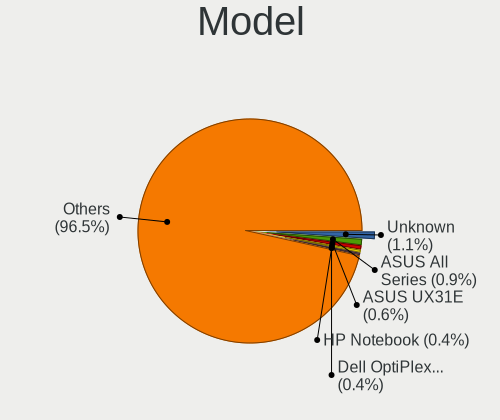
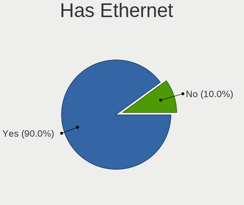
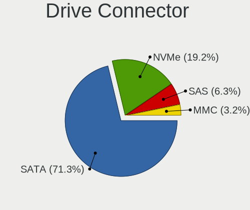
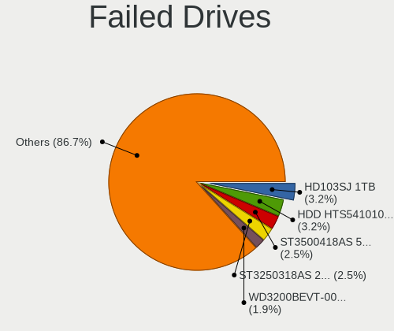

OpenMandriva - Tested Hardware & Statistics
-------------------------------------------

A project to collect tested hardware configurations for OpenMandriva.

Anyone can contribute to this report by the [hw-probe](https://github.com/linuxhw/hw-probe) tool:

    sudo -E hw-probe -all -upload

Please contribute! Especially if your hardware is rare.

This is a report for all computer types. See also reports for [desktops](/Dist/OpenMandriva/Desktop/README.md) and [notebooks](/Dist/OpenMandriva/Notebook/README.md).

Contents
--------

* [ Test Cases ](#test-cases)

* [ System ](#system)
  - [ OS                       ](#os)
  - [ OS Family                ](#os-family)
  - [ Kernel                   ](#kernel)
  - [ Kernel Family            ](#kernel-family)
  - [ Kernel Major Ver.        ](#kernel-major-ver)
  - [ Arch                     ](#arch)
  - [ DE                       ](#de)
  - [ Display Server           ](#display-server)
  - [ Display Manager          ](#display-manager)
  - [ OS Lang                  ](#os-lang)
  - [ Boot Mode                ](#boot-mode)
  - [ Filesystem               ](#filesystem)
  - [ Part. scheme             ](#part-scheme)
  - [ Dual Boot with Linux/BSD ](#dual-boot-with-linuxbsd)
  - [ Dual Boot (Win)          ](#dual-boot-win)

* [ Board ](#board)
  - [ Vendor                   ](#vendor)
  - [ Model                    ](#model)
  - [ Model Family             ](#model-family)
  - [ MFG Year                 ](#mfg-year)
  - [ Form Factor              ](#form-factor)
  - [ Secure Boot              ](#secure-boot)
  - [ Coreboot                 ](#coreboot)
  - [ RAM Size                 ](#ram-size)
  - [ RAM Used                 ](#ram-used)
  - [ Total Drives             ](#total-drives)
  - [ Has CD-ROM               ](#has-cd-rom)
  - [ Has Ethernet             ](#has-ethernet)
  - [ Has WiFi                 ](#has-wifi)
  - [ Has Bluetooth            ](#has-bluetooth)

* [ Location ](#location)
  - [ Country                  ](#country)
  - [ City                     ](#city)

* [ Drives ](#drives)
  - [ Drive Vendor             ](#drive-vendor)
  - [ Drive Model              ](#drive-model)
  - [ HDD Vendor               ](#hdd-vendor)
  - [ SSD Vendor               ](#ssd-vendor)
  - [ Drive Kind               ](#drive-kind)
  - [ Drive Connector          ](#drive-connector)
  - [ Drive Size               ](#drive-size)
  - [ Space Total              ](#space-total)
  - [ Space Used               ](#space-used)
  - [ Malfunc. Drives          ](#malfunc-drives)
  - [ Malfunc. Drive Vendor    ](#malfunc-drive-vendor)
  - [ Malfunc. HDD Vendor      ](#malfunc-hdd-vendor)
  - [ Malfunc. Drive Kind      ](#malfunc-drive-kind)
  - [ Failed Drives            ](#failed-drives)
  - [ Failed Drive Vendor      ](#failed-drive-vendor)
  - [ Drive Status             ](#drive-status)

* [ Storage controller ](#storage-controller)
  - [ Storage Vendor           ](#storage-vendor)
  - [ Storage Model            ](#storage-model)
  - [ Storage Kind             ](#storage-kind)

* [ Processor ](#processor)
  - [ CPU Vendor               ](#cpu-vendor)
  - [ CPU Model                ](#cpu-model)
  - [ CPU Model Family         ](#cpu-model-family)
  - [ CPU Cores                ](#cpu-cores)
  - [ CPU Sockets              ](#cpu-sockets)
  - [ CPU Threads              ](#cpu-threads)
  - [ CPU Op-Modes             ](#cpu-op-modes)
  - [ CPU Microcode            ](#cpu-microcode)
  - [ CPU Microarch            ](#cpu-microarch)

* [ Graphics ](#graphics)
  - [ GPU Vendor               ](#gpu-vendor)
  - [ GPU Model                ](#gpu-model)
  - [ GPU Combo                ](#gpu-combo)
  - [ GPU Driver               ](#gpu-driver)
  - [ GPU Memory               ](#gpu-memory)

* [ Monitor ](#monitor)
  - [ Monitor Vendor           ](#monitor-vendor)
  - [ Monitor Model            ](#monitor-model)
  - [ Monitor Resolution       ](#monitor-resolution)
  - [ Monitor Diagonal         ](#monitor-diagonal)
  - [ Monitor Width            ](#monitor-width)
  - [ Aspect Ratio             ](#aspect-ratio)
  - [ Monitor Area             ](#monitor-area)
  - [ Pixel Density            ](#pixel-density)
  - [ Multiple Monitors        ](#multiple-monitors)

* [ Network ](#network)
  - [ Net Controller Vendor    ](#net-controller-vendor)
  - [ Net Controller Model     ](#net-controller-model)
  - [ Wireless Vendor          ](#wireless-vendor)
  - [ Wireless Model           ](#wireless-model)
  - [ Ethernet Vendor          ](#ethernet-vendor)
  - [ Ethernet Model           ](#ethernet-model)
  - [ Net Controller Kind      ](#net-controller-kind)
  - [ Used Controller          ](#used-controller)
  - [ NICs                     ](#nics)
  - [ IPv6                     ](#ipv6)

* [ Bluetooth ](#bluetooth)
  - [ Bluetooth Vendor         ](#bluetooth-vendor)
  - [ Bluetooth Model          ](#bluetooth-model)

* [ Sound ](#sound)
  - [ Sound Vendor             ](#sound-vendor)
  - [ Sound Model              ](#sound-model)

* [ Memory ](#memory)
  - [ Memory Vendor            ](#memory-vendor)
  - [ Memory Model             ](#memory-model)
  - [ Memory Kind              ](#memory-kind)
  - [ Memory Form Factor       ](#memory-form-factor)
  - [ Memory Size              ](#memory-size)
  - [ Memory Speed             ](#memory-speed)

* [ Printers & scanners ](#printers--scanners)
  - [ Printer Vendor           ](#printer-vendor)
  - [ Printer Model            ](#printer-model)
  - [ Scanner Vendor           ](#scanner-vendor)
  - [ Scanner Model            ](#scanner-model)

* [ Camera ](#camera)
  - [ Camera Vendor            ](#camera-vendor)
  - [ Camera Model             ](#camera-model)

* [ Security ](#security)
  - [ Fingerprint Vendor       ](#fingerprint-vendor)
  - [ Fingerprint Model        ](#fingerprint-model)
  - [ Chipcard Vendor          ](#chipcard-vendor)
  - [ Chipcard Model           ](#chipcard-model)

* [ Unsupported ](#unsupported)
  - [ Unsupported Devices      ](#unsupported-devices)
  - [ Unsupported Device Types ](#unsupported-device-types)

Test Cases
----------

Total: 23100

| Vendor        | Model                       | Form-Factor | Probe                                                      | Date         |
|---------------|-----------------------------|-------------|------------------------------------------------------------|--------------|
| ASUSTek       | VivoBook_ASUSLaptop E410... | Notebook    | [7b12164813](https://linux-hardware.org/?probe=7b12164813) | Jan 06, 2025 |
| ASUSTek       | ROG Strix G712LV_G712LV     | Notebook    | [98506e2506](https://linux-hardware.org/?probe=98506e2506) | Jan 06, 2025 |
| Lenovo        | ThinkPad SL400 2743A48      | Notebook    | [0c0f6ef206](https://linux-hardware.org/?probe=0c0f6ef206) | Jan 06, 2025 |
| Acer          | Aspire A515-52G             | Notebook    | [572616a1d9](https://linux-hardware.org/?probe=572616a1d9) | Jan 06, 2025 |
| Gigabyte      | H81M-D2V                    | Desktop     | [aadc1a0c13](https://linux-hardware.org/?probe=aadc1a0c13) | Jan 06, 2025 |
| Lenovo        | ThinkPad P14s Gen 3 21J5... | Notebook    | [f5e1468f62](https://linux-hardware.org/?probe=f5e1468f62) | Jan 06, 2025 |
| HP            | Laptop 15-bw0xx             | Notebook    | [d4de478530](https://linux-hardware.org/?probe=d4de478530) | Jan 06, 2025 |
| Gigabyte      | GA-MA770T-UD3               | Desktop     | [617c102331](https://linux-hardware.org/?probe=617c102331) | Jan 06, 2025 |
| Acer          | Aspire E5-572G              | Notebook    | [dca3176d13](https://linux-hardware.org/?probe=dca3176d13) | Jan 06, 2025 |
| ASUSTek       | X51RL                       | Notebook    | [526c93f776](https://linux-hardware.org/?probe=526c93f776) | Jan 06, 2025 |
| Dell          | Latitude E7470              | Notebook    | [448c4c5d6e](https://linux-hardware.org/?probe=448c4c5d6e) | Jan 06, 2025 |
| MSI           | Katana 17 B12UCR            | Notebook    | [9a04090ded](https://linux-hardware.org/?probe=9a04090ded) | Jan 06, 2025 |
| MSI           | B75IA-E33                   | Desktop     | [f12ded84f2](https://linux-hardware.org/?probe=f12ded84f2) | Jan 06, 2025 |
| HP            | ProBook 455 G8 Notebook ... | Notebook    | [963fcdd477](https://linux-hardware.org/?probe=963fcdd477) | Jan 06, 2025 |
| Lenovo        | IdeaPad MIIX 700-12ISK 8... | Notebook    | [0cf3ed40e6](https://linux-hardware.org/?probe=0cf3ed40e6) | Jan 06, 2025 |
| ASUSTek       | PRIME H510M-K R2.0          | Desktop     | [5fb39d6837](https://linux-hardware.org/?probe=5fb39d6837) | Jan 06, 2025 |
| Apple         | Mac-F4238CC8 PVT            | All in one  | [a532955db4](https://linux-hardware.org/?probe=a532955db4) | Jan 06, 2025 |
| Dell          | OptiPlex 745                | Desktop     | [578cc6d8f1](https://linux-hardware.org/?probe=578cc6d8f1) | Jan 06, 2025 |
| Lenovo        | V15 G4 IAH 83FS             | Notebook    | [54ea7cdde8](https://linux-hardware.org/?probe=54ea7cdde8) | Jan 06, 2025 |
| Dell          | Latitude 7280               | Notebook    | [58eef8f0dd](https://linux-hardware.org/?probe=58eef8f0dd) | Jan 06, 2025 |
| ASUSTek       | K30BF_M32BF_A_F_K31BF_6     | Desktop     | [0b29006a62](https://linux-hardware.org/?probe=0b29006a62) | Jan 06, 2025 |
| Gigabyte      | GA-78LMT-S2                 | Desktop     | [5321bb65b1](https://linux-hardware.org/?probe=5321bb65b1) | Jan 06, 2025 |
| Acer          | Aspire E1-572               | Notebook    | [e825292593](https://linux-hardware.org/?probe=e825292593) | Jan 06, 2025 |
| MAXSUN        | MS-A86FX FS M.3             | Desktop     | [778b3689c2](https://linux-hardware.org/?probe=778b3689c2) | Jan 05, 2025 |
| Dell          | Inspiron 15-3567            | Notebook    | [c661f75c0f](https://linux-hardware.org/?probe=c661f75c0f) | Jan 05, 2025 |
| Gigabyte      | GA-970A-D3                  | Desktop     | [cd33aa866c](https://linux-hardware.org/?probe=cd33aa866c) | Jan 05, 2025 |
| HP            | EliteBook 8570w             | Notebook    | [0b6fedb6c2](https://linux-hardware.org/?probe=0b6fedb6c2) | Jan 05, 2025 |
| HP            | 2215                        | Desktop     | [d4d1a7ad27](https://linux-hardware.org/?probe=d4d1a7ad27) | Jan 05, 2025 |
| Lenovo        | 0x36C017AA SDK0J40700 WI... | Desktop     | [75606d7596](https://linux-hardware.org/?probe=75606d7596) | Jan 05, 2025 |
| MSI           | B450M MORTAR MAX            | Desktop     | [46e01ddb23](https://linux-hardware.org/?probe=46e01ddb23) | Jan 05, 2025 |
| Unknown       | Unknown                     | Desktop     | [fa69a9bfbc](https://linux-hardware.org/?probe=fa69a9bfbc) | Jan 05, 2025 |
| HP            | 3029h                       | Desktop     | [e46ab5ac4b](https://linux-hardware.org/?probe=e46ab5ac4b) | Jan 05, 2025 |
| Dell          | Latitude D630               | Notebook    | [2c3411042a](https://linux-hardware.org/?probe=2c3411042a) | Jan 05, 2025 |
| Acer          | Aspire ES1-731              | Notebook    | [721fdec99d](https://linux-hardware.org/?probe=721fdec99d) | Jan 05, 2025 |
| Pegatron      | NARRA5                      | Desktop     | [350baa0b67](https://linux-hardware.org/?probe=350baa0b67) | Jan 05, 2025 |
| HP            | ENVY x360 2-in-1 Laptop ... | Convertible | [c50fb15ade](https://linux-hardware.org/?probe=c50fb15ade) | Jan 05, 2025 |
| Dell          | 0XHYJF A00                  | All in one  | [1f361b3518](https://linux-hardware.org/?probe=1f361b3518) | Jan 05, 2025 |
| Gigabyte      | B560M AORUS PRO             | Desktop     | [f43945b8dd](https://linux-hardware.org/?probe=f43945b8dd) | Jan 05, 2025 |
| Dell          | Latitude E4200              | Notebook    | [db5dcaf33b](https://linux-hardware.org/?probe=db5dcaf33b) | Jan 05, 2025 |
| Dell          | 0HD5W2 A00                  | Desktop     | [a6858e47c5](https://linux-hardware.org/?probe=a6858e47c5) | Jan 05, 2025 |
| HP            | EliteBook 8460p             | Notebook    | [0a8d680cf0](https://linux-hardware.org/?probe=0a8d680cf0) | Jan 05, 2025 |
| Dell          | 01Y1CJ A00                  | Mini pc     | [79856fbf5b](https://linux-hardware.org/?probe=79856fbf5b) | Jan 05, 2025 |
| Dell          | Precision M4400             | Notebook    | [6d8da5ac74](https://linux-hardware.org/?probe=6d8da5ac74) | Jan 05, 2025 |
| Panasonic     | CF-NX2AWLCS                 | Notebook    | [e3ead6c710](https://linux-hardware.org/?probe=e3ead6c710) | Jan 05, 2025 |
| HP            | 3397                        | Desktop     | [95cc9c1997](https://linux-hardware.org/?probe=95cc9c1997) | Jan 05, 2025 |
| Gigabyte      | GA-MA785GMT-UD2H            | Desktop     | [7808d0395e](https://linux-hardware.org/?probe=7808d0395e) | Jan 05, 2025 |
| Dell          | Inspiron 7573               | Convertible | [862a11d024](https://linux-hardware.org/?probe=862a11d024) | Jan 04, 2025 |
| ASUSTek       | PRIME B450M-K II            | Desktop     | [cf7d50fae1](https://linux-hardware.org/?probe=cf7d50fae1) | Jan 04, 2025 |
| HP            | 255 G6 Notebook PC          | Notebook    | [57b6786860](https://linux-hardware.org/?probe=57b6786860) | Jan 04, 2025 |
| ASUSTek       | Maximus VIII RANGER         | Desktop     | [b536336740](https://linux-hardware.org/?probe=b536336740) | Jan 04, 2025 |
| HP            | 655                         | Notebook    | [e8728549f4](https://linux-hardware.org/?probe=e8728549f4) | Jan 04, 2025 |
| Lenovo        | V15 G4 IRU 83A1             | Notebook    | [c4a6747552](https://linux-hardware.org/?probe=c4a6747552) | Jan 04, 2025 |
| Gigabyte      | 965GM-S2                    | Desktop     | [7d033b5974](https://linux-hardware.org/?probe=7d033b5974) | Jan 04, 2025 |
| MSI           | Z77A-G45 Thunderbolt        | Desktop     | [63dfc9cc1f](https://linux-hardware.org/?probe=63dfc9cc1f) | Jan 04, 2025 |
| HP            | 15                          | Notebook    | [d95bba2430](https://linux-hardware.org/?probe=d95bba2430) | Jan 04, 2025 |
| Lenovo        | IdeaPad U450p 3389          | Notebook    | [c01ce6e337](https://linux-hardware.org/?probe=c01ce6e337) | Jan 04, 2025 |
| Lenovo        | NOK                         | Desktop     | [2b5c2e2c8a](https://linux-hardware.org/?probe=2b5c2e2c8a) | Jan 04, 2025 |
| Dell          | Latitude 5310 2-in-1        | Convertible | [6fd5c30874](https://linux-hardware.org/?probe=6fd5c30874) | Jan 04, 2025 |
| Dell          | Latitude E4310              | Notebook    | [68eec2c60e](https://linux-hardware.org/?probe=68eec2c60e) | Jan 04, 2025 |
| HC Technol... | HCAR5000-MI                 | Desktop     | [bbe1844c1c](https://linux-hardware.org/?probe=bbe1844c1c) | Jan 04, 2025 |
| Dell          | 040DDP A01                  | Desktop     | [63dc37783d](https://linux-hardware.org/?probe=63dc37783d) | Jan 04, 2025 |
| Gigabyte      | G41M-ES2L                   | Desktop     | [60cf453df6](https://linux-hardware.org/?probe=60cf453df6) | Jan 04, 2025 |
| Lenovo        | SHARKBAY 31900058 STD       | Desktop     | [3a2c8d629f](https://linux-hardware.org/?probe=3a2c8d629f) | Jan 04, 2025 |
| ASUSTek       | VivoBook E14 E402WAS        | Notebook    | [208b3336eb](https://linux-hardware.org/?probe=208b3336eb) | Jan 04, 2025 |
| ASUSTek       | VivoBook_ASUSLaptop X160... | Notebook    | [59a8c42150](https://linux-hardware.org/?probe=59a8c42150) | Jan 04, 2025 |
| MSI           | Summit E13FlipEvo A12MT     | Notebook    | [642730a80d](https://linux-hardware.org/?probe=642730a80d) | Jan 04, 2025 |
| MSI           | A55M-E33                    | Desktop     | [491adf615a](https://linux-hardware.org/?probe=491adf615a) | Jan 04, 2025 |
| Lenovo        | 3141 SDK0J40697 WIN 3305... | Desktop     | [aeee08efea](https://linux-hardware.org/?probe=aeee08efea) | Jan 04, 2025 |
| Dell          | 0WMJ54 A01                  | Desktop     | [966f8de937](https://linux-hardware.org/?probe=966f8de937) | Jan 03, 2025 |
| HP            | EliteBook x360 1030 G4      | Convertible | [94936f9666](https://linux-hardware.org/?probe=94936f9666) | Jan 03, 2025 |
| HP            | 339A                        | Desktop     | [7fc68e979e](https://linux-hardware.org/?probe=7fc68e979e) | Jan 03, 2025 |
| HP            | Laptop 15-fd0xxx            | Notebook    | [dfd9d16913](https://linux-hardware.org/?probe=dfd9d16913) | Jan 03, 2025 |
| Medion        | E11201                      | Notebook    | [141200df83](https://linux-hardware.org/?probe=141200df83) | Jan 03, 2025 |
| AZW           | SER V2.0                    | Mini pc     | [68a8804c89](https://linux-hardware.org/?probe=68a8804c89) | Jan 03, 2025 |
| ASUSTek       | PRIME Z270M-PLUS            | Desktop     | [32db9391d7](https://linux-hardware.org/?probe=32db9391d7) | Jan 03, 2025 |
| Dell          | 0GY6Y8 A03                  | Desktop     | [734e205226](https://linux-hardware.org/?probe=734e205226) | Jan 03, 2025 |
| HP            | ProBook 640 G1              | Notebook    | [f901f7b9aa](https://linux-hardware.org/?probe=f901f7b9aa) | Jan 03, 2025 |
| Gigabyte      | G31M-S2L                    | Desktop     | [c04f5f8431](https://linux-hardware.org/?probe=c04f5f8431) | Jan 03, 2025 |
| ASUSTek       | Q550LF                      | Notebook    | [c587210fdb](https://linux-hardware.org/?probe=c587210fdb) | Jan 03, 2025 |
| Lenovo        | MAHOBAY NOK                 | Desktop     | [ed9753dfcf](https://linux-hardware.org/?probe=ed9753dfcf) | Jan 03, 2025 |
| Acer          | Extensa 5630                | Notebook    | [1bb020a4af](https://linux-hardware.org/?probe=1bb020a4af) | Jan 03, 2025 |
| MSI           | PRO B760M-E DDR4            | Desktop     | [4768eb71cc](https://linux-hardware.org/?probe=4768eb71cc) | Jan 03, 2025 |
| Dell          | 0TWFTR A02                  | All in one  | [9352e7ed07](https://linux-hardware.org/?probe=9352e7ed07) | Jan 03, 2025 |
| Sony          | VPCF236FM                   | Notebook    | [1c0abb00b2](https://linux-hardware.org/?probe=1c0abb00b2) | Jan 03, 2025 |
| Dell          | Latitude D630               | Notebook    | [3b6bae784e](https://linux-hardware.org/?probe=3b6bae784e) | Jan 03, 2025 |
| Dell          | Latitude 5300               | Notebook    | [d3d6e520f5](https://linux-hardware.org/?probe=d3d6e520f5) | Jan 03, 2025 |
| Lenovo        | IdeaPadFlex 5 14IAU7 82R... | Convertible | [779fdc8ded](https://linux-hardware.org/?probe=779fdc8ded) | Jan 03, 2025 |
| Intel         | DQ67SW AAG12527-310         | Desktop     | [a4c7be2f1a](https://linux-hardware.org/?probe=a4c7be2f1a) | Jan 03, 2025 |
| Gigabyte      | GA-78LMT-S2                 | Desktop     | [cf902d875a](https://linux-hardware.org/?probe=cf902d875a) | Jan 03, 2025 |
| Microsoft     | Surface Pro 9               | Tablet      | [e6f037a5e8](https://linux-hardware.org/?probe=e6f037a5e8) | Jan 03, 2025 |
| Gigabyte      | H81M-S2H                    | Desktop     | [6a06903b4a](https://linux-hardware.org/?probe=6a06903b4a) | Jan 03, 2025 |
| Intel         | H55                         | Desktop     | [aada843724](https://linux-hardware.org/?probe=aada843724) | Jan 03, 2025 |
| Microsoft     | Surface Pro 4               | Tablet      | [01d92157cd](https://linux-hardware.org/?probe=01d92157cd) | Jan 03, 2025 |
| HP            | ENVY x360 m6 Convertible    | Convertible | [d6acb3ff97](https://linux-hardware.org/?probe=d6acb3ff97) | Jan 03, 2025 |
| AZW           | MINI S                      | Desktop     | [2067c73351](https://linux-hardware.org/?probe=2067c73351) | Jan 03, 2025 |
| Gigabyte      | F2A88XM-D3H                 | Desktop     | [0af9e3885f](https://linux-hardware.org/?probe=0af9e3885f) | Jan 02, 2025 |
| ASUSTek       | PRIME B550M-A WIFI II       | Desktop     | [5a6a67b7a4](https://linux-hardware.org/?probe=5a6a67b7a4) | Jan 02, 2025 |
| HP            | 250 G8 Notebook PC          | Notebook    | [d5b66faf28](https://linux-hardware.org/?probe=d5b66faf28) | Jan 02, 2025 |
| Dell          | Latitude E6430              | Notebook    | [860e215daf](https://linux-hardware.org/?probe=860e215daf) | Jan 02, 2025 |
| Microsoft     | Surface Go                  | Tablet      | [9d75fa5900](https://linux-hardware.org/?probe=9d75fa5900) | Jan 02, 2025 |
| AZW           | GK mini                     | Desktop     | [3d87931055](https://linux-hardware.org/?probe=3d87931055) | Jan 02, 2025 |
| Lenovo        | ThinkPad L470 20J4000LMD    | Notebook    | [e2fa70f2b4](https://linux-hardware.org/?probe=e2fa70f2b4) | Jan 02, 2025 |
| Dell          | 0HD5W2 A00                  | Desktop     | [abbdbd898d](https://linux-hardware.org/?probe=abbdbd898d) | Jan 02, 2025 |
| Lenovo        | IdeaPad 700-15ISK 80RU      | Notebook    | [b26f854f97](https://linux-hardware.org/?probe=b26f854f97) | Jan 02, 2025 |
| HP            | 83E9                        | Desktop     | [ee42824c61](https://linux-hardware.org/?probe=ee42824c61) | Jan 02, 2025 |
| MSI           | MEG Z790 ACE                | Desktop     | [7479e71d41](https://linux-hardware.org/?probe=7479e71d41) | Jan 02, 2025 |
| Fujitsu       | LIFEBOOK A3510              | Notebook    | [fd4e4972d2](https://linux-hardware.org/?probe=fd4e4972d2) | Jan 02, 2025 |
| Dell          | Inspiron 1545               | Notebook    | [445120281e](https://linux-hardware.org/?probe=445120281e) | Jan 02, 2025 |
| HP            | 0A9Ch                       | Desktop     | [d05c412a3b](https://linux-hardware.org/?probe=d05c412a3b) | Jan 02, 2025 |
| Lenovo        | IdeaPad 3 15IML05 81WB      | Notebook    | [f5cc6f8958](https://linux-hardware.org/?probe=f5cc6f8958) | Jan 02, 2025 |
| ASUSTek       | CM6330_CM6630_CM6730_CM6... | Desktop     | [e6075adfc0](https://linux-hardware.org/?probe=e6075adfc0) | Jan 02, 2025 |
| ASUSTek       | Z170-E                      | Desktop     | [42888378d7](https://linux-hardware.org/?probe=42888378d7) | Jan 02, 2025 |
| Lenovo        | ThinkPad W520 428426U       | Notebook    | [a7aa110e08](https://linux-hardware.org/?probe=a7aa110e08) | Jan 02, 2025 |
| MSI           | X370 GAMING PRO CARBON      | Desktop     | [bb70ef7a51](https://linux-hardware.org/?probe=bb70ef7a51) | Jan 02, 2025 |
| Gigabyte      | B365M DS3H                  | Desktop     | [a49fde4df3](https://linux-hardware.org/?probe=a49fde4df3) | Jan 02, 2025 |
| Lenovo        | IdeaPad Pro 5 16IMH9 83D... | Notebook    | [bb4860483d](https://linux-hardware.org/?probe=bb4860483d) | Jan 02, 2025 |
| HP            | OMEN by Laptop              | Notebook    | [319fc5e92e](https://linux-hardware.org/?probe=319fc5e92e) | Jan 02, 2025 |
| Dell          | Inspiron 15-3565            | Notebook    | [27354f28ea](https://linux-hardware.org/?probe=27354f28ea) | Jan 02, 2025 |
| Casper        | EXCALIBUR G770              | Notebook    | [1f3dee2cf2](https://linux-hardware.org/?probe=1f3dee2cf2) | Jan 02, 2025 |
| HP            | Pavilion 17                 | Notebook    | [fc1f326456](https://linux-hardware.org/?probe=fc1f326456) | Jan 02, 2025 |
| Lenovo        | ThinkPad X1 Carbon Gen 1... | Notebook    | [ae6fbefd79](https://linux-hardware.org/?probe=ae6fbefd79) | Jan 01, 2025 |
| Unknown       | X99-D3                      | Desktop     | [d79cb549a8](https://linux-hardware.org/?probe=d79cb549a8) | Jan 01, 2025 |
| ASUSTek       | UL80VT                      | Notebook    | [51fb360728](https://linux-hardware.org/?probe=51fb360728) | Jan 01, 2025 |
| HP            | EliteBook 840 G1            | Notebook    | [f298c84729](https://linux-hardware.org/?probe=f298c84729) | Jan 01, 2025 |
| Dell          | Latitude 7390               | Notebook    | [ca0c827c18](https://linux-hardware.org/?probe=ca0c827c18) | Jan 01, 2025 |
| Lenovo        | IdeaCentre A700 10050       | Notebook    | [e7f468af21](https://linux-hardware.org/?probe=e7f468af21) | Jan 01, 2025 |
| HP            | G72                         | Notebook    | [376d1a0575](https://linux-hardware.org/?probe=376d1a0575) | Jan 01, 2025 |
| Acer          | Aspire 5750                 | Notebook    | [879127efc6](https://linux-hardware.org/?probe=879127efc6) | Jan 01, 2025 |
| Acer          | Aspire 8951G                | Notebook    | [238300d1c0](https://linux-hardware.org/?probe=238300d1c0) | Jan 01, 2025 |
| Dell          | Inspiron 13-5368            | Notebook    | [bc5f8753e8](https://linux-hardware.org/?probe=bc5f8753e8) | Jan 01, 2025 |
| Dell          | Latitude E5550              | Notebook    | [618acec11b](https://linux-hardware.org/?probe=618acec11b) | Jan 01, 2025 |
| HP            | Laptop 14z-em000            | Notebook    | [0c43124a84](https://linux-hardware.org/?probe=0c43124a84) | Jan 01, 2025 |
| Gigabyte      | GA-MA785GT-UD3H             | Desktop     | [bf30d86827](https://linux-hardware.org/?probe=bf30d86827) | Jan 01, 2025 |
| Lenovo        | ThinkPad X1 Carbon 34484... | Notebook    | [3fc4858681](https://linux-hardware.org/?probe=3fc4858681) | Jan 01, 2025 |
| HP            | 0A5Ch                       | Desktop     | [46198b0dea](https://linux-hardware.org/?probe=46198b0dea) | Jan 01, 2025 |
| Shenzhen D... | MP100                       | Desktop     | [032508f9fd](https://linux-hardware.org/?probe=032508f9fd) | Jan 01, 2025 |
| Dell          | Vostro 3558                 | Notebook    | [4f78b23a1f](https://linux-hardware.org/?probe=4f78b23a1f) | Jan 01, 2025 |
| Dell          | 02YYK5 A01                  | Desktop     | [97f04c0b58](https://linux-hardware.org/?probe=97f04c0b58) | Jan 01, 2025 |
| Dell          | Latitude E7470              | Notebook    | [b4c31f2860](https://linux-hardware.org/?probe=b4c31f2860) | Jan 01, 2025 |
| Samsung       | 770Z5E/780Z5E               | Notebook    | [1643aef813](https://linux-hardware.org/?probe=1643aef813) | Jan 01, 2025 |
| Acer          | Predator PH315-53           | Notebook    | [17816e7d6b](https://linux-hardware.org/?probe=17816e7d6b) | Jan 01, 2025 |
| HP            | Pavilion Gaming Laptop 1... | Notebook    | [38accd1b79](https://linux-hardware.org/?probe=38accd1b79) | Jan 01, 2025 |
| Dell          | Latitude 3340               | Notebook    | [b22cafbc3b](https://linux-hardware.org/?probe=b22cafbc3b) | Jan 01, 2025 |
| HP            | Pavilion dv6                | Notebook    | [1c73ddb1c0](https://linux-hardware.org/?probe=1c73ddb1c0) | Jan 01, 2025 |
| ASUSTek       | PRIME A520M-A II            | Desktop     | [dc2bdc4245](https://linux-hardware.org/?probe=dc2bdc4245) | Jan 01, 2025 |
| Lenovo        | ThinkPad E570 20H5CTO1WW    | Notebook    | [ae328090f7](https://linux-hardware.org/?probe=ae328090f7) | Jan 01, 2025 |
| Lenovo        | ThinkPad T510 4313A11       | Notebook    | [ecf4a20d48](https://linux-hardware.org/?probe=ecf4a20d48) | Jan 01, 2025 |
| Gigabyte      | X570 AORUS PRO              | Desktop     | [9ad161a45a](https://linux-hardware.org/?probe=9ad161a45a) | Jan 01, 2025 |
| HP            | ENVY Notebook               | Notebook    | [b6d4605e3e](https://linux-hardware.org/?probe=b6d4605e3e) | Jan 01, 2025 |
| Dell          | 0NW73C A00                  | Desktop     | [3dfa88f059](https://linux-hardware.org/?probe=3dfa88f059) | Jan 01, 2025 |
| Dell          | 00V62H A01                  | Desktop     | [0133ba1278](https://linux-hardware.org/?probe=0133ba1278) | Jan 01, 2025 |
| SZMZ          | X99-S3                      | Desktop     | [f20bda8c75](https://linux-hardware.org/?probe=f20bda8c75) | Jan 01, 2025 |
| Lenovo        | ThinkPad T430 2349SVA       | Notebook    | [654dbcabab](https://linux-hardware.org/?probe=654dbcabab) | Jan 01, 2025 |
| Dell          | Inspiron 3542               | Notebook    | [95006e65be](https://linux-hardware.org/?probe=95006e65be) | Jan 01, 2025 |
| Dell          | Latitude 7390               | Notebook    | [1328b0b059](https://linux-hardware.org/?probe=1328b0b059) | Jan 01, 2025 |
| HP            | Laptop 14z-em000            | Notebook    | [2b45c6c699](https://linux-hardware.org/?probe=2b45c6c699) | Jan 01, 2025 |
| HP            | 2AF3                        | Desktop     | [27a5a9b662](https://linux-hardware.org/?probe=27a5a9b662) | Jan 01, 2025 |
| ASUSTek       | ROG STRIX B350-F GAMING     | Desktop     | [034de44629](https://linux-hardware.org/?probe=034de44629) | Jan 01, 2025 |
| Microsoft     | Surface Pro 2               | Tablet      | [964f81a59e](https://linux-hardware.org/?probe=964f81a59e) | Jan 01, 2025 |
| Gigabyte      | X470 AORUS ULTRA GAMING-... | Desktop     | [31b95986eb](https://linux-hardware.org/?probe=31b95986eb) | Jan 01, 2025 |
| ASUSTek       | P5Q SE PLUS                 | Desktop     | [2e5a12a36b](https://linux-hardware.org/?probe=2e5a12a36b) | Jan 01, 2025 |
| Dell          | Latitude 7390 2-in-1        | Notebook    | [0837722dea](https://linux-hardware.org/?probe=0837722dea) | Jan 01, 2025 |
| ASUSTek       | A68HM-K                     | Desktop     | [800e2716b1](https://linux-hardware.org/?probe=800e2716b1) | Jan 01, 2025 |
| Foxconn       | 2AB1                        | Desktop     | [d937af7e89](https://linux-hardware.org/?probe=d937af7e89) | Jan 01, 2025 |
| Acer          | Aspire 5742                 | Notebook    | [aa9170d15a](https://linux-hardware.org/?probe=aa9170d15a) | Dec 31, 2024 |
| ASUSTek       | P8Z77-V LX                  | Desktop     | [69679c9a35](https://linux-hardware.org/?probe=69679c9a35) | Dec 31, 2024 |
| Gigabyte      | H81M-S2PH                   | Desktop     | [8e18f9641a](https://linux-hardware.org/?probe=8e18f9641a) | Dec 31, 2024 |
| Toshiba       | Satellite P755              | Notebook    | [919f9d689c](https://linux-hardware.org/?probe=919f9d689c) | Dec 31, 2024 |
| Dell          | 0Y5DDC A00                  | Desktop     | [54403714c3](https://linux-hardware.org/?probe=54403714c3) | Dec 31, 2024 |
| HP            | 3032h                       | Desktop     | [fb4af81907](https://linux-hardware.org/?probe=fb4af81907) | Dec 31, 2024 |
| Lenovo        | 371C SDK0J40709 WIN 3259... | All in one  | [e1b1540113](https://linux-hardware.org/?probe=e1b1540113) | Dec 31, 2024 |
| Lenovo        | Yoga 2 13 20344             | Notebook    | [1be4064009](https://linux-hardware.org/?probe=1be4064009) | Dec 31, 2024 |
| Samsung       | 300E4A/300E5A/300E7A/343... | Notebook    | [c66eaf3382](https://linux-hardware.org/?probe=c66eaf3382) | Dec 31, 2024 |
| ASUSTek       | PRIME B450M-K               | Desktop     | [4cb02f7ced](https://linux-hardware.org/?probe=4cb02f7ced) | Dec 31, 2024 |
| Gigabyte      | GA-MA770-DS3                | Desktop     | [d18eb4cf0d](https://linux-hardware.org/?probe=d18eb4cf0d) | Dec 31, 2024 |
| ASRock        | B450M-HDV R4.0              | Desktop     | [c996300bbf](https://linux-hardware.org/?probe=c996300bbf) | Dec 31, 2024 |
| Lenovo        | Yoga 720-12IKB 81B5         | Convertible | [9bee2dc1eb](https://linux-hardware.org/?probe=9bee2dc1eb) | Dec 31, 2024 |
| Lenovo        | IdeaPad Slim 1-14AST-05 ... | Notebook    | [0850762b48](https://linux-hardware.org/?probe=0850762b48) | Dec 31, 2024 |
| HP            | ProBook 440 14 inch G9 N... | Notebook    | [2127fd790b](https://linux-hardware.org/?probe=2127fd790b) | Dec 31, 2024 |
| ASUSTek       | X556UR                      | Notebook    | [8550e720af](https://linux-hardware.org/?probe=8550e720af) | Dec 31, 2024 |
| Lenovo        | 36EB SDK0J40700 WIN 3258... | Desktop     | [e0e1513ce6](https://linux-hardware.org/?probe=e0e1513ce6) | Dec 31, 2024 |
| HP            | 802F                        | Desktop     | [5c6293b2ab](https://linux-hardware.org/?probe=5c6293b2ab) | Dec 31, 2024 |
| HP            | 250 15.6 inch G10           | Notebook    | [94fdf69690](https://linux-hardware.org/?probe=94fdf69690) | Dec 31, 2024 |
| Dell          | Latitude E7440              | Notebook    | [2d9f729ec1](https://linux-hardware.org/?probe=2d9f729ec1) | Dec 31, 2024 |
| HP            | ProBook 6560b               | Notebook    | [c2ae1365c2](https://linux-hardware.org/?probe=c2ae1365c2) | Dec 31, 2024 |
| Toshiba       | Satellite P200              | Notebook    | [a07857c808](https://linux-hardware.org/?probe=a07857c808) | Dec 31, 2024 |
| Toshiba       | Satellite L300              | Notebook    | [3104c13f02](https://linux-hardware.org/?probe=3104c13f02) | Dec 31, 2024 |
| ASUSTek       | PRIME X570-P                | Desktop     | [3556a38021](https://linux-hardware.org/?probe=3556a38021) | Dec 31, 2024 |
| HP            | Pavilion 13                 | Notebook    | [fece21c1ee](https://linux-hardware.org/?probe=fece21c1ee) | Dec 31, 2024 |
| HP            | EliteBook 840 G3            | Notebook    | [f1bc5970f8](https://linux-hardware.org/?probe=f1bc5970f8) | Dec 31, 2024 |
| Lenovo        | Legion Pro 5 16IRX8 82WK    | Notebook    | [b86a475528](https://linux-hardware.org/?probe=b86a475528) | Dec 31, 2024 |
| Dell          | Latitude E6220              | Notebook    | [b93b3b88d1](https://linux-hardware.org/?probe=b93b3b88d1) | Dec 31, 2024 |
| Lenovo        | MAHOBAY                     | Desktop     | [3e28e8ad9e](https://linux-hardware.org/?probe=3e28e8ad9e) | Dec 31, 2024 |
| Lenovo        | G470 20078                  | Notebook    | [9d15c84512](https://linux-hardware.org/?probe=9d15c84512) | Dec 31, 2024 |
| Lenovo        | B560 43308LG                | Notebook    | [e4f739103a](https://linux-hardware.org/?probe=e4f739103a) | Dec 31, 2024 |
| HP            | Laptop 14-cm0xxx            | Notebook    | [045aa245db](https://linux-hardware.org/?probe=045aa245db) | Dec 31, 2024 |
| HP            | ENVY x360 Convertible 13... | Convertible | [f3519fbd26](https://linux-hardware.org/?probe=f3519fbd26) | Dec 31, 2024 |
| Digiboard     | NM70-TI                     | Desktop     | [1a10dd8daf](https://linux-hardware.org/?probe=1a10dd8daf) | Dec 31, 2024 |
| Acer          | Aspire A315-42              | Notebook    | [734fd13848](https://linux-hardware.org/?probe=734fd13848) | Dec 31, 2024 |
| Google        | Auron_Paine                 | Notebook    | [9603115c16](https://linux-hardware.org/?probe=9603115c16) | Dec 31, 2024 |
| Dell          | Latitude E6420              | Notebook    | [46c2760e4e](https://linux-hardware.org/?probe=46c2760e4e) | Dec 31, 2024 |
| Lenovo        | IdeaPad 1 14IGL7 82V6       | Notebook    | [b30ae21c72](https://linux-hardware.org/?probe=b30ae21c72) | Dec 31, 2024 |
| Acer          | Nitro AN517-54              | Notebook    | [8461425ec1](https://linux-hardware.org/?probe=8461425ec1) | Dec 31, 2024 |
| HUAWEI        | BOHK-WAX9X                  | Notebook    | [3b12d86f3d](https://linux-hardware.org/?probe=3b12d86f3d) | Dec 31, 2024 |
| Shenzhen M... | F6BFC                       | Desktop     | [431235e055](https://linux-hardware.org/?probe=431235e055) | Dec 31, 2024 |
| Intel         | H81                         | Desktop     | [00453f1bb7](https://linux-hardware.org/?probe=00453f1bb7) | Dec 31, 2024 |
| Lenovo        | G460 20041                  | Notebook    | [f5b6aed89d](https://linux-hardware.org/?probe=f5b6aed89d) | Dec 31, 2024 |
| HP            | Victus by Gaming Laptop ... | Notebook    | [9dd96b42dd](https://linux-hardware.org/?probe=9dd96b42dd) | Dec 31, 2024 |
| ASUSTek       | M4A78LT-M-LE                | Desktop     | [65345c7ef4](https://linux-hardware.org/?probe=65345c7ef4) | Dec 31, 2024 |
| HP            | Laptop 15-bw0xx             | Notebook    | [e7e2b59786](https://linux-hardware.org/?probe=e7e2b59786) | Dec 31, 2024 |
| ASUSTek       | X540SA                      | Notebook    | [fffc36417c](https://linux-hardware.org/?probe=fffc36417c) | Dec 31, 2024 |
| ASUSTek       | M5A78L-M LE                 | Desktop     | [35ecdf468a](https://linux-hardware.org/?probe=35ecdf468a) | Dec 31, 2024 |
| Dell          | XPS 13 9350                 | Notebook    | [896eb3972d](https://linux-hardware.org/?probe=896eb3972d) | Dec 31, 2024 |
| Acer          | Aspire ES1-572              | Notebook    | [ab8d0c7c3f](https://linux-hardware.org/?probe=ab8d0c7c3f) | Dec 30, 2024 |
| ASUSTek       | P5G41T-M LX2/GB             | Desktop     | [61c106bd12](https://linux-hardware.org/?probe=61c106bd12) | Dec 30, 2024 |
| Foxconn       | 2ADA                        | Desktop     | [a56fc7e027](https://linux-hardware.org/?probe=a56fc7e027) | Dec 30, 2024 |
| HP            | 8768 A                      | Desktop     | [6a09384c14](https://linux-hardware.org/?probe=6a09384c14) | Dec 30, 2024 |
| Acer          | Aspire E1-571G              | Notebook    | [a589ad91b5](https://linux-hardware.org/?probe=a589ad91b5) | Dec 30, 2024 |
| HP            | 212B                        | Desktop     | [3cb08b6d4f](https://linux-hardware.org/?probe=3cb08b6d4f) | Dec 30, 2024 |
| ASUSTek       | M32CD                       | Desktop     | [a13b639022](https://linux-hardware.org/?probe=a13b639022) | Dec 30, 2024 |
| Lenovo        | Yoga 300-11IBY 80M0         | Notebook    | [63d6d04a10](https://linux-hardware.org/?probe=63d6d04a10) | Dec 30, 2024 |
| Clevo         | W240BL_W250BZ_W270BZQ       | Notebook    | [7da1abb74d](https://linux-hardware.org/?probe=7da1abb74d) | Dec 30, 2024 |
| HP            | ENVY dv6                    | Notebook    | [592cab3725](https://linux-hardware.org/?probe=592cab3725) | Dec 30, 2024 |
| ASUSTek       | P8H61-M LX3 PLUS R2.0       | Desktop     | [529afc68af](https://linux-hardware.org/?probe=529afc68af) | Dec 30, 2024 |
| MSI           | 970A-G46                    | Desktop     | [11df9266e0](https://linux-hardware.org/?probe=11df9266e0) | Dec 30, 2024 |
| HP            | 8054                        | Desktop     | [c48b0d78c7](https://linux-hardware.org/?probe=c48b0d78c7) | Dec 30, 2024 |
| ASRock        | Z68 Extreme4 Gen3           | Desktop     | [9d23a9787e](https://linux-hardware.org/?probe=9d23a9787e) | Dec 30, 2024 |
| Gateway       | DX4860                      | Desktop     | [8fada96b83](https://linux-hardware.org/?probe=8fada96b83) | Dec 30, 2024 |
| Dell          | Vostro 3420                 | Notebook    | [d5a414f6d5](https://linux-hardware.org/?probe=d5a414f6d5) | Dec 30, 2024 |
| ASRock        | B450M Pro4                  | Desktop     | [88b9fab21f](https://linux-hardware.org/?probe=88b9fab21f) | Dec 30, 2024 |
| HP            | 18E7                        | Desktop     | [b0312cea7a](https://linux-hardware.org/?probe=b0312cea7a) | Dec 30, 2024 |
| Acer          | Aspire A515-57              | Notebook    | [d2483d4bb8](https://linux-hardware.org/?probe=d2483d4bb8) | Dec 30, 2024 |
| ASRock        | QC5000-ITX/PH               | Desktop     | [338593f255](https://linux-hardware.org/?probe=338593f255) | Dec 30, 2024 |
| MSI           | MAG B650 TOMAHAWK WIFI      | Desktop     | [e4be1dd2f3](https://linux-hardware.org/?probe=e4be1dd2f3) | Dec 30, 2024 |
| ASRock        | H110M-ITX                   | Desktop     | [c76e007602](https://linux-hardware.org/?probe=c76e007602) | Dec 30, 2024 |
| MSI           | Z97 GAMING 5                | Desktop     | [40b22f7ebe](https://linux-hardware.org/?probe=40b22f7ebe) | Dec 30, 2024 |
| Intel         | E5-A99 V1.0                 | Desktop     | [08bc3d7b5d](https://linux-hardware.org/?probe=08bc3d7b5d) | Dec 30, 2024 |
| ASRock        | 960GC-GS FX                 | Desktop     | [9e60ff1990](https://linux-hardware.org/?probe=9e60ff1990) | Dec 30, 2024 |
| HP            | OMEN by Laptop 15-dc0xxx    | Notebook    | [83d420ab00](https://linux-hardware.org/?probe=83d420ab00) | Dec 30, 2024 |
| MSI           | 990FXA-GD80                 | Desktop     | [8b2f125314](https://linux-hardware.org/?probe=8b2f125314) | Dec 30, 2024 |
| Shenzhen M... | F7BSD                       | Mini pc     | [62c313072f](https://linux-hardware.org/?probe=62c313072f) | Dec 30, 2024 |
| Dell          | 0G261D A00                  | Desktop     | [8fb7d29eda](https://linux-hardware.org/?probe=8fb7d29eda) | Dec 30, 2024 |
| Intel         | H110                        | Desktop     | [e5396f2a33](https://linux-hardware.org/?probe=e5396f2a33) | Dec 30, 2024 |
| ASRock        | FM2A68M-HD+                 | Desktop     | [f2bb2bd6da](https://linux-hardware.org/?probe=f2bb2bd6da) | Dec 30, 2024 |
| Dell          | Latitude 5400               | Notebook    | [b83ec20ffe](https://linux-hardware.org/?probe=b83ec20ffe) | Dec 30, 2024 |
| ASUSTek       | VivoBook_ASUSLaptop X409... | Notebook    | [0831cecc24](https://linux-hardware.org/?probe=0831cecc24) | Dec 30, 2024 |
| Infinix       | Y3 Plus                     | Notebook    | [a5d0c097a5](https://linux-hardware.org/?probe=a5d0c097a5) | Dec 30, 2024 |
| Lenovo        | ThinkCentre M90p 5536P79    | Desktop     | [e13ed7c057](https://linux-hardware.org/?probe=e13ed7c057) | Dec 30, 2024 |
| Lenovo        | ThinkCentre M90 5536W92     | Desktop     | [99cf8555fa](https://linux-hardware.org/?probe=99cf8555fa) | Dec 30, 2024 |
| HP            | 339A                        | Desktop     | [ad1a9035e9](https://linux-hardware.org/?probe=ad1a9035e9) | Dec 30, 2024 |
| HP            | Pavilion x360 Convertibl... | Convertible | [f9daa89a03](https://linux-hardware.org/?probe=f9daa89a03) | Dec 30, 2024 |
| ASUSTek       | ASUS TUF Gaming A16 FA61... | Notebook    | [005152678f](https://linux-hardware.org/?probe=005152678f) | Dec 30, 2024 |
| Medion        | Defender P40                | Notebook    | [04ff586114](https://linux-hardware.org/?probe=04ff586114) | Dec 29, 2024 |
| Gigabyte      | A520M DS3H                  | Desktop     | [a8987243ad](https://linux-hardware.org/?probe=a8987243ad) | Dec 29, 2024 |
| Dell          | XPS 13 9360                 | Notebook    | [4e5b03bfd7](https://linux-hardware.org/?probe=4e5b03bfd7) | Dec 29, 2024 |
| LG Electro... | 17Z90S-G.AD7BA1             | Notebook    | [aaa38e95c5](https://linux-hardware.org/?probe=aaa38e95c5) | Dec 29, 2024 |
| Dell          | 0N4YC8 A00                  | Desktop     | [772d84bc08](https://linux-hardware.org/?probe=772d84bc08) | Dec 29, 2024 |
| HP            | EliteBook 8730w             | Notebook    | [26e363efb2](https://linux-hardware.org/?probe=26e363efb2) | Dec 29, 2024 |
| ASUSTek       | H110M-K                     | Desktop     | [39970498c9](https://linux-hardware.org/?probe=39970498c9) | Dec 29, 2024 |
| AZW           | SER V1.0                    | Mini pc     | [72054648d0](https://linux-hardware.org/?probe=72054648d0) | Dec 29, 2024 |
| Toshiba       | Satellite L755              | Notebook    | [f4e18a27e3](https://linux-hardware.org/?probe=f4e18a27e3) | Dec 29, 2024 |
| ASUSTek       | 1015PN                      | Notebook    | [f84154f736](https://linux-hardware.org/?probe=f84154f736) | Dec 29, 2024 |
| ASUSTek       | VivoBook_ASUSLaptop X712... | Notebook    | [7b7d782202](https://linux-hardware.org/?probe=7b7d782202) | Dec 29, 2024 |
| HP            | EliteBook 840 G5            | Notebook    | [85caa6254a](https://linux-hardware.org/?probe=85caa6254a) | Dec 29, 2024 |
| Lenovo        | ThinkPad T450s 20BWS5F40... | Notebook    | [8bb1dde48e](https://linux-hardware.org/?probe=8bb1dde48e) | Dec 29, 2024 |
| MSI           | H97 PC Mate                 | Desktop     | [28a72759b6](https://linux-hardware.org/?probe=28a72759b6) | Dec 29, 2024 |
| ASUSTek       | SABERTOOTH 990FX            | Desktop     | [3beafb5cad](https://linux-hardware.org/?probe=3beafb5cad) | Dec 29, 2024 |
| MSI           | Z270 TOMAHAWK               | Desktop     | [1ac462bc8e](https://linux-hardware.org/?probe=1ac462bc8e) | Dec 29, 2024 |
| Apple         | MacBookAir6,1               | Notebook    | [3421670edf](https://linux-hardware.org/?probe=3421670edf) | Dec 29, 2024 |
| HP            | Notebook                    | Notebook    | [2fe95580ce](https://linux-hardware.org/?probe=2fe95580ce) | Dec 29, 2024 |
| ASUSTek       | VivoBook_ASUSLaptop X515... | Notebook    | [e9aa37cfcd](https://linux-hardware.org/?probe=e9aa37cfcd) | Dec 29, 2024 |
| ASUSTek       | PRIME A320M-K               | Desktop     | [dae8bf9671](https://linux-hardware.org/?probe=dae8bf9671) | Dec 29, 2024 |
| HP            | Compaq 610                  | Notebook    | [af961e1650](https://linux-hardware.org/?probe=af961e1650) | Dec 29, 2024 |
| Lenovo        | ThinkPad T460 20FMS3320G    | Notebook    | [631f081493](https://linux-hardware.org/?probe=631f081493) | Dec 29, 2024 |
| Lenovo        | ThinkPad T420s 41732AU      | Notebook    | [c9a701f86e](https://linux-hardware.org/?probe=c9a701f86e) | Dec 29, 2024 |
| HP            | 18E8                        | Desktop     | [43e6ef4f34](https://linux-hardware.org/?probe=43e6ef4f34) | Dec 29, 2024 |
| ASRock        | Z75 Pro3                    | Desktop     | [91580064a4](https://linux-hardware.org/?probe=91580064a4) | Dec 29, 2024 |
| HP            | Notebook                    | Notebook    | [4552d837a0](https://linux-hardware.org/?probe=4552d837a0) | Dec 29, 2024 |
| HP            | Pavilion dv4                | Notebook    | [ad6955799f](https://linux-hardware.org/?probe=ad6955799f) | Dec 29, 2024 |
| Gigabyte      | 970A-DS3P                   | Desktop     | [b72ca39acc](https://linux-hardware.org/?probe=b72ca39acc) | Dec 29, 2024 |
| ASUSTek       | SABERTOOTH 990FX            | Desktop     | [a4f0949a45](https://linux-hardware.org/?probe=a4f0949a45) | Dec 29, 2024 |
| Foxconn       | 2ABF                        | Desktop     | [e4568577bd](https://linux-hardware.org/?probe=e4568577bd) | Dec 29, 2024 |
| Acer          | Aspire 5253                 | Notebook    | [8129d03feb](https://linux-hardware.org/?probe=8129d03feb) | Dec 29, 2024 |
| HP            | 805D                        | Desktop     | [1c1e40f526](https://linux-hardware.org/?probe=1c1e40f526) | Dec 28, 2024 |
| HP            | 3397                        | Desktop     | [e063572f7c](https://linux-hardware.org/?probe=e063572f7c) | Dec 28, 2024 |
| ASUSTek       | ZenBook UX334FLC_UX334FL    | Notebook    | [648c9b7e5f](https://linux-hardware.org/?probe=648c9b7e5f) | Dec 28, 2024 |
| Samsung       | 950XDB/951XDB/950XDY        | Notebook    | [7d22efb355](https://linux-hardware.org/?probe=7d22efb355) | Dec 28, 2024 |
| ASRock        | X370M-HDV R4.0              | Desktop     | [b11c18364f](https://linux-hardware.org/?probe=b11c18364f) | Dec 28, 2024 |
| GEEKOM        | Mini IT13                   | Desktop     | [bd2773f098](https://linux-hardware.org/?probe=bd2773f098) | Dec 28, 2024 |
| Lenovo        | B590 20206                  | Notebook    | [f46c163012](https://linux-hardware.org/?probe=f46c163012) | Dec 28, 2024 |
| ASUSTek       | X750JB                      | Notebook    | [c3848bc769](https://linux-hardware.org/?probe=c3848bc769) | Dec 28, 2024 |
| ASUSTek       | SABERTOOTH 990FX R2.0       | Desktop     | [4f6862c902](https://linux-hardware.org/?probe=4f6862c902) | Dec 28, 2024 |
| Acer          | Aspire A315-58              | Notebook    | [895a738e00](https://linux-hardware.org/?probe=895a738e00) | Dec 28, 2024 |
| HP            | 2B47                        | Desktop     | [1415963334](https://linux-hardware.org/?probe=1415963334) | Dec 28, 2024 |
| Toshiba       | TECRA A10                   | Notebook    | [49714d63c9](https://linux-hardware.org/?probe=49714d63c9) | Dec 28, 2024 |
| Dell          | Latitude E5470              | Notebook    | [e7d5673567](https://linux-hardware.org/?probe=e7d5673567) | Dec 28, 2024 |
| Dell          | Latitude E7440              | Notebook    | [53d89b9e96](https://linux-hardware.org/?probe=53d89b9e96) | Dec 28, 2024 |
| Gigabyte      | B250M-D3H-CF                | Desktop     | [ddda94bd1e](https://linux-hardware.org/?probe=ddda94bd1e) | Dec 28, 2024 |
| Foxconn       | H61MXE/-S/-V/-K             | Desktop     | [7297c64739](https://linux-hardware.org/?probe=7297c64739) | Dec 28, 2024 |
| Intel         | DZ75ML-45K AAG75008-102     | Desktop     | [8b81a310de](https://linux-hardware.org/?probe=8b81a310de) | Dec 28, 2024 |
| ASRock        | A620M-HDV/M.2               | Desktop     | [7bd64010ea](https://linux-hardware.org/?probe=7bd64010ea) | Dec 28, 2024 |
| MSI           | PRO B650-P WIFI             | Desktop     | [04864e7e53](https://linux-hardware.org/?probe=04864e7e53) | Dec 28, 2024 |
| Acer          | Aspire Z3-105               | All in one  | [678d72f8e1](https://linux-hardware.org/?probe=678d72f8e1) | Dec 28, 2024 |
| ASUSTek       | K53U                        | Notebook    | [aa0acbd3a4](https://linux-hardware.org/?probe=aa0acbd3a4) | Dec 28, 2024 |
| MSI           | H61M-P22                    | Desktop     | [ea858ac153](https://linux-hardware.org/?probe=ea858ac153) | Dec 28, 2024 |
| HP            | Laptop 14-dk1xxx            | Notebook    | [317b3a0d60](https://linux-hardware.org/?probe=317b3a0d60) | Dec 28, 2024 |
| Dell          | 096JG8 A01                  | Desktop     | [4324dc90bf](https://linux-hardware.org/?probe=4324dc90bf) | Dec 28, 2024 |
| Lenovo        | SHARKBAY 0B98401 PRO        | Desktop     | [2c6d3ec5d8](https://linux-hardware.org/?probe=2c6d3ec5d8) | Dec 28, 2024 |
| Dell          | Inspiron 11 - 3147          | Notebook    | [f0df887cfb](https://linux-hardware.org/?probe=f0df887cfb) | Dec 28, 2024 |
| ASUSTek       | ROG Zephyrus G14 GA401IV... | Notebook    | [e2f614b096](https://linux-hardware.org/?probe=e2f614b096) | Dec 28, 2024 |
| HP            | EliteBook 845 14 inch G1... | Notebook    | [60ab24f653](https://linux-hardware.org/?probe=60ab24f653) | Dec 28, 2024 |
| HP            | Laptop 17-by3xxx            | Notebook    | [798564ee8d](https://linux-hardware.org/?probe=798564ee8d) | Dec 28, 2024 |
| ASUSTek       | X550VL                      | Notebook    | [f39f501a7f](https://linux-hardware.org/?probe=f39f501a7f) | Dec 28, 2024 |
| Lenovo        | ThinkPad T470 W10DG 20JM... | Notebook    | [a84d2e6201](https://linux-hardware.org/?probe=a84d2e6201) | Dec 27, 2024 |
| Dell          | System Inspiron N7110       | Notebook    | [2607b61b02](https://linux-hardware.org/?probe=2607b61b02) | Dec 27, 2024 |
| ASRock        | G31M-GS                     | Desktop     | [4eef3a1e4e](https://linux-hardware.org/?probe=4eef3a1e4e) | Dec 27, 2024 |
| ASUSTek       | S300CA                      | Notebook    | [7225fa5b22](https://linux-hardware.org/?probe=7225fa5b22) | Dec 27, 2024 |
| ASRock        | AB350M Pro4                 | Desktop     | [bdb7ebff36](https://linux-hardware.org/?probe=bdb7ebff36) | Dec 27, 2024 |
| Gigabyte      | P55-UD3L                    | Desktop     | [1d3d66f3ac](https://linux-hardware.org/?probe=1d3d66f3ac) | Dec 27, 2024 |
| HP            | 8054                        | Desktop     | [2ad24afc7c](https://linux-hardware.org/?probe=2ad24afc7c) | Dec 27, 2024 |
| Lenovo        | ThinkPad E480 20KNA04RCD    | Notebook    | [d64710669e](https://linux-hardware.org/?probe=d64710669e) | Dec 27, 2024 |
| ASRock        | A320M Pro4 R2.0             | Desktop     | [21ce1b644b](https://linux-hardware.org/?probe=21ce1b644b) | Dec 27, 2024 |
| Dell          | Latitude 7490               | Notebook    | [73b59f6e09](https://linux-hardware.org/?probe=73b59f6e09) | Dec 27, 2024 |
| Lenovo        | ThinkCentre M81 5049D7G     | Desktop     | [2434fa6399](https://linux-hardware.org/?probe=2434fa6399) | Dec 27, 2024 |
| Unknown       | X79                         | Desktop     | [d721436769](https://linux-hardware.org/?probe=d721436769) | Dec 27, 2024 |
| Fujitsu Si... | ESPRIMO Mobile U9210        | Notebook    | [67cd7236db](https://linux-hardware.org/?probe=67cd7236db) | Dec 27, 2024 |
| Acer          | Aspire A315-34              | Notebook    | [c8bcfc6c53](https://linux-hardware.org/?probe=c8bcfc6c53) | Dec 27, 2024 |
| ASRock        | A320M-HDV R4.0              | Desktop     | [283f8d39eb](https://linux-hardware.org/?probe=283f8d39eb) | Dec 27, 2024 |
| Dell          | Inspiron 5558               | Notebook    | [370f0c48c3](https://linux-hardware.org/?probe=370f0c48c3) | Dec 27, 2024 |
| ASUSTek       | X502CA                      | Notebook    | [6b816ff7ef](https://linux-hardware.org/?probe=6b816ff7ef) | Dec 27, 2024 |
| Lenovo        | ThinkPad X250 20CLA32VLM    | Notebook    | [c62f3b52e2](https://linux-hardware.org/?probe=c62f3b52e2) | Dec 27, 2024 |
| HP            | ProBook 440 G5              | Notebook    | [eb07190046](https://linux-hardware.org/?probe=eb07190046) | Dec 27, 2024 |
| Gigabyte      | A520M K                     | Desktop     | [669dc7155c](https://linux-hardware.org/?probe=669dc7155c) | Dec 27, 2024 |
| ASUSTek       | PRIME B550M-A               | Desktop     | [119767b103](https://linux-hardware.org/?probe=119767b103) | Dec 27, 2024 |
| Dell          | Inspiron 11 - 3147          | Notebook    | [4ecd9dfdf5](https://linux-hardware.org/?probe=4ecd9dfdf5) | Dec 27, 2024 |
| Dell          | Latitude E5570              | Notebook    | [114a071bc2](https://linux-hardware.org/?probe=114a071bc2) | Dec 27, 2024 |
| Lenovo        | IdeaPad 330-17AST 81D7      | Notebook    | [145b300a77](https://linux-hardware.org/?probe=145b300a77) | Dec 26, 2024 |
| Lenovo        | IdeaPad 3 15ITL6 82H8       | Notebook    | [0001b3f45a](https://linux-hardware.org/?probe=0001b3f45a) | Dec 26, 2024 |
| ASUSTek       | VivoBook_ASUSLaptop X521... | Notebook    | [b007439528](https://linux-hardware.org/?probe=b007439528) | Dec 26, 2024 |
| HP            | ProBook 650 G1              | Notebook    | [2e0d9756fe](https://linux-hardware.org/?probe=2e0d9756fe) | Dec 26, 2024 |
| HP            | Pavilion x360 Convertibl... | Convertible | [0215708466](https://linux-hardware.org/?probe=0215708466) | Dec 26, 2024 |
| Huanan        | X99-4MF V1.0                | Desktop     | [86a5a82a39](https://linux-hardware.org/?probe=86a5a82a39) | Dec 26, 2024 |
| eMachines     | eME732                      | Notebook    | [7f36d968e4](https://linux-hardware.org/?probe=7f36d968e4) | Dec 26, 2024 |
| MSI           | GF63 Thin 10SCSR            | Notebook    | [9d5e0b2b95](https://linux-hardware.org/?probe=9d5e0b2b95) | Dec 26, 2024 |
| Dell          | XPS 13 9370                 | Notebook    | [9d85ecae19](https://linux-hardware.org/?probe=9d85ecae19) | Dec 26, 2024 |
| HP            | 212B                        | Desktop     | [0f306fdade](https://linux-hardware.org/?probe=0f306fdade) | Dec 26, 2024 |
| ASUSTek       | SABERTOOTH X99              | Desktop     | [a4baa76691](https://linux-hardware.org/?probe=a4baa76691) | Dec 26, 2024 |
| HP            | Pavilion Gaming Laptop 1... | Notebook    | [d811ae85fd](https://linux-hardware.org/?probe=d811ae85fd) | Dec 26, 2024 |
| Dell          | Latitude E5430 non-vPro     | Notebook    | [4e9074a386](https://linux-hardware.org/?probe=4e9074a386) | Dec 26, 2024 |
| HP            | Laptop 14-bs0xx             | Notebook    | [90ddb2c764](https://linux-hardware.org/?probe=90ddb2c764) | Dec 26, 2024 |
| ASRock        | G41MH/USB3                  | Desktop     | [bb5fb7c7af](https://linux-hardware.org/?probe=bb5fb7c7af) | Dec 26, 2024 |
| Acer          | Veriton S6630G V:1.0        | Desktop     | [2cbeac15c3](https://linux-hardware.org/?probe=2cbeac15c3) | Dec 26, 2024 |
| Dell          | 0NDYHG A01                  | Desktop     | [110afa5611](https://linux-hardware.org/?probe=110afa5611) | Dec 26, 2024 |
| Dell          | Latitude E5470              | Notebook    | [3af687bbee](https://linux-hardware.org/?probe=3af687bbee) | Dec 26, 2024 |
| Dell          | Inspiron 5490               | Notebook    | [b8810650b5](https://linux-hardware.org/?probe=b8810650b5) | Dec 26, 2024 |
| Lenovo        | ThinkPad P14s Gen 1 20S5... | Notebook    | [e5bf005a5f](https://linux-hardware.org/?probe=e5bf005a5f) | Dec 26, 2024 |
| Notebook      | W65_W67RZ                   | Notebook    | [fc8f4a29f7](https://linux-hardware.org/?probe=fc8f4a29f7) | Dec 26, 2024 |
| HP            | 805A                        | Desktop     | [d55f3bc8c3](https://linux-hardware.org/?probe=d55f3bc8c3) | Dec 26, 2024 |
| HP            | 1998                        | Desktop     | [35ce2043be](https://linux-hardware.org/?probe=35ce2043be) | Dec 26, 2024 |
| Acer          | Aspire A315-59              | Notebook    | [1808c0b1a3](https://linux-hardware.org/?probe=1808c0b1a3) | Dec 26, 2024 |
| HP            | Laptop 15-fd0xxx            | Notebook    | [1ed7f7ef48](https://linux-hardware.org/?probe=1ed7f7ef48) | Dec 26, 2024 |
| MSI           | Katana A17 AI B8VE          | Notebook    | [06e816e082](https://linux-hardware.org/?probe=06e816e082) | Dec 26, 2024 |
| Acer          | Aspire V3-571G              | Notebook    | [1c7d970f58](https://linux-hardware.org/?probe=1c7d970f58) | Dec 26, 2024 |
| ASUSTek       | K72Jr                       | Notebook    | [1d7e1a872d](https://linux-hardware.org/?probe=1d7e1a872d) | Dec 25, 2024 |
| Gigabyte      | EP45-UD3LR                  | Desktop     | [244ba13e5e](https://linux-hardware.org/?probe=244ba13e5e) | Dec 25, 2024 |
| ASUSTek       | PRIME A520M-K               | Desktop     | [61d14e44b2](https://linux-hardware.org/?probe=61d14e44b2) | Dec 25, 2024 |
| ASUSTek       | PRIME H510M-K R2.0          | Desktop     | [0a2195b79e](https://linux-hardware.org/?probe=0a2195b79e) | Dec 25, 2024 |
| ASUSTek       | TUF Gaming B550M-PLUS       | Desktop     | [bcd19d252b](https://linux-hardware.org/?probe=bcd19d252b) | Dec 25, 2024 |
| ASUSTek       | K53E                        | Notebook    | [2f5c8c3fcf](https://linux-hardware.org/?probe=2f5c8c3fcf) | Dec 25, 2024 |
| HP            | 8267 A01                    | Mini pc     | [3962382133](https://linux-hardware.org/?probe=3962382133) | Dec 25, 2024 |
| AZW           | SER                         | Mini pc     | [a7df267b71](https://linux-hardware.org/?probe=a7df267b71) | Dec 25, 2024 |
| HP            | 8B4D 100                    | All in one  | [24eb20636b](https://linux-hardware.org/?probe=24eb20636b) | Dec 25, 2024 |
| HP            | Notebook                    | Notebook    | [7d69f1f608](https://linux-hardware.org/?probe=7d69f1f608) | Dec 25, 2024 |
| Dell          | 0GM819                      | Desktop     | [bb31438b8d](https://linux-hardware.org/?probe=bb31438b8d) | Dec 25, 2024 |
| Lenovo        | IdeaPad 3 14ITL6 82H7       | Notebook    | [e642f51eb3](https://linux-hardware.org/?probe=e642f51eb3) | Dec 25, 2024 |
| ASUSTek       | M5A78L LE                   | Desktop     | [0705f8159c](https://linux-hardware.org/?probe=0705f8159c) | Dec 25, 2024 |
| Lenovo        | ThinkPad X260 20F5S69F00    | Notebook    | [3dfbada1cc](https://linux-hardware.org/?probe=3dfbada1cc) | Dec 25, 2024 |
| Lenovo        | SKYBAY SDK0J40705 WIN 34... | Desktop     | [94ac9002fa](https://linux-hardware.org/?probe=94ac9002fa) | Dec 25, 2024 |
| Apple         | MacBookPro9,2               | Notebook    | [c289d2b95b](https://linux-hardware.org/?probe=c289d2b95b) | Dec 25, 2024 |
| HP            | Laptop 15-bs0xx             | Notebook    | [00e8b8cb17](https://linux-hardware.org/?probe=00e8b8cb17) | Dec 25, 2024 |
| Unknown       | Unknown                     | Desktop     | [2815b29936](https://linux-hardware.org/?probe=2815b29936) | Dec 25, 2024 |
| ASUSTek       | PRIME A320M-K               | Desktop     | [52d87cf435](https://linux-hardware.org/?probe=52d87cf435) | Dec 25, 2024 |
| Dell          | Vostro V13                  | Notebook    | [6d6b58cad3](https://linux-hardware.org/?probe=6d6b58cad3) | Dec 25, 2024 |
| Unknown       | Unknown                     | Desktop     | [9dc841041f](https://linux-hardware.org/?probe=9dc841041f) | Dec 25, 2024 |
| MSI           | B450M PRO-VDH MAX           | Desktop     | [b095903374](https://linux-hardware.org/?probe=b095903374) | Dec 25, 2024 |
| HP            | 82FF                        | Desktop     | [cfa3f49c26](https://linux-hardware.org/?probe=cfa3f49c26) | Dec 25, 2024 |
| HP            | Pavilion dv5                | Notebook    | [010343cf1d](https://linux-hardware.org/?probe=010343cf1d) | Dec 25, 2024 |
| Toshiba       | Satellite C75D-B            | Notebook    | [95c164fdf5](https://linux-hardware.org/?probe=95c164fdf5) | Dec 25, 2024 |
| ASRock        | Z77 Extreme4                | Desktop     | [0bd8b4588d](https://linux-hardware.org/?probe=0bd8b4588d) | Dec 25, 2024 |
| Intel         | X99-H5 V2.0                 | Desktop     | [2261903b1d](https://linux-hardware.org/?probe=2261903b1d) | Dec 25, 2024 |
| ASUSTek       | D700SA                      | Desktop     | [cdea79b4a9](https://linux-hardware.org/?probe=cdea79b4a9) | Dec 25, 2024 |
| Gigabyte      | Z390 AORUS PRO WIFI-CF      | Desktop     | [9be6e4992c](https://linux-hardware.org/?probe=9be6e4992c) | Dec 25, 2024 |
| Chuwi         | FreeBook                    | Notebook    | [91ad67a5f0](https://linux-hardware.org/?probe=91ad67a5f0) | Dec 25, 2024 |
| Shenzhen M... | HPBSD                       | Mini pc     | [cc8c05aed4](https://linux-hardware.org/?probe=cc8c05aed4) | Dec 25, 2024 |
| MSI           | Z97M-G43                    | Desktop     | [15aec5b879](https://linux-hardware.org/?probe=15aec5b879) | Dec 25, 2024 |
| Acer          | Aspire A315-41              | Notebook    | [fe6c49574a](https://linux-hardware.org/?probe=fe6c49574a) | Dec 24, 2024 |
| Lenovo        | ThinkPad X1 Carbon 34604... | Notebook    | [ee6dc942c0](https://linux-hardware.org/?probe=ee6dc942c0) | Dec 24, 2024 |
| Lenovo        | ThinkPad E14 Gen 2 20T60... | Notebook    | [f6852cbdbb](https://linux-hardware.org/?probe=f6852cbdbb) | Dec 24, 2024 |
| HP            | 1998                        | Desktop     | [cdf0f59ddb](https://linux-hardware.org/?probe=cdf0f59ddb) | Dec 24, 2024 |
| Lenovo        | ThinkPad L460 20FVS2LC00    | Notebook    | [0ad5ec9e46](https://linux-hardware.org/?probe=0ad5ec9e46) | Dec 24, 2024 |
| Lenovo        | 330B NOK                    | Mini pc     | [c7923dd9ce](https://linux-hardware.org/?probe=c7923dd9ce) | Dec 24, 2024 |
| Biostar       | H61MGC                      | Desktop     | [41e894b300](https://linux-hardware.org/?probe=41e894b300) | Dec 24, 2024 |
| Gigabyte      | EP45-DS3R                   | Desktop     | [a27723c275](https://linux-hardware.org/?probe=a27723c275) | Dec 24, 2024 |
| MSI           | A68HM-E33                   | Desktop     | [3744f7d334](https://linux-hardware.org/?probe=3744f7d334) | Dec 24, 2024 |
| ASUSTek       | GL10DH                      | Desktop     | [4d95f402c4](https://linux-hardware.org/?probe=4d95f402c4) | Dec 24, 2024 |
| GEEKOM        | XT12 Pro                    | Desktop     | [b728f081fd](https://linux-hardware.org/?probe=b728f081fd) | Dec 24, 2024 |
| HP            | 3646h                       | Desktop     | [dccac4d763](https://linux-hardware.org/?probe=dccac4d763) | Dec 24, 2024 |
| HP            | 15 TouchSmart               | Notebook    | [7e6d4c4c49](https://linux-hardware.org/?probe=7e6d4c4c49) | Dec 24, 2024 |
| HP            | 2B4B                        | Desktop     | [fdbc072345](https://linux-hardware.org/?probe=fdbc072345) | Dec 24, 2024 |
| Samsung       | R530/R730/P530              | Notebook    | [88983f374b](https://linux-hardware.org/?probe=88983f374b) | Dec 24, 2024 |
| AMD           | Pumori CRB                  | Desktop     | [5f646677b2](https://linux-hardware.org/?probe=5f646677b2) | Dec 24, 2024 |
| Toshiba       | Satellite C55-A             | Notebook    | [019825dc9f](https://linux-hardware.org/?probe=019825dc9f) | Dec 24, 2024 |
| Lenovo        | ThinkPad E460 20ETS00900    | Notebook    | [b4c09901bb](https://linux-hardware.org/?probe=b4c09901bb) | Dec 24, 2024 |
| Acer          | Aspire E1-531               | Notebook    | [2d5eef0754](https://linux-hardware.org/?probe=2d5eef0754) | Dec 24, 2024 |
| Fujitsu       | D3432-A1 S26361-D3432-A1    | Desktop     | [47eec380bd](https://linux-hardware.org/?probe=47eec380bd) | Dec 24, 2024 |
| HP            | EliteBook 755 G5            | Notebook    | [307803b17e](https://linux-hardware.org/?probe=307803b17e) | Dec 24, 2024 |
| Sony          | VGN-CR220E                  | Notebook    | [4611a18823](https://linux-hardware.org/?probe=4611a18823) | Dec 24, 2024 |
| Dell          | Inspiron 16 7635 2-in-1     | Convertible | [1763628684](https://linux-hardware.org/?probe=1763628684) | Dec 24, 2024 |
| ASUSTek       | TUF Gaming B550M-PLUS       | Desktop     | [d64a12a02a](https://linux-hardware.org/?probe=d64a12a02a) | Dec 24, 2024 |
| MSI           | A78M-E35 V2                 | Desktop     | [37ed0bfc1f](https://linux-hardware.org/?probe=37ed0bfc1f) | Dec 24, 2024 |
| HP            | EliteBook 840 G6            | Notebook    | [b2c0345c76](https://linux-hardware.org/?probe=b2c0345c76) | Dec 24, 2024 |
| ASUSTek       | S301LA                      | Notebook    | [eeecff1e67](https://linux-hardware.org/?probe=eeecff1e67) | Dec 24, 2024 |
| Dell          | 02YRK5 A02                  | Desktop     | [aa69d27c0b](https://linux-hardware.org/?probe=aa69d27c0b) | Dec 24, 2024 |
| ASUSTek       | P8Z68-V PRO GEN3            | Desktop     | [cbf66f88d2](https://linux-hardware.org/?probe=cbf66f88d2) | Dec 24, 2024 |
| HP            | 2000                        | Notebook    | [178dbdf355](https://linux-hardware.org/?probe=178dbdf355) | Dec 24, 2024 |
| Dell          | Latitude E5530 non-vPro     | Notebook    | [1a50b8a0aa](https://linux-hardware.org/?probe=1a50b8a0aa) | Dec 24, 2024 |
| AZW           | SER V01                     | Mini pc     | [8532cd0283](https://linux-hardware.org/?probe=8532cd0283) | Dec 24, 2024 |
| Wistron       | ProLiant ML110 G6           | Desktop     | [1609625a37](https://linux-hardware.org/?probe=1609625a37) | Dec 24, 2024 |
| ASUSTek       | P5K Deluxe                  | Desktop     | [af438d2cae](https://linux-hardware.org/?probe=af438d2cae) | Dec 23, 2024 |
| ASUSTek       | 1225B                       | Notebook    | [20e4fd20fa](https://linux-hardware.org/?probe=20e4fd20fa) | Dec 23, 2024 |
| Acer          | RS780HVF                    | Desktop     | [bbc9e843db](https://linux-hardware.org/?probe=bbc9e843db) | Dec 23, 2024 |
| Toshiba       | Satellite L355D             | Notebook    | [160f61f926](https://linux-hardware.org/?probe=160f61f926) | Dec 23, 2024 |
| Dell          | Inspiron 5570               | Notebook    | [3d94539bde](https://linux-hardware.org/?probe=3d94539bde) | Dec 23, 2024 |
| Dell          | 0M6C7G A00                  | Desktop     | [375865cd09](https://linux-hardware.org/?probe=375865cd09) | Dec 23, 2024 |
| ASUSTek       | K55DR                       | Notebook    | [52c3ba1b47](https://linux-hardware.org/?probe=52c3ba1b47) | Dec 23, 2024 |
| Positivo      | W940TU                      | Notebook    | [b5cb158e93](https://linux-hardware.org/?probe=b5cb158e93) | Dec 23, 2024 |
| Gigabyte      | G31M-ES2L                   | Desktop     | [ba9c0c5153](https://linux-hardware.org/?probe=ba9c0c5153) | Dec 23, 2024 |
| MSI           | B450 TOMAHAWK MAX           | Desktop     | [7386613d29](https://linux-hardware.org/?probe=7386613d29) | Dec 23, 2024 |
| Gigabyte      | B75M-D3H                    | Desktop     | [fd8023f83c](https://linux-hardware.org/?probe=fd8023f83c) | Dec 23, 2024 |
| Acer          | Aspire V5-431P              | Notebook    | [c0f17443e2](https://linux-hardware.org/?probe=c0f17443e2) | Dec 23, 2024 |
| Fujitsu       | D3233-A1 S26361-D3233-A1    | Desktop     | [80598d6a43](https://linux-hardware.org/?probe=80598d6a43) | Dec 23, 2024 |
| ASUSTek       | P6T SE                      | Desktop     | [3269bf4415](https://linux-hardware.org/?probe=3269bf4415) | Dec 23, 2024 |
| Lenovo        | Bantry CRB 31900002 WIN ... | Desktop     | [2a9d2d981b](https://linux-hardware.org/?probe=2a9d2d981b) | Dec 23, 2024 |
| Gigabyte      | H110M-S2-CF                 | Desktop     | [1b9078c7d8](https://linux-hardware.org/?probe=1b9078c7d8) | Dec 23, 2024 |
| Acer          | Extensa X2610G              | Desktop     | [b056768ca1](https://linux-hardware.org/?probe=b056768ca1) | Dec 23, 2024 |
| Gigabyte      | AERO 17 XD                  | Notebook    | [c40df5f781](https://linux-hardware.org/?probe=c40df5f781) | Dec 23, 2024 |
| ASRock        | G31M-S                      | Desktop     | [983b928868](https://linux-hardware.org/?probe=983b928868) | Dec 23, 2024 |
| Dell          | Inspiron 3583               | Notebook    | [a9b3136b10](https://linux-hardware.org/?probe=a9b3136b10) | Dec 23, 2024 |
| Dell          | Inspiron 1720               | Notebook    | [d74511fc9f](https://linux-hardware.org/?probe=d74511fc9f) | Dec 23, 2024 |
| HP            | 81B8 0100                   | All in one  | [2c96529fbd](https://linux-hardware.org/?probe=2c96529fbd) | Dec 23, 2024 |
| Pegatron      | 2AD5                        | Desktop     | [494dd69ae1](https://linux-hardware.org/?probe=494dd69ae1) | Dec 23, 2024 |
| HP            | 1497                        | Desktop     | [9b71f5f802](https://linux-hardware.org/?probe=9b71f5f802) | Dec 23, 2024 |
| ASUSTek       | X55VD                       | Notebook    | [eb1866b0f2](https://linux-hardware.org/?probe=eb1866b0f2) | Dec 23, 2024 |
| Intel         | B75                         | Desktop     | [94459409d1](https://linux-hardware.org/?probe=94459409d1) | Dec 23, 2024 |
| Gigabyte      | B450M H                     | Desktop     | [d4e50fb2da](https://linux-hardware.org/?probe=d4e50fb2da) | Dec 23, 2024 |
| Alienware     | M14xR2                      | Notebook    | [537e21183e](https://linux-hardware.org/?probe=537e21183e) | Dec 23, 2024 |
| Dell          | 0KWVT8 A02                  | Desktop     | [8a38805f0b](https://linux-hardware.org/?probe=8a38805f0b) | Dec 23, 2024 |
| Toshiba       | Satellite L855              | Notebook    | [6c895d905f](https://linux-hardware.org/?probe=6c895d905f) | Dec 23, 2024 |
| ASUSTek       | PRIME H610M-R D4            | Desktop     | [2a762556a1](https://linux-hardware.org/?probe=2a762556a1) | Dec 23, 2024 |
| ECS           | Nettle3                     | Desktop     | [09b313a942](https://linux-hardware.org/?probe=09b313a942) | Dec 23, 2024 |
| Gigabyte      | X670 GAMING X AX            | Desktop     | [1c51df6d46](https://linux-hardware.org/?probe=1c51df6d46) | Dec 22, 2024 |
| Dell          | Precision 7750              | Notebook    | [f7d88f943d](https://linux-hardware.org/?probe=f7d88f943d) | Dec 22, 2024 |
| ASUSTek       | M4A785-M                    | Desktop     | [7ca338168f](https://linux-hardware.org/?probe=7ca338168f) | Dec 22, 2024 |
| Samsung       | 960QGK                      | Convertible | [e2a7e5a12a](https://linux-hardware.org/?probe=e2a7e5a12a) | Dec 22, 2024 |
| Notebook      | W65_W67RB                   | Notebook    | [0475d664f0](https://linux-hardware.org/?probe=0475d664f0) | Dec 22, 2024 |
| Dell          | Latitude E6430              | Notebook    | [2bcde0809c](https://linux-hardware.org/?probe=2bcde0809c) | Dec 22, 2024 |
| Google        | Gnawty                      | Notebook    | [a2b1775af7](https://linux-hardware.org/?probe=a2b1775af7) | Dec 22, 2024 |
| ASUSTek       | P8Z68-M PRO                 | Desktop     | [d7826b9a59](https://linux-hardware.org/?probe=d7826b9a59) | Dec 22, 2024 |
| ASUSTek       | H170M-PLUS                  | Desktop     | [1a3bfda1b2](https://linux-hardware.org/?probe=1a3bfda1b2) | Dec 22, 2024 |
| Samsung       | P480                        | Notebook    | [20507489a2](https://linux-hardware.org/?probe=20507489a2) | Dec 22, 2024 |
| Digibras      | NH4CU53                     | Notebook    | [d9869c203b](https://linux-hardware.org/?probe=d9869c203b) | Dec 22, 2024 |
| Dell          | 0PC5F7 A02                  | Desktop     | [c7272a6535](https://linux-hardware.org/?probe=c7272a6535) | Dec 22, 2024 |
| ASUSTek       | TUF Gaming B650-PLUS        | Desktop     | [e83481000e](https://linux-hardware.org/?probe=e83481000e) | Dec 22, 2024 |
| ASUSTek       | PN40                        | Mini pc     | [3605503634](https://linux-hardware.org/?probe=3605503634) | Dec 22, 2024 |
| HP            | EliteBook 830 G6            | Notebook    | [1377412970](https://linux-hardware.org/?probe=1377412970) | Dec 22, 2024 |
| HP            | Laptop 15s-eq0xxx           | Notebook    | [abde21108d](https://linux-hardware.org/?probe=abde21108d) | Dec 22, 2024 |
| Acer          | Aspire A515-51G             | Notebook    | [6d732c3b4d](https://linux-hardware.org/?probe=6d732c3b4d) | Dec 22, 2024 |
| Gigabyte      | B450 I AORUS PRO WIFI-CF    | Desktop     | [9a174f4b8f](https://linux-hardware.org/?probe=9a174f4b8f) | Dec 22, 2024 |
| Toshiba       | Satellite L855              | Notebook    | [7e9c1e43c5](https://linux-hardware.org/?probe=7e9c1e43c5) | Dec 22, 2024 |
| HP            | 843B                        | Desktop     | [6ae8cb479e](https://linux-hardware.org/?probe=6ae8cb479e) | Dec 22, 2024 |
| Lenovo        | IdeaPad 3 15ITL6 82H8       | Notebook    | [60574fca06](https://linux-hardware.org/?probe=60574fca06) | Dec 22, 2024 |
| ASUSTek       | M5A78L-M LE                 | Desktop     | [c510ddb2e2](https://linux-hardware.org/?probe=c510ddb2e2) | Dec 22, 2024 |
| ASUSTek       | P5LD2-VM                    | Desktop     | [03bb592c4a](https://linux-hardware.org/?probe=03bb592c4a) | Dec 22, 2024 |
| Lenovo        | ThinkPad E15 Gen 3 20YG0... | Notebook    | [32f125d899](https://linux-hardware.org/?probe=32f125d899) | Dec 22, 2024 |
| NEC Comput... | PC-VK15EBZCG                | Notebook    | [cda3177d46](https://linux-hardware.org/?probe=cda3177d46) | Dec 22, 2024 |
| ASUSTek       | PRIME Z370-A                | Desktop     | [17aedd4d99](https://linux-hardware.org/?probe=17aedd4d99) | Dec 22, 2024 |
| ASUSTek       | PRIME A320M-K               | Desktop     | [9a1d5cefd0](https://linux-hardware.org/?probe=9a1d5cefd0) | Dec 22, 2024 |
| HP            | Victus by Gaming Laptop ... | Notebook    | [aa520e1fb6](https://linux-hardware.org/?probe=aa520e1fb6) | Dec 22, 2024 |
| ASUSTek       | VivoBook_ASUSLaptop X513... | Notebook    | [0ade3a3f94](https://linux-hardware.org/?probe=0ade3a3f94) | Dec 22, 2024 |
| MSI           | Alpha 17 C7VF               | Notebook    | [dc79106cf5](https://linux-hardware.org/?probe=dc79106cf5) | Dec 22, 2024 |
| HP            | G42                         | Notebook    | [3ce0d8feac](https://linux-hardware.org/?probe=3ce0d8feac) | Dec 22, 2024 |
| AZW           | MINI S 10                   | Desktop     | [2309fa6c0a](https://linux-hardware.org/?probe=2309fa6c0a) | Dec 22, 2024 |
| Dell          | Latitude E6500              | Notebook    | [16d283695d](https://linux-hardware.org/?probe=16d283695d) | Dec 22, 2024 |
| ASUSTek       | ASUS EXPERTBOOK P1512CEA... | Notebook    | [50c7d7cd7d](https://linux-hardware.org/?probe=50c7d7cd7d) | Dec 22, 2024 |
| ASUSTek       | Rampage II GENE             | Desktop     | [6358a8fcf5](https://linux-hardware.org/?probe=6358a8fcf5) | Dec 22, 2024 |
| Intel         | H61                         | Desktop     | [3b41c83d54](https://linux-hardware.org/?probe=3b41c83d54) | Dec 22, 2024 |
| Apple         | Mac-F226BEC8 PVT            | All in one  | [ea79248920](https://linux-hardware.org/?probe=ea79248920) | Dec 22, 2024 |
| Acer          | Predator PH315-51           | Notebook    | [0cce8338d7](https://linux-hardware.org/?probe=0cce8338d7) | Dec 22, 2024 |
| ASUSTek       | ASUS Zenbook 14 UX3405MA... | Notebook    | [40536b7105](https://linux-hardware.org/?probe=40536b7105) | Dec 22, 2024 |
| Lenovo        | Yoga 720-13IKB 81C3         | Convertible | [6a420d5517](https://linux-hardware.org/?probe=6a420d5517) | Dec 22, 2024 |
| Dell          | Latitude E6430              | Notebook    | [e4c5d9fdb7](https://linux-hardware.org/?probe=e4c5d9fdb7) | Dec 22, 2024 |
| Framework     | Laptop 16 (AMD Ryzen 704... | Notebook    | [191b32e3f0](https://linux-hardware.org/?probe=191b32e3f0) | Dec 22, 2024 |
| Dell          | 0HY9JP A02                  | Desktop     | [ab65db9701](https://linux-hardware.org/?probe=ab65db9701) | Dec 22, 2024 |
| Dell          | Inspiron 1525               | Notebook    | [cd4f5695b9](https://linux-hardware.org/?probe=cd4f5695b9) | Dec 22, 2024 |
| HP            | Notebook                    | Notebook    | [b72d574e31](https://linux-hardware.org/?probe=b72d574e31) | Dec 22, 2024 |
| ASUSTek       | X550CC                      | Notebook    | [e00f7a5c68](https://linux-hardware.org/?probe=e00f7a5c68) | Dec 22, 2024 |
| HP            | Pavilion dv6                | Notebook    | [2ebb2925a2](https://linux-hardware.org/?probe=2ebb2925a2) | Dec 22, 2024 |
| MSI           | H110M PRO-D                 | Desktop     | [b7c9d31dff](https://linux-hardware.org/?probe=b7c9d31dff) | Dec 22, 2024 |
| Dell          | Inspiron 5570               | Notebook    | [ea4a7e6f67](https://linux-hardware.org/?probe=ea4a7e6f67) | Dec 21, 2024 |
| ASUSTek       | N53SV                       | Notebook    | [98a9a66c57](https://linux-hardware.org/?probe=98a9a66c57) | Dec 21, 2024 |
| Lenovo        | ThinkPad P70 20ESS03100     | Notebook    | [14939efad3](https://linux-hardware.org/?probe=14939efad3) | Dec 21, 2024 |
| Intel         | NUC11ATBPE M49844-303       | Mini pc     | [8c390f15d5](https://linux-hardware.org/?probe=8c390f15d5) | Dec 21, 2024 |
| HP            | Pavilion g6                 | Notebook    | [32463a80cb](https://linux-hardware.org/?probe=32463a80cb) | Dec 21, 2024 |
| AZW           | GTi                         | Notebook    | [01e6c282da](https://linux-hardware.org/?probe=01e6c282da) | Dec 21, 2024 |
| Dell          | System Vostro 3750          | Notebook    | [f765051029](https://linux-hardware.org/?probe=f765051029) | Dec 21, 2024 |
| MSI           | GP73 Leopard 8RE            | Notebook    | [57edeb7f2e](https://linux-hardware.org/?probe=57edeb7f2e) | Dec 21, 2024 |
| HP            | Notebook                    | Notebook    | [9de5ad9f3e](https://linux-hardware.org/?probe=9de5ad9f3e) | Dec 21, 2024 |
| Lenovo        | ThinkPad T480 20L5004HUS    | Notebook    | [1bb60067dd](https://linux-hardware.org/?probe=1bb60067dd) | Dec 21, 2024 |
| Dell          | Precision 7540              | Notebook    | [8ec149c474](https://linux-hardware.org/?probe=8ec149c474) | Dec 21, 2024 |
| ASUSTek       | VivoBook 14_ASUS Laptop ... | Notebook    | [518ed41c8b](https://linux-hardware.org/?probe=518ed41c8b) | Dec 21, 2024 |
| Dell          | 09KPNV A00                  | Desktop     | [3f5640444f](https://linux-hardware.org/?probe=3f5640444f) | Dec 21, 2024 |
| HP            | Notebook                    | Notebook    | [0e1d6a3365](https://linux-hardware.org/?probe=0e1d6a3365) | Dec 21, 2024 |
| MSI           | Modern 14 B5M               | Notebook    | [3cd6bb8b87](https://linux-hardware.org/?probe=3cd6bb8b87) | Dec 21, 2024 |
| Gigabyte      | F2A85XM-D3H                 | Desktop     | [5d6d1c59a4](https://linux-hardware.org/?probe=5d6d1c59a4) | Dec 21, 2024 |
| Intel         | X99-P4 V8.2                 | Desktop     | [a590e5197c](https://linux-hardware.org/?probe=a590e5197c) | Dec 21, 2024 |
| ASRock        | P5B-DE                      | Desktop     | [88f13bcd5d](https://linux-hardware.org/?probe=88f13bcd5d) | Dec 21, 2024 |
| MSI           | B250M PRO-VDH               | Desktop     | [9728f996d5](https://linux-hardware.org/?probe=9728f996d5) | Dec 21, 2024 |
| Lenovo        | G565 20071                  | Notebook    | [693717f620](https://linux-hardware.org/?probe=693717f620) | Dec 21, 2024 |
| Dell          | Inspiron 11 - 3148          | Notebook    | [d83af261a5](https://linux-hardware.org/?probe=d83af261a5) | Dec 21, 2024 |
| ASUSTek       | ROG STRIX B450-E GAMING     | Desktop     | [5ffe3ed663](https://linux-hardware.org/?probe=5ffe3ed663) | Dec 21, 2024 |
| Dell          | Latitude E7440              | Notebook    | [f9518bb970](https://linux-hardware.org/?probe=f9518bb970) | Dec 21, 2024 |
| ASUSTek       | ROG STRIX Z590-E GAMING ... | Desktop     | [a891f1a560](https://linux-hardware.org/?probe=a891f1a560) | Dec 21, 2024 |
| ASUSTek       | PRIME H510M-A               | Desktop     | [2e9c14e21d](https://linux-hardware.org/?probe=2e9c14e21d) | Dec 21, 2024 |
| Lenovo        | G550 20023                  | Notebook    | [ae390615a1](https://linux-hardware.org/?probe=ae390615a1) | Dec 21, 2024 |
| TUXEDO        | Aura 15 Gen1                | Notebook    | [c4af5fafe4](https://linux-hardware.org/?probe=c4af5fafe4) | Dec 21, 2024 |
| Dell          | Latitude E6430              | Notebook    | [7715633f8e](https://linux-hardware.org/?probe=7715633f8e) | Dec 21, 2024 |
| HP            | EliteBook 2530p             | Notebook    | [883099a4db](https://linux-hardware.org/?probe=883099a4db) | Dec 21, 2024 |
| Dell          | 07X0Y8 A00                  | Desktop     | [cdba4e002d](https://linux-hardware.org/?probe=cdba4e002d) | Dec 21, 2024 |
| ASUSTek       | BM6660                      | Desktop     | [6a96fbe6fb](https://linux-hardware.org/?probe=6a96fbe6fb) | Dec 21, 2024 |
| Gigabyte      | H61M-S2P-B3                 | Desktop     | [ca83315819](https://linux-hardware.org/?probe=ca83315819) | Dec 21, 2024 |
| Gateway       | NE572                       | Notebook    | [2d716e759d](https://linux-hardware.org/?probe=2d716e759d) | Dec 21, 2024 |
| Gigabyte      | Z77X-UD3H                   | Desktop     | [1e178d7ba3](https://linux-hardware.org/?probe=1e178d7ba3) | Dec 21, 2024 |
| NEC Comput... | PC-VJ22MAN5HJR9             | Notebook    | [7b6a88a981](https://linux-hardware.org/?probe=7b6a88a981) | Dec 21, 2024 |
| HP            | 2ADE                        | Desktop     | [200830e70d](https://linux-hardware.org/?probe=200830e70d) | Dec 21, 2024 |
| HP            | Pavilion dv5                | Notebook    | [b5631c4228](https://linux-hardware.org/?probe=b5631c4228) | Dec 21, 2024 |
| ASUSTek       | X555QA                      | Notebook    | [9d4e896d0e](https://linux-hardware.org/?probe=9d4e896d0e) | Dec 21, 2024 |
| AZW           | Green G1                    | Desktop     | [86179ca152](https://linux-hardware.org/?probe=86179ca152) | Dec 21, 2024 |
| Biostar       | G41D3                       | Desktop     | [cdc2e02364](https://linux-hardware.org/?probe=cdc2e02364) | Dec 21, 2024 |
| Gigabyte      | M4HM85P-00                  | Desktop     | [1c9c5bd50a](https://linux-hardware.org/?probe=1c9c5bd50a) | Dec 21, 2024 |
| Fujitsu       | LIFEBOOK U727               | Notebook    | [b10ff0a543](https://linux-hardware.org/?probe=b10ff0a543) | Dec 21, 2024 |
| Dell          | Latitude E7270              | Notebook    | [167298428e](https://linux-hardware.org/?probe=167298428e) | Dec 20, 2024 |
| ASRock        | X670E Steel Legend          | Desktop     | [b80495ed1a](https://linux-hardware.org/?probe=b80495ed1a) | Dec 20, 2024 |
| HP            | 650                         | Notebook    | [9e305ba57b](https://linux-hardware.org/?probe=9e305ba57b) | Dec 20, 2024 |
| HP            | EliteBook 2570p             | Notebook    | [3c71e277f8](https://linux-hardware.org/?probe=3c71e277f8) | Dec 20, 2024 |
| Dell          | Inspiron 16 5625            | Notebook    | [5a95719cdd](https://linux-hardware.org/?probe=5a95719cdd) | Dec 20, 2024 |
| Dell          | Inspiron 1545               | Notebook    | [f54dbdec4a](https://linux-hardware.org/?probe=f54dbdec4a) | Dec 20, 2024 |
| ASUSTek       | ASUS EXPERTBOOK B1502CVA... | Notebook    | [6107bb3e8d](https://linux-hardware.org/?probe=6107bb3e8d) | Dec 20, 2024 |
| Intel         | NUC10i3FNB K61362-306       | Mini pc     | [69ee875b7e](https://linux-hardware.org/?probe=69ee875b7e) | Dec 20, 2024 |
| Dell          | Latitude 7490               | Notebook    | [728f260a77](https://linux-hardware.org/?probe=728f260a77) | Dec 20, 2024 |
| HP            | ZBook 15 G2                 | Notebook    | [ccdf904498](https://linux-hardware.org/?probe=ccdf904498) | Dec 20, 2024 |
| ASRock        | B450M Pro4 R2.0             | Desktop     | [4f6028e7cc](https://linux-hardware.org/?probe=4f6028e7cc) | Dec 20, 2024 |
| Dell          | 0GDG8Y A00                  | Desktop     | [0219cb33b6](https://linux-hardware.org/?probe=0219cb33b6) | Dec 20, 2024 |
| Lenovo        | ThinkPad L430 2466AE4       | Notebook    | [16fb7548fb](https://linux-hardware.org/?probe=16fb7548fb) | Dec 20, 2024 |
| HP            | Stream Laptop 14-cb0XX      | Notebook    | [be162cfbe0](https://linux-hardware.org/?probe=be162cfbe0) | Dec 20, 2024 |
| Lenovo        | V15-IIL 82C5                | Notebook    | [3200caab14](https://linux-hardware.org/?probe=3200caab14) | Dec 20, 2024 |
| HP            | EliteBook 840 G3            | Notebook    | [9922fa7e34](https://linux-hardware.org/?probe=9922fa7e34) | Dec 20, 2024 |
| Intel         | NUC11TNBi7 M11895-402       | Mini pc     | [7bed793675](https://linux-hardware.org/?probe=7bed793675) | Dec 20, 2024 |
| HP            | Spectre x360 2-in-1 Lapt... | Convertible | [9e9a469284](https://linux-hardware.org/?probe=9e9a469284) | Dec 20, 2024 |
| MSI           | Modern 14 C7M               | Notebook    | [b6144f4789](https://linux-hardware.org/?probe=b6144f4789) | Dec 20, 2024 |
| ASUSTek       | H81-PLUS                    | Desktop     | [b1c71133ae](https://linux-hardware.org/?probe=b1c71133ae) | Dec 20, 2024 |
| Dell          | Latitude E5440              | Notebook    | [f75e103bdb](https://linux-hardware.org/?probe=f75e103bdb) | Dec 20, 2024 |
| Dell          | 0M863N A01                  | Desktop     | [6c1814a9f9](https://linux-hardware.org/?probe=6c1814a9f9) | Dec 20, 2024 |
| Dell          | Precision 5570              | Notebook    | [225e1aeb1a](https://linux-hardware.org/?probe=225e1aeb1a) | Dec 20, 2024 |
| HUAWEI        | MateBook D                  | Notebook    | [46903b393f](https://linux-hardware.org/?probe=46903b393f) | Dec 20, 2024 |
| ASUSTek       | N61Vn                       | Notebook    | [47db61a704](https://linux-hardware.org/?probe=47db61a704) | Dec 20, 2024 |
| Lenovo        | 30D0 SDK0J40697 WIN 3305... | Desktop     | [bf94a86edc](https://linux-hardware.org/?probe=bf94a86edc) | Dec 20, 2024 |
| Lenovo        | IdeaPad Z580                | Notebook    | [85ca1549f4](https://linux-hardware.org/?probe=85ca1549f4) | Dec 20, 2024 |
| Acer          | Aspire AG14-31P             | Notebook    | [08d3fd4cb9](https://linux-hardware.org/?probe=08d3fd4cb9) | Dec 20, 2024 |
| Dell          | Inspiron 15 3520            | Notebook    | [8361014504](https://linux-hardware.org/?probe=8361014504) | Dec 20, 2024 |
| HP            | 8055                        | Desktop     | [549a29a030](https://linux-hardware.org/?probe=549a29a030) | Dec 20, 2024 |
| Dell          | Inspiron 5559               | Notebook    | [6946e661db](https://linux-hardware.org/?probe=6946e661db) | Dec 20, 2024 |
| Lenovo        | MAHOBAY                     | Desktop     | [d526f3d692](https://linux-hardware.org/?probe=d526f3d692) | Dec 20, 2024 |
| HP            | Laptop 17-ak0xx             | Notebook    | [e6bf8e1152](https://linux-hardware.org/?probe=e6bf8e1152) | Dec 20, 2024 |
| HP            | 1589                        | Desktop     | [37255e8353](https://linux-hardware.org/?probe=37255e8353) | Dec 20, 2024 |
| ASUSTek       | H61M-E                      | Desktop     | [f975c50855](https://linux-hardware.org/?probe=f975c50855) | Dec 20, 2024 |
| Acer          | Aspire ES1-711              | Notebook    | [00924d508c](https://linux-hardware.org/?probe=00924d508c) | Dec 20, 2024 |
| ASRock        | H670M Pro RS                | Desktop     | [becb70cb39](https://linux-hardware.org/?probe=becb70cb39) | Dec 20, 2024 |
| Acer          | Aspire A515-51              | Notebook    | [7784c8e1a1](https://linux-hardware.org/?probe=7784c8e1a1) | Dec 20, 2024 |
| ASRock        | A320M-HDV R4.0              | Desktop     | [7e87cc6d61](https://linux-hardware.org/?probe=7e87cc6d61) | Dec 20, 2024 |
| HP            | Laptop 14q-cs0xxx           | Notebook    | [f9fc2fe784](https://linux-hardware.org/?probe=f9fc2fe784) | Dec 20, 2024 |
| MSI           | B450 GAMING PRO CARBON M... | Desktop     | [08673a16c4](https://linux-hardware.org/?probe=08673a16c4) | Dec 20, 2024 |
| Gigabyte      | B560M DS3H                  | Desktop     | [f28c3f8b25](https://linux-hardware.org/?probe=f28c3f8b25) | Dec 20, 2024 |
| Lenovo        | ThinkPad T560 20FH001RUS    | Notebook    | [dbc1f4abf5](https://linux-hardware.org/?probe=dbc1f4abf5) | Dec 20, 2024 |
| Lenovo        | Yoga 510-14ISK 80UK         | Notebook    | [4fa862c4fc](https://linux-hardware.org/?probe=4fa862c4fc) | Dec 20, 2024 |
| Acer          | Aspire E5-573               | Notebook    | [60efdab781](https://linux-hardware.org/?probe=60efdab781) | Dec 20, 2024 |
| ASUSTek       | UX430UAR                    | Notebook    | [b7824c3d65](https://linux-hardware.org/?probe=b7824c3d65) | Dec 20, 2024 |
| Acer          | Aspire 5750                 | Notebook    | [e61236d343](https://linux-hardware.org/?probe=e61236d343) | Dec 20, 2024 |
| Toshiba       | Satellite Radius P55W-B     | Notebook    | [2d39b0942b](https://linux-hardware.org/?probe=2d39b0942b) | Dec 20, 2024 |
| ASUSTek       | M5A78L LE                   | Desktop     | [99441ad0df](https://linux-hardware.org/?probe=99441ad0df) | Dec 20, 2024 |
| Dell          | Inspiron 5555               | Notebook    | [f4af2ae8d0](https://linux-hardware.org/?probe=f4af2ae8d0) | Dec 20, 2024 |
| Gigabyte      | H81M-H                      | Desktop     | [c89e4827ed](https://linux-hardware.org/?probe=c89e4827ed) | Dec 20, 2024 |
| Dell          | Inspiron 1520               | Notebook    | [19aa8fdc9f](https://linux-hardware.org/?probe=19aa8fdc9f) | Dec 20, 2024 |
| HP            | ENVY dv7                    | Notebook    | [7995cb57bf](https://linux-hardware.org/?probe=7995cb57bf) | Dec 20, 2024 |
| ASUSTek       | ASUS TUF Gaming F17 FX70... | Notebook    | [7b099519b9](https://linux-hardware.org/?probe=7b099519b9) | Dec 20, 2024 |
| ASUSTek       | PRIME B450M-A               | Desktop     | [6c13efa61f](https://linux-hardware.org/?probe=6c13efa61f) | Dec 20, 2024 |
| ASUSTek       | TP300LAB                    | Notebook    | [4c0a5e121b](https://linux-hardware.org/?probe=4c0a5e121b) | Dec 20, 2024 |
| Dell          | Latitude E7250              | Notebook    | [4250582bf8](https://linux-hardware.org/?probe=4250582bf8) | Dec 20, 2024 |
| ASUSTek       | Q524UQK                     | Convertible | [0c7616b062](https://linux-hardware.org/?probe=0c7616b062) | Dec 20, 2024 |
| Dell          | 0HR330                      | Desktop     | [0896ea906b](https://linux-hardware.org/?probe=0896ea906b) | Dec 20, 2024 |
| Gigabyte      | B550M K                     | Desktop     | [356514da21](https://linux-hardware.org/?probe=356514da21) | Dec 19, 2024 |
| HP            | Laptop 14-bs0xx             | Notebook    | [ba1d6aa1a1](https://linux-hardware.org/?probe=ba1d6aa1a1) | Dec 19, 2024 |
| ASUSTek       | K30BF_M32BF_A_F_K31BF_6     | Desktop     | [afd9e8ca40](https://linux-hardware.org/?probe=afd9e8ca40) | Dec 19, 2024 |
| ASRock        | A88M-G                      | Desktop     | [e1399629da](https://linux-hardware.org/?probe=e1399629da) | Dec 19, 2024 |
| HP            | Notebook                    | Notebook    | [ea14f20a1f](https://linux-hardware.org/?probe=ea14f20a1f) | Dec 19, 2024 |
| HP            | Pavilion x360 Convertibl... | Convertible | [5df18feced](https://linux-hardware.org/?probe=5df18feced) | Dec 19, 2024 |
| HP            | Pavilion g7                 | Notebook    | [ba44d0e580](https://linux-hardware.org/?probe=ba44d0e580) | Dec 19, 2024 |
| ASUSTek       | Z97-K                       | Desktop     | [05b8112082](https://linux-hardware.org/?probe=05b8112082) | Dec 19, 2024 |
| Dell          | System XPS L502X            | Notebook    | [c729b6579d](https://linux-hardware.org/?probe=c729b6579d) | Dec 19, 2024 |
| Toshiba       | Satellite C55Dt-A           | Notebook    | [0b8db124ef](https://linux-hardware.org/?probe=0b8db124ef) | Dec 19, 2024 |
| ASUSTek       | K53E                        | Notebook    | [c79dc7f0ab](https://linux-hardware.org/?probe=c79dc7f0ab) | Dec 19, 2024 |
| HP            | 18E7                        | Desktop     | [5a4b0dfd19](https://linux-hardware.org/?probe=5a4b0dfd19) | Dec 19, 2024 |
| Lenovo        | ThinkPad T450 20BV000AUS    | Notebook    | [89ab59450d](https://linux-hardware.org/?probe=89ab59450d) | Dec 19, 2024 |
| Gigabyte      | B75M-D3H                    | Desktop     | [24a9a318be](https://linux-hardware.org/?probe=24a9a318be) | Dec 19, 2024 |
| ASUSTek       | H110M-D                     | Desktop     | [e553338f2c](https://linux-hardware.org/?probe=e553338f2c) | Dec 19, 2024 |
| Fujitsu       | LIFEBOOK A512               | Notebook    | [258065d3b9](https://linux-hardware.org/?probe=258065d3b9) | Dec 19, 2024 |
| ASUSTek       | PRIME B450M-A               | Desktop     | [42a6edcbfb](https://linux-hardware.org/?probe=42a6edcbfb) | Dec 19, 2024 |
| HP            | EliteBook 840 G2            | Notebook    | [407784b097](https://linux-hardware.org/?probe=407784b097) | Dec 19, 2024 |
| Unknown       | Unknown                     | Desktop     | [36c61263b0](https://linux-hardware.org/?probe=36c61263b0) | Dec 19, 2024 |
| ASRock        | B550M Steel Legend          | Desktop     | [e843ef7f48](https://linux-hardware.org/?probe=e843ef7f48) | Dec 19, 2024 |
| Dell          | Latitude 3380               | Notebook    | [ae503db75c](https://linux-hardware.org/?probe=ae503db75c) | Dec 19, 2024 |
| Dell          | Precision M4300             | Notebook    | [6ca0ff6f70](https://linux-hardware.org/?probe=6ca0ff6f70) | Dec 19, 2024 |
| Apple         | MacBookPro5,5               | Notebook    | [b1518e567c](https://linux-hardware.org/?probe=b1518e567c) | Dec 19, 2024 |
| ASUSTek       | P8H61-M LX2 R2.0            | Desktop     | [f50786aff4](https://linux-hardware.org/?probe=f50786aff4) | Dec 19, 2024 |
| HP            | Pavilion 17                 | Notebook    | [4afca04089](https://linux-hardware.org/?probe=4afca04089) | Dec 19, 2024 |
| Trigkey       | Green G4 10                 | Desktop     | [abe47751df](https://linux-hardware.org/?probe=abe47751df) | Dec 19, 2024 |
| SZMZ          | B75-MS V1.0                 | Desktop     | [ab711506a2](https://linux-hardware.org/?probe=ab711506a2) | Dec 19, 2024 |
| Acer          | Aspire A515-51G             | Notebook    | [283f579ff7](https://linux-hardware.org/?probe=283f579ff7) | Dec 19, 2024 |
| ASUSTek       | P5G41T-M LX3                | Desktop     | [1edf9902dd](https://linux-hardware.org/?probe=1edf9902dd) | Dec 19, 2024 |
| Gigabyte      | Z590 GAMING X               | Desktop     | [254ce873f6](https://linux-hardware.org/?probe=254ce873f6) | Dec 19, 2024 |
| Gigabyte      | B450 AORUS M                | Desktop     | [7dfcccc6eb](https://linux-hardware.org/?probe=7dfcccc6eb) | Dec 19, 2024 |
| Dell          | Precision 7520              | Notebook    | [36ee219c52](https://linux-hardware.org/?probe=36ee219c52) | Dec 19, 2024 |
| Lenovo        | ThinkBook 13s G3 ACN 20Y... | Notebook    | [06253e3ba7](https://linux-hardware.org/?probe=06253e3ba7) | Dec 19, 2024 |
| Acer          | TravelMate B117-M           | Notebook    | [3c94b53aed](https://linux-hardware.org/?probe=3c94b53aed) | Dec 19, 2024 |
| Dell          | Latitude E5440              | Notebook    | [5adb2abeb6](https://linux-hardware.org/?probe=5adb2abeb6) | Dec 19, 2024 |
| AZW           | SER V1.0                    | Mini pc     | [b591aff2f1](https://linux-hardware.org/?probe=b591aff2f1) | Dec 19, 2024 |
| HP            | EliteBook 840 G3            | Notebook    | [508484c781](https://linux-hardware.org/?probe=508484c781) | Dec 19, 2024 |
| GPD           | G1621-02                    | Notebook    | [97b2f3034e](https://linux-hardware.org/?probe=97b2f3034e) | Dec 19, 2024 |
| Acer          | Spin SP513-53N              | Convertible | [6a294f74e1](https://linux-hardware.org/?probe=6a294f74e1) | Dec 19, 2024 |
| HP            | Laptop 15t-dy200            | Notebook    | [56865ed9f2](https://linux-hardware.org/?probe=56865ed9f2) | Dec 19, 2024 |
| ASUSTek       | ASUS TUF Gaming F15 FX50... | Notebook    | [3fcda10f19](https://linux-hardware.org/?probe=3fcda10f19) | Dec 19, 2024 |
| ASUSTek       | PRIME B450M-A               | Desktop     | [52e0c1bf8f](https://linux-hardware.org/?probe=52e0c1bf8f) | Dec 19, 2024 |
| MSI           | B75MA-P45                   | Desktop     | [da146c44f0](https://linux-hardware.org/?probe=da146c44f0) | Dec 19, 2024 |
| MSI           | P55-GD65                    | Desktop     | [b331e16846](https://linux-hardware.org/?probe=b331e16846) | Dec 19, 2024 |
| Gigabyte      | X570S AORUS PRO AX          | Desktop     | [f0168d3f71](https://linux-hardware.org/?probe=f0168d3f71) | Dec 19, 2024 |
| Dell          | Latitude E6500              | Notebook    | [f173d0af82](https://linux-hardware.org/?probe=f173d0af82) | Dec 19, 2024 |
| ASUSTek       | CM1630                      | Desktop     | [8c63957f8b](https://linux-hardware.org/?probe=8c63957f8b) | Dec 19, 2024 |
| Dell          | Latitude E6540              | Notebook    | [4198198679](https://linux-hardware.org/?probe=4198198679) | Dec 19, 2024 |
| ASUSTek       | ZenBook UX462DA             | Convertible | [39ebcb09cb](https://linux-hardware.org/?probe=39ebcb09cb) | Dec 19, 2024 |
| Alienware     | m15 R3                      | Notebook    | [2fc2e09f62](https://linux-hardware.org/?probe=2fc2e09f62) | Dec 19, 2024 |
| Lenovo        | 3136 SDK0J40697 WIN 3305... | Mini pc     | [856e7958e3](https://linux-hardware.org/?probe=856e7958e3) | Dec 19, 2024 |
| MSI           | Z390-A PRO                  | Desktop     | [8df543e380](https://linux-hardware.org/?probe=8df543e380) | Dec 19, 2024 |
| Apple         | Mac-F221BEC8                | Desktop     | [649d762772](https://linux-hardware.org/?probe=649d762772) | Dec 19, 2024 |
| Gigabyte      | H370M DS3H-CF               | Desktop     | [8eb604caeb](https://linux-hardware.org/?probe=8eb604caeb) | Dec 19, 2024 |
| MACHINIST     | E5-K9 V1.0                  | Desktop     | [0454705976](https://linux-hardware.org/?probe=0454705976) | Dec 19, 2024 |
| ASUSTek       | K55A                        | Notebook    | [5a4a07f120](https://linux-hardware.org/?probe=5a4a07f120) | Dec 19, 2024 |
| Framework     | Laptop 13 (AMD Ryzen 704... | Notebook    | [5235c9dc6c](https://linux-hardware.org/?probe=5235c9dc6c) | Dec 19, 2024 |
| Microsoft     | Surface Go                  | Tablet      | [d5a2fdb400](https://linux-hardware.org/?probe=d5a2fdb400) | Dec 19, 2024 |
| ASUSTek       | S451LA                      | Notebook    | [a766d0caae](https://linux-hardware.org/?probe=a766d0caae) | Dec 19, 2024 |
| STGAUBRON     | B75M4 V1.1                  | Desktop     | [cdf3159da7](https://linux-hardware.org/?probe=cdf3159da7) | Dec 19, 2024 |
| Dell          | XPS 13 9360                 | Notebook    | [99fbc60562](https://linux-hardware.org/?probe=99fbc60562) | Dec 19, 2024 |
| Google        | Marasov                     | Notebook    | [a52f3bb62d](https://linux-hardware.org/?probe=a52f3bb62d) | Dec 18, 2024 |
| Toshiba       | Satellite C55t-A            | Notebook    | [9d4441fe74](https://linux-hardware.org/?probe=9d4441fe74) | Dec 18, 2024 |
| Toshiba       | Satellite C650              | Notebook    | [ecf24b9aeb](https://linux-hardware.org/?probe=ecf24b9aeb) | Dec 18, 2024 |
| Lenovo        | Y520-15IKBN 80WK            | Notebook    | [e21a2d89c6](https://linux-hardware.org/?probe=e21a2d89c6) | Dec 18, 2024 |
| ASRock        | H81M-HDS R2.0               | Desktop     | [7b753c30c2](https://linux-hardware.org/?probe=7b753c30c2) | Dec 18, 2024 |
| HP            | Pavilion dv6700             | Notebook    | [6c3d7e52e4](https://linux-hardware.org/?probe=6c3d7e52e4) | Dec 18, 2024 |
| Gigabyte      | B75M-D3V                    | Desktop     | [b49a48d194](https://linux-hardware.org/?probe=b49a48d194) | Dec 18, 2024 |
| Lenovo        | ThinkPad T420 4180F64       | Notebook    | [278931ef6a](https://linux-hardware.org/?probe=278931ef6a) | Dec 18, 2024 |
| Lenovo        | ThinkPad X230 2324DL5       | Notebook    | [155f2f1e8f](https://linux-hardware.org/?probe=155f2f1e8f) | Dec 18, 2024 |
| Gigabyte      | Q87M-D2H                    | Desktop     | [b99f7b8080](https://linux-hardware.org/?probe=b99f7b8080) | Dec 18, 2024 |
| Apple         | Mac-F4238CC8 PVT            | All in one  | [3743326c9a](https://linux-hardware.org/?probe=3743326c9a) | Dec 18, 2024 |
| Dell          | XPS 11 9P33                 | Notebook    | [ef92bd82b7](https://linux-hardware.org/?probe=ef92bd82b7) | Dec 18, 2024 |
| Dell          | 0D441T A03                  | Desktop     | [4f2f4f1df7](https://linux-hardware.org/?probe=4f2f4f1df7) | Dec 18, 2024 |
| ASUSTek       | M4A79XTD EVO                | Desktop     | [94308b304f](https://linux-hardware.org/?probe=94308b304f) | Dec 18, 2024 |
| MSI           | PRO B760M-A WIFI DDR4       | Desktop     | [bf182b776d](https://linux-hardware.org/?probe=bf182b776d) | Dec 18, 2024 |
| Lenovo        | ThinkBook 15 G2 ITL 20VE    | Notebook    | [5577ce8b2a](https://linux-hardware.org/?probe=5577ce8b2a) | Dec 18, 2024 |
| Lenovo        | SHARKBAY NOK                | Desktop     | [9db3e7ed5a](https://linux-hardware.org/?probe=9db3e7ed5a) | Dec 18, 2024 |
| ASUSTek       | PRIME A320M-K               | Desktop     | [348937254f](https://linux-hardware.org/?probe=348937254f) | Dec 18, 2024 |
| Gigabyte      | 970A-DS3P                   | Desktop     | [0cdac872bc](https://linux-hardware.org/?probe=0cdac872bc) | Dec 18, 2024 |
| Lenovo        | ThinkPad T530 2429MY2       | Notebook    | [a6494642a3](https://linux-hardware.org/?probe=a6494642a3) | Dec 18, 2024 |
| Intel         | IPC-ADN2L                   | Desktop     | [456aa729c1](https://linux-hardware.org/?probe=456aa729c1) | Dec 18, 2024 |
| Dell          | Inspiron 5566               | Notebook    | [35f435cd1f](https://linux-hardware.org/?probe=35f435cd1f) | Dec 18, 2024 |
| Lenovo        | SHARKBAY SDK0J40697 WIN ... | Desktop     | [f9b15fdce1](https://linux-hardware.org/?probe=f9b15fdce1) | Dec 18, 2024 |
| MSI           | H81M-P33                    | Desktop     | [7fa7cfc46d](https://linux-hardware.org/?probe=7fa7cfc46d) | Dec 18, 2024 |
| Gigabyte      | B450M DS3H WIFI-CF          | Desktop     | [eb9e143dcc](https://linux-hardware.org/?probe=eb9e143dcc) | Dec 18, 2024 |
| MSI           | B550M PRO-VDH WIFI          | Desktop     | [2616349c03](https://linux-hardware.org/?probe=2616349c03) | Dec 18, 2024 |
| ASUSTek       | PRIME H410M-K               | Desktop     | [6de41c2f20](https://linux-hardware.org/?probe=6de41c2f20) | Dec 18, 2024 |
| Acer          | Aspire E5-772               | Notebook    | [14088b3895](https://linux-hardware.org/?probe=14088b3895) | Dec 18, 2024 |
| HP            | Laptop 14-dq2xxx            | Notebook    | [a95f375557](https://linux-hardware.org/?probe=a95f375557) | Dec 18, 2024 |
| Hampoo        | P02BD6_HI-122LP             | Tablet      | [160f76dd46](https://linux-hardware.org/?probe=160f76dd46) | Dec 18, 2024 |
| ASUSTek       | P8H77-M LE                  | Desktop     | [3389c4a17c](https://linux-hardware.org/?probe=3389c4a17c) | Dec 18, 2024 |
| Pegatron      | 2AC2                        | Desktop     | [98b70ae737](https://linux-hardware.org/?probe=98b70ae737) | Dec 18, 2024 |
| Lenovo        | ThinkPad A485 20RUTOEIIT    | Notebook    | [dc1b85e281](https://linux-hardware.org/?probe=dc1b85e281) | Dec 18, 2024 |
| Lenovo        | ThinkPad X121e 3045CTO      | Notebook    | [ec4cf64022](https://linux-hardware.org/?probe=ec4cf64022) | Dec 18, 2024 |
| Lenovo        | ThinkPad L15 Gen 1 20U8S... | Notebook    | [07d669f90a](https://linux-hardware.org/?probe=07d669f90a) | Dec 18, 2024 |
| AWOW          | Unknown                     | Notebook    | [f73fb0b0a2](https://linux-hardware.org/?probe=f73fb0b0a2) | Dec 18, 2024 |
| ASRock        | 939N68PV-GLAN               | Desktop     | [c70bf790fe](https://linux-hardware.org/?probe=c70bf790fe) | Dec 18, 2024 |
| HP            | 8446                        | All in one  | [c5b5b31a25](https://linux-hardware.org/?probe=c5b5b31a25) | Dec 18, 2024 |
| AZW           | SER V1.0                    | Mini pc     | [9fb9fc088e](https://linux-hardware.org/?probe=9fb9fc088e) | Dec 18, 2024 |
| Acer          | Aspire F5-573G              | Notebook    | [aa3a93dbc4](https://linux-hardware.org/?probe=aa3a93dbc4) | Dec 18, 2024 |
| HP            | ProBook 4330s               | Notebook    | [e113fb9fd9](https://linux-hardware.org/?probe=e113fb9fd9) | Dec 18, 2024 |
| Lenovo        | ThinkPad T420s 417153U      | Notebook    | [3f6beb439c](https://linux-hardware.org/?probe=3f6beb439c) | Dec 18, 2024 |
| Apple         | MacBookPro11,3              | Notebook    | [26fb82a499](https://linux-hardware.org/?probe=26fb82a499) | Dec 18, 2024 |
| Lenovo        | IdeaPad 1 15IAU7 82QD       | Notebook    | [92fba1b3db](https://linux-hardware.org/?probe=92fba1b3db) | Dec 18, 2024 |
| Dell          | 0HY9JP A00                  | Desktop     | [b6371323ef](https://linux-hardware.org/?probe=b6371323ef) | Dec 18, 2024 |
| HP            | 829E                        | Mini pc     | [c1dab94853](https://linux-hardware.org/?probe=c1dab94853) | Dec 18, 2024 |
| Dell          | 0JP3NX A00                  | Desktop     | [ea6bad1e0a](https://linux-hardware.org/?probe=ea6bad1e0a) | Dec 18, 2024 |
| HP            | EliteBook 8440p             | Notebook    | [7ddc005656](https://linux-hardware.org/?probe=7ddc005656) | Dec 18, 2024 |
| Lenovo        | IdeaPad 3 15IML05 82BS      | Notebook    | [b55322dd58](https://linux-hardware.org/?probe=b55322dd58) | Dec 18, 2024 |
| HP            | Laptop 17-by4xxx            | Notebook    | [acb7deece7](https://linux-hardware.org/?probe=acb7deece7) | Dec 18, 2024 |
| ASUSTek       | UX305FA                     | Notebook    | [cbe75c3d89](https://linux-hardware.org/?probe=cbe75c3d89) | Dec 18, 2024 |
| AZW           | U59                         | Desktop     | [38458ce296](https://linux-hardware.org/?probe=38458ce296) | Dec 18, 2024 |
| Toshiba       | Satellite L755              | Notebook    | [68d6a54c80](https://linux-hardware.org/?probe=68d6a54c80) | Dec 18, 2024 |
| Unknown       | Unknown                     | Desktop     | [deb145f9f9](https://linux-hardware.org/?probe=deb145f9f9) | Dec 18, 2024 |
| HP            | Victus by Gaming Laptop ... | Notebook    | [5506c5ed41](https://linux-hardware.org/?probe=5506c5ed41) | Dec 18, 2024 |
| Gigabyte      | GA-880GM-UD2H               | Desktop     | [42af74e9a9](https://linux-hardware.org/?probe=42af74e9a9) | Dec 18, 2024 |
| HP            | Notebook                    | Notebook    | [17804122c5](https://linux-hardware.org/?probe=17804122c5) | Dec 18, 2024 |
| ASUSTek       | LEUCITE                     | Desktop     | [f61e7d37a2](https://linux-hardware.org/?probe=f61e7d37a2) | Dec 18, 2024 |
| HP            | 1632                        | Desktop     | [eaf5cb101f](https://linux-hardware.org/?probe=eaf5cb101f) | Dec 18, 2024 |
| HP            | Presario CQ56               | Notebook    | [aceb2056cb](https://linux-hardware.org/?probe=aceb2056cb) | Dec 18, 2024 |
| Dell          | Latitude 5400               | Notebook    | [3ad4d847a7](https://linux-hardware.org/?probe=3ad4d847a7) | Dec 18, 2024 |
| Fujitsu Si... | D2164-A1 S26361-D2164-A1    | Desktop     | [e0c065a693](https://linux-hardware.org/?probe=e0c065a693) | Dec 18, 2024 |
| Dell          | Latitude 7400               | Notebook    | [ed35bf7fb4](https://linux-hardware.org/?probe=ed35bf7fb4) | Dec 18, 2024 |
| Dell          | Latitude 5490               | Notebook    | [4c04b308b6](https://linux-hardware.org/?probe=4c04b308b6) | Dec 18, 2024 |
| HP            | 8643 SMVB                   | Desktop     | [9091764f7e](https://linux-hardware.org/?probe=9091764f7e) | Dec 17, 2024 |
| HP            | Laptop 14-cf2xxx            | Notebook    | [43b4119b2c](https://linux-hardware.org/?probe=43b4119b2c) | Dec 17, 2024 |
| AZW           | S5 V2.0                     | Mini pc     | [b81810c307](https://linux-hardware.org/?probe=b81810c307) | Dec 17, 2024 |
| MSI           | MS-7360                     | Desktop     | [d3638359ac](https://linux-hardware.org/?probe=d3638359ac) | Dec 17, 2024 |
| Acer          | Aspire X3960                | Desktop     | [935796fbb9](https://linux-hardware.org/?probe=935796fbb9) | Dec 17, 2024 |
| HP            | 2B2C                        | Desktop     | [0b3869847d](https://linux-hardware.org/?probe=0b3869847d) | Dec 17, 2024 |
| ASUSTek       | TUF Gaming B550M-PLUS       | Desktop     | [49455691cb](https://linux-hardware.org/?probe=49455691cb) | Dec 17, 2024 |
| ASUSTek       | ROG STRIX B550-F GAMING     | Desktop     | [5adf359ed4](https://linux-hardware.org/?probe=5adf359ed4) | Dec 17, 2024 |
| Acer          | Nitro AN517-54              | Notebook    | [2a5849148d](https://linux-hardware.org/?probe=2a5849148d) | Dec 17, 2024 |
| Lenovo        | 1064 SDK0T76528 WIN 3556... | Desktop     | [f140f9811e](https://linux-hardware.org/?probe=f140f9811e) | Dec 17, 2024 |
| Apple         | Mac-F221BEC8                | Desktop     | [7bfff86b7f](https://linux-hardware.org/?probe=7bfff86b7f) | Dec 17, 2024 |
| ASUSTek       | PRIME H310M-E R2.0          | Desktop     | [7b274f7500](https://linux-hardware.org/?probe=7b274f7500) | Dec 17, 2024 |
| Lenovo        | ThinkPad E15 20RD005HUS     | Notebook    | [eadc7945cf](https://linux-hardware.org/?probe=eadc7945cf) | Dec 17, 2024 |
| Dell          | Inspiron 15 5510            | Notebook    | [2ec814c4a6](https://linux-hardware.org/?probe=2ec814c4a6) | Dec 17, 2024 |
| Gigabyte      | G41MT-S2PT                  | Desktop     | [a4239ba143](https://linux-hardware.org/?probe=a4239ba143) | Dec 17, 2024 |
| ASUSTek       | PRIME B550M-A               | Desktop     | [fc30a73f46](https://linux-hardware.org/?probe=fc30a73f46) | Dec 17, 2024 |
| MSI           | MPG X870E CARBON WIFI       | Desktop     | [5a55b1482a](https://linux-hardware.org/?probe=5a55b1482a) | Dec 17, 2024 |
| Lenovo        | ThinkPad X250 20CLA2GEIG    | Notebook    | [e29cc227ae](https://linux-hardware.org/?probe=e29cc227ae) | Dec 17, 2024 |
| Lenovo        | IdeaPad S145-15IWL 81S9     | Notebook    | [c3141e65eb](https://linux-hardware.org/?probe=c3141e65eb) | Dec 17, 2024 |
| ASUSTek       | PRIME H510M-A               | Desktop     | [0b3d28fe51](https://linux-hardware.org/?probe=0b3d28fe51) | Dec 17, 2024 |
| Dell          | Inspiron N5050              | Notebook    | [f1b8ad0d87](https://linux-hardware.org/?probe=f1b8ad0d87) | Dec 17, 2024 |
| MAXSUN        | MS-Challenger B450M         | Desktop     | [32a2c0a5bf](https://linux-hardware.org/?probe=32a2c0a5bf) | Dec 17, 2024 |
| Acer          | Aspire A114-31              | Notebook    | [e0c8e5e63e](https://linux-hardware.org/?probe=e0c8e5e63e) | Dec 17, 2024 |
| Lenovo        | IdeaPad Y580                | Notebook    | [9cbbd96a18](https://linux-hardware.org/?probe=9cbbd96a18) | Dec 17, 2024 |
| Dell          | 0GXM1W A00                  | Desktop     | [a2efe505a5](https://linux-hardware.org/?probe=a2efe505a5) | Dec 17, 2024 |
| HP            | 1495                        | Desktop     | [81994e4b0e](https://linux-hardware.org/?probe=81994e4b0e) | Dec 17, 2024 |
| ASRock        | B550 Phantom Gaming 4/ac    | Desktop     | [8d9d562242](https://linux-hardware.org/?probe=8d9d562242) | Dec 17, 2024 |
| Dell          | Inspiron 13-5378            | Notebook    | [47282d0230](https://linux-hardware.org/?probe=47282d0230) | Dec 17, 2024 |
| ASUSTek       | PRIME B550-PLUS AC-HES      | Desktop     | [fb948c26ed](https://linux-hardware.org/?probe=fb948c26ed) | Dec 17, 2024 |
| Toshiba       | Satellite C850              | Notebook    | [38ed2a4b9e](https://linux-hardware.org/?probe=38ed2a4b9e) | Dec 17, 2024 |
| ASUSTek       | ROG STRIX B460-H GAMING     | Desktop     | [5870f74cfc](https://linux-hardware.org/?probe=5870f74cfc) | Dec 17, 2024 |
| ASUSTek       | E202SA                      | Notebook    | [b4fe788f4e](https://linux-hardware.org/?probe=b4fe788f4e) | Dec 17, 2024 |
| HP            | Laptop 14-ck0xxx            | Notebook    | [eee288c125](https://linux-hardware.org/?probe=eee288c125) | Dec 17, 2024 |
| Lenovo        | ThinkPad T440p 20AWS2LW0... | Notebook    | [3464a40343](https://linux-hardware.org/?probe=3464a40343) | Dec 16, 2024 |
| HP            | 83F2                        | Desktop     | [d6f68a1e91](https://linux-hardware.org/?probe=d6f68a1e91) | Dec 16, 2024 |
| Apple         | Mac-942B5BF58194151B        | All in one  | [d213fbd6e1](https://linux-hardware.org/?probe=d213fbd6e1) | Dec 16, 2024 |
| Lenovo        | IdeaPad 320-15ABR 80XS      | Notebook    | [2c9b4ffff9](https://linux-hardware.org/?probe=2c9b4ffff9) | Dec 16, 2024 |
| ASUSTek       | PRIME B660-PLUS D4          | Desktop     | [75dce3a5ff](https://linux-hardware.org/?probe=75dce3a5ff) | Dec 16, 2024 |
| Intel         | X99                         | Desktop     | [1a147ad6e0](https://linux-hardware.org/?probe=1a147ad6e0) | Dec 16, 2024 |
| ASUSTek       | Vivobook Go E1504FA_E150... | Notebook    | [ebc832d177](https://linux-hardware.org/?probe=ebc832d177) | Dec 16, 2024 |
| ASRock        | H510M-HDV/M.2 SE            | Desktop     | [6592ca3f42](https://linux-hardware.org/?probe=6592ca3f42) | Dec 16, 2024 |
| ASUSTek       | PN40                        | Mini pc     | [c42eb16003](https://linux-hardware.org/?probe=c42eb16003) | Dec 16, 2024 |
| HP            | Pavilion dv6                | Notebook    | [c6677142e4](https://linux-hardware.org/?probe=c6677142e4) | Dec 16, 2024 |
| Lenovo        | ThinkPad X1 Carbon 5th 2... | Notebook    | [c62449864b](https://linux-hardware.org/?probe=c62449864b) | Dec 16, 2024 |
| ASRock        | H81 Pro BTC R2.0            | Desktop     | [2bb573bea0](https://linux-hardware.org/?probe=2bb573bea0) | Dec 16, 2024 |
| Dell          | Inspiron 13-5368            | Notebook    | [40b16d21b4](https://linux-hardware.org/?probe=40b16d21b4) | Dec 16, 2024 |
| Lenovo        | IdeaPadFlex 5 14ALC7 82R... | Convertible | [799a4c621d](https://linux-hardware.org/?probe=799a4c621d) | Dec 16, 2024 |
| HP            | Laptop 14-cf0xxx            | Notebook    | [4aadd987b3](https://linux-hardware.org/?probe=4aadd987b3) | Dec 16, 2024 |
| Shenzhen D... | MP80                        | Mini pc     | [1a7e1409b3](https://linux-hardware.org/?probe=1a7e1409b3) | Dec 16, 2024 |
| ASRock        | Z370 Pro4                   | Desktop     | [bd29cc04f6](https://linux-hardware.org/?probe=bd29cc04f6) | Dec 16, 2024 |
| Lenovo        | SHARKBAY 0B98401 WIN        | Desktop     | [c3fec53206](https://linux-hardware.org/?probe=c3fec53206) | Dec 16, 2024 |
| Gigabyte      | Z170X-Ultra Gaming-CF       | Desktop     | [7e6a2bb396](https://linux-hardware.org/?probe=7e6a2bb396) | Dec 16, 2024 |
| HP            | 8054                        | Desktop     | [3196c09967](https://linux-hardware.org/?probe=3196c09967) | Dec 16, 2024 |
| Gigabyte      | F2A68HM-HD2                 | Desktop     | [69b82b01c8](https://linux-hardware.org/?probe=69b82b01c8) | Dec 16, 2024 |
| ASUSTek       | 1015CX                      | Notebook    | [4ee48f3c78](https://linux-hardware.org/?probe=4ee48f3c78) | Dec 16, 2024 |
| Dell          | Latitude E6430              | Notebook    | [8169d8c98d](https://linux-hardware.org/?probe=8169d8c98d) | Dec 16, 2024 |
| Lenovo        | IdeaPad 110-15IBR 80T7      | Notebook    | [3c936aa4e5](https://linux-hardware.org/?probe=3c936aa4e5) | Dec 16, 2024 |
| Medion        | H110H4-EM                   | Desktop     | [7e95fae863](https://linux-hardware.org/?probe=7e95fae863) | Dec 16, 2024 |
| Lenovo        | IdeaPad S145-15AST 81N3     | Notebook    | [5a45b1695a](https://linux-hardware.org/?probe=5a45b1695a) | Dec 16, 2024 |
| Lenovo        | ThinkPad T430 2344BZU       | Notebook    | [ac4fded955](https://linux-hardware.org/?probe=ac4fded955) | Dec 16, 2024 |
| ASUSTek       | PRIME X570-P                | Desktop     | [a88e3b9b74](https://linux-hardware.org/?probe=a88e3b9b74) | Dec 16, 2024 |
| Lenovo        | Yoga Slim 7 Carbon 14ACN... | Notebook    | [74d0e3347f](https://linux-hardware.org/?probe=74d0e3347f) | Dec 16, 2024 |
| Sony          | VPCEH39FJ                   | Notebook    | [f0627de40e](https://linux-hardware.org/?probe=f0627de40e) | Dec 16, 2024 |
| HP            | 18E5                        | Desktop     | [252acd69a3](https://linux-hardware.org/?probe=252acd69a3) | Dec 16, 2024 |
| Lenovo        | ThinkPad R500 2714AAG       | Notebook    | [d4c46ae3a8](https://linux-hardware.org/?probe=d4c46ae3a8) | Dec 16, 2024 |
| HP            | ENVY Laptop 13-ad0xx        | Notebook    | [2364d38dd3](https://linux-hardware.org/?probe=2364d38dd3) | Dec 16, 2024 |
| Dell          | Vostro 15 5510              | Notebook    | [39e539a833](https://linux-hardware.org/?probe=39e539a833) | Dec 16, 2024 |
| ASUSTek       | P5G41T-M LX2/GB             | Desktop     | [3e5a1f7df2](https://linux-hardware.org/?probe=3e5a1f7df2) | Dec 16, 2024 |
| Lenovo        | ThinkPad X270 W10DG 20K5... | Notebook    | [b200a9d4f6](https://linux-hardware.org/?probe=b200a9d4f6) | Dec 16, 2024 |
| Lenovo        | SHARKBAY SDK0E50510 WIN     | Desktop     | [781fc0f1cb](https://linux-hardware.org/?probe=781fc0f1cb) | Dec 16, 2024 |
| Dell          | 0C27VV A01                  | Desktop     | [e4d8fe24df](https://linux-hardware.org/?probe=e4d8fe24df) | Dec 16, 2024 |
| Chuwi         | GemiBook Plus               | Notebook    | [4c1ab45f7f](https://linux-hardware.org/?probe=4c1ab45f7f) | Dec 16, 2024 |
| Razer         | Blade 15 Base Model (Ear... | Notebook    | [b0bd3f61fd](https://linux-hardware.org/?probe=b0bd3f61fd) | Dec 15, 2024 |
| Acer          | Predator G3-572             | Notebook    | [2648bd49c2](https://linux-hardware.org/?probe=2648bd49c2) | Dec 15, 2024 |
| HP            | EliteBook 8470p             | Notebook    | [fe744f8173](https://linux-hardware.org/?probe=fe744f8173) | Dec 15, 2024 |
| Gigabyte      | B450M DS3H V2               | Desktop     | [0d17c2a875](https://linux-hardware.org/?probe=0d17c2a875) | Dec 15, 2024 |
| HP            | 1494                        | Desktop     | [5f877b3923](https://linux-hardware.org/?probe=5f877b3923) | Dec 15, 2024 |
| HP            | Pavilion Laptop 14-dv0xx... | Notebook    | [92fad15c25](https://linux-hardware.org/?probe=92fad15c25) | Dec 15, 2024 |
| Fujitsu       | LIFEBOOK N532               | Notebook    | [6cb47f13c6](https://linux-hardware.org/?probe=6cb47f13c6) | Dec 15, 2024 |
| HP            | Notebook                    | Notebook    | [d49a4a25b7](https://linux-hardware.org/?probe=d49a4a25b7) | Dec 15, 2024 |
| Dell          | Latitude 5490               | Notebook    | [bba4b3072d](https://linux-hardware.org/?probe=bba4b3072d) | Dec 15, 2024 |
| AZW           | MINI S                      | Desktop     | [2fe134f22f](https://linux-hardware.org/?probe=2fe134f22f) | Dec 15, 2024 |
| ASRock        | X399 Taichi                 | Desktop     | [d271480a05](https://linux-hardware.org/?probe=d271480a05) | Dec 15, 2024 |
| Compaq        | Presario CQ-23              | Notebook    | [6def2d2a1a](https://linux-hardware.org/?probe=6def2d2a1a) | Dec 15, 2024 |
| MSI           | A320M-A PRO MAX             | Desktop     | [9c3b938ad7](https://linux-hardware.org/?probe=9c3b938ad7) | Dec 15, 2024 |
| Morshow       | rev1.0                      | All in one  | [bd9f5dd3de](https://linux-hardware.org/?probe=bd9f5dd3de) | Dec 15, 2024 |
| MSI           | Z370 GAMING PRO CARBON A... | Desktop     | [8bf8630863](https://linux-hardware.org/?probe=8bf8630863) | Dec 15, 2024 |
| Lenovo        | G50-45 80E3                 | Notebook    | [6a4cd1b9b7](https://linux-hardware.org/?probe=6a4cd1b9b7) | Dec 15, 2024 |
| ASUSTek       | P7P55D                      | Desktop     | [e84de5749d](https://linux-hardware.org/?probe=e84de5749d) | Dec 15, 2024 |
| Gigabyte      | H310M S2P                   | Desktop     | [fb927e57a4](https://linux-hardware.org/?probe=fb927e57a4) | Dec 15, 2024 |
| Lenovo        | Legion 5 Pro 16ACH6H 82J... | Notebook    | [f7062395dc](https://linux-hardware.org/?probe=f7062395dc) | Dec 15, 2024 |
| ASUSTek       | ROG STRIX B660-G GAMING ... | Desktop     | [05b354d61e](https://linux-hardware.org/?probe=05b354d61e) | Dec 15, 2024 |
| PCWare        | IPMH110G-DDR3               | Desktop     | [80df541384](https://linux-hardware.org/?probe=80df541384) | Dec 15, 2024 |
| Unknown       | Unknown                     | Desktop     | [8892a53236](https://linux-hardware.org/?probe=8892a53236) | Dec 15, 2024 |
| Dell          | 07GYG7 A00                  | All in one  | [604a7bb2e8](https://linux-hardware.org/?probe=604a7bb2e8) | Dec 15, 2024 |
| Qilive        | QW20141BPL                  | Notebook    | [87f8d03c80](https://linux-hardware.org/?probe=87f8d03c80) | Dec 15, 2024 |
| HP            | ProBook 470 G1              | Notebook    | [c170cd8911](https://linux-hardware.org/?probe=c170cd8911) | Dec 15, 2024 |
| Dell          | 0NC2VH A01                  | Desktop     | [4810f67ef7](https://linux-hardware.org/?probe=4810f67ef7) | Dec 15, 2024 |
| ASUSTek       | X202E                       | Notebook    | [ff5d34316c](https://linux-hardware.org/?probe=ff5d34316c) | Dec 15, 2024 |
| HP            | 8158 A01                    | Mini pc     | [1773e9afb0](https://linux-hardware.org/?probe=1773e9afb0) | Dec 15, 2024 |
| Apple         | MacBookPro9,2               | Notebook    | [89667736f7](https://linux-hardware.org/?probe=89667736f7) | Dec 15, 2024 |
| Chuwi         | MiniBook X                  | Notebook    | [fd078ebd72](https://linux-hardware.org/?probe=fd078ebd72) | Dec 15, 2024 |
| Acer          | Aspire E1-571G              | Notebook    | [c3c73e6022](https://linux-hardware.org/?probe=c3c73e6022) | Dec 15, 2024 |
| Gigabyte      | H97M-HD3                    | Desktop     | [0e0965bc17](https://linux-hardware.org/?probe=0e0965bc17) | Dec 15, 2024 |
| Unknown       | V00                         | Mini pc     | [50398d822e](https://linux-hardware.org/?probe=50398d822e) | Dec 15, 2024 |
| ASUSTek       | M5A97 LE R2.0               | Desktop     | [a04cae47e6](https://linux-hardware.org/?probe=a04cae47e6) | Dec 15, 2024 |
| Dell          | 0PC5F7 A02                  | Desktop     | [300b0dac16](https://linux-hardware.org/?probe=300b0dac16) | Dec 15, 2024 |
| Acer          | Nitro AN515-54              | Notebook    | [1ba3199eaf](https://linux-hardware.org/?probe=1ba3199eaf) | Dec 15, 2024 |
| Unknown       | Unknown                     | Desktop     | [55868f7894](https://linux-hardware.org/?probe=55868f7894) | Dec 15, 2024 |
| Panasonic     | CFLX5-3L                    | Notebook    | [a63e171786](https://linux-hardware.org/?probe=a63e171786) | Dec 15, 2024 |
| Dell          | Inspiron 3558               | Notebook    | [d2b0dd8e1c](https://linux-hardware.org/?probe=d2b0dd8e1c) | Dec 15, 2024 |
| Acer          | Predator PH517-51           | Notebook    | [0035c618aa](https://linux-hardware.org/?probe=0035c618aa) | Dec 15, 2024 |
| Positivo      | POS-PIB150DT 11132270       | Desktop     | [c3a85ea71c](https://linux-hardware.org/?probe=c3a85ea71c) | Dec 15, 2024 |
| Apple         | Mac-F65AE981FFA204ED Mac... | Mini pc     | [878bd03113](https://linux-hardware.org/?probe=878bd03113) | Dec 14, 2024 |
| ASUSTek       | SABERTOOTH Z87              | Desktop     | [8eeff9db9d](https://linux-hardware.org/?probe=8eeff9db9d) | Dec 14, 2024 |
| Google        | Pirika                      | Notebook    | [374b76ee47](https://linux-hardware.org/?probe=374b76ee47) | Dec 14, 2024 |
| Dell          | Latitude E5530 non-vPro     | Notebook    | [9feabc8ce6](https://linux-hardware.org/?probe=9feabc8ce6) | Dec 14, 2024 |
| ASUSTek       | M4A87TD/USB3                | Desktop     | [a14debaa36](https://linux-hardware.org/?probe=a14debaa36) | Dec 14, 2024 |
| ASUSTek       | TUF Gaming B550M-PLUS       | Desktop     | [7fe45e1a05](https://linux-hardware.org/?probe=7fe45e1a05) | Dec 14, 2024 |
| Acer          | Aspire A515-51G             | Notebook    | [c9925e1319](https://linux-hardware.org/?probe=c9925e1319) | Dec 14, 2024 |
| HP            | EliteBook 6930p (ELITE B... | Notebook    | [e2babd2e7e](https://linux-hardware.org/?probe=e2babd2e7e) | Dec 14, 2024 |
| Fujitsu       | LIFEBOOK A557               | Notebook    | [037d784a2b](https://linux-hardware.org/?probe=037d784a2b) | Dec 14, 2024 |
| Fujitsu       | LIFEBOOK S752               | Notebook    | [9a8e594e12](https://linux-hardware.org/?probe=9a8e594e12) | Dec 14, 2024 |
| Lenovo        | IdeaPad 1 15ALC7 82R4       | Notebook    | [b1b4e8d659](https://linux-hardware.org/?probe=b1b4e8d659) | Dec 14, 2024 |
| Dell          | Latitude 5401               | Notebook    | [f763f61857](https://linux-hardware.org/?probe=f763f61857) | Dec 14, 2024 |
| Unknown       | M17PRO                      | Notebook    | [1d61c417ca](https://linux-hardware.org/?probe=1d61c417ca) | Dec 14, 2024 |
| Acer          | Aspire A715-76G             | Notebook    | [4908ac95bd](https://linux-hardware.org/?probe=4908ac95bd) | Dec 14, 2024 |
| Medion        | E2215T MD60170              | Notebook    | [392c5b7ac9](https://linux-hardware.org/?probe=392c5b7ac9) | Dec 14, 2024 |
| Unknown       | Unknown                     | Desktop     | [48bf121bc0](https://linux-hardware.org/?probe=48bf121bc0) | Dec 14, 2024 |
| HP            | 8184 X4                     | Desktop     | [bbb778251a](https://linux-hardware.org/?probe=bbb778251a) | Dec 14, 2024 |
| Dell          | 0TDG4V A00                  | Desktop     | [e8c33005d3](https://linux-hardware.org/?probe=e8c33005d3) | Dec 14, 2024 |
| MSI           | Z170A PC MATE               | Desktop     | [226a30cded](https://linux-hardware.org/?probe=226a30cded) | Dec 14, 2024 |
| MSI           | MS-1672 Ver                 | Notebook    | [0f4fca97b4](https://linux-hardware.org/?probe=0f4fca97b4) | Dec 14, 2024 |
| TUXEDO        | InfinityBook Pro Intel G... | Notebook    | [a950475b3c](https://linux-hardware.org/?probe=a950475b3c) | Dec 14, 2024 |
| Unknown       | Unknown                     | Desktop     | [ded8937413](https://linux-hardware.org/?probe=ded8937413) | Dec 14, 2024 |
| Gigabyte      | B450M DS3H V2               | Desktop     | [bfdca9bd38](https://linux-hardware.org/?probe=bfdca9bd38) | Dec 14, 2024 |
| HP            | EliteBook 840 G5            | Notebook    | [c8ea55ff8e](https://linux-hardware.org/?probe=c8ea55ff8e) | Dec 14, 2024 |
| ASUSTek       | P8Z77-V LX                  | Desktop     | [e1c4faae76](https://linux-hardware.org/?probe=e1c4faae76) | Dec 14, 2024 |
| Lenovo        | 312D SDK0J40697 WIN 3305... | Mini pc     | [36f4ccf453](https://linux-hardware.org/?probe=36f4ccf453) | Dec 14, 2024 |
| ATOPNUC       | MA90                        | Mini pc     | [52815e439b](https://linux-hardware.org/?probe=52815e439b) | Dec 14, 2024 |
| Lenovo        | MAHOBAY NOK                 | Desktop     | [d8587c000b](https://linux-hardware.org/?probe=d8587c000b) | Dec 14, 2024 |
| Lenovo        | G41-35 80M7                 | Notebook    | [771258a66a](https://linux-hardware.org/?probe=771258a66a) | Dec 14, 2024 |
| HP            | 339A                        | Desktop     | [51ac462459](https://linux-hardware.org/?probe=51ac462459) | Dec 14, 2024 |
| Dell          | 0PGMR1 A00                  | All in one  | [274dc30d2c](https://linux-hardware.org/?probe=274dc30d2c) | Dec 14, 2024 |
| Toshiba       | Satellite Pro A50-C         | Notebook    | [a972bd60ee](https://linux-hardware.org/?probe=a972bd60ee) | Dec 14, 2024 |
| Shuttle       | NC03U                       | Notebook    | [2c08bd1c21](https://linux-hardware.org/?probe=2c08bd1c21) | Dec 14, 2024 |
| ASUSTek       | VivoBook_ASUSLaptop M650... | Notebook    | [c8a07ec7a8](https://linux-hardware.org/?probe=c8a07ec7a8) | Dec 14, 2024 |
| ASUSTek       | VivoBook_ASUSLaptop M650... | Notebook    | [ec437ee8c1](https://linux-hardware.org/?probe=ec437ee8c1) | Dec 14, 2024 |
| ASUSTek       | PRIME B760M-R D4            | Desktop     | [6e6705253e](https://linux-hardware.org/?probe=6e6705253e) | Dec 14, 2024 |
| Pegatron      | VIOLET                      | Desktop     | [94fe59184c](https://linux-hardware.org/?probe=94fe59184c) | Dec 14, 2024 |
| LG Electro... | 15Z90R-G.AP55B              | Notebook    | [cc84dbc880](https://linux-hardware.org/?probe=cc84dbc880) | Dec 14, 2024 |
| Dell          | Latitude E6320              | Notebook    | [80e3099e15](https://linux-hardware.org/?probe=80e3099e15) | Dec 14, 2024 |
| Unknown       | Unknown                     | Desktop     | [62942fa339](https://linux-hardware.org/?probe=62942fa339) | Dec 14, 2024 |
| Fujitsu       | LIFEBOOK UH552              | Notebook    | [990586c3cf](https://linux-hardware.org/?probe=990586c3cf) | Dec 14, 2024 |
| Acer          | Swift SF713-51              | Notebook    | [3b97a2a00e](https://linux-hardware.org/?probe=3b97a2a00e) | Dec 14, 2024 |
| Acer          | Veriton M480                | Desktop     | [33294db2d5](https://linux-hardware.org/?probe=33294db2d5) | Dec 14, 2024 |
| Lenovo        | RD450X                      | Server      | [142ea5aaab](https://linux-hardware.org/?probe=142ea5aaab) | Dec 14, 2024 |
| ASRock        | X570 Phantom Gaming-ITX/... | Desktop     | [ff22af564e](https://linux-hardware.org/?probe=ff22af564e) | Dec 14, 2024 |
| AMI           | Intel                       | Notebook    | [0ea5666f92](https://linux-hardware.org/?probe=0ea5666f92) | Dec 14, 2024 |
| Acer          | Aspire A315-56              | Notebook    | [8d47454624](https://linux-hardware.org/?probe=8d47454624) | Dec 14, 2024 |
| Acer          | TravelMate 5760G            | Notebook    | [2cd886d5d0](https://linux-hardware.org/?probe=2cd886d5d0) | Dec 14, 2024 |
| HUAWEI        | NBLK-WAX9X                  | Notebook    | [287c370d01](https://linux-hardware.org/?probe=287c370d01) | Dec 14, 2024 |
| ASRock        | H510M-HVS R2.0              | Desktop     | [2a3e145431](https://linux-hardware.org/?probe=2a3e145431) | Dec 14, 2024 |
| Gigabyte      | B550M AORUS ELITE           | Desktop     | [12b3f9b280](https://linux-hardware.org/?probe=12b3f9b280) | Dec 14, 2024 |
| Dell          | Latitude E6500              | Notebook    | [1c4c62551f](https://linux-hardware.org/?probe=1c4c62551f) | Dec 14, 2024 |
| Lenovo        | 3135 SDK0J40675 WIN 3305... | Mini pc     | [0518e5912f](https://linux-hardware.org/?probe=0518e5912f) | Dec 14, 2024 |
| Dell          | 096JG8 A01                  | Desktop     | [63cf395d23](https://linux-hardware.org/?probe=63cf395d23) | Dec 14, 2024 |
| Lenovo        | B490 20205                  | Notebook    | [68e4babaf4](https://linux-hardware.org/?probe=68e4babaf4) | Dec 14, 2024 |
| Lenovo        | SHARKBAY 0C48431 PRO        | Desktop     | [342b875683](https://linux-hardware.org/?probe=342b875683) | Dec 14, 2024 |
| Dell          | Latitude 7480               | Notebook    | [212326b778](https://linux-hardware.org/?probe=212326b778) | Dec 14, 2024 |
| GPU Compan... | GWTC116-2                   | Notebook    | [c77cc41329](https://linux-hardware.org/?probe=c77cc41329) | Dec 14, 2024 |
| Acer          | Aspire A515-51              | Notebook    | [ce7759feac](https://linux-hardware.org/?probe=ce7759feac) | Dec 14, 2024 |
| Dell          | 0YNVJG A01                  | Desktop     | [463e6f71a4](https://linux-hardware.org/?probe=463e6f71a4) | Dec 14, 2024 |
| ASUSTek       | P8Z77-V LX2                 | Desktop     | [cf973ad670](https://linux-hardware.org/?probe=cf973ad670) | Dec 14, 2024 |
| ASRock        | X299 Taichi XE              | Desktop     | [23e15f73e6](https://linux-hardware.org/?probe=23e15f73e6) | Dec 14, 2024 |
| Lenovo        | ThinkPad X395 20NL000HMH    | Notebook    | [2d86c3a6a1](https://linux-hardware.org/?probe=2d86c3a6a1) | Dec 14, 2024 |
| HP            | ProBook 6465b               | Notebook    | [1400aefef7](https://linux-hardware.org/?probe=1400aefef7) | Dec 14, 2024 |
| Dell          | Latitude 7390               | Notebook    | [94f7f49765](https://linux-hardware.org/?probe=94f7f49765) | Dec 14, 2024 |
| Toshiba       | Satellite Pro A300          | Notebook    | [a83c734bd8](https://linux-hardware.org/?probe=a83c734bd8) | Dec 14, 2024 |
| Gigabyte      | EP43-DS3L                   | Desktop     | [8e265a79bd](https://linux-hardware.org/?probe=8e265a79bd) | Dec 14, 2024 |
| Lenovo        | IdeaPad 100-15IBY 80MJ      | Notebook    | [628c040ec8](https://linux-hardware.org/?probe=628c040ec8) | Dec 14, 2024 |
| Lenovo        | Legion 5 15ACH6 82JW        | Notebook    | [eb76c0d658](https://linux-hardware.org/?probe=eb76c0d658) | Dec 13, 2024 |
| Acer          | Swift SF514-55T             | Notebook    | [3f6fe24453](https://linux-hardware.org/?probe=3f6fe24453) | Dec 13, 2024 |
| ASRock        | N68-GE3 UCC                 | Desktop     | [f8bf90b3fb](https://linux-hardware.org/?probe=f8bf90b3fb) | Dec 13, 2024 |
| Lenovo        | Yoga Slim 7 Pro 14IHU5 8... | Notebook    | [4457d325cd](https://linux-hardware.org/?probe=4457d325cd) | Dec 13, 2024 |
| ASUSTek       | P8Z77-V LK                  | Desktop     | [d58cfe7ef7](https://linux-hardware.org/?probe=d58cfe7ef7) | Dec 13, 2024 |
| AMI           | Intel                       | Desktop     | [122e2f11d0](https://linux-hardware.org/?probe=122e2f11d0) | Dec 13, 2024 |
| Google        | Gnawty                      | Notebook    | [dd1d3f4cc7](https://linux-hardware.org/?probe=dd1d3f4cc7) | Dec 13, 2024 |
| Acer          | Aspire A315-42              | Notebook    | [d4fd429558](https://linux-hardware.org/?probe=d4fd429558) | Dec 13, 2024 |
| ASUSTek       | GL553VD                     | Notebook    | [02f586555d](https://linux-hardware.org/?probe=02f586555d) | Dec 13, 2024 |
| Dell          | XPS 13 9310                 | Notebook    | [31eb7f33db](https://linux-hardware.org/?probe=31eb7f33db) | Dec 13, 2024 |
| Medion        | P7818                       | Notebook    | [f79549344d](https://linux-hardware.org/?probe=f79549344d) | Dec 13, 2024 |
| Dell          | 0WMJ54 A01                  | Desktop     | [5d62063d9e](https://linux-hardware.org/?probe=5d62063d9e) | Dec 13, 2024 |
| Dell          | Latitude E6540              | Notebook    | [1af7d6ebbe](https://linux-hardware.org/?probe=1af7d6ebbe) | Dec 13, 2024 |
| Medion        | E2228T MD62250              | Convertible | [72309dd11d](https://linux-hardware.org/?probe=72309dd11d) | Dec 13, 2024 |
| ASRock        | 970 Pro3 R2.0               | Desktop     | [a80ba72f56](https://linux-hardware.org/?probe=a80ba72f56) | Dec 13, 2024 |
| MSI           | Z590 PRO WIFI               | Desktop     | [44541e695d](https://linux-hardware.org/?probe=44541e695d) | Dec 13, 2024 |
| Apple         | MacBookPro9,2               | Notebook    | [cfc4d7a317](https://linux-hardware.org/?probe=cfc4d7a317) | Dec 13, 2024 |
| ASUSTek       | G60JX                       | Notebook    | [b1cc4820a3](https://linux-hardware.org/?probe=b1cc4820a3) | Dec 13, 2024 |
| Toshiba       | Satellite C50-A             | Notebook    | [63d5d9e81c](https://linux-hardware.org/?probe=63d5d9e81c) | Dec 13, 2024 |
| Lenovo        | V145-15AST 81MT             | Notebook    | [72b64e8815](https://linux-hardware.org/?probe=72b64e8815) | Dec 13, 2024 |
| Lenovo        | ThinkPad L15 Gen 1 20U70... | Notebook    | [331f53945b](https://linux-hardware.org/?probe=331f53945b) | Dec 13, 2024 |
| Lenovo        | SHARKBAY 31900058 STD       | Desktop     | [e17f61a1f8](https://linux-hardware.org/?probe=e17f61a1f8) | Dec 13, 2024 |
| ASUSTek       | K52Jr                       | Notebook    | [a19ad8fbd8](https://linux-hardware.org/?probe=a19ad8fbd8) | Dec 13, 2024 |
| Fujitsu       | LIFEBOOK S762               | Notebook    | [de007da665](https://linux-hardware.org/?probe=de007da665) | Dec 13, 2024 |
| ASUSTek       | PRIME H510M-E               | Desktop     | [6ade667db2](https://linux-hardware.org/?probe=6ade667db2) | Dec 13, 2024 |
| Biostar       | B550MXC PRO                 | Desktop     | [eac2b7130f](https://linux-hardware.org/?probe=eac2b7130f) | Dec 13, 2024 |
| Gigabyte      | A520M K V2                  | Desktop     | [503327783f](https://linux-hardware.org/?probe=503327783f) | Dec 13, 2024 |
| Lenovo        | G400s VILG1                 | Notebook    | [f5eca00369](https://linux-hardware.org/?probe=f5eca00369) | Dec 13, 2024 |
| HP            | 8158 A01                    | Mini pc     | [6dfa235da4](https://linux-hardware.org/?probe=6dfa235da4) | Dec 13, 2024 |
| Dell          | Latitude E6420              | Notebook    | [8ff95feafc](https://linux-hardware.org/?probe=8ff95feafc) | Dec 13, 2024 |
| Dell          | 0C27VV A02                  | Desktop     | [f66c549cec](https://linux-hardware.org/?probe=f66c549cec) | Dec 13, 2024 |
| Intel         | NUC8BEB J72692-309          | Mini pc     | [12ad7893c3](https://linux-hardware.org/?probe=12ad7893c3) | Dec 13, 2024 |
| Dell          | 042P49 A02                  | Desktop     | [c20e30f7fc](https://linux-hardware.org/?probe=c20e30f7fc) | Dec 13, 2024 |
| Lenovo        | IdeaPad 100-15IBD 80QQ      | Notebook    | [eb28eff5f8](https://linux-hardware.org/?probe=eb28eff5f8) | Dec 13, 2024 |
| Lenovo        | IdeaPad 1 14AMN7 82VF       | Notebook    | [4333cd141f](https://linux-hardware.org/?probe=4333cd141f) | Dec 13, 2024 |
| ASUSTek       | M2N68-AM SE2                | Desktop     | [8b53c864fe](https://linux-hardware.org/?probe=8b53c864fe) | Dec 13, 2024 |
| Dell          | 0N4YC8 A00                  | Desktop     | [292ab9f2e5](https://linux-hardware.org/?probe=292ab9f2e5) | Dec 13, 2024 |
| Acer          | Aspire A715-75G             | Notebook    | [4add35f086](https://linux-hardware.org/?probe=4add35f086) | Dec 13, 2024 |
| Toshiba       | Satellite A665              | Notebook    | [521cf2ae84](https://linux-hardware.org/?probe=521cf2ae84) | Dec 13, 2024 |
| Dell          | Inspiron 5379               | Notebook    | [53d1209311](https://linux-hardware.org/?probe=53d1209311) | Dec 13, 2024 |
| HP            | 843B                        | Desktop     | [20c865cfe9](https://linux-hardware.org/?probe=20c865cfe9) | Dec 13, 2024 |
| ASUSTek       | X450CP                      | Notebook    | [920b185ab5](https://linux-hardware.org/?probe=920b185ab5) | Dec 13, 2024 |
| Dell          | Inspiron 15 5510            | Notebook    | [6c7232c77d](https://linux-hardware.org/?probe=6c7232c77d) | Dec 13, 2024 |
| Lenovo        | B50-45 20388                | Notebook    | [72fb11f0e5](https://linux-hardware.org/?probe=72fb11f0e5) | Dec 13, 2024 |
| MSI           | MPG X570 GAMING PLUS        | Desktop     | [e2ccc250fb](https://linux-hardware.org/?probe=e2ccc250fb) | Dec 13, 2024 |
| Google        | Auron_Paine                 | Notebook    | [58c2386219](https://linux-hardware.org/?probe=58c2386219) | Dec 13, 2024 |
| ASUSTek       | ROG STRIX X470-F GAMING     | Desktop     | [263df008c5](https://linux-hardware.org/?probe=263df008c5) | Dec 13, 2024 |
| Dell          | Inspiron 3501               | Notebook    | [6d66838249](https://linux-hardware.org/?probe=6d66838249) | Dec 13, 2024 |
| Intel         | DH61ZE AAG43004-200         | Desktop     | [6e9ec5fdc8](https://linux-hardware.org/?probe=6e9ec5fdc8) | Dec 13, 2024 |
| MSI           | B450 TOMAHAWK               | Desktop     | [aa7ebb1b4a](https://linux-hardware.org/?probe=aa7ebb1b4a) | Dec 13, 2024 |
| Dell          | Precision 3550              | Notebook    | [dd9f0d9ae3](https://linux-hardware.org/?probe=dd9f0d9ae3) | Dec 12, 2024 |
| AMD           | A88                         | Desktop     | [f6e719736c](https://linux-hardware.org/?probe=f6e719736c) | Dec 12, 2024 |
| Dell          | Inspiron 15 3511            | Notebook    | [e584837d78](https://linux-hardware.org/?probe=e584837d78) | Dec 12, 2024 |
| Dell          | Latitude 5490               | Notebook    | [d182902293](https://linux-hardware.org/?probe=d182902293) | Dec 12, 2024 |
| Lenovo        | Yoga Slim 7 Pro 14ACH5 8... | Notebook    | [974059596f](https://linux-hardware.org/?probe=974059596f) | Dec 12, 2024 |
| MSI           | Z97 GAMING 5                | Desktop     | [e41e77f484](https://linux-hardware.org/?probe=e41e77f484) | Dec 12, 2024 |
| HP            | Pavilion dm1                | Notebook    | [338b8c9095](https://linux-hardware.org/?probe=338b8c9095) | Dec 12, 2024 |
| Lenovo        | IdeaPad 3 14ITL05 81X7      | Notebook    | [8dda7ef237](https://linux-hardware.org/?probe=8dda7ef237) | Dec 12, 2024 |
| HP            | 2B47                        | Desktop     | [856b94c173](https://linux-hardware.org/?probe=856b94c173) | Dec 12, 2024 |
| Gigabyte      | MKLP7AP-00                  | Desktop     | [3468d571f4](https://linux-hardware.org/?probe=3468d571f4) | Dec 12, 2024 |
| Dell          | 0NW6H5 A00                  | Desktop     | [68820ccb82](https://linux-hardware.org/?probe=68820ccb82) | Dec 12, 2024 |
| HP            | 620                         | Notebook    | [152ec63b24](https://linux-hardware.org/?probe=152ec63b24) | Dec 12, 2024 |
| ASUSTek       | VivoBook_ASUSLaptop E410... | Notebook    | [6416968c6b](https://linux-hardware.org/?probe=6416968c6b) | Dec 12, 2024 |
| Gigabyte      | B85M-D3H                    | Desktop     | [835a4f4d23](https://linux-hardware.org/?probe=835a4f4d23) | Dec 12, 2024 |
| Gigabyte      | GA-78LMT-USB3 x.x           | Desktop     | [093ab9d71c](https://linux-hardware.org/?probe=093ab9d71c) | Dec 12, 2024 |
| Dell          | Latitude E6430              | Notebook    | [9c1b2861a3](https://linux-hardware.org/?probe=9c1b2861a3) | Dec 12, 2024 |
| ASUSTek       | X705NA                      | Notebook    | [e32ba5f9f3](https://linux-hardware.org/?probe=e32ba5f9f3) | Dec 12, 2024 |
| MSI           | B250I GAMING PRO AC         | Desktop     | [b6c3e35ea6](https://linux-hardware.org/?probe=b6c3e35ea6) | Dec 12, 2024 |
| Dell          | Inspiron 5567               | Notebook    | [ed32d0cd28](https://linux-hardware.org/?probe=ed32d0cd28) | Dec 12, 2024 |
| Sony          | VPCEJ2E1E                   | Notebook    | [11625e4a3c](https://linux-hardware.org/?probe=11625e4a3c) | Dec 12, 2024 |
| Acer          | Aspire M1470                | Desktop     | [92955cff66](https://linux-hardware.org/?probe=92955cff66) | Dec 12, 2024 |
| Dell          | 09M47G A00                  | Desktop     | [c3b1e4864a](https://linux-hardware.org/?probe=c3b1e4864a) | Dec 12, 2024 |
| Lenovo        | G770 1037                   | Notebook    | [833ac8abfb](https://linux-hardware.org/?probe=833ac8abfb) | Dec 12, 2024 |
| HP            | ProBook 630 G8 Notebook ... | Notebook    | [f9d8eff9f1](https://linux-hardware.org/?probe=f9d8eff9f1) | Dec 12, 2024 |
| Acer          | E1-510                      | Notebook    | [00cf06bdf1](https://linux-hardware.org/?probe=00cf06bdf1) | Dec 12, 2024 |
| Dell          | 0GXM1W A00                  | Desktop     | [c5335e493b](https://linux-hardware.org/?probe=c5335e493b) | Dec 12, 2024 |
| ASUSTek       | VivoBook 15_ASUS Laptop ... | Notebook    | [5ddceb0bc0](https://linux-hardware.org/?probe=5ddceb0bc0) | Dec 12, 2024 |
| Intel         | NUC7i5BNB J31144-306        | Mini pc     | [bdc5b320f1](https://linux-hardware.org/?probe=bdc5b320f1) | Dec 12, 2024 |
| Google        | Vortininja                  | Notebook    | [d144b6b4fa](https://linux-hardware.org/?probe=d144b6b4fa) | Dec 12, 2024 |
| ASRock        | G31M-GS                     | Desktop     | [ba92b331f9](https://linux-hardware.org/?probe=ba92b331f9) | Dec 12, 2024 |
| HP            | 805D                        | Desktop     | [de537ec8b7](https://linux-hardware.org/?probe=de537ec8b7) | Dec 12, 2024 |
| Dell          | XPS 15 9570                 | Notebook    | [f038e32b08](https://linux-hardware.org/?probe=f038e32b08) | Dec 12, 2024 |
| Dell          | G3 3590                     | Notebook    | [9559e19b33](https://linux-hardware.org/?probe=9559e19b33) | Dec 12, 2024 |
| ASUSTek       | ROG STRIX B550-F GAMING     | Desktop     | [d1bfd63754](https://linux-hardware.org/?probe=d1bfd63754) | Dec 12, 2024 |
| ASUSTek       | Z170M-PLUS                  | Desktop     | [329295b950](https://linux-hardware.org/?probe=329295b950) | Dec 12, 2024 |
| HP            | 339A                        | Desktop     | [df4384cf2b](https://linux-hardware.org/?probe=df4384cf2b) | Dec 12, 2024 |

...

See full list of test cases in the file [Test_Cases.md](</Dist/OpenMandriva/All/Test_Cases.md>).

System
------

OS
--

Installed operating systems

| Name                | Computers | Percent |
|---------------------|-----------|---------|
| OpenMandriva 4.2    | 4759      | 21.3%   |
| OpenMandriva 4.3    | 4712      | 21.09%  |
| OpenMandriva 23.08  | 2424      | 10.85%  |
| OpenMandriva 23.01  | 2035      | 9.11%   |
| OpenMandriva 23.03  | 2018      | 9.03%   |
| OpenMandriva 5.0    | 1304      | 5.84%   |
| OpenMandriva 24.07  | 1260      | 5.64%   |
| OpenMandriva 24.12  | 888       | 3.97%   |
| OpenMandriva 4.50   | 876       | 3.92%   |
| OpenMandriva 4.90   | 354       | 1.58%   |
| OpenMandriva 23.11  | 234       | 1.05%   |
| OpenMandriva 23.09  | 209       | 0.94%   |
| OpenMandriva 24.01  | 176       | 0.79%   |
| OpenMandriva 24.09  | 144       | 0.64%   |
| OpenMandriva 24.08  | 141       | 0.63%   |
| OpenMandriva 23.90  | 137       | 0.61%   |
| OpenMandriva 23.07  | 131       | 0.59%   |
| OpenMandriva 23.10  | 129       | 0.58%   |
| OpenMandriva 23.06  | 123       | 0.55%   |
| OpenMandriva 24.90  | 85        | 0.38%   |
| OpenMandriva 22.12  | 84        | 0.38%   |
| OpenMandriva 24.06  | 35        | 0.16%   |
| OpenMandriva 24.03  | 27        | 0.12%   |
| OpenMandriva 24.04  | 15        | 0.07%   |
| OpenMandriva 4.1    | 14        | 0.06%   |
| OpenMandriva 22.11  | 8         | 0.04%   |
| OpenMandriva 22.90  | 6         | 0.03%   |
| OpenMandriva 24.11  | 4         | 0.02%   |
| OpenMandriva 2014.0 | 4         | 0.02%   |
| OpenMandriva 3.0    | 3         | 0.01%   |
| OpenMandriva 24.05  | 3         | 0.01%   |
| OpenMandriva 4.0    | 2         | 0.01%   |
| OpenMandriva 4.0.1  | 1         | 0.004%  |

OS Family
---------

OS without a version

| Name         | Computers | Percent |
|--------------|-----------|---------|
| OpenMandriva | 20279     | 100%    |

Kernel
------

Version of the Linux kernel

| Version                  | Computers | Percent |
|--------------------------|-----------|---------|
| 5.10.14-desktop-1omv4002 | 4586      | 20.38%  |
| 5.16.7-desktop-1omv4003  | 4402      | 19.56%  |
| 6.4.11-desktop-1omv2390  | 1995      | 8.86%   |
| 6.2.6-desktop-1omv2390   | 1954      | 8.68%   |
| 6.1.1-desktop-1omv2290   | 1865      | 8.29%   |
| 6.6.2-desktop-1omv2390   | 1613      | 7.17%   |
| 6.10.0-desktop-1omv2490  | 947       | 4.21%   |
| 6.12.1-desktop-1omv2490  | 795       | 3.53%   |
| 6.4.8-desktop-2omv2390   | 495       | 2.2%    |
| 5.12.4-desktop-1omv4050  | 373       | 1.66%   |
| 5.16.13-desktop-1omv4003 | 360       | 1.6%    |
| 5.18.12-desktop-3omv4090 | 305       | 1.36%   |
| 6.9.7-desktop-1omv2490   | 281       | 1.25%   |
| 6.3.5-desktop-3omv2390   | 236       | 1.05%   |
| 5.11.12-desktop-1omv4002 | 220       | 0.98%   |
| 6.10.1-desktop-1omv2490  | 197       | 0.88%   |
| 5.19.5-desktop-1omv4090  | 168       | 0.75%   |
| 6.5.5-desktop-1omv2390   | 147       | 0.65%   |
| 6.1.4-desktop-1omv2301   | 147       | 0.65%   |
| 6.11.0-desktop-2omv2490  | 130       | 0.58%   |
| 5.19.12-desktop-2omv4090 | 127       | 0.56%   |
| 5.14.7-desktop-1omv4050  | 107       | 0.48%   |
| 6.12.6-desktop-1omv2490  | 92        | 0.41%   |
| 6.0.10-desktop-2omv22090 | 84        | 0.37%   |
| 6.5.0-desktop-1omv2390   | 76        | 0.34%   |
| 6.5.3-desktop-1omv2390   | 67        | 0.3%    |
| 6.2.2-desktop-1omv2390   | 47        | 0.21%   |
| 6.5.1-desktop-1omv2390   | 35        | 0.16%   |
| 6.8.7-desktop-1omv2490   | 31        | 0.14%   |
| 6.6.1-desktop-1omv2390   | 31        | 0.14%   |
| 6.5.2-desktop-1omv2390   | 28        | 0.12%   |
| 5.14.14-desktop-1omv4050 | 28        | 0.12%   |
| 6.6.0-desktop-1omv2390   | 27        | 0.12%   |
| 6.9.3-desktop-2omv2490   | 24        | 0.11%   |
| 6.2.1-desktop-1omv2390   | 24        | 0.11%   |
| 5.17.1-desktop-2omv4050  | 23        | 0.1%    |
| 5.12.7-desktop-1omv4003  | 22        | 0.1%    |
| 5.19.11-desktop-2omv4090 | 17        | 0.08%   |
| 6.0.2-desktop-1omv4090   | 16        | 0.07%   |
| 6.8.1-desktop-3omv2490   | 15        | 0.07%   |

Kernel Family
-------------

Linux kernel without a distro release

| Version | Computers | Percent |
|---------|-----------|---------|
| 5.10.14 | 4586      | 20.38%  |
| 5.16.7  | 4404      | 19.57%  |
| 6.4.11  | 1995      | 8.86%   |
| 6.2.6   | 1954      | 8.68%   |
| 6.1.1   | 1865      | 8.29%   |
| 6.6.2   | 1615      | 7.18%   |
| 6.10.0  | 950       | 4.22%   |
| 6.12.1  | 795       | 3.53%   |
| 6.4.8   | 495       | 2.2%    |
| 5.12.4  | 373       | 1.66%   |
| 5.16.13 | 363       | 1.61%   |
| 5.18.12 | 305       | 1.36%   |
| 6.9.7   | 281       | 1.25%   |
| 6.3.5   | 236       | 1.05%   |
| 5.11.12 | 220       | 0.98%   |
| 6.10.1  | 197       | 0.88%   |
| 5.19.5  | 168       | 0.75%   |
| 6.1.4   | 150       | 0.67%   |
| 6.5.5   | 148       | 0.66%   |
| 6.11.0  | 132       | 0.59%   |
| 5.19.12 | 128       | 0.57%   |
| 5.14.7  | 107       | 0.48%   |
| 6.12.6  | 92        | 0.41%   |
| 6.0.10  | 86        | 0.38%   |
| 6.5.0   | 79        | 0.35%   |
| 6.5.3   | 67        | 0.3%    |
| 6.2.2   | 47        | 0.21%   |
| 6.5.1   | 35        | 0.16%   |
| 6.9.3   | 33        | 0.15%   |
| 6.8.7   | 32        | 0.14%   |
| 6.6.0   | 32        | 0.14%   |
| 6.6.1   | 31        | 0.14%   |
| 6.5.2   | 28        | 0.12%   |
| 5.14.14 | 28        | 0.12%   |
| 5.17.1  | 25        | 0.11%   |
| 5.12.7  | 25        | 0.11%   |
| 6.2.1   | 24        | 0.11%   |
| 6.0.2   | 23        | 0.1%    |
| 5.19.11 | 18        | 0.08%   |
| 6.8.1   | 17        | 0.08%   |

Kernel Major Ver.
-----------------

Linux kernel major version

| Version | Computers | Percent |
|---------|-----------|---------|
| 5.16    | 4705      | 21%     |
| 5.10    | 4597      | 20.51%  |
| 6.4     | 2504      | 11.17%  |
| 6.2     | 2046      | 9.13%   |
| 6.1     | 2043      | 9.12%   |
| 6.6     | 1688      | 7.53%   |
| 6.10    | 1166      | 5.2%    |
| 6.12    | 892       | 3.98%   |
| 5.12    | 403       | 1.8%    |
| 6.5     | 357       | 1.59%   |
| 5.19    | 329       | 1.47%   |
| 6.9     | 325       | 1.45%   |
| 5.18    | 318       | 1.42%   |
| 6.3     | 247       | 1.1%    |
| 5.11    | 240       | 1.07%   |
| 6.11    | 146       | 0.65%   |
| 5.14    | 136       | 0.61%   |
| 6.0     | 125       | 0.56%   |
| 6.8     | 56        | 0.25%   |
| 5.17    | 27        | 0.12%   |
| 6.7     | 15        | 0.07%   |
| 5.5     | 14        | 0.06%   |
| 6.13    | 6         | 0.03%   |
| 5.13    | 5         | 0.02%   |
| 4.1     | 4         | 0.02%   |
| 5.15    | 3         | 0.01%   |
| 5.9     | 2         | 0.01%   |
| 5.8     | 2         | 0.01%   |
| 5.1     | 2         | 0.01%   |
| 4.19    | 2         | 0.01%   |
| 5.3     | 1         | 0.004%  |
| 4.9     | 1         | 0.004%  |
| Unknown | 1         | 0.004%  |

Arch
----

OS architecture (x86_64, i586, etc.)

| Name    | Computers | Percent |
|---------|-----------|---------|
| x86_64  | 20277     | 99.99%  |
| aarch64 | 1         | 0.005%  |
| Unknown | 1         | 0.005%  |

DE
--

Desktop Environment

| Name     | Computers | Percent |
|----------|-----------|---------|
| KDE5     | 16935     | 80.95%  |
| Unknown  | 2051      | 9.8%    |
| GNOME    | 926       | 4.43%   |
| LXQt     | 914       | 4.37%   |
| Cinnamon | 34        | 0.16%   |
| Budgie   | 28        | 0.13%   |
| XFCE     | 19        | 0.09%   |
| MATE     | 5         | 0.02%   |
| LXDE     | 2         | 0.01%   |
| KDE4     | 2         | 0.01%   |
| KDE      | 2         | 0.01%   |
| KDE6     | 1         | 0.005%  |
| DWM      | 1         | 0.005%  |

Display Server
--------------

X11 or Wayland

| Name    | Computers | Percent |
|---------|-----------|---------|
| X11     | 15345     | 72.23%  |
| Wayland | 5885      | 27.7%   |
| Unknown | 13        | 0.06%   |
| Tty     | 1         | 0.005%  |

Display Manager
---------------

SDDM, LightDM, etc.

| Name    | Computers | Percent |
|---------|-----------|---------|
| SDDM    | 19427     | 94.84%  |
| GDM     | 1001      | 4.89%   |
| LightDM | 38        | 0.19%   |
| Unknown | 17        | 0.08%   |
| KDM     | 2         | 0.01%   |

OS Lang
-------

Language

| Lang    | Computers | Percent |
|---------|-----------|---------|
| en_US   | 11010     | 52.6%   |
| de_DE   | 1537      | 7.34%   |
| fr_FR   | 1203      | 5.75%   |
| ru_RU   | 1133      | 5.41%   |
| pt_BR   | 826       | 3.95%   |
| pl_PL   | 818       | 3.91%   |
| en_GB   | 645       | 3.08%   |
| it_IT   | 615       | 2.94%   |
| es_ES   | 470       | 2.25%   |
| cs_CZ   | 336       | 1.61%   |
| es_MX   | 237       | 1.13%   |
| es_AR   | 172       | 0.82%   |
| en_CA   | 158       | 0.75%   |
| hu_HU   | 138       | 0.66%   |
| de_AT   | 129       | 0.62%   |
| en_AU   | 124       | 0.59%   |
| en_IN   | 104       | 0.5%    |
| nl_NL   | 102       | 0.49%   |
| tr_TR   | 78        | 0.37%   |
| pt_PT   | 72        | 0.34%   |
| de_CH   | 71        | 0.34%   |
| fr_CA   | 67        | 0.32%   |
| es_CO   | 65        | 0.31%   |
| fr_BE   | 60        | 0.29%   |
| es_CL   | 54        | 0.26%   |
| es_VE   | 53        | 0.25%   |
| nl_BE   | 50        | 0.24%   |
| da_DK   | 43        | 0.21%   |
| ro_RO   | 38        | 0.18%   |
| ru_UA   | 34        | 0.16%   |
| es_PE   | 32        | 0.15%   |
| fr_CH   | 29        | 0.14%   |
| en_NZ   | 28        | 0.13%   |
| ja_JP   | 25        | 0.12%   |
| Unknown | 24        | 0.11%   |
| en_SG   | 21        | 0.1%    |
| en_HK   | 21        | 0.1%    |
| es_UY   | 20        | 0.1%    |
| en_ZA   | 20        | 0.1%    |
| nb_NO   | 19        | 0.09%   |

Boot Mode
---------

EFI or BIOS

| Mode | Computers | Percent |
|------|-----------|---------|
| EFI  | 11010     | 53.64%  |
| BIOS | 9516      | 46.36%  |

Filesystem
----------

Type of filesystem

| Type     | Computers | Percent |
|----------|-----------|---------|
| Overlay  | 13695     | 63.91%  |
| Ext4     | 6913      | 32.26%  |
| Btrfs    | 542       | 2.53%   |
| Xfs      | 126       | 0.59%   |
| F2fs     | 91        | 0.42%   |
| Ext3     | 18        | 0.08%   |
| Ext2     | 13        | 0.06%   |
| Reiserfs | 10        | 0.05%   |
| Jfs      | 10        | 0.05%   |
| Unknown  | 8         | 0.04%   |
| Bcachefs | 2         | 0.01%   |
| Udf      | 1         | 0.005%  |
| Tmpfs    | 1         | 0.005%  |

Part. scheme
------------

Scheme of partitioning

| Type    | Computers | Percent |
|---------|-----------|---------|
| GPT     | 14649     | 70.92%  |
| MBR     | 5962      | 28.86%  |
| Unknown | 46        | 0.22%   |

Dual Boot with Linux/BSD
------------------------

Hosting more than one Linux/BSD

| Dual boot | Computers | Percent |
|-----------|-----------|---------|
| Yes       | 10901     | 52.03%  |
| No        | 10052     | 47.97%  |

Dual Boot (Win)
---------------

Hosting Linux and Windows

| Dual boot | Computers | Percent |
|-----------|-----------|---------|
| No        | 11256     | 54.57%  |
| Yes       | 9370      | 45.43%  |

Board
-----

Vendor
------

Motherboard manufacturer

| Name                                 | Computers | Percent |
|--------------------------------------|-----------|---------|
| ASUSTek Computer                     | 3446      | 16.99%  |
| Hewlett-Packard                      | 2718      | 13.4%   |
| Lenovo                               | 2509      | 12.37%  |
| Dell                                 | 2389      | 11.78%  |
| Gigabyte Technology                  | 1608      | 7.93%   |
| Acer                                 | 1289      | 6.36%   |
| MSI                                  | 1168      | 5.76%   |
| ASRock                               | 821       | 4.05%   |
| Toshiba                              | 433       | 2.14%   |
| Intel                                | 420       | 2.07%   |
| Apple                                | 316       | 1.56%   |
| Fujitsu                              | 278       | 1.37%   |
| Samsung Electronics                  | 219       | 1.08%   |
| Sony                                 | 198       | 0.98%   |
| Unknown                              | 159       | 0.78%   |
| Medion                               | 150       | 0.74%   |
| Foxconn                              | 122       | 0.6%    |
| Biostar                              | 117       | 0.58%   |
| Positivo                             | 106       | 0.52%   |
| Pegatron                             | 105       | 0.52%   |
| Packard Bell                         | 94        | 0.46%   |
| ECS                                  | 78        | 0.38%   |
| AZW                                  | 78        | 0.38%   |
| HUAWEI                               | 59        | 0.29%   |
| Microsoft                            | 51        | 0.25%   |
| Google                               | 51        | 0.25%   |
| Fujitsu Siemens                      | 51        | 0.25%   |
| Chuwi                                | 49        | 0.24%   |
| Notebook                             | 47        | 0.23%   |
| eMachines                            | 44        | 0.22%   |
| LG Electronics                       | 41        | 0.2%    |
| TUXEDO                               | 37        | 0.18%   |
| BESSTAR Tech                         | 33        | 0.16%   |
| Philco                               | 31        | 0.15%   |
| Gateway                              | 31        | 0.15%   |
| Alienware                            | 31        | 0.15%   |
| NEC Computers                        | 27        | 0.13%   |
| Shenzhen Meigao Electronic Equipment | 26        | 0.13%   |
| ZOTAC                                | 22        | 0.11%   |
| Supermicro                           | 22        | 0.11%   |

Model
-----

Motherboard model

| Name                         | Computers | Percent |
|------------------------------|-----------|---------|
| Unknown                      | 225       | 1.11%   |
| ASUS All Series              | 188       | 0.93%   |
| ASUS UX31E                   | 129       | 0.64%   |
| HP Notebook                  | 90        | 0.44%   |
| Dell OptiPlex 7010           | 73        | 0.36%   |
| ASUS PRIME A320M-K           | 49        | 0.24%   |
| Dell Latitude 3120           | 48        | 0.24%   |
| Intel H61                    | 47        | 0.23%   |
| Dell OptiPlex 780            | 46        | 0.23%   |
| Dell OptiPlex 9020           | 42        | 0.21%   |
| HP Pavilion g6               | 41        | 0.2%    |
| Lenovo IdeaPad 1 14IGL7 82V6 | 40        | 0.2%    |
| Dell OptiPlex 3020           | 37        | 0.18%   |
| Dell Latitude E6430          | 37        | 0.18%   |
| Dell Latitude 3190 2-in-1    | 37        | 0.18%   |
| HP Pavilion dv6              | 34        | 0.17%   |
| HP EliteDesk 800 G1 SFF      | 33        | 0.16%   |
| Dell Inspiron 3451           | 32        | 0.16%   |
| MSI MS-7817                  | 31        | 0.15%   |
| HP Compaq Pro 6300 SFF       | 31        | 0.15%   |
| MSI MS-7721                  | 30        | 0.15%   |
| MSI MS-7C56                  | 29        | 0.14%   |
| Gigabyte H410M H V3          | 29        | 0.14%   |
| Dell Latitude 3310           | 29        | 0.14%   |
| MSI MS-7C37                  | 28        | 0.14%   |
| Gigabyte B450M DS3H          | 28        | 0.14%   |
| Dell OptiPlex 790            | 28        | 0.14%   |
| ASUS TUF Gaming X570-PLUS    | 28        | 0.14%   |
| MSI MS-7C91                  | 27        | 0.13%   |
| Gigabyte A320M-S2H           | 27        | 0.13%   |
| ASUS PRIME B450M-A           | 27        | 0.13%   |
| HP Pavilion 15               | 26        | 0.13%   |
| Gigabyte 970A-DS3P           | 26        | 0.13%   |
| Dell Latitude E6410          | 26        | 0.13%   |
| Dell Latitude E6400          | 26        | 0.13%   |
| ASUS M5A78L-M/USB3           | 26        | 0.13%   |
| MSI MS-7C02                  | 25        | 0.12%   |
| HP Compaq 8200 Elite SFF PC  | 25        | 0.12%   |
| AZW SER                      | 25        | 0.12%   |
| Toshiba dynabook T653/46JR   | 24        | 0.12%   |

Model Family
------------

Motherboard model prefix

| Name                  | Computers | Percent |
|-----------------------|-----------|---------|
| Acer Aspire           | 903       | 4.45%   |
| Lenovo ThinkPad       | 854       | 4.21%   |
| Dell Latitude         | 776       | 3.83%   |
| Lenovo IdeaPad        | 617       | 3.04%   |
| Dell Inspiron         | 558       | 2.75%   |
| Dell OptiPlex         | 550       | 2.71%   |
| ASUS PRIME            | 448       | 2.21%   |
| HP Pavilion           | 417       | 2.06%   |
| HP Compaq             | 408       | 2.01%   |
| Toshiba Satellite     | 336       | 1.66%   |
| HP Laptop             | 298       | 1.47%   |
| Lenovo ThinkCentre    | 266       | 1.31%   |
| HP EliteBook          | 257       | 1.27%   |
| ASUS VivoBook         | 245       | 1.21%   |
| Unknown               | 225       | 1.11%   |
| ASUS ROG              | 209       | 1.03%   |
| HP ProBook            | 194       | 0.96%   |
| ASUS All              | 188       | 0.93%   |
| ASUS TUF              | 177       | 0.87%   |
| HP EliteDesk          | 147       | 0.72%   |
| Dell Precision        | 145       | 0.72%   |
| ASUS UX31E            | 129       | 0.64%   |
| Fujitsu ESPRIMO       | 116       | 0.57%   |
| Dell Vostro           | 116       | 0.57%   |
| HP ProDesk            | 106       | 0.52%   |
| Dell XPS              | 105       | 0.52%   |
| Fujitsu LIFEBOOK      | 104       | 0.51%   |
| HP Notebook           | 90        | 0.44%   |
| ASUS M5A78L-M         | 89        | 0.44%   |
| Lenovo Yoga           | 84        | 0.41%   |
| Lenovo IdeaCentre     | 76        | 0.37%   |
| Gigabyte B450M        | 73        | 0.36%   |
| Acer Veriton          | 72        | 0.36%   |
| Packard Bell EasyNote | 65        | 0.32%   |
| HP ENVY               | 61        | 0.3%    |
| Acer Nitro            | 57        | 0.28%   |
| Toshiba dynabook      | 56        | 0.28%   |
| Acer TravelMate       | 54        | 0.27%   |
| Intel H61             | 53        | 0.26%   |
| Microsoft Surface     | 51        | 0.25%   |

MFG Year
--------

Motherboard manufacture year

| Year    | Computers | Percent |
|---------|-----------|---------|
| 2012    | 1928      | 9.51%   |
| 2011    | 1788      | 8.82%   |
| 2013    | 1629      | 8.03%   |
| 2018    | 1427      | 7.04%   |
| 2014    | 1357      | 6.69%   |
| 2020    | 1349      | 6.65%   |
| 2019    | 1304      | 6.43%   |
| 2021    | 1263      | 6.23%   |
| 2010    | 1227      | 6.05%   |
| 2017    | 1183      | 5.83%   |
| 2015    | 994       | 4.9%    |
| 2008    | 977       | 4.82%   |
| 2016    | 971       | 4.79%   |
| 2009    | 945       | 4.66%   |
| 2022    | 641       | 3.16%   |
| 2007    | 598       | 2.95%   |
| 2023    | 323       | 1.59%   |
| 2006    | 218       | 1.08%   |
| 2024    | 100       | 0.49%   |
| 2005    | 39        | 0.19%   |
| 2004    | 10        | 0.05%   |
| Unknown | 8         | 0.04%   |

Form Factor
-----------

Physical design of the computer

| Name           | Computers | Percent |
|----------------|-----------|---------|
| Notebook       | 9768      | 48.17%  |
| Desktop        | 9356      | 46.14%  |
| Mini pc        | 342       | 1.69%   |
| Convertible    | 339       | 1.67%   |
| All in one     | 313       | 1.54%   |
| Tablet         | 100       | 0.49%   |
| Server         | 53        | 0.26%   |
| Other          | 6         | 0.03%   |
| Stick pc       | 1         | 0.005%  |
| System on chip | 1         | 0.005%  |

Secure Boot
-----------

Enabled or disabled

| State    | Computers | Percent |
|----------|-----------|---------|
| Disabled | 20279     | 100%    |

Coreboot
--------

Have coreboot on board

| Used | Computers | Percent |
|------|-----------|---------|
| No   | 20206     | 99.64%  |
| Yes  | 74        | 0.36%   |

RAM Size
--------

Total RAM memory

| Size in GB      | Computers | Percent |
|-----------------|-----------|---------|
| 4.01-8.0        | 5366      | 26.04%  |
| 3.01-4.0        | 5094      | 24.72%  |
| 8.01-16.0       | 3704      | 17.97%  |
| 16.01-24.0      | 3388      | 16.44%  |
| 32.01-64.0      | 1367      | 6.63%   |
| 1.01-2.0        | 676       | 3.28%   |
| 24.01-32.0      | 331       | 1.61%   |
| 2.01-3.0        | 317       | 1.54%   |
| 64.01-256.0     | 311       | 1.51%   |
| 0.51-1.0        | 44        | 0.21%   |
| More than 256.0 | 11        | 0.05%   |
| Unknown         | 1         | 0.005%  |

RAM Used
--------

Used RAM memory

| Used GB    | Computers | Percent |
|------------|-----------|---------|
| 1.01-2.0   | 14532     | 67.79%  |
| 2.01-3.0   | 3374      | 15.74%  |
| 0.51-1.0   | 2431      | 11.34%  |
| 3.01-4.0   | 538       | 2.51%   |
| 0.01-0.5   | 338       | 1.58%   |
| 4.01-8.0   | 192       | 0.9%    |
| 8.01-16.0  | 24        | 0.11%   |
| 32.01-64.0 | 3         | 0.01%   |
| 16.01-24.0 | 2         | 0.01%   |
| 24.01-32.0 | 1         | 0.005%  |
| Unknown    | 1         | 0.005%  |

Total Drives
------------

Number of drives on board

| Drives | Computers | Percent |
|--------|-----------|---------|
| 1      | 12163     | 58.39%  |
| 2      | 5072      | 24.35%  |
| 3      | 1744      | 8.37%   |
| 4      | 830       | 3.98%   |
| 0      | 352       | 1.69%   |
| 5      | 345       | 1.66%   |
| 6      | 161       | 0.77%   |
| 7      | 71        | 0.34%   |
| 8      | 41        | 0.2%    |
| 9      | 20        | 0.1%    |
| 10     | 9         | 0.04%   |
| 13     | 7         | 0.03%   |
| 12     | 6         | 0.03%   |
| 11     | 5         | 0.02%   |
| 18     | 2         | 0.01%   |
| 15     | 2         | 0.01%   |
| 25     | 1         | 0.005%  |
| 17     | 1         | 0.005%  |

Has CD-ROM
----------

Has CD-ROM on board

| Presented | Computers | Percent |
|-----------|-----------|---------|
| No        | 10461     | 51.15%  |
| Yes       | 9989      | 48.85%  |

Has Ethernet
------------

Has Ethernet on board

| Presented | Computers | Percent |
|-----------|-----------|---------|
| Yes       | 18253     | 89.98%  |
| No        | 2032      | 10.02%  |

Has WiFi
--------

Has WiFi module

| Presented | Computers | Percent |
|-----------|-----------|---------|
| Yes       | 14169     | 69.39%  |
| No        | 6250      | 30.61%  |

Has Bluetooth
-------------

Has Bluetooth module

| Presented | Computers | Percent |
|-----------|-----------|---------|
| Yes       | 10504     | 51.41%  |
| No        | 9926      | 48.59%  |

Location
--------

Country
-------

Geographic location (country)

| Country     | Computers | Percent |
|-------------|-----------|---------|
| USA         | 2756      | 13.56%  |
| Germany     | 2156      | 10.61%  |
| Russia      | 1422      | 7%      |
| France      | 1400      | 6.89%   |
| Brazil      | 1308      | 6.44%   |
| Poland      | 1150      | 5.66%   |
| Italy       | 933       | 4.59%   |
| UK          | 699       | 3.44%   |
| Spain       | 655       | 3.22%   |
| Canada      | 558       | 2.75%   |
| Netherlands | 417       | 2.05%   |
| Czechia     | 397       | 1.95%   |
| Mexico      | 349       | 1.72%   |
| Australia   | 326       | 1.6%    |
| Japan       | 311       | 1.53%   |
| India       | 296       | 1.46%   |
| Argentina   | 227       | 1.12%   |
| Hungary     | 224       | 1.1%    |
| Romania     | 209       | 1.03%   |
| Indonesia   | 193       | 0.95%   |
| Austria     | 193       | 0.95%   |
| Belgium     | 190       | 0.94%   |
| Finland     | 189       | 0.93%   |
| Ukraine     | 171       | 0.84%   |
| Portugal    | 167       | 0.82%   |
| Switzerland | 166       | 0.82%   |
| Turkey      | 163       | 0.8%    |
| Sweden      | 151       | 0.74%   |
| Greece      | 149       | 0.73%   |
| Slovakia    | 119       | 0.59%   |
| Colombia    | 115       | 0.57%   |
| Bulgaria    | 102       | 0.5%    |
| Serbia      | 100       | 0.49%   |
| China       | 99        | 0.49%   |
| Chile       | 94        | 0.46%   |
| Norway      | 85        | 0.42%   |
| Venezuela   | 80        | 0.39%   |
| Denmark     | 77        | 0.38%   |
| Malaysia    | 75        | 0.37%   |
| Algeria     | 72        | 0.35%   |

City
----

Geographic location (city)

| City           | Computers | Percent |
|----------------|-----------|---------|
| Moscow         | 269       | 1.26%   |
| Warsaw         | 204       | 0.95%   |
| Prague         | 178       | 0.83%   |
| Berlin         | 172       | 0.8%    |
| Paris          | 154       | 0.72%   |
| Milan          | 139       | 0.65%   |
| Schagen        | 137       | 0.64%   |
| St Petersburg  | 122       | 0.57%   |
| Sao Paulo      | 121       | 0.57%   |
| Vienna         | 103       | 0.48%   |
| Rome           | 99        | 0.46%   |
| Munich         | 95        | 0.44%   |
| Sydney         | 93        | 0.43%   |
| Rio de Janeiro | 93        | 0.43%   |
| Krakow         | 90        | 0.42%   |
| Los Angeles    | 82        | 0.38%   |
| Madrid         | 77        | 0.36%   |
| Hamburg        | 77        | 0.36%   |
| Mexico City    | 73        | 0.34%   |
| Helsinki       | 72        | 0.34%   |
| Melbourne      | 71        | 0.33%   |
| Budapest       | 68        | 0.32%   |
| Athens         | 64        | 0.3%    |
| Poznan         | 59        | 0.28%   |
| Istanbul       | 57        | 0.27%   |
| Barcelona      | 57        | 0.27%   |
| Bengaluru      | 53        | 0.25%   |
| Brisbane       | 52        | 0.24%   |
| Wroclaw        | 51        | 0.24%   |
| Montreal       | 50        | 0.23%   |
| Belgrade       | 50        | 0.23%   |
| Stuttgart      | 48        | 0.22%   |
| Buenos Aires   | 47        | 0.22%   |
| Bucharest      | 46        | 0.21%   |
| Novosibirsk    | 44        | 0.21%   |
| Yekaterinburg  | 43        | 0.2%    |
| Singapore      | 43        | 0.2%    |
| Krasnodar      | 43        | 0.2%    |
| Jakarta        | 43        | 0.2%    |
| Bogot        | 43        | 0.2%    |

Drives
------

Drive Vendor
------------

Hard drive vendors

| Vendor                      | Computers | Drives | Percent |
|-----------------------------|-----------|--------|---------|
| WDC                         | 4893      | 6545   | 16.17%  |
| Seagate                     | 4440      | 5854   | 14.68%  |
| Samsung Electronics         | 3574      | 4833   | 11.81%  |
| Toshiba                     | 1995      | 2339   | 6.59%   |
| Kingston                    | 1849      | 2224   | 6.11%   |
| SanDisk                     | 1409      | 1642   | 4.66%   |
| Crucial                     | 1275      | 1588   | 4.21%   |
| Hitachi                     | 1077      | 1237   | 3.56%   |
| Unknown                     | 877       | 1080   | 2.9%    |
| A-DATA Technology           | 599       | 688    | 1.98%   |
| HGST                        | 483       | 576    | 1.6%    |
| SK hynix                    | 482       | 537    | 1.59%   |
| China                       | 479       | 548    | 1.58%   |
| Intel                       | 451       | 526    | 1.49%   |
| Micron Technology           | 306       | 345    | 1.01%   |
| SPCC                        | 277       | 329    | 0.92%   |
| PNY                         | 257       | 307    | 0.85%   |
| Intenso                     | 237       | 280    | 0.78%   |
| GOODRAM                     | 234       | 278    | 0.77%   |
| Unknown                     | 230       | 244    | 0.76%   |
| Patriot                     | 228       | 254    | 0.75%   |
| JMicron Technology          | 185       | 197    | 0.61%   |
| Maxtor                      | 157       | 194    | 0.52%   |
| Apple                       | 151       | 177    | 0.5%    |
| Apacer                      | 142       | 160    | 0.47%   |
| Transcend                   | 141       | 156    | 0.47%   |
| Phison                      | 135       | 175    | 0.45%   |
| KIOXIA                      | 128       | 141    | 0.42%   |
| Netac                       | 114       | 132    | 0.38%   |
| Silicon Motion              | 112       | 130    | 0.37%   |
| Fujitsu                     | 109       | 128    | 0.36%   |
| Team                        | 107       | 114    | 0.35%   |
| OCZ                         | 105       | 119    | 0.35%   |
| LITEON                      | 105       | 113    | 0.35%   |
| Lexar                       | 94        | 104    | 0.31%   |
| KingSpec                    | 94        | 100    | 0.31%   |
| Corsair                     | 92        | 103    | 0.3%    |
| Kingston Technology Company | 91        | 103    | 0.3%    |
| Phison Electronics          | 89        | 100    | 0.29%   |
| Gigabyte Technology         | 86        | 102    | 0.28%   |

Drive Model
-----------

Hard drive models

| Model                               | Computers | Percent |
|-------------------------------------|-----------|---------|
| Kingston SA400S37240G 240GB SSD     | 405       | 1.22%   |
| Seagate ST500DM002-1BD142 500GB     | 308       | 0.93%   |
| Kingston SA400S37480G 480GB SSD     | 245       | 0.74%   |
| Seagate ST1000DM010-2EP102 1TB      | 233       | 0.7%    |
| Unknown                             | 230       | 0.69%   |
| Seagate ST500LT012-1DG142 500GB     | 195       | 0.59%   |
| Kingston SA400S37120G 120GB SSD     | 194       | 0.59%   |
| Toshiba DT01ACA100 1TB              | 186       | 0.56%   |
| Crucial CT500MX500SSD1 500GB        | 181       | 0.55%   |
| Samsung SSD 860 EVO 500GB           | 174       | 0.52%   |
| Unknown SD/MMC/MS PRO 128GB         | 172       | 0.52%   |
| Crucial CT240BX500SSD1 240GB        | 172       | 0.52%   |
| Toshiba MQ01ABF050 500GB            | 171       | 0.52%   |
| Seagate ST1000LM024 HN-M101MBB 1TB  | 166       | 0.5%    |
| Toshiba MQ01ABD100 1TB              | 164       | 0.49%   |
| Seagate ST1000LM035-1RK172 1TB      | 153       | 0.46%   |
| Kingston SV300S37A120G 120GB SSD    | 153       | 0.46%   |
| Seagate ST2000DM008-2FR102 2TB      | 150       | 0.45%   |
| Samsung SSD 850 EVO 250GB           | 146       | 0.44%   |
| WDC WD10EZEX-08WN4A0 1TB            | 144       | 0.43%   |
| Crucial CT1000MX500SSD1 1TB         | 136       | 0.41%   |
| SanDisk SSD U100 256GB              | 129       | 0.39%   |
| Toshiba MQ04ABF100 1TB              | 126       | 0.38%   |
| Toshiba DT01ACA050 500GB            | 126       | 0.38%   |
| Samsung SSD 860 EVO 250GB           | 124       | 0.37%   |
| Seagate ST9500325AS 500GB           | 123       | 0.37%   |
| Seagate ST3500418AS 500GB           | 123       | 0.37%   |
| WDC WDS240G2G0A-00JH30 240GB SSD    | 118       | 0.36%   |
| Samsung SSD 850 EVO 500GB           | 118       | 0.36%   |
| JMicron Generic 500GB               | 107       | 0.32%   |
| Crucial CT480BX500SSD1 480GB        | 100       | 0.3%    |
| Seagate ST1000DM003-1ER162 1TB      | 99        | 0.3%    |
| Toshiba HDWD110 1TB                 | 96        | 0.29%   |
| HGST HTS721010A9E630 1TB            | 94        | 0.28%   |
| HGST HTS545050A7E680 500GB          | 90        | 0.27%   |
| Seagate ST1000DM003-1CH162 1TB      | 89        | 0.27%   |
| WDC WDS500G2B0A-00SM50 500GB SSD    | 86        | 0.26%   |
| Samsung SSD 970 EVO Plus 500GB      | 86        | 0.26%   |
| Seagate ST500LM012 HN-M500MBB 500GB | 85        | 0.26%   |
| Samsung SSD 870 EVO 500GB           | 85        | 0.26%   |

HDD Vendor
----------

Hard disk drive vendors

| Vendor              | Computers | Drives | Percent |
|---------------------|-----------|--------|---------|
| Seagate             | 4364      | 5725   | 32.99%  |
| WDC                 | 3960      | 5206   | 29.93%  |
| Toshiba             | 1731      | 2032   | 13.08%  |
| Hitachi             | 1074      | 1234   | 8.12%   |
| Samsung Electronics | 666       | 802    | 5.03%   |
| HGST                | 483       | 576    | 3.65%   |
| Unknown             | 177       | 192    | 1.34%   |
| Maxtor              | 151       | 187    | 1.14%   |
| JMicron Technology  | 112       | 119    | 0.85%   |
| Fujitsu             | 106       | 125    | 0.8%    |
| Apple               | 69        | 73     | 0.52%   |
| ASMT                | 50        | 59     | 0.38%   |
| SABRENT             | 47        | 57     | 0.36%   |
| TO Exter            | 22        | 23     | 0.17%   |
| Hewlett-Packard     | 21        | 43     | 0.16%   |
| External            | 21        | 21     | 0.16%   |
| Intenso             | 17        | 18     | 0.13%   |
| USB                 | 15        | 16     | 0.11%   |
| ASMedia             | 13        | 14     | 0.1%    |
| WD MediaMax         | 10        | 17     | 0.08%   |
| Inateck             | 10        | 12     | 0.08%   |
| ExcelStor           | 10        | 10     | 0.08%   |
| SAGE                | 8         | 8      | 0.06%   |
| IBM/Hitachi         | 8         | 11     | 0.06%   |
| HGST HTS            | 8         | 8      | 0.06%   |
| Unknown             | 8         | 9      | 0.06%   |
| QUANTUM             | 5         | 5      | 0.04%   |
| Initio              | 5         | 6      | 0.04%   |
| HPQ                 | 5         | 5      | 0.04%   |
| HPE                 | 5         | 7      | 0.04%   |
| StoreJet            | 4         | 4      | 0.03%   |
| Magnetic Data       | 4         | 4      | 0.03%   |
| Min Yi U            | 3         | 3      | 0.02%   |
| KESU                | 3         | 6      | 0.02%   |
| China               | 3         | 4      | 0.02%   |
| RSH-319             | 2         | 2      | 0.02%   |
| QEMU                | 2         | 2      | 0.02%   |
| MDT                 | 2         | 2      | 0.02%   |
| MaxDigital          | 2         | 2      | 0.02%   |
| LaCie               | 2         | 2      | 0.02%   |

SSD Vendor
----------

Solid state drive vendors

| Vendor              | Computers | Drives | Percent |
|---------------------|-----------|--------|---------|
| Samsung Electronics | 1858      | 2392   | 16.46%  |
| Kingston            | 1485      | 1763   | 13.15%  |
| Crucial             | 1067      | 1305   | 9.45%   |
| SanDisk             | 1023      | 1184   | 9.06%   |
| WDC                 | 647       | 758    | 5.73%   |
| A-DATA Technology   | 487       | 548    | 4.31%   |
| China               | 476       | 544    | 4.22%   |
| SPCC                | 236       | 276    | 2.09%   |
| GOODRAM             | 228       | 269    | 2.02%   |
| PNY                 | 227       | 270    | 2.01%   |
| Intenso             | 211       | 248    | 1.87%   |
| Patriot             | 200       | 226    | 1.77%   |
| Intel               | 199       | 219    | 1.76%   |
| Toshiba             | 161       | 180    | 1.43%   |
| Micron Technology   | 154       | 178    | 1.36%   |
| SK hynix            | 143       | 154    | 1.27%   |
| Transcend           | 126       | 140    | 1.12%   |
| Apacer              | 126       | 139    | 1.12%   |
| OCZ                 | 105       | 119    | 0.93%   |
| Unknown             | 103       | 107    | 0.91%   |
| Netac               | 95        | 110    | 0.84%   |
| LITEON              | 95        | 102    | 0.84%   |
| KingSpec            | 91        | 97     | 0.81%   |
| Team                | 85        | 90     | 0.75%   |
| Apple               | 62        | 67     | 0.55%   |
| Lexar               | 59        | 65     | 0.52%   |
| Gigabyte Technology | 54        | 60     | 0.48%   |
| Corsair             | 49        | 54     | 0.43%   |
| LITEONIT            | 46        | 53     | 0.41%   |
| Hewlett-Packard     | 45        | 49     | 0.4%    |
| Verbatim            | 44        | 52     | 0.39%   |
| KIOXIA-EXCERIA      | 42        | 47     | 0.37%   |
| Plextor             | 37        | 42     | 0.33%   |
| Emtec               | 35        | 39     | 0.31%   |
| Seagate             | 34        | 41     | 0.3%    |
| Fanxiang            | 33        | 38     | 0.29%   |
| Unknown             | 32        | 33     | 0.28%   |
| KingFast            | 32        | 36     | 0.28%   |
| XrayDisk            | 31        | 34     | 0.27%   |
| Leven               | 29        | 33     | 0.26%   |

Drive Kind
----------

HDD or SSD

| Kind    | Computers | Drives | Percent |
|---------|-----------|--------|---------|
| HDD     | 11039     | 16679  | 42.11%  |
| SSD     | 9495      | 13266  | 36.22%  |
| NVMe    | 4583      | 6184   | 17.48%  |
| MMC     | 759       | 872    | 2.9%    |
| Unknown | 337       | 459    | 1.29%   |

Drive Connector
---------------

SATA, SAS, NVMe, etc.

| Type | Computers | Drives | Percent |
|------|-----------|--------|---------|
| SATA | 16873     | 28539  | 71.27%  |
| NVMe | 4556      | 6072   | 19.24%  |
| SAS  | 1487      | 1977   | 6.28%   |
| MMC  | 759       | 872    | 3.21%   |

Drive Size
----------

Size of hard drive

| Size in TB | Computers | Drives | Percent |
|------------|-----------|--------|---------|
| 0.01-0.5   | 13268     | 19092  | 62.33%  |
| 0.51-1.0   | 5707      | 7610   | 26.81%  |
| 1.01-2.0   | 1439      | 1987   | 6.76%   |
| 3.01-4.0   | 325       | 474    | 1.53%   |
| 2.01-3.0   | 281       | 388    | 1.32%   |
| 4.01-10.0  | 193       | 305    | 0.91%   |
| 10.01-20.0 | 70        | 87     | 0.33%   |
| 20.01-50.0 | 2         | 2      | 0.01%   |

Space Total
-----------

Amount of disk space available on the file system

| Size in GB     | Computers | Percent |
|----------------|-----------|---------|
| 1-20           | 9305      | 42.8%   |
| 101-250        | 3777      | 17.37%  |
| 251-500        | 2505      | 11.52%  |
| Unknown        | 1646      | 7.57%   |
| 501-1000       | 1421      | 6.54%   |
| 51-100         | 1193      | 5.49%   |
| 21-50          | 942       | 4.33%   |
| 1001-2000      | 545       | 2.51%   |
| More than 3000 | 214       | 0.98%   |
| 2001-3000      | 195       | 0.9%    |

Space Used
----------

Amount of used disk space

| Used GB        | Computers | Percent |
|----------------|-----------|---------|
| 1-20           | 16493     | 77.73%  |
| Unknown        | 1646      | 7.76%   |
| 21-50          | 948       | 4.47%   |
| 101-250        | 594       | 2.8%    |
| 51-100         | 563       | 2.65%   |
| 251-500        | 362       | 1.71%   |
| 501-1000       | 263       | 1.24%   |
| 0              | 149       | 0.7%    |
| 1001-2000      | 114       | 0.54%   |
| More than 3000 | 48        | 0.23%   |
| 2001-3000      | 37        | 0.17%   |

Malfunc. Drives
---------------

Drive models with a malfunction

| Model                               | Computers | Drives | Percent |
|-------------------------------------|-----------|--------|---------|
| Seagate ST500DM002-1BD142 500GB     | 140       | 160    | 2.32%   |
| SanDisk SSD U100 256GB              | 129       | 130    | 2.14%   |
| Seagate ST9500325AS 500GB           | 98        | 107    | 1.62%   |
| Seagate ST500LT012-1DG142 500GB     | 66        | 71     | 1.09%   |
| Seagate ST3500418AS 500GB           | 61        | 71     | 1.01%   |
| Seagate ST1000LM024 HN-M101MBB 1TB  | 56        | 65     | 0.93%   |
| Seagate ST500LT012-9WS142 500GB     | 53        | 57     | 0.88%   |
| HGST HTS545050A7E680 500GB          | 53        | 58     | 0.88%   |
| Toshiba MQ01ABF050 500GB            | 46        | 48     | 0.76%   |
| Kingston SV300S37A120G 120GB SSD    | 45        | 48     | 0.75%   |
| Toshiba MQ01ABD075 752GB            | 42        | 43     | 0.7%    |
| Toshiba MQ01ABD100 1TB              | 41        | 45     | 0.68%   |
| Seagate ST9320325AS 320GB           | 39        | 40     | 0.65%   |
| HGST HTS721010A9E630 1TB            | 36        | 43     | 0.6%    |
| HGST HTS541010A9E680 1TB            | 36        | 40     | 0.6%    |
| Seagate ST1000LM035-1RK172 1TB      | 32        | 34     | 0.53%   |
| Toshiba DT01ACA100 1TB              | 31        | 38     | 0.51%   |
| Seagate ST1000DM010-2EP102 1TB      | 31        | 39     | 0.51%   |
| Hitachi HTS545050A7E380 500GB       | 31        | 34     | 0.51%   |
| HGST HTS545050A7E380 500GB          | 30        | 34     | 0.5%    |
| WDC WD5000AAKX-001CA0 500GB         | 28        | 31     | 0.46%   |
| Toshiba DT01ACA050 500GB            | 28        | 32     | 0.46%   |
| Seagate ST500LM012 HN-M500MBB 500GB | 28        | 31     | 0.46%   |
| Hitachi HTS543232A7A384 320GB       | 28        | 29     | 0.46%   |
| HGST HTS725050A7E630 500GB          | 26        | 28     | 0.43%   |
| Toshiba MQ01ABD050 500GB            | 25        | 26     | 0.41%   |
| Seagate ST3500413AS 500GB           | 25        | 28     | 0.41%   |
| Seagate ST31000524AS 1TB            | 25        | 26     | 0.41%   |
| WDC WDS240G2G0A-00JH30 240GB SSD    | 24        | 26     | 0.4%    |
| Seagate ST31000528AS 1TB            | 24        | 29     | 0.4%    |
| Seagate ST2000DM001-1CH164 2TB      | 24        | 25     | 0.4%    |
| Samsung Electronics HD322HJ 320GB   | 24        | 27     | 0.4%    |
| WDC WD5000AAKX-75U6AA0 500GB        | 23        | 26     | 0.38%   |
| WDC WD10EARS-00Y5B1 1TB             | 23        | 28     | 0.38%   |
| Seagate ST500LM021-1KJ152 500GB     | 23        | 25     | 0.38%   |
| Crucial CT240M500SSD1 240GB         | 23        | 24     | 0.38%   |
| Samsung Electronics HD161HJ 160GB   | 21        | 22     | 0.35%   |
| Hitachi HDS721050CLA362 500GB       | 21        | 28     | 0.35%   |
| Seagate ST1000DM003-9YN162 1TB      | 20        | 23     | 0.33%   |
| SanDisk SSD PLUS 480GB              | 20        | 23     | 0.33%   |

Malfunc. Drive Vendor
---------------------

Vendors of faulty drives

| Vendor              | Computers | Drives | Percent |
|---------------------|-----------|--------|---------|
| Seagate             | 1588      | 1846   | 27.09%  |
| WDC                 | 1346      | 1577   | 22.96%  |
| Hitachi             | 542       | 609    | 9.24%   |
| Toshiba             | 516       | 554    | 8.8%    |
| Samsung Electronics | 418       | 494    | 7.13%   |
| SanDisk             | 228       | 237    | 3.89%   |
| HGST                | 223       | 252    | 3.8%    |
| Kingston            | 148       | 165    | 2.52%   |
| Maxtor              | 101       | 118    | 1.72%   |
| Crucial             | 82        | 88     | 1.4%    |
| A-DATA Technology   | 66        | 73     | 1.13%   |
| Intel               | 64        | 70     | 1.09%   |
| China               | 59        | 62     | 1.01%   |
| SK hynix            | 54        | 57     | 0.92%   |
| Fujitsu             | 45        | 49     | 0.77%   |
| Micron Technology   | 29        | 33     | 0.49%   |
| OCZ                 | 18        | 21     | 0.31%   |
| SPCC                | 17        | 17     | 0.29%   |
| Netac               | 17        | 18     | 0.29%   |
| Apple               | 16        | 17     | 0.27%   |
| Hewlett-Packard     | 14        | 16     | 0.24%   |
| Unknown             | 12        | 12     | 0.2%    |
| LITEON              | 11        | 11     | 0.19%   |
| KingSpec            | 11        | 11     | 0.19%   |
| Intenso             | 11        | 13     | 0.19%   |
| ASMT                | 11        | 13     | 0.19%   |
| Patriot             | 10        | 10     | 0.17%   |
| Corsair             | 10        | 11     | 0.17%   |
| GOODRAM             | 9         | 9      | 0.15%   |
| SSSTC               | 8         | 9      | 0.14%   |
| Transcend           | 6         | 7      | 0.1%    |
| LITEONIT            | 6         | 8      | 0.1%    |
| IBM/Hitachi         | 6         | 9      | 0.1%    |
| WD MediaMax         | 5         | 6      | 0.09%   |
| Plextor             | 5         | 5      | 0.09%   |
| JMicron Technology  | 5         | 6      | 0.09%   |
| ExcelStor           | 5         | 5      | 0.09%   |
| Dogfish             | 5         | 5      | 0.09%   |
| XPG                 | 4         | 4      | 0.07%   |
| Unknown             | 4         | 4      | 0.07%   |

Malfunc. HDD Vendor
-------------------

Vendors of faulty HDD drives

| Vendor              | Computers | Drives | Percent |
|---------------------|-----------|--------|---------|
| Seagate             | 1587      | 1845   | 34%     |
| WDC                 | 1266      | 1481   | 27.13%  |
| Hitachi             | 542       | 609    | 11.61%  |
| Toshiba             | 508       | 545    | 10.88%  |
| Samsung Electronics | 324       | 376    | 6.94%   |
| HGST                | 223       | 252    | 4.78%   |
| Maxtor              | 101       | 118    | 2.16%   |
| Fujitsu             | 44        | 48     | 0.94%   |
| Apple               | 11        | 12     | 0.24%   |
| Hewlett-Packard     | 8         | 9      | 0.17%   |
| IBM/Hitachi         | 6         | 9      | 0.13%   |
| ASMT                | 6         | 8      | 0.13%   |
| WD MediaMax         | 5         | 6      | 0.11%   |
| ExcelStor           | 5         | 5      | 0.11%   |
| ASMedia             | 4         | 4      | 0.09%   |
| Initio              | 3         | 3      | 0.06%   |
| Unknown             | 3         | 3      | 0.06%   |
| Unknown             | 2         | 2      | 0.04%   |
| SAGE                | 2         | 2      | 0.04%   |
| Quantum             | 2         | 2      | 0.04%   |
| Magnetic Data       | 2         | 2      | 0.04%   |
| JMicron Technology  | 2         | 2      | 0.04%   |
| HPE                 | 2         | 3      | 0.04%   |
| USB                 | 1         | 1      | 0.02%   |
| TO Exter            | 1         | 1      | 0.02%   |
| StoreJet            | 1         | 1      | 0.02%   |
| RSH-339             | 1         | 1      | 0.02%   |
| RSH-319             | 1         | 1      | 0.02%   |
| Inateck             | 1         | 1      | 0.02%   |
| IB                  | 1         | 1      | 0.02%   |
| HGST HTS            | 1         | 1      | 0.02%   |
| China               | 1         | 1      | 0.02%   |

Malfunc. Drive Kind
-------------------

Kinds of faulty drives

| Kind    | Computers | Drives | Percent |
|---------|-----------|--------|---------|
| HDD     | 4302      | 5355   | 78.32%  |
| SSD     | 1095      | 1214   | 19.93%  |
| NVMe    | 93        | 99     | 1.69%   |
| Unknown | 3         | 4      | 0.05%   |

Failed Drives
-------------

Failed drive models

| Model                             | Computers | Drives | Percent |
|-----------------------------------|-----------|--------|---------|
| Samsung Electronics HD103SJ 1TB   | 5         | 5      | 3.16%   |
| Apple HDD HTS541010A9E662 1TB     | 5         | 5      | 3.16%   |
| Seagate ST3500418AS 500GB         | 4         | 6      | 2.53%   |
| Seagate ST3250318AS 250GB         | 4         | 4      | 2.53%   |
| WDC WD3200BEVT-00ZCT0 320GB       | 3         | 3      | 1.9%    |
| Toshiba DT01ACA100 1TB            | 3         | 3      | 1.9%    |
| Seagate ST500DM002-1BD142 500GB   | 3         | 3      | 1.9%    |
| Seagate ST31000528AS 1TB          | 3         | 3      | 1.9%    |
| Samsung Electronics HD502HJ 500GB | 3         | 3      | 1.9%    |
| HGST HTS541010A9E680 1TB          | 3         | 3      | 1.9%    |
| WDC WD800JD-00LSA0 80GB           | 2         | 3      | 1.27%   |
| WDC WD5000BEVT-22ZAT0 500GB       | 2         | 2      | 1.27%   |
| WDC WD3200BEVT-11ZCT0 320GB       | 2         | 2      | 1.27%   |
| WDC WD2500BEVS-22UST0 250GB       | 2         | 2      | 1.27%   |
| WDC WD20EZRX-00D8PB0 2TB          | 2         | 2      | 1.27%   |
| WDC WD20EARS-00MVWB0 2TB          | 2         | 2      | 1.27%   |
| WDC WD10EZEX-22MFCA0 1TB          | 2         | 2      | 1.27%   |
| Toshiba MQ01ABF032 320GB          | 2         | 2      | 1.27%   |
| Toshiba MQ01ABD100 1TB            | 2         | 2      | 1.27%   |
| Toshiba MQ01ABD050 500GB          | 2         | 2      | 1.27%   |
| Toshiba DT01ACA050 500GB          | 2         | 2      | 1.27%   |
| Seagate ST3320418AS 320GB         | 2         | 2      | 1.27%   |
| Samsung Electronics HD103UJ 1TB   | 2         | 4      | 1.27%   |
| Hitachi HTS723232A7A364 320GB     | 2         | 2      | 1.27%   |
| Hitachi HTS545050A7E380 500GB     | 2         | 2      | 1.27%   |
| Crucial CT500P2SSD8 500GB         | 2         | 2      | 1.27%   |
| WDC WD800JD-75MSA3 80GB           | 1         | 1      | 0.63%   |
| WDC WD800JD-00MSA1 80GB           | 1         | 1      | 0.63%   |
| WDC WD7501AALS-00J7B0 752GB       | 1         | 1      | 0.63%   |
| WDC WD7500BPVT-22HXZT3 752GB      | 1         | 1      | 0.63%   |
| WDC WD5000M22K-24Z1LT0-SSHD-16GB  | 1         | 1      | 0.63%   |
| WDC WD5000LPLX-75ZNTT0 500GB      | 1         | 1      | 0.63%   |
| WDC WD5000BPVT-60HXZT1 500GB      | 1         | 1      | 0.63%   |
| WDC WD5000BPVT-22HXZT1 500GB      | 1         | 1      | 0.63%   |
| WDC WD5000BEVT-22A0RT0 500GB      | 1         | 1      | 0.63%   |
| WDC WD5000AAKS-00C8A0 500GB       | 1         | 1      | 0.63%   |
| WDC WD3200BUCT-63TWBY0 320GB      | 1         | 1      | 0.63%   |
| WDC WD3200BPVT-22JJ5T0 320GB      | 1         | 1      | 0.63%   |
| WDC WD3200BPVT-00JJ5T0 320GB      | 1         | 1      | 0.63%   |
| WDC WD3200BEKT-60KA9T0 320GB      | 1         | 1      | 0.63%   |

Failed Drive Vendor
-------------------

Failed drive vendors

| Vendor              | Computers | Drives | Percent |
|---------------------|-----------|--------|---------|
| WDC                 | 48        | 49     | 30.38%  |
| Seagate             | 29        | 31     | 18.35%  |
| Samsung Electronics | 25        | 28     | 15.82%  |
| Toshiba             | 20        | 21     | 12.66%  |
| Hitachi             | 13        | 13     | 8.23%   |
| Apple               | 6         | 6      | 3.8%    |
| HGST                | 5         | 5      | 3.16%   |
| SK hynix            | 2         | 2      | 1.27%   |
| Intel               | 2         | 2      | 1.27%   |
| Crucial             | 2         | 2      | 1.27%   |
| Transcend           | 1         | 1      | 0.63%   |
| TPH00800640GB       | 1         | 1      | 0.63%   |
| Maxtor              | 1         | 1      | 0.63%   |
| Kingston            | 1         | 1      | 0.63%   |
| GOODRAM             | 1         | 1      | 0.63%   |
| External            | 1         | 1      | 0.63%   |

Drive Status
------------

Number of failed and malfunc. drives

| Status   | Computers | Drives | Percent |
|----------|-----------|--------|---------|
| Works    | 15957     | 27536  | 67.01%  |
| Malfunc  | 5352      | 6672   | 22.48%  |
| Detected | 2348      | 3087   | 9.86%   |
| Failed   | 155       | 165    | 0.65%   |

Storage controller
------------------

Storage Vendor
--------------

Storage controller vendors

| Vendor                           | Computers | Percent |
|----------------------------------|-----------|---------|
| Intel                            | 14100     | 56.5%   |
| AMD                              | 4447      | 17.82%  |
| Samsung Electronics              | 1335      | 5.35%   |
| SanDisk                          | 794       | 3.18%   |
| Kingston Technology Company      | 481       | 1.93%   |
| Phison Electronics               | 380       | 1.52%   |
| Nvidia                           | 377       | 1.51%   |
| ASMedia Technology               | 375       | 1.5%    |
| JMicron Technology               | 322       | 1.29%   |
| SK hynix                         | 319       | 1.28%   |
| Micron/Crucial Technology        | 265       | 1.06%   |
| Marvell Technology Group         | 260       | 1.04%   |
| Silicon Motion                   | 228       | 0.91%   |
| Micron Technology                | 172       | 0.69%   |
| ADATA Technology                 | 142       | 0.57%   |
| KIOXIA                           | 141       | 0.56%   |
| MAXIO Technology (Hangzhou)      | 121       | 0.48%   |
| Toshiba America Info Systems     | 114       | 0.46%   |
| Realtek Semiconductor            | 87        | 0.35%   |
| VIA Technologies                 | 76        | 0.3%    |
| Solid State Storage Technology   | 58        | 0.23%   |
| Shenzhen Longsys Electronics     | 48        | 0.19%   |
| Union Memory (Shenzhen)          | 41        | 0.16%   |
| Seagate Technology               | 34        | 0.14%   |
| Broadcom / LSI                   | 31        | 0.12%   |
| Silicon Image                    | 21        | 0.08%   |
| LSI Logic / Symbios Logic        | 21        | 0.08%   |
| Silicon Integrated Systems [SiS] | 19        | 0.08%   |
| Lite-On Technology               | 17        | 0.07%   |
| Apple                            | 17        | 0.07%   |
| Integrated Technology Express    | 14        | 0.06%   |
| Biwin Storage Technology         | 11        | 0.04%   |
| INNOGRIT                         | 10        | 0.04%   |
| Adaptec                          | 10        | 0.04%   |
| Netac Technology                 | 9         | 0.04%   |
| Lenovo                           | 8         | 0.03%   |
| Solidigm                         | 7         | 0.03%   |
| Hosin Global Electronics         | 6         | 0.02%   |
| Promise Technology               | 5         | 0.02%   |
| Hewlett-Packard                  | 5         | 0.02%   |

Storage Model
-------------

Storage controller models

| Model                                                                                   | Computers | Percent |
|-----------------------------------------------------------------------------------------|-----------|---------|
| AMD FCH SATA Controller [AHCI mode]                                                     | 2663      | 9.06%   |
| Intel 8 Series/C220 Series Chipset Family 6-port SATA Controller 1 [AHCI mode]          | 1049      | 3.57%   |
| Intel 7 Series Chipset Family 6-port SATA Controller [AHCI mode]                        | 979       | 3.33%   |
| Intel Sunrise Point-LP SATA Controller [AHCI mode]                                      | 874       | 2.97%   |
| Intel 6 Series/C200 Series Chipset Family 6 port Mobile SATA AHCI Controller            | 777       | 2.64%   |
| AMD SB7x0/SB8x0/SB9x0 SATA Controller [AHCI mode]                                       | 593       | 2.02%   |
| Intel 6 Series/C200 Series Chipset Family 6 port Desktop SATA AHCI Controller           | 579       | 1.97%   |
| Intel NM10/ICH7 Family SATA Controller [IDE mode]                                       | 572       | 1.95%   |
| AMD SB7x0/SB8x0/SB9x0 IDE Controller                                                    | 565       | 1.92%   |
| Samsung NVMe SSD Controller SM981/PM981/PM983                                           | 564       | 1.92%   |
| Intel 82801 Mobile SATA Controller [RAID mode]                                          | 563       | 1.91%   |
| AMD 400 Series Chipset SATA Controller                                                  | 563       | 1.91%   |
| Intel 82801IBM/IEM (ICH9M/ICH9M-E) 4 port SATA Controller [AHCI mode]                   | 548       | 1.86%   |
| Intel Q170/Q150/B150/H170/H110/Z170/CM236 Chipset SATA Controller [AHCI Mode]           | 501       | 1.7%    |
| Intel 7 Series/C210 Series Chipset Family 6-port SATA Controller [AHCI mode]            | 484       | 1.65%   |
| Intel 82801G (ICH7 Family) IDE Controller                                               | 443       | 1.51%   |
| Intel Celeron/Pentium Silver Processor SATA Controller                                  | 424       | 1.44%   |
| Intel 8 Series SATA Controller 1 [AHCI mode]                                            | 413       | 1.4%    |
| AMD SB7x0/SB8x0/SB9x0 SATA Controller [IDE mode]                                        | 378       | 1.29%   |
| Intel 5 Series/3400 Series Chipset 4 port SATA AHCI Controller                          | 377       | 1.28%   |
| AMD 500 Series Chipset SATA Controller                                                  | 374       | 1.27%   |
| Samsung NVMe SSD Controller 980 (DRAM-less)                                             | 369       | 1.25%   |
| Intel 200 Series PCH SATA controller [AHCI mode]                                        | 358       | 1.22%   |
| Intel 82801HM/HEM (ICH8M/ICH8M-E) IDE Controller                                        | 349       | 1.19%   |
| Intel SATA Controller [RAID mode]                                                       | 340       | 1.16%   |
| Intel Wildcat Point-LP SATA Controller [AHCI Mode]                                      | 339       | 1.15%   |
| ASMedia ASM1061/ASM1062 Serial ATA Controller                                           | 332       | 1.13%   |
| Intel Atom Processor E3800 Series SATA AHCI Controller                                  | 308       | 1.05%   |
| Intel 82801HM/HEM (ICH8M/ICH8M-E) SATA Controller [AHCI mode]                           | 303       | 1.03%   |
| Intel 5 Series/3400 Series Chipset 6 port SATA AHCI Controller                          | 288       | 0.98%   |
| Intel Cannon Lake PCH SATA AHCI Controller                                              | 275       | 0.94%   |
| Intel 6 Series/C200 Series Chipset Family Desktop SATA Controller (IDE mode, ports 4-5) | 260       | 0.88%   |
| Intel 6 Series/C200 Series Chipset Family Desktop SATA Controller (IDE mode, ports 0-3) | 258       | 0.88%   |
| Intel Volume Management Device NVMe RAID Controller                                     | 249       | 0.85%   |
| AMD A320 Chipset SATA Controller [AHCI mode]                                            | 218       | 0.74%   |
| SanDisk Ultra 3D / WD PC SN530, IX SN530, Blue SN550 NVMe SSD (DRAM-less)               | 213       | 0.72%   |
| Intel Celeron N3350/Pentium N4200/Atom E3900 Series SATA AHCI Controller                | 205       | 0.7%    |
| Samsung NVMe SSD Controller PM9A1/PM9A3/980PRO                                          | 189       | 0.64%   |
| Silicon Motion SM2263EN/SM2263XT (DRAM-less) NVMe SSD Controllers                       | 188       | 0.64%   |
| JMicron JMB363 SATA/IDE Controller                                                      | 182       | 0.62%   |

Storage Kind
------------

Kind of storage controller (IDE, SATA, NVMe, SAS, ...)

| Kind | Computers | Percent |
|------|-----------|---------|
| SATA | 15824     | 62.61%  |
| NVMe | 4544      | 17.98%  |
| IDE  | 3524      | 13.94%  |
| RAID | 1311      | 5.19%   |
| SAS  | 42        | 0.17%   |
| SCSI | 29        | 0.11%   |

Processor
---------

CPU Vendor
----------

Processor vendors

| Vendor | Computers | Percent |
|--------|-----------|---------|
| Intel  | 15040     | 74.17%  |
| AMD    | 5238      | 25.83%  |
| ARM    | 1         | 0.005%  |

CPU Model
---------

Processor models

| Model                                         | Computers | Percent |
|-----------------------------------------------|-----------|---------|
| Intel Core i5-3470 CPU @ 3.20GHz              | 149       | 0.73%   |
| Intel Core 2 Duo CPU E8400 @ 3.00GHz          | 146       | 0.72%   |
| Intel Core i5-7200U CPU @ 2.50GHz             | 141       | 0.69%   |
| Intel Core i5-8250U CPU @ 1.60GHz             | 132       | 0.65%   |
| Intel Celeron N4020 CPU @ 1.10GHz             | 132       | 0.65%   |
| AMD Ryzen 5 3600 6-Core Processor             | 132       | 0.65%   |
| Intel Core i7-2677M CPU @ 1.80GHz             | 129       | 0.63%   |
| Intel Core i5-3210M CPU @ 2.50GHz             | 118       | 0.58%   |
| Intel Core i5-3320M CPU @ 2.60GHz             | 116       | 0.57%   |
| AMD Ryzen 5 5600G with Radeon Graphics        | 115       | 0.57%   |
| Intel Core i5-2400 CPU @ 3.10GHz              | 114       | 0.56%   |
| Intel Celeron CPU N2840 @ 2.16GHz             | 111       | 0.55%   |
| Intel Celeron CPU N3350 @ 1.10GHz             | 107       | 0.53%   |
| Intel 11th Gen Core i5-1135G7 @ 2.40GHz       | 106       | 0.52%   |
| AMD Ryzen 5 3500U with Radeon Vega Mobile Gfx | 104       | 0.51%   |
| Intel Core i5-6200U CPU @ 2.30GHz             | 103       | 0.51%   |
| Intel Core i5-5200U CPU @ 2.20GHz             | 100       | 0.49%   |
| Intel Core i3-2120 CPU @ 3.30GHz              | 100       | 0.49%   |
| Intel Core i5-2520M CPU @ 2.50GHz             | 98        | 0.48%   |
| Intel Celeron CPU N3060 @ 1.60GHz             | 96        | 0.47%   |
| Intel Core i7-3770 CPU @ 3.40GHz              | 95        | 0.47%   |
| Intel Core i5-6300U CPU @ 2.40GHz             | 94        | 0.46%   |
| Intel Core i3-3220 CPU @ 3.30GHz              | 93        | 0.46%   |
| Intel Core i5-4570 CPU @ 3.20GHz              | 92        | 0.45%   |
| AMD Ryzen 7 3700X 8-Core Processor            | 91        | 0.45%   |
| Intel Core i7-4790 CPU @ 3.60GHz              | 90        | 0.44%   |
| Intel Core i3-2100 CPU @ 3.10GHz              | 82        | 0.4%    |
| Intel Core i5-3230M CPU @ 2.60GHz             | 81        | 0.4%    |
| Intel Core i5-6500 CPU @ 3.20GHz              | 80        | 0.39%   |
| Intel Core i5-4590 CPU @ 3.30GHz              | 80        | 0.39%   |
| Intel Core i5-2450M CPU @ 2.50GHz             | 80        | 0.39%   |
| Intel Core i3-5005U CPU @ 2.00GHz             | 80        | 0.39%   |
| AMD FX-8350 Eight-Core Processor              | 79        | 0.39%   |
| Intel Core i5-10400 CPU @ 2.90GHz             | 77        | 0.38%   |
| Intel Core i5 CPU M 520 @ 2.40GHz             | 77        | 0.38%   |
| Intel Core 2 Duo CPU E7500 @ 2.93GHz          | 77        | 0.38%   |
| Intel Core i5-4210U CPU @ 1.70GHz             | 76        | 0.37%   |
| AMD Ryzen 5 2600 Six-Core Processor           | 76        | 0.37%   |
| Intel Core i7-8550U CPU @ 1.80GHz             | 75        | 0.37%   |
| AMD Ryzen 7 5700U with Radeon Graphics        | 74        | 0.36%   |

CPU Model Family
----------------

Processor model prefix

| Model                   | Computers | Percent |
|-------------------------|-----------|---------|
| Intel Core i5           | 4386      | 21.58%  |
| Intel Core i7           | 2393      | 11.78%  |
| Intel Core i3           | 2080      | 10.24%  |
| Intel Celeron           | 1484      | 7.3%    |
| AMD Ryzen 5             | 1166      | 5.74%   |
| Intel Core 2 Duo        | 1148      | 5.65%   |
| Other                   | 951       | 4.68%   |
| Intel Pentium           | 774       | 3.81%   |
| AMD Ryzen 7             | 746       | 3.67%   |
| Intel Xeon              | 363       | 1.79%   |
| Intel Pentium Dual-Core | 361       | 1.78%   |
| AMD FX                  | 353       | 1.74%   |
| AMD Ryzen 3             | 319       | 1.57%   |
| Intel Core 2 Quad       | 255       | 1.25%   |
| AMD A8                  | 234       | 1.15%   |
| AMD Ryzen 9             | 207       | 1.02%   |
| AMD A6                  | 203       | 1%      |
| AMD A4                  | 183       | 0.9%    |
| AMD A10                 | 180       | 0.89%   |
| Intel Atom              | 167       | 0.82%   |
| Intel Pentium Silver    | 164       | 0.81%   |
| Intel Pentium Dual      | 153       | 0.75%   |
| Intel Core 2            | 144       | 0.71%   |
| AMD Athlon II X2        | 136       | 0.67%   |
| AMD Athlon              | 130       | 0.64%   |
| AMD Phenom II X4        | 123       | 0.61%   |
| AMD E                   | 120       | 0.59%   |
| AMD Athlon 64 X2        | 117       | 0.58%   |
| AMD E1                  | 111       | 0.55%   |
| Intel Genuine           | 76        | 0.37%   |
| AMD E2                  | 71        | 0.35%   |
| Intel Pentium Gold      | 61        | 0.3%    |
| Intel Core i9           | 59        | 0.29%   |
| AMD Ryzen 5 PRO         | 54        | 0.27%   |
| AMD Athlon II X4        | 54        | 0.27%   |
| AMD Phenom II X6        | 46        | 0.23%   |
| Intel Pentium 4         | 42        | 0.21%   |
| AMD Sempron             | 38        | 0.19%   |
| AMD Phenom              | 38        | 0.19%   |
| AMD C-60                | 37        | 0.18%   |

CPU Cores
---------

Number of processor cores

| Number  | Computers | Percent |
|---------|-----------|---------|
| 2       | 10099     | 49.61%  |
| 4       | 6370      | 31.29%  |
| 6       | 1680      | 8.25%   |
| 8       | 1048      | 5.15%   |
| 1       | 479       | 2.35%   |
| 12      | 205       | 1.01%   |
| 3       | 137       | 0.67%   |
| 10      | 111       | 0.55%   |
| 16      | 106       | 0.52%   |
| 14      | 73        | 0.36%   |
| 24      | 28        | 0.14%   |
| 28      | 5         | 0.02%   |
| 20      | 3         | 0.01%   |
| 18      | 3         | 0.01%   |
| 32      | 2         | 0.01%   |
| 5       | 2         | 0.01%   |
| 128     | 1         | 0.005%  |
| 44      | 1         | 0.005%  |
| 36      | 1         | 0.005%  |
| Unknown | 1         | 0.005%  |

CPU Sockets
-----------

Number of sockets

| Number | Computers | Percent |
|--------|-----------|---------|
| 1      | 20172     | 99.44%  |
| 2      | 106       | 0.52%   |
| 4      | 3         | 0.01%   |
| 16     | 1         | 0.005%  |
| 14     | 1         | 0.005%  |
| 8      | 1         | 0.005%  |
| 6      | 1         | 0.005%  |

CPU Threads
-----------

Threads per core (Hyper-Threading)

| Number  | Computers | Percent |
|---------|-----------|---------|
| 2       | 11545     | 56.75%  |
| 1       | 8730      | 42.91%  |
| 4       | 37        | 0.18%   |
| 8       | 23        | 0.11%   |
| 12      | 6         | 0.03%   |
| 16      | 1         | 0.005%  |
| 6       | 1         | 0.005%  |
| Unknown | 1         | 0.005%  |

CPU Op-Modes
------------

CPU Operation Modes (32-bit, 64-bit)

| Op mode        | Computers | Percent |
|----------------|-----------|---------|
| 32-bit, 64-bit | 20274     | 99.97%  |
| Unknown        | 6         | 0.03%   |

CPU Microcode
-------------

Microcode number

| Number     | Computers | Percent |
|------------|-----------|---------|
| Unknown    | 7888      | 36.92%  |
| 0x206a7    | 1165      | 5.45%   |
| 0x306a9    | 1052      | 4.92%   |
| 0x1067a    | 830       | 3.89%   |
| 0x306c3    | 802       | 3.75%   |
| 0x20655    | 338       | 1.58%   |
| 0x08108109 | 315       | 1.47%   |
| 0x506e3    | 294       | 1.38%   |
| 0x40651    | 288       | 1.35%   |
| 0x08701021 | 260       | 1.22%   |
| 0x6fd      | 258       | 1.21%   |
| 0x906ea    | 251       | 1.17%   |
| 0x406e3    | 249       | 1.17%   |
| 0x306d4    | 236       | 1.1%    |
| 0x806e9    | 231       | 1.08%   |
| 0x906e9    | 210       | 0.98%   |
| 0x10676    | 199       | 0.93%   |
| 0x06001119 | 198       | 0.93%   |
| 0x806ea    | 195       | 0.91%   |
| 0x30678    | 182       | 0.85%   |
| 0x010000c8 | 181       | 0.85%   |
| 0x0800820d | 154       | 0.72%   |
| 0x0a50000c | 153       | 0.72%   |
| 0x806ec    | 146       | 0.68%   |
| 0x706a1    | 134       | 0.63%   |
| 0x0a50000d | 134       | 0.63%   |
| 0x06006705 | 127       | 0.59%   |
| 0x6fb      | 125       | 0.59%   |
| 0x706a8    | 121       | 0.57%   |
| 0x08101016 | 121       | 0.57%   |
| 0x406c4    | 119       | 0.56%   |
| 0x20652    | 117       | 0.55%   |
| 0x06003106 | 116       | 0.54%   |
| 0x06000822 | 114       | 0.53%   |
| 0x08600106 | 110       | 0.51%   |
| 0x506c9    | 108       | 0.51%   |
| 0x806c1    | 106       | 0.5%    |
| 0x08608103 | 105       | 0.49%   |
| 0x07030105 | 101       | 0.47%   |
| 0xa0653    | 98        | 0.46%   |

CPU Microarch
-------------

Microarchitecture

| Name              | Computers | Percent |
|-------------------|-----------|---------|
| KabyLake          | 2038      | 10.03%  |
| Haswell           | 1832      | 9.02%   |
| SandyBridge       | 1762      | 8.67%   |
| IvyBridge         | 1705      | 8.39%   |
| Penryn            | 1550      | 7.63%   |
| Skylake           | 997       | 4.91%   |
| Core              | 769       | 3.79%   |
| Westmere          | 747       | 3.68%   |
| Zen+              | 678       | 3.34%   |
| Zen 3             | 659       | 3.24%   |
| Silvermont        | 622       | 3.06%   |
| Zen 2             | 612       | 3.01%   |
| K10               | 556       | 2.74%   |
| Piledriver        | 546       | 2.69%   |
| Goldmont plus     | 463       | 2.28%   |
| Broadwell         | 444       | 2.19%   |
| Zen               | 426       | 2.1%    |
| Unknown           | 396       | 1.95%   |
| CometLake         | 361       | 1.78%   |
| Alderlake Hybrid  | 352       | 1.73%   |
| Excavator         | 309       | 1.52%   |
| TigerLake         | 285       | 1.4%    |
| Icelake           | 270       | 1.33%   |
| Bobcat            | 254       | 1.25%   |
| K8 Hammer         | 219       | 1.08%   |
| Goldmont          | 207       | 1.02%   |
| Nehalem           | 196       | 0.96%   |
| Puma              | 174       | 0.86%   |
| Steamroller       | 157       | 0.77%   |
| Tremont           | 126       | 0.62%   |
| Jaguar            | 121       | 0.6%    |
| Bonnell           | 117       | 0.58%   |
| K10 Llano         | 99        | 0.49%   |
| NetBurst          | 87        | 0.43%   |
| Bulldozer         | 73        | 0.36%   |
| Gracemont         | 53        | 0.26%   |
| K8 & K10 hybrid   | 38        | 0.19%   |
| Meteorlake Hybrid | 15        | 0.07%   |
| Lunarlake Hybrid  | 1         | 0.005%  |

Graphics
--------

GPU Vendor
----------

Vendors of graphics cards

| Vendor                                       | Computers | Percent |
|----------------------------------------------|-----------|---------|
| Intel                                        | 11393     | 50.43%  |
| AMD                                          | 5656      | 25.03%  |
| Nvidia                                       | 5463      | 24.18%  |
| Matrox Electronics Systems                   | 26        | 0.12%   |
| Red Hat                                      | 13        | 0.06%   |
| Silicon Integrated Systems [SiS]             | 12        | 0.05%   |
| ASPEED Technology                            | 9         | 0.04%   |
| VIA Technologies                             | 7         | 0.03%   |
| ATI Technologies                             | 6         | 0.03%   |
| NVidia / SGS Thomson (Joint Venture)         | 3         | 0.01%   |
| XGI Technology (eXtreme Graphics Innovation) | 2         | 0.01%   |
| S3 Graphics                                  | 1         | 0.004%  |
| Huawei Technologies                          | 1         | 0.004%  |
| Conexant Systems                             | 1         | 0.004%  |

GPU Model
---------

Graphics card models

| Model                                                                                    | Computers | Percent |
|------------------------------------------------------------------------------------------|-----------|---------|
| Intel 2nd Generation Core Processor Family Integrated Graphics Controller                | 1393      | 5.99%   |
| Intel 3rd Gen Core processor Graphics Controller                                         | 830       | 3.57%   |
| Intel Xeon E3-1200 v3/4th Gen Core Processor Integrated Graphics Controller              | 554       | 2.38%   |
| Intel Mobile 4 Series Chipset Integrated Graphics Controller                             | 495       | 2.13%   |
| Intel Core Processor Integrated Graphics Controller                                      | 487       | 2.09%   |
| AMD Picasso/Raven 2 [Radeon Vega Series / Radeon Vega Mobile Series]                     | 477       | 2.05%   |
| Intel Haswell-ULT Integrated Graphics Controller                                         | 450       | 1.93%   |
| Intel Skylake GT2 [HD Graphics 520]                                                      | 393       | 1.69%   |
| Intel Xeon E3-1200 v2/3rd Gen Core processor Graphics Controller                         | 365       | 1.57%   |
| Intel GeminiLake [UHD Graphics 600]                                                      | 364       | 1.56%   |
| Intel HD Graphics 620                                                                    | 355       | 1.53%   |
| Intel Atom Processor Z36xxx/Z37xxx Series Graphics & Display                             | 342       | 1.47%   |
| Intel HD Graphics 530                                                                    | 340       | 1.46%   |
| Intel HD Graphics 5500                                                                   | 330       | 1.42%   |
| Intel 4 Series Chipset Integrated Graphics Controller                                    | 322       | 1.38%   |
| Intel UHD Graphics 620                                                                   | 299       | 1.29%   |
| AMD Ellesmere [Radeon RX 470/480/570/570X/580/580X/590]                                  | 298       | 1.28%   |
| AMD Cezanne [Radeon Vega Series / Radeon Vega Mobile Series]                             | 281       | 1.21%   |
| Intel Atom/Celeron/Pentium Processor x5-E8000/J3xxx/N3xxx Integrated Graphics Controller | 277       | 1.19%   |
| Nvidia GK208B [GeForce GT 710]                                                           | 239       | 1.03%   |
| Intel 4th Gen Core Processor Integrated Graphics Controller                              | 231       | 0.99%   |
| Intel Mobile GM965/GL960 Integrated Graphics Controller (secondary)                      | 221       | 0.95%   |
| Intel Mobile GM965/GL960 Integrated Graphics Controller (primary)                        | 221       | 0.95%   |
| AMD Raven Ridge [Radeon Vega Series / Radeon Vega Mobile Series]                         | 220       | 0.95%   |
| Intel HD Graphics 630                                                                    | 216       | 0.93%   |
| Intel CoffeeLake-S GT2 [UHD Graphics 630]                                                | 209       | 0.9%    |
| AMD Renoir [Radeon Vega Series / Radeon Vega Mobile Series]                              | 204       | 0.88%   |
| Intel TigerLake-LP GT2 [Iris Xe Graphics]                                                | 203       | 0.87%   |
| Nvidia GP107 [GeForce GTX 1050 Ti]                                                       | 186       | 0.8%    |
| AMD Stoney [Radeon R2/R3/R4/R5 Graphics]                                                 | 179       | 0.77%   |
| Nvidia GT218 [GeForce 210]                                                               | 178       | 0.77%   |
| AMD Lucienne                                                                             | 164       | 0.7%    |
| Intel HD Graphics 500                                                                    | 163       | 0.7%    |
| Nvidia GP108 [GeForce GT 1030]                                                           | 156       | 0.67%   |
| Intel WhiskeyLake-U GT2 [UHD Graphics 620]                                               | 152       | 0.65%   |
| Intel CometLake-U GT2 [UHD Graphics]                                                     | 140       | 0.6%    |
| Nvidia GK208B [GeForce GT 730]                                                           | 136       | 0.58%   |
| Intel 4th Generation Core Processor Family Integrated Graphics Controller                | 136       | 0.58%   |
| Intel CometLake-S GT2 [UHD Graphics 630]                                                 | 133       | 0.57%   |
| Intel JasperLake [UHD Graphics]                                                          | 127       | 0.55%   |

GPU Combo
---------

Combinations of graphics cards

| Name                                          | Computers | Percent |
|-----------------------------------------------|-----------|---------|
| 1 x Intel                                     | 8926      | 43.62%  |
| 1 x AMD                                       | 4776      | 23.34%  |
| 1 x Nvidia                                    | 3697      | 18.07%  |
| Intel + Nvidia                                | 1562      | 7.63%   |
| 2 x Intel                                     | 499       | 2.44%   |
| Intel + AMD                                   | 385       | 1.88%   |
| 2 x AMD                                       | 323       | 1.58%   |
| AMD + Nvidia                                  | 183       | 0.89%   |
| 2 x Nvidia                                    | 26        | 0.13%   |
| 1 x Matrox                                    | 22        | 0.11%   |
| 1 x Red Hat                                   | 13        | 0.06%   |
| 1 x SiS                                       | 12        | 0.06%   |
| 1 x VIA                                       | 7         | 0.03%   |
| 1 x ASPEED                                    | 6         | 0.03%   |
| Nvidia + Matrox                               | 3         | 0.01%   |
| 2 x Intel + 1 x Nvidia                        | 2         | 0.01%   |
| 1 x NVidia / SGS Thomson (Joint Venture)      | 2         | 0.01%   |
| Nvidia + ASPEED                               | 2         | 0.01%   |
| Intel + 2 x Nvidia                            | 2         | 0.01%   |
| Intel + AMD + 1 x Nvidia                      | 2         | 0.01%   |
| AMD + Matrox                                  | 2         | 0.01%   |
| Other                                         | 1         | 0.005%  |
| 3 x AMD                                       | 1         | 0.005%  |
| 2 x Nvidia + 1 x Matrox                       | 1         | 0.005%  |
| 1 x XGI                                       | 1         | 0.005%  |
| 1 x S3 Graphics                               | 1         | 0.005%  |
| Nvidia + XGI                                  | 1         | 0.005%  |
| Nvidia + NVidia / SGS Thomson (Joint Venture) | 1         | 0.005%  |
| Intel + Conexant Systems                      | 1         | 0.005%  |
| 1 x Huawei Technologies                       | 1         | 0.005%  |
| AMD + ASPEED                                  | 1         | 0.005%  |

GPU Driver
----------

Free vs proprietary

| Driver      | Computers | Percent |
|-------------|-----------|---------|
| Free        | 19616     | 96.18%  |
| Unknown     | 602       | 2.95%   |
| Proprietary | 177       | 0.87%   |

GPU Memory
----------

Total video memory

| Size in GB | Computers | Percent |
|------------|-----------|---------|
| Unknown    | 10141     | 49.39%  |
| 0.01-0.5   | 2913      | 14.19%  |
| 1.01-2.0   | 2717      | 13.23%  |
| 0.51-1.0   | 2133      | 10.39%  |
| 3.01-4.0   | 1155      | 5.62%   |
| 7.01-8.0   | 738       | 3.59%   |
| 5.01-6.0   | 357       | 1.74%   |
| 8.01-16.0  | 210       | 1.02%   |
| 2.01-3.0   | 134       | 0.65%   |
| 16.01-24.0 | 29        | 0.14%   |
| 4.01-5.0   | 7         | 0.03%   |

Monitor
-------

Monitor Vendor
--------------

Monitor vendors

| Vendor                  | Computers | Percent |
|-------------------------|-----------|---------|
| Samsung Electronics     | 2899      | 14.02%  |
| AU Optronics            | 2212      | 10.7%   |
| LG Display              | 1715      | 8.29%   |
| BOE                     | 1529      | 7.39%   |
| Chimei Innolux          | 1497      | 7.24%   |
| Goldstar                | 1233      | 5.96%   |
| Dell                    | 982       | 4.75%   |
| Hewlett-Packard         | 946       | 4.57%   |
| Acer                    | 824       | 3.98%   |
| Philips                 | 596       | 2.88%   |
| AOC                     | 595       | 2.88%   |
| BenQ                    | 454       | 2.2%    |
| Lenovo                  | 422       | 2.04%   |
| Ancor Communications    | 401       | 1.94%   |
| Chi Mei Optoelectronics | 350       | 1.69%   |
| Apple                   | 269       | 1.3%    |
| ViewSonic               | 254       | 1.23%   |
| Iiyama                  | 235       | 1.14%   |
| ASUSTek Computer        | 196       | 0.95%   |
| Sharp                   | 184       | 0.89%   |
| CPT                     | 156       | 0.75%   |
| Sony                    | 153       | 0.74%   |
| Eizo                    | 149       | 0.72%   |
| LG Philips              | 145       | 0.7%    |
| InfoVision              | 126       | 0.61%   |
| PANDA                   | 123       | 0.59%   |
| NEC Computers           | 99        | 0.48%   |
| Fujitsu Siemens         | 98        | 0.47%   |
| HannStar                | 77        | 0.37%   |
| Panasonic               | 76        | 0.37%   |
| Toshiba                 | 71        | 0.34%   |
| MSI                     | 69        | 0.33%   |
| Unknown                 | 53        | 0.26%   |
| Sceptre Tech            | 52        | 0.25%   |
| Hitachi                 | 44        | 0.21%   |
| HKC                     | 42        | 0.2%    |
| Vizio                   | 41        | 0.2%    |
| Medion                  | 40        | 0.19%   |
| Vestel Elektronik       | 35        | 0.17%   |
| RTK                     | 35        | 0.17%   |

Monitor Model
-------------

Monitor models

| Model                                                                    | Computers | Percent |
|--------------------------------------------------------------------------|-----------|---------|
| CPT LCD Monitor COR17DB 1600x900 293x164mm 13.2-inch                     | 129       | 0.62%   |
| Samsung Electronics LCD Monitor SEC5441 1280x800 286x179mm 13.3-inch     | 104       | 0.5%    |
| Chimei Innolux LCD Monitor CMN15F5 1920x1080 344x193mm 15.5-inch         | 96        | 0.46%   |
| LG Display LCD Monitor LGD02DC 1366x768 344x194mm 15.5-inch              | 93        | 0.44%   |
| Chimei Innolux LCD Monitor CMN14D6 1366x768 309x173mm 13.9-inch          | 79        | 0.38%   |
| AU Optronics LCD Monitor AUO26EC 1366x768 344x193mm 15.5-inch            | 78        | 0.37%   |
| AU Optronics LCD Monitor AUO38ED 1920x1080 344x193mm 15.5-inch           | 77        | 0.37%   |
| AU Optronics LCD Monitor AUO22EC 1366x768 344x193mm 15.5-inch            | 73        | 0.35%   |
| Chimei Innolux LCD Monitor CMN15DB 1366x768 344x193mm 15.5-inch          | 72        | 0.34%   |
| Goldstar FULL HD GSM5B55 1920x1080 480x270mm 21.7-inch                   | 65        | 0.31%   |
| Eizo EV3285 ENC2979 3840x2160 698x393mm 31.5-inch                        | 59        | 0.28%   |
| LG Display LCD Monitor LGD033A 1366x768 340x190mm 15.3-inch              | 58        | 0.28%   |
| Chimei Innolux LCD Monitor CMN15E7 1920x1080 344x193mm 15.5-inch         | 55        | 0.26%   |
| Samsung Electronics C24F390 SAM0D2C 1920x1080 521x293mm 23.5-inch        | 54        | 0.26%   |
| Chimei Innolux LCD Monitor CMN14D4 1920x1080 309x173mm 13.9-inch         | 54        | 0.26%   |
| Samsung Electronics C27F390 SAM0D32 1920x1080 600x340mm 27.2-inch        | 53        | 0.25%   |
| Chi Mei Optoelectronics LCD Monitor CMO15A7 1366x768 344x193mm 15.5-inch | 52        | 0.25%   |
| AU Optronics LCD Monitor AUO21ED 1920x1080 344x193mm 15.5-inch           | 52        | 0.25%   |
| AU Optronics LCD Monitor AUO71EC 1366x768 344x193mm 15.5-inch            | 49        | 0.23%   |
| LG Display LCD Monitor LGD039F 1366x768 345x194mm 15.6-inch              | 48        | 0.23%   |
| AU Optronics LCD Monitor AUO20EC 1366x768 344x193mm 15.5-inch            | 45        | 0.21%   |
| AOC Q27G2WG4 AOC2702 2560x1440 597x336mm 27.0-inch                       | 42        | 0.2%    |
| Samsung Electronics LCD Monitor SEC544B 1600x900 382x215mm 17.3-inch     | 39        | 0.19%   |
| AU Optronics LCD Monitor AUO106C 1366x768 277x156mm 12.5-inch            | 38        | 0.18%   |
| Chimei Innolux LCD Monitor CMN15CA 1366x768 344x193mm 15.5-inch          | 37        | 0.18%   |
| BOE LCD Monitor BOE06A5 1366x768 344x194mm 15.5-inch                     | 37        | 0.18%   |
| Vestel Elektronik 49FHD_LCD_TV VES3700 1920x1080 1280x720mm 57.8-inch    | 35        | 0.17%   |
| Goldstar ULTRAWIDE GSM59F1 2560x1080 677x290mm 29.0-inch                 | 35        | 0.17%   |
| AU Optronics LCD Monitor AUO70EC 1366x768 344x193mm 15.5-inch            | 35        | 0.17%   |
| Chimei Innolux LCD Monitor CMN15E6 1366x768 344x193mm 15.5-inch          | 34        | 0.16%   |
| AU Optronics LCD Monitor AUO183C 1366x768 309x173mm 13.9-inch            | 34        | 0.16%   |
| Samsung Electronics S24F350 SAM0D20 1920x1080 521x293mm 23.5-inch        | 33        | 0.16%   |
| BOE LCD Monitor BOE093D 1366x768 256x144mm 11.6-inch                     | 33        | 0.16%   |
| BOE LCD Monitor BOE0672 1366x768 344x194mm 15.5-inch                     | 33        | 0.16%   |
| AU Optronics LCD Monitor AUO45EC 1366x768 344x193mm 15.5-inch            | 33        | 0.16%   |
| BOE LCD Monitor BOE0812 1920x1080 344x194mm 15.5-inch                    | 32        | 0.15%   |
| BOE LCD Monitor BOE0629 1366x768 309x173mm 13.9-inch                     | 32        | 0.15%   |
| AU Optronics LCD Monitor AUO23EC 1366x768 344x193mm 15.5-inch            | 31        | 0.15%   |
| AU Optronics LCD Monitor AUO21EC 1366x768 344x193mm 15.5-inch            | 31        | 0.15%   |
| AU Optronics LCD Monitor AUO213E 1600x900 309x174mm 14.0-inch            | 31        | 0.15%   |

Monitor Resolution
------------------

Monitor screen resolution

| Resolution         | Computers | Percent |
|--------------------|-----------|---------|
| 1920x1080 (FHD)    | 8253      | 40.8%   |
| 1366x768 (WXGA)    | 4825      | 23.85%  |
| 1600x900 (HD+)     | 1136      | 5.62%   |
| 3840x2160 (4K)     | 1057      | 5.23%   |
| 1280x1024 (SXGA)   | 823       | 4.07%   |
| 2560x1440 (QHD)    | 676       | 3.34%   |
| 1680x1050 (WSXGA+) | 664       | 3.28%   |
| 1440x900 (WXGA+)   | 625       | 3.09%   |
| 1280x800 (WXGA)    | 531       | 2.63%   |
| 1920x1200 (WUXGA)  | 456       | 2.25%   |
| 1360x768           | 196       | 0.97%   |
| 2560x1600          | 124       | 0.61%   |
| 3440x1440          | 111       | 0.55%   |
| 2560x1080          | 109       | 0.54%   |
| 1920x540           | 85        | 0.42%   |
| 1024x768 (XGA)     | 72        | 0.36%   |
| 2880x1800          | 52        | 0.26%   |
| 1600x1200          | 41        | 0.2%    |
| 1024x600           | 41        | 0.2%    |
| 2160x1440          | 33        | 0.16%   |
| 1280x720 (HD)      | 28        | 0.14%   |
| 3200x1800 (QHD+)   | 27        | 0.13%   |
| 2288x1287          | 25        | 0.12%   |
| 3840x2400          | 21        | 0.1%    |
| 2880x1920          | 21        | 0.1%    |
| 2048x1152          | 20        | 0.1%    |
| 1920x1280          | 19        | 0.09%   |
| 3840x1080          | 17        | 0.08%   |
| 1280x960           | 16        | 0.08%   |
| 1680x945           | 13        | 0.06%   |
| 2256x1504          | 12        | 0.06%   |
| Unknown            | 10        | 0.05%   |
| 3200x2000          | 9         | 0.04%   |
| 3840x1600          | 7         | 0.03%   |
| 800x1280           | 6         | 0.03%   |
| 2736x1824          | 6         | 0.03%   |
| 1400x1050          | 6         | 0.03%   |
| 1800x1200          | 5         | 0.02%   |
| 1280x768           | 5         | 0.02%   |
| 1152x864           | 5         | 0.02%   |

Monitor Diagonal
----------------

Diagonal size in inches

| Inches  | Computers | Percent |
|---------|-----------|---------|
| 15      | 4839      | 23.38%  |
| 13      | 1682      | 8.13%   |
| 23      | 1565      | 7.56%   |
| 27      | 1447      | 6.99%   |
| 24      | 1416      | 6.84%   |
| 21      | 1388      | 6.71%   |
| 17      | 1371      | 6.62%   |
| 14      | 1299      | 6.28%   |
| 19      | 836       | 4.04%   |
| 31      | 642       | 3.1%    |
| 18      | 629       | 3.04%   |
| 22      | 470       | 2.27%   |
| 20      | 412       | 1.99%   |
| 12      | 361       | 1.74%   |
| 11      | 360       | 1.74%   |
| Unknown | 216       | 1.04%   |
| 34      | 192       | 0.93%   |
| 84      | 174       | 0.84%   |
| 16      | 161       | 0.78%   |
| 32      | 139       | 0.67%   |
| 54      | 124       | 0.6%    |
| 72      | 113       | 0.55%   |
| 40      | 108       | 0.52%   |
| 10      | 84        | 0.41%   |
| 26      | 82        | 0.4%    |
| 25      | 74        | 0.36%   |
| 52      | 51        | 0.25%   |
| 28      | 38        | 0.18%   |
| 46      | 36        | 0.17%   |
| 65      | 35        | 0.17%   |
| 48      | 35        | 0.17%   |
| 37      | 31        | 0.15%   |
| 33      | 25        | 0.12%   |
| 29      | 25        | 0.12%   |
| 42      | 23        | 0.11%   |
| 39      | 22        | 0.11%   |
| 142     | 19        | 0.09%   |
| 49      | 19        | 0.09%   |
| 43      | 15        | 0.07%   |
| 35      | 15        | 0.07%   |

Monitor Width
-------------

Physical width

| Width in mm    | Computers | Percent |
|----------------|-----------|---------|
| 301-350        | 7345      | 35.91%  |
| 501-600        | 4246      | 20.76%  |
| 401-500        | 3298      | 16.12%  |
| 201-300        | 1626      | 7.95%   |
| 351-400        | 1605      | 7.85%   |
| 601-700        | 825       | 4.03%   |
| 701-800        | 373       | 1.82%   |
| 1001-1500      | 359       | 1.75%   |
| 1501-2000      | 315       | 1.54%   |
| Unknown        | 216       | 1.06%   |
| 801-900        | 180       | 0.88%   |
| 901-1000       | 42        | 0.21%   |
| More than 2000 | 19        | 0.09%   |
| 1-100          | 6         | 0.03%   |
| 101-200        | 1         | 0.005%  |

Aspect Ratio
------------

Proportional relationship between the width and the height

| Ratio   | Computers | Percent |
|---------|-----------|---------|
| 16/9    | 15488     | 78.88%  |
| 16/10   | 2562      | 13.05%  |
| 5/4     | 812       | 4.14%   |
| 21/9    | 219       | 1.12%   |
| 4/3     | 187       | 0.95%   |
| 3/2     | 184       | 0.94%   |
| Unknown | 79        | 0.4%    |
| 32/9    | 36        | 0.18%   |
| 1.00    | 19        | 0.1%    |
| 6/5     | 18        | 0.09%   |
| 1.96    | 8         | 0.04%   |
| 0.67    | 5         | 0.03%   |
| 0.56    | 5         | 0.03%   |
| 2.00    | 4         | 0.02%   |
| 3.20    | 2         | 0.01%   |
| 2.12    | 2         | 0.01%   |
| 3.40    | 1         | 0.01%   |
| 2.01    | 1         | 0.01%   |
| 0.75    | 1         | 0.01%   |
| 0.63    | 1         | 0.01%   |
| 0.62    | 1         | 0.01%   |

Monitor Area
------------

Area in inch

| Area in inch | Computers | Percent |
|----------------|-----------|---------|
| 101-110        | 4820      | 23.43%  |
| 201-250        | 3861      | 18.77%  |
| 81-90          | 2271      | 11.04%  |
| 151-200        | 1701      | 8.27%   |
| 301-350        | 1509      | 7.34%   |
| 351-500        | 1028      | 5%      |
| 141-150        | 938       | 4.56%   |
| 121-130        | 792       | 3.85%   |
| 71-80          | 715       | 3.48%   |
| 251-300        | 635       | 3.09%   |
| More than 1000 | 623       | 3.03%   |
| 51-60          | 373       | 1.81%   |
| 61-70          | 332       | 1.61%   |
| 501-1000       | 306       | 1.49%   |
| Unknown        | 216       | 1.05%   |
| 131-140        | 190       | 0.92%   |
| 111-120        | 145       | 0.7%    |
| 41-50          | 73        | 0.35%   |
| 91-100         | 36        | 0.18%   |
| 1-40           | 7         | 0.03%   |

Pixel Density
-------------

Pixels per inch

| Density       | Computers | Percent |
|---------------|-----------|---------|
| 51-100        | 8291      | 41.18%  |
| 101-120       | 6187      | 30.73%  |
| 121-160       | 3949      | 19.61%  |
| 161-240       | 796       | 3.95%   |
| 1-50          | 537       | 2.67%   |
| Unknown       | 216       | 1.07%   |
| More than 240 | 160       | 0.79%   |

Multiple Monitors
-----------------

Total monitors connected

| Total | Computers | Percent |
|-------|-----------|---------|
| 1     | 18489     | 90.32%  |
| 2     | 1552      | 7.58%   |
| 0     | 348       | 1.7%    |
| 3     | 69        | 0.34%   |
| 4     | 8         | 0.04%   |
| 6     | 2         | 0.01%   |
| 7     | 1         | 0.005%  |
| 5     | 1         | 0.005%  |

Network
-------

Net Controller Vendor
---------------------

Controller vendors

| Vendor                            | Computers | Percent |
|-----------------------------------|-----------|---------|
| Realtek Semiconductor             | 11844     | 39.92%  |
| Intel                             | 8196      | 27.62%  |
| Qualcomm Atheros                  | 3930      | 13.25%  |
| Broadcom                          | 1485      | 5%      |
| Ralink Technology                 | 389       | 1.31%   |
| Marvell Technology Group          | 373       | 1.26%   |
| Broadcom Limited                  | 370       | 1.25%   |
| Ralink                            | 336       | 1.13%   |
| MediaTek                          | 335       | 1.13%   |
| Nvidia                            | 292       | 0.98%   |
| TP-Link                           | 252       | 0.85%   |
| Samsung Electronics               | 197       | 0.66%   |
| ASIX Electronics                  | 131       | 0.44%   |
| Qualcomm Atheros Communications   | 120       | 0.4%    |
| Huawei Technologies               | 100       | 0.34%   |
| JMicron Technology                | 90        | 0.3%    |
| Dell                              | 89        | 0.3%    |
| D-Link                            | 74        | 0.25%   |
| Ericsson Business Mobile Networks | 68        | 0.23%   |
| D-Link System                     | 59        | 0.2%    |
| Sierra Wireless                   | 58        | 0.2%    |
| NetGear                           | 57        | 0.19%   |
| ASUSTek Computer                  | 54        | 0.18%   |
| Xiaomi                            | 44        | 0.15%   |
| Motorola PCS                      | 40        | 0.13%   |
| Microsoft                         | 40        | 0.13%   |
| Belkin Components                 | 39        | 0.13%   |
| ZTE WCDMA Technologies MSM        | 36        | 0.12%   |
| VIA Technologies                  | 34        | 0.11%   |
| Aquantia                          | 31        | 0.1%    |
| Hewlett-Packard                   | 30        | 0.1%    |
| DisplayLink                       | 29        | 0.1%    |
| OPPO Electronics                  | 28        | 0.09%   |
| Qualcomm                          | 26        | 0.09%   |
| Linksys                           | 26        | 0.09%   |
| Edimax Technology                 | 26        | 0.09%   |
| Silicon Integrated Systems [SiS]  | 18        | 0.06%   |
| AVM                               | 17        | 0.06%   |
| Lenovo                            | 16        | 0.05%   |
| IMC Networks                      | 15        | 0.05%   |

Net Controller Model
--------------------

Controller models

| Model                                                                  | Computers | Percent |
|------------------------------------------------------------------------|-----------|---------|
| Realtek RTL8111/8168/8211/8411 PCI Express Gigabit Ethernet Controller | 8129      | 23.59%  |
| Realtek RTL810xE PCI Express Fast Ethernet controller                  | 1574      | 4.57%   |
| Intel 82579LM Gigabit Network Connection (Lewisville)                  | 838       | 2.43%   |
| Qualcomm Atheros AR9485 Wireless Network Adapter                       | 630       | 1.83%   |
| Qualcomm Atheros QCA9565 / AR9565 Wireless Network Adapter             | 549       | 1.59%   |
| Realtek RTL8821CE 802.11ac PCIe Wireless Network Adapter               | 547       | 1.59%   |
| Qualcomm Atheros AR9285 Wireless Network Adapter (PCI-Express)         | 512       | 1.49%   |
| Qualcomm Atheros QCA9377 802.11ac Wireless Network Adapter             | 502       | 1.46%   |
| Intel Wi-Fi 6 AX200                                                    | 474       | 1.38%   |
| Realtek RTL8125 2.5GbE Controller                                      | 429       | 1.24%   |
| Intel Wireless 7265                                                    | 399       | 1.16%   |
| Intel Wireless 8265 / 8275                                             | 392       | 1.14%   |
| Intel Ethernet Connection I217-LM                                      | 366       | 1.06%   |
| Intel Wireless 7260                                                    | 338       | 0.98%   |
| Intel Centrino Advanced-N 6205 [Taylor Peak]                           | 335       | 0.97%   |
| Realtek RTL8153 Gigabit Ethernet Adapter                               | 301       | 0.87%   |
| Realtek RTL8822CE 802.11ac PCIe Wireless Network Adapter               | 282       | 0.82%   |
| Intel I211 Gigabit Network Connection                                  | 280       | 0.81%   |
| Intel Wireless 3165                                                    | 279       | 0.81%   |
| Intel Wireless 8260                                                    | 268       | 0.78%   |
| Intel Dual Band Wireless-AC 3168NGW [Stone Peak]                       | 264       | 0.77%   |
| Realtek RTL8723BE PCIe Wireless Network Adapter                        | 258       | 0.75%   |
| Realtek RTL8188CE 802.11b/g/n WiFi Adapter                             | 257       | 0.75%   |
| Qualcomm Atheros AR8151 v2.0 Gigabit Ethernet                          | 248       | 0.72%   |
| Intel Ethernet Connection (2) I219-V                                   | 242       | 0.7%    |
| Broadcom BCM4313 802.11bgn Wireless Network Adapter                    | 231       | 0.67%   |
| Intel 82579V Gigabit Network Connection                                | 206       | 0.6%    |
| Qualcomm Atheros QCA6174 802.11ac Wireless Network Adapter             | 204       | 0.59%   |
| Ralink MT7601U Wireless Adapter                                        | 196       | 0.57%   |
| Intel Wi-Fi 6 AX201                                                    | 192       | 0.56%   |
| Realtek RTL8188EUS 802.11n Wireless Network Adapter                    | 190       | 0.55%   |
| Intel Ethernet Controller I225-V                                       | 187       | 0.54%   |
| Samsung Galaxy series, misc. (tethering mode)                          | 181       | 0.53%   |
| Intel 82567LM-3 Gigabit Network Connection                             | 168       | 0.49%   |
| Intel Wireless 3160                                                    | 166       | 0.48%   |
| Intel Wi-Fi 6E(802.11ax) AX210/AX1675* 2x2 [Typhoon Peak]              | 166       | 0.48%   |
| Intel WiFi Link 5100                                                   | 149       | 0.43%   |
| Realtek RTL8188EE Wireless Network Adapter                             | 145       | 0.42%   |
| Intel 82577LM Gigabit Network Connection                               | 142       | 0.41%   |
| Intel Ethernet Connection (2) I219-LM                                  | 141       | 0.41%   |

Wireless Vendor
---------------

Wireless vendors

| Vendor                                | Computers | Percent |
|---------------------------------------|-----------|---------|
| Intel                                 | 5702      | 38.71%  |
| Qualcomm Atheros                      | 3095      | 21.01%  |
| Realtek Semiconductor                 | 2981      | 20.24%  |
| Broadcom                              | 849       | 5.76%   |
| Ralink Technology                     | 389       | 2.64%   |
| Ralink                                | 336       | 2.28%   |
| MediaTek                              | 273       | 1.85%   |
| TP-Link                               | 213       | 1.45%   |
| Broadcom Limited                      | 170       | 1.15%   |
| Qualcomm Atheros Communications       | 120       | 0.81%   |
| D-Link                                | 70        | 0.48%   |
| Sierra Wireless                       | 58        | 0.39%   |
| ASUSTek Computer                      | 52        | 0.35%   |
| NetGear                               | 50        | 0.34%   |
| Dell                                  | 49        | 0.33%   |
| Belkin Components                     | 38        | 0.26%   |
| D-Link System                         | 37        | 0.25%   |
| Microsoft                             | 35        | 0.24%   |
| Edimax Technology                     | 26        | 0.18%   |
| Marvell Technology Group              | 24        | 0.16%   |
| Linksys                               | 21        | 0.14%   |
| AVM                                   | 17        | 0.12%   |
| IMC Networks                          | 15        | 0.1%    |
| Qualcomm                              | 10        | 0.07%   |
| Mercucys                              | 9         | 0.06%   |
| Hewlett-Packard                       | 7         | 0.05%   |
| Fibocom                               | 7         | 0.05%   |
| BUFFALO                               | 7         | 0.05%   |
| 802.11g Adapter [Linksys WUSB54GC v3] | 7         | 0.05%   |
| ZyDAS                                 | 6         | 0.04%   |
| Gemtek                                | 5         | 0.03%   |
| ZyXEL Communications                  | 4         | 0.03%   |
| Wilocity                              | 4         | 0.03%   |
| Sitecom Europe                        | 4         | 0.03%   |
| PLANEX                                | 4         | 0.03%   |
| Guillemot                             | 4         | 0.03%   |
| Elecom                                | 4         | 0.03%   |
| Tenda                                 | 3         | 0.02%   |
| Senao                                 | 3         | 0.02%   |
| Qcom                                  | 3         | 0.02%   |

Wireless Model
--------------

Wireless models

| Model                                                                   | Computers | Percent |
|-------------------------------------------------------------------------|-----------|---------|
| Qualcomm Atheros AR9485 Wireless Network Adapter                        | 630       | 4.26%   |
| Qualcomm Atheros QCA9565 / AR9565 Wireless Network Adapter              | 549       | 3.71%   |
| Realtek RTL8821CE 802.11ac PCIe Wireless Network Adapter                | 547       | 3.7%    |
| Qualcomm Atheros AR9285 Wireless Network Adapter (PCI-Express)          | 512       | 3.46%   |
| Qualcomm Atheros QCA9377 802.11ac Wireless Network Adapter              | 502       | 3.39%   |
| Intel Wi-Fi 6 AX200                                                     | 474       | 3.2%    |
| Intel Wireless 7265                                                     | 399       | 2.7%    |
| Intel Wireless 8265 / 8275                                              | 392       | 2.65%   |
| Intel Wireless 7260                                                     | 338       | 2.28%   |
| Intel Centrino Advanced-N 6205 [Taylor Peak]                            | 335       | 2.26%   |
| Realtek RTL8822CE 802.11ac PCIe Wireless Network Adapter                | 282       | 1.91%   |
| Intel Wireless 3165                                                     | 279       | 1.89%   |
| Intel Wireless 8260                                                     | 268       | 1.81%   |
| Intel Dual Band Wireless-AC 3168NGW [Stone Peak]                        | 264       | 1.78%   |
| Realtek RTL8723BE PCIe Wireless Network Adapter                         | 258       | 1.74%   |
| Realtek RTL8188CE 802.11b/g/n WiFi Adapter                              | 257       | 1.74%   |
| Broadcom BCM4313 802.11bgn Wireless Network Adapter                     | 231       | 1.56%   |
| Qualcomm Atheros QCA6174 802.11ac Wireless Network Adapter              | 204       | 1.38%   |
| Ralink MT7601U Wireless Adapter                                         | 196       | 1.32%   |
| Intel Wi-Fi 6 AX201                                                     | 192       | 1.3%    |
| Realtek RTL8188EUS 802.11n Wireless Network Adapter                     | 190       | 1.28%   |
| Intel Wireless 3160                                                     | 166       | 1.12%   |
| Intel Wi-Fi 6E(802.11ax) AX210/AX1675* 2x2 [Typhoon Peak]               | 166       | 1.12%   |
| Intel WiFi Link 5100                                                    | 149       | 1.01%   |
| Realtek RTL8188EE Wireless Network Adapter                              | 145       | 0.98%   |
| Intel Cannon Lake PCH CNVi WiFi                                         | 141       | 0.95%   |
| Qualcomm Atheros AR9462 Wireless Network Adapter                        | 139       | 0.94%   |
| Intel PRO/Wireless 3945ABG [Golan] Network Connection                   | 130       | 0.88%   |
| Intel Wi-Fi 5(802.11ac) Wireless-AC 9x6x [Thunder Peak]                 | 126       | 0.85%   |
| Qualcomm Atheros AR242x / AR542x Wireless Network Adapter (PCI-Express) | 123       | 0.83%   |
| Intel Cannon Point-LP CNVi [Wireless-AC]                                | 123       | 0.83%   |
| Intel Dual Band Wireless-AC 3165 Plus Bluetooth                         | 122       | 0.82%   |
| Intel Centrino Advanced-N 6200                                          | 122       | 0.82%   |
| Qualcomm Atheros AR928X Wireless Network Adapter (PCI-Express)          | 121       | 0.82%   |
| Intel Gemini Lake PCH CNVi WiFi                                         | 118       | 0.8%    |
| Qualcomm Atheros AR9287 Wireless Network Adapter (PCI-Express)          | 116       | 0.78%   |
| Intel PRO/Wireless 4965 AG or AGN [Kedron] Network Connection           | 116       | 0.78%   |
| Intel Comet Lake PCH-LP CNVi WiFi                                       | 116       | 0.78%   |
| MediaTek MT7921 802.11ax PCI Express Wireless Network Adapter           | 115       | 0.78%   |
| Intel Centrino Ultimate-N 6300                                          | 110       | 0.74%   |

Ethernet Vendor
---------------

Ethernet vendors

| Vendor                            | Computers | Percent |
|-----------------------------------|-----------|---------|
| Realtek Semiconductor             | 10636     | 55.74%  |
| Intel                             | 4495      | 23.56%  |
| Qualcomm Atheros                  | 1248      | 6.54%   |
| Broadcom                          | 820       | 4.3%    |
| Marvell Technology Group          | 349       | 1.83%   |
| Nvidia                            | 291       | 1.53%   |
| Broadcom Limited                  | 205       | 1.07%   |
| Samsung Electronics               | 181       | 0.95%   |
| ASIX Electronics                  | 131       | 0.69%   |
| JMicron Technology                | 90        | 0.47%   |
| Huawei Technologies               | 86        | 0.45%   |
| MediaTek                          | 62        | 0.32%   |
| Xiaomi                            | 44        | 0.23%   |
| TP-Link                           | 42        | 0.22%   |
| Motorola PCS                      | 40        | 0.21%   |
| VIA Technologies                  | 31        | 0.16%   |
| Aquantia                          | 31        | 0.16%   |
| DisplayLink                       | 29        | 0.15%   |
| OPPO Electronics                  | 28        | 0.15%   |
| D-Link System                     | 22        | 0.12%   |
| Silicon Integrated Systems [SiS]  | 18        | 0.09%   |
| Qualcomm                          | 16        | 0.08%   |
| Lenovo                            | 16        | 0.08%   |
| 3Com                              | 15        | 0.08%   |
| ICS Advent                        | 12        | 0.06%   |
| Apple                             | 10        | 0.05%   |
| ZTE WCDMA Technologies MSM        | 9         | 0.05%   |
| OnePlus Technology (Shenzhen)     | 9         | 0.05%   |
| Attansic Technology               | 8         | 0.04%   |
| T & A Mobile Phones               | 7         | 0.04%   |
| NetGear                           | 7         | 0.04%   |
| Mellanox Technologies             | 7         | 0.04%   |
| Hewlett-Packard                   | 7         | 0.04%   |
| Spreadtrum Communications         | 5         | 0.03%   |
| Linksys                           | 5         | 0.03%   |
| LG Electronics                    | 5         | 0.03%   |
| Google                            | 5         | 0.03%   |
| vivo                              | 4         | 0.02%   |
| Sundance Technology Inc / IC Plus | 4         | 0.02%   |
| Microsoft                         | 4         | 0.02%   |

Ethernet Model
--------------

Ethernet models

| Model                                                                  | Computers | Percent |
|------------------------------------------------------------------------|-----------|---------|
| Realtek RTL8111/8168/8211/8411 PCI Express Gigabit Ethernet Controller | 8129      | 41.86%  |
| Realtek RTL810xE PCI Express Fast Ethernet controller                  | 1574      | 8.11%   |
| Intel 82579LM Gigabit Network Connection (Lewisville)                  | 838       | 4.32%   |
| Realtek RTL8125 2.5GbE Controller                                      | 429       | 2.21%   |
| Intel Ethernet Connection I217-LM                                      | 366       | 1.88%   |
| Realtek RTL8153 Gigabit Ethernet Adapter                               | 301       | 1.55%   |
| Intel I211 Gigabit Network Connection                                  | 280       | 1.44%   |
| Qualcomm Atheros AR8151 v2.0 Gigabit Ethernet                          | 248       | 1.28%   |
| Intel Ethernet Connection (2) I219-V                                   | 242       | 1.25%   |
| Intel 82579V Gigabit Network Connection                                | 206       | 1.06%   |
| Intel Ethernet Controller I225-V                                       | 187       | 0.96%   |
| Samsung Galaxy series, misc. (tethering mode)                          | 181       | 0.93%   |
| Intel 82567LM-3 Gigabit Network Connection                             | 168       | 0.87%   |
| Intel 82577LM Gigabit Network Connection                               | 142       | 0.73%   |
| Intel Ethernet Connection (2) I219-LM                                  | 141       | 0.73%   |
| Nvidia MCP61 Ethernet                                                  | 139       | 0.72%   |
| Realtek RTL-8100/8101L/8139 PCI Fast Ethernet Adapter                  | 137       | 0.71%   |
| Intel 82567LM Gigabit Network Connection                               | 135       | 0.7%    |
| Qualcomm Atheros AR8131 Gigabit Ethernet                               | 133       | 0.68%   |
| Qualcomm Atheros AR8161 Gigabit Ethernet                               | 126       | 0.65%   |
| Intel Ethernet Connection (4) I219-LM                                  | 123       | 0.63%   |
| Qualcomm Atheros AR8152 v2.0 Fast Ethernet                             | 116       | 0.6%    |
| Intel Ethernet Connection (7) I219-V                                   | 114       | 0.59%   |
| ASIX AX88179 Gigabit Ethernet                                          | 110       | 0.57%   |
| Intel Ethernet Connection I219-LM                                      | 109       | 0.56%   |
| Intel Ethernet Connection (3) I218-LM                                  | 108       | 0.56%   |
| Intel Ethernet Connection I218-LM                                      | 107       | 0.55%   |
| Intel Ethernet Connection I217-V                                       | 105       | 0.54%   |
| Broadcom NetLink BCM57780 Gigabit Ethernet PCIe                        | 102       | 0.53%   |
| Qualcomm Atheros AR8121/AR8113/AR8114 Gigabit or Fast Ethernet         | 92        | 0.47%   |
| Qualcomm Atheros AR8162 Fast Ethernet                                  | 89        | 0.46%   |
| Qualcomm Atheros Killer E220x Gigabit Ethernet Controller              | 75        | 0.39%   |
| Broadcom NetXtreme BCM57765 Gigabit Ethernet PCIe                      | 75        | 0.39%   |
| Qualcomm Atheros QCA8171 Gigabit Ethernet                              | 74        | 0.38%   |
| JMicron JMC250 PCI Express Gigabit Ethernet Controller                 | 72        | 0.37%   |
| Broadcom NetLink BCM57785 Gigabit Ethernet PCIe                        | 72        | 0.37%   |
| Intel 82574L Gigabit Network Connection                                | 69        | 0.36%   |
| Broadcom NetXtreme BCM5761 Gigabit Ethernet PCIe                       | 69        | 0.36%   |
| Marvell Group 88E8040 PCI-E Fast Ethernet Controller                   | 67        | 0.35%   |
| Realtek RTL8152 Fast Ethernet Adapter                                  | 64        | 0.33%   |

Net Controller Kind
-------------------

Ethernet, WiFi or modem

| Kind     | Computers | Percent |
|----------|-----------|---------|
| Ethernet | 18241     | 55.85%  |
| WiFi     | 14167     | 43.38%  |
| Modem    | 216       | 0.66%   |
| Unknown  | 34        | 0.1%    |

Used Controller
---------------

Currently used network controller

| Kind     | Computers | Percent |
|----------|-----------|---------|
| Ethernet | 10986     | 54.53%  |
| WiFi     | 9150      | 45.42%  |
| Modem    | 10        | 0.05%   |

NICs
----

Total network controllers on board

| Total | Computers | Percent |
|-------|-----------|---------|
| 2     | 10552     | 51.85%  |
| 1     | 9212      | 45.26%  |
| 3     | 298       | 1.46%   |
| 0     | 245       | 1.2%    |
| 4     | 32        | 0.16%   |
| 5     | 6         | 0.03%   |
| 6     | 4         | 0.02%   |
| 7     | 2         | 0.01%   |
| 10    | 1         | 0.005%  |

IPv6
----

IPv6 vs IPv4

| Used    | Computers | Percent |
|---------|-----------|---------|
| No      | 14430     | 69.78%  |
| Yes     | 6249      | 30.22%  |
| Unknown | 1         | 0.005%  |

Bluetooth
---------

Bluetooth Vendor
----------------

Controller vendors

| Vendor                          | Computers | Percent |
|---------------------------------|-----------|---------|
| Intel                           | 4268      | 40.27%  |
| Realtek Semiconductor           | 1320      | 12.45%  |
| Qualcomm Atheros Communications | 903       | 8.52%   |
| Cambridge Silicon Radio         | 737       | 6.95%   |
| Broadcom                        | 623       | 5.88%   |
| IMC Networks                    | 492       | 4.64%   |
| Lite-On Technology              | 462       | 4.36%   |
| Foxconn / Hon Hai               | 344       | 3.25%   |
| Apple                           | 294       | 2.77%   |
| Dell                            | 184       | 1.74%   |
| ASUSTek Computer                | 165       | 1.56%   |
| Hewlett-Packard                 | 149       | 1.41%   |
| Toshiba                         | 138       | 1.3%    |
| MediaTek                        | 106       | 1%      |
| Ralink                          | 74        | 0.7%    |
| Realtek                         | 40        | 0.38%   |
| TP-Link                         | 34        | 0.32%   |
| Foxconn International           | 34        | 0.32%   |
| Marvell Semiconductor           | 28        | 0.26%   |
| Alps Electric                   | 27        | 0.25%   |
| Chicony Electronics             | 21        | 0.2%    |
| Integrated System Solution      | 17        | 0.16%   |
| Ralink Technology               | 14        | 0.13%   |
| Belkin Components               | 14        | 0.13%   |
| Unknown                         | 14        | 0.13%   |
| Askey Computer                  | 13        | 0.12%   |
| Fujitsu                         | 10        | 0.09%   |
| Edimax Technology               | 10        | 0.09%   |
| Micro Star International        | 8         | 0.08%   |
| Dynex                           | 8         | 0.08%   |
| Actions                         | 7         | 0.07%   |
| USI                             | 6         | 0.06%   |
| Taiyo Yuden                     | 6         | 0.06%   |
| Qcom                            | 6         | 0.06%   |
| Primax Electronics              | 6         | 0.06%   |
| SiW                             | 4         | 0.04%   |
| Smart Modular Technologies      | 2         | 0.02%   |
| SINO WEALTH                     | 2         | 0.02%   |
| Opticis                         | 2         | 0.02%   |
| Accel Semiconductor             | 2         | 0.02%   |

Bluetooth Model
---------------

Controller models

| Model                                               | Computers | Percent |
|-----------------------------------------------------|-----------|---------|
| Intel Bluetooth wireless interface                  | 1861      | 17.55%  |
| Realtek Bluetooth Radio                             | 792       | 7.47%   |
| Cambridge Silicon Radio Bluetooth Dongle (HCI mode) | 737       | 6.95%   |
| Intel Bluetooth 9460/9560 Jefferson Peak (JfP)      | 538       | 5.07%   |
| Intel AX201 Bluetooth                               | 508       | 4.79%   |
| Intel AX200 Bluetooth                               | 453       | 4.27%   |
| Qualcomm Atheros  Bluetooth Device                  | 415       | 3.91%   |
| Realtek  Bluetooth 4.2 Adapter                      | 304       | 2.87%   |
| Intel Wireless-AC 3168 Bluetooth                    | 261       | 2.46%   |
| IMC Networks Bluetooth Radio                        | 200       | 1.89%   |
| Qualcomm Atheros AR3011 Bluetooth                   | 170       | 1.6%    |
| Lite-On Qualcomm Atheros QCA9377 Bluetooth          | 164       | 1.55%   |
| Intel Centrino Bluetooth Wireless Transceiver       | 161       | 1.52%   |
| Intel AX210 Bluetooth                               | 156       | 1.47%   |
| Qualcomm Atheros AR3012 Bluetooth 4.0               | 134       | 1.26%   |
| Intel AX211 Bluetooth                               | 132       | 1.24%   |
| IMC Networks Bluetooth Device                       | 128       | 1.21%   |
| Apple Bluetooth Host Controller                     | 124       | 1.17%   |
| Broadcom BCM2045B (BDC-2.1)                         | 119       | 1.12%   |
| Intel Wireless-AC 9260 Bluetooth Adapter            | 116       | 1.09%   |
| Lite-On Bluetooth Device                            | 104       | 0.98%   |
| MediaTek Wireless_Device                            | 103       | 0.97%   |
| Foxconn / Hon Hai Bluetooth Device                  | 99        | 0.93%   |
| Lite-On Atheros AR3012 Bluetooth                    | 98        | 0.92%   |
| Qualcomm Atheros QCA61x4 Bluetooth 4.0              | 89        | 0.84%   |
| HP Broadcom 2070 Bluetooth Combo                    | 86        | 0.81%   |
| Broadcom BCM20702 Bluetooth 4.0 [ThinkPad]          | 85        | 0.8%    |
| Realtek 802.11ac WLAN Adapter                       | 83        | 0.78%   |
| Apple Bluetooth USB Host Controller                 | 83        | 0.78%   |
| Intel Centrino Advanced-N 6230 Bluetooth adapter    | 79        | 0.75%   |
| Dell DW375 Bluetooth Module                         | 79        | 0.75%   |
| Ralink RT3290 Bluetooth                             | 74        | 0.7%    |
| IMC Networks Wireless_Device                        | 61        | 0.58%   |
| HP Bluetooth 2.0 Interface [Broadcom BCM2045]       | 59        | 0.56%   |
| Dell BCM20702A0 Bluetooth Module                    | 59        | 0.56%   |
| Broadcom BCM20702A0 Bluetooth 4.0                   | 59        | 0.56%   |
| Qualcomm Atheros AR9462 Bluetooth                   | 58        | 0.55%   |
| IMC Networks Atheros AR3012 Bluetooth 4.0 Adapter   | 58        | 0.55%   |
| Apple Built-in Bluetooth 2.0+EDR HCI                | 57        | 0.54%   |
| Realtek RTL8723B Bluetooth                          | 56        | 0.53%   |

Sound
-----

Sound Vendor
------------

Sound card vendors

| Vendor                                       | Computers | Percent |
|----------------------------------------------|-----------|---------|
| Intel                                        | 14674     | 54.34%  |
| AMD                                          | 6114      | 22.64%  |
| Nvidia                                       | 4298      | 15.91%  |
| C-Media Electronics                          | 390       | 1.44%   |
| Creative Labs                                | 235       | 0.87%   |
| Logitech                                     | 119       | 0.44%   |
| Generalplus Technology                       | 83        | 0.31%   |
| Texas Instruments                            | 82        | 0.3%    |
| Creative Technology                          | 71        | 0.26%   |
| JMTek                                        | 63        | 0.23%   |
| ASUSTek Computer                             | 60        | 0.22%   |
| VIA Technologies                             | 37        | 0.14%   |
| Tenx Technology                              | 31        | 0.11%   |
| GN Netcom                                    | 31        | 0.11%   |
| Zoran Co. Personal Media Division (Nogatech) | 30        | 0.11%   |
| Razer USA                                    | 24        | 0.09%   |
| Kingston Technology                          | 24        | 0.09%   |
| Realtek Semiconductor                        | 23        | 0.09%   |
| Micro Star International                     | 23        | 0.09%   |
| Focusrite-Novation                           | 23        | 0.09%   |
| Plantronics                                  | 21        | 0.08%   |
| KTMicro                                      | 21        | 0.08%   |
| Hewlett-Packard                              | 20        | 0.07%   |
| Silicon Integrated Systems [SiS]             | 19        | 0.07%   |
| Corsair                                      | 18        | 0.07%   |
| Thesycon Systemsoftware & Consulting         | 16        | 0.06%   |
| Apple                                        | 16        | 0.06%   |
| SteelSeries ApS                              | 15        | 0.06%   |
| Lenovo                                       | 15        | 0.06%   |
| Jieli Technology                             | 13        | 0.05%   |
| Ensoniq                                      | 13        | 0.05%   |
| Dell                                         | 13        | 0.05%   |
| XMOS                                         | 12        | 0.04%   |
| PreSonus Audio Electronics                   | 12        | 0.04%   |
| M-Audio                                      | 11        | 0.04%   |
| GYROCOM C&C                                  | 11        | 0.04%   |
| Yamaha                                       | 10        | 0.04%   |
| Samson Technologies                          | 10        | 0.04%   |
| SAVITECH                                     | 9         | 0.03%   |
| Giga-Byte Technology                         | 9         | 0.03%   |

Sound Model
-----------

Sound card models

| Model                                                                                             | Computers | Percent |
|---------------------------------------------------------------------------------------------------|-----------|---------|
| Intel 7 Series/C216 Chipset Family High Definition Audio Controller                               | 1685      | 5.15%   |
| Intel 6 Series/C200 Series Chipset Family High Definition Audio Controller                        | 1675      | 5.12%   |
| AMD Family 17h/19h/1ah HD Audio Controller                                                        | 1666      | 5.09%   |
| Intel Sunrise Point-LP HD Audio                                                                   | 1166      | 3.57%   |
| Intel 8 Series/C220 Series Chipset High Definition Audio Controller                               | 1165      | 3.56%   |
| AMD SBx00 Azalia (Intel HDA)                                                                      | 1007      | 3.08%   |
| AMD FCH Azalia Controller                                                                         | 912       | 2.79%   |
| Intel Xeon E3-1200 v3/4th Gen Core Processor HD Audio Controller                                  | 852       | 2.61%   |
| Intel 5 Series/3400 Series Chipset High Definition Audio                                          | 829       | 2.54%   |
| Intel 82801I (ICH9 Family) HD Audio Controller                                                    | 812       | 2.48%   |
| AMD Renoir Radeon High Definition Audio Controller                                                | 749       | 2.29%   |
| Intel NM10/ICH7 Family High Definition Audio Controller                                           | 695       | 2.13%   |
| AMD Raven/Raven2/Fenghuang HDMI/DP Audio Controller                                               | 669       | 2.05%   |
| Intel 100 Series/C230 Series Chipset Family HD Audio Controller                                   | 585       | 1.79%   |
| AMD Starship/Matisse HD Audio Controller                                                          | 584       | 1.79%   |
| Nvidia GK208 HDMI/DP Audio Controller                                                             | 465       | 1.42%   |
| Intel Celeron/Pentium Silver Processor High Definition Audio                                      | 460       | 1.41%   |
| Intel 82801H (ICH8 Family) HD Audio Controller                                                    | 460       | 1.41%   |
| Intel 8 Series HD Audio Controller                                                                | 457       | 1.4%    |
| Intel Haswell-ULT HD Audio Controller                                                             | 453       | 1.39%   |
| Intel Cannon Lake PCH cAVS                                                                        | 436       | 1.33%   |
| Nvidia GF108 High Definition Audio Controller                                                     | 414       | 1.27%   |
| Intel Broadwell-U Audio Controller                                                                | 406       | 1.24%   |
| Intel Wildcat Point-LP High Definition Audio Controller                                           | 396       | 1.21%   |
| Intel 200 Series PCH HD Audio                                                                     | 386       | 1.18%   |
| AMD Kabini HDMI/DP Audio                                                                          | 382       | 1.17%   |
| Nvidia High Definition Audio Controller                                                           | 370       | 1.13%   |
| AMD Family 17h (Models 00h-0fh) HD Audio Controller                                               | 356       | 1.09%   |
| Intel Atom Processor Z36xxx/Z37xxx Series High Definition Audio Controller                        | 335       | 1.02%   |
| Nvidia GP107GL High Definition Audio Controller                                                   | 332       | 1.02%   |
| AMD Ellesmere HDMI Audio [Radeon RX 470/480 / 570/580/590]                                        | 310       | 0.95%   |
| AMD Family 15h (Models 60h-6fh) Audio Controller                                                  | 301       | 0.92%   |
| Intel Tiger Lake-LP Smart Sound Technology Audio Controller                                       | 283       | 0.87%   |
| AMD Oland/Hainan/Cape Verde/Pitcairn HDMI Audio [Radeon HD 7000 Series]                           | 246       | 0.75%   |
| Intel Atom/Celeron/Pentium Processor x5-E8000/J3xxx/N3xxx Series High Definition Audio Controller | 243       | 0.74%   |
| AMD Navi 21/23 HDMI/DP Audio Controller                                                           | 239       | 0.73%   |
| Intel 82801JI (ICH10 Family) HD Audio Controller                                                  | 233       | 0.71%   |
| Nvidia GM107 High Definition Audio Controller [GeForce 940MX]                                     | 218       | 0.67%   |
| Nvidia GF119 HDMI Audio Controller                                                                | 209       | 0.64%   |
| AMD Wrestler HDMI Audio                                                                           | 208       | 0.64%   |

Memory
------

Memory Vendor
-------------

Memory module vendors

| Vendor              | Computers | Percent |
|---------------------|-----------|---------|
| Samsung Electronics | 4595      | 18.94%  |
| SK hynix            | 3700      | 15.25%  |
| Kingston            | 3078      | 12.69%  |
| Unknown             | 3007      | 12.39%  |
| Micron Technology   | 1991      | 8.21%   |
| Crucial             | 1278      | 5.27%   |
| Corsair             | 1019      | 4.2%    |
| G.Skill             | 744       | 3.07%   |
| Elpida              | 552       | 2.28%   |
| A-DATA Technology   | 518       | 2.13%   |
| Ramaxel Technology  | 436       | 1.8%    |
| Nanya Technology    | 429       | 1.77%   |
| Unknown             | 297       | 1.22%   |
| Unknown (ABCD)      | 236       | 0.97%   |
| Smart               | 230       | 0.95%   |
| Team                | 194       | 0.8%    |
| Patriot             | 187       | 0.77%   |
| GOODRAM             | 127       | 0.52%   |
| Transcend           | 108       | 0.45%   |
| Apacer              | 86        | 0.35%   |
| AMD                 | 83        | 0.34%   |
| Teikon              | 63        | 0.26%   |
| ASint Technology    | 51        | 0.21%   |
| PNY                 | 49        | 0.2%    |
| Silicon Power       | 48        | 0.2%    |
| Kingmax             | 44        | 0.18%   |
| Qimonda             | 41        | 0.17%   |
| Timetec             | 39        | 0.16%   |
| Avant               | 38        | 0.16%   |
| Toshiba             | 33        | 0.14%   |
| Unifosa             | 29        | 0.12%   |
| GeIL                | 29        | 0.12%   |
| CSX                 | 28        | 0.12%   |
| High Bridge         | 27        | 0.11%   |
| Multilaser          | 26        | 0.11%   |
| Atermiter           | 24        | 0.1%    |
| Smart Brazil        | 22        | 0.09%   |
| Goldkey             | 22        | 0.09%   |
| 48spaces            | 20        | 0.08%   |
| Unknown (0x0E9D)    | 17        | 0.07%   |

Memory Model
------------

Memory module models

| Model                                                            | Computers | Percent |
|------------------------------------------------------------------|-----------|---------|
| Unknown                                                          | 297       | 1.13%   |
| Samsung RAM M471B5273DH0-CH9 4GB SODIMM DDR3 1334MT/s            | 209       | 0.79%   |
| Samsung RAM M471B5173DB0-YK0 4GB SODIMM DDR3 1600MT/s            | 205       | 0.78%   |
| Samsung RAM M471B5173EB0-YK0 4GB SODIMM DDR3 1600MT/s            | 182       | 0.69%   |
| Unknown (ABCD) RAM 123456789012345678 2GB SODIMM LPDDR3 2400MT/s | 178       | 0.67%   |
| SK hynix RAM HMT351S6CFR8C-PB 4GB SODIMM DDR3 1600MT/s           | 177       | 0.67%   |
| Unknown RAM Module 2GB SODIMM DDR2 667MT/s                       | 176       | 0.67%   |
| Samsung RAM M471B5173QH0-YK0 4GB SODIMM DDR3 1600MT/s            | 173       | 0.66%   |
| Samsung RAM M471A5244CB0-CTD 4GB SODIMM DDR4 3266MT/s            | 173       | 0.66%   |
| SK hynix RAM HMT451S6BFR8A-PB 4096MB SODIMM DDR3 1600MT/s        | 141       | 0.53%   |
| Elpida RAM Module 2GB SODIMM DDR3 1333MT/s                       | 139       | 0.53%   |
| Unknown RAM Module 4GB DIMM 1333MT/s                             | 134       | 0.51%   |
| Unknown RAM Module 2GB DIMM SDRAM                                | 134       | 0.51%   |
| Samsung RAM M471B5273CH0-CH9 4GB SODIMM DDR3 1334MT/s            | 134       | 0.51%   |
| SK hynix RAM HMT41GS6BFR8A-PB 8GB SODIMM DDR3 1600MT/s           | 130       | 0.49%   |
| Unknown RAM Module 2GB DIMM 800MT/s                              | 129       | 0.49%   |
| Unknown RAM Module 2GB DIMM DDR2 800MT/s                         | 128       | 0.49%   |
| SK hynix RAM HMA81GS6AFR8N-UH 8GB SODIMM DDR4 2667MT/s           | 128       | 0.49%   |
| Samsung RAM M471A5244CB0-CRC 4GB SODIMM DDR4 2667MT/s            | 124       | 0.47%   |
| Samsung RAM M471A5244CB0-CWE 4096MB SODIMM DDR4 3200MT/s         | 109       | 0.41%   |
| Samsung RAM M471A1K43CB1-CRC 8GB SODIMM DDR4 2667MT/s            | 100       | 0.38%   |
| Unknown RAM Module 4GB DIMM DDR3 1333MT/s                        | 96        | 0.36%   |
| SK hynix RAM HMT451S6AFR8A-PB 4GB SODIMM DDR3 1600MT/s           | 91        | 0.34%   |
| Unknown RAM Module 2GB DIMM 1333MT/s                             | 90        | 0.34%   |
| Samsung RAM M471B5773CHS-CH9 2GB SODIMM DDR3 4199MT/s            | 89        | 0.34%   |
| Corsair RAM CMK16GX4M2B3200C16 8GB DIMM DDR4 3600MT/s            | 87        | 0.33%   |
| Micron RAM 8JTF51264AZ-1G6E1 4GB DIMM 1600MT/s                   | 85        | 0.32%   |
| SK hynix RAM HMT451S6BFR8A-PB 4GB SODIMM DDR3 1600MT/s           | 84        | 0.32%   |
| Unknown RAM Module 2GB SODIMM DDR2                               | 81        | 0.31%   |
| Micron RAM 4ATF51264HZ-2G6E1 4GB SODIMM DDR4 2667MT/s            | 79        | 0.3%    |
| Unknown RAM Module 4GB SODIMM DDR3                               | 75        | 0.28%   |
| Samsung RAM M471B5773DH0-CH9 2GB SODIMM DDR3 1600MT/s            | 75        | 0.28%   |
| Samsung RAM M471B1G73DB0-YK0 8GB SODIMM DDR3 1600MT/s            | 75        | 0.28%   |
| Samsung RAM M378B5173QH0-CK0 4GB DIMM DDR3 1600MT/s              | 75        | 0.28%   |
| Samsung RAM M471B1G73QH0-YK0 8GB SODIMM DDR3 1600MT/s            | 73        | 0.28%   |
| SK hynix RAM HMT351S6BFR8C-H9 4GB SODIMM DDR3 1333MT/s           | 68        | 0.26%   |
| SK hynix RAM HMA851S6AFR6N-UH 4GB SODIMM DDR4 2667MT/s           | 68        | 0.26%   |
| Unknown RAM Module 2GB DIMM DDR2 667MT/s                         | 67        | 0.25%   |
| SK hynix RAM HYMP125S64CP8-S6 2048MB SODIMM DDR2 975MT/s         | 67        | 0.25%   |
| Samsung RAM M471B5273DH0-CK0 4GB SODIMM DDR3 2400MT/s            | 67        | 0.25%   |

Memory Kind
-----------

Memory module kinds

| Kind    | Computers | Percent |
|---------|-----------|---------|
| DDR3    | 8825      | 42.95%  |
| DDR4    | 6997      | 34.05%  |
| DDR2    | 1538      | 7.48%   |
| SDRAM   | 945       | 4.6%    |
| Unknown | 919       | 4.47%   |
| LPDDR4  | 569       | 2.77%   |
| DDR5    | 228       | 1.11%   |
| LPDDR3  | 173       | 0.84%   |
| DDR     | 167       | 0.81%   |
| LPDDR5  | 124       | 0.6%    |
| DRAM    | 51        | 0.25%   |
| RAM     | 13        | 0.06%   |

Memory Form Factor
------------------

Physical design of the memory module

| Name            | Computers | Percent |
|-----------------|-----------|---------|
| SODIMM          | 10566     | 52.4%   |
| DIMM            | 8735      | 43.32%  |
| Row Of Chips    | 728       | 3.61%   |
| Unknown         | 55        | 0.27%   |
| Chip            | 49        | 0.24%   |
| FB-DIMM         | 16        | 0.08%   |
| RIMM            | 15        | 0.07%   |
| Proprietary Car | 1         | 0.005%  |

Memory Size
-----------

Memory module size

| Size  | Computers | Percent |
|-------|-----------|---------|
| 4096  | 7842      | 34.16%  |
| 8192  | 7160      | 31.19%  |
| 2048  | 4377      | 19.07%  |
| 16384 | 1956      | 8.52%   |
| 1024  | 1025      | 4.47%   |
| 32768 | 469       | 2.04%   |
| 512   | 99        | 0.43%   |
| 3072  | 7         | 0.03%   |
| 256   | 6         | 0.03%   |
| 12288 | 3         | 0.01%   |
| 65536 | 2         | 0.01%   |
| 49152 | 1         | 0.004%  |
| 24576 | 1         | 0.004%  |
| 15616 | 1         | 0.004%  |
| 12536 | 1         | 0.004%  |
| 12333 | 1         | 0.004%  |
| 64    | 1         | 0.004%  |
| 32    | 1         | 0.004%  |
| 16    | 1         | 0.004%  |
| 8     | 1         | 0.004%  |

Memory Speed
------------

Memory module speed

| Speed   | Computers | Percent |
|---------|-----------|---------|
| 1600    | 5560      | 24.24%  |
| 1333    | 2300      | 10.03%  |
| 2667    | 2126      | 9.27%   |
| 3200    | 2063      | 8.99%   |
| 2400    | 1594      | 6.95%   |
| 1334    | 999       | 4.36%   |
| 667     | 879       | 3.83%   |
| 800     | 826       | 3.6%    |
| 2133    | 796       | 3.47%   |
| Unknown | 616       | 2.69%   |
| 3600    | 500       | 2.18%   |
| 1067    | 399       | 1.74%   |
| 1867    | 388       | 1.69%   |
| 1066    | 265       | 1.16%   |
| 1866    | 214       | 0.93%   |
| 3266    | 208       | 0.91%   |
| 4199    | 191       | 0.83%   |
| 1800    | 178       | 0.78%   |
| 2048    | 172       | 0.75%   |
| 2666    | 165       | 0.72%   |
| 533     | 150       | 0.65%   |
| 4267    | 142       | 0.62%   |
| 3733    | 134       | 0.58%   |
| 3400    | 134       | 0.58%   |
| 3000    | 120       | 0.52%   |
| 2933    | 120       | 0.52%   |
| 975     | 116       | 0.51%   |
| 400     | 110       | 0.48%   |
| 3800    | 103       | 0.45%   |
| 6400    | 102       | 0.44%   |
| 4800    | 97        | 0.42%   |
| 4000    | 76        | 0.33%   |
| 3466    | 69        | 0.3%    |
| 5600    | 63        | 0.27%   |
| 3066    | 51        | 0.22%   |
| 4266    | 50        | 0.22%   |
| 333     | 46        | 0.2%    |
| 1639    | 45        | 0.2%    |
| 3666    | 41        | 0.18%   |
| 2000    | 38        | 0.17%   |

Printers & scanners
-------------------

Printer Vendor
--------------

Printer device vendors

| Vendor                | Computers | Percent |
|-----------------------|-----------|---------|
| Hewlett-Packard       | 272       | 38.15%  |
| Brother Industries    | 143       | 20.06%  |
| Canon                 | 112       | 15.71%  |
| Seiko Epson           | 69        | 9.68%   |
| Samsung Electronics   | 63        | 8.84%   |
| Lexmark International | 12        | 1.68%   |
| Prolific Technology   | 10        | 1.4%    |
| Xerox                 | 6         | 0.84%   |
| QinHeng Electronics   | 5         | 0.7%    |
| Kyocera               | 5         | 0.7%    |
| Dymo-CoStar           | 4         | 0.56%   |
| Ricoh                 | 2         | 0.28%   |
| Oki Data              | 2         | 0.28%   |
| Zebra                 | 1         | 0.14%   |
| Philips (or NXP)      | 1         | 0.14%   |
| Pantum                | 1         | 0.14%   |
| NXP Semiconductors    | 1         | 0.14%   |
| MIIIW                 | 1         | 0.14%   |
| Konica Minolta        | 1         | 0.14%   |
| Citizen               | 1         | 0.14%   |
| Apple                 | 1         | 0.14%   |

Printer Model
-------------

Printer device models

| Model                                | Computers | Percent |
|--------------------------------------|-----------|---------|
| HP DeskJet 2620 All-in-One Printer   | 15        | 2.07%   |
| HP DeskJet 2700 series               | 14        | 1.94%   |
| HP ENVY 4520 series                  | 11        | 1.52%   |
| Prolific PL2305 Parallel Port        | 10        | 1.38%   |
| Seiko Epson L3150 Series             | 9         | 1.24%   |
| Samsung M2070 Series                 | 9         | 1.24%   |
| Samsung ML-1640 Series Laser Printer | 8         | 1.11%   |
| HP LaserJet 1020                     | 8         | 1.11%   |
| HP DeskJet 3630 series               | 8         | 1.11%   |
| HP DeskJet 2130 series               | 8         | 1.11%   |
| Samsung M2020 Series                 | 7         | 0.97%   |
| HP LaserJet 1018                     | 7         | 0.97%   |
| HP ENVY 5000 series                  | 7         | 0.97%   |
| Canon PIXMA MG3600 Series            | 7         | 0.97%   |
| Brother Printer                      | 7         | 0.97%   |
| HP OfficeJet Pro 7740 series         | 6         | 0.83%   |
| Canon CanoScan LiDE 300              | 6         | 0.83%   |
| Brother HL-L2390DW                   | 6         | 0.83%   |
| QinHeng CH340S                       | 5         | 0.69%   |
| HP OfficeJet 3830 series             | 5         | 0.69%   |
| HP LaserJet P1006                    | 5         | 0.69%   |
| HP LaserJet P1005                    | 5         | 0.69%   |
| HP LaserJet 1200                     | 5         | 0.69%   |
| HP DeskJet 4100 series               | 5         | 0.69%   |
| HP DeskJet 2300 series               | 5         | 0.69%   |
| Seiko Epson L6270 Series             | 4         | 0.55%   |
| Seiko Epson L120 Series              | 4         | 0.55%   |
| Samsung ML-1660 Series               | 4         | 0.55%   |
| HP Ink Tank Wireless 410 series      | 4         | 0.55%   |
| HP ENVY Photo 6200 series            | 4         | 0.55%   |
| HP DeskJet 3700 series               | 4         | 0.55%   |
| HP Deskjet 1050 J410                 | 4         | 0.55%   |
| Canon TS5300 series                  | 4         | 0.55%   |
| Canon PIXMA MX920 Series             | 4         | 0.55%   |
| Canon PIXMA MX490 Series             | 4         | 0.55%   |
| Canon LiDE 400                       | 4         | 0.55%   |
| Canon LBP2900                        | 4         | 0.55%   |
| Brother MFC-L2710DW series           | 4         | 0.55%   |
| Brother HL-L2370DW series            | 4         | 0.55%   |
| Brother HL-3140CW series             | 4         | 0.55%   |

Scanner Vendor
--------------

Scanner device vendors

| Vendor                      | Computers | Percent |
|-----------------------------|-----------|---------|
| Canon                       | 67        | 56.3%   |
| Seiko Epson                 | 17        | 14.29%  |
| Hewlett-Packard             | 17        | 14.29%  |
| Mustek Systems              | 9         | 7.56%   |
| AGFA-Gevaert NV             | 3         | 2.52%   |
| KYE Systems (Mouse Systems) | 2         | 1.68%   |
| Ultima Electronics          | 1         | 0.84%   |
| Plustek                     | 1         | 0.84%   |
| Fujitsu                     | 1         | 0.84%   |
| Acer Peripherals (now BenQ) | 1         | 0.84%   |

Scanner Model
-------------

Scanner device models

| Model                                                                                 | Computers | Percent |
|---------------------------------------------------------------------------------------|-----------|---------|
| Canon CanoScan LiDE 110                                                               | 15        | 12.61%  |
| Canon CanoScan LiDE 210                                                               | 8         | 6.72%   |
| Canon CanoScan LIDE 25                                                                | 7         | 5.88%   |
| Canon CanoScan LiDE 100                                                               | 7         | 5.88%   |
| Mustek Systems ScanExpress 1200 UB                                                    | 5         | 4.2%    |
| Canon CanoScan N1240U/LiDE 30                                                         | 4         | 3.36%   |
| Canon CanoScan LiDE 120                                                               | 4         | 3.36%   |
| Canon CanoScan N670U/N676U/LiDE 20                                                    | 3         | 2.52%   |
| Canon CanoScan LiDE 220                                                               | 3         | 2.52%   |
| Canon CanoScan LiDE 200                                                               | 3         | 2.52%   |
| Seiko Epson GT-F730 [GT-S630/Perfection V33/V330 Photo]                               | 2         | 1.68%   |
| Seiko Epson GT-F650 [GT-S600/Perfection V10/V100]                                     | 2         | 1.68%   |
| Seiko Epson GT-F500/GT-F550 [Perfection 2480/2580 PHOTO]                              | 2         | 1.68%   |
| Seiko Epson GT-9300UF [Perfection 2400 PHOTO]                                         | 2         | 1.68%   |
| HP ScanJet 5590                                                                       | 2         | 1.68%   |
| HP ScanJet 4500C/5550C                                                                | 2         | 1.68%   |
| HP ScanJet 2400c                                                                      | 2         | 1.68%   |
| Canon CanoScan LiDE 70                                                                | 2         | 1.68%   |
| Canon CanoScan LiDE 60                                                                | 2         | 1.68%   |
| Canon CanoScan 1220U                                                                  | 2         | 1.68%   |
| AGFA-Gevaert NV SnapScan e20                                                          | 2         | 1.68%   |
| Ultima Artec Ultima 2000 (GT6801 based)/Lifetec LT9385/ScanMagic 1200 UB Plus Scanner | 1         | 0.84%   |
| Seiko Epson Scanner                                                                   | 1         | 0.84%   |
| Seiko Epson Perfection V37/V370                                                       | 1         | 0.84%   |
| Seiko Epson GT-X820 [Perfection V600 Photo]                                           | 1         | 0.84%   |
| Seiko Epson GT-X770 [Perfection V500]                                                 | 1         | 0.84%   |
| Seiko Epson GT-F700 [Perfection V350]                                                 | 1         | 0.84%   |
| Seiko Epson GT-F520/GT-F570 [Perfection 3590 PHOTO]                                   | 1         | 0.84%   |
| Seiko Epson GT-9400UF [Perfection 3170]                                               | 1         | 0.84%   |
| Seiko Epson GT-7400U [Perfection 1270]                                                | 1         | 0.84%   |
| Seiko Epson GT-7300U [Perfection 1260/1260 PHOTO]                                     | 1         | 0.84%   |
| Plustek 600DPI USB Scanner                                                            | 1         | 0.84%   |
| Mustek Systems SNAPSCAN e22                                                           | 1         | 0.84%   |
| Mustek Systems ScanExpress 1200 CU                                                    | 1         | 0.84%   |
| Mustek Systems BearPaw 2448 CU Pro                                                    | 1         | 0.84%   |
| Mustek Systems BearPaw 1200 CU Plus                                                   | 1         | 0.84%   |
| KYE Systems (Mouse Systems) ColorPage-Vivid4                                          | 1         | 0.84%   |
| KYE Systems (Mouse Systems) ColorPage-Vivid 1200 XE                                   | 1         | 0.84%   |
| HP ScanJet G4010                                                                      | 1         | 0.84%   |
| HP Scanjet G2710                                                                      | 1         | 0.84%   |

Camera
------

Camera Vendor
-------------

Camera device vendors

| Vendor                                 | Computers | Percent |
|----------------------------------------|-----------|---------|
| Chicony Electronics                    | 2423      | 23.47%  |
| Microdia                               | 850       | 8.23%   |
| Realtek Semiconductor                  | 842       | 8.16%   |
| IMC Networks                           | 760       | 7.36%   |
| Bison Electronics                      | 559       | 5.42%   |
| Sunplus Innovation Technology          | 515       | 4.99%   |
| Suyin                                  | 481       | 4.66%   |
| Logitech                               | 471       | 4.56%   |
| Quanta                                 | 412       | 3.99%   |
| Cheng Uei Precision Industry (Foxlink) | 374       | 3.62%   |
| Syntek                                 | 296       | 2.87%   |
| Apple                                  | 242       | 2.34%   |
| Alcor Micro                            | 174       | 1.69%   |
| Lite-On Technology                     | 173       | 1.68%   |
| Silicon Motion                         | 163       | 1.58%   |
| Ricoh                                  | 137       | 1.33%   |
| Luxvisions Innotech Limited            | 136       | 1.32%   |
| Acer                                   | 116       | 1.12%   |
| Microsoft                              | 101       | 0.98%   |
| Lenovo                                 | 81        | 0.78%   |
| Z-Star Microelectronics                | 78        | 0.76%   |
| Importek                               | 78        | 0.76%   |
| Sonix Technology                       | 60        | 0.58%   |
| ALi                                    | 49        | 0.47%   |
| Primax Electronics                     | 45        | 0.44%   |
| Samsung Electronics                    | 41        | 0.4%    |
| icSpring                               | 39        | 0.38%   |
| Generalplus Technology                 | 38        | 0.37%   |
| GEMBIRD                                | 30        | 0.29%   |
| DigiTech                               | 26        | 0.25%   |
| SunplusIT                              | 25        | 0.24%   |
| KYE Systems (Mouse Systems)            | 25        | 0.24%   |
| Creative Technology                    | 25        | 0.24%   |
| OmniVision Technologies                | 24        | 0.23%   |
| Aveo Technology                        | 20        | 0.19%   |
| Genesys Logic                          | 19        | 0.18%   |
| ARC International                      | 19        | 0.18%   |
| Cubeternet                             | 18        | 0.17%   |
| Jieli Technology                       | 17        | 0.16%   |
| Sunplus Technology                     | 16        | 0.15%   |

Camera Model
------------

Camera device models

| Model                                               | Computers | Percent |
|-----------------------------------------------------|-----------|---------|
| Chicony Integrated Camera                           | 376       | 3.62%   |
| Microdia Integrated_Webcam_HD                       | 248       | 2.39%   |
| Chicony HD WebCam                                   | 205       | 1.97%   |
| Realtek Integrated_Webcam_HD                        | 186       | 1.79%   |
| IMC Networks USB2.0 HD UVC WebCam                   | 167       | 1.61%   |
| IMC Networks Integrated Camera                      | 154       | 1.48%   |
| Sunplus Integrated_Webcam_HD                        | 151       | 1.45%   |
| Bison Integrated Camera                             | 147       | 1.41%   |
| Syntek Integrated Camera                            | 144       | 1.39%   |
| IMC Networks USB2.0 VGA UVC WebCam                  | 139       | 1.34%   |
| Logitech Webcam C270                                | 119       | 1.14%   |
| Microdia Integrated Webcam                          | 113       | 1.09%   |
| Realtek USB Camera                                  | 92        | 0.88%   |
| Suyin Acer/HP Integrated Webcam [CN0314]            | 88        | 0.85%   |
| Chicony HP Truevision HD camera                     | 86        | 0.83%   |
| Chicony USB 2.0 Camera                              | 81        | 0.78%   |
| Chicony VGA Webcam                                  | 80        | 0.77%   |
| Sunplus HD WebCam                                   | 78        | 0.75%   |
| Apple FaceTime HD Camera (Built-in)                 | 76        | 0.73%   |
| Chicony HP Truevision HD                            | 74        | 0.71%   |
| Bison Lenovo EasyCamera                             | 73        | 0.7%    |
| Luxvisions Innotech Limited HP TrueVision HD Camera | 72        | 0.69%   |
| Chicony USB2.0 HD UVC WebCam                        | 72        | 0.69%   |
| Chicony FJ Camera                                   | 72        | 0.69%   |
| Apple Built-in iSight                               | 71        | 0.68%   |
| Chicony TOSHIBA Web Camera - HD                     | 67        | 0.64%   |
| Chicony Lenovo EasyCamera                           | 65        | 0.63%   |
| Chicony EasyCamera                                  | 65        | 0.63%   |
| Logitech HD Pro Webcam C920                         | 63        | 0.61%   |
| Cheng Uei Precision Industry (Foxlink) HP Webcam    | 63        | 0.61%   |
| Syntek Lenovo EasyCamera                            | 62        | 0.6%    |
| Realtek Integrated_Webcam_5M                        | 62        | 0.6%    |
| Quanta HD User Facing                               | 62        | 0.6%    |
| Microdia USB 2.0 Camera                             | 62        | 0.6%    |
| Chicony HP Webcam                                   | 62        | 0.6%    |
| Chicony USB2.0 VGA UVC WebCam                       | 61        | 0.59%   |
| Lite-On Integrated Camera                           | 59        | 0.57%   |
| Chicony HD User Facing                              | 58        | 0.56%   |
| Quanta VGA WebCam                                   | 57        | 0.55%   |
| IMC Networks UVC VGA Webcam                         | 54        | 0.52%   |

Security
--------

Fingerprint Vendor
------------------

Fingerprint sensor vendors

| Vendor                             | Computers | Percent |
|------------------------------------|-----------|---------|
| Validity Sensors                   | 487       | 38.29%  |
| Synaptics                          | 183       | 14.39%  |
| AuthenTec                          | 168       | 13.21%  |
| Upek                               | 116       | 9.12%   |
| Shenzhen Goodix Technology         | 111       | 8.73%   |
| Elan Microelectronics              | 89        | 7%      |
| LighTuning Technology              | 57        | 4.48%   |
| STMicroelectronics                 | 36        | 2.83%   |
| Focal-systems.Corp                 | 11        | 0.86%   |
| Samsung Electronics                | 6         | 0.47%   |
| Realtek USB2.0 Finger Print Bridge | 6         | 0.47%   |
| HOLTEK                             | 1         | 0.08%   |
| DigitalPersona                     | 1         | 0.08%   |

Fingerprint Model
-----------------

Fingerprint sensor models

| Model                                                                      | Computers | Percent |
|----------------------------------------------------------------------------|-----------|---------|
| Upek Biometric Touchchip/Touchstrip Fingerprint Sensor                     | 108       | 8.49%   |
| Validity Sensors VFS495 Fingerprint Reader                                 | 99        | 7.78%   |
| Shenzhen Goodix  FingerPrint Device                                        | 73        | 5.74%   |
| AuthenTec AES2810                                                          | 67        | 5.27%   |
| Validity Sensors VFS 5011 fingerprint sensor                               | 58        | 4.56%   |
| Validity Sensors VFS5011 Fingerprint Reader                                | 49        | 3.85%   |
| Validity Sensors VFS471 Fingerprint Reader                                 | 45        | 3.54%   |
| Validity Sensors VFS491                                                    | 44        | 3.46%   |
| Synaptics Prometheus MIS Touch Fingerprint Reader                          | 42        | 3.3%    |
| Elan ELAN:ARM-M4                                                           | 41        | 3.22%   |
| AuthenTec AES2501 Fingerprint Sensor                                       | 40        | 3.14%   |
| Validity Sensors Synaptics WBDI                                            | 39        | 3.07%   |
| STMicroelectronics Fingerprint Reader                                      | 36        | 2.83%   |
| Elan ELAN:Fingerprint                                                      | 34        | 2.67%   |
| Validity Sensors VFS451 Fingerprint Reader                                 | 31        | 2.44%   |
| Shenzhen Goodix Fingerprint Reader                                         | 31        | 2.44%   |
| Synaptics  WBDI                                                            | 30        | 2.36%   |
| Synaptics Metallica MIS Touch Fingerprint Reader                           | 27        | 2.12%   |
| AuthenTec Fingerprint Sensor                                               | 24        | 1.89%   |
| AuthenTec AES1600                                                          | 23        | 1.81%   |
| Validity Sensors Swipe Fingerprint Sensor                                  | 22        | 1.73%   |
| Validity Sensors Fingerprint scanner                                       | 22        | 1.73%   |
| LighTuning ES603 Swipe Fingerprint Sensor                                  | 21        | 1.65%   |
| Validity Sensors VFS7500 Touch Fingerprint Sensor                          | 19        | 1.49%   |
| LighTuning EgisTec Touch Fingerprint Sensor                                | 18        | 1.42%   |
| Validity Sensors Synaptics VFS7552 Touch Fingerprint Sensor with PurePrint | 16        | 1.26%   |
| Synaptics Fingerprint reader [HP G6]                                       | 15        | 1.18%   |
| Elan WBF Fingerprint Sensor                                                | 14        | 1.1%    |
| Validity Sensors VFS101 Fingerprint Reader                                 | 13        | 1.02%   |
| Synaptics WBDI                                                             | 13        | 1.02%   |
| Validity Sensors VFS301 Fingerprint Reader                                 | 12        | 0.94%   |
| LighTuning Fingerprint Reader                                              | 12        | 0.94%   |
| Focal-systems.Corp FT9201Fingerprint.                                  | 11        | 0.86%   |
| Upek TCS5B Fingerprint sensor                                              | 8         | 0.63%   |
| Synaptics UWP WBDI Device                                                  | 8         | 0.63%   |
| Synaptics Metallica MOH Touch Fingerprint Reader                           | 8         | 0.63%   |
| AuthenTec AES2550 Fingerprint Sensor                                       | 8         | 0.63%   |
| Synaptics FS7604 Touch Fingerprint Sensor with PurePrint                   | 7         | 0.55%   |
| Shenzhen Goodix FingerPrint                                                | 7         | 0.55%   |
| Validity Sensors VFS Fingerprint sensor                                    | 6         | 0.47%   |

Chipcard Vendor
---------------

Chipcard module vendors

| Vendor                            | Computers | Percent |
|-----------------------------------|-----------|---------|
| Broadcom                          | 366       | 50.14%  |
| Alcor Micro                       | 127       | 17.4%   |
| O2 Micro                          | 83        | 11.37%  |
| Lenovo                            | 50        | 6.85%   |
| Upek                              | 49        | 6.71%   |
| SCM Microsystems                  | 13        | 1.78%   |
| Gemalto (was Gemplus)             | 10        | 1.37%   |
| Realtek Semiconductor             | 6         | 0.82%   |
| OmniKey                           | 4         | 0.55%   |
| CHERRY                            | 4         | 0.55%   |
| BIT4ID                            | 3         | 0.41%   |
| Advanced Card Systems             | 3         | 0.41%   |
| Yubico.com                        | 2         | 0.27%   |
| Reiner SCT Kartensysteme          | 2         | 0.27%   |
| VASCO Data Security International | 1         | 0.14%   |
| Microchip Technology              | 1         | 0.14%   |
| Hewlett-Packard                   | 1         | 0.14%   |
| Fujitsu Siemens Computers         | 1         | 0.14%   |
| Chicony Electronics               | 1         | 0.14%   |
| Castles Technology                | 1         | 0.14%   |
| Aladdin Knowledge Systems         | 1         | 0.14%   |
| Aktiv                             | 1         | 0.14%   |

Chipcard Model
--------------

Chipcard module models

| Model                                                                        | Computers | Percent |
|------------------------------------------------------------------------------|-----------|---------|
| Broadcom BCM5880 Secure Applications Processor                               | 173       | 23.7%   |
| Alcor Micro AU9540 Smartcard Reader                                          | 123       | 16.85%  |
| Broadcom 5880                                                                | 94        | 12.88%  |
| O2 Micro OZ776 CCID Smartcard Reader                                         | 81        | 11.1%   |
| Broadcom BCM5880 Secure Applications Processor with fingerprint swipe sensor | 78        | 10.68%  |
| Lenovo Integrated Smart Card Reader                                          | 50        | 6.85%   |
| Upek TouchChip Fingerprint Coprocessor (WBF advanced mode)                   | 49        | 6.71%   |
| Broadcom 58200                                                               | 20        | 2.74%   |
| Realtek Semiconductor Smart Card Reader Interface                            | 6         | 0.82%   |
| SCM Microsystems SCR3340 - ExpressCard54 Smart Card Reader                   | 5         | 0.68%   |
| Gemalto (was Gemplus) GemPC Twin SmartCard Reader                            | 5         | 0.68%   |
| Gemalto (was Gemplus) Compact Smart Card Reader Writer                       | 3         | 0.41%   |
| Alcor Micro Watchdata W 1981                                                 | 3         | 0.41%   |
| Yubico.com Yubikey 4/5 U2F+CCID                                              | 2         | 0.27%   |
| SCM Microsystems SCR331-LC1 / SCR3310 SmartCard Reader                       | 2         | 0.27%   |
| SCM Microsystems Identiv SmartOS Reader                                      | 2         | 0.27%   |
| Reiner SCT Kartensysteme cyberJack RFID basis contactless smartcard reader   | 2         | 0.27%   |
| O2 Micro Oz776 SmartCard Reader                                              | 2         | 0.27%   |
| CHERRY SmartCard Reader Keyboard KC 1000 SC                                  | 2         | 0.27%   |
| Bit4id miniLector EVO                                                        | 2         | 0.27%   |
| Advanced Card Systems ACR38 SmartCard Reader                                 | 2         | 0.27%   |
| VASCO Data Security International Digipass 905 SmartCard Reader              | 1         | 0.14%   |
| SCM Microsystems uTrust 3700 F CL Reader                                     | 1         | 0.14%   |
| SCM Microsystems SCR335 SmartCard Reader                                     | 1         | 0.14%   |
| SCM Microsystems SCR333 SmartCard Reader                                     | 1         | 0.14%   |
| SCM Microsystems CLOUD 2700 F Smart Card Reader                              | 1         | 0.14%   |
| OmniKey CardMan 4321                                                         | 1         | 0.14%   |
| OmniKey CardMan 3121 (HID Technologies)                                      | 1         | 0.14%   |
| OmniKey CardMan 3021 / 3121                                                  | 1         | 0.14%   |
| OmniKey CardMan 1021                                                         | 1         | 0.14%   |
| Microchip Technology SMSC USX101x Reader                                     | 1         | 0.14%   |
| Hewlett-Packard SC Keyboard - Apollo (Liteon)                                | 1         | 0.14%   |
| Gemalto (was Gemplus) GemPC433-Swap                                          | 1         | 0.14%   |
| Gemalto (was Gemplus) GemPC Key SmartCard Reader                             | 1         | 0.14%   |
| Fujitsu Siemens Computers SmartCard Reader 2A                                | 1         | 0.14%   |
| Chicony Electronics HP Skylab USB Smartcard Keyboard                         | 1         | 0.14%   |
| CHERRY SmartTerminal ST-2xxx                                                 | 1         | 0.14%   |
| Cherry Smart Terminal XX44                                                   | 1         | 0.14%   |
| Castles Technology EZCCID Smart Card Reader                                  | 1         | 0.14%   |
| Broadcom BCM5880 Secure Applications Processor with fingerprint touch sensor | 1         | 0.14%   |

Unsupported
-----------

Unsupported Devices
-------------------

Total unsupported devices on board

| Total | Computers | Percent |
|-------|-----------|---------|
| 0     | 16626     | 81.28%  |
| 1     | 3265      | 15.96%  |
| 2     | 508       | 2.48%   |
| 3     | 50        | 0.24%   |
| 4     | 3         | 0.01%   |
| 6     | 2         | 0.01%   |
| 7     | 1         | 0.005%  |
| 5     | 1         | 0.005%  |

Unsupported Device Types
------------------------

Types of unsupported devices

| Type                     | Computers | Percent |
|--------------------------|-----------|---------|
| Fingerprint reader       | 1272      | 29.34%  |
| Graphics card            | 1226      | 28.28%  |
| Chipcard                 | 710       | 16.38%  |
| Net/wireless             | 339       | 7.82%   |
| Multimedia controller    | 192       | 4.43%   |
| Bluetooth                | 122       | 2.81%   |
| Storage                  | 105       | 2.42%   |
| Communication controller | 101       | 2.33%   |
| Unassigned class         | 93        | 2.15%   |
| Camera                   | 81        | 1.87%   |
| Sound                    | 19        | 0.44%   |
| Card reader              | 17        | 0.39%   |
| Network                  | 15        | 0.35%   |
| Net/ethernet             | 11        | 0.25%   |
| Flash memory             | 10        | 0.23%   |
| Wireless                 | 5         | 0.12%   |
| Modem                    | 5         | 0.12%   |
| Storage/raid             | 4         | 0.09%   |
| Dvb card                 | 3         | 0.07%   |
| Storage/ata              | 2         | 0.05%   |
| Firewire controller      | 2         | 0.05%   |
| Unclassified device      | 1         | 0.02%   |

