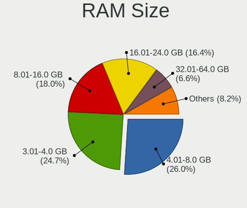
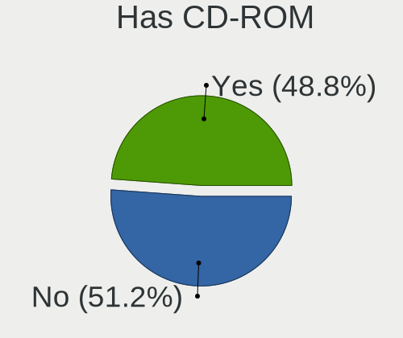
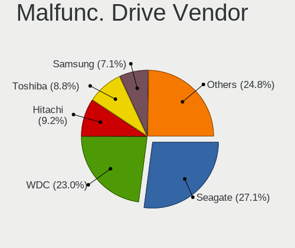

OpenMandriva - Tested Hardware & Statistics
-------------------------------------------

A project to collect tested hardware configurations for OpenMandriva.

Anyone can contribute to this report by the [hw-probe](https://github.com/linuxhw/hw-probe) tool:

    sudo -E hw-probe -all -upload

Please contribute! Especially if your hardware is rare.

This is a report for all computer types. See also reports for [desktops](/Dist/OpenMandriva/Desktop/README.md) and [notebooks](/Dist/OpenMandriva/Notebook/README.md).

Contents
--------

* [ Test Cases ](#test-cases)

* [ System ](#system)
  - [ OS                       ](#os)
  - [ OS Family                ](#os-family)
  - [ Kernel                   ](#kernel)
  - [ Kernel Family            ](#kernel-family)
  - [ Kernel Major Ver.        ](#kernel-major-ver)
  - [ Arch                     ](#arch)
  - [ DE                       ](#de)
  - [ Display Server           ](#display-server)
  - [ Display Manager          ](#display-manager)
  - [ OS Lang                  ](#os-lang)
  - [ Boot Mode                ](#boot-mode)
  - [ Filesystem               ](#filesystem)
  - [ Part. scheme             ](#part-scheme)
  - [ Dual Boot with Linux/BSD ](#dual-boot-with-linuxbsd)
  - [ Dual Boot (Win)          ](#dual-boot-win)

* [ Board ](#board)
  - [ Vendor                   ](#vendor)
  - [ Model                    ](#model)
  - [ Model Family             ](#model-family)
  - [ MFG Year                 ](#mfg-year)
  - [ Form Factor              ](#form-factor)
  - [ Secure Boot              ](#secure-boot)
  - [ Coreboot                 ](#coreboot)
  - [ RAM Size                 ](#ram-size)
  - [ RAM Used                 ](#ram-used)
  - [ Total Drives             ](#total-drives)
  - [ Has CD-ROM               ](#has-cd-rom)
  - [ Has Ethernet             ](#has-ethernet)
  - [ Has WiFi                 ](#has-wifi)
  - [ Has Bluetooth            ](#has-bluetooth)

* [ Location ](#location)
  - [ Country                  ](#country)
  - [ City                     ](#city)

* [ Drives ](#drives)
  - [ Drive Vendor             ](#drive-vendor)
  - [ Drive Model              ](#drive-model)
  - [ HDD Vendor               ](#hdd-vendor)
  - [ SSD Vendor               ](#ssd-vendor)
  - [ Drive Kind               ](#drive-kind)
  - [ Drive Connector          ](#drive-connector)
  - [ Drive Size               ](#drive-size)
  - [ Space Total              ](#space-total)
  - [ Space Used               ](#space-used)
  - [ Malfunc. Drives          ](#malfunc-drives)
  - [ Malfunc. Drive Vendor    ](#malfunc-drive-vendor)
  - [ Malfunc. HDD Vendor      ](#malfunc-hdd-vendor)
  - [ Malfunc. Drive Kind      ](#malfunc-drive-kind)
  - [ Failed Drives            ](#failed-drives)
  - [ Failed Drive Vendor      ](#failed-drive-vendor)
  - [ Drive Status             ](#drive-status)

* [ Storage controller ](#storage-controller)
  - [ Storage Vendor           ](#storage-vendor)
  - [ Storage Model            ](#storage-model)
  - [ Storage Kind             ](#storage-kind)

* [ Processor ](#processor)
  - [ CPU Vendor               ](#cpu-vendor)
  - [ CPU Model                ](#cpu-model)
  - [ CPU Model Family         ](#cpu-model-family)
  - [ CPU Cores                ](#cpu-cores)
  - [ CPU Sockets              ](#cpu-sockets)
  - [ CPU Threads              ](#cpu-threads)
  - [ CPU Op-Modes             ](#cpu-op-modes)
  - [ CPU Microcode            ](#cpu-microcode)
  - [ CPU Microarch            ](#cpu-microarch)

* [ Graphics ](#graphics)
  - [ GPU Vendor               ](#gpu-vendor)
  - [ GPU Model                ](#gpu-model)
  - [ GPU Combo                ](#gpu-combo)
  - [ GPU Driver               ](#gpu-driver)
  - [ GPU Memory               ](#gpu-memory)

* [ Monitor ](#monitor)
  - [ Monitor Vendor           ](#monitor-vendor)
  - [ Monitor Model            ](#monitor-model)
  - [ Monitor Resolution       ](#monitor-resolution)
  - [ Monitor Diagonal         ](#monitor-diagonal)
  - [ Monitor Width            ](#monitor-width)
  - [ Aspect Ratio             ](#aspect-ratio)
  - [ Monitor Area             ](#monitor-area)
  - [ Pixel Density            ](#pixel-density)
  - [ Multiple Monitors        ](#multiple-monitors)

* [ Network ](#network)
  - [ Net Controller Vendor    ](#net-controller-vendor)
  - [ Net Controller Model     ](#net-controller-model)
  - [ Wireless Vendor          ](#wireless-vendor)
  - [ Wireless Model           ](#wireless-model)
  - [ Ethernet Vendor          ](#ethernet-vendor)
  - [ Ethernet Model           ](#ethernet-model)
  - [ Net Controller Kind      ](#net-controller-kind)
  - [ Used Controller          ](#used-controller)
  - [ NICs                     ](#nics)
  - [ IPv6                     ](#ipv6)

* [ Bluetooth ](#bluetooth)
  - [ Bluetooth Vendor         ](#bluetooth-vendor)
  - [ Bluetooth Model          ](#bluetooth-model)

* [ Sound ](#sound)
  - [ Sound Vendor             ](#sound-vendor)
  - [ Sound Model              ](#sound-model)

* [ Memory ](#memory)
  - [ Memory Vendor            ](#memory-vendor)
  - [ Memory Model             ](#memory-model)
  - [ Memory Kind              ](#memory-kind)
  - [ Memory Form Factor       ](#memory-form-factor)
  - [ Memory Size              ](#memory-size)
  - [ Memory Speed             ](#memory-speed)

* [ Printers & scanners ](#printers--scanners)
  - [ Printer Vendor           ](#printer-vendor)
  - [ Printer Model            ](#printer-model)
  - [ Scanner Vendor           ](#scanner-vendor)
  - [ Scanner Model            ](#scanner-model)

* [ Camera ](#camera)
  - [ Camera Vendor            ](#camera-vendor)
  - [ Camera Model             ](#camera-model)

* [ Security ](#security)
  - [ Fingerprint Vendor       ](#fingerprint-vendor)
  - [ Fingerprint Model        ](#fingerprint-model)
  - [ Chipcard Vendor          ](#chipcard-vendor)
  - [ Chipcard Model           ](#chipcard-model)

* [ Unsupported ](#unsupported)
  - [ Unsupported Devices      ](#unsupported-devices)
  - [ Unsupported Device Types ](#unsupported-device-types)

Test Cases
----------

Total: 17815

| Vendor        | Model                       | Form-Factor | Probe                                                      | Date         |
|---------------|-----------------------------|-------------|------------------------------------------------------------|--------------|
| ASRock        | Z790 PG Lightning           | Desktop     | [0b5268372a](https://linux-hardware.org/?probe=0b5268372a) | Dec 24, 2023 |
| MSI           | H97 PC Mate                 | Desktop     | [f1c5d0d405](https://linux-hardware.org/?probe=f1c5d0d405) | Dec 24, 2023 |
| HP            | 0B40h                       | Desktop     | [e3ad55af3f](https://linux-hardware.org/?probe=e3ad55af3f) | Dec 24, 2023 |
| HP            | 82F1                        | Desktop     | [86959f8199](https://linux-hardware.org/?probe=86959f8199) | Dec 24, 2023 |
| Intel         | H61                         | Desktop     | [a10f481c10](https://linux-hardware.org/?probe=a10f481c10) | Dec 24, 2023 |
| Lenovo        | ThinkPad T400 6474AV5       | Notebook    | [b98f0a2c09](https://linux-hardware.org/?probe=b98f0a2c09) | Dec 24, 2023 |
| Dell          | 0WR7PY A02                  | Desktop     | [df3b1f1cc3](https://linux-hardware.org/?probe=df3b1f1cc3) | Dec 24, 2023 |
| ASUSTek       | PRIME B450M-A II            | Desktop     | [3366f8e90d](https://linux-hardware.org/?probe=3366f8e90d) | Dec 24, 2023 |
| Dell          | Inspiron 3521               | Notebook    | [a109a64bdd](https://linux-hardware.org/?probe=a109a64bdd) | Dec 24, 2023 |
| HP            | 21D0                        | Desktop     | [733191fd29](https://linux-hardware.org/?probe=733191fd29) | Dec 24, 2023 |
| ASUSTek       | P5GC-MX/1333                | Desktop     | [a95c11e27b](https://linux-hardware.org/?probe=a95c11e27b) | Dec 23, 2023 |
| ASUSTek       | ROG STRIX B450-F GAMING     | Desktop     | [a84743b247](https://linux-hardware.org/?probe=a84743b247) | Dec 23, 2023 |
| Dell          | 09KPNV A00                  | Desktop     | [a90623afe1](https://linux-hardware.org/?probe=a90623afe1) | Dec 23, 2023 |
| HP            | EliteBook 2530p             | Notebook    | [996611fcab](https://linux-hardware.org/?probe=996611fcab) | Dec 23, 2023 |
| Lenovo        | Yoga C740-14IML 81TC        | Convertible | [3625c673e4](https://linux-hardware.org/?probe=3625c673e4) | Dec 23, 2023 |
| Acer          | Extensa 2519                | Notebook    | [29bc812d6d](https://linux-hardware.org/?probe=29bc812d6d) | Dec 23, 2023 |
| Alienware     | m15 R7 AMD                  | Notebook    | [9d80128f05](https://linux-hardware.org/?probe=9d80128f05) | Dec 23, 2023 |
| ASUSTek       | X441BA                      | Notebook    | [04e5c55b92](https://linux-hardware.org/?probe=04e5c55b92) | Dec 23, 2023 |
| Intel         | NUC6CAYB J23203-403         | Mini pc     | [83e47fa893](https://linux-hardware.org/?probe=83e47fa893) | Dec 23, 2023 |
| Dell          | 0WMJ54 A01                  | Desktop     | [ac0b6ab055](https://linux-hardware.org/?probe=ac0b6ab055) | Dec 23, 2023 |
| ASUSTek       | UL80VT                      | Notebook    | [5b04b67d44](https://linux-hardware.org/?probe=5b04b67d44) | Dec 23, 2023 |
| Lenovo        | G50-30 80G0                 | Notebook    | [45b0f5ae9a](https://linux-hardware.org/?probe=45b0f5ae9a) | Dec 23, 2023 |
| Foxconn       | 2ABF                        | Desktop     | [3441aa81e6](https://linux-hardware.org/?probe=3441aa81e6) | Dec 23, 2023 |
| Lenovo        | Yoga 2 Pro 20266            | Notebook    | [201d4ed37f](https://linux-hardware.org/?probe=201d4ed37f) | Dec 23, 2023 |
| Dell          | Latitude 3190 2-in-1        | Convertible | [f189893dcb](https://linux-hardware.org/?probe=f189893dcb) | Dec 23, 2023 |
| ASUSTek       | P7P55D-E                    | Desktop     | [dc2914021f](https://linux-hardware.org/?probe=dc2914021f) | Dec 23, 2023 |
| Lenovo        | SHARKBAY SDK0J40705 WIN ... | Desktop     | [739d4b0840](https://linux-hardware.org/?probe=739d4b0840) | Dec 23, 2023 |
| HP            | EliteBook 840 G5            | Notebook    | [6406b552c4](https://linux-hardware.org/?probe=6406b552c4) | Dec 23, 2023 |
| Acer          | Aspire A515-45              | Notebook    | [acab7c340a](https://linux-hardware.org/?probe=acab7c340a) | Dec 22, 2023 |
| ASRock        | H77 Pro4-M                  | Desktop     | [e2bc5dabc2](https://linux-hardware.org/?probe=e2bc5dabc2) | Dec 22, 2023 |
| ASRock        | 4X4-4000 Series             | Desktop     | [b4333bcaaf](https://linux-hardware.org/?probe=b4333bcaaf) | Dec 22, 2023 |
| Dell          | Studio 1737                 | Notebook    | [a157d70ea2](https://linux-hardware.org/?probe=a157d70ea2) | Dec 22, 2023 |
| ASUSTek       | K50AF                       | Notebook    | [367c28d17a](https://linux-hardware.org/?probe=367c28d17a) | Dec 22, 2023 |
| Dell          | 0X7841                      | Desktop     | [3757ec7f5f](https://linux-hardware.org/?probe=3757ec7f5f) | Dec 22, 2023 |
| ASUSTek       | P7H55-M LE                  | Desktop     | [d15476594e](https://linux-hardware.org/?probe=d15476594e) | Dec 22, 2023 |
| Apple         | Mac-F226BEC8 PVT            | All in one  | [7b3f2a201c](https://linux-hardware.org/?probe=7b3f2a201c) | Dec 22, 2023 |
| Apple         | Mac-CFF7D910A743CAAF iMa... | All in one  | [61154d87f0](https://linux-hardware.org/?probe=61154d87f0) | Dec 22, 2023 |
| Gigabyte      | B550 AORUS PRO V2           | Desktop     | [be8f1bf021](https://linux-hardware.org/?probe=be8f1bf021) | Dec 22, 2023 |
| Acer          | One 14 Z2-493               | Notebook    | [11215309a3](https://linux-hardware.org/?probe=11215309a3) | Dec 22, 2023 |
| Google        | Garg                        | Notebook    | [05bbd9f9f8](https://linux-hardware.org/?probe=05bbd9f9f8) | Dec 22, 2023 |
| Dell          | Latitude E6400              | Notebook    | [6e6d4fec11](https://linux-hardware.org/?probe=6e6d4fec11) | Dec 21, 2023 |
| Dell          | System Vostro 3750          | Notebook    | [aa1fb5d9a6](https://linux-hardware.org/?probe=aa1fb5d9a6) | Dec 21, 2023 |
| HP            | 18E7                        | Desktop     | [71f34bba13](https://linux-hardware.org/?probe=71f34bba13) | Dec 21, 2023 |
| TUXEDO        | InfinityBook Pro Gen7 (M... | Notebook    | [030e411799](https://linux-hardware.org/?probe=030e411799) | Dec 21, 2023 |
| HP            | 2B28                        | Desktop     | [a3c79770af](https://linux-hardware.org/?probe=a3c79770af) | Dec 21, 2023 |
| ASUSTek       | PRIME Z690-P                | Desktop     | [72187eb090](https://linux-hardware.org/?probe=72187eb090) | Dec 21, 2023 |
| Google        | Garg                        | Notebook    | [fb4804bee9](https://linux-hardware.org/?probe=fb4804bee9) | Dec 21, 2023 |
| Lenovo        | SHARKBAY 0B98401 PRO        | Desktop     | [2675cca8c2](https://linux-hardware.org/?probe=2675cca8c2) | Dec 21, 2023 |
| Google        | Garg                        | Notebook    | [d2558e0746](https://linux-hardware.org/?probe=d2558e0746) | Dec 21, 2023 |
| Pegatron      | 2AB6                        | Desktop     | [fc2beada0a](https://linux-hardware.org/?probe=fc2beada0a) | Dec 21, 2023 |
| Dell          | Latitude E6320              | Notebook    | [a1e4b48d85](https://linux-hardware.org/?probe=a1e4b48d85) | Dec 20, 2023 |
| Fujitsu Si... | ESPRIMO Mobile V5535        | Notebook    | [664d34d04d](https://linux-hardware.org/?probe=664d34d04d) | Dec 20, 2023 |
| Lenovo        | ThinkPad T480 20L6S01W00    | Notebook    | [c38a7a8ad4](https://linux-hardware.org/?probe=c38a7a8ad4) | Dec 20, 2023 |
| Lenovo        | ThinkPad T420 4236DA4       | Notebook    | [1188c1619d](https://linux-hardware.org/?probe=1188c1619d) | Dec 20, 2023 |
| ECS           | H81H3-MV                    | Desktop     | [95bd5100ac](https://linux-hardware.org/?probe=95bd5100ac) | Dec 20, 2023 |
| Intel         | H61                         | Desktop     | [01b739e240](https://linux-hardware.org/?probe=01b739e240) | Dec 20, 2023 |
| Google        | Garg                        | Notebook    | [0f05d3580a](https://linux-hardware.org/?probe=0f05d3580a) | Dec 20, 2023 |
| Dell          | Latitude E5510              | Notebook    | [e1edf60996](https://linux-hardware.org/?probe=e1edf60996) | Dec 20, 2023 |
| HP            | Stream Laptop 14-cb1xxx     | Notebook    | [e3dded7dc3](https://linux-hardware.org/?probe=e3dded7dc3) | Dec 20, 2023 |
| Dell          | Latitude E6400              | Notebook    | [67d4d37a04](https://linux-hardware.org/?probe=67d4d37a04) | Dec 20, 2023 |
| Dell          | Inspiron 1750               | Notebook    | [508bf60ff7](https://linux-hardware.org/?probe=508bf60ff7) | Dec 20, 2023 |
| Apple         | Mac-942B59F58194171B iMa... | All in one  | [322b96bdd0](https://linux-hardware.org/?probe=322b96bdd0) | Dec 20, 2023 |
| HP            | 1905                        | Desktop     | [540abb14df](https://linux-hardware.org/?probe=540abb14df) | Dec 20, 2023 |
| Gigabyte      | 970-GAMING                  | Desktop     | [403d617fdd](https://linux-hardware.org/?probe=403d617fdd) | Dec 19, 2023 |
| ASUSTek       | P8H61-M LX3 PLUS R2.0       | Desktop     | [bd012749e2](https://linux-hardware.org/?probe=bd012749e2) | Dec 19, 2023 |
| MSI           | 970A-G46                    | Desktop     | [078bef5c72](https://linux-hardware.org/?probe=078bef5c72) | Dec 19, 2023 |
| Medion        | E15415                      | Notebook    | [03ee2b7f5e](https://linux-hardware.org/?probe=03ee2b7f5e) | Dec 19, 2023 |
| Lenovo        | ThinkPad T590 20N5S44300    | Notebook    | [5a90e712d1](https://linux-hardware.org/?probe=5a90e712d1) | Dec 19, 2023 |
| Gigabyte      | Z77X-UP5 TH-CF              | Desktop     | [ee9b8f604a](https://linux-hardware.org/?probe=ee9b8f604a) | Dec 19, 2023 |
| ECS           | H61H2-M2                    | Desktop     | [d38a6ca473](https://linux-hardware.org/?probe=d38a6ca473) | Dec 19, 2023 |
| Fujitsu       | FMVNF70W                    | Notebook    | [cbeca4d4e8](https://linux-hardware.org/?probe=cbeca4d4e8) | Dec 19, 2023 |
| ASUSTek       | 1011PX                      | Notebook    | [6046941a0a](https://linux-hardware.org/?probe=6046941a0a) | Dec 18, 2023 |
| ASUSTek       | ROG STRIX B550-F GAMING     | Desktop     | [a36fe89aa8](https://linux-hardware.org/?probe=a36fe89aa8) | Dec 18, 2023 |
| Gigabyte      | H61M-S1                     | Desktop     | [44c8944047](https://linux-hardware.org/?probe=44c8944047) | Dec 18, 2023 |
| Dell          | Inspiron 1545               | Notebook    | [fc8665de21](https://linux-hardware.org/?probe=fc8665de21) | Dec 18, 2023 |
| Dell          | 0T10XW A00                  | Desktop     | [ffff088d9c](https://linux-hardware.org/?probe=ffff088d9c) | Dec 18, 2023 |
| ASUSTek       | X550EA                      | Notebook    | [a874ac5799](https://linux-hardware.org/?probe=a874ac5799) | Dec 18, 2023 |
| Dell          | Precision 7530              | Notebook    | [6de510283f](https://linux-hardware.org/?probe=6de510283f) | Dec 18, 2023 |
| ASUSTek       | PRIME H310I-PLUS R2.0       | Desktop     | [1e1b811e8b](https://linux-hardware.org/?probe=1e1b811e8b) | Dec 18, 2023 |
| Samsung       | RV409/RV509/RV709           | Notebook    | [7f55b490b8](https://linux-hardware.org/?probe=7f55b490b8) | Dec 18, 2023 |
| ASUSTek       | M5A78L-M LE                 | Desktop     | [d70deaa140](https://linux-hardware.org/?probe=d70deaa140) | Dec 17, 2023 |
| Gigabyte      | B450 AORUS PRO-CF           | Desktop     | [60e69d071e](https://linux-hardware.org/?probe=60e69d071e) | Dec 17, 2023 |
| ASUSTek       | K84L                        | Notebook    | [3e0ea1ca0a](https://linux-hardware.org/?probe=3e0ea1ca0a) | Dec 17, 2023 |
| Gigabyte      | B450 GAMING X               | Desktop     | [28f3e414e2](https://linux-hardware.org/?probe=28f3e414e2) | Dec 17, 2023 |
| ASUSTek       | PRIME A320M-K               | Desktop     | [65aee92c23](https://linux-hardware.org/?probe=65aee92c23) | Dec 17, 2023 |
| MSI           | MS-7255                     | Desktop     | [efdf3ede47](https://linux-hardware.org/?probe=efdf3ede47) | Dec 17, 2023 |
| Foxconn       | 2ABF                        | Desktop     | [907abd30c7](https://linux-hardware.org/?probe=907abd30c7) | Dec 17, 2023 |
| Apple         | MacBookAir9,1               | Notebook    | [73f451cbe0](https://linux-hardware.org/?probe=73f451cbe0) | Dec 17, 2023 |
| ASUSTek       | K53SC                       | Notebook    | [4424929359](https://linux-hardware.org/?probe=4424929359) | Dec 17, 2023 |
| Gigabyte      | GA-MA69G-S3H                | Desktop     | [d0b623f72b](https://linux-hardware.org/?probe=d0b623f72b) | Dec 17, 2023 |
| Gigabyte      | GA-870A-UD3                 | Desktop     | [4a6ea199e2](https://linux-hardware.org/?probe=4a6ea199e2) | Dec 17, 2023 |
| Dell          | 053CWD A00                  | Desktop     | [6cee8cbfd7](https://linux-hardware.org/?probe=6cee8cbfd7) | Dec 17, 2023 |
| HP            | Pavilion 15                 | Notebook    | [8ea538629f](https://linux-hardware.org/?probe=8ea538629f) | Dec 17, 2023 |
| Fujitsu       | LIFEBOOK U727               | Notebook    | [dceda9b2a1](https://linux-hardware.org/?probe=dceda9b2a1) | Dec 17, 2023 |
| MSI           | MAG B550 TOMAHAWK           | Desktop     | [5c8981cf69](https://linux-hardware.org/?probe=5c8981cf69) | Dec 17, 2023 |
| ASUSTek       | ROG Zephyrus G14 GA402RJ... | Notebook    | [ead7baed80](https://linux-hardware.org/?probe=ead7baed80) | Dec 17, 2023 |
| ASUSTek       | S550CB                      | Notebook    | [20c9c415c9](https://linux-hardware.org/?probe=20c9c415c9) | Dec 17, 2023 |
| ASUSTek       | VivoBook_ASUSLaptop X160... | Notebook    | [ae7d12ef06](https://linux-hardware.org/?probe=ae7d12ef06) | Dec 17, 2023 |
| Gigabyte      | B75M-D3H                    | Desktop     | [f306ab4590](https://linux-hardware.org/?probe=f306ab4590) | Dec 17, 2023 |
| Dell          | Latitude 5400               | Notebook    | [9ae128faf4](https://linux-hardware.org/?probe=9ae128faf4) | Dec 16, 2023 |
| ASUSTek       | K61IC                       | Notebook    | [1442626988](https://linux-hardware.org/?probe=1442626988) | Dec 16, 2023 |
| Intel         | H81                         | Desktop     | [9aaa6b2ab6](https://linux-hardware.org/?probe=9aaa6b2ab6) | Dec 16, 2023 |
| Dell          | Inspiron 15-3567            | Notebook    | [3907c9bfa3](https://linux-hardware.org/?probe=3907c9bfa3) | Dec 16, 2023 |
| Lenovo        | ThinkPad T430 2349QM6       | Notebook    | [398d3beb97](https://linux-hardware.org/?probe=398d3beb97) | Dec 16, 2023 |
| ASRock        | 970M Pro3                   | Desktop     | [1e7fb2b8d8](https://linux-hardware.org/?probe=1e7fb2b8d8) | Dec 16, 2023 |
| Dell          | 0HD5W2 A01                  | Desktop     | [cf61f7b65b](https://linux-hardware.org/?probe=cf61f7b65b) | Dec 16, 2023 |
| ASUSTek       | VivoBook_ASUSLaptop K340... | Notebook    | [d34cfca6c8](https://linux-hardware.org/?probe=d34cfca6c8) | Dec 16, 2023 |
| MSI           | Modern 15 B5M               | Notebook    | [893ff177b3](https://linux-hardware.org/?probe=893ff177b3) | Dec 16, 2023 |
| HP            | 8653 A                      | Desktop     | [186fc771e8](https://linux-hardware.org/?probe=186fc771e8) | Dec 16, 2023 |
| AWOW          | Unknown                     | Notebook    | [7061726896](https://linux-hardware.org/?probe=7061726896) | Dec 16, 2023 |
| Lenovo        | ThinkPad X260 20F5A0XWJP    | Notebook    | [7aede5c549](https://linux-hardware.org/?probe=7aede5c549) | Dec 16, 2023 |
| AZW           | GT-R                        | Notebook    | [205436106b](https://linux-hardware.org/?probe=205436106b) | Dec 16, 2023 |
| HP            | Pavilion Gaming Laptop 1... | Notebook    | [49e930f611](https://linux-hardware.org/?probe=49e930f611) | Dec 16, 2023 |
| Gigabyte      | GA-78LMT-USB3 x.x           | Desktop     | [68d2205ed1](https://linux-hardware.org/?probe=68d2205ed1) | Dec 16, 2023 |
| Dell          | Latitude E6430              | Notebook    | [4a12bf0db8](https://linux-hardware.org/?probe=4a12bf0db8) | Dec 16, 2023 |
| ASUSTek       | F2A85-V PRO                 | Desktop     | [1909f0bbc0](https://linux-hardware.org/?probe=1909f0bbc0) | Dec 16, 2023 |
| Unknown       | Unknown                     | Desktop     | [678b41c4e7](https://linux-hardware.org/?probe=678b41c4e7) | Dec 16, 2023 |
| ASUSTek       | TUF Gaming B550-PLUS        | Desktop     | [41fd53bbff](https://linux-hardware.org/?probe=41fd53bbff) | Dec 16, 2023 |
| HP            | 3647h                       | Desktop     | [4feaf76045](https://linux-hardware.org/?probe=4feaf76045) | Dec 16, 2023 |
| ASUSTek       | ROG STRIX B550-F GAMING     | Desktop     | [72b7f2d771](https://linux-hardware.org/?probe=72b7f2d771) | Dec 16, 2023 |
| Toshiba       | T20                         | Notebook    | [5bb395790c](https://linux-hardware.org/?probe=5bb395790c) | Dec 16, 2023 |
| Dell          | Precision 7510              | Notebook    | [c70e7da2e8](https://linux-hardware.org/?probe=c70e7da2e8) | Dec 16, 2023 |
| Gigabyte      | Z87X-UD3H-CF                | Desktop     | [bb3e11a8bf](https://linux-hardware.org/?probe=bb3e11a8bf) | Dec 16, 2023 |
| ASUSTek       | K50AF                       | Notebook    | [2d4a3c6859](https://linux-hardware.org/?probe=2d4a3c6859) | Dec 16, 2023 |
| Dell          | Latitude E7240              | Notebook    | [8fc0b7d8ea](https://linux-hardware.org/?probe=8fc0b7d8ea) | Dec 16, 2023 |
| ASUSTek       | PRIME B550-PLUS             | Desktop     | [45900bcfb2](https://linux-hardware.org/?probe=45900bcfb2) | Dec 16, 2023 |
| Gigabyte      | P55A-UD3                    | Desktop     | [485f360521](https://linux-hardware.org/?probe=485f360521) | Dec 15, 2023 |
| Gigabyte      | H57M-USB3                   | Desktop     | [38bb251f37](https://linux-hardware.org/?probe=38bb251f37) | Dec 15, 2023 |
| Dell          | Latitude E5410              | Notebook    | [ee4251c01c](https://linux-hardware.org/?probe=ee4251c01c) | Dec 15, 2023 |
| Samsung       | 350V5C/351V5C/3540VC/344... | Notebook    | [09be79a2d5](https://linux-hardware.org/?probe=09be79a2d5) | Dec 15, 2023 |
| Lenovo        | ThinkBook 13s G2 ITL 20V... | Notebook    | [e03062f53d](https://linux-hardware.org/?probe=e03062f53d) | Dec 15, 2023 |
| MSI           | H61M-P21                    | Desktop     | [e452b4a816](https://linux-hardware.org/?probe=e452b4a816) | Dec 15, 2023 |
| MSI           | B450 GAMING PLUS MAX        | Desktop     | [a2e31b8b20](https://linux-hardware.org/?probe=a2e31b8b20) | Dec 15, 2023 |
| Toshiba       | Satellite C70D-A            | Notebook    | [88b5dab876](https://linux-hardware.org/?probe=88b5dab876) | Dec 15, 2023 |
| Dell          | 0C27VV A02                  | Desktop     | [94560c4ce8](https://linux-hardware.org/?probe=94560c4ce8) | Dec 15, 2023 |
| HP            | 1494                        | Desktop     | [0c31d410f6](https://linux-hardware.org/?probe=0c31d410f6) | Dec 15, 2023 |
| Teclast       | X6 plus                     | Tablet      | [ea768f654f](https://linux-hardware.org/?probe=ea768f654f) | Dec 15, 2023 |
| BESSTAR Te... | ATB15                       | Server      | [a3bf3001fb](https://linux-hardware.org/?probe=a3bf3001fb) | Dec 15, 2023 |
| Lenovo        | ThinkPad L330 34701V0       | Notebook    | [d418989434](https://linux-hardware.org/?probe=d418989434) | Dec 15, 2023 |
| AZW           | U55                         | Mini pc     | [0824d2f8fd](https://linux-hardware.org/?probe=0824d2f8fd) | Dec 15, 2023 |
| Dell          | Inspiron 1525               | Notebook    | [b9daaa5978](https://linux-hardware.org/?probe=b9daaa5978) | Dec 15, 2023 |
| ASUSTek       | M5A78L-M/USB3               | Desktop     | [fd99170725](https://linux-hardware.org/?probe=fd99170725) | Dec 15, 2023 |
| ASUSTek       | H81M-CS/BR                  | Desktop     | [39094226f9](https://linux-hardware.org/?probe=39094226f9) | Dec 15, 2023 |
| Lenovo        | SHARKBAY 0B98401 WIN        | Desktop     | [8939c99ccb](https://linux-hardware.org/?probe=8939c99ccb) | Dec 15, 2023 |
| JUXIESHI      | X99-MR9A PRO MAX V5.0       | Desktop     | [9e2f9a2d1b](https://linux-hardware.org/?probe=9e2f9a2d1b) | Dec 14, 2023 |
| ASUSTek       | M4A78T-E                    | Desktop     | [f34b148b2e](https://linux-hardware.org/?probe=f34b148b2e) | Dec 14, 2023 |
| ASRock        | Z68 Pro3-M                  | Desktop     | [5724665c2a](https://linux-hardware.org/?probe=5724665c2a) | Dec 14, 2023 |
| MSI           | GT70 2OC/2OD                | Notebook    | [22910f80b0](https://linux-hardware.org/?probe=22910f80b0) | Dec 14, 2023 |
| ASUSTek       | PRIME B460M-A               | Desktop     | [1c7f9648af](https://linux-hardware.org/?probe=1c7f9648af) | Dec 14, 2023 |
| HP            | 1496                        | Desktop     | [a89ca6e62d](https://linux-hardware.org/?probe=a89ca6e62d) | Dec 14, 2023 |
| Acer          | Aspire M3910                | Desktop     | [f12298a018](https://linux-hardware.org/?probe=f12298a018) | Dec 14, 2023 |
| Lenovo        | Legion 5 Pro 16ACH6H 82J... | Notebook    | [51e42890da](https://linux-hardware.org/?probe=51e42890da) | Dec 14, 2023 |
| Medion        | E16401                      | Notebook    | [0c81bbcb2b](https://linux-hardware.org/?probe=0c81bbcb2b) | Dec 14, 2023 |
| Lenovo        | IdeaPad 320-17IKB 80XM      | Notebook    | [8374878f6a](https://linux-hardware.org/?probe=8374878f6a) | Dec 14, 2023 |
| GPD           | G1619-04                    | Notebook    | [27dd6e79da](https://linux-hardware.org/?probe=27dd6e79da) | Dec 14, 2023 |
| ASUSTek       | P8H61                       | Desktop     | [00f636bb09](https://linux-hardware.org/?probe=00f636bb09) | Dec 14, 2023 |
| Acer          | Nitro AN517-54              | Notebook    | [c16cb0947e](https://linux-hardware.org/?probe=c16cb0947e) | Dec 14, 2023 |
| HP            | 1495                        | Desktop     | [bd97989dd8](https://linux-hardware.org/?probe=bd97989dd8) | Dec 14, 2023 |
| ASUSTek       | PRIME H270-PRO              | Desktop     | [b701b34038](https://linux-hardware.org/?probe=b701b34038) | Dec 14, 2023 |
| HP            | Laptop 17-by4xxx            | Notebook    | [bb89121e0c](https://linux-hardware.org/?probe=bb89121e0c) | Dec 14, 2023 |
| ASUSTek       | Maximus VI IMPACT           | Desktop     | [b9a86bd263](https://linux-hardware.org/?probe=b9a86bd263) | Dec 14, 2023 |
| ASRock        | G41M-VS3                    | Desktop     | [313b058c8c](https://linux-hardware.org/?probe=313b058c8c) | Dec 14, 2023 |
| HP            | 212B                        | Desktop     | [18d100b09c](https://linux-hardware.org/?probe=18d100b09c) | Dec 14, 2023 |
| Lenovo        | SHARKBAY 0B98401 PRO        | Desktop     | [f33ae0cc45](https://linux-hardware.org/?probe=f33ae0cc45) | Dec 14, 2023 |
| ASUSTek       | VivoBook_ASUSLaptop X521... | Notebook    | [9227c29b16](https://linux-hardware.org/?probe=9227c29b16) | Dec 14, 2023 |
| MouseCompu... | B360M                       | Desktop     | [83fa126717](https://linux-hardware.org/?probe=83fa126717) | Dec 14, 2023 |
| Dell          | Latitude 5590               | Notebook    | [c52c1d4f2e](https://linux-hardware.org/?probe=c52c1d4f2e) | Dec 14, 2023 |
| Acer          | Spin SP513-52N              | Convertible | [7e8dd058b9](https://linux-hardware.org/?probe=7e8dd058b9) | Dec 14, 2023 |
| Acer          | Aspire A315-22              | Notebook    | [e1deaf47e9](https://linux-hardware.org/?probe=e1deaf47e9) | Dec 14, 2023 |
| MSI           | PRO B650-VC WIFI            | Desktop     | [fc0a02d2d1](https://linux-hardware.org/?probe=fc0a02d2d1) | Dec 14, 2023 |
| ASUSTek       | P9X79-E WS                  | Desktop     | [5dd7c998ce](https://linux-hardware.org/?probe=5dd7c998ce) | Dec 14, 2023 |
| ASUSTek       | X550CA                      | Notebook    | [fe7ad66674](https://linux-hardware.org/?probe=fe7ad66674) | Dec 13, 2023 |
| Intel         | powered classmate PC        | Tablet      | [834af9a8e7](https://linux-hardware.org/?probe=834af9a8e7) | Dec 13, 2023 |
| ASRock        | AB350M-HDV                  | Desktop     | [945274527c](https://linux-hardware.org/?probe=945274527c) | Dec 13, 2023 |
| Packard Be... | EasyNote LM85               | Notebook    | [18a9f48bee](https://linux-hardware.org/?probe=18a9f48bee) | Dec 13, 2023 |
| MSI           | MPG Z490 GAMING EDGE WIF... | Desktop     | [7762e5b295](https://linux-hardware.org/?probe=7762e5b295) | Dec 13, 2023 |
| HP            | Pavilion dv6500             | Notebook    | [cdde8c0b3f](https://linux-hardware.org/?probe=cdde8c0b3f) | Dec 13, 2023 |
| HP            | Laptop 17-by4xxx            | Notebook    | [0c728e7b27](https://linux-hardware.org/?probe=0c728e7b27) | Dec 13, 2023 |
| Lenovo        | IdeaPad Gaming 3 15IHU6 ... | Notebook    | [bd8707be32](https://linux-hardware.org/?probe=bd8707be32) | Dec 13, 2023 |
| HP            | 18E4                        | Desktop     | [1dd0e805dc](https://linux-hardware.org/?probe=1dd0e805dc) | Dec 13, 2023 |
| Lenovo        | LOQ 15IRH8 82XV             | Notebook    | [ab468a9a14](https://linux-hardware.org/?probe=ab468a9a14) | Dec 13, 2023 |
| Lenovo        | IdeaPad 3 15IGL05 81WQ      | Notebook    | [5ec5788395](https://linux-hardware.org/?probe=5ec5788395) | Dec 13, 2023 |
| ASUSTek       | X55C                        | Notebook    | [13f3dbcb5f](https://linux-hardware.org/?probe=13f3dbcb5f) | Dec 13, 2023 |
| Dell          | Latitude E5470              | Notebook    | [cc7982deb0](https://linux-hardware.org/?probe=cc7982deb0) | Dec 13, 2023 |
| ASUSTek       | K50AF                       | Notebook    | [00e0b6dc86](https://linux-hardware.org/?probe=00e0b6dc86) | Dec 13, 2023 |
| HP            | 18E5                        | Desktop     | [8195da7520](https://linux-hardware.org/?probe=8195da7520) | Dec 13, 2023 |
| ASUSTek       | M5A78L-M LX3                | Desktop     | [a51734cec9](https://linux-hardware.org/?probe=a51734cec9) | Dec 13, 2023 |
| Gigabyte      | H510M H                     | Desktop     | [e21d372813](https://linux-hardware.org/?probe=e21d372813) | Dec 13, 2023 |
| Lenovo        | V15 G2 ALC 82KD             | Notebook    | [cc4a45597c](https://linux-hardware.org/?probe=cc4a45597c) | Dec 13, 2023 |
| ASUSTek       | P6T DELUXE V2               | Desktop     | [d5dc990950](https://linux-hardware.org/?probe=d5dc990950) | Dec 13, 2023 |
| Dell          | 0R790T A00                  | Desktop     | [8a72b2a4ce](https://linux-hardware.org/?probe=8a72b2a4ce) | Dec 13, 2023 |
| HP            | Victus by Laptop 16-e0xx... | Notebook    | [6407db19a5](https://linux-hardware.org/?probe=6407db19a5) | Dec 13, 2023 |
| Dell          | Inspiron 1501               | Notebook    | [c4103f9e5c](https://linux-hardware.org/?probe=c4103f9e5c) | Dec 13, 2023 |
| Dell          | 0HN7XN A00                  | Desktop     | [c85fd96dcb](https://linux-hardware.org/?probe=c85fd96dcb) | Dec 13, 2023 |
| Fujitsu       | LIFEBOOK S792               | Notebook    | [811be0cce0](https://linux-hardware.org/?probe=811be0cce0) | Dec 13, 2023 |
| Positivo      | POS-PIH81DL                 | Desktop     | [55cf834e17](https://linux-hardware.org/?probe=55cf834e17) | Dec 13, 2023 |
| Acer          | Aspire 7740                 | Notebook    | [2122676b51](https://linux-hardware.org/?probe=2122676b51) | Dec 13, 2023 |
| HP            | 8169                        | Desktop     | [e0549dcc03](https://linux-hardware.org/?probe=e0549dcc03) | Dec 12, 2023 |
| MSI           | MS-16Y1                     | Notebook    | [41ce29bec7](https://linux-hardware.org/?probe=41ce29bec7) | Dec 12, 2023 |
| HP            | Laptop 15s-eq2xxx           | Notebook    | [8151ecbeef](https://linux-hardware.org/?probe=8151ecbeef) | Dec 12, 2023 |
| MACHINIST     | X79 Z9-D7 PRO V1.0          | Desktop     | [aaeef17ed2](https://linux-hardware.org/?probe=aaeef17ed2) | Dec 12, 2023 |
| HP            | Stream x360 Convertible ... | Convertible | [edab80a2f1](https://linux-hardware.org/?probe=edab80a2f1) | Dec 12, 2023 |
| MSI           | A88XM GAMING                | Desktop     | [1f17749a2e](https://linux-hardware.org/?probe=1f17749a2e) | Dec 12, 2023 |
| Fujitsu       | D3600-A1 S26361-D3600-A1    | Desktop     | [0e87f04695](https://linux-hardware.org/?probe=0e87f04695) | Dec 12, 2023 |
| ASUSTek       | VivoBook_ASUSLaptop X571... | Notebook    | [4cffef33b7](https://linux-hardware.org/?probe=4cffef33b7) | Dec 12, 2023 |
| Sony          | SVE1713A1EW                 | Notebook    | [64b473222e](https://linux-hardware.org/?probe=64b473222e) | Dec 12, 2023 |
| Lenovo        | Unknown                     | Desktop     | [d49ddc416f](https://linux-hardware.org/?probe=d49ddc416f) | Dec 12, 2023 |
| HP            | Laptop 15s-eq0xxx           | Notebook    | [56e614b2fe](https://linux-hardware.org/?probe=56e614b2fe) | Dec 12, 2023 |
| ASRock        | G41M-VS3                    | Desktop     | [894c4cf9fb](https://linux-hardware.org/?probe=894c4cf9fb) | Dec 12, 2023 |
| Unknown       | Unknown                     | Desktop     | [c9eae3e15f](https://linux-hardware.org/?probe=c9eae3e15f) | Dec 12, 2023 |
| Acer          | Aspire A517-51G             | Notebook    | [8396e4fdc5](https://linux-hardware.org/?probe=8396e4fdc5) | Dec 12, 2023 |
| ASUSTek       | P8H61-M LX R2.0             | Desktop     | [2a6159034b](https://linux-hardware.org/?probe=2a6159034b) | Dec 12, 2023 |
| Acer          | TravelMate 5720             | Notebook    | [27cbfe44c9](https://linux-hardware.org/?probe=27cbfe44c9) | Dec 12, 2023 |
| Dell          | Latitude E6320              | Notebook    | [dbacdcadba](https://linux-hardware.org/?probe=dbacdcadba) | Dec 12, 2023 |
| Lenovo        | Tilapia CRB                 | Desktop     | [1527115ecf](https://linux-hardware.org/?probe=1527115ecf) | Dec 12, 2023 |
| MSI           | H61M-E33                    | Desktop     | [6123a79100](https://linux-hardware.org/?probe=6123a79100) | Dec 12, 2023 |
| Acer          | Aspire E5-576               | Notebook    | [72fc5247a6](https://linux-hardware.org/?probe=72fc5247a6) | Dec 12, 2023 |
| Lenovo        | Unknown                     | Convertible | [ca130417ca](https://linux-hardware.org/?probe=ca130417ca) | Dec 12, 2023 |
| Dell          | 0TNDVR A00                  | Desktop     | [4a4ab03bc7](https://linux-hardware.org/?probe=4a4ab03bc7) | Dec 11, 2023 |
| ASUSTek       | PRIME A320M-K               | Desktop     | [ec3c3d632c](https://linux-hardware.org/?probe=ec3c3d632c) | Dec 11, 2023 |
| HP            | EliteBook 840 G5            | Notebook    | [ee8ea2b093](https://linux-hardware.org/?probe=ee8ea2b093) | Dec 11, 2023 |
| Gigabyte      | B150M-D3H-CF                | Desktop     | [a46aa4d97c](https://linux-hardware.org/?probe=a46aa4d97c) | Dec 11, 2023 |
| Lenovo        | IdeaPad S340-14IIL 81VV     | Notebook    | [6b350f2aaf](https://linux-hardware.org/?probe=6b350f2aaf) | Dec 11, 2023 |
| Dell          | 0GXM1W A00                  | Desktop     | [1b4243a8d7](https://linux-hardware.org/?probe=1b4243a8d7) | Dec 11, 2023 |
| MSI           | B450M PRO-VDH MAX           | Desktop     | [d275512269](https://linux-hardware.org/?probe=d275512269) | Dec 11, 2023 |
| Gigabyte      | Z77-DS3H                    | Desktop     | [03c91234ae](https://linux-hardware.org/?probe=03c91234ae) | Dec 11, 2023 |
| MouseCompu... | H116K                       | Notebook    | [0d2d3680f0](https://linux-hardware.org/?probe=0d2d3680f0) | Dec 11, 2023 |
| Lenovo        | B50-10 80QR                 | Notebook    | [f44fe4ce19](https://linux-hardware.org/?probe=f44fe4ce19) | Dec 11, 2023 |
| Gigabyte      | X570 AORUS ELITE WIFI       | Desktop     | [0343e0a98e](https://linux-hardware.org/?probe=0343e0a98e) | Dec 11, 2023 |
| HP            | ProBook 450 G3              | Notebook    | [06651b08d9](https://linux-hardware.org/?probe=06651b08d9) | Dec 11, 2023 |
| HP            | ProBook 450 15.6 inch G9... | Notebook    | [b9fbad0653](https://linux-hardware.org/?probe=b9fbad0653) | Dec 11, 2023 |
| HP            | Pavilion Sleekbook 15       | Notebook    | [baec95bb2f](https://linux-hardware.org/?probe=baec95bb2f) | Dec 11, 2023 |
| Lenovo        | IdeaPad 310-15ISK 80SM      | Notebook    | [9b5ac1a49b](https://linux-hardware.org/?probe=9b5ac1a49b) | Dec 11, 2023 |
| ASUSTek       | P8Z77-V LX                  | Desktop     | [9e23503add](https://linux-hardware.org/?probe=9e23503add) | Dec 11, 2023 |
| Acer          | Aspire E5-571G              | Notebook    | [30c8f1f622](https://linux-hardware.org/?probe=30c8f1f622) | Dec 11, 2023 |
| ASUSTek       | K54L                        | Notebook    | [a50a95f076](https://linux-hardware.org/?probe=a50a95f076) | Dec 11, 2023 |
| HP            | Presario CQ58               | Notebook    | [b23d694ab4](https://linux-hardware.org/?probe=b23d694ab4) | Dec 11, 2023 |
| Dell          | Latitude 5590               | Notebook    | [ebdbfc1740](https://linux-hardware.org/?probe=ebdbfc1740) | Dec 11, 2023 |
| Lenovo        | ThinkCentre M91p 4524CB9    | Desktop     | [1381c72872](https://linux-hardware.org/?probe=1381c72872) | Dec 11, 2023 |
| ASUSTek       | TUF Gaming FX505GD_FX505... | Notebook    | [be5332c927](https://linux-hardware.org/?probe=be5332c927) | Dec 11, 2023 |
| ASUSTek       | TP410UR                     | Convertible | [2442ce24b5](https://linux-hardware.org/?probe=2442ce24b5) | Dec 11, 2023 |
| Lenovo        | ThinkPad L14 Gen 2 20X1S... | Notebook    | [371f238337](https://linux-hardware.org/?probe=371f238337) | Dec 11, 2023 |
| Acer          | Aspire ES1-512              | Notebook    | [40438b3cd0](https://linux-hardware.org/?probe=40438b3cd0) | Dec 11, 2023 |
| HP            | ProBook 650 G2              | Notebook    | [96ea36be06](https://linux-hardware.org/?probe=96ea36be06) | Dec 10, 2023 |
| Intel         | DQ57TM AAE70931-402         | Desktop     | [fa57e6edd3](https://linux-hardware.org/?probe=fa57e6edd3) | Dec 10, 2023 |
| HP            | 3032h                       | Desktop     | [ca8902be00](https://linux-hardware.org/?probe=ca8902be00) | Dec 10, 2023 |
| Acer          | Aspire 5750                 | Notebook    | [bedb502b74](https://linux-hardware.org/?probe=bedb502b74) | Dec 10, 2023 |
| ASUSTek       | ROG ZENITH EXTREME          | Desktop     | [11def2bc79](https://linux-hardware.org/?probe=11def2bc79) | Dec 10, 2023 |
| Gigabyte      | H310M DS2 x.x               | Desktop     | [6150f23143](https://linux-hardware.org/?probe=6150f23143) | Dec 10, 2023 |
| Gigabyte      | P67A-UD3P-B3                | Desktop     | [e96b9306cb](https://linux-hardware.org/?probe=e96b9306cb) | Dec 10, 2023 |
| Lenovo        | ThinkPad T410 2522V3S       | Notebook    | [7a6c259421](https://linux-hardware.org/?probe=7a6c259421) | Dec 10, 2023 |
| HP            | Laptop 14-bs0xx             | Notebook    | [f096c75cf9](https://linux-hardware.org/?probe=f096c75cf9) | Dec 10, 2023 |
| MSI           | 970A-G46                    | Desktop     | [86bd084c44](https://linux-hardware.org/?probe=86bd084c44) | Dec 10, 2023 |
| MSI           | B550-A PRO                  | Desktop     | [43b1cafae8](https://linux-hardware.org/?probe=43b1cafae8) | Dec 10, 2023 |
| ASUSTek       | B150M-A/M.2                 | Desktop     | [dd4ad4373b](https://linux-hardware.org/?probe=dd4ad4373b) | Dec 10, 2023 |
| ASUSTek       | SABERTOOTH 990FX R2.0       | Desktop     | [530b8a868e](https://linux-hardware.org/?probe=530b8a868e) | Dec 10, 2023 |
| Gigabyte      | F2A88XM-DS2                 | Desktop     | [0c5f882efd](https://linux-hardware.org/?probe=0c5f882efd) | Dec 10, 2023 |
| HP            | Notebook                    | Notebook    | [19c87ca6c5](https://linux-hardware.org/?probe=19c87ca6c5) | Dec 10, 2023 |
| Lenovo        | IdeaPad Slim 5 16IRL8 82... | Notebook    | [1709e5c519](https://linux-hardware.org/?probe=1709e5c519) | Dec 10, 2023 |
| Daten Tecn... | DA75PRO                     | Desktop     | [a4e18252cc](https://linux-hardware.org/?probe=a4e18252cc) | Dec 10, 2023 |
| HP            | Pavilion Gaming Laptop 1... | Notebook    | [9ae1729415](https://linux-hardware.org/?probe=9ae1729415) | Dec 10, 2023 |
| HP            | Laptop 15-da0xxx            | Notebook    | [a086fa3ad5](https://linux-hardware.org/?probe=a086fa3ad5) | Dec 10, 2023 |
| MSI           | PRO X670-P WIFI             | Desktop     | [be0d6f2f74](https://linux-hardware.org/?probe=be0d6f2f74) | Dec 10, 2023 |
| HP            | 2B29                        | Desktop     | [6fb328f58e](https://linux-hardware.org/?probe=6fb328f58e) | Dec 10, 2023 |
| HP            | 3047h                       | Desktop     | [b4e9ee347f](https://linux-hardware.org/?probe=b4e9ee347f) | Dec 10, 2023 |
| Intel         | NUC10i5FNB K61361-305       | Mini pc     | [87b9071f4a](https://linux-hardware.org/?probe=87b9071f4a) | Dec 10, 2023 |
| HP            | Laptop 15-bw0xx             | Notebook    | [69ebcd04b9](https://linux-hardware.org/?probe=69ebcd04b9) | Dec 10, 2023 |
| Gigabyte      | X570 AORUS PRO WIFI         | Desktop     | [9a11bb7125](https://linux-hardware.org/?probe=9a11bb7125) | Dec 10, 2023 |
| Gigabyte      | 965P-S3                     | Desktop     | [b73dd61ca5](https://linux-hardware.org/?probe=b73dd61ca5) | Dec 09, 2023 |
| MSI           | Katana GF66 11UE            | Notebook    | [451c5731ae](https://linux-hardware.org/?probe=451c5731ae) | Dec 09, 2023 |
| HP            | 8433 11                     | Desktop     | [65bca719f6](https://linux-hardware.org/?probe=65bca719f6) | Dec 09, 2023 |
| HP            | 0A9Ch                       | Desktop     | [0dd7ed90d0](https://linux-hardware.org/?probe=0dd7ed90d0) | Dec 09, 2023 |
| HP            | G61                         | Notebook    | [ce104b5b73](https://linux-hardware.org/?probe=ce104b5b73) | Dec 09, 2023 |
| ASUSTek       | 1215B                       | Notebook    | [65223dfc53](https://linux-hardware.org/?probe=65223dfc53) | Dec 09, 2023 |
| Lenovo        | IdeaPad S145-15API 81UT     | Notebook    | [0d57f82fc5](https://linux-hardware.org/?probe=0d57f82fc5) | Dec 09, 2023 |
| HP            | 0B4Ch D                     | Desktop     | [d129c3b01f](https://linux-hardware.org/?probe=d129c3b01f) | Dec 09, 2023 |
| Intel         | DH61CR AAG14064-204         | Desktop     | [a319465535](https://linux-hardware.org/?probe=a319465535) | Dec 09, 2023 |
| ASUSTek       | F1A55-M LE R2.0             | Desktop     | [83885aa02c](https://linux-hardware.org/?probe=83885aa02c) | Dec 09, 2023 |
| ASUSTek       | PRIME Z270M-PLUS            | Desktop     | [5c1ffcfbe3](https://linux-hardware.org/?probe=5c1ffcfbe3) | Dec 09, 2023 |
| ASRock        | X570 Phantom Gaming 4       | Desktop     | [4202011d88](https://linux-hardware.org/?probe=4202011d88) | Dec 09, 2023 |
| MSI           | B450-A PRO MAX              | Desktop     | [c576c4fbae](https://linux-hardware.org/?probe=c576c4fbae) | Dec 09, 2023 |
| HP            | Victus by Laptop 16-e1xx... | Notebook    | [9b973fc192](https://linux-hardware.org/?probe=9b973fc192) | Dec 08, 2023 |
| Dell          | Latitude 7490               | Notebook    | [13759c617a](https://linux-hardware.org/?probe=13759c617a) | Dec 08, 2023 |
| Gigabyte      | B550 AORUS ELITE V2         | Desktop     | [f6ed574e0d](https://linux-hardware.org/?probe=f6ed574e0d) | Dec 08, 2023 |
| Lenovo        | IdeaPad 3 17IIL05 81WF      | Notebook    | [edabe3eb37](https://linux-hardware.org/?probe=edabe3eb37) | Dec 08, 2023 |
| ASUSTek       | M5A78L-M PLUS/USB3          | Desktop     | [beb5466523](https://linux-hardware.org/?probe=beb5466523) | Dec 08, 2023 |
| MSI           | Modern 15 B12M              | Notebook    | [da95a095fa](https://linux-hardware.org/?probe=da95a095fa) | Dec 08, 2023 |
| Pegatron      | 3580                        | Desktop     | [580355d3da](https://linux-hardware.org/?probe=580355d3da) | Dec 08, 2023 |
| Dell          | 00V62H A00                  | Desktop     | [f26cee0fe0](https://linux-hardware.org/?probe=f26cee0fe0) | Dec 08, 2023 |
| HP            | ZBook 15v G5                | Notebook    | [96133249d0](https://linux-hardware.org/?probe=96133249d0) | Dec 08, 2023 |
| Lenovo        | 32E9 SDK0T76465 WIN 3422... | Desktop     | [a4eb4e410e](https://linux-hardware.org/?probe=a4eb4e410e) | Dec 08, 2023 |
| Adreamer      | Mybook PN1308P              | Notebook    | [e2dba2aff0](https://linux-hardware.org/?probe=e2dba2aff0) | Dec 08, 2023 |
| Intel         | DG965SS AAD41678-304        | Desktop     | [186a397074](https://linux-hardware.org/?probe=186a397074) | Dec 08, 2023 |
| Dell          | 02YYK5 A01                  | Desktop     | [1989264cba](https://linux-hardware.org/?probe=1989264cba) | Dec 08, 2023 |
| Dell          | 0CXTWJ A00                  | All in one  | [e3814da48d](https://linux-hardware.org/?probe=e3814da48d) | Dec 08, 2023 |
| Dell          | 0GM819                      | Desktop     | [5c9ffb0977](https://linux-hardware.org/?probe=5c9ffb0977) | Dec 07, 2023 |
| Fujitsu       | LIFEBOOK E744               | Notebook    | [2b97f06319](https://linux-hardware.org/?probe=2b97f06319) | Dec 07, 2023 |
| Microsoft     | Surface Book 3              | Tablet      | [b1c2f80587](https://linux-hardware.org/?probe=b1c2f80587) | Dec 07, 2023 |
| FIC           | K2MCP61P PCB                | Desktop     | [fe4889cc68](https://linux-hardware.org/?probe=fe4889cc68) | Dec 07, 2023 |
| Lenovo        | ThinkPad T430 23498Y3       | Notebook    | [5382654b9b](https://linux-hardware.org/?probe=5382654b9b) | Dec 07, 2023 |
| Lenovo        | ThinkPad T440 20B7S0N10F    | Notebook    | [350da642e5](https://linux-hardware.org/?probe=350da642e5) | Dec 07, 2023 |
| Acer          | Aspire 7730G                | Notebook    | [c98f96bcc1](https://linux-hardware.org/?probe=c98f96bcc1) | Dec 07, 2023 |
| Dell          | Precision 3550              | Notebook    | [da173d0ccc](https://linux-hardware.org/?probe=da173d0ccc) | Dec 07, 2023 |
| Biostar       | A520MH                      | Desktop     | [de9fc0f8f2](https://linux-hardware.org/?probe=de9fc0f8f2) | Dec 07, 2023 |
| Fujitsu       | D2863 S26361-D2863-A10 W... | Server      | [b5b2a93ff1](https://linux-hardware.org/?probe=b5b2a93ff1) | Dec 07, 2023 |
| ASUSTek       | VivoBook_ASUSLaptop X515... | Notebook    | [18d69df8d2](https://linux-hardware.org/?probe=18d69df8d2) | Dec 07, 2023 |
| HP            | ProBook 650 G1              | Notebook    | [52c0a2e6fa](https://linux-hardware.org/?probe=52c0a2e6fa) | Dec 07, 2023 |
| AMI           | Intel                       | Desktop     | [d2e7be0ff3](https://linux-hardware.org/?probe=d2e7be0ff3) | Dec 07, 2023 |
| Lenovo        | MAHOBAY NOK                 | Desktop     | [1d8b3c85a3](https://linux-hardware.org/?probe=1d8b3c85a3) | Dec 07, 2023 |
| Dell          | 0HN7XN A01                  | Desktop     | [986d7f4d8f](https://linux-hardware.org/?probe=986d7f4d8f) | Dec 07, 2023 |
| ASRock        | 960GC-GS FX                 | Desktop     | [d1288cac0c](https://linux-hardware.org/?probe=d1288cac0c) | Dec 07, 2023 |
| Acer          | TravelMate P645-S           | Notebook    | [e44f06b326](https://linux-hardware.org/?probe=e44f06b326) | Dec 07, 2023 |
| MSI           | B350M BAZOOKA               | Desktop     | [4b67bc0273](https://linux-hardware.org/?probe=4b67bc0273) | Dec 07, 2023 |
| HP            | 21B4 A01                    | Desktop     | [a8f5a67f32](https://linux-hardware.org/?probe=a8f5a67f32) | Dec 07, 2023 |
| Foxconn       | 2A8C                        | Desktop     | [2a4412d268](https://linux-hardware.org/?probe=2a4412d268) | Dec 06, 2023 |
| Gigabyte      | AB350M-DS3H V2-CF           | Desktop     | [1f2c85d176](https://linux-hardware.org/?probe=1f2c85d176) | Dec 06, 2023 |
| Lenovo        | ThinkPad X1 Carbon 6th 2... | Notebook    | [3fce748548](https://linux-hardware.org/?probe=3fce748548) | Dec 06, 2023 |
| HP            | EliteBook 840 G1            | Notebook    | [923f26e8d8](https://linux-hardware.org/?probe=923f26e8d8) | Dec 06, 2023 |
| Dell          | Latitude 7350               | Notebook    | [3fb5b65dba](https://linux-hardware.org/?probe=3fb5b65dba) | Dec 06, 2023 |
| Dell          | 0YXT71 A03                  | Desktop     | [a3080a2577](https://linux-hardware.org/?probe=a3080a2577) | Dec 06, 2023 |
| Lenovo        | Z51-70 80K6                 | Notebook    | [2894d2f78d](https://linux-hardware.org/?probe=2894d2f78d) | Dec 06, 2023 |
| Foxconn       | 2A8Ch                       | Desktop     | [b15f912ae7](https://linux-hardware.org/?probe=b15f912ae7) | Dec 06, 2023 |
| Lenovo        | ThinkCentre M81 5049P14     | Desktop     | [c847e2e0c2](https://linux-hardware.org/?probe=c847e2e0c2) | Dec 06, 2023 |
| MSI           | MAG X570S TORPEDO MAX       | Desktop     | [0ab3c62102](https://linux-hardware.org/?probe=0ab3c62102) | Dec 06, 2023 |
| Packard Be... | DOT S                       | Notebook    | [131c38200b](https://linux-hardware.org/?probe=131c38200b) | Dec 06, 2023 |
| ASUSTek       | PRIME B550M-A               | Desktop     | [9960314986](https://linux-hardware.org/?probe=9960314986) | Dec 06, 2023 |
| Dell          | Latitude E7440              | Notebook    | [6b3c7ea2b5](https://linux-hardware.org/?probe=6b3c7ea2b5) | Dec 06, 2023 |
| Lenovo        | ThinkPad SL500 274678G      | Notebook    | [3cfa60a8bb](https://linux-hardware.org/?probe=3cfa60a8bb) | Dec 06, 2023 |
| ASUSTek       | P8H61-M LE/USB3             | Desktop     | [26ab67528e](https://linux-hardware.org/?probe=26ab67528e) | Dec 06, 2023 |
| ASRock        | A320M-HDV R4.0              | Desktop     | [ca5df22812](https://linux-hardware.org/?probe=ca5df22812) | Dec 06, 2023 |
| HP            | 18E5                        | Desktop     | [7b54dc44b4](https://linux-hardware.org/?probe=7b54dc44b4) | Dec 06, 2023 |
| Dell          | Latitude 3330               | Notebook    | [843751ec33](https://linux-hardware.org/?probe=843751ec33) | Dec 06, 2023 |
| Lenovo        | IdeaPad 330-15ARR 81D2      | Notebook    | [b62b670195](https://linux-hardware.org/?probe=b62b670195) | Dec 06, 2023 |
| ASUSTek       | H110M-A/M.2                 | Desktop     | [f15eca360f](https://linux-hardware.org/?probe=f15eca360f) | Dec 06, 2023 |
| AMI           | Intel                       | Desktop     | [8649d088c6](https://linux-hardware.org/?probe=8649d088c6) | Dec 06, 2023 |
| Dell          | Latitude E5430 non-vPro     | Notebook    | [ee3494fa57](https://linux-hardware.org/?probe=ee3494fa57) | Dec 06, 2023 |
| Samsung       | R580/R590                   | Notebook    | [89f285aacc](https://linux-hardware.org/?probe=89f285aacc) | Dec 05, 2023 |
| ASUSTek       | N76VZ                       | Notebook    | [3d8844bc98](https://linux-hardware.org/?probe=3d8844bc98) | Dec 05, 2023 |
| Dell          | 0V0D45 A01                  | All in one  | [95f0db9f7b](https://linux-hardware.org/?probe=95f0db9f7b) | Dec 05, 2023 |
| ASUSTek       | PRIME B250-PLUS             | Desktop     | [8c397afeca](https://linux-hardware.org/?probe=8c397afeca) | Dec 05, 2023 |
| HP            | ProBook 4540s               | Notebook    | [99c14e0650](https://linux-hardware.org/?probe=99c14e0650) | Dec 05, 2023 |
| ASUSTek       | PRIME A520M-A II            | Desktop     | [a2e7a10bdf](https://linux-hardware.org/?probe=a2e7a10bdf) | Dec 05, 2023 |
| Gigabyte      | EP45-UD3LR                  | Desktop     | [f6bc6674c6](https://linux-hardware.org/?probe=f6bc6674c6) | Dec 05, 2023 |
| ASUSTek       | VivoBook_ASUSLaptop X515... | Notebook    | [ac0fd4af39](https://linux-hardware.org/?probe=ac0fd4af39) | Dec 05, 2023 |
| Lenovo        | ThinkPad E15 20RD003KMH     | Notebook    | [d54efc5833](https://linux-hardware.org/?probe=d54efc5833) | Dec 05, 2023 |
| Apple         | MacBookPro11,3              | Notebook    | [b886333167](https://linux-hardware.org/?probe=b886333167) | Dec 05, 2023 |
| ASUSTek       | K53U                        | Notebook    | [b76cef4836](https://linux-hardware.org/?probe=b76cef4836) | Dec 05, 2023 |
| Gigabyte      | A320M-H-CF                  | Desktop     | [4d14243cb9](https://linux-hardware.org/?probe=4d14243cb9) | Dec 05, 2023 |
| MSI           | 2A9C                        | Desktop     | [2ae992c0d5](https://linux-hardware.org/?probe=2ae992c0d5) | Dec 05, 2023 |
| Gigabyte      | Z68XP-UD4                   | Desktop     | [3cdd72e242](https://linux-hardware.org/?probe=3cdd72e242) | Dec 05, 2023 |
| AZW           | SER V1.0                    | Mini pc     | [2cc0150e87](https://linux-hardware.org/?probe=2cc0150e87) | Dec 05, 2023 |
| HP            | 15                          | Notebook    | [561269f586](https://linux-hardware.org/?probe=561269f586) | Dec 05, 2023 |
| Alurin        | Go Notebook                 | Notebook    | [197598d3dd](https://linux-hardware.org/?probe=197598d3dd) | Dec 05, 2023 |
| Foxconn       | 2ABF                        | Desktop     | [9478c73013](https://linux-hardware.org/?probe=9478c73013) | Dec 05, 2023 |
| Gigabyte      | GA-970A-UD3                 | Desktop     | [08a2ed40a1](https://linux-hardware.org/?probe=08a2ed40a1) | Dec 05, 2023 |
| Toshiba       | Satellite L750              | Notebook    | [667c6d4e98](https://linux-hardware.org/?probe=667c6d4e98) | Dec 05, 2023 |
| Lenovo        | ThinkCentre M81 0267A38     | Desktop     | [a9f041fc10](https://linux-hardware.org/?probe=a9f041fc10) | Dec 05, 2023 |
| Lenovo        | ThinkPad X230 23066RC       | Notebook    | [ef45ef93ac](https://linux-hardware.org/?probe=ef45ef93ac) | Dec 05, 2023 |
| Dell          | Inspiron 16 7635 2-in-1     | Convertible | [0fe6da9d8c](https://linux-hardware.org/?probe=0fe6da9d8c) | Dec 05, 2023 |
| MSI           | B450 TOMAHAWK MAX           | Desktop     | [044e8ae8d6](https://linux-hardware.org/?probe=044e8ae8d6) | Dec 05, 2023 |
| Lenovo        | ThinkPad X390 20Q1S1WB00    | Notebook    | [ab1ae6521e](https://linux-hardware.org/?probe=ab1ae6521e) | Dec 05, 2023 |
| Dell          | 02N3WF A03                  | Desktop     | [2974cc160f](https://linux-hardware.org/?probe=2974cc160f) | Dec 05, 2023 |
| Fujitsu       | JIH61Y3                     | Desktop     | [8aa3f5fa84](https://linux-hardware.org/?probe=8aa3f5fa84) | Dec 05, 2023 |
| Acer          | TravelMate B311-31          | Notebook    | [9611377d0c](https://linux-hardware.org/?probe=9611377d0c) | Dec 05, 2023 |
| HP            | Laptop 15-dy2xxx            | Notebook    | [729837dc5c](https://linux-hardware.org/?probe=729837dc5c) | Dec 05, 2023 |
| Dell          | 0WMJ54 A01                  | Desktop     | [76f6609343](https://linux-hardware.org/?probe=76f6609343) | Dec 05, 2023 |
| Fujitsu       | D3009-A1 S26361-D3009-A1    | Desktop     | [73890cb8c3](https://linux-hardware.org/?probe=73890cb8c3) | Dec 05, 2023 |
| Gigabyte      | B550M DS3H                  | Desktop     | [ddb2183d6c](https://linux-hardware.org/?probe=ddb2183d6c) | Dec 05, 2023 |
| Acer          | Aspire XC-704G              | Desktop     | [44c713b05d](https://linux-hardware.org/?probe=44c713b05d) | Dec 05, 2023 |
| Lenovo        | ThinkPad T480 20L6S3ED18    | Notebook    | [03866b12cd](https://linux-hardware.org/?probe=03866b12cd) | Dec 04, 2023 |
| HP            | Notebook                    | Notebook    | [4f0e8aad8c](https://linux-hardware.org/?probe=4f0e8aad8c) | Dec 04, 2023 |
| HP            | Compaq 6730b (NA373UC#AB... | Notebook    | [7e0d2ebaaf](https://linux-hardware.org/?probe=7e0d2ebaaf) | Dec 04, 2023 |
| ASUSTek       | X555LJ                      | Notebook    | [bd98f1df4c](https://linux-hardware.org/?probe=bd98f1df4c) | Dec 04, 2023 |
| HP            | ProBook 650 G1              | Notebook    | [b4b71ada44](https://linux-hardware.org/?probe=b4b71ada44) | Dec 04, 2023 |
| HP            | Pavilion 15                 | Notebook    | [15b5925773](https://linux-hardware.org/?probe=15b5925773) | Dec 04, 2023 |
| Lenovo        | V110-15IAP 80TG             | Notebook    | [ff40966f37](https://linux-hardware.org/?probe=ff40966f37) | Dec 04, 2023 |
| HP            | ProBook 4330s               | Notebook    | [48a060af86](https://linux-hardware.org/?probe=48a060af86) | Dec 04, 2023 |
| Acer          | Veriton S6620G v1.0         | Desktop     | [34095bbfed](https://linux-hardware.org/?probe=34095bbfed) | Dec 04, 2023 |
| Lenovo        | ThinkPad L460 20FVS07C00    | Notebook    | [fd5a4dbeb9](https://linux-hardware.org/?probe=fd5a4dbeb9) | Dec 04, 2023 |
| Dell          | Inspiron MM061              | Notebook    | [0f629c5ee8](https://linux-hardware.org/?probe=0f629c5ee8) | Dec 04, 2023 |
| Samsung       | 550XDA                      | Notebook    | [b5bfe47576](https://linux-hardware.org/?probe=b5bfe47576) | Dec 04, 2023 |
| Lenovo        | B50-50 80S2                 | Notebook    | [6150907e1e](https://linux-hardware.org/?probe=6150907e1e) | Dec 04, 2023 |
| Dell          | XPS 13 9360                 | Notebook    | [73fa5936a1](https://linux-hardware.org/?probe=73fa5936a1) | Dec 04, 2023 |
| HP            | OMEN by Laptop 16-b1xxx     | Notebook    | [9acc9cef23](https://linux-hardware.org/?probe=9acc9cef23) | Dec 04, 2023 |
| Microsoft     | Surface Go                  | Tablet      | [3658acadc3](https://linux-hardware.org/?probe=3658acadc3) | Dec 04, 2023 |
| HP            | 1998                        | Desktop     | [50a48ad374](https://linux-hardware.org/?probe=50a48ad374) | Dec 04, 2023 |
| ASUSTek       | ROG STRIX B660-A GAMING ... | Desktop     | [d28a7f3ad6](https://linux-hardware.org/?probe=d28a7f3ad6) | Dec 04, 2023 |
| Toshiba       | Satellite A300              | Notebook    | [5817017508](https://linux-hardware.org/?probe=5817017508) | Dec 04, 2023 |
| ASUSTek       | Z87M-PLUS                   | Desktop     | [be471e354a](https://linux-hardware.org/?probe=be471e354a) | Dec 04, 2023 |
| Dell          | XPS 13 9350                 | Notebook    | [aec9f3cb3c](https://linux-hardware.org/?probe=aec9f3cb3c) | Dec 04, 2023 |
| Lenovo        | G40-30 80FY                 | Notebook    | [219f784b96](https://linux-hardware.org/?probe=219f784b96) | Dec 04, 2023 |
| Toshiba       | Satellite C855D             | Notebook    | [84e97d4578](https://linux-hardware.org/?probe=84e97d4578) | Dec 04, 2023 |
| ASUSTek       | TUF Gaming FX505DY_FX505... | Notebook    | [218e5c18f3](https://linux-hardware.org/?probe=218e5c18f3) | Dec 04, 2023 |
| ASUSTek       | P5P800-VM                   | Desktop     | [dff0c991af](https://linux-hardware.org/?probe=dff0c991af) | Dec 04, 2023 |
| HP            | 2B0A                        | All in one  | [94d8a9c118](https://linux-hardware.org/?probe=94d8a9c118) | Dec 04, 2023 |
| HP            | ProBook 450 G0              | Notebook    | [80f6017066](https://linux-hardware.org/?probe=80f6017066) | Dec 04, 2023 |
| ASUSTek       | 1215N                       | Notebook    | [49eeb946c5](https://linux-hardware.org/?probe=49eeb946c5) | Dec 03, 2023 |
| Lenovo        | 3178 SDK0J40700 WIN 3258... | Desktop     | [e215f304c3](https://linux-hardware.org/?probe=e215f304c3) | Dec 03, 2023 |
| HP            | ProBook 640 G1              | Notebook    | [287093ae53](https://linux-hardware.org/?probe=287093ae53) | Dec 03, 2023 |
| Lenovo        | IdeaPad Gaming 3 15IHU6 ... | Notebook    | [9e1d0f5fdc](https://linux-hardware.org/?probe=9e1d0f5fdc) | Dec 03, 2023 |
| Dell          | Latitude D630               | Notebook    | [84a1008ee2](https://linux-hardware.org/?probe=84a1008ee2) | Dec 03, 2023 |
| ASUSTek       | K53SJ                       | Notebook    | [50979ecbd2](https://linux-hardware.org/?probe=50979ecbd2) | Dec 03, 2023 |
| ASUSTek       | SABERTOOTH 990FX R2.0       | Desktop     | [f013a81cbb](https://linux-hardware.org/?probe=f013a81cbb) | Dec 03, 2023 |
| Dell          | Latitude E6410              | Notebook    | [bae67b7a50](https://linux-hardware.org/?probe=bae67b7a50) | Dec 03, 2023 |
| ASUSTek       | PRIME X470-PRO              | Desktop     | [64801a6229](https://linux-hardware.org/?probe=64801a6229) | Dec 03, 2023 |
| HP            | EliteBook 2540p             | Notebook    | [3819853378](https://linux-hardware.org/?probe=3819853378) | Dec 03, 2023 |
| HP            | Laptop 15-ra0xx             | Notebook    | [5726a3acac](https://linux-hardware.org/?probe=5726a3acac) | Dec 03, 2023 |
| Dell          | System Inspiron N7110       | Notebook    | [f0df20f63f](https://linux-hardware.org/?probe=f0df20f63f) | Dec 03, 2023 |
| ASUSTek       | A88XM-PLUS                  | Desktop     | [f9a74ad44f](https://linux-hardware.org/?probe=f9a74ad44f) | Dec 03, 2023 |
| MSI           | MPG B550 GAMING PLUS        | Desktop     | [e45392e3ec](https://linux-hardware.org/?probe=e45392e3ec) | Dec 03, 2023 |
| Acer          | Aspire X1430                | Desktop     | [e4fa6a217d](https://linux-hardware.org/?probe=e4fa6a217d) | Dec 03, 2023 |
| HP            | 8265                        | Desktop     | [1faa811cf0](https://linux-hardware.org/?probe=1faa811cf0) | Dec 03, 2023 |
| Gateway       | M-6812M                     | Notebook    | [008f6448dc](https://linux-hardware.org/?probe=008f6448dc) | Dec 03, 2023 |
| HP            | 1998                        | Desktop     | [14cb2b69d2](https://linux-hardware.org/?probe=14cb2b69d2) | Dec 03, 2023 |
| Packard Be... | EasyNote LS11HR             | Notebook    | [c3d34dfe3a](https://linux-hardware.org/?probe=c3d34dfe3a) | Dec 03, 2023 |
| Gigabyte      | H77-DS3H                    | Desktop     | [4c97431f16](https://linux-hardware.org/?probe=4c97431f16) | Dec 03, 2023 |
| ASRock        | B450 Gaming K4              | Desktop     | [b877f8ccda](https://linux-hardware.org/?probe=b877f8ccda) | Dec 03, 2023 |
| HP            | ENVY m6                     | Notebook    | [3a3cde32ab](https://linux-hardware.org/?probe=3a3cde32ab) | Dec 03, 2023 |
| HP            | Laptop 17-by0xxx            | Notebook    | [d27ace68bb](https://linux-hardware.org/?probe=d27ace68bb) | Dec 03, 2023 |
| Dell          | 03NVJ6 A02                  | Desktop     | [7f9b2fa7e0](https://linux-hardware.org/?probe=7f9b2fa7e0) | Dec 03, 2023 |
| Lenovo        | ThinkPad E14 Gen 3 20Y70... | Notebook    | [e7c23bf6d5](https://linux-hardware.org/?probe=e7c23bf6d5) | Dec 03, 2023 |
| Medion        | E6214                       | Notebook    | [f5e38ac376](https://linux-hardware.org/?probe=f5e38ac376) | Dec 03, 2023 |
| BESSTAR Te... | GB7                         | Mini pc     | [136f4b6903](https://linux-hardware.org/?probe=136f4b6903) | Dec 03, 2023 |
| Foxconn       | 2A8C                        | Desktop     | [651f26ea2e](https://linux-hardware.org/?probe=651f26ea2e) | Dec 03, 2023 |
| HP            | ZBook 15 G2                 | Notebook    | [f60bc8a984](https://linux-hardware.org/?probe=f60bc8a984) | Dec 03, 2023 |
| Gigabyte      | B450M AORUS ELITE           | Desktop     | [369e921b6f](https://linux-hardware.org/?probe=369e921b6f) | Dec 03, 2023 |
| Dell          | Inspiron 3542               | Notebook    | [793b594721](https://linux-hardware.org/?probe=793b594721) | Dec 03, 2023 |
| Acer          | Aspire 8951G                | Notebook    | [f98b449dba](https://linux-hardware.org/?probe=f98b449dba) | Dec 03, 2023 |
| Dell          | 0C2XKD A01                  | Desktop     | [e946c07f76](https://linux-hardware.org/?probe=e946c07f76) | Dec 03, 2023 |
| Dell          | 07F37C A00                  | Desktop     | [685253bf96](https://linux-hardware.org/?probe=685253bf96) | Dec 03, 2023 |
| Dell          | Inspiron 13-5378            | Notebook    | [0beeed51bc](https://linux-hardware.org/?probe=0beeed51bc) | Dec 03, 2023 |
| ASRock        | X300TM-ITX                  | Desktop     | [6c74495d5f](https://linux-hardware.org/?probe=6c74495d5f) | Dec 03, 2023 |
| ASRock        | B365M IB-R                  | Desktop     | [30e1526883](https://linux-hardware.org/?probe=30e1526883) | Dec 03, 2023 |
| HP            | 3397                        | Desktop     | [b6c4db2738](https://linux-hardware.org/?probe=b6c4db2738) | Dec 03, 2023 |
| Lenovo        | ThinkPad T530 2429F37       | Notebook    | [7db847c98e](https://linux-hardware.org/?probe=7db847c98e) | Dec 03, 2023 |
| HP            | 8169                        | Desktop     | [6bdddabb7f](https://linux-hardware.org/?probe=6bdddabb7f) | Dec 03, 2023 |
| Packard Be... | EasyNote_MX52-B-702NCD      | Notebook    | [738fd6b777](https://linux-hardware.org/?probe=738fd6b777) | Dec 03, 2023 |
| ASUSTek       | TUF B450M-PLUS GAMING       | Desktop     | [388cf45c84](https://linux-hardware.org/?probe=388cf45c84) | Dec 03, 2023 |
| Lenovo        | MAHOBAY NO DPK              | Desktop     | [ece8f86f29](https://linux-hardware.org/?probe=ece8f86f29) | Dec 02, 2023 |
| Alienware     | 18                          | Notebook    | [e2dc3b99fc](https://linux-hardware.org/?probe=e2dc3b99fc) | Dec 02, 2023 |
| ASUSTek       | PRIME Z390M-PLUS            | Desktop     | [0fbb7ed910](https://linux-hardware.org/?probe=0fbb7ed910) | Dec 02, 2023 |
| Acer          | IPXHW-RL                    | Desktop     | [aa0f30e67f](https://linux-hardware.org/?probe=aa0f30e67f) | Dec 02, 2023 |
| HP            | 8299                        | Desktop     | [fb5b226159](https://linux-hardware.org/?probe=fb5b226159) | Dec 02, 2023 |
| eMachines     | ET1850                      | Desktop     | [b433ca3cfa](https://linux-hardware.org/?probe=b433ca3cfa) | Dec 02, 2023 |
| ASUSTek       | P7P55 LX                    | Desktop     | [0d59473ae1](https://linux-hardware.org/?probe=0d59473ae1) | Dec 02, 2023 |
| Sony          | SVP13215PLS                 | Notebook    | [6c360dc427](https://linux-hardware.org/?probe=6c360dc427) | Dec 02, 2023 |
| ASUSTek       | X550LD                      | Notebook    | [d6118da294](https://linux-hardware.org/?probe=d6118da294) | Dec 02, 2023 |
| Intel         | X99                         | Desktop     | [e96bed5f38](https://linux-hardware.org/?probe=e96bed5f38) | Dec 02, 2023 |
| Apple         | MacBookPro5,5               | Notebook    | [53e38cd006](https://linux-hardware.org/?probe=53e38cd006) | Dec 02, 2023 |
| HP            | Pavilion Gaming Laptop 1... | Notebook    | [13816c1292](https://linux-hardware.org/?probe=13816c1292) | Dec 02, 2023 |
| Lenovo        | ThinkPad X1 Carbon Gen 1... | Notebook    | [9d3a34c3da](https://linux-hardware.org/?probe=9d3a34c3da) | Dec 02, 2023 |
| Dell          | 07N90W A01                  | Desktop     | [53c34cdf7d](https://linux-hardware.org/?probe=53c34cdf7d) | Dec 02, 2023 |
| ASUSTek       | F3E                         | Notebook    | [26a960dd12](https://linux-hardware.org/?probe=26a960dd12) | Dec 02, 2023 |
| Dell          | Precision 5520              | Notebook    | [aa1a1feefc](https://linux-hardware.org/?probe=aa1a1feefc) | Dec 02, 2023 |
| Dell          | Latitude E6510              | Notebook    | [0c49353fa5](https://linux-hardware.org/?probe=0c49353fa5) | Dec 02, 2023 |
| MSI           | Modern 14 B5M               | Notebook    | [c22637e524](https://linux-hardware.org/?probe=c22637e524) | Dec 02, 2023 |
| Toshiba       | Satellite C650D             | Notebook    | [704507bfd5](https://linux-hardware.org/?probe=704507bfd5) | Dec 02, 2023 |
| MSI           | B85M-E43 DASH               | Desktop     | [b9caa2d56f](https://linux-hardware.org/?probe=b9caa2d56f) | Dec 02, 2023 |
| ASUSTek       | M4A77T/USB3                 | Desktop     | [706e9636ca](https://linux-hardware.org/?probe=706e9636ca) | Dec 02, 2023 |
| Dell          | Inspiron 7720               | Notebook    | [ec97e6b200](https://linux-hardware.org/?probe=ec97e6b200) | Dec 02, 2023 |
| ASUSTek       | S551LN                      | Notebook    | [1c843db61c](https://linux-hardware.org/?probe=1c843db61c) | Dec 02, 2023 |
| ASUSTek       | VivoBook_ASUSLaptop E510... | Notebook    | [7ddcba051c](https://linux-hardware.org/?probe=7ddcba051c) | Dec 02, 2023 |
| MSI           | B350 GAMING PLUS            | Desktop     | [883665fb17](https://linux-hardware.org/?probe=883665fb17) | Dec 02, 2023 |
| Acer          | Aspire V3-772               | Notebook    | [622055b29a](https://linux-hardware.org/?probe=622055b29a) | Dec 02, 2023 |
| HP            | Pavilion g7                 | Notebook    | [5c596e9e4f](https://linux-hardware.org/?probe=5c596e9e4f) | Dec 02, 2023 |
| ASUSTek       | ROG STRIX X570-E GAMING ... | Desktop     | [5ea999f7bc](https://linux-hardware.org/?probe=5ea999f7bc) | Dec 02, 2023 |
| ASUSTek       | H81M-K                      | Desktop     | [8f5c7fb36e](https://linux-hardware.org/?probe=8f5c7fb36e) | Dec 02, 2023 |
| ASUSTek       | X441NA                      | Notebook    | [9a4c0266e8](https://linux-hardware.org/?probe=9a4c0266e8) | Dec 02, 2023 |
| Sony          | VJS153C11N                  | Notebook    | [eb8f061cb3](https://linux-hardware.org/?probe=eb8f061cb3) | Dec 02, 2023 |
| ASUSTek       | ASUS TUF Dash F15 FX517Z... | Notebook    | [f73d3f92cf](https://linux-hardware.org/?probe=f73d3f92cf) | Dec 02, 2023 |
| HP            | Compaq 6910p (GY174UP#AB... | Notebook    | [54f08c139f](https://linux-hardware.org/?probe=54f08c139f) | Dec 02, 2023 |
| ASUSTek       | VivoBook_ASUSLaptop X513... | Notebook    | [58a0ae4fcc](https://linux-hardware.org/?probe=58a0ae4fcc) | Dec 02, 2023 |
| Sony          | VPCS13S9E                   | Notebook    | [0cd7cfa9de](https://linux-hardware.org/?probe=0cd7cfa9de) | Dec 02, 2023 |
| Gigabyte      | B450M DS3H-CF               | Desktop     | [5f195d4731](https://linux-hardware.org/?probe=5f195d4731) | Dec 02, 2023 |
| Lenovo        | G585                        | Notebook    | [a62a35b461](https://linux-hardware.org/?probe=a62a35b461) | Dec 01, 2023 |
| HP            | Pavilion dv7                | Notebook    | [dc015f1023](https://linux-hardware.org/?probe=dc015f1023) | Dec 01, 2023 |
| Apple         | Mac-7DF2A3B5E5D671ED iMa... | All in one  | [4e3a656c43](https://linux-hardware.org/?probe=4e3a656c43) | Dec 01, 2023 |
| Clevo         | W251ESQ/W270ESQ             | Notebook    | [8572803f38](https://linux-hardware.org/?probe=8572803f38) | Dec 01, 2023 |
| Dell          | 0T10XW A02                  | Desktop     | [ddb5b7cd64](https://linux-hardware.org/?probe=ddb5b7cd64) | Dec 01, 2023 |
| HP            | 8459                        | Desktop     | [b7a22ecb3f](https://linux-hardware.org/?probe=b7a22ecb3f) | Dec 01, 2023 |
| HP            | 240 G7                      | Notebook    | [ad50ca6a6e](https://linux-hardware.org/?probe=ad50ca6a6e) | Dec 01, 2023 |
| Gigabyte      | Z690 UD AX DDR4             | Desktop     | [00159f1b41](https://linux-hardware.org/?probe=00159f1b41) | Dec 01, 2023 |
| ASUSTek       | CROSSHAIR VI HERO           | Desktop     | [1199d4ddfe](https://linux-hardware.org/?probe=1199d4ddfe) | Dec 01, 2023 |
| ASRock        | B450M Pro4-F                | Desktop     | [d0911fd21c](https://linux-hardware.org/?probe=d0911fd21c) | Dec 01, 2023 |
| ASUSTek       | H97M-E                      | Desktop     | [9e60faee5f](https://linux-hardware.org/?probe=9e60faee5f) | Dec 01, 2023 |
| Lenovo        | IdeaPad 3 15IML05 82BS      | Notebook    | [32a0e568cc](https://linux-hardware.org/?probe=32a0e568cc) | Dec 01, 2023 |
| MSI           | X470 GAMING PRO CARBON      | Desktop     | [f44c7e37a0](https://linux-hardware.org/?probe=f44c7e37a0) | Dec 01, 2023 |
| Dell          | Inspiron 3558               | Notebook    | [6b97c68c9f](https://linux-hardware.org/?probe=6b97c68c9f) | Dec 01, 2023 |
| HP            | EliteBook 6930p             | Notebook    | [0fefa1b40e](https://linux-hardware.org/?probe=0fefa1b40e) | Dec 01, 2023 |
| Acer          | Aspire A317-51K             | Notebook    | [aa5652abe0](https://linux-hardware.org/?probe=aa5652abe0) | Dec 01, 2023 |
| Intel         | H61 V1.5                    | Desktop     | [45487af3d7](https://linux-hardware.org/?probe=45487af3d7) | Dec 01, 2023 |
| Gigabyte      | GA-870A-UD3                 | Desktop     | [0ae66633bc](https://linux-hardware.org/?probe=0ae66633bc) | Dec 01, 2023 |
| Intel         | DG41RQ AAE54511-205         | Desktop     | [8646f4d21b](https://linux-hardware.org/?probe=8646f4d21b) | Dec 01, 2023 |
| ASUSTek       | ZenBook UX431DA_UM431DA     | Notebook    | [7eb86d01c5](https://linux-hardware.org/?probe=7eb86d01c5) | Dec 01, 2023 |
| Dell          | Inspiron 1545               | Notebook    | [7fbbf18938](https://linux-hardware.org/?probe=7fbbf18938) | Dec 01, 2023 |
| Lenovo        | ThinkPad T480s 20L7002CU... | Notebook    | [679acd4c7a](https://linux-hardware.org/?probe=679acd4c7a) | Dec 01, 2023 |
| ASUSTek       | PRIME A320M-K               | Desktop     | [ed158c0464](https://linux-hardware.org/?probe=ed158c0464) | Dec 01, 2023 |
| Packard Be... | EasyNote LJ75               | Notebook    | [0f21e6cb39](https://linux-hardware.org/?probe=0f21e6cb39) | Dec 01, 2023 |
| Google        | Fleex                       | Notebook    | [4baac33893](https://linux-hardware.org/?probe=4baac33893) | Dec 01, 2023 |
| Gigabyte      | B460M D3H                   | Desktop     | [b83f7a31ff](https://linux-hardware.org/?probe=b83f7a31ff) | Dec 01, 2023 |
| Samsung       | R530/R730                   | Notebook    | [cdda254219](https://linux-hardware.org/?probe=cdda254219) | Dec 01, 2023 |
| Lenovo        | ThinkPad T430 2349AK2       | Notebook    | [53a55a0da2](https://linux-hardware.org/?probe=53a55a0da2) | Dec 01, 2023 |
| Acer          | Aspire 5732Z                | Notebook    | [f79a825fcd](https://linux-hardware.org/?probe=f79a825fcd) | Dec 01, 2023 |
| Dell          | Latitude E5410              | Notebook    | [074e7de8d8](https://linux-hardware.org/?probe=074e7de8d8) | Dec 01, 2023 |
| Acer          | Aspire A114-31              | Notebook    | [1eb938404f](https://linux-hardware.org/?probe=1eb938404f) | Dec 01, 2023 |
| Multilaser    | PC31X                       | Notebook    | [1f63edb2f9](https://linux-hardware.org/?probe=1f63edb2f9) | Dec 01, 2023 |
| Acer          | Aspire E5-773G              | Notebook    | [9ca60df165](https://linux-hardware.org/?probe=9ca60df165) | Dec 01, 2023 |
| Fujitsu       | D3221-A1 S26361-D3221-A1    | Desktop     | [436f0406e4](https://linux-hardware.org/?probe=436f0406e4) | Dec 01, 2023 |
| Gigabyte      | B250-D3A-CF                 | Desktop     | [5d3de45ec6](https://linux-hardware.org/?probe=5d3de45ec6) | Dec 01, 2023 |
| Lenovo        | 314D SDK0J40700 WIN 3258... | Mini pc     | [dc1e680db3](https://linux-hardware.org/?probe=dc1e680db3) | Dec 01, 2023 |
| Dell          | Inspiron 13-5368            | Notebook    | [ab8935b499](https://linux-hardware.org/?probe=ab8935b499) | Dec 01, 2023 |
| HP            | Laptop 14-ck0xxx            | Notebook    | [40a0a394cc](https://linux-hardware.org/?probe=40a0a394cc) | Dec 01, 2023 |
| Dell          | Inspiron 5558               | Notebook    | [49c6f0b57f](https://linux-hardware.org/?probe=49c6f0b57f) | Dec 01, 2023 |
| Apple         | MacBookPro8,1               | Notebook    | [ad16e37b50](https://linux-hardware.org/?probe=ad16e37b50) | Dec 01, 2023 |
| Dell          | Latitude E6440              | Notebook    | [4459a634ca](https://linux-hardware.org/?probe=4459a634ca) | Dec 01, 2023 |
| Intel         | X99H                        | Desktop     | [147f088343](https://linux-hardware.org/?probe=147f088343) | Dec 01, 2023 |
| Acer          | Aspire 5750G                | Notebook    | [327582fb65](https://linux-hardware.org/?probe=327582fb65) | Dec 01, 2023 |
| ASRock        | H310CM-HDV/M.2              | Desktop     | [4b91971e62](https://linux-hardware.org/?probe=4b91971e62) | Dec 01, 2023 |
| Dell          | 014GRG A03                  | Desktop     | [581d6ec42f](https://linux-hardware.org/?probe=581d6ec42f) | Nov 30, 2023 |
| Toshiba       | Satellite L755              | Notebook    | [511b79d4dc](https://linux-hardware.org/?probe=511b79d4dc) | Nov 30, 2023 |
| ASUSTek       | M5A78L-M/USB3               | Desktop     | [aa1896b627](https://linux-hardware.org/?probe=aa1896b627) | Nov 30, 2023 |
| ASUSTek       | ASUS EXPERTBOOK L1500CDA... | Notebook    | [8524905e3f](https://linux-hardware.org/?probe=8524905e3f) | Nov 30, 2023 |
| Dell          | Inspiron 15 3515            | Notebook    | [162854d649](https://linux-hardware.org/?probe=162854d649) | Nov 30, 2023 |
| Apple         | MacBookPro12,1              | Notebook    | [d956dae97a](https://linux-hardware.org/?probe=d956dae97a) | Nov 30, 2023 |
| Dell          | 0WK833                      | Desktop     | [f363206bab](https://linux-hardware.org/?probe=f363206bab) | Nov 30, 2023 |
| MSI           | A88X-G45 GAMING             | Desktop     | [c3ad03c61d](https://linux-hardware.org/?probe=c3ad03c61d) | Nov 30, 2023 |
| Gigabyte      | A320M-S2H-CF                | Desktop     | [5cfd0eb0f5](https://linux-hardware.org/?probe=5cfd0eb0f5) | Nov 30, 2023 |
| Acer          | Aspire V5-591G              | Notebook    | [fcb901f377](https://linux-hardware.org/?probe=fcb901f377) | Nov 30, 2023 |
| Acer          | Aspire A315-35              | Notebook    | [dad806dd8b](https://linux-hardware.org/?probe=dad806dd8b) | Nov 30, 2023 |
| ASRock        | Z790 Taichi                 | Desktop     | [915505c787](https://linux-hardware.org/?probe=915505c787) | Nov 30, 2023 |
| ASUSTek       | PN63-S1                     | Mini pc     | [d602eb1fdb](https://linux-hardware.org/?probe=d602eb1fdb) | Nov 30, 2023 |
| Gigabyte      | H61M-S1                     | Desktop     | [cc54ea37ef](https://linux-hardware.org/?probe=cc54ea37ef) | Nov 30, 2023 |
| HP            | 843B                        | Desktop     | [5a69492f49](https://linux-hardware.org/?probe=5a69492f49) | Nov 30, 2023 |
| ASRock        | B450 Pro4 R2.0              | Desktop     | [53fc7f6723](https://linux-hardware.org/?probe=53fc7f6723) | Nov 30, 2023 |
| ASUSTek       | PRIME Z790M-PLUS D4         | Desktop     | [3630fd2945](https://linux-hardware.org/?probe=3630fd2945) | Nov 30, 2023 |
| Toshiba       | dynabook T552/36HR          | Notebook    | [1e3171aa0a](https://linux-hardware.org/?probe=1e3171aa0a) | Nov 30, 2023 |
| HP            | Compaq CQ58                 | Notebook    | [d50dd381c3](https://linux-hardware.org/?probe=d50dd381c3) | Nov 30, 2023 |
| Toshiba       | Satellite C660              | Notebook    | [03de11e5b3](https://linux-hardware.org/?probe=03de11e5b3) | Nov 30, 2023 |
| ASUSTek       | M5A97 R2.0                  | Desktop     | [e39e2b268d](https://linux-hardware.org/?probe=e39e2b268d) | Nov 30, 2023 |
| Acer          | TravelMate Spin B118-G2-... | Convertible | [013c0f7207](https://linux-hardware.org/?probe=013c0f7207) | Nov 30, 2023 |
| ASUSTek       | PRIME B550-PLUS AC-HES      | Desktop     | [4747b76126](https://linux-hardware.org/?probe=4747b76126) | Nov 30, 2023 |
| AZW           | U59                         | Desktop     | [eccee157da](https://linux-hardware.org/?probe=eccee157da) | Nov 30, 2023 |
| Gigabyte      | H81M-S2H                    | Desktop     | [b23f24b006](https://linux-hardware.org/?probe=b23f24b006) | Nov 30, 2023 |
| ASUSTek       | C8HM70-I/HDMI               | Desktop     | [3284d74583](https://linux-hardware.org/?probe=3284d74583) | Nov 30, 2023 |
| Dell          | Latitude E6420              | Notebook    | [12b36e0bb9](https://linux-hardware.org/?probe=12b36e0bb9) | Nov 30, 2023 |
| Toshiba       | Satellite C850-19D          | Notebook    | [cd9dbac72b](https://linux-hardware.org/?probe=cd9dbac72b) | Nov 30, 2023 |
| Gigabyte      | F2A68HM-H                   | Desktop     | [e61dfbe107](https://linux-hardware.org/?probe=e61dfbe107) | Nov 30, 2023 |
| Gigabyte      | A320M-S2H-CF                | Desktop     | [01105932ac](https://linux-hardware.org/?probe=01105932ac) | Nov 30, 2023 |
| Gigabyte      | Z370 HD3-CF                 | Desktop     | [7a171ad95d](https://linux-hardware.org/?probe=7a171ad95d) | Nov 30, 2023 |
| HP            | 1495                        | Desktop     | [9dcb53a8c2](https://linux-hardware.org/?probe=9dcb53a8c2) | Nov 30, 2023 |
| HP            | Laptop 15-bs1xx             | Notebook    | [e8f82bc03f](https://linux-hardware.org/?probe=e8f82bc03f) | Nov 29, 2023 |
| MSI           | B250M PRO-VD                | Desktop     | [e0dead14ab](https://linux-hardware.org/?probe=e0dead14ab) | Nov 29, 2023 |
| Gigabyte      | B75M-D3H                    | Desktop     | [6a3776da6b](https://linux-hardware.org/?probe=6a3776da6b) | Nov 29, 2023 |
| Dell          | 02YRK5 A01                  | Desktop     | [a59aed6ba5](https://linux-hardware.org/?probe=a59aed6ba5) | Nov 29, 2023 |
| Lenovo        | IdeaPad 5 15ALC05 82LN      | Notebook    | [b682c56733](https://linux-hardware.org/?probe=b682c56733) | Nov 29, 2023 |
| Teclast       | F15S                        | Notebook    | [34392dd87e](https://linux-hardware.org/?probe=34392dd87e) | Nov 29, 2023 |
| eMachines     | eME440                      | Notebook    | [a622dddd66](https://linux-hardware.org/?probe=a622dddd66) | Nov 29, 2023 |
| Gigabyte      | GA-A55M-DS2                 | Desktop     | [bf1caf0dae](https://linux-hardware.org/?probe=bf1caf0dae) | Nov 29, 2023 |
| Dell          | 03PYWR A00                  | All in one  | [1dbfc80896](https://linux-hardware.org/?probe=1dbfc80896) | Nov 29, 2023 |
| HUAWEI        | NbDE-WXX9                   | Notebook    | [8fc5d22e76](https://linux-hardware.org/?probe=8fc5d22e76) | Nov 29, 2023 |
| HP            | 250 G7 Notebook PC          | Notebook    | [395fbd2b48](https://linux-hardware.org/?probe=395fbd2b48) | Nov 29, 2023 |
| ASUSTek       | GL702VM                     | Notebook    | [0f104614aa](https://linux-hardware.org/?probe=0f104614aa) | Nov 29, 2023 |
| HP            | Laptop 17-by3xxx            | Notebook    | [63860f689c](https://linux-hardware.org/?probe=63860f689c) | Nov 29, 2023 |
| Lenovo        | Legion 5 17ACH6H 82JY       | Notebook    | [685ce27fae](https://linux-hardware.org/?probe=685ce27fae) | Nov 29, 2023 |
| HP            | 8298                        | Desktop     | [f66cb29dd1](https://linux-hardware.org/?probe=f66cb29dd1) | Nov 29, 2023 |
| TUXEDO        | Book BA1510                 | Notebook    | [0c59322d62](https://linux-hardware.org/?probe=0c59322d62) | Nov 29, 2023 |
| Unknown       | N15                         | Desktop     | [a968ec315f](https://linux-hardware.org/?probe=a968ec315f) | Nov 29, 2023 |
| Fujitsu       | D3222-B1 S26361-D3222-B1    | Desktop     | [7e2d79a521](https://linux-hardware.org/?probe=7e2d79a521) | Nov 29, 2023 |
| ASRock        | J3355M                      | Desktop     | [a767ff37ed](https://linux-hardware.org/?probe=a767ff37ed) | Nov 29, 2023 |
| ASUSTek       | PRIME A520M-K               | Desktop     | [cd63a4710a](https://linux-hardware.org/?probe=cd63a4710a) | Nov 29, 2023 |
| Lenovo        | 317E SDK0K17763 WIN 1801... | Desktop     | [8bc25c47be](https://linux-hardware.org/?probe=8bc25c47be) | Nov 29, 2023 |
| ASUSTek       | PRIME B350-PLUS             | Desktop     | [655dc71f64](https://linux-hardware.org/?probe=655dc71f64) | Nov 29, 2023 |
| Lenovo        | ThinkPad W530 24412S6       | Notebook    | [35077333e3](https://linux-hardware.org/?probe=35077333e3) | Nov 29, 2023 |
| HP            | Laptop 14s-fq0xxx           | Notebook    | [cc31cdf621](https://linux-hardware.org/?probe=cc31cdf621) | Nov 29, 2023 |
| HUAWEI        | RLEF-XX                     | Notebook    | [9b8fabda07](https://linux-hardware.org/?probe=9b8fabda07) | Nov 29, 2023 |
| ASUSTek       | PRIME A320M-K               | Desktop     | [1537766927](https://linux-hardware.org/?probe=1537766927) | Nov 29, 2023 |
| Acer          | Aspire TC-885 V:1.1         | Desktop     | [a97b3bd106](https://linux-hardware.org/?probe=a97b3bd106) | Nov 29, 2023 |
| Acer          | TravelMate P614-51-G2       | Notebook    | [17c4552f25](https://linux-hardware.org/?probe=17c4552f25) | Nov 29, 2023 |
| HP            | 805D                        | Desktop     | [997f828456](https://linux-hardware.org/?probe=997f828456) | Nov 29, 2023 |
| Lenovo        | ThinkPad W530 244723G       | Notebook    | [30e3d22482](https://linux-hardware.org/?probe=30e3d22482) | Nov 29, 2023 |
| Gigabyte      | B550 AORUS ELITE V2         | Desktop     | [1b2c06817f](https://linux-hardware.org/?probe=1b2c06817f) | Nov 29, 2023 |
| MSI           | Z170A PC MATE               | Desktop     | [913553eac4](https://linux-hardware.org/?probe=913553eac4) | Nov 29, 2023 |
| Red Hat       | RHEL RHEL-9.2.0 PC          | Desktop     | [c70f79dd89](https://linux-hardware.org/?probe=c70f79dd89) | Nov 29, 2023 |
| Gigabyte      | H310M S2                    | Desktop     | [4cd53ef516](https://linux-hardware.org/?probe=4cd53ef516) | Nov 29, 2023 |
| Unknown       | Intel BayTrail Series R1... | Desktop     | [6ab4075642](https://linux-hardware.org/?probe=6ab4075642) | Nov 29, 2023 |
| Lenovo        | ThinkPad X201 3323BSG       | Notebook    | [e0ad13d1e8](https://linux-hardware.org/?probe=e0ad13d1e8) | Nov 29, 2023 |
| HP            | 8053                        | Desktop     | [6d6877e008](https://linux-hardware.org/?probe=6d6877e008) | Nov 29, 2023 |
| Fujitsu       | FMVNS6HE                    | Notebook    | [df459431eb](https://linux-hardware.org/?probe=df459431eb) | Nov 29, 2023 |
| Lenovo        | IdeaPad L340-15API 81LW     | Notebook    | [066daf7cac](https://linux-hardware.org/?probe=066daf7cac) | Nov 29, 2023 |
| LG Electro... | 17Z90Q-K.AAC7U1             | Notebook    | [6af16f3cbb](https://linux-hardware.org/?probe=6af16f3cbb) | Nov 29, 2023 |
| ASUSTek       | X550CA                      | Notebook    | [8ed2e1621c](https://linux-hardware.org/?probe=8ed2e1621c) | Nov 29, 2023 |
| Lenovo        | SHARKBAY SDK0E50515 STD     | Desktop     | [d87ba8d291](https://linux-hardware.org/?probe=d87ba8d291) | Nov 29, 2023 |
| Acer          | Aspire X3400G               | Desktop     | [690d285024](https://linux-hardware.org/?probe=690d285024) | Nov 29, 2023 |
| MSI           | MAG B550 TOMAHAWK           | Desktop     | [fc4e66ac12](https://linux-hardware.org/?probe=fc4e66ac12) | Nov 29, 2023 |
| ASUSTek       | VivoBook_ASUSLaptop X513... | Notebook    | [7ca8c7adc5](https://linux-hardware.org/?probe=7ca8c7adc5) | Nov 29, 2023 |
| Founder       | Q87H3-AM V:1.0              | Desktop     | [56a7ef0f8a](https://linux-hardware.org/?probe=56a7ef0f8a) | Nov 29, 2023 |
| ASUSTek       | GL703VM                     | Notebook    | [262f681abe](https://linux-hardware.org/?probe=262f681abe) | Nov 29, 2023 |
| ASUSTek       | ROG STRIX Z390-I GAMING     | Desktop     | [bd474c263c](https://linux-hardware.org/?probe=bd474c263c) | Nov 29, 2023 |
| HP            | 8648                        | Desktop     | [f6804eecf5](https://linux-hardware.org/?probe=f6804eecf5) | Nov 29, 2023 |
| HP            | Compaq 6730s                | Notebook    | [ff2ae39e03](https://linux-hardware.org/?probe=ff2ae39e03) | Nov 29, 2023 |
| MSI           | A320M-A PRO                 | Desktop     | [96af3871d2](https://linux-hardware.org/?probe=96af3871d2) | Nov 29, 2023 |
| Lenovo        | IdeaPad 330-14IGM 81D0      | Notebook    | [4948ddc4be](https://linux-hardware.org/?probe=4948ddc4be) | Nov 29, 2023 |
| HP            | Stream Laptop 11-ak0xxx     | Notebook    | [16dda5c039](https://linux-hardware.org/?probe=16dda5c039) | Nov 29, 2023 |
| HP            | 8906 SMVB                   | Desktop     | [a94fe27744](https://linux-hardware.org/?probe=a94fe27744) | Nov 28, 2023 |
| MSI           | KA790GX                     | Desktop     | [5bc35f82f6](https://linux-hardware.org/?probe=5bc35f82f6) | Nov 28, 2023 |
| Lenovo        | ThinkPad R500 27148UG       | Notebook    | [546c56f7bb](https://linux-hardware.org/?probe=546c56f7bb) | Nov 28, 2023 |
| Fujitsu       | LIFEBOOK S762               | Notebook    | [a7b0f7fe30](https://linux-hardware.org/?probe=a7b0f7fe30) | Nov 28, 2023 |
| Gigabyte      | B450 AORUS ELITE            | Desktop     | [c93b09ccf3](https://linux-hardware.org/?probe=c93b09ccf3) | Nov 28, 2023 |
| Apple         | Mac-7DF2A3B5E5D671ED iMa... | All in one  | [0c21772cb7](https://linux-hardware.org/?probe=0c21772cb7) | Nov 28, 2023 |
| HP            | Compaq 610                  | Notebook    | [f0022a2c56](https://linux-hardware.org/?probe=f0022a2c56) | Nov 28, 2023 |
| Fujitsu       | D2924-A1 S26361-D2924-A1    | Desktop     | [a06c08c462](https://linux-hardware.org/?probe=a06c08c462) | Nov 28, 2023 |
| ASUSTek       | VivoBook_ASUSLaptop M160... | Notebook    | [577a8fa908](https://linux-hardware.org/?probe=577a8fa908) | Nov 28, 2023 |
| Dell          | Inspiron 15 3515            | Notebook    | [20007eacdb](https://linux-hardware.org/?probe=20007eacdb) | Nov 28, 2023 |
| ASUSTek       | PRIME A320M-K               | Desktop     | [7c53518c08](https://linux-hardware.org/?probe=7c53518c08) | Nov 28, 2023 |
| Dell          | Inspiron 15 3515            | Notebook    | [e41d34ea1c](https://linux-hardware.org/?probe=e41d34ea1c) | Nov 28, 2023 |
| Sony          | VPCEL1E1E                   | Notebook    | [9c88ceb0b0](https://linux-hardware.org/?probe=9c88ceb0b0) | Nov 28, 2023 |
| Gigabyte      | H310M DS2                   | Desktop     | [14a8656c8b](https://linux-hardware.org/?probe=14a8656c8b) | Nov 28, 2023 |
| Unknown       | Unknown                     | Desktop     | [b4e8fd1ac2](https://linux-hardware.org/?probe=b4e8fd1ac2) | Nov 28, 2023 |
| Dell          | 0PGMR1 A00                  | All in one  | [aaca525c1a](https://linux-hardware.org/?probe=aaca525c1a) | Nov 28, 2023 |
| Dell          | 0HD5W2 A01                  | Desktop     | [2627da2538](https://linux-hardware.org/?probe=2627da2538) | Nov 28, 2023 |
| HP            | Laptop 15-bs0xx             | Notebook    | [beba27b952](https://linux-hardware.org/?probe=beba27b952) | Nov 28, 2023 |
| HP            | Pavilion Gaming Laptop 1... | Notebook    | [11d4048dc9](https://linux-hardware.org/?probe=11d4048dc9) | Nov 28, 2023 |
| HP            | 1497                        | Desktop     | [6cd2fea9bd](https://linux-hardware.org/?probe=6cd2fea9bd) | Nov 28, 2023 |
| Gigabyte      | Z790 AERO G                 | Desktop     | [f0bd1c9fa9](https://linux-hardware.org/?probe=f0bd1c9fa9) | Nov 28, 2023 |
| HP            | EliteBook 2170p             | Notebook    | [fe332ae4ef](https://linux-hardware.org/?probe=fe332ae4ef) | Nov 28, 2023 |
| HP            | 304Bh                       | Desktop     | [3cb20d232f](https://linux-hardware.org/?probe=3cb20d232f) | Nov 28, 2023 |
| Fujitsu       | D3227-A1 S26361-D3227-A1    | Desktop     | [9e6c582721](https://linux-hardware.org/?probe=9e6c582721) | Nov 28, 2023 |
| ECS           | G31T-M9                     | Desktop     | [535a19c400](https://linux-hardware.org/?probe=535a19c400) | Nov 28, 2023 |
| Dell          | System Inspiron N7110       | Notebook    | [83375f1b7a](https://linux-hardware.org/?probe=83375f1b7a) | Nov 28, 2023 |
| Lenovo        | SDK0F82993 WIN              | Desktop     | [d9bc93a89f](https://linux-hardware.org/?probe=d9bc93a89f) | Nov 28, 2023 |
| Dell          | 0478VN A00                  | Desktop     | [9673d66df0](https://linux-hardware.org/?probe=9673d66df0) | Nov 28, 2023 |
| Gigabyte      | B660M DS3H AX DDR4          | Desktop     | [2c6159430a](https://linux-hardware.org/?probe=2c6159430a) | Nov 28, 2023 |
| Gigabyte      | 945GZM-S2                   | Desktop     | [0a673a3528](https://linux-hardware.org/?probe=0a673a3528) | Nov 28, 2023 |
| Dell          | 0T7D40 A01                  | Desktop     | [6c16a6716b](https://linux-hardware.org/?probe=6c16a6716b) | Nov 28, 2023 |
| Gigabyte      | G31-S3G                     | Desktop     | [895a8554b4](https://linux-hardware.org/?probe=895a8554b4) | Nov 28, 2023 |
| Samsung       | 930QED                      | Convertible | [39e7044708](https://linux-hardware.org/?probe=39e7044708) | Nov 28, 2023 |
| Dell          | Latitude E5430 non-vPro     | Notebook    | [34f3153910](https://linux-hardware.org/?probe=34f3153910) | Nov 28, 2023 |
| Samsung       | 300E4Z/300E5Z/300E7Z        | Notebook    | [8c1777b379](https://linux-hardware.org/?probe=8c1777b379) | Nov 28, 2023 |
| HP            | Laptop 15-db1xxx            | Notebook    | [52a0c464fe](https://linux-hardware.org/?probe=52a0c464fe) | Nov 28, 2023 |
| Medion        | MS-7621                     | Desktop     | [18f32a871d](https://linux-hardware.org/?probe=18f32a871d) | Nov 28, 2023 |
| MSI           | GE60 0NC\0ND                | Notebook    | [f1285ee8a7](https://linux-hardware.org/?probe=f1285ee8a7) | Nov 28, 2023 |
| Samsung       | RV413/RV513                 | Notebook    | [42fb4ae911](https://linux-hardware.org/?probe=42fb4ae911) | Nov 28, 2023 |
| Lenovo        | Unknown                     | Notebook    | [0324aeaf06](https://linux-hardware.org/?probe=0324aeaf06) | Nov 28, 2023 |
| Acer          | Aspire E5-521G              | Notebook    | [d639f77bd9](https://linux-hardware.org/?probe=d639f77bd9) | Nov 28, 2023 |
| ASRock        | H81M-DGS R2.0               | Desktop     | [2196f5ec5e](https://linux-hardware.org/?probe=2196f5ec5e) | Nov 28, 2023 |
| Lenovo        | ThinkPad T540p 20BFS31F0... | Notebook    | [8db080dffe](https://linux-hardware.org/?probe=8db080dffe) | Nov 28, 2023 |
| ASUSTek       | PN41-S1                     | Mini pc     | [d254031e43](https://linux-hardware.org/?probe=d254031e43) | Nov 28, 2023 |
| Dell          | 0KV62T A00                  | Desktop     | [7c57d31cc7](https://linux-hardware.org/?probe=7c57d31cc7) | Nov 28, 2023 |
| Apple         | Mac-27ADBB7B4CEE8E61 iMa... | All in one  | [c056490536](https://linux-hardware.org/?probe=c056490536) | Nov 28, 2023 |
| HP            | 18E5                        | Desktop     | [a9c04bd2c7](https://linux-hardware.org/?probe=a9c04bd2c7) | Nov 28, 2023 |
| Apple         | Mac-031B6874CF7F642A iMa... | All in one  | [9d62b55120](https://linux-hardware.org/?probe=9d62b55120) | Nov 28, 2023 |
| Acer          | Aspire A315-57G             | Notebook    | [10678fbceb](https://linux-hardware.org/?probe=10678fbceb) | Nov 28, 2023 |
| Biostar       | H310MHP                     | Desktop     | [58282ae6c7](https://linux-hardware.org/?probe=58282ae6c7) | Nov 28, 2023 |
| Framework     | Laptop (13th Gen Intel C... | Notebook    | [8c82a1d8c3](https://linux-hardware.org/?probe=8c82a1d8c3) | Nov 28, 2023 |
| HP            | ENVY Laptop 17-cr0xxx       | Notebook    | [160556d559](https://linux-hardware.org/?probe=160556d559) | Nov 28, 2023 |
| Google        | Fleex                       | Notebook    | [0f905372c0](https://linux-hardware.org/?probe=0f905372c0) | Nov 28, 2023 |
| HP            | Laptop 15-dy2xxx            | Notebook    | [c56c2fcff2](https://linux-hardware.org/?probe=c56c2fcff2) | Nov 28, 2023 |
| Gigabyte      | X570S GAMING X              | Desktop     | [cc96f8e9bb](https://linux-hardware.org/?probe=cc96f8e9bb) | Nov 28, 2023 |
| MSI           | A320M-A PRO MAX             | Desktop     | [ea1580fdae](https://linux-hardware.org/?probe=ea1580fdae) | Nov 28, 2023 |
| HP            | 859B                        | Desktop     | [fd70c499d1](https://linux-hardware.org/?probe=fd70c499d1) | Nov 28, 2023 |
| ASUSTek       | ROG STRIX B550-A GAMING     | Desktop     | [2df2a6f5d8](https://linux-hardware.org/?probe=2df2a6f5d8) | Nov 28, 2023 |
| Dell          | 07KY25 A01                  | Desktop     | [f1905255d0](https://linux-hardware.org/?probe=f1905255d0) | Nov 28, 2023 |
| Dell          | 03NVJ6 A03                  | Desktop     | [2eae8e704b](https://linux-hardware.org/?probe=2eae8e704b) | Nov 28, 2023 |
| HUAWEI        | MACH-WX9                    | Notebook    | [a09dd535a7](https://linux-hardware.org/?probe=a09dd535a7) | Nov 28, 2023 |
| Lenovo        | ThinkPad X1 Carbon 34603... | Notebook    | [edb57fe6c8](https://linux-hardware.org/?probe=edb57fe6c8) | Nov 28, 2023 |
| Gigabyte      | B450 AORUS ELITE            | Desktop     | [7c4bb8dad1](https://linux-hardware.org/?probe=7c4bb8dad1) | Nov 28, 2023 |
| ASUSTek       | P8Z68-V GEN3                | Desktop     | [dd98dacf94](https://linux-hardware.org/?probe=dd98dacf94) | Nov 28, 2023 |
| HP            | Pavilion Notebook           | Notebook    | [39dd843280](https://linux-hardware.org/?probe=39dd843280) | Nov 28, 2023 |
| Lenovo        | Legion Y9000P IAH7H 82RF    | Notebook    | [b3bea8127f](https://linux-hardware.org/?probe=b3bea8127f) | Nov 27, 2023 |
| ASUSTek       | ROG CROSSHAIR VIII DARK ... | Desktop     | [38e71449be](https://linux-hardware.org/?probe=38e71449be) | Nov 27, 2023 |
| Samsung       | RV411/RV511/E3511/S3511     | Notebook    | [36ecf595ab](https://linux-hardware.org/?probe=36ecf595ab) | Nov 27, 2023 |
| Acer          | Aspire 5740                 | Notebook    | [bad53e91fc](https://linux-hardware.org/?probe=bad53e91fc) | Nov 27, 2023 |
| HP            | Pavilion g7                 | Notebook    | [10f5b71d45](https://linux-hardware.org/?probe=10f5b71d45) | Nov 27, 2023 |
| Apple         | MacBookPro10,1              | Notebook    | [3982dc173a](https://linux-hardware.org/?probe=3982dc173a) | Nov 27, 2023 |
| Machcreato... | 14X                         | Notebook    | [25e406809e](https://linux-hardware.org/?probe=25e406809e) | Nov 27, 2023 |
| Clevo         | M720R                       | Notebook    | [cf202bc2be](https://linux-hardware.org/?probe=cf202bc2be) | Nov 27, 2023 |
| ASUSTek       | K73SD                       | Notebook    | [cd71879827](https://linux-hardware.org/?probe=cd71879827) | Nov 27, 2023 |
| ZOTAC         | ZBOX-CI527/CI547NANO        | Mini pc     | [79a0fbae44](https://linux-hardware.org/?probe=79a0fbae44) | Nov 27, 2023 |
| Timi          | TM1701                      | Notebook    | [dfb21da820](https://linux-hardware.org/?probe=dfb21da820) | Nov 27, 2023 |
| ASUSTek       | Z170-A                      | Desktop     | [d4488776c4](https://linux-hardware.org/?probe=d4488776c4) | Nov 27, 2023 |
| ASUSTek       | CM1435                      | Desktop     | [deceba2322](https://linux-hardware.org/?probe=deceba2322) | Nov 27, 2023 |
| Dynabook      | Satellite Pro C50-H-11G     | Notebook    | [438812dbd7](https://linux-hardware.org/?probe=438812dbd7) | Nov 27, 2023 |
| Dell          | Latitude 3350               | Notebook    | [395158b705](https://linux-hardware.org/?probe=395158b705) | Nov 27, 2023 |
| Dell          | Precision 7670              | Notebook    | [450a8674d6](https://linux-hardware.org/?probe=450a8674d6) | Nov 27, 2023 |
| MSI           | CR620                       | Notebook    | [336d403e1b](https://linux-hardware.org/?probe=336d403e1b) | Nov 27, 2023 |
| Lenovo        | Yoga Slim 7 Pro 14IAH7 8... | Notebook    | [d36366cac6](https://linux-hardware.org/?probe=d36366cac6) | Nov 27, 2023 |
| Dell          | Inspiron 1012               | Notebook    | [ffe483f5fd](https://linux-hardware.org/?probe=ffe483f5fd) | Nov 27, 2023 |
| ASUSTek       | F2A85-M                     | Desktop     | [0c272521ab](https://linux-hardware.org/?probe=0c272521ab) | Nov 27, 2023 |
| Gigabyte      | P67A-D3-B3                  | Desktop     | [fc4a8c9532](https://linux-hardware.org/?probe=fc4a8c9532) | Nov 27, 2023 |
| Lenovo        | ThinkCentre M58p 6137A1G    | Desktop     | [fafec0e338](https://linux-hardware.org/?probe=fafec0e338) | Nov 27, 2023 |
| Acer          | Veriton X2632G V:1.0        | Desktop     | [0c50fc3c6f](https://linux-hardware.org/?probe=0c50fc3c6f) | Nov 27, 2023 |
| Fujitsu       | D3222-A1 S26361-D3222-A1    | Desktop     | [a82d950345](https://linux-hardware.org/?probe=a82d950345) | Nov 27, 2023 |
| Dell          | Latitude E7470              | Notebook    | [7b07507b58](https://linux-hardware.org/?probe=7b07507b58) | Nov 27, 2023 |
| ASUSTek       | A68HM-PLUS                  | Desktop     | [d848c8ed0e](https://linux-hardware.org/?probe=d848c8ed0e) | Nov 27, 2023 |
| Intel         | NUC6i3SYB H81132-502        | Mini pc     | [2e92b0d236](https://linux-hardware.org/?probe=2e92b0d236) | Nov 27, 2023 |
| ASRock        | H61M-VG3                    | Desktop     | [8b7f6c2f5f](https://linux-hardware.org/?probe=8b7f6c2f5f) | Nov 27, 2023 |
| HP            | Laptop 17-cp0xxx            | Notebook    | [63ddfa6f43](https://linux-hardware.org/?probe=63ddfa6f43) | Nov 27, 2023 |
| AZW           | GTR V01                     | Mini pc     | [36be46a799](https://linux-hardware.org/?probe=36be46a799) | Nov 27, 2023 |
| Foxconn       | H67MP-S/-V/H67MP            | Desktop     | [c5f3edc9d1](https://linux-hardware.org/?probe=c5f3edc9d1) | Nov 27, 2023 |
| ASUSTek       | PRIME X370-PRO              | Desktop     | [cd7362b85e](https://linux-hardware.org/?probe=cd7362b85e) | Nov 27, 2023 |
| HP            | ENVY x360 2-in-1 Laptop ... | Convertible | [e83a570bcd](https://linux-hardware.org/?probe=e83a570bcd) | Nov 27, 2023 |
| Dell          | Precision M4500             | Notebook    | [044aca6d38](https://linux-hardware.org/?probe=044aca6d38) | Nov 27, 2023 |
| Dell          | 0F3KHR A00                  | Desktop     | [c744967be3](https://linux-hardware.org/?probe=c744967be3) | Nov 27, 2023 |
| HP            | 250 G6 Notebook PC          | Notebook    | [936970029f](https://linux-hardware.org/?probe=936970029f) | Nov 27, 2023 |
| Huanan        | X99-T8 GAMING V2.0          | Desktop     | [f2a97cce30](https://linux-hardware.org/?probe=f2a97cce30) | Nov 27, 2023 |
| ASUSTek       | PRIME A320M-K               | Desktop     | [ee22e39495](https://linux-hardware.org/?probe=ee22e39495) | Nov 27, 2023 |
| Gigabyte      | B75M-D3V                    | Desktop     | [142a3240d4](https://linux-hardware.org/?probe=142a3240d4) | Nov 27, 2023 |
| ASRock        | H510M-HVS R2.0              | Desktop     | [e8867e4bb9](https://linux-hardware.org/?probe=e8867e4bb9) | Nov 27, 2023 |
| Dell          | Latitude 13                 | Notebook    | [bf50df43fa](https://linux-hardware.org/?probe=bf50df43fa) | Nov 27, 2023 |
| Foxconn       | 2ABF                        | Desktop     | [a5016a519f](https://linux-hardware.org/?probe=a5016a519f) | Nov 27, 2023 |
| MSI           | X470 GAMING PLUS MAX        | Desktop     | [7a4bbea6d5](https://linux-hardware.org/?probe=7a4bbea6d5) | Nov 27, 2023 |
| ASUSTek       | X540SC                      | Notebook    | [5a56e0886b](https://linux-hardware.org/?probe=5a56e0886b) | Nov 27, 2023 |
| Gigabyte      | G41MT-S2P                   | Desktop     | [0ff86eddc6](https://linux-hardware.org/?probe=0ff86eddc6) | Nov 27, 2023 |
| ASUSTek       | H81M-K                      | Desktop     | [121db7e081](https://linux-hardware.org/?probe=121db7e081) | Nov 27, 2023 |
| TUXEDO        | Pulse 15 Gen1               | Notebook    | [02f1616520](https://linux-hardware.org/?probe=02f1616520) | Nov 27, 2023 |
| HP            | 8056                        | Desktop     | [9972a0e20f](https://linux-hardware.org/?probe=9972a0e20f) | Nov 27, 2023 |
| Lenovo        | ThinkPad E14 Gen 2 20TA0... | Notebook    | [0ddcbc9eb9](https://linux-hardware.org/?probe=0ddcbc9eb9) | Nov 27, 2023 |
| Intel         | NUC7JYB M37316-600          | Mini pc     | [1276cc7c88](https://linux-hardware.org/?probe=1276cc7c88) | Nov 27, 2023 |
| HP            | 8184 X4                     | Desktop     | [0813228fc1](https://linux-hardware.org/?probe=0813228fc1) | Nov 27, 2023 |
| ASUSTek       | PN50                        | Mini pc     | [8c0078f865](https://linux-hardware.org/?probe=8c0078f865) | Nov 27, 2023 |
| Gigabyte      | G31M-ES2L                   | Desktop     | [f3e5b85b92](https://linux-hardware.org/?probe=f3e5b85b92) | Nov 27, 2023 |
| ASUSTek       | M5A97 R2.0                  | Desktop     | [8885a17766](https://linux-hardware.org/?probe=8885a17766) | Nov 27, 2023 |
| Intel         | H61                         | Desktop     | [97a16fcd1b](https://linux-hardware.org/?probe=97a16fcd1b) | Nov 27, 2023 |
| Lenovo        | ThinkPad X250 20CLS0RK00    | Notebook    | [96642d7e8e](https://linux-hardware.org/?probe=96642d7e8e) | Nov 27, 2023 |
| Acer          | Aspire V3-771               | Notebook    | [7563ed582c](https://linux-hardware.org/?probe=7563ed582c) | Nov 27, 2023 |
| HP            | ProBook 430 G2              | Notebook    | [ebdc85d7a5](https://linux-hardware.org/?probe=ebdc85d7a5) | Nov 27, 2023 |
| MSI           | MPG X570S CARBON MAX WIF... | Desktop     | [7056aa24eb](https://linux-hardware.org/?probe=7056aa24eb) | Nov 27, 2023 |
| Apple         | Mac-F2268CC8                | All in one  | [042a42a235](https://linux-hardware.org/?probe=042a42a235) | Nov 27, 2023 |
| ASUSTek       | PRIME J4005I-C              | Desktop     | [23f26e0c45](https://linux-hardware.org/?probe=23f26e0c45) | Nov 27, 2023 |
| Samsung       | 910S3L/911S3L               | Notebook    | [5356e7f33b](https://linux-hardware.org/?probe=5356e7f33b) | Nov 27, 2023 |
| HP            | 83E2                        | Desktop     | [b580eaa5fa](https://linux-hardware.org/?probe=b580eaa5fa) | Nov 27, 2023 |
| Dell          | 0CU409                      | Desktop     | [328adb4fd0](https://linux-hardware.org/?probe=328adb4fd0) | Nov 27, 2023 |
| Lenovo        | ThinkPad T520 4242AU2       | Notebook    | [71ffabfcb1](https://linux-hardware.org/?probe=71ffabfcb1) | Nov 27, 2023 |
| Intel         | X99H                        | Desktop     | [2cbd1213a8](https://linux-hardware.org/?probe=2cbd1213a8) | Nov 27, 2023 |
| Dell          | 00VTMF A01                  | Desktop     | [bb1a93e07b](https://linux-hardware.org/?probe=bb1a93e07b) | Nov 27, 2023 |
| HP            | 83EE                        | Desktop     | [4a9e67adc6](https://linux-hardware.org/?probe=4a9e67adc6) | Nov 27, 2023 |
| Acer          | Aspire A515-46              | Notebook    | [c3618a788c](https://linux-hardware.org/?probe=c3618a788c) | Nov 27, 2023 |
| HP            | 82F2 A01                    | Desktop     | [21ece36869](https://linux-hardware.org/?probe=21ece36869) | Nov 27, 2023 |
| HP            | 2AF7                        | Desktop     | [a366a85d8c](https://linux-hardware.org/?probe=a366a85d8c) | Nov 27, 2023 |
| Lenovo        | V340-17IWL 81RG             | Notebook    | [c2a7190ba8](https://linux-hardware.org/?probe=c2a7190ba8) | Nov 27, 2023 |
| SLIMBOOK      | PROX-AMD5                   | Notebook    | [be532e0503](https://linux-hardware.org/?probe=be532e0503) | Nov 27, 2023 |
| ASUSTek       | M5A78L-M/USB3               | Desktop     | [dda972d27c](https://linux-hardware.org/?probe=dda972d27c) | Nov 26, 2023 |
| AZW           | MINI S 10                   | Desktop     | [c0fda6103a](https://linux-hardware.org/?probe=c0fda6103a) | Nov 26, 2023 |
| Dell          | 0YP806 A01                  | Desktop     | [078d014e70](https://linux-hardware.org/?probe=078d014e70) | Nov 26, 2023 |
| Dell          | 07KY25 A01                  | Desktop     | [98134987bb](https://linux-hardware.org/?probe=98134987bb) | Nov 26, 2023 |
| ASRock        | B550M-ITX/ac                | Desktop     | [c28cfb7cd7](https://linux-hardware.org/?probe=c28cfb7cd7) | Nov 26, 2023 |
| Packard Be... | EasyNote LJ75               | Notebook    | [ec3c8ef712](https://linux-hardware.org/?probe=ec3c8ef712) | Nov 26, 2023 |
| Shenzhen M... | F7BAA                       | Desktop     | [8c0edc3315](https://linux-hardware.org/?probe=8c0edc3315) | Nov 26, 2023 |
| ASUSTek       | ASUS TUF Gaming F17 FX70... | Notebook    | [cb6d17a69a](https://linux-hardware.org/?probe=cb6d17a69a) | Nov 26, 2023 |
| ASUSTek       | K52JB                       | Notebook    | [c314753a7c](https://linux-hardware.org/?probe=c314753a7c) | Nov 26, 2023 |
| HP            | 8704                        | Desktop     | [594422dbde](https://linux-hardware.org/?probe=594422dbde) | Nov 26, 2023 |
| HP            | 630                         | Notebook    | [cd7a4c040d](https://linux-hardware.org/?probe=cd7a4c040d) | Nov 26, 2023 |
| HP            | 1497                        | Desktop     | [5922e57d93](https://linux-hardware.org/?probe=5922e57d93) | Nov 26, 2023 |
| HP            | Pavilion dv7                | Notebook    | [940ce7b8ed](https://linux-hardware.org/?probe=940ce7b8ed) | Nov 26, 2023 |
| HP            | Compaq Presario CQ60        | Notebook    | [acd145c278](https://linux-hardware.org/?probe=acd145c278) | Nov 26, 2023 |
| Gigabyte      | P55-US3L                    | Desktop     | [fdb0f32546](https://linux-hardware.org/?probe=fdb0f32546) | Nov 26, 2023 |
| Gigabyte      | G41M-ES2L                   | Desktop     | [f2856297d6](https://linux-hardware.org/?probe=f2856297d6) | Nov 26, 2023 |
| Shenzhen M... | F7BAA                       | Desktop     | [a48bfbc481](https://linux-hardware.org/?probe=a48bfbc481) | Nov 26, 2023 |
| Dell          | 0200DY A02                  | Desktop     | [7d5df62892](https://linux-hardware.org/?probe=7d5df62892) | Nov 26, 2023 |
| Dell          | XPS 13 9300                 | Notebook    | [68ba1c0162](https://linux-hardware.org/?probe=68ba1c0162) | Nov 26, 2023 |
| Lenovo        | IdeaPad 330S-15IKB 81F5     | Notebook    | [e552669069](https://linux-hardware.org/?probe=e552669069) | Nov 26, 2023 |
| MSI           | A68HM-E33 V2                | Desktop     | [9247159905](https://linux-hardware.org/?probe=9247159905) | Nov 26, 2023 |
| HP            | 0B54h D                     | Desktop     | [0fccef5d79](https://linux-hardware.org/?probe=0fccef5d79) | Nov 26, 2023 |
| Gigabyte      | B450M DS3H-CF               | Desktop     | [4552c13bb1](https://linux-hardware.org/?probe=4552c13bb1) | Nov 26, 2023 |
| Acer          | Veriton M290                | Desktop     | [30dd8ffe84](https://linux-hardware.org/?probe=30dd8ffe84) | Nov 26, 2023 |
| ASUSTek       | PRIME Z490-P                | Desktop     | [b25d830579](https://linux-hardware.org/?probe=b25d830579) | Nov 26, 2023 |
| ASUSTek       | VivoBook_ASUSLaptop X513... | Notebook    | [fdb42ffac6](https://linux-hardware.org/?probe=fdb42ffac6) | Nov 26, 2023 |
| ASUSTek       | PN64                        | Mini pc     | [a39cb80b48](https://linux-hardware.org/?probe=a39cb80b48) | Nov 26, 2023 |
| Lenovo        | IdeaPadFlex 5 14IAU7 82R... | Convertible | [25aa31e65e](https://linux-hardware.org/?probe=25aa31e65e) | Nov 26, 2023 |
| HP            | ZBook 17 G2                 | Notebook    | [da3ac19523](https://linux-hardware.org/?probe=da3ac19523) | Nov 26, 2023 |
| ASRock        | G41M-GS3                    | Desktop     | [0e679ecab4](https://linux-hardware.org/?probe=0e679ecab4) | Nov 26, 2023 |
| ASUSTek       | ROG Strix G733ZW_G733ZW     | Notebook    | [21bc20e802](https://linux-hardware.org/?probe=21bc20e802) | Nov 26, 2023 |
| Philco        | 14H                         | Notebook    | [f4256fe390](https://linux-hardware.org/?probe=f4256fe390) | Nov 26, 2023 |
| HP            | 8055                        | Desktop     | [88122b7512](https://linux-hardware.org/?probe=88122b7512) | Nov 26, 2023 |
| Fujitsu       | D3120-A1 S26361-D3120-A1    | Desktop     | [d384af59f3](https://linux-hardware.org/?probe=d384af59f3) | Nov 26, 2023 |
| Acer          | Aspire E5-774G              | Notebook    | [c9d2305459](https://linux-hardware.org/?probe=c9d2305459) | Nov 26, 2023 |
| Huanan        | X99-BD4 V1.1, NALEX         | Desktop     | [751dbeae2c](https://linux-hardware.org/?probe=751dbeae2c) | Nov 26, 2023 |
| Acer          | Swift SF514-56T             | Notebook    | [687fc34fd5](https://linux-hardware.org/?probe=687fc34fd5) | Nov 26, 2023 |
| Lenovo        | IdeaPad 330S-15IKB 81F5     | Notebook    | [435a764eeb](https://linux-hardware.org/?probe=435a764eeb) | Nov 26, 2023 |
| Packard Be... | DOT S                       | Notebook    | [c42837d646](https://linux-hardware.org/?probe=c42837d646) | Nov 26, 2023 |
| Dell          | 0WR7PY A01                  | Desktop     | [cceb19120f](https://linux-hardware.org/?probe=cceb19120f) | Nov 26, 2023 |
| HUAWEI        | CREM-WXX9                   | Notebook    | [ab6a5cd935](https://linux-hardware.org/?probe=ab6a5cd935) | Nov 26, 2023 |
| Dell          | Inspiron 5770               | Notebook    | [c35b932f41](https://linux-hardware.org/?probe=c35b932f41) | Nov 26, 2023 |
| Medion        | MS-7728                     | Desktop     | [1e13c1a36d](https://linux-hardware.org/?probe=1e13c1a36d) | Nov 26, 2023 |
| Red Hat       | RHEL RHEL-9.2.0 PC          | Desktop     | [33dabf03ca](https://linux-hardware.org/?probe=33dabf03ca) | Nov 26, 2023 |
| Lenovo        | G580 20157                  | Notebook    | [f03f814b9c](https://linux-hardware.org/?probe=f03f814b9c) | Nov 26, 2023 |
| Lenovo        | G50-45 80E3                 | Notebook    | [6f475bfe64](https://linux-hardware.org/?probe=6f475bfe64) | Nov 26, 2023 |
| Gigabyte      | AB350-Gaming 3-CF           | Desktop     | [66dac22b5a](https://linux-hardware.org/?probe=66dac22b5a) | Nov 26, 2023 |
| Dell          | Inspiron 3593               | Notebook    | [557aba57b5](https://linux-hardware.org/?probe=557aba57b5) | Nov 26, 2023 |
| Intel         | NUC7i3BNB J22859-313        | Mini pc     | [306a30802a](https://linux-hardware.org/?probe=306a30802a) | Nov 26, 2023 |
| HP            | 3397                        | Desktop     | [a846952acf](https://linux-hardware.org/?probe=a846952acf) | Nov 26, 2023 |
| MSI           | H310M PRO-VH PLUS           | Desktop     | [f21d57f728](https://linux-hardware.org/?probe=f21d57f728) | Nov 26, 2023 |
| Lenovo        | ThinkPad T15p Gen 1 20TM... | Notebook    | [c333f48b93](https://linux-hardware.org/?probe=c333f48b93) | Nov 26, 2023 |
| Acer          | Aspire X1920                | Desktop     | [c97acbf5df](https://linux-hardware.org/?probe=c97acbf5df) | Nov 26, 2023 |
| Biostar       | H61MLV2                     | Desktop     | [1e2b4c3878](https://linux-hardware.org/?probe=1e2b4c3878) | Nov 26, 2023 |
| Shenzhen M... | F7BSC                       | Mini pc     | [ea77c54dd3](https://linux-hardware.org/?probe=ea77c54dd3) | Nov 26, 2023 |
| ASUSTek       | PRIME A320M-K               | Desktop     | [aa7fb6a279](https://linux-hardware.org/?probe=aa7fb6a279) | Nov 26, 2023 |
| ASUSTek       | A55BM-E                     | Desktop     | [28fe1a1fe1](https://linux-hardware.org/?probe=28fe1a1fe1) | Nov 26, 2023 |
| Chuwi         | GemiBook Plus               | Notebook    | [6316398e5b](https://linux-hardware.org/?probe=6316398e5b) | Nov 26, 2023 |
| MSI           | MS-B1711                    | Desktop     | [963341bb09](https://linux-hardware.org/?probe=963341bb09) | Nov 26, 2023 |
| ASUSTek       | X75VC                       | Notebook    | [be2ff8350a](https://linux-hardware.org/?probe=be2ff8350a) | Nov 26, 2023 |
| Lenovo        | ThinkPad Edge E325 12973... | Notebook    | [0f165c67ac](https://linux-hardware.org/?probe=0f165c67ac) | Nov 26, 2023 |
| HP            | EliteBook 8570p             | Notebook    | [f31c8412d9](https://linux-hardware.org/?probe=f31c8412d9) | Nov 26, 2023 |
| HP            | 255 G8 Notebook PC          | Notebook    | [f889c15ce7](https://linux-hardware.org/?probe=f889c15ce7) | Nov 26, 2023 |
| Gigabyte      | B560M DS3H AC               | Desktop     | [906f471cf6](https://linux-hardware.org/?probe=906f471cf6) | Nov 26, 2023 |
| HP            | 339A                        | Desktop     | [5cad333081](https://linux-hardware.org/?probe=5cad333081) | Nov 26, 2023 |
| HP            | Pavilion dv6                | Notebook    | [2f757867e7](https://linux-hardware.org/?probe=2f757867e7) | Nov 26, 2023 |
| Acer          | Predator PH315-53           | Notebook    | [8139afea1a](https://linux-hardware.org/?probe=8139afea1a) | Nov 26, 2023 |
| ASUSTek       | PRIME Z690M-PLUS D4         | Desktop     | [a8e3339ba9](https://linux-hardware.org/?probe=a8e3339ba9) | Nov 26, 2023 |
| Acer          | Aspire S5-371               | Notebook    | [d3efa32b61](https://linux-hardware.org/?probe=d3efa32b61) | Nov 26, 2023 |
| HP            | Laptop 14-dk1xxx            | Notebook    | [eb3634e98f](https://linux-hardware.org/?probe=eb3634e98f) | Nov 26, 2023 |
| Dell          | Precision 7520              | Notebook    | [26c0a80c45](https://linux-hardware.org/?probe=26c0a80c45) | Nov 26, 2023 |
| Gigabyte      | Z370 HD3-CF                 | Desktop     | [4f4c868c9a](https://linux-hardware.org/?probe=4f4c868c9a) | Nov 26, 2023 |
| ASRock        | 4X4-4000 Series             | Desktop     | [d9c6907311](https://linux-hardware.org/?probe=d9c6907311) | Nov 26, 2023 |
| Unknown       | Unknown                     | Notebook    | [2b84a63677](https://linux-hardware.org/?probe=2b84a63677) | Nov 26, 2023 |
| Lenovo        | IdeaPad 3 15ITL05 81X8      | Notebook    | [43e183bc2b](https://linux-hardware.org/?probe=43e183bc2b) | Nov 26, 2023 |
| Toshiba       | Satellite L855              | Notebook    | [420c85d7b3](https://linux-hardware.org/?probe=420c85d7b3) | Nov 26, 2023 |
| Lenovo        | IdeaPad Y580                | Notebook    | [c17c868d52](https://linux-hardware.org/?probe=c17c868d52) | Nov 26, 2023 |
| Acer          | Aspire S3-391               | Notebook    | [ee4eefb0d4](https://linux-hardware.org/?probe=ee4eefb0d4) | Nov 26, 2023 |
| ASUSTek       | PRIME B760M-A D4            | Desktop     | [ef4ad69c79](https://linux-hardware.org/?probe=ef4ad69c79) | Nov 26, 2023 |
| MSI           | H310M PRO-VDH PLUS          | Desktop     | [6cdf6e663e](https://linux-hardware.org/?probe=6cdf6e663e) | Nov 26, 2023 |
| Lenovo        | ThinkPad T450 20BUS20301    | Notebook    | [4d8f1df3d2](https://linux-hardware.org/?probe=4d8f1df3d2) | Nov 26, 2023 |
| MSI           | Stealth GS77 12UE           | Notebook    | [92c0eb2e6b](https://linux-hardware.org/?probe=92c0eb2e6b) | Nov 26, 2023 |
| Foxconn       | G41MD                       | Desktop     | [a23955d765](https://linux-hardware.org/?probe=a23955d765) | Nov 26, 2023 |
| Intel         | H61 V124A                   | Desktop     | [eaa125b476](https://linux-hardware.org/?probe=eaa125b476) | Nov 26, 2023 |
| Lenovo        | IdeaPad 3 15ITL05 81X8      | Notebook    | [721fac0123](https://linux-hardware.org/?probe=721fac0123) | Nov 26, 2023 |
| Lenovo        | ThinkPad T490 20N3S4VV00    | Notebook    | [1106c092a2](https://linux-hardware.org/?probe=1106c092a2) | Nov 26, 2023 |
| Lenovo        | ThinkPad T440p 20AN0069U... | Notebook    | [79c8961819](https://linux-hardware.org/?probe=79c8961819) | Nov 26, 2023 |
| ASRock        | 970A-G                      | Desktop     | [aabcb223d0](https://linux-hardware.org/?probe=aabcb223d0) | Nov 26, 2023 |
| Dell          | Latitude 12 Rugged Table... | Notebook    | [012c390a1c](https://linux-hardware.org/?probe=012c390a1c) | Nov 26, 2023 |
| ASUSTek       | Rampage V EXTREME           | Desktop     | [2d09c86fa7](https://linux-hardware.org/?probe=2d09c86fa7) | Nov 26, 2023 |
| ASUSTek       | P8Z77-M                     | Desktop     | [2009f6493b](https://linux-hardware.org/?probe=2009f6493b) | Nov 26, 2023 |
| Gigabyte      | AM1M-S2H                    | Desktop     | [c3bdc08988](https://linux-hardware.org/?probe=c3bdc08988) | Nov 26, 2023 |
| ASUSTek       | PRIME B550M-A               | Desktop     | [15da0b054a](https://linux-hardware.org/?probe=15da0b054a) | Nov 26, 2023 |
| ASUSTek       | ROG STRIX Z390-H GAMING     | Desktop     | [1f874b5293](https://linux-hardware.org/?probe=1f874b5293) | Nov 26, 2023 |
| Foxconn       | 2ADA                        | Desktop     | [0f5aa8a55b](https://linux-hardware.org/?probe=0f5aa8a55b) | Nov 26, 2023 |
| Gigabyte      | B75M-D3H                    | Desktop     | [454b211624](https://linux-hardware.org/?probe=454b211624) | Nov 25, 2023 |
| ASRock        | FM2A88X Extreme6+           | Desktop     | [a3f4bbe816](https://linux-hardware.org/?probe=a3f4bbe816) | Nov 25, 2023 |
| Gigabyte      | Z390 GAMING X-CF            | Desktop     | [5c990c2d29](https://linux-hardware.org/?probe=5c990c2d29) | Nov 25, 2023 |
| Toshiba       | Satellite L55t-A            | Notebook    | [b037dccb20](https://linux-hardware.org/?probe=b037dccb20) | Nov 25, 2023 |
| Intel         | NUC7i3BNB J22859-309        | Mini pc     | [f285125351](https://linux-hardware.org/?probe=f285125351) | Nov 25, 2023 |
| Gigabyte      | B450 AORUS PRO-CF           | Desktop     | [af8e097b69](https://linux-hardware.org/?probe=af8e097b69) | Nov 25, 2023 |
| Lenovo        | ThinkPad X201 3680WFQ       | Notebook    | [3b6eaf2c6e](https://linux-hardware.org/?probe=3b6eaf2c6e) | Nov 25, 2023 |
| ASUSTek       | PRIME A520M-K               | Desktop     | [7514ce50b9](https://linux-hardware.org/?probe=7514ce50b9) | Nov 25, 2023 |
| Shenzhen M... | F7BSC                       | Mini pc     | [dcd0e12b1b](https://linux-hardware.org/?probe=dcd0e12b1b) | Nov 25, 2023 |
| Dell          | Precision M6700             | Notebook    | [1817097d25](https://linux-hardware.org/?probe=1817097d25) | Nov 25, 2023 |
| Dell          | Latitude 5511               | Notebook    | [254abd404f](https://linux-hardware.org/?probe=254abd404f) | Nov 25, 2023 |
| ASRock        | H470M-ITX/ac                | Desktop     | [5b558c30c8](https://linux-hardware.org/?probe=5b558c30c8) | Nov 25, 2023 |
| Lenovo        | ThinkPad T420 4236Q23       | Notebook    | [3bfbdef979](https://linux-hardware.org/?probe=3bfbdef979) | Nov 25, 2023 |
| HP            | ProBook 5330m               | Notebook    | [74e3bacd14](https://linux-hardware.org/?probe=74e3bacd14) | Nov 25, 2023 |
| ASUSTek       | TUF B450M-PLUS GAMING       | Desktop     | [9c4c337fe9](https://linux-hardware.org/?probe=9c4c337fe9) | Nov 25, 2023 |
| Acer          | Aspire A515-52G             | Notebook    | [5b0ff6d81a](https://linux-hardware.org/?probe=5b0ff6d81a) | Nov 25, 2023 |
| Alienware     | x14                         | Notebook    | [af501023a5](https://linux-hardware.org/?probe=af501023a5) | Nov 25, 2023 |
| Packard Be... | EasyNote TS11HR             | Notebook    | [cf23a5df5b](https://linux-hardware.org/?probe=cf23a5df5b) | Nov 25, 2023 |
| ASRock        | FM2A88X Extreme6+           | Desktop     | [381486f3da](https://linux-hardware.org/?probe=381486f3da) | Nov 25, 2023 |
| Dell          | Latitude E5540              | Notebook    | [29c4fc6485](https://linux-hardware.org/?probe=29c4fc6485) | Nov 25, 2023 |
| MSI           | PRO B760M-P DDR4            | Desktop     | [462b5c65a7](https://linux-hardware.org/?probe=462b5c65a7) | Nov 25, 2023 |
| Lenovo        | Yoga 7 14ARP8 82YM          | Notebook    | [534d53e480](https://linux-hardware.org/?probe=534d53e480) | Nov 25, 2023 |
| HP            | 339A                        | Desktop     | [35c70dde9e](https://linux-hardware.org/?probe=35c70dde9e) | Nov 25, 2023 |
| Minix         | H61M-USB3 V1.2              | Desktop     | [2024379183](https://linux-hardware.org/?probe=2024379183) | Nov 25, 2023 |
| ASRock        | B550M-ITX/ac                | Desktop     | [fd893be7c7](https://linux-hardware.org/?probe=fd893be7c7) | Nov 25, 2023 |
| Dell          | 0K83V0 A00                  | Desktop     | [0ffd410841](https://linux-hardware.org/?probe=0ffd410841) | Nov 25, 2023 |
| HP            | Laptop 15z-ef3xxx           | Notebook    | [278b62313d](https://linux-hardware.org/?probe=278b62313d) | Nov 25, 2023 |
| Lenovo        | IdeaPad 3 15ALC6 82MF       | Notebook    | [0c42791b33](https://linux-hardware.org/?probe=0c42791b33) | Nov 25, 2023 |
| ASRock        | H110M-HDS                   | Desktop     | [8e326dd485](https://linux-hardware.org/?probe=8e326dd485) | Nov 25, 2023 |
| Lenovo        | IdeaPad L340-15IRH Gamin... | Notebook    | [26cfb9b66d](https://linux-hardware.org/?probe=26cfb9b66d) | Nov 24, 2023 |
| ASUSTek       | TUF Gaming B550-PLUS        | Desktop     | [4e8b656513](https://linux-hardware.org/?probe=4e8b656513) | Nov 24, 2023 |
| MSI           | Z87-G41 PC Mate             | Desktop     | [a56a424940](https://linux-hardware.org/?probe=a56a424940) | Nov 24, 2023 |
| Foxconn       | G41MD                       | Desktop     | [97720ad347](https://linux-hardware.org/?probe=97720ad347) | Nov 24, 2023 |
| ASUSTek       | P8H77-M LE                  | Desktop     | [39919b75ba](https://linux-hardware.org/?probe=39919b75ba) | Nov 24, 2023 |
| ASUSTek       | VivoBook_ASUSLaptop X509... | Notebook    | [7478563980](https://linux-hardware.org/?probe=7478563980) | Nov 23, 2023 |
| HUAWEI        | KLVF-XX                     | Notebook    | [279b1557ed](https://linux-hardware.org/?probe=279b1557ed) | Nov 23, 2023 |
| Dell          | OptiPlex 745                | Desktop     | [1abbad3f94](https://linux-hardware.org/?probe=1abbad3f94) | Nov 23, 2023 |
| MSI           | A68HM-E33 V2                | Desktop     | [e257380edc](https://linux-hardware.org/?probe=e257380edc) | Nov 23, 2023 |
| ASUSTek       | M5A78L-M LX PLUS            | Desktop     | [4b2a2cc667](https://linux-hardware.org/?probe=4b2a2cc667) | Nov 23, 2023 |
| ASRock        | A320M-HDV R4.0              | Desktop     | [a67ae23c5a](https://linux-hardware.org/?probe=a67ae23c5a) | Nov 23, 2023 |
| Dell          | Latitude E6430              | Notebook    | [a7befe7f1b](https://linux-hardware.org/?probe=a7befe7f1b) | Nov 23, 2023 |
| ASUSTek       | UL80VT                      | Notebook    | [21f0f94735](https://linux-hardware.org/?probe=21f0f94735) | Nov 22, 2023 |
| Medion        | E14412                      | Notebook    | [3ba8cc6090](https://linux-hardware.org/?probe=3ba8cc6090) | Nov 22, 2023 |
| Lenovo        | G70-80 80FF                 | Notebook    | [c3acaa0cd4](https://linux-hardware.org/?probe=c3acaa0cd4) | Nov 22, 2023 |
| Fujitsu Si... | AMILO Pi 3625               | Notebook    | [e93688d366](https://linux-hardware.org/?probe=e93688d366) | Nov 22, 2023 |
| Samsung       | 300E5EV/300E4EV/270E5EV/... | Notebook    | [2d0d992e3e](https://linux-hardware.org/?probe=2d0d992e3e) | Nov 22, 2023 |
| MSI           | MAG X570 TOMAHAWK WIFI      | Desktop     | [deec229c15](https://linux-hardware.org/?probe=deec229c15) | Nov 22, 2023 |
| Lenovo        | ThinkPad T420 4180KHU       | Notebook    | [cb4a42ed82](https://linux-hardware.org/?probe=cb4a42ed82) | Nov 22, 2023 |
| Gigabyte      | 970A-DS3P FX                | Desktop     | [eff4442629](https://linux-hardware.org/?probe=eff4442629) | Nov 22, 2023 |
| Fujitsu Si... | AMILO Xa 1526               | Notebook    | [af6326319c](https://linux-hardware.org/?probe=af6326319c) | Nov 21, 2023 |
| Lenovo        | ThinkPad T550 20CJS02E00    | Notebook    | [00e8b77882](https://linux-hardware.org/?probe=00e8b77882) | Nov 21, 2023 |
| ASUSTek       | VivoBook_ASUSLaptop X415... | Notebook    | [28af744237](https://linux-hardware.org/?probe=28af744237) | Nov 21, 2023 |
| MSI           | MAG B550 TOMAHAWK           | Desktop     | [dbfedd49f8](https://linux-hardware.org/?probe=dbfedd49f8) | Nov 21, 2023 |
| Dell          | Vostro 15 5501              | Notebook    | [ebb962a4ff](https://linux-hardware.org/?probe=ebb962a4ff) | Nov 21, 2023 |
| Gigabyte      | H510M H                     | Desktop     | [078c28606a](https://linux-hardware.org/?probe=078c28606a) | Nov 21, 2023 |
| Dell          | Latitude E6430              | Notebook    | [442654cab6](https://linux-hardware.org/?probe=442654cab6) | Nov 21, 2023 |
| Dell          | Latitude E6230              | Notebook    | [467d45ff38](https://linux-hardware.org/?probe=467d45ff38) | Nov 20, 2023 |
| Lenovo        | IdeaPad 5 15ARE05 81YQ      | Notebook    | [753bbb0ad2](https://linux-hardware.org/?probe=753bbb0ad2) | Nov 20, 2023 |
| Fujitsu       | LIFEBOOK S710               | Notebook    | [a0453d2f05](https://linux-hardware.org/?probe=a0453d2f05) | Nov 20, 2023 |
| Gigabyte      | B75M-D3H                    | Desktop     | [5be7c208c3](https://linux-hardware.org/?probe=5be7c208c3) | Nov 20, 2023 |
| MSI           | A320M-A PRO MAX             | Desktop     | [40327ad292](https://linux-hardware.org/?probe=40327ad292) | Nov 20, 2023 |
| ECS           | H61H2-M2                    | Desktop     | [29293282c2](https://linux-hardware.org/?probe=29293282c2) | Nov 20, 2023 |
| Lenovo        | IdeaPad Y470 20090          | Notebook    | [ae2a0fceac](https://linux-hardware.org/?probe=ae2a0fceac) | Nov 20, 2023 |
| Lenovo        | 3178 SDK0J40700 WIN 3258... | Desktop     | [6ed1f31ed3](https://linux-hardware.org/?probe=6ed1f31ed3) | Nov 20, 2023 |
| Gigabyte      | F2A88X-D3H                  | Desktop     | [4ceda102e6](https://linux-hardware.org/?probe=4ceda102e6) | Nov 20, 2023 |
| Gigabyte      | A320M-S2H-CF                | Desktop     | [508c867ae8](https://linux-hardware.org/?probe=508c867ae8) | Nov 20, 2023 |
| Acer          | Nitro AN515-51              | Notebook    | [ec5c91510c](https://linux-hardware.org/?probe=ec5c91510c) | Nov 20, 2023 |
| Acer          | Aspire 7535                 | Notebook    | [8316560129](https://linux-hardware.org/?probe=8316560129) | Nov 20, 2023 |
| Dell          | Latitude E5440              | Notebook    | [467d68239e](https://linux-hardware.org/?probe=467d68239e) | Nov 20, 2023 |
| HP            | 1589                        | Desktop     | [3e5f417056](https://linux-hardware.org/?probe=3e5f417056) | Nov 20, 2023 |
| HP            | EliteBook 8540p             | Notebook    | [35c40648e5](https://linux-hardware.org/?probe=35c40648e5) | Nov 20, 2023 |
| Digibras      | NH4CU53                     | Notebook    | [25fff3f773](https://linux-hardware.org/?probe=25fff3f773) | Nov 20, 2023 |
| Gigabyte      | GA-MA69G-S3H                | Desktop     | [7a812fcce7](https://linux-hardware.org/?probe=7a812fcce7) | Nov 20, 2023 |
| HP            | 89B5 A                      | Desktop     | [4c228a49ce](https://linux-hardware.org/?probe=4c228a49ce) | Nov 20, 2023 |
| Lenovo        | ThinkPad X230 23301H3       | Notebook    | [53976ca7f1](https://linux-hardware.org/?probe=53976ca7f1) | Nov 20, 2023 |
| HP            | 1589                        | Desktop     | [481cc393d1](https://linux-hardware.org/?probe=481cc393d1) | Nov 19, 2023 |
| HP            | EliteBook 840 G1            | Notebook    | [f2462919d4](https://linux-hardware.org/?probe=f2462919d4) | Nov 19, 2023 |
| Dell          | Vostro 1310                 | Notebook    | [bd82e2c035](https://linux-hardware.org/?probe=bd82e2c035) | Nov 19, 2023 |
| ASRock        | B660M-STX                   | Desktop     | [883a70813a](https://linux-hardware.org/?probe=883a70813a) | Nov 19, 2023 |
| ASUSTek       | PRIME H510M-K               | Desktop     | [4243816d27](https://linux-hardware.org/?probe=4243816d27) | Nov 19, 2023 |
| Foxconn       | 2A8Ch                       | Desktop     | [0b8966c181](https://linux-hardware.org/?probe=0b8966c181) | Nov 19, 2023 |
| Gigabyte      | Z270X-Ultra Gaming-CF       | Desktop     | [cbc624285e](https://linux-hardware.org/?probe=cbc624285e) | Nov 19, 2023 |
| HP            | Pavilion g6                 | Notebook    | [5c6de74207](https://linux-hardware.org/?probe=5c6de74207) | Nov 19, 2023 |
| HP            | 0A54h                       | Desktop     | [7b3cd2dc7a](https://linux-hardware.org/?probe=7b3cd2dc7a) | Nov 19, 2023 |
| Apple         | Mac-942B59F58194171B iMa... | All in one  | [38373259c9](https://linux-hardware.org/?probe=38373259c9) | Nov 19, 2023 |
| Juana Mans... | SF20GM7                     | Notebook    | [82c49fc608](https://linux-hardware.org/?probe=82c49fc608) | Nov 19, 2023 |
| ASUSTek       | M2NPV-VM                    | Desktop     | [be4bd9aeaf](https://linux-hardware.org/?probe=be4bd9aeaf) | Nov 18, 2023 |
| ASUSTek       | G750JX                      | Notebook    | [94ad738290](https://linux-hardware.org/?probe=94ad738290) | Nov 18, 2023 |
| HP            | Compaq 6510b (GR680ET)      | Notebook    | [4d849ef131](https://linux-hardware.org/?probe=4d849ef131) | Nov 18, 2023 |
| Acer          | Aspire ES1-711              | Notebook    | [b7e85345bc](https://linux-hardware.org/?probe=b7e85345bc) | Nov 18, 2023 |
| Toshiba       | Satellite L300D             | Notebook    | [87222a31f3](https://linux-hardware.org/?probe=87222a31f3) | Nov 18, 2023 |
| HP            | 8055                        | Desktop     | [1125d976fc](https://linux-hardware.org/?probe=1125d976fc) | Nov 18, 2023 |
| MSI           | MAG X570S TOMAHAWK MAX W... | Desktop     | [5dfd0d8f38](https://linux-hardware.org/?probe=5dfd0d8f38) | Nov 18, 2023 |
| ASRock        | A320M-DVS R4.0              | Desktop     | [34d3fcf76b](https://linux-hardware.org/?probe=34d3fcf76b) | Nov 18, 2023 |
| Gigabyte      | B550 GAMING X V2            | Desktop     | [a8cc099fb1](https://linux-hardware.org/?probe=a8cc099fb1) | Nov 18, 2023 |
| Lenovo        | Unknown                     | Notebook    | [616a6584a4](https://linux-hardware.org/?probe=616a6584a4) | Nov 18, 2023 |
| AMI           | Intel                       | Notebook    | [d590688338](https://linux-hardware.org/?probe=d590688338) | Nov 18, 2023 |
| Dell          | Latitude 3189               | Notebook    | [915f8dc0af](https://linux-hardware.org/?probe=915f8dc0af) | Nov 18, 2023 |
| BANGHO        | Suma 1025                   | Tablet      | [a933d36c63](https://linux-hardware.org/?probe=a933d36c63) | Nov 18, 2023 |
| Alienware     | 0N43JM A00                  | Desktop     | [84a5759af0](https://linux-hardware.org/?probe=84a5759af0) | Nov 18, 2023 |
| Dell          | 0M9KCM A00                  | Desktop     | [aa76ecfdc9](https://linux-hardware.org/?probe=aa76ecfdc9) | Nov 17, 2023 |
| Lenovo        | 3106 SDK0J40705 WIN 3425... | Desktop     | [e9e9d46316](https://linux-hardware.org/?probe=e9e9d46316) | Nov 17, 2023 |
| Fujitsu       | D3400-A1 S26361-D3400-A1    | Desktop     | [e52328d89f](https://linux-hardware.org/?probe=e52328d89f) | Nov 17, 2023 |
| Lenovo        | SHARKBAY NOK                | Desktop     | [24877c1cfe](https://linux-hardware.org/?probe=24877c1cfe) | Nov 17, 2023 |
| Acer          | Aspire TC-780               | Desktop     | [76cc38fcb0](https://linux-hardware.org/?probe=76cc38fcb0) | Nov 17, 2023 |
| ASUSTek       | X540YA                      | Notebook    | [ffdc6b121c](https://linux-hardware.org/?probe=ffdc6b121c) | Nov 17, 2023 |
| Lenovo        | ThinkPad X201 3680DE3       | Notebook    | [38290dc3e7](https://linux-hardware.org/?probe=38290dc3e7) | Nov 17, 2023 |
| ASRock        | B450 Gaming-ITX/ac          | Desktop     | [21ccd5cbb4](https://linux-hardware.org/?probe=21ccd5cbb4) | Nov 17, 2023 |
| Lenovo        | IdeaPad 110-15ACL 80TJ      | Notebook    | [fb9543ab29](https://linux-hardware.org/?probe=fb9543ab29) | Nov 17, 2023 |
| ASUSTek       | TUF Gaming X570-PLUS        | Desktop     | [ff84b6e035](https://linux-hardware.org/?probe=ff84b6e035) | Nov 17, 2023 |
| ASUSTek       | PRIME A320M-K               | Desktop     | [68aadf1f9b](https://linux-hardware.org/?probe=68aadf1f9b) | Nov 17, 2023 |
| Lenovo        | IdeaPad 110-15IBR 80T7      | Notebook    | [029e25867a](https://linux-hardware.org/?probe=029e25867a) | Nov 17, 2023 |
| HP            | Laptop 15-ef3xxx            | Notebook    | [e20df9a48a](https://linux-hardware.org/?probe=e20df9a48a) | Nov 17, 2023 |
| Lenovo        | ThinkPad P52s 20LB0026US    | Notebook    | [bdee77c684](https://linux-hardware.org/?probe=bdee77c684) | Nov 17, 2023 |
| ASUSTek       | P5SD2-VM                    | Desktop     | [8fa21e29e3](https://linux-hardware.org/?probe=8fa21e29e3) | Nov 17, 2023 |
| Sony          | VPCEB1J8E                   | Notebook    | [961e0e701d](https://linux-hardware.org/?probe=961e0e701d) | Nov 17, 2023 |
| MACHINIST     | E5 MR9A PRO MAX V1.1        | Desktop     | [199a544882](https://linux-hardware.org/?probe=199a544882) | Nov 16, 2023 |
| ASUSTek       | M50Vn                       | Notebook    | [9c35898e36](https://linux-hardware.org/?probe=9c35898e36) | Nov 16, 2023 |
| HP            | Laptop 15-bs0xx             | Notebook    | [6d71a63b67](https://linux-hardware.org/?probe=6d71a63b67) | Nov 16, 2023 |
| ASUSTek       | TUF Gaming FX505GM_FX505... | Notebook    | [47427f60c0](https://linux-hardware.org/?probe=47427f60c0) | Nov 16, 2023 |
| HP            | 1998                        | Desktop     | [eb9bb55c96](https://linux-hardware.org/?probe=eb9bb55c96) | Nov 16, 2023 |
| ASUSTek       | P5G41T-M LX                 | Desktop     | [63ba7cf0b1](https://linux-hardware.org/?probe=63ba7cf0b1) | Nov 16, 2023 |
| Inventec      | D CLASS A02                 | Desktop     | [e8f9a52206](https://linux-hardware.org/?probe=e8f9a52206) | Nov 16, 2023 |
| Dell          | 0N4YC8 A00                  | Desktop     | [3af242bca4](https://linux-hardware.org/?probe=3af242bca4) | Nov 16, 2023 |
| ASUSTek       | X551MA                      | Notebook    | [96c7dc6aa1](https://linux-hardware.org/?probe=96c7dc6aa1) | Nov 16, 2023 |
| Gigabyte      | 970A-DS3P FX                | Desktop     | [5b960b8464](https://linux-hardware.org/?probe=5b960b8464) | Nov 16, 2023 |
| Samsung       | R430/R480/R440              | Notebook    | [0c90ddcfcf](https://linux-hardware.org/?probe=0c90ddcfcf) | Nov 15, 2023 |
| Apple         | MacBookAir3,1               | Notebook    | [e2eb5cacb7](https://linux-hardware.org/?probe=e2eb5cacb7) | Nov 15, 2023 |
| Huanan        | X99-F8 GAMING V2.0          | Desktop     | [160e8325ba](https://linux-hardware.org/?probe=160e8325ba) | Nov 15, 2023 |
| Positivo      | POS-EIH61CE POSITIVO        | Desktop     | [fd1391a823](https://linux-hardware.org/?probe=fd1391a823) | Nov 15, 2023 |
| Lenovo        | IdeaPad 3 15ALC6 82MF       | Notebook    | [d4c7bc8dc8](https://linux-hardware.org/?probe=d4c7bc8dc8) | Nov 15, 2023 |
| Gigabyte      | B85M-HD3                    | Desktop     | [5992237ea5](https://linux-hardware.org/?probe=5992237ea5) | Nov 15, 2023 |
| Unknown       | T3 MRD                      | Desktop     | [f4a73d26e0](https://linux-hardware.org/?probe=f4a73d26e0) | Nov 15, 2023 |
| Medion        | DN2820FYB-IS BTNUCW08.11... | Desktop     | [def1bf43ff](https://linux-hardware.org/?probe=def1bf43ff) | Nov 15, 2023 |
| ASUSTek       | P5GC-MX/CKD/SI              | Desktop     | [08053c4143](https://linux-hardware.org/?probe=08053c4143) | Nov 15, 2023 |
| HP            | 843B                        | Desktop     | [a7a209a2b6](https://linux-hardware.org/?probe=a7a209a2b6) | Nov 15, 2023 |
| Gigabyte      | B150-HD3-CF                 | Desktop     | [d7e062f534](https://linux-hardware.org/?probe=d7e062f534) | Nov 15, 2023 |
| HP            | ENVY m7 Notebook            | Notebook    | [9246faa417](https://linux-hardware.org/?probe=9246faa417) | Nov 15, 2023 |
| Alienware     | 18                          | Notebook    | [129d60c7cc](https://linux-hardware.org/?probe=129d60c7cc) | Nov 15, 2023 |
| Foxconn       | 2A92                        | Desktop     | [6cd9ba6728](https://linux-hardware.org/?probe=6cd9ba6728) | Nov 15, 2023 |
| Acer          | TravelMate B118-M           | Notebook    | [25b9244c80](https://linux-hardware.org/?probe=25b9244c80) | Nov 15, 2023 |
| LG Electro... | 14Z90RS-K.AAW7U1            | Notebook    | [2921cb3437](https://linux-hardware.org/?probe=2921cb3437) | Nov 14, 2023 |
| Lenovo        | ThinkPad L13 Gen 3 21BAS... | Notebook    | [2521cc716f](https://linux-hardware.org/?probe=2521cc716f) | Nov 14, 2023 |
| Lenovo        | ThinkPad L13 Gen 3 21BAS... | Notebook    | [556cb2f633](https://linux-hardware.org/?probe=556cb2f633) | Nov 14, 2023 |
| MSI           | Z97-G43                     | Desktop     | [ea16582cb2](https://linux-hardware.org/?probe=ea16582cb2) | Nov 14, 2023 |
| ASUSTek       | A88XM-A                     | Desktop     | [64a9f57782](https://linux-hardware.org/?probe=64a9f57782) | Nov 14, 2023 |
| ASUSTek       | PRIME H410M-E               | Desktop     | [1cffd5036c](https://linux-hardware.org/?probe=1cffd5036c) | Nov 14, 2023 |
| Dell          | 04Y8V0 A01                  | Desktop     | [c209d4f74a](https://linux-hardware.org/?probe=c209d4f74a) | Nov 14, 2023 |
| Gigabyte      | GA-A55M-S2V                 | Desktop     | [780d61593a](https://linux-hardware.org/?probe=780d61593a) | Nov 14, 2023 |
| Gigabyte      | A520I AC                    | Desktop     | [f5df8c625d](https://linux-hardware.org/?probe=f5df8c625d) | Nov 14, 2023 |
| MSI           | A88X-G45 GAMING             | Desktop     | [5ab91132ea](https://linux-hardware.org/?probe=5ab91132ea) | Nov 14, 2023 |
| Dell          | 06D7TR A02                  | Desktop     | [65bb5c53ca](https://linux-hardware.org/?probe=65bb5c53ca) | Nov 13, 2023 |
| MSI           | MAG B460M MORTAR WIFI       | Desktop     | [0342a78240](https://linux-hardware.org/?probe=0342a78240) | Nov 13, 2023 |
| HUAWEI        | NBD-WXX9                    | Notebook    | [3f2f4fcf8a](https://linux-hardware.org/?probe=3f2f4fcf8a) | Nov 13, 2023 |
| HP            | Pavilion g6                 | Notebook    | [8e95b24f18](https://linux-hardware.org/?probe=8e95b24f18) | Nov 13, 2023 |
| Intel         | NUC12WSBi5 M46425-303       | Mini pc     | [51dea0b014](https://linux-hardware.org/?probe=51dea0b014) | Nov 13, 2023 |
| Samsung       | 355V4C/356V4C/3445VC/354... | Notebook    | [613acc55d8](https://linux-hardware.org/?probe=613acc55d8) | Nov 13, 2023 |
| ASUSTek       | K45VM                       | Notebook    | [f307d97867](https://linux-hardware.org/?probe=f307d97867) | Nov 13, 2023 |
| HP            | 09F0h                       | Desktop     | [1c1ab6c56f](https://linux-hardware.org/?probe=1c1ab6c56f) | Nov 12, 2023 |
| Dell          | Latitude E7440              | Notebook    | [407afcc9d2](https://linux-hardware.org/?probe=407afcc9d2) | Nov 12, 2023 |
| MSI           | H110M PRO-VD                | Desktop     | [954580f051](https://linux-hardware.org/?probe=954580f051) | Nov 12, 2023 |
| Dell          | 018D1Y A00                  | Desktop     | [4a14d46e6b](https://linux-hardware.org/?probe=4a14d46e6b) | Nov 12, 2023 |
| Acer          | Aspire E5-573               | Notebook    | [c1b89d8187](https://linux-hardware.org/?probe=c1b89d8187) | Nov 12, 2023 |
| ASUSTek       | X540SAA                     | Notebook    | [1c5e9077a8](https://linux-hardware.org/?probe=1c5e9077a8) | Nov 12, 2023 |
| HP            | 18E4                        | Desktop     | [fb73ea4228](https://linux-hardware.org/?probe=fb73ea4228) | Nov 12, 2023 |

...

See full list of test cases in the file [Test_Cases.md](</Dist/OpenMandriva/All/Test_Cases.md>).

System
------

OS
--

Installed operating systems

| Name                | Computers | Percent |
|---------------------|-----------|---------|
| OpenMandriva 4.2    | 4692      | 27.15%  |
| OpenMandriva 4.3    | 4636      | 26.82%  |
| OpenMandriva 23.01  | 2001      | 11.58%  |
| OpenMandriva 23.03  | 1942      | 11.24%  |
| OpenMandriva 23.08  | 1400      | 8.1%    |
| OpenMandriva 4.50   | 869       | 5.03%   |
| OpenMandriva 5.0    | 416       | 2.41%   |
| OpenMandriva 4.90   | 351       | 2.03%   |
| OpenMandriva 23.09  | 206       | 1.19%   |
| OpenMandriva 23.11  | 170       | 0.98%   |
| OpenMandriva 23.07  | 130       | 0.75%   |
| OpenMandriva 23.90  | 120       | 0.69%   |
| OpenMandriva 23.06  | 117       | 0.68%   |
| OpenMandriva 23.10  | 115       | 0.67%   |
| OpenMandriva 22.12  | 80        | 0.46%   |
| OpenMandriva 4.1    | 14        | 0.08%   |
| OpenMandriva 22.11  | 8         | 0.05%   |
| OpenMandriva 22.90  | 6         | 0.03%   |
| OpenMandriva 2014.0 | 4         | 0.02%   |
| OpenMandriva 3.0    | 3         | 0.02%   |
| OpenMandriva 4.0    | 2         | 0.01%   |
| OpenMandriva 4.0.1  | 1         | 0.01%   |

OS Family
---------

OS without a version

| Name         | Computers | Percent |
|--------------|-----------|---------|
| OpenMandriva | 15995     | 100%    |

Kernel
------

Version of the Linux kernel

| Version                       | Computers | Percent |
|-------------------------------|-----------|---------|
| 5.10.14-desktop-1omv4002      | 4522      | 25.93%  |
| 5.16.7-desktop-1omv4003       | 4330      | 24.83%  |
| 6.2.6-desktop-1omv2390        | 1878      | 10.77%  |
| 6.1.1-desktop-1omv2290        | 1834      | 10.52%  |
| 6.4.11-desktop-1omv2390       | 1150      | 6.59%   |
| 6.6.2-desktop-1omv2390        | 516       | 2.96%   |
| 5.12.4-desktop-1omv4050       | 372       | 2.13%   |
| 5.16.13-desktop-1omv4003      | 351       | 2.01%   |
| 5.18.12-desktop-3omv4090      | 302       | 1.73%   |
| 6.4.8-desktop-2omv2390        | 295       | 1.69%   |
| 6.3.5-desktop-3omv2390        | 229       | 1.31%   |
| 5.11.12-desktop-1omv4002      | 215       | 1.23%   |
| 5.19.5-desktop-1omv4090       | 165       | 0.95%   |
| 6.1.4-desktop-1omv2301        | 144       | 0.83%   |
| 6.5.5-desktop-1omv2390        | 132       | 0.76%   |
| 5.19.12-desktop-2omv4090      | 124       | 0.71%   |
| 5.14.7-desktop-1omv4050       | 107       | 0.61%   |
| 6.0.10-desktop-2omv22090      | 80        | 0.46%   |
| 6.5.0-desktop-1omv2390        | 74        | 0.42%   |
| 6.5.3-desktop-1omv2390        | 65        | 0.37%   |
| 6.2.2-desktop-1omv2390        | 46        | 0.26%   |
| 6.5.1-desktop-1omv2390        | 34        | 0.19%   |
| 6.5.2-desktop-1omv2390        | 28        | 0.16%   |
| 6.6.1-desktop-1omv2390        | 27        | 0.15%   |
| 5.14.14-desktop-1omv4050      | 26        | 0.15%   |
| 6.6.0-desktop-1omv2390        | 25        | 0.14%   |
| 6.2.1-desktop-1omv2390        | 24        | 0.14%   |
| 5.17.1-desktop-2omv4050       | 23        | 0.13%   |
| 5.12.7-desktop-1omv4003       | 22        | 0.13%   |
| 5.19.11-desktop-2omv4090      | 17        | 0.1%    |
| 6.0.2-desktop-1omv4090        | 16        | 0.09%   |
| 6.1.2-desktop-1omv2301        | 14        | 0.08%   |
| 5.5.12-desktop-1omv4001       | 12        | 0.07%   |
| 5.11.0-desktop-clang-1omv4002 | 10        | 0.06%   |
| 6.2.8-desktop-1omv2390        | 7         | 0.04%   |
| 6.2.0-desktop-0.rc2.1omv2301  | 7         | 0.04%   |
| 6.1.11-desktop-1omv2390       | 7         | 0.04%   |
| 6.0.2-desktop-1omv4050        | 7         | 0.04%   |
| 5.19.1-desktop-1omv4090       | 6         | 0.03%   |
| 5.18.13-desktop-1omv4090      | 6         | 0.03%   |

Kernel Family
-------------

Linux kernel without a distro release

| Version | Computers | Percent |
|---------|-----------|---------|
| 5.10.14 | 4522      | 25.93%  |
| 5.16.7  | 4332      | 24.84%  |
| 6.2.6   | 1878      | 10.77%  |
| 6.1.1   | 1834      | 10.52%  |
| 6.4.11  | 1150      | 6.59%   |
| 6.6.2   | 517       | 2.96%   |
| 5.12.4  | 372       | 2.13%   |
| 5.16.13 | 353       | 2.02%   |
| 5.18.12 | 302       | 1.73%   |
| 6.4.8   | 295       | 1.69%   |
| 6.3.5   | 229       | 1.31%   |
| 5.11.12 | 215       | 1.23%   |
| 5.19.5  | 165       | 0.95%   |
| 6.1.4   | 147       | 0.84%   |
| 6.5.5   | 133       | 0.76%   |
| 5.19.12 | 125       | 0.72%   |
| 5.14.7  | 107       | 0.61%   |
| 6.0.10  | 82        | 0.47%   |
| 6.5.0   | 77        | 0.44%   |
| 6.5.3   | 65        | 0.37%   |
| 6.2.2   | 46        | 0.26%   |
| 6.5.1   | 34        | 0.19%   |
| 6.6.0   | 30        | 0.17%   |
| 6.5.2   | 28        | 0.16%   |
| 6.6.1   | 27        | 0.15%   |
| 5.14.14 | 26        | 0.15%   |
| 5.17.1  | 25        | 0.14%   |
| 5.12.7  | 25        | 0.14%   |
| 6.2.1   | 24        | 0.14%   |
| 6.0.2   | 23        | 0.13%   |
| 5.19.11 | 18        | 0.1%    |
| 6.1.2   | 14        | 0.08%   |
| 5.5.12  | 12        | 0.07%   |
| 5.11.0  | 12        | 0.07%   |
| 6.2.0   | 9         | 0.05%   |
| 6.2.8   | 7         | 0.04%   |
| 6.1.11  | 7         | 0.04%   |
| 6.0.9   | 7         | 0.04%   |
| 5.19.1  | 6         | 0.03%   |
| 5.18.13 | 6         | 0.03%   |

Kernel Major Ver.
-----------------

Linux kernel major version

| Version | Computers | Percent |
|---------|-----------|---------|
| 5.16    | 4629      | 26.67%  |
| 5.10    | 4533      | 26.12%  |
| 6.1     | 2007      | 11.57%  |
| 6.2     | 1969      | 11.35%  |
| 6.4     | 1460      | 8.41%   |
| 6.6     | 580       | 3.34%   |
| 5.12    | 402       | 2.32%   |
| 6.5     | 339       | 1.95%   |
| 5.19    | 323       | 1.86%   |
| 5.18    | 315       | 1.82%   |
| 6.3     | 240       | 1.38%   |
| 5.11    | 235       | 1.35%   |
| 5.14    | 134       | 0.77%   |
| 6.0     | 121       | 0.7%    |
| 5.17    | 27        | 0.16%   |
| 5.5     | 14        | 0.08%   |
| 5.13    | 5         | 0.03%   |
| 4.1     | 4         | 0.02%   |
| 6.7     | 3         | 0.02%   |
| 5.15    | 3         | 0.02%   |
| 5.9     | 2         | 0.01%   |
| 5.8     | 2         | 0.01%   |
| 5.1     | 2         | 0.01%   |
| 4.19    | 2         | 0.01%   |
| 5.3     | 1         | 0.01%   |
| 4.9     | 1         | 0.01%   |
| Unknown | 1         | 0.01%   |

Arch
----

OS architecture (x86_64, i586, etc.)

| Name    | Computers | Percent |
|---------|-----------|---------|
| x86_64  | 15993     | 99.99%  |
| aarch64 | 1         | 0.01%   |
| Unknown | 1         | 0.01%   |

DE
--

Desktop Environment

| Name     | Computers | Percent |
|----------|-----------|---------|
| KDE5     | 15079     | 93.07%  |
| GNOME    | 650       | 4.01%   |
| LXQt     | 336       | 2.07%   |
| Unknown  | 76        | 0.47%   |
| Cinnamon | 25        | 0.15%   |
| Budgie   | 19        | 0.12%   |
| XFCE     | 11        | 0.07%   |
| KDE4     | 2         | 0.01%   |
| KDE      | 2         | 0.01%   |
| MATE     | 1         | 0.01%   |
| DWM      | 1         | 0.01%   |

Display Server
--------------

X11 or Wayland

| Name    | Computers | Percent |
|---------|-----------|---------|
| X11     | 13731     | 83.21%  |
| Wayland | 2765      | 16.76%  |
| Unknown | 5         | 0.03%   |
| Tty     | 1         | 0.01%   |

Display Manager
---------------

SDDM, LightDM, etc.

| Name    | Computers | Percent |
|---------|-----------|---------|
| SDDM    | 15435     | 95.73%  |
| GDM     | 651       | 4.04%   |
| LightDM | 26        | 0.16%   |
| Unknown | 10        | 0.06%   |
| KDM     | 2         | 0.01%   |

OS Lang
-------

Language

| Lang    | Computers | Percent |
|---------|-----------|---------|
| en_US   | 8618      | 52.46%  |
| de_DE   | 1269      | 7.72%   |
| fr_FR   | 965       | 5.87%   |
| ru_RU   | 908       | 5.53%   |
| pt_BR   | 693       | 4.22%   |
| pl_PL   | 601       | 3.66%   |
| it_IT   | 474       | 2.89%   |
| en_GB   | 462       | 2.81%   |
| es_ES   | 377       | 2.29%   |
| cs_CZ   | 280       | 1.7%    |
| es_MX   | 173       | 1.05%   |
| es_AR   | 120       | 0.73%   |
| hu_HU   | 112       | 0.68%   |
| de_AT   | 110       | 0.67%   |
| en_CA   | 109       | 0.66%   |
| nl_NL   | 82        | 0.5%    |
| en_AU   | 81        | 0.49%   |
| en_IN   | 76        | 0.46%   |
| fr_CA   | 56        | 0.34%   |
| es_CO   | 55        | 0.33%   |
| de_CH   | 55        | 0.33%   |
| tr_TR   | 53        | 0.32%   |
| pt_PT   | 52        | 0.32%   |
| es_CL   | 47        | 0.29%   |
| fr_BE   | 46        | 0.28%   |
| es_VE   | 45        | 0.27%   |
| nl_BE   | 36        | 0.22%   |
| da_DK   | 36        | 0.22%   |
| ro_RO   | 31        | 0.19%   |
| ru_UA   | 30        | 0.18%   |
| es_PE   | 26        | 0.16%   |
| fr_CH   | 24        | 0.15%   |
| Unknown | 24        | 0.15%   |
| es_UY   | 19        | 0.12%   |
| ja_JP   | 18        | 0.11%   |
| en_NZ   | 18        | 0.11%   |
| nb_NO   | 15        | 0.09%   |
| en_ZA   | 15        | 0.09%   |
| en_HK   | 15        | 0.09%   |
| uk_UA   | 14        | 0.09%   |

Boot Mode
---------

EFI or BIOS

| Mode | Computers | Percent |
|------|-----------|---------|
| EFI  | 8290      | 51.34%  |
| BIOS | 7857      | 48.66%  |

Filesystem
----------

Type of filesystem

| Type     | Computers | Percent |
|----------|-----------|---------|
| Overlay  | 11383     | 67.76%  |
| Ext4     | 4892      | 29.12%  |
| Btrfs    | 332       | 1.98%   |
| Xfs      | 73        | 0.43%   |
| F2fs     | 66        | 0.39%   |
| Ext3     | 14        | 0.08%   |
| Ext2     | 12        | 0.07%   |
| Jfs      | 10        | 0.06%   |
| Reiserfs | 8         | 0.05%   |
| Unknown  | 8         | 0.05%   |
| Tmpfs    | 1         | 0.01%   |

Part. scheme
------------

Scheme of partitioning

| Type    | Computers | Percent |
|---------|-----------|---------|
| GPT     | 11042     | 68%     |
| MBR     | 5157      | 31.76%  |
| Unknown | 40        | 0.25%   |

Dual Boot with Linux/BSD
------------------------

Hosting more than one Linux/BSD

| Dual boot | Computers | Percent |
|-----------|-----------|---------|
| Yes       | 8798      | 53.55%  |
| No        | 7633      | 46.45%  |

Dual Boot (Win)
---------------

Hosting Linux and Windows

| Dual boot | Computers | Percent |
|-----------|-----------|---------|
| No        | 8668      | 53.44%  |
| Yes       | 7552      | 46.56%  |

Board
-----

Vendor
------

Motherboard manufacturer

| Name                | Computers | Percent |
|---------------------|-----------|---------|
| ASUSTek Computer    | 2754      | 17.22%  |
| Hewlett-Packard     | 2091      | 13.07%  |
| Lenovo              | 1930      | 12.07%  |
| Dell                | 1865      | 11.66%  |
| Gigabyte Technology | 1312      | 8.2%    |
| Acer                | 1059      | 6.62%   |
| MSI                 | 937       | 5.86%   |
| ASRock              | 677       | 4.23%   |
| Toshiba             | 369       | 2.31%   |
| Intel               | 329       | 2.06%   |
| Apple               | 240       | 1.5%    |
| Fujitsu             | 218       | 1.36%   |
| Samsung Electronics | 183       | 1.14%   |
| Sony                | 167       | 1.04%   |
| Medion              | 130       | 0.81%   |
| Foxconn             | 107       | 0.67%   |
| Unknown             | 97        | 0.61%   |
| Biostar             | 94        | 0.59%   |
| Positivo            | 87        | 0.54%   |
| Pegatron            | 87        | 0.54%   |
| Packard Bell        | 81        | 0.51%   |
| ECS                 | 64        | 0.4%    |
| HUAWEI              | 48        | 0.3%    |
| AZW                 | 48        | 0.3%    |
| Fujitsu Siemens     | 45        | 0.28%   |
| Chuwi               | 40        | 0.25%   |
| eMachines           | 38        | 0.24%   |
| Notebook            | 33        | 0.21%   |
| Microsoft           | 32        | 0.2%    |
| TUXEDO              | 29        | 0.18%   |
| LG Electronics      | 29        | 0.18%   |
| Philco              | 28        | 0.18%   |
| Google              | 28        | 0.18%   |
| BESSTAR Tech        | 28        | 0.18%   |
| Alienware           | 27        | 0.17%   |
| Gateway             | 25        | 0.16%   |
| NEC Computers       | 19        | 0.12%   |
| Supermicro          | 18        | 0.11%   |
| ZOTAC               | 17        | 0.11%   |
| Shuttle             | 17        | 0.11%   |

Model
-----

Motherboard model

| Name                        | Computers | Percent |
|-----------------------------|-----------|---------|
| Unknown                     | 149       | 0.93%   |
| ASUS All Series             | 146       | 0.91%   |
| ASUS UX31E                  | 126       | 0.79%   |
| HP Notebook                 | 72        | 0.45%   |
| Dell OptiPlex 7010          | 58        | 0.36%   |
| Dell Latitude 3120          | 48        | 0.3%    |
| Dell OptiPlex 780           | 43        | 0.27%   |
| HP Pavilion g6              | 37        | 0.23%   |
| Intel H61                   | 36        | 0.23%   |
| ASUS PRIME A320M-K          | 36        | 0.23%   |
| Dell Latitude 3190 2-in-1   | 35        | 0.22%   |
| Dell Inspiron 3451          | 32        | 0.2%    |
| Dell OptiPlex 9020          | 31        | 0.19%   |
| Dell Latitude 3310          | 29        | 0.18%   |
| Dell OptiPlex 3020          | 28        | 0.18%   |
| Dell Latitude E6430         | 28        | 0.18%   |
| HP Pavilion dv6             | 27        | 0.17%   |
| HP EliteDesk 800 G1 SFF     | 27        | 0.17%   |
| Gigabyte H410M H V3         | 27        | 0.17%   |
| HP Compaq Pro 6300 SFF      | 25        | 0.16%   |
| Gigabyte B450M DS3H         | 25        | 0.16%   |
| Toshiba dynabook T653/46JR  | 24        | 0.15%   |
| MSI MS-7817                 | 24        | 0.15%   |
| MSI MS-7721                 | 24        | 0.15%   |
| Gigabyte 970A-DS3P          | 24        | 0.15%   |
| Dell Latitude E6410         | 23        | 0.14%   |
| ASUS TUF Gaming X570-PLUS   | 23        | 0.14%   |
| ASUS M5A78L-M/USB3          | 23        | 0.14%   |
| HP Pavilion 15              | 22        | 0.14%   |
| Gigabyte A320M-S2H          | 22        | 0.14%   |
| ASUS PRIME B450M-A          | 22        | 0.14%   |
| Sony VGN-FZ31Z              | 21        | 0.13%   |
| MSI MS-7C91                 | 21        | 0.13%   |
| MSI MS-7C37                 | 21        | 0.13%   |
| MSI MS-7C02                 | 21        | 0.13%   |
| Dell Latitude E6400         | 21        | 0.13%   |
| ASUS SABERTOOTH Z77         | 21        | 0.13%   |
| HP Compaq 8200 Elite SFF PC | 20        | 0.13%   |
| Dell OptiPlex 790           | 20        | 0.13%   |
| Dell Inspiron 15-3567       | 20        | 0.13%   |

Model Family
------------

Motherboard model prefix

| Name                  | Computers | Percent |
|-----------------------|-----------|---------|
| Acer Aspire           | 739       | 4.62%   |
| Lenovo ThinkPad       | 657       | 4.11%   |
| Dell Latitude         | 617       | 3.86%   |
| Lenovo IdeaPad        | 459       | 2.87%   |
| Dell Inspiron         | 430       | 2.69%   |
| Dell OptiPlex         | 423       | 2.64%   |
| ASUS PRIME            | 343       | 2.14%   |
| HP Pavilion           | 338       | 2.11%   |
| HP Compaq             | 334       | 2.09%   |
| Toshiba Satellite     | 282       | 1.76%   |
| HP Laptop             | 216       | 1.35%   |
| Lenovo ThinkCentre    | 203       | 1.27%   |
| ASUS VivoBook         | 180       | 1.13%   |
| HP EliteBook          | 179       | 1.12%   |
| HP ProBook            | 155       | 0.97%   |
| ASUS ROG              | 154       | 0.96%   |
| Unknown               | 149       | 0.93%   |
| ASUS All              | 146       | 0.91%   |
| ASUS TUF              | 137       | 0.86%   |
| ASUS UX31E            | 126       | 0.79%   |
| Dell Precision        | 118       | 0.74%   |
| HP EliteDesk          | 115       | 0.72%   |
| Dell Vostro           | 99        | 0.62%   |
| Fujitsu ESPRIMO       | 92        | 0.58%   |
| HP ProDesk            | 83        | 0.52%   |
| Fujitsu LIFEBOOK      | 81        | 0.51%   |
| ASUS M5A78L-M         | 80        | 0.5%    |
| Dell XPS              | 77        | 0.48%   |
| HP Notebook           | 72        | 0.45%   |
| Lenovo IdeaCentre     | 65        | 0.41%   |
| Lenovo Yoga           | 61        | 0.38%   |
| Packard Bell EasyNote | 57        | 0.36%   |
| Gigabyte B450M        | 57        | 0.36%   |
| Acer Veriton          | 57        | 0.36%   |
| Toshiba dynabook      | 50        | 0.31%   |
| Acer TravelMate       | 49        | 0.31%   |
| Acer Nitro            | 49        | 0.31%   |
| ASUS P8H61-M          | 46        | 0.29%   |
| Gigabyte B450         | 42        | 0.26%   |
| ASUS SABERTOOTH       | 42        | 0.26%   |

MFG Year
--------

Motherboard manufacture year

| Year    | Computers | Percent |
|---------|-----------|---------|
| 2012    | 1579      | 9.87%   |
| 2011    | 1496      | 9.35%   |
| 2013    | 1281      | 8.01%   |
| 2018    | 1177      | 7.36%   |
| 2014    | 1091      | 6.82%   |
| 2020    | 1090      | 6.81%   |
| 2019    | 1081      | 6.76%   |
| 2010    | 1014      | 6.34%   |
| 2021    | 966       | 6.04%   |
| 2017    | 910       | 5.69%   |
| 2015    | 801       | 5.01%   |
| 2008    | 780       | 4.88%   |
| 2009    | 779       | 4.87%   |
| 2016    | 772       | 4.83%   |
| 2007    | 490       | 3.06%   |
| 2022    | 360       | 2.25%   |
| 2006    | 185       | 1.16%   |
| 2023    | 97        | 0.61%   |
| 2005    | 30        | 0.19%   |
| 2004    | 8         | 0.05%   |
| Unknown | 8         | 0.05%   |

Form Factor
-----------

Physical design of the computer

| Name           | Computers | Percent |
|----------------|-----------|---------|
| Notebook       | 7657      | 47.87%  |
| Desktop        | 7458      | 46.63%  |
| Convertible    | 269       | 1.68%   |
| All in one     | 253       | 1.58%   |
| Mini pc        | 245       | 1.53%   |
| Tablet         | 69        | 0.43%   |
| Server         | 42        | 0.26%   |
| Other          | 1         | 0.01%   |
| System on chip | 1         | 0.01%   |

Secure Boot
-----------

Enabled or disabled

| State    | Computers | Percent |
|----------|-----------|---------|
| Disabled | 15995     | 100%    |

Coreboot
--------

Have coreboot on board

| Used | Computers | Percent |
|------|-----------|---------|
| No   | 15950     | 99.71%  |
| Yes  | 46        | 0.29%   |

RAM Size
--------

Total RAM memory

| Size in GB      | Computers | Percent |
|-----------------|-----------|---------|
| 4.01-8.0        | 4336      | 26.77%  |
| 3.01-4.0        | 4176      | 25.79%  |
| 8.01-16.0       | 2918      | 18.02%  |
| 16.01-24.0      | 2519      | 15.55%  |
| 32.01-64.0      | 978       | 6.04%   |
| 1.01-2.0        | 566       | 3.49%   |
| 2.01-3.0        | 235       | 1.45%   |
| 24.01-32.0      | 218       | 1.35%   |
| 64.01-256.0     | 210       | 1.3%    |
| 0.51-1.0        | 30        | 0.19%   |
| More than 256.0 | 8         | 0.05%   |
| Unknown         | 1         | 0.01%   |

RAM Used
--------

Used RAM memory

| Used GB    | Computers | Percent |
|------------|-----------|---------|
| 1.01-2.0   | 11787     | 70.48%  |
| 2.01-3.0   | 2326      | 13.91%  |
| 0.51-1.0   | 1883      | 11.26%  |
| 3.01-4.0   | 329       | 1.97%   |
| 0.01-0.5   | 263       | 1.57%   |
| 4.01-8.0   | 109       | 0.65%   |
| 8.01-16.0  | 21        | 0.13%   |
| 16.01-24.0 | 2         | 0.01%   |
| 32.01-64.0 | 1         | 0.01%   |
| 24.01-32.0 | 1         | 0.01%   |
| Unknown    | 1         | 0.01%   |

Total Drives
------------

Number of drives on board

| Drives | Computers | Percent |
|--------|-----------|---------|
| 1      | 9539      | 58.4%   |
| 2      | 4002      | 24.5%   |
| 3      | 1370      | 8.39%   |
| 4      | 641       | 3.92%   |
| 5      | 271       | 1.66%   |
| 0      | 269       | 1.65%   |
| 6      | 122       | 0.75%   |
| 7      | 49        | 0.3%    |
| 8      | 35        | 0.21%   |
| 9      | 12        | 0.07%   |
| 10     | 7         | 0.04%   |
| 13     | 4         | 0.02%   |
| 12     | 4         | 0.02%   |
| 11     | 4         | 0.02%   |
| 18     | 2         | 0.01%   |
| 15     | 2         | 0.01%   |
| 25     | 1         | 0.01%   |
| 17     | 1         | 0.01%   |

Has CD-ROM
----------

Has CD-ROM on board

| Presented | Computers | Percent |
|-----------|-----------|---------|
| Yes       | 8333      | 51.71%  |
| No        | 7783      | 48.29%  |

Has Ethernet
------------

Has Ethernet on board

| Presented | Computers | Percent |
|-----------|-----------|---------|
| Yes       | 14534     | 90.85%  |
| No        | 1463      | 9.15%   |

Has WiFi
--------

Has WiFi module

| Presented | Computers | Percent |
|-----------|-----------|---------|
| Yes       | 11088     | 68.98%  |
| No        | 4987      | 31.02%  |

Has Bluetooth
-------------

Has Bluetooth module

| Presented | Computers | Percent |
|-----------|-----------|---------|
| Yes       | 8047      | 50.02%  |
| No        | 8040      | 49.98%  |

Location
--------

Country
-------

Geographic location (country)

| Country     | Computers | Percent |
|-------------|-----------|---------|
| USA         | 1998      | 12.47%  |
| Germany     | 1784      | 11.13%  |
| France      | 1147      | 7.16%   |
| Russia      | 1132      | 7.06%   |
| Brazil      | 1087      | 6.78%   |
| Poland      | 857       | 5.35%   |
| Italy       | 736       | 4.59%   |
| UK          | 544       | 3.39%   |
| Spain       | 522       | 3.26%   |
| Canada      | 443       | 2.76%   |
| Netherlands | 361       | 2.25%   |
| Czechia     | 333       | 2.08%   |
| Mexico      | 272       | 1.7%    |
| Japan       | 243       | 1.52%   |
| Australia   | 241       | 1.5%    |
| India       | 234       | 1.46%   |
| Hungary     | 183       | 1.14%   |
| Romania     | 166       | 1.04%   |
| Argentina   | 160       | 1%      |
| Finland     | 159       | 0.99%   |
| Austria     | 155       | 0.97%   |
| Indonesia   | 149       | 0.93%   |
| Ukraine     | 148       | 0.92%   |
| Belgium     | 147       | 0.92%   |
| Portugal    | 139       | 0.87%   |
| Switzerland | 135       | 0.84%   |
| Sweden      | 122       | 0.76%   |
| Turkey      | 113       | 0.71%   |
| Greece      | 105       | 0.66%   |
| Colombia    | 98        | 0.61%   |
| Slovakia    | 94        | 0.59%   |
| Serbia      | 88        | 0.55%   |
| Bulgaria    | 82        | 0.51%   |
| China       | 77        | 0.48%   |
| Chile       | 74        | 0.46%   |
| Norway      | 69        | 0.43%   |
| Denmark     | 65        | 0.41%   |
| Venezuela   | 62        | 0.39%   |
| Malaysia    | 59        | 0.37%   |
| Peru        | 58        | 0.36%   |

City
----

Geographic location (city)

| City           | Computers | Percent |
|----------------|-----------|---------|
| Moscow         | 210       | 1.25%   |
| Prague         | 158       | 0.94%   |
| Warsaw         | 152       | 0.91%   |
| Schagen        | 137       | 0.82%   |
| Berlin         | 131       | 0.78%   |
| Paris          | 127       | 0.76%   |
| Milan          | 109       | 0.65%   |
| Sao Paulo      | 108       | 0.65%   |
| St Petersburg  | 91        | 0.54%   |
| Vienna         | 80        | 0.48%   |
| Rio de Janeiro | 79        | 0.47%   |
| Rome           | 77        | 0.46%   |
| Munich         | 76        | 0.45%   |
| Krakow         | 72        | 0.43%   |
| Mexico City    | 66        | 0.39%   |
| Helsinki       | 64        | 0.38%   |
| Hamburg        | 63        | 0.38%   |
| Madrid         | 60        | 0.36%   |
| Sydney         | 57        | 0.34%   |
| Budapest       | 55        | 0.33%   |
| Melbourne      | 54        | 0.32%   |
| Athens         | 49        | 0.29%   |
| Barcelona      | 46        | 0.27%   |
| Brisbane       | 41        | 0.24%   |
| Bucharest      | 40        | 0.24%   |
| Montreal       | 39        | 0.23%   |
| Belgrade       | 39        | 0.23%   |
| Stuttgart      | 37        | 0.22%   |
| Poznan         | 37        | 0.22%   |
| Istanbul       | 37        | 0.22%   |
| Bogot        | 37        | 0.22%   |
| Krasnodar      | 36        | 0.22%   |
| Cologne        | 36        | 0.22%   |
| Bengaluru      | 36        | 0.22%   |
| Yekaterinburg  | 35        | 0.21%   |
| Wroclaw        | 35        | 0.21%   |
| Lima           | 35        | 0.21%   |
| Jakarta        | 35        | 0.21%   |
| Buenos Aires   | 35        | 0.21%   |
| Porto Alegre   | 34        | 0.2%    |

Drives
------

Drive Vendor
------------

Hard drive vendors

| Vendor              | Computers | Drives | Percent |
|---------------------|-----------|--------|---------|
| WDC                 | 4037      | 5310   | 17.1%   |
| Seagate             | 3610      | 4679   | 15.3%   |
| Samsung Electronics | 2830      | 3746   | 11.99%  |
| Toshiba             | 1623      | 1881   | 6.88%   |
| Kingston            | 1461      | 1719   | 6.19%   |
| Crucial             | 1047      | 1281   | 4.44%   |
| SanDisk             | 1026      | 1179   | 4.35%   |
| Hitachi             | 912       | 1028   | 3.86%   |
| Unknown             | 640       | 747    | 2.71%   |
| A-DATA Technology   | 484       | 555    | 2.05%   |
| HGST                | 386       | 455    | 1.64%   |
| SK hynix            | 371       | 403    | 1.57%   |
| Intel               | 331       | 391    | 1.4%    |
| China               | 331       | 371    | 1.4%    |
| Micron Technology   | 218       | 244    | 0.92%   |
| SPCC                | 215       | 253    | 0.91%   |
| PNY                 | 203       | 242    | 0.86%   |
| GOODRAM             | 175       | 204    | 0.74%   |
| Intenso             | 170       | 195    | 0.72%   |
| Patriot             | 166       | 182    | 0.7%    |
| Unknown             | 137       | 147    | 0.58%   |
| Maxtor              | 129       | 155    | 0.55%   |
| JMicron Technology  | 129       | 137    | 0.55%   |
| Transcend           | 115       | 124    | 0.49%   |
| Phison              | 115       | 145    | 0.49%   |
| Apple               | 114       | 129    | 0.48%   |
| Apacer              | 108       | 119    | 0.46%   |
| OCZ                 | 92        | 100    | 0.39%   |
| Netac               | 89        | 101    | 0.38%   |
| Fujitsu             | 89        | 96     | 0.38%   |
| KIOXIA              | 88        | 95     | 0.37%   |
| LITEON              | 86        | 89     | 0.36%   |
| Gigabyte Technology | 78        | 90     | 0.33%   |
| Corsair             | 77        | 85     | 0.33%   |
| Team                | 75        | 79     | 0.32%   |
| Silicon Motion      | 74        | 83     | 0.31%   |
| Hewlett-Packard     | 69        | 83     | 0.29%   |
| KingSpec            | 66        | 68     | 0.28%   |
| Lexar               | 61        | 68     | 0.26%   |
| ASMT                | 60        | 68     | 0.25%   |

Drive Model
-----------

Hard drive models

| Model                               | Computers | Percent |
|-------------------------------------|-----------|---------|
| Kingston SA400S37240G 240GB SSD     | 328       | 1.27%   |
| Seagate ST500DM002-1BD142 500GB     | 248       | 0.96%   |
| Seagate ST1000DM010-2EP102 1TB      | 197       | 0.76%   |
| Kingston SA400S37480G 480GB SSD     | 177       | 0.68%   |
| Seagate ST500LT012-1DG142 500GB     | 166       | 0.64%   |
| Toshiba DT01ACA100 1TB              | 157       | 0.61%   |
| Kingston SA400S37120G 120GB SSD     | 153       | 0.59%   |
| Samsung SSD 860 EVO 500GB           | 152       | 0.59%   |
| Crucial CT500MX500SSD1 500GB        | 145       | 0.56%   |
| Crucial CT240BX500SSD1 240GB        | 145       | 0.56%   |
| Unknown SD/MMC/MS PRO 128GB         | 142       | 0.55%   |
| Toshiba MQ01ABF050 500GB            | 139       | 0.54%   |
| Seagate ST1000LM024 HN-M101MBB 1TB  | 137       | 0.53%   |
| Unknown                             | 137       | 0.53%   |
| Toshiba MQ01ABD100 1TB              | 134       | 0.52%   |
| Kingston SV300S37A120G 120GB SSD    | 128       | 0.5%    |
| Seagate ST1000LM035-1RK172 1TB      | 126       | 0.49%   |
| SanDisk SSD U100 256GB              | 126       | 0.49%   |
| Seagate ST2000DM008-2FR102 2TB      | 124       | 0.48%   |
| WDC WD10EZEX-08WN4A0 1TB            | 116       | 0.45%   |
| Samsung SSD 850 EVO 250GB           | 114       | 0.44%   |
| Toshiba DT01ACA050 500GB            | 110       | 0.43%   |
| Crucial CT1000MX500SSD1 1TB         | 107       | 0.41%   |
| Samsung SSD 860 EVO 250GB           | 106       | 0.41%   |
| WDC WDS240G2G0A-00JH30 240GB SSD    | 103       | 0.4%    |
| Toshiba MQ04ABF100 1TB              | 103       | 0.4%    |
| Seagate ST3500418AS 500GB           | 102       | 0.39%   |
| Seagate ST9500325AS 500GB           | 99        | 0.38%   |
| Samsung SSD 850 EVO 500GB           | 94        | 0.36%   |
| Crucial CT480BX500SSD1 480GB        | 89        | 0.34%   |
| Seagate ST1000DM003-1ER162 1TB      | 86        | 0.33%   |
| Samsung SSD 970 EVO Plus 500GB      | 81        | 0.31%   |
| HGST HTS721010A9E630 1TB            | 78        | 0.3%    |
| Toshiba HDWD110 1TB                 | 75        | 0.29%   |
| WDC WDS500G2B0A-00SM50 500GB SSD    | 74        | 0.29%   |
| JMicron Generic 250GB               | 74        | 0.29%   |
| Samsung SSD 970 EVO Plus 1TB        | 73        | 0.28%   |
| Seagate ST500LM012 HN-M500MBB 500GB | 70        | 0.27%   |
| HGST HTS545050A7E680 500GB          | 70        | 0.27%   |
| Samsung SSD 860 EVO 1TB             | 69        | 0.27%   |

HDD Vendor
----------

Hard disk drive vendors

| Vendor              | Computers | Drives | Percent |
|---------------------|-----------|--------|---------|
| Seagate             | 3553      | 4582   | 33.11%  |
| WDC                 | 3245      | 4175   | 30.24%  |
| Toshiba             | 1419      | 1644   | 13.22%  |
| Hitachi             | 912       | 1028   | 8.5%    |
| Samsung Electronics | 570       | 665    | 5.31%   |
| HGST                | 386       | 455    | 3.6%    |
| Unknown             | 147       | 156    | 1.37%   |
| Maxtor              | 124       | 149    | 1.16%   |
| Fujitsu             | 88        | 95     | 0.82%   |
| Apple               | 51        | 52     | 0.48%   |
| TO Exter            | 20        | 20     | 0.19%   |
| External            | 20        | 20     | 0.19%   |
| Hewlett-Packard     | 17        | 23     | 0.16%   |
| USB3.0              | 16        | 16     | 0.15%   |
| Intenso             | 15        | 15     | 0.14%   |
| WD MediaMax         | 10        | 16     | 0.09%   |
| ExcelStor           | 10        | 10     | 0.09%   |
| ASMT                | 10        | 18     | 0.09%   |
| USB                 | 8         | 9      | 0.07%   |
| SSK                 | 7         | 9      | 0.07%   |
| Inateck             | 7         | 7      | 0.07%   |
| IBM/Hitachi         | 7         | 8      | 0.07%   |
| Unknown             | 7         | 8      | 0.07%   |
| SAGE                | 6         | 6      | 0.06%   |
| HGST HTS            | 6         | 6      | 0.06%   |
| StoreJet            | 5         | 5      | 0.05%   |
| Quantum             | 5         | 5      | 0.05%   |
| Initio              | 5         | 5      | 0.05%   |
| HPE                 | 5         | 7      | 0.05%   |
| SABRENT             | 4         | 7      | 0.04%   |
| Magnetic Data       | 4         | 4      | 0.04%   |
| HPQ                 | 4         | 4      | 0.04%   |
| Min Yi U            | 3         | 3      | 0.03%   |
| KESU                | 3         | 4      | 0.03%   |
| JMicron Technology  | 3         | 3      | 0.03%   |
| China               | 3         | 4      | 0.03%   |
| ASMedia             | 3         | 3      | 0.03%   |
| RSH-319             | 2         | 2      | 0.02%   |
| MDT                 | 2         | 2      | 0.02%   |
| LaCie               | 2         | 2      | 0.02%   |

SSD Vendor
----------

Solid state drive vendors

| Vendor              | Computers | Drives | Percent |
|---------------------|-----------|--------|---------|
| Samsung Electronics | 1478      | 1878   | 16.6%   |
| Kingston            | 1193      | 1389   | 13.4%   |
| Crucial             | 869       | 1041   | 9.76%   |
| SanDisk             | 845       | 966    | 9.49%   |
| WDC                 | 533       | 615    | 5.99%   |
| A-DATA Technology   | 391       | 437    | 4.39%   |
| China               | 328       | 367    | 3.68%   |
| SPCC                | 179       | 205    | 2.01%   |
| PNY                 | 178       | 211    | 2%      |
| GOODRAM             | 170       | 196    | 1.91%   |
| Intel               | 148       | 165    | 1.66%   |
| Patriot             | 147       | 163    | 1.65%   |
| Intenso             | 147       | 170    | 1.65%   |
| Toshiba             | 137       | 151    | 1.54%   |
| Micron Technology   | 127       | 143    | 1.43%   |
| SK hynix            | 119       | 127    | 1.34%   |
| Transcend           | 102       | 110    | 1.15%   |
| Apacer              | 94        | 101    | 1.06%   |
| OCZ                 | 92        | 100    | 1.03%   |
| JMicron Technology  | 85        | 90     | 0.95%   |
| LITEON              | 78        | 81     | 0.88%   |
| Netac               | 71        | 81     | 0.8%    |
| KingSpec            | 63        | 65     | 0.71%   |
| Unknown             | 63        | 65     | 0.71%   |
| Team                | 59        | 62     | 0.66%   |
| Gigabyte Technology | 47        | 50     | 0.53%   |
| Apple               | 47        | 49     | 0.53%   |
| ASMT                | 45        | 45     | 0.51%   |
| Lexar               | 41        | 45     | 0.46%   |
| Corsair             | 39        | 43     | 0.44%   |
| Hewlett-Packard     | 37        | 41     | 0.42%   |
| LITEONIT            | 35        | 40     | 0.39%   |
| Verbatim            | 29        | 33     | 0.33%   |
| Unknown             | 29        | 30     | 0.33%   |
| KIOXIA-EXCERIA      | 28        | 30     | 0.31%   |
| Seagate             | 27        | 33     | 0.3%    |
| Emtec               | 27        | 29     | 0.3%    |
| Plextor             | 26        | 28     | 0.29%   |
| XrayDisk            | 25        | 26     | 0.28%   |
| KingFast            | 25        | 27     | 0.28%   |

Drive Kind
----------

HDD or SSD

| Kind    | Computers | Drives | Percent |
|---------|-----------|--------|---------|
| HDD     | 8991      | 13274  | 43.74%  |
| SSD     | 7503      | 10289  | 36.5%   |
| NVMe    | 3290      | 4328   | 16.01%  |
| MMC     | 529       | 602    | 2.57%   |
| Unknown | 243       | 301    | 1.18%   |

Drive Connector
---------------

SATA, SAS, NVMe, etc.

| Type | Computers | Drives | Percent |
|------|-----------|--------|---------|
| SATA | 13610     | 22513  | 73.44%  |
| NVMe | 3261      | 4247   | 17.6%   |
| SAS  | 1132      | 1432   | 6.11%   |
| MMC  | 529       | 602    | 2.85%   |

Drive Size
----------

Size of hard drive

| Size in TB      | Computers | Drives | Percent |
|-----------------|-----------|--------|---------|
| 0.01-0.5        | 10769     | 15111  | 62.95%  |
| 0.51-1.0        | 4602      | 6061   | 26.9%   |
| 1.01-2.0        | 1055      | 1423   | 6.17%   |
| 3.01-4.0        | 239       | 340    | 1.4%    |
| 2.01-3.0        | 229       | 311    | 1.34%   |
| 4.01-10.0       | 172       | 261    | 1.01%   |
| 10.01-20.0      | 40        | 53     | 0.23%   |
| More than 100.0 | 1         | 2      | 0.01%   |
| 20.01-50.0      | 1         | 1      | 0.01%   |

Space Total
-----------

Amount of disk space available on the file system

| Size in GB     | Computers | Percent |
|----------------|-----------|---------|
| 1-20           | 7722      | 45.52%  |
| 101-250        | 2799      | 16.5%   |
| 251-500        | 1822      | 10.74%  |
| Unknown        | 1388      | 8.18%   |
| 501-1000       | 1028      | 6.06%   |
| 51-100         | 881       | 5.19%   |
| 21-50          | 724       | 4.27%   |
| 1001-2000      | 367       | 2.16%   |
| 2001-3000      | 118       | 0.7%    |
| More than 3000 | 114       | 0.67%   |

Space Used
----------

Amount of used disk space

| Used GB        | Computers | Percent |
|----------------|-----------|---------|
| 1-20           | 13151     | 79.16%  |
| Unknown        | 1388      | 8.35%   |
| 21-50          | 626       | 3.77%   |
| 101-250        | 429       | 2.58%   |
| 51-100         | 399       | 2.4%    |
| 251-500        | 272       | 1.64%   |
| 501-1000       | 194       | 1.17%   |
| 1001-2000      | 79        | 0.48%   |
| More than 3000 | 31        | 0.19%   |
| 2001-3000      | 26        | 0.16%   |
| 0              | 19        | 0.11%   |

Malfunc. Drives
---------------

Drive models with a malfunction

| Model                               | Computers | Drives | Percent |
|-------------------------------------|-----------|--------|---------|
| SanDisk SSD U100 256GB              | 126       | 127    | 2.6%    |
| Seagate ST500DM002-1BD142 500GB     | 112       | 122    | 2.31%   |
| Seagate ST9500325AS 500GB           | 77        | 81     | 1.59%   |
| Seagate ST500LT012-1DG142 500GB     | 54        | 58     | 1.12%   |
| Seagate ST1000LM024 HN-M101MBB 1TB  | 49        | 56     | 1.01%   |
| Seagate ST3500418AS 500GB           | 48        | 56     | 0.99%   |
| Seagate ST500LT012-9WS142 500GB     | 45        | 47     | 0.93%   |
| HGST HTS545050A7E680 500GB          | 43        | 46     | 0.89%   |
| Kingston SV300S37A120G 120GB SSD    | 38        | 40     | 0.78%   |
| Toshiba MQ01ABD075 752GB            | 36        | 37     | 0.74%   |
| Toshiba MQ01ABF050 500GB            | 33        | 34     | 0.68%   |
| Seagate ST9320325AS 320GB           | 33        | 33     | 0.68%   |
| HGST HTS541010A9E680 1TB            | 33        | 35     | 0.68%   |
| Toshiba MQ01ABD100 1TB              | 31        | 33     | 0.64%   |
| HGST HTS721010A9E630 1TB            | 28        | 35     | 0.58%   |
| WDC WD5000AAKX-001CA0 500GB         | 25        | 28     | 0.52%   |
| Toshiba DT01ACA100 1TB              | 25        | 31     | 0.52%   |
| Toshiba DT01ACA050 500GB            | 24        | 26     | 0.5%    |
| Seagate ST1000LM035-1RK172 1TB      | 24        | 25     | 0.5%    |
| Toshiba MQ01ABD050 500GB            | 23        | 24     | 0.48%   |
| Seagate ST1000DM010-2EP102 1TB      | 23        | 27     | 0.48%   |
| Hitachi HTS543232A7A384 320GB       | 23        | 24     | 0.48%   |
| WDC WD5000AAKX-75U6AA0 500GB        | 22        | 23     | 0.45%   |
| Seagate ST31000528AS 1TB            | 22        | 25     | 0.45%   |
| Seagate ST31000524AS 1TB            | 22        | 23     | 0.45%   |
| Hitachi HTS545050A7E380 500GB       | 22        | 24     | 0.45%   |
| Seagate ST500LM021-1KJ152 500GB     | 21        | 22     | 0.43%   |
| Seagate ST500LM012 HN-M500MBB 500GB | 21        | 22     | 0.43%   |
| HGST HTS545050A7E380 500GB          | 21        | 24     | 0.43%   |
| Crucial CT240M500SSD1 240GB         | 21        | 22     | 0.43%   |
| Seagate ST3500413AS 500GB           | 20        | 23     | 0.41%   |
| Samsung Electronics HD322HJ 320GB   | 20        | 22     | 0.41%   |
| HGST HTS725050A7E630 500GB          | 20        | 21     | 0.41%   |
| WDC WDS240G2G0A-00JH30 240GB SSD    | 19        | 21     | 0.39%   |
| Seagate ST2000DM001-1CH164 2TB      | 18        | 19     | 0.37%   |
| Seagate ST1000DM003-9YN162 1TB      | 17        | 19     | 0.35%   |
| Samsung Electronics HD161HJ 160GB   | 17        | 17     | 0.35%   |
| Hitachi HDS721050CLA362 500GB       | 17        | 21     | 0.35%   |
| WDC WD10JPVX-22JC3T0 1TB            | 16        | 17     | 0.33%   |
| Seagate ST3320418AS 320GB           | 16        | 19     | 0.33%   |

Malfunc. Drive Vendor
---------------------

Vendors of faulty drives

| Vendor              | Computers | Drives | Percent |
|---------------------|-----------|--------|---------|
| Seagate             | 1272      | 1446   | 27.06%  |
| WDC                 | 1060      | 1225   | 22.55%  |
| Hitachi             | 458       | 508    | 9.74%   |
| Toshiba             | 416       | 443    | 8.85%   |
| Samsung Electronics | 344       | 395    | 7.32%   |
| SanDisk             | 204       | 210    | 4.34%   |
| HGST                | 179       | 199    | 3.81%   |
| Kingston            | 118       | 130    | 2.51%   |
| Maxtor              | 83        | 94     | 1.77%   |
| Crucial             | 60        | 64     | 1.28%   |
| Intel               | 51        | 57     | 1.09%   |
| A-DATA Technology   | 51        | 57     | 1.09%   |
| China               | 45        | 46     | 0.96%   |
| SK hynix            | 41        | 43     | 0.87%   |
| Fujitsu             | 33        | 37     | 0.7%    |
| Micron Technology   | 24        | 26     | 0.51%   |
| SPCC                | 15        | 15     | 0.32%   |
| OCZ                 | 15        | 16     | 0.32%   |
| Hewlett-Packard     | 13        | 14     | 0.28%   |
| Netac               | 12        | 12     | 0.26%   |
| LITEON              | 11        | 11     | 0.23%   |
| Apple               | 11        | 11     | 0.23%   |
| ASMT                | 10        | 11     | 0.21%   |
| Unknown             | 9         | 9      | 0.19%   |
| KingSpec            | 8         | 8      | 0.17%   |
| GOODRAM             | 8         | 8      | 0.17%   |
| Intenso             | 7         | 9      | 0.15%   |
| Corsair             | 7         | 8      | 0.15%   |
| WD MediaMax         | 5         | 5      | 0.11%   |
| Plextor             | 5         | 5      | 0.11%   |
| Patriot             | 5         | 5      | 0.11%   |
| IBM/Hitachi         | 5         | 6      | 0.11%   |
| ExcelStor           | 5         | 5      | 0.11%   |
| Transcend           | 4         | 5      | 0.09%   |
| LITEONIT            | 4         | 4      | 0.09%   |
| JMicron Technology  | 4         | 5      | 0.09%   |
| Dogfish             | 4         | 4      | 0.09%   |
| ASMedia             | 4         | 4      | 0.09%   |
| XPG                 | 3         | 3      | 0.06%   |
| Team                | 3         | 3      | 0.06%   |

Malfunc. HDD Vendor
-------------------

Vendors of faulty HDD drives

| Vendor              | Computers | Drives | Percent |
|---------------------|-----------|--------|---------|
| Seagate             | 1271      | 1445   | 33.76%  |
| WDC                 | 999       | 1152   | 26.53%  |
| Hitachi             | 458       | 508    | 12.16%  |
| Toshiba             | 409       | 436    | 10.86%  |
| Samsung Electronics | 277       | 312    | 7.36%   |
| HGST                | 179       | 199    | 4.75%   |
| Maxtor              | 83        | 94     | 2.2%    |
| Fujitsu             | 33        | 37     | 0.88%   |
| Hewlett-Packard     | 8         | 9      | 0.21%   |
| Apple               | 7         | 7      | 0.19%   |
| WD MediaMax         | 5         | 5      | 0.13%   |
| IBM/Hitachi         | 5         | 6      | 0.13%   |
| ExcelStor           | 5         | 5      | 0.13%   |
| Initio              | 3         | 3      | 0.08%   |
| ASMedia             | 3         | 3      | 0.08%   |
| USB3.0              | 2         | 2      | 0.05%   |
| Quantum             | 2         | 2      | 0.05%   |
| Magnetic Data       | 2         | 2      | 0.05%   |
| HPE                 | 2         | 3      | 0.05%   |
| ASMT                | 2         | 3      | 0.05%   |
| Unknown             | 2         | 2      | 0.05%   |
| USB                 | 1         | 1      | 0.03%   |
| Unknown             | 1         | 1      | 0.03%   |
| TO Exter            | 1         | 1      | 0.03%   |
| SAGE                | 1         | 1      | 0.03%   |
| RSH-339             | 1         | 1      | 0.03%   |
| RSH-319             | 1         | 1      | 0.03%   |
| IB                  | 1         | 1      | 0.03%   |
| China               | 1         | 1      | 0.03%   |

Malfunc. Drive Kind
-------------------

Kinds of faulty drives

| Kind    | Computers | Drives | Percent |
|---------|-----------|--------|---------|
| HDD     | 3472      | 4243   | 78.89%  |
| SSD     | 859       | 940    | 19.52%  |
| NVMe    | 68        | 73     | 1.55%   |
| Unknown | 2         | 3      | 0.05%   |

Failed Drives
-------------

Failed drive models

| Model                             | Computers | Drives | Percent |
|-----------------------------------|-----------|--------|---------|
| Samsung Electronics HD103SJ 1TB   | 5         | 5      | 3.97%   |
| Seagate ST3500418AS 500GB         | 4         | 6      | 3.17%   |
| Seagate ST3250318AS 250GB         | 4         | 4      | 3.17%   |
| Apple HDD HTS541010A9E662 1TB     | 4         | 4      | 3.17%   |
| Seagate ST31000528AS 1TB          | 3         | 3      | 2.38%   |
| Samsung Electronics HD502HJ 500GB | 3         | 3      | 2.38%   |
| WDC WD800JD-00LSA0 80GB           | 2         | 3      | 1.59%   |
| WDC WD3200BEVT-11ZCT0 320GB       | 2         | 2      | 1.59%   |
| WDC WD2500BEVS-22UST0 250GB       | 2         | 2      | 1.59%   |
| WDC WD20EZRX-00D8PB0 2TB          | 2         | 2      | 1.59%   |
| Toshiba MQ01ABD100 1TB            | 2         | 2      | 1.59%   |
| Seagate ST500DM002-1BD142 500GB   | 2         | 2      | 1.59%   |
| Samsung Electronics HD103UJ 1TB   | 2         | 4      | 1.59%   |
| Hitachi HTS723232A7A364 320GB     | 2         | 2      | 1.59%   |
| Hitachi HTS545050A7E380 500GB     | 2         | 2      | 1.59%   |
| HGST HTS541010A9E680 1TB          | 2         | 2      | 1.59%   |
| Crucial CT500P2SSD8 500GB         | 2         | 2      | 1.59%   |
| WDC WD800JD-75MSA3 80GB           | 1         | 1      | 0.79%   |
| WDC WD800JD-00MSA1 80GB           | 1         | 1      | 0.79%   |
| WDC WD7501AALS-00J7B0 752GB       | 1         | 1      | 0.79%   |
| WDC WD7500BPVT-22HXZT3 752GB      | 1         | 1      | 0.79%   |
| WDC WD5000M22K-24Z1LT0-SSHD-16GB  | 1         | 1      | 0.79%   |
| WDC WD5000LPLX-75ZNTT0 500GB      | 1         | 1      | 0.79%   |
| WDC WD5000BPVT-60HXZT1 500GB      | 1         | 1      | 0.79%   |
| WDC WD5000BEVT-22ZAT0 500GB       | 1         | 1      | 0.79%   |
| WDC WD5000BEVT-22A0RT0 500GB      | 1         | 1      | 0.79%   |
| WDC WD5000AAKS-00C8A0 500GB       | 1         | 1      | 0.79%   |
| WDC WD3200BUCT-63TWBY0 320GB      | 1         | 1      | 0.79%   |
| WDC WD3200BPVT-22JJ5T0 320GB      | 1         | 1      | 0.79%   |
| WDC WD3200BPVT-00JJ5T0 320GB      | 1         | 1      | 0.79%   |
| WDC WD3200BEKT-60KA9T0 320GB      | 1         | 1      | 0.79%   |
| WDC WD3200AAJS-60Z0A0 320GB       | 1         | 1      | 0.79%   |
| WDC WD2500BEVT-60ZCT1 250GB       | 1         | 1      | 0.79%   |
| WDC WD2500BEVT-35A23T0 250GB      | 1         | 1      | 0.79%   |
| WDC WD20EARS-00MVWB0 2TB          | 1         | 1      | 0.79%   |
| WDC WD1600YS-23SHB0 160GB         | 1         | 1      | 0.79%   |
| WDC WD1600BEVT-75A23T0 160GB      | 1         | 1      | 0.79%   |
| WDC WD1600AAJS-00YZCA0 160GB      | 1         | 1      | 0.79%   |
| WDC WD10JPVX-60JC3T0 1TB          | 1         | 1      | 0.79%   |
| WDC WD10JPVT-75A1YT0 1TB          | 1         | 1      | 0.79%   |

Failed Drive Vendor
-------------------

Failed drive vendors

| Vendor              | Computers | Drives | Percent |
|---------------------|-----------|--------|---------|
| WDC                 | 35        | 36     | 27.78%  |
| Seagate             | 25        | 27     | 19.84%  |
| Samsung Electronics | 24        | 26     | 19.05%  |
| Toshiba             | 12        | 13     | 9.52%   |
| Hitachi             | 12        | 12     | 9.52%   |
| Apple               | 5         | 5      | 3.97%   |
| HGST                | 3         | 3      | 2.38%   |
| Intel               | 2         | 2      | 1.59%   |
| Crucial             | 2         | 2      | 1.59%   |
| TPH00800640GB       | 1         | 1      | 0.79%   |
| SK hynix            | 1         | 1      | 0.79%   |
| Maxtor              | 1         | 1      | 0.79%   |
| Kingston            | 1         | 1      | 0.79%   |
| GOODRAM             | 1         | 1      | 0.79%   |
| External            | 1         | 1      | 0.79%   |

Drive Status
------------

Number of failed and malfunc. drives

| Status   | Computers | Drives | Percent |
|----------|-----------|--------|---------|
| Works    | 12528     | 21109  | 66.87%  |
| Malfunc  | 4297      | 5259   | 22.94%  |
| Detected | 1786      | 2294   | 9.53%   |
| Failed   | 124       | 132    | 0.66%   |

Storage controller
------------------

Storage Vendor
--------------

Storage controller vendors

| Vendor                           | Computers | Percent |
|----------------------------------|-----------|---------|
| Intel                            | 11201     | 57.59%  |
| AMD                              | 3549      | 18.25%  |
| Samsung Electronics              | 1010      | 5.19%   |
| SanDisk                          | 557       | 2.86%   |
| Nvidia                           | 323       | 1.66%   |
| Kingston Technology Company      | 317       | 1.63%   |
| Phison Electronics               | 286       | 1.47%   |
| ASMedia Technology               | 286       | 1.47%   |
| JMicron Technology               | 270       | 1.39%   |
| SK hynix                         | 232       | 1.19%   |
| Marvell Technology Group         | 214       | 1.1%    |
| Micron/Crucial Technology        | 191       | 0.98%   |
| Silicon Motion                   | 176       | 0.9%    |
| Micron Technology                | 104       | 0.53%   |
| KIOXIA                           | 97        | 0.5%    |
| ADATA Technology                 | 90        | 0.46%   |
| Toshiba America Info Systems     | 79        | 0.41%   |
| VIA Technologies                 | 68        | 0.35%   |
| Realtek Semiconductor            | 56        | 0.29%   |
| MAXIO Technology (Hangzhou)      | 50        | 0.26%   |
| Solid State Storage Technology   | 43        | 0.22%   |
| Union Memory (Shenzhen)          | 34        | 0.17%   |
| Seagate Technology               | 25        | 0.13%   |
| Broadcom / LSI                   | 23        | 0.12%   |
| Silicon Image                    | 19        | 0.1%    |
| Shenzhen Longsys Electronics     | 19        | 0.1%    |
| LSI Logic / Symbios Logic        | 16        | 0.08%   |
| Silicon Integrated Systems [SiS] | 15        | 0.08%   |
| Lite-On Technology               | 14        | 0.07%   |
| Integrated Technology Express    | 11        | 0.06%   |
| Apple                            | 11        | 0.06%   |
| Netac Technology                 | 9         | 0.05%   |
| Biwin Storage Technology         | 8         | 0.04%   |
| Adaptec                          | 8         | 0.04%   |
| Lenovo                           | 6         | 0.03%   |
| INNOGRIT                         | 6         | 0.03%   |
| Promise Technology               | 5         | 0.03%   |
| Lite-On IT Corp. / Plextor       | 4         | 0.02%   |
| Hewlett-Packard                  | 4         | 0.02%   |
| Yangtze Memory Technologies      | 2         | 0.01%   |

Storage Model
-------------

Storage controller models

| Model                                                                                   | Computers | Percent |
|-----------------------------------------------------------------------------------------|-----------|---------|
| AMD FCH SATA Controller [AHCI mode]                                                     | 2158      | 9.33%   |
| Intel 8 Series/C220 Series Chipset Family 6-port SATA Controller 1 [AHCI mode]          | 823       | 3.56%   |
| Intel 7 Series Chipset Family 6-port SATA Controller [AHCI mode]                        | 791       | 3.42%   |
| Intel Sunrise Point-LP SATA Controller [AHCI mode]                                      | 713       | 3.08%   |
| Intel 6 Series/C200 Series Chipset Family 6 port Mobile SATA AHCI Controller            | 656       | 2.84%   |
| AMD SB7x0/SB8x0/SB9x0 SATA Controller [AHCI mode]                                       | 510       | 2.21%   |
| AMD SB7x0/SB8x0/SB9x0 IDE Controller                                                    | 485       | 2.1%    |
| Intel NM10/ICH7 Family SATA Controller [IDE mode]                                       | 477       | 2.06%   |
| Samsung NVMe SSD Controller SM981/PM981/PM983                                           | 457       | 1.98%   |
| Intel 6 Series/C200 Series Chipset Family 6 port Desktop SATA AHCI Controller           | 457       | 1.98%   |
| AMD 400 Series Chipset SATA Controller                                                  | 452       | 1.95%   |
| Intel 82801IBM/IEM (ICH9M/ICH9M-E) 4 port SATA Controller [AHCI mode]                   | 451       | 1.95%   |
| Intel 82801 Mobile SATA Controller [RAID mode]                                          | 432       | 1.87%   |
| Intel Q170/Q150/B150/H170/H110/Z170/CM236 Chipset SATA Controller [AHCI Mode]           | 393       | 1.7%    |
| Intel 7 Series/C210 Series Chipset Family 6-port SATA Controller [AHCI mode]            | 376       | 1.63%   |
| Intel 82801G (ICH7 Family) IDE Controller                                               | 367       | 1.59%   |
| Intel 8 Series SATA Controller 1 [AHCI mode]                                            | 332       | 1.44%   |
| AMD SB7x0/SB8x0/SB9x0 SATA Controller [IDE mode]                                        | 323       | 1.4%    |
| Intel Celeron/Pentium Silver Processor SATA Controller                                  | 318       | 1.37%   |
| Intel 5 Series/3400 Series Chipset 4 port SATA AHCI Controller                          | 304       | 1.31%   |
| Intel 200 Series PCH SATA controller [AHCI mode]                                        | 296       | 1.28%   |
| Intel 82801HM/HEM (ICH8M/ICH8M-E) IDE Controller                                        | 291       | 1.26%   |
| Samsung NVMe SSD Controller 980 (DRAM-less)                                             | 276       | 1.19%   |
| Intel Wildcat Point-LP SATA Controller [AHCI Mode]                                      | 269       | 1.16%   |
| AMD 500 Series Chipset SATA Controller                                                  | 269       | 1.16%   |
| ASMedia ASM1062 Serial ATA Controller                                                   | 258       | 1.12%   |
| Intel 82801HM/HEM (ICH8M/ICH8M-E) SATA Controller [AHCI mode]                           | 252       | 1.09%   |
| Intel SATA Controller [RAID mode]                                                       | 251       | 1.09%   |
| Intel Atom Processor E3800 Series SATA AHCI Controller                                  | 249       | 1.08%   |
| Intel 5 Series/3400 Series Chipset 6 port SATA AHCI Controller                          | 235       | 1.02%   |
| Intel 6 Series/C200 Series Chipset Family Desktop SATA Controller (IDE mode, ports 4-5) | 224       | 0.97%   |
| Intel Cannon Lake PCH SATA AHCI Controller                                              | 222       | 0.96%   |
| Intel 6 Series/C200 Series Chipset Family Desktop SATA Controller (IDE mode, ports 0-3) | 222       | 0.96%   |
| AMD FCH SATA Controller D                                                               | 174       | 0.75%   |
| SanDisk Ultra 3D / WD Blue SN550 NVMe SSD                                               | 164       | 0.71%   |
| Intel Volume Management Device NVMe RAID Controller                                     | 164       | 0.71%   |
| JMicron JMB363 SATA/IDE Controller                                                      | 154       | 0.67%   |
| Intel Atom/Celeron/Pentium Processor x5-E8000/J3xxx/N3xxx Series SATA Controller        | 143       | 0.62%   |
| Silicon Motion SM2263EN/SM2263XT (DRAM-less) NVMe SSD Controllers                       | 141       | 0.61%   |
| Intel 500 Series Chipset Family SATA AHCI Controller                                    | 140       | 0.61%   |

Storage Kind
------------

Kind of storage controller (IDE, SATA, NVMe, SAS, ...)

| Kind | Computers | Percent |
|------|-----------|---------|
| SATA | 12571     | 63.45%  |
| NVMe | 3254      | 16.42%  |
| IDE  | 2954      | 14.91%  |
| RAID | 985       | 4.97%   |
| SAS  | 31        | 0.16%   |
| SCSI | 19        | 0.1%    |

Processor
---------

CPU Vendor
----------

Processor vendors

| Vendor | Computers | Percent |
|--------|-----------|---------|
| Intel  | 11875     | 74.24%  |
| AMD    | 4119      | 25.75%  |
| ARM    | 1         | 0.01%   |

CPU Model
---------

Processor models

| Model                                         | Computers | Percent |
|-----------------------------------------------|-----------|---------|
| Intel Core i7-2677M CPU @ 1.80GHz             | 126       | 0.79%   |
| Intel Core i5-7200U CPU @ 2.50GHz             | 125       | 0.78%   |
| Intel Core 2 Duo CPU E8400 @ 3.00GHz          | 123       | 0.77%   |
| Intel Core i5-3470 CPU @ 3.20GHz              | 118       | 0.74%   |
| Intel Core i5-8250U CPU @ 1.60GHz             | 104       | 0.65%   |
| AMD Ryzen 5 3600 6-Core Processor             | 102       | 0.64%   |
| Intel Core i5-3320M CPU @ 2.60GHz             | 97        | 0.6%    |
| Intel Core i5-3210M CPU @ 2.50GHz             | 94        | 0.59%   |
| Intel Celeron CPU N2840 @ 2.16GHz             | 93        | 0.58%   |
| Intel Core i5-2400 CPU @ 3.10GHz              | 92        | 0.57%   |
| AMD Ryzen 5 3500U with Radeon Vega Mobile Gfx | 90        | 0.56%   |
| Intel Core i5-6200U CPU @ 2.30GHz             | 85        | 0.53%   |
| Intel Core i5-5200U CPU @ 2.20GHz             | 83        | 0.52%   |
| Intel Core i3-2120 CPU @ 3.30GHz              | 82        | 0.51%   |
| Intel Core i5-2520M CPU @ 2.50GHz             | 81        | 0.51%   |
| AMD Ryzen 7 3700X 8-Core Processor            | 78        | 0.49%   |
| Intel Core i3-3220 CPU @ 3.30GHz              | 76        | 0.47%   |
| Intel Celeron CPU N3060 @ 1.60GHz             | 76        | 0.47%   |
| Intel 11th Gen Core i5-1135G7 @ 2.40GHz       | 76        | 0.47%   |
| AMD FX-8350 Eight-Core Processor              | 76        | 0.47%   |
| AMD Ryzen 5 5600G with Radeon Graphics        | 74        | 0.46%   |
| Intel Celeron N4020 CPU @ 1.10GHz             | 73        | 0.46%   |
| Intel Core i5-6300U CPU @ 2.40GHz             | 72        | 0.45%   |
| Intel Core i5-4570 CPU @ 3.20GHz              | 72        | 0.45%   |
| Intel Core i3-2100 CPU @ 3.10GHz              | 72        | 0.45%   |
| Intel Core i7-3770 CPU @ 3.40GHz              | 71        | 0.44%   |
| Intel Core i5-10400 CPU @ 2.90GHz             | 69        | 0.43%   |
| Intel Core 2 Duo CPU E7500 @ 2.93GHz          | 69        | 0.43%   |
| Intel Core i5-4590 CPU @ 3.30GHz              | 67        | 0.42%   |
| Intel Core i5-4210U CPU @ 1.70GHz             | 67        | 0.42%   |
| Intel Core i5-3230M CPU @ 2.60GHz             | 67        | 0.42%   |
| Intel Core i3-5005U CPU @ 2.00GHz             | 67        | 0.42%   |
| Intel Core i7-8550U CPU @ 1.80GHz             | 64        | 0.4%    |
| Intel Core i7-4790 CPU @ 3.60GHz              | 64        | 0.4%    |
| Intel Core i5-2410M CPU @ 2.30GHz             | 63        | 0.39%   |
| Intel Core i5 CPU M 520 @ 2.40GHz             | 62        | 0.39%   |
| Intel Celeron CPU N3350 @ 1.10GHz             | 62        | 0.39%   |
| AMD Ryzen 5 2600 Six-Core Processor           | 62        | 0.39%   |
| Intel Core i5-6500 CPU @ 3.20GHz              | 61        | 0.38%   |
| Intel Core i5-2450M CPU @ 2.50GHz             | 61        | 0.38%   |

CPU Model Family
----------------

Processor model prefix

| Model                   | Computers | Percent |
|-------------------------|-----------|---------|
| Intel Core i5           | 3482      | 21.74%  |
| Intel Core i7           | 1906      | 11.9%   |
| Intel Core i3           | 1720      | 10.74%  |
| Intel Celeron           | 1131      | 7.06%   |
| Intel Core 2 Duo        | 969       | 6.05%   |
| AMD Ryzen 5             | 860       | 5.37%   |
| Intel Pentium           | 624       | 3.9%    |
| Other                   | 589       | 3.68%   |
| AMD Ryzen 7             | 526       | 3.28%   |
| AMD FX                  | 315       | 1.97%   |
| Intel Pentium Dual-Core | 307       | 1.92%   |
| AMD Ryzen 3             | 257       | 1.6%    |
| Intel Xeon              | 256       | 1.6%    |
| Intel Core 2 Quad       | 214       | 1.34%   |
| AMD A8                  | 193       | 1.2%    |
| AMD A6                  | 172       | 1.07%   |
| AMD Ryzen 9             | 151       | 0.94%   |
| AMD A4                  | 151       | 0.94%   |
| Intel Pentium Silver    | 144       | 0.9%    |
| AMD A10                 | 138       | 0.86%   |
| Intel Atom              | 128       | 0.8%    |
| Intel Pentium Dual      | 127       | 0.79%   |
| Intel Core 2            | 117       | 0.73%   |
| AMD Athlon II X2        | 114       | 0.71%   |
| AMD Athlon              | 107       | 0.67%   |
| AMD Phenom II X4        | 102       | 0.64%   |
| AMD E                   | 100       | 0.62%   |
| AMD Athlon 64 X2        | 98        | 0.61%   |
| AMD E1                  | 92        | 0.57%   |
| AMD E2                  | 51        | 0.32%   |
| Intel Genuine           | 49        | 0.31%   |
| Intel Pentium Gold      | 48        | 0.3%    |
| AMD Athlon II X4        | 46        | 0.29%   |
| Intel Core i9           | 45        | 0.28%   |
| AMD Ryzen 5 PRO         | 43        | 0.27%   |
| AMD Phenom II X6        | 39        | 0.24%   |
| Intel Pentium 4         | 36        | 0.22%   |
| AMD Sempron             | 34        | 0.21%   |
| AMD Phenom              | 34        | 0.21%   |
| AMD C-60                | 32        | 0.2%    |

CPU Cores
---------

Number of processor cores

| Number  | Computers | Percent |
|---------|-----------|---------|
| 2       | 8212      | 51.23%  |
| 4       | 4991      | 31.13%  |
| 6       | 1236      | 7.71%   |
| 8       | 733       | 4.57%   |
| 1       | 409       | 2.55%   |
| 12      | 134       | 0.84%   |
| 3       | 128       | 0.8%    |
| 16      | 66        | 0.41%   |
| 10      | 51        | 0.32%   |
| 14      | 48        | 0.3%    |
| 24      | 10        | 0.06%   |
| 28      | 3         | 0.02%   |
| 32      | 2         | 0.01%   |
| 20      | 2         | 0.01%   |
| 5       | 2         | 0.01%   |
| 128     | 1         | 0.01%   |
| 44      | 1         | 0.01%   |
| 18      | 1         | 0.01%   |
| Unknown | 1         | 0.01%   |

CPU Sockets
-----------

Number of sockets

| Number | Computers | Percent |
|--------|-----------|---------|
| 1      | 15939     | 99.64%  |
| 2      | 53        | 0.33%   |
| 16     | 1         | 0.01%   |
| 14     | 1         | 0.01%   |
| 6      | 1         | 0.01%   |
| 4      | 1         | 0.01%   |

CPU Threads
-----------

Threads per core (Hyper-Threading)

| Number  | Computers | Percent |
|---------|-----------|---------|
| 2       | 9025      | 56.32%  |
| 1       | 6934      | 43.27%  |
| 4       | 36        | 0.22%   |
| 8       | 20        | 0.12%   |
| 12      | 6         | 0.04%   |
| 16      | 1         | 0.01%   |
| 6       | 1         | 0.01%   |
| Unknown | 1         | 0.01%   |

CPU Op-Modes
------------

CPU Operation Modes (32-bit, 64-bit)

| Op mode        | Computers | Percent |
|----------------|-----------|---------|
| 32-bit, 64-bit | 15990     | 99.96%  |
| Unknown        | 6         | 0.04%   |

CPU Microcode
-------------

Microcode number

| Number     | Computers | Percent |
|------------|-----------|---------|
| Unknown    | 3800      | 22.79%  |
| 0x206a7    | 1149      | 6.89%   |
| 0x306a9    | 1036      | 6.21%   |
| 0x1067a    | 813       | 4.88%   |
| 0x306c3    | 788       | 4.73%   |
| 0x20655    | 334       | 2%      |
| 0x506e3    | 289       | 1.73%   |
| 0x08108109 | 289       | 1.73%   |
| 0x40651    | 285       | 1.71%   |
| 0x6fd      | 253       | 1.52%   |
| 0x906ea    | 249       | 1.49%   |
| 0x406e3    | 244       | 1.46%   |
| 0x08701021 | 244       | 1.46%   |
| 0x306d4    | 234       | 1.4%    |
| 0x806e9    | 228       | 1.37%   |
| 0x906e9    | 208       | 1.25%   |
| 0x10676    | 196       | 1.18%   |
| 0x806ea    | 192       | 1.15%   |
| 0x30678    | 182       | 1.09%   |
| 0x06001119 | 178       | 1.07%   |
| 0x010000c8 | 166       | 1%      |
| 0x806ec    | 145       | 0.87%   |
| 0x0800820d | 142       | 0.85%   |
| 0x0a50000c | 134       | 0.8%    |
| 0x706a1    | 133       | 0.8%    |
| 0x6fb      | 123       | 0.74%   |
| 0x706a8    | 120       | 0.72%   |
| 0x406c4    | 115       | 0.69%   |
| 0x20652    | 115       | 0.69%   |
| 0x06006705 | 114       | 0.68%   |
| 0x0a50000d | 110       | 0.66%   |
| 0x08101016 | 107       | 0.64%   |
| 0x806c1    | 105       | 0.63%   |
| 0x506c9    | 105       | 0.63%   |
| 0x06000822 | 104       | 0.62%   |
| 0x08600106 | 101       | 0.61%   |
| 0x06003106 | 98        | 0.59%   |
| 0xa0653    | 95        | 0.57%   |
| 0x07030105 | 95        | 0.57%   |
| 0x08608103 | 94        | 0.56%   |

CPU Microarch
-------------

Microarchitecture

| Name             | Computers | Percent |
|------------------|-----------|---------|
| KabyLake         | 1616      | 10.09%  |
| SandyBridge      | 1462      | 9.13%   |
| Haswell          | 1440      | 8.99%   |
| IvyBridge        | 1363      | 8.51%   |
| Penryn           | 1299      | 8.11%   |
| Skylake          | 787       | 4.91%   |
| Core             | 640       | 4%      |
| Westmere         | 599       | 3.74%   |
| Zen+             | 561       | 3.5%    |
| Zen 2            | 496       | 3.1%    |
| Silvermont       | 485       | 3.03%   |
| Piledriver       | 470       | 2.94%   |
| K10              | 469       | 2.93%   |
| Zen 3            | 431       | 2.69%   |
| Zen              | 354       | 2.21%   |
| Goldmont plus    | 346       | 2.16%   |
| Broadwell        | 342       | 2.14%   |
| CometLake        | 299       | 1.87%   |
| Excavator        | 247       | 1.54%   |
| Unknown          | 216       | 1.35%   |
| Bobcat           | 205       | 1.28%   |
| TigerLake        | 204       | 1.27%   |
| IceLake          | 201       | 1.26%   |
| K8 Hammer        | 181       | 1.13%   |
| Alderlake Hybrid | 167       | 1.04%   |
| Nehalem          | 161       | 1.01%   |
| Puma             | 143       | 0.89%   |
| Goldmont         | 141       | 0.88%   |
| Steamroller      | 121       | 0.76%   |
| Tremont          | 108       | 0.67%   |
| Jaguar           | 99        | 0.62%   |
| Bonnell          | 92        | 0.57%   |
| K10 Llano        | 83        | 0.52%   |
| NetBurst         | 75        | 0.47%   |
| Bulldozer        | 64        | 0.4%    |
| K8 & K10 hybrid  | 33        | 0.21%   |
| Gracemont        | 13        | 0.08%   |

Graphics
--------

GPU Vendor
----------

Vendors of graphics cards

| Vendor                                       | Computers | Percent |
|----------------------------------------------|-----------|---------|
| Intel                                        | 8916      | 50.13%  |
| AMD                                          | 4423      | 24.87%  |
| Nvidia                                       | 4388      | 24.67%  |
| Matrox Electronics Systems                   | 21        | 0.12%   |
| Silicon Integrated Systems [SiS]             | 9         | 0.05%   |
| ASPEED Technology                            | 8         | 0.04%   |
| VIA Technologies                             | 6         | 0.03%   |
| ATI Technologies                             | 6         | 0.03%   |
| Red Hat                                      | 4         | 0.02%   |
| NVidia / SGS Thomson (Joint Venture)         | 2         | 0.01%   |
| XGI Technology (eXtreme Graphics Innovation) | 1         | 0.01%   |
| S3 Graphics                                  | 1         | 0.01%   |
| Conexant Systems                             | 1         | 0.01%   |

GPU Model
---------

Graphics card models

| Model                                                                                    | Computers | Percent |
|------------------------------------------------------------------------------------------|-----------|---------|
| Intel 2nd Generation Core Processor Family Integrated Graphics Controller                | 1156      | 6.32%   |
| Intel 3rd Gen Core processor Graphics Controller                                         | 662       | 3.62%   |
| Intel Xeon E3-1200 v3/4th Gen Core Processor Integrated Graphics Controller              | 437       | 2.39%   |
| Intel Mobile 4 Series Chipset Integrated Graphics Controller                             | 408       | 2.23%   |
| AMD Picasso/Raven 2 [Radeon Vega Series / Radeon Vega Mobile Series]                     | 401       | 2.19%   |
| Intel Core Processor Integrated Graphics Controller                                      | 387       | 2.11%   |
| Intel Haswell-ULT Integrated Graphics Controller                                         | 360       | 1.97%   |
| Intel Skylake GT2 [HD Graphics 520]                                                      | 309       | 1.69%   |
| Intel Xeon E3-1200 v2/3rd Gen Core processor Graphics Controller                         | 298       | 1.63%   |
| Intel HD Graphics 620                                                                    | 292       | 1.6%    |
| Intel 4 Series Chipset Integrated Graphics Controller                                    | 272       | 1.49%   |
| Intel Atom Processor Z36xxx/Z37xxx Series Graphics & Display                             | 269       | 1.47%   |
| Intel HD Graphics 530                                                                    | 268       | 1.46%   |
| Intel HD Graphics 5500                                                                   | 264       | 1.44%   |
| Intel GeminiLake [UHD Graphics 600]                                                      | 264       | 1.44%   |
| AMD Ellesmere [Radeon RX 470/480/570/570X/580/580X/590]                                  | 231       | 1.26%   |
| Intel UHD Graphics 620                                                                   | 222       | 1.21%   |
| Intel Atom/Celeron/Pentium Processor x5-E8000/J3xxx/N3xxx Integrated Graphics Controller | 214       | 1.17%   |
| Nvidia GK208B [GeForce GT 710]                                                           | 202       | 1.1%    |
| AMD Cezanne [Radeon Vega Series / Radeon Vega Mobile Series]                             | 192       | 1.05%   |
| Intel Mobile GM965/GL960 Integrated Graphics Controller (secondary)                      | 184       | 1.01%   |
| Intel Mobile GM965/GL960 Integrated Graphics Controller (primary)                        | 184       | 1.01%   |
| Intel 4th Gen Core Processor Integrated Graphics Controller                              | 183       | 1%      |
| AMD Raven Ridge [Radeon Vega Series / Radeon Vega Mobile Series]                         | 172       | 0.94%   |
| AMD Renoir [Radeon RX Vega 6 (Ryzen 4000/5000 Mobile Series)]                            | 168       | 0.92%   |
| Intel HD Graphics 630                                                                    | 167       | 0.91%   |
| Intel CoffeeLake-S GT2 [UHD Graphics 630]                                                | 163       | 0.89%   |
| Nvidia GP107 [GeForce GTX 1050 Ti]                                                       | 158       | 0.86%   |
| Nvidia GT218 [GeForce 210]                                                               | 149       | 0.81%   |
| Intel TigerLake-LP GT2 [Iris Xe Graphics]                                                | 144       | 0.79%   |
| AMD Stoney [Radeon R2/R3/R4/R5 Graphics]                                                 | 139       | 0.76%   |
| Nvidia GP108 [GeForce GT 1030]                                                           | 128       | 0.7%    |
| Intel CometLake-S GT2 [UHD Graphics 630]                                                 | 118       | 0.64%   |
| Intel WhiskeyLake-U GT2 [UHD Graphics 620]                                               | 114       | 0.62%   |
| Intel 4th Generation Core Processor Family Integrated Graphics Controller                | 114       | 0.62%   |
| AMD Lucienne                                                                             | 113       | 0.62%   |
| Nvidia GK208B [GeForce GT 730]                                                           | 109       | 0.6%    |
| Intel JasperLake [UHD Graphics]                                                          | 109       | 0.6%    |
| Intel CometLake-U GT2 [UHD Graphics]                                                     | 109       | 0.6%    |
| Intel HD Graphics 500                                                                    | 107       | 0.58%   |

GPU Combo
---------

Combinations of graphics cards

| Name                                     | Computers | Percent |
|------------------------------------------|-----------|---------|
| 1 x Intel                                | 7038      | 43.68%  |
| 1 x AMD                                  | 3748      | 23.26%  |
| 1 x Nvidia                               | 3027      | 18.78%  |
| Intel + Nvidia                           | 1204      | 7.47%   |
| 2 x Intel                                | 326       | 2.02%   |
| Intel + AMD                              | 306       | 1.9%    |
| 2 x AMD                                  | 246       | 1.53%   |
| AMD + Nvidia                             | 131       | 0.81%   |
| 2 x Nvidia                               | 25        | 0.16%   |
| 1 x Matrox                               | 17        | 0.11%   |
| 1 x SiS                                  | 9         | 0.06%   |
| 1 x VIA                                  | 6         | 0.04%   |
| 1 x ASPEED                               | 6         | 0.04%   |
| 1 x Red Hat                              | 4         | 0.02%   |
| Nvidia + Matrox                          | 3         | 0.02%   |
| 2 x Intel + 1 x Nvidia                   | 2         | 0.01%   |
| 1 x NVidia / SGS Thomson (Joint Venture) | 2         | 0.01%   |
| Nvidia + ASPEED                          | 2         | 0.01%   |
| Intel + 2 x Nvidia                       | 2         | 0.01%   |
| Intel + AMD + 1 x Nvidia                 | 2         | 0.01%   |
| AMD + Matrox                             | 2         | 0.01%   |
| Other                                    | 1         | 0.01%   |
| 3 x AMD                                  | 1         | 0.01%   |
| 2 x Nvidia + 1 x Matrox                  | 1         | 0.01%   |
| 1 x S3 Graphics                          | 1         | 0.01%   |
| Nvidia + XGI                             | 1         | 0.01%   |
| Intel + Conexant Systems                 | 1         | 0.01%   |

GPU Driver
----------

Free vs proprietary

| Driver      | Computers | Percent |
|-------------|-----------|---------|
| Free        | 15618     | 97.19%  |
| Unknown     | 331       | 2.06%   |
| Proprietary | 120       | 0.75%   |

GPU Memory
----------

Total video memory

| Size in GB | Computers | Percent |
|------------|-----------|---------|
| Unknown    | 7755      | 48.05%  |
| 0.01-0.5   | 2351      | 14.57%  |
| 1.01-2.0   | 2256      | 13.98%  |
| 0.51-1.0   | 1776      | 11.01%  |
| 3.01-4.0   | 900       | 5.58%   |
| 7.01-8.0   | 545       | 3.38%   |
| 5.01-6.0   | 303       | 1.88%   |
| 8.01-16.0  | 133       | 0.82%   |
| 2.01-3.0   | 100       | 0.62%   |
| 16.01-24.0 | 13        | 0.08%   |
| 4.01-5.0   | 6         | 0.04%   |

Monitor
-------

Monitor Vendor
--------------

Monitor vendors

| Vendor                  | Computers | Percent |
|-------------------------|-----------|---------|
| Samsung Electronics     | 2305      | 14.21%  |
| AU Optronics            | 1731      | 10.67%  |
| LG Display              | 1358      | 8.37%   |
| BOE                     | 1169      | 7.2%    |
| Chimei Innolux          | 1126      | 6.94%   |
| Goldstar                | 993       | 6.12%   |
| Dell                    | 770       | 4.75%   |
| Hewlett-Packard         | 752       | 4.63%   |
| Acer                    | 657       | 4.05%   |
| Philips                 | 489       | 3.01%   |
| AOC                     | 471       | 2.9%    |
| BenQ                    | 374       | 2.3%    |
| Lenovo                  | 335       | 2.06%   |
| Ancor Communications    | 313       | 1.93%   |
| Chi Mei Optoelectronics | 288       | 1.77%   |
| Apple                   | 210       | 1.29%   |
| ViewSonic               | 205       | 1.26%   |
| Iiyama                  | 187       | 1.15%   |
| CPT                     | 148       | 0.91%   |
| ASUSTek Computer        | 143       | 0.88%   |
| Sharp                   | 138       | 0.85%   |
| Eizo                    | 128       | 0.79%   |
| Sony                    | 121       | 0.75%   |
| LG Philips              | 119       | 0.73%   |
| PANDA                   | 101       | 0.62%   |
| InfoVision              | 94        | 0.58%   |
| Fujitsu Siemens         | 84        | 0.52%   |
| NEC Computers           | 79        | 0.49%   |
| HannStar                | 64        | 0.39%   |
| Panasonic               | 59        | 0.36%   |
| Toshiba                 | 52        | 0.32%   |
| Unknown                 | 42        | 0.26%   |
| MSI                     | 42        | 0.26%   |
| Sceptre Tech            | 35        | 0.22%   |
| Vizio                   | 34        | 0.21%   |
| Medion                  | 34        | 0.21%   |
| Vestel Elektronik       | 31        | 0.19%   |
| Hitachi                 | 31        | 0.19%   |
| RTK                     | 26        | 0.16%   |
| InnoLux Display         | 23        | 0.14%   |

Monitor Model
-------------

Monitor models

| Model                                                                    | Computers | Percent |
|--------------------------------------------------------------------------|-----------|---------|
| CPT LCD Monitor COR17DB 1600x900 293x164mm 13.2-inch                     | 126       | 0.77%   |
| Samsung Electronics LCD Monitor SEC5441 1366x768 309x174mm 14.0-inch     | 84        | 0.51%   |
| Chimei Innolux LCD Monitor CMN15F5 1920x1080 344x193mm 15.5-inch         | 78        | 0.47%   |
| LG Display LCD Monitor LGD02DC 1366x768 344x194mm 15.5-inch              | 75        | 0.46%   |
| AU Optronics LCD Monitor AUO38ED 1920x1080 344x193mm 15.5-inch           | 69        | 0.42%   |
| AU Optronics LCD Monitor AUO26EC 1366x768 344x193mm 15.5-inch            | 63        | 0.38%   |
| Chimei Innolux LCD Monitor CMN15DB 1366x768 344x193mm 15.5-inch          | 61        | 0.37%   |
| Eizo EV3285 ENC2979 3840x2160 698x393mm 31.5-inch                        | 57        | 0.35%   |
| Goldstar FULL HD GSM5B55 1920x1080 480x270mm 21.7-inch                   | 54        | 0.33%   |
| AU Optronics LCD Monitor AUO22EC 1366x768 344x193mm 15.5-inch            | 54        | 0.33%   |
| LG Display LCD Monitor LGD033A 1366x768 344x194mm 15.5-inch              | 52        | 0.32%   |
| Chimei Innolux LCD Monitor CMN14D4 1920x1080 309x173mm 13.9-inch         | 43        | 0.26%   |
| Samsung Electronics C24F390 SAM0D2C 1920x1080 521x293mm 23.5-inch        | 42        | 0.26%   |
| LG Display LCD Monitor LGD039F 1366x768 345x194mm 15.6-inch              | 42        | 0.26%   |
| Chi Mei Optoelectronics LCD Monitor CMO15A7 1366x768 344x193mm 15.5-inch | 42        | 0.26%   |
| AU Optronics LCD Monitor AUO21ED 1920x1080 344x194mm 15.5-inch           | 42        | 0.26%   |
| AU Optronics LCD Monitor AUO71EC 1366x768 344x193mm 15.5-inch            | 41        | 0.25%   |
| Samsung Electronics C27F390 SAM0D32 1920x1080 598x336mm 27.0-inch        | 38        | 0.23%   |
| Chimei Innolux LCD Monitor CMN15E7 1920x1080 344x193mm 15.5-inch         | 37        | 0.23%   |
| Samsung Electronics LCD Monitor SEC544B 1600x900 382x215mm 17.3-inch     | 34        | 0.21%   |
| AU Optronics LCD Monitor AUO20EC 1366x768 344x193mm 15.5-inch            | 34        | 0.21%   |
| Chimei Innolux LCD Monitor CMN14D6 1366x768 309x173mm 13.9-inch          | 33        | 0.2%    |
| BOE LCD Monitor BOE093D 1366x768 256x144mm 11.6-inch                     | 33        | 0.2%    |
| BOE LCD Monitor BOE0629 1366x768 309x173mm 13.9-inch                     | 32        | 0.19%   |
| AU Optronics LCD Monitor AUO106C 1366x768 276x155mm 12.5-inch            | 32        | 0.19%   |
| Vestel Elektronik 32W_LCD_TV VES3700 1920x1080 706x398mm 31.9-inch       | 31        | 0.19%   |
| Goldstar ULTRAWIDE GSM59F1 2560x1080 798x334mm 34.1-inch                 | 31        | 0.19%   |
| BOE LCD Monitor BOE0812 1920x1080 344x194mm 15.5-inch                    | 31        | 0.19%   |
| AU Optronics LCD Monitor AUO183C 1366x768 309x173mm 13.9-inch            | 30        | 0.18%   |
| AOC 27V2G5 AOC2702 1920x1080 598x336mm 27.0-inch                         | 30        | 0.18%   |
| Chimei Innolux LCD Monitor CMN15CA 1366x768 344x193mm 15.5-inch          | 29        | 0.18%   |
| AOC 2270W AOC2270 1920x1080 477x268mm 21.5-inch                          | 29        | 0.18%   |
| AU Optronics LCD Monitor AUO45EC 1366x768 344x193mm 15.5-inch            | 28        | 0.17%   |
| Samsung Electronics S24F350 SAM0D20 1920x1080 521x293mm 23.5-inch        | 27        | 0.16%   |
| Chimei Innolux LCD Monitor CMN15E6 1366x768 344x193mm 15.5-inch          | 27        | 0.16%   |
| BOE LCD Monitor BOE06A5 1366x768 344x194mm 15.5-inch                     | 27        | 0.16%   |
| AU Optronics LCD Monitor AUO70EC 1366x768 344x193mm 15.5-inch            | 27        | 0.16%   |
| AU Optronics LCD Monitor AUO23EC 1366x768 344x193mm 15.5-inch            | 26        | 0.16%   |
| AU Optronics LCD Monitor AUO21EC 1366x768 344x193mm 15.5-inch            | 26        | 0.16%   |
| Chi Mei Optoelectronics LCD Monitor CMO1592 1366x768 344x193mm 15.5-inch | 25        | 0.15%   |

Monitor Resolution
------------------

Monitor screen resolution

| Resolution         | Computers | Percent |
|--------------------|-----------|---------|
| 1920x1080 (FHD)    | 6408      | 40.29%  |
| 1366x768 (WXGA)    | 3889      | 24.45%  |
| 1600x900 (HD+)     | 928       | 5.83%   |
| 3840x2160 (4K)     | 805       | 5.06%   |
| 1280x1024 (SXGA)   | 684       | 4.3%    |
| 1680x1050 (WSXGA+) | 551       | 3.46%   |
| 1440x900 (WXGA+)   | 517       | 3.25%   |
| 2560x1440 (QHD)    | 490       | 3.08%   |
| 1280x800 (WXGA)    | 444       | 2.79%   |
| 1920x1200 (WUXGA)  | 315       | 1.98%   |
| 1360x768           | 159       | 1%      |
| 2560x1080          | 87        | 0.55%   |
| 3440x1440          | 86        | 0.54%   |
| 2560x1600          | 85        | 0.53%   |
| 1920x540           | 61        | 0.38%   |
| 1024x768 (XGA)     | 53        | 0.33%   |
| 1600x1200          | 31        | 0.19%   |
| 2880x1800          | 29        | 0.18%   |
| 1024x600           | 29        | 0.18%   |
| 2160x1440          | 26        | 0.16%   |
| 3200x1800 (QHD+)   | 24        | 0.15%   |
| 1280x720 (HD)      | 24        | 0.15%   |
| 2288x1287          | 20        | 0.13%   |
| 2736x1824          | 15        | 0.09%   |
| 1920x1280          | 14        | 0.09%   |
| 1280x960           | 14        | 0.09%   |
| 3840x2400          | 11        | 0.07%   |
| 2048x1152          | 11        | 0.07%   |
| 1680x945           | 11        | 0.07%   |
| 3840x1080          | 10        | 0.06%   |
| Unknown            | 9         | 0.06%   |
| 2256x1504          | 8         | 0.05%   |
| 1400x1050          | 6         | 0.04%   |
| 1280x768           | 5         | 0.03%   |
| 800x1280           | 4         | 0.03%   |
| 3840x1600          | 4         | 0.03%   |
| 2880x1920          | 4         | 0.03%   |
| 1152x864           | 4         | 0.03%   |
| 3456x2160          | 3         | 0.02%   |
| 2240x1400          | 3         | 0.02%   |

Monitor Diagonal
----------------

Diagonal size in inches

| Inches  | Computers | Percent |
|---------|-----------|---------|
| 15      | 3841      | 23.64%  |
| 13      | 1306      | 8.04%   |
| 23      | 1282      | 7.89%   |
| 21      | 1194      | 7.35%   |
| 17      | 1115      | 6.86%   |
| 27      | 1083      | 6.67%   |
| 24      | 1053      | 6.48%   |
| 14      | 975       | 6%      |
| 19      | 671       | 4.13%   |
| 18      | 509       | 3.13%   |
| 31      | 428       | 2.63%   |
| 22      | 384       | 2.36%   |
| 20      | 331       | 2.04%   |
| 12      | 299       | 1.84%   |
| 11      | 293       | 1.8%    |
| Unknown | 173       | 1.06%   |
| 34      | 145       | 0.89%   |
| 84      | 143       | 0.88%   |
| 16      | 94        | 0.58%   |
| 32      | 93        | 0.57%   |
| 54      | 89        | 0.55%   |
| 40      | 85        | 0.52%   |
| 72      | 84        | 0.52%   |
| 26      | 68        | 0.42%   |
| 10      | 63        | 0.39%   |
| 25      | 57        | 0.35%   |
| 52      | 38        | 0.23%   |
| 28      | 32        | 0.2%    |
| 65      | 29        | 0.18%   |
| 48      | 26        | 0.16%   |
| 46      | 24        | 0.15%   |
| 37      | 23        | 0.14%   |
| 33      | 22        | 0.14%   |
| 39      | 21        | 0.13%   |
| 29      | 19        | 0.12%   |
| 142     | 16        | 0.1%    |
| 42      | 16        | 0.1%    |
| 35      | 14        | 0.09%   |
| 74      | 12        | 0.07%   |
| 36      | 11        | 0.07%   |

Monitor Width
-------------

Physical width

| Width in mm    | Computers | Percent |
|----------------|-----------|---------|
| 301-350        | 5720      | 35.63%  |
| 501-600        | 3266      | 20.34%  |
| 401-500        | 2726      | 16.98%  |
| 351-400        | 1313      | 8.18%   |
| 201-300        | 1305      | 8.13%   |
| 601-700        | 581       | 3.62%   |
| 701-800        | 272       | 1.69%   |
| 1001-1500      | 258       | 1.61%   |
| 1501-2000      | 246       | 1.53%   |
| Unknown        | 173       | 1.08%   |
| 801-900        | 145       | 0.9%    |
| 901-1000       | 28        | 0.17%   |
| More than 2000 | 16        | 0.1%    |
| 1-100          | 4         | 0.02%   |
| 101-200        | 1         | 0.01%   |

Aspect Ratio
------------

Proportional relationship between the width and the height

| Ratio   | Computers | Percent |
|---------|-----------|---------|
| 16/9    | 12160     | 78.82%  |
| 16/10   | 1995      | 12.93%  |
| 5/4     | 671       | 4.35%   |
| 21/9    | 165       | 1.07%   |
| 3/2     | 151       | 0.98%   |
| 4/3     | 149       | 0.97%   |
| Unknown | 66        | 0.43%   |
| 32/9    | 20        | 0.13%   |
| 1.00    | 16        | 0.1%    |
| 6/5     | 14        | 0.09%   |
| 1.96    | 5         | 0.03%   |
| 0.67    | 4         | 0.03%   |
| 2.12    | 2         | 0.01%   |
| 2.00    | 2         | 0.01%   |
| 0.56    | 2         | 0.01%   |
| 3.40    | 1         | 0.01%   |
| 3.20    | 1         | 0.01%   |
| 2.01    | 1         | 0.01%   |
| 0.75    | 1         | 0.01%   |
| 0.63    | 1         | 0.01%   |

Monitor Area
------------

Area in inch

| Area in inch | Computers | Percent |
|----------------|-----------|---------|
| 101-110        | 3817      | 23.65%  |
| 201-250        | 3163      | 19.6%   |
| 81-90          | 1719      | 10.65%  |
| 151-200        | 1397      | 8.66%   |
| 301-350        | 1133      | 7.02%   |
| 141-150        | 755       | 4.68%   |
| 351-500        | 715       | 4.43%   |
| 121-130        | 646       | 4%      |
| 71-80          | 584       | 3.62%   |
| More than 1000 | 478       | 2.96%   |
| 251-300        | 444       | 2.75%   |
| 51-60          | 303       | 1.88%   |
| 61-70          | 262       | 1.62%   |
| 501-1000       | 224       | 1.39%   |
| Unknown        | 173       | 1.07%   |
| 131-140        | 151       | 0.94%   |
| 111-120        | 83        | 0.51%   |
| 41-50          | 55        | 0.34%   |
| 91-100         | 31        | 0.19%   |
| 1-40           | 5         | 0.03%   |

Pixel Density
-------------

Pixels per inch

| Density       | Computers | Percent |
|---------------|-----------|---------|
| 51-100        | 6506      | 41.14%  |
| 101-120       | 4984      | 31.51%  |
| 121-160       | 3060      | 19.35%  |
| 161-240       | 571       | 3.61%   |
| 1-50          | 407       | 2.57%   |
| Unknown       | 173       | 1.09%   |
| More than 240 | 114       | 0.72%   |

Multiple Monitors
-----------------

Total monitors connected

| Total | Computers | Percent |
|-------|-----------|---------|
| 1     | 14599     | 90.69%  |
| 2     | 1224      | 7.6%    |
| 0     | 206       | 1.28%   |
| 3     | 58        | 0.36%   |
| 4     | 7         | 0.04%   |
| 6     | 2         | 0.01%   |
| 7     | 1         | 0.01%   |
| 5     | 1         | 0.01%   |

Network
-------

Net Controller Vendor
---------------------

Controller vendors

| Vendor                            | Computers | Percent |
|-----------------------------------|-----------|---------|
| Realtek Semiconductor             | 9330      | 39.64%  |
| Intel                             | 6392      | 27.16%  |
| Qualcomm Atheros                  | 3275      | 13.92%  |
| Broadcom                          | 1184      | 5.03%   |
| Broadcom Limited                  | 309       | 1.31%   |
| Ralink Technology                 | 308       | 1.31%   |
| Marvell Technology Group          | 306       | 1.3%    |
| Ralink                            | 281       | 1.19%   |
| Nvidia                            | 254       | 1.08%   |
| MediaTek                          | 200       | 0.85%   |
| Samsung Electronics               | 185       | 0.79%   |
| TP-Link                           | 183       | 0.78%   |
| Qualcomm Atheros Communications   | 102       | 0.43%   |
| Huawei Technologies               | 91        | 0.39%   |
| JMicron Technology                | 80        | 0.34%   |
| ASIX Electronics                  | 75        | 0.32%   |
| Dell                              | 71        | 0.3%    |
| D-Link                            | 64        | 0.27%   |
| Ericsson Business Mobile Networks | 55        | 0.23%   |
| NetGear                           | 50        | 0.21%   |
| D-Link System                     | 49        | 0.21%   |
| ASUSTek Computer                  | 46        | 0.2%    |
| Sierra Wireless                   | 45        | 0.19%   |
| Belkin Components                 | 36        | 0.15%   |
| Xiaomi                            | 35        | 0.15%   |
| Motorola PCS                      | 31        | 0.13%   |
| VIA Technologies                  | 29        | 0.12%   |
| Microsoft                         | 29        | 0.12%   |
| Aquantia                          | 27        | 0.11%   |
| DisplayLink                       | 25        | 0.11%   |
| ZTE WCDMA Technologies MSM        | 23        | 0.1%    |
| Hewlett-Packard                   | 23        | 0.1%    |
| OPPO Electronics                  | 21        | 0.09%   |
| Linksys                           | 21        | 0.09%   |
| Edimax Technology                 | 20        | 0.08%   |
| Silicon Integrated Systems [SiS]  | 15        | 0.06%   |
| Qualcomm                          | 15        | 0.06%   |
| IMC Networks                      | 15        | 0.06%   |
| AVM                               | 15        | 0.06%   |
| 3Com                              | 14        | 0.06%   |

Net Controller Model
--------------------

Controller models

| Model                                                             | Computers | Percent |
|-------------------------------------------------------------------|-----------|---------|
| Realtek RTL8111/8168/8411 PCI Express Gigabit Ethernet Controller | 6569      | 24.15%  |
| Realtek RTL810xE PCI Express Fast Ethernet controller             | 1255      | 4.61%   |
| Intel 82579LM Gigabit Network Connection (Lewisville)             | 660       | 2.43%   |
| Qualcomm Atheros AR9485 Wireless Network Adapter                  | 510       | 1.87%   |
| Qualcomm Atheros QCA9565 / AR9565 Wireless Network Adapter        | 482       | 1.77%   |
| Qualcomm Atheros QCA9377 802.11ac Wireless Network Adapter        | 420       | 1.54%   |
| Qualcomm Atheros AR9285 Wireless Network Adapter (PCI-Express)    | 420       | 1.54%   |
| Realtek RTL8821CE 802.11ac PCIe Wireless Network Adapter          | 394       | 1.45%   |
| Intel Wi-Fi 6 AX200                                               | 370       | 1.36%   |
| Intel Wireless 7265                                               | 320       | 1.18%   |
| Intel Ethernet Connection I217-LM                                 | 288       | 1.06%   |
| Realtek RTL8125 2.5GbE Controller                                 | 287       | 1.06%   |
| Intel Wireless 8265 / 8275                                        | 285       | 1.05%   |
| Intel Centrino Advanced-N 6205 [Taylor Peak]                      | 257       | 0.94%   |
| Intel Wireless 7260                                               | 253       | 0.93%   |
| Realtek RTL8153 Gigabit Ethernet Adapter                          | 227       | 0.83%   |
| Intel I211 Gigabit Network Connection                             | 222       | 0.82%   |
| Intel Wireless 3165                                               | 215       | 0.79%   |
| Realtek RTL8188CE 802.11b/g/n WiFi Adapter                        | 214       | 0.79%   |
| Realtek RTL8822CE 802.11ac PCIe Wireless Network Adapter          | 213       | 0.78%   |
| Intel Dual Band Wireless-AC 3168NGW [Stone Peak]                  | 210       | 0.77%   |
| Qualcomm Atheros AR8151 v2.0 Gigabit Ethernet                     | 206       | 0.76%   |
| Intel Wireless 8260                                               | 204       | 0.75%   |
| Realtek RTL8723BE PCIe Wireless Network Adapter                   | 202       | 0.74%   |
| Intel Ethernet Connection (2) I219-V                              | 200       | 0.74%   |
| Broadcom BCM4313 802.11bgn Wireless Network Adapter               | 180       | 0.66%   |
| Qualcomm Atheros QCA6174 802.11ac Wireless Network Adapter        | 174       | 0.64%   |
| Intel 82579V Gigabit Network Connection                           | 171       | 0.63%   |
| Samsung Galaxy series, misc. (tethering mode)                     | 170       | 0.62%   |
| Ralink MT7601U Wireless Adapter                                   | 148       | 0.54%   |
| Intel 82567LM-3 Gigabit Network Connection                        | 144       | 0.53%   |
| Intel Wi-Fi 6 AX201                                               | 142       | 0.52%   |
| Realtek RTL8188EUS 802.11n Wireless Network Adapter               | 141       | 0.52%   |
| Intel Wireless 3160                                               | 136       | 0.5%    |
| Intel Ethernet Controller I225-V                                  | 127       | 0.47%   |
| Intel WiFi Link 5100                                              | 123       | 0.45%   |
| Realtek RTL-8100/8101L/8139 PCI Fast Ethernet Adapter             | 119       | 0.44%   |
| Intel Cannon Lake PCH CNVi WiFi                                   | 119       | 0.44%   |
| Intel 82577LM Gigabit Network Connection                          | 118       | 0.43%   |
| Nvidia MCP61 Ethernet                                             | 116       | 0.43%   |

Wireless Vendor
---------------

Wireless vendors

| Vendor                                | Computers | Percent |
|---------------------------------------|-----------|---------|
| Intel                                 | 4447      | 38.54%  |
| Qualcomm Atheros                      | 2573      | 22.3%   |
| Realtek Semiconductor                 | 2201      | 19.07%  |
| Broadcom                              | 677       | 5.87%   |
| Ralink Technology                     | 308       | 2.67%   |
| Ralink                                | 281       | 2.44%   |
| MediaTek                              | 163       | 1.41%   |
| TP-Link                               | 146       | 1.27%   |
| Broadcom Limited                      | 133       | 1.15%   |
| Qualcomm Atheros Communications       | 102       | 0.88%   |
| D-Link                                | 60        | 0.52%   |
| Dell                                  | 49        | 0.42%   |
| Sierra Wireless                       | 45        | 0.39%   |
| ASUSTek Computer                      | 44        | 0.38%   |
| NetGear                               | 43        | 0.37%   |
| Belkin Components                     | 35        | 0.3%    |
| D-Link System                         | 28        | 0.24%   |
| Microsoft                             | 27        | 0.23%   |
| Edimax Technology                     | 20        | 0.17%   |
| Linksys                               | 19        | 0.16%   |
| Marvell Technology Group              | 17        | 0.15%   |
| IMC Networks                          | 15        | 0.13%   |
| AVM                                   | 15        | 0.13%   |
| Ericsson Business Mobile Networks     | 9         | 0.08%   |
| Mercucys                              | 6         | 0.05%   |
| Hewlett-Packard                       | 6         | 0.05%   |
| Fibocom                               | 5         | 0.04%   |
| BUFFALO                               | 5         | 0.04%   |
| 802.11g Adapter [Linksys WUSB54GC v3] | 5         | 0.04%   |
| ZyDAS                                 | 4         | 0.03%   |
| Wilocity                              | 4         | 0.03%   |
| Sitecom Europe                        | 4         | 0.03%   |
| PLANEX                                | 4         | 0.03%   |
| Guillemot                             | 4         | 0.03%   |
| Gemtek                                | 4         | 0.03%   |
| ZyXEL Communications                  | 3         | 0.03%   |
| Qualcomm                              | 3         | 0.03%   |
| Qcom                                  | 3         | 0.03%   |
| Wacom                                 | 2         | 0.02%   |
| Tenda                                 | 2         | 0.02%   |

Wireless Model
--------------

Wireless models

| Model                                                                   | Computers | Percent |
|-------------------------------------------------------------------------|-----------|---------|
| Qualcomm Atheros AR9485 Wireless Network Adapter                        | 510       | 4.4%    |
| Qualcomm Atheros QCA9565 / AR9565 Wireless Network Adapter              | 482       | 4.16%   |
| Qualcomm Atheros QCA9377 802.11ac Wireless Network Adapter              | 420       | 3.62%   |
| Qualcomm Atheros AR9285 Wireless Network Adapter (PCI-Express)          | 420       | 3.62%   |
| Realtek RTL8821CE 802.11ac PCIe Wireless Network Adapter                | 394       | 3.4%    |
| Intel Wi-Fi 6 AX200                                                     | 370       | 3.19%   |
| Intel Wireless 7265                                                     | 320       | 2.76%   |
| Intel Wireless 8265 / 8275                                              | 285       | 2.46%   |
| Intel Centrino Advanced-N 6205 [Taylor Peak]                            | 257       | 2.22%   |
| Intel Wireless 7260                                                     | 253       | 2.18%   |
| Intel Wireless 3165                                                     | 215       | 1.86%   |
| Realtek RTL8188CE 802.11b/g/n WiFi Adapter                              | 214       | 1.85%   |
| Realtek RTL8822CE 802.11ac PCIe Wireless Network Adapter                | 213       | 1.84%   |
| Intel Dual Band Wireless-AC 3168NGW [Stone Peak]                        | 210       | 1.81%   |
| Intel Wireless 8260                                                     | 204       | 1.76%   |
| Realtek RTL8723BE PCIe Wireless Network Adapter                         | 202       | 1.74%   |
| Broadcom BCM4313 802.11bgn Wireless Network Adapter                     | 180       | 1.55%   |
| Qualcomm Atheros QCA6174 802.11ac Wireless Network Adapter              | 174       | 1.5%    |
| Ralink MT7601U Wireless Adapter                                         | 148       | 1.28%   |
| Intel Wi-Fi 6 AX201                                                     | 142       | 1.23%   |
| Realtek RTL8188EUS 802.11n Wireless Network Adapter                     | 141       | 1.22%   |
| Intel Wireless 3160                                                     | 136       | 1.17%   |
| Intel WiFi Link 5100                                                    | 123       | 1.06%   |
| Intel Cannon Lake PCH CNVi WiFi                                         | 119       | 1.03%   |
| Realtek RTL8188EE Wireless Network Adapter                              | 115       | 0.99%   |
| Intel PRO/Wireless 3945ABG [Golan] Network Connection                   | 111       | 0.96%   |
| Intel Dual Band Wireless-AC 3165 Plus Bluetooth                         | 109       | 0.94%   |
| Qualcomm Atheros AR9462 Wireless Network Adapter                        | 108       | 0.93%   |
| Intel Wireless-AC 9260                                                  | 105       | 0.91%   |
| Qualcomm Atheros AR928X Wireless Network Adapter (PCI-Express)          | 102       | 0.88%   |
| Intel Wi-Fi 6 AX210/AX211/AX411 160MHz                                  | 102       | 0.88%   |
| Intel PRO/Wireless 4965 AG or AGN [Kedron] Network Connection           | 100       | 0.86%   |
| Intel Centrino Advanced-N 6200                                          | 99        | 0.85%   |
| Qualcomm Atheros AR9287 Wireless Network Adapter (PCI-Express)          | 96        | 0.83%   |
| Qualcomm Atheros AR242x / AR542x Wireless Network Adapter (PCI-Express) | 96        | 0.83%   |
| Intel Gemini Lake PCH CNVi WiFi                                         | 96        | 0.83%   |
| Intel Cannon Point-LP CNVi [Wireless-AC]                                | 95        | 0.82%   |
| Intel Comet Lake PCH-LP CNVi WiFi                                       | 94        | 0.81%   |
| Intel Centrino Ultimate-N 6300                                          | 94        | 0.81%   |
| Qualcomm Atheros AR9271 802.11n                                         | 84        | 0.72%   |

Ethernet Vendor
---------------

Ethernet vendors

| Vendor                           | Computers | Percent |
|----------------------------------|-----------|---------|
| Realtek Semiconductor            | 8483      | 55.87%  |
| Intel                            | 3454      | 22.75%  |
| Qualcomm Atheros                 | 1034      | 6.81%   |
| Broadcom                         | 660       | 4.35%   |
| Marvell Technology Group         | 289       | 1.9%    |
| Nvidia                           | 253       | 1.67%   |
| Broadcom Limited                 | 180       | 1.19%   |
| Samsung Electronics              | 171       | 1.13%   |
| JMicron Technology               | 80        | 0.53%   |
| Huawei Technologies              | 79        | 0.52%   |
| ASIX Electronics                 | 75        | 0.49%   |
| TP-Link                          | 39        | 0.26%   |
| MediaTek                         | 37        | 0.24%   |
| Xiaomi                           | 35        | 0.23%   |
| Aquantia                         | 27        | 0.18%   |
| VIA Technologies                 | 26        | 0.17%   |
| DisplayLink                      | 25        | 0.16%   |
| ZTE WCDMA Technologies MSM       | 22        | 0.14%   |
| OPPO Electronics                 | 21        | 0.14%   |
| D-Link System                    | 21        | 0.14%   |
| Motorola PCS                     | 18        | 0.12%   |
| Silicon Integrated Systems [SiS] | 15        | 0.1%    |
| 3Com                             | 14        | 0.09%   |
| Qualcomm                         | 12        | 0.08%   |
| Lenovo                           | 9         | 0.06%   |
| ICS Advent                       | 9         | 0.06%   |
| OnePlus Technology (Shenzhen)    | 8         | 0.05%   |
| NetGear                          | 7         | 0.05%   |
| Apple                            | 7         | 0.05%   |
| T & A Mobile Phones              | 6         | 0.04%   |
| Attansic Technology              | 6         | 0.04%   |
| Hewlett-Packard                  | 5         | 0.03%   |
| Spreadtrum Communications        | 4         | 0.03%   |
| Microchip Technology             | 4         | 0.03%   |
| LG Electronics                   | 4         | 0.03%   |
| HTC (High Tech Computer)         | 4         | 0.03%   |
| HMD Global                       | 4         | 0.03%   |
| Google                           | 4         | 0.03%   |
| D-Link                           | 4         | 0.03%   |
| vivo                             | 3         | 0.02%   |

Ethernet Model
--------------

Ethernet models

| Model                                                             | Computers | Percent |
|-------------------------------------------------------------------|-----------|---------|
| Realtek RTL8111/8168/8411 PCI Express Gigabit Ethernet Controller | 6569      | 42.53%  |
| Realtek RTL810xE PCI Express Fast Ethernet controller             | 1255      | 8.13%   |
| Intel 82579LM Gigabit Network Connection (Lewisville)             | 660       | 4.27%   |
| Intel Ethernet Connection I217-LM                                 | 288       | 1.86%   |
| Realtek RTL8125 2.5GbE Controller                                 | 287       | 1.86%   |
| Realtek RTL8153 Gigabit Ethernet Adapter                          | 227       | 1.47%   |
| Intel I211 Gigabit Network Connection                             | 222       | 1.44%   |
| Qualcomm Atheros AR8151 v2.0 Gigabit Ethernet                     | 206       | 1.33%   |
| Intel Ethernet Connection (2) I219-V                              | 200       | 1.3%    |
| Intel 82579V Gigabit Network Connection                           | 171       | 1.11%   |
| Samsung Galaxy series, misc. (tethering mode)                     | 170       | 1.1%    |
| Intel 82567LM-3 Gigabit Network Connection                        | 144       | 0.93%   |
| Intel Ethernet Controller I225-V                                  | 127       | 0.82%   |
| Realtek RTL-8100/8101L/8139 PCI Fast Ethernet Adapter             | 119       | 0.77%   |
| Intel 82577LM Gigabit Network Connection                          | 118       | 0.76%   |
| Nvidia MCP61 Ethernet                                             | 116       | 0.75%   |
| Intel 82567LM Gigabit Network Connection                          | 105       | 0.68%   |
| Qualcomm Atheros AR8131 Gigabit Ethernet                          | 102       | 0.66%   |
| Intel Ethernet Connection (7) I219-V                              | 99        | 0.64%   |
| Intel Ethernet Connection (2) I219-LM                             | 98        | 0.63%   |
| Qualcomm Atheros AR8152 v2.0 Fast Ethernet                        | 97        | 0.63%   |
| Qualcomm Atheros AR8161 Gigabit Ethernet                          | 96        | 0.62%   |
| Broadcom NetLink BCM57780 Gigabit Ethernet PCIe                   | 89        | 0.58%   |
| Intel Ethernet Connection I217-V                                  | 83        | 0.54%   |
| Intel Ethernet Connection I218-LM                                 | 82        | 0.53%   |
| Intel Ethernet Connection I219-LM                                 | 81        | 0.52%   |
| Intel Ethernet Connection (3) I218-LM                             | 81        | 0.52%   |
| Qualcomm Atheros AR8162 Fast Ethernet                             | 78        | 0.51%   |
| Intel Ethernet Connection (4) I219-LM                             | 77        | 0.5%    |
| Qualcomm Atheros AR8121/AR8113/AR8114 Gigabit or Fast Ethernet    | 76        | 0.49%   |
| Qualcomm Atheros Killer E220x Gigabit Ethernet Controller         | 66        | 0.43%   |
| JMicron JMC250 PCI Express Gigabit Ethernet Controller            | 63        | 0.41%   |
| Broadcom NetXtreme BCM57765 Gigabit Ethernet PCIe                 | 61        | 0.39%   |
| Qualcomm Atheros QCA8171 Gigabit Ethernet                         | 60        | 0.39%   |
| Huawei E353/E3131                                                 | 58        | 0.38%   |
| Broadcom NetXtreme BCM5761 Gigabit Ethernet PCIe                  | 58        | 0.38%   |
| ASIX AX88179 Gigabit Ethernet                                     | 58        | 0.38%   |
| Intel 82574L Gigabit Network Connection                           | 56        | 0.36%   |
| Broadcom NetLink BCM57785 Gigabit Ethernet PCIe                   | 55        | 0.36%   |
| Marvell Group 88E8040 PCI-E Fast Ethernet Controller              | 52        | 0.34%   |

Net Controller Kind
-------------------

Ethernet, WiFi or modem

| Kind     | Computers | Percent |
|----------|-----------|---------|
| Ethernet | 14528     | 56.34%  |
| WiFi     | 11088     | 43%     |
| Modem    | 134       | 0.52%   |
| Unknown  | 36        | 0.14%   |

Used Controller
---------------

Currently used network controller

| Kind     | Computers | Percent |
|----------|-----------|---------|
| Ethernet | 8799      | 55.59%  |
| WiFi     | 7028      | 44.4%   |
| Modem    | 1         | 0.01%   |

NICs
----

Total network controllers on board

| Total | Computers | Percent |
|-------|-----------|---------|
| 2     | 8377      | 52.25%  |
| 1     | 7240      | 45.15%  |
| 3     | 224       | 1.4%    |
| 0     | 160       | 1%      |
| 4     | 24        | 0.15%   |
| 5     | 5         | 0.03%   |
| 6     | 2         | 0.01%   |
| 10    | 1         | 0.01%   |
| 7     | 1         | 0.01%   |

IPv6
----

IPv6 vs IPv4

| Used    | Computers | Percent |
|---------|-----------|---------|
| No      | 11542     | 71.02%  |
| Yes     | 4708      | 28.97%  |
| Unknown | 1         | 0.01%   |

Bluetooth
---------

Bluetooth Vendor
----------------

Controller vendors

| Vendor                          | Computers | Percent |
|---------------------------------|-----------|---------|
| Intel                           | 3250      | 40.04%  |
| Realtek Semiconductor           | 907       | 11.18%  |
| Qualcomm Atheros Communications | 759       | 9.35%   |
| Cambridge Silicon Radio         | 581       | 7.16%   |
| Broadcom                        | 494       | 6.09%   |
| Lite-On Technology              | 388       | 4.78%   |
| IMC Networks                    | 377       | 4.65%   |
| Foxconn / Hon Hai               | 258       | 3.18%   |
| Apple                           | 225       | 2.77%   |
| Dell                            | 147       | 1.81%   |
| ASUSTek Computer                | 129       | 1.59%   |
| Toshiba                         | 117       | 1.44%   |
| Hewlett-Packard                 | 114       | 1.4%    |
| Ralink                          | 65        | 0.8%    |
| MediaTek                        | 55        | 0.68%   |
| Realtek                         | 32        | 0.39%   |
| Foxconn International           | 23        | 0.28%   |
| TP-Link                         | 21        | 0.26%   |
| Alps Electric                   | 21        | 0.26%   |
| Marvell Semiconductor           | 18        | 0.22%   |
| Ralink Technology               | 14        | 0.17%   |
| Chicony Electronics             | 14        | 0.17%   |
| Belkin Components               | 14        | 0.17%   |
| Integrated System Solution      | 13        | 0.16%   |
| Askey Computer                  | 13        | 0.16%   |
| Fujitsu                         | 8         | 0.1%    |
| Unknown                         | 8         | 0.1%    |
| Edimax Technology               | 7         | 0.09%   |
| Dynex                           | 7         | 0.09%   |
| Taiyo Yuden                     | 6         | 0.07%   |
| Primax Electronics              | 6         | 0.07%   |
| Micro Star International        | 6         | 0.07%   |
| USI                             | 3         | 0.04%   |
| Qcom                            | 3         | 0.04%   |
| Smart Modular Technologies      | 2         | 0.02%   |
| SINO WEALTH                     | 2         | 0.02%   |
| Actions                         | 2         | 0.02%   |
| Accel Semiconductor             | 2         | 0.02%   |
| Unknown                         | 1         | 0.01%   |
| Opticis                         | 1         | 0.01%   |

Bluetooth Model
---------------

Controller models

| Model                                               | Computers | Percent |
|-----------------------------------------------------|-----------|---------|
| Intel Bluetooth wireless interface                  | 1439      | 17.72%  |
| Cambridge Silicon Radio Bluetooth Dongle (HCI mode) | 581       | 7.16%   |
| Realtek Bluetooth Radio                             | 533       | 6.56%   |
| Intel Bluetooth 9460/9560 Jefferson Peak (JfP)      | 434       | 5.34%   |
| Intel AX201 Bluetooth                               | 377       | 4.64%   |
| Intel AX200 Bluetooth                               | 353       | 4.35%   |
| Qualcomm Atheros  Bluetooth Device                  | 343       | 4.22%   |
| Realtek  Bluetooth 4.2 Adapter                      | 228       | 2.81%   |
| Intel Wireless-AC 3168 Bluetooth                    | 207       | 2.55%   |
| IMC Networks Bluetooth Radio                        | 149       | 1.83%   |
| Qualcomm Atheros AR3011 Bluetooth                   | 141       | 1.74%   |
| Lite-On Qualcomm Atheros QCA9377 Bluetooth          | 138       | 1.7%    |
| Intel Centrino Bluetooth Wireless Transceiver       | 123       | 1.51%   |
| Qualcomm Atheros AR3012 Bluetooth 4.0               | 120       | 1.48%   |
| IMC Networks Bluetooth Device                       | 107       | 1.32%   |
| Intel AX210 Bluetooth                               | 97        | 1.19%   |
| Apple Bluetooth Host Controller                     | 97        | 1.19%   |
| Intel Wireless-AC 9260 Bluetooth Adapter            | 96        | 1.18%   |
| Broadcom BCM2045B (BDC-2.1)                         | 96        | 1.18%   |
| Lite-On Bluetooth Device                            | 91        | 1.12%   |
| Lite-On Atheros AR3012 Bluetooth                    | 88        | 1.08%   |
| Realtek 802.11ac WLAN Adapter                       | 80        | 0.99%   |
| Foxconn / Hon Hai Bluetooth Device                  | 77        | 0.95%   |
| Qualcomm Atheros QCA61x4 Bluetooth 4.0              | 76        | 0.94%   |
| Broadcom BCM20702 Bluetooth 4.0 [ThinkPad]          | 68        | 0.84%   |
| Intel Centrino Advanced-N 6230 Bluetooth adapter    | 67        | 0.83%   |
| Apple Bluetooth USB Host Controller                 | 66        | 0.81%   |
| Ralink RT3290 Bluetooth                             | 65        | 0.8%    |
| HP Broadcom 2070 Bluetooth Combo                    | 65        | 0.8%    |
| Dell DW375 Bluetooth Module                         | 65        | 0.8%    |
| Intel Bluetooth Device                              | 59        | 0.73%   |
| MediaTek Wireless_Device                            | 52        | 0.64%   |
| Qualcomm Atheros AR9462 Bluetooth                   | 48        | 0.59%   |
| IMC Networks Atheros AR3012 Bluetooth 4.0 Adapter   | 47        | 0.58%   |
| HP Bluetooth 2.0 Interface [Broadcom BCM2045]       | 46        | 0.57%   |
| Dell BCM20702A0 Bluetooth Module                    | 46        | 0.57%   |
| Broadcom BCM20702A0 Bluetooth 4.0                   | 43        | 0.53%   |
| Realtek RTL8723B Bluetooth                          | 41        | 0.5%    |
| Apple Built-in Bluetooth 2.0+EDR HCI                | 39        | 0.48%   |
| Toshiba Bluetooth Device                            | 38        | 0.47%   |

Sound
-----

Sound Vendor
------------

Sound card vendors

| Vendor                                       | Computers | Percent |
|----------------------------------------------|-----------|---------|
| Intel                                        | 11573     | 54.42%  |
| AMD                                          | 4798      | 22.56%  |
| Nvidia                                       | 3439      | 16.17%  |
| C-Media Electronics                          | 314       | 1.48%   |
| Creative Labs                                | 192       | 0.9%    |
| Logitech                                     | 89        | 0.42%   |
| Texas Instruments                            | 65        | 0.31%   |
| Generalplus Technology                       | 61        | 0.29%   |
| JMTek                                        | 50        | 0.24%   |
| Creative Technology                          | 49        | 0.23%   |
| ASUSTek Computer                             | 38        | 0.18%   |
| VIA Technologies                             | 32        | 0.15%   |
| Razer USA                                    | 22        | 0.1%    |
| GN Netcom                                    | 22        | 0.1%    |
| Tenx Technology                              | 21        | 0.1%    |
| Realtek Semiconductor                        | 19        | 0.09%   |
| Kingston Technology                          | 19        | 0.09%   |
| Focusrite-Novation                           | 17        | 0.08%   |
| Micro Star International                     | 16        | 0.08%   |
| Silicon Integrated Systems [SiS]             | 15        | 0.07%   |
| Plantronics                                  | 15        | 0.07%   |
| KTMicro                                      | 13        | 0.06%   |
| Corsair                                      | 13        | 0.06%   |
| Thesycon Systemsoftware & Consulting         | 11        | 0.05%   |
| XMOS                                         | 10        | 0.05%   |
| SteelSeries ApS                              | 10        | 0.05%   |
| Samson Technologies                          | 10        | 0.05%   |
| Dell                                         | 10        | 0.05%   |
| Apple                                        | 10        | 0.05%   |
| Yamaha                                       | 9         | 0.04%   |
| M-Audio                                      | 9         | 0.04%   |
| Hewlett-Packard                              | 9         | 0.04%   |
| Ensoniq                                      | 9         | 0.04%   |
| SAVITECH                                     | 8         | 0.04%   |
| PreSonus Audio Electronics                   | 8         | 0.04%   |
| Lenovo                                       | 8         | 0.04%   |
| Giga-Byte Technology                         | 8         | 0.04%   |
| FiiO Electronics Technology                  | 8         | 0.04%   |
| Zoran Co. Personal Media Division (Nogatech) | 7         | 0.03%   |
| GYROCOM C&C                                  | 7         | 0.03%   |

Sound Model
-----------

Sound card models

| Model                                                                                             | Computers | Percent |
|---------------------------------------------------------------------------------------------------|-----------|---------|
| Intel 6 Series/C200 Series Chipset Family High Definition Audio Controller                        | 1388      | 5.41%   |
| Intel 7 Series/C216 Chipset Family High Definition Audio Controller                               | 1352      | 5.27%   |
| AMD Family 17h/19h HD Audio Controller                                                            | 1198      | 4.67%   |
| Intel Sunrise Point-LP HD Audio                                                                   | 916       | 3.57%   |
| Intel 8 Series/C220 Series Chipset High Definition Audio Controller                               | 903       | 3.52%   |
| AMD SBx00 Azalia (Intel HDA)                                                                      | 861       | 3.36%   |
| AMD FCH Azalia Controller                                                                         | 739       | 2.88%   |
| Intel 82801I (ICH9 Family) HD Audio Controller                                                    | 679       | 2.65%   |
| Intel Xeon E3-1200 v3/4th Gen Core Processor HD Audio Controller                                  | 676       | 2.64%   |
| Intel 5 Series/3400 Series Chipset High Definition Audio                                          | 672       | 2.62%   |
| Intel NM10/ICH7 Family High Definition Audio Controller                                           | 568       | 2.22%   |
| AMD Raven/Raven2/Fenghuang HDMI/DP Audio Controller                                               | 552       | 2.15%   |
| AMD Renoir Radeon High Definition Audio Controller                                                | 513       | 2%      |
| Intel 100 Series/C230 Series Chipset Family HD Audio Controller                                   | 464       | 1.81%   |
| AMD Starship/Matisse HD Audio Controller                                                          | 449       | 1.75%   |
| Intel 82801H (ICH8 Family) HD Audio Controller                                                    | 387       | 1.51%   |
| Nvidia GK208 HDMI/DP Audio Controller                                                             | 378       | 1.47%   |
| Intel 8 Series HD Audio Controller                                                                | 365       | 1.42%   |
| Intel Haswell-ULT HD Audio Controller                                                             | 361       | 1.41%   |
| Intel Cannon Lake PCH cAVS                                                                        | 349       | 1.36%   |
| Intel Celeron/Pentium Silver Processor High Definition Audio                                      | 343       | 1.34%   |
| Nvidia GF108 High Definition Audio Controller                                                     | 336       | 1.31%   |
| Intel Broadwell-U Audio Controller                                                                | 319       | 1.24%   |
| Intel 200 Series PCH HD Audio                                                                     | 314       | 1.22%   |
| Intel Wildcat Point-LP High Definition Audio Controller                                           | 313       | 1.22%   |
| AMD Kabini HDMI/DP Audio                                                                          | 313       | 1.22%   |
| Nvidia High Definition Audio Controller                                                           | 303       | 1.18%   |
| AMD Family 17h (Models 00h-0fh) HD Audio Controller                                               | 299       | 1.17%   |
| Nvidia GP107GL High Definition Audio Controller                                                   | 280       | 1.09%   |
| Intel Atom Processor Z36xxx/Z37xxx Series High Definition Audio Controller                        | 265       | 1.03%   |
| AMD Family 15h (Models 60h-6fh) Audio Controller                                                  | 241       | 0.94%   |
| AMD Ellesmere HDMI Audio [Radeon RX 470/480 / 570/580/590]                                        | 237       | 0.92%   |
| Intel Tiger Lake-LP Smart Sound Technology Audio Controller                                       | 203       | 0.79%   |
| AMD Oland/Hainan/Cape Verde/Pitcairn HDMI Audio [Radeon HD 7000 Series]                           | 196       | 0.76%   |
| Intel Atom/Celeron/Pentium Processor x5-E8000/J3xxx/N3xxx Series High Definition Audio Controller | 190       | 0.74%   |
| Intel 82801JI (ICH10 Family) HD Audio Controller                                                  | 188       | 0.73%   |
| AMD Cedar HDMI Audio [Radeon HD 5400/6300/7300 Series]                                            | 172       | 0.67%   |
| Nvidia GM107 High Definition Audio Controller [GeForce 940MX]                                     | 169       | 0.66%   |
| AMD Wrestler HDMI Audio                                                                           | 167       | 0.65%   |
| Nvidia GF119 HDMI Audio Controller                                                                | 162       | 0.63%   |

Memory
------

Memory Vendor
-------------

Memory module vendors

| Vendor              | Computers | Percent |
|---------------------|-----------|---------|
| Samsung Electronics | 3594      | 18.82%  |
| SK hynix            | 2885      | 15.1%   |
| Unknown             | 2484      | 13%     |
| Kingston            | 2460      | 12.88%  |
| Micron Technology   | 1545      | 8.09%   |
| Crucial             | 1004      | 5.26%   |
| Corsair             | 799       | 4.18%   |
| G.Skill             | 585       | 3.06%   |
| Elpida              | 467       | 2.44%   |
| A-DATA Technology   | 415       | 2.17%   |
| Ramaxel Technology  | 351       | 1.84%   |
| Nanya Technology    | 337       | 1.76%   |
| Smart               | 195       | 1.02%   |
| Unknown             | 188       | 0.98%   |
| Unknown (ABCD)      | 173       | 0.91%   |
| Patriot             | 150       | 0.79%   |
| Team                | 146       | 0.76%   |
| GOODRAM             | 99        | 0.52%   |
| Transcend           | 86        | 0.45%   |
| Apacer              | 67        | 0.35%   |
| AMD                 | 67        | 0.35%   |
| Teikon              | 53        | 0.28%   |
| Silicon Power       | 38        | 0.2%    |
| ASint Technology    | 38        | 0.2%    |
| Kingmax             | 37        | 0.19%   |
| Toshiba             | 32        | 0.17%   |
| Qimonda             | 32        | 0.17%   |
| Avant               | 31        | 0.16%   |
| PNY                 | 28        | 0.15%   |
| High Bridge         | 26        | 0.14%   |
| Unifosa             | 25        | 0.13%   |
| GeIL                | 24        | 0.13%   |
| CSX                 | 23        | 0.12%   |
| Multilaser          | 22        | 0.12%   |
| Timetec             | 19        | 0.1%    |
| Smart Brazil        | 19        | 0.1%    |
| Atermiter           | 17        | 0.09%   |
| 48spaces            | 15        | 0.08%   |
| Kllisre             | 14        | 0.07%   |
| Goldkey             | 14        | 0.07%   |

Memory Model
------------

Memory module models

| Model                                                            | Computers | Percent |
|------------------------------------------------------------------|-----------|---------|
| Unknown                                                          | 188       | 0.9%    |
| Samsung RAM M471B5273DH0-CH9 4GB SODIMM DDR3 1334MT/s            | 175       | 0.84%   |
| Samsung RAM M471B5173DB0-YK0 4GB SODIMM DDR3 1600MT/s            | 169       | 0.81%   |
| SK hynix RAM HMT451S6BFR8A-PB 4GB SODIMM DDR3 1600MT/s           | 163       | 0.78%   |
| Unknown RAM Module 2GB SODIMM DDR2 667MT/s                       | 155       | 0.75%   |
| SK hynix RAM HMT351S6CFR8C-PB 4GB SODIMM DDR3 1600MT/s           | 141       | 0.68%   |
| Samsung RAM M471B5173QH0-YK0 4GB SODIMM DDR3 1600MT/s            | 141       | 0.68%   |
| Samsung RAM M471B5173EB0-YK0 4GB SODIMM DDR3 1600MT/s            | 139       | 0.67%   |
| Samsung RAM M471A5244CB0-CTD 4GB SODIMM DDR4 3266MT/s            | 139       | 0.67%   |
| Elpida RAM Module 2GB SODIMM DDR3 1333MT/s                       | 133       | 0.64%   |
| Unknown (ABCD) RAM 123456789012345678 2GB SODIMM LPDDR4 2400MT/s | 128       | 0.62%   |
| Samsung RAM M471B5273CH0-CH9 4GB SODIMM DDR3 1334MT/s            | 118       | 0.57%   |
| Unknown RAM Module 2GB DIMM 800MT/s                              | 114       | 0.55%   |
| Unknown RAM Module 2GB DIMM DDR2 800MT/s                         | 110       | 0.53%   |
| Unknown RAM Module 4GB DIMM 1333MT/s                             | 109       | 0.52%   |
| Unknown RAM Module 2GB DIMM SDRAM                                | 109       | 0.52%   |
| SK hynix RAM HMT41GS6BFR8A-PB 8GB SODIMM DDR3 1600MT/s           | 100       | 0.48%   |
| SK hynix RAM HMA81GS6AFR8N-UH 8GB SODIMM DDR4 2667MT/s           | 100       | 0.48%   |
| Samsung RAM M471A5244CB0-CRC 4096MB SODIMM DDR4 2667MT/s         | 100       | 0.48%   |
| Unknown RAM Module 4GB DIMM DDR3 1333MT/s                        | 82        | 0.39%   |
| Samsung RAM M471A1K43CB1-CRC 8GB SODIMM DDR4 2667MT/s            | 80        | 0.38%   |
| Samsung RAM M471A5244CB0-CWE 4GB SODIMM DDR4 3200MT/s            | 78        | 0.37%   |
| SK hynix RAM HMT451S6AFR8A-PB 4GB SODIMM DDR3 1600MT/s           | 77        | 0.37%   |
| Unknown RAM Module 2GB DIMM 1333MT/s                             | 71        | 0.34%   |
| Samsung RAM M471B5773CHS-CH9 2GB SODIMM DDR3 4199MT/s            | 71        | 0.34%   |
| Unknown RAM Module 2GB SODIMM DDR2                               | 68        | 0.33%   |
| Corsair RAM CMK16GX4M2B3200C16 8GB DIMM DDR4 3600MT/s            | 68        | 0.33%   |
| Samsung RAM M378B5173QH0-CK0 4GB DIMM DDR3 1600MT/s              | 64        | 0.31%   |
| Micron RAM 8JTF51264AZ-1G6E1 4GB DIMM DDR3 1600MT/s              | 64        | 0.31%   |
| Micron RAM 4ATF51264HZ-2G6E1 4GB SODIMM DDR4 2667MT/s            | 64        | 0.31%   |
| Unknown RAM Module 4GB SODIMM DDR3                               | 60        | 0.29%   |
| SK hynix RAM HYMP125S64CP8-S6 2GB SODIMM DDR2 975MT/s            | 60        | 0.29%   |
| Samsung RAM M471B5273DH0-CK0 4GB SODIMM DDR3 1600MT/s            | 60        | 0.29%   |
| Samsung RAM M471B1G73DB0-YK0 8GB SODIMM DDR3 1600MT/s            | 60        | 0.29%   |
| Unknown RAM Module 2GB DIMM DDR2 667MT/s                         | 59        | 0.28%   |
| SK hynix RAM HMA851S6AFR6N-UH 4GB SODIMM DDR4 2667MT/s           | 59        | 0.28%   |
| Samsung RAM M471B5773DH0-CH9 2GB SODIMM DDR3 1600MT/s            | 59        | 0.28%   |
| Samsung RAM M471B5273CH0-CK0 4GB SODIMM DDR3 1600MT/s            | 57        | 0.27%   |
| Micron RAM 4ATF51264HZ-2G3B1 4096MB SODIMM DDR4 3200MT/s         | 57        | 0.27%   |
| Samsung RAM M471B1G73QH0-YK0 8GB SODIMM DDR3 1867MT/s            | 56        | 0.27%   |

Memory Kind
-----------

Memory module kinds

| Kind    | Computers | Percent |
|---------|-----------|---------|
| DDR3    | 7170      | 44.33%  |
| DDR4    | 5300      | 32.77%  |
| DDR2    | 1289      | 7.97%   |
| SDRAM   | 776       | 4.8%    |
| Unknown | 770       | 4.76%   |
| LPDDR4  | 437       | 2.7%    |
| DDR     | 136       | 0.84%   |
| LPDDR3  | 120       | 0.74%   |
| DDR5    | 86        | 0.53%   |
| DRAM    | 44        | 0.27%   |
| LPDDR5  | 43        | 0.27%   |
| RAM     | 4         | 0.02%   |

Memory Form Factor
------------------

Physical design of the memory module

| Name            | Computers | Percent |
|-----------------|-----------|---------|
| SODIMM          | 8333      | 52.41%  |
| DIMM            | 7003      | 44.04%  |
| Row Of Chips    | 474       | 2.98%   |
| Chip            | 36        | 0.23%   |
| Unknown         | 33        | 0.21%   |
| RIMM            | 11        | 0.07%   |
| FB-DIMM         | 9         | 0.06%   |
| Proprietary Car | 1         | 0.01%   |

Memory Size
-----------

Memory module size

| Size  | Computers | Percent |
|-------|-----------|---------|
| 4096  | 6322      | 35%     |
| 8192  | 5507      | 30.49%  |
| 2048  | 3679      | 20.37%  |
| 16384 | 1274      | 7.05%   |
| 1024  | 845       | 4.68%   |
| 32768 | 334       | 1.85%   |
| 512   | 88        | 0.49%   |
| 256   | 4         | 0.02%   |
| 65536 | 2         | 0.01%   |
| 15616 | 1         | 0.01%   |
| 12536 | 1         | 0.01%   |
| 12333 | 1         | 0.01%   |
| 3072  | 1         | 0.01%   |
| 64    | 1         | 0.01%   |
| 32    | 1         | 0.01%   |

Memory Speed
------------

Memory module speed

| Speed   | Computers | Percent |
|---------|-----------|---------|
| 1600    | 4457      | 24.7%   |
| 1333    | 1902      | 10.54%  |
| 2667    | 1644      | 9.11%   |
| 3200    | 1462      | 8.1%    |
| 2400    | 1175      | 6.51%   |
| 1334    | 839       | 4.65%   |
| 667     | 731       | 4.05%   |
| 800     | 702       | 3.89%   |
| 2133    | 636       | 3.52%   |
| Unknown | 499       | 2.77%   |
| 3600    | 359       | 1.99%   |
| 1067    | 341       | 1.89%   |
| 1867    | 301       | 1.67%   |
| 1066    | 211       | 1.17%   |
| 1866    | 177       | 0.98%   |
| 3266    | 168       | 0.93%   |
| 4199    | 158       | 0.88%   |
| 1800    | 139       | 0.77%   |
| 2048    | 138       | 0.76%   |
| 2666    | 136       | 0.75%   |
| 533     | 129       | 0.71%   |
| 2933    | 123       | 0.68%   |
| 4267    | 116       | 0.64%   |
| 3400    | 115       | 0.64%   |
| 3000    | 107       | 0.59%   |
| 3733    | 104       | 0.58%   |
| 975     | 96        | 0.53%   |
| 400     | 92        | 0.51%   |
| 3800    | 57        | 0.32%   |
| 4800    | 55        | 0.3%    |
| 2800    | 48        | 0.27%   |
| 3866    | 47        | 0.26%   |
| 6400    | 41        | 0.23%   |
| 3533    | 41        | 0.23%   |
| 3466    | 40        | 0.22%   |
| 333     | 40        | 0.22%   |
| 4266    | 38        | 0.21%   |
| 3666    | 33        | 0.18%   |
| 2000    | 33        | 0.18%   |
| 1639    | 33        | 0.18%   |

Printers & scanners
-------------------

Printer Vendor
--------------

Printer device vendors

| Vendor                | Computers | Percent |
|-----------------------|-----------|---------|
| Hewlett-Packard       | 227       | 39.82%  |
| Brother Industries    | 110       | 19.3%   |
| Canon                 | 86        | 15.09%  |
| Samsung Electronics   | 52        | 9.12%   |
| Seiko Epson           | 50        | 8.77%   |
| Lexmark International | 11        | 1.93%   |
| Prolific Technology   | 8         | 1.4%    |
| Xerox                 | 5         | 0.88%   |
| QinHeng Electronics   | 5         | 0.88%   |
| Kyocera               | 4         | 0.7%    |
| Dymo-CoStar           | 3         | 0.53%   |
| Ricoh                 | 2         | 0.35%   |
| Zebra                 | 1         | 0.18%   |
| Philips (or NXP)      | 1         | 0.18%   |
| Oki Data              | 1         | 0.18%   |
| NXP Semiconductors    | 1         | 0.18%   |
| MIIIW                 | 1         | 0.18%   |
| Citizen               | 1         | 0.18%   |
| Apple                 | 1         | 0.18%   |

Printer Model
-------------

Printer device models

| Model                                | Computers | Percent |
|--------------------------------------|-----------|---------|
| HP DeskJet 2620 All-in-One Printer   | 14        | 2.42%   |
| HP ENVY 4520 series                  | 9         | 1.56%   |
| HP DeskJet 2700 series               | 9         | 1.56%   |
| Samsung ML-1640 Series Laser Printer | 8         | 1.38%   |
| Prolific PL2305 Parallel Port        | 8         | 1.38%   |
| HP DeskJet 3630 series               | 8         | 1.38%   |
| Samsung M2070 Series                 | 7         | 1.21%   |
| Samsung M2020 Series                 | 7         | 1.21%   |
| HP LaserJet 1020                     | 7         | 1.21%   |
| HP LaserJet 1018                     | 6         | 1.04%   |
| HP DeskJet 2130 series               | 6         | 1.04%   |
| Canon PIXMA MG3600 Series            | 6         | 1.04%   |
| Brother Printer                      | 6         | 1.04%   |
| Brother HL-L2390DW                   | 6         | 1.04%   |
| Seiko Epson L3150 Series             | 5         | 0.87%   |
| QinHeng CH340S                       | 5         | 0.87%   |
| Canon CanoScan LiDE 300              | 5         | 0.87%   |
| Seiko Epson L120 Series              | 4         | 0.69%   |
| HP OfficeJet Pro 7740 series         | 4         | 0.69%   |
| HP OfficeJet 3830 series             | 4         | 0.69%   |
| HP LaserJet P1006                    | 4         | 0.69%   |
| HP LaserJet P1005                    | 4         | 0.69%   |
| HP Ink Tank Wireless 410 series      | 4         | 0.69%   |
| HP ENVY Photo 6200 series            | 4         | 0.69%   |
| HP ENVY 5000 series                  | 4         | 0.69%   |
| HP DeskJet 4100 series               | 4         | 0.69%   |
| Canon PIXMA MX920 Series             | 4         | 0.69%   |
| Canon LiDE 400                       | 4         | 0.69%   |
| Canon LBP2900                        | 4         | 0.69%   |
| Brother HL-3140CW series             | 4         | 0.69%   |
| Brother DCP-7055W                    | 4         | 0.69%   |
| Seiko Epson L365 Series              | 3         | 0.52%   |
| Samsung SCX-3400 Series              | 3         | 0.52%   |
| Samsung ML-2010P Mono Laser Printer  | 3         | 0.52%   |
| HP OfficeJet 6950                    | 3         | 0.52%   |
| HP LaserJet Pro M148f-M149f          | 3         | 0.52%   |
| HP LaserJet P1102                    | 3         | 0.52%   |
| HP LaserJet M14-M17                  | 3         | 0.52%   |
| HP LaserJet 1200                     | 3         | 0.52%   |
| HP LaserJet 1010                     | 3         | 0.52%   |

Scanner Vendor
--------------

Scanner device vendors

| Vendor                      | Computers | Percent |
|-----------------------------|-----------|---------|
| Canon                       | 59        | 57.28%  |
| Hewlett-Packard             | 15        | 14.56%  |
| Seiko Epson                 | 14        | 13.59%  |
| Mustek Systems              | 7         | 6.8%    |
| AGFA-Gevaert NV             | 3         | 2.91%   |
| KYE Systems (Mouse Systems) | 2         | 1.94%   |
| Plustek                     | 1         | 0.97%   |
| Fujitsu                     | 1         | 0.97%   |
| Acer Peripherals (now BenQ) | 1         | 0.97%   |

Scanner Model
-------------

Scanner device models

| Model                                                    | Computers | Percent |
|----------------------------------------------------------|-----------|---------|
| Canon CanoScan LiDE 110                                  | 12        | 11.65%  |
| Canon CanoScan LiDE 210                                  | 7         | 6.8%    |
| Canon CanoScan LiDE 100                                  | 7         | 6.8%    |
| Canon CanoScan LIDE 25                                   | 5         | 4.85%   |
| Canon CanoScan N1240U/LiDE 30                            | 4         | 3.88%   |
| Canon CanoScan LiDE 120                                  | 4         | 3.88%   |
| Mustek Systems ScanExpress 1200 UB                       | 3         | 2.91%   |
| Canon CanoScan N670U/N676U/LiDE 20                       | 3         | 2.91%   |
| Canon CanoScan LiDE 220                                  | 3         | 2.91%   |
| Seiko Epson GT-F500/GT-F550 [Perfection 2480/2580 PHOTO] | 2         | 1.94%   |
| Seiko Epson GT-9300UF [Perfection 2400 PHOTO]            | 2         | 1.94%   |
| HP ScanJet 5590                                          | 2         | 1.94%   |
| HP ScanJet 4500C/5550C                                   | 2         | 1.94%   |
| HP ScanJet 2400c                                         | 2         | 1.94%   |
| Canon CanoScan LiDE 70                                   | 2         | 1.94%   |
| Canon CanoScan LiDE 60                                   | 2         | 1.94%   |
| Canon CanoScan LiDE 200                                  | 2         | 1.94%   |
| Canon CanoScan 1220U                                     | 2         | 1.94%   |
| AGFA-Gevaert NV SnapScan e20                             | 2         | 1.94%   |
| Seiko Epson Scanner                                      | 1         | 0.97%   |
| Seiko Epson GT-X820 [Perfection V600 Photo]              | 1         | 0.97%   |
| Seiko Epson GT-X770 [Perfection V500]                    | 1         | 0.97%   |
| Seiko Epson GT-F730 [GT-S630/Perfection V33/V330 Photo]  | 1         | 0.97%   |
| Seiko Epson GT-F700 [Perfection V350]                    | 1         | 0.97%   |
| Seiko Epson GT-F650 [GT-S600/Perfection V10/V100]        | 1         | 0.97%   |
| Seiko Epson GT-F520/GT-F570 [Perfection 3590 PHOTO]      | 1         | 0.97%   |
| Seiko Epson GT-9400UF [Perfection 3170]                  | 1         | 0.97%   |
| Seiko Epson GT-7400U [Perfection 1270]                   | 1         | 0.97%   |
| Seiko Epson GT-7300U [Perfection 1260/1260 PHOTO]        | 1         | 0.97%   |
| Plustek 600DPI USB Scanner                               | 1         | 0.97%   |
| Mustek Systems SNAPSCAN e22                              | 1         | 0.97%   |
| Mustek Systems ScanExpress 1200 CU                       | 1         | 0.97%   |
| Mustek Systems BearPaw 2448 CU Pro                       | 1         | 0.97%   |
| Mustek Systems BearPaw 1200 CU Plus                      | 1         | 0.97%   |
| KYE Systems (Mouse Systems) ColorPage-Vivid4             | 1         | 0.97%   |
| KYE Systems (Mouse Systems) ColorPage-Vivid 1200 XE      | 1         | 0.97%   |
| HP ScanJet G4010                                         | 1         | 0.97%   |
| HP Scanjet G2710                                         | 1         | 0.97%   |
| HP ScanJet 4570c                                         | 1         | 0.97%   |
| HP ScanJet 4370                                          | 1         | 0.97%   |

Camera
------

Camera Vendor
-------------

Camera device vendors

| Vendor                                 | Computers | Percent |
|----------------------------------------|-----------|---------|
| Chicony Electronics                    | 1887      | 23.36%  |
| Microdia                               | 680       | 8.42%   |
| Realtek Semiconductor                  | 679       | 8.41%   |
| IMC Networks                           | 587       | 7.27%   |
| Bison Electronics                      | 420       | 5.2%    |
| Suyin                                  | 411       | 5.09%   |
| Sunplus Innovation Technology          | 388       | 4.8%    |
| Logitech                               | 384       | 4.75%   |
| Quanta                                 | 311       | 3.85%   |
| Cheng Uei Precision Industry (Foxlink) | 289       | 3.58%   |
| Syntek                                 | 240       | 2.97%   |
| Apple                                  | 190       | 2.35%   |
| Silicon Motion                         | 141       | 1.75%   |
| Alcor Micro                            | 137       | 1.7%    |
| Lite-On Technology                     | 135       | 1.67%   |
| Ricoh                                  | 114       | 1.41%   |
| Acer                                   | 106       | 1.31%   |
| Microsoft                              | 80        | 0.99%   |
| Luxvisions Innotech Limited            | 75        | 0.93%   |
| Lenovo                                 | 68        | 0.84%   |
| Z-Star Microelectronics                | 67        | 0.83%   |
| Importek                               | 60        | 0.74%   |
| ALi                                    | 45        | 0.56%   |
| Primax Electronics                     | 39        | 0.48%   |
| Sonix Technology                       | 32        | 0.4%    |
| Samsung Electronics                    | 32        | 0.4%    |
| Generalplus Technology                 | 29        | 0.36%   |
| GEMBIRD                                | 25        | 0.31%   |
| DigiTech                               | 22        | 0.27%   |
| OmniVision Technologies                | 20        | 0.25%   |
| Creative Technology                    | 20        | 0.25%   |
| KYE Systems (Mouse Systems)            | 18        | 0.22%   |
| Cubeternet                             | 17        | 0.21%   |
| Aveo Technology                        | 17        | 0.21%   |
| ARC International                      | 17        | 0.21%   |
| Genesys Logic                          | 15        | 0.19%   |
| Hewlett-Packard                        | 14        | 0.17%   |
| Sunplus Technology                     | 13        | 0.16%   |
| Jieli Technology                       | 12        | 0.15%   |
| Unknown                                | 11        | 0.14%   |

Camera Model
------------

Camera device models

| Model                                               | Computers | Percent |
|-----------------------------------------------------|-----------|---------|
| Chicony Integrated Camera                           | 251       | 3.09%   |
| Microdia Integrated_Webcam_HD                       | 194       | 2.38%   |
| Chicony HD WebCam                                   | 165       | 2.03%   |
| Realtek Integrated_Webcam_HD                        | 140       | 1.72%   |
| IMC Networks USB2.0 HD UVC WebCam                   | 129       | 1.59%   |
| Sunplus Integrated_Webcam_HD                        | 120       | 1.47%   |
| Bison Integrated Camera                             | 120       | 1.47%   |
| IMC Networks USB2.0 VGA UVC WebCam                  | 116       | 1.43%   |
| Syntek Integrated Camera                            | 109       | 1.34%   |
| IMC Networks Integrated Camera                      | 103       | 1.27%   |
| Realtek USB Camera                                  | 100       | 1.23%   |
| Logitech Webcam C270                                | 94        | 1.16%   |
| Microdia Integrated Webcam                          | 91        | 1.12%   |
| Suyin Acer/HP Integrated Webcam [CN0314]            | 79        | 0.97%   |
| Chicony USB 2.0 Camera                              | 77        | 0.95%   |
| Chicony VGA Webcam                                  | 74        | 0.91%   |
| Chicony HP TrueVision HD Camera                     | 60        | 0.74%   |
| Chicony HP Truevision HD                            | 60        | 0.74%   |
| Sunplus HD WebCam                                   | 59        | 0.73%   |
| Realtek Integrated_Webcam_5M                        | 59        | 0.73%   |
| Chicony USB2.0 HD UVC WebCam                        | 59        | 0.73%   |
| Chicony TOSHIBA Web Camera - HD                     | 58        | 0.71%   |
| Chicony Lenovo EasyCamera                           | 58        | 0.71%   |
| Apple Built-in iSight                               | 56        | 0.69%   |
| Alcor Micro USB 2.0 Camera                          | 55        | 0.68%   |
| Syntek Lenovo EasyCamera                            | 54        | 0.66%   |
| Quanta HD User Facing                               | 54        | 0.66%   |
| Chicony FJ Camera                                   | 53        | 0.65%   |
| Chicony EasyCamera                                  | 53        | 0.65%   |
| Bison Lenovo EasyCamera                             | 53        | 0.65%   |
| Apple FaceTime HD Camera (Built-in)                 | 53        | 0.65%   |
| Cheng Uei Precision Industry (Foxlink) HP Webcam    | 51        | 0.63%   |
| Chicony HD User Facing                              | 48        | 0.59%   |
| Lite-On Integrated Camera                           | 47        | 0.58%   |
| Chicony USB2.0 VGA UVC WebCam                       | 47        | 0.58%   |
| Chicony HP Webcam                                   | 47        | 0.58%   |
| Luxvisions Innotech Limited HP TrueVision HD Camera | 46        | 0.57%   |
| Logitech HD Pro Webcam C920                         | 46        | 0.57%   |
| Bison Lenovo Integrated Webcam                      | 45        | 0.55%   |
| Suyin Integrated_Webcam_HD                          | 43        | 0.53%   |

Security
--------

Fingerprint Vendor
------------------

Fingerprint sensor vendors

| Vendor                             | Computers | Percent |
|------------------------------------|-----------|---------|
| Validity Sensors                   | 372       | 38.04%  |
| AuthenTec                          | 142       | 14.52%  |
| Synaptics                          | 123       | 12.58%  |
| Upek                               | 95        | 9.71%   |
| Shenzhen Goodix Technology         | 82        | 8.38%   |
| Elan Microelectronics              | 70        | 7.16%   |
| LighTuning Technology              | 46        | 4.7%    |
| STMicroelectronics                 | 32        | 3.27%   |
| Focal-systems.Corp                 | 8         | 0.82%   |
| Samsung Electronics                | 4         | 0.41%   |
| Realtek USB2.0 Finger Print Bridge | 2         | 0.2%    |
| HOLTEK                             | 1         | 0.1%    |
| DigitalPersona                     | 1         | 0.1%    |

Fingerprint Model
-----------------

Fingerprint sensor models

| Model                                                                      | Computers | Percent |
|----------------------------------------------------------------------------|-----------|---------|
| Upek Biometric Touchchip/Touchstrip Fingerprint Sensor                     | 87        | 8.9%    |
| Validity Sensors VFS495 Fingerprint Reader                                 | 69        | 7.06%   |
| Shenzhen Goodix  FingerPrint Device                                        | 54        | 5.52%   |
| AuthenTec AES2810                                                          | 54        | 5.52%   |
| Validity Sensors VFS 5011 fingerprint sensor                               | 48        | 4.91%   |
| Elan ELAN:Fingerprint                                                      | 42        | 4.29%   |
| Validity Sensors VFS5011 Fingerprint Reader                                | 38        | 3.89%   |
| Validity Sensors VFS491                                                    | 36        | 3.68%   |
| AuthenTec AES2501 Fingerprint Sensor                                       | 36        | 3.68%   |
| Validity Sensors VFS471 Fingerprint Reader                                 | 32        | 3.27%   |
| STMicroelectronics Fingerprint Reader                                      | 32        | 3.27%   |
| Validity Sensors Synaptics WBDI                                            | 28        | 2.86%   |
| Elan ELAN:ARM-M4                                                           | 28        | 2.86%   |
| Validity Sensors VFS451 Fingerprint Reader                                 | 25        | 2.56%   |
| Synaptics Prometheus MIS Touch Fingerprint Reader                          | 25        | 2.56%   |
| Shenzhen Goodix Fingerprint Reader                                         | 23        | 2.35%   |
| Synaptics  WBDI                                                            | 22        | 2.25%   |
| AuthenTec Fingerprint Sensor                                               | 19        | 1.94%   |
| AuthenTec AES1600                                                          | 19        | 1.94%   |
| Validity Sensors Swipe Fingerprint Sensor                                  | 18        | 1.84%   |
| Synaptics Metallica MIS Touch Fingerprint Reader                           | 18        | 1.84%   |
| LighTuning ES603 Swipe Fingerprint Sensor                                  | 17        | 1.74%   |
| Validity Sensors VFS7500 Touch Fingerprint Sensor                          | 16        | 1.64%   |
| Validity Sensors Fingerprint scanner                                       | 16        | 1.64%   |
| LighTuning EgisTec Touch Fingerprint Sensor                                | 14        | 1.43%   |
| Validity Sensors VFS301 Fingerprint Reader                                 | 10        | 1.02%   |
| Validity Sensors VFS101 Fingerprint Reader                                 | 10        | 1.02%   |
| Synaptics WBDI                                                             | 10        | 1.02%   |
| LighTuning Fingerprint Reader                                              | 9         | 0.92%   |
| Validity Sensors Synaptics VFS7552 Touch Fingerprint Sensor with PurePrint | 8         | 0.82%   |
| Upek TCS5B Fingerprint sensor                                              | 8         | 0.82%   |
| Synaptics Metallica MOH Touch Fingerprint Reader                           | 8         | 0.82%   |
| Focal-systems.Corp FT9201Fingerprint.                                      | 8         | 0.82%   |
| AuthenTec AES2550 Fingerprint Sensor                                       | 8         | 0.82%   |
| Synaptics UWP WBDI Device                                                  | 7         | 0.72%   |
| Synaptics Fingerprint reader [HP G6]                                       | 7         | 0.72%   |
| Validity Sensors VFS Fingerprint sensor                                    | 6         | 0.61%   |
| LighTuning Fingerprint Sensor                                              | 6         | 0.61%   |
| AuthenTec AES1660 Fingerprint Sensor                                       | 6         | 0.61%   |
| Synaptics TouchPad                                                         | 5         | 0.51%   |

Chipcard Vendor
---------------

Chipcard module vendors

| Vendor                            | Computers | Percent |
|-----------------------------------|-----------|---------|
| Broadcom                          | 273       | 49.01%  |
| Alcor Micro                       | 94        | 16.88%  |
| O2 Micro                          | 65        | 11.67%  |
| Lenovo                            | 40        | 7.18%   |
| Upek                              | 39        | 7%      |
| SCM Microsystems                  | 11        | 1.97%   |
| Gemalto (was Gemplus)             | 8         | 1.44%   |
| Realtek Semiconductor             | 5         | 0.9%    |
| OmniKey                           | 4         | 0.72%   |
| Bit4id                            | 3         | 0.54%   |
| Advanced Card Systems             | 3         | 0.54%   |
| Yubico.com                        | 2         | 0.36%   |
| Reiner SCT Kartensysteme          | 2         | 0.36%   |
| Cherry                            | 2         | 0.36%   |
| VASCO Data Security International | 1         | 0.18%   |
| Microchip Technology              | 1         | 0.18%   |
| Hewlett-Packard                   | 1         | 0.18%   |
| Fujitsu Siemens Computers         | 1         | 0.18%   |
| Castles Technology                | 1         | 0.18%   |
| Aladdin Knowledge Systems         | 1         | 0.18%   |

Chipcard Model
--------------

Chipcard module models

| Model                                                                        | Computers | Percent |
|------------------------------------------------------------------------------|-----------|---------|
| Broadcom BCM5880 Secure Applications Processor                               | 133       | 23.88%  |
| Alcor Micro AU9540 Smartcard Reader                                          | 91        | 16.34%  |
| O2 Micro OZ776 CCID Smartcard Reader                                         | 64        | 11.49%  |
| Broadcom 5880                                                                | 64        | 11.49%  |
| Broadcom BCM5880 Secure Applications Processor with fingerprint swipe sensor | 62        | 11.13%  |
| Lenovo Integrated Smart Card Reader                                          | 40        | 7.18%   |
| Upek TouchChip Fingerprint Coprocessor (WBF advanced mode)                   | 39        | 7%      |
| Broadcom 58200                                                               | 13        | 2.33%   |
| Realtek Semiconductor Smart Card Reader Interface                            | 5         | 0.9%    |
| SCM Microsystems SCR3340 - ExpressCard54 Smart Card Reader                   | 4         | 0.72%   |
| Gemalto (was Gemplus) GemPC Twin SmartCard Reader                            | 4         | 0.72%   |
| Gemalto (was Gemplus) Compact Smart Card Reader Writer                       | 3         | 0.54%   |
| Yubico.com Yubikey 4/5 U2F+CCID                                              | 2         | 0.36%   |
| SCM Microsystems SCR331-LC1 / SCR3310 SmartCard Reader                       | 2         | 0.36%   |
| Reiner SCT Kartensysteme cyberJack RFID basis contactless smartcard reader   | 2         | 0.36%   |
| Bit4id miniLector EVO                                                        | 2         | 0.36%   |
| Alcor Micro Watchdata W 1981                                                 | 2         | 0.36%   |
| Advanced Card Systems ACR38 SmartCard Reader                                 | 2         | 0.36%   |
| VASCO Data Security International Digipass 905 SmartCard Reader              | 1         | 0.18%   |
| SCM Microsystems uTrust 3700 F CL Reader                                     | 1         | 0.18%   |
| SCM Microsystems SCR335 SmartCard Reader                                     | 1         | 0.18%   |
| SCM Microsystems SCR333 SmartCard Reader                                     | 1         | 0.18%   |
| SCM Microsystems Identiv SmartOS Reader                                      | 1         | 0.18%   |
| SCM Microsystems CLOUD 2700 F Smart Card Reader                              | 1         | 0.18%   |
| OmniKey CardMan 4321                                                         | 1         | 0.18%   |
| OmniKey CardMan 3121 (HID Technologies)                                      | 1         | 0.18%   |
| OmniKey CardMan 3021 / 3121                                                  | 1         | 0.18%   |
| OmniKey CardMan 1021                                                         | 1         | 0.18%   |
| O2 Micro Oz776 SmartCard Reader                                              | 1         | 0.18%   |
| Microchip Technology SMSC USX101x Reader                                     | 1         | 0.18%   |
| Hewlett-Packard SC Keyboard - Apollo (Liteon)                                | 1         | 0.18%   |
| Gemalto (was Gemplus) GemPC Key SmartCard Reader                             | 1         | 0.18%   |
| Fujitsu Siemens Computers SmartCard Reader 2A                                | 1         | 0.18%   |
| Cherry SmartCard Reader Keyboard KC 1000 SC                                  | 1         | 0.18%   |
| Cherry Smart Terminal XX44                                                   | 1         | 0.18%   |
| Castles Technology EZCCID Smart Card Reader                                  | 1         | 0.18%   |
| Broadcom BCM5880 Secure Applications Processor with fingerprint touch sensor | 1         | 0.18%   |
| BIT4ID miniLector AIR NFC v3                                                 | 1         | 0.18%   |
| Alcor Micro EMV Smartcard Reader                                             | 1         | 0.18%   |
| Aladdin Knowledge Systems Token JC                                           | 1         | 0.18%   |

Unsupported
-----------

Unsupported Devices
-------------------

Total unsupported devices on board

| Total | Computers | Percent |
|-------|-----------|---------|
| 0     | 13186     | 81.85%  |
| 1     | 2532      | 15.72%  |
| 2     | 350       | 2.17%   |
| 3     | 37        | 0.23%   |
| 6     | 2         | 0.01%   |
| 7     | 1         | 0.01%   |
| 4     | 1         | 0.01%   |

Unsupported Device Types
------------------------

Types of unsupported devices

| Type                     | Computers | Percent |
|--------------------------|-----------|---------|
| Fingerprint reader       | 978       | 29.92%  |
| Graphics card            | 823       | 25.18%  |
| Chipcard                 | 542       | 16.58%  |
| Net/wireless             | 284       | 8.69%   |
| Multimedia controller    | 159       | 4.86%   |
| Bluetooth                | 112       | 3.43%   |
| Storage                  | 89        | 2.72%   |
| Communication controller | 77        | 2.36%   |
| Unassigned class         | 69        | 2.11%   |
| Camera                   | 66        | 2.02%   |
| Network                  | 15        | 0.46%   |
| Sound                    | 14        | 0.43%   |
| Card reader              | 10        | 0.31%   |
| Net/ethernet             | 7         | 0.21%   |
| Flash memory             | 7         | 0.21%   |
| Wireless                 | 4         | 0.12%   |
| Modem                    | 4         | 0.12%   |
| Storage/raid             | 3         | 0.09%   |
| Dvb card                 | 3         | 0.09%   |
| Storage/ata              | 2         | 0.06%   |
| Unclassified device      | 1         | 0.03%   |

