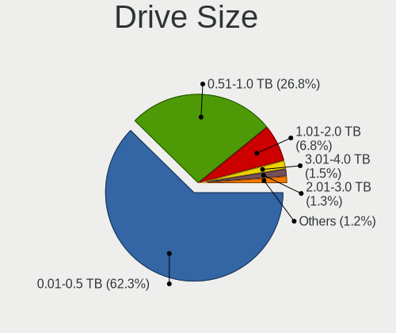
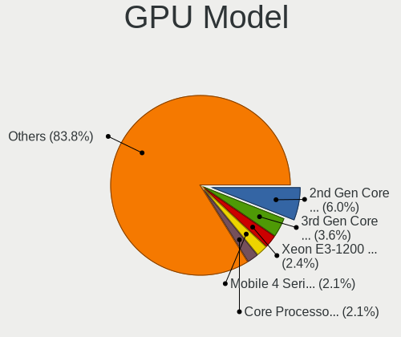
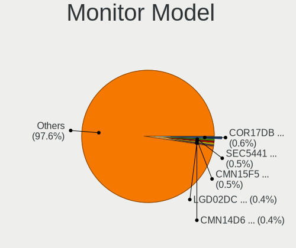
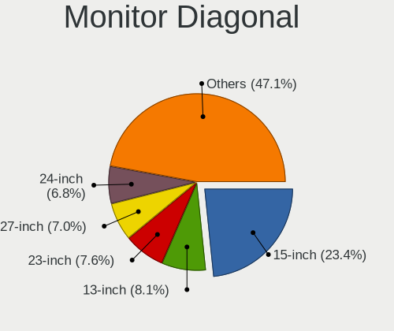
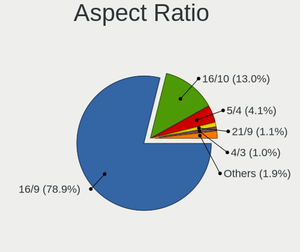
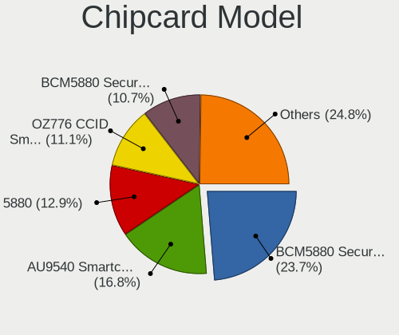

OpenMandriva - Tested Hardware & Statistics
-------------------------------------------

A project to collect tested hardware configurations for OpenMandriva.

Anyone can contribute to this report by the [hw-probe](https://github.com/linuxhw/hw-probe) tool:

    sudo -E hw-probe -all -upload

Please contribute! Especially if your hardware is rare.

This is a report for all computer types. See also reports for [desktops](/Dist/OpenMandriva/Desktop/README.md) and [notebooks](/Dist/OpenMandriva/Notebook/README.md).

Contents
--------

* [ Test Cases ](#test-cases)

* [ System ](#system)
  - [ OS                       ](#os)
  - [ OS Family                ](#os-family)
  - [ Kernel                   ](#kernel)
  - [ Kernel Family            ](#kernel-family)
  - [ Kernel Major Ver.        ](#kernel-major-ver)
  - [ Arch                     ](#arch)
  - [ DE                       ](#de)
  - [ Display Server           ](#display-server)
  - [ Display Manager          ](#display-manager)
  - [ OS Lang                  ](#os-lang)
  - [ Boot Mode                ](#boot-mode)
  - [ Filesystem               ](#filesystem)
  - [ Part. scheme             ](#part-scheme)
  - [ Dual Boot with Linux/BSD ](#dual-boot-with-linuxbsd)
  - [ Dual Boot (Win)          ](#dual-boot-win)

* [ Board ](#board)
  - [ Vendor                   ](#vendor)
  - [ Model                    ](#model)
  - [ Model Family             ](#model-family)
  - [ MFG Year                 ](#mfg-year)
  - [ Form Factor              ](#form-factor)
  - [ Secure Boot              ](#secure-boot)
  - [ Coreboot                 ](#coreboot)
  - [ RAM Size                 ](#ram-size)
  - [ RAM Used                 ](#ram-used)
  - [ Total Drives             ](#total-drives)
  - [ Has CD-ROM               ](#has-cd-rom)
  - [ Has Ethernet             ](#has-ethernet)
  - [ Has WiFi                 ](#has-wifi)
  - [ Has Bluetooth            ](#has-bluetooth)

* [ Location ](#location)
  - [ Country                  ](#country)
  - [ City                     ](#city)

* [ Drives ](#drives)
  - [ Drive Vendor             ](#drive-vendor)
  - [ Drive Model              ](#drive-model)
  - [ HDD Vendor               ](#hdd-vendor)
  - [ SSD Vendor               ](#ssd-vendor)
  - [ Drive Kind               ](#drive-kind)
  - [ Drive Connector          ](#drive-connector)
  - [ Drive Size               ](#drive-size)
  - [ Space Total              ](#space-total)
  - [ Space Used               ](#space-used)
  - [ Malfunc. Drives          ](#malfunc-drives)
  - [ Malfunc. Drive Vendor    ](#malfunc-drive-vendor)
  - [ Malfunc. HDD Vendor      ](#malfunc-hdd-vendor)
  - [ Malfunc. Drive Kind      ](#malfunc-drive-kind)
  - [ Failed Drives            ](#failed-drives)
  - [ Failed Drive Vendor      ](#failed-drive-vendor)
  - [ Drive Status             ](#drive-status)

* [ Storage controller ](#storage-controller)
  - [ Storage Vendor           ](#storage-vendor)
  - [ Storage Model            ](#storage-model)
  - [ Storage Kind             ](#storage-kind)

* [ Processor ](#processor)
  - [ CPU Vendor               ](#cpu-vendor)
  - [ CPU Model                ](#cpu-model)
  - [ CPU Model Family         ](#cpu-model-family)
  - [ CPU Cores                ](#cpu-cores)
  - [ CPU Sockets              ](#cpu-sockets)
  - [ CPU Threads              ](#cpu-threads)
  - [ CPU Op-Modes             ](#cpu-op-modes)
  - [ CPU Microcode            ](#cpu-microcode)
  - [ CPU Microarch            ](#cpu-microarch)

* [ Graphics ](#graphics)
  - [ GPU Vendor               ](#gpu-vendor)
  - [ GPU Model                ](#gpu-model)
  - [ GPU Combo                ](#gpu-combo)
  - [ GPU Driver               ](#gpu-driver)
  - [ GPU Memory               ](#gpu-memory)

* [ Monitor ](#monitor)
  - [ Monitor Vendor           ](#monitor-vendor)
  - [ Monitor Model            ](#monitor-model)
  - [ Monitor Resolution       ](#monitor-resolution)
  - [ Monitor Diagonal         ](#monitor-diagonal)
  - [ Monitor Width            ](#monitor-width)
  - [ Aspect Ratio             ](#aspect-ratio)
  - [ Monitor Area             ](#monitor-area)
  - [ Pixel Density            ](#pixel-density)
  - [ Multiple Monitors        ](#multiple-monitors)

* [ Network ](#network)
  - [ Net Controller Vendor    ](#net-controller-vendor)
  - [ Net Controller Model     ](#net-controller-model)
  - [ Wireless Vendor          ](#wireless-vendor)
  - [ Wireless Model           ](#wireless-model)
  - [ Ethernet Vendor          ](#ethernet-vendor)
  - [ Ethernet Model           ](#ethernet-model)
  - [ Net Controller Kind      ](#net-controller-kind)
  - [ Used Controller          ](#used-controller)
  - [ NICs                     ](#nics)
  - [ IPv6                     ](#ipv6)

* [ Bluetooth ](#bluetooth)
  - [ Bluetooth Vendor         ](#bluetooth-vendor)
  - [ Bluetooth Model          ](#bluetooth-model)

* [ Sound ](#sound)
  - [ Sound Vendor             ](#sound-vendor)
  - [ Sound Model              ](#sound-model)

* [ Memory ](#memory)
  - [ Memory Vendor            ](#memory-vendor)
  - [ Memory Model             ](#memory-model)
  - [ Memory Kind              ](#memory-kind)
  - [ Memory Form Factor       ](#memory-form-factor)
  - [ Memory Size              ](#memory-size)
  - [ Memory Speed             ](#memory-speed)

* [ Printers & scanners ](#printers--scanners)
  - [ Printer Vendor           ](#printer-vendor)
  - [ Printer Model            ](#printer-model)
  - [ Scanner Vendor           ](#scanner-vendor)
  - [ Scanner Model            ](#scanner-model)

* [ Camera ](#camera)
  - [ Camera Vendor            ](#camera-vendor)
  - [ Camera Model             ](#camera-model)

* [ Security ](#security)
  - [ Fingerprint Vendor       ](#fingerprint-vendor)
  - [ Fingerprint Model        ](#fingerprint-model)
  - [ Chipcard Vendor          ](#chipcard-vendor)
  - [ Chipcard Model           ](#chipcard-model)

* [ Unsupported ](#unsupported)
  - [ Unsupported Devices      ](#unsupported-devices)
  - [ Unsupported Device Types ](#unsupported-device-types)

Test Cases
----------

Total: 14528

| Vendor        | Model                       | Form-Factor | Probe                                                      | Date         |
|---------------|-----------------------------|-------------|------------------------------------------------------------|--------------|
| lapbook       | S15 PRO                     | Notebook    | [06ae615fd1](https://linux-hardware.org/?probe=06ae615fd1) | Jul 01, 2023 |
| Acer          | Aspire E5-772               | Notebook    | [b33f11c7c9](https://linux-hardware.org/?probe=b33f11c7c9) | Jul 01, 2023 |
| ASUSTek       | N752VX                      | Notebook    | [d4fd40a9f3](https://linux-hardware.org/?probe=d4fd40a9f3) | Jul 01, 2023 |
| Packard Be... | EasyNote TSX66HR            | Notebook    | [96253a3da8](https://linux-hardware.org/?probe=96253a3da8) | Jul 01, 2023 |
| Gigabyte      | GA-78LMT-USB3 SEx           | Desktop     | [af3e6790e4](https://linux-hardware.org/?probe=af3e6790e4) | Jun 30, 2023 |
| Dell          | Inspiron 1545               | Notebook    | [cfcc86ddd5](https://linux-hardware.org/?probe=cfcc86ddd5) | Jun 30, 2023 |
| Toshiba       | All In One PC MP            | All in one  | [d9f55bbac6](https://linux-hardware.org/?probe=d9f55bbac6) | Jun 30, 2023 |
| Gigabyte      | H61M-S1                     | Desktop     | [b6be2d7f9f](https://linux-hardware.org/?probe=b6be2d7f9f) | Jun 30, 2023 |
| HP            | 8056                        | Desktop     | [32d1199c51](https://linux-hardware.org/?probe=32d1199c51) | Jun 30, 2023 |
| Acer          | Aspire A314-22              | Notebook    | [ef54ec3027](https://linux-hardware.org/?probe=ef54ec3027) | Jun 30, 2023 |
| Lenovo        | ThinkPad L430 246634S       | Notebook    | [5368d4410f](https://linux-hardware.org/?probe=5368d4410f) | Jun 30, 2023 |
| HP            | Laptop 15-db1xxx            | Notebook    | [6d3d6e002f](https://linux-hardware.org/?probe=6d3d6e002f) | Jun 30, 2023 |
| ASUSTek       | X555LAB                     | Notebook    | [99e1623ea0](https://linux-hardware.org/?probe=99e1623ea0) | Jun 29, 2023 |
| MSI           | A320M-A PRO                 | Desktop     | [7dffb9055b](https://linux-hardware.org/?probe=7dffb9055b) | Jun 29, 2023 |
| ASUSTek       | H87M-E                      | Desktop     | [7e7af2948c](https://linux-hardware.org/?probe=7e7af2948c) | Jun 29, 2023 |
| Lenovo        | IdeaPad 100-15IBY 80MJ      | Notebook    | [723de914e2](https://linux-hardware.org/?probe=723de914e2) | Jun 29, 2023 |
| HP            | Notebook                    | Notebook    | [a178cbf707](https://linux-hardware.org/?probe=a178cbf707) | Jun 29, 2023 |
| ASUSTek       | ROG Strix G513QY_G513QY     | Notebook    | [a77c825995](https://linux-hardware.org/?probe=a77c825995) | Jun 29, 2023 |
| Dell          | System XPS L321X            | Notebook    | [abf6b8b341](https://linux-hardware.org/?probe=abf6b8b341) | Jun 29, 2023 |
| HP            | 8459                        | Desktop     | [11e9d33725](https://linux-hardware.org/?probe=11e9d33725) | Jun 29, 2023 |
| Acer          | Aspire TC-705               | Desktop     | [326f873ac3](https://linux-hardware.org/?probe=326f873ac3) | Jun 29, 2023 |
| Acer          | Aspire 5830TG               | Notebook    | [8c001b69bb](https://linux-hardware.org/?probe=8c001b69bb) | Jun 29, 2023 |
| Biostar       | H510MHP                     | Desktop     | [7ddeb5c281](https://linux-hardware.org/?probe=7ddeb5c281) | Jun 29, 2023 |
| ASUSTek       | P5G41T-M LX                 | Desktop     | [20f509028b](https://linux-hardware.org/?probe=20f509028b) | Jun 29, 2023 |
| HP            | Pavilion dv6500             | Notebook    | [0286d2f5e5](https://linux-hardware.org/?probe=0286d2f5e5) | Jun 29, 2023 |
| Gigabyte      | H61M-HD2                    | Desktop     | [404728f350](https://linux-hardware.org/?probe=404728f350) | Jun 29, 2023 |
| HP            | Stream Laptop 14-cb1XX      | Notebook    | [1db11a4fa9](https://linux-hardware.org/?probe=1db11a4fa9) | Jun 29, 2023 |
| MSI           | MS-7438 100                 | Desktop     | [4d0d23065e](https://linux-hardware.org/?probe=4d0d23065e) | Jun 29, 2023 |
| ASUSTek       | M5A78L-M PLUS/USB3          | Desktop     | [2f50312c02](https://linux-hardware.org/?probe=2f50312c02) | Jun 29, 2023 |
| Lenovo        | ThinkPad L520 50153CJ       | Notebook    | [1793064ee5](https://linux-hardware.org/?probe=1793064ee5) | Jun 29, 2023 |
| Huanan        | X99-BD4 V1.31               | Desktop     | [fcd9a6b1e2](https://linux-hardware.org/?probe=fcd9a6b1e2) | Jun 28, 2023 |
| Acer          | Aspire A315-42              | Notebook    | [d2a1351f86](https://linux-hardware.org/?probe=d2a1351f86) | Jun 28, 2023 |
| Acer          | EG43M                       | Desktop     | [e6d28dd1e5](https://linux-hardware.org/?probe=e6d28dd1e5) | Jun 28, 2023 |
| ASUSTek       | PRIME Z370M-PLUS II         | Desktop     | [1114cf7328](https://linux-hardware.org/?probe=1114cf7328) | Jun 28, 2023 |
| ASUSTek       | K54C                        | Notebook    | [4152d1fcff](https://linux-hardware.org/?probe=4152d1fcff) | Jun 28, 2023 |
| Foxconn       | G41MD                       | Desktop     | [926a733402](https://linux-hardware.org/?probe=926a733402) | Jun 27, 2023 |
| MSI           | B250M PRO-VH                | Desktop     | [cb47380993](https://linux-hardware.org/?probe=cb47380993) | Jun 27, 2023 |
| ASUSTek       | TUF Gaming B550M-PLUS       | Desktop     | [2ed9f4248c](https://linux-hardware.org/?probe=2ed9f4248c) | Jun 27, 2023 |
| PCsmart       | PCSGOB14p-C                 | Notebook    | [a45977461f](https://linux-hardware.org/?probe=a45977461f) | Jun 27, 2023 |
| ASUSTek       | M5A97 PLUS                  | Desktop     | [2faeb24e37](https://linux-hardware.org/?probe=2faeb24e37) | Jun 27, 2023 |
| MSI           | PRO B660M-B DDR4            | Desktop     | [09f4e0e86a](https://linux-hardware.org/?probe=09f4e0e86a) | Jun 27, 2023 |
| Kennex        | POS-PIG41BA                 | Desktop     | [90addad9e1](https://linux-hardware.org/?probe=90addad9e1) | Jun 27, 2023 |
| Fujitsu       | D3403-U1 S26361-D3403-U1    | Desktop     | [90067b8232](https://linux-hardware.org/?probe=90067b8232) | Jun 27, 2023 |
| Clevo         | M540SS Bottom               | Notebook    | [4b613733a0](https://linux-hardware.org/?probe=4b613733a0) | Jun 27, 2023 |
| Dell          | Inspiron 7720               | Notebook    | [89858274fd](https://linux-hardware.org/?probe=89858274fd) | Jun 27, 2023 |
| Dell          | Inspiron 1545               | Notebook    | [d6b3d5cb90](https://linux-hardware.org/?probe=d6b3d5cb90) | Jun 27, 2023 |
| ASUSTek       | A88XM-E                     | Desktop     | [4557637b8a](https://linux-hardware.org/?probe=4557637b8a) | Jun 26, 2023 |
| Lenovo        | ThinkCentre M90p 5450A26    | Desktop     | [78632c3242](https://linux-hardware.org/?probe=78632c3242) | Jun 26, 2023 |
| GEEKOM        | MiniAir 11                  | Server      | [98c7079daa](https://linux-hardware.org/?probe=98c7079daa) | Jun 26, 2023 |
| HP            | 8430 1000                   | All in one  | [cba036b5d2](https://linux-hardware.org/?probe=cba036b5d2) | Jun 26, 2023 |
| ASUSTek       | PRIME X370-PRO              | Desktop     | [827cec37c7](https://linux-hardware.org/?probe=827cec37c7) | Jun 26, 2023 |
| ASRock        | H110M-HG4                   | Desktop     | [6aba51f328](https://linux-hardware.org/?probe=6aba51f328) | Jun 26, 2023 |
| Gigabyte      | GA-78LMT-S2P                | Desktop     | [713bfcdf62](https://linux-hardware.org/?probe=713bfcdf62) | Jun 26, 2023 |
| ASRock        | B450 Steel Legend           | Desktop     | [734e60af76](https://linux-hardware.org/?probe=734e60af76) | Jun 25, 2023 |
| ASUSTek       | VivoBook_ASUSLaptop X510... | Notebook    | [501d3b5530](https://linux-hardware.org/?probe=501d3b5530) | Jun 25, 2023 |
| Intel         | H61                         | Desktop     | [8013deae02](https://linux-hardware.org/?probe=8013deae02) | Jun 25, 2023 |
| Acer          | EQ45LM                      | Desktop     | [30781f8f1b](https://linux-hardware.org/?probe=30781f8f1b) | Jun 25, 2023 |
| Gigabyte      | B550M AORUS ELITE           | Desktop     | [2f3a03f9d4](https://linux-hardware.org/?probe=2f3a03f9d4) | Jun 25, 2023 |
| Gigabyte      | GA-78LMT-S2                 | Desktop     | [a31908b24b](https://linux-hardware.org/?probe=a31908b24b) | Jun 25, 2023 |
| ASRock        | G31M-GS                     | Desktop     | [f58c462a34](https://linux-hardware.org/?probe=f58c462a34) | Jun 25, 2023 |
| HP            | 3648h                       | Desktop     | [16b9a3d94d](https://linux-hardware.org/?probe=16b9a3d94d) | Jun 25, 2023 |
| HP            | Laptop 15-dw3xxx            | Notebook    | [a80704a116](https://linux-hardware.org/?probe=a80704a116) | Jun 25, 2023 |
| ECS           | P67H2-A3                    | Desktop     | [f35a6b0a66](https://linux-hardware.org/?probe=f35a6b0a66) | Jun 25, 2023 |
| Biostar       | G31M+                       | Desktop     | [d8347c5f07](https://linux-hardware.org/?probe=d8347c5f07) | Jun 25, 2023 |
| ASUSTek       | M51Vr                       | Notebook    | [16404e70f6](https://linux-hardware.org/?probe=16404e70f6) | Jun 25, 2023 |
| HP            | 21B4 A01                    | Desktop     | [e277fd2772](https://linux-hardware.org/?probe=e277fd2772) | Jun 25, 2023 |
| Toshiba       | Satellite A300              | Notebook    | [6f1d7a6089](https://linux-hardware.org/?probe=6f1d7a6089) | Jun 25, 2023 |
| Dell          | Precision M6400             | Notebook    | [b68c09e274](https://linux-hardware.org/?probe=b68c09e274) | Jun 25, 2023 |
| Intel         | DH61WW AAG23116-204         | Desktop     | [4269ca2c0b](https://linux-hardware.org/?probe=4269ca2c0b) | Jun 25, 2023 |
| HP            | Pavilion dv6                | Notebook    | [d699670acc](https://linux-hardware.org/?probe=d699670acc) | Jun 25, 2023 |
| ASUSTek       | P5Q-PRO                     | Desktop     | [eb8a9d675b](https://linux-hardware.org/?probe=eb8a9d675b) | Jun 25, 2023 |
| MSI           | MPG B550 GAMING PLUS        | Desktop     | [eefd044b2b](https://linux-hardware.org/?probe=eefd044b2b) | Jun 25, 2023 |
| Dell          | 0HY9JP A00                  | Desktop     | [92293568ae](https://linux-hardware.org/?probe=92293568ae) | Jun 25, 2023 |
| Lenovo        | ThinkCentre M58p 3285A1G    | Desktop     | [d5e4ce2efa](https://linux-hardware.org/?probe=d5e4ce2efa) | Jun 25, 2023 |
| Unknown       | Unknown                     | Desktop     | [186a7eedb6](https://linux-hardware.org/?probe=186a7eedb6) | Jun 25, 2023 |
| Lenovo        | IdeaPad 3 15ITL6 82H8       | Notebook    | [c6edbe5681](https://linux-hardware.org/?probe=c6edbe5681) | Jun 25, 2023 |
| Toshiba       | Satellite Pro L500          | Notebook    | [44e57dc97b](https://linux-hardware.org/?probe=44e57dc97b) | Jun 25, 2023 |
| Lenovo        | ThinkPad T480 20L6S01G00    | Notebook    | [a66d6dba45](https://linux-hardware.org/?probe=a66d6dba45) | Jun 25, 2023 |
| ASUSTek       | VivoBook_ASUSLaptop X509... | Notebook    | [8862b2d8db](https://linux-hardware.org/?probe=8862b2d8db) | Jun 25, 2023 |
| ASUSTek       | P5Q-E                       | Desktop     | [55179e2249](https://linux-hardware.org/?probe=55179e2249) | Jun 25, 2023 |
| Acer          | Aspire F5-571G              | Notebook    | [fb61026d60](https://linux-hardware.org/?probe=fb61026d60) | Jun 25, 2023 |
| Lenovo        | ThinkPad T450 20BUS0EW1K    | Notebook    | [43f405f4ce](https://linux-hardware.org/?probe=43f405f4ce) | Jun 25, 2023 |
| Toshiba       | IS 1413G                    | Notebook    | [bce89b670d](https://linux-hardware.org/?probe=bce89b670d) | Jun 25, 2023 |
| Lenovo        | V15 G2 ITL 82ME             | Notebook    | [3fde30195c](https://linux-hardware.org/?probe=3fde30195c) | Jun 25, 2023 |
| Dell          | Inspiron 1545               | Notebook    | [7f8217bce2](https://linux-hardware.org/?probe=7f8217bce2) | Jun 25, 2023 |
| Medion        | H110H4-CM2                  | Desktop     | [49df9d792a](https://linux-hardware.org/?probe=49df9d792a) | Jun 25, 2023 |
| eMachines     | eME732ZG                    | Notebook    | [4e1d6873ff](https://linux-hardware.org/?probe=4e1d6873ff) | Jun 24, 2023 |
| HP            | 8055                        | Desktop     | [7fac5a1354](https://linux-hardware.org/?probe=7fac5a1354) | Jun 24, 2023 |
| Lenovo        | Legion 5 Pro 16ARH7H 82R... | Notebook    | [23c2fe2245](https://linux-hardware.org/?probe=23c2fe2245) | Jun 24, 2023 |
| Packard Be... | EasyNote TK85               | Notebook    | [314e344780](https://linux-hardware.org/?probe=314e344780) | Jun 24, 2023 |
| MSI           | MAG B650 TOMAHAWK WIFI      | Desktop     | [6760d73caf](https://linux-hardware.org/?probe=6760d73caf) | Jun 24, 2023 |
| MSI           | B450 GAMING PLUS MAX        | Desktop     | [785d3130e7](https://linux-hardware.org/?probe=785d3130e7) | Jun 24, 2023 |
| HP            | 1496                        | Desktop     | [9d4549de6c](https://linux-hardware.org/?probe=9d4549de6c) | Jun 24, 2023 |
| HP            | G62                         | Notebook    | [e8187f4fb6](https://linux-hardware.org/?probe=e8187f4fb6) | Jun 24, 2023 |
| Packard Be... | EasyNote TJ65               | Notebook    | [cdc135487b](https://linux-hardware.org/?probe=cdc135487b) | Jun 24, 2023 |
| Dell          | Latitude 3180               | Notebook    | [a9a4a63807](https://linux-hardware.org/?probe=a9a4a63807) | Jun 24, 2023 |
| Intel         | DH77EB AAG39073-304         | Desktop     | [6936a9ca21](https://linux-hardware.org/?probe=6936a9ca21) | Jun 24, 2023 |
| PERTOSA       | GA-H110TN-M                 | Desktop     | [43b4160c55](https://linux-hardware.org/?probe=43b4160c55) | Jun 24, 2023 |
| ASUSTek       | Berkeley                    | Desktop     | [5d4d2adebe](https://linux-hardware.org/?probe=5d4d2adebe) | Jun 24, 2023 |
| Gigabyte      | A320M-S2H V2-CF             | Desktop     | [9408842ffc](https://linux-hardware.org/?probe=9408842ffc) | Jun 24, 2023 |
| MSI           | PRO H410M-B                 | Desktop     | [76dd0fc5f1](https://linux-hardware.org/?probe=76dd0fc5f1) | Jun 24, 2023 |
| MSI           | MS-7360                     | Desktop     | [9a0d46b069](https://linux-hardware.org/?probe=9a0d46b069) | Jun 23, 2023 |
| Toshiba       | Satellite C650              | Notebook    | [54ef5b6567](https://linux-hardware.org/?probe=54ef5b6567) | Jun 23, 2023 |
| HP            | 215 G1                      | Notebook    | [0b651dad7d](https://linux-hardware.org/?probe=0b651dad7d) | Jun 23, 2023 |
| HP            | Compaq 610                  | Notebook    | [f312ec5ede](https://linux-hardware.org/?probe=f312ec5ede) | Jun 23, 2023 |
| HP            | Presario CQ56               | Notebook    | [5a8991a97b](https://linux-hardware.org/?probe=5a8991a97b) | Jun 23, 2023 |
| HP            | 1495                        | Desktop     | [eab7d15f02](https://linux-hardware.org/?probe=eab7d15f02) | Jun 23, 2023 |
| ASRock        | B450M Pro4                  | Desktop     | [54d4fa843c](https://linux-hardware.org/?probe=54d4fa843c) | Jun 23, 2023 |
| ASUSTek       | PRIME H410M-A               | Desktop     | [39d5409264](https://linux-hardware.org/?probe=39d5409264) | Jun 23, 2023 |
| ASRock        | Z87M Pro4                   | Desktop     | [762b33c8e7](https://linux-hardware.org/?probe=762b33c8e7) | Jun 23, 2023 |
| Lenovo        | Flex 2-14 20404             | Notebook    | [4ab121533a](https://linux-hardware.org/?probe=4ab121533a) | Jun 23, 2023 |
| Huanan        | X79 V6.11                   | Desktop     | [e94687bb6b](https://linux-hardware.org/?probe=e94687bb6b) | Jun 23, 2023 |
| MSI           | S12T 3M/S12 3M              | Notebook    | [f135825cec](https://linux-hardware.org/?probe=f135825cec) | Jun 23, 2023 |
| Foxconn       | H61MXV/H67MXV               | Desktop     | [167de0618f](https://linux-hardware.org/?probe=167de0618f) | Jun 23, 2023 |
| ASUSTek       | VivoBook_ASUSLaptop X421... | Notebook    | [b47fa47ef7](https://linux-hardware.org/?probe=b47fa47ef7) | Jun 23, 2023 |
| HP            | Stream 11 Pro G4 EE         | Notebook    | [8add1110e7](https://linux-hardware.org/?probe=8add1110e7) | Jun 23, 2023 |
| TUXEDO        | Pulse 15 Gen1               | Notebook    | [efad2eddea](https://linux-hardware.org/?probe=efad2eddea) | Jun 23, 2023 |
| Lenovo        | G570 20079                  | Notebook    | [5879c3e9ad](https://linux-hardware.org/?probe=5879c3e9ad) | Jun 22, 2023 |
| Sony          | VAIO                        | All in one  | [8eda132a31](https://linux-hardware.org/?probe=8eda132a31) | Jun 22, 2023 |
| Lenovo        | ThinkPad P52 20M9CTO1WW     | Notebook    | [9d234065ed](https://linux-hardware.org/?probe=9d234065ed) | Jun 22, 2023 |
| ASUSTek       | PRIME H410M-E               | Desktop     | [cc8a15081a](https://linux-hardware.org/?probe=cc8a15081a) | Jun 22, 2023 |
| ZOTAC         | Unknown                     | Desktop     | [8454119675](https://linux-hardware.org/?probe=8454119675) | Jun 22, 2023 |
| ASUSTek       | P5G41T-M LX                 | Desktop     | [ba9d7c939a](https://linux-hardware.org/?probe=ba9d7c939a) | Jun 22, 2023 |
| Dell          | 0WMJ54 A01                  | Desktop     | [0b8cf1cae7](https://linux-hardware.org/?probe=0b8cf1cae7) | Jun 22, 2023 |
| ASUSTek       | PRIME B365M-A               | Desktop     | [4e877b9c8d](https://linux-hardware.org/?probe=4e877b9c8d) | Jun 22, 2023 |
| Acer          | Aspire ES1-571              | Notebook    | [db93ddfd03](https://linux-hardware.org/?probe=db93ddfd03) | Jun 22, 2023 |
| Acer          | Nitro AN515-57              | Notebook    | [fc54744449](https://linux-hardware.org/?probe=fc54744449) | Jun 22, 2023 |
| Lenovo        | SHARKBAY 0B98401 WIN        | Desktop     | [1c465408de](https://linux-hardware.org/?probe=1c465408de) | Jun 22, 2023 |
| ASUSTek       | UX31E                       | Notebook    | [51b4c8d9ef](https://linux-hardware.org/?probe=51b4c8d9ef) | Jun 22, 2023 |
| Dell          | Inspiron 15 3525            | Notebook    | [09f4615df6](https://linux-hardware.org/?probe=09f4615df6) | Jun 22, 2023 |
| Foxconn       | ETON                        | Desktop     | [ae0d87abfb](https://linux-hardware.org/?probe=ae0d87abfb) | Jun 21, 2023 |
| Dell          | Inspiron 5557               | Notebook    | [cc0794fa6e](https://linux-hardware.org/?probe=cc0794fa6e) | Jun 21, 2023 |
| ASRock        | Z77 Extreme4                | Desktop     | [5c9111463c](https://linux-hardware.org/?probe=5c9111463c) | Jun 21, 2023 |
| Sony          | VGN-NS21M_W                 | Notebook    | [6813d6589e](https://linux-hardware.org/?probe=6813d6589e) | Jun 21, 2023 |
| Foxconn       | 45CMX/45GMX/45CMX-K         | Desktop     | [68ec70d3f8](https://linux-hardware.org/?probe=68ec70d3f8) | Jun 21, 2023 |
| Intel         | D34010WYK H14771-302        | Desktop     | [acda87fcd6](https://linux-hardware.org/?probe=acda87fcd6) | Jun 21, 2023 |
| Acer          | One S1002                   | Notebook    | [f7b8d25603](https://linux-hardware.org/?probe=f7b8d25603) | Jun 21, 2023 |
| Acer          | Aspire R3-131T              | Notebook    | [ab7c961e2b](https://linux-hardware.org/?probe=ab7c961e2b) | Jun 21, 2023 |
| ASUSTek       | K73SD                       | Notebook    | [2dcb7bb5c9](https://linux-hardware.org/?probe=2dcb7bb5c9) | Jun 21, 2023 |
| Acer          | H11H4-AI V:1.0              | Desktop     | [9f5f612aa7](https://linux-hardware.org/?probe=9f5f612aa7) | Jun 21, 2023 |
| HP            | Notebook                    | Notebook    | [3460bcb864](https://linux-hardware.org/?probe=3460bcb864) | Jun 20, 2023 |
| Positivo      | POS-ECIG41BSA               | Desktop     | [abaf6ee67e](https://linux-hardware.org/?probe=abaf6ee67e) | Jun 20, 2023 |
| Samsung       | 300E4A/300E5A/300E7A/343... | Notebook    | [f84ddd7cac](https://linux-hardware.org/?probe=f84ddd7cac) | Jun 20, 2023 |
| Lenovo        | IdeaPad 3 15ITL6 82MD       | Notebook    | [c40e92156c](https://linux-hardware.org/?probe=c40e92156c) | Jun 20, 2023 |
| Lenovo        | SHARKBAY NOK                | Desktop     | [4560c6d34d](https://linux-hardware.org/?probe=4560c6d34d) | Jun 19, 2023 |
| ASUSTek       | P8H61-M LX                  | Desktop     | [35de204113](https://linux-hardware.org/?probe=35de204113) | Jun 19, 2023 |
| Acer          | Aspire F5-771G              | Notebook    | [034d235f5c](https://linux-hardware.org/?probe=034d235f5c) | Jun 19, 2023 |
| Gigabyte      | GA-E350N                    | Desktop     | [dc5ab95b15](https://linux-hardware.org/?probe=dc5ab95b15) | Jun 19, 2023 |
| Dell          | System XPS L502X            | Notebook    | [463e017820](https://linux-hardware.org/?probe=463e017820) | Jun 19, 2023 |
| Dell          | Studio 1555                 | Notebook    | [d9337bf223](https://linux-hardware.org/?probe=d9337bf223) | Jun 19, 2023 |
| Lenovo        | ThinkPad E580 20KS001JMZ    | Notebook    | [780d549a32](https://linux-hardware.org/?probe=780d549a32) | Jun 18, 2023 |
| HP            | Laptop 14s-dk1xxx           | Notebook    | [16bbd0f687](https://linux-hardware.org/?probe=16bbd0f687) | Jun 18, 2023 |
| MSI           | 2AE0                        | Desktop     | [fdfc88e5da](https://linux-hardware.org/?probe=fdfc88e5da) | Jun 18, 2023 |
| Gigabyte      | GA-78LMT-USB3               | Desktop     | [4bafdb9349](https://linux-hardware.org/?probe=4bafdb9349) | Jun 18, 2023 |
| Apple         | Mac-942B5BF58194151B        | All in one  | [651988e989](https://linux-hardware.org/?probe=651988e989) | Jun 18, 2023 |
| Dell          | 0HN7XN A01                  | Desktop     | [7348297d40](https://linux-hardware.org/?probe=7348297d40) | Jun 18, 2023 |
| HP            | Pavilion dv2                | Notebook    | [3f3b0104a4](https://linux-hardware.org/?probe=3f3b0104a4) | Jun 18, 2023 |
| HP            | Compaq Presario CQ71        | Notebook    | [d5025e2864](https://linux-hardware.org/?probe=d5025e2864) | Jun 18, 2023 |
| Gigabyte      | H110M-S2H-CF                | Desktop     | [e33558044f](https://linux-hardware.org/?probe=e33558044f) | Jun 18, 2023 |
| Gigabyte      | AB350M-DS3H-CF              | Desktop     | [fac7a3587a](https://linux-hardware.org/?probe=fac7a3587a) | Jun 18, 2023 |
| HP            | ZBook 15                    | Notebook    | [80caa07733](https://linux-hardware.org/?probe=80caa07733) | Jun 18, 2023 |
| GEEKOM        | MiniAir 11                  | Server      | [ac5a7b3810](https://linux-hardware.org/?probe=ac5a7b3810) | Jun 18, 2023 |
| Lenovo        | IdeaPad 3 15ALC6 82KU       | Notebook    | [46692b99cb](https://linux-hardware.org/?probe=46692b99cb) | Jun 18, 2023 |
| MSI           | Z97 PC Mate                 | Desktop     | [191a3b02ac](https://linux-hardware.org/?probe=191a3b02ac) | Jun 17, 2023 |
| HP            | 2820h                       | Desktop     | [b6d16a685f](https://linux-hardware.org/?probe=b6d16a685f) | Jun 17, 2023 |
| Gigabyte      | GA-M56S-S3                  | Desktop     | [bb3ad00508](https://linux-hardware.org/?probe=bb3ad00508) | Jun 17, 2023 |
| Lenovo        | ThinkPad P50 20EQS4840B     | Notebook    | [a60f1ae93e](https://linux-hardware.org/?probe=a60f1ae93e) | Jun 17, 2023 |
| ASUSTek       | X551CAP                     | Notebook    | [9066d9bad2](https://linux-hardware.org/?probe=9066d9bad2) | Jun 17, 2023 |
| MSI           | MPG X570 GAMING EDGE WIF... | Desktop     | [3050f49c99](https://linux-hardware.org/?probe=3050f49c99) | Jun 17, 2023 |
| Gigabyte      | B450M DS3H-CF               | Desktop     | [3c45e54fd2](https://linux-hardware.org/?probe=3c45e54fd2) | Jun 17, 2023 |
| ASUSTek       | H97-PLUS                    | Desktop     | [adc38f998a](https://linux-hardware.org/?probe=adc38f998a) | Jun 17, 2023 |
| Lenovo        | 3140 SDK0J40700 WIN 3258... | Desktop     | [eebb6ba229](https://linux-hardware.org/?probe=eebb6ba229) | Jun 17, 2023 |
| Acer          | H11H4-AI V:1.0              | Desktop     | [da28ef1e25](https://linux-hardware.org/?probe=da28ef1e25) | Jun 17, 2023 |
| Lenovo        | ThinkPad E580 20KSCTO1WW    | Notebook    | [d415965e91](https://linux-hardware.org/?probe=d415965e91) | Jun 17, 2023 |
| Monster       | HUMA H4 V5.2                | Notebook    | [491797a556](https://linux-hardware.org/?probe=491797a556) | Jun 17, 2023 |
| Lenovo        | 3132 SDK0J40697 WIN 3305... | Desktop     | [2149968671](https://linux-hardware.org/?probe=2149968671) | Jun 16, 2023 |
| ASUSTek       | H61M-A/BR                   | Desktop     | [a587493314](https://linux-hardware.org/?probe=a587493314) | Jun 16, 2023 |
| ASUSTek       | G50V                        | Notebook    | [32048be4b5](https://linux-hardware.org/?probe=32048be4b5) | Jun 16, 2023 |
| ASUSTek       | P5B-Deluxe                  | Desktop     | [4dae4ff7c6](https://linux-hardware.org/?probe=4dae4ff7c6) | Jun 16, 2023 |
| ASUSTek       | P5KPL-VM                    | Desktop     | [e2919326cd](https://linux-hardware.org/?probe=e2919326cd) | Jun 16, 2023 |
| Lenovo        | MAHOBAY                     | Desktop     | [ebedbde736](https://linux-hardware.org/?probe=ebedbde736) | Jun 16, 2023 |
| Dell          | XPS 15 9550                 | Notebook    | [b7faea4be3](https://linux-hardware.org/?probe=b7faea4be3) | Jun 16, 2023 |
| Dell          | 0YXT71 A01                  | Desktop     | [f242fcd667](https://linux-hardware.org/?probe=f242fcd667) | Jun 15, 2023 |
| Acer          | Aspire V3-571               | Notebook    | [75c2da2c37](https://linux-hardware.org/?probe=75c2da2c37) | Jun 15, 2023 |
| HP            | EliteBook 2540p             | Notebook    | [20ddd7a28b](https://linux-hardware.org/?probe=20ddd7a28b) | Jun 15, 2023 |
| Lenovo        | SDK0E50510 WIN              | Desktop     | [8571bdf994](https://linux-hardware.org/?probe=8571bdf994) | Jun 15, 2023 |
| HP            | Spectre x360 Convertible... | Convertible | [699dd5b23e](https://linux-hardware.org/?probe=699dd5b23e) | Jun 15, 2023 |
| ASUSTek       | Benicia                     | Desktop     | [4b99537b32](https://linux-hardware.org/?probe=4b99537b32) | Jun 15, 2023 |
| ASUSTek       | S400CA                      | Notebook    | [d512f1865e](https://linux-hardware.org/?probe=d512f1865e) | Jun 15, 2023 |
| Fujitsu       | D3230-A1 S26361-D3230-A1    | Desktop     | [dbe7676807](https://linux-hardware.org/?probe=dbe7676807) | Jun 15, 2023 |
| Dell          | 0HY9JP A00                  | Desktop     | [d7689b11ad](https://linux-hardware.org/?probe=d7689b11ad) | Jun 14, 2023 |
| ASUSTek       | X541UAK                     | Notebook    | [5540ea0d6f](https://linux-hardware.org/?probe=5540ea0d6f) | Jun 14, 2023 |
| Dell          | 0PTTT9 A01                  | Desktop     | [0fd0fd8195](https://linux-hardware.org/?probe=0fd0fd8195) | Jun 14, 2023 |
| HP            | 2820h                       | Desktop     | [41fa36550a](https://linux-hardware.org/?probe=41fa36550a) | Jun 14, 2023 |
| HP            | 81B3                        | Desktop     | [9ba98d3c27](https://linux-hardware.org/?probe=9ba98d3c27) | Jun 14, 2023 |
| ASUSTek       | ASUS TUF Gaming A17 FA70... | Notebook    | [b30634c1ba](https://linux-hardware.org/?probe=b30634c1ba) | Jun 14, 2023 |
| Unknown       | Unknown                     | Desktop     | [76c1fcc4e5](https://linux-hardware.org/?probe=76c1fcc4e5) | Jun 14, 2023 |
| ASRock        | QC5000-ITX/PH               | Desktop     | [b50d647073](https://linux-hardware.org/?probe=b50d647073) | Jun 14, 2023 |
| Acer          | Veriton M6630G V:1.0        | Desktop     | [d58cd3aa7d](https://linux-hardware.org/?probe=d58cd3aa7d) | Jun 14, 2023 |
| ASUSTek       | ROG CROSSHAIR VIII HERO     | Desktop     | [922c598503](https://linux-hardware.org/?probe=922c598503) | Jun 14, 2023 |
| ASUSTek       | PRIME H510M-A               | Desktop     | [2ae3c4aaca](https://linux-hardware.org/?probe=2ae3c4aaca) | Jun 13, 2023 |
| Lenovo        | SHARKBAY SDK0E50510 WIN     | Desktop     | [83d9a91c16](https://linux-hardware.org/?probe=83d9a91c16) | Jun 13, 2023 |
| ASUSTek       | P5G41T-M LX                 | Desktop     | [c74f83bbea](https://linux-hardware.org/?probe=c74f83bbea) | Jun 13, 2023 |
| Dell          | Inspiron 1501               | Notebook    | [456a49b146](https://linux-hardware.org/?probe=456a49b146) | Jun 13, 2023 |
| LincPlus      | LINNCPLUS P1                | Notebook    | [878dc2b05f](https://linux-hardware.org/?probe=878dc2b05f) | Jun 13, 2023 |
| Intel         | Alder Lake-H PCH E1.0G      | Desktop     | [26e6a1f816](https://linux-hardware.org/?probe=26e6a1f816) | Jun 13, 2023 |
| Chuwi         | GemiBook Pro                | Notebook    | [34cfc4a037](https://linux-hardware.org/?probe=34cfc4a037) | Jun 13, 2023 |
| ASUSTek       | H110M-A                     | Desktop     | [d9cd48b67d](https://linux-hardware.org/?probe=d9cd48b67d) | Jun 12, 2023 |
| Lenovo        | 103D SDK0Q40112 WIN 3305... | Desktop     | [5c2eef3678](https://linux-hardware.org/?probe=5c2eef3678) | Jun 12, 2023 |
| Biostar       | A520MH                      | Desktop     | [70760c5e70](https://linux-hardware.org/?probe=70760c5e70) | Jun 12, 2023 |
| ASUSTek       | P8Z77-V LX                  | Desktop     | [b5b264d1e8](https://linux-hardware.org/?probe=b5b264d1e8) | Jun 12, 2023 |
| Positivo      | C14CR01                     | Notebook    | [11d46971fa](https://linux-hardware.org/?probe=11d46971fa) | Jun 12, 2023 |
| ASUSTek       | M5A99X EVO                  | Desktop     | [45094360f2](https://linux-hardware.org/?probe=45094360f2) | Jun 11, 2023 |
| Acer          | Aspire F5-571               | Notebook    | [e54e3157fc](https://linux-hardware.org/?probe=e54e3157fc) | Jun 11, 2023 |
| ASUSTek       | X540SAA                     | Notebook    | [ea61fdd09a](https://linux-hardware.org/?probe=ea61fdd09a) | Jun 11, 2023 |
| Toshiba       | All In One PC MP            | All in one  | [8d7e520fef](https://linux-hardware.org/?probe=8d7e520fef) | Jun 11, 2023 |
| Dell          | 0WMJ54 A01                  | Desktop     | [a396add68b](https://linux-hardware.org/?probe=a396add68b) | Jun 11, 2023 |
| Acer          | Nitro AN515-44              | Notebook    | [c74a9048c0](https://linux-hardware.org/?probe=c74a9048c0) | Jun 10, 2023 |
| HP            | Compaq CQ58                 | Notebook    | [98a4edb43d](https://linux-hardware.org/?probe=98a4edb43d) | Jun 10, 2023 |
| ASRock        | G41M-VS3                    | Desktop     | [d592b19e9b](https://linux-hardware.org/?probe=d592b19e9b) | Jun 10, 2023 |
| HP            | 339A                        | Desktop     | [348ce53f71](https://linux-hardware.org/?probe=348ce53f71) | Jun 10, 2023 |
| Acer          | Aspire E1-572               | Notebook    | [532d86f9e6](https://linux-hardware.org/?probe=532d86f9e6) | Jun 10, 2023 |
| ASUSTek       | TUF Gaming FX505GD_FX505... | Notebook    | [03660fb140](https://linux-hardware.org/?probe=03660fb140) | Jun 10, 2023 |
| Gigabyte      | GA-880GM-D2H                | Desktop     | [2e46385299](https://linux-hardware.org/?probe=2e46385299) | Jun 10, 2023 |
| Gigabyte      | B560M H                     | Desktop     | [fadb7a6aa8](https://linux-hardware.org/?probe=fadb7a6aa8) | Jun 10, 2023 |
| Dell          | 0D883F A06                  | Desktop     | [f0d5120461](https://linux-hardware.org/?probe=f0d5120461) | Jun 10, 2023 |
| HP            | G42                         | Notebook    | [83eca37118](https://linux-hardware.org/?probe=83eca37118) | Jun 10, 2023 |
| Lenovo        | ThinkPad T61 7660A25        | Notebook    | [e1617105e0](https://linux-hardware.org/?probe=e1617105e0) | Jun 10, 2023 |
| Dell          | Latitude 3580               | Notebook    | [9c02d2c4c4](https://linux-hardware.org/?probe=9c02d2c4c4) | Jun 10, 2023 |
| Wistron       | ProLiant ML110 G5           | Desktop     | [eea1c44d94](https://linux-hardware.org/?probe=eea1c44d94) | Jun 10, 2023 |
| GuoGuang      | IC2M1028V-J                 | Desktop     | [d7c1b01b69](https://linux-hardware.org/?probe=d7c1b01b69) | Jun 10, 2023 |
| Medion        | Akoya E7226                 | Notebook    | [b46a96183b](https://linux-hardware.org/?probe=b46a96183b) | Jun 10, 2023 |
| Acer          | Predator G3600              | Desktop     | [02a0cf3a71](https://linux-hardware.org/?probe=02a0cf3a71) | Jun 10, 2023 |
| ASUSTek       | VivoBook 17_ASUS Laptop ... | Notebook    | [08a506ad4e](https://linux-hardware.org/?probe=08a506ad4e) | Jun 09, 2023 |
| Lenovo        | V110-15IAP 80TG             | Notebook    | [68a77b486e](https://linux-hardware.org/?probe=68a77b486e) | Jun 09, 2023 |
| Dell          | Inspiron 7348               | Notebook    | [a2bd4ab5b9](https://linux-hardware.org/?probe=a2bd4ab5b9) | Jun 09, 2023 |
| MSI           | 970A-G46                    | Desktop     | [e4471b7a38](https://linux-hardware.org/?probe=e4471b7a38) | Jun 09, 2023 |
| ASUSTek       | P8H61-M LX2                 | Desktop     | [3fb94f0c4b](https://linux-hardware.org/?probe=3fb94f0c4b) | Jun 09, 2023 |
| MSI           | A520M-A PRO                 | Desktop     | [8a9223ce9f](https://linux-hardware.org/?probe=8a9223ce9f) | Jun 09, 2023 |
| HP            | 09E0h                       | Desktop     | [b6bb01441c](https://linux-hardware.org/?probe=b6bb01441c) | Jun 09, 2023 |
| Toshiba       | Satellite L635              | Notebook    | [4f124d1525](https://linux-hardware.org/?probe=4f124d1525) | Jun 09, 2023 |
| Toshiba       | PORTEGE R705                | Notebook    | [c7a032c5cf](https://linux-hardware.org/?probe=c7a032c5cf) | Jun 09, 2023 |
| ASRock        | Z690M-ITX/ax                | Desktop     | [f0bad84fca](https://linux-hardware.org/?probe=f0bad84fca) | Jun 08, 2023 |
| Gigabyte      | X570 UD                     | Desktop     | [98a10d2fd9](https://linux-hardware.org/?probe=98a10d2fd9) | Jun 08, 2023 |
| Dell          | Vostro 1015                 | Notebook    | [dcd4a1ad41](https://linux-hardware.org/?probe=dcd4a1ad41) | Jun 08, 2023 |
| Lenovo        | ThinkPad L430 24655Q7       | Notebook    | [7b45c0777e](https://linux-hardware.org/?probe=7b45c0777e) | Jun 08, 2023 |
| MSI           | X470 GAMING PLUS            | Desktop     | [eea4cea0e0](https://linux-hardware.org/?probe=eea4cea0e0) | Jun 08, 2023 |
| HP            | 87A4 10100                  | All in one  | [3c67e34a5e](https://linux-hardware.org/?probe=3c67e34a5e) | Jun 08, 2023 |
| Biostar       | H610MH                      | Desktop     | [2cd4e157d4](https://linux-hardware.org/?probe=2cd4e157d4) | Jun 08, 2023 |
| GuoGuang      | IC2M1028V-J                 | Desktop     | [04527d6ad9](https://linux-hardware.org/?probe=04527d6ad9) | Jun 08, 2023 |
| Lenovo        | ThinkPad L420 7829W1R       | Notebook    | [25d96d98f8](https://linux-hardware.org/?probe=25d96d98f8) | Jun 08, 2023 |
| HP            | Stream Notebook PC 11       | Notebook    | [fd037bb738](https://linux-hardware.org/?probe=fd037bb738) | Jun 08, 2023 |
| AMI           | Cherry Trail CR             | Desktop     | [5816e6a1cf](https://linux-hardware.org/?probe=5816e6a1cf) | Jun 07, 2023 |
| ASUSTek       | VivoBook_ASUSLaptop X415... | Notebook    | [c142d83ce5](https://linux-hardware.org/?probe=c142d83ce5) | Jun 07, 2023 |
| HP            | 1905                        | Desktop     | [0617f4e698](https://linux-hardware.org/?probe=0617f4e698) | Jun 07, 2023 |
| ASUSTek       | M5A97 R2.0                  | Desktop     | [369f5d3044](https://linux-hardware.org/?probe=369f5d3044) | Jun 07, 2023 |
| HP            | 8169                        | Desktop     | [45543e5040](https://linux-hardware.org/?probe=45543e5040) | Jun 07, 2023 |
| Kraftway      | KWH510                      | Desktop     | [3a5ccb373b](https://linux-hardware.org/?probe=3a5ccb373b) | Jun 07, 2023 |
| HP            | 2B34                        | Desktop     | [d0b5c9767f](https://linux-hardware.org/?probe=d0b5c9767f) | Jun 07, 2023 |
| MSI           | GS63VR 6RF                  | Notebook    | [4bc33968d1](https://linux-hardware.org/?probe=4bc33968d1) | Jun 06, 2023 |
| Razer         | Blade 15 Advanced Model ... | Notebook    | [8f55e469c8](https://linux-hardware.org/?probe=8f55e469c8) | Jun 06, 2023 |
| ASUSTek       | UX31E                       | Notebook    | [92d0de412b](https://linux-hardware.org/?probe=92d0de412b) | Jun 06, 2023 |
| ASRock        | Z790 Taichi Carrara         | Desktop     | [bdea2092aa](https://linux-hardware.org/?probe=bdea2092aa) | Jun 06, 2023 |
| HP            | 822A                        | Desktop     | [8cf8694f03](https://linux-hardware.org/?probe=8cf8694f03) | Jun 06, 2023 |
| ASUSTek       | ASUS TUF Gaming F15 FX50... | Notebook    | [4c3091f9ff](https://linux-hardware.org/?probe=4c3091f9ff) | Jun 06, 2023 |
| Lenovo        | 30D2 SDK0J40697 WIN 3305... | Desktop     | [624a84a2fc](https://linux-hardware.org/?probe=624a84a2fc) | Jun 06, 2023 |
| Intel         | E5 V1.0                     | Desktop     | [077c08c2dc](https://linux-hardware.org/?probe=077c08c2dc) | Jun 06, 2023 |
| Lenovo        | Z50-70 20354                | Notebook    | [05a473a2be](https://linux-hardware.org/?probe=05a473a2be) | Jun 06, 2023 |
| Acer          | EQ45LM                      | Desktop     | [73f7a3078f](https://linux-hardware.org/?probe=73f7a3078f) | Jun 06, 2023 |
| Acer          | WMCP78M                     | Desktop     | [a7a466de8a](https://linux-hardware.org/?probe=a7a466de8a) | Jun 06, 2023 |
| MSI           | GF63 Thin 9RCX              | Notebook    | [85ec51dbf3](https://linux-hardware.org/?probe=85ec51dbf3) | Jun 05, 2023 |
| Toshiba       | Satellite L45-B             | Notebook    | [a1bcda2245](https://linux-hardware.org/?probe=a1bcda2245) | Jun 05, 2023 |
| ASUSTek       | M5A78L-M LE/USB3            | Desktop     | [1bd1a651bb](https://linux-hardware.org/?probe=1bd1a651bb) | Jun 05, 2023 |
| HP            | 8265                        | Desktop     | [7afc259b97](https://linux-hardware.org/?probe=7afc259b97) | Jun 05, 2023 |
| Apple         | MacBookAir7,2               | Notebook    | [44cf28ec0e](https://linux-hardware.org/?probe=44cf28ec0e) | Jun 05, 2023 |
| MSI           | H110M ECO                   | Desktop     | [4215fc5993](https://linux-hardware.org/?probe=4215fc5993) | Jun 05, 2023 |
| HP            | Pavilion g4                 | Notebook    | [af0c33de44](https://linux-hardware.org/?probe=af0c33de44) | Jun 05, 2023 |
| Gigabyte      | B550M DS3H                  | Desktop     | [4895fe7746](https://linux-hardware.org/?probe=4895fe7746) | Jun 05, 2023 |
| HP            | Laptop 17-ak0xx             | Notebook    | [a0430d6f0c](https://linux-hardware.org/?probe=a0430d6f0c) | Jun 05, 2023 |
| ASUSTek       | PRIME Z590-P                | Desktop     | [933aa24820](https://linux-hardware.org/?probe=933aa24820) | Jun 05, 2023 |
| Dell          | Latitude E4300              | Notebook    | [cfd95b7e5e](https://linux-hardware.org/?probe=cfd95b7e5e) | Jun 05, 2023 |
| ASUSTek       | VX7SX                       | Notebook    | [ddf3010e73](https://linux-hardware.org/?probe=ddf3010e73) | Jun 05, 2023 |
| Lenovo        | ThinkPad T470s W10DG 20J... | Notebook    | [83982c1aa9](https://linux-hardware.org/?probe=83982c1aa9) | Jun 05, 2023 |
| AMD           | A88                         | Desktop     | [a7f64b7e4b](https://linux-hardware.org/?probe=a7f64b7e4b) | Jun 05, 2023 |
| ASRock        | 960GM-GS3 FX                | Desktop     | [72702690e5](https://linux-hardware.org/?probe=72702690e5) | Jun 05, 2023 |
| Intel         | DE3815TYKH H26998-402       | Desktop     | [d2f97c16e9](https://linux-hardware.org/?probe=d2f97c16e9) | Jun 05, 2023 |
| ASUSTek       | K95VJ                       | Notebook    | [9bbcec82c6](https://linux-hardware.org/?probe=9bbcec82c6) | Jun 05, 2023 |
| NEC Comput... | MS-AD611                    | All in one  | [219795e31d](https://linux-hardware.org/?probe=219795e31d) | Jun 05, 2023 |
| HP            | ENVY x360 Convertible 15... | Convertible | [48d99dbec6](https://linux-hardware.org/?probe=48d99dbec6) | Jun 05, 2023 |
| ASRock        | B150M Pro4                  | Desktop     | [0b59eacbd3](https://linux-hardware.org/?probe=0b59eacbd3) | Jun 05, 2023 |
| Apple         | MacBookAir9,1               | Notebook    | [de1d4d9d23](https://linux-hardware.org/?probe=de1d4d9d23) | Jun 05, 2023 |
| ASUSTek       | CROSSHAIR V FORMULA-Z       | Desktop     | [d275c3c00b](https://linux-hardware.org/?probe=d275c3c00b) | Jun 05, 2023 |
| HP            | 1850                        | Desktop     | [bddc14be8b](https://linux-hardware.org/?probe=bddc14be8b) | Jun 05, 2023 |
| HP            | 8643 SMVB                   | Desktop     | [697cc43136](https://linux-hardware.org/?probe=697cc43136) | Jun 04, 2023 |
| ASUSTek       | ROG STRIX B450-F GAMING ... | Desktop     | [3af6e03b1c](https://linux-hardware.org/?probe=3af6e03b1c) | Jun 04, 2023 |
| Acer          | AO722                       | Notebook    | [b8f2636f02](https://linux-hardware.org/?probe=b8f2636f02) | Jun 04, 2023 |
| ASUSTek       | VivoBook_ASUSLaptop X712... | Notebook    | [525601c31e](https://linux-hardware.org/?probe=525601c31e) | Jun 04, 2023 |
| Dell          | Inspiron 5567               | Notebook    | [0564fd483d](https://linux-hardware.org/?probe=0564fd483d) | Jun 04, 2023 |
| HP            | 1495                        | Desktop     | [0cbf6bee1f](https://linux-hardware.org/?probe=0cbf6bee1f) | Jun 04, 2023 |
| Acer          | Veriton X4630G V:1.0        | Desktop     | [5106e40f32](https://linux-hardware.org/?probe=5106e40f32) | Jun 04, 2023 |
| HP            | 255 G7 Notebook PC          | Notebook    | [8b14da5cf8](https://linux-hardware.org/?probe=8b14da5cf8) | Jun 04, 2023 |
| MSI           | MPG X570 GAMING PLUS        | Desktop     | [70e5950511](https://linux-hardware.org/?probe=70e5950511) | Jun 04, 2023 |
| Samsung       | 355V4C/355V4X/355V5C/355... | Notebook    | [514b3788ed](https://linux-hardware.org/?probe=514b3788ed) | Jun 04, 2023 |
| MSI           | Boston                      | Desktop     | [95b4d5183d](https://linux-hardware.org/?probe=95b4d5183d) | Jun 04, 2023 |
| Lenovo        | IdeaPad 3 15IGL05 81WQ      | Notebook    | [681baff23c](https://linux-hardware.org/?probe=681baff23c) | Jun 04, 2023 |
| Foxconn       | G41MD                       | Desktop     | [f988a585c9](https://linux-hardware.org/?probe=f988a585c9) | Jun 04, 2023 |
| Lenovo        | Legion 5 Pro 16ACH6H 82J... | Notebook    | [ac6745cffb](https://linux-hardware.org/?probe=ac6745cffb) | Jun 03, 2023 |
| ASUSTek       | Pro B550M-C                 | Desktop     | [094889a0e2](https://linux-hardware.org/?probe=094889a0e2) | Jun 03, 2023 |
| Lenovo        | IdeaPad 320-17IKB 80XM      | Notebook    | [5d6b08920f](https://linux-hardware.org/?probe=5d6b08920f) | Jun 03, 2023 |
| ECS           | G31T-M                      | Desktop     | [55d38b75c7](https://linux-hardware.org/?probe=55d38b75c7) | Jun 03, 2023 |
| Compaq        | 420                         | Notebook    | [cf7a8f5641](https://linux-hardware.org/?probe=cf7a8f5641) | Jun 03, 2023 |
| Valve         | Jupiter                     | Notebook    | [3aa6cf6780](https://linux-hardware.org/?probe=3aa6cf6780) | Jun 03, 2023 |
| ASUSTek       | PRIME A520M-A               | Desktop     | [7dac003c12](https://linux-hardware.org/?probe=7dac003c12) | Jun 03, 2023 |
| HP            | EliteBook 8440p             | Notebook    | [7f95f275b3](https://linux-hardware.org/?probe=7f95f275b3) | Jun 03, 2023 |
| MSI           | H110M PRO-VH PLUS           | Desktop     | [79e14478a3](https://linux-hardware.org/?probe=79e14478a3) | Jun 03, 2023 |
| Lenovo        | ThinkPad X230 Tablet 343... | Notebook    | [1034aea990](https://linux-hardware.org/?probe=1034aea990) | Jun 03, 2023 |
| Positivo      | POS-PIG41BA                 | Desktop     | [f630c0b9cd](https://linux-hardware.org/?probe=f630c0b9cd) | Jun 03, 2023 |
| Lenovo        | ThinkPad L490 20Q5002DMH    | Notebook    | [6d42b7647b](https://linux-hardware.org/?probe=6d42b7647b) | Jun 02, 2023 |
| Dell          | 0GX832 A01                  | Desktop     | [19b718a96c](https://linux-hardware.org/?probe=19b718a96c) | Jun 02, 2023 |
| Samsung       | 670Z5E                      | Notebook    | [647589cbbd](https://linux-hardware.org/?probe=647589cbbd) | Jun 02, 2023 |
| Fujitsu       | D3161-A1 S26361-D3161-A1    | Desktop     | [70a097a219](https://linux-hardware.org/?probe=70a097a219) | Jun 02, 2023 |
| Lenovo        | ThinkPad X1 Carbon 4th 2... | Notebook    | [1b82c0c3c8](https://linux-hardware.org/?probe=1b82c0c3c8) | Jun 02, 2023 |
| Lenovo        | IdeaPad Z570 HuronRiver ... | Notebook    | [7b5291c6f8](https://linux-hardware.org/?probe=7b5291c6f8) | Jun 02, 2023 |
| HP            | EliteBook 8470p             | Notebook    | [589bd2e1f8](https://linux-hardware.org/?probe=589bd2e1f8) | Jun 01, 2023 |
| ASUSTek       | PRIME B550-PLUS             | Desktop     | [f22933cdb1](https://linux-hardware.org/?probe=f22933cdb1) | Jun 01, 2023 |
| Gigabyte      | Z390 AORUS ELITE-CF         | Desktop     | [75c4e47bea](https://linux-hardware.org/?probe=75c4e47bea) | Jun 01, 2023 |
| Teclast       | X4                          | Tablet      | [2392aa748a](https://linux-hardware.org/?probe=2392aa748a) | Jun 01, 2023 |
| MSI           | MAG B550 TOMAHAWK           | Desktop     | [e242ec473b](https://linux-hardware.org/?probe=e242ec473b) | Jun 01, 2023 |
| Lenovo        | B51-80 80LM                 | Notebook    | [69429cb044](https://linux-hardware.org/?probe=69429cb044) | Jun 01, 2023 |
| Fujitsu Si... | D2740-A2 S26361-D2740-A2    | Desktop     | [165491db1f](https://linux-hardware.org/?probe=165491db1f) | Jun 01, 2023 |
| Toshiba       | Satellite C50-B             | Notebook    | [1a6c37d8f7](https://linux-hardware.org/?probe=1a6c37d8f7) | Jun 01, 2023 |
| HP            | Laptop 15-dw3xxx            | Notebook    | [a4854b177f](https://linux-hardware.org/?probe=a4854b177f) | Jun 01, 2023 |
| ASUSTek       | X751MA                      | Notebook    | [1b1a5c05ac](https://linux-hardware.org/?probe=1b1a5c05ac) | Jun 01, 2023 |
| Dell          | Latitude 7490               | Notebook    | [31eb124dfb](https://linux-hardware.org/?probe=31eb124dfb) | Jun 01, 2023 |
| Lenovo        | ThinkPad L440 20ASA20VLM    | Notebook    | [1d59682589](https://linux-hardware.org/?probe=1d59682589) | Jun 01, 2023 |
| Apple         | MacBookAir9,1               | Notebook    | [b3e3a95a06](https://linux-hardware.org/?probe=b3e3a95a06) | Jun 01, 2023 |
| OEM           | Intel H81                   | Desktop     | [b62ec659fa](https://linux-hardware.org/?probe=b62ec659fa) | Jun 01, 2023 |
| ASUSTek       | P8Z77-V LE PLUS             | Desktop     | [d94ba8fb27](https://linux-hardware.org/?probe=d94ba8fb27) | Jun 01, 2023 |
| Samsung       | 300E5K/300E5Q               | Notebook    | [00d2d07850](https://linux-hardware.org/?probe=00d2d07850) | May 31, 2023 |
| Gigabyte      | B550M AORUS PRO-P           | Desktop     | [417320253a](https://linux-hardware.org/?probe=417320253a) | May 31, 2023 |
| Acer          | Aspire A315-58              | Notebook    | [f9995cb422](https://linux-hardware.org/?probe=f9995cb422) | May 31, 2023 |
| Inventec      | 0PY33N A01                  | Mini pc     | [01452a68b3](https://linux-hardware.org/?probe=01452a68b3) | May 31, 2023 |
| Foxconn       | 2ABF                        | Desktop     | [ca4691fd95](https://linux-hardware.org/?probe=ca4691fd95) | May 31, 2023 |
| ASUSTek       | P5G41T-M LX3                | Desktop     | [483bf9a882](https://linux-hardware.org/?probe=483bf9a882) | May 31, 2023 |
| ASUSTek       | TUF Gaming X570-PLUS        | Desktop     | [eda1870d76](https://linux-hardware.org/?probe=eda1870d76) | May 31, 2023 |
| Dell          | System Vostro 3450          | Notebook    | [ae337aeb9c](https://linux-hardware.org/?probe=ae337aeb9c) | May 31, 2023 |
| BESSTAR Te... | GB7                         | Mini pc     | [11bab4bc11](https://linux-hardware.org/?probe=11bab4bc11) | May 30, 2023 |
| TPV-INVENT... | 2AC6 A01                    | Desktop     | [1ac394c97c](https://linux-hardware.org/?probe=1ac394c97c) | May 30, 2023 |
| Timi          | RedmiBook 14 II             | Notebook    | [bad37936c6](https://linux-hardware.org/?probe=bad37936c6) | May 30, 2023 |
| ASRock        | H310CM-HG4                  | Desktop     | [9fa8d9d320](https://linux-hardware.org/?probe=9fa8d9d320) | May 30, 2023 |
| HP            | 255 G8 Notebook PC          | Notebook    | [ea55e0ac39](https://linux-hardware.org/?probe=ea55e0ac39) | May 30, 2023 |
| Lenovo        | ThinkPad X61 76738AG        | Notebook    | [7f52d18c2f](https://linux-hardware.org/?probe=7f52d18c2f) | May 30, 2023 |
| Samsung       | RV419/RV420                 | Notebook    | [ddab046bd5](https://linux-hardware.org/?probe=ddab046bd5) | May 30, 2023 |
| HP            | EliteBook x360 1030 G3      | Convertible | [f762140894](https://linux-hardware.org/?probe=f762140894) | May 30, 2023 |
| ASUSTek       | P5KPL-AM                    | Desktop     | [48359795cc](https://linux-hardware.org/?probe=48359795cc) | May 30, 2023 |
| HP            | 82F2 A01                    | Desktop     | [fb729f1358](https://linux-hardware.org/?probe=fb729f1358) | May 29, 2023 |
| ASUSTek       | SABERTOOTH 990FX R2.0       | Desktop     | [a46f523ea2](https://linux-hardware.org/?probe=a46f523ea2) | May 29, 2023 |
| MSI           | P67A-GD65                   | Desktop     | [fe5e3bcd7b](https://linux-hardware.org/?probe=fe5e3bcd7b) | May 29, 2023 |
| Samsung       | 600B4B/600B5B               | Notebook    | [feba5017b3](https://linux-hardware.org/?probe=feba5017b3) | May 29, 2023 |
| Acer          | Aspire ES1-512              | Notebook    | [3c6e8b6acd](https://linux-hardware.org/?probe=3c6e8b6acd) | May 29, 2023 |
| Lenovo        | IdeaPadFlex 4-1470 80SA     | Notebook    | [e462733019](https://linux-hardware.org/?probe=e462733019) | May 29, 2023 |
| Google        | Auron_Paine                 | Notebook    | [66fd27934f](https://linux-hardware.org/?probe=66fd27934f) | May 29, 2023 |
| Gigabyte      | Z690 UD                     | Desktop     | [feab206ef4](https://linux-hardware.org/?probe=feab206ef4) | May 29, 2023 |
| ASRock        | X670E Taichi Carrara        | Desktop     | [7b001db11a](https://linux-hardware.org/?probe=7b001db11a) | May 29, 2023 |
| Acer          | Aspire E5-573               | Notebook    | [fc839b0b6f](https://linux-hardware.org/?probe=fc839b0b6f) | May 29, 2023 |
| Lenovo        | ThinkPad W541 20EF000MUS    | Notebook    | [44c1329399](https://linux-hardware.org/?probe=44c1329399) | May 29, 2023 |
| Gigabyte      | X570 AORUS MASTER           | Desktop     | [528f7440b7](https://linux-hardware.org/?probe=528f7440b7) | May 29, 2023 |
| Gigabyte      | H61M-DS2 x.x                | Desktop     | [e58b7bfc92](https://linux-hardware.org/?probe=e58b7bfc92) | May 29, 2023 |
| Lenovo        | IdeaPad 3 15ADA05 81W1      | Notebook    | [42b817db26](https://linux-hardware.org/?probe=42b817db26) | May 29, 2023 |
| Acer          | Aspire VX5-591G             | Notebook    | [1db96272fe](https://linux-hardware.org/?probe=1db96272fe) | May 29, 2023 |
| ASUSTek       | H81M-C                      | Desktop     | [ece00aac41](https://linux-hardware.org/?probe=ece00aac41) | May 29, 2023 |
| ASUSTek       | 970 PRO GAMING/AURA         | Desktop     | [1c87272ed8](https://linux-hardware.org/?probe=1c87272ed8) | May 29, 2023 |
| Lenovo        | G400 20235                  | Notebook    | [193fbef9a1](https://linux-hardware.org/?probe=193fbef9a1) | May 28, 2023 |
| HP            | Compaq 6910p (GY174UP#AB... | Notebook    | [43ee52e798](https://linux-hardware.org/?probe=43ee52e798) | May 28, 2023 |
| Dell          | Inspiron 7559               | Notebook    | [af1bb009ca](https://linux-hardware.org/?probe=af1bb009ca) | May 28, 2023 |
| ASRock        | G41M-VS3                    | Desktop     | [4d002c31be](https://linux-hardware.org/?probe=4d002c31be) | May 28, 2023 |
| ASRock        | B450M Steel Legend          | Desktop     | [b8436530b0](https://linux-hardware.org/?probe=b8436530b0) | May 28, 2023 |
| Lenovo        | ThinkPad T420 4236N79       | Notebook    | [9908724093](https://linux-hardware.org/?probe=9908724093) | May 28, 2023 |
| Toshiba       | Satellite L500              | Notebook    | [b1213efe40](https://linux-hardware.org/?probe=b1213efe40) | May 28, 2023 |
| Acer          | Aspire 7540                 | Notebook    | [82fcb3124c](https://linux-hardware.org/?probe=82fcb3124c) | May 28, 2023 |
| Toshiba       | Satellite C645D             | Notebook    | [085994472d](https://linux-hardware.org/?probe=085994472d) | May 28, 2023 |
| Gateway       | DT55                        | Desktop     | [22d84550c6](https://linux-hardware.org/?probe=22d84550c6) | May 28, 2023 |
| Gigabyte      | GA-MA78LMT-S2               | Desktop     | [bf3b702d7a](https://linux-hardware.org/?probe=bf3b702d7a) | May 28, 2023 |
| ASUSTek       | VivoBook_ASUSLaptop X415... | Notebook    | [56fca4583d](https://linux-hardware.org/?probe=56fca4583d) | May 28, 2023 |
| HP            | Pavilion dm4                | Notebook    | [51b921c72d](https://linux-hardware.org/?probe=51b921c72d) | May 28, 2023 |
| Samsung       | 270E5J/2570EJ               | Notebook    | [f90f831805](https://linux-hardware.org/?probe=f90f831805) | May 28, 2023 |
| ASUSTek       | TUF Gaming B460M-PLUS       | Desktop     | [ad8e3ea3ea](https://linux-hardware.org/?probe=ad8e3ea3ea) | May 27, 2023 |
| HP            | 15 Notebook PC              | Notebook    | [3904ffdddf](https://linux-hardware.org/?probe=3904ffdddf) | May 27, 2023 |
| ASRock        | A320M-HDV R4.0              | Desktop     | [3e43db6ab5](https://linux-hardware.org/?probe=3e43db6ab5) | May 27, 2023 |
| ASUSTek       | F2A85-V PRO                 | Desktop     | [f2181d0270](https://linux-hardware.org/?probe=f2181d0270) | May 27, 2023 |
| Acer          | Aspire A517-51G             | Notebook    | [bfc89878ce](https://linux-hardware.org/?probe=bfc89878ce) | May 27, 2023 |
| Dell          | 0TP412                      | Desktop     | [112fa3015f](https://linux-hardware.org/?probe=112fa3015f) | May 27, 2023 |
| Wistron       | ProLiant ML110 G6           | Desktop     | [bc1c76bb8f](https://linux-hardware.org/?probe=bc1c76bb8f) | May 27, 2023 |
| MSI           | B560M PRO-VDH               | Desktop     | [b0435ce0dc](https://linux-hardware.org/?probe=b0435ce0dc) | May 27, 2023 |
| Intel         | B75                         | Desktop     | [8dba7fa195](https://linux-hardware.org/?probe=8dba7fa195) | May 27, 2023 |
| Fujitsu Si... | D2824-A1 S26361-D2824-A1    | Desktop     | [3900a03a2c](https://linux-hardware.org/?probe=3900a03a2c) | May 27, 2023 |
| MSI           | B450 TOMAHAWK               | Desktop     | [3e9709dc25](https://linux-hardware.org/?probe=3e9709dc25) | May 27, 2023 |
| Lenovo        | IdeaPad 330-15IKB 81DE      | Notebook    | [0ccc456c4e](https://linux-hardware.org/?probe=0ccc456c4e) | May 27, 2023 |
| Dell          | Inspiron 5567               | Notebook    | [9dc73257dc](https://linux-hardware.org/?probe=9dc73257dc) | May 27, 2023 |
| Pegatron      | 2A94h                       | Desktop     | [b17003f11e](https://linux-hardware.org/?probe=b17003f11e) | May 27, 2023 |
| MSI           | B250M BAZOOKA               | Desktop     | [2bfe50d945](https://linux-hardware.org/?probe=2bfe50d945) | May 27, 2023 |
| HP            | 255 G8 Notebook PC          | Notebook    | [9ecbba0aaa](https://linux-hardware.org/?probe=9ecbba0aaa) | May 26, 2023 |
| MSI           | B450 GAMING PLUS MAX        | Desktop     | [5977804b94](https://linux-hardware.org/?probe=5977804b94) | May 26, 2023 |
| Gigabyte      | B450M DS3H V2               | Desktop     | [c4af5a7969](https://linux-hardware.org/?probe=c4af5a7969) | May 26, 2023 |
| Sony          | VGN-FZ31Z                   | Notebook    | [31c6913c14](https://linux-hardware.org/?probe=31c6913c14) | May 26, 2023 |
| Dell          | Latitude 5290               | Notebook    | [fb6cbb6a2f](https://linux-hardware.org/?probe=fb6cbb6a2f) | May 26, 2023 |
| Dell          | Latitude E5440              | Notebook    | [4a5501c365](https://linux-hardware.org/?probe=4a5501c365) | May 26, 2023 |
| Gigabyte      | B550M AORUS ELITE           | Desktop     | [5d54a10d85](https://linux-hardware.org/?probe=5d54a10d85) | May 26, 2023 |
| ASRock        | A320M-HDV R4.0              | Desktop     | [c897394a34](https://linux-hardware.org/?probe=c897394a34) | May 26, 2023 |
| Fujitsu Si... | D2464-A1 S26361-D2464-A1    | Desktop     | [313c8a3663](https://linux-hardware.org/?probe=313c8a3663) | May 26, 2023 |
| Acer          | EQ45LM                      | Desktop     | [a49c4c8438](https://linux-hardware.org/?probe=a49c4c8438) | May 26, 2023 |
| Acer          | Aspire M3910                | Desktop     | [f4dedc13f9](https://linux-hardware.org/?probe=f4dedc13f9) | May 25, 2023 |
| MSI           | Z590 PLUS                   | Desktop     | [1f531f4e58](https://linux-hardware.org/?probe=1f531f4e58) | May 25, 2023 |
| MSI           | GL75 Leopard 10SDK          | Notebook    | [41eac45c5e](https://linux-hardware.org/?probe=41eac45c5e) | May 25, 2023 |
| LG Electro... | 22V280 FAB1                 | All in one  | [0df1994f25](https://linux-hardware.org/?probe=0df1994f25) | May 25, 2023 |
| ASUSTek       | VivoBook 15_ASUS Laptop ... | Notebook    | [0ffdb62c45](https://linux-hardware.org/?probe=0ffdb62c45) | May 25, 2023 |
| Acer          | TravelMate 5720             | Notebook    | [1066a7a5c5](https://linux-hardware.org/?probe=1066a7a5c5) | May 25, 2023 |
| MSI           | A520M-A PRO                 | Desktop     | [6f1a19d503](https://linux-hardware.org/?probe=6f1a19d503) | May 25, 2023 |
| ASRock        | B550M-HDV                   | Desktop     | [5311e723a0](https://linux-hardware.org/?probe=5311e723a0) | May 25, 2023 |
| Dell          | Inspiron 15-3567            | Notebook    | [a8dd30a7bb](https://linux-hardware.org/?probe=a8dd30a7bb) | May 25, 2023 |
| ASUSTek       | P8B75-V                     | Desktop     | [cbcfc55949](https://linux-hardware.org/?probe=cbcfc55949) | May 25, 2023 |
| Dell          | 0XJ8C4 A00                  | Desktop     | [b6b7396e06](https://linux-hardware.org/?probe=b6b7396e06) | May 25, 2023 |
| Timi          | TM1701                      | Notebook    | [c883337466](https://linux-hardware.org/?probe=c883337466) | May 24, 2023 |
| ASUSTek       | PRIME H510M-E               | Desktop     | [1247209c34](https://linux-hardware.org/?probe=1247209c34) | May 24, 2023 |
| Lenovo        | Yoga 530-14IKB 81EK         | Convertible | [701c6c3410](https://linux-hardware.org/?probe=701c6c3410) | May 24, 2023 |
| Lenovo        | 318E SDK0L22692 WIN 3792... | Desktop     | [5fb6f16a6d](https://linux-hardware.org/?probe=5fb6f16a6d) | May 24, 2023 |
| Gigabyte      | B365M DS3H                  | Desktop     | [149a19eeeb](https://linux-hardware.org/?probe=149a19eeeb) | May 24, 2023 |
| Gigabyte      | 8I945GZME-RH                | Desktop     | [3b4c63eddb](https://linux-hardware.org/?probe=3b4c63eddb) | May 24, 2023 |
| Toshiba       | Satellite C660D             | Notebook    | [cd798092df](https://linux-hardware.org/?probe=cd798092df) | May 23, 2023 |
| Intel         | H61                         | Desktop     | [794ecc6c43](https://linux-hardware.org/?probe=794ecc6c43) | May 23, 2023 |
| HP            | Laptop 15-bs1xx             | Notebook    | [f0b7bf3520](https://linux-hardware.org/?probe=f0b7bf3520) | May 23, 2023 |
| HP            | 81B3                        | Desktop     | [6b35d06402](https://linux-hardware.org/?probe=6b35d06402) | May 23, 2023 |
| ASUSTek       | PRIME X299-DELUXE           | Desktop     | [c13217076b](https://linux-hardware.org/?probe=c13217076b) | May 23, 2023 |
| Dell          | 0H19HD A06                  | Server      | [25975db1c4](https://linux-hardware.org/?probe=25975db1c4) | May 23, 2023 |
| BESSTAR Te... | UM350                       | Desktop     | [e177bb8db5](https://linux-hardware.org/?probe=e177bb8db5) | May 23, 2023 |
| Lenovo        | ThinkPad L520 5017A62       | Notebook    | [a8d01c9adb](https://linux-hardware.org/?probe=a8d01c9adb) | May 23, 2023 |
| ASUSTek       | H81M-K                      | Desktop     | [f65eac842b](https://linux-hardware.org/?probe=f65eac842b) | May 23, 2023 |
| Unknown       | Unknown                     | Desktop     | [9cbda228a9](https://linux-hardware.org/?probe=9cbda228a9) | May 23, 2023 |
| Foxconn       | G41MD                       | Desktop     | [a3a8a67867](https://linux-hardware.org/?probe=a3a8a67867) | May 23, 2023 |
| Dell          | 0X2YVY A00                  | All in one  | [cf15aa9b1a](https://linux-hardware.org/?probe=cf15aa9b1a) | May 23, 2023 |
| Apple         | MacBookPro9,2               | Notebook    | [6855a79270](https://linux-hardware.org/?probe=6855a79270) | May 23, 2023 |
| ASUSTek       | ASUS TUF Gaming F15 FX50... | Notebook    | [76db4a03a1](https://linux-hardware.org/?probe=76db4a03a1) | May 22, 2023 |
| BESSTAR Te... | HM90                        | Desktop     | [bc2b7d421d](https://linux-hardware.org/?probe=bc2b7d421d) | May 22, 2023 |
| Lenovo        | ThinkPad L440 20AS001CUK    | Notebook    | [8d253e2d7e](https://linux-hardware.org/?probe=8d253e2d7e) | May 22, 2023 |
| HP            | 2AF3                        | Desktop     | [e70a1c12fb](https://linux-hardware.org/?probe=e70a1c12fb) | May 22, 2023 |
| MSI           | Modern 14 B10MW             | Notebook    | [319f4883aa](https://linux-hardware.org/?probe=319f4883aa) | May 22, 2023 |
| ASRock        | H310M-STX                   | Desktop     | [c5d385dd80](https://linux-hardware.org/?probe=c5d385dd80) | May 22, 2023 |
| ASUSTek       | P8H61-M LX3 R2.0            | Desktop     | [2f1b921a18](https://linux-hardware.org/?probe=2f1b921a18) | May 22, 2023 |
| Lenovo        | ThinkPad T490 20N3S4VV00    | Notebook    | [5c190a4d57](https://linux-hardware.org/?probe=5c190a4d57) | May 22, 2023 |
| Gigabyte      | X470 AORUS ULTRA GAMING-... | Desktop     | [63a27f785d](https://linux-hardware.org/?probe=63a27f785d) | May 22, 2023 |
| HP            | 1632                        | Desktop     | [ed47689eec](https://linux-hardware.org/?probe=ed47689eec) | May 22, 2023 |
| Dell          | Latitude E6230              | Notebook    | [89c5618eb8](https://linux-hardware.org/?probe=89c5618eb8) | May 22, 2023 |
| ASUSTek       | K84L                        | Notebook    | [5f14f3b293](https://linux-hardware.org/?probe=5f14f3b293) | May 21, 2023 |
| HP            | Pavilion dv7                | Notebook    | [816fffab13](https://linux-hardware.org/?probe=816fffab13) | May 21, 2023 |
| Teclast       | X4                          | Tablet      | [9dc0b8fa7b](https://linux-hardware.org/?probe=9dc0b8fa7b) | May 21, 2023 |
| Dell          | 0PC5F7 A03                  | Desktop     | [0ef682fa85](https://linux-hardware.org/?probe=0ef682fa85) | May 21, 2023 |
| Philco        | 14H                         | Notebook    | [5dbb0cb3b7](https://linux-hardware.org/?probe=5dbb0cb3b7) | May 21, 2023 |
| Wortmann      | TERRA_MOBILE_1528P/1748P    | Notebook    | [03afaf2468](https://linux-hardware.org/?probe=03afaf2468) | May 21, 2023 |
| ASUSTek       | P7P55-M                     | Desktop     | [1c5c9709dd](https://linux-hardware.org/?probe=1c5c9709dd) | May 21, 2023 |
| Fujitsu       | LIFEBOOK S752               | Notebook    | [906ba8b65c](https://linux-hardware.org/?probe=906ba8b65c) | May 21, 2023 |
| Gigabyte      | A320M-S2H-CF                | Desktop     | [7ff619a028](https://linux-hardware.org/?probe=7ff619a028) | May 21, 2023 |
| ASUSTek       | N53TK                       | Notebook    | [275e480739](https://linux-hardware.org/?probe=275e480739) | May 21, 2023 |
| Lenovo        | Y50-70 20378                | Notebook    | [2aff70d7c9](https://linux-hardware.org/?probe=2aff70d7c9) | May 21, 2023 |
| Acer          | Aspire 4750                 | Notebook    | [704221c10c](https://linux-hardware.org/?probe=704221c10c) | May 21, 2023 |
| ASRock        | Q1900M                      | Desktop     | [0290a65c70](https://linux-hardware.org/?probe=0290a65c70) | May 21, 2023 |
| ASUSTek       | P8H77-M LE                  | Desktop     | [e9b749f2ba](https://linux-hardware.org/?probe=e9b749f2ba) | May 21, 2023 |
| ASRock        | Z68 Pro3-M                  | Desktop     | [0deaff38f5](https://linux-hardware.org/?probe=0deaff38f5) | May 21, 2023 |
| Unknown       | Unknown                     | Desktop     | [c3af6442c9](https://linux-hardware.org/?probe=c3af6442c9) | May 21, 2023 |
| Samsung       | RV411/RV511/E3511/S3511/... | Notebook    | [07039bd959](https://linux-hardware.org/?probe=07039bd959) | May 21, 2023 |
| HP            | 15 Notebook PC              | Notebook    | [e1939cff8f](https://linux-hardware.org/?probe=e1939cff8f) | May 21, 2023 |
| Toshiba       | Satellite P300              | Notebook    | [ed99950768](https://linux-hardware.org/?probe=ed99950768) | May 20, 2023 |
| HP            | Pavilion Gaming Laptop 1... | Notebook    | [59464cac80](https://linux-hardware.org/?probe=59464cac80) | May 20, 2023 |
| ASUSTek       | ROG STRIX Z370-G GAMING     | Desktop     | [b68e5e0285](https://linux-hardware.org/?probe=b68e5e0285) | May 20, 2023 |
| Intel         | NUC6CAYB J23203-409         | Mini pc     | [f39a134aa1](https://linux-hardware.org/?probe=f39a134aa1) | May 20, 2023 |
| Dell          | Inspiron 1501               | Notebook    | [d2fb2ddcce](https://linux-hardware.org/?probe=d2fb2ddcce) | May 20, 2023 |
| ASUSTek       | P8Z77-V                     | Desktop     | [b38a68e146](https://linux-hardware.org/?probe=b38a68e146) | May 20, 2023 |
| Dell          | Latitude 5285               | Notebook    | [0db3cfd34e](https://linux-hardware.org/?probe=0db3cfd34e) | May 20, 2023 |
| HP            | Laptop 15-ef2xxx            | Notebook    | [b563edd887](https://linux-hardware.org/?probe=b563edd887) | May 20, 2023 |
| Foxconn       | G41MD                       | Desktop     | [1a649b0512](https://linux-hardware.org/?probe=1a649b0512) | May 20, 2023 |
| ASRock        | B550 Phantom Gaming 4/ac    | Desktop     | [f4ed05479f](https://linux-hardware.org/?probe=f4ed05479f) | May 19, 2023 |
| HP            | 250 G2                      | Notebook    | [e3b94752ac](https://linux-hardware.org/?probe=e3b94752ac) | May 19, 2023 |
| Gigabyte      | F2A88X-D3H                  | Desktop     | [76bae0c7fb](https://linux-hardware.org/?probe=76bae0c7fb) | May 19, 2023 |
| HP            | ProBook 645 G1              | Notebook    | [c1df991f26](https://linux-hardware.org/?probe=c1df991f26) | May 19, 2023 |
| Lenovo        | ThinkPad T14 Gen 1 20S00... | Notebook    | [5e6991f9e3](https://linux-hardware.org/?probe=5e6991f9e3) | May 19, 2023 |
| Lenovo        | ThinkPad W530 24411M9       | Notebook    | [1094884573](https://linux-hardware.org/?probe=1094884573) | May 19, 2023 |
| ASRock        | Z590M Pro4                  | Desktop     | [d039ed90c5](https://linux-hardware.org/?probe=d039ed90c5) | May 19, 2023 |
| Gigabyte      | H510M H                     | Desktop     | [39725fefa4](https://linux-hardware.org/?probe=39725fefa4) | May 19, 2023 |
| Chuwi         | HeroBook Pro                | Notebook    | [b25115a01a](https://linux-hardware.org/?probe=b25115a01a) | May 19, 2023 |
| ASUSTek       | F7Se                        | Notebook    | [1cd79e84fd](https://linux-hardware.org/?probe=1cd79e84fd) | May 19, 2023 |
| Lenovo        | ThinkPad L560 20F2S1JP03    | Notebook    | [d0dd999b33](https://linux-hardware.org/?probe=d0dd999b33) | May 18, 2023 |
| HP            | 0A54h                       | Desktop     | [76953e42f8](https://linux-hardware.org/?probe=76953e42f8) | May 18, 2023 |
| Acer          | Aspire A114-32              | Notebook    | [d17a909427](https://linux-hardware.org/?probe=d17a909427) | May 18, 2023 |
| Lenovo        | IdeaPad 3 15IAU7 82RK       | Notebook    | [82dca1cbb8](https://linux-hardware.org/?probe=82dca1cbb8) | May 18, 2023 |
| ASUSTek       | P5KPL-SE                    | Desktop     | [2914e5278a](https://linux-hardware.org/?probe=2914e5278a) | May 18, 2023 |
| ASUSTek       | PRIME Z790-P                | Desktop     | [99d6173179](https://linux-hardware.org/?probe=99d6173179) | May 18, 2023 |
| Toshiba       | Satellite L850-1HQ          | Notebook    | [d16c26b474](https://linux-hardware.org/?probe=d16c26b474) | May 18, 2023 |
| AZW           | SER V1.0                    | Mini pc     | [05379205f4](https://linux-hardware.org/?probe=05379205f4) | May 18, 2023 |
| Dell          | 0GDG8Y A00                  | Desktop     | [bc0a4ba851](https://linux-hardware.org/?probe=bc0a4ba851) | May 18, 2023 |
| Gigabyte      | GA-970A-D3                  | Desktop     | [b30dee1244](https://linux-hardware.org/?probe=b30dee1244) | May 18, 2023 |
| Lenovo        | ThinkPad T14 Gen 2a 20XK... | Notebook    | [df73f83c15](https://linux-hardware.org/?probe=df73f83c15) | May 18, 2023 |
| Google        | Auron_Paine                 | Notebook    | [a836fcd48f](https://linux-hardware.org/?probe=a836fcd48f) | May 18, 2023 |
| Lenovo        | ThinkPad T460s 20FAS2L60... | Notebook    | [a58ebcac7c](https://linux-hardware.org/?probe=a58ebcac7c) | May 17, 2023 |
| ASRock        | N68-GS4/USB3 FX             | Desktop     | [80fa152a82](https://linux-hardware.org/?probe=80fa152a82) | May 17, 2023 |
| UMAX          | VisionBook 13Wg Flex        | Convertible | [170db25383](https://linux-hardware.org/?probe=170db25383) | May 17, 2023 |
| Fujitsu       | D3420-U1 S26361-D3420-U1    | Desktop     | [958b2ab1f9](https://linux-hardware.org/?probe=958b2ab1f9) | May 17, 2023 |
| Gigabyte      | B450M H                     | Desktop     | [4bd367b4c7](https://linux-hardware.org/?probe=4bd367b4c7) | May 17, 2023 |
| HP            | Pavilion g6                 | Notebook    | [da7af17667](https://linux-hardware.org/?probe=da7af17667) | May 17, 2023 |
| NEC Comput... | SK15 3A3B                   | All in one  | [80a4b43ab9](https://linux-hardware.org/?probe=80a4b43ab9) | May 17, 2023 |
| Fujitsu       | LIFEBOOK P728               | Convertible | [55db12e408](https://linux-hardware.org/?probe=55db12e408) | May 17, 2023 |
| Apple         | Mac-F227BEC8 PVT            | All in one  | [f50517b1c5](https://linux-hardware.org/?probe=f50517b1c5) | May 17, 2023 |
| Acer          | Spin SP315-51               | Convertible | [e4b64c42b7](https://linux-hardware.org/?probe=e4b64c42b7) | May 16, 2023 |
| Lenovo        | V15-ADA 82C7                | Notebook    | [cfe4d9071b](https://linux-hardware.org/?probe=cfe4d9071b) | May 16, 2023 |
| HP            | 18E5                        | Desktop     | [5e25e2156a](https://linux-hardware.org/?probe=5e25e2156a) | May 16, 2023 |
| Maxtang       | FP650 V1.0                  | Desktop     | [8f1eba846a](https://linux-hardware.org/?probe=8f1eba846a) | May 16, 2023 |
| Foxconn       | P35A01                      | Desktop     | [d3f10a59ba](https://linux-hardware.org/?probe=d3f10a59ba) | May 16, 2023 |
| HP            | Laptop 17z-ca300            | Notebook    | [8daeb02e63](https://linux-hardware.org/?probe=8daeb02e63) | May 16, 2023 |
| ASUSTek       | ZenBook UX325JA_UX325JA     | Notebook    | [f199f11aa5](https://linux-hardware.org/?probe=f199f11aa5) | May 15, 2023 |
| ASUSTek       | H110I-PLUS                  | Desktop     | [652d9e0fa9](https://linux-hardware.org/?probe=652d9e0fa9) | May 15, 2023 |
| Gigabyte      | B360M DS3H                  | Desktop     | [eee39f2f10](https://linux-hardware.org/?probe=eee39f2f10) | May 15, 2023 |
| Samsung       | R428/P428                   | Notebook    | [1d93335f58](https://linux-hardware.org/?probe=1d93335f58) | May 15, 2023 |
| ASUSTek       | M5A88-V EVO                 | Desktop     | [02da78340f](https://linux-hardware.org/?probe=02da78340f) | May 15, 2023 |
| Lenovo        | ThinkPad X390 Yoga 20NN0... | Convertible | [3ca79ab5f8](https://linux-hardware.org/?probe=3ca79ab5f8) | May 15, 2023 |
| Gigabyte      | H410M H V2                  | Desktop     | [1effa68567](https://linux-hardware.org/?probe=1effa68567) | May 15, 2023 |
| HP            | 8436                        | Desktop     | [ae94b377fd](https://linux-hardware.org/?probe=ae94b377fd) | May 15, 2023 |
| Samsung       | R530/R730                   | Notebook    | [d7674fa203](https://linux-hardware.org/?probe=d7674fa203) | May 15, 2023 |
| BESSTAR Te... | UM350                       | Desktop     | [fafdf532fb](https://linux-hardware.org/?probe=fafdf532fb) | May 15, 2023 |
| Lenovo        | ThinkPad X100e 0022CTO      | Notebook    | [842b7a3ee2](https://linux-hardware.org/?probe=842b7a3ee2) | May 14, 2023 |
| Dell          | 0KRC95 A02                  | Desktop     | [7380a83f05](https://linux-hardware.org/?probe=7380a83f05) | May 14, 2023 |
| HP            | Pavilion dv8                | Notebook    | [422d1fd213](https://linux-hardware.org/?probe=422d1fd213) | May 14, 2023 |
| ASUSTek       | M2A-MX                      | Desktop     | [43c0de16a2](https://linux-hardware.org/?probe=43c0de16a2) | May 14, 2023 |
| Acer          | Aspire A114-32              | Notebook    | [6fdf42b8a9](https://linux-hardware.org/?probe=6fdf42b8a9) | May 14, 2023 |
| Lenovo        | ThinkPad A275 20KCS0FT02    | Notebook    | [d697ec6804](https://linux-hardware.org/?probe=d697ec6804) | May 14, 2023 |
| Lenovo        | ThinkCentre M58 7627AD5     | Desktop     | [e0b4de3daf](https://linux-hardware.org/?probe=e0b4de3daf) | May 14, 2023 |
| Fujitsu       | LIFEBOOK S752               | Notebook    | [97e9f91d90](https://linux-hardware.org/?probe=97e9f91d90) | May 14, 2023 |
| ASUSTek       | K53BR                       | Notebook    | [96a60a2970](https://linux-hardware.org/?probe=96a60a2970) | May 14, 2023 |
| Dell          | Precision M4500             | Notebook    | [315cccc082](https://linux-hardware.org/?probe=315cccc082) | May 14, 2023 |
| Inventec      | D CLASS A02                 | Desktop     | [309a617781](https://linux-hardware.org/?probe=309a617781) | May 13, 2023 |
| Lenovo        | G50-30 80G0                 | Notebook    | [31d034ce6e](https://linux-hardware.org/?probe=31d034ce6e) | May 13, 2023 |
| ASRock        | G41M-GS3                    | Desktop     | [8859685e86](https://linux-hardware.org/?probe=8859685e86) | May 13, 2023 |
| Dell          | 09KPNV A01                  | Desktop     | [cbd408a1a6](https://linux-hardware.org/?probe=cbd408a1a6) | May 13, 2023 |
| Gigabyte      | B360M DS3H                  | Desktop     | [82dbe1cdf7](https://linux-hardware.org/?probe=82dbe1cdf7) | May 13, 2023 |
| Toshiba       | Satellite C55-A-1KZ         | Notebook    | [37c165fa30](https://linux-hardware.org/?probe=37c165fa30) | May 13, 2023 |
| Dell          | 0NDYHG A01                  | Desktop     | [8fdc05a6ad](https://linux-hardware.org/?probe=8fdc05a6ad) | May 13, 2023 |
| Dell          | Vostro 3400                 | Notebook    | [37eeeb2f31](https://linux-hardware.org/?probe=37eeeb2f31) | May 13, 2023 |
| Lenovo        | IdeaPad 3 15IML05 81WB      | Notebook    | [16954b8f95](https://linux-hardware.org/?probe=16954b8f95) | May 13, 2023 |
| Samsung       | RF510/RF410/RF710           | Notebook    | [4820c25349](https://linux-hardware.org/?probe=4820c25349) | May 12, 2023 |
| Intel         | H61                         | Desktop     | [685bd5d439](https://linux-hardware.org/?probe=685bd5d439) | May 12, 2023 |
| Lenovo        | SDK0E50510 WIN 262507960... | Desktop     | [2892c822d5](https://linux-hardware.org/?probe=2892c822d5) | May 12, 2023 |
| ASUSTek       | UX31E                       | Notebook    | [53f535546a](https://linux-hardware.org/?probe=53f535546a) | May 12, 2023 |
| Dell          | 0W0CHX A00                  | Desktop     | [60defd2bfe](https://linux-hardware.org/?probe=60defd2bfe) | May 12, 2023 |
| HP            | Pavilion x360 Convertibl... | Convertible | [95974d7e97](https://linux-hardware.org/?probe=95974d7e97) | May 12, 2023 |
| ASUSTek       | P5B-VM SE                   | Desktop     | [bd1c748eed](https://linux-hardware.org/?probe=bd1c748eed) | May 12, 2023 |
| HP            | EliteBook 720 G2            | Notebook    | [d6a156003b](https://linux-hardware.org/?probe=d6a156003b) | May 12, 2023 |
| HP            | 0A58h                       | Desktop     | [b48452bdd9](https://linux-hardware.org/?probe=b48452bdd9) | May 12, 2023 |
| Acer          | RS880M05                    | Desktop     | [5952c105f6](https://linux-hardware.org/?probe=5952c105f6) | May 12, 2023 |
| Dell          | 04YP6J A02                  | Desktop     | [aec2bbbb46](https://linux-hardware.org/?probe=aec2bbbb46) | May 11, 2023 |
| Gigabyte      | H61M-S1                     | Desktop     | [db910d4ee1](https://linux-hardware.org/?probe=db910d4ee1) | May 11, 2023 |
| Toshiba       | Satellite C75-A             | Notebook    | [5be756cc91](https://linux-hardware.org/?probe=5be756cc91) | May 11, 2023 |
| MSI           | MEG X570 GODLIKE            | Desktop     | [989d8eef43](https://linux-hardware.org/?probe=989d8eef43) | May 11, 2023 |
| Acer          | Extensa 5220                | Notebook    | [261e743adc](https://linux-hardware.org/?probe=261e743adc) | May 11, 2023 |
| Chuwi         | GemiBook Pro                | Notebook    | [b63292a4f9](https://linux-hardware.org/?probe=b63292a4f9) | May 11, 2023 |
| Infinix       | INBook X1                   | Notebook    | [c005323a1a](https://linux-hardware.org/?probe=c005323a1a) | May 11, 2023 |
| Apple         | Mac-77F17D7DA9285301 iMa... | All in one  | [7e1600284a](https://linux-hardware.org/?probe=7e1600284a) | May 11, 2023 |
| HP            | Laptop 17-by0xxx            | Notebook    | [10b9d3a925](https://linux-hardware.org/?probe=10b9d3a925) | May 11, 2023 |
| Acer          | Aspire E1-521               | Notebook    | [22d77e0e7d](https://linux-hardware.org/?probe=22d77e0e7d) | May 11, 2023 |
| MSI           | H110M PRO-VH PLUS           | Desktop     | [040f5917ec](https://linux-hardware.org/?probe=040f5917ec) | May 10, 2023 |
| ASUSTek       | PRIME A320M-E               | Desktop     | [8376015b15](https://linux-hardware.org/?probe=8376015b15) | May 10, 2023 |
| MSI           | B350M PRO-VDH               | Desktop     | [76dbae3614](https://linux-hardware.org/?probe=76dbae3614) | May 10, 2023 |
| ASUSTek       | X555LAB                     | Notebook    | [2710a15a04](https://linux-hardware.org/?probe=2710a15a04) | May 10, 2023 |
| Intel         | X58M                        | Desktop     | [666b002908](https://linux-hardware.org/?probe=666b002908) | May 10, 2023 |
| MSI           | MAG B550 TOMAHAWK           | Desktop     | [68afb54270](https://linux-hardware.org/?probe=68afb54270) | May 10, 2023 |
| Samsung       | X420/X520                   | Notebook    | [aec20f5b38](https://linux-hardware.org/?probe=aec20f5b38) | May 10, 2023 |
| Gigabyte      | GA-78LMT-USB3 SEx           | Desktop     | [8f7bcc525d](https://linux-hardware.org/?probe=8f7bcc525d) | May 10, 2023 |
| HP            | 83EB                        | All in one  | [0abdbdd77b](https://linux-hardware.org/?probe=0abdbdd77b) | May 10, 2023 |
| ASUSTek       | P8H77-V                     | Desktop     | [f86702afcf](https://linux-hardware.org/?probe=f86702afcf) | May 10, 2023 |
| Thomson       | N14C64WF                    | Notebook    | [4e5a5f6e51](https://linux-hardware.org/?probe=4e5a5f6e51) | May 10, 2023 |
| ASUSTek       | M4A78L-M                    | Desktop     | [1a843c3a7f](https://linux-hardware.org/?probe=1a843c3a7f) | May 10, 2023 |
| Dell          | Precision M3800             | Notebook    | [e7b0097a72](https://linux-hardware.org/?probe=e7b0097a72) | May 09, 2023 |
| Dell          | Inspiron 5559               | Notebook    | [f7cb6c9251](https://linux-hardware.org/?probe=f7cb6c9251) | May 09, 2023 |
| HP            | Compaq Mini CQ10-500        | Notebook    | [4b9087625d](https://linux-hardware.org/?probe=4b9087625d) | May 09, 2023 |
| HP            | 304Ah                       | Desktop     | [7c6a6b156f](https://linux-hardware.org/?probe=7c6a6b156f) | May 09, 2023 |
| Dell          | Latitude 5420               | Notebook    | [2f3519c123](https://linux-hardware.org/?probe=2f3519c123) | May 09, 2023 |
| Fujitsu       | FMVA0500TP                  | Notebook    | [61061bd78d](https://linux-hardware.org/?probe=61061bd78d) | May 09, 2023 |
| Sony          | VGN-FZ31Z                   | Notebook    | [6fe358200a](https://linux-hardware.org/?probe=6fe358200a) | May 09, 2023 |
| Acer          | EG43M                       | Desktop     | [01704e814c](https://linux-hardware.org/?probe=01704e814c) | May 09, 2023 |
| ASUSTek       | M32CD4-K                    | Desktop     | [0bca52bcc5](https://linux-hardware.org/?probe=0bca52bcc5) | May 09, 2023 |
| Acer          | Aspire VN7-592G             | Notebook    | [8ebde36ef2](https://linux-hardware.org/?probe=8ebde36ef2) | May 09, 2023 |
| Acer          | Aspire A515-56              | Notebook    | [57b843a3ca](https://linux-hardware.org/?probe=57b843a3ca) | May 09, 2023 |
| Apple         | MacBookPro11,4              | Notebook    | [83f86e5727](https://linux-hardware.org/?probe=83f86e5727) | May 09, 2023 |
| ASUSTek       | P5KPL-VM                    | Desktop     | [f173eb5463](https://linux-hardware.org/?probe=f173eb5463) | May 09, 2023 |
| Dell          | Latitude E6440              | Notebook    | [6b8d3c96c5](https://linux-hardware.org/?probe=6b8d3c96c5) | May 09, 2023 |
| HP            | Pavilion dv7                | Notebook    | [1d9699c86f](https://linux-hardware.org/?probe=1d9699c86f) | May 09, 2023 |
| HP            | Pavilion dv6                | Notebook    | [531adb6cae](https://linux-hardware.org/?probe=531adb6cae) | May 09, 2023 |
| HP            | ProBook 440 G1              | Notebook    | [aea73943e8](https://linux-hardware.org/?probe=aea73943e8) | May 09, 2023 |
| ASRock        | B450M Steel Legend          | Desktop     | [53d91dca3c](https://linux-hardware.org/?probe=53d91dca3c) | May 08, 2023 |
| Dell          | 0XCR8D A02                  | Desktop     | [5bc5ccdcad](https://linux-hardware.org/?probe=5bc5ccdcad) | May 08, 2023 |
| Gigabyte      | 970A-DS3P                   | Desktop     | [acf61a6132](https://linux-hardware.org/?probe=acf61a6132) | May 08, 2023 |
| Lenovo        | IdeaPad 110-15ACL 80TJ      | Notebook    | [def28849c6](https://linux-hardware.org/?probe=def28849c6) | May 08, 2023 |
| HP            | 15                          | Notebook    | [fd2af6a225](https://linux-hardware.org/?probe=fd2af6a225) | May 08, 2023 |
| Dell          | 0T656F A01                  | Desktop     | [94294c8cf0](https://linux-hardware.org/?probe=94294c8cf0) | May 08, 2023 |
| Gigabyte      | Z68MA-D2H-B3                | Desktop     | [e7b77f5cf0](https://linux-hardware.org/?probe=e7b77f5cf0) | May 08, 2023 |
| Gigabyte      | Z87X-UD3H-CF                | Desktop     | [22bd54d6d1](https://linux-hardware.org/?probe=22bd54d6d1) | May 08, 2023 |
| Acer          | Aspire ES1-132              | Notebook    | [10a13dcd68](https://linux-hardware.org/?probe=10a13dcd68) | May 08, 2023 |
| Lenovo        | ThinkPad X1 Nano Gen 1 2... | Notebook    | [d615a9b90f](https://linux-hardware.org/?probe=d615a9b90f) | May 08, 2023 |
| Apple         | MacBookAir9,1               | Notebook    | [a0073c6ff3](https://linux-hardware.org/?probe=a0073c6ff3) | May 08, 2023 |
| ASUSTek       | P5QLD PRO                   | Desktop     | [c2a0653c52](https://linux-hardware.org/?probe=c2a0653c52) | May 08, 2023 |
| ASUSTek       | X202E                       | Notebook    | [6039408aaf](https://linux-hardware.org/?probe=6039408aaf) | May 08, 2023 |
| HP            | 15                          | Notebook    | [162a4b16ae](https://linux-hardware.org/?probe=162a4b16ae) | May 08, 2023 |
| Gigabyte      | X570S AORUS PRO AX          | Desktop     | [47388f4553](https://linux-hardware.org/?probe=47388f4553) | May 08, 2023 |
| Dell          | XPS 13 9310                 | Notebook    | [3530619c98](https://linux-hardware.org/?probe=3530619c98) | May 07, 2023 |
| Pegatron      | NARRA5                      | Desktop     | [46a87a6448](https://linux-hardware.org/?probe=46a87a6448) | May 07, 2023 |
| Dell          | 0R230R A00                  | Desktop     | [16611a8ed6](https://linux-hardware.org/?probe=16611a8ed6) | May 07, 2023 |
| ASUSTek       | ROG STRIX B550-F GAMING ... | Desktop     | [893f259653](https://linux-hardware.org/?probe=893f259653) | May 07, 2023 |
| Lenovo        | ThinkPad X1 Carbon Gen 1... | Notebook    | [b734a6d6f3](https://linux-hardware.org/?probe=b734a6d6f3) | May 07, 2023 |
| MSI           | H110M PRO-VH                | Desktop     | [d63bc9aeca](https://linux-hardware.org/?probe=d63bc9aeca) | May 07, 2023 |
| ASUSTek       | P8H67                       | Desktop     | [eeb083abcd](https://linux-hardware.org/?probe=eeb083abcd) | May 07, 2023 |
| Unknown       | Unknown                     | Desktop     | [68e1c1b5a4](https://linux-hardware.org/?probe=68e1c1b5a4) | May 07, 2023 |
| Toshiba       | Satellite L655              | Notebook    | [9eef570443](https://linux-hardware.org/?probe=9eef570443) | May 07, 2023 |
| Lenovo        | ThinkPad Yoga 460 20ELS0... | Convertible | [305cc49ac0](https://linux-hardware.org/?probe=305cc49ac0) | May 07, 2023 |
| ASUSTek       | TUF Gaming X570-PLUS        | Desktop     | [99fbd772e8](https://linux-hardware.org/?probe=99fbd772e8) | May 07, 2023 |
| Lenovo        | G50-70 20351                | Notebook    | [784570bae3](https://linux-hardware.org/?probe=784570bae3) | May 07, 2023 |
| ASUSTek       | Pro WS X570-ACE             | Desktop     | [895855ed9a](https://linux-hardware.org/?probe=895855ed9a) | May 07, 2023 |
| HP            | Presario CQ57               | Notebook    | [370295ac6d](https://linux-hardware.org/?probe=370295ac6d) | May 07, 2023 |
| Gigabyte      | H470M K                     | Desktop     | [655bbe4068](https://linux-hardware.org/?probe=655bbe4068) | May 07, 2023 |
| Gigabyte      | Z97-D3H-CF                  | Desktop     | [f86e67c005](https://linux-hardware.org/?probe=f86e67c005) | May 07, 2023 |
| Shuttle       | FZ77                        | Desktop     | [e4a71bcb2d](https://linux-hardware.org/?probe=e4a71bcb2d) | May 07, 2023 |
| Gigabyte      | G41M-Combo                  | Desktop     | [077ced1a40](https://linux-hardware.org/?probe=077ced1a40) | May 06, 2023 |
| Acer          | Aspire E5-523G              | Notebook    | [7a77c66c97](https://linux-hardware.org/?probe=7a77c66c97) | May 06, 2023 |
| Lenovo        | ThinkPad L13 Gen 3 21BAS... | Notebook    | [6c404ee491](https://linux-hardware.org/?probe=6c404ee491) | May 06, 2023 |
| ASUSTek       | PRIME B450-PLUS             | Desktop     | [f3ea9b926d](https://linux-hardware.org/?probe=f3ea9b926d) | May 06, 2023 |
| Dell          | System XPS L702X            | Notebook    | [210b876fe7](https://linux-hardware.org/?probe=210b876fe7) | May 06, 2023 |
| HP            | Laptop 15s-eq2xxx           | Notebook    | [b3bf20b454](https://linux-hardware.org/?probe=b3bf20b454) | May 06, 2023 |
| Fujitsu Si... | D2804-A1 S26361-D2804-A1    | Desktop     | [4278efc4ca](https://linux-hardware.org/?probe=4278efc4ca) | May 06, 2023 |
| Alienware     | 0R3FWM A00                  | Desktop     | [c6dbe0270a](https://linux-hardware.org/?probe=c6dbe0270a) | May 06, 2023 |
| Panasonic     | CF-54-1                     | Notebook    | [c964ce47c2](https://linux-hardware.org/?probe=c964ce47c2) | May 06, 2023 |
| Dell          | 0M5DCD A00                  | Desktop     | [70862b2870](https://linux-hardware.org/?probe=70862b2870) | May 06, 2023 |
| Lenovo        | IdeaPad 3 15ALC6 82KU       | Notebook    | [094b22cf5a](https://linux-hardware.org/?probe=094b22cf5a) | May 06, 2023 |
| Toshiba       | Satellite L300D             | Notebook    | [0e2dfb1c74](https://linux-hardware.org/?probe=0e2dfb1c74) | May 06, 2023 |
| Intel         | WADE-8076-ST-WMS            | Desktop     | [ae71682181](https://linux-hardware.org/?probe=ae71682181) | May 06, 2023 |
| ASUSTek       | P5G41T-M LE                 | Desktop     | [d5456946bb](https://linux-hardware.org/?probe=d5456946bb) | May 06, 2023 |
| HP            | EliteBook 2530p             | Notebook    | [9963aba3a2](https://linux-hardware.org/?probe=9963aba3a2) | May 06, 2023 |
| ASRock        | G41C-GS                     | Desktop     | [03076cae9a](https://linux-hardware.org/?probe=03076cae9a) | May 06, 2023 |
| Quanta        | JW2                         | Notebook    | [eb9ff2a263](https://linux-hardware.org/?probe=eb9ff2a263) | May 06, 2023 |
| Lenovo        | V17 G2 ITL 82NX             | Notebook    | [79c33e919f](https://linux-hardware.org/?probe=79c33e919f) | May 06, 2023 |
| ASRock        | Q270 Pro BTC+               | Desktop     | [4fc3d2c86f](https://linux-hardware.org/?probe=4fc3d2c86f) | May 05, 2023 |
| ASUSTek       | K75DE                       | Notebook    | [d99045be1c](https://linux-hardware.org/?probe=d99045be1c) | May 05, 2023 |
| ASUSTek       | X401A1                      | Notebook    | [3fa1a1e9f0](https://linux-hardware.org/?probe=3fa1a1e9f0) | May 05, 2023 |
| Microsoft     | Surface Go 2                | Tablet      | [edcdedd65a](https://linux-hardware.org/?probe=edcdedd65a) | May 05, 2023 |
| MSI           | A75A-G55                    | Desktop     | [6ecb91213c](https://linux-hardware.org/?probe=6ecb91213c) | May 05, 2023 |
| Intel         | B75                         | Desktop     | [f70469a019](https://linux-hardware.org/?probe=f70469a019) | May 05, 2023 |
| Gigabyte      | GA-78LMT-USB3               | Desktop     | [09bd22441b](https://linux-hardware.org/?probe=09bd22441b) | May 05, 2023 |
| Gigabyte      | GA-MA790XT-UD4P             | Desktop     | [c9a5bee99d](https://linux-hardware.org/?probe=c9a5bee99d) | May 05, 2023 |
| Foxconn       | H61MXV/H67MXV               | Desktop     | [ffb03b8bd4](https://linux-hardware.org/?probe=ffb03b8bd4) | May 05, 2023 |
| Acer          | Aspire A315-42              | Notebook    | [d8f78a98f2](https://linux-hardware.org/?probe=d8f78a98f2) | May 05, 2023 |
| Acer          | Aspire V5-571P              | Notebook    | [2bb77be32b](https://linux-hardware.org/?probe=2bb77be32b) | May 05, 2023 |
| Gigabyte      | X570S AORUS ELITE           | Desktop     | [6f2b69becc](https://linux-hardware.org/?probe=6f2b69becc) | May 05, 2023 |
| Gigabyte      | AX370-Gaming K7             | Desktop     | [ca84298b9d](https://linux-hardware.org/?probe=ca84298b9d) | May 05, 2023 |
| Dell          | 0PU052                      | Desktop     | [03c6b8486e](https://linux-hardware.org/?probe=03c6b8486e) | May 05, 2023 |
| eMachines     | eMG620                      | Notebook    | [224dc7209e](https://linux-hardware.org/?probe=224dc7209e) | May 04, 2023 |
| MSI           | 760GM-P34                   | Desktop     | [cb75fca473](https://linux-hardware.org/?probe=cb75fca473) | May 04, 2023 |
| Dell          | Inspiron 17-7779            | Notebook    | [f5717fc896](https://linux-hardware.org/?probe=f5717fc896) | May 04, 2023 |
| ASRock        | Z590 Steel Legend           | Desktop     | [d36cec198b](https://linux-hardware.org/?probe=d36cec198b) | May 04, 2023 |
| Medion        | E6232                       | Notebook    | [38b433b485](https://linux-hardware.org/?probe=38b433b485) | May 04, 2023 |
| Dell          | Inspiron 1545               | Notebook    | [e60b96481a](https://linux-hardware.org/?probe=e60b96481a) | May 04, 2023 |
| Gateway       | NE46R                       | Notebook    | [05291d9029](https://linux-hardware.org/?probe=05291d9029) | May 04, 2023 |
| HP            | Laptop 17-ak0xx             | Notebook    | [579c16cd5c](https://linux-hardware.org/?probe=579c16cd5c) | May 04, 2023 |
| HP            | EliteBook 8540p             | Notebook    | [11b0a5baa1](https://linux-hardware.org/?probe=11b0a5baa1) | May 04, 2023 |
| Fujitsu       | FMVA705ABS                  | Notebook    | [99cb877cba](https://linux-hardware.org/?probe=99cb877cba) | May 04, 2023 |
| Toshiba       | dynabook SS M42 210E/3W     | Notebook    | [ad7f7da4e4](https://linux-hardware.org/?probe=ad7f7da4e4) | May 04, 2023 |
| Lenovo        | ThinkPad E14 Gen 3 20YDS... | Notebook    | [218ba5d6a5](https://linux-hardware.org/?probe=218ba5d6a5) | May 04, 2023 |
| Gigabyte      | H410M H                     | Desktop     | [6116c0df52](https://linux-hardware.org/?probe=6116c0df52) | May 04, 2023 |
| Gigabyte      | P55M-UD2                    | Desktop     | [a07a7cf773](https://linux-hardware.org/?probe=a07a7cf773) | May 04, 2023 |
| Gigabyte      | H81M-H                      | Desktop     | [92c9651e22](https://linux-hardware.org/?probe=92c9651e22) | May 04, 2023 |
| ASUSTek       | M4A88TD-V EVO/USB3          | Desktop     | [2dabac74e0](https://linux-hardware.org/?probe=2dabac74e0) | May 03, 2023 |
| Lenovo        | ThinkPad T430 2347GR2       | Notebook    | [d8ec895bea](https://linux-hardware.org/?probe=d8ec895bea) | May 03, 2023 |
| ASUSTek       | Maximus V GENE              | Desktop     | [1f49086889](https://linux-hardware.org/?probe=1f49086889) | May 03, 2023 |
| Dell          | Latitude E6410              | Notebook    | [8830853258](https://linux-hardware.org/?probe=8830853258) | May 03, 2023 |
| Acer          | H57M01                      | Desktop     | [affe73e1a5](https://linux-hardware.org/?probe=affe73e1a5) | May 03, 2023 |
| Dynabook      | Satellite Pro C50-G-10M     | Notebook    | [d64568ca9c](https://linux-hardware.org/?probe=d64568ca9c) | May 03, 2023 |
| Dell          | Latitude E6540              | Notebook    | [e9f23b9574](https://linux-hardware.org/?probe=e9f23b9574) | May 03, 2023 |
| Positivo      | W2150G                      | All in one  | [38c2a94baa](https://linux-hardware.org/?probe=38c2a94baa) | May 02, 2023 |
| Acer          | Predator PH18-71            | Notebook    | [7c5e0a3de1](https://linux-hardware.org/?probe=7c5e0a3de1) | May 02, 2023 |
| Lenovo        | IdeaPad 3 15ADA05 81W1      | Notebook    | [530aaeef9d](https://linux-hardware.org/?probe=530aaeef9d) | May 02, 2023 |
| Toshiba       | Satellite C640              | Notebook    | [20d436bfa7](https://linux-hardware.org/?probe=20d436bfa7) | May 02, 2023 |
| Lenovo        | V15-ADA 82C7                | Notebook    | [b11670d60d](https://linux-hardware.org/?probe=b11670d60d) | May 02, 2023 |
| MSI           | MS-7025                     | Desktop     | [a15dc17cfc](https://linux-hardware.org/?probe=a15dc17cfc) | May 02, 2023 |
| Lenovo        | ThinkPad T450 20BV000BUS    | Notebook    | [cb2a0efe72](https://linux-hardware.org/?probe=cb2a0efe72) | May 02, 2023 |
| Unknown       | 1.0                         | Desktop     | [5f99ebeed7](https://linux-hardware.org/?probe=5f99ebeed7) | May 02, 2023 |
| Toshiba       | Satellite L50-B             | Notebook    | [fb815bb11c](https://linux-hardware.org/?probe=fb815bb11c) | May 02, 2023 |
| Toshiba       | Satellite L755              | Notebook    | [20fdcbe744](https://linux-hardware.org/?probe=20fdcbe744) | May 02, 2023 |
| American M... | IPPBT-RO                    | All in one  | [a2921975cd](https://linux-hardware.org/?probe=a2921975cd) | May 02, 2023 |
| Lenovo        | V15-IGL 82C3                | Notebook    | [583642a695](https://linux-hardware.org/?probe=583642a695) | May 02, 2023 |
| Lenovo        | IdeaPad 330S-15IKB 81F5     | Notebook    | [b56701568d](https://linux-hardware.org/?probe=b56701568d) | May 01, 2023 |
| Lenovo        | SHARKBAY NO DPK             | Desktop     | [01bd34ece8](https://linux-hardware.org/?probe=01bd34ece8) | May 01, 2023 |
| HP            | 3031h                       | Desktop     | [84140549cd](https://linux-hardware.org/?probe=84140549cd) | May 01, 2023 |
| MSI           | B550M PRO-VDH WIFI          | Desktop     | [00dc63bf78](https://linux-hardware.org/?probe=00dc63bf78) | May 01, 2023 |
| MAXSUN        | MS-A86FX FS M.3             | Desktop     | [3ce20d3b05](https://linux-hardware.org/?probe=3ce20d3b05) | May 01, 2023 |
| Lenovo        | ThinkCentre M71e 5033A1U    | Desktop     | [2e39bbf0cf](https://linux-hardware.org/?probe=2e39bbf0cf) | May 01, 2023 |
| Samsung       | 950QDB                      | Convertible | [ecae18f163](https://linux-hardware.org/?probe=ecae18f163) | May 01, 2023 |
| HP            | 3033h                       | Desktop     | [31a4e00c60](https://linux-hardware.org/?probe=31a4e00c60) | May 01, 2023 |
| HP            | 3648h                       | Desktop     | [38ab69c4e2](https://linux-hardware.org/?probe=38ab69c4e2) | May 01, 2023 |
| HP            | Compaq 8510w                | Notebook    | [eea89c8c92](https://linux-hardware.org/?probe=eea89c8c92) | May 01, 2023 |
| ASUSTek       | UX31E                       | Notebook    | [1fb0ca13ff](https://linux-hardware.org/?probe=1fb0ca13ff) | May 01, 2023 |
| ASUSTek       | P8Z77-V DELUXE              | Desktop     | [2fd44c38fd](https://linux-hardware.org/?probe=2fd44c38fd) | May 01, 2023 |
| TUXEDO        | InfinityBook Pro Gen7 (M... | Notebook    | [15c04364fa](https://linux-hardware.org/?probe=15c04364fa) | May 01, 2023 |
| Sony          | VGN-AW11M_H                 | Notebook    | [2c9f98ca31](https://linux-hardware.org/?probe=2c9f98ca31) | May 01, 2023 |
| lapbook       | S15 PRO                     | Notebook    | [d4b7c4a4db](https://linux-hardware.org/?probe=d4b7c4a4db) | May 01, 2023 |
| Lenovo        | Yoga 530-14IKB 81EK         | Convertible | [4b23b933b5](https://linux-hardware.org/?probe=4b23b933b5) | May 01, 2023 |
| Gigabyte      | Z77M-D3H                    | Desktop     | [6da1ddcef5](https://linux-hardware.org/?probe=6da1ddcef5) | May 01, 2023 |
| ASUSTek       | SABERTOOTH 990FX R2.0       | Desktop     | [41e9bb9584](https://linux-hardware.org/?probe=41e9bb9584) | May 01, 2023 |
| Alienware     | m17 R5 AMD                  | Notebook    | [4e665db2b1](https://linux-hardware.org/?probe=4e665db2b1) | May 01, 2023 |
| HP            | 822A                        | Desktop     | [b373ff6def](https://linux-hardware.org/?probe=b373ff6def) | May 01, 2023 |
| Lenovo        | Legion 5 15ARH05 82B5       | Notebook    | [6c1969f77e](https://linux-hardware.org/?probe=6c1969f77e) | May 01, 2023 |
| Dell          | 06D7TR A00                  | Desktop     | [e7905065dd](https://linux-hardware.org/?probe=e7905065dd) | Apr 30, 2023 |
| MSI           | B450M PRO-M2                | Desktop     | [b650f0a26e](https://linux-hardware.org/?probe=b650f0a26e) | Apr 30, 2023 |
| DIEBOLD       | NM70-I                      | Desktop     | [c01a40d58c](https://linux-hardware.org/?probe=c01a40d58c) | Apr 30, 2023 |
| HP            | ProLiant ML310e Gen8 v2     | Desktop     | [501d26e477](https://linux-hardware.org/?probe=501d26e477) | Apr 30, 2023 |
| ASUSTek       | X751MA                      | Notebook    | [00fbe71b59](https://linux-hardware.org/?probe=00fbe71b59) | Apr 30, 2023 |
| ASRock        | 760GM-HD                    | Desktop     | [db79e93331](https://linux-hardware.org/?probe=db79e93331) | Apr 30, 2023 |
| Gigabyte      | Z77M-D3H                    | Desktop     | [a3d2b3dcd3](https://linux-hardware.org/?probe=a3d2b3dcd3) | Apr 30, 2023 |
| HP            | Notebook                    | Notebook    | [4cece109d5](https://linux-hardware.org/?probe=4cece109d5) | Apr 30, 2023 |
| ASUSTek       | X501A1                      | Notebook    | [66b02cc148](https://linux-hardware.org/?probe=66b02cc148) | Apr 30, 2023 |
| Acer          | Aspire A315-33              | Notebook    | [fdba59c054](https://linux-hardware.org/?probe=fdba59c054) | Apr 30, 2023 |
| Acer          | AO725                       | Notebook    | [03e5f661fb](https://linux-hardware.org/?probe=03e5f661fb) | Apr 30, 2023 |
| Apple         | MacBook5,1                  | Notebook    | [7077a00b02](https://linux-hardware.org/?probe=7077a00b02) | Apr 30, 2023 |
| Fujitsu       | D3161-A1 S26361-D3161-A1    | Desktop     | [ac7894081f](https://linux-hardware.org/?probe=ac7894081f) | Apr 30, 2023 |
| Medion        | D3F3-EM                     | Desktop     | [6b9e38ad6c](https://linux-hardware.org/?probe=6b9e38ad6c) | Apr 30, 2023 |
| MSI           | A68HM GRENADE               | Desktop     | [938aa1cb46](https://linux-hardware.org/?probe=938aa1cb46) | Apr 30, 2023 |
| HP            | Compaq 6720s                | Notebook    | [cc5f5ee72c](https://linux-hardware.org/?probe=cc5f5ee72c) | Apr 30, 2023 |
| Gigabyte      | H77-DS3H                    | Desktop     | [6750e5f83d](https://linux-hardware.org/?probe=6750e5f83d) | Apr 30, 2023 |
| Acer          | E661GXM                     | Desktop     | [d5433b46bd](https://linux-hardware.org/?probe=d5433b46bd) | Apr 30, 2023 |
| Acer          | Aspire X3950                | Desktop     | [406366d5c1](https://linux-hardware.org/?probe=406366d5c1) | Apr 30, 2023 |
| Lenovo        | IdeaPad 330S-15IKB 81F5     | Notebook    | [36ccc3c930](https://linux-hardware.org/?probe=36ccc3c930) | Apr 30, 2023 |
| T-bao         | MINI PC V1.0                | Desktop     | [8e77950434](https://linux-hardware.org/?probe=8e77950434) | Apr 30, 2023 |
| Packard Be... | EasyNote ENTF71BM           | Notebook    | [99a89a2055](https://linux-hardware.org/?probe=99a89a2055) | Apr 30, 2023 |
| HP            | ProBook 650 G4              | Notebook    | [fd991056e0](https://linux-hardware.org/?probe=fd991056e0) | Apr 30, 2023 |
| Dell          | Inspiron 15 3525            | Notebook    | [41c212fa2c](https://linux-hardware.org/?probe=41c212fa2c) | Apr 30, 2023 |
| Acer          | TravelMate B311-31          | Notebook    | [de172b8988](https://linux-hardware.org/?probe=de172b8988) | Apr 30, 2023 |
| ASUSTek       | K53E                        | Notebook    | [dcb4502d05](https://linux-hardware.org/?probe=dcb4502d05) | Apr 30, 2023 |
| Intel         | H61                         | Desktop     | [167616bc61](https://linux-hardware.org/?probe=167616bc61) | Apr 30, 2023 |
| Dell          | 0GXM1W A02                  | Desktop     | [7dcb847a6c](https://linux-hardware.org/?probe=7dcb847a6c) | Apr 30, 2023 |
| Dell          | Vostro 15 3515              | Notebook    | [8f07407e1a](https://linux-hardware.org/?probe=8f07407e1a) | Apr 29, 2023 |
| Dell          | 0773VG A02                  | Desktop     | [a684ad4938](https://linux-hardware.org/?probe=a684ad4938) | Apr 29, 2023 |
| Lenovo        | G50-30 80G0                 | Notebook    | [c8d8595af5](https://linux-hardware.org/?probe=c8d8595af5) | Apr 29, 2023 |
| ASUSTek       | H81M-C/BR                   | Desktop     | [32942be783](https://linux-hardware.org/?probe=32942be783) | Apr 29, 2023 |
| Lenovo        | Unknown                     | Notebook    | [33a55a2347](https://linux-hardware.org/?probe=33a55a2347) | Apr 29, 2023 |
| HP            | Laptop 15-dw1xxx            | Notebook    | [3056c07eb6](https://linux-hardware.org/?probe=3056c07eb6) | Apr 29, 2023 |
| ASRock        | 890FX Deluxe4               | Desktop     | [327a1a2b37](https://linux-hardware.org/?probe=327a1a2b37) | Apr 29, 2023 |
| Dell          | Vostro 3558                 | Notebook    | [e1e3261c15](https://linux-hardware.org/?probe=e1e3261c15) | Apr 29, 2023 |
| Lenovo        | ThinkPad T530 24294A1       | Notebook    | [8695d820e4](https://linux-hardware.org/?probe=8695d820e4) | Apr 29, 2023 |
| ASUSTek       | Z97-P                       | Desktop     | [8ea78b28f1](https://linux-hardware.org/?probe=8ea78b28f1) | Apr 29, 2023 |
| Toshiba       | PORTEGE R830                | Notebook    | [11dc4b3a3e](https://linux-hardware.org/?probe=11dc4b3a3e) | Apr 29, 2023 |
| Apple         | MacBookPro13,3              | Notebook    | [0f22698060](https://linux-hardware.org/?probe=0f22698060) | Apr 29, 2023 |
| Lenovo        | ThinkPad X270 W10DG 20K5... | Notebook    | [59fcc52279](https://linux-hardware.org/?probe=59fcc52279) | Apr 29, 2023 |
| Acer          | Aspire 5349                 | Notebook    | [aa8c0bb2b9](https://linux-hardware.org/?probe=aa8c0bb2b9) | Apr 29, 2023 |
| MSI           | MS-9661 SA                  | Server      | [1888fa6df7](https://linux-hardware.org/?probe=1888fa6df7) | Apr 29, 2023 |
| HP            | Pavilion Notebook           | Notebook    | [168b3cf595](https://linux-hardware.org/?probe=168b3cf595) | Apr 29, 2023 |
| Dell          | Latitude 7390               | Notebook    | [c24cc9ab68](https://linux-hardware.org/?probe=c24cc9ab68) | Apr 29, 2023 |
| Toshiba       | Satellite L45-B             | Notebook    | [8f1db96b6f](https://linux-hardware.org/?probe=8f1db96b6f) | Apr 29, 2023 |
| Foxconn       | 2AB7                        | Desktop     | [01e7b05d2a](https://linux-hardware.org/?probe=01e7b05d2a) | Apr 29, 2023 |
| Medion        | X6816                       | Notebook    | [2c1807dad7](https://linux-hardware.org/?probe=2c1807dad7) | Apr 29, 2023 |
| HP            | Compaq Presario CQ70        | Notebook    | [b4055572ee](https://linux-hardware.org/?probe=b4055572ee) | Apr 28, 2023 |
| HP            | Pavilion Laptop 14-dv0xx... | Notebook    | [d364cb5ac7](https://linux-hardware.org/?probe=d364cb5ac7) | Apr 28, 2023 |
| ASRock        | A320M-DVS R4.0              | Desktop     | [7e7da68aa3](https://linux-hardware.org/?probe=7e7da68aa3) | Apr 28, 2023 |
| Samsung       | 950XCJ/951XCJ/950XCR        | Notebook    | [2dc65d8f07](https://linux-hardware.org/?probe=2dc65d8f07) | Apr 28, 2023 |
| ASUSTek       | X542URR                     | Notebook    | [910cdd940c](https://linux-hardware.org/?probe=910cdd940c) | Apr 28, 2023 |
| GPU Compan... | GWNR71517                   | Notebook    | [5fe84b74b0](https://linux-hardware.org/?probe=5fe84b74b0) | Apr 28, 2023 |
| Dell          | Vostro 3500                 | Notebook    | [7719e2a6c9](https://linux-hardware.org/?probe=7719e2a6c9) | Apr 28, 2023 |
| AZW           | MINI S 10                   | Desktop     | [12ba32f977](https://linux-hardware.org/?probe=12ba32f977) | Apr 28, 2023 |
| ASUSTek       | UX31E                       | Notebook    | [e2c8068a7d](https://linux-hardware.org/?probe=e2c8068a7d) | Apr 28, 2023 |
| ASUSTek       | K53BR                       | Notebook    | [27a8681404](https://linux-hardware.org/?probe=27a8681404) | Apr 28, 2023 |
| Acer          | Swift SF314-59              | Notebook    | [a84de33c38](https://linux-hardware.org/?probe=a84de33c38) | Apr 28, 2023 |
| ASUSTek       | ROG STRIX B550-F GAMING     | Desktop     | [92be2563a8](https://linux-hardware.org/?probe=92be2563a8) | Apr 28, 2023 |
| Dell          | Latitude D830               | Notebook    | [2ab0772efb](https://linux-hardware.org/?probe=2ab0772efb) | Apr 28, 2023 |
| ASUSTek       | TUF Gaming Z690-PLUS WIF... | Desktop     | [2beb48be05](https://linux-hardware.org/?probe=2beb48be05) | Apr 27, 2023 |
| Sony          | SVF15212CXW                 | Notebook    | [5d5367dc0e](https://linux-hardware.org/?probe=5d5367dc0e) | Apr 27, 2023 |
| HP            | Pavilion Gaming Laptop 1... | Notebook    | [b21dd8d75a](https://linux-hardware.org/?probe=b21dd8d75a) | Apr 27, 2023 |
| HP            | ProBook 4330s               | Notebook    | [955f91641b](https://linux-hardware.org/?probe=955f91641b) | Apr 27, 2023 |
| HP            | 255 G8 Notebook PC          | Notebook    | [adb8f367ea](https://linux-hardware.org/?probe=adb8f367ea) | Apr 27, 2023 |
| Lenovo        | ThinkPad R61 8943DJG        | Notebook    | [afc3fc578e](https://linux-hardware.org/?probe=afc3fc578e) | Apr 27, 2023 |
| Microsoft     | Surface Go 2                | Tablet      | [da50afdd1c](https://linux-hardware.org/?probe=da50afdd1c) | Apr 27, 2023 |
| HP            | 15 Notebook PC              | Notebook    | [a63003783d](https://linux-hardware.org/?probe=a63003783d) | Apr 27, 2023 |
| Dell          | 0XKD8M A00                  | All in one  | [1629350aa9](https://linux-hardware.org/?probe=1629350aa9) | Apr 27, 2023 |
| ASUSTek       | S551LN                      | Notebook    | [710070cf4a](https://linux-hardware.org/?probe=710070cf4a) | Apr 27, 2023 |
| Acer          | Nitro AN515-57              | Notebook    | [f549cb502c](https://linux-hardware.org/?probe=f549cb502c) | Apr 27, 2023 |
| MSI           | H81M-P33                    | Desktop     | [2099cafe74](https://linux-hardware.org/?probe=2099cafe74) | Apr 27, 2023 |
| ASUSTek       | P5GC-VM/SI                  | Desktop     | [abf277ec59](https://linux-hardware.org/?probe=abf277ec59) | Apr 27, 2023 |
| ASRock        | H510M-HDV R2.0              | Desktop     | [91930613cb](https://linux-hardware.org/?probe=91930613cb) | Apr 27, 2023 |
| Dell          | Inspiron 1545               | Notebook    | [a23cf53cec](https://linux-hardware.org/?probe=a23cf53cec) | Apr 27, 2023 |
| MSI           | A78M-E35 V2                 | Desktop     | [5eb0f9d104](https://linux-hardware.org/?probe=5eb0f9d104) | Apr 27, 2023 |
| NEC Comput... | PC-LE150C2                  | Notebook    | [a8e48f9686](https://linux-hardware.org/?probe=a8e48f9686) | Apr 27, 2023 |
| Lenovo        | ThinkPad X1 Extreme Gen ... | Notebook    | [32960eca65](https://linux-hardware.org/?probe=32960eca65) | Apr 27, 2023 |
| Dell          | Latitude E6400              | Notebook    | [2cb1305ae1](https://linux-hardware.org/?probe=2cb1305ae1) | Apr 27, 2023 |
| Samsung       | 950QED                      | Convertible | [0135cc3aa4](https://linux-hardware.org/?probe=0135cc3aa4) | Apr 27, 2023 |
| HP            | Victus by Gaming Laptop ... | Notebook    | [486535a4d3](https://linux-hardware.org/?probe=486535a4d3) | Apr 27, 2023 |
| HUAWEI        | BOHK-WAX9X                  | Notebook    | [21577119ad](https://linux-hardware.org/?probe=21577119ad) | Apr 27, 2023 |
| Lenovo        | SHARKBAY SDK0E50512 STD     | Desktop     | [6601cb2397](https://linux-hardware.org/?probe=6601cb2397) | Apr 26, 2023 |
| Lenovo        | SHARKBAY NOK                | Desktop     | [54dea0607f](https://linux-hardware.org/?probe=54dea0607f) | Apr 26, 2023 |
| ASUSTek       | AM1M-A                      | Desktop     | [ab3c4ea199](https://linux-hardware.org/?probe=ab3c4ea199) | Apr 26, 2023 |
| ASUSTek       | PRIME B250M-C               | Desktop     | [aca5bf366f](https://linux-hardware.org/?probe=aca5bf366f) | Apr 26, 2023 |
| Gigabyte      | GA-MA785GM-US2H             | Desktop     | [238598d9ab](https://linux-hardware.org/?probe=238598d9ab) | Apr 26, 2023 |
| Biostar       | H610MH                      | Desktop     | [935928c60d](https://linux-hardware.org/?probe=935928c60d) | Apr 26, 2023 |
| Acer          | Aspire 5737Z                | Notebook    | [121eda50b8](https://linux-hardware.org/?probe=121eda50b8) | Apr 26, 2023 |
| Lenovo        | V15 G2 ALC 82KD             | Notebook    | [e7fb8c3e44](https://linux-hardware.org/?probe=e7fb8c3e44) | Apr 26, 2023 |
| Lenovo        | ThinkPad L512 4444PS9       | Notebook    | [78cf80b13b](https://linux-hardware.org/?probe=78cf80b13b) | Apr 26, 2023 |
| Lenovo        | IdeaPad 3 15ALC6 82MF       | Notebook    | [84bc235979](https://linux-hardware.org/?probe=84bc235979) | Apr 26, 2023 |
| ASUSTek       | X550CA                      | Notebook    | [a63293fe36](https://linux-hardware.org/?probe=a63293fe36) | Apr 26, 2023 |
| Fujitsu       | FMVA05004                   | Notebook    | [c494a8453d](https://linux-hardware.org/?probe=c494a8453d) | Apr 26, 2023 |
| Unknown       | Unknown                     | Notebook    | [208f6823ed](https://linux-hardware.org/?probe=208f6823ed) | Apr 26, 2023 |
| Acer          | Aspire TC-605               | Desktop     | [b9dcc7f752](https://linux-hardware.org/?probe=b9dcc7f752) | Apr 26, 2023 |
| Lenovo        | ThinkPad T430 2349BS7       | Notebook    | [8d832f0261](https://linux-hardware.org/?probe=8d832f0261) | Apr 26, 2023 |
| GPU Compan... | GWNR71517                   | Notebook    | [b8b58af983](https://linux-hardware.org/?probe=b8b58af983) | Apr 26, 2023 |
| HP            | Compaq Presario CQ60        | Notebook    | [00bf0576c4](https://linux-hardware.org/?probe=00bf0576c4) | Apr 26, 2023 |
| Gigabyte      | B75M-D3H                    | Desktop     | [4f1e4da37e](https://linux-hardware.org/?probe=4f1e4da37e) | Apr 26, 2023 |
| Toshiba       | dynabook TV/68KBL           | Notebook    | [19c59e3701](https://linux-hardware.org/?probe=19c59e3701) | Apr 26, 2023 |
| Intel         | H81                         | Desktop     | [9a14132581](https://linux-hardware.org/?probe=9a14132581) | Apr 26, 2023 |
| ASUSTek       | X550VQ                      | Notebook    | [3c7d8a0268](https://linux-hardware.org/?probe=3c7d8a0268) | Apr 26, 2023 |
| HP            | 83E2                        | Desktop     | [f10d975821](https://linux-hardware.org/?probe=f10d975821) | Apr 26, 2023 |
| ASUSTek       | PRIME H270-PLUS             | Desktop     | [8a0cd0bb6e](https://linux-hardware.org/?probe=8a0cd0bb6e) | Apr 26, 2023 |
| Lenovo        | IdeaPad 3 14ITL6 82H7       | Notebook    | [ab52633e07](https://linux-hardware.org/?probe=ab52633e07) | Apr 26, 2023 |
| Dell          | 0RCGCR A04                  | Server      | [8ef63cb2de](https://linux-hardware.org/?probe=8ef63cb2de) | Apr 26, 2023 |
| ASUSTek       | ROG Strix G531GW_G531GW     | Notebook    | [2e6de51ded](https://linux-hardware.org/?probe=2e6de51ded) | Apr 26, 2023 |
| Samsung       | 300E5EV/300E4EV/270E5EV/... | Notebook    | [5c79032176](https://linux-hardware.org/?probe=5c79032176) | Apr 25, 2023 |
| HP            | 3029h                       | Desktop     | [35be4d25c4](https://linux-hardware.org/?probe=35be4d25c4) | Apr 25, 2023 |
| ASUSTek       | P8P67 LE                    | Desktop     | [e46f340908](https://linux-hardware.org/?probe=e46f340908) | Apr 25, 2023 |
| HP            | Pavilion g4                 | Notebook    | [5e2040a91f](https://linux-hardware.org/?probe=5e2040a91f) | Apr 25, 2023 |
| ASRock        | AB350M-HDV                  | Desktop     | [44ac797451](https://linux-hardware.org/?probe=44ac797451) | Apr 25, 2023 |
| Microsoft     | Surface Go                  | Tablet      | [e2f309bb08](https://linux-hardware.org/?probe=e2f309bb08) | Apr 25, 2023 |
| MSI           | B250M PRO-VH                | Desktop     | [f132c966f5](https://linux-hardware.org/?probe=f132c966f5) | Apr 25, 2023 |
| Login Info... | LOG-S14BW01-CD              | Notebook    | [5f6e2a61f2](https://linux-hardware.org/?probe=5f6e2a61f2) | Apr 25, 2023 |
| ASUSTek       | A68HM-K                     | Desktop     | [ae90303c3a](https://linux-hardware.org/?probe=ae90303c3a) | Apr 25, 2023 |
| ASUSTek       | J1800I-C                    | Desktop     | [0a58f3fa51](https://linux-hardware.org/?probe=0a58f3fa51) | Apr 25, 2023 |
| Lenovo        | ThinkCentre A70z 0401G6G    | Desktop     | [b1b8bf3df6](https://linux-hardware.org/?probe=b1b8bf3df6) | Apr 25, 2023 |
| Sony          | VPCS13V9E                   | Notebook    | [3c1551d7be](https://linux-hardware.org/?probe=3c1551d7be) | Apr 25, 2023 |
| Acer          | Swift SF114-34              | Notebook    | [693f0cea98](https://linux-hardware.org/?probe=693f0cea98) | Apr 25, 2023 |
| Acer          | Swift SF314-42              | Notebook    | [a433dd6737](https://linux-hardware.org/?probe=a433dd6737) | Apr 25, 2023 |
| Dell          | 0773VG A01                  | Desktop     | [40cf2f15c2](https://linux-hardware.org/?probe=40cf2f15c2) | Apr 25, 2023 |
| Lenovo        | ThinkPad SL500 2746CTO      | Notebook    | [7283a0f4d9](https://linux-hardware.org/?probe=7283a0f4d9) | Apr 25, 2023 |
| HP            | Compaq 15                   | Notebook    | [4799b2a649](https://linux-hardware.org/?probe=4799b2a649) | Apr 25, 2023 |
| HP            | 18E9                        | Desktop     | [b9bb679cca](https://linux-hardware.org/?probe=b9bb679cca) | Apr 25, 2023 |
| ASUSTek       | PRIME A520M-K               | Desktop     | [a437a858a4](https://linux-hardware.org/?probe=a437a858a4) | Apr 25, 2023 |
| Lenovo        | SHARKBAY NOK                | Desktop     | [c5adfbd376](https://linux-hardware.org/?probe=c5adfbd376) | Apr 25, 2023 |
| Gigabyte      | 945GCM-S2L                  | Desktop     | [405bcbb43c](https://linux-hardware.org/?probe=405bcbb43c) | Apr 25, 2023 |
| ASRock        | H81M-VG4 R2.0               | Desktop     | [09c7ae9819](https://linux-hardware.org/?probe=09c7ae9819) | Apr 25, 2023 |
| Toshiba       | Satellite L305D             | Notebook    | [1bbf3a5e9c](https://linux-hardware.org/?probe=1bbf3a5e9c) | Apr 25, 2023 |
| ICL           | RAYbook Si1512              | Notebook    | [6aa907fd2e](https://linux-hardware.org/?probe=6aa907fd2e) | Apr 25, 2023 |
| Gigabyte      | Z77M-D3H                    | Desktop     | [915147a191](https://linux-hardware.org/?probe=915147a191) | Apr 25, 2023 |
| Fujitsu       | LIFEBOOK S935               | Notebook    | [418c2c626e](https://linux-hardware.org/?probe=418c2c626e) | Apr 25, 2023 |
| Gigabyte      | Z77M-D3H                    | Desktop     | [92a968e58d](https://linux-hardware.org/?probe=92a968e58d) | Apr 25, 2023 |
| Toshiba       | Satellite L350D             | Notebook    | [911ac6edf0](https://linux-hardware.org/?probe=911ac6edf0) | Apr 25, 2023 |
| HP            | ProBook 5320m               | Notebook    | [7597710994](https://linux-hardware.org/?probe=7597710994) | Apr 24, 2023 |
| Dell          | Latitude XT2                | Notebook    | [62df7dc069](https://linux-hardware.org/?probe=62df7dc069) | Apr 24, 2023 |
| Lenovo        | SHARKBAY 0B98401 PRO        | Desktop     | [d9ad034d8c](https://linux-hardware.org/?probe=d9ad034d8c) | Apr 24, 2023 |
| Medion        | X681X                       | Notebook    | [d72837ad07](https://linux-hardware.org/?probe=d72837ad07) | Apr 24, 2023 |
| ASUSTek       | P7P55D-E                    | Desktop     | [0e79aaac72](https://linux-hardware.org/?probe=0e79aaac72) | Apr 24, 2023 |
| ASRock        | H97M Anniversary            | Desktop     | [fdcfb2bde7](https://linux-hardware.org/?probe=fdcfb2bde7) | Apr 24, 2023 |
| ASUSTek       | PRIME Z590-P                | Desktop     | [ebe492b020](https://linux-hardware.org/?probe=ebe492b020) | Apr 24, 2023 |
| Dell          | Latitude E7240              | Notebook    | [b72361ca9e](https://linux-hardware.org/?probe=b72361ca9e) | Apr 24, 2023 |
| Lenovo        | ThinkPad P15s Gen 1 20T5... | Notebook    | [587e06aeb7](https://linux-hardware.org/?probe=587e06aeb7) | Apr 24, 2023 |
| Chuwi         | GemiBook Pro                | Notebook    | [b4d8bd0f23](https://linux-hardware.org/?probe=b4d8bd0f23) | Apr 24, 2023 |
| HP            | ProLiant DL360p Gen8        | Server      | [961a066e6b](https://linux-hardware.org/?probe=961a066e6b) | Apr 24, 2023 |
| ASRock        | X570 Taichi                 | Desktop     | [0842334fa2](https://linux-hardware.org/?probe=0842334fa2) | Apr 24, 2023 |
| Lenovo        | SHARKBAY 0B98401 WIN        | Desktop     | [6531aafbfe](https://linux-hardware.org/?probe=6531aafbfe) | Apr 24, 2023 |
| Acer          | Aspire V5-552P              | Notebook    | [28c276f9da](https://linux-hardware.org/?probe=28c276f9da) | Apr 23, 2023 |
| Gigabyte      | GA-970A-UD3                 | Desktop     | [6f3f14d26d](https://linux-hardware.org/?probe=6f3f14d26d) | Apr 23, 2023 |
| ASUSTek       | Z170-K                      | Desktop     | [538ebf1f96](https://linux-hardware.org/?probe=538ebf1f96) | Apr 23, 2023 |
| Toshiba       | Satellite C855              | Notebook    | [b383279bda](https://linux-hardware.org/?probe=b383279bda) | Apr 23, 2023 |
| ASUSTek       | S551LN                      | Notebook    | [9ba55985fd](https://linux-hardware.org/?probe=9ba55985fd) | Apr 23, 2023 |
| HP            | 0AA8h                       | Desktop     | [b927834a03](https://linux-hardware.org/?probe=b927834a03) | Apr 23, 2023 |
| Gigabyte      | B550 GAMING X V2            | Desktop     | [22594512d1](https://linux-hardware.org/?probe=22594512d1) | Apr 23, 2023 |
| Shenzhen M... | F6CQW                       | Desktop     | [c2be3dd62b](https://linux-hardware.org/?probe=c2be3dd62b) | Apr 23, 2023 |
| Lenovo        | Z51-70 80K6                 | Notebook    | [3d51a6183c](https://linux-hardware.org/?probe=3d51a6183c) | Apr 23, 2023 |
| HP            | Pavilion 15                 | Notebook    | [e72f221b5b](https://linux-hardware.org/?probe=e72f221b5b) | Apr 23, 2023 |
| Gigabyte      | H61M-S2PH                   | Desktop     | [ec36f4ada2](https://linux-hardware.org/?probe=ec36f4ada2) | Apr 23, 2023 |
| Lenovo        | G550 2958                   | Notebook    | [7a1a8bb421](https://linux-hardware.org/?probe=7a1a8bb421) | Apr 23, 2023 |
| MSI           | B450 GAMING PLUS MAX        | Desktop     | [cc80f06375](https://linux-hardware.org/?probe=cc80f06375) | Apr 23, 2023 |
| Gigabyte      | X570 AORUS ULTRA            | Desktop     | [3fa24b1a91](https://linux-hardware.org/?probe=3fa24b1a91) | Apr 23, 2023 |
| Toshiba       | dynabook BX/67TG            | Notebook    | [5349d462cd](https://linux-hardware.org/?probe=5349d462cd) | Apr 23, 2023 |
| Gigabyte      | GA-78LMT-USB3 R2 sex        | Desktop     | [93790f1835](https://linux-hardware.org/?probe=93790f1835) | Apr 23, 2023 |
| Acer          | Spin SP315-51               | Convertible | [42da7880dd](https://linux-hardware.org/?probe=42da7880dd) | Apr 23, 2023 |
| Gigabyte      | 990FXA-UD3                  | Desktop     | [bf1dbf49a8](https://linux-hardware.org/?probe=bf1dbf49a8) | Apr 22, 2023 |
| Gigabyte      | EP45-UD3                    | Desktop     | [5d45f63468](https://linux-hardware.org/?probe=5d45f63468) | Apr 22, 2023 |
| Lenovo        | IdeaPad L340-15IRH Gamin... | Notebook    | [6115e5ccd4](https://linux-hardware.org/?probe=6115e5ccd4) | Apr 22, 2023 |
| ASUSTek       | P8H77-I                     | Desktop     | [e2276c080b](https://linux-hardware.org/?probe=e2276c080b) | Apr 22, 2023 |
| Intel         | NUC12WSBi5 M46425-303       | Mini pc     | [9d1c8d691f](https://linux-hardware.org/?probe=9d1c8d691f) | Apr 22, 2023 |
| Biostar       | A75MG                       | Desktop     | [50cb5c256e](https://linux-hardware.org/?probe=50cb5c256e) | Apr 22, 2023 |
| HUAWEI        | NBLK-WAX9X                  | Notebook    | [36ec2bb4c2](https://linux-hardware.org/?probe=36ec2bb4c2) | Apr 22, 2023 |
| ASUSTek       | 1215B                       | Notebook    | [a7fc39a85b](https://linux-hardware.org/?probe=a7fc39a85b) | Apr 22, 2023 |
| Lenovo        | IdeaPad 1 14ADA05 82GW      | Notebook    | [1fc445ac89](https://linux-hardware.org/?probe=1fc445ac89) | Apr 22, 2023 |
| HP            | EliteBook 6930p             | Notebook    | [2ff545a3fc](https://linux-hardware.org/?probe=2ff545a3fc) | Apr 22, 2023 |
| ASUSTek       | VivoBook_ASUSLaptop X415... | Notebook    | [63599179ae](https://linux-hardware.org/?probe=63599179ae) | Apr 22, 2023 |
| Samsung       | R59P/R60P/R61P              | Notebook    | [59ad89854c](https://linux-hardware.org/?probe=59ad89854c) | Apr 22, 2023 |
| HP            | ProBook 4330s               | Notebook    | [f6608ffee2](https://linux-hardware.org/?probe=f6608ffee2) | Apr 22, 2023 |
| Gigabyte      | B550M S2H                   | Desktop     | [485f002152](https://linux-hardware.org/?probe=485f002152) | Apr 22, 2023 |
| Fujitsu       | FJNB037                     | Desktop     | [00e5e30f9b](https://linux-hardware.org/?probe=00e5e30f9b) | Apr 22, 2023 |
| Dell          | 0K240Y A02                  | Desktop     | [2d1b73d846](https://linux-hardware.org/?probe=2d1b73d846) | Apr 22, 2023 |
| ECS           | APLD-MINI                   | Desktop     | [8f3546722b](https://linux-hardware.org/?probe=8f3546722b) | Apr 22, 2023 |
| HP            | ProBook 450 G3              | Notebook    | [6e52b3ea77](https://linux-hardware.org/?probe=6e52b3ea77) | Apr 22, 2023 |
| Acer          | Spin SP314-51               | Convertible | [5fd72bcee7](https://linux-hardware.org/?probe=5fd72bcee7) | Apr 22, 2023 |
| ASUSTek       | PRIME H510M-K               | Desktop     | [820acdb913](https://linux-hardware.org/?probe=820acdb913) | Apr 22, 2023 |
| MSI           | B360M BAZOOKA               | Desktop     | [46516c6f3a](https://linux-hardware.org/?probe=46516c6f3a) | Apr 22, 2023 |
| Fujitsu Si... | D2156-A1 S26361-D2156-A1    | Desktop     | [617f821f9a](https://linux-hardware.org/?probe=617f821f9a) | Apr 22, 2023 |
| Acer          | Extensa 5635Z               | Notebook    | [015e857f63](https://linux-hardware.org/?probe=015e857f63) | Apr 22, 2023 |
| Intel         | DG41RQ AAE54511-203         | Desktop     | [6a17fe6ead](https://linux-hardware.org/?probe=6a17fe6ead) | Apr 21, 2023 |
| Lenovo        | ThinkPad Yoga 11e 3rd Ge... | Notebook    | [503c99202e](https://linux-hardware.org/?probe=503c99202e) | Apr 21, 2023 |
| ASRock        | H310CM-HG4                  | Desktop     | [6f49f4b883](https://linux-hardware.org/?probe=6f49f4b883) | Apr 21, 2023 |
| HP            | Pavilion dv6                | Notebook    | [b3613186fa](https://linux-hardware.org/?probe=b3613186fa) | Apr 21, 2023 |
| Intel         | DB65AL AAG12530-310         | Desktop     | [c625f3747a](https://linux-hardware.org/?probe=c625f3747a) | Apr 21, 2023 |
| Notebook      | N13_N140ZU                  | Notebook    | [51ee77485d](https://linux-hardware.org/?probe=51ee77485d) | Apr 21, 2023 |
| Gigabyte      | B75M-HD3                    | Desktop     | [cde822d71c](https://linux-hardware.org/?probe=cde822d71c) | Apr 21, 2023 |
| HP            | 18E5                        | Desktop     | [0437b3deb1](https://linux-hardware.org/?probe=0437b3deb1) | Apr 21, 2023 |
| HUAWEI        | HLYL-WXX9                   | Notebook    | [78adec215e](https://linux-hardware.org/?probe=78adec215e) | Apr 21, 2023 |
| ASUSTek       | F2A85-V                     | Desktop     | [422eb87f07](https://linux-hardware.org/?probe=422eb87f07) | Apr 21, 2023 |
| Dell          | 0GDG8Y A00                  | Desktop     | [a315eaa776](https://linux-hardware.org/?probe=a315eaa776) | Apr 21, 2023 |
| ASUSTek       | S551LN                      | Notebook    | [c974888840](https://linux-hardware.org/?probe=c974888840) | Apr 21, 2023 |
| Dell          | 040DDP A01                  | Desktop     | [6720e15331](https://linux-hardware.org/?probe=6720e15331) | Apr 21, 2023 |
| ASUSTek       | VivoBook_ASUSLaptop M350... | Notebook    | [fc70e3e9e0](https://linux-hardware.org/?probe=fc70e3e9e0) | Apr 21, 2023 |
| ASUSTek       | K30AD_M31AD_M51AD_M32AD     | Desktop     | [fd91075868](https://linux-hardware.org/?probe=fd91075868) | Apr 21, 2023 |
| HP            | Compaq 6720s                | Notebook    | [b980c3c57d](https://linux-hardware.org/?probe=b980c3c57d) | Apr 21, 2023 |
| ASUSTek       | PN62S                       | Mini pc     | [8b7d9ca6fd](https://linux-hardware.org/?probe=8b7d9ca6fd) | Apr 21, 2023 |
| MouseCompu... | Z87-S01                     | Desktop     | [8caff0d2f2](https://linux-hardware.org/?probe=8caff0d2f2) | Apr 21, 2023 |
| Lenovo        | IdeaPad 300-15IBR 80M3      | Notebook    | [da51714544](https://linux-hardware.org/?probe=da51714544) | Apr 21, 2023 |
| ASRock        | P43DE                       | Desktop     | [8f2c0ecc69](https://linux-hardware.org/?probe=8f2c0ecc69) | Apr 21, 2023 |
| ASRock        | Z270 Taichi                 | Desktop     | [faf3402431](https://linux-hardware.org/?probe=faf3402431) | Apr 21, 2023 |
| Intel         | DG965RY AAD41691-301        | Desktop     | [0a153df418](https://linux-hardware.org/?probe=0a153df418) | Apr 20, 2023 |
| ASUSTek       | M5A78L-M PLUS/USB3          | Desktop     | [5f1a1c6abd](https://linux-hardware.org/?probe=5f1a1c6abd) | Apr 20, 2023 |
| Dell          | Inspiron 3520               | Notebook    | [11ea81f23c](https://linux-hardware.org/?probe=11ea81f23c) | Apr 20, 2023 |
| LG Electro... | 17Z90P-K.AA78A1             | Notebook    | [f8f6ec2123](https://linux-hardware.org/?probe=f8f6ec2123) | Apr 20, 2023 |
| Acer          | Aspire 5745                 | Notebook    | [19e6d70ce0](https://linux-hardware.org/?probe=19e6d70ce0) | Apr 20, 2023 |
| ASUSTek       | VivoBook_ASUSLaptop M160... | Notebook    | [44459cbe3a](https://linux-hardware.org/?probe=44459cbe3a) | Apr 20, 2023 |
| MSI           | B550-A PRO                  | Desktop     | [f2fc6a5da5](https://linux-hardware.org/?probe=f2fc6a5da5) | Apr 20, 2023 |
| ASUSTek       | K50IJ                       | Notebook    | [3b07dc847f](https://linux-hardware.org/?probe=3b07dc847f) | Apr 20, 2023 |
| Intel         | DG43GT AAE62768-301         | Desktop     | [643ed4ce33](https://linux-hardware.org/?probe=643ed4ce33) | Apr 20, 2023 |
| Gigabyte      | H61M-DS2                    | Desktop     | [8c43353ee9](https://linux-hardware.org/?probe=8c43353ee9) | Apr 20, 2023 |
| Acer          | Aspire XC-710 V:1.1         | Desktop     | [a09ea158cc](https://linux-hardware.org/?probe=a09ea158cc) | Apr 20, 2023 |
| HP            | 0B4Ch D                     | Desktop     | [69c613b55f](https://linux-hardware.org/?probe=69c613b55f) | Apr 20, 2023 |
| Dell          | Latitude 5400               | Notebook    | [f0e05c9726](https://linux-hardware.org/?probe=f0e05c9726) | Apr 20, 2023 |
| ASUSTek       | P5K SE                      | Desktop     | [eeff4cd84c](https://linux-hardware.org/?probe=eeff4cd84c) | Apr 20, 2023 |
| HP            | G62                         | Notebook    | [a0096bb254](https://linux-hardware.org/?probe=a0096bb254) | Apr 20, 2023 |
| Gigabyte      | H81N                        | Desktop     | [5729c6c6a9](https://linux-hardware.org/?probe=5729c6c6a9) | Apr 20, 2023 |
| ASUSTek       | M5A78L-M/USB3               | Desktop     | [561b87c8b4](https://linux-hardware.org/?probe=561b87c8b4) | Apr 20, 2023 |
| MSI           | GE62 6QD                    | Notebook    | [785d4c1655](https://linux-hardware.org/?probe=785d4c1655) | Apr 20, 2023 |
| Toshiba       | dynabook T451/46EW          | Notebook    | [e45702b9aa](https://linux-hardware.org/?probe=e45702b9aa) | Apr 20, 2023 |
| Gigabyte      | G31M-S2C                    | Desktop     | [0c45fc6929](https://linux-hardware.org/?probe=0c45fc6929) | Apr 20, 2023 |
| Intel         | H61S                        | Desktop     | [e29d71587a](https://linux-hardware.org/?probe=e29d71587a) | Apr 20, 2023 |
| Dell          | Inspiron 1545               | Notebook    | [68a7470480](https://linux-hardware.org/?probe=68a7470480) | Apr 19, 2023 |
| HP            | ProBook 450 G2              | Notebook    | [14d03d2dd7](https://linux-hardware.org/?probe=14d03d2dd7) | Apr 19, 2023 |
| HP            | 255 G7 Notebook PC          | Notebook    | [b2f977f4a1](https://linux-hardware.org/?probe=b2f977f4a1) | Apr 19, 2023 |
| HP            | 18E4                        | Desktop     | [1bd96a017f](https://linux-hardware.org/?probe=1bd96a017f) | Apr 19, 2023 |
| ASUSTek       | N501VW                      | Notebook    | [a31036cae1](https://linux-hardware.org/?probe=a31036cae1) | Apr 19, 2023 |
| Microsoft     | Surface Pro                 | Tablet      | [6a0eced5fc](https://linux-hardware.org/?probe=6a0eced5fc) | Apr 19, 2023 |
| ASRock        | B560M-HDV                   | Desktop     | [b835e48fad](https://linux-hardware.org/?probe=b835e48fad) | Apr 19, 2023 |
| Lenovo        | G780 20138                  | Notebook    | [32360109fa](https://linux-hardware.org/?probe=32360109fa) | Apr 19, 2023 |
| ASUSTek       | UX305CA                     | Notebook    | [0ff08e0727](https://linux-hardware.org/?probe=0ff08e0727) | Apr 19, 2023 |
| Dell          | 0NDYHG A01                  | Desktop     | [9c7e865b56](https://linux-hardware.org/?probe=9c7e865b56) | Apr 19, 2023 |
| Foxconn       | 2ABF                        | Desktop     | [53d3a8d066](https://linux-hardware.org/?probe=53d3a8d066) | Apr 19, 2023 |
| Toshiba       | Satellite Pro C850-1HE      | Notebook    | [48d3d92f3d](https://linux-hardware.org/?probe=48d3d92f3d) | Apr 19, 2023 |
| ASUSTek       | TUF Gaming FX705DT_FX705... | Notebook    | [09a37b3301](https://linux-hardware.org/?probe=09a37b3301) | Apr 19, 2023 |
| ECS           | BSW-MINI                    | Desktop     | [5d3161092f](https://linux-hardware.org/?probe=5d3161092f) | Apr 19, 2023 |
| Acer          | Aspire 5733Z                | Notebook    | [de205c8c62](https://linux-hardware.org/?probe=de205c8c62) | Apr 19, 2023 |
| Dell          | Vostro 5471                 | Notebook    | [5cbbc95995](https://linux-hardware.org/?probe=5cbbc95995) | Apr 19, 2023 |
| ASRock        | B550M Pro4                  | Desktop     | [5fa6c74be4](https://linux-hardware.org/?probe=5fa6c74be4) | Apr 19, 2023 |
| Lenovo        | ThinkPad X260 20F5S2WX0W    | Notebook    | [97447a0777](https://linux-hardware.org/?probe=97447a0777) | Apr 19, 2023 |
| MSI           | 0B58h                       | Desktop     | [6473456480](https://linux-hardware.org/?probe=6473456480) | Apr 19, 2023 |
| Dell          | Inspiron 15-3567            | Notebook    | [c5639cddcb](https://linux-hardware.org/?probe=c5639cddcb) | Apr 19, 2023 |
| ECS           | H61H2-CM                    | Desktop     | [4396b0b045](https://linux-hardware.org/?probe=4396b0b045) | Apr 19, 2023 |
| Lenovo        | ThinkPad T540p 20BECTO1W... | Notebook    | [ccb7f92798](https://linux-hardware.org/?probe=ccb7f92798) | Apr 19, 2023 |
| Apple         | MacBookPro8,1               | Notebook    | [4e95dc284c](https://linux-hardware.org/?probe=4e95dc284c) | Apr 19, 2023 |
| HP            | Laptop 15s-eq2xxx           | Notebook    | [6fae9a24fb](https://linux-hardware.org/?probe=6fae9a24fb) | Apr 19, 2023 |
| HP            | 8309                        | Desktop     | [d82a6a4488](https://linux-hardware.org/?probe=d82a6a4488) | Apr 19, 2023 |
| HP            | Unknown                     | Notebook    | [5a295b02bc](https://linux-hardware.org/?probe=5a295b02bc) | Apr 19, 2023 |
| MSI           | MS-7235                     | Desktop     | [efaeac524b](https://linux-hardware.org/?probe=efaeac524b) | Apr 18, 2023 |
| HP            | Pavilion Laptop 17-ar0xx    | Notebook    | [76aabd80a0](https://linux-hardware.org/?probe=76aabd80a0) | Apr 18, 2023 |
| Acer          | AO722                       | Notebook    | [5fe24a9991](https://linux-hardware.org/?probe=5fe24a9991) | Apr 18, 2023 |
| Fujitsu       | D2778-C1 S26361-D2778-C1    | Desktop     | [10693010af](https://linux-hardware.org/?probe=10693010af) | Apr 18, 2023 |
| Biostar       | A960D+V2                    | Desktop     | [34c47b4141](https://linux-hardware.org/?probe=34c47b4141) | Apr 18, 2023 |
| MSI           | B450 TOMAHAWK               | Desktop     | [fb3d31599f](https://linux-hardware.org/?probe=fb3d31599f) | Apr 18, 2023 |
| HP            | Laptop 15s-fq1xxx           | Notebook    | [9437766194](https://linux-hardware.org/?probe=9437766194) | Apr 18, 2023 |
| Dell          | 0KRC95 A00                  | Desktop     | [99ea2c7790](https://linux-hardware.org/?probe=99ea2c7790) | Apr 18, 2023 |
| NEC Comput... | MS-7451VM                   | Desktop     | [dc094ceba3](https://linux-hardware.org/?probe=dc094ceba3) | Apr 18, 2023 |
| ASRock        | B450M Pro4                  | Desktop     | [4c6abc2653](https://linux-hardware.org/?probe=4c6abc2653) | Apr 18, 2023 |
| Acer          | Swift SF314-52              | Notebook    | [5fc210eaf2](https://linux-hardware.org/?probe=5fc210eaf2) | Apr 18, 2023 |
| ASUSTek       | P5QC                        | Desktop     | [7d47aa511b](https://linux-hardware.org/?probe=7d47aa511b) | Apr 18, 2023 |
| ASUSTek       | ROG STRIX B550-I GAMING     | Desktop     | [dc707578c9](https://linux-hardware.org/?probe=dc707578c9) | Apr 18, 2023 |
| ASUSTek       | P8H67-M PRO                 | Desktop     | [9eb59318e2](https://linux-hardware.org/?probe=9eb59318e2) | Apr 18, 2023 |
| Lenovo        | B50-30 20382                | Notebook    | [d8995dacdc](https://linux-hardware.org/?probe=d8995dacdc) | Apr 18, 2023 |
| Acer          | FQ965M MP                   | Desktop     | [9be9793747](https://linux-hardware.org/?probe=9be9793747) | Apr 18, 2023 |
| Fujitsu       | FMVNA6HE                    | Notebook    | [609572e6f7](https://linux-hardware.org/?probe=609572e6f7) | Apr 18, 2023 |
| Lenovo        | ThinkPad P53 20QN001YUS     | Notebook    | [59549202bd](https://linux-hardware.org/?probe=59549202bd) | Apr 18, 2023 |
| HP            | 18E9                        | Desktop     | [8c36235f13](https://linux-hardware.org/?probe=8c36235f13) | Apr 18, 2023 |
| Gigabyte      | H370 AORUS GAMING 3-CF      | Desktop     | [8b585cf135](https://linux-hardware.org/?probe=8b585cf135) | Apr 18, 2023 |
| Apple         | MacBookPro8,1               | Notebook    | [fa475c8ca8](https://linux-hardware.org/?probe=fa475c8ca8) | Apr 17, 2023 |
| ASUSTek       | Pro WS X570-ACE             | Desktop     | [8944559c50](https://linux-hardware.org/?probe=8944559c50) | Apr 17, 2023 |
| HP            | ProBook 645 G1              | Notebook    | [e7d992accf](https://linux-hardware.org/?probe=e7d992accf) | Apr 17, 2023 |
| Toshiba       | Satellite C855D-162         | Notebook    | [d8e8774e0b](https://linux-hardware.org/?probe=d8e8774e0b) | Apr 17, 2023 |
| Samsung       | 930QED                      | Convertible | [fdfe04c5c9](https://linux-hardware.org/?probe=fdfe04c5c9) | Apr 17, 2023 |
| Medion        | P6634                       | Notebook    | [bb900074b5](https://linux-hardware.org/?probe=bb900074b5) | Apr 17, 2023 |
| Microsoft     | Surface Laptop Go           | Tablet      | [8166aa6314](https://linux-hardware.org/?probe=8166aa6314) | Apr 17, 2023 |
| ASUSTek       | UX303LB                     | Notebook    | [48c19abe8c](https://linux-hardware.org/?probe=48c19abe8c) | Apr 17, 2023 |
| Gigabyte      | G31M-ES2L                   | Desktop     | [0244194778](https://linux-hardware.org/?probe=0244194778) | Apr 17, 2023 |
| HP            | 1850                        | Desktop     | [fa2fa68792](https://linux-hardware.org/?probe=fa2fa68792) | Apr 17, 2023 |

...

See full list of test cases in the file [Test_Cases.md](</Dist/OpenMandriva/All/Test_Cases.md>).

System
------

OS
--

Installed operating systems

| Name                | Computers | Percent |
|---------------------|-----------|---------|
| OpenMandriva 4.2    | 4645      | 32.88%  |
| OpenMandriva 4.3    | 4497      | 31.83%  |
| OpenMandriva 23.01  | 1936      | 13.7%   |
| OpenMandriva 23.03  | 1594      | 11.28%  |
| OpenMandriva 4.50   | 867       | 6.14%   |
| OpenMandriva 4.90   | 351       | 2.48%   |
| OpenMandriva 22.12  | 80        | 0.57%   |
| OpenMandriva 23.06  | 77        | 0.55%   |
| OpenMandriva 23.90  | 43        | 0.3%    |
| OpenMandriva 4.1    | 14        | 0.1%    |
| OpenMandriva 22.11  | 8         | 0.06%   |
| OpenMandriva 22.90  | 6         | 0.04%   |
| OpenMandriva 2014.0 | 4         | 0.03%   |
| OpenMandriva 4.0    | 2         | 0.01%   |
| OpenMandriva 3.0    | 2         | 0.01%   |
| OpenMandriva 4.0.1  | 1         | 0.01%   |

OS Family
---------

OS without a version

| Name         | Computers | Percent |
|--------------|-----------|---------|
| OpenMandriva | 13463     | 100%    |

Kernel
------

Version of the Linux kernel

| Version                       | Computers | Percent |
|-------------------------------|-----------|---------|
| 5.10.14-desktop-1omv4002      | 4474      | 31.37%  |
| 5.16.7-desktop-1omv4003       | 4235      | 29.69%  |
| 6.1.1-desktop-1omv2290        | 1770      | 12.41%  |
| 6.2.6-desktop-1omv2390        | 1526      | 10.7%   |
| 5.12.4-desktop-1omv4050       | 372       | 2.61%   |
| 5.18.12-desktop-3omv4090      | 302       | 2.12%   |
| 5.16.13-desktop-1omv4003      | 296       | 2.08%   |
| 5.11.12-desktop-1omv4002      | 212       | 1.49%   |
| 5.19.5-desktop-1omv4090       | 162       | 1.14%   |
| 6.1.4-desktop-1omv2301        | 138       | 0.97%   |
| 5.19.12-desktop-2omv4090      | 123       | 0.86%   |
| 5.14.7-desktop-1omv4050       | 107       | 0.75%   |
| 6.0.10-desktop-2omv22090      | 80        | 0.56%   |
| 6.3.5-desktop-3omv2390        | 75        | 0.53%   |
| 6.2.2-desktop-1omv2390        | 43        | 0.3%    |
| 5.14.14-desktop-1omv4050      | 26        | 0.18%   |
| 5.12.7-desktop-1omv4003       | 22        | 0.15%   |
| 6.2.1-desktop-1omv2390        | 21        | 0.15%   |
| 5.17.1-desktop-2omv4050       | 21        | 0.15%   |
| 5.19.11-desktop-2omv4090      | 17        | 0.12%   |
| 6.0.2-desktop-1omv4090        | 16        | 0.11%   |
| 6.1.2-desktop-1omv2301        | 14        | 0.1%    |
| 5.5.12-desktop-1omv4001       | 12        | 0.08%   |
| 5.11.0-desktop-clang-1omv4002 | 10        | 0.07%   |
| 6.2.0-desktop-0.rc2.1omv2301  | 7         | 0.05%   |
| 6.1.11-desktop-1omv2390       | 7         | 0.05%   |
| 6.0.2-desktop-1omv4050        | 7         | 0.05%   |
| 6.2.8-desktop-1omv2390        | 6         | 0.04%   |
| 5.19.1-desktop-1omv4090       | 6         | 0.04%   |
| 5.18.13-desktop-1omv4090      | 6         | 0.04%   |
| 5.16.3-desktop-2omv4050       | 6         | 0.04%   |
| 6.0.9-desktop-1omv22090       | 5         | 0.04%   |
| 5.10.13-desktop-1omv4002      | 5         | 0.04%   |
| 5.19.0-desktop-1omv4090       | 4         | 0.03%   |
| 5.18.9-desktop-gcc-1omv4090   | 4         | 0.03%   |
| 5.16.5-desktop-2omv4003       | 4         | 0.03%   |
| 6.2.7-desktop-1omv2390        | 3         | 0.02%   |
| 6.1.4-desktop-gcc-1omv2301    | 3         | 0.02%   |
| 5.19.8-desktop-2omv4090       | 3         | 0.02%   |
| 5.16.9-desktop-1omv4003       | 3         | 0.02%   |

Kernel Family
-------------

Linux kernel without a distro release

| Version | Computers | Percent |
|---------|-----------|---------|
| 5.10.14 | 4474      | 31.37%  |
| 5.16.7  | 4237      | 29.71%  |
| 6.1.1   | 1770      | 12.41%  |
| 6.2.6   | 1526      | 10.7%   |
| 5.12.4  | 372       | 2.61%   |
| 5.18.12 | 302       | 2.12%   |
| 5.16.13 | 298       | 2.09%   |
| 5.11.12 | 212       | 1.49%   |
| 5.19.5  | 162       | 1.14%   |
| 6.1.4   | 141       | 0.99%   |
| 5.19.12 | 124       | 0.87%   |
| 5.14.7  | 107       | 0.75%   |
| 6.0.10  | 82        | 0.57%   |
| 6.3.5   | 75        | 0.53%   |
| 6.2.2   | 43        | 0.3%    |
| 5.14.14 | 26        | 0.18%   |
| 5.12.7  | 25        | 0.18%   |
| 6.0.2   | 23        | 0.16%   |
| 5.17.1  | 23        | 0.16%   |
| 6.2.1   | 21        | 0.15%   |
| 5.19.11 | 18        | 0.13%   |
| 6.1.2   | 14        | 0.1%    |
| 5.5.12  | 12        | 0.08%   |
| 5.11.0  | 12        | 0.08%   |
| 6.2.0   | 9         | 0.06%   |
| 6.1.11  | 7         | 0.05%   |
| 6.0.9   | 7         | 0.05%   |
| 6.2.8   | 6         | 0.04%   |
| 5.19.1  | 6         | 0.04%   |
| 5.18.13 | 6         | 0.04%   |
| 5.16.3  | 6         | 0.04%   |
| 6.0.0   | 5         | 0.04%   |
| 5.16.5  | 5         | 0.04%   |
| 5.10.13 | 5         | 0.04%   |
| 6.3.0   | 4         | 0.03%   |
| 5.19.0  | 4         | 0.03%   |
| 5.18.9  | 4         | 0.03%   |
| 5.16.9  | 4         | 0.03%   |
| 5.13.2  | 4         | 0.03%   |
| 6.2.7   | 3         | 0.02%   |

Kernel Major Ver.
-----------------

Linux kernel major version

| Version | Computers | Percent |
|---------|-----------|---------|
| 5.16    | 4490      | 31.63%  |
| 5.10    | 4485      | 31.6%   |
| 6.1     | 1940      | 13.67%  |
| 6.2     | 1610      | 11.34%  |
| 5.12    | 402       | 2.83%   |
| 5.19    | 320       | 2.25%   |
| 5.18    | 315       | 2.22%   |
| 5.11    | 232       | 1.63%   |
| 5.14    | 134       | 0.94%   |
| 6.0     | 121       | 0.85%   |
| 6.3     | 84        | 0.59%   |
| 5.17    | 25        | 0.18%   |
| 5.5     | 14        | 0.1%    |
| 5.13    | 5         | 0.04%   |
| 4.1     | 4         | 0.03%   |
| 5.15    | 3         | 0.02%   |
| 5.9     | 2         | 0.01%   |
| 5.8     | 2         | 0.01%   |
| 5.1     | 2         | 0.01%   |
| 4.19    | 2         | 0.01%   |
| 5.3     | 1         | 0.01%   |
| Unknown | 1         | 0.01%   |

Arch
----

OS architecture (x86_64, i586, etc.)

| Name    | Computers | Percent |
|---------|-----------|---------|
| x86_64  | 13461     | 99.99%  |
| aarch64 | 1         | 0.01%   |
| Unknown | 1         | 0.01%   |

DE
--

Desktop Environment

| Name     | Computers | Percent |
|----------|-----------|---------|
| KDE5     | 12948     | 95.61%  |
| GNOME    | 414       | 3.06%   |
| LXQt     | 120       | 0.89%   |
| Unknown  | 25        | 0.18%   |
| Cinnamon | 11        | 0.08%   |
| Budgie   | 11        | 0.08%   |
| XFCE     | 9         | 0.07%   |
| KDE4     | 2         | 0.01%   |
| KDE      | 2         | 0.01%   |

Display Server
--------------

X11 or Wayland

| Name    | Computers | Percent |
|---------|-----------|---------|
| X11     | 13040     | 96.5%   |
| Wayland | 470       | 3.48%   |
| Unknown | 2         | 0.01%   |
| Tty     | 1         | 0.01%   |

Display Manager
---------------

SDDM, LightDM, etc.

| Name    | Computers | Percent |
|---------|-----------|---------|
| SDDM    | 13073     | 96.74%  |
| GDM     | 415       | 3.07%   |
| LightDM | 15        | 0.11%   |
| Unknown | 8         | 0.06%   |
| KDM     | 2         | 0.01%   |

OS Lang
-------

Language

| Lang    | Computers | Percent |
|---------|-----------|---------|
| en_US   | 7335      | 53.45%  |
| de_DE   | 1086      | 7.91%   |
| fr_FR   | 785       | 5.72%   |
| ru_RU   | 761       | 5.55%   |
| pt_BR   | 549       | 4%      |
| pl_PL   | 495       | 3.61%   |
| it_IT   | 387       | 2.82%   |
| en_GB   | 341       | 2.48%   |
| es_ES   | 313       | 2.28%   |
| cs_CZ   | 248       | 1.81%   |
| es_MX   | 135       | 0.98%   |
| es_AR   | 102       | 0.74%   |
| de_AT   | 95        | 0.69%   |
| hu_HU   | 90        | 0.66%   |
| en_CA   | 76        | 0.55%   |
| en_AU   | 70        | 0.51%   |
| nl_NL   | 67        | 0.49%   |
| en_IN   | 56        | 0.41%   |
| fr_CA   | 48        | 0.35%   |
| es_CO   | 46        | 0.34%   |
| de_CH   | 46        | 0.34%   |
| tr_TR   | 41        | 0.3%    |
| pt_PT   | 41        | 0.3%    |
| fr_BE   | 39        | 0.28%   |
| es_CL   | 39        | 0.28%   |
| da_DK   | 31        | 0.23%   |
| ru_UA   | 29        | 0.21%   |
| es_VE   | 27        | 0.2%    |
| nl_BE   | 26        | 0.19%   |
| es_PE   | 24        | 0.17%   |
| Unknown | 23        | 0.17%   |
| ro_RO   | 22        | 0.16%   |
| fr_CH   | 19        | 0.14%   |
| es_UY   | 17        | 0.12%   |
| en_NZ   | 15        | 0.11%   |
| nb_NO   | 12        | 0.09%   |
| en_ZA   | 12        | 0.09%   |
| uk_UA   | 11        | 0.08%   |
| en_HK   | 11        | 0.08%   |
| en_AG   | 11        | 0.08%   |

Boot Mode
---------

EFI or BIOS

| Mode | Computers | Percent |
|------|-----------|---------|
| BIOS | 6817      | 50.31%  |
| EFI  | 6734      | 49.69%  |

Filesystem
----------

Type of filesystem

| Type     | Computers | Percent |
|----------|-----------|---------|
| Overlay  | 10184     | 72.98%  |
| Ext4     | 3454      | 24.75%  |
| Btrfs    | 192       | 1.38%   |
| F2fs     | 46        | 0.33%   |
| Xfs      | 42        | 0.3%    |
| Ext3     | 11        | 0.08%   |
| Unknown  | 8         | 0.06%   |
| Ext2     | 7         | 0.05%   |
| Jfs      | 6         | 0.04%   |
| Reiserfs | 4         | 0.03%   |
| Tmpfs    | 1         | 0.01%   |

Part. scheme
------------

Scheme of partitioning

| Type    | Computers | Percent |
|---------|-----------|---------|
| GPT     | 8970      | 65.97%  |
| MBR     | 4592      | 33.77%  |
| Unknown | 36        | 0.26%   |

Dual Boot with Linux/BSD
------------------------

Hosting more than one Linux/BSD

| Dual boot | Computers | Percent |
|-----------|-----------|---------|
| Yes       | 7538      | 55.01%  |
| No        | 6164      | 44.99%  |

Dual Boot (Win)
---------------

Hosting Linux and Windows

| Dual boot | Computers | Percent |
|-----------|-----------|---------|
| No        | 7145      | 52.62%  |
| Yes       | 6433      | 47.38%  |

Board
-----

Vendor
------

Motherboard manufacturer

| Name                | Computers | Percent |
|---------------------|-----------|---------|
| ASUSTek Computer    | 2380      | 17.68%  |
| Hewlett-Packard     | 1738      | 12.91%  |
| Lenovo              | 1599      | 11.88%  |
| Dell                | 1575      | 11.7%   |
| Gigabyte Technology | 1133      | 8.42%   |
| Acer                | 905       | 6.72%   |
| MSI                 | 792       | 5.88%   |
| ASRock              | 586       | 4.35%   |
| Toshiba             | 324       | 2.41%   |
| Intel               | 258       | 1.92%   |
| Apple               | 188       | 1.4%    |
| Fujitsu             | 174       | 1.29%   |
| Sony                | 157       | 1.17%   |
| Samsung Electronics | 152       | 1.13%   |
| Medion              | 113       | 0.84%   |
| Foxconn             | 81        | 0.6%    |
| Unknown             | 81        | 0.6%    |
| Biostar             | 77        | 0.57%   |
| Pegatron            | 75        | 0.56%   |
| Positivo            | 74        | 0.55%   |
| Packard Bell        | 66        | 0.49%   |
| ECS                 | 52        | 0.39%   |
| Fujitsu Siemens     | 41        | 0.3%    |
| HUAWEI              | 37        | 0.27%   |
| eMachines           | 34        | 0.25%   |
| AZW                 | 32        | 0.24%   |
| Notebook            | 31        | 0.23%   |
| TUXEDO              | 27        | 0.2%    |
| Microsoft           | 27        | 0.2%    |
| Philco              | 26        | 0.19%   |
| Chuwi               | 26        | 0.19%   |
| BESSTAR Tech        | 25        | 0.19%   |
| Gateway             | 23        | 0.17%   |
| LG Electronics      | 20        | 0.15%   |
| Alienware           | 20        | 0.15%   |
| Supermicro          | 18        | 0.13%   |
| NEC Computers       | 16        | 0.12%   |
| Google              | 16        | 0.12%   |
| Shuttle             | 15        | 0.11%   |
| ZOTAC               | 13        | 0.1%    |

Model
-----

Motherboard model

| Name                        | Computers | Percent |
|-----------------------------|-----------|---------|
| ASUS All Series             | 132       | 0.98%   |
| ASUS UX31E                  | 123       | 0.91%   |
| Unknown                     | 123       | 0.91%   |
| HP Notebook                 | 67        | 0.5%    |
| Dell Latitude 3120          | 48        | 0.36%   |
| Dell OptiPlex 7010          | 46        | 0.34%   |
| Dell OptiPlex 780           | 37        | 0.27%   |
| Dell Latitude 3190 2-in-1   | 34        | 0.25%   |
| Dell Inspiron 3451          | 32        | 0.24%   |
| ASUS PRIME A320M-K          | 31        | 0.23%   |
| HP Pavilion g6              | 30        | 0.22%   |
| Dell Latitude 3310          | 29        | 0.22%   |
| Gigabyte H410M H V3         | 27        | 0.2%    |
| Intel H61                   | 26        | 0.19%   |
| HP Pavilion dv6             | 26        | 0.19%   |
| Dell OptiPlex 9020          | 26        | 0.19%   |
| Toshiba dynabook T653/46JR  | 24        | 0.18%   |
| HP EliteDesk 800 G1 SFF     | 24        | 0.18%   |
| Gigabyte 970A-DS3P          | 24        | 0.18%   |
| Dell OptiPlex 3020          | 23        | 0.17%   |
| Sony VGN-FZ31Z              | 21        | 0.16%   |
| MSI MS-7C37                 | 21        | 0.16%   |
| MSI MS-7817                 | 21        | 0.16%   |
| MSI MS-7721                 | 21        | 0.16%   |
| HP Compaq Pro 6300 SFF      | 21        | 0.16%   |
| Gigabyte B450M DS3H         | 21        | 0.16%   |
| Dell Latitude E6430         | 21        | 0.16%   |
| ASUS TUF Gaming X570-PLUS   | 21        | 0.16%   |
| Dell OptiPlex 790           | 20        | 0.15%   |
| ASUS SABERTOOTH Z77         | 20        | 0.15%   |
| ASUS PRIME B450M-A          | 20        | 0.15%   |
| MSI MS-7C02                 | 19        | 0.14%   |
| HP Pavilion 15              | 19        | 0.14%   |
| Gigabyte A320M-S2H          | 19        | 0.14%   |
| Dell Inspiron 15-3567       | 19        | 0.14%   |
| ASUS M5A78L-M/USB3          | 18        | 0.13%   |
| HP Compaq 8200 Elite SFF PC | 17        | 0.13%   |
| HP 15                       | 17        | 0.13%   |
| Dell OptiPlex 380           | 17        | 0.13%   |
| Dell Latitude E6410         | 17        | 0.13%   |

Model Family
------------

Motherboard model prefix

| Name                  | Computers | Percent |
|-----------------------|-----------|---------|
| Acer Aspire           | 642       | 4.77%   |
| Dell Latitude         | 538       | 4%      |
| Lenovo ThinkPad       | 528       | 3.92%   |
| Lenovo IdeaPad        | 391       | 2.9%    |
| Dell OptiPlex         | 350       | 2.6%    |
| Dell Inspiron         | 350       | 2.6%    |
| HP Pavilion           | 292       | 2.17%   |
| ASUS PRIME            | 290       | 2.15%   |
| HP Compaq             | 284       | 2.11%   |
| Toshiba Satellite     | 246       | 1.83%   |
| HP Laptop             | 169       | 1.26%   |
| Lenovo ThinkCentre    | 165       | 1.23%   |
| ASUS VivoBook         | 141       | 1.05%   |
| HP EliteBook          | 139       | 1.03%   |
| ASUS All              | 132       | 0.98%   |
| ASUS ROG              | 130       | 0.97%   |
| HP ProBook            | 128       | 0.95%   |
| ASUS UX31E            | 123       | 0.91%   |
| Unknown               | 123       | 0.91%   |
| ASUS TUF              | 116       | 0.86%   |
| Dell Precision        | 96        | 0.71%   |
| HP EliteDesk          | 88        | 0.65%   |
| Dell Vostro           | 85        | 0.63%   |
| Fujitsu ESPRIMO       | 75        | 0.56%   |
| HP ProDesk            | 67        | 0.5%    |
| HP Notebook           | 67        | 0.5%    |
| Fujitsu LIFEBOOK      | 67        | 0.5%    |
| Dell XPS              | 67        | 0.5%    |
| ASUS M5A78L-M         | 64        | 0.48%   |
| Lenovo IdeaCentre     | 60        | 0.45%   |
| Lenovo Yoga           | 48        | 0.36%   |
| Gigabyte B450M        | 48        | 0.36%   |
| Toshiba dynabook      | 44        | 0.33%   |
| Packard Bell EasyNote | 44        | 0.33%   |
| ASUS P8H61-M          | 44        | 0.33%   |
| Acer Veriton          | 44        | 0.33%   |
| Acer TravelMate       | 41        | 0.3%    |
| Gigabyte H410M        | 38        | 0.28%   |
| ASUS SABERTOOTH       | 38        | 0.28%   |
| Gigabyte B450         | 36        | 0.27%   |

MFG Year
--------

Motherboard manufacture year

| Year    | Computers | Percent |
|---------|-----------|---------|
| 2012    | 1333      | 9.9%    |
| 2011    | 1291      | 9.59%   |
| 2013    | 1105      | 8.21%   |
| 2018    | 987       | 7.33%   |
| 2019    | 951       | 7.06%   |
| 2020    | 911       | 6.77%   |
| 2014    | 911       | 6.77%   |
| 2010    | 865       | 6.43%   |
| 2021    | 773       | 5.74%   |
| 2017    | 755       | 5.61%   |
| 2015    | 701       | 5.21%   |
| 2008    | 682       | 5.07%   |
| 2009    | 672       | 4.99%   |
| 2016    | 656       | 4.87%   |
| 2007    | 429       | 3.19%   |
| 2022    | 222       | 1.65%   |
| 2006    | 163       | 1.21%   |
| 2005    | 25        | 0.19%   |
| 2023    | 15        | 0.11%   |
| 2004    | 8         | 0.06%   |
| Unknown | 8         | 0.06%   |

Form Factor
-----------

Physical design of the computer

| Name           | Computers | Percent |
|----------------|-----------|---------|
| Notebook       | 6434      | 47.79%  |
| Desktop        | 6291      | 46.73%  |
| Convertible    | 238       | 1.77%   |
| All in one     | 215       | 1.6%    |
| Mini pc        | 192       | 1.43%   |
| Tablet         | 54        | 0.4%    |
| Server         | 38        | 0.28%   |
| System on chip | 1         | 0.01%   |

Secure Boot
-----------

Enabled or disabled

| State    | Computers | Percent |
|----------|-----------|---------|
| Disabled | 13463     | 100%    |

Coreboot
--------

Have coreboot on board

| Used | Computers | Percent |
|------|-----------|---------|
| No   | 13431     | 99.76%  |
| Yes  | 32        | 0.24%   |

RAM Size
--------

Total RAM memory

| Size in GB      | Computers | Percent |
|-----------------|-----------|---------|
| 3.01-4.0        | 3657      | 26.95%  |
| 4.01-8.0        | 3592      | 26.47%  |
| 8.01-16.0       | 2460      | 18.13%  |
| 16.01-24.0      | 2043      | 15.06%  |
| 32.01-64.0      | 780       | 5.75%   |
| 1.01-2.0        | 485       | 3.57%   |
| 2.01-3.0        | 193       | 1.42%   |
| 24.01-32.0      | 167       | 1.23%   |
| 64.01-256.0     | 160       | 1.18%   |
| 0.51-1.0        | 24        | 0.18%   |
| More than 256.0 | 7         | 0.05%   |
| Unknown         | 1         | 0.01%   |

RAM Used
--------

Used RAM memory

| Used GB    | Computers | Percent |
|------------|-----------|---------|
| 1.01-2.0   | 10121     | 73%     |
| 2.01-3.0   | 1619      | 11.68%  |
| 0.51-1.0   | 1592      | 11.48%  |
| 0.01-0.5   | 232       | 1.67%   |
| 3.01-4.0   | 210       | 1.51%   |
| 4.01-8.0   | 67        | 0.48%   |
| 8.01-16.0  | 19        | 0.14%   |
| 16.01-24.0 | 2         | 0.01%   |
| 32.01-64.0 | 1         | 0.01%   |
| Unknown    | 1         | 0.01%   |

Total Drives
------------

Number of drives on board

| Drives | Computers | Percent |
|--------|-----------|---------|
| 1      | 8019      | 58.76%  |
| 2      | 3321      | 24.34%  |
| 3      | 1123      | 8.23%   |
| 4      | 544       | 3.99%   |
| 5      | 226       | 1.66%   |
| 0      | 224       | 1.64%   |
| 6      | 91        | 0.67%   |
| 7      | 43        | 0.32%   |
| 8      | 31        | 0.23%   |
| 9      | 8         | 0.06%   |
| 12     | 4         | 0.03%   |
| 11     | 3         | 0.02%   |
| 15     | 2         | 0.01%   |
| 13     | 2         | 0.01%   |
| 10     | 2         | 0.01%   |
| 25     | 1         | 0.01%   |
| 18     | 1         | 0.01%   |
| 17     | 1         | 0.01%   |

Has CD-ROM
----------

Has CD-ROM on board

| Presented | Computers | Percent |
|-----------|-----------|---------|
| Yes       | 7086      | 52.41%  |
| No        | 6435      | 47.59%  |

Has Ethernet
------------

Has Ethernet on board

| Presented | Computers | Percent |
|-----------|-----------|---------|
| Yes       | 12304     | 91.38%  |
| No        | 1160      | 8.62%   |

Has WiFi
--------

Has WiFi module

| Presented | Computers | Percent |
|-----------|-----------|---------|
| Yes       | 9277      | 68.69%  |
| No        | 4228      | 31.31%  |

Has Bluetooth
-------------

Has Bluetooth module

| Presented | Computers | Percent |
|-----------|-----------|---------|
| No        | 6847      | 50.63%  |
| Yes       | 6676      | 49.37%  |

Location
--------

Country
-------

Geographic location (country)

| Country     | Computers | Percent |
|-------------|-----------|---------|
| USA         | 1628      | 12.07%  |
| Germany     | 1540      | 11.42%  |
| Russia      | 970       | 7.19%   |
| France      | 966       | 7.16%   |
| Brazil      | 882       | 6.54%   |
| Poland      | 720       | 5.34%   |
| Italy       | 621       | 4.61%   |
| UK          | 459       | 3.4%    |
| Spain       | 438       | 3.25%   |
| Canada      | 374       | 2.77%   |
| Netherlands | 321       | 2.38%   |
| Czechia     | 294       | 2.18%   |
| Mexico      | 223       | 1.65%   |
| Australia   | 207       | 1.54%   |
| Japan       | 201       | 1.49%   |
| India       | 194       | 1.44%   |
| Hungary     | 149       | 1.1%    |
| Finland     | 142       | 1.05%   |
| Ukraine     | 137       | 1.02%   |
| Argentina   | 135       | 1%      |
| Austria     | 134       | 0.99%   |
| Romania     | 130       | 0.96%   |
| Portugal    | 125       | 0.93%   |
| Belgium     | 120       | 0.89%   |
| Switzerland | 119       | 0.88%   |
| Indonesia   | 117       | 0.87%   |
| Sweden      | 105       | 0.78%   |
| Turkey      | 92        | 0.68%   |
| Slovakia    | 84        | 0.62%   |
| Greece      | 84        | 0.62%   |
| Serbia      | 76        | 0.56%   |
| Colombia    | 76        | 0.56%   |
| Bulgaria    | 70        | 0.52%   |
| Chile       | 68        | 0.5%    |
| China       | 64        | 0.47%   |
| Norway      | 55        | 0.41%   |
| Denmark     | 54        | 0.4%    |
| Peru        | 51        | 0.38%   |
| Belarus     | 48        | 0.36%   |
| Venezuela   | 47        | 0.35%   |

City
----

Geographic location (city)

| City             | Computers | Percent |
|------------------|-----------|---------|
| Moscow           | 186       | 1.34%   |
| Prague           | 145       | 1.04%   |
| Schagen          | 137       | 0.99%   |
| Warsaw           | 123       | 0.88%   |
| Berlin           | 109       | 0.78%   |
| Paris            | 104       | 0.75%   |
| Sao Paulo        | 90        | 0.65%   |
| Milan            | 89        | 0.64%   |
| St Petersburg    | 81        | 0.58%   |
| Rio de Janeiro   | 68        | 0.49%   |
| Vienna           | 67        | 0.48%   |
| Rome             | 64        | 0.46%   |
| Munich           | 64        | 0.46%   |
| Krakow           | 61        | 0.44%   |
| Mexico City      | 59        | 0.42%   |
| Helsinki         | 55        | 0.4%    |
| Hamburg          | 52        | 0.37%   |
| Madrid           | 51        | 0.37%   |
| Sydney           | 46        | 0.33%   |
| Budapest         | 42        | 0.3%    |
| Melbourne        | 40        | 0.29%   |
| Brisbane         | 37        | 0.27%   |
| Montreal         | 34        | 0.24%   |
| Jakarta          | 34        | 0.24%   |
| Barcelona        | 34        | 0.24%   |
| Belgrade         | 33        | 0.24%   |
| Athens           | 33        | 0.24%   |
| Poznan           | 32        | 0.23%   |
| Krasnodar        | 32        | 0.23%   |
| Cologne          | 32        | 0.23%   |
| Buenos Aires     | 32        | 0.23%   |
| Bucharest        | 32        | 0.23%   |
| Yekaterinburg    | 31        | 0.22%   |
| Lima             | 31        | 0.22%   |
| Stuttgart        | 30        | 0.22%   |
| Nizhniy Novgorod | 30        | 0.22%   |
| Bengaluru        | 30        | 0.22%   |
| Wroclaw          | 29        | 0.21%   |
| Istanbul         | 29        | 0.21%   |
| Porto Alegre     | 28        | 0.2%    |

Drives
------

Drive Vendor
------------

Hard drive vendors

| Vendor              | Computers | Drives | Percent |
|---------------------|-----------|--------|---------|
| WDC                 | 3468      | 4428   | 17.66%  |
| Seagate             | 3135      | 3954   | 15.96%  |
| Samsung Electronics | 2343      | 3020   | 11.93%  |
| Toshiba             | 1388      | 1556   | 7.07%   |
| Kingston            | 1210      | 1376   | 6.16%   |
| Crucial             | 866       | 1026   | 4.41%   |
| SanDisk             | 865       | 976    | 4.4%    |
| Hitachi             | 777       | 852    | 3.96%   |
| Unknown             | 527       | 594    | 2.68%   |
| A-DATA Technology   | 400       | 448    | 2.04%   |
| HGST                | 329       | 374    | 1.68%   |
| SK hynix            | 302       | 321    | 1.54%   |
| Intel               | 274       | 316    | 1.4%    |
| China               | 249       | 272    | 1.27%   |
| PNY                 | 166       | 190    | 0.85%   |
| Micron Technology   | 166       | 179    | 0.85%   |
| SPCC                | 160       | 182    | 0.81%   |
| GOODRAM             | 139       | 157    | 0.71%   |
| Intenso             | 135       | 150    | 0.69%   |
| Patriot             | 129       | 139    | 0.66%   |
| Maxtor              | 109       | 127    | 0.56%   |
| JMicron Technology  | 104       | 109    | 0.53%   |
| Transcend           | 102       | 106    | 0.52%   |
| Phison              | 94        | 113    | 0.48%   |
| Apacer              | 90        | 99     | 0.46%   |
| Unknown             | 87        | 91     | 0.44%   |
| Apple               | 84        | 93     | 0.43%   |
| Fujitsu             | 83        | 86     | 0.42%   |
| OCZ                 | 77        | 81     | 0.39%   |
| KIOXIA              | 76        | 79     | 0.39%   |
| LITEON              | 72        | 73     | 0.37%   |
| Gigabyte Technology | 67        | 75     | 0.34%   |
| Netac               | 64        | 71     | 0.33%   |
| Corsair             | 64        | 70     | 0.33%   |
| Silicon Motion      | 57        | 62     | 0.29%   |
| Hewlett-Packard     | 57        | 68     | 0.29%   |
| Team                | 55        | 57     | 0.28%   |
| ASMT                | 55        | 63     | 0.28%   |
| KingSpec            | 52        | 52     | 0.26%   |
| Lexar               | 41        | 42     | 0.21%   |

Drive Model
-----------

Hard drive models

| Model                               | Computers | Percent |
|-------------------------------------|-----------|---------|
| Kingston SA400S37240G 240GB SSD     | 265       | 1.23%   |
| Seagate ST500DM002-1BD142 500GB     | 210       | 0.98%   |
| Seagate ST1000DM010-2EP102 1TB      | 161       | 0.75%   |
| Seagate ST500LT012-1DG142 500GB     | 150       | 0.7%    |
| Kingston SA400S37480G 480GB SSD     | 142       | 0.66%   |
| Samsung SSD 860 EVO 500GB           | 132       | 0.61%   |
| Kingston SA400S37120G 120GB SSD     | 132       | 0.61%   |
| Toshiba DT01ACA100 1TB              | 130       | 0.6%    |
| Toshiba MQ01ABF050 500GB            | 124       | 0.58%   |
| Seagate ST1000LM024 HN-M101MBB 1TB  | 124       | 0.58%   |
| SanDisk SSD U100 256GB              | 123       | 0.57%   |
| Unknown SD/MMC/MS PRO 250GB         | 119       | 0.55%   |
| Crucial CT240BX500SSD1 240GB        | 119       | 0.55%   |
| Toshiba MQ01ABD100 1TB              | 118       | 0.55%   |
| Crucial CT500MX500SSD1 500GB        | 115       | 0.54%   |
| Seagate ST1000LM035-1RK172 1TB      | 114       | 0.53%   |
| Kingston SV300S37A120G 120GB SSD    | 114       | 0.53%   |
| Seagate ST2000DM008-2FR102 2TB      | 111       | 0.52%   |
| WDC WD10EZEX-08WN4A0 1TB            | 99        | 0.46%   |
| Samsung SSD 850 EVO 250GB           | 99        | 0.46%   |
| Samsung SSD 860 EVO 250GB           | 94        | 0.44%   |
| Toshiba DT01ACA050 500GB            | 92        | 0.43%   |
| Crucial CT1000MX500SSD1 1TB         | 90        | 0.42%   |
| WDC WDS240G2G0A-00JH30 240GB SSD    | 87        | 0.4%    |
| Unknown                             | 87        | 0.4%    |
| Seagate ST3500418AS 500GB           | 85        | 0.4%    |
| Toshiba MQ04ABF100 1TB              | 82        | 0.38%   |
| Samsung SSD 850 EVO 500GB           | 82        | 0.38%   |
| Crucial CT480BX500SSD1 480GB        | 79        | 0.37%   |
| Seagate ST9500325AS 500GB           | 76        | 0.35%   |
| Seagate ST1000DM003-1ER162 1TB      | 75        | 0.35%   |
| HGST HTS721010A9E630 1TB            | 70        | 0.33%   |
| Samsung SSD 970 EVO Plus 500GB      | 69        | 0.32%   |
| WDC WDS500G2B0A-00SM50 500GB SSD    | 63        | 0.29%   |
| Toshiba HDWD110 1TB                 | 63        | 0.29%   |
| HGST HTS545050A7E680 500GB          | 62        | 0.29%   |
| Seagate ST500LM012 HN-M500MBB 500GB | 61        | 0.28%   |
| Samsung SSD 970 EVO Plus 1TB        | 61        | 0.28%   |
| Samsung SSD 860 EVO 1TB             | 59        | 0.27%   |
| Seagate ST1000DM003-1SB102 1TB      | 58        | 0.27%   |

HDD Vendor
----------

Hard disk drive vendors

| Vendor              | Computers | Drives | Percent |
|---------------------|-----------|--------|---------|
| Seagate             | 3088      | 3876   | 33.59%  |
| WDC                 | 2801      | 3513   | 30.47%  |
| Toshiba             | 1215      | 1361   | 13.22%  |
| Hitachi             | 777       | 852    | 8.45%   |
| Samsung Electronics | 490       | 561    | 5.33%   |
| HGST                | 329       | 374    | 3.58%   |
| Unknown             | 123       | 128    | 1.34%   |
| Maxtor              | 105       | 123    | 1.14%   |
| Fujitsu             | 82        | 85     | 0.89%   |
| Apple               | 38        | 38     | 0.41%   |
| Hewlett-Packard     | 15        | 20     | 0.16%   |
| USB3.0              | 11        | 11     | 0.12%   |
| Intenso             | 11        | 11     | 0.12%   |
| ASMedia             | 10        | 10     | 0.11%   |
| WD MediaMax         | 9         | 13     | 0.1%    |
| ASMT                | 8         | 15     | 0.09%   |
| ExcelStor           | 7         | 7      | 0.08%   |
| SAGE                | 6         | 6      | 0.07%   |
| IBM/Hitachi         | 6         | 7      | 0.07%   |
| SSK                 | 5         | 6      | 0.05%   |
| Quantum             | 5         | 5      | 0.05%   |
| HPE                 | 5         | 6      | 0.05%   |
| HGST HTS            | 5         | 5      | 0.05%   |
| Inateck             | 4         | 4      | 0.04%   |
| SABRENT             | 3         | 5      | 0.03%   |
| Magnetic Data       | 3         | 3      | 0.03%   |
| JMicron Technology  | 3         | 3      | 0.03%   |
| China               | 3         | 4      | 0.03%   |
| Unknown             | 3         | 3      | 0.03%   |
| USB                 | 2         | 3      | 0.02%   |
| StoreJet            | 2         | 2      | 0.02%   |
| RSH-319             | 2         | 2      | 0.02%   |
| MDT                 | 2         | 2      | 0.02%   |
| LaCie               | 2         | 2      | 0.02%   |
| KESU                | 2         | 3      | 0.02%   |
| USB 3.0             | 1         | 2      | 0.01%   |
| TPH00800640GB       | 1         | 1      | 0.01%   |
| Super Talent        | 1         | 1      | 0.01%   |
| RSH-339             | 1         | 1      | 0.01%   |
| QC-FT-D             | 1         | 1      | 0.01%   |

SSD Vendor
----------

Solid state drive vendors

| Vendor              | Computers | Drives | Percent |
|---------------------|-----------|--------|---------|
| Samsung Electronics | 1245      | 1533   | 17%     |
| Kingston            | 1003      | 1132   | 13.69%  |
| SanDisk             | 750       | 837    | 10.24%  |
| Crucial             | 734       | 861    | 10.02%  |
| WDC                 | 446       | 498    | 6.09%   |
| A-DATA Technology   | 328       | 359    | 4.48%   |
| China               | 246       | 268    | 3.36%   |
| PNY                 | 143       | 163    | 1.95%   |
| GOODRAM             | 135       | 150    | 1.84%   |
| SPCC                | 129       | 145    | 1.76%   |
| Intel               | 126       | 137    | 1.72%   |
| Toshiba             | 123       | 130    | 1.68%   |
| Patriot             | 118       | 128    | 1.61%   |
| Intenso             | 116       | 129    | 1.58%   |
| Micron Technology   | 100       | 108    | 1.37%   |
| SK hynix            | 97        | 104    | 1.32%   |
| Transcend           | 90        | 93     | 1.23%   |
| Apacer              | 81        | 86     | 1.11%   |
| OCZ                 | 77        | 81     | 1.05%   |
| LITEON              | 65        | 66     | 0.89%   |
| Netac               | 54        | 61     | 0.74%   |
| KingSpec            | 49        | 49     | 0.67%   |
| Unknown             | 49        | 51     | 0.67%   |
| Team                | 46        | 47     | 0.63%   |
| ASMT                | 42        | 43     | 0.57%   |
| Gigabyte Technology | 40        | 42     | 0.55%   |
| Apple               | 36        | 36     | 0.49%   |
| Corsair             | 34        | 38     | 0.46%   |
| Lexar               | 31        | 32     | 0.42%   |
| LITEONIT            | 29        | 31     | 0.4%    |
| Hewlett-Packard     | 29        | 31     | 0.4%    |
| Unknown             | 28        | 29     | 0.38%   |
| Plextor             | 24        | 26     | 0.33%   |
| KIOXIA-EXCERIA      | 24        | 24     | 0.33%   |
| Seagate             | 23        | 27     | 0.31%   |
| XrayDisk            | 21        | 21     | 0.29%   |
| Verbatim            | 21        | 21     | 0.29%   |
| Leven               | 21        | 22     | 0.29%   |
| KingFast            | 21        | 23     | 0.29%   |
| KingDian            | 19        | 20     | 0.26%   |

Drive Kind
----------

HDD or SSD

| Kind    | Computers | Drives | Percent |
|---------|-----------|--------|---------|
| HDD     | 7765      | 11083  | 45.13%  |
| SSD     | 6208      | 8240   | 36.08%  |
| NVMe    | 2617      | 3299   | 15.21%  |
| MMC     | 425       | 474    | 2.47%   |
| Unknown | 189       | 228    | 1.1%    |

Drive Connector
---------------

SATA, SAS, NVMe, etc.

| Type | Computers | Drives | Percent |
|------|-----------|--------|---------|
| SATA | 11609     | 18538  | 74.91%  |
| NVMe | 2555      | 3184   | 16.49%  |
| SAS  | 908       | 1128   | 5.86%   |
| MMC  | 425       | 474    | 2.74%   |

Drive Size
----------

Size of hard drive

| Size in TB      | Computers | Drives | Percent |
|-----------------|-----------|--------|---------|
| 0.01-0.5        | 9160      | 12472  | 63.3%   |
| 0.51-1.0        | 3831      | 4921   | 26.48%  |
| 1.01-2.0        | 904       | 1160   | 6.25%   |
| 2.01-3.0        | 195       | 249    | 1.35%   |
| 3.01-4.0        | 186       | 257    | 1.29%   |
| 4.01-10.0       | 155       | 218    | 1.07%   |
| 10.01-20.0      | 38        | 44     | 0.26%   |
| More than 100.0 | 1         | 2      | 0.01%   |

Space Total
-----------

Amount of disk space available on the file system

| Size in GB     | Computers | Percent |
|----------------|-----------|---------|
| 1-20           | 6801      | 48.49%  |
| 101-250        | 2175      | 15.51%  |
| 251-500        | 1416      | 10.09%  |
| Unknown        | 1254      | 8.94%   |
| 501-1000       | 773       | 5.51%   |
| 51-100         | 657       | 4.68%   |
| 21-50          | 547       | 3.9%    |
| 1001-2000      | 250       | 1.78%   |
| 2001-3000      | 80        | 0.57%   |
| More than 3000 | 74        | 0.53%   |

Space Used
----------

Amount of used disk space

| Used GB        | Computers | Percent |
|----------------|-----------|---------|
| 1-20           | 11082     | 80.11%  |
| Unknown        | 1254      | 9.06%   |
| 21-50          | 430       | 3.11%   |
| 101-250        | 329       | 2.38%   |
| 51-100         | 295       | 2.13%   |
| 251-500        | 206       | 1.49%   |
| 501-1000       | 142       | 1.03%   |
| 1001-2000      | 59        | 0.43%   |
| More than 3000 | 19        | 0.14%   |
| 2001-3000      | 17        | 0.12%   |
| 0              | 1         | 0.01%   |

Malfunc. Drives
---------------

Drive models with a malfunction

| Model                               | Computers | Drives | Percent |
|-------------------------------------|-----------|--------|---------|
| SanDisk SSD U100 256GB              | 123       | 123    | 3%      |
| Seagate ST500DM002-1BD142 500GB     | 90        | 98     | 2.19%   |
| Seagate ST9500325AS 500GB           | 59        | 63     | 1.44%   |
| Seagate ST1000LM024 HN-M101MBB 1TB  | 48        | 52     | 1.17%   |
| Seagate ST500LT012-1DG142 500GB     | 46        | 48     | 1.12%   |
| HGST HTS545050A7E680 500GB          | 41        | 42     | 1%      |
| Seagate ST3500418AS 500GB           | 40        | 44     | 0.97%   |
| Seagate ST500LT012-9WS142 500GB     | 37        | 39     | 0.9%    |
| Toshiba MQ01ABD075 752GB            | 33        | 34     | 0.8%    |
| Toshiba MQ01ABF050 500GB            | 31        | 31     | 0.76%   |
| Seagate ST9320325AS 320GB           | 31        | 31     | 0.76%   |
| Kingston SV300S37A120G 120GB SSD    | 30        | 31     | 0.73%   |
| HGST HTS541010A9E680 1TB            | 30        | 32     | 0.73%   |
| Toshiba MQ01ABD100 1TB              | 24        | 24     | 0.58%   |
| Seagate ST1000LM035-1RK172 1TB      | 24        | 25     | 0.58%   |
| HGST HTS721010A9E630 1TB            | 22        | 26     | 0.54%   |
| WDC WD5000AAKX-001CA0 500GB         | 21        | 24     | 0.51%   |
| Toshiba DT01ACA100 1TB              | 21        | 23     | 0.51%   |
| Seagate ST31000524AS 1TB            | 21        | 21     | 0.51%   |
| Seagate ST31000528AS 1TB            | 20        | 21     | 0.49%   |
| Hitachi HTS543232A7A384 320GB       | 20        | 21     | 0.49%   |
| WDC WD5000AAKX-75U6AA0 500GB        | 19        | 20     | 0.46%   |
| Toshiba MQ01ABD050 500GB            | 19        | 19     | 0.46%   |
| Seagate ST500LM021-1KJ152 500GB     | 19        | 19     | 0.46%   |
| HGST HTS545050A7E380 500GB          | 19        | 21     | 0.46%   |
| Crucial CT240M500SSD1 240GB         | 19        | 20     | 0.46%   |
| Toshiba DT01ACA050 500GB            | 18        | 20     | 0.44%   |
| Seagate ST500LM012 HN-M500MBB 500GB | 18        | 18     | 0.44%   |
| Seagate ST3500413AS 500GB           | 18        | 19     | 0.44%   |
| Seagate ST1000DM010-2EP102 1TB      | 18        | 19     | 0.44%   |
| Hitachi HTS545050A7E380 500GB       | 18        | 19     | 0.44%   |
| HGST HTS725050A7E630 500GB          | 17        | 17     | 0.41%   |
| WDC WD10JPVX-22JC3T0 1TB            | 16        | 16     | 0.39%   |
| Seagate ST3320418AS 320GB           | 16        | 17     | 0.39%   |
| Seagate ST2000DM001-1CH164 2TB      | 16        | 16     | 0.39%   |
| Seagate ST1000DM003-9YN162 1TB      | 16        | 17     | 0.39%   |
| Samsung Electronics HD322HJ 320GB   | 16        | 18     | 0.39%   |
| WDC WDS240G2G0A-00JH30 240GB SSD    | 15        | 17     | 0.37%   |
| Samsung Electronics HD502HJ 500GB   | 15        | 15     | 0.37%   |
| Hitachi HTS547575A9E384 752GB       | 15        | 16     | 0.37%   |

Malfunc. Drive Vendor
---------------------

Vendors of faulty drives

| Vendor              | Computers | Drives | Percent |
|---------------------|-----------|--------|---------|
| Seagate             | 1085      | 1206   | 27.27%  |
| WDC                 | 899       | 1024   | 22.59%  |
| Hitachi             | 387       | 420    | 9.73%   |
| Toshiba             | 351       | 363    | 8.82%   |
| Samsung Electronics | 291       | 322    | 7.31%   |
| SanDisk             | 186       | 190    | 4.67%   |
| HGST                | 158       | 170    | 3.97%   |
| Kingston            | 102       | 106    | 2.56%   |
| Maxtor              | 69        | 76     | 1.73%   |
| Crucial             | 55        | 58     | 1.38%   |
| Intel               | 44        | 48     | 1.11%   |
| A-DATA Technology   | 37        | 41     | 0.93%   |
| China               | 32        | 32     | 0.8%    |
| Fujitsu             | 31        | 33     | 0.78%   |
| SK hynix            | 27        | 28     | 0.68%   |
| Micron Technology   | 16        | 18     | 0.4%    |
| OCZ                 | 14        | 14     | 0.35%   |
| SPCC                | 10        | 10     | 0.25%   |
| Hewlett-Packard     | 10        | 10     | 0.25%   |
| ASMT                | 10        | 11     | 0.25%   |
| Apple               | 9         | 9      | 0.23%   |
| Netac               | 8         | 8      | 0.2%    |
| LITEON              | 8         | 8      | 0.2%    |
| KingSpec            | 8         | 8      | 0.2%    |
| GOODRAM             | 8         | 8      | 0.2%    |
| Unknown             | 8         | 8      | 0.2%    |
| Corsair             | 7         | 8      | 0.18%   |
| Intenso             | 6         | 6      | 0.15%   |
| Plextor             | 4         | 4      | 0.1%    |
| Patriot             | 4         | 4      | 0.1%    |
| IBM/Hitachi         | 4         | 5      | 0.1%    |
| WD MediaMax         | 3         | 3      | 0.08%   |
| Transcend           | 3         | 3      | 0.08%   |
| Initio              | 3         | 3      | 0.08%   |
| ExcelStor           | 3         | 3      | 0.08%   |
| ASMedia             | 3         | 3      | 0.08%   |
| Apacer              | 3         | 4      | 0.08%   |
| XrayDisk            | 2         | 2      | 0.05%   |
| XPG                 | 2         | 2      | 0.05%   |
| USB3.0              | 2         | 2      | 0.05%   |

Malfunc. HDD Vendor
-------------------

Vendors of faulty HDD drives

| Vendor              | Computers | Drives | Percent |
|---------------------|-----------|--------|---------|
| Seagate             | 1084      | 1205   | 33.8%   |
| WDC                 | 856       | 973    | 26.69%  |
| Hitachi             | 387       | 420    | 12.07%  |
| Toshiba             | 345       | 357    | 10.76%  |
| Samsung Electronics | 236       | 262    | 7.36%   |
| HGST                | 158       | 170    | 4.93%   |
| Maxtor              | 69        | 76     | 2.15%   |
| Fujitsu             | 31        | 33     | 0.97%   |
| Hewlett-Packard     | 7         | 7      | 0.22%   |
| Apple               | 5         | 5      | 0.16%   |
| IBM/Hitachi         | 4         | 5      | 0.12%   |
| WD MediaMax         | 3         | 3      | 0.09%   |
| ExcelStor           | 3         | 3      | 0.09%   |
| ASMT                | 3         | 4      | 0.09%   |
| ASMedia             | 3         | 3      | 0.09%   |
| USB3.0              | 2         | 2      | 0.06%   |
| QUANTUM             | 2         | 2      | 0.06%   |
| HPE                 | 2         | 2      | 0.06%   |
| SAGE                | 1         | 1      | 0.03%   |
| RSH-339             | 1         | 1      | 0.03%   |
| RSH-319             | 1         | 1      | 0.03%   |
| Magnetic Data       | 1         | 1      | 0.03%   |
| IB                  | 1         | 1      | 0.03%   |
| China               | 1         | 1      | 0.03%   |
| Unknown             | 1         | 1      | 0.03%   |

Malfunc. Drive Kind
-------------------

Kinds of faulty drives

| Kind    | Computers | Drives | Percent |
|---------|-----------|--------|---------|
| HDD     | 2970      | 3539   | 79.43%  |
| SSD     | 717       | 756    | 19.18%  |
| NVMe    | 50        | 53     | 1.34%   |
| Unknown | 2         | 2      | 0.05%   |

Failed Drives
-------------

Failed drive models

| Model                             | Computers | Drives | Percent |
|-----------------------------------|-----------|--------|---------|
| Apple HDD HTS541010A9E662 1TB     | 4         | 4      | 3.85%   |
| Seagate ST3500418AS 500GB         | 3         | 5      | 2.88%   |
| Seagate ST3250318AS 250GB         | 3         | 3      | 2.88%   |
| Samsung Electronics HD103SJ 1TB   | 3         | 3      | 2.88%   |
| WDC WD800JD-00LSA0 80GB           | 2         | 3      | 1.92%   |
| WDC WD3200BEVT-11ZCT0 320GB       | 2         | 2      | 1.92%   |
| WDC WD2500BEVS-22UST0 250GB       | 2         | 2      | 1.92%   |
| WDC WD20EZRX-00D8PB0 2TB          | 2         | 2      | 1.92%   |
| Toshiba MQ01ABD100 1TB            | 2         | 2      | 1.92%   |
| Seagate ST500DM002-1BD142 500GB   | 2         | 2      | 1.92%   |
| Samsung Electronics HD502HJ 500GB | 2         | 2      | 1.92%   |
| Samsung Electronics HD103UJ 1TB   | 2         | 3      | 1.92%   |
| Hitachi HTS545050A7E380 500GB     | 2         | 2      | 1.92%   |
| Crucial CT500P2SSD8 500GB         | 2         | 2      | 1.92%   |
| WDC WD800JD-75MSA3 80GB           | 1         | 1      | 0.96%   |
| WDC WD7501AALS-00J7B0 752GB       | 1         | 1      | 0.96%   |
| WDC WD7500BPVT-22HXZT3 752GB      | 1         | 1      | 0.96%   |
| WDC WD5000M22K-24Z1LT0-SSHD-16GB  | 1         | 1      | 0.96%   |
| WDC WD5000LPLX-75ZNTT0 500GB      | 1         | 1      | 0.96%   |
| WDC WD5000BPVT-60HXZT1 500GB      | 1         | 1      | 0.96%   |
| WDC WD5000BEVT-22ZAT0 500GB       | 1         | 1      | 0.96%   |
| WDC WD5000BEVT-22A0RT0 500GB      | 1         | 1      | 0.96%   |
| WDC WD5000AAKS-00C8A0 500GB       | 1         | 1      | 0.96%   |
| WDC WD3200BUCT-63TWBY0 320GB      | 1         | 1      | 0.96%   |
| WDC WD3200BPVT-00JJ5T0 320GB      | 1         | 1      | 0.96%   |
| WDC WD3200BEKT-60KA9T0 320GB      | 1         | 1      | 0.96%   |
| WDC WD3200AAJS-60Z0A0 320GB       | 1         | 1      | 0.96%   |
| WDC WD2500BEVT-60ZCT1 250GB       | 1         | 1      | 0.96%   |
| WDC WD2500BEVT-35A23T0 250GB      | 1         | 1      | 0.96%   |
| WDC WD20EARS-00MVWB0 2TB          | 1         | 1      | 0.96%   |
| WDC WD1600YS-23SHB0 160GB         | 1         | 1      | 0.96%   |
| WDC WD1600BEVT-75A23T0 160GB      | 1         | 1      | 0.96%   |
| WDC WD1600AAJS-00YZCA0 160GB      | 1         | 1      | 0.96%   |
| WDC WD10JPVX-60JC3T0 1TB          | 1         | 1      | 0.96%   |
| WDC WD10JPVT-75A1YT0 1TB          | 1         | 1      | 0.96%   |
| WDC WD10EARX-22N0YB0 1TB          | 1         | 1      | 0.96%   |
| WDC WD10EALX-759BA1 1TB           | 1         | 1      | 0.96%   |
| TPH00800640GB 640GB               | 1         | 1      | 0.96%   |
| Toshiba MQ01ABF050 500GB          | 1         | 1      | 0.96%   |
| Toshiba MQ01ABD050 500GB          | 1         | 1      | 0.96%   |

Failed Drive Vendor
-------------------

Failed drive vendors

| Vendor              | Computers | Drives | Percent |
|---------------------|-----------|--------|---------|
| WDC                 | 31        | 32     | 29.81%  |
| Samsung Electronics | 20        | 21     | 19.23%  |
| Seagate             | 19        | 21     | 18.27%  |
| Toshiba             | 10        | 11     | 9.62%   |
| Hitachi             | 8         | 8      | 7.69%   |
| Apple               | 5         | 5      | 4.81%   |
| HGST                | 2         | 2      | 1.92%   |
| Crucial             | 2         | 2      | 1.92%   |
| TPH00800640GB       | 1         | 1      | 0.96%   |
| SK hynix            | 1         | 1      | 0.96%   |
| Maxtor              | 1         | 1      | 0.96%   |
| Kingston            | 1         | 1      | 0.96%   |
| Intel               | 1         | 1      | 0.96%   |
| GOODRAM             | 1         | 1      | 0.96%   |
| External            | 1         | 1      | 0.96%   |

Drive Status
------------

Number of failed and malfunc. drives

| Status   | Computers | Drives | Percent |
|----------|-----------|--------|---------|
| Works    | 10450     | 17038  | 66.82%  |
| Malfunc  | 3653      | 4350   | 23.36%  |
| Detected | 1434      | 1827   | 9.17%   |
| Failed   | 102       | 109    | 0.65%   |

Storage controller
------------------

Storage Vendor
--------------

Storage controller vendors

| Vendor                           | Computers | Percent |
|----------------------------------|-----------|---------|
| Intel                            | 9454      | 58.11%  |
| AMD                              | 3037      | 18.67%  |
| Samsung Electronics              | 803       | 4.94%   |
| SanDisk                          | 439       | 2.7%    |
| Nvidia                           | 287       | 1.76%   |
| ASMedia Technology               | 253       | 1.56%   |
| Phison Electronics               | 234       | 1.44%   |
| Kingston Technology Company      | 234       | 1.44%   |
| JMicron Technology               | 232       | 1.43%   |
| SK hynix                         | 190       | 1.17%   |
| Marvell Technology Group         | 189       | 1.16%   |
| Micron/Crucial Technology        | 140       | 0.86%   |
| Silicon Motion                   | 135       | 0.83%   |
| KIOXIA                           | 81        | 0.5%    |
| Micron Technology                | 75        | 0.46%   |
| ADATA Technology                 | 69        | 0.42%   |
| Toshiba America Info Systems     | 65        | 0.4%    |
| VIA Technologies                 | 61        | 0.37%   |
| Realtek Semiconductor            | 44        | 0.27%   |
| Solid State Storage Technology   | 34        | 0.21%   |
| Union Memory (Shenzhen)          | 26        | 0.16%   |
| MAXIO Technology (Hangzhou)      | 23        | 0.14%   |
| Seagate Technology               | 21        | 0.13%   |
| Silicon Image                    | 18        | 0.11%   |
| Broadcom / LSI                   | 16        | 0.1%    |
| LSI Logic / Symbios Logic        | 14        | 0.09%   |
| Lite-On Technology               | 12        | 0.07%   |
| Silicon Integrated Systems [SiS] | 11        | 0.07%   |
| Shenzhen Longsys Electronics     | 11        | 0.07%   |
| Integrated Technology Express    | 10        | 0.06%   |
| Apple                            | 8         | 0.05%   |
| Adaptec                          | 8         | 0.05%   |
| Biwin Storage Technology         | 6         | 0.04%   |
| Promise Technology               | 5         | 0.03%   |
| Lite-On IT Corp. / Plextor       | 4         | 0.02%   |
| Hewlett-Packard                  | 4         | 0.02%   |
| Netac Technology                 | 3         | 0.02%   |
| Lenovo                           | 3         | 0.02%   |
| INNOGRIT                         | 3         | 0.02%   |
| Yangtze Memory Technologies      | 2         | 0.01%   |

Storage Model
-------------

Storage controller models

| Model                                                                                   | Computers | Percent |
|-----------------------------------------------------------------------------------------|-----------|---------|
| AMD FCH SATA Controller [AHCI mode]                                                     | 1856      | 9.56%   |
| Intel 8 Series/C220 Series Chipset Family 6-port SATA Controller 1 [AHCI mode]          | 692       | 3.56%   |
| Intel 7 Series Chipset Family 6-port SATA Controller [AHCI mode]                        | 679       | 3.5%    |
| Intel Sunrise Point-LP SATA Controller [AHCI mode]                                      | 592       | 3.05%   |
| Intel 6 Series/C200 Series Chipset Family 6 port Mobile SATA AHCI Controller            | 576       | 2.97%   |
| AMD SB7x0/SB8x0/SB9x0 SATA Controller [AHCI mode]                                       | 457       | 2.35%   |
| AMD SB7x0/SB8x0/SB9x0 IDE Controller                                                    | 428       | 2.2%    |
| Intel NM10/ICH7 Family SATA Controller [IDE mode]                                       | 398       | 2.05%   |
| Intel 82801IBM/IEM (ICH9M/ICH9M-E) 4 port SATA Controller [AHCI mode]                   | 393       | 2.02%   |
| Intel 6 Series/C200 Series Chipset Family 6 port Desktop SATA AHCI Controller           | 386       | 1.99%   |
| AMD 400 Series Chipset SATA Controller                                                  | 380       | 1.96%   |
| Intel 82801 Mobile SATA Controller [RAID mode]                                          | 366       | 1.89%   |
| Samsung NVMe SSD Controller SM981/PM981/PM983                                           | 365       | 1.88%   |
| Intel 7 Series/C210 Series Chipset Family 6-port SATA Controller [AHCI mode]            | 320       | 1.65%   |
| Intel Q170/Q150/B150/H170/H110/Z170/CM236 Chipset SATA Controller [AHCI Mode]           | 318       | 1.64%   |
| Intel 82801G (ICH7 Family) IDE Controller                                               | 309       | 1.59%   |
| Intel 8 Series SATA Controller 1 [AHCI mode]                                            | 278       | 1.43%   |
| AMD SB7x0/SB8x0/SB9x0 SATA Controller [IDE mode]                                        | 276       | 1.42%   |
| Intel 82801HM/HEM (ICH8M/ICH8M-E) IDE Controller                                        | 266       | 1.37%   |
| Intel Celeron/Pentium Silver Processor SATA Controller                                  | 261       | 1.34%   |
| Intel 5 Series/3400 Series Chipset 4 port SATA AHCI Controller                          | 260       | 1.34%   |
| Intel 200 Series PCH SATA controller [AHCI mode]                                        | 243       | 1.25%   |
| ASMedia ASM1062 Serial ATA Controller                                                   | 230       | 1.18%   |
| Intel Wildcat Point-LP SATA Controller [AHCI Mode]                                      | 227       | 1.17%   |
| Intel 82801HM/HEM (ICH8M/ICH8M-E) SATA Controller [AHCI mode]                           | 227       | 1.17%   |
| Intel Atom Processor E3800 Series SATA AHCI Controller                                  | 219       | 1.13%   |
| Samsung NVMe SSD Controller 980                                                         | 217       | 1.12%   |
| AMD 500 Series Chipset SATA Controller                                                  | 210       | 1.08%   |
| Intel SATA Controller [RAID mode]                                                       | 206       | 1.06%   |
| Intel 5 Series/3400 Series Chipset 6 port SATA AHCI Controller                          | 193       | 0.99%   |
| Intel Cannon Lake PCH SATA AHCI Controller                                              | 191       | 0.98%   |
| Intel 6 Series/C200 Series Chipset Family Desktop SATA Controller (IDE mode, ports 4-5) | 190       | 0.98%   |
| Intel 6 Series/C200 Series Chipset Family Desktop SATA Controller (IDE mode, ports 0-3) | 188       | 0.97%   |
| AMD FCH SATA Controller D                                                               | 143       | 0.74%   |
| JMicron JMB363 SATA/IDE Controller                                                      | 135       | 0.7%    |
| SanDisk WD Blue SN550 NVMe SSD                                                          | 133       | 0.69%   |
| Intel Volume Management Device NVMe RAID Controller                                     | 127       | 0.65%   |
| Intel Atom/Celeron/Pentium Processor x5-E8000/J3xxx/N3xxx Series SATA Controller        | 127       | 0.65%   |
| Intel Celeron N3350/Pentium N4200/Atom E3900 Series SATA AHCI Controller                | 121       | 0.62%   |
| Intel 500 Series Chipset Family SATA AHCI Controller                                    | 121       | 0.62%   |

Storage Kind
------------

Kind of storage controller (IDE, SATA, NVMe, SAS, ...)

| Kind | Computers | Percent |
|------|-----------|---------|
| SATA | 10624     | 63.98%  |
| IDE  | 2583      | 15.56%  |
| NVMe | 2547      | 15.34%  |
| RAID | 808       | 4.87%   |
| SAS  | 24        | 0.14%   |
| SCSI | 19        | 0.11%   |

Processor
---------

CPU Vendor
----------

Processor vendors

| Vendor | Computers | Percent |
|--------|-----------|---------|
| Intel  | 9973      | 74.08%  |
| AMD    | 3489      | 25.92%  |
| ARM    | 1         | 0.01%   |

CPU Model
---------

Processor models

| Model                                         | Computers | Percent |
|-----------------------------------------------|-----------|---------|
| Intel Core i7-2677M CPU @ 1.80GHz             | 123       | 0.91%   |
| Intel Core i5-7200U CPU @ 2.50GHz             | 107       | 0.79%   |
| Intel Core 2 Duo CPU E8400 @ 3.00GHz          | 105       | 0.78%   |
| Intel Core i5-8250U CPU @ 1.60GHz             | 91        | 0.67%   |
| Intel Core i5-3470 CPU @ 3.20GHz              | 91        | 0.67%   |
| Intel Celeron CPU N2840 @ 2.16GHz             | 87        | 0.65%   |
| AMD Ryzen 5 3600 6-Core Processor             | 83        | 0.62%   |
| Intel Core i5-3320M CPU @ 2.60GHz             | 82        | 0.61%   |
| Intel Core i5-3210M CPU @ 2.50GHz             | 80        | 0.59%   |
| AMD Ryzen 5 3500U with Radeon Vega Mobile Gfx | 77        | 0.57%   |
| Intel Core i5-2400 CPU @ 3.10GHz              | 75        | 0.56%   |
| AMD Ryzen 7 3700X 8-Core Processor            | 71        | 0.53%   |
| Intel Core i5-6200U CPU @ 2.30GHz             | 70        | 0.52%   |
| Intel Core i5-5200U CPU @ 2.20GHz             | 70        | 0.52%   |
| Intel Core i5-2520M CPU @ 2.50GHz             | 69        | 0.51%   |
| Intel Core i3-2120 CPU @ 3.30GHz              | 69        | 0.51%   |
| Intel Core i3-3220 CPU @ 3.30GHz              | 68        | 0.5%    |
| AMD FX-8350 Eight-Core Processor              | 65        | 0.48%   |
| Intel Celeron CPU N3060 @ 1.60GHz             | 62        | 0.46%   |
| Intel Core i7-3770 CPU @ 3.40GHz              | 61        | 0.45%   |
| Intel Core 2 Duo CPU E7500 @ 2.93GHz          | 61        | 0.45%   |
| Intel Core i5-10400 CPU @ 2.90GHz             | 60        | 0.44%   |
| Intel Core i5-4570 CPU @ 3.20GHz              | 59        | 0.44%   |
| Intel Core i5-3230M CPU @ 2.60GHz             | 58        | 0.43%   |
| Intel Core i3-2100 CPU @ 3.10GHz              | 58        | 0.43%   |
| Intel Core i5-4210U CPU @ 1.70GHz             | 57        | 0.42%   |
| Intel Core i3-5005U CPU @ 2.00GHz             | 57        | 0.42%   |
| Intel Pentium Silver N6000 @ 1.10GHz          | 56        | 0.42%   |
| Intel Core i5-6300U CPU @ 2.40GHz             | 56        | 0.42%   |
| Intel Core i5-4590 CPU @ 3.30GHz              | 56        | 0.42%   |
| Intel 11th Gen Core i5-1135G7 @ 2.40GHz       | 56        | 0.42%   |
| Intel Core 2 Quad CPU Q6600 @ 2.40GHz         | 55        | 0.41%   |
| AMD Ryzen 5 5600G with Radeon Graphics        | 55        | 0.41%   |
| Intel Core i7-8550U CPU @ 1.80GHz             | 54        | 0.4%    |
| Intel Celeron CPU N3350 @ 1.10GHz             | 54        | 0.4%    |
| Intel Core i5-2410M CPU @ 2.30GHz             | 53        | 0.39%   |
| Intel Core i7-4790 CPU @ 3.60GHz              | 52        | 0.39%   |
| Intel Core i5-2450M CPU @ 2.50GHz             | 52        | 0.39%   |
| AMD Ryzen 5 2600 Six-Core Processor           | 52        | 0.39%   |
| Intel Core i5 CPU M 520 @ 2.40GHz             | 49        | 0.36%   |

CPU Model Family
----------------

Processor model prefix

| Model                   | Computers | Percent |
|-------------------------|-----------|---------|
| Intel Core i5           | 2889      | 21.43%  |
| Intel Core i7           | 1625      | 12.06%  |
| Intel Core i3           | 1466      | 10.88%  |
| Intel Celeron           | 938       | 6.96%   |
| Intel Core 2 Duo        | 859       | 6.37%   |
| AMD Ryzen 5             | 701       | 5.2%    |
| Intel Pentium           | 547       | 4.06%   |
| Other                   | 424       | 3.15%   |
| AMD Ryzen 7             | 424       | 3.15%   |
| AMD FX                  | 271       | 2.01%   |
| Intel Pentium Dual-Core | 264       | 1.96%   |
| AMD Ryzen 3             | 212       | 1.57%   |
| Intel Xeon              | 204       | 1.51%   |
| Intel Core 2 Quad       | 190       | 1.41%   |
| AMD A8                  | 173       | 1.28%   |
| AMD A6                  | 148       | 1.1%    |
| Intel Pentium Silver    | 133       | 0.99%   |
| AMD A4                  | 130       | 0.96%   |
| AMD Ryzen 9             | 122       | 0.91%   |
| AMD A10                 | 122       | 0.91%   |
| Intel Pentium Dual      | 112       | 0.83%   |
| Intel Core 2            | 102       | 0.76%   |
| AMD Athlon II X2        | 100       | 0.74%   |
| Intel Atom              | 96        | 0.71%   |
| AMD Athlon              | 93        | 0.69%   |
| AMD Phenom II X4        | 90        | 0.67%   |
| AMD E                   | 90        | 0.67%   |
| AMD E1                  | 85        | 0.63%   |
| AMD Athlon 64 X2        | 85        | 0.63%   |
| AMD E2                  | 46        | 0.34%   |
| AMD Athlon II X4        | 41        | 0.3%    |
| Intel Core i9           | 40        | 0.3%    |
| Intel Pentium Gold      | 37        | 0.27%   |
| AMD Phenom II X6        | 37        | 0.27%   |
| AMD Phenom              | 33        | 0.24%   |
| Intel Pentium 4         | 30        | 0.22%   |
| Intel Genuine           | 30        | 0.22%   |
| AMD C-60                | 30        | 0.22%   |
| Intel Pentium D         | 28        | 0.21%   |
| AMD Sempron             | 28        | 0.21%   |

CPU Cores
---------

Number of processor cores

| Number  | Computers | Percent |
|---------|-----------|---------|
| 2       | 7024      | 52.09%  |
| 4       | 4171      | 30.93%  |
| 6       | 1010      | 7.49%   |
| 8       | 595       | 4.41%   |
| 1       | 345       | 2.56%   |
| 3       | 111       | 0.82%   |
| 12      | 99        | 0.73%   |
| 16      | 51        | 0.38%   |
| 10      | 32        | 0.24%   |
| 14      | 29        | 0.22%   |
| 24      | 7         | 0.05%   |
| 28      | 3         | 0.02%   |
| 32      | 2         | 0.01%   |
| 20      | 2         | 0.01%   |
| 128     | 1         | 0.01%   |
| 44      | 1         | 0.01%   |
| 5       | 1         | 0.01%   |
| Unknown | 1         | 0.01%   |

CPU Sockets
-----------

Number of sockets

| Number | Computers | Percent |
|--------|-----------|---------|
| 1      | 13418     | 99.66%  |
| 2      | 46        | 0.34%   |

CPU Threads
-----------

Threads per core (Hyper-Threading)

| Number  | Computers | Percent |
|---------|-----------|---------|
| 2       | 7498      | 55.63%  |
| 1       | 5924      | 43.95%  |
| 4       | 32        | 0.24%   |
| 8       | 18        | 0.13%   |
| 12      | 4         | 0.03%   |
| 16      | 1         | 0.01%   |
| 6       | 1         | 0.01%   |
| Unknown | 1         | 0.01%   |

CPU Op-Modes
------------

CPU Operation Modes (32-bit, 64-bit)

| Op mode        | Computers | Percent |
|----------------|-----------|---------|
| 32-bit, 64-bit | 13458     | 99.96%  |
| Unknown        | 6         | 0.04%   |

CPU Microcode
-------------

Microcode number

| Number     | Computers | Percent |
|------------|-----------|---------|
| Unknown    | 1673      | 12.17%  |
| 0x206a7    | 1130      | 8.22%   |
| 0x306a9    | 1016      | 7.39%   |
| 0x1067a    | 795       | 5.78%   |
| 0x306c3    | 773       | 5.62%   |
| 0x20655    | 325       | 2.36%   |
| 0x506e3    | 284       | 2.07%   |
| 0x40651    | 272       | 1.98%   |
| 0x906ea    | 247       | 1.8%    |
| 0x6fd      | 244       | 1.78%   |
| 0x406e3    | 238       | 1.73%   |
| 0x306d4    | 231       | 1.68%   |
| 0x08108109 | 230       | 1.67%   |
| 0x806e9    | 226       | 1.64%   |
| 0x08701021 | 224       | 1.63%   |
| 0x906e9    | 204       | 1.48%   |
| 0x10676    | 193       | 1.4%    |
| 0x806ea    | 189       | 1.37%   |
| 0x30678    | 181       | 1.32%   |
| 0x06001119 | 162       | 1.18%   |
| 0x806ec    | 144       | 1.05%   |
| 0x010000c8 | 142       | 1.03%   |
| 0x706a1    | 130       | 0.95%   |
| 0x0800820d | 123       | 0.89%   |
| 0x6fb      | 122       | 0.89%   |
| 0x706a8    | 115       | 0.84%   |
| 0x406c4    | 111       | 0.81%   |
| 0x20652    | 111       | 0.81%   |
| 0x0a50000c | 109       | 0.79%   |
| 0x506c9    | 105       | 0.76%   |
| 0x806c1    | 102       | 0.74%   |
| 0x06006705 | 97        | 0.71%   |
| 0x08101016 | 95        | 0.69%   |
| 0x08600106 | 91        | 0.66%   |
| 0x06000822 | 91        | 0.66%   |
| 0xa0653    | 90        | 0.65%   |
| 0x07030105 | 89        | 0.65%   |
| 0x106e5    | 88        | 0.64%   |
| 0x706e5    | 84        | 0.61%   |
| 0x906c0    | 82        | 0.6%    |

CPU Microarch
-------------

Microarchitecture

| Name             | Computers | Percent |
|------------------|-----------|---------|
| KabyLake         | 1362      | 10.11%  |
| SandyBridge      | 1269      | 9.42%   |
| Haswell          | 1198      | 8.89%   |
| IvyBridge        | 1156      | 8.58%   |
| Penryn           | 1124      | 8.34%   |
| Skylake          | 634       | 4.71%   |
| Core             | 568       | 4.22%   |
| Westmere         | 504       | 3.74%   |
| Zen+             | 470       | 3.49%   |
| Zen 2            | 429       | 3.18%   |
| Silvermont       | 418       | 3.1%    |
| K10              | 416       | 3.09%   |
| Piledriver       | 413       | 3.07%   |
| Zen 3            | 316       | 2.35%   |
| Zen              | 308       | 2.29%   |
| Broadwell        | 287       | 2.13%   |
| Goldmont plus    | 276       | 2.05%   |
| CometLake        | 252       | 1.87%   |
| Excavator        | 209       | 1.55%   |
| Bobcat           | 186       | 1.38%   |
| IceLake          | 160       | 1.19%   |
| K8 Hammer        | 159       | 1.18%   |
| TigerLake        | 154       | 1.14%   |
| Unknown          | 144       | 1.07%   |
| Nehalem          | 139       | 1.03%   |
| Puma             | 136       | 1.01%   |
| Goldmont         | 123       | 0.91%   |
| Steamroller      | 101       | 0.75%   |
| Alderlake Hybrid | 93        | 0.69%   |
| Tremont          | 89        | 0.66%   |
| Jaguar           | 89        | 0.66%   |
| K10 Llano        | 69        | 0.51%   |
| Bonnell          | 69        | 0.51%   |
| NetBurst         | 65        | 0.48%   |
| Bulldozer        | 58        | 0.43%   |
| K8 & K10 hybrid  | 27        | 0.2%    |

Graphics
--------

GPU Vendor
----------

Vendors of graphics cards

| Vendor                                       | Computers | Percent |
|----------------------------------------------|-----------|---------|
| Intel                                        | 7437      | 49.79%  |
| Nvidia                                       | 3735      | 25.01%  |
| AMD                                          | 3719      | 24.9%   |
| Matrox Electronics Systems                   | 19        | 0.13%   |
| Silicon Integrated Systems [SiS]             | 7         | 0.05%   |
| ASPEED Technology                            | 7         | 0.05%   |
| VIA Technologies                             | 6         | 0.04%   |
| ATI Technologies                             | 3         | 0.02%   |
| XGI Technology (eXtreme Graphics Innovation) | 1         | 0.01%   |
| S3 Graphics                                  | 1         | 0.01%   |
| Conexant Systems                             | 1         | 0.01%   |

GPU Model
---------

Graphics card models

| Model                                                                                    | Computers | Percent |
|------------------------------------------------------------------------------------------|-----------|---------|
| Intel 2nd Generation Core Processor Family Integrated Graphics Controller                | 998       | 6.49%   |
| Intel 3rd Gen Core processor Graphics Controller                                         | 566       | 3.68%   |
| Intel Xeon E3-1200 v3/4th Gen Core Processor Integrated Graphics Controller              | 369       | 2.4%    |
| Intel Mobile 4 Series Chipset Integrated Graphics Controller                             | 351       | 2.28%   |
| Intel Core Processor Integrated Graphics Controller                                      | 329       | 2.14%   |
| AMD Picasso/Raven 2 [Radeon Vega Series / Radeon Vega Mobile Series]                     | 329       | 2.14%   |
| Intel Haswell-ULT Integrated Graphics Controller                                         | 296       | 1.93%   |
| Intel Xeon E3-1200 v2/3rd Gen Core processor Graphics Controller                         | 248       | 1.61%   |
| Intel HD Graphics 620                                                                    | 247       | 1.61%   |
| Intel Skylake GT2 [HD Graphics 520]                                                      | 245       | 1.59%   |
| Intel 4 Series Chipset Integrated Graphics Controller                                    | 234       | 1.52%   |
| Intel Atom Processor Z36xxx/Z37xxx Series Graphics & Display                             | 232       | 1.51%   |
| Intel HD Graphics 5500                                                                   | 226       | 1.47%   |
| Intel HD Graphics 530                                                                    | 212       | 1.38%   |
| Intel GeminiLake [UHD Graphics 600]                                                      | 203       | 1.32%   |
| AMD Ellesmere [Radeon RX 470/480/570/570X/580/580X/590]                                  | 196       | 1.28%   |
| Intel Atom/Celeron/Pentium Processor x5-E8000/J3xxx/N3xxx Integrated Graphics Controller | 184       | 1.2%    |
| Intel UHD Graphics 620                                                                   | 182       | 1.18%   |
| Nvidia GK208B [GeForce GT 710]                                                           | 176       | 1.15%   |
| Intel Mobile GM965/GL960 Integrated Graphics Controller (secondary)                      | 166       | 1.08%   |
| Intel Mobile GM965/GL960 Integrated Graphics Controller (primary)                        | 166       | 1.08%   |
| Intel 4th Gen Core Processor Integrated Graphics Controller                              | 153       | 1%      |
| AMD Cezanne [Radeon Vega Series / Radeon Vega Mobile Series]                             | 150       | 0.98%   |
| AMD Raven Ridge [Radeon Vega Series / Radeon Vega Mobile Series]                         | 147       | 0.96%   |
| AMD Renoir                                                                               | 143       | 0.93%   |
| Intel HD Graphics 630                                                                    | 137       | 0.89%   |
| Intel CoffeeLake-S GT2 [UHD Graphics 630]                                                | 136       | 0.89%   |
| Nvidia GP107 [GeForce GTX 1050 Ti]                                                       | 134       | 0.87%   |
| Nvidia GT218 [GeForce 210]                                                               | 130       | 0.85%   |
| AMD Stoney [Radeon R2/R3/R4/R5 Graphics]                                                 | 119       | 0.77%   |
| Nvidia GP108 [GeForce GT 1030]                                                           | 109       | 0.71%   |
| Intel TigerLake-LP GT2 [Iris Xe Graphics]                                                | 109       | 0.71%   |
| Intel WhiskeyLake-U GT2 [UHD Graphics 620]                                               | 104       | 0.68%   |
| Intel CometLake-S GT2 [UHD Graphics 630]                                                 | 102       | 0.66%   |
| Intel 4th Generation Core Processor Family Integrated Graphics Controller                | 102       | 0.66%   |
| Nvidia GK208B [GeForce GT 730]                                                           | 99        | 0.64%   |
| Intel HD Graphics 500                                                                    | 94        | 0.61%   |
| Intel CometLake-U GT2 [UHD Graphics]                                                     | 93        | 0.61%   |
| Intel JasperLake [UHD Graphics]                                                          | 90        | 0.59%   |
| AMD Lucienne                                                                             | 86        | 0.56%   |

GPU Combo
---------

Combinations of graphics cards

| Name                     | Computers | Percent |
|--------------------------|-----------|---------|
| 1 x Intel                | 5921      | 43.76%  |
| 1 x AMD                  | 3155      | 23.32%  |
| 1 x Nvidia               | 2613      | 19.31%  |
| Intel + Nvidia           | 997       | 7.37%   |
| Intel + AMD              | 257       | 1.9%    |
| 2 x Intel                | 211       | 1.56%   |
| 2 x AMD                  | 205       | 1.51%   |
| AMD + Nvidia             | 105       | 0.78%   |
| 2 x Nvidia               | 21        | 0.16%   |
| 1 x Matrox               | 15        | 0.11%   |
| 1 x SiS                  | 7         | 0.05%   |
| 1 x VIA                  | 6         | 0.04%   |
| 1 x ASPEED               | 6         | 0.04%   |
| Nvidia + Matrox          | 2         | 0.01%   |
| Intel + 2 x Nvidia       | 2         | 0.01%   |
| Other                    | 1         | 0.01%   |
| 3 x AMD                  | 1         | 0.01%   |
| 2 x Nvidia + 1 x Matrox  | 1         | 0.01%   |
| 1 x S3 Graphics          | 1         | 0.01%   |
| Nvidia + XGI             | 1         | 0.01%   |
| Nvidia + ASPEED          | 1         | 0.01%   |
| Intel + Conexant Systems | 1         | 0.01%   |
| Intel + AMD + 1 x Nvidia | 1         | 0.01%   |
| AMD + Matrox             | 1         | 0.01%   |

GPU Driver
----------

Free vs proprietary

| Driver      | Computers | Percent |
|-------------|-----------|---------|
| Free        | 13146     | 97.38%  |
| Unknown     | 278       | 2.06%   |
| Proprietary | 76        | 0.56%   |

GPU Memory
----------

Total video memory

| Size in GB | Computers | Percent |
|------------|-----------|---------|
| Unknown    | 6463      | 47.74%  |
| 0.01-0.5   | 2019      | 14.91%  |
| 1.01-2.0   | 1905      | 14.07%  |
| 0.51-1.0   | 1533      | 11.32%  |
| 3.01-4.0   | 735       | 5.43%   |
| 7.01-8.0   | 444       | 3.28%   |
| 5.01-6.0   | 256       | 1.89%   |
| 8.01-16.0  | 85        | 0.63%   |
| 2.01-3.0   | 84        | 0.62%   |
| 16.01-24.0 | 11        | 0.08%   |
| 4.01-5.0   | 4         | 0.03%   |

Monitor
-------

Monitor Vendor
--------------

Monitor vendors

| Vendor                  | Computers | Percent |
|-------------------------|-----------|---------|
| Samsung Electronics     | 1945      | 14.35%  |
| AU Optronics            | 1443      | 10.65%  |
| LG Display              | 1159      | 8.55%   |
| Chimei Innolux          | 949       | 7%      |
| BOE                     | 947       | 6.99%   |
| Goldstar                | 829       | 6.12%   |
| Dell                    | 645       | 4.76%   |
| Hewlett-Packard         | 635       | 4.69%   |
| Acer                    | 547       | 4.04%   |
| Philips                 | 417       | 3.08%   |
| AOC                     | 397       | 2.93%   |
| BenQ                    | 320       | 2.36%   |
| Lenovo                  | 282       | 2.08%   |
| Ancor Communications    | 270       | 1.99%   |
| Chi Mei Optoelectronics | 243       | 1.79%   |
| ViewSonic               | 172       | 1.27%   |
| Apple                   | 162       | 1.2%    |
| Iiyama                  | 153       | 1.13%   |
| CPT                     | 144       | 1.06%   |
| Eizo                    | 115       | 0.85%   |
| Sharp                   | 114       | 0.84%   |
| ASUSTek Computer        | 114       | 0.84%   |
| Sony                    | 99        | 0.73%   |
| LG Philips              | 98        | 0.72%   |
| PANDA                   | 80        | 0.59%   |
| InfoVision              | 70        | 0.52%   |
| Fujitsu Siemens         | 68        | 0.5%    |
| NEC Computers           | 62        | 0.46%   |
| HannStar                | 56        | 0.41%   |
| Toshiba                 | 45        | 0.33%   |
| Panasonic               | 44        | 0.32%   |
| Unknown                 | 35        | 0.26%   |
| Vizio                   | 32        | 0.24%   |
| Medion                  | 32        | 0.24%   |
| Sceptre Tech            | 30        | 0.22%   |
| Vestel Elektronik       | 29        | 0.21%   |
| MSI                     | 26        | 0.19%   |
| Hitachi                 | 24        | 0.18%   |
| RTK                     | 19        | 0.14%   |
| MStar                   | 18        | 0.13%   |

Monitor Model
-------------

Monitor models

| Model                                                                    | Computers | Percent |
|--------------------------------------------------------------------------|-----------|---------|
| CPT LCD Monitor COR17DB 1600x900 293x164mm 13.2-inch                     | 123       | 0.9%    |
| Samsung Electronics LCD Monitor SEC5441 1366x768 293x165mm 13.2-inch     | 68        | 0.5%    |
| Chimei Innolux LCD Monitor CMN15F5 1920x1080 344x193mm 15.5-inch         | 66        | 0.48%   |
| LG Display LCD Monitor LGD02DC 1366x768 344x194mm 15.5-inch              | 63        | 0.46%   |
| AU Optronics LCD Monitor AUO38ED 1920x1080 344x193mm 15.5-inch           | 57        | 0.42%   |
| Eizo EV3285 ENC2979 3840x2160 698x393mm 31.5-inch                        | 54        | 0.39%   |
| Chimei Innolux LCD Monitor CMN15DB 1366x768 344x193mm 15.5-inch          | 54        | 0.39%   |
| AU Optronics LCD Monitor AUO26EC 1366x768 344x193mm 15.5-inch            | 53        | 0.39%   |
| Goldstar FULL HD GSM5B55 1920x1080 480x270mm 21.7-inch                   | 49        | 0.36%   |
| LG Display LCD Monitor LGD033A 1366x768 344x194mm 15.5-inch              | 48        | 0.35%   |
| AU Optronics LCD Monitor AUO22EC 1366x768 344x193mm 15.5-inch            | 48        | 0.35%   |
| LG Display LCD Monitor LGD039F 1366x768 345x194mm 15.6-inch              | 37        | 0.27%   |
| Samsung Electronics C24F390 SAM0D2C 1920x1080 521x293mm 23.5-inch        | 35        | 0.26%   |
| Chimei Innolux LCD Monitor CMN14D4 1920x1080 309x173mm 13.9-inch         | 35        | 0.26%   |
| Chi Mei Optoelectronics LCD Monitor CMO15A7 1366x768 344x193mm 15.5-inch | 35        | 0.26%   |
| AU Optronics LCD Monitor AUO21ED 1920x1080 344x194mm 15.5-inch           | 35        | 0.26%   |
| AU Optronics LCD Monitor AUO71EC 1366x768 344x193mm 15.5-inch            | 34        | 0.25%   |
| BOE LCD Monitor BOE093D 1366x768 256x144mm 11.6-inch                     | 33        | 0.24%   |
| Samsung Electronics C27F390 SAM0D32 1920x1080 598x336mm 27.0-inch        | 32        | 0.23%   |
| BOE LCD Monitor BOE0629 1366x768 309x173mm 13.9-inch                     | 32        | 0.23%   |
| Vestel Elektronik 32FHD_LCD_TV VES3700 1920x1080 700x400mm 31.7-inch     | 29        | 0.21%   |
| Samsung Electronics LCD Monitor SEC544B 1600x900 382x215mm 17.3-inch     | 29        | 0.21%   |
| AU Optronics LCD Monitor AUO20EC 1366x768 344x193mm 15.5-inch            | 29        | 0.21%   |
| Goldstar ULTRAWIDE GSM59F1 2560x1080 673x284mm 28.8-inch                 | 28        | 0.2%    |
| AU Optronics LCD Monitor AUO106C 1366x768 277x156mm 12.5-inch            | 28        | 0.2%    |
| Chimei Innolux LCD Monitor CMN15E7 1920x1080 344x193mm 15.5-inch         | 27        | 0.2%    |
| Chimei Innolux LCD Monitor CMN15CA 1366x768 344x193mm 15.5-inch          | 27        | 0.2%    |
| BOE LCD Monitor BOE0812 1920x1080 344x194mm 15.5-inch                    | 27        | 0.2%    |
| Chimei Innolux LCD Monitor CMN14D6 1366x768 309x173mm 13.9-inch          | 26        | 0.19%   |
| AOC 2270W AOC2270 1920x1080 477x268mm 21.5-inch                          | 26        | 0.19%   |
| AU Optronics LCD Monitor AUO45EC 1366x768 344x193mm 15.5-inch            | 25        | 0.18%   |
| AU Optronics LCD Monitor AUO183C 1366x768 309x173mm 13.9-inch            | 25        | 0.18%   |
| Chi Mei Optoelectronics LCD Monitor CMO15A3 1366x768 344x193mm 15.5-inch | 24        | 0.17%   |
| BOE LCD Monitor BOE06A5 1366x768 344x194mm 15.5-inch                     | 24        | 0.17%   |
| Samsung Electronics S24F350 SAM0D20 1920x1080 521x293mm 23.5-inch        | 23        | 0.17%   |
| BOE LCD Monitor BOE0675 1366x768 344x194mm 15.5-inch                     | 23        | 0.17%   |
| AU Optronics LCD Monitor AUO70EC 1366x768 344x193mm 15.5-inch            | 23        | 0.17%   |
| AU Optronics LCD Monitor AUO23EC 1366x768 344x193mm 15.5-inch            | 23        | 0.17%   |
| AU Optronics LCD Monitor AUO21EC 1366x768 344x193mm 15.5-inch            | 23        | 0.17%   |
| AU Optronics LCD Monitor AUO139E 1600x900 382x214mm 17.2-inch            | 23        | 0.17%   |

Monitor Resolution
------------------

Monitor screen resolution

| Resolution         | Computers | Percent |
|--------------------|-----------|---------|
| 1920x1080 (FHD)    | 5306      | 39.85%  |
| 1366x768 (WXGA)    | 3332      | 25.02%  |
| 1600x900 (HD+)     | 796       | 5.98%   |
| 3840x2160 (4K)     | 673       | 5.05%   |
| 1280x1024 (SXGA)   | 580       | 4.36%   |
| 1680x1050 (WSXGA+) | 482       | 3.62%   |
| 1440x900 (WXGA+)   | 439       | 3.3%    |
| 2560x1440 (QHD)    | 394       | 2.96%   |
| 1280x800 (WXGA)    | 392       | 2.94%   |
| 1920x1200 (WUXGA)  | 240       | 1.8%    |
| 1360x768           | 136       | 1.02%   |
| 3440x1440          | 69        | 0.52%   |
| 2560x1080          | 69        | 0.52%   |
| 2560x1600          | 58        | 0.44%   |
| 1920x540           | 46        | 0.35%   |
| 1024x768 (XGA)     | 44        | 0.33%   |
| 1600x1200          | 24        | 0.18%   |
| 1024x600           | 21        | 0.16%   |
| 3200x1800 (QHD+)   | 19        | 0.14%   |
| 2880x1800          | 17        | 0.13%   |
| 2160x1440          | 16        | 0.12%   |
| 1280x720 (HD)      | 16        | 0.12%   |
| 2288x1287          | 15        | 0.11%   |
| 2736x1824          | 14        | 0.11%   |
| 1280x960           | 12        | 0.09%   |
| 1680x945           | 11        | 0.08%   |
| 3840x2400          | 9         | 0.07%   |
| 1920x1280          | 9         | 0.07%   |
| 3840x1080          | 8         | 0.06%   |
| 2048x1152          | 7         | 0.05%   |
| Unknown            | 7         | 0.05%   |
| 2256x1504          | 6         | 0.05%   |
| 1400x1050          | 5         | 0.04%   |
| 1280x768           | 5         | 0.04%   |
| 800x1280           | 3         | 0.02%   |
| 3840x1600          | 3         | 0.02%   |
| 3456x2160          | 3         | 0.02%   |
| 2880x1920          | 3         | 0.02%   |
| 2240x1400          | 3         | 0.02%   |
| 1800x1200          | 3         | 0.02%   |

Monitor Diagonal
----------------

Diagonal size in inches

| Inches  | Computers | Percent |
|---------|-----------|---------|
| 15      | 3270      | 24.09%  |
| 23      | 1096      | 8.07%   |
| 13      | 1089      | 8.02%   |
| 21      | 996       | 7.34%   |
| 17      | 940       | 6.93%   |
| 27      | 893       | 6.58%   |
| 24      | 861       | 6.34%   |
| 14      | 785       | 5.78%   |
| 19      | 577       | 4.25%   |
| 18      | 430       | 3.17%   |
| 31      | 354       | 2.61%   |
| 22      | 330       | 2.43%   |
| 20      | 276       | 2.03%   |
| 11      | 260       | 1.92%   |
| 12      | 255       | 1.88%   |
| Unknown | 128       | 0.94%   |
| 34      | 118       | 0.87%   |
| 84      | 116       | 0.85%   |
| 32      | 76        | 0.56%   |
| 54      | 67        | 0.49%   |
| 40      | 66        | 0.49%   |
| 72      | 64        | 0.47%   |
| 16      | 57        | 0.42%   |
| 26      | 56        | 0.41%   |
| 25      | 51        | 0.38%   |
| 10      | 41        | 0.3%    |
| 52      | 32        | 0.24%   |
| 65      | 27        | 0.2%    |
| 48      | 24        | 0.18%   |
| 28      | 22        | 0.16%   |
| 46      | 19        | 0.14%   |
| 37      | 17        | 0.13%   |
| 39      | 16        | 0.12%   |
| 33      | 15        | 0.11%   |
| 35      | 14        | 0.1%    |
| 29      | 14        | 0.1%    |
| 142     | 13        | 0.1%    |
| 42      | 13        | 0.1%    |
| 74      | 11        | 0.08%   |
| 60      | 10        | 0.07%   |

Monitor Width
-------------

Physical width

| Width in mm    | Computers | Percent |
|----------------|-----------|---------|
| 301-350        | 4801      | 35.78%  |
| 501-600        | 2723      | 20.29%  |
| 401-500        | 2303      | 17.16%  |
| 351-400        | 1100      | 8.2%    |
| 201-300        | 1095      | 8.16%   |
| 601-700        | 480       | 3.58%   |
| 701-800        | 220       | 1.64%   |
| 1001-1500      | 220       | 1.64%   |
| 1501-2000      | 194       | 1.45%   |
| Unknown        | 128       | 0.95%   |
| 801-900        | 114       | 0.85%   |
| 901-1000       | 23        | 0.17%   |
| More than 2000 | 13        | 0.1%    |
| 1-100          | 3         | 0.02%   |
| 101-200        | 1         | 0.01%   |

Aspect Ratio
------------

Proportional relationship between the width and the height

| Ratio   | Computers | Percent |
|---------|-----------|---------|
| 16/9    | 10204     | 79.01%  |
| 16/10   | 1665      | 12.89%  |
| 5/4     | 569       | 4.41%   |
| 21/9    | 132       | 1.02%   |
| 4/3     | 122       | 0.94%   |
| 3/2     | 118       | 0.91%   |
| Unknown | 46        | 0.36%   |
| 32/9    | 16        | 0.12%   |
| 6/5     | 13        | 0.1%    |
| 1.00    | 13        | 0.1%    |
| 1.96    | 5         | 0.04%   |
| 0.67    | 3         | 0.02%   |
| 2.12    | 2         | 0.02%   |
| 3.40    | 1         | 0.01%   |
| 3.20    | 1         | 0.01%   |
| 2.01    | 1         | 0.01%   |
| 2.00    | 1         | 0.01%   |
| 0.75    | 1         | 0.01%   |
| 0.63    | 1         | 0.01%   |
| 0.56    | 1         | 0.01%   |

Monitor Area
------------

Area in inch

| Area in inch | Computers | Percent |
|----------------|-----------|---------|
| 101-110        | 3246      | 24.07%  |
| 201-250        | 2670      | 19.8%   |
| 81-90          | 1405      | 10.42%  |
| 151-200        | 1193      | 8.84%   |
| 301-350        | 932       | 6.91%   |
| 141-150        | 642       | 4.76%   |
| 351-500        | 587       | 4.35%   |
| 121-130        | 533       | 3.95%   |
| 71-80          | 487       | 3.61%   |
| More than 1000 | 386       | 2.86%   |
| 251-300        | 353       | 2.62%   |
| 51-60          | 265       | 1.96%   |
| 61-70          | 226       | 1.68%   |
| 501-1000       | 184       | 1.36%   |
| Unknown        | 128       | 0.95%   |
| 131-140        | 126       | 0.93%   |
| 111-120        | 58        | 0.43%   |
| 41-50          | 37        | 0.27%   |
| 91-100         | 26        | 0.19%   |
| 1-40           | 4         | 0.03%   |

Pixel Density
-------------

Pixels per inch

| Density       | Computers | Percent |
|---------------|-----------|---------|
| 51-100        | 5475      | 41.36%  |
| 101-120       | 4219      | 31.87%  |
| 121-160       | 2541      | 19.19%  |
| 161-240       | 438       | 3.31%   |
| 1-50          | 343       | 2.59%   |
| Unknown       | 128       | 0.97%   |
| More than 240 | 95        | 0.72%   |

Multiple Monitors
-----------------

Total monitors connected

| Total | Computers | Percent |
|-------|-----------|---------|
| 1     | 12318     | 91.16%  |
| 2     | 1005      | 7.44%   |
| 0     | 134       | 0.99%   |
| 3     | 45        | 0.33%   |
| 4     | 7         | 0.05%   |
| 6     | 2         | 0.01%   |
| 7     | 1         | 0.01%   |
| 5     | 1         | 0.01%   |

Network
-------

Net Controller Vendor
---------------------

Controller vendors

| Vendor                            | Computers | Percent |
|-----------------------------------|-----------|---------|
| Realtek Semiconductor             | 7868      | 39.71%  |
| Intel                             | 5318      | 26.84%  |
| Qualcomm Atheros                  | 2833      | 14.3%   |
| Broadcom                          | 992       | 5.01%   |
| Marvell Technology Group          | 273       | 1.38%   |
| Ralink Technology                 | 263       | 1.33%   |
| Broadcom Limited                  | 255       | 1.29%   |
| Ralink                            | 253       | 1.28%   |
| Nvidia                            | 229       | 1.16%   |
| Samsung Electronics               | 170       | 0.86%   |
| TP-Link                           | 143       | 0.72%   |
| MediaTek                          | 131       | 0.66%   |
| Qualcomm Atheros Communications   | 83        | 0.42%   |
| Huawei Technologies               | 83        | 0.42%   |
| JMicron Technology                | 72        | 0.36%   |
| Dell                              | 57        | 0.29%   |
| ASIX Electronics                  | 51        | 0.26%   |
| D-Link                            | 47        | 0.24%   |
| Ericsson Business Mobile Networks | 46        | 0.23%   |
| D-Link System                     | 44        | 0.22%   |
| NetGear                           | 39        | 0.2%    |
| ASUSTek Computer                  | 37        | 0.19%   |
| Sierra Wireless                   | 30        | 0.15%   |
| Xiaomi                            | 29        | 0.15%   |
| Belkin Components                 | 29        | 0.15%   |
| VIA Technologies                  | 27        | 0.14%   |
| Motorola PCS                      | 25        | 0.13%   |
| Microsoft                         | 25        | 0.13%   |
| Aquantia                          | 23        | 0.12%   |
| Linksys                           | 20        | 0.1%    |
| ZTE WCDMA Technologies MSM        | 19        | 0.1%    |
| Edimax Technology                 | 19        | 0.1%    |
| DisplayLink                       | 19        | 0.1%    |
| Hewlett-Packard                   | 18        | 0.09%   |
| IMC Networks                      | 14        | 0.07%   |
| AVM                               | 14        | 0.07%   |
| OPPO Electronics                  | 13        | 0.07%   |
| 3Com                              | 13        | 0.07%   |
| Qualcomm                          | 12        | 0.06%   |
| Silicon Integrated Systems [SiS]  | 11        | 0.06%   |

Net Controller Model
--------------------

Controller models

| Model                                                             | Computers | Percent |
|-------------------------------------------------------------------|-----------|---------|
| Realtek RTL8111/8168/8411 PCI Express Gigabit Ethernet Controller | 5613      | 24.56%  |
| Realtek RTL810xE PCI Express Fast Ethernet controller             | 1072      | 4.69%   |
| Intel 82579LM Gigabit Network Connection (Lewisville)             | 534       | 2.34%   |
| Qualcomm Atheros AR9485 Wireless Network Adapter                  | 450       | 1.97%   |
| Qualcomm Atheros QCA9565 / AR9565 Wireless Network Adapter        | 422       | 1.85%   |
| Qualcomm Atheros AR9285 Wireless Network Adapter (PCI-Express)    | 368       | 1.61%   |
| Qualcomm Atheros QCA9377 802.11ac Wireless Network Adapter        | 364       | 1.59%   |
| Intel Wi-Fi 6 AX200                                               | 317       | 1.39%   |
| Realtek RTL8821CE 802.11ac PCIe Wireless Network Adapter          | 299       | 1.31%   |
| Intel Wireless 7265                                               | 272       | 1.19%   |
| Intel Ethernet Connection I217-LM                                 | 235       | 1.03%   |
| Intel Wireless 8265 / 8275                                        | 224       | 0.98%   |
| Intel Centrino Advanced-N 6205 [Taylor Peak]                      | 216       | 0.95%   |
| Realtek RTL8125 2.5GbE Controller                                 | 213       | 0.93%   |
| Intel Wireless 7260                                               | 203       | 0.89%   |
| Intel I211 Gigabit Network Connection                             | 202       | 0.88%   |
| Realtek RTL8153 Gigabit Ethernet Adapter                          | 196       | 0.86%   |
| Intel Dual Band Wireless-AC 3168NGW [Stone Peak]                  | 184       | 0.81%   |
| Realtek RTL8723BE PCIe Wireless Network Adapter                   | 182       | 0.8%    |
| Intel Wireless 3165                                               | 180       | 0.79%   |
| Qualcomm Atheros AR8151 v2.0 Gigabit Ethernet                     | 174       | 0.76%   |
| Realtek RTL8188CE 802.11b/g/n WiFi Adapter                        | 172       | 0.75%   |
| Intel Ethernet Connection (2) I219-V                              | 169       | 0.74%   |
| Realtek RTL8822CE 802.11ac PCIe Wireless Network Adapter          | 168       | 0.74%   |
| Intel Wireless 8260                                               | 164       | 0.72%   |
| Samsung Galaxy series, misc. (tethering mode)                     | 159       | 0.7%    |
| Qualcomm Atheros QCA6174 802.11ac Wireless Network Adapter        | 152       | 0.67%   |
| Intel 82579V Gigabit Network Connection                           | 152       | 0.67%   |
| Broadcom BCM4313 802.11bgn Wireless Network Adapter               | 146       | 0.64%   |
| Ralink MT7601U Wireless Adapter                                   | 122       | 0.53%   |
| Intel 82567LM-3 Gigabit Network Connection                        | 121       | 0.53%   |
| Intel Wireless 3160                                               | 119       | 0.52%   |
| Realtek RTL8188EUS 802.11n Wireless Network Adapter               | 118       | 0.52%   |
| Intel WiFi Link 5100                                              | 111       | 0.49%   |
| Intel Wi-Fi 6 AX201                                               | 107       | 0.47%   |
| Nvidia MCP61 Ethernet                                             | 105       | 0.46%   |
| Realtek RTL-8100/8101L/8139 PCI Fast Ethernet Adapter             | 100       | 0.44%   |
| Intel PRO/Wireless 3945ABG [Golan] Network Connection             | 99        | 0.43%   |
| Intel Ethernet Controller I225-V                                  | 98        | 0.43%   |
| Realtek RTL8188EE Wireless Network Adapter                        | 97        | 0.42%   |

Wireless Vendor
---------------

Wireless vendors

| Vendor                                | Computers | Percent |
|---------------------------------------|-----------|---------|
| Intel                                 | 3695      | 38.42%  |
| Qualcomm Atheros                      | 2248      | 23.37%  |
| Realtek Semiconductor                 | 1799      | 18.7%   |
| Broadcom                              | 559       | 5.81%   |
| Ralink Technology                     | 263       | 2.73%   |
| Ralink                                | 253       | 2.63%   |
| TP-Link                               | 110       | 1.14%   |
| MediaTek                              | 109       | 1.13%   |
| Broadcom Limited                      | 108       | 1.12%   |
| Qualcomm Atheros Communications       | 83        | 0.86%   |
| D-Link                                | 43        | 0.45%   |
| ASUSTek Computer                      | 37        | 0.38%   |
| NetGear                               | 32        | 0.33%   |
| Sierra Wireless                       | 30        | 0.31%   |
| Dell                                  | 29        | 0.3%    |
| Belkin Components                     | 28        | 0.29%   |
| Microsoft                             | 23        | 0.24%   |
| D-Link System                         | 23        | 0.24%   |
| Edimax Technology                     | 19        | 0.2%    |
| Linksys                               | 18        | 0.19%   |
| Marvell Technology Group              | 14        | 0.15%   |
| IMC Networks                          | 14        | 0.15%   |
| AVM                                   | 14        | 0.15%   |
| Hewlett-Packard                       | 6         | 0.06%   |
| Mercucys                              | 5         | 0.05%   |
| 802.11g Adapter [Linksys WUSB54GC v3] | 5         | 0.05%   |
| ZyDAS                                 | 4         | 0.04%   |
| Wilocity                              | 4         | 0.04%   |
| Sitecom Europe                        | 4         | 0.04%   |
| Gemtek                                | 4         | 0.04%   |
| Qcom                                  | 3         | 0.03%   |
| PLANEX                                | 3         | 0.03%   |
| Guillemot                             | 3         | 0.03%   |
| Fibocom                               | 3         | 0.03%   |
| ZyXEL Communications                  | 2         | 0.02%   |
| Wacom                                 | 2         | 0.02%   |
| Sweex                                 | 2         | 0.02%   |
| Senao                                 | 2         | 0.02%   |
| Philips (or NXP)                      | 2         | 0.02%   |
| Chu Yuen Enterprise                   | 2         | 0.02%   |

Wireless Model
--------------

Wireless models

| Model                                                                   | Computers | Percent |
|-------------------------------------------------------------------------|-----------|---------|
| Qualcomm Atheros AR9485 Wireless Network Adapter                        | 450       | 4.66%   |
| Qualcomm Atheros QCA9565 / AR9565 Wireless Network Adapter              | 422       | 4.37%   |
| Qualcomm Atheros AR9285 Wireless Network Adapter (PCI-Express)          | 368       | 3.81%   |
| Qualcomm Atheros QCA9377 802.11ac Wireless Network Adapter              | 364       | 3.77%   |
| Intel Wi-Fi 6 AX200                                                     | 317       | 3.28%   |
| Realtek RTL8821CE 802.11ac PCIe Wireless Network Adapter                | 299       | 3.1%    |
| Intel Wireless 7265                                                     | 272       | 2.82%   |
| Intel Wireless 8265 / 8275                                              | 224       | 2.32%   |
| Intel Centrino Advanced-N 6205 [Taylor Peak]                            | 216       | 2.24%   |
| Intel Wireless 7260                                                     | 203       | 2.1%    |
| Intel Dual Band Wireless-AC 3168NGW [Stone Peak]                        | 184       | 1.91%   |
| Realtek RTL8723BE PCIe Wireless Network Adapter                         | 182       | 1.89%   |
| Intel Wireless 3165                                                     | 180       | 1.86%   |
| Realtek RTL8188CE 802.11b/g/n WiFi Adapter                              | 172       | 1.78%   |
| Realtek RTL8822CE 802.11ac PCIe Wireless Network Adapter                | 168       | 1.74%   |
| Intel Wireless 8260                                                     | 164       | 1.7%    |
| Qualcomm Atheros QCA6174 802.11ac Wireless Network Adapter              | 152       | 1.57%   |
| Broadcom BCM4313 802.11bgn Wireless Network Adapter                     | 146       | 1.51%   |
| Ralink MT7601U Wireless Adapter                                         | 122       | 1.26%   |
| Intel Wireless 3160                                                     | 119       | 1.23%   |
| Realtek RTL8188EUS 802.11n Wireless Network Adapter                     | 118       | 1.22%   |
| Intel WiFi Link 5100                                                    | 111       | 1.15%   |
| Intel Wi-Fi 6 AX201                                                     | 107       | 1.11%   |
| Intel PRO/Wireless 3945ABG [Golan] Network Connection                   | 99        | 1.03%   |
| Realtek RTL8188EE Wireless Network Adapter                              | 97        | 1%      |
| Intel Dual Band Wireless-AC 3165 Plus Bluetooth                         | 97        | 1%      |
| Intel Cannon Lake PCH CNVi WiFi                                         | 96        | 0.99%   |
| Intel PRO/Wireless 4965 AG or AGN [Kedron] Network Connection           | 95        | 0.98%   |
| Qualcomm Atheros AR9462 Wireless Network Adapter                        | 92        | 0.95%   |
| Intel Wireless-AC 9260                                                  | 88        | 0.91%   |
| Qualcomm Atheros AR928X Wireless Network Adapter (PCI-Express)          | 86        | 0.89%   |
| Intel Cannon Point-LP CNVi [Wireless-AC]                                | 86        | 0.89%   |
| Intel Centrino Advanced-N 6200                                          | 84        | 0.87%   |
| Qualcomm Atheros AR242x / AR542x Wireless Network Adapter (PCI-Express) | 83        | 0.86%   |
| Qualcomm Atheros AR9287 Wireless Network Adapter (PCI-Express)          | 82        | 0.85%   |
| Intel Centrino Ultimate-N 6300                                          | 79        | 0.82%   |
| Intel Comet Lake PCH-LP CNVi WiFi                                       | 77        | 0.8%    |
| Intel Gemini Lake PCH CNVi WiFi                                         | 76        | 0.79%   |
| Realtek RTL8821AE 802.11ac PCIe Wireless Network Adapter                | 73        | 0.76%   |
| Broadcom BCM43142 802.11b/g/n                                           | 72        | 0.75%   |

Ethernet Vendor
---------------

Ethernet vendors

| Vendor                           | Computers | Percent |
|----------------------------------|-----------|---------|
| Realtek Semiconductor            | 7212      | 56.25%  |
| Intel                            | 2844      | 22.18%  |
| Qualcomm Atheros                 | 880       | 6.86%   |
| Broadcom                         | 557       | 4.34%   |
| Marvell Technology Group         | 259       | 2.02%   |
| Nvidia                           | 228       | 1.78%   |
| Samsung Electronics              | 160       | 1.25%   |
| Broadcom Limited                 | 150       | 1.17%   |
| Huawei Technologies              | 74        | 0.58%   |
| JMicron Technology               | 72        | 0.56%   |
| ASIX Electronics                 | 51        | 0.4%    |
| TP-Link                          | 35        | 0.27%   |
| Xiaomi                           | 29        | 0.23%   |
| VIA Technologies                 | 24        | 0.19%   |
| Aquantia                         | 23        | 0.18%   |
| MediaTek                         | 22        | 0.17%   |
| D-Link System                    | 21        | 0.16%   |
| DisplayLink                      | 19        | 0.15%   |
| Motorola PCS                     | 17        | 0.13%   |
| OPPO Electronics                 | 13        | 0.1%    |
| 3Com                             | 13        | 0.1%    |
| Silicon Integrated Systems [SiS] | 11        | 0.09%   |
| Qualcomm                         | 11        | 0.09%   |
| OnePlus Technology (Shenzhen)    | 8         | 0.06%   |
| NetGear                          | 7         | 0.05%   |
| ICS Advent                       | 7         | 0.05%   |
| T & A Mobile Phones              | 6         | 0.05%   |
| Lenovo                           | 5         | 0.04%   |
| Apple                            | 5         | 0.04%   |
| ZTE WCDMA Technologies MSM       | 4         | 0.03%   |
| Spreadtrum Communications        | 4         | 0.03%   |
| HTC (High Tech Computer)         | 4         | 0.03%   |
| Hewlett-Packard                  | 4         | 0.03%   |
| Google                           | 4         | 0.03%   |
| D-Link                           | 4         | 0.03%   |
| vivo                             | 3         | 0.02%   |
| Mellanox Technologies            | 3         | 0.02%   |
| LG Electronics                   | 3         | 0.02%   |
| HMD Global                       | 3         | 0.02%   |
| Attansic Technology              | 3         | 0.02%   |

Ethernet Model
--------------

Ethernet models

| Model                                                             | Computers | Percent |
|-------------------------------------------------------------------|-----------|---------|
| Realtek RTL8111/8168/8411 PCI Express Gigabit Ethernet Controller | 5613      | 43.07%  |
| Realtek RTL810xE PCI Express Fast Ethernet controller             | 1072      | 8.23%   |
| Intel 82579LM Gigabit Network Connection (Lewisville)             | 534       | 4.1%    |
| Intel Ethernet Connection I217-LM                                 | 235       | 1.8%    |
| Realtek RTL8125 2.5GbE Controller                                 | 213       | 1.63%   |
| Intel I211 Gigabit Network Connection                             | 202       | 1.55%   |
| Realtek RTL8153 Gigabit Ethernet Adapter                          | 196       | 1.5%    |
| Qualcomm Atheros AR8151 v2.0 Gigabit Ethernet                     | 174       | 1.34%   |
| Intel Ethernet Connection (2) I219-V                              | 169       | 1.3%    |
| Samsung Galaxy series, misc. (tethering mode)                     | 159       | 1.22%   |
| Intel 82579V Gigabit Network Connection                           | 152       | 1.17%   |
| Intel 82567LM-3 Gigabit Network Connection                        | 121       | 0.93%   |
| Nvidia MCP61 Ethernet                                             | 105       | 0.81%   |
| Realtek RTL-8100/8101L/8139 PCI Fast Ethernet Adapter             | 100       | 0.77%   |
| Intel Ethernet Controller I225-V                                  | 98        | 0.75%   |
| Intel 82577LM Gigabit Network Connection                          | 97        | 0.74%   |
| Intel 82567LM Gigabit Network Connection                          | 88        | 0.68%   |
| Qualcomm Atheros AR8161 Gigabit Ethernet                          | 85        | 0.65%   |
| Intel Ethernet Connection (7) I219-V                              | 85        | 0.65%   |
| Qualcomm Atheros AR8152 v2.0 Fast Ethernet                        | 82        | 0.63%   |
| Broadcom NetLink BCM57780 Gigabit Ethernet PCIe                   | 79        | 0.61%   |
| Qualcomm Atheros AR8131 Gigabit Ethernet                          | 77        | 0.59%   |
| Qualcomm Atheros AR8121/AR8113/AR8114 Gigabit or Fast Ethernet    | 73        | 0.56%   |
| Intel Ethernet Connection (2) I219-LM                             | 72        | 0.55%   |
| Intel Ethernet Connection I217-V                                  | 70        | 0.54%   |
| Intel Ethernet Connection (3) I218-LM                             | 70        | 0.54%   |
| Qualcomm Atheros AR8162 Fast Ethernet                             | 67        | 0.51%   |
| Intel Ethernet Connection I218-LM                                 | 64        | 0.49%   |
| Intel Ethernet Connection I219-LM                                 | 60        | 0.46%   |
| JMicron JMC250 PCI Express Gigabit Ethernet Controller            | 58        | 0.45%   |
| Huawei E353/E3131                                                 | 53        | 0.41%   |
| Intel Ethernet Connection (4) I219-LM                             | 51        | 0.39%   |
| Qualcomm Atheros Killer E220x Gigabit Ethernet Controller         | 50        | 0.38%   |
| Broadcom NetXtreme BCM57765 Gigabit Ethernet PCIe                 | 50        | 0.38%   |
| Broadcom NetXtreme BCM5761 Gigabit Ethernet PCIe                  | 50        | 0.38%   |
| Qualcomm Atheros QCA8171 Gigabit Ethernet                         | 49        | 0.38%   |
| Broadcom NetLink BCM57785 Gigabit Ethernet PCIe                   | 47        | 0.36%   |
| Marvell Group 88E8040 PCI-E Fast Ethernet Controller              | 45        | 0.35%   |
| Intel 82574L Gigabit Network Connection                           | 45        | 0.35%   |
| Intel Ethernet Connection (2) I218-V                              | 44        | 0.34%   |

Net Controller Kind
-------------------

Ethernet, WiFi or modem

| Kind     | Computers | Percent |
|----------|-----------|---------|
| Ethernet | 12300     | 56.57%  |
| WiFi     | 9279      | 42.67%  |
| Modem    | 140       | 0.64%   |
| Unknown  | 25        | 0.11%   |

Used Controller
---------------

Currently used network controller

| Kind     | Computers | Percent |
|----------|-----------|---------|
| Ethernet | 7473      | 56.36%  |
| WiFi     | 5785      | 43.63%  |
| Modem    | 2         | 0.02%   |

NICs
----

Total network controllers on board

| Total | Computers | Percent |
|-------|-----------|---------|
| 2     | 7069      | 52.43%  |
| 1     | 6087      | 45.14%  |
| 3     | 177       | 1.31%   |
| 0     | 121       | 0.9%    |
| 4     | 23        | 0.17%   |
| 5     | 3         | 0.02%   |
| 6     | 2         | 0.01%   |
| 10    | 1         | 0.01%   |
| 7     | 1         | 0.01%   |

IPv6
----

IPv6 vs IPv4

| Used    | Computers | Percent |
|---------|-----------|---------|
| No      | 9828      | 72.25%  |
| Yes     | 3774      | 27.74%  |
| Unknown | 1         | 0.01%   |

Bluetooth
---------

Bluetooth Vendor
----------------

Controller vendors

| Vendor                          | Computers | Percent |
|---------------------------------|-----------|---------|
| Intel                           | 2670      | 39.71%  |
| Realtek Semiconductor           | 715       | 10.64%  |
| Qualcomm Atheros Communications | 653       | 9.71%   |
| Cambridge Silicon Radio         | 484       | 7.2%    |
| Broadcom                        | 432       | 6.43%   |
| Lite-On Technology              | 335       | 4.98%   |
| IMC Networks                    | 304       | 4.52%   |
| Foxconn / Hon Hai               | 204       | 3.03%   |
| Apple                           | 179       | 2.66%   |
| Dell                            | 126       | 1.87%   |
| ASUSTek Computer                | 117       | 1.74%   |
| Toshiba                         | 104       | 1.55%   |
| Hewlett-Packard                 | 96        | 1.43%   |
| Ralink                          | 61        | 0.91%   |
| MediaTek                        | 34        | 0.51%   |
| Realtek                         | 28        | 0.42%   |
| Alps Electric                   | 21        | 0.31%   |
| Foxconn International           | 19        | 0.28%   |
| Marvell Semiconductor           | 15        | 0.22%   |
| Ralink Technology               | 14        | 0.21%   |
| Chicony Electronics             | 13        | 0.19%   |
| Belkin Components               | 12        | 0.18%   |
| Askey Computer                  | 12        | 0.18%   |
| TP-Link                         | 11        | 0.16%   |
| Integrated System Solution      | 11        | 0.16%   |
| Fujitsu                         | 7         | 0.1%    |
| Micro Star International        | 6         | 0.09%   |
| Edimax Technology               | 6         | 0.09%   |
| Dynex                           | 6         | 0.09%   |
| Primax Electronics              | 5         | 0.07%   |
| Taiyo Yuden                     | 4         | 0.06%   |
| Qcom                            | 3         | 0.04%   |
| ISSC                            | 3         | 0.04%   |
| Unknown                         | 3         | 0.04%   |
| SINO WEALTH                     | 2         | 0.03%   |
| Accel Semiconductor             | 2         | 0.03%   |
| USI                             | 1         | 0.01%   |
| Unknown                         | 1         | 0.01%   |
| Smart Modular Technologies      | 1         | 0.01%   |
| Opticis                         | 1         | 0.01%   |

Bluetooth Model
---------------

Controller models

| Model                                                                               | Computers | Percent |
|-------------------------------------------------------------------------------------|-----------|---------|
| Intel Bluetooth wireless interface                                                  | 1195      | 17.76%  |
| Cambridge Silicon Radio Bluetooth Dongle (HCI mode)                                 | 484       | 7.19%   |
| Realtek Bluetooth Radio                                                             | 446       | 6.63%   |
| Intel Bluetooth 9460/9560 Jefferson Peak (JfP)                                      | 357       | 5.31%   |
| Intel AX200 Bluetooth                                                               | 304       | 4.52%   |
| Intel AX201 Bluetooth                                                               | 295       | 4.39%   |
| Qualcomm Atheros  Bluetooth Device                                                  | 294       | 4.37%   |
| Realtek  Bluetooth 4.2 Adapter                                                      | 184       | 2.74%   |
| Intel Wireless-AC 3168 Bluetooth                                                    | 181       | 2.69%   |
| Lite-On Qualcomm Atheros QCA9377 Bluetooth                                          | 125       | 1.86%   |
| Qualcomm Atheros AR3011 Bluetooth                                                   | 123       | 1.83%   |
| IMC Networks Bluetooth Radio                                                        | 119       | 1.77%   |
| Intel Centrino Bluetooth Wireless Transceiver                                       | 107       | 1.59%   |
| Qualcomm Atheros AR3012 Bluetooth 4.0                                               | 105       | 1.56%   |
| IMC Networks Bluetooth Device                                                       | 87        | 1.29%   |
| Broadcom BCM2045B (BDC-2.1)                                                         | 81        | 1.2%    |
| Intel Wireless-AC 9260 Bluetooth Adapter                                            | 78        | 1.16%   |
| Lite-On Atheros AR3012 Bluetooth                                                    | 77        | 1.14%   |
| Lite-On Bluetooth Device                                                            | 74        | 1.1%    |
| Foxconn / Hon Hai Bluetooth Device                                                  | 68        | 1.01%   |
| Qualcomm Atheros QCA61x4 Bluetooth 4.0                                              | 67        | 1%      |
| Apple Bluetooth Host Controller                                                     | 67        | 1%      |
| Intel AX210 Bluetooth                                                               | 65        | 0.97%   |
| Ralink RT3290 Bluetooth                                                             | 61        | 0.91%   |
| Broadcom BCM20702 Bluetooth 4.0 [ThinkPad]                                          | 61        | 0.91%   |
| Apple Bluetooth USB Host Controller                                                 | 60        | 0.89%   |
| Intel Centrino Advanced-N 6230 Bluetooth adapter                                    | 57        | 0.85%   |
| Dell DW375 Bluetooth Module                                                         | 54        | 0.8%    |
| HP Broadcom 2070 Bluetooth Combo                                                    | 52        | 0.77%   |
| IMC Networks Atheros AR3012 Bluetooth 4.0 Adapter                                   | 44        | 0.65%   |
| HP Bluetooth 2.0 Interface [Broadcom BCM2045]                                       | 41        | 0.61%   |
| Broadcom BCM20702A0 Bluetooth 4.0                                                   | 40        | 0.59%   |
| Qualcomm Atheros AR9462 Bluetooth                                                   | 39        | 0.58%   |
| Dell BCM20702A0 Bluetooth Module                                                    | 38        | 0.56%   |
| Realtek RTL8723B Bluetooth                                                          | 37        | 0.55%   |
| Toshiba Bluetooth Device                                                            | 33        | 0.49%   |
| Intel Bluetooth Device                                                              | 33        | 0.49%   |
| MediaTek Wireless_Device                                                            | 32        | 0.48%   |
| Foxconn / Hon Hai Foxconn T77H114 BCM2070 [Single-Chip Bluetooth 2.1 + EDR Adapter] | 32        | 0.48%   |
| Broadcom BCM2045B (BDC-2.1) [Bluetooth Controller]                                  | 32        | 0.48%   |

Sound
-----

Sound Vendor
------------

Sound card vendors

| Vendor                               | Computers | Percent |
|--------------------------------------|-----------|---------|
| Intel                                | 9715      | 54.33%  |
| AMD                                  | 4055      | 22.68%  |
| Nvidia                               | 2921      | 16.33%  |
| C-Media Electronics                  | 248       | 1.39%   |
| Creative Labs                        | 173       | 0.97%   |
| Logitech                             | 80        | 0.45%   |
| Texas Instruments                    | 57        | 0.32%   |
| Generalplus Technology               | 48        | 0.27%   |
| Creative Technology                  | 45        | 0.25%   |
| JMTek                                | 44        | 0.25%   |
| ASUSTek Computer                     | 29        | 0.16%   |
| VIA Technologies                     | 28        | 0.16%   |
| Tenx Technology                      | 19        | 0.11%   |
| Razer USA                            | 18        | 0.1%    |
| GN Netcom                            | 18        | 0.1%    |
| Focusrite-Novation                   | 14        | 0.08%   |
| Realtek Semiconductor                | 13        | 0.07%   |
| Kingston Technology                  | 12        | 0.07%   |
| Silicon Integrated Systems [SiS]     | 11        | 0.06%   |
| SteelSeries ApS                      | 10        | 0.06%   |
| Plantronics                          | 10        | 0.06%   |
| KTMicro                              | 10        | 0.06%   |
| Dell                                 | 10        | 0.06%   |
| XMOS                                 | 9         | 0.05%   |
| Thesycon Systemsoftware & Consulting | 9         | 0.05%   |
| Hewlett-Packard                      | 9         | 0.05%   |
| Samson Technologies                  | 8         | 0.04%   |
| Micro Star International             | 8         | 0.04%   |
| Giga-Byte Technology                 | 8         | 0.04%   |
| Corsair                              | 8         | 0.04%   |
| Yamaha                               | 7         | 0.04%   |
| SAVITECH                             | 7         | 0.04%   |
| PreSonus Audio Electronics           | 7         | 0.04%   |
| M-Audio                              | 7         | 0.04%   |
| Blue Microphones                     | 7         | 0.04%   |
| Lenovo                               | 6         | 0.03%   |
| FiiO Electronics Technology          | 6         | 0.03%   |
| Apple                                | 6         | 0.03%   |
| Sony                                 | 5         | 0.03%   |
| ROCCAT                               | 5         | 0.03%   |

Sound Model
-----------

Sound card models

| Model                                                                                             | Computers | Percent |
|---------------------------------------------------------------------------------------------------|-----------|---------|
| Intel 6 Series/C200 Series Chipset Family High Definition Audio Controller                        | 1196      | 5.56%   |
| Intel 7 Series/C216 Chipset Family High Definition Audio Controller                               | 1159      | 5.39%   |
| AMD Family 17h/19h HD Audio Controller                                                            | 946       | 4.4%    |
| AMD SBx00 Azalia (Intel HDA)                                                                      | 757       | 3.52%   |
| Intel Sunrise Point-LP HD Audio                                                                   | 753       | 3.5%    |
| Intel 8 Series/C220 Series Chipset High Definition Audio Controller                               | 751       | 3.49%   |
| AMD FCH Azalia Controller                                                                         | 660       | 3.07%   |
| Intel 82801I (ICH9 Family) HD Audio Controller                                                    | 594       | 2.76%   |
| Intel Xeon E3-1200 v3/4th Gen Core Processor HD Audio Controller                                  | 572       | 2.66%   |
| Intel 5 Series/3400 Series Chipset High Definition Audio                                          | 568       | 2.64%   |
| Intel NM10/ICH7 Family High Definition Audio Controller                                           | 467       | 2.17%   |
| AMD Raven/Raven2/Fenghuang HDMI/DP Audio Controller                                               | 458       | 2.13%   |
| AMD Renoir Radeon High Definition Audio Controller                                                | 395       | 1.84%   |
| Intel 100 Series/C230 Series Chipset Family HD Audio Controller                                   | 385       | 1.79%   |
| AMD Starship/Matisse HD Audio Controller                                                          | 371       | 1.72%   |
| Intel 82801H (ICH8 Family) HD Audio Controller                                                    | 347       | 1.61%   |
| Nvidia GK208 HDMI/DP Audio Controller                                                             | 333       | 1.55%   |
| Intel 8 Series HD Audio Controller                                                                | 300       | 1.39%   |
| Intel Haswell-ULT HD Audio Controller                                                             | 297       | 1.38%   |
| Intel Cannon Lake PCH cAVS                                                                        | 293       | 1.36%   |
| AMD Kabini HDMI/DP Audio                                                                          | 284       | 1.32%   |
| Nvidia GF108 High Definition Audio Controller                                                     | 283       | 1.32%   |
| Intel Celeron/Pentium Silver Processor High Definition Audio                                      | 273       | 1.27%   |
| Intel Broadwell-U Audio Controller                                                                | 270       | 1.26%   |
| Intel Wildcat Point-LP High Definition Audio Controller                                           | 266       | 1.24%   |
| AMD Family 17h (Models 00h-0fh) HD Audio Controller                                               | 264       | 1.23%   |
| Intel 200 Series PCH HD Audio                                                                     | 257       | 1.19%   |
| Nvidia High Definition Audio Controller                                                           | 248       | 1.15%   |
| Nvidia GP107GL High Definition Audio Controller                                                   | 237       | 1.1%    |
| Intel Atom Processor Z36xxx/Z37xxx Series High Definition Audio Controller                        | 232       | 1.08%   |
| AMD Family 15h (Models 60h-6fh) Audio Controller                                                  | 205       | 0.95%   |
| AMD Ellesmere HDMI Audio [Radeon RX 470/480 / 570/580/590]                                        | 198       | 0.92%   |
| AMD Oland/Hainan/Cape Verde/Pitcairn HDMI Audio [Radeon HD 7000 Series]                           | 170       | 0.79%   |
| Intel 82801JI (ICH10 Family) HD Audio Controller                                                  | 168       | 0.78%   |
| Intel Atom/Celeron/Pentium Processor x5-E8000/J3xxx/N3xxx Series High Definition Audio Controller | 164       | 0.76%   |
| Intel Tiger Lake-LP Smart Sound Technology Audio Controller                                       | 153       | 0.71%   |
| AMD Wrestler HDMI Audio                                                                           | 151       | 0.7%    |
| AMD Cedar HDMI Audio [Radeon HD 5400/6300/7300 Series]                                            | 150       | 0.7%    |
| Nvidia GF119 HDMI Audio Controller                                                                | 143       | 0.66%   |
| Nvidia GM107 High Definition Audio Controller [GeForce 940MX]                                     | 141       | 0.66%   |

Memory
------

Memory Vendor
-------------

Memory module vendors

| Vendor              | Computers | Percent |
|---------------------|-----------|---------|
| Samsung Electronics | 2983      | 18.63%  |
| SK hynix            | 2407      | 15.04%  |
| Unknown             | 2150      | 13.43%  |
| Kingston            | 2107      | 13.16%  |
| Micron Technology   | 1263      | 7.89%   |
| Crucial             | 853       | 5.33%   |
| Corsair             | 681       | 4.25%   |
| G.Skill             | 489       | 3.05%   |
| Elpida              | 402       | 2.51%   |
| A-DATA Technology   | 356       | 2.22%   |
| Ramaxel Technology  | 294       | 1.84%   |
| Nanya Technology    | 277       | 1.73%   |
| Smart               | 160       | 1%      |
| Unknown             | 140       | 0.87%   |
| Unknown (ABCD)      | 139       | 0.87%   |
| Patriot             | 121       | 0.76%   |
| Team                | 120       | 0.75%   |
| GOODRAM             | 83        | 0.52%   |
| Transcend           | 70        | 0.44%   |
| AMD                 | 55        | 0.34%   |
| Apacer              | 54        | 0.34%   |
| Teikon              | 41        | 0.26%   |
| ASint Technology    | 33        | 0.21%   |
| Toshiba             | 31        | 0.19%   |
| Silicon Power       | 31        | 0.19%   |
| Qimonda             | 30        | 0.19%   |
| Kingmax             | 30        | 0.19%   |
| Avant               | 29        | 0.18%   |
| Unifosa             | 23        | 0.14%   |
| GeIL                | 22        | 0.14%   |
| High Bridge         | 21        | 0.13%   |
| PNY                 | 20        | 0.12%   |
| Multilaser          | 19        | 0.12%   |
| CSX                 | 19        | 0.12%   |
| Smart Brazil        | 16        | 0.1%    |
| Timetec             | 15        | 0.09%   |
| Goldkey             | 12        | 0.07%   |
| Atermiter           | 11        | 0.07%   |
| Neo Forza           | 10        | 0.06%   |
| Kllisre             | 10        | 0.06%   |

Memory Model
------------

Memory module models

| Model                                                            | Computers | Percent |
|------------------------------------------------------------------|-----------|---------|
| SK hynix RAM HMT451S6BFR8A-PB 4GB SODIMM DDR3 1600MT/s           | 168       | 0.96%   |
| Samsung RAM M471B5273DH0-CH9 4GB SODIMM DDR3 1334MT/s            | 148       | 0.85%   |
| Samsung RAM M471B5173DB0-YK0 4GB SODIMM DDR3 1600MT/s            | 143       | 0.82%   |
| Unknown RAM Module 2GB SODIMM DDR2 667MT/s                       | 140       | 0.8%    |
| Unknown                                                          | 140       | 0.8%    |
| Elpida RAM Module 2GB SODIMM DDR3 1333MT/s                       | 129       | 0.74%   |
| SK hynix RAM HMT351S6CFR8C-PB 4GB SODIMM DDR3 1600MT/s           | 124       | 0.71%   |
| Samsung RAM M471B5173QH0-YK0 4GB SODIMM DDR3 1600MT/s            | 123       | 0.71%   |
| Samsung RAM M471B5173EB0-YK0 4096MB SODIMM DDR3 1600MT/s         | 120       | 0.69%   |
| Samsung RAM M471A5244CB0-CTD 4GB SODIMM DDR4 3266MT/s            | 118       | 0.68%   |
| Samsung RAM M471B5273CH0-CH9 4GB SODIMM DDR3 1334MT/s            | 105       | 0.6%    |
| Unknown RAM Module 2GB DIMM 800MT/s                              | 100       | 0.57%   |
| Unknown (ABCD) RAM 123456789012345678 3GB SODIMM LPDDR4 2400MT/s | 100       | 0.57%   |
| Unknown RAM Module 2GB DIMM SDRAM                                | 98        | 0.56%   |
| Unknown RAM Module 2GB DIMM DDR2 800MT/s                         | 96        | 0.55%   |
| Unknown RAM Module 4GB DIMM 1333MT/s                             | 93        | 0.53%   |
| SK hynix RAM HMT41GS6BFR8A-PB 8GB SODIMM DDR3 1600MT/s           | 88        | 0.51%   |
| Samsung RAM M471A5244CB0-CRC 4GB SODIMM DDR4 2667MT/s            | 88        | 0.51%   |
| SK hynix RAM HMA81GS6AFR8N-UH 8GB SODIMM DDR4 2667MT/s           | 84        | 0.48%   |
| Unknown RAM Module 4GB DIMM DDR3 1333MT/s                        | 71        | 0.41%   |
| Unknown RAM Module 2GB SODIMM DDR2                               | 67        | 0.38%   |
| SK hynix RAM HMT451S6AFR8A-PB 4GB SODIMM DDR3 1600MT/s           | 66        | 0.38%   |
| Samsung RAM M471A1K43CB1-CRC 8GB SODIMM DDR4 2667MT/s            | 66        | 0.38%   |
| Unknown RAM Module 2GB DIMM 1333MT/s                             | 62        | 0.36%   |
| Samsung RAM M471B5773CHS-CH9 2GB SODIMM DDR3 4199MT/s            | 59        | 0.34%   |
| Samsung RAM M471A5244CB0-CWE 4GB SODIMM DDR4 3200MT/s            | 59        | 0.34%   |
| Corsair RAM CMK16GX4M2B3200C16 8192MB DIMM DDR4 3600MT/s         | 58        | 0.33%   |
| Unknown RAM Module 4GB SODIMM DDR3                               | 55        | 0.32%   |
| Samsung RAM M471B5273DH0-CK0 4GB SODIMM DDR3 1600MT/s            | 55        | 0.32%   |
| Micron RAM 4ATF51264HZ-2G3B1 4GB SODIMM DDR4 2400MT/s            | 55        | 0.32%   |
| Samsung RAM M471B5773DH0-CH9 2GB SODIMM DDR3 1600MT/s            | 53        | 0.3%    |
| Micron RAM 4ATF51264HZ-2G6E1 4GB SODIMM DDR4 2667MT/s            | 53        | 0.3%    |
| Samsung RAM M471B5273CH0-CK0 4GB SODIMM DDR3 1600MT/s            | 52        | 0.3%    |
| Samsung RAM M378B5173QH0-CK0 4GB DIMM DDR3 1600MT/s              | 51        | 0.29%   |
| SK hynix RAM HYMP125S64CP8-S6 2GB SODIMM DDR 800MT/s             | 50        | 0.29%   |
| Samsung RAM M471B1G73DB0-YK0 8GB SODIMM DDR3 1600MT/s            | 50        | 0.29%   |
| SK hynix RAM HMA851S6AFR6N-UH 4GB SODIMM DDR4 2667MT/s           | 49        | 0.28%   |
| Unknown RAM Module 2GB DIMM DDR2 667MT/s                         | 48        | 0.28%   |
| SK hynix RAM HMT351S6BFR8C-H9 4GB SODIMM DDR3 1333MT/s           | 48        | 0.28%   |
| Micron RAM 8JTF51264AZ-1G6E1 4GB DIMM DDR3 1600MT/s              | 48        | 0.28%   |

Memory Kind
-----------

Memory module kinds

| Kind    | Computers | Percent |
|---------|-----------|---------|
| DDR3    | 6150      | 45.24%  |
| DDR4    | 4337      | 31.9%   |
| DDR2    | 1135      | 8.35%   |
| SDRAM   | 658       | 4.84%   |
| Unknown | 657       | 4.83%   |
| LPDDR4  | 357       | 2.63%   |
| DDR     | 116       | 0.85%   |
| LPDDR3  | 98        | 0.72%   |
| DDR5    | 41        | 0.3%    |
| DRAM    | 30        | 0.22%   |
| LPDDR5  | 15        | 0.11%   |

Memory Form Factor
------------------

Physical design of the memory module

| Name         | Computers | Percent |
|--------------|-----------|---------|
| SODIMM       | 6982      | 52.23%  |
| DIMM         | 5946      | 44.48%  |
| Row Of Chips | 373       | 2.79%   |
| Chip         | 30        | 0.22%   |
| Unknown      | 20        | 0.15%   |
| RIMM         | 10        | 0.07%   |
| FB-DIMM      | 8         | 0.06%   |

Memory Size
-----------

Memory module size

| Size  | Computers | Percent |
|-------|-----------|---------|
| 4096  | 5534      | 36.71%  |
| 8192  | 4367      | 28.97%  |
| 2048  | 3162      | 20.98%  |
| 16384 | 1000      | 6.63%   |
| 1024  | 735       | 4.88%   |
| 32768 | 193       | 1.28%   |
| 512   | 76        | 0.5%    |
| 256   | 2         | 0.01%   |
| 65536 | 1         | 0.01%   |
| 3072  | 1         | 0.01%   |
| 64    | 1         | 0.01%   |
| 32    | 1         | 0.01%   |

Memory Speed
------------

Memory module speed

| Speed   | Computers | Percent |
|---------|-----------|---------|
| 1600    | 3828      | 25.31%  |
| 1333    | 1649      | 10.9%   |
| 2667    | 1389      | 9.18%   |
| 3200    | 1051      | 6.95%   |
| 2400    | 1027      | 6.79%   |
| 1334    | 717       | 4.74%   |
| 667     | 625       | 4.13%   |
| 800     | 605       | 4%      |
| 2133    | 515       | 3.41%   |
| Unknown | 440       | 2.91%   |
| 3600    | 319       | 2.11%   |
| 1067    | 301       | 1.99%   |
| 1867    | 258       | 1.71%   |
| 1066    | 176       | 1.16%   |
| 3266    | 152       | 1.01%   |
| 1866    | 151       | 1%      |
| 4199    | 134       | 0.89%   |
| 2048    | 116       | 0.77%   |
| 2666    | 112       | 0.74%   |
| 533     | 111       | 0.73%   |
| 4267    | 98        | 0.65%   |
| 3400    | 97        | 0.64%   |
| 1800    | 94        | 0.62%   |
| 3000    | 91        | 0.6%    |
| 2933    | 90        | 0.6%    |
| 400     | 84        | 0.56%   |
| 975     | 82        | 0.54%   |
| 3733    | 52        | 0.34%   |
| 3800    | 41        | 0.27%   |
| 3866    | 40        | 0.26%   |
| 2800    | 38        | 0.25%   |
| 3533    | 35        | 0.23%   |
| 3466    | 33        | 0.22%   |
| 333     | 33        | 0.22%   |
| 4266    | 31        | 0.2%    |
| 4800    | 29        | 0.19%   |
| 3666    | 28        | 0.19%   |
| 1639    | 27        | 0.18%   |
| 2000    | 26        | 0.17%   |
| 1648    | 23        | 0.15%   |

Printers & scanners
-------------------

Printer Vendor
--------------

Printer device vendors

| Vendor                | Computers | Percent |
|-----------------------|-----------|---------|
| Hewlett-Packard       | 195       | 40.12%  |
| Brother Industries    | 95        | 19.55%  |
| Canon                 | 72        | 14.81%  |
| Samsung Electronics   | 42        | 8.64%   |
| Seiko Epson           | 41        | 8.44%   |
| Lexmark International | 10        | 2.06%   |
| Prolific Technology   | 7         | 1.44%   |
| Xerox                 | 5         | 1.03%   |
| QinHeng Electronics   | 5         | 1.03%   |
| Kyocera               | 4         | 0.82%   |
| Dymo-CoStar           | 3         | 0.62%   |
| Ricoh                 | 2         | 0.41%   |
| Zebra                 | 1         | 0.21%   |
| Oki Data              | 1         | 0.21%   |
| NXP Semiconductors    | 1         | 0.21%   |
| MIIIW                 | 1         | 0.21%   |
| Citizen               | 1         | 0.21%   |

Printer Model
-------------

Printer device models

| Model                                | Computers | Percent |
|--------------------------------------|-----------|---------|
| HP DeskJet 2620 All-in-One Printer   | 9         | 1.83%   |
| HP DeskJet 2700 series               | 8         | 1.62%   |
| Samsung ML-1640 Series Laser Printer | 7         | 1.42%   |
| Prolific PL2305 Parallel Port        | 7         | 1.42%   |
| HP ENVY 4520 series                  | 7         | 1.42%   |
| HP DeskJet 3630 series               | 7         | 1.42%   |
| Samsung M2070 Series                 | 6         | 1.22%   |
| HP DeskJet 2130 series               | 6         | 1.22%   |
| Brother Printer                      | 6         | 1.22%   |
| Brother HL-L2390DW                   | 6         | 1.22%   |
| Samsung M2020 Series                 | 5         | 1.01%   |
| QinHeng CH340S                       | 5         | 1.01%   |
| HP LaserJet 1020                     | 5         | 1.01%   |
| HP LaserJet 1018                     | 5         | 1.01%   |
| Seiko Epson ET-2710 Series           | 4         | 0.81%   |
| HP OfficeJet Pro 7740 series         | 4         | 0.81%   |
| HP LaserJet P1006                    | 4         | 0.81%   |
| HP LaserJet P1005                    | 4         | 0.81%   |
| HP Ink Tank Wireless 410 series      | 4         | 0.81%   |
| HP ENVY Photo 6200 series            | 4         | 0.81%   |
| Canon PIXMA MX920 Series             | 4         | 0.81%   |
| Canon PIXMA MG3600 Series            | 4         | 0.81%   |
| Canon CanoScan LiDE 300              | 4         | 0.81%   |
| Brother DCP-7055W                    | 4         | 0.81%   |
| Seiko Epson L365 Series              | 3         | 0.61%   |
| Seiko Epson L120 Series              | 3         | 0.61%   |
| Samsung SCX-3400 Series              | 3         | 0.61%   |
| Samsung ML-2010P Mono Laser Printer  | 3         | 0.61%   |
| HP OfficeJet 6950                    | 3         | 0.61%   |
| HP LaserJet Pro M148f-M149f          | 3         | 0.61%   |
| HP LaserJet P1102                    | 3         | 0.61%   |
| HP LaserJet 1200                     | 3         | 0.61%   |
| HP LaserJet 1010                     | 3         | 0.61%   |
| HP ENVY 5000 series                  | 3         | 0.61%   |
| HP Deskjet F4500 series              | 3         | 0.61%   |
| HP Deskjet 2050 J510                 | 3         | 0.61%   |
| HP Deskjet 1050 J410                 | 3         | 0.61%   |
| Canon TS5100 series                  | 3         | 0.61%   |
| Canon TR8500 series                  | 3         | 0.61%   |
| Canon PIXMA MG2500 Series            | 3         | 0.61%   |

Scanner Vendor
--------------

Scanner device vendors

| Vendor                      | Computers | Percent |
|-----------------------------|-----------|---------|
| Canon                       | 50        | 55.56%  |
| Hewlett-Packard             | 13        | 14.44%  |
| Seiko Epson                 | 12        | 13.33%  |
| Mustek Systems              | 7         | 7.78%   |
| AGFA-Gevaert NV             | 3         | 3.33%   |
| KYE Systems (Mouse Systems) | 2         | 2.22%   |
| Plustek                     | 1         | 1.11%   |
| Fujitsu                     | 1         | 1.11%   |
| Acer Peripherals (now BenQ) | 1         | 1.11%   |

Scanner Model
-------------

Scanner device models

| Model                                                    | Computers | Percent |
|----------------------------------------------------------|-----------|---------|
| Canon CanoScan LiDE 110                                  | 9         | 10%     |
| Canon CanoScan LiDE 210                                  | 7         | 7.78%   |
| Canon CanoScan LiDE 100                                  | 6         | 6.67%   |
| Canon CanoScan N1240U/LiDE 30                            | 4         | 4.44%   |
| Canon CanoScan LiDE 120                                  | 4         | 4.44%   |
| Mustek Systems ScanExpress 1200 UB                       | 3         | 3.33%   |
| Canon CanoScan LIDE 25                                   | 3         | 3.33%   |
| Seiko Epson GT-F500/GT-F550 [Perfection 2480/2580 PHOTO] | 2         | 2.22%   |
| Seiko Epson GT-9300UF [Perfection 2400 PHOTO]            | 2         | 2.22%   |
| HP ScanJet 5590                                          | 2         | 2.22%   |
| HP ScanJet 4500C/5550C                                   | 2         | 2.22%   |
| Canon CanoScan N670U/N676U/LiDE 20                       | 2         | 2.22%   |
| Canon CanoScan LiDE 70                                   | 2         | 2.22%   |
| Canon CanoScan LiDE 60                                   | 2         | 2.22%   |
| Canon CanoScan LiDE 220                                  | 2         | 2.22%   |
| Canon CanoScan LiDE 200                                  | 2         | 2.22%   |
| AGFA-Gevaert NV SnapScan e20                             | 2         | 2.22%   |
| Seiko Epson Scanner                                      | 1         | 1.11%   |
| Seiko Epson GT-X820 [Perfection V600 Photo]              | 1         | 1.11%   |
| Seiko Epson GT-X770 [Perfection V500]                    | 1         | 1.11%   |
| Seiko Epson GT-F730 [GT-S630/Perfection V33/V330 Photo]  | 1         | 1.11%   |
| Seiko Epson GT-F700 [Perfection V350]                    | 1         | 1.11%   |
| Seiko Epson GT-F650 [GT-S600/Perfection V10/V100]        | 1         | 1.11%   |
| Seiko Epson GT-F520/GT-F570 [Perfection 3590 PHOTO]      | 1         | 1.11%   |
| Seiko Epson GT-7400U [Perfection 1270]                   | 1         | 1.11%   |
| Plustek 600DPI USB Scanner                               | 1         | 1.11%   |
| Mustek Systems SNAPSCAN e22                              | 1         | 1.11%   |
| Mustek Systems ScanExpress 1200 CU                       | 1         | 1.11%   |
| Mustek Systems BearPaw 2448 CU Pro                       | 1         | 1.11%   |
| Mustek Systems BearPaw 1200 CU Plus                      | 1         | 1.11%   |
| KYE Systems (Mouse Systems) ColorPage-Vivid4             | 1         | 1.11%   |
| KYE Systems (Mouse Systems) ColorPage-Vivid 1200 XE      | 1         | 1.11%   |
| HP ScanJet G4010                                         | 1         | 1.11%   |
| HP ScanJet 4570c                                         | 1         | 1.11%   |
| HP ScanJet 4370                                          | 1         | 1.11%   |
| HP ScanJet 3800c                                         | 1         | 1.11%   |
| HP ScanJet 3670                                          | 1         | 1.11%   |
| HP ScanJet 2400c                                         | 1         | 1.11%   |
| HP ScanJet 2300c                                         | 1         | 1.11%   |
| HP ScanJet 2200c                                         | 1         | 1.11%   |

Camera
------

Camera Vendor
-------------

Camera device vendors

| Vendor                                 | Computers | Percent |
|----------------------------------------|-----------|---------|
| Chicony Electronics                    | 1580      | 23.24%  |
| Realtek Semiconductor                  | 587       | 8.63%   |
| Microdia                               | 563       | 8.28%   |
| IMC Networks                           | 489       | 7.19%   |
| Suyin                                  | 360       | 5.3%    |
| Logitech                               | 341       | 5.02%   |
| Sunplus Innovation Technology          | 338       | 4.97%   |
| Quanta                                 | 253       | 3.72%   |
| Cheng Uei Precision Industry (Foxlink) | 244       | 3.59%   |
| Bison Electronics                      | 239       | 3.52%   |
| Syntek                                 | 202       | 2.97%   |
| Acer                                   | 187       | 2.75%   |
| Apple                                  | 146       | 2.15%   |
| Silicon Motion                         | 122       | 1.79%   |
| Alcor Micro                            | 122       | 1.79%   |
| Lite-On Technology                     | 117       | 1.72%   |
| Ricoh                                  | 105       | 1.54%   |
| Microsoft                              | 69        | 1.02%   |
| Z-Star Microelectronics                | 57        | 0.84%   |
| Lenovo                                 | 57        | 0.84%   |
| Luxvisions Innotech Limited            | 54        | 0.79%   |
| Importek                               | 49        | 0.72%   |
| ALi                                    | 38        | 0.56%   |
| Primax Electronics                     | 36        | 0.53%   |
| Samsung Electronics                    | 27        | 0.4%    |
| Generalplus Technology                 | 24        | 0.35%   |
| Sonix Technology                       | 22        | 0.32%   |
| GEMBIRD                                | 22        | 0.32%   |
| OmniVision Technologies                | 19        | 0.28%   |
| DigiTech                               | 19        | 0.28%   |
| Cubeternet                             | 17        | 0.25%   |
| Creative Technology                    | 17        | 0.25%   |
| Aveo Technology                        | 17        | 0.25%   |
| KYE Systems (Mouse Systems)            | 16        | 0.24%   |
| ARC International                      | 15        | 0.22%   |
| Genesys Logic                          | 12        | 0.18%   |
| Sunplus Technology                     | 11        | 0.16%   |
| Jieli Technology                       | 11        | 0.16%   |
| Hewlett-Packard                        | 11        | 0.16%   |
| Huawei Technologies                    | 10        | 0.15%   |

Camera Model
------------

Camera device models

| Model                                                   | Computers | Percent |
|---------------------------------------------------------|-----------|---------|
| Chicony Integrated Camera                               | 198       | 2.89%   |
| Microdia Integrated_Webcam_HD                           | 172       | 2.51%   |
| Chicony HD WebCam                                       | 166       | 2.42%   |
| Realtek Integrated_Webcam_HD                            | 128       | 1.87%   |
| Sunplus Integrated_Webcam_HD                            | 106       | 1.55%   |
| IMC Networks USB2.0 HD UVC WebCam                       | 106       | 1.55%   |
| IMC Networks USB2.0 VGA UVC WebCam                      | 98        | 1.43%   |
| IMC Networks Integrated Camera                          | 86        | 1.26%   |
| Syntek Integrated Camera                                | 85        | 1.24%   |
| Logitech Webcam C270                                    | 84        | 1.23%   |
| Microdia Integrated Webcam                              | 74        | 1.08%   |
| Suyin Acer/HP Integrated Webcam [CN0314]                | 66        | 0.96%   |
| Realtek USB Camera                                      | 66        | 0.96%   |
| Chicony VGA Webcam                                      | 66        | 0.96%   |
| Chicony USB 2.0 Camera                                  | 62        | 0.91%   |
| Realtek Integrated_Webcam_5M                            | 59        | 0.86%   |
| Chicony HP Truevision HD                                | 56        | 0.82%   |
| Chicony TOSHIBA Web Camera - HD                         | 55        | 0.8%    |
| Sunplus HD WebCam                                       | 53        | 0.77%   |
| Chicony Lenovo EasyCamera                               | 53        | 0.77%   |
| Bison Integrated Camera                                 | 52        | 0.76%   |
| Syntek Lenovo EasyCamera                                | 50        | 0.73%   |
| Apple Built-in iSight                                   | 49        | 0.72%   |
| Chicony USB2.0 HD UVC WebCam                            | 47        | 0.69%   |
| Alcor Micro USB 2.0 Camera                              | 47        | 0.69%   |
| Chicony EasyCamera                                      | 45        | 0.66%   |
| Acer Integrated Camera                                  | 45        | 0.66%   |
| Quanta VGA WebCam                                       | 43        | 0.63%   |
| Lite-On Integrated Camera                               | 43        | 0.63%   |
| Chicony FJ Camera                                       | 43        | 0.63%   |
| Chicony HP TrueVision HD Camera                         | 42        | 0.61%   |
| Chicony USB2.0 VGA UVC WebCam                           | 41        | 0.6%    |
| Suyin Integrated_Webcam_HD                              | 40        | 0.58%   |
| Logitech HD Pro Webcam C920                             | 40        | 0.58%   |
| Chicony HD User Facing                                  | 40        | 0.58%   |
| Cheng Uei Precision Industry (Foxlink) HP Webcam        | 40        | 0.58%   |
| Quanta HD User Facing                                   | 39        | 0.57%   |
| Chicony HP Webcam                                       | 39        | 0.57%   |
| Luxvisions Innotech Limited HP TrueVision HD Camera     | 36        | 0.53%   |
| Cheng Uei Precision Industry (Foxlink) HP TrueVision HD | 36        | 0.53%   |

Security
--------

Fingerprint Vendor
------------------

Fingerprint sensor vendors

| Vendor                     | Computers | Percent |
|----------------------------|-----------|---------|
| Validity Sensors           | 297       | 37.17%  |
| AuthenTec                  | 123       | 15.39%  |
| Synaptics                  | 90        | 11.26%  |
| Upek                       | 82        | 10.26%  |
| Shenzhen Goodix Technology | 67        | 8.39%   |
| Elan Microelectronics      | 59        | 7.38%   |
| LighTuning Technology      | 39        | 4.88%   |
| STMicroelectronics         | 32        | 4.01%   |
| Samsung Electronics        | 4         | 0.5%    |
| Focal-systems.Corp         | 4         | 0.5%    |
| HOLTEK                     | 1         | 0.13%   |
| DigitalPersona             | 1         | 0.13%   |

Fingerprint Model
-----------------

Fingerprint sensor models

| Model                                                                      | Computers | Percent |
|----------------------------------------------------------------------------|-----------|---------|
| Upek Biometric Touchchip/Touchstrip Fingerprint Sensor                     | 76        | 9.51%   |
| Validity Sensors VFS495 Fingerprint Reader                                 | 55        | 6.88%   |
| AuthenTec AES2810                                                          | 44        | 5.51%   |
| Shenzhen Goodix  FingerPrint Device                                        | 42        | 5.26%   |
| Validity Sensors VFS 5011 fingerprint sensor                               | 38        | 4.76%   |
| Elan ELAN:Fingerprint                                                      | 37        | 4.63%   |
| STMicroelectronics Fingerprint Reader                                      | 32        | 4.01%   |
| AuthenTec AES2501 Fingerprint Sensor                                       | 32        | 4.01%   |
| Validity Sensors VFS5011 Fingerprint Reader                                | 30        | 3.75%   |
| Validity Sensors VFS471 Fingerprint Reader                                 | 28        | 3.5%    |
| Validity Sensors VFS491                                                    | 26        | 3.25%   |
| Validity Sensors VFS451 Fingerprint Reader                                 | 22        | 2.75%   |
| Elan ELAN:ARM-M4                                                           | 22        | 2.75%   |
| Shenzhen Goodix Fingerprint Reader                                         | 21        | 2.63%   |
| Synaptics Prometheus MIS Touch Fingerprint Reader                          | 20        | 2.5%    |
| AuthenTec AES1600                                                          | 19        | 2.38%   |
| Synaptics  WBDI                                                            | 18        | 2.25%   |
| Validity Sensors Synaptics WBDI                                            | 17        | 2.13%   |
| Validity Sensors Swipe Fingerprint Sensor                                  | 17        | 2.13%   |
| LighTuning ES603 Swipe Fingerprint Sensor                                  | 16        | 2%      |
| Validity Sensors VFS7500 Touch Fingerprint Sensor                          | 15        | 1.88%   |
| AuthenTec Fingerprint Sensor                                               | 15        | 1.88%   |
| Validity Sensors Fingerprint scanner                                       | 14        | 1.75%   |
| LighTuning EgisTec Touch Fingerprint Sensor                                | 13        | 1.63%   |
| Validity Sensors VFS101 Fingerprint Reader                                 | 9         | 1.13%   |
| Validity Sensors VFS301 Fingerprint Reader                                 | 8         | 1%      |
| Synaptics UWP WBDI                                                         | 7         | 0.88%   |
| Synaptics Metallica MIS Touch Fingerprint Reader                           | 7         | 0.88%   |
| AuthenTec AES2550 Fingerprint Sensor                                       | 7         | 0.88%   |
| Upek TCS5B Fingerprint sensor                                              | 6         | 0.75%   |
| Synaptics WBDI                                                             | 6         | 0.75%   |
| Synaptics  VFS7552 Touch Fingerprint Sensor with PurePrint                 | 6         | 0.75%   |
| Synaptics Metallica MOH Touch Fingerprint Reader                           | 6         | 0.75%   |
| LighTuning Fingerprint Reader                                              | 6         | 0.75%   |
| AuthenTec AES1660 Fingerprint Sensor                                       | 6         | 0.75%   |
| Validity Sensors VFS Fingerprint sensor                                    | 5         | 0.63%   |
| Synaptics UWP WBDI Device                                                  | 5         | 0.63%   |
| Validity Sensors Synaptics VFS7552 Touch Fingerprint Sensor with PurePrint | 4         | 0.5%    |
| Synaptics WBDI Fingerprint Reader USB 102                                  | 4         | 0.5%    |
| Shenzhen Goodix FingerPrint                                                | 4         | 0.5%    |

Chipcard Vendor
---------------

Chipcard module vendors

| Vendor                            | Computers | Percent |
|-----------------------------------|-----------|---------|
| Broadcom                          | 223       | 47.96%  |
| Alcor Micro                       | 78        | 16.77%  |
| O2 Micro                          | 59        | 12.69%  |
| Upek                              | 35        | 7.53%   |
| Lenovo                            | 33        | 7.1%    |
| SCM Microsystems                  | 8         | 1.72%   |
| Gemalto (was Gemplus)             | 6         | 1.29%   |
| Realtek Semiconductor             | 5         | 1.08%   |
| OmniKey                           | 3         | 0.65%   |
| BIT4ID                            | 3         | 0.65%   |
| Advanced Card Systems             | 3         | 0.65%   |
| Reiner SCT Kartensysteme          | 2         | 0.43%   |
| VASCO Data Security International | 1         | 0.22%   |
| Microchip Technology              | 1         | 0.22%   |
| Hewlett-Packard                   | 1         | 0.22%   |
| Fujitsu Siemens Computers         | 1         | 0.22%   |
| Cherry                            | 1         | 0.22%   |
| Castles Technology                | 1         | 0.22%   |
| Aladdin Knowledge Systems         | 1         | 0.22%   |

Chipcard Model
--------------

Chipcard module models

| Model                                                                        | Computers | Percent |
|------------------------------------------------------------------------------|-----------|---------|
| Broadcom BCM5880 Secure Applications Processor                               | 112       | 24.09%  |
| Alcor Micro AU9540 Smartcard Reader                                          | 75        | 16.13%  |
| O2 Micro OZ776 CCID Smartcard Reader                                         | 58        | 12.47%  |
| Broadcom BCM5880 Secure Applications Processor with fingerprint swipe sensor | 55        | 11.83%  |
| Broadcom 5880                                                                | 44        | 9.46%   |
| Upek TouchChip Fingerprint Coprocessor (WBF advanced mode)                   | 35        | 7.53%   |
| Lenovo Integrated Smart Card Reader                                          | 33        | 7.1%    |
| Broadcom 58200                                                               | 11        | 2.37%   |
| Realtek Semiconductor Smart Card Reader Interface                            | 5         | 1.08%   |
| SCM Microsystems SCR3340 - ExpressCard54 Smart Card Reader                   | 3         | 0.65%   |
| Gemalto (was Gemplus) GemPC Twin SmartCard Reader                            | 3         | 0.65%   |
| Reiner SCT Kartensysteme cyberJack RFID basis contactless smartcard reader   | 2         | 0.43%   |
| Gemalto (was Gemplus) Compact Smart Card Reader Writer                       | 2         | 0.43%   |
| BIT4ID miniLector EVO                                                        | 2         | 0.43%   |
| Alcor Micro Watchdata W 1981                                                 | 2         | 0.43%   |
| Advanced Card Systems ACR38 SmartCard Reader                                 | 2         | 0.43%   |
| VASCO Data Security International Digipass 905 SmartCard Reader              | 1         | 0.22%   |
| SCM Microsystems uTrust 3700 F CL Reader                                     | 1         | 0.22%   |
| SCM Microsystems SCR335 SmartCard Reader                                     | 1         | 0.22%   |
| SCM Microsystems SCR333 SmartCard Reader                                     | 1         | 0.22%   |
| SCM Microsystems SCR331-LC1 / SCR3310 SmartCard Reader                       | 1         | 0.22%   |
| SCM Microsystems CLOUD 2700 F Smart Card Reader                              | 1         | 0.22%   |
| OmniKey CardMan 4321                                                         | 1         | 0.22%   |
| OmniKey CardMan 3021 / 3121                                                  | 1         | 0.22%   |
| OmniKey CardMan 1021                                                         | 1         | 0.22%   |
| O2 Micro Oz776 SmartCard Reader                                              | 1         | 0.22%   |
| Microchip Technology SMSC USX101x Reader                                     | 1         | 0.22%   |
| Hewlett-Packard SC Keyboard - Apollo (Liteon)                                | 1         | 0.22%   |
| Gemalto (was Gemplus) GemPC Key SmartCard Reader                             | 1         | 0.22%   |
| Fujitsu Siemens Computers SmartCard Reader 2A                                | 1         | 0.22%   |
| Cherry Smart Terminal XX44                                                   | 1         | 0.22%   |
| Castles Technology EZCCID Smart Card Reader                                  | 1         | 0.22%   |
| Broadcom BCM5880 Secure Applications Processor with fingerprint touch sensor | 1         | 0.22%   |
| BIT4ID miniLector AIR NFC v3                                                 | 1         | 0.22%   |
| Alcor Micro EMV Smartcard Reader                                             | 1         | 0.22%   |
| Aladdin Knowledge Systems Token JC                                           | 1         | 0.22%   |
| Advanced Card Systems ACR122U                                                | 1         | 0.22%   |

Unsupported
-----------

Unsupported Devices
-------------------

Total unsupported devices on board

| Total | Computers | Percent |
|-------|-----------|---------|
| 0     | 11186     | 82.72%  |
| 1     | 2049      | 15.15%  |
| 2     | 260       | 1.92%   |
| 3     | 23        | 0.17%   |
| 6     | 2         | 0.01%   |
| 7     | 1         | 0.01%   |
| 4     | 1         | 0.01%   |

Unsupported Device Types
------------------------

Types of unsupported devices

| Type                     | Computers | Percent |
|--------------------------|-----------|---------|
| Fingerprint reader       | 799       | 30.75%  |
| Graphics card            | 552       | 21.25%  |
| Chipcard                 | 453       | 17.44%  |
| Net/wireless             | 252       | 9.7%    |
| Multimedia controller    | 136       | 5.23%   |
| Bluetooth                | 104       | 4%      |
| Storage                  | 72        | 2.77%   |
| Communication controller | 62        | 2.39%   |
| Camera                   | 59        | 2.27%   |
| Unassigned class         | 50        | 1.92%   |
| Sound                    | 14        | 0.54%   |
| Network                  | 12        | 0.46%   |
| Card reader              | 8         | 0.31%   |
| Flash memory             | 6         | 0.23%   |
| Wireless                 | 4         | 0.15%   |
| Net/ethernet             | 4         | 0.15%   |
| Modem                    | 4         | 0.15%   |
| Storage/raid             | 2         | 0.08%   |
| Storage/ata              | 2         | 0.08%   |
| Dvb card                 | 2         | 0.08%   |
| Unclassified device      | 1         | 0.04%   |

