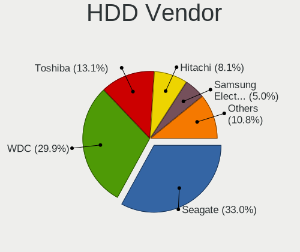
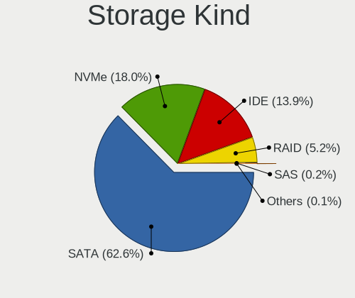
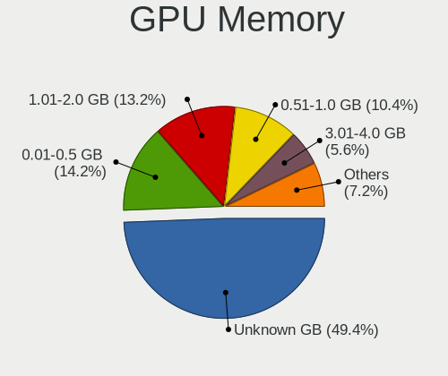
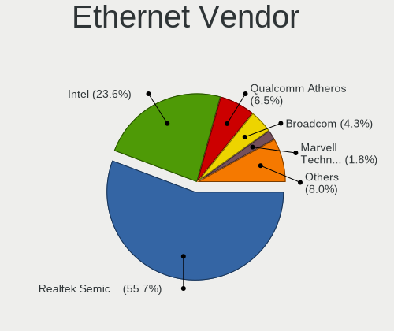

OpenMandriva - Tested Hardware & Statistics
-------------------------------------------

A project to collect tested hardware configurations for OpenMandriva.

Anyone can contribute to this report by the [hw-probe](https://github.com/linuxhw/hw-probe) tool:

    sudo -E hw-probe -all -upload

Please contribute! Especially if your hardware is rare.

This is a report for all computer types. See also reports for [desktops](/Dist/OpenMandriva/Desktop/README.md) and [notebooks](/Dist/OpenMandriva/Notebook/README.md).

Contents
--------

* [ Test Cases ](#test-cases)

* [ System ](#system)
  - [ OS                       ](#os)
  - [ OS Family                ](#os-family)
  - [ Kernel                   ](#kernel)
  - [ Kernel Family            ](#kernel-family)
  - [ Kernel Major Ver.        ](#kernel-major-ver)
  - [ Arch                     ](#arch)
  - [ DE                       ](#de)
  - [ Display Server           ](#display-server)
  - [ Display Manager          ](#display-manager)
  - [ OS Lang                  ](#os-lang)
  - [ Boot Mode                ](#boot-mode)
  - [ Filesystem               ](#filesystem)
  - [ Part. scheme             ](#part-scheme)
  - [ Dual Boot with Linux/BSD ](#dual-boot-with-linuxbsd)
  - [ Dual Boot (Win)          ](#dual-boot-win)

* [ Board ](#board)
  - [ Vendor                   ](#vendor)
  - [ Model                    ](#model)
  - [ Model Family             ](#model-family)
  - [ MFG Year                 ](#mfg-year)
  - [ Form Factor              ](#form-factor)
  - [ Secure Boot              ](#secure-boot)
  - [ Coreboot                 ](#coreboot)
  - [ RAM Size                 ](#ram-size)
  - [ RAM Used                 ](#ram-used)
  - [ Total Drives             ](#total-drives)
  - [ Has CD-ROM               ](#has-cd-rom)
  - [ Has Ethernet             ](#has-ethernet)
  - [ Has WiFi                 ](#has-wifi)
  - [ Has Bluetooth            ](#has-bluetooth)

* [ Location ](#location)
  - [ Country                  ](#country)
  - [ City                     ](#city)

* [ Drives ](#drives)
  - [ Drive Vendor             ](#drive-vendor)
  - [ Drive Model              ](#drive-model)
  - [ HDD Vendor               ](#hdd-vendor)
  - [ SSD Vendor               ](#ssd-vendor)
  - [ Drive Kind               ](#drive-kind)
  - [ Drive Connector          ](#drive-connector)
  - [ Drive Size               ](#drive-size)
  - [ Space Total              ](#space-total)
  - [ Space Used               ](#space-used)
  - [ Malfunc. Drives          ](#malfunc-drives)
  - [ Malfunc. Drive Vendor    ](#malfunc-drive-vendor)
  - [ Malfunc. HDD Vendor      ](#malfunc-hdd-vendor)
  - [ Malfunc. Drive Kind      ](#malfunc-drive-kind)
  - [ Failed Drives            ](#failed-drives)
  - [ Failed Drive Vendor      ](#failed-drive-vendor)
  - [ Drive Status             ](#drive-status)

* [ Storage controller ](#storage-controller)
  - [ Storage Vendor           ](#storage-vendor)
  - [ Storage Model            ](#storage-model)
  - [ Storage Kind             ](#storage-kind)

* [ Processor ](#processor)
  - [ CPU Vendor               ](#cpu-vendor)
  - [ CPU Model                ](#cpu-model)
  - [ CPU Model Family         ](#cpu-model-family)
  - [ CPU Cores                ](#cpu-cores)
  - [ CPU Sockets              ](#cpu-sockets)
  - [ CPU Threads              ](#cpu-threads)
  - [ CPU Op-Modes             ](#cpu-op-modes)
  - [ CPU Microcode            ](#cpu-microcode)
  - [ CPU Microarch            ](#cpu-microarch)

* [ Graphics ](#graphics)
  - [ GPU Vendor               ](#gpu-vendor)
  - [ GPU Model                ](#gpu-model)
  - [ GPU Combo                ](#gpu-combo)
  - [ GPU Driver               ](#gpu-driver)
  - [ GPU Memory               ](#gpu-memory)

* [ Monitor ](#monitor)
  - [ Monitor Vendor           ](#monitor-vendor)
  - [ Monitor Model            ](#monitor-model)
  - [ Monitor Resolution       ](#monitor-resolution)
  - [ Monitor Diagonal         ](#monitor-diagonal)
  - [ Monitor Width            ](#monitor-width)
  - [ Aspect Ratio             ](#aspect-ratio)
  - [ Monitor Area             ](#monitor-area)
  - [ Pixel Density            ](#pixel-density)
  - [ Multiple Monitors        ](#multiple-monitors)

* [ Network ](#network)
  - [ Net Controller Vendor    ](#net-controller-vendor)
  - [ Net Controller Model     ](#net-controller-model)
  - [ Wireless Vendor          ](#wireless-vendor)
  - [ Wireless Model           ](#wireless-model)
  - [ Ethernet Vendor          ](#ethernet-vendor)
  - [ Ethernet Model           ](#ethernet-model)
  - [ Net Controller Kind      ](#net-controller-kind)
  - [ Used Controller          ](#used-controller)
  - [ NICs                     ](#nics)
  - [ IPv6                     ](#ipv6)

* [ Bluetooth ](#bluetooth)
  - [ Bluetooth Vendor         ](#bluetooth-vendor)
  - [ Bluetooth Model          ](#bluetooth-model)

* [ Sound ](#sound)
  - [ Sound Vendor             ](#sound-vendor)
  - [ Sound Model              ](#sound-model)

* [ Memory ](#memory)
  - [ Memory Vendor            ](#memory-vendor)
  - [ Memory Model             ](#memory-model)
  - [ Memory Kind              ](#memory-kind)
  - [ Memory Form Factor       ](#memory-form-factor)
  - [ Memory Size              ](#memory-size)
  - [ Memory Speed             ](#memory-speed)

* [ Printers & scanners ](#printers--scanners)
  - [ Printer Vendor           ](#printer-vendor)
  - [ Printer Model            ](#printer-model)
  - [ Scanner Vendor           ](#scanner-vendor)
  - [ Scanner Model            ](#scanner-model)

* [ Camera ](#camera)
  - [ Camera Vendor            ](#camera-vendor)
  - [ Camera Model             ](#camera-model)

* [ Security ](#security)
  - [ Fingerprint Vendor       ](#fingerprint-vendor)
  - [ Fingerprint Model        ](#fingerprint-model)
  - [ Chipcard Vendor          ](#chipcard-vendor)
  - [ Chipcard Model           ](#chipcard-model)

* [ Unsupported ](#unsupported)
  - [ Unsupported Devices      ](#unsupported-devices)
  - [ Unsupported Device Types ](#unsupported-device-types)

Test Cases
----------

Total: 8720

| Vendor        | Model                       | Form-Factor | Probe                                                      | Date         |
|---------------|-----------------------------|-------------|------------------------------------------------------------|--------------|
| Gigabyte      | 945GCM-S2L                  | Desktop     | [99613365f5](https://linux-hardware.org/?probe=99613365f5) | Sep 01, 2022 |
| HP            | Laptop 15-ef1xxx            | Notebook    | [d27c20dcf9](https://linux-hardware.org/?probe=d27c20dcf9) | Sep 01, 2022 |
| Packard Be... | DOT S                       | Notebook    | [b5b03f1cf7](https://linux-hardware.org/?probe=b5b03f1cf7) | Sep 01, 2022 |
| Gigabyte      | 970A-DS3P                   | Desktop     | [5ba20eb04b](https://linux-hardware.org/?probe=5ba20eb04b) | Sep 01, 2022 |
| ASRock        | A320M-DVS R4.0              | Desktop     | [143e6e1816](https://linux-hardware.org/?probe=143e6e1816) | Sep 01, 2022 |
| Lenovo        | Y520-15IKBN 80WK            | Notebook    | [7b6028e52d](https://linux-hardware.org/?probe=7b6028e52d) | Sep 01, 2022 |
| Gigabyte      | Z590 GAMING X               | Desktop     | [b84d0acafb](https://linux-hardware.org/?probe=b84d0acafb) | Sep 01, 2022 |
| Acer          | Aspire 5715Z                | Notebook    | [82086ce1c6](https://linux-hardware.org/?probe=82086ce1c6) | Sep 01, 2022 |
| Lenovo        | IdeaPad Slim 1-14AST-05 ... | Notebook    | [c83430605e](https://linux-hardware.org/?probe=c83430605e) | Sep 01, 2022 |
| HP            | ZBook 17 G2                 | Notebook    | [e2fc506c38](https://linux-hardware.org/?probe=e2fc506c38) | Sep 01, 2022 |
| Lenovo        | IdeaPad 1 14ADA05 82GW      | Notebook    | [8a7e7ce8ea](https://linux-hardware.org/?probe=8a7e7ce8ea) | Sep 01, 2022 |
| Lenovo        | ThinkCentre M58e 7408BA5    | Desktop     | [4384314f98](https://linux-hardware.org/?probe=4384314f98) | Sep 01, 2022 |
| Dell          | Latitude 3190               | Notebook    | [d30269b33c](https://linux-hardware.org/?probe=d30269b33c) | Sep 01, 2022 |
| ASUSTek       | ZenBook UX425QA_UM425QA     | Notebook    | [c48154f5f4](https://linux-hardware.org/?probe=c48154f5f4) | Sep 01, 2022 |
| Foxconn       | 2ABF                        | Desktop     | [c9a801a4d2](https://linux-hardware.org/?probe=c9a801a4d2) | Sep 01, 2022 |
| Dell          | Latitude 3190 2-in-1        | Convertible | [7140822520](https://linux-hardware.org/?probe=7140822520) | Sep 01, 2022 |
| ASRock        | B450M Pro4-F                | Desktop     | [d48b9efca4](https://linux-hardware.org/?probe=d48b9efca4) | Sep 01, 2022 |
| ASUSTek       | VivoBook_ASUSLaptop X515... | Notebook    | [6566bc7d09](https://linux-hardware.org/?probe=6566bc7d09) | Sep 01, 2022 |
| ASUSTek       | X550ZE                      | Notebook    | [187a6feadf](https://linux-hardware.org/?probe=187a6feadf) | Sep 01, 2022 |
| ASRock        | X99 Taichi                  | Desktop     | [4cd4bf6c89](https://linux-hardware.org/?probe=4cd4bf6c89) | Sep 01, 2022 |
| HP            | Laptop 14s-fq1xxx           | Notebook    | [1a173c5ea0](https://linux-hardware.org/?probe=1a173c5ea0) | Sep 01, 2022 |
| HP            | Pavilion g6                 | Notebook    | [cc725d880c](https://linux-hardware.org/?probe=cc725d880c) | Aug 31, 2022 |
| Apple         | MacBookPro9,2               | Notebook    | [3662302886](https://linux-hardware.org/?probe=3662302886) | Aug 31, 2022 |
| Lenovo        | IdeaPad Slim 1-14AST-05 ... | Notebook    | [ad6c7ea5ab](https://linux-hardware.org/?probe=ad6c7ea5ab) | Aug 31, 2022 |
| ASRock        | B550M-ITX/ac                | Desktop     | [7850c07cdc](https://linux-hardware.org/?probe=7850c07cdc) | Aug 31, 2022 |
| Dell          | Inspiron 15-3567            | Notebook    | [710d1e9a9b](https://linux-hardware.org/?probe=710d1e9a9b) | Aug 31, 2022 |
| MSI           | H510M-A PRO                 | Desktop     | [120400698e](https://linux-hardware.org/?probe=120400698e) | Aug 31, 2022 |
| Vorke         | V1 Plus                     | Desktop     | [0f36a3adcb](https://linux-hardware.org/?probe=0f36a3adcb) | Aug 31, 2022 |
| ASUSTek       | VivoBook_ASUS Laptop E51... | Notebook    | [b895a2ae7c](https://linux-hardware.org/?probe=b895a2ae7c) | Aug 31, 2022 |
| HP            | Notebook                    | Notebook    | [2ca7fbbfa9](https://linux-hardware.org/?probe=2ca7fbbfa9) | Aug 31, 2022 |
| Dell          | 040DDP A00                  | Desktop     | [09ffe165d3](https://linux-hardware.org/?probe=09ffe165d3) | Aug 30, 2022 |
| MSI           | Z97 GAMING 7                | Desktop     | [c9ebe69583](https://linux-hardware.org/?probe=c9ebe69583) | Aug 30, 2022 |
| ASRock        | N68C-S UCC                  | Desktop     | [f3389e42f8](https://linux-hardware.org/?probe=f3389e42f8) | Aug 30, 2022 |
| Gigabyte      | VM900M                      | Desktop     | [f446d835da](https://linux-hardware.org/?probe=f446d835da) | Aug 30, 2022 |
| Dell          | 0R230R A00                  | Desktop     | [0ea749e83c](https://linux-hardware.org/?probe=0ea749e83c) | Aug 30, 2022 |
| Dell          | Precision M6400             | Notebook    | [3cf32e24fa](https://linux-hardware.org/?probe=3cf32e24fa) | Aug 30, 2022 |
| ASUSTek       | VivoBook_ASUS Laptop E51... | Notebook    | [a2940c76f5](https://linux-hardware.org/?probe=a2940c76f5) | Aug 30, 2022 |
| HP            | 0A60h                       | Desktop     | [d801f7cb0c](https://linux-hardware.org/?probe=d801f7cb0c) | Aug 30, 2022 |
| MSI           | MAG X570S TOMAHAWK MAX W... | Desktop     | [33aaa7baf4](https://linux-hardware.org/?probe=33aaa7baf4) | Aug 29, 2022 |
| Lenovo        | ThinkCentre M91p 4518AU8    | Desktop     | [0099ab3432](https://linux-hardware.org/?probe=0099ab3432) | Aug 29, 2022 |
| Dell          | Latitude 3190 2-in-1        | Convertible | [536742931b](https://linux-hardware.org/?probe=536742931b) | Aug 29, 2022 |
| Dell          | Latitude 3300               | Notebook    | [bea8e53929](https://linux-hardware.org/?probe=bea8e53929) | Aug 29, 2022 |
| Apple         | MacBookPro5,5               | Notebook    | [97fdbc4a5b](https://linux-hardware.org/?probe=97fdbc4a5b) | Aug 29, 2022 |
| Lenovo        | ThinkCentre M58p 6234CL2    | Desktop     | [14449a705a](https://linux-hardware.org/?probe=14449a705a) | Aug 29, 2022 |
| Lenovo        | V14-ADA 82C6                | Notebook    | [ce25a77e25](https://linux-hardware.org/?probe=ce25a77e25) | Aug 29, 2022 |
| HP            | Pavilion Laptop 17-ar0xx    | Notebook    | [9336d821f8](https://linux-hardware.org/?probe=9336d821f8) | Aug 29, 2022 |
| Lenovo        | IdeaPad 1 14ADA05 82GW      | Notebook    | [3b26a2ffe2](https://linux-hardware.org/?probe=3b26a2ffe2) | Aug 29, 2022 |
| IP3 Tech      | GB3B                        | Mini pc     | [99f7df96c2](https://linux-hardware.org/?probe=99f7df96c2) | Aug 29, 2022 |
| ASUSTek       | SABERTOOTH X58              | Desktop     | [efb40be4e1](https://linux-hardware.org/?probe=efb40be4e1) | Aug 28, 2022 |
| Lenovo        | IdeaPad 1 14ADA05 82GW      | Notebook    | [98ac365e3c](https://linux-hardware.org/?probe=98ac365e3c) | Aug 28, 2022 |
| Dell          | Studio 1735                 | Notebook    | [912f409b37](https://linux-hardware.org/?probe=912f409b37) | Aug 28, 2022 |
| ASUSTek       | A88XM-A                     | Desktop     | [d8a4e4d954](https://linux-hardware.org/?probe=d8a4e4d954) | Aug 28, 2022 |
| Acer          | Aspire A315-23              | Notebook    | [4c16a58579](https://linux-hardware.org/?probe=4c16a58579) | Aug 28, 2022 |
| HP            | 620                         | Notebook    | [b16c60f4cf](https://linux-hardware.org/?probe=b16c60f4cf) | Aug 28, 2022 |
| Medion        | B460H6-EM                   | Desktop     | [91371e505d](https://linux-hardware.org/?probe=91371e505d) | Aug 28, 2022 |
| Acer          | AO722                       | Notebook    | [377ad8686f](https://linux-hardware.org/?probe=377ad8686f) | Aug 28, 2022 |
| Lenovo        | IdeaPad 1 14ADA05 82GW      | Notebook    | [ee07c7a93a](https://linux-hardware.org/?probe=ee07c7a93a) | Aug 27, 2022 |
| Gigabyte      | GA-MA78LMT-S2               | Desktop     | [a18db0fafd](https://linux-hardware.org/?probe=a18db0fafd) | Aug 27, 2022 |
| ASUSTek       | P8B WS                      | Desktop     | [5f89ab0d00](https://linux-hardware.org/?probe=5f89ab0d00) | Aug 27, 2022 |
| Fujitsu       | D3061-A1 S26361-D3061-A1    | Desktop     | [f74dc71ad8](https://linux-hardware.org/?probe=f74dc71ad8) | Aug 27, 2022 |
| ASUSTek       | ROG Zephyrus G15 GA503QR... | Notebook    | [d6c013a669](https://linux-hardware.org/?probe=d6c013a669) | Aug 27, 2022 |
| ASRock        | A320M-HDV R4.0              | Desktop     | [67712f11d9](https://linux-hardware.org/?probe=67712f11d9) | Aug 27, 2022 |
| Toshiba       | dynabook T653/46JR          | Notebook    | [b97366daa0](https://linux-hardware.org/?probe=b97366daa0) | Aug 27, 2022 |
| ASUSTek       | PRIME Z390-A                | Desktop     | [459c7c1eee](https://linux-hardware.org/?probe=459c7c1eee) | Aug 27, 2022 |
| Lenovo        | IdeaPad S130-14IGM 81J2     | Notebook    | [1ea46f19be](https://linux-hardware.org/?probe=1ea46f19be) | Aug 27, 2022 |
| Lenovo        | G570 4334                   | Notebook    | [7bea18122c](https://linux-hardware.org/?probe=7bea18122c) | Aug 27, 2022 |
| MSI           | G31TM-P21                   | Desktop     | [cf0bc232f5](https://linux-hardware.org/?probe=cf0bc232f5) | Aug 26, 2022 |
| ASRock        | FM2A68M-HD+                 | Desktop     | [22cc477cd2](https://linux-hardware.org/?probe=22cc477cd2) | Aug 26, 2022 |
| Apple         | Mac-CFF7D910A743CAAF iMa... | All in one  | [1b562e8768](https://linux-hardware.org/?probe=1b562e8768) | Aug 26, 2022 |
| MSI           | 760GM-P21                   | Desktop     | [7e45cde899](https://linux-hardware.org/?probe=7e45cde899) | Aug 26, 2022 |
| HP            | 1497                        | Desktop     | [82e518a338](https://linux-hardware.org/?probe=82e518a338) | Aug 26, 2022 |
| ASUSTek       | M5A78L LE                   | Desktop     | [e4a6425675](https://linux-hardware.org/?probe=e4a6425675) | Aug 26, 2022 |
| HP            | 8509                        | Desktop     | [0656e40cba](https://linux-hardware.org/?probe=0656e40cba) | Aug 26, 2022 |
| HP            | 15                          | Notebook    | [310d617e09](https://linux-hardware.org/?probe=310d617e09) | Aug 26, 2022 |
| Dell          | 06MC09 A00                  | Mini pc     | [71402e3c39](https://linux-hardware.org/?probe=71402e3c39) | Aug 26, 2022 |
| NCR           | Pocono                      | Desktop     | [c209b1443a](https://linux-hardware.org/?probe=c209b1443a) | Aug 25, 2022 |
| Dell          | 0RJ290                      | Desktop     | [ca82162ed5](https://linux-hardware.org/?probe=ca82162ed5) | Aug 25, 2022 |
| Acer          | Aspire XC-710 V:1.1         | Desktop     | [0b76e0f97d](https://linux-hardware.org/?probe=0b76e0f97d) | Aug 25, 2022 |
| Foxconn       | H61M/H61M-S                 | Desktop     | [18e7da32e9](https://linux-hardware.org/?probe=18e7da32e9) | Aug 25, 2022 |
| ASRock        | N68C-GS4 FX                 | Desktop     | [0462079328](https://linux-hardware.org/?probe=0462079328) | Aug 25, 2022 |
| Lenovo        | IdeaPad 110-15ISK 80UD      | Notebook    | [72888e9acb](https://linux-hardware.org/?probe=72888e9acb) | Aug 25, 2022 |
| HP            | Laptop 15-dy2xxx            | Notebook    | [26572efe76](https://linux-hardware.org/?probe=26572efe76) | Aug 25, 2022 |
| ASUSTek       | PRIME B350M-A               | Desktop     | [1c98247f4c](https://linux-hardware.org/?probe=1c98247f4c) | Aug 25, 2022 |
| HP            | Laptop 14-dk0xxx            | Notebook    | [82da7782ec](https://linux-hardware.org/?probe=82da7782ec) | Aug 25, 2022 |
| HP            | Laptop 15-dy2xxx            | Notebook    | [bcd578a016](https://linux-hardware.org/?probe=bcd578a016) | Aug 25, 2022 |
| HP            | 829A                        | Mini pc     | [76cb57e98d](https://linux-hardware.org/?probe=76cb57e98d) | Aug 25, 2022 |
| MSI           | GE70 0NC/GE70 0ND           | Notebook    | [a7c9d17455](https://linux-hardware.org/?probe=a7c9d17455) | Aug 25, 2022 |
| OEM           | A320                        | Desktop     | [4dffd629cf](https://linux-hardware.org/?probe=4dffd629cf) | Aug 25, 2022 |
| HP            | Notebook                    | Notebook    | [0d4422145a](https://linux-hardware.org/?probe=0d4422145a) | Aug 25, 2022 |
| HP            | Laptop 15-dy1xxx            | Notebook    | [b201192ebb](https://linux-hardware.org/?probe=b201192ebb) | Aug 25, 2022 |
| Dell          | Latitude E5510              | Notebook    | [c237161d31](https://linux-hardware.org/?probe=c237161d31) | Aug 24, 2022 |
| ASUSTek       | TUF Gaming X570-PLUS        | Desktop     | [d1cae6aca8](https://linux-hardware.org/?probe=d1cae6aca8) | Aug 24, 2022 |
| HP            | 21D0                        | Desktop     | [1bd58d519c](https://linux-hardware.org/?probe=1bd58d519c) | Aug 24, 2022 |
| Lenovo        | ThinkPad T420 4180F75       | Notebook    | [f4a6e9705d](https://linux-hardware.org/?probe=f4a6e9705d) | Aug 24, 2022 |
| Lenovo        | IdeaPad 3 15ADA6 82KR       | Notebook    | [f20e68e820](https://linux-hardware.org/?probe=f20e68e820) | Aug 24, 2022 |
| Gigabyte      | Z68A-D3H-B3                 | Desktop     | [e75751c55b](https://linux-hardware.org/?probe=e75751c55b) | Aug 24, 2022 |
| ASUSTek       | TUF Gaming B450-PLUS II     | Desktop     | [7332174749](https://linux-hardware.org/?probe=7332174749) | Aug 24, 2022 |
| Gigabyte      | F2A68HM-H                   | Desktop     | [c824203d0a](https://linux-hardware.org/?probe=c824203d0a) | Aug 24, 2022 |
| Lenovo        | IdeaPad 320-15IAP 81A3      | Notebook    | [81b42d221d](https://linux-hardware.org/?probe=81b42d221d) | Aug 24, 2022 |
| Dell          | XPS 13 7390                 | Notebook    | [d609bf3253](https://linux-hardware.org/?probe=d609bf3253) | Aug 24, 2022 |
| Dell          | 08HPGT A01                  | Desktop     | [744f838dc2](https://linux-hardware.org/?probe=744f838dc2) | Aug 24, 2022 |
| Supermicro    | X10SDV-8C+-LN2F             | Server      | [a4ec1f93e5](https://linux-hardware.org/?probe=a4ec1f93e5) | Aug 23, 2022 |
| Acer          | Aspire A315-54K             | Notebook    | [685d6acc51](https://linux-hardware.org/?probe=685d6acc51) | Aug 23, 2022 |
| ICP / iEi     | B217 V1.0                   | Desktop     | [9b540ece9f](https://linux-hardware.org/?probe=9b540ece9f) | Aug 23, 2022 |
| Gigabyte      | B550M AORUS PRO-P           | Desktop     | [7dae220687](https://linux-hardware.org/?probe=7dae220687) | Aug 23, 2022 |
| ASUSTek       | P8H61-M LX2 R2.0            | Desktop     | [5754d37860](https://linux-hardware.org/?probe=5754d37860) | Aug 23, 2022 |
| Dell          | Latitude E5470              | Notebook    | [4cf5f4680f](https://linux-hardware.org/?probe=4cf5f4680f) | Aug 23, 2022 |
| ASUSTek       | M4N68T-M-V2                 | Desktop     | [1528da74f6](https://linux-hardware.org/?probe=1528da74f6) | Aug 22, 2022 |
| HP            | 8158 A01                    | Mini pc     | [443d203df8](https://linux-hardware.org/?probe=443d203df8) | Aug 22, 2022 |
| Google        | Galtic                      | Notebook    | [f06baf315d](https://linux-hardware.org/?probe=f06baf315d) | Aug 22, 2022 |
| ASUSTek       | P5KPL-CM                    | Desktop     | [53a4b425d3](https://linux-hardware.org/?probe=53a4b425d3) | Aug 22, 2022 |
| Dell          | 0YJPT1 A00                  | Desktop     | [1de0aeba8f](https://linux-hardware.org/?probe=1de0aeba8f) | Aug 22, 2022 |
| ASUSTek       | PRIME Z390-P                | Desktop     | [ca7534d4dc](https://linux-hardware.org/?probe=ca7534d4dc) | Aug 22, 2022 |
| Intel         | NUC11ATBC4 M53051-202       | Mini pc     | [6568854eef](https://linux-hardware.org/?probe=6568854eef) | Aug 22, 2022 |
| Acer          | Enduro EUN314-51WG          | Notebook    | [aa9ea3d520](https://linux-hardware.org/?probe=aa9ea3d520) | Aug 22, 2022 |
| Acer          | TravelMate 5760             | Notebook    | [3d9c208d81](https://linux-hardware.org/?probe=3d9c208d81) | Aug 22, 2022 |
| HP            | 82B4                        | Desktop     | [e3200ae579](https://linux-hardware.org/?probe=e3200ae579) | Aug 22, 2022 |
| Dell          | Latitude 3300               | Notebook    | [e8b139ecad](https://linux-hardware.org/?probe=e8b139ecad) | Aug 22, 2022 |
| Dell          | Latitude 3310               | Notebook    | [dedda1b96c](https://linux-hardware.org/?probe=dedda1b96c) | Aug 22, 2022 |
| Acer          | TravelMate 5730             | Notebook    | [ec6fd6cddb](https://linux-hardware.org/?probe=ec6fd6cddb) | Aug 22, 2022 |
| ASUSTek       | M5A78L-M/USB3               | Desktop     | [fa5f1121d5](https://linux-hardware.org/?probe=fa5f1121d5) | Aug 22, 2022 |
| Lenovo        | 36FB SDK0L77769 WIN 3423... | All in one  | [c65b675fc8](https://linux-hardware.org/?probe=c65b675fc8) | Aug 22, 2022 |
| HP            | Pavilion Laptop 15-cs0xx... | Notebook    | [8c7493d7d1](https://linux-hardware.org/?probe=8c7493d7d1) | Aug 22, 2022 |
| Intel         | H61                         | Desktop     | [f0a810114c](https://linux-hardware.org/?probe=f0a810114c) | Aug 22, 2022 |
| Lenovo        | IdeaPad 500S-14ISK 80Q3     | Notebook    | [fdbec5aab2](https://linux-hardware.org/?probe=fdbec5aab2) | Aug 22, 2022 |
| MSI           | MPG X570 GAMING PLUS        | Desktop     | [e064c453da](https://linux-hardware.org/?probe=e064c453da) | Aug 21, 2022 |
| Fujitsu       | LIFEBOOK UH552              | Notebook    | [15a1f49654](https://linux-hardware.org/?probe=15a1f49654) | Aug 21, 2022 |
| Acer          | AO725                       | Notebook    | [5eed64f77d](https://linux-hardware.org/?probe=5eed64f77d) | Aug 21, 2022 |
| ASUSTek       | Z87-C                       | Desktop     | [8de83c544f](https://linux-hardware.org/?probe=8de83c544f) | Aug 21, 2022 |
| HP            | 1998                        | Desktop     | [69b6b04268](https://linux-hardware.org/?probe=69b6b04268) | Aug 21, 2022 |
| Lenovo        | ThinkPad X200 7458FZ3       | Notebook    | [232835b00b](https://linux-hardware.org/?probe=232835b00b) | Aug 21, 2022 |
| Acer          | Aspire E1-531               | Notebook    | [1292b2297f](https://linux-hardware.org/?probe=1292b2297f) | Aug 21, 2022 |
| Acer          | Predator G9-791             | Notebook    | [782f581f0b](https://linux-hardware.org/?probe=782f581f0b) | Aug 21, 2022 |
| ASRock        | N68C-S UCC                  | Desktop     | [bb19c0586c](https://linux-hardware.org/?probe=bb19c0586c) | Aug 20, 2022 |
| Gigabyte      | B365M DS3H WIFI             | Desktop     | [142e25352d](https://linux-hardware.org/?probe=142e25352d) | Aug 20, 2022 |
| Packard Be... | PT890-8237A                 | Desktop     | [36a4120390](https://linux-hardware.org/?probe=36a4120390) | Aug 20, 2022 |
| ASUSTek       | PRIME B450M-A II            | Desktop     | [56a34e0816](https://linux-hardware.org/?probe=56a34e0816) | Aug 20, 2022 |
| ASUSTek       | P5KPL-SE                    | Desktop     | [2925e63a87](https://linux-hardware.org/?probe=2925e63a87) | Aug 20, 2022 |
| AZW           | MII-V                       | Desktop     | [59698f6b33](https://linux-hardware.org/?probe=59698f6b33) | Aug 20, 2022 |
| OEM           | Intel H81                   | Desktop     | [5e354c60d1](https://linux-hardware.org/?probe=5e354c60d1) | Aug 20, 2022 |
| ASUSTek       | UX31E                       | Notebook    | [84ed4c9d73](https://linux-hardware.org/?probe=84ed4c9d73) | Aug 20, 2022 |
| Lenovo        | ThinkPad E590 20NB0029GE    | Notebook    | [ee75702cd5](https://linux-hardware.org/?probe=ee75702cd5) | Aug 20, 2022 |
| HP            | Pavilion dv6                | Notebook    | [0aae35eb95](https://linux-hardware.org/?probe=0aae35eb95) | Aug 19, 2022 |
| Dell          | 0XHGV1 A01                  | Desktop     | [b05fac6451](https://linux-hardware.org/?probe=b05fac6451) | Aug 19, 2022 |
| HP            | 15                          | Notebook    | [d519e672ca](https://linux-hardware.org/?probe=d519e672ca) | Aug 19, 2022 |
| ASUSTek       | P5KPL-VM                    | Desktop     | [803031cd3b](https://linux-hardware.org/?probe=803031cd3b) | Aug 19, 2022 |
| HP            | Pavilion dm4                | Notebook    | [46bb1c7064](https://linux-hardware.org/?probe=46bb1c7064) | Aug 19, 2022 |
| Dell          | XPS 13 9360                 | Notebook    | [74b0bedd54](https://linux-hardware.org/?probe=74b0bedd54) | Aug 19, 2022 |
| Dell          | Latitude E5430 non-vPro     | Notebook    | [ac7fb69037](https://linux-hardware.org/?probe=ac7fb69037) | Aug 19, 2022 |
| HP            | ProBook 440 G1              | Notebook    | [eb86fd2237](https://linux-hardware.org/?probe=eb86fd2237) | Aug 19, 2022 |
| HP            | Stream Laptop 14-cb1xxx     | Notebook    | [c954da96ad](https://linux-hardware.org/?probe=c954da96ad) | Aug 18, 2022 |
| Intel         | NUC7i7BNB J31145-310        | Mini pc     | [d9f1c174b3](https://linux-hardware.org/?probe=d9f1c174b3) | Aug 18, 2022 |
| ASUSTek       | X75A1                       | Notebook    | [870fcf0f3c](https://linux-hardware.org/?probe=870fcf0f3c) | Aug 18, 2022 |
| Acer          | Aspire 7750G                | Notebook    | [6110ab7d79](https://linux-hardware.org/?probe=6110ab7d79) | Aug 18, 2022 |
| Dell          | Latitude E5510              | Notebook    | [c7defb71d5](https://linux-hardware.org/?probe=c7defb71d5) | Aug 18, 2022 |
| Medion        | Akoya E6418 MD99620         | Notebook    | [6817b38103](https://linux-hardware.org/?probe=6817b38103) | Aug 18, 2022 |
| Acer          | Aspire A515-51G             | Notebook    | [d29438c201](https://linux-hardware.org/?probe=d29438c201) | Aug 18, 2022 |
| Gigabyte      | B450M S2H                   | Desktop     | [a0a7a845e3](https://linux-hardware.org/?probe=a0a7a845e3) | Aug 18, 2022 |
| Gigabyte      | P43-ES3G                    | Desktop     | [de6e02672c](https://linux-hardware.org/?probe=de6e02672c) | Aug 18, 2022 |
| Lenovo        | IdeaPad 3 14IGL05 81WH      | Notebook    | [d78fb85708](https://linux-hardware.org/?probe=d78fb85708) | Aug 18, 2022 |
| Toshiba       | dynabook T653/46JR          | Notebook    | [decfecaa20](https://linux-hardware.org/?probe=decfecaa20) | Aug 18, 2022 |
| Positivo B... | S14SL03                     | Notebook    | [558f5a2f24](https://linux-hardware.org/?probe=558f5a2f24) | Aug 18, 2022 |
| ASUSTek       | PRIME Z390-A                | Desktop     | [859884934f](https://linux-hardware.org/?probe=859884934f) | Aug 17, 2022 |
| Acer          | MRS600M                     | Desktop     | [ec4c10d06e](https://linux-hardware.org/?probe=ec4c10d06e) | Aug 17, 2022 |
| ASUSTek       | PRIME B250-PRO              | Desktop     | [870d7102f5](https://linux-hardware.org/?probe=870d7102f5) | Aug 17, 2022 |
| Packard Be... | EasyNote TK37               | Notebook    | [996a14d9f4](https://linux-hardware.org/?probe=996a14d9f4) | Aug 17, 2022 |
| Gigabyte      | H410M S2 V2                 | Desktop     | [944a99ea66](https://linux-hardware.org/?probe=944a99ea66) | Aug 17, 2022 |
| ASUSTek       | VivoBook_ASUSLaptop M350... | Notebook    | [93b2d066d6](https://linux-hardware.org/?probe=93b2d066d6) | Aug 17, 2022 |
| Acer          | Nitro AN515-31              | Notebook    | [471659ffff](https://linux-hardware.org/?probe=471659ffff) | Aug 17, 2022 |
| Gigabyte      | B450 AORUS PRO-CF           | Desktop     | [3ab7d6393c](https://linux-hardware.org/?probe=3ab7d6393c) | Aug 17, 2022 |
| Dell          | Latitude 3380               | Notebook    | [a99b3cef26](https://linux-hardware.org/?probe=a99b3cef26) | Aug 17, 2022 |
| ASUSTek       | VivoBook 14_ASUS Laptop ... | Notebook    | [9bdceca056](https://linux-hardware.org/?probe=9bdceca056) | Aug 17, 2022 |
| ASUSTek       | N75SF                       | Notebook    | [3b6f89e145](https://linux-hardware.org/?probe=3b6f89e145) | Aug 17, 2022 |
| NEC Comput... | PC-LJ730MG6W                | Notebook    | [c0e6c7edb7](https://linux-hardware.org/?probe=c0e6c7edb7) | Aug 17, 2022 |
| Dell          | Latitude 3310               | Notebook    | [92f66bf3aa](https://linux-hardware.org/?probe=92f66bf3aa) | Aug 17, 2022 |
| Gigabyte      | H81M-S2PH                   | Desktop     | [c8f8e78df8](https://linux-hardware.org/?probe=c8f8e78df8) | Aug 17, 2022 |
| HP            | Pavilion Laptop 15-eh0xx... | Notebook    | [59080cc039](https://linux-hardware.org/?probe=59080cc039) | Aug 17, 2022 |
| ASUSTek       | Z550SA                      | Notebook    | [03ef043fd9](https://linux-hardware.org/?probe=03ef043fd9) | Aug 17, 2022 |
| Gigabyte      | B460M DS3H                  | Desktop     | [2b97e09efa](https://linux-hardware.org/?probe=2b97e09efa) | Aug 17, 2022 |
| HP            | Laptop 14s-fq1xxx           | Notebook    | [92c0a6fe2a](https://linux-hardware.org/?probe=92c0a6fe2a) | Aug 17, 2022 |
| Dell          | XPS 15 9530                 | Notebook    | [71f62cef7a](https://linux-hardware.org/?probe=71f62cef7a) | Aug 16, 2022 |
| Fujitsu       | LIFEBOOK AH531              | Notebook    | [a880d764be](https://linux-hardware.org/?probe=a880d764be) | Aug 16, 2022 |
| Fujitsu       | D3233-A1 S26361-D3233-A1    | Desktop     | [7b3d6b544c](https://linux-hardware.org/?probe=7b3d6b544c) | Aug 16, 2022 |
| Lenovo        | ThinkPad L412 0585A84       | Notebook    | [637fa23dca](https://linux-hardware.org/?probe=637fa23dca) | Aug 16, 2022 |
| Dell          | Latitude 3310               | Notebook    | [1694bfcea7](https://linux-hardware.org/?probe=1694bfcea7) | Aug 16, 2022 |
| Dell          | 0T656F A01                  | Desktop     | [ec4014a549](https://linux-hardware.org/?probe=ec4014a549) | Aug 16, 2022 |
| Packard Be... | EasyNote TE11BZ             | Notebook    | [2a8e801b4e](https://linux-hardware.org/?probe=2a8e801b4e) | Aug 16, 2022 |
| Dell          | 0GM819                      | Desktop     | [f7745d3d3a](https://linux-hardware.org/?probe=f7745d3d3a) | Aug 16, 2022 |
| Lenovo        | IdeaPad 3 15ITL05 81X8      | Notebook    | [b4757c5ff7](https://linux-hardware.org/?probe=b4757c5ff7) | Aug 16, 2022 |
| TUXEDO        | Book BA1510                 | Notebook    | [6d8040e80b](https://linux-hardware.org/?probe=6d8040e80b) | Aug 15, 2022 |
| ASRock        | B450 Pro4                   | Desktop     | [79f5c08bff](https://linux-hardware.org/?probe=79f5c08bff) | Aug 15, 2022 |
| Acer          | Aspire ES1-532G             | Notebook    | [cf05c858ab](https://linux-hardware.org/?probe=cf05c858ab) | Aug 15, 2022 |
| Dell          | Latitude E6430              | Notebook    | [6c31827147](https://linux-hardware.org/?probe=6c31827147) | Aug 15, 2022 |
| Gigabyte      | B550 AORUS ELITE            | Desktop     | [08e3444b3c](https://linux-hardware.org/?probe=08e3444b3c) | Aug 15, 2022 |
| HP            | 2AE2                        | Desktop     | [1fd0bb70dc](https://linux-hardware.org/?probe=1fd0bb70dc) | Aug 15, 2022 |
| Dell          | Inspiron 1501               | Notebook    | [11b4c83b79](https://linux-hardware.org/?probe=11b4c83b79) | Aug 15, 2022 |
| HP            | Notebook                    | Notebook    | [975f3e38e3](https://linux-hardware.org/?probe=975f3e38e3) | Aug 15, 2022 |
| Dell          | 0C27VV A01                  | Desktop     | [04f75d45cb](https://linux-hardware.org/?probe=04f75d45cb) | Aug 15, 2022 |
| ASUSTek       | PRIME B450M-A II            | Desktop     | [4ba26713bc](https://linux-hardware.org/?probe=4ba26713bc) | Aug 15, 2022 |
| Samsung       | NC210/NC110                 | Notebook    | [3dcdc1dc6a](https://linux-hardware.org/?probe=3dcdc1dc6a) | Aug 15, 2022 |
| Gigabyte      | P43-ES3G                    | Desktop     | [2b0691bddd](https://linux-hardware.org/?probe=2b0691bddd) | Aug 15, 2022 |
| Dell          | 0PC5F7 A03                  | Desktop     | [56ee42afe3](https://linux-hardware.org/?probe=56ee42afe3) | Aug 15, 2022 |
| HP            | Laptop 14-bs1xx             | Notebook    | [4b603b6b08](https://linux-hardware.org/?probe=4b603b6b08) | Aug 15, 2022 |
| Dell          | 0NC2VH A01                  | Desktop     | [170b178361](https://linux-hardware.org/?probe=170b178361) | Aug 15, 2022 |
| HP            | Pavilion Laptop 15-eh1xx... | Notebook    | [4b1440875b](https://linux-hardware.org/?probe=4b1440875b) | Aug 14, 2022 |
| ASUSTek       | X540LA                      | Notebook    | [15ffff65c0](https://linux-hardware.org/?probe=15ffff65c0) | Aug 14, 2022 |
| HP            | ProBook 4330s               | Notebook    | [62ff6ffc08](https://linux-hardware.org/?probe=62ff6ffc08) | Aug 14, 2022 |
| HP            | 18E7                        | Desktop     | [06374a6240](https://linux-hardware.org/?probe=06374a6240) | Aug 14, 2022 |
| ASRock        | 960GM-VGS3 FX               | Desktop     | [55c4e8059c](https://linux-hardware.org/?probe=55c4e8059c) | Aug 14, 2022 |
| ASUSTek       | P8H61-M LX3                 | Desktop     | [7c37c2a6d7](https://linux-hardware.org/?probe=7c37c2a6d7) | Aug 14, 2022 |
| Acer          | Aspire M5-581T              | Notebook    | [7efdb0e467](https://linux-hardware.org/?probe=7efdb0e467) | Aug 14, 2022 |
| MSI           | X570-A PRO                  | Desktop     | [30146876c6](https://linux-hardware.org/?probe=30146876c6) | Aug 14, 2022 |
| Acer          | Aspire A515-54G             | Notebook    | [e9c64a8a5c](https://linux-hardware.org/?probe=e9c64a8a5c) | Aug 14, 2022 |
| Acer          | Aspire 5680                 | Notebook    | [20c2c97a69](https://linux-hardware.org/?probe=20c2c97a69) | Aug 14, 2022 |
| Unknown       | 1.0                         | Desktop     | [35d076bae0](https://linux-hardware.org/?probe=35d076bae0) | Aug 14, 2022 |
| ASRock        | J3455-ITX                   | Desktop     | [4386fccad1](https://linux-hardware.org/?probe=4386fccad1) | Aug 14, 2022 |
| Acer          | Aspire VN7-571G             | Notebook    | [0d6dfdd6e0](https://linux-hardware.org/?probe=0d6dfdd6e0) | Aug 14, 2022 |
| HP            | Pavilion dv9500             | Notebook    | [fd3bd18049](https://linux-hardware.org/?probe=fd3bd18049) | Aug 14, 2022 |
| HP            | 829A                        | Mini pc     | [0e36f81a7b](https://linux-hardware.org/?probe=0e36f81a7b) | Aug 13, 2022 |
| Lenovo        | SHARKBAY NOK                | Desktop     | [ee169e47b3](https://linux-hardware.org/?probe=ee169e47b3) | Aug 13, 2022 |
| Toshiba       | Satellite P200              | Notebook    | [83fcabac55](https://linux-hardware.org/?probe=83fcabac55) | Aug 13, 2022 |
| Dell          | Vostro 1520                 | Notebook    | [9dab88f3ee](https://linux-hardware.org/?probe=9dab88f3ee) | Aug 13, 2022 |
| Positivo      | EC10IS1                     | Notebook    | [b66cd42f99](https://linux-hardware.org/?probe=b66cd42f99) | Aug 13, 2022 |
| Dell          | 08WKV3 A00                  | Desktop     | [4e57c20454](https://linux-hardware.org/?probe=4e57c20454) | Aug 13, 2022 |
| Lenovo        | ThinkCentre XXXX 739527G    | Desktop     | [ca5fe11e2c](https://linux-hardware.org/?probe=ca5fe11e2c) | Aug 13, 2022 |
| ASUSTek       | ROG STRIX B365-F GAMING     | Desktop     | [1ae946a847](https://linux-hardware.org/?probe=1ae946a847) | Aug 13, 2022 |
| HP            | Unknown                     | Notebook    | [7375604d06](https://linux-hardware.org/?probe=7375604d06) | Aug 13, 2022 |
| Toshiba       | Satellite L500              | Notebook    | [0d58c17039](https://linux-hardware.org/?probe=0d58c17039) | Aug 13, 2022 |
| ASUSTek       | PRIME B450M-A II            | Desktop     | [fd41ccab04](https://linux-hardware.org/?probe=fd41ccab04) | Aug 13, 2022 |
| ASUSTek       | PRIME B450M-A II            | Desktop     | [32bf5bd8b8](https://linux-hardware.org/?probe=32bf5bd8b8) | Aug 13, 2022 |
| HP            | 1850                        | Desktop     | [33933e3e5d](https://linux-hardware.org/?probe=33933e3e5d) | Aug 12, 2022 |
| ASRock        | H61M-DGS                    | Desktop     | [50b7221c5a](https://linux-hardware.org/?probe=50b7221c5a) | Aug 12, 2022 |
| Positivo      | Mobile                      | Notebook    | [bddf3b59d4](https://linux-hardware.org/?probe=bddf3b59d4) | Aug 12, 2022 |
| ASUSTek       | PRIME B450M-A II            | Desktop     | [bc32ff70b7](https://linux-hardware.org/?probe=bc32ff70b7) | Aug 12, 2022 |
| Gigabyte      | EP35C-DS3R                  | Desktop     | [762d78160d](https://linux-hardware.org/?probe=762d78160d) | Aug 12, 2022 |
| ASUSTek       | ZenBook UX431DA_UM431DA     | Notebook    | [40814201a2](https://linux-hardware.org/?probe=40814201a2) | Aug 12, 2022 |
| Lenovo        | ThinkPad T61 64665DG        | Notebook    | [ff1be50f8c](https://linux-hardware.org/?probe=ff1be50f8c) | Aug 12, 2022 |
| Lenovo        | ThinkPad X201 3626HMG       | Notebook    | [1d08c103c7](https://linux-hardware.org/?probe=1d08c103c7) | Aug 12, 2022 |
| Fujitsu       | LIFEBOOK S904               | Notebook    | [0e3107a650](https://linux-hardware.org/?probe=0e3107a650) | Aug 12, 2022 |
| ASUSTek       | K73BR                       | Notebook    | [67f5d3f176](https://linux-hardware.org/?probe=67f5d3f176) | Aug 12, 2022 |
| Acer          | Aspire 4330 V1.22           | Notebook    | [dee8895134](https://linux-hardware.org/?probe=dee8895134) | Aug 12, 2022 |
| HP            | EliteBook 820 G3            | Notebook    | [c1b14847f1](https://linux-hardware.org/?probe=c1b14847f1) | Aug 12, 2022 |
| MSI           | A68HM-E33 V2                | Desktop     | [2f3db9cd91](https://linux-hardware.org/?probe=2f3db9cd91) | Aug 12, 2022 |
| Dell          | Latitude 7420               | Notebook    | [26cd6bbb87](https://linux-hardware.org/?probe=26cd6bbb87) | Aug 12, 2022 |
| Lenovo        | ThinkPad L470 20J4002FMX    | Notebook    | [d949d71a19](https://linux-hardware.org/?probe=d949d71a19) | Aug 12, 2022 |
| Lenovo        | Unknown                     | Notebook    | [79688945e1](https://linux-hardware.org/?probe=79688945e1) | Aug 11, 2022 |
| ASRock        | Z97M Pro4                   | Desktop     | [245d189a61](https://linux-hardware.org/?probe=245d189a61) | Aug 11, 2022 |
| Gateway       | MT6723                      | Notebook    | [368de1c083](https://linux-hardware.org/?probe=368de1c083) | Aug 11, 2022 |
| Dell          | G5 5505                     | Notebook    | [cbbcb7c9a2](https://linux-hardware.org/?probe=cbbcb7c9a2) | Aug 11, 2022 |
| Dell          | Vostro 3401                 | Notebook    | [29f3354492](https://linux-hardware.org/?probe=29f3354492) | Aug 11, 2022 |
| MSI           | MPG Z390 GAMING PLUS        | Desktop     | [73bf30c596](https://linux-hardware.org/?probe=73bf30c596) | Aug 11, 2022 |
| Gigabyte      | P35-DS3L                    | Desktop     | [c765f5b81c](https://linux-hardware.org/?probe=c765f5b81c) | Aug 11, 2022 |
| Lenovo        | IdeaPad S145-14AST 81ST     | Notebook    | [cac00fb432](https://linux-hardware.org/?probe=cac00fb432) | Aug 11, 2022 |
| HP            | Pavilion dm3                | Notebook    | [7152a48ede](https://linux-hardware.org/?probe=7152a48ede) | Aug 10, 2022 |
| Lenovo        | IdeaPad 330-15IKB 81DE      | Notebook    | [cc51e49c51](https://linux-hardware.org/?probe=cc51e49c51) | Aug 10, 2022 |
| Foxconn       | 2ABF                        | Desktop     | [3b20387bcc](https://linux-hardware.org/?probe=3b20387bcc) | Aug 10, 2022 |
| HP            | 240 G3                      | Notebook    | [77225815d2](https://linux-hardware.org/?probe=77225815d2) | Aug 10, 2022 |
| HUAWEI        | BOHB-WAX9                   | Notebook    | [9d55b54de7](https://linux-hardware.org/?probe=9d55b54de7) | Aug 10, 2022 |
| ASRock        | H81M-DGS                    | Desktop     | [31bdc504d4](https://linux-hardware.org/?probe=31bdc504d4) | Aug 10, 2022 |
| HP            | Laptop 17-ca1xxx            | Notebook    | [f57b28ff2c](https://linux-hardware.org/?probe=f57b28ff2c) | Aug 10, 2022 |
| MSI           | MPG Z390 GAMING PLUS        | Desktop     | [a3aa50c16a](https://linux-hardware.org/?probe=a3aa50c16a) | Aug 10, 2022 |
| Dell          | 07KY25 A00                  | Desktop     | [676025f81a](https://linux-hardware.org/?probe=676025f81a) | Aug 10, 2022 |
| ASUSTek       | TUF B360-PRO GAMING         | Desktop     | [62d813423e](https://linux-hardware.org/?probe=62d813423e) | Aug 10, 2022 |
| MSI           | MPG X570 GAMING PLUS        | Desktop     | [568e96b2a5](https://linux-hardware.org/?probe=568e96b2a5) | Aug 10, 2022 |
| HP            | Pavilion HDX9200            | Notebook    | [079cb2197b](https://linux-hardware.org/?probe=079cb2197b) | Aug 10, 2022 |
| Lenovo        | 3111 SDK0J40697 WIN 3305... | Mini pc     | [3aa3a0b4ee](https://linux-hardware.org/?probe=3aa3a0b4ee) | Aug 10, 2022 |
| MSI           | X470 GAMING M7 AC           | Desktop     | [58947090d5](https://linux-hardware.org/?probe=58947090d5) | Aug 09, 2022 |
| eMachines     | Veriton V2110               | Desktop     | [3492540d77](https://linux-hardware.org/?probe=3492540d77) | Aug 09, 2022 |
| ASUSTek       | V230IC                      | All in one  | [bac1e9869d](https://linux-hardware.org/?probe=bac1e9869d) | Aug 09, 2022 |
| Compaq        | Presario CQ-31              | Notebook    | [d22794a255](https://linux-hardware.org/?probe=d22794a255) | Aug 09, 2022 |
| Lenovo        | 36ED SDK0M26027 WIN 3273... | All in one  | [6481787b51](https://linux-hardware.org/?probe=6481787b51) | Aug 09, 2022 |
| ASRock        | AB350 Pro4                  | Desktop     | [2df31a9fbf](https://linux-hardware.org/?probe=2df31a9fbf) | Aug 09, 2022 |
| Toshiba       | Satellite A300              | Notebook    | [4f83e69c06](https://linux-hardware.org/?probe=4f83e69c06) | Aug 09, 2022 |
| Sony          | VPCYB3V1E                   | Notebook    | [a6cd208cf2](https://linux-hardware.org/?probe=a6cd208cf2) | Aug 09, 2022 |
| ASUSTek       | Z87-PRO                     | Desktop     | [89a77b442f](https://linux-hardware.org/?probe=89a77b442f) | Aug 09, 2022 |
| HP            | 630                         | Notebook    | [fc9bc69e9a](https://linux-hardware.org/?probe=fc9bc69e9a) | Aug 09, 2022 |
| Dell          | Latitude 3190 2-in-1        | Convertible | [0afee77b44](https://linux-hardware.org/?probe=0afee77b44) | Aug 09, 2022 |
| MSI           | MPG X570 GAMING PLUS        | Desktop     | [fc526feeed](https://linux-hardware.org/?probe=fc526feeed) | Aug 09, 2022 |
| ASUSTek       | ROG CROSSHAIR VI EXTREME    | Desktop     | [280f4b2669](https://linux-hardware.org/?probe=280f4b2669) | Aug 09, 2022 |
| Gigabyte      | EP35-DS3P                   | Desktop     | [5c29aee903](https://linux-hardware.org/?probe=5c29aee903) | Aug 08, 2022 |
| Intel         | NUC7JYB J67967-405          | Mini pc     | [06fdb19375](https://linux-hardware.org/?probe=06fdb19375) | Aug 08, 2022 |
| ASUSTek       | VivoBook_ASUSLaptop X513... | Notebook    | [9d6be5eb68](https://linux-hardware.org/?probe=9d6be5eb68) | Aug 08, 2022 |
| ASUSTek       | AT3IONT-I DELUXE            | Desktop     | [642e31466d](https://linux-hardware.org/?probe=642e31466d) | Aug 08, 2022 |
| Dell          | 0782GW A01                  | Desktop     | [b3ebc3aed3](https://linux-hardware.org/?probe=b3ebc3aed3) | Aug 08, 2022 |
| Acer          | Nitro AN515-31              | Notebook    | [0dbab56588](https://linux-hardware.org/?probe=0dbab56588) | Aug 08, 2022 |
| HP            | 15                          | Notebook    | [ef66e0296e](https://linux-hardware.org/?probe=ef66e0296e) | Aug 08, 2022 |
| HP            | ProBook 430 G4              | Notebook    | [616a031820](https://linux-hardware.org/?probe=616a031820) | Aug 08, 2022 |
| Dell          | Latitude E7240              | Notebook    | [1f20b0f54b](https://linux-hardware.org/?probe=1f20b0f54b) | Aug 08, 2022 |
| ASUSTek       | X550CL                      | Notebook    | [83626d765b](https://linux-hardware.org/?probe=83626d765b) | Aug 08, 2022 |
| HP            | 304Bh                       | Desktop     | [e1e3f301cb](https://linux-hardware.org/?probe=e1e3f301cb) | Aug 08, 2022 |
| Dell          | Latitude 3190 2-in-1        | Convertible | [362398e54e](https://linux-hardware.org/?probe=362398e54e) | Aug 08, 2022 |
| MSI           | H81M-P33                    | Desktop     | [f79c49386d](https://linux-hardware.org/?probe=f79c49386d) | Aug 08, 2022 |
| Dell          | Latitude E6420              | Notebook    | [3817e724ac](https://linux-hardware.org/?probe=3817e724ac) | Aug 08, 2022 |
| Intel         | H61                         | Desktop     | [eabc8be629](https://linux-hardware.org/?probe=eabc8be629) | Aug 08, 2022 |
| BESSTAR Te... | AB1                         | Mini pc     | [fc51f2c4b7](https://linux-hardware.org/?probe=fc51f2c4b7) | Aug 08, 2022 |
| Gigabyte      | H55M-UD2H                   | Desktop     | [4d6a861120](https://linux-hardware.org/?probe=4d6a861120) | Aug 07, 2022 |
| ASUSTek       | PRIME A320M-K               | Desktop     | [40808a05c1](https://linux-hardware.org/?probe=40808a05c1) | Aug 07, 2022 |
| MSI           | A320M PRO-M2                | Desktop     | [43f6f3c828](https://linux-hardware.org/?probe=43f6f3c828) | Aug 07, 2022 |
| HP            | Compaq 15                   | Notebook    | [de4b6e0511](https://linux-hardware.org/?probe=de4b6e0511) | Aug 07, 2022 |
| ASUSTek       | SABERTOOTH Z77              | Desktop     | [95f444c24c](https://linux-hardware.org/?probe=95f444c24c) | Aug 07, 2022 |
| ASUSTek       | X555LA                      | Notebook    | [0a98c50d83](https://linux-hardware.org/?probe=0a98c50d83) | Aug 07, 2022 |
| Apple         | MacBookPro9,2               | Notebook    | [85dc12b4d1](https://linux-hardware.org/?probe=85dc12b4d1) | Aug 07, 2022 |
| ASUSTek       | VivoBook_ASUSLaptop X509... | Notebook    | [b85ec0e551](https://linux-hardware.org/?probe=b85ec0e551) | Aug 07, 2022 |
| Gigabyte      | EP45-UD3R                   | Desktop     | [6c434341ce](https://linux-hardware.org/?probe=6c434341ce) | Aug 07, 2022 |
| ASUSTek       | M3A78 PRO                   | Desktop     | [0b63e92a55](https://linux-hardware.org/?probe=0b63e92a55) | Aug 07, 2022 |
| ASUSTek       | VivoBook_ASUSLaptop X421... | Notebook    | [f9850e0a1e](https://linux-hardware.org/?probe=f9850e0a1e) | Aug 07, 2022 |
| Timi          | RedmiBook Pro 15S           | Notebook    | [4e36acba35](https://linux-hardware.org/?probe=4e36acba35) | Aug 07, 2022 |
| Dell          | Latitude 3189               | Notebook    | [63c2818521](https://linux-hardware.org/?probe=63c2818521) | Aug 07, 2022 |
| HP            | Stream Laptop 14-ax0XX      | Notebook    | [810a9d1c2c](https://linux-hardware.org/?probe=810a9d1c2c) | Aug 07, 2022 |
| MSI           | GL75 Leopard 10SDK          | Notebook    | [bfceb8ba35](https://linux-hardware.org/?probe=bfceb8ba35) | Aug 07, 2022 |
| Lenovo        | IdeaPad S145-15IKB 81VD     | Notebook    | [f3a36d0f3a](https://linux-hardware.org/?probe=f3a36d0f3a) | Aug 07, 2022 |
| Acer          | Swift SF114-31              | Notebook    | [b1cba472dc](https://linux-hardware.org/?probe=b1cba472dc) | Aug 06, 2022 |
| HP            | 2215                        | Desktop     | [75304ada6c](https://linux-hardware.org/?probe=75304ada6c) | Aug 06, 2022 |
| ASUSTek       | PRIME B550-PLUS             | Desktop     | [b18ee3a2ff](https://linux-hardware.org/?probe=b18ee3a2ff) | Aug 06, 2022 |
| Lenovo        | ThinkPad T430s 2356LNG      | Notebook    | [255560d675](https://linux-hardware.org/?probe=255560d675) | Aug 06, 2022 |
| ASUSTek       | X555LN                      | Notebook    | [77092711a0](https://linux-hardware.org/?probe=77092711a0) | Aug 06, 2022 |
| Toshiba       | STI 006998G                 | Desktop     | [3de3fa77fc](https://linux-hardware.org/?probe=3de3fa77fc) | Aug 06, 2022 |
| ASRock        | H110M-STX                   | Desktop     | [62b1924710](https://linux-hardware.org/?probe=62b1924710) | Aug 06, 2022 |
| Gigabyte      | A320M-H-CF                  | Desktop     | [4015089c1e](https://linux-hardware.org/?probe=4015089c1e) | Aug 06, 2022 |
| Biostar       | B550MX/E PRO                | Desktop     | [53596a82d1](https://linux-hardware.org/?probe=53596a82d1) | Aug 06, 2022 |
| MSI           | 2A9C                        | Desktop     | [8913065613](https://linux-hardware.org/?probe=8913065613) | Aug 06, 2022 |
| Lenovo        | IdeaPad 100S-14IBR 80R9     | Notebook    | [6b1d79046a](https://linux-hardware.org/?probe=6b1d79046a) | Aug 06, 2022 |
| Lenovo        | ThinkPad X270 20HN0015GE    | Notebook    | [2577ffae50](https://linux-hardware.org/?probe=2577ffae50) | Aug 06, 2022 |
| Gigabyte      | B450M GAMING                | Desktop     | [c1d23f2838](https://linux-hardware.org/?probe=c1d23f2838) | Aug 06, 2022 |
| Gigabyte      | X570 AORUS ULTRA            | Desktop     | [c6d818b28f](https://linux-hardware.org/?probe=c6d818b28f) | Aug 06, 2022 |
| ASUSTek       | UX303UA                     | Notebook    | [73145490fa](https://linux-hardware.org/?probe=73145490fa) | Aug 06, 2022 |
| Dell          | Latitude E6540              | Notebook    | [d47b2c5c2b](https://linux-hardware.org/?probe=d47b2c5c2b) | Aug 06, 2022 |
| Dell          | 0NV0M7 A02                  | Desktop     | [dbf000aacd](https://linux-hardware.org/?probe=dbf000aacd) | Aug 06, 2022 |
| Gigabyte      | A520M S2H                   | Desktop     | [daa1f68f01](https://linux-hardware.org/?probe=daa1f68f01) | Aug 06, 2022 |
| MACHINIST     | X79 (INTEL Xeon E5/Corei... | Desktop     | [a722bef081](https://linux-hardware.org/?probe=a722bef081) | Aug 06, 2022 |
| ASUSTek       | TUF Gaming FX505DY_FX505... | Notebook    | [b9a68ae76c](https://linux-hardware.org/?probe=b9a68ae76c) | Aug 06, 2022 |
| ASRock        | B75M                        | Desktop     | [78fbdcd0f7](https://linux-hardware.org/?probe=78fbdcd0f7) | Aug 05, 2022 |
| MSI           | Z87-G43 GAMING              | Desktop     | [490239de9e](https://linux-hardware.org/?probe=490239de9e) | Aug 05, 2022 |
| Lenovo        | IdeaPad C340-14IWL 81N4     | Convertible | [bbcc5fa79d](https://linux-hardware.org/?probe=bbcc5fa79d) | Aug 05, 2022 |
| Dell          | 0GY6Y8 A01                  | Desktop     | [1ad9e54625](https://linux-hardware.org/?probe=1ad9e54625) | Aug 05, 2022 |
| Lenovo        | ThinkPad R500 27148UG       | Notebook    | [1b7557ac14](https://linux-hardware.org/?probe=1b7557ac14) | Aug 05, 2022 |
| Supermicro    | X8DTL                       | Server      | [efb288164c](https://linux-hardware.org/?probe=efb288164c) | Aug 05, 2022 |
| ASUSTek       | M2N68-AM SE2                | Desktop     | [b68c110fde](https://linux-hardware.org/?probe=b68c110fde) | Aug 05, 2022 |
| Acer          | E1-510                      | Notebook    | [05ea3ff386](https://linux-hardware.org/?probe=05ea3ff386) | Aug 05, 2022 |
| ASRock        | A300M-STX                   | Desktop     | [f6b820d15f](https://linux-hardware.org/?probe=f6b820d15f) | Aug 05, 2022 |
| Foxconn       | 2AB7                        | Desktop     | [72cef2e703](https://linux-hardware.org/?probe=72cef2e703) | Aug 05, 2022 |
| ASRock        | H270M-ITX/ac                | Desktop     | [273c214064](https://linux-hardware.org/?probe=273c214064) | Aug 05, 2022 |
| ASUSTek       | M3A78                       | Desktop     | [bda5207234](https://linux-hardware.org/?probe=bda5207234) | Aug 05, 2022 |
| Dell          | Latitude 3190 2-in-1        | Convertible | [f52779262f](https://linux-hardware.org/?probe=f52779262f) | Aug 05, 2022 |
| Dell          | Latitude 3310               | Notebook    | [97ac18f196](https://linux-hardware.org/?probe=97ac18f196) | Aug 05, 2022 |
| Lenovo        | G50-30 80G0                 | Notebook    | [2cd0131bb6](https://linux-hardware.org/?probe=2cd0131bb6) | Aug 05, 2022 |
| Dell          | Latitude 3410               | Notebook    | [8181c3588f](https://linux-hardware.org/?probe=8181c3588f) | Aug 05, 2022 |
| Dell          | Precision M4700             | Notebook    | [25efd53898](https://linux-hardware.org/?probe=25efd53898) | Aug 05, 2022 |
| Compaq        | 430                         | Notebook    | [581a8bbf00](https://linux-hardware.org/?probe=581a8bbf00) | Aug 05, 2022 |
| Dell          | Latitude E4310              | Notebook    | [dc6787d2b7](https://linux-hardware.org/?probe=dc6787d2b7) | Aug 05, 2022 |
| HP            | ProBook 6450b               | Notebook    | [699b27e34f](https://linux-hardware.org/?probe=699b27e34f) | Aug 05, 2022 |
| Samsung       | 355V4C/355V4X/355V5C/355... | Notebook    | [0a34d32db6](https://linux-hardware.org/?probe=0a34d32db6) | Aug 05, 2022 |
| Dell          | 0KG317                      | Desktop     | [65c105e2be](https://linux-hardware.org/?probe=65c105e2be) | Aug 04, 2022 |
| ASUSTek       | P5N-E SLI                   | Desktop     | [237c4a2367](https://linux-hardware.org/?probe=237c4a2367) | Aug 04, 2022 |
| ASUSTek       | A68HM-K                     | Desktop     | [d5d981cf7b](https://linux-hardware.org/?probe=d5d981cf7b) | Aug 04, 2022 |
| Lenovo        | ThinkPad X230 2325U9T       | Notebook    | [0f0e8ec24f](https://linux-hardware.org/?probe=0f0e8ec24f) | Aug 04, 2022 |
| ASUSTek       | H110M-K                     | Desktop     | [8c6442a868](https://linux-hardware.org/?probe=8c6442a868) | Aug 04, 2022 |
| ASUSTek       | VivoBook_ASUSLaptop X512... | Notebook    | [cdc1f14772](https://linux-hardware.org/?probe=cdc1f14772) | Aug 04, 2022 |
| Dell          | Latitude 3490               | Notebook    | [fa1c5f753f](https://linux-hardware.org/?probe=fa1c5f753f) | Aug 04, 2022 |
| Dell          | Latitude 3190 2-in-1        | Convertible | [1b51c25d37](https://linux-hardware.org/?probe=1b51c25d37) | Aug 04, 2022 |
| Dell          | Latitude 3310               | Notebook    | [9b9bed6ac6](https://linux-hardware.org/?probe=9b9bed6ac6) | Aug 04, 2022 |
| Dell          | Latitude 3190 2-in-1        | Convertible | [9a4f5806f8](https://linux-hardware.org/?probe=9a4f5806f8) | Aug 04, 2022 |
| ASRock        | H77 Pro4-M                  | Desktop     | [71ffad2942](https://linux-hardware.org/?probe=71ffad2942) | Aug 04, 2022 |
| Dell          | Latitude 3120               | Convertible | [d3e0c77946](https://linux-hardware.org/?probe=d3e0c77946) | Aug 04, 2022 |
| Intel         | NUC8BEB J72692-310          | Mini pc     | [fa975ac535](https://linux-hardware.org/?probe=fa975ac535) | Aug 04, 2022 |
| Intel         | NUC6i7KYB H90766-403        | Mini pc     | [fa04804b78](https://linux-hardware.org/?probe=fa04804b78) | Aug 04, 2022 |
| Dell          | Latitude E6430              | Notebook    | [388b301ced](https://linux-hardware.org/?probe=388b301ced) | Aug 04, 2022 |
| Dell          | Latitude 3190 2-in-1        | Convertible | [dabb21caca](https://linux-hardware.org/?probe=dabb21caca) | Aug 04, 2022 |
| Microsoft     | Surface Pro 4               | Tablet      | [a4b3c07cd2](https://linux-hardware.org/?probe=a4b3c07cd2) | Aug 04, 2022 |
| Gigabyte      | GA-990FXA-UD3               | Desktop     | [7893ade7cb](https://linux-hardware.org/?probe=7893ade7cb) | Aug 04, 2022 |
| Dell          | Latitude E5470              | Notebook    | [9e78351999](https://linux-hardware.org/?probe=9e78351999) | Aug 04, 2022 |
| ASUSTek       | PRIME B350M-E               | Desktop     | [f9e07e62c2](https://linux-hardware.org/?probe=f9e07e62c2) | Aug 04, 2022 |
| Unknown       | Unknown                     | Desktop     | [0725792da0](https://linux-hardware.org/?probe=0725792da0) | Aug 04, 2022 |
| Dell          | System Inspiron N4110       | Notebook    | [22938e2e62](https://linux-hardware.org/?probe=22938e2e62) | Aug 03, 2022 |
| Lenovo        | Yoga 530-14ARR 81H9         | Convertible | [e93346b04c](https://linux-hardware.org/?probe=e93346b04c) | Aug 03, 2022 |
| Gigabyte      | B360M GAMING HD             | Desktop     | [95e1eb0fcb](https://linux-hardware.org/?probe=95e1eb0fcb) | Aug 03, 2022 |
| ASUSTek       | PN40                        | Mini pc     | [dfec9de2ff](https://linux-hardware.org/?probe=dfec9de2ff) | Aug 03, 2022 |
| Lenovo        | ThinkPad T530 2429W4Z       | Notebook    | [2d95f7cc7e](https://linux-hardware.org/?probe=2d95f7cc7e) | Aug 03, 2022 |
| ASRock        | NUC-8265U                   | Desktop     | [32b0ae0f97](https://linux-hardware.org/?probe=32b0ae0f97) | Aug 03, 2022 |
| HP            | 339A                        | Desktop     | [27ddbfd51d](https://linux-hardware.org/?probe=27ddbfd51d) | Aug 03, 2022 |
| ASUSTek       | ZenBook UX425QA_UM425QA     | Notebook    | [f1d5a6ab3f](https://linux-hardware.org/?probe=f1d5a6ab3f) | Aug 03, 2022 |
| ASUSTek       | 1225B                       | Notebook    | [a5fb38b287](https://linux-hardware.org/?probe=a5fb38b287) | Aug 03, 2022 |
| Lenovo        | 3102                        | Desktop     | [73e0fee2bc](https://linux-hardware.org/?probe=73e0fee2bc) | Aug 03, 2022 |
| Lenovo        | ThinkPad SL510 28477NG      | Notebook    | [5ddf195177](https://linux-hardware.org/?probe=5ddf195177) | Aug 03, 2022 |
| HP            | 1493                        | Desktop     | [2ac16ddc1f](https://linux-hardware.org/?probe=2ac16ddc1f) | Aug 03, 2022 |
| ASUSTek       | K50IE                       | Notebook    | [0472e4609b](https://linux-hardware.org/?probe=0472e4609b) | Aug 03, 2022 |
| Gigabyte      | Z170X-UD3-CF                | Desktop     | [450fee0496](https://linux-hardware.org/?probe=450fee0496) | Aug 03, 2022 |
| MSI           | GE62VR 7RF                  | Notebook    | [e5f6f7e14c](https://linux-hardware.org/?probe=e5f6f7e14c) | Aug 03, 2022 |
| Biostar       | G41D3C                      | Desktop     | [8a5b81e472](https://linux-hardware.org/?probe=8a5b81e472) | Aug 03, 2022 |
| HP            | 2B29                        | Desktop     | [5fcf3a8320](https://linux-hardware.org/?probe=5fcf3a8320) | Aug 02, 2022 |
| ASUSTek       | PRIME B450M-A               | Desktop     | [97dba8f5e3](https://linux-hardware.org/?probe=97dba8f5e3) | Aug 02, 2022 |
| Apple         | Mac-FFE5EF870D7BA81A iMa... | All in one  | [f6f97a58c4](https://linux-hardware.org/?probe=f6f97a58c4) | Aug 02, 2022 |
| HP            | Notebook                    | Notebook    | [5320991330](https://linux-hardware.org/?probe=5320991330) | Aug 02, 2022 |
| ASUSTek       | TUF Gaming B560M-PLUS       | Desktop     | [6b790e8a9b](https://linux-hardware.org/?probe=6b790e8a9b) | Aug 02, 2022 |
| Acer          | EM61SM/EM61PM               | Desktop     | [1a35a6d7dc](https://linux-hardware.org/?probe=1a35a6d7dc) | Aug 02, 2022 |
| Lenovo        | ThinkPad T61 76653JG        | Notebook    | [0fae1da16b](https://linux-hardware.org/?probe=0fae1da16b) | Aug 02, 2022 |
| Foxconn       | 2ABF                        | Desktop     | [4f1fca6662](https://linux-hardware.org/?probe=4f1fca6662) | Aug 02, 2022 |
| Intel         | NUC11PABi3 M11790-305       | Mini pc     | [792c8d97b5](https://linux-hardware.org/?probe=792c8d97b5) | Aug 02, 2022 |
| HP            | EliteBook 2570p             | Notebook    | [b352b7e051](https://linux-hardware.org/?probe=b352b7e051) | Aug 02, 2022 |
| Dell          | Latitude E6430              | Notebook    | [15e26c7cc5](https://linux-hardware.org/?probe=15e26c7cc5) | Aug 02, 2022 |
| ASUSTek       | P8H67                       | Desktop     | [508b0275e3](https://linux-hardware.org/?probe=508b0275e3) | Aug 02, 2022 |
| Dell          | Latitude 3410               | Notebook    | [b2d717d59e](https://linux-hardware.org/?probe=b2d717d59e) | Aug 02, 2022 |
| Gigabyte      | H61M-S2PH                   | Desktop     | [31bd0a48c9](https://linux-hardware.org/?probe=31bd0a48c9) | Aug 02, 2022 |
| ASUSTek       | PRIME B250M-A               | Desktop     | [b9f727338f](https://linux-hardware.org/?probe=b9f727338f) | Aug 01, 2022 |
| Lenovo        | ThinkPad X220 Tablet 429... | Notebook    | [71c6ba6061](https://linux-hardware.org/?probe=71c6ba6061) | Aug 01, 2022 |
| HP            | Pavilion 15                 | Notebook    | [442aaa6069](https://linux-hardware.org/?probe=442aaa6069) | Aug 01, 2022 |
| Dell          | Latitude E7450              | Notebook    | [38051fe609](https://linux-hardware.org/?probe=38051fe609) | Aug 01, 2022 |
| ASUSTek       | ROG STRIX B450-F GAMING     | Desktop     | [ba5b0b9620](https://linux-hardware.org/?probe=ba5b0b9620) | Aug 01, 2022 |
| Toshiba       | Satellite L500              | Notebook    | [21d4b0ac95](https://linux-hardware.org/?probe=21d4b0ac95) | Aug 01, 2022 |
| Packard Be... | EasyNote TK13BZ             | Notebook    | [530d3ad8db](https://linux-hardware.org/?probe=530d3ad8db) | Aug 01, 2022 |
| Intel         | DH61WW AAG23116-204         | Desktop     | [30715e2f04](https://linux-hardware.org/?probe=30715e2f04) | Aug 01, 2022 |
| TrekStor      | Primebook C13               | Convertible | [e45c26fec9](https://linux-hardware.org/?probe=e45c26fec9) | Aug 01, 2022 |
| Gigabyte      | H87-HD3                     | Desktop     | [daaf600950](https://linux-hardware.org/?probe=daaf600950) | Aug 01, 2022 |
| Gigabyte      | GA-78LMT-S2P                | Desktop     | [b5fded6824](https://linux-hardware.org/?probe=b5fded6824) | Aug 01, 2022 |
| Gigabyte      | B550 AORUS PRO AC           | Desktop     | [b59f87dd02](https://linux-hardware.org/?probe=b59f87dd02) | Aug 01, 2022 |
| Apple         | MacBookPro5,5               | Notebook    | [4eeca116f8](https://linux-hardware.org/?probe=4eeca116f8) | Aug 01, 2022 |
| HP            | ProBook 440 G2              | Notebook    | [00dd80ba31](https://linux-hardware.org/?probe=00dd80ba31) | Aug 01, 2022 |
| ASUSTek       | X555LAB                     | Notebook    | [33a1712f4d](https://linux-hardware.org/?probe=33a1712f4d) | Aug 01, 2022 |
| Acer          | Z476                        | Notebook    | [ade85b90c1](https://linux-hardware.org/?probe=ade85b90c1) | Aug 01, 2022 |
| HP            | 339A                        | Desktop     | [251a764917](https://linux-hardware.org/?probe=251a764917) | Aug 01, 2022 |
| MSI           | B450M BAZOOKA MAX WIFI      | Desktop     | [f57732be64](https://linux-hardware.org/?probe=f57732be64) | Aug 01, 2022 |
| Toshiba       | Satellite-C845              | Notebook    | [6ee9ea90a5](https://linux-hardware.org/?probe=6ee9ea90a5) | Aug 01, 2022 |
| Gigabyte      | B450 AORUS PRO-CF           | Desktop     | [81c46b891f](https://linux-hardware.org/?probe=81c46b891f) | Aug 01, 2022 |
| GPU Compan... | GWNR71517                   | Notebook    | [72278643e8](https://linux-hardware.org/?probe=72278643e8) | Aug 01, 2022 |
| ASUSTek       | P7P55D-E PRO                | Desktop     | [d58be7b6d1](https://linux-hardware.org/?probe=d58be7b6d1) | Aug 01, 2022 |
| MSI           | Z590-A PRO                  | Desktop     | [7051f56dda](https://linux-hardware.org/?probe=7051f56dda) | Aug 01, 2022 |
| ASUSTek       | ZenBook UX425QA_UM425QA     | Notebook    | [6e8a2d15be](https://linux-hardware.org/?probe=6e8a2d15be) | Aug 01, 2022 |
| MSI           | Z77A-GD65                   | Desktop     | [fcadad42a5](https://linux-hardware.org/?probe=fcadad42a5) | Aug 01, 2022 |
| Acer          | Aspire ES1-523              | Notebook    | [d14f053671](https://linux-hardware.org/?probe=d14f053671) | Aug 01, 2022 |
| HP            | 843F                        | Desktop     | [eeba83fecb](https://linux-hardware.org/?probe=eeba83fecb) | Aug 01, 2022 |
| Lenovo        | IdeaPad 3 14ALC6 82KT       | Notebook    | [15382de4bf](https://linux-hardware.org/?probe=15382de4bf) | Aug 01, 2022 |
| Acer          | Aspire E1-571               | Notebook    | [7102c56d5b](https://linux-hardware.org/?probe=7102c56d5b) | Aug 01, 2022 |
| Packard Be... | EasyNote TM85               | Notebook    | [a6df06f9e5](https://linux-hardware.org/?probe=a6df06f9e5) | Jul 31, 2022 |
| ASUSTek       | ProArt X570-CREATOR WIFI    | Desktop     | [7e6cd7bcb3](https://linux-hardware.org/?probe=7e6cd7bcb3) | Jul 31, 2022 |
| Lenovo        | ThinkPad T460 20FMS02R0G    | Notebook    | [0aa31e3c39](https://linux-hardware.org/?probe=0aa31e3c39) | Jul 31, 2022 |
| Acer          | Veriton M4620G v1.0         | Desktop     | [13304f7d9e](https://linux-hardware.org/?probe=13304f7d9e) | Jul 31, 2022 |
| Gigabyte      | X570 AORUS MASTER           | Desktop     | [c48b2966d6](https://linux-hardware.org/?probe=c48b2966d6) | Jul 31, 2022 |
| Acer          | TravelMate B118-M           | Notebook    | [490edd75cf](https://linux-hardware.org/?probe=490edd75cf) | Jul 31, 2022 |
| HP            | ProBook 6570b               | Notebook    | [333a24bdee](https://linux-hardware.org/?probe=333a24bdee) | Jul 31, 2022 |
| Acer          | Aspire VN7-791G             | Notebook    | [3e72040097](https://linux-hardware.org/?probe=3e72040097) | Jul 31, 2022 |
| HP            | Pavilion Notebook           | Notebook    | [f312865dc0](https://linux-hardware.org/?probe=f312865dc0) | Jul 31, 2022 |
| ASRock        | AB350 Pro4                  | Desktop     | [c300f62638](https://linux-hardware.org/?probe=c300f62638) | Jul 31, 2022 |
| Toshiba       | All In One PC MP            | All in one  | [4d493ab3df](https://linux-hardware.org/?probe=4d493ab3df) | Jul 31, 2022 |
| Gigabyte      | GA-M56S-S3                  | Desktop     | [cb93c45a3a](https://linux-hardware.org/?probe=cb93c45a3a) | Jul 31, 2022 |
| ASUSTek       | P8B75-M LX                  | Desktop     | [653f46c8e3](https://linux-hardware.org/?probe=653f46c8e3) | Jul 31, 2022 |
| HP            | ProBook 450 G7              | Notebook    | [ebbca00473](https://linux-hardware.org/?probe=ebbca00473) | Jul 31, 2022 |
| HP            | 250 G7 Notebook PC          | Notebook    | [6204ce9d95](https://linux-hardware.org/?probe=6204ce9d95) | Jul 31, 2022 |
| Intel         | NUC8BEB J72692-309          | Mini pc     | [7aeef461ea](https://linux-hardware.org/?probe=7aeef461ea) | Jul 31, 2022 |
| ASUSTek       | P5G41C-M LX                 | Desktop     | [4e30dc6361](https://linux-hardware.org/?probe=4e30dc6361) | Jul 31, 2022 |
| Gigabyte      | H77-DS3H                    | Desktop     | [a6889e4564](https://linux-hardware.org/?probe=a6889e4564) | Jul 31, 2022 |
| MSI           | B85M-P33                    | Desktop     | [6e9af1d1e4](https://linux-hardware.org/?probe=6e9af1d1e4) | Jul 31, 2022 |
| Micro Elec... | MG-VCP17I-3080              | Notebook    | [06191acfe0](https://linux-hardware.org/?probe=06191acfe0) | Jul 31, 2022 |
| Fujitsu       | LIFEBOOK T937               | Convertible | [7b4f4fdf8a](https://linux-hardware.org/?probe=7b4f4fdf8a) | Jul 31, 2022 |
| HP            | Laptop 15-dy2xxx            | Notebook    | [6fe07f99fd](https://linux-hardware.org/?probe=6fe07f99fd) | Jul 31, 2022 |
| ASUSTek       | ROG STRIX Z390-E GAMING     | Desktop     | [cb7c9442d6](https://linux-hardware.org/?probe=cb7c9442d6) | Jul 31, 2022 |
| Unknown       | Unknown                     | Desktop     | [a8e41fdaaa](https://linux-hardware.org/?probe=a8e41fdaaa) | Jul 31, 2022 |
| eMachines     | Unknown                     | Notebook    | [8c6dcb08a7](https://linux-hardware.org/?probe=8c6dcb08a7) | Jul 31, 2022 |
| Lenovo        | IdeaPad Z570 1024AMU        | Notebook    | [3d5ec8319b](https://linux-hardware.org/?probe=3d5ec8319b) | Jul 31, 2022 |
| Notebook      | W54_W94_W955TU,-T,-C        | Notebook    | [7b0b52e138](https://linux-hardware.org/?probe=7b0b52e138) | Jul 31, 2022 |
| Acer          | Nitro AN515-43              | Notebook    | [79117d81e0](https://linux-hardware.org/?probe=79117d81e0) | Jul 31, 2022 |
| HP            | 86EE                        | All in one  | [12c8904699](https://linux-hardware.org/?probe=12c8904699) | Jul 31, 2022 |
| Lenovo        | ThinkPad W500 406132U       | Notebook    | [6f403cb15a](https://linux-hardware.org/?probe=6f403cb15a) | Jul 30, 2022 |
| ASUSTek       | Z97-A-USB31                 | Desktop     | [25db3983fe](https://linux-hardware.org/?probe=25db3983fe) | Jul 30, 2022 |
| Compaq        | Presario CQ-23              | Notebook    | [76ea82c314](https://linux-hardware.org/?probe=76ea82c314) | Jul 30, 2022 |
| Acer          | Aspire C27-962              | All in one  | [f8a944df6f](https://linux-hardware.org/?probe=f8a944df6f) | Jul 30, 2022 |
| ASUSTek       | TUF Gaming B550-PLUS        | Desktop     | [10ece2cb6c](https://linux-hardware.org/?probe=10ece2cb6c) | Jul 30, 2022 |
| Fujitsu       | LIFEBOOK U727               | Notebook    | [7aa483a43c](https://linux-hardware.org/?probe=7aa483a43c) | Jul 30, 2022 |
| MSI           | A68HM-E33 V2                | Desktop     | [86af6982c5](https://linux-hardware.org/?probe=86af6982c5) | Jul 30, 2022 |
| HP            | 250 G2                      | Notebook    | [43d1d3ae24](https://linux-hardware.org/?probe=43d1d3ae24) | Jul 30, 2022 |
| Lenovo        | IdeaPad S145-15API 81UT     | Notebook    | [34958fdaac](https://linux-hardware.org/?probe=34958fdaac) | Jul 30, 2022 |
| HP            | EliteBook 8470p             | Notebook    | [2171abfd3d](https://linux-hardware.org/?probe=2171abfd3d) | Jul 30, 2022 |
| ASRock        | FM2A75M Pro4+               | Desktop     | [9cb3ed38a5](https://linux-hardware.org/?probe=9cb3ed38a5) | Jul 30, 2022 |
| ASUSTek       | GA15DH                      | Desktop     | [ae5b3f7aa5](https://linux-hardware.org/?probe=ae5b3f7aa5) | Jul 30, 2022 |
| Gigabyte      | AB350-Gaming 3-CF           | Desktop     | [bc1c5d997f](https://linux-hardware.org/?probe=bc1c5d997f) | Jul 30, 2022 |
| Apple         | MacBookPro7,1               | Notebook    | [b846739765](https://linux-hardware.org/?probe=b846739765) | Jul 30, 2022 |
| ASUSTek       | K501LX                      | Notebook    | [8ea0c7daa9](https://linux-hardware.org/?probe=8ea0c7daa9) | Jul 30, 2022 |
| ASUSTek       | VivoBook_ASUSLaptop TP40... | Convertible | [04537652c1](https://linux-hardware.org/?probe=04537652c1) | Jul 30, 2022 |
| MSI           | B550M-A PRO                 | Desktop     | [14bbcb7e47](https://linux-hardware.org/?probe=14bbcb7e47) | Jul 30, 2022 |
| ASRock        | J5040-ITX                   | Desktop     | [714707a291](https://linux-hardware.org/?probe=714707a291) | Jul 30, 2022 |
| ECS           | H61H2-M12                   | Desktop     | [6761a8774d](https://linux-hardware.org/?probe=6761a8774d) | Jul 30, 2022 |
| Intel         | NUC6i7KYB H90766-406        | Mini pc     | [22775850ff](https://linux-hardware.org/?probe=22775850ff) | Jul 30, 2022 |
| Acer          | RS880M05                    | Desktop     | [0a5ede14e3](https://linux-hardware.org/?probe=0a5ede14e3) | Jul 30, 2022 |
| ASRock        | B365M Pro4                  | Desktop     | [ecc6f6025c](https://linux-hardware.org/?probe=ecc6f6025c) | Jul 30, 2022 |
| Gigabyte      | PH67A-D3-B3                 | Desktop     | [0c9e0bd6d5](https://linux-hardware.org/?probe=0c9e0bd6d5) | Jul 30, 2022 |
| ASUSTek       | TUF Gaming B450-PLUS II     | Desktop     | [edd98c5418](https://linux-hardware.org/?probe=edd98c5418) | Jul 30, 2022 |
| HP            | Laptop 15s-eq1xxx           | Notebook    | [ee5c151c3a](https://linux-hardware.org/?probe=ee5c151c3a) | Jul 30, 2022 |
| Lenovo        | IdeaPad Y470 0855           | Notebook    | [395d0c25d7](https://linux-hardware.org/?probe=395d0c25d7) | Jul 30, 2022 |
| ASUSTek       | K53E                        | Notebook    | [3ca340212e](https://linux-hardware.org/?probe=3ca340212e) | Jul 30, 2022 |
| MSI           | MAG B550 TOMAHAWK           | Desktop     | [630db8885b](https://linux-hardware.org/?probe=630db8885b) | Jul 30, 2022 |
| Dell          | 042P49 A02                  | Desktop     | [2b09076619](https://linux-hardware.org/?probe=2b09076619) | Jul 30, 2022 |
| HP            | 339A                        | Desktop     | [7f2505acd4](https://linux-hardware.org/?probe=7f2505acd4) | Jul 30, 2022 |
| Lenovo        | G570 4334                   | Notebook    | [a29c1c816a](https://linux-hardware.org/?probe=a29c1c816a) | Jul 30, 2022 |
| Dell          | 051FJ8 A00                  | Desktop     | [f2bdee0d64](https://linux-hardware.org/?probe=f2bdee0d64) | Jul 30, 2022 |
| ASUSTek       | PRIME A320M-A               | Desktop     | [38d33f0f0e](https://linux-hardware.org/?probe=38d33f0f0e) | Jul 30, 2022 |
| ASUSTek       | VivoBook_ASUSLaptop TP40... | Convertible | [a1a557ec82](https://linux-hardware.org/?probe=a1a557ec82) | Jul 30, 2022 |
| Fujitsu       | LIFEBOOK V1020              | Notebook    | [e33ac2916d](https://linux-hardware.org/?probe=e33ac2916d) | Jul 30, 2022 |
| Toshiba       | dynabook T653/46JR          | Notebook    | [ea8bb6486b](https://linux-hardware.org/?probe=ea8bb6486b) | Jul 30, 2022 |
| ASRock        | J5040-ITX                   | Desktop     | [2cc4fd5d75](https://linux-hardware.org/?probe=2cc4fd5d75) | Jul 30, 2022 |
| ASUSTek       | M3A78 PRO                   | Desktop     | [c30fca013c](https://linux-hardware.org/?probe=c30fca013c) | Jul 30, 2022 |
| MSI           | GF63 8RD                    | Notebook    | [fdb72c3ec3](https://linux-hardware.org/?probe=fdb72c3ec3) | Jul 29, 2022 |
| ASUSTek       | PRIME Z590-P                | Desktop     | [a90cc43a4b](https://linux-hardware.org/?probe=a90cc43a4b) | Jul 29, 2022 |
| HP            | 3047h                       | Desktop     | [a9b59b34f9](https://linux-hardware.org/?probe=a9b59b34f9) | Jul 29, 2022 |
| HP            | 2ADC                        | Desktop     | [86608333bc](https://linux-hardware.org/?probe=86608333bc) | Jul 29, 2022 |
| Lenovo        | G700 20251                  | Notebook    | [24a9e92897](https://linux-hardware.org/?probe=24a9e92897) | Jul 29, 2022 |
| Acer          | Aspire A317-33              | Notebook    | [ab07e43574](https://linux-hardware.org/?probe=ab07e43574) | Jul 29, 2022 |
| ASUSTek       | K50ID                       | Notebook    | [2c1dddeaea](https://linux-hardware.org/?probe=2c1dddeaea) | Jul 29, 2022 |
| Gigabyte      | X570 AORUS MASTER           | Desktop     | [87e132446d](https://linux-hardware.org/?probe=87e132446d) | Jul 29, 2022 |
| Acer          | Swift SF114-32              | Notebook    | [9e219bd7c2](https://linux-hardware.org/?probe=9e219bd7c2) | Jul 29, 2022 |
| Sony          | VPCEA45FL                   | Notebook    | [8079ec1351](https://linux-hardware.org/?probe=8079ec1351) | Jul 29, 2022 |
| Lenovo        | ThinkPad T440s 20ARS4PR0... | Notebook    | [5b91ff037d](https://linux-hardware.org/?probe=5b91ff037d) | Jul 29, 2022 |
| HP            | ProBook 6570b               | Notebook    | [231ebd2edc](https://linux-hardware.org/?probe=231ebd2edc) | Jul 29, 2022 |
| BESSTAR Te... | DMAF5 V1.0                  | Desktop     | [a6237b3a28](https://linux-hardware.org/?probe=a6237b3a28) | Jul 29, 2022 |
| HP            | 2B28                        | Desktop     | [059ba6d074](https://linux-hardware.org/?probe=059ba6d074) | Jul 29, 2022 |
| PCWare        | IPMH61R2                    | Desktop     | [b3245af28d](https://linux-hardware.org/?probe=b3245af28d) | Jul 29, 2022 |
| Acer          | Aspire 7741                 | Notebook    | [02e9f6a808](https://linux-hardware.org/?probe=02e9f6a808) | Jul 29, 2022 |
| Gigabyte      | G41MT-S2P                   | Desktop     | [ea545ae9ed](https://linux-hardware.org/?probe=ea545ae9ed) | Jul 29, 2022 |
| Lenovo        | Larne CRB 31900058 WIN 2... | All in one  | [6154705788](https://linux-hardware.org/?probe=6154705788) | Jul 29, 2022 |
| Dell          | Vostro 15-3568              | Notebook    | [a42627d17e](https://linux-hardware.org/?probe=a42627d17e) | Jul 29, 2022 |
| Dell          | Latitude E6410              | Notebook    | [f2220a772e](https://linux-hardware.org/?probe=f2220a772e) | Jul 29, 2022 |
| HP            | 0AA0h                       | Desktop     | [5d21c69a99](https://linux-hardware.org/?probe=5d21c69a99) | Jul 29, 2022 |
| HP            | 18E4                        | Desktop     | [d13265fa57](https://linux-hardware.org/?probe=d13265fa57) | Jul 29, 2022 |
| Lenovo        | ThinkPad S5 Yoga 15 20DR... | Notebook    | [147d305ac1](https://linux-hardware.org/?probe=147d305ac1) | Jul 29, 2022 |
| ASRock        | B550 PG Velocita            | Desktop     | [febba0671f](https://linux-hardware.org/?probe=febba0671f) | Jul 29, 2022 |
| ASUSTek       | Z87-PRO                     | Desktop     | [715fac7551](https://linux-hardware.org/?probe=715fac7551) | Jul 29, 2022 |
| Lenovo        | ThinkPad X230 23253B3       | Notebook    | [fa19ec3adf](https://linux-hardware.org/?probe=fa19ec3adf) | Jul 29, 2022 |
| Acer          | Aspire A315-51              | Notebook    | [e6f2cdc55e](https://linux-hardware.org/?probe=e6f2cdc55e) | Jul 29, 2022 |
| HP            | 1825                        | Desktop     | [4a21a02ae4](https://linux-hardware.org/?probe=4a21a02ae4) | Jul 29, 2022 |
| Gigabyte      | GB-BSi7A-6500               | Notebook    | [048b38a923](https://linux-hardware.org/?probe=048b38a923) | Jul 29, 2022 |
| ASUSTek       | TUF Gaming X570-PLUS_BR     | Desktop     | [e1d666e84a](https://linux-hardware.org/?probe=e1d666e84a) | Jul 29, 2022 |
| Digiboard     | NM70-TI                     | Desktop     | [007a69093c](https://linux-hardware.org/?probe=007a69093c) | Jul 29, 2022 |
| Acer          | Veriton M4610G              | Desktop     | [00ec5bea11](https://linux-hardware.org/?probe=00ec5bea11) | Jul 29, 2022 |
| ASUSTek       | SABERTOOTH X58              | Desktop     | [7b9ea25abf](https://linux-hardware.org/?probe=7b9ea25abf) | Jul 29, 2022 |
| ASRock        | X570 Steel Legend WiFi a... | Desktop     | [ceb09e103c](https://linux-hardware.org/?probe=ceb09e103c) | Jul 29, 2022 |
| Google        | Candy                       | Notebook    | [cba2906cfd](https://linux-hardware.org/?probe=cba2906cfd) | Jul 29, 2022 |
| HP            | ProBook 430 G5              | Notebook    | [f424705bd7](https://linux-hardware.org/?probe=f424705bd7) | Jul 29, 2022 |
| Acer          | Aspire 5750                 | Notebook    | [e3f2dd0271](https://linux-hardware.org/?probe=e3f2dd0271) | Jul 29, 2022 |
| Lenovo        | IdeaPad S145-15IWL 81MV     | Notebook    | [03b39a36f1](https://linux-hardware.org/?probe=03b39a36f1) | Jul 29, 2022 |
| ASUSTek       | VivoBook_ASUSLaptop X412... | Notebook    | [4bb1d70cf2](https://linux-hardware.org/?probe=4bb1d70cf2) | Jul 29, 2022 |
| ASUSTek       | M5A78L-M/USB3               | Desktop     | [6888dc4f99](https://linux-hardware.org/?probe=6888dc4f99) | Jul 29, 2022 |
| ASUSTek       | ROG Zephyrus G14 GA401IV... | Notebook    | [46bb82fece](https://linux-hardware.org/?probe=46bb82fece) | Jul 29, 2022 |
| HP            | 83E9                        | Desktop     | [4a551e605d](https://linux-hardware.org/?probe=4a551e605d) | Jul 29, 2022 |
| Dell          | Precision 7510              | Notebook    | [fb6266c1dc](https://linux-hardware.org/?probe=fb6266c1dc) | Jul 29, 2022 |
| ASRock        | X570 Steel Legend           | Desktop     | [826b96e8d1](https://linux-hardware.org/?probe=826b96e8d1) | Jul 29, 2022 |
| Lenovo        | G50-45 80E3                 | Notebook    | [61a6277614](https://linux-hardware.org/?probe=61a6277614) | Jul 28, 2022 |
| ASUSTek       | X551MA                      | Notebook    | [668a02296d](https://linux-hardware.org/?probe=668a02296d) | Jul 28, 2022 |
| ASUSTek       | PRIME B250M-A               | Desktop     | [14b9dbb179](https://linux-hardware.org/?probe=14b9dbb179) | Jul 28, 2022 |
| HP            | ProBook 4515s               | Notebook    | [b9759d3b5d](https://linux-hardware.org/?probe=b9759d3b5d) | Jul 28, 2022 |
| Dell          | OptiPlex 780                | Desktop     | [7a029315b9](https://linux-hardware.org/?probe=7a029315b9) | Jul 28, 2022 |
| Gigabyte      | P55M-UD2                    | Desktop     | [1920d703bb](https://linux-hardware.org/?probe=1920d703bb) | Jul 28, 2022 |
| ASRock        | Z97 Anniversary             | Desktop     | [768b11cbe4](https://linux-hardware.org/?probe=768b11cbe4) | Jul 28, 2022 |
| Pegatron      | NARRA3                      | Desktop     | [5fd0fd95f8](https://linux-hardware.org/?probe=5fd0fd95f8) | Jul 28, 2022 |
| MSI           | G31TM-P35                   | Desktop     | [1bc8def241](https://linux-hardware.org/?probe=1bc8def241) | Jul 28, 2022 |
| MSI           | MPG X570S CARBON MAX WIF... | Desktop     | [54d5ee0a3a](https://linux-hardware.org/?probe=54d5ee0a3a) | Jul 28, 2022 |
| MSI           | B250M PRO-VD                | Desktop     | [e58c8fca5a](https://linux-hardware.org/?probe=e58c8fca5a) | Jul 28, 2022 |
| Dell          | Latitude E6430s             | Notebook    | [356556d83a](https://linux-hardware.org/?probe=356556d83a) | Jul 28, 2022 |
| MSI           | AM1I                        | Desktop     | [63e6d4040e](https://linux-hardware.org/?probe=63e6d4040e) | Jul 28, 2022 |
| HP            | 250 G5 Notebook PC          | Notebook    | [75477a4d7a](https://linux-hardware.org/?probe=75477a4d7a) | Jul 28, 2022 |
| ASUSTek       | K53U                        | Notebook    | [7db28a1538](https://linux-hardware.org/?probe=7db28a1538) | Jul 28, 2022 |
| ASRock        | FM2A55M-DGS                 | Desktop     | [d30fc86506](https://linux-hardware.org/?probe=d30fc86506) | Jul 28, 2022 |
| ASUSTek       | N751JK                      | Notebook    | [ca6cba3420](https://linux-hardware.org/?probe=ca6cba3420) | Jul 28, 2022 |
| Dell          | 0HY9JP A00                  | Desktop     | [97a5d12c90](https://linux-hardware.org/?probe=97a5d12c90) | Jul 28, 2022 |
| Dell          | Latitude E6400              | Notebook    | [1c067a436c](https://linux-hardware.org/?probe=1c067a436c) | Jul 28, 2022 |
| Lenovo        | Legion 7 16ACHg6 82N6       | Notebook    | [7356bc9abc](https://linux-hardware.org/?probe=7356bc9abc) | Jul 28, 2022 |
| Acer          | Aspire 3100                 | Notebook    | [26c6af2a55](https://linux-hardware.org/?probe=26c6af2a55) | Jul 28, 2022 |
| MSI           | C236A WORKSTATION           | Desktop     | [d38b99326b](https://linux-hardware.org/?probe=d38b99326b) | Jul 28, 2022 |
| eMachines     | EL1360G                     | Desktop     | [47cb733920](https://linux-hardware.org/?probe=47cb733920) | Jul 28, 2022 |
| ASRock        | FM2A55M-VG3+                | Desktop     | [5d4a26735e](https://linux-hardware.org/?probe=5d4a26735e) | Jul 28, 2022 |
| Toshiba       | Satellite P50-B-118         | Notebook    | [b46f72c280](https://linux-hardware.org/?probe=b46f72c280) | Jul 28, 2022 |
| ASUSTek       | VivoBook_ASUSLaptop X509... | Notebook    | [057703210a](https://linux-hardware.org/?probe=057703210a) | Jul 28, 2022 |
| Gigabyte      | H67MA-USB3-B3               | Desktop     | [d29d943a24](https://linux-hardware.org/?probe=d29d943a24) | Jul 28, 2022 |
| Microsoft     | Surface Pro 4               | Tablet      | [a555c41bb7](https://linux-hardware.org/?probe=a555c41bb7) | Jul 28, 2022 |
| ASRock        | 970M Pro3                   | Desktop     | [19ecff6fcc](https://linux-hardware.org/?probe=19ecff6fcc) | Jul 28, 2022 |
| Biostar       | B365MHC                     | Desktop     | [9defcd36e9](https://linux-hardware.org/?probe=9defcd36e9) | Jul 28, 2022 |
| Gigabyte      | G41M-ES2L                   | Desktop     | [036e802b2a](https://linux-hardware.org/?probe=036e802b2a) | Jul 28, 2022 |
| Gigabyte      | B450M H                     | Desktop     | [1357e3b3d3](https://linux-hardware.org/?probe=1357e3b3d3) | Jul 28, 2022 |
| ASUSTek       | H110M-A/M.2                 | Desktop     | [93ad7b0efb](https://linux-hardware.org/?probe=93ad7b0efb) | Jul 28, 2022 |
| Acer          | Aspire 5742                 | Notebook    | [4e2290847d](https://linux-hardware.org/?probe=4e2290847d) | Jul 28, 2022 |
| MSI           | H110M PRO-VH                | Desktop     | [2058561297](https://linux-hardware.org/?probe=2058561297) | Jul 28, 2022 |
| ASRock        | B450M Steel Legend          | Desktop     | [db492973ec](https://linux-hardware.org/?probe=db492973ec) | Jul 28, 2022 |
| HP            | 2000                        | Notebook    | [531b786836](https://linux-hardware.org/?probe=531b786836) | Jul 28, 2022 |
| Lenovo        | Yoga 510-14AST 80S9         | Convertible | [afaf75a141](https://linux-hardware.org/?probe=afaf75a141) | Jul 28, 2022 |
| ASRock        | A320M-HDV                   | Desktop     | [cc72c3c914](https://linux-hardware.org/?probe=cc72c3c914) | Jul 28, 2022 |
| Toshiba       | dynabook B350/22A           | Notebook    | [7a5344db19](https://linux-hardware.org/?probe=7a5344db19) | Jul 28, 2022 |
| ASRock        | B450M Steel Legend          | Desktop     | [814a5e0ed8](https://linux-hardware.org/?probe=814a5e0ed8) | Jul 28, 2022 |
| ASUSTek       | F2A55-M LK2 PLUS            | Desktop     | [a0a4abeb19](https://linux-hardware.org/?probe=a0a4abeb19) | Jul 28, 2022 |
| HP            | Laptop 17z-ca300            | Notebook    | [e2dd650164](https://linux-hardware.org/?probe=e2dd650164) | Jul 28, 2022 |
| Wortmann      | TERRA_MOBILE_1528P/1748P    | Notebook    | [7bcdc30be3](https://linux-hardware.org/?probe=7bcdc30be3) | Jul 28, 2022 |
| Dell          | Vostro 3550                 | Notebook    | [db7097f5f3](https://linux-hardware.org/?probe=db7097f5f3) | Jul 28, 2022 |
| Toshiba       | Satellite C655              | Notebook    | [2a2e3da71d](https://linux-hardware.org/?probe=2a2e3da71d) | Jul 28, 2022 |
| ASUSTek       | M5A97 LE R2.0               | Desktop     | [24e94dd87e](https://linux-hardware.org/?probe=24e94dd87e) | Jul 28, 2022 |
| Digibras      | NH4CU03                     | Notebook    | [bf8a8c589a](https://linux-hardware.org/?probe=bf8a8c589a) | Jul 28, 2022 |
| Acer          | Aspire 5742G                | Notebook    | [e42501aacb](https://linux-hardware.org/?probe=e42501aacb) | Jul 28, 2022 |
| ASUSTek       | PRIME B450M-A II            | Desktop     | [d85cd905fd](https://linux-hardware.org/?probe=d85cd905fd) | Jul 28, 2022 |
| Lenovo        | 36EB SDK0J40700 WIN 3258... | Desktop     | [0068653ca3](https://linux-hardware.org/?probe=0068653ca3) | Jul 28, 2022 |
| Dell          | Latitude E6540              | Notebook    | [40b854996f](https://linux-hardware.org/?probe=40b854996f) | Jul 28, 2022 |
| Dell          | 0P301D A00                  | Desktop     | [48d1ed3099](https://linux-hardware.org/?probe=48d1ed3099) | Jul 28, 2022 |
| HP            | 18E6                        | Desktop     | [60d1a8e6da](https://linux-hardware.org/?probe=60d1a8e6da) | Jul 28, 2022 |
| ASUSTek       | X555YA                      | Notebook    | [ddd00fbeea](https://linux-hardware.org/?probe=ddd00fbeea) | Jul 28, 2022 |
| Dell          | Inspiron 3421               | Notebook    | [67e0e7d1ba](https://linux-hardware.org/?probe=67e0e7d1ba) | Jul 28, 2022 |
| Positivo      | H14BT58                     | Notebook    | [7f271e5d68](https://linux-hardware.org/?probe=7f271e5d68) | Jul 28, 2022 |
| Lenovo        | ThinkPad T420s 417152U      | Notebook    | [c8edf4d8b4](https://linux-hardware.org/?probe=c8edf4d8b4) | Jul 28, 2022 |
| Dell          | Inspiron 5735               | Notebook    | [76b13b0dc6](https://linux-hardware.org/?probe=76b13b0dc6) | Jul 28, 2022 |
| HP            | 1495                        | Desktop     | [e5f22db975](https://linux-hardware.org/?probe=e5f22db975) | Jul 28, 2022 |
| ASUSTek       | PRIME B450M-A               | Desktop     | [9194a07c08](https://linux-hardware.org/?probe=9194a07c08) | Jul 28, 2022 |
| Lenovo        | MAHOBAY 0B98401 PRO         | Desktop     | [d64175b64b](https://linux-hardware.org/?probe=d64175b64b) | Jul 28, 2022 |
| Unknown       | HX90                        | Desktop     | [1594710372](https://linux-hardware.org/?probe=1594710372) | Jul 28, 2022 |
| Toshiba       | Satellite C850D-11K         | Notebook    | [544f2db462](https://linux-hardware.org/?probe=544f2db462) | Jul 28, 2022 |
| Sony          | VPCS110FL                   | Notebook    | [8576955f3c](https://linux-hardware.org/?probe=8576955f3c) | Jul 28, 2022 |
| ASRock        | A88M-ITX/ac                 | Desktop     | [e339941033](https://linux-hardware.org/?probe=e339941033) | Jul 27, 2022 |
| Dell          | XPS 17 9710                 | Notebook    | [6f5c79f0da](https://linux-hardware.org/?probe=6f5c79f0da) | Jul 27, 2022 |
| Intel         | D54250WYK H13922-303        | Desktop     | [71b03b93a2](https://linux-hardware.org/?probe=71b03b93a2) | Jul 27, 2022 |
| LG Electro... | 17Z90Q-K.ADC9U1             | Notebook    | [64635e88c9](https://linux-hardware.org/?probe=64635e88c9) | Jul 27, 2022 |
| ASUSTek       | N76VB                       | Notebook    | [15cea344b9](https://linux-hardware.org/?probe=15cea344b9) | Jul 27, 2022 |
| Dell          | Latitude E6430              | Notebook    | [f04523ef5a](https://linux-hardware.org/?probe=f04523ef5a) | Jul 27, 2022 |
| Dell          | 0M5DCD A00                  | Desktop     | [c2f56b2458](https://linux-hardware.org/?probe=c2f56b2458) | Jul 27, 2022 |
| Intel         | B75                         | Desktop     | [0620ffff20](https://linux-hardware.org/?probe=0620ffff20) | Jul 27, 2022 |
| MSI           | X470 GAMING PLUS            | Desktop     | [722aa0951d](https://linux-hardware.org/?probe=722aa0951d) | Jul 27, 2022 |
| Lenovo        | IdeaPad 110-17ACL 80UM      | Notebook    | [5660ecabaa](https://linux-hardware.org/?probe=5660ecabaa) | Jul 27, 2022 |
| ASUSTek       | VivoBook_ASUSLaptop X509... | Notebook    | [94a6b79798](https://linux-hardware.org/?probe=94a6b79798) | Jul 27, 2022 |
| HP            | OMEN Laptop 15-en0xxx       | Notebook    | [d449f1aeb9](https://linux-hardware.org/?probe=d449f1aeb9) | Jul 27, 2022 |
| Acer          | Aspire X1930                | Desktop     | [6a650f512e](https://linux-hardware.org/?probe=6a650f512e) | Jul 27, 2022 |
| ASRock        | X300M-STX                   | Desktop     | [859f2b1a9c](https://linux-hardware.org/?probe=859f2b1a9c) | Jul 27, 2022 |
| Samsung       | 550XBE/350XBE               | Notebook    | [b7fabad758](https://linux-hardware.org/?probe=b7fabad758) | Jul 27, 2022 |
| HP            | Pavilion g7                 | Notebook    | [75fa7f0ce4](https://linux-hardware.org/?probe=75fa7f0ce4) | Jul 27, 2022 |
| Fujitsu       | D3062-A1 S26361-D3062-A1    | Desktop     | [d0ef6d20cf](https://linux-hardware.org/?probe=d0ef6d20cf) | Jul 27, 2022 |
| Lenovo        | MAHOBAY Win8 STD MM DPK ... | All in one  | [d8cbb25698](https://linux-hardware.org/?probe=d8cbb25698) | Jul 27, 2022 |
| MSI           | 970A-G46                    | Desktop     | [4e5701ab4a](https://linux-hardware.org/?probe=4e5701ab4a) | Jul 27, 2022 |
| Foxconn       | A76ML-K 30                  | Desktop     | [7b118c6a6b](https://linux-hardware.org/?probe=7b118c6a6b) | Jul 27, 2022 |
| ASUSTek       | VivoBook_ASUSLaptop X412... | Notebook    | [e18d9dc7f2](https://linux-hardware.org/?probe=e18d9dc7f2) | Jul 27, 2022 |
| ASRock        | J4005M                      | Desktop     | [8a55aa249a](https://linux-hardware.org/?probe=8a55aa249a) | Jul 27, 2022 |
| Acer          | Aspire V3-371               | Notebook    | [0da78400c9](https://linux-hardware.org/?probe=0da78400c9) | Jul 27, 2022 |
| MSI           | B450 TOMAHAWK MAX           | Desktop     | [8b520883ad](https://linux-hardware.org/?probe=8b520883ad) | Jul 27, 2022 |
| Dell          | XPS 13 9300                 | Notebook    | [8f0daaf341](https://linux-hardware.org/?probe=8f0daaf341) | Jul 27, 2022 |
| ASUSTek       | S551LB                      | Notebook    | [8660a06086](https://linux-hardware.org/?probe=8660a06086) | Jul 27, 2022 |
| Dell          | 09KPNV A00                  | Desktop     | [610282a0e6](https://linux-hardware.org/?probe=610282a0e6) | Jul 27, 2022 |
| ASUSTek       | ASUS TUF Gaming A15 FA50... | Notebook    | [910067609e](https://linux-hardware.org/?probe=910067609e) | Jul 27, 2022 |
| Dell          | Latitude E6330              | Notebook    | [5ee8d985ed](https://linux-hardware.org/?probe=5ee8d985ed) | Jul 27, 2022 |
| Wortmann      | MS-1727                     | Notebook    | [4697b4b4e5](https://linux-hardware.org/?probe=4697b4b4e5) | Jul 27, 2022 |
| Lenovo        | IdeaPad S145-15API 81UT     | Notebook    | [17f64584bb](https://linux-hardware.org/?probe=17f64584bb) | Jul 27, 2022 |
| Lenovo        | ThinkPad Edge E530c 3366... | Notebook    | [b3df887fe1](https://linux-hardware.org/?probe=b3df887fe1) | Jul 27, 2022 |
| PCWare        | PW-945GCX                   | Desktop     | [128aafe763](https://linux-hardware.org/?probe=128aafe763) | Jul 27, 2022 |
| Dell          | 0YF8P5 A00                  | Desktop     | [04ebe8cd88](https://linux-hardware.org/?probe=04ebe8cd88) | Jul 27, 2022 |
| HP            | 250 G4 Notebook PC          | Notebook    | [fbe3850683](https://linux-hardware.org/?probe=fbe3850683) | Jul 27, 2022 |
| ASRock        | B450M Pro4                  | Desktop     | [5b4bccdf27](https://linux-hardware.org/?probe=5b4bccdf27) | Jul 27, 2022 |
| HP            | Compaq 6720s                | Notebook    | [d8546f791c](https://linux-hardware.org/?probe=d8546f791c) | Jul 27, 2022 |
| MSI           | X370 GAMING PRO CARBON      | Desktop     | [6f083e1754](https://linux-hardware.org/?probe=6f083e1754) | Jul 27, 2022 |
| HP            | 1495                        | Desktop     | [61a8f473e2](https://linux-hardware.org/?probe=61a8f473e2) | Jul 27, 2022 |
| ASUSTek       | PRIME X570-P                | Desktop     | [d6bffa5e5e](https://linux-hardware.org/?probe=d6bffa5e5e) | Jul 27, 2022 |
| HP            | EliteBook 8460p             | Notebook    | [7b2de05256](https://linux-hardware.org/?probe=7b2de05256) | Jul 27, 2022 |
| Dell          | 05DN3X A00                  | Desktop     | [e4c1d0bdeb](https://linux-hardware.org/?probe=e4c1d0bdeb) | Jul 27, 2022 |
| Intel         | NUC8BEB J72692-310          | Mini pc     | [e00ce5c880](https://linux-hardware.org/?probe=e00ce5c880) | Jul 27, 2022 |
| Acer          | TravelMate P633-M           | Notebook    | [7d346db799](https://linux-hardware.org/?probe=7d346db799) | Jul 27, 2022 |
| MSI           | MAG B460M BAZOOKA           | Desktop     | [5dae076f42](https://linux-hardware.org/?probe=5dae076f42) | Jul 27, 2022 |
| ASUSTek       | PN51-S1                     | Mini pc     | [6362df4235](https://linux-hardware.org/?probe=6362df4235) | Jul 27, 2022 |
| Dell          | Latitude E7250              | Notebook    | [26a8591f1d](https://linux-hardware.org/?probe=26a8591f1d) | Jul 27, 2022 |
| Pegatron      | 2A94h                       | Desktop     | [3a92c9c971](https://linux-hardware.org/?probe=3a92c9c971) | Jul 27, 2022 |
| MSI           | A68HM-P33 V2                | Desktop     | [4231780b0b](https://linux-hardware.org/?probe=4231780b0b) | Jul 27, 2022 |
| ASUSTek       | VivoBook_ASUSLaptop E203... | Notebook    | [f005e0566d](https://linux-hardware.org/?probe=f005e0566d) | Jul 27, 2022 |
| ASUSTek       | TUF Gaming B550-PLUS        | Desktop     | [ed58dd6bb4](https://linux-hardware.org/?probe=ed58dd6bb4) | Jul 27, 2022 |
| Lenovo        | ThinkPad T420 4236CTO       | Notebook    | [6797b09b3b](https://linux-hardware.org/?probe=6797b09b3b) | Jul 27, 2022 |
| Apple         | MacBookPro8,1               | Notebook    | [cf1f919243](https://linux-hardware.org/?probe=cf1f919243) | Jul 27, 2022 |
| Lenovo        | IdeaPad 510-15ISK 80SR      | Notebook    | [44954e91a2](https://linux-hardware.org/?probe=44954e91a2) | Jul 27, 2022 |
| HP            | G62                         | Notebook    | [dd114592c4](https://linux-hardware.org/?probe=dd114592c4) | Jul 27, 2022 |
| Intel         | NUC8BEB J72692-308          | Mini pc     | [e899f43a3f](https://linux-hardware.org/?probe=e899f43a3f) | Jul 27, 2022 |
| MSI           | B250M PRO-VDH               | Desktop     | [eb1ff40d2d](https://linux-hardware.org/?probe=eb1ff40d2d) | Jul 27, 2022 |
| Sony          | VPCEB26FG                   | Notebook    | [49c139799c](https://linux-hardware.org/?probe=49c139799c) | Jul 27, 2022 |
| Gigabyte      | H310MSTX-HD3-CF             | Desktop     | [13e7ed20e1](https://linux-hardware.org/?probe=13e7ed20e1) | Jul 27, 2022 |
| ASUSTek       | Z97-P                       | Desktop     | [eeb9068dca](https://linux-hardware.org/?probe=eeb9068dca) | Jul 27, 2022 |
| Acer          | EG43M                       | Desktop     | [962c69e9fd](https://linux-hardware.org/?probe=962c69e9fd) | Jul 27, 2022 |
| Dell          | 0200DY A02                  | Desktop     | [40abd530f4](https://linux-hardware.org/?probe=40abd530f4) | Jul 27, 2022 |
| HP            | Compaq Presario CQ60        | Notebook    | [06fe56588b](https://linux-hardware.org/?probe=06fe56588b) | Jul 27, 2022 |
| ASUSTek       | PRIME H310M-A R2.0          | Desktop     | [85378ff84a](https://linux-hardware.org/?probe=85378ff84a) | Jul 27, 2022 |
| Gigabyte      | H55M-S2H                    | Desktop     | [a9a6ab85ac](https://linux-hardware.org/?probe=a9a6ab85ac) | Jul 27, 2022 |
| Dell          | 0NW6H5 A00                  | Desktop     | [b76e9e02fa](https://linux-hardware.org/?probe=b76e9e02fa) | Jul 27, 2022 |
| Gigabyte      | H81M-HD3                    | Desktop     | [0cfb15d654](https://linux-hardware.org/?probe=0cfb15d654) | Jul 27, 2022 |
| ASRock        | FM2A88X-ITX+                | Desktop     | [24e0844619](https://linux-hardware.org/?probe=24e0844619) | Jul 27, 2022 |
| Acer          | IPXHW-RL                    | Desktop     | [d99b7cb71e](https://linux-hardware.org/?probe=d99b7cb71e) | Jul 27, 2022 |
| Dell          | Latitude E7240              | Notebook    | [6af993caf7](https://linux-hardware.org/?probe=6af993caf7) | Jul 27, 2022 |
| Dell          | 0G261D A00                  | Desktop     | [f7cb8645af](https://linux-hardware.org/?probe=f7cb8645af) | Jul 27, 2022 |
| MSI           | B550-A PRO                  | Desktop     | [b924a924e0](https://linux-hardware.org/?probe=b924a924e0) | Jul 27, 2022 |
| Intel         | DH67VR AAG27177-201         | Desktop     | [3aeca135cd](https://linux-hardware.org/?probe=3aeca135cd) | Jul 26, 2022 |
| ASUSTek       | PN50                        | Mini pc     | [faf9360275](https://linux-hardware.org/?probe=faf9360275) | Jul 26, 2022 |
| Toshiba       | Satellite C870D-116         | Notebook    | [d92af8246c](https://linux-hardware.org/?probe=d92af8246c) | Jul 26, 2022 |
| ASUSTek       | SABERTOOTH Z77              | Desktop     | [05947b595a](https://linux-hardware.org/?probe=05947b595a) | Jul 26, 2022 |
| MSI           | H310M PRO-VDH PLUS          | Desktop     | [e487b063ea](https://linux-hardware.org/?probe=e487b063ea) | Jul 26, 2022 |
| HP            | ProBook 645 G1              | Notebook    | [457c35707a](https://linux-hardware.org/?probe=457c35707a) | Jul 26, 2022 |
| HP            | 3647h                       | Desktop     | [ed98e07a47](https://linux-hardware.org/?probe=ed98e07a47) | Jul 26, 2022 |
| Lenovo        | IdeaPad 330-15IKB 81DE      | Notebook    | [94f1822d11](https://linux-hardware.org/?probe=94f1822d11) | Jul 26, 2022 |
| Gigabyte      | Z370 AORUS Gaming 7         | Desktop     | [6cb2605585](https://linux-hardware.org/?probe=6cb2605585) | Jul 26, 2022 |
| MSI           | B450 TOMAHAWK MAX           | Desktop     | [17954b8ac5](https://linux-hardware.org/?probe=17954b8ac5) | Jul 26, 2022 |
| Dell          | 0C27VV A03                  | Desktop     | [c1c4edd1e5](https://linux-hardware.org/?probe=c1c4edd1e5) | Jul 26, 2022 |
| Acer          | Aspire 3810T                | Notebook    | [92f9c99b5e](https://linux-hardware.org/?probe=92f9c99b5e) | Jul 26, 2022 |
| Dell          | 042P49 A01                  | Desktop     | [f9003ad850](https://linux-hardware.org/?probe=f9003ad850) | Jul 26, 2022 |
| Pegatron      | Benicia                     | Desktop     | [7b38d2115b](https://linux-hardware.org/?probe=7b38d2115b) | Jul 26, 2022 |
| ASUSTek       | PRIME A520M-E               | Desktop     | [ef6984a3a9](https://linux-hardware.org/?probe=ef6984a3a9) | Jul 26, 2022 |
| Acer          | Aspire 5742G                | Notebook    | [5f287317e6](https://linux-hardware.org/?probe=5f287317e6) | Jul 26, 2022 |
| Dell          | Latitude 131L               | Notebook    | [ec8717bc3f](https://linux-hardware.org/?probe=ec8717bc3f) | Jul 26, 2022 |
| HP            | 8446                        | All in one  | [ad79d02ff6](https://linux-hardware.org/?probe=ad79d02ff6) | Jul 26, 2022 |
| Dell          | Latitude 3300               | Notebook    | [64cf4b87d9](https://linux-hardware.org/?probe=64cf4b87d9) | Jul 26, 2022 |
| Dell          | Latitude E6540              | Notebook    | [d5f66c66fa](https://linux-hardware.org/?probe=d5f66c66fa) | Jul 26, 2022 |
| Toshiba       | dynabook R734/K             | Notebook    | [a5e7d4c919](https://linux-hardware.org/?probe=a5e7d4c919) | Jul 26, 2022 |
| Lenovo        | ThinkPad P15 Gen 2i 20YQ... | Notebook    | [a1605eaae0](https://linux-hardware.org/?probe=a1605eaae0) | Jul 26, 2022 |
| Apple         | Mac-F2238AC8                | All in one  | [5eb6c551b0](https://linux-hardware.org/?probe=5eb6c551b0) | Jul 26, 2022 |
| AZW           | GK mini                     | Desktop     | [56356fc0eb](https://linux-hardware.org/?probe=56356fc0eb) | Jul 26, 2022 |
| Foxconn       | 2ABF                        | Desktop     | [46876a159f](https://linux-hardware.org/?probe=46876a159f) | Jul 26, 2022 |
| Foxconn       | H61MXL/H61MXL-K             | Desktop     | [708f9572ad](https://linux-hardware.org/?probe=708f9572ad) | Jul 26, 2022 |
| HP            | 8767 A                      | Desktop     | [1f2cb554dc](https://linux-hardware.org/?probe=1f2cb554dc) | Jul 26, 2022 |
| Login Info... | LOG-H310M-G                 | Desktop     | [f02a0ed6dd](https://linux-hardware.org/?probe=f02a0ed6dd) | Jul 26, 2022 |
| Acer          | Aspire XC-830               | Desktop     | [02572035c8](https://linux-hardware.org/?probe=02572035c8) | Jul 26, 2022 |
| Gigabyte      | B75M-D3H                    | Desktop     | [050aa57cb4](https://linux-hardware.org/?probe=050aa57cb4) | Jul 26, 2022 |
| Dell          | Inspiron 13 5310            | Notebook    | [3824fcc8a6](https://linux-hardware.org/?probe=3824fcc8a6) | Jul 26, 2022 |
| ASUSTek       | VivoBook_ASUSLaptop X515... | Notebook    | [2a9595e780](https://linux-hardware.org/?probe=2a9595e780) | Jul 26, 2022 |
| Dell          | 04YP6J A02                  | Desktop     | [8161693c82](https://linux-hardware.org/?probe=8161693c82) | Jul 26, 2022 |
| ASUSTek       | P8H61-M LX3 R2.0            | Desktop     | [03991d3f80](https://linux-hardware.org/?probe=03991d3f80) | Jul 25, 2022 |
| Pegatron      | 2AE2                        | Desktop     | [772ded1d83](https://linux-hardware.org/?probe=772ded1d83) | Jul 25, 2022 |
| Dell          | 0V8WGR A01                  | Desktop     | [76ddff41fc](https://linux-hardware.org/?probe=76ddff41fc) | Jul 25, 2022 |
| NEC Comput... | U2                          | Notebook    | [22314f4475](https://linux-hardware.org/?probe=22314f4475) | Jul 25, 2022 |
| Dell          | Vostro 15-3568              | Notebook    | [da71f235a2](https://linux-hardware.org/?probe=da71f235a2) | Jul 25, 2022 |
| Acer          | EM61SM/EM61PM               | Desktop     | [e470dff38f](https://linux-hardware.org/?probe=e470dff38f) | Jul 25, 2022 |
| HP            | Pavilion Notebook           | Notebook    | [660665c762](https://linux-hardware.org/?probe=660665c762) | Jul 25, 2022 |
| Lenovo        | ThinkCentre M58p 6137B28    | Desktop     | [5473e97fa6](https://linux-hardware.org/?probe=5473e97fa6) | Jul 25, 2022 |
| Dell          | Latitude 3310               | Notebook    | [0fe12d0d48](https://linux-hardware.org/?probe=0fe12d0d48) | Jul 25, 2022 |
| Acer          | Aspire 5741G                | Notebook    | [a4f8482423](https://linux-hardware.org/?probe=a4f8482423) | Jul 25, 2022 |
| Gigabyte      | H170M-D3H-GSM-CF            | Desktop     | [ace82a6273](https://linux-hardware.org/?probe=ace82a6273) | Jul 25, 2022 |
| Gigabyte      | G31M-S2L                    | Desktop     | [2e1715f154](https://linux-hardware.org/?probe=2e1715f154) | Jul 25, 2022 |
| ASUSTek       | ASUS TUF Gaming F15 FX50... | Notebook    | [375ba933ba](https://linux-hardware.org/?probe=375ba933ba) | Jul 25, 2022 |
| Lenovo        | G50-45 80E3                 | Notebook    | [e6b9106560](https://linux-hardware.org/?probe=e6b9106560) | Jul 24, 2022 |
| Wistron       | ProLiant ML110 G5           | Desktop     | [fdb0300292](https://linux-hardware.org/?probe=fdb0300292) | Jul 24, 2022 |
| Dell          | 0VHWTR A01                  | Desktop     | [9796d6eca3](https://linux-hardware.org/?probe=9796d6eca3) | Jul 24, 2022 |
| Lenovo        | ThinkPad P50 20EN0008GE     | Notebook    | [93ec0d85ab](https://linux-hardware.org/?probe=93ec0d85ab) | Jul 24, 2022 |
| Toshiba       | Portable PC                 | Notebook    | [00cd85e866](https://linux-hardware.org/?probe=00cd85e866) | Jul 24, 2022 |
| Apple         | MacBookAir9,1               | Notebook    | [cf4d815653](https://linux-hardware.org/?probe=cf4d815653) | Jul 24, 2022 |
| Gigabyte      | F2A88XM-D3H                 | Desktop     | [7923ed68b5](https://linux-hardware.org/?probe=7923ed68b5) | Jul 24, 2022 |
| HP            | Notebook                    | Notebook    | [17893fb905](https://linux-hardware.org/?probe=17893fb905) | Jul 24, 2022 |
| Gigabyte      | X570 AORUS MASTER           | Desktop     | [7af6c5cebe](https://linux-hardware.org/?probe=7af6c5cebe) | Jul 24, 2022 |
| ASUSTek       | X455LJ                      | Notebook    | [49af56cbe0](https://linux-hardware.org/?probe=49af56cbe0) | Jul 24, 2022 |
| ASUSTek       | K50IJ                       | Notebook    | [60af40882b](https://linux-hardware.org/?probe=60af40882b) | Jul 24, 2022 |
| ASRock        | AB350 Pro4                  | Desktop     | [7bb0cce634](https://linux-hardware.org/?probe=7bb0cce634) | Jul 24, 2022 |
| MSI           | X470 GAMING PLUS            | Desktop     | [ea3f7e3b48](https://linux-hardware.org/?probe=ea3f7e3b48) | Jul 23, 2022 |
| Dell          | Latitude E6430              | Notebook    | [8bc3b0f962](https://linux-hardware.org/?probe=8bc3b0f962) | Jul 23, 2022 |
| Lenovo        | IdeaPad S145-15AST 81N3     | Notebook    | [c4c41ad0b5](https://linux-hardware.org/?probe=c4c41ad0b5) | Jul 23, 2022 |
| Fujitsu       | D3233-A1 S26361-D3233-A1    | Desktop     | [dc8bafd932](https://linux-hardware.org/?probe=dc8bafd932) | Jul 23, 2022 |
| HP            | Victus by Laptop 16-d0xx... | Notebook    | [acdc35979c](https://linux-hardware.org/?probe=acdc35979c) | Jul 23, 2022 |
| ASRock        | A300M-STX                   | Desktop     | [bad4adf823](https://linux-hardware.org/?probe=bad4adf823) | Jul 23, 2022 |
| Gigabyte      | 970A-UD3P                   | Desktop     | [72a44c6eea](https://linux-hardware.org/?probe=72a44c6eea) | Jul 23, 2022 |
| Pegatron      | NARRA5                      | Desktop     | [368503425d](https://linux-hardware.org/?probe=368503425d) | Jul 23, 2022 |
| ASUSTek       | P7H55-M/USB3                | Desktop     | [7e7606e64d](https://linux-hardware.org/?probe=7e7606e64d) | Jul 23, 2022 |
| ASUSTek       | UX31E                       | Notebook    | [1ae28afad9](https://linux-hardware.org/?probe=1ae28afad9) | Jul 22, 2022 |
| AZW           | GT-R                        | Notebook    | [eb7604ea1c](https://linux-hardware.org/?probe=eb7604ea1c) | Jul 22, 2022 |
| Lenovo        | ThinkPad T480 20L6A0XKUK    | Notebook    | [fe5dae3d4a](https://linux-hardware.org/?probe=fe5dae3d4a) | Jul 22, 2022 |
| HP            | 0A68h                       | Desktop     | [cc4b39e6d0](https://linux-hardware.org/?probe=cc4b39e6d0) | Jul 22, 2022 |
| HP            | 1495                        | Desktop     | [1706c61a6c](https://linux-hardware.org/?probe=1706c61a6c) | Jul 22, 2022 |
| Lenovo        | ThinkPad T61 6458W4B        | Notebook    | [3d51bdb900](https://linux-hardware.org/?probe=3d51bdb900) | Jul 22, 2022 |
| Acer          | Aspire 5738                 | Notebook    | [8b9c2d3dc0](https://linux-hardware.org/?probe=8b9c2d3dc0) | Jul 22, 2022 |
| Lenovo        | MAHOBAY NOK                 | Desktop     | [8fc99169c3](https://linux-hardware.org/?probe=8fc99169c3) | Jul 22, 2022 |
| Lenovo        | ThinkPad Helix 36986EU      | Notebook    | [294d96aff6](https://linux-hardware.org/?probe=294d96aff6) | Jul 22, 2022 |
| Positivo      | J14AL11                     | Notebook    | [7510e905d8](https://linux-hardware.org/?probe=7510e905d8) | Jul 22, 2022 |
| Gigabyte      | B75M-D3H                    | Desktop     | [80dcd8a0f7](https://linux-hardware.org/?probe=80dcd8a0f7) | Jul 22, 2022 |
| Gigabyte      | Z87-HD3                     | Desktop     | [e6bf6ea62f](https://linux-hardware.org/?probe=e6bf6ea62f) | Jul 21, 2022 |
| Gigabyte      | B75M-HD3                    | Desktop     | [321d2817a3](https://linux-hardware.org/?probe=321d2817a3) | Jul 21, 2022 |
| Apple         | Mac-942B5BF58194151B        | All in one  | [56ce195301](https://linux-hardware.org/?probe=56ce195301) | Jul 21, 2022 |
| HP            | Notebook                    | Notebook    | [e859de5718](https://linux-hardware.org/?probe=e859de5718) | Jul 21, 2022 |
| Dell          | Latitude 3310               | Notebook    | [bc6103f96b](https://linux-hardware.org/?probe=bc6103f96b) | Jul 21, 2022 |
| HP            | 1998                        | Desktop     | [82c8302941](https://linux-hardware.org/?probe=82c8302941) | Jul 21, 2022 |
| Dell          | 04GJJT A00                  | Desktop     | [ab730a80b3](https://linux-hardware.org/?probe=ab730a80b3) | Jul 21, 2022 |
| Dell          | Latitude 3310               | Notebook    | [abe159e82a](https://linux-hardware.org/?probe=abe159e82a) | Jul 21, 2022 |
| Dell          | Latitude 3310               | Notebook    | [d90f147df3](https://linux-hardware.org/?probe=d90f147df3) | Jul 21, 2022 |
| Dell          | Latitude 3310               | Notebook    | [324b95a49a](https://linux-hardware.org/?probe=324b95a49a) | Jul 21, 2022 |
| METAPHYUNI    | MetamechBook                | Notebook    | [169a9a0636](https://linux-hardware.org/?probe=169a9a0636) | Jul 21, 2022 |
| Sony          | SVE1513R1EB                 | Notebook    | [61c51541dd](https://linux-hardware.org/?probe=61c51541dd) | Jul 21, 2022 |
| Lenovo        | 1.0                         | Desktop     | [e520e716cf](https://linux-hardware.org/?probe=e520e716cf) | Jul 21, 2022 |
| Dell          | Latitude E5450              | Notebook    | [c8243bf1a8](https://linux-hardware.org/?probe=c8243bf1a8) | Jul 20, 2022 |
| ASUSTek       | H110M-R                     | Desktop     | [34942a8abc](https://linux-hardware.org/?probe=34942a8abc) | Jul 20, 2022 |
| ASUSTek       | VivoBook_ASUSLaptop X512... | Notebook    | [9863a7ed67](https://linux-hardware.org/?probe=9863a7ed67) | Jul 20, 2022 |
| ECS           | H61H2-M2                    | Desktop     | [c1d1e739cf](https://linux-hardware.org/?probe=c1d1e739cf) | Jul 20, 2022 |
| Acer          | Veriton M290                | Desktop     | [647393aa0c](https://linux-hardware.org/?probe=647393aa0c) | Jul 20, 2022 |
| PCChips       | A15G                        | Desktop     | [4cdd689308](https://linux-hardware.org/?probe=4cdd689308) | Jul 20, 2022 |
| Dell          | Latitude 3190 2-in-1        | Convertible | [762e21d62f](https://linux-hardware.org/?probe=762e21d62f) | Jul 20, 2022 |
| Lenovo        | V130-15IKB 81HN             | Notebook    | [fe2f5a993c](https://linux-hardware.org/?probe=fe2f5a993c) | Jul 20, 2022 |
| Dell          | Latitude 3310               | Notebook    | [086f88be40](https://linux-hardware.org/?probe=086f88be40) | Jul 20, 2022 |
| Dell          | Inspiron 5579               | Notebook    | [52e88ad171](https://linux-hardware.org/?probe=52e88ad171) | Jul 20, 2022 |
| Dell          | Latitude 3310               | Notebook    | [0cb2abc6bc](https://linux-hardware.org/?probe=0cb2abc6bc) | Jul 20, 2022 |
| Dell          | Latitude 3310               | Notebook    | [dbd9b101c2](https://linux-hardware.org/?probe=dbd9b101c2) | Jul 20, 2022 |
| Gigabyte      | Z77N-WIFI                   | Desktop     | [a29cfe60ae](https://linux-hardware.org/?probe=a29cfe60ae) | Jul 20, 2022 |
| Dell          | Latitude 5285               | Notebook    | [2b46125d79](https://linux-hardware.org/?probe=2b46125d79) | Jul 20, 2022 |
| ASRock        | B450M-HDV                   | Desktop     | [e45f2cd5d8](https://linux-hardware.org/?probe=e45f2cd5d8) | Jul 20, 2022 |
| ASRock        | H81 Pro BTC R2.0            | Desktop     | [bece300d92](https://linux-hardware.org/?probe=bece300d92) | Jul 20, 2022 |
| HP            | Dev One Notebook PC         | Notebook    | [e386bc211b](https://linux-hardware.org/?probe=e386bc211b) | Jul 20, 2022 |
| Gigabyte      | B550M AORUS PRO-P           | Desktop     | [55fdb6713c](https://linux-hardware.org/?probe=55fdb6713c) | Jul 19, 2022 |
| Acer          | Veriton M2110G              | Desktop     | [060e101a26](https://linux-hardware.org/?probe=060e101a26) | Jul 19, 2022 |
| HP            | Laptop 14-ck0xxx            | Notebook    | [78c2b82b87](https://linux-hardware.org/?probe=78c2b82b87) | Jul 19, 2022 |
| HP            | 250 G6 Notebook PC          | Notebook    | [83d1355e61](https://linux-hardware.org/?probe=83d1355e61) | Jul 19, 2022 |
| ASUSTek       | H110M-R                     | Desktop     | [8d52662820](https://linux-hardware.org/?probe=8d52662820) | Jul 19, 2022 |
| Gigabyte      | P31-DS3L                    | Desktop     | [3b8118fb89](https://linux-hardware.org/?probe=3b8118fb89) | Jul 19, 2022 |
| Gateway       | NV53A                       | Notebook    | [2674f3160f](https://linux-hardware.org/?probe=2674f3160f) | Jul 19, 2022 |
| Acer          | Aspire A515-51G             | Notebook    | [4414dd4c1b](https://linux-hardware.org/?probe=4414dd4c1b) | Jul 19, 2022 |
| Gigabyte      | B365M H                     | Desktop     | [879d413452](https://linux-hardware.org/?probe=879d413452) | Jul 19, 2022 |
| Samsung       | 270E5G/270E5U               | Notebook    | [c26ed846e9](https://linux-hardware.org/?probe=c26ed846e9) | Jul 19, 2022 |
| Acer          | Aspire E3-112               | Notebook    | [475d626fd5](https://linux-hardware.org/?probe=475d626fd5) | Jul 19, 2022 |
| Gigabyte      | Z590 GAMING X               | Desktop     | [4a97996102](https://linux-hardware.org/?probe=4a97996102) | Jul 18, 2022 |
| HUAWEI        | MateBook D                  | Notebook    | [5d7a616dd1](https://linux-hardware.org/?probe=5d7a616dd1) | Jul 18, 2022 |
| Acer          | Aspire ES1-411              | Notebook    | [5d551a94bd](https://linux-hardware.org/?probe=5d551a94bd) | Jul 18, 2022 |
| ASUSTek       | VivoBook_ASUSLaptop E410... | Notebook    | [68a78a8ed1](https://linux-hardware.org/?probe=68a78a8ed1) | Jul 18, 2022 |
| Lenovo        | Yoga Slim 7 15ITL05 82AC    | Notebook    | [f9f25bbbfe](https://linux-hardware.org/?probe=f9f25bbbfe) | Jul 17, 2022 |
| ASUSTek       | M4A78                       | Desktop     | [d04747e05b](https://linux-hardware.org/?probe=d04747e05b) | Jul 17, 2022 |
| Teclast       | F15 Plus                    | Notebook    | [6201934176](https://linux-hardware.org/?probe=6201934176) | Jul 17, 2022 |
| HP            | 8906 SMVB                   | Desktop     | [3b89e3e952](https://linux-hardware.org/?probe=3b89e3e952) | Jul 17, 2022 |
| ASUSTek       | VivoBook_ASUSLaptop X540... | Notebook    | [14d23344e2](https://linux-hardware.org/?probe=14d23344e2) | Jul 17, 2022 |
| HP            | ProBook 4441s               | Notebook    | [b108eaada9](https://linux-hardware.org/?probe=b108eaada9) | Jul 17, 2022 |
| ASUSTek       | PRIME B460M-A R2.0          | Desktop     | [3e2c54f9f1](https://linux-hardware.org/?probe=3e2c54f9f1) | Jul 17, 2022 |
| LG Electro... | 22V280 FAB1                 | All in one  | [ec3010a13f](https://linux-hardware.org/?probe=ec3010a13f) | Jul 17, 2022 |
| Foxconn       | 2ABF                        | Desktop     | [2349372af2](https://linux-hardware.org/?probe=2349372af2) | Jul 16, 2022 |
| Digibras      | NH4CU03                     | Notebook    | [803b7d3211](https://linux-hardware.org/?probe=803b7d3211) | Jul 16, 2022 |
| Sony          | VPCEA3M1R                   | Notebook    | [0bdfc50874](https://linux-hardware.org/?probe=0bdfc50874) | Jul 16, 2022 |
| Digibras      | NH4CU53                     | Notebook    | [f6b402afe8](https://linux-hardware.org/?probe=f6b402afe8) | Jul 16, 2022 |
| Gigabyte      | G1.Sniper A88X-CF           | Desktop     | [478e424482](https://linux-hardware.org/?probe=478e424482) | Jul 16, 2022 |
| MSI           | GP62 6QE                    | Notebook    | [7e7c05c6b6](https://linux-hardware.org/?probe=7e7c05c6b6) | Jul 16, 2022 |
| Acer          | Nitro AN517-54              | Notebook    | [68f6109054](https://linux-hardware.org/?probe=68f6109054) | Jul 16, 2022 |
| ASUSTek       | VivoBook_ASUSLaptop X515... | Notebook    | [b511d2883b](https://linux-hardware.org/?probe=b511d2883b) | Jul 16, 2022 |
| Lenovo        | IdeaPad Gaming 3 15IMH05... | Notebook    | [eb5b940f17](https://linux-hardware.org/?probe=eb5b940f17) | Jul 16, 2022 |
| Lenovo        | SHARKBAY 0B98401 WIN        | Desktop     | [e6b47dedd7](https://linux-hardware.org/?probe=e6b47dedd7) | Jul 15, 2022 |
| Sony          | SVE1513H1EW                 | Notebook    | [6e4d66c2ee](https://linux-hardware.org/?probe=6e4d66c2ee) | Jul 15, 2022 |
| HP            | ProBook 4545s               | Notebook    | [12575a32d1](https://linux-hardware.org/?probe=12575a32d1) | Jul 15, 2022 |
| MSI           | GE72 6QL                    | Notebook    | [7c22c38989](https://linux-hardware.org/?probe=7c22c38989) | Jul 15, 2022 |
| ASUSTek       | P5QLD PRO                   | Desktop     | [fbf3a31304](https://linux-hardware.org/?probe=fbf3a31304) | Jul 15, 2022 |
| Dell          | Latitude E6530              | Notebook    | [67eec0ba19](https://linux-hardware.org/?probe=67eec0ba19) | Jul 15, 2022 |
| MSI           | B450 GAMING PLUS MAX        | Desktop     | [e5638d3552](https://linux-hardware.org/?probe=e5638d3552) | Jul 15, 2022 |
| HP            | Pavilion dv6700             | Notebook    | [4d653cf4e6](https://linux-hardware.org/?probe=4d653cf4e6) | Jul 15, 2022 |
| Intel         | DQ77MK AAG39642-500         | Desktop     | [7b6a43a9f1](https://linux-hardware.org/?probe=7b6a43a9f1) | Jul 15, 2022 |
| ASUSTek       | ROG STRIX B550-F GAMING     | Desktop     | [775050f5d9](https://linux-hardware.org/?probe=775050f5d9) | Jul 15, 2022 |
| Fujitsu       | LIFEBOOK A512               | Notebook    | [7e9ba006f3](https://linux-hardware.org/?probe=7e9ba006f3) | Jul 15, 2022 |
| HP            | Pavilion dv7                | Notebook    | [4065c23b56](https://linux-hardware.org/?probe=4065c23b56) | Jul 15, 2022 |
| MSI           | H110M PRO-VD PLUS           | Desktop     | [03eaa344c6](https://linux-hardware.org/?probe=03eaa344c6) | Jul 15, 2022 |
| HP            | EliteBook 8540p             | Notebook    | [52a3abee65](https://linux-hardware.org/?probe=52a3abee65) | Jul 15, 2022 |
| Lenovo        | ThinkPad X201 Tablet 309... | Notebook    | [7a661a1449](https://linux-hardware.org/?probe=7a661a1449) | Jul 15, 2022 |
| Lenovo        | ThinkPad P15s Gen 1 20T5... | Notebook    | [b85cc7c80c](https://linux-hardware.org/?probe=b85cc7c80c) | Jul 14, 2022 |
| HP            | Pavilion dv6700             | Notebook    | [c8bf7e091c](https://linux-hardware.org/?probe=c8bf7e091c) | Jul 14, 2022 |
| HP            | EliteBook 8460p             | Notebook    | [c3f5c82808](https://linux-hardware.org/?probe=c3f5c82808) | Jul 14, 2022 |
| MSI           | G41M-P28                    | Desktop     | [8bd39aa164](https://linux-hardware.org/?probe=8bd39aa164) | Jul 14, 2022 |
| ASUSTek       | UX301LA                     | Notebook    | [3d4655e7cf](https://linux-hardware.org/?probe=3d4655e7cf) | Jul 14, 2022 |
| MSI           | B450 TOMAHAWK MAX II        | Desktop     | [20ea8fab3f](https://linux-hardware.org/?probe=20ea8fab3f) | Jul 14, 2022 |
| Gigabyte      | GA-MA770T-UD3               | Desktop     | [eebcfac8a3](https://linux-hardware.org/?probe=eebcfac8a3) | Jul 14, 2022 |
| Purism        | Librem 14                   | Notebook    | [5a0337506b](https://linux-hardware.org/?probe=5a0337506b) | Jul 14, 2022 |
| MSI           | B250M PRO-VH                | Desktop     | [d0a4b76e78](https://linux-hardware.org/?probe=d0a4b76e78) | Jul 13, 2022 |
| HP            | 83E8                        | Desktop     | [a2dc0fc924](https://linux-hardware.org/?probe=a2dc0fc924) | Jul 13, 2022 |
| Notebook      | NL40_50GU                   | Notebook    | [d4e652dc65](https://linux-hardware.org/?probe=d4e652dc65) | Jul 13, 2022 |
| Dell          | Inspiron 3451               | Notebook    | [c95dd7e491](https://linux-hardware.org/?probe=c95dd7e491) | Jul 13, 2022 |
| Toshiba       | Satellite Pro R50-C         | Notebook    | [25d6e4de23](https://linux-hardware.org/?probe=25d6e4de23) | Jul 13, 2022 |
| HP            | Dev One Notebook PC         | Notebook    | [24c64c6221](https://linux-hardware.org/?probe=24c64c6221) | Jul 13, 2022 |
| Foxconn       | 945 7MD Series              | Desktop     | [30585b93f0](https://linux-hardware.org/?probe=30585b93f0) | Jul 13, 2022 |
| Dell          | 048DY8 A01                  | Desktop     | [aad36ba2cd](https://linux-hardware.org/?probe=aad36ba2cd) | Jul 13, 2022 |
| Intel         | DH55TC AAE70932-303         | Desktop     | [0005417882](https://linux-hardware.org/?probe=0005417882) | Jul 13, 2022 |
| ASUSTek       | UX31E                       | Notebook    | [004f74eaf4](https://linux-hardware.org/?probe=004f74eaf4) | Jul 13, 2022 |
| HP            | Laptop 15s-eq1xxx           | Notebook    | [1c3c80b88e](https://linux-hardware.org/?probe=1c3c80b88e) | Jul 13, 2022 |
| Dell          | XPS 13 9360                 | Notebook    | [ef3bc84295](https://linux-hardware.org/?probe=ef3bc84295) | Jul 13, 2022 |
| Acer          | Predator PH315-51           | Notebook    | [37b04a8093](https://linux-hardware.org/?probe=37b04a8093) | Jul 12, 2022 |
| Lenovo        | IdeaPad Slim 1-14AST-05 ... | Notebook    | [b0b89af62e](https://linux-hardware.org/?probe=b0b89af62e) | Jul 12, 2022 |
| Lenovo        | IdeaPad Slim 1-14AST-05 ... | Notebook    | [bbb311969a](https://linux-hardware.org/?probe=bbb311969a) | Jul 12, 2022 |
| Lenovo        | G575 4383                   | Notebook    | [8bd6296a3e](https://linux-hardware.org/?probe=8bd6296a3e) | Jul 12, 2022 |
| Gigabyte      | A320M-H-CF                  | Desktop     | [9b24417251](https://linux-hardware.org/?probe=9b24417251) | Jul 12, 2022 |
| Gigabyte      | H310M S2H x.x               | Desktop     | [8dbe4d55a5](https://linux-hardware.org/?probe=8dbe4d55a5) | Jul 11, 2022 |
| Dell          | Latitude 3190 2-in-1        | Convertible | [d2b0adf1ae](https://linux-hardware.org/?probe=d2b0adf1ae) | Jul 11, 2022 |
| Dell          | Latitude 3190 2-in-1        | Convertible | [9f8f272886](https://linux-hardware.org/?probe=9f8f272886) | Jul 11, 2022 |
| Dell          | Latitude 3120               | Convertible | [948677f521](https://linux-hardware.org/?probe=948677f521) | Jul 11, 2022 |
| Lenovo        | IdeaPad 320-15IAP 80XR      | Notebook    | [1599e9e013](https://linux-hardware.org/?probe=1599e9e013) | Jul 11, 2022 |
| Colorful T... | H310M-T PRO V21             | Desktop     | [b922e2142b](https://linux-hardware.org/?probe=b922e2142b) | Jul 11, 2022 |
| HP            | Pavilion g4                 | Notebook    | [87a044a9c7](https://linux-hardware.org/?probe=87a044a9c7) | Jul 11, 2022 |
| Lenovo        | IdeaPad Yoga 11S 20246      | Notebook    | [d088d6021c](https://linux-hardware.org/?probe=d088d6021c) | Jul 11, 2022 |
| HP            | 339A                        | Desktop     | [a4606d9234](https://linux-hardware.org/?probe=a4606d9234) | Jul 10, 2022 |
| ASRock        | N68C-S UCC                  | Desktop     | [8c5338cc67](https://linux-hardware.org/?probe=8c5338cc67) | Jul 10, 2022 |
| Apple         | MacBookAir3,2               | Notebook    | [e3f89d4d16](https://linux-hardware.org/?probe=e3f89d4d16) | Jul 10, 2022 |
| ASRock        | AMCP7A-ION                  | Desktop     | [339f0e7944](https://linux-hardware.org/?probe=339f0e7944) | Jul 10, 2022 |
| Acer          | FMCP7AM                     | Desktop     | [f2fc2e98c3](https://linux-hardware.org/?probe=f2fc2e98c3) | Jul 10, 2022 |
| ASUSTek       | A8N-VM CSM                  | Desktop     | [3cf6a895cd](https://linux-hardware.org/?probe=3cf6a895cd) | Jul 10, 2022 |
| Gigabyte      | GA-A75-UD4H                 | Desktop     | [eba82e4b87](https://linux-hardware.org/?probe=eba82e4b87) | Jul 10, 2022 |
| HP            | Laptop 15-dy1xxx            | Notebook    | [36b1a0480d](https://linux-hardware.org/?probe=36b1a0480d) | Jul 10, 2022 |
| Gigabyte      | P35-DS3L                    | Desktop     | [67182580cc](https://linux-hardware.org/?probe=67182580cc) | Jul 10, 2022 |
| Acer          | Aspire C22-865              | All in one  | [2e0a195007](https://linux-hardware.org/?probe=2e0a195007) | Jul 09, 2022 |
| Acer          | Aspire A515-44              | Notebook    | [c0d1086ae8](https://linux-hardware.org/?probe=c0d1086ae8) | Jul 09, 2022 |
| ASUSTek       | TUF Gaming B460M-PLUS       | Desktop     | [ee629832da](https://linux-hardware.org/?probe=ee629832da) | Jul 09, 2022 |
| Acer          | Swift SF114-34              | Notebook    | [cf0d8e217c](https://linux-hardware.org/?probe=cf0d8e217c) | Jul 09, 2022 |
| Gigabyte      | 945PL-S3                    | Desktop     | [72ffb35881](https://linux-hardware.org/?probe=72ffb35881) | Jul 09, 2022 |
| Lenovo        | V15-ADA 82C7                | Notebook    | [3324f369f7](https://linux-hardware.org/?probe=3324f369f7) | Jul 09, 2022 |
| ASUSTek       | M5A97 R2.0                  | Desktop     | [03f898f89a](https://linux-hardware.org/?probe=03f898f89a) | Jul 09, 2022 |
| Acer          | Aspire Z3-710               | All in one  | [5f7d41a8ae](https://linux-hardware.org/?probe=5f7d41a8ae) | Jul 09, 2022 |
| Lenovo        | G40-30 80FY                 | Notebook    | [35d55776f6](https://linux-hardware.org/?probe=35d55776f6) | Jul 09, 2022 |
| ASRock        | A320M-HDV R4.0              | Desktop     | [a39b9bab73](https://linux-hardware.org/?probe=a39b9bab73) | Jul 09, 2022 |
| Framework     | Laptop                      | Notebook    | [09fa73cc57](https://linux-hardware.org/?probe=09fa73cc57) | Jul 09, 2022 |
| ASUSTek       | ROG STRIX B550-F GAMING     | Desktop     | [96de3e0656](https://linux-hardware.org/?probe=96de3e0656) | Jul 08, 2022 |
| HP            | Pavilion g6                 | Notebook    | [2f0de52d8e](https://linux-hardware.org/?probe=2f0de52d8e) | Jul 08, 2022 |
| Dell          | Vostro 15 3515              | Notebook    | [c6e9a42a66](https://linux-hardware.org/?probe=c6e9a42a66) | Jul 08, 2022 |
| Dell          | 0R849J A01                  | Desktop     | [3ea68d63c3](https://linux-hardware.org/?probe=3ea68d63c3) | Jul 08, 2022 |
| HP            | ProBook 4510s               | Notebook    | [ae51b4e466](https://linux-hardware.org/?probe=ae51b4e466) | Jul 08, 2022 |
| ASUSTek       | S551LN                      | Notebook    | [1e64e5d64e](https://linux-hardware.org/?probe=1e64e5d64e) | Jul 08, 2022 |
| Gigabyte      | EP45-UD3                    | Desktop     | [195c60abeb](https://linux-hardware.org/?probe=195c60abeb) | Jul 08, 2022 |
| Gigabyte      | 990FXA-UD5                  | Desktop     | [9c7f4deae5](https://linux-hardware.org/?probe=9c7f4deae5) | Jul 08, 2022 |
| HP            | Notebook                    | Notebook    | [0dc44e8da9](https://linux-hardware.org/?probe=0dc44e8da9) | Jul 08, 2022 |
| ASUSTek       | P5K                         | Desktop     | [31df9a51bc](https://linux-hardware.org/?probe=31df9a51bc) | Jul 08, 2022 |
| ASUSTek       | VivoBook_ASUSLaptop X513... | Notebook    | [4f02f261b3](https://linux-hardware.org/?probe=4f02f261b3) | Jul 08, 2022 |
| Toshiba       | Satellite C75D-B            | Notebook    | [3624ac1024](https://linux-hardware.org/?probe=3624ac1024) | Jul 08, 2022 |
| Gigabyte      | MBHM87P-00                  | Desktop     | [c02df16b43](https://linux-hardware.org/?probe=c02df16b43) | Jul 08, 2022 |
| Acer          | Aspire ES1-512              | Notebook    | [aa2ad87835](https://linux-hardware.org/?probe=aa2ad87835) | Jul 08, 2022 |
| HP            | EliteBook 8460p             | Notebook    | [4f0cf74fe4](https://linux-hardware.org/?probe=4f0cf74fe4) | Jul 07, 2022 |
| HP            | 8432                        | All in one  | [c260601e89](https://linux-hardware.org/?probe=c260601e89) | Jul 07, 2022 |
| HP            | EliteBook x360 830 G6       | Convertible | [88e04cc797](https://linux-hardware.org/?probe=88e04cc797) | Jul 07, 2022 |
| HP            | 84EE 1100                   | All in one  | [668e6b5fdb](https://linux-hardware.org/?probe=668e6b5fdb) | Jul 07, 2022 |
| HP            | EliteBook x360 830 G6       | Convertible | [5f64d31ef3](https://linux-hardware.org/?probe=5f64d31ef3) | Jul 07, 2022 |
| ASUSTek       | P5B                         | Desktop     | [0c722e5ec0](https://linux-hardware.org/?probe=0c722e5ec0) | Jul 07, 2022 |
| HP            | ProBook 4310s               | Notebook    | [86ae79b260](https://linux-hardware.org/?probe=86ae79b260) | Jul 07, 2022 |
| ASUSTek       | GL553VD                     | Notebook    | [6b5e1735a7](https://linux-hardware.org/?probe=6b5e1735a7) | Jul 07, 2022 |
| HP            | G56                         | Notebook    | [5c38722298](https://linux-hardware.org/?probe=5c38722298) | Jul 07, 2022 |
| Acer          | Aspire V3-471               | Notebook    | [75664ddf0f](https://linux-hardware.org/?probe=75664ddf0f) | Jul 07, 2022 |
| MSI           | B250M PRO-VH                | Desktop     | [cab2cbb630](https://linux-hardware.org/?probe=cab2cbb630) | Jul 07, 2022 |
| Gateway       | NE56R                       | Notebook    | [69f2805432](https://linux-hardware.org/?probe=69f2805432) | Jul 06, 2022 |
| ASUSTek       | ROG Maximus X APEX          | Desktop     | [e1fa4e4923](https://linux-hardware.org/?probe=e1fa4e4923) | Jul 06, 2022 |
| Intel         | X79Turbo V1.x               | Desktop     | [497c3810d8](https://linux-hardware.org/?probe=497c3810d8) | Jul 06, 2022 |
| Intel         | DQ35MP AAD82086-702         | Desktop     | [a0cae9f6a9](https://linux-hardware.org/?probe=a0cae9f6a9) | Jul 06, 2022 |
| Gigabyte      | H410M H V3                  | Desktop     | [0d26f198ff](https://linux-hardware.org/?probe=0d26f198ff) | Jul 06, 2022 |
| Lenovo        | ThinkPad T470s 20HGS0KE0... | Notebook    | [2d63b4ba76](https://linux-hardware.org/?probe=2d63b4ba76) | Jul 06, 2022 |
| MSI           | G41M-P23                    | Desktop     | [8885c18d8c](https://linux-hardware.org/?probe=8885c18d8c) | Jul 06, 2022 |
| HP            | 843C                        | Desktop     | [5f218ccb19](https://linux-hardware.org/?probe=5f218ccb19) | Jul 06, 2022 |
| MSI           | Z97 XPOWER AC               | Desktop     | [b7324cb6ab](https://linux-hardware.org/?probe=b7324cb6ab) | Jul 05, 2022 |
| Unknown       | Unknown                     | Notebook    | [e4a8ad0984](https://linux-hardware.org/?probe=e4a8ad0984) | Jul 05, 2022 |
| Acer          | Aspire 3100                 | Notebook    | [498f4edafb](https://linux-hardware.org/?probe=498f4edafb) | Jul 05, 2022 |
| Lenovo        | IdeaPadFlex 5 14ITL05 82... | Convertible | [5819973ca4](https://linux-hardware.org/?probe=5819973ca4) | Jul 05, 2022 |
| ASUSTek       | K53SC                       | Notebook    | [4f31f807cb](https://linux-hardware.org/?probe=4f31f807cb) | Jul 05, 2022 |
| Acer          | Aspire 3100                 | Notebook    | [1264fab131](https://linux-hardware.org/?probe=1264fab131) | Jul 05, 2022 |
| HP            | Compaq CQ58                 | Notebook    | [d46da7be57](https://linux-hardware.org/?probe=d46da7be57) | Jul 05, 2022 |
| Biostar       | H310MHC2                    | Desktop     | [9fc3974ab1](https://linux-hardware.org/?probe=9fc3974ab1) | Jul 05, 2022 |
| HP            | EliteBook 8570p             | Notebook    | [8782b09be9](https://linux-hardware.org/?probe=8782b09be9) | Jul 05, 2022 |
| Gigabyte      | H97M-D3H                    | Desktop     | [46d0a033ca](https://linux-hardware.org/?probe=46d0a033ca) | Jul 05, 2022 |
| Dell          | Inspiron 14-3467            | Notebook    | [b9a61ec06d](https://linux-hardware.org/?probe=b9a61ec06d) | Jul 05, 2022 |
| ASRock        | H61M-VS                     | Desktop     | [c68e40b7eb](https://linux-hardware.org/?probe=c68e40b7eb) | Jul 05, 2022 |
| Intel         | H61                         | Desktop     | [da6d35599a](https://linux-hardware.org/?probe=da6d35599a) | Jul 04, 2022 |
| HP            | Laptop 15-da0xxx            | Notebook    | [5c39c57896](https://linux-hardware.org/?probe=5c39c57896) | Jul 04, 2022 |
| ASUSTek       | GL703VD                     | Notebook    | [dc966787de](https://linux-hardware.org/?probe=dc966787de) | Jul 04, 2022 |
| Gigabyte      | Z97X-UD5H                   | Desktop     | [8b5f0f789c](https://linux-hardware.org/?probe=8b5f0f789c) | Jul 04, 2022 |
| Sony          | VGN-FZ31Z                   | Notebook    | [62d8b20ff8](https://linux-hardware.org/?probe=62d8b20ff8) | Jul 04, 2022 |
| HP            | Pavilion dv4                | Notebook    | [d40a5bd13e](https://linux-hardware.org/?probe=d40a5bd13e) | Jul 04, 2022 |
| Dell          | 0Y5DDC A00                  | Desktop     | [e99c8ae46f](https://linux-hardware.org/?probe=e99c8ae46f) | Jul 04, 2022 |
| MSI           | MPG Z490 GAMING PLUS        | Desktop     | [440b013dd2](https://linux-hardware.org/?probe=440b013dd2) | Jul 04, 2022 |
| Fujitsu       | LIFEBOOK T936               | Convertible | [aeb0f9ca52](https://linux-hardware.org/?probe=aeb0f9ca52) | Jul 03, 2022 |
| HP            | Stream Laptop 14-ax0XX      | Notebook    | [03bede7266](https://linux-hardware.org/?probe=03bede7266) | Jul 03, 2022 |
| Lenovo        | SHARKBAY SDK0J40700 WIN ... | Desktop     | [a1ca3ddb17](https://linux-hardware.org/?probe=a1ca3ddb17) | Jul 03, 2022 |
| Dell          | Inspiron 3451               | Notebook    | [a57cf9cc46](https://linux-hardware.org/?probe=a57cf9cc46) | Jul 03, 2022 |
| ASUSTek       | P6T WS PRO                  | Desktop     | [4160bc427a](https://linux-hardware.org/?probe=4160bc427a) | Jul 03, 2022 |
| Fujitsu       | D2828-A2 S26361-D2828-A2    | Desktop     | [98c7e055a3](https://linux-hardware.org/?probe=98c7e055a3) | Jul 03, 2022 |
| ASUSTek       | X542UA                      | Notebook    | [f5da6492ca](https://linux-hardware.org/?probe=f5da6492ca) | Jul 03, 2022 |
| Dell          | 0WPG9H A01                  | All in one  | [f554b4aa06](https://linux-hardware.org/?probe=f554b4aa06) | Jul 03, 2022 |
| ASUSTek       | P5K-VM                      | Desktop     | [ad9d0f9183](https://linux-hardware.org/?probe=ad9d0f9183) | Jul 02, 2022 |
| Dell          | Latitude D630               | Notebook    | [df3001a64d](https://linux-hardware.org/?probe=df3001a64d) | Jul 02, 2022 |
| Notebook      | MIM 2200                    | Notebook    | [85748618b6](https://linux-hardware.org/?probe=85748618b6) | Jul 02, 2022 |
| ASUSTek       | UX31E                       | Notebook    | [7504f06baa](https://linux-hardware.org/?probe=7504f06baa) | Jul 02, 2022 |
| Microsoft     | Surface Book                | Tablet      | [8c5e163cd5](https://linux-hardware.org/?probe=8c5e163cd5) | Jul 02, 2022 |
| Dell          | Latitude E7450              | Notebook    | [6dc8d46993](https://linux-hardware.org/?probe=6dc8d46993) | Jul 02, 2022 |
| Lenovo        | 3102 SDK0K13476 WIN 3306... | Desktop     | [ac6fde7f04](https://linux-hardware.org/?probe=ac6fde7f04) | Jul 02, 2022 |
| HP            | 212B                        | Desktop     | [bd8ef053fd](https://linux-hardware.org/?probe=bd8ef053fd) | Jul 02, 2022 |
| Dell          | Precision M6800             | Notebook    | [ba446bde45](https://linux-hardware.org/?probe=ba446bde45) | Jul 02, 2022 |
| Intel         | DH67BL AAG10189-211         | Desktop     | [ef2f004b52](https://linux-hardware.org/?probe=ef2f004b52) | Jul 02, 2022 |
| ASRock        | Z390 Pro4                   | Desktop     | [25bd784ca6](https://linux-hardware.org/?probe=25bd784ca6) | Jul 02, 2022 |
| Samsung       | 300E5M/300E5L               | Notebook    | [497939c649](https://linux-hardware.org/?probe=497939c649) | Jul 02, 2022 |
| ASUSTek       | ROG Maximus X HERO          | Desktop     | [924f16c3d0](https://linux-hardware.org/?probe=924f16c3d0) | Jul 02, 2022 |
| Pegatron      | IPM41-D3                    | Desktop     | [a7cc8d2654](https://linux-hardware.org/?probe=a7cc8d2654) | Jul 01, 2022 |
| Samsung       | Q210/P210                   | Notebook    | [dfc97062be](https://linux-hardware.org/?probe=dfc97062be) | Jul 01, 2022 |
| Acer          | Extensa 5220                | Notebook    | [1ee1e31b52](https://linux-hardware.org/?probe=1ee1e31b52) | Jul 01, 2022 |
| ASUSTek       | UX31E                       | Notebook    | [d3f27ab291](https://linux-hardware.org/?probe=d3f27ab291) | Jul 01, 2022 |
| Dell          | Latitude 3120               | Convertible | [42c26ea983](https://linux-hardware.org/?probe=42c26ea983) | Jul 01, 2022 |
| Medion        | E2292                       | Convertible | [155434e3b5](https://linux-hardware.org/?probe=155434e3b5) | Jul 01, 2022 |
| ASUSTek       | TUF B350M-PLUS GAMING       | Desktop     | [a082da0857](https://linux-hardware.org/?probe=a082da0857) | Jun 30, 2022 |
| ASUSTek       | SABERTOOTH Z77              | Desktop     | [06ca24d4e1](https://linux-hardware.org/?probe=06ca24d4e1) | Jun 30, 2022 |
| MACHINIST     | X99-RS9 V2.0                | Desktop     | [0924d664a1](https://linux-hardware.org/?probe=0924d664a1) | Jun 30, 2022 |
| Apple         | MacBookPro8,1               | Notebook    | [88e0a63fab](https://linux-hardware.org/?probe=88e0a63fab) | Jun 30, 2022 |
| Apple         | Mac-FC02E91DDD3FA6A4 iMa... | All in one  | [5e8ae112a5](https://linux-hardware.org/?probe=5e8ae112a5) | Jun 30, 2022 |
| Acer          | Aspire 4732Z                | Notebook    | [1bf580aa91](https://linux-hardware.org/?probe=1bf580aa91) | Jun 30, 2022 |
| ASUSTek       | P8H77-V LE                  | Desktop     | [0ecaca17cb](https://linux-hardware.org/?probe=0ecaca17cb) | Jun 30, 2022 |
| Gigabyte      | H470 HD3                    | Desktop     | [4857a7b7bf](https://linux-hardware.org/?probe=4857a7b7bf) | Jun 30, 2022 |
| Dell          | Precision M6800             | Notebook    | [1eccdbb04e](https://linux-hardware.org/?probe=1eccdbb04e) | Jun 30, 2022 |
| MSI           | MAG B550 TOMAHAWK           | Desktop     | [7a90f7795b](https://linux-hardware.org/?probe=7a90f7795b) | Jun 30, 2022 |
| Dell          | Inspiron 3451               | Notebook    | [6cf63ca19e](https://linux-hardware.org/?probe=6cf63ca19e) | Jun 30, 2022 |
| Acer          | Aspire 5735                 | Notebook    | [b930fd3fcd](https://linux-hardware.org/?probe=b930fd3fcd) | Jun 29, 2022 |
| Dell          | Precision M6800             | Notebook    | [5b30cb4b9a](https://linux-hardware.org/?probe=5b30cb4b9a) | Jun 29, 2022 |
| HP            | Pavilion x360 Convertibl... | Convertible | [eb884aa3ca](https://linux-hardware.org/?probe=eb884aa3ca) | Jun 29, 2022 |
| Biostar       | A68N-5600E                  | Desktop     | [d5cfa78343](https://linux-hardware.org/?probe=d5cfa78343) | Jun 29, 2022 |
| ASUSTek       | PRIME Z270-A                | Desktop     | [da80c0d1cd](https://linux-hardware.org/?probe=da80c0d1cd) | Jun 29, 2022 |
| AMI           | Intel                       | Notebook    | [2b592e2f4a](https://linux-hardware.org/?probe=2b592e2f4a) | Jun 29, 2022 |
| MSI           | A320M PRO-VD/S V2           | Desktop     | [fc5a5d812c](https://linux-hardware.org/?probe=fc5a5d812c) | Jun 29, 2022 |
| HP            | Compaq CQ45                 | Notebook    | [74948790d0](https://linux-hardware.org/?probe=74948790d0) | Jun 29, 2022 |
| Gigabyte      | EP45-UD3                    | Desktop     | [bb62363ad2](https://linux-hardware.org/?probe=bb62363ad2) | Jun 29, 2022 |
| HP            | 18E9                        | Desktop     | [67a4877415](https://linux-hardware.org/?probe=67a4877415) | Jun 29, 2022 |
| Gigabyte      | X58A-UD3R                   | Desktop     | [c414829bec](https://linux-hardware.org/?probe=c414829bec) | Jun 28, 2022 |
| Dell          | Precision M6800             | Notebook    | [49b1b7edec](https://linux-hardware.org/?probe=49b1b7edec) | Jun 28, 2022 |
| ASUSTek       | PRIME B450-PLUS             | Desktop     | [f2f78497e6](https://linux-hardware.org/?probe=f2f78497e6) | Jun 28, 2022 |
| Intel         | DP43BF AAE78171-302         | Desktop     | [0115160101](https://linux-hardware.org/?probe=0115160101) | Jun 28, 2022 |
| Lenovo        | ThinkPad X1 Carbon 3rd 2... | Notebook    | [ed40a2bae5](https://linux-hardware.org/?probe=ed40a2bae5) | Jun 28, 2022 |
| HP            | Pavilion Laptop 17-ar0xx    | Notebook    | [a767fd4cb1](https://linux-hardware.org/?probe=a767fd4cb1) | Jun 28, 2022 |
| HP            | Laptop 14-dk1xxx            | Notebook    | [6932a00eed](https://linux-hardware.org/?probe=6932a00eed) | Jun 28, 2022 |
| Dell          | 0KRC95 A00                  | Desktop     | [04aacdbccd](https://linux-hardware.org/?probe=04aacdbccd) | Jun 28, 2022 |
| ASUSTek       | ROG STRIX B550-I GAMING     | Desktop     | [0f4c661912](https://linux-hardware.org/?probe=0f4c661912) | Jun 27, 2022 |
| ASRock        | H81 Pro BTC R2.0            | Desktop     | [371c2586d6](https://linux-hardware.org/?probe=371c2586d6) | Jun 27, 2022 |
| HP            | 3047h                       | Desktop     | [32eb7049a1](https://linux-hardware.org/?probe=32eb7049a1) | Jun 27, 2022 |
| Acer          | UI2H                        | All in one  | [136c387973](https://linux-hardware.org/?probe=136c387973) | Jun 27, 2022 |
| ASRock        | 890GM Pro3 R2.0             | Desktop     | [4b7b86cf21](https://linux-hardware.org/?probe=4b7b86cf21) | Jun 27, 2022 |
| Lenovo        | Z40-75 80DW                 | Notebook    | [1fc3b34132](https://linux-hardware.org/?probe=1fc3b34132) | Jun 27, 2022 |
| ASRock        | A320M-HDV                   | Desktop     | [ec991b1524](https://linux-hardware.org/?probe=ec991b1524) | Jun 27, 2022 |
| Acer          | Aspire A515-41G             | Notebook    | [cbb6f48321](https://linux-hardware.org/?probe=cbb6f48321) | Jun 27, 2022 |
| Dell          | Latitude E6430              | Notebook    | [76c22c2645](https://linux-hardware.org/?probe=76c22c2645) | Jun 26, 2022 |
| MSI           | MPG X570 GAMING PLUS        | Desktop     | [5fa355f7ec](https://linux-hardware.org/?probe=5fa355f7ec) | Jun 26, 2022 |
| ASUSTek       | SABERTOOTH Z77              | Desktop     | [1f3399d205](https://linux-hardware.org/?probe=1f3399d205) | Jun 26, 2022 |
| ASUSTek       | UX31E                       | Notebook    | [a346ece8f5](https://linux-hardware.org/?probe=a346ece8f5) | Jun 26, 2022 |
| Gigabyte      | GA-880GM-USB3               | Desktop     | [4d48252e22](https://linux-hardware.org/?probe=4d48252e22) | Jun 26, 2022 |
| ASRock        | 990FX Killer                | Desktop     | [1e18ee882c](https://linux-hardware.org/?probe=1e18ee882c) | Jun 26, 2022 |
| Lenovo        | IdeaPad 3 15ITL05 81X8      | Notebook    | [240018e48a](https://linux-hardware.org/?probe=240018e48a) | Jun 26, 2022 |
| Lenovo        | S20-30 Touch 20434          | Notebook    | [b4ebe70967](https://linux-hardware.org/?probe=b4ebe70967) | Jun 26, 2022 |
| Toshiba       | Satellite C855-2CF          | Notebook    | [9e062a8425](https://linux-hardware.org/?probe=9e062a8425) | Jun 26, 2022 |
| HP            | Pavilion dv6700             | Notebook    | [352a224c3f](https://linux-hardware.org/?probe=352a224c3f) | Jun 26, 2022 |
| MSI           | H81M-P33                    | Desktop     | [d690a68389](https://linux-hardware.org/?probe=d690a68389) | Jun 25, 2022 |
| Gigabyte      | Z690 UD                     | Desktop     | [2c21dadeed](https://linux-hardware.org/?probe=2c21dadeed) | Jun 25, 2022 |
| ASUSTek       | H81M-R 2016-11-08           | Desktop     | [f9ac4d3e81](https://linux-hardware.org/?probe=f9ac4d3e81) | Jun 25, 2022 |
| Toshiba       | Satellite C660D             | Notebook    | [fc25883979](https://linux-hardware.org/?probe=fc25883979) | Jun 25, 2022 |
| Foxconn       | 945 7MC Series              | Desktop     | [16836e63f5](https://linux-hardware.org/?probe=16836e63f5) | Jun 25, 2022 |
| MSI           | A78M-E45                    | Desktop     | [ca217e0ccb](https://linux-hardware.org/?probe=ca217e0ccb) | Jun 25, 2022 |
| ASUSTek       | X555QG                      | Notebook    | [53e208736b](https://linux-hardware.org/?probe=53e208736b) | Jun 25, 2022 |
| ASUSTek       | X551MA                      | Notebook    | [e5780aff8c](https://linux-hardware.org/?probe=e5780aff8c) | Jun 24, 2022 |
| Dell          | Latitude 3420               | Notebook    | [027b943645](https://linux-hardware.org/?probe=027b943645) | Jun 24, 2022 |
| ASUSTek       | N61Vn                       | Notebook    | [72d62f755d](https://linux-hardware.org/?probe=72d62f755d) | Jun 24, 2022 |
| HP            | ZBook 15 G2                 | Notebook    | [cfa8a05299](https://linux-hardware.org/?probe=cfa8a05299) | Jun 23, 2022 |
| ASUSTek       | P5GC-MX/1333                | Desktop     | [30692c3fdb](https://linux-hardware.org/?probe=30692c3fdb) | Jun 23, 2022 |
| Fujitsu       | FMVS02003                   | Notebook    | [3536a9951f](https://linux-hardware.org/?probe=3536a9951f) | Jun 23, 2022 |
| Dell          | Latitude E5570              | Notebook    | [7f3b4b77f7](https://linux-hardware.org/?probe=7f3b4b77f7) | Jun 23, 2022 |
| Shuttle       | DS47D                       | Notebook    | [685a228ad8](https://linux-hardware.org/?probe=685a228ad8) | Jun 23, 2022 |
| HP            | 3646h                       | Desktop     | [d27deccf27](https://linux-hardware.org/?probe=d27deccf27) | Jun 22, 2022 |
| Acer          | Aspire E1-531               | Notebook    | [415b93724e](https://linux-hardware.org/?probe=415b93724e) | Jun 22, 2022 |
| Dell          | Latitude 3300               | Notebook    | [5275529516](https://linux-hardware.org/?probe=5275529516) | Jun 22, 2022 |
| HP            | Spectre x2 Detachable       | Notebook    | [f42403915a](https://linux-hardware.org/?probe=f42403915a) | Jun 22, 2022 |
| eMachines     | E527                        | Notebook    | [a987a6cac2](https://linux-hardware.org/?probe=a987a6cac2) | Jun 22, 2022 |
| Dell          | Latitude E7250              | Notebook    | [790850da0b](https://linux-hardware.org/?probe=790850da0b) | Jun 22, 2022 |
| Samsung       | 355V4C/356V4C/3445VC/354... | Notebook    | [212cd0ac63](https://linux-hardware.org/?probe=212cd0ac63) | Jun 22, 2022 |
| Dell          | Vostro 15 3515              | Notebook    | [f8a037663f](https://linux-hardware.org/?probe=f8a037663f) | Jun 22, 2022 |
| ASUSTek       | SABERTOOTH 990FX R2.0       | Desktop     | [6fd11970ae](https://linux-hardware.org/?probe=6fd11970ae) | Jun 22, 2022 |
| MSI           | Z170A KRAIT GAMING          | Desktop     | [7f2adf56e4](https://linux-hardware.org/?probe=7f2adf56e4) | Jun 21, 2022 |
| Dell          | 0G919G A00                  | Desktop     | [753f0bf2a8](https://linux-hardware.org/?probe=753f0bf2a8) | Jun 21, 2022 |
| HP            | Pavilion Gaming Laptop 1... | Notebook    | [8a530af324](https://linux-hardware.org/?probe=8a530af324) | Jun 21, 2022 |
| HP            | Laptop 15-bs1xx             | Notebook    | [11f173103f](https://linux-hardware.org/?probe=11f173103f) | Jun 21, 2022 |
| ASRock        | M3N78D                      | Desktop     | [8ae000afb6](https://linux-hardware.org/?probe=8ae000afb6) | Jun 21, 2022 |
| Gigabyte      | X570 AORUS PRO WIFI         | Desktop     | [73aff9ca4a](https://linux-hardware.org/?probe=73aff9ca4a) | Jun 21, 2022 |
| Gigabyte      | H410M S2 V3                 | Desktop     | [79ac3d3f38](https://linux-hardware.org/?probe=79ac3d3f38) | Jun 21, 2022 |
| HP            | 86F3 00100                  | All in one  | [6d9da7b893](https://linux-hardware.org/?probe=6d9da7b893) | Jun 21, 2022 |
| Acer          | Aspire E5-771G              | Notebook    | [dac3ae2eba](https://linux-hardware.org/?probe=dac3ae2eba) | Jun 21, 2022 |
| ASUSTek       | M2NPV-VM                    | Desktop     | [818e78cbe0](https://linux-hardware.org/?probe=818e78cbe0) | Jun 21, 2022 |
| ASUSTek       | ROG CROSSHAIR VIII DARK ... | Desktop     | [ecc6e0f4ef](https://linux-hardware.org/?probe=ecc6e0f4ef) | Jun 21, 2022 |
| ASUSTek       | P8Z68-V LE                  | Desktop     | [5aa18e7ef9](https://linux-hardware.org/?probe=5aa18e7ef9) | Jun 20, 2022 |
| ASUSTek       | H110M-A/M.2                 | Desktop     | [98b2b138f4](https://linux-hardware.org/?probe=98b2b138f4) | Jun 20, 2022 |
| ASUSTek       | M5A97 PLUS                  | Desktop     | [bef449f943](https://linux-hardware.org/?probe=bef449f943) | Jun 20, 2022 |
| ASUSTek       | P8H61-M LE                  | Desktop     | [f3ceed4c58](https://linux-hardware.org/?probe=f3ceed4c58) | Jun 20, 2022 |
| ASUSTek       | PN50                        | Mini pc     | [401a520d39](https://linux-hardware.org/?probe=401a520d39) | Jun 20, 2022 |
| Acer          | Extensa 5635ZG              | Notebook    | [d1c48399ae](https://linux-hardware.org/?probe=d1c48399ae) | Jun 20, 2022 |
| Dell          | Latitude 3190               | Notebook    | [14521bc3eb](https://linux-hardware.org/?probe=14521bc3eb) | Jun 20, 2022 |
| Dell          | Latitude 3120               | Convertible | [fb8f95e22f](https://linux-hardware.org/?probe=fb8f95e22f) | Jun 20, 2022 |
| ASUSTek       | PRIME B450M-GAMING/BR       | Desktop     | [a0d16e2b3c](https://linux-hardware.org/?probe=a0d16e2b3c) | Jun 20, 2022 |
| HP            | Laptop 17-by4xxx            | Notebook    | [13fd86fd67](https://linux-hardware.org/?probe=13fd86fd67) | Jun 20, 2022 |
| ASUSTek       | G10DK                       | Desktop     | [3882552921](https://linux-hardware.org/?probe=3882552921) | Jun 19, 2022 |
| Intel         | DH77KC AAG39641-401         | Desktop     | [3d2faf0e14](https://linux-hardware.org/?probe=3d2faf0e14) | Jun 19, 2022 |
| HP            | 843B                        | Desktop     | [21619041e8](https://linux-hardware.org/?probe=21619041e8) | Jun 19, 2022 |
| ASRock        | B365M Pro4                  | Desktop     | [1cc64b4898](https://linux-hardware.org/?probe=1cc64b4898) | Jun 19, 2022 |
| Gigabyte      | X570S AORUS PRO AX          | Desktop     | [ff71b93299](https://linux-hardware.org/?probe=ff71b93299) | Jun 19, 2022 |
| Dell          | Inspiron 3451               | Notebook    | [d9ac6a3f41](https://linux-hardware.org/?probe=d9ac6a3f41) | Jun 19, 2022 |
| Lenovo        | IdeaPad Z570 HuronRiver ... | Notebook    | [ee2f7822c9](https://linux-hardware.org/?probe=ee2f7822c9) | Jun 18, 2022 |
| Gigabyte      | Z87X-UD3H-CF                | Desktop     | [8113862978](https://linux-hardware.org/?probe=8113862978) | Jun 18, 2022 |
| Acer          | Aspire TC-605               | Desktop     | [7356d9b33a](https://linux-hardware.org/?probe=7356d9b33a) | Jun 18, 2022 |
| Acer          | Swift SF314-41              | Notebook    | [735d7a92b5](https://linux-hardware.org/?probe=735d7a92b5) | Jun 18, 2022 |
| ASUSTek       | PRIME A520M-K               | Desktop     | [e41f474842](https://linux-hardware.org/?probe=e41f474842) | Jun 18, 2022 |
| MSI           | 870-G45                     | Desktop     | [f116a1cf99](https://linux-hardware.org/?probe=f116a1cf99) | Jun 18, 2022 |
| Intel         | H61                         | Desktop     | [358da63cbc](https://linux-hardware.org/?probe=358da63cbc) | Jun 18, 2022 |
| HP            | Laptop 14-fq0xxx            | Notebook    | [bc61209d78](https://linux-hardware.org/?probe=bc61209d78) | Jun 18, 2022 |
| ASUSTek       | N71Vg                       | Notebook    | [6926193d76](https://linux-hardware.org/?probe=6926193d76) | Jun 18, 2022 |
| HP            | Pavilion dv6                | Notebook    | [1ba5e6c491](https://linux-hardware.org/?probe=1ba5e6c491) | Jun 18, 2022 |
| ASRock        | FM2A68M-DG3+                | Desktop     | [494419a571](https://linux-hardware.org/?probe=494419a571) | Jun 17, 2022 |
| ASUSTek       | ROG ZENITH EXTREME          | Desktop     | [d84600d5b0](https://linux-hardware.org/?probe=d84600d5b0) | Jun 17, 2022 |
| Dell          | Latitude 3380               | Notebook    | [0ccd773de6](https://linux-hardware.org/?probe=0ccd773de6) | Jun 17, 2022 |
| ASRock        | QC6000M                     | Desktop     | [176afb6dcc](https://linux-hardware.org/?probe=176afb6dcc) | Jun 17, 2022 |
| Dell          | Latitude 3190 2-in-1        | Convertible | [27ed69d223](https://linux-hardware.org/?probe=27ed69d223) | Jun 17, 2022 |
| Lenovo        | ThinkPad T460s 20FAS76R0... | Notebook    | [21d6816b13](https://linux-hardware.org/?probe=21d6816b13) | Jun 17, 2022 |
| Dell          | Latitude 3420               | Notebook    | [178e3cbcba](https://linux-hardware.org/?probe=178e3cbcba) | Jun 17, 2022 |
| Dell          | Latitude 3300               | Notebook    | [ed133c13de](https://linux-hardware.org/?probe=ed133c13de) | Jun 17, 2022 |
| Dell          | Latitude 3310               | Notebook    | [4715235090](https://linux-hardware.org/?probe=4715235090) | Jun 17, 2022 |
| Dell          | Latitude 3120               | Convertible | [59aff9d5de](https://linux-hardware.org/?probe=59aff9d5de) | Jun 17, 2022 |
| Sony          | VGN-NW310F                  | Notebook    | [318b17f951](https://linux-hardware.org/?probe=318b17f951) | Jun 17, 2022 |
| Gigabyte      | F2A78M-HD2                  | Desktop     | [d6be55432d](https://linux-hardware.org/?probe=d6be55432d) | Jun 16, 2022 |
| Dell          | Latitude 3120               | Convertible | [2206867528](https://linux-hardware.org/?probe=2206867528) | Jun 16, 2022 |
| ASUSTek       | P7H55                       | Desktop     | [eda50025d7](https://linux-hardware.org/?probe=eda50025d7) | Jun 16, 2022 |
| Lenovo        | ThinkPad T60 2007FUG        | Notebook    | [2c1a306677](https://linux-hardware.org/?probe=2c1a306677) | Jun 16, 2022 |
| Acer          | Aspire A515-44              | Notebook    | [5da40d4fd6](https://linux-hardware.org/?probe=5da40d4fd6) | Jun 16, 2022 |
| Dell          | Latitude 3120               | Convertible | [6497f52b7d](https://linux-hardware.org/?probe=6497f52b7d) | Jun 16, 2022 |
| Dell          | Latitude 3120               | Convertible | [ef26bd9916](https://linux-hardware.org/?probe=ef26bd9916) | Jun 16, 2022 |
| Dell          | Latitude 3310               | Notebook    | [549b7595b7](https://linux-hardware.org/?probe=549b7595b7) | Jun 16, 2022 |
| ASUSTek       | ROG STRIX X470-I GAMING     | Desktop     | [dab54fda61](https://linux-hardware.org/?probe=dab54fda61) | Jun 16, 2022 |
| ASUSTek       | P8B75-M                     | Desktop     | [9ab6f4690f](https://linux-hardware.org/?probe=9ab6f4690f) | Jun 16, 2022 |
| ASUSTek       | M5A78L-M/USB3               | Desktop     | [fb36d0a844](https://linux-hardware.org/?probe=fb36d0a844) | Jun 15, 2022 |
| ASUSTek       | PRIME A320M-K               | Desktop     | [67c7179045](https://linux-hardware.org/?probe=67c7179045) | Jun 15, 2022 |
| Gigabyte      | B450M DS3H V2               | Desktop     | [684cf228c4](https://linux-hardware.org/?probe=684cf228c4) | Jun 15, 2022 |
| ASUSTek       | P5QPL-AM                    | Desktop     | [f67a5f860e](https://linux-hardware.org/?probe=f67a5f860e) | Jun 15, 2022 |
| MSI           | Z77A-G43                    | Desktop     | [ead05322dd](https://linux-hardware.org/?probe=ead05322dd) | Jun 15, 2022 |
| ASUSTek       | ET2040I                     | Notebook    | [45273f0675](https://linux-hardware.org/?probe=45273f0675) | Jun 15, 2022 |
| HP            | Pavilion g4                 | Notebook    | [193875edcc](https://linux-hardware.org/?probe=193875edcc) | Jun 15, 2022 |
| Unknown       | Unknown                     | Notebook    | [00090936e8](https://linux-hardware.org/?probe=00090936e8) | Jun 15, 2022 |
| Acer          | Extensa 5220                | Notebook    | [dd0d362582](https://linux-hardware.org/?probe=dd0d362582) | Jun 15, 2022 |
| ASUSTek       | TUF B360M-PLUS GAMING       | Desktop     | [88104c621b](https://linux-hardware.org/?probe=88104c621b) | Jun 15, 2022 |
| ASUSTek       | PRIME A520M-E               | Desktop     | [d381bbec9f](https://linux-hardware.org/?probe=d381bbec9f) | Jun 15, 2022 |
| HP            | Laptop 14-fq0xxx            | Notebook    | [d7cccd8f1d](https://linux-hardware.org/?probe=d7cccd8f1d) | Jun 14, 2022 |
| ASUSTek       | H81T                        | Desktop     | [6687cc21f3](https://linux-hardware.org/?probe=6687cc21f3) | Jun 14, 2022 |
| Gigabyte      | A320M-S2H-CF                | Desktop     | [0ca08532ce](https://linux-hardware.org/?probe=0ca08532ce) | Jun 14, 2022 |
| Gigabyte      | X570S UD                    | Desktop     | [98f8907a6b](https://linux-hardware.org/?probe=98f8907a6b) | Jun 14, 2022 |
| MSI           | A320M PRO-VH                | Desktop     | [47f765c61f](https://linux-hardware.org/?probe=47f765c61f) | Jun 14, 2022 |
| Packard Be... | MCP73                       | Desktop     | [0542e4233e](https://linux-hardware.org/?probe=0542e4233e) | Jun 14, 2022 |
| Dell          | Inspiron 3451               | Notebook    | [7ca7f789d8](https://linux-hardware.org/?probe=7ca7f789d8) | Jun 14, 2022 |
| Intel         | DH67BL AAG10189-211         | Desktop     | [8bb84d5aaf](https://linux-hardware.org/?probe=8bb84d5aaf) | Jun 14, 2022 |
| Gigabyte      | H510M H                     | Desktop     | [75fd209e13](https://linux-hardware.org/?probe=75fd209e13) | Jun 14, 2022 |
| HP            | Compaq Presario CQ41        | Notebook    | [95ffc69f82](https://linux-hardware.org/?probe=95ffc69f82) | Jun 14, 2022 |
| Acer          | AO722                       | Notebook    | [29c2adc56d](https://linux-hardware.org/?probe=29c2adc56d) | Jun 13, 2022 |
| Dell          | Latitude E5450              | Notebook    | [b8d806d8a4](https://linux-hardware.org/?probe=b8d806d8a4) | Jun 13, 2022 |
| MSI           | MS-7360                     | Desktop     | [fe6f5deaa0](https://linux-hardware.org/?probe=fe6f5deaa0) | Jun 13, 2022 |
| ASUSTek       | N53SV                       | Notebook    | [fa9f250b51](https://linux-hardware.org/?probe=fa9f250b51) | Jun 13, 2022 |
| HP            | 18E7                        | Desktop     | [f2d50ba3c2](https://linux-hardware.org/?probe=f2d50ba3c2) | Jun 13, 2022 |
| Dell          | 09KPNV A00                  | Desktop     | [ed59551343](https://linux-hardware.org/?probe=ed59551343) | Jun 13, 2022 |
| Gigabyte      | H61M-HD2                    | Desktop     | [d6e6a17072](https://linux-hardware.org/?probe=d6e6a17072) | Jun 13, 2022 |
| TUXEDO        | Unknown                     | Notebook    | [c351e553d3](https://linux-hardware.org/?probe=c351e553d3) | Jun 13, 2022 |
| langchao      | IPM41-D3                    | Desktop     | [bb1a55c140](https://linux-hardware.org/?probe=bb1a55c140) | Jun 13, 2022 |
| Lenovo        | IdeaPad 3 15ADA05 81W1      | Notebook    | [b65abaf14a](https://linux-hardware.org/?probe=b65abaf14a) | Jun 12, 2022 |
| Gigabyte      | GA-MA78LMT-S2               | Desktop     | [be77f2ffd4](https://linux-hardware.org/?probe=be77f2ffd4) | Jun 12, 2022 |
| Dell          | Inspiron N4050              | Notebook    | [32f413134f](https://linux-hardware.org/?probe=32f413134f) | Jun 12, 2022 |
| Gigabyte      | P55A-UD3                    | Desktop     | [66062b5350](https://linux-hardware.org/?probe=66062b5350) | Jun 12, 2022 |
| MSI           | MS-7360                     | Desktop     | [df15dd80d4](https://linux-hardware.org/?probe=df15dd80d4) | Jun 12, 2022 |
| ASUSTek       | X553MA                      | Notebook    | [1794b92b61](https://linux-hardware.org/?probe=1794b92b61) | Jun 12, 2022 |
| Acer          | Aspire ES1-523              | Notebook    | [89fbabafb5](https://linux-hardware.org/?probe=89fbabafb5) | Jun 12, 2022 |
| MSI           | H55M-E33                    | Desktop     | [1fa7005827](https://linux-hardware.org/?probe=1fa7005827) | Jun 12, 2022 |
| Fujitsu Si... | AMILO Li3910                | Notebook    | [4abeebc707](https://linux-hardware.org/?probe=4abeebc707) | Jun 12, 2022 |
| ASUSTek       | K53BR                       | Notebook    | [b64b9e0f4a](https://linux-hardware.org/?probe=b64b9e0f4a) | Jun 12, 2022 |
| Gigabyte      | 990FXA-UD3                  | Desktop     | [df35df715a](https://linux-hardware.org/?probe=df35df715a) | Jun 12, 2022 |
| Gigabyte      | F2A88XN-WIFI                | Desktop     | [4a67ad74b7](https://linux-hardware.org/?probe=4a67ad74b7) | Jun 12, 2022 |
| Dell          | Vostro 3500                 | Notebook    | [1eda18f249](https://linux-hardware.org/?probe=1eda18f249) | Jun 12, 2022 |
| ASUSTek       | H110I-PLUS                  | Desktop     | [36389b33b6](https://linux-hardware.org/?probe=36389b33b6) | Jun 12, 2022 |
| HP            | Pavilion dv6                | Notebook    | [0bf35c5293](https://linux-hardware.org/?probe=0bf35c5293) | Jun 11, 2022 |
| ASUSTek       | SABERTOOTH Z77              | Desktop     | [4e830e41ec](https://linux-hardware.org/?probe=4e830e41ec) | Jun 11, 2022 |
| ASUSTek       | SABERTOOTH Z77              | Desktop     | [b0e6137115](https://linux-hardware.org/?probe=b0e6137115) | Jun 11, 2022 |
| Dell          | Latitude E6410              | Notebook    | [184348232a](https://linux-hardware.org/?probe=184348232a) | Jun 11, 2022 |
| ASUSTek       | ROG STRIX Z390-E GAMING     | Desktop     | [576fc8e8ed](https://linux-hardware.org/?probe=576fc8e8ed) | Jun 11, 2022 |
| HP            | ProBook 450 G0              | Notebook    | [2d87379b89](https://linux-hardware.org/?probe=2d87379b89) | Jun 11, 2022 |
| Gigabyte      | F2A88XM-D3H                 | Desktop     | [6818c8dc03](https://linux-hardware.org/?probe=6818c8dc03) | Jun 11, 2022 |
| ASUSTek       | PRIME X470-PRO              | Desktop     | [712464602f](https://linux-hardware.org/?probe=712464602f) | Jun 11, 2022 |
| Acer          | Aspire A515-51G             | Notebook    | [785b725767](https://linux-hardware.org/?probe=785b725767) | Jun 10, 2022 |
| MSI           | H310M PRO-VDH PLUS          | Desktop     | [839663a1af](https://linux-hardware.org/?probe=839663a1af) | Jun 10, 2022 |
| ASUSTek       | PRIME H270M-PLUS            | Desktop     | [2dd49013ff](https://linux-hardware.org/?probe=2dd49013ff) | Jun 10, 2022 |
| HP            | Laptop 17-bs0xx             | Notebook    | [a4587cc1de](https://linux-hardware.org/?probe=a4587cc1de) | Jun 10, 2022 |
| Acer          | Aspire M3970                | Desktop     | [66016e2c0d](https://linux-hardware.org/?probe=66016e2c0d) | Jun 10, 2022 |
| HUAWEI        | HN-WX9X                     | Notebook    | [d57d295c58](https://linux-hardware.org/?probe=d57d295c58) | Jun 10, 2022 |
| ASUSTek       | M5A97 PLUS                  | Desktop     | [668b715efd](https://linux-hardware.org/?probe=668b715efd) | Jun 10, 2022 |
| Unknown       | SKYBAY                      | Desktop     | [ca3c55b50a](https://linux-hardware.org/?probe=ca3c55b50a) | Jun 10, 2022 |
| Dell          | Latitude 5290               | Notebook    | [930e34a606](https://linux-hardware.org/?probe=930e34a606) | Jun 10, 2022 |
| HP            | Pavilion g6                 | Notebook    | [63dcba0c57](https://linux-hardware.org/?probe=63dcba0c57) | Jun 10, 2022 |
| Dell          | Latitude E5550              | Notebook    | [95baf2f400](https://linux-hardware.org/?probe=95baf2f400) | Jun 10, 2022 |
| Acer          | AO756                       | Notebook    | [008fa33f13](https://linux-hardware.org/?probe=008fa33f13) | Jun 09, 2022 |
| Dell          | Inspiron 1545               | Notebook    | [7ed42ed0a1](https://linux-hardware.org/?probe=7ed42ed0a1) | Jun 09, 2022 |
| Acer          | TPDS05 R3700                | Desktop     | [0203dde7bd](https://linux-hardware.org/?probe=0203dde7bd) | Jun 09, 2022 |
| Lenovo        | ThinkCentre M58p 9965A5G    | Desktop     | [35ee376f8a](https://linux-hardware.org/?probe=35ee376f8a) | Jun 09, 2022 |
| Intel         | NUC11PABi7 K90104-302       | Mini pc     | [f6d8a47058](https://linux-hardware.org/?probe=f6d8a47058) | Jun 09, 2022 |
| HP            | ProBook 450 G5              | Notebook    | [cec4cb4af4](https://linux-hardware.org/?probe=cec4cb4af4) | Jun 09, 2022 |
| Dell          | Latitude 3190 2-in-1        | Convertible | [2d093d9205](https://linux-hardware.org/?probe=2d093d9205) | Jun 09, 2022 |
| HP            | EliteBook 8570p             | Notebook    | [bd545aec1b](https://linux-hardware.org/?probe=bd545aec1b) | Jun 09, 2022 |
| MSI           | NF980-G65                   | Desktop     | [81348124ff](https://linux-hardware.org/?probe=81348124ff) | Jun 09, 2022 |
| MSI           | B550M PRO-VDH WIFI          | Desktop     | [f498a9e83f](https://linux-hardware.org/?probe=f498a9e83f) | Jun 08, 2022 |
| Lenovo        | SHARKBAY SDK0E50510 WIN     | Desktop     | [a307c95089](https://linux-hardware.org/?probe=a307c95089) | Jun 08, 2022 |
| ASRock        | N68C-S UCC                  | Desktop     | [ca2987cf23](https://linux-hardware.org/?probe=ca2987cf23) | Jun 08, 2022 |
| Dell          | Latitude E5430 non-vPro     | Notebook    | [ff7b51ffc8](https://linux-hardware.org/?probe=ff7b51ffc8) | Jun 08, 2022 |
| ASUSTek       | UX31E                       | Notebook    | [4abfa2a1d0](https://linux-hardware.org/?probe=4abfa2a1d0) | Jun 08, 2022 |
| HP            | ProBook 640 G1              | Notebook    | [34ecb184f9](https://linux-hardware.org/?probe=34ecb184f9) | Jun 08, 2022 |
| Foxconn       | H55MXV-LE                   | Desktop     | [b1c70f54f5](https://linux-hardware.org/?probe=b1c70f54f5) | Jun 08, 2022 |
| Sony          | VGN-Z71JB                   | Notebook    | [95a370d4e4](https://linux-hardware.org/?probe=95a370d4e4) | Jun 08, 2022 |
| Intel         | DG33FB AAD81072-306         | Desktop     | [78abe45a29](https://linux-hardware.org/?probe=78abe45a29) | Jun 08, 2022 |
| Foxconn       | 2ADA                        | Desktop     | [469b57fa93](https://linux-hardware.org/?probe=469b57fa93) | Jun 08, 2022 |
| Lenovo        | ThinkPad T400 2767AL9       | Notebook    | [8084a9ed95](https://linux-hardware.org/?probe=8084a9ed95) | Jun 08, 2022 |
| Medion        | H110H4-CM2                  | Desktop     | [6c7f5da497](https://linux-hardware.org/?probe=6c7f5da497) | Jun 07, 2022 |
| Lenovo        | IdeaPad S145-15AST 81N3     | Notebook    | [c6975f2914](https://linux-hardware.org/?probe=c6975f2914) | Jun 07, 2022 |
| ASUSTek       | SABERTOOTH Z77              | Desktop     | [ffceb89203](https://linux-hardware.org/?probe=ffceb89203) | Jun 07, 2022 |
| HP            | 843F                        | Desktop     | [59bbcdff88](https://linux-hardware.org/?probe=59bbcdff88) | Jun 07, 2022 |
| Dell          | 088DT1 A00                  | Desktop     | [b585cb1f70](https://linux-hardware.org/?probe=b585cb1f70) | Jun 07, 2022 |
| ASUSTek       | SABERTOOTH Z77              | Desktop     | [74c4c38cae](https://linux-hardware.org/?probe=74c4c38cae) | Jun 07, 2022 |
| Acer          | Aspire A315-32              | Notebook    | [a610c5537a](https://linux-hardware.org/?probe=a610c5537a) | Jun 07, 2022 |
| LG Electro... | 15Z970-E.BH71P1             | Notebook    | [cc464203ff](https://linux-hardware.org/?probe=cc464203ff) | Jun 07, 2022 |
| Lenovo        | IdeaPad Gaming 3 15ACH6 ... | Notebook    | [4eb8e0924d](https://linux-hardware.org/?probe=4eb8e0924d) | Jun 07, 2022 |
| Dell          | Inspiron 3451               | Notebook    | [a6feb9dcd2](https://linux-hardware.org/?probe=a6feb9dcd2) | Jun 07, 2022 |
| Lenovo        | 3140 NOK                    | Desktop     | [03619a223f](https://linux-hardware.org/?probe=03619a223f) | Jun 07, 2022 |
| Lenovo        | IdeaPad 330-15IKB 81DE      | Notebook    | [039d0b1cdc](https://linux-hardware.org/?probe=039d0b1cdc) | Jun 07, 2022 |
| Shuttle       | FL10J                       | Desktop     | [8c27549c9e](https://linux-hardware.org/?probe=8c27549c9e) | Jun 07, 2022 |
| Gigabyte      | G41MT-S2                    | Desktop     | [f1c3ae3db4](https://linux-hardware.org/?probe=f1c3ae3db4) | Jun 06, 2022 |
| HP            | Laptop 14-fq0xxx            | Notebook    | [d88feaaf5e](https://linux-hardware.org/?probe=d88feaaf5e) | Jun 06, 2022 |
| Unknown       | Unknown                     | Notebook    | [c0625a957b](https://linux-hardware.org/?probe=c0625a957b) | Jun 06, 2022 |
| DNS           | MB50II1                     | Notebook    | [b4882bff99](https://linux-hardware.org/?probe=b4882bff99) | Jun 06, 2022 |
| ASUSTek       | PRIME A320M-K               | Desktop     | [ba86261552](https://linux-hardware.org/?probe=ba86261552) | Jun 06, 2022 |
| MSI           | A55M-P33                    | Desktop     | [7b11750186](https://linux-hardware.org/?probe=7b11750186) | Jun 06, 2022 |
| HP            | ProBook 4530s               | Notebook    | [0ff1032a69](https://linux-hardware.org/?probe=0ff1032a69) | Jun 06, 2022 |
| Alienware     | 13 R3                       | Notebook    | [1431b0b659](https://linux-hardware.org/?probe=1431b0b659) | Jun 06, 2022 |
| ASRock        | A520M-HDV                   | Desktop     | [a8ade4e46f](https://linux-hardware.org/?probe=a8ade4e46f) | Jun 06, 2022 |
| TUXEDO        | Unknown                     | Notebook    | [ef40511693](https://linux-hardware.org/?probe=ef40511693) | Jun 05, 2022 |
| OEM           | H110                        | Desktop     | [d9bb28c841](https://linux-hardware.org/?probe=d9bb28c841) | Jun 05, 2022 |
| Dell          | Inspiron 15 3511            | Notebook    | [8f0924eb80](https://linux-hardware.org/?probe=8f0924eb80) | Jun 05, 2022 |
| Acer          | Aspire ES1-572              | Notebook    | [9c48d4f977](https://linux-hardware.org/?probe=9c48d4f977) | Jun 05, 2022 |
| AZW           | GT-R                        | Notebook    | [d86ab00f24](https://linux-hardware.org/?probe=d86ab00f24) | Jun 05, 2022 |
| HP            | 8648                        | Desktop     | [155bf69660](https://linux-hardware.org/?probe=155bf69660) | Jun 05, 2022 |
| ASUSTek       | TUF Gaming B550-PLUS        | Desktop     | [1504d60bf5](https://linux-hardware.org/?probe=1504d60bf5) | Jun 05, 2022 |
| ASUSTek       | SABERTOOTH Z77              | Desktop     | [aca6d1da03](https://linux-hardware.org/?probe=aca6d1da03) | Jun 05, 2022 |
| ASUSTek       | SABERTOOTH Z77              | Desktop     | [c0eb59d595](https://linux-hardware.org/?probe=c0eb59d595) | Jun 05, 2022 |
| ASUSTek       | SABERTOOTH Z77              | Desktop     | [80832b1c72](https://linux-hardware.org/?probe=80832b1c72) | Jun 05, 2022 |
| Dell          | 0GY6Y8 A03                  | Desktop     | [4668e3772e](https://linux-hardware.org/?probe=4668e3772e) | Jun 05, 2022 |
| Lenovo        | Legion 5 15ACH6H 82JU       | Notebook    | [ff882995b0](https://linux-hardware.org/?probe=ff882995b0) | Jun 05, 2022 |
| Dell          | Latitude D630               | Notebook    | [fb28805860](https://linux-hardware.org/?probe=fb28805860) | Jun 05, 2022 |
| ASRock        | 880GM-LE FX                 | Desktop     | [cd7a02b187](https://linux-hardware.org/?probe=cd7a02b187) | Jun 05, 2022 |
| HP            | Pavilion 15                 | Notebook    | [5e4d9a126e](https://linux-hardware.org/?probe=5e4d9a126e) | Jun 05, 2022 |
| Acer          | Aspire A315-32              | Notebook    | [124288f4e9](https://linux-hardware.org/?probe=124288f4e9) | Jun 05, 2022 |
| Acer          | Veriton N4670G              | Desktop     | [0b85f95c4c](https://linux-hardware.org/?probe=0b85f95c4c) | Jun 05, 2022 |
| Dell          | Latitude E7450              | Notebook    | [29219339b2](https://linux-hardware.org/?probe=29219339b2) | Jun 05, 2022 |
| HYPA          | FLUX                        | Notebook    | [76b0337ef8](https://linux-hardware.org/?probe=76b0337ef8) | Jun 05, 2022 |
| Fujitsu       | FMVA0800C                   | Notebook    | [bacd4a55bb](https://linux-hardware.org/?probe=bacd4a55bb) | Jun 05, 2022 |
| ASRock        | Z97 Anniversary             | Desktop     | [b6a332c085](https://linux-hardware.org/?probe=b6a332c085) | Jun 04, 2022 |
| HP            | Laptop 14-fq0xxx            | Notebook    | [3ebcdc19fa](https://linux-hardware.org/?probe=3ebcdc19fa) | Jun 04, 2022 |
| Acer          | Swift SF314-41G             | Notebook    | [aad6ae85d1](https://linux-hardware.org/?probe=aad6ae85d1) | Jun 04, 2022 |
| Gigabyte      | 970A-DS3P                   | Desktop     | [4d3213676b](https://linux-hardware.org/?probe=4d3213676b) | Jun 04, 2022 |
| Gigabyte      | H110M-S2H-CF                | Desktop     | [7ccdf657a0](https://linux-hardware.org/?probe=7ccdf657a0) | Jun 04, 2022 |
| Sony          | VGN-FZ31Z                   | Notebook    | [f9b7b79d5a](https://linux-hardware.org/?probe=f9b7b79d5a) | Jun 04, 2022 |
| Gigabyte      | F2A88X-D3H                  | Desktop     | [5b7b255faf](https://linux-hardware.org/?probe=5b7b255faf) | Jun 04, 2022 |
| ASUSTek       | SABERTOOTH Z77              | Desktop     | [8ac5eb21ad](https://linux-hardware.org/?probe=8ac5eb21ad) | Jun 04, 2022 |
| Sony          | VPCSB4AFX                   | Notebook    | [b676e37b94](https://linux-hardware.org/?probe=b676e37b94) | Jun 04, 2022 |
| Lenovo        | IdeaPad S145-14IIL 81W6     | Notebook    | [058bd1f6b9](https://linux-hardware.org/?probe=058bd1f6b9) | Jun 04, 2022 |
| ASUSTek       | UX31E                       | Notebook    | [250825e17e](https://linux-hardware.org/?probe=250825e17e) | Jun 03, 2022 |
| ASUSTek       | P5B-VM                      | Desktop     | [0ee6de9e23](https://linux-hardware.org/?probe=0ee6de9e23) | Jun 03, 2022 |
| ASUSTek       | Z170-A                      | Desktop     | [ed86450031](https://linux-hardware.org/?probe=ed86450031) | Jun 03, 2022 |
| Fujitsu       | D3221-A1 S26361-D3221-A1    | Desktop     | [f011e99578](https://linux-hardware.org/?probe=f011e99578) | Jun 03, 2022 |
| Dell          | Inspiron 5515               | Notebook    | [997f034219](https://linux-hardware.org/?probe=997f034219) | Jun 03, 2022 |
| HP            | 1998                        | Desktop     | [e1bd6ae3e1](https://linux-hardware.org/?probe=e1bd6ae3e1) | Jun 03, 2022 |
| Dell          | Latitude 3189               | Notebook    | [f1899ceede](https://linux-hardware.org/?probe=f1899ceede) | Jun 03, 2022 |
| ASRock        | Q1900B-ITX                  | Desktop     | [cec9d6d159](https://linux-hardware.org/?probe=cec9d6d159) | Jun 03, 2022 |
| Dell          | 040DDP A01                  | Desktop     | [208a2ee137](https://linux-hardware.org/?probe=208a2ee137) | Jun 02, 2022 |
| Dell          | Inspiron 3451               | Notebook    | [ba5e3a5d77](https://linux-hardware.org/?probe=ba5e3a5d77) | Jun 02, 2022 |
| LG Electro... | 15Z970-E.BH71P1             | Notebook    | [e073539ce5](https://linux-hardware.org/?probe=e073539ce5) | Jun 02, 2022 |
| Acer          | AO722                       | Notebook    | [73850c23ac](https://linux-hardware.org/?probe=73850c23ac) | Jun 02, 2022 |
| LG Electro... | 15Z970-E.BH71P1             | Notebook    | [3b5f142164](https://linux-hardware.org/?probe=3b5f142164) | Jun 02, 2022 |
| HP            | Spectre x360 Convertible... | Convertible | [57f16af6de](https://linux-hardware.org/?probe=57f16af6de) | Jun 02, 2022 |
| HP            | OMEN by Laptop 15-ce0xx     | Notebook    | [a27fbb040b](https://linux-hardware.org/?probe=a27fbb040b) | Jun 02, 2022 |
| Acer          | AOD260                      | Notebook    | [f5c031faa5](https://linux-hardware.org/?probe=f5c031faa5) | Jun 02, 2022 |
| Gigabyte      | B550M AORUS PRO-P           | Desktop     | [eca3bd70a8](https://linux-hardware.org/?probe=eca3bd70a8) | Jun 02, 2022 |
| Dell          | 0GDG8Y A00                  | Desktop     | [ae659a73f9](https://linux-hardware.org/?probe=ae659a73f9) | Jun 02, 2022 |
| ASUSTek       | ROG STRIX B550-I GAMING     | Desktop     | [17752552c6](https://linux-hardware.org/?probe=17752552c6) | Jun 02, 2022 |
| Dell          | Latitude E6540              | Notebook    | [9cbdc3f892](https://linux-hardware.org/?probe=9cbdc3f892) | Jun 02, 2022 |
| MSI           | MS-7255                     | Desktop     | [772cf64635](https://linux-hardware.org/?probe=772cf64635) | Jun 02, 2022 |
| ECS           | A58F2P-M4                   | Desktop     | [295c085967](https://linux-hardware.org/?probe=295c085967) | Jun 01, 2022 |
| HP            | EliteBook 840 G2            | Notebook    | [8aff04335d](https://linux-hardware.org/?probe=8aff04335d) | Jun 01, 2022 |
| MACHINIST     | X79 (INTEL Xeon E5/Corei... | Desktop     | [536c6e19de](https://linux-hardware.org/?probe=536c6e19de) | Jun 01, 2022 |
| Dell          | 00V62H A00                  | Desktop     | [7622f595c6](https://linux-hardware.org/?probe=7622f595c6) | Jun 01, 2022 |
| HP            | 8054                        | Desktop     | [7d7b7577db](https://linux-hardware.org/?probe=7d7b7577db) | Jun 01, 2022 |
| Intel         | D2700DC AAG32420-602        | Desktop     | [a55bb5f425](https://linux-hardware.org/?probe=a55bb5f425) | Jun 01, 2022 |
| Medion        | E7220                       | Notebook    | [d4a700af57](https://linux-hardware.org/?probe=d4a700af57) | Jun 01, 2022 |
| Dell          | Inspiron 3451               | Notebook    | [04e9ce0ba0](https://linux-hardware.org/?probe=04e9ce0ba0) | Jun 01, 2022 |
| Lenovo        | ThinkPad S2 3rd Gen 20L1... | Notebook    | [ee8d9751b0](https://linux-hardware.org/?probe=ee8d9751b0) | Jun 01, 2022 |
| Medion        | E2292                       | Convertible | [85296d99ac](https://linux-hardware.org/?probe=85296d99ac) | Jun 01, 2022 |
| Lenovo        | Yoga 2 11 20332             | Notebook    | [ad92325747](https://linux-hardware.org/?probe=ad92325747) | Jun 01, 2022 |
| Dell          | 0J3C2F A02                  | Desktop     | [9ff329a1fd](https://linux-hardware.org/?probe=9ff329a1fd) | May 31, 2022 |
| Gigabyte      | B460 AORUS PRO AC           | Desktop     | [2966cd34b8](https://linux-hardware.org/?probe=2966cd34b8) | May 31, 2022 |
| Lenovo        | ThinkCentre M57 00P4496     | Desktop     | [07ba75838a](https://linux-hardware.org/?probe=07ba75838a) | May 31, 2022 |
| HP            | 3047h                       | Desktop     | [59affe5430](https://linux-hardware.org/?probe=59affe5430) | May 31, 2022 |
| Lenovo        | 3148 SDK0K13476 WIN 3306... | Desktop     | [5723328e24](https://linux-hardware.org/?probe=5723328e24) | May 31, 2022 |
| Lenovo        | IdeaPad S300 20197          | Notebook    | [fcb07ac9aa](https://linux-hardware.org/?probe=fcb07ac9aa) | May 31, 2022 |
| HYPA          | FLUX                        | Notebook    | [8a69e3a34e](https://linux-hardware.org/?probe=8a69e3a34e) | May 31, 2022 |
| ASUSTek       | VivoBook_ASUSLaptop TP42... | Convertible | [ead15ec00b](https://linux-hardware.org/?probe=ead15ec00b) | May 31, 2022 |
| Philco        | 10D                         | Notebook    | [b4fc893791](https://linux-hardware.org/?probe=b4fc893791) | May 31, 2022 |
| Gigabyte      | X570 AORUS PRO              | Desktop     | [c39f904361](https://linux-hardware.org/?probe=c39f904361) | May 30, 2022 |
| ASUSTek       | Maximus II Formula          | Desktop     | [84df720c51](https://linux-hardware.org/?probe=84df720c51) | May 30, 2022 |
| ASRock        | A88M-G                      | Desktop     | [9b82b09acc](https://linux-hardware.org/?probe=9b82b09acc) | May 30, 2022 |
| Lenovo        | ThinkPad T430 2349BS7       | Notebook    | [2369e183ec](https://linux-hardware.org/?probe=2369e183ec) | May 30, 2022 |
| Lenovo        | ThinkPad Edge E430 32543... | Notebook    | [dc9d61a80b](https://linux-hardware.org/?probe=dc9d61a80b) | May 30, 2022 |
| Lenovo        | ThinkCentre M90p 5536WAZ    | Desktop     | [c6c32dc36b](https://linux-hardware.org/?probe=c6c32dc36b) | May 30, 2022 |
| Intel         | DG43GT AAE62768-300         | Desktop     | [643ebac3b3](https://linux-hardware.org/?probe=643ebac3b3) | May 29, 2022 |
| Fujitsu Si... | D2464-A1 S26361-D2464-A1    | Desktop     | [2f5bdf6497](https://linux-hardware.org/?probe=2f5bdf6497) | May 29, 2022 |
| Dell          | Vostro 5468                 | Notebook    | [551400dba1](https://linux-hardware.org/?probe=551400dba1) | May 29, 2022 |
| ASUSTek       | PRIME H310M-K R2.0          | Desktop     | [1a8dbccc21](https://linux-hardware.org/?probe=1a8dbccc21) | May 29, 2022 |
| Lenovo        | 3178 SDK0J40697 WIN 3305... | Desktop     | [63747954e9](https://linux-hardware.org/?probe=63747954e9) | May 29, 2022 |
| Dell          | Inspiron 3451               | Notebook    | [8ad9f9f5d9](https://linux-hardware.org/?probe=8ad9f9f5d9) | May 29, 2022 |
| System76      | Lemur Pro                   | Notebook    | [4a6174b7a4](https://linux-hardware.org/?probe=4a6174b7a4) | May 29, 2022 |
| ASRock        | B85M-HDS                    | Desktop     | [54a1e6b445](https://linux-hardware.org/?probe=54a1e6b445) | May 29, 2022 |
| Toshiba       | Satellite C850-1KN          | Notebook    | [60b2c12831](https://linux-hardware.org/?probe=60b2c12831) | May 29, 2022 |
| Lenovo        | IdeaPad Z500 20202          | Notebook    | [8e577a4a1a](https://linux-hardware.org/?probe=8e577a4a1a) | May 29, 2022 |
| Gigabyte      | A320M-H-CF                  | Desktop     | [522da9476b](https://linux-hardware.org/?probe=522da9476b) | May 29, 2022 |
| AZW           | GT-R                        | Notebook    | [7823df6a86](https://linux-hardware.org/?probe=7823df6a86) | May 29, 2022 |
| ASUSTek       | UX31E                       | Notebook    | [201add5732](https://linux-hardware.org/?probe=201add5732) | May 29, 2022 |
| Gigabyte      | GA-MA770-UD3                | Desktop     | [d1c4685112](https://linux-hardware.org/?probe=d1c4685112) | May 29, 2022 |
| MSI           | Z590-A PRO                  | Desktop     | [55a37b3d9c](https://linux-hardware.org/?probe=55a37b3d9c) | May 29, 2022 |
| ASUSTek       | AM1M-A/BR                   | Desktop     | [c8532fbb66](https://linux-hardware.org/?probe=c8532fbb66) | May 29, 2022 |
| HP            | ENVY x360 Convertible 15... | Convertible | [ced26bb73e](https://linux-hardware.org/?probe=ced26bb73e) | May 29, 2022 |
| Acer          | Aspire 4349                 | Notebook    | [3d1051c72e](https://linux-hardware.org/?probe=3d1051c72e) | May 29, 2022 |
| TUXEDO        | Unknown                     | Notebook    | [6bda60151b](https://linux-hardware.org/?probe=6bda60151b) | May 29, 2022 |
| ASUSTek       | VivoBook_ASUSLaptop X712... | Notebook    | [d1c3a33e75](https://linux-hardware.org/?probe=d1c3a33e75) | May 28, 2022 |
| Dell          | Inspiron 15-3567            | Notebook    | [ba66fccfa1](https://linux-hardware.org/?probe=ba66fccfa1) | May 28, 2022 |
| HP            | 81C3                        | Desktop     | [7a57cdec90](https://linux-hardware.org/?probe=7a57cdec90) | May 28, 2022 |
| Teclast       | X4                          | Tablet      | [2b831ad0d3](https://linux-hardware.org/?probe=2b831ad0d3) | May 28, 2022 |
| Lenovo        | G50-70 20351                | Notebook    | [1150f03cf0](https://linux-hardware.org/?probe=1150f03cf0) | May 28, 2022 |
| ASUSTek       | Strix 17 GL703GE            | Notebook    | [5d5ba64239](https://linux-hardware.org/?probe=5d5ba64239) | May 28, 2022 |
| Gigabyte      | B560M H                     | Desktop     | [7e17227514](https://linux-hardware.org/?probe=7e17227514) | May 27, 2022 |
| Dell          | Inspiron 3451               | Notebook    | [798f65546b](https://linux-hardware.org/?probe=798f65546b) | May 27, 2022 |
| HP            | EliteBook 840 G2            | Notebook    | [eeab3d23c4](https://linux-hardware.org/?probe=eeab3d23c4) | May 27, 2022 |
| MSI           | 785G-E53                    | Desktop     | [18ee1d0980](https://linux-hardware.org/?probe=18ee1d0980) | May 27, 2022 |
| TUXEDO        | Unknown                     | Notebook    | [2d5566dd3f](https://linux-hardware.org/?probe=2d5566dd3f) | May 27, 2022 |
| Positivo      | POS-PIQ57BQA                | Desktop     | [f33ecab5de](https://linux-hardware.org/?probe=f33ecab5de) | May 27, 2022 |
| ASRock        | H270M-ITX/ac                | Desktop     | [e77300d74a](https://linux-hardware.org/?probe=e77300d74a) | May 27, 2022 |
| Intel         | NUC5i5RYB H40999-502        | Mini pc     | [3edceaf423](https://linux-hardware.org/?probe=3edceaf423) | May 27, 2022 |
| Apple         | MacBookPro5,5               | Notebook    | [75eebad111](https://linux-hardware.org/?probe=75eebad111) | May 27, 2022 |
| MSI           | Boston                      | Desktop     | [7e3c443fb1](https://linux-hardware.org/?probe=7e3c443fb1) | May 27, 2022 |
| BESSTAR Te... | UM350                       | Desktop     | [e4082f489e](https://linux-hardware.org/?probe=e4082f489e) | May 27, 2022 |
| HP            | 212B                        | Desktop     | [14db1a01c5](https://linux-hardware.org/?probe=14db1a01c5) | May 26, 2022 |
| ASUSTek       | U31Jg                       | Notebook    | [b761173e5e](https://linux-hardware.org/?probe=b761173e5e) | May 26, 2022 |
| Intel         | DP67BA AAG10219-300         | Desktop     | [005b9cdb8e](https://linux-hardware.org/?probe=005b9cdb8e) | May 26, 2022 |
| Samsung       | 300V3A/300V4A/300V5A/200... | Notebook    | [36d7baa56d](https://linux-hardware.org/?probe=36d7baa56d) | May 26, 2022 |
| Gigabyte      | 990XA-UD3                   | Desktop     | [6cc0861cc3](https://linux-hardware.org/?probe=6cc0861cc3) | May 26, 2022 |
| Positivo      | POS-PIQ57BQA                | Desktop     | [2175bbae83](https://linux-hardware.org/?probe=2175bbae83) | May 26, 2022 |
| ASRock        | ALiveNF6G-GLAN              | Desktop     | [ae17b83ca5](https://linux-hardware.org/?probe=ae17b83ca5) | May 26, 2022 |
| Dell          | Latitude E5410              | Notebook    | [fcb77d9c00](https://linux-hardware.org/?probe=fcb77d9c00) | May 26, 2022 |
| Gigabyte      | B85M-D3H-A                  | Desktop     | [36e5918bc8](https://linux-hardware.org/?probe=36e5918bc8) | May 25, 2022 |
| Acer          | Aspire E5-571               | Notebook    | [b43bf0505e](https://linux-hardware.org/?probe=b43bf0505e) | May 25, 2022 |
| Clevo         | W55xEU                      | Notebook    | [c5fd2417f4](https://linux-hardware.org/?probe=c5fd2417f4) | May 25, 2022 |
| HP            | Pavilion g4                 | Notebook    | [0c943e458a](https://linux-hardware.org/?probe=0c943e458a) | May 25, 2022 |
| Gigabyte      | GA-MA78GM-S2H               | Desktop     | [93d4bd3b14](https://linux-hardware.org/?probe=93d4bd3b14) | May 25, 2022 |
| ASUSTek       | X540LJ                      | Notebook    | [dbbcdcd2b5](https://linux-hardware.org/?probe=dbbcdcd2b5) | May 25, 2022 |
| Lenovo        | ThinkPad W520 428223G       | Notebook    | [5672a27a7e](https://linux-hardware.org/?probe=5672a27a7e) | May 24, 2022 |
| ASUSTek       | UX31E                       | Notebook    | [3905de150e](https://linux-hardware.org/?probe=3905de150e) | May 24, 2022 |
| HP            | 255 G3                      | Notebook    | [a6e7ea804b](https://linux-hardware.org/?probe=a6e7ea804b) | May 24, 2022 |
| Gigabyte      | B550 AORUS PRO AC           | Desktop     | [7260e3bf3b](https://linux-hardware.org/?probe=7260e3bf3b) | May 24, 2022 |
| Fujitsu       | LIFEBOOK S760               | Notebook    | [4a88ea0c1f](https://linux-hardware.org/?probe=4a88ea0c1f) | May 24, 2022 |
| Intel         | D2500HN AAG81480-500        | Desktop     | [bc39db0484](https://linux-hardware.org/?probe=bc39db0484) | May 24, 2022 |
| HP            | 1000                        | Notebook    | [e83bc1e8fe](https://linux-hardware.org/?probe=e83bc1e8fe) | May 24, 2022 |
| Lenovo        | MAHOBAY Win8 STD MM DPK ... | Desktop     | [b3958742aa](https://linux-hardware.org/?probe=b3958742aa) | May 24, 2022 |
| Acer          | Aspire E5-411               | Notebook    | [7c3a3077ff](https://linux-hardware.org/?probe=7c3a3077ff) | May 24, 2022 |
| ASUSTek       | B150M-A/M.2                 | Desktop     | [3aea6596c6](https://linux-hardware.org/?probe=3aea6596c6) | May 23, 2022 |
| Intel         | DH55HC AAE70933-505         | Desktop     | [6c27613f85](https://linux-hardware.org/?probe=6c27613f85) | May 23, 2022 |
| HP            | Compaq 15                   | Notebook    | [262d99131a](https://linux-hardware.org/?probe=262d99131a) | May 23, 2022 |
| Lenovo        | IdeaPad 100-15IBY 80MJ      | Notebook    | [db944454c8](https://linux-hardware.org/?probe=db944454c8) | May 23, 2022 |
| HP            | ProBook 450 G1              | Notebook    | [0097404cab](https://linux-hardware.org/?probe=0097404cab) | May 23, 2022 |
| HP            | 240 G7                      | Notebook    | [687546391a](https://linux-hardware.org/?probe=687546391a) | May 23, 2022 |
| HP            | ProBook 6475b               | Notebook    | [5202cf8c75](https://linux-hardware.org/?probe=5202cf8c75) | May 23, 2022 |
| HP            | 1495                        | Desktop     | [68ead7bd6a](https://linux-hardware.org/?probe=68ead7bd6a) | May 23, 2022 |
| MSI           | B450I GAMING PLUS AC        | Desktop     | [dbc555961b](https://linux-hardware.org/?probe=dbc555961b) | May 23, 2022 |
| ASUSTek       | PRIME B450M-A II            | Desktop     | [ee4d26d407](https://linux-hardware.org/?probe=ee4d26d407) | May 23, 2022 |
| Toshiba       | Satellite A100              | Notebook    | [a789d51565](https://linux-hardware.org/?probe=a789d51565) | May 23, 2022 |
| Unknown       | P4M800Pro-8237              | Desktop     | [31c80b1ea7](https://linux-hardware.org/?probe=31c80b1ea7) | May 23, 2022 |
| HP            | Laptop 14-dk1xxx            | Notebook    | [f05080d3fd](https://linux-hardware.org/?probe=f05080d3fd) | May 22, 2022 |
| Lenovo        | ThinkPad T61 7661BM5        | Notebook    | [9a6d69d512](https://linux-hardware.org/?probe=9a6d69d512) | May 22, 2022 |
| Acer          | Aspire E1-530               | Notebook    | [48747611a5](https://linux-hardware.org/?probe=48747611a5) | May 22, 2022 |
| Foxconn       | 2A8C                        | Desktop     | [eda69f1faf](https://linux-hardware.org/?probe=eda69f1faf) | May 22, 2022 |
| Lenovo        | SDK0E50510 WIN              | Desktop     | [6efef2bd1e](https://linux-hardware.org/?probe=6efef2bd1e) | May 22, 2022 |
| MSI           | MS-7235                     | Desktop     | [cb9b6ded76](https://linux-hardware.org/?probe=cb9b6ded76) | May 22, 2022 |
| MSI           | B150M BAZOOKA               | Desktop     | [b8ec3bee43](https://linux-hardware.org/?probe=b8ec3bee43) | May 22, 2022 |
| MSI           | GF63 Thin 8RCS              | Notebook    | [8cd1ebfa12](https://linux-hardware.org/?probe=8cd1ebfa12) | May 22, 2022 |
| ASUSTek       | H170M-PLUS/BR               | Desktop     | [da237b1570](https://linux-hardware.org/?probe=da237b1570) | May 21, 2022 |
| Dell          | Inspiron 3451               | Notebook    | [38c450f343](https://linux-hardware.org/?probe=38c450f343) | May 21, 2022 |
| MSI           | B350M PRO-VD PLUS           | Desktop     | [6098005a1a](https://linux-hardware.org/?probe=6098005a1a) | May 21, 2022 |
| Dell          | Latitude E6320              | Notebook    | [7f2af32493](https://linux-hardware.org/?probe=7f2af32493) | May 21, 2022 |
| ASUSTek       | UX31E                       | Notebook    | [12407852be](https://linux-hardware.org/?probe=12407852be) | May 21, 2022 |
| MSI           | MS-7235                     | Desktop     | [4dfaad64fd](https://linux-hardware.org/?probe=4dfaad64fd) | May 21, 2022 |
| Unknown       | Unknown                     | Notebook    | [261a0bf179](https://linux-hardware.org/?probe=261a0bf179) | May 21, 2022 |
| Lenovo        | Z50-75 80EC                 | Notebook    | [adddbe7947](https://linux-hardware.org/?probe=adddbe7947) | May 21, 2022 |
| Lenovo        | G50-70 20351                | Notebook    | [b6f469418c](https://linux-hardware.org/?probe=b6f469418c) | May 21, 2022 |
| Medion        | P6624                       | Notebook    | [ed8bd28269](https://linux-hardware.org/?probe=ed8bd28269) | May 21, 2022 |
| Lenovo        | IdeaPad 100-14IBY 80MH      | Notebook    | [1c63e5e513](https://linux-hardware.org/?probe=1c63e5e513) | May 21, 2022 |
| Lenovo        | Z710 20250                  | Notebook    | [ce719211e5](https://linux-hardware.org/?probe=ce719211e5) | May 21, 2022 |
| Gigabyte      | Z77P-D3                     | Desktop     | [fc0a2b2595](https://linux-hardware.org/?probe=fc0a2b2595) | May 21, 2022 |
| ASUSTek       | F7L                         | Notebook    | [f5bcd583ac](https://linux-hardware.org/?probe=f5bcd583ac) | May 21, 2022 |
| ASUSTek       | K73SD                       | Notebook    | [8c77e10639](https://linux-hardware.org/?probe=8c77e10639) | May 21, 2022 |
| Notebook      | N8xxEP6                     | Notebook    | [ae2202ea9e](https://linux-hardware.org/?probe=ae2202ea9e) | May 21, 2022 |
| ASUSTek       | K42Jc                       | Notebook    | [29538e9e80](https://linux-hardware.org/?probe=29538e9e80) | May 21, 2022 |
| MSI           | 970 GAMING                  | Desktop     | [082a1ac531](https://linux-hardware.org/?probe=082a1ac531) | May 21, 2022 |
| Acer          | Aspire 5332                 | Notebook    | [f48da95c17](https://linux-hardware.org/?probe=f48da95c17) | May 21, 2022 |
| Dell          | Inspiron 3451               | Notebook    | [d14ff2c62e](https://linux-hardware.org/?probe=d14ff2c62e) | May 20, 2022 |
| Acer          | Aspire 7750G                | Notebook    | [0fd6c8569c](https://linux-hardware.org/?probe=0fd6c8569c) | May 20, 2022 |
| Positivo      | S15KL                       | Notebook    | [71fffe977a](https://linux-hardware.org/?probe=71fffe977a) | May 20, 2022 |
| ASUSTek       | TUF Gaming FX705DU_FX705... | Notebook    | [a3e1bf045d](https://linux-hardware.org/?probe=a3e1bf045d) | May 20, 2022 |
| MSI           | MS-7309                     | Desktop     | [9093ca0773](https://linux-hardware.org/?probe=9093ca0773) | May 20, 2022 |
| ASUSTek       | SABERTOOTH 990FX R2.0       | Desktop     | [886a958a28](https://linux-hardware.org/?probe=886a958a28) | May 20, 2022 |
| Acer          | Aspire A314-22              | Notebook    | [b476e4fd95](https://linux-hardware.org/?probe=b476e4fd95) | May 20, 2022 |
| Microsoft     | Surface Pro 7               | Tablet      | [d06ddc54ef](https://linux-hardware.org/?probe=d06ddc54ef) | May 20, 2022 |
| Dell          | Inspiron 3502               | Notebook    | [0d26fe46da](https://linux-hardware.org/?probe=0d26fe46da) | May 19, 2022 |
| Fujitsu       | D3403-A1 S26361-D3403-A1    | Desktop     | [ccf347729e](https://linux-hardware.org/?probe=ccf347729e) | May 19, 2022 |
| Gigabyte      | A520M S2H                   | Desktop     | [74a45b7cec](https://linux-hardware.org/?probe=74a45b7cec) | May 19, 2022 |
| Dell          | Inspiron 5520               | Notebook    | [0e7bf88677](https://linux-hardware.org/?probe=0e7bf88677) | May 19, 2022 |
| Lenovo        | V15-ADA 82C7                | Notebook    | [b42178398a](https://linux-hardware.org/?probe=b42178398a) | May 19, 2022 |
| ASRock        | A88M-G                      | Desktop     | [e2baae7114](https://linux-hardware.org/?probe=e2baae7114) | May 19, 2022 |
| Lenovo        | ThinkCentre M57 9181A28     | Desktop     | [51ec46a243](https://linux-hardware.org/?probe=51ec46a243) | May 19, 2022 |
| Dell          | 05842Y A00                  | Desktop     | [7c67079823](https://linux-hardware.org/?probe=7c67079823) | May 19, 2022 |
| Gigabyte      | Z390 AORUS ELITE-CF         | Desktop     | [95ac26b654](https://linux-hardware.org/?probe=95ac26b654) | May 19, 2022 |
| Compaq        | Presario CQ-25              | Notebook    | [4412b90950](https://linux-hardware.org/?probe=4412b90950) | May 19, 2022 |
| MSI           | B450-A PRO MAX              | Desktop     | [7b1a855704](https://linux-hardware.org/?probe=7b1a855704) | May 19, 2022 |
| Biostar       | A68N-5600E                  | Desktop     | [025e31f0d1](https://linux-hardware.org/?probe=025e31f0d1) | May 19, 2022 |
| Gigabyte      | Z68XP-UD3                   | Desktop     | [063aeed1a1](https://linux-hardware.org/?probe=063aeed1a1) | May 19, 2022 |
| Dell          | Latitude 7400               | Notebook    | [caf85903ad](https://linux-hardware.org/?probe=caf85903ad) | May 19, 2022 |
| Positivo      | Mobile                      | Notebook    | [1ef43bb988](https://linux-hardware.org/?probe=1ef43bb988) | May 19, 2022 |
| Dell          | Inspiron 3437               | Notebook    | [fcd1a7ae14](https://linux-hardware.org/?probe=fcd1a7ae14) | May 19, 2022 |
| Sony          | VGN-NR32L_S                 | Notebook    | [2709583292](https://linux-hardware.org/?probe=2709583292) | May 18, 2022 |
| EVGA          | 151-IB-E699                 | Desktop     | [7df0c6167d](https://linux-hardware.org/?probe=7df0c6167d) | May 18, 2022 |
| ASUSTek       | VivoBook_ASUSLaptop X515... | Notebook    | [a18c103de9](https://linux-hardware.org/?probe=a18c103de9) | May 18, 2022 |
| ASUSTek       | UX305FA                     | Notebook    | [5ec0821cdf](https://linux-hardware.org/?probe=5ec0821cdf) | May 18, 2022 |
| Gigabyte      | H55M-S2                     | Desktop     | [4d68acc78c](https://linux-hardware.org/?probe=4d68acc78c) | May 18, 2022 |
| ASUSTek       | 1015PE                      | Notebook    | [3ca5e4d427](https://linux-hardware.org/?probe=3ca5e4d427) | May 18, 2022 |
| Gigabyte      | GA-E6010N                   | Desktop     | [679cd1e540](https://linux-hardware.org/?probe=679cd1e540) | May 18, 2022 |
| Lenovo        | ThinkPad T61 6463Y3W        | Notebook    | [065aa2538b](https://linux-hardware.org/?probe=065aa2538b) | May 18, 2022 |
| Lenovo        | IdeaPad 330S-14IKB 81JM     | Notebook    | [3b3d6ba1e3](https://linux-hardware.org/?probe=3b3d6ba1e3) | May 18, 2022 |
| Dell          | Latitude E7450              | Notebook    | [26b07c8dfc](https://linux-hardware.org/?probe=26b07c8dfc) | May 18, 2022 |
| MSI           | Z97-G45 GAMING              | Desktop     | [1b02844b0b](https://linux-hardware.org/?probe=1b02844b0b) | May 18, 2022 |
| HP            | EliteBook 8570p             | Notebook    | [703787dd00](https://linux-hardware.org/?probe=703787dd00) | May 17, 2022 |
| Toshiba       | Satellite L350D             | Notebook    | [ff1e87338a](https://linux-hardware.org/?probe=ff1e87338a) | May 17, 2022 |
| Dell          | Studio 1555                 | Notebook    | [2f84ca8885](https://linux-hardware.org/?probe=2f84ca8885) | May 17, 2022 |
| ASUSTek       | TUF Gaming B550-PLUS        | Desktop     | [91638ab9be](https://linux-hardware.org/?probe=91638ab9be) | May 17, 2022 |
| Gigabyte      | B75N                        | Desktop     | [b3e561590b](https://linux-hardware.org/?probe=b3e561590b) | May 17, 2022 |
| ASUSTek       | P5QL PRO                    | Desktop     | [60e61a51df](https://linux-hardware.org/?probe=60e61a51df) | May 17, 2022 |
| Toshiba       | Satellite C850              | Notebook    | [5927aac0b7](https://linux-hardware.org/?probe=5927aac0b7) | May 17, 2022 |
| Dell          | Inspiron 3459               | Notebook    | [b36df0b4df](https://linux-hardware.org/?probe=b36df0b4df) | May 17, 2022 |
| ASUSTek       | P5Q                         | Desktop     | [614f6cf0c6](https://linux-hardware.org/?probe=614f6cf0c6) | May 16, 2022 |
| HP            | 885E A01                    | All in one  | [6b6dd9140a](https://linux-hardware.org/?probe=6b6dd9140a) | May 16, 2022 |
| HP            | ENVY Notebook 13-ab0XX      | Notebook    | [26ed58e99a](https://linux-hardware.org/?probe=26ed58e99a) | May 16, 2022 |
| Dell          | Latitude E6400              | Notebook    | [d89696196c](https://linux-hardware.org/?probe=d89696196c) | May 16, 2022 |
| ASUSTek       | H110T                       | Desktop     | [e1d711b496](https://linux-hardware.org/?probe=e1d711b496) | May 16, 2022 |
| Lenovo        | ThinkPad T530 23594LU       | Notebook    | [cbed91f90e](https://linux-hardware.org/?probe=cbed91f90e) | May 16, 2022 |
| HP            | 8056                        | Desktop     | [e9d15128a7](https://linux-hardware.org/?probe=e9d15128a7) | May 16, 2022 |
| Gigabyte      | X38-DQ6                     | Desktop     | [653ffc4014](https://linux-hardware.org/?probe=653ffc4014) | May 16, 2022 |
| Dell          | 0Y2MRG A00                  | Desktop     | [1cf635a476](https://linux-hardware.org/?probe=1cf635a476) | May 16, 2022 |
| BESSTAR Te... | ATB15                       | Server      | [06625fa3f2](https://linux-hardware.org/?probe=06625fa3f2) | May 15, 2022 |
| ASUSTek       | ROG STRIX B550-F GAMING     | Desktop     | [39824d4e4d](https://linux-hardware.org/?probe=39824d4e4d) | May 15, 2022 |
| Sony          | VPCCB3S1E                   | Notebook    | [e6451d9a9a](https://linux-hardware.org/?probe=e6451d9a9a) | May 15, 2022 |
| ASUSTek       | M4N68T-M-V2                 | Desktop     | [528659dab4](https://linux-hardware.org/?probe=528659dab4) | May 15, 2022 |
| Dell          | Inspiron 1750               | Notebook    | [b37b4cdbbb](https://linux-hardware.org/?probe=b37b4cdbbb) | May 15, 2022 |
| ASUSTek       | B85M-G                      | Desktop     | [dd305c13de](https://linux-hardware.org/?probe=dd305c13de) | May 15, 2022 |
| Dell          | Inspiron 3520               | Notebook    | [a045c6d50f](https://linux-hardware.org/?probe=a045c6d50f) | May 15, 2022 |
| Dell          | Inspiron 11-3162            | Notebook    | [d1e811474c](https://linux-hardware.org/?probe=d1e811474c) | May 15, 2022 |
| Fujitsu Si... | LIFEBOOK S7110              | Notebook    | [8586a581d0](https://linux-hardware.org/?probe=8586a581d0) | May 15, 2022 |
| Toshiba       | Satellite C670D-126         | Notebook    | [9df3447b21](https://linux-hardware.org/?probe=9df3447b21) | May 14, 2022 |
| ASUSTek       | ROG STRIX X570-F GAMING     | Desktop     | [52c0b4a6e0](https://linux-hardware.org/?probe=52c0b4a6e0) | May 14, 2022 |
| Packard Be... | EasyNote ENTF71BM           | Notebook    | [e8808a770a](https://linux-hardware.org/?probe=e8808a770a) | May 14, 2022 |
| ASUSTek       | UX31E                       | Notebook    | [85613b8729](https://linux-hardware.org/?probe=85613b8729) | May 14, 2022 |
| Lenovo        | ThinkPad T410 2522W6S       | Notebook    | [79cd5bf620](https://linux-hardware.org/?probe=79cd5bf620) | May 14, 2022 |
| ASUSTek       | M2A-VM                      | Desktop     | [7708e385fb](https://linux-hardware.org/?probe=7708e385fb) | May 14, 2022 |
| ASUSTek       | H110M-K                     | Desktop     | [d0f043ff65](https://linux-hardware.org/?probe=d0f043ff65) | May 14, 2022 |
| Dell          | 0FM586                      | Desktop     | [82aefc332b](https://linux-hardware.org/?probe=82aefc332b) | May 14, 2022 |
| Gigabyte      | P55-UD3R                    | Desktop     | [638e77ebd8](https://linux-hardware.org/?probe=638e77ebd8) | May 13, 2022 |
| Packard Be... | EasyNote MH35               | Notebook    | [f3180b0817](https://linux-hardware.org/?probe=f3180b0817) | May 13, 2022 |
| Dell          | Studio 1558                 | Notebook    | [ccffb59f97](https://linux-hardware.org/?probe=ccffb59f97) | May 13, 2022 |
| ASUSTek       | UX31E                       | Notebook    | [b83f4f894e](https://linux-hardware.org/?probe=b83f4f894e) | May 13, 2022 |
| ASUSTek       | B85M-G                      | Desktop     | [6dee77b5ca](https://linux-hardware.org/?probe=6dee77b5ca) | May 13, 2022 |
| Gigabyte      | B550M AORUS ELITE           | Desktop     | [434d2b0bec](https://linux-hardware.org/?probe=434d2b0bec) | May 13, 2022 |
| Dell          | Precision M2800             | Notebook    | [266af2c2b7](https://linux-hardware.org/?probe=266af2c2b7) | May 13, 2022 |
| Lenovo        | ThinkCentre M58 7360WQK     | Desktop     | [9002375046](https://linux-hardware.org/?probe=9002375046) | May 13, 2022 |
| ASUSTek       | NARRA3                      | Desktop     | [ca524c9e95](https://linux-hardware.org/?probe=ca524c9e95) | May 13, 2022 |
| Dell          | Latitude 3190 2-in-1        | Convertible | [49c8fb1741](https://linux-hardware.org/?probe=49c8fb1741) | May 13, 2022 |
| ASRock        | H61M-HP4                    | Desktop     | [f0bda638ba](https://linux-hardware.org/?probe=f0bda638ba) | May 13, 2022 |
| ASUSTek       | H110M-R                     | Desktop     | [adbb3eb389](https://linux-hardware.org/?probe=adbb3eb389) | May 12, 2022 |
| Lenovo        | B70-80 80MR                 | Notebook    | [73a1a28362](https://linux-hardware.org/?probe=73a1a28362) | May 12, 2022 |
| Lenovo        | ThinkPad T510 43147UG       | Notebook    | [e4f5ef2c77](https://linux-hardware.org/?probe=e4f5ef2c77) | May 12, 2022 |
| ASUSTek       | TUF Gaming B460-PLUS        | Desktop     | [a83103153b](https://linux-hardware.org/?probe=a83103153b) | May 12, 2022 |
| HP            | Pavilion Laptop 15-cc5xx    | Notebook    | [ed11a30da0](https://linux-hardware.org/?probe=ed11a30da0) | May 12, 2022 |
| Biostar       | G31M+                       | Desktop     | [7440220607](https://linux-hardware.org/?probe=7440220607) | May 12, 2022 |
| ASUSTek       | M5A78L-M LE/USB3            | Desktop     | [3494019436](https://linux-hardware.org/?probe=3494019436) | May 11, 2022 |
| Dell          | 0HD5W2 A00                  | Desktop     | [9f28ef42a4](https://linux-hardware.org/?probe=9f28ef42a4) | May 11, 2022 |
| Lenovo        | ThinkPad W530 2463A64       | Notebook    | [f45c19aa6c](https://linux-hardware.org/?probe=f45c19aa6c) | May 11, 2022 |
| HP            | 0AA8h                       | Desktop     | [7d29587a1a](https://linux-hardware.org/?probe=7d29587a1a) | May 11, 2022 |
| Samsung       | R519/R719                   | Notebook    | [8deee99c2d](https://linux-hardware.org/?probe=8deee99c2d) | May 11, 2022 |
| Compaq        | 420                         | Notebook    | [1525a9b616](https://linux-hardware.org/?probe=1525a9b616) | May 10, 2022 |
| Alienware     | 17                          | Notebook    | [b30786ba0e](https://linux-hardware.org/?probe=b30786ba0e) | May 10, 2022 |
| ASUSTek       | ROG Zephyrus G14 GA402RJ... | Notebook    | [ee9f39e915](https://linux-hardware.org/?probe=ee9f39e915) | May 10, 2022 |
| Acer          | AO722                       | Notebook    | [645156f92d](https://linux-hardware.org/?probe=645156f92d) | May 10, 2022 |
| Dell          | Latitude 3120               | Convertible | [216d204154](https://linux-hardware.org/?probe=216d204154) | May 10, 2022 |
| Dell          | 02YYK5 A01                  | Desktop     | [96f6c5bf2a](https://linux-hardware.org/?probe=96f6c5bf2a) | May 10, 2022 |
| Apple         | MacBookPro7,1               | Notebook    | [e2430a36a4](https://linux-hardware.org/?probe=e2430a36a4) | May 09, 2022 |
| MSI           | 760GM-P34                   | Desktop     | [85bea22dfe](https://linux-hardware.org/?probe=85bea22dfe) | May 09, 2022 |
| Fujitsu       | FMVNTCAKB                   | Notebook    | [66083f4e27](https://linux-hardware.org/?probe=66083f4e27) | May 09, 2022 |
| HP            | Pavilion Laptop 15-cc0xx    | Notebook    | [324d23305d](https://linux-hardware.org/?probe=324d23305d) | May 09, 2022 |
| Dell          | Latitude E6410              | Notebook    | [0cac068895](https://linux-hardware.org/?probe=0cac068895) | May 08, 2022 |
| Samsung       | 350V5C/351V5C/3540VC/344... | Notebook    | [877b9a8dea](https://linux-hardware.org/?probe=877b9a8dea) | May 08, 2022 |
| Apple         | Mac-35C5E08120C7EEAF Mac... | Mini pc     | [fa1582c73d](https://linux-hardware.org/?probe=fa1582c73d) | May 08, 2022 |
| Dell          | Latitude E6220              | Notebook    | [f5ba7cbb31](https://linux-hardware.org/?probe=f5ba7cbb31) | May 08, 2022 |
| ASUSTek       | CROSSHAIR                   | Desktop     | [39f623cf4d](https://linux-hardware.org/?probe=39f623cf4d) | May 08, 2022 |
| HP            | 1998                        | Desktop     | [b717b34f5b](https://linux-hardware.org/?probe=b717b34f5b) | May 08, 2022 |
| Positivo      | POS-PIG41BA                 | Desktop     | [40a9a00430](https://linux-hardware.org/?probe=40a9a00430) | May 08, 2022 |
| Lenovo        | ThinkPad T530 24296G9       | Notebook    | [934e13a24c](https://linux-hardware.org/?probe=934e13a24c) | May 08, 2022 |
| ASUSTek       | PRIME B365M-A               | Desktop     | [a281b3c075](https://linux-hardware.org/?probe=a281b3c075) | May 07, 2022 |
| Fujitsu       | D3221-A1 S26361-D3221-A1    | Desktop     | [d7c94f5e83](https://linux-hardware.org/?probe=d7c94f5e83) | May 07, 2022 |
| HP            | 802F                        | Desktop     | [5afe279c1b](https://linux-hardware.org/?probe=5afe279c1b) | May 07, 2022 |
| Lenovo        | SDK0E50510 WIN 262504835... | Desktop     | [5565a2f131](https://linux-hardware.org/?probe=5565a2f131) | May 07, 2022 |
| Positivo      | POS-PIH81DI                 | Desktop     | [f7b64e05f8](https://linux-hardware.org/?probe=f7b64e05f8) | May 06, 2022 |
| ASUSTek       | N501VW                      | Notebook    | [71d02059fa](https://linux-hardware.org/?probe=71d02059fa) | May 06, 2022 |
| Dell          | Latitude 3120               | Notebook    | [0da044ae6c](https://linux-hardware.org/?probe=0da044ae6c) | May 06, 2022 |
| Packard Be... | EasyNote TS44HR             | Notebook    | [2eff4001dc](https://linux-hardware.org/?probe=2eff4001dc) | May 06, 2022 |
| HP            | Compaq 15                   | Notebook    | [25db1ef15f](https://linux-hardware.org/?probe=25db1ef15f) | May 06, 2022 |
| Lenovo        | IdeaPad Gaming 3 15ARH05... | Notebook    | [a49301cdaf](https://linux-hardware.org/?probe=a49301cdaf) | May 05, 2022 |
| Positivo      | POS-PARS760GCD              | Desktop     | [dfc00dfd71](https://linux-hardware.org/?probe=dfc00dfd71) | May 05, 2022 |
| Lenovo        | 371C No DPK                 | All in one  | [c5fc878a83](https://linux-hardware.org/?probe=c5fc878a83) | May 05, 2022 |
| Toshiba       | Satellite C670D             | Notebook    | [3eedd8ce6b](https://linux-hardware.org/?probe=3eedd8ce6b) | May 05, 2022 |
| MSI           | MPG Z490 GAMING EDGE WIF... | Desktop     | [76e6cc98aa](https://linux-hardware.org/?probe=76e6cc98aa) | May 05, 2022 |
| ASUSTek       | A68HM-PLUS                  | Desktop     | [149d1c8c87](https://linux-hardware.org/?probe=149d1c8c87) | May 05, 2022 |
| ASUSTek       | X551MA                      | Notebook    | [4a12d6b5d9](https://linux-hardware.org/?probe=4a12d6b5d9) | May 05, 2022 |
| Gigabyte      | B450 I AORUS PRO WIFI-CF    | Desktop     | [8f15e66f2d](https://linux-hardware.org/?probe=8f15e66f2d) | May 05, 2022 |
| Dell          | Latitude E7440              | Notebook    | [8496c35f54](https://linux-hardware.org/?probe=8496c35f54) | May 05, 2022 |
| Lenovo        | V110-15ISK 80TL             | Notebook    | [d9436bb9f5](https://linux-hardware.org/?probe=d9436bb9f5) | May 05, 2022 |
| ASRock        | QC5000-ITX/WiFi             | Desktop     | [ec48bca283](https://linux-hardware.org/?probe=ec48bca283) | May 05, 2022 |
| ASUSTek       | VivoBook_ASUSLaptop TP40... | Convertible | [7c416a8fb7](https://linux-hardware.org/?probe=7c416a8fb7) | May 05, 2022 |
| Intel         | NUC7JYB J67967-404          | Mini pc     | [23b39ddb3a](https://linux-hardware.org/?probe=23b39ddb3a) | May 05, 2022 |
| Gigabyte      | B150N-GSM-CF                | Desktop     | [b49d3deec3](https://linux-hardware.org/?probe=b49d3deec3) | May 05, 2022 |
| HP            | 18E7                        | Desktop     | [57194bb53c](https://linux-hardware.org/?probe=57194bb53c) | May 04, 2022 |
| HP            | 1998                        | Desktop     | [b35fc936e5](https://linux-hardware.org/?probe=b35fc936e5) | May 04, 2022 |
| MSI           | B360M PRO-VDH               | Desktop     | [23b80ec93e](https://linux-hardware.org/?probe=23b80ec93e) | May 04, 2022 |
| Apple         | MacBookAir7,2               | Notebook    | [c08ef3e666](https://linux-hardware.org/?probe=c08ef3e666) | May 04, 2022 |
| Dell          | 03NVJ6 A04                  | Desktop     | [ebacf887d7](https://linux-hardware.org/?probe=ebacf887d7) | May 04, 2022 |
| HP            | ProBook 470 G0              | Notebook    | [17a1e97761](https://linux-hardware.org/?probe=17a1e97761) | May 04, 2022 |
| ASUSTek       | X75A1                       | Notebook    | [78e4325ae6](https://linux-hardware.org/?probe=78e4325ae6) | May 04, 2022 |
| HP            | ProBook 6560b               | Notebook    | [10ed31948a](https://linux-hardware.org/?probe=10ed31948a) | May 04, 2022 |
| Lenovo        | 3102 NOK                    | Desktop     | [8ef837bdb4](https://linux-hardware.org/?probe=8ef837bdb4) | May 04, 2022 |
| Toshiba       | Satellite C645D             | Notebook    | [53153cb65d](https://linux-hardware.org/?probe=53153cb65d) | May 04, 2022 |
| Lenovo        | IdeaPad Z370                | Notebook    | [be37f3c962](https://linux-hardware.org/?probe=be37f3c962) | May 04, 2022 |
| HP            | 2B47                        | Desktop     | [e7433db9d1](https://linux-hardware.org/?probe=e7433db9d1) | May 03, 2022 |
| ASRock        | Z77 Pro3                    | Desktop     | [050aee0a5f](https://linux-hardware.org/?probe=050aee0a5f) | May 03, 2022 |
| ASUSTek       | PRIME X370-A                | Desktop     | [4d1f9886c2](https://linux-hardware.org/?probe=4d1f9886c2) | May 03, 2022 |
| HP            | Compaq CQ58                 | Notebook    | [e42824ac37](https://linux-hardware.org/?probe=e42824ac37) | May 03, 2022 |
| Acer          | H57M01                      | Desktop     | [180132b3e1](https://linux-hardware.org/?probe=180132b3e1) | May 03, 2022 |
| Dell          | Latitude E7470              | Notebook    | [7991dfd7a5](https://linux-hardware.org/?probe=7991dfd7a5) | May 03, 2022 |
| Lenovo        | 3724                        | All in one  | [fa47d5fd48](https://linux-hardware.org/?probe=fa47d5fd48) | May 03, 2022 |
| Dell          | 0M9KCM A01                  | Desktop     | [76d9159d32](https://linux-hardware.org/?probe=76d9159d32) | May 03, 2022 |
| Dell          | Latitude 3120               | Convertible | [a7375cad0b](https://linux-hardware.org/?probe=a7375cad0b) | May 03, 2022 |
| Lenovo        | ThinkPad R500 27326FG       | Notebook    | [1ed6992177](https://linux-hardware.org/?probe=1ed6992177) | May 03, 2022 |
| Acer          | Aspire XC-230               | Desktop     | [b80fa8b04f](https://linux-hardware.org/?probe=b80fa8b04f) | May 03, 2022 |
| ASUSTek       | P8H67-M PRO                 | Desktop     | [d874b5668c](https://linux-hardware.org/?probe=d874b5668c) | May 02, 2022 |
| Dell          | Latitude 3190 2-in-1        | Convertible | [b5bb3e821e](https://linux-hardware.org/?probe=b5bb3e821e) | May 02, 2022 |
| Dell          | Latitude 3310               | Notebook    | [2b74207996](https://linux-hardware.org/?probe=2b74207996) | May 02, 2022 |
| Dell          | Latitude 3120               | Convertible | [ce61c0c036](https://linux-hardware.org/?probe=ce61c0c036) | May 02, 2022 |
| Acer          | Nitro AN515-45              | Notebook    | [8115992c41](https://linux-hardware.org/?probe=8115992c41) | May 02, 2022 |
| Acer          | Aspire F5-573               | Notebook    | [f571b0dc6f](https://linux-hardware.org/?probe=f571b0dc6f) | May 02, 2022 |
| Medion        | E2292                       | Convertible | [6823c98493](https://linux-hardware.org/?probe=6823c98493) | May 01, 2022 |
| HP            | 255 G1                      | Notebook    | [48c43a229d](https://linux-hardware.org/?probe=48c43a229d) | May 01, 2022 |
| Lenovo        | G710 20252                  | Notebook    | [9390db3498](https://linux-hardware.org/?probe=9390db3498) | May 01, 2022 |
| ASUSTek       | UX31E                       | Notebook    | [35c8958673](https://linux-hardware.org/?probe=35c8958673) | May 01, 2022 |
| Sony          | VGN-FZ31Z                   | Notebook    | [ebe91972ba](https://linux-hardware.org/?probe=ebe91972ba) | May 01, 2022 |
| Intel         | DG31PR AAE58249-306         | Desktop     | [53f6946eba](https://linux-hardware.org/?probe=53f6946eba) | May 01, 2022 |
| HP            | Pavilion g6                 | Notebook    | [bc4107a3bf](https://linux-hardware.org/?probe=bc4107a3bf) | May 01, 2022 |
| Lenovo        | IdeaPad 100-15IBY 80MJ      | Notebook    | [ea3bd2e330](https://linux-hardware.org/?probe=ea3bd2e330) | May 01, 2022 |
| Positivo      | POS-EIBTPDC                 | Desktop     | [a9a49f094d](https://linux-hardware.org/?probe=a9a49f094d) | May 01, 2022 |
| Dell          | Latitude E5550              | Notebook    | [42a576bd39](https://linux-hardware.org/?probe=42a576bd39) | May 01, 2022 |
| ASUSTek       | PRIME H270M-PLUS            | Desktop     | [5498c8b84f](https://linux-hardware.org/?probe=5498c8b84f) | May 01, 2022 |
| MSI           | MS-7267                     | Desktop     | [12ef52bd6d](https://linux-hardware.org/?probe=12ef52bd6d) | May 01, 2022 |
| Intel         | powered classmate PC        | Tablet      | [61790801c2](https://linux-hardware.org/?probe=61790801c2) | May 01, 2022 |
| Lenovo        | ThinkPad X230 Tablet 343... | Notebook    | [db2efb40d4](https://linux-hardware.org/?probe=db2efb40d4) | May 01, 2022 |
| Dell          | Inspiron 3793               | Notebook    | [9d2383d1f8](https://linux-hardware.org/?probe=9d2383d1f8) | Apr 30, 2022 |
| ASUSTek       | ROG Maximus X HERO          | Desktop     | [18daf9705b](https://linux-hardware.org/?probe=18daf9705b) | Apr 30, 2022 |
| HP            | 650                         | Notebook    | [1332a3196c](https://linux-hardware.org/?probe=1332a3196c) | Apr 30, 2022 |
| MSI           | A320M-A PRO MAX             | Desktop     | [dc1c0d091e](https://linux-hardware.org/?probe=dc1c0d091e) | Apr 30, 2022 |
| Dell          | Latitude 3330               | Notebook    | [1843c62895](https://linux-hardware.org/?probe=1843c62895) | Apr 30, 2022 |
| Lenovo        | Z50-70 20354                | Notebook    | [f253fe8221](https://linux-hardware.org/?probe=f253fe8221) | Apr 30, 2022 |
| ASRock        | 880GM-LE FX                 | Desktop     | [f695420d7e](https://linux-hardware.org/?probe=f695420d7e) | Apr 30, 2022 |
| Apple         | MacBookAir5,1               | Notebook    | [45c12c8fc4](https://linux-hardware.org/?probe=45c12c8fc4) | Apr 30, 2022 |
| ASUSTek       | P5QL                        | Desktop     | [121da21f08](https://linux-hardware.org/?probe=121da21f08) | Apr 30, 2022 |
| Gigabyte      | M68MT-S2                    | Desktop     | [f3b89e43d4](https://linux-hardware.org/?probe=f3b89e43d4) | Apr 30, 2022 |
| ASUSTek       | ROG STRIX B560-I GAMING ... | Desktop     | [e8fee79ec7](https://linux-hardware.org/?probe=e8fee79ec7) | Apr 30, 2022 |
| Lenovo        | ThinkCentre M58 7627AD5     | Desktop     | [05a686b922](https://linux-hardware.org/?probe=05a686b922) | Apr 30, 2022 |
| ASUSTek       | P5KPL-AM                    | Desktop     | [7c398e1d2b](https://linux-hardware.org/?probe=7c398e1d2b) | Apr 30, 2022 |
| ASUSTek       | ROG STRIX B550-F GAMING     | Desktop     | [f4a6777382](https://linux-hardware.org/?probe=f4a6777382) | Apr 30, 2022 |
| HP            | 1497                        | Desktop     | [559a844943](https://linux-hardware.org/?probe=559a844943) | Apr 30, 2022 |
| ASUSTek       | PRIME B350-PLUS             | Desktop     | [13fd8e249d](https://linux-hardware.org/?probe=13fd8e249d) | Apr 30, 2022 |
| Lenovo        | 3098 SDK0E50510 WIN 2625... | Desktop     | [3b9e57fc42](https://linux-hardware.org/?probe=3b9e57fc42) | Apr 30, 2022 |
| Philco        | 14I                         | Notebook    | [03bb0fdeef](https://linux-hardware.org/?probe=03bb0fdeef) | Apr 30, 2022 |
| HP            | Laptop 17-by4xxx            | Notebook    | [767590ac38](https://linux-hardware.org/?probe=767590ac38) | Apr 29, 2022 |
| ASUSTek       | S551LN                      | Notebook    | [a5f0e1cee7](https://linux-hardware.org/?probe=a5f0e1cee7) | Apr 29, 2022 |
| Lenovo        | IdeaPad Y700-17ISK 80Q0     | Notebook    | [2c8a1c2444](https://linux-hardware.org/?probe=2c8a1c2444) | Apr 29, 2022 |
| ASRock        | ALiveNF6G-GLAN              | Desktop     | [7dfb4ca9f5](https://linux-hardware.org/?probe=7dfb4ca9f5) | Apr 29, 2022 |
| MSI           | MPG B550 GAMING PLUS        | Desktop     | [af2b0de49b](https://linux-hardware.org/?probe=af2b0de49b) | Apr 29, 2022 |
| ASUSTek       | UX31E                       | Notebook    | [8f165f54aa](https://linux-hardware.org/?probe=8f165f54aa) | Apr 29, 2022 |
| TUXEDO        | Book BM15 Gen10             | Notebook    | [45b5b1bba9](https://linux-hardware.org/?probe=45b5b1bba9) | Apr 29, 2022 |
| HP            | 83EE                        | Desktop     | [55171637ca](https://linux-hardware.org/?probe=55171637ca) | Apr 29, 2022 |
| ASUSTek       | TUF Gaming X570-PLUS        | Desktop     | [7e84138ea1](https://linux-hardware.org/?probe=7e84138ea1) | Apr 29, 2022 |
| Intel         | X79 V2.72B                  | Desktop     | [396faf60b6](https://linux-hardware.org/?probe=396faf60b6) | Apr 29, 2022 |
| Foxconn       | 2A8C                        | Desktop     | [eb747a3063](https://linux-hardware.org/?probe=eb747a3063) | Apr 29, 2022 |
| ASUSTek       | B150M-A                     | Desktop     | [fa213f6681](https://linux-hardware.org/?probe=fa213f6681) | Apr 28, 2022 |
| Intel         | NUC6CAYB J23203-409         | Mini pc     | [3b927afe90](https://linux-hardware.org/?probe=3b927afe90) | Apr 28, 2022 |
| Dell          | Inspiron 3593               | Notebook    | [54087491d8](https://linux-hardware.org/?probe=54087491d8) | Apr 28, 2022 |
| Acer          | Extensa 5635G               | Notebook    | [6e69a86d63](https://linux-hardware.org/?probe=6e69a86d63) | Apr 28, 2022 |
| Intel         | NUC10i7FNB K61360-305       | Mini pc     | [8ef2e84f50](https://linux-hardware.org/?probe=8ef2e84f50) | Apr 28, 2022 |
| Dell          | Latitude 3120               | Convertible | [952eee1425](https://linux-hardware.org/?probe=952eee1425) | Apr 28, 2022 |
| HUAWEI        | NBM-WXX9                    | Notebook    | [4f15ab06cc](https://linux-hardware.org/?probe=4f15ab06cc) | Apr 28, 2022 |
| Samsung       | RC530/RC730                 | Notebook    | [2e44e9228e](https://linux-hardware.org/?probe=2e44e9228e) | Apr 28, 2022 |
| ECS           | H61H2-CM                    | Desktop     | [00620504c7](https://linux-hardware.org/?probe=00620504c7) | Apr 27, 2022 |
| Dell          | 0YJHYD A00                  | Desktop     | [6111a9976e](https://linux-hardware.org/?probe=6111a9976e) | Apr 27, 2022 |
| ASUSTek       | UX31E                       | Notebook    | [ef86b0396a](https://linux-hardware.org/?probe=ef86b0396a) | Apr 27, 2022 |
| ASUSTek       | M51BC                       | Desktop     | [f997f2d1c1](https://linux-hardware.org/?probe=f997f2d1c1) | Apr 27, 2022 |
| Dell          | Latitude E4310              | Notebook    | [41db45879c](https://linux-hardware.org/?probe=41db45879c) | Apr 27, 2022 |
| Gigabyte      | B550M AORUS PRO-P           | Desktop     | [b15f34dd41](https://linux-hardware.org/?probe=b15f34dd41) | Apr 27, 2022 |
| ASUSTek       | SABERTOOTH Z77              | Desktop     | [d354934f98](https://linux-hardware.org/?probe=d354934f98) | Apr 27, 2022 |
| ASUSTek       | X505BA                      | Notebook    | [30972759d1](https://linux-hardware.org/?probe=30972759d1) | Apr 27, 2022 |
| Foxconn       | H61MXE                      | Desktop     | [d8168e72e7](https://linux-hardware.org/?probe=d8168e72e7) | Apr 27, 2022 |
| Notebook      | W130SV                      | Notebook    | [a88535a3a5](https://linux-hardware.org/?probe=a88535a3a5) | Apr 27, 2022 |
| Fujitsu Si... | D2151-A1 S26361-D2151-A1    | Desktop     | [4db68ede02](https://linux-hardware.org/?probe=4db68ede02) | Apr 27, 2022 |
| Positivo      | S14SL01                     | Notebook    | [f8bdbe707d](https://linux-hardware.org/?probe=f8bdbe707d) | Apr 27, 2022 |
| Lenovo        | ThinkPad X1 Carbon 4th 2... | Notebook    | [14f1d071ae](https://linux-hardware.org/?probe=14f1d071ae) | Apr 26, 2022 |
| PC Special... | NJ50_70CU                   | Notebook    | [a9b4399cad](https://linux-hardware.org/?probe=a9b4399cad) | Apr 26, 2022 |
| HP            | ZBook 17 G3                 | Notebook    | [133232a304](https://linux-hardware.org/?probe=133232a304) | Apr 26, 2022 |
| Intel         | Unknown                     | Notebook    | [41b673dda8](https://linux-hardware.org/?probe=41b673dda8) | Apr 26, 2022 |
| Chuwi         | UBOOK                       | Convertible | [5899252c4d](https://linux-hardware.org/?probe=5899252c4d) | Apr 26, 2022 |
| Lenovo        | IdeaPad 330-15IKB 81FE      | Notebook    | [64cd863479](https://linux-hardware.org/?probe=64cd863479) | Apr 26, 2022 |
| Gigabyte      | X570 AORUS ULTRA            | Desktop     | [00728feb75](https://linux-hardware.org/?probe=00728feb75) | Apr 26, 2022 |
| Gigabyte      | B85M-D2V                    | Desktop     | [ca876d7b83](https://linux-hardware.org/?probe=ca876d7b83) | Apr 26, 2022 |
| Medion        | S17402 MD63000              | Notebook    | [fe73d0023a](https://linux-hardware.org/?probe=fe73d0023a) | Apr 25, 2022 |
| Acer          | Aspire TC-780               | Desktop     | [501877dba5](https://linux-hardware.org/?probe=501877dba5) | Apr 25, 2022 |
| Dell          | Latitude E6410              | Notebook    | [bc9515e4a7](https://linux-hardware.org/?probe=bc9515e4a7) | Apr 25, 2022 |
| ASUSTek       | P6T DELUXE V2               | Desktop     | [0e266b4987](https://linux-hardware.org/?probe=0e266b4987) | Apr 25, 2022 |
| ASUSTek       | PRIME A320M-K               | Desktop     | [f4f8108d1e](https://linux-hardware.org/?probe=f4f8108d1e) | Apr 25, 2022 |
| Dell          | Latitude 3120               | Convertible | [57a9cd74db](https://linux-hardware.org/?probe=57a9cd74db) | Apr 25, 2022 |
| Dell          | Inspiron 3537               | Notebook    | [2fcc2371d9](https://linux-hardware.org/?probe=2fcc2371d9) | Apr 25, 2022 |
| Dell          | Latitude E7270              | Notebook    | [d8dedbd4f6](https://linux-hardware.org/?probe=d8dedbd4f6) | Apr 25, 2022 |
| Samsung       | 340XAA/350XAA/550XAA        | Notebook    | [7423afe5a1](https://linux-hardware.org/?probe=7423afe5a1) | Apr 25, 2022 |
| Dell          | Inspiron 7460               | Notebook    | [6a67f6de58](https://linux-hardware.org/?probe=6a67f6de58) | Apr 25, 2022 |
| Intel         | DH61CR AAG14064-204         | Desktop     | [82d6475ef3](https://linux-hardware.org/?probe=82d6475ef3) | Apr 25, 2022 |
| Fujitsu       | D3173-A1 S26361-D3173-A1    | Mini pc     | [16265ec944](https://linux-hardware.org/?probe=16265ec944) | Apr 25, 2022 |
| Fujitsu       | FMVA06004                   | Notebook    | [4c63e1bcc2](https://linux-hardware.org/?probe=4c63e1bcc2) | Apr 25, 2022 |
| Lenovo        | ThinkBook 15 G3 ACL 21A4    | Notebook    | [2fcb2f9b19](https://linux-hardware.org/?probe=2fcb2f9b19) | Apr 24, 2022 |
| Lenovo        | ThinkPad W520 4284BL9       | Notebook    | [a7dd5a566e](https://linux-hardware.org/?probe=a7dd5a566e) | Apr 24, 2022 |
| Gigabyte      | AB350M-DS3H V2-CF           | Desktop     | [b0a2546f9f](https://linux-hardware.org/?probe=b0a2546f9f) | Apr 24, 2022 |
| Dell          | 08WKV3 A00                  | Desktop     | [e6ef37e2a0](https://linux-hardware.org/?probe=e6ef37e2a0) | Apr 24, 2022 |
| MSI           | G31M3 V2                    | Desktop     | [4c1d75729a](https://linux-hardware.org/?probe=4c1d75729a) | Apr 24, 2022 |
| Lenovo        | ThinkPad X220 42875TU       | Notebook    | [6748d74892](https://linux-hardware.org/?probe=6748d74892) | Apr 24, 2022 |
| Dell          | 0T1D10 A01                  | Desktop     | [660e4984f7](https://linux-hardware.org/?probe=660e4984f7) | Apr 24, 2022 |
| Gigabyte      | GA-78LMT-USB3 R2 sex        | Desktop     | [a1eaf40bdb](https://linux-hardware.org/?probe=a1eaf40bdb) | Apr 24, 2022 |
| HP            | 2820h                       | Desktop     | [3918640e67](https://linux-hardware.org/?probe=3918640e67) | Apr 23, 2022 |
| Lenovo        | ThinkPad E460 20ET000YLM    | Notebook    | [c82beac367](https://linux-hardware.org/?probe=c82beac367) | Apr 23, 2022 |
| ASUSTek       | X705UQR                     | Notebook    | [e4a27bf740](https://linux-hardware.org/?probe=e4a27bf740) | Apr 23, 2022 |
| Chuwi         | AeroBook Pro                | Notebook    | [a123315898](https://linux-hardware.org/?probe=a123315898) | Apr 23, 2022 |
| ASUSTek       | VivoBook 15_ASUS Laptop ... | Notebook    | [3e3f727deb](https://linux-hardware.org/?probe=3e3f727deb) | Apr 23, 2022 |
| Gigabyte      | A320M-S2H-CF                | Desktop     | [3d101a3380](https://linux-hardware.org/?probe=3d101a3380) | Apr 23, 2022 |
| ASUSTek       | M4A78-EM                    | Desktop     | [5ef7775195](https://linux-hardware.org/?probe=5ef7775195) | Apr 23, 2022 |
| Dell          | 0KJCC5 A00                  | Desktop     | [00181fd144](https://linux-hardware.org/?probe=00181fd144) | Apr 23, 2022 |
| MSI           | PRO B660-A DDR4             | Desktop     | [ec79dfd8b1](https://linux-hardware.org/?probe=ec79dfd8b1) | Apr 23, 2022 |
| Foxconn       | 945 7AD Series              | Desktop     | [04346c58f5](https://linux-hardware.org/?probe=04346c58f5) | Apr 23, 2022 |
| BESSTAR Te... | VB9                         | All in one  | [d38a98aa85](https://linux-hardware.org/?probe=d38a98aa85) | Apr 23, 2022 |
| Apple         | Mac-F226BEC8 PVT            | All in one  | [f9b84e295a](https://linux-hardware.org/?probe=f9b84e295a) | Apr 23, 2022 |
| Acer          | Aspire V5-571G              | Notebook    | [e76a1e5467](https://linux-hardware.org/?probe=e76a1e5467) | Apr 23, 2022 |
| ASUSTek       | K55VD                       | Notebook    | [8c2253380a](https://linux-hardware.org/?probe=8c2253380a) | Apr 23, 2022 |
| Lenovo        | ThinkPad X220 42875TU       | Notebook    | [2dd8baa591](https://linux-hardware.org/?probe=2dd8baa591) | Apr 23, 2022 |
| Lenovo        | Yoga Slim 7 14ARE05 82A2    | Notebook    | [7988499108](https://linux-hardware.org/?probe=7988499108) | Apr 23, 2022 |
| HP            | Pavilion Laptop 15-eh0xx... | Notebook    | [6fbbf00053](https://linux-hardware.org/?probe=6fbbf00053) | Apr 23, 2022 |
| HP            | 18E9                        | Desktop     | [36ff483a2f](https://linux-hardware.org/?probe=36ff483a2f) | Apr 23, 2022 |
| ASUSTek       | H81M-A                      | Desktop     | [01c63fa622](https://linux-hardware.org/?probe=01c63fa622) | Apr 22, 2022 |
| HP            | 8719                        | Desktop     | [7e0ae3d91f](https://linux-hardware.org/?probe=7e0ae3d91f) | Apr 22, 2022 |
| HP            | Pavilion 15                 | Notebook    | [a1b094c360](https://linux-hardware.org/?probe=a1b094c360) | Apr 22, 2022 |
| Acer          | Aspire A515-54G             | Notebook    | [9eeb0ced39](https://linux-hardware.org/?probe=9eeb0ced39) | Apr 22, 2022 |
| ASUSTek       | P5B                         | Desktop     | [223154e54d](https://linux-hardware.org/?probe=223154e54d) | Apr 22, 2022 |
| Dell          | Precision 3560              | Notebook    | [cc7a9c5fe2](https://linux-hardware.org/?probe=cc7a9c5fe2) | Apr 22, 2022 |
| HP            | Laptop 15-ra0xx             | Notebook    | [bc175803f2](https://linux-hardware.org/?probe=bc175803f2) | Apr 22, 2022 |
| Dell          | Inspiron 1545               | Notebook    | [8869defd9c](https://linux-hardware.org/?probe=8869defd9c) | Apr 22, 2022 |
| Toshiba       | Satellite C850-A786         | Notebook    | [e57aca482e](https://linux-hardware.org/?probe=e57aca482e) | Apr 22, 2022 |
| HP            | ProBook 4540s               | Notebook    | [17272efb83](https://linux-hardware.org/?probe=17272efb83) | Apr 22, 2022 |
| MSI           | GE62 6QD                    | Notebook    | [d66e41c50e](https://linux-hardware.org/?probe=d66e41c50e) | Apr 22, 2022 |
| Apple         | MacBookAir4,2               | Notebook    | [1535fd1e85](https://linux-hardware.org/?probe=1535fd1e85) | Apr 21, 2022 |
| Pegatron      | EVANS                       | Desktop     | [118f512619](https://linux-hardware.org/?probe=118f512619) | Apr 21, 2022 |
| HP            | 304Ah                       | Desktop     | [08fbf0f311](https://linux-hardware.org/?probe=08fbf0f311) | Apr 21, 2022 |
| Dell          | Latitude 3310               | Notebook    | [3130a4d7c3](https://linux-hardware.org/?probe=3130a4d7c3) | Apr 21, 2022 |
| Acer          | Aspire E5-551G              | Notebook    | [8dd5e105d1](https://linux-hardware.org/?probe=8dd5e105d1) | Apr 21, 2022 |
| Lenovo        | 3102 SDK0J40697 WIN 3305... | Desktop     | [7b24feb14a](https://linux-hardware.org/?probe=7b24feb14a) | Apr 21, 2022 |
| Philco        | Unknown                     | Notebook    | [16719246ff](https://linux-hardware.org/?probe=16719246ff) | Apr 20, 2022 |
| MSI           | X470 GAMING PLUS            | Desktop     | [33bcd3ec01](https://linux-hardware.org/?probe=33bcd3ec01) | Apr 20, 2022 |
| Samsung       | RC410/RC510/RC710           | Notebook    | [9adfada605](https://linux-hardware.org/?probe=9adfada605) | Apr 20, 2022 |
| Lenovo        | SDK0E50510 WIN              | Desktop     | [3d829a871e](https://linux-hardware.org/?probe=3d829a871e) | Apr 20, 2022 |
| ASUSTek       | P5G41T-M LX3                | Desktop     | [a21dad9ee4](https://linux-hardware.org/?probe=a21dad9ee4) | Apr 20, 2022 |
| Gigabyte      | MZAPLBP-00                  | Desktop     | [62b2cada75](https://linux-hardware.org/?probe=62b2cada75) | Apr 20, 2022 |
| Dell          | 0YF8P5 A00                  | Desktop     | [11d8a53dd0](https://linux-hardware.org/?probe=11d8a53dd0) | Apr 20, 2022 |
| ASRock        | B550 Pro4                   | Desktop     | [a1806b3e86](https://linux-hardware.org/?probe=a1806b3e86) | Apr 20, 2022 |
| Dell          | G3 3579                     | Notebook    | [a85e01d9d0](https://linux-hardware.org/?probe=a85e01d9d0) | Apr 20, 2022 |
| Dell          | 040DDP A01                  | Desktop     | [1f14473753](https://linux-hardware.org/?probe=1f14473753) | Apr 19, 2022 |
| Chuwi         | Hi10 X                      | Tablet      | [c83cb969dc](https://linux-hardware.org/?probe=c83cb969dc) | Apr 19, 2022 |
| Foxconn       | G41MXP/G41MXP-V             | Desktop     | [61c0639dae](https://linux-hardware.org/?probe=61c0639dae) | Apr 19, 2022 |
| HP            | Laptop 15s-eq1xxx           | Notebook    | [b1eb98dd6a](https://linux-hardware.org/?probe=b1eb98dd6a) | Apr 19, 2022 |
| MSI           | B150 PC MATE                | Desktop     | [34c7fe45bc](https://linux-hardware.org/?probe=34c7fe45bc) | Apr 19, 2022 |
| Toshiba       | dynabook Satellite B552/... | Notebook    | [60e6d780aa](https://linux-hardware.org/?probe=60e6d780aa) | Apr 19, 2022 |
| Dell          | Latitude E5470              | Notebook    | [da9241c331](https://linux-hardware.org/?probe=da9241c331) | Apr 19, 2022 |
| MSI           | Z170A GAMING M5             | Desktop     | [9cabfec30b](https://linux-hardware.org/?probe=9cabfec30b) | Apr 19, 2022 |
| Lenovo        | ThinkStation C20 4263BA7    | Desktop     | [d162e9aa70](https://linux-hardware.org/?probe=d162e9aa70) | Apr 19, 2022 |
| HP            | Compaq 6720s                | Notebook    | [23c39d626c](https://linux-hardware.org/?probe=23c39d626c) | Apr 19, 2022 |
| Alienware     | 0VDT73 A00                  | Desktop     | [1053bd7904](https://linux-hardware.org/?probe=1053bd7904) | Apr 18, 2022 |
| ASUSTek       | M2N68-AM                    | Desktop     | [15c9b8ea76](https://linux-hardware.org/?probe=15c9b8ea76) | Apr 18, 2022 |
| Gigabyte      | B450M DS3H-CF               | Desktop     | [66ac59c0a3](https://linux-hardware.org/?probe=66ac59c0a3) | Apr 18, 2022 |
| Toshiba       | Satellite Pro C660          | Notebook    | [678e3209cb](https://linux-hardware.org/?probe=678e3209cb) | Apr 18, 2022 |
| HP            | 2B0D A01                    | All in one  | [26c0536db2](https://linux-hardware.org/?probe=26c0536db2) | Apr 18, 2022 |
| Gigabyte      | B450 AORUS PRO-CF           | Desktop     | [874e39c8ef](https://linux-hardware.org/?probe=874e39c8ef) | Apr 18, 2022 |
| Lenovo        | IdeaPad S510p 20298         | Notebook    | [80943ca395](https://linux-hardware.org/?probe=80943ca395) | Apr 18, 2022 |
| Gigabyte      | B85M-DS3H                   | Desktop     | [c278a421cd](https://linux-hardware.org/?probe=c278a421cd) | Apr 18, 2022 |
| ASUSTek       | ROG STRIX B550-F GAMING     | Desktop     | [4c8ca0d53f](https://linux-hardware.org/?probe=4c8ca0d53f) | Apr 18, 2022 |
| Acer          | Aspire E5-571G              | Notebook    | [f37cea6c6f](https://linux-hardware.org/?probe=f37cea6c6f) | Apr 18, 2022 |
| ASRock        | Z68 Extreme4                | Desktop     | [36da46e911](https://linux-hardware.org/?probe=36da46e911) | Apr 18, 2022 |
| Gigabyte      | G41MT-ES2L                  | Desktop     | [fbeec44852](https://linux-hardware.org/?probe=fbeec44852) | Apr 18, 2022 |
| Fujitsu       | D3162-C1 S26361-D3162-C1    | Desktop     | [3ef27dafd2](https://linux-hardware.org/?probe=3ef27dafd2) | Apr 17, 2022 |
| HP            | 86E9 A                      | Desktop     | [11004e6442](https://linux-hardware.org/?probe=11004e6442) | Apr 17, 2022 |
| ASUSTek       | P8H77-M LE                  | Desktop     | [f940c46866](https://linux-hardware.org/?probe=f940c46866) | Apr 17, 2022 |
| HP            | 1850                        | Desktop     | [7c24268bc3](https://linux-hardware.org/?probe=7c24268bc3) | Apr 17, 2022 |
| Toshiba       | Satellite P200              | Notebook    | [f7726b9903](https://linux-hardware.org/?probe=f7726b9903) | Apr 17, 2022 |
| ASUSTek       | UX31E                       | Notebook    | [fa535559e0](https://linux-hardware.org/?probe=fa535559e0) | Apr 17, 2022 |
| HP            | Unknown                     | Notebook    | [7732ecb02d](https://linux-hardware.org/?probe=7732ecb02d) | Apr 17, 2022 |
| CompuLab      | fitlet                      | Mini pc     | [556d51f12c](https://linux-hardware.org/?probe=556d51f12c) | Apr 17, 2022 |
| Dell          | Inspiron 15-5578            | Notebook    | [4e70c05231](https://linux-hardware.org/?probe=4e70c05231) | Apr 17, 2022 |
| Apple         | MacBookPro5,4               | Notebook    | [918fef81c3](https://linux-hardware.org/?probe=918fef81c3) | Apr 17, 2022 |
| Dell          | Precision M6800             | Notebook    | [46a37b9e8e](https://linux-hardware.org/?probe=46a37b9e8e) | Apr 16, 2022 |
| Dell          | 08WKV3 A00                  | Desktop     | [f3afe20dae](https://linux-hardware.org/?probe=f3afe20dae) | Apr 16, 2022 |
| Dell          | Latitude E6320              | Notebook    | [84523d9bd9](https://linux-hardware.org/?probe=84523d9bd9) | Apr 16, 2022 |
| ASRock        | B560M Pro4                  | Desktop     | [2fe297dc4b](https://linux-hardware.org/?probe=2fe297dc4b) | Apr 16, 2022 |
| Acer          | Nitro AN517-41              | Notebook    | [e955d40057](https://linux-hardware.org/?probe=e955d40057) | Apr 16, 2022 |
| Gigabyte      | Z390 GAMING X-CF            | Desktop     | [65b68d5bb9](https://linux-hardware.org/?probe=65b68d5bb9) | Apr 16, 2022 |
| ASUSTek       | P52F                        | Notebook    | [0cb00534d0](https://linux-hardware.org/?probe=0cb00534d0) | Apr 16, 2022 |
| Acer          | Aspire R3-131T              | Notebook    | [776575ecdb](https://linux-hardware.org/?probe=776575ecdb) | Apr 16, 2022 |
| ASUSTek       | P8H67-M LX                  | Desktop     | [65116c3b59](https://linux-hardware.org/?probe=65116c3b59) | Apr 16, 2022 |
| Gigabyte      | G41MT-D3                    | Desktop     | [1785652200](https://linux-hardware.org/?probe=1785652200) | Apr 16, 2022 |
| HP            | Pavilion dv6                | Notebook    | [639a7422d8](https://linux-hardware.org/?probe=639a7422d8) | Apr 16, 2022 |
| Gigabyte      | G5 GD                       | Notebook    | [2b2833576e](https://linux-hardware.org/?probe=2b2833576e) | Apr 16, 2022 |
| HP            | Pavilion Laptop 15-eg0xx... | Notebook    | [e9a5e187ad](https://linux-hardware.org/?probe=e9a5e187ad) | Apr 15, 2022 |
| Acer          | Aspire 5750G                | Notebook    | [73d1368d93](https://linux-hardware.org/?probe=73d1368d93) | Apr 15, 2022 |
| Gigabyte      | EP31-DS3L                   | Desktop     | [a0a68f0980](https://linux-hardware.org/?probe=a0a68f0980) | Apr 15, 2022 |
| ASUSTek       | M2NPV-MX                    | Desktop     | [8192abd2c4](https://linux-hardware.org/?probe=8192abd2c4) | Apr 15, 2022 |
| ASUSTek       | PRIME B450M-A II            | Desktop     | [bdc8f9b39e](https://linux-hardware.org/?probe=bdc8f9b39e) | Apr 15, 2022 |
| Acer          | Aspire 5735                 | Notebook    | [e43434e15c](https://linux-hardware.org/?probe=e43434e15c) | Apr 15, 2022 |
| Dell          | 0HN7XN A01                  | Desktop     | [5a9ba12201](https://linux-hardware.org/?probe=5a9ba12201) | Apr 15, 2022 |
| Samsung       | 700T                        | Notebook    | [ff97fa9856](https://linux-hardware.org/?probe=ff97fa9856) | Apr 15, 2022 |
| Lenovo        | ThinkCentre M58p 6234CZ6    | Desktop     | [0a8d0e5302](https://linux-hardware.org/?probe=0a8d0e5302) | Apr 15, 2022 |
| Dell          | 0TWFTR A01                  | All in one  | [77c3745dab](https://linux-hardware.org/?probe=77c3745dab) | Apr 15, 2022 |
| ASRock        | H110M-DGS                   | Desktop     | [33d09ef3fd](https://linux-hardware.org/?probe=33d09ef3fd) | Apr 15, 2022 |
| Gigabyte      | GA-A55M-S2V                 | Desktop     | [36d5c02824](https://linux-hardware.org/?probe=36d5c02824) | Apr 15, 2022 |
| ASUSTek       | P8Z68 DELUXE                | Desktop     | [7cc9a1bbb7](https://linux-hardware.org/?probe=7cc9a1bbb7) | Apr 15, 2022 |
| MSI           | 790FX-GD70                  | Desktop     | [0a8776ac60](https://linux-hardware.org/?probe=0a8776ac60) | Apr 15, 2022 |
| Dell          | Latitude E6530              | Notebook    | [d6f985e2ca](https://linux-hardware.org/?probe=d6f985e2ca) | Apr 15, 2022 |
| Apple         | Mac-942B59F58194171B iMa... | All in one  | [c0b4f81509](https://linux-hardware.org/?probe=c0b4f81509) | Apr 15, 2022 |
| Sony          | VPCEE23FX                   | Notebook    | [4c7634a096](https://linux-hardware.org/?probe=4c7634a096) | Apr 15, 2022 |
| GALAX         | A320M G10g                  | Desktop     | [958fc1bf94](https://linux-hardware.org/?probe=958fc1bf94) | Apr 14, 2022 |
| MSI           | A68HM-E33 V2                | Desktop     | [9f77473319](https://linux-hardware.org/?probe=9f77473319) | Apr 14, 2022 |
| Fujitsu       | LIFEBOOK E743               | Notebook    | [43ee1b9237](https://linux-hardware.org/?probe=43ee1b9237) | Apr 14, 2022 |
| Sony          | VGN-FZ11M                   | Notebook    | [23731be3a1](https://linux-hardware.org/?probe=23731be3a1) | Apr 14, 2022 |
| HP            | ProBook 650 G5              | Notebook    | [db89b961c4](https://linux-hardware.org/?probe=db89b961c4) | Apr 14, 2022 |
| Lenovo        | IdeaPad 510-15IKB 80SV      | Notebook    | [3e5c6ada15](https://linux-hardware.org/?probe=3e5c6ada15) | Apr 14, 2022 |
| Intel         | NUC5i5RYB H40999-507        | Mini pc     | [469cf437ca](https://linux-hardware.org/?probe=469cf437ca) | Apr 14, 2022 |
| Acer          | Aspire A717-71G             | Notebook    | [7bf2eeb5cc](https://linux-hardware.org/?probe=7bf2eeb5cc) | Apr 14, 2022 |
| Biostar       | H61MLV2                     | Desktop     | [43a89f5d91](https://linux-hardware.org/?probe=43a89f5d91) | Apr 14, 2022 |
| Dell          | Latitude E6500              | Notebook    | [d88c77328a](https://linux-hardware.org/?probe=d88c77328a) | Apr 13, 2022 |
| Dell          | 0YC03K A04                  | Desktop     | [4fd6bd10ff](https://linux-hardware.org/?probe=4fd6bd10ff) | Apr 13, 2022 |
| Sony          | SVE1713A1EW                 | Notebook    | [fda4c51d3c](https://linux-hardware.org/?probe=fda4c51d3c) | Apr 13, 2022 |
| HP            | Pavilion dv6500             | Notebook    | [31d34f3d2d](https://linux-hardware.org/?probe=31d34f3d2d) | Apr 13, 2022 |
| Acer          | Aspire R3-131T              | Notebook    | [44a4c66cfe](https://linux-hardware.org/?probe=44a4c66cfe) | Apr 13, 2022 |
| Lenovo        | G405 20239                  | Notebook    | [ab55cb1e13](https://linux-hardware.org/?probe=ab55cb1e13) | Apr 13, 2022 |
| Acer          | Nitro AN515-41              | Notebook    | [b938e715f4](https://linux-hardware.org/?probe=b938e715f4) | Apr 13, 2022 |
| HP            | Laptop 15-db0xxx            | Notebook    | [5adcbc1b64](https://linux-hardware.org/?probe=5adcbc1b64) | Apr 13, 2022 |
| Samsung       | 750XDA                      | Notebook    | [e2c10772c0](https://linux-hardware.org/?probe=e2c10772c0) | Apr 13, 2022 |
| Unknown       | Unknown                     | Desktop     | [4d5c3fc937](https://linux-hardware.org/?probe=4d5c3fc937) | Apr 13, 2022 |
| HP            | Pavilion Laptop 15-eh0xx... | Notebook    | [28897f0c7b](https://linux-hardware.org/?probe=28897f0c7b) | Apr 13, 2022 |
| HP            | 2215                        | Desktop     | [5acea5fa0a](https://linux-hardware.org/?probe=5acea5fa0a) | Apr 13, 2022 |
| Acer          | Extensa 5635Z               | Notebook    | [641be7bf1b](https://linux-hardware.org/?probe=641be7bf1b) | Apr 12, 2022 |
| HP            | Presario CQ57               | Notebook    | [ece28d4d57](https://linux-hardware.org/?probe=ece28d4d57) | Apr 12, 2022 |
| Positivo      | Mobile                      | Notebook    | [1bd294322c](https://linux-hardware.org/?probe=1bd294322c) | Apr 12, 2022 |
| Gigabyte      | F2A88XM-D3H                 | Desktop     | [c5c12d6818](https://linux-hardware.org/?probe=c5c12d6818) | Apr 12, 2022 |
| Lenovo        | ThinkCentre M71e 5033A3U    | Desktop     | [9b0b83369e](https://linux-hardware.org/?probe=9b0b83369e) | Apr 12, 2022 |
| ASRock        | N68-VS3 UCC                 | Desktop     | [1ca06f94c7](https://linux-hardware.org/?probe=1ca06f94c7) | Apr 12, 2022 |
| Fujitsu       | D3221-A1 S26361-D3221-A1    | Desktop     | [842cfcf606](https://linux-hardware.org/?probe=842cfcf606) | Apr 12, 2022 |
| AMI           | Aptio CRB                   | Mini pc     | [64b8dd4120](https://linux-hardware.org/?probe=64b8dd4120) | Apr 12, 2022 |
| ASUSTek       | M4A88T-M                    | Desktop     | [934e06ad74](https://linux-hardware.org/?probe=934e06ad74) | Apr 12, 2022 |
| Lenovo        | ThinkPad Helix 36986CG      | Notebook    | [f0aa04a603](https://linux-hardware.org/?probe=f0aa04a603) | Apr 12, 2022 |
| ASUSTek       | PRIME X470-PRO              | Desktop     | [40d527cfe8](https://linux-hardware.org/?probe=40d527cfe8) | Apr 12, 2022 |
| ASUSTek       | A88XM-PLUS                  | Desktop     | [54f7cac3d4](https://linux-hardware.org/?probe=54f7cac3d4) | Apr 11, 2022 |
| Intel         | NUC8BEB J72693-304          | Mini pc     | [760d46f52e](https://linux-hardware.org/?probe=760d46f52e) | Apr 11, 2022 |
| HP            | 87F9 A00                    | All in one  | [a5081405c2](https://linux-hardware.org/?probe=a5081405c2) | Apr 11, 2022 |
| Positivo      | POS-MI945AA                 | Desktop     | [581272b7c1](https://linux-hardware.org/?probe=581272b7c1) | Apr 11, 2022 |
| HP            | ProBook 470 G3              | Notebook    | [5c65c7eedd](https://linux-hardware.org/?probe=5c65c7eedd) | Apr 10, 2022 |
| MSI           | Z370-A PRO                  | Desktop     | [94fccb48fd](https://linux-hardware.org/?probe=94fccb48fd) | Apr 10, 2022 |
| Lenovo        | 3000 V200 076472G           | Notebook    | [11a06d9b03](https://linux-hardware.org/?probe=11a06d9b03) | Apr 10, 2022 |
| Itautec       | ST 4265                     | Desktop     | [b2facb728e](https://linux-hardware.org/?probe=b2facb728e) | Apr 10, 2022 |
| ASUSTek       | GL702VM                     | Notebook    | [70ff5129b4](https://linux-hardware.org/?probe=70ff5129b4) | Apr 10, 2022 |
| MSI           | H510M-A PRO                 | Desktop     | [d93ab23121](https://linux-hardware.org/?probe=d93ab23121) | Apr 10, 2022 |
| Dell          | 055H3G A01                  | Desktop     | [a41b7fbf00](https://linux-hardware.org/?probe=a41b7fbf00) | Apr 10, 2022 |
| Digma         | CITI 10 C402T CS1044EW      | Tablet      | [86b7cacae8](https://linux-hardware.org/?probe=86b7cacae8) | Apr 10, 2022 |
| Apple         | MacBookPro9,2               | Notebook    | [9ec146cb7c](https://linux-hardware.org/?probe=9ec146cb7c) | Apr 10, 2022 |
| Lenovo        | ThinkCentre M58p 7484ANU    | Desktop     | [2d7d0de436](https://linux-hardware.org/?probe=2d7d0de436) | Apr 10, 2022 |
| HP            | 15                          | Notebook    | [43254accc2](https://linux-hardware.org/?probe=43254accc2) | Apr 10, 2022 |
| ASUSTek       | VivoBook_ASUSLaptop X515... | Notebook    | [34b32b5b14](https://linux-hardware.org/?probe=34b32b5b14) | Apr 10, 2022 |
| Acer          | Aspire E5-575G              | Notebook    | [de3e230ca3](https://linux-hardware.org/?probe=de3e230ca3) | Apr 10, 2022 |
| Gigabyte      | H81M-S2PV                   | Desktop     | [4c37e32ae6](https://linux-hardware.org/?probe=4c37e32ae6) | Apr 10, 2022 |
| Lenovo        | IdeaPad 3 17IIL05 81WF      | Notebook    | [eb69184ad7](https://linux-hardware.org/?probe=eb69184ad7) | Apr 10, 2022 |
| Gigabyte      | B450M DS3H-CF               | Desktop     | [6e993bc145](https://linux-hardware.org/?probe=6e993bc145) | Apr 10, 2022 |
| HP            | Notebook                    | Notebook    | [4ffd4d11a5](https://linux-hardware.org/?probe=4ffd4d11a5) | Apr 09, 2022 |
| MSI           | H110M ECO                   | Desktop     | [c01d51d1f5](https://linux-hardware.org/?probe=c01d51d1f5) | Apr 09, 2022 |
| ASUSTek       | UX31E                       | Notebook    | [7f4e9c9158](https://linux-hardware.org/?probe=7f4e9c9158) | Apr 09, 2022 |
| ASUSTek       | X555LJ                      | Notebook    | [e7e9bc2b60](https://linux-hardware.org/?probe=e7e9bc2b60) | Apr 09, 2022 |
| ASUSTek       | TUF Gaming B550M-PLUS       | Desktop     | [b0840dd295](https://linux-hardware.org/?probe=b0840dd295) | Apr 09, 2022 |
| MSI           | MS-7369                     | Desktop     | [0a32c9427a](https://linux-hardware.org/?probe=0a32c9427a) | Apr 09, 2022 |
| ASUSTek       | PRIME B450-PLUS             | Desktop     | [48c13b2a02](https://linux-hardware.org/?probe=48c13b2a02) | Apr 09, 2022 |
| Apple         | MacBook5,1                  | Notebook    | [dc76bbdce6](https://linux-hardware.org/?probe=dc76bbdce6) | Apr 09, 2022 |
| ASRock        | Z170 Extreme6               | Desktop     | [616ea06acb](https://linux-hardware.org/?probe=616ea06acb) | Apr 09, 2022 |
| Gigabyte      | MZBSWAP-K4                  | Desktop     | [8f7798d84a](https://linux-hardware.org/?probe=8f7798d84a) | Apr 08, 2022 |
| Acer          | Aspire R3-131T              | Notebook    | [15f16fd968](https://linux-hardware.org/?probe=15f16fd968) | Apr 08, 2022 |
| Fujitsu       | D3028-A1 S26361-D3028-A1    | Desktop     | [1a031845b1](https://linux-hardware.org/?probe=1a031845b1) | Apr 08, 2022 |
| Intel         | H81                         | Desktop     | [ffcfab5f12](https://linux-hardware.org/?probe=ffcfab5f12) | Apr 08, 2022 |
| HP            | 3397                        | Desktop     | [d22ff33b0e](https://linux-hardware.org/?probe=d22ff33b0e) | Apr 08, 2022 |
| HP            | ProBook 650 G1              | Notebook    | [a7d004962f](https://linux-hardware.org/?probe=a7d004962f) | Apr 08, 2022 |
| Gigabyte      | Z77M-D3H-MVP                | Desktop     | [8ee23e0e96](https://linux-hardware.org/?probe=8ee23e0e96) | Apr 08, 2022 |
| Apple         | MacBookPro9,2               | Notebook    | [8ae799c372](https://linux-hardware.org/?probe=8ae799c372) | Apr 08, 2022 |
| Dell          | Latitude E5500              | Notebook    | [485521f38b](https://linux-hardware.org/?probe=485521f38b) | Apr 08, 2022 |
| ASUSTek       | X541SA                      | Notebook    | [1d7a301fe2](https://linux-hardware.org/?probe=1d7a301fe2) | Apr 08, 2022 |
| Acer          | Aspire A315-54              | Notebook    | [596a2a878c](https://linux-hardware.org/?probe=596a2a878c) | Apr 08, 2022 |
| Positivo      | NB50TH                      | Notebook    | [8b6dbaa2a6](https://linux-hardware.org/?probe=8b6dbaa2a6) | Apr 08, 2022 |
| ASRock        | Z270 Extreme4               | Desktop     | [526a5a16bd](https://linux-hardware.org/?probe=526a5a16bd) | Apr 07, 2022 |
| Dell          | 040DDP A01                  | Desktop     | [8e31fed1d4](https://linux-hardware.org/?probe=8e31fed1d4) | Apr 07, 2022 |
| Dell          | 040DDP A01                  | Desktop     | [ff072aa20b](https://linux-hardware.org/?probe=ff072aa20b) | Apr 07, 2022 |
| Dell          | 040DDP A01                  | Desktop     | [9cd507e648](https://linux-hardware.org/?probe=9cd507e648) | Apr 07, 2022 |
| Dell          | 040DDP A01                  | Desktop     | [e5b52520a8](https://linux-hardware.org/?probe=e5b52520a8) | Apr 07, 2022 |
| Biostar       | N68S3B                      | Desktop     | [9410ef1116](https://linux-hardware.org/?probe=9410ef1116) | Apr 07, 2022 |
| ECS           | Nettle2                     | Desktop     | [65cedbb00d](https://linux-hardware.org/?probe=65cedbb00d) | Apr 07, 2022 |
| Toshiba       | TECRA A10                   | Notebook    | [b062d23fb7](https://linux-hardware.org/?probe=b062d23fb7) | Apr 07, 2022 |
| Dell          | Latitude E4310              | Notebook    | [e89d84e0dd](https://linux-hardware.org/?probe=e89d84e0dd) | Apr 07, 2022 |
| ASRock        | Z87 Extreme6                | Desktop     | [7d74be6897](https://linux-hardware.org/?probe=7d74be6897) | Apr 07, 2022 |
| HP            | Laptop 17-by0xxx            | Notebook    | [40d9656aec](https://linux-hardware.org/?probe=40d9656aec) | Apr 07, 2022 |
| ASUSTek       | X556UQ                      | Notebook    | [ee38be8ddd](https://linux-hardware.org/?probe=ee38be8ddd) | Apr 07, 2022 |
| HP            | 18E7                        | Desktop     | [35dbcc5737](https://linux-hardware.org/?probe=35dbcc5737) | Apr 07, 2022 |
| ASUSTek       | ROG Zephyrus M16 GU603HE... | Notebook    | [ba0958caab](https://linux-hardware.org/?probe=ba0958caab) | Apr 07, 2022 |
| Gigabyte      | B450 AORUS M                | Desktop     | [ff329f98b5](https://linux-hardware.org/?probe=ff329f98b5) | Apr 07, 2022 |
| HP            | Laptop 14q-cy0xxx           | Notebook    | [625bad986e](https://linux-hardware.org/?probe=625bad986e) | Apr 07, 2022 |
| Positivo      | S14SL01                     | Notebook    | [092f7c7d2b](https://linux-hardware.org/?probe=092f7c7d2b) | Apr 07, 2022 |
| ASRock        | X399 Phantom Gaming 6       | Desktop     | [111167cacb](https://linux-hardware.org/?probe=111167cacb) | Apr 07, 2022 |
| HP            | 2000                        | Notebook    | [e4610bcc0e](https://linux-hardware.org/?probe=e4610bcc0e) | Apr 07, 2022 |
| ARKA          | BOOK                        | Notebook    | [44809cec7b](https://linux-hardware.org/?probe=44809cec7b) | Apr 06, 2022 |
| Acer          | Aspire XC-605               | Desktop     | [201896f70b](https://linux-hardware.org/?probe=201896f70b) | Apr 06, 2022 |
| Toshiba       | Satellite A350D             | Notebook    | [ea021d7947](https://linux-hardware.org/?probe=ea021d7947) | Apr 06, 2022 |
| HP            | Pavilion dv6                | Notebook    | [209dbfbea6](https://linux-hardware.org/?probe=209dbfbea6) | Apr 06, 2022 |
| ASUSTek       | A88XM-A                     | Desktop     | [0f8ce13fb9](https://linux-hardware.org/?probe=0f8ce13fb9) | Apr 06, 2022 |
| ASUSTek       | K52Jc                       | Notebook    | [645adad8a7](https://linux-hardware.org/?probe=645adad8a7) | Apr 06, 2022 |
| Lenovo        | SHARKBAY 0B98401 PRO        | Desktop     | [55568ec828](https://linux-hardware.org/?probe=55568ec828) | Apr 06, 2022 |
| Acer          | Aspire xxxx                 | Notebook    | [c389f4acb2](https://linux-hardware.org/?probe=c389f4acb2) | Apr 06, 2022 |
| ASUSTek       | UX31E                       | Notebook    | [7249da837c](https://linux-hardware.org/?probe=7249da837c) | Apr 06, 2022 |
| ASUSTek       | ROG Zephyrus M16 GU603HE... | Notebook    | [0107774596](https://linux-hardware.org/?probe=0107774596) | Apr 06, 2022 |
| Medion        | E2292                       | Convertible | [3302d8f658](https://linux-hardware.org/?probe=3302d8f658) | Apr 06, 2022 |
| ASUSTek       | VivoBook_ASUSLaptop X515... | Notebook    | [c5c24ea4c2](https://linux-hardware.org/?probe=c5c24ea4c2) | Apr 06, 2022 |
| Dell          | Latitude 3120               | Convertible | [f24c4b6564](https://linux-hardware.org/?probe=f24c4b6564) | Apr 06, 2022 |
| Positivo B... | VJFE41F11X-XXXXXX           | Notebook    | [7ba2d85c09](https://linux-hardware.org/?probe=7ba2d85c09) | Apr 06, 2022 |
| Lenovo        | IdeaPad 3 15ALC6 82MF       | Notebook    | [3719a80289](https://linux-hardware.org/?probe=3719a80289) | Apr 06, 2022 |
| ASUSTek       | P8H61-M LX2 R2.0            | Desktop     | [dff8141976](https://linux-hardware.org/?probe=dff8141976) | Apr 06, 2022 |
| Toshiba       | dynabook R73/BN             | Notebook    | [af1ad57286](https://linux-hardware.org/?probe=af1ad57286) | Apr 06, 2022 |
| Unknown       | P4M800CE-8237               | Desktop     | [4c6b9a3f5e](https://linux-hardware.org/?probe=4c6b9a3f5e) | Apr 06, 2022 |
| ASRock        | FM2A78M-ITX+                | Desktop     | [63799d0adb](https://linux-hardware.org/?probe=63799d0adb) | Apr 06, 2022 |
| MSI           | Z97 PC Mate                 | Desktop     | [0e99e2c6cb](https://linux-hardware.org/?probe=0e99e2c6cb) | Apr 05, 2022 |
| Apple         | MacBookAir4,2               | Notebook    | [0c1f8b4efe](https://linux-hardware.org/?probe=0c1f8b4efe) | Apr 05, 2022 |
| ASUSTek       | VM62                        | Desktop     | [ae684cdf71](https://linux-hardware.org/?probe=ae684cdf71) | Apr 05, 2022 |
| Lenovo        | V145-15AST 81MT             | Notebook    | [ee0a7bc711](https://linux-hardware.org/?probe=ee0a7bc711) | Apr 05, 2022 |
| Dell          | Latitude 3120               | Convertible | [12457a7d44](https://linux-hardware.org/?probe=12457a7d44) | Apr 05, 2022 |
| Dell          | Latitude 3120               | Convertible | [1d02403c4e](https://linux-hardware.org/?probe=1d02403c4e) | Apr 05, 2022 |
| Dell          | Latitude 3189               | Notebook    | [326c734059](https://linux-hardware.org/?probe=326c734059) | Apr 05, 2022 |
| Dell          | Latitude 3310               | Notebook    | [69ee7c1eaf](https://linux-hardware.org/?probe=69ee7c1eaf) | Apr 05, 2022 |
| Packard Be... | EasyNote TJ71               | Notebook    | [9afad803e0](https://linux-hardware.org/?probe=9afad803e0) | Apr 05, 2022 |
| Dell          | 0CT017                      | Desktop     | [27bdeec11d](https://linux-hardware.org/?probe=27bdeec11d) | Apr 04, 2022 |
| Philco        | 14H                         | Notebook    | [4408057803](https://linux-hardware.org/?probe=4408057803) | Apr 04, 2022 |
| Gigabyte      | G41MT-S2PT                  | Desktop     | [9d1398934f](https://linux-hardware.org/?probe=9d1398934f) | Apr 04, 2022 |
| Fujitsu       | LIFEBOOK S752               | Notebook    | [307e875610](https://linux-hardware.org/?probe=307e875610) | Apr 04, 2022 |
| ASUSTek       | VivoBook_ASUSLaptop X515... | Notebook    | [952a71b37e](https://linux-hardware.org/?probe=952a71b37e) | Apr 04, 2022 |
| Gigabyte      | H410M H V3                  | Desktop     | [afc10b77f7](https://linux-hardware.org/?probe=afc10b77f7) | Apr 04, 2022 |
| Lenovo        | SKYBAY SDK0J40709 WIN 32... | All in one  | [9f7bf085d3](https://linux-hardware.org/?probe=9f7bf085d3) | Apr 04, 2022 |
| Gigabyte      | Z690 UD AX                  | Desktop     | [e7083be036](https://linux-hardware.org/?probe=e7083be036) | Apr 04, 2022 |
| Foxconn       | 2A8Ch                       | Desktop     | [6354cfe078](https://linux-hardware.org/?probe=6354cfe078) | Apr 04, 2022 |
| Gigabyte      | H55M-S2HP                   | Desktop     | [5079856030](https://linux-hardware.org/?probe=5079856030) | Apr 04, 2022 |
| MSI           | MAG X570 TOMAHAWK WIFI      | Desktop     | [e12e7fdd89](https://linux-hardware.org/?probe=e12e7fdd89) | Apr 04, 2022 |
| Lenovo        | IdeaPad 320-14IKB 80YF      | Notebook    | [4fdc33f1a2](https://linux-hardware.org/?probe=4fdc33f1a2) | Apr 04, 2022 |
| HP            | Pavilion 14                 | Notebook    | [136105017c](https://linux-hardware.org/?probe=136105017c) | Apr 04, 2022 |
| AWOW          | AK41                        | Notebook    | [f491f6f0fa](https://linux-hardware.org/?probe=f491f6f0fa) | Apr 04, 2022 |
| HP            | ProBook 450 G5              | Notebook    | [3aa8c7cbc6](https://linux-hardware.org/?probe=3aa8c7cbc6) | Apr 04, 2022 |
| ASUSTek       | PRIME B450-PLUS             | Desktop     | [f067a2d929](https://linux-hardware.org/?probe=f067a2d929) | Apr 04, 2022 |
| ASUSTek       | X455YA                      | Notebook    | [cf17e2bba2](https://linux-hardware.org/?probe=cf17e2bba2) | Apr 03, 2022 |
| ASUSTek       | H61M-D                      | Desktop     | [b9c2af0976](https://linux-hardware.org/?probe=b9c2af0976) | Apr 03, 2022 |
| Sony          | VGN-FZ31M                   | Notebook    | [5e1ef6c19a](https://linux-hardware.org/?probe=5e1ef6c19a) | Apr 03, 2022 |
| EPoX Compu... | NF550/570 DDR2: AF550/57... | Desktop     | [2ad5eecadc](https://linux-hardware.org/?probe=2ad5eecadc) | Apr 03, 2022 |
| HP            | 1905                        | Desktop     | [6a3aaab7b9](https://linux-hardware.org/?probe=6a3aaab7b9) | Apr 03, 2022 |
| Dell          | Inspiron N5110              | Notebook    | [cd682e107d](https://linux-hardware.org/?probe=cd682e107d) | Apr 03, 2022 |
| MSI           | X58M                        | Desktop     | [7484dce6ce](https://linux-hardware.org/?probe=7484dce6ce) | Apr 03, 2022 |
| Gigabyte      | P35C-DS3R                   | Desktop     | [e8ed38bd3d](https://linux-hardware.org/?probe=e8ed38bd3d) | Apr 03, 2022 |
| Fujitsu       | D3313-B1 S26361-D3313-B1    | Desktop     | [01c14c16ca](https://linux-hardware.org/?probe=01c14c16ca) | Apr 03, 2022 |
| Lenovo        | ThinkPad X100e 0022CTO      | Notebook    | [ad4b7e6509](https://linux-hardware.org/?probe=ad4b7e6509) | Apr 03, 2022 |
| Intel         | DH61WW AAG23116-204         | Desktop     | [7ec10d98e3](https://linux-hardware.org/?probe=7ec10d98e3) | Apr 03, 2022 |
| Toshiba       | Satellite S855D             | Notebook    | [45b97d03ed](https://linux-hardware.org/?probe=45b97d03ed) | Apr 03, 2022 |
| Acer          | Aspire F5-571               | Notebook    | [68cb5f9f95](https://linux-hardware.org/?probe=68cb5f9f95) | Apr 03, 2022 |
| Dell          | XPS 15 9510                 | Notebook    | [ca9b5c03cb](https://linux-hardware.org/?probe=ca9b5c03cb) | Apr 03, 2022 |
| Lenovo        | IdeaPad Y500 20193          | Notebook    | [8506a077af](https://linux-hardware.org/?probe=8506a077af) | Apr 02, 2022 |
| ASUSTek       | H81M-PLUS                   | Desktop     | [bd717d57c2](https://linux-hardware.org/?probe=bd717d57c2) | Apr 02, 2022 |
| Dell          | Latitude E6420              | Notebook    | [41c4a5b886](https://linux-hardware.org/?probe=41c4a5b886) | Apr 02, 2022 |
| Fujitsu       | LIFEBOOK P701               | Notebook    | [5789c0842c](https://linux-hardware.org/?probe=5789c0842c) | Apr 02, 2022 |
| ASUSTek       | P5KPL-AM EPU                | Desktop     | [9919bf1e95](https://linux-hardware.org/?probe=9919bf1e95) | Apr 02, 2022 |
| Acer          | Aspire M1920                | Desktop     | [00d3df045a](https://linux-hardware.org/?probe=00d3df045a) | Apr 02, 2022 |
| HP            | 255 G7 Notebook PC          | Notebook    | [a7d794c2d8](https://linux-hardware.org/?probe=a7d794c2d8) | Apr 02, 2022 |
| Gigabyte      | H61M-S1                     | Desktop     | [4a26394306](https://linux-hardware.org/?probe=4a26394306) | Apr 02, 2022 |
| Dell          | 09KPNV A00                  | Desktop     | [fad7c9dda0](https://linux-hardware.org/?probe=fad7c9dda0) | Apr 02, 2022 |
| Lenovo        | 3106 SDK0J40705 WIN 3425... | Desktop     | [b3a74c237d](https://linux-hardware.org/?probe=b3a74c237d) | Apr 02, 2022 |
| HP            | Elite x2 1012 G1            | Notebook    | [6c5dee9e74](https://linux-hardware.org/?probe=6c5dee9e74) | Apr 02, 2022 |
| HP            | Pavilion 17                 | Notebook    | [e3071e1f70](https://linux-hardware.org/?probe=e3071e1f70) | Apr 02, 2022 |
| Gigabyte      | H97M-D3H                    | Desktop     | [72d527b649](https://linux-hardware.org/?probe=72d527b649) | Apr 02, 2022 |
| Pegatron      | 2A73h                       | Desktop     | [1aff91c424](https://linux-hardware.org/?probe=1aff91c424) | Apr 02, 2022 |
| ASUSTek       | UX31E                       | Notebook    | [beb645df2c](https://linux-hardware.org/?probe=beb645df2c) | Apr 02, 2022 |
| ASUSTek       | X71Sr                       | Notebook    | [0e6ffbc190](https://linux-hardware.org/?probe=0e6ffbc190) | Apr 01, 2022 |
| Lenovo        | ThinkPad X61 7675LG2        | Notebook    | [bcbd5eb3f6](https://linux-hardware.org/?probe=bcbd5eb3f6) | Apr 01, 2022 |
| Intel         | H61                         | Desktop     | [47b28b972b](https://linux-hardware.org/?probe=47b28b972b) | Apr 01, 2022 |
| HP            | 255 G7 Notebook PC          | Notebook    | [290217f248](https://linux-hardware.org/?probe=290217f248) | Apr 01, 2022 |
| ASUSTek       | PN51-E1                     | Mini pc     | [c22fa84e7b](https://linux-hardware.org/?probe=c22fa84e7b) | Apr 01, 2022 |
| HP            | Laptop 15-da0xxx            | Notebook    | [b73099e091](https://linux-hardware.org/?probe=b73099e091) | Apr 01, 2022 |
| Intel         | DG45ID AAE27729-310         | Desktop     | [4a15651672](https://linux-hardware.org/?probe=4a15651672) | Apr 01, 2022 |
| Dell          | Latitude 3390 2-in-1        | Convertible | [d75716478b](https://linux-hardware.org/?probe=d75716478b) | Apr 01, 2022 |
| Acer          | Aspire E5-773G              | Notebook    | [b43b436e59](https://linux-hardware.org/?probe=b43b436e59) | Mar 31, 2022 |
| ASUSTek       | P8H61-M PRO                 | Desktop     | [a30091eb45](https://linux-hardware.org/?probe=a30091eb45) | Mar 31, 2022 |
| ASUSTek       | UX31E                       | Notebook    | [54717b42d3](https://linux-hardware.org/?probe=54717b42d3) | Mar 31, 2022 |
| Dell          | Latitude 3189               | Notebook    | [36115f4eb5](https://linux-hardware.org/?probe=36115f4eb5) | Mar 31, 2022 |
| Gigabyte      | GA-E6010N                   | Desktop     | [0ab26a135d](https://linux-hardware.org/?probe=0ab26a135d) | Mar 31, 2022 |
| Dell          | Latitude E6230              | Notebook    | [c45161f6f3](https://linux-hardware.org/?probe=c45161f6f3) | Mar 31, 2022 |
| Packard Be... | EasyNote ENTG71BM           | Notebook    | [f236b5007a](https://linux-hardware.org/?probe=f236b5007a) | Mar 31, 2022 |
| MSI           | MPG B550 GAMING PLUS        | Desktop     | [abacf8ed50](https://linux-hardware.org/?probe=abacf8ed50) | Mar 30, 2022 |
| Lenovo        | V15-IIL 82C5                | Notebook    | [722eee0995](https://linux-hardware.org/?probe=722eee0995) | Mar 30, 2022 |
| MSI           | MS-7388                     | Desktop     | [d5eabb8266](https://linux-hardware.org/?probe=d5eabb8266) | Mar 30, 2022 |
| Pegatron      | SM 3322                     | Desktop     | [5f56bb615a](https://linux-hardware.org/?probe=5f56bb615a) | Mar 30, 2022 |
| HP            | Pavilion g7                 | Notebook    | [a162ae9ffa](https://linux-hardware.org/?probe=a162ae9ffa) | Mar 30, 2022 |
| HP            | Pavilion dv5                | Notebook    | [29096b57ad](https://linux-hardware.org/?probe=29096b57ad) | Mar 30, 2022 |
| MouseCompu... | B85H3-M4/2.0                | Desktop     | [3b58b2a122](https://linux-hardware.org/?probe=3b58b2a122) | Mar 30, 2022 |
| Pegatron      | IPMSB-GS                    | Desktop     | [57ed5ec512](https://linux-hardware.org/?probe=57ed5ec512) | Mar 30, 2022 |
| Fujitsu Si... | LIFEBOOK E8420              | Notebook    | [1f81c3ef0a](https://linux-hardware.org/?probe=1f81c3ef0a) | Mar 30, 2022 |
| ASUSTek       | M2R-FVM                     | Desktop     | [94beabac6e](https://linux-hardware.org/?probe=94beabac6e) | Mar 30, 2022 |
| Dell          | 07N90W A02                  | Desktop     | [4fd59735d6](https://linux-hardware.org/?probe=4fd59735d6) | Mar 30, 2022 |
| Samsung       | 300E4A/300E5A/300E7A/343... | Notebook    | [7abb97f630](https://linux-hardware.org/?probe=7abb97f630) | Mar 30, 2022 |
| Philco        | 14I                         | Notebook    | [f49a55854c](https://linux-hardware.org/?probe=f49a55854c) | Mar 30, 2022 |
| Dell          | 0FR6WH A01                  | Desktop     | [3ebf09bc41](https://linux-hardware.org/?probe=3ebf09bc41) | Mar 30, 2022 |
| HP            | 355 G2                      | Notebook    | [5a5271a7df](https://linux-hardware.org/?probe=5a5271a7df) | Mar 29, 2022 |
| ASUSTek       | AM1M-A                      | Desktop     | [29e10859da](https://linux-hardware.org/?probe=29e10859da) | Mar 29, 2022 |
| Lenovo        | IdeaPad 3 17ITL6 82H9       | Notebook    | [0befbade0d](https://linux-hardware.org/?probe=0befbade0d) | Mar 29, 2022 |
| ASUSTek       | UX31E                       | Notebook    | [d83c6588f2](https://linux-hardware.org/?probe=d83c6588f2) | Mar 29, 2022 |
| HP            | Pavilion 17                 | Notebook    | [da4b84712e](https://linux-hardware.org/?probe=da4b84712e) | Mar 29, 2022 |
| Lenovo        | Legion Y530-15ICH 81FV      | Notebook    | [fc7ebbef4e](https://linux-hardware.org/?probe=fc7ebbef4e) | Mar 29, 2022 |
| Dell          | Inspiron N5110              | Notebook    | [ce630f6abb](https://linux-hardware.org/?probe=ce630f6abb) | Mar 29, 2022 |
| Lenovo        | ThinkCentre M81 5049E7F     | Desktop     | [cfb0af9c1b](https://linux-hardware.org/?probe=cfb0af9c1b) | Mar 29, 2022 |
| ASUSTek       | SABERTOOTH X58              | Desktop     | [1c58a58ead](https://linux-hardware.org/?probe=1c58a58ead) | Mar 29, 2022 |
| ASUSTek       | PRIME B250M-K               | Desktop     | [2812792752](https://linux-hardware.org/?probe=2812792752) | Mar 28, 2022 |
| Intel         | DH61BF AAG81311-101         | Desktop     | [126de118c4](https://linux-hardware.org/?probe=126de118c4) | Mar 28, 2022 |
| Lenovo        | IdeaPad 310-15ABR 80ST      | Notebook    | [60aa56878d](https://linux-hardware.org/?probe=60aa56878d) | Mar 28, 2022 |
| Intel         | D2500HN AAG34776-402        | Desktop     | [990923b5a7](https://linux-hardware.org/?probe=990923b5a7) | Mar 28, 2022 |
| ASRock        | B560M Steel Legend          | Desktop     | [8caaa96b19](https://linux-hardware.org/?probe=8caaa96b19) | Mar 28, 2022 |
| ASUSTek       | UX31E                       | Notebook    | [67c079dd83](https://linux-hardware.org/?probe=67c079dd83) | Mar 28, 2022 |
| Dell          | Latitude E5550              | Notebook    | [f01dc93afc](https://linux-hardware.org/?probe=f01dc93afc) | Mar 28, 2022 |
| Lenovo        | 0C48431 PRO                 | Desktop     | [5376a37772](https://linux-hardware.org/?probe=5376a37772) | Mar 28, 2022 |
| Toshiba       | PORTEGE R935                | Notebook    | [b209a8e000](https://linux-hardware.org/?probe=b209a8e000) | Mar 28, 2022 |
| Coradir       | Coradir/ES10IS5             | Notebook    | [dfc5a02c31](https://linux-hardware.org/?probe=dfc5a02c31) | Mar 28, 2022 |
| ASUSTek       | H97M-PLUS                   | Desktop     | [ccf4457b51](https://linux-hardware.org/?probe=ccf4457b51) | Mar 28, 2022 |
| Acer          | FMP55                       | Desktop     | [3464cd398f](https://linux-hardware.org/?probe=3464cd398f) | Mar 28, 2022 |
| Gigabyte      | A520M S2H                   | Desktop     | [eb0a725911](https://linux-hardware.org/?probe=eb0a725911) | Mar 28, 2022 |
| Gigabyte      | F2A78M-HD2                  | Desktop     | [1991a3f990](https://linux-hardware.org/?probe=1991a3f990) | Mar 28, 2022 |
| Dell          | XPS 13 9360                 | Notebook    | [9579421df6](https://linux-hardware.org/?probe=9579421df6) | Mar 28, 2022 |
| Gigabyte      | EP31-DS3L                   | Desktop     | [7a4dfc156e](https://linux-hardware.org/?probe=7a4dfc156e) | Mar 28, 2022 |
| Infinix       | INBook X1                   | Notebook    | [a06d137316](https://linux-hardware.org/?probe=a06d137316) | Mar 28, 2022 |
| Lenovo        | ThinkPad T61 6464W4J        | Notebook    | [5f73680acf](https://linux-hardware.org/?probe=5f73680acf) | Mar 28, 2022 |
| Lenovo        | SDK0E50510 WIN              | Desktop     | [996a5d269c](https://linux-hardware.org/?probe=996a5d269c) | Mar 28, 2022 |
| ASUSTek       | AM1M-A                      | Desktop     | [2f7bece339](https://linux-hardware.org/?probe=2f7bece339) | Mar 27, 2022 |
| HP            | 250 G5 Notebook PC          | Notebook    | [a9ce7cfa0b](https://linux-hardware.org/?probe=a9ce7cfa0b) | Mar 27, 2022 |
| ASUSTek       | P7H55                       | Desktop     | [12a9db8849](https://linux-hardware.org/?probe=12a9db8849) | Mar 27, 2022 |
| Intel         | D945GCCR AAD78647-300       | Desktop     | [c3d1b55376](https://linux-hardware.org/?probe=c3d1b55376) | Mar 27, 2022 |
| ASUSTek       | UX31E                       | Notebook    | [582d76d560](https://linux-hardware.org/?probe=582d76d560) | Mar 27, 2022 |
| Koloe         | X58                         | Desktop     | [8025987817](https://linux-hardware.org/?probe=8025987817) | Mar 27, 2022 |
| MSI           | GF63 Thin 9SCXR             | Notebook    | [46acaeb2db](https://linux-hardware.org/?probe=46acaeb2db) | Mar 27, 2022 |
| MSI           | MS-B1711                    | Desktop     | [29b3da3fb7](https://linux-hardware.org/?probe=29b3da3fb7) | Mar 27, 2022 |
| ASUSTek       | PRIME B350M-A               | Desktop     | [3839ca9677](https://linux-hardware.org/?probe=3839ca9677) | Mar 27, 2022 |
| ASUSTek       | H81M-C/BR                   | Desktop     | [4d07e31cee](https://linux-hardware.org/?probe=4d07e31cee) | Mar 27, 2022 |
| Positivo      | Z100                        | Notebook    | [5577927db3](https://linux-hardware.org/?probe=5577927db3) | Mar 27, 2022 |
| ASUSTek       | M5A78L-M/USB3               | Desktop     | [b1645fed59](https://linux-hardware.org/?probe=b1645fed59) | Mar 26, 2022 |
| Biostar       | H81MLV3                     | Desktop     | [140139f958](https://linux-hardware.org/?probe=140139f958) | Mar 26, 2022 |
| ASRock        | 970 Pro3                    | Desktop     | [1b877e6f7a](https://linux-hardware.org/?probe=1b877e6f7a) | Mar 26, 2022 |
| ASUSTek       | M2R-FVM                     | Desktop     | [76ec39764b](https://linux-hardware.org/?probe=76ec39764b) | Mar 26, 2022 |
| ASUSTek       | N76VJ                       | Notebook    | [53ec863214](https://linux-hardware.org/?probe=53ec863214) | Mar 26, 2022 |
| ASUSTek       | ROG STRIX X470-F GAMING     | Desktop     | [b625abc938](https://linux-hardware.org/?probe=b625abc938) | Mar 26, 2022 |
| ASUSTek       | B360M-D3H                   | Desktop     | [bf6e46cd01](https://linux-hardware.org/?probe=bf6e46cd01) | Mar 26, 2022 |
| Lenovo        | ThinkPad A485 20MU0007CD    | Notebook    | [1e231d6b08](https://linux-hardware.org/?probe=1e231d6b08) | Mar 26, 2022 |
| Toshiba       | Satellite C855-2G8          | Notebook    | [37b97513a6](https://linux-hardware.org/?probe=37b97513a6) | Mar 26, 2022 |
| Gigabyte      | Z87P-D3                     | Desktop     | [3313178485](https://linux-hardware.org/?probe=3313178485) | Mar 25, 2022 |
| Apple         | MacBookPro7,1               | Notebook    | [ca93a32a4b](https://linux-hardware.org/?probe=ca93a32a4b) | Mar 25, 2022 |
| Dell          | Latitude E7450              | Notebook    | [db931ebb1f](https://linux-hardware.org/?probe=db931ebb1f) | Mar 25, 2022 |
| Fujitsu       | LIFEBOOK AH531              | Notebook    | [f92c8b77dc](https://linux-hardware.org/?probe=f92c8b77dc) | Mar 25, 2022 |
| ASUSTek       | M5A78L-M LX                 | Desktop     | [b5ee1f293e](https://linux-hardware.org/?probe=b5ee1f293e) | Mar 25, 2022 |
| Gigabyte      | GA-78LMT-USB3 R2            | Desktop     | [d1e5c0bc9f](https://linux-hardware.org/?probe=d1e5c0bc9f) | Mar 25, 2022 |
| ASUSTek       | UX31E                       | Notebook    | [6df7f8330c](https://linux-hardware.org/?probe=6df7f8330c) | Mar 25, 2022 |
| HP            | 843E A01                    | Desktop     | [8b6e63fbd4](https://linux-hardware.org/?probe=8b6e63fbd4) | Mar 25, 2022 |
| HP            | Pavilion dv6                | Notebook    | [c7dff2cc50](https://linux-hardware.org/?probe=c7dff2cc50) | Mar 25, 2022 |
| Dell          | Latitude 3300               | Notebook    | [0dbed1a827](https://linux-hardware.org/?probe=0dbed1a827) | Mar 25, 2022 |
| ASUSTek       | M2R-FVM                     | Desktop     | [eaaef17c19](https://linux-hardware.org/?probe=eaaef17c19) | Mar 25, 2022 |
| Login Info... | LOG-H110M-G3                | Desktop     | [30a691b952](https://linux-hardware.org/?probe=30a691b952) | Mar 25, 2022 |
| Lenovo        | ThinkPad X230 Tablet 343... | Notebook    | [1cf6ad2e8e](https://linux-hardware.org/?probe=1cf6ad2e8e) | Mar 25, 2022 |
| ASUSTek       | X455YA                      | Notebook    | [b0469d5342](https://linux-hardware.org/?probe=b0469d5342) | Mar 25, 2022 |
| ASUSTek       | VivoBook_ASUSLaptop X515... | Notebook    | [57c51a1a1c](https://linux-hardware.org/?probe=57c51a1a1c) | Mar 25, 2022 |
| Lenovo        | ThinkPad X61s 7667CB5       | Notebook    | [05a3f6eba9](https://linux-hardware.org/?probe=05a3f6eba9) | Mar 25, 2022 |
| Dell          | 01KD4V A01                  | Desktop     | [9fae82a988](https://linux-hardware.org/?probe=9fae82a988) | Mar 24, 2022 |
| ASUSTek       | UX31E                       | Notebook    | [ad8feeb6a4](https://linux-hardware.org/?probe=ad8feeb6a4) | Mar 24, 2022 |
| Gigabyte      | H55-UD3H                    | Desktop     | [1cf4bf2cfd](https://linux-hardware.org/?probe=1cf4bf2cfd) | Mar 24, 2022 |
| HP            | Pavilion TS Sleekbook 14    | Notebook    | [73c4a3b7b4](https://linux-hardware.org/?probe=73c4a3b7b4) | Mar 24, 2022 |
| HP            | Pavilion 11 x360 PC         | Notebook    | [7c506671a1](https://linux-hardware.org/?probe=7c506671a1) | Mar 24, 2022 |
| Lenovo        | IdeaPad 5 Pro 14ACN6 82L... | Notebook    | [5170bfb594](https://linux-hardware.org/?probe=5170bfb594) | Mar 24, 2022 |
| Biostar       | H81MHV3                     | Desktop     | [66b47eae5d](https://linux-hardware.org/?probe=66b47eae5d) | Mar 24, 2022 |
| Gigabyte      | B560 DS3H AC-Y1             | Desktop     | [f1007aa153](https://linux-hardware.org/?probe=f1007aa153) | Mar 24, 2022 |
| Gigabyte      | EX58-UD5                    | Desktop     | [beb844045e](https://linux-hardware.org/?probe=beb844045e) | Mar 24, 2022 |
| ASRock        | X300M-STX                   | Desktop     | [0d7d21ac36](https://linux-hardware.org/?probe=0d7d21ac36) | Mar 24, 2022 |
| HP            | Pavilion g6                 | Notebook    | [984b59ccb9](https://linux-hardware.org/?probe=984b59ccb9) | Mar 24, 2022 |
| ECS           | H61H2-M13                   | Desktop     | [de7d87020c](https://linux-hardware.org/?probe=de7d87020c) | Mar 24, 2022 |
| HP            | ENVY x360 Convertible 15... | Convertible | [cafc2e5aad](https://linux-hardware.org/?probe=cafc2e5aad) | Mar 24, 2022 |
| ASUSTek       | N56JN                       | Notebook    | [8302116452](https://linux-hardware.org/?probe=8302116452) | Mar 24, 2022 |
| Dell          | Inspiron 3543               | Notebook    | [e2163528af](https://linux-hardware.org/?probe=e2163528af) | Mar 24, 2022 |
| ASRock        | G31M-GS                     | Desktop     | [9304842ca4](https://linux-hardware.org/?probe=9304842ca4) | Mar 24, 2022 |
| Alienware     | 0R3FWM A00                  | Desktop     | [fcbc77d9e4](https://linux-hardware.org/?probe=fcbc77d9e4) | Mar 24, 2022 |
| Lenovo        | ThinkPad X260 20F5S2C600    | Notebook    | [12df54f389](https://linux-hardware.org/?probe=12df54f389) | Mar 24, 2022 |
| MSI           | Alpha 15 A3DDK              | Notebook    | [ba7e272251](https://linux-hardware.org/?probe=ba7e272251) | Mar 23, 2022 |
| Dell          | XPS 13 9360                 | Notebook    | [30003161fe](https://linux-hardware.org/?probe=30003161fe) | Mar 23, 2022 |
| Dell          | 0HN7XN A01                  | Desktop     | [53f17c5666](https://linux-hardware.org/?probe=53f17c5666) | Mar 23, 2022 |
| MSI           | GE72VR 6RF                  | Notebook    | [b957669e37](https://linux-hardware.org/?probe=b957669e37) | Mar 23, 2022 |
| Gigabyte      | B660 GAMING X DDR4          | Desktop     | [1b81b37d97](https://linux-hardware.org/?probe=1b81b37d97) | Mar 23, 2022 |
| HP            | ZBook Firefly 15 G7 Mobi... | Notebook    | [c923ffc942](https://linux-hardware.org/?probe=c923ffc942) | Mar 23, 2022 |
| Dell          | Latitude 3120               | Convertible | [6296dda66d](https://linux-hardware.org/?probe=6296dda66d) | Mar 23, 2022 |
| Dell          | Latitude 3120               | Convertible | [72ad8d3201](https://linux-hardware.org/?probe=72ad8d3201) | Mar 23, 2022 |
| Sony          | SVE1711G1RB                 | Notebook    | [f6c732711b](https://linux-hardware.org/?probe=f6c732711b) | Mar 23, 2022 |
| ASUSTek       | PRIME B550M-A               | Desktop     | [ccfdbc46a0](https://linux-hardware.org/?probe=ccfdbc46a0) | Mar 23, 2022 |
| Dell          | Latitude E6220              | Notebook    | [b006a7da3b](https://linux-hardware.org/?probe=b006a7da3b) | Mar 23, 2022 |
| Dell          | 0XHGV1 A01                  | Desktop     | [f9fb419fef](https://linux-hardware.org/?probe=f9fb419fef) | Mar 23, 2022 |
| ASUSTek       | M2R-FVM                     | Desktop     | [eb934cc46a](https://linux-hardware.org/?probe=eb934cc46a) | Mar 23, 2022 |
| Unknown       | Unknown                     | Notebook    | [e0dc423b2a](https://linux-hardware.org/?probe=e0dc423b2a) | Mar 23, 2022 |
| Dell          | Latitude 3120               | Convertible | [111659c2f2](https://linux-hardware.org/?probe=111659c2f2) | Mar 23, 2022 |
| Dell          | Latitude 3120               | Convertible | [b38c76b426](https://linux-hardware.org/?probe=b38c76b426) | Mar 23, 2022 |
| Gigabyte      | B560M AORUS PRO AX          | Desktop     | [a9df37f3f0](https://linux-hardware.org/?probe=a9df37f3f0) | Mar 23, 2022 |
| HP            | Elite x2 1012 G1            | Notebook    | [d8c3d46ad9](https://linux-hardware.org/?probe=d8c3d46ad9) | Mar 23, 2022 |
| Acer          | Aspire 4738                 | Notebook    | [c809b67c9e](https://linux-hardware.org/?probe=c809b67c9e) | Mar 23, 2022 |
| Dell          | Latitude 7490               | Notebook    | [46726fbceb](https://linux-hardware.org/?probe=46726fbceb) | Mar 23, 2022 |
| MSI           | 2A9C                        | Desktop     | [5789a9614f](https://linux-hardware.org/?probe=5789a9614f) | Mar 23, 2022 |
| Dell          | 0YMVJ6 A00                  | Desktop     | [0db6363744](https://linux-hardware.org/?probe=0db6363744) | Mar 22, 2022 |
| Gigabyte      | B450M S2H V2                | Desktop     | [a8e8d6dd5e](https://linux-hardware.org/?probe=a8e8d6dd5e) | Mar 22, 2022 |
| Dell          | Latitude 3189               | Notebook    | [1ba82561d5](https://linux-hardware.org/?probe=1ba82561d5) | Mar 22, 2022 |
| ASUSTek       | UX31E                       | Notebook    | [3f268da44f](https://linux-hardware.org/?probe=3f268da44f) | Mar 22, 2022 |
| MSI           | MS-7619                     | Desktop     | [65c73f26b0](https://linux-hardware.org/?probe=65c73f26b0) | Mar 22, 2022 |
| Dell          | Latitude 3120               | Convertible | [f674dfe98c](https://linux-hardware.org/?probe=f674dfe98c) | Mar 22, 2022 |
| ASUSTek       | P8H61-M LX2 R2.0            | Desktop     | [91d5c07184](https://linux-hardware.org/?probe=91d5c07184) | Mar 22, 2022 |
| HP            | OMEN Laptop 15-en0xxx       | Notebook    | [35488c8cce](https://linux-hardware.org/?probe=35488c8cce) | Mar 22, 2022 |
| MSI           | GE72VR 6RF                  | Notebook    | [73be3ca633](https://linux-hardware.org/?probe=73be3ca633) | Mar 22, 2022 |
| ASRock        | N68C-S UCC                  | Desktop     | [4346995b24](https://linux-hardware.org/?probe=4346995b24) | Mar 22, 2022 |
| HP            | ProBook 450 G6              | Notebook    | [e8072f850f](https://linux-hardware.org/?probe=e8072f850f) | Mar 22, 2022 |
| ASRock        | B450 Steel Legend           | Desktop     | [6a631fae48](https://linux-hardware.org/?probe=6a631fae48) | Mar 22, 2022 |
| Packard Be... | DOT S                       | Notebook    | [591be1d465](https://linux-hardware.org/?probe=591be1d465) | Mar 22, 2022 |
| Dell          | Inspiron 5423               | Notebook    | [ea335b5e3b](https://linux-hardware.org/?probe=ea335b5e3b) | Mar 21, 2022 |
| ASUSTek       | N752VX                      | Notebook    | [9eb7fe04cf](https://linux-hardware.org/?probe=9eb7fe04cf) | Mar 21, 2022 |
| HUAWEI        | MACH-WX9                    | Notebook    | [44d6d432f9](https://linux-hardware.org/?probe=44d6d432f9) | Mar 21, 2022 |
| Apple         | Mac-BE088AF8C5EB4FA2 iMa... | All in one  | [50fd3adf1a](https://linux-hardware.org/?probe=50fd3adf1a) | Mar 21, 2022 |
| ASUSTek       | K40IJ                       | Notebook    | [dbc0e61f47](https://linux-hardware.org/?probe=dbc0e61f47) | Mar 21, 2022 |
| ASUSTek       | UX31E                       | Notebook    | [86242fab56](https://linux-hardware.org/?probe=86242fab56) | Mar 21, 2022 |
| Dell          | Inspiron 13-5368            | Notebook    | [d98411620e](https://linux-hardware.org/?probe=d98411620e) | Mar 21, 2022 |
| Lenovo        | 3172 SDK0T08861 WIN 3305... | Mini pc     | [eb86d89d86](https://linux-hardware.org/?probe=eb86d89d86) | Mar 21, 2022 |
| HP            | 255 G8 Notebook PC          | Notebook    | [5adc6f4d6b](https://linux-hardware.org/?probe=5adc6f4d6b) | Mar 21, 2022 |
| ASUSTek       | K46CA                       | Notebook    | [08985cbe9e](https://linux-hardware.org/?probe=08985cbe9e) | Mar 21, 2022 |
| Dell          | System XPS L322X            | Notebook    | [ee172af23a](https://linux-hardware.org/?probe=ee172af23a) | Mar 21, 2022 |
| Samsung       | RV420/RV520/RV720/E3530/... | Notebook    | [c845b9c738](https://linux-hardware.org/?probe=c845b9c738) | Mar 21, 2022 |
| VIT           | P2402                       | Notebook    | [5d9e3733ea](https://linux-hardware.org/?probe=5d9e3733ea) | Mar 21, 2022 |
| eMachines     | E525                        | Notebook    | [269a5e5794](https://linux-hardware.org/?probe=269a5e5794) | Mar 20, 2022 |
| Apple         | MacBook5,2                  | Notebook    | [26c6fa4da4](https://linux-hardware.org/?probe=26c6fa4da4) | Mar 20, 2022 |
| MSI           | H81M-E34                    | Desktop     | [2278c36b03](https://linux-hardware.org/?probe=2278c36b03) | Mar 20, 2022 |
| Acer          | Aspire X1440                | Desktop     | [dba7164067](https://linux-hardware.org/?probe=dba7164067) | Mar 20, 2022 |
| Lenovo        | 3140 SDK0J40700 WIN 3258... | Desktop     | [8ab51e0212](https://linux-hardware.org/?probe=8ab51e0212) | Mar 20, 2022 |
| ASUSTek       | M3A32-MVP DELUXE            | Desktop     | [1bfef458ea](https://linux-hardware.org/?probe=1bfef458ea) | Mar 20, 2022 |
| Lenovo        | B560 43308VG                | Notebook    | [f1e07e69d0](https://linux-hardware.org/?probe=f1e07e69d0) | Mar 20, 2022 |
| Lenovo        | ThinkPad T520 4243M75       | Notebook    | [d7a393fd7b](https://linux-hardware.org/?probe=d7a393fd7b) | Mar 20, 2022 |
| Lenovo        | G50-45 80E3                 | Notebook    | [9ffca5e95b](https://linux-hardware.org/?probe=9ffca5e95b) | Mar 20, 2022 |
| Dell          | Precision M4800             | Notebook    | [71dd646f94](https://linux-hardware.org/?probe=71dd646f94) | Mar 20, 2022 |
| Lenovo        | ThinkPad X230 2325BA3       | Notebook    | [d4170940f0](https://linux-hardware.org/?probe=d4170940f0) | Mar 20, 2022 |
| Acer          | Acadia V1.21                | Notebook    | [e6541adef3](https://linux-hardware.org/?probe=e6541adef3) | Mar 20, 2022 |
| Dell          | XPS 13 9360                 | Notebook    | [f350633b4c](https://linux-hardware.org/?probe=f350633b4c) | Mar 20, 2022 |
| HP            | 1906                        | Desktop     | [5a67de9420](https://linux-hardware.org/?probe=5a67de9420) | Mar 19, 2022 |
| ASUSTek       | VivoBook S15 X510UF         | Notebook    | [93eefcdc91](https://linux-hardware.org/?probe=93eefcdc91) | Mar 19, 2022 |
| ASUSTek       | VC62B                       | Desktop     | [c7bb3b876e](https://linux-hardware.org/?probe=c7bb3b876e) | Mar 19, 2022 |
| ASUSTek       | H110I-PLUS                  | Desktop     | [6a83a88b15](https://linux-hardware.org/?probe=6a83a88b15) | Mar 19, 2022 |
| HP            | Laptop 15-da0xxx            | Notebook    | [66de21a937](https://linux-hardware.org/?probe=66de21a937) | Mar 19, 2022 |
| HP            | 83EB                        | All in one  | [26fea5e4f7](https://linux-hardware.org/?probe=26fea5e4f7) | Mar 19, 2022 |
| ASUSTek       | J1800I-C/BR                 | Desktop     | [4d11bb964b](https://linux-hardware.org/?probe=4d11bb964b) | Mar 19, 2022 |
| ASUSTek       | X555LJ                      | Notebook    | [9e38b0860e](https://linux-hardware.org/?probe=9e38b0860e) | Mar 19, 2022 |
| Gigabyte      | B75M-D3V                    | Desktop     | [116074683a](https://linux-hardware.org/?probe=116074683a) | Mar 19, 2022 |
| HP            | 212A                        | Desktop     | [785ff8748d](https://linux-hardware.org/?probe=785ff8748d) | Mar 19, 2022 |
| ASUSTek       | PRIME H310M-E R2.0/BR       | Desktop     | [e7534ca823](https://linux-hardware.org/?probe=e7534ca823) | Mar 19, 2022 |
| Fujitsu       | FMVA05003                   | Notebook    | [d61a791168](https://linux-hardware.org/?probe=d61a791168) | Mar 19, 2022 |
| HP            | EliteBook 8470p             | Notebook    | [0207f22677](https://linux-hardware.org/?probe=0207f22677) | Mar 19, 2022 |
| Positivo      | Mobile                      | Notebook    | [a1eb18d712](https://linux-hardware.org/?probe=a1eb18d712) | Mar 18, 2022 |
| Gigabyte      | H410M H V3                  | Desktop     | [4d4f3f2f75](https://linux-hardware.org/?probe=4d4f3f2f75) | Mar 18, 2022 |
| Gigabyte      | M68MT-S2P                   | Desktop     | [74bdda89c3](https://linux-hardware.org/?probe=74bdda89c3) | Mar 18, 2022 |
| Gigabyte      | A520I AC                    | Desktop     | [5a27854c64](https://linux-hardware.org/?probe=5a27854c64) | Mar 18, 2022 |
| Dell          | Latitude 3190 2-in-1        | Convertible | [687497e8c2](https://linux-hardware.org/?probe=687497e8c2) | Mar 18, 2022 |
| Dell          | Latitude 3189               | Notebook    | [89ec672f05](https://linux-hardware.org/?probe=89ec672f05) | Mar 18, 2022 |
| Sony          | VPCEB4E1E                   | Notebook    | [51c7b5aa1a](https://linux-hardware.org/?probe=51c7b5aa1a) | Mar 18, 2022 |
| Fujitsu       | LIFEBOOK A3510              | Notebook    | [2072cd9c30](https://linux-hardware.org/?probe=2072cd9c30) | Mar 18, 2022 |
| ASUSTek       | TUF Gaming FX705DT_FX705... | Notebook    | [0833c34819](https://linux-hardware.org/?probe=0833c34819) | Mar 18, 2022 |
| HP            | 81B3                        | Desktop     | [1924290221](https://linux-hardware.org/?probe=1924290221) | Mar 17, 2022 |
| ASRock        | G31M-VS2                    | Desktop     | [129721c7ce](https://linux-hardware.org/?probe=129721c7ce) | Mar 17, 2022 |
| Gigabyte      | Z390 M GAMING-CF            | Desktop     | [d75cb4d8c6](https://linux-hardware.org/?probe=d75cb4d8c6) | Mar 17, 2022 |
| Biostar       | H61MHV2                     | Desktop     | [e35ee37a65](https://linux-hardware.org/?probe=e35ee37a65) | Mar 17, 2022 |
| HP            | Pavilion dv6                | Notebook    | [e039f6eb58](https://linux-hardware.org/?probe=e039f6eb58) | Mar 17, 2022 |
| Dell          | Latitude 3390 2-in-1        | Convertible | [2df1532313](https://linux-hardware.org/?probe=2df1532313) | Mar 17, 2022 |
| Gigabyte      | X570 AORUS ULTRA            | Desktop     | [9d6f42b14f](https://linux-hardware.org/?probe=9d6f42b14f) | Mar 17, 2022 |
| Acer          | Aspire 5820                 | Notebook    | [5288ae7fc8](https://linux-hardware.org/?probe=5288ae7fc8) | Mar 17, 2022 |
| Intel         | DH61WW AAG23116-204         | Desktop     | [a1c0612337](https://linux-hardware.org/?probe=a1c0612337) | Mar 17, 2022 |
| Gigabyte      | GA-A75M-DS2                 | Desktop     | [7e23b31c1b](https://linux-hardware.org/?probe=7e23b31c1b) | Mar 17, 2022 |
| Dell          | Precision M4600             | Notebook    | [deec5e6e2b](https://linux-hardware.org/?probe=deec5e6e2b) | Mar 16, 2022 |
| HP            | 83E2                        | Desktop     | [d39e85ed10](https://linux-hardware.org/?probe=d39e85ed10) | Mar 16, 2022 |
| Dell          | XPS 13 9365                 | Convertible | [08dc6f6fe3](https://linux-hardware.org/?probe=08dc6f6fe3) | Mar 16, 2022 |
| Pegatron      | 2ACF                        | Desktop     | [56d5f5b8ec](https://linux-hardware.org/?probe=56d5f5b8ec) | Mar 16, 2022 |
| Lenovo        | ThinkPad X230 23331D9       | Notebook    | [6edcc3117e](https://linux-hardware.org/?probe=6edcc3117e) | Mar 16, 2022 |
| Dell          | Latitude 3120               | Convertible | [5a7e1993ff](https://linux-hardware.org/?probe=5a7e1993ff) | Mar 16, 2022 |
| ASUSTek       | SABERTOOTH Z77              | Desktop     | [3563d1c4c9](https://linux-hardware.org/?probe=3563d1c4c9) | Mar 16, 2022 |
| Toshiba       | Satellite C55D-A            | Notebook    | [fccc5b2ef5](https://linux-hardware.org/?probe=fccc5b2ef5) | Mar 16, 2022 |
| Acer          | Aspire 7741                 | Notebook    | [abbf6e7e7b](https://linux-hardware.org/?probe=abbf6e7e7b) | Mar 16, 2022 |
| ASUSTek       | TUF Gaming FX504GD_FX80G... | Notebook    | [2bb6b8bfd0](https://linux-hardware.org/?probe=2bb6b8bfd0) | Mar 16, 2022 |
| Acer          | Predator G9-793             | Notebook    | [c8068717f8](https://linux-hardware.org/?probe=c8068717f8) | Mar 16, 2022 |
| Acer          | Swift SF314-52              | Notebook    | [24c4fad70d](https://linux-hardware.org/?probe=24c4fad70d) | Mar 16, 2022 |
| Lenovo        | N22 80S6                    | Notebook    | [279ca719c8](https://linux-hardware.org/?probe=279ca719c8) | Mar 16, 2022 |
| Gigabyte      | H81M-S1                     | Desktop     | [d45d4a8339](https://linux-hardware.org/?probe=d45d4a8339) | Mar 15, 2022 |
| MSI           | GE72VR 6RF                  | Notebook    | [b64205ca2e](https://linux-hardware.org/?probe=b64205ca2e) | Mar 15, 2022 |
| Lenovo        | Gardenia CRB SDK0J40700 ... | All in one  | [8408512e28](https://linux-hardware.org/?probe=8408512e28) | Mar 15, 2022 |
| Dell          | 06X1TJ A00                  | Desktop     | [0480518e2e](https://linux-hardware.org/?probe=0480518e2e) | Mar 15, 2022 |
| ASUSTek       | P5KPL-AM                    | Desktop     | [4fc92e9a16](https://linux-hardware.org/?probe=4fc92e9a16) | Mar 15, 2022 |
| Dell          | Latitude 3120               | Convertible | [68195969f8](https://linux-hardware.org/?probe=68195969f8) | Mar 15, 2022 |
| ASUSTek       | VivoBook_ASUSLaptop X421... | Notebook    | [1b91ffaa87](https://linux-hardware.org/?probe=1b91ffaa87) | Mar 15, 2022 |
| Lenovo        | ThinkPad L15 Gen 2a 20X7... | Notebook    | [1829c59f64](https://linux-hardware.org/?probe=1829c59f64) | Mar 14, 2022 |
| Lenovo        | ThinkPad R61 7733B46        | Notebook    | [d2220c6c2e](https://linux-hardware.org/?probe=d2220c6c2e) | Mar 14, 2022 |
| MSI           | AM1I                        | Desktop     | [f19c9ef173](https://linux-hardware.org/?probe=f19c9ef173) | Mar 14, 2022 |
| ASUSTek       | G75VX                       | Notebook    | [2b94fd73ea](https://linux-hardware.org/?probe=2b94fd73ea) | Mar 14, 2022 |
| Dell          | Latitude E5440              | Notebook    | [cc385d8327](https://linux-hardware.org/?probe=cc385d8327) | Mar 14, 2022 |
| Fujitsu Si... | ESPRIMO Mobile U9210        | Notebook    | [bf87e829d7](https://linux-hardware.org/?probe=bf87e829d7) | Mar 14, 2022 |
| ASRock        | FM2A88X Extreme4+           | Desktop     | [7e32829960](https://linux-hardware.org/?probe=7e32829960) | Mar 13, 2022 |
| HP            | Laptop 15s-eq2xxx           | Notebook    | [189e272099](https://linux-hardware.org/?probe=189e272099) | Mar 13, 2022 |
| MSI           | Z390-A PRO                  | Desktop     | [6645577bc5](https://linux-hardware.org/?probe=6645577bc5) | Mar 13, 2022 |
| HP            | 2AFB                        | Desktop     | [38a1e87f23](https://linux-hardware.org/?probe=38a1e87f23) | Mar 13, 2022 |
| Acer          | Aspire E5-571               | Notebook    | [824c5eb97d](https://linux-hardware.org/?probe=824c5eb97d) | Mar 13, 2022 |
| Intel         | DH61WW AAG23116-303         | Desktop     | [8cc21d5508](https://linux-hardware.org/?probe=8cc21d5508) | Mar 13, 2022 |
| Gigabyte      | Z87-D3HP-CF                 | Desktop     | [315b8be1e1](https://linux-hardware.org/?probe=315b8be1e1) | Mar 13, 2022 |
| Lenovo        | G40-30 80FY                 | Notebook    | [7b54425ba2](https://linux-hardware.org/?probe=7b54425ba2) | Mar 13, 2022 |
| Toshiba       | Satellite Pro S500          | Notebook    | [9976a7321c](https://linux-hardware.org/?probe=9976a7321c) | Mar 13, 2022 |
| Lenovo        | ThinkPad X230 2325DV5       | Notebook    | [c622952988](https://linux-hardware.org/?probe=c622952988) | Mar 13, 2022 |
| Intel         | DP43TF AAE34878-403         | Desktop     | [72da5eadd9](https://linux-hardware.org/?probe=72da5eadd9) | Mar 13, 2022 |
| Gigabyte      | X79-UD3                     | Desktop     | [32e2e3a0f0](https://linux-hardware.org/?probe=32e2e3a0f0) | Mar 13, 2022 |
| Toshiba       | Satellite Pro C660          | Notebook    | [2a2400c148](https://linux-hardware.org/?probe=2a2400c148) | Mar 13, 2022 |
| Lenovo        | ThinkCentre M71e 3132B7M    | Desktop     | [fe771db462](https://linux-hardware.org/?probe=fe771db462) | Mar 13, 2022 |
| HP            | Laptop 15-bs0xx             | Notebook    | [2dd60fe836](https://linux-hardware.org/?probe=2dd60fe836) | Mar 13, 2022 |
| HP            | Presario CQ62               | Notebook    | [143eade9bc](https://linux-hardware.org/?probe=143eade9bc) | Mar 13, 2022 |
| Medion        | B560H6-EM2                  | Desktop     | [b60d99a16b](https://linux-hardware.org/?probe=b60d99a16b) | Mar 13, 2022 |
| Biostar       | G31-M7 TE                   | Desktop     | [f08be29479](https://linux-hardware.org/?probe=f08be29479) | Mar 12, 2022 |
| Gigabyte      | H110M-DS2-CF                | Desktop     | [9cad95edc1](https://linux-hardware.org/?probe=9cad95edc1) | Mar 12, 2022 |
| ASUSTek       | PRIME Z590-A                | Desktop     | [7320ed668a](https://linux-hardware.org/?probe=7320ed668a) | Mar 12, 2022 |
| HP            | Pavilion Notebook           | Notebook    | [1de76aac69](https://linux-hardware.org/?probe=1de76aac69) | Mar 12, 2022 |
| Apple         | Mac-942B59F58194171B iMa... | All in one  | [0677e5b134](https://linux-hardware.org/?probe=0677e5b134) | Mar 12, 2022 |
| Intel         | H61                         | Desktop     | [8efa81cf12](https://linux-hardware.org/?probe=8efa81cf12) | Mar 12, 2022 |
| ASUSTek       | P5QL-E                      | Desktop     | [e73adbc339](https://linux-hardware.org/?probe=e73adbc339) | Mar 12, 2022 |
| ASRock        | FM2A55M-VG3                 | Desktop     | [96683b7f45](https://linux-hardware.org/?probe=96683b7f45) | Mar 12, 2022 |
| MSI           | A68HM-E33 V2                | Desktop     | [dfa0722637](https://linux-hardware.org/?probe=dfa0722637) | Mar 12, 2022 |
| Lenovo        | SHARKBAY NOK                | Desktop     | [382125d883](https://linux-hardware.org/?probe=382125d883) | Mar 12, 2022 |
| Philco        | 10D                         | Notebook    | [c983be3bb0](https://linux-hardware.org/?probe=c983be3bb0) | Mar 11, 2022 |
| ASUSTek       | UX31E                       | Notebook    | [620772c443](https://linux-hardware.org/?probe=620772c443) | Mar 11, 2022 |
| ASUSTek       | K53U                        | Notebook    | [7f78b941ce](https://linux-hardware.org/?probe=7f78b941ce) | Mar 11, 2022 |
| Foxconn       | 2AAF                        | Desktop     | [5160788fcc](https://linux-hardware.org/?probe=5160788fcc) | Mar 11, 2022 |
| HP            | ENVY Notebook               | Notebook    | [591f84e3bb](https://linux-hardware.org/?probe=591f84e3bb) | Mar 11, 2022 |
| ASUSTek       | UX303LAB                    | Notebook    | [f3d0e8fbea](https://linux-hardware.org/?probe=f3d0e8fbea) | Mar 11, 2022 |
| ASUSTek       | PRIME H410M-E               | Desktop     | [1f267ffe6e](https://linux-hardware.org/?probe=1f267ffe6e) | Mar 11, 2022 |
| Dell          | Latitude 3310               | Notebook    | [d0f00ace6c](https://linux-hardware.org/?probe=d0f00ace6c) | Mar 11, 2022 |
| Dell          | Latitude 3390 2-in-1        | Notebook    | [b482b781bd](https://linux-hardware.org/?probe=b482b781bd) | Mar 11, 2022 |
| HP            | 1495                        | Desktop     | [65180550c1](https://linux-hardware.org/?probe=65180550c1) | Mar 11, 2022 |
| ASUSTek       | PRIME A520M-A               | Desktop     | [63d555c391](https://linux-hardware.org/?probe=63d555c391) | Mar 11, 2022 |
| Lenovo        | 36E0 SDK0J40709 WIN 3259... | All in one  | [0dd6576588](https://linux-hardware.org/?probe=0dd6576588) | Mar 11, 2022 |
| Dell          | Inspiron 1525               | Notebook    | [83a319f258](https://linux-hardware.org/?probe=83a319f258) | Mar 11, 2022 |
| Gigabyte      | H410M H V3                  | Desktop     | [41088e9fa5](https://linux-hardware.org/?probe=41088e9fa5) | Mar 11, 2022 |
| Gigabyte      | H410M H V3                  | Desktop     | [2669052d03](https://linux-hardware.org/?probe=2669052d03) | Mar 11, 2022 |
| Gigabyte      | H410M H V3                  | Desktop     | [04495b10d4](https://linux-hardware.org/?probe=04495b10d4) | Mar 11, 2022 |
| Dell          | Latitude 3120               | Convertible | [11a913c19d](https://linux-hardware.org/?probe=11a913c19d) | Mar 11, 2022 |
| Gigabyte      | H410M H V3                  | Desktop     | [e8d1f7870b](https://linux-hardware.org/?probe=e8d1f7870b) | Mar 11, 2022 |
| Gigabyte      | H410M H V3                  | Desktop     | [cd44006f68](https://linux-hardware.org/?probe=cd44006f68) | Mar 11, 2022 |
| Gigabyte      | H410M H V3                  | Desktop     | [a0206ab2c4](https://linux-hardware.org/?probe=a0206ab2c4) | Mar 11, 2022 |
| Gigabyte      | H410M H V3                  | Desktop     | [2d8b8572f9](https://linux-hardware.org/?probe=2d8b8572f9) | Mar 11, 2022 |
| Gigabyte      | H410M H V3                  | Desktop     | [77f1ffb185](https://linux-hardware.org/?probe=77f1ffb185) | Mar 11, 2022 |
| Gigabyte      | H410M H V3                  | Desktop     | [03e601d730](https://linux-hardware.org/?probe=03e601d730) | Mar 11, 2022 |
| Gigabyte      | H410M H V3                  | Desktop     | [fae4aba20f](https://linux-hardware.org/?probe=fae4aba20f) | Mar 11, 2022 |
| Gigabyte      | H410M H V3                  | Desktop     | [19106d39f2](https://linux-hardware.org/?probe=19106d39f2) | Mar 11, 2022 |
| Gigabyte      | H410M H V3                  | Desktop     | [953465453c](https://linux-hardware.org/?probe=953465453c) | Mar 11, 2022 |
| Gigabyte      | H410M H V3                  | Desktop     | [d2bb880660](https://linux-hardware.org/?probe=d2bb880660) | Mar 11, 2022 |
| Gigabyte      | H410M H V3                  | Desktop     | [da0ed74962](https://linux-hardware.org/?probe=da0ed74962) | Mar 11, 2022 |
| Medion        | E6228                       | Notebook    | [47099a8c6c](https://linux-hardware.org/?probe=47099a8c6c) | Mar 11, 2022 |
| MSI           | 0A90                        | Desktop     | [2874988a21](https://linux-hardware.org/?probe=2874988a21) | Mar 11, 2022 |
| Gigabyte      | GA-78LMT-USB3 R2            | Desktop     | [7a484a0d61](https://linux-hardware.org/?probe=7a484a0d61) | Mar 11, 2022 |
| ASUSTek       | PRIME H270M-PLUS            | Desktop     | [b170ce8fbe](https://linux-hardware.org/?probe=b170ce8fbe) | Mar 11, 2022 |
| Dell          | Latitude E5470              | Notebook    | [7fcd9d2c98](https://linux-hardware.org/?probe=7fcd9d2c98) | Mar 11, 2022 |
| Toshiba       | QOSMIO X770                 | Notebook    | [86f68b585b](https://linux-hardware.org/?probe=86f68b585b) | Mar 10, 2022 |
| Sony          | VGN-FZ31Z                   | Notebook    | [17e3cb9771](https://linux-hardware.org/?probe=17e3cb9771) | Mar 10, 2022 |
| Lenovo        | Legion 5 15ARH05H 82B1      | Notebook    | [05b4cceab2](https://linux-hardware.org/?probe=05b4cceab2) | Mar 10, 2022 |
| Dell          | Latitude 5411               | Notebook    | [b56bb115a0](https://linux-hardware.org/?probe=b56bb115a0) | Mar 10, 2022 |
| Acer          | Aspire A317-33              | Notebook    | [a4c0271977](https://linux-hardware.org/?probe=a4c0271977) | Mar 10, 2022 |
| Acer          | Aspire S3                   | Notebook    | [6ae9c3b307](https://linux-hardware.org/?probe=6ae9c3b307) | Mar 10, 2022 |
| Fujitsu Si... | AMILO Li3910                | Notebook    | [8762e9c632](https://linux-hardware.org/?probe=8762e9c632) | Mar 10, 2022 |
| Gigabyte      | G31M-S2C                    | Desktop     | [85d36fac37](https://linux-hardware.org/?probe=85d36fac37) | Mar 10, 2022 |
| Biostar       | TA785G3                     | Desktop     | [320e862589](https://linux-hardware.org/?probe=320e862589) | Mar 10, 2022 |
| Pegatron      | Benicia                     | Desktop     | [00bcb5f530](https://linux-hardware.org/?probe=00bcb5f530) | Mar 10, 2022 |
| Lenovo        | B590 20208                  | Notebook    | [46d63f7527](https://linux-hardware.org/?probe=46d63f7527) | Mar 10, 2022 |
| ONDA          | A68V+                       | Desktop     | [2c4c04ae22](https://linux-hardware.org/?probe=2c4c04ae22) | Mar 10, 2022 |
| Lenovo        | ThinkPad X260 20F5S1MN00    | Notebook    | [0f20b300ec](https://linux-hardware.org/?probe=0f20b300ec) | Mar 09, 2022 |
| Fujitsu       | LIFEBOOK S792               | Notebook    | [55da3ab4e0](https://linux-hardware.org/?probe=55da3ab4e0) | Mar 09, 2022 |
| Dell          | 088DT1 A01                  | Desktop     | [7d57d04480](https://linux-hardware.org/?probe=7d57d04480) | Mar 09, 2022 |
| ASUSTek       | UX305FA                     | Notebook    | [f1641a436c](https://linux-hardware.org/?probe=f1641a436c) | Mar 09, 2022 |
| ASUSTek       | UX31E                       | Notebook    | [62f3b41d12](https://linux-hardware.org/?probe=62f3b41d12) | Mar 09, 2022 |
| Dell          | 0427JK A00                  | Desktop     | [96996cefb1](https://linux-hardware.org/?probe=96996cefb1) | Mar 09, 2022 |
| Acer          | Extensa 5220                | Notebook    | [fa85be94b2](https://linux-hardware.org/?probe=fa85be94b2) | Mar 09, 2022 |
| Acer          | Aspire Z1620                | All in one  | [33937e8f75](https://linux-hardware.org/?probe=33937e8f75) | Mar 09, 2022 |
| ASUSTek       | X450EA                      | Notebook    | [a7394d72a0](https://linux-hardware.org/?probe=a7394d72a0) | Mar 09, 2022 |
| Gigabyte      | H61M-DS2 DVI                | Desktop     | [1cac878272](https://linux-hardware.org/?probe=1cac878272) | Mar 09, 2022 |
| ASRock        | A320M-HDV R4.0              | Desktop     | [145e63a7a5](https://linux-hardware.org/?probe=145e63a7a5) | Mar 09, 2022 |
| Gigabyte      | B660 GAMING X DDR4          | Desktop     | [77b32e1116](https://linux-hardware.org/?probe=77b32e1116) | Mar 09, 2022 |
| Acer          | AO722                       | Notebook    | [fc0bccc42d](https://linux-hardware.org/?probe=fc0bccc42d) | Mar 09, 2022 |
| Toshiba       | Satellite L450D             | Notebook    | [343578bf21](https://linux-hardware.org/?probe=343578bf21) | Mar 09, 2022 |
| Toshiba       | Satellite L350D             | Notebook    | [8023f07e6c](https://linux-hardware.org/?probe=8023f07e6c) | Mar 09, 2022 |
| ASUSTek       | K53Z                        | Notebook    | [1a3f77be23](https://linux-hardware.org/?probe=1a3f77be23) | Mar 09, 2022 |
| Dell          | Latitude 3120               | Convertible | [2de1ff0870](https://linux-hardware.org/?probe=2de1ff0870) | Mar 09, 2022 |
| Apple         | MacBookPro9,2               | Notebook    | [ef06c07ea8](https://linux-hardware.org/?probe=ef06c07ea8) | Mar 08, 2022 |
| ASUSTek       | F3Sr                        | Notebook    | [ab9d32a3ff](https://linux-hardware.org/?probe=ab9d32a3ff) | Mar 08, 2022 |
| Acer          | Predator G3-710             | Desktop     | [5caa62791e](https://linux-hardware.org/?probe=5caa62791e) | Mar 08, 2022 |
| Supermicro    | X11SCAA                     | Server      | [b850cd60f6](https://linux-hardware.org/?probe=b850cd60f6) | Mar 08, 2022 |
| ASUSTek       | P5QPL-AM                    | Desktop     | [a16ebd0f29](https://linux-hardware.org/?probe=a16ebd0f29) | Mar 08, 2022 |
| Gigabyte      | Z590M GAMING X              | Desktop     | [0f91bdb0c4](https://linux-hardware.org/?probe=0f91bdb0c4) | Mar 08, 2022 |
| ASUSTek       | A88XM-A                     | Desktop     | [ce5f22f97a](https://linux-hardware.org/?probe=ce5f22f97a) | Mar 08, 2022 |
| HP            | 0A54h                       | Desktop     | [2dfc948414](https://linux-hardware.org/?probe=2dfc948414) | Mar 08, 2022 |
| ASUSTek       | PRIME H310M-E R2.0          | Desktop     | [ea074742d5](https://linux-hardware.org/?probe=ea074742d5) | Mar 08, 2022 |
| HP            | EliteBook 840 G3            | Notebook    | [ce025d2364](https://linux-hardware.org/?probe=ce025d2364) | Mar 08, 2022 |
| Intel         | Unknown                     | Notebook    | [9390bef13c](https://linux-hardware.org/?probe=9390bef13c) | Mar 08, 2022 |
| Lenovo        | ThinkPad T450s 20BXCTO1W... | Notebook    | [bd22f532ef](https://linux-hardware.org/?probe=bd22f532ef) | Mar 08, 2022 |
| Dell          | Inspiron 3493               | Notebook    | [dcefffbbbf](https://linux-hardware.org/?probe=dcefffbbbf) | Mar 08, 2022 |
| Acer          | WG43M                       | Desktop     | [874dcfa2a0](https://linux-hardware.org/?probe=874dcfa2a0) | Mar 08, 2022 |
| Intel         | DH55TC AAE70932-206         | Desktop     | [fc51cc26a3](https://linux-hardware.org/?probe=fc51cc26a3) | Mar 07, 2022 |
| Dell          | 0XFWHV A00                  | Desktop     | [ce108fc7c0](https://linux-hardware.org/?probe=ce108fc7c0) | Mar 07, 2022 |
| Samsung       | 950XCJ/951XCJ/950XCR        | Notebook    | [3a9118e8bc](https://linux-hardware.org/?probe=3a9118e8bc) | Mar 07, 2022 |
| Lenovo        | Unknown                     | Notebook    | [4308edfd8d](https://linux-hardware.org/?probe=4308edfd8d) | Mar 07, 2022 |
| ASUSTek       | B85M-G                      | Desktop     | [6c639bb98e](https://linux-hardware.org/?probe=6c639bb98e) | Mar 07, 2022 |
| Toshiba       | Satellite U400              | Notebook    | [e21b12ca9f](https://linux-hardware.org/?probe=e21b12ca9f) | Mar 07, 2022 |
| Foxconn       | 2A8C                        | Desktop     | [9bcfd85a21](https://linux-hardware.org/?probe=9bcfd85a21) | Mar 07, 2022 |
| ASUSTek       | UX31E                       | Notebook    | [889c1ad7d2](https://linux-hardware.org/?probe=889c1ad7d2) | Mar 07, 2022 |
| HP            | 0A64h                       | Desktop     | [75e39b1761](https://linux-hardware.org/?probe=75e39b1761) | Mar 07, 2022 |
| Intel         | DQ965MT AAD36265-505        | Desktop     | [93758c64fa](https://linux-hardware.org/?probe=93758c64fa) | Mar 07, 2022 |
| Lenovo        | Flex 2-15 20405             | Notebook    | [3e4ac3a045](https://linux-hardware.org/?probe=3e4ac3a045) | Mar 07, 2022 |
| Dell          | Latitude 3310               | Notebook    | [0268bb19d1](https://linux-hardware.org/?probe=0268bb19d1) | Mar 07, 2022 |
| Dell          | Latitude 3120               | Convertible | [18f9eef1a1](https://linux-hardware.org/?probe=18f9eef1a1) | Mar 07, 2022 |
| Toshiba       | Satellite C70               | Notebook    | [d8f6f051b3](https://linux-hardware.org/?probe=d8f6f051b3) | Mar 07, 2022 |
| HP            | Pavilion dv7                | Notebook    | [eda63a0bb2](https://linux-hardware.org/?probe=eda63a0bb2) | Mar 07, 2022 |
| ASUSTek       | P5GC-MX/1333                | Desktop     | [7708a6ffb9](https://linux-hardware.org/?probe=7708a6ffb9) | Mar 07, 2022 |
| ASRock        | G41M-S3                     | Desktop     | [a5d8ab9493](https://linux-hardware.org/?probe=a5d8ab9493) | Mar 07, 2022 |
| ASUSTek       | ProArt Z690-CREATOR WIFI    | Desktop     | [a789a0bd98](https://linux-hardware.org/?probe=a789a0bd98) | Mar 06, 2022 |
| Dell          | Latitude D830               | Notebook    | [a1fd190f57](https://linux-hardware.org/?probe=a1fd190f57) | Mar 06, 2022 |
| ASUSTek       | PRIME X299-DELUXE II        | Desktop     | [5183569327](https://linux-hardware.org/?probe=5183569327) | Mar 06, 2022 |
| HP            | Laptop 15-dw0xxx            | Notebook    | [71ec492183](https://linux-hardware.org/?probe=71ec492183) | Mar 06, 2022 |
| Toshiba       | PORTEGE R835                | Notebook    | [67e8021c81](https://linux-hardware.org/?probe=67e8021c81) | Mar 06, 2022 |
| Packard Be... | EasyNote TK11BZ             | Notebook    | [d52d456239](https://linux-hardware.org/?probe=d52d456239) | Mar 06, 2022 |
| HP            | EliteBook 820 G2            | Notebook    | [ecb1064b14](https://linux-hardware.org/?probe=ecb1064b14) | Mar 06, 2022 |
| Toshiba       | Satellite Pro P200          | Notebook    | [6a8be21d50](https://linux-hardware.org/?probe=6a8be21d50) | Mar 06, 2022 |
| ASUSTek       | Crosshair V Formula         | Desktop     | [060ea89f97](https://linux-hardware.org/?probe=060ea89f97) | Mar 06, 2022 |
| Acer          | Extensa 5620                | Notebook    | [3104016080](https://linux-hardware.org/?probe=3104016080) | Mar 06, 2022 |
| ASUSTek       | PRIME B660-PLUS D4          | Desktop     | [fe252970ae](https://linux-hardware.org/?probe=fe252970ae) | Mar 06, 2022 |
| Lenovo        | 36FA No DPK                 | All in one  | [231da9915b](https://linux-hardware.org/?probe=231da9915b) | Mar 06, 2022 |
| ASUSTek       | M5A78L-M LE/USB3            | Desktop     | [ee546897fd](https://linux-hardware.org/?probe=ee546897fd) | Mar 06, 2022 |
| ASUSTek       | SABERTOOTH 990FX R2.0       | Desktop     | [b50e430cd8](https://linux-hardware.org/?probe=b50e430cd8) | Mar 06, 2022 |
| Gigabyte      | F2A88XN-WIFI                | Desktop     | [30faf7e57a](https://linux-hardware.org/?probe=30faf7e57a) | Mar 06, 2022 |
| MSI           | B450M PRO-M2                | Desktop     | [723ab179b6](https://linux-hardware.org/?probe=723ab179b6) | Mar 06, 2022 |
| Lenovo        | ThinkPad T420 4177R3U       | Notebook    | [2d58d0613a](https://linux-hardware.org/?probe=2d58d0613a) | Mar 05, 2022 |
| Dell          | XPS 13 9350                 | Notebook    | [ce5fd5227f](https://linux-hardware.org/?probe=ce5fd5227f) | Mar 05, 2022 |
| Acer          | Aspire 5733                 | Notebook    | [79a1d21f1e](https://linux-hardware.org/?probe=79a1d21f1e) | Mar 05, 2022 |
| Dell          | Latitude D630               | Notebook    | [b7b428082a](https://linux-hardware.org/?probe=b7b428082a) | Mar 05, 2022 |
| Gigabyte      | H81M-S2PH                   | Desktop     | [4a1c505260](https://linux-hardware.org/?probe=4a1c505260) | Mar 05, 2022 |
| ASUSTek       | UX31E                       | Notebook    | [885cc74a20](https://linux-hardware.org/?probe=885cc74a20) | Mar 05, 2022 |
| ASUSTek       | VivoBook_ASUSLaptop X571... | Notebook    | [85f724141f](https://linux-hardware.org/?probe=85f724141f) | Mar 05, 2022 |
| ASUSTek       | E205SA                      | Notebook    | [4c896c9379](https://linux-hardware.org/?probe=4c896c9379) | Mar 05, 2022 |
| Apple         | Mac-F65AE981FFA204ED Mac... | Mini pc     | [703034e8c4](https://linux-hardware.org/?probe=703034e8c4) | Mar 05, 2022 |
| Biostar       | A68N-5600                   | Desktop     | [63c0dd5a2a](https://linux-hardware.org/?probe=63c0dd5a2a) | Mar 05, 2022 |
| Gigabyte      | A320M-S2H V2-CF             | Desktop     | [d62cbb546d](https://linux-hardware.org/?probe=d62cbb546d) | Mar 05, 2022 |
| Lenovo        | ThinkPad W541 20EGS03100    | Notebook    | [f7b51cf262](https://linux-hardware.org/?probe=f7b51cf262) | Mar 05, 2022 |
| Gigabyte      | B450 I AORUS PRO WIFI-CF    | Desktop     | [980908e205](https://linux-hardware.org/?probe=980908e205) | Mar 05, 2022 |
| ASUSTek       | P5E3 Deluxe                 | Desktop     | [db85b45bf6](https://linux-hardware.org/?probe=db85b45bf6) | Mar 05, 2022 |
| ASUSTek       | X555DG                      | Notebook    | [74e5474a84](https://linux-hardware.org/?probe=74e5474a84) | Mar 05, 2022 |
| Dell          | Inspiron 1545               | Notebook    | [bb9daa5ab1](https://linux-hardware.org/?probe=bb9daa5ab1) | Mar 05, 2022 |
| HP            | Pavilion dv5000 (EZ535UA... | Notebook    | [1ce1458a5f](https://linux-hardware.org/?probe=1ce1458a5f) | Mar 05, 2022 |
| ASUSTek       | P8H61-M LX2                 | Desktop     | [c972c35bde](https://linux-hardware.org/?probe=c972c35bde) | Mar 05, 2022 |
| Panasonic     | CF-30KTPA9NP                | Notebook    | [fffe3abd97](https://linux-hardware.org/?probe=fffe3abd97) | Mar 05, 2022 |
| ASUSTek       | TUF Gaming B450-PLUS II     | Desktop     | [88e2ccd4e5](https://linux-hardware.org/?probe=88e2ccd4e5) | Mar 05, 2022 |
| Samsung       | 530U3BI/530U4BI/530U4BH     | Notebook    | [18b982d433](https://linux-hardware.org/?probe=18b982d433) | Mar 05, 2022 |
| Acer          | Aspire ES1-331              | Notebook    | [cbba045d50](https://linux-hardware.org/?probe=cbba045d50) | Mar 05, 2022 |
| Toshiba       | TECRA M11                   | Notebook    | [ff568f1c19](https://linux-hardware.org/?probe=ff568f1c19) | Mar 05, 2022 |
| Lenovo        | MAHOBAY                     | Desktop     | [b05aa15bb2](https://linux-hardware.org/?probe=b05aa15bb2) | Mar 04, 2022 |
| Apple         | MacBookPro5,2               | Notebook    | [a1728941bf](https://linux-hardware.org/?probe=a1728941bf) | Mar 04, 2022 |
| Dell          | Inspiron 5593               | Notebook    | [eca1413f3f](https://linux-hardware.org/?probe=eca1413f3f) | Mar 04, 2022 |
| Gigabyte      | G41M-Combo                  | Desktop     | [21e65fb534](https://linux-hardware.org/?probe=21e65fb534) | Mar 04, 2022 |
| HP            | 340 G2                      | Notebook    | [c4f663b37b](https://linux-hardware.org/?probe=c4f663b37b) | Mar 04, 2022 |
| Positivo B... | VJFE52F11X-XXXXXX           | Notebook    | [d40ec33f5e](https://linux-hardware.org/?probe=d40ec33f5e) | Mar 04, 2022 |
| Lenovo        | IdeaPadFlex 10 20324        | Notebook    | [9f925455e8](https://linux-hardware.org/?probe=9f925455e8) | Mar 04, 2022 |
| MSI           | 760GM-P23                   | Desktop     | [5097aa7911](https://linux-hardware.org/?probe=5097aa7911) | Mar 04, 2022 |
| Acer          | Aspire A315-57G             | Notebook    | [83f0bbb366](https://linux-hardware.org/?probe=83f0bbb366) | Mar 04, 2022 |
| Lenovo        | G40-45 80E1                 | Notebook    | [28f40df81d](https://linux-hardware.org/?probe=28f40df81d) | Mar 04, 2022 |
| Lenovo        | G570 20079                  | Notebook    | [55a854b0c1](https://linux-hardware.org/?probe=55a854b0c1) | Mar 04, 2022 |
| Gigabyte      | 965P-DS3                    | Desktop     | [71481e0139](https://linux-hardware.org/?probe=71481e0139) | Mar 04, 2022 |
| HP            | Pavilion dv5                | Notebook    | [81371d4535](https://linux-hardware.org/?probe=81371d4535) | Mar 04, 2022 |
| Lenovo        | 102F SDK0E50510 WIN 2625... | Desktop     | [efc3112f5a](https://linux-hardware.org/?probe=efc3112f5a) | Mar 04, 2022 |
| Lenovo        | 3172 SDK0T08861 WIN 3305... | Mini pc     | [ee32355409](https://linux-hardware.org/?probe=ee32355409) | Mar 03, 2022 |
| Lenovo        | ThinkPad X220 Tablet 429... | Notebook    | [e8dd84a845](https://linux-hardware.org/?probe=e8dd84a845) | Mar 03, 2022 |
| Lenovo        | ThinkPad T460 20FN003LUK    | Notebook    | [e604cd4180](https://linux-hardware.org/?probe=e604cd4180) | Mar 03, 2022 |
| HP            | 18E7                        | Desktop     | [795f8bd0ed](https://linux-hardware.org/?probe=795f8bd0ed) | Mar 03, 2022 |
| Lenovo        | ThinkPad T430 2349T7Z       | Notebook    | [b567c4922e](https://linux-hardware.org/?probe=b567c4922e) | Mar 03, 2022 |
| Dell          | Latitude 3120               | Convertible | [6f02843a83](https://linux-hardware.org/?probe=6f02843a83) | Mar 03, 2022 |
| Dell          | Studio 1737                 | Notebook    | [874afb5afd](https://linux-hardware.org/?probe=874afb5afd) | Mar 03, 2022 |
| Lenovo        | G505s 20255                 | Notebook    | [36cd8309bc](https://linux-hardware.org/?probe=36cd8309bc) | Mar 03, 2022 |
| Lenovo        | 36F4 SDK0J40709 WIN 3259... | All in one  | [68b6455d7a](https://linux-hardware.org/?probe=68b6455d7a) | Mar 03, 2022 |
| ASRock        | X470 Gaming K4              | Desktop     | [a5070f4f7a](https://linux-hardware.org/?probe=a5070f4f7a) | Mar 03, 2022 |
| Dell          | Latitude 3120               | Convertible | [b4cda44b20](https://linux-hardware.org/?probe=b4cda44b20) | Mar 03, 2022 |
| Dell          | Latitude 3190 2-in-1        | Convertible | [70d2afda85](https://linux-hardware.org/?probe=70d2afda85) | Mar 03, 2022 |
| Dell          | Latitude 3190 2-in-1        | Convertible | [d4bbdbf3d7](https://linux-hardware.org/?probe=d4bbdbf3d7) | Mar 03, 2022 |
| Dell          | Latitude E7240              | Notebook    | [7004ac549b](https://linux-hardware.org/?probe=7004ac549b) | Mar 03, 2022 |
| ASUSTek       | UX31E                       | Notebook    | [c4106a59b1](https://linux-hardware.org/?probe=c4106a59b1) | Mar 03, 2022 |
| Apple         | Mac-F4208DC8 PVT            | Desktop     | [3d54b5db38](https://linux-hardware.org/?probe=3d54b5db38) | Mar 03, 2022 |
| Apple         | Mac-F2208EC8                | Mini pc     | [d7f1687670](https://linux-hardware.org/?probe=d7f1687670) | Mar 03, 2022 |
| HP            | Pavilion g4                 | Notebook    | [16ba341ccd](https://linux-hardware.org/?probe=16ba341ccd) | Mar 03, 2022 |
| Gigabyte      | B560M GAMING HD             | Desktop     | [e9ed858ae7](https://linux-hardware.org/?probe=e9ed858ae7) | Mar 03, 2022 |
| Gigabyte      | X570 AORUS ELITE WIFI       | Desktop     | [0718b9b50a](https://linux-hardware.org/?probe=0718b9b50a) | Mar 03, 2022 |
| Dell          | Latitude E6500              | Notebook    | [e801665544](https://linux-hardware.org/?probe=e801665544) | Mar 03, 2022 |
| Dell          | Inspiron 1420               | Notebook    | [30424b62be](https://linux-hardware.org/?probe=30424b62be) | Mar 03, 2022 |
| MSI           | A58M-E33                    | Desktop     | [58f83fb7fc](https://linux-hardware.org/?probe=58f83fb7fc) | Mar 02, 2022 |
| Lenovo        | IdeaPad S340-14API 81NB     | Notebook    | [12ab030882](https://linux-hardware.org/?probe=12ab030882) | Mar 02, 2022 |
| Biostar       | G41D3+                      | Desktop     | [62ba30cf71](https://linux-hardware.org/?probe=62ba30cf71) | Mar 02, 2022 |
| Intel         | H61 V1.05                   | Desktop     | [51ad5bd7b7](https://linux-hardware.org/?probe=51ad5bd7b7) | Mar 02, 2022 |
| Acer          | Aspire V3-371               | Notebook    | [038cc99ead](https://linux-hardware.org/?probe=038cc99ead) | Mar 02, 2022 |
| ASUSTek       | UL20A                       | Notebook    | [c4efddb6b4](https://linux-hardware.org/?probe=c4efddb6b4) | Mar 02, 2022 |
| Biostar       | H61MHV                      | Desktop     | [84dbc7383f](https://linux-hardware.org/?probe=84dbc7383f) | Mar 02, 2022 |
| Fujitsu       | Unknown                     | Notebook    | [bc81b988ce](https://linux-hardware.org/?probe=bc81b988ce) | Mar 02, 2022 |
| HP            | 245 G3                      | Notebook    | [879094e00f](https://linux-hardware.org/?probe=879094e00f) | Mar 02, 2022 |
| Apple         | Mac-031AEE4D24BFF0B1 Mac... | Mini pc     | [7f038fab29](https://linux-hardware.org/?probe=7f038fab29) | Mar 02, 2022 |
| Gigabyte      | H55M-UD2H                   | Desktop     | [074d13c1d2](https://linux-hardware.org/?probe=074d13c1d2) | Mar 01, 2022 |
| Lenovo        | IdeaPad S145-15IIL 82DJ     | Notebook    | [8c1bcab1d9](https://linux-hardware.org/?probe=8c1bcab1d9) | Mar 01, 2022 |
| Lenovo        | IdeaPadFlex 5 14ARE05 81... | Convertible | [dcd6f3190e](https://linux-hardware.org/?probe=dcd6f3190e) | Mar 01, 2022 |
| Medion        | E2292                       | Convertible | [e7fb0bbd0d](https://linux-hardware.org/?probe=e7fb0bbd0d) | Mar 01, 2022 |
| HP            | ProBook 4340s               | Notebook    | [2b4257b1c2](https://linux-hardware.org/?probe=2b4257b1c2) | Mar 01, 2022 |
| ASUSTek       | P5KPL-AM-CKD-VISUM-SI       | Desktop     | [6a159a891a](https://linux-hardware.org/?probe=6a159a891a) | Mar 01, 2022 |
| Dell          | XPS 13 9310 2-in-1          | Convertible | [6f14fd298c](https://linux-hardware.org/?probe=6f14fd298c) | Mar 01, 2022 |
| ABIT          | AN8 32X                     | Desktop     | [bd11e8ebd1](https://linux-hardware.org/?probe=bd11e8ebd1) | Mar 01, 2022 |
| IP3 Tech      | GB3B                        | Mini pc     | [34b97f062b](https://linux-hardware.org/?probe=34b97f062b) | Mar 01, 2022 |
| Gigabyte      | GA-MA770T-UD3               | Desktop     | [4bb09313d1](https://linux-hardware.org/?probe=4bb09313d1) | Mar 01, 2022 |
| Fujitsu       | AMILO Pi 3560               | Notebook    | [ea68b8ed21](https://linux-hardware.org/?probe=ea68b8ed21) | Mar 01, 2022 |
| ASUSTek       | K50IJ                       | Notebook    | [fde5cc4a6c](https://linux-hardware.org/?probe=fde5cc4a6c) | Mar 01, 2022 |
| Pegatron      | IPM41-D3                    | Desktop     | [0e8fbc26f1](https://linux-hardware.org/?probe=0e8fbc26f1) | Mar 01, 2022 |
| Acer          | Aspire V3-771               | Notebook    | [6d5acc6be7](https://linux-hardware.org/?probe=6d5acc6be7) | Mar 01, 2022 |
| Sony          | VGN-Z690N                   | Notebook    | [d3465abe44](https://linux-hardware.org/?probe=d3465abe44) | Mar 01, 2022 |
| Sony          | VGN-FZ31Z                   | Notebook    | [01b50ec980](https://linux-hardware.org/?probe=01b50ec980) | Mar 01, 2022 |
| HP            | Laptop 14-fq0xxx            | Notebook    | [b610aeabed](https://linux-hardware.org/?probe=b610aeabed) | Mar 01, 2022 |
| Dell          | OptiPlex 7020               | Desktop     | [ba82f9d852](https://linux-hardware.org/?probe=ba82f9d852) | Mar 01, 2022 |
| Dell          | 0YXT71 A02                  | Desktop     | [a449a65a87](https://linux-hardware.org/?probe=a449a65a87) | Mar 01, 2022 |
| Medion        | Akoya E7221                 | Notebook    | [a66540bc44](https://linux-hardware.org/?probe=a66540bc44) | Mar 01, 2022 |
| Gigabyte      | Z68A-D3H-B3                 | Desktop     | [3bba8576a0](https://linux-hardware.org/?probe=3bba8576a0) | Feb 28, 2022 |
| Dell          | 00V62H A01                  | Desktop     | [70f59ecacf](https://linux-hardware.org/?probe=70f59ecacf) | Feb 28, 2022 |
| Foxconn       | 2A92                        | Desktop     | [d41fb8dda1](https://linux-hardware.org/?probe=d41fb8dda1) | Feb 28, 2022 |
| Toshiba       | Satellite C855              | Notebook    | [a757f64435](https://linux-hardware.org/?probe=a757f64435) | Feb 28, 2022 |
| HP            | Notebook                    | Notebook    | [f820b3f676](https://linux-hardware.org/?probe=f820b3f676) | Feb 28, 2022 |
| Toshiba       | Satellite C50-A-19T         | Notebook    | [daa7733b2d](https://linux-hardware.org/?probe=daa7733b2d) | Feb 28, 2022 |
| HP            | 843B                        | Desktop     | [a7c940f943](https://linux-hardware.org/?probe=a7c940f943) | Feb 28, 2022 |
| ASUSTek       | P5LD2-X                     | Desktop     | [c8826083d1](https://linux-hardware.org/?probe=c8826083d1) | Feb 28, 2022 |
| MSI           | MPG Z390 GAMING PLUS        | Desktop     | [9648d5b905](https://linux-hardware.org/?probe=9648d5b905) | Feb 28, 2022 |
| ASUSTek       | X202E                       | Notebook    | [a8ceeefa2d](https://linux-hardware.org/?probe=a8ceeefa2d) | Feb 28, 2022 |
| Toshiba       | Satellite C50D-A-138        | Notebook    | [06b11bf254](https://linux-hardware.org/?probe=06b11bf254) | Feb 28, 2022 |
| ASUSTek       | UX31E                       | Notebook    | [36ea5044b6](https://linux-hardware.org/?probe=36ea5044b6) | Feb 28, 2022 |
| Biostar       | A68MHE                      | Desktop     | [b2146327c4](https://linux-hardware.org/?probe=b2146327c4) | Feb 28, 2022 |
| Gigabyte      | Z77MX-D3H                   | Desktop     | [7a24cb7e43](https://linux-hardware.org/?probe=7a24cb7e43) | Feb 28, 2022 |
| Lenovo        | IdeaPad 110-15IBR 80T7      | Notebook    | [03a49e64cf](https://linux-hardware.org/?probe=03a49e64cf) | Feb 28, 2022 |
| Dell          | Latitude E7240              | Notebook    | [4cf8d57b13](https://linux-hardware.org/?probe=4cf8d57b13) | Feb 28, 2022 |
| ASUSTek       | B85M-G R2.0                 | Desktop     | [03ca8a4bf7](https://linux-hardware.org/?probe=03ca8a4bf7) | Feb 28, 2022 |
| Medion        | P6624                       | Notebook    | [0a502fd230](https://linux-hardware.org/?probe=0a502fd230) | Feb 28, 2022 |
| Apple         | Mac-DB15BD556843C820 iMa... | All in one  | [c0830f8e91](https://linux-hardware.org/?probe=c0830f8e91) | Feb 28, 2022 |
| Biostar       | N68S3+                      | Desktop     | [d27fca4784](https://linux-hardware.org/?probe=d27fca4784) | Feb 28, 2022 |
| eMachines     | E525                        | Notebook    | [3dcd8ced36](https://linux-hardware.org/?probe=3dcd8ced36) | Feb 27, 2022 |
| MSI           | Indio                       | Desktop     | [5005ca76bd](https://linux-hardware.org/?probe=5005ca76bd) | Feb 27, 2022 |
| Gigabyte      | Z370 AORUS Gaming 7         | Desktop     | [9699b8889c](https://linux-hardware.org/?probe=9699b8889c) | Feb 27, 2022 |
| ASRock        | B450M Pro4                  | Desktop     | [469f1aa208](https://linux-hardware.org/?probe=469f1aa208) | Feb 27, 2022 |
| Acer          | Aspire V3-571G              | Notebook    | [40f6802b71](https://linux-hardware.org/?probe=40f6802b71) | Feb 27, 2022 |
| Acer          | RS880M05                    | Desktop     | [53e88a31a0](https://linux-hardware.org/?probe=53e88a31a0) | Feb 27, 2022 |
| ASUSTek       | N551VW                      | Notebook    | [b7250e82a1](https://linux-hardware.org/?probe=b7250e82a1) | Feb 27, 2022 |
| HP            | OMEN Laptop 15-en0xxx       | Notebook    | [5f6664d102](https://linux-hardware.org/?probe=5f6664d102) | Feb 27, 2022 |
| Acer          | EG43M                       | Desktop     | [eb63ef98be](https://linux-hardware.org/?probe=eb63ef98be) | Feb 27, 2022 |
| ASUSTek       | M2N-VM DVI                  | Desktop     | [9445334bf6](https://linux-hardware.org/?probe=9445334bf6) | Feb 27, 2022 |
| HP            | Pavilion dv6                | Notebook    | [d04802b99e](https://linux-hardware.org/?probe=d04802b99e) | Feb 27, 2022 |
| Gigabyte      | B250M-DS3H-CF               | Desktop     | [5a78616e2f](https://linux-hardware.org/?probe=5a78616e2f) | Feb 27, 2022 |
| Fujitsu       | D3062-A1 S26361-D3062-A1    | Desktop     | [fe75c17f25](https://linux-hardware.org/?probe=fe75c17f25) | Feb 27, 2022 |
| ASUSTek       | X540SA                      | Notebook    | [b73a01ebca](https://linux-hardware.org/?probe=b73a01ebca) | Feb 27, 2022 |
| ASUSTek       | P5Q SE2                     | Desktop     | [2b2338382c](https://linux-hardware.org/?probe=2b2338382c) | Feb 27, 2022 |
| HP            | Laptop 17-cp0xxx            | Notebook    | [3b6604efc1](https://linux-hardware.org/?probe=3b6604efc1) | Feb 27, 2022 |
| ASUSTek       | K73BY                       | Notebook    | [ea3bb81aaf](https://linux-hardware.org/?probe=ea3bb81aaf) | Feb 27, 2022 |
| Gigabyte      | X570 AORUS ELITE            | Desktop     | [a2ab2cc330](https://linux-hardware.org/?probe=a2ab2cc330) | Feb 27, 2022 |
| ASUSTek       | B85M-G                      | Desktop     | [ee2e8bab58](https://linux-hardware.org/?probe=ee2e8bab58) | Feb 27, 2022 |
| Gigabyte      | B450 AORUS ELITE V2         | Desktop     | [7bdf3a8998](https://linux-hardware.org/?probe=7bdf3a8998) | Feb 27, 2022 |
| Positivo      | C14CU41TV                   | Notebook    | [7cabe0e07c](https://linux-hardware.org/?probe=7cabe0e07c) | Feb 27, 2022 |
| Lenovo        | G560 0679                   | Notebook    | [7109402c58](https://linux-hardware.org/?probe=7109402c58) | Feb 27, 2022 |
| HP            | Pavilion 15                 | Notebook    | [c68dd3c495](https://linux-hardware.org/?probe=c68dd3c495) | Feb 27, 2022 |
| ASUSTek       | UL30A                       | Notebook    | [1fd1b8def7](https://linux-hardware.org/?probe=1fd1b8def7) | Feb 27, 2022 |
| Lenovo        | IdeaPad Y700-17ISK 80Q0     | Notebook    | [55773feeee](https://linux-hardware.org/?probe=55773feeee) | Feb 27, 2022 |
| ASUSTek       | ROG STRIX B550-F GAMING     | Desktop     | [4f0307c6be](https://linux-hardware.org/?probe=4f0307c6be) | Feb 26, 2022 |
| Sony          | VGN-FZ31Z                   | Notebook    | [1d156021e3](https://linux-hardware.org/?probe=1d156021e3) | Feb 26, 2022 |
| Foxconn       | 2ADA                        | Desktop     | [fe3763eb05](https://linux-hardware.org/?probe=fe3763eb05) | Feb 26, 2022 |
| Lenovo        | ThinkPad X1 Carbon 4th 2... | Notebook    | [21e2170d4a](https://linux-hardware.org/?probe=21e2170d4a) | Feb 26, 2022 |
| ECS           | MCP61PM-AMA                 | Desktop     | [4069bb915a](https://linux-hardware.org/?probe=4069bb915a) | Feb 26, 2022 |
| HP            | 339A                        | Desktop     | [d0e8f5af90](https://linux-hardware.org/?probe=d0e8f5af90) | Feb 26, 2022 |
| Sony          | VGN-FZ31Z                   | Notebook    | [b223305dc1](https://linux-hardware.org/?probe=b223305dc1) | Feb 26, 2022 |
| ASUSTek       | VivoBook 15_ASUS Laptop ... | Notebook    | [0ac4073b44](https://linux-hardware.org/?probe=0ac4073b44) | Feb 26, 2022 |
| Acer          | Aspire XC-105               | Desktop     | [0dd55e5b26](https://linux-hardware.org/?probe=0dd55e5b26) | Feb 26, 2022 |
| HP            | Pavilion dv6                | Notebook    | [073fabe370](https://linux-hardware.org/?probe=073fabe370) | Feb 26, 2022 |
| ASUSTek       | P5QC                        | Desktop     | [8d2d104db6](https://linux-hardware.org/?probe=8d2d104db6) | Feb 26, 2022 |
| ASUSTek       | P8H61 R2.0                  | Desktop     | [e762babc96](https://linux-hardware.org/?probe=e762babc96) | Feb 26, 2022 |
| Toshiba       | Satellite L775-166          | Notebook    | [f0ad0a4da5](https://linux-hardware.org/?probe=f0ad0a4da5) | Feb 26, 2022 |
| Lenovo        | NOK                         | Desktop     | [05c2b02bd3](https://linux-hardware.org/?probe=05c2b02bd3) | Feb 26, 2022 |
| Gigabyte      | H410M H V3                  | Desktop     | [d0ee45a4b1](https://linux-hardware.org/?probe=d0ee45a4b1) | Feb 26, 2022 |
| ASUSTek       | AM1M-A                      | Desktop     | [6926e87bd5](https://linux-hardware.org/?probe=6926e87bd5) | Feb 26, 2022 |
| HP            | 2000                        | Notebook    | [53d7131a3d](https://linux-hardware.org/?probe=53d7131a3d) | Feb 26, 2022 |
| MSI           | H410M PRO                   | Desktop     | [60cb5eed90](https://linux-hardware.org/?probe=60cb5eed90) | Feb 26, 2022 |
| Fujitsu       | FMVA33LB2                   | Notebook    | [2dc30249b7](https://linux-hardware.org/?probe=2dc30249b7) | Feb 26, 2022 |
| Lenovo        | ThinkPad X220 4290LG4       | Notebook    | [bfb13999b0](https://linux-hardware.org/?probe=bfb13999b0) | Feb 26, 2022 |
| HP            | Compaq 6910p                | Notebook    | [1ba50507cc](https://linux-hardware.org/?probe=1ba50507cc) | Feb 26, 2022 |
| Gigabyte      | F2A88X-D3H                  | Desktop     | [bc86e829a1](https://linux-hardware.org/?probe=bc86e829a1) | Feb 26, 2022 |
| MSI           | 990FXA-GD65                 | Desktop     | [290919912c](https://linux-hardware.org/?probe=290919912c) | Feb 26, 2022 |
| ASRock        | A320M-DVS R4.0              | Desktop     | [e6b5acbb9e](https://linux-hardware.org/?probe=e6b5acbb9e) | Feb 25, 2022 |
| HP            | G60                         | Notebook    | [00a44feca2](https://linux-hardware.org/?probe=00a44feca2) | Feb 25, 2022 |
| Acer          | Aspire A515-51G             | Notebook    | [28a9d8d6a4](https://linux-hardware.org/?probe=28a9d8d6a4) | Feb 25, 2022 |
| Biostar       | NM70I-1017U                 | Desktop     | [f35ed03897](https://linux-hardware.org/?probe=f35ed03897) | Feb 25, 2022 |
| Lenovo        | G70-80 80FF                 | Notebook    | [0a349a2a70](https://linux-hardware.org/?probe=0a349a2a70) | Feb 25, 2022 |
| MSI           | B85-G41 PC Mate             | Desktop     | [ba28960b69](https://linux-hardware.org/?probe=ba28960b69) | Feb 25, 2022 |
| Acer          | Aspire XC-830               | Desktop     | [89acf6268c](https://linux-hardware.org/?probe=89acf6268c) | Feb 25, 2022 |
| Clevo         | M740TU(N)/M760TU(N)/W7X0... | Notebook    | [810f5ad6fa](https://linux-hardware.org/?probe=810f5ad6fa) | Feb 25, 2022 |
| Toshiba       | Satellite Pro C650          | Notebook    | [15fb8724cf](https://linux-hardware.org/?probe=15fb8724cf) | Feb 25, 2022 |
| Intel         | NUC10i7FNB K61360-304       | Mini pc     | [5b1bd88da3](https://linux-hardware.org/?probe=5b1bd88da3) | Feb 25, 2022 |
| Toshiba       | Satellite P500              | Notebook    | [980cb1d4af](https://linux-hardware.org/?probe=980cb1d4af) | Feb 25, 2022 |
| ASUSTek       | UX31E                       | Notebook    | [477b323b68](https://linux-hardware.org/?probe=477b323b68) | Feb 25, 2022 |
| MSI           | B450M GAMING PLUS           | Desktop     | [abb828286d](https://linux-hardware.org/?probe=abb828286d) | Feb 25, 2022 |
| HP            | 158B                        | Desktop     | [bbe3d75a37](https://linux-hardware.org/?probe=bbe3d75a37) | Feb 25, 2022 |
| HP            | Compaq Presario CQ61        | Notebook    | [96b71ee82f](https://linux-hardware.org/?probe=96b71ee82f) | Feb 25, 2022 |
| Dell          | 0KRXWM A02                  | Desktop     | [01a5ebd96b](https://linux-hardware.org/?probe=01a5ebd96b) | Feb 25, 2022 |
| MSI           | Z270 GAMING PLUS            | Desktop     | [b4e5bf2bd6](https://linux-hardware.org/?probe=b4e5bf2bd6) | Feb 25, 2022 |
| MSI           | A320M-A PRO                 | Desktop     | [9f18f01c7a](https://linux-hardware.org/?probe=9f18f01c7a) | Feb 25, 2022 |
| Gigabyte      | B450M DS3H-CF               | Desktop     | [2ffdc9f169](https://linux-hardware.org/?probe=2ffdc9f169) | Feb 25, 2022 |
| Dell          | 0NKW6Y A01                  | Desktop     | [cf92b61f90](https://linux-hardware.org/?probe=cf92b61f90) | Feb 25, 2022 |
| HP            | 18E4                        | Desktop     | [e7d597600e](https://linux-hardware.org/?probe=e7d597600e) | Feb 25, 2022 |
| HP            | ZBook 15 G3                 | Notebook    | [7b9e3082bf](https://linux-hardware.org/?probe=7b9e3082bf) | Feb 25, 2022 |
| ASUSTek       | ET2002G                     | All in one  | [72365e4985](https://linux-hardware.org/?probe=72365e4985) | Feb 25, 2022 |
| Shuttle       | FH170                       | Desktop     | [768e13fd34](https://linux-hardware.org/?probe=768e13fd34) | Feb 25, 2022 |
| MSI           | KA780G                      | Desktop     | [f6bc0eda57](https://linux-hardware.org/?probe=f6bc0eda57) | Feb 25, 2022 |
| HP            | Stream Laptop 11-ak0xxx     | Notebook    | [76f891b923](https://linux-hardware.org/?probe=76f891b923) | Feb 25, 2022 |
| MSI           | MAG X570 TOMAHAWK WIFI      | Desktop     | [922a24d848](https://linux-hardware.org/?probe=922a24d848) | Feb 25, 2022 |
| Biostar       | H81MHV3                     | Desktop     | [3fd07aef04](https://linux-hardware.org/?probe=3fd07aef04) | Feb 25, 2022 |
| ASUSTek       | K53Z                        | Notebook    | [0bd403b2c1](https://linux-hardware.org/?probe=0bd403b2c1) | Feb 25, 2022 |
| Gigabyte      | Z77M-D3H                    | Desktop     | [7adb11305e](https://linux-hardware.org/?probe=7adb11305e) | Feb 25, 2022 |
| Supermicro    | X7DA8                       | Desktop     | [fcf69abc8f](https://linux-hardware.org/?probe=fcf69abc8f) | Feb 25, 2022 |
| ASUSTek       | X555LA                      | Notebook    | [35acd46342](https://linux-hardware.org/?probe=35acd46342) | Feb 25, 2022 |
| Toshiba       | Satellite C55-A-1P6         | Notebook    | [870c0d1042](https://linux-hardware.org/?probe=870c0d1042) | Feb 25, 2022 |
| ZOTAC         | ZBOX-MI/CI625/645/665NAN... | Mini pc     | [28eaf0b05c](https://linux-hardware.org/?probe=28eaf0b05c) | Feb 24, 2022 |
| Lenovo        | ThinkPad T61 64659TU        | Notebook    | [b00d789d5d](https://linux-hardware.org/?probe=b00d789d5d) | Feb 24, 2022 |
| Gigabyte      | MJPLNAB-00                  | Desktop     | [007ec5dbf5](https://linux-hardware.org/?probe=007ec5dbf5) | Feb 24, 2022 |
| MSI           | MPG B550 GAMING EDGE WIF... | Desktop     | [bca185ed94](https://linux-hardware.org/?probe=bca185ed94) | Feb 24, 2022 |
| ASUSTek       | TUF Gaming B550-PLUS        | Desktop     | [69ac34390b](https://linux-hardware.org/?probe=69ac34390b) | Feb 24, 2022 |
| HP            | 3047h                       | Desktop     | [34a5c05e7d](https://linux-hardware.org/?probe=34a5c05e7d) | Feb 24, 2022 |
| HP            | 0AA0h                       | Desktop     | [eaf5cda818](https://linux-hardware.org/?probe=eaf5cda818) | Feb 24, 2022 |
| MSI           | H310M PRO-D                 | Desktop     | [e81725af53](https://linux-hardware.org/?probe=e81725af53) | Feb 24, 2022 |
| Gigabyte      | H81M-S1                     | Desktop     | [c5e6e53bf0](https://linux-hardware.org/?probe=c5e6e53bf0) | Feb 24, 2022 |
| Dell          | Inspiron 15-3552            | Notebook    | [969cea89d7](https://linux-hardware.org/?probe=969cea89d7) | Feb 24, 2022 |
| ASUSTek       | A68HM-K                     | Desktop     | [e6c9e3133f](https://linux-hardware.org/?probe=e6c9e3133f) | Feb 24, 2022 |
| Gigabyte      | H110M-S2PH-CF               | Desktop     | [3b3c38ec7d](https://linux-hardware.org/?probe=3b3c38ec7d) | Feb 24, 2022 |
| Lenovo        | IdeaPad Gaming 3 15IMH05... | Notebook    | [7803f9b898](https://linux-hardware.org/?probe=7803f9b898) | Feb 24, 2022 |
| Dell          | Inspiron 3531               | Notebook    | [d2d231ddeb](https://linux-hardware.org/?probe=d2d231ddeb) | Feb 24, 2022 |
| Acer          | Aspire M3970                | Desktop     | [ba6546f689](https://linux-hardware.org/?probe=ba6546f689) | Feb 24, 2022 |
| Lenovo        | IdeaPad S206 20154          | Notebook    | [8c712aa419](https://linux-hardware.org/?probe=8c712aa419) | Feb 24, 2022 |
| Toshiba       | Satellite C850-1GF          | Notebook    | [9ace91eeb9](https://linux-hardware.org/?probe=9ace91eeb9) | Feb 24, 2022 |
| ASUSTek       | X55U                        | Notebook    | [c7c38f077d](https://linux-hardware.org/?probe=c7c38f077d) | Feb 24, 2022 |
| HP            | EliteBook 820 G1            | Notebook    | [916b00f114](https://linux-hardware.org/?probe=916b00f114) | Feb 24, 2022 |
| ASUSTek       | P5Q                         | Desktop     | [73b06b11d3](https://linux-hardware.org/?probe=73b06b11d3) | Feb 24, 2022 |
| Dell          | Latitude E6510              | Notebook    | [b2b28d822c](https://linux-hardware.org/?probe=b2b28d822c) | Feb 24, 2022 |
| ASRock        | P55 Pro/USB3                | Desktop     | [a251cf49af](https://linux-hardware.org/?probe=a251cf49af) | Feb 24, 2022 |
| Lenovo        | Z70-80 80FG                 | Notebook    | [6b2428cbfd](https://linux-hardware.org/?probe=6b2428cbfd) | Feb 24, 2022 |
| Dell          | Latitude E5500              | Notebook    | [1b8d8ffa33](https://linux-hardware.org/?probe=1b8d8ffa33) | Feb 24, 2022 |
| MSI           | MAG X570 TOMAHAWK WIFI      | Desktop     | [b80a8fbd1b](https://linux-hardware.org/?probe=b80a8fbd1b) | Feb 24, 2022 |
| Dell          | 0D6H9T A01                  | Desktop     | [73aaec6a38](https://linux-hardware.org/?probe=73aaec6a38) | Feb 24, 2022 |
| Packard Be... | EasyNote_MX67               | Notebook    | [0687a8a072](https://linux-hardware.org/?probe=0687a8a072) | Feb 23, 2022 |
| ASUSTek       | PRIME Z390M-PLUS            | Desktop     | [544dbac379](https://linux-hardware.org/?probe=544dbac379) | Feb 23, 2022 |
| ASUSTek       | PRIME A320M-K               | Desktop     | [500a30847d](https://linux-hardware.org/?probe=500a30847d) | Feb 23, 2022 |
| ASRock        | Q1900M                      | Desktop     | [428eb82cd0](https://linux-hardware.org/?probe=428eb82cd0) | Feb 23, 2022 |
| Sony          | SVD13215PLB                 | Notebook    | [82c4287f85](https://linux-hardware.org/?probe=82c4287f85) | Feb 23, 2022 |
| ASUSTek       | U32U                        | Notebook    | [b7944a1493](https://linux-hardware.org/?probe=b7944a1493) | Feb 23, 2022 |
| ASUSTek       | UX31E                       | Notebook    | [a6dae44349](https://linux-hardware.org/?probe=a6dae44349) | Feb 23, 2022 |
| Lenovo        | IdeaPad S340-14API 81NB     | Notebook    | [b27662968a](https://linux-hardware.org/?probe=b27662968a) | Feb 23, 2022 |
| Dell          | 0GM819                      | Desktop     | [28011d003e](https://linux-hardware.org/?probe=28011d003e) | Feb 23, 2022 |
| Lenovo        | ThinkPad T61 6464WBN        | Notebook    | [dde4e34ede](https://linux-hardware.org/?probe=dde4e34ede) | Feb 23, 2022 |
| Toshiba       | Satellite Pro R50-C         | Notebook    | [37ebd6d5b2](https://linux-hardware.org/?probe=37ebd6d5b2) | Feb 23, 2022 |
| HP            | 245 G6 Notebook PC          | Notebook    | [4cf4344d75](https://linux-hardware.org/?probe=4cf4344d75) | Feb 23, 2022 |
| Acer          | AO725                       | Notebook    | [65d4162ffe](https://linux-hardware.org/?probe=65d4162ffe) | Feb 23, 2022 |
| Gigabyte      | Z490 UD                     | Desktop     | [3f8ccee299](https://linux-hardware.org/?probe=3f8ccee299) | Feb 23, 2022 |
| Lenovo        | IdeaPad S206 2638           | Notebook    | [84772cc34d](https://linux-hardware.org/?probe=84772cc34d) | Feb 23, 2022 |
| MSI           | P35 Platinum                | Desktop     | [e9c24cd6e9](https://linux-hardware.org/?probe=e9c24cd6e9) | Feb 23, 2022 |
| ASUSTek       | PRIME A320M-K               | Desktop     | [f7f5346da6](https://linux-hardware.org/?probe=f7f5346da6) | Feb 23, 2022 |
| Lenovo        | IdeaPad Z580                | Notebook    | [c6aaa68e9c](https://linux-hardware.org/?probe=c6aaa68e9c) | Feb 23, 2022 |
| Dell          | Latitude 5511               | Notebook    | [4a0ed580d9](https://linux-hardware.org/?probe=4a0ed580d9) | Feb 23, 2022 |
| Foxconn       | 2AB1                        | Desktop     | [1910bcdea5](https://linux-hardware.org/?probe=1910bcdea5) | Feb 23, 2022 |
| HP            | Pavilion Laptop 15-cw0xx... | Notebook    | [fe042017e6](https://linux-hardware.org/?probe=fe042017e6) | Feb 23, 2022 |
| TrekStor      | Primebook C13               | Convertible | [ddf3fa152c](https://linux-hardware.org/?probe=ddf3fa152c) | Feb 23, 2022 |
| ASUSTek       | SABERTOOTH 990FX R2.0       | Desktop     | [f699397a64](https://linux-hardware.org/?probe=f699397a64) | Feb 22, 2022 |
| Lenovo        | B71-80 80RJ                 | Notebook    | [a5b06f50bd](https://linux-hardware.org/?probe=a5b06f50bd) | Feb 22, 2022 |
| Dell          | Latitude D630               | Notebook    | [df4da93a6c](https://linux-hardware.org/?probe=df4da93a6c) | Feb 22, 2022 |
| Alienware     | Area-51m R2                 | Notebook    | [65a1979bb3](https://linux-hardware.org/?probe=65a1979bb3) | Feb 22, 2022 |
| HP            | Laptop 15-db0xxx            | Notebook    | [cfdb3aa79b](https://linux-hardware.org/?probe=cfdb3aa79b) | Feb 22, 2022 |
| Acer          | Aspire ES1-512              | Notebook    | [924c20d0e4](https://linux-hardware.org/?probe=924c20d0e4) | Feb 22, 2022 |
| MSI           | MAG B550 TOMAHAWK           | Desktop     | [4fb61ea315](https://linux-hardware.org/?probe=4fb61ea315) | Feb 22, 2022 |
| Lenovo        | IdeaPad Y510P 20217         | Notebook    | [1085285f79](https://linux-hardware.org/?probe=1085285f79) | Feb 22, 2022 |
| Dell          | G15 5515                    | Notebook    | [820ff78ebe](https://linux-hardware.org/?probe=820ff78ebe) | Feb 22, 2022 |
| Acer          | Aspire A115-31              | Notebook    | [b4e968ba72](https://linux-hardware.org/?probe=b4e968ba72) | Feb 22, 2022 |
| Gigabyte      | GA-880GM-UD2H               | Desktop     | [1398ef93be](https://linux-hardware.org/?probe=1398ef93be) | Feb 22, 2022 |
| Lenovo        | IdeaPad 5 15ARE05 81YQ      | Notebook    | [8b7ccdff57](https://linux-hardware.org/?probe=8b7ccdff57) | Feb 22, 2022 |
| HP            | Stream Laptop 14-ax0XX      | Notebook    | [3285a9a5f6](https://linux-hardware.org/?probe=3285a9a5f6) | Feb 22, 2022 |
| ASUSTek       | H61M-K                      | Desktop     | [456ab60c06](https://linux-hardware.org/?probe=456ab60c06) | Feb 22, 2022 |
| Dell          | 054KM3 A01                  | Desktop     | [f00a30a31e](https://linux-hardware.org/?probe=f00a30a31e) | Feb 22, 2022 |
| Gigabyte      | H410M H V3                  | Desktop     | [4c58660705](https://linux-hardware.org/?probe=4c58660705) | Feb 22, 2022 |
| HP            | EliteBook 6930p             | Notebook    | [82000c3346](https://linux-hardware.org/?probe=82000c3346) | Feb 22, 2022 |
| Acer          | Swift SF314-52              | Notebook    | [d5d23d1841](https://linux-hardware.org/?probe=d5d23d1841) | Feb 22, 2022 |
| HP            | EliteBook 820 G1            | Notebook    | [f7beb95ac9](https://linux-hardware.org/?probe=f7beb95ac9) | Feb 22, 2022 |
| MSI           | B450M PRO-VDH MAX           | Desktop     | [d521452c73](https://linux-hardware.org/?probe=d521452c73) | Feb 22, 2022 |
| HP            | Pavilion dv5                | Notebook    | [38d3a28768](https://linux-hardware.org/?probe=38d3a28768) | Feb 22, 2022 |
| ASUSTek       | P5VDC-X                     | Desktop     | [40943e3ee0](https://linux-hardware.org/?probe=40943e3ee0) | Feb 22, 2022 |
| HP            | ProBook 450 G1              | Notebook    | [1f26dfd88f](https://linux-hardware.org/?probe=1f26dfd88f) | Feb 22, 2022 |
| Dell          | Latitude E5270              | Notebook    | [5d2d5947f3](https://linux-hardware.org/?probe=5d2d5947f3) | Feb 22, 2022 |
| ASUSTek       | P5QL-CM                     | Desktop     | [448c00878c](https://linux-hardware.org/?probe=448c00878c) | Feb 22, 2022 |
| Lenovo        | IdeaPadFlex 5 14ALC05 82... | Convertible | [023181dc71](https://linux-hardware.org/?probe=023181dc71) | Feb 22, 2022 |
| MSI           | MPG X570 GAMING EDGE WIF... | Desktop     | [5e1b3410ac](https://linux-hardware.org/?probe=5e1b3410ac) | Feb 22, 2022 |
| HP            | Pavilion g4                 | Notebook    | [ec1f96551c](https://linux-hardware.org/?probe=ec1f96551c) | Feb 22, 2022 |
| Lenovo        | 36E1 SDK0J40709 WIN 3259... | Desktop     | [229d0b25bc](https://linux-hardware.org/?probe=229d0b25bc) | Feb 22, 2022 |
| Positivo      | Mobile                      | Notebook    | [5192d94c20](https://linux-hardware.org/?probe=5192d94c20) | Feb 22, 2022 |
| Dell          | 09M8Y8 A02                  | Desktop     | [862667e874](https://linux-hardware.org/?probe=862667e874) | Feb 22, 2022 |
| ASUSTek       | X551MA                      | Notebook    | [4f5ec67daf](https://linux-hardware.org/?probe=4f5ec67daf) | Feb 22, 2022 |
| Samsung       | R530/R730                   | Notebook    | [18c21aabf3](https://linux-hardware.org/?probe=18c21aabf3) | Feb 22, 2022 |
| Toshiba       | Satellite L300D             | Notebook    | [b930bd727d](https://linux-hardware.org/?probe=b930bd727d) | Feb 22, 2022 |
| Dell          | 0Y5DDC A00                  | Desktop     | [3c7daed552](https://linux-hardware.org/?probe=3c7daed552) | Feb 22, 2022 |
| Dell          | 09M8Y8 A02                  | Desktop     | [202fc1f0b9](https://linux-hardware.org/?probe=202fc1f0b9) | Feb 22, 2022 |
| Lenovo        | IdeaPad S145-15IWL 81S9     | Notebook    | [c4ba00804b](https://linux-hardware.org/?probe=c4ba00804b) | Feb 22, 2022 |
| BESSTAR Te... | UM700 V1.0                  | Desktop     | [85a4c9eb1d](https://linux-hardware.org/?probe=85a4c9eb1d) | Feb 21, 2022 |
| HP            | Pavilion Laptop 15-eh0xx... | Notebook    | [a9a21f6964](https://linux-hardware.org/?probe=a9a21f6964) | Feb 21, 2022 |
| ASRock        | H61M-GS                     | Desktop     | [00b85049e6](https://linux-hardware.org/?probe=00b85049e6) | Feb 21, 2022 |
| HP            | Laptop 15-db0xxx            | Notebook    | [32942f112f](https://linux-hardware.org/?probe=32942f112f) | Feb 21, 2022 |
| Dell          | 0C4Y3R A00                  | Server      | [3b0d723e31](https://linux-hardware.org/?probe=3b0d723e31) | Feb 21, 2022 |
| HP            | ProBook 4720s               | Notebook    | [532e0a288f](https://linux-hardware.org/?probe=532e0a288f) | Feb 21, 2022 |
| Fujitsu       | D3041-A1 S26361-D3041-A1    | Desktop     | [1f607a3c8c](https://linux-hardware.org/?probe=1f607a3c8c) | Feb 21, 2022 |
| ASUSTek       | PN41                        | Mini pc     | [6c00869d7b](https://linux-hardware.org/?probe=6c00869d7b) | Feb 21, 2022 |
| ASUSTek       | PRIME X570-P                | Desktop     | [177c3db384](https://linux-hardware.org/?probe=177c3db384) | Feb 21, 2022 |
| ASUSTek       | VivoBook_ASUS Laptop E41... | Notebook    | [d2119e4516](https://linux-hardware.org/?probe=d2119e4516) | Feb 21, 2022 |
| ASUSTek       | P8H61-M LX3                 | Desktop     | [a4a377f7fe](https://linux-hardware.org/?probe=a4a377f7fe) | Feb 21, 2022 |
| MSI           | B350 TOMAHAWK               | Desktop     | [a07d445338](https://linux-hardware.org/?probe=a07d445338) | Feb 21, 2022 |
| Gigabyte      | EP45-DS4                    | Desktop     | [a679fc7402](https://linux-hardware.org/?probe=a679fc7402) | Feb 21, 2022 |
| Apple         | MacBook4,1                  | Notebook    | [094a087c1a](https://linux-hardware.org/?probe=094a087c1a) | Feb 21, 2022 |
| HP            | ENVY TS 15                  | Notebook    | [af3e40938c](https://linux-hardware.org/?probe=af3e40938c) | Feb 21, 2022 |
| Intel         | DG45ID AAE27729-310         | Desktop     | [22f612efca](https://linux-hardware.org/?probe=22f612efca) | Feb 21, 2022 |
| ASUSTek       | P6T                         | Desktop     | [4fc27b844e](https://linux-hardware.org/?probe=4fc27b844e) | Feb 21, 2022 |
| Dell          | Latitude E6440              | Notebook    | [2585c1cfb6](https://linux-hardware.org/?probe=2585c1cfb6) | Feb 21, 2022 |
| Dell          | Latitude E5420              | Notebook    | [6a57df1a59](https://linux-hardware.org/?probe=6a57df1a59) | Feb 21, 2022 |
| HP            | x360 310 G2 PC              | Convertible | [7d900282ad](https://linux-hardware.org/?probe=7d900282ad) | Feb 21, 2022 |
| Alienware     | 0C92D0 A00                  | Desktop     | [5764fbfde4](https://linux-hardware.org/?probe=5764fbfde4) | Feb 20, 2022 |
| MSI           | B450M PRO-VDH MAX           | Desktop     | [f4ded8b967](https://linux-hardware.org/?probe=f4ded8b967) | Feb 20, 2022 |
| ASRock        | ALiveNF6P-VSTA              | Desktop     | [eb361d0491](https://linux-hardware.org/?probe=eb361d0491) | Feb 20, 2022 |
| Alienware     | 0FPV4P A00                  | Desktop     | [a80e15326f](https://linux-hardware.org/?probe=a80e15326f) | Feb 20, 2022 |
| ASRock        | X570 Steel Legend           | Desktop     | [c8f8294a07](https://linux-hardware.org/?probe=c8f8294a07) | Feb 20, 2022 |
| ASUSTek       | X200CA                      | Notebook    | [eea123637a](https://linux-hardware.org/?probe=eea123637a) | Feb 20, 2022 |
| Lenovo        | 3098 0B98401 PRO            | Desktop     | [709ca2add8](https://linux-hardware.org/?probe=709ca2add8) | Feb 20, 2022 |
| Toshiba       | Satellite C650D             | Notebook    | [99c0e6257f](https://linux-hardware.org/?probe=99c0e6257f) | Feb 20, 2022 |
| Sony          | VPCEB1J8E                   | Notebook    | [b00a6a15b2](https://linux-hardware.org/?probe=b00a6a15b2) | Feb 20, 2022 |
| Dell          | 0HY9JP A02                  | Desktop     | [3c4a78636b](https://linux-hardware.org/?probe=3c4a78636b) | Feb 20, 2022 |
| HP            | Compaq Presario CQ61        | Notebook    | [a9e075e530](https://linux-hardware.org/?probe=a9e075e530) | Feb 20, 2022 |
| Dell          | 0773VG A02                  | Desktop     | [15909c5366](https://linux-hardware.org/?probe=15909c5366) | Feb 20, 2022 |
| MSI           | H61M-P31/W8                 | Desktop     | [d91667374d](https://linux-hardware.org/?probe=d91667374d) | Feb 20, 2022 |
| HP            | 304Bh                       | Desktop     | [5228a8de2d](https://linux-hardware.org/?probe=5228a8de2d) | Feb 20, 2022 |
| Lenovo        | ThinkPad E495 20NE0002US    | Notebook    | [235260070b](https://linux-hardware.org/?probe=235260070b) | Feb 20, 2022 |
| Lenovo        | ThinkPad Edge E531 68852... | Notebook    | [af3bef5727](https://linux-hardware.org/?probe=af3bef5727) | Feb 20, 2022 |
| Unknown       | T3 MRD                      | Desktop     | [bcb5d92f02](https://linux-hardware.org/?probe=bcb5d92f02) | Feb 20, 2022 |
| MSI           | B450M PRO-M2 MAX            | Desktop     | [2d6eeb7dbc](https://linux-hardware.org/?probe=2d6eeb7dbc) | Feb 20, 2022 |
| ASUSTek       | PRIME B450-PLUS             | Desktop     | [c5fc2ff073](https://linux-hardware.org/?probe=c5fc2ff073) | Feb 20, 2022 |
| Gigabyte      | 970A-DS3P                   | Desktop     | [99514a7dd5](https://linux-hardware.org/?probe=99514a7dd5) | Feb 20, 2022 |
| Teclast       | F7                          | Notebook    | [fccda8fbdc](https://linux-hardware.org/?probe=fccda8fbdc) | Feb 20, 2022 |
| Lenovo        | IdeaPad 100S-14IBR 80R9     | Notebook    | [0f818bf6e7](https://linux-hardware.org/?probe=0f818bf6e7) | Feb 20, 2022 |
| Gigabyte      | EP35-DS4                    | Desktop     | [5810977ba5](https://linux-hardware.org/?probe=5810977ba5) | Feb 20, 2022 |
| Gigabyte      | C1037UN-EU                  | Desktop     | [9bdd0a91ca](https://linux-hardware.org/?probe=9bdd0a91ca) | Feb 20, 2022 |
| UMAX          | VisionBook 14Wr Plus        | Notebook    | [2e2c2de75c](https://linux-hardware.org/?probe=2e2c2de75c) | Feb 20, 2022 |
| Intel         | CRESCENTBAY                 | Desktop     | [281c863152](https://linux-hardware.org/?probe=281c863152) | Feb 20, 2022 |
| Lenovo        | IdeaPad 100-15IBD 80QQ      | Notebook    | [cd97a5dfb4](https://linux-hardware.org/?probe=cd97a5dfb4) | Feb 20, 2022 |
| ASUSTek       | VM62                        | Desktop     | [b94bd6bcf1](https://linux-hardware.org/?probe=b94bd6bcf1) | Feb 20, 2022 |
| ASUSTek       | PRIME B450-PLUS             | Desktop     | [1e921b3373](https://linux-hardware.org/?probe=1e921b3373) | Feb 20, 2022 |
| Dell          | Studio 1555                 | Notebook    | [0fd5d9a994](https://linux-hardware.org/?probe=0fd5d9a994) | Feb 20, 2022 |
| HP            | ENVY 15                     | Notebook    | [9758bb9b66](https://linux-hardware.org/?probe=9758bb9b66) | Feb 20, 2022 |
| Gigabyte      | Z590M                       | Desktop     | [561cf3500e](https://linux-hardware.org/?probe=561cf3500e) | Feb 20, 2022 |
| Positivo B... | VJFE42F11X-XXXXXX           | Notebook    | [e844adcca1](https://linux-hardware.org/?probe=e844adcca1) | Feb 20, 2022 |
| Dell          | Vostro 3405                 | Notebook    | [f869338cb0](https://linux-hardware.org/?probe=f869338cb0) | Feb 20, 2022 |
| Dell          | 088DT1 A01                  | Desktop     | [eb61dff93b](https://linux-hardware.org/?probe=eb61dff93b) | Feb 20, 2022 |
| BESSTAR Te... | ATB15                       | Server      | [0ab1ff409b](https://linux-hardware.org/?probe=0ab1ff409b) | Feb 20, 2022 |
| ASUSTek       | ZenBook UX425UA_UM425UA     | Notebook    | [571c932872](https://linux-hardware.org/?probe=571c932872) | Feb 20, 2022 |
| Acer          | Aspire V5-573G              | Notebook    | [62bd52b74c](https://linux-hardware.org/?probe=62bd52b74c) | Feb 20, 2022 |
| ASUSTek       | M5A97 R2.0                  | Desktop     | [61ba5c5bc9](https://linux-hardware.org/?probe=61ba5c5bc9) | Feb 19, 2022 |
| MSI           | Boston                      | Desktop     | [0f7a7dd744](https://linux-hardware.org/?probe=0f7a7dd744) | Feb 19, 2022 |
| Dell          | 0P4T42 A01                  | All in one  | [6b8b0ec7f9](https://linux-hardware.org/?probe=6b8b0ec7f9) | Feb 19, 2022 |
| Acer          | Aspire A517-51              | Notebook    | [997108b078](https://linux-hardware.org/?probe=997108b078) | Feb 19, 2022 |
| MSI           | X370 GAMING PLUS            | Desktop     | [07968f0946](https://linux-hardware.org/?probe=07968f0946) | Feb 19, 2022 |
| HP            | 3032h                       | Desktop     | [df23e573ba](https://linux-hardware.org/?probe=df23e573ba) | Feb 19, 2022 |
| Gigabyte      | X570 GAMING X               | Desktop     | [346c976e4b](https://linux-hardware.org/?probe=346c976e4b) | Feb 19, 2022 |
| Toshiba       | Satellite L355              | Notebook    | [d66c60d09a](https://linux-hardware.org/?probe=d66c60d09a) | Feb 19, 2022 |
| Digitron      | G31T-M7                     | Desktop     | [8c83de382a](https://linux-hardware.org/?probe=8c83de382a) | Feb 19, 2022 |
| MSI           | B450M PRO-VDH MAX           | Desktop     | [621f2c5bec](https://linux-hardware.org/?probe=621f2c5bec) | Feb 19, 2022 |
| Dell          | 03NVJ6 A03                  | Desktop     | [88a9e6e59c](https://linux-hardware.org/?probe=88a9e6e59c) | Feb 19, 2022 |
| Lenovo        | IdeaPad 320-15AST 80XV      | Notebook    | [013349e12a](https://linux-hardware.org/?probe=013349e12a) | Feb 19, 2022 |
| Dell          | System XPS L502X            | Notebook    | [110f0aa3e3](https://linux-hardware.org/?probe=110f0aa3e3) | Feb 19, 2022 |
| ASUSTek       | ZenBook UX425JA_UX425JA     | Notebook    | [7ad48c7fcf](https://linux-hardware.org/?probe=7ad48c7fcf) | Feb 19, 2022 |
| Lenovo        | ThinkPad T430 2349G2G       | Notebook    | [14f905c347](https://linux-hardware.org/?probe=14f905c347) | Feb 19, 2022 |
| Acer          | Aspire V3-771               | Notebook    | [962c444158](https://linux-hardware.org/?probe=962c444158) | Feb 19, 2022 |
| Fujitsu       | LIFEBOOK AH532              | Notebook    | [8aaf1cdcde](https://linux-hardware.org/?probe=8aaf1cdcde) | Feb 19, 2022 |
| HP            | Pavilion g6                 | Notebook    | [792465ee85](https://linux-hardware.org/?probe=792465ee85) | Feb 19, 2022 |
| Acer          | Aspire E5-511               | Notebook    | [6b5a96e6cf](https://linux-hardware.org/?probe=6b5a96e6cf) | Feb 19, 2022 |
| Toshiba       | dynabook Satellite B552/... | Notebook    | [b86bbc9d7c](https://linux-hardware.org/?probe=b86bbc9d7c) | Feb 19, 2022 |
| Acer          | Aspire 4738                 | Notebook    | [f4b2c409f4](https://linux-hardware.org/?probe=f4b2c409f4) | Feb 19, 2022 |
| Gigabyte      | GA-78LMT-USB3               | Desktop     | [a49c48355c](https://linux-hardware.org/?probe=a49c48355c) | Feb 19, 2022 |
| HP            | Compaq CQ58                 | Notebook    | [6f67712b57](https://linux-hardware.org/?probe=6f67712b57) | Feb 19, 2022 |
| Acer          | Aspire E5-571G              | Notebook    | [276c87bdc5](https://linux-hardware.org/?probe=276c87bdc5) | Feb 19, 2022 |
| ASUSTek       | M4A78LT-M-LE                | Desktop     | [a4aca283a8](https://linux-hardware.org/?probe=a4aca283a8) | Feb 19, 2022 |
| Acer          | Aspire A515-51G             | Notebook    | [c11057eac9](https://linux-hardware.org/?probe=c11057eac9) | Feb 19, 2022 |
| Proline       | ProlinePartner              | Desktop     | [df914c13d7](https://linux-hardware.org/?probe=df914c13d7) | Feb 19, 2022 |
| Acer          | Aspire E5-575G              | Notebook    | [52f178c230](https://linux-hardware.org/?probe=52f178c230) | Feb 19, 2022 |
| ASUSTek       | TUF Gaming B550-PLUS        | Desktop     | [8b5be0871c](https://linux-hardware.org/?probe=8b5be0871c) | Feb 19, 2022 |
| ASUSTek       | ROG STRIX B550-E GAMING     | Desktop     | [38d5887ae2](https://linux-hardware.org/?probe=38d5887ae2) | Feb 19, 2022 |
| HP            | 3031h                       | Desktop     | [78b80c1159](https://linux-hardware.org/?probe=78b80c1159) | Feb 19, 2022 |
| HP            | Laptop 15-bw0xx             | Notebook    | [fa638b506a](https://linux-hardware.org/?probe=fa638b506a) | Feb 19, 2022 |
| Gigabyte      | G41MT-S2PT                  | Desktop     | [2ddf4948c9](https://linux-hardware.org/?probe=2ddf4948c9) | Feb 19, 2022 |
| ASUSTek       | K56CM                       | Notebook    | [c6e3cad977](https://linux-hardware.org/?probe=c6e3cad977) | Feb 19, 2022 |
| Acer          | Aspire M1470                | Desktop     | [ff70969c70](https://linux-hardware.org/?probe=ff70969c70) | Feb 19, 2022 |
| Lenovo        | Legion 5 15ARH05 82B5       | Notebook    | [f41ff1607c](https://linux-hardware.org/?probe=f41ff1607c) | Feb 19, 2022 |
| Dell          | System XPS L702X            | Notebook    | [e1d4821ec2](https://linux-hardware.org/?probe=e1d4821ec2) | Feb 19, 2022 |
| Toshiba       | Satellite L775-11N          | Notebook    | [497c03b2e2](https://linux-hardware.org/?probe=497c03b2e2) | Feb 19, 2022 |
| MSI           | MS-B1711                    | Desktop     | [24a0b63540](https://linux-hardware.org/?probe=24a0b63540) | Feb 19, 2022 |
| Gigabyte      | H61M-S2PV                   | Desktop     | [9e10ad29c3](https://linux-hardware.org/?probe=9e10ad29c3) | Feb 19, 2022 |
| MSI           | 970 GAMING                  | Desktop     | [ceceebf84f](https://linux-hardware.org/?probe=ceceebf84f) | Feb 19, 2022 |
| Gigabyte      | H170-HD3-CF                 | Desktop     | [eb3ca47cd7](https://linux-hardware.org/?probe=eb3ca47cd7) | Feb 19, 2022 |
| HP            | Pavilion g6                 | Notebook    | [77bcf6cc10](https://linux-hardware.org/?probe=77bcf6cc10) | Feb 19, 2022 |
| HP            | Notebook                    | Notebook    | [a1f9f76ed0](https://linux-hardware.org/?probe=a1f9f76ed0) | Feb 19, 2022 |
| HP            | 339A                        | Desktop     | [9b621085cf](https://linux-hardware.org/?probe=9b621085cf) | Feb 19, 2022 |
| ASUSTek       | X75A1                       | Notebook    | [232712babb](https://linux-hardware.org/?probe=232712babb) | Feb 19, 2022 |
| Lenovo        | ThinkPad L530 24812SG       | Notebook    | [6eb3e0ed53](https://linux-hardware.org/?probe=6eb3e0ed53) | Feb 19, 2022 |
| Acer          | Aspire V5-471               | Notebook    | [700b7ea8e8](https://linux-hardware.org/?probe=700b7ea8e8) | Feb 18, 2022 |
| Gigabyte      | Z97-HD3                     | Desktop     | [e9d45ff571](https://linux-hardware.org/?probe=e9d45ff571) | Feb 18, 2022 |
| HP            | Pavilion x360 Convertibl... | Convertible | [71a33fcc72](https://linux-hardware.org/?probe=71a33fcc72) | Feb 18, 2022 |
| Acer          | Swift SF114-34              | Notebook    | [5ed3b0b48e](https://linux-hardware.org/?probe=5ed3b0b48e) | Feb 18, 2022 |
| HP            | Pavilion g6                 | Notebook    | [298655060c](https://linux-hardware.org/?probe=298655060c) | Feb 18, 2022 |
| HP            | 620                         | Notebook    | [9824e767d3](https://linux-hardware.org/?probe=9824e767d3) | Feb 18, 2022 |
| Acer          | Switch SA5-271              | Tablet      | [c6dc41a2a5](https://linux-hardware.org/?probe=c6dc41a2a5) | Feb 18, 2022 |
| ASUSTek       | ROG Strix G731GU_G731GU     | Notebook    | [f358f74d41](https://linux-hardware.org/?probe=f358f74d41) | Feb 18, 2022 |
| ASUSTek       | X705UDR                     | Notebook    | [6788479ad3](https://linux-hardware.org/?probe=6788479ad3) | Feb 18, 2022 |
| ASUSTek       | VivoBook_ASUSLaptop X512... | Notebook    | [7b9e4b097d](https://linux-hardware.org/?probe=7b9e4b097d) | Feb 18, 2022 |
| Lenovo        | ThinkPad P50 20EN0005GE     | Notebook    | [1f8abac9d7](https://linux-hardware.org/?probe=1f8abac9d7) | Feb 18, 2022 |
| Lenovo        | Yoga 2 11 20332             | Notebook    | [8544ed95e5](https://linux-hardware.org/?probe=8544ed95e5) | Feb 18, 2022 |
| Lenovo        | ThinkPad X230 2325FG0       | Notebook    | [d8480748c7](https://linux-hardware.org/?probe=d8480748c7) | Feb 18, 2022 |
| ASUSTek       | K50IJ                       | Notebook    | [e8a3ceb5a9](https://linux-hardware.org/?probe=e8a3ceb5a9) | Feb 18, 2022 |
| MSI           | MS-B9181                    | Desktop     | [e9c63013e3](https://linux-hardware.org/?probe=e9c63013e3) | Feb 18, 2022 |
| Apple         | Mac-942B5BF58194151B        | All in one  | [781ef18260](https://linux-hardware.org/?probe=781ef18260) | Feb 18, 2022 |
| Apple         | Mac-F22C86C8                | Mini pc     | [f114f6ea54](https://linux-hardware.org/?probe=f114f6ea54) | Feb 18, 2022 |
| Gigabyte      | B550 AORUS PRO V2           | Desktop     | [2d8f28d6c4](https://linux-hardware.org/?probe=2d8f28d6c4) | Feb 18, 2022 |
| AZW           | SEi                         | Notebook    | [e6305c0c34](https://linux-hardware.org/?probe=e6305c0c34) | Feb 18, 2022 |
| ASUSTek       | UX31E                       | Notebook    | [5651fbf2c8](https://linux-hardware.org/?probe=5651fbf2c8) | Feb 18, 2022 |
| MSI           | P55-GD80                    | Desktop     | [1b84542ad4](https://linux-hardware.org/?probe=1b84542ad4) | Feb 18, 2022 |
| Dell          | 0KC9NP A01                  | Desktop     | [f9a0fa24f8](https://linux-hardware.org/?probe=f9a0fa24f8) | Feb 18, 2022 |
| HP            | 8717                        | Desktop     | [d5d2ee0ab5](https://linux-hardware.org/?probe=d5d2ee0ab5) | Feb 18, 2022 |
| Dell          | 08NPPY A00                  | Desktop     | [476adbddc1](https://linux-hardware.org/?probe=476adbddc1) | Feb 18, 2022 |
| Lenovo        | IdeaPad S340-14API 81NB     | Notebook    | [482b871e32](https://linux-hardware.org/?probe=482b871e32) | Feb 18, 2022 |
| NEC Comput... | IH81M                       | Desktop     | [5e60991665](https://linux-hardware.org/?probe=5e60991665) | Feb 18, 2022 |
| ASUSTek       | M4A88TD-V EVO/USB3          | Desktop     | [664d13320f](https://linux-hardware.org/?probe=664d13320f) | Feb 18, 2022 |
| Apple         | Mac-031AEE4D24BFF0B1 Mac... | Mini pc     | [06229db02b](https://linux-hardware.org/?probe=06229db02b) | Feb 18, 2022 |
| Acer          | Nitro AN517-41              | Notebook    | [14f6daa0b9](https://linux-hardware.org/?probe=14f6daa0b9) | Feb 18, 2022 |
| HP            | Pavilion x360 Convertibl... | Convertible | [84e32bec2d](https://linux-hardware.org/?probe=84e32bec2d) | Feb 18, 2022 |
| Lenovo        | ThinkPad T440p 20AWS3HP0... | Notebook    | [3a79f95039](https://linux-hardware.org/?probe=3a79f95039) | Feb 18, 2022 |
| Fujitsu       | D2812-A2 S26361-D2812-A2    | Desktop     | [f064e4f947](https://linux-hardware.org/?probe=f064e4f947) | Feb 18, 2022 |
| ASUSTek       | PRIME X570-P                | Desktop     | [7715b88922](https://linux-hardware.org/?probe=7715b88922) | Feb 18, 2022 |
| Dell          | Latitude E6440              | Notebook    | [1d4bac917c](https://linux-hardware.org/?probe=1d4bac917c) | Feb 18, 2022 |
| ASUSTek       | X555YI                      | Notebook    | [8bc0136607](https://linux-hardware.org/?probe=8bc0136607) | Feb 18, 2022 |
| HP            | Notebook                    | Notebook    | [ab39875441](https://linux-hardware.org/?probe=ab39875441) | Feb 18, 2022 |
| ASRock        | B450M-HDV R4.0              | Desktop     | [78d585ee32](https://linux-hardware.org/?probe=78d585ee32) | Feb 18, 2022 |
| Acer          | One Z1402                   | Notebook    | [8746e0e3e7](https://linux-hardware.org/?probe=8746e0e3e7) | Feb 18, 2022 |
| ASUSTek       | Q504UA                      | Notebook    | [515d64e480](https://linux-hardware.org/?probe=515d64e480) | Feb 18, 2022 |
| Lenovo        | IdeaPad Slim 1-14AST-05 ... | Notebook    | [97a3db4f2f](https://linux-hardware.org/?probe=97a3db4f2f) | Feb 18, 2022 |
| Compaq        | Presario CQ-17              | Notebook    | [02d0a5926f](https://linux-hardware.org/?probe=02d0a5926f) | Feb 18, 2022 |
| Biostar       | A960A3+                     | Desktop     | [cafdbc0ef4](https://linux-hardware.org/?probe=cafdbc0ef4) | Feb 18, 2022 |
| MSI           | MAG B550 TOMAHAWK           | Desktop     | [5a5f32380c](https://linux-hardware.org/?probe=5a5f32380c) | Feb 18, 2022 |
| Gigabyte      | P55A-UD3                    | Desktop     | [a41009753e](https://linux-hardware.org/?probe=a41009753e) | Feb 18, 2022 |
| Gateway       | EC14D                       | Notebook    | [8a943f6b57](https://linux-hardware.org/?probe=8a943f6b57) | Feb 18, 2022 |
| Intel         | HURONRIVER                  | Desktop     | [d0372ba4af](https://linux-hardware.org/?probe=d0372ba4af) | Feb 18, 2022 |
| LincPlus      | P1                          | Notebook    | [24e3b52251](https://linux-hardware.org/?probe=24e3b52251) | Feb 18, 2022 |
| Lenovo        | ThinkPad T480 20L50067US    | Notebook    | [db1d64253e](https://linux-hardware.org/?probe=db1d64253e) | Feb 17, 2022 |
| BESSTAR Te... | UM270 V1.0                  | Desktop     | [3228f18f20](https://linux-hardware.org/?probe=3228f18f20) | Feb 17, 2022 |
| Lenovo        | ThinkPad X240 20AMA4V500    | Notebook    | [e6a94741de](https://linux-hardware.org/?probe=e6a94741de) | Feb 17, 2022 |
| Lenovo        | ThinkCentre xxx 7090A17     | Desktop     | [f46ff370b9](https://linux-hardware.org/?probe=f46ff370b9) | Feb 17, 2022 |
| Dell          | Latitude E5410              | Notebook    | [c60f9e4a42](https://linux-hardware.org/?probe=c60f9e4a42) | Feb 17, 2022 |
| ASRock        | H61M-VS                     | Desktop     | [20a40d4eea](https://linux-hardware.org/?probe=20a40d4eea) | Feb 17, 2022 |
| Dell          | 05GD68 A00                  | Desktop     | [315a1d0e29](https://linux-hardware.org/?probe=315a1d0e29) | Feb 17, 2022 |
| Dell          | 0J3C2F A02                  | Desktop     | [bbd3dfcc18](https://linux-hardware.org/?probe=bbd3dfcc18) | Feb 17, 2022 |
| Lenovo        | ThinkPad T430 2349H2G       | Notebook    | [f873bcc6c8](https://linux-hardware.org/?probe=f873bcc6c8) | Feb 17, 2022 |
| Acer          | Extensa 5230                | Notebook    | [3c58103e6a](https://linux-hardware.org/?probe=3c58103e6a) | Feb 17, 2022 |
| Acer          | Aspire 5749                 | Notebook    | [c2beca7751](https://linux-hardware.org/?probe=c2beca7751) | Feb 17, 2022 |
| Chuwi         | GemiBook                    | Notebook    | [596102e73f](https://linux-hardware.org/?probe=596102e73f) | Feb 17, 2022 |
| Gigabyte      | GA-880GM-USB3               | Desktop     | [4054007b41](https://linux-hardware.org/?probe=4054007b41) | Feb 17, 2022 |
| Lenovo        | Flex 2-14 20404             | Notebook    | [41713d7553](https://linux-hardware.org/?probe=41713d7553) | Feb 17, 2022 |
| Lenovo        | G710 20252                  | Notebook    | [528af81a3a](https://linux-hardware.org/?probe=528af81a3a) | Feb 17, 2022 |
| ASUSTek       | TUF Gaming FX504GM_FX80G... | Notebook    | [e418af16aa](https://linux-hardware.org/?probe=e418af16aa) | Feb 17, 2022 |
| Lenovo        | G505s 20255                 | Notebook    | [2be9f6bed4](https://linux-hardware.org/?probe=2be9f6bed4) | Feb 17, 2022 |
| Lenovo        | ThinkPad X395 20NLS0J400    | Notebook    | [a122ee336d](https://linux-hardware.org/?probe=a122ee336d) | Feb 17, 2022 |
| Gigabyte      | F2A88XM-D3H                 | Desktop     | [99909847e0](https://linux-hardware.org/?probe=99909847e0) | Feb 17, 2022 |
| BESSTAR Te... | GB1B                        | Mini pc     | [cd52e3675a](https://linux-hardware.org/?probe=cd52e3675a) | Feb 17, 2022 |
| ASUSTek       | M5A78L                      | Desktop     | [5d05f6fc45](https://linux-hardware.org/?probe=5d05f6fc45) | Feb 17, 2022 |
| Intel         | DN2820FYK H24582-204        | Desktop     | [c79110bc16](https://linux-hardware.org/?probe=c79110bc16) | Feb 17, 2022 |
| MSI           | MPG B550 GAMING PLUS        | Desktop     | [dba2436c5c](https://linux-hardware.org/?probe=dba2436c5c) | Feb 17, 2022 |
| HP            | 2B31                        | All in one  | [f9526f3928](https://linux-hardware.org/?probe=f9526f3928) | Feb 17, 2022 |
| ASRock        | N68C-S UCC                  | Desktop     | [87de36a11b](https://linux-hardware.org/?probe=87de36a11b) | Feb 17, 2022 |
| ASUSTek       | PRIME Z270M-PLUS            | Desktop     | [0faabbb741](https://linux-hardware.org/?probe=0faabbb741) | Feb 17, 2022 |
| MSI           | A68HM GRENADE               | Desktop     | [ca74f33fe0](https://linux-hardware.org/?probe=ca74f33fe0) | Feb 17, 2022 |
| Samsung       | 300E4A/300E5A/300E7A/343... | Notebook    | [dc90cd578a](https://linux-hardware.org/?probe=dc90cd578a) | Feb 17, 2022 |
| ASUSTek       | H87-PRO                     | Desktop     | [2e068751d5](https://linux-hardware.org/?probe=2e068751d5) | Feb 17, 2022 |
| MSI           | B450 TOMAHAWK MAX           | Desktop     | [740ff0ffcc](https://linux-hardware.org/?probe=740ff0ffcc) | Feb 17, 2022 |
| Fujitsu       | D3062-A1 S26361-D3062-A1    | Desktop     | [e8c4c665b1](https://linux-hardware.org/?probe=e8c4c665b1) | Feb 17, 2022 |
| Pegatron      | 2ACF                        | Desktop     | [d0f6143b51](https://linux-hardware.org/?probe=d0f6143b51) | Feb 17, 2022 |
| ASUSTek       | X540LA                      | Notebook    | [b2efca795b](https://linux-hardware.org/?probe=b2efca795b) | Feb 17, 2022 |
| ASUSTek       | F1A55-M LX PLUS             | Desktop     | [7de981a63c](https://linux-hardware.org/?probe=7de981a63c) | Feb 17, 2022 |
| Apple         | Mac-77F17D7DA9285301 iMa... | All in one  | [be010e2d04](https://linux-hardware.org/?probe=be010e2d04) | Feb 17, 2022 |
| Pegatron      | 2AB6                        | Desktop     | [4659956809](https://linux-hardware.org/?probe=4659956809) | Feb 17, 2022 |
| MSI           | Z370-A PRO                  | Desktop     | [51dfd147ef](https://linux-hardware.org/?probe=51dfd147ef) | Feb 17, 2022 |
| MSI           | A88XM-E45                   | Desktop     | [b58bd64798](https://linux-hardware.org/?probe=b58bd64798) | Feb 17, 2022 |
| ASUSTek       | M2A74-AM SE                 | Desktop     | [d8b6a265a1](https://linux-hardware.org/?probe=d8b6a265a1) | Feb 17, 2022 |
| MSI           | B450 GAMING PRO CARBON M... | Desktop     | [7172fb1f48](https://linux-hardware.org/?probe=7172fb1f48) | Feb 17, 2022 |
| Lenovo        | Yoga 6 13ALC6 82ND          | Convertible | [f5267ed91e](https://linux-hardware.org/?probe=f5267ed91e) | Feb 17, 2022 |
| Lenovo        | MAHOBAY NO DPK              | Desktop     | [7fa47971c2](https://linux-hardware.org/?probe=7fa47971c2) | Feb 17, 2022 |
| ASUSTek       | ROG STRIX B560-F GAMING ... | Desktop     | [f7ee45924c](https://linux-hardware.org/?probe=f7ee45924c) | Feb 17, 2022 |
| Gigabyte      | M61PME-S2P                  | Desktop     | [37f7024a37](https://linux-hardware.org/?probe=37f7024a37) | Feb 17, 2022 |
| Dell          | Vostro 3500                 | Notebook    | [e3f3a2ed38](https://linux-hardware.org/?probe=e3f3a2ed38) | Feb 17, 2022 |
| HP            | Compaq 6730b                | Notebook    | [bd5616251e](https://linux-hardware.org/?probe=bd5616251e) | Feb 17, 2022 |
| ASUSTek       | GL702ZC                     | Notebook    | [4a213a20c0](https://linux-hardware.org/?probe=4a213a20c0) | Feb 17, 2022 |
| ASRock        | B660M Pro RS                | Desktop     | [e421d6584e](https://linux-hardware.org/?probe=e421d6584e) | Feb 17, 2022 |
| HP            | 821D                        | Desktop     | [f059d8132b](https://linux-hardware.org/?probe=f059d8132b) | Feb 17, 2022 |
| ASRock        | B550M Pro4                  | Desktop     | [b39fbbaec6](https://linux-hardware.org/?probe=b39fbbaec6) | Feb 16, 2022 |
| ASUSTek       | K53SD                       | Notebook    | [d0ecebab71](https://linux-hardware.org/?probe=d0ecebab71) | Feb 16, 2022 |
| ASUSTek       | X556UB                      | Notebook    | [33eaab7189](https://linux-hardware.org/?probe=33eaab7189) | Feb 16, 2022 |
| Lenovo        | IdeaPad Z580                | Notebook    | [26e55e169b](https://linux-hardware.org/?probe=26e55e169b) | Feb 16, 2022 |
| HP            | 304Ah                       | Desktop     | [8bbd035899](https://linux-hardware.org/?probe=8bbd035899) | Feb 16, 2022 |
| ASUSTek       | M3A78-EM                    | Desktop     | [116a92ffa8](https://linux-hardware.org/?probe=116a92ffa8) | Feb 16, 2022 |
| Dell          | Latitude E6520              | Notebook    | [f921803f50](https://linux-hardware.org/?probe=f921803f50) | Feb 16, 2022 |
| Lenovo        | XiaoXinPro-13ARE 2020 82... | Notebook    | [dae3397144](https://linux-hardware.org/?probe=dae3397144) | Feb 16, 2022 |
| TAGTech       | TAGITOP-Pro                 | Notebook    | [59879a1182](https://linux-hardware.org/?probe=59879a1182) | Feb 16, 2022 |
| Gigabyte      | H61M-DS2                    | Desktop     | [214381cf00](https://linux-hardware.org/?probe=214381cf00) | Feb 16, 2022 |
| Fujitsu       | LIFEBOOK E736               | Notebook    | [b5da44235a](https://linux-hardware.org/?probe=b5da44235a) | Feb 16, 2022 |
| Intel         | DP55WB AAE64798-205         | Desktop     | [a1e396ab15](https://linux-hardware.org/?probe=a1e396ab15) | Feb 16, 2022 |
| Radio Vict... | B34 SLIM                    | Notebook    | [8a100feae7](https://linux-hardware.org/?probe=8a100feae7) | Feb 16, 2022 |
| HP            | 8598                        | Desktop     | [2a1509dc40](https://linux-hardware.org/?probe=2a1509dc40) | Feb 16, 2022 |
| Lenovo        | ThinkPad T460s 20FAS0A50... | Notebook    | [964c1a1526](https://linux-hardware.org/?probe=964c1a1526) | Feb 16, 2022 |
| Intel         | DH55PJ AAE93812-302         | Desktop     | [491016ec7c](https://linux-hardware.org/?probe=491016ec7c) | Feb 16, 2022 |
| Gigabyte      | B85M-DS3H-A                 | Desktop     | [16f0a2b700](https://linux-hardware.org/?probe=16f0a2b700) | Feb 16, 2022 |
| ASRock        | N68-GS                      | Desktop     | [06e4bc5238](https://linux-hardware.org/?probe=06e4bc5238) | Feb 16, 2022 |
| Lenovo        | IdeaPad S340-14API 81NB     | Notebook    | [d0e44d293a](https://linux-hardware.org/?probe=d0e44d293a) | Feb 16, 2022 |
| Lenovo        | G580 20157                  | Notebook    | [0938ea75fa](https://linux-hardware.org/?probe=0938ea75fa) | Feb 16, 2022 |
| HP            | Pavilion g7                 | Notebook    | [d550adc412](https://linux-hardware.org/?probe=d550adc412) | Feb 16, 2022 |
| Gigabyte      | G41MT-D3V                   | Desktop     | [1d0a4e4e9e](https://linux-hardware.org/?probe=1d0a4e4e9e) | Feb 16, 2022 |
| ASRock        | 760GM-HDV                   | Desktop     | [c561b5d4a6](https://linux-hardware.org/?probe=c561b5d4a6) | Feb 16, 2022 |
| HP            | 3031h                       | Desktop     | [2c5079d9d8](https://linux-hardware.org/?probe=2c5079d9d8) | Feb 16, 2022 |
| Gigabyte      | MJPLNCB-00                  | Desktop     | [d9a5169bbc](https://linux-hardware.org/?probe=d9a5169bbc) | Feb 16, 2022 |
| Lenovo        | ThinkPad T530 2394A11       | Notebook    | [c926008d79](https://linux-hardware.org/?probe=c926008d79) | Feb 16, 2022 |
| MSI           | Bravo 17 A4DDR              | Notebook    | [3dcfa13df7](https://linux-hardware.org/?probe=3dcfa13df7) | Feb 16, 2022 |
| Toshiba       | Satellite S55-B             | Notebook    | [3379e836d1](https://linux-hardware.org/?probe=3379e836d1) | Feb 16, 2022 |
| Acer          | Aspire A315-34              | Notebook    | [f6383e06d7](https://linux-hardware.org/?probe=f6383e06d7) | Feb 16, 2022 |
| ASUSTek       | P5B-Deluxe                  | Desktop     | [9a95256627](https://linux-hardware.org/?probe=9a95256627) | Feb 16, 2022 |
| HP            | 3048h                       | Desktop     | [6f448e856a](https://linux-hardware.org/?probe=6f448e856a) | Feb 16, 2022 |
| Samsung       | 535U4C                      | Notebook    | [f5f9256781](https://linux-hardware.org/?probe=f5f9256781) | Feb 16, 2022 |
| ASUSTek       | Z97I-PLUS                   | Desktop     | [7da122cf5b](https://linux-hardware.org/?probe=7da122cf5b) | Feb 16, 2022 |
| Dell          | Latitude E7440              | Notebook    | [1efc982c71](https://linux-hardware.org/?probe=1efc982c71) | Feb 16, 2022 |
| Lenovo        | ThinkPad L460 20FVS07C00    | Notebook    | [e062302c48](https://linux-hardware.org/?probe=e062302c48) | Feb 16, 2022 |
| AZW           | U59                         | Desktop     | [f3eee45bda](https://linux-hardware.org/?probe=f3eee45bda) | Feb 16, 2022 |
| HP            | 18E5                        | Desktop     | [5832416e72](https://linux-hardware.org/?probe=5832416e72) | Feb 16, 2022 |
| Gigabyte      | Z390 AORUS PRO WIFI-CF      | Desktop     | [e9f7ef6cdd](https://linux-hardware.org/?probe=e9f7ef6cdd) | Feb 16, 2022 |
| ASUSTek       | G751JY                      | Notebook    | [f4ccf15bdc](https://linux-hardware.org/?probe=f4ccf15bdc) | Feb 16, 2022 |
| Toshiba       | Satellite Pro R50-C         | Notebook    | [d185900f87](https://linux-hardware.org/?probe=d185900f87) | Feb 16, 2022 |
| ASRock        | H97M Pro4                   | Desktop     | [dfa4523477](https://linux-hardware.org/?probe=dfa4523477) | Feb 16, 2022 |
| ASRock        | H370 Pro4                   | Desktop     | [053dc521e0](https://linux-hardware.org/?probe=053dc521e0) | Feb 16, 2022 |
| HP            | Stream Laptop 14-ds0xxx     | Notebook    | [0ecb6e8bdf](https://linux-hardware.org/?probe=0ecb6e8bdf) | Feb 16, 2022 |
| Lenovo        | ThinkPad X230 2330A17       | Notebook    | [882f7d3c8b](https://linux-hardware.org/?probe=882f7d3c8b) | Feb 16, 2022 |
| Gigabyte      | Z87X-UD4H-CF                | Desktop     | [b111f4af09](https://linux-hardware.org/?probe=b111f4af09) | Feb 16, 2022 |
| Acer          | Aspire 7745                 | Notebook    | [59246d05e2](https://linux-hardware.org/?probe=59246d05e2) | Feb 16, 2022 |
| Intel         | H55                         | Desktop     | [b890b6f13e](https://linux-hardware.org/?probe=b890b6f13e) | Feb 16, 2022 |
| Gigabyte      | B560M DS3H                  | Desktop     | [0bba38da27](https://linux-hardware.org/?probe=0bba38da27) | Feb 16, 2022 |
| Gigabyte      | GB-BSi7A-6500               | Notebook    | [9cfc09f66c](https://linux-hardware.org/?probe=9cfc09f66c) | Feb 16, 2022 |
| Dell          | 073MMW A03                  | Desktop     | [0e15edeb64](https://linux-hardware.org/?probe=0e15edeb64) | Feb 15, 2022 |
| HP            | Compaq 6910p (GB951EA#AK... | Notebook    | [b136dd5def](https://linux-hardware.org/?probe=b136dd5def) | Feb 15, 2022 |
| eMachines     | E625                        | Notebook    | [a8d173c56b](https://linux-hardware.org/?probe=a8d173c56b) | Feb 15, 2022 |
| Lenovo        | Yoga 520-14IKB 80X8         | Convertible | [2322337991](https://linux-hardware.org/?probe=2322337991) | Feb 15, 2022 |
| MSI           | Z270 GAMING PRO             | Desktop     | [6c6a916a0b](https://linux-hardware.org/?probe=6c6a916a0b) | Feb 15, 2022 |
| Lenovo        | Yoga 510-14IKB 80VB         | Convertible | [5a7d92aa02](https://linux-hardware.org/?probe=5a7d92aa02) | Feb 15, 2022 |
| Lenovo        | ThinkPad T420 4180F64       | Notebook    | [e9c9ca949c](https://linux-hardware.org/?probe=e9c9ca949c) | Feb 15, 2022 |
| Acer          | Aspire ES1-512              | Notebook    | [deb108070d](https://linux-hardware.org/?probe=deb108070d) | Feb 15, 2022 |
| Acer          | Aspire 4349                 | Notebook    | [31ff379e39](https://linux-hardware.org/?probe=31ff379e39) | Feb 15, 2022 |
| Toshiba       | Satellite Pro NB10-A-109    | Notebook    | [c3049f32df](https://linux-hardware.org/?probe=c3049f32df) | Feb 15, 2022 |
| HP            | Notebook                    | Notebook    | [7e7b9be307](https://linux-hardware.org/?probe=7e7b9be307) | Feb 15, 2022 |
| Fujitsu       | D3221-A1 S26361-D3221-A1    | Desktop     | [752f501827](https://linux-hardware.org/?probe=752f501827) | Feb 15, 2022 |
| Lenovo        | ThinkCentre M58p 7630A38    | Desktop     | [5317cf122d](https://linux-hardware.org/?probe=5317cf122d) | Feb 15, 2022 |
| Huanan        | X79-ZD3 V2.3                | Desktop     | [c20523ee1f](https://linux-hardware.org/?probe=c20523ee1f) | Feb 15, 2022 |
| Dell          | Studio 1737                 | Notebook    | [498b2b8c3a](https://linux-hardware.org/?probe=498b2b8c3a) | Feb 15, 2022 |
| Dell          | 00V62H A01                  | Desktop     | [7e2f445655](https://linux-hardware.org/?probe=7e2f445655) | Feb 15, 2022 |
| Lenovo        | Legion 5 Pro 16ACH6H 82J... | Notebook    | [adc2a96901](https://linux-hardware.org/?probe=adc2a96901) | Feb 15, 2022 |
| Apple         | Mac-F65AE981FFA204ED Mac... | Mini pc     | [34d933c2f3](https://linux-hardware.org/?probe=34d933c2f3) | Feb 15, 2022 |
| ASRock        | Z390 Taichi                 | Desktop     | [6355b5cd92](https://linux-hardware.org/?probe=6355b5cd92) | Feb 15, 2022 |
| Dell          | 0VRWRC A00                  | Desktop     | [1e54431036](https://linux-hardware.org/?probe=1e54431036) | Feb 15, 2022 |
| Toshiba       | Satellite C50-A             | Notebook    | [e88fd90806](https://linux-hardware.org/?probe=e88fd90806) | Feb 15, 2022 |
| ASRock        | 970M Pro3                   | Desktop     | [9f10f0a7a0](https://linux-hardware.org/?probe=9f10f0a7a0) | Feb 15, 2022 |
| HP            | Presario CQ57               | Notebook    | [14148f0279](https://linux-hardware.org/?probe=14148f0279) | Feb 15, 2022 |
| Toshiba       | Satellite S855D             | Notebook    | [47a0325074](https://linux-hardware.org/?probe=47a0325074) | Feb 15, 2022 |
| ASUSTek       | TUF Z390-PLUS GAMING        | Desktop     | [71ecb0275e](https://linux-hardware.org/?probe=71ecb0275e) | Feb 15, 2022 |
| Gigabyte      | H410M H V3                  | Desktop     | [44d0691c56](https://linux-hardware.org/?probe=44d0691c56) | Feb 15, 2022 |
| Gigabyte      | H81M-D2V                    | Desktop     | [283cf4fd8d](https://linux-hardware.org/?probe=283cf4fd8d) | Feb 15, 2022 |
| Dell          | 0TT708 A01                  | Desktop     | [4f615ac094](https://linux-hardware.org/?probe=4f615ac094) | Feb 15, 2022 |
| Lenovo        | ThinkPad X230 23252SG       | Notebook    | [a5179b9681](https://linux-hardware.org/?probe=a5179b9681) | Feb 15, 2022 |
| HP            | Pavilion 15                 | Notebook    | [3bd713bd35](https://linux-hardware.org/?probe=3bd713bd35) | Feb 15, 2022 |
| Lenovo        | IdeaPad 320-15IKB 80XL      | Notebook    | [507f27294e](https://linux-hardware.org/?probe=507f27294e) | Feb 15, 2022 |
| MSI           | 970A-G46                    | Desktop     | [36ec26d9e5](https://linux-hardware.org/?probe=36ec26d9e5) | Feb 15, 2022 |
| Centrium      | C2014-H81H3-M4              | Desktop     | [6b0be9c067](https://linux-hardware.org/?probe=6b0be9c067) | Feb 15, 2022 |
| Apple         | Mac-35C5E08120C7EEAF Mac... | Mini pc     | [8441ab9eb2](https://linux-hardware.org/?probe=8441ab9eb2) | Feb 15, 2022 |
| Acer          | Aspire XC-603G              | Desktop     | [60e7f92534](https://linux-hardware.org/?probe=60e7f92534) | Feb 15, 2022 |
| ASUSTek       | VivoBook_ASUS Laptop E40... | Notebook    | [b4d07e8ab1](https://linux-hardware.org/?probe=b4d07e8ab1) | Feb 15, 2022 |
| Lenovo        | G560 20042                  | Notebook    | [5c4a8043b1](https://linux-hardware.org/?probe=5c4a8043b1) | Feb 15, 2022 |
| Gigabyte      | H77N-WIFI                   | Desktop     | [19c20b4b30](https://linux-hardware.org/?probe=19c20b4b30) | Feb 15, 2022 |
| ASUSTek       | VivoBook 15_ASUS Laptop ... | Notebook    | [85d4a8278e](https://linux-hardware.org/?probe=85d4a8278e) | Feb 15, 2022 |
| Toshiba       | Satellite C55-A             | Notebook    | [19133950aa](https://linux-hardware.org/?probe=19133950aa) | Feb 15, 2022 |
| Lenovo        | G70-35 80Q5                 | Notebook    | [bdf84bbcc1](https://linux-hardware.org/?probe=bdf84bbcc1) | Feb 14, 2022 |
| Gigabyte      | GA-78LMT-USB3 SEx           | Desktop     | [7d549bc9f4](https://linux-hardware.org/?probe=7d549bc9f4) | Feb 14, 2022 |
| ASUSTek       | H81M-R                      | Desktop     | [95ccf112af](https://linux-hardware.org/?probe=95ccf112af) | Feb 14, 2022 |
| Samsung       | 300E4C/300E5C/300E7C        | Notebook    | [25518083e9](https://linux-hardware.org/?probe=25518083e9) | Feb 14, 2022 |
| Dell          | Latitude E6540              | Notebook    | [a06de7f66f](https://linux-hardware.org/?probe=a06de7f66f) | Feb 14, 2022 |
| Computer D... | W240EU/W250EUQ/W270EUQ      | Notebook    | [730b3737e2](https://linux-hardware.org/?probe=730b3737e2) | Feb 14, 2022 |
| ASUSTek       | K53U                        | Notebook    | [06e94593cc](https://linux-hardware.org/?probe=06e94593cc) | Feb 14, 2022 |
| Acer          | Aspire 3820                 | Notebook    | [7364dc5d5e](https://linux-hardware.org/?probe=7364dc5d5e) | Feb 14, 2022 |
| Dell          | 0KWVT8 A03                  | Desktop     | [8112bfd058](https://linux-hardware.org/?probe=8112bfd058) | Feb 14, 2022 |
| Schenker      | XMG CORE (TGL/M21)          | Notebook    | [56e3cdba6d](https://linux-hardware.org/?probe=56e3cdba6d) | Feb 14, 2022 |
| Lenovo        | ThinkPad T410 2537AT1       | Notebook    | [7ecf503a63](https://linux-hardware.org/?probe=7ecf503a63) | Feb 14, 2022 |
| Lenovo        | IdeaPad 5 15ALC05 82LN      | Notebook    | [b64b02ec69](https://linux-hardware.org/?probe=b64b02ec69) | Feb 14, 2022 |
| Dell          | 02YYK5 A01                  | Desktop     | [bfeed2f132](https://linux-hardware.org/?probe=bfeed2f132) | Feb 14, 2022 |
| ASUSTek       | SABERTOOTH Z77              | Desktop     | [9ca035e8ea](https://linux-hardware.org/?probe=9ca035e8ea) | Feb 14, 2022 |
| Fujitsu       | LIFEBOOK A3510              | Notebook    | [621c548147](https://linux-hardware.org/?probe=621c548147) | Feb 14, 2022 |
| Lenovo        | SHARKBAY NO DPK             | Desktop     | [a53c16de6d](https://linux-hardware.org/?probe=a53c16de6d) | Feb 14, 2022 |
| Samsung       | 700T                        | Notebook    | [a8a433333d](https://linux-hardware.org/?probe=a8a433333d) | Feb 14, 2022 |
| HP            | 0B54h D                     | Desktop     | [5081de1d10](https://linux-hardware.org/?probe=5081de1d10) | Feb 14, 2022 |
| Lenovo        | SHARKBAY SDK0E50510 WIN     | Desktop     | [bd08b06c7d](https://linux-hardware.org/?probe=bd08b06c7d) | Feb 14, 2022 |
| BESSTAR Te... | UM270 V1.0                  | Desktop     | [1916cd8623](https://linux-hardware.org/?probe=1916cd8623) | Feb 14, 2022 |
| Toshiba       | Satellite Pro L650          | Notebook    | [8cc610d205](https://linux-hardware.org/?probe=8cc610d205) | Feb 14, 2022 |
| Dell          | System Inspiron N4110       | Notebook    | [695b7bb3dd](https://linux-hardware.org/?probe=695b7bb3dd) | Feb 14, 2022 |
| Apple         | Mac-F2268CC8                | All in one  | [4f76cf1bc8](https://linux-hardware.org/?probe=4f76cf1bc8) | Feb 14, 2022 |
| Acer          | Aspire A514-53              | Notebook    | [5765e1b103](https://linux-hardware.org/?probe=5765e1b103) | Feb 14, 2022 |
| HP            | ProBook 4330s               | Notebook    | [3781146b1f](https://linux-hardware.org/?probe=3781146b1f) | Feb 14, 2022 |
| Gigabyte      | AB350-Gaming 3-CF           | Desktop     | [38219ed82a](https://linux-hardware.org/?probe=38219ed82a) | Feb 14, 2022 |
| Packard Be... | EasyNote TJ65               | Notebook    | [8a31f29547](https://linux-hardware.org/?probe=8a31f29547) | Feb 14, 2022 |
| ASUSTek       | K52Je                       | Notebook    | [45a1a6ff08](https://linux-hardware.org/?probe=45a1a6ff08) | Feb 14, 2022 |
| Dell          | 073MMW A02                  | Desktop     | [ab6cd0396d](https://linux-hardware.org/?probe=ab6cd0396d) | Feb 14, 2022 |
| HP            | 655                         | Notebook    | [b0189b16b1](https://linux-hardware.org/?probe=b0189b16b1) | Feb 14, 2022 |
| ASUSTek       | M5A97 LE R2.0               | Desktop     | [3496364e83](https://linux-hardware.org/?probe=3496364e83) | Feb 14, 2022 |
| ASUSTek       | Z97-PRO                     | Desktop     | [7da7e083a2](https://linux-hardware.org/?probe=7da7e083a2) | Feb 14, 2022 |
| Dell          | 0C27VV A01                  | Desktop     | [5760b6c177](https://linux-hardware.org/?probe=5760b6c177) | Feb 14, 2022 |
| Fujitsu       | FMVNA1SE                    | Notebook    | [e2cd0bdcb5](https://linux-hardware.org/?probe=e2cd0bdcb5) | Feb 14, 2022 |
| Lenovo        | ThinkPad T430 23476P9       | Notebook    | [e55e8897a7](https://linux-hardware.org/?probe=e55e8897a7) | Feb 14, 2022 |
| HP            | 18E7                        | Desktop     | [f54499a95e](https://linux-hardware.org/?probe=f54499a95e) | Feb 14, 2022 |
| ASUSTek       | ROG STRIX X570-E GAMING     | Desktop     | [2bec614106](https://linux-hardware.org/?probe=2bec614106) | Feb 14, 2022 |
| Samsung       | 550XBE/350XBE               | Notebook    | [6846e14550](https://linux-hardware.org/?probe=6846e14550) | Feb 14, 2022 |
| Dell          | Latitude E6330              | Notebook    | [7346afde52](https://linux-hardware.org/?probe=7346afde52) | Feb 14, 2022 |
| Dell          | System Vostro 3750          | Notebook    | [4a5289bfbe](https://linux-hardware.org/?probe=4a5289bfbe) | Feb 14, 2022 |
| HP            | OMEN by Laptop 15-ce0xx     | Notebook    | [b032bf234f](https://linux-hardware.org/?probe=b032bf234f) | Feb 14, 2022 |
| Dell          | Latitude 7490               | Notebook    | [0aac64c377](https://linux-hardware.org/?probe=0aac64c377) | Feb 14, 2022 |
| ASRock        | H81M-ITX                    | Desktop     | [bf52168e79](https://linux-hardware.org/?probe=bf52168e79) | Feb 14, 2022 |
| Acer          | V5-171                      | Notebook    | [0200220f80](https://linux-hardware.org/?probe=0200220f80) | Feb 14, 2022 |
| Philco        | 10D                         | Desktop     | [2efb7555a1](https://linux-hardware.org/?probe=2efb7555a1) | Feb 14, 2022 |
| ASUSTek       | M3N78 PRO                   | Desktop     | [3625d4d1d0](https://linux-hardware.org/?probe=3625d4d1d0) | Feb 14, 2022 |
| Chuwi         | AeroBook                    | Notebook    | [82d37bd4b8](https://linux-hardware.org/?probe=82d37bd4b8) | Feb 14, 2022 |
| Lenovo        | SHARKBAY 0B98401 WIN        | Desktop     | [bfd82a6119](https://linux-hardware.org/?probe=bfd82a6119) | Feb 14, 2022 |
| ASUSTek       | X55A                        | Notebook    | [c6b17158ac](https://linux-hardware.org/?probe=c6b17158ac) | Feb 14, 2022 |
| Gigabyte      | M68MT-S2P                   | Desktop     | [de3c02ce74](https://linux-hardware.org/?probe=de3c02ce74) | Feb 14, 2022 |
| ASUSTek       | VivoBook 14_ASUS Laptop ... | Notebook    | [e783775e08](https://linux-hardware.org/?probe=e783775e08) | Feb 14, 2022 |
| ASUSTek       | X555LJ                      | Notebook    | [c2f63ae6d7](https://linux-hardware.org/?probe=c2f63ae6d7) | Feb 14, 2022 |
| Lenovo        | IdeaPad S145-15API 81UT     | Notebook    | [d9b970a3f2](https://linux-hardware.org/?probe=d9b970a3f2) | Feb 14, 2022 |
| Lenovo        | V15-IGL 82C3                | Notebook    | [35d928e17b](https://linux-hardware.org/?probe=35d928e17b) | Feb 14, 2022 |
| Gateway       | DX4370G                     | Desktop     | [10f0788a75](https://linux-hardware.org/?probe=10f0788a75) | Feb 14, 2022 |
| MSI           | MS-16F1                     | Notebook    | [cd35935349](https://linux-hardware.org/?probe=cd35935349) | Feb 13, 2022 |
| ASUSTek       | TUF Gaming B460M-PLUS       | Desktop     | [731457f46c](https://linux-hardware.org/?probe=731457f46c) | Feb 13, 2022 |
| HP            | EliteBook 8440p             | Notebook    | [ae8afcd09f](https://linux-hardware.org/?probe=ae8afcd09f) | Feb 13, 2022 |
| Hardkernel    | ODROID-H2                   | Desktop     | [c30826317d](https://linux-hardware.org/?probe=c30826317d) | Feb 13, 2022 |
| Dell          | Inspiron 5558               | Notebook    | [999c4f7ab1](https://linux-hardware.org/?probe=999c4f7ab1) | Feb 13, 2022 |
| HP            | OMEN by Laptop 15-dc0xxx    | Notebook    | [429d06ed33](https://linux-hardware.org/?probe=429d06ed33) | Feb 13, 2022 |
| Acer          | Swift SF114-34              | Notebook    | [31d020671e](https://linux-hardware.org/?probe=31d020671e) | Feb 13, 2022 |
| Lenovo        | IdeaPad 510-15ISK 80SR      | Notebook    | [a5407aa128](https://linux-hardware.org/?probe=a5407aa128) | Feb 13, 2022 |
| Acer          | Extensa 5620                | Notebook    | [d56ce9d11a](https://linux-hardware.org/?probe=d56ce9d11a) | Feb 13, 2022 |
| AMI           | Intel                       | Convertible | [393441b657](https://linux-hardware.org/?probe=393441b657) | Feb 13, 2022 |
| MSI           | GV72 7RE                    | Notebook    | [d199f3e50a](https://linux-hardware.org/?probe=d199f3e50a) | Feb 13, 2022 |
| Positivo      | POS-PIH81DI                 | Desktop     | [64c37730f6](https://linux-hardware.org/?probe=64c37730f6) | Feb 13, 2022 |
| Lenovo        | ThinkCentre M58 7360WYV     | Desktop     | [dc7929d9bd](https://linux-hardware.org/?probe=dc7929d9bd) | Feb 13, 2022 |
| Gigabyte      | EP35C-DS3R                  | Desktop     | [1bade168b7](https://linux-hardware.org/?probe=1bade168b7) | Feb 13, 2022 |
| Acer          | Aspire A114-32              | Notebook    | [ac87b42a18](https://linux-hardware.org/?probe=ac87b42a18) | Feb 13, 2022 |
| Acer          | Extensa 2519                | Notebook    | [4da8d63710](https://linux-hardware.org/?probe=4da8d63710) | Feb 13, 2022 |
| ASUSTek       | UX330UAK                    | Notebook    | [8731a73bfa](https://linux-hardware.org/?probe=8731a73bfa) | Feb 13, 2022 |
| Lenovo        | 370A SDK0J40700 WIN 3258... | Desktop     | [4583e687ca](https://linux-hardware.org/?probe=4583e687ca) | Feb 13, 2022 |
| HP            | 250 G7 Notebook PC          | Notebook    | [f2968206ac](https://linux-hardware.org/?probe=f2968206ac) | Feb 13, 2022 |
| ASUSTek       | ROG STRIX Z590-A GAMING ... | Desktop     | [4ff66e932f](https://linux-hardware.org/?probe=4ff66e932f) | Feb 13, 2022 |
| Toshiba       | Satellite L755              | Notebook    | [0c388987dc](https://linux-hardware.org/?probe=0c388987dc) | Feb 13, 2022 |
| ASUSTek       | ZenBook UX334FLC_UX334FL    | Notebook    | [d74ad9fc94](https://linux-hardware.org/?probe=d74ad9fc94) | Feb 13, 2022 |
| Lenovo        | 36ED SDK0J40700 WIN 3258... | All in one  | [b5d4b3357a](https://linux-hardware.org/?probe=b5d4b3357a) | Feb 13, 2022 |
| Intel         | NUC8BEB J72693-308          | Mini pc     | [dd2342ba11](https://linux-hardware.org/?probe=dd2342ba11) | Feb 13, 2022 |
| MSI           | MS-7360                     | Desktop     | [9f4470ea28](https://linux-hardware.org/?probe=9f4470ea28) | Feb 13, 2022 |
| Acer          | Aspire ES1-523              | Notebook    | [594cf4fa2f](https://linux-hardware.org/?probe=594cf4fa2f) | Feb 13, 2022 |
| Gigabyte      | B450M DS3H-CF               | Desktop     | [e48e07387e](https://linux-hardware.org/?probe=e48e07387e) | Feb 13, 2022 |
| HP            | Pavilion dm1                | Notebook    | [577f05089d](https://linux-hardware.org/?probe=577f05089d) | Feb 13, 2022 |
| MSI           | X470 GAMING PLUS MAX        | Desktop     | [018c788b63](https://linux-hardware.org/?probe=018c788b63) | Feb 13, 2022 |
| ASUSTek       | P5K SE/EPU                  | Desktop     | [003f3cafc0](https://linux-hardware.org/?probe=003f3cafc0) | Feb 13, 2022 |
| ASUSTek       | M5A78L-M LX3 PLUS           | Desktop     | [9295ca6d10](https://linux-hardware.org/?probe=9295ca6d10) | Feb 13, 2022 |
| Medion        | Akoya THE TOUCH 10          | Notebook    | [220896c95e](https://linux-hardware.org/?probe=220896c95e) | Feb 13, 2022 |
| ASUSTek       | ROG STRIX X570-E GAMING     | Desktop     | [8753c04911](https://linux-hardware.org/?probe=8753c04911) | Feb 13, 2022 |
| ASUSTek       | M5A78L-M/USB3               | Desktop     | [6071bd2108](https://linux-hardware.org/?probe=6071bd2108) | Feb 13, 2022 |
| Dell          | Inspiron 5579               | Notebook    | [8ae7432b94](https://linux-hardware.org/?probe=8ae7432b94) | Feb 13, 2022 |
| Acer          | Aspire 5715Z                | Notebook    | [cdd4414bbd](https://linux-hardware.org/?probe=cdd4414bbd) | Feb 13, 2022 |
| Lenovo        | IdeaPad 5 Pro 14ACN6 82L... | Notebook    | [30c1919c89](https://linux-hardware.org/?probe=30c1919c89) | Feb 13, 2022 |
| Sony          | SVF1521G6EW                 | Notebook    | [365ef21d2a](https://linux-hardware.org/?probe=365ef21d2a) | Feb 13, 2022 |
| MSI           | H61M-E33                    | Desktop     | [86bdb696b0](https://linux-hardware.org/?probe=86bdb696b0) | Feb 13, 2022 |
| Gigabyte      | H110M-S2H-CF                | Desktop     | [50224f8f4c](https://linux-hardware.org/?probe=50224f8f4c) | Feb 13, 2022 |
| ASUSTek       | M5A99X EVO R2.0             | Desktop     | [186c62676c](https://linux-hardware.org/?probe=186c62676c) | Feb 13, 2022 |
| ASRock        | FM2A55M-HD+                 | Desktop     | [52ca8c0d7c](https://linux-hardware.org/?probe=52ca8c0d7c) | Feb 13, 2022 |
| Toshiba       | Satellite L350              | Notebook    | [85b90b81ce](https://linux-hardware.org/?probe=85b90b81ce) | Feb 13, 2022 |
| HP            | 339A                        | Desktop     | [05148d7fb4](https://linux-hardware.org/?probe=05148d7fb4) | Feb 13, 2022 |
| Lenovo        | 36DB SDK0J40700 WIN 3258... | All in one  | [d10a3cb152](https://linux-hardware.org/?probe=d10a3cb152) | Feb 13, 2022 |
| HP            | 805D                        | Desktop     | [db88b9cb70](https://linux-hardware.org/?probe=db88b9cb70) | Feb 13, 2022 |
| HP            | 09F8h                       | Desktop     | [d887fef9ff](https://linux-hardware.org/?probe=d887fef9ff) | Feb 13, 2022 |
| ASRock        | B450 Gaming-ITX/ac          | Desktop     | [3d320cc4d6](https://linux-hardware.org/?probe=3d320cc4d6) | Feb 13, 2022 |
| MSI           | B360M GAMING PLUS           | Desktop     | [6068e205c1](https://linux-hardware.org/?probe=6068e205c1) | Feb 13, 2022 |
| MSI           | GF615M-P33 V2               | Desktop     | [b5bfcbf8dc](https://linux-hardware.org/?probe=b5bfcbf8dc) | Feb 13, 2022 |
| Acer          | Aspire V5-122               | Notebook    | [d516569472](https://linux-hardware.org/?probe=d516569472) | Feb 13, 2022 |
| ASUSTek       | M5A78L-M LE                 | Desktop     | [341f21c92c](https://linux-hardware.org/?probe=341f21c92c) | Feb 13, 2022 |
| Acer          | Aspire E1-530               | Notebook    | [21e2a6f70a](https://linux-hardware.org/?probe=21e2a6f70a) | Feb 13, 2022 |
| ASRock        | A320M-HDV R4.0              | Desktop     | [1493ffdab1](https://linux-hardware.org/?probe=1493ffdab1) | Feb 13, 2022 |
| Fujitsu       | LIFEBOOK E780               | Notebook    | [0ba38c6605](https://linux-hardware.org/?probe=0ba38c6605) | Feb 13, 2022 |
| MSI           | Z590 PRO WIFI               | Desktop     | [121d08a889](https://linux-hardware.org/?probe=121d08a889) | Feb 13, 2022 |
| HP            | 245 G1                      | Notebook    | [30c3eb937a](https://linux-hardware.org/?probe=30c3eb937a) | Feb 13, 2022 |
| MSI           | X570-A PRO                  | Desktop     | [976cefe591](https://linux-hardware.org/?probe=976cefe591) | Feb 13, 2022 |
| HP            | EliteBook 8530p             | Notebook    | [6b45115b9e](https://linux-hardware.org/?probe=6b45115b9e) | Feb 13, 2022 |
| Fanless Mi... | Rev GMLR1                   | Mini pc     | [1fffd953f4](https://linux-hardware.org/?probe=1fffd953f4) | Feb 13, 2022 |
| HP            | ProBook 650 G1              | Notebook    | [789c553d62](https://linux-hardware.org/?probe=789c553d62) | Feb 13, 2022 |
| Lenovo        | ThinkPad X230T 34382AG      | Notebook    | [bec561800f](https://linux-hardware.org/?probe=bec561800f) | Feb 13, 2022 |
| Gigabyte      | H410M S2H V2                | Desktop     | [4dd3773193](https://linux-hardware.org/?probe=4dd3773193) | Feb 13, 2022 |
| HP            | 843B                        | Desktop     | [fd4cf1b6af](https://linux-hardware.org/?probe=fd4cf1b6af) | Feb 13, 2022 |
| Gigabyte      | EP45-UD3P                   | Desktop     | [5b1d12de98](https://linux-hardware.org/?probe=5b1d12de98) | Feb 13, 2022 |
| Dell          | Precision 7520              | Notebook    | [8f91185b52](https://linux-hardware.org/?probe=8f91185b52) | Feb 13, 2022 |
| ASRock        | A320M-HDV R4.0              | Desktop     | [a5d02d3a03](https://linux-hardware.org/?probe=a5d02d3a03) | Feb 13, 2022 |
| Lenovo        | IdeaPad 330-17AST 81D7      | Notebook    | [0c52b3ab5c](https://linux-hardware.org/?probe=0c52b3ab5c) | Feb 13, 2022 |
| Lenovo        | ThinkPad X250 20CLS02V00    | Notebook    | [e64257c29a](https://linux-hardware.org/?probe=e64257c29a) | Feb 13, 2022 |
| Acer          | Aspire E5-571P              | Notebook    | [9e290336c1](https://linux-hardware.org/?probe=9e290336c1) | Feb 13, 2022 |
| Dell          | Latitude E5450              | Notebook    | [09fa63b2aa](https://linux-hardware.org/?probe=09fa63b2aa) | Feb 13, 2022 |
| Unknown       | Unknown                     | Notebook    | [fa14786b94](https://linux-hardware.org/?probe=fa14786b94) | Feb 13, 2022 |
| Dell          | 0Y7WYT A00                  | Desktop     | [3a6bb92957](https://linux-hardware.org/?probe=3a6bb92957) | Feb 13, 2022 |
| HP            | Laptop 17-ak0xx             | Notebook    | [874b22af5d](https://linux-hardware.org/?probe=874b22af5d) | Feb 13, 2022 |
| MSI           | A78-G41 PC Mate             | Desktop     | [38885f39bb](https://linux-hardware.org/?probe=38885f39bb) | Feb 13, 2022 |
| Toshiba       | Satellite C840              | Notebook    | [cb53c43003](https://linux-hardware.org/?probe=cb53c43003) | Feb 13, 2022 |
| ASUSTek       | X541UV                      | Notebook    | [fb81da9fa5](https://linux-hardware.org/?probe=fb81da9fa5) | Feb 13, 2022 |
| Lenovo        | ThinkPad X201 3680AE2       | Notebook    | [cb777c91bc](https://linux-hardware.org/?probe=cb777c91bc) | Feb 13, 2022 |
| Dell          | Inspiron 3421               | Notebook    | [dd5c587aaa](https://linux-hardware.org/?probe=dd5c587aaa) | Feb 13, 2022 |
| Lenovo        | 0B98417 PRO                 | Desktop     | [6e5fa50531](https://linux-hardware.org/?probe=6e5fa50531) | Feb 13, 2022 |
| Dell          | 0D28YY A00                  | Desktop     | [1fe2aa51aa](https://linux-hardware.org/?probe=1fe2aa51aa) | Feb 13, 2022 |
| Biostar       | TZ77XE3                     | Desktop     | [574676710e](https://linux-hardware.org/?probe=574676710e) | Feb 13, 2022 |
| MSI           | A68HM GRENADE               | Desktop     | [ca0bc05e3d](https://linux-hardware.org/?probe=ca0bc05e3d) | Feb 13, 2022 |
| Gigabyte      | Z170X-Gaming 7              | Desktop     | [a1e2d401fe](https://linux-hardware.org/?probe=a1e2d401fe) | Feb 13, 2022 |
| Lenovo        | ThinkPad X260 20F5S3FY00    | Notebook    | [08006b1c3a](https://linux-hardware.org/?probe=08006b1c3a) | Feb 13, 2022 |
| Lenovo        | IdeaPad 110-15IBR 80W2      | Notebook    | [045c989217](https://linux-hardware.org/?probe=045c989217) | Feb 13, 2022 |
| HP            | 1825                        | Desktop     | [0e6723f81a](https://linux-hardware.org/?probe=0e6723f81a) | Feb 13, 2022 |
| Gigabyte      | EP45-DS3L                   | Desktop     | [bec0b9ac1e](https://linux-hardware.org/?probe=bec0b9ac1e) | Feb 13, 2022 |
| HP            | Laptop 15s-eq1xxx           | Notebook    | [574d71e586](https://linux-hardware.org/?probe=574d71e586) | Feb 13, 2022 |
| HP            | Pavilion dv7                | Notebook    | [937e0f27c0](https://linux-hardware.org/?probe=937e0f27c0) | Feb 13, 2022 |
| ASUSTek       | P8H77-M                     | Desktop     | [b6851e2e2d](https://linux-hardware.org/?probe=b6851e2e2d) | Feb 13, 2022 |
| MSI           | GS73VR 7RF                  | Notebook    | [132f615f1d](https://linux-hardware.org/?probe=132f615f1d) | Feb 13, 2022 |
| Intel         | NUC5i7RYB H73774-101        | Mini pc     | [87a77e0618](https://linux-hardware.org/?probe=87a77e0618) | Feb 12, 2022 |
| HP            | Compaq 15                   | Notebook    | [fa22db8854](https://linux-hardware.org/?probe=fa22db8854) | Feb 12, 2022 |
| Packard Be... | EasyNote TE11HC             | Notebook    | [9bf695f39f](https://linux-hardware.org/?probe=9bf695f39f) | Feb 12, 2022 |
| MSI           | X470 GAMING PLUS MAX        | Desktop     | [05460455bc](https://linux-hardware.org/?probe=05460455bc) | Feb 12, 2022 |
| HP            | G72                         | Notebook    | [b27d05f546](https://linux-hardware.org/?probe=b27d05f546) | Feb 12, 2022 |
| ASUSTek       | X550EP                      | Notebook    | [4a316b0aef](https://linux-hardware.org/?probe=4a316b0aef) | Feb 12, 2022 |
| Gigabyte      | H55M-D2H                    | Desktop     | [f85ece5bf7](https://linux-hardware.org/?probe=f85ece5bf7) | Feb 12, 2022 |
| Gigabyte      | B85M-D3H                    | Desktop     | [02643059e9](https://linux-hardware.org/?probe=02643059e9) | Feb 12, 2022 |
| ASRock        | X370 Gaming-ITX/ac          | Desktop     | [9b7c48a9e7](https://linux-hardware.org/?probe=9b7c48a9e7) | Feb 12, 2022 |
| Lenovo        | ThinkPad W510 4876A46       | Notebook    | [d4b8bb3ed1](https://linux-hardware.org/?probe=d4b8bb3ed1) | Feb 12, 2022 |
| HP            | ENVY 14                     | Notebook    | [8f15540064](https://linux-hardware.org/?probe=8f15540064) | Feb 12, 2022 |
| ASUSTek       | SABERTOOTH Z77              | Desktop     | [b8658db7ef](https://linux-hardware.org/?probe=b8658db7ef) | Feb 12, 2022 |
| HP            | 1998                        | Desktop     | [6b68df0b96](https://linux-hardware.org/?probe=6b68df0b96) | Feb 12, 2022 |
| Lenovo        | MAHOBAY NO DPK              | Desktop     | [2038767b43](https://linux-hardware.org/?probe=2038767b43) | Feb 12, 2022 |
| Dell          | Latitude 3390 2-in-1        | Notebook    | [c6fa52f6e0](https://linux-hardware.org/?probe=c6fa52f6e0) | Feb 12, 2022 |
| Gigabyte      | B450 AORUS PRO-CF           | Desktop     | [1eb72bde90](https://linux-hardware.org/?probe=1eb72bde90) | Feb 12, 2022 |
| ASUSTek       | P8B75-M LE                  | Desktop     | [bc22a75684](https://linux-hardware.org/?probe=bc22a75684) | Feb 12, 2022 |
| Acer          | Aspire X3950                | Desktop     | [28f9470608](https://linux-hardware.org/?probe=28f9470608) | Feb 12, 2022 |
| ASUSTek       | P7H55-M                     | Desktop     | [295d9daf15](https://linux-hardware.org/?probe=295d9daf15) | Feb 12, 2022 |
| Dell          | Inspiron N5110              | Notebook    | [a87e7380d9](https://linux-hardware.org/?probe=a87e7380d9) | Feb 12, 2022 |
| Unknown       | Unknown                     | Desktop     | [b1ed0635ab](https://linux-hardware.org/?probe=b1ed0635ab) | Feb 12, 2022 |
| BESSTAR Te... | UM250 V1.0                  | Desktop     | [204eaf4081](https://linux-hardware.org/?probe=204eaf4081) | Feb 12, 2022 |
| Intel         | NUC8BEB J72692-305          | Mini pc     | [c39feb563d](https://linux-hardware.org/?probe=c39feb563d) | Feb 12, 2022 |
| ASUSTek       | K52F                        | Notebook    | [46e3780be8](https://linux-hardware.org/?probe=46e3780be8) | Feb 12, 2022 |
| ASRock        | 970 Pro3 R2.0               | Desktop     | [e9838d6bb3](https://linux-hardware.org/?probe=e9838d6bb3) | Feb 12, 2022 |

...

See full list of test cases in the file [Test_Cases.md](</Dist/OpenMandriva/All/Test_Cases.md>).

System
------

OS
--

Installed operating systems

| Name                | Computers | Percent |
|---------------------|-----------|---------|
| OpenMandriva 4.2    | 4519      | 52.98%  |
| OpenMandriva 4.3    | 3179      | 37.27%  |
| OpenMandriva 4.50   | 546       | 6.4%    |
| OpenMandriva 4.90   | 263       | 3.08%   |
| OpenMandriva 4.1    | 14        | 0.16%   |
| OpenMandriva 2014.0 | 4         | 0.05%   |
| OpenMandriva 4.0    | 2         | 0.02%   |
| OpenMandriva 3.0    | 2         | 0.02%   |
| OpenMandriva 4.0.1  | 1         | 0.01%   |

OS Family
---------

OS without a version

| Name         | Computers | Percent |
|--------------|-----------|---------|
| OpenMandriva | 8504      | 100%    |

Kernel
------

Version of the Linux kernel

| Version                        | Computers | Percent |
|--------------------------------|-----------|---------|
| 5.10.14-desktop-1omv4002       | 4353      | 50.72%  |
| 5.16.7-desktop-1omv4003        | 3072      | 35.79%  |
| 5.12.4-desktop-1omv4050        | 367       | 4.28%   |
| 5.18.12-desktop-3omv4090       | 243       | 2.83%   |
| 5.11.12-desktop-1omv4002       | 185       | 2.16%   |
| 5.14.7-desktop-1omv4050        | 102       | 1.19%   |
| 5.16.13-desktop-1omv4003       | 78        | 0.91%   |
| 5.14.14-desktop-1omv4050       | 23        | 0.27%   |
| 5.12.7-desktop-1omv4003        | 22        | 0.26%   |
| 5.17.1-desktop-2omv4050        | 17        | 0.2%    |
| 5.5.12-desktop-1omv4001        | 12        | 0.14%   |
| 5.11.0-desktop-clang-1omv4002  | 10        | 0.12%   |
| 5.16.3-desktop-2omv4050        | 5         | 0.06%   |
| 5.10.13-desktop-1omv4002       | 5         | 0.06%   |
| 5.18.13-desktop-1omv4090       | 4         | 0.05%   |
| 5.19.1-desktop-1omv4090        | 3         | 0.03%   |
| 5.18.9-desktop-gcc-1omv4090    | 3         | 0.03%   |
| 5.16.9-desktop-1omv4003        | 3         | 0.03%   |
| 5.16.5-desktop-2omv4003        | 3         | 0.03%   |
| 5.12.7-desktop-clang-1omv4003  | 3         | 0.03%   |
| 5.9.12-desktop-1omv4002        | 2         | 0.02%   |
| 5.5.0-desktop-1omv4001         | 2         | 0.02%   |
| 5.19.0-desktop-1omv4090        | 2         | 0.02%   |
| 5.17.7-desktop-1omv4090        | 2         | 0.02%   |
| 5.17.1-desktop-clang-2omv4050  | 2         | 0.02%   |
| 5.16.0-desktop-1omv4050        | 2         | 0.02%   |
| 5.13.2-desktop-clang-1omv4050  | 2         | 0.02%   |
| 5.11.13-desktop-clang-1omv4050 | 2         | 0.02%   |
| 5.11.11-desktop-clang-1omv4050 | 2         | 0.02%   |
| 4.1.12-nrj-server-1omv         | 2         | 0.02%   |
| 5.8.13-desktop-clang-1omv4002  | 1         | 0.01%   |
| 5.8.13-desktop-1omv4002        | 1         | 0.01%   |
| 5.3.7-desktop-1omv4000         | 1         | 0.01%   |
| 5.19.5-desktop-1omv4090        | 1         | 0.01%   |
| 5.19.3-desktop-1omv4090        | 1         | 0.01%   |
| 5.19.2-desktop-1omv4090        | 1         | 0.01%   |
| 5.18.11-desktop-gcc-3omv4090   | 1         | 0.01%   |
| 5.18.11-desktop-3omv4090       | 1         | 0.01%   |
| 5.18.1-server-1omv4090         | 1         | 0.01%   |
| 5.16.9-desktop-1omv4050        | 1         | 0.01%   |
| 5.16.8-desktop-1omv4050        | 1         | 0.01%   |
| 5.16.7-desktop-clang-1omv4003  | 1         | 0.01%   |
| 5.16.7-desktop-2omv4050        | 1         | 0.01%   |
| 5.16.5-desktop-1omv4050        | 1         | 0.01%   |
| 5.16.2-desktop-2omv4050        | 1         | 0.01%   |
| 5.16.13-desktop-1omv4050       | 1         | 0.01%   |
| 5.15.14-1-lts                  | 1         | 0.01%   |
| 5.15.13-desktop-1omv4050       | 1         | 0.01%   |
| 5.15.11-desktop-1omv4050       | 1         | 0.01%   |
| 5.14.2-desktop-1omv4050        | 1         | 0.01%   |
| 5.13.4-server-clang-1omv4050   | 1         | 0.01%   |
| 5.13.2-desktop-2.0mjn4.5       | 1         | 0.01%   |
| 5.13.2-desktop-1omv4050        | 1         | 0.01%   |
| 5.12.8-desktop-clang-1omv4050  | 1         | 0.01%   |
| 5.12.6-desktop-clang-1omv4050  | 1         | 0.01%   |
| 5.12.5-desktop-clang-1omv4050  | 1         | 0.01%   |
| 5.12.12-server-clang-1omv4050  | 1         | 0.01%   |
| 5.12.12-desktop-clang-1omv4050 | 1         | 0.01%   |
| 5.12.1-server-4omv4050         | 1         | 0.01%   |
| 5.12.1-desktop-clang-4omv4050  | 1         | 0.01%   |

Kernel Family
-------------

Linux kernel without a distro release

| Version | Computers | Percent |
|---------|-----------|---------|
| 5.10.14 | 4353      | 50.72%  |
| 5.16.7  | 3074      | 35.81%  |
| 5.12.4  | 367       | 4.28%   |
| 5.18.12 | 243       | 2.83%   |
| 5.11.12 | 185       | 2.16%   |
| 5.14.7  | 102       | 1.19%   |
| 5.16.13 | 79        | 0.92%   |
| 5.12.7  | 25        | 0.29%   |
| 5.14.14 | 23        | 0.27%   |
| 5.17.1  | 19        | 0.22%   |
| 5.5.12  | 12        | 0.14%   |
| 5.11.0  | 12        | 0.14%   |
| 5.16.3  | 5         | 0.06%   |
| 5.10.13 | 5         | 0.06%   |
| 5.18.13 | 4         | 0.05%   |
| 5.16.9  | 4         | 0.05%   |
| 5.16.5  | 4         | 0.05%   |
| 5.13.2  | 4         | 0.05%   |
| 5.19.1  | 3         | 0.03%   |
| 5.18.9  | 3         | 0.03%   |
| 5.11.11 | 3         | 0.03%   |
| 5.9.12  | 2         | 0.02%   |
| 5.8.13  | 2         | 0.02%   |
| 5.5.0   | 2         | 0.02%   |
| 5.19.0  | 2         | 0.02%   |
| 5.18.11 | 2         | 0.02%   |
| 5.17.7  | 2         | 0.02%   |
| 5.16.0  | 2         | 0.02%   |
| 5.12.12 | 2         | 0.02%   |
| 5.12.1  | 2         | 0.02%   |
| 5.11.13 | 2         | 0.02%   |
| 4.1.15  | 2         | 0.02%   |
| 4.1.12  | 2         | 0.02%   |
| 5.3.7   | 1         | 0.01%   |
| 5.19.5  | 1         | 0.01%   |
| 5.19.3  | 1         | 0.01%   |
| 5.19.2  | 1         | 0.01%   |
| 5.18.1  | 1         | 0.01%   |
| 5.16.8  | 1         | 0.01%   |
| 5.16.2  | 1         | 0.01%   |
| 5.15.14 | 1         | 0.01%   |
| 5.15.13 | 1         | 0.01%   |
| 5.15.11 | 1         | 0.01%   |
| 5.14.2  | 1         | 0.01%   |
| 5.13.4  | 1         | 0.01%   |
| 5.12.8  | 1         | 0.01%   |
| 5.12.6  | 1         | 0.01%   |
| 5.12.5  | 1         | 0.01%   |
| 5.11.16 | 1         | 0.01%   |
| 5.11.14 | 1         | 0.01%   |
| 5.11.1  | 1         | 0.01%   |
| 5.10.9  | 1         | 0.01%   |
| 5.10.7  | 1         | 0.01%   |
| 5.10.3  | 1         | 0.01%   |
| 5.10.2  | 1         | 0.01%   |
| 5.10.15 | 1         | 0.01%   |
| 5.10.12 | 1         | 0.01%   |
| 5.1.7   | 1         | 0.01%   |
| 5.1.5   | 1         | 0.01%   |
| 5.1.3   | 1         | 0.01%   |

Kernel Major Ver.
-----------------

Linux kernel major version

| Version | Computers | Percent |
|---------|-----------|---------|
| 5.10    | 4364      | 50.86%  |
| 5.16    | 3170      | 36.95%  |
| 5.12    | 397       | 4.63%   |
| 5.18    | 253       | 2.95%   |
| 5.11    | 205       | 2.39%   |
| 5.14    | 126       | 1.47%   |
| 5.17    | 21        | 0.24%   |
| 5.5     | 14        | 0.16%   |
| 5.19    | 8         | 0.09%   |
| 5.13    | 5         | 0.06%   |
| 4.1     | 4         | 0.05%   |
| 5.15    | 3         | 0.03%   |
| 5.9     | 2         | 0.02%   |
| 5.8     | 2         | 0.02%   |
| 5.1     | 2         | 0.02%   |
| 4.19    | 2         | 0.02%   |
| 5.3     | 1         | 0.01%   |
| Unknown | 1         | 0.01%   |

Arch
----

OS architecture (x86_64, i586, etc.)

| Name    | Computers | Percent |
|---------|-----------|---------|
| x86_64  | 8502      | 99.98%  |
| aarch64 | 1         | 0.01%   |
| Unknown | 1         | 0.01%   |

DE
--

Desktop Environment

| Name     | Computers | Percent |
|----------|-----------|---------|
| KDE5     | 8473      | 99.59%  |
| Unknown  | 14        | 0.16%   |
| LXQt     | 12        | 0.14%   |
| KDE4     | 2         | 0.02%   |
| KDE      | 2         | 0.02%   |
| GNOME    | 2         | 0.02%   |
| Cinnamon | 2         | 0.02%   |
| Budgie   | 1         | 0.01%   |

Display Server
--------------

X11 or Wayland

| Name    | Computers | Percent |
|---------|-----------|---------|
| X11     | 8453      | 99.38%  |
| Wayland | 50        | 0.59%   |
| Unknown | 2         | 0.02%   |
| Tty     | 1         | 0.01%   |

Display Manager
---------------

SDDM, LightDM, etc.

| Name    | Computers | Percent |
|---------|-----------|---------|
| SDDM    | 8497      | 99.91%  |
| Unknown | 5         | 0.06%   |
| KDM     | 2         | 0.02%   |
| LightDM | 1         | 0.01%   |

OS Lang
-------

Language

| Lang    | Computers | Percent |
|---------|-----------|---------|
| en_US   | 4583      | 53.71%  |
| de_DE   | 728       | 8.53%   |
| ru_RU   | 486       | 5.7%    |
| fr_FR   | 460       | 5.39%   |
| pt_BR   | 345       | 4.04%   |
| pl_PL   | 315       | 3.69%   |
| it_IT   | 237       | 2.78%   |
| es_ES   | 194       | 2.27%   |
| cs_CZ   | 177       | 2.07%   |
| en_GB   | 158       | 1.85%   |
| es_AR   | 73        | 0.86%   |
| es_MX   | 68        | 0.8%    |
| hu_HU   | 61        | 0.71%   |
| de_AT   | 61        | 0.71%   |
| nl_NL   | 38        | 0.45%   |
| en_AU   | 36        | 0.42%   |
| en_IN   | 34        | 0.4%    |
| en_CA   | 30        | 0.35%   |
| fr_CA   | 29        | 0.34%   |
| es_CO   | 29        | 0.34%   |
| fr_BE   | 27        | 0.32%   |
| de_CH   | 27        | 0.32%   |
| ru_UA   | 26        | 0.3%    |
| pt_PT   | 23        | 0.27%   |
| Unknown | 23        | 0.27%   |
| es_CL   | 21        | 0.25%   |
| da_DK   | 20        | 0.23%   |
| nl_BE   | 19        | 0.22%   |
| tr_TR   | 16        | 0.19%   |
| ro_RO   | 16        | 0.19%   |
| es_VE   | 15        | 0.18%   |
| es_PE   | 12        | 0.14%   |
| nb_NO   | 11        | 0.13%   |
| fr_CH   | 11        | 0.13%   |
| uk_UA   | 9         | 0.11%   |
| en_ZA   | 9         | 0.11%   |
| it_CH   | 7         | 0.08%   |
| es_SV   | 7         | 0.08%   |
| es_EC   | 7         | 0.08%   |
| es_CR   | 7         | 0.08%   |
| en_IL   | 7         | 0.08%   |
| en_HK   | 7         | 0.08%   |
| en_NZ   | 6         | 0.07%   |
| es_UY   | 5         | 0.06%   |
| en_IE   | 5         | 0.06%   |
| en_SG   | 4         | 0.05%   |
| en_AG   | 4         | 0.05%   |
| es_PY   | 3         | 0.04%   |
| es_DO   | 3         | 0.04%   |
| es_BO   | 3         | 0.04%   |
| ar_EG   | 3         | 0.04%   |
| af_ZA   | 3         | 0.04%   |
| es_GT   | 2         | 0.02%   |
| en_DK   | 2         | 0.02%   |
| de_LU   | 2         | 0.02%   |
| de_LI   | 2         | 0.02%   |
| ar_TN   | 2         | 0.02%   |
| ar_SA   | 2         | 0.02%   |
| ar_DZ   | 2         | 0.02%   |
| UTF-8   | 1         | 0.01%   |

Boot Mode
---------

EFI or BIOS

| Mode | Computers | Percent |
|------|-----------|---------|
| BIOS | 4654      | 54.69%  |
| EFI  | 3856      | 45.31%  |

Filesystem
----------

Type of filesystem

| Type     | Computers | Percent |
|----------|-----------|---------|
| Overlay  | 6953      | 81.17%  |
| Ext4     | 1530      | 17.86%  |
| Btrfs    | 35        | 0.41%   |
| F2fs     | 13        | 0.15%   |
| Xfs      | 10        | 0.12%   |
| Unknown  | 8         | 0.09%   |
| Ext3     | 6         | 0.07%   |
| Ext2     | 6         | 0.07%   |
| Jfs      | 3         | 0.04%   |
| Reiserfs | 2         | 0.02%   |

Part. scheme
------------

Scheme of partitioning

| Type    | Computers | Percent |
|---------|-----------|---------|
| GPT     | 5187      | 60.87%  |
| MBR     | 3306      | 38.79%  |
| Unknown | 29        | 0.34%   |

Dual Boot with Linux/BSD
------------------------

Hosting more than one Linux/BSD

| Dual boot | Computers | Percent |
|-----------|-----------|---------|
| Yes       | 4885      | 57.23%  |
| No        | 3650      | 42.77%  |

Dual Boot (Win)
---------------

Hosting Linux and Windows

| Dual boot | Computers | Percent |
|-----------|-----------|---------|
| No        | 4398      | 51.65%  |
| Yes       | 4117      | 48.35%  |

Board
-----

Vendor
------

Motherboard manufacturer

| Name                  | Computers | Percent |
|-----------------------|-----------|---------|
| ASUSTek Computer      | 1543      | 18.14%  |
| Hewlett-Packard       | 1092      | 12.84%  |
| Dell                  | 973       | 11.44%  |
| Lenovo                | 960       | 11.29%  |
| Gigabyte Technology   | 759       | 8.93%   |
| Acer                  | 561       | 6.6%    |
| MSI                   | 513       | 6.03%   |
| ASRock                | 395       | 4.64%   |
| Toshiba               | 199       | 2.34%   |
| Intel                 | 171       | 2.01%   |
| Apple                 | 114       | 1.34%   |
| Sony                  | 112       | 1.32%   |
| Fujitsu               | 109       | 1.28%   |
| Samsung Electronics   | 92        | 1.08%   |
| Medion                | 79        | 0.93%   |
| Biostar               | 56        | 0.66%   |
| Foxconn               | 53        | 0.62%   |
| Positivo              | 51        | 0.6%    |
| Pegatron              | 49        | 0.58%   |
| Packard Bell          | 48        | 0.56%   |
| Unknown               | 46        | 0.54%   |
| ECS                   | 29        | 0.34%   |
| eMachines             | 23        | 0.27%   |
| HUAWEI                | 22        | 0.26%   |
| Fujitsu Siemens       | 22        | 0.26%   |
| Philco                | 20        | 0.24%   |
| Notebook              | 19        | 0.22%   |
| TUXEDO                | 18        | 0.21%   |
| Gateway               | 15        | 0.18%   |
| BESSTAR Tech          | 15        | 0.18%   |
| Alienware             | 14        | 0.16%   |
| Supermicro            | 13        | 0.15%   |
| LG Electronics        | 13        | 0.15%   |
| Chuwi                 | 13        | 0.15%   |
| Microsoft             | 12        | 0.14%   |
| Shuttle               | 11        | 0.13%   |
| AZW                   | 11        | 0.13%   |
| PCWare                | 10        | 0.12%   |
| Clevo                 | 8         | 0.09%   |
| ZOTAC                 | 7         | 0.08%   |
| Compaq                | 7         | 0.08%   |
| Wortmann AG           | 6         | 0.07%   |
| Timi                  | 6         | 0.07%   |
| Teclast               | 6         | 0.07%   |
| System76              | 6         | 0.07%   |
| Positivo Bahia - VAIO | 6         | 0.07%   |
| OEM                   | 6         | 0.07%   |
| NEC Computers         | 6         | 0.07%   |
| Itautec               | 6         | 0.07%   |
| PC Specialist         | 5         | 0.06%   |
| Inventec              | 5         | 0.06%   |
| Digibras              | 5         | 0.06%   |
| Semp Toshiba          | 4         | 0.05%   |
| Panasonic             | 4         | 0.05%   |
| MACHINIST             | 4         | 0.05%   |
| IBM                   | 4         | 0.05%   |
| Huanan                | 4         | 0.05%   |
| Framework             | 4         | 0.05%   |
| AMI                   | 4         | 0.05%   |
| VIT                   | 3         | 0.04%   |

Model
-----

Motherboard model

| Name                         | Computers | Percent |
|------------------------------|-----------|---------|
| ASUS UX31E                   | 96        | 1.13%   |
| ASUS All Series              | 91        | 1.07%   |
| Unknown                      | 76        | 0.89%   |
| HP Notebook                  | 38        | 0.45%   |
| Dell OptiPlex 780            | 32        | 0.38%   |
| Dell Latitude 3120           | 29        | 0.34%   |
| Gigabyte H410M H V3          | 27        | 0.32%   |
| Dell OptiPlex 7010           | 27        | 0.32%   |
| Dell Inspiron 3451           | 24        | 0.28%   |
| HP Pavilion g6               | 22        | 0.26%   |
| HP Pavilion dv6              | 20        | 0.24%   |
| Dell Latitude 3310           | 20        | 0.24%   |
| ASUS PRIME A320M-K           | 19        | 0.22%   |
| Sony VGN-FZ31Z               | 18        | 0.21%   |
| Dell Latitude E6430          | 18        | 0.21%   |
| Dell Latitude 3190 2-in-1    | 18        | 0.21%   |
| ASUS SABERTOOTH Z77          | 18        | 0.21%   |
| HP Compaq Pro 6300 SFF       | 17        | 0.2%    |
| Gigabyte B450M DS3H          | 17        | 0.2%    |
| Dell OptiPlex 9020           | 17        | 0.2%    |
| MSI MS-7817                  | 16        | 0.19%   |
| MSI MS-7C37                  | 15        | 0.18%   |
| MSI MS-7721                  | 15        | 0.18%   |
| Intel H61                    | 15        | 0.18%   |
| HP EliteDesk 800 G1 SFF      | 15        | 0.18%   |
| HP Pavilion 15               | 14        | 0.16%   |
| Gigabyte A320M-S2H           | 14        | 0.16%   |
| Gigabyte 970A-DS3P           | 14        | 0.16%   |
| Dell OptiPlex 790            | 14        | 0.16%   |
| Dell OptiPlex 3020           | 14        | 0.16%   |
| Dell Latitude D630           | 14        | 0.16%   |
| ASUS PRIME B450M-A           | 14        | 0.16%   |
| ASUS M5A78L-M/USB3           | 14        | 0.16%   |
| Medion E2292                 | 13        | 0.15%   |
| HP Compaq 8200 Elite SFF PC  | 13        | 0.15%   |
| Dell Latitude E6410          | 13        | 0.15%   |
| ASUS TUF Gaming X570-PLUS    | 13        | 0.15%   |
| Positivo Mobile              | 11        | 0.13%   |
| MSI MS-7C02                  | 11        | 0.13%   |
| MSI MS-7693                  | 11        | 0.13%   |
| MSI MS-7641                  | 11        | 0.13%   |
| Dell Latitude E6420          | 11        | 0.13%   |
| MSI MS-7B86                  | 10        | 0.12%   |
| HP 15                        | 10        | 0.12%   |
| Gigabyte B75M-D3H            | 10        | 0.12%   |
| Dell Inspiron 15-3567        | 10        | 0.12%   |
| ASUS SABERTOOTH 990FX R2.0   | 10        | 0.12%   |
| ASUS ROG STRIX B550-F GAMING | 10        | 0.12%   |
| ASUS PRIME B450M-A II        | 10        | 0.12%   |
| ASRock N68C-S UCC            | 10        | 0.12%   |
| Toshiba Satellite A300       | 9         | 0.11%   |
| MSI MS-7C52                  | 9         | 0.11%   |
| MSI MS-7B84                  | 9         | 0.11%   |
| MSI MS-7B79                  | 9         | 0.11%   |
| MSI MS-7A38                  | 9         | 0.11%   |
| HP 2000                      | 9         | 0.11%   |
| Gigabyte GA-78LMT-USB3 6.0   | 9         | 0.11%   |
| Gigabyte G31M-ES2L           | 9         | 0.11%   |
| Gigabyte B450 AORUS PRO      | 9         | 0.11%   |
| Dell OptiPlex 380            | 9         | 0.11%   |

Model Family
------------

Motherboard model prefix

| Name                   | Computers | Percent |
|------------------------|-----------|---------|
| Acer Aspire            | 405       | 4.76%   |
| Dell Latitude          | 353       | 4.15%   |
| Lenovo ThinkPad        | 309       | 3.63%   |
| Lenovo IdeaPad         | 235       | 2.76%   |
| Dell OptiPlex          | 221       | 2.6%    |
| Dell Inspiron          | 211       | 2.48%   |
| HP Pavilion            | 192       | 2.26%   |
| HP Compaq              | 184       | 2.16%   |
| ASUS PRIME             | 162       | 1.9%    |
| Toshiba Satellite      | 160       | 1.88%   |
| HP Laptop              | 110       | 1.29%   |
| Lenovo ThinkCentre     | 103       | 1.21%   |
| ASUS UX31E             | 96        | 1.13%   |
| ASUS All               | 91        | 1.07%   |
| HP EliteBook           | 84        | 0.99%   |
| HP ProBook             | 83        | 0.98%   |
| ASUS VivoBook          | 79        | 0.93%   |
| ASUS ROG               | 79        | 0.93%   |
| Unknown                | 76        | 0.89%   |
| ASUS TUF               | 65        | 0.76%   |
| Dell Vostro            | 54        | 0.63%   |
| HP EliteDesk           | 53        | 0.62%   |
| Dell Precision         | 48        | 0.56%   |
| Fujitsu ESPRIMO        | 46        | 0.54%   |
| ASUS M5A78L-M          | 45        | 0.53%   |
| Fujitsu LIFEBOOK       | 44        | 0.52%   |
| Lenovo IdeaCentre      | 43        | 0.51%   |
| HP ProDesk             | 38        | 0.45%   |
| HP Notebook            | 38        | 0.45%   |
| Gigabyte B450M         | 34        | 0.4%    |
| Dell XPS               | 34        | 0.4%    |
| ASUS SABERTOOTH        | 33        | 0.39%   |
| Packard Bell EasyNote  | 31        | 0.36%   |
| Gigabyte H410M         | 31        | 0.36%   |
| Acer Extensa           | 28        | 0.33%   |
| ASUS P8H61-M           | 27        | 0.32%   |
| Gigabyte X570          | 26        | 0.31%   |
| Acer TravelMate        | 26        | 0.31%   |
| Gigabyte B450          | 24        | 0.28%   |
| Acer Swift             | 23        | 0.27%   |
| HP ENVY                | 21        | 0.25%   |
| ASUS P8Z77-V           | 21        | 0.25%   |
| Gigabyte GA-78LMT-USB3 | 20        | 0.24%   |
| Lenovo Yoga            | 19        | 0.22%   |
| HP 250                 | 19        | 0.22%   |
| ASUS M5A97             | 19        | 0.22%   |
| Sony VGN-FZ31Z         | 18        | 0.21%   |
| Acer Veriton           | 18        | 0.21%   |
| Intel H61              | 17        | 0.2%    |
| Gigabyte A320M-S2H     | 17        | 0.2%    |
| Acer Nitro             | 17        | 0.2%    |
| Toshiba dynabook       | 16        | 0.19%   |
| MSI MS-7817            | 16        | 0.19%   |
| MSI MS-7C37            | 15        | 0.18%   |
| MSI MS-7721            | 15        | 0.18%   |
| Dell Studio            | 15        | 0.18%   |
| ASUS ZenBook           | 15        | 0.18%   |
| ASUS P5G41T-M          | 15        | 0.18%   |
| ASRock B450M           | 15        | 0.18%   |
| HP OMEN                | 14        | 0.16%   |

MFG Year
--------

Motherboard manufacture year

| Year    | Computers | Percent |
|---------|-----------|---------|
| 2011    | 873       | 10.27%  |
| 2012    | 869       | 10.22%  |
| 2013    | 710       | 8.35%   |
| 2019    | 625       | 7.35%   |
| 2014    | 615       | 7.23%   |
| 2010    | 613       | 7.21%   |
| 2018    | 604       | 7.1%    |
| 2020    | 535       | 6.29%   |
| 2017    | 472       | 5.55%   |
| 2008    | 452       | 5.32%   |
| 2009    | 447       | 5.26%   |
| 2015    | 432       | 5.08%   |
| 2016    | 430       | 5.06%   |
| 2021    | 358       | 4.21%   |
| 2007    | 296       | 3.48%   |
| 2006    | 117       | 1.38%   |
| 2022    | 26        | 0.31%   |
| 2005    | 18        | 0.21%   |
| 2004    | 6         | 0.07%   |
| Unknown | 6         | 0.07%   |

Form Factor
-----------

Physical design of the computer

| Name           | Computers | Percent |
|----------------|-----------|---------|
| Desktop        | 4079      | 47.97%  |
| Notebook       | 4001      | 47.05%  |
| All in one     | 140       | 1.65%   |
| Convertible    | 130       | 1.53%   |
| Mini pc        | 114       | 1.34%   |
| Tablet         | 24        | 0.28%   |
| Server         | 15        | 0.18%   |
| System on chip | 1         | 0.01%   |

Secure Boot
-----------

Enabled or disabled

| State    | Computers | Percent |
|----------|-----------|---------|
| Disabled | 8504      | 100%    |

Coreboot
--------

Have coreboot on board

| Used | Computers | Percent |
|------|-----------|---------|
| No   | 8496      | 99.91%  |
| Yes  | 8         | 0.09%   |

RAM Size
--------

Total RAM memory

| Size in GB      | Computers | Percent |
|-----------------|-----------|---------|
| 3.01-4.0        | 2464      | 28.94%  |
| 4.01-8.0        | 2226      | 26.15%  |
| 8.01-16.0       | 1572      | 18.46%  |
| 16.01-24.0      | 1197      | 14.06%  |
| 32.01-64.0      | 423       | 4.97%   |
| 1.01-2.0        | 332       | 3.9%    |
| 2.01-3.0        | 121       | 1.42%   |
| 24.01-32.0      | 89        | 1.05%   |
| 64.01-256.0     | 70        | 0.82%   |
| 0.51-1.0        | 16        | 0.19%   |
| More than 256.0 | 3         | 0.04%   |
| Unknown         | 1         | 0.01%   |

RAM Used
--------

Used RAM memory

| Used GB    | Computers | Percent |
|------------|-----------|---------|
| 1.01-2.0   | 6556      | 76.66%  |
| 0.51-1.0   | 1152      | 13.47%  |
| 2.01-3.0   | 584       | 6.83%   |
| 0.01-0.5   | 167       | 1.95%   |
| 3.01-4.0   | 52        | 0.61%   |
| 4.01-8.0   | 27        | 0.32%   |
| 8.01-16.0  | 12        | 0.14%   |
| 16.01-24.0 | 1         | 0.01%   |
| Unknown    | 1         | 0.01%   |

Total Drives
------------

Number of drives on board

| Drives | Computers | Percent |
|--------|-----------|---------|
| 1      | 5113      | 60.05%  |
| 2      | 2028      | 23.82%  |
| 3      | 680       | 7.99%   |
| 4      | 314       | 3.69%   |
| 0      | 156       | 1.83%   |
| 5      | 122       | 1.43%   |
| 6      | 48        | 0.56%   |
| 7      | 25        | 0.29%   |
| 8      | 15        | 0.18%   |
| 9      | 6         | 0.07%   |
| 12     | 4         | 0.05%   |
| 15     | 2         | 0.02%   |
| 18     | 1         | 0.01%   |
| 10     | 1         | 0.01%   |

Has CD-ROM
----------

Has CD-ROM on board

| Presented | Computers | Percent |
|-----------|-----------|---------|
| Yes       | 4813      | 56.56%  |
| No        | 3697      | 43.44%  |

Has Ethernet
------------

Has Ethernet on board

| Presented | Computers | Percent |
|-----------|-----------|---------|
| Yes       | 7871      | 92.56%  |
| No        | 633       | 7.44%   |

Has WiFi
--------

Has WiFi module

| Presented | Computers | Percent |
|-----------|-----------|---------|
| Yes       | 5692      | 66.93%  |
| No        | 2813      | 33.07%  |

Has Bluetooth
-------------

Has Bluetooth module

| Presented | Computers | Percent |
|-----------|-----------|---------|
| No        | 4504      | 52.96%  |
| Yes       | 4001      | 47.04%  |

Location
--------

Country
-------

Geographic location (country)

| Country      | Computers | Percent |
|--------------|-----------|---------|
| Germany      | 1049      | 12.33%  |
| USA          | 966       | 11.36%  |
| Russia       | 615       | 7.23%   |
| France       | 601       | 7.07%   |
| Brazil       | 569       | 6.69%   |
| Poland       | 484       | 5.69%   |
| Italy        | 384       | 4.51%   |
| Spain        | 278       | 3.27%   |
| UK           | 257       | 3.02%   |
| Canada       | 230       | 2.7%    |
| Czechia      | 213       | 2.5%    |
| Netherlands  | 199       | 2.34%   |
| Mexico       | 145       | 1.7%    |
| Australia    | 137       | 1.61%   |
| India        | 127       | 1.49%   |
| Ukraine      | 118       | 1.39%   |
| Argentina    | 100       | 1.18%   |
| Hungary      | 97        | 1.14%   |
| Japan        | 89        | 1.05%   |
| Austria      | 86        | 1.01%   |
| Portugal     | 84        | 0.99%   |
| Sweden       | 80        | 0.94%   |
| Belgium      | 77        | 0.91%   |
| Indonesia    | 75        | 0.88%   |
| Romania      | 69        | 0.81%   |
| Switzerland  | 68        | 0.8%    |
| Greece       | 60        | 0.71%   |
| Finland      | 53        | 0.62%   |
| Bulgaria     | 51        | 0.6%    |
| Slovakia     | 50        | 0.59%   |
| Serbia       | 47        | 0.55%   |
| Colombia     | 46        | 0.54%   |
| China        | 46        | 0.54%   |
| Turkey       | 45        | 0.53%   |
| Norway       | 38        | 0.45%   |
| Denmark      | 35        | 0.41%   |
| Belarus      | 35        | 0.41%   |
| South Africa | 33        | 0.39%   |
| Chile        | 33        | 0.39%   |
| Israel       | 30        | 0.35%   |
| Peru         | 28        | 0.33%   |
| New Zealand  | 27        | 0.32%   |
| Egypt        | 27        | 0.32%   |
| Thailand     | 25        | 0.29%   |
| Malaysia     | 25        | 0.29%   |
| Venezuela    | 24        | 0.28%   |
| Taiwan       | 24        | 0.28%   |
| Costa Rica   | 23        | 0.27%   |
| Algeria      | 23        | 0.27%   |
| Morocco      | 22        | 0.26%   |
| Croatia      | 22        | 0.26%   |
| Philippines  | 20        | 0.24%   |
| Hong Kong    | 20        | 0.24%   |
| Ireland      | 19        | 0.22%   |
| Uruguay      | 18        | 0.21%   |
| Saudi Arabia | 18        | 0.21%   |
| Kazakhstan   | 14        | 0.16%   |
| Iran         | 13        | 0.15%   |
| Puerto Rico  | 12        | 0.14%   |
| Estonia      | 12        | 0.14%   |

City
----

Geographic location (city)

| City             | Computers | Percent |
|------------------|-----------|---------|
| Prague           | 112       | 1.31%   |
| Moscow           | 112       | 1.31%   |
| Schagen          | 90        | 1.05%   |
| Paris            | 74        | 0.87%   |
| Berlin           | 69        | 0.81%   |
| Warsaw           | 68        | 0.8%    |
| Sao Paulo        | 66        | 0.77%   |
| St Petersburg    | 54        | 0.63%   |
| Milan            | 53        | 0.62%   |
| Krakow           | 44        | 0.52%   |
| Mexico City      | 42        | 0.49%   |
| Vienna           | 41        | 0.48%   |
| Rome             | 41        | 0.48%   |
| Munich           | 40        | 0.47%   |
| Rio de Janeiro   | 38        | 0.45%   |
| Hamburg          | 34        | 0.4%    |
| Sydney           | 30        | 0.35%   |
| Madrid           | 28        | 0.33%   |
| Helsinki         | 28        | 0.33%   |
| Yekaterinburg    | 26        | 0.3%    |
| Wroclaw          | 25        | 0.29%   |
| Athens           | 25        | 0.29%   |
| Stuttgart        | 23        | 0.27%   |
| Porto Alegre     | 23        | 0.27%   |
| Melbourne        | 23        | 0.27%   |
| Belgrade         | 23        | 0.27%   |
| Kyiv             | 22        | 0.26%   |
| Gonikoppal       | 22        | 0.26%   |
| Buenos Aires     | 22        | 0.26%   |
| Budapest         | 22        | 0.26%   |
| Barcelona        | 22        | 0.26%   |
| Montreal         | 20        | 0.23%   |
| Krasnodar        | 20        | 0.23%   |
| Jakarta          | 20        | 0.23%   |
| Dortmund         | 20        | 0.23%   |
| Poznan           | 19        | 0.22%   |
| Lima             | 19        | 0.22%   |
| Funchal          | 19        | 0.22%   |
| Brisbane         | 19        | 0.22%   |
| Nuremberg        | 18        | 0.21%   |
| Istanbul         | 18        | 0.21%   |
| Cairo            | 18        | 0.21%   |
| Strzyzow         | 17        | 0.2%    |
| San Jos        | 17        | 0.2%    |
| Cologne          | 17        | 0.2%    |
| Bengaluru        | 17        | 0.2%    |
| Thessaloniki     | 16        | 0.19%   |
| Nizhniy Novgorod | 16        | 0.19%   |
| Lisbon           | 16        | 0.19%   |
| Gdansk           | 16        | 0.19%   |
| Curitiba         | 16        | 0.19%   |
| Bucharest        | 16        | 0.19%   |
| Sofia            | 15        | 0.18%   |
| Minsk            | 15        | 0.18%   |
| Central          | 15        | 0.18%   |
| Vancouver        | 14        | 0.16%   |
| Novosibirsk      | 14        | 0.16%   |
| Mannheim         | 14        | 0.16%   |
| Leipzig          | 14        | 0.16%   |
| Chelyabinsk      | 14        | 0.16%   |

Drives
------

Drive Vendor
------------

Hard drive vendors

| Vendor              | Computers | Drives | Percent |
|---------------------|-----------|--------|---------|
| WDC                 | 2275      | 2735   | 18.89%  |
| Seagate             | 2058      | 2431   | 17.09%  |
| Samsung Electronics | 1477      | 1778   | 12.27%  |
| Toshiba             | 890       | 954    | 7.39%   |
| Kingston            | 707       | 766    | 5.87%   |
| SanDisk             | 528       | 568    | 4.38%   |
| Hitachi             | 509       | 535    | 4.23%   |
| Crucial             | 505       | 583    | 4.19%   |
| Unknown             | 308       | 339    | 2.56%   |
| A-DATA Technology   | 259       | 278    | 2.15%   |
| HGST                | 204       | 222    | 1.69%   |
| SK hynix            | 174       | 179    | 1.44%   |
| Intel               | 161       | 178    | 1.34%   |
| China               | 119       | 128    | 0.99%   |
| Goodram             | 88        | 95     | 0.73%   |
| Micron Technology   | 83        | 85     | 0.69%   |
| PNY                 | 81        | 90     | 0.67%   |
| Intenso             | 79        | 84     | 0.66%   |
| Maxtor              | 71        | 81     | 0.59%   |
| SPCC                | 70        | 73     | 0.58%   |
| Patriot             | 70        | 74     | 0.58%   |
| Fujitsu             | 58        | 58     | 0.48%   |
| OCZ                 | 56        | 57     | 0.47%   |
| Apacer              | 55        | 59     | 0.46%   |
| Phison              | 53        | 64     | 0.44%   |
| Apple               | 52        | 56     | 0.43%   |
| Transcend           | 51        | 52     | 0.42%   |
| JMicron Technology  | 50        | 51     | 0.42%   |
| Corsair             | 47        | 49     | 0.39%   |
| LITEON              | 46        | 46     | 0.38%   |
| Unknown             | 46        | 47     | 0.38%   |
| Hewlett-Packard     | 36        | 41     | 0.3%    |
| ASMT                | 35        | 38     | 0.29%   |
| Gigabyte Technology | 33        | 35     | 0.27%   |
| KIOXIA              | 30        | 32     | 0.25%   |
| Silicon Motion      | 28        | 31     | 0.23%   |
| KingSpec            | 27        | 27     | 0.22%   |
| Plextor             | 26        | 28     | 0.22%   |
| Netac               | 24        | 25     | 0.2%    |
| Team                | 23        | 24     | 0.19%   |
| LITEONIT            | 21        | 22     | 0.17%   |
| SABRENT             | 19        | 22     | 0.16%   |
| KingDian            | 18        | 19     | 0.15%   |
| XPG                 | 17        | 19     | 0.14%   |
| SSSTC               | 13        | 13     | 0.11%   |
| Lexar               | 12        | 12     | 0.1%    |
| KIOXIA-EXCERIA      | 12        | 12     | 0.1%    |
| KingFast            | 11        | 12     | 0.09%   |
| UMIS                | 10        | 10     | 0.08%   |
| Phison Electronics  | 10        | 11     | 0.08%   |
| Colorful            | 10        | 10     | 0.08%   |
| Leven               | 9         | 9      | 0.07%   |
| External            | 9         | 9      | 0.07%   |
| WD MediaMax         | 8         | 9      | 0.07%   |
| Verbatim            | 8         | 8      | 0.07%   |
| TCSUNBOW            | 8         | 8      | 0.07%   |
| INNOVATION IT       | 8         | 8      | 0.07%   |
| Zheino              | 7         | 8      | 0.06%   |
| XrayDisk            | 7         | 7      | 0.06%   |
| TO Exter            | 7         | 7      | 0.06%   |

Drive Model
-----------

Hard drive models

| Model                               | Computers | Percent |
|-------------------------------------|-----------|---------|
| Kingston SA400S37240G 240GB SSD     | 147       | 1.12%   |
| Seagate ST500DM002-1BD142 500GB     | 134       | 1.02%   |
| Seagate ST1000DM010-2EP102 1TB      | 107       | 0.81%   |
| Seagate ST500LT012-1DG142 500GB     | 102       | 0.78%   |
| SanDisk SSD U100 256GB              | 96        | 0.73%   |
| Samsung SSD 860 EVO 500GB           | 91        | 0.69%   |
| Seagate ST1000LM024 HN-M101MBB 1TB  | 90        | 0.69%   |
| Kingston SA400S37120G 120GB SSD     | 89        | 0.68%   |
| Toshiba MQ01ABF050 500GB            | 87        | 0.66%   |
| Toshiba DT01ACA100 1TB              | 81        | 0.62%   |
| Kingston SV300S37A120G 120GB SSD    | 81        | 0.62%   |
| Seagate ST1000LM035-1RK172 1TB      | 75        | 0.57%   |
| Unknown SD/MMC/MS PRO 128GB         | 73        | 0.56%   |
| Toshiba MQ01ABD100 1TB              | 73        | 0.56%   |
| Samsung SSD 850 EVO 250GB           | 72        | 0.55%   |
| Crucial CT240BX500SSD1 240GB        | 72        | 0.55%   |
| Kingston SA400S37480G 480GB SSD     | 71        | 0.54%   |
| WDC WD10EZEX-08WN4A0 1TB            | 70        | 0.53%   |
| Crucial CT500MX500SSD1 500GB        | 67        | 0.51%   |
| Toshiba DT01ACA050 500GB            | 65        | 0.49%   |
| Seagate ST2000DM008-2FR102 2TB      | 64        | 0.49%   |
| Samsung SSD 860 EVO 250GB           | 62        | 0.47%   |
| WDC WDS240G2G0A-00JH30 240GB SSD    | 58        | 0.44%   |
| Seagate ST3500418AS 500GB           | 57        | 0.43%   |
| Samsung SSD 850 EVO 500GB           | 57        | 0.43%   |
| Seagate ST1000DM003-1ER162 1TB      | 54        | 0.41%   |
| Toshiba MQ04ABF100 1TB              | 51        | 0.39%   |
| Crucial CT1000MX500SSD1 1TB         | 51        | 0.39%   |
| Seagate ST9500325AS 500GB           | 49        | 0.37%   |
| HGST HTS721010A9E630 1TB            | 48        | 0.37%   |
| WDC WDS500G2B0A-00SM50 500GB SSD    | 47        | 0.36%   |
| Toshiba HDWD110 1TB                 | 46        | 0.35%   |
| Unknown                             | 46        | 0.35%   |
| Samsung SSD 970 EVO Plus 500GB      | 42        | 0.32%   |
| Crucial CT480BX500SSD1 480GB        | 42        | 0.32%   |
| Seagate ST500LM012 HN-M500MBB 500GB | 41        | 0.31%   |
| Seagate ST3500413AS 500GB           | 39        | 0.3%    |
| Seagate ST1000DM003-1SB102 1TB      | 39        | 0.3%    |
| Seagate ST1000DM003-1CH162 1TB      | 39        | 0.3%    |
| SanDisk SSD PLUS 240GB              | 37        | 0.28%   |
| Seagate ST2000DM001-1ER164 2TB      | 36        | 0.27%   |
| Seagate Expansion 500GB             | 36        | 0.27%   |
| WDC WD10JPVX-22JC3T0 1TB            | 35        | 0.27%   |
| WDC WD10EZEX-00BN5A0 1TB            | 34        | 0.26%   |
| HGST HTS545050A7E680 500GB          | 34        | 0.26%   |
| Toshiba DT01ACA200 2TB              | 33        | 0.25%   |
| A-DATA SU630 240GB SSD              | 33        | 0.25%   |
| HGST HTS541010A9E680 1TB            | 32        | 0.24%   |
| WDC WD5000LPVX-22V0TT0 500GB        | 31        | 0.24%   |
| Samsung SSD 860 EVO 1TB             | 31        | 0.24%   |
| JMicron Generic 160GB               | 31        | 0.24%   |
| SanDisk SSD PLUS 480GB              | 29        | 0.22%   |
| Samsung SSD 970 EVO Plus 1TB        | 29        | 0.22%   |
| Samsung SSD 860 QVO 1TB             | 29        | 0.22%   |
| Samsung HD103SJ 1TB                 | 29        | 0.22%   |
| Crucial CT120BX500SSD1 120GB        | 29        | 0.22%   |
| Seagate ST500LT012-9WS142 500GB     | 28        | 0.21%   |
| Seagate ST3160815AS 160GB           | 28        | 0.21%   |
| Seagate ST31000528AS 1TB            | 28        | 0.21%   |
| Crucial CT250MX500SSD1 250GB        | 28        | 0.21%   |

HDD Vendor
----------

Hard disk drive vendors

| Vendor              | Computers | Drives | Percent |
|---------------------|-----------|--------|---------|
| Seagate             | 2033      | 2393   | 33.21%  |
| WDC                 | 1892      | 2233   | 30.91%  |
| Toshiba             | 788       | 842    | 12.87%  |
| Hitachi             | 509       | 535    | 8.32%   |
| Samsung Electronics | 349       | 384    | 5.7%    |
| HGST                | 204       | 222    | 3.33%   |
| Unknown             | 76        | 76     | 1.24%   |
| Maxtor              | 70        | 80     | 1.14%   |
| Fujitsu             | 57        | 57     | 0.93%   |
| Apple               | 29        | 29     | 0.47%   |
| ASMT                | 22        | 25     | 0.36%   |
| SABRENT             | 15        | 18     | 0.25%   |
| WD MediaMax         | 8         | 9      | 0.13%   |
| Hewlett-Packard     | 7         | 7      | 0.11%   |
| IBM/Hitachi         | 6         | 6      | 0.1%    |
| ASMedia             | 5         | 5      | 0.08%   |
| USB3.0              | 4         | 4      | 0.07%   |
| Quantum             | 4         | 4      | 0.07%   |
| Intenso             | 4         | 4      | 0.07%   |
| Magnetic Data       | 3         | 3      | 0.05%   |
| JMicron Technology  | 3         | 3      | 0.05%   |
| ExcelStor           | 3         | 3      | 0.05%   |
| USB                 | 2         | 2      | 0.03%   |
| SAGE                | 2         | 2      | 0.03%   |
| MDT                 | 2         | 2      | 0.03%   |
| KESU                | 2         | 2      | 0.03%   |
| HPE                 | 2         | 2      | 0.03%   |
| HGST HTS            | 2         | 2      | 0.03%   |
| China               | 2         | 2      | 0.03%   |
| Unknown             | 2         | 2      | 0.03%   |
| USB 3.0             | 1         | 2      | 0.02%   |
| TPH00800640GB       | 1         | 1      | 0.02%   |
| StoreJet            | 1         | 1      | 0.02%   |
| SATAFIRM            | 1         | 1      | 0.02%   |
| RSH-339             | 1         | 1      | 0.02%   |
| RSH-319             | 1         | 1      | 0.02%   |
| QC-FT-D             | 1         | 1      | 0.02%   |
| Promise             | 1         | 1      | 0.02%   |
| LaCie               | 1         | 1      | 0.02%   |
| IB                  | 1         | 2      | 0.02%   |
| FC-1307             | 1         | 1      | 0.02%   |
| Fantom              | 1         | 1      | 0.02%   |
| Config              | 1         | 1      | 0.02%   |
| ASMT106x            | 1         | 1      | 0.02%   |

SSD Vendor
----------

Solid state drive vendors

| Vendor              | Computers | Drives | Percent |
|---------------------|-----------|--------|---------|
| Samsung Electronics | 816       | 937    | 18.55%  |
| Kingston            | 609       | 657    | 13.84%  |
| SanDisk             | 491       | 525    | 11.16%  |
| Crucial             | 444       | 508    | 10.09%  |
| WDC                 | 272       | 287    | 6.18%   |
| A-DATA Technology   | 214       | 225    | 4.86%   |
| China               | 117       | 126    | 2.66%   |
| GOODRAM             | 85        | 90     | 1.93%   |
| Intel               | 76        | 80     | 1.73%   |
| PNY                 | 74        | 81     | 1.68%   |
| Intenso             | 72        | 77     | 1.64%   |
| Toshiba             | 71        | 74     | 1.61%   |
| SK hynix            | 65        | 67     | 1.48%   |
| Micron Technology   | 65        | 67     | 1.48%   |
| Patriot             | 63        | 67     | 1.43%   |
| OCZ                 | 56        | 57     | 1.27%   |
| SPCC                | 55        | 57     | 1.25%   |
| Apacer              | 50        | 53     | 1.14%   |
| Transcend           | 45        | 46     | 1.02%   |
| LITEON              | 41        | 41     | 0.93%   |
| JMicron Technology  | 32        | 33     | 0.73%   |
| Unknown             | 28        | 28     | 0.64%   |
| KingSpec            | 27        | 27     | 0.61%   |
| Corsair             | 26        | 27     | 0.59%   |
| Unknown             | 24        | 25     | 0.55%   |
| Team                | 22        | 23     | 0.5%    |
| Netac               | 22        | 23     | 0.5%    |
| Plextor             | 21        | 23     | 0.48%   |
| LITEONIT            | 21        | 22     | 0.48%   |
| Hewlett-Packard     | 21        | 23     | 0.48%   |
| Apple               | 19        | 19     | 0.43%   |
| Gigabyte Technology | 18        | 18     | 0.41%   |
| KingDian            | 16        | 17     | 0.36%   |
| Seagate             | 12        | 12     | 0.27%   |
| KingFast            | 11        | 12     | 0.25%   |
| Lexar               | 10        | 10     | 0.23%   |
| Colorful            | 10        | 10     | 0.23%   |
| ASMT                | 10        | 10     | 0.23%   |
| Leven               | 9         | 9      | 0.2%    |
| KIOXIA-EXCERIA      | 9         | 9      | 0.2%    |
| TCSUNBOW            | 8         | 8      | 0.18%   |
| INNOVATION IT       | 8         | 8      | 0.18%   |
| Zheino              | 7         | 8      | 0.16%   |
| Verbatim            | 7         | 7      | 0.16%   |
| TO Exter            | 7         | 7      | 0.16%   |
| Dogfish             | 7         | 7      | 0.16%   |
| XrayDisk            | 6         | 6      | 0.14%   |
| Teclast             | 6         | 6      | 0.14%   |
| Smartbuy            | 6         | 6      | 0.14%   |
| Emtec               | 6         | 6      | 0.14%   |
| AMD                 | 6         | 6      | 0.14%   |
| LDLC                | 5         | 6      | 0.11%   |
| FORESEE             | 5         | 6      | 0.11%   |
| Vaseky              | 4         | 4      | 0.09%   |
| Phison              | 4         | 4      | 0.09%   |
| Mushkin             | 4         | 4      | 0.09%   |
| Hikvision           | 4         | 4      | 0.09%   |
| BHT                 | 4         | 4      | 0.09%   |
| VERICO              | 3         | 3      | 0.07%   |
| V-GeN               | 3         | 3      | 0.07%   |

Drive Kind
----------

HDD or SSD

| Kind    | Computers | Drives | Percent |
|---------|-----------|--------|---------|
| HDD     | 5206      | 6974   | 48.96%  |
| SSD     | 3794      | 4756   | 35.68%  |
| NVMe    | 1298      | 1537   | 12.21%  |
| MMC     | 232       | 252    | 2.18%   |
| Unknown | 104       | 125    | 0.98%   |

Drive Connector
---------------

SATA, SAS, NVMe, etc.

| Type | Computers | Drives | Percent |
|------|-----------|--------|---------|
| SATA | 7535      | 11278  | 78.9%   |
| NVMe | 1289      | 1518   | 13.5%   |
| SAS  | 494       | 596    | 5.17%   |
| MMC  | 232       | 252    | 2.43%   |

Drive Size
----------

Size of hard drive

| Size in TB | Computers | Drives | Percent |
|------------|-----------|--------|---------|
| 0.01-0.5   | 6034      | 7814   | 64.87%  |
| 0.51-1.0   | 2340      | 2791   | 25.16%  |
| 1.01-2.0   | 581       | 689    | 6.25%   |
| 3.01-4.0   | 125       | 164    | 1.34%   |
| 2.01-3.0   | 124       | 152    | 1.33%   |
| 4.01-10.0  | 81        | 104    | 0.87%   |
| 10.01-20.0 | 16        | 16     | 0.17%   |

Space Total
-----------

Amount of disk space available on the file system

| Size in GB     | Computers | Percent |
|----------------|-----------|---------|
| 1-20           | 4591      | 53.59%  |
| 101-250        | 1118      | 13.05%  |
| Unknown        | 919       | 10.73%  |
| 251-500        | 749       | 8.74%   |
| 501-1000       | 381       | 4.45%   |
| 51-100         | 339       | 3.96%   |
| 21-50          | 299       | 3.49%   |
| 1001-2000      | 110       | 1.28%   |
| 2001-3000      | 34        | 0.4%    |
| More than 3000 | 27        | 0.32%   |

Space Used
----------

Amount of used disk space

| Used GB        | Computers | Percent |
|----------------|-----------|---------|
| 1-20           | 6952      | 81.25%  |
| Unknown        | 919       | 10.74%  |
| 21-50          | 171       | 2%      |
| 101-250        | 168       | 1.96%   |
| 51-100         | 137       | 1.6%    |
| 251-500        | 101       | 1.18%   |
| 501-1000       | 59        | 0.69%   |
| 1001-2000      | 33        | 0.39%   |
| More than 3000 | 9         | 0.11%   |
| 2001-3000      | 6         | 0.07%   |
| 0              | 1         | 0.01%   |

Malfunc. Drives
---------------

Drive models with a malfunction

| Model                               | Computers | Drives | Percent |
|-------------------------------------|-----------|--------|---------|
| SanDisk SSD U100 256GB              | 96        | 96     | 3.64%   |
| Seagate ST500DM002-1BD142 500GB     | 58        | 60     | 2.2%    |
| Seagate ST9500325AS 500GB           | 37        | 39     | 1.4%    |
| Seagate ST1000LM024 HN-M101MBB 1TB  | 34        | 35     | 1.29%   |
| Seagate ST500LT012-1DG142 500GB     | 32        | 32     | 1.21%   |
| Toshiba MQ01ABF050 500GB            | 26        | 26     | 0.99%   |
| Seagate ST500LT012-9WS142 500GB     | 25        | 26     | 0.95%   |
| Seagate ST3500418AS 500GB           | 24        | 25     | 0.91%   |
| Kingston SV300S37A120G 120GB SSD    | 24        | 24     | 0.91%   |
| Seagate ST9320325AS 320GB           | 21        | 21     | 0.8%    |
| HGST HTS545050A7E680 500GB          | 21        | 21     | 0.8%    |
| HGST HTS541010A9E680 1TB            | 19        | 19     | 0.72%   |
| Hitachi HTS545050A7E380 500GB       | 15        | 15     | 0.57%   |
| Hitachi HTS543232A7A384 320GB       | 15        | 15     | 0.57%   |
| WDC WD5000AAKX-001CA0 500GB         | 14        | 15     | 0.53%   |
| Toshiba MQ01ABD100 1TB              | 14        | 14     | 0.53%   |
| Toshiba DT01ACA100 1TB              | 14        | 14     | 0.53%   |
| Seagate ST1000LM035-1RK172 1TB      | 14        | 14     | 0.53%   |
| HGST HTS721010A9E630 1TB            | 14        | 15     | 0.53%   |
| Toshiba DT01ACA050 500GB            | 13        | 13     | 0.49%   |
| HGST HTS545050A7E380 500GB          | 13        | 13     | 0.49%   |
| Crucial CT240M500SSD1 240GB         | 13        | 13     | 0.49%   |
| WDC WDS240G2G0A-00JH30 240GB SSD    | 12        | 12     | 0.46%   |
| WDC WD10JPVX-22JC3T0 1TB            | 12        | 12     | 0.46%   |
| Seagate ST500LM021-1KJ152 500GB     | 12        | 12     | 0.46%   |
| Seagate ST3500413AS 500GB           | 12        | 12     | 0.46%   |
| Samsung Electronics HD322HJ 320GB   | 12        | 12     | 0.46%   |
| Hitachi HTS547550A9E384 500GB       | 12        | 13     | 0.46%   |
| Toshiba MQ01ABD050 500GB            | 11        | 11     | 0.42%   |
| Seagate ST31000528AS 1TB            | 11        | 11     | 0.42%   |
| Seagate ST31000524AS 1TB            | 11        | 11     | 0.42%   |
| Hitachi HDS721050CLA362 500GB       | 11        | 12     | 0.42%   |
| HGST HTS725050A7E630 500GB          | 11        | 11     | 0.42%   |
| Toshiba MQ01ABD075 752GB            | 10        | 10     | 0.38%   |
| Seagate ST9250315AS 250GB           | 10        | 10     | 0.38%   |
| Seagate ST500LM012 HN-M500MBB 500GB | 10        | 10     | 0.38%   |
| Seagate ST1000DM010-2EP102 1TB      | 10        | 10     | 0.38%   |
| Seagate ST1000DM003-9YN162 1TB      | 10        | 10     | 0.38%   |
| Samsung Electronics HD161HJ 160GB   | 10        | 10     | 0.38%   |
| Samsung Electronics HD103SJ 1TB     | 10        | 11     | 0.38%   |
| WDC WD5000LPVX-22V0TT0 500GB        | 9         | 9      | 0.34%   |
| WDC WD5000AADS-00S9B0 500GB         | 9         | 9      | 0.34%   |
| Toshiba MK3265GSX 320GB             | 9         | 9      | 0.34%   |
| Seagate ST3320418AS 320GB           | 9         | 9      | 0.34%   |
| Samsung Electronics HD502HJ 500GB   | 9         | 9      | 0.34%   |
| WDC WD5000AAKX-003CA0 500GB         | 8         | 8      | 0.3%    |
| WDC WD20EARS-00MVWB0 2TB            | 8         | 8      | 0.3%    |
| WDC WD10EZEX-08WN4A0 1TB            | 8         | 8      | 0.3%    |
| Seagate ST9250827AS 250GB           | 8         | 8      | 0.3%    |
| Seagate ST9250410AS 250GB           | 8         | 9      | 0.3%    |
| Seagate ST250DM000-1BD141 250GB     | 8         | 8      | 0.3%    |
| SanDisk SSD PLUS 240GB              | 8         | 8      | 0.3%    |
| Kingston SA400S37480G 480GB SSD     | 8         | 9      | 0.3%    |
| Hitachi HTS547575A9E384 752GB       | 8         | 8      | 0.3%    |
| Hitachi HTS545050B9A300 500GB       | 8         | 8      | 0.3%    |
| Hitachi HTS545025B9A300 250GB       | 8         | 8      | 0.3%    |
| Hitachi HTS542516K9SA00 160GB       | 8         | 8      | 0.3%    |
| HGST HTS541075A9E680 752GB          | 8         | 8      | 0.3%    |
| WDC WD3200AAJS-00L7A0 320GB         | 7         | 7      | 0.27%   |
| WDC WD20EZRZ-00Z5HB0 2TB            | 7         | 7      | 0.27%   |

Malfunc. Drive Vendor
---------------------

Vendors of faulty drives

| Vendor              | Computers | Drives | Percent |
|---------------------|-----------|--------|---------|
| Seagate             | 683       | 724    | 26.67%  |
| WDC                 | 606       | 666    | 23.66%  |
| Hitachi             | 249       | 260    | 9.72%   |
| Toshiba             | 218       | 220    | 8.51%   |
| Samsung Electronics | 211       | 221    | 8.24%   |
| SanDisk             | 138       | 138    | 5.39%   |
| HGST                | 96        | 97     | 3.75%   |
| Kingston            | 68        | 70     | 2.66%   |
| Maxtor              | 43        | 44     | 1.68%   |
| Crucial             | 37        | 37     | 1.44%   |
| Intel               | 24        | 24     | 0.94%   |
| Fujitsu             | 24        | 24     | 0.94%   |
| A-DATA Technology   | 21        | 22     | 0.82%   |
| SK hynix            | 17        | 18     | 0.66%   |
| China               | 12        | 12     | 0.47%   |
| Micron Technology   | 10        | 10     | 0.39%   |
| OCZ                 | 7         | 7      | 0.27%   |
| GOODRAM             | 7         | 7      | 0.27%   |
| SPCC                | 6         | 6      | 0.23%   |
| LITEON              | 5         | 5      | 0.2%    |
| ASMT                | 5         | 5      | 0.2%    |
| Apple               | 5         | 5      | 0.2%    |
| IBM/Hitachi         | 4         | 4      | 0.16%   |
| Corsair             | 4         | 4      | 0.16%   |
| Transcend           | 3         | 3      | 0.12%   |
| KingSpec            | 3         | 3      | 0.12%   |
| Intenso             | 3         | 3      | 0.12%   |
| Hewlett-Packard     | 3         | 3      | 0.12%   |
| Unknown             | 3         | 3      | 0.12%   |
| WD MediaMax         | 2         | 2      | 0.08%   |
| Plextor             | 2         | 2      | 0.08%   |
| Netac               | 2         | 2      | 0.08%   |
| LITEONIT            | 2         | 2      | 0.08%   |
| KingDian            | 2         | 2      | 0.08%   |
| Dogfish             | 2         | 2      | 0.08%   |
| Colorful            | 2         | 2      | 0.08%   |
| ASMedia             | 2         | 2      | 0.08%   |
| Apacer              | 2         | 3      | 0.08%   |
| XPG                 | 1         | 1      | 0.04%   |
| WDC WDS2            | 1         | 1      | 0.04%   |
| Vaseky              | 1         | 1      | 0.04%   |
| Unknown             | 1         | 1      | 0.04%   |
| TO Exter            | 1         | 1      | 0.04%   |
| TEXTORM             | 1         | 1      | 0.04%   |
| Team                | 1         | 1      | 0.04%   |
| TCSUNBOW            | 1         | 1      | 0.04%   |
| TakeMS              | 1         | 1      | 0.04%   |
| Smartbuy            | 1         | 1      | 0.04%   |
| RSH-339             | 1         | 1      | 0.04%   |
| Quantum             | 1         | 1      | 0.04%   |
| QIANGHE             | 1         | 1      | 0.04%   |
| Platinet            | 1         | 1      | 0.04%   |
| Patriot             | 1         | 1      | 0.04%   |
| Neo Forza           | 1         | 1      | 0.04%   |
| Magnetic Data       | 1         | 1      | 0.04%   |
| Kingmax             | 1         | 1      | 0.04%   |
| INNOVATION IT       | 1         | 1      | 0.04%   |
| IB                  | 1         | 1      | 0.04%   |
| HPE                 | 1         | 1      | 0.04%   |
| HP Phison           | 1         | 1      | 0.04%   |

Malfunc. HDD Vendor
-------------------

Vendors of faulty HDD drives

| Vendor              | Computers | Drives | Percent |
|---------------------|-----------|--------|---------|
| Seagate             | 683       | 724    | 32.8%   |
| WDC                 | 580       | 637    | 27.86%  |
| Hitachi             | 249       | 260    | 11.96%  |
| Toshiba             | 214       | 216    | 10.28%  |
| Samsung Electronics | 171       | 180    | 8.21%   |
| HGST                | 96        | 97     | 4.61%   |
| Maxtor              | 43        | 44     | 2.07%   |
| Fujitsu             | 24        | 24     | 1.15%   |
| IBM/Hitachi         | 4         | 4      | 0.19%   |
| Apple               | 4         | 4      | 0.19%   |
| WD MediaMax         | 2         | 2      | 0.1%    |
| ASMedia             | 2         | 2      | 0.1%    |
| RSH-339             | 1         | 1      | 0.05%   |
| Quantum             | 1         | 1      | 0.05%   |
| Magnetic Data       | 1         | 1      | 0.05%   |
| IB                  | 1         | 1      | 0.05%   |
| HPE                 | 1         | 1      | 0.05%   |
| Hewlett-Packard     | 1         | 1      | 0.05%   |
| ExcelStor           | 1         | 1      | 0.05%   |
| China               | 1         | 1      | 0.05%   |
| ASMT                | 1         | 1      | 0.05%   |
| Unknown             | 1         | 1      | 0.05%   |

Malfunc. Drive Kind
-------------------

Kinds of faulty drives

| Kind | Computers | Drives | Percent |
|------|-----------|--------|---------|
| HDD  | 1938      | 2204   | 80.22%  |
| SSD  | 457       | 467    | 18.92%  |
| NVMe | 21        | 21     | 0.87%   |

Failed Drives
-------------

Failed drive models

| Model                                            | Computers | Drives | Percent |
|--------------------------------------------------|-----------|--------|---------|
| Apple HDD HTS541010A9E662 1TB                    | 4         | 4      | 5.63%   |
| Samsung Electronics HD103SJ 1TB                  | 3         | 3      | 4.23%   |
| WDC WD800JD-00LSA0 80GB                          | 2         | 2      | 2.82%   |
| WDC WD3200BEVT-11ZCT0 320GB                      | 2         | 2      | 2.82%   |
| WDC WD2500BEVS-22UST0 250GB                      | 2         | 2      | 2.82%   |
| WDC WD20EZRX-00D8PB0 2TB                         | 2         | 2      | 2.82%   |
| Seagate ST3500418AS 500GB                        | 2         | 3      | 2.82%   |
| Seagate ST3250318AS 250GB                        | 2         | 2      | 2.82%   |
| Crucial CT500P2SSD8 500GB                        | 2         | 2      | 2.82%   |
| WDC WD800JD-75MSA3 80GB                          | 1         | 1      | 1.41%   |
| WDC WD5000M22K-24Z1LT0-SSHD-16GB                 | 1         | 1      | 1.41%   |
| WDC WD5000LPLX-75ZNTT0 500GB                     | 1         | 1      | 1.41%   |
| WDC WD5000BPVT-60HXZT1 500GB                     | 1         | 1      | 1.41%   |
| WDC WD5000BEVT-22A0RT0 500GB                     | 1         | 1      | 1.41%   |
| WDC WD3200AAJS-60Z0A0 320GB                      | 1         | 1      | 1.41%   |
| WDC WD2500BEVT-60ZCT1 250GB                      | 1         | 1      | 1.41%   |
| WDC WD20EARS-00MVWB0 2TB                         | 1         | 1      | 1.41%   |
| WDC WD1600BEVT-75A23T0 160GB                     | 1         | 1      | 1.41%   |
| WDC WD10JPVX-60JC3T0 1TB                         | 1         | 1      | 1.41%   |
| WDC WD10JPVT-75A1YT0 1TB                         | 1         | 1      | 1.41%   |
| WDC WD10EALX-759BA1 1TB                          | 1         | 1      | 1.41%   |
| TPH00800640GB 640GB                              | 1         | 1      | 1.41%   |
| Toshiba MQ01ABF050 500GB                         | 1         | 1      | 1.41%   |
| Toshiba MQ01ABD100 1TB                           | 1         | 1      | 1.41%   |
| Toshiba MK3265GSXN 320GB                         | 1         | 1      | 1.41%   |
| Toshiba MK3259GSXP 320GB                         | 1         | 1      | 1.41%   |
| Toshiba MK3256GSY 320GB                          | 1         | 1      | 1.41%   |
| SK hynix HFS128G39TND-N210A 128GB SSD            | 1         | 1      | 1.41%   |
| Seagate STM3250318AS 250GB                       | 1         | 1      | 1.41%   |
| Seagate STM31000528AS 1TB                        | 1         | 1      | 1.41%   |
| Seagate ST980811AS 80GB                          | 1         | 1      | 1.41%   |
| Seagate ST9500420AS 500GB                        | 1         | 1      | 1.41%   |
| Seagate ST500LM012 HN-M500MBB 500GB              | 1         | 1      | 1.41%   |
| Seagate ST500DM002-1BD142 500GB                  | 1         | 1      | 1.41%   |
| Seagate ST3320418AS 320GB                        | 1         | 1      | 1.41%   |
| Seagate ST3160215A 160GB                         | 1         | 1      | 1.41%   |
| Seagate ST31000528AS 1TB                         | 1         | 1      | 1.41%   |
| Samsung Electronics SSD PM800 TM 64GB            | 1         | 1      | 1.41%   |
| Samsung Electronics SSD 980 500GB                | 1         | 1      | 1.41%   |
| Samsung Electronics MZ7TY128HDHP-000L1 128GB SSD | 1         | 1      | 1.41%   |
| Samsung Electronics HM321HI 320GB                | 1         | 1      | 1.41%   |
| Samsung Electronics HM251JI 250GB                | 1         | 1      | 1.41%   |
| Samsung Electronics HM160HI 160GB                | 1         | 1      | 1.41%   |
| Samsung Electronics HD502IJ 500GB                | 1         | 1      | 1.41%   |
| Samsung Electronics HD502HJ 500GB                | 1         | 1      | 1.41%   |
| Samsung Electronics HD501LJ 500GB                | 1         | 1      | 1.41%   |
| Samsung Electronics HD103UJ 1TB                  | 1         | 1      | 1.41%   |
| Maxtor STM3500320AS 500GB                        | 1         | 1      | 1.41%   |
| Kingston SMS200S360G 64GB SSD                    | 1         | 1      | 1.41%   |
| Intel SSDSA2BW160G3 160GB                        | 1         | 1      | 1.41%   |
| Hitachi HTS725050A7E630 500GB                    | 1         | 1      | 1.41%   |
| Hitachi HTS545050A7E380 500GB                    | 1         | 1      | 1.41%   |
| Hitachi HDS721010DLE630 1TB                      | 1         | 1      | 1.41%   |
| Hitachi HDS721010CLA332 1TB                      | 1         | 1      | 1.41%   |
| Hitachi HDP725050GLA360 500GB                    | 1         | 1      | 1.41%   |
| HGST HTS541010A9E680 1TB                         | 1         | 1      | 1.41%   |
| Goodram SSDPR-PX500-256-80 256GB                 | 1         | 1      | 1.41%   |
| External USB3.0 1TB                              | 1         | 1      | 1.41%   |
| Apple HDD HTS545050A7E362 500GB                  | 1         | 1      | 1.41%   |

Failed Drive Vendor
-------------------

Failed drive vendors

| Vendor              | Computers | Drives | Percent |
|---------------------|-----------|--------|---------|
| WDC                 | 20        | 20     | 28.17%  |
| Seagate             | 13        | 14     | 18.31%  |
| Samsung Electronics | 13        | 13     | 18.31%  |
| Toshiba             | 5         | 5      | 7.04%   |
| Hitachi             | 5         | 5      | 7.04%   |
| Apple               | 5         | 5      | 7.04%   |
| Crucial             | 2         | 2      | 2.82%   |
| TPH00800640GB       | 1         | 1      | 1.41%   |
| SK hynix            | 1         | 1      | 1.41%   |
| Maxtor              | 1         | 1      | 1.41%   |
| Kingston            | 1         | 1      | 1.41%   |
| Intel               | 1         | 1      | 1.41%   |
| HGST                | 1         | 1      | 1.41%   |
| Goodram             | 1         | 1      | 1.41%   |
| External            | 1         | 1      | 1.41%   |

Drive Status
------------

Number of failed and malfunc. drives

| Status   | Computers | Drives | Percent |
|----------|-----------|--------|---------|
| Works    | 6437      | 9819   | 66.24%  |
| Malfunc  | 2365      | 2692   | 24.34%  |
| Detected | 845       | 1061   | 8.7%    |
| Failed   | 70        | 72     | 0.72%   |

Storage controller
------------------

Storage Vendor
--------------

Storage controller vendors

| Vendor                           | Computers | Percent |
|----------------------------------|-----------|---------|
| Intel                            | 6057      | 60.21%  |
| AMD                              | 1912      | 19.01%  |
| Samsung Electronics              | 419       | 4.17%   |
| SanDisk                          | 214       | 2.13%   |
| Nvidia                           | 201       | 2%      |
| JMicron Technology               | 166       | 1.65%   |
| ASMedia Technology               | 161       | 1.6%    |
| Marvell Technology Group         | 141       | 1.4%    |
| Phison Electronics               | 127       | 1.26%   |
| Kingston Technology Company      | 107       | 1.06%   |
| SK hynix                         | 100       | 0.99%   |
| Micron/Crucial Technology        | 67        | 0.67%   |
| Silicon Motion                   | 61        | 0.61%   |
| VIA Technologies                 | 51        | 0.51%   |
| ADATA Technology                 | 40        | 0.4%    |
| Toshiba America Info Systems     | 35        | 0.35%   |
| KIOXIA                           | 34        | 0.34%   |
| Micron Technology                | 24        | 0.24%   |
| Realtek Semiconductor            | 22        | 0.22%   |
| Union Memory (Shenzhen)          | 14        | 0.14%   |
| Solid State Storage Technology   | 14        | 0.14%   |
| Silicon Image                    | 13        | 0.13%   |
| Seagate Technology               | 11        | 0.11%   |
| Lite-On Technology               | 9         | 0.09%   |
| Silicon Integrated Systems [SiS] | 8         | 0.08%   |
| LSI Logic / Symbios Logic        | 8         | 0.08%   |
| Broadcom / LSI                   | 8         | 0.08%   |
| Integrated Technology Express    | 6         | 0.06%   |
| Lite-On IT Corp. / Plextor       | 4         | 0.04%   |
| Biwin Storage Technology         | 4         | 0.04%   |
| Apple                            | 4         | 0.04%   |
| Adaptec                          | 4         | 0.04%   |
| Yangtze Memory Technologies      | 2         | 0.02%   |
| Shenzhen Longsys Electronics     | 2         | 0.02%   |
| Promise Technology               | 2         | 0.02%   |
| OCZ Technology Group             | 2         | 0.02%   |
| Lenovo                           | 2         | 0.02%   |
| Unknown                          | 1         | 0.01%   |
| MAXIO Technology (Hangzhou)      | 1         | 0.01%   |
| Hewlett-Packard                  | 1         | 0.01%   |
| 3ware                            | 1         | 0.01%   |

Storage Model
-------------

Storage controller models

| Model                                                                                   | Computers | Percent |
|-----------------------------------------------------------------------------------------|-----------|---------|
| AMD FCH SATA Controller [AHCI mode]                                                     | 1157      | 9.53%   |
| Intel 8 Series/C220 Series Chipset Family 6-port SATA Controller 1 [AHCI mode]          | 453       | 3.73%   |
| Intel 7 Series Chipset Family 6-port SATA Controller [AHCI mode]                        | 441       | 3.63%   |
| Intel 6 Series/C200 Series Chipset Family 6 port Mobile SATA AHCI Controller            | 388       | 3.19%   |
| Intel Sunrise Point-LP SATA Controller [AHCI mode]                                      | 371       | 3.06%   |
| AMD SB7x0/SB8x0/SB9x0 SATA Controller [AHCI mode]                                       | 317       | 2.61%   |
| AMD SB7x0/SB8x0/SB9x0 IDE Controller                                                    | 306       | 2.52%   |
| Intel NM10/ICH7 Family SATA Controller [IDE mode]                                       | 273       | 2.25%   |
| Intel 82801IBM/IEM (ICH9M/ICH9M-E) 4 port SATA Controller [AHCI mode]                   | 257       | 2.12%   |
| Intel 6 Series/C200 Series Chipset Family 6 port Desktop SATA AHCI Controller           | 253       | 2.08%   |
| Intel 82801 Mobile SATA Controller [RAID mode]                                          | 239       | 1.97%   |
| AMD 400 Series Chipset SATA Controller                                                  | 237       | 1.95%   |
| Intel 7 Series/C210 Series Chipset Family 6-port SATA Controller [AHCI mode]            | 209       | 1.72%   |
| Samsung NVMe SSD Controller SM981/PM981/PM983                                           | 207       | 1.7%    |
| Intel 82801G (ICH7 Family) IDE Controller                                               | 201       | 1.66%   |
| AMD SB7x0/SB8x0/SB9x0 SATA Controller [IDE mode]                                        | 195       | 1.61%   |
| Intel 82801HM/HEM (ICH8M/ICH8M-E) IDE Controller                                        | 188       | 1.55%   |
| Intel Q170/Q150/B150/H170/H110/Z170/CM236 Chipset SATA Controller [AHCI Mode]           | 187       | 1.54%   |
| Intel 5 Series/3400 Series Chipset 4 port SATA AHCI Controller                          | 176       | 1.45%   |
| Intel 8 Series SATA Controller 1 [AHCI mode]                                            | 173       | 1.42%   |
| Intel Celeron/Pentium Silver Processor SATA Controller                                  | 158       | 1.3%    |
| Intel 200 Series PCH SATA controller [AHCI mode]                                        | 158       | 1.3%    |
| Intel 82801HM/HEM (ICH8M/ICH8M-E) SATA Controller [AHCI mode]                           | 156       | 1.28%   |
| ASMedia ASM1062 Serial ATA Controller                                                   | 150       | 1.24%   |
| Intel SATA Controller [RAID mode]                                                       | 146       | 1.2%    |
| Intel Atom Processor E3800 Series SATA AHCI Controller                                  | 145       | 1.19%   |
| Intel Wildcat Point-LP SATA Controller [AHCI Mode]                                      | 137       | 1.13%   |
| Intel 6 Series/C200 Series Chipset Family Desktop SATA Controller (IDE mode, ports 4-5) | 129       | 1.06%   |
| Intel 6 Series/C200 Series Chipset Family Desktop SATA Controller (IDE mode, ports 0-3) | 129       | 1.06%   |
| Intel 5 Series/3400 Series Chipset 6 port SATA AHCI Controller                          | 125       | 1.03%   |
| Intel Cannon Lake PCH SATA AHCI Controller                                              | 118       | 0.97%   |
| Samsung NVMe SSD Controller 980                                                         | 106       | 0.87%   |
| AMD FCH SATA Controller D                                                               | 101       | 0.83%   |
| JMicron JMB363 SATA/IDE Controller                                                      | 93        | 0.77%   |
| AMD 500 Series Chipset SATA Controller                                                  | 93        | 0.77%   |
| Nvidia MCP61 SATA Controller                                                            | 88        | 0.72%   |
| Nvidia MCP61 IDE                                                                        | 82        | 0.68%   |
| Intel Atom/Celeron/Pentium Processor x5-E8000/J3xxx/N3xxx Series SATA Controller        | 82        | 0.68%   |
| Intel Celeron N3350/Pentium N4200/Atom E3900 Series SATA AHCI Controller                | 81        | 0.67%   |
| Intel 4 Series Chipset PT IDER Controller                                               | 76        | 0.63%   |
| Intel Comet Lake SATA AHCI Controller                                                   | 75        | 0.62%   |
| Intel 500 Series Chipset Family SATA AHCI Controller                                    | 72        | 0.59%   |
| Intel 82801I (ICH9 Family) 2 port SATA Controller [IDE mode]                            | 70        | 0.58%   |
| SanDisk WD Blue SN550 NVMe SSD                                                          | 69        | 0.57%   |
| AMD FCH IDE Controller                                                                  | 67        | 0.55%   |
| Intel 82801JI (ICH10 Family) 4 port SATA IDE Controller #1                              | 65        | 0.54%   |
| Phison E12 NVMe Controller                                                              | 64        | 0.53%   |
| Intel 9 Series Chipset Family SATA Controller [AHCI Mode]                               | 64        | 0.53%   |
| Intel 82801JI (ICH10 Family) 2 port SATA IDE Controller #2                              | 63        | 0.52%   |
| Intel 5 Series/3400 Series Chipset 4 port SATA IDE Controller                           | 63        | 0.52%   |
| AMD 300 Series Chipset SATA Controller                                                  | 62        | 0.51%   |
| Samsung NVMe SSD Controller SM961/PM961/SM963                                           | 58        | 0.48%   |
| Intel 5 Series/3400 Series Chipset 2 port SATA IDE Controller                           | 58        | 0.48%   |
| Intel HM170/QM170 Chipset SATA Controller [AHCI Mode]                                   | 54        | 0.44%   |
| AMD FCH SATA Controller [IDE mode]                                                      | 51        | 0.42%   |
| Silicon Motion SM2263EN/SM2263XT SSD Controller                                         | 47        | 0.39%   |
| Intel 82801IR/IO/IH (ICH9R/DO/DH) 4 port SATA Controller [IDE mode]                     | 45        | 0.37%   |
| Intel 82801HM/HEM (ICH8M/ICH8M-E) SATA Controller [IDE mode]                            | 45        | 0.37%   |
| SanDisk WD Black SN750 / PC SN730 NVMe SSD                                              | 44        | 0.36%   |
| Intel 82801JI (ICH10 Family) SATA AHCI Controller                                       | 44        | 0.36%   |

Storage Kind
------------

Kind of storage controller (IDE, SATA, NVMe, SAS, ...)

| Kind | Computers | Percent |
|------|-----------|---------|
| SATA | 6697      | 65.06%  |
| IDE  | 1796      | 17.45%  |
| NVMe | 1286      | 12.49%  |
| RAID | 495       | 4.81%   |
| SAS  | 12        | 0.12%   |
| SCSI | 8         | 0.08%   |

Processor
---------

CPU Vendor
----------

Processor vendors

| Vendor | Computers | Percent |
|--------|-----------|---------|
| Intel  | 6326      | 74.39%  |
| AMD    | 2177      | 25.6%   |
| ARM    | 1         | 0.01%   |

CPU Model
---------

Processor models

| Model                                         | Computers | Percent |
|-----------------------------------------------|-----------|---------|
| Intel Core i7-2677M CPU @ 1.80GHz             | 96        | 1.13%   |
| Intel Core 2 Duo CPU E8400 @ 3.00GHz          | 71        | 0.83%   |
| Intel Core i5-7200U CPU @ 2.50GHz             | 68        | 0.8%    |
| Intel Core i5-3470 CPU @ 3.20GHz              | 60        | 0.71%   |
| Intel Celeron CPU N2840 @ 2.16GHz             | 58        | 0.68%   |
| Intel Core i5-3320M CPU @ 2.60GHz             | 57        | 0.67%   |
| Intel Core i5-8250U CPU @ 1.60GHz             | 56        | 0.66%   |
| Intel Core i5-2400 CPU @ 3.10GHz              | 54        | 0.63%   |
| AMD Ryzen 5 3600 6-Core Processor             | 54        | 0.63%   |
| AMD Ryzen 5 3500U with Radeon Vega Mobile Gfx | 50        | 0.59%   |
| Intel Core i5-3210M CPU @ 2.50GHz             | 49        | 0.58%   |
| Intel Core i5-10400 CPU @ 2.90GHz             | 46        | 0.54%   |
| Intel Core i5-6200U CPU @ 2.30GHz             | 45        | 0.53%   |
| Intel Core i5-5200U CPU @ 2.20GHz             | 45        | 0.53%   |
| Intel Core i3-2120 CPU @ 3.30GHz              | 45        | 0.53%   |
| Intel Core i3-3220 CPU @ 3.30GHz              | 44        | 0.52%   |
| AMD FX-8350 Eight-Core Processor              | 44        | 0.52%   |
| Intel Core i5-2520M CPU @ 2.50GHz             | 42        | 0.49%   |
| Intel Celeron CPU N3060 @ 1.60GHz             | 42        | 0.49%   |
| Intel Core i5-3230M CPU @ 2.60GHz             | 39        | 0.46%   |
| AMD Ryzen 7 3700X 8-Core Processor            | 39        | 0.46%   |
| Intel Core i5-4590 CPU @ 3.30GHz              | 38        | 0.45%   |
| Intel Core 2 Duo CPU E7500 @ 2.93GHz          | 38        | 0.45%   |
| Intel Core i5-4570 CPU @ 3.20GHz              | 37        | 0.44%   |
| Intel Core i5-3570K CPU @ 3.40GHz             | 37        | 0.44%   |
| Intel Core i3-5005U CPU @ 2.00GHz             | 37        | 0.44%   |
| Intel Celeron CPU N3350 @ 1.10GHz             | 37        | 0.44%   |
| Intel Core i5-4210U CPU @ 1.70GHz             | 36        | 0.42%   |
| Intel Core i5 CPU M 520 @ 2.40GHz             | 36        | 0.42%   |
| Intel Pentium Silver N6000 @ 1.10GHz          | 35        | 0.41%   |
| Intel Core i3-2100 CPU @ 3.10GHz              | 35        | 0.41%   |
| Intel Core i7-3770 CPU @ 3.40GHz              | 34        | 0.4%    |
| Intel Core i5-2410M CPU @ 2.30GHz             | 34        | 0.4%    |
| Intel Core i3-2310M CPU @ 2.10GHz             | 34        | 0.4%    |
| AMD Ryzen 3 2200G with Radeon Vega Graphics   | 34        | 0.4%    |
| Intel Core i5-6300U CPU @ 2.40GHz             | 33        | 0.39%   |
| Intel Celeron N4100 CPU @ 1.10GHz             | 33        | 0.39%   |
| Intel Core i5-8265U CPU @ 1.60GHz             | 32        | 0.38%   |
| Intel Core i3-6006U CPU @ 2.00GHz             | 32        | 0.38%   |
| AMD Ryzen 5 1600 Six-Core Processor           | 32        | 0.38%   |
| Intel Core i5-2450M CPU @ 2.50GHz             | 31        | 0.36%   |
| Intel Core i3 CPU M 380 @ 2.53GHz             | 31        | 0.36%   |
| Intel Core 2 Quad CPU Q6600 @ 2.40GHz         | 31        | 0.36%   |
| Intel Core 2 Duo CPU P8600 @ 2.40GHz          | 31        | 0.36%   |
| Intel Core i7-2600 CPU @ 3.40GHz              | 29        | 0.34%   |
| Intel Core i5-5300U CPU @ 2.30GHz             | 29        | 0.34%   |
| Intel Core i5-1035G1 CPU @ 1.00GHz            | 29        | 0.34%   |
| Intel Core i3-7020U CPU @ 2.30GHz             | 29        | 0.34%   |
| Intel Core i5-7400 CPU @ 3.00GHz              | 28        | 0.33%   |
| AMD Ryzen 5 2600 Six-Core Processor           | 28        | 0.33%   |
| AMD Ryzen 5 2400G with Radeon Vega Graphics   | 28        | 0.33%   |
| AMD FX-6300 Six-Core Processor                | 28        | 0.33%   |
| Intel Core i7-8700 CPU @ 3.20GHz              | 27        | 0.32%   |
| Intel Core i7-6700HQ CPU @ 2.60GHz            | 27        | 0.32%   |
| Intel Core i5-4460 CPU @ 3.20GHz              | 27        | 0.32%   |
| Intel Core i3-4130 CPU @ 3.40GHz              | 27        | 0.32%   |
| Intel Core i3-2350M CPU @ 2.30GHz             | 27        | 0.32%   |
| Intel Core i7-8550U CPU @ 1.80GHz             | 26        | 0.31%   |
| Intel Core i7-6500U CPU @ 2.50GHz             | 26        | 0.31%   |
| Intel Core i7-4790 CPU @ 3.60GHz              | 26        | 0.31%   |

CPU Model Family
----------------

Processor model prefix

| Model                   | Computers | Percent |
|-------------------------|-----------|---------|
| Intel Core i5           | 1845      | 21.7%   |
| Intel Core i7           | 1019      | 11.98%  |
| Intel Core i3           | 971       | 11.42%  |
| Intel Celeron           | 593       | 6.97%   |
| Intel Core 2 Duo        | 582       | 6.84%   |
| AMD Ryzen 5             | 378       | 4.44%   |
| Intel Pentium           | 364       | 4.28%   |
| AMD Ryzen 7             | 223       | 2.62%   |
| AMD FX                  | 181       | 2.13%   |
| Intel Pentium Dual-Core | 178       | 2.09%   |
| Other                   | 162       | 1.9%    |
| AMD Ryzen 3             | 129       | 1.52%   |
| Intel Core 2 Quad       | 125       | 1.47%   |
| AMD A8                  | 123       | 1.45%   |
| Intel Xeon              | 117       | 1.38%   |
| AMD A6                  | 92        | 1.08%   |
| AMD A4                  | 87        | 1.02%   |
| AMD A10                 | 84        | 0.99%   |
| Intel Pentium Silver    | 79        | 0.93%   |
| Intel Pentium Dual      | 76        | 0.89%   |
| AMD Athlon II X2        | 76        | 0.89%   |
| Intel Core 2            | 73        | 0.86%   |
| AMD Athlon 64 X2        | 68        | 0.8%    |
| AMD Athlon              | 68        | 0.8%    |
| AMD Phenom II X4        | 67        | 0.79%   |
| AMD E                   | 63        | 0.74%   |
| Intel Atom              | 60        | 0.71%   |
| AMD Ryzen 9             | 59        | 0.69%   |
| AMD E1                  | 57        | 0.67%   |
| AMD E2                  | 37        | 0.44%   |
| AMD Athlon II X4        | 30        | 0.35%   |
| AMD Phenom II X6        | 25        | 0.29%   |
| AMD Phenom              | 25        | 0.29%   |
| Intel Core i9           | 23        | 0.27%   |
| Intel Pentium 4         | 21        | 0.25%   |
| Intel Pentium Gold      | 20        | 0.24%   |
| AMD C-60                | 20        | 0.24%   |
| AMD Sempron             | 19        | 0.22%   |
| Intel Pentium D         | 18        | 0.21%   |
| Intel Genuine           | 18        | 0.21%   |
| AMD Ryzen 5 PRO         | 17        | 0.2%    |
| AMD Athlon II X3        | 16        | 0.19%   |
| AMD Athlon 64           | 16        | 0.19%   |
| AMD Athlon X4           | 15        | 0.18%   |
| Intel Celeron Dual-Core | 14        | 0.16%   |
| AMD Ryzen 7 PRO         | 11        | 0.13%   |
| AMD Phenom II X2        | 11        | 0.13%   |
| AMD Ryzen Threadripper  | 9         | 0.11%   |
| AMD GX                  | 9         | 0.11%   |
| AMD Athlon II           | 9         | 0.11%   |
| AMD Phenom II           | 8         | 0.09%   |
| AMD Athlon Dual Core    | 8         | 0.09%   |
| AMD Turion 64 X2 Mobile | 7         | 0.08%   |
| AMD Ryzen 3 PRO         | 7         | 0.08%   |
| AMD Athlon X2           | 7         | 0.08%   |
| AMD A12                 | 7         | 0.08%   |
| Intel Core 2 Extreme    | 6         | 0.07%   |
| AMD C-70                | 6         | 0.07%   |
| Intel Core m3           | 5         | 0.06%   |
| AMD Turion II Dual-Core | 5         | 0.06%   |

CPU Cores
---------

Number of processor cores

| Number  | Computers | Percent |
|---------|-----------|---------|
| 2       | 4621      | 54.33%  |
| 4       | 2627      | 30.89%  |
| 6       | 575       | 6.76%   |
| 8       | 300       | 3.53%   |
| 1       | 216       | 2.54%   |
| 3       | 76        | 0.89%   |
| 12      | 47        | 0.55%   |
| 16      | 22        | 0.26%   |
| 10      | 12        | 0.14%   |
| 14      | 3         | 0.04%   |
| 24      | 2         | 0.02%   |
| 32      | 1         | 0.01%   |
| 20      | 1         | 0.01%   |
| 5       | 1         | 0.01%   |
| Unknown | 1         | 0.01%   |

CPU Sockets
-----------

Number of sockets

| Number | Computers | Percent |
|--------|-----------|---------|
| 1      | 8485      | 99.76%  |
| 2      | 20        | 0.24%   |

CPU Threads
-----------

Threads per core (Hyper-Threading)

| Number  | Computers | Percent |
|---------|-----------|---------|
| 2       | 4563      | 53.66%  |
| 1       | 3927      | 46.18%  |
| 8       | 8         | 0.09%   |
| 4       | 4         | 0.05%   |
| 6       | 1         | 0.01%   |
| Unknown | 1         | 0.01%   |

CPU Op-Modes
------------

CPU Operation Modes (32-bit, 64-bit)

| Op mode        | Computers | Percent |
|----------------|-----------|---------|
| 32-bit, 64-bit | 8498      | 99.93%  |
| Unknown        | 6         | 0.07%   |

CPU Microcode
-------------

Microcode number

| Number     | Computers | Percent |
|------------|-----------|---------|
| 0x206a7    | 822       | 9.66%   |
| 0x306a9    | 734       | 8.63%   |
| 0x1067a    | 595       | 6.99%   |
| 0x306c3    | 559       | 6.57%   |
| Unknown    | 263       | 3.09%   |
| 0x20655    | 240       | 2.82%   |
| 0x506e3    | 191       | 2.24%   |
| 0x6fd      | 188       | 2.21%   |
| 0x40651    | 184       | 2.16%   |
| 0x906ea    | 178       | 2.09%   |
| 0x406e3    | 174       | 2.04%   |
| 0x806e9    | 161       | 1.89%   |
| 0x306d4    | 159       | 1.87%   |
| 0x906e9    | 145       | 1.7%    |
| 0x08701021 | 143       | 1.68%   |
| 0x10676    | 142       | 1.67%   |
| 0x08108109 | 135       | 1.59%   |
| 0x30678    | 131       | 1.54%   |
| 0x806ea    | 128       | 1.5%    |
| 0x06001119 | 111       | 1.3%    |
| 0x806ec    | 101       | 1.19%   |
| 0x706a1    | 101       | 1.19%   |
| 0x010000c8 | 101       | 1.19%   |
| 0x6fb      | 87        | 1.02%   |
| 0x20652    | 87        | 1.02%   |
| 0x406c4    | 81        | 0.95%   |
| 0x0800820d | 77        | 0.9%    |
| 0x506c9    | 76        | 0.89%   |
| 0x706e5    | 69        | 0.81%   |
| 0x08101016 | 68        | 0.8%    |
| 0x706a8    | 66        | 0.78%   |
| 0xa0653    | 62        | 0.73%   |
| 0x07030105 | 61        | 0.72%   |
| 0x06006705 | 60        | 0.71%   |
| 0x106e5    | 59        | 0.69%   |
| 0xa0655    | 55        | 0.65%   |
| 0x06003106 | 55        | 0.65%   |
| 0x010000b6 | 51        | 0.6%    |
| 0x806c1    | 50        | 0.59%   |
| 0x08108102 | 50        | 0.59%   |
| 0x06000822 | 50        | 0.59%   |
| 0x0500010d | 50        | 0.59%   |
| 0x08600106 | 47        | 0.55%   |
| 0x6f6      | 45        | 0.53%   |
| 0x906c0    | 43        | 0.51%   |
| 0x0a50000c | 42        | 0.49%   |
| 0x08001138 | 40        | 0.47%   |
| 0x906eb    | 39        | 0.46%   |
| 0x0600611a | 36        | 0.42%   |
| 0x0810100b | 34        | 0.4%    |
| 0x906ed    | 33        | 0.39%   |
| 0x0700010b | 33        | 0.39%   |
| 0x03000027 | 30        | 0.35%   |
| 0xa0671    | 29        | 0.34%   |
| 0x406c3    | 29        | 0.34%   |
| 0x106a5    | 29        | 0.34%   |
| 0x0600081c | 29        | 0.34%   |
| 0x6f2      | 28        | 0.33%   |
| 0x05000101 | 27        | 0.32%   |
| 0x08701013 | 26        | 0.31%   |

CPU Microarch
-------------

Microarchitecture

| Name             | Computers | Percent |
|------------------|-----------|---------|
| SandyBridge      | 849       | 9.98%   |
| KabyLake         | 841       | 9.89%   |
| Haswell          | 769       | 9.04%   |
| Penryn           | 763       | 8.97%   |
| IvyBridge        | 752       | 8.84%   |
| Skylake          | 387       | 4.55%   |
| Core             | 387       | 4.55%   |
| Westmere         | 340       | 4%      |
| K10              | 299       | 3.52%   |
| Zen+             | 292       | 3.43%   |
| Piledriver       | 278       | 3.27%   |
| Silvermont       | 265       | 3.12%   |
| Zen 2            | 260       | 3.06%   |
| Zen              | 210       | 2.47%   |
| Broadwell        | 172       | 2.02%   |
| Goldmont plus    | 167       | 1.96%   |
| CometLake        | 149       | 1.75%   |
| Excavator        | 130       | 1.53%   |
| Bobcat           | 127       | 1.49%   |
| K8 Hammer        | 119       | 1.4%    |
| Zen 3            | 107       | 1.26%   |
| Puma             | 99        | 1.16%   |
| IceLake          | 94        | 1.11%   |
| Nehalem          | 92        | 1.08%   |
| Goldmont         | 81        | 0.95%   |
| Steamroller      | 70        | 0.82%   |
| Jaguar           | 56        | 0.66%   |
| TigerLake        | 55        | 0.65%   |
| Bonnell          | 49        | 0.58%   |
| Unknown          | 48        | 0.56%   |
| NetBurst         | 45        | 0.53%   |
| Bulldozer        | 45        | 0.53%   |
| Tremont          | 43        | 0.51%   |
| K10 Llano        | 40        | 0.47%   |
| K8 & K10 hybrid  | 13        | 0.15%   |
| Alderlake Hybrid | 11        | 0.13%   |

Graphics
--------

GPU Vendor
----------

Vendors of graphics cards

| Vendor                           | Computers | Percent |
|----------------------------------|-----------|---------|
| Intel                            | 4630      | 49.37%  |
| Nvidia                           | 2404      | 25.63%  |
| AMD                              | 2323      | 24.77%  |
| Matrox Electronics Systems       | 8         | 0.09%   |
| Silicon Integrated Systems [SiS] | 6         | 0.06%   |
| VIA Technologies                 | 5         | 0.05%   |
| ATI Technologies                 | 2         | 0.02%   |
| ASPEED Technology                | 1         | 0.01%   |

GPU Model
---------

Graphics card models

| Model                                                                                    | Computers | Percent |
|------------------------------------------------------------------------------------------|-----------|---------|
| Intel 2nd Generation Core Processor Family Integrated Graphics Controller                | 653       | 6.77%   |
| Intel 3rd Gen Core processor Graphics Controller                                         | 377       | 3.91%   |
| Intel Xeon E3-1200 v3/4th Gen Core Processor Integrated Graphics Controller              | 235       | 2.44%   |
| Intel Mobile 4 Series Chipset Integrated Graphics Controller                             | 227       | 2.35%   |
| Intel Core Processor Integrated Graphics Controller                                      | 223       | 2.31%   |
| AMD Picasso/Raven 2 [Radeon Vega Series / Radeon Vega Mobile Series]                     | 198       | 2.05%   |
| Intel Haswell-ULT Integrated Graphics Controller                                         | 183       | 1.9%    |
| Intel Skylake GT2 [HD Graphics 520]                                                      | 160       | 1.66%   |
| Intel Atom Processor Z36xxx/Z37xxx Series Graphics & Display                             | 153       | 1.59%   |
| Intel 4 Series Chipset Integrated Graphics Controller                                    | 152       | 1.58%   |
| Intel Xeon E3-1200 v2/3rd Gen Core processor Graphics Controller                         | 150       | 1.55%   |
| Intel HD Graphics 620                                                                    | 142       | 1.47%   |
| Intel HD Graphics 5500                                                                   | 138       | 1.43%   |
| Intel GeminiLake [UHD Graphics 600]                                                      | 125       | 1.3%    |
| Nvidia GK208B [GeForce GT 710]                                                           | 124       | 1.29%   |
| AMD Ellesmere [Radeon RX 470/480/570/570X/580/580X/590]                                  | 124       | 1.29%   |
| Intel HD Graphics 530                                                                    | 121       | 1.25%   |
| Intel Mobile GM965/GL960 Integrated Graphics Controller (secondary)                      | 114       | 1.18%   |
| Intel Mobile GM965/GL960 Integrated Graphics Controller (primary)                        | 114       | 1.18%   |
| Intel Atom/Celeron/Pentium Processor x5-E8000/J3xxx/N3xxx Integrated Graphics Controller | 111       | 1.15%   |
| Intel UHD Graphics 620                                                                   | 102       | 1.06%   |
| AMD Raven Ridge [Radeon Vega Series / Radeon Vega Mobile Series]                         | 101       | 1.05%   |
| Nvidia GT218 [GeForce 210]                                                               | 100       | 1.04%   |
| Intel 4th Gen Core Processor Integrated Graphics Controller                              | 93        | 0.96%   |
| Intel HD Graphics 630                                                                    | 90        | 0.93%   |
| Intel CoffeeLake-S GT2 [UHD Graphics 630]                                                | 88        | 0.91%   |
| Nvidia GP107 [GeForce GTX 1050 Ti]                                                       | 79        | 0.82%   |
| AMD Renoir                                                                               | 79        | 0.82%   |
| AMD Stoney [Radeon R2/R3/R4/R5 Graphics]                                                 | 76        | 0.79%   |
| Intel CometLake-S GT2 [UHD Graphics 630]                                                 | 71        | 0.74%   |
| Intel 4th Generation Core Processor Family Integrated Graphics Controller                | 70        | 0.73%   |
| Nvidia GP108 [GeForce GT 1030]                                                           | 66        | 0.68%   |
| Intel HD Graphics 500                                                                    | 65        | 0.67%   |
| Intel WhiskeyLake-U GT2 [UHD Graphics 620]                                               | 63        | 0.65%   |
| Nvidia GK208B [GeForce GT 730]                                                           | 60        | 0.62%   |
| AMD Mullins [Radeon R4/R5 Graphics]                                                      | 58        | 0.6%    |
| Intel CometLake-U GT2 [UHD Graphics]                                                     | 55        | 0.57%   |
| Nvidia GF117M [GeForce 610M/710M/810M/820M / GT 620M/625M/630M/720M]                     | 52        | 0.54%   |
| Intel Iris Plus Graphics G1 (Ice Lake)                                                   | 52        | 0.54%   |
| Intel CoffeeLake-H GT2 [UHD Graphics 630]                                                | 52        | 0.54%   |
| AMD Cezanne                                                                              | 51        | 0.53%   |
| AMD Cedar [Radeon HD 5000/6000/7350/8350 Series]                                         | 50        | 0.52%   |
| Nvidia GF119 [GeForce GT 610]                                                            | 47        | 0.49%   |
| Intel TigerLake-LP GT2 [Iris Xe Graphics]                                                | 44        | 0.46%   |
| Intel JasperLake [UHD Graphics]                                                          | 43        | 0.45%   |
| Nvidia GM107 [GeForce GTX 750 Ti]                                                        | 42        | 0.44%   |
| Intel GeminiLake [UHD Graphics 605]                                                      | 42        | 0.44%   |
| AMD Wrestler [Radeon HD 6310]                                                            | 41        | 0.43%   |
| AMD Sun XT [Radeon HD 8670A/8670M/8690M / R5 M330 / M430 / Radeon 520 Mobile]            | 41        | 0.43%   |
| AMD RS780L [Radeon 3000]                                                                 | 41        | 0.43%   |
| AMD Wani [Radeon R5/R6/R7 Graphics]                                                      | 40        | 0.41%   |
| AMD Kaveri [Radeon R7 Graphics]                                                          | 40        | 0.41%   |
| Intel 82G33/G31 Express Integrated Graphics Controller                                   | 37        | 0.38%   |
| AMD Navi 10 [Radeon RX 5600 OEM/5600 XT / 5700/5700 XT]                                  | 37        | 0.38%   |
| AMD Park [Mobility Radeon HD 5430/5450/5470]                                             | 34        | 0.35%   |
| AMD Lexa PRO [Radeon 540/540X/550/550X / RX 540X/550/550X]                               | 33        | 0.34%   |
| AMD Caicos [Radeon HD 6450/7450/8450 / R5 230 OEM]                                       | 33        | 0.34%   |
| AMD Baffin [Radeon RX 550 640SP / RX 560/560X]                                           | 33        | 0.34%   |
| Nvidia GP107 [GeForce GTX 1050]                                                          | 32        | 0.33%   |
| Nvidia GP106 [GeForce GTX 1060 6GB]                                                      | 32        | 0.33%   |

GPU Combo
---------

Combinations of graphics cards

| Name                    | Computers | Percent |
|-------------------------|-----------|---------|
| 1 x Intel               | 3798      | 44.66%  |
| 1 x AMD                 | 1987      | 23.36%  |
| 1 x Nvidia              | 1734      | 20.39%  |
| Intel + Nvidia          | 605       | 7.11%   |
| Intel + AMD             | 150       | 1.76%   |
| 2 x AMD                 | 138       | 1.62%   |
| AMD + Nvidia            | 49        | 0.58%   |
| 2 x Nvidia              | 13        | 0.15%   |
| 2 x Intel               | 10        | 0.12%   |
| 1 x SiS                 | 6         | 0.07%   |
| 1 x VIA                 | 5         | 0.06%   |
| 1 x Matrox              | 5         | 0.06%   |
| Nvidia + Matrox         | 2         | 0.02%   |
| Other                   | 1         | 0.01%   |
| 2 x Nvidia + 1 x Matrox | 1         | 0.01%   |
| 1 x ASPEED              | 1         | 0.01%   |

GPU Driver
----------

Free vs proprietary

| Driver      | Computers | Percent |
|-------------|-----------|---------|
| Free        | 8319      | 97.79%  |
| Unknown     | 178       | 2.09%   |
| Proprietary | 10        | 0.12%   |

GPU Memory
----------

Total video memory

| Size in GB | Computers | Percent |
|------------|-----------|---------|
| Unknown    | 4018      | 47.23%  |
| 0.01-0.5   | 1312      | 15.42%  |
| 1.01-2.0   | 1200      | 14.11%  |
| 0.51-1.0   | 1074      | 12.62%  |
| 3.01-4.0   | 428       | 5.03%   |
| 7.01-8.0   | 246       | 2.89%   |
| 5.01-6.0   | 134       | 1.58%   |
| 2.01-3.0   | 60        | 0.71%   |
| 8.01-16.0  | 31        | 0.36%   |
| 16.01-24.0 | 3         | 0.04%   |
| 4.01-5.0   | 1         | 0.01%   |

Monitor
-------

Monitor Vendor
--------------

Monitor vendors

| Vendor                  | Computers | Percent |
|-------------------------|-----------|---------|
| Samsung Electronics     | 1267      | 14.88%  |
| AU Optronics            | 890       | 10.45%  |
| LG Display              | 718       | 8.43%   |
| Chimei Innolux          | 572       | 6.72%   |
| BOE                     | 566       | 6.65%   |
| Goldstar                | 553       | 6.5%    |
| Dell                    | 416       | 4.89%   |
| Hewlett-Packard         | 400       | 4.7%    |
| Acer                    | 343       | 4.03%   |
| Philips                 | 287       | 3.37%   |
| AOC                     | 242       | 2.84%   |
| BenQ                    | 208       | 2.44%   |
| Lenovo                  | 184       | 2.16%   |
| Ancor Communications    | 183       | 2.15%   |
| Chi Mei Optoelectronics | 165       | 1.94%   |
| CPT                     | 113       | 1.33%   |
| ViewSonic               | 112       | 1.32%   |
| Iiyama                  | 106       | 1.25%   |
| Apple                   | 100       | 1.17%   |
| Eizo                    | 73        | 0.86%   |
| Sony                    | 64        | 0.75%   |
| LG Philips              | 59        | 0.69%   |
| Sharp                   | 55        | 0.65%   |
| ASUSTek Computer        | 49        | 0.58%   |
| InfoVision              | 45        | 0.53%   |
| Fujitsu Siemens         | 43        | 0.51%   |
| PANDA                   | 42        | 0.49%   |
| NEC Computers           | 40        | 0.47%   |
| HannStar                | 35        | 0.41%   |
| Toshiba                 | 31        | 0.36%   |
| Vizio                   | 23        | 0.27%   |
| Vestel Elektronik       | 22        | 0.26%   |
| Panasonic               | 22        | 0.26%   |
| Unknown                 | 21        | 0.25%   |
| Sceptre Tech            | 21        | 0.25%   |
| Medion                  | 18        | 0.21%   |
| InnoLux Display         | 13        | 0.15%   |
| Hitachi                 | 13        | 0.15%   |
| ___                     | 12        | 0.14%   |
| MStar                   | 12        | 0.14%   |
| RTK                     | 11        | 0.13%   |
| Belinea                 | 11        | 0.13%   |
| Packard Bell            | 10        | 0.12%   |
| MSI                     | 10        | 0.12%   |
| Unknown (XXX)           | 9         | 0.11%   |
| CHD                     | 9         | 0.11%   |
| MiTAC                   | 7         | 0.08%   |
| KTC                     | 7         | 0.08%   |
| Insignia                | 7         | 0.08%   |
| Arnos Instruments       | 7         | 0.08%   |
| TCL                     | 6         | 0.07%   |
| Mitsubishi              | 6         | 0.07%   |
| IOD                     | 6         | 0.07%   |
| IBM                     | 6         | 0.07%   |
| HKC                     | 6         | 0.07%   |
| GDH                     | 6         | 0.07%   |
| Gateway                 | 6         | 0.07%   |
| CSO                     | 6         | 0.07%   |
| AMO                     | 6         | 0.07%   |
| SAC                     | 5         | 0.06%   |

Monitor Model
-------------

Monitor models

| Model                                                                    | Computers | Percent |
|--------------------------------------------------------------------------|-----------|---------|
| CPT LCD Monitor COR17DB 1600x900 293x164mm 13.2-inch                     | 96        | 1.12%   |
| Samsung Electronics LCD Monitor SEC5441 1366x768 344x194mm 15.5-inch     | 47        | 0.55%   |
| LG Display LCD Monitor LGD02DC 1366x768 344x194mm 15.5-inch              | 39        | 0.45%   |
| AU Optronics LCD Monitor AUO38ED 1920x1080 344x193mm 15.5-inch           | 37        | 0.43%   |
| AU Optronics LCD Monitor AUO22EC 1366x768 344x193mm 15.5-inch            | 36        | 0.42%   |
| Chimei Innolux LCD Monitor CMN15DB 1366x768 344x193mm 15.5-inch          | 34        | 0.4%    |
| Eizo EV3285 ENC2979 3840x2160 698x393mm 31.5-inch                        | 32        | 0.37%   |
| Goldstar FULL HD GSM5B55 1920x1080 480x270mm 21.7-inch                   | 31        | 0.36%   |
| Chimei Innolux LCD Monitor CMN15F5 1920x1080 344x193mm 15.5-inch         | 31        | 0.36%   |
| LG Display LCD Monitor LGD033A 1366x768 344x194mm 15.5-inch              | 30        | 0.35%   |
| Chi Mei Optoelectronics LCD Monitor CMO15A7 1366x768 344x193mm 15.5-inch | 28        | 0.33%   |
| AU Optronics LCD Monitor AUO26EC 1366x768 344x193mm 15.5-inch            | 26        | 0.3%    |
| AU Optronics LCD Monitor AUO71EC 1366x768 344x193mm 15.5-inch            | 25        | 0.29%   |
| BOE LCD Monitor BOE0629 1366x768 309x173mm 13.9-inch                     | 24        | 0.28%   |
| AU Optronics LCD Monitor AUO61ED 1920x1080 344x193mm 15.5-inch           | 24        | 0.28%   |
| Vestel Elektronik 50UHD_LCD_TV VES3700 3840x2160 1872x1053mm 84.6-inch   | 22        | 0.26%   |
| Samsung Electronics LCD Monitor SEC544B 1600x900 382x215mm 17.3-inch     | 22        | 0.26%   |
| Goldstar ULTRAWIDE GSM59F1 2560x1080 673x284mm 28.8-inch                 | 22        | 0.26%   |
| Dell D1918H DEL2005 1366x768 410x230mm 18.5-inch                         | 22        | 0.26%   |
| Samsung Electronics C24F390 SAM0D2C 1920x1080 520x290mm 23.4-inch        | 20        | 0.23%   |
| Chimei Innolux LCD Monitor CMN14D6 1366x768 309x173mm 13.9-inch          | 20        | 0.23%   |
| Chimei Innolux LCD Monitor CMN14D4 1920x1080 309x173mm 13.9-inch         | 20        | 0.23%   |
| BOE LCD Monitor BOE093D 1366x768 256x144mm 11.6-inch                     | 20        | 0.23%   |
| AU Optronics LCD Monitor AUO21ED 1920x1080 344x193mm 15.5-inch           | 20        | 0.23%   |
| Samsung Electronics C27F390 SAM0D32 1920x1080 600x340mm 27.2-inch        | 19        | 0.22%   |
| AU Optronics LCD Monitor AUO45EC 1366x768 344x193mm 15.5-inch            | 19        | 0.22%   |
| AU Optronics LCD Monitor AUO106C 1366x768 277x156mm 12.5-inch            | 19        | 0.22%   |
| BOE LCD Monitor BOE0812 1920x1080 344x194mm 15.5-inch                    | 18        | 0.21%   |
| AU Optronics LCD Monitor AUO23EC 1366x768 344x193mm 15.5-inch            | 18        | 0.21%   |
| Chimei Innolux LCD Monitor CMN15CA 1366x768 344x193mm 15.5-inch          | 17        | 0.2%    |
| Chi Mei Optoelectronics LCD Monitor CMO15A3 1366x768 344x193mm 15.5-inch | 17        | 0.2%    |
| BOE LCD Monitor BOE0675 1366x768 344x194mm 15.5-inch                     | 17        | 0.2%    |
| AOC 2270W AOC2270 1920x1080 477x268mm 21.5-inch                          | 17        | 0.2%    |
| Samsung Electronics LCD Monitor SEC3945 1280x800 331x207mm 15.4-inch     | 16        | 0.19%   |
| PANDA LC116LF3L03 NCP000A 1920x1080 256x144mm 11.6-inch                  | 16        | 0.19%   |
| Chimei Innolux LCD Monitor CMN1735 1920x1080 382x215mm 17.3-inch         | 16        | 0.19%   |
| AU Optronics LCD Monitor AUO21EC 1366x768 340x190mm 15.3-inch            | 16        | 0.19%   |
| AU Optronics LCD Monitor AUO20EC 1366x768 344x193mm 15.5-inch            | 16        | 0.19%   |
| AU Optronics LCD Monitor AUO183C 1366x768 309x173mm 13.9-inch            | 16        | 0.19%   |
| LG Display LCD Monitor LGD02E9 1366x768 309x174mm 14.0-inch              | 15        | 0.17%   |
| Chimei Innolux LCD Monitor CMN1728 1600x900 382x215mm 17.3-inch          | 15        | 0.17%   |
| AU Optronics LCD Monitor AUO139E 1600x900 382x214mm 17.2-inch            | 15        | 0.17%   |
| Chimei Innolux LCD Monitor CMN15E7 1920x1080 344x193mm 15.5-inch         | 14        | 0.16%   |
| Chimei Innolux LCD Monitor CMN15E6 1366x768 344x193mm 15.5-inch          | 14        | 0.16%   |
| Chimei Innolux LCD Monitor CMN15BF 1366x768 344x193mm 15.5-inch          | 14        | 0.16%   |
| Chi Mei Optoelectronics LCD Monitor CMO1592 1366x768 350x190mm 15.7-inch | 14        | 0.16%   |
| BOE LCD Monitor BOE06A5 1366x768 344x194mm 15.5-inch                     | 14        | 0.16%   |
| AU Optronics LCD Monitor AUO70EC 1366x768 344x193mm 15.5-inch            | 14        | 0.16%   |
| AU Optronics LCD Monitor AUO313C 1366x768 309x173mm 13.9-inch            | 14        | 0.16%   |
| AU Optronics LCD Monitor AUO10EC 1366x768 344x193mm 15.5-inch            | 14        | 0.16%   |
| Samsung Electronics LCD Monitor SEC324A 1366x768 344x194mm 15.5-inch     | 13        | 0.15%   |
| Philips 273PQPY PHLC096 1920x1080 597x336mm 27.0-inch                    | 13        | 0.15%   |
| LG Display LCD Monitor LGD039F 1366x768 345x194mm 15.6-inch              | 13        | 0.15%   |
| Chimei Innolux LCD Monitor CMN15AB 1366x768 344x193mm 15.5-inch          | 13        | 0.15%   |
| BOE LCD Monitor BOE0672 1366x768 344x194mm 15.5-inch                     | 13        | 0.15%   |
| AU Optronics LCD Monitor AUO81EC 1366x768 344x193mm 15.5-inch            | 13        | 0.15%   |
| AU Optronics LCD Monitor AUO202D 1920x1080 293x165mm 13.2-inch           | 13        | 0.15%   |
| Ancor Communications ASUS VS247 ACI249A 1920x1080 521x293mm 23.5-inch    | 13        | 0.15%   |
| Samsung Electronics S24F350 SAM0D20 1920x1080 521x293mm 23.5-inch        | 12        | 0.14%   |
| Samsung Electronics LCD Monitor SEC3245 1366x768 344x194mm 15.5-inch     | 12        | 0.14%   |

Monitor Resolution
------------------

Monitor screen resolution

| Resolution         | Computers | Percent |
|--------------------|-----------|---------|
| 1920x1080 (FHD)    | 3256      | 38.85%  |
| 1366x768 (WXGA)    | 2163      | 25.81%  |
| 1600x900 (HD+)     | 556       | 6.63%   |
| 1280x1024 (SXGA)   | 403       | 4.81%   |
| 3840x2160 (4K)     | 386       | 4.61%   |
| 1680x1050 (WSXGA+) | 318       | 3.79%   |
| 1440x900 (WXGA+)   | 288       | 3.44%   |
| 1280x800 (WXGA)    | 259       | 3.09%   |
| 2560x1440 (QHD)    | 225       | 2.68%   |
| 1920x1200 (WUXGA)  | 143       | 1.71%   |
| 1360x768           | 81        | 0.97%   |
| 2560x1080          | 44        | 0.52%   |
| 3440x1440          | 34        | 0.41%   |
| 1024x768 (XGA)     | 32        | 0.38%   |
| 1920x540           | 31        | 0.37%   |
| 2560x1600          | 19        | 0.23%   |
| 1600x1200          | 17        | 0.2%    |
| 1024x600           | 15        | 0.18%   |
| 1280x720 (HD)      | 12        | 0.14%   |
| 1280x960           | 9         | 0.11%   |
| 2160x1440          | 8         | 0.1%    |
| 3200x1800 (QHD+)   | 7         | 0.08%   |
| 2880x1800          | 7         | 0.08%   |
| 2736x1824          | 7         | 0.08%   |
| 1680x945           | 7         | 0.08%   |
| 2288x1287          | 6         | 0.07%   |
| 2256x1504          | 6         | 0.07%   |
| 2048x1152          | 6         | 0.07%   |
| 3840x1080          | 5         | 0.06%   |
| 1920x1280          | 4         | 0.05%   |
| 1400x1050          | 4         | 0.05%   |
| 1280x768           | 4         | 0.05%   |
| 3840x2400          | 3         | 0.04%   |
| 3840x1600          | 2         | 0.02%   |
| 1152x864           | 2         | 0.02%   |
| 3840x1200          | 1         | 0.01%   |
| 3840x1100          | 1         | 0.01%   |
| 3456x2160          | 1         | 0.01%   |
| 3300x2200          | 1         | 0.01%   |
| 3200x2000          | 1         | 0.01%   |
| 3000x2000          | 1         | 0.01%   |
| 2880x1920          | 1         | 0.01%   |
| 2304x1440          | 1         | 0.01%   |
| 2240x1400          | 1         | 0.01%   |
| 2048x1536          | 1         | 0.01%   |
| 1536x2048          | 1         | 0.01%   |
| 1360x765           | 1         | 0.01%   |
| Unknown            | 1         | 0.01%   |

Monitor Diagonal
----------------

Diagonal size in inches

| Inches  | Computers | Percent |
|---------|-----------|---------|
| 15      | 2008      | 23.54%  |
| 23      | 711       | 8.34%   |
| 13      | 704       | 8.25%   |
| 21      | 660       | 7.74%   |
| 17      | 631       | 7.4%    |
| 27      | 562       | 6.59%   |
| 24      | 512       | 6%      |
| 14      | 471       | 5.52%   |
| 19      | 386       | 4.53%   |
| 18      | 302       | 3.54%   |
| 22      | 220       | 2.58%   |
| 31      | 210       | 2.46%   |
| 20      | 181       | 2.12%   |
| 11      | 157       | 1.84%   |
| 12      | 155       | 1.82%   |
| 84      | 75        | 0.88%   |
| 34      | 75        | 0.88%   |
| Unknown | 53        | 0.62%   |
| 32      | 51        | 0.6%    |
| 72      | 45        | 0.53%   |
| 54      | 42        | 0.49%   |
| 26      | 35        | 0.41%   |
| 25      | 31        | 0.36%   |
| 40      | 23        | 0.27%   |
| 10      | 23        | 0.27%   |
| 16      | 22        | 0.26%   |
| 52      | 20        | 0.23%   |
| 65      | 19        | 0.22%   |
| 28      | 14        | 0.16%   |
| 46      | 12        | 0.14%   |
| 39      | 11        | 0.13%   |
| 37      | 10        | 0.12%   |
| 33      | 10        | 0.12%   |
| 74      | 9         | 0.11%   |
| 48      | 9         | 0.11%   |
| 29      | 9         | 0.11%   |
| 55      | 8         | 0.09%   |
| 42      | 7         | 0.08%   |
| 142     | 6         | 0.07%   |
| 60      | 6         | 0.07%   |
| 47      | 6         | 0.07%   |
| 43      | 6         | 0.07%   |
| 49      | 5         | 0.06%   |
| 35      | 4         | 0.05%   |
| 38      | 3         | 0.04%   |
| 36      | 3         | 0.04%   |
| 57      | 2         | 0.02%   |
| 41      | 2         | 0.02%   |
| 75      | 1         | 0.01%   |
| 50      | 1         | 0.01%   |
| 30      | 1         | 0.01%   |

Monitor Width
-------------

Physical width

| Width in mm    | Computers | Percent |
|----------------|-----------|---------|
| 301-350        | 2967      | 35.12%  |
| 501-600        | 1727      | 20.45%  |
| 401-500        | 1548      | 18.33%  |
| 351-400        | 718       | 8.5%    |
| 201-300        | 682       | 8.07%   |
| 601-700        | 285       | 3.37%   |
| 701-800        | 137       | 1.62%   |
| 1001-1500      | 131       | 1.55%   |
| 1501-2000      | 130       | 1.54%   |
| Unknown        | 53        | 0.63%   |
| 801-900        | 49        | 0.58%   |
| 901-1000       | 14        | 0.17%   |
| More than 2000 | 6         | 0.07%   |

Aspect Ratio
------------

Proportional relationship between the width and the height

| Ratio   | Computers | Percent |
|---------|-----------|---------|
| 16/9    | 6438      | 78.99%  |
| 16/10   | 1058      | 12.98%  |
| 5/4     | 390       | 4.79%   |
| 4/3     | 87        | 1.07%   |
| 21/9    | 75        | 0.92%   |
| 3/2     | 69        | 0.85%   |
| 6/5     | 10        | 0.12%   |
| 32/9    | 8         | 0.1%    |
| 1.00    | 6         | 0.07%   |
| Unknown | 4         | 0.05%   |
| 3.40    | 1         | 0.01%   |
| 3.20    | 1         | 0.01%   |
| 2.01    | 1         | 0.01%   |
| 1.96    | 1         | 0.01%   |
| 0.75    | 1         | 0.01%   |

Monitor Area
------------

Area in inch

| Area in inch | Computers | Percent |
|----------------|-----------|---------|
| 101-110        | 1992      | 23.49%  |
| 201-250        | 1711      | 20.18%  |
| 81-90          | 868       | 10.24%  |
| 151-200        | 809       | 9.54%   |
| 301-350        | 590       | 6.96%   |
| 141-150        | 448       | 5.28%   |
| 351-500        | 354       | 4.18%   |
| 121-130        | 348       | 4.1%    |
| 71-80          | 312       | 3.68%   |
| More than 1000 | 242       | 2.85%   |
| 251-300        | 211       | 2.49%   |
| 51-60          | 159       | 1.88%   |
| 61-70          | 143       | 1.69%   |
| 501-1000       | 95        | 1.12%   |
| 131-140        | 79        | 0.93%   |
| Unknown        | 53        | 0.63%   |
| 111-120        | 24        | 0.28%   |
| 41-50          | 22        | 0.26%   |
| 91-100         | 19        | 0.22%   |

Pixel Density
-------------

Pixels per inch

| Density       | Computers | Percent |
|---------------|-----------|---------|
| 51-100        | 3546      | 42.54%  |
| 101-120       | 2761      | 33.13%  |
| 121-160       | 1485      | 17.82%  |
| 161-240       | 231       | 2.77%   |
| 1-50          | 216       | 2.59%   |
| Unknown       | 53        | 0.64%   |
| More than 240 | 43        | 0.52%   |

Multiple Monitors
-----------------

Total monitors connected

| Total | Computers | Percent |
|-------|-----------|---------|
| 1     | 7793      | 91.61%  |
| 2     | 588       | 6.91%   |
| 0     | 88        | 1.03%   |
| 3     | 30        | 0.35%   |
| 4     | 4         | 0.05%   |
| 6     | 2         | 0.02%   |
| 7     | 1         | 0.01%   |
| 5     | 1         | 0.01%   |

Network
-------

Net Controller Vendor
---------------------

Controller vendors

| Vendor                            | Computers | Percent |
|-----------------------------------|-----------|---------|
| Realtek Semiconductor             | 4951      | 39.8%   |
| Intel                             | 3246      | 26.09%  |
| Qualcomm Atheros                  | 1860      | 14.95%  |
| Broadcom                          | 620       | 4.98%   |
| Marvell Technology Group          | 195       | 1.57%   |
| Ralink                            | 175       | 1.41%   |
| Ralink Technology                 | 162       | 1.3%    |
| Nvidia                            | 160       | 1.29%   |
| Broadcom Limited                  | 157       | 1.26%   |
| Samsung Electronics               | 125       | 1%      |
| TP-Link                           | 83        | 0.67%   |
| Huawei Technologies               | 54        | 0.43%   |
| Qualcomm Atheros Communications   | 51        | 0.41%   |
| JMicron Technology                | 49        | 0.39%   |
| MediaTek                          | 43        | 0.35%   |
| Dell                              | 38        | 0.31%   |
| Ericsson Business Mobile Networks | 33        | 0.27%   |
| D-Link System                     | 33        | 0.27%   |
| D-Link                            | 32        | 0.26%   |
| VIA Technologies                  | 22        | 0.18%   |
| NetGear                           | 21        | 0.17%   |
| Motorola PCS                      | 21        | 0.17%   |
| ASIX Electronics                  | 21        | 0.17%   |
| Xiaomi                            | 18        | 0.14%   |
| Microsoft                         | 17        | 0.14%   |
| ASUSTek Computer                  | 17        | 0.14%   |
| Sierra Wireless                   | 16        | 0.13%   |
| Aquantia                          | 16        | 0.13%   |
| ZTE WCDMA Technologies MSM        | 14        | 0.11%   |
| Hewlett-Packard                   | 12        | 0.1%    |
| Belkin Components                 | 12        | 0.1%    |
| Edimax Technology                 | 10        | 0.08%   |
| DisplayLink                       | 10        | 0.08%   |
| 3Com                              | 10        | 0.08%   |
| Linksys                           | 9         | 0.07%   |
| IMC Networks                      | 9         | 0.07%   |
| Silicon Integrated Systems [SiS]  | 8         | 0.06%   |
| Qualcomm                          | 7         | 0.06%   |
| AVM                               | 7         | 0.06%   |
| Sitecom Europe                    | 5         | 0.04%   |
| OPPO Electronics                  | 5         | 0.04%   |
| Wilocity                          | 4         | 0.03%   |
| T & A Mobile Phones               | 4         | 0.03%   |
| OnePlus Technology (Shenzhen)     | 4         | 0.03%   |
| ICS Advent                        | 4         | 0.03%   |
| Google                            | 4         | 0.03%   |
| ZyDAS                             | 3         | 0.02%   |
| Mercucys                          | 3         | 0.02%   |
| HMD Global                        | 3         | 0.02%   |
| Guillemot                         | 3         | 0.02%   |
| Apple                             | 3         | 0.02%   |
| Wacom                             | 2         | 0.02%   |
| U-Blox                            | 2         | 0.02%   |
| Sundance Technology Inc / IC Plus | 2         | 0.02%   |
| Spreadtrum Communications         | 2         | 0.02%   |
| Shenzhen Goodix Technology        | 2         | 0.02%   |
| Motorola                          | 2         | 0.02%   |
| Lenovo                            | 2         | 0.02%   |
| IBM                               | 2         | 0.02%   |
| HTC (High Tech Computer)          | 2         | 0.02%   |

Net Controller Model
--------------------

Controller models

| Model                                                                   | Computers | Percent |
|-------------------------------------------------------------------------|-----------|---------|
| Realtek RTL8111/8168/8411 PCI Express Gigabit Ethernet Controller       | 3610      | 25.2%   |
| Realtek RTL810xE PCI Express Fast Ethernet controller                   | 719       | 5.02%   |
| Intel 82579LM Gigabit Network Connection (Lewisville)                   | 364       | 2.54%   |
| Qualcomm Atheros AR9485 Wireless Network Adapter                        | 310       | 2.16%   |
| Qualcomm Atheros QCA9565 / AR9565 Wireless Network Adapter              | 269       | 1.88%   |
| Qualcomm Atheros AR9285 Wireless Network Adapter (PCI-Express)          | 243       | 1.7%    |
| Qualcomm Atheros QCA9377 802.11ac Wireless Network Adapter              | 240       | 1.68%   |
| Intel Wi-Fi 6 AX200                                                     | 184       | 1.28%   |
| Realtek RTL8821CE 802.11ac PCIe Wireless Network Adapter                | 180       | 1.26%   |
| Intel Wireless 7265                                                     | 155       | 1.08%   |
| Intel Centrino Advanced-N 6205 [Taylor Peak]                            | 151       | 1.05%   |
| Intel Ethernet Connection I217-LM                                       | 139       | 0.97%   |
| Intel I211 Gigabit Network Connection                                   | 134       | 0.94%   |
| Realtek RTL8723BE PCIe Wireless Network Adapter                         | 127       | 0.89%   |
| Realtek RTL8188CE 802.11b/g/n WiFi Adapter                              | 123       | 0.86%   |
| Intel Wireless 8265 / 8275                                              | 121       | 0.84%   |
| Samsung Galaxy series, misc. (tethering mode)                           | 119       | 0.83%   |
| Intel Wireless 7260                                                     | 119       | 0.83%   |
| Qualcomm Atheros AR8151 v2.0 Gigabit Ethernet                           | 117       | 0.82%   |
| Intel Ethernet Connection (2) I219-V                                    | 114       | 0.8%    |
| Intel Dual Band Wireless-AC 3168NGW [Stone Peak]                        | 110       | 0.77%   |
| Intel 82579V Gigabit Network Connection                                 | 109       | 0.76%   |
| Realtek RTL8125 2.5GbE Controller                                       | 97        | 0.68%   |
| Intel Wireless 3165                                                     | 97        | 0.68%   |
| Qualcomm Atheros QCA6174 802.11ac Wireless Network Adapter              | 96        | 0.67%   |
| Intel Wireless 8260                                                     | 94        | 0.66%   |
| Intel 82567LM-3 Gigabit Network Connection                              | 90        | 0.63%   |
| Broadcom BCM4313 802.11bgn Wireless Network Adapter                     | 90        | 0.63%   |
| Realtek RTL8153 Gigabit Ethernet Adapter                                | 88        | 0.61%   |
| Realtek RTL8822CE 802.11ac PCIe Wireless Network Adapter                | 83        | 0.58%   |
| Nvidia MCP61 Ethernet                                                   | 77        | 0.54%   |
| Realtek RTL-8100/8101L/8139 PCI Fast Ethernet Adapter                   | 74        | 0.52%   |
| Realtek RTL8188EUS 802.11n Wireless Network Adapter                     | 73        | 0.51%   |
| Intel WiFi Link 5100                                                    | 72        | 0.5%    |
| Intel Wireless 3160                                                     | 71        | 0.5%    |
| Intel PRO/Wireless 4965 AG or AGN [Kedron] Network Connection           | 69        | 0.48%   |
| Intel 82577LM Gigabit Network Connection                                | 69        | 0.48%   |
| Ralink MT7601U Wireless Adapter                                         | 68        | 0.47%   |
| Intel PRO/Wireless 3945ABG [Golan] Network Connection                   | 68        | 0.47%   |
| Intel Dual Band Wireless-AC 3165 Plus Bluetooth                         | 62        | 0.43%   |
| Intel Centrino Advanced-N 6200                                          | 61        | 0.43%   |
| Intel Cannon Lake PCH CNVi WiFi                                         | 61        | 0.43%   |
| Realtek RTL8188EE Wireless Network Adapter                              | 60        | 0.42%   |
| Qualcomm Atheros AR8152 v2.0 Fast Ethernet                              | 59        | 0.41%   |
| Qualcomm Atheros AR928X Wireless Network Adapter (PCI-Express)          | 57        | 0.4%    |
| Intel Wireless-AC 9260                                                  | 57        | 0.4%    |
| Intel 82567LM Gigabit Network Connection                                | 57        | 0.4%    |
| Qualcomm Atheros AR8161 Gigabit Ethernet                                | 56        | 0.39%   |
| Qualcomm Atheros AR242x / AR542x Wireless Network Adapter (PCI-Express) | 55        | 0.38%   |
| Qualcomm Atheros AR9462 Wireless Network Adapter                        | 54        | 0.38%   |
| Intel Centrino Ultimate-N 6300                                          | 53        | 0.37%   |
| Intel Cannon Point-LP CNVi [Wireless-AC]                                | 53        | 0.37%   |
| Intel Ethernet Connection (7) I219-V                                    | 52        | 0.36%   |
| Qualcomm Atheros AR8121/AR8113/AR8114 Gigabit or Fast Ethernet          | 51        | 0.36%   |
| Realtek RTL8821AE 802.11ac PCIe Wireless Network Adapter                | 50        | 0.35%   |
| Qualcomm Atheros AR9287 Wireless Network Adapter (PCI-Express)          | 49        | 0.34%   |
| Intel Ethernet Controller I225-V                                        | 48        | 0.34%   |
| Intel Comet Lake PCH-LP CNVi WiFi                                       | 48        | 0.34%   |
| Intel Centrino Wireless-N 1000 [Condor Peak]                            | 48        | 0.34%   |
| Broadcom BCM43142 802.11b/g/n                                           | 48        | 0.34%   |

Wireless Vendor
---------------

Wireless vendors

| Vendor                                | Computers | Percent |
|---------------------------------------|-----------|---------|
| Intel                                 | 2190      | 37.21%  |
| Qualcomm Atheros                      | 1473      | 25.03%  |
| Realtek Semiconductor                 | 1090      | 18.52%  |
| Broadcom                              | 353       | 6%      |
| Ralink                                | 175       | 2.97%   |
| Ralink Technology                     | 162       | 2.75%   |
| TP-Link                               | 69        | 1.17%   |
| Broadcom Limited                      | 65        | 1.1%    |
| Qualcomm Atheros Communications       | 51        | 0.87%   |
| MediaTek                              | 32        | 0.54%   |
| D-Link                                | 29        | 0.49%   |
| Dell                                  | 22        | 0.37%   |
| NetGear                               | 18        | 0.31%   |
| ASUSTek Computer                      | 17        | 0.29%   |
| Microsoft                             | 16        | 0.27%   |
| Sierra Wireless                       | 15        | 0.25%   |
| D-Link System                         | 15        | 0.25%   |
| Belkin Components                     | 12        | 0.2%    |
| Edimax Technology                     | 10        | 0.17%   |
| IMC Networks                          | 9         | 0.15%   |
| Marvell Technology Group              | 8         | 0.14%   |
| Linksys                               | 8         | 0.14%   |
| AVM                                   | 7         | 0.12%   |
| Ericsson Business Mobile Networks     | 5         | 0.08%   |
| Wilocity                              | 4         | 0.07%   |
| Sitecom Europe                        | 4         | 0.07%   |
| ZyDAS                                 | 3         | 0.05%   |
| Mercucys                              | 3         | 0.05%   |
| Hewlett-Packard                       | 3         | 0.05%   |
| Guillemot                             | 3         | 0.05%   |
| Wacom                                 | 2         | 0.03%   |
| Chu Yuen Enterprise                   | 2         | 0.03%   |
| 802.11g Adapter [Linksys WUSB54GC v3] | 2         | 0.03%   |
| ZyXEL Communications                  | 1         | 0.02%   |
| Senao                                 | 1         | 0.02%   |
| Realtek                               | 1         | 0.02%   |
| Qcom                                  | 1         | 0.02%   |
| Philips (or NXP)                      | 1         | 0.02%   |
| Logitec                               | 1         | 0.02%   |
| Fibocom                               | 1         | 0.02%   |
| BUFFALO                               | 1         | 0.02%   |

Wireless Model
--------------

Wireless models

| Model                                                                   | Computers | Percent |
|-------------------------------------------------------------------------|-----------|---------|
| Qualcomm Atheros AR9485 Wireless Network Adapter                        | 310       | 5.25%   |
| Qualcomm Atheros QCA9565 / AR9565 Wireless Network Adapter              | 269       | 4.56%   |
| Qualcomm Atheros AR9285 Wireless Network Adapter (PCI-Express)          | 243       | 4.12%   |
| Qualcomm Atheros QCA9377 802.11ac Wireless Network Adapter              | 240       | 4.07%   |
| Intel Wi-Fi 6 AX200                                                     | 184       | 3.12%   |
| Realtek RTL8821CE 802.11ac PCIe Wireless Network Adapter                | 180       | 3.05%   |
| Intel Wireless 7265                                                     | 155       | 2.63%   |
| Intel Centrino Advanced-N 6205 [Taylor Peak]                            | 151       | 2.56%   |
| Realtek RTL8723BE PCIe Wireless Network Adapter                         | 127       | 2.15%   |
| Realtek RTL8188CE 802.11b/g/n WiFi Adapter                              | 123       | 2.08%   |
| Intel Wireless 8265 / 8275                                              | 121       | 2.05%   |
| Intel Wireless 7260                                                     | 119       | 2.02%   |
| Intel Dual Band Wireless-AC 3168NGW [Stone Peak]                        | 110       | 1.86%   |
| Intel Wireless 3165                                                     | 97        | 1.64%   |
| Qualcomm Atheros QCA6174 802.11ac Wireless Network Adapter              | 96        | 1.63%   |
| Intel Wireless 8260                                                     | 94        | 1.59%   |
| Broadcom BCM4313 802.11bgn Wireless Network Adapter                     | 90        | 1.52%   |
| Realtek RTL8822CE 802.11ac PCIe Wireless Network Adapter                | 83        | 1.41%   |
| Realtek RTL8188EUS 802.11n Wireless Network Adapter                     | 73        | 1.24%   |
| Intel WiFi Link 5100                                                    | 72        | 1.22%   |
| Intel Wireless 3160                                                     | 71        | 1.2%    |
| Intel PRO/Wireless 4965 AG or AGN [Kedron] Network Connection           | 69        | 1.17%   |
| Ralink MT7601U Wireless Adapter                                         | 68        | 1.15%   |
| Intel PRO/Wireless 3945ABG [Golan] Network Connection                   | 68        | 1.15%   |
| Intel Dual Band Wireless-AC 3165 Plus Bluetooth                         | 62        | 1.05%   |
| Intel Centrino Advanced-N 6200                                          | 61        | 1.03%   |
| Intel Cannon Lake PCH CNVi WiFi                                         | 61        | 1.03%   |
| Realtek RTL8188EE Wireless Network Adapter                              | 60        | 1.02%   |
| Qualcomm Atheros AR928X Wireless Network Adapter (PCI-Express)          | 57        | 0.97%   |
| Intel Wireless-AC 9260                                                  | 57        | 0.97%   |
| Qualcomm Atheros AR242x / AR542x Wireless Network Adapter (PCI-Express) | 55        | 0.93%   |
| Qualcomm Atheros AR9462 Wireless Network Adapter                        | 54        | 0.91%   |
| Intel Centrino Ultimate-N 6300                                          | 53        | 0.9%    |
| Intel Cannon Point-LP CNVi [Wireless-AC]                                | 53        | 0.9%    |
| Realtek RTL8821AE 802.11ac PCIe Wireless Network Adapter                | 50        | 0.85%   |
| Qualcomm Atheros AR9287 Wireless Network Adapter (PCI-Express)          | 49        | 0.83%   |
| Intel Comet Lake PCH-LP CNVi WiFi                                       | 48        | 0.81%   |
| Intel Centrino Wireless-N 1000 [Condor Peak]                            | 48        | 0.81%   |
| Broadcom BCM43142 802.11b/g/n                                           | 48        | 0.81%   |
| Intel PRO/Wireless 5100 AGN [Shiloh] Network Connection                 | 47        | 0.8%    |
| Intel Gemini Lake PCH CNVi WiFi                                         | 47        | 0.8%    |
| Ralink RT3290 Wireless 802.11n 1T/1R PCIe                               | 45        | 0.76%   |
| Intel Centrino Wireless-N 2230                                          | 44        | 0.75%   |
| Qualcomm Atheros AR9271 802.11n                                         | 43        | 0.73%   |
| Realtek RTL8723DE Wireless Network Adapter                              | 41        | 0.69%   |
| Qualcomm Atheros AR93xx Wireless Network Adapter                        | 40        | 0.68%   |
| Intel Wi-Fi 6 AX201 160MHz                                              | 37        | 0.63%   |
| Ralink RT3090 Wireless 802.11n 1T/1R PCIe                               | 36        | 0.61%   |
| Intel Wi-Fi 6 AX201                                                     | 36        | 0.61%   |
| Realtek RTL8822BE 802.11a/b/g/n/ac WiFi adapter                         | 35        | 0.59%   |
| Ralink RT5370 Wireless Adapter                                          | 32        | 0.54%   |
| Intel Centrino Advanced-N 6235                                          | 31        | 0.53%   |
| Realtek RTL8723AE PCIe Wireless Network Adapter                         | 30        | 0.51%   |
| Intel Comet Lake PCH CNVi WiFi                                          | 29        | 0.49%   |
| Realtek RTL8723BU 802.11b/g/n WLAN Adapter                              | 28        | 0.47%   |
| Realtek RTL8191SEvB Wireless LAN Controller                             | 28        | 0.47%   |
| Ralink RT2870/RT3070 Wireless Adapter                                   | 28        | 0.47%   |
| Broadcom BCM43224 802.11a/b/g/n                                         | 27        | 0.46%   |
| Intel Ice Lake-LP PCH CNVi WiFi                                         | 26        | 0.44%   |
| Realtek RTL8192CU 802.11n WLAN Adapter                                  | 25        | 0.42%   |

Ethernet Vendor
---------------

Ethernet vendors

| Vendor                            | Computers | Percent |
|-----------------------------------|-----------|---------|
| Realtek Semiconductor             | 4590      | 55.93%  |
| Intel                             | 1803      | 21.97%  |
| Qualcomm Atheros                  | 575       | 7.01%   |
| Broadcom                          | 346       | 4.22%   |
| Marvell Technology Group          | 187       | 2.28%   |
| Nvidia                            | 159       | 1.94%   |
| Samsung Electronics               | 125       | 1.52%   |
| Broadcom Limited                  | 94        | 1.15%   |
| JMicron Technology                | 49        | 0.6%    |
| Huawei Technologies               | 49        | 0.6%    |
| ASIX Electronics                  | 21        | 0.26%   |
| VIA Technologies                  | 20        | 0.24%   |
| Xiaomi                            | 18        | 0.22%   |
| D-Link System                     | 18        | 0.22%   |
| Aquantia                          | 16        | 0.19%   |
| TP-Link                           | 15        | 0.18%   |
| Motorola PCS                      | 13        | 0.16%   |
| MediaTek                          | 11        | 0.13%   |
| DisplayLink                       | 10        | 0.12%   |
| 3Com                              | 10        | 0.12%   |
| Silicon Integrated Systems [SiS]  | 8         | 0.1%    |
| Qualcomm                          | 7         | 0.09%   |
| OPPO Electronics                  | 5         | 0.06%   |
| ZTE WCDMA Technologies MSM        | 4         | 0.05%   |
| T & A Mobile Phones               | 4         | 0.05%   |
| OnePlus Technology (Shenzhen)     | 4         | 0.05%   |
| ICS Advent                        | 4         | 0.05%   |
| Hewlett-Packard                   | 4         | 0.05%   |
| Google                            | 4         | 0.05%   |
| NetGear                           | 3         | 0.04%   |
| HMD Global                        | 3         | 0.04%   |
| D-Link                            | 3         | 0.04%   |
| Apple                             | 3         | 0.04%   |
| Sundance Technology Inc / IC Plus | 2         | 0.02%   |
| Spreadtrum Communications         | 2         | 0.02%   |
| Lenovo                            | 2         | 0.02%   |
| HTC (High Tech Computer)          | 2         | 0.02%   |
| Sitecom Europe                    | 1         | 0.01%   |
| Sierra Wireless                   | 1         | 0.01%   |
| Netchip Technology                | 1         | 0.01%   |
| Microsoft                         | 1         | 0.01%   |
| Mellanox Technologies             | 1         | 0.01%   |
| Linksys                           | 1         | 0.01%   |
| LG Electronics                    | 1         | 0.01%   |
| IBM                               | 1         | 0.01%   |
| Foxconn / Hon Hai                 | 1         | 0.01%   |
| Attansic Technology               | 1         | 0.01%   |
| Archos                            | 1         | 0.01%   |
| Allwinner Technology              | 1         | 0.01%   |
| Adnaco Technology                 | 1         | 0.01%   |
| Accton Technology                 | 1         | 0.01%   |

Ethernet Model
--------------

Ethernet models

| Model                                                                          | Computers | Percent |
|--------------------------------------------------------------------------------|-----------|---------|
| Realtek RTL8111/8168/8411 PCI Express Gigabit Ethernet Controller              | 3610      | 43.36%  |
| Realtek RTL810xE PCI Express Fast Ethernet controller                          | 719       | 8.64%   |
| Intel 82579LM Gigabit Network Connection (Lewisville)                          | 364       | 4.37%   |
| Intel Ethernet Connection I217-LM                                              | 139       | 1.67%   |
| Intel I211 Gigabit Network Connection                                          | 134       | 1.61%   |
| Samsung Galaxy series, misc. (tethering mode)                                  | 119       | 1.43%   |
| Qualcomm Atheros AR8151 v2.0 Gigabit Ethernet                                  | 117       | 1.41%   |
| Intel Ethernet Connection (2) I219-V                                           | 114       | 1.37%   |
| Intel 82579V Gigabit Network Connection                                        | 109       | 1.31%   |
| Realtek RTL8125 2.5GbE Controller                                              | 97        | 1.17%   |
| Intel 82567LM-3 Gigabit Network Connection                                     | 90        | 1.08%   |
| Realtek RTL8153 Gigabit Ethernet Adapter                                       | 88        | 1.06%   |
| Nvidia MCP61 Ethernet                                                          | 77        | 0.92%   |
| Realtek RTL-8100/8101L/8139 PCI Fast Ethernet Adapter                          | 74        | 0.89%   |
| Intel 82577LM Gigabit Network Connection                                       | 69        | 0.83%   |
| Qualcomm Atheros AR8152 v2.0 Fast Ethernet                                     | 59        | 0.71%   |
| Intel 82567LM Gigabit Network Connection                                       | 57        | 0.68%   |
| Qualcomm Atheros AR8161 Gigabit Ethernet                                       | 56        | 0.67%   |
| Intel Ethernet Connection (7) I219-V                                           | 52        | 0.62%   |
| Qualcomm Atheros AR8121/AR8113/AR8114 Gigabit or Fast Ethernet                 | 51        | 0.61%   |
| Intel Ethernet Controller I225-V                                               | 48        | 0.58%   |
| Broadcom NetLink BCM57780 Gigabit Ethernet PCIe                                | 46        | 0.55%   |
| Qualcomm Atheros AR8131 Gigabit Ethernet                                       | 45        | 0.54%   |
| Intel Ethernet Connection I217-V                                               | 44        | 0.53%   |
| JMicron JMC250 PCI Express Gigabit Ethernet Controller                         | 43        | 0.52%   |
| Intel Ethernet Connection (3) I218-LM                                          | 41        | 0.49%   |
| Intel Ethernet Connection (2) I219-LM                                          | 40        | 0.48%   |
| Qualcomm Atheros Killer E220x Gigabit Ethernet Controller                      | 38        | 0.46%   |
| Intel Ethernet Connection I219-LM                                              | 38        | 0.46%   |
| Intel Ethernet Connection I218-LM                                              | 38        | 0.46%   |
| Qualcomm Atheros QCA8171 Gigabit Ethernet                                      | 36        | 0.43%   |
| Huawei E353/E3131                                                              | 36        | 0.43%   |
| Broadcom NetXtreme BCM5761 Gigabit Ethernet PCIe                               | 35        | 0.42%   |
| Marvell Group 88E8040 PCI-E Fast Ethernet Controller                           | 29        | 0.35%   |
| Broadcom NetXtreme BCM57765 Gigabit Ethernet PCIe                              | 29        | 0.35%   |
| Qualcomm Atheros QCA8172 Fast Ethernet                                         | 28        | 0.34%   |
| Broadcom NetLink BCM5784M Gigabit Ethernet PCIe                                | 28        | 0.34%   |
| Broadcom NetLink BCM57785 Gigabit Ethernet PCIe                                | 28        | 0.34%   |
| Intel Ethernet Connection (2) I218-V                                           | 27        | 0.32%   |
| Intel 82566MM Gigabit Network Connection                                       | 27        | 0.32%   |
| Qualcomm Atheros AR8162 Fast Ethernet                                          | 26        | 0.31%   |
| Marvell Group Yukon Optima 88E8059 [PCIe Gigabit Ethernet Controller with AVB] | 26        | 0.31%   |
| Marvell Group 88E8056 PCI-E Gigabit Ethernet Controller                        | 26        | 0.31%   |
| Broadcom NetLink BCM5787M Gigabit Ethernet PCI Express                         | 26        | 0.31%   |
| Nvidia MCP79 Ethernet                                                          | 25        | 0.3%    |
| Intel 82574L Gigabit Network Connection                                        | 25        | 0.3%    |
| Broadcom NetXtreme BCM5764M Gigabit Ethernet PCIe                              | 25        | 0.3%    |
| Qualcomm Atheros AR8132 Fast Ethernet                                          | 24        | 0.29%   |
| Qualcomm Atheros Killer E2500 Gigabit Ethernet Controller                      | 23        | 0.28%   |
| Qualcomm Atheros Attansic L1 Gigabit Ethernet                                  | 22        | 0.26%   |
| Marvell Group 88E8036 PCI-E Fast Ethernet Controller                           | 21        | 0.25%   |
| Intel Ethernet Connection (4) I219-LM                                          | 21        | 0.25%   |
| Broadcom NetXtreme BCM57766 Gigabit Ethernet PCIe                              | 21        | 0.25%   |
| Marvell Group 88E8055 PCI-E Gigabit Ethernet Controller                        | 20        | 0.24%   |
| Intel Ethernet Connection I219-V                                               | 20        | 0.24%   |
| Intel 82578DC Gigabit Network Connection                                       | 20        | 0.24%   |
| Realtek RTL8169 PCI Gigabit Ethernet Controller                                | 19        | 0.23%   |
| Intel 82578DM Gigabit Network Connection                                       | 19        | 0.23%   |
| Realtek RTL8152 Fast Ethernet Adapter                                          | 18        | 0.22%   |
| Intel Ethernet Connection (7) I219-LM                                          | 18        | 0.22%   |

Net Controller Kind
-------------------

Ethernet, WiFi or modem

| Kind     | Computers | Percent |
|----------|-----------|---------|
| Ethernet | 7869      | 57.61%  |
| WiFi     | 5694      | 41.69%  |
| Modem    | 78        | 0.57%   |
| Unknown  | 17        | 0.12%   |

Used Controller
---------------

Currently used network controller

| Kind     | Computers | Percent |
|----------|-----------|---------|
| Ethernet | 4894      | 58.62%  |
| WiFi     | 3454      | 41.37%  |
| Modem    | 1         | 0.01%   |

NICs
----

Total network controllers on board

| Total | Computers | Percent |
|-------|-----------|---------|
| 2     | 4457      | 52.4%   |
| 1     | 3860      | 45.38%  |
| 3     | 114       | 1.34%   |
| 0     | 63        | 0.74%   |
| 4     | 10        | 0.12%   |
| 7     | 1         | 0.01%   |
| 5     | 1         | 0.01%   |

IPv6
----

IPv6 vs IPv4

| Used    | Computers | Percent |
|---------|-----------|---------|
| No      | 6365      | 74.77%  |
| Yes     | 2147      | 25.22%  |
| Unknown | 1         | 0.01%   |

Bluetooth
---------

Bluetooth Vendor
----------------

Controller vendors

| Vendor                          | Computers | Percent |
|---------------------------------|-----------|---------|
| Intel                           | 1499      | 37.25%  |
| Qualcomm Atheros Communications | 423       | 10.51%  |
| Realtek Semiconductor           | 418       | 10.39%  |
| Cambridge Silicon Radio         | 303       | 7.53%   |
| Broadcom                        | 284       | 7.06%   |
| Lite-On Technology              | 213       | 5.29%   |
| IMC Networks                    | 175       | 4.35%   |
| Foxconn / Hon Hai               | 126       | 3.13%   |
| Apple                           | 109       | 2.71%   |
| Dell                            | 92        | 2.29%   |
| ASUSTek Computer                | 78        | 1.94%   |
| Toshiba                         | 68        | 1.69%   |
| Hewlett-Packard                 | 56        | 1.39%   |
| Ralink                          | 45        | 1.12%   |
| Realtek                         | 18        | 0.45%   |
| Foxconn International           | 15        | 0.37%   |
| Alps Electric                   | 13        | 0.32%   |
| Ralink Technology               | 12        | 0.3%    |
| Chicony Electronics             | 11        | 0.27%   |
| Marvell Semiconductor           | 9         | 0.22%   |
| Integrated System Solution      | 7         | 0.17%   |
| Belkin Components               | 6         | 0.15%   |
| Askey Computer                  | 6         | 0.15%   |
| MediaTek                        | 5         | 0.12%   |
| Taiyo Yuden                     | 4         | 0.1%    |
| Fujitsu                         | 4         | 0.1%    |
| TP-Link                         | 3         | 0.07%   |
| Primax Electronics              | 3         | 0.07%   |
| Micro Star International        | 3         | 0.07%   |
| Edimax Technology               | 3         | 0.07%   |
| Dynex                           | 3         | 0.07%   |
| Unknown                         | 3         | 0.07%   |
| Unknown                         | 2         | 0.05%   |
| USI                             | 1         | 0.02%   |
| Qcom                            | 1         | 0.02%   |
| Opticis                         | 1         | 0.02%   |
| i.Tech Dynamic Limited          | 1         | 0.02%   |
| D-Link System                   | 1         | 0.02%   |

Bluetooth Model
---------------

Controller models

| Model                                                                               | Computers | Percent |
|-------------------------------------------------------------------------------------|-----------|---------|
| Intel Bluetooth wireless interface                                                  | 682       | 16.95%  |
| Cambridge Silicon Radio Bluetooth Dongle (HCI mode)                                 | 303       | 7.53%   |
| Realtek Bluetooth Radio                                                             | 245       | 6.09%   |
| Qualcomm Atheros  Bluetooth Device                                                  | 204       | 5.07%   |
| Intel Bluetooth 9460/9560 Jefferson Peak (JfP)                                      | 201       | 5%      |
| Intel AX200 Bluetooth                                                               | 176       | 4.37%   |
| Intel AX201 Bluetooth                                                               | 146       | 3.63%   |
| Realtek  Bluetooth 4.2 Adapter                                                      | 118       | 2.93%   |
| Intel Wireless-AC 3168 Bluetooth                                                    | 109       | 2.71%   |
| Lite-On Qualcomm Atheros QCA9377 Bluetooth                                          | 81        | 2.01%   |
| Qualcomm Atheros AR3011 Bluetooth                                                   | 71        | 1.76%   |
| Intel Centrino Bluetooth Wireless Transceiver                                       | 71        | 1.76%   |
| IMC Networks Bluetooth Radio                                                        | 67        | 1.67%   |
| Qualcomm Atheros AR3012 Bluetooth 4.0                                               | 64        | 1.59%   |
| Broadcom BCM2045B (BDC-2.1)                                                         | 57        | 1.42%   |
| IMC Networks Bluetooth Device                                                       | 56        | 1.39%   |
| Lite-On Atheros AR3012 Bluetooth                                                    | 54        | 1.34%   |
| Intel Wireless-AC 9260 Bluetooth Adapter                                            | 52        | 1.29%   |
| Lite-On Bluetooth Device                                                            | 48        | 1.19%   |
| Ralink RT3290 Bluetooth                                                             | 45        | 1.12%   |
| Apple Bluetooth Host Controller                                                     | 43        | 1.07%   |
| Foxconn / Hon Hai Bluetooth Device                                                  | 41        | 1.02%   |
| Dell DW375 Bluetooth Module                                                         | 41        | 1.02%   |
| Broadcom BCM20702 Bluetooth 4.0 [ThinkPad]                                          | 40        | 0.99%   |
| Qualcomm Atheros QCA61x4 Bluetooth 4.0                                              | 39        | 0.97%   |
| Intel Centrino Advanced-N 6230 Bluetooth adapter                                    | 38        | 0.94%   |
| Apple Bluetooth USB Host Controller                                                 | 38        | 0.94%   |
| HP Broadcom 2070 Bluetooth Combo                                                    | 30        | 0.75%   |
| Realtek RTL8723B Bluetooth                                                          | 29        | 0.72%   |
| IMC Networks Atheros AR3012 Bluetooth 4.0 Adapter                                   | 29        | 0.72%   |
| Qualcomm Atheros AR9462 Bluetooth                                                   | 28        | 0.7%    |
| Broadcom BCM20702A0 Bluetooth 4.0                                                   | 27        | 0.67%   |
| Dell BCM20702A0 Bluetooth Module                                                    | 26        | 0.65%   |
| HP Bluetooth 2.0 Interface [Broadcom BCM2045]                                       | 24        | 0.6%    |
| Foxconn / Hon Hai Foxconn T77H114 BCM2070 [Single-Chip Bluetooth 2.1 + EDR Adapter] | 24        | 0.6%    |
| Intel AX210 Bluetooth                                                               | 23        | 0.57%   |
| Foxconn / Hon Hai Bluetooth USB Host Controller                                     | 22        | 0.55%   |
| Broadcom BCM2045B (BDC-2.1) [Bluetooth Controller]                                  | 21        | 0.52%   |
| Broadcom BCM2045 Bluetooth                                                          | 21        | 0.52%   |
| Toshiba Bluetooth Device                                                            | 19        | 0.47%   |
| ASUS Broadcom BCM20702A0 Bluetooth                                                  | 19        | 0.47%   |
| Realtek Bluetooth Radio                                                             | 18        | 0.45%   |
| Broadcom BCM2045B (BDC-2) [Bluetooth Controller]                                    | 18        | 0.45%   |
| Realtek RTL8821A Bluetooth                                                          | 17        | 0.42%   |
| Broadcom HP Portable SoftSailing                                                    | 17        | 0.42%   |
| Toshiba RT Bluetooth Radio                                                          | 15        | 0.37%   |
| Toshiba Integrated Bluetooth HCI                                                    | 15        | 0.37%   |
| Foxconn International BCM43142A0 Bluetooth module                                   | 15        | 0.37%   |
| Broadcom BCM2070 Bluetooth 2.1 + EDR                                                | 15        | 0.37%   |
| Apple Built-in Bluetooth 2.0+EDR HCI                                                | 15        | 0.37%   |
| Dell Wireless 360 Bluetooth                                                         | 13        | 0.32%   |
| ASUS Bluetooth Radio                                                                | 12        | 0.3%    |
| Chicony Bluetooth (RTL8723BE)                                                       | 11        | 0.27%   |
| Broadcom BCM2070 Bluetooth Device                                                   | 11        | 0.27%   |
| Ralink Motorola BC4 Bluetooth 3.0+HS Adapter                                        | 10        | 0.25%   |
| Lite-On Qualcomm Atheros Bluetooth                                                  | 10        | 0.25%   |
| IMC Networks Bluetooth                                                              | 9         | 0.22%   |
| Foxconn / Hon Hai BCM20702A0                                                        | 9         | 0.22%   |
| Broadcom BCM43142A0 Bluetooth 4.0                                                   | 9         | 0.22%   |
| Foxconn / Hon Hai Broadcom Bluetooth 2.1 Device                                     | 8         | 0.2%    |

Sound
-----

Sound Vendor
------------

Sound card vendors

| Vendor                                          | Computers | Percent |
|-------------------------------------------------|-----------|---------|
| Intel                                           | 6158      | 54.51%  |
| AMD                                             | 2553      | 22.6%   |
| Nvidia                                          | 1886      | 16.7%   |
| C-Media Electronics                             | 146       | 1.29%   |
| Creative Labs                                   | 115       | 1.02%   |
| Logitech                                        | 54        | 0.48%   |
| Texas Instruments                               | 36        | 0.32%   |
| JMTek                                           | 31        | 0.27%   |
| Creative Technology                             | 25        | 0.22%   |
| VIA Technologies                                | 22        | 0.19%   |
| Generalplus Technology                          | 22        | 0.19%   |
| ASUSTek Computer                                | 16        | 0.14%   |
| Razer USA                                       | 11        | 0.1%    |
| GN Netcom                                       | 10        | 0.09%   |
| Tenx Technology                                 | 9         | 0.08%   |
| Silicon Integrated Systems [SiS]                | 8         | 0.07%   |
| Focusrite-Novation                              | 8         | 0.07%   |
| Realtek Semiconductor                           | 7         | 0.06%   |
| Samson Technologies                             | 6         | 0.05%   |
| Kingston Technology                             | 6         | 0.05%   |
| Blue Microphones                                | 6         | 0.05%   |
| XMOS                                            | 5         | 0.04%   |
| Sony                                            | 5         | 0.04%   |
| Plantronics                                     | 5         | 0.04%   |
| M-Audio                                         | 5         | 0.04%   |
| Yamaha                                          | 4         | 0.04%   |
| Thesycon Systemsoftware & Consulting            | 4         | 0.04%   |
| SteelSeries ApS                                 | 4         | 0.04%   |
| ROCCAT                                          | 4         | 0.04%   |
| PreSonus Audio Electronics                      | 4         | 0.04%   |
| Giga-Byte Technology                            | 4         | 0.04%   |
| Dell                                            | 4         | 0.04%   |
| Corsair                                         | 4         | 0.04%   |
| Bose                                            | 4         | 0.04%   |
| Apple                                           | 4         | 0.04%   |
| SAVITECH                                        | 3         | 0.03%   |
| Licensed by Sony Computer Entertainment America | 3         | 0.03%   |
| Lenovo                                          | 3         | 0.03%   |
| GYROCOM C&C                                     | 3         | 0.03%   |
| FiiO Electronics Technology                     | 3         | 0.03%   |
| ESS Technology                                  | 3         | 0.03%   |
| Ensoniq                                         | 3         | 0.03%   |
| ATI Technologies                                | 3         | 0.03%   |
| Turtle Beach                                    | 2         | 0.02%   |
| Trust                                           | 2         | 0.02%   |
| Syntek                                          | 2         | 0.02%   |
| QinHeng Electronics                             | 2         | 0.02%   |
| No brand                                        | 2         | 0.02%   |
| Meizu                                           | 2         | 0.02%   |
| Medeli Electronics                              | 2         | 0.02%   |
| Hewlett-Packard                                 | 2         | 0.02%   |
| Elitegroup Computer Systems (ECS)               | 2         | 0.02%   |
| DigiTech                                        | 2         | 0.02%   |
| Conexant Systems                                | 2         | 0.02%   |
| BEHRINGER International                         | 2         | 0.02%   |
| Audient                                         | 2         | 0.02%   |
| Zoran Co. Personal Media Division (Nogatech)    | 1         | 0.01%   |
| ZOOM                                            | 1         | 0.01%   |
| Xilinx                                          | 1         | 0.01%   |
| Valve Software                                  | 1         | 0.01%   |

Sound Model
-----------

Sound card models

| Model                                                                                             | Computers | Percent |
|---------------------------------------------------------------------------------------------------|-----------|---------|
| Intel 6 Series/C200 Series Chipset Family High Definition Audio Controller                        | 805       | 5.96%   |
| Intel 7 Series/C216 Chipset Family High Definition Audio Controller                               | 754       | 5.59%   |
| AMD SBx00 Azalia (Intel HDA)                                                                      | 528       | 3.91%   |
| Intel 8 Series/C220 Series Chipset High Definition Audio Controller                               | 494       | 3.66%   |
| AMD Family 17h/19h HD Audio Controller                                                            | 492       | 3.64%   |
| Intel Sunrise Point-LP HD Audio                                                                   | 462       | 3.42%   |
| AMD FCH Azalia Controller                                                                         | 450       | 3.33%   |
| Intel 82801I (ICH9 Family) HD Audio Controller                                                    | 395       | 2.93%   |
| Intel 5 Series/3400 Series Chipset High Definition Audio                                          | 382       | 2.83%   |
| Intel Xeon E3-1200 v3/4th Gen Core Processor HD Audio Controller                                  | 365       | 2.7%    |
| Intel NM10/ICH7 Family High Definition Audio Controller                                           | 317       | 2.35%   |
| AMD Raven/Raven2/Fenghuang HDMI/DP Audio Controller                                               | 289       | 2.14%   |
| Intel 82801H (ICH8 Family) HD Audio Controller                                                    | 239       | 1.77%   |
| Intel 100 Series/C230 Series Chipset Family HD Audio Controller                                   | 233       | 1.73%   |
| Nvidia GK208 HDMI/DP Audio Controller                                                             | 223       | 1.65%   |
| AMD Starship/Matisse HD Audio Controller                                                          | 210       | 1.56%   |
| Nvidia GF108 High Definition Audio Controller                                                     | 194       | 1.44%   |
| AMD Kabini HDMI/DP Audio                                                                          | 188       | 1.39%   |
| Intel 8 Series HD Audio Controller                                                                | 185       | 1.37%   |
| Nvidia High Definition Audio Controller                                                           | 184       | 1.36%   |
| Intel Haswell-ULT HD Audio Controller                                                             | 183       | 1.36%   |
| Intel Cannon Lake PCH cAVS                                                                        | 181       | 1.34%   |
| AMD Family 17h (Models 00h-0fh) HD Audio Controller                                               | 177       | 1.31%   |
| Intel 200 Series PCH HD Audio                                                                     | 167       | 1.24%   |
| Intel Celeron/Pentium Silver Processor High Definition Audio                                      | 165       | 1.22%   |
| Intel Broadwell-U Audio Controller                                                                | 164       | 1.21%   |
| Intel Wildcat Point-LP High Definition Audio Controller                                           | 161       | 1.19%   |
| Intel Atom Processor Z36xxx/Z37xxx Series High Definition Audio Controller                        | 154       | 1.14%   |
| AMD Renoir Radeon High Definition Audio Controller                                                | 151       | 1.12%   |
| Nvidia GP107GL High Definition Audio Controller                                                   | 142       | 1.05%   |
| AMD Family 15h (Models 60h-6fh) Audio Controller                                                  | 126       | 0.93%   |
| AMD Ellesmere HDMI Audio [Radeon RX 470/480 / 570/580/590]                                        | 125       | 0.93%   |
| Intel 82801JI (ICH10 Family) HD Audio Controller                                                  | 118       | 0.87%   |
| AMD Oland/Hainan/Cape Verde/Pitcairn HDMI Audio [Radeon HD 7000 Series]                           | 113       | 0.84%   |
| Nvidia GF119 HDMI Audio Controller                                                                | 108       | 0.8%    |
| Intel Atom/Celeron/Pentium Processor x5-E8000/J3xxx/N3xxx Series High Definition Audio Controller | 102       | 0.76%   |
| AMD Wrestler HDMI Audio                                                                           | 101       | 0.75%   |
| Nvidia GK107 HDMI Audio Controller                                                                | 98        | 0.73%   |
| Intel 82801JD/DO (ICH10 Family) HD Audio Controller                                               | 98        | 0.73%   |
| AMD Cedar HDMI Audio [Radeon HD 5400/6300/7300 Series]                                            | 98        | 0.73%   |
| AMD Trinity HDMI Audio Controller                                                                 | 92        | 0.68%   |
| Nvidia GM107 High Definition Audio Controller [GeForce 940MX]                                     | 89        | 0.66%   |
| Intel Cannon Point-LP High Definition Audio Controller                                            | 85        | 0.63%   |
| Nvidia MCP61 High Definition Audio                                                                | 84        | 0.62%   |
| AMD Baffin HDMI/DP Audio [Radeon RX 550 640SP / RX 560/560X]                                      | 84        | 0.62%   |
| Intel Celeron N3350/Pentium N4200/Atom E3900 Series Audio Cluster                                 | 81        | 0.6%    |
| AMD High Definition Audio Controller                                                              | 75        | 0.56%   |
| Nvidia GP106 High Definition Audio Controller                                                     | 74        | 0.55%   |
| AMD RV710/730 HDMI Audio [Radeon HD 4000 series]                                                  | 74        | 0.55%   |
| AMD Caicos HDMI Audio [Radeon HD 6450 / 7450/8450/8490 OEM / R5 230/235/235X OEM]                 | 72        | 0.53%   |
| Nvidia TU116 High Definition Audio Controller                                                     | 71        | 0.53%   |
| Intel Ice Lake-LP Smart Sound Technology Audio Controller                                         | 68        | 0.5%    |
| Intel Comet Lake PCH-LP cAVS                                                                      | 68        | 0.5%    |
| Nvidia GP108 High Definition Audio Controller                                                     | 66        | 0.49%   |
| Intel 9 Series Chipset Family HD Audio Controller                                                 | 65        | 0.48%   |
| Nvidia TU107 GeForce GTX 1650 High Definition Audio Controller                                    | 63        | 0.47%   |
| AMD Turks HDMI Audio [Radeon HD 6500/6600 / 6700M Series]                                         | 62        | 0.46%   |
| Intel Tiger Lake-LP Smart Sound Technology Audio Controller                                       | 55        | 0.41%   |
| Intel Comet Lake PCH cAVS                                                                         | 55        | 0.41%   |
| AMD Navi 10 HDMI Audio                                                                            | 55        | 0.41%   |

Memory
------

Memory Vendor
-------------

Memory module vendors

| Vendor              | Computers | Percent |
|---------------------|-----------|---------|
| Samsung Electronics | 1842      | 18.37%  |
| Unknown             | 1478      | 14.74%  |
| SK hynix            | 1461      | 14.57%  |
| Kingston            | 1329      | 13.25%  |
| Micron Technology   | 730       | 7.28%   |
| Crucial             | 510       | 5.09%   |
| Corsair             | 417       | 4.16%   |
| G.Skill             | 306       | 3.05%   |
| Elpida              | 287       | 2.86%   |
| A-DATA Technology   | 219       | 2.18%   |
| Ramaxel Technology  | 185       | 1.84%   |
| Nanya Technology    | 170       | 1.7%    |
| Smart               | 108       | 1.08%   |
| Unknown (ABCD)      | 86        | 0.86%   |
| Patriot             | 84        | 0.84%   |
| Unknown             | 71        | 0.71%   |
| Team                | 66        | 0.66%   |
| Goodram             | 53        | 0.53%   |
| Transcend           | 45        | 0.45%   |
| Apacer              | 36        | 0.36%   |
| AMD                 | 36        | 0.36%   |
| Teikon              | 26        | 0.26%   |
| ASint Technology    | 26        | 0.26%   |
| Kingmax             | 25        | 0.25%   |
| Qimonda             | 24        | 0.24%   |
| Silicon Power       | 21        | 0.21%   |
| Toshiba             | 20        | 0.2%    |
| Unifosa             | 18        | 0.18%   |
| High Bridge         | 16        | 0.16%   |
| Avant               | 16        | 0.16%   |
| GeIL                | 15        | 0.15%   |
| PNY                 | 14        | 0.14%   |
| Multilaser          | 12        | 0.12%   |
| Smart Brazil        | 11        | 0.11%   |
| CSX                 | 11        | 0.11%   |
| Goldkey             | 9         | 0.09%   |
| Qumo                | 7         | 0.07%   |
| OCZ                 | 7         | 0.07%   |
| TakeMS              | 6         | 0.06%   |
| Atermiter           | 6         | 0.06%   |
| Unknown (AB)        | 5         | 0.05%   |
| Super Talent        | 5         | 0.05%   |
| SHARETRONIC         | 5         | 0.05%   |
| Novatech            | 5         | 0.05%   |
| Kreton              | 5         | 0.05%   |
| KLEVV               | 5         | 0.05%   |
| Timetec             | 4         | 0.04%   |
| Sesame              | 4         | 0.04%   |
| Ramos Technology    | 4         | 0.04%   |
| OM Nanotech         | 4         | 0.04%   |
| Neo Forza           | 4         | 0.04%   |
| Thermaltake         | 3         | 0.03%   |
| S                   | 3         | 0.03%   |
| PLEXHD              | 3         | 0.03%   |
| Panram              | 3         | 0.03%   |
| M                   | 3         | 0.03%   |
| Kllisre             | 3         | 0.03%   |
| Infineon            | 3         | 0.03%   |
| HT Micron           | 3         | 0.03%   |
| H                   | 3         | 0.03%   |

Memory Model
------------

Memory module models

| Model                                                               | Computers | Percent |
|---------------------------------------------------------------------|-----------|---------|
| SK hynix RAM HMT451S6BFR8A-PB 4GB SODIMM DDR3 1600MT/s              | 108       | 0.99%   |
| Elpida RAM Module 2GB SODIMM DDR3 1333MT/s                          | 100       | 0.92%   |
| Samsung RAM M471B5273DH0-CH9 4096MB SODIMM DDR3 1334MT/s            | 99        | 0.91%   |
| Samsung RAM M471B5173DB0-YK0 4096MB SODIMM DDR3 1600MT/s            | 90        | 0.82%   |
| Unknown RAM Module 2GB SODIMM DDR2 667MT/s                          | 89        | 0.82%   |
| Samsung RAM M471B5173QH0-YK0 4GB SODIMM DDR3 1600MT/s               | 80        | 0.73%   |
| Samsung RAM M471B5173EB0-YK0 4GB SODIMM DDR3 1600MT/s               | 78        | 0.71%   |
| Samsung RAM M471A5244CB0-CTD 4096MB SODIMM DDR4 3266MT/s            | 75        | 0.69%   |
| SK hynix RAM HMT351S6CFR8C-PB 4GB SODIMM DDR3 1600MT/s              | 74        | 0.68%   |
| Unknown                                                             | 71        | 0.65%   |
| Unknown RAM Module 2GB DIMM DDR2 800MT/s                            | 69        | 0.63%   |
| Samsung RAM M471B5273CH0-CH9 4096MB SODIMM DDR3 1334MT/s            | 69        | 0.63%   |
| Unknown RAM Module 2GB DIMM 800MT/s                                 | 67        | 0.61%   |
| Unknown RAM Module 4GB DIMM 1333MT/s                                | 62        | 0.57%   |
| Unknown RAM Module 2GB DIMM SDRAM                                   | 60        | 0.55%   |
| Unknown (ABCD) RAM 123456789012345678 2048MB SODIMM LPDDR4 2400MT/s | 59        | 0.54%   |
| Samsung RAM M471A5244CB0-CRC 4GB SODIMM DDR4 2667MT/s               | 57        | 0.52%   |
| SK hynix RAM HMT41GS6BFR8A-PB 8GB SODIMM DDR3 1600MT/s              | 55        | 0.5%    |
| Unknown RAM Module 2GB SODIMM DDR2                                  | 51        | 0.47%   |
| Unknown RAM Module 2GB DIMM 1333MT/s                                | 49        | 0.45%   |
| SK hynix RAM HMT451S6AFR8A-PB 4096MB SODIMM DDR3 1600MT/s           | 43        | 0.39%   |
| Unknown RAM Module 4GB DIMM DDR3 1333MT/s                           | 42        | 0.38%   |
| Samsung RAM M471B5273DH0-CK0 4GB SODIMM DDR3 1600MT/s               | 42        | 0.38%   |
| SK hynix RAM HMA81GS6AFR8N-UH 8GB SODIMM DDR4 2667MT/s              | 40        | 0.37%   |
| Unknown RAM Module 4GB SODIMM DDR3                                  | 38        | 0.35%   |
| Kingston RAM KHX1600C10D3/8G 8GB DIMM DDR3 1600MT/s                 | 37        | 0.34%   |
| Unknown RAM Module 4GB DIMM 1600MT/s                                | 36        | 0.33%   |
| Samsung RAM M471B5773DH0-CH9 2048MB SODIMM DDR3 1600MT/s            | 36        | 0.33%   |
| Samsung RAM M471B5773CHS-CH9 2GB SODIMM DDR3 4199MT/s               | 36        | 0.33%   |
| Samsung RAM M471A1K43CB1-CRC 8GB SODIMM DDR4 2667MT/s               | 36        | 0.33%   |
| Micron RAM 4ATF51264HZ-2G6E1 4GB SODIMM DDR4 2667MT/s               | 36        | 0.33%   |
| Unknown RAM Module 1GB SODIMM DDR2 667MT/s                          | 35        | 0.32%   |
| SK hynix RAM HMA851S6AFR6N-UH 4GB SODIMM DDR4 2667MT/s              | 35        | 0.32%   |
| Unknown RAM Module 2GB DIMM DDR2 667MT/s                            | 34        | 0.31%   |
| Samsung RAM M471B1G73DB0-YK0 8GB SODIMM DDR3 1600MT/s               | 33        | 0.3%    |
| Samsung RAM M471A5244CB0-CWE 4GB SODIMM DDR4 3200MT/s               | 33        | 0.3%    |
| SK hynix RAM HYMP125S64CP8-S6 2GB SODIMM DDR2 800MT/s               | 31        | 0.28%   |
| Samsung RAM M471B5173BH0-YK0 4GB SODIMM DDR3 1600MT/s               | 31        | 0.28%   |
| Samsung RAM M378B5673FH0-CH9 2048MB DIMM DDR3 1600MT/s              | 31        | 0.28%   |
| Samsung RAM M378B5173QH0-CK0 4GB DIMM DDR3 1866MT/s                 | 31        | 0.28%   |
| Unknown RAM Module 4GB DIMM DDR3 1600MT/s                           | 30        | 0.27%   |
| SK hynix RAM HMT351U6CFR8C-PB 4GB DIMM DDR3 1800MT/s                | 30        | 0.27%   |
| Corsair RAM CMK16GX4M2B3200C16 8GB DIMM DDR4 3600MT/s               | 30        | 0.27%   |
| Micron RAM 4ATF51264HZ-2G3B1 4GB SODIMM DDR4 2400MT/s               | 29        | 0.27%   |
| Elpida RAM EBJ41UF8BCS0-DJ-F 4GB SODIMM DDR3 1334MT/s               | 29        | 0.27%   |
| SK hynix RAM HCNNNBKMMLXR-NEE 4GB Row Of Chips LPDDR4 4267MT/s      | 28        | 0.26%   |
| Unknown RAM Module 2GB DIMM DDR3 1333MT/s                           | 27        | 0.25%   |
| Unknown (ABCD) RAM 123456789012345678 1GB DIMM DDR3 2400MT/s        | 27        | 0.25%   |
| G.Skill RAM F4-3200C16-8GVKB 8GB DIMM DDR4 3200MT/s                 | 27        | 0.25%   |
| Unknown RAM Module 1GB DIMM SDRAM                                   | 26        | 0.24%   |
| Unknown RAM Module 1GB DIMM DDR2 800MT/s                            | 26        | 0.24%   |
| Samsung RAM M471B5673FH0-CH9 2GB SODIMM DDR3 1334MT/s               | 26        | 0.24%   |
| Kingston RAM KHX1600C9D3/4GX 4GB DIMM DDR3 2400MT/s                 | 26        | 0.24%   |
| SK hynix RAM HMT351S6EFR8A-PB 4GB SODIMM DDR3 1600MT/s              | 25        | 0.23%   |
| SK hynix RAM HMA851S6CJR6N-VK 4GB SODIMM DDR4 2667MT/s              | 25        | 0.23%   |
| Samsung RAM M471B5673FH0-CF8 2048MB SODIMM DDR3 1067MT/s            | 25        | 0.23%   |
| Samsung RAM M471B1G73QH0-YK0 8GB SODIMM DDR3 1600MT/s               | 25        | 0.23%   |
| Samsung RAM M471A1K43CB1-CTD 8GB SODIMM DDR4 2667MT/s               | 25        | 0.23%   |
| Samsung RAM M378B5173DB0-CK0 4GB DIMM DDR3 1600MT/s                 | 25        | 0.23%   |
| Unknown RAM Module 2GB SODIMM DDR3                                  | 24        | 0.22%   |

Memory Kind
-----------

Memory module kinds

| Kind    | Computers | Percent |
|---------|-----------|---------|
| DDR3    | 4046      | 47.29%  |
| DDR4    | 2499      | 29.21%  |
| DDR2    | 779       | 9.1%    |
| Unknown | 473       | 5.53%   |
| SDRAM   | 406       | 4.75%   |
| LPDDR4  | 202       | 2.36%   |
| DDR     | 74        | 0.86%   |
| LPDDR3  | 53        | 0.62%   |
| DRAM    | 22        | 0.26%   |
| DDR5    | 2         | 0.02%   |

Memory Form Factor
------------------

Physical design of the memory module

| Name         | Computers | Percent |
|--------------|-----------|---------|
| SODIMM       | 4315      | 51.34%  |
| DIMM         | 3886      | 46.24%  |
| Row Of Chips | 169       | 2.01%   |
| Chip         | 19        | 0.23%   |
| Unknown      | 7         | 0.08%   |
| RIMM         | 5         | 0.06%   |
| FB-DIMM      | 3         | 0.04%   |

Memory Size
-----------

Memory module size

| Size  | Computers | Percent |
|-------|-----------|---------|
| 4096  | 3694      | 39.13%  |
| 8192  | 2442      | 25.87%  |
| 2048  | 2142      | 22.69%  |
| 1024  | 527       | 5.58%   |
| 16384 | 495       | 5.24%   |
| 32768 | 83        | 0.88%   |
| 512   | 53        | 0.56%   |
| 256   | 2         | 0.02%   |
| 3072  | 1         | 0.01%   |
| 64    | 1         | 0.01%   |
| 32    | 1         | 0.01%   |

Memory Speed
------------

Memory module speed

| Speed   | Computers | Percent |
|---------|-----------|---------|
| 1600    | 2473      | 25.98%  |
| 1333    | 1148      | 12.06%  |
| 2667    | 848       | 8.91%   |
| 2400    | 647       | 6.8%    |
| 3200    | 496       | 5.21%   |
| 1334    | 458       | 4.81%   |
| 667     | 432       | 4.54%   |
| 800     | 422       | 4.43%   |
| 2133    | 327       | 3.43%   |
| Unknown | 310       | 3.26%   |
| 1067    | 210       | 2.21%   |
| 3600    | 190       | 2%      |
| 1867    | 171       | 1.8%    |
| 1066    | 120       | 1.26%   |
| 1866    | 97        | 1.02%   |
| 3266    | 80        | 0.84%   |
| 2666    | 80        | 0.84%   |
| 4199    | 78        | 0.82%   |
| 533     | 74        | 0.78%   |
| 2048    | 70        | 0.74%   |
| 3466    | 68        | 0.71%   |
| 2933    | 61        | 0.64%   |
| 400     | 60        | 0.63%   |
| 3000    | 58        | 0.61%   |
| 1800    | 55        | 0.58%   |
| 4267    | 52        | 0.55%   |
| 975     | 49        | 0.51%   |
| 333     | 26        | 0.27%   |
| 3733    | 24        | 0.25%   |
| 2800    | 24        | 0.25%   |
| 3400    | 19        | 0.2%    |
| 2000    | 18        | 0.19%   |
| 1639    | 17        | 0.18%   |
| 3066    | 16        | 0.17%   |
| 49926   | 14        | 0.15%   |
| 1400    | 14        | 0.15%   |
| 8400    | 12        | 0.13%   |
| 3800    | 11        | 0.12%   |
| 2200    | 11        | 0.12%   |
| 4266    | 10        | 0.11%   |
| 3334    | 10        | 0.11%   |
| 3151    | 10        | 0.11%   |
| 2733    | 9         | 0.09%   |
| 3500    | 8         | 0.08%   |
| 2465    | 8         | 0.08%   |
| 266     | 8         | 0.08%   |
| 2866    | 7         | 0.07%   |
| 2134    | 7         | 0.07%   |
| 4800    | 6         | 0.06%   |
| 3333    | 6         | 0.06%   |
| 3666    | 5         | 0.05%   |
| 3100    | 5         | 0.05%   |
| 3067    | 5         | 0.05%   |
| 3007    | 5         | 0.05%   |
| 133     | 5         | 0.05%   |
| 4133    | 4         | 0.04%   |
| 2747    | 4         | 0.04%   |
| 200     | 4         | 0.04%   |
| 66      | 4         | 0.04%   |
| 41632   | 3         | 0.03%   |

Printers & scanners
-------------------

Printer Vendor
--------------

Printer device vendors

| Vendor                | Computers | Percent |
|-----------------------|-----------|---------|
| Hewlett-Packard       | 131       | 41.72%  |
| Brother Industries    | 60        | 19.11%  |
| Canon                 | 37        | 11.78%  |
| Samsung Electronics   | 33        | 10.51%  |
| Seiko Epson           | 28        | 8.92%   |
| Lexmark International | 5         | 1.59%   |
| QinHeng Electronics   | 4         | 1.27%   |
| Xerox                 | 3         | 0.96%   |
| Prolific Technology   | 3         | 0.96%   |
| Kyocera               | 3         | 0.96%   |
| Dymo-CoStar           | 3         | 0.96%   |
| Ricoh                 | 2         | 0.64%   |
| Oki Data              | 1         | 0.32%   |
| NXP Semiconductors    | 1         | 0.32%   |

Printer Model
-------------

Printer device models

| Model                                | Computers | Percent |
|--------------------------------------|-----------|---------|
| HP DeskJet 3630 series               | 7         | 2.22%   |
| HP ENVY 4520 series                  | 6         | 1.9%    |
| HP DeskJet 2620 All-in-One Printer   | 6         | 1.9%    |
| Samsung ML-1640 Series Laser Printer | 5         | 1.58%   |
| Samsung M2020 Series                 | 5         | 1.58%   |
| Samsung M2070 Series                 | 4         | 1.27%   |
| QinHeng CH340S                       | 4         | 1.27%   |
| HP LaserJet P1006                    | 4         | 1.27%   |
| HP LaserJet 1020                     | 4         | 1.27%   |
| HP LaserJet 1018                     | 4         | 1.27%   |
| HP DeskJet 2130 series               | 4         | 1.27%   |
| Brother DCP-7055W                    | 4         | 1.27%   |
| Samsung SCX-3400 Series              | 3         | 0.95%   |
| Prolific PL2305 Parallel Port        | 3         | 0.95%   |
| HP LaserJet P1102                    | 3         | 0.95%   |
| HP LaserJet 1200                     | 3         | 0.95%   |
| HP LaserJet 1010                     | 3         | 0.95%   |
| HP DeskJet 2700 series               | 3         | 0.95%   |
| HP Deskjet 1050 J410                 | 3         | 0.95%   |
| Canon PIXMA MX920 Series             | 3         | 0.95%   |
| Canon PIXMA MG2500 Series            | 3         | 0.95%   |
| Brother Printer                      | 3         | 0.95%   |
| Brother MFC-J470DW                   | 3         | 0.95%   |
| Seiko Epson XP-243 245 247 Series    | 2         | 0.63%   |
| Seiko Epson L365 Series              | 2         | 0.63%   |
| Seiko Epson L120 Series              | 2         | 0.63%   |
| Seiko Epson ET-4760 Series           | 2         | 0.63%   |
| Samsung ML-2010P Mono Laser Printer  | 2         | 0.63%   |
| Kyocera ECOSYS P5021cdw              | 2         | 0.63%   |
| HP OfficeJet Pro 6960                | 2         | 0.63%   |
| HP OfficeJet 6950                    | 2         | 0.63%   |
| HP LaserJet Pro M148f-M149f          | 2         | 0.63%   |
| HP LaserJet P1005                    | 2         | 0.63%   |
| HP LaserJet M14-M17                  | 2         | 0.63%   |
| HP LaserJet 1022                     | 2         | 0.63%   |
| HP LaserJet 1000                     | 2         | 0.63%   |
| HP Ink Tank Wireless 410 series      | 2         | 0.63%   |
| HP ENVY Photo 6200 series            | 2         | 0.63%   |
| HP ENVY 4500 series                  | 2         | 0.63%   |
| HP Deskjet F4500 series              | 2         | 0.63%   |
| HP DeskJet 916C                      | 2         | 0.63%   |
| HP DeskJet 845c                      | 2         | 0.63%   |
| HP DeskJet 5650c                     | 2         | 0.63%   |
| HP Deskjet 3520 series               | 2         | 0.63%   |
| Canon TS3100 series                  | 2         | 0.63%   |
| Canon PIXMA MX530 Series             | 2         | 0.63%   |
| Canon PIXMA MP280                    | 2         | 0.63%   |
| Canon PIXMA MG3600 Series            | 2         | 0.63%   |
| Canon PIXMA MG3500 Series            | 2         | 0.63%   |
| Canon iP7200 series                  | 2         | 0.63%   |
| Brother MFC-L2710DW series           | 2         | 0.63%   |
| Brother HL-L2390DW                   | 2         | 0.63%   |
| Brother HL-L2360D series             | 2         | 0.63%   |
| Brother HL-5370DW series             | 2         | 0.63%   |
| Brother HL-2030 Laser Printer        | 2         | 0.63%   |
| Brother DCP-L3550CDW                 | 2         | 0.63%   |
| Xerox Phaser 6510                    | 1         | 0.32%   |
| Xerox Phaser 6010N                   | 1         | 0.32%   |
| Xerox Phaser 6000B                   | 1         | 0.32%   |
| Seiko Epson XP-4100 Series           | 1         | 0.32%   |

Scanner Vendor
--------------

Scanner device vendors

| Vendor                      | Computers | Percent |
|-----------------------------|-----------|---------|
| Canon                       | 35        | 53.85%  |
| Hewlett-Packard             | 12        | 18.46%  |
| Seiko Epson                 | 8         | 12.31%  |
| Mustek Systems              | 6         | 9.23%   |
| AGFA-Gevaert NV             | 2         | 3.08%   |
| Plustek                     | 1         | 1.54%   |
| KYE Systems (Mouse Systems) | 1         | 1.54%   |

Scanner Model
-------------

Scanner device models

| Model                                                    | Computers | Percent |
|----------------------------------------------------------|-----------|---------|
| Canon CanoScan LiDE 210                                  | 6         | 9.23%   |
| Canon CanoScan LiDE 110                                  | 6         | 9.23%   |
| Canon CanoScan LiDE 100                                  | 5         | 7.69%   |
| Canon CanoScan N1240U/LiDE 30                            | 3         | 4.62%   |
| Canon CanoScan LiDE 120                                  | 3         | 4.62%   |
| Seiko Epson GT-F500/GT-F550 [Perfection 2480/2580 PHOTO] | 2         | 3.08%   |
| Seiko Epson GT-9300UF [Perfection 2400 PHOTO]            | 2         | 3.08%   |
| Mustek Systems ScanExpress 1200 UB                       | 2         | 3.08%   |
| HP ScanJet 5590                                          | 2         | 3.08%   |
| Canon CanoScan LIDE 25                                   | 2         | 3.08%   |
| Seiko Epson Scanner                                      | 1         | 1.54%   |
| Seiko Epson GT-F730 [GT-S630/Perfection V33/V330 Photo]  | 1         | 1.54%   |
| Seiko Epson GT-F650 [GT-S600/Perfection V10/V100]        | 1         | 1.54%   |
| Seiko Epson GT-7400U [Perfection 1270]                   | 1         | 1.54%   |
| Plustek 600DPI USB Scanner                               | 1         | 1.54%   |
| Mustek Systems SNAPSCAN e22                              | 1         | 1.54%   |
| Mustek Systems ScanExpress 1200 CU                       | 1         | 1.54%   |
| Mustek Systems BearPaw 2448 CU Pro                       | 1         | 1.54%   |
| Mustek Systems BearPaw 1200 CU Plus                      | 1         | 1.54%   |
| KYE Systems (Mouse Systems) ColorPage-Vivid4             | 1         | 1.54%   |
| HP ScanJet G4010                                         | 1         | 1.54%   |
| HP ScanJet 4570c                                         | 1         | 1.54%   |
| HP ScanJet 4500C/5550C                                   | 1         | 1.54%   |
| HP ScanJet 4370                                          | 1         | 1.54%   |
| HP ScanJet 3800c                                         | 1         | 1.54%   |
| HP ScanJet 3670                                          | 1         | 1.54%   |
| HP ScanJet 2400c                                         | 1         | 1.54%   |
| HP ScanJet 2300c                                         | 1         | 1.54%   |
| HP ScanJet 2200c                                         | 1         | 1.54%   |
| HP PSC 1200                                              | 1         | 1.54%   |
| Canon CanoScan N670U/N676U/LiDE 20                       | 1         | 1.54%   |
| Canon CanoScan N650U/N656U                               | 1         | 1.54%   |
| Canon CanoScan LiDE 700F                                 | 1         | 1.54%   |
| Canon CanoScan LiDE 70                                   | 1         | 1.54%   |
| Canon CanoScan LiDE 600F                                 | 1         | 1.54%   |
| Canon CanoScan LiDE 60                                   | 1         | 1.54%   |
| Canon CanoScan LiDE 500F                                 | 1         | 1.54%   |
| Canon CanoScan LiDE 220                                  | 1         | 1.54%   |
| Canon CanoScan LiDE 200                                  | 1         | 1.54%   |
| Canon CanoScan 5200F                                     | 1         | 1.54%   |
| AGFA-Gevaert NV SnapScan Touch                           | 1         | 1.54%   |
| AGFA-Gevaert NV SnapScan e20                             | 1         | 1.54%   |

Camera
------

Camera Vendor
-------------

Camera device vendors

| Vendor                                 | Computers | Percent |
|----------------------------------------|-----------|---------|
| Chicony Electronics                    | 986       | 23.3%   |
| Microdia                               | 357       | 8.44%   |
| Realtek Semiconductor                  | 347       | 8.2%    |
| IMC Networks                           | 283       | 6.69%   |
| Acer                                   | 261       | 6.17%   |
| Logitech                               | 235       | 5.55%   |
| Suyin                                  | 233       | 5.51%   |
| Sunplus Innovation Technology          | 208       | 4.92%   |
| Cheng Uei Precision Industry (Foxlink) | 161       | 3.81%   |
| Quanta                                 | 144       | 3.4%    |
| Syntek                                 | 128       | 3.03%   |
| Apple                                  | 90        | 2.13%   |
| Lite-On Technology                     | 81        | 1.91%   |
| Silicon Motion                         | 78        | 1.84%   |
| Ricoh                                  | 77        | 1.82%   |
| Alcor Micro                            | 77        | 1.82%   |
| Microsoft                              | 48        | 1.13%   |
| Lenovo                                 | 39        | 0.92%   |
| Z-Star Microelectronics                | 38        | 0.9%    |
| Importek                               | 29        | 0.69%   |
| ALi                                    | 29        | 0.69%   |
| Luxvisions Innotech Limited            | 26        | 0.61%   |
| Primax Electronics                     | 23        | 0.54%   |
| GEMBIRD                                | 17        | 0.4%    |
| DigiTech                               | 13        | 0.31%   |
| Generalplus Technology                 | 12        | 0.28%   |
| Aveo Technology                        | 12        | 0.28%   |
| Samsung Electronics                    | 11        | 0.26%   |
| Cubeternet                             | 11        | 0.26%   |
| Creative Technology                    | 11        | 0.26%   |
| Sonix Technology                       | 10        | 0.24%   |
| OmniVision Technologies                | 10        | 0.24%   |
| KYE Systems (Mouse Systems)            | 10        | 0.24%   |
| Genesys Logic                          | 10        | 0.24%   |
| ARC International                      | 10        | 0.24%   |
| Unknown                                | 7         | 0.17%   |
| Sunplus Technology                     | 7         | 0.17%   |
| Huawei Technologies                    | 7         | 0.17%   |
| Hewlett-Packard                        | 7         | 0.17%   |
| Trust                                  | 6         | 0.14%   |
| Pixart Imaging                         | 6         | 0.14%   |
| Arkmicro Technologies                  | 5         | 0.12%   |
| MacroSilicon                           | 4         | 0.09%   |
| Jieli Technology                       | 4         | 0.09%   |
| Intel                                  | 4         | 0.09%   |
| A4Tech                                 | 4         | 0.09%   |
| WCM_USB                                | 3         | 0.07%   |
| WaveRider Communications               | 3         | 0.07%   |
| Nebraska Furniture Mart                | 3         | 0.07%   |
| Foxconn / Hon Hai                      | 3         | 0.07%   |
| AVerMedia Technologies                 | 3         | 0.07%   |
| Tobii Technology AB                    | 2         | 0.05%   |
| Sweex                                  | 2         | 0.05%   |
| Mimaki Engineering                     | 2         | 0.05%   |
| LG Electronics                         | 2         | 0.05%   |
| Guillemot                              | 2         | 0.05%   |
| EC2U200                                | 2         | 0.05%   |
| YJX                                    | 1         | 0.02%   |
| YGTek                                  | 1         | 0.02%   |
| Xiongmai                               | 1         | 0.02%   |

Camera Model
------------

Camera device models

| Model                                                   | Computers | Percent |
|---------------------------------------------------------|-----------|---------|
| Chicony HD Webcam                                       | 105       | 2.47%   |
| Microdia Integrated_Webcam_HD                           | 101       | 2.37%   |
| Chicony Integrated Camera                               | 94        | 2.21%   |
| Realtek Integrated_Webcam_HD                            | 66        | 1.55%   |
| Sunplus Integrated_Webcam_HD                            | 62        | 1.46%   |
| IMC Networks USB2.0 VGA UVC WebCam                      | 59        | 1.39%   |
| IMC Networks USB2.0 HD UVC WebCam                       | 58        | 1.36%   |
| Logitech Webcam C270                                    | 55        | 1.29%   |
| Chicony USB 2.0 Camera                                  | 55        | 1.29%   |
| Syntek Integrated Camera                                | 47        | 1.1%    |
| Suyin Acer/HP Integrated Webcam [CN0314]                | 47        | 1.1%    |
| Realtek USB Camera                                      | 45        | 1.06%   |
| Microdia Integrated Webcam                              | 45        | 1.06%   |
| Acer Lenovo EasyCamera                                  | 45        | 1.06%   |
| Acer Integrated Camera                                  | 44        | 1.03%   |
| Chicony VGA Webcam                                      | 43        | 1.01%   |
| IMC Networks Integrated Camera                          | 40        | 0.94%   |
| Chicony USB2.0 HD UVC WebCam                            | 38        | 0.89%   |
| Chicony HP TrueVision HD                                | 36        | 0.85%   |
| Apple Built-in iSight                                   | 36        | 0.85%   |
| Chicony EasyCamera                                      | 35        | 0.82%   |
| Chicony TOSHIBA Web Camera - HD                         | 34        | 0.8%    |
| Alcor Micro USB 2.0 Camera                              | 34        | 0.8%    |
| Syntek Lenovo EasyCamera                                | 33        | 0.78%   |
| Sunplus HD WebCam                                       | 33        | 0.78%   |
| Chicony USB2.0 VGA UVC WebCam                           | 33        | 0.78%   |
| Chicony Lenovo EasyCamera                               | 33        | 0.78%   |
| Realtek Integrated_Webcam_5M                            | 32        | 0.75%   |
| Acer Lenovo Integrated Webcam                           | 29        | 0.68%   |
| Logitech HD Pro Webcam C920                             | 28        | 0.66%   |
| Lite-On Integrated Camera                               | 28        | 0.66%   |
| Chicony FJ Camera                                       | 28        | 0.66%   |
| Suyin Integrated_Webcam_HD                              | 27        | 0.63%   |
| Cheng Uei Precision Industry (Foxlink) HP Webcam        | 26        | 0.61%   |
| Cheng Uei Precision Industry (Foxlink) HP Truevision HD | 26        | 0.61%   |
| Acer EasyCamera                                         | 26        | 0.61%   |
| Syntek EasyCamera                                       | 25        | 0.59%   |
| Quanta HP Webcam                                        | 25        | 0.59%   |
| Quanta HP TrueVision HD Camera                          | 24        | 0.56%   |
| Microdia USB 2.0 Camera                                 | 24        | 0.56%   |
| IMC Networks UVC VGA Webcam                             | 24        | 0.56%   |
| Chicony HP Truevision HD camera                         | 24        | 0.56%   |
| Logitech Webcam C310                                    | 23        | 0.54%   |
| Quanta VGA WebCam                                       | 22        | 0.52%   |
| Luxvisions Innotech Limited HP TrueVision HD Camera     | 22        | 0.52%   |
| Chicony Integrated HP HD Webcam                         | 22        | 0.52%   |
| Chicony HP Webcam                                       | 22        | 0.52%   |
| Suyin HP Truevision HD                                  | 21        | 0.49%   |
| Quanta HD User Facing                                   | 21        | 0.49%   |
| Chicony CNF9055 Toshiba Webcam                          | 21        | 0.49%   |
| Apple FaceTime HD Camera                                | 21        | 0.49%   |
| ALi Gateway Webcam                                      | 20        | 0.47%   |
| Ricoh Visual Communication Camera VGP-VCC8 [R5U870]     | 19        | 0.45%   |
| Realtek HD WebCam                                       | 19        | 0.45%   |
| Chicony Acer CrystalEye Webcam                          | 19        | 0.45%   |
| Acer BisonCam, NB Pro                                   | 19        | 0.45%   |
| Realtek Lenovo EasyCamera                               | 18        | 0.42%   |
| Quanta HD Webcam                                        | 18        | 0.42%   |
| Logitech HD Webcam C525                                 | 18        | 0.42%   |
| Lite-On HP HD Webcam                                    | 18        | 0.42%   |

Security
--------

Fingerprint Vendor
------------------

Fingerprint sensor vendors

| Vendor                     | Computers | Percent |
|----------------------------|-----------|---------|
| Validity Sensors           | 173       | 37.37%  |
| AuthenTec                  | 72        | 15.55%  |
| Upek                       | 50        | 10.8%   |
| Synaptics                  | 47        | 10.15%  |
| Shenzhen Goodix Technology | 34        | 7.34%   |
| Elan Microelectronics      | 34        | 7.34%   |
| LighTuning Technology      | 26        | 5.62%   |
| STMicroelectronics         | 23        | 4.97%   |
| Focal-systems.Corp         | 2         | 0.43%   |
| Samsung Electronics        | 1         | 0.22%   |
| HOLTEK                     | 1         | 0.22%   |

Fingerprint Model
-----------------

Fingerprint sensor models

| Model                                                                      | Computers | Percent |
|----------------------------------------------------------------------------|-----------|---------|
| Upek Biometric Touchchip/Touchstrip Fingerprint Sensor                     | 45        | 9.72%   |
| Validity Sensors VFS495 Fingerprint Reader                                 | 31        | 6.7%    |
| AuthenTec AES2810                                                          | 28        | 6.05%   |
| Shenzhen Goodix  FingerPrint Device                                        | 24        | 5.18%   |
| Validity Sensors VFS 5011 fingerprint sensor                               | 23        | 4.97%   |
| STMicroelectronics Fingerprint Reader                                      | 23        | 4.97%   |
| Elan ELAN:Fingerprint                                                      | 22        | 4.75%   |
| AuthenTec AES2501 Fingerprint Sensor                                       | 20        | 4.32%   |
| Validity Sensors VFS471 Fingerprint Reader                                 | 17        | 3.67%   |
| Validity Sensors VFS5011 Fingerprint Reader                                | 16        | 3.46%   |
| Validity Sensors VFS491                                                    | 15        | 3.24%   |
| Validity Sensors VFS451 Fingerprint Reader                                 | 13        | 2.81%   |
| Validity Sensors Swipe Fingerprint Sensor                                  | 12        | 2.59%   |
| Synaptics  WBDI                                                            | 12        | 2.59%   |
| LighTuning EgisTec Touch Fingerprint Sensor                                | 12        | 2.59%   |
| Elan ELAN:ARM-M4                                                           | 12        | 2.59%   |
| AuthenTec AES1600                                                          | 12        | 2.59%   |
| Validity Sensors VFS7500 Touch Fingerprint Sensor                          | 11        | 2.38%   |
| Unknown                                                                    | 11        | 2.38%   |
| LighTuning ES603 Swipe Fingerprint Sensor                                  | 10        | 2.16%   |
| Synaptics Prometheus MIS Touch Fingerprint Reader                          | 9         | 1.94%   |
| AuthenTec Fingerprint Sensor                                               | 9         | 1.94%   |
| Validity Sensors Fingerprint scanner                                       | 8         | 1.73%   |
| Shenzhen Goodix Fingerprint Reader                                         | 8         | 1.73%   |
| Validity Sensors VFS301 Fingerprint Reader                                 | 7         | 1.51%   |
| Validity Sensors VFS101 Fingerprint Reader                                 | 6         | 1.3%    |
| Upek TCS5B Fingerprint sensor                                              | 5         | 1.08%   |
| Validity Sensors Synaptics WBDI                                            | 4         | 0.86%   |
| Synaptics  VFS7552 Touch Fingerprint Sensor with PurePrint                 | 4         | 0.86%   |
| Validity Sensors VFS Fingerprint sensor                                    | 3         | 0.65%   |
| Synaptics WBDI Device                                                      | 3         | 0.65%   |
| Synaptics  FS7604 Touch Fingerprint Sensor with PurePrint                  | 3         | 0.65%   |
| Synaptics Metallica MOH Touch Fingerprint Reader                           | 3         | 0.65%   |
| LighTuning Fingerprint Reader                                              | 3         | 0.65%   |
| Validity Sensors VFS300 Fingerprint Reader                                 | 2         | 0.43%   |
| Validity Sensors Synaptics VFS7552 Touch Fingerprint Sensor with PurePrint | 2         | 0.43%   |
| Validity Sensors Synaptics VFS7552 Touch Fingerprint Sensor                | 2         | 0.43%   |
| Synaptics Metallica MIS Touch Fingerprint Reader                           | 2         | 0.43%   |
| Shenzhen Goodix FingerPrint                                                | 2         | 0.43%   |
| Focal-systems.Corp FT9201Fingerprint.                                      | 2         | 0.43%   |
| AuthenTec AES2550 Fingerprint Sensor                                       | 2         | 0.43%   |
| Validity Sensors VFS7552 Touch Fingerprint Sensor                          | 1         | 0.22%   |
| Samsung Fingerprint Sensor Device - 730B                                   | 1         | 0.22%   |
| LighTuning Fingerprint Sensor                                              | 1         | 0.22%   |
| HOLTEK FocalTech Fingerprint Device                                        | 1         | 0.22%   |
| AuthenTec AES1660 Fingerprint Sensor                                       | 1         | 0.22%   |

Chipcard Vendor
---------------

Chipcard module vendors

| Vendor                            | Computers | Percent |
|-----------------------------------|-----------|---------|
| Broadcom                          | 140       | 50.36%  |
| Alcor Micro                       | 40        | 14.39%  |
| O2 Micro                          | 37        | 13.31%  |
| Upek                              | 19        | 6.83%   |
| Lenovo                            | 18        | 6.47%   |
| SCM Microsystems                  | 6         | 2.16%   |
| OmniKey                           | 3         | 1.08%   |
| Gemalto (was Gemplus)             | 3         | 1.08%   |
| Realtek Semiconductor             | 2         | 0.72%   |
| Bit4id                            | 2         | 0.72%   |
| VASCO Data Security International | 1         | 0.36%   |
| Reiner SCT Kartensysteme          | 1         | 0.36%   |
| Microchip Technology              | 1         | 0.36%   |
| Hewlett-Packard                   | 1         | 0.36%   |
| Fujitsu Siemens Computers         | 1         | 0.36%   |
| Cherry                            | 1         | 0.36%   |
| Aladdin Knowledge Systems         | 1         | 0.36%   |
| Advanced Card Systems             | 1         | 0.36%   |

Chipcard Model
--------------

Chipcard module models

| Model                                                                        | Computers | Percent |
|------------------------------------------------------------------------------|-----------|---------|
| Broadcom BCM5880 Secure Applications Processor                               | 80        | 28.78%  |
| Broadcom BCM5880 Secure Applications Processor with fingerprint swipe sensor | 38        | 13.67%  |
| Alcor Micro AU9540 Smartcard Reader                                          | 38        | 13.67%  |
| O2 Micro OZ776 CCID Smartcard Reader                                         | 36        | 12.95%  |
| Upek TouchChip Fingerprint Coprocessor (WBF advanced mode)                   | 19        | 6.83%   |
| Lenovo Integrated Smart Card Reader                                          | 18        | 6.47%   |
| Broadcom 5880                                                                | 17        | 6.12%   |
| Broadcom 58200                                                               | 5         | 1.8%    |
| SCM Microsystems SCR3340 - ExpressCard54 Smart Card Reader                   | 3         | 1.08%   |
| Realtek Semiconductor Smart Card Reader Interface                            | 2         | 0.72%   |
| Gemalto (was Gemplus) GemPC Twin SmartCard Reader                            | 2         | 0.72%   |
| Bit4id miniLector EVO                                                        | 2         | 0.72%   |
| Alcor Micro Watchdata W 1981                                                 | 2         | 0.72%   |
| VASCO Data Security International Digipass 905 SmartCard Reader              | 1         | 0.36%   |
| SCM Microsystems SCR335 SmartCard Reader                                     | 1         | 0.36%   |
| SCM Microsystems SCR331-LC1 / SCR3310 SmartCard Reader                       | 1         | 0.36%   |
| SCM Microsystems CLOUD 2700 F Smart Card Reader                              | 1         | 0.36%   |
| Reiner SCT Kartensysteme cyberJack RFID basis contactless smartcard reader   | 1         | 0.36%   |
| OmniKey CardMan 4321                                                         | 1         | 0.36%   |
| OmniKey CardMan 3021 / 3121                                                  | 1         | 0.36%   |
| OmniKey CardMan 1021                                                         | 1         | 0.36%   |
| O2 Micro Oz776 SmartCard Reader                                              | 1         | 0.36%   |
| Microchip Technology SMSC USX101x Reader                                     | 1         | 0.36%   |
| Hewlett-Packard SC Keyboard - Apollo (Liteon)                                | 1         | 0.36%   |
| Gemalto (was Gemplus) GemPC Key SmartCard Reader                             | 1         | 0.36%   |
| Fujitsu Siemens Computers SmartCard Reader 2A                                | 1         | 0.36%   |
| Cherry Smart Terminal XX44                                                   | 1         | 0.36%   |
| Aladdin Knowledge Systems Token JC                                           | 1         | 0.36%   |
| Advanced Card Systems ACR38 SmartCard Reader                                 | 1         | 0.36%   |

Unsupported
-----------

Unsupported Devices
-------------------

Total unsupported devices on board

| Total | Computers | Percent |
|-------|-----------|---------|
| 0     | 7198      | 84.62%  |
| 1     | 1152      | 13.54%  |
| 2     | 144       | 1.69%   |
| 3     | 10        | 0.12%   |
| 6     | 2         | 0.02%   |

Unsupported Device Types
------------------------

Types of unsupported devices

| Type                     | Computers | Percent |
|--------------------------|-----------|---------|
| Fingerprint reader       | 463       | 31.76%  |
| Chipcard                 | 270       | 18.52%  |
| Graphics card            | 235       | 16.12%  |
| Net/wireless             | 153       | 10.49%  |
| Multimedia controller    | 78        | 5.35%   |
| Bluetooth                | 72        | 4.94%   |
| Storage                  | 54        | 3.7%    |
| Communication controller | 38        | 2.61%   |
| Camera                   | 27        | 1.85%   |
| Unassigned class         | 25        | 1.71%   |
| Network                  | 9         | 0.62%   |
| Sound                    | 8         | 0.55%   |
| Card reader              | 8         | 0.55%   |
| Flash memory             | 5         | 0.34%   |
| Wireless                 | 4         | 0.27%   |
| Modem                    | 3         | 0.21%   |
| Storage/ata              | 2         | 0.14%   |
| Unclassified device      | 1         | 0.07%   |
| Storage/raid             | 1         | 0.07%   |
| Net/ethernet             | 1         | 0.07%   |
| Dvb card                 | 1         | 0.07%   |

