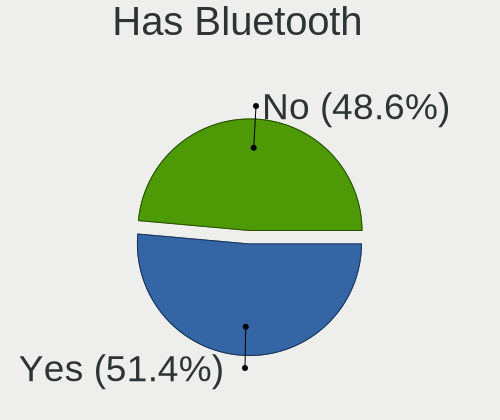
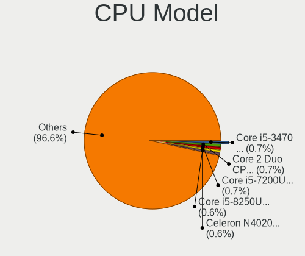
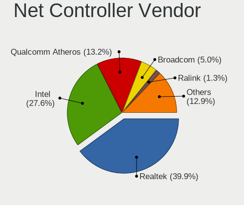
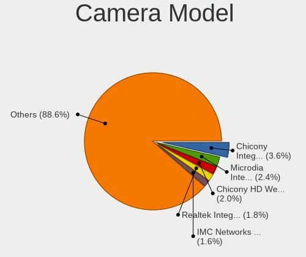

OpenMandriva - Tested Hardware & Statistics
-------------------------------------------

A project to collect tested hardware configurations for OpenMandriva.

Anyone can contribute to this report by the [hw-probe](https://github.com/linuxhw/hw-probe) tool:

    sudo -E hw-probe -all -upload

Please contribute! Especially if your hardware is rare.

This is a report for all computer types. See also reports for [desktops](/Dist/OpenMandriva/Desktop/README.md) and [notebooks](/Dist/OpenMandriva/Notebook/README.md).

Contents
--------

* [ Test Cases ](#test-cases)

* [ System ](#system)
  - [ OS                       ](#os)
  - [ OS Family                ](#os-family)
  - [ Kernel                   ](#kernel)
  - [ Kernel Family            ](#kernel-family)
  - [ Kernel Major Ver.        ](#kernel-major-ver)
  - [ Arch                     ](#arch)
  - [ DE                       ](#de)
  - [ Display Server           ](#display-server)
  - [ Display Manager          ](#display-manager)
  - [ OS Lang                  ](#os-lang)
  - [ Boot Mode                ](#boot-mode)
  - [ Filesystem               ](#filesystem)
  - [ Part. scheme             ](#part-scheme)
  - [ Dual Boot with Linux/BSD ](#dual-boot-with-linuxbsd)
  - [ Dual Boot (Win)          ](#dual-boot-win)

* [ Board ](#board)
  - [ Vendor                   ](#vendor)
  - [ Model                    ](#model)
  - [ Model Family             ](#model-family)
  - [ MFG Year                 ](#mfg-year)
  - [ Form Factor              ](#form-factor)
  - [ Secure Boot              ](#secure-boot)
  - [ Coreboot                 ](#coreboot)
  - [ RAM Size                 ](#ram-size)
  - [ RAM Used                 ](#ram-used)
  - [ Total Drives             ](#total-drives)
  - [ Has CD-ROM               ](#has-cd-rom)
  - [ Has Ethernet             ](#has-ethernet)
  - [ Has WiFi                 ](#has-wifi)
  - [ Has Bluetooth            ](#has-bluetooth)

* [ Location ](#location)
  - [ Country                  ](#country)
  - [ City                     ](#city)

* [ Drives ](#drives)
  - [ Drive Vendor             ](#drive-vendor)
  - [ Drive Model              ](#drive-model)
  - [ HDD Vendor               ](#hdd-vendor)
  - [ SSD Vendor               ](#ssd-vendor)
  - [ Drive Kind               ](#drive-kind)
  - [ Drive Connector          ](#drive-connector)
  - [ Drive Size               ](#drive-size)
  - [ Space Total              ](#space-total)
  - [ Space Used               ](#space-used)
  - [ Malfunc. Drives          ](#malfunc-drives)
  - [ Malfunc. Drive Vendor    ](#malfunc-drive-vendor)
  - [ Malfunc. HDD Vendor      ](#malfunc-hdd-vendor)
  - [ Malfunc. Drive Kind      ](#malfunc-drive-kind)
  - [ Failed Drives            ](#failed-drives)
  - [ Failed Drive Vendor      ](#failed-drive-vendor)
  - [ Drive Status             ](#drive-status)

* [ Storage controller ](#storage-controller)
  - [ Storage Vendor           ](#storage-vendor)
  - [ Storage Model            ](#storage-model)
  - [ Storage Kind             ](#storage-kind)

* [ Processor ](#processor)
  - [ CPU Vendor               ](#cpu-vendor)
  - [ CPU Model                ](#cpu-model)
  - [ CPU Model Family         ](#cpu-model-family)
  - [ CPU Cores                ](#cpu-cores)
  - [ CPU Sockets              ](#cpu-sockets)
  - [ CPU Threads              ](#cpu-threads)
  - [ CPU Op-Modes             ](#cpu-op-modes)
  - [ CPU Microcode            ](#cpu-microcode)
  - [ CPU Microarch            ](#cpu-microarch)

* [ Graphics ](#graphics)
  - [ GPU Vendor               ](#gpu-vendor)
  - [ GPU Model                ](#gpu-model)
  - [ GPU Combo                ](#gpu-combo)
  - [ GPU Driver               ](#gpu-driver)
  - [ GPU Memory               ](#gpu-memory)

* [ Monitor ](#monitor)
  - [ Monitor Vendor           ](#monitor-vendor)
  - [ Monitor Model            ](#monitor-model)
  - [ Monitor Resolution       ](#monitor-resolution)
  - [ Monitor Diagonal         ](#monitor-diagonal)
  - [ Monitor Width            ](#monitor-width)
  - [ Aspect Ratio             ](#aspect-ratio)
  - [ Monitor Area             ](#monitor-area)
  - [ Pixel Density            ](#pixel-density)
  - [ Multiple Monitors        ](#multiple-monitors)

* [ Network ](#network)
  - [ Net Controller Vendor    ](#net-controller-vendor)
  - [ Net Controller Model     ](#net-controller-model)
  - [ Wireless Vendor          ](#wireless-vendor)
  - [ Wireless Model           ](#wireless-model)
  - [ Ethernet Vendor          ](#ethernet-vendor)
  - [ Ethernet Model           ](#ethernet-model)
  - [ Net Controller Kind      ](#net-controller-kind)
  - [ Used Controller          ](#used-controller)
  - [ NICs                     ](#nics)
  - [ IPv6                     ](#ipv6)

* [ Bluetooth ](#bluetooth)
  - [ Bluetooth Vendor         ](#bluetooth-vendor)
  - [ Bluetooth Model          ](#bluetooth-model)

* [ Sound ](#sound)
  - [ Sound Vendor             ](#sound-vendor)
  - [ Sound Model              ](#sound-model)

* [ Memory ](#memory)
  - [ Memory Vendor            ](#memory-vendor)
  - [ Memory Model             ](#memory-model)
  - [ Memory Kind              ](#memory-kind)
  - [ Memory Form Factor       ](#memory-form-factor)
  - [ Memory Size              ](#memory-size)
  - [ Memory Speed             ](#memory-speed)

* [ Printers & scanners ](#printers--scanners)
  - [ Printer Vendor           ](#printer-vendor)
  - [ Printer Model            ](#printer-model)
  - [ Scanner Vendor           ](#scanner-vendor)
  - [ Scanner Model            ](#scanner-model)

* [ Camera ](#camera)
  - [ Camera Vendor            ](#camera-vendor)
  - [ Camera Model             ](#camera-model)

* [ Security ](#security)
  - [ Fingerprint Vendor       ](#fingerprint-vendor)
  - [ Fingerprint Model        ](#fingerprint-model)
  - [ Chipcard Vendor          ](#chipcard-vendor)
  - [ Chipcard Model           ](#chipcard-model)

* [ Unsupported ](#unsupported)
  - [ Unsupported Devices      ](#unsupported-devices)
  - [ Unsupported Device Types ](#unsupported-device-types)

Test Cases
----------

Total: 18278

| Vendor        | Model                       | Form-Factor | Probe                                                      | Date         |
|---------------|-----------------------------|-------------|------------------------------------------------------------|--------------|
| HP            | 339A                        | Desktop     | [e8e666af64](https://linux-hardware.org/?probe=e8e666af64) | Feb 02, 2024 |
| Dell          | Inspiron 3542               | Notebook    | [c7753ffa8e](https://linux-hardware.org/?probe=c7753ffa8e) | Feb 02, 2024 |
| HP            | 3397                        | Desktop     | [f5180bd918](https://linux-hardware.org/?probe=f5180bd918) | Feb 02, 2024 |
| Medion        | Z170H4-EA                   | Desktop     | [17c714c6b5](https://linux-hardware.org/?probe=17c714c6b5) | Feb 02, 2024 |
| HP            | 8055                        | Desktop     | [1eec2a37ce](https://linux-hardware.org/?probe=1eec2a37ce) | Feb 02, 2024 |
| ASRock        | Z77 Pro3                    | Desktop     | [f1d8db0641](https://linux-hardware.org/?probe=f1d8db0641) | Feb 02, 2024 |
| LG Electro... | 16T90P-K.AAE7U1             | Convertible | [c0343d0686](https://linux-hardware.org/?probe=c0343d0686) | Feb 02, 2024 |
| Dell          | Latitude 7390               | Notebook    | [2386e8641f](https://linux-hardware.org/?probe=2386e8641f) | Feb 02, 2024 |
| Dell          | 0NK5PH A00                  | Desktop     | [211c3d7db6](https://linux-hardware.org/?probe=211c3d7db6) | Feb 02, 2024 |
| Dell          | Inspiron 3442               | Notebook    | [ca29fa6852](https://linux-hardware.org/?probe=ca29fa6852) | Feb 02, 2024 |
| Dell          | Latitude 7400               | Notebook    | [ad51cec5ea](https://linux-hardware.org/?probe=ad51cec5ea) | Feb 02, 2024 |
| HP            | 18E7                        | Desktop     | [84caef4dde](https://linux-hardware.org/?probe=84caef4dde) | Feb 02, 2024 |
| PC Special... | GK5CQ7Z                     | Notebook    | [d7632585fc](https://linux-hardware.org/?probe=d7632585fc) | Feb 02, 2024 |
| HP            | Laptop 17-cp0xxx            | Notebook    | [601c3c2cc4](https://linux-hardware.org/?probe=601c3c2cc4) | Feb 02, 2024 |
| Toshiba       | Satellite L50D-B            | Notebook    | [49e28cce05](https://linux-hardware.org/?probe=49e28cce05) | Feb 02, 2024 |
| Lenovo        | ThinkPad T580 20LAS3NJ0T    | Notebook    | [17e848cdcf](https://linux-hardware.org/?probe=17e848cdcf) | Feb 02, 2024 |
| Foxconn       | 2ADA                        | Desktop     | [e92639ba10](https://linux-hardware.org/?probe=e92639ba10) | Feb 02, 2024 |
| ASUSTek       | F2A85-M LE                  | Desktop     | [680ba020e2](https://linux-hardware.org/?probe=680ba020e2) | Feb 02, 2024 |
| Dell          | 0WMJ54 A00                  | Desktop     | [d6c3c89e3d](https://linux-hardware.org/?probe=d6c3c89e3d) | Feb 02, 2024 |
| ASRock        | H77 Pro4-M                  | Desktop     | [794e5341d9](https://linux-hardware.org/?probe=794e5341d9) | Feb 01, 2024 |
| Dell          | 0YF8P5 A00                  | Desktop     | [c3510619ed](https://linux-hardware.org/?probe=c3510619ed) | Feb 01, 2024 |
| Dell          | 0215PR A05                  | Desktop     | [05183a71ef](https://linux-hardware.org/?probe=05183a71ef) | Feb 01, 2024 |
| ASRock        | 880GMH/U3S3                 | Desktop     | [cccd54eb20](https://linux-hardware.org/?probe=cccd54eb20) | Feb 01, 2024 |
| Gigabyte      | X670 AORUS ELITE AX         | Desktop     | [f0bd42b414](https://linux-hardware.org/?probe=f0bd42b414) | Feb 01, 2024 |
| Gigabyte      | B650 GAMING X AX            | Desktop     | [5bf97512a7](https://linux-hardware.org/?probe=5bf97512a7) | Feb 01, 2024 |
| Gigabyte      | X570 AORUS ELITE WIFI       | Desktop     | [7d3d8c9a2f](https://linux-hardware.org/?probe=7d3d8c9a2f) | Feb 01, 2024 |
| ASUSTek       | M4A78-VM                    | Desktop     | [cc37c1b937](https://linux-hardware.org/?probe=cc37c1b937) | Feb 01, 2024 |
| Lenovo        | IdeaPad 3 15IGL05 81WQ      | Notebook    | [589322c92f](https://linux-hardware.org/?probe=589322c92f) | Feb 01, 2024 |
| ASUSTek       | UL80VT                      | Notebook    | [865619250b](https://linux-hardware.org/?probe=865619250b) | Feb 01, 2024 |
| ASUSTek       | PRIME B650-PLUS             | Desktop     | [c83dcb11ca](https://linux-hardware.org/?probe=c83dcb11ca) | Jan 31, 2024 |
| ASRock        | A320M-HDV R4.0              | Desktop     | [9262af6ace](https://linux-hardware.org/?probe=9262af6ace) | Jan 31, 2024 |
| ASUSTek       | P8Z77-V LX                  | Desktop     | [011fd25549](https://linux-hardware.org/?probe=011fd25549) | Jan 31, 2024 |
| ASUSTek       | X540YA                      | Notebook    | [4e8d90738d](https://linux-hardware.org/?probe=4e8d90738d) | Jan 31, 2024 |
| HP            | EliteBook 8440p             | Notebook    | [e8c221770b](https://linux-hardware.org/?probe=e8c221770b) | Jan 31, 2024 |
| Intel         | DH55PJ AAE93812-302         | Desktop     | [acc04ef6ef](https://linux-hardware.org/?probe=acc04ef6ef) | Jan 31, 2024 |
| Lenovo        | LOQ 15IRH8 82XV             | Notebook    | [33490eaaf1](https://linux-hardware.org/?probe=33490eaaf1) | Jan 31, 2024 |
| ASUSTek       | M5A97 R2.0                  | Desktop     | [bf9814808f](https://linux-hardware.org/?probe=bf9814808f) | Jan 31, 2024 |
| Biostar       | H610MH                      | Desktop     | [fb0234d450](https://linux-hardware.org/?probe=fb0234d450) | Jan 31, 2024 |
| Lenovo        | IdeaPad 330-17IKB 81DM      | Notebook    | [3bba660f51](https://linux-hardware.org/?probe=3bba660f51) | Jan 31, 2024 |
| Biostar       | NF61S-M2A                   | Desktop     | [4b42e5cd37](https://linux-hardware.org/?probe=4b42e5cd37) | Jan 31, 2024 |
| HUAWEI        | BOM-WXX9                    | Notebook    | [44970ca2bb](https://linux-hardware.org/?probe=44970ca2bb) | Jan 31, 2024 |
| Unknown       | X133                        | Notebook    | [a2fcc244e8](https://linux-hardware.org/?probe=a2fcc244e8) | Jan 31, 2024 |
| ASUSTek       | TUF Gaming B550M-PLUS       | Desktop     | [f8d19ad525](https://linux-hardware.org/?probe=f8d19ad525) | Jan 31, 2024 |
| Lenovo        | IdeaPad 130-15IKB 81H7      | Notebook    | [f37bfd54e7](https://linux-hardware.org/?probe=f37bfd54e7) | Jan 31, 2024 |
| HP            | 8B3C A                      | Desktop     | [12ec418267](https://linux-hardware.org/?probe=12ec418267) | Jan 31, 2024 |
| Evolute       | B14HM21                     | Notebook    | [c5a911ad90](https://linux-hardware.org/?probe=c5a911ad90) | Jan 31, 2024 |
| Dell          | Inspiron N4050              | Notebook    | [9126475882](https://linux-hardware.org/?probe=9126475882) | Jan 31, 2024 |
| Lenovo        | ThinkStation C20 4263B84    | Desktop     | [084244999d](https://linux-hardware.org/?probe=084244999d) | Jan 31, 2024 |
| Packard Be... | EasyNote ENLG71BM           | Notebook    | [ab713b894e](https://linux-hardware.org/?probe=ab713b894e) | Jan 31, 2024 |
| MSI           | PRO X670-P WIFI             | Desktop     | [2640847c88](https://linux-hardware.org/?probe=2640847c88) | Jan 31, 2024 |
| Gigabyte      | EP45-UD3R                   | Desktop     | [45a5318a64](https://linux-hardware.org/?probe=45a5318a64) | Jan 31, 2024 |
| HP            | G72                         | Notebook    | [24758020db](https://linux-hardware.org/?probe=24758020db) | Jan 31, 2024 |
| Dell          | 0FM586                      | Desktop     | [a66d080473](https://linux-hardware.org/?probe=a66d080473) | Jan 31, 2024 |
| Fujitsu       | D3233-A1 S26361-D3233-A1    | Desktop     | [2a526e4632](https://linux-hardware.org/?probe=2a526e4632) | Jan 30, 2024 |
| HP            | Presario C700               | Notebook    | [d309190dbb](https://linux-hardware.org/?probe=d309190dbb) | Jan 30, 2024 |
| Gigabyte      | X570 GAMING X               | Desktop     | [3418c8d84c](https://linux-hardware.org/?probe=3418c8d84c) | Jan 30, 2024 |
| ASUSTek       | Maximus V GENE              | Desktop     | [a56cd980bb](https://linux-hardware.org/?probe=a56cd980bb) | Jan 30, 2024 |
| Foxconn       | 2AB7                        | Desktop     | [518f65ff6a](https://linux-hardware.org/?probe=518f65ff6a) | Jan 30, 2024 |
| MSI           | Bravo 15 B5DD               | Notebook    | [a989f7aa10](https://linux-hardware.org/?probe=a989f7aa10) | Jan 30, 2024 |
| ASRock        | B450M Pro4                  | Desktop     | [ec3c7a4fc6](https://linux-hardware.org/?probe=ec3c7a4fc6) | Jan 30, 2024 |
| HP            | Pavilion dv7                | Notebook    | [7899a3498e](https://linux-hardware.org/?probe=7899a3498e) | Jan 30, 2024 |
| HP            | 15 Notebook PC              | Notebook    | [fd6be31d9d](https://linux-hardware.org/?probe=fd6be31d9d) | Jan 30, 2024 |
| LG Electro... | E500-SP13G                  | Notebook    | [24499c2111](https://linux-hardware.org/?probe=24499c2111) | Jan 30, 2024 |
| Acer          | Nitro AN515-42              | Notebook    | [9e4c4acd0d](https://linux-hardware.org/?probe=9e4c4acd0d) | Jan 30, 2024 |
| MSI           | MS-6702E                    | Desktop     | [9624bc0fe2](https://linux-hardware.org/?probe=9624bc0fe2) | Jan 30, 2024 |
| MSI           | 760GM-P23                   | Desktop     | [1e5ef07ed7](https://linux-hardware.org/?probe=1e5ef07ed7) | Jan 30, 2024 |
| HP            | EliteBook 8460p             | Notebook    | [9fd5ed9142](https://linux-hardware.org/?probe=9fd5ed9142) | Jan 30, 2024 |
| Toshiba       | Portable PC                 | Notebook    | [5c293a3c24](https://linux-hardware.org/?probe=5c293a3c24) | Jan 30, 2024 |
| MSI           | H110M PRO-VD                | Desktop     | [2dcaa98349](https://linux-hardware.org/?probe=2dcaa98349) | Jan 30, 2024 |
| Sony          | VPCF12A4E                   | Notebook    | [66fb5f96a0](https://linux-hardware.org/?probe=66fb5f96a0) | Jan 30, 2024 |
| ASUSTek       | P5QLD PRO                   | Desktop     | [2558422111](https://linux-hardware.org/?probe=2558422111) | Jan 30, 2024 |
| Dell          | Latitude E6530              | Notebook    | [9aee5be7bf](https://linux-hardware.org/?probe=9aee5be7bf) | Jan 30, 2024 |
| HP            | 1495                        | Desktop     | [06ca3d46b1](https://linux-hardware.org/?probe=06ca3d46b1) | Jan 29, 2024 |
| Dell          | 0GDG8Y A00                  | Desktop     | [9cbabba588](https://linux-hardware.org/?probe=9cbabba588) | Jan 29, 2024 |
| AZW           | MINI S 10                   | Desktop     | [d707319ed7](https://linux-hardware.org/?probe=d707319ed7) | Jan 29, 2024 |
| ASUSTek       | TUF Gaming X570-PLUS        | Desktop     | [c9d5d0fa7b](https://linux-hardware.org/?probe=c9d5d0fa7b) | Jan 29, 2024 |
| HP            | 250 G7 Notebook PC          | Notebook    | [9dab8601c1](https://linux-hardware.org/?probe=9dab8601c1) | Jan 29, 2024 |
| HP            | 0B4Ch D                     | Desktop     | [fc77fc72a5](https://linux-hardware.org/?probe=fc77fc72a5) | Jan 29, 2024 |
| Lenovo        | ThinkPad X270 W10DG 20K5... | Notebook    | [fbf917dbe4](https://linux-hardware.org/?probe=fbf917dbe4) | Jan 29, 2024 |
| Toshiba       | dynabook Satellite B552/... | Notebook    | [9c1f52e62f](https://linux-hardware.org/?probe=9c1f52e62f) | Jan 29, 2024 |
| Lenovo        | G510 20238                  | Notebook    | [12cf7dfeeb](https://linux-hardware.org/?probe=12cf7dfeeb) | Jan 29, 2024 |
| HP            | 1791                        | Desktop     | [e301050210](https://linux-hardware.org/?probe=e301050210) | Jan 29, 2024 |
| Compaq        | Presario CQ-21              | Notebook    | [b947b6f2b8](https://linux-hardware.org/?probe=b947b6f2b8) | Jan 29, 2024 |
| Dell          | 0J3C2F A00                  | Desktop     | [95ae5646c8](https://linux-hardware.org/?probe=95ae5646c8) | Jan 29, 2024 |
| HP            | 3396                        | Desktop     | [b59e0b4023](https://linux-hardware.org/?probe=b59e0b4023) | Jan 29, 2024 |
| ARCELIK       | GNB 1150 B1 N2 V1.0         | Notebook    | [eb35406b7e](https://linux-hardware.org/?probe=eb35406b7e) | Jan 29, 2024 |
| Dell          | Latitude E7450              | Notebook    | [bfa71d26f4](https://linux-hardware.org/?probe=bfa71d26f4) | Jan 29, 2024 |
| Acer          | Aspire 5720Z                | Notebook    | [2353edc7dd](https://linux-hardware.org/?probe=2353edc7dd) | Jan 29, 2024 |
| Biostar       | A68MDE                      | Desktop     | [ab1aaeac91](https://linux-hardware.org/?probe=ab1aaeac91) | Jan 29, 2024 |
| HP            | Pavilion Laptop 15t-eg00... | Notebook    | [fd0435f25b](https://linux-hardware.org/?probe=fd0435f25b) | Jan 29, 2024 |
| Acer          | Aspire 5750                 | Notebook    | [f05ba6ae6f](https://linux-hardware.org/?probe=f05ba6ae6f) | Jan 29, 2024 |
| Positivo      | SF37405                     | Notebook    | [5955478d22](https://linux-hardware.org/?probe=5955478d22) | Jan 28, 2024 |
| ASUSTek       | VivoBook_ASUSLaptop X515... | Notebook    | [f20816d81d](https://linux-hardware.org/?probe=f20816d81d) | Jan 28, 2024 |
| Acer          | Aspire V5-471PG             | Notebook    | [621c9286da](https://linux-hardware.org/?probe=621c9286da) | Jan 28, 2024 |
| eMachines     | eME732ZG                    | Notebook    | [50446e8377](https://linux-hardware.org/?probe=50446e8377) | Jan 28, 2024 |
| Gigabyte      | EP45T-UD3R                  | Desktop     | [d3aaef580d](https://linux-hardware.org/?probe=d3aaef580d) | Jan 28, 2024 |
| Dell          | Latitude 3510               | Notebook    | [0be0a86c59](https://linux-hardware.org/?probe=0be0a86c59) | Jan 28, 2024 |
| Dell          | 0W0CHX A00                  | Desktop     | [e57642d0d4](https://linux-hardware.org/?probe=e57642d0d4) | Jan 28, 2024 |
| ASUSTek       | M4N68T-M-V2                 | Desktop     | [5c4d08e0c4](https://linux-hardware.org/?probe=5c4d08e0c4) | Jan 28, 2024 |
| ASRock        | X570 Phantom Gaming 4       | Desktop     | [23980d6bfb](https://linux-hardware.org/?probe=23980d6bfb) | Jan 28, 2024 |
| ASUSTek       | VivoBook_ASUSLaptop X515... | Notebook    | [2f6021e243](https://linux-hardware.org/?probe=2f6021e243) | Jan 28, 2024 |
| Acer          | Aspire TC-780               | Desktop     | [00c699c62c](https://linux-hardware.org/?probe=00c699c62c) | Jan 28, 2024 |
| MSI           | Z97 GAMING 3                | Desktop     | [5a4ad9cb67](https://linux-hardware.org/?probe=5a4ad9cb67) | Jan 28, 2024 |
| ASUSTek       | M4A87TD/USB3                | Desktop     | [185a90aec7](https://linux-hardware.org/?probe=185a90aec7) | Jan 28, 2024 |
| ASRock        | B760M-HDV/M.2 D4            | Desktop     | [56ef6ba880](https://linux-hardware.org/?probe=56ef6ba880) | Jan 28, 2024 |
| Lenovo        | B51-80 80LM                 | Notebook    | [71d2badad4](https://linux-hardware.org/?probe=71d2badad4) | Jan 27, 2024 |
| ASRock        | X300-ITX                    | Desktop     | [8a850c251d](https://linux-hardware.org/?probe=8a850c251d) | Jan 27, 2024 |
| ASRock        | B75M R2.0                   | Desktop     | [7a7e12dca2](https://linux-hardware.org/?probe=7a7e12dca2) | Jan 27, 2024 |
| Intel         | NUC5CPYB H61145-412         | Mini pc     | [920618f3ab](https://linux-hardware.org/?probe=920618f3ab) | Jan 27, 2024 |
| ASUSTek       | M5A78L-M/USB3               | Desktop     | [c9870d08e7](https://linux-hardware.org/?probe=c9870d08e7) | Jan 27, 2024 |
| HP            | 350 G2                      | Notebook    | [ad55cbfa8a](https://linux-hardware.org/?probe=ad55cbfa8a) | Jan 27, 2024 |
| Gigabyte      | GA-78LMT-S2P                | Desktop     | [508f75b66b](https://linux-hardware.org/?probe=508f75b66b) | Jan 27, 2024 |
| ASRock        | B450 Gaming K4              | Desktop     | [9cee6b0a5b](https://linux-hardware.org/?probe=9cee6b0a5b) | Jan 27, 2024 |
| Gigabyte      | H97-HD3                     | Desktop     | [92984a124e](https://linux-hardware.org/?probe=92984a124e) | Jan 27, 2024 |
| Dell          | Inspiron N7010              | Notebook    | [21ed3bec20](https://linux-hardware.org/?probe=21ed3bec20) | Jan 27, 2024 |
| ASUSTek       | K53SJ                       | Notebook    | [e8479e3860](https://linux-hardware.org/?probe=e8479e3860) | Jan 27, 2024 |
| ASRock        | H470 Phantom Gaming 4       | Desktop     | [dc402c3f43](https://linux-hardware.org/?probe=dc402c3f43) | Jan 27, 2024 |
| Lenovo        | SKYBAY SDK0J40697 WIN 33... | Desktop     | [a0c6f84300](https://linux-hardware.org/?probe=a0c6f84300) | Jan 27, 2024 |
| ASUSTek       | ROG Zephyrus M16 GU604VI... | Notebook    | [dd39831e6f](https://linux-hardware.org/?probe=dd39831e6f) | Jan 27, 2024 |
| Dell          | Inspiron 5555               | Notebook    | [2d1142a7c1](https://linux-hardware.org/?probe=2d1142a7c1) | Jan 27, 2024 |
| Gigabyte      | 945GCM-S2L                  | Desktop     | [4490f8e838](https://linux-hardware.org/?probe=4490f8e838) | Jan 27, 2024 |
| Gigabyte      | H410M H V3                  | Desktop     | [018db3f12a](https://linux-hardware.org/?probe=018db3f12a) | Jan 26, 2024 |
| Gigabyte      | H470M K                     | Desktop     | [644982a46f](https://linux-hardware.org/?probe=644982a46f) | Jan 26, 2024 |
| Dell          | 0NC2VH A01                  | Desktop     | [6e63b66aba](https://linux-hardware.org/?probe=6e63b66aba) | Jan 26, 2024 |
| Medion        | E3223                       | Convertible | [86ea690f80](https://linux-hardware.org/?probe=86ea690f80) | Jan 26, 2024 |
| Unknown       | P43R1600Twins-110DB         | Desktop     | [0741a919e4](https://linux-hardware.org/?probe=0741a919e4) | Jan 26, 2024 |
| HP            | 82F2 A01                    | Desktop     | [437bec28fa](https://linux-hardware.org/?probe=437bec28fa) | Jan 26, 2024 |
| Fujitsu Si... | LIFEBOOK S6410              | Notebook    | [e5e3cbdd02](https://linux-hardware.org/?probe=e5e3cbdd02) | Jan 26, 2024 |
| Lenovo        | IdeaPad 100S-11IBY 80R2     | Notebook    | [01dd8556d5](https://linux-hardware.org/?probe=01dd8556d5) | Jan 26, 2024 |
| HP            | ProBook 455 G2              | Notebook    | [f8d011e007](https://linux-hardware.org/?probe=f8d011e007) | Jan 25, 2024 |
| Gigabyte      | H410M H V3                  | Desktop     | [0610c346d8](https://linux-hardware.org/?probe=0610c346d8) | Jan 25, 2024 |
| Acer          | Aspire ES1-531              | Notebook    | [7faffb7f83](https://linux-hardware.org/?probe=7faffb7f83) | Jan 25, 2024 |
| Gigabyte      | H81M-S1                     | Desktop     | [b727252ca9](https://linux-hardware.org/?probe=b727252ca9) | Jan 25, 2024 |
| HP            | Compaq 6730s                | Notebook    | [caa48b80fb](https://linux-hardware.org/?probe=caa48b80fb) | Jan 25, 2024 |
| Lenovo        | Aptio CRB NOK               | Mini pc     | [97a08f730e](https://linux-hardware.org/?probe=97a08f730e) | Jan 25, 2024 |
| ASUSTek       | PRIME B250M-K               | Desktop     | [fc297eda09](https://linux-hardware.org/?probe=fc297eda09) | Jan 25, 2024 |
| Gigabyte      | B550M DS3H                  | Desktop     | [347b980bdf](https://linux-hardware.org/?probe=347b980bdf) | Jan 25, 2024 |
| Gigabyte      | EG41MF-US2H                 | Desktop     | [882d3605ed](https://linux-hardware.org/?probe=882d3605ed) | Jan 25, 2024 |
| Acer          | Aspire 5820TG               | Notebook    | [d36d7405c8](https://linux-hardware.org/?probe=d36d7405c8) | Jan 25, 2024 |
| ASUSTek       | X540NA                      | Notebook    | [de84955a53](https://linux-hardware.org/?probe=de84955a53) | Jan 25, 2024 |
| Dell          | 0M9KCM A00                  | Desktop     | [6f25f89d48](https://linux-hardware.org/?probe=6f25f89d48) | Jan 25, 2024 |
| Gigabyte      | GA-78LMT-S2P                | Desktop     | [066f355824](https://linux-hardware.org/?probe=066f355824) | Jan 25, 2024 |
| Gigabyte      | Z390 UD V2                  | Desktop     | [b2693bec37](https://linux-hardware.org/?probe=b2693bec37) | Jan 25, 2024 |
| Acer          | Aspire ES1-572              | Notebook    | [10d96173cd](https://linux-hardware.org/?probe=10d96173cd) | Jan 25, 2024 |
| ASUSTek       | PRIME H510M-E               | Desktop     | [ea518cb09d](https://linux-hardware.org/?probe=ea518cb09d) | Jan 24, 2024 |
| HP            | ProBook 445 G8 Notebook ... | Notebook    | [057c708875](https://linux-hardware.org/?probe=057c708875) | Jan 24, 2024 |
| HP            | EliteBook 840 G3            | Notebook    | [eceea6fa49](https://linux-hardware.org/?probe=eceea6fa49) | Jan 24, 2024 |
| eMachines     | eME732Z                     | Notebook    | [fe3d184f11](https://linux-hardware.org/?probe=fe3d184f11) | Jan 24, 2024 |
| Lenovo        | 36EB SDK0J40700 WIN 3258... | Desktop     | [7e7e0c8e53](https://linux-hardware.org/?probe=7e7e0c8e53) | Jan 24, 2024 |
| HP            | EliteBook 2570p             | Notebook    | [34093d035a](https://linux-hardware.org/?probe=34093d035a) | Jan 24, 2024 |
| Toshiba       | Satellite C650              | Notebook    | [2fa418e377](https://linux-hardware.org/?probe=2fa418e377) | Jan 24, 2024 |
| ASRock        | B650M Pro RS                | Desktop     | [2d706981c5](https://linux-hardware.org/?probe=2d706981c5) | Jan 24, 2024 |
| ECS           | Iris8                       | Desktop     | [91dd8156df](https://linux-hardware.org/?probe=91dd8156df) | Jan 24, 2024 |
| Lenovo        | SHARKBAY SDK0E50510 WIN     | Desktop     | [ff7fd4d2cd](https://linux-hardware.org/?probe=ff7fd4d2cd) | Jan 24, 2024 |
| Dell          | 09KPNV A00                  | Desktop     | [86ae6a23fb](https://linux-hardware.org/?probe=86ae6a23fb) | Jan 24, 2024 |
| Pegatron      | Benicia                     | Desktop     | [9a4be691fc](https://linux-hardware.org/?probe=9a4be691fc) | Jan 23, 2024 |
| Dell          | Inspiron 14-3452            | Notebook    | [0ed9a65fc4](https://linux-hardware.org/?probe=0ed9a65fc4) | Jan 23, 2024 |
| Apple         | MacBookPro4,1               | Notebook    | [4c99b7a6ff](https://linux-hardware.org/?probe=4c99b7a6ff) | Jan 23, 2024 |
| ASUSTek       | PRIME A320M-K               | Desktop     | [5c2e73a06a](https://linux-hardware.org/?probe=5c2e73a06a) | Jan 23, 2024 |
| HP            | Stream Laptop 14-ax0XX      | Notebook    | [16c6b944fb](https://linux-hardware.org/?probe=16c6b944fb) | Jan 23, 2024 |
| Gigabyte      | H61M-S1                     | Desktop     | [91f61c4366](https://linux-hardware.org/?probe=91f61c4366) | Jan 23, 2024 |
| Intel         | Unknown                     | Desktop     | [8427ffd0dc](https://linux-hardware.org/?probe=8427ffd0dc) | Jan 23, 2024 |
| HP            | Compaq CQ45                 | Notebook    | [4ab36cf29f](https://linux-hardware.org/?probe=4ab36cf29f) | Jan 23, 2024 |
| Positivo      | Mobile                      | Notebook    | [d1ca90b4f5](https://linux-hardware.org/?probe=d1ca90b4f5) | Jan 23, 2024 |
| ASUSTek       | ROG CROSSHAIR VII HERO      | Desktop     | [f2919e84e4](https://linux-hardware.org/?probe=f2919e84e4) | Jan 22, 2024 |
| Dell          | Latitude E5540              | Notebook    | [2e1716a6aa](https://linux-hardware.org/?probe=2e1716a6aa) | Jan 22, 2024 |
| MSI           | MAG X570S TORPEDO MAX       | Desktop     | [97f9705158](https://linux-hardware.org/?probe=97f9705158) | Jan 22, 2024 |
| Lenovo        | Yoga 720-15IKB 80X7         | Convertible | [efa155f365](https://linux-hardware.org/?probe=efa155f365) | Jan 22, 2024 |
| Lenovo        | IdeaPad 500-15ISK 80NT      | Notebook    | [a19e1e70ac](https://linux-hardware.org/?probe=a19e1e70ac) | Jan 22, 2024 |
| Lenovo        | ThinkPad T430 2347A81       | Notebook    | [7209687602](https://linux-hardware.org/?probe=7209687602) | Jan 22, 2024 |
| Lenovo        | ThinkPad T490 20N3S5GM00    | Notebook    | [1562510db8](https://linux-hardware.org/?probe=1562510db8) | Jan 22, 2024 |
| ASUSTek       | S400CA                      | Notebook    | [87f5dfadc9](https://linux-hardware.org/?probe=87f5dfadc9) | Jan 22, 2024 |
| Hampoo        | I2W6_AP135 Reserved         | Notebook    | [fe5025efdd](https://linux-hardware.org/?probe=fe5025efdd) | Jan 21, 2024 |
| HP            | 18E5                        | Desktop     | [69ba380344](https://linux-hardware.org/?probe=69ba380344) | Jan 21, 2024 |
| Lenovo        | ThinkPad X220 Tablet 429... | Notebook    | [8621eed350](https://linux-hardware.org/?probe=8621eed350) | Jan 21, 2024 |
| HP            | ProBook 450 G5              | Notebook    | [ea8cc27b1a](https://linux-hardware.org/?probe=ea8cc27b1a) | Jan 21, 2024 |
| ASUSTek       | ROG STRIX X670E-E GAMING... | Desktop     | [ec963a72d8](https://linux-hardware.org/?probe=ec963a72d8) | Jan 21, 2024 |
| Fujitsu       | LIFEBOOK A555/G             | Notebook    | [f87640231d](https://linux-hardware.org/?probe=f87640231d) | Jan 21, 2024 |
| Samsung       | X420/X520                   | Notebook    | [9dae8bd2c2](https://linux-hardware.org/?probe=9dae8bd2c2) | Jan 21, 2024 |
| HP            | EliteBook 8770w             | Notebook    | [6b53fccf5d](https://linux-hardware.org/?probe=6b53fccf5d) | Jan 21, 2024 |
| Lenovo        | ThinkPad T400 6474W7T       | Notebook    | [fa80320d7c](https://linux-hardware.org/?probe=fa80320d7c) | Jan 21, 2024 |
| HP            | 82B4                        | Desktop     | [0eca4196b3](https://linux-hardware.org/?probe=0eca4196b3) | Jan 21, 2024 |
| Casper        | NIRVANA NOTEBOOK            | Desktop     | [af055c48ff](https://linux-hardware.org/?probe=af055c48ff) | Jan 21, 2024 |
| Intel         | DZ77GA-70K AAG39009-500     | Desktop     | [cba7125977](https://linux-hardware.org/?probe=cba7125977) | Jan 20, 2024 |
| Samsung       | 270E5K/270E5Q/271E5K/257... | Notebook    | [e8a23ca7a0](https://linux-hardware.org/?probe=e8a23ca7a0) | Jan 20, 2024 |
| Lenovo        | IdeaPad 320-15IAP 80XR      | Notebook    | [af044c261f](https://linux-hardware.org/?probe=af044c261f) | Jan 20, 2024 |
| Dell          | 042P49 A02                  | Desktop     | [366d017089](https://linux-hardware.org/?probe=366d017089) | Jan 20, 2024 |
| Acer          | Aspire 1810T                | Notebook    | [068454b849](https://linux-hardware.org/?probe=068454b849) | Jan 20, 2024 |
| HP            | ProBook 430 G3              | Notebook    | [ed36d7cd8f](https://linux-hardware.org/?probe=ed36d7cd8f) | Jan 20, 2024 |
| ASRock        | FM2A85X-ITX                 | Desktop     | [30f6aa7ead](https://linux-hardware.org/?probe=30f6aa7ead) | Jan 20, 2024 |
| ASUSTek       | PRIME A320M-K               | Desktop     | [58be81f7c1](https://linux-hardware.org/?probe=58be81f7c1) | Jan 20, 2024 |
| Gigabyte      | A320M-S2H-CF                | Desktop     | [39cd221e89](https://linux-hardware.org/?probe=39cd221e89) | Jan 20, 2024 |
| HP            | Presario CQ43               | Notebook    | [ad1175a3a8](https://linux-hardware.org/?probe=ad1175a3a8) | Jan 20, 2024 |
| ASUSTek       | H81M-K                      | Desktop     | [5b51e88413](https://linux-hardware.org/?probe=5b51e88413) | Jan 20, 2024 |
| Apple         | MacBookPro3,1               | Notebook    | [057f8b6477](https://linux-hardware.org/?probe=057f8b6477) | Jan 20, 2024 |
| HP            | 8055                        | Desktop     | [5e6a445b12](https://linux-hardware.org/?probe=5e6a445b12) | Jan 19, 2024 |
| Dell          | Latitude E6420              | Notebook    | [b0d535026a](https://linux-hardware.org/?probe=b0d535026a) | Jan 19, 2024 |
| ASUSTek       | VivoBook 17_ASUS Laptop ... | Notebook    | [9d2dbd96a5](https://linux-hardware.org/?probe=9d2dbd96a5) | Jan 19, 2024 |
| LG Electro... | 14T90R-K.AA77A1             | Convertible | [199a0be0a5](https://linux-hardware.org/?probe=199a0be0a5) | Jan 19, 2024 |
| Unknown       | Unknown                     | Notebook    | [8be7dd2df4](https://linux-hardware.org/?probe=8be7dd2df4) | Jan 19, 2024 |
| Dell          | 042P49 A01                  | Desktop     | [e164f495e7](https://linux-hardware.org/?probe=e164f495e7) | Jan 19, 2024 |
| Gigabyte      | B460 AORUS PRO AC           | Desktop     | [276a0b5785](https://linux-hardware.org/?probe=276a0b5785) | Jan 19, 2024 |
| Google        | Garg                        | Notebook    | [b0e91d1473](https://linux-hardware.org/?probe=b0e91d1473) | Jan 19, 2024 |
| HP            | 81B4 01                     | Desktop     | [967d9af55c](https://linux-hardware.org/?probe=967d9af55c) | Jan 19, 2024 |
| Microsoft     | Surface Pro 3               | Tablet      | [2822d189fe](https://linux-hardware.org/?probe=2822d189fe) | Jan 19, 2024 |
| HP            | ENVY x360 Convertible 15... | Convertible | [5174a4a05a](https://linux-hardware.org/?probe=5174a4a05a) | Jan 19, 2024 |
| Google        | Garg                        | Notebook    | [2c85d92017](https://linux-hardware.org/?probe=2c85d92017) | Jan 19, 2024 |
| HP            | Pavilion Gaming Laptop 1... | Notebook    | [e4d77bb448](https://linux-hardware.org/?probe=e4d77bb448) | Jan 19, 2024 |
| Lenovo        | 100e 2nd Gen 81M8           | Notebook    | [a4aa40979a](https://linux-hardware.org/?probe=a4aa40979a) | Jan 18, 2024 |
| Intel         | NUC11PABi7 K90104-305       | Mini pc     | [11f478f041](https://linux-hardware.org/?probe=11f478f041) | Jan 18, 2024 |
| ASUSTek       | K30AD_M31AD_M51AD           | Desktop     | [8d2bc7b076](https://linux-hardware.org/?probe=8d2bc7b076) | Jan 18, 2024 |
| Google        | Garg                        | Notebook    | [69f2601b2d](https://linux-hardware.org/?probe=69f2601b2d) | Jan 18, 2024 |
| Gigabyte      | H610M K DDR4                | Desktop     | [5c9e5ec7aa](https://linux-hardware.org/?probe=5c9e5ec7aa) | Jan 18, 2024 |
| Gigabyte      | Z77-DS3H                    | Desktop     | [08a4e7960a](https://linux-hardware.org/?probe=08a4e7960a) | Jan 18, 2024 |
| Biostar       | A770E                       | Desktop     | [a149b3aeb6](https://linux-hardware.org/?probe=a149b3aeb6) | Jan 17, 2024 |
| Dell          | 0MGK50 A02                  | Desktop     | [8ce2d2a81a](https://linux-hardware.org/?probe=8ce2d2a81a) | Jan 17, 2024 |
| ASUSTek       | TUF Gaming B460-PLUS        | Desktop     | [344b6767cd](https://linux-hardware.org/?probe=344b6767cd) | Jan 17, 2024 |
| Acer          | Aspire E1-531G              | Notebook    | [2c64046f89](https://linux-hardware.org/?probe=2c64046f89) | Jan 17, 2024 |
| MSI           | MAG B550 TOMAHAWK           | Desktop     | [5ecdfd3d3c](https://linux-hardware.org/?probe=5ecdfd3d3c) | Jan 17, 2024 |
| MACHINIST     | E5-RS9 V1.11                | Desktop     | [2b48345368](https://linux-hardware.org/?probe=2b48345368) | Jan 17, 2024 |
| Gigabyte      | H61M-S2PV                   | Desktop     | [3baca805c4](https://linux-hardware.org/?probe=3baca805c4) | Jan 17, 2024 |
| EPoX Compu... | NF6100 + NF410 DDR2: MGF... | Desktop     | [ba08d6e05c](https://linux-hardware.org/?probe=ba08d6e05c) | Jan 17, 2024 |
| HP            | Laptop 15-dw3xxx            | Notebook    | [77766f1cc1](https://linux-hardware.org/?probe=77766f1cc1) | Jan 17, 2024 |
| Dell          | 0MHWCY A00                  | All in one  | [021cf9cd7c](https://linux-hardware.org/?probe=021cf9cd7c) | Jan 17, 2024 |
| MSI           | A68HM-E33 V2                | Desktop     | [da97b5c9f5](https://linux-hardware.org/?probe=da97b5c9f5) | Jan 17, 2024 |
| Lenovo        | ThinkPad X230 2330A17       | Notebook    | [589c4362a6](https://linux-hardware.org/?probe=589c4362a6) | Jan 16, 2024 |
| ASUSTek       | Z97-DELUXE                  | Desktop     | [f414f21db4](https://linux-hardware.org/?probe=f414f21db4) | Jan 16, 2024 |
| Gigabyte      | EP35-DS3                    | Desktop     | [18f8b43855](https://linux-hardware.org/?probe=18f8b43855) | Jan 16, 2024 |
| ASRock        | Z390 Taichi                 | Desktop     | [84a79a7e97](https://linux-hardware.org/?probe=84a79a7e97) | Jan 16, 2024 |
| Lenovo        | ThinkPad T470s W10DG 20J... | Notebook    | [f73401456d](https://linux-hardware.org/?probe=f73401456d) | Jan 16, 2024 |
| Lenovo        | 30D9 SDK0J40697 WIN 3305... | Desktop     | [eddee431eb](https://linux-hardware.org/?probe=eddee431eb) | Jan 16, 2024 |
| ASUSTek       | UN65U                       | Desktop     | [0c9b6c61f2](https://linux-hardware.org/?probe=0c9b6c61f2) | Jan 16, 2024 |
| ASUSTek       | H81M-K                      | Desktop     | [c1f78ee398](https://linux-hardware.org/?probe=c1f78ee398) | Jan 16, 2024 |
| Gigabyte      | H270M-D3H-CF                | Desktop     | [636ad953ab](https://linux-hardware.org/?probe=636ad953ab) | Jan 16, 2024 |
| ASUSTek       | X555LAB                     | Notebook    | [a5e1ffbe3f](https://linux-hardware.org/?probe=a5e1ffbe3f) | Jan 15, 2024 |
| Lenovo        | IdeaPad 110-14IBR 80T6      | Notebook    | [22802134b7](https://linux-hardware.org/?probe=22802134b7) | Jan 15, 2024 |
| Lenovo        | Yoga 300-11IBR 80M1         | Notebook    | [8bbf7916f3](https://linux-hardware.org/?probe=8bbf7916f3) | Jan 15, 2024 |
| Acer          | TravelMate 5335             | Notebook    | [fcdb840b24](https://linux-hardware.org/?probe=fcdb840b24) | Jan 15, 2024 |
| Dell          | XPS 15 9510                 | Notebook    | [55cbe62073](https://linux-hardware.org/?probe=55cbe62073) | Jan 15, 2024 |
| Lenovo        | ThinkPad T450s 20BWS05V0... | Notebook    | [fffdee8af3](https://linux-hardware.org/?probe=fffdee8af3) | Jan 15, 2024 |
| ASRock        | H81M-VG4 R2.0               | Desktop     | [4854968095](https://linux-hardware.org/?probe=4854968095) | Jan 15, 2024 |
| ASUSTek       | M5A97 R2.0                  | Desktop     | [122b72e9f2](https://linux-hardware.org/?probe=122b72e9f2) | Jan 15, 2024 |
| ASUSTek       | TUF Gaming B560M-PLUS WI... | Desktop     | [4e2717fe33](https://linux-hardware.org/?probe=4e2717fe33) | Jan 15, 2024 |
| HP            | Laptop 15-db0xxx            | Notebook    | [cb2cda915a](https://linux-hardware.org/?probe=cb2cda915a) | Jan 15, 2024 |
| Microsoft     | Surface Pro 7               | Tablet      | [bc6a402c24](https://linux-hardware.org/?probe=bc6a402c24) | Jan 14, 2024 |
| Dell          | Latitude E4310              | Notebook    | [a11f178faf](https://linux-hardware.org/?probe=a11f178faf) | Jan 14, 2024 |
| Dell          | 09M8Y8 A01                  | Desktop     | [0372519ba2](https://linux-hardware.org/?probe=0372519ba2) | Jan 14, 2024 |
| MSI           | A320M-A PRO                 | Desktop     | [4f2655db6f](https://linux-hardware.org/?probe=4f2655db6f) | Jan 14, 2024 |
| Lenovo        | G780 20138                  | Notebook    | [de9b5d4fe7](https://linux-hardware.org/?probe=de9b5d4fe7) | Jan 14, 2024 |
| Positivo      | POS-EINM10CB POSITIVO       | Desktop     | [ed11587f82](https://linux-hardware.org/?probe=ed11587f82) | Jan 14, 2024 |
| Lenovo        | ThinkPad P15v Gen 1 20TR... | Notebook    | [3382b10d32](https://linux-hardware.org/?probe=3382b10d32) | Jan 14, 2024 |
| HP            | EliteBook 840 G2            | Notebook    | [33b3e5d03d](https://linux-hardware.org/?probe=33b3e5d03d) | Jan 14, 2024 |
| Gigabyte      | EX58-UD3R                   | Desktop     | [b62ae21449](https://linux-hardware.org/?probe=b62ae21449) | Jan 13, 2024 |
| Samsung       | 300E5M/300E5L               | Notebook    | [23fdab96e1](https://linux-hardware.org/?probe=23fdab96e1) | Jan 13, 2024 |
| Gigabyte      | H510M H V2                  | Desktop     | [1340d91b43](https://linux-hardware.org/?probe=1340d91b43) | Jan 13, 2024 |
| ASUSTek       | VivoBook_ASUSLaptop M160... | Notebook    | [f35fb9dd1c](https://linux-hardware.org/?probe=f35fb9dd1c) | Jan 13, 2024 |
| TUXEDO        | Book BM15 Gen10             | Notebook    | [dcb4b6ab6a](https://linux-hardware.org/?probe=dcb4b6ab6a) | Jan 13, 2024 |
| ASUSTek       | X756UXK                     | Notebook    | [16c3f8c205](https://linux-hardware.org/?probe=16c3f8c205) | Jan 13, 2024 |
| GPU Compan... | GWNR71517                   | Notebook    | [be58d576de](https://linux-hardware.org/?probe=be58d576de) | Jan 13, 2024 |
| Dell          | 0W2F8G A01                  | Desktop     | [959d868bbf](https://linux-hardware.org/?probe=959d868bbf) | Jan 13, 2024 |
| Dell          | 0KC9NP A01                  | Desktop     | [71596d8f5f](https://linux-hardware.org/?probe=71596d8f5f) | Jan 12, 2024 |
| Acer          | Aspire A315-31              | Notebook    | [22135f150d](https://linux-hardware.org/?probe=22135f150d) | Jan 12, 2024 |
| ASRock        | H110M-HDV                   | Desktop     | [5f7f485a15](https://linux-hardware.org/?probe=5f7f485a15) | Jan 12, 2024 |
| Gigabyte      | H97M-Gaming 3               | Desktop     | [6230f1ef11](https://linux-hardware.org/?probe=6230f1ef11) | Jan 12, 2024 |
| Gigabyte      | H310M M.2 x.x               | Desktop     | [f67cc2282f](https://linux-hardware.org/?probe=f67cc2282f) | Jan 12, 2024 |
| Lenovo        | ThinkPad L570 20J9S0KG00    | Notebook    | [6d03ee96b8](https://linux-hardware.org/?probe=6d03ee96b8) | Jan 12, 2024 |
| MSI           | B450M-A PRO MAX             | Desktop     | [15d413beb6](https://linux-hardware.org/?probe=15d413beb6) | Jan 12, 2024 |
| MSI           | B450M-A PRO MAX             | Desktop     | [50ca06fa28](https://linux-hardware.org/?probe=50ca06fa28) | Jan 11, 2024 |
| Dell          | 04TP5V A00                  | Mini pc     | [0f58e0a990](https://linux-hardware.org/?probe=0f58e0a990) | Jan 11, 2024 |
| ASUSTek       | SABERTOOTH 990FX R2.0       | Desktop     | [febf87bf81](https://linux-hardware.org/?probe=febf87bf81) | Jan 11, 2024 |
| Lenovo        | IdeaPad 3 15ITL6 82H8       | Notebook    | [272249651d](https://linux-hardware.org/?probe=272249651d) | Jan 11, 2024 |
| Gigabyte      | B75M-D3H                    | Desktop     | [5edf7a7923](https://linux-hardware.org/?probe=5edf7a7923) | Jan 11, 2024 |
| Lenovo        | IdeaPad S145-15IIL 81W8     | Notebook    | [02b9ba51a9](https://linux-hardware.org/?probe=02b9ba51a9) | Jan 11, 2024 |
| Dell          | Vostro 3401                 | Notebook    | [cd47812859](https://linux-hardware.org/?probe=cd47812859) | Jan 11, 2024 |
| ASUSTek       | PRIME Z270-P                | Desktop     | [bf8ac62321](https://linux-hardware.org/?probe=bf8ac62321) | Jan 11, 2024 |
| GEEKOM        | Mini IT 8                   | Desktop     | [16b759767e](https://linux-hardware.org/?probe=16b759767e) | Jan 11, 2024 |
| HP            | 198E                        | Desktop     | [15f15e41f1](https://linux-hardware.org/?probe=15f15e41f1) | Jan 11, 2024 |
| Dell          | Inspiron 11-3168            | Notebook    | [f7763a1298](https://linux-hardware.org/?probe=f7763a1298) | Jan 10, 2024 |
| Intel         | H81                         | Desktop     | [1a1c6de235](https://linux-hardware.org/?probe=1a1c6de235) | Jan 10, 2024 |
| Lenovo        | IdeaPad Pro 5 14APH8 83A... | Notebook    | [47ca371fcb](https://linux-hardware.org/?probe=47ca371fcb) | Jan 10, 2024 |
| MSI           | Z87I                        | Desktop     | [35114b37dd](https://linux-hardware.org/?probe=35114b37dd) | Jan 10, 2024 |
| Pegatron      | NARRA3                      | Desktop     | [08c60d9c7a](https://linux-hardware.org/?probe=08c60d9c7a) | Jan 10, 2024 |
| ASRock        | Q1900B-ITX                  | Desktop     | [610dfd5b71](https://linux-hardware.org/?probe=610dfd5b71) | Jan 10, 2024 |
| ASUSTek       | M5A78L-M LX3                | Desktop     | [6b0c1cd101](https://linux-hardware.org/?probe=6b0c1cd101) | Jan 10, 2024 |
| MSI           | B550-A PRO                  | Desktop     | [4042af29a0](https://linux-hardware.org/?probe=4042af29a0) | Jan 10, 2024 |
| Lenovo        | ThinkPad T480 20L6S6KF00    | Notebook    | [5e3205ab0e](https://linux-hardware.org/?probe=5e3205ab0e) | Jan 10, 2024 |
| MSI           | GF63 Thin 10SC              | Notebook    | [d30a326b47](https://linux-hardware.org/?probe=d30a326b47) | Jan 10, 2024 |
| GPU Compan... | GWNR71517                   | Notebook    | [11b2e02998](https://linux-hardware.org/?probe=11b2e02998) | Jan 10, 2024 |
| Toshiba       | Satellite C660              | Notebook    | [34eaf45d7f](https://linux-hardware.org/?probe=34eaf45d7f) | Jan 09, 2024 |
| Acer          | Aspire E5-571               | Notebook    | [a9f2a0569a](https://linux-hardware.org/?probe=a9f2a0569a) | Jan 09, 2024 |
| Dell          | Inspiron 15 3515            | Notebook    | [1ca72e6562](https://linux-hardware.org/?probe=1ca72e6562) | Jan 09, 2024 |
| HP            | EliteBook 8560w             | Notebook    | [9ecce1ef57](https://linux-hardware.org/?probe=9ecce1ef57) | Jan 09, 2024 |
| ASUSTek       | VivoBook_ASUSLaptop M650... | Notebook    | [6921991670](https://linux-hardware.org/?probe=6921991670) | Jan 09, 2024 |
| Sony          | VGN-FZ31Z                   | Notebook    | [3df7d503da](https://linux-hardware.org/?probe=3df7d503da) | Jan 09, 2024 |
| MSI           | 970A-G43                    | Desktop     | [00e0cf9c8d](https://linux-hardware.org/?probe=00e0cf9c8d) | Jan 09, 2024 |
| ASRock        | Z77 Extreme3                | Desktop     | [5b6dee9bbe](https://linux-hardware.org/?probe=5b6dee9bbe) | Jan 09, 2024 |
| Dell          | 00V62H A01                  | Desktop     | [e191ccd074](https://linux-hardware.org/?probe=e191ccd074) | Jan 09, 2024 |
| MSI           | A75A-G35                    | Desktop     | [288caa413e](https://linux-hardware.org/?probe=288caa413e) | Jan 09, 2024 |
| Razer         | Book 13 - RZ09-0357         | Notebook    | [91bd06ba56](https://linux-hardware.org/?probe=91bd06ba56) | Jan 09, 2024 |
| HP            | Notebook                    | Notebook    | [ae9cfe9cc7](https://linux-hardware.org/?probe=ae9cfe9cc7) | Jan 09, 2024 |
| Lenovo        | ThinkPad L570 W10DG 20JR... | Notebook    | [b0ac8e8208](https://linux-hardware.org/?probe=b0ac8e8208) | Jan 09, 2024 |
| ASUSTek       | TP410UR                     | Convertible | [3063278c30](https://linux-hardware.org/?probe=3063278c30) | Jan 09, 2024 |
| ASUSTek       | P8P67 EVO                   | Desktop     | [d54cf27190](https://linux-hardware.org/?probe=d54cf27190) | Jan 09, 2024 |
| HP            | 2000                        | Notebook    | [d23f668910](https://linux-hardware.org/?probe=d23f668910) | Jan 09, 2024 |
| Sony          | SVF1521A6EW                 | Notebook    | [37c4dd98f1](https://linux-hardware.org/?probe=37c4dd98f1) | Jan 09, 2024 |
| HP            | Compaq 610                  | Notebook    | [da1dd5ace4](https://linux-hardware.org/?probe=da1dd5ace4) | Jan 08, 2024 |
| LG Electro... | 15Z90RT-K.AD7AA1            | Notebook    | [be4ff0f44a](https://linux-hardware.org/?probe=be4ff0f44a) | Jan 08, 2024 |
| Dell          | 0XCR8D A02                  | Desktop     | [067794fe12](https://linux-hardware.org/?probe=067794fe12) | Jan 08, 2024 |
| OEM           | B75 Ver:1.41                | Desktop     | [5466b2e4af](https://linux-hardware.org/?probe=5466b2e4af) | Jan 08, 2024 |
| Lenovo        | ThinkCentre M72e 0896A2G    | Desktop     | [b77ad754ae](https://linux-hardware.org/?probe=b77ad754ae) | Jan 08, 2024 |
| Lenovo        | Yoga 9 14ITL5 82BG          | Convertible | [a100fae6e2](https://linux-hardware.org/?probe=a100fae6e2) | Jan 08, 2024 |
| Gigabyte      | GA-E350N-USB3               | Desktop     | [222f3e6908](https://linux-hardware.org/?probe=222f3e6908) | Jan 08, 2024 |
| ALDO          | C2016-BSWI-D2               | Desktop     | [1e3d4c2e55](https://linux-hardware.org/?probe=1e3d4c2e55) | Jan 08, 2024 |
| Dell          | Inspiron 3576               | Notebook    | [ff3dc4d39e](https://linux-hardware.org/?probe=ff3dc4d39e) | Jan 08, 2024 |
| MSI           | A75A-G55                    | Desktop     | [f13d0a0a8d](https://linux-hardware.org/?probe=f13d0a0a8d) | Jan 08, 2024 |
| Lenovo        | G710 20252                  | Notebook    | [ec645bc6c5](https://linux-hardware.org/?probe=ec645bc6c5) | Jan 08, 2024 |
| Gigabyte      | B450M K-CF                  | Desktop     | [6ffbab86cc](https://linux-hardware.org/?probe=6ffbab86cc) | Jan 07, 2024 |
| Lenovo        | IdeaPad 3 14IIL05 81WD      | Notebook    | [9d534bf283](https://linux-hardware.org/?probe=9d534bf283) | Jan 07, 2024 |
| Lenovo        | IdeaPad 3 15ADA05 81W1      | Notebook    | [770f12c749](https://linux-hardware.org/?probe=770f12c749) | Jan 07, 2024 |
| Lenovo        | G50-70 20351                | Notebook    | [5f77e74f4c](https://linux-hardware.org/?probe=5f77e74f4c) | Jan 07, 2024 |
| HP            | 635                         | Notebook    | [29632bb08b](https://linux-hardware.org/?probe=29632bb08b) | Jan 07, 2024 |
| Dell          | 00V62H A01                  | Desktop     | [6fcf0891d9](https://linux-hardware.org/?probe=6fcf0891d9) | Jan 07, 2024 |
| Lenovo        | ThinkPad T60 1951YCQ        | Notebook    | [b449df298d](https://linux-hardware.org/?probe=b449df298d) | Jan 07, 2024 |
| NEC Comput... | 30D4                        | Desktop     | [7dbd07f1f7](https://linux-hardware.org/?probe=7dbd07f1f7) | Jan 07, 2024 |
| Apple         | Mac-35C5E08120C7EEAF Mac... | Mini pc     | [7e23c64c2c](https://linux-hardware.org/?probe=7e23c64c2c) | Jan 06, 2024 |
| ASUSTek       | P5QLD PRO                   | Desktop     | [9086cfaba8](https://linux-hardware.org/?probe=9086cfaba8) | Jan 06, 2024 |
| HP            | 250 G3                      | Notebook    | [259acacdb3](https://linux-hardware.org/?probe=259acacdb3) | Jan 06, 2024 |
| Acer          | Aspire 5830TG               | Notebook    | [9af8a1dfdb](https://linux-hardware.org/?probe=9af8a1dfdb) | Jan 06, 2024 |
| Dell          | Inspiron 5567               | Notebook    | [9e7374b8ef](https://linux-hardware.org/?probe=9e7374b8ef) | Jan 06, 2024 |
| Gigabyte      | Z77M-D3H                    | Desktop     | [d20dfe448d](https://linux-hardware.org/?probe=d20dfe448d) | Jan 06, 2024 |
| Google        | Teemo                       | Desktop     | [c763bd20f9](https://linux-hardware.org/?probe=c763bd20f9) | Jan 06, 2024 |
| Dell          | Inspiron 5515               | Notebook    | [6ff66dee9c](https://linux-hardware.org/?probe=6ff66dee9c) | Jan 06, 2024 |
| Gigabyte      | MZBSWAP-00                  | Desktop     | [eb3700b576](https://linux-hardware.org/?probe=eb3700b576) | Jan 06, 2024 |
| Toshiba       | Satellite L55D-B            | Notebook    | [e0358ccedc](https://linux-hardware.org/?probe=e0358ccedc) | Jan 06, 2024 |
| Intel         | B75                         | Desktop     | [648128d27a](https://linux-hardware.org/?probe=648128d27a) | Jan 06, 2024 |
| Acer          | Aspire ES1-572              | Notebook    | [6de42f8573](https://linux-hardware.org/?probe=6de42f8573) | Jan 06, 2024 |
| Apple         | Mac-031B6874CF7F642A iMa... | All in one  | [532aed7e45](https://linux-hardware.org/?probe=532aed7e45) | Jan 05, 2024 |
| HP            | Compaq 6730s                | Notebook    | [1ad2b54c9d](https://linux-hardware.org/?probe=1ad2b54c9d) | Jan 05, 2024 |
| ASUSTek       | UL80VT                      | Notebook    | [7780af9eb5](https://linux-hardware.org/?probe=7780af9eb5) | Jan 05, 2024 |
| HP            | Stream 11 Pro G4 EE         | Notebook    | [1cfbb2a459](https://linux-hardware.org/?probe=1cfbb2a459) | Jan 05, 2024 |
| Shenzhen M... | F7BFC                       | Desktop     | [59d6a69f30](https://linux-hardware.org/?probe=59d6a69f30) | Jan 05, 2024 |
| HP            | ENVY Notebook               | Notebook    | [8a2c65e297](https://linux-hardware.org/?probe=8a2c65e297) | Jan 05, 2024 |
| Shenzhen M... | F7BFC                       | Desktop     | [d8ed7241cb](https://linux-hardware.org/?probe=d8ed7241cb) | Jan 05, 2024 |
| Intel         | JSL MRD                     | Desktop     | [8b1f990d75](https://linux-hardware.org/?probe=8b1f990d75) | Jan 05, 2024 |
| ASUSTek       | ROG Zephyrus G14 GA402RJ... | Notebook    | [0f339e4df3](https://linux-hardware.org/?probe=0f339e4df3) | Jan 05, 2024 |
| Acer          | Veriton M2630G V:1.0        | Desktop     | [40d6bf6d97](https://linux-hardware.org/?probe=40d6bf6d97) | Jan 05, 2024 |
| HP            | Pavilion 10 TS              | Notebook    | [cd7638b3d6](https://linux-hardware.org/?probe=cd7638b3d6) | Jan 05, 2024 |
| Dell          | Venue 11 Pro 5130           | Notebook    | [4b4853f647](https://linux-hardware.org/?probe=4b4853f647) | Jan 05, 2024 |
| Dell          | Latitude 7390               | Notebook    | [1e8c287eaa](https://linux-hardware.org/?probe=1e8c287eaa) | Jan 04, 2024 |
| Lenovo        | IdeaPad S540-15IWL 81NE     | Notebook    | [65ef79e8a1](https://linux-hardware.org/?probe=65ef79e8a1) | Jan 04, 2024 |
| HP            | ProBook 430 G2              | Notebook    | [2e71050736](https://linux-hardware.org/?probe=2e71050736) | Jan 04, 2024 |
| PIPO          | W10                         | Tablet      | [7ef241e885](https://linux-hardware.org/?probe=7ef241e885) | Jan 04, 2024 |
| HP            | Presario CQ45               | Notebook    | [8a0a9f1dc0](https://linux-hardware.org/?probe=8a0a9f1dc0) | Jan 04, 2024 |
| ASUSTek       | B75M-A                      | Desktop     | [f18bf0c881](https://linux-hardware.org/?probe=f18bf0c881) | Jan 04, 2024 |
| Pegatron      | 2ACD                        | Desktop     | [e0c3c1a882](https://linux-hardware.org/?probe=e0c3c1a882) | Jan 04, 2024 |
| ASUSTek       | A4320A6420                  | Desktop     | [5df0f2025e](https://linux-hardware.org/?probe=5df0f2025e) | Jan 04, 2024 |
| Samsung       | RV411/RV511/E3511/S3511/... | Notebook    | [3557687358](https://linux-hardware.org/?probe=3557687358) | Jan 04, 2024 |
| Lenovo        | ThinkPad T480 20L5000BMX    | Notebook    | [23c30ee5a3](https://linux-hardware.org/?probe=23c30ee5a3) | Jan 03, 2024 |
| Gigabyte      | H110M-S2-CF                 | Desktop     | [781084af86](https://linux-hardware.org/?probe=781084af86) | Jan 03, 2024 |
| Gigabyte      | GA-K8NF9 Ultra              | Desktop     | [bbc0256984](https://linux-hardware.org/?probe=bbc0256984) | Jan 03, 2024 |
| Acer          | Veriton N4620G              | Desktop     | [f438d41562](https://linux-hardware.org/?probe=f438d41562) | Jan 03, 2024 |
| Lenovo        | IdeaPad 3 15ITL6 82MD       | Notebook    | [1755330be9](https://linux-hardware.org/?probe=1755330be9) | Jan 03, 2024 |
| Acer          | Extensa 5230                | Notebook    | [2c36e88ef4](https://linux-hardware.org/?probe=2c36e88ef4) | Jan 03, 2024 |
| ASUSTek       | M5A78L-M LX3 PLUS           | Desktop     | [d53af9a54d](https://linux-hardware.org/?probe=d53af9a54d) | Jan 03, 2024 |
| HP            | Victus by Laptop 16-d0xx... | Notebook    | [442c8e3a83](https://linux-hardware.org/?probe=442c8e3a83) | Jan 03, 2024 |
| Lenovo        | B580 20144                  | Notebook    | [f062a8fd3a](https://linux-hardware.org/?probe=f062a8fd3a) | Jan 03, 2024 |
| Acer          | WMCP78M                     | Desktop     | [5e254245ae](https://linux-hardware.org/?probe=5e254245ae) | Jan 03, 2024 |
| ASUSTek       | Maximus V GENE              | Desktop     | [e62026b868](https://linux-hardware.org/?probe=e62026b868) | Jan 02, 2024 |
| Dell          | Precision 7710              | Notebook    | [a2b5f2de51](https://linux-hardware.org/?probe=a2b5f2de51) | Jan 02, 2024 |
| Dell          | 0RY206                      | Desktop     | [989b4c081d](https://linux-hardware.org/?probe=989b4c081d) | Jan 02, 2024 |
| Acer          | Extensa 2540                | Notebook    | [0dd0c273c1](https://linux-hardware.org/?probe=0dd0c273c1) | Jan 02, 2024 |
| HP            | 8055                        | Desktop     | [e27c0366a9](https://linux-hardware.org/?probe=e27c0366a9) | Jan 02, 2024 |
| MSI           | Modern 14 B4MW              | Notebook    | [f1f1b527ce](https://linux-hardware.org/?probe=f1f1b527ce) | Jan 02, 2024 |
| Lenovo        | ThinkPad T470s W10DG 20J... | Notebook    | [01650ef12d](https://linux-hardware.org/?probe=01650ef12d) | Jan 02, 2024 |
| Dell          | Inspiron 13-5368            | Notebook    | [811a112c63](https://linux-hardware.org/?probe=811a112c63) | Jan 02, 2024 |
| Dell          | 0V8F20 A01                  | Desktop     | [ceebdc4f9e](https://linux-hardware.org/?probe=ceebdc4f9e) | Jan 01, 2024 |
| ASUSTek       | P7P55D                      | Desktop     | [23a30b2497](https://linux-hardware.org/?probe=23a30b2497) | Jan 01, 2024 |
| ASUSTek       | M2N68-AM SE2                | Desktop     | [553bcade60](https://linux-hardware.org/?probe=553bcade60) | Jan 01, 2024 |
| Gateway       | M-6307                      | Notebook    | [0936f4a650](https://linux-hardware.org/?probe=0936f4a650) | Jan 01, 2024 |
| Apple         | MacBookAir9,1               | Notebook    | [5a511e238e](https://linux-hardware.org/?probe=5a511e238e) | Jan 01, 2024 |
| ASUSTek       | X751LA                      | Notebook    | [089bb5bca9](https://linux-hardware.org/?probe=089bb5bca9) | Jan 01, 2024 |
| Dell          | Latitude E6220              | Notebook    | [11568cda87](https://linux-hardware.org/?probe=11568cda87) | Dec 31, 2023 |
| Dell          | Latitude E6500              | Notebook    | [8d7d1376fd](https://linux-hardware.org/?probe=8d7d1376fd) | Dec 31, 2023 |
| ASUSTek       | K53SC                       | Notebook    | [1f2ddea9fa](https://linux-hardware.org/?probe=1f2ddea9fa) | Dec 31, 2023 |
| Info Quest... | GTN1402 4-64                | Notebook    | [c363bd26ad](https://linux-hardware.org/?probe=c363bd26ad) | Dec 31, 2023 |
| ASUSTek       | M2A-MX                      | Desktop     | [9be60381fc](https://linux-hardware.org/?probe=9be60381fc) | Dec 31, 2023 |
| MSI           | MAG B550M MORTAR MAX WIF... | Desktop     | [586b998af3](https://linux-hardware.org/?probe=586b998af3) | Dec 31, 2023 |
| ASUSTek       | M5A97 LE R2.0               | Desktop     | [210fa8e369](https://linux-hardware.org/?probe=210fa8e369) | Dec 31, 2023 |
| Toshiba       | Satellite Pro C660          | Notebook    | [c3736ea548](https://linux-hardware.org/?probe=c3736ea548) | Dec 31, 2023 |
| Lenovo        | ThinkPad S1 Yoga 12 20DK... | Notebook    | [a4596b8ae1](https://linux-hardware.org/?probe=a4596b8ae1) | Dec 31, 2023 |
| Dell          | Latitude 7490               | Notebook    | [455ad2a6f1](https://linux-hardware.org/?probe=455ad2a6f1) | Dec 31, 2023 |
| HP            | 8054                        | Desktop     | [5389720de6](https://linux-hardware.org/?probe=5389720de6) | Dec 31, 2023 |
| HP            | 339A                        | Desktop     | [f109c46a8a](https://linux-hardware.org/?probe=f109c46a8a) | Dec 31, 2023 |
| Lenovo        | ThinkPad T430 2349SVA       | Notebook    | [1a897f9fbd](https://linux-hardware.org/?probe=1a897f9fbd) | Dec 31, 2023 |
| HP            | Pavilion g6                 | Notebook    | [6adc1110b8](https://linux-hardware.org/?probe=6adc1110b8) | Dec 30, 2023 |
| Apple         | MacBookAir9,1               | Notebook    | [25fea8aab5](https://linux-hardware.org/?probe=25fea8aab5) | Dec 30, 2023 |
| AZW           | SER V2.0                    | Mini pc     | [2ecb9b3019](https://linux-hardware.org/?probe=2ecb9b3019) | Dec 30, 2023 |
| Dell          | 0GY6Y8 A02                  | Desktop     | [81e91658c9](https://linux-hardware.org/?probe=81e91658c9) | Dec 30, 2023 |
| HP            | 339A                        | Desktop     | [56210b6b8c](https://linux-hardware.org/?probe=56210b6b8c) | Dec 30, 2023 |
| HP            | Compaq 610                  | Notebook    | [d0849e0580](https://linux-hardware.org/?probe=d0849e0580) | Dec 30, 2023 |
| ASUSTek       | H81M-C                      | Desktop     | [a9a91f6c49](https://linux-hardware.org/?probe=a9a91f6c49) | Dec 30, 2023 |
| HP            | Pavilion Laptop 15-eh1xx... | Notebook    | [96662ed691](https://linux-hardware.org/?probe=96662ed691) | Dec 30, 2023 |
| Intel         | Thurley                     | Desktop     | [2ad7d27607](https://linux-hardware.org/?probe=2ad7d27607) | Dec 29, 2023 |
| Acer          | Aspire XC-330               | Desktop     | [1b2d301d07](https://linux-hardware.org/?probe=1b2d301d07) | Dec 29, 2023 |
| Lenovo        | B560                        | Notebook    | [1f8cf50933](https://linux-hardware.org/?probe=1f8cf50933) | Dec 29, 2023 |
| Lenovo        | Yoga 2 11 20332             | Notebook    | [04bb236111](https://linux-hardware.org/?probe=04bb236111) | Dec 29, 2023 |
| HP            | 0B40h                       | Desktop     | [de46075b7e](https://linux-hardware.org/?probe=de46075b7e) | Dec 29, 2023 |
| HP            | Laptop 15-da0xxx            | Notebook    | [4e00c088e8](https://linux-hardware.org/?probe=4e00c088e8) | Dec 29, 2023 |
| Dell          | Precision M6400             | Notebook    | [7ea3fcf3ed](https://linux-hardware.org/?probe=7ea3fcf3ed) | Dec 29, 2023 |
| HP            | Pavilion dv6                | Notebook    | [9992f9523e](https://linux-hardware.org/?probe=9992f9523e) | Dec 29, 2023 |
| Notebook      | NS5x_NS7xAU                 | Notebook    | [d520b97118](https://linux-hardware.org/?probe=d520b97118) | Dec 29, 2023 |
| Acer          | Aspire XC-704               | Desktop     | [37410da8b1](https://linux-hardware.org/?probe=37410da8b1) | Dec 29, 2023 |
| Gigabyte      | G41M-Combo                  | Desktop     | [0a6df1d55f](https://linux-hardware.org/?probe=0a6df1d55f) | Dec 28, 2023 |
| Intel         | H61                         | Desktop     | [baec7a3074](https://linux-hardware.org/?probe=baec7a3074) | Dec 28, 2023 |
| Lenovo        | IdeaPad 3 15IML05 82BS      | Notebook    | [a86830ecd2](https://linux-hardware.org/?probe=a86830ecd2) | Dec 28, 2023 |
| Lenovo        | 3136 SDK0J40697 WIN 3305... | Mini pc     | [726e2159d8](https://linux-hardware.org/?probe=726e2159d8) | Dec 28, 2023 |
| Acer          | Swift SF314-56              | Notebook    | [d230832e06](https://linux-hardware.org/?probe=d230832e06) | Dec 28, 2023 |
| Medion        | E3223                       | Convertible | [f7839c2e8b](https://linux-hardware.org/?probe=f7839c2e8b) | Dec 28, 2023 |
| HP            | 3029h                       | Desktop     | [de537af4ba](https://linux-hardware.org/?probe=de537af4ba) | Dec 28, 2023 |
| ASUSTek       | X750JB                      | Notebook    | [3c2f9bd15e](https://linux-hardware.org/?probe=3c2f9bd15e) | Dec 28, 2023 |
| MSI           | MS-B9311                    | Desktop     | [424154cf65](https://linux-hardware.org/?probe=424154cf65) | Dec 28, 2023 |
| Gigabyte      | 990XA-UD3                   | Desktop     | [fe315c0cf8](https://linux-hardware.org/?probe=fe315c0cf8) | Dec 27, 2023 |
| Toshiba       | dynabook Satellite B552/... | Notebook    | [544ae58a40](https://linux-hardware.org/?probe=544ae58a40) | Dec 27, 2023 |
| HP            | 198E                        | Desktop     | [30e0f75eee](https://linux-hardware.org/?probe=30e0f75eee) | Dec 27, 2023 |
| Dell          | 0DF42J A00                  | Desktop     | [2b8f841667](https://linux-hardware.org/?probe=2b8f841667) | Dec 27, 2023 |
| Dell          | 0V0D45 A01                  | All in one  | [805ea721de](https://linux-hardware.org/?probe=805ea721de) | Dec 27, 2023 |
| eMachines     | MCP61PM-GM                  | Desktop     | [08b1aaf187](https://linux-hardware.org/?probe=08b1aaf187) | Dec 27, 2023 |
| Lenovo        | Annapurna CRB NO DPK        | Desktop     | [7d003c702a](https://linux-hardware.org/?probe=7d003c702a) | Dec 27, 2023 |
| Apple         | MacBookAir9,1               | Notebook    | [13a55dee9a](https://linux-hardware.org/?probe=13a55dee9a) | Dec 27, 2023 |
| Microsoft     | Surface Pro 7               | Tablet      | [282f8845af](https://linux-hardware.org/?probe=282f8845af) | Dec 27, 2023 |
| Acer          | Aspire 5736Z                | Notebook    | [36f131247e](https://linux-hardware.org/?probe=36f131247e) | Dec 27, 2023 |
| ASRock        | FM2A58M-VG3+ R2.0           | Desktop     | [370753e882](https://linux-hardware.org/?probe=370753e882) | Dec 27, 2023 |
| Alienware     | 15 R4                       | Notebook    | [b0bc2ccb53](https://linux-hardware.org/?probe=b0bc2ccb53) | Dec 27, 2023 |
| ASUSTek       | P5K Premium                 | Desktop     | [b1c8bc2127](https://linux-hardware.org/?probe=b1c8bc2127) | Dec 26, 2023 |
| Medion        | Iron238G                    | All in one  | [702f3f3bc5](https://linux-hardware.org/?probe=702f3f3bc5) | Dec 26, 2023 |
| Gigabyte      | GA-880GM-UD2H               | Desktop     | [0516914d99](https://linux-hardware.org/?probe=0516914d99) | Dec 26, 2023 |
| Dell          | Inspiron 15 3515            | Notebook    | [6369debba7](https://linux-hardware.org/?probe=6369debba7) | Dec 26, 2023 |
| MSI           | G31TM-P21                   | Desktop     | [c80f741175](https://linux-hardware.org/?probe=c80f741175) | Dec 26, 2023 |
| Kiano         | Elegance 14.2               | Notebook    | [9c32017999](https://linux-hardware.org/?probe=9c32017999) | Dec 26, 2023 |
| Lenovo        | ThinkPad P50 20EQS1MY00     | Notebook    | [a49698d49d](https://linux-hardware.org/?probe=a49698d49d) | Dec 26, 2023 |
| ASUSTek       | PN40                        | Mini pc     | [eb08b1fdef](https://linux-hardware.org/?probe=eb08b1fdef) | Dec 26, 2023 |
| Fujitsu       | D3162-A1 S26361-D3162-A1    | Desktop     | [0535c48b0a](https://linux-hardware.org/?probe=0535c48b0a) | Dec 26, 2023 |
| Lenovo        | ThinkPad T61 7663DL1        | Notebook    | [b01632df81](https://linux-hardware.org/?probe=b01632df81) | Dec 26, 2023 |
| HP            | Victus by Gaming Laptop ... | Notebook    | [081217d505](https://linux-hardware.org/?probe=081217d505) | Dec 26, 2023 |
| Acer          | Predator Orion PO5-620      | Desktop     | [2d7731ff10](https://linux-hardware.org/?probe=2d7731ff10) | Dec 26, 2023 |
| HP            | 15 Notebook PC              | Notebook    | [0b603c74cf](https://linux-hardware.org/?probe=0b603c74cf) | Dec 26, 2023 |
| ASUSTek       | TUF Gaming B460M-PLUS       | Desktop     | [da4285cce4](https://linux-hardware.org/?probe=da4285cce4) | Dec 26, 2023 |
| HP            | 1495                        | Desktop     | [c8b50e17f9](https://linux-hardware.org/?probe=c8b50e17f9) | Dec 26, 2023 |
| Lenovo        | Legion Y530-15ICH 81FV      | Notebook    | [53e2517636](https://linux-hardware.org/?probe=53e2517636) | Dec 26, 2023 |
| Pegatron      | Eureka3                     | Desktop     | [0dfc8b6795](https://linux-hardware.org/?probe=0dfc8b6795) | Dec 25, 2023 |
| ASUSTek       | M5A97 R2.0                  | Desktop     | [5775a72a93](https://linux-hardware.org/?probe=5775a72a93) | Dec 25, 2023 |
| ASUSTek       | H61M-A/BR                   | Desktop     | [e50028a157](https://linux-hardware.org/?probe=e50028a157) | Dec 25, 2023 |
| ASUSTek       | PRIME B550-PLUS             | Desktop     | [f72b5c344b](https://linux-hardware.org/?probe=f72b5c344b) | Dec 25, 2023 |
| Lenovo        | IdeaPad L340-15API 81LW     | Notebook    | [6233bad3b5](https://linux-hardware.org/?probe=6233bad3b5) | Dec 25, 2023 |
| Lenovo        | MAHOBAY NOK                 | Desktop     | [f85a8a3b68](https://linux-hardware.org/?probe=f85a8a3b68) | Dec 25, 2023 |
| Medion        | H81H3-EM2 H81EM2W08.309     | Desktop     | [a8025e429f](https://linux-hardware.org/?probe=a8025e429f) | Dec 25, 2023 |
| Notebook      | P95_HR                      | Notebook    | [d7283146d3](https://linux-hardware.org/?probe=d7283146d3) | Dec 25, 2023 |
| Gigabyte      | G1.Sniper B5-CF             | Desktop     | [9d3fa026ff](https://linux-hardware.org/?probe=9d3fa026ff) | Dec 25, 2023 |
| ASUSTek       | PRIME H410M-A               | Desktop     | [d6257b5255](https://linux-hardware.org/?probe=d6257b5255) | Dec 25, 2023 |
| Razer         | Blade Pro 17 (2019)         | Notebook    | [25b1af1536](https://linux-hardware.org/?probe=25b1af1536) | Dec 25, 2023 |
| ASUSTek       | K50AF                       | Notebook    | [88415099d0](https://linux-hardware.org/?probe=88415099d0) | Dec 25, 2023 |
| Biostar       | A320MH                      | Desktop     | [0898691249](https://linux-hardware.org/?probe=0898691249) | Dec 24, 2023 |
| Lenovo        | ThinkCentre M81 5049RK4     | Desktop     | [9ea1bc22a1](https://linux-hardware.org/?probe=9ea1bc22a1) | Dec 24, 2023 |
| ASRock        | Z790 PG Lightning           | Desktop     | [0b5268372a](https://linux-hardware.org/?probe=0b5268372a) | Dec 24, 2023 |
| MSI           | H97 PC Mate                 | Desktop     | [f1c5d0d405](https://linux-hardware.org/?probe=f1c5d0d405) | Dec 24, 2023 |
| HP            | 0B40h                       | Desktop     | [e3ad55af3f](https://linux-hardware.org/?probe=e3ad55af3f) | Dec 24, 2023 |
| HP            | 82F1                        | Desktop     | [86959f8199](https://linux-hardware.org/?probe=86959f8199) | Dec 24, 2023 |
| Intel         | H61                         | Desktop     | [a10f481c10](https://linux-hardware.org/?probe=a10f481c10) | Dec 24, 2023 |
| Lenovo        | ThinkPad T400 6474AV5       | Notebook    | [b98f0a2c09](https://linux-hardware.org/?probe=b98f0a2c09) | Dec 24, 2023 |
| Dell          | 0WR7PY A02                  | Desktop     | [df3b1f1cc3](https://linux-hardware.org/?probe=df3b1f1cc3) | Dec 24, 2023 |
| ASUSTek       | PRIME B450M-A II            | Desktop     | [3366f8e90d](https://linux-hardware.org/?probe=3366f8e90d) | Dec 24, 2023 |
| Dell          | Inspiron 3521               | Notebook    | [a109a64bdd](https://linux-hardware.org/?probe=a109a64bdd) | Dec 24, 2023 |
| HP            | 21D0                        | Desktop     | [733191fd29](https://linux-hardware.org/?probe=733191fd29) | Dec 24, 2023 |
| ASUSTek       | P5GC-MX/1333                | Desktop     | [a95c11e27b](https://linux-hardware.org/?probe=a95c11e27b) | Dec 23, 2023 |
| ASUSTek       | ROG STRIX B450-F GAMING     | Desktop     | [a84743b247](https://linux-hardware.org/?probe=a84743b247) | Dec 23, 2023 |
| Dell          | 09KPNV A00                  | Desktop     | [a90623afe1](https://linux-hardware.org/?probe=a90623afe1) | Dec 23, 2023 |
| HP            | EliteBook 2530p             | Notebook    | [996611fcab](https://linux-hardware.org/?probe=996611fcab) | Dec 23, 2023 |
| Lenovo        | Yoga C740-14IML 81TC        | Convertible | [3625c673e4](https://linux-hardware.org/?probe=3625c673e4) | Dec 23, 2023 |
| Acer          | Extensa 2519                | Notebook    | [29bc812d6d](https://linux-hardware.org/?probe=29bc812d6d) | Dec 23, 2023 |
| Alienware     | m15 R7 AMD                  | Notebook    | [9d80128f05](https://linux-hardware.org/?probe=9d80128f05) | Dec 23, 2023 |
| ASUSTek       | X441BA                      | Notebook    | [04e5c55b92](https://linux-hardware.org/?probe=04e5c55b92) | Dec 23, 2023 |
| Intel         | NUC6CAYB J23203-403         | Mini pc     | [83e47fa893](https://linux-hardware.org/?probe=83e47fa893) | Dec 23, 2023 |
| Dell          | 0WMJ54 A01                  | Desktop     | [ac0b6ab055](https://linux-hardware.org/?probe=ac0b6ab055) | Dec 23, 2023 |
| ASUSTek       | UL80VT                      | Notebook    | [5b04b67d44](https://linux-hardware.org/?probe=5b04b67d44) | Dec 23, 2023 |
| Lenovo        | G50-30 80G0                 | Notebook    | [45b0f5ae9a](https://linux-hardware.org/?probe=45b0f5ae9a) | Dec 23, 2023 |
| Foxconn       | 2ABF                        | Desktop     | [3441aa81e6](https://linux-hardware.org/?probe=3441aa81e6) | Dec 23, 2023 |
| Lenovo        | Yoga 2 Pro 20266            | Notebook    | [201d4ed37f](https://linux-hardware.org/?probe=201d4ed37f) | Dec 23, 2023 |
| Dell          | Latitude 3190 2-in-1        | Convertible | [f189893dcb](https://linux-hardware.org/?probe=f189893dcb) | Dec 23, 2023 |
| ASUSTek       | P7P55D-E                    | Desktop     | [dc2914021f](https://linux-hardware.org/?probe=dc2914021f) | Dec 23, 2023 |
| Lenovo        | SHARKBAY SDK0J40705 WIN ... | Desktop     | [739d4b0840](https://linux-hardware.org/?probe=739d4b0840) | Dec 23, 2023 |
| HP            | EliteBook 840 G5            | Notebook    | [6406b552c4](https://linux-hardware.org/?probe=6406b552c4) | Dec 23, 2023 |
| Acer          | Aspire A515-45              | Notebook    | [acab7c340a](https://linux-hardware.org/?probe=acab7c340a) | Dec 22, 2023 |
| ASRock        | H77 Pro4-M                  | Desktop     | [e2bc5dabc2](https://linux-hardware.org/?probe=e2bc5dabc2) | Dec 22, 2023 |
| ASRock        | 4X4-4000 Series             | Desktop     | [b4333bcaaf](https://linux-hardware.org/?probe=b4333bcaaf) | Dec 22, 2023 |
| Dell          | Studio 1737                 | Notebook    | [a157d70ea2](https://linux-hardware.org/?probe=a157d70ea2) | Dec 22, 2023 |
| ASUSTek       | K50AF                       | Notebook    | [367c28d17a](https://linux-hardware.org/?probe=367c28d17a) | Dec 22, 2023 |
| Dell          | 0X7841                      | Desktop     | [3757ec7f5f](https://linux-hardware.org/?probe=3757ec7f5f) | Dec 22, 2023 |
| ASUSTek       | P7H55-M LE                  | Desktop     | [d15476594e](https://linux-hardware.org/?probe=d15476594e) | Dec 22, 2023 |
| Apple         | Mac-F226BEC8 PVT            | All in one  | [7b3f2a201c](https://linux-hardware.org/?probe=7b3f2a201c) | Dec 22, 2023 |
| Apple         | Mac-CFF7D910A743CAAF iMa... | All in one  | [61154d87f0](https://linux-hardware.org/?probe=61154d87f0) | Dec 22, 2023 |
| Gigabyte      | B550 AORUS PRO V2           | Desktop     | [be8f1bf021](https://linux-hardware.org/?probe=be8f1bf021) | Dec 22, 2023 |
| Acer          | One 14 Z2-493               | Notebook    | [11215309a3](https://linux-hardware.org/?probe=11215309a3) | Dec 22, 2023 |
| Google        | Garg                        | Notebook    | [05bbd9f9f8](https://linux-hardware.org/?probe=05bbd9f9f8) | Dec 22, 2023 |
| Dell          | Latitude E6400              | Notebook    | [6e6d4fec11](https://linux-hardware.org/?probe=6e6d4fec11) | Dec 21, 2023 |
| Dell          | System Vostro 3750          | Notebook    | [aa1fb5d9a6](https://linux-hardware.org/?probe=aa1fb5d9a6) | Dec 21, 2023 |
| HP            | 18E7                        | Desktop     | [71f34bba13](https://linux-hardware.org/?probe=71f34bba13) | Dec 21, 2023 |
| TUXEDO        | InfinityBook Pro Gen7 (M... | Notebook    | [030e411799](https://linux-hardware.org/?probe=030e411799) | Dec 21, 2023 |
| HP            | 2B28                        | Desktop     | [a3c79770af](https://linux-hardware.org/?probe=a3c79770af) | Dec 21, 2023 |
| ASUSTek       | PRIME Z690-P                | Desktop     | [72187eb090](https://linux-hardware.org/?probe=72187eb090) | Dec 21, 2023 |
| Google        | Garg                        | Notebook    | [fb4804bee9](https://linux-hardware.org/?probe=fb4804bee9) | Dec 21, 2023 |
| Lenovo        | SHARKBAY 0B98401 PRO        | Desktop     | [2675cca8c2](https://linux-hardware.org/?probe=2675cca8c2) | Dec 21, 2023 |
| Google        | Garg                        | Notebook    | [d2558e0746](https://linux-hardware.org/?probe=d2558e0746) | Dec 21, 2023 |
| Pegatron      | 2AB6                        | Desktop     | [fc2beada0a](https://linux-hardware.org/?probe=fc2beada0a) | Dec 21, 2023 |
| Dell          | Latitude E6320              | Notebook    | [a1e4b48d85](https://linux-hardware.org/?probe=a1e4b48d85) | Dec 20, 2023 |
| Fujitsu Si... | ESPRIMO Mobile V5535        | Notebook    | [664d34d04d](https://linux-hardware.org/?probe=664d34d04d) | Dec 20, 2023 |
| Lenovo        | ThinkPad T480 20L6S01W00    | Notebook    | [c38a7a8ad4](https://linux-hardware.org/?probe=c38a7a8ad4) | Dec 20, 2023 |
| Lenovo        | ThinkPad T420 4236DA4       | Notebook    | [1188c1619d](https://linux-hardware.org/?probe=1188c1619d) | Dec 20, 2023 |
| ECS           | H81H3-MV                    | Desktop     | [95bd5100ac](https://linux-hardware.org/?probe=95bd5100ac) | Dec 20, 2023 |
| Intel         | H61                         | Desktop     | [01b739e240](https://linux-hardware.org/?probe=01b739e240) | Dec 20, 2023 |
| Google        | Garg                        | Notebook    | [0f05d3580a](https://linux-hardware.org/?probe=0f05d3580a) | Dec 20, 2023 |
| Dell          | Latitude E5510              | Notebook    | [e1edf60996](https://linux-hardware.org/?probe=e1edf60996) | Dec 20, 2023 |
| HP            | Stream Laptop 14-cb1xxx     | Notebook    | [e3dded7dc3](https://linux-hardware.org/?probe=e3dded7dc3) | Dec 20, 2023 |
| Dell          | Latitude E6400              | Notebook    | [67d4d37a04](https://linux-hardware.org/?probe=67d4d37a04) | Dec 20, 2023 |
| Dell          | Inspiron 1750               | Notebook    | [508bf60ff7](https://linux-hardware.org/?probe=508bf60ff7) | Dec 20, 2023 |
| Apple         | Mac-942B59F58194171B iMa... | All in one  | [322b96bdd0](https://linux-hardware.org/?probe=322b96bdd0) | Dec 20, 2023 |
| HP            | 1905                        | Desktop     | [540abb14df](https://linux-hardware.org/?probe=540abb14df) | Dec 20, 2023 |
| Gigabyte      | 970-GAMING                  | Desktop     | [403d617fdd](https://linux-hardware.org/?probe=403d617fdd) | Dec 19, 2023 |
| ASUSTek       | P8H61-M LX3 PLUS R2.0       | Desktop     | [bd012749e2](https://linux-hardware.org/?probe=bd012749e2) | Dec 19, 2023 |
| MSI           | 970A-G46                    | Desktop     | [078bef5c72](https://linux-hardware.org/?probe=078bef5c72) | Dec 19, 2023 |
| Medion        | E15415                      | Notebook    | [03ee2b7f5e](https://linux-hardware.org/?probe=03ee2b7f5e) | Dec 19, 2023 |
| Lenovo        | ThinkPad T590 20N5S44300    | Notebook    | [5a90e712d1](https://linux-hardware.org/?probe=5a90e712d1) | Dec 19, 2023 |
| Gigabyte      | Z77X-UP5 TH-CF              | Desktop     | [ee9b8f604a](https://linux-hardware.org/?probe=ee9b8f604a) | Dec 19, 2023 |
| ECS           | H61H2-M2                    | Desktop     | [d38a6ca473](https://linux-hardware.org/?probe=d38a6ca473) | Dec 19, 2023 |
| Fujitsu       | FMVNF70W                    | Notebook    | [cbeca4d4e8](https://linux-hardware.org/?probe=cbeca4d4e8) | Dec 19, 2023 |
| ASUSTek       | 1011PX                      | Notebook    | [6046941a0a](https://linux-hardware.org/?probe=6046941a0a) | Dec 18, 2023 |
| ASUSTek       | ROG STRIX B550-F GAMING     | Desktop     | [a36fe89aa8](https://linux-hardware.org/?probe=a36fe89aa8) | Dec 18, 2023 |
| Gigabyte      | H61M-S1                     | Desktop     | [44c8944047](https://linux-hardware.org/?probe=44c8944047) | Dec 18, 2023 |
| Dell          | Inspiron 1545               | Notebook    | [fc8665de21](https://linux-hardware.org/?probe=fc8665de21) | Dec 18, 2023 |
| Dell          | 0T10XW A00                  | Desktop     | [ffff088d9c](https://linux-hardware.org/?probe=ffff088d9c) | Dec 18, 2023 |
| ASUSTek       | X550EA                      | Notebook    | [a874ac5799](https://linux-hardware.org/?probe=a874ac5799) | Dec 18, 2023 |
| Dell          | Precision 7530              | Notebook    | [6de510283f](https://linux-hardware.org/?probe=6de510283f) | Dec 18, 2023 |
| ASUSTek       | PRIME H310I-PLUS R2.0       | Desktop     | [1e1b811e8b](https://linux-hardware.org/?probe=1e1b811e8b) | Dec 18, 2023 |
| Samsung       | RV409/RV509/RV709           | Notebook    | [7f55b490b8](https://linux-hardware.org/?probe=7f55b490b8) | Dec 18, 2023 |
| ASUSTek       | M5A78L-M LE                 | Desktop     | [d70deaa140](https://linux-hardware.org/?probe=d70deaa140) | Dec 17, 2023 |
| Gigabyte      | B450 AORUS PRO-CF           | Desktop     | [60e69d071e](https://linux-hardware.org/?probe=60e69d071e) | Dec 17, 2023 |
| ASUSTek       | K84L                        | Notebook    | [3e0ea1ca0a](https://linux-hardware.org/?probe=3e0ea1ca0a) | Dec 17, 2023 |
| Gigabyte      | B450 GAMING X               | Desktop     | [28f3e414e2](https://linux-hardware.org/?probe=28f3e414e2) | Dec 17, 2023 |
| ASUSTek       | PRIME A320M-K               | Desktop     | [65aee92c23](https://linux-hardware.org/?probe=65aee92c23) | Dec 17, 2023 |
| MSI           | MS-7255                     | Desktop     | [efdf3ede47](https://linux-hardware.org/?probe=efdf3ede47) | Dec 17, 2023 |
| Foxconn       | 2ABF                        | Desktop     | [907abd30c7](https://linux-hardware.org/?probe=907abd30c7) | Dec 17, 2023 |
| Apple         | MacBookAir9,1               | Notebook    | [73f451cbe0](https://linux-hardware.org/?probe=73f451cbe0) | Dec 17, 2023 |
| ASUSTek       | K53SC                       | Notebook    | [4424929359](https://linux-hardware.org/?probe=4424929359) | Dec 17, 2023 |
| Gigabyte      | GA-MA69G-S3H                | Desktop     | [d0b623f72b](https://linux-hardware.org/?probe=d0b623f72b) | Dec 17, 2023 |
| Gigabyte      | GA-870A-UD3                 | Desktop     | [4a6ea199e2](https://linux-hardware.org/?probe=4a6ea199e2) | Dec 17, 2023 |
| Dell          | 053CWD A00                  | Desktop     | [6cee8cbfd7](https://linux-hardware.org/?probe=6cee8cbfd7) | Dec 17, 2023 |
| HP            | Pavilion 15                 | Notebook    | [8ea538629f](https://linux-hardware.org/?probe=8ea538629f) | Dec 17, 2023 |
| Fujitsu       | LIFEBOOK U727               | Notebook    | [dceda9b2a1](https://linux-hardware.org/?probe=dceda9b2a1) | Dec 17, 2023 |
| MSI           | MAG B550 TOMAHAWK           | Desktop     | [5c8981cf69](https://linux-hardware.org/?probe=5c8981cf69) | Dec 17, 2023 |
| ASUSTek       | ROG Zephyrus G14 GA402RJ... | Notebook    | [ead7baed80](https://linux-hardware.org/?probe=ead7baed80) | Dec 17, 2023 |
| ASUSTek       | S550CB                      | Notebook    | [20c9c415c9](https://linux-hardware.org/?probe=20c9c415c9) | Dec 17, 2023 |
| ASUSTek       | VivoBook_ASUSLaptop X160... | Notebook    | [ae7d12ef06](https://linux-hardware.org/?probe=ae7d12ef06) | Dec 17, 2023 |
| Gigabyte      | B75M-D3H                    | Desktop     | [f306ab4590](https://linux-hardware.org/?probe=f306ab4590) | Dec 17, 2023 |
| Dell          | Latitude 5400               | Notebook    | [9ae128faf4](https://linux-hardware.org/?probe=9ae128faf4) | Dec 16, 2023 |
| ASUSTek       | K61IC                       | Notebook    | [1442626988](https://linux-hardware.org/?probe=1442626988) | Dec 16, 2023 |
| Intel         | H81                         | Desktop     | [9aaa6b2ab6](https://linux-hardware.org/?probe=9aaa6b2ab6) | Dec 16, 2023 |
| Dell          | Inspiron 15-3567            | Notebook    | [3907c9bfa3](https://linux-hardware.org/?probe=3907c9bfa3) | Dec 16, 2023 |
| Lenovo        | ThinkPad T430 2349QM6       | Notebook    | [398d3beb97](https://linux-hardware.org/?probe=398d3beb97) | Dec 16, 2023 |
| ASRock        | 970M Pro3                   | Desktop     | [1e7fb2b8d8](https://linux-hardware.org/?probe=1e7fb2b8d8) | Dec 16, 2023 |
| Dell          | 0HD5W2 A01                  | Desktop     | [cf61f7b65b](https://linux-hardware.org/?probe=cf61f7b65b) | Dec 16, 2023 |
| ASUSTek       | VivoBook_ASUSLaptop K340... | Notebook    | [d34cfca6c8](https://linux-hardware.org/?probe=d34cfca6c8) | Dec 16, 2023 |
| MSI           | Modern 15 B5M               | Notebook    | [893ff177b3](https://linux-hardware.org/?probe=893ff177b3) | Dec 16, 2023 |
| HP            | 8653 A                      | Desktop     | [186fc771e8](https://linux-hardware.org/?probe=186fc771e8) | Dec 16, 2023 |
| AWOW          | Unknown                     | Notebook    | [7061726896](https://linux-hardware.org/?probe=7061726896) | Dec 16, 2023 |
| Lenovo        | ThinkPad X260 20F5A0XWJP    | Notebook    | [7aede5c549](https://linux-hardware.org/?probe=7aede5c549) | Dec 16, 2023 |
| AZW           | GT-R                        | Notebook    | [205436106b](https://linux-hardware.org/?probe=205436106b) | Dec 16, 2023 |
| HP            | Pavilion Gaming Laptop 1... | Notebook    | [49e930f611](https://linux-hardware.org/?probe=49e930f611) | Dec 16, 2023 |
| Gigabyte      | GA-78LMT-USB3 x.x           | Desktop     | [68d2205ed1](https://linux-hardware.org/?probe=68d2205ed1) | Dec 16, 2023 |
| Dell          | Latitude E6430              | Notebook    | [4a12bf0db8](https://linux-hardware.org/?probe=4a12bf0db8) | Dec 16, 2023 |
| ASUSTek       | F2A85-V PRO                 | Desktop     | [1909f0bbc0](https://linux-hardware.org/?probe=1909f0bbc0) | Dec 16, 2023 |
| Unknown       | Unknown                     | Desktop     | [678b41c4e7](https://linux-hardware.org/?probe=678b41c4e7) | Dec 16, 2023 |
| ASUSTek       | TUF Gaming B550-PLUS        | Desktop     | [41fd53bbff](https://linux-hardware.org/?probe=41fd53bbff) | Dec 16, 2023 |
| HP            | 3647h                       | Desktop     | [4feaf76045](https://linux-hardware.org/?probe=4feaf76045) | Dec 16, 2023 |
| ASUSTek       | ROG STRIX B550-F GAMING     | Desktop     | [72b7f2d771](https://linux-hardware.org/?probe=72b7f2d771) | Dec 16, 2023 |
| Toshiba       | T20                         | Notebook    | [5bb395790c](https://linux-hardware.org/?probe=5bb395790c) | Dec 16, 2023 |
| Dell          | Precision 7510              | Notebook    | [c70e7da2e8](https://linux-hardware.org/?probe=c70e7da2e8) | Dec 16, 2023 |
| Gigabyte      | Z87X-UD3H-CF                | Desktop     | [bb3e11a8bf](https://linux-hardware.org/?probe=bb3e11a8bf) | Dec 16, 2023 |
| ASUSTek       | K50AF                       | Notebook    | [2d4a3c6859](https://linux-hardware.org/?probe=2d4a3c6859) | Dec 16, 2023 |
| Dell          | Latitude E7240              | Notebook    | [8fc0b7d8ea](https://linux-hardware.org/?probe=8fc0b7d8ea) | Dec 16, 2023 |
| ASUSTek       | PRIME B550-PLUS             | Desktop     | [45900bcfb2](https://linux-hardware.org/?probe=45900bcfb2) | Dec 16, 2023 |
| Gigabyte      | P55A-UD3                    | Desktop     | [485f360521](https://linux-hardware.org/?probe=485f360521) | Dec 15, 2023 |
| Gigabyte      | H57M-USB3                   | Desktop     | [38bb251f37](https://linux-hardware.org/?probe=38bb251f37) | Dec 15, 2023 |
| Dell          | Latitude E5410              | Notebook    | [ee4251c01c](https://linux-hardware.org/?probe=ee4251c01c) | Dec 15, 2023 |
| Samsung       | 350V5C/351V5C/3540VC/344... | Notebook    | [09be79a2d5](https://linux-hardware.org/?probe=09be79a2d5) | Dec 15, 2023 |
| Lenovo        | ThinkBook 13s G2 ITL 20V... | Notebook    | [e03062f53d](https://linux-hardware.org/?probe=e03062f53d) | Dec 15, 2023 |
| MSI           | H61M-P21                    | Desktop     | [e452b4a816](https://linux-hardware.org/?probe=e452b4a816) | Dec 15, 2023 |
| MSI           | B450 GAMING PLUS MAX        | Desktop     | [a2e31b8b20](https://linux-hardware.org/?probe=a2e31b8b20) | Dec 15, 2023 |
| Toshiba       | Satellite C70D-A            | Notebook    | [88b5dab876](https://linux-hardware.org/?probe=88b5dab876) | Dec 15, 2023 |
| Dell          | 0C27VV A02                  | Desktop     | [94560c4ce8](https://linux-hardware.org/?probe=94560c4ce8) | Dec 15, 2023 |
| HP            | 1494                        | Desktop     | [0c31d410f6](https://linux-hardware.org/?probe=0c31d410f6) | Dec 15, 2023 |
| Teclast       | X6 plus                     | Tablet      | [ea768f654f](https://linux-hardware.org/?probe=ea768f654f) | Dec 15, 2023 |
| BESSTAR Te... | ATB15                       | Server      | [a3bf3001fb](https://linux-hardware.org/?probe=a3bf3001fb) | Dec 15, 2023 |
| Lenovo        | ThinkPad L330 34701V0       | Notebook    | [d418989434](https://linux-hardware.org/?probe=d418989434) | Dec 15, 2023 |
| AZW           | U55                         | Mini pc     | [0824d2f8fd](https://linux-hardware.org/?probe=0824d2f8fd) | Dec 15, 2023 |
| Dell          | Inspiron 1525               | Notebook    | [b9daaa5978](https://linux-hardware.org/?probe=b9daaa5978) | Dec 15, 2023 |
| ASUSTek       | M5A78L-M/USB3               | Desktop     | [fd99170725](https://linux-hardware.org/?probe=fd99170725) | Dec 15, 2023 |
| ASUSTek       | H81M-CS/BR                  | Desktop     | [39094226f9](https://linux-hardware.org/?probe=39094226f9) | Dec 15, 2023 |
| Lenovo        | SHARKBAY 0B98401 WIN        | Desktop     | [8939c99ccb](https://linux-hardware.org/?probe=8939c99ccb) | Dec 15, 2023 |
| JUXIESHI      | X99-MR9A PRO MAX V5.0       | Desktop     | [9e2f9a2d1b](https://linux-hardware.org/?probe=9e2f9a2d1b) | Dec 14, 2023 |
| ASUSTek       | M4A78T-E                    | Desktop     | [f34b148b2e](https://linux-hardware.org/?probe=f34b148b2e) | Dec 14, 2023 |
| ASRock        | Z68 Pro3-M                  | Desktop     | [5724665c2a](https://linux-hardware.org/?probe=5724665c2a) | Dec 14, 2023 |
| MSI           | GT70 2OC/2OD                | Notebook    | [22910f80b0](https://linux-hardware.org/?probe=22910f80b0) | Dec 14, 2023 |
| ASUSTek       | PRIME B460M-A               | Desktop     | [1c7f9648af](https://linux-hardware.org/?probe=1c7f9648af) | Dec 14, 2023 |
| HP            | 1496                        | Desktop     | [a89ca6e62d](https://linux-hardware.org/?probe=a89ca6e62d) | Dec 14, 2023 |
| Acer          | Aspire M3910                | Desktop     | [f12298a018](https://linux-hardware.org/?probe=f12298a018) | Dec 14, 2023 |
| Lenovo        | Legion 5 Pro 16ACH6H 82J... | Notebook    | [51e42890da](https://linux-hardware.org/?probe=51e42890da) | Dec 14, 2023 |
| Medion        | E16401                      | Notebook    | [0c81bbcb2b](https://linux-hardware.org/?probe=0c81bbcb2b) | Dec 14, 2023 |
| Lenovo        | IdeaPad 320-17IKB 80XM      | Notebook    | [8374878f6a](https://linux-hardware.org/?probe=8374878f6a) | Dec 14, 2023 |
| GPD           | G1619-04                    | Notebook    | [27dd6e79da](https://linux-hardware.org/?probe=27dd6e79da) | Dec 14, 2023 |
| ASUSTek       | P8H61                       | Desktop     | [00f636bb09](https://linux-hardware.org/?probe=00f636bb09) | Dec 14, 2023 |
| Acer          | Nitro AN517-54              | Notebook    | [c16cb0947e](https://linux-hardware.org/?probe=c16cb0947e) | Dec 14, 2023 |
| HP            | 1495                        | Desktop     | [bd97989dd8](https://linux-hardware.org/?probe=bd97989dd8) | Dec 14, 2023 |
| ASUSTek       | PRIME H270-PRO              | Desktop     | [b701b34038](https://linux-hardware.org/?probe=b701b34038) | Dec 14, 2023 |
| HP            | Laptop 17-by4xxx            | Notebook    | [bb89121e0c](https://linux-hardware.org/?probe=bb89121e0c) | Dec 14, 2023 |
| ASUSTek       | Maximus VI IMPACT           | Desktop     | [b9a86bd263](https://linux-hardware.org/?probe=b9a86bd263) | Dec 14, 2023 |
| ASRock        | G41M-VS3                    | Desktop     | [313b058c8c](https://linux-hardware.org/?probe=313b058c8c) | Dec 14, 2023 |
| HP            | 212B                        | Desktop     | [18d100b09c](https://linux-hardware.org/?probe=18d100b09c) | Dec 14, 2023 |
| Lenovo        | SHARKBAY 0B98401 PRO        | Desktop     | [f33ae0cc45](https://linux-hardware.org/?probe=f33ae0cc45) | Dec 14, 2023 |
| ASUSTek       | VivoBook_ASUSLaptop X521... | Notebook    | [9227c29b16](https://linux-hardware.org/?probe=9227c29b16) | Dec 14, 2023 |
| MouseCompu... | B360M                       | Desktop     | [83fa126717](https://linux-hardware.org/?probe=83fa126717) | Dec 14, 2023 |
| Dell          | Latitude 5590               | Notebook    | [c52c1d4f2e](https://linux-hardware.org/?probe=c52c1d4f2e) | Dec 14, 2023 |
| Acer          | Spin SP513-52N              | Convertible | [7e8dd058b9](https://linux-hardware.org/?probe=7e8dd058b9) | Dec 14, 2023 |
| Acer          | Aspire A315-22              | Notebook    | [e1deaf47e9](https://linux-hardware.org/?probe=e1deaf47e9) | Dec 14, 2023 |
| MSI           | PRO B650-VC WIFI            | Desktop     | [fc0a02d2d1](https://linux-hardware.org/?probe=fc0a02d2d1) | Dec 14, 2023 |
| ASUSTek       | P9X79-E WS                  | Desktop     | [5dd7c998ce](https://linux-hardware.org/?probe=5dd7c998ce) | Dec 14, 2023 |
| ASUSTek       | X550CA                      | Notebook    | [fe7ad66674](https://linux-hardware.org/?probe=fe7ad66674) | Dec 13, 2023 |
| Intel         | powered classmate PC        | Tablet      | [834af9a8e7](https://linux-hardware.org/?probe=834af9a8e7) | Dec 13, 2023 |
| ASRock        | AB350M-HDV                  | Desktop     | [945274527c](https://linux-hardware.org/?probe=945274527c) | Dec 13, 2023 |
| Packard Be... | EasyNote LM85               | Notebook    | [18a9f48bee](https://linux-hardware.org/?probe=18a9f48bee) | Dec 13, 2023 |
| MSI           | MPG Z490 GAMING EDGE WIF... | Desktop     | [7762e5b295](https://linux-hardware.org/?probe=7762e5b295) | Dec 13, 2023 |
| HP            | Pavilion dv6500             | Notebook    | [cdde8c0b3f](https://linux-hardware.org/?probe=cdde8c0b3f) | Dec 13, 2023 |
| HP            | Laptop 17-by4xxx            | Notebook    | [0c728e7b27](https://linux-hardware.org/?probe=0c728e7b27) | Dec 13, 2023 |
| Lenovo        | IdeaPad Gaming 3 15IHU6 ... | Notebook    | [bd8707be32](https://linux-hardware.org/?probe=bd8707be32) | Dec 13, 2023 |
| HP            | 18E4                        | Desktop     | [1dd0e805dc](https://linux-hardware.org/?probe=1dd0e805dc) | Dec 13, 2023 |
| Lenovo        | LOQ 15IRH8 82XV             | Notebook    | [ab468a9a14](https://linux-hardware.org/?probe=ab468a9a14) | Dec 13, 2023 |
| Lenovo        | IdeaPad 3 15IGL05 81WQ      | Notebook    | [5ec5788395](https://linux-hardware.org/?probe=5ec5788395) | Dec 13, 2023 |
| ASUSTek       | X55C                        | Notebook    | [13f3dbcb5f](https://linux-hardware.org/?probe=13f3dbcb5f) | Dec 13, 2023 |
| Dell          | Latitude E5470              | Notebook    | [cc7982deb0](https://linux-hardware.org/?probe=cc7982deb0) | Dec 13, 2023 |
| ASUSTek       | K50AF                       | Notebook    | [00e0b6dc86](https://linux-hardware.org/?probe=00e0b6dc86) | Dec 13, 2023 |
| HP            | 18E5                        | Desktop     | [8195da7520](https://linux-hardware.org/?probe=8195da7520) | Dec 13, 2023 |
| ASUSTek       | M5A78L-M LX3                | Desktop     | [a51734cec9](https://linux-hardware.org/?probe=a51734cec9) | Dec 13, 2023 |
| Gigabyte      | H510M H                     | Desktop     | [e21d372813](https://linux-hardware.org/?probe=e21d372813) | Dec 13, 2023 |
| Lenovo        | V15 G2 ALC 82KD             | Notebook    | [cc4a45597c](https://linux-hardware.org/?probe=cc4a45597c) | Dec 13, 2023 |
| ASUSTek       | P6T DELUXE V2               | Desktop     | [d5dc990950](https://linux-hardware.org/?probe=d5dc990950) | Dec 13, 2023 |
| Dell          | 0R790T A00                  | Desktop     | [8a72b2a4ce](https://linux-hardware.org/?probe=8a72b2a4ce) | Dec 13, 2023 |
| HP            | Victus by Laptop 16-e0xx... | Notebook    | [6407db19a5](https://linux-hardware.org/?probe=6407db19a5) | Dec 13, 2023 |
| Dell          | Inspiron 1501               | Notebook    | [c4103f9e5c](https://linux-hardware.org/?probe=c4103f9e5c) | Dec 13, 2023 |
| Dell          | 0HN7XN A00                  | Desktop     | [c85fd96dcb](https://linux-hardware.org/?probe=c85fd96dcb) | Dec 13, 2023 |
| Fujitsu       | LIFEBOOK S792               | Notebook    | [811be0cce0](https://linux-hardware.org/?probe=811be0cce0) | Dec 13, 2023 |
| Positivo      | POS-PIH81DL                 | Desktop     | [55cf834e17](https://linux-hardware.org/?probe=55cf834e17) | Dec 13, 2023 |
| Acer          | Aspire 7740                 | Notebook    | [2122676b51](https://linux-hardware.org/?probe=2122676b51) | Dec 13, 2023 |
| HP            | 8169                        | Desktop     | [e0549dcc03](https://linux-hardware.org/?probe=e0549dcc03) | Dec 12, 2023 |
| MSI           | MS-16Y1                     | Notebook    | [41ce29bec7](https://linux-hardware.org/?probe=41ce29bec7) | Dec 12, 2023 |
| HP            | Laptop 15s-eq2xxx           | Notebook    | [8151ecbeef](https://linux-hardware.org/?probe=8151ecbeef) | Dec 12, 2023 |
| MACHINIST     | X79 Z9-D7 PRO V1.0          | Desktop     | [aaeef17ed2](https://linux-hardware.org/?probe=aaeef17ed2) | Dec 12, 2023 |
| HP            | Stream x360 Convertible ... | Convertible | [edab80a2f1](https://linux-hardware.org/?probe=edab80a2f1) | Dec 12, 2023 |
| MSI           | A88XM GAMING                | Desktop     | [1f17749a2e](https://linux-hardware.org/?probe=1f17749a2e) | Dec 12, 2023 |
| Fujitsu       | D3600-A1 S26361-D3600-A1    | Desktop     | [0e87f04695](https://linux-hardware.org/?probe=0e87f04695) | Dec 12, 2023 |
| ASUSTek       | VivoBook_ASUSLaptop X571... | Notebook    | [4cffef33b7](https://linux-hardware.org/?probe=4cffef33b7) | Dec 12, 2023 |
| Sony          | SVE1713A1EW                 | Notebook    | [64b473222e](https://linux-hardware.org/?probe=64b473222e) | Dec 12, 2023 |
| Lenovo        | Unknown                     | Desktop     | [d49ddc416f](https://linux-hardware.org/?probe=d49ddc416f) | Dec 12, 2023 |
| HP            | Laptop 15s-eq0xxx           | Notebook    | [56e614b2fe](https://linux-hardware.org/?probe=56e614b2fe) | Dec 12, 2023 |
| ASRock        | G41M-VS3                    | Desktop     | [894c4cf9fb](https://linux-hardware.org/?probe=894c4cf9fb) | Dec 12, 2023 |
| Unknown       | Unknown                     | Desktop     | [c9eae3e15f](https://linux-hardware.org/?probe=c9eae3e15f) | Dec 12, 2023 |
| Acer          | Aspire A517-51G             | Notebook    | [8396e4fdc5](https://linux-hardware.org/?probe=8396e4fdc5) | Dec 12, 2023 |
| ASUSTek       | P8H61-M LX R2.0             | Desktop     | [2a6159034b](https://linux-hardware.org/?probe=2a6159034b) | Dec 12, 2023 |
| Acer          | TravelMate 5720             | Notebook    | [27cbfe44c9](https://linux-hardware.org/?probe=27cbfe44c9) | Dec 12, 2023 |
| Dell          | Latitude E6320              | Notebook    | [dbacdcadba](https://linux-hardware.org/?probe=dbacdcadba) | Dec 12, 2023 |
| Lenovo        | Tilapia CRB                 | Desktop     | [1527115ecf](https://linux-hardware.org/?probe=1527115ecf) | Dec 12, 2023 |
| MSI           | H61M-E33                    | Desktop     | [6123a79100](https://linux-hardware.org/?probe=6123a79100) | Dec 12, 2023 |
| Acer          | Aspire E5-576               | Notebook    | [72fc5247a6](https://linux-hardware.org/?probe=72fc5247a6) | Dec 12, 2023 |
| Lenovo        | Unknown                     | Convertible | [ca130417ca](https://linux-hardware.org/?probe=ca130417ca) | Dec 12, 2023 |
| Dell          | 0TNDVR A00                  | Desktop     | [4a4ab03bc7](https://linux-hardware.org/?probe=4a4ab03bc7) | Dec 11, 2023 |
| ASUSTek       | PRIME A320M-K               | Desktop     | [ec3c3d632c](https://linux-hardware.org/?probe=ec3c3d632c) | Dec 11, 2023 |
| HP            | EliteBook 840 G5            | Notebook    | [ee8ea2b093](https://linux-hardware.org/?probe=ee8ea2b093) | Dec 11, 2023 |
| Gigabyte      | B150M-D3H-CF                | Desktop     | [a46aa4d97c](https://linux-hardware.org/?probe=a46aa4d97c) | Dec 11, 2023 |
| Lenovo        | IdeaPad S340-14IIL 81VV     | Notebook    | [6b350f2aaf](https://linux-hardware.org/?probe=6b350f2aaf) | Dec 11, 2023 |
| Dell          | 0GXM1W A00                  | Desktop     | [1b4243a8d7](https://linux-hardware.org/?probe=1b4243a8d7) | Dec 11, 2023 |
| MSI           | B450M PRO-VDH MAX           | Desktop     | [d275512269](https://linux-hardware.org/?probe=d275512269) | Dec 11, 2023 |
| Gigabyte      | Z77-DS3H                    | Desktop     | [03c91234ae](https://linux-hardware.org/?probe=03c91234ae) | Dec 11, 2023 |
| MouseCompu... | H116K                       | Notebook    | [0d2d3680f0](https://linux-hardware.org/?probe=0d2d3680f0) | Dec 11, 2023 |
| Lenovo        | B50-10 80QR                 | Notebook    | [f44fe4ce19](https://linux-hardware.org/?probe=f44fe4ce19) | Dec 11, 2023 |
| Gigabyte      | X570 AORUS ELITE WIFI       | Desktop     | [0343e0a98e](https://linux-hardware.org/?probe=0343e0a98e) | Dec 11, 2023 |
| HP            | ProBook 450 G3              | Notebook    | [06651b08d9](https://linux-hardware.org/?probe=06651b08d9) | Dec 11, 2023 |
| HP            | ProBook 450 15.6 inch G9... | Notebook    | [b9fbad0653](https://linux-hardware.org/?probe=b9fbad0653) | Dec 11, 2023 |
| HP            | Pavilion Sleekbook 15       | Notebook    | [baec95bb2f](https://linux-hardware.org/?probe=baec95bb2f) | Dec 11, 2023 |
| Lenovo        | IdeaPad 310-15ISK 80SM      | Notebook    | [9b5ac1a49b](https://linux-hardware.org/?probe=9b5ac1a49b) | Dec 11, 2023 |
| ASUSTek       | P8Z77-V LX                  | Desktop     | [9e23503add](https://linux-hardware.org/?probe=9e23503add) | Dec 11, 2023 |
| Acer          | Aspire E5-571G              | Notebook    | [30c8f1f622](https://linux-hardware.org/?probe=30c8f1f622) | Dec 11, 2023 |
| ASUSTek       | K54L                        | Notebook    | [a50a95f076](https://linux-hardware.org/?probe=a50a95f076) | Dec 11, 2023 |
| HP            | Presario CQ58               | Notebook    | [b23d694ab4](https://linux-hardware.org/?probe=b23d694ab4) | Dec 11, 2023 |
| Dell          | Latitude 5590               | Notebook    | [ebdbfc1740](https://linux-hardware.org/?probe=ebdbfc1740) | Dec 11, 2023 |
| Lenovo        | ThinkCentre M91p 4524CB9    | Desktop     | [1381c72872](https://linux-hardware.org/?probe=1381c72872) | Dec 11, 2023 |
| ASUSTek       | TUF Gaming FX505GD_FX505... | Notebook    | [be5332c927](https://linux-hardware.org/?probe=be5332c927) | Dec 11, 2023 |
| ASUSTek       | TP410UR                     | Convertible | [2442ce24b5](https://linux-hardware.org/?probe=2442ce24b5) | Dec 11, 2023 |
| Lenovo        | ThinkPad L14 Gen 2 20X1S... | Notebook    | [371f238337](https://linux-hardware.org/?probe=371f238337) | Dec 11, 2023 |
| Acer          | Aspire ES1-512              | Notebook    | [40438b3cd0](https://linux-hardware.org/?probe=40438b3cd0) | Dec 11, 2023 |
| HP            | ProBook 650 G2              | Notebook    | [96ea36be06](https://linux-hardware.org/?probe=96ea36be06) | Dec 10, 2023 |
| Intel         | DQ57TM AAE70931-402         | Desktop     | [fa57e6edd3](https://linux-hardware.org/?probe=fa57e6edd3) | Dec 10, 2023 |
| HP            | 3032h                       | Desktop     | [ca8902be00](https://linux-hardware.org/?probe=ca8902be00) | Dec 10, 2023 |
| Acer          | Aspire 5750                 | Notebook    | [bedb502b74](https://linux-hardware.org/?probe=bedb502b74) | Dec 10, 2023 |
| ASUSTek       | ROG ZENITH EXTREME          | Desktop     | [11def2bc79](https://linux-hardware.org/?probe=11def2bc79) | Dec 10, 2023 |
| Gigabyte      | H310M DS2 x.x               | Desktop     | [6150f23143](https://linux-hardware.org/?probe=6150f23143) | Dec 10, 2023 |
| Gigabyte      | P67A-UD3P-B3                | Desktop     | [e96b9306cb](https://linux-hardware.org/?probe=e96b9306cb) | Dec 10, 2023 |
| Lenovo        | ThinkPad T410 2522V3S       | Notebook    | [7a6c259421](https://linux-hardware.org/?probe=7a6c259421) | Dec 10, 2023 |
| HP            | Laptop 14-bs0xx             | Notebook    | [f096c75cf9](https://linux-hardware.org/?probe=f096c75cf9) | Dec 10, 2023 |
| MSI           | 970A-G46                    | Desktop     | [86bd084c44](https://linux-hardware.org/?probe=86bd084c44) | Dec 10, 2023 |
| MSI           | B550-A PRO                  | Desktop     | [43b1cafae8](https://linux-hardware.org/?probe=43b1cafae8) | Dec 10, 2023 |
| ASUSTek       | B150M-A/M.2                 | Desktop     | [dd4ad4373b](https://linux-hardware.org/?probe=dd4ad4373b) | Dec 10, 2023 |
| ASUSTek       | SABERTOOTH 990FX R2.0       | Desktop     | [530b8a868e](https://linux-hardware.org/?probe=530b8a868e) | Dec 10, 2023 |
| Gigabyte      | F2A88XM-DS2                 | Desktop     | [0c5f882efd](https://linux-hardware.org/?probe=0c5f882efd) | Dec 10, 2023 |
| HP            | Notebook                    | Notebook    | [19c87ca6c5](https://linux-hardware.org/?probe=19c87ca6c5) | Dec 10, 2023 |
| Lenovo        | IdeaPad Slim 5 16IRL8 82... | Notebook    | [1709e5c519](https://linux-hardware.org/?probe=1709e5c519) | Dec 10, 2023 |
| Daten Tecn... | DA75PRO                     | Desktop     | [a4e18252cc](https://linux-hardware.org/?probe=a4e18252cc) | Dec 10, 2023 |
| HP            | Pavilion Gaming Laptop 1... | Notebook    | [9ae1729415](https://linux-hardware.org/?probe=9ae1729415) | Dec 10, 2023 |
| HP            | Laptop 15-da0xxx            | Notebook    | [a086fa3ad5](https://linux-hardware.org/?probe=a086fa3ad5) | Dec 10, 2023 |
| MSI           | PRO X670-P WIFI             | Desktop     | [be0d6f2f74](https://linux-hardware.org/?probe=be0d6f2f74) | Dec 10, 2023 |
| HP            | 2B29                        | Desktop     | [6fb328f58e](https://linux-hardware.org/?probe=6fb328f58e) | Dec 10, 2023 |
| HP            | 3047h                       | Desktop     | [b4e9ee347f](https://linux-hardware.org/?probe=b4e9ee347f) | Dec 10, 2023 |
| Intel         | NUC10i5FNB K61361-305       | Mini pc     | [87b9071f4a](https://linux-hardware.org/?probe=87b9071f4a) | Dec 10, 2023 |
| HP            | Laptop 15-bw0xx             | Notebook    | [69ebcd04b9](https://linux-hardware.org/?probe=69ebcd04b9) | Dec 10, 2023 |
| Gigabyte      | X570 AORUS PRO WIFI         | Desktop     | [9a11bb7125](https://linux-hardware.org/?probe=9a11bb7125) | Dec 10, 2023 |
| Gigabyte      | 965P-S3                     | Desktop     | [b73dd61ca5](https://linux-hardware.org/?probe=b73dd61ca5) | Dec 09, 2023 |
| MSI           | Katana GF66 11UE            | Notebook    | [451c5731ae](https://linux-hardware.org/?probe=451c5731ae) | Dec 09, 2023 |
| HP            | 8433 11                     | Desktop     | [65bca719f6](https://linux-hardware.org/?probe=65bca719f6) | Dec 09, 2023 |
| HP            | 0A9Ch                       | Desktop     | [0dd7ed90d0](https://linux-hardware.org/?probe=0dd7ed90d0) | Dec 09, 2023 |
| HP            | G61                         | Notebook    | [ce104b5b73](https://linux-hardware.org/?probe=ce104b5b73) | Dec 09, 2023 |
| ASUSTek       | 1215B                       | Notebook    | [65223dfc53](https://linux-hardware.org/?probe=65223dfc53) | Dec 09, 2023 |
| Lenovo        | IdeaPad S145-15API 81UT     | Notebook    | [0d57f82fc5](https://linux-hardware.org/?probe=0d57f82fc5) | Dec 09, 2023 |
| HP            | 0B4Ch D                     | Desktop     | [d129c3b01f](https://linux-hardware.org/?probe=d129c3b01f) | Dec 09, 2023 |
| Intel         | DH61CR AAG14064-204         | Desktop     | [a319465535](https://linux-hardware.org/?probe=a319465535) | Dec 09, 2023 |
| ASUSTek       | F1A55-M LE R2.0             | Desktop     | [83885aa02c](https://linux-hardware.org/?probe=83885aa02c) | Dec 09, 2023 |
| ASUSTek       | PRIME Z270M-PLUS            | Desktop     | [5c1ffcfbe3](https://linux-hardware.org/?probe=5c1ffcfbe3) | Dec 09, 2023 |
| ASRock        | X570 Phantom Gaming 4       | Desktop     | [4202011d88](https://linux-hardware.org/?probe=4202011d88) | Dec 09, 2023 |
| MSI           | B450-A PRO MAX              | Desktop     | [c576c4fbae](https://linux-hardware.org/?probe=c576c4fbae) | Dec 09, 2023 |
| HP            | Victus by Laptop 16-e1xx... | Notebook    | [9b973fc192](https://linux-hardware.org/?probe=9b973fc192) | Dec 08, 2023 |
| Dell          | Latitude 7490               | Notebook    | [13759c617a](https://linux-hardware.org/?probe=13759c617a) | Dec 08, 2023 |
| Gigabyte      | B550 AORUS ELITE V2         | Desktop     | [f6ed574e0d](https://linux-hardware.org/?probe=f6ed574e0d) | Dec 08, 2023 |
| Lenovo        | IdeaPad 3 17IIL05 81WF      | Notebook    | [edabe3eb37](https://linux-hardware.org/?probe=edabe3eb37) | Dec 08, 2023 |
| ASUSTek       | M5A78L-M PLUS/USB3          | Desktop     | [beb5466523](https://linux-hardware.org/?probe=beb5466523) | Dec 08, 2023 |
| MSI           | Modern 15 B12M              | Notebook    | [da95a095fa](https://linux-hardware.org/?probe=da95a095fa) | Dec 08, 2023 |
| Pegatron      | 3580                        | Desktop     | [580355d3da](https://linux-hardware.org/?probe=580355d3da) | Dec 08, 2023 |
| Dell          | 00V62H A00                  | Desktop     | [f26cee0fe0](https://linux-hardware.org/?probe=f26cee0fe0) | Dec 08, 2023 |
| HP            | ZBook 15v G5                | Notebook    | [96133249d0](https://linux-hardware.org/?probe=96133249d0) | Dec 08, 2023 |
| Lenovo        | 32E9 SDK0T76465 WIN 3422... | Desktop     | [a4eb4e410e](https://linux-hardware.org/?probe=a4eb4e410e) | Dec 08, 2023 |
| Adreamer      | Mybook PN1308P              | Notebook    | [e2dba2aff0](https://linux-hardware.org/?probe=e2dba2aff0) | Dec 08, 2023 |
| Intel         | DG965SS AAD41678-304        | Desktop     | [186a397074](https://linux-hardware.org/?probe=186a397074) | Dec 08, 2023 |
| Dell          | 02YYK5 A01                  | Desktop     | [1989264cba](https://linux-hardware.org/?probe=1989264cba) | Dec 08, 2023 |
| Dell          | 0CXTWJ A00                  | All in one  | [e3814da48d](https://linux-hardware.org/?probe=e3814da48d) | Dec 08, 2023 |
| Dell          | 0GM819                      | Desktop     | [5c9ffb0977](https://linux-hardware.org/?probe=5c9ffb0977) | Dec 07, 2023 |
| Fujitsu       | LIFEBOOK E744               | Notebook    | [2b97f06319](https://linux-hardware.org/?probe=2b97f06319) | Dec 07, 2023 |
| Microsoft     | Surface Book 3              | Tablet      | [b1c2f80587](https://linux-hardware.org/?probe=b1c2f80587) | Dec 07, 2023 |
| FIC           | K2MCP61P PCB                | Desktop     | [fe4889cc68](https://linux-hardware.org/?probe=fe4889cc68) | Dec 07, 2023 |
| Lenovo        | ThinkPad T430 23498Y3       | Notebook    | [5382654b9b](https://linux-hardware.org/?probe=5382654b9b) | Dec 07, 2023 |
| Lenovo        | ThinkPad T440 20B7S0N10F    | Notebook    | [350da642e5](https://linux-hardware.org/?probe=350da642e5) | Dec 07, 2023 |
| Acer          | Aspire 7730G                | Notebook    | [c98f96bcc1](https://linux-hardware.org/?probe=c98f96bcc1) | Dec 07, 2023 |
| Dell          | Precision 3550              | Notebook    | [da173d0ccc](https://linux-hardware.org/?probe=da173d0ccc) | Dec 07, 2023 |
| Biostar       | A520MH                      | Desktop     | [de9fc0f8f2](https://linux-hardware.org/?probe=de9fc0f8f2) | Dec 07, 2023 |
| Fujitsu       | D2863 S26361-D2863-A10 W... | Server      | [b5b2a93ff1](https://linux-hardware.org/?probe=b5b2a93ff1) | Dec 07, 2023 |
| ASUSTek       | VivoBook_ASUSLaptop X515... | Notebook    | [18d69df8d2](https://linux-hardware.org/?probe=18d69df8d2) | Dec 07, 2023 |
| HP            | ProBook 650 G1              | Notebook    | [52c0a2e6fa](https://linux-hardware.org/?probe=52c0a2e6fa) | Dec 07, 2023 |
| AMI           | Intel                       | Desktop     | [d2e7be0ff3](https://linux-hardware.org/?probe=d2e7be0ff3) | Dec 07, 2023 |
| Lenovo        | MAHOBAY NOK                 | Desktop     | [1d8b3c85a3](https://linux-hardware.org/?probe=1d8b3c85a3) | Dec 07, 2023 |
| Dell          | 0HN7XN A01                  | Desktop     | [986d7f4d8f](https://linux-hardware.org/?probe=986d7f4d8f) | Dec 07, 2023 |
| ASRock        | 960GC-GS FX                 | Desktop     | [d1288cac0c](https://linux-hardware.org/?probe=d1288cac0c) | Dec 07, 2023 |
| Acer          | TravelMate P645-S           | Notebook    | [e44f06b326](https://linux-hardware.org/?probe=e44f06b326) | Dec 07, 2023 |
| MSI           | B350M BAZOOKA               | Desktop     | [4b67bc0273](https://linux-hardware.org/?probe=4b67bc0273) | Dec 07, 2023 |
| HP            | 21B4 A01                    | Desktop     | [a8f5a67f32](https://linux-hardware.org/?probe=a8f5a67f32) | Dec 07, 2023 |
| Foxconn       | 2A8C                        | Desktop     | [2a4412d268](https://linux-hardware.org/?probe=2a4412d268) | Dec 06, 2023 |
| Gigabyte      | AB350M-DS3H V2-CF           | Desktop     | [1f2c85d176](https://linux-hardware.org/?probe=1f2c85d176) | Dec 06, 2023 |
| Lenovo        | ThinkPad X1 Carbon 6th 2... | Notebook    | [3fce748548](https://linux-hardware.org/?probe=3fce748548) | Dec 06, 2023 |
| HP            | EliteBook 840 G1            | Notebook    | [923f26e8d8](https://linux-hardware.org/?probe=923f26e8d8) | Dec 06, 2023 |
| Dell          | Latitude 7350               | Notebook    | [3fb5b65dba](https://linux-hardware.org/?probe=3fb5b65dba) | Dec 06, 2023 |
| Dell          | 0YXT71 A03                  | Desktop     | [a3080a2577](https://linux-hardware.org/?probe=a3080a2577) | Dec 06, 2023 |
| Lenovo        | Z51-70 80K6                 | Notebook    | [2894d2f78d](https://linux-hardware.org/?probe=2894d2f78d) | Dec 06, 2023 |
| Foxconn       | 2A8Ch                       | Desktop     | [b15f912ae7](https://linux-hardware.org/?probe=b15f912ae7) | Dec 06, 2023 |
| Lenovo        | ThinkCentre M81 5049P14     | Desktop     | [c847e2e0c2](https://linux-hardware.org/?probe=c847e2e0c2) | Dec 06, 2023 |
| MSI           | MAG X570S TORPEDO MAX       | Desktop     | [0ab3c62102](https://linux-hardware.org/?probe=0ab3c62102) | Dec 06, 2023 |
| Packard Be... | DOT S                       | Notebook    | [131c38200b](https://linux-hardware.org/?probe=131c38200b) | Dec 06, 2023 |
| ASUSTek       | PRIME B550M-A               | Desktop     | [9960314986](https://linux-hardware.org/?probe=9960314986) | Dec 06, 2023 |
| Dell          | Latitude E7440              | Notebook    | [6b3c7ea2b5](https://linux-hardware.org/?probe=6b3c7ea2b5) | Dec 06, 2023 |
| Lenovo        | ThinkPad SL500 274678G      | Notebook    | [3cfa60a8bb](https://linux-hardware.org/?probe=3cfa60a8bb) | Dec 06, 2023 |
| ASUSTek       | P8H61-M LE/USB3             | Desktop     | [26ab67528e](https://linux-hardware.org/?probe=26ab67528e) | Dec 06, 2023 |
| ASRock        | A320M-HDV R4.0              | Desktop     | [ca5df22812](https://linux-hardware.org/?probe=ca5df22812) | Dec 06, 2023 |
| HP            | 18E5                        | Desktop     | [7b54dc44b4](https://linux-hardware.org/?probe=7b54dc44b4) | Dec 06, 2023 |
| Dell          | Latitude 3330               | Notebook    | [843751ec33](https://linux-hardware.org/?probe=843751ec33) | Dec 06, 2023 |
| Lenovo        | IdeaPad 330-15ARR 81D2      | Notebook    | [b62b670195](https://linux-hardware.org/?probe=b62b670195) | Dec 06, 2023 |
| ASUSTek       | H110M-A/M.2                 | Desktop     | [f15eca360f](https://linux-hardware.org/?probe=f15eca360f) | Dec 06, 2023 |
| AMI           | Intel                       | Desktop     | [8649d088c6](https://linux-hardware.org/?probe=8649d088c6) | Dec 06, 2023 |
| Dell          | Latitude E5430 non-vPro     | Notebook    | [ee3494fa57](https://linux-hardware.org/?probe=ee3494fa57) | Dec 06, 2023 |
| Samsung       | R580/R590                   | Notebook    | [89f285aacc](https://linux-hardware.org/?probe=89f285aacc) | Dec 05, 2023 |
| ASUSTek       | N76VZ                       | Notebook    | [3d8844bc98](https://linux-hardware.org/?probe=3d8844bc98) | Dec 05, 2023 |
| Dell          | 0V0D45 A01                  | All in one  | [95f0db9f7b](https://linux-hardware.org/?probe=95f0db9f7b) | Dec 05, 2023 |
| ASUSTek       | PRIME B250-PLUS             | Desktop     | [8c397afeca](https://linux-hardware.org/?probe=8c397afeca) | Dec 05, 2023 |
| HP            | ProBook 4540s               | Notebook    | [99c14e0650](https://linux-hardware.org/?probe=99c14e0650) | Dec 05, 2023 |
| ASUSTek       | PRIME A520M-A II            | Desktop     | [a2e7a10bdf](https://linux-hardware.org/?probe=a2e7a10bdf) | Dec 05, 2023 |
| Gigabyte      | EP45-UD3LR                  | Desktop     | [f6bc6674c6](https://linux-hardware.org/?probe=f6bc6674c6) | Dec 05, 2023 |
| ASUSTek       | VivoBook_ASUSLaptop X515... | Notebook    | [ac0fd4af39](https://linux-hardware.org/?probe=ac0fd4af39) | Dec 05, 2023 |
| Lenovo        | ThinkPad E15 20RD003KMH     | Notebook    | [d54efc5833](https://linux-hardware.org/?probe=d54efc5833) | Dec 05, 2023 |
| Apple         | MacBookPro11,3              | Notebook    | [b886333167](https://linux-hardware.org/?probe=b886333167) | Dec 05, 2023 |
| ASUSTek       | K53U                        | Notebook    | [b76cef4836](https://linux-hardware.org/?probe=b76cef4836) | Dec 05, 2023 |
| Gigabyte      | A320M-H-CF                  | Desktop     | [4d14243cb9](https://linux-hardware.org/?probe=4d14243cb9) | Dec 05, 2023 |
| MSI           | 2A9C                        | Desktop     | [2ae992c0d5](https://linux-hardware.org/?probe=2ae992c0d5) | Dec 05, 2023 |
| Gigabyte      | Z68XP-UD4                   | Desktop     | [3cdd72e242](https://linux-hardware.org/?probe=3cdd72e242) | Dec 05, 2023 |
| AZW           | SER V1.0                    | Mini pc     | [2cc0150e87](https://linux-hardware.org/?probe=2cc0150e87) | Dec 05, 2023 |
| HP            | 15                          | Notebook    | [561269f586](https://linux-hardware.org/?probe=561269f586) | Dec 05, 2023 |
| Alurin        | Go Notebook                 | Notebook    | [197598d3dd](https://linux-hardware.org/?probe=197598d3dd) | Dec 05, 2023 |
| Foxconn       | 2ABF                        | Desktop     | [9478c73013](https://linux-hardware.org/?probe=9478c73013) | Dec 05, 2023 |
| Gigabyte      | GA-970A-UD3                 | Desktop     | [08a2ed40a1](https://linux-hardware.org/?probe=08a2ed40a1) | Dec 05, 2023 |
| Toshiba       | Satellite L750              | Notebook    | [667c6d4e98](https://linux-hardware.org/?probe=667c6d4e98) | Dec 05, 2023 |
| Lenovo        | ThinkCentre M81 0267A38     | Desktop     | [a9f041fc10](https://linux-hardware.org/?probe=a9f041fc10) | Dec 05, 2023 |
| Lenovo        | ThinkPad X230 23066RC       | Notebook    | [ef45ef93ac](https://linux-hardware.org/?probe=ef45ef93ac) | Dec 05, 2023 |
| Dell          | Inspiron 16 7635 2-in-1     | Convertible | [0fe6da9d8c](https://linux-hardware.org/?probe=0fe6da9d8c) | Dec 05, 2023 |
| MSI           | B450 TOMAHAWK MAX           | Desktop     | [044e8ae8d6](https://linux-hardware.org/?probe=044e8ae8d6) | Dec 05, 2023 |
| Lenovo        | ThinkPad X390 20Q1S1WB00    | Notebook    | [ab1ae6521e](https://linux-hardware.org/?probe=ab1ae6521e) | Dec 05, 2023 |
| Dell          | 02N3WF A03                  | Desktop     | [2974cc160f](https://linux-hardware.org/?probe=2974cc160f) | Dec 05, 2023 |
| Fujitsu       | JIH61Y3                     | Desktop     | [8aa3f5fa84](https://linux-hardware.org/?probe=8aa3f5fa84) | Dec 05, 2023 |
| Acer          | TravelMate B311-31          | Notebook    | [9611377d0c](https://linux-hardware.org/?probe=9611377d0c) | Dec 05, 2023 |
| HP            | Laptop 15-dy2xxx            | Notebook    | [729837dc5c](https://linux-hardware.org/?probe=729837dc5c) | Dec 05, 2023 |
| Dell          | 0WMJ54 A01                  | Desktop     | [76f6609343](https://linux-hardware.org/?probe=76f6609343) | Dec 05, 2023 |
| Fujitsu       | D3009-A1 S26361-D3009-A1    | Desktop     | [73890cb8c3](https://linux-hardware.org/?probe=73890cb8c3) | Dec 05, 2023 |
| Gigabyte      | B550M DS3H                  | Desktop     | [ddb2183d6c](https://linux-hardware.org/?probe=ddb2183d6c) | Dec 05, 2023 |
| Acer          | Aspire XC-704G              | Desktop     | [44c713b05d](https://linux-hardware.org/?probe=44c713b05d) | Dec 05, 2023 |
| Lenovo        | ThinkPad T480 20L6S3ED18    | Notebook    | [03866b12cd](https://linux-hardware.org/?probe=03866b12cd) | Dec 04, 2023 |
| HP            | Notebook                    | Notebook    | [4f0e8aad8c](https://linux-hardware.org/?probe=4f0e8aad8c) | Dec 04, 2023 |
| HP            | Compaq 6730b (NA373UC#AB... | Notebook    | [7e0d2ebaaf](https://linux-hardware.org/?probe=7e0d2ebaaf) | Dec 04, 2023 |
| ASUSTek       | X555LJ                      | Notebook    | [bd98f1df4c](https://linux-hardware.org/?probe=bd98f1df4c) | Dec 04, 2023 |
| HP            | ProBook 650 G1              | Notebook    | [b4b71ada44](https://linux-hardware.org/?probe=b4b71ada44) | Dec 04, 2023 |
| HP            | Pavilion 15                 | Notebook    | [15b5925773](https://linux-hardware.org/?probe=15b5925773) | Dec 04, 2023 |
| Lenovo        | V110-15IAP 80TG             | Notebook    | [ff40966f37](https://linux-hardware.org/?probe=ff40966f37) | Dec 04, 2023 |
| HP            | ProBook 4330s               | Notebook    | [48a060af86](https://linux-hardware.org/?probe=48a060af86) | Dec 04, 2023 |
| Acer          | Veriton S6620G v1.0         | Desktop     | [34095bbfed](https://linux-hardware.org/?probe=34095bbfed) | Dec 04, 2023 |
| Lenovo        | ThinkPad L460 20FVS07C00    | Notebook    | [fd5a4dbeb9](https://linux-hardware.org/?probe=fd5a4dbeb9) | Dec 04, 2023 |
| Dell          | Inspiron MM061              | Notebook    | [0f629c5ee8](https://linux-hardware.org/?probe=0f629c5ee8) | Dec 04, 2023 |
| Samsung       | 550XDA                      | Notebook    | [b5bfe47576](https://linux-hardware.org/?probe=b5bfe47576) | Dec 04, 2023 |
| Lenovo        | B50-50 80S2                 | Notebook    | [6150907e1e](https://linux-hardware.org/?probe=6150907e1e) | Dec 04, 2023 |
| Dell          | XPS 13 9360                 | Notebook    | [73fa5936a1](https://linux-hardware.org/?probe=73fa5936a1) | Dec 04, 2023 |
| HP            | OMEN by Laptop 16-b1xxx     | Notebook    | [9acc9cef23](https://linux-hardware.org/?probe=9acc9cef23) | Dec 04, 2023 |
| Microsoft     | Surface Go                  | Tablet      | [3658acadc3](https://linux-hardware.org/?probe=3658acadc3) | Dec 04, 2023 |
| HP            | 1998                        | Desktop     | [50a48ad374](https://linux-hardware.org/?probe=50a48ad374) | Dec 04, 2023 |
| ASUSTek       | ROG STRIX B660-A GAMING ... | Desktop     | [d28a7f3ad6](https://linux-hardware.org/?probe=d28a7f3ad6) | Dec 04, 2023 |
| Toshiba       | Satellite A300              | Notebook    | [5817017508](https://linux-hardware.org/?probe=5817017508) | Dec 04, 2023 |
| ASUSTek       | Z87M-PLUS                   | Desktop     | [be471e354a](https://linux-hardware.org/?probe=be471e354a) | Dec 04, 2023 |
| Dell          | XPS 13 9350                 | Notebook    | [aec9f3cb3c](https://linux-hardware.org/?probe=aec9f3cb3c) | Dec 04, 2023 |
| Lenovo        | G40-30 80FY                 | Notebook    | [219f784b96](https://linux-hardware.org/?probe=219f784b96) | Dec 04, 2023 |
| Toshiba       | Satellite C855D             | Notebook    | [84e97d4578](https://linux-hardware.org/?probe=84e97d4578) | Dec 04, 2023 |
| ASUSTek       | TUF Gaming FX505DY_FX505... | Notebook    | [218e5c18f3](https://linux-hardware.org/?probe=218e5c18f3) | Dec 04, 2023 |
| ASUSTek       | P5P800-VM                   | Desktop     | [dff0c991af](https://linux-hardware.org/?probe=dff0c991af) | Dec 04, 2023 |
| HP            | 2B0A                        | All in one  | [94d8a9c118](https://linux-hardware.org/?probe=94d8a9c118) | Dec 04, 2023 |
| HP            | ProBook 450 G0              | Notebook    | [80f6017066](https://linux-hardware.org/?probe=80f6017066) | Dec 04, 2023 |
| ASUSTek       | 1215N                       | Notebook    | [49eeb946c5](https://linux-hardware.org/?probe=49eeb946c5) | Dec 03, 2023 |
| Lenovo        | 3178 SDK0J40700 WIN 3258... | Desktop     | [e215f304c3](https://linux-hardware.org/?probe=e215f304c3) | Dec 03, 2023 |
| HP            | ProBook 640 G1              | Notebook    | [287093ae53](https://linux-hardware.org/?probe=287093ae53) | Dec 03, 2023 |
| Lenovo        | IdeaPad Gaming 3 15IHU6 ... | Notebook    | [9e1d0f5fdc](https://linux-hardware.org/?probe=9e1d0f5fdc) | Dec 03, 2023 |
| Dell          | Latitude D630               | Notebook    | [84a1008ee2](https://linux-hardware.org/?probe=84a1008ee2) | Dec 03, 2023 |
| ASUSTek       | K53SJ                       | Notebook    | [50979ecbd2](https://linux-hardware.org/?probe=50979ecbd2) | Dec 03, 2023 |
| ASUSTek       | SABERTOOTH 990FX R2.0       | Desktop     | [f013a81cbb](https://linux-hardware.org/?probe=f013a81cbb) | Dec 03, 2023 |
| Dell          | Latitude E6410              | Notebook    | [bae67b7a50](https://linux-hardware.org/?probe=bae67b7a50) | Dec 03, 2023 |
| ASUSTek       | PRIME X470-PRO              | Desktop     | [64801a6229](https://linux-hardware.org/?probe=64801a6229) | Dec 03, 2023 |
| HP            | EliteBook 2540p             | Notebook    | [3819853378](https://linux-hardware.org/?probe=3819853378) | Dec 03, 2023 |
| HP            | Laptop 15-ra0xx             | Notebook    | [5726a3acac](https://linux-hardware.org/?probe=5726a3acac) | Dec 03, 2023 |
| Dell          | System Inspiron N7110       | Notebook    | [f0df20f63f](https://linux-hardware.org/?probe=f0df20f63f) | Dec 03, 2023 |
| ASUSTek       | A88XM-PLUS                  | Desktop     | [f9a74ad44f](https://linux-hardware.org/?probe=f9a74ad44f) | Dec 03, 2023 |
| MSI           | MPG B550 GAMING PLUS        | Desktop     | [e45392e3ec](https://linux-hardware.org/?probe=e45392e3ec) | Dec 03, 2023 |
| Acer          | Aspire X1430                | Desktop     | [e4fa6a217d](https://linux-hardware.org/?probe=e4fa6a217d) | Dec 03, 2023 |
| HP            | 8265                        | Desktop     | [1faa811cf0](https://linux-hardware.org/?probe=1faa811cf0) | Dec 03, 2023 |
| Gateway       | M-6812M                     | Notebook    | [008f6448dc](https://linux-hardware.org/?probe=008f6448dc) | Dec 03, 2023 |
| HP            | 1998                        | Desktop     | [14cb2b69d2](https://linux-hardware.org/?probe=14cb2b69d2) | Dec 03, 2023 |
| Packard Be... | EasyNote LS11HR             | Notebook    | [c3d34dfe3a](https://linux-hardware.org/?probe=c3d34dfe3a) | Dec 03, 2023 |
| Gigabyte      | H77-DS3H                    | Desktop     | [4c97431f16](https://linux-hardware.org/?probe=4c97431f16) | Dec 03, 2023 |
| ASRock        | B450 Gaming K4              | Desktop     | [b877f8ccda](https://linux-hardware.org/?probe=b877f8ccda) | Dec 03, 2023 |
| HP            | ENVY m6                     | Notebook    | [3a3cde32ab](https://linux-hardware.org/?probe=3a3cde32ab) | Dec 03, 2023 |
| HP            | Laptop 17-by0xxx            | Notebook    | [d27ace68bb](https://linux-hardware.org/?probe=d27ace68bb) | Dec 03, 2023 |
| Dell          | 03NVJ6 A02                  | Desktop     | [7f9b2fa7e0](https://linux-hardware.org/?probe=7f9b2fa7e0) | Dec 03, 2023 |
| Lenovo        | ThinkPad E14 Gen 3 20Y70... | Notebook    | [e7c23bf6d5](https://linux-hardware.org/?probe=e7c23bf6d5) | Dec 03, 2023 |
| Medion        | E6214                       | Notebook    | [f5e38ac376](https://linux-hardware.org/?probe=f5e38ac376) | Dec 03, 2023 |
| BESSTAR Te... | GB7                         | Mini pc     | [136f4b6903](https://linux-hardware.org/?probe=136f4b6903) | Dec 03, 2023 |
| Foxconn       | 2A8C                        | Desktop     | [651f26ea2e](https://linux-hardware.org/?probe=651f26ea2e) | Dec 03, 2023 |
| HP            | ZBook 15 G2                 | Notebook    | [f60bc8a984](https://linux-hardware.org/?probe=f60bc8a984) | Dec 03, 2023 |
| Gigabyte      | B450M AORUS ELITE           | Desktop     | [369e921b6f](https://linux-hardware.org/?probe=369e921b6f) | Dec 03, 2023 |
| Dell          | Inspiron 3542               | Notebook    | [793b594721](https://linux-hardware.org/?probe=793b594721) | Dec 03, 2023 |
| Acer          | Aspire 8951G                | Notebook    | [f98b449dba](https://linux-hardware.org/?probe=f98b449dba) | Dec 03, 2023 |
| Dell          | 0C2XKD A01                  | Desktop     | [e946c07f76](https://linux-hardware.org/?probe=e946c07f76) | Dec 03, 2023 |
| Dell          | 07F37C A00                  | Desktop     | [685253bf96](https://linux-hardware.org/?probe=685253bf96) | Dec 03, 2023 |
| Dell          | Inspiron 13-5378            | Notebook    | [0beeed51bc](https://linux-hardware.org/?probe=0beeed51bc) | Dec 03, 2023 |
| ASRock        | X300TM-ITX                  | Desktop     | [6c74495d5f](https://linux-hardware.org/?probe=6c74495d5f) | Dec 03, 2023 |
| ASRock        | B365M IB-R                  | Desktop     | [30e1526883](https://linux-hardware.org/?probe=30e1526883) | Dec 03, 2023 |
| HP            | 3397                        | Desktop     | [b6c4db2738](https://linux-hardware.org/?probe=b6c4db2738) | Dec 03, 2023 |
| Lenovo        | ThinkPad T530 2429F37       | Notebook    | [7db847c98e](https://linux-hardware.org/?probe=7db847c98e) | Dec 03, 2023 |
| HP            | 8169                        | Desktop     | [6bdddabb7f](https://linux-hardware.org/?probe=6bdddabb7f) | Dec 03, 2023 |
| Packard Be... | EasyNote_MX52-B-702NCD      | Notebook    | [738fd6b777](https://linux-hardware.org/?probe=738fd6b777) | Dec 03, 2023 |
| ASUSTek       | TUF B450M-PLUS GAMING       | Desktop     | [388cf45c84](https://linux-hardware.org/?probe=388cf45c84) | Dec 03, 2023 |
| Lenovo        | MAHOBAY NO DPK              | Desktop     | [ece8f86f29](https://linux-hardware.org/?probe=ece8f86f29) | Dec 02, 2023 |
| Alienware     | 18                          | Notebook    | [e2dc3b99fc](https://linux-hardware.org/?probe=e2dc3b99fc) | Dec 02, 2023 |
| ASUSTek       | PRIME Z390M-PLUS            | Desktop     | [0fbb7ed910](https://linux-hardware.org/?probe=0fbb7ed910) | Dec 02, 2023 |
| Acer          | IPXHW-RL                    | Desktop     | [aa0f30e67f](https://linux-hardware.org/?probe=aa0f30e67f) | Dec 02, 2023 |
| HP            | 8299                        | Desktop     | [fb5b226159](https://linux-hardware.org/?probe=fb5b226159) | Dec 02, 2023 |
| eMachines     | ET1850                      | Desktop     | [b433ca3cfa](https://linux-hardware.org/?probe=b433ca3cfa) | Dec 02, 2023 |
| ASUSTek       | P7P55 LX                    | Desktop     | [0d59473ae1](https://linux-hardware.org/?probe=0d59473ae1) | Dec 02, 2023 |
| Sony          | SVP13215PLS                 | Notebook    | [6c360dc427](https://linux-hardware.org/?probe=6c360dc427) | Dec 02, 2023 |
| ASUSTek       | X550LD                      | Notebook    | [d6118da294](https://linux-hardware.org/?probe=d6118da294) | Dec 02, 2023 |
| Intel         | X99                         | Desktop     | [e96bed5f38](https://linux-hardware.org/?probe=e96bed5f38) | Dec 02, 2023 |
| Apple         | MacBookPro5,5               | Notebook    | [53e38cd006](https://linux-hardware.org/?probe=53e38cd006) | Dec 02, 2023 |
| HP            | Pavilion Gaming Laptop 1... | Notebook    | [13816c1292](https://linux-hardware.org/?probe=13816c1292) | Dec 02, 2023 |
| Lenovo        | ThinkPad X1 Carbon Gen 1... | Notebook    | [9d3a34c3da](https://linux-hardware.org/?probe=9d3a34c3da) | Dec 02, 2023 |
| Dell          | 07N90W A01                  | Desktop     | [53c34cdf7d](https://linux-hardware.org/?probe=53c34cdf7d) | Dec 02, 2023 |
| ASUSTek       | F3E                         | Notebook    | [26a960dd12](https://linux-hardware.org/?probe=26a960dd12) | Dec 02, 2023 |
| Dell          | Precision 5520              | Notebook    | [aa1a1feefc](https://linux-hardware.org/?probe=aa1a1feefc) | Dec 02, 2023 |
| Dell          | Latitude E6510              | Notebook    | [0c49353fa5](https://linux-hardware.org/?probe=0c49353fa5) | Dec 02, 2023 |
| MSI           | Modern 14 B5M               | Notebook    | [c22637e524](https://linux-hardware.org/?probe=c22637e524) | Dec 02, 2023 |
| Toshiba       | Satellite C650D             | Notebook    | [704507bfd5](https://linux-hardware.org/?probe=704507bfd5) | Dec 02, 2023 |
| MSI           | B85M-E43 DASH               | Desktop     | [b9caa2d56f](https://linux-hardware.org/?probe=b9caa2d56f) | Dec 02, 2023 |
| ASUSTek       | M4A77T/USB3                 | Desktop     | [706e9636ca](https://linux-hardware.org/?probe=706e9636ca) | Dec 02, 2023 |
| Dell          | Inspiron 7720               | Notebook    | [ec97e6b200](https://linux-hardware.org/?probe=ec97e6b200) | Dec 02, 2023 |
| ASUSTek       | S551LN                      | Notebook    | [1c843db61c](https://linux-hardware.org/?probe=1c843db61c) | Dec 02, 2023 |
| ASUSTek       | VivoBook_ASUSLaptop E510... | Notebook    | [7ddcba051c](https://linux-hardware.org/?probe=7ddcba051c) | Dec 02, 2023 |
| MSI           | B350 GAMING PLUS            | Desktop     | [883665fb17](https://linux-hardware.org/?probe=883665fb17) | Dec 02, 2023 |
| Acer          | Aspire V3-772               | Notebook    | [622055b29a](https://linux-hardware.org/?probe=622055b29a) | Dec 02, 2023 |
| HP            | Pavilion g7                 | Notebook    | [5c596e9e4f](https://linux-hardware.org/?probe=5c596e9e4f) | Dec 02, 2023 |
| ASUSTek       | ROG STRIX X570-E GAMING ... | Desktop     | [5ea999f7bc](https://linux-hardware.org/?probe=5ea999f7bc) | Dec 02, 2023 |
| ASUSTek       | H81M-K                      | Desktop     | [8f5c7fb36e](https://linux-hardware.org/?probe=8f5c7fb36e) | Dec 02, 2023 |
| ASUSTek       | X441NA                      | Notebook    | [9a4c0266e8](https://linux-hardware.org/?probe=9a4c0266e8) | Dec 02, 2023 |
| Sony          | VJS153C11N                  | Notebook    | [eb8f061cb3](https://linux-hardware.org/?probe=eb8f061cb3) | Dec 02, 2023 |
| ASUSTek       | ASUS TUF Dash F15 FX517Z... | Notebook    | [f73d3f92cf](https://linux-hardware.org/?probe=f73d3f92cf) | Dec 02, 2023 |
| HP            | Compaq 6910p (GY174UP#AB... | Notebook    | [54f08c139f](https://linux-hardware.org/?probe=54f08c139f) | Dec 02, 2023 |
| ASUSTek       | VivoBook_ASUSLaptop X513... | Notebook    | [58a0ae4fcc](https://linux-hardware.org/?probe=58a0ae4fcc) | Dec 02, 2023 |
| Sony          | VPCS13S9E                   | Notebook    | [0cd7cfa9de](https://linux-hardware.org/?probe=0cd7cfa9de) | Dec 02, 2023 |
| Gigabyte      | B450M DS3H-CF               | Desktop     | [5f195d4731](https://linux-hardware.org/?probe=5f195d4731) | Dec 02, 2023 |
| Lenovo        | G585                        | Notebook    | [a62a35b461](https://linux-hardware.org/?probe=a62a35b461) | Dec 01, 2023 |
| HP            | Pavilion dv7                | Notebook    | [dc015f1023](https://linux-hardware.org/?probe=dc015f1023) | Dec 01, 2023 |
| Apple         | Mac-7DF2A3B5E5D671ED iMa... | All in one  | [4e3a656c43](https://linux-hardware.org/?probe=4e3a656c43) | Dec 01, 2023 |
| Clevo         | W251ESQ/W270ESQ             | Notebook    | [8572803f38](https://linux-hardware.org/?probe=8572803f38) | Dec 01, 2023 |
| Dell          | 0T10XW A02                  | Desktop     | [ddb5b7cd64](https://linux-hardware.org/?probe=ddb5b7cd64) | Dec 01, 2023 |
| HP            | 8459                        | Desktop     | [b7a22ecb3f](https://linux-hardware.org/?probe=b7a22ecb3f) | Dec 01, 2023 |
| HP            | 240 G7                      | Notebook    | [ad50ca6a6e](https://linux-hardware.org/?probe=ad50ca6a6e) | Dec 01, 2023 |
| Gigabyte      | Z690 UD AX DDR4             | Desktop     | [00159f1b41](https://linux-hardware.org/?probe=00159f1b41) | Dec 01, 2023 |
| ASUSTek       | CROSSHAIR VI HERO           | Desktop     | [1199d4ddfe](https://linux-hardware.org/?probe=1199d4ddfe) | Dec 01, 2023 |
| ASRock        | B450M Pro4-F                | Desktop     | [d0911fd21c](https://linux-hardware.org/?probe=d0911fd21c) | Dec 01, 2023 |
| ASUSTek       | H97M-E                      | Desktop     | [9e60faee5f](https://linux-hardware.org/?probe=9e60faee5f) | Dec 01, 2023 |
| Lenovo        | IdeaPad 3 15IML05 82BS      | Notebook    | [32a0e568cc](https://linux-hardware.org/?probe=32a0e568cc) | Dec 01, 2023 |
| MSI           | X470 GAMING PRO CARBON      | Desktop     | [f44c7e37a0](https://linux-hardware.org/?probe=f44c7e37a0) | Dec 01, 2023 |
| Dell          | Inspiron 3558               | Notebook    | [6b97c68c9f](https://linux-hardware.org/?probe=6b97c68c9f) | Dec 01, 2023 |
| HP            | EliteBook 6930p             | Notebook    | [0fefa1b40e](https://linux-hardware.org/?probe=0fefa1b40e) | Dec 01, 2023 |
| Acer          | Aspire A317-51K             | Notebook    | [aa5652abe0](https://linux-hardware.org/?probe=aa5652abe0) | Dec 01, 2023 |
| Intel         | H61 V1.5                    | Desktop     | [45487af3d7](https://linux-hardware.org/?probe=45487af3d7) | Dec 01, 2023 |
| Gigabyte      | GA-870A-UD3                 | Desktop     | [0ae66633bc](https://linux-hardware.org/?probe=0ae66633bc) | Dec 01, 2023 |
| Intel         | DG41RQ AAE54511-205         | Desktop     | [8646f4d21b](https://linux-hardware.org/?probe=8646f4d21b) | Dec 01, 2023 |
| ASUSTek       | ZenBook UX431DA_UM431DA     | Notebook    | [7eb86d01c5](https://linux-hardware.org/?probe=7eb86d01c5) | Dec 01, 2023 |
| Dell          | Inspiron 1545               | Notebook    | [7fbbf18938](https://linux-hardware.org/?probe=7fbbf18938) | Dec 01, 2023 |
| Lenovo        | ThinkPad T480s 20L7002CU... | Notebook    | [679acd4c7a](https://linux-hardware.org/?probe=679acd4c7a) | Dec 01, 2023 |
| ASUSTek       | PRIME A320M-K               | Desktop     | [ed158c0464](https://linux-hardware.org/?probe=ed158c0464) | Dec 01, 2023 |
| Packard Be... | EasyNote LJ75               | Notebook    | [0f21e6cb39](https://linux-hardware.org/?probe=0f21e6cb39) | Dec 01, 2023 |
| Google        | Fleex                       | Notebook    | [4baac33893](https://linux-hardware.org/?probe=4baac33893) | Dec 01, 2023 |
| Gigabyte      | B460M D3H                   | Desktop     | [b83f7a31ff](https://linux-hardware.org/?probe=b83f7a31ff) | Dec 01, 2023 |
| Samsung       | R530/R730                   | Notebook    | [cdda254219](https://linux-hardware.org/?probe=cdda254219) | Dec 01, 2023 |
| Lenovo        | ThinkPad T430 2349AK2       | Notebook    | [53a55a0da2](https://linux-hardware.org/?probe=53a55a0da2) | Dec 01, 2023 |
| Acer          | Aspire 5732Z                | Notebook    | [f79a825fcd](https://linux-hardware.org/?probe=f79a825fcd) | Dec 01, 2023 |
| Dell          | Latitude E5410              | Notebook    | [074e7de8d8](https://linux-hardware.org/?probe=074e7de8d8) | Dec 01, 2023 |
| Acer          | Aspire A114-31              | Notebook    | [1eb938404f](https://linux-hardware.org/?probe=1eb938404f) | Dec 01, 2023 |
| Multilaser    | PC31X                       | Notebook    | [1f63edb2f9](https://linux-hardware.org/?probe=1f63edb2f9) | Dec 01, 2023 |
| Acer          | Aspire E5-773G              | Notebook    | [9ca60df165](https://linux-hardware.org/?probe=9ca60df165) | Dec 01, 2023 |
| Fujitsu       | D3221-A1 S26361-D3221-A1    | Desktop     | [436f0406e4](https://linux-hardware.org/?probe=436f0406e4) | Dec 01, 2023 |
| Gigabyte      | B250-D3A-CF                 | Desktop     | [5d3de45ec6](https://linux-hardware.org/?probe=5d3de45ec6) | Dec 01, 2023 |
| Lenovo        | 314D SDK0J40700 WIN 3258... | Mini pc     | [dc1e680db3](https://linux-hardware.org/?probe=dc1e680db3) | Dec 01, 2023 |
| Dell          | Inspiron 13-5368            | Notebook    | [ab8935b499](https://linux-hardware.org/?probe=ab8935b499) | Dec 01, 2023 |
| HP            | Laptop 14-ck0xxx            | Notebook    | [40a0a394cc](https://linux-hardware.org/?probe=40a0a394cc) | Dec 01, 2023 |
| Dell          | Inspiron 5558               | Notebook    | [49c6f0b57f](https://linux-hardware.org/?probe=49c6f0b57f) | Dec 01, 2023 |
| Apple         | MacBookPro8,1               | Notebook    | [ad16e37b50](https://linux-hardware.org/?probe=ad16e37b50) | Dec 01, 2023 |
| Dell          | Latitude E6440              | Notebook    | [4459a634ca](https://linux-hardware.org/?probe=4459a634ca) | Dec 01, 2023 |
| Intel         | X99H                        | Desktop     | [147f088343](https://linux-hardware.org/?probe=147f088343) | Dec 01, 2023 |
| Acer          | Aspire 5750G                | Notebook    | [327582fb65](https://linux-hardware.org/?probe=327582fb65) | Dec 01, 2023 |
| ASRock        | H310CM-HDV/M.2              | Desktop     | [4b91971e62](https://linux-hardware.org/?probe=4b91971e62) | Dec 01, 2023 |
| Dell          | 014GRG A03                  | Desktop     | [581d6ec42f](https://linux-hardware.org/?probe=581d6ec42f) | Nov 30, 2023 |
| Toshiba       | Satellite L755              | Notebook    | [511b79d4dc](https://linux-hardware.org/?probe=511b79d4dc) | Nov 30, 2023 |
| ASUSTek       | M5A78L-M/USB3               | Desktop     | [aa1896b627](https://linux-hardware.org/?probe=aa1896b627) | Nov 30, 2023 |
| ASUSTek       | ASUS EXPERTBOOK L1500CDA... | Notebook    | [8524905e3f](https://linux-hardware.org/?probe=8524905e3f) | Nov 30, 2023 |
| Dell          | Inspiron 15 3515            | Notebook    | [162854d649](https://linux-hardware.org/?probe=162854d649) | Nov 30, 2023 |
| Apple         | MacBookPro12,1              | Notebook    | [d956dae97a](https://linux-hardware.org/?probe=d956dae97a) | Nov 30, 2023 |
| Dell          | 0WK833                      | Desktop     | [f363206bab](https://linux-hardware.org/?probe=f363206bab) | Nov 30, 2023 |
| MSI           | A88X-G45 GAMING             | Desktop     | [c3ad03c61d](https://linux-hardware.org/?probe=c3ad03c61d) | Nov 30, 2023 |
| Gigabyte      | A320M-S2H-CF                | Desktop     | [5cfd0eb0f5](https://linux-hardware.org/?probe=5cfd0eb0f5) | Nov 30, 2023 |
| Acer          | Aspire V5-591G              | Notebook    | [fcb901f377](https://linux-hardware.org/?probe=fcb901f377) | Nov 30, 2023 |
| Acer          | Aspire A315-35              | Notebook    | [dad806dd8b](https://linux-hardware.org/?probe=dad806dd8b) | Nov 30, 2023 |
| ASRock        | Z790 Taichi                 | Desktop     | [915505c787](https://linux-hardware.org/?probe=915505c787) | Nov 30, 2023 |
| ASUSTek       | PN63-S1                     | Mini pc     | [d602eb1fdb](https://linux-hardware.org/?probe=d602eb1fdb) | Nov 30, 2023 |
| Gigabyte      | H61M-S1                     | Desktop     | [cc54ea37ef](https://linux-hardware.org/?probe=cc54ea37ef) | Nov 30, 2023 |
| HP            | 843B                        | Desktop     | [5a69492f49](https://linux-hardware.org/?probe=5a69492f49) | Nov 30, 2023 |
| ASRock        | B450 Pro4 R2.0              | Desktop     | [53fc7f6723](https://linux-hardware.org/?probe=53fc7f6723) | Nov 30, 2023 |
| ASUSTek       | PRIME Z790M-PLUS D4         | Desktop     | [3630fd2945](https://linux-hardware.org/?probe=3630fd2945) | Nov 30, 2023 |
| Toshiba       | dynabook T552/36HR          | Notebook    | [1e3171aa0a](https://linux-hardware.org/?probe=1e3171aa0a) | Nov 30, 2023 |
| HP            | Compaq CQ58                 | Notebook    | [d50dd381c3](https://linux-hardware.org/?probe=d50dd381c3) | Nov 30, 2023 |
| Toshiba       | Satellite C660              | Notebook    | [03de11e5b3](https://linux-hardware.org/?probe=03de11e5b3) | Nov 30, 2023 |

...

See full list of test cases in the file [Test_Cases.md](</Dist/OpenMandriva/All/Test_Cases.md>).

System
------

OS
--

Installed operating systems

| Name                | Computers | Percent |
|---------------------|-----------|---------|
| OpenMandriva 4.2    | 4703      | 26.54%  |
| OpenMandriva 4.3    | 4654      | 26.26%  |
| OpenMandriva 23.01  | 2007      | 11.33%  |
| OpenMandriva 23.03  | 1957      | 11.04%  |
| OpenMandriva 23.08  | 1542      | 8.7%    |
| OpenMandriva 4.50   | 871       | 4.92%   |
| OpenMandriva 5.0    | 555       | 3.13%   |
| OpenMandriva 4.90   | 352       | 1.99%   |
| OpenMandriva 23.09  | 208       | 1.17%   |
| OpenMandriva 23.11  | 199       | 1.12%   |
| OpenMandriva 23.07  | 130       | 0.73%   |
| OpenMandriva 23.90  | 126       | 0.71%   |
| OpenMandriva 23.10  | 117       | 0.66%   |
| OpenMandriva 23.06  | 117       | 0.66%   |
| OpenMandriva 22.12  | 81        | 0.46%   |
| OpenMandriva 24.01  | 60        | 0.34%   |
| OpenMandriva 4.1    | 14        | 0.08%   |
| OpenMandriva 22.11  | 8         | 0.05%   |
| OpenMandriva 22.90  | 6         | 0.03%   |
| OpenMandriva 24.90  | 4         | 0.02%   |
| OpenMandriva 2014.0 | 4         | 0.02%   |
| OpenMandriva 3.0    | 3         | 0.02%   |
| OpenMandriva 4.0    | 2         | 0.01%   |
| OpenMandriva 4.0.1  | 1         | 0.01%   |

OS Family
---------

OS without a version

| Name         | Computers | Percent |
|--------------|-----------|---------|
| OpenMandriva | 16355     | 100%    |

Kernel
------

Version of the Linux kernel

| Version                       | Computers | Percent |
|-------------------------------|-----------|---------|
| 5.10.14-desktop-1omv4002      | 4533      | 25.35%  |
| 5.16.7-desktop-1omv4003       | 4346      | 24.31%  |
| 6.2.6-desktop-1omv2390        | 1893      | 10.59%  |
| 6.1.1-desktop-1omv2290        | 1840      | 10.29%  |
| 6.4.11-desktop-1omv2390       | 1282      | 7.17%   |
| 6.6.2-desktop-1omv2390        | 733       | 4.1%    |
| 5.12.4-desktop-1omv4050       | 372       | 2.08%   |
| 5.16.13-desktop-1omv4003      | 355       | 1.99%   |
| 6.4.8-desktop-2omv2390        | 314       | 1.76%   |
| 5.18.12-desktop-3omv4090      | 303       | 1.69%   |
| 6.3.5-desktop-3omv2390        | 229       | 1.28%   |
| 5.11.12-desktop-1omv4002      | 215       | 1.2%    |
| 5.19.5-desktop-1omv4090       | 165       | 0.92%   |
| 6.1.4-desktop-1omv2301        | 144       | 0.81%   |
| 6.5.5-desktop-1omv2390        | 134       | 0.75%   |
| 5.19.12-desktop-2omv4090      | 125       | 0.7%    |
| 5.14.7-desktop-1omv4050       | 107       | 0.6%    |
| 6.0.10-desktop-2omv22090      | 81        | 0.45%   |
| 6.5.0-desktop-1omv2390        | 75        | 0.42%   |
| 6.5.3-desktop-1omv2390        | 65        | 0.36%   |
| 6.2.2-desktop-1omv2390        | 46        | 0.26%   |
| 6.5.1-desktop-1omv2390        | 35        | 0.2%    |
| 6.6.1-desktop-1omv2390        | 30        | 0.17%   |
| 6.5.2-desktop-1omv2390        | 28        | 0.16%   |
| 5.14.14-desktop-1omv4050      | 28        | 0.16%   |
| 6.6.0-desktop-1omv2390        | 26        | 0.15%   |
| 6.2.1-desktop-1omv2390        | 24        | 0.13%   |
| 5.17.1-desktop-2omv4050       | 23        | 0.13%   |
| 5.12.7-desktop-1omv4003       | 22        | 0.12%   |
| 5.19.11-desktop-2omv4090      | 17        | 0.1%    |
| 6.0.2-desktop-1omv4090        | 16        | 0.09%   |
| 6.1.2-desktop-1omv2301        | 14        | 0.08%   |
| 5.5.12-desktop-1omv4001       | 12        | 0.07%   |
| 5.11.0-desktop-clang-1omv4002 | 10        | 0.06%   |
| 6.2.8-desktop-1omv2390        | 7         | 0.04%   |
| 6.2.0-desktop-0.rc2.1omv2301  | 7         | 0.04%   |
| 6.1.11-desktop-1omv2390       | 7         | 0.04%   |
| 6.0.2-desktop-1omv4050        | 7         | 0.04%   |
| 5.19.1-desktop-1omv4090       | 6         | 0.03%   |
| 5.18.13-desktop-1omv4090      | 6         | 0.03%   |

Kernel Family
-------------

Linux kernel without a distro release

| Version | Computers | Percent |
|---------|-----------|---------|
| 5.10.14 | 4533      | 25.35%  |
| 5.16.7  | 4348      | 24.32%  |
| 6.2.6   | 1893      | 10.59%  |
| 6.1.1   | 1840      | 10.29%  |
| 6.4.11  | 1282      | 7.17%   |
| 6.6.2   | 734       | 4.11%   |
| 5.12.4  | 372       | 2.08%   |
| 5.16.13 | 357       | 2%      |
| 6.4.8   | 314       | 1.76%   |
| 5.18.12 | 303       | 1.69%   |
| 6.3.5   | 229       | 1.28%   |
| 5.11.12 | 215       | 1.2%    |
| 5.19.5  | 165       | 0.92%   |
| 6.1.4   | 147       | 0.82%   |
| 6.5.5   | 135       | 0.76%   |
| 5.19.12 | 126       | 0.7%    |
| 5.14.7  | 107       | 0.6%    |
| 6.0.10  | 83        | 0.46%   |
| 6.5.0   | 78        | 0.44%   |
| 6.5.3   | 65        | 0.36%   |
| 6.2.2   | 46        | 0.26%   |
| 6.5.1   | 35        | 0.2%    |
| 6.6.0   | 31        | 0.17%   |
| 6.6.1   | 30        | 0.17%   |
| 6.5.2   | 28        | 0.16%   |
| 5.14.14 | 28        | 0.16%   |
| 5.17.1  | 25        | 0.14%   |
| 5.12.7  | 25        | 0.14%   |
| 6.2.1   | 24        | 0.13%   |
| 6.0.2   | 23        | 0.13%   |
| 5.19.11 | 18        | 0.1%    |
| 6.1.2   | 14        | 0.08%   |
| 5.5.12  | 12        | 0.07%   |
| 5.11.0  | 12        | 0.07%   |
| 6.2.0   | 9         | 0.05%   |
| 6.2.8   | 7         | 0.04%   |
| 6.1.11  | 7         | 0.04%   |
| 6.0.9   | 7         | 0.04%   |
| 5.19.1  | 6         | 0.03%   |
| 5.18.13 | 6         | 0.03%   |

Kernel Major Ver.
-----------------

Linux kernel major version

| Version | Computers | Percent |
|---------|-----------|---------|
| 5.16    | 4646      | 26.11%  |
| 5.10    | 4544      | 25.54%  |
| 6.1     | 2013      | 11.31%  |
| 6.2     | 1984      | 11.15%  |
| 6.4     | 1612      | 9.06%   |
| 6.6     | 804       | 4.52%   |
| 5.12    | 402       | 2.26%   |
| 6.5     | 343       | 1.93%   |
| 5.19    | 324       | 1.82%   |
| 5.18    | 316       | 1.78%   |
| 6.3     | 240       | 1.35%   |
| 5.11    | 235       | 1.32%   |
| 5.14    | 136       | 0.76%   |
| 6.0     | 122       | 0.69%   |
| 5.17    | 27        | 0.15%   |
| 5.5     | 14        | 0.08%   |
| 6.7     | 7         | 0.04%   |
| 5.13    | 5         | 0.03%   |
| 4.1     | 4         | 0.02%   |
| 5.15    | 3         | 0.02%   |
| 5.9     | 2         | 0.01%   |
| 5.8     | 2         | 0.01%   |
| 5.1     | 2         | 0.01%   |
| 4.19    | 2         | 0.01%   |
| 5.3     | 1         | 0.01%   |
| 4.9     | 1         | 0.01%   |
| Unknown | 1         | 0.01%   |

Arch
----

OS architecture (x86_64, i586, etc.)

| Name    | Computers | Percent |
|---------|-----------|---------|
| x86_64  | 16353     | 99.99%  |
| aarch64 | 1         | 0.01%   |
| Unknown | 1         | 0.01%   |

DE
--

Desktop Environment

| Name     | Computers | Percent |
|----------|-----------|---------|
| KDE5     | 15380     | 92.81%  |
| GNOME    | 677       | 4.09%   |
| LXQt     | 371       | 2.24%   |
| Unknown  | 80        | 0.48%   |
| Cinnamon | 27        | 0.16%   |
| Budgie   | 19        | 0.11%   |
| XFCE     | 11        | 0.07%   |
| KDE4     | 2         | 0.01%   |
| KDE      | 2         | 0.01%   |
| MATE     | 1         | 0.01%   |
| DWM      | 1         | 0.01%   |

Display Server
--------------

X11 or Wayland

| Name    | Computers | Percent |
|---------|-----------|---------|
| X11     | 13787     | 81.44%  |
| Wayland | 3136      | 18.52%  |
| Unknown | 5         | 0.03%   |
| Tty     | 1         | 0.01%   |

Display Manager
---------------

SDDM, LightDM, etc.

| Name    | Computers | Percent |
|---------|-----------|---------|
| SDDM    | 15770     | 95.66%  |
| GDM     | 678       | 4.11%   |
| LightDM | 26        | 0.16%   |
| Unknown | 10        | 0.06%   |
| KDM     | 2         | 0.01%   |

OS Lang
-------

Language

| Lang    | Computers | Percent |
|---------|-----------|---------|
| en_US   | 8806      | 52.4%   |
| de_DE   | 1296      | 7.71%   |
| fr_FR   | 987       | 5.87%   |
| ru_RU   | 932       | 5.55%   |
| pt_BR   | 707       | 4.21%   |
| pl_PL   | 623       | 3.71%   |
| it_IT   | 484       | 2.88%   |
| en_GB   | 476       | 2.83%   |
| es_ES   | 382       | 2.27%   |
| cs_CZ   | 286       | 1.7%    |
| es_MX   | 181       | 1.08%   |
| es_AR   | 121       | 0.72%   |
| en_CA   | 114       | 0.68%   |
| hu_HU   | 111       | 0.66%   |
| de_AT   | 110       | 0.65%   |
| en_AU   | 85        | 0.51%   |
| nl_NL   | 83        | 0.49%   |
| en_IN   | 76        | 0.45%   |
| tr_TR   | 57        | 0.34%   |
| fr_CA   | 56        | 0.33%   |
| es_CO   | 56        | 0.33%   |
| pt_PT   | 55        | 0.33%   |
| de_CH   | 55        | 0.33%   |
| es_CL   | 49        | 0.29%   |
| fr_BE   | 48        | 0.29%   |
| es_VE   | 45        | 0.27%   |
| nl_BE   | 37        | 0.22%   |
| da_DK   | 36        | 0.21%   |
| ro_RO   | 32        | 0.19%   |
| ru_UA   | 30        | 0.18%   |
| es_PE   | 26        | 0.15%   |
| fr_CH   | 24        | 0.14%   |
| Unknown | 24        | 0.14%   |
| ja_jp   | 19        | 0.11%   |
| es_UY   | 19        | 0.11%   |
| en_NZ   | 19        | 0.11%   |
| en_HK   | 18        | 0.11%   |
| nb_NO   | 15        | 0.09%   |
| en_ZA   | 15        | 0.09%   |
| uk_UA   | 14        | 0.08%   |

Boot Mode
---------

EFI or BIOS

| Mode | Computers | Percent |
|------|-----------|---------|
| EFI  | 8525      | 51.63%  |
| BIOS | 7988      | 48.37%  |

Filesystem
----------

Type of filesystem

| Type     | Computers | Percent |
|----------|-----------|---------|
| Overlay  | 11548     | 67.19%  |
| Ext4     | 5089      | 29.61%  |
| Btrfs    | 351       | 2.04%   |
| Xfs      | 77        | 0.45%   |
| F2fs     | 68        | 0.4%    |
| Ext3     | 14        | 0.08%   |
| Ext2     | 12        | 0.07%   |
| Jfs      | 10        | 0.06%   |
| Reiserfs | 8         | 0.05%   |
| Unknown  | 8         | 0.05%   |
| Tmpfs    | 1         | 0.01%   |

Part. scheme
------------

Scheme of partitioning

| Type    | Computers | Percent |
|---------|-----------|---------|
| GPT     | 11336     | 68.23%  |
| MBR     | 5238      | 31.53%  |
| Unknown | 41        | 0.25%   |

Dual Boot with Linux/BSD
------------------------

Hosting more than one Linux/BSD

| Dual boot | Computers | Percent |
|-----------|-----------|---------|
| Yes       | 8970      | 53.35%  |
| No        | 7843      | 46.65%  |

Dual Boot (Win)
---------------

Hosting Linux and Windows

| Dual boot | Computers | Percent |
|-----------|-----------|---------|
| No        | 8868      | 53.46%  |
| Yes       | 7719      | 46.54%  |

Board
-----

Vendor
------

Motherboard manufacturer

| Name                | Computers | Percent |
|---------------------|-----------|---------|
| ASUSTek Computer    | 2803      | 17.14%  |
| Hewlett-Packard     | 2148      | 13.13%  |
| Lenovo              | 1974      | 12.07%  |
| Dell                | 1913      | 11.7%   |
| Gigabyte Technology | 1343      | 8.21%   |
| Acer                | 1077      | 6.59%   |
| MSI                 | 952       | 5.82%   |
| ASRock              | 694       | 4.24%   |
| Toshiba             | 376       | 2.3%    |
| Intel               | 336       | 2.05%   |
| Apple               | 246       | 1.5%    |
| Fujitsu             | 221       | 1.35%   |
| Samsung Electronics | 187       | 1.14%   |
| Sony                | 170       | 1.04%   |
| Medion              | 134       | 0.82%   |
| Foxconn             | 108       | 0.66%   |
| Biostar             | 98        | 0.6%    |
| Unknown             | 98        | 0.6%    |
| Positivo            | 89        | 0.54%   |
| Pegatron            | 89        | 0.54%   |
| Packard Bell        | 82        | 0.5%    |
| ECS                 | 65        | 0.4%    |
| AZW                 | 50        | 0.31%   |
| HUAWEI              | 49        | 0.3%    |
| Fujitsu Siemens     | 45        | 0.28%   |
| eMachines           | 40        | 0.24%   |
| Chuwi               | 40        | 0.24%   |
| Notebook            | 35        | 0.21%   |
| Microsoft           | 34        | 0.21%   |
| LG Electronics      | 32        | 0.2%    |
| Google              | 31        | 0.19%   |
| TUXEDO              | 29        | 0.18%   |
| Philco              | 28        | 0.17%   |
| BESSTAR Tech        | 28        | 0.17%   |
| Alienware           | 28        | 0.17%   |
| Gateway             | 26        | 0.16%   |
| NEC Computers       | 20        | 0.12%   |
| Supermicro          | 18        | 0.11%   |
| ZOTAC               | 17        | 0.1%    |
| Shuttle             | 17        | 0.1%    |

Model
-----

Motherboard model

| Name                        | Computers | Percent |
|-----------------------------|-----------|---------|
| ASUS All Series             | 150       | 0.92%   |
| Unknown                     | 150       | 0.92%   |
| ASUS UX31E                  | 126       | 0.77%   |
| HP Notebook                 | 73        | 0.45%   |
| Dell OptiPlex 7010          | 59        | 0.36%   |
| Dell Latitude 3120          | 48        | 0.29%   |
| Dell OptiPlex 780           | 43        | 0.26%   |
| Intel H61                   | 37        | 0.23%   |
| HP Pavilion g6              | 37        | 0.23%   |
| ASUS PRIME A320M-K          | 36        | 0.22%   |
| Dell Latitude 3190 2-in-1   | 35        | 0.21%   |
| Dell OptiPlex 9020          | 34        | 0.21%   |
| Dell Inspiron 3451          | 32        | 0.2%    |
| Gigabyte H410M H V3         | 29        | 0.18%   |
| Dell OptiPlex 3020          | 29        | 0.18%   |
| Dell Latitude 3310          | 29        | 0.18%   |
| HP Pavilion dv6             | 28        | 0.17%   |
| Dell Latitude E6430         | 28        | 0.17%   |
| HP EliteDesk 800 G1 SFF     | 27        | 0.17%   |
| MSI MS-7721                 | 25        | 0.15%   |
| HP Compaq Pro 6300 SFF      | 25        | 0.15%   |
| Gigabyte B450M DS3H         | 25        | 0.15%   |
| Toshiba dynabook T653/46JR  | 24        | 0.15%   |
| MSI MS-7817                 | 24        | 0.15%   |
| Gigabyte 970A-DS3P          | 24        | 0.15%   |
| Gigabyte A320M-S2H          | 23        | 0.14%   |
| Dell Latitude E6410         | 23        | 0.14%   |
| ASUS TUF Gaming X570-PLUS   | 23        | 0.14%   |
| ASUS M5A78L-M/USB3          | 23        | 0.14%   |
| Sony VGN-FZ31Z              | 22        | 0.13%   |
| MSI MS-7C91                 | 22        | 0.13%   |
| HP Pavilion 15              | 22        | 0.13%   |
| HP Compaq 8200 Elite SFF PC | 22        | 0.13%   |
| ASUS PRIME B450M-A          | 22        | 0.13%   |
| MSI MS-7C37                 | 21        | 0.13%   |
| MSI MS-7C02                 | 21        | 0.13%   |
| Dell Latitude E6400         | 21        | 0.13%   |
| ASUS SABERTOOTH Z77         | 21        | 0.13%   |
| MSI MS-7C56                 | 20        | 0.12%   |
| Dell OptiPlex 790           | 20        | 0.12%   |

Model Family
------------

Motherboard model prefix

| Name                  | Computers | Percent |
|-----------------------|-----------|---------|
| Acer Aspire           | 751       | 4.59%   |
| Lenovo ThinkPad       | 670       | 4.1%    |
| Dell Latitude         | 626       | 3.83%   |
| Lenovo IdeaPad        | 470       | 2.87%   |
| Dell Inspiron         | 446       | 2.73%   |
| Dell OptiPlex         | 436       | 2.67%   |
| ASUS PRIME            | 347       | 2.12%   |
| HP Pavilion           | 345       | 2.11%   |
| HP Compaq             | 343       | 2.1%    |
| Toshiba Satellite     | 287       | 1.75%   |
| HP Laptop             | 219       | 1.34%   |
| Lenovo ThinkCentre    | 209       | 1.28%   |
| HP EliteBook          | 186       | 1.14%   |
| ASUS VivoBook         | 184       | 1.13%   |
| HP ProBook            | 160       | 0.98%   |
| ASUS ROG              | 158       | 0.97%   |
| ASUS All              | 150       | 0.92%   |
| Unknown               | 150       | 0.92%   |
| ASUS TUF              | 141       | 0.86%   |
| ASUS UX31E            | 126       | 0.77%   |
| Dell Precision        | 121       | 0.74%   |
| HP EliteDesk          | 118       | 0.72%   |
| Dell Vostro           | 102       | 0.62%   |
| Fujitsu ESPRIMO       | 94        | 0.57%   |
| HP ProDesk            | 87        | 0.53%   |
| Fujitsu LIFEBOOK      | 82        | 0.5%    |
| ASUS M5A78L-M         | 82        | 0.5%    |
| Dell XPS              | 79        | 0.48%   |
| HP Notebook           | 73        | 0.45%   |
| Lenovo IdeaCentre     | 66        | 0.4%    |
| Lenovo Yoga           | 64        | 0.39%   |
| Acer Veriton          | 59        | 0.36%   |
| Packard Bell EasyNote | 58        | 0.35%   |
| Gigabyte B450M        | 58        | 0.35%   |
| Toshiba dynabook      | 52        | 0.32%   |
| Acer Nitro            | 50        | 0.31%   |
| Acer TravelMate       | 49        | 0.3%    |
| ASUS P8H61-M          | 46        | 0.28%   |
| Acer Extensa          | 43        | 0.26%   |
| Gigabyte B450         | 42        | 0.26%   |

MFG Year
--------

Motherboard manufacture year

| Year    | Computers | Percent |
|---------|-----------|---------|
| 2012    | 1591      | 9.73%   |
| 2011    | 1510      | 9.23%   |
| 2013    | 1307      | 7.99%   |
| 2018    | 1207      | 7.38%   |
| 2014    | 1121      | 6.85%   |
| 2020    | 1107      | 6.77%   |
| 2019    | 1090      | 6.66%   |
| 2010    | 1034      | 6.32%   |
| 2021    | 999       | 6.11%   |
| 2017    | 928       | 5.67%   |
| 2015    | 823       | 5.03%   |
| 2008    | 821       | 5.02%   |
| 2009    | 791       | 4.84%   |
| 2016    | 788       | 4.82%   |
| 2007    | 512       | 3.13%   |
| 2022    | 380       | 2.32%   |
| 2006    | 188       | 1.15%   |
| 2023    | 112       | 0.68%   |
| 2005    | 30        | 0.18%   |
| 2004    | 8         | 0.05%   |
| Unknown | 8         | 0.05%   |

Form Factor
-----------

Physical design of the computer

| Name           | Computers | Percent |
|----------------|-----------|---------|
| Notebook       | 7825      | 47.84%  |
| Desktop        | 7632      | 46.66%  |
| Convertible    | 276       | 1.69%   |
| All in one     | 255       | 1.56%   |
| Mini pc        | 252       | 1.54%   |
| Tablet         | 71        | 0.43%   |
| Server         | 42        | 0.26%   |
| Other          | 1         | 0.01%   |
| System on chip | 1         | 0.01%   |

Secure Boot
-----------

Enabled or disabled

| State    | Computers | Percent |
|----------|-----------|---------|
| Disabled | 16355     | 100%    |

Coreboot
--------

Have coreboot on board

| Used | Computers | Percent |
|------|-----------|---------|
| No   | 16307     | 99.7%   |
| Yes  | 49        | 0.3%    |

RAM Size
--------

Total RAM memory

| Size in GB      | Computers | Percent |
|-----------------|-----------|---------|
| 4.01-8.0        | 4423      | 26.69%  |
| 3.01-4.0        | 4253      | 25.67%  |
| 8.01-16.0       | 2982      | 18%     |
| 16.01-24.0      | 2594      | 15.66%  |
| 32.01-64.0      | 1013      | 6.11%   |
| 1.01-2.0        | 581       | 3.51%   |
| 2.01-3.0        | 245       | 1.48%   |
| 24.01-32.0      | 224       | 1.35%   |
| 64.01-256.0     | 214       | 1.29%   |
| 0.51-1.0        | 31        | 0.19%   |
| More than 256.0 | 8         | 0.05%   |
| Unknown         | 1         | 0.01%   |

RAM Used
--------

Used RAM memory

| Used GB    | Computers | Percent |
|------------|-----------|---------|
| 1.01-2.0   | 12024     | 70.24%  |
| 2.01-3.0   | 2413      | 14.1%   |
| 0.51-1.0   | 1928      | 11.26%  |
| 3.01-4.0   | 345       | 2.02%   |
| 0.01-0.5   | 271       | 1.58%   |
| 4.01-8.0   | 111       | 0.65%   |
| 8.01-16.0  | 21        | 0.12%   |
| 16.01-24.0 | 2         | 0.01%   |
| 32.01-64.0 | 1         | 0.01%   |
| 24.01-32.0 | 1         | 0.01%   |
| Unknown    | 1         | 0.01%   |

Total Drives
------------

Number of drives on board

| Drives | Computers | Percent |
|--------|-----------|---------|
| 1      | 9754      | 58.34%  |
| 2      | 4101      | 24.53%  |
| 3      | 1410      | 8.43%   |
| 4      | 656       | 3.92%   |
| 5      | 275       | 1.64%   |
| 0      | 274       | 1.64%   |
| 6      | 126       | 0.75%   |
| 7      | 49        | 0.29%   |
| 8      | 35        | 0.21%   |
| 9      | 13        | 0.08%   |
| 10     | 7         | 0.04%   |
| 13     | 5         | 0.03%   |
| 12     | 4         | 0.02%   |
| 11     | 4         | 0.02%   |
| 18     | 2         | 0.01%   |
| 15     | 2         | 0.01%   |
| 25     | 1         | 0.01%   |
| 17     | 1         | 0.01%   |

Has CD-ROM
----------

Has CD-ROM on board

| Presented | Computers | Percent |
|-----------|-----------|---------|
| Yes       | 8360      | 50.76%  |
| No        | 8110      | 49.24%  |

Has Ethernet
------------

Has Ethernet on board

| Presented | Computers | Percent |
|-----------|-----------|---------|
| Yes       | 14854     | 90.81%  |
| No        | 1503      | 9.19%   |

Has WiFi
--------

Has WiFi module

| Presented | Computers | Percent |
|-----------|-----------|---------|
| Yes       | 11358     | 69.09%  |
| No        | 5081      | 30.91%  |

Has Bluetooth
-------------

Has Bluetooth module

| Presented | Computers | Percent |
|-----------|-----------|---------|
| Yes       | 8249      | 50.14%  |
| No        | 8204      | 49.86%  |

Location
--------

Country
-------

Geographic location (country)

| Country     | Computers | Percent |
|-------------|-----------|---------|
| USA         | 2055      | 12.54%  |
| Germany     | 1825      | 11.14%  |
| Russia      | 1164      | 7.1%    |
| France      | 1162      | 7.09%   |
| Brazil      | 1105      | 6.74%   |
| Poland      | 884       | 5.4%    |
| Italy       | 754       | 4.6%    |
| UK          | 556       | 3.39%   |
| Spain       | 529       | 3.23%   |
| Canada      | 451       | 2.75%   |
| Netherlands | 363       | 2.22%   |
| Czechia     | 345       | 2.11%   |
| Mexico      | 281       | 1.71%   |
| Japan       | 250       | 1.53%   |
| Australia   | 249       | 1.52%   |
| India       | 236       | 1.44%   |
| Hungary     | 187       | 1.14%   |
| Romania     | 167       | 1.02%   |
| Finland     | 164       | 1%      |
| Argentina   | 161       | 0.98%   |
| Austria     | 156       | 0.95%   |
| Indonesia   | 154       | 0.94%   |
| Belgium     | 151       | 0.92%   |
| Ukraine     | 150       | 0.92%   |
| Portugal    | 144       | 0.88%   |
| Switzerland | 135       | 0.82%   |
| Sweden      | 124       | 0.76%   |
| Turkey      | 122       | 0.74%   |
| Greece      | 106       | 0.65%   |
| Colombia    | 99        | 0.6%    |
| Slovakia    | 94        | 0.57%   |
| Serbia      | 88        | 0.54%   |
| Bulgaria    | 83        | 0.51%   |
| China       | 79        | 0.48%   |
| Chile       | 77        | 0.47%   |
| Norway      | 69        | 0.42%   |
| Denmark     | 66        | 0.4%    |
| Venezuela   | 64        | 0.39%   |
| Malaysia    | 60        | 0.37%   |
| Peru        | 58        | 0.35%   |

City
----

Geographic location (city)

| City           | Computers | Percent |
|----------------|-----------|---------|
| Moscow         | 215       | 1.25%   |
| Prague         | 162       | 0.95%   |
| Warsaw         | 159       | 0.93%   |
| Schagen        | 137       | 0.8%    |
| Berlin         | 135       | 0.79%   |
| Paris          | 127       | 0.74%   |
| Milan          | 112       | 0.65%   |
| Sao Paulo      | 108       | 0.63%   |
| St Petersburg  | 93        | 0.54%   |
| Vienna         | 81        | 0.47%   |
| Rio de Janeiro | 80        | 0.47%   |
| Rome           | 79        | 0.46%   |
| Munich         | 78        | 0.46%   |
| Krakow         | 75        | 0.44%   |
| Mexico City    | 67        | 0.39%   |
| Hamburg        | 66        | 0.39%   |
| Helsinki       | 65        | 0.38%   |
| Sydney         | 62        | 0.36%   |
| Madrid         | 60        | 0.35%   |
| Melbourne      | 55        | 0.32%   |
| Budapest       | 55        | 0.32%   |
| Athens         | 50        | 0.29%   |
| Barcelona      | 46        | 0.27%   |
| Bucharest      | 41        | 0.24%   |
| Brisbane       | 41        | 0.24%   |
| Poznan         | 40        | 0.23%   |
| Montreal       | 40        | 0.23%   |
| Istanbul       | 40        | 0.23%   |
| Stuttgart      | 39        | 0.23%   |
| Belgrade       | 39        | 0.23%   |
| Krasnodar      | 38        | 0.22%   |
| Wroclaw        | 37        | 0.22%   |
| Jakarta        | 37        | 0.22%   |
| Bogot        | 37        | 0.22%   |
| Cologne        | 36        | 0.21%   |
| Bengaluru      | 36        | 0.21%   |
| Yekaterinburg  | 35        | 0.2%    |
| Lima           | 35        | 0.2%    |
| Curitiba       | 35        | 0.2%    |
| Buenos Aires   | 35        | 0.2%    |

Drives
------

Drive Vendor
------------

Hard drive vendors

| Vendor              | Computers | Drives | Percent |
|---------------------|-----------|--------|---------|
| WDC                 | 4127      | 5437   | 17.06%  |
| Seagate             | 3687      | 4781   | 15.24%  |
| Samsung Electronics | 2886      | 3834   | 11.93%  |
| Toshiba             | 1665      | 1934   | 6.88%   |
| Kingston            | 1491      | 1756   | 6.16%   |
| Crucial             | 1063      | 1305   | 4.39%   |
| SanDisk             | 1046      | 1206   | 4.32%   |
| Hitachi             | 928       | 1050   | 3.84%   |
| Unknown             | 657       | 813    | 2.72%   |
| A-DATA Technology   | 499       | 573    | 2.06%   |
| HGST                | 396       | 466    | 1.64%   |
| SK hynix            | 378       | 413    | 1.56%   |
| China               | 346       | 391    | 1.43%   |
| Intel               | 341       | 401    | 1.41%   |
| Micron Technology   | 225       | 253    | 0.93%   |
| SPCC                | 220       | 260    | 0.91%   |
| PNY                 | 206       | 246    | 0.85%   |
| GOODRAM             | 182       | 212    | 0.75%   |
| Intenso             | 180       | 206    | 0.74%   |
| Patriot             | 170       | 186    | 0.7%    |
| Unknown             | 150       | 160    | 0.62%   |
| JMicron Technology  | 137       | 147    | 0.57%   |
| Maxtor              | 131       | 158    | 0.54%   |
| Phison              | 118       | 149    | 0.49%   |
| Apple               | 118       | 133    | 0.49%   |
| Transcend           | 116       | 125    | 0.48%   |
| Apacer              | 113       | 124    | 0.47%   |
| OCZ                 | 94        | 102    | 0.39%   |
| Fujitsu             | 93        | 100    | 0.38%   |
| Netac               | 90        | 102    | 0.37%   |
| KIOXIA              | 90        | 97     | 0.37%   |
| LITEON              | 89        | 93     | 0.37%   |
| Gigabyte Technology | 78        | 90     | 0.32%   |
| Corsair             | 78        | 86     | 0.32%   |
| Team                | 76        | 80     | 0.31%   |
| Silicon Motion      | 76        | 85     | 0.31%   |
| Hewlett-Packard     | 71        | 85     | 0.29%   |
| KingSpec            | 70        | 72     | 0.29%   |
| Lexar               | 68        | 76     | 0.28%   |
| ASMT                | 61        | 69     | 0.25%   |

Drive Model
-----------

Hard drive models

| Model                               | Computers | Percent |
|-------------------------------------|-----------|---------|
| Kingston SA400S37240G 240GB SSD     | 332       | 1.25%   |
| Seagate ST500DM002-1BD142 500GB     | 255       | 0.96%   |
| Seagate ST1000DM010-2EP102 1TB      | 202       | 0.76%   |
| Kingston SA400S37480G 480GB SSD     | 181       | 0.68%   |
| Seagate ST500LT012-1DG142 500GB     | 170       | 0.64%   |
| Toshiba DT01ACA100 1TB              | 160       | 0.6%    |
| Kingston SA400S37120G 120GB SSD     | 154       | 0.58%   |
| Samsung SSD 860 EVO 500GB           | 153       | 0.58%   |
| Unknown                             | 150       | 0.57%   |
| Crucial CT240BX500SSD1 240GB        | 147       | 0.55%   |
| Crucial CT500MX500SSD1 500GB        | 146       | 0.55%   |
| Unknown SD/MMC/MS PRO 256GB         | 145       | 0.55%   |
| Toshiba MQ01ABF050 500GB            | 142       | 0.54%   |
| Seagate ST1000LM024 HN-M101MBB 1TB  | 140       | 0.53%   |
| Toshiba MQ01ABD100 1TB              | 137       | 0.52%   |
| Kingston SV300S37A120G 120GB SSD    | 131       | 0.49%   |
| Seagate ST2000DM008-2FR102 2TB      | 129       | 0.49%   |
| Seagate ST1000LM035-1RK172 1TB      | 128       | 0.48%   |
| SanDisk SSD U100 256GB              | 126       | 0.48%   |
| WDC WD10EZEX-08WN4A0 1TB            | 117       | 0.44%   |
| Samsung SSD 850 EVO 250GB           | 116       | 0.44%   |
| Toshiba DT01ACA050 500GB            | 112       | 0.42%   |
| Toshiba MQ04ABF100 1TB              | 108       | 0.41%   |
| Samsung SSD 860 EVO 250GB           | 108       | 0.41%   |
| Crucial CT1000MX500SSD1 1TB         | 108       | 0.41%   |
| WDC WDS240G2G0A-00JH30 240GB SSD    | 106       | 0.4%    |
| Seagate ST3500418AS 500GB           | 102       | 0.38%   |
| Seagate ST9500325AS 500GB           | 101       | 0.38%   |
| Samsung SSD 850 EVO 500GB           | 95        | 0.36%   |
| Crucial CT480BX500SSD1 480GB        | 91        | 0.34%   |
| Seagate ST1000DM003-1ER162 1TB      | 88        | 0.33%   |
| Samsung SSD 970 EVO Plus 500GB      | 83        | 0.31%   |
| Toshiba HDWD110 1TB                 | 78        | 0.29%   |
| JMicron Generic 8GB                 | 78        | 0.29%   |
| HGST HTS721010A9E630 1TB            | 78        | 0.29%   |
| WDC WDS500G2B0A-00SM50 500GB SSD    | 77        | 0.29%   |
| Samsung SSD 970 EVO Plus 1TB        | 76        | 0.29%   |
| HGST HTS545050A7E680 500GB          | 74        | 0.28%   |
| Seagate ST500LM012 HN-M500MBB 500GB | 73        | 0.28%   |
| Samsung SSD 860 EVO 1TB             | 70        | 0.26%   |

HDD Vendor
----------

Hard disk drive vendors

| Vendor              | Computers | Drives | Percent |
|---------------------|-----------|--------|---------|
| Seagate             | 3629      | 4683   | 32.95%  |
| WDC                 | 3317      | 4278   | 30.12%  |
| Toshiba             | 1454      | 1688   | 13.2%   |
| Hitachi             | 928       | 1050   | 8.43%   |
| Samsung Electronics | 578       | 678    | 5.25%   |
| HGST                | 396       | 466    | 3.6%    |
| Unknown             | 150       | 160    | 1.36%   |
| Maxtor              | 126       | 152    | 1.14%   |
| Fujitsu             | 91        | 98     | 0.83%   |
| JMicron Technology  | 82        | 87     | 0.74%   |
| Apple               | 52        | 53     | 0.47%   |
| TO Exter            | 21        | 21     | 0.19%   |
| External            | 20        | 20     | 0.18%   |
| Hewlett-Packard     | 17        | 23     | 0.15%   |
| Intenso             | 15        | 15     | 0.14%   |
| WD MediaMax         | 10        | 16     | 0.09%   |
| ExcelStor           | 10        | 10     | 0.09%   |
| ASMT                | 8         | 15     | 0.07%   |
| SSK                 | 7         | 9      | 0.06%   |
| Inateck             | 7         | 7      | 0.06%   |
| IBM/Hitachi         | 7         | 8      | 0.06%   |
| Unknown             | 7         | 8      | 0.06%   |
| SAGE                | 6         | 6      | 0.05%   |
| HGST HTS            | 6         | 6      | 0.05%   |
| StoreJet            | 5         | 5      | 0.05%   |
| Quantum             | 5         | 5      | 0.05%   |
| Initio              | 5         | 5      | 0.05%   |
| HPQ                 | 5         | 5      | 0.05%   |
| HPE                 | 5         | 7      | 0.05%   |
| SABRENT             | 4         | 7      | 0.04%   |
| Magnetic Data       | 4         | 4      | 0.04%   |
| Min Yi U            | 3         | 3      | 0.03%   |
| KESU                | 3         | 4      | 0.03%   |
| China               | 3         | 4      | 0.03%   |
| ASMedia             | 3         | 3      | 0.03%   |
| USB                 | 2         | 3      | 0.02%   |
| RSH-319             | 2         | 2      | 0.02%   |
| MDT                 | 2         | 2      | 0.02%   |
| LaCie               | 2         | 2      | 0.02%   |
| WALRAM              | 1         | 1      | 0.01%   |

SSD Vendor
----------

Solid state drive vendors

| Vendor              | Computers | Drives | Percent |
|---------------------|-----------|--------|---------|
| Samsung Electronics | 1509      | 1920   | 16.59%  |
| Kingston            | 1211      | 1411   | 13.32%  |
| Crucial             | 881       | 1058   | 9.69%   |
| SanDisk             | 856       | 982    | 9.41%   |
| WDC                 | 541       | 625    | 5.95%   |
| A-DATA Technology   | 403       | 452    | 4.43%   |
| China               | 343       | 387    | 3.77%   |
| SPCC                | 183       | 211    | 2.01%   |
| PNY                 | 180       | 214    | 1.98%   |
| GOODRAM             | 177       | 204    | 1.95%   |
| Intenso             | 157       | 180    | 1.73%   |
| Intel               | 152       | 169    | 1.67%   |
| Patriot             | 150       | 166    | 1.65%   |
| Toshiba             | 139       | 153    | 1.53%   |
| Micron Technology   | 130       | 148    | 1.43%   |
| SK hynix            | 119       | 128    | 1.31%   |
| Transcend           | 103       | 111    | 1.13%   |
| Apacer              | 98        | 105    | 1.08%   |
| OCZ                 | 94        | 102    | 1.03%   |
| LITEON              | 80        | 84     | 0.88%   |
| Netac               | 72        | 82     | 0.79%   |
| KingSpec            | 67        | 69     | 0.74%   |
| Unknown             | 67        | 69     | 0.74%   |
| Team                | 60        | 63     | 0.66%   |
| ASMT                | 48        | 49     | 0.53%   |
| Gigabyte Technology | 47        | 50     | 0.52%   |
| Apple               | 47        | 49     | 0.52%   |
| Lexar               | 43        | 47     | 0.47%   |
| Hewlett-Packard     | 39        | 43     | 0.43%   |
| Corsair             | 39        | 43     | 0.43%   |
| LITEONIT            | 37        | 43     | 0.41%   |
| SABRENT             | 36        | 43     | 0.4%    |
| Verbatim            | 31        | 35     | 0.34%   |
| Unknown             | 29        | 30     | 0.32%   |
| KIOXIA-EXCERIA      | 29        | 31     | 0.32%   |
| KingFast            | 28        | 30     | 0.31%   |
| Seagate             | 27        | 33     | 0.3%    |
| Emtec               | 27        | 29     | 0.3%    |
| Plextor             | 26        | 28     | 0.29%   |
| XrayDisk            | 25        | 26     | 0.27%   |

Drive Kind
----------

HDD or SSD

| Kind    | Computers | Drives | Percent |
|---------|-----------|--------|---------|
| HDD     | 9221      | 13640  | 43.8%   |
| SSD     | 7649      | 10533  | 36.33%  |
| NVMe    | 3379      | 4439   | 16.05%  |
| MMC     | 549       | 630    | 2.61%   |
| Unknown | 254       | 349    | 1.21%   |

Drive Connector
---------------

SATA, SAS, NVMe, etc.

| Type | Computers | Drives | Percent |
|------|-----------|--------|---------|
| SATA | 13900     | 23041  | 73.2%   |
| NVMe | 3370      | 4391   | 17.75%  |
| SAS  | 1169      | 1529   | 6.16%   |
| MMC  | 549       | 630    | 2.89%   |

Drive Size
----------

Size of hard drive

| Size in TB      | Computers | Drives | Percent |
|-----------------|-----------|--------|---------|
| 0.01-0.5        | 11001     | 15539  | 62.92%  |
| 0.51-1.0        | 4665      | 6162   | 26.68%  |
| 1.01-2.0        | 1117      | 1476   | 6.39%   |
| 3.01-4.0        | 249       | 353    | 1.42%   |
| 2.01-3.0        | 245       | 328    | 1.4%    |
| 4.01-10.0       | 170       | 264    | 0.97%   |
| 10.01-20.0      | 35        | 48     | 0.2%    |
| More than 100.0 | 1         | 2      | 0.01%   |
| 20.01-50.0      | 1         | 1      | 0.01%   |

Space Total
-----------

Amount of disk space available on the file system

| Size in GB     | Computers | Percent |
|----------------|-----------|---------|
| 1-20           | 7830      | 45.08%  |
| 101-250        | 2883      | 16.6%   |
| 251-500        | 1893      | 10.9%   |
| Unknown        | 1415      | 8.15%   |
| 501-1000       | 1064      | 6.13%   |
| 51-100         | 910       | 5.24%   |
| 21-50          | 749       | 4.31%   |
| 1001-2000      | 387       | 2.23%   |
| 2001-3000      | 121       | 0.7%    |
| More than 3000 | 119       | 0.69%   |

Space Used
----------

Amount of used disk space

| Used GB        | Computers | Percent |
|----------------|-----------|---------|
| 1-20           | 13421     | 78.97%  |
| Unknown        | 1415      | 8.33%   |
| 21-50          | 659       | 3.88%   |
| 101-250        | 442       | 2.6%    |
| 51-100         | 414       | 2.44%   |
| 251-500        | 277       | 1.63%   |
| 501-1000       | 203       | 1.19%   |
| 1001-2000      | 80        | 0.47%   |
| More than 3000 | 34        | 0.2%    |
| 2001-3000      | 27        | 0.16%   |
| 0              | 24        | 0.14%   |

Malfunc. Drives
---------------

Drive models with a malfunction

| Model                               | Computers | Drives | Percent |
|-------------------------------------|-----------|--------|---------|
| SanDisk SSD U100 256GB              | 126       | 127    | 2.55%   |
| Seagate ST500DM002-1BD142 500GB     | 116       | 128    | 2.35%   |
| Seagate ST9500325AS 500GB           | 79        | 83     | 1.6%    |
| Seagate ST500LT012-1DG142 500GB     | 54        | 58     | 1.09%   |
| Seagate ST1000LM024 HN-M101MBB 1TB  | 51        | 59     | 1.03%   |
| Seagate ST3500418AS 500GB           | 48        | 56     | 0.97%   |
| Seagate ST500LT012-9WS142 500GB     | 45        | 47     | 0.91%   |
| HGST HTS545050A7E680 500GB          | 45        | 49     | 0.91%   |
| Kingston SV300S37A120G 120GB SSD    | 38        | 40     | 0.77%   |
| Toshiba MQ01ABD075 752GB            | 36        | 37     | 0.73%   |
| Seagate ST9320325AS 320GB           | 34        | 34     | 0.69%   |
| HGST HTS541010A9E680 1TB            | 34        | 36     | 0.69%   |
| Toshiba MQ01ABF050 500GB            | 33        | 34     | 0.67%   |
| Toshiba MQ01ABD100 1TB              | 32        | 34     | 0.65%   |
| HGST HTS721010A9E630 1TB            | 28        | 35     | 0.57%   |
| Toshiba DT01ACA100 1TB              | 27        | 33     | 0.55%   |
| WDC WD5000AAKX-001CA0 500GB         | 26        | 29     | 0.53%   |
| Toshiba DT01ACA050 500GB            | 25        | 27     | 0.51%   |
| Seagate ST1000LM035-1RK172 1TB      | 25        | 26     | 0.51%   |
| Seagate ST1000DM010-2EP102 1TB      | 24        | 29     | 0.49%   |
| Hitachi HTS543232A7A384 320GB       | 24        | 25     | 0.49%   |
| Toshiba MQ01ABD050 500GB            | 23        | 24     | 0.47%   |
| HGST HTS545050A7E380 500GB          | 23        | 26     | 0.47%   |
| WDC WD5000AAKX-75U6AA0 500GB        | 22        | 23     | 0.44%   |
| Seagate ST500LM012 HN-M500MBB 500GB | 22        | 25     | 0.44%   |
| Seagate ST31000528AS 1TB            | 22        | 25     | 0.44%   |
| Seagate ST31000524AS 1TB            | 22        | 23     | 0.44%   |
| Hitachi HTS545050A7E380 500GB       | 22        | 24     | 0.44%   |
| HGST HTS725050A7E630 500GB          | 22        | 23     | 0.44%   |
| Crucial CT240M500SSD1 240GB         | 22        | 23     | 0.44%   |
| Seagate ST500LM021-1KJ152 500GB     | 21        | 22     | 0.42%   |
| Samsung Electronics HD322HJ 320GB   | 21        | 23     | 0.42%   |
| WDC WDS240G2G0A-00JH30 240GB SSD    | 20        | 22     | 0.4%    |
| Seagate ST3500413AS 500GB           | 20        | 23     | 0.4%    |
| Seagate ST2000DM001-1CH164 2TB      | 19        | 20     | 0.38%   |
| Samsung Electronics HD161HJ 160GB   | 18        | 18     | 0.36%   |
| Seagate ST1000DM003-9YN162 1TB      | 17        | 19     | 0.34%   |
| Samsung Electronics HD502HJ 500GB   | 17        | 18     | 0.34%   |
| Hitachi HDS721050CLA362 500GB       | 17        | 23     | 0.34%   |
| Hitachi HDS721010CLA332 1TB         | 17        | 17     | 0.34%   |

Malfunc. Drive Vendor
---------------------

Vendors of faulty drives

| Vendor              | Computers | Drives | Percent |
|---------------------|-----------|--------|---------|
| Seagate             | 1296      | 1481   | 26.99%  |
| WDC                 | 1088      | 1260   | 22.66%  |
| Hitachi             | 465       | 519    | 9.69%   |
| Toshiba             | 426       | 453    | 8.87%   |
| Samsung Electronics | 348       | 400    | 7.25%   |
| SanDisk             | 206       | 212    | 4.29%   |
| HGST                | 186       | 207    | 3.87%   |
| Kingston            | 120       | 133    | 2.5%    |
| Maxtor              | 85        | 96     | 1.77%   |
| Crucial             | 65        | 69     | 1.35%   |
| Intel               | 52        | 58     | 1.08%   |
| A-DATA Technology   | 52        | 58     | 1.08%   |
| China               | 45        | 47     | 0.94%   |
| SK hynix            | 41        | 43     | 0.85%   |
| Fujitsu             | 33        | 37     | 0.69%   |
| Micron Technology   | 24        | 26     | 0.5%    |
| SPCC                | 15        | 15     | 0.31%   |
| OCZ                 | 15        | 16     | 0.31%   |
| Hewlett-Packard     | 13        | 14     | 0.27%   |
| Netac               | 12        | 12     | 0.25%   |
| Apple               | 12        | 12     | 0.25%   |
| LITEON              | 11        | 11     | 0.23%   |
| ASMT                | 10        | 11     | 0.21%   |
| Unknown             | 9         | 9      | 0.19%   |
| KingSpec            | 8         | 8      | 0.17%   |
| Intenso             | 8         | 10     | 0.17%   |
| GOODRAM             | 8         | 8      | 0.17%   |
| Corsair             | 7         | 8      | 0.15%   |
| WD MediaMax         | 5         | 5      | 0.1%    |
| Plextor             | 5         | 5      | 0.1%    |
| Patriot             | 5         | 5      | 0.1%    |
| LITEONIT            | 5         | 6      | 0.1%    |
| JMicron Technology  | 5         | 6      | 0.1%    |
| IBM/Hitachi         | 5         | 6      | 0.1%    |
| ExcelStor           | 5         | 5      | 0.1%    |
| Transcend           | 4         | 5      | 0.08%   |
| Dogfish             | 4         | 4      | 0.08%   |
| ASMedia             | 4         | 4      | 0.08%   |
| XPG                 | 3         | 3      | 0.06%   |
| Team                | 3         | 3      | 0.06%   |

Malfunc. HDD Vendor
-------------------

Vendors of faulty HDD drives

| Vendor              | Computers | Drives | Percent |
|---------------------|-----------|--------|---------|
| Seagate             | 1295      | 1480   | 33.67%  |
| WDC                 | 1026      | 1186   | 26.68%  |
| Hitachi             | 465       | 519    | 12.09%  |
| Toshiba             | 419       | 446    | 10.89%  |
| Samsung Electronics | 281       | 317    | 7.31%   |
| HGST                | 186       | 207    | 4.84%   |
| Maxtor              | 85        | 96     | 2.21%   |
| Fujitsu             | 33        | 37     | 0.86%   |
| Hewlett-Packard     | 8         | 9      | 0.21%   |
| Apple               | 8         | 8      | 0.21%   |
| WD MediaMax         | 5         | 5      | 0.13%   |
| IBM/Hitachi         | 5         | 6      | 0.13%   |
| ExcelStor           | 5         | 5      | 0.13%   |
| Initio              | 3         | 3      | 0.08%   |
| ASMedia             | 3         | 3      | 0.08%   |
| QUANTUM             | 2         | 2      | 0.05%   |
| Magnetic Data       | 2         | 2      | 0.05%   |
| JMicron Technology  | 2         | 2      | 0.05%   |
| HPE                 | 2         | 3      | 0.05%   |
| ASMT                | 2         | 3      | 0.05%   |
| Unknown             | 2         | 2      | 0.05%   |
| Unknown             | 1         | 1      | 0.03%   |
| TO Exter            | 1         | 1      | 0.03%   |
| SAGE                | 1         | 1      | 0.03%   |
| RSH-339             | 1         | 1      | 0.03%   |
| RSH-319             | 1         | 1      | 0.03%   |
| IB                  | 1         | 1      | 0.03%   |
| China               | 1         | 1      | 0.03%   |

Malfunc. Drive Kind
-------------------

Kinds of faulty drives

| Kind    | Computers | Drives | Percent |
|---------|-----------|--------|---------|
| HDD     | 3547      | 4348   | 78.89%  |
| SSD     | 878       | 962    | 19.53%  |
| NVMe    | 68        | 73     | 1.51%   |
| Unknown | 3         | 4      | 0.07%   |

Failed Drives
-------------

Failed drive models

| Model                             | Computers | Drives | Percent |
|-----------------------------------|-----------|--------|---------|
| Samsung Electronics HD103SJ 1TB   | 5         | 5      | 3.94%   |
| Seagate ST3500418AS 500GB         | 4         | 6      | 3.15%   |
| Seagate ST3250318AS 250GB         | 4         | 4      | 3.15%   |
| Apple HDD HTS541010A9E662 1TB     | 4         | 4      | 3.15%   |
| Seagate ST31000528AS 1TB          | 3         | 3      | 2.36%   |
| Samsung Electronics HD502HJ 500GB | 3         | 3      | 2.36%   |
| WDC WD800JD-00LSA0 80GB           | 2         | 3      | 1.57%   |
| WDC WD3200BEVT-11ZCT0 320GB       | 2         | 2      | 1.57%   |
| WDC WD2500BEVS-22UST0 250GB       | 2         | 2      | 1.57%   |
| WDC WD20EZRX-00D8PB0 2TB          | 2         | 2      | 1.57%   |
| Toshiba MQ01ABD100 1TB            | 2         | 2      | 1.57%   |
| Toshiba MQ01ABD050 500GB          | 2         | 2      | 1.57%   |
| Seagate ST500DM002-1BD142 500GB   | 2         | 2      | 1.57%   |
| Samsung Electronics HD103UJ 1TB   | 2         | 4      | 1.57%   |
| Hitachi HTS723232A7A364 320GB     | 2         | 2      | 1.57%   |
| Hitachi HTS545050A7E380 500GB     | 2         | 2      | 1.57%   |
| HGST HTS541010A9E680 1TB          | 2         | 2      | 1.57%   |
| Crucial CT500P2SSD8 500GB         | 2         | 2      | 1.57%   |
| WDC WD800JD-75MSA3 80GB           | 1         | 1      | 0.79%   |
| WDC WD800JD-00MSA1 80GB           | 1         | 1      | 0.79%   |
| WDC WD7501AALS-00J7B0 752GB       | 1         | 1      | 0.79%   |
| WDC WD7500BPVT-22HXZT3 752GB      | 1         | 1      | 0.79%   |
| WDC WD5000M22K-24Z1LT0-SSHD-16GB  | 1         | 1      | 0.79%   |
| WDC WD5000LPLX-75ZNTT0 500GB      | 1         | 1      | 0.79%   |
| WDC WD5000BPVT-60HXZT1 500GB      | 1         | 1      | 0.79%   |
| WDC WD5000BEVT-22ZAT0 500GB       | 1         | 1      | 0.79%   |
| WDC WD5000BEVT-22A0RT0 500GB      | 1         | 1      | 0.79%   |
| WDC WD5000AAKS-00C8A0 500GB       | 1         | 1      | 0.79%   |
| WDC WD3200BUCT-63TWBY0 320GB      | 1         | 1      | 0.79%   |
| WDC WD3200BPVT-22JJ5T0 320GB      | 1         | 1      | 0.79%   |
| WDC WD3200BPVT-00JJ5T0 320GB      | 1         | 1      | 0.79%   |
| WDC WD3200BEKT-60KA9T0 320GB      | 1         | 1      | 0.79%   |
| WDC WD3200AAJS-60Z0A0 320GB       | 1         | 1      | 0.79%   |
| WDC WD2500BEVT-60ZCT1 250GB       | 1         | 1      | 0.79%   |
| WDC WD2500BEVT-35A23T0 250GB      | 1         | 1      | 0.79%   |
| WDC WD20EARS-00MVWB0 2TB          | 1         | 1      | 0.79%   |
| WDC WD1600YS-23SHB0 160GB         | 1         | 1      | 0.79%   |
| WDC WD1600BEVT-75A23T0 160GB      | 1         | 1      | 0.79%   |
| WDC WD1600AAJS-00YZCA0 160GB      | 1         | 1      | 0.79%   |
| WDC WD10JPVX-60JC3T0 1TB          | 1         | 1      | 0.79%   |

Failed Drive Vendor
-------------------

Failed drive vendors

| Vendor              | Computers | Drives | Percent |
|---------------------|-----------|--------|---------|
| WDC                 | 35        | 36     | 27.56%  |
| Seagate             | 25        | 27     | 19.69%  |
| Samsung Electronics | 24        | 26     | 18.9%   |
| Toshiba             | 13        | 14     | 10.24%  |
| Hitachi             | 12        | 12     | 9.45%   |
| Apple               | 5         | 5      | 3.94%   |
| HGST                | 3         | 3      | 2.36%   |
| Intel               | 2         | 2      | 1.57%   |
| Crucial             | 2         | 2      | 1.57%   |
| TPH00800640GB       | 1         | 1      | 0.79%   |
| SK hynix            | 1         | 1      | 0.79%   |
| Maxtor              | 1         | 1      | 0.79%   |
| Kingston            | 1         | 1      | 0.79%   |
| GOODRAM             | 1         | 1      | 0.79%   |
| External            | 1         | 1      | 0.79%   |

Drive Status
------------

Number of failed and malfunc. drives

| Status   | Computers | Drives | Percent |
|----------|-----------|--------|---------|
| Works    | 12823     | 21658  | 66.86%  |
| Malfunc  | 4391      | 5387   | 22.89%  |
| Detected | 1840      | 2413   | 9.59%   |
| Failed   | 125       | 133    | 0.65%   |

Storage controller
------------------

Storage Vendor
--------------

Storage controller vendors

| Vendor                           | Computers | Percent |
|----------------------------------|-----------|---------|
| Intel                            | 11447     | 57.5%   |
| AMD                              | 3615      | 18.16%  |
| Samsung Electronics              | 1035      | 5.2%    |
| SanDisk                          | 577       | 2.9%    |
| Kingston Technology Company      | 333       | 1.67%   |
| Nvidia                           | 331       | 1.66%   |
| ASMedia Technology               | 296       | 1.49%   |
| Phison Electronics               | 295       | 1.48%   |
| JMicron Technology               | 279       | 1.4%    |
| SK hynix                         | 239       | 1.2%    |
| Marvell Technology Group         | 215       | 1.08%   |
| Micron/Crucial Technology        | 196       | 0.98%   |
| Silicon Motion                   | 180       | 0.9%    |
| Micron Technology                | 108       | 0.54%   |
| KIOXIA                           | 102       | 0.51%   |
| ADATA Technology                 | 92        | 0.46%   |
| Toshiba America Info Systems     | 81        | 0.41%   |
| VIA Technologies                 | 68        | 0.34%   |
| MAXIO Technology (Hangzhou)      | 60        | 0.3%    |
| Realtek Semiconductor            | 57        | 0.29%   |
| Solid State Storage Technology   | 45        | 0.23%   |
| Union Memory (Shenzhen)          | 34        | 0.17%   |
| Seagate Technology               | 25        | 0.13%   |
| Broadcom / LSI                   | 24        | 0.12%   |
| Shenzhen Longsys Electronics     | 20        | 0.1%    |
| Silicon Image                    | 19        | 0.1%    |
| LSI Logic / Symbios Logic        | 17        | 0.09%   |
| Silicon Integrated Systems [SiS] | 15        | 0.08%   |
| Lite-On Technology               | 15        | 0.08%   |
| Apple                            | 14        | 0.07%   |
| Integrated Technology Express    | 11        | 0.06%   |
| Netac Technology                 | 9         | 0.05%   |
| Biwin Storage Technology         | 8         | 0.04%   |
| Adaptec                          | 8         | 0.04%   |
| Lenovo                           | 7         | 0.04%   |
| INNOGRIT                         | 6         | 0.03%   |
| Promise Technology               | 5         | 0.03%   |
| Lite-On IT Corp. / Plextor       | 4         | 0.02%   |
| Hewlett-Packard                  | 4         | 0.02%   |
| Yangtze Memory Technologies      | 2         | 0.01%   |

Storage Model
-------------

Storage controller models

| Model                                                                                   | Computers | Percent |
|-----------------------------------------------------------------------------------------|-----------|---------|
| AMD FCH SATA Controller [AHCI mode]                                                     | 2174      | 9.19%   |
| Intel 8 Series/C220 Series Chipset Family 6-port SATA Controller 1 [AHCI mode]          | 843       | 3.56%   |
| Intel 7 Series Chipset Family 6-port SATA Controller [AHCI mode]                        | 804       | 3.4%    |
| Intel Sunrise Point-LP SATA Controller [AHCI mode]                                      | 730       | 3.09%   |
| Intel 6 Series/C200 Series Chipset Family 6 port Mobile SATA AHCI Controller            | 661       | 2.8%    |
| AMD SB7x0/SB8x0/SB9x0 SATA Controller [AHCI mode]                                       | 518       | 2.19%   |
| AMD SB7x0/SB8x0/SB9x0 IDE Controller                                                    | 495       | 2.09%   |
| Intel NM10/ICH7 Family SATA Controller [IDE mode]                                       | 480       | 2.03%   |
| Samsung NVMe SSD Controller SM981/PM981/PM983                                           | 466       | 1.97%   |
| Intel 6 Series/C200 Series Chipset Family 6 port Desktop SATA AHCI Controller           | 466       | 1.97%   |
| Intel 82801IBM/IEM (ICH9M/ICH9M-E) 4 port SATA Controller [AHCI mode]                   | 460       | 1.95%   |
| AMD 400 Series Chipset SATA Controller                                                  | 457       | 1.93%   |
| Intel 82801 Mobile SATA Controller [RAID mode]                                          | 441       | 1.86%   |
| Intel Q170/Q150/B150/H170/H110/Z170/CM236 Chipset SATA Controller [AHCI Mode]           | 403       | 1.7%    |
| Intel 7 Series/C210 Series Chipset Family 6-port SATA Controller [AHCI mode]            | 390       | 1.65%   |
| Intel 82801G (ICH7 Family) IDE Controller                                               | 368       | 1.56%   |
| Intel 8 Series SATA Controller 1 [AHCI mode]                                            | 338       | 1.43%   |
| AMD SB7x0/SB8x0/SB9x0 SATA Controller [IDE mode]                                        | 331       | 1.4%    |
| Intel Celeron/Pentium Silver Processor SATA Controller                                  | 322       | 1.36%   |
| Intel 5 Series/3400 Series Chipset 4 port SATA AHCI Controller                          | 311       | 1.32%   |
| Intel 200 Series PCH SATA controller [AHCI mode]                                        | 301       | 1.27%   |
| Intel 82801HM/HEM (ICH8M/ICH8M-E) IDE Controller                                        | 297       | 1.26%   |
| Samsung NVMe SSD Controller 980 (DRAM-less)                                             | 285       | 1.21%   |
| Intel SATA Controller [RAID mode]                                                       | 281       | 1.19%   |
| Intel Wildcat Point-LP SATA Controller [AHCI Mode]                                      | 276       | 1.17%   |
| AMD 500 Series Chipset SATA Controller                                                  | 275       | 1.16%   |
| ASMedia ASM1061/ASM1062 Serial ATA Controller                                           | 265       | 1.12%   |
| Intel 82801HM/HEM (ICH8M/ICH8M-E) SATA Controller [AHCI mode]                           | 258       | 1.09%   |
| Intel Atom Processor E3800 Series SATA AHCI Controller                                  | 253       | 1.07%   |
| Intel 5 Series/3400 Series Chipset 6 port SATA AHCI Controller                          | 238       | 1.01%   |
| Intel 6 Series/C200 Series Chipset Family Desktop SATA Controller (IDE mode, ports 4-5) | 227       | 0.96%   |
| Intel Cannon Lake PCH SATA AHCI Controller                                              | 226       | 0.96%   |
| Intel 6 Series/C200 Series Chipset Family Desktop SATA Controller (IDE mode, ports 0-3) | 225       | 0.95%   |
| AMD FCH SATA Controller D                                                               | 180       | 0.76%   |
| Intel Volume Management Device NVMe RAID Controller                                     | 169       | 0.71%   |
| SanDisk Ultra 3D / WD Blue SN550 NVMe SSD                                               | 167       | 0.71%   |
| JMicron JMB363 SATA/IDE Controller                                                      | 160       | 0.68%   |
| Intel Atom/Celeron/Pentium Processor x5-E8000/J3xxx/N3xxx Series SATA Controller        | 150       | 0.63%   |
| Intel 500 Series Chipset Family SATA AHCI Controller                                    | 146       | 0.62%   |
| Silicon Motion SM2263EN/SM2263XT (DRAM-less) NVMe SSD Controllers                       | 144       | 0.61%   |

Storage Kind
------------

Kind of storage controller (IDE, SATA, NVMe, SAS, ...)

| Kind | Computers | Percent |
|------|-----------|---------|
| SATA | 12838     | 63.38%  |
| NVMe | 3362      | 16.6%   |
| IDE  | 3000      | 14.81%  |
| RAID | 1005      | 4.96%   |
| SAS  | 32        | 0.16%   |
| SCSI | 19        | 0.09%   |

Processor
---------

CPU Vendor
----------

Processor vendors

| Vendor | Computers | Percent |
|--------|-----------|---------|
| Intel  | 12148     | 74.28%  |
| AMD    | 4206      | 25.72%  |
| ARM    | 1         | 0.01%   |

CPU Model
---------

Processor models

| Model                                         | Computers | Percent |
|-----------------------------------------------|-----------|---------|
| Intel Core i5-7200U CPU @ 2.50GHz             | 129       | 0.79%   |
| Intel Core i7-2677M CPU @ 1.80GHz             | 126       | 0.77%   |
| Intel Core 2 Duo CPU E8400 @ 3.00GHz          | 125       | 0.76%   |
| Intel Core i5-3470 CPU @ 3.20GHz              | 121       | 0.74%   |
| Intel Core i5-8250U CPU @ 1.60GHz             | 105       | 0.64%   |
| AMD Ryzen 5 3600 6-Core Processor             | 103       | 0.63%   |
| Intel Core i5-3320M CPU @ 2.60GHz             | 99        | 0.6%    |
| Intel Core i5-3210M CPU @ 2.50GHz             | 96        | 0.59%   |
| Intel Core i5-2400 CPU @ 3.10GHz              | 95        | 0.58%   |
| Intel Celeron CPU N2840 @ 2.16GHz             | 94        | 0.57%   |
| AMD Ryzen 5 3500U with Radeon Vega Mobile Gfx | 90        | 0.55%   |
| Intel Core i5-6200U CPU @ 2.30GHz             | 86        | 0.52%   |
| Intel Core i5-5200U CPU @ 2.20GHz             | 85        | 0.52%   |
| Intel Core i3-2120 CPU @ 3.30GHz              | 85        | 0.52%   |
| Intel Core i5-2520M CPU @ 2.50GHz             | 81        | 0.49%   |
| Intel Celeron CPU N3060 @ 1.60GHz             | 78        | 0.48%   |
| AMD Ryzen 7 3700X 8-Core Processor            | 78        | 0.48%   |
| AMD Ryzen 5 5600G with Radeon Graphics        | 78        | 0.48%   |
| Intel 11th Gen Core i5-1135G7 @ 2.40GHz       | 77        | 0.47%   |
| Intel Core i3-3220 CPU @ 3.30GHz              | 76        | 0.46%   |
| Intel Celeron N4020 CPU @ 1.10GHz             | 76        | 0.46%   |
| AMD FX-8350 Eight-Core Processor              | 76        | 0.46%   |
| Intel Core i7-3770 CPU @ 3.40GHz              | 75        | 0.46%   |
| Intel Core i5-6300U CPU @ 2.40GHz             | 74        | 0.45%   |
| Intel Core i5-4570 CPU @ 3.20GHz              | 73        | 0.45%   |
| Intel Core i5-10400 CPU @ 2.90GHz             | 73        | 0.45%   |
| Intel Core i3-2100 CPU @ 3.10GHz              | 72        | 0.44%   |
| Intel Core 2 Duo CPU E7500 @ 2.93GHz          | 69        | 0.42%   |
| Intel Core i5-4210U CPU @ 1.70GHz             | 68        | 0.41%   |
| Intel Core i5-3230M CPU @ 2.60GHz             | 68        | 0.41%   |
| Intel Core i7-4790 CPU @ 3.60GHz              | 67        | 0.41%   |
| Intel Core i5-4590 CPU @ 3.30GHz              | 67        | 0.41%   |
| Intel Core i3-5005U CPU @ 2.00GHz             | 67        | 0.41%   |
| Intel Core i7-8550U CPU @ 1.80GHz             | 66        | 0.4%    |
| Intel Celeron CPU N3350 @ 1.10GHz             | 66        | 0.4%    |
| Intel Core i5-6500 CPU @ 3.20GHz              | 64        | 0.39%   |
| Intel Core i5-2410M CPU @ 2.30GHz             | 64        | 0.39%   |
| Intel Core i5 CPU M 520 @ 2.40GHz             | 63        | 0.38%   |
| AMD Ryzen 5 2600 Six-Core Processor           | 63        | 0.38%   |
| Intel Core i5-2450M CPU @ 2.50GHz             | 61        | 0.37%   |

CPU Model Family
----------------

Processor model prefix

| Model                   | Computers | Percent |
|-------------------------|-----------|---------|
| Intel Core i5           | 3563      | 21.75%  |
| Intel Core i7           | 1948      | 11.89%  |
| Intel Core i3           | 1759      | 10.74%  |
| Intel Celeron           | 1158      | 7.07%   |
| Intel Core 2 Duo        | 979       | 5.98%   |
| AMD Ryzen 5             | 882       | 5.38%   |
| Intel Pentium           | 639       | 3.9%    |
| Other                   | 611       | 3.73%   |
| AMD Ryzen 7             | 539       | 3.29%   |
| AMD FX                  | 321       | 1.96%   |
| Intel Pentium Dual-Core | 309       | 1.89%   |
| Intel Xeon              | 266       | 1.62%   |
| AMD Ryzen 3             | 263       | 1.61%   |
| Intel Core 2 Quad       | 218       | 1.33%   |
| AMD A8                  | 200       | 1.22%   |
| AMD A6                  | 172       | 1.05%   |
| AMD Ryzen 9             | 156       | 0.95%   |
| AMD A4                  | 153       | 0.93%   |
| Intel Pentium Silver    | 147       | 0.9%    |
| AMD A10                 | 141       | 0.86%   |
| Intel Atom              | 131       | 0.8%    |
| Intel Pentium Dual      | 130       | 0.79%   |
| Intel Core 2            | 118       | 0.72%   |
| AMD Athlon II X2        | 116       | 0.71%   |
| AMD Athlon              | 110       | 0.67%   |
| AMD Phenom II X4        | 105       | 0.64%   |
| AMD E                   | 103       | 0.63%   |
| AMD Athlon 64 X2        | 103       | 0.63%   |
| AMD E1                  | 92        | 0.56%   |
| Intel Genuine           | 56        | 0.34%   |
| AMD E2                  | 52        | 0.32%   |
| Intel Pentium Gold      | 49        | 0.3%    |
| Intel Core i9           | 48        | 0.29%   |
| AMD Athlon II X4        | 46        | 0.28%   |
| AMD Ryzen 5 PRO         | 43        | 0.26%   |
| AMD Phenom II X6        | 39        | 0.24%   |
| Intel Pentium 4         | 36        | 0.22%   |
| AMD Sempron             | 34        | 0.21%   |
| AMD Phenom              | 34        | 0.21%   |
| AMD C-60                | 32        | 0.2%    |

CPU Cores
---------

Number of processor cores

| Number  | Computers | Percent |
|---------|-----------|---------|
| 2       | 8372      | 51.08%  |
| 4       | 5119      | 31.23%  |
| 6       | 1269      | 7.74%   |
| 8       | 757       | 4.62%   |
| 1       | 414       | 2.53%   |
| 12      | 139       | 0.85%   |
| 3       | 130       | 0.79%   |
| 16      | 66        | 0.4%    |
| 10      | 52        | 0.32%   |
| 14      | 49        | 0.3%    |
| 24      | 10        | 0.06%   |
| 28      | 3         | 0.02%   |
| 32      | 2         | 0.01%   |
| 20      | 2         | 0.01%   |
| 5       | 2         | 0.01%   |
| 128     | 1         | 0.01%   |
| 44      | 1         | 0.01%   |
| 36      | 1         | 0.01%   |
| 18      | 1         | 0.01%   |
| Unknown | 1         | 0.01%   |

CPU Sockets
-----------

Number of sockets

| Number | Computers | Percent |
|--------|-----------|---------|
| 1      | 16297     | 99.64%  |
| 2      | 55        | 0.34%   |
| 16     | 1         | 0.01%   |
| 14     | 1         | 0.01%   |
| 6      | 1         | 0.01%   |
| 4      | 1         | 0.01%   |

CPU Threads
-----------

Threads per core (Hyper-Threading)

| Number  | Computers | Percent |
|---------|-----------|---------|
| 2       | 9236      | 56.37%  |
| 1       | 7084      | 43.23%  |
| 4       | 36        | 0.22%   |
| 8       | 20        | 0.12%   |
| 12      | 6         | 0.04%   |
| 16      | 1         | 0.01%   |
| 6       | 1         | 0.01%   |
| Unknown | 1         | 0.01%   |

CPU Op-Modes
------------

CPU Operation Modes (32-bit, 64-bit)

| Op mode        | Computers | Percent |
|----------------|-----------|---------|
| 32-bit, 64-bit | 16350     | 99.96%  |
| Unknown        | 6         | 0.04%   |

CPU Microcode
-------------

Microcode number

| Number     | Computers | Percent |
|------------|-----------|---------|
| Unknown    | 4099      | 24%     |
| 0x206a7    | 1152      | 6.75%   |
| 0x306a9    | 1041      | 6.1%    |
| 0x1067a    | 814       | 4.77%   |
| 0x306c3    | 794       | 4.65%   |
| 0x20655    | 335       | 1.96%   |
| 0x08108109 | 296       | 1.73%   |
| 0x506e3    | 290       | 1.7%    |
| 0x40651    | 286       | 1.67%   |
| 0x6fd      | 253       | 1.48%   |
| 0x906ea    | 250       | 1.46%   |
| 0x08701021 | 245       | 1.43%   |
| 0x406e3    | 244       | 1.43%   |
| 0x306d4    | 234       | 1.37%   |
| 0x806e9    | 229       | 1.34%   |
| 0x906e9    | 208       | 1.22%   |
| 0x10676    | 198       | 1.16%   |
| 0x806ea    | 193       | 1.13%   |
| 0x30678    | 182       | 1.07%   |
| 0x06001119 | 179       | 1.05%   |
| 0x010000c8 | 170       | 1%      |
| 0x806ec    | 145       | 0.85%   |
| 0x0800820d | 145       | 0.85%   |
| 0x0a50000c | 136       | 0.8%    |
| 0x706a1    | 133       | 0.78%   |
| 0x6fb      | 123       | 0.72%   |
| 0x706a8    | 120       | 0.7%    |
| 0x406c4    | 117       | 0.69%   |
| 0x20652    | 116       | 0.68%   |
| 0x06006705 | 115       | 0.67%   |
| 0x0a50000d | 113       | 0.66%   |
| 0x08101016 | 110       | 0.64%   |
| 0x506c9    | 106       | 0.62%   |
| 0x06000822 | 106       | 0.62%   |
| 0x806c1    | 105       | 0.61%   |
| 0x08600106 | 102       | 0.6%    |
| 0x06003106 | 100       | 0.59%   |
| 0x08608103 | 98        | 0.57%   |
| 0x07030105 | 96        | 0.56%   |
| 0xa0653    | 95        | 0.56%   |

CPU Microarch
-------------

Microarchitecture

| Name             | Computers | Percent |
|------------------|-----------|---------|
| KabyLake         | 1660      | 10.14%  |
| SandyBridge      | 1478      | 9.03%   |
| Haswell          | 1475      | 9.01%   |
| IvyBridge        | 1397      | 8.53%   |
| Penryn           | 1314      | 8.02%   |
| Skylake          | 804       | 4.91%   |
| Core             | 653       | 3.99%   |
| Westmere         | 614       | 3.75%   |
| Zen+             | 572       | 3.49%   |
| Silvermont       | 504       | 3.08%   |
| Zen 2            | 499       | 3.05%   |
| Piledriver       | 477       | 2.91%   |
| K10              | 476       | 2.91%   |
| Zen 3            | 444       | 2.71%   |
| Zen              | 359       | 2.19%   |
| Goldmont plus    | 353       | 2.16%   |
| Broadwell        | 349       | 2.13%   |
| CometLake        | 309       | 1.89%   |
| Excavator        | 248       | 1.51%   |
| Unknown          | 233       | 1.42%   |
| Icelake          | 215       | 1.31%   |
| TigerLake        | 213       | 1.3%    |
| Bobcat           | 208       | 1.27%   |
| K8 Hammer        | 191       | 1.17%   |
| Alderlake Hybrid | 175       | 1.07%   |
| Nehalem          | 164       | 1%      |
| Puma             | 147       | 0.9%    |
| Goldmont         | 146       | 0.89%   |
| Steamroller      | 123       | 0.75%   |
| Tremont          | 109       | 0.67%   |
| Jaguar           | 100       | 0.61%   |
| Bonnell          | 92        | 0.56%   |
| K10 Llano        | 85        | 0.52%   |
| NetBurst         | 75        | 0.46%   |
| Bulldozer        | 66        | 0.4%    |
| K8 & K10 hybrid  | 33        | 0.2%    |
| Gracemont        | 14        | 0.09%   |

Graphics
--------

GPU Vendor
----------

Vendors of graphics cards

| Vendor                                       | Computers | Percent |
|----------------------------------------------|-----------|---------|
| Intel                                        | 9134      | 50.19%  |
| AMD                                          | 4519      | 24.83%  |
| Nvidia                                       | 4485      | 24.65%  |
| Matrox Electronics Systems                   | 21        | 0.12%   |
| Silicon Integrated Systems [SiS]             | 9         | 0.05%   |
| ASPEED Technology                            | 8         | 0.04%   |
| VIA Technologies                             | 6         | 0.03%   |
| ATI Technologies                             | 6         | 0.03%   |
| Red Hat                                      | 4         | 0.02%   |
| NVidia / SGS Thomson (Joint Venture)         | 3         | 0.02%   |
| XGI Technology (eXtreme Graphics Innovation) | 1         | 0.01%   |
| S3 Graphics                                  | 1         | 0.01%   |
| Conexant Systems                             | 1         | 0.01%   |

GPU Model
---------

Graphics card models

| Model                                                                                    | Computers | Percent |
|------------------------------------------------------------------------------------------|-----------|---------|
| Intel 2nd Generation Core Processor Family Integrated Graphics Controller                | 1169      | 6.24%   |
| Intel 3rd Gen Core processor Graphics Controller                                         | 674       | 3.6%    |
| Intel Xeon E3-1200 v3/4th Gen Core Processor Integrated Graphics Controller              | 448       | 2.39%   |
| Intel Mobile 4 Series Chipset Integrated Graphics Controller                             | 416       | 2.22%   |
| AMD Picasso/Raven 2 [Radeon Vega Series / Radeon Vega Mobile Series]                     | 408       | 2.18%   |
| Intel Core Processor Integrated Graphics Controller                                      | 397       | 2.12%   |
| Intel Haswell-ULT Integrated Graphics Controller                                         | 367       | 1.96%   |
| Intel Skylake GT2 [HD Graphics 520]                                                      | 314       | 1.68%   |
| Intel Xeon E3-1200 v2/3rd Gen Core processor Graphics Controller                         | 307       | 1.64%   |
| Intel HD Graphics 620                                                                    | 302       | 1.61%   |
| Intel HD Graphics 530                                                                    | 278       | 1.48%   |
| Intel Atom Processor Z36xxx/Z37xxx Series Graphics & Display                             | 277       | 1.48%   |
| Intel 4 Series Chipset Integrated Graphics Controller                                    | 273       | 1.46%   |
| Intel HD Graphics 5500                                                                   | 271       | 1.45%   |
| Intel GeminiLake [UHD Graphics 600]                                                      | 268       | 1.43%   |
| AMD Ellesmere [Radeon RX 470/480/570/570X/580/580X/590]                                  | 240       | 1.28%   |
| Intel UHD Graphics 620                                                                   | 230       | 1.23%   |
| Intel Atom/Celeron/Pentium Processor x5-E8000/J3xxx/N3xxx Integrated Graphics Controller | 225       | 1.2%    |
| Nvidia GK208B [GeForce GT 710]                                                           | 209       | 1.12%   |
| AMD Cezanne [Radeon Vega Series / Radeon Vega Mobile Series]                             | 199       | 1.06%   |
| Intel Mobile GM965/GL960 Integrated Graphics Controller (secondary)                      | 186       | 0.99%   |
| Intel Mobile GM965/GL960 Integrated Graphics Controller (primary)                        | 186       | 0.99%   |
| Intel 4th Gen Core Processor Integrated Graphics Controller                              | 186       | 0.99%   |
| AMD Raven Ridge [Radeon Vega Series / Radeon Vega Mobile Series]                         | 175       | 0.93%   |
| Intel HD Graphics 630                                                                    | 174       | 0.93%   |
| AMD Renoir [Radeon RX Vega 6 (Ryzen 4000/5000 Mobile Series)]                            | 169       | 0.9%    |
| Intel CoffeeLake-S GT2 [UHD Graphics 630]                                                | 167       | 0.89%   |
| Nvidia GP107 [GeForce GTX 1050 Ti]                                                       | 159       | 0.85%   |
| Nvidia GT218 [GeForce 210]                                                               | 152       | 0.81%   |
| Intel TigerLake-LP GT2 [Iris Xe Graphics]                                                | 152       | 0.81%   |
| AMD Stoney [Radeon R2/R3/R4/R5 Graphics]                                                 | 140       | 0.75%   |
| Nvidia GP108 [GeForce GT 1030]                                                           | 130       | 0.69%   |
| Intel CometLake-S GT2 [UHD Graphics 630]                                                 | 121       | 0.65%   |
| Intel WhiskeyLake-U GT2 [UHD Graphics 620]                                               | 118       | 0.63%   |
| AMD Lucienne                                                                             | 118       | 0.63%   |
| Intel 4th Generation Core Processor Family Integrated Graphics Controller                | 115       | 0.61%   |
| Nvidia GK208B [GeForce GT 730]                                                           | 113       | 0.6%    |
| Intel HD Graphics 500                                                                    | 112       | 0.6%    |
| Intel CometLake-U GT2 [UHD Graphics]                                                     | 111       | 0.59%   |
| Intel JasperLake [UHD Graphics]                                                          | 110       | 0.59%   |

GPU Combo
---------

Combinations of graphics cards

| Name                                          | Computers | Percent |
|-----------------------------------------------|-----------|---------|
| 1 x Intel                                     | 7198      | 43.69%  |
| 1 x AMD                                       | 3823      | 23.2%   |
| 1 x Nvidia                                    | 3083      | 18.71%  |
| Intel + Nvidia                                | 1242      | 7.54%   |
| 2 x Intel                                     | 338       | 2.05%   |
| Intel + AMD                                   | 313       | 1.9%    |
| 2 x AMD                                       | 257       | 1.56%   |
| AMD + Nvidia                                  | 134       | 0.81%   |
| 2 x Nvidia                                    | 25        | 0.15%   |
| 1 x Matrox                                    | 17        | 0.1%    |
| 1 x SiS                                       | 9         | 0.05%   |
| 1 x VIA                                       | 6         | 0.04%   |
| 1 x ASPEED                                    | 6         | 0.04%   |
| 1 x Red Hat                                   | 4         | 0.02%   |
| Nvidia + Matrox                               | 3         | 0.02%   |
| 2 x Intel + 1 x Nvidia                        | 2         | 0.01%   |
| 1 x NVidia / SGS Thomson (Joint Venture)      | 2         | 0.01%   |
| Nvidia + ASPEED                               | 2         | 0.01%   |
| Intel + 2 x Nvidia                            | 2         | 0.01%   |
| Intel + AMD + 1 x Nvidia                      | 2         | 0.01%   |
| AMD + Matrox                                  | 2         | 0.01%   |
| Other                                         | 1         | 0.01%   |
| 3 x AMD                                       | 1         | 0.01%   |
| 2 x Nvidia + 1 x Matrox                       | 1         | 0.01%   |
| 1 x S3 Graphics                               | 1         | 0.01%   |
| Nvidia + XGI                                  | 1         | 0.01%   |
| Nvidia + NVidia / SGS Thomson (Joint Venture) | 1         | 0.01%   |
| Intel + Conexant Systems                      | 1         | 0.01%   |

GPU Driver
----------

Free vs proprietary

| Driver      | Computers | Percent |
|-------------|-----------|---------|
| Free        | 15964     | 97.16%  |
| Unknown     | 339       | 2.06%   |
| Proprietary | 127       | 0.77%   |

GPU Memory
----------

Total video memory

| Size in GB | Computers | Percent |
|------------|-----------|---------|
| Unknown    | 7936      | 48.09%  |
| 0.01-0.5   | 2392      | 14.5%   |
| 1.01-2.0   | 2303      | 13.96%  |
| 0.51-1.0   | 1807      | 10.95%  |
| 3.01-4.0   | 925       | 5.61%   |
| 7.01-8.0   | 564       | 3.42%   |
| 5.01-6.0   | 307       | 1.86%   |
| 8.01-16.0  | 141       | 0.85%   |
| 2.01-3.0   | 106       | 0.64%   |
| 16.01-24.0 | 15        | 0.09%   |
| 4.01-5.0   | 6         | 0.04%   |

Monitor
-------

Monitor Vendor
--------------

Monitor vendors

| Vendor                  | Computers | Percent |
|-------------------------|-----------|---------|
| Samsung Electronics     | 2345      | 14.12%  |
| AU Optronics            | 1771      | 10.66%  |
| LG Display              | 1389      | 8.36%   |
| BOE                     | 1192      | 7.18%   |
| Chimei Innolux          | 1158      | 6.97%   |
| Goldstar                | 1018      | 6.13%   |
| Dell                    | 789       | 4.75%   |
| Hewlett-Packard         | 774       | 4.66%   |
| Acer                    | 682       | 4.11%   |
| Philips                 | 497       | 2.99%   |
| AOC                     | 482       | 2.9%    |
| BenQ                    | 378       | 2.28%   |
| Lenovo                  | 338       | 2.04%   |
| Ancor Communications    | 318       | 1.91%   |
| Chi Mei Optoelectronics | 296       | 1.78%   |
| Apple                   | 216       | 1.3%    |
| ViewSonic               | 210       | 1.26%   |
| Iiyama                  | 193       | 1.16%   |
| ASUSTek Computer        | 151       | 0.91%   |
| CPT                     | 148       | 0.89%   |
| Sharp                   | 143       | 0.86%   |
| Eizo                    | 129       | 0.78%   |
| Sony                    | 124       | 0.75%   |
| LG Philips              | 121       | 0.73%   |
| PANDA                   | 101       | 0.61%   |
| InfoVision              | 94        | 0.57%   |
| Fujitsu Siemens         | 85        | 0.51%   |
| NEC Computers           | 80        | 0.48%   |
| HannStar                | 66        | 0.4%    |
| Panasonic               | 62        | 0.37%   |
| Toshiba                 | 52        | 0.31%   |
| Unknown                 | 45        | 0.27%   |
| MSI                     | 43        | 0.26%   |
| Sceptre Tech            | 38        | 0.23%   |
| Vizio                   | 36        | 0.22%   |
| Medion                  | 35        | 0.21%   |
| Vestel Elektronik       | 32        | 0.19%   |
| Hitachi                 | 32        | 0.19%   |
| RTK                     | 28        | 0.17%   |
| InnoLux Display         | 24        | 0.14%   |

Monitor Model
-------------

Monitor models

| Model                                                                    | Computers | Percent |
|--------------------------------------------------------------------------|-----------|---------|
| CPT LCD Monitor COR17DB 1600x900 293x164mm 13.2-inch                     | 126       | 0.75%   |
| Samsung Electronics LCD Monitor SEC5441 1366x768 344x194mm 15.5-inch     | 84        | 0.5%    |
| Chimei Innolux LCD Monitor CMN15F5 1920x1080 344x193mm 15.5-inch         | 79        | 0.47%   |
| LG Display LCD Monitor LGD02DC 1366x768 344x194mm 15.5-inch              | 75        | 0.45%   |
| AU Optronics LCD Monitor AUO38ED 1920x1080 344x193mm 15.5-inch           | 70        | 0.42%   |
| Chimei Innolux LCD Monitor CMN15DB 1366x768 344x193mm 15.5-inch          | 64        | 0.38%   |
| AU Optronics LCD Monitor AUO26EC 1366x768 344x193mm 15.5-inch            | 63        | 0.37%   |
| AU Optronics LCD Monitor AUO22EC 1366x768 344x193mm 15.5-inch            | 58        | 0.34%   |
| Eizo EV3285 ENC2979 3840x2160 698x393mm 31.5-inch                        | 57        | 0.34%   |
| Goldstar FULL HD GSM5B55 1920x1080 480x270mm 21.7-inch                   | 55        | 0.33%   |
| LG Display LCD Monitor LGD033A 1366x768 344x194mm 15.5-inch              | 52        | 0.31%   |
| Chi Mei Optoelectronics LCD Monitor CMO15A7 1366x768 344x193mm 15.5-inch | 44        | 0.26%   |
| Chimei Innolux LCD Monitor CMN14D4 1920x1080 309x173mm 13.9-inch         | 43        | 0.26%   |
| AU Optronics LCD Monitor AUO71EC 1366x768 344x193mm 15.5-inch            | 43        | 0.26%   |
| AU Optronics LCD Monitor AUO21ED 1920x1080 344x193mm 15.5-inch           | 43        | 0.26%   |
| Samsung Electronics C24F390 SAM0D2C 1920x1080 521x293mm 23.5-inch        | 42        | 0.25%   |
| LG Display LCD Monitor LGD039F 1366x768 345x194mm 15.6-inch              | 42        | 0.25%   |
| Samsung Electronics C27F390 SAM0D32 1920x1080 598x336mm 27.0-inch        | 40        | 0.24%   |
| Chimei Innolux LCD Monitor CMN15E7 1920x1080 344x193mm 15.5-inch         | 39        | 0.23%   |
| AU Optronics LCD Monitor AUO20EC 1366x768 344x193mm 15.5-inch            | 35        | 0.21%   |
| Samsung Electronics LCD Monitor SEC544B 1600x900 382x214mm 17.2-inch     | 34        | 0.2%    |
| Chimei Innolux LCD Monitor CMN14D6 1366x768 309x173mm 13.9-inch          | 34        | 0.2%    |
| Goldstar ULTRAWIDE GSM59F1 2560x1080 673x284mm 28.8-inch                 | 33        | 0.2%    |
| BOE LCD Monitor BOE093D 1366x768 256x144mm 11.6-inch                     | 33        | 0.2%    |
| AU Optronics LCD Monitor AUO106C 1366x768 276x155mm 12.5-inch            | 33        | 0.2%    |
| Vestel Elektronik 32FHD_LCD_TV VES3700 1920x1080 700x400mm 31.7-inch     | 32        | 0.19%   |
| BOE LCD Monitor BOE0629 1366x768 309x173mm 13.9-inch                     | 32        | 0.19%   |
| AOC 27G2G8 AOC2702 1920x1080 598x336mm 27.0-inch                         | 32        | 0.19%   |
| Chimei Innolux LCD Monitor CMN15CA 1366x768 344x193mm 15.5-inch          | 31        | 0.18%   |
| BOE LCD Monitor BOE0812 1920x1080 344x194mm 15.5-inch                    | 31        | 0.18%   |
| AU Optronics LCD Monitor AUO183C 1366x768 309x173mm 13.9-inch            | 30        | 0.18%   |
| AU Optronics LCD Monitor AUO45EC 1366x768 340x190mm 15.3-inch            | 29        | 0.17%   |
| AOC 2270W AOC2270 1920x1080 477x268mm 21.5-inch                          | 29        | 0.17%   |
| Samsung Electronics S24F350 SAM0D20 1920x1080 521x293mm 23.5-inch        | 28        | 0.17%   |
| Chimei Innolux LCD Monitor CMN15E6 1366x768 344x193mm 15.5-inch          | 28        | 0.17%   |
| BOE LCD Monitor BOE06A5 1366x768 344x194mm 15.5-inch                     | 27        | 0.16%   |
| BOE LCD Monitor BOE0672 1366x768 344x194mm 15.5-inch                     | 27        | 0.16%   |
| AU Optronics LCD Monitor AUO70EC 1366x768 344x193mm 15.5-inch            | 27        | 0.16%   |
| AU Optronics LCD Monitor AUO23EC 1366x768 344x193mm 15.5-inch            | 26        | 0.15%   |
| AU Optronics LCD Monitor AUO21EC 1366x768 344x193mm 15.5-inch            | 26        | 0.15%   |

Monitor Resolution
------------------

Monitor screen resolution

| Resolution         | Computers | Percent |
|--------------------|-----------|---------|
| 1920x1080 (FHD)    | 6569      | 40.35%  |
| 1366x768 (WXGA)    | 3973      | 24.4%   |
| 1600x900 (HD+)     | 947       | 5.82%   |
| 3840x2160 (4K)     | 831       | 5.1%    |
| 1280x1024 (SXGA)   | 696       | 4.28%   |
| 1680x1050 (WSXGA+) | 565       | 3.47%   |
| 1440x900 (WXGA+)   | 525       | 3.22%   |
| 2560x1440 (QHD)    | 502       | 3.08%   |
| 1280x800 (WXGA)    | 450       | 2.76%   |
| 1920x1200 (WUXGA)  | 322       | 1.98%   |
| 1360x768           | 162       | 1%      |
| 2560x1600          | 91        | 0.56%   |
| 2560x1080          | 91        | 0.56%   |
| 3440x1440          | 86        | 0.53%   |
| 1920x540           | 63        | 0.39%   |
| 1024x768 (XGA)     | 55        | 0.34%   |
| 1600x1200          | 31        | 0.19%   |
| 2880x1800          | 30        | 0.18%   |
| 1024x600           | 29        | 0.18%   |
| 2160x1440          | 26        | 0.16%   |
| 3200x1800 (QHD+)   | 24        | 0.15%   |
| 1280x720 (HD)      | 24        | 0.15%   |
| 2288x1287          | 23        | 0.14%   |
| 2736x1824          | 17        | 0.1%    |
| 1920x1280          | 14        | 0.09%   |
| 1280x960           | 14        | 0.09%   |
| 3840x2400          | 12        | 0.07%   |
| 2048x1152          | 11        | 0.07%   |
| 1680x945           | 11        | 0.07%   |
| 3840x1080          | 10        | 0.06%   |
| Unknown            | 9         | 0.06%   |
| 2256x1504          | 8         | 0.05%   |
| 1400x1050          | 6         | 0.04%   |
| 1280x768           | 5         | 0.03%   |
| 800x1280           | 4         | 0.02%   |
| 3840x1600          | 4         | 0.02%   |
| 2880x1920          | 4         | 0.02%   |
| 1152x864           | 4         | 0.02%   |
| 3456x2160          | 3         | 0.02%   |
| 2240x1400          | 3         | 0.02%   |

Monitor Diagonal
----------------

Diagonal size in inches

| Inches  | Computers | Percent |
|---------|-----------|---------|
| 15      | 3932      | 23.65%  |
| 13      | 1331      | 8%      |
| 23      | 1313      | 7.9%    |
| 21      | 1215      | 7.31%   |
| 17      | 1135      | 6.83%   |
| 27      | 1106      | 6.65%   |
| 24      | 1080      | 6.49%   |
| 14      | 1004      | 6.04%   |
| 19      | 687       | 4.13%   |
| 18      | 521       | 3.13%   |
| 31      | 452       | 2.72%   |
| 22      | 392       | 2.36%   |
| 20      | 340       | 2.04%   |
| 12      | 303       | 1.82%   |
| 11      | 298       | 1.79%   |
| Unknown | 176       | 1.06%   |
| 34      | 149       | 0.9%    |
| 84      | 145       | 0.87%   |
| 16      | 97        | 0.58%   |
| 32      | 94        | 0.57%   |
| 54      | 91        | 0.55%   |
| 40      | 89        | 0.54%   |
| 72      | 88        | 0.53%   |
| 26      | 70        | 0.42%   |
| 10      | 65        | 0.39%   |
| 25      | 59        | 0.35%   |
| 52      | 38        | 0.23%   |
| 28      | 32        | 0.19%   |
| 65      | 29        | 0.17%   |
| 48      | 27        | 0.16%   |
| 46      | 24        | 0.14%   |
| 37      | 23        | 0.14%   |
| 33      | 22        | 0.13%   |
| 39      | 21        | 0.13%   |
| 142     | 19        | 0.11%   |
| 29      | 19        | 0.11%   |
| 42      | 16        | 0.1%    |
| 35      | 14        | 0.08%   |
| 74      | 12        | 0.07%   |
| 43      | 11        | 0.07%   |

Monitor Width
-------------

Physical width

| Width in mm    | Computers | Percent |
|----------------|-----------|---------|
| 301-350        | 5859      | 35.65%  |
| 501-600        | 3348      | 20.37%  |
| 401-500        | 2786      | 16.95%  |
| 351-400        | 1336      | 8.13%   |
| 201-300        | 1329      | 8.09%   |
| 601-700        | 604       | 3.68%   |
| 701-800        | 277       | 1.69%   |
| 1001-1500      | 264       | 1.61%   |
| 1501-2000      | 253       | 1.54%   |
| Unknown        | 176       | 1.07%   |
| 801-900        | 149       | 0.91%   |
| 901-1000       | 30        | 0.18%   |
| More than 2000 | 19        | 0.12%   |
| 1-100          | 4         | 0.02%   |
| 101-200        | 1         | 0.01%   |

Aspect Ratio
------------

Proportional relationship between the width and the height

| Ratio   | Computers | Percent |
|---------|-----------|---------|
| 16/9    | 12445     | 78.85%  |
| 16/10   | 2039      | 12.92%  |
| 5/4     | 683       | 4.33%   |
| 21/9    | 169       | 1.07%   |
| 3/2     | 154       | 0.98%   |
| 4/3     | 151       | 0.96%   |
| Unknown | 68        | 0.43%   |
| 32/9    | 21        | 0.13%   |
| 1.00    | 19        | 0.12%   |
| 6/5     | 15        | 0.1%    |
| 1.96    | 5         | 0.03%   |
| 0.67    | 4         | 0.03%   |
| 2.12    | 2         | 0.01%   |
| 2.00    | 2         | 0.01%   |
| 0.56    | 2         | 0.01%   |
| 3.40    | 1         | 0.01%   |
| 3.20    | 1         | 0.01%   |
| 2.01    | 1         | 0.01%   |
| 0.75    | 1         | 0.01%   |
| 0.63    | 1         | 0.01%   |

Monitor Area
------------

Area in inch

| Area in inch | Computers | Percent |
|----------------|-----------|---------|
| 101-110        | 3906      | 23.65%  |
| 201-250        | 3243      | 19.63%  |
| 81-90          | 1760      | 10.65%  |
| 151-200        | 1421      | 8.6%    |
| 301-350        | 1156      | 7%      |
| 141-150        | 771       | 4.67%   |
| 351-500        | 744       | 4.5%    |
| 121-130        | 658       | 3.98%   |
| 71-80          | 598       | 3.62%   |
| More than 1000 | 493       | 2.98%   |
| 251-300        | 454       | 2.75%   |
| 51-60          | 308       | 1.86%   |
| 61-70          | 264       | 1.6%    |
| 501-1000       | 231       | 1.4%    |
| Unknown        | 176       | 1.07%   |
| 131-140        | 154       | 0.93%   |
| 111-120        | 88        | 0.53%   |
| 41-50          | 57        | 0.35%   |
| 91-100         | 32        | 0.19%   |
| 1-40           | 5         | 0.03%   |

Pixel Density
-------------

Pixels per inch

| Density       | Computers | Percent |
|---------------|-----------|---------|
| 51-100        | 6668      | 41.19%  |
| 101-120       | 5088      | 31.43%  |
| 121-160       | 3138      | 19.38%  |
| 161-240       | 580       | 3.58%   |
| 1-50          | 420       | 2.59%   |
| Unknown       | 176       | 1.09%   |
| More than 240 | 119       | 0.74%   |

Multiple Monitors
-----------------

Total monitors connected

| Total | Computers | Percent |
|-------|-----------|---------|
| 1     | 14924     | 90.64%  |
| 2     | 1256      | 7.63%   |
| 0     | 217       | 1.32%   |
| 3     | 58        | 0.35%   |
| 4     | 7         | 0.04%   |
| 6     | 2         | 0.01%   |
| 7     | 1         | 0.01%   |
| 5     | 1         | 0.01%   |

Network
-------

Net Controller Vendor
---------------------

Controller vendors

| Vendor                            | Computers | Percent |
|-----------------------------------|-----------|---------|
| Realtek Semiconductor             | 9549      | 39.67%  |
| Intel                             | 6536      | 27.15%  |
| Qualcomm Atheros                  | 3335      | 13.85%  |
| Broadcom                          | 1209      | 5.02%   |
| Ralink Technology                 | 318       | 1.32%   |
| Broadcom Limited                  | 315       | 1.31%   |
| Marvell Technology Group          | 314       | 1.3%    |
| Ralink                            | 288       | 1.2%    |
| Nvidia                            | 259       | 1.08%   |
| MediaTek                          | 211       | 0.88%   |
| TP-Link                           | 192       | 0.8%    |
| Samsung Electronics               | 186       | 0.77%   |
| Qualcomm Atheros Communications   | 103       | 0.43%   |
| Huawei Technologies               | 93        | 0.39%   |
| ASIX Electronics                  | 85        | 0.35%   |
| JMicron Technology                | 80        | 0.33%   |
| Dell                              | 71        | 0.29%   |
| D-Link                            | 64        | 0.27%   |
| Ericsson Business Mobile Networks | 55        | 0.23%   |
| NetGear                           | 51        | 0.21%   |
| D-Link System                     | 51        | 0.21%   |
| ASUSTek Computer                  | 47        | 0.2%    |
| Sierra Wireless                   | 45        | 0.19%   |
| Xiaomi                            | 36        | 0.15%   |
| Belkin Components                 | 36        | 0.15%   |
| Motorola PCS                      | 35        | 0.15%   |
| VIA Technologies                  | 30        | 0.12%   |
| Microsoft                         | 29        | 0.12%   |
| Aquantia                          | 27        | 0.11%   |
| DisplayLink                       | 26        | 0.11%   |
| ZTE WCDMA Technologies MSM        | 23        | 0.1%    |
| Hewlett-Packard                   | 23        | 0.1%    |
| OPPO Electronics                  | 21        | 0.09%   |
| Linksys                           | 21        | 0.09%   |
| Edimax Technology                 | 21        | 0.09%   |
| Qualcomm                          | 16        | 0.07%   |
| Silicon Integrated Systems [SiS]  | 15        | 0.06%   |
| IMC Networks                      | 15        | 0.06%   |
| AVM                               | 15        | 0.06%   |
| 3Com                              | 15        | 0.06%   |

Net Controller Model
--------------------

Controller models

| Model                                                                  | Computers | Percent |
|------------------------------------------------------------------------|-----------|---------|
| Realtek RTL8111/8168/8211/8411 PCI Express Gigabit Ethernet Controller | 6689      | 24.03%  |
| Realtek RTL810xE PCI Express Fast Ethernet controller                  | 1287      | 4.62%   |
| Intel 82579LM Gigabit Network Connection (Lewisville)                  | 679       | 2.44%   |
| Qualcomm Atheros AR9485 Wireless Network Adapter                       | 516       | 1.85%   |
| Qualcomm Atheros QCA9565 / AR9565 Wireless Network Adapter             | 492       | 1.77%   |
| Qualcomm Atheros QCA9377 802.11ac Wireless Network Adapter             | 429       | 1.54%   |
| Qualcomm Atheros AR9285 Wireless Network Adapter (PCI-Express)         | 427       | 1.53%   |
| Realtek RTL8821CE 802.11ac PCIe Wireless Network Adapter               | 401       | 1.44%   |
| Intel Wi-Fi 6 AX200                                                    | 378       | 1.36%   |
| Intel Wireless 7265                                                    | 327       | 1.17%   |
| Realtek RTL8125 2.5GbE Controller                                      | 298       | 1.07%   |
| Intel Wireless 8265 / 8275                                             | 296       | 1.06%   |
| Intel Ethernet Connection I217-LM                                      | 295       | 1.06%   |
| Intel Centrino Advanced-N 6205 [Taylor Peak]                           | 262       | 0.94%   |
| Intel Wireless 7260                                                    | 257       | 0.92%   |
| Realtek RTL8153 Gigabit Ethernet Adapter                               | 235       | 0.84%   |
| Intel I211 Gigabit Network Connection                                  | 226       | 0.81%   |
| Intel Wireless 3165                                                    | 224       | 0.8%    |
| Realtek RTL8822CE 802.11ac PCIe Wireless Network Adapter               | 221       | 0.79%   |
| Realtek RTL8188CE 802.11b/g/n WiFi Adapter                             | 218       | 0.78%   |
| Intel Dual Band Wireless-AC 3168NGW [Stone Peak]                       | 213       | 0.77%   |
| Realtek RTL8723BE PCIe Wireless Network Adapter                        | 209       | 0.75%   |
| Qualcomm Atheros AR8151 v2.0 Gigabit Ethernet                          | 209       | 0.75%   |
| Intel Wireless 8260                                                    | 208       | 0.75%   |
| Intel Ethernet Connection (2) I219-V                                   | 203       | 0.73%   |
| Broadcom BCM4313 802.11bgn Wireless Network Adapter                    | 184       | 0.66%   |
| Qualcomm Atheros QCA6174 802.11ac Wireless Network Adapter             | 176       | 0.63%   |
| Intel 82579V Gigabit Network Connection                                | 175       | 0.63%   |
| Samsung Galaxy series, misc. (tethering mode)                          | 171       | 0.61%   |
| Ralink MT7601U Wireless Adapter                                        | 154       | 0.55%   |
| Realtek RTL8188EUS 802.11n Wireless Network Adapter                    | 147       | 0.53%   |
| Intel Wi-Fi 6 AX201                                                    | 147       | 0.53%   |
| Intel 82567LM-3 Gigabit Network Connection                             | 144       | 0.52%   |
| Intel Wireless 3160                                                    | 137       | 0.49%   |
| Intel Ethernet Controller I225-V                                       | 132       | 0.47%   |
| Intel WiFi Link 5100                                                   | 124       | 0.45%   |
| Realtek RTL-8100/8101L/8139 PCI Fast Ethernet Adapter                  | 120       | 0.43%   |
| Intel 82577LM Gigabit Network Connection                               | 120       | 0.43%   |
| Nvidia MCP61 Ethernet                                                  | 119       | 0.43%   |
| Intel Cannon Lake PCH CNVi WiFi                                        | 119       | 0.43%   |

Wireless Vendor
---------------

Wireless vendors

| Vendor                                | Computers | Percent |
|---------------------------------------|-----------|---------|
| Intel                                 | 4544      | 38.48%  |
| Qualcomm Atheros                      | 2616      | 22.15%  |
| Realtek Semiconductor                 | 2267      | 19.2%   |
| Broadcom                              | 697       | 5.9%    |
| Ralink Technology                     | 318       | 2.69%   |
| Ralink                                | 288       | 2.44%   |
| MediaTek                              | 183       | 1.55%   |
| TP-Link                               | 154       | 1.3%    |
| Broadcom Limited                      | 136       | 1.15%   |
| Qualcomm Atheros Communications       | 103       | 0.87%   |
| D-Link                                | 60        | 0.51%   |
| Sierra Wireless                       | 45        | 0.38%   |
| ASUSTek Computer                      | 45        | 0.38%   |
| NetGear                               | 44        | 0.37%   |
| Dell                                  | 36        | 0.3%    |
| Belkin Components                     | 35        | 0.3%    |
| D-Link System                         | 30        | 0.25%   |
| Microsoft                             | 27        | 0.23%   |
| Edimax Technology                     | 21        | 0.18%   |
| Linksys                               | 19        | 0.16%   |
| Marvell Technology Group              | 17        | 0.14%   |
| IMC Networks                          | 15        | 0.13%   |
| AVM                                   | 15        | 0.13%   |
| Ericsson Business Mobile Networks     | 9         | 0.08%   |
| Mercucys                              | 6         | 0.05%   |
| Hewlett-Packard                       | 6         | 0.05%   |
| Fibocom                               | 6         | 0.05%   |
| BUFFALO                               | 5         | 0.04%   |
| 802.11g Adapter [Linksys WUSB54GC v3] | 5         | 0.04%   |
| ZyDAS                                 | 4         | 0.03%   |
| Wilocity                              | 4         | 0.03%   |
| Sitecom Europe                        | 4         | 0.03%   |
| PLANEX                                | 4         | 0.03%   |
| Guillemot                             | 4         | 0.03%   |
| Gemtek                                | 4         | 0.03%   |
| ZyXEL Communications                  | 3         | 0.03%   |
| Qualcomm                              | 3         | 0.03%   |
| Qcom                                  | 3         | 0.03%   |
| Wacom                                 | 2         | 0.02%   |
| Tenda                                 | 2         | 0.02%   |

Wireless Model
--------------

Wireless models

| Model                                                                   | Computers | Percent |
|-------------------------------------------------------------------------|-----------|---------|
| Qualcomm Atheros AR9485 Wireless Network Adapter                        | 516       | 4.35%   |
| Qualcomm Atheros QCA9565 / AR9565 Wireless Network Adapter              | 492       | 4.15%   |
| Qualcomm Atheros QCA9377 802.11ac Wireless Network Adapter              | 429       | 3.62%   |
| Qualcomm Atheros AR9285 Wireless Network Adapter (PCI-Express)          | 427       | 3.6%    |
| Realtek RTL8821CE 802.11ac PCIe Wireless Network Adapter                | 401       | 3.38%   |
| Intel Wi-Fi 6 AX200                                                     | 378       | 3.19%   |
| Intel Wireless 7265                                                     | 327       | 2.76%   |
| Intel Wireless 8265 / 8275                                              | 296       | 2.5%    |
| Intel Centrino Advanced-N 6205 [Taylor Peak]                            | 262       | 2.21%   |
| Intel Wireless 7260                                                     | 257       | 2.17%   |
| Intel Wireless 3165                                                     | 224       | 1.89%   |
| Realtek RTL8822CE 802.11ac PCIe Wireless Network Adapter                | 221       | 1.86%   |
| Realtek RTL8188CE 802.11b/g/n WiFi Adapter                              | 218       | 1.84%   |
| Intel Dual Band Wireless-AC 3168NGW [Stone Peak]                        | 213       | 1.8%    |
| Realtek RTL8723BE PCIe Wireless Network Adapter                         | 209       | 1.76%   |
| Intel Wireless 8260                                                     | 208       | 1.75%   |
| Broadcom BCM4313 802.11bgn Wireless Network Adapter                     | 184       | 1.55%   |
| Qualcomm Atheros QCA6174 802.11ac Wireless Network Adapter              | 176       | 1.48%   |
| Ralink MT7601U Wireless Adapter                                         | 154       | 1.3%    |
| Realtek RTL8188EUS 802.11n Wireless Network Adapter                     | 147       | 1.24%   |
| Intel Wi-Fi 6 AX201                                                     | 147       | 1.24%   |
| Intel Wireless 3160                                                     | 137       | 1.16%   |
| Intel WiFi Link 5100                                                    | 124       | 1.05%   |
| Intel Cannon Lake PCH CNVi WiFi                                         | 119       | 1%      |
| Realtek RTL8188EE Wireless Network Adapter                              | 117       | 0.99%   |
| Qualcomm Atheros AR9462 Wireless Network Adapter                        | 112       | 0.94%   |
| Intel PRO/Wireless 3945ABG [Golan] Network Connection                   | 112       | 0.94%   |
| Intel Dual Band Wireless-AC 3165 Plus Bluetooth                         | 109       | 0.92%   |
| Intel Wi-Fi 6E(802.11ax) AX210/AX1675* 2x2 [Typhoon Peak]               | 106       | 0.89%   |
| Intel Wi-Fi 5(802.11ac) Wireless-AC 9x6x [Thunder Peak]                 | 106       | 0.89%   |
| Qualcomm Atheros AR928X Wireless Network Adapter (PCI-Express)          | 103       | 0.87%   |
| Intel Gemini Lake PCH CNVi WiFi                                         | 103       | 0.87%   |
| Intel PRO/Wireless 4965 AG or AGN [Kedron] Network Connection           | 102       | 0.86%   |
| Intel Centrino Advanced-N 6200                                          | 102       | 0.86%   |
| Intel Cannon Point-LP CNVi [Wireless-AC]                                | 99        | 0.83%   |
| Qualcomm Atheros AR242x / AR542x Wireless Network Adapter (PCI-Express) | 97        | 0.82%   |
| Qualcomm Atheros AR9287 Wireless Network Adapter (PCI-Express)          | 96        | 0.81%   |
| Intel Comet Lake PCH-LP CNVi WiFi                                       | 96        | 0.81%   |
| Intel Centrino Ultimate-N 6300                                          | 94        | 0.79%   |
| Broadcom BCM43142 802.11b/g/n                                           | 88        | 0.74%   |

Ethernet Vendor
---------------

Ethernet vendors

| Vendor                           | Computers | Percent |
|----------------------------------|-----------|---------|
| Realtek Semiconductor            | 8671      | 55.87%  |
| Intel                            | 3533      | 22.76%  |
| Qualcomm Atheros                 | 1058      | 6.82%   |
| Broadcom                         | 665       | 4.28%   |
| Marvell Technology Group         | 297       | 1.91%   |
| Nvidia                           | 258       | 1.66%   |
| Samsung Electronics              | 184       | 1.19%   |
| Broadcom Limited                 | 183       | 1.18%   |
| ASIX Electronics                 | 85        | 0.55%   |
| JMicron Technology               | 80        | 0.52%   |
| Huawei Technologies              | 80        | 0.52%   |
| TP-Link                          | 40        | 0.26%   |
| Xiaomi                           | 36        | 0.23%   |
| MediaTek                         | 28        | 0.18%   |
| VIA Technologies                 | 27        | 0.17%   |
| Aquantia                         | 27        | 0.17%   |
| DisplayLink                      | 26        | 0.17%   |
| ZTE WCDMA Technologies MSM       | 22        | 0.14%   |
| OPPO Electronics                 | 21        | 0.14%   |
| D-Link System                    | 21        | 0.14%   |
| Motorola PCS                     | 19        | 0.12%   |
| Silicon Integrated Systems [SiS] | 15        | 0.1%    |
| 3Com                             | 15        | 0.1%    |
| Qualcomm                         | 13        | 0.08%   |
| Lenovo                           | 10        | 0.06%   |
| ICS Advent                       | 9         | 0.06%   |
| OnePlus Technology (Shenzhen)    | 8         | 0.05%   |
| NetGear                          | 7         | 0.05%   |
| Apple                            | 7         | 0.05%   |
| T & A Mobile Phones              | 6         | 0.04%   |
| Attansic Technology              | 6         | 0.04%   |
| Hewlett-Packard                  | 5         | 0.03%   |
| Spreadtrum Communications        | 4         | 0.03%   |
| Microchip Technology             | 4         | 0.03%   |
| LG Electronics                   | 4         | 0.03%   |
| HTC (High Tech Computer)         | 4         | 0.03%   |
| HMD Global                       | 4         | 0.03%   |
| Google                           | 4         | 0.03%   |
| D-Link                           | 4         | 0.03%   |
| vivo                             | 3         | 0.02%   |

Ethernet Model
--------------

Ethernet models

| Model                                                                  | Computers | Percent |
|------------------------------------------------------------------------|-----------|---------|
| Realtek RTL8111/8168/8211/8411 PCI Express Gigabit Ethernet Controller | 6689      | 42.35%  |
| Realtek RTL810xE PCI Express Fast Ethernet controller                  | 1287      | 8.15%   |
| Intel 82579LM Gigabit Network Connection (Lewisville)                  | 679       | 4.3%    |
| Realtek RTL8125 2.5GbE Controller                                      | 298       | 1.89%   |
| Intel Ethernet Connection I217-LM                                      | 295       | 1.87%   |
| Realtek RTL8153 Gigabit Ethernet Adapter                               | 235       | 1.49%   |
| Intel I211 Gigabit Network Connection                                  | 226       | 1.43%   |
| Qualcomm Atheros AR8151 v2.0 Gigabit Ethernet                          | 209       | 1.32%   |
| Intel Ethernet Connection (2) I219-V                                   | 203       | 1.29%   |
| Intel 82579V Gigabit Network Connection                                | 175       | 1.11%   |
| Samsung Galaxy series, misc. (tethering mode)                          | 171       | 1.08%   |
| Intel 82567LM-3 Gigabit Network Connection                             | 144       | 0.91%   |
| Intel Ethernet Controller I225-V                                       | 132       | 0.84%   |
| Realtek RTL-8100/8101L/8139 PCI Fast Ethernet Adapter                  | 120       | 0.76%   |
| Intel 82577LM Gigabit Network Connection                               | 120       | 0.76%   |
| Nvidia MCP61 Ethernet                                                  | 119       | 0.75%   |
| Qualcomm Atheros AR8131 Gigabit Ethernet                               | 106       | 0.67%   |
| Intel 82567LM Gigabit Network Connection                               | 105       | 0.66%   |
| Intel Ethernet Connection (7) I219-V                                   | 101       | 0.64%   |
| Intel Ethernet Connection (2) I219-LM                                  | 101       | 0.64%   |
| Qualcomm Atheros AR8161 Gigabit Ethernet                               | 99        | 0.63%   |
| Qualcomm Atheros AR8152 v2.0 Fast Ethernet                             | 97        | 0.61%   |
| Broadcom NetLink BCM57780 Gigabit Ethernet PCIe                        | 89        | 0.56%   |
| Intel Ethernet Connection I217-V                                       | 85        | 0.54%   |
| Intel Ethernet Connection (3) I218-LM                                  | 84        | 0.53%   |
| Intel Ethernet Connection I219-LM                                      | 83        | 0.53%   |
| Intel Ethernet Connection I218-LM                                      | 83        | 0.53%   |
| Intel Ethernet Connection (4) I219-LM                                  | 81        | 0.51%   |
| Qualcomm Atheros AR8162 Fast Ethernet                                  | 80        | 0.51%   |
| Qualcomm Atheros AR8121/AR8113/AR8114 Gigabit or Fast Ethernet         | 77        | 0.49%   |
| Qualcomm Atheros Killer E220x Gigabit Ethernet Controller              | 68        | 0.43%   |
| ASIX AX88179 Gigabit Ethernet                                          | 67        | 0.42%   |
| JMicron JMC250 PCI Express Gigabit Ethernet Controller                 | 63        | 0.4%    |
| Qualcomm Atheros QCA8171 Gigabit Ethernet                              | 62        | 0.39%   |
| Broadcom NetXtreme BCM57765 Gigabit Ethernet PCIe                      | 61        | 0.39%   |
| Huawei E353/E3131                                                      | 59        | 0.37%   |
| Broadcom NetXtreme BCM5761 Gigabit Ethernet PCIe                       | 58        | 0.37%   |
| Intel 82574L Gigabit Network Connection                                | 56        | 0.35%   |
| Broadcom NetLink BCM57785 Gigabit Ethernet PCIe                        | 56        | 0.35%   |
| Marvell Group 88E8040 PCI-E Fast Ethernet Controller                   | 52        | 0.33%   |

Net Controller Kind
-------------------

Ethernet, WiFi or modem

| Kind     | Computers | Percent |
|----------|-----------|---------|
| Ethernet | 14847     | 56.27%  |
| WiFi     | 11358     | 43.05%  |
| Modem    | 138       | 0.52%   |
| Unknown  | 42        | 0.16%   |

Used Controller
---------------

Currently used network controller

| Kind     | Computers | Percent |
|----------|-----------|---------|
| Ethernet | 8987      | 55.52%  |
| WiFi     | 7198      | 44.47%  |
| Modem    | 1         | 0.01%   |

NICs
----

Total network controllers on board

| Total | Computers | Percent |
|-------|-----------|---------|
| 2     | 8559      | 52.19%  |
| 1     | 7413      | 45.2%   |
| 3     | 228       | 1.39%   |
| 0     | 168       | 1.02%   |
| 4     | 24        | 0.15%   |
| 5     | 5         | 0.03%   |
| 6     | 2         | 0.01%   |
| 10    | 1         | 0.01%   |
| 7     | 1         | 0.01%   |

IPv6
----

IPv6 vs IPv4

| Used    | Computers | Percent |
|---------|-----------|---------|
| No      | 11791     | 70.92%  |
| Yes     | 4834      | 29.07%  |
| Unknown | 1         | 0.01%   |

Bluetooth
---------

Bluetooth Vendor
----------------

Controller vendors

| Vendor                          | Computers | Percent |
|---------------------------------|-----------|---------|
| Intel                           | 3329      | 40.01%  |
| Realtek Semiconductor           | 936       | 11.25%  |
| Qualcomm Atheros Communications | 774       | 9.3%    |
| Cambridge Silicon Radio         | 598       | 7.19%   |
| Broadcom                        | 503       | 6.04%   |
| Lite-On Technology              | 394       | 4.74%   |
| IMC Networks                    | 385       | 4.63%   |
| Foxconn / Hon Hai               | 268       | 3.22%   |
| Apple                           | 228       | 2.74%   |
| Dell                            | 149       | 1.79%   |
| ASUSTek Computer                | 132       | 1.59%   |
| Toshiba                         | 120       | 1.44%   |
| Hewlett-Packard                 | 120       | 1.44%   |
| Ralink                          | 68        | 0.82%   |
| MediaTek                        | 61        | 0.73%   |
| Realtek                         | 33        | 0.4%    |
| Foxconn International           | 25        | 0.3%    |
| TP-Link                         | 23        | 0.28%   |
| Alps Electric                   | 21        | 0.25%   |
| Marvell Semiconductor           | 18        | 0.22%   |
| Ralink Technology               | 14        | 0.17%   |
| Integrated System Solution      | 14        | 0.17%   |
| Chicony Electronics             | 14        | 0.17%   |
| Belkin Components               | 14        | 0.17%   |
| Askey Computer                  | 13        | 0.16%   |
| Fujitsu                         | 8         | 0.1%    |
| Unknown                         | 8         | 0.1%    |
| Edimax Technology               | 7         | 0.08%   |
| Dynex                           | 7         | 0.08%   |
| Taiyo Yuden                     | 6         | 0.07%   |
| Primax Electronics              | 6         | 0.07%   |
| Micro Star International        | 6         | 0.07%   |
| USI                             | 3         | 0.04%   |
| Qcom                            | 3         | 0.04%   |
| Smart Modular Technologies      | 2         | 0.02%   |
| SINO WEALTH                     | 2         | 0.02%   |
| Actions                         | 2         | 0.02%   |
| Accel Semiconductor             | 2         | 0.02%   |
| Unknown                         | 1         | 0.01%   |
| Opticis                         | 1         | 0.01%   |

Bluetooth Model
---------------

Controller models

| Model                                                                               | Computers | Percent |
|-------------------------------------------------------------------------------------|-----------|---------|
| Intel Bluetooth wireless interface                                                  | 1473      | 17.69%  |
| Realtek Bluetooth Radio                                                             | 639       | 7.68%   |
| Cambridge Silicon Radio Bluetooth Dongle (HCI mode)                                 | 598       | 7.18%   |
| Intel Bluetooth 9460/9560 Jefferson Peak (JfP)                                      | 447       | 5.37%   |
| Intel AX201 Bluetooth                                                               | 391       | 4.7%    |
| Intel AX200 Bluetooth                                                               | 361       | 4.34%   |
| Qualcomm Atheros  Bluetooth Device                                                  | 352       | 4.23%   |
| Realtek  Bluetooth 4.2 Adapter                                                      | 232       | 2.79%   |
| Intel Wireless-AC 3168 Bluetooth                                                    | 210       | 2.52%   |
| IMC Networks Bluetooth Radio                                                        | 152       | 1.83%   |
| Qualcomm Atheros AR3011 Bluetooth                                                   | 143       | 1.72%   |
| Lite-On Qualcomm Atheros QCA9377 Bluetooth                                          | 140       | 1.68%   |
| Intel Bluetooth Device                                                              | 128       | 1.54%   |
| Intel Centrino Bluetooth Wireless Transceiver                                       | 123       | 1.48%   |
| Qualcomm Atheros AR3012 Bluetooth 4.0                                               | 122       | 1.47%   |
| IMC Networks Bluetooth Device                                                       | 110       | 1.32%   |
| Intel AX210 Bluetooth                                                               | 101       | 1.21%   |
| Apple Bluetooth Host Controller                                                     | 98        | 1.18%   |
| Intel Wireless-AC 9260 Bluetooth Adapter                                            | 97        | 1.17%   |
| Broadcom BCM2045B (BDC-2.1)                                                         | 96        | 1.15%   |
| Lite-On Bluetooth Device                                                            | 93        | 1.12%   |
| Lite-On Atheros AR3012 Bluetooth                                                    | 89        | 1.07%   |
| Foxconn / Hon Hai Bluetooth Device                                                  | 80        | 0.96%   |
| Qualcomm Atheros QCA61x4 Bluetooth 4.0                                              | 76        | 0.91%   |
| HP Broadcom 2070 Bluetooth Combo                                                    | 70        | 0.84%   |
| Broadcom BCM20702 Bluetooth 4.0 [ThinkPad]                                          | 69        | 0.83%   |
| Ralink RT3290 Bluetooth                                                             | 68        | 0.82%   |
| Dell DW375 Bluetooth Module                                                         | 67        | 0.8%    |
| Apple Bluetooth USB Host Controller                                                 | 67        | 0.8%    |
| MediaTek Wireless_Device                                                            | 58        | 0.7%    |
| Qualcomm Atheros AR9462 Bluetooth                                                   | 50        | 0.6%    |
| IMC Networks Atheros AR3012 Bluetooth 4.0 Adapter                                   | 47        | 0.56%   |
| HP Bluetooth 2.0 Interface [Broadcom BCM2045]                                       | 47        | 0.56%   |
| Dell BCM20702A0 Bluetooth Module                                                    | 46        | 0.55%   |
| Broadcom BCM20702A0 Bluetooth 4.0                                                   | 45        | 0.54%   |
| Foxconn / Hon Hai Wireless_Device                                                   | 42        | 0.5%    |
| Realtek RTL8723B Bluetooth                                                          | 41        | 0.49%   |
| Apple Built-in Bluetooth 2.0+EDR HCI                                                | 39        | 0.47%   |
| Toshiba Bluetooth Device                                                            | 38        | 0.46%   |
| Foxconn / Hon Hai Foxconn T77H114 BCM2070 [Single-Chip Bluetooth 2.1 + EDR Adapter] | 38        | 0.46%   |

Sound
-----

Sound Vendor
------------

Sound card vendors

| Vendor                                       | Computers | Percent |
|----------------------------------------------|-----------|---------|
| Intel                                        | 11843     | 54.47%  |
| AMD                                          | 4899      | 22.53%  |
| Nvidia                                       | 3512      | 16.15%  |
| C-Media Electronics                          | 319       | 1.47%   |
| Creative Labs                                | 196       | 0.9%    |
| Logitech                                     | 91        | 0.42%   |
| Texas Instruments                            | 67        | 0.31%   |
| Generalplus Technology                       | 61        | 0.28%   |
| Creative Technology                          | 52        | 0.24%   |
| JMTek                                        | 50        | 0.23%   |
| ASUSTek Computer                             | 40        | 0.18%   |
| VIA Technologies                             | 32        | 0.15%   |
| Tenx Technology                              | 22        | 0.1%    |
| Razer USA                                    | 22        | 0.1%    |
| GN Netcom                                    | 22        | 0.1%    |
| Kingston Technology                          | 20        | 0.09%   |
| Realtek Semiconductor                        | 19        | 0.09%   |
| Focusrite-Novation                           | 18        | 0.08%   |
| Micro Star International                     | 16        | 0.07%   |
| Silicon Integrated Systems [SiS]             | 15        | 0.07%   |
| Plantronics                                  | 15        | 0.07%   |
| KTMicro                                      | 14        | 0.06%   |
| Apple                                        | 14        | 0.06%   |
| Corsair                                      | 13        | 0.06%   |
| Thesycon Systemsoftware & Consulting         | 12        | 0.06%   |
| XMOS                                         | 11        | 0.05%   |
| Yamaha                                       | 10        | 0.05%   |
| SteelSeries ApS                              | 10        | 0.05%   |
| Samson Technologies                          | 10        | 0.05%   |
| M-Audio                                      | 10        | 0.05%   |
| Ensoniq                                      | 10        | 0.05%   |
| Dell                                         | 10        | 0.05%   |
| Lenovo                                       | 9         | 0.04%   |
| Hewlett-Packard                              | 9         | 0.04%   |
| SAVITECH                                     | 8         | 0.04%   |
| PreSonus Audio Electronics                   | 8         | 0.04%   |
| GYROCOM C&C                                  | 8         | 0.04%   |
| Giga-Byte Technology                         | 8         | 0.04%   |
| FiiO Electronics Technology                  | 8         | 0.04%   |
| Zoran Co. Personal Media Division (Nogatech) | 7         | 0.03%   |

Sound Model
-----------

Sound card models

| Model                                                                                             | Computers | Percent |
|---------------------------------------------------------------------------------------------------|-----------|---------|
| Intel 6 Series/C200 Series Chipset Family High Definition Audio Controller                        | 1405      | 5.36%   |
| Intel 7 Series/C216 Chipset Family High Definition Audio Controller                               | 1383      | 5.28%   |
| AMD Family 17h/19h HD Audio Controller                                                            | 1232      | 4.7%    |
| Intel Sunrise Point-LP HD Audio                                                                   | 941       | 3.59%   |
| Intel 8 Series/C220 Series Chipset High Definition Audio Controller                               | 927       | 3.54%   |
| AMD SBx00 Azalia (Intel HDA)                                                                      | 878       | 3.35%   |
| AMD FCH Azalia Controller                                                                         | 752       | 2.87%   |
| Intel 82801I (ICH9 Family) HD Audio Controller                                                    | 691       | 2.64%   |
| Intel Xeon E3-1200 v3/4th Gen Core Processor HD Audio Controller                                  | 689       | 2.63%   |
| Intel 5 Series/3400 Series Chipset High Definition Audio                                          | 686       | 2.62%   |
| Intel NM10/ICH7 Family High Definition Audio Controller                                           | 572       | 2.18%   |
| AMD Raven/Raven2/Fenghuang HDMI/DP Audio Controller                                               | 561       | 2.14%   |
| AMD Renoir Radeon High Definition Audio Controller                                                | 527       | 2.01%   |
| Intel 100 Series/C230 Series Chipset Family HD Audio Controller                                   | 475       | 1.81%   |
| AMD Starship/Matisse HD Audio Controller                                                          | 456       | 1.74%   |
| Intel 82801H (ICH8 Family) HD Audio Controller                                                    | 395       | 1.51%   |
| Nvidia GK208 HDMI/DP Audio Controller                                                             | 392       | 1.5%    |
| Intel 8 Series HD Audio Controller                                                                | 372       | 1.42%   |
| Intel Haswell-ULT HD Audio Controller                                                             | 368       | 1.4%    |
| Intel Cannon Lake PCH cAVS                                                                        | 358       | 1.37%   |
| Intel Celeron/Pentium Silver Processor High Definition Audio                                      | 350       | 1.34%   |
| Nvidia GF108 High Definition Audio Controller                                                     | 338       | 1.29%   |
| Intel Broadwell-U Audio Controller                                                                | 326       | 1.24%   |
| Intel 200 Series PCH HD Audio                                                                     | 321       | 1.22%   |
| Intel Wildcat Point-LP High Definition Audio Controller                                           | 320       | 1.22%   |
| AMD Kabini HDMI/DP Audio                                                                          | 318       | 1.21%   |
| Nvidia High Definition Audio Controller                                                           | 311       | 1.19%   |
| AMD Family 17h (Models 00h-0fh) HD Audio Controller                                               | 303       | 1.16%   |
| Nvidia GP107GL High Definition Audio Controller                                                   | 283       | 1.08%   |
| Intel Atom Processor Z36xxx/Z37xxx Series High Definition Audio Controller                        | 271       | 1.03%   |
| AMD Ellesmere HDMI Audio [Radeon RX 470/480 / 570/580/590]                                        | 246       | 0.94%   |
| AMD Family 15h (Models 60h-6fh) Audio Controller                                                  | 242       | 0.92%   |
| Intel Tiger Lake-LP Smart Sound Technology Audio Controller                                       | 212       | 0.81%   |
| Intel Atom/Celeron/Pentium Processor x5-E8000/J3xxx/N3xxx Series High Definition Audio Controller | 200       | 0.76%   |
| AMD Oland/Hainan/Cape Verde/Pitcairn HDMI Audio [Radeon HD 7000 Series]                           | 200       | 0.76%   |
| Intel 82801JI (ICH10 Family) HD Audio Controller                                                  | 196       | 0.75%   |
| AMD Cedar HDMI Audio [Radeon HD 5400/6300/7300 Series]                                            | 174       | 0.66%   |
| Nvidia GM107 High Definition Audio Controller [GeForce 940MX]                                     | 172       | 0.66%   |
| AMD Wrestler HDMI Audio                                                                           | 170       | 0.65%   |
| AMD Navi 21/23 HDMI/DP Audio Controller                                                           | 170       | 0.65%   |

Memory
------

Memory Vendor
-------------

Memory module vendors

| Vendor              | Computers | Percent |
|---------------------|-----------|---------|
| Samsung Electronics | 3669      | 18.78%  |
| SK hynix            | 2951      | 15.11%  |
| Unknown             | 2526      | 12.93%  |
| Kingston            | 2514      | 12.87%  |
| Micron Technology   | 1598      | 8.18%   |
| Crucial             | 1023      | 5.24%   |
| Corsair             | 816       | 4.18%   |
| G.Skill             | 599       | 3.07%   |
| Elpida              | 474       | 2.43%   |
| A-DATA Technology   | 426       | 2.18%   |
| Ramaxel Technology  | 360       | 1.84%   |
| Nanya Technology    | 343       | 1.76%   |
| Smart               | 200       | 1.02%   |
| Unknown             | 198       | 1.01%   |
| Unknown (ABCD)      | 179       | 0.92%   |
| Patriot             | 152       | 0.78%   |
| Team                | 150       | 0.77%   |
| GOODRAM             | 102       | 0.52%   |
| Transcend           | 87        | 0.45%   |
| Apacer              | 70        | 0.36%   |
| AMD                 | 68        | 0.35%   |
| Teikon              | 53        | 0.27%   |
| Silicon Power       | 40        | 0.2%    |
| ASint Technology    | 39        | 0.2%    |
| Kingmax             | 38        | 0.19%   |
| Toshiba             | 32        | 0.16%   |
| Qimonda             | 32        | 0.16%   |
| Avant               | 32        | 0.16%   |
| PNY                 | 29        | 0.15%   |
| High Bridge         | 26        | 0.13%   |
| Unifosa             | 25        | 0.13%   |
| GeIL                | 24        | 0.12%   |
| CSX                 | 24        | 0.12%   |
| Multilaser          | 22        | 0.11%   |
| Timetec             | 20        | 0.1%    |
| Smart Brazil        | 19        | 0.1%    |
| Atermiter           | 17        | 0.09%   |
| Kllisre             | 15        | 0.08%   |
| 48spaces            | 15        | 0.08%   |
| Goldkey             | 14        | 0.07%   |

Memory Model
------------

Memory module models

| Model                                                               | Computers | Percent |
|---------------------------------------------------------------------|-----------|---------|
| Unknown                                                             | 198       | 0.93%   |
| SK hynix RAM HMT451S6BFR8A-PB 4GB SODIMM DDR3 1600MT/s              | 191       | 0.9%    |
| Samsung RAM M471B5273DH0-CH9 4GB SODIMM DDR3 1334MT/s               | 176       | 0.83%   |
| Samsung RAM M471B5173DB0-YK0 4GB SODIMM DDR3 1600MT/s               | 171       | 0.8%    |
| Unknown RAM Module 2GB SODIMM DDR2 667MT/s                          | 155       | 0.73%   |
| Samsung RAM M471B5173QH0-YK0 4096MB SODIMM DDR3 1600MT/s            | 147       | 0.69%   |
| Samsung RAM M471B5173EB0-YK0 4GB SODIMM DDR3 1600MT/s               | 144       | 0.68%   |
| Samsung RAM M471A5244CB0-CTD 4096MB SODIMM DDR4 3266MT/s            | 144       | 0.68%   |
| SK hynix RAM HMT351S6CFR8C-PB 4GB SODIMM DDR3 1600MT/s              | 143       | 0.67%   |
| Unknown (ABCD) RAM 123456789012345678 2048MB SODIMM LPDDR4 2400MT/s | 133       | 0.62%   |
| Elpida RAM Module 2GB SODIMM DDR3 1333MT/s                          | 133       | 0.62%   |
| Samsung RAM M471B5273CH0-CH9 4GB SODIMM DDR3 1334MT/s               | 118       | 0.55%   |
| Unknown RAM Module 2GB DIMM 800MT/s                                 | 114       | 0.54%   |
| Unknown RAM Module 2GB DIMM DDR2 800MT/s                            | 111       | 0.52%   |
| Unknown RAM Module 4GB DIMM 1333MT/s                                | 110       | 0.52%   |
| Unknown RAM Module 2GB DIMM SDRAM                                   | 110       | 0.52%   |
| SK hynix RAM HMA81GS6AFR8N-UH 8GB SODIMM DDR4 2667MT/s              | 104       | 0.49%   |
| SK hynix RAM HMT41GS6BFR8A-PB 8GB SODIMM DDR3 1600MT/s              | 102       | 0.48%   |
| Samsung RAM M471A5244CB0-CRC 4GB SODIMM DDR4 2667MT/s               | 102       | 0.48%   |
| Unknown RAM Module 4GB DIMM DDR3 1333MT/s                           | 83        | 0.39%   |
| Samsung RAM M471A1K43CB1-CRC 8GB SODIMM DDR4 2667MT/s               | 82        | 0.39%   |
| Samsung RAM M471A5244CB0-CWE 4GB SODIMM DDR4 3200MT/s               | 80        | 0.38%   |
| SK hynix RAM HMT451S6AFR8A-PB 4GB SODIMM DDR3 1600MT/s              | 77        | 0.36%   |
| Samsung RAM M471B5773CHS-CH9 2048MB SODIMM DDR3 4199MT/s            | 75        | 0.35%   |
| Unknown RAM Module 2GB DIMM 1333MT/s                                | 73        | 0.34%   |
| Unknown RAM Module 2GB SODIMM DDR2                                  | 72        | 0.34%   |
| Corsair RAM CMK16GX4M2B3200C16 8GB DIMM DDR4 3600MT/s               | 69        | 0.32%   |
| Micron RAM 4ATF51264HZ-2G6E1 4GB SODIMM DDR4 2667MT/s               | 68        | 0.32%   |
| Micron RAM 8JTF51264AZ-1G6E1 4GB DIMM DDR3 1600MT/s                 | 67        | 0.31%   |
| Samsung RAM M378B5173QH0-CK0 4GB DIMM DDR3 1600MT/s                 | 65        | 0.31%   |
| Unknown RAM Module 4GB SODIMM DDR3                                  | 61        | 0.29%   |
| Samsung RAM M471B5773DH0-CH9 2GB SODIMM DDR3 1600MT/s               | 61        | 0.29%   |
| Unknown RAM Module 2GB DIMM DDR2 667MT/s                            | 60        | 0.28%   |
| SK hynix RAM HYMP125S64CP8-S6 2048MB SODIMM DDR 975MT/s             | 60        | 0.28%   |
| SK hynix RAM HMA851S6AFR6N-UH 4GB SODIMM DDR4 2667MT/s              | 60        | 0.28%   |
| Samsung RAM M471B5273DH0-CK0 4GB SODIMM DDR3 1600MT/s               | 60        | 0.28%   |
| Samsung RAM M471B1G73DB0-YK0 8GB SODIMM DDR3 1600MT/s               | 60        | 0.28%   |
| Samsung RAM M471B1G73QH0-YK0 8GB SODIMM DDR3 1600MT/s               | 59        | 0.28%   |
| Samsung RAM M471B5273CH0-CK0 4GB SODIMM DDR3 1600MT/s               | 58        | 0.27%   |
| Micron RAM 4ATF51264HZ-2G3B1 4GB SODIMM DDR4 3200MT/s               | 58        | 0.27%   |

Memory Kind
-----------

Memory module kinds

| Kind    | Computers | Percent |
|---------|-----------|---------|
| DDR3    | 7312      | 44.18%  |
| DDR4    | 5439      | 32.86%  |
| DDR2    | 1313      | 7.93%   |
| SDRAM   | 791       | 4.78%   |
| Unknown | 787       | 4.76%   |
| LPDDR4  | 455       | 2.75%   |
| DDR     | 139       | 0.84%   |
| LPDDR3  | 121       | 0.73%   |
| DDR5    | 98        | 0.59%   |
| LPDDR5  | 46        | 0.28%   |
| DRAM    | 45        | 0.27%   |
| RAM     | 4         | 0.02%   |

Memory Form Factor
------------------

Physical design of the memory module

| Name            | Computers | Percent |
|-----------------|-----------|---------|
| SODIMM          | 8517      | 52.37%  |
| DIMM            | 7161      | 44.03%  |
| Row Of Chips    | 491       | 3.02%   |
| Chip            | 36        | 0.22%   |
| Unknown         | 36        | 0.22%   |
| RIMM            | 12        | 0.07%   |
| FB-DIMM         | 9         | 0.06%   |
| Proprietary Car | 1         | 0.01%   |

Memory Size
-----------

Memory module size

| Size  | Computers | Percent |
|-------|-----------|---------|
| 4096  | 6445      | 34.89%  |
| 8192  | 5641      | 30.54%  |
| 2048  | 3742      | 20.26%  |
| 16384 | 1328      | 7.19%   |
| 1024  | 868       | 4.7%    |
| 32768 | 347       | 1.88%   |
| 512   | 90        | 0.49%   |
| 256   | 4         | 0.02%   |
| 65536 | 2         | 0.01%   |
| 15616 | 1         | 0.01%   |
| 12536 | 1         | 0.01%   |
| 12333 | 1         | 0.01%   |
| 3072  | 1         | 0.01%   |
| 64    | 1         | 0.01%   |
| 32    | 1         | 0.01%   |

Memory Speed
------------

Memory module speed

| Speed   | Computers | Percent |
|---------|-----------|---------|
| 1600    | 4556      | 24.68%  |
| 1333    | 1930      | 10.46%  |
| 2667    | 1693      | 9.17%   |
| 3200    | 1524      | 8.26%   |
| 2400    | 1210      | 6.56%   |
| 1334    | 851       | 4.61%   |
| 667     | 746       | 4.04%   |
| 800     | 713       | 3.86%   |
| 2133    | 652       | 3.53%   |
| Unknown | 509       | 2.76%   |
| 3600    | 363       | 1.97%   |
| 1067    | 343       | 1.86%   |
| 1867    | 305       | 1.65%   |
| 1066    | 216       | 1.17%   |
| 1866    | 180       | 0.98%   |
| 3266    | 174       | 0.94%   |
| 4199    | 163       | 0.88%   |
| 2048    | 141       | 0.76%   |
| 1800    | 141       | 0.76%   |
| 2666    | 140       | 0.76%   |
| 533     | 131       | 0.71%   |
| 4267    | 119       | 0.64%   |
| 3400    | 112       | 0.61%   |
| 2933    | 112       | 0.61%   |
| 3733    | 110       | 0.6%    |
| 975     | 97        | 0.53%   |
| 400     | 95        | 0.51%   |
| 3000    | 91        | 0.49%   |
| 3800    | 68        | 0.37%   |
| 4800    | 60        | 0.33%   |
| 3066    | 54        | 0.29%   |
| 3866    | 48        | 0.26%   |
| 6400    | 44        | 0.24%   |
| 3533    | 41        | 0.22%   |
| 3466    | 41        | 0.22%   |
| 333     | 41        | 0.22%   |
| 4266    | 38        | 0.21%   |
| 1639    | 34        | 0.18%   |
| 3666    | 33        | 0.18%   |
| 2000    | 33        | 0.18%   |

Printers & scanners
-------------------

Printer Vendor
--------------

Printer device vendors

| Vendor                | Computers | Percent |
|-----------------------|-----------|---------|
| Hewlett-Packard       | 233       | 39.69%  |
| Brother Industries    | 113       | 19.25%  |
| Canon                 | 91        | 15.5%   |
| Samsung Electronics   | 53        | 9.03%   |
| Seiko Epson           | 50        | 8.52%   |
| Lexmark International | 11        | 1.87%   |
| Prolific Technology   | 9         | 1.53%   |
| Xerox                 | 5         | 0.85%   |
| QinHeng Electronics   | 5         | 0.85%   |
| Kyocera               | 4         | 0.68%   |
| Dymo-CoStar           | 3         | 0.51%   |
| Ricoh                 | 2         | 0.34%   |
| Oki Data              | 2         | 0.34%   |
| Zebra                 | 1         | 0.17%   |
| Philips (or NXP)      | 1         | 0.17%   |
| NXP Semiconductors    | 1         | 0.17%   |
| MIIIW                 | 1         | 0.17%   |
| Citizen               | 1         | 0.17%   |
| Apple                 | 1         | 0.17%   |

Printer Model
-------------

Printer device models

| Model                                | Computers | Percent |
|--------------------------------------|-----------|---------|
| HP DeskJet 2600 series               | 14        | 2.35%   |
| Prolific PL2305 Parallel Port        | 9         | 1.51%   |
| HP ENVY 4520 series                  | 9         | 1.51%   |
| HP DeskJet 2700 series               | 9         | 1.51%   |
| Samsung ML-1640 Series Laser Printer | 8         | 1.34%   |
| Samsung M2070 Series                 | 8         | 1.34%   |
| HP DeskJet 3630 series               | 8         | 1.34%   |
| Samsung M2020 Series                 | 7         | 1.17%   |
| HP LaserJet 1020                     | 7         | 1.17%   |
| HP LaserJet 1018                     | 7         | 1.17%   |
| Canon PIXMA MG3600 Series            | 7         | 1.17%   |
| Brother Printer                      | 7         | 1.17%   |
| HP DeskJet 2130 series               | 6         | 1.01%   |
| Canon CanoScan LiDE 300              | 6         | 1.01%   |
| Brother HL-L2390DW                   | 6         | 1.01%   |
| Seiko Epson L3150 Series             | 5         | 0.84%   |
| QinHeng CH340S                       | 5         | 0.84%   |
| HP OfficeJet Pro 7740 series         | 5         | 0.84%   |
| HP DeskJet 4100 series               | 5         | 0.84%   |
| Seiko Epson L120 Series              | 4         | 0.67%   |
| HP OfficeJet 3830 series             | 4         | 0.67%   |
| HP LaserJet P1006                    | 4         | 0.67%   |
| HP LaserJet P1005                    | 4         | 0.67%   |
| HP Ink Tank Wireless 410 series      | 4         | 0.67%   |
| HP ENVY Photo 6200 series            | 4         | 0.67%   |
| HP ENVY 5000 series                  | 4         | 0.67%   |
| Canon PIXMA MX920 Series             | 4         | 0.67%   |
| Canon LiDE 400                       | 4         | 0.67%   |
| Canon LBP2900                        | 4         | 0.67%   |
| Brother HL-3140CW series             | 4         | 0.67%   |
| Brother DCP-7055W                    | 4         | 0.67%   |
| Seiko Epson L365 Series              | 3         | 0.5%    |
| Samsung SCX-3400 Series              | 3         | 0.5%    |
| Samsung ML-2010P Mono Laser Printer  | 3         | 0.5%    |
| HP OfficeJet Pro 6960                | 3         | 0.5%    |
| HP OfficeJet 6950                    | 3         | 0.5%    |
| HP LaserJet Pro M148f-M149f          | 3         | 0.5%    |
| HP LaserJet P1102                    | 3         | 0.5%    |
| HP LaserJet 1200                     | 3         | 0.5%    |
| HP LaserJet 1010                     | 3         | 0.5%    |

Scanner Vendor
--------------

Scanner device vendors

| Vendor                      | Computers | Percent |
|-----------------------------|-----------|---------|
| Canon                       | 60        | 57.14%  |
| Hewlett-Packard             | 15        | 14.29%  |
| Seiko Epson                 | 14        | 13.33%  |
| Mustek Systems              | 8         | 7.62%   |
| AGFA-Gevaert NV             | 3         | 2.86%   |
| KYE Systems (Mouse Systems) | 2         | 1.9%    |
| Plustek                     | 1         | 0.95%   |
| Fujitsu                     | 1         | 0.95%   |
| Acer Peripherals (now BenQ) | 1         | 0.95%   |

Scanner Model
-------------

Scanner device models

| Model                                                    | Computers | Percent |
|----------------------------------------------------------|-----------|---------|
| Canon CanoScan LiDE 110                                  | 13        | 12.38%  |
| Canon CanoScan LiDE 210                                  | 7         | 6.67%   |
| Canon CanoScan LiDE 100                                  | 7         | 6.67%   |
| Canon CanoScan LIDE 25                                   | 5         | 4.76%   |
| Mustek Systems ScanExpress 1200 UB                       | 4         | 3.81%   |
| Canon CanoScan N1240U/LiDE 30                            | 4         | 3.81%   |
| Canon CanoScan LiDE 120                                  | 4         | 3.81%   |
| Canon CanoScan N670U/N676U/LiDE 20                       | 3         | 2.86%   |
| Canon CanoScan LiDE 220                                  | 3         | 2.86%   |
| Seiko Epson GT-F500/GT-F550 [Perfection 2480/2580 PHOTO] | 2         | 1.9%    |
| Seiko Epson GT-9300UF [Perfection 2400 PHOTO]            | 2         | 1.9%    |
| HP ScanJet 5590                                          | 2         | 1.9%    |
| HP ScanJet 4500C/5550C                                   | 2         | 1.9%    |
| HP ScanJet 2400c                                         | 2         | 1.9%    |
| Canon CanoScan LiDE 70                                   | 2         | 1.9%    |
| Canon CanoScan LiDE 60                                   | 2         | 1.9%    |
| Canon CanoScan LiDE 200                                  | 2         | 1.9%    |
| Canon CanoScan 1220U                                     | 2         | 1.9%    |
| AGFA-Gevaert NV SnapScan e20                             | 2         | 1.9%    |
| Seiko Epson Scanner                                      | 1         | 0.95%   |
| Seiko Epson GT-X820 [Perfection V600 Photo]              | 1         | 0.95%   |
| Seiko Epson GT-X770 [Perfection V500]                    | 1         | 0.95%   |
| Seiko Epson GT-F730 [GT-S630/Perfection V33/V330 Photo]  | 1         | 0.95%   |
| Seiko Epson GT-F700 [Perfection V350]                    | 1         | 0.95%   |
| Seiko Epson GT-F650 [GT-S600/Perfection V10/V100]        | 1         | 0.95%   |
| Seiko Epson GT-F520/GT-F570 [Perfection 3590 PHOTO]      | 1         | 0.95%   |
| Seiko Epson GT-9400UF [Perfection 3170]                  | 1         | 0.95%   |
| Seiko Epson GT-7400U [Perfection 1270]                   | 1         | 0.95%   |
| Seiko Epson GT-7300U [Perfection 1260/1260 PHOTO]        | 1         | 0.95%   |
| Plustek 600DPI USB Scanner                               | 1         | 0.95%   |
| Mustek Systems SNAPSCAN e22                              | 1         | 0.95%   |
| Mustek Systems ScanExpress 1200 CU                       | 1         | 0.95%   |
| Mustek Systems BearPaw 2448 CU Pro                       | 1         | 0.95%   |
| Mustek Systems BearPaw 1200 CU Plus                      | 1         | 0.95%   |
| KYE Systems (Mouse Systems) ColorPage-Vivid4             | 1         | 0.95%   |
| KYE Systems (Mouse Systems) ColorPage-Vivid 1200 XE      | 1         | 0.95%   |
| HP ScanJet G4010                                         | 1         | 0.95%   |
| HP Scanjet G2710                                         | 1         | 0.95%   |
| HP ScanJet 4570c                                         | 1         | 0.95%   |
| HP ScanJet 4370                                          | 1         | 0.95%   |

Camera
------

Camera Vendor
-------------

Camera device vendors

| Vendor                                 | Computers | Percent |
|----------------------------------------|-----------|---------|
| Chicony Electronics                    | 1923      | 23.28%  |
| Microdia                               | 696       | 8.43%   |
| Realtek Semiconductor                  | 692       | 8.38%   |
| IMC Networks                           | 600       | 7.26%   |
| Suyin                                  | 418       | 5.06%   |
| Sunplus Innovation Technology          | 398       | 4.82%   |
| Logitech                               | 394       | 4.77%   |
| Bison Electronics                      | 364       | 4.41%   |
| Quanta                                 | 318       | 3.85%   |
| Cheng Uei Precision Industry (Foxlink) | 298       | 3.61%   |
| Syntek                                 | 243       | 2.94%   |
| Apple                                  | 193       | 2.34%   |
| Acer                                   | 180       | 2.18%   |
| Silicon Motion                         | 144       | 1.74%   |
| Alcor Micro                            | 140       | 1.69%   |
| Lite-On Technology                     | 138       | 1.67%   |
| Ricoh                                  | 115       | 1.39%   |
| Microsoft                              | 82        | 0.99%   |
| Luxvisions Innotech Limited            | 80        | 0.97%   |
| Z-Star Microelectronics                | 68        | 0.82%   |
| Lenovo                                 | 68        | 0.82%   |
| Importek                               | 61        | 0.74%   |
| ALi                                    | 46        | 0.56%   |
| Primax Electronics                     | 40        | 0.48%   |
| Sonix Technology                       | 36        | 0.44%   |
| Samsung Electronics                    | 32        | 0.39%   |
| Generalplus Technology                 | 30        | 0.36%   |
| GEMBIRD                                | 26        | 0.31%   |
| DigiTech                               | 22        | 0.27%   |
| Creative Technology                    | 21        | 0.25%   |
| OmniVision Technologies                | 20        | 0.24%   |
| KYE Systems (Mouse Systems)            | 18        | 0.22%   |
| Cubeternet                             | 17        | 0.21%   |
| Aveo Technology                        | 17        | 0.21%   |
| ARC International                      | 17        | 0.21%   |
| Genesys Logic                          | 15        | 0.18%   |
| Hewlett-Packard                        | 14        | 0.17%   |
| Sunplus Technology                     | 13        | 0.16%   |
| Unknown                                | 12        | 0.15%   |
| Jieli Technology                       | 12        | 0.15%   |

Camera Model
------------

Camera device models

| Model                                               | Computers | Percent |
|-----------------------------------------------------|-----------|---------|
| Chicony Integrated Camera                           | 255       | 3.07%   |
| Microdia Integrated_Webcam_HD                       | 202       | 2.43%   |
| Chicony HD WebCam                                   | 190       | 2.28%   |
| Realtek Integrated_Webcam_HD                        | 166       | 2%      |
| IMC Networks USB2.0 HD UVC WebCam                   | 131       | 1.57%   |
| Sunplus Integrated_Webcam_HD                        | 122       | 1.47%   |
| IMC Networks USB2.0 VGA UVC WebCam                  | 119       | 1.43%   |
| Syntek Integrated Camera                            | 112       | 1.35%   |
| IMC Networks Integrated Camera                      | 108       | 1.3%    |
| Realtek USB Camera                                  | 100       | 1.2%    |
| Logitech Webcam C270                                | 96        | 1.15%   |
| Microdia Integrated Webcam                          | 91        | 1.09%   |
| Bison Integrated Camera                             | 87        | 1.05%   |
| Chicony USB 2.0 Camera                              | 84        | 1.01%   |
| Suyin Acer/HP Integrated Webcam [CN0314]            | 80        | 0.96%   |
| Chicony VGA Webcam                                  | 75        | 0.9%    |
| Chicony USB2.0 HD UVC WebCam                        | 61        | 0.73%   |
| Chicony HP TrueVision HD Camera                     | 60        | 0.72%   |
| Chicony HP Truevision HD                            | 60        | 0.72%   |
| Sunplus HD WebCam                                   | 59        | 0.71%   |
| Realtek Integrated_Webcam_5M                        | 59        | 0.71%   |
| Chicony TOSHIBA Web Camera - HD                     | 59        | 0.71%   |
| Chicony Lenovo EasyCamera                           | 59        | 0.71%   |
| Bison Lenovo EasyCamera                             | 58        | 0.7%    |
| Apple Built-in iSight                               | 57        | 0.69%   |
| Alcor Micro USB 2.0 Camera                          | 57        | 0.69%   |
| Chicony EasyCamera                                  | 55        | 0.66%   |
| Syntek Lenovo EasyCamera                            | 54        | 0.65%   |
| Quanta HD User Facing                               | 54        | 0.65%   |
| Chicony FJ Camera                                   | 54        | 0.65%   |
| Cheng Uei Precision Industry (Foxlink) HP Webcam    | 54        | 0.65%   |
| Apple FaceTime HD Camera (Built-in)                 | 54        | 0.65%   |
| Microdia USB 2.0 Camera                             | 52        | 0.63%   |
| Acer Integrated Camera                              | 50        | 0.6%    |
| Luxvisions Innotech Limited HP TrueVision HD Camera | 49        | 0.59%   |
| Chicony USB2.0 VGA UVC WebCam                       | 48        | 0.58%   |
| Chicony HD User Facing                              | 48        | 0.58%   |
| Logitech HD Pro Webcam C920                         | 47        | 0.57%   |
| Lite-On Integrated Camera                           | 47        | 0.57%   |
| Chicony HP Webcam                                   | 47        | 0.57%   |

Security
--------

Fingerprint Vendor
------------------

Fingerprint sensor vendors

| Vendor                             | Computers | Percent |
|------------------------------------|-----------|---------|
| Validity Sensors                   | 380       | 37.85%  |
| AuthenTec                          | 142       | 14.14%  |
| Synaptics                          | 128       | 12.75%  |
| Upek                               | 98        | 9.76%   |
| Shenzhen Goodix Technology         | 85        | 8.47%   |
| Elan Microelectronics              | 72        | 7.17%   |
| LighTuning Technology              | 48        | 4.78%   |
| STMicroelectronics                 | 32        | 3.19%   |
| Focal-systems.Corp                 | 10        | 1%      |
| Samsung Electronics                | 4         | 0.4%    |
| Realtek USB2.0 Finger Print Bridge | 3         | 0.3%    |
| HOLTEK                             | 1         | 0.1%    |
| DigitalPersona                     | 1         | 0.1%    |

Fingerprint Model
-----------------

Fingerprint sensor models

| Model                                                                      | Computers | Percent |
|----------------------------------------------------------------------------|-----------|---------|
| Upek Biometric Touchchip/Touchstrip Fingerprint Sensor                     | 90        | 8.96%   |
| Validity Sensors VFS495 Fingerprint Reader                                 | 71        | 7.07%   |
| Shenzhen Goodix  Fingerprint Device                                        | 56        | 5.58%   |
| AuthenTec AES2810                                                          | 54        | 5.38%   |
| Validity Sensors VFS 5011 fingerprint sensor                               | 49        | 4.88%   |
| Elan ELAN:Fingerprint                                                      | 42        | 4.18%   |
| Validity Sensors VFS5011 Fingerprint Reader                                | 38        | 3.78%   |
| Validity Sensors VFS491                                                    | 37        | 3.69%   |
| AuthenTec AES2501 Fingerprint Sensor                                       | 36        | 3.59%   |
| Validity Sensors VFS471 Fingerprint Reader                                 | 34        | 3.39%   |
| STMicroelectronics Fingerprint Reader                                      | 32        | 3.19%   |
| Elan ELAN:ARM-M4                                                           | 30        | 2.99%   |
| Validity Sensors Synaptics WBDI                                            | 28        | 2.79%   |
| Validity Sensors VFS451 Fingerprint Reader                                 | 26        | 2.59%   |
| Synaptics Prometheus MIS Touch Fingerprint Reader                          | 26        | 2.59%   |
| Shenzhen Goodix Fingerprint Reader                                         | 24        | 2.39%   |
| Synaptics  WBDI                                                            | 23        | 2.29%   |
| Synaptics Metallica MIS Touch Fingerprint Reader                           | 20        | 1.99%   |
| AuthenTec Fingerprint Sensor                                               | 19        | 1.89%   |
| AuthenTec AES1600                                                          | 19        | 1.89%   |
| Validity Sensors Swipe Fingerprint Sensor                                  | 18        | 1.79%   |
| Validity Sensors Fingerprint scanner                                       | 17        | 1.69%   |
| LighTuning ES603 Swipe Fingerprint Sensor                                  | 17        | 1.69%   |
| Validity Sensors VFS7500 Touch Fingerprint Sensor                          | 16        | 1.59%   |
| LighTuning EgisTec Touch Fingerprint Sensor                                | 15        | 1.49%   |
| Validity Sensors VFS301 Fingerprint Reader                                 | 10        | 1%      |
| Validity Sensors VFS101 Fingerprint Reader                                 | 10        | 1%      |
| Synaptics WBDI                                                             | 10        | 1%      |
| LighTuning Fingerprint Reader                                              | 10        | 1%      |
| Focal-systems.Corp FT9201Fingerprint.                                  | 10        | 1%      |
| Validity Sensors Synaptics VFS7552 Touch Fingerprint Sensor with PurePrint | 8         | 0.8%    |
| Upek TCS5B Fingerprint sensor                                              | 8         | 0.8%    |
| Synaptics Metallica MOH Touch Fingerprint Reader                           | 8         | 0.8%    |
| AuthenTec AES2550 Fingerprint Sensor                                       | 8         | 0.8%    |
| Synaptics UWP WBDI Device                                                  | 7         | 0.7%    |
| Synaptics Fingerprint reader [HP G6]                                       | 7         | 0.7%    |
| Validity Sensors VFS Fingerprint sensor                                    | 6         | 0.6%    |
| LighTuning Fingerprint Sensor                                              | 6         | 0.6%    |
| AuthenTec AES1660 Fingerprint Sensor                                       | 6         | 0.6%    |
| Synaptics TouchPad                                                         | 5         | 0.5%    |

Chipcard Vendor
---------------

Chipcard module vendors

| Vendor                            | Computers | Percent |
|-----------------------------------|-----------|---------|
| Broadcom                          | 278       | 48.86%  |
| Alcor Micro                       | 96        | 16.87%  |
| O2 Micro                          | 66        | 11.6%   |
| Lenovo                            | 42        | 7.38%   |
| Upek                              | 40        | 7.03%   |
| SCM Microsystems                  | 11        | 1.93%   |
| Gemalto (was Gemplus)             | 8         | 1.41%   |
| Realtek Semiconductor             | 5         | 0.88%   |
| OmniKey                           | 4         | 0.7%    |
| Bit4id                            | 3         | 0.53%   |
| Advanced Card Systems             | 3         | 0.53%   |
| Yubico.com                        | 2         | 0.35%   |
| Reiner SCT Kartensysteme          | 2         | 0.35%   |
| Cherry                            | 2         | 0.35%   |
| VASCO Data Security International | 1         | 0.18%   |
| Microchip Technology              | 1         | 0.18%   |
| Hewlett-Packard                   | 1         | 0.18%   |
| Fujitsu Siemens Computers         | 1         | 0.18%   |
| Chicony Electronics               | 1         | 0.18%   |
| Castles Technology                | 1         | 0.18%   |
| Aladdin Knowledge Systems         | 1         | 0.18%   |

Chipcard Model
--------------

Chipcard module models

| Model                                                                        | Computers | Percent |
|------------------------------------------------------------------------------|-----------|---------|
| Broadcom BCM5880 Secure Applications Processor                               | 135       | 23.73%  |
| Alcor Micro AU9540 Smartcard Reader                                          | 93        | 16.34%  |
| Broadcom 5880                                                                | 66        | 11.6%   |
| O2 Micro OZ776 CCID Smartcard Reader                                         | 65        | 11.42%  |
| Broadcom BCM5880 Secure Applications Processor with fingerprint swipe sensor | 62        | 10.9%   |
| Lenovo Integrated Smart Card Reader                                          | 42        | 7.38%   |
| Upek TouchChip Fingerprint Coprocessor (WBF advanced mode)                   | 40        | 7.03%   |
| Broadcom 58200                                                               | 14        | 2.46%   |
| Realtek Semiconductor Smart Card Reader Interface                            | 5         | 0.88%   |
| SCM Microsystems SCR3340 - ExpressCard54 Smart Card Reader                   | 4         | 0.7%    |
| Gemalto (was Gemplus) GemPC Twin SmartCard Reader                            | 4         | 0.7%    |
| Gemalto (was Gemplus) Compact Smart Card Reader Writer                       | 3         | 0.53%   |
| Yubico.com Yubikey 4/5 U2F+CCID                                              | 2         | 0.35%   |
| SCM Microsystems SCR331-LC1 / SCR3310 SmartCard Reader                       | 2         | 0.35%   |
| Reiner SCT Kartensysteme cyberJack RFID basis contactless smartcard reader   | 2         | 0.35%   |
| Bit4id miniLector EVO                                                        | 2         | 0.35%   |
| Alcor Micro Watchdata W 1981                                                 | 2         | 0.35%   |
| Advanced Card Systems ACR38 SmartCard Reader                                 | 2         | 0.35%   |
| VASCO Data Security International Digipass 905 SmartCard Reader              | 1         | 0.18%   |
| SCM Microsystems uTrust 3700 F CL Reader                                     | 1         | 0.18%   |
| SCM Microsystems SCR335 SmartCard Reader                                     | 1         | 0.18%   |
| SCM Microsystems SCR333 SmartCard Reader                                     | 1         | 0.18%   |
| SCM Microsystems Identiv SmartOS Reader                                      | 1         | 0.18%   |
| SCM Microsystems CLOUD 2700 F Smart Card Reader                              | 1         | 0.18%   |
| OmniKey CardMan 4321                                                         | 1         | 0.18%   |
| OmniKey CardMan 3121 (HID Technologies)                                      | 1         | 0.18%   |
| OmniKey CardMan 3021 / 3121                                                  | 1         | 0.18%   |
| OmniKey CardMan 1021                                                         | 1         | 0.18%   |
| O2 Micro Oz776 SmartCard Reader                                              | 1         | 0.18%   |
| Microchip Technology SMSC USX101x Reader                                     | 1         | 0.18%   |
| Hewlett-Packard SC Keyboard - Apollo (Liteon)                                | 1         | 0.18%   |
| Gemalto (was Gemplus) GemPC Key SmartCard Reader                             | 1         | 0.18%   |
| Fujitsu Siemens Computers SmartCard Reader 2A                                | 1         | 0.18%   |
| Chicony Electronics HP Skylab USB Smartcard Keyboard                         | 1         | 0.18%   |
| Cherry SmartCard Reader Keyboard KC 1000 SC                                  | 1         | 0.18%   |
| Cherry Smart Terminal XX44                                                   | 1         | 0.18%   |
| Castles Technology EZCCID Smart Card Reader                                  | 1         | 0.18%   |
| Broadcom BCM5880 Secure Applications Processor with fingerprint touch sensor | 1         | 0.18%   |
| BIT4ID miniLector AIR NFC v3                                                 | 1         | 0.18%   |
| Alcor Micro EMV Smartcard Reader                                             | 1         | 0.18%   |

Unsupported
-----------

Unsupported Devices
-------------------

Total unsupported devices on board

| Total | Computers | Percent |
|-------|-----------|---------|
| 0     | 13558     | 82.31%  |
| 1     | 2546      | 15.46%  |
| 2     | 333       | 2.02%   |
| 3     | 31        | 0.19%   |
| 6     | 2         | 0.01%   |
| 7     | 1         | 0.01%   |
| 4     | 1         | 0.01%   |

Unsupported Device Types
------------------------

Types of unsupported devices

| Type                     | Computers | Percent |
|--------------------------|-----------|---------|
| Fingerprint reader       | 1004      | 31.03%  |
| Graphics card            | 725       | 22.4%   |
| Chipcard                 | 553       | 17.09%  |
| Net/wireless             | 295       | 9.12%   |
| Multimedia controller    | 163       | 5.04%   |
| Bluetooth                | 115       | 3.55%   |
| Storage                  | 92        | 2.84%   |
| Communication controller | 80        | 2.47%   |
| Unassigned class         | 70        | 2.16%   |
| Camera                   | 66        | 2.04%   |
| Sound                    | 17        | 0.53%   |
| Network                  | 15        | 0.46%   |
| Card reader              | 10        | 0.31%   |
| Net/ethernet             | 7         | 0.22%   |
| Flash memory             | 7         | 0.22%   |
| Wireless                 | 4         | 0.12%   |
| Modem                    | 4         | 0.12%   |
| Storage/raid             | 3         | 0.09%   |
| Dvb card                 | 3         | 0.09%   |
| Storage/ata              | 2         | 0.06%   |
| Unclassified device      | 1         | 0.03%   |

