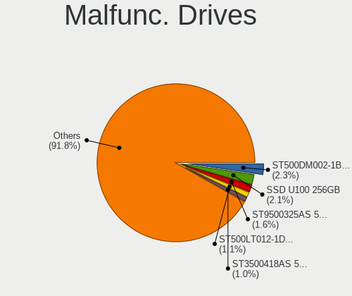
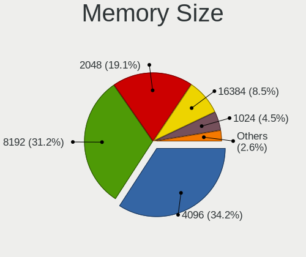
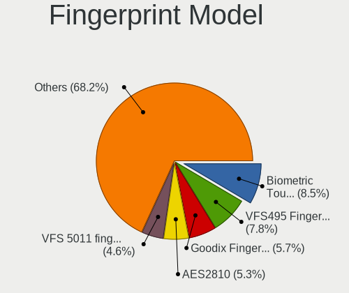

OpenMandriva - Tested Hardware & Statistics
-------------------------------------------

A project to collect tested hardware configurations for OpenMandriva.

Anyone can contribute to this report by the [hw-probe](https://github.com/linuxhw/hw-probe) tool:

    sudo -E hw-probe -all -upload

Please contribute! Especially if your hardware is rare.

This is a report for all computer types. See also reports for [desktops](/Dist/OpenMandriva/Desktop/README.md) and [notebooks](/Dist/OpenMandriva/Notebook/README.md).

Contents
--------

* [ Test Cases ](#test-cases)

* [ System ](#system)
  - [ OS                       ](#os)
  - [ OS Family                ](#os-family)
  - [ Kernel                   ](#kernel)
  - [ Kernel Family            ](#kernel-family)
  - [ Kernel Major Ver.        ](#kernel-major-ver)
  - [ Arch                     ](#arch)
  - [ DE                       ](#de)
  - [ Display Server           ](#display-server)
  - [ Display Manager          ](#display-manager)
  - [ OS Lang                  ](#os-lang)
  - [ Boot Mode                ](#boot-mode)
  - [ Filesystem               ](#filesystem)
  - [ Part. scheme             ](#part-scheme)
  - [ Dual Boot with Linux/BSD ](#dual-boot-with-linuxbsd)
  - [ Dual Boot (Win)          ](#dual-boot-win)

* [ Board ](#board)
  - [ Vendor                   ](#vendor)
  - [ Model                    ](#model)
  - [ Model Family             ](#model-family)
  - [ MFG Year                 ](#mfg-year)
  - [ Form Factor              ](#form-factor)
  - [ Secure Boot              ](#secure-boot)
  - [ Coreboot                 ](#coreboot)
  - [ RAM Size                 ](#ram-size)
  - [ RAM Used                 ](#ram-used)
  - [ Total Drives             ](#total-drives)
  - [ Has CD-ROM               ](#has-cd-rom)
  - [ Has Ethernet             ](#has-ethernet)
  - [ Has WiFi                 ](#has-wifi)
  - [ Has Bluetooth            ](#has-bluetooth)

* [ Location ](#location)
  - [ Country                  ](#country)
  - [ City                     ](#city)

* [ Drives ](#drives)
  - [ Drive Vendor             ](#drive-vendor)
  - [ Drive Model              ](#drive-model)
  - [ HDD Vendor               ](#hdd-vendor)
  - [ SSD Vendor               ](#ssd-vendor)
  - [ Drive Kind               ](#drive-kind)
  - [ Drive Connector          ](#drive-connector)
  - [ Drive Size               ](#drive-size)
  - [ Space Total              ](#space-total)
  - [ Space Used               ](#space-used)
  - [ Malfunc. Drives          ](#malfunc-drives)
  - [ Malfunc. Drive Vendor    ](#malfunc-drive-vendor)
  - [ Malfunc. HDD Vendor      ](#malfunc-hdd-vendor)
  - [ Malfunc. Drive Kind      ](#malfunc-drive-kind)
  - [ Failed Drives            ](#failed-drives)
  - [ Failed Drive Vendor      ](#failed-drive-vendor)
  - [ Drive Status             ](#drive-status)

* [ Storage controller ](#storage-controller)
  - [ Storage Vendor           ](#storage-vendor)
  - [ Storage Model            ](#storage-model)
  - [ Storage Kind             ](#storage-kind)

* [ Processor ](#processor)
  - [ CPU Vendor               ](#cpu-vendor)
  - [ CPU Model                ](#cpu-model)
  - [ CPU Model Family         ](#cpu-model-family)
  - [ CPU Cores                ](#cpu-cores)
  - [ CPU Sockets              ](#cpu-sockets)
  - [ CPU Threads              ](#cpu-threads)
  - [ CPU Op-Modes             ](#cpu-op-modes)
  - [ CPU Microcode            ](#cpu-microcode)
  - [ CPU Microarch            ](#cpu-microarch)

* [ Graphics ](#graphics)
  - [ GPU Vendor               ](#gpu-vendor)
  - [ GPU Model                ](#gpu-model)
  - [ GPU Combo                ](#gpu-combo)
  - [ GPU Driver               ](#gpu-driver)
  - [ GPU Memory               ](#gpu-memory)

* [ Monitor ](#monitor)
  - [ Monitor Vendor           ](#monitor-vendor)
  - [ Monitor Model            ](#monitor-model)
  - [ Monitor Resolution       ](#monitor-resolution)
  - [ Monitor Diagonal         ](#monitor-diagonal)
  - [ Monitor Width            ](#monitor-width)
  - [ Aspect Ratio             ](#aspect-ratio)
  - [ Monitor Area             ](#monitor-area)
  - [ Pixel Density            ](#pixel-density)
  - [ Multiple Monitors        ](#multiple-monitors)

* [ Network ](#network)
  - [ Net Controller Vendor    ](#net-controller-vendor)
  - [ Net Controller Model     ](#net-controller-model)
  - [ Wireless Vendor          ](#wireless-vendor)
  - [ Wireless Model           ](#wireless-model)
  - [ Ethernet Vendor          ](#ethernet-vendor)
  - [ Ethernet Model           ](#ethernet-model)
  - [ Net Controller Kind      ](#net-controller-kind)
  - [ Used Controller          ](#used-controller)
  - [ NICs                     ](#nics)
  - [ IPv6                     ](#ipv6)

* [ Bluetooth ](#bluetooth)
  - [ Bluetooth Vendor         ](#bluetooth-vendor)
  - [ Bluetooth Model          ](#bluetooth-model)

* [ Sound ](#sound)
  - [ Sound Vendor             ](#sound-vendor)
  - [ Sound Model              ](#sound-model)

* [ Memory ](#memory)
  - [ Memory Vendor            ](#memory-vendor)
  - [ Memory Model             ](#memory-model)
  - [ Memory Kind              ](#memory-kind)
  - [ Memory Form Factor       ](#memory-form-factor)
  - [ Memory Size              ](#memory-size)
  - [ Memory Speed             ](#memory-speed)

* [ Printers & scanners ](#printers--scanners)
  - [ Printer Vendor           ](#printer-vendor)
  - [ Printer Model            ](#printer-model)
  - [ Scanner Vendor           ](#scanner-vendor)
  - [ Scanner Model            ](#scanner-model)

* [ Camera ](#camera)
  - [ Camera Vendor            ](#camera-vendor)
  - [ Camera Model             ](#camera-model)

* [ Security ](#security)
  - [ Fingerprint Vendor       ](#fingerprint-vendor)
  - [ Fingerprint Model        ](#fingerprint-model)
  - [ Chipcard Vendor          ](#chipcard-vendor)
  - [ Chipcard Model           ](#chipcard-model)

* [ Unsupported ](#unsupported)
  - [ Unsupported Devices      ](#unsupported-devices)
  - [ Unsupported Device Types ](#unsupported-device-types)

Test Cases
----------

Total: 11443

| Vendor        | Model                       | Form-Factor | Probe                                                      | Date         |
|---------------|-----------------------------|-------------|------------------------------------------------------------|--------------|
| Dell          | 0VHWTR A01                  | Desktop     | [7544868958](https://linux-hardware.org/?probe=7544868958) | Feb 01, 2023 |
| MSI           | A520M-A PRO                 | Desktop     | [f7a88d0dea](https://linux-hardware.org/?probe=f7a88d0dea) | Feb 01, 2023 |
| AMI           | Cherry Trail CR             | Desktop     | [162e744903](https://linux-hardware.org/?probe=162e744903) | Feb 01, 2023 |
| ASUSTek       | S551LN                      | Notebook    | [b7361dbc53](https://linux-hardware.org/?probe=b7361dbc53) | Feb 01, 2023 |
| ASUSTek       | Z87-A                       | Desktop     | [1b880dbac2](https://linux-hardware.org/?probe=1b880dbac2) | Feb 01, 2023 |
| Gigabyte      | B550 AORUS ELITE V2         | Desktop     | [aa3b7e2dc8](https://linux-hardware.org/?probe=aa3b7e2dc8) | Feb 01, 2023 |
| Dell          | 0PU052                      | Desktop     | [d2f241353d](https://linux-hardware.org/?probe=d2f241353d) | Feb 01, 2023 |
| Intel         | DG965OT AAD75595-200        | Other       | [8ab85c58be](https://linux-hardware.org/?probe=8ab85c58be) | Feb 01, 2023 |
| Google        | Pantheon                    | Notebook    | [12e0b96dd1](https://linux-hardware.org/?probe=12e0b96dd1) | Feb 01, 2023 |
| Dell          | Precision M6700             | Notebook    | [743cb766c2](https://linux-hardware.org/?probe=743cb766c2) | Feb 01, 2023 |
| Dell          | 0WG860                      | Desktop     | [002a1f805c](https://linux-hardware.org/?probe=002a1f805c) | Feb 01, 2023 |
| ASUSTek       | VivoBook_ASUSLaptop E510... | Notebook    | [08e071efa2](https://linux-hardware.org/?probe=08e071efa2) | Feb 01, 2023 |
| Lenovo        | ThinkPad T14s Gen 2i 20W... | Notebook    | [ab57658c86](https://linux-hardware.org/?probe=ab57658c86) | Jan 31, 2023 |
| ASUSTek       | F2A85-V                     | Desktop     | [c68678a1a5](https://linux-hardware.org/?probe=c68678a1a5) | Jan 31, 2023 |
| HP            | Laptop 14s-dq3xxx           | Notebook    | [12ebaf0896](https://linux-hardware.org/?probe=12ebaf0896) | Jan 31, 2023 |
| ASUSTek       | M5A97 EVO R2.0              | Desktop     | [f4e30fc177](https://linux-hardware.org/?probe=f4e30fc177) | Jan 31, 2023 |
| Dell          | Latitude 5480               | Notebook    | [8b43efc7ea](https://linux-hardware.org/?probe=8b43efc7ea) | Jan 31, 2023 |
| ASRock        | B450 Gaming-ITX/ac          | Desktop     | [25b35d4826](https://linux-hardware.org/?probe=25b35d4826) | Jan 31, 2023 |
| HP            | 21EF                        | Desktop     | [0aacd43b02](https://linux-hardware.org/?probe=0aacd43b02) | Jan 31, 2023 |
| ASUSTek       | ROG STRIX B660-I GAMING ... | Desktop     | [19d65de9b6](https://linux-hardware.org/?probe=19d65de9b6) | Jan 31, 2023 |
| ASUSTek       | Maximus VII GENE            | Desktop     | [c936c07925](https://linux-hardware.org/?probe=c936c07925) | Jan 31, 2023 |
| Aquarius      | Cmp NS685U                  | Notebook    | [b067e76e64](https://linux-hardware.org/?probe=b067e76e64) | Jan 31, 2023 |
| ASUSTek       | M5A78L-M LX/BR              | Desktop     | [d8d386cb1d](https://linux-hardware.org/?probe=d8d386cb1d) | Jan 31, 2023 |
| Dell          | Studio 1558                 | Notebook    | [acfea4cd33](https://linux-hardware.org/?probe=acfea4cd33) | Jan 31, 2023 |
| MSI           | G41M-P28                    | Desktop     | [7f37c4b40e](https://linux-hardware.org/?probe=7f37c4b40e) | Jan 31, 2023 |
| Unknown       | Unknown                     | Notebook    | [e6c824b966](https://linux-hardware.org/?probe=e6c824b966) | Jan 31, 2023 |
| ASRock        | H77 Pro4-M                  | Desktop     | [a37090dd20](https://linux-hardware.org/?probe=a37090dd20) | Jan 31, 2023 |
| Jetway        | I61G-ITX                    | Desktop     | [24cf6ad56e](https://linux-hardware.org/?probe=24cf6ad56e) | Jan 31, 2023 |
| ASUSTek       | PRIME B360M-A               | Desktop     | [1196b501d5](https://linux-hardware.org/?probe=1196b501d5) | Jan 31, 2023 |
| Dell          | Latitude E5420              | Notebook    | [ccc3ca9853](https://linux-hardware.org/?probe=ccc3ca9853) | Jan 31, 2023 |
| ASUSTek       | TUF Gaming B450M-PRO S      | Desktop     | [3be362b4aa](https://linux-hardware.org/?probe=3be362b4aa) | Jan 31, 2023 |
| ASUSTek       | P8H77-V LE                  | Desktop     | [9edd1a1969](https://linux-hardware.org/?probe=9edd1a1969) | Jan 30, 2023 |
| ASUSTek       | X55VD                       | Notebook    | [4120c1019c](https://linux-hardware.org/?probe=4120c1019c) | Jan 30, 2023 |
| Intel         | DQ77MK AAG39642-500         | Desktop     | [3e004045f7](https://linux-hardware.org/?probe=3e004045f7) | Jan 30, 2023 |
| HP            | 3115-AEC13432GR1            | Notebook    | [98eb70341a](https://linux-hardware.org/?probe=98eb70341a) | Jan 30, 2023 |
| ASUSTek       | P5KPL-C/1600                | Desktop     | [dba6d97191](https://linux-hardware.org/?probe=dba6d97191) | Jan 30, 2023 |
| ASUSTek       | ROG STRIX X370-F GAMING     | Desktop     | [3c8b3f4e7d](https://linux-hardware.org/?probe=3c8b3f4e7d) | Jan 30, 2023 |
| Toshiba       | Satellite P750              | Notebook    | [1cc0f342b5](https://linux-hardware.org/?probe=1cc0f342b5) | Jan 30, 2023 |
| HP            | Compaq Presario CQ70        | Notebook    | [07e9e57b88](https://linux-hardware.org/?probe=07e9e57b88) | Jan 30, 2023 |
| Lenovo        | SHARKBAY 0B98401 WIN        | Desktop     | [cbfcb68cc6](https://linux-hardware.org/?probe=cbfcb68cc6) | Jan 30, 2023 |
| Dell          | Inspiron 5758               | Notebook    | [de58233dca](https://linux-hardware.org/?probe=de58233dca) | Jan 30, 2023 |
| Dell          | Latitude E6400              | Notebook    | [a195487665](https://linux-hardware.org/?probe=a195487665) | Jan 30, 2023 |
| MSI           | H81M-P33                    | Desktop     | [32149d3b64](https://linux-hardware.org/?probe=32149d3b64) | Jan 30, 2023 |
| Apple         | Mac-35C5E08120C7EEAF Mac... | Mini pc     | [c89aeaf207](https://linux-hardware.org/?probe=c89aeaf207) | Jan 30, 2023 |
| ASUSTek       | PRIME X570-P                | Desktop     | [a05f6f2f6c](https://linux-hardware.org/?probe=a05f6f2f6c) | Jan 30, 2023 |
| ASUSTek       | H81M2                       | Desktop     | [304b95972c](https://linux-hardware.org/?probe=304b95972c) | Jan 30, 2023 |
| Acer          | Aspire E1-572G              | Notebook    | [6064a923c6](https://linux-hardware.org/?probe=6064a923c6) | Jan 30, 2023 |
| Acer          | Aspire 5755G                | Notebook    | [03c2f11b67](https://linux-hardware.org/?probe=03c2f11b67) | Jan 30, 2023 |
| HP            | 8526 MVB, A                 | Desktop     | [eaa1bf595f](https://linux-hardware.org/?probe=eaa1bf595f) | Jan 30, 2023 |
| Acer          | Aspire A515-41G             | Notebook    | [88db10e257](https://linux-hardware.org/?probe=88db10e257) | Jan 30, 2023 |
| ASUSTek       | PRIME B450M-A               | Desktop     | [f0000c6ae7](https://linux-hardware.org/?probe=f0000c6ae7) | Jan 30, 2023 |
| ASUSTek       | PRIME B350M-A               | Desktop     | [e2721d08d6](https://linux-hardware.org/?probe=e2721d08d6) | Jan 30, 2023 |
| Acer          | Aspire A515-52              | Notebook    | [51fa3ff577](https://linux-hardware.org/?probe=51fa3ff577) | Jan 30, 2023 |
| Unknown       | Unknown                     | Notebook    | [d780984cf9](https://linux-hardware.org/?probe=d780984cf9) | Jan 30, 2023 |
| Fujitsu       | D3222-A1 S26361-D3222-A1    | Desktop     | [ef9c1299e6](https://linux-hardware.org/?probe=ef9c1299e6) | Jan 30, 2023 |
| HP            | 339A                        | Desktop     | [3bc7df3921](https://linux-hardware.org/?probe=3bc7df3921) | Jan 30, 2023 |
| ViewSonic     | VOT132                      | Desktop     | [a8ecfadd53](https://linux-hardware.org/?probe=a8ecfadd53) | Jan 30, 2023 |
| ASRock        | J4125M                      | Desktop     | [535c1b6821](https://linux-hardware.org/?probe=535c1b6821) | Jan 30, 2023 |
| Acer          | Aspire TC-895 V:1.0         | Desktop     | [190e9b4aee](https://linux-hardware.org/?probe=190e9b4aee) | Jan 30, 2023 |
| HP            | ProBook 5320m               | Notebook    | [b8fc81e61c](https://linux-hardware.org/?probe=b8fc81e61c) | Jan 29, 2023 |
| ASUSTek       | TUF Gaming B550-PLUS        | Desktop     | [11b07d4e11](https://linux-hardware.org/?probe=11b07d4e11) | Jan 29, 2023 |
| Lenovo        | IdeaPad Gaming 3 15IMH05... | Notebook    | [51245400df](https://linux-hardware.org/?probe=51245400df) | Jan 29, 2023 |
| HC            | HCAR357-MI V1.0             | Desktop     | [986dd858ba](https://linux-hardware.org/?probe=986dd858ba) | Jan 29, 2023 |
| ASUSTek       | K55A                        | Notebook    | [e3088b45e1](https://linux-hardware.org/?probe=e3088b45e1) | Jan 29, 2023 |
| ASUSTek       | PRIME Z690-P WIFI           | Desktop     | [da2056876e](https://linux-hardware.org/?probe=da2056876e) | Jan 29, 2023 |
| ASUSTek       | PRIME B550M-A AC            | Desktop     | [c11ff840dd](https://linux-hardware.org/?probe=c11ff840dd) | Jan 29, 2023 |
| Intel         | H61                         | Desktop     | [0ce404915f](https://linux-hardware.org/?probe=0ce404915f) | Jan 29, 2023 |
| ASUSTek       | PRIME H310I-PLUS R2.0       | Desktop     | [1b8a1f7b64](https://linux-hardware.org/?probe=1b8a1f7b64) | Jan 29, 2023 |
| HP            | Convertible x360 11-ab0X... | Convertible | [c56cc33809](https://linux-hardware.org/?probe=c56cc33809) | Jan 29, 2023 |
| ASUSTek       | B150M-C                     | Desktop     | [6eb1a5b38e](https://linux-hardware.org/?probe=6eb1a5b38e) | Jan 29, 2023 |
| Clevo         | W240EU/W250EUQ/W270EUQ      | Notebook    | [3912652a13](https://linux-hardware.org/?probe=3912652a13) | Jan 29, 2023 |
| Dell          | Inspiron 5520               | Notebook    | [6de5bc549f](https://linux-hardware.org/?probe=6de5bc549f) | Jan 29, 2023 |
| Positivo      | Q464C-O                     | Notebook    | [e61f2d0622](https://linux-hardware.org/?probe=e61f2d0622) | Jan 29, 2023 |
| ASUSTek       | M5A97 R2.0                  | Desktop     | [703a3a2694](https://linux-hardware.org/?probe=703a3a2694) | Jan 29, 2023 |
| ASRock        | B450 Gaming K4              | Desktop     | [000203af81](https://linux-hardware.org/?probe=000203af81) | Jan 29, 2023 |
| Lenovo        | MAHOBAY NO DPK              | Desktop     | [a6f17c156d](https://linux-hardware.org/?probe=a6f17c156d) | Jan 29, 2023 |
| Lenovo        | Legion Y540-15IRH-PG0 81... | Notebook    | [e2fa9aa820](https://linux-hardware.org/?probe=e2fa9aa820) | Jan 29, 2023 |
| ASRock        | H610M-HVS                   | Desktop     | [2774d547be](https://linux-hardware.org/?probe=2774d547be) | Jan 29, 2023 |
| ASUSTek       | Z97-K                       | Desktop     | [e3f865cd20](https://linux-hardware.org/?probe=e3f865cd20) | Jan 28, 2023 |
| TUXEDO        | N14xWU                      | Notebook    | [5681ab6b5d](https://linux-hardware.org/?probe=5681ab6b5d) | Jan 28, 2023 |
| HP            | Notebook                    | Notebook    | [d38e078368](https://linux-hardware.org/?probe=d38e078368) | Jan 28, 2023 |
| Intel         | X79G V2.x                   | Desktop     | [40bc764c73](https://linux-hardware.org/?probe=40bc764c73) | Jan 28, 2023 |
| ASUSTek       | K43SJ                       | Notebook    | [0cff4ad069](https://linux-hardware.org/?probe=0cff4ad069) | Jan 28, 2023 |
| ASUSTek       | 1215B                       | Notebook    | [8d26a8d157](https://linux-hardware.org/?probe=8d26a8d157) | Jan 28, 2023 |
| ASRock        | N68C-S UCC                  | Desktop     | [de8739d9d5](https://linux-hardware.org/?probe=de8739d9d5) | Jan 28, 2023 |
| ASUSTek       | H110M-K                     | Desktop     | [73b3f84699](https://linux-hardware.org/?probe=73b3f84699) | Jan 28, 2023 |
| Lenovo        | ThinkPad X61 7674BE1        | Notebook    | [a22ac0a9f5](https://linux-hardware.org/?probe=a22ac0a9f5) | Jan 28, 2023 |
| Gateway       | ZX6971                      | All in one  | [585fdaac78](https://linux-hardware.org/?probe=585fdaac78) | Jan 28, 2023 |
| ASUSTek       | VivoBook_ASUSLaptop X513... | Notebook    | [0245809d6a](https://linux-hardware.org/?probe=0245809d6a) | Jan 28, 2023 |
| Lenovo        | V15 G2 ALC 82KD             | Notebook    | [2b2401b0f0](https://linux-hardware.org/?probe=2b2401b0f0) | Jan 28, 2023 |
| ASUSTek       | P8H61-M LE/CSM R2.0         | Desktop     | [7120eb3310](https://linux-hardware.org/?probe=7120eb3310) | Jan 28, 2023 |
| Gigabyte      | GA-73PVM-S2                 | Desktop     | [fcf91f09b4](https://linux-hardware.org/?probe=fcf91f09b4) | Jan 28, 2023 |
| Unknown       | GB01                        | Desktop     | [e907445f6c](https://linux-hardware.org/?probe=e907445f6c) | Jan 28, 2023 |
| Samsung       | 300E4C/300E5C/300E7C        | Notebook    | [796df2715d](https://linux-hardware.org/?probe=796df2715d) | Jan 28, 2023 |
| Lenovo        | IdeaPad 100-15IBY 80MJ      | Notebook    | [25ea296433](https://linux-hardware.org/?probe=25ea296433) | Jan 28, 2023 |
| HP            | EliteBook 8540w (VD444AD... | Notebook    | [eeb394333a](https://linux-hardware.org/?probe=eeb394333a) | Jan 28, 2023 |
| Intel         | DH77EB AAG39073-304         | Desktop     | [8965805130](https://linux-hardware.org/?probe=8965805130) | Jan 27, 2023 |
| ASUSTek       | X540SA                      | Notebook    | [93aed28230](https://linux-hardware.org/?probe=93aed28230) | Jan 27, 2023 |
| Lenovo        | ThinkPad L15 Gen 1 20U70... | Notebook    | [d825caa85e](https://linux-hardware.org/?probe=d825caa85e) | Jan 27, 2023 |
| Acer          | Peppy                       | Notebook    | [9a16262be8](https://linux-hardware.org/?probe=9a16262be8) | Jan 27, 2023 |
| Lenovo        | IdeaPad S130-11IGM 81J1     | Notebook    | [ee351959a0](https://linux-hardware.org/?probe=ee351959a0) | Jan 27, 2023 |
| Dell          | 0VRWRC A00                  | Desktop     | [dac4a44a62](https://linux-hardware.org/?probe=dac4a44a62) | Jan 27, 2023 |
| Acer          | Aspire E1-522               | Notebook    | [b1e1e4bb29](https://linux-hardware.org/?probe=b1e1e4bb29) | Jan 27, 2023 |
| Apple         | MacBook4,1                  | Notebook    | [e00443a9cc](https://linux-hardware.org/?probe=e00443a9cc) | Jan 27, 2023 |
| ASUSTek       | UX31E                       | Notebook    | [d87ac57c19](https://linux-hardware.org/?probe=d87ac57c19) | Jan 27, 2023 |
| Schenker      | XMG FOCUS (M22)             | Notebook    | [b04fdbb6da](https://linux-hardware.org/?probe=b04fdbb6da) | Jan 27, 2023 |
| ASUSTek       | PRIME X299-DELUXE II        | Desktop     | [c7e2bde422](https://linux-hardware.org/?probe=c7e2bde422) | Jan 27, 2023 |
| HP            | 14                          | Notebook    | [53d080d83a](https://linux-hardware.org/?probe=53d080d83a) | Jan 27, 2023 |
| MSI           | CX600                       | Notebook    | [643c7effe7](https://linux-hardware.org/?probe=643c7effe7) | Jan 27, 2023 |
| NEC Comput... | PC-NS350AAR-KS              | Notebook    | [c4aa0da6f4](https://linux-hardware.org/?probe=c4aa0da6f4) | Jan 27, 2023 |
| Gigabyte      | H81N                        | Desktop     | [e7cf6a4216](https://linux-hardware.org/?probe=e7cf6a4216) | Jan 27, 2023 |
| Lenovo        | IdeaPad S145-14AST 81ST     | Notebook    | [85dbbce597](https://linux-hardware.org/?probe=85dbbce597) | Jan 27, 2023 |
| Dell          | 0RW199                      | Desktop     | [04c4f5174d](https://linux-hardware.org/?probe=04c4f5174d) | Jan 27, 2023 |
| Hardkernel    | ODROID-H3                   | Desktop     | [56f9bb1456](https://linux-hardware.org/?probe=56f9bb1456) | Jan 27, 2023 |
| Dell          | Inspiron 3585               | Notebook    | [b41a540bb4](https://linux-hardware.org/?probe=b41a540bb4) | Jan 27, 2023 |
| Intel         | DH61BE AAG14062-211         | Desktop     | [e4a05d50b7](https://linux-hardware.org/?probe=e4a05d50b7) | Jan 27, 2023 |
| Lenovo        | V15-ADA 82C7                | Notebook    | [5e42d7b8a7](https://linux-hardware.org/?probe=5e42d7b8a7) | Jan 27, 2023 |
| Acer          | Aspire R3-131T              | Notebook    | [021d999708](https://linux-hardware.org/?probe=021d999708) | Jan 27, 2023 |
| ASUSTek       | X541UJ                      | Notebook    | [d9ceb3c732](https://linux-hardware.org/?probe=d9ceb3c732) | Jan 27, 2023 |
| EVOO          | TEV-CE-141-2                | Notebook    | [21e4d23b45](https://linux-hardware.org/?probe=21e4d23b45) | Jan 27, 2023 |
| Lenovo        | ThinkPad T14 Gen 3 21AJS... | Notebook    | [e35fa4ee0f](https://linux-hardware.org/?probe=e35fa4ee0f) | Jan 26, 2023 |
| HP            | ProBook 640 G2              | Notebook    | [4e8cd1aa46](https://linux-hardware.org/?probe=4e8cd1aa46) | Jan 26, 2023 |
| Dell          | Inspiron 15 3521            | Notebook    | [41f89081ff](https://linux-hardware.org/?probe=41f89081ff) | Jan 26, 2023 |
| ASUSTek       | X501A1                      | Notebook    | [a0493c6731](https://linux-hardware.org/?probe=a0493c6731) | Jan 26, 2023 |
| Medion        | TJ4125                      | Desktop     | [eaca458ea2](https://linux-hardware.org/?probe=eaca458ea2) | Jan 26, 2023 |
| Dell          | Latitude 7400               | Notebook    | [697e996615](https://linux-hardware.org/?probe=697e996615) | Jan 26, 2023 |
| Lenovo        | ThinkPad T440p 20AN0079M... | Notebook    | [0065b33518](https://linux-hardware.org/?probe=0065b33518) | Jan 26, 2023 |
| Lenovo        | ThinkPad T440p 20AWS24B0... | Notebook    | [e4ddea6092](https://linux-hardware.org/?probe=e4ddea6092) | Jan 26, 2023 |
| HP            | 1497                        | Desktop     | [21a3e07346](https://linux-hardware.org/?probe=21a3e07346) | Jan 26, 2023 |
| Dell          | Precision 7720              | Notebook    | [f5e8281d01](https://linux-hardware.org/?probe=f5e8281d01) | Jan 26, 2023 |
| Lenovo        | MAHOBAY 31900003 STD        | All in one  | [d75e472005](https://linux-hardware.org/?probe=d75e472005) | Jan 26, 2023 |
| Lenovo        | ThinkPad S1 Yoga 20C0S0Q... | Notebook    | [cdd3eb5723](https://linux-hardware.org/?probe=cdd3eb5723) | Jan 26, 2023 |
| Gigabyte      | Z87X-D3H-CF                 | Desktop     | [7fb86baa0e](https://linux-hardware.org/?probe=7fb86baa0e) | Jan 26, 2023 |
| ASUSTek       | P8H77-V LE                  | Desktop     | [0305833fbd](https://linux-hardware.org/?probe=0305833fbd) | Jan 26, 2023 |
| HONOR         | HLYL-WXX9                   | Notebook    | [00c90b28ca](https://linux-hardware.org/?probe=00c90b28ca) | Jan 26, 2023 |
| Gigabyte      | GA-MA78G-DS3H               | Desktop     | [9a1bab8f2c](https://linux-hardware.org/?probe=9a1bab8f2c) | Jan 26, 2023 |
| Apple         | Mac-F2268CC8                | All in one  | [fe389a3724](https://linux-hardware.org/?probe=fe389a3724) | Jan 26, 2023 |
| HP            | 225E                        | Desktop     | [bace147a01](https://linux-hardware.org/?probe=bace147a01) | Jan 26, 2023 |
| Acer          | RS740DVF                    | Desktop     | [6aaeb06f9a](https://linux-hardware.org/?probe=6aaeb06f9a) | Jan 26, 2023 |
| HP            | 3397                        | Desktop     | [1584c8c840](https://linux-hardware.org/?probe=1584c8c840) | Jan 26, 2023 |
| Apple         | Mac-F2208EC8                | Mini pc     | [873ee647b0](https://linux-hardware.org/?probe=873ee647b0) | Jan 26, 2023 |
| Lenovo        | G50-45 80E3                 | Notebook    | [bad5c1a1b8](https://linux-hardware.org/?probe=bad5c1a1b8) | Jan 26, 2023 |
| Shenzhen M... | F6BFC                       | Desktop     | [fab7cead8c](https://linux-hardware.org/?probe=fab7cead8c) | Jan 26, 2023 |
| Lenovo        | 3642 SDK0J40700 WIN 3258... | Desktop     | [ce46ecced0](https://linux-hardware.org/?probe=ce46ecced0) | Jan 26, 2023 |
| AWOW          | NY41                        | Mini pc     | [8f7ec220fe](https://linux-hardware.org/?probe=8f7ec220fe) | Jan 26, 2023 |
| MSI           | PRO Z690-A                  | Desktop     | [4b063ab512](https://linux-hardware.org/?probe=4b063ab512) | Jan 26, 2023 |
| Lenovo        | ThinkPad X1 Carbon Gen 9... | Notebook    | [08204bf161](https://linux-hardware.org/?probe=08204bf161) | Jan 26, 2023 |
| Dell          | 0773VG A00                  | Desktop     | [328dae4014](https://linux-hardware.org/?probe=328dae4014) | Jan 26, 2023 |
| Gigabyte      | B450 AORUS ELITE            | Desktop     | [8128876a22](https://linux-hardware.org/?probe=8128876a22) | Jan 26, 2023 |
| ASUSTek       | PRIME X370-A                | Desktop     | [b1371b8883](https://linux-hardware.org/?probe=b1371b8883) | Jan 26, 2023 |
| HP            | Laptop 15-ef1xxx            | Notebook    | [5ccbc70956](https://linux-hardware.org/?probe=5ccbc70956) | Jan 25, 2023 |
| Notebook      | NL40_50CU                   | Notebook    | [5029ce2c1e](https://linux-hardware.org/?probe=5029ce2c1e) | Jan 25, 2023 |
| Gigabyte      | EX38-DS4                    | Desktop     | [4d5b828cfc](https://linux-hardware.org/?probe=4d5b828cfc) | Jan 25, 2023 |
| Toshiba       | Satellite C870-12F          | Notebook    | [fc9a6d3a7e](https://linux-hardware.org/?probe=fc9a6d3a7e) | Jan 25, 2023 |
| BESSTAR Te... | TH50                        | Desktop     | [da185120e5](https://linux-hardware.org/?probe=da185120e5) | Jan 25, 2023 |
| Intel         | B75                         | Desktop     | [20853a8c8d](https://linux-hardware.org/?probe=20853a8c8d) | Jan 25, 2023 |
| HP            | 3048h                       | Desktop     | [caabf4189f](https://linux-hardware.org/?probe=caabf4189f) | Jan 25, 2023 |
| Toshiba       | Satellite Pro R50-B         | Notebook    | [d08118920b](https://linux-hardware.org/?probe=d08118920b) | Jan 25, 2023 |
| ASUSTek       | Q325UAR                     | Convertible | [669587c16a](https://linux-hardware.org/?probe=669587c16a) | Jan 25, 2023 |
| OEGStone      | C4100/C5100                 | Notebook    | [4365b7b231](https://linux-hardware.org/?probe=4365b7b231) | Jan 25, 2023 |
| HP            | Pavilion g6                 | Notebook    | [a247cbd6d4](https://linux-hardware.org/?probe=a247cbd6d4) | Jan 25, 2023 |
| ASRock        | X300M-STX                   | Desktop     | [f111e4de3b](https://linux-hardware.org/?probe=f111e4de3b) | Jan 25, 2023 |
| ASUSTek       | M5A99X EVO                  | Desktop     | [14b3eb9a58](https://linux-hardware.org/?probe=14b3eb9a58) | Jan 25, 2023 |
| ASRock        | G31M-S                      | Desktop     | [e1d742770d](https://linux-hardware.org/?probe=e1d742770d) | Jan 25, 2023 |
| AZW           | U59                         | Desktop     | [6d2b672b77](https://linux-hardware.org/?probe=6d2b672b77) | Jan 25, 2023 |
| ASUSTek       | P5L-MX                      | Desktop     | [c66369d864](https://linux-hardware.org/?probe=c66369d864) | Jan 25, 2023 |
| ASRock        | B550AM Gaming               | Desktop     | [215973c00f](https://linux-hardware.org/?probe=215973c00f) | Jan 25, 2023 |
| HP            | ProBook 4545s               | Notebook    | [1d832fb2f4](https://linux-hardware.org/?probe=1d832fb2f4) | Jan 25, 2023 |
| Dell          | 0KRC95 A00                  | Desktop     | [bf9e573abf](https://linux-hardware.org/?probe=bf9e573abf) | Jan 25, 2023 |
| ASRock        | 775XFire-VSTA               | Desktop     | [e80788f790](https://linux-hardware.org/?probe=e80788f790) | Jan 24, 2023 |
| HP            | 8433 11                     | Desktop     | [de1465f90e](https://linux-hardware.org/?probe=de1465f90e) | Jan 24, 2023 |
| HP            | EliteBook 8460p             | Notebook    | [bb83f545f7](https://linux-hardware.org/?probe=bb83f545f7) | Jan 24, 2023 |
| Intel         | DH67CL AAG10212-203         | Desktop     | [0e7c3464ac](https://linux-hardware.org/?probe=0e7c3464ac) | Jan 24, 2023 |
| Acer          | Aspire A315-22              | Notebook    | [7c048a8058](https://linux-hardware.org/?probe=7c048a8058) | Jan 24, 2023 |
| HP            | 2AF7                        | Desktop     | [a7cb391a5c](https://linux-hardware.org/?probe=a7cb391a5c) | Jan 24, 2023 |
| Dell          | Inspiron 3421               | Notebook    | [02491de92f](https://linux-hardware.org/?probe=02491de92f) | Jan 24, 2023 |
| Lenovo        | IdeaPad Slim 1-14AST-05 ... | Notebook    | [a1a1be6b56](https://linux-hardware.org/?probe=a1a1be6b56) | Jan 24, 2023 |
| MSI           | G41M-P28                    | Desktop     | [465a715dc7](https://linux-hardware.org/?probe=465a715dc7) | Jan 24, 2023 |
| HP            | Pavilion x360 Convertibl... | Convertible | [5e5552846c](https://linux-hardware.org/?probe=5e5552846c) | Jan 24, 2023 |
| Pegatron      | 2AEE                        | Desktop     | [1c59133176](https://linux-hardware.org/?probe=1c59133176) | Jan 24, 2023 |
| Acer          | Aspire V5-132               | Notebook    | [7f74397112](https://linux-hardware.org/?probe=7f74397112) | Jan 24, 2023 |
| Dell          | 06FW8P A02                  | Desktop     | [091ff86983](https://linux-hardware.org/?probe=091ff86983) | Jan 24, 2023 |
| Toshiba       | dynabook T653/46JR          | Notebook    | [00cabfbb97](https://linux-hardware.org/?probe=00cabfbb97) | Jan 24, 2023 |
| Acer          | Aspire A515-51              | Notebook    | [418e5a2787](https://linux-hardware.org/?probe=418e5a2787) | Jan 24, 2023 |
| Insyde        | Braswell                    | Notebook    | [6abab0adc1](https://linux-hardware.org/?probe=6abab0adc1) | Jan 24, 2023 |
| Toshiba       | Satellite C655D             | Notebook    | [bf86cea0ec](https://linux-hardware.org/?probe=bf86cea0ec) | Jan 24, 2023 |
| Unknown       | Unknown                     | Desktop     | [108bb60066](https://linux-hardware.org/?probe=108bb60066) | Jan 24, 2023 |
| Toshiba       | Satellite Pro C660          | Notebook    | [3ffb5ed458](https://linux-hardware.org/?probe=3ffb5ed458) | Jan 24, 2023 |
| Lenovo        | IdeaPad 320-15ABR 80XS      | Notebook    | [7b23698a1e](https://linux-hardware.org/?probe=7b23698a1e) | Jan 24, 2023 |
| Lenovo        | ThinkPad W541 20EF0020MD    | Notebook    | [fca73ad2a9](https://linux-hardware.org/?probe=fca73ad2a9) | Jan 24, 2023 |
| Apple         | Mac-F22C86C8                | Mini pc     | [8a4e91ad48](https://linux-hardware.org/?probe=8a4e91ad48) | Jan 23, 2023 |
| ASUSTek       | VivoBook_ASUSLaptop TP42... | Convertible | [95898eae6d](https://linux-hardware.org/?probe=95898eae6d) | Jan 23, 2023 |
| ASUSTek       | X51L                        | Notebook    | [b482dc649b](https://linux-hardware.org/?probe=b482dc649b) | Jan 23, 2023 |
| Dell          | Latitude E5530 non-vPro     | Notebook    | [5ddcb9f78b](https://linux-hardware.org/?probe=5ddcb9f78b) | Jan 23, 2023 |
| ASUSTek       | PRIME B450M-A               | Desktop     | [da95f58140](https://linux-hardware.org/?probe=da95f58140) | Jan 23, 2023 |
| Packard Be... | PB56                        | Notebook    | [f26fcb7ee5](https://linux-hardware.org/?probe=f26fcb7ee5) | Jan 23, 2023 |
| Gigabyte      | Z690 UD DDR4                | Desktop     | [872cd0446b](https://linux-hardware.org/?probe=872cd0446b) | Jan 23, 2023 |
| Lenovo        | IdeaPad 330S-15IKB 81F5     | Notebook    | [a05bb7e519](https://linux-hardware.org/?probe=a05bb7e519) | Jan 23, 2023 |
| Lenovo        | 312A NOK                    | Desktop     | [ef4e303beb](https://linux-hardware.org/?probe=ef4e303beb) | Jan 23, 2023 |
| Lenovo        | ThinkPad T430 2344BZU       | Notebook    | [5e8acadc64](https://linux-hardware.org/?probe=5e8acadc64) | Jan 23, 2023 |
| Intel         | NUC8BEB J72688-308          | Mini pc     | [94bc34b452](https://linux-hardware.org/?probe=94bc34b452) | Jan 23, 2023 |
| Gigabyte      | H81M-S1                     | Desktop     | [ab746d7557](https://linux-hardware.org/?probe=ab746d7557) | Jan 23, 2023 |
| Dell          | 0X2MKR A00                  | All in one  | [5b29ed7213](https://linux-hardware.org/?probe=5b29ed7213) | Jan 23, 2023 |
| AMI           | Aptio CRB                   | Mini pc     | [52a02b4c4f](https://linux-hardware.org/?probe=52a02b4c4f) | Jan 23, 2023 |
| HP            | EliteBook 745 G3            | Notebook    | [1fda4d1e4a](https://linux-hardware.org/?probe=1fda4d1e4a) | Jan 23, 2023 |
| HP            | Pavilion x360 Convertibl... | Convertible | [163afb997a](https://linux-hardware.org/?probe=163afb997a) | Jan 23, 2023 |
| ASUSTek       | H81M-K                      | Desktop     | [3c25197bac](https://linux-hardware.org/?probe=3c25197bac) | Jan 23, 2023 |
| Acer          | TravelMate Spin B118-RN     | Convertible | [0cb7f2c4bc](https://linux-hardware.org/?probe=0cb7f2c4bc) | Jan 23, 2023 |
| Gigabyte      | B360HD3                     | Desktop     | [a9b7912b52](https://linux-hardware.org/?probe=a9b7912b52) | Jan 23, 2023 |
| Dell          | 0J3C2F A02                  | Desktop     | [e4b2eae84b](https://linux-hardware.org/?probe=e4b2eae84b) | Jan 23, 2023 |
| Lenovo        | Legion Y540-15IRH-PG0 81... | Notebook    | [40719006ae](https://linux-hardware.org/?probe=40719006ae) | Jan 23, 2023 |
| Gigabyte      | EP35-DS3L                   | Desktop     | [5be0362f3e](https://linux-hardware.org/?probe=5be0362f3e) | Jan 23, 2023 |
| Dell          | Latitude E6430s             | Notebook    | [8d46b5ae49](https://linux-hardware.org/?probe=8d46b5ae49) | Jan 23, 2023 |
| HP            | Pavilion Notebook           | Notebook    | [6383000f9e](https://linux-hardware.org/?probe=6383000f9e) | Jan 23, 2023 |
| Gigabyte      | B250M-DS3H-CF               | Desktop     | [af23cdf7e9](https://linux-hardware.org/?probe=af23cdf7e9) | Jan 23, 2023 |
| Acer          | Nitro AN515-42              | Notebook    | [8692de1465](https://linux-hardware.org/?probe=8692de1465) | Jan 23, 2023 |
| ASUSTek       | K45VM                       | Notebook    | [7fef453cdb](https://linux-hardware.org/?probe=7fef453cdb) | Jan 23, 2023 |
| HP            | 0AACh                       | Desktop     | [7c566e8951](https://linux-hardware.org/?probe=7c566e8951) | Jan 23, 2023 |
| ASRock        | FM2A55M-VG3+                | Desktop     | [c5da4a997d](https://linux-hardware.org/?probe=c5da4a997d) | Jan 23, 2023 |
| ASUSTek       | PRIME H270-PRO              | Desktop     | [ac4fa9fd5f](https://linux-hardware.org/?probe=ac4fa9fd5f) | Jan 23, 2023 |
| ASUSTek       | F2A55-M LK2                 | Desktop     | [93db1bee75](https://linux-hardware.org/?probe=93db1bee75) | Jan 23, 2023 |
| ASUSTek       | H81M-E                      | Desktop     | [2a20dabdd7](https://linux-hardware.org/?probe=2a20dabdd7) | Jan 23, 2023 |
| Biostar       | N61PB-M2S                   | Desktop     | [bce8692808](https://linux-hardware.org/?probe=bce8692808) | Jan 22, 2023 |
| Lenovo        | IdeaPad 330S-15IKB 81F5     | Notebook    | [89c37ebdfa](https://linux-hardware.org/?probe=89c37ebdfa) | Jan 22, 2023 |
| MSI           | PX60 6QE                    | Notebook    | [d820232c9c](https://linux-hardware.org/?probe=d820232c9c) | Jan 22, 2023 |
| Lenovo        | IdeaPad 320-15IKB 80XL      | Notebook    | [36d99ec94e](https://linux-hardware.org/?probe=36d99ec94e) | Jan 22, 2023 |
| Dell          | 0HH807                      | Desktop     | [984a0f6134](https://linux-hardware.org/?probe=984a0f6134) | Jan 22, 2023 |
| ASUSTek       | K30AD_M31AD_M51AD_M32AD     | Desktop     | [076a3479fa](https://linux-hardware.org/?probe=076a3479fa) | Jan 22, 2023 |
| Lenovo        | IdeaPad S145-15API 81V7     | Notebook    | [7d4406c9bc](https://linux-hardware.org/?probe=7d4406c9bc) | Jan 22, 2023 |
| Dell          | 06D7TR A02                  | Desktop     | [f61052df5e](https://linux-hardware.org/?probe=f61052df5e) | Jan 22, 2023 |
| Gigabyte      | A320M-S2H-CF                | Desktop     | [7545ee3eb0](https://linux-hardware.org/?probe=7545ee3eb0) | Jan 22, 2023 |
| Fujitsu       | D2828-A2 S26361-D2828-A2    | Desktop     | [dcecec2239](https://linux-hardware.org/?probe=dcecec2239) | Jan 22, 2023 |
| ASRock        | FM2A85X Extreme4-M          | Desktop     | [f51082b385](https://linux-hardware.org/?probe=f51082b385) | Jan 22, 2023 |
| ASRock        | X370 Pro4                   | Desktop     | [6a8cc962ad](https://linux-hardware.org/?probe=6a8cc962ad) | Jan 22, 2023 |
| Lenovo        | ThinkPad W530 244723G       | Notebook    | [d0e5903d6c](https://linux-hardware.org/?probe=d0e5903d6c) | Jan 22, 2023 |
| ASUSTek       | A68HM-K                     | Desktop     | [770d2f3bb4](https://linux-hardware.org/?probe=770d2f3bb4) | Jan 22, 2023 |
| HP            | Laptop 15-dw3xxx            | Notebook    | [50d894fc60](https://linux-hardware.org/?probe=50d894fc60) | Jan 22, 2023 |
| Lenovo        | SHARKBAY SDK0E50519 WIN     | Desktop     | [e2bec99703](https://linux-hardware.org/?probe=e2bec99703) | Jan 22, 2023 |
| ASRock        | B75M-GL R2.0                | Desktop     | [19b61442fe](https://linux-hardware.org/?probe=19b61442fe) | Jan 22, 2023 |
| Gigabyte      | A320M-S2H V2-CF             | Desktop     | [2851ee7994](https://linux-hardware.org/?probe=2851ee7994) | Jan 22, 2023 |
| HP            | 1905                        | Desktop     | [aaa3a9557c](https://linux-hardware.org/?probe=aaa3a9557c) | Jan 22, 2023 |
| Lenovo        | ThinkPad E15 Gen 3 20YGC... | Notebook    | [09650cf189](https://linux-hardware.org/?probe=09650cf189) | Jan 22, 2023 |
| HP            | 1998                        | Desktop     | [5fcedbdb28](https://linux-hardware.org/?probe=5fcedbdb28) | Jan 22, 2023 |
| ASUSTek       | VivoBook_ASUSLaptop X515... | Notebook    | [a09d1d224c](https://linux-hardware.org/?probe=a09d1d224c) | Jan 22, 2023 |
| Dell          | Latitude E5430 non-vPro     | Notebook    | [4ff88ad220](https://linux-hardware.org/?probe=4ff88ad220) | Jan 22, 2023 |
| Gigabyte      | B450M DS3H WIFI-CF          | Desktop     | [f660cd6d78](https://linux-hardware.org/?probe=f660cd6d78) | Jan 22, 2023 |
| MSI           | B450 TOMAHAWK MAX II        | Desktop     | [447e624609](https://linux-hardware.org/?probe=447e624609) | Jan 22, 2023 |
| Lenovo        | ThinkPad X1C 5th W10DG 2... | Notebook    | [f3e565ffa6](https://linux-hardware.org/?probe=f3e565ffa6) | Jan 22, 2023 |
| ASUSTek       | VivoBook_ASUS Laptop E21... | Notebook    | [6ae7274931](https://linux-hardware.org/?probe=6ae7274931) | Jan 22, 2023 |
| Acer          | Aspire E1-531               | Notebook    | [217c63b8f6](https://linux-hardware.org/?probe=217c63b8f6) | Jan 22, 2023 |
| Toshiba       | dynabook T653/46JR          | Notebook    | [1acfabc208](https://linux-hardware.org/?probe=1acfabc208) | Jan 22, 2023 |
| ASUSTek       | TUF Gaming X570-PLUS        | Desktop     | [476d23dca7](https://linux-hardware.org/?probe=476d23dca7) | Jan 21, 2023 |
| Lenovo        | MT-M4157-16U                | Desktop     | [3507cef137](https://linux-hardware.org/?probe=3507cef137) | Jan 21, 2023 |
| ASUSTek       | PRIME H510M-A               | Desktop     | [42e0ba4db2](https://linux-hardware.org/?probe=42e0ba4db2) | Jan 21, 2023 |
| ASUSTek       | ROG Strix G733CX_G733CX     | Notebook    | [a02df0f932](https://linux-hardware.org/?probe=a02df0f932) | Jan 21, 2023 |
| ASUSTek       | TUF Gaming X570-PLUS        | Desktop     | [d27e517254](https://linux-hardware.org/?probe=d27e517254) | Jan 21, 2023 |
| Gigabyte      | H510M H                     | Desktop     | [40cc1bf7d9](https://linux-hardware.org/?probe=40cc1bf7d9) | Jan 21, 2023 |
| ASUSTek       | TUF Gaming X570-PLUS        | Desktop     | [0a6759f639](https://linux-hardware.org/?probe=0a6759f639) | Jan 21, 2023 |
| ASUSTek       | ZenBook UX325EA_UX325EA     | Notebook    | [40560e6bcd](https://linux-hardware.org/?probe=40560e6bcd) | Jan 21, 2023 |
| ASUSTek       | TUF Z390-PLUS GAMING        | Desktop     | [0f3a750cdc](https://linux-hardware.org/?probe=0f3a750cdc) | Jan 21, 2023 |
| Acer          | Aspire TC-885 V:1.1         | Desktop     | [7475608215](https://linux-hardware.org/?probe=7475608215) | Jan 21, 2023 |
| ASRock        | B550M Pro4                  | Desktop     | [22b030cc5c](https://linux-hardware.org/?probe=22b030cc5c) | Jan 21, 2023 |
| MSI           | X470 GAMING PLUS            | Desktop     | [441e45daa2](https://linux-hardware.org/?probe=441e45daa2) | Jan 21, 2023 |
| ASUSTek       | TUF X470-PLUS GAMING        | Desktop     | [46a3691da9](https://linux-hardware.org/?probe=46a3691da9) | Jan 21, 2023 |
| ASRock        | AB350M Pro4 R2.0            | Desktop     | [e601a547c8](https://linux-hardware.org/?probe=e601a547c8) | Jan 21, 2023 |
| HP            | EliteBook 8570p             | Notebook    | [66c806fbfe](https://linux-hardware.org/?probe=66c806fbfe) | Jan 21, 2023 |
| Acer          | Aspire A515-45G             | Notebook    | [df633f4583](https://linux-hardware.org/?probe=df633f4583) | Jan 21, 2023 |
| ASUSTek       | N56VZ                       | Notebook    | [46ec3e0f8f](https://linux-hardware.org/?probe=46ec3e0f8f) | Jan 21, 2023 |
| Lenovo        | 31900004 STD                | All in one  | [55c11b6b87](https://linux-hardware.org/?probe=55c11b6b87) | Jan 21, 2023 |
| HP            | EliteBook 850 G2            | Notebook    | [a7ba34fed5](https://linux-hardware.org/?probe=a7ba34fed5) | Jan 21, 2023 |
| Philco        | OEM                         | Notebook    | [a39f50ccfd](https://linux-hardware.org/?probe=a39f50ccfd) | Jan 21, 2023 |
| ASRock        | B550 Extreme4               | Desktop     | [329f1d0701](https://linux-hardware.org/?probe=329f1d0701) | Jan 21, 2023 |
| Lenovo        | ThinkPad X120e 05962RU      | Notebook    | [1628e3e66e](https://linux-hardware.org/?probe=1628e3e66e) | Jan 21, 2023 |
| MSI           | H110M PRO-VH                | Desktop     | [7068e861ba](https://linux-hardware.org/?probe=7068e861ba) | Jan 21, 2023 |
| HP            | Compaq Presario C700        | Notebook    | [d2ec58874c](https://linux-hardware.org/?probe=d2ec58874c) | Jan 21, 2023 |
| Acer          | Aspire E1-530               | Notebook    | [af5f0b7f58](https://linux-hardware.org/?probe=af5f0b7f58) | Jan 21, 2023 |
| Gigabyte      | N3050ND3H                   | Desktop     | [1663928526](https://linux-hardware.org/?probe=1663928526) | Jan 21, 2023 |
| ASUSTek       | PRIME Z390M-PLUS            | Desktop     | [6134837cfe](https://linux-hardware.org/?probe=6134837cfe) | Jan 21, 2023 |
| Acer          | Aspire 7745G                | Notebook    | [98d6ab791c](https://linux-hardware.org/?probe=98d6ab791c) | Jan 21, 2023 |
| HP            | Laptop 17-by0xxx            | Notebook    | [88958e2846](https://linux-hardware.org/?probe=88958e2846) | Jan 20, 2023 |
| HP            | Victus by Laptop 16-e1xx... | Notebook    | [65919b95b4](https://linux-hardware.org/?probe=65919b95b4) | Jan 20, 2023 |
| HP            | Pavilion dv5                | Notebook    | [94ba65752b](https://linux-hardware.org/?probe=94ba65752b) | Jan 20, 2023 |
| Lenovo        | SHARKBAY NOK                | Desktop     | [bc8b02043e](https://linux-hardware.org/?probe=bc8b02043e) | Jan 20, 2023 |
| Intel         | B75                         | Desktop     | [40da372747](https://linux-hardware.org/?probe=40da372747) | Jan 20, 2023 |
| AZW           | U59                         | Desktop     | [de70883bbf](https://linux-hardware.org/?probe=de70883bbf) | Jan 20, 2023 |
| ASRock        | A520M-HDVP/DASH             | Desktop     | [72421e0506](https://linux-hardware.org/?probe=72421e0506) | Jan 20, 2023 |
| Lenovo        | IdeaPad Gaming 3 15IHU6 ... | Notebook    | [6364be5249](https://linux-hardware.org/?probe=6364be5249) | Jan 20, 2023 |
| Dell          | Inspiron N4050              | Notebook    | [46e35da681](https://linux-hardware.org/?probe=46e35da681) | Jan 20, 2023 |
| HP            | 843B                        | Desktop     | [2af17234ba](https://linux-hardware.org/?probe=2af17234ba) | Jan 20, 2023 |
| Lenovo        | V570 1066AWU                | Notebook    | [7d86d12566](https://linux-hardware.org/?probe=7d86d12566) | Jan 20, 2023 |
| ASUSTek       | P8H61-M LX2 R2.0            | Desktop     | [2d420c3acb](https://linux-hardware.org/?probe=2d420c3acb) | Jan 20, 2023 |
| ASUSTek       | TUF Gaming B550M-PLUS       | Desktop     | [ddf8638851](https://linux-hardware.org/?probe=ddf8638851) | Jan 20, 2023 |
| ASUSTek       | M5A78L-M LE                 | Desktop     | [af00f739f8](https://linux-hardware.org/?probe=af00f739f8) | Jan 20, 2023 |
| Gigabyte      | H61M-D2-B3                  | Desktop     | [e261893ec4](https://linux-hardware.org/?probe=e261893ec4) | Jan 20, 2023 |
| Lenovo        | 3642 SDK0J40700 WIN 3258... | Desktop     | [bb1826bf63](https://linux-hardware.org/?probe=bb1826bf63) | Jan 20, 2023 |
| ECS           | APLD-MINI                   | Desktop     | [78e90e4760](https://linux-hardware.org/?probe=78e90e4760) | Jan 20, 2023 |
| ASRock        | B450M Pro4-F                | Desktop     | [031b7e3b0a](https://linux-hardware.org/?probe=031b7e3b0a) | Jan 20, 2023 |
| Gigabyte      | M61PME-S2                   | Desktop     | [110d9cb0f9](https://linux-hardware.org/?probe=110d9cb0f9) | Jan 20, 2023 |
| ASUSTek       | TUF Gaming B550-PLUS        | Desktop     | [1a80b30106](https://linux-hardware.org/?probe=1a80b30106) | Jan 20, 2023 |
| Dell          | Inspiron 15-3567            | Notebook    | [33a3aac223](https://linux-hardware.org/?probe=33a3aac223) | Jan 20, 2023 |
| HP            | 339A                        | Desktop     | [5d86fd4411](https://linux-hardware.org/?probe=5d86fd4411) | Jan 20, 2023 |
| Lenovo        | ThinkPad Yoga 11e 4th Ge... | Convertible | [c79dd9971a](https://linux-hardware.org/?probe=c79dd9971a) | Jan 20, 2023 |
| ASUSTek       | PRIME B350M-A               | Desktop     | [17bdbada47](https://linux-hardware.org/?probe=17bdbada47) | Jan 20, 2023 |
| Gigabyte      | G1.SNIPER B7-CF             | Desktop     | [b82a8b3c9e](https://linux-hardware.org/?probe=b82a8b3c9e) | Jan 20, 2023 |
| ASUSTek       | P8H61-M LX3 PLUS R2.0       | Desktop     | [1320f35331](https://linux-hardware.org/?probe=1320f35331) | Jan 20, 2023 |
| Pegatron      | Narra6                      | Desktop     | [ac9462ee8e](https://linux-hardware.org/?probe=ac9462ee8e) | Jan 20, 2023 |
| Lenovo        | Z710 20250                  | Notebook    | [f59ce535eb](https://linux-hardware.org/?probe=f59ce535eb) | Jan 20, 2023 |
| Acer          | Aspire E1-531               | Notebook    | [614c392e0f](https://linux-hardware.org/?probe=614c392e0f) | Jan 20, 2023 |
| Toshiba       | Satellite C45-A             | Notebook    | [16f5bae11f](https://linux-hardware.org/?probe=16f5bae11f) | Jan 20, 2023 |
| Acer          | Aspire E3-111               | Notebook    | [fde7baf9e8](https://linux-hardware.org/?probe=fde7baf9e8) | Jan 19, 2023 |
| MSI           | B560M-A PRO                 | Desktop     | [b7771b2b5d](https://linux-hardware.org/?probe=b7771b2b5d) | Jan 19, 2023 |
| BESSTAR Te... | UM350                       | Desktop     | [4a2292e809](https://linux-hardware.org/?probe=4a2292e809) | Jan 19, 2023 |
| Lenovo        | Yoga 6 13ALC6 82ND          | Convertible | [137c919a12](https://linux-hardware.org/?probe=137c919a12) | Jan 19, 2023 |
| Dell          | Inspiron 5567               | Notebook    | [a993e95dde](https://linux-hardware.org/?probe=a993e95dde) | Jan 19, 2023 |
| Dell          | Vostro 1220                 | Notebook    | [6cd42b6be3](https://linux-hardware.org/?probe=6cd42b6be3) | Jan 19, 2023 |
| Apple         | MacBookPro8,1               | Notebook    | [b7f8407c8f](https://linux-hardware.org/?probe=b7f8407c8f) | Jan 19, 2023 |
| GEEKOM        | MiniAir 11                  | Server      | [0d27879bb6](https://linux-hardware.org/?probe=0d27879bb6) | Jan 19, 2023 |
| Alienware     | 15 R2                       | Notebook    | [3d9c86b05e](https://linux-hardware.org/?probe=3d9c86b05e) | Jan 19, 2023 |
| Gigabyte      | G31M-ES2L                   | Desktop     | [79a45b9ea0](https://linux-hardware.org/?probe=79a45b9ea0) | Jan 19, 2023 |
| Dell          | Inspiron 3585               | Notebook    | [9790dcdef4](https://linux-hardware.org/?probe=9790dcdef4) | Jan 19, 2023 |
| Dell          | Inspiron 5770               | Notebook    | [64976ae263](https://linux-hardware.org/?probe=64976ae263) | Jan 19, 2023 |
| Intel         | H110                        | Desktop     | [532f2a340e](https://linux-hardware.org/?probe=532f2a340e) | Jan 19, 2023 |
| Toshiba       | Satellite L650D             | Notebook    | [86d99d74cd](https://linux-hardware.org/?probe=86d99d74cd) | Jan 19, 2023 |
| Gigabyte      | F2A68HM-DS2                 | Desktop     | [0fc911e254](https://linux-hardware.org/?probe=0fc911e254) | Jan 19, 2023 |
| Lenovo        | ThinkPad T480s 20L8S02D0... | Notebook    | [8bcbca2ea9](https://linux-hardware.org/?probe=8bcbca2ea9) | Jan 19, 2023 |
| ASRock        | B550M-C                     | Desktop     | [267e3db2cb](https://linux-hardware.org/?probe=267e3db2cb) | Jan 19, 2023 |
| ASUSTek       | PRIME A320M-K               | Desktop     | [b48e8ac2ee](https://linux-hardware.org/?probe=b48e8ac2ee) | Jan 19, 2023 |
| Lenovo        | ThinkPad T480s 20L8S02D0... | Notebook    | [3572cb486b](https://linux-hardware.org/?probe=3572cb486b) | Jan 19, 2023 |
| Acer          | Aspire XC-105               | Desktop     | [8192fe90a8](https://linux-hardware.org/?probe=8192fe90a8) | Jan 19, 2023 |
| Lenovo        | ThinkPad SL510 2847CZU      | Notebook    | [710998b216](https://linux-hardware.org/?probe=710998b216) | Jan 19, 2023 |
| Gigabyte      | B550M DS3H AC               | Desktop     | [dae35d1c18](https://linux-hardware.org/?probe=dae35d1c18) | Jan 19, 2023 |
| Sony          | VPCF236FM                   | Notebook    | [c2ed0fe829](https://linux-hardware.org/?probe=c2ed0fe829) | Jan 19, 2023 |
| HP            | Notebook                    | Notebook    | [63f0c0b90c](https://linux-hardware.org/?probe=63f0c0b90c) | Jan 19, 2023 |
| Lenovo        | Yoga Slim 7 13ACN5 82CY     | Notebook    | [da0d1f442a](https://linux-hardware.org/?probe=da0d1f442a) | Jan 19, 2023 |
| Lenovo        | Legion 5 15ARH05 82B5       | Notebook    | [2e66a90abd](https://linux-hardware.org/?probe=2e66a90abd) | Jan 19, 2023 |
| Toshiba       | Satellite C70-A             | Notebook    | [ffaa715bdd](https://linux-hardware.org/?probe=ffaa715bdd) | Jan 19, 2023 |
| Dell          | Inspiron 1525               | Notebook    | [f4df69624c](https://linux-hardware.org/?probe=f4df69624c) | Jan 19, 2023 |
| Digitron      | G31T-M7                     | Desktop     | [ee9978ae25](https://linux-hardware.org/?probe=ee9978ae25) | Jan 19, 2023 |
| ASUSTek       | ROG STRIX X570-F GAMING     | Desktop     | [35e6e9ba34](https://linux-hardware.org/?probe=35e6e9ba34) | Jan 19, 2023 |
| Lenovo        | ThinkPad T450 20BUS39J00    | Notebook    | [d5c413e815](https://linux-hardware.org/?probe=d5c413e815) | Jan 19, 2023 |
| ASUSTek       | Z77-A                       | Desktop     | [10081492a7](https://linux-hardware.org/?probe=10081492a7) | Jan 19, 2023 |
| Acer          | Aspire ES1-432              | Notebook    | [4a81caf8b2](https://linux-hardware.org/?probe=4a81caf8b2) | Jan 18, 2023 |
| Toshiba       | Satellite L70-C-12H         | Notebook    | [aa6340dd48](https://linux-hardware.org/?probe=aa6340dd48) | Jan 18, 2023 |
| MSI           | B550-A PRO[CEC]             | Desktop     | [fc45338444](https://linux-hardware.org/?probe=fc45338444) | Jan 18, 2023 |
| ASRock        | X570 PG Velocita            | Desktop     | [dc43ddb50c](https://linux-hardware.org/?probe=dc43ddb50c) | Jan 18, 2023 |
| ASUSTek       | PRIME B250M-A               | Desktop     | [d2ecbd7302](https://linux-hardware.org/?probe=d2ecbd7302) | Jan 18, 2023 |
| Microsoft     | Surface Go                  | Tablet      | [a6c30f3d53](https://linux-hardware.org/?probe=a6c30f3d53) | Jan 18, 2023 |
| Lenovo        | IdeaPad 5 15ARE05 81YQ      | Notebook    | [3fa537973f](https://linux-hardware.org/?probe=3fa537973f) | Jan 18, 2023 |
| Microsoft     | Surface Go                  | Tablet      | [b582c4f1b5](https://linux-hardware.org/?probe=b582c4f1b5) | Jan 18, 2023 |
| Lenovo        | ThinkPad X200 7459VB9       | Notebook    | [a58c604cf7](https://linux-hardware.org/?probe=a58c604cf7) | Jan 18, 2023 |
| Dell          | Inspiron 3501               | Notebook    | [a9cad4d873](https://linux-hardware.org/?probe=a9cad4d873) | Jan 18, 2023 |
| HP            | Pavilion dv5                | Notebook    | [2ab5c1d05d](https://linux-hardware.org/?probe=2ab5c1d05d) | Jan 18, 2023 |
| Acer          | Iconia Tab W501             | Tablet      | [c3d132fb91](https://linux-hardware.org/?probe=c3d132fb91) | Jan 18, 2023 |
| Lenovo        | IdeaPad 5 15ARE05 81YQ      | Notebook    | [377dd4141e](https://linux-hardware.org/?probe=377dd4141e) | Jan 18, 2023 |
| Intel         | H61                         | Desktop     | [be9b2384b0](https://linux-hardware.org/?probe=be9b2384b0) | Jan 18, 2023 |
| ASUSTek       | C60M1-I                     | Desktop     | [defd3912ae](https://linux-hardware.org/?probe=defd3912ae) | Jan 18, 2023 |
| Panasonic     | CF-53JULCV1M                | Notebook    | [89c1166efc](https://linux-hardware.org/?probe=89c1166efc) | Jan 18, 2023 |
| ASUSTek       | X411UN                      | Notebook    | [fad0f7ce44](https://linux-hardware.org/?probe=fad0f7ce44) | Jan 18, 2023 |
| MSI           | H510M-A PRO                 | Desktop     | [9f9fa2e0be](https://linux-hardware.org/?probe=9f9fa2e0be) | Jan 18, 2023 |
| HP            | Spectre x360 Convertible... | Convertible | [6b721444d5](https://linux-hardware.org/?probe=6b721444d5) | Jan 18, 2023 |
| Unknown       | HX90                        | Desktop     | [2b034e44e2](https://linux-hardware.org/?probe=2b034e44e2) | Jan 18, 2023 |
| ASUSTek       | PRIME B450M-K II            | Desktop     | [7f1cfd2c02](https://linux-hardware.org/?probe=7f1cfd2c02) | Jan 18, 2023 |
| Gigabyte      | MZBSWMP-00                  | Desktop     | [8f292282cb](https://linux-hardware.org/?probe=8f292282cb) | Jan 18, 2023 |
| Dell          | Inspiron N5110              | Notebook    | [bf606ed50a](https://linux-hardware.org/?probe=bf606ed50a) | Jan 18, 2023 |
| Schenker      | XMG FUSION 15 (XFU15L19)    | Notebook    | [04d0c02d29](https://linux-hardware.org/?probe=04d0c02d29) | Jan 18, 2023 |
| Acer          | Aspire 5750G                | Notebook    | [d696233b84](https://linux-hardware.org/?probe=d696233b84) | Jan 18, 2023 |
| Acer          | Aspire ES1-533              | Notebook    | [96f20a9e2f](https://linux-hardware.org/?probe=96f20a9e2f) | Jan 18, 2023 |
| MSI           | Z170A GAMING M7             | Desktop     | [d58a30b560](https://linux-hardware.org/?probe=d58a30b560) | Jan 18, 2023 |
| Lenovo        | Yoga Slim 7 Pro 14IHU5 8... | Notebook    | [5b0e671bb8](https://linux-hardware.org/?probe=5b0e671bb8) | Jan 18, 2023 |
| Dell          | Latitude E6510              | Notebook    | [d26d229a4d](https://linux-hardware.org/?probe=d26d229a4d) | Jan 18, 2023 |
| HP            | EliteBook 850 G5            | Notebook    | [4afba6f67d](https://linux-hardware.org/?probe=4afba6f67d) | Jan 18, 2023 |
| MSI           | Katana GF76 11UC            | Notebook    | [8c0b32cf24](https://linux-hardware.org/?probe=8c0b32cf24) | Jan 18, 2023 |
| ASUSTek       | ASUS EXPERTBOOK L1400CDA... | Notebook    | [7969ad351d](https://linux-hardware.org/?probe=7969ad351d) | Jan 18, 2023 |
| Lenovo        | G550 2958                   | Notebook    | [7b255b7fe7](https://linux-hardware.org/?probe=7b255b7fe7) | Jan 18, 2023 |
| ASRock        | H110M-HDV R3.0              | Desktop     | [70c0fea989](https://linux-hardware.org/?probe=70c0fea989) | Jan 18, 2023 |
| Dell          | XPS 15 7590                 | Notebook    | [9a7659a260](https://linux-hardware.org/?probe=9a7659a260) | Jan 18, 2023 |
| ASUSTek       | Z87-PRO                     | Desktop     | [8647a8be86](https://linux-hardware.org/?probe=8647a8be86) | Jan 18, 2023 |
| Dell          | 0KWVT8 A03                  | Desktop     | [14b74c6ec1](https://linux-hardware.org/?probe=14b74c6ec1) | Jan 18, 2023 |
| ASRock        | B550M Pro4                  | Desktop     | [b781eb32d2](https://linux-hardware.org/?probe=b781eb32d2) | Jan 18, 2023 |
| HP            | 1589                        | Desktop     | [5b3a7234f6](https://linux-hardware.org/?probe=5b3a7234f6) | Jan 18, 2023 |
| Toshiba       | QOSMIO X505                 | Notebook    | [8b6dfa9517](https://linux-hardware.org/?probe=8b6dfa9517) | Jan 18, 2023 |
| Toshiba       | STI 014293                  | Desktop     | [8e47b89089](https://linux-hardware.org/?probe=8e47b89089) | Jan 18, 2023 |
| HP            | ProBook 440 G1              | Notebook    | [035c7a4e2d](https://linux-hardware.org/?probe=035c7a4e2d) | Jan 18, 2023 |
| ASUSTek       | ROG Flow X13 GV301QH_GV3... | Notebook    | [03c7a9b8a1](https://linux-hardware.org/?probe=03c7a9b8a1) | Jan 18, 2023 |
| Medion        | MS-7621                     | Desktop     | [67b535d88f](https://linux-hardware.org/?probe=67b535d88f) | Jan 18, 2023 |
| Dell          | Latitude 7490               | Notebook    | [b611fc6b64](https://linux-hardware.org/?probe=b611fc6b64) | Jan 18, 2023 |
| Dell          | 0M017G A00                  | Desktop     | [7fa3b1ee60](https://linux-hardware.org/?probe=7fa3b1ee60) | Jan 18, 2023 |
| Dell          | Latitude D630               | Notebook    | [0d267a0217](https://linux-hardware.org/?probe=0d267a0217) | Jan 17, 2023 |
| MSI           | H510M-A PRO                 | Desktop     | [221830de98](https://linux-hardware.org/?probe=221830de98) | Jan 17, 2023 |
| Packard Be... | EasyNote LE69KB             | Notebook    | [b1caf1d323](https://linux-hardware.org/?probe=b1caf1d323) | Jan 17, 2023 |
| ASUSTek       | PRIME B450M-K II            | Desktop     | [e44a974b71](https://linux-hardware.org/?probe=e44a974b71) | Jan 17, 2023 |
| ASUSTek       | PRIME B450M-K II            | Desktop     | [04e8f0fb25](https://linux-hardware.org/?probe=04e8f0fb25) | Jan 17, 2023 |
| HUAWEI        | KLVL-WXX9                   | Notebook    | [bf8a560f29](https://linux-hardware.org/?probe=bf8a560f29) | Jan 17, 2023 |
| HP            | 3047h                       | Desktop     | [ad1e495439](https://linux-hardware.org/?probe=ad1e495439) | Jan 17, 2023 |
| Toshiba       | Satellite L655D             | Notebook    | [38b26485d3](https://linux-hardware.org/?probe=38b26485d3) | Jan 17, 2023 |
| MSI           | H510M-A PRO                 | Desktop     | [7d05783196](https://linux-hardware.org/?probe=7d05783196) | Jan 17, 2023 |
| ASUSTek       | ZenBook UX431DA_UM431DA     | Notebook    | [a20814cabc](https://linux-hardware.org/?probe=a20814cabc) | Jan 17, 2023 |
| Lenovo        | ThinkPad T61 766112G        | Notebook    | [fb772cc0cf](https://linux-hardware.org/?probe=fb772cc0cf) | Jan 17, 2023 |
| Toshiba       | Satellite C660              | Notebook    | [5012a7ccfc](https://linux-hardware.org/?probe=5012a7ccfc) | Jan 17, 2023 |
| Acer          | Aspire Z5761                | All in one  | [c9b0737df4](https://linux-hardware.org/?probe=c9b0737df4) | Jan 17, 2023 |
| HP            | Pavilion Gaming Notebook    | Notebook    | [03a01ae5f7](https://linux-hardware.org/?probe=03a01ae5f7) | Jan 17, 2023 |
| ASUSTek       | M4N68T-M-V2                 | Desktop     | [53b9512a96](https://linux-hardware.org/?probe=53b9512a96) | Jan 17, 2023 |
| Gigabyte      | F2A55M-HD2                  | Desktop     | [74a62575d2](https://linux-hardware.org/?probe=74a62575d2) | Jan 17, 2023 |
| Gigabyte      | X470 AORUS GAMING 7 WIFI... | Desktop     | [1a8a1eea59](https://linux-hardware.org/?probe=1a8a1eea59) | Jan 17, 2023 |
| Gigabyte      | H410M S2H V3                | Desktop     | [0e4dd4c424](https://linux-hardware.org/?probe=0e4dd4c424) | Jan 17, 2023 |
| HP            | 2B5E                        | Desktop     | [42896b55bb](https://linux-hardware.org/?probe=42896b55bb) | Jan 17, 2023 |
| Login Info... | LOG-H110M-G3                | Desktop     | [74defcfa62](https://linux-hardware.org/?probe=74defcfa62) | Jan 17, 2023 |
| Dell          | Latitude E5540              | Notebook    | [e8e30eb563](https://linux-hardware.org/?probe=e8e30eb563) | Jan 17, 2023 |
| Dell          | 0KC9NP A01                  | Desktop     | [c48a8fe525](https://linux-hardware.org/?probe=c48a8fe525) | Jan 17, 2023 |
| AZW           | SER V01                     | Mini pc     | [6048d12291](https://linux-hardware.org/?probe=6048d12291) | Jan 17, 2023 |
| MSI           | A320M-A PRO MAX             | Desktop     | [5a0f8a7ea6](https://linux-hardware.org/?probe=5a0f8a7ea6) | Jan 17, 2023 |
| ASRock        | G965M-S                     | Desktop     | [c1a6d7685b](https://linux-hardware.org/?probe=c1a6d7685b) | Jan 17, 2023 |
| ASUSTek       | VivoBook 12_ASUS Laptop ... | Notebook    | [d05225350d](https://linux-hardware.org/?probe=d05225350d) | Jan 17, 2023 |
| Dell          | Inspiron 14 5418            | Notebook    | [e3bfdaa6a4](https://linux-hardware.org/?probe=e3bfdaa6a4) | Jan 17, 2023 |
| Gigabyte      | Z170-HD3P-CF                | Desktop     | [851c4f03fc](https://linux-hardware.org/?probe=851c4f03fc) | Jan 17, 2023 |
| Unknown       | Unknown                     | Notebook    | [aea2d1af0a](https://linux-hardware.org/?probe=aea2d1af0a) | Jan 17, 2023 |
| Lenovo        | IdeaPad 330-15IKB 81DE      | Notebook    | [395a44652b](https://linux-hardware.org/?probe=395a44652b) | Jan 17, 2023 |
| MSI           | GP70 2OD                    | Notebook    | [7405037963](https://linux-hardware.org/?probe=7405037963) | Jan 17, 2023 |
| Fujitsu       | D3230-A1 S26361-D3230-A1    | Desktop     | [6c3aa30aa8](https://linux-hardware.org/?probe=6c3aa30aa8) | Jan 17, 2023 |
| Gigabyte      | F2A68HM-HD2                 | Desktop     | [fc8a27e6c5](https://linux-hardware.org/?probe=fc8a27e6c5) | Jan 17, 2023 |
| HP            | EliteBook 820 G3            | Notebook    | [4abc3c8796](https://linux-hardware.org/?probe=4abc3c8796) | Jan 17, 2023 |
| Acer          | Aspire A315-58              | Notebook    | [7a697f398d](https://linux-hardware.org/?probe=7a697f398d) | Jan 17, 2023 |
| ASRock        | H61M-HVGS                   | Desktop     | [2256e1c087](https://linux-hardware.org/?probe=2256e1c087) | Jan 17, 2023 |
| Positivo      | N1103                       | Notebook    | [e5b41b9ed2](https://linux-hardware.org/?probe=e5b41b9ed2) | Jan 17, 2023 |
| Dell          | 075CGM A00                  | Mini pc     | [5df3707c20](https://linux-hardware.org/?probe=5df3707c20) | Jan 17, 2023 |
| Acer          | Aspire M5910                | Desktop     | [d2d4e86b49](https://linux-hardware.org/?probe=d2d4e86b49) | Jan 17, 2023 |
| Dell          | Inspiron 5406 2n1           | Convertible | [f680ea1d22](https://linux-hardware.org/?probe=f680ea1d22) | Jan 17, 2023 |
| Gigabyte      | H310M H                     | Desktop     | [faa3746295](https://linux-hardware.org/?probe=faa3746295) | Jan 17, 2023 |
| Gigabyte      | Z270X-Ultra Gaming-CF       | Desktop     | [41839ed038](https://linux-hardware.org/?probe=41839ed038) | Jan 17, 2023 |
| Lenovo        | ThinkPad E15 Gen 2 20T9S... | Notebook    | [d7e87dd461](https://linux-hardware.org/?probe=d7e87dd461) | Jan 17, 2023 |
| Acer          | Aspire E1-572P              | Notebook    | [72afaf995e](https://linux-hardware.org/?probe=72afaf995e) | Jan 17, 2023 |
| Gigabyte      | 945GCM-S2C                  | Desktop     | [23a3b53ebd](https://linux-hardware.org/?probe=23a3b53ebd) | Jan 17, 2023 |
| ASRock        | B550M/ac                    | Desktop     | [6b05cd1500](https://linux-hardware.org/?probe=6b05cd1500) | Jan 17, 2023 |
| Dell          | 01D4TT A00                  | Desktop     | [509404e50f](https://linux-hardware.org/?probe=509404e50f) | Jan 17, 2023 |
| ASUSTek       | M2N68-AM SE2                | Desktop     | [72e3ebc3b8](https://linux-hardware.org/?probe=72e3ebc3b8) | Jan 17, 2023 |
| ASUSTek       | PRIME H410M-E               | Desktop     | [57aec688e4](https://linux-hardware.org/?probe=57aec688e4) | Jan 17, 2023 |
| Lenovo        | B50-10 80QR                 | Notebook    | [e5903bfd98](https://linux-hardware.org/?probe=e5903bfd98) | Jan 17, 2023 |
| Lenovo        | ThinkPad T420 4236AK9       | Notebook    | [1bd88ff8c7](https://linux-hardware.org/?probe=1bd88ff8c7) | Jan 17, 2023 |
| MSI           | 970A-G43                    | Desktop     | [086e04b65f](https://linux-hardware.org/?probe=086e04b65f) | Jan 17, 2023 |
| ASUSTek       | H81-PLUS                    | Desktop     | [e95534600a](https://linux-hardware.org/?probe=e95534600a) | Jan 16, 2023 |
| Dell          | Inspiron N4050              | Notebook    | [2de561e7f5](https://linux-hardware.org/?probe=2de561e7f5) | Jan 16, 2023 |
| ASUSTek       | 1018P                       | Notebook    | [45cdf08df5](https://linux-hardware.org/?probe=45cdf08df5) | Jan 16, 2023 |
| Google        | Lulu                        | Notebook    | [b0e2a5a9b3](https://linux-hardware.org/?probe=b0e2a5a9b3) | Jan 16, 2023 |
| Foxconn       | ALOE                        | Desktop     | [0b3564ef16](https://linux-hardware.org/?probe=0b3564ef16) | Jan 16, 2023 |
| Toshiba       | STI 007030                  | Desktop     | [c0eb39ae66](https://linux-hardware.org/?probe=c0eb39ae66) | Jan 16, 2023 |
| Lenovo        | 3102 SDK0K13476 WIN 3306... | Desktop     | [fd843f48f5](https://linux-hardware.org/?probe=fd843f48f5) | Jan 16, 2023 |
| ASUSTek       | P8B75-V                     | Desktop     | [276102bb1a](https://linux-hardware.org/?probe=276102bb1a) | Jan 16, 2023 |
| Aquarius      | AQNS685V4                   | Notebook    | [1f0cd980d8](https://linux-hardware.org/?probe=1f0cd980d8) | Jan 16, 2023 |
| Acer          | Aspire 5742G                | Notebook    | [5cda575387](https://linux-hardware.org/?probe=5cda575387) | Jan 16, 2023 |
| Lenovo        | IdeaPad 5 14ARE05 81YM      | Notebook    | [fa4fd9061f](https://linux-hardware.org/?probe=fa4fd9061f) | Jan 16, 2023 |
| Lenovo        | G505 20240                  | Notebook    | [ef2fdd351c](https://linux-hardware.org/?probe=ef2fdd351c) | Jan 16, 2023 |
| Packard Be... | ONETWO S3220                | All in one  | [89fb0c5d06](https://linux-hardware.org/?probe=89fb0c5d06) | Jan 16, 2023 |
| Sony          | SVT1312M1ES                 | Notebook    | [9244e6ad96](https://linux-hardware.org/?probe=9244e6ad96) | Jan 16, 2023 |
| MSI           | 990FXA-GD80                 | Desktop     | [bbddcc3653](https://linux-hardware.org/?probe=bbddcc3653) | Jan 16, 2023 |
| Dell          | 0M017G A00                  | Desktop     | [ff8b522fba](https://linux-hardware.org/?probe=ff8b522fba) | Jan 16, 2023 |
| Dell          | 0VHWTR A02                  | Desktop     | [c8711437d8](https://linux-hardware.org/?probe=c8711437d8) | Jan 16, 2023 |
| Dell          | 0VHWTR A02                  | Desktop     | [08c2c9425e](https://linux-hardware.org/?probe=08c2c9425e) | Jan 16, 2023 |
| ASUSTek       | PRIME X370-PRO              | Desktop     | [9b1e965bca](https://linux-hardware.org/?probe=9b1e965bca) | Jan 16, 2023 |
| Lenovo        | ThinkPad T440s 20AQCTO1W... | Notebook    | [e04d230b62](https://linux-hardware.org/?probe=e04d230b62) | Jan 16, 2023 |
| Dell          | Latitude E7450              | Notebook    | [127258c518](https://linux-hardware.org/?probe=127258c518) | Jan 16, 2023 |
| MSI           | Z87-G41 PC Mate             | Desktop     | [7787cf2783](https://linux-hardware.org/?probe=7787cf2783) | Jan 16, 2023 |
| MSI           | H61M-P20                    | Desktop     | [bf79928a7a](https://linux-hardware.org/?probe=bf79928a7a) | Jan 16, 2023 |
| ASRock        | FM2A88X+ Killer             | Desktop     | [ce91a77f1c](https://linux-hardware.org/?probe=ce91a77f1c) | Jan 16, 2023 |
| HP            | Pavilion dv6500             | Notebook    | [33985f088a](https://linux-hardware.org/?probe=33985f088a) | Jan 16, 2023 |
| HP            | ProBook 440 G8 Notebook ... | Notebook    | [a80f36a4eb](https://linux-hardware.org/?probe=a80f36a4eb) | Jan 16, 2023 |
| Acer          | Aspire ES1-711              | Notebook    | [1aef2805c2](https://linux-hardware.org/?probe=1aef2805c2) | Jan 16, 2023 |
| Acer          | Aspire E5-574               | Notebook    | [758f7a4cad](https://linux-hardware.org/?probe=758f7a4cad) | Jan 16, 2023 |
| ASUSTek       | H87M-PLUS                   | Desktop     | [48f796fb17](https://linux-hardware.org/?probe=48f796fb17) | Jan 15, 2023 |
| Acer          | Iconia Tab W501             | Tablet      | [9941154ca3](https://linux-hardware.org/?probe=9941154ca3) | Jan 15, 2023 |
| ASUSTek       | VivoBook 12_ASUS Laptop ... | Notebook    | [21c91371cc](https://linux-hardware.org/?probe=21c91371cc) | Jan 15, 2023 |
| HP            | Laptop 15s-eq2xxx           | Notebook    | [32e5de4912](https://linux-hardware.org/?probe=32e5de4912) | Jan 15, 2023 |
| Sony          | VGN-AR51J                   | Notebook    | [ff9806f1ac](https://linux-hardware.org/?probe=ff9806f1ac) | Jan 15, 2023 |
| HP            | Compaq 15                   | Notebook    | [ddfd4fd188](https://linux-hardware.org/?probe=ddfd4fd188) | Jan 15, 2023 |
| ASRock        | Z68 Pro3 Gen3               | Desktop     | [242329daf8](https://linux-hardware.org/?probe=242329daf8) | Jan 15, 2023 |
| Dell          | Precision 7520              | Notebook    | [c57fdfbe1e](https://linux-hardware.org/?probe=c57fdfbe1e) | Jan 15, 2023 |
| Dell          | Latitude E5430 non-vPro     | Notebook    | [57cd4eaca3](https://linux-hardware.org/?probe=57cd4eaca3) | Jan 15, 2023 |
| eMachines     | eME442                      | Notebook    | [9de636b72e](https://linux-hardware.org/?probe=9de636b72e) | Jan 15, 2023 |
| Acer          | Aspire 5736Z                | Notebook    | [bdfc087b4d](https://linux-hardware.org/?probe=bdfc087b4d) | Jan 15, 2023 |
| HP            | EliteBook 2560p             | Notebook    | [7d0cedda95](https://linux-hardware.org/?probe=7d0cedda95) | Jan 15, 2023 |
| ASUSTek       | TUF Gaming H470-PRO         | Desktop     | [6d67c981b3](https://linux-hardware.org/?probe=6d67c981b3) | Jan 15, 2023 |
| HP            | ENVY dv7                    | Notebook    | [4b7b0f98af](https://linux-hardware.org/?probe=4b7b0f98af) | Jan 15, 2023 |
| ASRock        | B450M Pro4                  | Desktop     | [87212d094f](https://linux-hardware.org/?probe=87212d094f) | Jan 15, 2023 |
| AZW           | SER V01                     | Mini pc     | [456d3efd73](https://linux-hardware.org/?probe=456d3efd73) | Jan 15, 2023 |
| HP            | 15                          | Notebook    | [3faa6c9265](https://linux-hardware.org/?probe=3faa6c9265) | Jan 15, 2023 |
| Dell          | 0C27VV A00                  | Desktop     | [119d4062db](https://linux-hardware.org/?probe=119d4062db) | Jan 15, 2023 |
| HP            | Presario CQ57               | Notebook    | [f223ceb77a](https://linux-hardware.org/?probe=f223ceb77a) | Jan 15, 2023 |
| Medion        | MS-7501                     | Desktop     | [abd269d539](https://linux-hardware.org/?probe=abd269d539) | Jan 15, 2023 |
| Acer          | Nitro AN515-44              | Notebook    | [f1e7eba4ca](https://linux-hardware.org/?probe=f1e7eba4ca) | Jan 15, 2023 |
| Gigabyte      | EP43-DS3L                   | Desktop     | [b6b45a8594](https://linux-hardware.org/?probe=b6b45a8594) | Jan 15, 2023 |
| Acer          | Aspire 7250                 | Notebook    | [bcb2916be8](https://linux-hardware.org/?probe=bcb2916be8) | Jan 15, 2023 |
| Toshiba       | Satellite L650              | Notebook    | [b893aecea2](https://linux-hardware.org/?probe=b893aecea2) | Jan 15, 2023 |
| Dell          | Latitude 3540               | Notebook    | [01688be251](https://linux-hardware.org/?probe=01688be251) | Jan 15, 2023 |
| ASRock        | B450 Pro4                   | Desktop     | [4b28ddc6ca](https://linux-hardware.org/?probe=4b28ddc6ca) | Jan 15, 2023 |
| HP            | EliteBook 745 G3            | Notebook    | [c20a339ddb](https://linux-hardware.org/?probe=c20a339ddb) | Jan 15, 2023 |
| Lenovo        | ThinkPad T490s 20NX001KM... | Notebook    | [e24691c830](https://linux-hardware.org/?probe=e24691c830) | Jan 15, 2023 |
| Samsung       | 350V5C/350V5X/350V4C/350... | Notebook    | [f0b2886993](https://linux-hardware.org/?probe=f0b2886993) | Jan 15, 2023 |
| Lenovo        | SDK0F82993 WIN              | Desktop     | [48f294dfb4](https://linux-hardware.org/?probe=48f294dfb4) | Jan 15, 2023 |
| Dell          | 0WK833                      | Desktop     | [100d6694e5](https://linux-hardware.org/?probe=100d6694e5) | Jan 15, 2023 |
| AZW           | SER V01                     | Mini pc     | [37a326ed20](https://linux-hardware.org/?probe=37a326ed20) | Jan 15, 2023 |
| Dell          | Inspiron 5749               | Notebook    | [445264f815](https://linux-hardware.org/?probe=445264f815) | Jan 15, 2023 |
| MSI           | Z170A GAMING M5             | Desktop     | [c4f311b801](https://linux-hardware.org/?probe=c4f311b801) | Jan 15, 2023 |
| Gigabyte      | G41M-ES2L                   | Desktop     | [b69b2d21e9](https://linux-hardware.org/?probe=b69b2d21e9) | Jan 15, 2023 |
| Dell          | 0M863N A01                  | Desktop     | [4d7e5c21fc](https://linux-hardware.org/?probe=4d7e5c21fc) | Jan 15, 2023 |
| ASUSTek       | PRIME A320M-K               | Desktop     | [7fefb8d34c](https://linux-hardware.org/?probe=7fefb8d34c) | Jan 15, 2023 |
| Gigabyte      | B560M DS3H                  | Desktop     | [be77d8e20d](https://linux-hardware.org/?probe=be77d8e20d) | Jan 15, 2023 |
| BESSTAR Te... | UM340                       | Desktop     | [c6abd16019](https://linux-hardware.org/?probe=c6abd16019) | Jan 15, 2023 |
| ASUSTek       | ZenBook UX431DA_UM431DA     | Notebook    | [80ab61d971](https://linux-hardware.org/?probe=80ab61d971) | Jan 15, 2023 |
| Acer          | Aspire 5349                 | Notebook    | [c52d3b2b2f](https://linux-hardware.org/?probe=c52d3b2b2f) | Jan 15, 2023 |
| ASUSTek       | P5B-VM                      | Desktop     | [53b563ef2f](https://linux-hardware.org/?probe=53b563ef2f) | Jan 15, 2023 |
| Lenovo        | 30D0 SDK0J40705 WIN 3425... | Desktop     | [34e15e96ea](https://linux-hardware.org/?probe=34e15e96ea) | Jan 15, 2023 |
| Gateway       | SX2110GA                    | Desktop     | [9e5e1cbe03](https://linux-hardware.org/?probe=9e5e1cbe03) | Jan 15, 2023 |
| Gigabyte      | B550 AORUS ELITE V2         | Desktop     | [d95820725a](https://linux-hardware.org/?probe=d95820725a) | Jan 15, 2023 |
| HP            | ZBook Firefly 14 inch G9... | Notebook    | [ca73cb526c](https://linux-hardware.org/?probe=ca73cb526c) | Jan 15, 2023 |
| ASRock        | B550M-ITX/ac                | Desktop     | [80ba7958b2](https://linux-hardware.org/?probe=80ba7958b2) | Jan 15, 2023 |
| Lenovo        | 3136 SDK0J40697 WIN 3305... | Mini pc     | [cd97bfcf13](https://linux-hardware.org/?probe=cd97bfcf13) | Jan 15, 2023 |
| Acer          | Aspire 7551                 | Notebook    | [b3e5df94f4](https://linux-hardware.org/?probe=b3e5df94f4) | Jan 15, 2023 |
| PLEXHD        | X79T rev. V1.0              | Desktop     | [9c8c729f1c](https://linux-hardware.org/?probe=9c8c729f1c) | Jan 15, 2023 |
| Monster       | TULPAR T5 V19.2             | Notebook    | [46bd0385fa](https://linux-hardware.org/?probe=46bd0385fa) | Jan 15, 2023 |
| HP            | ProBook 455 G1              | Notebook    | [8fbd7eb667](https://linux-hardware.org/?probe=8fbd7eb667) | Jan 15, 2023 |
| ASUSTek       | STRIX Z270I GAMING          | Desktop     | [6ff8ef1eb3](https://linux-hardware.org/?probe=6ff8ef1eb3) | Jan 15, 2023 |
| MSI           | Z97-GD65 GAMING             | Desktop     | [da67dabbd2](https://linux-hardware.org/?probe=da67dabbd2) | Jan 15, 2023 |
| Apple         | MacBookPro9,2               | Notebook    | [2265827caa](https://linux-hardware.org/?probe=2265827caa) | Jan 14, 2023 |
| Kiano         | SlimNote 14,2               | Notebook    | [7596dc87b3](https://linux-hardware.org/?probe=7596dc87b3) | Jan 14, 2023 |
| Lenovo        | G50-45 80E3                 | Notebook    | [ab05084e01](https://linux-hardware.org/?probe=ab05084e01) | Jan 14, 2023 |
| Microsoft     | Surface Pro 4               | Tablet      | [2c4864375c](https://linux-hardware.org/?probe=2c4864375c) | Jan 14, 2023 |
| Acer          | Aspire A315-34              | Notebook    | [656b21ed21](https://linux-hardware.org/?probe=656b21ed21) | Jan 14, 2023 |
| ASUSTek       | ASUS TUF Gaming F15 FX50... | Notebook    | [03f7a5fdea](https://linux-hardware.org/?probe=03f7a5fdea) | Jan 14, 2023 |
| Acer          | AO725                       | Notebook    | [739986d5fa](https://linux-hardware.org/?probe=739986d5fa) | Jan 14, 2023 |
| MSI           | MAG B550 TOMAHAWK           | Desktop     | [291dceb273](https://linux-hardware.org/?probe=291dceb273) | Jan 14, 2023 |
| Lenovo        | IdeaPad 3 17ITL6 82H9       | Notebook    | [80f9124e5a](https://linux-hardware.org/?probe=80f9124e5a) | Jan 14, 2023 |
| ASUSTek       | M5A97 R2.0                  | Desktop     | [182fdab654](https://linux-hardware.org/?probe=182fdab654) | Jan 14, 2023 |
| Intel         | D34010WYK H14771-302        | Desktop     | [7c336f50d2](https://linux-hardware.org/?probe=7c336f50d2) | Jan 14, 2023 |
| Lenovo        | ThinkPad T540p 20BFS2G00... | Notebook    | [6c7af52ee2](https://linux-hardware.org/?probe=6c7af52ee2) | Jan 14, 2023 |
| Acer          | Aspire XC-830               | Desktop     | [1d9206b1f1](https://linux-hardware.org/?probe=1d9206b1f1) | Jan 14, 2023 |
| Gigabyte      | Z97M-D3H                    | Desktop     | [305ff29dad](https://linux-hardware.org/?probe=305ff29dad) | Jan 14, 2023 |
| Dell          | Precision M4700             | Notebook    | [64bd9a7627](https://linux-hardware.org/?probe=64bd9a7627) | Jan 14, 2023 |
| HP            | ZBook 17 G3                 | Notebook    | [9e4c15fff7](https://linux-hardware.org/?probe=9e4c15fff7) | Jan 14, 2023 |
| HP            | Pavilion g6                 | Notebook    | [fba7cebfff](https://linux-hardware.org/?probe=fba7cebfff) | Jan 14, 2023 |
| MSI           | B450M MORTAR MAX            | Desktop     | [1e42d818dd](https://linux-hardware.org/?probe=1e42d818dd) | Jan 14, 2023 |
| ASRock        | H110 Pro BTC+               | Desktop     | [306cc23f03](https://linux-hardware.org/?probe=306cc23f03) | Jan 14, 2023 |
| ASUSTek       | PRIME H310M-E               | Desktop     | [7732b2e5e1](https://linux-hardware.org/?probe=7732b2e5e1) | Jan 14, 2023 |
| ASUSTek       | ROG Flow X13 GV301QH_GV3... | Notebook    | [d113da489f](https://linux-hardware.org/?probe=d113da489f) | Jan 14, 2023 |
| Gigabyte      | H410M H                     | Desktop     | [85605e8c5b](https://linux-hardware.org/?probe=85605e8c5b) | Jan 14, 2023 |
| Gigabyte      | B550M AORUS PRO             | Desktop     | [0b375cb78b](https://linux-hardware.org/?probe=0b375cb78b) | Jan 14, 2023 |
| ASUSTek       | VivoBook_ASUSLaptop TP42... | Convertible | [b70eca9c43](https://linux-hardware.org/?probe=b70eca9c43) | Jan 14, 2023 |
| Lenovo        | SKYBAY 31900002 WIN 1801... | All in one  | [9fb52e1195](https://linux-hardware.org/?probe=9fb52e1195) | Jan 14, 2023 |
| HP            | Pavilion Gaming Laptop 1... | Notebook    | [7cb08d37fb](https://linux-hardware.org/?probe=7cb08d37fb) | Jan 14, 2023 |
| Gigabyte      | B450M DS3H WIFI-CF          | Desktop     | [b77188ec3e](https://linux-hardware.org/?probe=b77188ec3e) | Jan 14, 2023 |
| HP            | Notebook                    | Notebook    | [4c9b4e3b67](https://linux-hardware.org/?probe=4c9b4e3b67) | Jan 14, 2023 |
| Acer          | Aspire M3-581T              | Notebook    | [f0ed3b4989](https://linux-hardware.org/?probe=f0ed3b4989) | Jan 14, 2023 |
| MSI           | GP72 7RDX                   | Notebook    | [9cf1da2d69](https://linux-hardware.org/?probe=9cf1da2d69) | Jan 14, 2023 |
| MSI           | GE62 6QF                    | Notebook    | [5ac082fab9](https://linux-hardware.org/?probe=5ac082fab9) | Jan 14, 2023 |
| Dell          | Latitude 3350               | Notebook    | [d7ca8710c2](https://linux-hardware.org/?probe=d7ca8710c2) | Jan 14, 2023 |
| Lenovo        | G585                        | Notebook    | [c7453a5e19](https://linux-hardware.org/?probe=c7453a5e19) | Jan 14, 2023 |
| HP            | 18E4                        | Desktop     | [64ced7ce97](https://linux-hardware.org/?probe=64ced7ce97) | Jan 14, 2023 |
| Gigabyte      | H55M-UD2H                   | Desktop     | [a14f62fa30](https://linux-hardware.org/?probe=a14f62fa30) | Jan 14, 2023 |
| Gigabyte      | F2A88XM-D3H                 | Desktop     | [5b24b51770](https://linux-hardware.org/?probe=5b24b51770) | Jan 14, 2023 |
| ASUSTek       | PRIME X570-P                | Desktop     | [32026c5c05](https://linux-hardware.org/?probe=32026c5c05) | Jan 14, 2023 |
| Lenovo        | 30D2 SDK0J40697 WIN 3305... | Desktop     | [67d3d3c57a](https://linux-hardware.org/?probe=67d3d3c57a) | Jan 14, 2023 |
| ASRock        | 970M Pro3                   | Desktop     | [041c698c85](https://linux-hardware.org/?probe=041c698c85) | Jan 14, 2023 |
| Lenovo        | Kabini CRB 31900058 STD     | All in one  | [9a8b6aa8c5](https://linux-hardware.org/?probe=9a8b6aa8c5) | Jan 14, 2023 |
| ASRock        | B450M Pro4                  | Desktop     | [3ae4aad8a2](https://linux-hardware.org/?probe=3ae4aad8a2) | Jan 14, 2023 |
| ASUSTek       | H110M-K                     | Desktop     | [8975ee2ce6](https://linux-hardware.org/?probe=8975ee2ce6) | Jan 14, 2023 |
| Lenovo        | B51-80 80LM                 | Notebook    | [0c5b712b3e](https://linux-hardware.org/?probe=0c5b712b3e) | Jan 14, 2023 |
| ASUSTek       | ROG STRIX X570-F GAMING     | Desktop     | [63ae151c66](https://linux-hardware.org/?probe=63ae151c66) | Jan 14, 2023 |
| Lenovo        | ThinkPad W540 20BHS1840P    | Notebook    | [0046521475](https://linux-hardware.org/?probe=0046521475) | Jan 14, 2023 |
| ASUSTek       | M5A78L-M/USB3               | Desktop     | [7f29ebf729](https://linux-hardware.org/?probe=7f29ebf729) | Jan 14, 2023 |
| Samsung       | N150/N210/N220              | Notebook    | [5d2c7b7ded](https://linux-hardware.org/?probe=5d2c7b7ded) | Jan 14, 2023 |
| Fujitsu       | LIFEBOOK A3510              | Notebook    | [b3c2be78b3](https://linux-hardware.org/?probe=b3c2be78b3) | Jan 14, 2023 |
| Lenovo        | Yoga Slim 7 13ACN5 82CY     | Notebook    | [116b26047d](https://linux-hardware.org/?probe=116b26047d) | Jan 14, 2023 |
| Lenovo        | ThinkPad L510 2873A17       | Notebook    | [13f5fd23e5](https://linux-hardware.org/?probe=13f5fd23e5) | Jan 14, 2023 |
| Gigabyte      | B450 AORUS ELITE            | Desktop     | [9774dee993](https://linux-hardware.org/?probe=9774dee993) | Jan 14, 2023 |
| ASUSTek       | ROG Flow X13 GV301QH_GV3... | Notebook    | [da829cbbc7](https://linux-hardware.org/?probe=da829cbbc7) | Jan 14, 2023 |
| HUAWEI        | KPL-W0X                     | Notebook    | [d1175d8dba](https://linux-hardware.org/?probe=d1175d8dba) | Jan 14, 2023 |
| MACHINIST     | B75 PRO V1.0                | Desktop     | [c0728b5e41](https://linux-hardware.org/?probe=c0728b5e41) | Jan 14, 2023 |
| Lenovo        | ThinkPad E14 Gen 4 21EB0... | Notebook    | [56c9afafb4](https://linux-hardware.org/?probe=56c9afafb4) | Jan 14, 2023 |
| AZW           | SER V01                     | Mini pc     | [95376108b7](https://linux-hardware.org/?probe=95376108b7) | Jan 14, 2023 |
| Gigabyte      | Z77-D3H                     | Desktop     | [d09a603b10](https://linux-hardware.org/?probe=d09a603b10) | Jan 14, 2023 |
| Lenovo        | ThinkBook 13s-IML 20RR      | Notebook    | [e4e7a1d245](https://linux-hardware.org/?probe=e4e7a1d245) | Jan 14, 2023 |
| Dell          | Latitude E7440              | Notebook    | [9c4aac8b46](https://linux-hardware.org/?probe=9c4aac8b46) | Jan 14, 2023 |
| Fujitsu       | D2828-A2 S26361-D2828-A2    | Desktop     | [79d2961429](https://linux-hardware.org/?probe=79d2961429) | Jan 14, 2023 |
| MSI           | GE70 2QD                    | Notebook    | [5e408d7d3d](https://linux-hardware.org/?probe=5e408d7d3d) | Jan 14, 2023 |
| Gigabyte      | B85M-D3H                    | Desktop     | [c54bd7b409](https://linux-hardware.org/?probe=c54bd7b409) | Jan 14, 2023 |
| Acer          | Aspire V3-571G              | Notebook    | [e3b9b73877](https://linux-hardware.org/?probe=e3b9b73877) | Jan 14, 2023 |
| Dell          | Latitude E6440              | Notebook    | [d04d05f246](https://linux-hardware.org/?probe=d04d05f246) | Jan 14, 2023 |
| HP            | 8054                        | Desktop     | [faf1c97cea](https://linux-hardware.org/?probe=faf1c97cea) | Jan 14, 2023 |
| Fujitsu       | LIFEBOOK A531               | Notebook    | [7157b47b73](https://linux-hardware.org/?probe=7157b47b73) | Jan 14, 2023 |
| Acer          | Aspire 5935                 | Notebook    | [40a8c82828](https://linux-hardware.org/?probe=40a8c82828) | Jan 14, 2023 |
| HP            | ProBook 4330s               | Notebook    | [e51cc0e32e](https://linux-hardware.org/?probe=e51cc0e32e) | Jan 14, 2023 |
| MSI           | MPG Z390 GAMING EDGE AC     | Desktop     | [1a25eeba6f](https://linux-hardware.org/?probe=1a25eeba6f) | Jan 14, 2023 |
| HP            | Laptop 15s-eq2xxx           | Notebook    | [29ff669f2c](https://linux-hardware.org/?probe=29ff669f2c) | Jan 14, 2023 |
| Samsung       | RV413/RV513                 | Notebook    | [4acb924b75](https://linux-hardware.org/?probe=4acb924b75) | Jan 14, 2023 |
| HP            | Stream Laptop 14-ax0XX      | Notebook    | [b6c21b8d35](https://linux-hardware.org/?probe=b6c21b8d35) | Jan 14, 2023 |
| Dell          | Precision 3541              | Notebook    | [5691f35a09](https://linux-hardware.org/?probe=5691f35a09) | Jan 14, 2023 |
| Supermicro    | A1SA2-2750F                 | Server      | [e134d7a317](https://linux-hardware.org/?probe=e134d7a317) | Jan 14, 2023 |
| MSI           | H310M PRO-VDH PLUS          | Desktop     | [dc3317fe82](https://linux-hardware.org/?probe=dc3317fe82) | Jan 14, 2023 |
| HP            | 18E5                        | Desktop     | [614faa708b](https://linux-hardware.org/?probe=614faa708b) | Jan 14, 2023 |
| Panasonic     | CF-SX2JDHYS                 | Notebook    | [fa1ebc0951](https://linux-hardware.org/?probe=fa1ebc0951) | Jan 14, 2023 |
| ASUSTek       | GL10DH                      | Desktop     | [c1f3c3b1c4](https://linux-hardware.org/?probe=c1f3c3b1c4) | Jan 14, 2023 |
| MSI           | X99A SLI PLUS               | Desktop     | [4ab9753ab5](https://linux-hardware.org/?probe=4ab9753ab5) | Jan 14, 2023 |
| ASUSTek       | TUF Gaming B660M-E D4       | Desktop     | [79753b9bcd](https://linux-hardware.org/?probe=79753b9bcd) | Jan 14, 2023 |
| Gigabyte      | B75M-D2V                    | Desktop     | [8f9d1f85ee](https://linux-hardware.org/?probe=8f9d1f85ee) | Jan 14, 2023 |
| Dell          | Inspiron 5559               | Notebook    | [2cb923c446](https://linux-hardware.org/?probe=2cb923c446) | Jan 14, 2023 |
| Sony          | VPCEH10EB                   | Notebook    | [c9127c6375](https://linux-hardware.org/?probe=c9127c6375) | Jan 14, 2023 |
| ASUSTek       | TUF B450-PLUS GAMING        | Desktop     | [ed18454667](https://linux-hardware.org/?probe=ed18454667) | Jan 14, 2023 |
| Acer          | Calpella                    | Notebook    | [108843a25a](https://linux-hardware.org/?probe=108843a25a) | Jan 14, 2023 |
| Gigabyte      | B450 AORUS ELITE            | Desktop     | [c541b9f1cd](https://linux-hardware.org/?probe=c541b9f1cd) | Jan 14, 2023 |
| Lenovo        | IdeaPad 330-15IKB 81DE      | Notebook    | [6cc913ff8f](https://linux-hardware.org/?probe=6cc913ff8f) | Jan 14, 2023 |
| Pegatron      | IPM41-D3                    | Desktop     | [23a918874b](https://linux-hardware.org/?probe=23a918874b) | Jan 14, 2023 |
| MSI           | B450 TOMAHAWK               | Desktop     | [ebb69311f7](https://linux-hardware.org/?probe=ebb69311f7) | Jan 14, 2023 |
| Alienware     | 17 R3                       | Notebook    | [d4cf3c4f4d](https://linux-hardware.org/?probe=d4cf3c4f4d) | Jan 14, 2023 |
| ASUSTek       | PN40                        | Mini pc     | [d3cc2a53b6](https://linux-hardware.org/?probe=d3cc2a53b6) | Jan 13, 2023 |
| ASUSTek       | X541UV                      | Notebook    | [d45c8ef0ac](https://linux-hardware.org/?probe=d45c8ef0ac) | Jan 13, 2023 |
| HP            | EliteBook 820 G3            | Notebook    | [3a330d3173](https://linux-hardware.org/?probe=3a330d3173) | Jan 13, 2023 |
| Dell          | 0JWGHC A02                  | All in one  | [3c361f58e8](https://linux-hardware.org/?probe=3c361f58e8) | Jan 13, 2023 |
| Dell          | 0P01GV A03                  | Desktop     | [0d1982257b](https://linux-hardware.org/?probe=0d1982257b) | Jan 13, 2023 |
| Apple         | Mac-A369DDC4E67F1C45 iMa... | All in one  | [44b9054b8c](https://linux-hardware.org/?probe=44b9054b8c) | Jan 13, 2023 |
| Lenovo        | ThinkCentre XXXX 7360EHF    | Desktop     | [fdfe8c5881](https://linux-hardware.org/?probe=fdfe8c5881) | Jan 13, 2023 |
| Lenovo        | IdeaPad 330-17IKB 81DK      | Notebook    | [3df12b0c9c](https://linux-hardware.org/?probe=3df12b0c9c) | Jan 13, 2023 |
| HP            | ProBook 4540s               | Notebook    | [9b33dc4291](https://linux-hardware.org/?probe=9b33dc4291) | Jan 13, 2023 |
| Lenovo        | MIIX 520-12IKB 20M3         | Tablet      | [d4e1fd3279](https://linux-hardware.org/?probe=d4e1fd3279) | Jan 13, 2023 |
| ASUSTek       | UX31E                       | Notebook    | [d60bab803e](https://linux-hardware.org/?probe=d60bab803e) | Jan 13, 2023 |
| ASRock        | 970M Pro3                   | Desktop     | [692331d7d2](https://linux-hardware.org/?probe=692331d7d2) | Jan 13, 2023 |
| PCWare        | IPX1800E2                   | Desktop     | [57e454fc85](https://linux-hardware.org/?probe=57e454fc85) | Jan 13, 2023 |
| MSI           | Z370 GAMING PRO CARBON      | Desktop     | [05f1e26e96](https://linux-hardware.org/?probe=05f1e26e96) | Jan 13, 2023 |
| Acer          | Nitro AN515-42              | Notebook    | [940dcb54ef](https://linux-hardware.org/?probe=940dcb54ef) | Jan 13, 2023 |
| MSI           | A320M-A PRO MAX             | Desktop     | [d2c2664a15](https://linux-hardware.org/?probe=d2c2664a15) | Jan 13, 2023 |
| eMachines     | E725                        | Notebook    | [048d832cef](https://linux-hardware.org/?probe=048d832cef) | Jan 13, 2023 |
| Gigabyte      | 970A-DS3                    | Desktop     | [c6819f38a0](https://linux-hardware.org/?probe=c6819f38a0) | Jan 13, 2023 |
| Dell          | Latitude E6410              | Notebook    | [a11818f59a](https://linux-hardware.org/?probe=a11818f59a) | Jan 13, 2023 |
| MSI           | B560M-A PRO                 | Desktop     | [182428165f](https://linux-hardware.org/?probe=182428165f) | Jan 13, 2023 |
| Gigabyte      | AB350M-DS3H V2-CF           | Desktop     | [dc7954e720](https://linux-hardware.org/?probe=dc7954e720) | Jan 13, 2023 |
| ASRock        | Z68 Pro3                    | Desktop     | [40c7685a12](https://linux-hardware.org/?probe=40c7685a12) | Jan 13, 2023 |
| Lenovo        | IdeaPad 5 Pro 14ITL6 82L... | Notebook    | [0536f685a0](https://linux-hardware.org/?probe=0536f685a0) | Jan 13, 2023 |
| ASUSTek       | X751LJ                      | Notebook    | [2cbaf315da](https://linux-hardware.org/?probe=2cbaf315da) | Jan 13, 2023 |
| Apple         | MacBookAir5,2               | Notebook    | [c4cfa1aa47](https://linux-hardware.org/?probe=c4cfa1aa47) | Jan 13, 2023 |
| Biostar       | B250MHC                     | Desktop     | [100bfd62e6](https://linux-hardware.org/?probe=100bfd62e6) | Jan 13, 2023 |
| MSI           | CX61 0NC/CX61 0ND/CX61 0... | Notebook    | [fafc15930a](https://linux-hardware.org/?probe=fafc15930a) | Jan 13, 2023 |
| HP            | 8643 SMVB                   | Desktop     | [f00915b680](https://linux-hardware.org/?probe=f00915b680) | Jan 13, 2023 |
| Fujitsu       | LIFEBOOK T730               | Notebook    | [f9ba03526e](https://linux-hardware.org/?probe=f9ba03526e) | Jan 13, 2023 |
| Lenovo        | IdeaPad 5 15ARE05 81YQ      | Notebook    | [968604ceb2](https://linux-hardware.org/?probe=968604ceb2) | Jan 13, 2023 |
| Lenovo        | IdeaPad 3 15ADA05 81W1      | Notebook    | [f59adc6dcd](https://linux-hardware.org/?probe=f59adc6dcd) | Jan 13, 2023 |
| Fujitsu       | D3401-A1 S26361-D3401-A1    | Desktop     | [6cc45bde0b](https://linux-hardware.org/?probe=6cc45bde0b) | Jan 13, 2023 |
| Acer          | Aspire A515-52              | Notebook    | [217353eb32](https://linux-hardware.org/?probe=217353eb32) | Jan 13, 2023 |
| ASUSTek       | Z170-DELUXE                 | Desktop     | [433bc4fddd](https://linux-hardware.org/?probe=433bc4fddd) | Jan 13, 2023 |
| MSI           | B450 GAMING PLUS MAX        | Desktop     | [ba09b2045b](https://linux-hardware.org/?probe=ba09b2045b) | Jan 13, 2023 |
| Biostar       | G41D3+                      | Desktop     | [f610665116](https://linux-hardware.org/?probe=f610665116) | Jan 13, 2023 |
| Unknown       | Unknown                     | Notebook    | [d0391da5d8](https://linux-hardware.org/?probe=d0391da5d8) | Jan 13, 2023 |
| HP            | Notebook                    | Notebook    | [1baf122d48](https://linux-hardware.org/?probe=1baf122d48) | Jan 13, 2023 |
| Dell          | Vostro 3549                 | Notebook    | [b6970533c4](https://linux-hardware.org/?probe=b6970533c4) | Jan 13, 2023 |
| Gigabyte      | B75M-D3H                    | Desktop     | [cfa8ec5fcb](https://linux-hardware.org/?probe=cfa8ec5fcb) | Jan 13, 2023 |
| ASUSTek       | B85M-G                      | Desktop     | [8c2c6b3355](https://linux-hardware.org/?probe=8c2c6b3355) | Jan 13, 2023 |
| MSI           | H310M PRO-VD PLUS           | Desktop     | [e33042f453](https://linux-hardware.org/?probe=e33042f453) | Jan 13, 2023 |
| MSI           | B450M MORTAR MAX            | Desktop     | [e840ab1f61](https://linux-hardware.org/?probe=e840ab1f61) | Jan 13, 2023 |
| ASUSTek       | TUF Gaming B550-PLUS        | Desktop     | [c331071e8a](https://linux-hardware.org/?probe=c331071e8a) | Jan 13, 2023 |
| Lenovo        | B490 20205                  | Notebook    | [14243e79d2](https://linux-hardware.org/?probe=14243e79d2) | Jan 13, 2023 |
| Dell          | Latitude 7400               | Notebook    | [865f5e0e20](https://linux-hardware.org/?probe=865f5e0e20) | Jan 13, 2023 |
| Dell          | XPS 15 9570                 | Notebook    | [89b4a28536](https://linux-hardware.org/?probe=89b4a28536) | Jan 13, 2023 |
| Dell          | XPS 13 9365                 | Convertible | [9730761eb1](https://linux-hardware.org/?probe=9730761eb1) | Jan 13, 2023 |
| HP            | 84EE 1100                   | All in one  | [708c21d16b](https://linux-hardware.org/?probe=708c21d16b) | Jan 13, 2023 |
| HP            | EliteBook 2560p             | Notebook    | [9ac8dc707a](https://linux-hardware.org/?probe=9ac8dc707a) | Jan 13, 2023 |
| Acer          | Aspire E1-421               | Notebook    | [ebfd029f41](https://linux-hardware.org/?probe=ebfd029f41) | Jan 13, 2023 |
| Positivo      | Smash2                      | Notebook    | [d160522fb3](https://linux-hardware.org/?probe=d160522fb3) | Jan 13, 2023 |
| Gigabyte      | Z390 AORUS MASTER-CF        | Desktop     | [12f29d53ba](https://linux-hardware.org/?probe=12f29d53ba) | Jan 13, 2023 |
| Acer          | Aspire E1-572               | Notebook    | [fa6e296766](https://linux-hardware.org/?probe=fa6e296766) | Jan 13, 2023 |
| MSI           | A68HM-E33                   | Desktop     | [8e81067cd2](https://linux-hardware.org/?probe=8e81067cd2) | Jan 13, 2023 |
| HP            | 2ADC                        | Desktop     | [69bb1386c0](https://linux-hardware.org/?probe=69bb1386c0) | Jan 13, 2023 |
| ECS           | H81H3-M4                    | Desktop     | [08638b9441](https://linux-hardware.org/?probe=08638b9441) | Jan 13, 2023 |
| MSI           | Z490-A PRO                  | Desktop     | [c3063ff121](https://linux-hardware.org/?probe=c3063ff121) | Jan 13, 2023 |
| TUXEDO        | Book XA15 / XA17 Gen10      | Notebook    | [343813c285](https://linux-hardware.org/?probe=343813c285) | Jan 13, 2023 |
| ASUSTek       | TUF Gaming X570-PRO         | Desktop     | [178c6f90fa](https://linux-hardware.org/?probe=178c6f90fa) | Jan 13, 2023 |
| ASUSTek       | H110S2                      | Desktop     | [d783389831](https://linux-hardware.org/?probe=d783389831) | Jan 13, 2023 |
| Acer          | Swift SF514-54GT            | Notebook    | [748c1e00d7](https://linux-hardware.org/?probe=748c1e00d7) | Jan 12, 2023 |
| Pegatron      | IPM31G                      | Desktop     | [04e04dc57b](https://linux-hardware.org/?probe=04e04dc57b) | Jan 12, 2023 |
| MSI           | Katana GF66 11UC            | Notebook    | [39b5188695](https://linux-hardware.org/?probe=39b5188695) | Jan 12, 2023 |
| Intel         | NUC8i3BESB K75955-301       | Mini pc     | [c327250d87](https://linux-hardware.org/?probe=c327250d87) | Jan 12, 2023 |
| HP            | 21F5                        | Desktop     | [141aa3faa6](https://linux-hardware.org/?probe=141aa3faa6) | Jan 12, 2023 |
| ASRock        | B450M Pro4                  | Desktop     | [da5cb78b32](https://linux-hardware.org/?probe=da5cb78b32) | Jan 12, 2023 |
| Lenovo        | ThinkPad T450 20BUA0UG00    | Notebook    | [b0854ecbf8](https://linux-hardware.org/?probe=b0854ecbf8) | Jan 12, 2023 |
| Acer          | Aspire V5-122               | Notebook    | [a25a7c3fb1](https://linux-hardware.org/?probe=a25a7c3fb1) | Jan 12, 2023 |
| Dell          | Inspiron 5520               | Notebook    | [56efcb1e01](https://linux-hardware.org/?probe=56efcb1e01) | Jan 12, 2023 |
| MSI           | B550-A PRO                  | Desktop     | [a71025c173](https://linux-hardware.org/?probe=a71025c173) | Jan 12, 2023 |
| HP            | Laptop 15-dw3xxx            | Notebook    | [f37bb8688f](https://linux-hardware.org/?probe=f37bb8688f) | Jan 12, 2023 |
| ASUSTek       | PRIME H510M-A               | Desktop     | [252041601b](https://linux-hardware.org/?probe=252041601b) | Jan 12, 2023 |
| Lenovo        | ThinkPad T14 Gen 1 20S1S... | Notebook    | [50dfb4259a](https://linux-hardware.org/?probe=50dfb4259a) | Jan 12, 2023 |
| ASRock        | B450M Steel Legend          | Desktop     | [8309c81fdf](https://linux-hardware.org/?probe=8309c81fdf) | Jan 12, 2023 |
| Acer          | Aspire A315-56              | Notebook    | [6ea0b8eab9](https://linux-hardware.org/?probe=6ea0b8eab9) | Jan 12, 2023 |
| Acer          | Aspire 7730G                | Notebook    | [ba1e942da3](https://linux-hardware.org/?probe=ba1e942da3) | Jan 12, 2023 |
| Gigabyte      | H110M-S2H-CF                | Desktop     | [bd4173beb3](https://linux-hardware.org/?probe=bd4173beb3) | Jan 12, 2023 |
| Lenovo        | 3102 SDK0K17763 WIN 1801... | Desktop     | [a3ce2fe598](https://linux-hardware.org/?probe=a3ce2fe598) | Jan 12, 2023 |
| Fujitsu Si... | D2804-A1 S26361-D2804-A1    | Desktop     | [2cf01973f4](https://linux-hardware.org/?probe=2cf01973f4) | Jan 12, 2023 |
| Fujitsu       | D3654-C1 S26361-D3654-C1    | Desktop     | [0d5c20b240](https://linux-hardware.org/?probe=0d5c20b240) | Jan 12, 2023 |
| Fujitsu Si... | AMILO Xi 3650               | Notebook    | [1f238129d8](https://linux-hardware.org/?probe=1f238129d8) | Jan 12, 2023 |
| Dell          | 0Y5DDC A00                  | Desktop     | [76d5a2b12b](https://linux-hardware.org/?probe=76d5a2b12b) | Jan 12, 2023 |
| Lenovo        | ThinkPad X230 23245J8       | Notebook    | [c20b87316b](https://linux-hardware.org/?probe=c20b87316b) | Jan 12, 2023 |
| MSI           | B450 GAMING PLUS            | Desktop     | [48effb0720](https://linux-hardware.org/?probe=48effb0720) | Jan 12, 2023 |
| ASRock        | H170M Pro4                  | Desktop     | [15648a0bb0](https://linux-hardware.org/?probe=15648a0bb0) | Jan 12, 2023 |
| Dell          | Latitude 3350               | Notebook    | [065c4a4a95](https://linux-hardware.org/?probe=065c4a4a95) | Jan 12, 2023 |
| TUXEDO        | Unknown                     | Notebook    | [ae60044fa6](https://linux-hardware.org/?probe=ae60044fa6) | Jan 12, 2023 |
| Lenovo        | Yoga Slim 7 Carbon 13ITL... | Notebook    | [58f2d0e1b4](https://linux-hardware.org/?probe=58f2d0e1b4) | Jan 12, 2023 |
| ASUSTek       | TUF Gaming X570-PLUS        | Desktop     | [190d9b58b8](https://linux-hardware.org/?probe=190d9b58b8) | Jan 12, 2023 |
| Dell          | Inspiron 1545               | Notebook    | [fbe5836f4f](https://linux-hardware.org/?probe=fbe5836f4f) | Jan 12, 2023 |
| ASUSTek       | ROG Flow X13 GV301QH_GV3... | Notebook    | [ee7b0c337b](https://linux-hardware.org/?probe=ee7b0c337b) | Jan 12, 2023 |
| Acer          | Aspire E5-471P              | Notebook    | [c50e807e64](https://linux-hardware.org/?probe=c50e807e64) | Jan 12, 2023 |
| HP            | 87D6 SMVB                   | Desktop     | [cf2b65f039](https://linux-hardware.org/?probe=cf2b65f039) | Jan 12, 2023 |
| Lenovo        | Win8 Pro DPK TPG            | Desktop     | [cc5b67471e](https://linux-hardware.org/?probe=cc5b67471e) | Jan 12, 2023 |
| Lenovo        | ThinkPad T60 8744HDG        | Notebook    | [10c4bcf564](https://linux-hardware.org/?probe=10c4bcf564) | Jan 12, 2023 |
| Google        | Link                        | Notebook    | [f73704d47a](https://linux-hardware.org/?probe=f73704d47a) | Jan 12, 2023 |
| ASUSTek       | ROG Flow X13 GV301QH_GV3... | Notebook    | [c3b6b8b400](https://linux-hardware.org/?probe=c3b6b8b400) | Jan 12, 2023 |
| Lenovo        | ThinkPad T530 2392AQU       | Notebook    | [0be364c65c](https://linux-hardware.org/?probe=0be364c65c) | Jan 12, 2023 |
| Lenovo        | IdeaPad Slim 9 14ITL5 82... | Notebook    | [a8d6ad51af](https://linux-hardware.org/?probe=a8d6ad51af) | Jan 12, 2023 |
| Gigabyte      | P55-US3L                    | Desktop     | [49e7dc9b0b](https://linux-hardware.org/?probe=49e7dc9b0b) | Jan 12, 2023 |
| Lenovo        | IdeaPad 305-15IBD 80NJ      | Notebook    | [7a2cdcb0ab](https://linux-hardware.org/?probe=7a2cdcb0ab) | Jan 12, 2023 |
| ASUSTek       | X550LN                      | Notebook    | [791cd47247](https://linux-hardware.org/?probe=791cd47247) | Jan 12, 2023 |
| Dell          | 0X9M3X A01                  | Desktop     | [0dd66e3ec4](https://linux-hardware.org/?probe=0dd66e3ec4) | Jan 12, 2023 |
| Gigabyte      | GA-880GM-UD2H               | Desktop     | [ab77db0611](https://linux-hardware.org/?probe=ab77db0611) | Jan 12, 2023 |
| Lenovo        | G50-70 20351                | Notebook    | [239e9a9620](https://linux-hardware.org/?probe=239e9a9620) | Jan 12, 2023 |
| ASUSTek       | G53SX                       | Notebook    | [ef2d9747e2](https://linux-hardware.org/?probe=ef2d9747e2) | Jan 12, 2023 |
| Gigabyte      | G41MT-S2                    | Desktop     | [25b6ab4c75](https://linux-hardware.org/?probe=25b6ab4c75) | Jan 12, 2023 |
| HP            | ZBook 15 G3                 | Notebook    | [c44ad0b618](https://linux-hardware.org/?probe=c44ad0b618) | Jan 12, 2023 |
| ASUSTek       | H81M-K                      | Desktop     | [8c3dc4bac3](https://linux-hardware.org/?probe=8c3dc4bac3) | Jan 12, 2023 |
| MSI           | Z170A GAMING M3             | Desktop     | [28a76b6042](https://linux-hardware.org/?probe=28a76b6042) | Jan 12, 2023 |
| Acer          | Aspire M3450                | Desktop     | [0ed84a21b2](https://linux-hardware.org/?probe=0ed84a21b2) | Jan 12, 2023 |
| ASUSTek       | G11CD                       | Desktop     | [f39178befb](https://linux-hardware.org/?probe=f39178befb) | Jan 12, 2023 |
| HP            | 8648                        | Desktop     | [df76c90c20](https://linux-hardware.org/?probe=df76c90c20) | Jan 12, 2023 |
| HP            | Laptop 15-gw0xxx            | Notebook    | [d534567752](https://linux-hardware.org/?probe=d534567752) | Jan 12, 2023 |
| ASRock        | Z97 Pro4                    | Desktop     | [575b855a32](https://linux-hardware.org/?probe=575b855a32) | Jan 12, 2023 |
| ASUSTek       | UX360UAK                    | Convertible | [8e8fd4c4f1](https://linux-hardware.org/?probe=8e8fd4c4f1) | Jan 12, 2023 |
| Dell          | Inspiron 5770               | Notebook    | [7435d85aca](https://linux-hardware.org/?probe=7435d85aca) | Jan 12, 2023 |
| HP            | Compaq 6530b                | Notebook    | [8ebd66e8e6](https://linux-hardware.org/?probe=8ebd66e8e6) | Jan 12, 2023 |
| HP            | Pavilion Laptop 14-dv0xx... | Notebook    | [e607ba7fc4](https://linux-hardware.org/?probe=e607ba7fc4) | Jan 12, 2023 |
| Lenovo        | ThinkPad X230 2325AH7       | Notebook    | [c1080083c4](https://linux-hardware.org/?probe=c1080083c4) | Jan 12, 2023 |
| Standard      | Unknown                     | Notebook    | [b6f4b12847](https://linux-hardware.org/?probe=b6f4b12847) | Jan 12, 2023 |
| Dell          | 0T1D10 A01                  | Desktop     | [6b01c0475f](https://linux-hardware.org/?probe=6b01c0475f) | Jan 12, 2023 |
| Gateway       | NV55C                       | Notebook    | [b8ae4adfdc](https://linux-hardware.org/?probe=b8ae4adfdc) | Jan 12, 2023 |
| ASUSTek       | TUF Gaming B450M-PLUS II    | Desktop     | [1a68bed616](https://linux-hardware.org/?probe=1a68bed616) | Jan 12, 2023 |
| Unknown       | Unknown                     | Notebook    | [5f6b66b79b](https://linux-hardware.org/?probe=5f6b66b79b) | Jan 12, 2023 |
| Lenovo        | 317E SDK0J40700 WIN 3258... | Desktop     | [fd6ec2fcb0](https://linux-hardware.org/?probe=fd6ec2fcb0) | Jan 12, 2023 |
| MSI           | Z97A SLI Krait Edition      | Desktop     | [a392a885f1](https://linux-hardware.org/?probe=a392a885f1) | Jan 12, 2023 |
| EVGA          | X570 DARK.0                 | Desktop     | [69ff77b438](https://linux-hardware.org/?probe=69ff77b438) | Jan 12, 2023 |
| Lenovo        | ThinkPad T470 W10DG 20JN... | Notebook    | [907784afb2](https://linux-hardware.org/?probe=907784afb2) | Jan 12, 2023 |
| HP            | Pavilion x360 Convertibl... | Convertible | [cae0a5557a](https://linux-hardware.org/?probe=cae0a5557a) | Jan 12, 2023 |
| Lenovo        | ThinkPad L15 Gen 1 20U70... | Notebook    | [ff12fe840d](https://linux-hardware.org/?probe=ff12fe840d) | Jan 12, 2023 |
| Gigabyte      | X570S UD                    | Desktop     | [e3458505fd](https://linux-hardware.org/?probe=e3458505fd) | Jan 12, 2023 |
| Acer          | Nitro AN515-54              | Notebook    | [9f56f94323](https://linux-hardware.org/?probe=9f56f94323) | Jan 12, 2023 |
| Acer          | Aspire V5-561G              | Notebook    | [1551c2b90c](https://linux-hardware.org/?probe=1551c2b90c) | Jan 12, 2023 |
| Lenovo        | Legion Y740S-15IMH 81YX     | Notebook    | [b61eb04be5](https://linux-hardware.org/?probe=b61eb04be5) | Jan 11, 2023 |
| Gigabyte      | B450 AORUS M                | Desktop     | [a1f2661396](https://linux-hardware.org/?probe=a1f2661396) | Jan 11, 2023 |
| ASUSTek       | PN50                        | Mini pc     | [564c992a69](https://linux-hardware.org/?probe=564c992a69) | Jan 11, 2023 |
| MSI           | X370 SLI PLUS               | Desktop     | [201f89bdd9](https://linux-hardware.org/?probe=201f89bdd9) | Jan 11, 2023 |
| ALLDOCUBE     | i1405C                      | Notebook    | [0713c94107](https://linux-hardware.org/?probe=0713c94107) | Jan 11, 2023 |
| ASUSTek       | PN51-E1                     | Mini pc     | [96d07a0f9d](https://linux-hardware.org/?probe=96d07a0f9d) | Jan 11, 2023 |
| HP            | ProBook 4535s               | Notebook    | [47cd489d8b](https://linux-hardware.org/?probe=47cd489d8b) | Jan 11, 2023 |
| ASRock        | FM2A68M-DG3+                | Desktop     | [acc9ea9c40](https://linux-hardware.org/?probe=acc9ea9c40) | Jan 11, 2023 |
| Dell          | Inspiron 5558               | Notebook    | [5b5ff96ffd](https://linux-hardware.org/?probe=5b5ff96ffd) | Jan 11, 2023 |
| HP            | Pavilion dv9500             | Notebook    | [0f8c99e8d7](https://linux-hardware.org/?probe=0f8c99e8d7) | Jan 11, 2023 |
| Lenovo        | S20-30 20421                | Notebook    | [43bee9503c](https://linux-hardware.org/?probe=43bee9503c) | Jan 11, 2023 |
| Medion        | E6222                       | Notebook    | [e3b3da28fa](https://linux-hardware.org/?probe=e3b3da28fa) | Jan 11, 2023 |
| Acer          | Aspire E1-572               | Notebook    | [43c14a1e54](https://linux-hardware.org/?probe=43c14a1e54) | Jan 11, 2023 |
| HP            | Laptop 14-fq1xxx            | Notebook    | [1c46ef773f](https://linux-hardware.org/?probe=1c46ef773f) | Jan 11, 2023 |
| Lenovo        | G50-45 80E3                 | Notebook    | [80f84b2854](https://linux-hardware.org/?probe=80f84b2854) | Jan 11, 2023 |
| Lenovo        | ThinkPad T430 2349MPS       | Notebook    | [c04ba99a13](https://linux-hardware.org/?probe=c04ba99a13) | Jan 11, 2023 |
| ECS           | A55F-M2                     | Desktop     | [b891de98a1](https://linux-hardware.org/?probe=b891de98a1) | Jan 11, 2023 |
| ASUSTek       | PRIME B450-PLUS             | Desktop     | [e608d09ac5](https://linux-hardware.org/?probe=e608d09ac5) | Jan 11, 2023 |
| Lenovo        | ThinkPad R61 8935AC7        | Notebook    | [4128f195f0](https://linux-hardware.org/?probe=4128f195f0) | Jan 11, 2023 |
| HP            | EliteBook 8460p             | Notebook    | [a941237bf3](https://linux-hardware.org/?probe=a941237bf3) | Jan 11, 2023 |
| HP            | Presario C700               | Notebook    | [3674a9a180](https://linux-hardware.org/?probe=3674a9a180) | Jan 11, 2023 |
| Samsung       | 270E5G/270E5U               | Notebook    | [0ddeecd2b8](https://linux-hardware.org/?probe=0ddeecd2b8) | Jan 11, 2023 |
| Intel         | DQ35JO AAD82085-803         | Desktop     | [e45bb07b6d](https://linux-hardware.org/?probe=e45bb07b6d) | Jan 11, 2023 |
| Lenovo        | ThinkPad W510 439123G       | Notebook    | [4fd1a4a217](https://linux-hardware.org/?probe=4fd1a4a217) | Jan 11, 2023 |
| Daten Tecn... | DA3UP DC                    | Mini pc     | [bf33d14564](https://linux-hardware.org/?probe=bf33d14564) | Jan 11, 2023 |
| HP            | ProBook 6450b               | Notebook    | [0ae783d261](https://linux-hardware.org/?probe=0ae783d261) | Jan 11, 2023 |
| Toshiba       | Satellite P50-C             | Notebook    | [1da161195b](https://linux-hardware.org/?probe=1da161195b) | Jan 11, 2023 |
| MSI           | PRO H610M-B DDR4            | Desktop     | [1d6a667a5b](https://linux-hardware.org/?probe=1d6a667a5b) | Jan 11, 2023 |
| Dell          | 0MN1TX A02                  | Desktop     | [e0099da561](https://linux-hardware.org/?probe=e0099da561) | Jan 11, 2023 |
| Eluktronic... | Prometheus XVII             | Notebook    | [9060298ec4](https://linux-hardware.org/?probe=9060298ec4) | Jan 11, 2023 |
| MSI           | MAG B550 TOMAHAWK           | Desktop     | [366e5b92d7](https://linux-hardware.org/?probe=366e5b92d7) | Jan 11, 2023 |
| HP            | 304Ah                       | Desktop     | [c79a932800](https://linux-hardware.org/?probe=c79a932800) | Jan 11, 2023 |
| ELSKY         | QM10u                       | Desktop     | [c9bde314b5](https://linux-hardware.org/?probe=c9bde314b5) | Jan 11, 2023 |
| ASUSTek       | ROG Strix G713RC_G713RC     | Notebook    | [53656f6ceb](https://linux-hardware.org/?probe=53656f6ceb) | Jan 11, 2023 |
| Sony          | VPCEJ2S1E                   | Notebook    | [f387a3dcf6](https://linux-hardware.org/?probe=f387a3dcf6) | Jan 11, 2023 |
| HP            | 3397                        | Desktop     | [0057e1b40e](https://linux-hardware.org/?probe=0057e1b40e) | Jan 11, 2023 |
| HP            | EliteBook 840 G4            | Notebook    | [680b0adb7b](https://linux-hardware.org/?probe=680b0adb7b) | Jan 11, 2023 |
| HP            | 18E4                        | Desktop     | [9cad3411ab](https://linux-hardware.org/?probe=9cad3411ab) | Jan 11, 2023 |
| Gigabyte      | H81M-S2PV                   | Desktop     | [72e7e2e1cf](https://linux-hardware.org/?probe=72e7e2e1cf) | Jan 11, 2023 |
| HP            | 82A2                        | Desktop     | [21321971f7](https://linux-hardware.org/?probe=21321971f7) | Jan 11, 2023 |
| ASUSTek       | ZenBook UX425UA_UM425UA     | Notebook    | [0eb269d3a7](https://linux-hardware.org/?probe=0eb269d3a7) | Jan 11, 2023 |
| Lenovo        | 30C7 SDK0J40700 WIN 3258... | Desktop     | [994306b125](https://linux-hardware.org/?probe=994306b125) | Jan 11, 2023 |
| MSI           | MAG X570 TOMAHAWK WIFI      | Desktop     | [72eca4e860](https://linux-hardware.org/?probe=72eca4e860) | Jan 11, 2023 |
| Lenovo        | 300e 2nd Gen 81M9           | Convertible | [d36b6385d2](https://linux-hardware.org/?probe=d36b6385d2) | Jan 11, 2023 |
| Acer          | Nitro AN515-43              | Notebook    | [6488b3dc3c](https://linux-hardware.org/?probe=6488b3dc3c) | Jan 11, 2023 |
| Acer          | Aspire 5742G                | Notebook    | [07f15478a7](https://linux-hardware.org/?probe=07f15478a7) | Jan 11, 2023 |
| Dell          | 0HN7XN A01                  | Desktop     | [f0ba373485](https://linux-hardware.org/?probe=f0ba373485) | Jan 11, 2023 |
| MSI           | GL75 9SE                    | Notebook    | [e3478b20bd](https://linux-hardware.org/?probe=e3478b20bd) | Jan 11, 2023 |
| HP            | 83F2                        | Desktop     | [7482186165](https://linux-hardware.org/?probe=7482186165) | Jan 11, 2023 |
| HP            | Unknown                     | Notebook    | [604bea5ac6](https://linux-hardware.org/?probe=604bea5ac6) | Jan 11, 2023 |
| Razer         | Blade 17 (2022) - RZ09-0... | Notebook    | [a25c10f2dd](https://linux-hardware.org/?probe=a25c10f2dd) | Jan 11, 2023 |
| HP            | 8906 SMVB                   | Desktop     | [7d56f2f733](https://linux-hardware.org/?probe=7d56f2f733) | Jan 11, 2023 |
| Fujitsu       | LIFEBOOK A512               | Notebook    | [4bb2de67c9](https://linux-hardware.org/?probe=4bb2de67c9) | Jan 11, 2023 |
| Toshiba       | Satellite C850-B561         | Notebook    | [562d6cde14](https://linux-hardware.org/?probe=562d6cde14) | Jan 11, 2023 |
| Toshiba       | Satellite Pro NB10-A-12Q    | Notebook    | [f0c82d2046](https://linux-hardware.org/?probe=f0c82d2046) | Jan 11, 2023 |
| Acer          | Extensa 2519                | Notebook    | [c044faaa05](https://linux-hardware.org/?probe=c044faaa05) | Jan 11, 2023 |
| Gigabyte      | F2A78M-D3H                  | Desktop     | [28d357840c](https://linux-hardware.org/?probe=28d357840c) | Jan 11, 2023 |
| Lenovo        | Yoga 920-13IKB 80Y7         | Convertible | [c219f70324](https://linux-hardware.org/?probe=c219f70324) | Jan 11, 2023 |
| Lenovo        | IdeaPad S145-15IIL 81W8     | Notebook    | [1ebf7a4a09](https://linux-hardware.org/?probe=1ebf7a4a09) | Jan 11, 2023 |
| ASUSTek       | Z170-A                      | Desktop     | [0f0b38970a](https://linux-hardware.org/?probe=0f0b38970a) | Jan 11, 2023 |
| Dell          | Inspiron 1545               | Notebook    | [20bc38b554](https://linux-hardware.org/?probe=20bc38b554) | Jan 11, 2023 |
| Dell          | 054KM3 A00                  | Desktop     | [4ea59c00f3](https://linux-hardware.org/?probe=4ea59c00f3) | Jan 11, 2023 |
| Sony          | VPCEH1AFX                   | Notebook    | [3f64681bc7](https://linux-hardware.org/?probe=3f64681bc7) | Jan 11, 2023 |
| Gigabyte      | B550M DS3H                  | Desktop     | [1058c3d279](https://linux-hardware.org/?probe=1058c3d279) | Jan 11, 2023 |
| HP            | EliteBook 840 G2            | Notebook    | [72a6b9a90b](https://linux-hardware.org/?probe=72a6b9a90b) | Jan 11, 2023 |
| HP            | 87D6 SMVB                   | Desktop     | [da121a82bd](https://linux-hardware.org/?probe=da121a82bd) | Jan 11, 2023 |
| ASUSTek       | PRIME A320M-K               | Desktop     | [46679246b9](https://linux-hardware.org/?probe=46679246b9) | Jan 11, 2023 |
| Lenovo        | SDK0E50510 WIN 262508703... | Desktop     | [23733b2174](https://linux-hardware.org/?probe=23733b2174) | Jan 11, 2023 |
| Gigabyte      | Z790 AERO G                 | Desktop     | [0d6b77da1a](https://linux-hardware.org/?probe=0d6b77da1a) | Jan 11, 2023 |
| Gigabyte      | M68MT-S2P                   | Desktop     | [97f4c3c67a](https://linux-hardware.org/?probe=97f4c3c67a) | Jan 11, 2023 |
| Sony          | VPCEA23FB                   | Notebook    | [d6a7454695](https://linux-hardware.org/?probe=d6a7454695) | Jan 11, 2023 |
| Acer          | Aspire E1-571               | Notebook    | [77e844abaf](https://linux-hardware.org/?probe=77e844abaf) | Jan 11, 2023 |
| Lenovo        | Yoga 2 Pro 20266            | Notebook    | [4065e955cd](https://linux-hardware.org/?probe=4065e955cd) | Jan 11, 2023 |
| UMAX          | VisionBook 15Wg Plus        | Notebook    | [e4c19089b5](https://linux-hardware.org/?probe=e4c19089b5) | Jan 11, 2023 |
| Lenovo        | ThinkPad X240 20AM001RGE    | Notebook    | [f4aafcf7a9](https://linux-hardware.org/?probe=f4aafcf7a9) | Jan 11, 2023 |
| HP            | 18E7                        | Desktop     | [a714978ee0](https://linux-hardware.org/?probe=a714978ee0) | Jan 11, 2023 |
| ASUSTek       | PRIME B360M-A               | Desktop     | [75584dc48c](https://linux-hardware.org/?probe=75584dc48c) | Jan 11, 2023 |
| Acer          | Veriton X2640G V:1.0        | Desktop     | [0daf81fe54](https://linux-hardware.org/?probe=0daf81fe54) | Jan 11, 2023 |
| Dell          | 0D28YY A00                  | Desktop     | [736f7a2f65](https://linux-hardware.org/?probe=736f7a2f65) | Jan 11, 2023 |
| Compaq        | 420                         | Notebook    | [65070f85d5](https://linux-hardware.org/?probe=65070f85d5) | Jan 11, 2023 |
| HP            | 3047h                       | Desktop     | [0dd7c7c08f](https://linux-hardware.org/?probe=0dd7c7c08f) | Jan 11, 2023 |
| Lenovo        | 370A SDK0J40700 WIN 3258... | Desktop     | [1705a3f042](https://linux-hardware.org/?probe=1705a3f042) | Jan 11, 2023 |
| Acer          | Nitro AN515-44              | Notebook    | [aacfe1b351](https://linux-hardware.org/?probe=aacfe1b351) | Jan 11, 2023 |
| Dell          | Latitude D630               | Notebook    | [64877fdf78](https://linux-hardware.org/?probe=64877fdf78) | Jan 11, 2023 |
| ASUSTek       | PRIME B450M-A II            | Desktop     | [744948f1ee](https://linux-hardware.org/?probe=744948f1ee) | Jan 10, 2023 |
| ASUSTek       | TUF Gaming FX505DU_TUF50... | Notebook    | [05a4b5d681](https://linux-hardware.org/?probe=05a4b5d681) | Jan 10, 2023 |
| Dell          | G5 5590                     | Notebook    | [846a462365](https://linux-hardware.org/?probe=846a462365) | Jan 10, 2023 |
| Gigabyte      | B250M-Gaming 3-CF           | Desktop     | [805d82d697](https://linux-hardware.org/?probe=805d82d697) | Jan 10, 2023 |
| HP            | 3029h                       | Desktop     | [00d4bd6122](https://linux-hardware.org/?probe=00d4bd6122) | Jan 10, 2023 |
| Pegatron      | Benicia                     | Desktop     | [3a64456800](https://linux-hardware.org/?probe=3a64456800) | Jan 10, 2023 |
| MSI           | Stealth GS77 12UE           | Notebook    | [3711622844](https://linux-hardware.org/?probe=3711622844) | Jan 10, 2023 |
| Gigabyte      | B450M AORUS ELITE           | Desktop     | [f4d9052764](https://linux-hardware.org/?probe=f4d9052764) | Jan 10, 2023 |
| ASUSTek       | ZenBook Pro Duo UX582HM_... | Notebook    | [47d808cdc7](https://linux-hardware.org/?probe=47d808cdc7) | Jan 10, 2023 |
| Gigabyte      | X79-UP4                     | Desktop     | [89397e1c47](https://linux-hardware.org/?probe=89397e1c47) | Jan 10, 2023 |
| HP            | 8433 11                     | Desktop     | [2036bb2c1a](https://linux-hardware.org/?probe=2036bb2c1a) | Jan 10, 2023 |
| Lenovo        | ThinkPad X270 20HN0015FR    | Notebook    | [e303c543ba](https://linux-hardware.org/?probe=e303c543ba) | Jan 10, 2023 |
| ASUSTek       | BT6130                      | Desktop     | [53c9ec0145](https://linux-hardware.org/?probe=53c9ec0145) | Jan 10, 2023 |
| Sony          | VPCCW1S1E                   | Notebook    | [5cc5248e94](https://linux-hardware.org/?probe=5cc5248e94) | Jan 10, 2023 |
| Gigabyte      | H61M-S2PV                   | Desktop     | [8248661973](https://linux-hardware.org/?probe=8248661973) | Jan 10, 2023 |
| ASUSTek       | PRIME Z690-P                | Desktop     | [6181f2fd4a](https://linux-hardware.org/?probe=6181f2fd4a) | Jan 10, 2023 |
| ASUSTek       | M5A97 R2.0                  | Desktop     | [333595c9de](https://linux-hardware.org/?probe=333595c9de) | Jan 10, 2023 |
| Apple         | MacBookAir5,1               | Notebook    | [ce911686b3](https://linux-hardware.org/?probe=ce911686b3) | Jan 10, 2023 |
| Acer          | Aspire A515-41G             | Notebook    | [e5ef8ca744](https://linux-hardware.org/?probe=e5ef8ca744) | Jan 10, 2023 |
| MSI           | MAG X570S TORPEDO MAX       | Desktop     | [71f6d7912a](https://linux-hardware.org/?probe=71f6d7912a) | Jan 10, 2023 |
| System76      | Darter Pro                  | Notebook    | [ffaaf5c90e](https://linux-hardware.org/?probe=ffaaf5c90e) | Jan 10, 2023 |
| Dell          | XPS M1330                   | Notebook    | [e3d66114f6](https://linux-hardware.org/?probe=e3d66114f6) | Jan 10, 2023 |
| HP            | EliteBook 8460p             | Notebook    | [27ab381a1d](https://linux-hardware.org/?probe=27ab381a1d) | Jan 10, 2023 |
| Acer          | Iconia Tab W501             | Tablet      | [ec34a44908](https://linux-hardware.org/?probe=ec34a44908) | Jan 10, 2023 |
| Lenovo        | ThinkPad X201 3680AQ1       | Notebook    | [4a65277a98](https://linux-hardware.org/?probe=4a65277a98) | Jan 10, 2023 |
| Gigabyte      | EP45-DS3                    | Desktop     | [5bf59df74c](https://linux-hardware.org/?probe=5bf59df74c) | Jan 10, 2023 |
| ASUSTek       | TUF Gaming FX505GM_FX86F... | Notebook    | [5ab0bf0018](https://linux-hardware.org/?probe=5ab0bf0018) | Jan 10, 2023 |
| ASUSTek       | ROG STRIX B550-F GAMING     | Desktop     | [8c480c028a](https://linux-hardware.org/?probe=8c480c028a) | Jan 10, 2023 |
| Acer          | TMP645-M                    | Notebook    | [8e0b2f5e90](https://linux-hardware.org/?probe=8e0b2f5e90) | Jan 10, 2023 |
| ASUSTek       | X550CC                      | Notebook    | [2aa757ef35](https://linux-hardware.org/?probe=2aa757ef35) | Jan 10, 2023 |
| Lenovo        | IdeaPad 3 14ITL6 82H7       | Notebook    | [dfca68067c](https://linux-hardware.org/?probe=dfca68067c) | Jan 10, 2023 |
| Gigabyte      | GA-78LMT-USB3 R2 sex        | Desktop     | [f91cb1b0e7](https://linux-hardware.org/?probe=f91cb1b0e7) | Jan 10, 2023 |
| Acer          | Aspire 5735                 | Notebook    | [27b63fd8b1](https://linux-hardware.org/?probe=27b63fd8b1) | Jan 10, 2023 |
| ECS           | G31T-M7                     | Desktop     | [161442b256](https://linux-hardware.org/?probe=161442b256) | Jan 10, 2023 |
| MSI           | Modern 15 A5M               | Notebook    | [18654d5f58](https://linux-hardware.org/?probe=18654d5f58) | Jan 10, 2023 |
| ASUSTek       | GL702VM                     | Notebook    | [31345092f4](https://linux-hardware.org/?probe=31345092f4) | Jan 10, 2023 |
| HP            | 255 G4                      | Notebook    | [1893637142](https://linux-hardware.org/?probe=1893637142) | Jan 10, 2023 |
| Dell          | Inspiron N5010              | Notebook    | [f5d1f04d89](https://linux-hardware.org/?probe=f5d1f04d89) | Jan 10, 2023 |
| Dell          | 0HR330                      | Desktop     | [ea19c0e95b](https://linux-hardware.org/?probe=ea19c0e95b) | Jan 10, 2023 |
| ASUSTek       | PRIME B450-PLUS             | Desktop     | [eefd133e1f](https://linux-hardware.org/?probe=eefd133e1f) | Jan 10, 2023 |
| Lenovo        | IdeaPad S145-15API 81UT     | Notebook    | [010a4fc9bd](https://linux-hardware.org/?probe=010a4fc9bd) | Jan 10, 2023 |
| Lenovo        | ThinkPad T440 20B7000LGE    | Notebook    | [e094c1d3f4](https://linux-hardware.org/?probe=e094c1d3f4) | Jan 10, 2023 |
| ASUSTek       | PRIME H310M-K               | Desktop     | [146f307b8e](https://linux-hardware.org/?probe=146f307b8e) | Jan 10, 2023 |
| Lenovo        | B50-70 80EU                 | Notebook    | [e11621e300](https://linux-hardware.org/?probe=e11621e300) | Jan 10, 2023 |
| ASUSTek       | TUF B450-PRO GAMING         | Desktop     | [19658b1d4e](https://linux-hardware.org/?probe=19658b1d4e) | Jan 10, 2023 |
| HP            | ProBook 645 G2              | Notebook    | [1298e3efb0](https://linux-hardware.org/?probe=1298e3efb0) | Jan 10, 2023 |
| Acer          | Aspire F5-573               | Notebook    | [56819b1d05](https://linux-hardware.org/?probe=56819b1d05) | Jan 10, 2023 |
| Acer          | Extensa 2540                | Notebook    | [6bddd00c3f](https://linux-hardware.org/?probe=6bddd00c3f) | Jan 10, 2023 |
| Medion        | AXA                         | All in one  | [37a1a1bc8b](https://linux-hardware.org/?probe=37a1a1bc8b) | Jan 10, 2023 |
| Acer          | Aspire E5-575G              | Notebook    | [21bfdfce4b](https://linux-hardware.org/?probe=21bfdfce4b) | Jan 10, 2023 |
| Dell          | 0V0D45 A01                  | All in one  | [673bece511](https://linux-hardware.org/?probe=673bece511) | Jan 10, 2023 |
| Gigabyte      | H97M-Gaming 3               | Desktop     | [22ee51c3f8](https://linux-hardware.org/?probe=22ee51c3f8) | Jan 10, 2023 |
| MSI           | Modern 14 B10RBSW           | Notebook    | [3dea4fbc97](https://linux-hardware.org/?probe=3dea4fbc97) | Jan 10, 2023 |
| ECS           | BSWI-D2                     | Desktop     | [74f6bf3564](https://linux-hardware.org/?probe=74f6bf3564) | Jan 10, 2023 |
| ASUSTek       | K53SM                       | Notebook    | [f1ac679157](https://linux-hardware.org/?probe=f1ac679157) | Jan 10, 2023 |
| Acer          | Aspire E1-531G              | Notebook    | [2476cc24c1](https://linux-hardware.org/?probe=2476cc24c1) | Jan 10, 2023 |
| HP            | Unknown                     | Notebook    | [63d24f2719](https://linux-hardware.org/?probe=63d24f2719) | Jan 10, 2023 |
| Dell          | 0M5DCD A00                  | Desktop     | [4f6e8d1ac5](https://linux-hardware.org/?probe=4f6e8d1ac5) | Jan 10, 2023 |
| Gigabyte      | B450M DS3H-CF               | Desktop     | [d1c53542d8](https://linux-hardware.org/?probe=d1c53542d8) | Jan 10, 2023 |
| Lenovo        | Yoga Slim 7 Pro 16ACH6 8... | Notebook    | [acab6ec02e](https://linux-hardware.org/?probe=acab6ec02e) | Jan 10, 2023 |
| HP            | Compaq 6730s                | Notebook    | [46c8c987e6](https://linux-hardware.org/?probe=46c8c987e6) | Jan 10, 2023 |
| HP            | ProBook 440 G8 Notebook ... | Notebook    | [17dc10d7bb](https://linux-hardware.org/?probe=17dc10d7bb) | Jan 10, 2023 |
| HP            | 82F2 A01                    | Desktop     | [6fdcfd6469](https://linux-hardware.org/?probe=6fdcfd6469) | Jan 10, 2023 |
| Google        | Sand                        | Notebook    | [f539d17e9a](https://linux-hardware.org/?probe=f539d17e9a) | Jan 10, 2023 |
| ASUSTek       | M5A78L-M LE/USB3            | Desktop     | [e6ecb9037e](https://linux-hardware.org/?probe=e6ecb9037e) | Jan 10, 2023 |
| ASUSTek       | ROG Maximus Z690 APEX       | Desktop     | [51261623fa](https://linux-hardware.org/?probe=51261623fa) | Jan 10, 2023 |
| Acer          | Aspire A315-56              | Notebook    | [b89e68d5ab](https://linux-hardware.org/?probe=b89e68d5ab) | Jan 10, 2023 |
| ASUSTek       | H110M-A/M.2                 | Desktop     | [5656924057](https://linux-hardware.org/?probe=5656924057) | Jan 10, 2023 |
| ASUSTek       | PRIME Z390M-PLUS            | Desktop     | [b0475049e8](https://linux-hardware.org/?probe=b0475049e8) | Jan 10, 2023 |
| Dell          | Inspiron 5577               | Notebook    | [86cfa19622](https://linux-hardware.org/?probe=86cfa19622) | Jan 10, 2023 |
| Gigabyte      | A520M DS3H                  | Desktop     | [d4ea636610](https://linux-hardware.org/?probe=d4ea636610) | Jan 10, 2023 |
| MSI           | B450M MORTAR MAX            | Desktop     | [36530dbc41](https://linux-hardware.org/?probe=36530dbc41) | Jan 10, 2023 |
| Intel         | DZ77GA-70K AAG39009-500     | Desktop     | [c40b7ab05c](https://linux-hardware.org/?probe=c40b7ab05c) | Jan 10, 2023 |
| ASUSTek       | ROG STRIX B550-F GAMING     | Desktop     | [3eb47733df](https://linux-hardware.org/?probe=3eb47733df) | Jan 10, 2023 |
| Clevo         | W240HU/W250HUQ              | Notebook    | [b572e2679d](https://linux-hardware.org/?probe=b572e2679d) | Jan 10, 2023 |
| ASUSTek       | PRIME B450M-A               | Desktop     | [be24cf68d4](https://linux-hardware.org/?probe=be24cf68d4) | Jan 10, 2023 |
| Gigabyte      | H170-D3H-CF                 | Desktop     | [8064745798](https://linux-hardware.org/?probe=8064745798) | Jan 10, 2023 |
| Lenovo        | ThinkPad L540 20AUS2MN00    | Notebook    | [b7ee1243ad](https://linux-hardware.org/?probe=b7ee1243ad) | Jan 10, 2023 |
| ASUSTek       | ROG Strix G513RM_G513RM     | Notebook    | [6aa615094c](https://linux-hardware.org/?probe=6aa615094c) | Jan 10, 2023 |
| Acer          | Aspire A514-54              | Notebook    | [a786a0640f](https://linux-hardware.org/?probe=a786a0640f) | Jan 10, 2023 |
| Dell          | Latitude E4310              | Notebook    | [1cd2d3300a](https://linux-hardware.org/?probe=1cd2d3300a) | Jan 09, 2023 |
| Dell          | Inspiron 3442               | Notebook    | [f540a5f964](https://linux-hardware.org/?probe=f540a5f964) | Jan 09, 2023 |
| ZOTAC         | ZBOX-ID88/ID89/ID90         | Mini pc     | [f56cccfdc7](https://linux-hardware.org/?probe=f56cccfdc7) | Jan 09, 2023 |
| Gigabyte      | H110M-S2HP-CF               | Desktop     | [061e82a658](https://linux-hardware.org/?probe=061e82a658) | Jan 09, 2023 |
| Gigabyte      | Z370 HD3P-CF                | Desktop     | [5ac16a435c](https://linux-hardware.org/?probe=5ac16a435c) | Jan 09, 2023 |
| Gigabyte      | X570 AORUS ELITE            | Desktop     | [ec34483710](https://linux-hardware.org/?probe=ec34483710) | Jan 09, 2023 |
| Fujitsu       | D3348-A1 S26361-D3348-A1    | Desktop     | [45b391774f](https://linux-hardware.org/?probe=45b391774f) | Jan 09, 2023 |
| MSI           | MS-B0A21                    | Desktop     | [1905ffef34](https://linux-hardware.org/?probe=1905ffef34) | Jan 09, 2023 |
| Lenovo        | ThinkPad E14 Gen 4 21EB0... | Notebook    | [2bbe617df6](https://linux-hardware.org/?probe=2bbe617df6) | Jan 09, 2023 |
| MSI           | GP60 2PE                    | Notebook    | [e1506ca6f6](https://linux-hardware.org/?probe=e1506ca6f6) | Jan 09, 2023 |
| HP            | 1850                        | Desktop     | [2f158b74c6](https://linux-hardware.org/?probe=2f158b74c6) | Jan 09, 2023 |
| Gigabyte      | H61N-USB3                   | Desktop     | [fd5a06c33f](https://linux-hardware.org/?probe=fd5a06c33f) | Jan 09, 2023 |
| Dell          | Precision 7540              | Notebook    | [77b35e556c](https://linux-hardware.org/?probe=77b35e556c) | Jan 09, 2023 |
| ASUSTek       | P7H55-M PRO                 | Desktop     | [f2895e4b94](https://linux-hardware.org/?probe=f2895e4b94) | Jan 09, 2023 |
| Lenovo        | IdeaPad 330S-15ARR 81FB     | Notebook    | [7e32892067](https://linux-hardware.org/?probe=7e32892067) | Jan 09, 2023 |
| Lenovo        | ThinkPad E570 20H50048US    | Notebook    | [1184938f85](https://linux-hardware.org/?probe=1184938f85) | Jan 09, 2023 |
| Pegatron      | 2ACF                        | Desktop     | [c8ebabadf8](https://linux-hardware.org/?probe=c8ebabadf8) | Jan 09, 2023 |
| HP            | 82B4                        | Desktop     | [889e00de1c](https://linux-hardware.org/?probe=889e00de1c) | Jan 09, 2023 |
| SYWZ          | S210HA Series               | Desktop     | [0cabf3b51e](https://linux-hardware.org/?probe=0cabf3b51e) | Jan 09, 2023 |
| ASUSTek       | K50IJ                       | Notebook    | [9d476dfade](https://linux-hardware.org/?probe=9d476dfade) | Jan 09, 2023 |
| Gigabyte      | GA-MA74GM-S2                | Desktop     | [691c4c5380](https://linux-hardware.org/?probe=691c4c5380) | Jan 09, 2023 |
| Lenovo        | G480 20150                  | Notebook    | [31f01e01fe](https://linux-hardware.org/?probe=31f01e01fe) | Jan 09, 2023 |
| Dell          | System XPS L502X            | Notebook    | [7d053f0ab1](https://linux-hardware.org/?probe=7d053f0ab1) | Jan 09, 2023 |
| ASUSTek       | ROG CROSSHAIR VIII DARK ... | Desktop     | [1f77d36501](https://linux-hardware.org/?probe=1f77d36501) | Jan 09, 2023 |
| Dell          | Latitude 7490               | Notebook    | [0780580a38](https://linux-hardware.org/?probe=0780580a38) | Jan 09, 2023 |
| Lenovo        | ThinkPad T450 20BV000AUS    | Notebook    | [bd0dc145be](https://linux-hardware.org/?probe=bd0dc145be) | Jan 09, 2023 |
| Dell          | 0RY007                      | Desktop     | [a57bb8137b](https://linux-hardware.org/?probe=a57bb8137b) | Jan 09, 2023 |
| ASUSTek       | X301A1                      | Notebook    | [c98ae98676](https://linux-hardware.org/?probe=c98ae98676) | Jan 09, 2023 |
| MSI           | B550-A PRO                  | Desktop     | [183b311eb2](https://linux-hardware.org/?probe=183b311eb2) | Jan 09, 2023 |
| Apple         | Mac-77F17D7DA9285301 iMa... | All in one  | [c366df1d8d](https://linux-hardware.org/?probe=c366df1d8d) | Jan 09, 2023 |
| Acer          | Aspire E5-511               | Notebook    | [e16bac2828](https://linux-hardware.org/?probe=e16bac2828) | Jan 09, 2023 |
| MSI           | MS-7378                     | Desktop     | [965cd11e84](https://linux-hardware.org/?probe=965cd11e84) | Jan 09, 2023 |
| MSI           | Z77A-GD65                   | Desktop     | [f4b0c86cfa](https://linux-hardware.org/?probe=f4b0c86cfa) | Jan 09, 2023 |
| Dell          | 0GY6Y8 A02                  | Desktop     | [29fb2659fd](https://linux-hardware.org/?probe=29fb2659fd) | Jan 09, 2023 |
| MSI           | MAG B550M MORTAR            | Desktop     | [1549344aef](https://linux-hardware.org/?probe=1549344aef) | Jan 09, 2023 |
| ASUSTek       | GR8 II-K                    | Desktop     | [8a78bd7c0c](https://linux-hardware.org/?probe=8a78bd7c0c) | Jan 09, 2023 |
| Acer          | Aspire A315-41              | Notebook    | [6c7f37297d](https://linux-hardware.org/?probe=6c7f37297d) | Jan 09, 2023 |
| ASUSTek       | X75A1                       | Notebook    | [02ad2b36f1](https://linux-hardware.org/?probe=02ad2b36f1) | Jan 09, 2023 |
| ASUSTek       | VivoBook 12_ASUS Laptop ... | Notebook    | [d6115e24c1](https://linux-hardware.org/?probe=d6115e24c1) | Jan 09, 2023 |
| MSI           | FM2-A75MA-E35               | Desktop     | [4bbe8325bd](https://linux-hardware.org/?probe=4bbe8325bd) | Jan 09, 2023 |
| Fujitsu       | D3222-A1 S26361-D3222-A1    | Desktop     | [af255fa9f7](https://linux-hardware.org/?probe=af255fa9f7) | Jan 09, 2023 |
| ASUSTek       | PRIME B360M-A               | Desktop     | [d903601066](https://linux-hardware.org/?probe=d903601066) | Jan 09, 2023 |
| Dell          | Latitude E5470              | Notebook    | [41c1a02ca6](https://linux-hardware.org/?probe=41c1a02ca6) | Jan 09, 2023 |
| ASRock        | H87 Performance             | Desktop     | [8e1b7a9033](https://linux-hardware.org/?probe=8e1b7a9033) | Jan 09, 2023 |
| ASUSTek       | Z97M-PLUS                   | Desktop     | [6746287398](https://linux-hardware.org/?probe=6746287398) | Jan 09, 2023 |
| Microsoft     | Surface Pro 7               | Tablet      | [1a630a87e2](https://linux-hardware.org/?probe=1a630a87e2) | Jan 09, 2023 |
| ASUSTek       | VivoBook_ASUSLaptop X712... | Notebook    | [5663965a51](https://linux-hardware.org/?probe=5663965a51) | Jan 09, 2023 |
| Lenovo        | IdeaPad 500-15ISK 80NT      | Notebook    | [e86a06caea](https://linux-hardware.org/?probe=e86a06caea) | Jan 09, 2023 |
| Lenovo        | ThinkPad T430s 2356AF9      | Notebook    | [eca34fb600](https://linux-hardware.org/?probe=eca34fb600) | Jan 09, 2023 |
| Gigabyte      | B85M-D2V                    | Desktop     | [03dd6fafbb](https://linux-hardware.org/?probe=03dd6fafbb) | Jan 09, 2023 |
| ASUSTek       | K50IE                       | Notebook    | [4fdb15502c](https://linux-hardware.org/?probe=4fdb15502c) | Jan 09, 2023 |
| ASUSTek       | ROG STRIX B450-F GAMING     | Desktop     | [8a9affbdfd](https://linux-hardware.org/?probe=8a9affbdfd) | Jan 09, 2023 |
| Star Labs     | Lite                        | Notebook    | [6614e226df](https://linux-hardware.org/?probe=6614e226df) | Jan 09, 2023 |
| Acer          | Aspire 7560                 | Notebook    | [58cd9d7ad2](https://linux-hardware.org/?probe=58cd9d7ad2) | Jan 09, 2023 |
| Dell          | 0K3CM7 A00                  | Desktop     | [4e7bbe1c34](https://linux-hardware.org/?probe=4e7bbe1c34) | Jan 09, 2023 |
| Acer          | Veriton N4660G              | Desktop     | [8f27f893b1](https://linux-hardware.org/?probe=8f27f893b1) | Jan 09, 2023 |
| MSI           | MAG B550M MORTAR WIFI       | Desktop     | [29ac3deef8](https://linux-hardware.org/?probe=29ac3deef8) | Jan 09, 2023 |
| Lenovo        | ThinkPad A275 20KCS0FT02    | Notebook    | [fc35d7e62b](https://linux-hardware.org/?probe=fc35d7e62b) | Jan 09, 2023 |
| HP            | 255 G7 Notebook PC          | Notebook    | [532f3544a2](https://linux-hardware.org/?probe=532f3544a2) | Jan 09, 2023 |
| Acer          | Aspire 5755G                | Notebook    | [f6ecd5ed6e](https://linux-hardware.org/?probe=f6ecd5ed6e) | Jan 09, 2023 |
| Samsung       | 950QED                      | Convertible | [186e8cc52c](https://linux-hardware.org/?probe=186e8cc52c) | Jan 09, 2023 |
| HP            | 0AA4h                       | Desktop     | [e0776de36f](https://linux-hardware.org/?probe=e0776de36f) | Jan 09, 2023 |
| Dell          | XPS L521X                   | Notebook    | [2930493243](https://linux-hardware.org/?probe=2930493243) | Jan 09, 2023 |
| Lenovo        | ThinkPad R61 7743W6L        | Notebook    | [f5df0d79bf](https://linux-hardware.org/?probe=f5df0d79bf) | Jan 09, 2023 |
| Lenovo        | IdeaPad Z580                | Notebook    | [6cb922bbdf](https://linux-hardware.org/?probe=6cb922bbdf) | Jan 09, 2023 |
| Lenovo        | ThinkPad X201 3626D15       | Notebook    | [3d615a1b12](https://linux-hardware.org/?probe=3d615a1b12) | Jan 09, 2023 |
| MSI           | MPG B550 GAMING PLUS        | Desktop     | [56d0991873](https://linux-hardware.org/?probe=56d0991873) | Jan 09, 2023 |
| System76      | Darter Pro                  | Notebook    | [a6703dafe6](https://linux-hardware.org/?probe=a6703dafe6) | Jan 09, 2023 |
| Gigabyte      | 965P-DS3                    | Desktop     | [1b27c7404f](https://linux-hardware.org/?probe=1b27c7404f) | Jan 09, 2023 |
| Dell          | 0MGK50 A02                  | Desktop     | [045695f1d5](https://linux-hardware.org/?probe=045695f1d5) | Jan 09, 2023 |
| Lenovo        | ThinkPad T14s Gen 2a 20X... | Notebook    | [606c8dfd43](https://linux-hardware.org/?probe=606c8dfd43) | Jan 09, 2023 |
| HP            | 802F                        | Desktop     | [1dd3655605](https://linux-hardware.org/?probe=1dd3655605) | Jan 09, 2023 |
| Gigabyte      | J1900N-D2H                  | Desktop     | [62be43a4a3](https://linux-hardware.org/?probe=62be43a4a3) | Jan 09, 2023 |
| Lenovo        | Yoga 530-14ARR 81H9         | Convertible | [971ce3c690](https://linux-hardware.org/?probe=971ce3c690) | Jan 09, 2023 |
| ASRock        | X470 Taichi                 | Desktop     | [9312051b13](https://linux-hardware.org/?probe=9312051b13) | Jan 09, 2023 |
| Dell          | 088DT1 A00                  | Desktop     | [f7632cc6ba](https://linux-hardware.org/?probe=f7632cc6ba) | Jan 09, 2023 |
| ASRock        | 980DE3/U3S3                 | Desktop     | [92d7b143d8](https://linux-hardware.org/?probe=92d7b143d8) | Jan 09, 2023 |
| Dell          | Studio 1558                 | Notebook    | [0e01a19694](https://linux-hardware.org/?probe=0e01a19694) | Jan 09, 2023 |
| HP            | 87F9 A00                    | All in one  | [433fd99d94](https://linux-hardware.org/?probe=433fd99d94) | Jan 09, 2023 |
| ASUSTek       | P8H61-M LX3 R2.0            | Desktop     | [699eb66c12](https://linux-hardware.org/?probe=699eb66c12) | Jan 09, 2023 |
| HP            | Notebook                    | Notebook    | [c4cc7fb9f6](https://linux-hardware.org/?probe=c4cc7fb9f6) | Jan 09, 2023 |
| ASRock        | AB350 Pro4                  | Desktop     | [66805743c5](https://linux-hardware.org/?probe=66805743c5) | Jan 09, 2023 |
| Gigabyte      | B560M DS3H AC               | Desktop     | [3b4f027444](https://linux-hardware.org/?probe=3b4f027444) | Jan 09, 2023 |
| Gigabyte      | Z77-D3H                     | Desktop     | [8d02a61d53](https://linux-hardware.org/?probe=8d02a61d53) | Jan 09, 2023 |
| Gigabyte      | B85M-HD3                    | Desktop     | [9b25d7ee46](https://linux-hardware.org/?probe=9b25d7ee46) | Jan 09, 2023 |
| Lenovo        | Legion 5 17ACH6H 82JY       | Notebook    | [ebcaf16c78](https://linux-hardware.org/?probe=ebcaf16c78) | Jan 09, 2023 |
| TUXEDO        | InfinityBook Pro Gen7 (M... | Notebook    | [c8572f304a](https://linux-hardware.org/?probe=c8572f304a) | Jan 09, 2023 |
| Gigabyte      | Z68XP-UD3                   | Desktop     | [e2f62062de](https://linux-hardware.org/?probe=e2f62062de) | Jan 09, 2023 |
| ASUSTek       | K95VB                       | Notebook    | [f42992ef2a](https://linux-hardware.org/?probe=f42992ef2a) | Jan 09, 2023 |
| Apple         | Mac-F2208EC8                | Mini pc     | [a2bce032b4](https://linux-hardware.org/?probe=a2bce032b4) | Jan 09, 2023 |
| Schenker      | WORK15 17 SWO15 17L19       | Notebook    | [2294afc503](https://linux-hardware.org/?probe=2294afc503) | Jan 09, 2023 |

...

See full list of test cases in the file [Test_Cases.md](</Dist/OpenMandriva/All/Test_Cases.md>).

System
------

OS
--

Installed operating systems

| Name                | Computers | Percent |
|---------------------|-----------|---------|
| OpenMandriva 4.2    | 4596      | 40.93%  |
| OpenMandriva 4.3    | 4205      | 37.44%  |
| OpenMandriva 23.01  | 1139      | 10.14%  |
| OpenMandriva 4.50   | 846       | 7.53%   |
| OpenMandriva 4.90   | 337       | 3%      |
| OpenMandriva 22.12  | 72        | 0.64%   |
| OpenMandriva 4.1    | 14        | 0.12%   |
| OpenMandriva 22.11  | 7         | 0.06%   |
| OpenMandriva 22.90  | 4         | 0.04%   |
| OpenMandriva 2014.0 | 4         | 0.04%   |
| OpenMandriva 4.0    | 2         | 0.02%   |
| OpenMandriva 3.0    | 2         | 0.02%   |
| OpenMandriva 4.0.1  | 1         | 0.01%   |
| OpenMandriva 23.90  | 1         | 0.01%   |

OS Family
---------

OS without a version

| Name         | Computers | Percent |
|--------------|-----------|---------|
| OpenMandriva | 11202     | 100%    |

Kernel
------

Version of the Linux kernel

| Version                       | Computers | Percent |
|-------------------------------|-----------|---------|
| 5.10.14-desktop-1omv4002      | 4424      | 39.2%   |
| 5.16.7-desktop-1omv4003       | 4056      | 35.94%  |
| 6.1.1-desktop-1omv2290        | 1107      | 9.81%   |
| 5.12.4-desktop-1omv4050       | 370       | 3.28%   |
| 5.18.12-desktop-3omv4090      | 292       | 2.59%   |
| 5.11.12-desktop-1omv4002      | 191       | 1.69%   |
| 5.19.5-desktop-1omv4090       | 153       | 1.36%   |
| 5.16.13-desktop-1omv4003      | 122       | 1.08%   |
| 5.19.12-desktop-2omv4090      | 118       | 1.05%   |
| 5.14.7-desktop-1omv4050       | 103       | 0.91%   |
| 6.0.10-desktop-2omv22090      | 71        | 0.63%   |
| 5.14.14-desktop-1omv4050      | 25        | 0.22%   |
| 5.12.7-desktop-1omv4003       | 22        | 0.19%   |
| 6.1.4-desktop-1omv2301        | 19        | 0.17%   |
| 5.17.1-desktop-2omv4050       | 17        | 0.15%   |
| 5.19.11-desktop-2omv4090      | 16        | 0.14%   |
| 6.0.2-desktop-1omv4090        | 12        | 0.11%   |
| 5.5.12-desktop-1omv4001       | 12        | 0.11%   |
| 6.1.2-desktop-1omv2301        | 11        | 0.1%    |
| 5.11.0-desktop-clang-1omv4002 | 10        | 0.09%   |
| 6.0.2-desktop-1omv4050        | 7         | 0.06%   |
| 5.19.1-desktop-1omv4090       | 6         | 0.05%   |
| 5.16.3-desktop-2omv4050       | 6         | 0.05%   |
| 6.0.9-desktop-1omv22090       | 5         | 0.04%   |
| 5.18.13-desktop-1omv4090      | 5         | 0.04%   |
| 5.10.13-desktop-1omv4002      | 5         | 0.04%   |
| 5.18.9-desktop-gcc-1omv4090   | 4         | 0.04%   |
| 5.19.0-desktop-1omv4090       | 3         | 0.03%   |
| 5.16.9-desktop-1omv4003       | 3         | 0.03%   |
| 5.16.5-desktop-2omv4003       | 3         | 0.03%   |
| 5.12.7-desktop-clang-1omv4003 | 3         | 0.03%   |
| 6.1.4-desktop-gcc-1omv2301    | 2         | 0.02%   |
| 5.9.12-desktop-1omv4002       | 2         | 0.02%   |
| 5.5.0-desktop-1omv4001        | 2         | 0.02%   |
| 5.19.8-desktop-2omv4090       | 2         | 0.02%   |
| 5.19.3-desktop-1omv4090       | 2         | 0.02%   |
| 5.17.7-desktop-1omv4090       | 2         | 0.02%   |
| 5.17.1-desktop-clang-2omv4050 | 2         | 0.02%   |
| 5.16.0-desktop-1omv4050       | 2         | 0.02%   |
| 5.13.2-desktop-clang-1omv4050 | 2         | 0.02%   |

Kernel Family
-------------

Linux kernel without a distro release

| Version | Computers | Percent |
|---------|-----------|---------|
| 5.10.14 | 4424      | 39.2%   |
| 5.16.7  | 4058      | 35.96%  |
| 6.1.1   | 1107      | 9.81%   |
| 5.12.4  | 370       | 3.28%   |
| 5.18.12 | 292       | 2.59%   |
| 5.11.12 | 191       | 1.69%   |
| 5.19.5  | 153       | 1.36%   |
| 5.16.13 | 123       | 1.09%   |
| 5.19.12 | 119       | 1.05%   |
| 5.14.7  | 103       | 0.91%   |
| 6.0.10  | 73        | 0.65%   |
| 5.14.14 | 25        | 0.22%   |
| 5.12.7  | 25        | 0.22%   |
| 6.1.4   | 21        | 0.19%   |
| 6.0.2   | 19        | 0.17%   |
| 5.17.1  | 19        | 0.17%   |
| 5.19.11 | 17        | 0.15%   |
| 5.5.12  | 12        | 0.11%   |
| 5.11.0  | 12        | 0.11%   |
| 6.1.2   | 11        | 0.1%    |
| 6.0.9   | 7         | 0.06%   |
| 5.19.1  | 6         | 0.05%   |
| 5.16.3  | 6         | 0.05%   |
| 5.18.13 | 5         | 0.04%   |
| 5.10.13 | 5         | 0.04%   |
| 6.0.0   | 4         | 0.04%   |
| 5.18.9  | 4         | 0.04%   |
| 5.16.9  | 4         | 0.04%   |
| 5.16.5  | 4         | 0.04%   |
| 5.13.2  | 4         | 0.04%   |
| 5.19.0  | 3         | 0.03%   |
| 5.11.11 | 3         | 0.03%   |
| 5.9.12  | 2         | 0.02%   |
| 5.8.13  | 2         | 0.02%   |
| 5.5.0   | 2         | 0.02%   |
| 5.19.8  | 2         | 0.02%   |
| 5.19.3  | 2         | 0.02%   |
| 5.18.11 | 2         | 0.02%   |
| 5.17.7  | 2         | 0.02%   |
| 5.16.0  | 2         | 0.02%   |

Kernel Major Ver.
-----------------

Linux kernel major version

| Version | Computers | Percent |
|---------|-----------|---------|
| 5.10    | 4435      | 39.32%  |
| 5.16    | 4196      | 37.2%   |
| 6.1     | 1141      | 10.12%  |
| 5.12    | 400       | 3.55%   |
| 5.18    | 304       | 2.7%    |
| 5.19    | 303       | 2.69%   |
| 5.11    | 211       | 1.87%   |
| 5.14    | 129       | 1.14%   |
| 6.0     | 104       | 0.92%   |
| 5.17    | 21        | 0.19%   |
| 5.5     | 14        | 0.12%   |
| 5.13    | 5         | 0.04%   |
| 4.1     | 4         | 0.04%   |
| 5.15    | 3         | 0.03%   |
| 5.9     | 2         | 0.02%   |
| 5.8     | 2         | 0.02%   |
| 5.1     | 2         | 0.02%   |
| 4.19    | 2         | 0.02%   |
| 5.3     | 1         | 0.01%   |
| Unknown | 1         | 0.01%   |

Arch
----

OS architecture (x86_64, i586, etc.)

| Name    | Computers | Percent |
|---------|-----------|---------|
| x86_64  | 11200     | 99.98%  |
| aarch64 | 1         | 0.01%   |
| Unknown | 1         | 0.01%   |

DE
--

Desktop Environment

| Name     | Computers | Percent |
|----------|-----------|---------|
| KDE5     | 10953     | 97.74%  |
| GNOME    | 206       | 1.84%   |
| LXQt     | 18        | 0.16%   |
| Unknown  | 18        | 0.16%   |
| XFCE     | 4         | 0.04%   |
| KDE4     | 2         | 0.02%   |
| KDE      | 2         | 0.02%   |
| Cinnamon | 2         | 0.02%   |
| Budgie   | 1         | 0.01%   |

Display Server
--------------

X11 or Wayland

| Name    | Computers | Percent |
|---------|-----------|---------|
| X11     | 10944     | 97.68%  |
| Wayland | 257       | 2.29%   |
| Unknown | 2         | 0.02%   |
| Tty     | 1         | 0.01%   |

Display Manager
---------------

SDDM, LightDM, etc.

| Name    | Computers | Percent |
|---------|-----------|---------|
| SDDM    | 10986     | 98.06%  |
| GDM     | 204       | 1.82%   |
| LightDM | 6         | 0.05%   |
| Unknown | 5         | 0.04%   |
| KDM     | 2         | 0.02%   |

OS Lang
-------

Language

| Lang    | Computers | Percent |
|---------|-----------|---------|
| en_US   | 6183      | 55.04%  |
| de_DE   | 883       | 7.86%   |
| fr_FR   | 623       | 5.55%   |
| ru_RU   | 612       | 5.45%   |
| pt_BR   | 451       | 4.01%   |
| pl_PL   | 404       | 3.6%    |
| it_IT   | 288       | 2.56%   |
| es_ES   | 265       | 2.36%   |
| en_GB   | 225       | 2%      |
| cs_CZ   | 210       | 1.87%   |
| es_MX   | 92        | 0.82%   |
| es_AR   | 90        | 0.8%    |
| de_AT   | 80        | 0.71%   |
| hu_HU   | 76        | 0.68%   |
| nl_NL   | 50        | 0.45%   |
| en_AU   | 47        | 0.42%   |
| fr_CA   | 41        | 0.36%   |
| en_CA   | 38        | 0.34%   |
| es_CO   | 37        | 0.33%   |
| en_IN   | 37        | 0.33%   |
| de_CH   | 36        | 0.32%   |
| pt_PT   | 33        | 0.29%   |
| fr_BE   | 33        | 0.29%   |
| es_CL   | 31        | 0.28%   |
| tr_TR   | 28        | 0.25%   |
| ru_UA   | 27        | 0.24%   |
| da_DK   | 25        | 0.22%   |
| Unknown | 23        | 0.2%    |
| es_VE   | 21        | 0.19%   |
| ro_RO   | 20        | 0.18%   |
| nl_BE   | 20        | 0.18%   |
| es_PE   | 18        | 0.16%   |
| fr_CH   | 14        | 0.12%   |
| nb_NO   | 12        | 0.11%   |
| uk_UA   | 10        | 0.09%   |
| es_UY   | 10        | 0.09%   |
| en_HK   | 10        | 0.09%   |
| en_ZA   | 9         | 0.08%   |
| en_NZ   | 9         | 0.08%   |
| it_CH   | 8         | 0.07%   |

Boot Mode
---------

EFI or BIOS

| Mode | Computers | Percent |
|------|-----------|---------|
| BIOS | 5827      | 51.99%  |
| EFI  | 5381      | 48.01%  |

Filesystem
----------

Type of filesystem

| Type     | Computers | Percent |
|----------|-----------|---------|
| Overlay  | 9131      | 81.03%  |
| Ext4     | 2013      | 17.86%  |
| Btrfs    | 62        | 0.55%   |
| F2fs     | 20        | 0.18%   |
| Xfs      | 15        | 0.13%   |
| Unknown  | 8         | 0.07%   |
| Ext3     | 7         | 0.06%   |
| Ext2     | 7         | 0.06%   |
| Jfs      | 3         | 0.03%   |
| Reiserfs | 2         | 0.02%   |

Part. scheme
------------

Scheme of partitioning

| Type    | Computers | Percent |
|---------|-----------|---------|
| GPT     | 7125      | 63.49%  |
| MBR     | 4065      | 36.22%  |
| Unknown | 32        | 0.29%   |

Dual Boot with Linux/BSD
------------------------

Hosting more than one Linux/BSD

| Dual boot | Computers | Percent |
|-----------|-----------|---------|
| Yes       | 6400      | 56.97%  |
| No        | 4834      | 43.03%  |

Dual Boot (Win)
---------------

Hosting Linux and Windows

| Dual boot | Computers | Percent |
|-----------|-----------|---------|
| No        | 5829      | 51.98%  |
| Yes       | 5385      | 48.02%  |

Board
-----

Vendor
------

Motherboard manufacturer

| Name                | Computers | Percent |
|---------------------|-----------|---------|
| ASUSTek Computer    | 2001      | 17.86%  |
| Hewlett-Packard     | 1435      | 12.81%  |
| Dell                | 1334      | 11.91%  |
| Lenovo              | 1300      | 11.61%  |
| Gigabyte Technology | 970       | 8.66%   |
| Acer                | 749       | 6.69%   |
| MSI                 | 669       | 5.97%   |
| ASRock              | 498       | 4.45%   |
| Toshiba             | 266       | 2.37%   |
| Intel               | 213       | 1.9%    |
| Apple               | 158       | 1.41%   |
| Sony                | 138       | 1.23%   |
| Fujitsu             | 136       | 1.21%   |
| Samsung Electronics | 119       | 1.06%   |
| Medion              | 98        | 0.87%   |
| Pegatron            | 70        | 0.62%   |
| Positivo            | 67        | 0.6%    |
| Biostar             | 64        | 0.57%   |
| Foxconn             | 63        | 0.56%   |
| Unknown             | 63        | 0.56%   |
| Packard Bell        | 59        | 0.53%   |
| ECS                 | 44        | 0.39%   |
| HUAWEI              | 30        | 0.27%   |
| Fujitsu Siemens     | 26        | 0.23%   |
| eMachines           | 26        | 0.23%   |
| Notebook            | 24        | 0.21%   |
| AZW                 | 24        | 0.21%   |
| Philco              | 23        | 0.21%   |
| TUXEDO              | 22        | 0.2%    |
| Gateway             | 21        | 0.19%   |
| BESSTAR Tech        | 20        | 0.18%   |
| Microsoft           | 18        | 0.16%   |
| Alienware           | 18        | 0.16%   |
| LG Electronics      | 17        | 0.15%   |
| Chuwi               | 17        | 0.15%   |
| Supermicro          | 16        | 0.14%   |
| Shuttle             | 14        | 0.12%   |
| PCWare              | 12        | 0.11%   |
| Clevo               | 11        | 0.1%    |
| ZOTAC               | 10        | 0.09%   |

Model
-----

Motherboard model

| Name                       | Computers | Percent |
|----------------------------|-----------|---------|
| ASUS All Series            | 114       | 1.02%   |
| ASUS UX31E                 | 109       | 0.97%   |
| Unknown                    | 99        | 0.88%   |
| HP Notebook                | 55        | 0.49%   |
| Dell Latitude 3120         | 48        | 0.43%   |
| Dell OptiPlex 780          | 36        | 0.32%   |
| Dell OptiPlex 7010         | 35        | 0.31%   |
| Dell Latitude 3190 2-in-1  | 34        | 0.3%    |
| Dell Inspiron 3451         | 32        | 0.29%   |
| Dell Latitude 3310         | 29        | 0.26%   |
| Gigabyte H410M H V3        | 27        | 0.24%   |
| HP Pavilion g6             | 26        | 0.23%   |
| ASUS PRIME A320M-K         | 24        | 0.21%   |
| Gigabyte 970A-DS3P         | 22        | 0.2%    |
| HP Pavilion dv6            | 21        | 0.19%   |
| Dell OptiPlex 9020         | 21        | 0.19%   |
| Sony VGN-FZ31Z             | 20        | 0.18%   |
| Intel H61                  | 20        | 0.18%   |
| ASUS SABERTOOTH Z77        | 20        | 0.18%   |
| Toshiba dynabook T653/46JR | 19        | 0.17%   |
| HP Compaq Pro 6300 SFF     | 19        | 0.17%   |
| Gigabyte B450M DS3H        | 19        | 0.17%   |
| Dell OptiPlex 790          | 19        | 0.17%   |
| Dell OptiPlex 3020         | 19        | 0.17%   |
| Dell Latitude E6430        | 19        | 0.17%   |
| ASUS TUF Gaming X570-PLUS  | 19        | 0.17%   |
| ASUS PRIME B450M-A         | 19        | 0.17%   |
| MSI MS-7C37                | 18        | 0.16%   |
| MSI MS-7817                | 18        | 0.16%   |
| MSI MS-7721                | 18        | 0.16%   |
| HP Pavilion 15             | 18        | 0.16%   |
| HP EliteDesk 800 G1 SFF    | 18        | 0.16%   |
| Gigabyte A320M-S2H         | 17        | 0.15%   |
| ASUS M5A78L-M/USB3         | 17        | 0.15%   |
| Dell Latitude E6410        | 16        | 0.14%   |
| Dell Latitude D630         | 16        | 0.14%   |
| Dell OptiPlex 380          | 15        | 0.13%   |
| ASUS PRIME B450M-A II      | 15        | 0.13%   |
| Positivo Mobile            | 14        | 0.12%   |
| Medion E2292               | 14        | 0.12%   |

Model Family
------------

Motherboard model prefix

| Name                  | Computers | Percent |
|-----------------------|-----------|---------|
| Acer Aspire           | 539       | 4.81%   |
| Dell Latitude         | 478       | 4.27%   |
| Lenovo ThinkPad       | 415       | 3.7%    |
| Lenovo IdeaPad        | 325       | 2.9%    |
| Dell OptiPlex         | 300       | 2.68%   |
| Dell Inspiron         | 286       | 2.55%   |
| HP Pavilion           | 248       | 2.21%   |
| ASUS PRIME            | 238       | 2.12%   |
| HP Compaq             | 237       | 2.12%   |
| Toshiba Satellite     | 206       | 1.84%   |
| HP Laptop             | 140       | 1.25%   |
| Lenovo ThinkCentre    | 137       | 1.22%   |
| ASUS All              | 114       | 1.02%   |
| ASUS VivoBook         | 113       | 1.01%   |
| HP ProBook            | 111       | 0.99%   |
| HP EliteBook          | 111       | 0.99%   |
| ASUS ROG              | 111       | 0.99%   |
| ASUS UX31E            | 109       | 0.97%   |
| Unknown               | 99        | 0.88%   |
| ASUS TUF              | 96        | 0.86%   |
| Dell Vostro           | 71        | 0.63%   |
| Dell Precision        | 70        | 0.62%   |
| HP EliteDesk          | 69        | 0.62%   |
| Fujitsu ESPRIMO       | 59        | 0.53%   |
| Dell XPS              | 56        | 0.5%    |
| ASUS M5A78L-M         | 56        | 0.5%    |
| HP ProDesk            | 55        | 0.49%   |
| HP Notebook           | 55        | 0.49%   |
| Fujitsu LIFEBOOK      | 55        | 0.49%   |
| Lenovo IdeaCentre     | 53        | 0.47%   |
| Gigabyte B450M        | 41        | 0.37%   |
| Packard Bell EasyNote | 38        | 0.34%   |
| Lenovo Yoga           | 36        | 0.32%   |
| ASUS SABERTOOTH       | 36        | 0.32%   |
| ASUS P8H61-M          | 36        | 0.32%   |
| Gigabyte B450         | 35        | 0.31%   |
| Acer TravelMate       | 35        | 0.31%   |
| Gigabyte H410M        | 34        | 0.3%    |
| Acer Nitro            | 33        | 0.29%   |
| Toshiba dynabook      | 32        | 0.29%   |

MFG Year
--------

Motherboard manufacture year

| Year    | Computers | Percent |
|---------|-----------|---------|
| 2012    | 1128      | 10.07%  |
| 2011    | 1101      | 9.83%   |
| 2013    | 932       | 8.32%   |
| 2019    | 822       | 7.34%   |
| 2018    | 810       | 7.23%   |
| 2014    | 778       | 6.95%   |
| 2010    | 743       | 6.63%   |
| 2020    | 740       | 6.61%   |
| 2017    | 607       | 5.42%   |
| 2021    | 584       | 5.21%   |
| 2009    | 584       | 5.21%   |
| 2015    | 582       | 5.2%    |
| 2008    | 578       | 5.16%   |
| 2016    | 557       | 4.97%   |
| 2007    | 356       | 3.18%   |
| 2006    | 139       | 1.24%   |
| 2022    | 126       | 1.12%   |
| 2005    | 21        | 0.19%   |
| Unknown | 8         | 0.07%   |
| 2004    | 6         | 0.05%   |

Form Factor
-----------

Physical design of the computer

| Name           | Computers | Percent |
|----------------|-----------|---------|
| Notebook       | 5304      | 47.35%  |
| Desktop        | 5290      | 47.22%  |
| Convertible    | 203       | 1.81%   |
| All in one     | 179       | 1.6%    |
| Mini pc        | 159       | 1.42%   |
| Tablet         | 39        | 0.35%   |
| Server         | 26        | 0.23%   |
| Other          | 1         | 0.01%   |
| System on chip | 1         | 0.01%   |

Secure Boot
-----------

Enabled or disabled

| State    | Computers | Percent |
|----------|-----------|---------|
| Disabled | 11202     | 100%    |

Coreboot
--------

Have coreboot on board

| Used | Computers | Percent |
|------|-----------|---------|
| No   | 11180     | 99.8%   |
| Yes  | 22        | 0.2%    |

RAM Size
--------

Total RAM memory

| Size in GB      | Computers | Percent |
|-----------------|-----------|---------|
| 3.01-4.0        | 3157      | 28.16%  |
| 4.01-8.0        | 2936      | 26.19%  |
| 8.01-16.0       | 2037      | 18.17%  |
| 16.01-24.0      | 1651      | 14.73%  |
| 32.01-64.0      | 602       | 5.37%   |
| 1.01-2.0        | 409       | 3.65%   |
| 2.01-3.0        | 156       | 1.39%   |
| 24.01-32.0      | 125       | 1.11%   |
| 64.01-256.0     | 112       | 1%      |
| 0.51-1.0        | 21        | 0.19%   |
| More than 256.0 | 5         | 0.04%   |
| Unknown         | 1         | 0.01%   |

RAM Used
--------

Used RAM memory

| Used GB    | Computers | Percent |
|------------|-----------|---------|
| 1.01-2.0   | 8514      | 75.66%  |
| 0.51-1.0   | 1408      | 12.51%  |
| 2.01-3.0   | 974       | 8.66%   |
| 0.01-0.5   | 203       | 1.8%    |
| 3.01-4.0   | 99        | 0.88%   |
| 4.01-8.0   | 39        | 0.35%   |
| 8.01-16.0  | 14        | 0.12%   |
| 16.01-24.0 | 1         | 0.01%   |
| Unknown    | 1         | 0.01%   |

Total Drives
------------

Number of drives on board

| Drives | Computers | Percent |
|--------|-----------|---------|
| 1      | 6680      | 59.57%  |
| 2      | 2683      | 23.93%  |
| 3      | 903       | 8.05%   |
| 4      | 437       | 3.9%    |
| 0      | 191       | 1.7%    |
| 5      | 173       | 1.54%   |
| 6      | 73        | 0.65%   |
| 7      | 34        | 0.3%    |
| 8      | 23        | 0.21%   |
| 9      | 6         | 0.05%   |
| 12     | 4         | 0.04%   |
| 15     | 2         | 0.02%   |
| 11     | 2         | 0.02%   |
| 18     | 1         | 0.01%   |
| 17     | 1         | 0.01%   |
| 10     | 1         | 0.01%   |

Has CD-ROM
----------

Has CD-ROM on board

| Presented | Computers | Percent |
|-----------|-----------|---------|
| Yes       | 6074      | 54.19%  |
| No        | 5134      | 45.81%  |

Has Ethernet
------------

Has Ethernet on board

| Presented | Computers | Percent |
|-----------|-----------|---------|
| Yes       | 10292     | 91.88%  |
| No        | 910       | 8.12%   |

Has WiFi
--------

Has WiFi module

| Presented | Computers | Percent |
|-----------|-----------|---------|
| Yes       | 7625      | 68.06%  |
| No        | 3579      | 31.94%  |

Has Bluetooth
-------------

Has Bluetooth module

| Presented | Computers | Percent |
|-----------|-----------|---------|
| No        | 5756      | 51.37%  |
| Yes       | 5448      | 48.63%  |

Location
--------

Country
-------

Geographic location (country)

| Country     | Computers | Percent |
|-------------|-----------|---------|
| USA         | 1335      | 11.92%  |
| Germany     | 1298      | 11.59%  |
| France      | 810       | 7.23%   |
| Russia      | 809       | 7.22%   |
| Brazil      | 754       | 6.73%   |
| Poland      | 610       | 5.44%   |
| Italy       | 493       | 4.4%    |
| Spain       | 383       | 3.42%   |
| UK          | 371       | 3.31%   |
| Canada      | 310       | 2.77%   |
| Netherlands | 284       | 2.54%   |
| Czechia     | 256       | 2.29%   |
| Mexico      | 192       | 1.71%   |
| Australia   | 175       | 1.56%   |
| India       | 155       | 1.38%   |
| Japan       | 134       | 1.2%    |
| Hungary     | 128       | 1.14%   |
| Ukraine     | 125       | 1.12%   |
| Argentina   | 124       | 1.11%   |
| Austria     | 117       | 1.04%   |
| Romania     | 110       | 0.98%   |
| Portugal    | 109       | 0.97%   |
| Belgium     | 103       | 0.92%   |
| Indonesia   | 99        | 0.88%   |
| Switzerland | 97        | 0.87%   |
| Sweden      | 91        | 0.81%   |
| Finland     | 80        | 0.71%   |
| Greece      | 76        | 0.68%   |
| Turkey      | 71        | 0.63%   |
| Slovakia    | 69        | 0.62%   |
| Serbia      | 63        | 0.56%   |
| Colombia    | 60        | 0.54%   |
| Bulgaria    | 59        | 0.53%   |
| China       | 52        | 0.46%   |
| Chile       | 51        | 0.46%   |
| Norway      | 48        | 0.43%   |
| Denmark     | 43        | 0.38%   |
| Peru        | 39        | 0.35%   |
| Israel      | 38        | 0.34%   |
| Belarus     | 38        | 0.34%   |

City
----

Geographic location (city)

| City             | Computers | Percent |
|------------------|-----------|---------|
| Moscow           | 151       | 1.34%   |
| Schagen          | 137       | 1.22%   |
| Prague           | 131       | 1.17%   |
| Warsaw           | 95        | 0.85%   |
| Paris            | 90        | 0.8%    |
| Berlin           | 87        | 0.77%   |
| Sao Paulo        | 82        | 0.73%   |
| St Petersburg    | 64        | 0.57%   |
| Milan            | 64        | 0.57%   |
| Vienna           | 58        | 0.52%   |
| Munich           | 55        | 0.49%   |
| Mexico City      | 55        | 0.49%   |
| Rome             | 54        | 0.48%   |
| Krakow           | 54        | 0.48%   |
| Rio de Janeiro   | 49        | 0.44%   |
| Madrid           | 44        | 0.39%   |
| Hamburg          | 40        | 0.36%   |
| Sydney           | 38        | 0.34%   |
| Helsinki         | 34        | 0.3%    |
| Melbourne        | 32        | 0.28%   |
| Budapest         | 31        | 0.28%   |
| Barcelona        | 30        | 0.27%   |
| Stuttgart        | 29        | 0.26%   |
| Jakarta          | 29        | 0.26%   |
| Belgrade         | 29        | 0.26%   |
| Athens           | 29        | 0.26%   |
| Yekaterinburg    | 28        | 0.25%   |
| Buenos Aires     | 28        | 0.25%   |
| Brisbane         | 27        | 0.24%   |
| Wroclaw          | 26        | 0.23%   |
| Novosibirsk      | 26        | 0.23%   |
| Krasnodar        | 26        | 0.23%   |
| Istanbul         | 26        | 0.23%   |
| Poznan           | 25        | 0.22%   |
| Porto Alegre     | 25        | 0.22%   |
| Nuremberg        | 25        | 0.22%   |
| Nizhniy Novgorod | 25        | 0.22%   |
| Montreal         | 25        | 0.22%   |
| Lima             | 25        | 0.22%   |
| Bucharest        | 25        | 0.22%   |

Drives
------

Drive Vendor
------------

Hard drive vendors

| Vendor              | Computers | Drives | Percent |
|---------------------|-----------|--------|---------|
| WDC                 | 2937      | 3527   | 18.34%  |
| Seagate             | 2636      | 3135   | 16.46%  |
| Samsung Electronics | 1958      | 2380   | 12.23%  |
| Toshiba             | 1144      | 1223   | 7.14%   |
| Kingston            | 980       | 1060   | 6.12%   |
| SanDisk             | 699       | 753    | 4.36%   |
| Crucial             | 680       | 781    | 4.25%   |
| Hitachi             | 639       | 669    | 3.99%   |
| Unknown             | 432       | 475    | 2.7%    |
| A-DATA Technology   | 340       | 363    | 2.12%   |
| HGST                | 263       | 283    | 1.64%   |
| SK hynix            | 252       | 258    | 1.57%   |
| Intel               | 217       | 239    | 1.35%   |
| China               | 181       | 195    | 1.13%   |
| Micron Technology   | 120       | 122    | 0.75%   |
| PNY                 | 118       | 131    | 0.74%   |
| GOODRAM             | 115       | 126    | 0.72%   |
| Intenso             | 107       | 115    | 0.67%   |
| SPCC                | 106       | 116    | 0.66%   |
| Patriot             | 102       | 108    | 0.64%   |
| Maxtor              | 89        | 100    | 0.56%   |
| JMicron Technology  | 77        | 78     | 0.48%   |
| Phison              | 75        | 89     | 0.47%   |
| Fujitsu             | 73        | 74     | 0.46%   |
| Transcend           | 71        | 73     | 0.44%   |
| Apacer              | 71        | 76     | 0.44%   |
| Apple               | 69        | 74     | 0.43%   |
| Unknown             | 69        | 72     | 0.43%   |
| OCZ                 | 67        | 68     | 0.42%   |
| LITEON              | 59        | 59     | 0.37%   |
| KIOXIA              | 58        | 60     | 0.36%   |
| Corsair             | 54        | 56     | 0.34%   |
| Gigabyte Technology | 51        | 54     | 0.32%   |
| Netac               | 46        | 47     | 0.29%   |
| ASMT                | 46        | 49     | 0.29%   |
| Silicon Motion      | 44        | 47     | 0.27%   |
| Hewlett-Packard     | 44        | 49     | 0.27%   |
| Team                | 39        | 41     | 0.24%   |
| KingSpec            | 37        | 37     | 0.23%   |
| SSSTC               | 28        | 28     | 0.17%   |

Drive Model
-----------

Hard drive models

| Model                               | Computers | Percent |
|-------------------------------------|-----------|---------|
| Kingston SA400S37240G 240GB SSD     | 217       | 1.24%   |
| Seagate ST500DM002-1BD142 500GB     | 178       | 1.02%   |
| Seagate ST1000DM010-2EP102 1TB      | 136       | 0.78%   |
| Seagate ST500LT012-1DG142 500GB     | 130       | 0.74%   |
| Samsung SSD 860 EVO 500GB           | 114       | 0.65%   |
| Seagate ST1000LM024 HN-M101MBB 1TB  | 112       | 0.64%   |
| Kingston SA400S37480G 480GB SSD     | 112       | 0.64%   |
| Kingston SA400S37120G 120GB SSD     | 111       | 0.63%   |
| SanDisk SSD U100 256GB              | 109       | 0.62%   |
| Toshiba MQ01ABF050 500GB            | 107       | 0.61%   |
| Toshiba DT01ACA100 1TB              | 104       | 0.59%   |
| Unknown SD/MMC/MS PRO 2GB           | 99        | 0.57%   |
| Kingston SV300S37A120G 120GB SSD    | 97        | 0.55%   |
| Toshiba MQ01ABD100 1TB              | 95        | 0.54%   |
| Seagate ST1000LM035-1RK172 1TB      | 95        | 0.54%   |
| Seagate ST2000DM008-2FR102 2TB      | 92        | 0.53%   |
| Crucial CT500MX500SSD1 500GB        | 92        | 0.53%   |
| Crucial CT240BX500SSD1 240GB        | 89        | 0.51%   |
| WDC WD10EZEX-08WN4A0 1TB            | 88        | 0.5%    |
| Samsung SSD 850 EVO 250GB           | 87        | 0.5%    |
| Samsung SSD 860 EVO 250GB           | 84        | 0.48%   |
| Toshiba DT01ACA050 500GB            | 77        | 0.44%   |
| Crucial CT1000MX500SSD1 1TB         | 73        | 0.42%   |
| WDC WDS240G2G0A-00JH30 240GB SSD    | 70        | 0.4%    |
| Samsung SSD 850 EVO 500GB           | 70        | 0.4%    |
| Unknown                             | 69        | 0.39%   |
| Seagate ST3500418AS 500GB           | 68        | 0.39%   |
| Seagate ST1000DM003-1ER162 1TB      | 66        | 0.38%   |
| Toshiba MQ04ABF100 1TB              | 65        | 0.37%   |
| Samsung SSD 970 EVO Plus 500GB      | 65        | 0.37%   |
| Seagate ST9500325AS 500GB           | 63        | 0.36%   |
| HGST HTS721010A9E630 1TB            | 62        | 0.35%   |
| WDC WDS500G2B0A-00SM50 500GB SSD    | 59        | 0.34%   |
| Crucial CT480BX500SSD1 480GB        | 59        | 0.34%   |
| Toshiba HDWD110 1TB                 | 57        | 0.33%   |
| Seagate ST500LM012 HN-M500MBB 500GB | 51        | 0.29%   |
| Seagate ST3500413AS 500GB           | 51        | 0.29%   |
| Seagate ST1000DM003-1SB102 1TB      | 49        | 0.28%   |
| Samsung SSD 860 EVO 1TB             | 49        | 0.28%   |
| Seagate ST1000DM003-1CH162 1TB      | 48        | 0.27%   |

HDD Vendor
----------

Hard disk drive vendors

| Vendor              | Computers | Drives | Percent |
|---------------------|-----------|--------|---------|
| Seagate             | 2599      | 3081   | 33.37%  |
| WDC                 | 2395      | 2828   | 30.75%  |
| Toshiba             | 1006      | 1072   | 12.92%  |
| Hitachi             | 639       | 669    | 8.2%    |
| Samsung Electronics | 431       | 478    | 5.53%   |
| HGST                | 263       | 283    | 3.38%   |
| Unknown             | 103       | 103    | 1.32%   |
| Maxtor              | 86        | 97     | 1.1%    |
| Fujitsu             | 72        | 73     | 0.92%   |
| ASMT                | 39        | 42     | 0.5%    |
| Apple               | 33        | 33     | 0.42%   |
| SABRENT             | 20        | 24     | 0.26%   |
| USB3.0              | 9         | 9      | 0.12%   |
| Hewlett-Packard     | 9         | 9      | 0.12%   |
| WD MediaMax         | 8         | 9      | 0.1%    |
| Intenso             | 8         | 8      | 0.1%    |
| ASMedia             | 8         | 8      | 0.1%    |
| IBM/Hitachi         | 6         | 6      | 0.08%   |
| ExcelStor           | 5         | 5      | 0.06%   |
| USB                 | 4         | 4      | 0.05%   |
| SAGE                | 4         | 4      | 0.05%   |
| Quantum             | 4         | 4      | 0.05%   |
| HPE                 | 4         | 4      | 0.05%   |
| HGST HTS            | 4         | 4      | 0.05%   |
| Magnetic Data       | 3         | 3      | 0.04%   |
| JMicron Technology  | 3         | 3      | 0.04%   |
| China               | 3         | 3      | 0.04%   |
| Unknown             | 3         | 3      | 0.04%   |
| MDT                 | 2         | 2      | 0.03%   |
| KESU                | 2         | 2      | 0.03%   |
| USB 3.0             | 1         | 2      | 0.01%   |
| TPH00800640GB       | 1         | 1      | 0.01%   |
| StoreJet            | 1         | 1      | 0.01%   |
| RSH-339             | 1         | 1      | 0.01%   |
| RSH-319             | 1         | 1      | 0.01%   |
| QC-FT-D             | 1         | 1      | 0.01%   |
| Promise             | 1         | 1      | 0.01%   |
| MARVELL             | 1         | 1      | 0.01%   |
| LaCie               | 1         | 1      | 0.01%   |
| IB                  | 1         | 2      | 0.01%   |

SSD Vendor
----------

Solid state drive vendors

| Vendor              | Computers | Drives | Percent |
|---------------------|-----------|--------|---------|
| Samsung Electronics | 1055      | 1219   | 17.93%  |
| Kingston            | 823       | 887    | 13.99%  |
| SanDisk             | 623       | 664    | 10.59%  |
| Crucial             | 585       | 670    | 9.94%   |
| WDC                 | 361       | 383    | 6.14%   |
| A-DATA Technology   | 278       | 290    | 4.72%   |
| China               | 178       | 192    | 3.03%   |
| GOODRAM             | 112       | 121    | 1.9%    |
| PNY                 | 103       | 113    | 1.75%   |
| Intel               | 99        | 104    | 1.68%   |
| Toshiba             | 98        | 101    | 1.67%   |
| Intenso             | 96        | 103    | 1.63%   |
| Patriot             | 92        | 98     | 1.56%   |
| SPCC                | 85        | 93     | 1.44%   |
| SK hynix            | 84        | 86     | 1.43%   |
| Micron Technology   | 78        | 80     | 1.33%   |
| OCZ                 | 67        | 68     | 1.14%   |
| Apacer              | 64        | 68     | 1.09%   |
| Transcend           | 63        | 64     | 1.07%   |
| LITEON              | 52        | 52     | 0.88%   |
| JMicron Technology  | 51        | 52     | 0.87%   |
| Unknown             | 40        | 41     | 0.68%   |
| Netac               | 38        | 39     | 0.65%   |
| KingSpec            | 37        | 37     | 0.63%   |
| Team                | 33        | 34     | 0.56%   |
| Corsair             | 30        | 31     | 0.51%   |
| Apple               | 30        | 30     | 0.51%   |
| Gigabyte Technology | 29        | 29     | 0.49%   |
| Unknown             | 27        | 28     | 0.46%   |
| LITEONIT            | 26        | 27     | 0.44%   |
| Hewlett-Packard     | 26        | 28     | 0.44%   |
| Plextor             | 22        | 24     | 0.37%   |
| Lexar               | 21        | 21     | 0.36%   |
| KIOXIA-EXCERIA      | 20        | 20     | 0.34%   |
| Seagate             | 16        | 16     | 0.27%   |
| KingFast            | 16        | 17     | 0.27%   |
| KingDian            | 16        | 17     | 0.27%   |
| Leven               | 14        | 14     | 0.24%   |
| XrayDisk            | 13        | 13     | 0.22%   |
| TO Exter            | 13        | 13     | 0.22%   |

Drive Kind
----------

HDD or SSD

| Kind    | Computers | Drives | Percent |
|---------|-----------|--------|---------|
| HDD     | 6634      | 8889   | 46.84%  |
| SSD     | 5048      | 6364   | 35.64%  |
| NVMe    | 1992      | 2340   | 14.07%  |
| MMC     | 338       | 366    | 2.39%   |
| Unknown | 150       | 183    | 1.06%   |

Drive Connector
---------------

SATA, SAS, NVMe, etc.

| Type | Computers | Drives | Percent |
|------|-----------|--------|---------|
| SATA | 9745      | 14622  | 76.33%  |
| NVMe | 1980      | 2316   | 15.51%  |
| SAS  | 704       | 838    | 5.51%   |
| MMC  | 338       | 366    | 2.65%   |

Drive Size
----------

Size of hard drive

| Size in TB | Computers | Drives | Percent |
|------------|-----------|--------|---------|
| 0.01-0.5   | 7720      | 9984   | 63.79%  |
| 0.51-1.0   | 3136      | 3760   | 25.91%  |
| 1.01-2.0   | 748       | 894    | 6.18%   |
| 2.01-3.0   | 172       | 206    | 1.42%   |
| 3.01-4.0   | 165       | 212    | 1.36%   |
| 4.01-10.0  | 139       | 174    | 1.15%   |
| 10.01-20.0 | 22        | 23     | 0.18%   |

Space Total
-----------

Amount of disk space available on the file system

| Size in GB     | Computers | Percent |
|----------------|-----------|---------|
| 1-20           | 6025      | 53.47%  |
| 101-250        | 1552      | 13.77%  |
| Unknown        | 1121      | 9.95%   |
| 251-500        | 1000      | 8.87%   |
| 501-1000       | 517       | 4.59%   |
| 51-100         | 448       | 3.98%   |
| 21-50          | 381       | 3.38%   |
| 1001-2000      | 144       | 1.28%   |
| 2001-3000      | 42        | 0.37%   |
| More than 3000 | 39        | 0.35%   |

Space Used
----------

Amount of used disk space

| Used GB        | Computers | Percent |
|----------------|-----------|---------|
| 1-20           | 9233      | 82.02%  |
| Unknown        | 1121      | 9.96%   |
| 21-50          | 219       | 1.95%   |
| 101-250        | 219       | 1.95%   |
| 51-100         | 187       | 1.66%   |
| 251-500        | 135       | 1.2%    |
| 501-1000       | 81        | 0.72%   |
| 1001-2000      | 41        | 0.36%   |
| More than 3000 | 10        | 0.09%   |
| 2001-3000      | 10        | 0.09%   |
| 0              | 1         | 0.01%   |

Malfunc. Drives
---------------

Drive models with a malfunction

| Model                               | Computers | Drives | Percent |
|-------------------------------------|-----------|--------|---------|
| SanDisk SSD U100 256GB              | 109       | 109    | 3.25%   |
| Seagate ST500DM002-1BD142 500GB     | 73        | 75     | 2.18%   |
| Seagate ST9500325AS 500GB           | 48        | 50     | 1.43%   |
| Seagate ST1000LM024 HN-M101MBB 1TB  | 41        | 42     | 1.22%   |
| Seagate ST500LT012-1DG142 500GB     | 37        | 37     | 1.1%    |
| HGST HTS545050A7E680 500GB          | 32        | 32     | 0.95%   |
| Toshiba MQ01ABF050 500GB            | 31        | 31     | 0.92%   |
| Seagate ST3500418AS 500GB           | 31        | 32     | 0.92%   |
| Seagate ST500LT012-9WS142 500GB     | 30        | 31     | 0.89%   |
| Toshiba MQ01ABD075 752GB            | 27        | 27     | 0.8%    |
| Kingston SV300S37A120G 120GB SSD    | 27        | 27     | 0.8%    |
| Seagate ST9320325AS 320GB           | 24        | 24     | 0.72%   |
| HGST HTS541010A9E680 1TB            | 23        | 23     | 0.69%   |
| Seagate ST31000524AS 1TB            | 18        | 18     | 0.54%   |
| HGST HTS721010A9E630 1TB            | 18        | 19     | 0.54%   |
| WDC WD5000AAKX-001CA0 500GB         | 17        | 18     | 0.51%   |
| Toshiba MQ01ABD100 1TB              | 17        | 17     | 0.51%   |
| Toshiba DT01ACA100 1TB              | 17        | 17     | 0.51%   |
| Hitachi HTS543232A7A384 320GB       | 17        | 17     | 0.51%   |
| Crucial CT240M500SSD1 240GB         | 17        | 17     | 0.51%   |
| Toshiba MQ01ABD050 500GB            | 16        | 16     | 0.48%   |
| Toshiba DT01ACA050 500GB            | 16        | 16     | 0.48%   |
| Seagate ST1000LM035-1RK172 1TB      | 16        | 16     | 0.48%   |
| Samsung Electronics HD322HJ 320GB   | 16        | 17     | 0.48%   |
| Hitachi HTS545050A7E380 500GB       | 16        | 16     | 0.48%   |
| WDC WD10JPVX-22JC3T0 1TB            | 15        | 15     | 0.45%   |
| Seagate ST3500413AS 500GB           | 15        | 15     | 0.45%   |
| WDC WDS240G2G0A-00JH30 240GB SSD    | 14        | 14     | 0.42%   |
| Seagate ST500LM021-1KJ152 500GB     | 14        | 14     | 0.42%   |
| Seagate ST500LM012 HN-M500MBB 500GB | 14        | 14     | 0.42%   |
| HGST HTS725050A7E630 500GB          | 14        | 14     | 0.42%   |
| HGST HTS545050A7E380 500GB          | 14        | 14     | 0.42%   |
| Seagate ST3320418AS 320GB           | 13        | 13     | 0.39%   |
| Seagate ST31000528AS 1TB            | 13        | 13     | 0.39%   |
| Seagate ST2000DM001-1CH164 2TB      | 13        | 13     | 0.39%   |
| Seagate ST1000DM010-2EP102 1TB      | 13        | 13     | 0.39%   |
| Seagate ST1000DM003-9YN162 1TB      | 13        | 13     | 0.39%   |
| Samsung Electronics HD161HJ 160GB   | 13        | 13     | 0.39%   |
| Hitachi HTS547550A9E384 500GB       | 13        | 14     | 0.39%   |
| Samsung Electronics HD502HJ 500GB   | 12        | 12     | 0.36%   |

Malfunc. Drive Vendor
---------------------

Vendors of faulty drives

| Vendor              | Computers | Drives | Percent |
|---------------------|-----------|--------|---------|
| Seagate             | 881       | 941    | 27.05%  |
| WDC                 | 758       | 829    | 23.27%  |
| Hitachi             | 312       | 325    | 9.58%   |
| Toshiba             | 291       | 293    | 8.93%   |
| Samsung Electronics | 253       | 271    | 7.77%   |
| SanDisk             | 166       | 166    | 5.1%    |
| HGST                | 123       | 124    | 3.78%   |
| Kingston            | 81        | 83     | 2.49%   |
| Maxtor              | 54        | 56     | 1.66%   |
| Crucial             | 48        | 49     | 1.47%   |
| A-DATA Technology   | 33        | 34     | 1.01%   |
| Intel               | 32        | 32     | 0.98%   |
| Fujitsu             | 26        | 26     | 0.8%    |
| China               | 21        | 21     | 0.64%   |
| SK hynix            | 19        | 20     | 0.58%   |
| OCZ                 | 12        | 12     | 0.37%   |
| Micron Technology   | 11        | 11     | 0.34%   |
| ASMT                | 9         | 9      | 0.28%   |
| GOODRAM             | 8         | 8      | 0.25%   |
| SPCC                | 7         | 7      | 0.21%   |
| Apple               | 7         | 7      | 0.21%   |
| LITEON              | 6         | 6      | 0.18%   |
| Corsair             | 6         | 6      | 0.18%   |
| Unknown             | 6         | 6      | 0.18%   |
| KingSpec            | 4         | 4      | 0.12%   |
| IBM/Hitachi         | 4         | 4      | 0.12%   |
| Hewlett-Packard     | 4         | 4      | 0.12%   |
| Transcend           | 3         | 3      | 0.09%   |
| Plextor             | 3         | 3      | 0.09%   |
| Patriot             | 3         | 3      | 0.09%   |
| Netac               | 3         | 3      | 0.09%   |
| Intenso             | 3         | 3      | 0.09%   |
| Initio              | 3         | 3      | 0.09%   |
| ASMedia             | 3         | 3      | 0.09%   |
| XPG                 | 2         | 2      | 0.06%   |
| WD MediaMax         | 2         | 2      | 0.06%   |
| USB3.0              | 2         | 2      | 0.06%   |
| LITEONIT            | 2         | 2      | 0.06%   |
| KingDian            | 2         | 2      | 0.06%   |
| HPE                 | 2         | 2      | 0.06%   |

Malfunc. HDD Vendor
-------------------

Vendors of faulty HDD drives

| Vendor              | Computers | Drives | Percent |
|---------------------|-----------|--------|---------|
| Seagate             | 881       | 941    | 33.3%   |
| WDC                 | 723       | 791    | 27.32%  |
| Hitachi             | 312       | 325    | 11.79%  |
| Toshiba             | 286       | 288    | 10.81%  |
| Samsung Electronics | 205       | 220    | 7.75%   |
| HGST                | 123       | 124    | 4.65%   |
| Maxtor              | 54        | 56     | 2.04%   |
| Fujitsu             | 26        | 26     | 0.98%   |
| ASMT                | 9         | 9      | 0.34%   |
| IBM/Hitachi         | 4         | 4      | 0.15%   |
| Apple               | 4         | 4      | 0.15%   |
| ASMedia             | 3         | 3      | 0.11%   |
| WD MediaMax         | 2         | 2      | 0.08%   |
| USB3.0              | 2         | 2      | 0.08%   |
| HPE                 | 2         | 2      | 0.08%   |
| Hewlett-Packard     | 2         | 2      | 0.08%   |
| USB                 | 1         | 1      | 0.04%   |
| RSH-339             | 1         | 1      | 0.04%   |
| Quantum             | 1         | 1      | 0.04%   |
| Magnetic Data       | 1         | 1      | 0.04%   |
| IB                  | 1         | 1      | 0.04%   |
| ExcelStor           | 1         | 1      | 0.04%   |
| China               | 1         | 1      | 0.04%   |
| Unknown             | 1         | 1      | 0.04%   |

Malfunc. Drive Kind
-------------------

Kinds of faulty drives

| Kind    | Computers | Drives | Percent |
|---------|-----------|--------|---------|
| HDD     | 2464      | 2807   | 80.18%  |
| SSD     | 575       | 589    | 18.71%  |
| NVMe    | 33        | 34     | 1.07%   |
| Unknown | 1         | 1      | 0.03%   |

Failed Drives
-------------

Failed drive models

| Model                                 | Computers | Drives | Percent |
|---------------------------------------|-----------|--------|---------|
| Apple HDD HTS541010A9E662 1TB         | 4         | 4      | 4.49%   |
| Seagate ST3250318AS 249GB             | 3         | 3      | 3.37%   |
| Samsung Electronics HD103SJ 1TB       | 3         | 3      | 3.37%   |
| WDC WD800JD-00LSA0 80GB               | 2         | 2      | 2.25%   |
| WDC WD3200BEVT-11ZCT0 320GB           | 2         | 2      | 2.25%   |
| WDC WD2500BEVS-22UST0 250GB           | 2         | 2      | 2.25%   |
| WDC WD20EZRX-00D8PB0 2TB              | 2         | 2      | 2.25%   |
| Toshiba MQ01ABD100 1TB                | 2         | 2      | 2.25%   |
| Seagate ST3500418AS 500GB             | 2         | 3      | 2.25%   |
| Samsung Electronics HD502HJ 500GB     | 2         | 2      | 2.25%   |
| Samsung Electronics HD103UJ 1TB       | 2         | 2      | 2.25%   |
| Hitachi HTS545050A7E380 500GB         | 2         | 2      | 2.25%   |
| Crucial CT500P2SSD8 500GB             | 2         | 2      | 2.25%   |
| WDC WD800JD-75MSA3 80GB               | 1         | 1      | 1.12%   |
| WDC WD7501AALS-00J7B0 752GB           | 1         | 1      | 1.12%   |
| WDC WD7500BPVT-22HXZT3 752GB          | 1         | 1      | 1.12%   |
| WDC WD5000M22K-24Z1LT0-SSHD-16GB      | 1         | 1      | 1.12%   |
| WDC WD5000LPLX-75ZNTT0 500GB          | 1         | 1      | 1.12%   |
| WDC WD5000BPVT-60HXZT1 500GB          | 1         | 1      | 1.12%   |
| WDC WD5000BEVT-22ZAT0 500GB           | 1         | 1      | 1.12%   |
| WDC WD5000BEVT-22A0RT0 500GB          | 1         | 1      | 1.12%   |
| WDC WD5000AAKS-00C8A0 500GB           | 1         | 1      | 1.12%   |
| WDC WD3200BEKT-60KA9T0 320GB          | 1         | 1      | 1.12%   |
| WDC WD3200AAJS-60Z0A0 320GB           | 1         | 1      | 1.12%   |
| WDC WD2500BEVT-60ZCT1 250GB           | 1         | 1      | 1.12%   |
| WDC WD20EARS-00MVWB0 2TB              | 1         | 1      | 1.12%   |
| WDC WD1600YS-23SHB0 160GB             | 1         | 1      | 1.12%   |
| WDC WD1600BEVT-75A23T0 160GB          | 1         | 1      | 1.12%   |
| WDC WD10JPVX-60JC3T0 1TB              | 1         | 1      | 1.12%   |
| WDC WD10JPVT-75A1YT0 1TB              | 1         | 1      | 1.12%   |
| WDC WD10EARX-22N0YB0 1TB              | 1         | 1      | 1.12%   |
| WDC WD10EALX-759BA1 1TB               | 1         | 1      | 1.12%   |
| TPH00800640GB 640GB                   | 1         | 1      | 1.12%   |
| Toshiba MQ01ABF050 500GB              | 1         | 1      | 1.12%   |
| Toshiba MQ01ABD050 500GB              | 1         | 1      | 1.12%   |
| Toshiba MK3265GSXN 320GB              | 1         | 1      | 1.12%   |
| Toshiba MK3259GSXP 320GB              | 1         | 1      | 1.12%   |
| Toshiba MK3256GSY 320GB               | 1         | 1      | 1.12%   |
| Toshiba DT01ACA100 1TB                | 1         | 1      | 1.12%   |
| SK hynix HFS128G39TND-N210A 128GB SSD | 1         | 1      | 1.12%   |

Failed Drive Vendor
-------------------

Failed drive vendors

| Vendor              | Computers | Drives | Percent |
|---------------------|-----------|--------|---------|
| WDC                 | 27        | 27     | 30.34%  |
| Seagate             | 16        | 17     | 17.98%  |
| Samsung Electronics | 16        | 16     | 17.98%  |
| Toshiba             | 8         | 8      | 8.99%   |
| Hitachi             | 7         | 7      | 7.87%   |
| Apple               | 5         | 5      | 5.62%   |
| Crucial             | 2         | 2      | 2.25%   |
| TPH00800640GB       | 1         | 1      | 1.12%   |
| SK hynix            | 1         | 1      | 1.12%   |
| Maxtor              | 1         | 1      | 1.12%   |
| Kingston            | 1         | 1      | 1.12%   |
| Intel               | 1         | 1      | 1.12%   |
| HGST                | 1         | 1      | 1.12%   |
| GOODRAM             | 1         | 1      | 1.12%   |
| External            | 1         | 1      | 1.12%   |

Drive Status
------------

Number of failed and malfunc. drives

| Status   | Computers | Drives | Percent |
|----------|-----------|--------|---------|
| Works    | 8600      | 13197  | 66.92%  |
| Malfunc  | 3012      | 3431   | 23.44%  |
| Detected | 1152      | 1424   | 8.96%   |
| Failed   | 87        | 90     | 0.68%   |

Storage controller
------------------

Storage Vendor
--------------

Storage controller vendors

| Vendor                           | Computers | Percent |
|----------------------------------|-----------|---------|
| Intel                            | 7886      | 58.81%  |
| AMD                              | 2529      | 18.86%  |
| Samsung Electronics              | 630       | 4.7%    |
| SanDisk                          | 338       | 2.52%   |
| Nvidia                           | 251       | 1.87%   |
| ASMedia Technology               | 205       | 1.53%   |
| JMicron Technology               | 200       | 1.49%   |
| Phison Electronics               | 178       | 1.33%   |
| Marvell Technology Group         | 174       | 1.3%    |
| Kingston Technology Company      | 169       | 1.26%   |
| SK hynix                         | 155       | 1.16%   |
| Silicon Motion                   | 99        | 0.74%   |
| Micron/Crucial Technology        | 98        | 0.73%   |
| KIOXIA                           | 60        | 0.45%   |
| VIA Technologies                 | 58        | 0.43%   |
| Micron Technology                | 51        | 0.38%   |
| ADATA Technology                 | 51        | 0.38%   |
| Toshiba America Info Systems     | 50        | 0.37%   |
| Realtek Semiconductor            | 35        | 0.26%   |
| Solid State Storage Technology   | 29        | 0.22%   |
| Union Memory (Shenzhen)          | 23        | 0.17%   |
| Seagate Technology               | 18        | 0.13%   |
| Silicon Image                    | 16        | 0.12%   |
| Broadcom / LSI                   | 13        | 0.1%    |
| Lite-On Technology               | 12        | 0.09%   |
| MAXIO Technology (Hangzhou)      | 11        | 0.08%   |
| LSI Logic / Symbios Logic        | 11        | 0.08%   |
| Silicon Integrated Systems [SiS] | 9         | 0.07%   |
| Shenzhen Longsys Electronics     | 8         | 0.06%   |
| Integrated Technology Express    | 7         | 0.05%   |
| Adaptec                          | 6         | 0.04%   |
| Apple                            | 5         | 0.04%   |
| Lite-On IT Corp. / Plextor       | 4         | 0.03%   |
| Biwin Storage Technology         | 4         | 0.03%   |
| Yangtze Memory Technologies      | 2         | 0.01%   |
| Promise Technology               | 2         | 0.01%   |
| OCZ Technology Group             | 2         | 0.01%   |
| Netac Technology                 | 2         | 0.01%   |
| Lenovo                           | 2         | 0.01%   |
| INNOGRIT                         | 2         | 0.01%   |

Storage Model
-------------

Storage controller models

| Model                                                                                   | Computers | Percent |
|-----------------------------------------------------------------------------------------|-----------|---------|
| AMD FCH SATA Controller [AHCI mode]                                                     | 1528      | 9.52%   |
| Intel 7 Series Chipset Family 6-port SATA Controller [AHCI mode]                        | 580       | 3.61%   |
| Intel 8 Series/C220 Series Chipset Family 6-port SATA Controller 1 [AHCI mode]          | 579       | 3.61%   |
| Intel 6 Series/C200 Series Chipset Family 6 port Mobile SATA AHCI Controller            | 487       | 3.03%   |
| Intel Sunrise Point-LP SATA Controller [AHCI mode]                                      | 471       | 2.93%   |
| AMD SB7x0/SB8x0/SB9x0 SATA Controller [AHCI mode]                                       | 394       | 2.45%   |
| AMD SB7x0/SB8x0/SB9x0 IDE Controller                                                    | 382       | 2.38%   |
| Intel NM10/ICH7 Family SATA Controller [IDE mode]                                       | 339       | 2.11%   |
| AMD 400 Series Chipset SATA Controller                                                  | 329       | 2.05%   |
| Intel 6 Series/C200 Series Chipset Family 6 port Desktop SATA AHCI Controller           | 326       | 2.03%   |
| Intel 82801IBM/IEM (ICH9M/ICH9M-E) 4 port SATA Controller [AHCI mode]                   | 325       | 2.02%   |
| Intel 82801 Mobile SATA Controller [RAID mode]                                          | 313       | 1.95%   |
| Samsung NVMe SSD Controller SM981/PM981/PM983                                           | 298       | 1.86%   |
| Intel 7 Series/C210 Series Chipset Family 6-port SATA Controller [AHCI mode]            | 267       | 1.66%   |
| Intel Q170/Q150/B150/H170/H110/Z170/CM236 Chipset SATA Controller [AHCI Mode]           | 261       | 1.63%   |
| Intel 82801G (ICH7 Family) IDE Controller                                               | 256       | 1.59%   |
| AMD SB7x0/SB8x0/SB9x0 SATA Controller [IDE mode]                                        | 246       | 1.53%   |
| Intel 8 Series SATA Controller 1 [AHCI mode]                                            | 235       | 1.46%   |
| Intel Celeron/Pentium Silver Processor SATA Controller                                  | 226       | 1.41%   |
| Intel 82801HM/HEM (ICH8M/ICH8M-E) IDE Controller                                        | 222       | 1.38%   |
| Intel 5 Series/3400 Series Chipset 4 port SATA AHCI Controller                          | 213       | 1.33%   |
| Intel 200 Series PCH SATA controller [AHCI mode]                                        | 197       | 1.23%   |
| Intel Atom Processor E3800 Series SATA AHCI Controller                                  | 191       | 1.19%   |
| ASMedia ASM1062 Serial ATA Controller                                                   | 188       | 1.17%   |
| Intel Wildcat Point-LP SATA Controller [AHCI Mode]                                      | 187       | 1.16%   |
| Intel 82801HM/HEM (ICH8M/ICH8M-E) SATA Controller [AHCI mode]                           | 187       | 1.16%   |
| Intel SATA Controller [RAID mode]                                                       | 176       | 1.1%    |
| Intel 6 Series/C200 Series Chipset Family Desktop SATA Controller (IDE mode, ports 4-5) | 166       | 1.03%   |
| Intel 6 Series/C200 Series Chipset Family Desktop SATA Controller (IDE mode, ports 0-3) | 165       | 1.03%   |
| Intel 5 Series/3400 Series Chipset 6 port SATA AHCI Controller                          | 163       | 1.02%   |
| Intel Cannon Lake PCH SATA AHCI Controller                                              | 161       | 1%      |
| Samsung NVMe SSD Controller 980                                                         | 160       | 1%      |
| AMD 500 Series Chipset SATA Controller                                                  | 157       | 0.98%   |
| AMD FCH SATA Controller D                                                               | 119       | 0.74%   |
| JMicron JMB363 SATA/IDE Controller                                                      | 114       | 0.71%   |
| SanDisk WD Blue SN550 NVMe SSD                                                          | 108       | 0.67%   |
| Intel 500 Series Chipset Family SATA AHCI Controller                                    | 107       | 0.67%   |
| Nvidia MCP61 SATA Controller                                                            | 106       | 0.66%   |
| Intel Atom/Celeron/Pentium Processor x5-E8000/J3xxx/N3xxx Series SATA Controller        | 102       | 0.64%   |
| Intel Comet Lake SATA AHCI Controller                                                   | 98        | 0.61%   |

Storage Kind
------------

Kind of storage controller (IDE, SATA, NVMe, SAS, ...)

| Kind | Computers | Percent |
|------|-----------|---------|
| SATA | 8847      | 64.46%  |
| IDE  | 2215      | 16.14%  |
| NVMe | 1972      | 14.37%  |
| RAID | 658       | 4.79%   |
| SAS  | 17        | 0.12%   |
| SCSI | 15        | 0.11%   |

Processor
---------

CPU Vendor
----------

Processor vendors

| Vendor | Computers | Percent |
|--------|-----------|---------|
| Intel  | 8300      | 74.09%  |
| AMD    | 2901      | 25.9%   |
| ARM    | 1         | 0.01%   |

CPU Model
---------

Processor models

| Model                                         | Computers | Percent |
|-----------------------------------------------|-----------|---------|
| Intel Core i7-2677M CPU @ 1.80GHz             | 109       | 0.97%   |
| Intel Core i5-7200U CPU @ 2.50GHz             | 90        | 0.8%    |
| Intel Core 2 Duo CPU E8400 @ 3.00GHz          | 88        | 0.79%   |
| Intel Celeron CPU N2840 @ 2.16GHz             | 80        | 0.71%   |
| Intel Core i5-3470 CPU @ 3.20GHz              | 74        | 0.66%   |
| Intel Core i5-8250U CPU @ 1.60GHz             | 73        | 0.65%   |
| Intel Core i5-3320M CPU @ 2.60GHz             | 72        | 0.64%   |
| AMD Ryzen 5 3600 6-Core Processor             | 71        | 0.63%   |
| AMD Ryzen 5 3500U with Radeon Vega Mobile Gfx | 67        | 0.6%    |
| Intel Core i5-3210M CPU @ 2.50GHz             | 66        | 0.59%   |
| Intel Core i5-2400 CPU @ 3.10GHz              | 62        | 0.55%   |
| Intel Core i5-5200U CPU @ 2.20GHz             | 61        | 0.54%   |
| AMD Ryzen 7 3700X 8-Core Processor            | 58        | 0.52%   |
| Intel Core i5-2520M CPU @ 2.50GHz             | 57        | 0.51%   |
| Intel Core i3-2120 CPU @ 3.30GHz              | 57        | 0.51%   |
| Intel Core i3-3220 CPU @ 3.30GHz              | 56        | 0.5%    |
| AMD FX-8350 Eight-Core Processor              | 56        | 0.5%    |
| Intel Pentium Silver N6000 @ 1.10GHz          | 55        | 0.49%   |
| Intel Core i5-6200U CPU @ 2.30GHz             | 55        | 0.49%   |
| Intel Core 2 Duo CPU E7500 @ 2.93GHz          | 55        | 0.49%   |
| Intel Celeron CPU N3060 @ 1.60GHz             | 53        | 0.47%   |
| Intel Core i5-10400 CPU @ 2.90GHz             | 52        | 0.46%   |
| Intel Core i3-2100 CPU @ 3.10GHz              | 52        | 0.46%   |
| Intel Core i5-3230M CPU @ 2.60GHz             | 51        | 0.46%   |
| Intel Core i7-3770 CPU @ 3.40GHz              | 50        | 0.45%   |
| Intel Core i5-4570 CPU @ 3.20GHz              | 48        | 0.43%   |
| Intel Core i3-5005U CPU @ 2.00GHz             | 48        | 0.43%   |
| Intel Core i5-6300U CPU @ 2.40GHz             | 47        | 0.42%   |
| Intel Core i5-4590 CPU @ 3.30GHz              | 46        | 0.41%   |
| Intel Core i5-4210U CPU @ 1.70GHz             | 46        | 0.41%   |
| Intel Core i5-3570K CPU @ 3.40GHz             | 45        | 0.4%    |
| Intel Core i5-2410M CPU @ 2.30GHz             | 45        | 0.4%    |
| Intel Core 2 Quad CPU Q6600 @ 2.40GHz         | 45        | 0.4%    |
| Intel Core i3-2310M CPU @ 2.10GHz             | 44        | 0.39%   |
| Intel Core i5-2450M CPU @ 2.50GHz             | 43        | 0.38%   |
| Intel Core i5-8265U CPU @ 1.60GHz             | 42        | 0.37%   |
| Intel Celeron CPU N3350 @ 1.10GHz             | 42        | 0.37%   |
| Intel Core i5 CPU M 520 @ 2.40GHz             | 41        | 0.37%   |
| Intel Core 2 Duo CPU P8600 @ 2.40GHz          | 41        | 0.37%   |
| Intel Celeron N4020 CPU @ 1.10GHz             | 41        | 0.37%   |

CPU Model Family
----------------

Processor model prefix

| Model                   | Computers | Percent |
|-------------------------|-----------|---------|
| Intel Core i5           | 2412      | 21.53%  |
| Intel Core i7           | 1331      | 11.88%  |
| Intel Core i3           | 1240      | 11.07%  |
| Intel Celeron           | 790       | 7.05%   |
| Intel Core 2 Duo        | 727       | 6.49%   |
| AMD Ryzen 5             | 552       | 4.93%   |
| Intel Pentium           | 467       | 4.17%   |
| AMD Ryzen 7             | 346       | 3.09%   |
| Other                   | 286       | 2.55%   |
| AMD FX                  | 230       | 2.05%   |
| Intel Pentium Dual-Core | 227       | 2.03%   |
| AMD Ryzen 3             | 168       | 1.5%    |
| Intel Xeon              | 164       | 1.46%   |
| Intel Core 2 Quad       | 163       | 1.46%   |
| AMD A8                  | 144       | 1.29%   |
| AMD A6                  | 131       | 1.17%   |
| Intel Pentium Silver    | 125       | 1.12%   |
| AMD A4                  | 112       | 1%      |
| AMD A10                 | 103       | 0.92%   |
| AMD Ryzen 9             | 94        | 0.84%   |
| Intel Pentium Dual      | 93        | 0.83%   |
| Intel Core 2            | 89        | 0.79%   |
| AMD Athlon II X2        | 88        | 0.79%   |
| AMD Phenom II X4        | 84        | 0.75%   |
| AMD E                   | 81        | 0.72%   |
| AMD Athlon              | 80        | 0.71%   |
| Intel Atom              | 78        | 0.7%    |
| AMD E1                  | 76        | 0.68%   |
| AMD Athlon 64 X2        | 74        | 0.66%   |
| AMD E2                  | 43        | 0.38%   |
| AMD Athlon II X4        | 35        | 0.31%   |
| Intel Core i9           | 33        | 0.29%   |
| AMD Phenom              | 32        | 0.29%   |
| AMD Phenom II X6        | 29        | 0.26%   |
| Intel Pentium Gold      | 28        | 0.25%   |
| AMD Sempron             | 26        | 0.23%   |
| Intel Pentium 4         | 25        | 0.22%   |
| Intel Pentium D         | 24        | 0.21%   |
| AMD C-60                | 24        | 0.21%   |
| Intel Genuine           | 22        | 0.2%    |

CPU Cores
---------

Number of processor cores

| Number  | Computers | Percent |
|---------|-----------|---------|
| 2       | 5913      | 52.78%  |
| 4       | 3460      | 30.88%  |
| 6       | 816       | 7.28%   |
| 8       | 468       | 4.18%   |
| 1       | 285       | 2.54%   |
| 3       | 97        | 0.87%   |
| 12      | 77        | 0.69%   |
| 16      | 36        | 0.32%   |
| 10      | 24        | 0.21%   |
| 14      | 15        | 0.13%   |
| 24      | 3         | 0.03%   |
| 32      | 2         | 0.02%   |
| 28      | 2         | 0.02%   |
| 128     | 1         | 0.01%   |
| 44      | 1         | 0.01%   |
| 20      | 1         | 0.01%   |
| 5       | 1         | 0.01%   |
| Unknown | 1         | 0.01%   |

CPU Sockets
-----------

Number of sockets

| Number | Computers | Percent |
|--------|-----------|---------|
| 1      | 11170     | 99.71%  |
| 2      | 33        | 0.29%   |

CPU Threads
-----------

Threads per core (Hyper-Threading)

| Number  | Computers | Percent |
|---------|-----------|---------|
| 2       | 6111      | 54.55%  |
| 1       | 5056      | 45.13%  |
| 4       | 19        | 0.17%   |
| 8       | 13        | 0.12%   |
| 12      | 1         | 0.01%   |
| 6       | 1         | 0.01%   |
| Unknown | 1         | 0.01%   |

CPU Op-Modes
------------

CPU Operation Modes (32-bit, 64-bit)

| Op mode        | Computers | Percent |
|----------------|-----------|---------|
| 32-bit, 64-bit | 11196     | 99.95%  |
| Unknown        | 6         | 0.05%   |

CPU Microcode
-------------

Microcode number

| Number     | Computers | Percent |
|------------|-----------|---------|
| 0x206a7    | 1050      | 9.37%   |
| 0x306a9    | 946       | 8.44%   |
| 0x1067a    | 745       | 6.65%   |
| 0x306c3    | 718       | 6.41%   |
| Unknown    | 352       | 3.14%   |
| 0x20655    | 299       | 2.67%   |
| 0x506e3    | 262       | 2.34%   |
| 0x40651    | 251       | 2.24%   |
| 0x906ea    | 235       | 2.1%    |
| 0x6fd      | 228       | 2.03%   |
| 0x406e3    | 220       | 1.96%   |
| 0x306d4    | 218       | 1.95%   |
| 0x806e9    | 209       | 1.86%   |
| 0x08701021 | 197       | 1.76%   |
| 0x08108109 | 187       | 1.67%   |
| 0x906e9    | 183       | 1.63%   |
| 0x10676    | 180       | 1.61%   |
| 0x30678    | 174       | 1.55%   |
| 0x806ea    | 170       | 1.52%   |
| 0x06001119 | 136       | 1.21%   |
| 0x806ec    | 135       | 1.2%    |
| 0x706a1    | 126       | 1.12%   |
| 0x010000c8 | 124       | 1.11%   |
| 0x6fb      | 116       | 1.04%   |
| 0x706a8    | 113       | 1.01%   |
| 0x20652    | 104       | 0.93%   |
| 0x406c4    | 103       | 0.92%   |
| 0x0800820d | 103       | 0.92%   |
| 0x506c9    | 92        | 0.82%   |
| 0x806c1    | 91        | 0.81%   |
| 0x08101016 | 84        | 0.75%   |
| 0xa0653    | 83        | 0.74%   |
| 0x906c0    | 81        | 0.72%   |
| 0x07030105 | 81        | 0.72%   |
| 0x706e5    | 80        | 0.71%   |
| 0x06006705 | 78        | 0.7%    |
| 0x106e5    | 76        | 0.68%   |
| 0x0a50000c | 76        | 0.68%   |
| 0xa0655    | 75        | 0.67%   |
| 0x08600106 | 75        | 0.67%   |

CPU Microarch
-------------

Microarchitecture

| Name             | Computers | Percent |
|------------------|-----------|---------|
| KabyLake         | 1114      | 9.94%   |
| SandyBridge      | 1086      | 9.69%   |
| Haswell          | 1006      | 8.98%   |
| IvyBridge        | 973       | 8.69%   |
| Penryn           | 959       | 8.56%   |
| Skylake          | 513       | 4.58%   |
| Core             | 484       | 4.32%   |
| Westmere         | 422       | 3.77%   |
| Zen+             | 390       | 3.48%   |
| K10              | 370       | 3.3%    |
| Zen 2            | 365       | 3.26%   |
| Silvermont       | 352       | 3.14%   |
| Piledriver       | 352       | 3.14%   |
| Zen              | 267       | 2.38%   |
| Goldmont plus    | 239       | 2.13%   |
| Broadwell        | 236       | 2.11%   |
| Zen 3            | 216       | 1.93%   |
| CometLake        | 205       | 1.83%   |
| Excavator        | 167       | 1.49%   |
| Bobcat           | 161       | 1.44%   |
| K8 Hammer        | 134       | 1.2%    |
| Puma             | 124       | 1.11%   |
| Icelake          | 121       | 1.08%   |
| Nehalem          | 117       | 1.04%   |
| TigerLake        | 100       | 0.89%   |
| Goldmont         | 97        | 0.87%   |
| Unknown          | 95        | 0.85%   |
| Steamroller      | 86        | 0.77%   |
| Tremont          | 81        | 0.72%   |
| Jaguar           | 74        | 0.66%   |
| Bonnell          | 60        | 0.54%   |
| K10 Llano        | 59        | 0.53%   |
| NetBurst         | 56        | 0.5%    |
| Alderlake Hybrid | 51        | 0.46%   |
| Bulldozer        | 48        | 0.43%   |
| K8 & K10 hybrid  | 22        | 0.2%    |

Graphics
--------

GPU Vendor
----------

Vendors of graphics cards

| Vendor                           | Computers | Percent |
|----------------------------------|-----------|---------|
| Intel                            | 6151      | 49.68%  |
| Nvidia                           | 3125      | 25.24%  |
| AMD                              | 3071      | 24.8%   |
| Matrox Electronics Systems       | 14        | 0.11%   |
| VIA Technologies                 | 6         | 0.05%   |
| Silicon Integrated Systems [SiS] | 6         | 0.05%   |
| ASPEED Technology                | 6         | 0.05%   |
| ATI Technologies                 | 2         | 0.02%   |
| Conexant Systems                 | 1         | 0.01%   |

GPU Model
---------

Graphics card models

| Model                                                                                    | Computers | Percent |
|------------------------------------------------------------------------------------------|-----------|---------|
| Intel 2nd Generation Core Processor Family Integrated Graphics Controller                | 854       | 6.71%   |
| Intel 3rd Gen Core processor Graphics Controller                                         | 483       | 3.8%    |
| Intel Xeon E3-1200 v3/4th Gen Core Processor Integrated Graphics Controller              | 305       | 2.4%    |
| Intel Mobile 4 Series Chipset Integrated Graphics Controller                             | 289       | 2.27%   |
| Intel Core Processor Integrated Graphics Controller                                      | 279       | 2.19%   |
| AMD Picasso/Raven 2 [Radeon Vega Series / Radeon Vega Mobile Series]                     | 270       | 2.12%   |
| Intel Haswell-ULT Integrated Graphics Controller                                         | 250       | 1.97%   |
| Intel Skylake GT2 [HD Graphics 520]                                                      | 202       | 1.59%   |
| Intel Atom Processor Z36xxx/Z37xxx Series Graphics & Display                             | 201       | 1.58%   |
| Intel HD Graphics 620                                                                    | 200       | 1.57%   |
| Intel Xeon E3-1200 v2/3rd Gen Core processor Graphics Controller                         | 197       | 1.55%   |
| Intel 4 Series Chipset Integrated Graphics Controller                                    | 189       | 1.49%   |
| Intel HD Graphics 5500                                                                   | 187       | 1.47%   |
| Intel GeminiLake [UHD Graphics 600]                                                      | 172       | 1.35%   |
| Intel HD Graphics 530                                                                    | 169       | 1.33%   |
| AMD Ellesmere [Radeon RX 470/480/570/570X/580/580X/590]                                  | 164       | 1.29%   |
| Nvidia GK208B [GeForce GT 710]                                                           | 152       | 1.19%   |
| Intel Atom/Celeron/Pentium Processor x5-E8000/J3xxx/N3xxx Integrated Graphics Controller | 149       | 1.17%   |
| Intel UHD Graphics 620                                                                   | 141       | 1.11%   |
| Intel Mobile GM965/GL960 Integrated Graphics Controller (secondary)                      | 139       | 1.09%   |
| Intel Mobile GM965/GL960 Integrated Graphics Controller (primary)                        | 139       | 1.09%   |
| Intel 4th Gen Core Processor Integrated Graphics Controller                              | 130       | 1.02%   |
| AMD Raven Ridge [Radeon Vega Series / Radeon Vega Mobile Series]                         | 127       | 1%      |
| Nvidia GT218 [GeForce 210]                                                               | 121       | 0.95%   |
| AMD Renoir                                                                               | 119       | 0.94%   |
| Intel HD Graphics 630                                                                    | 115       | 0.9%    |
| Intel CoffeeLake-S GT2 [UHD Graphics 630]                                                | 113       | 0.89%   |
| Nvidia GP107 [GeForce GTX 1050 Ti]                                                       | 110       | 0.86%   |
| AMD Cezanne [Radeon Vega Series / Radeon Vega Mobile Series]                             | 101       | 0.79%   |
| AMD Stoney [Radeon R2/R3/R4/R5 Graphics]                                                 | 96        | 0.75%   |
| Intel CometLake-S GT2 [UHD Graphics 630]                                                 | 90        | 0.71%   |
| Intel WhiskeyLake-U GT2 [UHD Graphics 620]                                               | 88        | 0.69%   |
| Intel 4th Generation Core Processor Family Integrated Graphics Controller                | 88        | 0.69%   |
| Nvidia GP108 [GeForce GT 1030]                                                           | 87        | 0.68%   |
| Intel JasperLake [UHD Graphics]                                                          | 81        | 0.64%   |
| Nvidia GK208B [GeForce GT 730]                                                           | 77        | 0.61%   |
| Intel HD Graphics 500                                                                    | 76        | 0.6%    |
| Intel TigerLake-LP GT2 [Iris Xe Graphics]                                                | 75        | 0.59%   |
| Intel CoffeeLake-H GT2 [UHD Graphics 630]                                                | 74        | 0.58%   |
| Intel CometLake-U GT2 [UHD Graphics]                                                     | 73        | 0.57%   |

GPU Combo
---------

Combinations of graphics cards

| Name                     | Computers | Percent |
|--------------------------|-----------|---------|
| 1 x Intel                | 4968      | 44.35%  |
| 1 x AMD                  | 2617      | 23.36%  |
| 1 x Nvidia               | 2212      | 19.74%  |
| Intel + Nvidia           | 813       | 7.26%   |
| Intel + AMD              | 205       | 1.83%   |
| 2 x AMD                  | 172       | 1.54%   |
| 2 x Intel                | 85        | 0.76%   |
| AMD + Nvidia             | 77        | 0.69%   |
| 2 x Nvidia               | 18        | 0.16%   |
| 1 x Matrox               | 11        | 0.1%    |
| 1 x VIA                  | 6         | 0.05%   |
| 1 x SiS                  | 6         | 0.05%   |
| 1 x ASPEED               | 5         | 0.04%   |
| Nvidia + Matrox          | 2         | 0.02%   |
| Other                    | 1         | 0.01%   |
| 3 x AMD                  | 1         | 0.01%   |
| 2 x Nvidia + 1 x Matrox  | 1         | 0.01%   |
| Nvidia + ASPEED          | 1         | 0.01%   |
| Intel + 2 x Nvidia       | 1         | 0.01%   |
| Intel + Conexant Systems | 1         | 0.01%   |

GPU Driver
----------

Free vs proprietary

| Driver      | Computers | Percent |
|-------------|-----------|---------|
| Free        | 10968     | 97.88%  |
| Unknown     | 224       | 2%      |
| Proprietary | 13        | 0.12%   |

GPU Memory
----------

Total video memory

| Size in GB | Computers | Percent |
|------------|-----------|---------|
| Unknown    | 5337      | 47.63%  |
| 0.01-0.5   | 1697      | 15.15%  |
| 1.01-2.0   | 1570      | 14.01%  |
| 0.51-1.0   | 1314      | 11.73%  |
| 3.01-4.0   | 581       | 5.19%   |
| 7.01-8.0   | 363       | 3.24%   |
| 5.01-6.0   | 197       | 1.76%   |
| 2.01-3.0   | 75        | 0.67%   |
| 8.01-16.0  | 60        | 0.54%   |
| 16.01-24.0 | 8         | 0.07%   |
| 4.01-5.0   | 3         | 0.03%   |

Monitor
-------

Monitor Vendor
--------------

Monitor vendors

| Vendor                  | Computers | Percent |
|-------------------------|-----------|---------|
| Samsung Electronics     | 1631      | 14.5%   |
| AU Optronics            | 1214      | 10.79%  |
| LG Display              | 952       | 8.46%   |
| BOE                     | 780       | 6.93%   |
| Chimei Innolux          | 775       | 6.89%   |
| Goldstar                | 713       | 6.34%   |
| Hewlett-Packard         | 541       | 4.81%   |
| Dell                    | 540       | 4.8%    |
| Acer                    | 458       | 4.07%   |
| Philips                 | 357       | 3.17%   |
| AOC                     | 323       | 2.87%   |
| BenQ                    | 263       | 2.34%   |
| Lenovo                  | 237       | 2.11%   |
| Ancor Communications    | 233       | 2.07%   |
| Chi Mei Optoelectronics | 213       | 1.89%   |
| ViewSonic               | 140       | 1.24%   |
| Apple                   | 133       | 1.18%   |
| Iiyama                  | 130       | 1.16%   |
| CPT                     | 128       | 1.14%   |
| Eizo                    | 97        | 0.86%   |
| Sharp                   | 84        | 0.75%   |
| Sony                    | 82        | 0.73%   |
| ASUSTek Computer        | 82        | 0.73%   |
| LG Philips              | 78        | 0.69%   |
| PANDA                   | 64        | 0.57%   |
| InfoVision              | 62        | 0.55%   |
| Fujitsu Siemens         | 54        | 0.48%   |
| NEC Computers           | 52        | 0.46%   |
| HannStar                | 45        | 0.4%    |
| Toshiba                 | 38        | 0.34%   |
| Panasonic               | 34        | 0.3%    |
| Vizio                   | 29        | 0.26%   |
| Medion                  | 28        | 0.25%   |
| Vestel Elektronik       | 24        | 0.21%   |
| Sceptre Tech            | 24        | 0.21%   |
| Unknown                 | 22        | 0.2%    |
| Hitachi                 | 19        | 0.17%   |
| MSI                     | 18        | 0.16%   |
| MStar                   | 16        | 0.14%   |
| InnoLux Display         | 16        | 0.14%   |

Monitor Model
-------------

Monitor models

| Model                                                                    | Computers | Percent |
|--------------------------------------------------------------------------|-----------|---------|
| CPT LCD Monitor COR17DB 1600x900 293x164mm 13.2-inch                     | 109       | 0.96%   |
| Samsung Electronics LCD Monitor SEC5441 1366x768 344x194mm 15.5-inch     | 62        | 0.55%   |
| LG Display LCD Monitor LGD02DC 1366x768 344x194mm 15.5-inch              | 53        | 0.47%   |
| Chimei Innolux LCD Monitor CMN15F5 1920x1080 344x193mm 15.5-inch         | 50        | 0.44%   |
| Chimei Innolux LCD Monitor CMN15DB 1366x768 344x193mm 15.5-inch          | 46        | 0.41%   |
| AU Optronics LCD Monitor AUO38ED 1920x1080 344x193mm 15.5-inch           | 46        | 0.41%   |
| Goldstar FULL HD GSM5B55 1920x1080 480x270mm 21.7-inch                   | 44        | 0.39%   |
| Eizo EV3285 ENC2979 3840x2160 698x393mm 31.5-inch                        | 43        | 0.38%   |
| AU Optronics LCD Monitor AUO26EC 1366x768 344x193mm 15.5-inch            | 43        | 0.38%   |
| AU Optronics LCD Monitor AUO22EC 1366x768 344x193mm 15.5-inch            | 43        | 0.38%   |
| LG Display LCD Monitor LGD033A 1366x768 344x194mm 15.5-inch              | 39        | 0.34%   |
| BOE LCD Monitor BOE093D 1366x768 256x144mm 11.6-inch                     | 33        | 0.29%   |
| BOE LCD Monitor BOE0629 1366x768 309x173mm 13.9-inch                     | 32        | 0.28%   |
| Samsung Electronics C24F390 SAM0D2C 1920x1080 521x293mm 23.5-inch        | 31        | 0.27%   |
| LG Display LCD Monitor LGD039F 1366x768 345x194mm 15.6-inch              | 31        | 0.27%   |
| Chi Mei Optoelectronics LCD Monitor CMO15A7 1366x768 344x193mm 15.5-inch | 30        | 0.26%   |
| AU Optronics LCD Monitor AUO21ED 1920x1080 344x194mm 15.5-inch           | 30        | 0.26%   |
| AU Optronics LCD Monitor AUO71EC 1366x768 344x193mm 15.5-inch            | 29        | 0.26%   |
| AU Optronics LCD Monitor AUO61ED 1920x1080 344x194mm 15.5-inch           | 29        | 0.26%   |
| Samsung Electronics C27F390 SAM0D32 1920x1080 598x336mm 27.0-inch        | 27        | 0.24%   |
| Goldstar LG ULTRAWIDE GSM59F1 2560x1080 670x280mm 28.6-inch              | 26        | 0.23%   |
| Chimei Innolux LCD Monitor CMN14D4 1920x1080 309x173mm 13.9-inch         | 26        | 0.23%   |
| AU Optronics LCD Monitor AUO20EC 1366x768 344x193mm 15.5-inch            | 25        | 0.22%   |
| Vestel Elektronik 50FHD_LCD_TV VES3700 1920x1080 1280x720mm 57.8-inch    | 24        | 0.21%   |
| Samsung Electronics LCD Monitor SEC544B 1600x900 310x174mm 14.0-inch     | 24        | 0.21%   |
| Chimei Innolux LCD Monitor CMN15CA 1366x768 344x193mm 15.5-inch          | 24        | 0.21%   |
| Chimei Innolux LCD Monitor CMN14D6 1366x768 309x173mm 13.9-inch          | 24        | 0.21%   |
| AU Optronics LCD Monitor AUO106C 1366x768 276x155mm 12.5-inch            | 24        | 0.21%   |
| AOC 2270W AOC2270 1920x1080 477x268mm 21.5-inch                          | 24        | 0.21%   |
| BOE LCD Monitor BOE0812 1920x1080 344x194mm 15.5-inch                    | 23        | 0.2%    |
| Dell D1918H DEL2005 1366x768 410x230mm 18.5-inch                         | 22        | 0.19%   |
| AU Optronics LCD Monitor AUO45EC 1366x768 344x193mm 15.5-inch            | 22        | 0.19%   |
| Chimei Innolux LCD Monitor CMN15E7 1920x1080 344x193mm 15.5-inch         | 21        | 0.18%   |
| Chi Mei Optoelectronics LCD Monitor CMO15A3 1366x768 344x193mm 15.5-inch | 21        | 0.18%   |
| BOE LCD Monitor BOE0675 1366x768 344x194mm 15.5-inch                     | 21        | 0.18%   |
| AU Optronics LCD Monitor AUO23EC 1366x768 344x193mm 15.5-inch            | 21        | 0.18%   |
| AU Optronics LCD Monitor AUO21EC 1366x768 344x193mm 15.5-inch            | 21        | 0.18%   |
| AU Optronics LCD Monitor AUO139E 1600x900 380x210mm 17.1-inch            | 21        | 0.18%   |
| AU Optronics LCD Monitor AUO405C 1366x768 256x144mm 11.6-inch            | 20        | 0.18%   |
| AU Optronics LCD Monitor AUO202D 1920x1080 293x165mm 13.2-inch           | 20        | 0.18%   |

Monitor Resolution
------------------

Monitor screen resolution

| Resolution         | Computers | Percent |
|--------------------|-----------|---------|
| 1920x1080 (FHD)    | 4342      | 39.24%  |
| 1366x768 (WXGA)    | 2850      | 25.75%  |
| 1600x900 (HD+)     | 680       | 6.14%   |
| 3840x2160 (4K)     | 551       | 4.98%   |
| 1280x1024 (SXGA)   | 505       | 4.56%   |
| 1680x1050 (WSXGA+) | 410       | 3.71%   |
| 1440x900 (WXGA+)   | 367       | 3.32%   |
| 1280x800 (WXGA)    | 332       | 3%      |
| 2560x1440 (QHD)    | 304       | 2.75%   |
| 1920x1200 (WUXGA)  | 192       | 1.74%   |
| 1360x768           | 111       | 1%      |
| 2560x1080          | 59        | 0.53%   |
| 3440x1440          | 52        | 0.47%   |
| 1024x768 (XGA)     | 38        | 0.34%   |
| 1920x540           | 37        | 0.33%   |
| 2560x1600          | 36        | 0.33%   |
| 1600x1200          | 24        | 0.22%   |
| 1024x600           | 19        | 0.17%   |
| 3200x1800 (QHD+)   | 18        | 0.16%   |
| 1280x720 (HD)      | 14        | 0.13%   |
| 2880x1800          | 11        | 0.1%    |
| 2160x1440          | 11        | 0.1%    |
| 2736x1824          | 10        | 0.09%   |
| 1680x945           | 10        | 0.09%   |
| 1280x960           | 10        | 0.09%   |
| 2288x1287          | 8         | 0.07%   |
| 3840x1080          | 7         | 0.06%   |
| 2048x1152          | 7         | 0.06%   |
| 2256x1504          | 6         | 0.05%   |
| 3840x2400          | 5         | 0.05%   |
| 1920x1280          | 5         | 0.05%   |
| 1280x768           | 5         | 0.05%   |
| 1400x1050          | 4         | 0.04%   |
| 3840x1600          | 3         | 0.03%   |
| 800x1280           | 2         | 0.02%   |
| 3456x2160          | 2         | 0.02%   |
| 2240x1400          | 2         | 0.02%   |
| 1800x1200          | 2         | 0.02%   |
| 1152x864           | 2         | 0.02%   |
| 3840x1200          | 1         | 0.01%   |

Monitor Diagonal
----------------

Diagonal size in inches

| Inches  | Computers | Percent |
|---------|-----------|---------|
| 15      | 2705      | 24.02%  |
| 23      | 933       | 8.28%   |
| 13      | 924       | 8.2%    |
| 21      | 841       | 7.47%   |
| 17      | 800       | 7.1%    |
| 27      | 736       | 6.54%   |
| 24      | 690       | 6.13%   |
| 14      | 641       | 5.69%   |
| 19      | 477       | 4.24%   |
| 18      | 376       | 3.34%   |
| 31      | 285       | 2.53%   |
| 22      | 278       | 2.47%   |
| 20      | 236       | 2.1%    |
| 11      | 228       | 2.02%   |
| 12      | 205       | 1.82%   |
| 84      | 98        | 0.87%   |
| 34      | 96        | 0.85%   |
| Unknown | 70        | 0.62%   |
| 32      | 67        | 0.59%   |
| 40      | 56        | 0.5%    |
| 54      | 54        | 0.48%   |
| 72      | 51        | 0.45%   |
| 26      | 50        | 0.44%   |
| 25      | 42        | 0.37%   |
| 16      | 37        | 0.33%   |
| 10      | 34        | 0.3%    |
| 52      | 26        | 0.23%   |
| 65      | 21        | 0.19%   |
| 28      | 18        | 0.16%   |
| 48      | 15        | 0.13%   |
| 37      | 14        | 0.12%   |
| 46      | 13        | 0.12%   |
| 33      | 13        | 0.12%   |
| 42      | 11        | 0.1%    |
| 39      | 11        | 0.1%    |
| 35      | 11        | 0.1%    |
| 29      | 11        | 0.1%    |
| 74      | 10        | 0.09%   |
| 43      | 10        | 0.09%   |
| 49      | 9         | 0.08%   |

Monitor Width
-------------

Physical width

| Width in mm    | Computers | Percent |
|----------------|-----------|---------|
| 301-350        | 3978      | 35.66%  |
| 501-600        | 2278      | 20.42%  |
| 401-500        | 1959      | 17.56%  |
| 201-300        | 928       | 8.32%   |
| 351-400        | 914       | 8.19%   |
| 601-700        | 389       | 3.49%   |
| 701-800        | 181       | 1.62%   |
| 1001-1500      | 173       | 1.55%   |
| 1501-2000      | 161       | 1.44%   |
| 801-900        | 93        | 0.83%   |
| Unknown        | 70        | 0.63%   |
| 901-1000       | 23        | 0.21%   |
| More than 2000 | 7         | 0.06%   |
| 1-100          | 2         | 0.02%   |

Aspect Ratio
------------

Proportional relationship between the width and the height

| Ratio   | Computers | Percent |
|---------|-----------|---------|
| 16/9    | 8545      | 79.44%  |
| 16/10   | 1375      | 12.78%  |
| 5/4     | 490       | 4.56%   |
| 21/9    | 106       | 0.99%   |
| 4/3     | 105       | 0.98%   |
| 3/2     | 89        | 0.83%   |
| 32/9    | 14        | 0.13%   |
| 6/5     | 12        | 0.11%   |
| 1.00    | 7         | 0.07%   |
| Unknown | 5         | 0.05%   |
| 1.96    | 2         | 0.02%   |
| 0.67    | 2         | 0.02%   |
| 3.40    | 1         | 0.01%   |
| 3.20    | 1         | 0.01%   |
| 2.01    | 1         | 0.01%   |
| 0.75    | 1         | 0.01%   |

Monitor Area
------------

Area in inch

| Area in inch | Computers | Percent |
|----------------|-----------|---------|
| 101-110        | 2684      | 23.97%  |
| 201-250        | 2233      | 19.94%  |
| 81-90          | 1162      | 10.38%  |
| 151-200        | 1015      | 9.06%   |
| 301-350        | 775       | 6.92%   |
| 141-150        | 566       | 5.05%   |
| 351-500        | 477       | 4.26%   |
| 121-130        | 446       | 3.98%   |
| 71-80          | 414       | 3.7%    |
| More than 1000 | 310       | 2.77%   |
| 251-300        | 283       | 2.53%   |
| 51-60          | 230       | 2.05%   |
| 61-70          | 185       | 1.65%   |
| 501-1000       | 152       | 1.36%   |
| 131-140        | 100       | 0.89%   |
| Unknown        | 70        | 0.63%   |
| 111-120        | 39        | 0.35%   |
| 41-50          | 33        | 0.29%   |
| 91-100         | 22        | 0.2%    |
| 1-40           | 2         | 0.02%   |

Pixel Density
-------------

Pixels per inch

| Density       | Computers | Percent |
|---------------|-----------|---------|
| 51-100        | 4630      | 42.02%  |
| 101-120       | 3576      | 32.45%  |
| 121-160       | 2044      | 18.55%  |
| 161-240       | 353       | 3.2%    |
| 1-50          | 276       | 2.5%    |
| More than 240 | 70        | 0.64%   |
| Unknown       | 70        | 0.64%   |

Multiple Monitors
-----------------

Total monitors connected

| Total | Computers | Percent |
|-------|-----------|---------|
| 1     | 10240     | 91.39%  |
| 2     | 810       | 7.23%   |
| 0     | 111       | 0.99%   |
| 3     | 35        | 0.31%   |
| 4     | 5         | 0.04%   |
| 6     | 2         | 0.02%   |
| 7     | 1         | 0.01%   |
| 5     | 1         | 0.01%   |

Network
-------

Net Controller Vendor
---------------------

Controller vendors

| Vendor                            | Computers | Percent |
|-----------------------------------|-----------|---------|
| Realtek Semiconductor             | 6524      | 39.65%  |
| Intel                             | 4370      | 26.56%  |
| Qualcomm Atheros                  | 2403      | 14.61%  |
| Broadcom                          | 837       | 5.09%   |
| Marvell Technology Group          | 238       | 1.45%   |
| Ralink Technology                 | 224       | 1.36%   |
| Ralink                            | 223       | 1.36%   |
| Broadcom Limited                  | 209       | 1.27%   |
| Nvidia                            | 200       | 1.22%   |
| Samsung Electronics               | 148       | 0.9%    |
| TP-Link                           | 113       | 0.69%   |
| MediaTek                          | 83        | 0.5%    |
| Huawei Technologies               | 72        | 0.44%   |
| Qualcomm Atheros Communications   | 63        | 0.38%   |
| JMicron Technology                | 63        | 0.38%   |
| Dell                              | 50        | 0.3%    |
| Ericsson Business Mobile Networks | 41        | 0.25%   |
| D-Link                            | 41        | 0.25%   |
| D-Link System                     | 38        | 0.23%   |
| ASIX Electronics                  | 38        | 0.23%   |
| NetGear                           | 27        | 0.16%   |
| VIA Technologies                  | 25        | 0.15%   |
| Belkin Components                 | 24        | 0.15%   |
| ASUSTek Computer                  | 24        | 0.15%   |
| Motorola PCS                      | 23        | 0.14%   |
| Sierra Wireless                   | 22        | 0.13%   |
| Xiaomi                            | 20        | 0.12%   |
| Microsoft                         | 20        | 0.12%   |
| Aquantia                          | 20        | 0.12%   |
| DisplayLink                       | 19        | 0.12%   |
| ZTE WCDMA Technologies MSM        | 16        | 0.1%    |
| Hewlett-Packard                   | 16        | 0.1%    |
| Edimax Technology                 | 16        | 0.1%    |
| Linksys                           | 15        | 0.09%   |
| IMC Networks                      | 13        | 0.08%   |
| 3Com                              | 11        | 0.07%   |
| OPPO Electronics                  | 10        | 0.06%   |
| AVM                               | 10        | 0.06%   |
| Silicon Integrated Systems [SiS]  | 9         | 0.05%   |
| Qualcomm                          | 9         | 0.05%   |

Net Controller Model
--------------------

Controller models

| Model                                                             | Computers | Percent |
|-------------------------------------------------------------------|-----------|---------|
| Realtek RTL8111/8168/8411 PCI Express Gigabit Ethernet Controller | 4701      | 24.82%  |
| Realtek RTL810xE PCI Express Fast Ethernet controller             | 903       | 4.77%   |
| Intel 82579LM Gigabit Network Connection (Lewisville)             | 457       | 2.41%   |
| Qualcomm Atheros AR9485 Wireless Network Adapter                  | 382       | 2.02%   |
| Qualcomm Atheros QCA9565 / AR9565 Wireless Network Adapter        | 362       | 1.91%   |
| Qualcomm Atheros AR9285 Wireless Network Adapter (PCI-Express)    | 315       | 1.66%   |
| Qualcomm Atheros QCA9377 802.11ac Wireless Network Adapter        | 302       | 1.59%   |
| Intel Wi-Fi 6 AX200                                               | 265       | 1.4%    |
| Realtek RTL8821CE 802.11ac PCIe Wireless Network Adapter          | 251       | 1.33%   |
| Intel Wireless 7265                                               | 209       | 1.1%    |
| Intel Centrino Advanced-N 6205 [Taylor Peak]                      | 189       | 1%      |
| Intel Ethernet Connection I217-LM                                 | 187       | 0.99%   |
| Intel Wireless 8265 / 8275                                        | 185       | 0.98%   |
| Intel I211 Gigabit Network Connection                             | 174       | 0.92%   |
| Realtek RTL8125 2.5GbE Controller                                 | 165       | 0.87%   |
| Intel Wireless 7260                                               | 163       | 0.86%   |
| Realtek RTL8723BE PCIe Wireless Network Adapter                   | 159       | 0.84%   |
| Realtek RTL8188CE 802.11b/g/n WiFi Adapter                        | 155       | 0.82%   |
| Realtek RTL8153 Gigabit Ethernet Adapter                          | 150       | 0.79%   |
| Intel Ethernet Connection (2) I219-V                              | 147       | 0.78%   |
| Intel Dual Band Wireless-AC 3168NGW [Stone Peak]                  | 146       | 0.77%   |
| Intel Wireless 3165                                               | 145       | 0.77%   |
| Qualcomm Atheros AR8151 v2.0 Gigabit Ethernet                     | 142       | 0.75%   |
| Samsung Galaxy series, misc. (tethering mode)                     | 141       | 0.74%   |
| Qualcomm Atheros QCA6174 802.11ac Wireless Network Adapter        | 132       | 0.7%    |
| Intel 82579V Gigabit Network Connection                           | 128       | 0.68%   |
| Realtek RTL8822CE 802.11ac PCIe Wireless Network Adapter          | 125       | 0.66%   |
| Intel Wireless 8260                                               | 124       | 0.65%   |
| Broadcom BCM4313 802.11bgn Wireless Network Adapter               | 119       | 0.63%   |
| Intel 82567LM-3 Gigabit Network Connection                        | 108       | 0.57%   |
| Ralink MT7601U Wireless Adapter                                   | 102       | 0.54%   |
| Intel Wireless 3160                                               | 96        | 0.51%   |
| Nvidia MCP61 Ethernet                                             | 94        | 0.5%    |
| Intel WiFi Link 5100                                              | 94        | 0.5%    |
| Realtek RTL-8100/8101L/8139 PCI Fast Ethernet Adapter             | 90        | 0.48%   |
| Realtek RTL8188EUS 802.11n Wireless Network Adapter               | 89        | 0.47%   |
| Intel 82577LM Gigabit Network Connection                          | 86        | 0.45%   |
| Intel Cannon Lake PCH CNVi WiFi                                   | 84        | 0.44%   |
| Intel PRO/Wireless 3945ABG [Golan] Network Connection             | 83        | 0.44%   |
| Intel Dual Band Wireless-AC 3165 Plus Bluetooth                   | 80        | 0.42%   |

Wireless Vendor
---------------

Wireless vendors

| Vendor                                | Computers | Percent |
|---------------------------------------|-----------|---------|
| Intel                                 | 3002      | 38.05%  |
| Qualcomm Atheros                      | 1912      | 24.23%  |
| Realtek Semiconductor                 | 1442      | 18.28%  |
| Broadcom                              | 468       | 5.93%   |
| Ralink Technology                     | 224       | 2.84%   |
| Ralink                                | 223       | 2.83%   |
| Broadcom Limited                      | 91        | 1.15%   |
| TP-Link                               | 89        | 1.13%   |
| MediaTek                              | 67        | 0.85%   |
| Qualcomm Atheros Communications       | 63        | 0.8%    |
| D-Link                                | 37        | 0.47%   |
| Dell                                  | 26        | 0.33%   |
| ASUSTek Computer                      | 24        | 0.3%    |
| NetGear                               | 23        | 0.29%   |
| Belkin Components                     | 23        | 0.29%   |
| Sierra Wireless                       | 22        | 0.28%   |
| Microsoft                             | 19        | 0.24%   |
| D-Link System                         | 19        | 0.24%   |
| Edimax Technology                     | 16        | 0.2%    |
| Linksys                               | 13        | 0.16%   |
| IMC Networks                          | 13        | 0.16%   |
| Marvell Technology Group              | 11        | 0.14%   |
| AVM                                   | 10        | 0.13%   |
| Ericsson Business Mobile Networks     | 7         | 0.09%   |
| Hewlett-Packard                       | 5         | 0.06%   |
| Wilocity                              | 4         | 0.05%   |
| Sitecom Europe                        | 4         | 0.05%   |
| Mercucys                              | 4         | 0.05%   |
| ZyDAS                                 | 3         | 0.04%   |
| Qcom                                  | 3         | 0.04%   |
| Guillemot                             | 3         | 0.04%   |
| Wacom                                 | 2         | 0.03%   |
| PLANEX                                | 2         | 0.03%   |
| Philips (or NXP)                      | 2         | 0.03%   |
| Fibocom                               | 2         | 0.03%   |
| Chu Yuen Enterprise                   | 2         | 0.03%   |
| 802.11g Adapter [Linksys WUSB54GC v3] | 2         | 0.03%   |
| ZyXEL Communications                  | 1         | 0.01%   |
| TRENDnet                              | 1         | 0.01%   |
| Sweex                                 | 1         | 0.01%   |

Wireless Model
--------------

Wireless models

| Model                                                                   | Computers | Percent |
|-------------------------------------------------------------------------|-----------|---------|
| Qualcomm Atheros AR9485 Wireless Network Adapter                        | 382       | 4.83%   |
| Qualcomm Atheros QCA9565 / AR9565 Wireless Network Adapter              | 362       | 4.57%   |
| Qualcomm Atheros AR9285 Wireless Network Adapter (PCI-Express)          | 315       | 3.98%   |
| Qualcomm Atheros QCA9377 802.11ac Wireless Network Adapter              | 302       | 3.82%   |
| Intel Wi-Fi 6 AX200                                                     | 265       | 3.35%   |
| Realtek RTL8821CE 802.11ac PCIe Wireless Network Adapter                | 251       | 3.17%   |
| Intel Wireless 7265                                                     | 209       | 2.64%   |
| Intel Centrino Advanced-N 6205 [Taylor Peak]                            | 189       | 2.39%   |
| Intel Wireless 8265 / 8275                                              | 185       | 2.34%   |
| Intel Wireless 7260                                                     | 163       | 2.06%   |
| Realtek RTL8723BE PCIe Wireless Network Adapter                         | 159       | 2.01%   |
| Realtek RTL8188CE 802.11b/g/n WiFi Adapter                              | 155       | 1.96%   |
| Intel Dual Band Wireless-AC 3168NGW [Stone Peak]                        | 146       | 1.85%   |
| Intel Wireless 3165                                                     | 145       | 1.83%   |
| Qualcomm Atheros QCA6174 802.11ac Wireless Network Adapter              | 132       | 1.67%   |
| Realtek RTL8822CE 802.11ac PCIe Wireless Network Adapter                | 125       | 1.58%   |
| Intel Wireless 8260                                                     | 124       | 1.57%   |
| Broadcom BCM4313 802.11bgn Wireless Network Adapter                     | 119       | 1.5%    |
| Ralink MT7601U Wireless Adapter                                         | 102       | 1.29%   |
| Intel Wireless 3160                                                     | 96        | 1.21%   |
| Intel WiFi Link 5100                                                    | 94        | 1.19%   |
| Realtek RTL8188EUS 802.11n Wireless Network Adapter                     | 89        | 1.12%   |
| Intel Cannon Lake PCH CNVi WiFi                                         | 84        | 1.06%   |
| Intel PRO/Wireless 3945ABG [Golan] Network Connection                   | 83        | 1.05%   |
| Intel Dual Band Wireless-AC 3165 Plus Bluetooth                         | 80        | 1.01%   |
| Intel PRO/Wireless 4965 AG or AGN [Kedron] Network Connection           | 79        | 1%      |
| Qualcomm Atheros AR9462 Wireless Network Adapter                        | 77        | 0.97%   |
| Realtek RTL8188EE Wireless Network Adapter                              | 76        | 0.96%   |
| Intel Wireless-AC 9260                                                  | 76        | 0.96%   |
| Intel Centrino Advanced-N 6200                                          | 75        | 0.95%   |
| Intel Cannon Point-LP CNVi [Wireless-AC]                                | 74        | 0.94%   |
| Qualcomm Atheros AR928X Wireless Network Adapter (PCI-Express)          | 73        | 0.92%   |
| Qualcomm Atheros AR242x / AR542x Wireless Network Adapter (PCI-Express) | 69        | 0.87%   |
| Qualcomm Atheros AR9287 Wireless Network Adapter (PCI-Express)          | 68        | 0.86%   |
| Intel Wi-Fi 6 AX201                                                     | 68        | 0.86%   |
| Intel Wi-Fi 6 AX201 160MHz                                              | 63        | 0.8%    |
| Intel Gemini Lake PCH CNVi WiFi                                         | 63        | 0.8%    |
| Intel Comet Lake PCH-LP CNVi WiFi                                       | 63        | 0.8%    |
| Broadcom BCM43142 802.11b/g/n                                           | 63        | 0.8%    |
| Intel Centrino Ultimate-N 6300                                          | 62        | 0.78%   |

Ethernet Vendor
---------------

Ethernet vendors

| Vendor                            | Computers | Percent |
|-----------------------------------|-----------|---------|
| Realtek Semiconductor             | 6018      | 56.03%  |
| Intel                             | 2366      | 22.03%  |
| Qualcomm Atheros                  | 737       | 6.86%   |
| Broadcom                          | 473       | 4.4%    |
| Marvell Technology Group          | 227       | 2.11%   |
| Nvidia                            | 199       | 1.85%   |
| Samsung Electronics               | 148       | 1.38%   |
| Broadcom Limited                  | 120       | 1.12%   |
| Huawei Technologies               | 65        | 0.61%   |
| JMicron Technology                | 63        | 0.59%   |
| ASIX Electronics                  | 38        | 0.35%   |
| TP-Link                           | 25        | 0.23%   |
| VIA Technologies                  | 23        | 0.21%   |
| Xiaomi                            | 20        | 0.19%   |
| Aquantia                          | 20        | 0.19%   |
| DisplayLink                       | 19        | 0.18%   |
| D-Link System                     | 19        | 0.18%   |
| MediaTek                          | 16        | 0.15%   |
| ZTE WCDMA Technologies MSM        | 15        | 0.14%   |
| Motorola PCS                      | 15        | 0.14%   |
| 3Com                              | 11        | 0.1%    |
| OPPO Electronics                  | 10        | 0.09%   |
| Silicon Integrated Systems [SiS]  | 9         | 0.08%   |
| Qualcomm                          | 9         | 0.08%   |
| OnePlus Technology (Shenzhen)     | 8         | 0.07%   |
| ICS Advent                        | 5         | 0.05%   |
| T & A Mobile Phones               | 4         | 0.04%   |
| NetGear                           | 4         | 0.04%   |
| HTC (High Tech Computer)          | 4         | 0.04%   |
| Hewlett-Packard                   | 4         | 0.04%   |
| Google                            | 4         | 0.04%   |
| D-Link                            | 4         | 0.04%   |
| Spreadtrum Communications         | 3         | 0.03%   |
| Mellanox Technologies             | 3         | 0.03%   |
| Lenovo                            | 3         | 0.03%   |
| HMD Global                        | 3         | 0.03%   |
| Apple                             | 3         | 0.03%   |
| Sundance Technology Inc / IC Plus | 2         | 0.02%   |
| Linksys                           | 2         | 0.02%   |
| LG Electronics                    | 2         | 0.02%   |

Ethernet Model
--------------

Ethernet models

| Model                                                             | Computers | Percent |
|-------------------------------------------------------------------|-----------|---------|
| Realtek RTL8111/8168/8411 PCI Express Gigabit Ethernet Controller | 4701      | 43.07%  |
| Realtek RTL810xE PCI Express Fast Ethernet controller             | 903       | 8.27%   |
| Intel 82579LM Gigabit Network Connection (Lewisville)             | 457       | 4.19%   |
| Intel Ethernet Connection I217-LM                                 | 187       | 1.71%   |
| Intel I211 Gigabit Network Connection                             | 174       | 1.59%   |
| Realtek RTL8125 2.5GbE Controller                                 | 165       | 1.51%   |
| Realtek RTL8153 Gigabit Ethernet Adapter                          | 150       | 1.37%   |
| Intel Ethernet Connection (2) I219-V                              | 147       | 1.35%   |
| Qualcomm Atheros AR8151 v2.0 Gigabit Ethernet                     | 142       | 1.3%    |
| Samsung Galaxy series, misc. (tethering mode)                     | 141       | 1.29%   |
| Intel 82579V Gigabit Network Connection                           | 128       | 1.17%   |
| Intel 82567LM-3 Gigabit Network Connection                        | 108       | 0.99%   |
| Nvidia MCP61 Ethernet                                             | 94        | 0.86%   |
| Realtek RTL-8100/8101L/8139 PCI Fast Ethernet Adapter             | 90        | 0.82%   |
| Intel 82577LM Gigabit Network Connection                          | 86        | 0.79%   |
| Intel Ethernet Controller I225-V                                  | 78        | 0.71%   |
| Intel 82567LM Gigabit Network Connection                          | 77        | 0.71%   |
| Qualcomm Atheros AR8152 v2.0 Fast Ethernet                        | 70        | 0.64%   |
| Intel Ethernet Connection (7) I219-V                              | 69        | 0.63%   |
| Qualcomm Atheros AR8161 Gigabit Ethernet                          | 68        | 0.62%   |
| Broadcom NetLink BCM57780 Gigabit Ethernet PCIe                   | 66        | 0.6%    |
| Qualcomm Atheros AR8121/AR8113/AR8114 Gigabit or Fast Ethernet    | 63        | 0.58%   |
| Qualcomm Atheros AR8131 Gigabit Ethernet                          | 61        | 0.56%   |
| Intel Ethernet Connection I217-V                                  | 58        | 0.53%   |
| Intel Ethernet Connection (2) I219-LM                             | 55        | 0.5%    |
| Qualcomm Atheros AR8162 Fast Ethernet                             | 53        | 0.49%   |
| Intel Ethernet Connection I218-LM                                 | 53        | 0.49%   |
| Intel Ethernet Connection (3) I218-LM                             | 53        | 0.49%   |
| JMicron JMC250 PCI Express Gigabit Ethernet Controller            | 51        | 0.47%   |
| Intel Ethernet Connection I219-LM                                 | 48        | 0.44%   |
| Qualcomm Atheros Killer E220x Gigabit Ethernet Controller         | 47        | 0.43%   |
| Huawei E353/E3131                                                 | 45        | 0.41%   |
| Broadcom NetXtreme BCM5761 Gigabit Ethernet PCIe                  | 45        | 0.41%   |
| Qualcomm Atheros QCA8171 Gigabit Ethernet                         | 42        | 0.38%   |
| Broadcom NetLink BCM57785 Gigabit Ethernet PCIe                   | 42        | 0.38%   |
| Intel 82574L Gigabit Network Connection                           | 41        | 0.38%   |
| Marvell Group 88E8040 PCI-E Fast Ethernet Controller              | 40        | 0.37%   |
| Broadcom NetXtreme BCM57765 Gigabit Ethernet PCIe                 | 40        | 0.37%   |
| Intel Ethernet Connection (2) I218-V                              | 39        | 0.36%   |
| Intel Ethernet Connection (4) I219-LM                             | 35        | 0.32%   |

Net Controller Kind
-------------------

Ethernet, WiFi or modem

| Kind     | Computers | Percent |
|----------|-----------|---------|
| Ethernet | 10288     | 57.08%  |
| WiFi     | 7626      | 42.31%  |
| Modem    | 91        | 0.5%    |
| Unknown  | 20        | 0.11%   |

Used Controller
---------------

Currently used network controller

| Kind     | Computers | Percent |
|----------|-----------|---------|
| Ethernet | 6307      | 57.5%   |
| WiFi     | 4662      | 42.5%   |

NICs
----

Total network controllers on board

| Total | Computers | Percent |
|-------|-----------|---------|
| 2     | 5884      | 52.52%  |
| 1     | 5065      | 45.21%  |
| 3     | 146       | 1.3%    |
| 0     | 87        | 0.78%   |
| 4     | 17        | 0.15%   |
| 5     | 2         | 0.02%   |
| 10    | 1         | 0.01%   |
| 7     | 1         | 0.01%   |
| 6     | 1         | 0.01%   |

IPv6
----

IPv6 vs IPv4

| Used    | Computers | Percent |
|---------|-----------|---------|
| No      | 8260      | 73.68%  |
| Yes     | 2950      | 26.31%  |
| Unknown | 1         | 0.01%   |

Bluetooth
---------

Bluetooth Vendor
----------------

Controller vendors

| Vendor                          | Computers | Percent |
|---------------------------------|-----------|---------|
| Intel                           | 2134      | 38.96%  |
| Realtek Semiconductor           | 566       | 10.33%  |
| Qualcomm Atheros Communications | 562       | 10.26%  |
| Cambridge Silicon Radio         | 392       | 7.16%   |
| Broadcom                        | 371       | 6.77%   |
| Lite-On Technology              | 280       | 5.11%   |
| IMC Networks                    | 232       | 4.24%   |
| Foxconn / Hon Hai               | 173       | 3.16%   |
| Apple                           | 152       | 2.77%   |
| Dell                            | 113       | 2.06%   |
| ASUSTek Computer                | 97        | 1.77%   |
| Toshiba                         | 84        | 1.53%   |
| Hewlett-Packard                 | 77        | 1.41%   |
| Ralink                          | 56        | 1.02%   |
| Realtek                         | 22        | 0.4%    |
| MediaTek                        | 21        | 0.38%   |
| Foxconn International           | 18        | 0.33%   |
| Alps Electric                   | 18        | 0.33%   |
| Ralink Technology               | 13        | 0.24%   |
| Chicony Electronics             | 13        | 0.24%   |
| Marvell Semiconductor           | 12        | 0.22%   |
| Integrated System Solution      | 9         | 0.16%   |
| Belkin Components               | 9         | 0.16%   |
| Askey Computer                  | 9         | 0.16%   |
| TP-Link                         | 8         | 0.15%   |
| Fujitsu                         | 5         | 0.09%   |
| Edimax Technology               | 5         | 0.09%   |
| Taiyo Yuden                     | 4         | 0.07%   |
| Micro Star International        | 4         | 0.07%   |
| Unknown                         | 3         | 0.05%   |
| Primax Electronics              | 3         | 0.05%   |
| Dynex                           | 3         | 0.05%   |
| Unknown                         | 3         | 0.05%   |
| SIN                             | 2         | 0.04%   |
| USI                             | 1         | 0.02%   |
| Qcom                            | 1         | 0.02%   |
| Opticis                         | 1         | 0.02%   |
| i.Tech Dynamic Limited          | 1         | 0.02%   |
| D-Link System                   | 1         | 0.02%   |

Bluetooth Model
---------------

Controller models

| Model                                                                               | Computers | Percent |
|-------------------------------------------------------------------------------------|-----------|---------|
| Intel Bluetooth wireless interface                                                  | 951       | 17.35%  |
| Cambridge Silicon Radio Bluetooth Dongle (HCI mode)                                 | 392       | 7.15%   |
| Realtek Bluetooth Radio                                                             | 346       | 6.31%   |
| Intel Bluetooth 9460/9560 Jefferson Peak (JfP)                                      | 293       | 5.35%   |
| Intel AX200 Bluetooth                                                               | 255       | 4.65%   |
| Qualcomm Atheros  Bluetooth Device                                                  | 249       | 4.54%   |
| Intel Bluetooth Device                                                              | 242       | 4.42%   |
| Lite-On Bluetooth Device                                                            | 167       | 3.05%   |
| Realtek  Bluetooth 4.2 Adapter                                                      | 151       | 2.76%   |
| Intel Wireless-AC 3168 Bluetooth                                                    | 145       | 2.65%   |
| Qualcomm Atheros AR3011 Bluetooth                                                   | 104       | 1.9%    |
| IMC Networks Bluetooth Radio                                                        | 94        | 1.72%   |
| Intel Centrino Bluetooth Wireless Transceiver                                       | 91        | 1.66%   |
| Qualcomm Atheros AR3012 Bluetooth 4.0                                               | 90        | 1.64%   |
| Broadcom BCM2045B (BDC-2.1)                                                         | 70        | 1.28%   |
| Intel Wireless-AC 9260 Bluetooth Adapter                                            | 68        | 1.24%   |
| Lite-On Atheros AR3012 Bluetooth                                                    | 67        | 1.22%   |
| IMC Networks Bluetooth Device                                                       | 67        | 1.22%   |
| Qualcomm Atheros QCA61x4 Bluetooth 4.0                                              | 59        | 1.08%   |
| Apple Bluetooth Host Controller                                                     | 59        | 1.08%   |
| Foxconn / Hon Hai Bluetooth Device                                                  | 58        | 1.06%   |
| Ralink RT3290 Bluetooth                                                             | 56        | 1.02%   |
| Broadcom BCM20702 Bluetooth 4.0 [ThinkPad]                                          | 53        | 0.97%   |
| Dell DW375 Bluetooth Module                                                         | 51        | 0.93%   |
| Apple Bluetooth USB Host Controller                                                 | 51        | 0.93%   |
| Intel Centrino Advanced-N 6230 Bluetooth adapter                                    | 46        | 0.84%   |
| Intel AX210 Bluetooth                                                               | 44        | 0.8%    |
| HP Broadcom 2070 Bluetooth Combo                                                    | 42        | 0.77%   |
| IMC Networks Atheros AR3012 Bluetooth 4.0 Adapter                                   | 37        | 0.68%   |
| Realtek RTL8723B Bluetooth                                                          | 36        | 0.66%   |
| Qualcomm Atheros AR9462 Bluetooth                                                   | 36        | 0.66%   |
| Broadcom BCM20702A0 Bluetooth 4.0                                                   | 35        | 0.64%   |
| Dell BCM20702A0 Bluetooth Module                                                    | 33        | 0.6%    |
| HP Bluetooth 2.0 Interface [Broadcom BCM2045]                                       | 32        | 0.58%   |
| Foxconn / Hon Hai Foxconn T77H114 BCM2070 [Single-Chip Bluetooth 2.1 + EDR Adapter] | 30        | 0.55%   |
| Broadcom BCM2045B (BDC-2.1) [Bluetooth Controller]                                  | 28        | 0.51%   |
| Toshiba Bluetooth Device                                                            | 25        | 0.46%   |
| Foxconn / Hon Hai Bluetooth USB Host Controller                                     | 25        | 0.46%   |
| ASUS Broadcom BCM20702A0 Bluetooth                                                  | 25        | 0.46%   |
| Apple Built-in Bluetooth 2.0+EDR HCI                                                | 25        | 0.46%   |

Sound
-----

Sound Vendor
------------

Sound card vendors

| Vendor                               | Computers | Percent |
|--------------------------------------|-----------|---------|
| Intel                                | 8075      | 54.38%  |
| AMD                                  | 3371      | 22.7%   |
| Nvidia                               | 2457      | 16.55%  |
| C-Media Electronics                  | 199       | 1.34%   |
| Creative Labs                        | 146       | 0.98%   |
| Logitech                             | 69        | 0.46%   |
| Texas Instruments                    | 46        | 0.31%   |
| JMTek                                | 36        | 0.24%   |
| Creative Technology                  | 36        | 0.24%   |
| Generalplus Technology               | 27        | 0.18%   |
| VIA Technologies                     | 25        | 0.17%   |
| ASUSTek Computer                     | 24        | 0.16%   |
| Razer USA                            | 15        | 0.1%    |
| GN Netcom                            | 15        | 0.1%    |
| Tenx Technology                      | 13        | 0.09%   |
| Realtek Semiconductor                | 13        | 0.09%   |
| Focusrite-Novation                   | 11        | 0.07%   |
| Silicon Integrated Systems [SiS]     | 9         | 0.06%   |
| Kingston Technology                  | 9         | 0.06%   |
| XMOS                                 | 8         | 0.05%   |
| Thesycon Systemsoftware & Consulting | 8         | 0.05%   |
| Plantronics                          | 8         | 0.05%   |
| Giga-Byte Technology                 | 8         | 0.05%   |
| M-Audio                              | 7         | 0.05%   |
| KTMicro                              | 7         | 0.05%   |
| Yamaha                               | 6         | 0.04%   |
| SAVITECH                             | 6         | 0.04%   |
| Samson Technologies                  | 6         | 0.04%   |
| Hewlett-Packard                      | 6         | 0.04%   |
| Dell                                 | 6         | 0.04%   |
| Blue Microphones                     | 6         | 0.04%   |
| SteelSeries ApS                      | 5         | 0.03%   |
| Sony                                 | 5         | 0.03%   |
| GYROCOM C&C                          | 5         | 0.03%   |
| Ensoniq                              | 5         | 0.03%   |
| BEHRINGER International              | 5         | 0.03%   |
| Trust                                | 4         | 0.03%   |
| ROCCAT                               | 4         | 0.03%   |
| PreSonus Audio Electronics           | 4         | 0.03%   |
| Lenovo                               | 4         | 0.03%   |

Sound Model
-----------

Sound card models

| Model                                                                                             | Computers | Percent |
|---------------------------------------------------------------------------------------------------|-----------|---------|
| Intel 6 Series/C200 Series Chipset Family High Definition Audio Controller                        | 1018      | 5.71%   |
| Intel 7 Series/C216 Chipset Family High Definition Audio Controller                               | 982       | 5.51%   |
| AMD Family 17h/19h HD Audio Controller                                                            | 731       | 4.1%    |
| AMD SBx00 Azalia (Intel HDA)                                                                      | 658       | 3.69%   |
| Intel 8 Series/C220 Series Chipset High Definition Audio Controller                               | 632       | 3.55%   |
| Intel Sunrise Point-LP HD Audio                                                                   | 602       | 3.38%   |
| AMD FCH Azalia Controller                                                                         | 566       | 3.18%   |
| Intel 82801I (ICH9 Family) HD Audio Controller                                                    | 500       | 2.81%   |
| Intel Xeon E3-1200 v3/4th Gen Core Processor HD Audio Controller                                  | 481       | 2.7%    |
| Intel 5 Series/3400 Series Chipset High Definition Audio                                          | 474       | 2.66%   |
| Intel NM10/ICH7 Family High Definition Audio Controller                                           | 396       | 2.22%   |
| AMD Raven/Raven2/Fenghuang HDMI/DP Audio Controller                                               | 385       | 2.16%   |
| Intel 100 Series/C230 Series Chipset Family HD Audio Controller                                   | 312       | 1.75%   |
| AMD Starship/Matisse HD Audio Controller                                                          | 307       | 1.72%   |
| Intel 82801H (ICH8 Family) HD Audio Controller                                                    | 290       | 1.63%   |
| Nvidia GK208 HDMI/DP Audio Controller                                                             | 281       | 1.58%   |
| AMD Renoir Radeon High Definition Audio Controller                                                | 274       | 1.54%   |
| Intel 8 Series HD Audio Controller                                                                | 253       | 1.42%   |
| Intel Cannon Lake PCH cAVS                                                                        | 252       | 1.41%   |
| Intel Haswell-ULT HD Audio Controller                                                             | 250       | 1.4%    |
| Nvidia GF108 High Definition Audio Controller                                                     | 246       | 1.38%   |
| AMD Kabini HDMI/DP Audio                                                                          | 243       | 1.36%   |
| Intel Celeron/Pentium Silver Processor High Definition Audio                                      | 236       | 1.32%   |
| AMD Family 17h (Models 00h-0fh) HD Audio Controller                                               | 227       | 1.27%   |
| Nvidia High Definition Audio Controller                                                           | 225       | 1.26%   |
| Intel Broadwell-U Audio Controller                                                                | 225       | 1.26%   |
| Intel Wildcat Point-LP High Definition Audio Controller                                           | 220       | 1.23%   |
| Intel 200 Series PCH HD Audio                                                                     | 208       | 1.17%   |
| Intel Atom Processor Z36xxx/Z37xxx Series High Definition Audio Controller                        | 202       | 1.13%   |
| Nvidia GP107GL High Definition Audio Controller                                                   | 194       | 1.09%   |
| AMD Ellesmere HDMI Audio [Radeon RX 470/480 / 570/580/590]                                        | 165       | 0.93%   |
| AMD Family 15h (Models 60h-6fh) Audio Controller                                                  | 163       | 0.91%   |
| Intel 82801JI (ICH10 Family) HD Audio Controller                                                  | 150       | 0.84%   |
| AMD Oland/Hainan/Cape Verde/Pitcairn HDMI Audio [Radeon HD 7000 Series]                           | 144       | 0.81%   |
| Intel Atom/Celeron/Pentium Processor x5-E8000/J3xxx/N3xxx Series High Definition Audio Controller | 134       | 0.75%   |
| Nvidia GF119 HDMI Audio Controller                                                                | 129       | 0.72%   |
| AMD Wrestler HDMI Audio                                                                           | 128       | 0.72%   |
| AMD Cedar HDMI Audio [Radeon HD 5400/6300/7300 Series]                                            | 123       | 0.69%   |
| Intel 82801JD/DO (ICH10 Family) HD Audio Controller                                               | 118       | 0.66%   |
| Nvidia GK107 HDMI Audio Controller                                                                | 117       | 0.66%   |

Memory
------

Memory Vendor
-------------

Memory module vendors

| Vendor              | Computers | Percent |
|---------------------|-----------|---------|
| Samsung Electronics | 2452      | 18.56%  |
| SK hynix            | 1973      | 14.93%  |
| Unknown             | 1834      | 13.88%  |
| Kingston            | 1744      | 13.2%   |
| Micron Technology   | 997       | 7.55%   |
| Crucial             | 689       | 5.21%   |
| Corsair             | 568       | 4.3%    |
| G.Skill             | 408       | 3.09%   |
| Elpida              | 348       | 2.63%   |
| A-DATA Technology   | 302       | 2.29%   |
| Ramaxel Technology  | 243       | 1.84%   |
| Nanya Technology    | 216       | 1.63%   |
| Smart               | 144       | 1.09%   |
| Unknown (ABCD)      | 109       | 0.83%   |
| Unknown             | 109       | 0.83%   |
| Patriot             | 103       | 0.78%   |
| Team                | 90        | 0.68%   |
| GOODRAM             | 67        | 0.51%   |
| Transcend           | 55        | 0.42%   |
| AMD                 | 50        | 0.38%   |
| Apacer              | 43        | 0.33%   |
| Teikon              | 36        | 0.27%   |
| ASint Technology    | 30        | 0.23%   |
| Kingmax             | 28        | 0.21%   |
| Silicon Power       | 27        | 0.2%    |
| Toshiba             | 25        | 0.19%   |
| Qimonda             | 25        | 0.19%   |
| Avant               | 21        | 0.16%   |
| Unifosa             | 20        | 0.15%   |
| High Bridge         | 20        | 0.15%   |
| GeIL                | 20        | 0.15%   |
| PNY                 | 17        | 0.13%   |
| CSX                 | 15        | 0.11%   |
| Smart Brazil        | 14        | 0.11%   |
| Multilaser          | 14        | 0.11%   |
| Timetec             | 11        | 0.08%   |
| Goldkey             | 11        | 0.08%   |
| Atermiter           | 9         | 0.07%   |
| SHARETRONIC         | 8         | 0.06%   |
| Qumo                | 8         | 0.06%   |

Memory Model
------------

Memory module models

| Model                                                            | Computers | Percent |
|------------------------------------------------------------------|-----------|---------|
| Samsung RAM M471B5273DH0-CH9 4GB SODIMM DDR3 1334MT/s            | 130       | 0.91%   |
| Samsung RAM M471B5173DB0-YK0 4GB SODIMM DDR3 1600MT/s            | 118       | 0.82%   |
| Unknown RAM Module 2GB SODIMM DDR2 667MT/s                       | 117       | 0.82%   |
| Elpida RAM Module 2GB SODIMM DDR3 1333MT/s                       | 114       | 0.79%   |
| Unknown                                                          | 109       | 0.76%   |
| Samsung RAM M471B5173QH0-YK0 4GB SODIMM DDR3 1600MT/s            | 103       | 0.72%   |
| Samsung RAM M471A5244CB0-CTD 4GB SODIMM DDR4 3266MT/s            | 99        | 0.69%   |
| Samsung RAM M471B5173EB0-YK0 4GB SODIMM DDR3 1600MT/s            | 98        | 0.68%   |
| Unknown RAM Module 2GB DIMM 800MT/s                              | 88        | 0.61%   |
| Samsung RAM M471B5273CH0-CH9 4GB SODIMM DDR3 1334MT/s            | 85        | 0.59%   |
| Unknown RAM Module 2GB DIMM DDR2 800MT/s                         | 82        | 0.57%   |
| SK hynix RAM HMT451S6BFR8A-PB 4096MB SODIMM DDR3 1600MT/s        | 81        | 0.56%   |
| Unknown RAM Module 2GB DIMM SDRAM                                | 78        | 0.54%   |
| SK hynix RAM HMT41GS6BFR8A-PB 8GB SODIMM DDR3 1600MT/s           | 78        | 0.54%   |
| Unknown RAM Module 4GB DIMM 1333MT/s                             | 77        | 0.54%   |
| Unknown (ABCD) RAM 123456789012345678 2GB SODIMM LPDDR4 2400MT/s | 77        | 0.54%   |
| Samsung RAM M471A5244CB0-CRC 4GB SODIMM DDR4 2667MT/s            | 72        | 0.5%    |
| SK hynix RAM HMT351S6CFR8C-PB 4GB SODIMM DDR3 1600MT/s           | 70        | 0.49%   |
| SK hynix RAM HMA81GS6AFR8N-UH 8192MB SODIMM DDR4 2667MT/s        | 62        | 0.43%   |
| SK hynix RAM HMT451S6BFR8A-PB 4GB SODIMM DDR3 1600MT/s           | 61        | 0.43%   |
| Unknown RAM Module 2GB SODIMM DDR2                               | 59        | 0.41%   |
| Unknown RAM Module 4GB DIMM DDR3 1333MT/s                        | 55        | 0.38%   |
| Unknown RAM Module 2GB DIMM 1333MT/s                             | 53        | 0.37%   |
| Samsung RAM M471B5273DH0-CK0 4GB SODIMM DDR3 1600MT/s            | 53        | 0.37%   |
| Samsung RAM M471B5773CHS-CH9 2GB SODIMM DDR3 4199MT/s            | 50        | 0.35%   |
| Samsung RAM M471A5244CB0-CWE 4GB SODIMM DDR4 3200MT/s            | 50        | 0.35%   |
| Samsung RAM M471A1K43CB1-CRC 8GB SODIMM DDR4 2667MT/s            | 49        | 0.34%   |
| Corsair RAM CMK16GX4M2B3200C16 8GB DIMM DDR4 3600MT/s            | 48        | 0.33%   |
| Unknown RAM Module 4GB SODIMM DDR3                               | 46        | 0.32%   |
| Samsung RAM M471B5773DH0-CH9 2GB SODIMM DDR3 1600MT/s            | 46        | 0.32%   |
| SK hynix RAM HMT451S6AFR8A-PB 4GB SODIMM DDR3 1600MT/s           | 45        | 0.31%   |
| Samsung RAM M471B5273CH0-CK0 4096MB SODIMM DDR3 1600MT/s         | 45        | 0.31%   |
| Unknown RAM Module 1GB SODIMM DDR2 667MT/s                       | 44        | 0.31%   |
| SK hynix RAM HCNNNBKMMLXR-NEE 1GB Row Of Chips LPDDR4 4267MT/s   | 44        | 0.31%   |
| Micron RAM 4ATF51264HZ-2G6E1 4GB SODIMM DDR4 2667MT/s            | 43        | 0.3%    |
| Unknown RAM Module 4GB DIMM 1600MT/s                             | 42        | 0.29%   |
| Samsung RAM M471B5173BH0-YK0 4GB SODIMM DDR3 1600MT/s            | 41        | 0.29%   |
| Samsung RAM M471B1G73DB0-YK0 8GB SODIMM DDR3 1600MT/s            | 41        | 0.29%   |
| Samsung RAM M378B5173QH0-CK0 4GB DIMM DDR3 1600MT/s              | 41        | 0.29%   |
| SK hynix RAM HYMP125S64CP8-S6 2GB SODIMM DDR 800MT/s             | 40        | 0.28%   |

Memory Kind
-----------

Memory module kinds

| Kind    | Computers | Percent |
|---------|-----------|---------|
| DDR3    | 5216      | 46.19%  |
| DDR4    | 3481      | 30.83%  |
| DDR2    | 960       | 8.5%    |
| Unknown | 573       | 5.07%   |
| SDRAM   | 547       | 4.84%   |
| LPDDR4  | 288       | 2.55%   |
| DDR     | 97        | 0.86%   |
| LPDDR3  | 77        | 0.68%   |
| DRAM    | 25        | 0.22%   |
| DDR5    | 23        | 0.2%    |
| LPDDR5  | 5         | 0.04%   |

Memory Form Factor
------------------

Physical design of the memory module

| Name         | Computers | Percent |
|--------------|-----------|---------|
| SODIMM       | 5758      | 51.91%  |
| DIMM         | 5010      | 45.17%  |
| Row Of Chips | 277       | 2.5%    |
| Chip         | 25        | 0.23%   |
| Unknown      | 10        | 0.09%   |
| FB-DIMM      | 7         | 0.06%   |
| RIMM         | 5         | 0.05%   |

Memory Size
-----------

Memory module size

| Size  | Computers | Percent |
|-------|-----------|---------|
| 4096  | 4693      | 37.69%  |
| 8192  | 3494      | 28.06%  |
| 2048  | 2688      | 21.59%  |
| 16384 | 740       | 5.94%   |
| 1024  | 638       | 5.12%   |
| 32768 | 129       | 1.04%   |
| 512   | 63        | 0.51%   |
| 256   | 2         | 0.02%   |
| 65536 | 1         | 0.01%   |
| 3072  | 1         | 0.01%   |
| 64    | 1         | 0.01%   |
| 32    | 1         | 0.01%   |

Memory Speed
------------

Memory module speed

| Speed   | Computers | Percent |
|---------|-----------|---------|
| 1600    | 3212      | 25.61%  |
| 1333    | 1426      | 11.37%  |
| 2667    | 1107      | 8.83%   |
| 2400    | 858       | 6.84%   |
| 3200    | 776       | 6.19%   |
| 1334    | 600       | 4.78%   |
| 667     | 532       | 4.24%   |
| 800     | 522       | 4.16%   |
| 2133    | 437       | 3.48%   |
| Unknown | 370       | 2.95%   |
| 1067    | 267       | 2.13%   |
| 3600    | 256       | 2.04%   |
| 1867    | 217       | 1.73%   |
| 1066    | 149       | 1.19%   |
| 1866    | 128       | 1.02%   |
| 4199    | 110       | 0.88%   |
| 3266    | 109       | 0.87%   |
| 2666    | 99        | 0.79%   |
| 2048    | 98        | 0.78%   |
| 533     | 96        | 0.77%   |
| 3400    | 91        | 0.73%   |
| 4267    | 81        | 0.65%   |
| 3000    | 78        | 0.62%   |
| 400     | 77        | 0.61%   |
| 2933    | 76        | 0.61%   |
| 975     | 70        | 0.56%   |
| 1800    | 67        | 0.53%   |
| 3466    | 53        | 0.42%   |
| 3733    | 40        | 0.32%   |
| 3866    | 37        | 0.29%   |
| 2800    | 34        | 0.27%   |
| 333     | 31        | 0.25%   |
| 4266    | 26        | 0.21%   |
| 3800    | 25        | 0.2%    |
| 2000    | 24        | 0.19%   |
| 1639    | 23        | 0.18%   |
| 49926   | 20        | 0.16%   |
| 3066    | 18        | 0.14%   |
| 1648    | 18        | 0.14%   |
| 8400    | 17        | 0.14%   |

Printers & scanners
-------------------

Printer Vendor
--------------

Printer device vendors

| Vendor                | Computers | Percent |
|-----------------------|-----------|---------|
| Hewlett-Packard       | 165       | 40.74%  |
| Brother Industries    | 80        | 19.75%  |
| Canon                 | 57        | 14.07%  |
| Samsung Electronics   | 36        | 8.89%   |
| Seiko Epson           | 32        | 7.9%    |
| Lexmark International | 8         | 1.98%   |
| Prolific Technology   | 6         | 1.48%   |
| QinHeng Electronics   | 5         | 1.23%   |
| Kyocera               | 4         | 0.99%   |
| Xerox                 | 3         | 0.74%   |
| Dymo-CoStar           | 3         | 0.74%   |
| Ricoh                 | 2         | 0.49%   |
| Oki Data              | 1         | 0.25%   |
| NXP Semiconductors    | 1         | 0.25%   |
| MIIIW                 | 1         | 0.25%   |
| Citizen               | 1         | 0.25%   |

Printer Model
-------------

Printer device models

| Model                                | Computers | Percent |
|--------------------------------------|-----------|---------|
| HP DeskJet 3630 series               | 7         | 1.72%   |
| HP DeskJet 2700 series               | 7         | 1.72%   |
| HP DeskJet 2600 series               | 7         | 1.72%   |
| Samsung ML-1640 Series Laser Printer | 6         | 1.47%   |
| Prolific PL2305 Parallel Port        | 6         | 1.47%   |
| HP ENVY 4520 series                  | 6         | 1.47%   |
| Samsung M2020 Series                 | 5         | 1.23%   |
| QinHeng CH340S                       | 5         | 1.23%   |
| HP LaserJet 1020                     | 5         | 1.23%   |
| Brother Printer                      | 5         | 1.23%   |
| Samsung M2070 Series                 | 4         | 0.98%   |
| HP LaserJet P1006                    | 4         | 0.98%   |
| HP LaserJet 1018                     | 4         | 0.98%   |
| HP Ink Tank Wireless 410 series      | 4         | 0.98%   |
| HP DeskJet 2130 series               | 4         | 0.98%   |
| Canon PIXMA MX920 Series             | 4         | 0.98%   |
| Canon PIXMA MG3600 Series            | 4         | 0.98%   |
| Brother DCP-7055W                    | 4         | 0.98%   |
| Samsung SCX-3400 Series              | 3         | 0.74%   |
| HP LaserJet Pro M148f-M149f          | 3         | 0.74%   |
| HP LaserJet P1102                    | 3         | 0.74%   |
| HP LaserJet P1005                    | 3         | 0.74%   |
| HP LaserJet 1200                     | 3         | 0.74%   |
| HP LaserJet 1010                     | 3         | 0.74%   |
| HP ENVY Photo 6200 series            | 3         | 0.74%   |
| HP Deskjet 1050 J410                 | 3         | 0.74%   |
| Canon PIXMA MG2500 Series            | 3         | 0.74%   |
| Canon iP7200 series                  | 3         | 0.74%   |
| Brother MFC-L2710DW series           | 3         | 0.74%   |
| Brother MFC-J470DW                   | 3         | 0.74%   |
| Brother HL-L2390DW                   | 3         | 0.74%   |
| Brother HL-L2360D series             | 3         | 0.74%   |
| Seiko Epson XP-243 245 247 Series    | 2         | 0.49%   |
| Seiko Epson L365 Series              | 2         | 0.49%   |
| Seiko Epson L120 Series              | 2         | 0.49%   |
| Seiko Epson ET-4760 Series           | 2         | 0.49%   |
| Seiko Epson ET-2710 Series           | 2         | 0.49%   |
| Samsung ML-2010P Mono Laser Printer  | 2         | 0.49%   |
| Samsung CLP-310 Color Laser Printer  | 2         | 0.49%   |
| Kyocera ECOSYS P5021cdw              | 2         | 0.49%   |

Scanner Vendor
--------------

Scanner device vendors

| Vendor                      | Computers | Percent |
|-----------------------------|-----------|---------|
| Canon                       | 43        | 53.75%  |
| Hewlett-Packard             | 13        | 16.25%  |
| Seiko Epson                 | 12        | 15%     |
| Mustek Systems              | 7         | 8.75%   |
| AGFA-Gevaert NV             | 3         | 3.75%   |
| Plustek                     | 1         | 1.25%   |
| KYE Systems (Mouse Systems) | 1         | 1.25%   |

Scanner Model
-------------

Scanner device models

| Model                                                    | Computers | Percent |
|----------------------------------------------------------|-----------|---------|
| Canon CanoScan LiDE 110                                  | 8         | 10%     |
| Canon CanoScan LiDE 210                                  | 6         | 7.5%    |
| Canon CanoScan LiDE 100                                  | 6         | 7.5%    |
| Canon CanoScan LiDE 120                                  | 4         | 5%      |
| Mustek Systems ScanExpress 1200 UB                       | 3         | 3.75%   |
| Canon CanoScan N1240U/LiDE 30                            | 3         | 3.75%   |
| Canon CanoScan LIDE 25                                   | 3         | 3.75%   |
| Seiko Epson GT-F500/GT-F550 [Perfection 2480/2580 PHOTO] | 2         | 2.5%    |
| Seiko Epson GT-9300UF [Perfection 2400 PHOTO]            | 2         | 2.5%    |
| HP ScanJet 5590                                          | 2         | 2.5%    |
| HP ScanJet 4500C/5550C                                   | 2         | 2.5%    |
| Canon CanoScan N670U/N676U/LiDE 20                       | 2         | 2.5%    |
| Canon CanoScan LiDE 220                                  | 2         | 2.5%    |
| Canon CanoScan LiDE 200                                  | 2         | 2.5%    |
| AGFA-Gevaert NV SnapScan e20                             | 2         | 2.5%    |
| Seiko Epson Scanner                                      | 1         | 1.25%   |
| Seiko Epson GT-X820 [Perfection V600 Photo]              | 1         | 1.25%   |
| Seiko Epson GT-X770 [Perfection V500]                    | 1         | 1.25%   |
| Seiko Epson GT-F730 [GT-S630/Perfection V33/V330 Photo]  | 1         | 1.25%   |
| Seiko Epson GT-F700 [Perfection V350]                    | 1         | 1.25%   |
| Seiko Epson GT-F650 [GT-S600/Perfection V10/V100]        | 1         | 1.25%   |
| Seiko Epson GT-F520/GT-F570 [Perfection 3590 PHOTO]      | 1         | 1.25%   |
| Seiko Epson GT-7400U [Perfection 1270]                   | 1         | 1.25%   |
| Plustek 600DPI USB Scanner                               | 1         | 1.25%   |
| Mustek Systems SNAPSCAN e22                              | 1         | 1.25%   |
| Mustek Systems ScanExpress 1200 CU                       | 1         | 1.25%   |
| Mustek Systems BearPaw 2448 CU Pro                       | 1         | 1.25%   |
| Mustek Systems BearPaw 1200 CU Plus                      | 1         | 1.25%   |
| KYE Systems (Mouse Systems) ColorPage-Vivid4             | 1         | 1.25%   |
| HP ScanJet G4010                                         | 1         | 1.25%   |
| HP ScanJet 4570c                                         | 1         | 1.25%   |
| HP ScanJet 4370                                          | 1         | 1.25%   |
| HP ScanJet 3800c                                         | 1         | 1.25%   |
| HP ScanJet 3670                                          | 1         | 1.25%   |
| HP ScanJet 2400c                                         | 1         | 1.25%   |
| HP ScanJet 2300c                                         | 1         | 1.25%   |
| HP ScanJet 2200c                                         | 1         | 1.25%   |
| HP PSC 1200                                              | 1         | 1.25%   |
| Canon CanoScan N650U/N656U                               | 1         | 1.25%   |
| Canon CanoScan LiDE 700F                                 | 1         | 1.25%   |

Camera
------

Camera Vendor
-------------

Camera device vendors

| Vendor                                 | Computers | Percent |
|----------------------------------------|-----------|---------|
| Chicony Electronics                    | 1296      | 23.01%  |
| Realtek Semiconductor                  | 496       | 8.81%   |
| Microdia                               | 480       | 8.52%   |
| IMC Networks                           | 401       | 7.12%   |
| Acer                                   | 343       | 6.09%   |
| Suyin                                  | 305       | 5.41%   |
| Logitech                               | 295       | 5.24%   |
| Sunplus Innovation Technology          | 279       | 4.95%   |
| Cheng Uei Precision Industry (Foxlink) | 205       | 3.64%   |
| Quanta                                 | 203       | 3.6%    |
| Syntek                                 | 167       | 2.96%   |
| Apple                                  | 118       | 2.09%   |
| Silicon Motion                         | 101       | 1.79%   |
| Lite-On Technology                     | 101       | 1.79%   |
| Alcor Micro                            | 100       | 1.78%   |
| Ricoh                                  | 93        | 1.65%   |
| Microsoft                              | 59        | 1.05%   |
| Z-Star Microelectronics                | 53        | 0.94%   |
| Lenovo                                 | 50        | 0.89%   |
| Luxvisions Innotech Limited            | 41        | 0.73%   |
| Importek                               | 39        | 0.69%   |
| ALi                                    | 33        | 0.59%   |
| Primax Electronics                     | 30        | 0.53%   |
| Samsung Electronics                    | 20        | 0.36%   |
| GEMBIRD                                | 20        | 0.36%   |
| Generalplus Technology                 | 17        | 0.3%    |
| DigiTech                               | 16        | 0.28%   |
| Aveo Technology                        | 15        | 0.27%   |
| Sonix Technology                       | 14        | 0.25%   |
| OmniVision Technologies                | 14        | 0.25%   |
| KYE Systems (Mouse Systems)            | 14        | 0.25%   |
| Cubeternet                             | 14        | 0.25%   |
| Creative Technology                    | 14        | 0.25%   |
| ARC International                      | 12        | 0.21%   |
| Genesys Logic                          | 11        | 0.2%    |
| Jieli Technology                       | 9         | 0.16%   |
| Huawei Technologies                    | 9         | 0.16%   |
| Hewlett-Packard                        | 9         | 0.16%   |
| Unknown                                | 8         | 0.14%   |
| Sunplus Technology                     | 8         | 0.14%   |

Camera Model
------------

Camera device models

| Model                                                   | Computers | Percent |
|---------------------------------------------------------|-----------|---------|
| Chicony Integrated Camera                               | 152       | 2.68%   |
| Microdia Integrated_Webcam_HD                           | 146       | 2.57%   |
| Chicony HD WebCam                                       | 140       | 2.47%   |
| Realtek Integrated_Webcam_HD                            | 108       | 1.9%    |
| Sunplus Integrated_Webcam_HD                            | 90        | 1.59%   |
| IMC Networks USB2.0 HD UVC WebCam                       | 87        | 1.53%   |
| IMC Networks USB2.0 VGA UVC WebCam                      | 81        | 1.43%   |
| Acer Lenovo EasyCamera                                  | 77        | 1.36%   |
| Logitech Webcam C270                                    | 71        | 1.25%   |
| IMC Networks Integrated Camera                          | 66        | 1.16%   |
| Acer Integrated Camera                                  | 65        | 1.15%   |
| Syntek Integrated Camera                                | 64        | 1.13%   |
| Microdia Integrated Webcam                              | 62        | 1.09%   |
| Realtek Integrated_Webcam_5M                            | 59        | 1.04%   |
| Realtek USB Camera                                      | 58        | 1.02%   |
| Chicony VGA Webcam                                      | 58        | 1.02%   |
| Suyin Acer/HP Integrated Webcam [CN0314]                | 57        | 1%      |
| Chicony USB 2.0 Camera                                  | 54        | 0.95%   |
| Sunplus HD WebCam                                       | 45        | 0.79%   |
| Syntek Lenovo EasyCamera                                | 44        | 0.78%   |
| Apple Built-in iSight                                   | 44        | 0.78%   |
| Chicony USB2.0 HD UVC WebCam                            | 43        | 0.76%   |
| Chicony HP Truevision HD                                | 43        | 0.76%   |
| Chicony Lenovo EasyCamera                               | 42        | 0.74%   |
| Microdia USB 2.0 Camera                                 | 40        | 0.7%    |
| Suyin Integrated_Webcam_HD                              | 37        | 0.65%   |
| Logitech HD Pro Webcam C920                             | 37        | 0.65%   |
| Lite-On Integrated Camera                               | 37        | 0.65%   |
| Chicony USB2.0 VGA UVC WebCam                           | 37        | 0.65%   |
| Chicony EasyCamera                                      | 36        | 0.63%   |
| Chicony HP TrueVision HD Camera                         | 35        | 0.62%   |
| Chicony HP Webcam                                       | 34        | 0.6%    |
| Acer EasyCamera                                         | 34        | 0.6%    |
| Quanta HD User Facing                                   | 33        | 0.58%   |
| Chicony FJ Camera                                       | 33        | 0.58%   |
| Cheng Uei Precision Industry (Foxlink) HP Webcam        | 33        | 0.58%   |
| Quanta VGA WebCam                                       | 32        | 0.56%   |
| Chicony TOSHIBA Web Camera - HD                         | 32        | 0.56%   |
| IMC Networks UVC VGA Webcam                             | 31        | 0.55%   |
| Cheng Uei Precision Industry (Foxlink) HP Truevision HD | 31        | 0.55%   |

Security
--------

Fingerprint Vendor
------------------

Fingerprint sensor vendors

| Vendor                     | Computers | Percent |
|----------------------------|-----------|---------|
| Validity Sensors           | 236       | 37.58%  |
| AuthenTec                  | 98        | 15.61%  |
| Upek                       | 69        | 10.99%  |
| Synaptics                  | 66        | 10.51%  |
| Shenzhen Goodix Technology | 50        | 7.96%   |
| Elan Microelectronics      | 46        | 7.32%   |
| LighTuning Technology      | 32        | 5.1%    |
| STMicroelectronics         | 26        | 4.14%   |
| Focal-systems.Corp         | 2         | 0.32%   |
| Samsung Electronics        | 1         | 0.16%   |
| HOLTEK                     | 1         | 0.16%   |
| DigitalPersona             | 1         | 0.16%   |

Fingerprint Model
-----------------

Fingerprint sensor models

| Model                                                                      | Computers | Percent |
|----------------------------------------------------------------------------|-----------|---------|
| Upek Biometric Touchchip/Touchstrip Fingerprint Sensor                     | 64        | 10.19%  |
| Validity Sensors VFS495 Fingerprint Reader                                 | 46        | 7.32%   |
| Shenzhen Goodix  FingerPrint Device                                        | 36        | 5.73%   |
| AuthenTec AES2810                                                          | 35        | 5.57%   |
| Validity Sensors VFS 5011 fingerprint sensor                               | 32        | 5.1%    |
| Elan ELAN:Fingerprint                                                      | 30        | 4.78%   |
| STMicroelectronics Fingerprint Reader                                      | 26        | 4.14%   |
| AuthenTec AES2501 Fingerprint Sensor                                       | 24        | 3.82%   |
| Validity Sensors VFS471 Fingerprint Reader                                 | 22        | 3.5%    |
| Validity Sensors VFS5011 Fingerprint Reader                                | 21        | 3.34%   |
| Validity Sensors VFS491                                                    | 19        | 3.03%   |
| Unknown                                                                    | 19        | 3.03%   |
| Validity Sensors VFS451 Fingerprint Reader                                 | 18        | 2.87%   |
| AuthenTec AES1600                                                          | 18        | 2.87%   |
| Elan ELAN:ARM-M4                                                           | 16        | 2.55%   |
| Synaptics  WBDI                                                            | 15        | 2.39%   |
| Validity Sensors Swipe Fingerprint Sensor                                  | 13        | 2.07%   |
| Synaptics Prometheus MIS Touch Fingerprint Reader                          | 13        | 2.07%   |
| LighTuning EgisTec Touch Fingerprint Sensor                                | 13        | 2.07%   |
| AuthenTec Fingerprint Sensor                                               | 13        | 2.07%   |
| Validity Sensors Synaptics WBDI                                            | 12        | 1.91%   |
| Validity Sensors Fingerprint scanner                                       | 12        | 1.91%   |
| Shenzhen Goodix Fingerprint Reader                                         | 12        | 1.91%   |
| LighTuning ES603 Swipe Fingerprint Sensor                                  | 12        | 1.91%   |
| Validity Sensors VFS7500 Touch Fingerprint Sensor                          | 11        | 1.75%   |
| Validity Sensors VFS301 Fingerprint Reader                                 | 8         | 1.27%   |
| Validity Sensors VFS101 Fingerprint Reader                                 | 7         | 1.11%   |
| Synaptics  VFS7552 Touch Fingerprint Sensor with PurePrint                 | 6         | 0.96%   |
| Upek TCS5B Fingerprint sensor                                              | 5         | 0.8%    |
| LighTuning Fingerprint Reader                                              | 5         | 0.8%    |
| AuthenTec AES2550 Fingerprint Sensor                                       | 5         | 0.8%    |
| Validity Sensors VFS Fingerprint sensor                                    | 4         | 0.64%   |
| Synaptics Metallica MIS Touch Fingerprint Reader                           | 4         | 0.64%   |
| Validity Sensors VFS7552 Touch Fingerprint Sensor                          | 3         | 0.48%   |
| Validity Sensors VFS300 Fingerprint Reader                                 | 3         | 0.48%   |
| Validity Sensors Synaptics VFS7552 Touch Fingerprint Sensor with PurePrint | 3         | 0.48%   |
| Synaptics WBDI Device                                                      | 3         | 0.48%   |
| Synaptics  FS7604 Touch Fingerprint Sensor with PurePrint                  | 3         | 0.48%   |
| Synaptics Metallica MOH Touch Fingerprint Reader                           | 3         | 0.48%   |
| AuthenTec AES1660 Fingerprint Sensor                                       | 3         | 0.48%   |

Chipcard Vendor
---------------

Chipcard module vendors

| Vendor                            | Computers | Percent |
|-----------------------------------|-----------|---------|
| Broadcom                          | 191       | 49.48%  |
| Alcor Micro                       | 61        | 15.8%   |
| O2 Micro                          | 45        | 11.66%  |
| Upek                              | 30        | 7.77%   |
| Lenovo                            | 28        | 7.25%   |
| SCM Microsystems                  | 7         | 1.81%   |
| Gemalto (was Gemplus)             | 5         | 1.3%    |
| Realtek Semiconductor             | 4         | 1.04%   |
| OmniKey                           | 3         | 0.78%   |
| Reiner SCT Kartensysteme          | 2         | 0.52%   |
| BIT4ID                            | 2         | 0.52%   |
| Advanced Card Systems             | 2         | 0.52%   |
| VASCO Data Security International | 1         | 0.26%   |
| Microchip Technology              | 1         | 0.26%   |
| Hewlett-Packard                   | 1         | 0.26%   |
| Fujitsu Siemens Computers         | 1         | 0.26%   |
| Cherry                            | 1         | 0.26%   |
| Aladdin Knowledge Systems         | 1         | 0.26%   |

Chipcard Model
--------------

Chipcard module models

| Model                                                                        | Computers | Percent |
|------------------------------------------------------------------------------|-----------|---------|
| Broadcom BCM5880 Secure Applications Processor                               | 100       | 25.91%  |
| Alcor Micro AU9540 Smartcard Reader                                          | 58        | 15.03%  |
| Broadcom BCM5880 Secure Applications Processor with fingerprint swipe sensor | 48        | 12.44%  |
| O2 Micro OZ776 CCID Smartcard Reader                                         | 44        | 11.4%   |
| Broadcom 5880                                                                | 33        | 8.55%   |
| Upek TouchChip Fingerprint Coprocessor (WBF advanced mode)                   | 30        | 7.77%   |
| Lenovo Integrated Smart Card Reader                                          | 28        | 7.25%   |
| Broadcom 58200                                                               | 9         | 2.33%   |
| Realtek Semiconductor Smart Card Reader Interface                            | 4         | 1.04%   |
| SCM Microsystems SCR3340 - ExpressCard54 Smart Card Reader                   | 3         | 0.78%   |
| Reiner SCT Kartensysteme cyberJack RFID basis contactless smartcard reader   | 2         | 0.52%   |
| Gemalto (was Gemplus) GemPC Twin SmartCard Reader                            | 2         | 0.52%   |
| Gemalto (was Gemplus) Compact Smart Card Reader Writer                       | 2         | 0.52%   |
| BIT4ID miniLector EVO                                                        | 2         | 0.52%   |
| Alcor Micro Watchdata W 1981                                                 | 2         | 0.52%   |
| Advanced Card Systems ACR38 SmartCard Reader                                 | 2         | 0.52%   |
| VASCO Data Security International Digipass 905 SmartCard Reader              | 1         | 0.26%   |
| SCM Microsystems uTrust 3700 F CL Reader                                     | 1         | 0.26%   |
| SCM Microsystems SCR335 SmartCard Reader                                     | 1         | 0.26%   |
| SCM Microsystems SCR331-LC1 / SCR3310 SmartCard Reader                       | 1         | 0.26%   |
| SCM Microsystems CLOUD 2700 F Smart Card Reader                              | 1         | 0.26%   |
| OmniKey CardMan 4321                                                         | 1         | 0.26%   |
| OmniKey CardMan 3021 / 3121                                                  | 1         | 0.26%   |
| OmniKey CardMan 1021                                                         | 1         | 0.26%   |
| O2 Micro Oz776 SmartCard Reader                                              | 1         | 0.26%   |
| Microchip Technology SMSC USX101x Reader                                     | 1         | 0.26%   |
| Hewlett-Packard SC Keyboard - Apollo (Liteon)                                | 1         | 0.26%   |
| Gemalto (was Gemplus) GemPC Key SmartCard Reader                             | 1         | 0.26%   |
| Fujitsu Siemens Computers SmartCard Reader 2A                                | 1         | 0.26%   |
| Cherry Smart Terminal XX44                                                   | 1         | 0.26%   |
| Broadcom BCM5880 Secure Applications Processor with fingerprint touch sensor | 1         | 0.26%   |
| Alcor Micro EMV Smartcard Reader                                             | 1         | 0.26%   |
| Aladdin Knowledge Systems Token JC                                           | 1         | 0.26%   |

Unsupported
-----------

Unsupported Devices
-------------------

Total unsupported devices on board

| Total | Computers | Percent |
|-------|-----------|---------|
| 0     | 9336      | 83.32%  |
| 1     | 1602      | 14.3%   |
| 2     | 242       | 2.16%   |
| 3     | 20        | 0.18%   |
| 6     | 2         | 0.02%   |
| 4     | 2         | 0.02%   |
| 7     | 1         | 0.01%   |

Unsupported Device Types
------------------------

Types of unsupported devices

| Type                     | Computers | Percent |
|--------------------------|-----------|---------|
| Fingerprint reader       | 628       | 29.57%  |
| Graphics card            | 444       | 20.9%   |
| Chipcard                 | 375       | 17.66%  |
| Net/wireless             | 215       | 10.12%  |
| Multimedia controller    | 121       | 5.7%    |
| Bluetooth                | 94        | 4.43%   |
| Storage                  | 65        | 3.06%   |
| Communication controller | 48        | 2.26%   |
| Camera                   | 46        | 2.17%   |
| Unassigned class         | 36        | 1.69%   |
| Sound                    | 11        | 0.52%   |
| Network                  | 11        | 0.52%   |
| Card reader              | 8         | 0.38%   |
| Flash memory             | 5         | 0.24%   |
| Wireless                 | 4         | 0.19%   |
| Net/ethernet             | 4         | 0.19%   |
| Modem                    | 4         | 0.19%   |
| Storage/ata              | 2         | 0.09%   |
| Unclassified device      | 1         | 0.05%   |
| Storage/raid             | 1         | 0.05%   |
| Dvb card                 | 1         | 0.05%   |

