OpenMandriva - Tested Hardware & Statistics (Desktops)
------------------------------------------------------

A project to collect tested hardware configurations for OpenMandriva.

Anyone can contribute to this report by the [hw-probe](https://github.com/linuxhw/hw-probe) tool:

    sudo -E hw-probe -all -upload

Please contribute! Especially if your hardware is rare.

Contents
--------

* [ Test Cases ](#test-cases)

* [ System ](#system)
  - [ OS                       ](#os)
  - [ OS Family                ](#os-family)
  - [ Kernel                   ](#kernel)
  - [ Kernel Family            ](#kernel-family)
  - [ Kernel Major Ver.        ](#kernel-major-ver)
  - [ Arch                     ](#arch)
  - [ DE                       ](#de)
  - [ Display Server           ](#display-server)
  - [ Display Manager          ](#display-manager)
  - [ OS Lang                  ](#os-lang)
  - [ Boot Mode                ](#boot-mode)
  - [ Filesystem               ](#filesystem)
  - [ Part. scheme             ](#part-scheme)
  - [ Dual Boot with Linux/BSD ](#dual-boot-with-linuxbsd)
  - [ Dual Boot (Win)          ](#dual-boot-win)

* [ Board ](#board)
  - [ Vendor                   ](#vendor)
  - [ Model                    ](#model)
  - [ Model Family             ](#model-family)
  - [ MFG Year                 ](#mfg-year)
  - [ Form Factor              ](#form-factor)
  - [ Secure Boot              ](#secure-boot)
  - [ Coreboot                 ](#coreboot)
  - [ RAM Size                 ](#ram-size)
  - [ RAM Used                 ](#ram-used)
  - [ Total Drives             ](#total-drives)
  - [ Has CD-ROM               ](#has-cd-rom)
  - [ Has Ethernet             ](#has-ethernet)
  - [ Has WiFi                 ](#has-wifi)
  - [ Has Bluetooth            ](#has-bluetooth)

* [ Location ](#location)
  - [ Country                  ](#country)
  - [ City                     ](#city)

* [ Drives ](#drives)
  - [ Drive Vendor             ](#drive-vendor)
  - [ Drive Model              ](#drive-model)
  - [ HDD Vendor               ](#hdd-vendor)
  - [ SSD Vendor               ](#ssd-vendor)
  - [ Drive Kind               ](#drive-kind)
  - [ Drive Connector          ](#drive-connector)
  - [ Drive Size               ](#drive-size)
  - [ Space Total              ](#space-total)
  - [ Space Used               ](#space-used)
  - [ Malfunc. Drives          ](#malfunc-drives)
  - [ Malfunc. Drive Vendor    ](#malfunc-drive-vendor)
  - [ Malfunc. HDD Vendor      ](#malfunc-hdd-vendor)
  - [ Malfunc. Drive Kind      ](#malfunc-drive-kind)
  - [ Failed Drives            ](#failed-drives)
  - [ Failed Drive Vendor      ](#failed-drive-vendor)
  - [ Drive Status             ](#drive-status)

* [ Storage controller ](#storage-controller)
  - [ Storage Vendor           ](#storage-vendor)
  - [ Storage Model            ](#storage-model)
  - [ Storage Kind             ](#storage-kind)

* [ Processor ](#processor)
  - [ CPU Vendor               ](#cpu-vendor)
  - [ CPU Model                ](#cpu-model)
  - [ CPU Model Family         ](#cpu-model-family)
  - [ CPU Cores                ](#cpu-cores)
  - [ CPU Sockets              ](#cpu-sockets)
  - [ CPU Threads              ](#cpu-threads)
  - [ CPU Op-Modes             ](#cpu-op-modes)
  - [ CPU Microcode            ](#cpu-microcode)
  - [ CPU Microarch            ](#cpu-microarch)

* [ Graphics ](#graphics)
  - [ GPU Vendor               ](#gpu-vendor)
  - [ GPU Model                ](#gpu-model)
  - [ GPU Combo                ](#gpu-combo)
  - [ GPU Driver               ](#gpu-driver)
  - [ GPU Memory               ](#gpu-memory)

* [ Monitor ](#monitor)
  - [ Monitor Vendor           ](#monitor-vendor)
  - [ Monitor Model            ](#monitor-model)
  - [ Monitor Resolution       ](#monitor-resolution)
  - [ Monitor Diagonal         ](#monitor-diagonal)
  - [ Monitor Width            ](#monitor-width)
  - [ Aspect Ratio             ](#aspect-ratio)
  - [ Monitor Area             ](#monitor-area)
  - [ Pixel Density            ](#pixel-density)
  - [ Multiple Monitors        ](#multiple-monitors)

* [ Network ](#network)
  - [ Net Controller Vendor    ](#net-controller-vendor)
  - [ Net Controller Model     ](#net-controller-model)
  - [ Wireless Vendor          ](#wireless-vendor)
  - [ Wireless Model           ](#wireless-model)
  - [ Ethernet Vendor          ](#ethernet-vendor)
  - [ Ethernet Model           ](#ethernet-model)
  - [ Net Controller Kind      ](#net-controller-kind)
  - [ Used Controller          ](#used-controller)
  - [ NICs                     ](#nics)
  - [ IPv6                     ](#ipv6)

* [ Bluetooth ](#bluetooth)
  - [ Bluetooth Vendor         ](#bluetooth-vendor)
  - [ Bluetooth Model          ](#bluetooth-model)

* [ Sound ](#sound)
  - [ Sound Vendor             ](#sound-vendor)
  - [ Sound Model              ](#sound-model)

* [ Memory ](#memory)
  - [ Memory Vendor            ](#memory-vendor)
  - [ Memory Model             ](#memory-model)
  - [ Memory Kind              ](#memory-kind)
  - [ Memory Form Factor       ](#memory-form-factor)
  - [ Memory Size              ](#memory-size)
  - [ Memory Speed             ](#memory-speed)

* [ Printers & scanners ](#printers--scanners)
  - [ Printer Vendor           ](#printer-vendor)
  - [ Printer Model            ](#printer-model)
  - [ Scanner Vendor           ](#scanner-vendor)
  - [ Scanner Model            ](#scanner-model)

* [ Camera ](#camera)
  - [ Camera Vendor            ](#camera-vendor)
  - [ Camera Model             ](#camera-model)

* [ Security ](#security)
  - [ Fingerprint Vendor       ](#fingerprint-vendor)
  - [ Fingerprint Model        ](#fingerprint-model)
  - [ Chipcard Vendor          ](#chipcard-vendor)
  - [ Chipcard Model           ](#chipcard-model)

* [ Unsupported ](#unsupported)
  - [ Unsupported Devices      ](#unsupported-devices)
  - [ Unsupported Device Types ](#unsupported-device-types)

Test Cases
----------

Total: 16302

| Vendor        | Model                       | Probe                                                      | Date         |
|---------------|-----------------------------|------------------------------------------------------------|--------------|
| ASUSTek       | P8H61-M LX2 R2.0            | [35c31243ba](https://linux-hardware.org/?probe=35c31243ba) | Jan 03, 2026 |
| ASUSTek       | PRIME A520M-K               | [fc8f0f20d3](https://linux-hardware.org/?probe=fc8f0f20d3) | Jan 03, 2026 |
| HP            | 845A                        | [8a5bdf4de4](https://linux-hardware.org/?probe=8a5bdf4de4) | Jan 03, 2026 |
| ASUSTek       | PRIME B760-PLUS             | [cb5776f9a8](https://linux-hardware.org/?probe=cb5776f9a8) | Jan 03, 2026 |
| ASRock        | B550 Taichi                 | [d9e4e8a238](https://linux-hardware.org/?probe=d9e4e8a238) | Jan 03, 2026 |
| ASUSTek       | B150M-A/M.2                 | [32f1a88547](https://linux-hardware.org/?probe=32f1a88547) | Jan 03, 2026 |
| ASUSTek       | PRIME B450M-A II            | [ec642a449d](https://linux-hardware.org/?probe=ec642a449d) | Jan 03, 2026 |
| ASRock        | B550M-HDV                   | [766409fb1c](https://linux-hardware.org/?probe=766409fb1c) | Jan 03, 2026 |
| Gigabyte      | Z690 UD DDR4                | [23e2fced0b](https://linux-hardware.org/?probe=23e2fced0b) | Jan 02, 2026 |
| HP            | 8054                        | [3a92aa6278](https://linux-hardware.org/?probe=3a92aa6278) | Jan 02, 2026 |
| Dell          | 0773VG A00                  | [e913d436ed](https://linux-hardware.org/?probe=e913d436ed) | Jan 02, 2026 |
| Gigabyte      | AB350-Gaming 3-CF           | [1e1454f73b](https://linux-hardware.org/?probe=1e1454f73b) | Jan 02, 2026 |
| Gigabyte      | X570 AORUS MASTER           | [f0b2576842](https://linux-hardware.org/?probe=f0b2576842) | Jan 02, 2026 |
| MSI           | MPG B850I EDGE TI WIFI      | [7f67f42acc](https://linux-hardware.org/?probe=7f67f42acc) | Jan 02, 2026 |
| MSI           | PRO B650-VC WIFI            | [3e8068ce5d](https://linux-hardware.org/?probe=3e8068ce5d) | Jan 02, 2026 |
| Gigabyte      | X570S AERO G                | [fdabecd5cb](https://linux-hardware.org/?probe=fdabecd5cb) | Jan 02, 2026 |
| WeiBu         | ADL-N Prod                  | [ec8b464350](https://linux-hardware.org/?probe=ec8b464350) | Jan 02, 2026 |
| Gigabyte      | B550 UD AC-Y1               | [ad0309952e](https://linux-hardware.org/?probe=ad0309952e) | Jan 02, 2026 |
| Fujitsu       | D3161-A1 S26361-D3161-A1    | [1f6c3f5db6](https://linux-hardware.org/?probe=1f6c3f5db6) | Jan 01, 2026 |
| ASUSTek       | ROG Maximus Z690 HERO       | [7fca3541c8](https://linux-hardware.org/?probe=7fca3541c8) | Jan 01, 2026 |
| MSI           | B450 TOMAHAWK MAX           | [5d8cb6284e](https://linux-hardware.org/?probe=5d8cb6284e) | Jan 01, 2026 |
| Lenovo        | SHARKBAY 0B98401 WIN        | [71a9a4d890](https://linux-hardware.org/?probe=71a9a4d890) | Jan 01, 2026 |
| Lenovo        | SHARKBAY NOK                | [82b2d22781](https://linux-hardware.org/?probe=82b2d22781) | Jan 01, 2026 |
| MSI           | A520M-A PRO                 | [84e9314956](https://linux-hardware.org/?probe=84e9314956) | Jan 01, 2026 |
| ASRock        | A620M-HDV/M.2+              | [085df30531](https://linux-hardware.org/?probe=085df30531) | Jan 01, 2026 |
| Lenovo        | 3141 SDK0J40697 WIN 3305... | [8111f9b49b](https://linux-hardware.org/?probe=8111f9b49b) | Jan 01, 2026 |
| ASUSTek       | TUF Gaming B550-PLUS        | [9928cdd762](https://linux-hardware.org/?probe=9928cdd762) | Jan 01, 2026 |
| ASRock        | A520M-ITX/ac                | [b7161dd32f](https://linux-hardware.org/?probe=b7161dd32f) | Jan 01, 2026 |
| ECS           | H61H2-M6                    | [a3e3912b2c](https://linux-hardware.org/?probe=a3e3912b2c) | Dec 31, 2025 |
| HP            | 8753                        | [1fcc729c9f](https://linux-hardware.org/?probe=1fcc729c9f) | Dec 31, 2025 |
| Gigabyte      | P61A-D3                     | [7df0d15efc](https://linux-hardware.org/?probe=7df0d15efc) | Dec 31, 2025 |
| Apple         | Mac-27AD2F918AE68F61 Mac... | [4022e0ba09](https://linux-hardware.org/?probe=4022e0ba09) | Dec 31, 2025 |
| ASRock        | X570 Phantom Gaming 4       | [fe25d63580](https://linux-hardware.org/?probe=fe25d63580) | Dec 31, 2025 |
| HP            | 81C5 MVB                    | [b1fcbdb039](https://linux-hardware.org/?probe=b1fcbdb039) | Dec 31, 2025 |
| MSI           | B85I GAMING                 | [e3bd83c88d](https://linux-hardware.org/?probe=e3bd83c88d) | Dec 31, 2025 |
| GMKtec        | NucBox M7 Pro               | [ce07b55854](https://linux-hardware.org/?probe=ce07b55854) | Dec 31, 2025 |
| Gigabyte      | GA-MA78LMT-S2               | [cff486190f](https://linux-hardware.org/?probe=cff486190f) | Dec 31, 2025 |
| Gigabyte      | 970A-DS3P                   | [4d210ed7d4](https://linux-hardware.org/?probe=4d210ed7d4) | Dec 31, 2025 |
| ASUSTek       | TUF Gaming B850-E WIFI      | [a6bd95cd3b](https://linux-hardware.org/?probe=a6bd95cd3b) | Dec 31, 2025 |
| Lenovo        | ThinkCentre M71e 3167C67    | [d86edd036e](https://linux-hardware.org/?probe=d86edd036e) | Dec 31, 2025 |
| Gigabyte      | B450M DS3H-CF               | [5dfb646141](https://linux-hardware.org/?probe=5dfb646141) | Dec 31, 2025 |
| Fujitsu       | D3221-A1 S26361-D3221-A1    | [cb0f6ade54](https://linux-hardware.org/?probe=cb0f6ade54) | Dec 31, 2025 |
| ASRock        | B550M Steel Legend          | [2167f91228](https://linux-hardware.org/?probe=2167f91228) | Dec 31, 2025 |
| Dell          | 0RM5DR A00                  | [f29b727a4f](https://linux-hardware.org/?probe=f29b727a4f) | Dec 31, 2025 |
| MSI           | B450 TOMAHAWK MAX           | [31e4de6ff2](https://linux-hardware.org/?probe=31e4de6ff2) | Dec 31, 2025 |
| ASUSTek       | PRIME B840-PLUS WIFI        | [e2862c6d46](https://linux-hardware.org/?probe=e2862c6d46) | Dec 31, 2025 |
| Biostar       | TB360-BTC PRO               | [5e8cf2d30f](https://linux-hardware.org/?probe=5e8cf2d30f) | Dec 31, 2025 |
| Biostar       | H510MHP                     | [3591012626](https://linux-hardware.org/?probe=3591012626) | Dec 31, 2025 |
| Dell          | 0200DY A02                  | [d761ba87da](https://linux-hardware.org/?probe=d761ba87da) | Dec 31, 2025 |
| ASUSTek       | Z170M-PLUS                  | [b37890fb7f](https://linux-hardware.org/?probe=b37890fb7f) | Dec 31, 2025 |
| Dell          | 0TTDMJ A00                  | [431a100468](https://linux-hardware.org/?probe=431a100468) | Dec 31, 2025 |
| MSI           | MPG B550 GAMING PLUS        | [681f6adbc8](https://linux-hardware.org/?probe=681f6adbc8) | Dec 31, 2025 |
| ASRock        | B550M Pro4                  | [122f1a6b6f](https://linux-hardware.org/?probe=122f1a6b6f) | Dec 31, 2025 |
| MSI           | PRO Z790-P WIFI             | [08e2cb99cd](https://linux-hardware.org/?probe=08e2cb99cd) | Dec 31, 2025 |
| ASUSTek       | ROG CROSSHAIR VIII EXTRE... | [135bb1ccd9](https://linux-hardware.org/?probe=135bb1ccd9) | Dec 31, 2025 |
| ASUSTek       | Z87-PRO                     | [66ed29ea77](https://linux-hardware.org/?probe=66ed29ea77) | Dec 31, 2025 |
| Lenovo        | SHARKBAY 0B98401 WIN        | [a600ef953a](https://linux-hardware.org/?probe=a600ef953a) | Dec 31, 2025 |
| Gigabyte      | Z97-HD3                     | [e910eac568](https://linux-hardware.org/?probe=e910eac568) | Dec 31, 2025 |
| ASUSTek       | ROG STRIX B450-F GAMING     | [5b6e0eb0a8](https://linux-hardware.org/?probe=5b6e0eb0a8) | Dec 31, 2025 |
| ASRock        | X370 Killer SLI/ac          | [93c30ecada](https://linux-hardware.org/?probe=93c30ecada) | Dec 31, 2025 |
| Gigabyte      | B650 AORUS ELITE AX ICE     | [9baaa4b62a](https://linux-hardware.org/?probe=9baaa4b62a) | Dec 31, 2025 |
| HP            | 81C5 MVB                    | [f65aebcb8b](https://linux-hardware.org/?probe=f65aebcb8b) | Dec 30, 2025 |
| BESSTAR Te... | UM700                       | [49600d1511](https://linux-hardware.org/?probe=49600d1511) | Dec 30, 2025 |
| ASUSTek       | Pro H610M-C                 | [3e9c303fb2](https://linux-hardware.org/?probe=3e9c303fb2) | Dec 30, 2025 |
| Gigabyte      | Z690 GAMING X DDR4          | [b4b579c78e](https://linux-hardware.org/?probe=b4b579c78e) | Dec 30, 2025 |
| HP            | 88C1                        | [95e6a6a18a](https://linux-hardware.org/?probe=95e6a6a18a) | Dec 30, 2025 |
| Gigabyte      | X670 AORUS ELITE AX         | [d0c2089079](https://linux-hardware.org/?probe=d0c2089079) | Dec 30, 2025 |
| ASRock        | A320M/ac                    | [d446de9bdb](https://linux-hardware.org/?probe=d446de9bdb) | Dec 30, 2025 |
| ASUSTek       | PRIME Z370-P                | [781b6e2444](https://linux-hardware.org/?probe=781b6e2444) | Dec 30, 2025 |
| ASUSTek       | ROG STRIX B460-G GAMING     | [c8c69cd98c](https://linux-hardware.org/?probe=c8c69cd98c) | Dec 30, 2025 |
| HP            | 802F                        | [664ac5acd1](https://linux-hardware.org/?probe=664ac5acd1) | Dec 30, 2025 |
| ASUSTek       | ROG STRIX Z790-F GAMING ... | [565f7f1d70](https://linux-hardware.org/?probe=565f7f1d70) | Dec 29, 2025 |
| HP            | 1905                        | [efe697e75b](https://linux-hardware.org/?probe=efe697e75b) | Dec 29, 2025 |
| MSI           | H81M-P33                    | [9753790362](https://linux-hardware.org/?probe=9753790362) | Dec 29, 2025 |
| ASRock        | X570 Pro4                   | [0939b4b56a](https://linux-hardware.org/?probe=0939b4b56a) | Dec 29, 2025 |
| Gigabyte      | X570S UD                    | [ab5ce06e60](https://linux-hardware.org/?probe=ab5ce06e60) | Dec 29, 2025 |
| Gigabyte      | GA-970A-D3                  | [b831eb7a27](https://linux-hardware.org/?probe=b831eb7a27) | Dec 29, 2025 |
| Gigabyte      | X570 AORUS ELITE            | [5ffd279ab1](https://linux-hardware.org/?probe=5ffd279ab1) | Dec 29, 2025 |
| ASUSTek       | TUF Gaming B550-PLUS WIF... | [dd920e4c8b](https://linux-hardware.org/?probe=dd920e4c8b) | Dec 29, 2025 |
| HP            | 339A                        | [b860cf1d1f](https://linux-hardware.org/?probe=b860cf1d1f) | Dec 29, 2025 |
| Intel         | X99E V1.0                   | [d916c24c78](https://linux-hardware.org/?probe=d916c24c78) | Dec 29, 2025 |
| JINGSHA       | B75A                        | [0462500c4e](https://linux-hardware.org/?probe=0462500c4e) | Dec 29, 2025 |
| MSI           | B550-A PRO                  | [a019c92f31](https://linux-hardware.org/?probe=a019c92f31) | Dec 29, 2025 |
| HP            | 845A                        | [a315d4194e](https://linux-hardware.org/?probe=a315d4194e) | Dec 28, 2025 |
| ASUSTek       | SABERTOOTH 990FX R2.0       | [533691af7d](https://linux-hardware.org/?probe=533691af7d) | Dec 28, 2025 |
| MSI           | B250M PRO-VDH               | [55cfe330f1](https://linux-hardware.org/?probe=55cfe330f1) | Dec 28, 2025 |
| ASUSTek       | P8H61-MX R2.0               | [354e138521](https://linux-hardware.org/?probe=354e138521) | Dec 28, 2025 |
| Gigabyte      | B760M DS3H DDR4             | [ef66edb387](https://linux-hardware.org/?probe=ef66edb387) | Dec 28, 2025 |
| Unknown       | HX90                        | [e7d99097af](https://linux-hardware.org/?probe=e7d99097af) | Dec 28, 2025 |
| MSI           | P45 Neo-F                   | [69786494c3](https://linux-hardware.org/?probe=69786494c3) | Dec 28, 2025 |
| HP            | 8D35 A                      | [23df420f28](https://linux-hardware.org/?probe=23df420f28) | Dec 28, 2025 |
| ASRock        | B450M-HDV R4.0              | [f84034415e](https://linux-hardware.org/?probe=f84034415e) | Dec 28, 2025 |
| Delta Comp... | DCB-B560M                   | [aaf78aeebd](https://linux-hardware.org/?probe=aaf78aeebd) | Dec 27, 2025 |
| HP            | 8A96 11                     | [3c2c74af43](https://linux-hardware.org/?probe=3c2c74af43) | Dec 27, 2025 |
| ASRock        | B250M Pro4                  | [e96bca37df](https://linux-hardware.org/?probe=e96bca37df) | Dec 27, 2025 |
| MSI           | MAG Z590 TOMAHAWK WIFI      | [2ed3ef4e34](https://linux-hardware.org/?probe=2ed3ef4e34) | Dec 27, 2025 |
| HP            | 82F2 A01                    | [8c43379bba](https://linux-hardware.org/?probe=8c43379bba) | Dec 27, 2025 |
| ASUSTek       | Z170 PRO GAMING             | [29ee92fbc4](https://linux-hardware.org/?probe=29ee92fbc4) | Dec 27, 2025 |
| Dell          | 02K9CR A02                  | [6aabbefa1b](https://linux-hardware.org/?probe=6aabbefa1b) | Dec 27, 2025 |
| ASUSTek       | M4N68T-M-LE-V2              | [ed304bde5a](https://linux-hardware.org/?probe=ed304bde5a) | Dec 27, 2025 |
| Shenzhen D... | MP100                       | [c779624a7c](https://linux-hardware.org/?probe=c779624a7c) | Dec 27, 2025 |
| ASUSTek       | ROG STRIX B450-I GAMING     | [8534f1117c](https://linux-hardware.org/?probe=8534f1117c) | Dec 27, 2025 |
| ASUSTek       | PRIME Z890-P                | [c534bd7c2a](https://linux-hardware.org/?probe=c534bd7c2a) | Dec 27, 2025 |
| ASRock        | 990FX Extreme3              | [a4957b0fb6](https://linux-hardware.org/?probe=a4957b0fb6) | Dec 27, 2025 |
| ASRock        | H110M-ITX/ac                | [8b27cfafb1](https://linux-hardware.org/?probe=8b27cfafb1) | Dec 27, 2025 |
| Acer          | Aspire TC-780               | [40400b4ed0](https://linux-hardware.org/?probe=40400b4ed0) | Dec 27, 2025 |
| ASUSTek       | TUF Gaming B650-PLUS WIF... | [55bc36a829](https://linux-hardware.org/?probe=55bc36a829) | Dec 27, 2025 |
| Minix         | NEO G41V-4 Max              | [e80119c5a1](https://linux-hardware.org/?probe=e80119c5a1) | Dec 27, 2025 |
| ASUSTek       | STRIX X99 GAMING            | [7b114d25e3](https://linux-hardware.org/?probe=7b114d25e3) | Dec 27, 2025 |
| MSI           | MAG B550 TOMAHAWK           | [14f8b333c8](https://linux-hardware.org/?probe=14f8b333c8) | Dec 27, 2025 |
| MSI           | B450 TOMAHAWK MAX           | [2c80d94d55](https://linux-hardware.org/?probe=2c80d94d55) | Dec 26, 2025 |
| ASUSTek       | PRIME B850-PLUS WIFI        | [4f6a18b66c](https://linux-hardware.org/?probe=4f6a18b66c) | Dec 26, 2025 |
| Gigabyte      | H61M-USB3H                  | [582b37b5d3](https://linux-hardware.org/?probe=582b37b5d3) | Dec 26, 2025 |
| Dell          | 0HN7XN A01                  | [f558575672](https://linux-hardware.org/?probe=f558575672) | Dec 26, 2025 |
| ASUSTek       | ProArt X870E-CREATOR WIF... | [098e61e334](https://linux-hardware.org/?probe=098e61e334) | Dec 26, 2025 |
| ASUSTek       | Z170-E                      | [235e8f2580](https://linux-hardware.org/?probe=235e8f2580) | Dec 26, 2025 |
| Dell          | 0NV0M7 A01                  | [568ea89c69](https://linux-hardware.org/?probe=568ea89c69) | Dec 26, 2025 |
| ASUSTek       | ROG STRIX B650E-F GAMING... | [64c4725089](https://linux-hardware.org/?probe=64c4725089) | Dec 26, 2025 |
| Dell          | 0X8DXD A00                  | [1b22977f5f](https://linux-hardware.org/?probe=1b22977f5f) | Dec 26, 2025 |
| ASUSTek       | STRIX B250G GAMING          | [e71d05d160](https://linux-hardware.org/?probe=e71d05d160) | Dec 26, 2025 |
| HP            | 1998                        | [50d21fc50c](https://linux-hardware.org/?probe=50d21fc50c) | Dec 26, 2025 |
| ASUSTek       | PRIME X299-A II             | [4f9347a625](https://linux-hardware.org/?probe=4f9347a625) | Dec 26, 2025 |
| Lenovo        | Dory CRB                    | [18948f2673](https://linux-hardware.org/?probe=18948f2673) | Dec 26, 2025 |
| ASUSTek       | Maximus VI GENE             | [35fea44d4a](https://linux-hardware.org/?probe=35fea44d4a) | Dec 26, 2025 |
| ASUSTek       | PRIME H410M-E               | [66c427f539](https://linux-hardware.org/?probe=66c427f539) | Dec 25, 2025 |
| ASUSTek       | PRIME A320M-K               | [565d3c1077](https://linux-hardware.org/?probe=565d3c1077) | Dec 25, 2025 |
| HP            | 8653 A                      | [e0ce3d28c7](https://linux-hardware.org/?probe=e0ce3d28c7) | Dec 25, 2025 |
| ASRock        | 890GX Pro3                  | [2b5a65ec48](https://linux-hardware.org/?probe=2b5a65ec48) | Dec 25, 2025 |
| Gigabyte      | Z97X-UD5H-BK                | [76e4abaef2](https://linux-hardware.org/?probe=76e4abaef2) | Dec 25, 2025 |
| Gigabyte      | H77-DS3H                    | [c3cf713ae0](https://linux-hardware.org/?probe=c3cf713ae0) | Dec 25, 2025 |
| ASRock        | B450 Steel Legend           | [85415e35d1](https://linux-hardware.org/?probe=85415e35d1) | Dec 25, 2025 |
| AZW           | SER V1.0                    | [bbda7a958c](https://linux-hardware.org/?probe=bbda7a958c) | Dec 25, 2025 |
| ASUSTek       | PRIME A520M-K               | [17a31af109](https://linux-hardware.org/?probe=17a31af109) | Dec 25, 2025 |
| ASRock        | B450M Steel Legend          | [caadcf23bf](https://linux-hardware.org/?probe=caadcf23bf) | Dec 25, 2025 |
| Lenovo        | 30D2 SDK0J40697 WIN 3305... | [b0f6b3ac36](https://linux-hardware.org/?probe=b0f6b3ac36) | Dec 25, 2025 |
| MSI           | A320M-A PRO                 | [de2944ad97](https://linux-hardware.org/?probe=de2944ad97) | Dec 24, 2025 |
| ASUSTek       | P8H77-M LE                  | [73dbe60577](https://linux-hardware.org/?probe=73dbe60577) | Dec 24, 2025 |
| MSI           | X370 GAMING PRO CARBON A... | [55fe86ac38](https://linux-hardware.org/?probe=55fe86ac38) | Dec 24, 2025 |
| ASUSTek       | SABERTOOTH P67              | [b2dda1e2cb](https://linux-hardware.org/?probe=b2dda1e2cb) | Dec 24, 2025 |
| Gigabyte      | X570 AORUS ELITE WIFI       | [fab657d6ba](https://linux-hardware.org/?probe=fab657d6ba) | Dec 24, 2025 |
| HP            | 8643 SMVB                   | [f9571ce94b](https://linux-hardware.org/?probe=f9571ce94b) | Dec 24, 2025 |
| Intel         | X79-SERVER V1.1             | [b39495b335](https://linux-hardware.org/?probe=b39495b335) | Dec 24, 2025 |
| Gigabyte      | B650 UD AC-Y1               | [e53b73db18](https://linux-hardware.org/?probe=e53b73db18) | Dec 24, 2025 |
| Dell          | 0N826N A01                  | [ce4e163173](https://linux-hardware.org/?probe=ce4e163173) | Dec 24, 2025 |
| ASUSTek       | PRIME B350-PLUS             | [6e068a2f66](https://linux-hardware.org/?probe=6e068a2f66) | Dec 24, 2025 |
| ASUSTek       | Z97-PRO GAMER               | [f011d81cdf](https://linux-hardware.org/?probe=f011d81cdf) | Dec 23, 2025 |
| ASUSTek       | UN65H                       | [5de4b66763](https://linux-hardware.org/?probe=5de4b66763) | Dec 23, 2025 |
| MSI           | MPG B550 GAMING PLUS        | [780a9316a7](https://linux-hardware.org/?probe=780a9316a7) | Dec 23, 2025 |
| HP            | 339A                        | [85b52b2255](https://linux-hardware.org/?probe=85b52b2255) | Dec 23, 2025 |
| Gigabyte      | B550M AORUS ELITE AX        | [416c9912bf](https://linux-hardware.org/?probe=416c9912bf) | Dec 23, 2025 |
| ASUSTek       | P8H61-M LX                  | [9493f0443e](https://linux-hardware.org/?probe=9493f0443e) | Dec 23, 2025 |
| Gigabyte      | X570S AORUS ELITE AX        | [23756bfe0d](https://linux-hardware.org/?probe=23756bfe0d) | Dec 22, 2025 |
| Intel         | B75                         | [ba14dd73c2](https://linux-hardware.org/?probe=ba14dd73c2) | Dec 22, 2025 |
| MSI           | B550M PRO-VDH WIFI          | [46c65b128c](https://linux-hardware.org/?probe=46c65b128c) | Dec 22, 2025 |
| OE            | B75 Ver:1.51                | [cb67b893d9](https://linux-hardware.org/?probe=cb67b893d9) | Dec 22, 2025 |
| MSI           | MPG X570 GAMING EDGE WIF... | [c815fe997d](https://linux-hardware.org/?probe=c815fe997d) | Dec 22, 2025 |
| ASRock        | 990FX Extreme3              | [d6133eb3d9](https://linux-hardware.org/?probe=d6133eb3d9) | Dec 22, 2025 |
| Foxconn       | G41M/G41M-S/G41M-V          | [eb68f35597](https://linux-hardware.org/?probe=eb68f35597) | Dec 22, 2025 |
| ASRock        | B550M Phantom Gaming 4      | [7782334deb](https://linux-hardware.org/?probe=7782334deb) | Dec 22, 2025 |
| Gigabyte      | GA-M56S-S3                  | [60669aabfa](https://linux-hardware.org/?probe=60669aabfa) | Dec 22, 2025 |
| HP            | 1494                        | [e32d33455b](https://linux-hardware.org/?probe=e32d33455b) | Dec 22, 2025 |
| Dell          | 0WWJRX A00                  | [c495486733](https://linux-hardware.org/?probe=c495486733) | Dec 22, 2025 |
| HP            | 3397                        | [9e4aba9002](https://linux-hardware.org/?probe=9e4aba9002) | Dec 22, 2025 |
| MSI           | B450 GAMING PRO CARBON A... | [8da20a34c6](https://linux-hardware.org/?probe=8da20a34c6) | Dec 21, 2025 |
| Dell          | 042P49 A01                  | [7e8e0f2179](https://linux-hardware.org/?probe=7e8e0f2179) | Dec 21, 2025 |
| Gigabyte      | A320M-S2H-CF                | [9264d36162](https://linux-hardware.org/?probe=9264d36162) | Dec 21, 2025 |
| Lenovo        | 312A SDK0J40697 WIN 3305... | [26785f4225](https://linux-hardware.org/?probe=26785f4225) | Dec 21, 2025 |
| Unknown       | Unknown                     | [55009de48b](https://linux-hardware.org/?probe=55009de48b) | Dec 21, 2025 |
| Dell          | 0D441T A03                  | [e16ce77649](https://linux-hardware.org/?probe=e16ce77649) | Dec 21, 2025 |
| MSI           | PRO B650M-P                 | [a9a383654e](https://linux-hardware.org/?probe=a9a383654e) | Dec 21, 2025 |
| Lenovo        | SHARKBAY 0B98401 WIN        | [51ac5c2410](https://linux-hardware.org/?probe=51ac5c2410) | Dec 21, 2025 |
| Acer          | Batman A01                  | [91c64528db](https://linux-hardware.org/?probe=91c64528db) | Dec 20, 2025 |
| MSI           | B450M MORTAR TITANIUM       | [516ace5fac](https://linux-hardware.org/?probe=516ace5fac) | Dec 20, 2025 |
| BESSTAR Te... | B550                        | [4ccc224c5a](https://linux-hardware.org/?probe=4ccc224c5a) | Dec 20, 2025 |
| ASRock        | B550 PG Velocita            | [5f735cc297](https://linux-hardware.org/?probe=5f735cc297) | Dec 20, 2025 |
| MSI           | MAG B550M MORTAR WIFI       | [1dabb6acae](https://linux-hardware.org/?probe=1dabb6acae) | Dec 20, 2025 |
| ASUSTek       | ROG STRIX B650E-F GAMING... | [8e0212c9c0](https://linux-hardware.org/?probe=8e0212c9c0) | Dec 20, 2025 |
| MSI           | MEG X570 UNIFY              | [88f4293e7a](https://linux-hardware.org/?probe=88f4293e7a) | Dec 20, 2025 |
| Gigabyte      | Z97X-SLI-CF                 | [6b503ef89b](https://linux-hardware.org/?probe=6b503ef89b) | Dec 20, 2025 |
| HP            | 2820h                       | [f8e50af8f5](https://linux-hardware.org/?probe=f8e50af8f5) | Dec 20, 2025 |
| MSI           | Z170A SLI                   | [23538b468b](https://linux-hardware.org/?probe=23538b468b) | Dec 19, 2025 |
| Gigabyte      | 970A-DS3P                   | [3bd5c81259](https://linux-hardware.org/?probe=3bd5c81259) | Dec 19, 2025 |
| ASUSTek       | H81M-C                      | [ed3c5b543a](https://linux-hardware.org/?probe=ed3c5b543a) | Dec 19, 2025 |
| Gigabyte      | B550 AORUS ELITE AX V2      | [fbcea10748](https://linux-hardware.org/?probe=fbcea10748) | Dec 19, 2025 |
| ASUSTek       | H61M-C                      | [44829ff4b8](https://linux-hardware.org/?probe=44829ff4b8) | Dec 19, 2025 |
| ASUSTek       | SABERTOOTH X79              | [a495a1bef1](https://linux-hardware.org/?probe=a495a1bef1) | Dec 19, 2025 |
| Gigabyte      | Z590 AORUS ULTRA            | [90ec4eb6da](https://linux-hardware.org/?probe=90ec4eb6da) | Dec 19, 2025 |
| Dell          | 0MWYPT A02                  | [dcafbfb1a6](https://linux-hardware.org/?probe=dcafbfb1a6) | Dec 19, 2025 |
| MSI           | X570-A PRO                  | [da7609dc43](https://linux-hardware.org/?probe=da7609dc43) | Dec 19, 2025 |
| Acer          | Aspire TC-895 V:1.0         | [1f796f6802](https://linux-hardware.org/?probe=1f796f6802) | Dec 19, 2025 |
| AMD           | B450M                       | [bdf4c47478](https://linux-hardware.org/?probe=bdf4c47478) | Dec 18, 2025 |
| IceWhale T... | ZimaBoard 832 ZMB           | [9473885a41](https://linux-hardware.org/?probe=9473885a41) | Dec 18, 2025 |
| Star Labs     | Byte                        | [fe67cfe474](https://linux-hardware.org/?probe=fe67cfe474) | Dec 18, 2025 |
| OEM           | PB-1900-A                   | [495d273691](https://linux-hardware.org/?probe=495d273691) | Dec 18, 2025 |
| Gigabyte      | A520M K V2                  | [ba9ffb859e](https://linux-hardware.org/?probe=ba9ffb859e) | Dec 18, 2025 |
| ASUSTek       | ROG STRIX B550-E GAMING     | [13fbb3e02b](https://linux-hardware.org/?probe=13fbb3e02b) | Dec 17, 2025 |
| HP            | 1998                        | [3ecbc3c907](https://linux-hardware.org/?probe=3ecbc3c907) | Dec 17, 2025 |
| Red Hat       | RHEL RHEL-9.6.0 PC          | [bc0e534974](https://linux-hardware.org/?probe=bc0e534974) | Dec 17, 2025 |
| Red Hat       | RHEL RHEL-9.6.0 PC          | [d1780074a6](https://linux-hardware.org/?probe=d1780074a6) | Dec 17, 2025 |
| Lenovo        | 313A SDK0J40697 WIN 3305... | [c599e94e88](https://linux-hardware.org/?probe=c599e94e88) | Dec 17, 2025 |
| Gigabyte      | X870 EAGLE WIFI7            | [8e122f3cde](https://linux-hardware.org/?probe=8e122f3cde) | Dec 17, 2025 |
| Advantech     | TPC-B200-J13AE              | [25a13cb7df](https://linux-hardware.org/?probe=25a13cb7df) | Dec 17, 2025 |
| Gigabyte      | P55A-UD3                    | [67a6cdab27](https://linux-hardware.org/?probe=67a6cdab27) | Dec 17, 2025 |
| Login Info... | BLUE-B75-M2                 | [14fa271ebf](https://linux-hardware.org/?probe=14fa271ebf) | Dec 17, 2025 |
| Dell          | 0Y56T3 A00                  | [7c944c14d8](https://linux-hardware.org/?probe=7c944c14d8) | Dec 17, 2025 |
| ASRock        | X570 Pro4                   | [394e9e17a5](https://linux-hardware.org/?probe=394e9e17a5) | Dec 17, 2025 |
| Lenovo        | 30BC SDK0J40705 WIN 3425... | [cce1476dee](https://linux-hardware.org/?probe=cce1476dee) | Dec 16, 2025 |
| Acer          | Veriton X2640G V:1.0        | [65d519bdac](https://linux-hardware.org/?probe=65d519bdac) | Dec 16, 2025 |
| Gigabyte      | H410M S2H V2                | [dc55be6862](https://linux-hardware.org/?probe=dc55be6862) | Dec 16, 2025 |
| Lenovo        | 0B98401 PRO                 | [0561e227af](https://linux-hardware.org/?probe=0561e227af) | Dec 16, 2025 |
| Gigabyte      | H61M-D2P-B3                 | [cafc2c974d](https://linux-hardware.org/?probe=cafc2c974d) | Dec 16, 2025 |
| MSI           | MAG B550 TOMAHAWK           | [a06353a3f7](https://linux-hardware.org/?probe=a06353a3f7) | Dec 16, 2025 |
| MSI           | B550M PRO-VDH WIFI [CEC]    | [0dc93357d3](https://linux-hardware.org/?probe=0dc93357d3) | Dec 16, 2025 |
| Dell          | 06FW8P A02                  | [cc762f21db](https://linux-hardware.org/?probe=cc762f21db) | Dec 16, 2025 |
| ASUSTek       | PRIME Z590-P                | [662a13c7ad](https://linux-hardware.org/?probe=662a13c7ad) | Dec 16, 2025 |
| Dell          | 0F6X5P A00                  | [3c0bd50d08](https://linux-hardware.org/?probe=3c0bd50d08) | Dec 15, 2025 |
| Dell          | 0WR7PY A03                  | [64001fab76](https://linux-hardware.org/?probe=64001fab76) | Dec 15, 2025 |
| Dell          | 0GY6Y8 A02                  | [8927de3e68](https://linux-hardware.org/?probe=8927de3e68) | Dec 15, 2025 |
| ASRock        | B450M Pro4-F                | [c87ba34148](https://linux-hardware.org/?probe=c87ba34148) | Dec 14, 2025 |
| Shenzhen M... | AHBNW                       | [eae7242a29](https://linux-hardware.org/?probe=eae7242a29) | Dec 14, 2025 |
| Gigabyte      | B450M GAMING                | [1679c968c7](https://linux-hardware.org/?probe=1679c968c7) | Dec 14, 2025 |
| ASUSTek       | PRIME B450M-A               | [6830acdf36](https://linux-hardware.org/?probe=6830acdf36) | Dec 14, 2025 |
| Dell          | 0WR7PY A02                  | [295df02dbe](https://linux-hardware.org/?probe=295df02dbe) | Dec 14, 2025 |
| Lenovo        | 0B98401 PRO                 | [b782f1ce5e](https://linux-hardware.org/?probe=b782f1ce5e) | Dec 14, 2025 |
| ASUSTek       | ROG Maximus XII FORMULA     | [2d4656fbc3](https://linux-hardware.org/?probe=2d4656fbc3) | Dec 14, 2025 |
| ASUSTek       | M4N68T-M-V2                 | [30ccb550fb](https://linux-hardware.org/?probe=30ccb550fb) | Dec 14, 2025 |
| AISURIX       | H81 Motherboard V2.0        | [3bcae0d33b](https://linux-hardware.org/?probe=3bcae0d33b) | Dec 14, 2025 |
| ASRock        | X470 Taichi                 | [486188ffb5](https://linux-hardware.org/?probe=486188ffb5) | Dec 14, 2025 |
| ASUSTek       | Z890 AYW GAMING WIFI W      | [85a7c9f044](https://linux-hardware.org/?probe=85a7c9f044) | Dec 14, 2025 |
| ASUSTek       | ROG STRIX Z370-F GAMING     | [128479f1a4](https://linux-hardware.org/?probe=128479f1a4) | Dec 13, 2025 |
| HP            | 8653 A                      | [171013bdf0](https://linux-hardware.org/?probe=171013bdf0) | Dec 13, 2025 |
| MSI           | FM2-A75MA-E35               | [e9a24502c1](https://linux-hardware.org/?probe=e9a24502c1) | Dec 13, 2025 |
| ASUSTek       | Maximus VI HERO             | [cb50f8feae](https://linux-hardware.org/?probe=cb50f8feae) | Dec 13, 2025 |
| Gigabyte      | 965P-DS3                    | [3ed3880244](https://linux-hardware.org/?probe=3ed3880244) | Dec 13, 2025 |
| Biostar       | J1900NH3                    | [1e930d6b14](https://linux-hardware.org/?probe=1e930d6b14) | Dec 13, 2025 |
| ASUSTek       | M32CD_A_F_K20CD_K31CD       | [e3405a28d2](https://linux-hardware.org/?probe=e3405a28d2) | Dec 13, 2025 |
| MSI           | AM1I                        | [d417a20279](https://linux-hardware.org/?probe=d417a20279) | Dec 13, 2025 |
| ASUSTek       | M5A78L-M PLUS/USB3          | [dfc517c3dc](https://linux-hardware.org/?probe=dfc517c3dc) | Dec 12, 2025 |
| MSI           | B550-A PRO                  | [9d28ea9b93](https://linux-hardware.org/?probe=9d28ea9b93) | Dec 12, 2025 |
| Dell          | 0TDG4V A00                  | [f823041d88](https://linux-hardware.org/?probe=f823041d88) | Dec 12, 2025 |
| Gigabyte      | B550 GAMING X V2            | [0fcebc2db8](https://linux-hardware.org/?probe=0fcebc2db8) | Dec 12, 2025 |
| Gigabyte      | H410M H V2                  | [e6c5d99360](https://linux-hardware.org/?probe=e6c5d99360) | Dec 12, 2025 |
| ASRock        | X670E Pro RS                | [5668cbda62](https://linux-hardware.org/?probe=5668cbda62) | Dec 12, 2025 |
| Fujitsu       | D3501-A1 S26361-D3501-A1    | [246b8ac592](https://linux-hardware.org/?probe=246b8ac592) | Dec 11, 2025 |
| ASRock        | P55 Pro                     | [78115959ff](https://linux-hardware.org/?probe=78115959ff) | Dec 11, 2025 |
| ASUSTek       | H87-PLUS                    | [a4d9702276](https://linux-hardware.org/?probe=a4d9702276) | Dec 11, 2025 |
| Gigabyte      | AM1M-S2P                    | [326988b8b1](https://linux-hardware.org/?probe=326988b8b1) | Dec 11, 2025 |
| ASUSTek       | H61M-K                      | [3f65e2993b](https://linux-hardware.org/?probe=3f65e2993b) | Dec 11, 2025 |
| Gigabyte      | W480 VISION W               | [8bfd787845](https://linux-hardware.org/?probe=8bfd787845) | Dec 10, 2025 |
| ASUSTek       | Rampage II Extreme          | [59a9a62717](https://linux-hardware.org/?probe=59a9a62717) | Dec 10, 2025 |
| Red Hat       | RHEL RHEL-10.0.0 PC         | [60d8f0fb82](https://linux-hardware.org/?probe=60d8f0fb82) | Dec 10, 2025 |
| Gigabyte      | B450 AORUS PRO-CF           | [7fcfc5e3c2](https://linux-hardware.org/?probe=7fcfc5e3c2) | Dec 10, 2025 |
| MSI           | 2A9C                        | [bc5e5c731f](https://linux-hardware.org/?probe=bc5e5c731f) | Dec 10, 2025 |
| ASUSTek       | P8B75-M LX                  | [59dbd8a680](https://linux-hardware.org/?probe=59dbd8a680) | Dec 10, 2025 |
| ASUSTek       | ROG STRIX Z890-H GAMING ... | [d63e8a0e84](https://linux-hardware.org/?probe=d63e8a0e84) | Dec 10, 2025 |
| ASRock        | X570 Phantom Gaming 4 Wi... | [c8f67b4c2e](https://linux-hardware.org/?probe=c8f67b4c2e) | Dec 10, 2025 |
| ECS           | JSLM-MINI                   | [bb14f5d2fc](https://linux-hardware.org/?probe=bb14f5d2fc) | Dec 09, 2025 |
| ASUSTek       | H81M-C                      | [dcdc41b589](https://linux-hardware.org/?probe=dcdc41b589) | Dec 09, 2025 |
| GEEKOM        | A5                          | [0e6a68c570](https://linux-hardware.org/?probe=0e6a68c570) | Dec 09, 2025 |
| HP            | 1906                        | [2a62c7fe62](https://linux-hardware.org/?probe=2a62c7fe62) | Dec 09, 2025 |
| Intel         | DH67CL AAG10212-210         | [45fc7fed5e](https://linux-hardware.org/?probe=45fc7fed5e) | Dec 09, 2025 |
| Gigabyte      | B650M AORUS ELITE AX ICE    | [5309ac37b6](https://linux-hardware.org/?probe=5309ac37b6) | Dec 09, 2025 |
| HP            | 8054                        | [3474aaf11c](https://linux-hardware.org/?probe=3474aaf11c) | Dec 09, 2025 |
| Dell          | 0X9M3X A03                  | [7ac2ad0c08](https://linux-hardware.org/?probe=7ac2ad0c08) | Dec 08, 2025 |
| ASUSTek       | ROG STRIX B550-F GAMING ... | [fbc8b24431](https://linux-hardware.org/?probe=fbc8b24431) | Dec 08, 2025 |
| HP            | 1589                        | [cf33fc05ba](https://linux-hardware.org/?probe=cf33fc05ba) | Dec 08, 2025 |
| Lenovo        | 312A SDK0J40697 WIN 3305... | [c8b2958c62](https://linux-hardware.org/?probe=c8b2958c62) | Dec 08, 2025 |
| Gigabyte      | GA-H110M-H-CF               | [4c446050d7](https://linux-hardware.org/?probe=4c446050d7) | Dec 08, 2025 |
| MSI           | B450M-A PRO MAX II          | [672df2e588](https://linux-hardware.org/?probe=672df2e588) | Dec 08, 2025 |
| Lenovo        | 30D9 SDK0J40705 WIN 3425... | [eef5bd860d](https://linux-hardware.org/?probe=eef5bd860d) | Dec 08, 2025 |
| Intel         | X99 V1.0                    | [69320d4ba8](https://linux-hardware.org/?probe=69320d4ba8) | Dec 08, 2025 |
| Intel         | H61                         | [0ffd0a3ece](https://linux-hardware.org/?probe=0ffd0a3ece) | Dec 07, 2025 |
| ASUSTek       | ROG STRIX X870E-H GAMING... | [04a392296f](https://linux-hardware.org/?probe=04a392296f) | Dec 07, 2025 |
| ASRock        | B650M PG Lightning          | [a23007c264](https://linux-hardware.org/?probe=a23007c264) | Dec 07, 2025 |
| Intel         | H55                         | [6456f6a275](https://linux-hardware.org/?probe=6456f6a275) | Dec 07, 2025 |
| ASRock        | B650M-HDV/M.2               | [4faf4c7271](https://linux-hardware.org/?probe=4faf4c7271) | Dec 07, 2025 |
| ASUSTek       | ROG STRIX X570-F GAMING     | [a304bf1dc1](https://linux-hardware.org/?probe=a304bf1dc1) | Dec 07, 2025 |
| MSI           | MPG X870E EDGE TI WIFI      | [4d025e023e](https://linux-hardware.org/?probe=4d025e023e) | Dec 07, 2025 |
| Gigabyte      | AX370-Gaming K5-CF          | [fcbf05c830](https://linux-hardware.org/?probe=fcbf05c830) | Dec 07, 2025 |
| Unknown       | Unknown                     | [5d1c156238](https://linux-hardware.org/?probe=5d1c156238) | Dec 07, 2025 |
| MSI           | PRO X670-P WIFI             | [bdef4fbb6f](https://linux-hardware.org/?probe=bdef4fbb6f) | Dec 06, 2025 |
| Unknown       | Unknown                     | [399d1c5771](https://linux-hardware.org/?probe=399d1c5771) | Dec 06, 2025 |
| Pegatron      | VIOLET                      | [70a90b22b1](https://linux-hardware.org/?probe=70a90b22b1) | Dec 06, 2025 |
| Dell          | 0TNDVR A02                  | [002d237d1f](https://linux-hardware.org/?probe=002d237d1f) | Dec 06, 2025 |
| ASUSTek       | PRIME Z370-A                | [57c9985606](https://linux-hardware.org/?probe=57c9985606) | Dec 06, 2025 |
| ASUSTek       | PRIME B250M-K               | [87e5aeef2b](https://linux-hardware.org/?probe=87e5aeef2b) | Dec 06, 2025 |
| ASUSTek       | P8H61-MX                    | [df6776add4](https://linux-hardware.org/?probe=df6776add4) | Dec 06, 2025 |
| Lenovo        | MAHOBAY NO DPK              | [ed4d53721d](https://linux-hardware.org/?probe=ed4d53721d) | Dec 06, 2025 |
| MSI           | MAG B850 TOMAHAWK MAX WI... | [1e568457b1](https://linux-hardware.org/?probe=1e568457b1) | Dec 06, 2025 |
| ASUSTek       | ProArt Z690-CREATOR WIFI    | [6a39b03ef7](https://linux-hardware.org/?probe=6a39b03ef7) | Dec 06, 2025 |
| ASUSTek       | ROG STRIX B550-A GAMING     | [643dd3254e](https://linux-hardware.org/?probe=643dd3254e) | Dec 06, 2025 |
| Biostar       | TA880GU3+                   | [655a547ed5](https://linux-hardware.org/?probe=655a547ed5) | Dec 05, 2025 |
| MSI           | B350 TOMAHAWK               | [a975d00fb5](https://linux-hardware.org/?probe=a975d00fb5) | Dec 05, 2025 |
| ASRock        | Z87 Extreme4                | [1ae6317304](https://linux-hardware.org/?probe=1ae6317304) | Dec 05, 2025 |
| ASRock        | B650M-HDV/M.2               | [240a18463d](https://linux-hardware.org/?probe=240a18463d) | Dec 05, 2025 |
| Gigabyte      | B650 EAGLE AX               | [9279f80aeb](https://linux-hardware.org/?probe=9279f80aeb) | Dec 05, 2025 |
| ASUSTek       | PRIME B450M-A               | [985bb99e1e](https://linux-hardware.org/?probe=985bb99e1e) | Dec 05, 2025 |
| Unknown       | Unknown                     | [89ee417986](https://linux-hardware.org/?probe=89ee417986) | Dec 05, 2025 |
| Gigabyte      | GA-78LMT-S2                 | [acc306e4e6](https://linux-hardware.org/?probe=acc306e4e6) | Dec 04, 2025 |
| MSI           | B450 TOMAHAWK MAX           | [1f89be23ff](https://linux-hardware.org/?probe=1f89be23ff) | Dec 04, 2025 |
| MSI           | X370 GAMING PLUS            | [b08e6b54fa](https://linux-hardware.org/?probe=b08e6b54fa) | Dec 04, 2025 |
| Gigabyte      | AB350-Gaming 3-CF           | [88c8704e10](https://linux-hardware.org/?probe=88c8704e10) | Dec 04, 2025 |
| Gigabyte      | H81M-H                      | [c61ffc5306](https://linux-hardware.org/?probe=c61ffc5306) | Dec 04, 2025 |
| ASUSTek       | G15DK                       | [b33abbfabd](https://linux-hardware.org/?probe=b33abbfabd) | Dec 04, 2025 |
| Dell          | 0VRWRC A00                  | [3a7bee249a](https://linux-hardware.org/?probe=3a7bee249a) | Dec 04, 2025 |
| MSI           | MAG H670 TOMAHAWK WIFI D... | [2216f869f3](https://linux-hardware.org/?probe=2216f869f3) | Dec 04, 2025 |
| Lenovo        | 0B98401 PRO                 | [e5f5c6bf89](https://linux-hardware.org/?probe=e5f5c6bf89) | Dec 04, 2025 |
| Gigabyte      | B650 AORUS ELITE AX         | [0b1960f34f](https://linux-hardware.org/?probe=0b1960f34f) | Dec 04, 2025 |
| ASUSTek       | PRIME X870-P WIFI           | [b22c625b6e](https://linux-hardware.org/?probe=b22c625b6e) | Dec 04, 2025 |
| MSI           | MAG B650 TOMAHAWK WIFI      | [0bd1a3af76](https://linux-hardware.org/?probe=0bd1a3af76) | Dec 04, 2025 |
| ASUSTek       | PRIME B450M-A II            | [b618a90c1a](https://linux-hardware.org/?probe=b618a90c1a) | Dec 04, 2025 |
| Gigabyte      | Z590I AORUS ULTRA           | [b5bad82aa1](https://linux-hardware.org/?probe=b5bad82aa1) | Dec 03, 2025 |
| ASRock        | Z790-C                      | [a1d8e8246d](https://linux-hardware.org/?probe=a1d8e8246d) | Dec 03, 2025 |
| ASUSTek       | ROG STRIX B550-I GAMING     | [04ad62e831](https://linux-hardware.org/?probe=04ad62e831) | Dec 03, 2025 |
| ASUSTek       | P5W DH Deluxe               | [e42901afe8](https://linux-hardware.org/?probe=e42901afe8) | Dec 02, 2025 |
| ASUSTek       | M5A97 R2.0                  | [73c4ec0233](https://linux-hardware.org/?probe=73c4ec0233) | Dec 02, 2025 |
| ASUSTek       | ROG STRIX B450-F GAMING     | [e418771103](https://linux-hardware.org/?probe=e418771103) | Dec 02, 2025 |
| Gigabyte      | B450M DS3H V2               | [c1b73d575f](https://linux-hardware.org/?probe=c1b73d575f) | Dec 02, 2025 |
| Huanan        | X99-F8 GAMING V5.0          | [b3369d435d](https://linux-hardware.org/?probe=b3369d435d) | Dec 01, 2025 |
| Gigabyte      | X670 GAMING X AX            | [095ff236bd](https://linux-hardware.org/?probe=095ff236bd) | Dec 01, 2025 |
| Medion        | H110H4-CM2                  | [b6172d4443](https://linux-hardware.org/?probe=b6172d4443) | Dec 01, 2025 |
| PELADN        | WI-6                        | [b09ba1d898](https://linux-hardware.org/?probe=b09ba1d898) | Dec 01, 2025 |
| MSI           | Z370M MORTAR                | [1bb9d23991](https://linux-hardware.org/?probe=1bb9d23991) | Dec 01, 2025 |
| Lenovo        | 0B98401 PRO                 | [4d73152bb7](https://linux-hardware.org/?probe=4d73152bb7) | Dec 01, 2025 |
| Positivo      | POS-PIB150DT                | [2fb94995c6](https://linux-hardware.org/?probe=2fb94995c6) | Dec 01, 2025 |
| ASUSTek       | P5G41T-M LX                 | [5f36a68f84](https://linux-hardware.org/?probe=5f36a68f84) | Nov 30, 2025 |
| Acer          | Veriton X2631G V:1.0        | [8a39bd8d30](https://linux-hardware.org/?probe=8a39bd8d30) | Nov 30, 2025 |
| Gigabyte      | B550 UD AC-Y1               | [8a6f925af3](https://linux-hardware.org/?probe=8a6f925af3) | Nov 30, 2025 |
| ASUSTek       | PRIME X370-PRO              | [f0f5a408e7](https://linux-hardware.org/?probe=f0f5a408e7) | Nov 29, 2025 |
| ASRock        | B550M Steel Legend          | [1b4d25d2eb](https://linux-hardware.org/?probe=1b4d25d2eb) | Nov 29, 2025 |
| ASUSTek       | ROG STRIX B550-F GAMING     | [7233ed9879](https://linux-hardware.org/?probe=7233ed9879) | Nov 29, 2025 |
| Dell          | 09M8Y8 A01                  | [03cf5676be](https://linux-hardware.org/?probe=03cf5676be) | Nov 29, 2025 |
| ASUSTek       | P7H55-M PRO                 | [0e7ade2b54](https://linux-hardware.org/?probe=0e7ade2b54) | Nov 29, 2025 |
| Dell          | 0F6X5P A00                  | [3dfc44fb16](https://linux-hardware.org/?probe=3dfc44fb16) | Nov 29, 2025 |
| ASUSTek       | PRIME B450M-GAMING/BR       | [fec762ddea](https://linux-hardware.org/?probe=fec762ddea) | Nov 29, 2025 |
| ASUSTek       | P8Z77-V LX                  | [193badfb1f](https://linux-hardware.org/?probe=193badfb1f) | Nov 29, 2025 |
| HP            | 8595                        | [a37ffe2e31](https://linux-hardware.org/?probe=a37ffe2e31) | Nov 29, 2025 |
| HP            | 2B2C                        | [73bb0f4c49](https://linux-hardware.org/?probe=73bb0f4c49) | Nov 29, 2025 |
| Lenovo        | SHARKBAY NOK                | [c134460441](https://linux-hardware.org/?probe=c134460441) | Nov 29, 2025 |
| MSI           | A320M PRO-VH PLUS           | [975e542cf0](https://linux-hardware.org/?probe=975e542cf0) | Nov 29, 2025 |
| ASRock        | H170M Pro4S                 | [8e2528f9e2](https://linux-hardware.org/?probe=8e2528f9e2) | Nov 29, 2025 |
| ASUSTek       | ROG CROSSHAIR VIII HERO     | [45050f3ebf](https://linux-hardware.org/?probe=45050f3ebf) | Nov 29, 2025 |
| MSI           | MAG X870E TOMAHAWK WIFI     | [4d7004ff72](https://linux-hardware.org/?probe=4d7004ff72) | Nov 29, 2025 |
| Gigabyte      | H61M-S2PV                   | [f94841a146](https://linux-hardware.org/?probe=f94841a146) | Nov 29, 2025 |
| Fujitsu       | D3162-C1 S26361-D3162-C1    | [d86cdea371](https://linux-hardware.org/?probe=d86cdea371) | Nov 29, 2025 |
| Gigabyte      | X470 AORUS ULTRA GAMING-... | [dec90112ea](https://linux-hardware.org/?probe=dec90112ea) | Nov 29, 2025 |
| GMKtec        | NucBox K8 Plus              | [0f15a46d4e](https://linux-hardware.org/?probe=0f15a46d4e) | Nov 29, 2025 |
| Dell          | 0YNVJG A02                  | [42b030f53f](https://linux-hardware.org/?probe=42b030f53f) | Nov 29, 2025 |
| Gigabyte      | B550 AORUS ELITE AX V2      | [6bcfd8baa3](https://linux-hardware.org/?probe=6bcfd8baa3) | Nov 29, 2025 |
| MSI           | MPG B850 EDGE TI WIFI       | [a6b2e5fc7b](https://linux-hardware.org/?probe=a6b2e5fc7b) | Nov 29, 2025 |
| ASUSTek       | P8Z68-V LX                  | [37b7e444e6](https://linux-hardware.org/?probe=37b7e444e6) | Nov 29, 2025 |
| Gigabyte      | X570 AORUS ELITE            | [b216e01019](https://linux-hardware.org/?probe=b216e01019) | Nov 29, 2025 |
| ASUSTek       | ROG CROSSHAIR VIII DARK ... | [eeec55e6ec](https://linux-hardware.org/?probe=eeec55e6ec) | Nov 29, 2025 |
| MSI           | B450 GAMING PLUS MAX        | [abadafe92b](https://linux-hardware.org/?probe=abadafe92b) | Nov 29, 2025 |
| ASUSTek       | B650E MAX GAMING WIFI       | [3d5782bcf5](https://linux-hardware.org/?probe=3d5782bcf5) | Nov 29, 2025 |
| Gigabyte      | X870 AORUS ELITE WIFI7      | [eed8223c24](https://linux-hardware.org/?probe=eed8223c24) | Nov 29, 2025 |
| ASRock        | 970 Extreme3                | [b40eb194e0](https://linux-hardware.org/?probe=b40eb194e0) | Nov 29, 2025 |
| HP            | 86FC MVB                    | [154d64d508](https://linux-hardware.org/?probe=154d64d508) | Nov 29, 2025 |
| Fujitsu       | D3230-A1 S26361-D3230-A1    | [fc5bd10887](https://linux-hardware.org/?probe=fc5bd10887) | Nov 28, 2025 |
| Lenovo        | MAHOBAY NO DPK              | [6f691d6f96](https://linux-hardware.org/?probe=6f691d6f96) | Nov 28, 2025 |
| Dell          | 0JP3NX A02                  | [c2217b6482](https://linux-hardware.org/?probe=c2217b6482) | Nov 28, 2025 |
| GOLDENTEC     | B450 Ver:1.00               | [2ad8254460](https://linux-hardware.org/?probe=2ad8254460) | Nov 28, 2025 |
| ASUSTek       | Z170-P                      | [61492af0eb](https://linux-hardware.org/?probe=61492af0eb) | Nov 28, 2025 |
| ASRock        | B850M Pro-A                 | [9f9bca3da4](https://linux-hardware.org/?probe=9f9bca3da4) | Nov 28, 2025 |
| ASUSTek       | TUF Gaming X570-PLUS        | [f683be6a39](https://linux-hardware.org/?probe=f683be6a39) | Nov 28, 2025 |
| HP            | 1495                        | [c289b299f1](https://linux-hardware.org/?probe=c289b299f1) | Nov 28, 2025 |
| ASUSTek       | Pro A520M-C II              | [50acf402af](https://linux-hardware.org/?probe=50acf402af) | Nov 28, 2025 |
| Shenzhen M... | DNBIB                       | [dbeb7f232a](https://linux-hardware.org/?probe=dbeb7f232a) | Nov 28, 2025 |
| ASRock        | B550 Steel Legend           | [7c7149544f](https://linux-hardware.org/?probe=7c7149544f) | Nov 28, 2025 |
| ASUSTek       | P7P55D-E                    | [55a21561be](https://linux-hardware.org/?probe=55a21561be) | Nov 28, 2025 |
| Gigabyte      | B550 EAGLE WIFI6            | [7daf16db97](https://linux-hardware.org/?probe=7daf16db97) | Nov 28, 2025 |
| MSI           | X399 SLI PLUS               | [a72e2f79b7](https://linux-hardware.org/?probe=a72e2f79b7) | Nov 28, 2025 |
| Gigabyte      | AB350-Gaming 3-CF           | [5b553b27b9](https://linux-hardware.org/?probe=5b553b27b9) | Nov 28, 2025 |
| Acer          | Aspire TC-115               | [ee71deaff1](https://linux-hardware.org/?probe=ee71deaff1) | Nov 28, 2025 |
| ASRock        | B550AM Gaming               | [db060dba72](https://linux-hardware.org/?probe=db060dba72) | Nov 28, 2025 |
| Acer          | Nitro N50-600 V:1.1         | [5195d681b7](https://linux-hardware.org/?probe=5195d681b7) | Nov 28, 2025 |
| MSI           | B550M PRO-VDH WIFI          | [03d24b830c](https://linux-hardware.org/?probe=03d24b830c) | Nov 28, 2025 |
| ASUSTek       | F2A85-V PRO                 | [7211d78b53](https://linux-hardware.org/?probe=7211d78b53) | Nov 28, 2025 |
| ASUSTek       | ROG STRIX B650E-F GAMING... | [321a52fef2](https://linux-hardware.org/?probe=321a52fef2) | Nov 28, 2025 |
| ASRock        | B850 Riptide WiFi           | [ddae8beaea](https://linux-hardware.org/?probe=ddae8beaea) | Nov 28, 2025 |
| ASRock        | B650 PG Lightning           | [a5619c2820](https://linux-hardware.org/?probe=a5619c2820) | Nov 28, 2025 |
| ASUSTek       | ROG STRIX Z390-F GAMING     | [21bc349d51](https://linux-hardware.org/?probe=21bc349d51) | Nov 27, 2025 |
| Dell          | 03NVJ6 A02                  | [d5f89a42e7](https://linux-hardware.org/?probe=d5f89a42e7) | Nov 27, 2025 |
| MSI           | MAG X670E TOMAHAWK WIFI     | [18c3473dbe](https://linux-hardware.org/?probe=18c3473dbe) | Nov 27, 2025 |
| HP            | 83E9                        | [3e9918a41a](https://linux-hardware.org/?probe=3e9918a41a) | Nov 27, 2025 |
| GMKtec        | NucBox K6                   | [edc930733a](https://linux-hardware.org/?probe=edc930733a) | Nov 27, 2025 |
| ASUSTek       | ROG STRIX B650E-F GAMING... | [de97578e06](https://linux-hardware.org/?probe=de97578e06) | Nov 27, 2025 |
| ASUSTek       | ROG STRIX B550-I GAMING     | [be024394cc](https://linux-hardware.org/?probe=be024394cc) | Nov 27, 2025 |
| Intel         | H61                         | [e99e4379c7](https://linux-hardware.org/?probe=e99e4379c7) | Nov 27, 2025 |
| Lenovo        | 310B SDK0J40697 WIN 3305... | [e4302a942a](https://linux-hardware.org/?probe=e4302a942a) | Nov 27, 2025 |
| Gigabyte      | B550M K                     | [33bc4db2d0](https://linux-hardware.org/?probe=33bc4db2d0) | Nov 27, 2025 |
| Gigabyte      | B75M-HD3                    | [85a8b064ae](https://linux-hardware.org/?probe=85a8b064ae) | Nov 27, 2025 |
| ASRock        | H470M-HDV                   | [de4fbe6f49](https://linux-hardware.org/?probe=de4fbe6f49) | Nov 27, 2025 |
| MSI           | B450 GAMING PLUS            | [7b871440cf](https://linux-hardware.org/?probe=7b871440cf) | Nov 27, 2025 |
| JGINYUE       | B650M GAMING PLUS Ver:      | [d1ce219e79](https://linux-hardware.org/?probe=d1ce219e79) | Nov 27, 2025 |
| Gigabyte      | B550 GAMING X V2            | [3a942df19b](https://linux-hardware.org/?probe=3a942df19b) | Nov 27, 2025 |
| HP            | 2B5B                        | [48fbae115b](https://linux-hardware.org/?probe=48fbae115b) | Nov 27, 2025 |
| MSI           | PRO B850-P WIFI             | [10f1e8cb24](https://linux-hardware.org/?probe=10f1e8cb24) | Nov 27, 2025 |
| Lenovo        | SHARKBAY NOK                | [8b69444c22](https://linux-hardware.org/?probe=8b69444c22) | Nov 27, 2025 |
| Lenovo        | NOK                         | [3404adc3aa](https://linux-hardware.org/?probe=3404adc3aa) | Nov 27, 2025 |
| Gigabyte      | B460M DS3H                  | [f0f4e89fd6](https://linux-hardware.org/?probe=f0f4e89fd6) | Nov 27, 2025 |
| ASRock        | G41M-VS3                    | [428c9c16e5](https://linux-hardware.org/?probe=428c9c16e5) | Nov 26, 2025 |
| ASUSTek       | ROG STRIX X670E-E GAMING... | [6fee2371d3](https://linux-hardware.org/?probe=6fee2371d3) | Nov 26, 2025 |
| HP            | 8184 X4                     | [be2b881fd9](https://linux-hardware.org/?probe=be2b881fd9) | Nov 26, 2025 |
| ASRock        | B650M-HDV/M.2               | [619e465ed0](https://linux-hardware.org/?probe=619e465ed0) | Nov 26, 2025 |
| ASRock        | X570 Pro4                   | [704e149a1c](https://linux-hardware.org/?probe=704e149a1c) | Nov 26, 2025 |
| Lenovo        | SHARKBAY 31900002 WIN       | [fe0d154118](https://linux-hardware.org/?probe=fe0d154118) | Nov 26, 2025 |
| System76      | Thelio Major thelio-majo... | [1f89720610](https://linux-hardware.org/?probe=1f89720610) | Nov 26, 2025 |
| HP            | 0A98h                       | [c3766eb4ce](https://linux-hardware.org/?probe=c3766eb4ce) | Nov 26, 2025 |
| Intel         | H61                         | [81866f3ad5](https://linux-hardware.org/?probe=81866f3ad5) | Nov 26, 2025 |
| MSI           | MPG X570 GAMING PLUS        | [d2a7d90c1e](https://linux-hardware.org/?probe=d2a7d90c1e) | Nov 26, 2025 |
| Dell          | 055H3G A01                  | [d4760a1542](https://linux-hardware.org/?probe=d4760a1542) | Nov 26, 2025 |
| ASUSTek       | PRIME X570-PRO              | [2dbbf74f55](https://linux-hardware.org/?probe=2dbbf74f55) | Nov 26, 2025 |
| Lenovo        | 30D0 NO DPK                 | [883b702add](https://linux-hardware.org/?probe=883b702add) | Nov 25, 2025 |
| ASUSTek       | TUF Gaming B560M-PLUS WI... | [9e62db3384](https://linux-hardware.org/?probe=9e62db3384) | Nov 25, 2025 |
| Dell          | 03V3TG A00                  | [ac029d4ef6](https://linux-hardware.org/?probe=ac029d4ef6) | Nov 25, 2025 |
| Intel         | H81                         | [4cf99569b8](https://linux-hardware.org/?probe=4cf99569b8) | Nov 25, 2025 |
| Red Hat       | RHEL RHEL-10.0.0 PC         | [25e0e5997d](https://linux-hardware.org/?probe=25e0e5997d) | Nov 25, 2025 |
| ASUSTek       | TUF Gaming B550M-PLUS WI... | [5724192ec6](https://linux-hardware.org/?probe=5724192ec6) | Nov 25, 2025 |
| ASUSTek       | TUF B450-PLUS GAMING        | [6f0e81c229](https://linux-hardware.org/?probe=6f0e81c229) | Nov 25, 2025 |
| MSI           | PRO A620M-E                 | [f288a26226](https://linux-hardware.org/?probe=f288a26226) | Nov 25, 2025 |
| Lenovo        | 3106 SDK0J40705 WIN 3425... | [9bccc10ae4](https://linux-hardware.org/?probe=9bccc10ae4) | Nov 25, 2025 |
| Fujitsu       | D2778-C1 S26361-D2778-C1    | [1de7589416](https://linux-hardware.org/?probe=1de7589416) | Nov 25, 2025 |
| Dell          | 0D517D A00                  | [f335adfd99](https://linux-hardware.org/?probe=f335adfd99) | Nov 25, 2025 |
| ASUSTek       | TUF Gaming B850M-PLUS WI... | [0047b206a9](https://linux-hardware.org/?probe=0047b206a9) | Nov 25, 2025 |
| Gigabyte      | GA-970A-UD3                 | [f9f9a5d1cb](https://linux-hardware.org/?probe=f9f9a5d1cb) | Nov 25, 2025 |
| ASUSTek       | PRIME B550-PLUS             | [bc1c3782ce](https://linux-hardware.org/?probe=bc1c3782ce) | Nov 25, 2025 |
| Gigabyte      | H610M K DDR4                | [8f5e5a01cc](https://linux-hardware.org/?probe=8f5e5a01cc) | Nov 25, 2025 |
| ASUSTek       | ROG STRIX X870-F GAMING ... | [6724d0549b](https://linux-hardware.org/?probe=6724d0549b) | Nov 25, 2025 |
| Lenovo        | 0B98401 PRO                 | [59622cb368](https://linux-hardware.org/?probe=59622cb368) | Nov 25, 2025 |
| ASRock        | B450M-HDV R4.0              | [69b1afb330](https://linux-hardware.org/?probe=69b1afb330) | Nov 25, 2025 |
| ASUSTek       | P5KPL-AM-CKD-VISUM-SI       | [50a455937c](https://linux-hardware.org/?probe=50a455937c) | Nov 24, 2025 |
| MSI           | Indio                       | [abe4992dfe](https://linux-hardware.org/?probe=abe4992dfe) | Nov 24, 2025 |
| Lenovo        | 0B98401 PRO                 | [df7a5bbb55](https://linux-hardware.org/?probe=df7a5bbb55) | Nov 24, 2025 |
| ASUSTek       | ROG STRIX B550-F GAMING     | [1e8db134e9](https://linux-hardware.org/?probe=1e8db134e9) | Nov 24, 2025 |
| ASUSTek       | ROG Maximus XI HERO         | [0fc52117ce](https://linux-hardware.org/?probe=0fc52117ce) | Nov 24, 2025 |
| Dell          | 0PC5F7 A00                  | [93abcbb7ef](https://linux-hardware.org/?probe=93abcbb7ef) | Nov 24, 2025 |
| Acer          | Veriton X2611G V1.0         | [4a5e975840](https://linux-hardware.org/?probe=4a5e975840) | Nov 24, 2025 |
| Lenovo        | MAHOBAY                     | [cb1eab8997](https://linux-hardware.org/?probe=cb1eab8997) | Nov 24, 2025 |
| Gigabyte      | H610M K DDR4                | [206e1863a0](https://linux-hardware.org/?probe=206e1863a0) | Nov 24, 2025 |
| AZW           | MINI S                      | [288ae23bd4](https://linux-hardware.org/?probe=288ae23bd4) | Nov 23, 2025 |
| Intel         | X99                         | [b522fd578e](https://linux-hardware.org/?probe=b522fd578e) | Nov 23, 2025 |
| ASUSTek       | ROG STRIX B850-I GAMING ... | [38f04e753f](https://linux-hardware.org/?probe=38f04e753f) | Nov 23, 2025 |
| Unknown       | Unknown                     | [1a7d6adff4](https://linux-hardware.org/?probe=1a7d6adff4) | Nov 23, 2025 |
| ASUSTek       | Z890 AYW GAMING WIFI W      | [8e2bea0cb5](https://linux-hardware.org/?probe=8e2bea0cb5) | Nov 23, 2025 |
| ASRock        | B450M-HDV R4.0              | [a844944aa5](https://linux-hardware.org/?probe=a844944aa5) | Nov 23, 2025 |
| Dell          | 040DDP A01                  | [3b8ea134cf](https://linux-hardware.org/?probe=3b8ea134cf) | Nov 23, 2025 |
| HP            | 339A                        | [68374d5ab4](https://linux-hardware.org/?probe=68374d5ab4) | Nov 23, 2025 |
| ASRock        | B550M Phantom Gaming 4      | [41353c8baa](https://linux-hardware.org/?probe=41353c8baa) | Nov 23, 2025 |
| Dell          | 02YRK5 A02                  | [5eea353465](https://linux-hardware.org/?probe=5eea353465) | Nov 23, 2025 |
| Gigabyte      | G1.Sniper Z87               | [6ee609de90](https://linux-hardware.org/?probe=6ee609de90) | Nov 23, 2025 |
| HP            | 212B                        | [9d8453ad7d](https://linux-hardware.org/?probe=9d8453ad7d) | Nov 22, 2025 |
| Gigabyte      | GA-78LMT-USB3               | [f03327917f](https://linux-hardware.org/?probe=f03327917f) | Nov 22, 2025 |
| Gigabyte      | H610M S2H V2 DDR4           | [87fdb77e51](https://linux-hardware.org/?probe=87fdb77e51) | Nov 22, 2025 |
| ASRock        | B550M PG Riptide            | [227fdf8970](https://linux-hardware.org/?probe=227fdf8970) | Nov 22, 2025 |
| Lenovo        | ThinkCentre M91p 7033DP4    | [ddf78254af](https://linux-hardware.org/?probe=ddf78254af) | Nov 22, 2025 |
| MSI           | MPG B550 GAMING PLUS        | [201d82cc51](https://linux-hardware.org/?probe=201d82cc51) | Nov 22, 2025 |
| Gigabyte      | B550 GAMING X V2            | [f6e9e220e4](https://linux-hardware.org/?probe=f6e9e220e4) | Nov 21, 2025 |
| Gigabyte      | B560M DS3H V2               | [23e3360974](https://linux-hardware.org/?probe=23e3360974) | Nov 21, 2025 |
| ASRock        | Z77 Extreme4                | [0ce0e3c917](https://linux-hardware.org/?probe=0ce0e3c917) | Nov 21, 2025 |
| Kontron       | KT690/mITX 61620103         | [d2e369fb55](https://linux-hardware.org/?probe=d2e369fb55) | Nov 21, 2025 |
| Gigabyte      | F2A55M-S1                   | [13eabfad2a](https://linux-hardware.org/?probe=13eabfad2a) | Nov 21, 2025 |
| Gigabyte      | Z390 AORUS PRO WIFI-CF      | [54173dc424](https://linux-hardware.org/?probe=54173dc424) | Nov 21, 2025 |
| HP            | 1495                        | [fbe7c29b8d](https://linux-hardware.org/?probe=fbe7c29b8d) | Nov 21, 2025 |
| Dell          | 02K9CR A02                  | [f591d5e971](https://linux-hardware.org/?probe=f591d5e971) | Nov 21, 2025 |
| HP            | 8643 SMVB                   | [01c0d9b81b](https://linux-hardware.org/?probe=01c0d9b81b) | Nov 21, 2025 |
| MSI           | B650 GAMING PLUS WIFI       | [e38dc07ca1](https://linux-hardware.org/?probe=e38dc07ca1) | Nov 21, 2025 |
| Dell          | 03KWTV A00                  | [f79d538c93](https://linux-hardware.org/?probe=f79d538c93) | Nov 21, 2025 |
| GMKtec        | NucBox K8 Plus              | [4c26b0a373](https://linux-hardware.org/?probe=4c26b0a373) | Nov 21, 2025 |
| ASUSTek       | ROG CROSSHAIR VIII HERO     | [4de26e23ef](https://linux-hardware.org/?probe=4de26e23ef) | Nov 21, 2025 |
| Gigabyte      | H310M M.2                   | [cd601fc1ea](https://linux-hardware.org/?probe=cd601fc1ea) | Nov 21, 2025 |
| Gigabyte      | B550 AORUS ELITE V2         | [163f21bfcb](https://linux-hardware.org/?probe=163f21bfcb) | Nov 20, 2025 |
| MSI           | H97I AC                     | [29f1f0a8c4](https://linux-hardware.org/?probe=29f1f0a8c4) | Nov 20, 2025 |
| Medion        | B350A4-EM                   | [b895cb1496](https://linux-hardware.org/?probe=b895cb1496) | Nov 20, 2025 |
| ASRock        | B450M Pro4                  | [9a67d623d4](https://linux-hardware.org/?probe=9a67d623d4) | Nov 20, 2025 |
| ASUSTek       | PRIME A520M-K               | [c9c2185396](https://linux-hardware.org/?probe=c9c2185396) | Nov 20, 2025 |
| Gigabyte      | B450M S2H                   | [0797744678](https://linux-hardware.org/?probe=0797744678) | Nov 20, 2025 |
| MSI           | Z790 GAMING PLUS WIFI       | [8d57017512](https://linux-hardware.org/?probe=8d57017512) | Nov 20, 2025 |
| HP            | 8B3D A                      | [5f4ae7d204](https://linux-hardware.org/?probe=5f4ae7d204) | Nov 20, 2025 |
| Unknown       | AB07H                       | [a3ec2faf1d](https://linux-hardware.org/?probe=a3ec2faf1d) | Nov 20, 2025 |
| HP            | 8299                        | [5e58f8d705](https://linux-hardware.org/?probe=5e58f8d705) | Nov 20, 2025 |
| ASRock        | B450M Steel Legend          | [a06b755014](https://linux-hardware.org/?probe=a06b755014) | Nov 20, 2025 |
| ASUSTek       | ROG Maximus XIII HERO       | [1e1231964b](https://linux-hardware.org/?probe=1e1231964b) | Nov 20, 2025 |
| HP            | 2B02                        | [97c50c5b5b](https://linux-hardware.org/?probe=97c50c5b5b) | Nov 20, 2025 |
| ASRock        | FM2A68M-DG3+                | [b3cefcb6a7](https://linux-hardware.org/?probe=b3cefcb6a7) | Nov 20, 2025 |
| Gigabyte      | X670 GAMING X AX            | [72367611fc](https://linux-hardware.org/?probe=72367611fc) | Nov 19, 2025 |
| Gigabyte      | X58A-UD3R                   | [f179e8687a](https://linux-hardware.org/?probe=f179e8687a) | Nov 19, 2025 |
| ASUSTek       | ROG STRIX X670E-E GAMING... | [f95b5f4e6b](https://linux-hardware.org/?probe=f95b5f4e6b) | Nov 18, 2025 |
| ASUSTek       | PRIME X470-PRO              | [3c88336203](https://linux-hardware.org/?probe=3c88336203) | Nov 18, 2025 |
| Gigabyte      | GA-MA770T-UD3P              | [c377ecbd20](https://linux-hardware.org/?probe=c377ecbd20) | Nov 18, 2025 |
| MSI           | MPG X570 GAMING EDGE WIF... | [7940486eff](https://linux-hardware.org/?probe=7940486eff) | Nov 18, 2025 |
| Gigabyte      | B550 AORUS ELITE V2         | [4037255d1f](https://linux-hardware.org/?probe=4037255d1f) | Nov 18, 2025 |
| ASUSTek       | M4A79XTD EVO                | [d84cb0c67d](https://linux-hardware.org/?probe=d84cb0c67d) | Nov 18, 2025 |
| HP            | 8643 SMVB                   | [4472d5dd9d](https://linux-hardware.org/?probe=4472d5dd9d) | Nov 17, 2025 |
| Pegatron      | 2AB5                        | [784582192c](https://linux-hardware.org/?probe=784582192c) | Nov 17, 2025 |
| ASUSTek       | PRIME B650M-A AX II         | [11d755c873](https://linux-hardware.org/?probe=11d755c873) | Nov 17, 2025 |
| Gigabyte      | B550 GAMING X V2            | [5669a71d42](https://linux-hardware.org/?probe=5669a71d42) | Nov 17, 2025 |
| Lenovo        | ThinkCentre Edge 71z 756... | [f53fa15a0e](https://linux-hardware.org/?probe=f53fa15a0e) | Nov 17, 2025 |
| Fujitsu       | D3221-A1 S26361-D3221-A1    | [c6f0defcbb](https://linux-hardware.org/?probe=c6f0defcbb) | Nov 17, 2025 |
| HC Technol... | HCAR5000-MI                 | [16a941ffa3](https://linux-hardware.org/?probe=16a941ffa3) | Nov 17, 2025 |
| Gigabyte      | B760 DS3H AX                | [a46b3f7804](https://linux-hardware.org/?probe=a46b3f7804) | Nov 17, 2025 |
| MSI           | PRO B650-S WIFI             | [1a567da11c](https://linux-hardware.org/?probe=1a567da11c) | Nov 17, 2025 |
| Dell          | 0NW73C A00                  | [c0e33049eb](https://linux-hardware.org/?probe=c0e33049eb) | Nov 16, 2025 |
| MSI           | MAG X870E TOMAHAWK WIFI     | [d90056a9f9](https://linux-hardware.org/?probe=d90056a9f9) | Nov 16, 2025 |
| Gigabyte      | X570S AORUS MASTER          | [7eab5315a5](https://linux-hardware.org/?probe=7eab5315a5) | Nov 16, 2025 |
| ASRock        | B450 Gaming-ITX/ac          | [a7cb558b81](https://linux-hardware.org/?probe=a7cb558b81) | Nov 16, 2025 |
| Gigabyte      | X48-DS5                     | [751ca229ec](https://linux-hardware.org/?probe=751ca229ec) | Nov 16, 2025 |
| ASRock        | B550M Pro4                  | [7b906e539d](https://linux-hardware.org/?probe=7b906e539d) | Nov 16, 2025 |
| Lenovo        | 3102 SDK0J40697 WIN 3305... | [02abbebe48](https://linux-hardware.org/?probe=02abbebe48) | Nov 16, 2025 |
| Shenzhen M... | AHBNB OEM                   | [c21acad161](https://linux-hardware.org/?probe=c21acad161) | Nov 16, 2025 |
| ASRock        | H310CM-ITX/ac               | [63986bc139](https://linux-hardware.org/?probe=63986bc139) | Nov 16, 2025 |
| Gigabyte      | A320M-S2H V2-CF             | [f731264eda](https://linux-hardware.org/?probe=f731264eda) | Nov 16, 2025 |
| MSI           | B360 GAMING PLUS            | [e82bf682d1](https://linux-hardware.org/?probe=e82bf682d1) | Nov 15, 2025 |
| ASUSTek       | PRIME X470-PRO              | [6a88a5511a](https://linux-hardware.org/?probe=6a88a5511a) | Nov 15, 2025 |
| Tianbei       | GEM10                       | [d4f2fc1b89](https://linux-hardware.org/?probe=d4f2fc1b89) | Nov 15, 2025 |
| Dell          | 0MGK50 A02                  | [dd12f53798](https://linux-hardware.org/?probe=dd12f53798) | Nov 15, 2025 |
| Dell          | 0VRWRC A00                  | [371998036e](https://linux-hardware.org/?probe=371998036e) | Nov 15, 2025 |
| Gigabyte      | B550 AORUS ELITE V2         | [6fa655907b](https://linux-hardware.org/?probe=6fa655907b) | Nov 15, 2025 |
| Acer          | Veriton S6620G v1.0         | [0fc5657263](https://linux-hardware.org/?probe=0fc5657263) | Nov 15, 2025 |
| MSI           | MAG B550 TOMAHAWK           | [2e9cfc2f36](https://linux-hardware.org/?probe=2e9cfc2f36) | Nov 15, 2025 |
| Gigabyte      | B550M AORUS ELITE           | [92aec3a665](https://linux-hardware.org/?probe=92aec3a665) | Nov 15, 2025 |
| HP            | 8054                        | [776b2275e2](https://linux-hardware.org/?probe=776b2275e2) | Nov 14, 2025 |
| ASRock        | X300M-STX                   | [f60691b884](https://linux-hardware.org/?probe=f60691b884) | Nov 14, 2025 |
| Dell          | 0HN7XN A01                  | [efd2fa399b](https://linux-hardware.org/?probe=efd2fa399b) | Nov 14, 2025 |
| Gigabyte      | H87-HD3                     | [8d25235a8d](https://linux-hardware.org/?probe=8d25235a8d) | Nov 14, 2025 |
| Itautec       | ST 4273 ST-4273 Custom 0... | [ec80449c30](https://linux-hardware.org/?probe=ec80449c30) | Nov 14, 2025 |
| MSI           | PRO B650M-A WIFI            | [a3f7256f32](https://linux-hardware.org/?probe=a3f7256f32) | Nov 14, 2025 |
| Dell          | 0C27VV A01                  | [99e00fb027](https://linux-hardware.org/?probe=99e00fb027) | Nov 14, 2025 |
| Gigabyte      | B550 UD AC-Y1               | [a71de53a6f](https://linux-hardware.org/?probe=a71de53a6f) | Nov 14, 2025 |
| Gigabyte      | B450 AORUS PRO WIFI-CF      | [4321583b0b](https://linux-hardware.org/?probe=4321583b0b) | Nov 14, 2025 |
| Gigabyte      | B550 UD AC-Y1               | [76735376ba](https://linux-hardware.org/?probe=76735376ba) | Nov 14, 2025 |
| MSI           | PRO Z690-A WIFI             | [2cd81b811f](https://linux-hardware.org/?probe=2cd81b811f) | Nov 14, 2025 |
| Gigabyte      | B850 EAGLE WIFI6E           | [ed6ce7f6b8](https://linux-hardware.org/?probe=ed6ce7f6b8) | Nov 14, 2025 |
| ASUSTek       | V220IB                      | [b0d3700a2b](https://linux-hardware.org/?probe=b0d3700a2b) | Nov 13, 2025 |
| MSI           | MAG X870E TOMAHAWK WIFI     | [888a8a7525](https://linux-hardware.org/?probe=888a8a7525) | Nov 13, 2025 |
| ASUSTek       | P5KPL-AM                    | [41d4cd25a2](https://linux-hardware.org/?probe=41d4cd25a2) | Nov 13, 2025 |
| Lenovo        | SHARKBAY 31900058 STD or... | [6b9096e299](https://linux-hardware.org/?probe=6b9096e299) | Nov 13, 2025 |
| ECS           | Nettle2                     | [d732ea3078](https://linux-hardware.org/?probe=d732ea3078) | Nov 13, 2025 |
| VX            | B75                         | [3666cac626](https://linux-hardware.org/?probe=3666cac626) | Nov 13, 2025 |
| Gigabyte      | X870 AORUS ELITE WIFI7      | [72959e5742](https://linux-hardware.org/?probe=72959e5742) | Nov 13, 2025 |
| Gigabyte      | B550M K                     | [e2231b2b2d](https://linux-hardware.org/?probe=e2231b2b2d) | Nov 13, 2025 |
| ASUSTek       | SABERTOOTH Z97 MARK 2/US... | [6003eda3a0](https://linux-hardware.org/?probe=6003eda3a0) | Nov 13, 2025 |
| PCWare        | IPMH110G-DDR3               | [4c2d691948](https://linux-hardware.org/?probe=4c2d691948) | Nov 13, 2025 |
| Intel         | B75                         | [f2db8ec2de](https://linux-hardware.org/?probe=f2db8ec2de) | Nov 12, 2025 |
| ASUSTek       | ROG Maximus X FORMULA       | [2db4d1e97a](https://linux-hardware.org/?probe=2db4d1e97a) | Nov 12, 2025 |
| ASRock        | G31M-VS2                    | [571a1f6de3](https://linux-hardware.org/?probe=571a1f6de3) | Nov 12, 2025 |
| Gigabyte      | Z77M-D3H                    | [b114721283](https://linux-hardware.org/?probe=b114721283) | Nov 12, 2025 |
| Dell          | 042P49 A01                  | [94b506194a](https://linux-hardware.org/?probe=94b506194a) | Nov 12, 2025 |
| MAXSUN        | MS-Challenger B450M         | [49ae70bc92](https://linux-hardware.org/?probe=49ae70bc92) | Nov 12, 2025 |
| Dell          | 08NPPY A00                  | [0260f30ad7](https://linux-hardware.org/?probe=0260f30ad7) | Nov 11, 2025 |
| LinuxConta... | Incus pc-q35-10.1           | [21bb246293](https://linux-hardware.org/?probe=21bb246293) | Nov 11, 2025 |
| Gigabyte      | AB350M-Gaming 3-CF          | [da42036c62](https://linux-hardware.org/?probe=da42036c62) | Nov 11, 2025 |
| Dell          | 0KV62T A00                  | [d555799056](https://linux-hardware.org/?probe=d555799056) | Nov 11, 2025 |
| Dell          | 0PC5F7 A02                  | [93d9a933d9](https://linux-hardware.org/?probe=93d9a933d9) | Nov 11, 2025 |
| MSI           | B450-A PRO MAX              | [206a197971](https://linux-hardware.org/?probe=206a197971) | Nov 11, 2025 |
| Medion        | Z170H4-EA                   | [70914df926](https://linux-hardware.org/?probe=70914df926) | Nov 11, 2025 |
| MSI           | B550-A PRO[CEC]             | [11bde761ee](https://linux-hardware.org/?probe=11bde761ee) | Nov 11, 2025 |
| ASUSTek       | P7P55D-E                    | [275e178127](https://linux-hardware.org/?probe=275e178127) | Nov 11, 2025 |
| Gigabyte      | Z68X-UD3H-B3                | [9e194638db](https://linux-hardware.org/?probe=9e194638db) | Nov 11, 2025 |
| HP            | 1493                        | [865e1c112b](https://linux-hardware.org/?probe=865e1c112b) | Nov 11, 2025 |
| Lenovo        | 30D0 SDK0J40697 WIN 3305... | [2028fc8400](https://linux-hardware.org/?probe=2028fc8400) | Nov 10, 2025 |
| Intel         | H81                         | [68787f2b50](https://linux-hardware.org/?probe=68787f2b50) | Nov 10, 2025 |
| Gigabyte      | B250M-DS3H-CF               | [c5566f5a30](https://linux-hardware.org/?probe=c5566f5a30) | Nov 10, 2025 |
| Dell          | 0DR845                      | [28c91f5307](https://linux-hardware.org/?probe=28c91f5307) | Nov 10, 2025 |
| HP            | 212A                        | [2326c3dbba](https://linux-hardware.org/?probe=2326c3dbba) | Nov 10, 2025 |
| ASUSTek       | ROG STRIX B550-F GAMING     | [76414ad25d](https://linux-hardware.org/?probe=76414ad25d) | Nov 10, 2025 |
| Dell          | 0478VN A00                  | [b284d0adf3](https://linux-hardware.org/?probe=b284d0adf3) | Nov 09, 2025 |
| Dell          | 0XJ8C4 A00                  | [d5c6038351](https://linux-hardware.org/?probe=d5c6038351) | Nov 09, 2025 |
| ASUSTek       | TUF Gaming X570-PLUS        | [55d2d7d4b7](https://linux-hardware.org/?probe=55d2d7d4b7) | Nov 09, 2025 |
| ASUSTek       | PRIME B760M-K               | [ea30874aff](https://linux-hardware.org/?probe=ea30874aff) | Nov 09, 2025 |
| Dell          | 0RW199                      | [918f5b7637](https://linux-hardware.org/?probe=918f5b7637) | Nov 09, 2025 |
| MSI           | H81M ECO                    | [b8d41664ff](https://linux-hardware.org/?probe=b8d41664ff) | Nov 09, 2025 |
| Apple         | Mac-F60DEB81FF30ACF6 Mac... | [07712465df](https://linux-hardware.org/?probe=07712465df) | Nov 09, 2025 |
| Dell          | 0D4MD1 A00                  | [82c9f1c070](https://linux-hardware.org/?probe=82c9f1c070) | Nov 08, 2025 |
| Shenzhen M... | F6BFC                       | [f447c769e3](https://linux-hardware.org/?probe=f447c769e3) | Nov 08, 2025 |
| ASUSTek       | TUF Gaming X570-PLUS        | [558096c755](https://linux-hardware.org/?probe=558096c755) | Nov 08, 2025 |
| STGAUBRON     | Intel B85                   | [8a5a4e231a](https://linux-hardware.org/?probe=8a5a4e231a) | Nov 08, 2025 |
| AZW           | SEi                         | [0d85d34986](https://linux-hardware.org/?probe=0d85d34986) | Nov 08, 2025 |
| MSI           | H170A GAMING PRO            | [833c9ec52b](https://linux-hardware.org/?probe=833c9ec52b) | Nov 08, 2025 |
| Huanan        | X99-BD4 V1.31               | [17bd5a9a08](https://linux-hardware.org/?probe=17bd5a9a08) | Nov 08, 2025 |
| ASUSTek       | P8H61-I LX R2.0             | [0e56c839d5](https://linux-hardware.org/?probe=0e56c839d5) | Nov 08, 2025 |
| Dell          | 00V166 A01                  | [e4b5f21c25](https://linux-hardware.org/?probe=e4b5f21c25) | Nov 08, 2025 |
| MSI           | Z270 TOMAHAWK               | [088cb29167](https://linux-hardware.org/?probe=088cb29167) | Nov 07, 2025 |
| Gigabyte      | B450 AORUS M                | [68804c6805](https://linux-hardware.org/?probe=68804c6805) | Nov 07, 2025 |
| Dell          | 0JCTF8 A00                  | [58df41af1d](https://linux-hardware.org/?probe=58df41af1d) | Nov 07, 2025 |
| ASUSTek       | ROG STRIX X299-E GAMING     | [6bdcd5bfa2](https://linux-hardware.org/?probe=6bdcd5bfa2) | Nov 07, 2025 |
| ASUSTek       | PRIME B450M-A               | [085e6720e7](https://linux-hardware.org/?probe=085e6720e7) | Nov 07, 2025 |
| ASUSTek       | PRIME B450M-A II            | [80631c7f66](https://linux-hardware.org/?probe=80631c7f66) | Nov 07, 2025 |
| HP            | 8949 11                     | [2fcef0cdd5](https://linux-hardware.org/?probe=2fcef0cdd5) | Nov 07, 2025 |
| Dell          | 08NPPY A00                  | [ff0a0e24fd](https://linux-hardware.org/?probe=ff0a0e24fd) | Nov 06, 2025 |
| Dell          | 0T10XW A02                  | [f0dfc6359f](https://linux-hardware.org/?probe=f0dfc6359f) | Nov 06, 2025 |
| Unknown       | Unknown                     | [58ba859b1f](https://linux-hardware.org/?probe=58ba859b1f) | Nov 06, 2025 |
| Unknown       | Unknown                     | [2b54455642](https://linux-hardware.org/?probe=2b54455642) | Nov 06, 2025 |
| ASUSTek       | P8H67-M LE                  | [cc71adfd93](https://linux-hardware.org/?probe=cc71adfd93) | Nov 06, 2025 |
| Intel         | Unknown                     | [689c049b8f](https://linux-hardware.org/?probe=689c049b8f) | Nov 06, 2025 |
| Lenovo        | 0B98401 PRO                 | [718f1323e2](https://linux-hardware.org/?probe=718f1323e2) | Nov 06, 2025 |
| MSI           | B550-A PRO                  | [b8bb5d069d](https://linux-hardware.org/?probe=b8bb5d069d) | Nov 06, 2025 |
| ASUSTek       | PRIME A320M-K               | [5c4b92ca28](https://linux-hardware.org/?probe=5c4b92ca28) | Nov 06, 2025 |
| HP            | 1497                        | [b72aa93b84](https://linux-hardware.org/?probe=b72aa93b84) | Nov 06, 2025 |
| Red Hat       | RHEL RHEL-9.6.0 PC          | [99889742ff](https://linux-hardware.org/?probe=99889742ff) | Nov 05, 2025 |
| ASRock        | X470 Gaming K4              | [5d3478f689](https://linux-hardware.org/?probe=5d3478f689) | Nov 05, 2025 |
| ASUSTek       | TUF Gaming B650-PLUS WIF... | [3cbf8a5eec](https://linux-hardware.org/?probe=3cbf8a5eec) | Nov 05, 2025 |
| Intel         | H61                         | [98257ca668](https://linux-hardware.org/?probe=98257ca668) | Nov 05, 2025 |
| ASUSTek       | ROG STRIX X470-F GAMING     | [75bbd074a5](https://linux-hardware.org/?probe=75bbd074a5) | Nov 05, 2025 |
| ASRock        | X870E Taichi Lite           | [4154b7ae0f](https://linux-hardware.org/?probe=4154b7ae0f) | Nov 04, 2025 |
| Huanan        | X99-4MF V1.0                | [39b8da196e](https://linux-hardware.org/?probe=39b8da196e) | Nov 04, 2025 |
| MSI           | B450 TOMAHAWK               | [a2ea7f2034](https://linux-hardware.org/?probe=a2ea7f2034) | Nov 04, 2025 |
| Lenovo        | 0B98401 WIN                 | [0299502563](https://linux-hardware.org/?probe=0299502563) | Nov 04, 2025 |
| MSI           | Z490-A PRO                  | [79ba785f8c](https://linux-hardware.org/?probe=79ba785f8c) | Nov 04, 2025 |
| HP            | 87D6 SMVB                   | [1dc5c3f817](https://linux-hardware.org/?probe=1dc5c3f817) | Nov 03, 2025 |
| Lenovo        | 0x36C017AA SDK0J40700 WI... | [e9045ab92e](https://linux-hardware.org/?probe=e9045ab92e) | Nov 03, 2025 |
| Dell          | 0J3C2F A00                  | [d9e8f6bcf2](https://linux-hardware.org/?probe=d9e8f6bcf2) | Nov 03, 2025 |
| ASUSTek       | TUF Gaming B550-PLUS WIF... | [1fb3ee50c3](https://linux-hardware.org/?probe=1fb3ee50c3) | Nov 03, 2025 |
| HC Technol... | HCAR6000-MI2                | [b7e5abde0b](https://linux-hardware.org/?probe=b7e5abde0b) | Nov 03, 2025 |
| MSI           | MEG X570 UNIFY              | [47b55af258](https://linux-hardware.org/?probe=47b55af258) | Nov 03, 2025 |
| Dell          | 0R8DWV A02                  | [acc991c56c](https://linux-hardware.org/?probe=acc991c56c) | Nov 03, 2025 |
| MSI           | 990FXA-GD65                 | [62767db2e7](https://linux-hardware.org/?probe=62767db2e7) | Nov 03, 2025 |
| ASUSTek       | PRIME H410I-PLUS            | [18cb689637](https://linux-hardware.org/?probe=18cb689637) | Nov 03, 2025 |
| Alienware     | 0RF96M A02                  | [ade510ab20](https://linux-hardware.org/?probe=ade510ab20) | Nov 03, 2025 |
| ASUSTek       | P8Z77-V LK                  | [d938df9336](https://linux-hardware.org/?probe=d938df9336) | Nov 03, 2025 |
| Biostar       | A320MH PRO                  | [defa049fb0](https://linux-hardware.org/?probe=defa049fb0) | Nov 03, 2025 |
| ASUSTek       | PRIME H310M-K R2.0          | [27051ba47a](https://linux-hardware.org/?probe=27051ba47a) | Nov 03, 2025 |
| MSI           | B450M PRO-VDH MAX           | [f511e95d22](https://linux-hardware.org/?probe=f511e95d22) | Nov 03, 2025 |
| Fujitsu       | D3400-A1 S26361-D3400-A1    | [db51326222](https://linux-hardware.org/?probe=db51326222) | Nov 03, 2025 |
| Gigabyte      | GB-BRR7H-4800               | [633758ac6e](https://linux-hardware.org/?probe=633758ac6e) | Nov 03, 2025 |
| Biostar       | A960D+V2                    | [7247e28804](https://linux-hardware.org/?probe=7247e28804) | Nov 03, 2025 |
| HP            | 1790                        | [29c601c081](https://linux-hardware.org/?probe=29c601c081) | Nov 03, 2025 |
| ASUSTek       | PRIME X670E-PRO WIFI        | [50937a2d61](https://linux-hardware.org/?probe=50937a2d61) | Nov 03, 2025 |
| Fujitsu       | D3233-A1 S26361-D3233-A1    | [3028b7d4d2](https://linux-hardware.org/?probe=3028b7d4d2) | Nov 03, 2025 |
| ASUSTek       | PRIME X670-P WIFI           | [e41c7a916e](https://linux-hardware.org/?probe=e41c7a916e) | Nov 03, 2025 |
| Dell          | 03KWTV A00                  | [347052ddbf](https://linux-hardware.org/?probe=347052ddbf) | Nov 03, 2025 |
| ASUSTek       | H81M-PLUS                   | [743a3563fa](https://linux-hardware.org/?probe=743a3563fa) | Nov 03, 2025 |
| Dell          | 04FFFM A00                  | [69a928145f](https://linux-hardware.org/?probe=69a928145f) | Nov 03, 2025 |
| Intel         | DH77KC AAG39641-400         | [484370d0e7](https://linux-hardware.org/?probe=484370d0e7) | Nov 03, 2025 |
| ASUSTek       | B85M-G R2.0                 | [5d1fc9cb50](https://linux-hardware.org/?probe=5d1fc9cb50) | Nov 03, 2025 |
| Dell          | 0Y2V0C A03                  | [aee1a2611b](https://linux-hardware.org/?probe=aee1a2611b) | Nov 03, 2025 |
| ASRock        | N68C-S UCC                  | [57be21485a](https://linux-hardware.org/?probe=57be21485a) | Nov 03, 2025 |
| MSI           | MAG B550M MORTAR MAX WIF... | [354997f408](https://linux-hardware.org/?probe=354997f408) | Nov 03, 2025 |
| Dell          | 0HN7XN A01                  | [b78cbb506c](https://linux-hardware.org/?probe=b78cbb506c) | Nov 03, 2025 |
| Gigabyte      | X570S UD                    | [375298f8fe](https://linux-hardware.org/?probe=375298f8fe) | Nov 03, 2025 |
| ASUSTek       | PRIME B450M-A II            | [cce8fa5fc2](https://linux-hardware.org/?probe=cce8fa5fc2) | Nov 03, 2025 |
| ASUSTek       | ROG CROSSHAIR VI HERO       | [2dde4df105](https://linux-hardware.org/?probe=2dde4df105) | Nov 03, 2025 |
| Intel         | D33217GKE G76540-203        | [886cba859e](https://linux-hardware.org/?probe=886cba859e) | Nov 02, 2025 |
| Lenovo        | ThinkCentre M58e 7298WQF    | [1e575765c2](https://linux-hardware.org/?probe=1e575765c2) | Nov 02, 2025 |
| HP            | 8753                        | [fb56024a6e](https://linux-hardware.org/?probe=fb56024a6e) | Nov 02, 2025 |
| Lenovo        | ThinkStation C30 1095A51    | [26d5476479](https://linux-hardware.org/?probe=26d5476479) | Nov 02, 2025 |
| Huanan        | X99-QD4 V0.1 693H           | [9fedcc0184](https://linux-hardware.org/?probe=9fedcc0184) | Nov 02, 2025 |
| ASUSTek       | TUF Gaming B450M-PLUS II    | [b565be7945](https://linux-hardware.org/?probe=b565be7945) | Nov 02, 2025 |
| Gigabyte      | AB350M-Gaming 3-CF          | [78a5f3d91f](https://linux-hardware.org/?probe=78a5f3d91f) | Nov 02, 2025 |
| Dell          | 0K240Y A02                  | [1a9f5c2b8b](https://linux-hardware.org/?probe=1a9f5c2b8b) | Nov 02, 2025 |
| Gigabyte      | H410M H                     | [55ebf95bf0](https://linux-hardware.org/?probe=55ebf95bf0) | Nov 02, 2025 |
| ASUSTek       | PRIME A320M-K/BR            | [e4364c380c](https://linux-hardware.org/?probe=e4364c380c) | Nov 02, 2025 |
| Seeed Stud... | ODYSSEY-X86J41X5 SD-BS-C... | [9a9bea311c](https://linux-hardware.org/?probe=9a9bea311c) | Nov 02, 2025 |
| Lenovo        | Annapurna CRB 0B98401 PR... | [1105058afe](https://linux-hardware.org/?probe=1105058afe) | Nov 02, 2025 |
| Intel         | X99                         | [ebc4a925c3](https://linux-hardware.org/?probe=ebc4a925c3) | Nov 02, 2025 |
| PELADN        | WI-6                        | [3ca3fc9dc0](https://linux-hardware.org/?probe=3ca3fc9dc0) | Nov 02, 2025 |
| MSI           | H310M PRO-VD PLUS           | [70b1f58753](https://linux-hardware.org/?probe=70b1f58753) | Nov 02, 2025 |
| Intel         | X99 V1.0                    | [3eeb6c7ba5](https://linux-hardware.org/?probe=3eeb6c7ba5) | Nov 02, 2025 |
| ASRock        | B550 Phantom Gaming 4       | [3e37929ed9](https://linux-hardware.org/?probe=3e37929ed9) | Nov 02, 2025 |
| ASUSTek       | Z97-PRO GAMER               | [fe171ba281](https://linux-hardware.org/?probe=fe171ba281) | Nov 02, 2025 |
| Gigabyte      | B450M DS3H WIFI-CF          | [82e993ace9](https://linux-hardware.org/?probe=82e993ace9) | Nov 02, 2025 |
| MSI           | B450-A PRO MAX              | [8e57f87b7a](https://linux-hardware.org/?probe=8e57f87b7a) | Nov 02, 2025 |
| Lenovo        | ThinkCentre M71e 3167C67    | [813a975e7f](https://linux-hardware.org/?probe=813a975e7f) | Nov 02, 2025 |
| Gigabyte      | GA-MA785G-UD3H              | [457a26885f](https://linux-hardware.org/?probe=457a26885f) | Nov 02, 2025 |
| MSI           | B550-A PRO                  | [27b2e515dd](https://linux-hardware.org/?probe=27b2e515dd) | Nov 02, 2025 |
| MSI           | B250M MORTAR ARCTIC         | [b7fdbe4de9](https://linux-hardware.org/?probe=b7fdbe4de9) | Nov 02, 2025 |
| HP            | 2AF7                        | [791f4ff2d3](https://linux-hardware.org/?probe=791f4ff2d3) | Nov 02, 2025 |
| ASRock        | X570 Phantom Gaming 4 Wi... | [460e1f3cc4](https://linux-hardware.org/?probe=460e1f3cc4) | Nov 02, 2025 |
| Gigabyte      | B650M K                     | [25d1413152](https://linux-hardware.org/?probe=25d1413152) | Nov 02, 2025 |
| ASUSTek       | B450M-DRAGON                | [64cbbe42f6](https://linux-hardware.org/?probe=64cbbe42f6) | Nov 02, 2025 |
| Gigabyte      | B450 GAMING X               | [ed15a32b58](https://linux-hardware.org/?probe=ed15a32b58) | Nov 02, 2025 |
| ASUSTek       | P5Q SE                      | [547f45c428](https://linux-hardware.org/?probe=547f45c428) | Nov 01, 2025 |
| ASUSTek       | H87-PRO                     | [450b301202](https://linux-hardware.org/?probe=450b301202) | Nov 01, 2025 |
| ASUSTek       | ROG CROSSHAIR VIII DARK ... | [c5e18d37ca](https://linux-hardware.org/?probe=c5e18d37ca) | Nov 01, 2025 |
| Gigabyte      | B450 AORUS PRO WIFI-CF      | [8f871e8791](https://linux-hardware.org/?probe=8f871e8791) | Nov 01, 2025 |
| MSI           | MPG Z390 GAMING PLUS        | [c1c93e6c44](https://linux-hardware.org/?probe=c1c93e6c44) | Nov 01, 2025 |
| ASUSTek       | ROG STRIX B550-I GAMING     | [814008aa67](https://linux-hardware.org/?probe=814008aa67) | Nov 01, 2025 |
| Foxconn       | 2ABF                        | [23dd35604e](https://linux-hardware.org/?probe=23dd35604e) | Nov 01, 2025 |
| ASUSTek       | H81M-K                      | [365297b719](https://linux-hardware.org/?probe=365297b719) | Nov 01, 2025 |
| Intel         | X99                         | [6e3b113f1e](https://linux-hardware.org/?probe=6e3b113f1e) | Nov 01, 2025 |
| Gigabyte      | B450 I AORUS PRO WIFI-CF    | [5af760ac74](https://linux-hardware.org/?probe=5af760ac74) | Nov 01, 2025 |
| Gigabyte      | B560 DS3H AC-Y1             | [1722829ffe](https://linux-hardware.org/?probe=1722829ffe) | Nov 01, 2025 |
| ASRock        | H110M-HDV R3.0              | [397b339076](https://linux-hardware.org/?probe=397b339076) | Nov 01, 2025 |
| Dell          | 0DR845                      | [df973674b3](https://linux-hardware.org/?probe=df973674b3) | Nov 01, 2025 |
| HP            | 1495                        | [82994fd671](https://linux-hardware.org/?probe=82994fd671) | Nov 01, 2025 |
| MSI           | A320M PRO-VH PLUS           | [6f17f0a735](https://linux-hardware.org/?probe=6f17f0a735) | Nov 01, 2025 |
| Dell          | 0VRWRC A00                  | [5526253a07](https://linux-hardware.org/?probe=5526253a07) | Nov 01, 2025 |
| Gigabyte      | P55-UD3R                    | [558ccecc98](https://linux-hardware.org/?probe=558ccecc98) | Nov 01, 2025 |
| MSI           | MAG B550 TOMAHAWK           | [17c7ef618b](https://linux-hardware.org/?probe=17c7ef618b) | Nov 01, 2025 |
| Lenovo        | SHARKBAY 0B98401 WIN        | [00e28820a7](https://linux-hardware.org/?probe=00e28820a7) | Nov 01, 2025 |
| Lenovo        | 1064 SDK0T76528 WIN 3556... | [8d678bcf17](https://linux-hardware.org/?probe=8d678bcf17) | Nov 01, 2025 |
| HP            | 21D0                        | [b540a06906](https://linux-hardware.org/?probe=b540a06906) | Nov 01, 2025 |
| ASUSTek       | PRIME B550-PLUS             | [4e23b568d7](https://linux-hardware.org/?probe=4e23b568d7) | Nov 01, 2025 |
| Dell          | 0GN4PW A00                  | [8ed2cfd321](https://linux-hardware.org/?probe=8ed2cfd321) | Nov 01, 2025 |
| HP            | 859B                        | [dbe2ec2065](https://linux-hardware.org/?probe=dbe2ec2065) | Nov 01, 2025 |
| Dell          | 0N4YC8 A00                  | [9d1e585d6d](https://linux-hardware.org/?probe=9d1e585d6d) | Nov 01, 2025 |
| HP            | 18E4                        | [239f7c85a9](https://linux-hardware.org/?probe=239f7c85a9) | Nov 01, 2025 |
| ASUSTek       | Z97-A-USB31                 | [1e85cc121b](https://linux-hardware.org/?probe=1e85cc121b) | Nov 01, 2025 |
| ASUSTek       | PRIME Z370-A                | [7a105e826a](https://linux-hardware.org/?probe=7a105e826a) | Nov 01, 2025 |
| Gigabyte      | Z590 UD                     | [4157de7281](https://linux-hardware.org/?probe=4157de7281) | Nov 01, 2025 |
| ASUSTek       | PRIME A320M-K               | [4987331e04](https://linux-hardware.org/?probe=4987331e04) | Nov 01, 2025 |
| Gigabyte      | X870 EAGLE WIFI7            | [7fff1b5055](https://linux-hardware.org/?probe=7fff1b5055) | Nov 01, 2025 |
| HP            | 805D                        | [4b6977ced4](https://linux-hardware.org/?probe=4b6977ced4) | Nov 01, 2025 |
| Gigabyte      | A520M S2H                   | [1c9a21c2ef](https://linux-hardware.org/?probe=1c9a21c2ef) | Nov 01, 2025 |
| ASRock        | X570 Taichi                 | [203262df4a](https://linux-hardware.org/?probe=203262df4a) | Nov 01, 2025 |
| Dell          | 0VD5HY A07                  | [b2fd5ef645](https://linux-hardware.org/?probe=b2fd5ef645) | Nov 01, 2025 |
| ASUSTek       | PRIME B450M-A               | [e33185b49f](https://linux-hardware.org/?probe=e33185b49f) | Nov 01, 2025 |
| ASUSTek       | ROG STRIX B650-A GAMING ... | [38232f7a8e](https://linux-hardware.org/?probe=38232f7a8e) | Nov 01, 2025 |
| HP            | 1905                        | [e4b5ab9d39](https://linux-hardware.org/?probe=e4b5ab9d39) | Nov 01, 2025 |
| Gigabyte      | H110M-S2PV-CF               | [bf8d09698f](https://linux-hardware.org/?probe=bf8d09698f) | Nov 01, 2025 |
| Dell          | 0XHGV1 A00                  | [bd2333c46a](https://linux-hardware.org/?probe=bd2333c46a) | Nov 01, 2025 |
| ASRock        | Z170 Pro4                   | [763cc273b4](https://linux-hardware.org/?probe=763cc273b4) | Nov 01, 2025 |
| Gigabyte      | Z77X-UD5H                   | [7ca2e65c44](https://linux-hardware.org/?probe=7ca2e65c44) | Oct 31, 2025 |
| Lenovo        | 3098 NOK                    | [a53c93bd71](https://linux-hardware.org/?probe=a53c93bd71) | Oct 31, 2025 |
| Huanan        | X99-8M-F V1.2               | [59a397d9a8](https://linux-hardware.org/?probe=59a397d9a8) | Oct 31, 2025 |
| Alienware     | 0RF96M A02                  | [b5ab04a933](https://linux-hardware.org/?probe=b5ab04a933) | Oct 31, 2025 |
| ASUSTek       | TUF Gaming B550-PLUS WIF... | [b79f9281d1](https://linux-hardware.org/?probe=b79f9281d1) | Oct 31, 2025 |
| Gigabyte      | B550 AORUS ELITE AX V2      | [8c99026f23](https://linux-hardware.org/?probe=8c99026f23) | Oct 31, 2025 |
| Dell          | 04JYW6 A01                  | [aa9706b7d3](https://linux-hardware.org/?probe=aa9706b7d3) | Oct 31, 2025 |
| Gigabyte      | B450 AORUS PRO WIFI-CF      | [d00a6da680](https://linux-hardware.org/?probe=d00a6da680) | Oct 31, 2025 |
| ASUSTek       | SABERTOOTH 990FX            | [278882fffb](https://linux-hardware.org/?probe=278882fffb) | Oct 31, 2025 |
| Fujitsu       | D3230-A1 S26361-D3230-A1    | [8ee2c74361](https://linux-hardware.org/?probe=8ee2c74361) | Oct 31, 2025 |
| Gigabyte      | B75M-D2V                    | [72bcb48e6e](https://linux-hardware.org/?probe=72bcb48e6e) | Oct 31, 2025 |
| MSI           | PRO Z690-A WIFI             | [084a18a987](https://linux-hardware.org/?probe=084a18a987) | Oct 30, 2025 |
| Gigabyte      | X470 AORUS GAMING 7 WIFI... | [62f5ddd0bd](https://linux-hardware.org/?probe=62f5ddd0bd) | Oct 30, 2025 |
| Lenovo        | Bantry CRB SDK0J40700 WI... | [b812be18e9](https://linux-hardware.org/?probe=b812be18e9) | Oct 30, 2025 |
| HP            | 8184 X4                     | [ba2825643f](https://linux-hardware.org/?probe=ba2825643f) | Oct 30, 2025 |
| Gigabyte      | X570 AORUS MASTER           | [0643a02166](https://linux-hardware.org/?probe=0643a02166) | Oct 30, 2025 |
| ASUSTek       | H81M-C                      | [b684db9f85](https://linux-hardware.org/?probe=b684db9f85) | Oct 30, 2025 |
| Gigabyte      | B450 AORUS PRO-CF           | [6d2c29aa18](https://linux-hardware.org/?probe=6d2c29aa18) | Oct 30, 2025 |
| Gigabyte      | A520M DS3H V2               | [3d1d9d4608](https://linux-hardware.org/?probe=3d1d9d4608) | Oct 30, 2025 |
| Gigabyte      | H97-D3H-CF                  | [ec6f023759](https://linux-hardware.org/?probe=ec6f023759) | Oct 30, 2025 |
| Biostar       | H61MLV2                     | [0734a3ade7](https://linux-hardware.org/?probe=0734a3ade7) | Oct 30, 2025 |
| Gigabyte      | GA-870A-UD3                 | [99050f8cb6](https://linux-hardware.org/?probe=99050f8cb6) | Oct 30, 2025 |
| ASRock        | B450M-HDV R4.0              | [e147ad7560](https://linux-hardware.org/?probe=e147ad7560) | Oct 30, 2025 |
| Unknown       | Intel X79                   | [595ba96f97](https://linux-hardware.org/?probe=595ba96f97) | Oct 30, 2025 |
| ASRock        | H81M-HDS R2.0               | [e6d10be317](https://linux-hardware.org/?probe=e6d10be317) | Oct 30, 2025 |
| ASRock        | AB350 Pro4                  | [682ad03729](https://linux-hardware.org/?probe=682ad03729) | Oct 30, 2025 |
| ASUSTek       | STRIX Z270F GAMING          | [6e27516865](https://linux-hardware.org/?probe=6e27516865) | Oct 30, 2025 |
| Gigabyte      | X570 AORUS ELITE            | [e45139a38a](https://linux-hardware.org/?probe=e45139a38a) | Oct 30, 2025 |
| Dell          | 0NC2VH A01                  | [9483030e81](https://linux-hardware.org/?probe=9483030e81) | Oct 30, 2025 |
| Gigabyte      | B550M K                     | [be821b7a52](https://linux-hardware.org/?probe=be821b7a52) | Oct 29, 2025 |
| SZMZ          | H61-ME V1.0                 | [1c163fdd91](https://linux-hardware.org/?probe=1c163fdd91) | Oct 29, 2025 |
| Dell          | 0MGK50 A02                  | [66de9918e9](https://linux-hardware.org/?probe=66de9918e9) | Oct 29, 2025 |
| ASUSTek       | TUF Gaming B550-PLUS        | [5f50e54209](https://linux-hardware.org/?probe=5f50e54209) | Oct 29, 2025 |
| ASUSTek       | PRIME A320M-K               | [fa5bebce89](https://linux-hardware.org/?probe=fa5bebce89) | Oct 29, 2025 |
| ASUSTek       | TUF Gaming Z790-PLUS WIF... | [3edda0d9c9](https://linux-hardware.org/?probe=3edda0d9c9) | Oct 29, 2025 |
| Intel         | Unknown                     | [480423a6b1](https://linux-hardware.org/?probe=480423a6b1) | Oct 29, 2025 |
| BOSGAME       | DNB10M                      | [bdc1bac082](https://linux-hardware.org/?probe=bdc1bac082) | Oct 29, 2025 |
| Gigabyte      | B450 AORUS ELITE V2         | [5b9a3ad404](https://linux-hardware.org/?probe=5b9a3ad404) | Oct 29, 2025 |
| ASUSTek       | TUF Gaming X570-PLUS        | [3dc2629d36](https://linux-hardware.org/?probe=3dc2629d36) | Oct 29, 2025 |
| Gigabyte      | Gaming B8-CF                | [2c5f4631b3](https://linux-hardware.org/?probe=2c5f4631b3) | Oct 28, 2025 |
| ASUSTek       | PRIME B450M-A               | [c215155828](https://linux-hardware.org/?probe=c215155828) | Oct 28, 2025 |
| Lenovo        | NOK                         | [07c64bb5ff](https://linux-hardware.org/?probe=07c64bb5ff) | Oct 28, 2025 |
| Gigabyte      | AB350N-Gaming WIFI-CF       | [161c3f4fc6](https://linux-hardware.org/?probe=161c3f4fc6) | Oct 28, 2025 |
| MSI           | MAG B760M MORTAR WIFI II    | [55c90e00f3](https://linux-hardware.org/?probe=55c90e00f3) | Oct 28, 2025 |
| MSI           | B450 GAMING PRO CARBON M... | [ec6391e8bc](https://linux-hardware.org/?probe=ec6391e8bc) | Oct 28, 2025 |
| Gigabyte      | B250M-DS3H-CF               | [eb9c151605](https://linux-hardware.org/?probe=eb9c151605) | Oct 28, 2025 |
| Dell          | 0H4VK7 A01                  | [50aa4312db](https://linux-hardware.org/?probe=50aa4312db) | Oct 28, 2025 |
| MSI           | MAG X870E TOMAHAWK WIFI     | [c8075a9089](https://linux-hardware.org/?probe=c8075a9089) | Oct 28, 2025 |
| Gigabyte      | Z390 GAMING X-CF            | [76e59f168d](https://linux-hardware.org/?probe=76e59f168d) | Oct 28, 2025 |
| Lenovo        | 1030 NO DPK                 | [9408f059f1](https://linux-hardware.org/?probe=9408f059f1) | Oct 28, 2025 |
| MACHINIST     | X99-MR9A PRO MAX V5.1       | [de26146366](https://linux-hardware.org/?probe=de26146366) | Oct 28, 2025 |
| Intel         | DQ67SW AAG12527-310         | [a0f445fe15](https://linux-hardware.org/?probe=a0f445fe15) | Oct 27, 2025 |
| Intel         | DQ77MK AAG39642-400         | [9ceed2ab1b](https://linux-hardware.org/?probe=9ceed2ab1b) | Oct 27, 2025 |
| MSI           | Z87-G45 GAMING              | [1a0fd5a102](https://linux-hardware.org/?probe=1a0fd5a102) | Oct 27, 2025 |
| MSI           | PRO B550M-VC WIFI           | [6fed5dcdcc](https://linux-hardware.org/?probe=6fed5dcdcc) | Oct 27, 2025 |
| HP            | 2B2C                        | [e815288f51](https://linux-hardware.org/?probe=e815288f51) | Oct 27, 2025 |
| MSI           | B450M PRO-M2 MAX            | [e796448dab](https://linux-hardware.org/?probe=e796448dab) | Oct 27, 2025 |
| GMKtec        | NucBox M7 Pro               | [2b19c94f0c](https://linux-hardware.org/?probe=2b19c94f0c) | Oct 27, 2025 |
| ASUSTek       | H110M-K                     | [6373d63a08](https://linux-hardware.org/?probe=6373d63a08) | Oct 27, 2025 |
| Unknown       | G41 Series                  | [11dc58af80](https://linux-hardware.org/?probe=11dc58af80) | Oct 27, 2025 |
| ASUSTek       | TUF Gaming B550-PRO         | [0847aa1a84](https://linux-hardware.org/?probe=0847aa1a84) | Oct 27, 2025 |
| Dell          | 07WP95 A02                  | [22b0df690c](https://linux-hardware.org/?probe=22b0df690c) | Oct 27, 2025 |
| Gigabyte      | B365M DS3H                  | [851c743004](https://linux-hardware.org/?probe=851c743004) | Oct 27, 2025 |
| Gigabyte      | GA-78LMT-USB3               | [f49d467ce8](https://linux-hardware.org/?probe=f49d467ce8) | Oct 27, 2025 |
| MSI           | MS-7236                     | [af7e19f1e4](https://linux-hardware.org/?probe=af7e19f1e4) | Oct 26, 2025 |
| Pegatron      | 2ACD                        | [fbb18f06da](https://linux-hardware.org/?probe=fbb18f06da) | Oct 26, 2025 |
| ASUSTek       | PRIME B650-PLUS             | [3452a06a5d](https://linux-hardware.org/?probe=3452a06a5d) | Oct 26, 2025 |
| MSI           | X470 GAMING PLUS            | [edfa219b7e](https://linux-hardware.org/?probe=edfa219b7e) | Oct 26, 2025 |
| Gigabyte      | GA-78LMT-USB3 R2 sex        | [1dc32dc802](https://linux-hardware.org/?probe=1dc32dc802) | Oct 26, 2025 |
| ASUSTek       | TUF Z390M-PRO GAMING        | [6b0b6aefb3](https://linux-hardware.org/?probe=6b0b6aefb3) | Oct 26, 2025 |
| Acer          | Aspire TC-895 V:1.0         | [cc33fad398](https://linux-hardware.org/?probe=cc33fad398) | Oct 25, 2025 |
| ASUSTek       | PRIME X470-PRO              | [16460be1e6](https://linux-hardware.org/?probe=16460be1e6) | Oct 25, 2025 |
| Positivo      | POS-ECIG41BSA               | [a6c3c8f68d](https://linux-hardware.org/?probe=a6c3c8f68d) | Oct 25, 2025 |
| ASRock        | 970M Pro3                   | [ccb52a68fc](https://linux-hardware.org/?probe=ccb52a68fc) | Oct 25, 2025 |
| Maita         | NUCCF01                     | [fd2d5485d9](https://linux-hardware.org/?probe=fd2d5485d9) | Oct 25, 2025 |
| HP            | 870C                        | [6ec142d561](https://linux-hardware.org/?probe=6ec142d561) | Oct 25, 2025 |
| Intel         | H110                        | [38c0fd96ce](https://linux-hardware.org/?probe=38c0fd96ce) | Oct 24, 2025 |
| Dell          | 02YRK5 A03                  | [252b53df77](https://linux-hardware.org/?probe=252b53df77) | Oct 24, 2025 |
| Intel         | H61                         | [9fbbaac6f4](https://linux-hardware.org/?probe=9fbbaac6f4) | Oct 24, 2025 |
| ASRock        | X670E Steel Legend          | [2c19f5541a](https://linux-hardware.org/?probe=2c19f5541a) | Oct 24, 2025 |
| ASRock        | X299 Professional Gaming... | [e792cfd861](https://linux-hardware.org/?probe=e792cfd861) | Oct 24, 2025 |
| ASUSTek       | H170 PRO GAMING             | [5e9d7387a4](https://linux-hardware.org/?probe=5e9d7387a4) | Oct 24, 2025 |
| MSI           | MPG Z490 GAMING EDGE WIF... | [0afeaafcc9](https://linux-hardware.org/?probe=0afeaafcc9) | Oct 24, 2025 |
| ASUSTek       | G20CB                       | [553ca068bf](https://linux-hardware.org/?probe=553ca068bf) | Oct 24, 2025 |
| Dell          | 0T568R A00                  | [baee3f9a87](https://linux-hardware.org/?probe=baee3f9a87) | Oct 23, 2025 |
| HP            | 8299                        | [7d241d83ab](https://linux-hardware.org/?probe=7d241d83ab) | Oct 23, 2025 |
| Red Hat       | RHEL RHEL-9.4.0 PC          | [1dbfefe134](https://linux-hardware.org/?probe=1dbfefe134) | Oct 23, 2025 |
| Gigabyte      | B550M DS3H                  | [708d4a4e20](https://linux-hardware.org/?probe=708d4a4e20) | Oct 23, 2025 |
| ASUSTek       | M5A97 LE R2.0               | [95fdcbbc57](https://linux-hardware.org/?probe=95fdcbbc57) | Oct 23, 2025 |
| ASUSTek       | M5A78L-M LX3                | [91cbf3821e](https://linux-hardware.org/?probe=91cbf3821e) | Oct 23, 2025 |
| Gigabyte      | A520M S2H                   | [762e9c0b7f](https://linux-hardware.org/?probe=762e9c0b7f) | Oct 23, 2025 |
| Gigabyte      | GA-78LMT-USB3 R2            | [cb8fafd02f](https://linux-hardware.org/?probe=cb8fafd02f) | Oct 23, 2025 |
| ASUSTek       | PRIME B550-PLUS             | [09366db8a4](https://linux-hardware.org/?probe=09366db8a4) | Oct 23, 2025 |
| HP            | 304Ah                       | [c6121a5d15](https://linux-hardware.org/?probe=c6121a5d15) | Oct 23, 2025 |
| Lenovo        | ThinkCentre M70e 0830NR3    | [d114a3e545](https://linux-hardware.org/?probe=d114a3e545) | Oct 22, 2025 |
| Pegatron      | Narra6                      | [f3d450c77a](https://linux-hardware.org/?probe=f3d450c77a) | Oct 22, 2025 |
| Gigabyte      | AB350M-D3H-CF               | [f67c6f1801](https://linux-hardware.org/?probe=f67c6f1801) | Oct 22, 2025 |
| ASUSTek       | VM40B                       | [da7375d0b0](https://linux-hardware.org/?probe=da7375d0b0) | Oct 22, 2025 |
| MSI           | MPG Z490 GAMING PLUS        | [f09e9a7b63](https://linux-hardware.org/?probe=f09e9a7b63) | Oct 22, 2025 |
| Dell          | 0KRC95 A01                  | [1e72e2c17d](https://linux-hardware.org/?probe=1e72e2c17d) | Oct 22, 2025 |
| Gigabyte      | Q87M-D2H                    | [78599055f1](https://linux-hardware.org/?probe=78599055f1) | Oct 22, 2025 |
| ASRock        | X300M-STX                   | [6154439da6](https://linux-hardware.org/?probe=6154439da6) | Oct 22, 2025 |
| HP            | 828A                        | [c73c496ac2](https://linux-hardware.org/?probe=c73c496ac2) | Oct 22, 2025 |
| Gigabyte      | X570S AERO G                | [12cd56f71d](https://linux-hardware.org/?probe=12cd56f71d) | Oct 22, 2025 |
| MSI           | B550M PRO-VDH WIFI          | [3b62db5bdc](https://linux-hardware.org/?probe=3b62db5bdc) | Oct 21, 2025 |
| ASUSTek       | ROG STRIX B350-F GAMING     | [42add1917f](https://linux-hardware.org/?probe=42add1917f) | Oct 21, 2025 |
| Dell          | 096JG8 A01                  | [5fde0aafe5](https://linux-hardware.org/?probe=5fde0aafe5) | Oct 21, 2025 |
| Unknown       | Unknown                     | [c5ec554796](https://linux-hardware.org/?probe=c5ec554796) | Oct 21, 2025 |
| Gigabyte      | 970A-DS3P FX                | [7506bc23b0](https://linux-hardware.org/?probe=7506bc23b0) | Oct 21, 2025 |
| Huanan        | X99-QD4 V1.0                | [48875eb3c8](https://linux-hardware.org/?probe=48875eb3c8) | Oct 21, 2025 |
| MSI           | Z97 PC Mate                 | [fce6efb4fa](https://linux-hardware.org/?probe=fce6efb4fa) | Oct 20, 2025 |
| ASUSTek       | M5A78L-M/USB3               | [2de86de8ee](https://linux-hardware.org/?probe=2de86de8ee) | Oct 20, 2025 |
| Gigabyte      | B560 AORUS PRO AX           | [514ff5cebb](https://linux-hardware.org/?probe=514ff5cebb) | Oct 20, 2025 |
| Gigabyte      | Z170XP-SLI-CF               | [959001f674](https://linux-hardware.org/?probe=959001f674) | Oct 20, 2025 |
| HP            | 1906                        | [6eaefcd8bf](https://linux-hardware.org/?probe=6eaefcd8bf) | Oct 20, 2025 |
| Dell          | 0478VN A00                  | [40ccbb1ce1](https://linux-hardware.org/?probe=40ccbb1ce1) | Oct 20, 2025 |
| MSI           | Z590-A PRO                  | [fd04193e96](https://linux-hardware.org/?probe=fd04193e96) | Oct 20, 2025 |
| ASUSTek       | G15CE                       | [441b9730c7](https://linux-hardware.org/?probe=441b9730c7) | Oct 19, 2025 |
| Gigabyte      | F2A68HM-H                   | [e4dd68c427](https://linux-hardware.org/?probe=e4dd68c427) | Oct 19, 2025 |
| ASRock        | H110 Pro BTC+               | [1c9909633a](https://linux-hardware.org/?probe=1c9909633a) | Oct 19, 2025 |
| ECS           | MCP61M-M3                   | [f8f60fbd2c](https://linux-hardware.org/?probe=f8f60fbd2c) | Oct 18, 2025 |
| Gigabyte      | GA-78LMT-USB3 SEx           | [5209c0706f](https://linux-hardware.org/?probe=5209c0706f) | Oct 18, 2025 |
| MSI           | MPG Z590M GAMING EDGE WI... | [eb3f0f9ac7](https://linux-hardware.org/?probe=eb3f0f9ac7) | Oct 18, 2025 |
| MSI           | B450 GAMING PLUS MAX        | [cf9e9e18b0](https://linux-hardware.org/?probe=cf9e9e18b0) | Oct 18, 2025 |
| Gigabyte      | GA-MA785G-UD3H              | [cb9fce3e3e](https://linux-hardware.org/?probe=cb9fce3e3e) | Oct 18, 2025 |
| ASUSTek       | PRIME B450M-A               | [242a88487e](https://linux-hardware.org/?probe=242a88487e) | Oct 18, 2025 |
| ASUSTek       | H110-PLUS                   | [b4f1f3a0dd](https://linux-hardware.org/?probe=b4f1f3a0dd) | Oct 17, 2025 |
| AZW           | MINI S                      | [a4eff472c1](https://linux-hardware.org/?probe=a4eff472c1) | Oct 17, 2025 |
| AZW           | SER9                        | [f5658d7680](https://linux-hardware.org/?probe=f5658d7680) | Oct 17, 2025 |
| HP            | 158A                        | [25771301d1](https://linux-hardware.org/?probe=25771301d1) | Oct 17, 2025 |
| Gigabyte      | Z690 UD AX DDR4             | [769d67b0ac](https://linux-hardware.org/?probe=769d67b0ac) | Oct 17, 2025 |
| MSI           | X470 GAMING PLUS            | [a6c524a163](https://linux-hardware.org/?probe=a6c524a163) | Oct 17, 2025 |
| Dell          | 0C96W1 A03                  | [d1d9c55cf7](https://linux-hardware.org/?probe=d1d9c55cf7) | Oct 17, 2025 |
| Gigabyte      | A320M-S2H-CF                | [ee7207b986](https://linux-hardware.org/?probe=ee7207b986) | Oct 17, 2025 |
| Dell          | 0YNVJG A01                  | [4116f56bf1](https://linux-hardware.org/?probe=4116f56bf1) | Oct 17, 2025 |
| ASUSTek       | PRIME H410M-K               | [dd42c54c62](https://linux-hardware.org/?probe=dd42c54c62) | Oct 17, 2025 |
| Gigabyte      | B450M DS3H-CF               | [82459880dc](https://linux-hardware.org/?probe=82459880dc) | Oct 17, 2025 |
| Bosgame       | ADB20                       | [6a41223585](https://linux-hardware.org/?probe=6a41223585) | Oct 17, 2025 |
| ZOTAC         | AMD HUDSON-M1               | [1332ef0ce0](https://linux-hardware.org/?probe=1332ef0ce0) | Oct 17, 2025 |
| ASRock        | N68C-GS FX                  | [9886735913](https://linux-hardware.org/?probe=9886735913) | Oct 17, 2025 |
| MSI           | B450M MORTAR MAX            | [a4113dcd4b](https://linux-hardware.org/?probe=a4113dcd4b) | Oct 16, 2025 |
| MSI           | H81M-P33                    | [24bf3b1db5](https://linux-hardware.org/?probe=24bf3b1db5) | Oct 16, 2025 |
| Gigabyte      | GA-78LMT-S2P                | [92dedf3a3e](https://linux-hardware.org/?probe=92dedf3a3e) | Oct 16, 2025 |
| Gigabyte      | X570S AERO G                | [cf9bb4a2eb](https://linux-hardware.org/?probe=cf9bb4a2eb) | Oct 16, 2025 |
| ASRock        | H61M-VG3                    | [819b1bf9c1](https://linux-hardware.org/?probe=819b1bf9c1) | Oct 16, 2025 |
| MSI           | B550-A PRO                  | [0db265b8a6](https://linux-hardware.org/?probe=0db265b8a6) | Oct 16, 2025 |
| ASRock        | H81M-VG4 R2.0               | [83a2a6a504](https://linux-hardware.org/?probe=83a2a6a504) | Oct 16, 2025 |
| Gigabyte      | B450M S2H                   | [7a8f846917](https://linux-hardware.org/?probe=7a8f846917) | Oct 16, 2025 |
| ASRock        | B650M-HDV/M.2               | [77b9a337eb](https://linux-hardware.org/?probe=77b9a337eb) | Oct 16, 2025 |
| Lenovo        | 312A SDK0J40697 WIN 3305... | [dcbd903283](https://linux-hardware.org/?probe=dcbd903283) | Oct 16, 2025 |
| Gigabyte      | B650 EAGLE AX               | [2afd491d64](https://linux-hardware.org/?probe=2afd491d64) | Oct 16, 2025 |
| Gigabyte      | F2A88XM-DS2                 | [cf732e3869](https://linux-hardware.org/?probe=cf732e3869) | Oct 15, 2025 |
| Trigkey       | Green G4 10                 | [e42f9364f6](https://linux-hardware.org/?probe=e42f9364f6) | Oct 15, 2025 |
| HP            | 8169                        | [d7b426adde](https://linux-hardware.org/?probe=d7b426adde) | Oct 15, 2025 |
| Dell          | 07N90W A00                  | [5f2dd0fe56](https://linux-hardware.org/?probe=5f2dd0fe56) | Oct 15, 2025 |
| MSI           | B450M-A PRO MAX             | [51265314aa](https://linux-hardware.org/?probe=51265314aa) | Oct 15, 2025 |
| Unknown       | Unknown                     | [c547dbb02f](https://linux-hardware.org/?probe=c547dbb02f) | Oct 15, 2025 |
| Dell          | 0X231R A01                  | [bd4819e151](https://linux-hardware.org/?probe=bd4819e151) | Oct 15, 2025 |
| AZW           | SER V1.0                    | [d149ac7e5d](https://linux-hardware.org/?probe=d149ac7e5d) | Oct 15, 2025 |
| Dell          | 0WR7PY A00                  | [e97f2b872c](https://linux-hardware.org/?probe=e97f2b872c) | Oct 15, 2025 |
| ASUSTek       | H81M-K                      | [80b3888480](https://linux-hardware.org/?probe=80b3888480) | Oct 15, 2025 |
| Foxconn       | G31MV/G31MV-K FAB           | [6d0a9115bc](https://linux-hardware.org/?probe=6d0a9115bc) | Oct 15, 2025 |
| Acer          | MCP73PV NVIDIA MCP73        | [07c88d3eed](https://linux-hardware.org/?probe=07c88d3eed) | Oct 15, 2025 |
| ASRock        | A320M                       | [7159f94180](https://linux-hardware.org/?probe=7159f94180) | Oct 14, 2025 |
| ASUSTek       | ROG STRIX Z370-E GAMING     | [77bbcbdea0](https://linux-hardware.org/?probe=77bbcbdea0) | Oct 14, 2025 |
| Megaware      | MW-H61HD-MA 06/17/2013 -... | [34ef4841ee](https://linux-hardware.org/?probe=34ef4841ee) | Oct 14, 2025 |
| Dell          | 0GDG8Y A00                  | [1812c1e124](https://linux-hardware.org/?probe=1812c1e124) | Oct 14, 2025 |
| ASUSTek       | VM40B                       | [f03e504745](https://linux-hardware.org/?probe=f03e504745) | Oct 14, 2025 |
| HP            | 805D                        | [e1a10b7581](https://linux-hardware.org/?probe=e1a10b7581) | Oct 14, 2025 |
| ASRock        | Z590 PG Velocita            | [ad686a7de5](https://linux-hardware.org/?probe=ad686a7de5) | Oct 14, 2025 |
| ASUSTek       | Q87M-E                      | [f6a2621b94](https://linux-hardware.org/?probe=f6a2621b94) | Oct 14, 2025 |
| MSI           | MAG B550 TOMAHAWK           | [500eb1e2db](https://linux-hardware.org/?probe=500eb1e2db) | Oct 14, 2025 |
| Gigabyte      | B850M AORUS ELITE WIFI6E... | [c442b2b87e](https://linux-hardware.org/?probe=c442b2b87e) | Oct 14, 2025 |
| Lenovo        | 30C0 SDK0J40697 WIN 3305... | [6710671e94](https://linux-hardware.org/?probe=6710671e94) | Oct 13, 2025 |
| Gigabyte      | Z270-HD3-CF                 | [b89488a46d](https://linux-hardware.org/?probe=b89488a46d) | Oct 13, 2025 |
| ASUSTek       | PRIME B460M-A               | [5e569ff89c](https://linux-hardware.org/?probe=5e569ff89c) | Oct 13, 2025 |
| Gigabyte      | H110M-H-CF                  | [dbc0d5d3a5](https://linux-hardware.org/?probe=dbc0d5d3a5) | Oct 13, 2025 |
| MSI           | B450M PRO-VDH MAX           | [c8361a991e](https://linux-hardware.org/?probe=c8361a991e) | Oct 13, 2025 |
| Lenovo        | 0B98401 PRO                 | [7ee720bf58](https://linux-hardware.org/?probe=7ee720bf58) | Oct 13, 2025 |
| MSI           | MAG Z790 TOMAHAWK WIFI      | [21b74b8683](https://linux-hardware.org/?probe=21b74b8683) | Oct 13, 2025 |
| HP            | 8954                        | [9ff1833e65](https://linux-hardware.org/?probe=9ff1833e65) | Oct 12, 2025 |
| Dell          | 0WR7PY A01                  | [80df9cab4b](https://linux-hardware.org/?probe=80df9cab4b) | Oct 12, 2025 |
| ASRock        | A320M-HDV R4.0              | [c54b55743f](https://linux-hardware.org/?probe=c54b55743f) | Oct 12, 2025 |
| ASRock        | A320M_HDVr4.0               | [9f2636bb84](https://linux-hardware.org/?probe=9f2636bb84) | Oct 12, 2025 |
| HP            | 89B4 A                      | [6f4c936680](https://linux-hardware.org/?probe=6f4c936680) | Oct 12, 2025 |
| System76      | Thelio Mira thelio-mira-... | [d543ff09fb](https://linux-hardware.org/?probe=d543ff09fb) | Oct 12, 2025 |
| ASUSTek       | P5K                         | [6e6eb4c112](https://linux-hardware.org/?probe=6e6eb4c112) | Oct 12, 2025 |
| MSI           | 2AE0                        | [cf0724414c](https://linux-hardware.org/?probe=cf0724414c) | Oct 12, 2025 |
| HP            | 802F                        | [ff66b16d9e](https://linux-hardware.org/?probe=ff66b16d9e) | Oct 12, 2025 |
| Shuttle       | FZ87                        | [97293eb0e1](https://linux-hardware.org/?probe=97293eb0e1) | Oct 12, 2025 |
| Gigabyte      | B450 AORUS PRO-CF           | [4ee89ef4b1](https://linux-hardware.org/?probe=4ee89ef4b1) | Oct 12, 2025 |
| ASUSTek       | Maximus VII HERO            | [258bfdfd2c](https://linux-hardware.org/?probe=258bfdfd2c) | Oct 12, 2025 |
| ASRock        | B450M-HDV R4.0              | [0cce75afa7](https://linux-hardware.org/?probe=0cce75afa7) | Oct 12, 2025 |
| Gigabyte      | X58A-UD3R                   | [f4b3da9315](https://linux-hardware.org/?probe=f4b3da9315) | Oct 12, 2025 |
| Gigabyte      | H510M H                     | [edd28fd73a](https://linux-hardware.org/?probe=edd28fd73a) | Oct 12, 2025 |
| ASUSTek       | TUF Gaming X570-PRO         | [7c1674eeca](https://linux-hardware.org/?probe=7c1674eeca) | Oct 12, 2025 |
| Gigabyte      | Z390 AORUS MASTER-CF        | [2e52ebcc64](https://linux-hardware.org/?probe=2e52ebcc64) | Oct 12, 2025 |
| HP            | 18E7                        | [fa4df28929](https://linux-hardware.org/?probe=fa4df28929) | Oct 12, 2025 |
| ASUSTek       | PRIME B450M-A II            | [1b753ed7b0](https://linux-hardware.org/?probe=1b753ed7b0) | Oct 12, 2025 |
| ASUSTek       | P6T                         | [0ca1338eb5](https://linux-hardware.org/?probe=0ca1338eb5) | Oct 12, 2025 |
| Gigabyte      | H81M-S2PV                   | [0f9ca486d8](https://linux-hardware.org/?probe=0f9ca486d8) | Oct 12, 2025 |
| ASUSTek       | PRIME B550M-K               | [765ccfd607](https://linux-hardware.org/?probe=765ccfd607) | Oct 12, 2025 |
| MSI           | B550M PRO-VDH WIFI          | [819375b66e](https://linux-hardware.org/?probe=819375b66e) | Oct 12, 2025 |
| Intel         | H55                         | [68f96dc3f9](https://linux-hardware.org/?probe=68f96dc3f9) | Oct 12, 2025 |
| ASUSTek       | P8H61-M LX                  | [fbe28f6cee](https://linux-hardware.org/?probe=fbe28f6cee) | Oct 12, 2025 |
| Gigabyte      | B550 UD AC-Y1               | [53db255511](https://linux-hardware.org/?probe=53db255511) | Oct 12, 2025 |
| ASUSTek       | Z97-A                       | [c2f8c79935](https://linux-hardware.org/?probe=c2f8c79935) | Oct 12, 2025 |
| ASRock        | X570 Taichi                 | [8d9d9f5392](https://linux-hardware.org/?probe=8d9d9f5392) | Oct 12, 2025 |
| Dell          | 0JP3NX A00                  | [42c4188d79](https://linux-hardware.org/?probe=42c4188d79) | Oct 11, 2025 |
| ASRock        | B365M-HDV                   | [40a3fae945](https://linux-hardware.org/?probe=40a3fae945) | Oct 11, 2025 |
| ASUSTek       | P8H77-M                     | [c38bc26e68](https://linux-hardware.org/?probe=c38bc26e68) | Oct 11, 2025 |
| ASUSTek       | M5A97 LE R2.0               | [05a9535021](https://linux-hardware.org/?probe=05a9535021) | Oct 11, 2025 |
| Apple         | Mac-F42C88C8 Proto1         | [f13bee9ab8](https://linux-hardware.org/?probe=f13bee9ab8) | Oct 11, 2025 |
| ASUSTek       | A68HM-K                     | [bbe674e6a2](https://linux-hardware.org/?probe=bbe674e6a2) | Oct 11, 2025 |
| MSI           | B550-A PRO                  | [357d89b188](https://linux-hardware.org/?probe=357d89b188) | Oct 11, 2025 |
| ASUSTek       | M4A78LT-M-LE                | [2431721c93](https://linux-hardware.org/?probe=2431721c93) | Oct 11, 2025 |
| MSI           | B650 GAMING PLUS WIFI       | [838c78e71b](https://linux-hardware.org/?probe=838c78e71b) | Oct 11, 2025 |
| Dell          | 02YRK5 A02                  | [52e5b95426](https://linux-hardware.org/?probe=52e5b95426) | Oct 11, 2025 |
| MEGA          | G41T-M7 LGT                 | [c3d1052d13](https://linux-hardware.org/?probe=c3d1052d13) | Oct 11, 2025 |
| ASUSTek       | ROG STRIX B650-A GAMING ... | [294be9dec5](https://linux-hardware.org/?probe=294be9dec5) | Oct 11, 2025 |
| ASUSTek       | PRIME B650M-A AX6 II        | [e4d5d470bd](https://linux-hardware.org/?probe=e4d5d470bd) | Oct 11, 2025 |
| Gigabyte      | B650 EAGLE AX               | [91f004a83d](https://linux-hardware.org/?probe=91f004a83d) | Oct 11, 2025 |
| Dell          | 088DT1 A01                  | [78b534542b](https://linux-hardware.org/?probe=78b534542b) | Oct 11, 2025 |
| HP            | 82A2                        | [0e5ba6e3c6](https://linux-hardware.org/?probe=0e5ba6e3c6) | Oct 11, 2025 |
| MSI           | PRO Z890-S WIFI             | [4054554108](https://linux-hardware.org/?probe=4054554108) | Oct 11, 2025 |
| MSI           | X470 GAMING PLUS MAX        | [df92f6b363](https://linux-hardware.org/?probe=df92f6b363) | Oct 11, 2025 |
| HP            | 1825                        | [2736ea2ff9](https://linux-hardware.org/?probe=2736ea2ff9) | Oct 11, 2025 |
| Unknown       | Unknown                     | [543918185c](https://linux-hardware.org/?probe=543918185c) | Oct 11, 2025 |
| Gigabyte      | B550M DS3H                  | [f3463682e0](https://linux-hardware.org/?probe=f3463682e0) | Oct 11, 2025 |
| ASRock        | Z97 Pro4                    | [0b392dcca1](https://linux-hardware.org/?probe=0b392dcca1) | Oct 11, 2025 |
| ASUSTek       | PRIME B560M-A               | [24891d4f83](https://linux-hardware.org/?probe=24891d4f83) | Oct 11, 2025 |
| ASUSTek       | M2N-MX SE Plus              | [d1cd7f3fd8](https://linux-hardware.org/?probe=d1cd7f3fd8) | Oct 11, 2025 |
| ASUSTek       | ROG CROSSHAIR VIII HERO     | [683a54652a](https://linux-hardware.org/?probe=683a54652a) | Oct 11, 2025 |
| Foxconn       | 2ADA                        | [60b6f42f64](https://linux-hardware.org/?probe=60b6f42f64) | Oct 11, 2025 |
| Dell          | 0VHWTR A02                  | [32c379054d](https://linux-hardware.org/?probe=32c379054d) | Oct 11, 2025 |
| Gigabyte      | B75M-D3V                    | [9ea60e62a7](https://linux-hardware.org/?probe=9ea60e62a7) | Oct 11, 2025 |
| ASRock        | 870 Extreme3                | [1aca8dfee5](https://linux-hardware.org/?probe=1aca8dfee5) | Oct 11, 2025 |
| ASRock        | B550 Taichi                 | [ff619ae95d](https://linux-hardware.org/?probe=ff619ae95d) | Oct 11, 2025 |
| Dell          | 0D24M8 A01                  | [c701c275ee](https://linux-hardware.org/?probe=c701c275ee) | Oct 11, 2025 |
| HP            | 18E7                        | [51caebfde8](https://linux-hardware.org/?probe=51caebfde8) | Oct 11, 2025 |
| MSI           | MAG B650 TOMAHAWK WIFI      | [cf06a6efb3](https://linux-hardware.org/?probe=cf06a6efb3) | Oct 11, 2025 |
| Dell          | 0D24M8 A01                  | [b4985e0404](https://linux-hardware.org/?probe=b4985e0404) | Oct 11, 2025 |
| HP            | 8056                        | [8779b06038](https://linux-hardware.org/?probe=8779b06038) | Oct 10, 2025 |
| HP            | 8299                        | [737a1c1632](https://linux-hardware.org/?probe=737a1c1632) | Oct 10, 2025 |
| ASUSTek       | PRIME B450M-A II            | [d3c7d47790](https://linux-hardware.org/?probe=d3c7d47790) | Oct 10, 2025 |
| MSI           | B550M PRO-VDH WIFI          | [33b1f10b2c](https://linux-hardware.org/?probe=33b1f10b2c) | Oct 10, 2025 |
| Gigabyte      | B250-HD3P-CF                | [d432fa8d92](https://linux-hardware.org/?probe=d432fa8d92) | Oct 10, 2025 |
| ASRock        | B760M-HDV/M.2               | [bf6892bd94](https://linux-hardware.org/?probe=bf6892bd94) | Oct 10, 2025 |
| Dell          | 0X75JG A00                  | [4f8cdf56f6](https://linux-hardware.org/?probe=4f8cdf56f6) | Oct 10, 2025 |
| Gigabyte      | B650M D3HP                  | [343e800af2](https://linux-hardware.org/?probe=343e800af2) | Oct 10, 2025 |
| Shenzhen M... | F7BRC                       | [da65608b13](https://linux-hardware.org/?probe=da65608b13) | Oct 10, 2025 |
| Dell          | 0J3C2F A01                  | [1151bfde30](https://linux-hardware.org/?probe=1151bfde30) | Oct 10, 2025 |
| Lenovo        | ThinkCentre A62 9624A14     | [4a463a2014](https://linux-hardware.org/?probe=4a463a2014) | Oct 10, 2025 |
| HP            | 8054                        | [edb4d7f082](https://linux-hardware.org/?probe=edb4d7f082) | Oct 10, 2025 |
| ASRock        | X570 Phantom Gaming 4       | [67d05fe626](https://linux-hardware.org/?probe=67d05fe626) | Oct 10, 2025 |
| Unknown       | Unknown                     | [01f7783d06](https://linux-hardware.org/?probe=01f7783d06) | Oct 10, 2025 |
| ASUSTek       | P8B75-V                     | [2d8a97f096](https://linux-hardware.org/?probe=2d8a97f096) | Oct 10, 2025 |
| Gigabyte      | H110M-S2H-CF                | [5d7ca181cb](https://linux-hardware.org/?probe=5d7ca181cb) | Oct 09, 2025 |
| ASUSTek       | Z87-PRO                     | [d5e9d0b50b](https://linux-hardware.org/?probe=d5e9d0b50b) | Oct 09, 2025 |
| MSI           | B450M MORTAR TITANIUM       | [a90e7ce061](https://linux-hardware.org/?probe=a90e7ce061) | Oct 09, 2025 |
| Dell          | 0WR7PY A02                  | [b4e412a57a](https://linux-hardware.org/?probe=b4e412a57a) | Oct 09, 2025 |
| ASUSTek       | PRIME H510M-A               | [6d14455529](https://linux-hardware.org/?probe=6d14455529) | Oct 09, 2025 |
| ASRock        | X570 Steel Legend WiFi a... | [4fb0ef8245](https://linux-hardware.org/?probe=4fb0ef8245) | Oct 09, 2025 |
| Gigabyte      | HA65M-D2H-B3                | [5033f54bba](https://linux-hardware.org/?probe=5033f54bba) | Oct 09, 2025 |
| Dell          | 02YYK5 A00                  | [02344d6f1d](https://linux-hardware.org/?probe=02344d6f1d) | Oct 09, 2025 |
| MSI           | MAG B650M MORTAR WIFI       | [4bde574d8f](https://linux-hardware.org/?probe=4bde574d8f) | Oct 09, 2025 |
| Gigabyte      | X570 GAMING X               | [46ef3700b4](https://linux-hardware.org/?probe=46ef3700b4) | Oct 09, 2025 |
| Dell          | 0WMJ54 A01                  | [b8ae9c3ebd](https://linux-hardware.org/?probe=b8ae9c3ebd) | Oct 09, 2025 |
| Gigabyte      | 8I945GZME-RH                | [ea6860d75f](https://linux-hardware.org/?probe=ea6860d75f) | Oct 09, 2025 |
| Dell          | 0C0YYY A01                  | [1f5fc5d86a](https://linux-hardware.org/?probe=1f5fc5d86a) | Oct 09, 2025 |
| ASUSTek       | M5A99X EVO R2.0             | [1e61bc67f9](https://linux-hardware.org/?probe=1e61bc67f9) | Oct 09, 2025 |
| Gigabyte      | 970A-DS3P                   | [e7bc1e07f9](https://linux-hardware.org/?probe=e7bc1e07f9) | Oct 09, 2025 |
| MSI           | Z370-A PRO                  | [e9c4dd84d4](https://linux-hardware.org/?probe=e9c4dd84d4) | Oct 09, 2025 |
| AZW           | SER V1.0                    | [19c8dfb025](https://linux-hardware.org/?probe=19c8dfb025) | Oct 09, 2025 |
| Lenovo        | ThinkCentre M90 5485R49     | [0bd5b103dd](https://linux-hardware.org/?probe=0bd5b103dd) | Oct 09, 2025 |
| Lenovo        | 3111 SDK0J40697 WIN 3305... | [50c4db822d](https://linux-hardware.org/?probe=50c4db822d) | Oct 09, 2025 |
| Gigabyte      | B250M-DS3H-CF               | [5423c76ba0](https://linux-hardware.org/?probe=5423c76ba0) | Oct 09, 2025 |
| ASUSTek       | A88XM-PLUS                  | [d6de5bd0f9](https://linux-hardware.org/?probe=d6de5bd0f9) | Oct 09, 2025 |
| Gigabyte      | H370N WIFI-CF               | [0b247c350d](https://linux-hardware.org/?probe=0b247c350d) | Oct 09, 2025 |
| ASUSTek       | K30AD_M31AD_M51AD_M32AD     | [c38b979622](https://linux-hardware.org/?probe=c38b979622) | Oct 09, 2025 |
| ASUSTek       | P8H61-MX R2.0               | [bb2d5810fb](https://linux-hardware.org/?probe=bb2d5810fb) | Oct 08, 2025 |
| Dell          | 0T7D40 A01                  | [6db3e28970](https://linux-hardware.org/?probe=6db3e28970) | Oct 08, 2025 |
| MSI           | B450-A PRO MAX              | [98621bcb5c](https://linux-hardware.org/?probe=98621bcb5c) | Oct 08, 2025 |
| Gigabyte      | B365M H                     | [55f4af8563](https://linux-hardware.org/?probe=55f4af8563) | Oct 08, 2025 |
| ASRock        | B75M-ITX                    | [e0172a10a1](https://linux-hardware.org/?probe=e0172a10a1) | Oct 08, 2025 |
| MSI           | PRO Z790-P WIFI DDR4        | [652ccfa389](https://linux-hardware.org/?probe=652ccfa389) | Oct 08, 2025 |
| ECS           | H310CH5-M2                  | [96024dc7bc](https://linux-hardware.org/?probe=96024dc7bc) | Oct 08, 2025 |
| ASUSTek       | PRIME H510M-A               | [a10cede6fe](https://linux-hardware.org/?probe=a10cede6fe) | Oct 08, 2025 |
| Gigabyte      | X570 AORUS ELITE            | [62dae84ec7](https://linux-hardware.org/?probe=62dae84ec7) | Oct 08, 2025 |

...

See full list of test cases in the file [Test_Cases.md](</Dist/OpenMandriva/Desktop/Test_Cases.md>).

System
------

OS
--

Installed operating systems

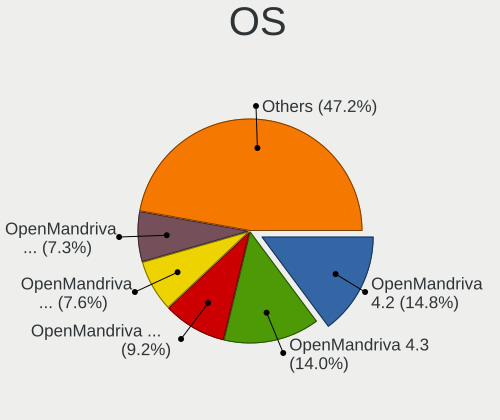

| Name                | Desktops | Percent |
|---------------------|----------|---------|
| OpenMandriva 4.2    | 2342     | 14.83%  |
| OpenMandriva 4.3    | 2203     | 13.95%  |
| OpenMandriva 24.12  | 1453     | 9.2%    |
| OpenMandriva 25.90  | 1192     | 7.55%   |
| OpenMandriva 23.08  | 1151     | 7.29%   |
| OpenMandriva 23.01  | 950      | 6.02%   |
| OpenMandriva 23.03  | 921      | 5.83%   |
| OpenMandriva 5.0    | 846      | 5.36%   |
| OpenMandriva 25.06  | 740      | 4.69%   |
| OpenMandriva 6.0    | 733      | 4.64%   |
| OpenMandriva 24.07  | 634      | 4.02%   |
| OpenMandriva 4.50   | 417      | 2.64%   |
| OpenMandriva 25.01  | 394      | 2.5%    |
| OpenMandriva 25.04  | 318      | 2.01%   |
| OpenMandriva 25.03  | 285      | 1.81%   |
| OpenMandriva 4.90   | 161      | 1.02%   |
| OpenMandriva 25.11  | 124      | 0.79%   |
| OpenMandriva 23.11  | 115      | 0.73%   |
| OpenMandriva 23.09  | 107      | 0.68%   |
| OpenMandriva 24.01  | 89       | 0.56%   |
| OpenMandriva 25.02  | 78       | 0.49%   |
| OpenMandriva 24.08  | 70       | 0.44%   |
| OpenMandriva 23.90  | 67       | 0.42%   |
| OpenMandriva 23.10  | 65       | 0.41%   |
| OpenMandriva 24.90  | 60       | 0.38%   |
| OpenMandriva 23.07  | 60       | 0.38%   |
| OpenMandriva 24.09  | 56       | 0.35%   |
| OpenMandriva 23.06  | 56       | 0.35%   |
| OpenMandriva 22.12  | 45       | 0.29%   |
| OpenMandriva 24.06  | 16       | 0.1%    |
| OpenMandriva 4.1    | 10       | 0.06%   |
| OpenMandriva 24.03  | 9        | 0.06%   |
| OpenMandriva 24.04  | 5        | 0.03%   |
| OpenMandriva 22.11  | 5        | 0.03%   |
| OpenMandriva 24.11  | 3        | 0.02%   |
| OpenMandriva 2014.0 | 3        | 0.02%   |
| OpenMandriva 4.0    | 2        | 0.01%   |
| OpenMandriva 4.0.1  | 1        | 0.01%   |
| OpenMandriva 24.05  | 1        | 0.01%   |
| OpenMandriva 22.90  | 1        | 0.01%   |

OS Family
---------

OS without a version

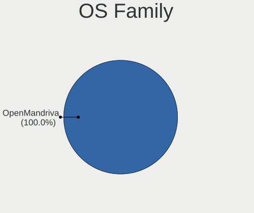

| Name         | Desktops | Percent |
|--------------|----------|---------|
| OpenMandriva | 14047    | 100%    |

Kernel
------

Version of the Linux kernel

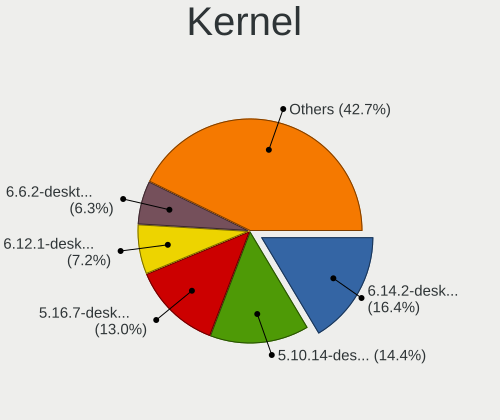

| Version                       | Desktops | Percent |
|-------------------------------|----------|---------|
| 6.14.2-desktop-3omv2590       | 2601     | 16.43%  |
| 5.10.14-desktop-1omv4002      | 2275     | 14.37%  |
| 5.16.7-desktop-1omv4003       | 2051     | 12.95%  |
| 6.12.1-desktop-1omv2490       | 1140     | 7.2%    |
| 6.6.2-desktop-1omv2390        | 999      | 6.31%   |
| 6.4.11-desktop-1omv2390       | 923      | 5.83%   |
| 6.2.6-desktop-1omv2390        | 895      | 5.65%   |
| 6.1.1-desktop-1omv2290        | 863      | 5.45%   |
| 6.10.0-desktop-1omv2490       | 478      | 3.02%   |
| 6.12.9-desktop-1omv2490       | 434      | 2.74%   |
| 6.12.6-desktop-1omv2490       | 265      | 1.67%   |
| 6.4.8-desktop-2omv2390        | 262      | 1.65%   |
| 5.12.4-desktop-1omv4050       | 206      | 1.3%    |
| 5.16.13-desktop-1omv4003      | 187      | 1.18%   |
| 6.15.0-desktop-0.rc2.3omv2590 | 165      | 1.04%   |
| 5.18.12-desktop-3omv4090      | 150      | 0.95%   |
| 6.9.7-desktop-1omv2490        | 134      | 0.85%   |
| 6.3.5-desktop-3omv2390        | 105      | 0.66%   |
| 6.10.1-desktop-1omv2490       | 103      | 0.65%   |
| 6.13.5-desktop-1omv2590       | 101      | 0.64%   |
| 5.11.12-desktop-1omv4002      | 94       | 0.59%   |
| 5.19.5-desktop-1omv4090       | 87       | 0.55%   |
| 6.17.7-desktop-1omv2590       | 81       | 0.51%   |
| 6.1.4-desktop-1omv2301        | 80       | 0.51%   |
| 6.5.5-desktop-1omv2390        | 68       | 0.43%   |
| 6.13.4-desktop-2omv2590       | 61       | 0.39%   |
| 6.13.9-desktop-3omv2590       | 59       | 0.37%   |
| 5.19.12-desktop-2omv4090      | 56       | 0.35%   |
| 6.11.0-desktop-2omv2490       | 53       | 0.33%   |
| 6.14.0-desktop-0.rc4.2omv2590 | 50       | 0.32%   |
| 6.0.10-desktop-2omv22090      | 44       | 0.28%   |
| 6.14.2-desktop-2omv2590       | 42       | 0.27%   |
| 6.5.3-desktop-1omv2390        | 37       | 0.23%   |
| 6.13.7-desktop-1omv2590       | 37       | 0.23%   |
| 6.18.0-desktop-1omv2590       | 35       | 0.22%   |
| 6.5.0-desktop-1omv2390        | 34       | 0.21%   |
| 6.14.0-desktop-0.rc6.2omv2590 | 27       | 0.17%   |
| 5.14.7-desktop-1omv4050       | 22       | 0.14%   |
| 6.2.2-desktop-1omv2390        | 20       | 0.13%   |
| 6.14.0-desktop-3omv2590       | 19       | 0.12%   |

Kernel Family
-------------

Linux kernel without a distro release

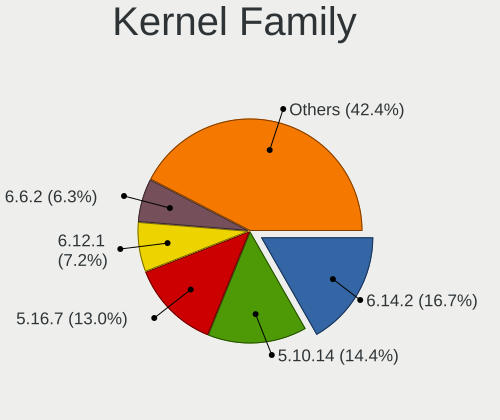

| Version | Desktops | Percent |
|---------|----------|---------|
| 6.14.2  | 2651     | 16.75%  |
| 5.10.14 | 2275     | 14.37%  |
| 5.16.7  | 2052     | 12.96%  |
| 6.12.1  | 1140     | 7.2%    |
| 6.6.2   | 1001     | 6.32%   |
| 6.4.11  | 923      | 5.83%   |
| 6.2.6   | 895      | 5.65%   |
| 6.1.1   | 863      | 5.45%   |
| 6.10.0  | 481      | 3.04%   |
| 6.12.9  | 435      | 2.75%   |
| 6.12.6  | 267      | 1.69%   |
| 6.4.8   | 262      | 1.66%   |
| 5.12.4  | 206      | 1.3%    |
| 5.16.13 | 189      | 1.19%   |
| 6.15.0  | 175      | 1.11%   |
| 5.18.12 | 150      | 0.95%   |
| 6.9.7   | 134      | 0.85%   |
| 6.14.0  | 134      | 0.85%   |
| 6.13.5  | 108      | 0.68%   |
| 6.3.5   | 105      | 0.66%   |
| 6.10.1  | 103      | 0.65%   |
| 5.11.12 | 94       | 0.59%   |
| 5.19.5  | 87       | 0.55%   |
| 6.17.7  | 82       | 0.52%   |
| 6.1.4   | 82       | 0.52%   |
| 6.5.5   | 69       | 0.44%   |
| 6.13.4  | 64       | 0.4%    |
| 6.13.9  | 59       | 0.37%   |
| 5.19.12 | 57       | 0.36%   |
| 6.11.0  | 54       | 0.34%   |
| 6.0.10  | 44       | 0.28%   |
| 6.13.7  | 38       | 0.24%   |
| 6.5.3   | 37       | 0.23%   |
| 6.18.0  | 37       | 0.23%   |
| 6.5.0   | 35       | 0.22%   |
| 5.14.7  | 22       | 0.14%   |
| 6.2.2   | 20       | 0.13%   |
| 6.13.3  | 20       | 0.13%   |
| 6.9.3   | 18       | 0.11%   |
| 6.5.1   | 18       | 0.11%   |

Kernel Major Ver.
-----------------

Linux kernel major version

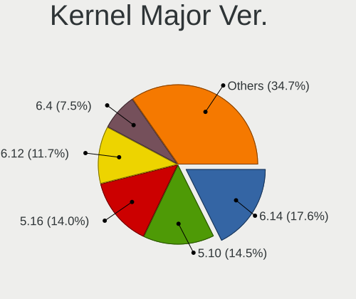

| Version | Desktops | Percent |
|---------|----------|---------|
| 6.14    | 2776     | 17.62%  |
| 5.10    | 2284     | 14.49%  |
| 5.16    | 2205     | 13.99%  |
| 6.12    | 1841     | 11.68%  |
| 6.4     | 1186     | 7.53%   |
| 6.6     | 1035     | 6.57%   |
| 6.1     | 961      | 6.1%    |
| 6.2     | 937      | 5.95%   |
| 6.10    | 599      | 3.8%    |
| 6.13    | 309      | 1.96%   |
| 5.12    | 222      | 1.41%   |
| 6.15    | 189      | 1.2%    |
| 6.5     | 176      | 1.12%   |
| 5.19    | 161      | 1.02%   |
| 6.9     | 155      | 0.98%   |
| 5.18    | 155      | 0.98%   |
| 6.3     | 112      | 0.71%   |
| 5.11    | 101      | 0.64%   |
| 6.17    | 94       | 0.6%    |
| 6.11    | 66       | 0.42%   |
| 6.0     | 52       | 0.33%   |
| 6.18    | 40       | 0.25%   |
| 5.14    | 32       | 0.2%    |
| 6.8     | 18       | 0.11%   |
| 6.16    | 13       | 0.08%   |
| 6.7     | 11       | 0.07%   |
| 5.5     | 10       | 0.06%   |
| 5.17    | 6        | 0.04%   |
| 5.15    | 3        | 0.02%   |
| 5.13    | 3        | 0.02%   |
| 4.1     | 3        | 0.02%   |
| 5.1     | 2        | 0.01%   |
| 5.8     | 1        | 0.01%   |
| 5.3     | 1        | 0.01%   |

Arch
----

OS architecture (x86_64, i586, etc.)

| Name   | Desktops | Percent |
|--------|----------|---------|
| x86_64 | 14047    | 100%    |

DE
--

Desktop Environment

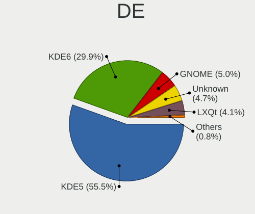

| Name            | Desktops | Percent |
|-----------------|----------|---------|
| KDE5            | 8188     | 55.49%  |
| KDE6            | 4419     | 29.95%  |
| GNOME           | 744      | 5.04%   |
| Unknown         | 687      | 4.66%   |
| LXQt            | 600      | 4.07%   |
| XFCE            | 43       | 0.29%   |
| Budgie          | 31       | 0.21%   |
| Cinnamon        | 25       | 0.17%   |
| MATE            | 10       | 0.07%   |
| i3              | 4        | 0.03%   |
| LXDE            | 1        | 0.01%   |
| KDE4            | 1        | 0.01%   |
| KDE             | 1        | 0.01%   |
| GNOME Flashback | 1        | 0.01%   |

Display Server
--------------

X11 or Wayland

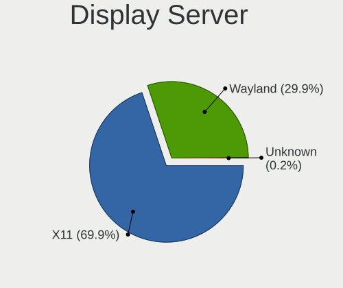

| Name    | Desktops | Percent |
|---------|----------|---------|
| X11     | 10348    | 69.9%   |
| Wayland | 4433     | 29.94%  |
| Unknown | 24       | 0.16%   |

Display Manager
---------------

SDDM, LightDM, etc.

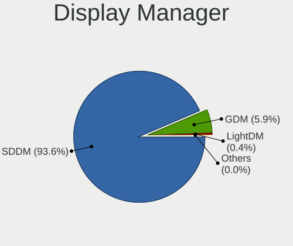

| Name    | Desktops | Percent |
|---------|----------|---------|
| SDDM    | 13296    | 93.56%  |
| GDM     | 835      | 5.88%   |
| LightDM | 61       | 0.43%   |
| Unknown | 14       | 0.1%    |
| GREETD  | 4        | 0.03%   |
| KDM     | 1        | 0.01%   |

OS Lang
-------

Language

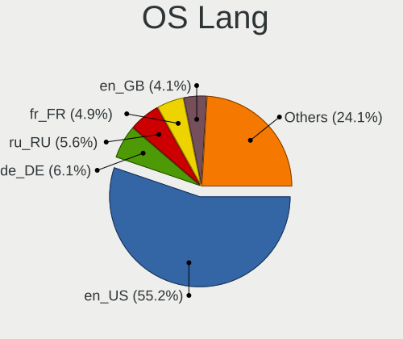

| Lang    | Desktops | Percent |
|---------|----------|---------|
| en_US   | 8016     | 55.21%  |
| de_DE   | 879      | 6.05%   |
| ru_RU   | 818      | 5.63%   |
| fr_FR   | 714      | 4.92%   |
| en_GB   | 599      | 4.13%   |
| pt_BR   | 548      | 3.77%   |
| pl_PL   | 475      | 3.27%   |
| it_IT   | 371      | 2.56%   |
| es_ES   | 273      | 1.88%   |
| en_CA   | 186      | 1.28%   |
| es_MX   | 149      | 1.03%   |
| en_AU   | 138      | 0.95%   |
| cs_CZ   | 134      | 0.92%   |
| es_AR   | 120      | 0.83%   |
| hu_HU   | 106      | 0.73%   |
| de_AT   | 79       | 0.54%   |
| en_IN   | 63       | 0.43%   |
| nl_NL   | 59       | 0.41%   |
| fr_CA   | 54       | 0.37%   |
| de_CH   | 48       | 0.33%   |
| tr_TR   | 47       | 0.32%   |
| es_VE   | 44       | 0.3%    |
| es_CO   | 37       | 0.25%   |
| en_ZA   | 36       | 0.25%   |
| pt_PT   | 35       | 0.24%   |
| fr_BE   | 33       | 0.23%   |
| da_DK   | 29       | 0.2%    |
| nl_BE   | 28       | 0.19%   |
| ru_UA   | 26       | 0.18%   |
| es_CL   | 23       | 0.16%   |
| en_NZ   | 21       | 0.14%   |
| ro_RO   | 19       | 0.13%   |
| ja_JP   | 19       | 0.13%   |
| en_IL   | 19       | 0.13%   |
| en_SG   | 17       | 0.12%   |
| es_UY   | 16       | 0.11%   |
| en_HK   | 16       | 0.11%   |
| sv_SE   | 14       | 0.1%    |
| UTF-8   | 13       | 0.09%   |
| Unknown | 13       | 0.09%   |

Boot Mode
---------

EFI or BIOS

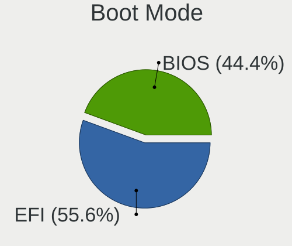

| Mode | Desktops | Percent |
|------|----------|---------|
| EFI  | 7922     | 55.57%  |
| BIOS | 6333     | 44.43%  |

Filesystem
----------

Type of filesystem

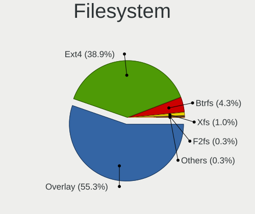

| Type     | Desktops | Percent |
|----------|----------|---------|
| Overlay  | 8239     | 55.31%  |
| Ext4     | 5787     | 38.85%  |
| Btrfs    | 635      | 4.26%   |
| Xfs      | 146      | 0.98%   |
| F2fs     | 46       | 0.31%   |
| Ext3     | 15       | 0.1%    |
| Reiserfs | 9        | 0.06%   |
| Jfs      | 9        | 0.06%   |
| Unknown  | 4        | 0.03%   |
| Ext2     | 3        | 0.02%   |
| Udf      | 1        | 0.01%   |
| Tmpfs    | 1        | 0.01%   |

Part. scheme
------------

Scheme of partitioning

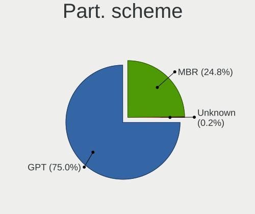

| Type    | Desktops | Percent |
|---------|----------|---------|
| GPT     | 10736    | 74.99%  |
| MBR     | 3545     | 24.76%  |
| Unknown | 35       | 0.24%   |

Dual Boot with Linux/BSD
------------------------

Hosting more than one Linux/BSD

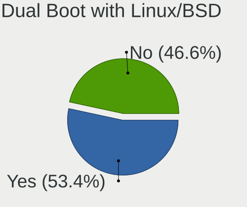

| Dual boot | Desktops | Percent |
|-----------|----------|---------|
| Yes       | 7769     | 53.38%  |
| No        | 6786     | 46.62%  |

Dual Boot (Win)
---------------

Hosting Linux and Windows

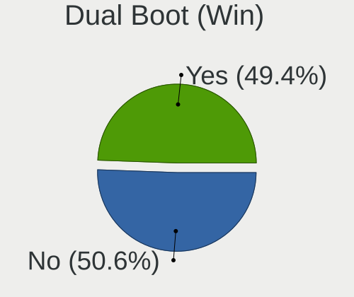

| Dual boot | Desktops | Percent |
|-----------|----------|---------|
| No        | 7249     | 50.57%  |
| Yes       | 7087     | 49.43%  |

Board
-----

Vendor
------

Motherboard manufacturer

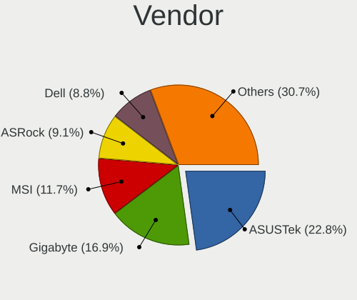

| Name                                 | Desktops | Percent |
|--------------------------------------|----------|---------|
| ASUSTek Computer                     | 3206     | 22.82%  |
| Gigabyte Technology                  | 2367     | 16.85%  |
| MSI                                  | 1639     | 11.67%  |
| ASRock                               | 1278     | 9.1%    |
| Dell                                 | 1241     | 8.83%   |
| Hewlett-Packard                      | 1175     | 8.36%   |
| Lenovo                               | 594      | 4.23%   |
| Intel                                | 417      | 2.97%   |
| Acer                                 | 288      | 2.05%   |
| Fujitsu                              | 185      | 1.32%   |
| Unknown                              | 184      | 1.31%   |
| Biostar                              | 154      | 1.1%    |
| Foxconn                              | 137      | 0.98%   |
| Pegatron                             | 128      | 0.91%   |
| ECS                                  | 96       | 0.68%   |
| AZW                                  | 78       | 0.56%   |
| Medion                               | 70       | 0.5%    |
| Positivo                             | 46       | 0.33%   |
| MACHINIST                            | 36       | 0.26%   |
| Shenzhen Meigao Electronic Equipment | 34       | 0.24%   |
| BESSTAR Tech                         | 33       | 0.23%   |
| Red Hat                              | 30       | 0.21%   |
| Packard Bell                         | 25       | 0.18%   |
| OEM                                  | 23       | 0.16%   |
| Huanan                               | 23       | 0.16%   |
| Fujitsu Siemens                      | 23       | 0.16%   |
| Alienware                            | 23       | 0.16%   |
| Shuttle                              | 22       | 0.16%   |
| Apple                                | 22       | 0.16%   |
| PCWare                               | 21       | 0.15%   |
| GMKtec                               | 15       | 0.11%   |
| GEEKOM                               | 14       | 0.1%    |
| AMI                                  | 13       | 0.09%   |
| Supermicro                           | 12       | 0.09%   |
| Inventec                             | 12       | 0.09%   |
| Gateway                              | 12       | 0.09%   |
| HC Technology.                       | 11       | 0.08%   |
| eMachines                            | 11       | 0.08%   |
| AMD                                  | 11       | 0.08%   |
| Itautec                              | 10       | 0.07%   |

Model
-----

Motherboard model

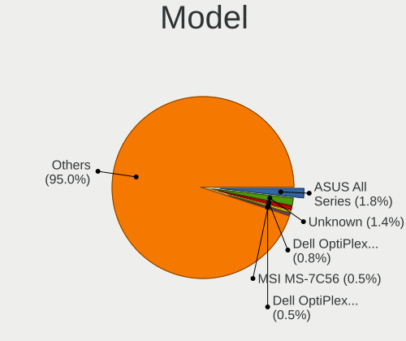

| Name                         | Desktops | Percent |
|------------------------------|----------|---------|
| ASUS All Series              | 251      | 1.79%   |
| Unknown                      | 202      | 1.44%   |
| Dell OptiPlex 7010           | 113      | 0.8%    |
| MSI MS-7C56                  | 70       | 0.5%    |
| Dell OptiPlex 9020           | 67       | 0.48%   |
| Intel H61                    | 65       | 0.46%   |
| ASUS PRIME A320M-K           | 64       | 0.46%   |
| MSI MS-7C91                  | 59       | 0.42%   |
| ASUS TUF Gaming X570-PLUS    | 59       | 0.42%   |
| ASUS ROG STRIX B550-F GAMING | 57       | 0.41%   |
| Dell OptiPlex 780            | 55       | 0.39%   |
| Dell OptiPlex 3020           | 54       | 0.38%   |
| MSI MS-7C02                  | 46       | 0.33%   |
| MSI MS-7817                  | 46       | 0.33%   |
| MSI MS-7B86                  | 45       | 0.32%   |
| MSI MS-7C37                  | 43       | 0.31%   |
| HP EliteDesk 800 G1 SFF      | 42       | 0.3%    |
| Dell OptiPlex 790            | 42       | 0.3%    |
| ASUS PRIME B450M-A II        | 39       | 0.28%   |
| Gigabyte B450M DS3H          | 37       | 0.26%   |
| ASUS PRIME B450M-A           | 37       | 0.26%   |
| MSI MS-7A38                  | 35       | 0.25%   |
| HP Compaq Pro 6300 SFF       | 35       | 0.25%   |
| HP Compaq 8200 Elite SFF PC  | 35       | 0.25%   |
| MSI MS-7B79                  | 33       | 0.23%   |
| MSI MS-7721                  | 33       | 0.23%   |
| HP Compaq Elite 8300 SFF     | 33       | 0.23%   |
| Gigabyte A320M-S2H           | 33       | 0.23%   |
| Dell OptiPlex 3010           | 33       | 0.23%   |
| ASUS TUF Gaming B550-PLUS    | 33       | 0.23%   |
| Dell OptiPlex 7050           | 32       | 0.23%   |
| AZW MINI S                   | 32       | 0.23%   |
| ASUS M5A78L-M/USB3           | 32       | 0.23%   |
| MSI MS-7C52                  | 31       | 0.22%   |
| Gigabyte 970A-DS3P           | 31       | 0.22%   |
| Dell OptiPlex 7040           | 31       | 0.22%   |
| Dell OptiPlex 3050           | 31       | 0.22%   |
| Red Hat KVM                  | 30       | 0.21%   |
| Gigabyte H410M H V3          | 30       | 0.21%   |
| Dell OptiPlex 380            | 30       | 0.21%   |

Model Family
------------

Motherboard model prefix

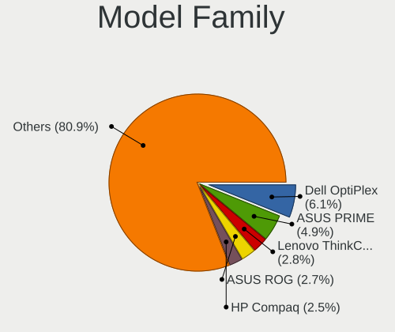

| Name                   | Desktops | Percent |
|------------------------|----------|---------|
| Dell OptiPlex          | 854      | 6.08%   |
| ASUS PRIME             | 695      | 4.95%   |
| Lenovo ThinkCentre     | 399      | 2.84%   |
| ASUS ROG               | 383      | 2.73%   |
| HP Compaq              | 348      | 2.48%   |
| ASUS TUF               | 294      | 2.09%   |
| ASUS All               | 251      | 1.79%   |
| HP EliteDesk           | 245      | 1.74%   |
| Unknown                | 202      | 1.44%   |
| Acer Aspire            | 171      | 1.22%   |
| Fujitsu ESPRIMO        | 147      | 1.05%   |
| HP ProDesk             | 138      | 0.98%   |
| Dell Precision         | 124      | 0.88%   |
| Dell Inspiron          | 114      | 0.81%   |
| ASUS M5A78L-M          | 109      | 0.78%   |
| Gigabyte B450M         | 105      | 0.75%   |
| Gigabyte B550          | 90       | 0.64%   |
| Acer Veriton           | 84       | 0.6%    |
| Gigabyte X570          | 82       | 0.58%   |
| HP Pavilion            | 80       | 0.57%   |
| Gigabyte B450          | 80       | 0.57%   |
| Gigabyte B550M         | 76       | 0.54%   |
| Intel H61              | 73       | 0.52%   |
| MSI MS-7C56            | 70       | 0.5%    |
| Lenovo IdeaCentre      | 68       | 0.48%   |
| Dell Vostro            | 67       | 0.48%   |
| ASRock B450M           | 66       | 0.47%   |
| MSI MS-7C91            | 59       | 0.42%   |
| ASUS P8H61-M           | 59       | 0.42%   |
| ASRock X570            | 59       | 0.42%   |
| ASUS M5A97             | 58       | 0.41%   |
| ASUS SABERTOOTH        | 57       | 0.41%   |
| ASUS P8Z77-V           | 52       | 0.37%   |
| Gigabyte GA-78LMT-USB3 | 50       | 0.36%   |
| Gigabyte H410M         | 49       | 0.35%   |
| MSI MS-7C02            | 46       | 0.33%   |
| MSI MS-7817            | 46       | 0.33%   |
| Gigabyte A320M-S2H     | 46       | 0.33%   |
| MSI MS-7B86            | 45       | 0.32%   |
| ASRock B450            | 45       | 0.32%   |

MFG Year
--------

Motherboard manufacture year

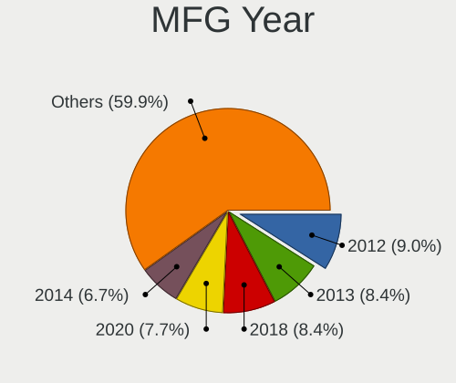

| Year    | Desktops | Percent |
|---------|----------|---------|
| 2012    | 1269     | 9.03%   |
| 2013    | 1179     | 8.39%   |
| 2018    | 1174     | 8.36%   |
| 2020    | 1078     | 7.67%   |
| 2014    | 937      | 6.67%   |
| 2011    | 923      | 6.57%   |
| 2019    | 857      | 6.1%    |
| 2021    | 770      | 5.48%   |
| 2017    | 766      | 5.45%   |
| 2009    | 716      | 5.1%    |
| 2010    | 685      | 4.88%   |
| 2022    | 613      | 4.36%   |
| 2015    | 605      | 4.31%   |
| 2016    | 560      | 3.99%   |
| 2023    | 499      | 3.55%   |
| 2008    | 478      | 3.4%    |
| 2007    | 329      | 2.34%   |
| 2024    | 303      | 2.16%   |
| 2006    | 193      | 1.37%   |
| 2025    | 57       | 0.41%   |
| 2005    | 43       | 0.31%   |
| 2004    | 11       | 0.08%   |
| 2003    | 1        | 0.01%   |
| Unknown | 1        | 0.01%   |

Form Factor
-----------

Physical design of the computer

| Name    | Desktops | Percent |
|---------|----------|---------|
| Desktop | 14047    | 100%    |

Secure Boot
-----------

Enabled or disabled

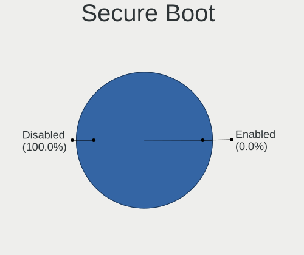

| State    | Desktops | Percent |
|----------|----------|---------|
| Disabled | 14046    | 99.99%  |
| Enabled  | 1        | 0.01%   |

Coreboot
--------

Have coreboot on board

| Used | Desktops | Percent |
|------|----------|---------|
| No   | 14038    | 99.94%  |
| Yes  | 9        | 0.06%   |

RAM Size
--------

Total RAM memory

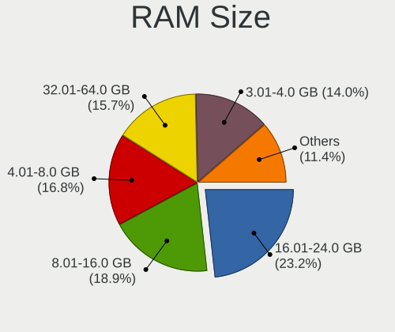

| Size in GB      | Desktops | Percent |
|-----------------|----------|---------|
| 16.01-24.0      | 3334     | 23.23%  |
| 8.01-16.0       | 2718     | 18.94%  |
| 4.01-8.0        | 2410     | 16.79%  |
| 32.01-64.0      | 2253     | 15.7%   |
| 3.01-4.0        | 2004     | 13.96%  |
| 64.01-256.0     | 658      | 4.58%   |
| 24.01-32.0      | 526      | 3.66%   |
| 1.01-2.0        | 296      | 2.06%   |
| 2.01-3.0        | 115      | 0.8%    |
| 0.51-1.0        | 20       | 0.14%   |
| More than 256.0 | 17       | 0.12%   |
| 0.01-0.5        | 1        | 0.01%   |

RAM Used
--------

Used RAM memory

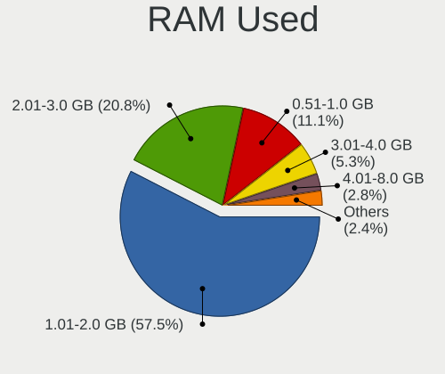

| Used GB    | Desktops | Percent |
|------------|----------|---------|
| 1.01-2.0   | 8700     | 57.54%  |
| 2.01-3.0   | 3148     | 20.82%  |
| 0.51-1.0   | 1679     | 11.1%   |
| 3.01-4.0   | 802      | 5.3%    |
| 4.01-8.0   | 421      | 2.78%   |
| 0.01-0.5   | 301      | 1.99%   |
| 8.01-16.0  | 54       | 0.36%   |
| 16.01-24.0 | 7        | 0.05%   |
| 24.01-32.0 | 5        | 0.03%   |
| 32.01-64.0 | 3        | 0.02%   |

Total Drives
------------

Number of drives on board

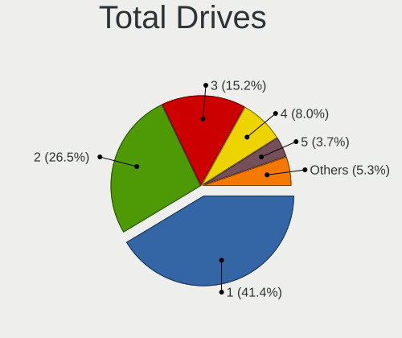

| Drives | Desktops | Percent |
|--------|----------|---------|
| 1      | 6062     | 41.4%   |
| 2      | 3880     | 26.5%   |
| 3      | 2223     | 15.18%  |
| 4      | 1166     | 7.96%   |
| 5      | 543      | 3.71%   |
| 0      | 280      | 1.91%   |
| 6      | 255      | 1.74%   |
| 7      | 106      | 0.72%   |
| 8      | 63       | 0.43%   |
| 9      | 23       | 0.16%   |
| 10     | 16       | 0.11%   |
| 12     | 8        | 0.05%   |
| 13     | 7        | 0.05%   |
| 11     | 6        | 0.04%   |
| 15     | 2        | 0.01%   |
| 18     | 1        | 0.01%   |
| 17     | 1        | 0.01%   |
| 16     | 1        | 0.01%   |
| 14     | 1        | 0.01%   |

Has CD-ROM
----------

Has CD-ROM on board

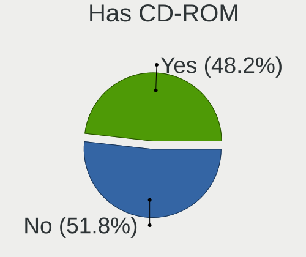

| Presented | Desktops | Percent |
|-----------|----------|---------|
| No        | 7362     | 51.78%  |
| Yes       | 6856     | 48.22%  |

Has Ethernet
------------

Has Ethernet on board

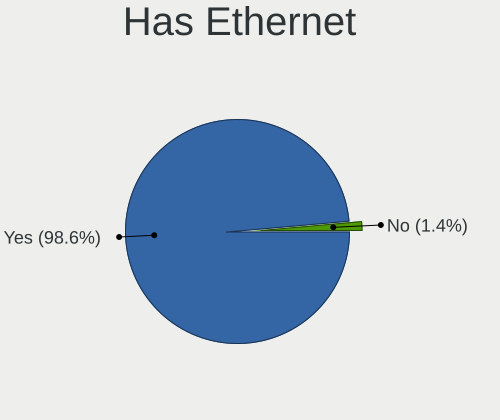

| Presented | Desktops | Percent |
|-----------|----------|---------|
| Yes       | 13851    | 98.59%  |
| No        | 198      | 1.41%   |

Has WiFi
--------

Has WiFi module

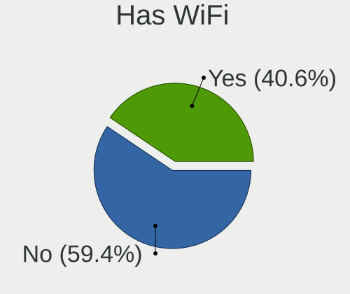

| Presented | Desktops | Percent |
|-----------|----------|---------|
| No        | 8454     | 59.43%  |
| Yes       | 5772     | 40.57%  |

Has Bluetooth
-------------

Has Bluetooth module

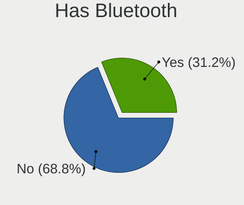

| Presented | Desktops | Percent |
|-----------|----------|---------|
| No        | 9774     | 68.85%  |
| Yes       | 4423     | 31.15%  |

Location
--------

Country
-------

Geographic location (country)

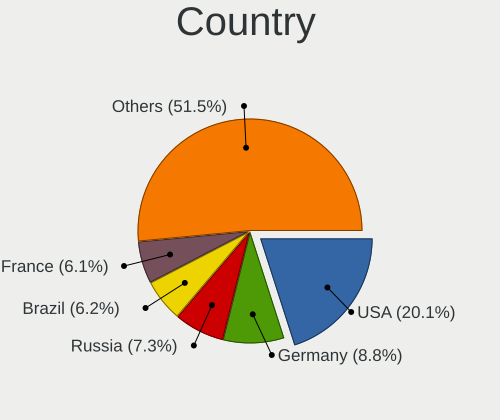

| Country      | Desktops | Percent |
|--------------|----------|---------|
| USA          | 2824     | 20.06%  |
| Germany      | 1243     | 8.83%   |
| Russia       | 1030     | 7.32%   |
| Brazil       | 871      | 6.19%   |
| France       | 860      | 6.11%   |
| Poland       | 727      | 5.16%   |
| Italy        | 572      | 4.06%   |
| UK           | 530      | 3.76%   |
| Canada       | 467      | 3.32%   |
| Spain        | 370      | 2.63%   |
| Australia    | 302      | 2.15%   |
| Mexico       | 217      | 1.54%   |
| Netherlands  | 190      | 1.35%   |
| Hungary      | 170      | 1.21%   |
| India        | 167      | 1.19%   |
| Czechia      | 163      | 1.16%   |
| Japan        | 154      | 1.09%   |
| Argentina    | 154      | 1.09%   |
| Finland      | 147      | 1.04%   |
| Sweden       | 138      | 0.98%   |
| Romania      | 129      | 0.92%   |
| Austria      | 123      | 0.87%   |
| Ukraine      | 108      | 0.77%   |
| Switzerland  | 101      | 0.72%   |
| Belgium      | 95       | 0.67%   |
| Greece       | 94       | 0.67%   |
| Indonesia    | 90       | 0.64%   |
| Turkey       | 85       | 0.6%    |
| Portugal     | 85       | 0.6%    |
| Serbia       | 84       | 0.6%    |
| Bulgaria     | 78       | 0.55%   |
| South Africa | 69       | 0.49%   |
| Venezuela    | 67       | 0.48%   |
| Slovakia     | 66       | 0.47%   |
| Colombia     | 66       | 0.47%   |
| China        | 66       | 0.47%   |
| Malaysia     | 58       | 0.41%   |
| Israel       | 58       | 0.41%   |
| Norway       | 56       | 0.4%    |
| Thailand     | 54       | 0.38%   |

City
----

Geographic location (city)

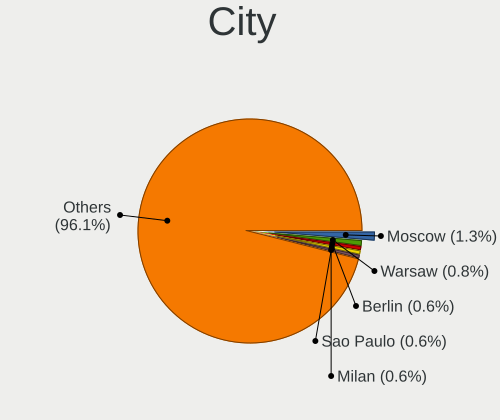

| City             | Desktops | Percent |
|------------------|----------|---------|
| Moscow           | 193      | 1.3%    |
| Warsaw           | 125      | 0.84%   |
| Berlin           | 93       | 0.63%   |
| Sao Paulo        | 91       | 0.61%   |
| Milan            | 83       | 0.56%   |
| St Petersburg    | 80       | 0.54%   |
| Sydney           | 73       | 0.49%   |
| Rome             | 68       | 0.46%   |
| Paris            | 68       | 0.46%   |
| Melbourne        | 67       | 0.45%   |
| Rio de Janeiro   | 66       | 0.44%   |
| Vienna           | 59       | 0.4%    |
| Helsinki         | 56       | 0.38%   |
| Munich           | 54       | 0.36%   |
| Budapest         | 53       | 0.36%   |
| Hamburg          | 48       | 0.32%   |
| Mexico City      | 46       | 0.31%   |
| Brisbane         | 46       | 0.31%   |
| Krakow           | 44       | 0.3%    |
| Madrid           | 43       | 0.29%   |
| Athens           | 42       | 0.28%   |
| Novosibirsk      | 38       | 0.26%   |
| Barcelona        | 38       | 0.26%   |
| Montreal         | 37       | 0.25%   |
| Chicago          | 37       | 0.25%   |
| Prague           | 35       | 0.24%   |
| Wroclaw          | 34       | 0.23%   |
| Belgrade         | 34       | 0.23%   |
| Sofia            | 32       | 0.22%   |
| Los Angeles      | 32       | 0.22%   |
| Toronto          | 31       | 0.21%   |
| Buenos Aires     | 31       | 0.21%   |
| Porto Alegre     | 30       | 0.2%    |
| Istanbul         | 30       | 0.2%    |
| Denver           | 30       | 0.2%    |
| Yekaterinburg    | 29       | 0.2%    |
| San Jose         | 29       | 0.2%    |
| Nizhniy Novgorod | 29       | 0.2%    |
| Singapore        | 28       | 0.19%   |
| Bogotá          | 28       | 0.19%   |

Drives
------

Drive Vendor
------------

Hard drive vendors

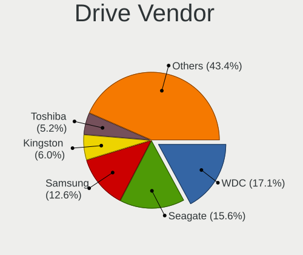

| Vendor                      | Desktops | Drives | Percent |
|-----------------------------|----------|--------|---------|
| WDC                         | 4385     | 6392   | 17.09%  |
| Seagate                     | 3991     | 5631   | 15.55%  |
| Samsung Electronics         | 3244     | 4989   | 12.64%  |
| Kingston                    | 1549     | 2005   | 6.04%   |
| Toshiba                     | 1341     | 1669   | 5.23%   |
| Sandisk                     | 1304     | 1661   | 5.08%   |
| Crucial                     | 1203     | 1547   | 4.69%   |
| Hitachi                     | 725      | 865    | 2.83%   |
| A-DATA Technology           | 494      | 581    | 1.93%   |
| China                       | 449      | 535    | 1.75%   |
| Unknown                     | 303      | 497    | 1.18%   |
| Intel                       | 293      | 340    | 1.14%   |
| Micron/Crucial Technology   | 268      | 323    | 1.04%   |
| PNY                         | 266      | 333    | 1.04%   |
| Phison Electronics          | 262      | 325    | 1.02%   |
| SPCC                        | 250      | 317    | 0.97%   |
| Patriot                     | 233      | 268    | 0.91%   |
| Kingston Technology Company | 214      | 255    | 0.83%   |
| HGST                        | 192      | 252    | 0.75%   |
| GOODRAM                     | 192      | 242    | 0.75%   |
| Micron Technology           | 189      | 221    | 0.74%   |
| SK hynix                    | 180      | 219    | 0.7%    |
| Intenso                     | 179      | 230    | 0.7%    |
| MAXIO Technology (Hangzhou) | 173      | 215    | 0.67%   |
| Maxtor                      | 172      | 219    | 0.67%   |
| Silicon Motion              | 162      | 183    | 0.63%   |
| Team                        | 150      | 177    | 0.58%   |
| Apacer                      | 134      | 159    | 0.52%   |
| Netac                       | 116      | 133    | 0.45%   |
| OCZ                         | 107      | 125    | 0.42%   |
| Unknown                     | 107      | 120    | 0.42%   |
| ADATA Technology            | 102      | 120    | 0.4%    |
| Transcend                   | 101      | 117    | 0.39%   |
| Realtek Semiconductor       | 93       | 97     | 0.36%   |
| Phison                      | 88       | 121    | 0.34%   |
| Corsair                     | 88       | 98     | 0.34%   |
| JMicron Technology          | 87       | 96     | 0.34%   |
| Lexar                       | 84       | 92     | 0.33%   |
| KingSpec                    | 82       | 92     | 0.32%   |
| Hewlett-Packard             | 82       | 91     | 0.32%   |

Drive Model
-----------

Hard drive models

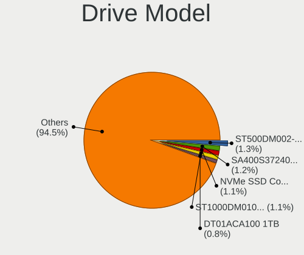

| Model                                                 | Desktops | Percent |
|-------------------------------------------------------|----------|---------|
| Seagate ST500DM002-1BD142 500GB                       | 386      | 1.31%   |
| Kingston SA400S37240G 240GB SSD                       | 353      | 1.2%    |
| Samsung NVMe SSD Controller SM981/PM981/PM983 1TB     | 318      | 1.08%   |
| Seagate ST1000DM010-2EP102 1TB                        | 309      | 1.05%   |
| Toshiba DT01ACA100 1TB                                | 244      | 0.83%   |
| Seagate ST2000DM008-2FR102 2TB                        | 213      | 0.72%   |
| Kingston SA400S37480G 480GB SSD                       | 209      | 0.71%   |
| WDC WD10EZEX-08WN4A0 1TB                              | 205      | 0.7%    |
| Samsung SSD 860 EVO 500GB                             | 182      | 0.62%   |
| Crucial CT500MX500SSD1 500GB                          | 182      | 0.62%   |
| Kingston SA400S37120G 120GB SSD                       | 169      | 0.57%   |
| Samsung NVMe SSD Controller PM9A1/PM9A3/980PRO 1TB    | 167      | 0.57%   |
| Samsung SSD 850 EVO 250GB                             | 161      | 0.55%   |
| Crucial CT240BX500SSD1 240GB                          | 161      | 0.55%   |
| Toshiba DT01ACA050 500GB                              | 152      | 0.52%   |
| Crucial CT1000MX500SSD1 1TB                           | 150      | 0.51%   |
| Seagate ST3500418AS 500GB                             | 142      | 0.48%   |
| Kingston SV300S37A120G 120GB SSD                      | 138      | 0.47%   |
| Unknown SD/MMC/MS PRO 2GB                             | 136      | 0.46%   |
| Toshiba HDWD110 1TB                                   | 134      | 0.46%   |
| Seagate ST1000DM003-1ER162 1TB                        | 134      | 0.46%   |
| Samsung SSD 860 EVO 250GB                             | 130      | 0.44%   |
| Samsung SSD 850 EVO 500GB                             | 125      | 0.43%   |
| Micron/Crucial P2 NVMe PCIe SSD 2TB                   | 125      | 0.43%   |
| Samsung SSD 860 EVO 1TB                               | 123      | 0.42%   |
| MAXIO (Hangzhou) NVMe SSD Controller MAP1202 2TB      | 119      | 0.4%    |
| Seagate ST1000DM003-1CH162 1TB                        | 117      | 0.4%    |
| Samsung SSD 870 EVO 1TB                               | 107      | 0.36%   |
| Unknown                                               | 107      | 0.36%   |
| WDC WD10EZEX-00BN5A0 1TB                              | 105      | 0.36%   |
| WDC WDS240G2G0A-00JH30 240GB SSD                      | 102      | 0.35%   |
| Seagate ST2000DM001-1ER164 2TB                        | 100      | 0.34%   |
| Samsung SSD 870 EVO 500GB                             | 100      | 0.34%   |
| Toshiba DT01ACA200 2TB                                | 95       | 0.32%   |
| Seagate ST1000DM003-1SB102 1TB                        | 90       | 0.31%   |
| Silicon Motion SM2263EN/SM2263XT SSD Controller 512GB | 89       | 0.3%    |
| Samsung SSD 980 1TB                                   | 86       | 0.29%   |
| Seagate ST2000DM001-1CH164 2TB                        | 85       | 0.29%   |
| Crucial CT480BX500SSD1 480GB                          | 85       | 0.29%   |
| Seagate ST4000DM004-2CV104 4TB                        | 83       | 0.28%   |

HDD Vendor
----------

Hard disk drive vendors

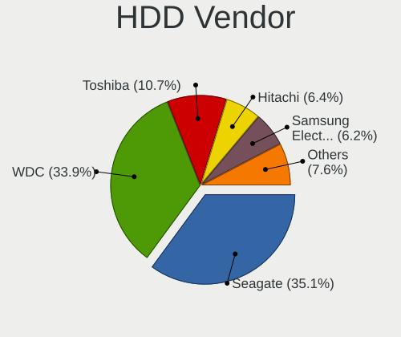

| Vendor              | Desktops | Drives | Percent |
|---------------------|----------|--------|---------|
| Seagate             | 3938     | 5518   | 35.09%  |
| WDC                 | 3808     | 5355   | 33.93%  |
| Toshiba             | 1200     | 1500   | 10.69%  |
| Hitachi             | 723      | 863    | 6.44%   |
| Samsung Electronics | 698      | 867    | 6.22%   |
| HGST                | 192      | 252    | 1.71%   |
| Maxtor              | 169      | 215    | 1.51%   |
| Unknown             | 144      | 164    | 1.28%   |
| JMicron Technology  | 51       | 58     | 0.45%   |
| Fujitsu             | 33       | 47     | 0.29%   |
| Intenso             | 19       | 21     | 0.17%   |
| Hewlett-Packard     | 19       | 20     | 0.17%   |
| Apple               | 19       | 20     | 0.17%   |
| WD MediaMax         | 14       | 22     | 0.12%   |
| USB3.0              | 14       | 14     | 0.12%   |
| TO Exter            | 14       | 14     | 0.12%   |
| HPE                 | 13       | 15     | 0.12%   |
| ExcelStor           | 12       | 13     | 0.11%   |
| Unknown             | 12       | 13     | 0.11%   |
| External            | 10       | 10     | 0.09%   |
| ASMT                | 10       | 14     | 0.09%   |
| USB                 | 7        | 8      | 0.06%   |
| IBM/Hitachi         | 7        | 10     | 0.06%   |
| SSK                 | 6        | 7      | 0.05%   |
| QEMU                | 6        | 10     | 0.05%   |
| Inateck             | 6        | 6      | 0.05%   |
| ASMedia             | 6        | 7      | 0.05%   |
| SABRENT             | 5        | 7      | 0.04%   |
| QUANTUM             | 5        | 5      | 0.04%   |
| HPQ                 | 5        | 5      | 0.04%   |
| HGST HTS            | 5        | 5      | 0.04%   |
| StoreJet            | 4        | 4      | 0.04%   |
| Magnetic Data       | 4        | 4      | 0.04%   |
| JetFlash            | 4        | 4      | 0.04%   |
| Initio              | 4        | 5      | 0.04%   |
| SATAFIRM            | 3        | 3      | 0.03%   |
| Min Yi U            | 3        | 3      | 0.03%   |
| MaxDigital          | 3        | 3      | 0.03%   |
| China               | 3        | 4      | 0.03%   |
| RSH-319             | 2        | 2      | 0.02%   |

SSD Vendor
----------

Solid state drive vendors

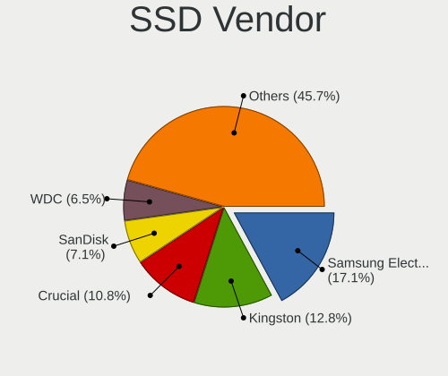

| Vendor              | Desktops | Drives | Percent |
|---------------------|----------|--------|---------|
| Samsung Electronics | 1667     | 2356   | 17.1%   |
| Kingston            | 1243     | 1571   | 12.75%  |
| Crucial             | 1056     | 1339   | 10.83%  |
| SanDisk             | 691      | 842    | 7.09%   |
| WDC                 | 638      | 790    | 6.55%   |
| China               | 444      | 529    | 4.56%   |
| A-DATA Technology   | 423      | 487    | 4.34%   |
| PNY                 | 252      | 315    | 2.59%   |
| SPCC                | 215      | 272    | 2.21%   |
| Patriot             | 201      | 235    | 2.06%   |
| GOODRAM             | 188      | 235    | 1.93%   |
| Intel               | 162      | 180    | 1.66%   |
| Intenso             | 161      | 207    | 1.65%   |
| Team                | 128      | 153    | 1.31%   |
| Apacer              | 121      | 142    | 1.24%   |
| OCZ                 | 107      | 125    | 1.1%    |
| Toshiba             | 93       | 106    | 0.95%   |
| Unknown             | 88       | 100    | 0.9%    |
| Transcend           | 86       | 100    | 0.88%   |
| Netac               | 85       | 98     | 0.87%   |
| Micron Technology   | 82       | 98     | 0.84%   |
| KingSpec            | 79       | 89     | 0.81%   |
| Lexar               | 60       | 64     | 0.62%   |
| Gigabyte Technology | 58       | 69     | 0.6%    |
| SK hynix            | 55       | 68     | 0.56%   |
| Hewlett-Packard     | 51       | 55     | 0.52%   |
| Corsair             | 48       | 53     | 0.49%   |
| T-FORCE             | 42       | 46     | 0.43%   |
| KingFast            | 41       | 46     | 0.42%   |
| Fanxiang            | 41       | 47     | 0.42%   |
| Plextor             | 40       | 45     | 0.41%   |
| KIOXIA-EXCERIA      | 40       | 45     | 0.41%   |
| Verbatim            | 36       | 42     | 0.37%   |
| Emtec               | 35       | 39     | 0.36%   |
| LITEON              | 33       | 37     | 0.34%   |
| ASMT                | 32       | 33     | 0.33%   |
| XrayDisk            | 29       | 31     | 0.3%    |
| Leven               | 27       | 32     | 0.28%   |
| Seagate             | 26       | 35     | 0.27%   |
| Mushkin             | 25       | 34     | 0.26%   |

Drive Kind
----------

HDD or SSD

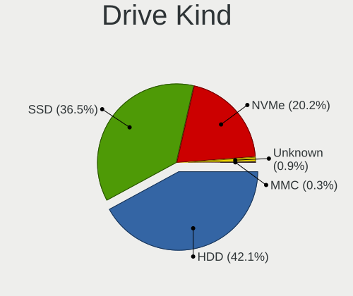

| Kind    | Desktops | Drives | Percent |
|---------|----------|--------|---------|
| HDD     | 8741     | 15150  | 42.08%  |
| SSD     | 7577     | 12117  | 36.48%  |
| NVMe    | 4206     | 6609   | 20.25%  |
| Unknown | 196      | 360    | 0.94%   |
| MMC     | 53       | 61     | 0.26%   |

Drive Connector
---------------

SATA, SAS, NVMe, etc.

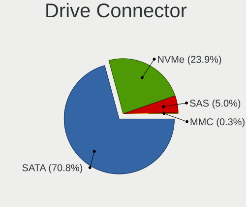

| Type | Desktops | Drives | Percent |
|------|----------|--------|---------|
| SATA | 12413    | 26389  | 70.8%   |
| NVMe | 4190     | 6556   | 23.9%   |
| SAS  | 877      | 1291   | 5%      |
| MMC  | 53       | 61     | 0.3%    |

Drive Size
----------

Size of hard drive

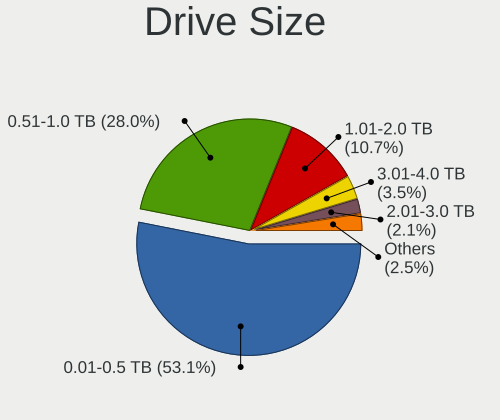

| Size in TB | Desktops | Drives | Percent |
|------------|----------|--------|---------|
| 0.01-0.5   | 9347     | 15366  | 53.11%  |
| 0.51-1.0   | 4930     | 7162   | 28.01%  |
| 1.01-2.0   | 1889     | 2667   | 10.73%  |
| 3.01-4.0   | 615      | 882    | 3.49%   |
| 2.01-3.0   | 372      | 507    | 2.11%   |
| 4.01-10.0  | 349      | 542    | 1.98%   |
| 10.01-20.0 | 93       | 133    | 0.53%   |
| 20.01-50.0 | 5        | 8      | 0.03%   |

Space Total
-----------

Amount of disk space available on the file system

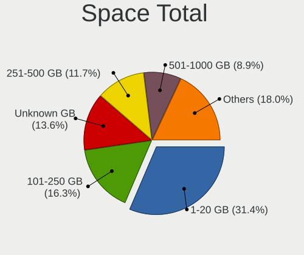

| Size in GB     | Desktops | Percent |
|----------------|----------|---------|
| 1-20           | 4789     | 31.42%  |
| 101-250        | 2480     | 16.27%  |
| Unknown        | 2080     | 13.65%  |
| 251-500        | 1785     | 11.71%  |
| 501-1000       | 1356     | 8.9%    |
| 1001-2000      | 722      | 4.74%   |
| 51-100         | 687      | 4.51%   |
| More than 3000 | 544      | 3.57%   |
| 21-50          | 521      | 3.42%   |
| 2001-3000      | 276      | 1.81%   |

Space Used
----------

Amount of used disk space

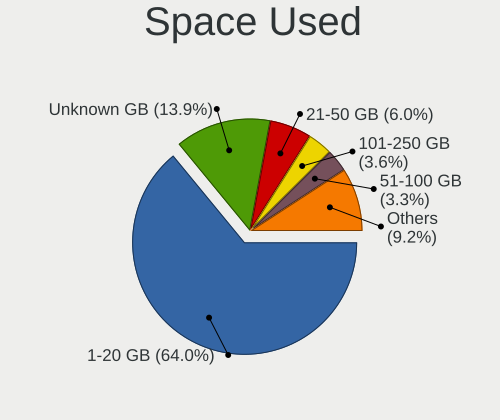

| Used GB        | Desktops | Percent |
|----------------|----------|---------|
| 1-20           | 9603     | 64.05%  |
| Unknown        | 2080     | 13.87%  |
| 21-50          | 907      | 6.05%   |
| 101-250        | 539      | 3.59%   |
| 51-100         | 489      | 3.26%   |
| 251-500        | 413      | 2.75%   |
| 501-1000       | 340      | 2.27%   |
| 1001-2000      | 215      | 1.43%   |
| 0              | 207      | 1.38%   |
| More than 3000 | 114      | 0.76%   |
| 2001-3000      | 87       | 0.58%   |

Malfunc. Drives
---------------

Drive models with a malfunction

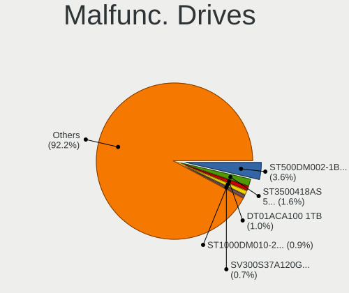

| Model                                                         | Desktops | Drives | Percent |
|---------------------------------------------------------------|----------|--------|---------|
| Seagate ST500DM002-1BD142 500GB                               | 177      | 202    | 3.64%   |
| Seagate ST3500418AS 500GB                                     | 76       | 89     | 1.56%   |
| Toshiba DT01ACA100 1TB                                        | 47       | 56     | 0.97%   |
| Seagate ST1000DM010-2EP102 1TB                                | 46       | 56     | 0.95%   |
| Kingston SV300S37A120G 120GB SSD                              | 36       | 38     | 0.74%   |
| Toshiba DT01ACA050 500GB                                      | 34       | 41     | 0.7%    |
| Seagate ST31000524AS 1TB                                      | 34       | 40     | 0.7%    |
| WDC WD5000AAKX-001CA0 500GB                                   | 33       | 36     | 0.68%   |
| Samsung Electronics NVMe SSD Controller SM981/PM981/PM983 1TB | 33       | 40     | 0.68%   |
| Seagate ST2000DM001-1CH164 2TB                                | 31       | 34     | 0.64%   |
| WDC WD10EARS-00Y5B1 1TB                                       | 30       | 35     | 0.62%   |
| Samsung Electronics HD322HJ 320GB                             | 30       | 34     | 0.62%   |
| Seagate ST3500413AS 500GB                                     | 29       | 32     | 0.6%    |
| Seagate ST1000DM003-1CH162 1TB                                | 29       | 36     | 0.6%    |
| WDC WD5000AAKX-75U6AA0 500GB                                  | 26       | 28     | 0.53%   |
| Seagate ST9500325AS 500GB                                     | 26       | 29     | 0.53%   |
| Hitachi HDS721050CLA362 500GB                                 | 26       | 34     | 0.53%   |
| Seagate ST31000528AS 1TB                                      | 25       | 30     | 0.51%   |
| Samsung Electronics HD161HJ 160GB                             | 24       | 25     | 0.49%   |
| Hitachi HDS721010CLA332 1TB                                   | 24       | 25     | 0.49%   |
| Seagate ST1000DM003-9YN162 1TB                                | 23       | 25     | 0.47%   |
| WDC WD5000AAKX-08U6AA0 500GB                                  | 22       | 23     | 0.45%   |
| Samsung Electronics HD502HJ 500GB                             | 22       | 23     | 0.45%   |
| WDC WDS240G2G0A-00JH30 240GB SSD                              | 21       | 23     | 0.43%   |
| Seagate ST3500312CS 500GB                                     | 21       | 23     | 0.43%   |
| WDC WD5000AAKX-00ERMA0 500GB                                  | 19       | 21     | 0.39%   |
| WDC WD10EZEX-08WN4A0 1TB                                      | 19       | 23     | 0.39%   |
| Seagate ST3320418AS 320GB                                     | 19       | 22     | 0.39%   |
| Seagate ST2000DM006-2DM164 2TB                                | 19       | 21     | 0.39%   |
| Seagate ST1000DM003-1ER162 1TB                                | 19       | 26     | 0.39%   |
| Samsung Electronics HD103SJ 1TB                               | 19       | 20     | 0.39%   |
| Samsung Electronics HD103SI 1TB                               | 19       | 21     | 0.39%   |
| WDC WD20EARX-00PASB0 2TB                                      | 18       | 19     | 0.37%   |
| Seagate ST3250318AS 250GB                                     | 18       | 18     | 0.37%   |
| Seagate ST250DM000-1BD141 250GB                               | 18       | 20     | 0.37%   |
| Samsung Electronics HD103UJ 1TB                               | 18       | 22     | 0.37%   |
| Maxtor STM3250310AS 250GB                                     | 18       | 19     | 0.37%   |
| Seagate ST500LT012-9WS142 500GB                               | 17       | 19     | 0.35%   |
| Seagate ST3320613AS 320GB                                     | 17       | 21     | 0.35%   |
| Seagate ST2000DM008-2FR102 2TB                                | 17       | 21     | 0.35%   |

Malfunc. Drive Vendor
---------------------

Vendors of faulty drives

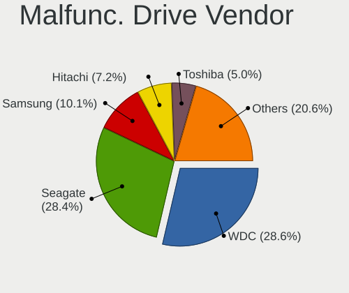

| Vendor                      | Desktops | Drives | Percent |
|-----------------------------|----------|--------|---------|
| WDC                         | 1336     | 1619   | 28.64%  |
| Seagate                     | 1326     | 1588   | 28.43%  |
| Samsung Electronics         | 473      | 580    | 10.14%  |
| Hitachi                     | 335      | 383    | 7.18%   |
| Toshiba                     | 235      | 261    | 5.04%   |
| Kingston                    | 116      | 131    | 2.49%   |
| Maxtor                      | 113      | 137    | 2.42%   |
| SanDisk                     | 80       | 92     | 1.72%   |
| Crucial                     | 66       | 78     | 1.42%   |
| HGST                        | 56       | 70     | 1.2%    |
| China                       | 55       | 60     | 1.18%   |
| A-DATA Technology           | 52       | 57     | 1.11%   |
| Intel                       | 48       | 49     | 1.03%   |
| Micron Technology           | 20       | 24     | 0.43%   |
| Realtek Semiconductor       | 17       | 18     | 0.36%   |
| OCZ                         | 16       | 18     | 0.34%   |
| SK hynix                    | 15       | 17     | 0.32%   |
| Netac                       | 15       | 15     | 0.32%   |
| Fujitsu                     | 15       | 16     | 0.32%   |
| SPCC                        | 14       | 14     | 0.3%    |
| Patriot                     | 12       | 12     | 0.26%   |
| Hewlett-Packard             | 12       | 14     | 0.26%   |
| Intenso                     | 9        | 11     | 0.19%   |
| ASMT                        | 9        | 9      | 0.19%   |
| Unknown                     | 9        | 9      | 0.19%   |
| GOODRAM                     | 8        | 8      | 0.17%   |
| Corsair                     | 8        | 9      | 0.17%   |
| PNY                         | 7        | 7      | 0.15%   |
| ExcelStor                   | 7        | 7      | 0.15%   |
| XPG                         | 6        | 6      | 0.13%   |
| HPE                         | 6        | 7      | 0.13%   |
| WD MediaMax                 | 5        | 6      | 0.11%   |
| Team                        | 5        | 5      | 0.11%   |
| MAXIO Technology (Hangzhou) | 5        | 6      | 0.11%   |
| IBM/Hitachi                 | 5        | 8      | 0.11%   |
| Apacer                      | 5        | 7      | 0.11%   |
| ADATA Technology            | 5        | 6      | 0.11%   |
| Unknown                     | 4        | 4      | 0.09%   |
| Plextor                     | 4        | 4      | 0.09%   |
| LITEON                      | 4        | 4      | 0.09%   |

Malfunc. HDD Vendor
-------------------

Vendors of faulty HDD drives

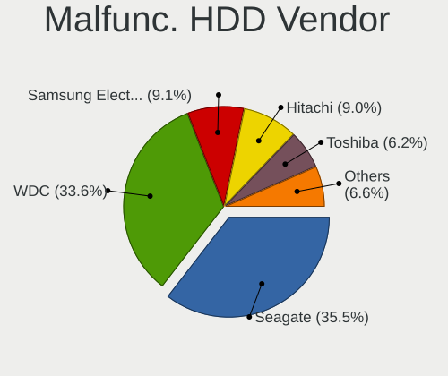

| Vendor              | Desktops | Drives | Percent |
|---------------------|----------|--------|---------|
| Seagate             | 1326     | 1588   | 35.47%  |
| WDC                 | 1257     | 1522   | 33.63%  |
| Samsung Electronics | 341      | 409    | 9.12%   |
| Hitachi             | 335      | 383    | 8.96%   |
| Toshiba             | 233      | 259    | 6.23%   |
| Maxtor              | 113      | 137    | 3.02%   |
| HGST                | 56       | 70     | 1.5%    |
| Fujitsu             | 14       | 15     | 0.37%   |
| Hewlett-Packard     | 8        | 9      | 0.21%   |
| ExcelStor           | 7        | 7      | 0.19%   |
| WD MediaMax         | 5        | 6      | 0.13%   |
| IBM/Hitachi         | 5        | 8      | 0.13%   |
| HPE                 | 4        | 5      | 0.11%   |
| USB3.0              | 3        | 3      | 0.08%   |
| Unknown             | 3        | 3      | 0.08%   |
| Apple               | 3        | 3      | 0.08%   |
| Unknown             | 3        | 3      | 0.08%   |
| QUANTUM             | 2        | 2      | 0.05%   |
| Magnetic Data       | 2        | 2      | 0.05%   |
| JMicron Technology  | 2        | 2      | 0.05%   |
| Initio              | 2        | 2      | 0.05%   |
| ASMT                | 2        | 2      | 0.05%   |
| ASMedia             | 2        | 2      | 0.05%   |
| TO Exter            | 1        | 1      | 0.03%   |
| StoreJet            | 1        | 1      | 0.03%   |
| SATAFIRM            | 1        | 1      | 0.03%   |
| SAGE                | 1        | 1      | 0.03%   |
| RSH-339             | 1        | 1      | 0.03%   |
| RSH-319             | 1        | 1      | 0.03%   |
| Inateck             | 1        | 1      | 0.03%   |
| IB                  | 1        | 1      | 0.03%   |
| HGST HTS            | 1        | 1      | 0.03%   |
| China               | 1        | 1      | 0.03%   |

Malfunc. Drive Kind
-------------------

Kinds of faulty drives

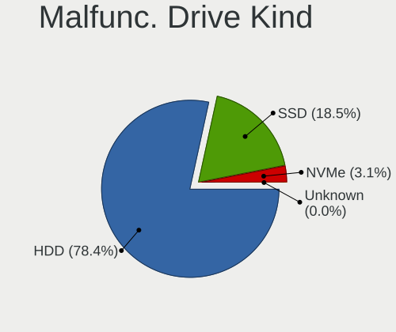

| Kind    | Desktops | Drives | Percent |
|---------|----------|--------|---------|
| HDD     | 3327     | 4452   | 78.41%  |
| SSD     | 785      | 905    | 18.5%   |
| NVMe    | 130      | 154    | 3.06%   |
| Unknown | 1        | 2      | 0.02%   |

Failed Drives
-------------

Failed drive models

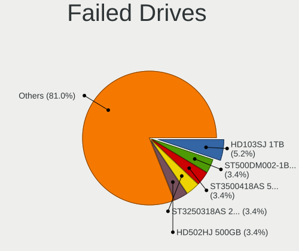

| Model                                                          | Desktops | Drives | Percent |
|----------------------------------------------------------------|----------|--------|---------|
| Samsung Electronics HD103SJ 1TB                                | 6        | 6      | 5.17%   |
| Seagate ST500DM002-1BD142 500GB                                | 4        | 4      | 3.45%   |
| Seagate ST3500418AS 500GB                                      | 4        | 6      | 3.45%   |
| Seagate ST3250318AS 250GB                                      | 4        | 4      | 3.45%   |
| Samsung Electronics HD502HJ 500GB                              | 4        | 4      | 3.45%   |
| Toshiba DT01ACA100 1TB                                         | 3        | 3      | 2.59%   |
| Seagate ST31000528AS 1TB                                       | 3        | 3      | 2.59%   |
| Apple HDD HTS541010A9E662 1TB                                  | 3        | 3      | 2.59%   |
| WDC WD800JD-00LSA0 80GB                                        | 2        | 3      | 1.72%   |
| WDC WD20EZRX-00D8PB0 2TB                                       | 2        | 2      | 1.72%   |
| WDC WD20EARS-00MVWB0 2TB                                       | 2        | 2      | 1.72%   |
| WDC WD10EZEX-22MFCA0 1TB                                       | 2        | 2      | 1.72%   |
| WDC WD10EZEX-08WN4A0 1TB                                       | 2        | 2      | 1.72%   |
| Toshiba MQ01ABF032 320GB                                       | 2        | 2      | 1.72%   |
| Toshiba MQ01ABD050 500GB                                       | 2        | 2      | 1.72%   |
| Toshiba DT01ACA050 500GB                                       | 2        | 2      | 1.72%   |
| Seagate ST3320418AS 320GB                                      | 2        | 2      | 1.72%   |
| Samsung Electronics NVMe SSD Controller PM9A1/PM9A3/980PRO 1TB | 2        | 5      | 1.72%   |
| Samsung Electronics HD103UJ 1TB                                | 2        | 4      | 1.72%   |
| WDC WD800JD-75MSA3 80GB                                        | 1        | 1      | 0.86%   |
| WDC WD800JD-00MSA1 80GB                                        | 1        | 1      | 0.86%   |
| WDC WD7501AALS-00J7B0 752GB                                    | 1        | 1      | 0.86%   |
| WDC WD7500BPVT-22HXZT3 752GB                                   | 1        | 1      | 0.86%   |
| WDC WD5000AZLX-60K2TA1 500GB                                   | 1        | 1      | 0.86%   |
| WDC WD5000AAKS-00C8A0 500GB                                    | 1        | 1      | 0.86%   |
| WDC WD3200BPVT-22JJ5T0 320GB                                   | 1        | 1      | 0.86%   |
| WDC WD3200BPVT-00JJ5T0 320GB                                   | 1        | 1      | 0.86%   |
| WDC WD3200AAKS-00VYA0 320GB                                    | 1        | 1      | 0.86%   |
| WDC WD3200AAJS-60Z0A0 320GB                                    | 1        | 1      | 0.86%   |
| WDC WD30EFRX-68EUZN0 3TB                                       | 1        | 1      | 0.86%   |
| WDC WD2500AAJS-08L7A0 250GB                                    | 1        | 1      | 0.86%   |
| WDC WD20EARS-00S8B1 2TB                                        | 1        | 1      | 0.86%   |
| WDC WD1600YS-23SHB0 160GB                                      | 1        | 1      | 0.86%   |
| WDC WD1600AAJS-00L7A0 160GB                                    | 1        | 1      | 0.86%   |
| WDC WD10JPVT-75A1YT0 1TB                                       | 1        | 1      | 0.86%   |
| WDC WD10EZEX-00BN5A0 1TB                                       | 1        | 1      | 0.86%   |
| WDC WD10EARS-00MVWB0 1TB                                       | 1        | 1      | 0.86%   |
| WDC WD10EALX-759BA1 1TB                                        | 1        | 1      | 0.86%   |
| WDC WD1002FAEX-00Z3A0 1TB                                      | 1        | 1      | 0.86%   |
| TPH00800640GB 640GB                                            | 1        | 1      | 0.86%   |

Failed Drive Vendor
-------------------

Failed drive vendors

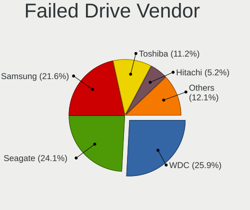

| Vendor                    | Desktops | Drives | Percent |
|---------------------------|----------|--------|---------|
| WDC                       | 30       | 31     | 25.86%  |
| Seagate                   | 28       | 31     | 24.14%  |
| Samsung Electronics       | 25       | 31     | 21.55%  |
| Toshiba                   | 13       | 13     | 11.21%  |
| Hitachi                   | 6        | 6      | 5.17%   |
| Kingston                  | 3        | 3      | 2.59%   |
| Apple                     | 3        | 3      | 2.59%   |
| TPH00800640GB             | 1        | 1      | 0.86%   |
| SK hynix                  | 1        | 8      | 0.86%   |
| Realtek Semiconductor     | 1        | 1      | 0.86%   |
| Micron/Crucial Technology | 1        | 1      | 0.86%   |
| Maxtor                    | 1        | 1      | 0.86%   |
| HGST                      | 1        | 1      | 0.86%   |
| GOODRAM                   | 1        | 1      | 0.86%   |
| China                     | 1        | 1      | 0.86%   |

Drive Status
------------

Number of failed and malfunc. drives

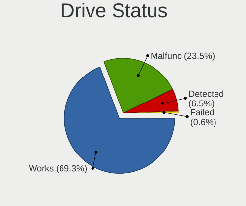

| Status   | Desktops | Drives | Percent |
|----------|----------|--------|---------|
| Works    | 11984    | 26998  | 69.3%   |
| Malfunc  | 4065     | 5513   | 23.51%  |
| Detected | 1131     | 1653   | 6.54%   |
| Failed   | 112      | 133    | 0.65%   |

Storage controller
------------------

Storage Vendor
--------------

Storage controller vendors

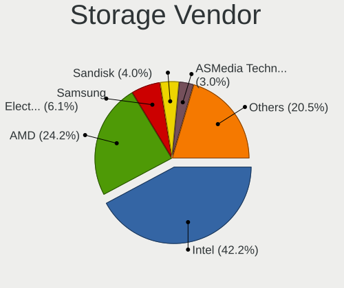

| Vendor                           | Desktops | Percent |
|----------------------------------|----------|---------|
| Intel                            | 8628     | 42.18%  |
| AMD                              | 4948     | 24.19%  |
| Samsung Electronics              | 1255     | 6.14%   |
| Sandisk                          | 815      | 3.98%   |
| ASMedia Technology               | 622      | 3.04%   |
| Kingston Technology Company      | 547      | 2.67%   |
| Phison Electronics               | 465      | 2.27%   |
| Micron/Crucial Technology        | 415      | 2.03%   |
| JMicron Technology               | 388      | 1.9%    |
| Nvidia                           | 337      | 1.65%   |
| Marvell Technology Group         | 332      | 1.62%   |
| Silicon Motion                   | 243      | 1.19%   |
| MAXIO Technology (Hangzhou)      | 230      | 1.12%   |
| ADATA Technology                 | 173      | 0.85%   |
| Realtek Semiconductor            | 138      | 0.67%   |
| Micron Technology                | 126      | 0.62%   |
| SK hynix                         | 123      | 0.6%    |
| VIA Technologies                 | 87       | 0.43%   |
| Shenzhen Longsys Electronics     | 80       | 0.39%   |
| Toshiba America Info Systems     | 61       | 0.3%    |
| KIOXIA                           | 59       | 0.29%   |
| Seagate Technology               | 44       | 0.22%   |
| INNOGRIT                         | 44       | 0.22%   |
| Broadcom / LSI                   | 33       | 0.16%   |
| Netac Technology                 | 24       | 0.12%   |
| LSI Logic / Symbios Logic        | 23       | 0.11%   |
| Hosin Global Electronics         | 22       | 0.11%   |
| Solidigm                         | 21       | 0.1%    |
| Silicon Image                    | 21       | 0.1%    |
| Biwin Storage Technology         | 21       | 0.1%    |
| Integrated Technology Express    | 17       | 0.08%   |
| Adaptec                          | 14       | 0.07%   |
| Lite-On Technology               | 12       | 0.06%   |
| Red Hat                          | 10       | 0.05%   |
| Solid State Storage Technology   | 9        | 0.04%   |
| Silicon Integrated Systems [SiS] | 8        | 0.04%   |
| TenaFe                           | 6        | 0.03%   |
| Unknown                          | 6        | 0.03%   |
| Transcend                        | 5        | 0.02%   |
| Promise Technology               | 5        | 0.02%   |

Storage Model
-------------

Storage controller models

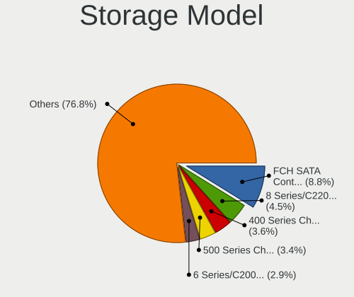

| Model                                                                                   | Desktops | Percent |
|-----------------------------------------------------------------------------------------|----------|---------|
| AMD FCH SATA Controller [AHCI mode]                                                     | 2222     | 8.82%   |
| Intel 8 Series/C220 Series Chipset Family 6-port SATA Controller 1 [AHCI mode]          | 1127     | 4.48%   |
| AMD 400 Series Chipset SATA Controller                                                  | 915      | 3.63%   |
| AMD 500 Series Chipset SATA Controller                                                  | 848      | 3.37%   |
| Intel 6 Series/C200 Series Chipset Family 6 port Desktop SATA AHCI Controller           | 732      | 2.91%   |
| Intel Q170/Q150/B150/H170/H110/Z170/CM236 Chipset SATA Controller [AHCI Mode]           | 660      | 2.62%   |
| Intel NM10/ICH7 Family SATA Controller [IDE mode]                                       | 643      | 2.55%   |
| AMD SB7x0/SB8x0/SB9x0 IDE Controller                                                    | 634      | 2.52%   |
| Intel 7 Series/C210 Series Chipset Family 6-port SATA Controller [AHCI mode]            | 633      | 2.51%   |
| Samsung NVMe SSD Controller SM981/PM981/PM983                                           | 598      | 2.37%   |
| Intel 200 Series PCH SATA controller [AHCI mode]                                        | 561      | 2.23%   |
| ASMedia ASM1061/ASM1062 Serial ATA Controller                                           | 538      | 2.14%   |
| AMD SB7x0/SB8x0/SB9x0 SATA Controller [AHCI mode]                                       | 496      | 1.97%   |
| Intel SATA Controller [RAID mode]                                                       | 489      | 1.94%   |
| Intel 82801G (ICH7 Family) IDE Controller                                               | 480      | 1.91%   |
| AMD SB7x0/SB8x0/SB9x0 SATA Controller [IDE mode]                                        | 445      | 1.77%   |
| AMD 600 Series Chipset SATA Controller                                                  | 439      | 1.74%   |
| Intel Cannon Lake PCH SATA AHCI Controller                                              | 378      | 1.5%    |
| Intel 6 Series/C200 Series Chipset Family Desktop SATA Controller (IDE mode, ports 4-5) | 329      | 1.31%   |
| Intel 6 Series/C200 Series Chipset Family Desktop SATA Controller (IDE mode, ports 0-3) | 327      | 1.3%    |
| AMD A320 Chipset SATA Controller [AHCI mode]                                            | 286      | 1.14%   |
| Samsung NVMe SSD Controller PM9A1/PM9A3/980PRO                                          | 258      | 1.02%   |
| Intel 500 Series Chipset Family SATA AHCI Controller                                    | 239      | 0.95%   |
| Intel Alder Lake-S PCH SATA Controller [AHCI Mode]                                      | 236      | 0.94%   |
| JMicron JMB363 SATA/IDE Controller                                                      | 217      | 0.86%   |
| AMD 300 Series Chipset SATA Controller                                                  | 211      | 0.84%   |
| Micron/Crucial P2 [Nick P2] / P3 / P3 Plus NVMe PCIe SSD (DRAM-less)                    | 204      | 0.81%   |
| Silicon Motion SM2263EN/SM2263XT (DRAM-less) NVMe SSD Controllers                       | 200      | 0.79%   |
| Samsung NVMe SSD Controller 980 (DRAM-less)                                             | 194      | 0.77%   |
| Nvidia MCP61 SATA Controller                                                            | 192      | 0.76%   |
| Intel 9 Series Chipset Family SATA Controller [AHCI Mode]                               | 184      | 0.73%   |
| Phison E12 NVMe Controller                                                              | 170      | 0.68%   |
| MAXIO (Hangzhou) NVMe SSD Controller MAP1202 (DRAM-less)                                | 169      | 0.67%   |
| Nvidia MCP61 IDE                                                                        | 168      | 0.67%   |
| Intel 5 Series/3400 Series Chipset 6 port SATA AHCI Controller                          | 152      | 0.6%    |
| Intel 4 Series Chipset PT IDER Controller                                               | 152      | 0.6%    |
| Intel Raptor Lake SATA AHCI Controller                                                  | 148      | 0.59%   |
| SanDisk Ultra 3D / WD PC SN530, IX SN530, Blue SN550 NVMe SSD (DRAM-less)               | 138      | 0.55%   |
| AMD FCH IDE Controller                                                                  | 137      | 0.54%   |
| Intel 82801I (ICH9 Family) 2 port SATA Controller [IDE mode]                            | 136      | 0.54%   |

Storage Kind
------------

Kind of storage controller (IDE, SATA, NVMe, SAS, ...)

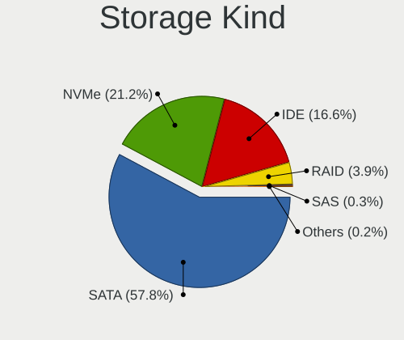

| Kind | Desktops | Percent |
|------|----------|---------|
| SATA | 11380    | 57.79%  |
| NVMe | 4180     | 21.23%  |
| IDE  | 3264     | 16.58%  |
| RAID | 774      | 3.93%   |
| SAS  | 55       | 0.28%   |
| SCSI | 39       | 0.2%    |

Processor
---------

CPU Vendor
----------

Processor vendors

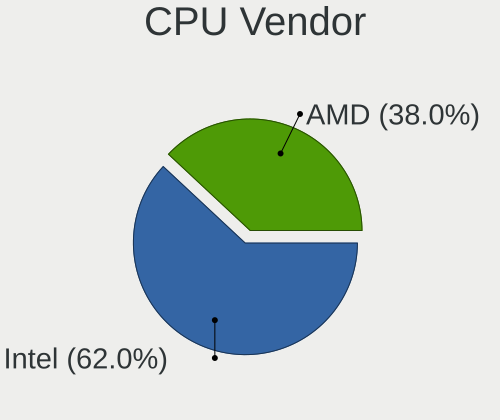

| Vendor | Desktops | Percent |
|--------|----------|---------|
| Intel  | 8704     | 61.95%  |
| AMD    | 5345     | 38.05%  |

CPU Model
---------

Processor models

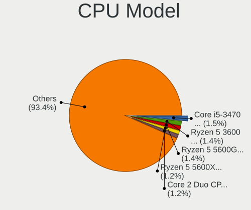

| Model                                       | Desktops | Percent |
|---------------------------------------------|----------|---------|
| Intel Core i5-3470 CPU @ 3.20GHz            | 218      | 1.54%   |
| AMD Ryzen 5 3600 6-Core Processor           | 198      | 1.4%    |
| AMD Ryzen 5 5600G with Radeon Graphics      | 195      | 1.38%   |
| AMD Ryzen 5 5600X 6-Core Processor          | 165      | 1.17%   |
| Intel Core 2 Duo CPU E8400 @ 3.00GHz        | 163      | 1.15%   |
| Intel Core i5-2400 CPU @ 3.10GHz            | 154      | 1.09%   |
| Intel Core i7-3770 CPU @ 3.40GHz            | 152      | 1.08%   |
| AMD Ryzen 7 3700X 8-Core Processor          | 148      | 1.05%   |
| Intel Core i5-6500 CPU @ 3.20GHz            | 138      | 0.98%   |
| Intel Core i7-4790 CPU @ 3.60GHz            | 131      | 0.93%   |
| AMD Ryzen 7 5800X 8-Core Processor          | 129      | 0.91%   |
| AMD Ryzen 7 5700G with Radeon Graphics      | 129      | 0.91%   |
| Intel Core i5-4570 CPU @ 3.20GHz            | 124      | 0.88%   |
| Intel Core i3-2120 CPU @ 3.30GHz            | 122      | 0.86%   |
| Intel Core i3-3220 CPU @ 3.30GHz            | 117      | 0.83%   |
| Intel Core i5-4590 CPU @ 3.30GHz            | 115      | 0.81%   |
| AMD Ryzen 5 2600 Six-Core Processor         | 115      | 0.81%   |
| AMD Ryzen 9 5900X 12-Core Processor         | 104      | 0.74%   |
| AMD FX-8350 Eight-Core Processor            | 103      | 0.73%   |
| Intel Core i3-2100 CPU @ 3.10GHz            | 99       | 0.7%    |
| Intel Core i5-10400 CPU @ 2.90GHz           | 97       | 0.69%   |
| Intel Core 2 Duo CPU E7500 @ 2.93GHz        | 94       | 0.66%   |
| AMD Ryzen 5 1600 Six-Core Processor         | 94       | 0.66%   |
| Intel Core i7-6700 CPU @ 3.40GHz            | 92       | 0.65%   |
| Intel Core i7-2600 CPU @ 3.40GHz            | 90       | 0.64%   |
| Intel Core i5-7400 CPU @ 3.00GHz            | 90       | 0.64%   |
| Intel Core i5-4460 CPU @ 3.20GHz            | 87       | 0.62%   |
| AMD Ryzen 7 2700X Eight-Core Processor      | 86       | 0.61%   |
| AMD Ryzen 3 2200G with Radeon Vega Graphics | 86       | 0.61%   |
| AMD Ryzen 7 5700X 8-Core Processor          | 85       | 0.6%    |
| AMD FX-6300 Six-Core Processor              | 84       | 0.59%   |
| Intel Core i7-8700 CPU @ 3.20GHz            | 81       | 0.57%   |
| AMD Ryzen 3 3200G with Radeon Vega Graphics | 81       | 0.57%   |
| Intel Core i7-7700 CPU @ 3.60GHz            | 78       | 0.55%   |
| Intel Core 2 Quad CPU Q6600 @ 2.40GHz       | 78       | 0.55%   |
| AMD Ryzen 9 3900X 12-Core Processor         | 78       | 0.55%   |
| AMD Ryzen 5 2400G with Radeon Vega Graphics | 74       | 0.52%   |
| Intel Core i7-4790K CPU @ 4.00GHz           | 71       | 0.5%    |
| Intel Core i7-4770 CPU @ 3.40GHz            | 71       | 0.5%    |
| Intel Core i5-3570 CPU @ 3.40GHz            | 71       | 0.5%    |

CPU Model Family
----------------

Processor model prefix

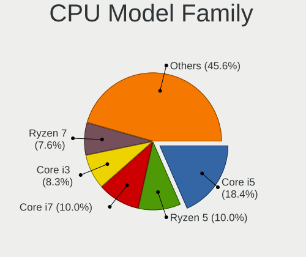

| Model                   | Desktops | Percent |
|-------------------------|----------|---------|
| Intel Core i5           | 2601     | 18.43%  |
| AMD Ryzen 5             | 1417     | 10.04%  |
| Intel Core i7           | 1414     | 10.02%  |
| Intel Core i3           | 1168     | 8.28%   |
| AMD Ryzen 7             | 1079     | 7.65%   |
| Other                   | 651      | 4.61%   |
| Intel Xeon              | 530      | 3.76%   |
| Intel Core 2 Duo        | 492      | 3.49%   |
| AMD FX                  | 468      | 3.32%   |
| Intel Celeron           | 458      | 3.25%   |
| AMD Ryzen 9             | 448      | 3.17%   |
| Intel Pentium           | 392      | 2.78%   |
| Intel Core 2 Quad       | 300      | 2.13%   |
| AMD Ryzen 3             | 263      | 1.86%   |
| Intel Pentium Dual-Core | 242      | 1.71%   |
| AMD A8                  | 185      | 1.31%   |
| AMD Phenom II X4        | 156      | 1.11%   |
| AMD Athlon II X2        | 155      | 1.1%    |
| AMD A10                 | 140      | 0.99%   |
| AMD Athlon 64 X2        | 121      | 0.86%   |
| Intel Core 2            | 102      | 0.72%   |
| AMD A4                  | 101      | 0.72%   |
| AMD Athlon              | 95       | 0.67%   |
| Intel Core i9           | 89       | 0.63%   |
| AMD A6                  | 81       | 0.57%   |
| Intel Pentium Dual      | 71       | 0.5%    |
| AMD Athlon II X4        | 68       | 0.48%   |
| AMD Phenom II X6        | 59       | 0.42%   |
| Intel Atom              | 58       | 0.41%   |
| Intel Pentium Gold      | 54       | 0.38%   |
| Intel Pentium 4         | 47       | 0.33%   |
| AMD Ryzen 5 PRO         | 46       | 0.33%   |
| AMD Phenom              | 46       | 0.33%   |
| Intel Pentium D         | 41       | 0.29%   |
| AMD Athlon X4           | 37       | 0.26%   |
| AMD Athlon II X3        | 37       | 0.26%   |
| AMD Sempron             | 36       | 0.26%   |
| AMD Athlon 64           | 36       | 0.26%   |
| AMD Phenom II X2        | 32       | 0.23%   |
| AMD Ryzen Threadripper  | 28       | 0.2%    |

CPU Cores
---------

Number of processor cores

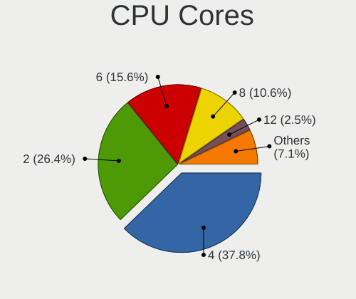

| Number  | Desktops | Percent |
|---------|----------|---------|
| 4       | 5342     | 37.76%  |
| 2       | 3735     | 26.4%   |
| 6       | 2203     | 15.57%  |
| 8       | 1500     | 10.6%   |
| 12      | 359      | 2.54%   |
| 1       | 294      | 2.08%   |
| 16      | 247      | 1.75%   |
| 3       | 148      | 1.05%   |
| 10      | 117      | 0.83%   |
| 14      | 78       | 0.55%   |
| 24      | 57       | 0.4%    |
| 20      | 38       | 0.27%   |
| 18      | 8        | 0.06%   |
| 32      | 5        | 0.04%   |
| 28      | 5        | 0.04%   |
| 44      | 3        | 0.02%   |
| 36      | 3        | 0.02%   |
| 112     | 1        | 0.01%   |
| 22      | 1        | 0.01%   |
| 5       | 1        | 0.01%   |
| Unknown | 1        | 0.01%   |

CPU Sockets
-----------

Number of sockets

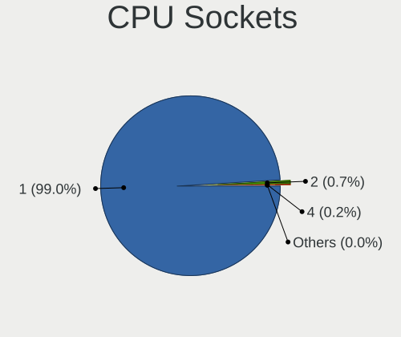

| Number | Desktops | Percent |
|--------|----------|---------|
| 1      | 13915    | 99.04%  |
| 2      | 103      | 0.73%   |
| 4      | 24       | 0.17%   |
| 8      | 4        | 0.03%   |
| 16     | 1        | 0.01%   |
| 14     | 1        | 0.01%   |
| 12     | 1        | 0.01%   |
| 6      | 1        | 0.01%   |

CPU Threads
-----------

Threads per core (Hyper-Threading)

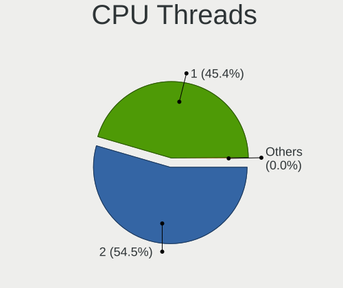

| Number  | Desktops | Percent |
|---------|----------|---------|
| 2       | 7697     | 54.5%   |
| 1       | 6406     | 45.36%  |
| 4       | 9        | 0.06%   |
| 12      | 4        | 0.03%   |
| 8       | 4        | 0.03%   |
| 6       | 1        | 0.01%   |
| Unknown | 1        | 0.01%   |

CPU Op-Modes
------------

CPU Operation Modes (32-bit, 64-bit)

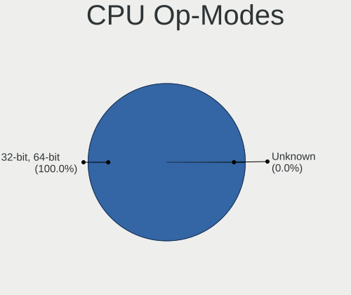

| Op mode        | Desktops | Percent |
|----------------|----------|---------|
| 32-bit, 64-bit | 14045    | 99.98%  |
| Unknown        | 3        | 0.02%   |

CPU Microcode
-------------

Microcode number

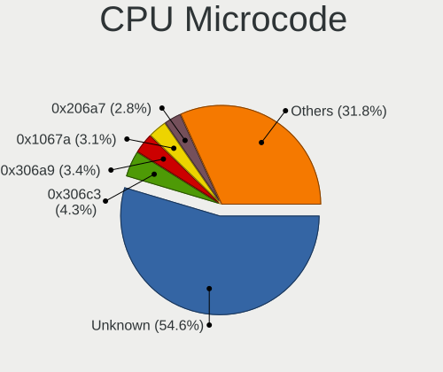

| Number     | Desktops | Percent |
|------------|----------|---------|
| Unknown    | 8064     | 54.6%   |
| 0x306c3    | 635      | 4.3%    |
| 0x306a9    | 496      | 3.36%   |
| 0x1067a    | 460      | 3.11%   |
| 0x206a7    | 418      | 2.83%   |
| 0x08701021 | 267      | 1.81%   |
| 0x506e3    | 205      | 1.39%   |
| 0x06001119 | 170      | 1.15%   |
| 0x906ea    | 160      | 1.08%   |
| 0x0800820d | 159      | 1.08%   |
| 0x010000c8 | 159      | 1.08%   |
| 0x906e9    | 151      | 1.02%   |
| 0x08108109 | 134      | 0.91%   |
| 0x08101016 | 119      | 0.81%   |
| 0x06000822 | 119      | 0.81%   |
| 0x06003106 | 102      | 0.69%   |
| 0xa0653    | 95       | 0.64%   |
| 0x0a50000d | 93       | 0.63%   |
| 0x6fb      | 83       | 0.56%   |
| 0x6fd      | 78       | 0.53%   |
| 0x08001138 | 75       | 0.51%   |
| 0xa0655    | 73       | 0.49%   |
| 0x0a50000c | 71       | 0.48%   |
| 0x010000b6 | 71       | 0.48%   |
| 0x0a20120a | 69       | 0.47%   |
| 0x10676    | 66       | 0.45%   |
| 0x0600081c | 65       | 0.44%   |
| 0x106e5    | 63       | 0.43%   |
| 0x0a201016 | 62       | 0.42%   |
| 0x20655    | 54       | 0.37%   |
| 0x906eb    | 51       | 0.35%   |
| 0x0600611a | 49       | 0.33%   |
| 0x08600106 | 48       | 0.33%   |
| 0xa0671    | 44       | 0.3%    |
| 0x08701030 | 43       | 0.29%   |
| 0x906ed    | 42       | 0.28%   |
| 0x010000bf | 41       | 0.28%   |
| 0x03000027 | 40       | 0.27%   |
| 0x106a5    | 38       | 0.26%   |
| 0x6f6      | 36       | 0.24%   |

CPU Microarch
-------------

Microarchitecture

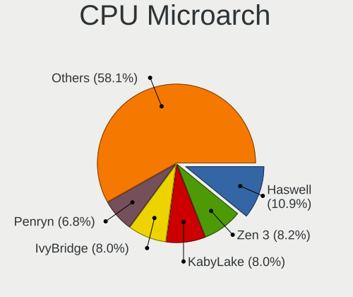

| Name             | Desktops | Percent |
|------------------|----------|---------|
| Haswell          | 1533     | 10.87%  |
| Zen 3            | 1156     | 8.2%    |
| KabyLake         | 1133     | 8.04%   |
| IvyBridge        | 1127     | 7.99%   |
| Penryn           | 952      | 6.75%   |
| SandyBridge      | 882      | 6.26%   |
| Zen 2            | 728      | 5.16%   |
| Skylake          | 696      | 4.94%   |
| Piledriver       | 617      | 4.38%   |
| K10              | 589      | 4.18%   |
| Zen+             | 569      | 4.04%   |
| Unknown          | 545      | 3.87%   |
| Zen              | 437      | 3.1%    |
| Alderlake Hybrid | 407      | 2.89%   |
| CometLake        | 376      | 2.67%   |
| Core             | 372      | 2.64%   |
| Westmere         | 222      | 1.57%   |
| Nehalem          | 202      | 1.43%   |
| K8 Hammer        | 194      | 1.38%   |
| Steamroller      | 168      | 1.19%   |
| Icelake          | 142      | 1.01%   |
| Silvermont       | 138      | 0.98%   |
| Gracemont        | 106      | 0.75%   |
| Excavator        | 106      | 0.75%   |
| NetBurst         | 99       | 0.7%    |
| Bulldozer        | 88       | 0.62%   |
| Broadwell        | 81       | 0.57%   |
| Goldmont plus    | 70       | 0.5%    |
| K10 Llano        | 63       | 0.45%   |
| Jaguar           | 56       | 0.4%    |
| Bobcat           | 52       | 0.37%   |
| Tremont          | 47       | 0.33%   |
| Bonnell          | 45       | 0.32%   |
| Goldmont         | 37       | 0.26%   |
| Puma             | 36       | 0.26%   |
| Lunarlake Hybrid | 15       | 0.11%   |
| TigerLake        | 9        | 0.06%   |
| Sapphire Rapids  | 2        | 0.01%   |

Graphics
--------

GPU Vendor
----------

Vendors of graphics cards

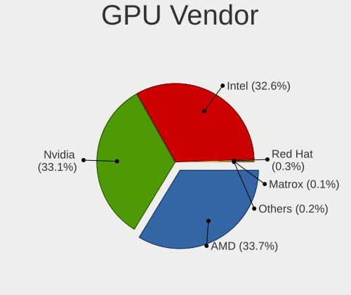

| Vendor                                       | Desktops | Percent |
|----------------------------------------------|----------|---------|
| AMD                                          | 5002     | 33.7%   |
| Nvidia                                       | 4916     | 33.12%  |
| Intel                                        | 4845     | 32.64%  |
| Red Hat                                      | 38       | 0.26%   |
| Matrox Electronics Systems                   | 14       | 0.09%   |
| ATI Technologies                             | 9        | 0.06%   |
| VIA Technologies                             | 7        | 0.05%   |
| NVidia / SGS Thomson (Joint Venture)         | 3        | 0.02%   |
| ASPEED Technology                            | 3        | 0.02%   |
| Silicon Integrated Systems [SiS]             | 2        | 0.01%   |
| XGI Technology (eXtreme Graphics Innovation) | 1        | 0.01%   |
| S3 Graphics                                  | 1        | 0.01%   |
| Conexant Systems                             | 1        | 0.01%   |

GPU Model
---------

Graphics card models

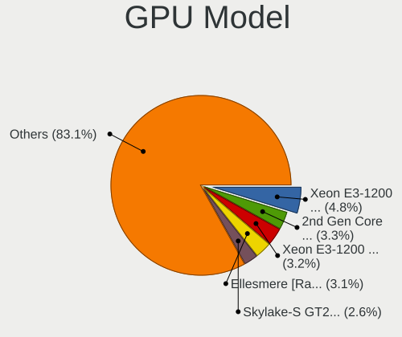

| Model                                                                       | Desktops | Percent |
|-----------------------------------------------------------------------------|----------|---------|
| Intel Xeon E3-1200 v3/4th Gen Core Processor Integrated Graphics Controller | 736      | 4.79%   |
| Intel 2nd Generation Core Processor Family Integrated Graphics Controller   | 503      | 3.27%   |
| Intel Xeon E3-1200 v2/3rd Gen Core processor Graphics Controller            | 495      | 3.22%   |
| AMD Ellesmere [Radeon RX 470/480/570/570X/580/580X/590]                     | 471      | 3.07%   |
| Intel Skylake-S GT2 [HD Graphics 530]                                       | 393      | 2.56%   |
| Intel 4 Series Chipset Integrated Graphics Controller                       | 381      | 2.48%   |
| Nvidia GK208B [GeForce GT 710]                                              | 294      | 1.91%   |
| AMD Cezanne [Radeon Vega Series / Radeon Vega Mobile Series]                | 288      | 1.88%   |
| Intel CoffeeLake-S GT2 [UHD Graphics 630]                                   | 287      | 1.87%   |
| Nvidia GP107 [GeForce GTX 1050 Ti]                                          | 256      | 1.67%   |
| Intel Kaby Lake-S GT2 [HD Graphics 630]                                     | 236      | 1.54%   |
| Nvidia GP108 [GeForce GT 1030]                                              | 228      | 1.48%   |
| AMD Navi 23 [Radeon RX 6600/6600 XT/6600M]                                  | 219      | 1.43%   |
| AMD Raphael                                                                 | 214      | 1.39%   |
| Nvidia GT218 [GeForce 210]                                                  | 209      | 1.36%   |
| AMD Picasso/Raven 2 [Radeon Vega Series / Radeon Vega Mobile Series]        | 204      | 1.33%   |
| AMD Raven Ridge [Radeon Vega Series / Radeon Vega Mobile Series]            | 199      | 1.3%    |
| Intel 4th Generation Core Processor Family Integrated Graphics Controller   | 183      | 1.19%   |
| AMD Navi 22 [Radeon RX 6700/6700 XT/6750 XT / 6800M/6850M XT]               | 174      | 1.13%   |
| Intel CometLake-S GT2 [UHD Graphics 630]                                    | 171      | 1.11%   |
| Nvidia GK208B [GeForce GT 730]                                              | 167      | 1.09%   |
| AMD Navi 10 [Radeon RX 5600 OEM/5600 XT / 5700/5700 XT]                     | 141      | 0.92%   |
| Nvidia GP106 [GeForce GTX 1060 6GB]                                         | 140      | 0.91%   |
| AMD Cedar [Radeon HD 5000/6000/7350/8350 Series]                            | 140      | 0.91%   |
| AMD Lexa PRO [Radeon 540/540X/550/550X / RX 540X/550/550X]                  | 134      | 0.87%   |
| AMD Navi 31 [Radeon RX 7900 XT/7900 XTX/7900 GRE/7900M]                     | 127      | 0.83%   |
| Nvidia GM107 [GeForce GTX 750 Ti]                                           | 117      | 0.76%   |
| AMD Navi 21 [Radeon RX 6800/6800 XT / 6900 XT]                              | 117      | 0.76%   |
| Intel IvyBridge GT2 [HD Graphics 4000]                                      | 114      | 0.74%   |
| AMD Kaveri [Radeon R7 Graphics]                                             | 113      | 0.74%   |
| Nvidia TU117 [GeForce GTX 1650]                                             | 111      | 0.72%   |
| Nvidia GP107 [GeForce GTX 1050]                                             | 104      | 0.68%   |
| AMD RS780L [Radeon 3000]                                                    | 104      | 0.68%   |
| AMD Navi 32 [Radeon RX 7700 XT / 7800 XT]                                   | 104      | 0.68%   |
| Nvidia GF119 [GeForce GT 610]                                               | 103      | 0.67%   |
| AMD Caicos [Radeon HD 6450/7450/8450 / R5 230 OEM]                          | 101      | 0.66%   |
| Intel Alder Lake-N [UHD Graphics]                                           | 100      | 0.65%   |
| Intel 82G33/G31 Express Integrated Graphics Controller                      | 93       | 0.61%   |
| Nvidia GA106 [GeForce RTX 3060 Lite Hash Rate]                              | 92       | 0.6%    |
| AMD Baffin [Radeon RX 550 640SP / RX 560/560X]                              | 91       | 0.59%   |

GPU Combo
---------

Combinations of graphics cards

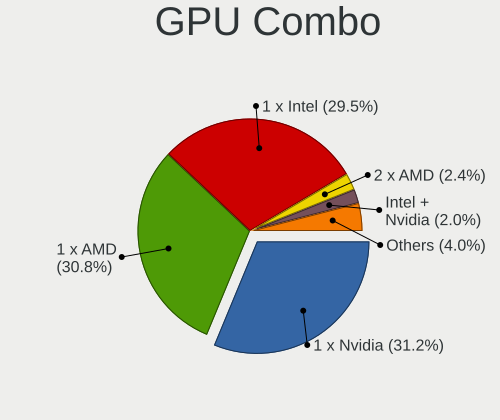

| Name                                          | Desktops | Percent |
|-----------------------------------------------|----------|---------|
| 1 x Nvidia                                    | 4455     | 31.25%  |
| 1 x AMD                                       | 4386     | 30.77%  |
| 1 x Intel                                     | 4207     | 29.51%  |
| 2 x AMD                                       | 348      | 2.44%   |
| Intel + Nvidia                                | 287      | 2.01%   |
| 2 x Intel                                     | 169      | 1.19%   |
| AMD + Nvidia                                  | 154      | 1.08%   |
| Intel + AMD                                   | 135      | 0.95%   |
| 1 x Red Hat                                   | 38       | 0.27%   |
| 2 x Nvidia                                    | 31       | 0.22%   |
| 1 x Matrox                                    | 12       | 0.08%   |
| 1 x VIA                                       | 7        | 0.05%   |
| Intel + AMD + 1 x Nvidia                      | 4        | 0.03%   |
| 3 x AMD                                       | 3        | 0.02%   |
| 1 x SiS                                       | 2        | 0.01%   |
| 1 x NVidia / SGS Thomson (Joint Venture)      | 2        | 0.01%   |
| Nvidia + Matrox                               | 2        | 0.01%   |
| Nvidia + ASPEED                               | 2        | 0.01%   |
| Intel + 2 x Nvidia                            | 2        | 0.01%   |
| AMD + 2 x Nvidia                              | 2        | 0.01%   |
| 2 x Intel + 1 x Nvidia                        | 1        | 0.01%   |
| 2 x AMD + 1 x Nvidia                          | 1        | 0.01%   |
| 1 x XGI                                       | 1        | 0.01%   |
| 1 x S3 Graphics                               | 1        | 0.01%   |
| Nvidia + NVidia / SGS Thomson (Joint Venture) | 1        | 0.01%   |
| Intel + Conexant Systems                      | 1        | 0.01%   |
| 1 x ASPEED                                    | 1        | 0.01%   |
| AMD + Matrox                                  | 1        | 0.01%   |

GPU Driver
----------

Free vs proprietary

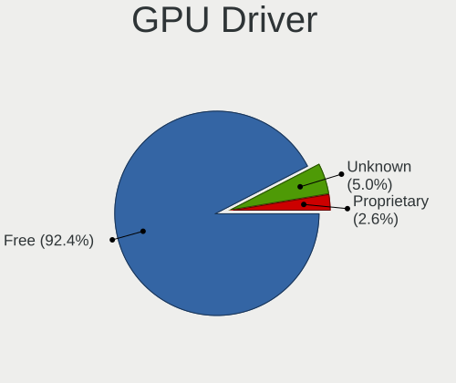

| Driver      | Desktops | Percent |
|-------------|----------|---------|
| Free        | 13131    | 92.42%  |
| Unknown     | 708      | 4.98%   |
| Proprietary | 369      | 2.6%    |

GPU Memory
----------

Total video memory

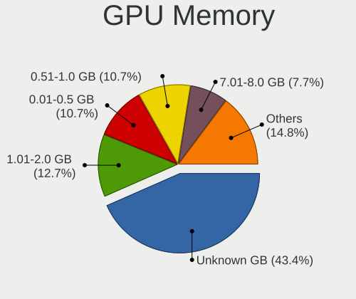

| Size in GB | Desktops | Percent |
|------------|----------|---------|
| Unknown    | 6266     | 43.41%  |
| 1.01-2.0   | 1839     | 12.74%  |
| 0.01-0.5   | 1546     | 10.71%  |
| 0.51-1.0   | 1540     | 10.67%  |
| 7.01-8.0   | 1110     | 7.69%   |
| 3.01-4.0   | 990      | 6.86%   |
| 8.01-16.0  | 631      | 4.37%   |
| 5.01-6.0   | 284      | 1.97%   |
| 16.01-24.0 | 120      | 0.83%   |
| 2.01-3.0   | 103      | 0.71%   |
| 4.01-5.0   | 5        | 0.03%   |

Monitor
-------

Monitor Vendor
--------------

Monitor vendors

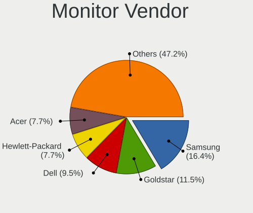

| Vendor               | Desktops | Percent |
|----------------------|----------|---------|
| Samsung Electronics  | 2362     | 16.39%  |
| Goldstar             | 1659     | 11.51%  |
| Dell                 | 1365     | 9.47%   |
| Hewlett-Packard      | 1115     | 7.74%   |
| Acer                 | 1106     | 7.68%   |
| AOC                  | 798      | 5.54%   |
| Philips              | 705      | 4.89%   |
| BenQ                 | 580      | 4.03%   |
| Ancor Communications | 534      | 3.71%   |
| ASUSTek Computer     | 372      | 2.58%   |
| ViewSonic            | 346      | 2.4%    |
| Iiyama               | 308      | 2.14%   |
| Lenovo               | 241      | 1.67%   |
| MSI                  | 197      | 1.37%   |
| Sony                 | 170      | 1.18%   |
| NEC Computers        | 116      | 0.81%   |
| Fujitsu Siemens      | 110      | 0.76%   |
| Eizo                 | 107      | 0.74%   |
| Sceptre Tech         | 99       | 0.69%   |
| Gigabyte Technology  | 81       | 0.56%   |
| Panasonic            | 65       | 0.45%   |
| HannStar             | 65       | 0.45%   |
| Vizio                | 62       | 0.43%   |
| Toshiba              | 55       | 0.38%   |
| Unknown              | 51       | 0.35%   |
| Hitachi              | 47       | 0.33%   |
| RTK                  | 46       | 0.32%   |
| Unknown (XXX)        | 44       | 0.31%   |
| Medion               | 44       | 0.31%   |
| HKC                  | 44       | 0.31%   |
| Sharp                | 42       | 0.29%   |
| Insignia             | 41       | 0.28%   |
| RHT                  | 38       | 0.26%   |
| Vestel Elektronik    | 37       | 0.26%   |
| Mi                   | 33       | 0.23%   |
| SKG                  | 30       | 0.21%   |
| Packard Bell         | 28       | 0.19%   |
| Belinea              | 28       | 0.19%   |
| ___                  | 27       | 0.19%   |
| Gateway              | 24       | 0.17%   |

Monitor Model
-------------

Monitor models

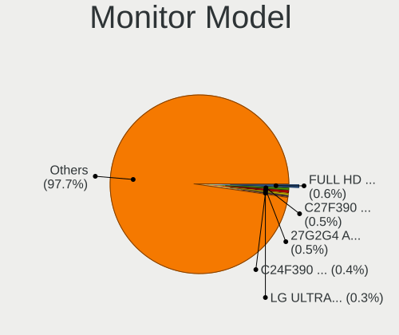

| Model                                                                 | Desktops | Percent |
|-----------------------------------------------------------------------|----------|---------|
| Goldstar FULL HD GSM5B55 1920x1080 480x270mm 21.7-inch                | 90       | 0.61%   |
| Samsung Electronics C27F390 SAM0D32 1920x1080 598x336mm 27.0-inch     | 72       | 0.49%   |
| AOC 27G2G4 AOC2702 1920x1080 598x336mm 27.0-inch                      | 72       | 0.49%   |
| Samsung Electronics C24F390 SAM0D2C 1920x1080 521x293mm 23.5-inch     | 61       | 0.41%   |
| Goldstar LG ULTRAWIDE GSM59F1 2560x1080 670x280mm 28.6-inch           | 45       | 0.3%    |
| AOC 24G2W1G3 AOC2402 1920x1080 527x296mm 23.8-inch                    | 44       | 0.3%    |
| RHT QEMU Monitor RHT1234 2048x1152 325x203mm 15.1-inch                | 38       | 0.26%   |
| Vestel Elektronik 40UHD_LCD_TV VES3700 3840x2160 880x500mm 39.8-inch  | 37       | 0.25%   |
| Samsung Electronics S24F350 SAM0D20 1920x1080 521x293mm 23.5-inch     | 37       | 0.25%   |
| Goldstar LG IPS FULLHD GSM5AB8 1920x1080 480x270mm 21.7-inch          | 35       | 0.24%   |
| Ancor Communications ASUS VS247 ACI249A 1920x1080 521x293mm 23.5-inch | 35       | 0.24%   |
| Philips PHL 243V7 PHLC155 1920x1080 527x296mm 23.8-inch               | 34       | 0.23%   |
| Panasonic TV MEIA296 1920x1080 698x392mm 31.5-inch                    | 33       | 0.22%   |
| Dell U2412M DELA07A 1920x1200 518x324mm 24.1-inch                     | 33       | 0.22%   |
| AOC 2270W AOC2270 1920x1080 477x268mm 21.5-inch                       | 32       | 0.22%   |
| Samsung Electronics U28E590 SAM0C4D 3840x2160 607x345mm 27.5-inch     | 30       | 0.2%    |
| Goldstar Ultra HD GSM5B09 3840x2160 600x340mm 27.2-inch               | 30       | 0.2%    |
| Philips PHL 223V5 PHLC0CF 1920x1080 477x268mm 21.5-inch               | 29       | 0.2%    |
| Samsung Electronics C32F391 SAM0D34 1920x1080 698x393mm 31.5-inch     | 28       | 0.19%   |
| AOC 24B1W1 AOC2401 1920x1080 527x296mm 23.8-inch                      | 28       | 0.19%   |
| Ancor Communications ASUS VP228 ACI22C3 1920x1080 476x268mm 21.5-inch | 28       | 0.19%   |
| AOC G2460 AOC2460 1920x1080 531x299mm 24.0-inch                       | 27       | 0.18%   |
| Philips PHL 243V5 PHLC0D1 1920x1080 521x293mm 23.5-inch               | 26       | 0.18%   |
| Hewlett-Packard w1907 HWP26A2 1440x900 408x255mm 18.9-inch            | 26       | 0.18%   |
| AOC Q3279WG5B AOC3279 2560x1440 725x428mm 33.1-inch                   | 26       | 0.18%   |
| Goldstar Ultra HD GSM5B08 3840x2160 600x340mm 27.2-inch               | 24       | 0.16%   |
| Goldstar HDR 4K GSM7707 3840x2160 600x340mm 27.2-inch                 | 24       | 0.16%   |
| Samsung Electronics LF24T35 SAM707D 1920x1080 528x297mm 23.9-inch     | 23       | 0.16%   |
| Goldstar HDR 4K GSM7706 3840x2160 600x340mm 27.2-inch                 | 23       | 0.16%   |
| Dell D1918H DEL2005 1366x768 410x230mm 18.5-inch                      | 23       | 0.16%   |
| AOC 1970W AOC1970 1366x768 410x230mm 18.5-inch                        | 23       | 0.16%   |
| BenQ GW2270 BNQ78DB 1920x1080 476x268mm 21.5-inch                     | 22       | 0.15%   |
| Ancor Communications VS248 ACI2498 1920x1080 531x299mm 24.0-inch      | 22       | 0.15%   |
| Philips PHL 273V7 PHLC156 1920x1080 598x336mm 27.0-inch               | 21       | 0.14%   |
| MStar Demo MST0030 1920x1080 708x398mm 32.0-inch                      | 21       | 0.14%   |
| Goldstar FULL HD GSM5B54 1920x1080 480x270mm 21.7-inch                | 21       | 0.14%   |
| Unknown (XXX) Beyond TV XXX2851 3840x2160 1209x680mm 54.6-inch        | 20       | 0.13%   |
| Lenovo LT2252p Wide LEN0A0C 1680x1050 474x296mm 22.0-inch             | 20       | 0.13%   |
| Goldstar W1943 GSM4BAD 1360x768 406x229mm 18.4-inch                   | 20       | 0.13%   |
| Goldstar 27GL850 GSM5B7F 2560x1440 597x336mm 27.0-inch                | 20       | 0.13%   |

Monitor Resolution
------------------

Monitor screen resolution

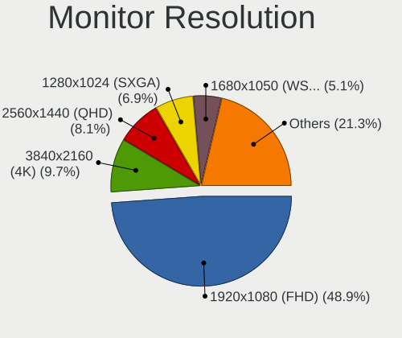

| Resolution         | Desktops | Percent |
|--------------------|----------|---------|
| 1920x1080 (FHD)    | 6850     | 48.87%  |
| 3840x2160 (4K)     | 1361     | 9.71%   |
| 2560x1440 (QHD)    | 1135     | 8.1%    |
| 1280x1024 (SXGA)   | 973      | 6.94%   |
| 1680x1050 (WSXGA+) | 713      | 5.09%   |
| 1366x768 (WXGA)    | 585      | 4.17%   |
| 1440x900 (WXGA+)   | 512      | 3.65%   |
| 1600x900 (HD+)     | 434      | 3.1%    |
| 1920x1200 (WUXGA)  | 367      | 2.62%   |
| 3440x1440          | 264      | 1.88%   |
| 1360x768           | 203      | 1.45%   |
| 2560x1080          | 137      | 0.98%   |
| 1920x540           | 90       | 0.64%   |
| 1024x768 (XGA)     | 73       | 0.52%   |
| 1600x1200          | 55       | 0.39%   |
| 3840x1080          | 47       | 0.34%   |
| 2560x1397          | 38       | 0.27%   |
| 1280x720 (HD)      | 27       | 0.19%   |
| 2560x1600          | 24       | 0.17%   |
| 3840x1600          | 22       | 0.16%   |
| 2288x1287          | 19       | 0.14%   |
| 1280x960           | 19       | 0.14%   |
| Unknown            | 12       | 0.09%   |
| 2160x1440          | 7        | 0.05%   |
| 2048x1152          | 7        | 0.05%   |
| 1400x1050          | 5        | 0.04%   |
| 1280x768           | 5        | 0.04%   |
| 1152x864           | 4        | 0.03%   |
| 2048x1536          | 3        | 0.02%   |
| 3840x2560          | 2        | 0.01%   |
| 3840x1200          | 2        | 0.01%   |
| 2880x1800          | 2        | 0.01%   |
| 2256x1504          | 2        | 0.01%   |
| 1280x800 (WXGA)    | 2        | 0.01%   |
| 1024x600           | 2        | 0.01%   |
| 8320x1440          | 1        | 0.01%   |
| 6000x1440          | 1        | 0.01%   |
| 5760x2160          | 1        | 0.01%   |
| 5120x1440          | 1        | 0.01%   |
| 4480x2023          | 1        | 0.01%   |

Monitor Diagonal
----------------

Diagonal size in inches

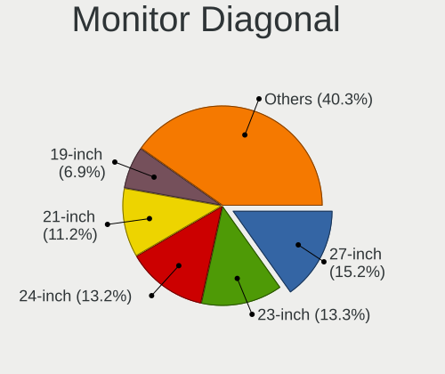

| Inches  | Desktops | Percent |
|---------|----------|---------|
| 27      | 2186     | 15.18%  |
| 23      | 1911     | 13.27%  |
| 24      | 1894     | 13.15%  |
| 21      | 1618     | 11.24%  |
| 19      | 994      | 6.9%    |
| 31      | 928      | 6.44%   |
| 18      | 634      | 4.4%    |
| 22      | 550      | 3.82%   |
| 17      | 516      | 3.58%   |
| 20      | 489      | 3.4%    |
| 34      | 355      | 2.47%   |
| Unknown | 241      | 1.67%   |
| 84      | 224      | 1.56%   |
| 15      | 215      | 1.49%   |
| 32      | 208      | 1.44%   |
| 40      | 145      | 1.01%   |
| 72      | 143      | 0.99%   |
| 54      | 141      | 0.98%   |
| 25      | 82       | 0.57%   |
| 26      | 81       | 0.56%   |
| 29      | 72       | 0.5%    |
| 28      | 67       | 0.47%   |
| 48      | 57       | 0.4%    |
| 63      | 53       | 0.37%   |
| 52      | 51       | 0.35%   |
| 65      | 46       | 0.32%   |
| 49      | 42       | 0.29%   |
| 46      | 41       | 0.28%   |
| 42      | 37       | 0.26%   |
| 37      | 37       | 0.26%   |
| 33      | 27       | 0.19%   |
| 74      | 26       | 0.18%   |
| 35      | 25       | 0.17%   |
| 36      | 24       | 0.17%   |
| 39      | 22       | 0.15%   |
| 16      | 22       | 0.15%   |
| 43      | 21       | 0.15%   |
| 12      | 18       | 0.12%   |
| 142     | 17       | 0.12%   |
| 14      | 15       | 0.1%    |

Monitor Width
-------------

Physical width

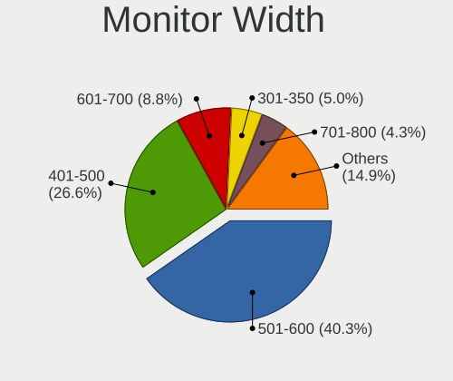

| Width in mm    | Desktops | Percent |
|----------------|----------|---------|
| 501-600        | 5665     | 40.34%  |
| 401-500        | 3737     | 26.61%  |
| 601-700        | 1238     | 8.82%   |
| 301-350        | 698      | 4.97%   |
| 701-800        | 609      | 4.34%   |
| 351-400        | 579      | 4.12%   |
| 1001-1500      | 498      | 3.55%   |
| 1501-2000      | 412      | 2.93%   |
| Unknown        | 241      | 1.72%   |
| 801-900        | 240      | 1.71%   |
| 901-1000       | 70       | 0.5%    |
| 201-300        | 40       | 0.28%   |
| More than 2000 | 17       | 0.12%   |

Aspect Ratio
------------

Proportional relationship between the width and the height

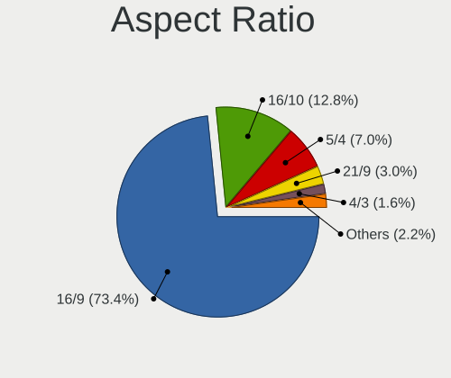

| Ratio   | Desktops | Percent |
|---------|----------|---------|
| 16/9    | 9993     | 73.42%  |
| 16/10   | 1736     | 12.76%  |
| 5/4     | 958      | 7.04%   |
| 21/9    | 404      | 2.97%   |
| 4/3     | 213      | 1.57%   |
| Unknown | 85       | 0.62%   |
| 3/2     | 78       | 0.57%   |
| 32/9    | 75       | 0.55%   |
| 6/5     | 25       | 0.18%   |
| 1.00    | 17       | 0.12%   |
| 1.96    | 9        | 0.07%   |
| 2.00    | 5        | 0.04%   |
| 2.12    | 3        | 0.02%   |
| 0.56    | 3        | 0.02%   |
| 3.20    | 2        | 0.01%   |
| 3.75    | 1        | 0.01%   |
| 2.70    | 1        | 0.01%   |
| 2.01    | 1        | 0.01%   |
| 0.75    | 1        | 0.01%   |

Monitor Area
------------

Area in inch²

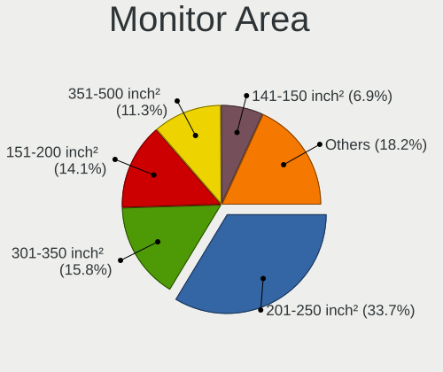

| Area in inch² | Desktops | Percent |
|----------------|----------|---------|
| 201-250        | 4781     | 33.66%  |
| 301-350        | 2251     | 15.85%  |
| 151-200        | 2005     | 14.12%  |
| 351-500        | 1602     | 11.28%  |
| 141-150        | 982      | 6.91%   |
| More than 1000 | 813      | 5.72%   |
| 251-300        | 769      | 5.41%   |
| 501-1000       | 438      | 3.08%   |
| Unknown        | 241      | 1.7%    |
| 101-110        | 179      | 1.26%   |
| 111-120        | 42       | 0.3%    |
| 131-140        | 41       | 0.29%   |
| 71-80          | 20       | 0.14%   |
| 121-130        | 14       | 0.1%    |
| 81-90          | 10       | 0.07%   |
| 91-100         | 9        | 0.06%   |
| 51-60          | 2        | 0.01%   |
| 41-50          | 2        | 0.01%   |
| 61-70          | 1        | 0.01%   |

Pixel Density
-------------

Pixels per inch

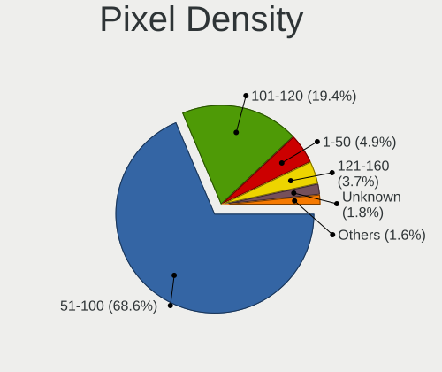

| Density       | Desktops | Percent |
|---------------|----------|---------|
| 51-100        | 9426     | 68.62%  |
| 101-120       | 2665     | 19.4%   |
| 1-50          | 671      | 4.88%   |
| 121-160       | 511      | 3.72%   |
| Unknown       | 242      | 1.76%   |
| 161-240       | 219      | 1.59%   |
| More than 240 | 3        | 0.02%   |

Multiple Monitors
-----------------

Total monitors connected

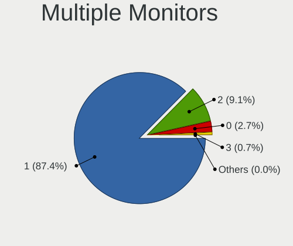

| Total | Desktops | Percent |
|-------|----------|---------|
| 1     | 12434    | 87.41%  |
| 2     | 1294     | 9.1%    |
| 0     | 382      | 2.69%   |
| 3     | 103      | 0.72%   |
| 4     | 10       | 0.07%   |
| 7     | 1        | 0.01%   |
| 5     | 1        | 0.01%   |

Network
-------

Net Controller Vendor
---------------------

Controller vendors

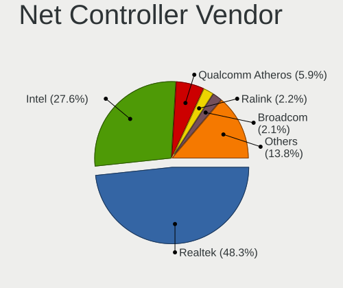

| Vendor                          | Desktops | Percent |
|---------------------------------|----------|---------|
| Realtek Semiconductor           | 9160     | 48.32%  |
| Intel                           | 5239     | 27.63%  |
| Qualcomm Atheros                | 1127     | 5.94%   |
| Ralink Technology               | 421      | 2.22%   |
| Broadcom                        | 403      | 2.13%   |
| MediaTek                        | 388      | 2.05%   |
| TP-Link                         | 304      | 1.6%    |
| Nvidia                          | 280      | 1.48%   |
| Ralink                          | 192      | 1.01%   |
| Qualcomm Atheros Communications | 117      | 0.62%   |
| Marvell Technology Group        | 105      | 0.55%   |
| Broadcom Limited                | 94       | 0.5%    |
| NetGear                         | 74       | 0.39%   |
| D-Link                          | 74       | 0.39%   |
| Aquantia                        | 73       | 0.39%   |
| Samsung Electronics             | 66       | 0.35%   |
| ASUSTek Computer                | 61       | 0.32%   |
| D-Link System                   | 60       | 0.32%   |
| ASIX Electronics                | 60       | 0.32%   |
| Microsoft                       | 58       | 0.31%   |
| VIA Technologies                | 43       | 0.23%   |
| Huawei Technologies             | 40       | 0.21%   |
| Belkin Components               | 35       | 0.18%   |
| Motorola PCS                    | 26       | 0.14%   |
| Xiaomi                          | 24       | 0.13%   |
| Edimax Technology               | 23       | 0.12%   |
| Qualcomm Technologies           | 22       | 0.12%   |
| ZTE WCDMA Technologies MSM      | 21       | 0.11%   |
| Linksys                         | 21       | 0.11%   |
| IMC Networks                    | 17       | 0.09%   |
| Mellanox Technologies           | 16       | 0.08%   |
| AVM                             | 16       | 0.08%   |
| 3Com                            | 16       | 0.08%   |
| DisplayLink                     | 14       | 0.07%   |
| OPPO Electronics                | 13       | 0.07%   |
| Qualcomm                        | 12       | 0.06%   |
| Mercucys                        | 10       | 0.05%   |
| JMicron Technology              | 10       | 0.05%   |
| Google                          | 8        | 0.04%   |
| Gemtek                          | 8        | 0.04%   |

Net Controller Model
--------------------

Controller models

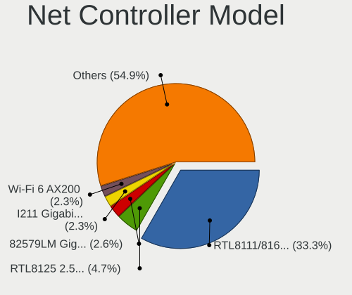

| Model                                                                  | Desktops | Percent |
|------------------------------------------------------------------------|----------|---------|
| Realtek RTL8111/8168/8211/8411 PCI Express Gigabit Ethernet Controller | 7131     | 33.28%  |
| Realtek RTL8125 2.5GbE Controller                                      | 999      | 4.66%   |
| Intel 82579LM Gigabit Network Connection (Lewisville)                  | 558      | 2.6%    |
| Intel I211 Gigabit Network Connection                                  | 494      | 2.31%   |
| Intel Wi-Fi 6 AX200                                                    | 486      | 2.27%   |
| Intel Ethernet Connection I217-LM                                      | 411      | 1.92%   |
| Intel Ethernet Connection (2) I219-V                                   | 392      | 1.83%   |
| Intel Ethernet Controller I225-V                                       | 372      | 1.74%   |
| Realtek RTL810xE PCI Express Fast Ethernet controller                  | 355      | 1.66%   |
| Intel Wi-Fi 6E(802.11ax) AX210/AX1675* 2x2 [Typhoon Peak]              | 254      | 1.19%   |
| Realtek RTL8821CE 802.11ac PCIe Wireless Network Adapter               | 223      | 1.04%   |
| Intel Dual Band Wireless-AC 3168NGW [Stone Peak]                       | 217      | 1.01%   |
| Ralink MT7601U Wireless Adapter                                        | 214      | 1%      |
| Intel 82579V Gigabit Network Connection                                | 203      | 0.95%   |
| Intel Ethernet Connection (2) I219-LM                                  | 190      | 0.89%   |
| Intel 82567LM-3 Gigabit Network Connection                             | 190      | 0.89%   |
| Realtek RTL8188EUS 802.11n Wireless Network Adapter                    | 184      | 0.86%   |
| Nvidia MCP61 Ethernet                                                  | 167      | 0.78%   |
| MediaTek MT7922 802.11ax PCI Express Wireless Network Adapter          | 167      | 0.78%   |
| Intel Ethernet Connection (7) I219-V                                   | 160      | 0.75%   |
| Realtek 802.11ac NIC                                                   | 138      | 0.64%   |
| Intel Wi-Fi 5(802.11ac) Wireless-AC 9x6x [Thunder Peak]                | 134      | 0.63%   |
| Realtek RTL-8100/8101L/8139 PCI Fast Ethernet Adapter                  | 132      | 0.62%   |
| Qualcomm Atheros AR8151 v2.0 Gigabit Ethernet                          | 126      | 0.59%   |
| Intel Ethernet Connection I217-V                                       | 123      | 0.57%   |
| Realtek RTL88x2bu [AC1200 Techkey]                                     | 112      | 0.52%   |
| Qualcomm Atheros AR9485 Wireless Network Adapter                       | 110      | 0.51%   |
| Intel Wireless 7260                                                    | 110      | 0.51%   |
| MediaTek MT7921K (RZ608) Wi-Fi 6E 80MHz                                | 100      | 0.47%   |
| Intel Ethernet Controller I226-V                                       | 98       | 0.46%   |
| Qualcomm Atheros AR9271 802.11n                                        | 97       | 0.45%   |
| Intel Wireless 7265                                                    | 97       | 0.45%   |
| Realtek RTL8153 Gigabit Ethernet Adapter                               | 90       | 0.42%   |
| Intel Wireless 3165                                                    | 90       | 0.42%   |
| Intel 82574L Gigabit Network Connection                                | 84       | 0.39%   |
| Intel Alder Lake-S PCH CNVi WiFi                                       | 82       | 0.38%   |
| Realtek RTL8852BE PCIe 802.11ax Wireless Network Controller            | 80       | 0.37%   |
| Realtek RTL8192EE PCIe Wireless Network Adapter                        | 80       | 0.37%   |
| Intel 700 Series Chipset CNVi WiFi                                     | 80       | 0.37%   |
| Ralink RT5370 Wireless Adapter                                         | 79       | 0.37%   |

Wireless Vendor
---------------

Wireless vendors

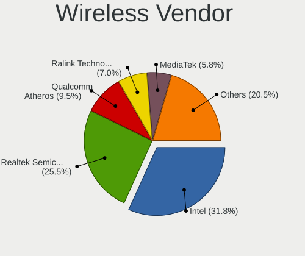

| Vendor                                | Desktops | Percent |
|---------------------------------------|----------|---------|
| Intel                                 | 1909     | 31.76%  |
| Realtek Semiconductor                 | 1532     | 25.49%  |
| Qualcomm Atheros                      | 569      | 9.47%   |
| Ralink Technology                     | 421      | 7%      |
| MediaTek                              | 346      | 5.76%   |
| TP-Link                               | 298      | 4.96%   |
| Ralink                                | 192      | 3.19%   |
| Broadcom                              | 119      | 1.98%   |
| Qualcomm Atheros Communications       | 117      | 1.95%   |
| D-Link                                | 74       | 1.23%   |
| NetGear                               | 72       | 1.2%    |
| ASUSTek Computer                      | 59       | 0.98%   |
| Microsoft                             | 58       | 0.96%   |
| Belkin Components                     | 34       | 0.57%   |
| D-Link System                         | 32       | 0.53%   |
| Edimax Technology                     | 23       | 0.38%   |
| Linksys                               | 21       | 0.35%   |
| IMC Networks                          | 17       | 0.28%   |
| AVM                                   | 16       | 0.27%   |
| Broadcom Limited                      | 12       | 0.2%    |
| Mercucys                              | 10       | 0.17%   |
| Gemtek                                | 8        | 0.13%   |
| 802.11g Adapter [Linksys WUSB54GC v3] | 8        | 0.13%   |
| BUFFALO                               | 7        | 0.12%   |
| ZyDAS                                 | 5        | 0.08%   |
| Qualcomm Technologies                 | 5        | 0.08%   |
| Wilocity                              | 4        | 0.07%   |
| Tenda                                 | 4        | 0.07%   |
| Guillemot                             | 4        | 0.07%   |
| ZyXEL Communications                  | 3        | 0.05%   |
| Wacom                                 | 3        | 0.05%   |
| Chu Yuen Enterprise                   | 3        | 0.05%   |
| Sweex                                 | 2        | 0.03%   |
| Sitecom Europe                        | 2        | 0.03%   |
| Senao                                 | 2        | 0.03%   |
| Realtek                               | 2        | 0.03%   |
| PLANEX                                | 2        | 0.03%   |
| Philips (or NXP)                      | 2        | 0.03%   |
| Micro Star International              | 2        | 0.03%   |
| Elecom                                | 2        | 0.03%   |

Wireless Model
--------------

Wireless models

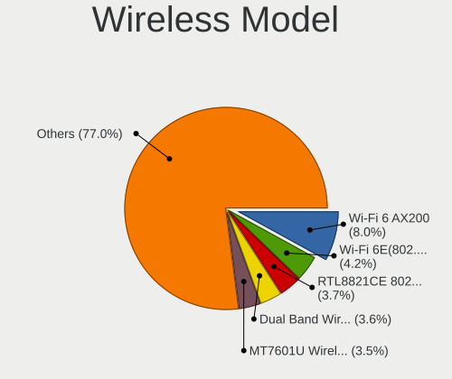

| Model                                                          | Desktops | Percent |
|----------------------------------------------------------------|----------|---------|
| Intel Wi-Fi 6 AX200                                            | 486      | 8.01%   |
| Intel Wi-Fi 6E(802.11ax) AX210/AX1675* 2x2 [Typhoon Peak]      | 254      | 4.19%   |
| Realtek RTL8821CE 802.11ac PCIe Wireless Network Adapter       | 223      | 3.67%   |
| Intel Dual Band Wireless-AC 3168NGW [Stone Peak]               | 217      | 3.58%   |
| Ralink MT7601U Wireless Adapter                                | 214      | 3.53%   |
| Realtek RTL8188EUS 802.11n Wireless Network Adapter            | 184      | 3.03%   |
| MediaTek MT7922 802.11ax PCI Express Wireless Network Adapter  | 154      | 2.54%   |
| Realtek 802.11ac NIC                                           | 138      | 2.27%   |
| Intel Wi-Fi 5(802.11ac) Wireless-AC 9x6x [Thunder Peak]        | 134      | 2.21%   |
| Realtek RTL88x2bu [AC1200 Techkey]                             | 112      | 1.85%   |
| Qualcomm Atheros AR9485 Wireless Network Adapter               | 110      | 1.81%   |
| Intel Wireless 7260                                            | 110      | 1.81%   |
| MediaTek MT7921K (RZ608) Wi-Fi 6E 80MHz                        | 100      | 1.65%   |
| Qualcomm Atheros AR9271 802.11n                                | 97       | 1.6%    |
| Intel Wireless 7265                                            | 97       | 1.6%    |
| Intel Wireless 3165                                            | 90       | 1.48%   |
| Realtek RTL8192EE PCIe Wireless Network Adapter                | 80       | 1.32%   |
| Intel 700 Series Chipset CNVi WiFi                             | 80       | 1.32%   |
| Ralink RT5370 Wireless Adapter                                 | 79       | 1.3%    |
| Intel Cannon Lake PCH CNVi WiFi                                | 79       | 1.3%    |
| Intel Wireless 8260                                            | 65       | 1.07%   |
| Qualcomm Atheros AR93xx Wireless Network Adapter               | 64       | 1.05%   |
| TP-Link TL-WN823N v2/v3 [Realtek RTL8192EU]                    | 62       | 1.02%   |
| Ralink RT2870/RT3070 Wireless Adapter                          | 60       | 0.99%   |
| Qualcomm Atheros QCA9565 / AR9565 Wireless Network Adapter     | 60       | 0.99%   |
| Realtek RTL8821AE 802.11ac PCIe Wireless Network Adapter       | 59       | 0.97%   |
| Realtek RTL8188EE Wireless Network Adapter                     | 59       | 0.97%   |
| Realtek RTL8812AE 802.11ac PCIe Wireless Network Adapter       | 58       | 0.96%   |
| Realtek RTL8822CE 802.11ac PCIe Wireless Network Adapter       | 57       | 0.94%   |
| Realtek RTL8192EU 802.11b/g/n WLAN Adapter                     | 56       | 0.92%   |
| Realtek RTL8192CU 802.11n WLAN Adapter                         | 56       | 0.92%   |
| TP-Link TL-WN722N v2/v3 [Realtek RTL8188EUS]                   | 54       | 0.89%   |
| Intel Alder Lake-S PCH CNVi WiFi                               | 50       | 0.82%   |
| Qualcomm Atheros AR9462 Wireless Network Adapter               | 48       | 0.79%   |
| Qualcomm Atheros AR9287 Wireless Network Adapter (PCI-Express) | 47       | 0.77%   |
| Realtek RTL8852CE PCIe 802.11ax Wireless Network Controller    | 46       | 0.76%   |
| Intel Wireless 8265 / 8275                                     | 45       | 0.74%   |
| Realtek RTL8188FTV 802.11b/g/n 1T1R 2.4G WLAN Adapter          | 44       | 0.72%   |
| Realtek RTL8188CUS 802.11n WLAN Adapter                        | 42       | 0.69%   |
| Qualcomm Atheros AR9227 Wireless Network Adapter               | 41       | 0.68%   |

Ethernet Vendor
---------------

Ethernet vendors

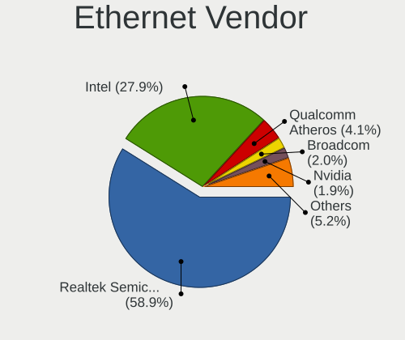

| Vendor                            | Desktops | Percent |
|-----------------------------------|----------|---------|
| Realtek Semiconductor             | 8688     | 58.91%  |
| Intel                             | 4120     | 27.93%  |
| Qualcomm Atheros                  | 599      | 4.06%   |
| Broadcom                          | 292      | 1.98%   |
| Nvidia                            | 280      | 1.9%    |
| Marvell Technology Group          | 104      | 0.71%   |
| Broadcom Limited                  | 82       | 0.56%   |
| Aquantia                          | 73       | 0.49%   |
| Samsung Electronics               | 64       | 0.43%   |
| ASIX Electronics                  | 60       | 0.41%   |
| MediaTek                          | 42       | 0.28%   |
| VIA Technologies                  | 40       | 0.27%   |
| Huawei Technologies               | 37       | 0.25%   |
| D-Link System                     | 28       | 0.19%   |
| Motorola PCS                      | 26       | 0.18%   |
| Xiaomi                            | 24       | 0.16%   |
| Qualcomm Technologies             | 17       | 0.12%   |
| 3Com                              | 16       | 0.11%   |
| Mellanox Technologies             | 15       | 0.1%    |
| DisplayLink                       | 14       | 0.09%   |
| OPPO Electronics                  | 13       | 0.09%   |
| Qualcomm                          | 12       | 0.08%   |
| JMicron Technology                | 10       | 0.07%   |
| TP-Link                           | 8        | 0.05%   |
| Google                            | 8        | 0.05%   |
| ZTE WCDMA Technologies MSM        | 7        | 0.05%   |
| Silicon Integrated Systems [SiS]  | 7        | 0.05%   |
| Apple                             | 6        | 0.04%   |
| Sundance Technology Inc / IC Plus | 5        | 0.03%   |
| ICS Advent                        | 5        | 0.03%   |
| T & A Mobile Phones               | 4        | 0.03%   |
| Spreadtrum Communications         | 4        | 0.03%   |
| Davicom Semiconductor             | 4        | 0.03%   |
| OnePlus Technology (Shenzhen)     | 3        | 0.02%   |
| HTC (High Tech Computer)          | 3        | 0.02%   |
| HMD Global                        | 3        | 0.02%   |
| ADMtek                            | 3        | 0.02%   |
| NetGear                           | 2        | 0.01%   |
| LG Electronics                    | 2        | 0.01%   |
| Lenovo                            | 2        | 0.01%   |

Ethernet Model
--------------

Ethernet models

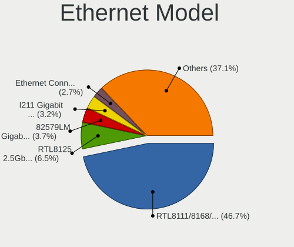

| Model                                                                  | Desktops | Percent |
|------------------------------------------------------------------------|----------|---------|
| Realtek RTL8111/8168/8211/8411 PCI Express Gigabit Ethernet Controller | 7131     | 46.75%  |
| Realtek RTL8125 2.5GbE Controller                                      | 999      | 6.55%   |
| Intel 82579LM Gigabit Network Connection (Lewisville)                  | 558      | 3.66%   |
| Intel I211 Gigabit Network Connection                                  | 494      | 3.24%   |
| Intel Ethernet Connection I217-LM                                      | 411      | 2.69%   |
| Intel Ethernet Connection (2) I219-V                                   | 392      | 2.57%   |
| Intel Ethernet Controller I225-V                                       | 372      | 2.44%   |
| Realtek RTL810xE PCI Express Fast Ethernet controller                  | 355      | 2.33%   |
| Intel 82579V Gigabit Network Connection                                | 203      | 1.33%   |
| Intel Ethernet Connection (2) I219-LM                                  | 190      | 1.25%   |
| Intel 82567LM-3 Gigabit Network Connection                             | 190      | 1.25%   |
| Nvidia MCP61 Ethernet                                                  | 167      | 1.09%   |
| Intel Ethernet Connection (7) I219-V                                   | 160      | 1.05%   |
| Realtek RTL-8100/8101L/8139 PCI Fast Ethernet Adapter                  | 132      | 0.87%   |
| Qualcomm Atheros AR8151 v2.0 Gigabit Ethernet                          | 126      | 0.83%   |
| Intel Ethernet Connection I217-V                                       | 123      | 0.81%   |
| Intel Ethernet Controller I226-V                                       | 98       | 0.64%   |
| Realtek RTL8153 Gigabit Ethernet Adapter                               | 90       | 0.59%   |
| Intel 82574L Gigabit Network Connection                                | 84       | 0.55%   |
| Intel Ethernet Connection (2) I218-V                                   | 79       | 0.52%   |
| Qualcomm Atheros Killer E220x Gigabit Ethernet Controller              | 78       | 0.51%   |
| Intel Ethernet Connection (7) I219-LM                                  | 70       | 0.46%   |
| Qualcomm Atheros AR8121/AR8113/AR8114 Gigabit or Fast Ethernet         | 68       | 0.45%   |
| Qualcomm Atheros AR8161 Gigabit Ethernet                               | 66       | 0.43%   |
| Intel Ethernet Connection (5) I219-LM                                  | 66       | 0.43%   |
| Intel 82578DM Gigabit Network Connection                               | 62       | 0.41%   |
| Marvell Group 88E8056 PCI-E Gigabit Ethernet Controller                | 57       | 0.37%   |
| Intel Ethernet Connection (14) I219-V                                  | 55       | 0.36%   |
| Broadcom NetXtreme BCM5761 Gigabit Ethernet PCIe                       | 54       | 0.35%   |
| Intel I210 Gigabit Network Connection                                  | 53       | 0.35%   |
| Intel 82566DM-2 Gigabit Network Connection                             | 50       | 0.33%   |
| ASIX AX88179 Gigabit Ethernet                                          | 50       | 0.33%   |
| Qualcomm Atheros QCA8171 Gigabit Ethernet                              | 49       | 0.32%   |
| Qualcomm Atheros AR8152 v2.0 Fast Ethernet                             | 46       | 0.3%    |
| Qualcomm Atheros AR8131 Gigabit Ethernet                               | 46       | 0.3%    |
| Intel Ethernet Connection (2) I218-LM                                  | 45       | 0.29%   |
| Realtek RTL8169 PCI Gigabit Ethernet Controller                        | 44       | 0.29%   |
| Broadcom NetLink BCM57780 Gigabit Ethernet PCIe                        | 44       | 0.29%   |
| Samsung Galaxy series, misc. (tethering mode)                          | 43       | 0.28%   |
| Qualcomm Atheros Attansic L1 Gigabit Ethernet                          | 43       | 0.28%   |

Net Controller Kind
-------------------

Ethernet, WiFi or modem

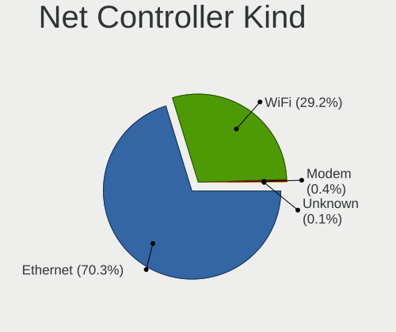

| Kind     | Desktops | Percent |
|----------|----------|---------|
| Ethernet | 13852    | 70.28%  |
| WiFi     | 5758     | 29.21%  |
| Modem    | 83       | 0.42%   |
| Unknown  | 18       | 0.09%   |

Used Controller
---------------

Currently used network controller

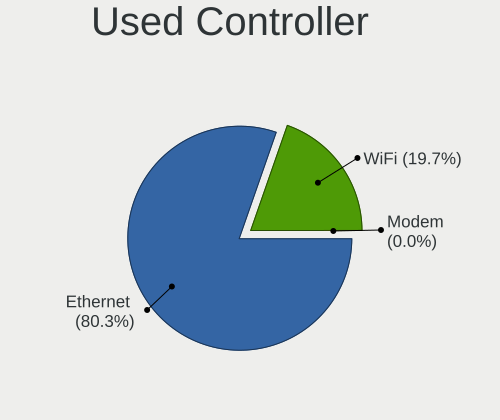

| Kind     | Desktops | Percent |
|----------|----------|---------|
| Ethernet | 11231    | 80.34%  |
| WiFi     | 2748     | 19.66%  |
| Modem    | 1        | 0.01%   |

NICs
----

Total network controllers on board

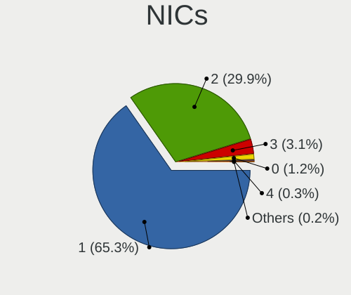

| Total | Desktops | Percent |
|-------|----------|---------|
| 1     | 9234     | 65.29%  |
| 2     | 4234     | 29.94%  |
| 3     | 432      | 3.05%   |
| 0     | 165      | 1.17%   |
| 4     | 49       | 0.35%   |
| 5     | 16       | 0.11%   |
| 6     | 10       | 0.07%   |
| 7     | 3        | 0.02%   |

IPv6
----

IPv6 vs IPv4

| Used    | Desktops | Percent |
|---------|----------|---------|
| No      | 9841     | 68.72%  |
| Yes     | 4479     | 31.28%  |
| Unknown | 1        | 0.01%   |

Bluetooth
---------

Bluetooth Vendor
----------------

Controller vendors

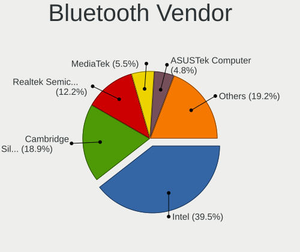

| Vendor                          | Desktops | Percent |
|---------------------------------|----------|---------|
| Intel                           | 1789     | 39.47%  |
| Cambridge Silicon Radio         | 855      | 18.86%  |
| Realtek Semiconductor           | 553      | 12.2%   |
| MediaTek                        | 249      | 5.49%   |
| ASUSTek Computer                | 217      | 4.79%   |
| IMC Networks                    | 189      | 4.17%   |
| Broadcom                        | 145      | 3.2%    |
| Qualcomm Atheros Communications | 119      | 2.63%   |
| TP-Link                         | 112      | 2.47%   |
| Foxconn / Hon Hai               | 96       | 2.12%   |
| Lite-On Technology              | 29       | 0.64%   |
| Apple                           | 24       | 0.53%   |
| Actions                         | 21       | 0.46%   |
| Integrated System Solution      | 20       | 0.44%   |
| Realtek                         | 16       | 0.35%   |
| Edimax Technology               | 14       | 0.31%   |
| Unknown                         | 14       | 0.31%   |
| Dynex                           | 13       | 0.29%   |
| Primax Electronics              | 11       | 0.24%   |
| Belkin Components               | 11       | 0.24%   |
| Ralink                          | 7        | 0.15%   |
| SiW                             | 4        | 0.09%   |
| HTC (High Tech Computer)        | 4        | 0.09%   |
| SINO WEALTH                     | 3        | 0.07%   |
| Micro Star International        | 3        | 0.07%   |
| Hewlett-Packard                 | 3        | 0.07%   |
| Dell                            | 2        | 0.04%   |
| Conwise Technology              | 2        | 0.04%   |
| Accel Semiconductor             | 2        | 0.04%   |
| Unknown                         | 1        | 0.02%   |
| Toshiba                         | 1        | 0.02%   |
| Sitecom Europe                  | 1        | 0.02%   |
| Qcom                            | 1        | 0.02%   |
| i.Tech Dynamic Limited          | 1        | 0.02%   |
| BUFFALO                         | 1        | 0.02%   |

Bluetooth Model
---------------

Controller models

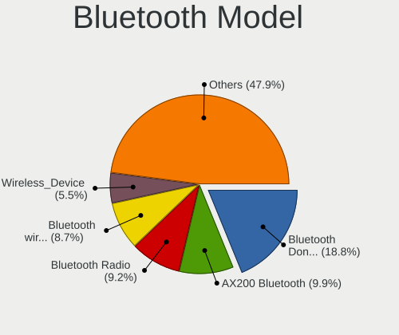

| Model                                                    | Desktops | Percent |
|----------------------------------------------------------|----------|---------|
| Cambridge Silicon Radio Bluetooth Dongle (HCI mode)      | 855      | 18.82%  |
| Intel AX200 Bluetooth                                    | 448      | 9.86%   |
| Realtek Bluetooth Radio                                  | 417      | 9.18%   |
| Intel Bluetooth wireless interface                       | 396      | 8.72%   |
| MediaTek Wireless_Device                                 | 249      | 5.48%   |
| Intel AX210 Bluetooth                                    | 236      | 5.2%    |
| Intel Wireless-AC 3168 Bluetooth                         | 208      | 4.58%   |
| Intel AX201 Bluetooth                                    | 146      | 3.21%   |
| Intel Wireless-AC 9260 Bluetooth Adapter                 | 125      | 2.75%   |
| Intel Bluetooth Device                                   | 117      | 2.58%   |
| IMC Networks Bluetooth Radio                             | 117      | 2.58%   |
| TP-Link TP-T@- UB500 Adapter                             | 112      | 2.47%   |
| Intel Bluetooth 9460/9560 Jefferson Peak (JfP)           | 95       | 2.09%   |
| Broadcom BCM20702A0 Bluetooth 4.0                        | 81       | 1.78%   |
| Realtek  Bluetooth 4.2 Adapter                           | 75       | 1.65%   |
| ASUS Broadcom BCM20702A0 Bluetooth                       | 64       | 1.41%   |
| IMC Networks Wireless_Device                             | 60       | 1.32%   |
| ASUS ASUS USB-BT500                                      | 60       | 1.32%   |
| Qualcomm Atheros  Bluetooth Device                       | 58       | 1.28%   |
| Foxconn / Hon Hai Wireless_Device                        | 51       | 1.12%   |
| Foxconn / Hon Hai Bluetooth Device                       | 36       | 0.79%   |
| ASUS Bluetooth Radio                                     | 32       | 0.7%    |
| Realtek Bluetooth 5.3 Radio                              | 28       | 0.62%   |
| Qualcomm Atheros AR9462 Bluetooth                        | 23       | 0.51%   |
| Intel Centrino Bluetooth Wireless Transceiver            | 22       | 0.48%   |
| Actions general adapter                                  | 21       | 0.46%   |
| Lite-On Bluetooth Device                                 | 18       | 0.4%    |
| ASUS Bluetooth Adapter                                   | 17       | 0.37%   |
| Realtek Bluetooth Radio                                  | 16       | 0.35%   |
| Broadcom BCM2045 Bluetooth                               | 15       | 0.33%   |
| ASUS Qualcomm Bluetooth 4.1                              | 15       | 0.33%   |
| Qualcomm Atheros AR3011 Bluetooth                        | 14       | 0.31%   |
| Unknown                                                  | 14       | 0.31%   |
| Edimax Bluetooth Device                                  | 13       | 0.29%   |
| Dynex Bluetooth 4.0 Adapter [Broadcom, 1.12, BCM20702A0] | 13       | 0.29%   |
| Realtek RTL8821A Bluetooth                               | 12       | 0.26%   |
| Integrated System Solution Bluetooth Device              | 12       | 0.26%   |
| ASUS Bluetooth Device                                    | 12       | 0.26%   |
| Realtek Bluetooth 5.4 Radio                              | 11       | 0.24%   |
| Qualcomm Atheros Bluetooth USB Host Controller           | 11       | 0.24%   |

Sound
-----

Sound Vendor
------------

Sound card vendors

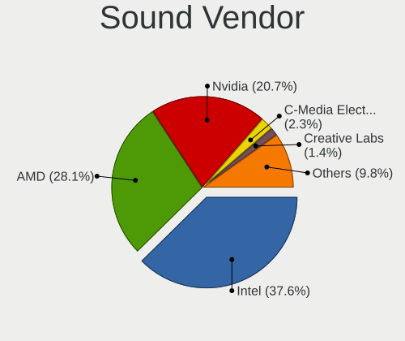

| Vendor                                       | Desktops | Percent |
|----------------------------------------------|----------|---------|
| Intel                                        | 8445     | 37.64%  |
| AMD                                          | 6308     | 28.12%  |
| Nvidia                                       | 4641     | 20.69%  |
| C-Media Electronics                          | 519      | 2.31%   |
| Creative Labs                                | 319      | 1.42%   |
| Logitech                                     | 197      | 0.88%   |
| Texas Instruments                            | 115      | 0.51%   |
| ASUSTek Computer                             | 110      | 0.49%   |
| JMTek                                        | 97       | 0.43%   |
| Micro Star International                     | 94       | 0.42%   |
| Creative Technology                          | 93       | 0.41%   |
| Generalplus Technology                       | 86       | 0.38%   |
| Zoran Co. Personal Media Division (Nogatech) | 70       | 0.31%   |
| Razer USA                                    | 59       | 0.26%   |
| SteelSeries ApS                              | 58       | 0.26%   |
| Focusrite-Novation                           | 58       | 0.26%   |
| Kingston Technology                          | 52       | 0.23%   |
| Tenx Technology                              | 46       | 0.21%   |
| Hewlett-Packard                              | 45       | 0.2%    |
| VIA Technologies                             | 42       | 0.19%   |
| KTMicro                                      | 42       | 0.19%   |
| Corsair                                      | 35       | 0.16%   |
| Jieli Technology                             | 34       | 0.15%   |
| GN Netcom                                    | 32       | 0.14%   |
| Thesycon Systemsoftware & Consulting         | 28       | 0.12%   |
| Sony                                         | 27       | 0.12%   |
| Realtek Semiconductor                        | 23       | 0.1%    |
| Plantronics                                  | 22       | 0.1%    |
| Giga-Byte Technology                         | 22       | 0.1%    |
| Blue Microphones                             | 21       | 0.09%   |
| XMOS                                         | 20       | 0.09%   |
| BEHRINGER International                      | 20       | 0.09%   |
| Unknown                                      | 20       | 0.09%   |
| PreSonus Audio Electronics                   | 18       | 0.08%   |
| FiiO Electronics Technology                  | 18       | 0.08%   |
| Dell                                         | 18       | 0.08%   |
| Samson Technologies                          | 17       | 0.08%   |
| Yamaha                                       | 15       | 0.07%   |
| Schiit Audio                                 | 15       | 0.07%   |
| Ensoniq                                      | 15       | 0.07%   |

Sound Model
-----------

Sound card models

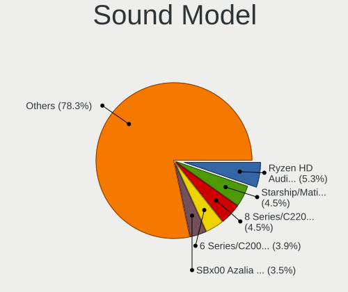

| Model                                                                      | Desktops | Percent |
|----------------------------------------------------------------------------|----------|---------|
| AMD Ryzen HD Audio Controller                                              | 1443     | 5.29%   |
| AMD Starship/Matisse HD Audio Controller                                   | 1233     | 4.52%   |
| Intel 8 Series/C220 Series Chipset High Definition Audio Controller        | 1220     | 4.48%   |
| Intel 6 Series/C200 Series Chipset Family High Definition Audio Controller | 1069     | 3.92%   |
| AMD SBx00 Azalia (Intel HDA)                                               | 951      | 3.49%   |
| Intel Xeon E3-1200 v3/4th Gen Core Processor HD Audio Controller           | 834      | 3.06%   |
| Intel 7 Series/C216 Chipset Family High Definition Audio Controller        | 800      | 2.94%   |
| Intel 100 Series/C230 Series Chipset Family HD Audio Controller            | 688      | 2.52%   |
| AMD Navi 21/23 HDMI/DP Audio Controller                                    | 650      | 2.39%   |
| Intel NM10/ICH7 Family High Definition Audio Controller                    | 647      | 2.37%   |
| Intel 200 Series PCH HD Audio                                              | 617      | 2.26%   |
| AMD FCH Azalia Controller                                                  | 573      | 2.1%    |
| AMD Renoir/Cezanne HDMI/DP Audio Controller                                | 567      | 2.08%   |
| AMD Family 17h (Models 00h-0fh) HD Audio Controller                        | 524      | 1.92%   |
| AMD Ellesmere HDMI Audio [Radeon RX 470/480 / 570/580/590]                 | 506      | 1.86%   |
| Nvidia GK208 HDMI/DP Audio Controller                                      | 500      | 1.83%   |
| Intel Cannon Lake PCH cAVS                                                 | 415      | 1.52%   |
| AMD Raven/Raven2/Fenghuang HDMI/DP Audio Controller                        | 402      | 1.48%   |
| AMD Radeon High Definition Audio Controller                                | 382      | 1.4%    |
| Nvidia GP107GL High Definition Audio Controller                            | 378      | 1.39%   |
| Nvidia High Definition Audio Controller                                    | 322      | 1.18%   |
| AMD Oland/Hainan/Cape Verde/Pitcairn HDMI Audio [Radeon HD 7000 Series]    | 299      | 1.1%    |
| AMD Baffin HDMI/DP Audio [Radeon RX 550 640SP / RX 560/560X]               | 296      | 1.09%   |
| AMD Navi 31 HDMI/DP Audio                                                  | 293      | 1.08%   |
| Intel 82801JI (ICH10 Family) HD Audio Controller                           | 287      | 1.05%   |
| Intel 5 Series/3400 Series Chipset High Definition Audio                   | 286      | 1.05%   |
| Nvidia TU116 High Definition Audio Controller                              | 251      | 0.92%   |
| Nvidia GM107 High Definition Audio Controller [GeForce 940MX]              | 234      | 0.86%   |
| Nvidia GF108 High Definition Audio Controller                              | 234      | 0.86%   |
| Nvidia GP106 High Definition Audio Controller                              | 230      | 0.84%   |
| Intel Alder Lake-S HD Audio Controller                                     | 229      | 0.84%   |
| Nvidia GP108 High Definition Audio Controller                              | 228      | 0.84%   |
| Intel 82801JD/DO (ICH10 Family) HD Audio Controller                        | 209      | 0.77%   |
| Nvidia GF119 HDMI Audio Controller                                         | 201      | 0.74%   |
| AMD Navi 10 HDMI Audio                                                     | 193      | 0.71%   |
| Intel 9 Series Chipset Family HD Audio Controller                          | 192      | 0.7%    |
| Intel 82801I (ICH9 Family) HD Audio Controller                             | 191      | 0.7%    |
| Nvidia MCP61 High Definition Audio                                         | 184      | 0.68%   |
| Nvidia GK107 HDMI Audio Controller                                         | 167      | 0.61%   |
| Nvidia GP104 High Definition Audio Controller                              | 166      | 0.61%   |

Memory
------

Memory Vendor
-------------

Memory module vendors

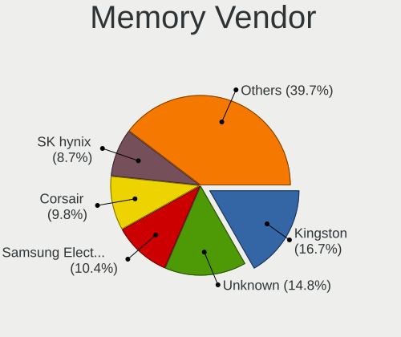

| Vendor                       | Desktops | Percent |
|------------------------------|----------|---------|
| Kingston                     | 2756     | 16.71%  |
| Unknown                      | 2435     | 14.77%  |
| Samsung Electronics          | 1713     | 10.39%  |
| Corsair                      | 1615     | 9.79%   |
| SK hynix                     | 1428     | 8.66%   |
| G.Skill                      | 1224     | 7.42%   |
| Crucial                      | 1139     | 6.91%   |
| Micron Technology            | 861      | 5.22%   |
| Unknown                      | 405      | 2.46%   |
| A-DATA Technology            | 348      | 2.11%   |
| Team                         | 283      | 1.72%   |
| Nanya Technology             | 201      | 1.22%   |
| Patriot                      | 200      | 1.21%   |
| Ramaxel Technology           | 160      | 0.97%   |
| GOODRAM                      | 117      | 0.71%   |
| Elpida                       | 112      | 0.68%   |
| Transcend                    | 83       | 0.5%    |
| Smart                        | 71       | 0.43%   |
| Apacer                       | 71       | 0.43%   |
| AMD                          | 66       | 0.4%    |
| PNY                          | 52       | 0.32%   |
| Unknown (ABCD)               | 48       | 0.29%   |
| Silicon Power                | 47       | 0.29%   |
| Timetec                      | 40       | 0.24%   |
| Kingmax                      | 38       | 0.23%   |
| GeIL                         | 36       | 0.22%   |
| Unifosa                      | 30       | 0.18%   |
| Red Hat                      | 30       | 0.18%   |
| Unknown (0x0E9D)             | 27       | 0.16%   |
| Qimonda                      | 26       | 0.16%   |
| Patriot Memory               | 26       | 0.16%   |
| Avant                        | 26       | 0.16%   |
| Patriot Memory (PDP Systems) | 24       | 0.15%   |
| Lexar                        | 24       | 0.15%   |
| Atermiter                    | 23       | 0.14%   |
| Teikon                       | 21       | 0.13%   |
| Multilaser                   | 21       | 0.13%   |
| Kllisre                      | 17       | 0.1%    |
| Hikvision                    | 17       | 0.1%    |
| ASint Technology             | 16       | 0.1%    |

Memory Model
------------

Memory module models

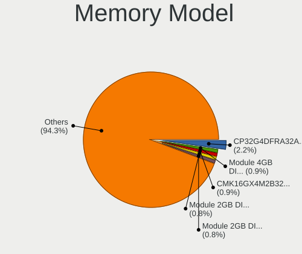

| Model                                                  | Desktops | Percent |
|--------------------------------------------------------|----------|---------|
| Unknown                                                | 405      | 2.23%   |
| Unknown RAM Module 4GB DIMM 1333MT/s                   | 166      | 0.91%   |
| Corsair RAM CMK16GX4M2B3200C16 8GB DIMM DDR4 3600MT/s  | 161      | 0.89%   |
| Unknown RAM Module 2GB DIMM SDRAM                      | 151      | 0.83%   |
| Unknown RAM Module 2GB DIMM DDR2 800MT/s               | 151      | 0.83%   |
| Unknown RAM Module 2GB DIMM 800MT/s                    | 142      | 0.78%   |
| Unknown RAM Module 4GB DIMM DDR3 1333MT/s              | 114      | 0.63%   |
| Unknown RAM Module 2GB DIMM 1333MT/s                   | 109      | 0.6%    |
| Samsung RAM M378B5173QH0-CK0 4GB DIMM DDR3             | 108      | 0.59%   |
| Micron RAM 8JTF51264AZ-1G6E1 4GB DIMM DDR3 1600MT/s    | 107      | 0.59%   |
| SK hynix RAM HMT351U6CFR8C-PB 4GB DIMM DDR3 1800MT/s   | 95       | 0.52%   |
| Kingston RAM KF3200C16D4/8GX 8GiB DIMM DDR4 3600MT/s   | 93       | 0.51%   |
| G.Skill RAM F4-3200C16-8GVKB 8GB DIMM DDR4 4000MT/s    | 89       | 0.49%   |
| Kingston RAM KHX1600C9D3/4GX 4GB DIMM DDR3 1867MT/s    | 85       | 0.47%   |
| Kingston RAM KHX1600C10D3/8G 8GB DIMM DDR3 2133MT/s    | 81       | 0.45%   |
| Samsung RAM M378B5673FH0-CH9 2GB DIMM DDR3 1600MT/s    | 78       | 0.43%   |
| Unknown RAM Module 8GB DIMM DDR3 1600MT/s              | 75       | 0.41%   |
| Unknown RAM Module 4GB DIMM 1600MT/s                   | 75       | 0.41%   |
| Unknown RAM Module 2GB DIMM DDR2 667MT/s               | 73       | 0.4%    |
| Corsair RAM CMK16GX4M2B3000C15 8GB DIMM DDR4 3600MT/s  | 71       | 0.39%   |
| Samsung RAM M378B5173DB0-CK0 4096MB DIMM DDR3 1600MT/s | 65       | 0.36%   |
| Corsair RAM CMK32GX4M2E3200C16 16GB DIMM DDR4 3600MT/s | 65       | 0.36%   |
| Unknown RAM Module 4GB DIMM DDR3 1600MT/s              | 64       | 0.35%   |
| SK hynix RAM HMT451U6AFR8C-PB 4GB DIMM DDR3 1600MT/s   | 61       | 0.34%   |
| SK hynix RAM HMT351U6EFR8C-PB 4GB DIMM DDR3 1600MT/s   | 61       | 0.34%   |
| Kingston RAM KHX2666C16/8G 8GiB DIMM DDR4 3466MT/s     | 61       | 0.34%   |
| G.Skill RAM F4-3200C16-16GVK 16GB DIMM DDR4 3600MT/s   | 60       | 0.33%   |
| Team RAM TEAMGROUP-UD4-3200 8GB DIMM DDR4 3800MT/s     | 58       | 0.32%   |
| Unknown RAM Module 1GB DIMM SDRAM                      | 56       | 0.31%   |
| SK hynix RAM HMT451U6BFR8A-PB 4GB DIMM DDR3 1600MT/s   | 56       | 0.31%   |
| Kingston RAM KHX2400C15/8G 8GB DIMM DDR4 3400MT/s      | 56       | 0.31%   |
| G.Skill RAM F4-3200C16-8GIS 8GB DIMM DDR4 3600MT/s     | 55       | 0.3%    |
| Unknown RAM Module 8GB DIMM DDR3 1333MT/s              | 54       | 0.3%    |
| Kingston RAM KHX3200C16D4/8GX 8GB DIMM DDR4 3733MT/s   | 54       | 0.3%    |
| Kingston RAM KF3200C16D4/16GX 16GB DIMM DDR4 3733MT/s  | 53       | 0.29%   |
| G.Skill RAM F4-3000C16-8GISB 8GB DIMM DDR4 3200MT/s    | 53       | 0.29%   |
| Unknown RAM Module 2GB DIMM DDR3 1333MT/s              | 52       | 0.29%   |
| Unknown RAM Module 2GB DIMM 400MT/s                    | 52       | 0.29%   |
| Unknown RAM Module 1GB DIMM DDR2 667MT/s               | 52       | 0.29%   |
| Samsung RAM M378B5773CH0-CH9 2GB DIMM DDR3 1867MT/s    | 52       | 0.29%   |

Memory Kind
-----------

Memory module kinds

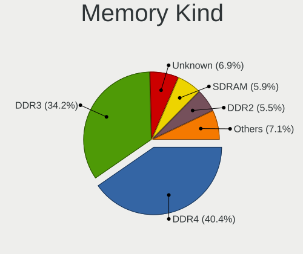

| Kind         | Desktops | Percent |
|--------------|----------|---------|
| DDR4         | 5758     | 40.37%  |
| DDR3         | 4883     | 34.23%  |
| Unknown      | 981      | 6.88%   |
| SDRAM        | 843      | 5.91%   |
| DDR2         | 789      | 5.53%   |
| DDR5         | 703      | 4.93%   |
| DDR          | 154      | 1.08%   |
| LPDDR4       | 65       | 0.46%   |
| RAM          | 40       | 0.28%   |
| DRAM         | 22       | 0.15%   |
| LPDDR5       | 21       | 0.15%   |
| LPDDR3       | 3        | 0.02%   |
| HBM2         | 1        | 0.01%   |
| DDR2 FB-DIMM | 1        | 0.01%   |

Memory Form Factor
------------------

Physical design of the memory module

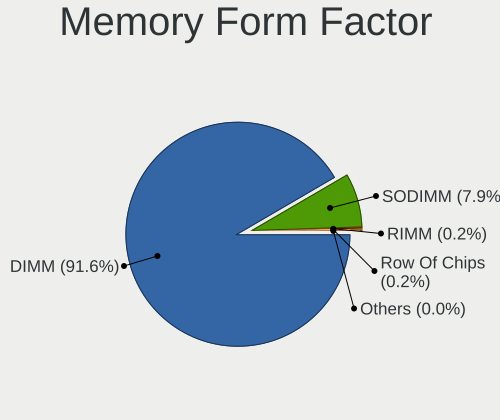

| Name         | Desktops | Percent |
|--------------|----------|---------|
| DIMM         | 12728    | 91.59%  |
| SODIMM       | 1096     | 7.89%   |
| RIMM         | 26       | 0.19%   |
| Row Of Chips | 22       | 0.16%   |
| FB-DIMM      | 20       | 0.14%   |
| Chip         | 3        | 0.02%   |
| Die          | 1        | 0.01%   |

Memory Size
-----------

Memory module size

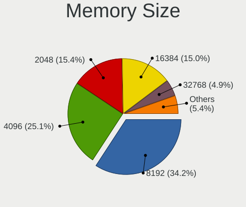

| Size  | Desktops | Percent |
|-------|----------|---------|
| 8192  | 5365     | 34.22%  |
| 4096  | 3939     | 25.12%  |
| 2048  | 2412     | 15.38%  |
| 16384 | 2357     | 15.03%  |
| 32768 | 761      | 4.85%   |
| 1024  | 684      | 4.36%   |
| 512   | 88       | 0.56%   |
| 49152 | 22       | 0.14%   |
| 24576 | 16       | 0.1%    |
| 65536 | 8        | 0.05%   |
| 12288 | 6        | 0.04%   |
| 256   | 6        | 0.04%   |
| 3072  | 4        | 0.03%   |
| 15616 | 1        | 0.01%   |
| 12536 | 1        | 0.01%   |
| 12333 | 1        | 0.01%   |
| 9096  | 1        | 0.01%   |
| 9000  | 1        | 0.01%   |
| 8124  | 1        | 0.01%   |
| 3814  | 1        | 0.01%   |
| 616   | 1        | 0.01%   |
| 64    | 1        | 0.01%   |
| 32    | 1        | 0.01%   |
| 16    | 1        | 0.01%   |

Memory Speed
------------

Memory module speed

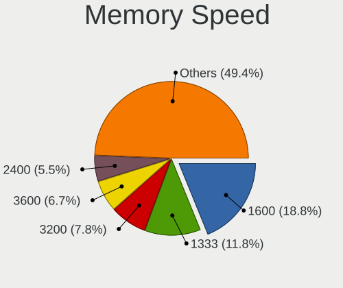

| Speed   | Desktops | Percent |
|---------|----------|---------|
| 1600    | 3024     | 18.84%  |
| 1333    | 1901     | 11.84%  |
| 3200    | 1252     | 7.8%    |
| 3600    | 1074     | 6.69%   |
| 2400    | 878      | 5.47%   |
| 2667    | 845      | 5.26%   |
| 2133    | 726      | 4.52%   |
| 800     | 644      | 4.01%   |
| 667     | 476      | 2.97%   |
| Unknown | 447      | 2.78%   |
| 1866    | 308      | 1.92%   |
| 3733    | 264      | 1.64%   |
| 6000    | 259      | 1.61%   |
| 2666    | 246      | 1.53%   |
| 1800    | 235      | 1.46%   |
| 1867    | 221      | 1.38%   |
| 3800    | 216      | 1.35%   |
| 3000    | 184      | 1.15%   |
| 3400    | 179      | 1.12%   |
| 4000    | 178      | 1.11%   |
| 1066    | 163      | 1.02%   |
| 2933    | 132      | 0.82%   |
| 400     | 131      | 0.82%   |
| 5600    | 121      | 0.75%   |
| 4800    | 119      | 0.74%   |
| 1067    | 119      | 0.74%   |
| 3466    | 106      | 0.66%   |
| 533     | 92       | 0.57%   |
| 6400    | 84       | 0.52%   |
| 3066    | 72       | 0.45%   |
| 1334    | 66       | 0.41%   |
| 3866    | 64       | 0.4%    |
| 3266    | 64       | 0.4%    |
| 2000    | 58       | 0.36%   |
| 1648    | 56       | 0.35%   |
| 3333    | 52       | 0.32%   |
| 2048    | 52       | 0.32%   |
| 2800    | 51       | 0.32%   |
| 3666    | 41       | 0.26%   |
| 1639    | 41       | 0.26%   |

Printers & scanners
-------------------

Printer Vendor
--------------

Printer device vendors

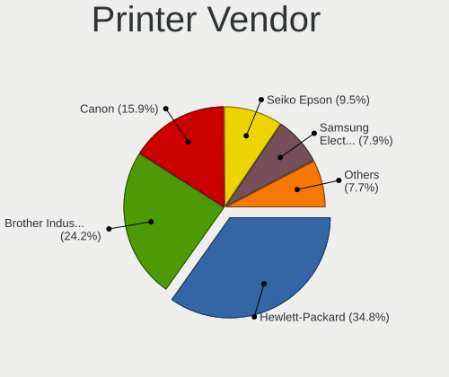

| Vendor                       | Desktops | Percent |
|------------------------------|----------|---------|
| Hewlett-Packard              | 282      | 34.81%  |
| Brother Industries           | 196      | 24.2%   |
| Canon                        | 129      | 15.93%  |
| Seiko Epson                  | 77       | 9.51%   |
| Samsung Electronics          | 64       | 7.9%    |
| Lexmark International        | 13       | 1.6%    |
| Prolific Technology          | 8        | 0.99%   |
| Xerox                        | 7        | 0.86%   |
| QinHeng Electronics          | 5        | 0.62%   |
| Kyocera                      | 5        | 0.62%   |
| Dymo-CoStar                  | 5        | 0.62%   |
| Ricoh                        | 3        | 0.37%   |
| Oki Data                     | 3        | 0.37%   |
| Pantum                       | 2        | 0.25%   |
| Zebra Technologies           | 1        | 0.12%   |
| Zebra                        | 1        | 0.12%   |
| Xiaomi                       | 1        | 0.12%   |
| Wincor Nixdorf International | 1        | 0.12%   |
| Sagem                        | 1        | 0.12%   |
| Philips (or NXP)             | 1        | 0.12%   |
| NXP Semiconductors           | 1        | 0.12%   |
| Konica Minolta               | 1        | 0.12%   |
| ICS Advent                   | 1        | 0.12%   |
| Citizen                      | 1        | 0.12%   |
| Apple                        | 1        | 0.12%   |

Printer Model
-------------

Printer device models

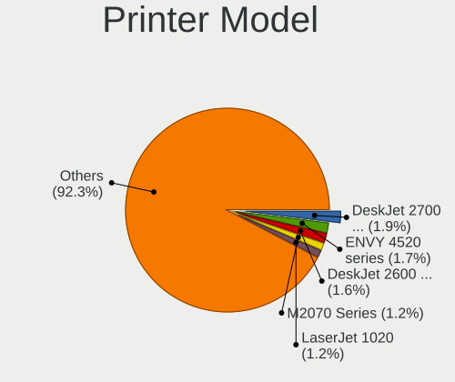

| Model                                | Desktops | Percent |
|--------------------------------------|----------|---------|
| HP DeskJet 2700 series               | 16       | 1.95%   |
| HP ENVY 4520 series                  | 14       | 1.71%   |
| HP DeskJet 2600 series               | 13       | 1.58%   |
| Samsung M2070 Series                 | 10       | 1.22%   |
| HP LaserJet 1020                     | 10       | 1.22%   |
| Canon PIXMA MG3600 Series            | 9        | 1.1%    |
| Seiko Epson ET-2710 Series           | 8        | 0.97%   |
| Prolific PL2305 Parallel Port        | 8        | 0.97%   |
| HP LaserJet P1005                    | 8        | 0.97%   |
| HP DeskJet 3630 series               | 8        | 0.97%   |
| Canon TS3100 series                  | 8        | 0.97%   |
| Canon LiDE 400                       | 8        | 0.97%   |
| HP OfficeJet 3830 series             | 7        | 0.85%   |
| HP LaserJet 1018                     | 7        | 0.85%   |
| Canon LiDE 300                       | 7        | 0.85%   |
| Brother Printer                      | 7        | 0.85%   |
| Brother HL-L2390DW                   | 7        | 0.85%   |
| Samsung M2020 Series                 | 6        | 0.73%   |
| HP LaserJet P1006                    | 6        | 0.73%   |
| HP DeskJet 4100 series               | 6        | 0.73%   |
| HP DeskJet 2130 series               | 6        | 0.73%   |
| Brother MFC-J470DW                   | 6        | 0.73%   |
| Brother HL-L2305 series              | 6        | 0.73%   |
| Brother HL-L2300D series             | 6        | 0.73%   |
| Samsung ML-1640 Series Laser Printer | 5        | 0.61%   |
| QinHeng CH340S                       | 5        | 0.61%   |
| HP LaserJet 1010                     | 5        | 0.61%   |
| HP Ink Tank Wireless 410 series      | 5        | 0.61%   |
| HP ENVY 5000 series                  | 5        | 0.61%   |
| Canon PIXMA MX920 Series             | 5        | 0.61%   |
| Brother MFC-L2710DW series           | 5        | 0.61%   |
| Brother MFC-L2700DW                  | 5        | 0.61%   |
| Brother HL-L2320D series             | 5        | 0.61%   |
| Brother HL-3140CW series             | 5        | 0.61%   |
| Brother HL-2270DW Laser Printer      | 5        | 0.61%   |
| Seiko Epson L6270 Series             | 4        | 0.49%   |
| Seiko Epson L120 Series              | 4        | 0.49%   |
| Seiko Epson ET-2820 Series           | 4        | 0.49%   |
| Seiko Epson EPSON WF-2510 Series     | 4        | 0.49%   |
| Samsung ML-1660 Series               | 4        | 0.49%   |

Scanner Vendor
--------------

Scanner device vendors

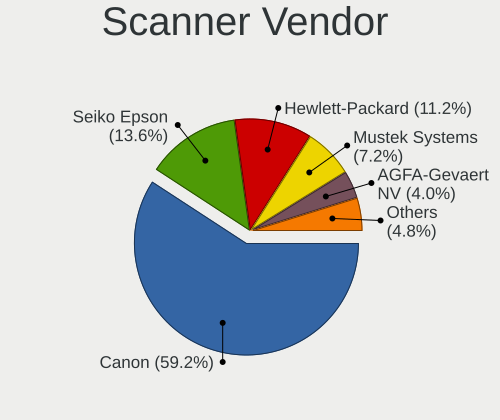

| Vendor                      | Desktops | Percent |
|-----------------------------|----------|---------|
| Canon                       | 74       | 59.2%   |
| Seiko Epson                 | 17       | 13.6%   |
| Hewlett-Packard             | 14       | 11.2%   |
| Mustek Systems              | 9        | 7.2%    |
| AGFA-Gevaert NV             | 5        | 4%      |
| KYE Systems (Mouse Systems) | 2        | 1.6%    |
| Ultima Electronics          | 1        | 0.8%    |
| Plustek                     | 1        | 0.8%    |
| Fujitsu                     | 1        | 0.8%    |
| Acer Peripherals (now BenQ) | 1        | 0.8%    |

Scanner Model
-------------

Scanner device models

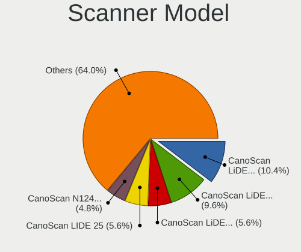

| Model                                                                                 | Desktops | Percent |
|---------------------------------------------------------------------------------------|----------|---------|
| Canon CanoScan LiDE 110                                                               | 13       | 10.4%   |
| Canon CanoScan LiDE 210                                                               | 12       | 9.6%    |
| Canon CanoScan LIDE 25                                                                | 7        | 5.6%    |
| Canon CanoScan LiDE 100                                                               | 7        | 5.6%    |
| Canon CanoScan N1240U/LiDE 30                                                         | 6        | 4.8%    |
| Mustek Systems ScanExpress 1200 UB                                                    | 5        | 4%      |
| Canon CanoScan LiDE 120                                                               | 5        | 4%      |
| Canon CanoScan LiDE 220                                                               | 4        | 3.2%    |
| Canon CanoScan N670U/N676U/LiDE 20                                                    | 3        | 2.4%    |
| Canon CanoScan LiDE 200                                                               | 3        | 2.4%    |
| AGFA-Gevaert NV SnapScan e20                                                          | 3        | 2.4%    |
| Seiko Epson GT-F730 [GT-S630/Perfection V33/V330 Photo]                               | 2        | 1.6%    |
| Seiko Epson GT-F650 [GT-S600/Perfection V10/V100]                                     | 2        | 1.6%    |
| Seiko Epson GT-F500/GT-F550 [Perfection 2480/2580 PHOTO]                              | 2        | 1.6%    |
| Seiko Epson GT-9300UF [Perfection 2400 PHOTO]                                         | 2        | 1.6%    |
| Seiko Epson GT-7300U [Perfection 1260/1260 PHOTO]                                     | 2        | 1.6%    |
| HP ScanJet 4500C/5550C                                                                | 2        | 1.6%    |
| HP ScanJet 2400c                                                                      | 2        | 1.6%    |
| Canon CanoScan LiDE 700F                                                              | 2        | 1.6%    |
| Canon CanoScan LiDE 70                                                                | 2        | 1.6%    |
| Canon CanoScan LiDE 60                                                                | 2        | 1.6%    |
| Canon CanoScan 1220U                                                                  | 2        | 1.6%    |
| Ultima Artec Ultima 2000 (GT6801 based)/Lifetec LT9385/ScanMagic 1200 UB Plus Scanner | 1        | 0.8%    |
| Seiko Epson Perfection V37/V370                                                       | 1        | 0.8%    |
| Seiko Epson GT-X820 [Perfection V600 Photo]                                           | 1        | 0.8%    |
| Seiko Epson GT-X770 [Perfection V500]                                                 | 1        | 0.8%    |
| Seiko Epson GT-F720 [GT-S620/Perfection V30/V300 Photo]                               | 1        | 0.8%    |
| Seiko Epson GT-F700 [Perfection V350]                                                 | 1        | 0.8%    |
| Seiko Epson GT-9400UF [Perfection 3170]                                               | 1        | 0.8%    |
| Seiko Epson GT-7400U [Perfection 1270]                                                | 1        | 0.8%    |
| Plustek 600DPI USB Scanner                                                            | 1        | 0.8%    |
| Mustek Systems SNAPSCAN e22                                                           | 1        | 0.8%    |
| Mustek Systems ScanExpress 1200 CU                                                    | 1        | 0.8%    |
| Mustek Systems BearPaw 2448 CU Pro                                                    | 1        | 0.8%    |
| Mustek Systems BearPaw 1200 CU Plus                                                   | 1        | 0.8%    |
| KYE Systems (Mouse Systems) ColorPage-Vivid4                                          | 1        | 0.8%    |
| KYE Systems (Mouse Systems) ColorPage-Vivid 1200 XE                                   | 1        | 0.8%    |
| HP ScanJet G4010                                                                      | 1        | 0.8%    |
| HP Scanjet G2710                                                                      | 1        | 0.8%    |
| HP ScanJet 4570c                                                                      | 1        | 0.8%    |

Camera
------

Camera Vendor
-------------

Camera device vendors

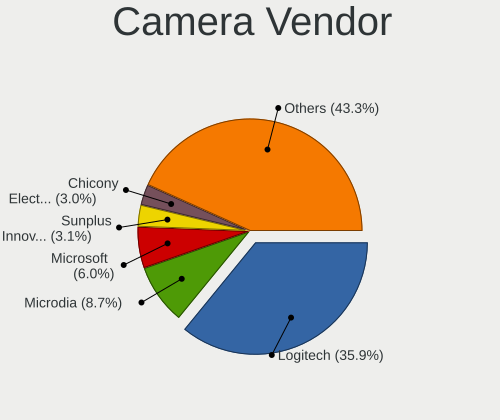

| Vendor                                 | Desktops | Percent |
|----------------------------------------|----------|---------|
| Logitech                               | 650      | 35.91%  |
| Microdia                               | 158      | 8.73%   |
| Microsoft                              | 108      | 5.97%   |
| Sunplus Innovation Technology          | 57       | 3.15%   |
| Chicony Electronics                    | 54       | 2.98%   |
| Z-Star Microelectronics                | 47       | 2.6%    |
| Generalplus Technology                 | 45       | 2.49%   |
| Realtek Semiconductor                  | 44       | 2.43%   |
| Samsung Electronics                    | 37       | 2.04%   |
| Creative Technology                    | 35       | 1.93%   |
| GEMBIRD                                | 34       | 1.88%   |
| KYE Systems (Mouse Systems)            | 33       | 1.82%   |
| MacroSilicon                           | 26       | 1.44%   |
| Apple                                  | 24       | 1.33%   |
| Jieli Technology                       | 22       | 1.22%   |
| Hewlett-Packard                        | 22       | 1.22%   |
| Aveo Technology                        | 22       | 1.22%   |
| ARC International                      | 21       | 1.16%   |
| webcam                                 | 17       | 0.94%   |
| Cubeternet                             | 17       | 0.94%   |
| Unknown                                | 16       | 0.88%   |
| Razer USA                              | 15       | 0.83%   |
| AVerMedia Technologies                 | 14       | 0.77%   |
| Trust                                  | 13       | 0.72%   |
| Alcor Micro                            | 13       | 0.72%   |
| WaveRider Communications               | 12       | 0.66%   |
| Arkmicro Technologies                  | 12       | 0.66%   |
| Huawei Technologies                    | 11       | 0.61%   |
| Tobii Technology AB                    | 9        | 0.5%    |
| eMeet                                  | 9        | 0.5%    |
| A4Tech                                 | 9        | 0.5%    |
| Pixart Imaging                         | 8        | 0.44%   |
| Lenovo                                 | 8        | 0.44%   |
| Genesys Logic                          | 8        | 0.44%   |
| Sonix Technology                       | 7        | 0.39%   |
| Bison Electronics                      | 7        | 0.39%   |
| WCM_USB                                | 6        | 0.33%   |
| SunplusIT                              | 6        | 0.33%   |
| Cheng Uei Precision Industry (Foxlink) | 6        | 0.33%   |
| Anker PowerConf C200                   | 6        | 0.33%   |

Camera Model
------------

Camera device models

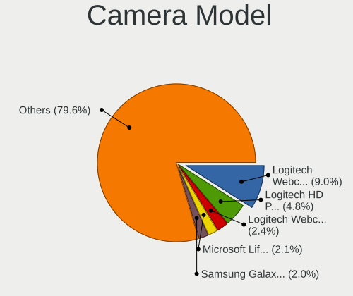

| Model                                             | Desktops | Percent |
|---------------------------------------------------|----------|---------|
| Logitech Webcam C270                              | 164      | 9.04%   |
| Logitech HD Pro Webcam C920                       | 88       | 4.85%   |
| Logitech Webcam C310                              | 44       | 2.42%   |
| Microsoft LifeCam HD-3000                         | 38       | 2.09%   |
| Samsung Galaxy series, misc. (MTP mode)           | 37       | 2.04%   |
| Microdia USB 2.0 Camera                           | 36       | 1.98%   |
| Logitech HD Webcam C525                           | 35       | 1.93%   |
| Generalplus GENERAL WEBCAM                        | 35       | 1.93%   |
| Microdia Webcam Vitade AF                         | 31       | 1.71%   |
| Logitech Webcam C170                              | 31       | 1.71%   |
| Logitech C922 Pro Stream Webcam                   | 28       | 1.54%   |
| Logitech C920 PRO HD Webcam                       | 27       | 1.49%   |
| Microdia Camera                                   | 26       | 1.43%   |
| Apple iPhone 5/5C/5S/6/SE/7/8/X                   | 23       | 1.27%   |
| Logitech HD Webcam C615                           | 22       | 1.21%   |
| Sunplus Full HD webcam                            | 21       | 1.16%   |
| ARC International Camera                          | 21       | 1.16%   |
| Logitech BRIO Ultra HD Webcam                     | 20       | 1.1%    |
| Jieli USB PHY 2.0                                 | 20       | 1.1%    |
| MacroSilicon USB Video                            | 19       | 1.05%   |
| GEMBIRD USB2.0 PC CAMERA                          | 19       | 1.05%   |
| Microdia Integrated Camera                        | 18       | 0.99%   |
| webcam webcam                                     | 17       | 0.94%   |
| Logitech Webcam C930e                             | 16       | 0.88%   |
| Logitech QuickCam Pro 9000                        | 15       | 0.83%   |
| GEMBIRD Generic UVC 1.00 camera [AppoTech AX2311] | 15       | 0.83%   |
| Aveo USB2.0 Camera                                | 15       | 0.83%   |
| Z-Star A4 TECH USB2.0 PC Camera E                 | 14       | 0.77%   |
| Unknown HD camera                                 | 14       | 0.77%   |
| Chicony HP High Definition 1MP Webcam             | 14       | 0.77%   |
| Microsoft LifeCam Studio                          | 13       | 0.72%   |
| Microdia Sonix USB 2.0 Camera                     | 13       | 0.72%   |
| Microdia CyberTrack H7                            | 13       | 0.72%   |
| Z-Star Venus USB2.0 Camera                        | 12       | 0.66%   |
| Sunplus Integrated Camera                         | 12       | 0.66%   |
| Microsoft LifeCam Cinema                          | 12       | 0.66%   |
| Logitech HD Webcam C910                           | 12       | 0.66%   |
| Realtek USB Camera                                | 11       | 0.61%   |
| Huawei HiCamera                                   | 11       | 0.61%   |
| Cubeternet USB2.0 Camera                          | 11       | 0.61%   |

Security
--------

Fingerprint Vendor
------------------

Fingerprint sensor vendors

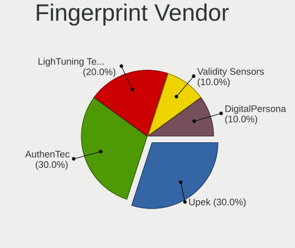

| Vendor                | Desktops | Percent |
|-----------------------|----------|---------|
| Upek                  | 3        | 30%     |
| AuthenTec             | 3        | 30%     |
| LighTuning Technology | 2        | 20%     |
| Validity Sensors      | 1        | 10%     |
| DigitalPersona        | 1        | 10%     |

Fingerprint Model
-----------------

Fingerprint sensor models

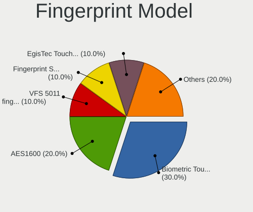

| Model                                                  | Desktops | Percent |
|--------------------------------------------------------|----------|---------|
| Upek Biometric Touchchip/Touchstrip Fingerprint Sensor | 3        | 30%     |
| AuthenTec AES1600                                      | 2        | 20%     |
| Validity Sensors VFS 5011 fingerprint sensor           | 1        | 10%     |
| LighTuning Fingerprint Sensor                          | 1        | 10%     |
| LighTuning EgisTec Touch Fingerprint Sensor            | 1        | 10%     |
| DigitalPersona Fingerprint Reader                      | 1        | 10%     |
| AuthenTec Fingerprint Sensor                           | 1        | 10%     |

Chipcard Vendor
---------------

Chipcard module vendors

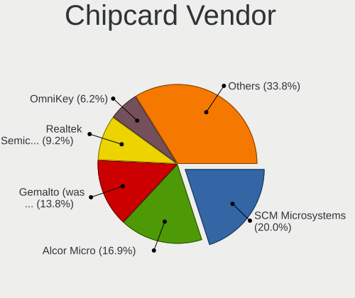

| Vendor                            | Desktops | Percent |
|-----------------------------------|----------|---------|
| SCM Microsystems                  | 13       | 20%     |
| Alcor Micro                       | 11       | 16.92%  |
| Gemalto (was Gemplus)             | 9        | 13.85%  |
| Realtek Semiconductor             | 6        | 9.23%   |
| OmniKey                           | 4        | 6.15%   |
| Chicony Electronics               | 3        | 4.62%   |
| Cherry                            | 3        | 4.62%   |
| Bit4id                            | 3        | 4.62%   |
| Reiner SCT Kartensysteme          | 2        | 3.08%   |
| Fujitsu Siemens Computers         | 2        | 3.08%   |
| Aktiv                             | 2        | 3.08%   |
| Advanced Card Systems             | 2        | 3.08%   |
| VASCO Data Security International | 1        | 1.54%   |
| Thetis                            | 1        | 1.54%   |
| MagTek                            | 1        | 1.54%   |
| Castles Technology                | 1        | 1.54%   |
| Aladdin Knowledge Systems         | 1        | 1.54%   |

Chipcard Model
--------------

Chipcard module models

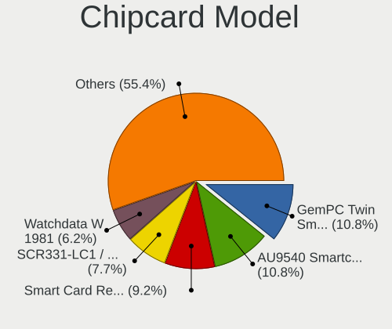

| Model                                                                      | Desktops | Percent |
|----------------------------------------------------------------------------|----------|---------|
| Gemalto (was Gemplus) GemPC Twin SmartCard Reader                          | 7        | 10.77%  |
| Alcor Micro AU9540 Smartcard Reader                                        | 7        | 10.77%  |
| Realtek Semiconductor Smart Card Reader Interface                          | 6        | 9.23%   |
| SCM Microsystems SCR331-LC1 / SCR3310 SmartCard Reader                     | 5        | 7.69%   |
| Alcor Micro Watchdata W 1981                                               | 4        | 6.15%   |
| Chicony Electronics HP Skylab USB Smartcard Keyboard                       | 3        | 4.62%   |
| SCM Microsystems uTrust 3700 F CL Reader                                   | 2        | 3.08%   |
| SCM Microsystems Identiv SmartOS Reader                                    | 2        | 3.08%   |
| Reiner SCT Kartensysteme cyberJack RFID basis contactless smartcard reader | 2        | 3.08%   |
| OmniKey CardMan 1021                                                       | 2        | 3.08%   |
| Fujitsu Siemens Computers SmartCard Reader 2A                              | 2        | 3.08%   |
| Bit4id miniLector EVO                                                      | 2        | 3.08%   |
| Aktiv Rutoken lite                                                         | 2        | 3.08%   |
| Advanced Card Systems ACR38 SmartCard Reader                               | 2        | 3.08%   |
| VASCO Data Security International Digipass 905 SmartCard Reader            | 1        | 1.54%   |
| Thetis Security Key(F829)                                                  | 1        | 1.54%   |
| SCM Microsystems SCR3500 A Contact Reader                                  | 1        | 1.54%   |
| SCM Microsystems SCR335 SmartCard Reader                                   | 1        | 1.54%   |
| SCM Microsystems SCR333 SmartCard Reader                                   | 1        | 1.54%   |
| SCM Microsystems CLOUD 2700 F Smart Card Reader                            | 1        | 1.54%   |
| OmniKey CardMan 3121 (HID Technologies)                                    | 1        | 1.54%   |
| OmniKey CardMan 3021 / 3121                                                | 1        | 1.54%   |
| MagTek ZCS100                                                              | 1        | 1.54%   |
| Gemalto (was Gemplus) GemPC433-Swap                                        | 1        | 1.54%   |
| Gemalto (was Gemplus) GemPC Key SmartCard Reader                           | 1        | 1.54%   |
| Cherry SmartTerminal ST-2xxx                                               | 1        | 1.54%   |
| Cherry SmartCard Reader Keyboard KC 1000 SC                                | 1        | 1.54%   |
| Cherry Smart Terminal XX44                                                 | 1        | 1.54%   |
| Castles Technology EZCCID Smart Card Reader                                | 1        | 1.54%   |
| BIT4ID miniLector AIR NFC v3                                               | 1        | 1.54%   |
| Aladdin Knowledge Systems Token JC                                         | 1        | 1.54%   |

Unsupported
-----------

Unsupported Devices
-------------------

Total unsupported devices on board

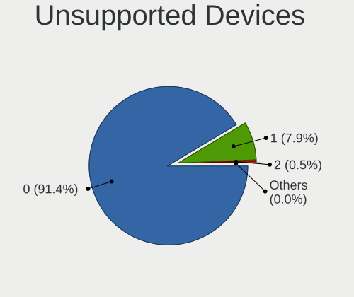

| Total | Desktops | Percent |
|-------|----------|---------|
| 0     | 12957    | 91.41%  |
| 1     | 1125     | 7.94%   |
| 2     | 68       | 0.48%   |
| 3     | 19       | 0.13%   |
| 7     | 3        | 0.02%   |
| 6     | 1        | 0.01%   |
| 5     | 1        | 0.01%   |
| 4     | 1        | 0.01%   |

Unsupported Device Types
------------------------

Types of unsupported devices

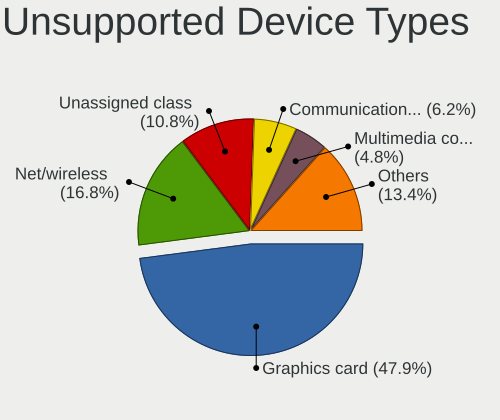

| Type                     | Desktops | Percent |
|--------------------------|----------|---------|
| Graphics card            | 616      | 47.94%  |
| Net/wireless             | 216      | 16.81%  |
| Unassigned class         | 139      | 10.82%  |
| Communication controller | 80       | 6.23%   |
| Multimedia controller    | 62       | 4.82%   |
| Chipcard                 | 55       | 4.28%   |
| Camera                   | 27       | 2.1%    |
| Bluetooth                | 17       | 1.32%   |
| Storage/raid             | 13       | 1.01%   |
| Card reader              | 12       | 0.93%   |
| Fingerprint reader       | 10       | 0.78%   |
| Sound                    | 8        | 0.62%   |
| Network                  | 7        | 0.54%   |
| Net/ethernet             | 7        | 0.54%   |
| Modem                    | 7        | 0.54%   |
| Wireless                 | 3        | 0.23%   |
| Storage/ata              | 2        | 0.16%   |
| Unclassified device      | 1        | 0.08%   |
| Storage                  | 1        | 0.08%   |
| Firewire controller      | 1        | 0.08%   |
| Dvb card                 | 1        | 0.08%   |

