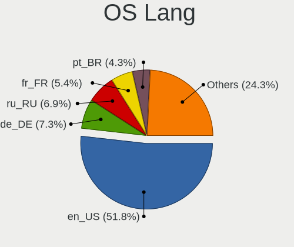
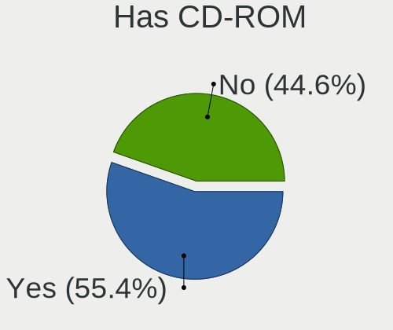
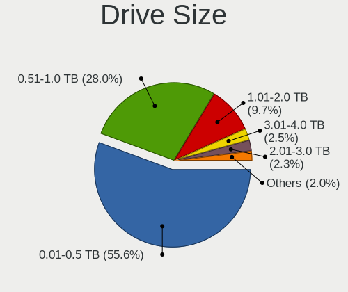
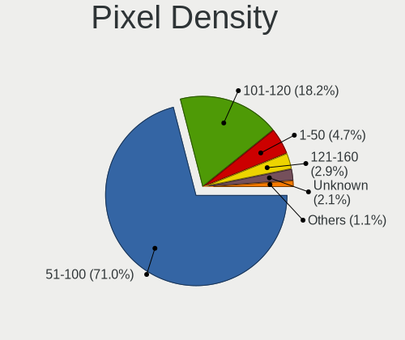
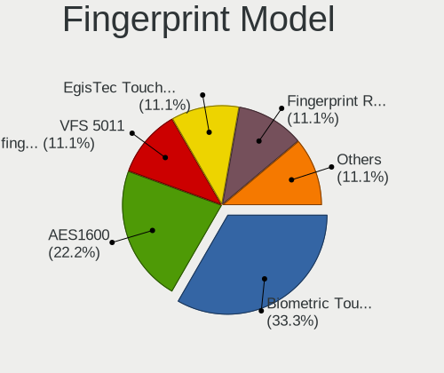

OpenMandriva - Tested Hardware & Statistics (Desktops)
------------------------------------------------------

A project to collect tested hardware configurations for OpenMandriva.

Anyone can contribute to this report by the [hw-probe](https://github.com/linuxhw/hw-probe) tool:

    sudo -E hw-probe -all -upload

Please contribute! Especially if your hardware is rare.

Contents
--------

* [ Test Cases ](#test-cases)

* [ System ](#system)
  - [ OS                       ](#os)
  - [ OS Family                ](#os-family)
  - [ Kernel                   ](#kernel)
  - [ Kernel Family            ](#kernel-family)
  - [ Kernel Major Ver.        ](#kernel-major-ver)
  - [ Arch                     ](#arch)
  - [ DE                       ](#de)
  - [ Display Server           ](#display-server)
  - [ Display Manager          ](#display-manager)
  - [ OS Lang                  ](#os-lang)
  - [ Boot Mode                ](#boot-mode)
  - [ Filesystem               ](#filesystem)
  - [ Part. scheme             ](#part-scheme)
  - [ Dual Boot with Linux/BSD ](#dual-boot-with-linuxbsd)
  - [ Dual Boot (Win)          ](#dual-boot-win)

* [ Board ](#board)
  - [ Vendor                   ](#vendor)
  - [ Model                    ](#model)
  - [ Model Family             ](#model-family)
  - [ MFG Year                 ](#mfg-year)
  - [ Form Factor              ](#form-factor)
  - [ Secure Boot              ](#secure-boot)
  - [ Coreboot                 ](#coreboot)
  - [ RAM Size                 ](#ram-size)
  - [ RAM Used                 ](#ram-used)
  - [ Total Drives             ](#total-drives)
  - [ Has CD-ROM               ](#has-cd-rom)
  - [ Has Ethernet             ](#has-ethernet)
  - [ Has WiFi                 ](#has-wifi)
  - [ Has Bluetooth            ](#has-bluetooth)

* [ Location ](#location)
  - [ Country                  ](#country)
  - [ City                     ](#city)

* [ Drives ](#drives)
  - [ Drive Vendor             ](#drive-vendor)
  - [ Drive Model              ](#drive-model)
  - [ HDD Vendor               ](#hdd-vendor)
  - [ SSD Vendor               ](#ssd-vendor)
  - [ Drive Kind               ](#drive-kind)
  - [ Drive Connector          ](#drive-connector)
  - [ Drive Size               ](#drive-size)
  - [ Space Total              ](#space-total)
  - [ Space Used               ](#space-used)
  - [ Malfunc. Drives          ](#malfunc-drives)
  - [ Malfunc. Drive Vendor    ](#malfunc-drive-vendor)
  - [ Malfunc. HDD Vendor      ](#malfunc-hdd-vendor)
  - [ Malfunc. Drive Kind      ](#malfunc-drive-kind)
  - [ Failed Drives            ](#failed-drives)
  - [ Failed Drive Vendor      ](#failed-drive-vendor)
  - [ Drive Status             ](#drive-status)

* [ Storage controller ](#storage-controller)
  - [ Storage Vendor           ](#storage-vendor)
  - [ Storage Model            ](#storage-model)
  - [ Storage Kind             ](#storage-kind)

* [ Processor ](#processor)
  - [ CPU Vendor               ](#cpu-vendor)
  - [ CPU Model                ](#cpu-model)
  - [ CPU Model Family         ](#cpu-model-family)
  - [ CPU Cores                ](#cpu-cores)
  - [ CPU Sockets              ](#cpu-sockets)
  - [ CPU Threads              ](#cpu-threads)
  - [ CPU Op-Modes             ](#cpu-op-modes)
  - [ CPU Microcode            ](#cpu-microcode)
  - [ CPU Microarch            ](#cpu-microarch)

* [ Graphics ](#graphics)
  - [ GPU Vendor               ](#gpu-vendor)
  - [ GPU Model                ](#gpu-model)
  - [ GPU Combo                ](#gpu-combo)
  - [ GPU Driver               ](#gpu-driver)
  - [ GPU Memory               ](#gpu-memory)

* [ Monitor ](#monitor)
  - [ Monitor Vendor           ](#monitor-vendor)
  - [ Monitor Model            ](#monitor-model)
  - [ Monitor Resolution       ](#monitor-resolution)
  - [ Monitor Diagonal         ](#monitor-diagonal)
  - [ Monitor Width            ](#monitor-width)
  - [ Aspect Ratio             ](#aspect-ratio)
  - [ Monitor Area             ](#monitor-area)
  - [ Pixel Density            ](#pixel-density)
  - [ Multiple Monitors        ](#multiple-monitors)

* [ Network ](#network)
  - [ Net Controller Vendor    ](#net-controller-vendor)
  - [ Net Controller Model     ](#net-controller-model)
  - [ Wireless Vendor          ](#wireless-vendor)
  - [ Wireless Model           ](#wireless-model)
  - [ Ethernet Vendor          ](#ethernet-vendor)
  - [ Ethernet Model           ](#ethernet-model)
  - [ Net Controller Kind      ](#net-controller-kind)
  - [ Used Controller          ](#used-controller)
  - [ NICs                     ](#nics)
  - [ IPv6                     ](#ipv6)

* [ Bluetooth ](#bluetooth)
  - [ Bluetooth Vendor         ](#bluetooth-vendor)
  - [ Bluetooth Model          ](#bluetooth-model)

* [ Sound ](#sound)
  - [ Sound Vendor             ](#sound-vendor)
  - [ Sound Model              ](#sound-model)

* [ Memory ](#memory)
  - [ Memory Vendor            ](#memory-vendor)
  - [ Memory Model             ](#memory-model)
  - [ Memory Kind              ](#memory-kind)
  - [ Memory Form Factor       ](#memory-form-factor)
  - [ Memory Size              ](#memory-size)
  - [ Memory Speed             ](#memory-speed)

* [ Printers & scanners ](#printers--scanners)
  - [ Printer Vendor           ](#printer-vendor)
  - [ Printer Model            ](#printer-model)
  - [ Scanner Vendor           ](#scanner-vendor)
  - [ Scanner Model            ](#scanner-model)

* [ Camera ](#camera)
  - [ Camera Vendor            ](#camera-vendor)
  - [ Camera Model             ](#camera-model)

* [ Security ](#security)
  - [ Fingerprint Vendor       ](#fingerprint-vendor)
  - [ Fingerprint Model        ](#fingerprint-model)
  - [ Chipcard Vendor          ](#chipcard-vendor)
  - [ Chipcard Model           ](#chipcard-model)

* [ Unsupported ](#unsupported)
  - [ Unsupported Devices      ](#unsupported-devices)
  - [ Unsupported Device Types ](#unsupported-device-types)

Test Cases
----------

Total: 10822

| Vendor        | Model                       | Probe                                                      | Date         |
|---------------|-----------------------------|------------------------------------------------------------|--------------|
| Gigabyte      | H81M-D2V                    | [aadc1a0c13](https://linux-hardware.org/?probe=aadc1a0c13) | Jan 06, 2025 |
| Gigabyte      | GA-MA770T-UD3               | [617c102331](https://linux-hardware.org/?probe=617c102331) | Jan 06, 2025 |
| MSI           | B75IA-E33                   | [f12ded84f2](https://linux-hardware.org/?probe=f12ded84f2) | Jan 06, 2025 |
| ASUSTek       | PRIME H510M-K R2.0          | [5fb39d6837](https://linux-hardware.org/?probe=5fb39d6837) | Jan 06, 2025 |
| Dell          | OptiPlex 745                | [578cc6d8f1](https://linux-hardware.org/?probe=578cc6d8f1) | Jan 06, 2025 |
| ASUSTek       | K30BF_M32BF_A_F_K31BF_6     | [0b29006a62](https://linux-hardware.org/?probe=0b29006a62) | Jan 06, 2025 |
| Gigabyte      | GA-78LMT-S2                 | [5321bb65b1](https://linux-hardware.org/?probe=5321bb65b1) | Jan 06, 2025 |
| MAXSUN        | MS-A86FX FS M.3             | [778b3689c2](https://linux-hardware.org/?probe=778b3689c2) | Jan 05, 2025 |
| Gigabyte      | GA-970A-D3                  | [cd33aa866c](https://linux-hardware.org/?probe=cd33aa866c) | Jan 05, 2025 |
| HP            | 2215                        | [d4d1a7ad27](https://linux-hardware.org/?probe=d4d1a7ad27) | Jan 05, 2025 |
| Lenovo        | 0x36C017AA SDK0J40700 WI... | [75606d7596](https://linux-hardware.org/?probe=75606d7596) | Jan 05, 2025 |
| MSI           | B450M MORTAR MAX            | [46e01ddb23](https://linux-hardware.org/?probe=46e01ddb23) | Jan 05, 2025 |
| Unknown       | Unknown                     | [fa69a9bfbc](https://linux-hardware.org/?probe=fa69a9bfbc) | Jan 05, 2025 |
| HP            | 3029h                       | [e46ab5ac4b](https://linux-hardware.org/?probe=e46ab5ac4b) | Jan 05, 2025 |
| Pegatron      | NARRA5                      | [350baa0b67](https://linux-hardware.org/?probe=350baa0b67) | Jan 05, 2025 |
| Gigabyte      | B560M AORUS PRO             | [f43945b8dd](https://linux-hardware.org/?probe=f43945b8dd) | Jan 05, 2025 |
| Dell          | 0HD5W2 A00                  | [a6858e47c5](https://linux-hardware.org/?probe=a6858e47c5) | Jan 05, 2025 |
| HP            | 3397                        | [95cc9c1997](https://linux-hardware.org/?probe=95cc9c1997) | Jan 05, 2025 |
| Gigabyte      | GA-MA785GMT-UD2H            | [7808d0395e](https://linux-hardware.org/?probe=7808d0395e) | Jan 05, 2025 |
| ASUSTek       | PRIME B450M-K II            | [cf7d50fae1](https://linux-hardware.org/?probe=cf7d50fae1) | Jan 04, 2025 |
| ASUSTek       | Maximus VIII RANGER         | [b536336740](https://linux-hardware.org/?probe=b536336740) | Jan 04, 2025 |
| Gigabyte      | 965GM-S2                    | [7d033b5974](https://linux-hardware.org/?probe=7d033b5974) | Jan 04, 2025 |
| MSI           | Z77A-G45 Thunderbolt        | [63dfc9cc1f](https://linux-hardware.org/?probe=63dfc9cc1f) | Jan 04, 2025 |
| Lenovo        | NOK                         | [2b5c2e2c8a](https://linux-hardware.org/?probe=2b5c2e2c8a) | Jan 04, 2025 |
| HC Technol... | HCAR5000-MI                 | [bbe1844c1c](https://linux-hardware.org/?probe=bbe1844c1c) | Jan 04, 2025 |
| Dell          | 040DDP A01                  | [63dc37783d](https://linux-hardware.org/?probe=63dc37783d) | Jan 04, 2025 |
| Gigabyte      | G41M-ES2L                   | [60cf453df6](https://linux-hardware.org/?probe=60cf453df6) | Jan 04, 2025 |
| Lenovo        | SHARKBAY 31900058 STD       | [3a2c8d629f](https://linux-hardware.org/?probe=3a2c8d629f) | Jan 04, 2025 |
| MSI           | A55M-E33                    | [491adf615a](https://linux-hardware.org/?probe=491adf615a) | Jan 04, 2025 |
| Lenovo        | 3141 SDK0J40697 WIN 3305... | [aeee08efea](https://linux-hardware.org/?probe=aeee08efea) | Jan 04, 2025 |
| Dell          | 0WMJ54 A01                  | [966f8de937](https://linux-hardware.org/?probe=966f8de937) | Jan 03, 2025 |
| HP            | 339A                        | [7fc68e979e](https://linux-hardware.org/?probe=7fc68e979e) | Jan 03, 2025 |
| ASUSTek       | PRIME Z270M-PLUS            | [32db9391d7](https://linux-hardware.org/?probe=32db9391d7) | Jan 03, 2025 |
| Dell          | 0GY6Y8 A03                  | [734e205226](https://linux-hardware.org/?probe=734e205226) | Jan 03, 2025 |
| Gigabyte      | G31M-S2L                    | [c04f5f8431](https://linux-hardware.org/?probe=c04f5f8431) | Jan 03, 2025 |
| Lenovo        | MAHOBAY NOK                 | [ed9753dfcf](https://linux-hardware.org/?probe=ed9753dfcf) | Jan 03, 2025 |
| MSI           | PRO B760M-E DDR4            | [4768eb71cc](https://linux-hardware.org/?probe=4768eb71cc) | Jan 03, 2025 |
| Intel         | DQ67SW AAG12527-310         | [a4c7be2f1a](https://linux-hardware.org/?probe=a4c7be2f1a) | Jan 03, 2025 |
| Gigabyte      | GA-78LMT-S2                 | [cf902d875a](https://linux-hardware.org/?probe=cf902d875a) | Jan 03, 2025 |
| Gigabyte      | H81M-S2H                    | [6a06903b4a](https://linux-hardware.org/?probe=6a06903b4a) | Jan 03, 2025 |
| Intel         | H55                         | [aada843724](https://linux-hardware.org/?probe=aada843724) | Jan 03, 2025 |
| AZW           | MINI S                      | [2067c73351](https://linux-hardware.org/?probe=2067c73351) | Jan 03, 2025 |
| Gigabyte      | F2A88XM-D3H                 | [0af9e3885f](https://linux-hardware.org/?probe=0af9e3885f) | Jan 02, 2025 |
| ASUSTek       | PRIME B550M-A WIFI II       | [5a6a67b7a4](https://linux-hardware.org/?probe=5a6a67b7a4) | Jan 02, 2025 |
| AZW           | GK mini                     | [3d87931055](https://linux-hardware.org/?probe=3d87931055) | Jan 02, 2025 |
| Dell          | 0HD5W2 A00                  | [abbdbd898d](https://linux-hardware.org/?probe=abbdbd898d) | Jan 02, 2025 |
| HP            | 83E9                        | [ee42824c61](https://linux-hardware.org/?probe=ee42824c61) | Jan 02, 2025 |
| MSI           | MEG Z790 ACE                | [7479e71d41](https://linux-hardware.org/?probe=7479e71d41) | Jan 02, 2025 |
| HP            | 0A9Ch                       | [d05c412a3b](https://linux-hardware.org/?probe=d05c412a3b) | Jan 02, 2025 |
| ASUSTek       | CM6330_CM6630_CM6730_CM6... | [e6075adfc0](https://linux-hardware.org/?probe=e6075adfc0) | Jan 02, 2025 |
| ASUSTek       | Z170-E                      | [42888378d7](https://linux-hardware.org/?probe=42888378d7) | Jan 02, 2025 |
| MSI           | X370 GAMING PRO CARBON      | [bb70ef7a51](https://linux-hardware.org/?probe=bb70ef7a51) | Jan 02, 2025 |
| Gigabyte      | B365M DS3H                  | [a49fde4df3](https://linux-hardware.org/?probe=a49fde4df3) | Jan 02, 2025 |
| Unknown       | X99-D3                      | [d79cb549a8](https://linux-hardware.org/?probe=d79cb549a8) | Jan 01, 2025 |
| Gigabyte      | GA-MA785GT-UD3H             | [bf30d86827](https://linux-hardware.org/?probe=bf30d86827) | Jan 01, 2025 |
| HP            | 0A5Ch                       | [46198b0dea](https://linux-hardware.org/?probe=46198b0dea) | Jan 01, 2025 |
| Shenzhen D... | MP100                       | [032508f9fd](https://linux-hardware.org/?probe=032508f9fd) | Jan 01, 2025 |
| Dell          | 02YYK5 A01                  | [97f04c0b58](https://linux-hardware.org/?probe=97f04c0b58) | Jan 01, 2025 |
| ASUSTek       | PRIME A520M-A II            | [dc2bdc4245](https://linux-hardware.org/?probe=dc2bdc4245) | Jan 01, 2025 |
| Gigabyte      | X570 AORUS PRO              | [9ad161a45a](https://linux-hardware.org/?probe=9ad161a45a) | Jan 01, 2025 |
| Dell          | 0NW73C A00                  | [3dfa88f059](https://linux-hardware.org/?probe=3dfa88f059) | Jan 01, 2025 |
| Dell          | 00V62H A01                  | [0133ba1278](https://linux-hardware.org/?probe=0133ba1278) | Jan 01, 2025 |
| SZMZ          | X99-S3                      | [f20bda8c75](https://linux-hardware.org/?probe=f20bda8c75) | Jan 01, 2025 |
| HP            | 2AF3                        | [27a5a9b662](https://linux-hardware.org/?probe=27a5a9b662) | Jan 01, 2025 |
| ASUSTek       | ROG STRIX B350-F GAMING     | [034de44629](https://linux-hardware.org/?probe=034de44629) | Jan 01, 2025 |
| Gigabyte      | X470 AORUS ULTRA GAMING-... | [31b95986eb](https://linux-hardware.org/?probe=31b95986eb) | Jan 01, 2025 |
| ASUSTek       | P5Q SE PLUS                 | [2e5a12a36b](https://linux-hardware.org/?probe=2e5a12a36b) | Jan 01, 2025 |
| ASUSTek       | A68HM-K                     | [800e2716b1](https://linux-hardware.org/?probe=800e2716b1) | Jan 01, 2025 |
| Foxconn       | 2AB1                        | [d937af7e89](https://linux-hardware.org/?probe=d937af7e89) | Jan 01, 2025 |
| ASUSTek       | P8Z77-V LX                  | [69679c9a35](https://linux-hardware.org/?probe=69679c9a35) | Dec 31, 2024 |
| Gigabyte      | H81M-S2PH                   | [8e18f9641a](https://linux-hardware.org/?probe=8e18f9641a) | Dec 31, 2024 |
| Dell          | 0Y5DDC A00                  | [54403714c3](https://linux-hardware.org/?probe=54403714c3) | Dec 31, 2024 |
| HP            | 3032h                       | [fb4af81907](https://linux-hardware.org/?probe=fb4af81907) | Dec 31, 2024 |
| ASUSTek       | PRIME B450M-K               | [4cb02f7ced](https://linux-hardware.org/?probe=4cb02f7ced) | Dec 31, 2024 |
| Gigabyte      | GA-MA770-DS3                | [d18eb4cf0d](https://linux-hardware.org/?probe=d18eb4cf0d) | Dec 31, 2024 |
| ASRock        | B450M-HDV R4.0              | [c996300bbf](https://linux-hardware.org/?probe=c996300bbf) | Dec 31, 2024 |
| Lenovo        | 36EB SDK0J40700 WIN 3258... | [e0e1513ce6](https://linux-hardware.org/?probe=e0e1513ce6) | Dec 31, 2024 |
| HP            | 802F                        | [5c6293b2ab](https://linux-hardware.org/?probe=5c6293b2ab) | Dec 31, 2024 |
| ASUSTek       | PRIME X570-P                | [3556a38021](https://linux-hardware.org/?probe=3556a38021) | Dec 31, 2024 |
| Lenovo        | MAHOBAY                     | [3e28e8ad9e](https://linux-hardware.org/?probe=3e28e8ad9e) | Dec 31, 2024 |
| Digiboard     | NM70-TI                     | [1a10dd8daf](https://linux-hardware.org/?probe=1a10dd8daf) | Dec 31, 2024 |
| Shenzhen M... | F6BFC                       | [431235e055](https://linux-hardware.org/?probe=431235e055) | Dec 31, 2024 |
| Intel         | H81                         | [00453f1bb7](https://linux-hardware.org/?probe=00453f1bb7) | Dec 31, 2024 |
| ASUSTek       | M4A78LT-M-LE                | [65345c7ef4](https://linux-hardware.org/?probe=65345c7ef4) | Dec 31, 2024 |
| ASUSTek       | M5A78L-M LE                 | [35ecdf468a](https://linux-hardware.org/?probe=35ecdf468a) | Dec 31, 2024 |
| ASUSTek       | P5G41T-M LX2/GB             | [61c106bd12](https://linux-hardware.org/?probe=61c106bd12) | Dec 30, 2024 |
| Foxconn       | 2ADA                        | [a56fc7e027](https://linux-hardware.org/?probe=a56fc7e027) | Dec 30, 2024 |
| HP            | 8768 A                      | [6a09384c14](https://linux-hardware.org/?probe=6a09384c14) | Dec 30, 2024 |
| HP            | 212B                        | [3cb08b6d4f](https://linux-hardware.org/?probe=3cb08b6d4f) | Dec 30, 2024 |
| ASUSTek       | M32CD                       | [a13b639022](https://linux-hardware.org/?probe=a13b639022) | Dec 30, 2024 |
| ASUSTek       | P8H61-M LX3 PLUS R2.0       | [529afc68af](https://linux-hardware.org/?probe=529afc68af) | Dec 30, 2024 |
| MSI           | 970A-G46                    | [11df9266e0](https://linux-hardware.org/?probe=11df9266e0) | Dec 30, 2024 |
| HP            | 8054                        | [c48b0d78c7](https://linux-hardware.org/?probe=c48b0d78c7) | Dec 30, 2024 |
| ASRock        | Z68 Extreme4 Gen3           | [9d23a9787e](https://linux-hardware.org/?probe=9d23a9787e) | Dec 30, 2024 |
| Gateway       | DX4860                      | [8fada96b83](https://linux-hardware.org/?probe=8fada96b83) | Dec 30, 2024 |
| ASRock        | B450M Pro4                  | [88b9fab21f](https://linux-hardware.org/?probe=88b9fab21f) | Dec 30, 2024 |
| HP            | 18E7                        | [b0312cea7a](https://linux-hardware.org/?probe=b0312cea7a) | Dec 30, 2024 |
| ASRock        | QC5000-ITX/PH               | [338593f255](https://linux-hardware.org/?probe=338593f255) | Dec 30, 2024 |
| MSI           | MAG B650 TOMAHAWK WIFI      | [e4be1dd2f3](https://linux-hardware.org/?probe=e4be1dd2f3) | Dec 30, 2024 |
| ASRock        | H110M-ITX                   | [c76e007602](https://linux-hardware.org/?probe=c76e007602) | Dec 30, 2024 |
| MSI           | Z97 GAMING 5                | [40b22f7ebe](https://linux-hardware.org/?probe=40b22f7ebe) | Dec 30, 2024 |
| Intel         | E5-A99 V1.0                 | [08bc3d7b5d](https://linux-hardware.org/?probe=08bc3d7b5d) | Dec 30, 2024 |
| ASRock        | 960GC-GS FX                 | [9e60ff1990](https://linux-hardware.org/?probe=9e60ff1990) | Dec 30, 2024 |
| MSI           | 990FXA-GD80                 | [8b2f125314](https://linux-hardware.org/?probe=8b2f125314) | Dec 30, 2024 |
| Dell          | 0G261D A00                  | [8fb7d29eda](https://linux-hardware.org/?probe=8fb7d29eda) | Dec 30, 2024 |
| Intel         | H110                        | [e5396f2a33](https://linux-hardware.org/?probe=e5396f2a33) | Dec 30, 2024 |
| ASRock        | FM2A68M-HD+                 | [f2bb2bd6da](https://linux-hardware.org/?probe=f2bb2bd6da) | Dec 30, 2024 |
| Lenovo        | ThinkCentre M90p 5536P79    | [e13ed7c057](https://linux-hardware.org/?probe=e13ed7c057) | Dec 30, 2024 |
| Lenovo        | ThinkCentre M90 5536W92     | [99cf8555fa](https://linux-hardware.org/?probe=99cf8555fa) | Dec 30, 2024 |
| HP            | 339A                        | [ad1a9035e9](https://linux-hardware.org/?probe=ad1a9035e9) | Dec 30, 2024 |
| Gigabyte      | A520M DS3H                  | [a8987243ad](https://linux-hardware.org/?probe=a8987243ad) | Dec 29, 2024 |
| Dell          | 0N4YC8 A00                  | [772d84bc08](https://linux-hardware.org/?probe=772d84bc08) | Dec 29, 2024 |
| ASUSTek       | H110M-K                     | [39970498c9](https://linux-hardware.org/?probe=39970498c9) | Dec 29, 2024 |
| MSI           | H97 PC Mate                 | [28a72759b6](https://linux-hardware.org/?probe=28a72759b6) | Dec 29, 2024 |
| ASUSTek       | SABERTOOTH 990FX            | [3beafb5cad](https://linux-hardware.org/?probe=3beafb5cad) | Dec 29, 2024 |
| MSI           | Z270 TOMAHAWK               | [1ac462bc8e](https://linux-hardware.org/?probe=1ac462bc8e) | Dec 29, 2024 |
| ASUSTek       | PRIME A320M-K               | [dae8bf9671](https://linux-hardware.org/?probe=dae8bf9671) | Dec 29, 2024 |
| HP            | 18E8                        | [43e6ef4f34](https://linux-hardware.org/?probe=43e6ef4f34) | Dec 29, 2024 |
| ASRock        | Z75 Pro3                    | [91580064a4](https://linux-hardware.org/?probe=91580064a4) | Dec 29, 2024 |
| Gigabyte      | 970A-DS3P                   | [b72ca39acc](https://linux-hardware.org/?probe=b72ca39acc) | Dec 29, 2024 |
| ASUSTek       | SABERTOOTH 990FX            | [a4f0949a45](https://linux-hardware.org/?probe=a4f0949a45) | Dec 29, 2024 |
| Foxconn       | 2ABF                        | [e4568577bd](https://linux-hardware.org/?probe=e4568577bd) | Dec 29, 2024 |
| HP            | 805D                        | [1c1e40f526](https://linux-hardware.org/?probe=1c1e40f526) | Dec 28, 2024 |
| HP            | 3397                        | [e063572f7c](https://linux-hardware.org/?probe=e063572f7c) | Dec 28, 2024 |
| ASRock        | X370M-HDV R4.0              | [b11c18364f](https://linux-hardware.org/?probe=b11c18364f) | Dec 28, 2024 |
| GEEKOM        | Mini IT13                   | [bd2773f098](https://linux-hardware.org/?probe=bd2773f098) | Dec 28, 2024 |
| ASUSTek       | SABERTOOTH 990FX R2.0       | [4f6862c902](https://linux-hardware.org/?probe=4f6862c902) | Dec 28, 2024 |
| HP            | 2B47                        | [1415963334](https://linux-hardware.org/?probe=1415963334) | Dec 28, 2024 |
| Gigabyte      | B250M-D3H-CF                | [ddda94bd1e](https://linux-hardware.org/?probe=ddda94bd1e) | Dec 28, 2024 |
| Foxconn       | H61MXE/-S/-V/-K             | [7297c64739](https://linux-hardware.org/?probe=7297c64739) | Dec 28, 2024 |
| Intel         | DZ75ML-45K AAG75008-102     | [8b81a310de](https://linux-hardware.org/?probe=8b81a310de) | Dec 28, 2024 |
| ASRock        | A620M-HDV/M.2               | [7bd64010ea](https://linux-hardware.org/?probe=7bd64010ea) | Dec 28, 2024 |
| MSI           | PRO B650-P WIFI             | [04864e7e53](https://linux-hardware.org/?probe=04864e7e53) | Dec 28, 2024 |
| MSI           | H61M-P22                    | [ea858ac153](https://linux-hardware.org/?probe=ea858ac153) | Dec 28, 2024 |
| Dell          | 096JG8 A01                  | [4324dc90bf](https://linux-hardware.org/?probe=4324dc90bf) | Dec 28, 2024 |
| Lenovo        | SHARKBAY 0B98401 PRO        | [2c6d3ec5d8](https://linux-hardware.org/?probe=2c6d3ec5d8) | Dec 28, 2024 |
| ASRock        | G31M-GS                     | [4eef3a1e4e](https://linux-hardware.org/?probe=4eef3a1e4e) | Dec 27, 2024 |
| ASRock        | AB350M Pro4                 | [bdb7ebff36](https://linux-hardware.org/?probe=bdb7ebff36) | Dec 27, 2024 |
| Gigabyte      | P55-UD3L                    | [1d3d66f3ac](https://linux-hardware.org/?probe=1d3d66f3ac) | Dec 27, 2024 |
| HP            | 8054                        | [2ad24afc7c](https://linux-hardware.org/?probe=2ad24afc7c) | Dec 27, 2024 |
| ASRock        | A320M Pro4 R2.0             | [21ce1b644b](https://linux-hardware.org/?probe=21ce1b644b) | Dec 27, 2024 |
| Lenovo        | ThinkCentre M81 5049D7G     | [2434fa6399](https://linux-hardware.org/?probe=2434fa6399) | Dec 27, 2024 |
| Unknown       | X79                         | [d721436769](https://linux-hardware.org/?probe=d721436769) | Dec 27, 2024 |
| ASRock        | A320M-HDV R4.0              | [283f8d39eb](https://linux-hardware.org/?probe=283f8d39eb) | Dec 27, 2024 |
| Gigabyte      | A520M K                     | [669dc7155c](https://linux-hardware.org/?probe=669dc7155c) | Dec 27, 2024 |
| ASUSTek       | PRIME B550M-A               | [119767b103](https://linux-hardware.org/?probe=119767b103) | Dec 27, 2024 |
| Huanan        | X99-4MF V1.0                | [86a5a82a39](https://linux-hardware.org/?probe=86a5a82a39) | Dec 26, 2024 |
| HP            | 212B                        | [0f306fdade](https://linux-hardware.org/?probe=0f306fdade) | Dec 26, 2024 |
| ASUSTek       | SABERTOOTH X99              | [a4baa76691](https://linux-hardware.org/?probe=a4baa76691) | Dec 26, 2024 |
| ASRock        | G41MH/USB3                  | [bb5fb7c7af](https://linux-hardware.org/?probe=bb5fb7c7af) | Dec 26, 2024 |
| Acer          | Veriton S6630G V:1.0        | [2cbeac15c3](https://linux-hardware.org/?probe=2cbeac15c3) | Dec 26, 2024 |
| Dell          | 0NDYHG A01                  | [110afa5611](https://linux-hardware.org/?probe=110afa5611) | Dec 26, 2024 |
| HP            | 805A                        | [d55f3bc8c3](https://linux-hardware.org/?probe=d55f3bc8c3) | Dec 26, 2024 |
| HP            | 1998                        | [35ce2043be](https://linux-hardware.org/?probe=35ce2043be) | Dec 26, 2024 |
| Gigabyte      | EP45-UD3LR                  | [244ba13e5e](https://linux-hardware.org/?probe=244ba13e5e) | Dec 25, 2024 |
| ASUSTek       | PRIME A520M-K               | [61d14e44b2](https://linux-hardware.org/?probe=61d14e44b2) | Dec 25, 2024 |
| ASUSTek       | PRIME H510M-K R2.0          | [0a2195b79e](https://linux-hardware.org/?probe=0a2195b79e) | Dec 25, 2024 |
| ASUSTek       | TUF Gaming B550M-PLUS       | [bcd19d252b](https://linux-hardware.org/?probe=bcd19d252b) | Dec 25, 2024 |
| Dell          | 0GM819                      | [bb31438b8d](https://linux-hardware.org/?probe=bb31438b8d) | Dec 25, 2024 |
| ASUSTek       | M5A78L LE                   | [0705f8159c](https://linux-hardware.org/?probe=0705f8159c) | Dec 25, 2024 |
| Lenovo        | SKYBAY SDK0J40705 WIN 34... | [94ac9002fa](https://linux-hardware.org/?probe=94ac9002fa) | Dec 25, 2024 |
| Unknown       | Unknown                     | [2815b29936](https://linux-hardware.org/?probe=2815b29936) | Dec 25, 2024 |
| ASUSTek       | PRIME A320M-K               | [52d87cf435](https://linux-hardware.org/?probe=52d87cf435) | Dec 25, 2024 |
| Unknown       | Unknown                     | [9dc841041f](https://linux-hardware.org/?probe=9dc841041f) | Dec 25, 2024 |
| MSI           | B450M PRO-VDH MAX           | [b095903374](https://linux-hardware.org/?probe=b095903374) | Dec 25, 2024 |
| HP            | 82FF                        | [cfa3f49c26](https://linux-hardware.org/?probe=cfa3f49c26) | Dec 25, 2024 |
| ASRock        | Z77 Extreme4                | [0bd8b4588d](https://linux-hardware.org/?probe=0bd8b4588d) | Dec 25, 2024 |
| Intel         | X99-H5 V2.0                 | [2261903b1d](https://linux-hardware.org/?probe=2261903b1d) | Dec 25, 2024 |
| ASUSTek       | D700SA                      | [cdea79b4a9](https://linux-hardware.org/?probe=cdea79b4a9) | Dec 25, 2024 |
| Gigabyte      | Z390 AORUS PRO WIFI-CF      | [9be6e4992c](https://linux-hardware.org/?probe=9be6e4992c) | Dec 25, 2024 |
| MSI           | Z97M-G43                    | [15aec5b879](https://linux-hardware.org/?probe=15aec5b879) | Dec 25, 2024 |
| HP            | 1998                        | [cdf0f59ddb](https://linux-hardware.org/?probe=cdf0f59ddb) | Dec 24, 2024 |
| Biostar       | H61MGC                      | [41e894b300](https://linux-hardware.org/?probe=41e894b300) | Dec 24, 2024 |
| Gigabyte      | EP45-DS3R                   | [a27723c275](https://linux-hardware.org/?probe=a27723c275) | Dec 24, 2024 |
| MSI           | A68HM-E33                   | [3744f7d334](https://linux-hardware.org/?probe=3744f7d334) | Dec 24, 2024 |
| ASUSTek       | GL10DH                      | [4d95f402c4](https://linux-hardware.org/?probe=4d95f402c4) | Dec 24, 2024 |
| GEEKOM        | XT12 Pro                    | [b728f081fd](https://linux-hardware.org/?probe=b728f081fd) | Dec 24, 2024 |
| HP            | 3646h                       | [dccac4d763](https://linux-hardware.org/?probe=dccac4d763) | Dec 24, 2024 |
| HP            | 2B4B                        | [fdbc072345](https://linux-hardware.org/?probe=fdbc072345) | Dec 24, 2024 |
| AMD           | Pumori CRB                  | [5f646677b2](https://linux-hardware.org/?probe=5f646677b2) | Dec 24, 2024 |
| Fujitsu       | D3432-A1 S26361-D3432-A1    | [47eec380bd](https://linux-hardware.org/?probe=47eec380bd) | Dec 24, 2024 |
| ASUSTek       | TUF Gaming B550M-PLUS       | [d64a12a02a](https://linux-hardware.org/?probe=d64a12a02a) | Dec 24, 2024 |
| MSI           | A78M-E35 V2                 | [37ed0bfc1f](https://linux-hardware.org/?probe=37ed0bfc1f) | Dec 24, 2024 |
| Dell          | 02YRK5 A02                  | [aa69d27c0b](https://linux-hardware.org/?probe=aa69d27c0b) | Dec 24, 2024 |
| ASUSTek       | P8Z68-V PRO GEN3            | [cbf66f88d2](https://linux-hardware.org/?probe=cbf66f88d2) | Dec 24, 2024 |
| Wistron       | ProLiant ML110 G6           | [1609625a37](https://linux-hardware.org/?probe=1609625a37) | Dec 24, 2024 |
| ASUSTek       | P5K Deluxe                  | [af438d2cae](https://linux-hardware.org/?probe=af438d2cae) | Dec 23, 2024 |
| Acer          | RS780HVF                    | [bbc9e843db](https://linux-hardware.org/?probe=bbc9e843db) | Dec 23, 2024 |
| Dell          | 0M6C7G A00                  | [375865cd09](https://linux-hardware.org/?probe=375865cd09) | Dec 23, 2024 |
| Gigabyte      | G31M-ES2L                   | [ba9c0c5153](https://linux-hardware.org/?probe=ba9c0c5153) | Dec 23, 2024 |
| MSI           | B450 TOMAHAWK MAX           | [7386613d29](https://linux-hardware.org/?probe=7386613d29) | Dec 23, 2024 |
| Gigabyte      | B75M-D3H                    | [fd8023f83c](https://linux-hardware.org/?probe=fd8023f83c) | Dec 23, 2024 |
| Fujitsu       | D3233-A1 S26361-D3233-A1    | [80598d6a43](https://linux-hardware.org/?probe=80598d6a43) | Dec 23, 2024 |
| ASUSTek       | P6T SE                      | [3269bf4415](https://linux-hardware.org/?probe=3269bf4415) | Dec 23, 2024 |
| Lenovo        | Bantry CRB 31900002 WIN ... | [2a9d2d981b](https://linux-hardware.org/?probe=2a9d2d981b) | Dec 23, 2024 |
| Gigabyte      | H110M-S2-CF                 | [1b9078c7d8](https://linux-hardware.org/?probe=1b9078c7d8) | Dec 23, 2024 |
| Acer          | Extensa X2610G              | [b056768ca1](https://linux-hardware.org/?probe=b056768ca1) | Dec 23, 2024 |
| ASRock        | G31M-S                      | [983b928868](https://linux-hardware.org/?probe=983b928868) | Dec 23, 2024 |
| Pegatron      | 2AD5                        | [494dd69ae1](https://linux-hardware.org/?probe=494dd69ae1) | Dec 23, 2024 |
| HP            | 1497                        | [9b71f5f802](https://linux-hardware.org/?probe=9b71f5f802) | Dec 23, 2024 |
| Intel         | B75                         | [94459409d1](https://linux-hardware.org/?probe=94459409d1) | Dec 23, 2024 |
| Gigabyte      | B450M H                     | [d4e50fb2da](https://linux-hardware.org/?probe=d4e50fb2da) | Dec 23, 2024 |
| Dell          | 0KWVT8 A02                  | [8a38805f0b](https://linux-hardware.org/?probe=8a38805f0b) | Dec 23, 2024 |
| ASUSTek       | PRIME H610M-R D4            | [2a762556a1](https://linux-hardware.org/?probe=2a762556a1) | Dec 23, 2024 |
| ECS           | Nettle3                     | [09b313a942](https://linux-hardware.org/?probe=09b313a942) | Dec 23, 2024 |
| Gigabyte      | X670 GAMING X AX            | [1c51df6d46](https://linux-hardware.org/?probe=1c51df6d46) | Dec 22, 2024 |
| ASUSTek       | M4A785-M                    | [7ca338168f](https://linux-hardware.org/?probe=7ca338168f) | Dec 22, 2024 |
| ASUSTek       | P8Z68-M PRO                 | [d7826b9a59](https://linux-hardware.org/?probe=d7826b9a59) | Dec 22, 2024 |
| ASUSTek       | H170M-PLUS                  | [1a3bfda1b2](https://linux-hardware.org/?probe=1a3bfda1b2) | Dec 22, 2024 |
| Dell          | 0PC5F7 A02                  | [c7272a6535](https://linux-hardware.org/?probe=c7272a6535) | Dec 22, 2024 |
| ASUSTek       | TUF Gaming B650-PLUS        | [e83481000e](https://linux-hardware.org/?probe=e83481000e) | Dec 22, 2024 |
| Gigabyte      | B450 I AORUS PRO WIFI-CF    | [9a174f4b8f](https://linux-hardware.org/?probe=9a174f4b8f) | Dec 22, 2024 |
| HP            | 843B                        | [6ae8cb479e](https://linux-hardware.org/?probe=6ae8cb479e) | Dec 22, 2024 |
| ASUSTek       | M5A78L-M LE                 | [c510ddb2e2](https://linux-hardware.org/?probe=c510ddb2e2) | Dec 22, 2024 |
| ASUSTek       | P5LD2-VM                    | [03bb592c4a](https://linux-hardware.org/?probe=03bb592c4a) | Dec 22, 2024 |
| ASUSTek       | PRIME Z370-A                | [17aedd4d99](https://linux-hardware.org/?probe=17aedd4d99) | Dec 22, 2024 |
| ASUSTek       | PRIME A320M-K               | [9a1d5cefd0](https://linux-hardware.org/?probe=9a1d5cefd0) | Dec 22, 2024 |
| AZW           | MINI S 10                   | [2309fa6c0a](https://linux-hardware.org/?probe=2309fa6c0a) | Dec 22, 2024 |
| ASUSTek       | Rampage II GENE             | [6358a8fcf5](https://linux-hardware.org/?probe=6358a8fcf5) | Dec 22, 2024 |
| Intel         | H61                         | [3b41c83d54](https://linux-hardware.org/?probe=3b41c83d54) | Dec 22, 2024 |
| Dell          | 0HY9JP A02                  | [ab65db9701](https://linux-hardware.org/?probe=ab65db9701) | Dec 22, 2024 |
| MSI           | H110M PRO-D                 | [b7c9d31dff](https://linux-hardware.org/?probe=b7c9d31dff) | Dec 22, 2024 |
| Dell          | 09KPNV A00                  | [3f5640444f](https://linux-hardware.org/?probe=3f5640444f) | Dec 21, 2024 |
| Gigabyte      | F2A85XM-D3H                 | [5d6d1c59a4](https://linux-hardware.org/?probe=5d6d1c59a4) | Dec 21, 2024 |
| Intel         | X99-P4 V8.2                 | [a590e5197c](https://linux-hardware.org/?probe=a590e5197c) | Dec 21, 2024 |
| ASRock        | P5B-DE                      | [88f13bcd5d](https://linux-hardware.org/?probe=88f13bcd5d) | Dec 21, 2024 |
| MSI           | B250M PRO-VDH               | [9728f996d5](https://linux-hardware.org/?probe=9728f996d5) | Dec 21, 2024 |
| ASUSTek       | ROG STRIX B450-E GAMING     | [5ffe3ed663](https://linux-hardware.org/?probe=5ffe3ed663) | Dec 21, 2024 |
| ASUSTek       | ROG STRIX Z590-E GAMING ... | [a891f1a560](https://linux-hardware.org/?probe=a891f1a560) | Dec 21, 2024 |
| ASUSTek       | PRIME H510M-A               | [2e9c14e21d](https://linux-hardware.org/?probe=2e9c14e21d) | Dec 21, 2024 |
| Dell          | 07X0Y8 A00                  | [cdba4e002d](https://linux-hardware.org/?probe=cdba4e002d) | Dec 21, 2024 |
| ASUSTek       | BM6660                      | [6a96fbe6fb](https://linux-hardware.org/?probe=6a96fbe6fb) | Dec 21, 2024 |
| Gigabyte      | H61M-S2P-B3                 | [ca83315819](https://linux-hardware.org/?probe=ca83315819) | Dec 21, 2024 |
| Gigabyte      | Z77X-UD3H                   | [1e178d7ba3](https://linux-hardware.org/?probe=1e178d7ba3) | Dec 21, 2024 |
| HP            | 2ADE                        | [200830e70d](https://linux-hardware.org/?probe=200830e70d) | Dec 21, 2024 |
| AZW           | Green G1                    | [86179ca152](https://linux-hardware.org/?probe=86179ca152) | Dec 21, 2024 |
| Biostar       | G41D3                       | [cdc2e02364](https://linux-hardware.org/?probe=cdc2e02364) | Dec 21, 2024 |
| Gigabyte      | M4HM85P-00                  | [1c9c5bd50a](https://linux-hardware.org/?probe=1c9c5bd50a) | Dec 21, 2024 |
| ASRock        | X670E Steel Legend          | [b80495ed1a](https://linux-hardware.org/?probe=b80495ed1a) | Dec 20, 2024 |
| ASRock        | B450M Pro4 R2.0             | [4f6028e7cc](https://linux-hardware.org/?probe=4f6028e7cc) | Dec 20, 2024 |
| Dell          | 0GDG8Y A00                  | [0219cb33b6](https://linux-hardware.org/?probe=0219cb33b6) | Dec 20, 2024 |
| ASUSTek       | H81-PLUS                    | [b1c71133ae](https://linux-hardware.org/?probe=b1c71133ae) | Dec 20, 2024 |
| Dell          | 0M863N A01                  | [6c1814a9f9](https://linux-hardware.org/?probe=6c1814a9f9) | Dec 20, 2024 |
| Lenovo        | 30D0 SDK0J40697 WIN 3305... | [bf94a86edc](https://linux-hardware.org/?probe=bf94a86edc) | Dec 20, 2024 |
| HP            | 8055                        | [549a29a030](https://linux-hardware.org/?probe=549a29a030) | Dec 20, 2024 |
| Lenovo        | MAHOBAY                     | [d526f3d692](https://linux-hardware.org/?probe=d526f3d692) | Dec 20, 2024 |
| HP            | 1589                        | [37255e8353](https://linux-hardware.org/?probe=37255e8353) | Dec 20, 2024 |
| ASUSTek       | H61M-E                      | [f975c50855](https://linux-hardware.org/?probe=f975c50855) | Dec 20, 2024 |
| ASRock        | H670M Pro RS                | [becb70cb39](https://linux-hardware.org/?probe=becb70cb39) | Dec 20, 2024 |
| ASRock        | A320M-HDV R4.0              | [7e87cc6d61](https://linux-hardware.org/?probe=7e87cc6d61) | Dec 20, 2024 |
| MSI           | B450 GAMING PRO CARBON M... | [08673a16c4](https://linux-hardware.org/?probe=08673a16c4) | Dec 20, 2024 |
| Gigabyte      | B560M DS3H                  | [f28c3f8b25](https://linux-hardware.org/?probe=f28c3f8b25) | Dec 20, 2024 |
| ASUSTek       | M5A78L LE                   | [99441ad0df](https://linux-hardware.org/?probe=99441ad0df) | Dec 20, 2024 |
| Gigabyte      | H81M-H                      | [c89e4827ed](https://linux-hardware.org/?probe=c89e4827ed) | Dec 20, 2024 |
| ASUSTek       | PRIME B450M-A               | [6c13efa61f](https://linux-hardware.org/?probe=6c13efa61f) | Dec 20, 2024 |
| Dell          | 0HR330                      | [0896ea906b](https://linux-hardware.org/?probe=0896ea906b) | Dec 20, 2024 |
| Gigabyte      | B550M K                     | [356514da21](https://linux-hardware.org/?probe=356514da21) | Dec 19, 2024 |
| ASUSTek       | K30BF_M32BF_A_F_K31BF_6     | [afd9e8ca40](https://linux-hardware.org/?probe=afd9e8ca40) | Dec 19, 2024 |
| ASRock        | A88M-G                      | [e1399629da](https://linux-hardware.org/?probe=e1399629da) | Dec 19, 2024 |
| ASUSTek       | Z97-K                       | [05b8112082](https://linux-hardware.org/?probe=05b8112082) | Dec 19, 2024 |
| HP            | 18E7                        | [5a4b0dfd19](https://linux-hardware.org/?probe=5a4b0dfd19) | Dec 19, 2024 |
| Gigabyte      | B75M-D3H                    | [24a9a318be](https://linux-hardware.org/?probe=24a9a318be) | Dec 19, 2024 |
| ASUSTek       | H110M-D                     | [e553338f2c](https://linux-hardware.org/?probe=e553338f2c) | Dec 19, 2024 |
| ASUSTek       | PRIME B450M-A               | [42a6edcbfb](https://linux-hardware.org/?probe=42a6edcbfb) | Dec 19, 2024 |
| Unknown       | Unknown                     | [36c61263b0](https://linux-hardware.org/?probe=36c61263b0) | Dec 19, 2024 |
| ASRock        | B550M Steel Legend          | [e843ef7f48](https://linux-hardware.org/?probe=e843ef7f48) | Dec 19, 2024 |
| ASUSTek       | P8H61-M LX2 R2.0            | [f50786aff4](https://linux-hardware.org/?probe=f50786aff4) | Dec 19, 2024 |
| Trigkey       | Green G4 10                 | [abe47751df](https://linux-hardware.org/?probe=abe47751df) | Dec 19, 2024 |
| SZMZ          | B75-MS V1.0                 | [ab711506a2](https://linux-hardware.org/?probe=ab711506a2) | Dec 19, 2024 |
| ASUSTek       | P5G41T-M LX3                | [1edf9902dd](https://linux-hardware.org/?probe=1edf9902dd) | Dec 19, 2024 |
| Gigabyte      | Z590 GAMING X               | [254ce873f6](https://linux-hardware.org/?probe=254ce873f6) | Dec 19, 2024 |
| Gigabyte      | B450 AORUS M                | [7dfcccc6eb](https://linux-hardware.org/?probe=7dfcccc6eb) | Dec 19, 2024 |
| ASUSTek       | PRIME B450M-A               | [52e0c1bf8f](https://linux-hardware.org/?probe=52e0c1bf8f) | Dec 19, 2024 |
| MSI           | B75MA-P45                   | [da146c44f0](https://linux-hardware.org/?probe=da146c44f0) | Dec 19, 2024 |
| MSI           | P55-GD65                    | [b331e16846](https://linux-hardware.org/?probe=b331e16846) | Dec 19, 2024 |
| Gigabyte      | X570S AORUS PRO AX          | [f0168d3f71](https://linux-hardware.org/?probe=f0168d3f71) | Dec 19, 2024 |
| ASUSTek       | CM1630                      | [8c63957f8b](https://linux-hardware.org/?probe=8c63957f8b) | Dec 19, 2024 |
| MSI           | Z390-A PRO                  | [8df543e380](https://linux-hardware.org/?probe=8df543e380) | Dec 19, 2024 |
| Apple         | Mac-F221BEC8                | [649d762772](https://linux-hardware.org/?probe=649d762772) | Dec 19, 2024 |
| Gigabyte      | H370M DS3H-CF               | [8eb604caeb](https://linux-hardware.org/?probe=8eb604caeb) | Dec 19, 2024 |
| MACHINIST     | E5-K9 V1.0                  | [0454705976](https://linux-hardware.org/?probe=0454705976) | Dec 19, 2024 |
| STGAUBRON     | B75M4 V1.1                  | [cdf3159da7](https://linux-hardware.org/?probe=cdf3159da7) | Dec 19, 2024 |
| ASRock        | H81M-HDS R2.0               | [7b753c30c2](https://linux-hardware.org/?probe=7b753c30c2) | Dec 18, 2024 |
| Gigabyte      | B75M-D3V                    | [b49a48d194](https://linux-hardware.org/?probe=b49a48d194) | Dec 18, 2024 |
| Gigabyte      | Q87M-D2H                    | [b99f7b8080](https://linux-hardware.org/?probe=b99f7b8080) | Dec 18, 2024 |
| Dell          | 0D441T A03                  | [4f2f4f1df7](https://linux-hardware.org/?probe=4f2f4f1df7) | Dec 18, 2024 |
| ASUSTek       | M4A79XTD EVO                | [94308b304f](https://linux-hardware.org/?probe=94308b304f) | Dec 18, 2024 |
| MSI           | PRO B760M-A WIFI DDR4       | [bf182b776d](https://linux-hardware.org/?probe=bf182b776d) | Dec 18, 2024 |
| Lenovo        | SHARKBAY NOK                | [9db3e7ed5a](https://linux-hardware.org/?probe=9db3e7ed5a) | Dec 18, 2024 |
| ASUSTek       | PRIME A320M-K               | [348937254f](https://linux-hardware.org/?probe=348937254f) | Dec 18, 2024 |
| Gigabyte      | 970A-DS3P                   | [0cdac872bc](https://linux-hardware.org/?probe=0cdac872bc) | Dec 18, 2024 |
| Intel         | IPC-ADN2L                   | [456aa729c1](https://linux-hardware.org/?probe=456aa729c1) | Dec 18, 2024 |
| Lenovo        | SHARKBAY SDK0J40697 WIN ... | [f9b15fdce1](https://linux-hardware.org/?probe=f9b15fdce1) | Dec 18, 2024 |
| MSI           | H81M-P33                    | [7fa7cfc46d](https://linux-hardware.org/?probe=7fa7cfc46d) | Dec 18, 2024 |
| Gigabyte      | B450M DS3H WIFI-CF          | [eb9e143dcc](https://linux-hardware.org/?probe=eb9e143dcc) | Dec 18, 2024 |
| MSI           | B550M PRO-VDH WIFI          | [2616349c03](https://linux-hardware.org/?probe=2616349c03) | Dec 18, 2024 |
| ASUSTek       | PRIME H410M-K               | [6de41c2f20](https://linux-hardware.org/?probe=6de41c2f20) | Dec 18, 2024 |
| ASUSTek       | P8H77-M LE                  | [3389c4a17c](https://linux-hardware.org/?probe=3389c4a17c) | Dec 18, 2024 |
| Pegatron      | 2AC2                        | [98b70ae737](https://linux-hardware.org/?probe=98b70ae737) | Dec 18, 2024 |
| ASRock        | 939N68PV-GLAN               | [c70bf790fe](https://linux-hardware.org/?probe=c70bf790fe) | Dec 18, 2024 |
| Dell          | 0HY9JP A00                  | [b6371323ef](https://linux-hardware.org/?probe=b6371323ef) | Dec 18, 2024 |
| Dell          | 0JP3NX A00                  | [ea6bad1e0a](https://linux-hardware.org/?probe=ea6bad1e0a) | Dec 18, 2024 |
| AZW           | U59                         | [38458ce296](https://linux-hardware.org/?probe=38458ce296) | Dec 18, 2024 |
| Unknown       | Unknown                     | [deb145f9f9](https://linux-hardware.org/?probe=deb145f9f9) | Dec 18, 2024 |
| Gigabyte      | GA-880GM-UD2H               | [42af74e9a9](https://linux-hardware.org/?probe=42af74e9a9) | Dec 18, 2024 |
| ASUSTek       | LEUCITE                     | [f61e7d37a2](https://linux-hardware.org/?probe=f61e7d37a2) | Dec 18, 2024 |
| HP            | 1632                        | [eaf5cb101f](https://linux-hardware.org/?probe=eaf5cb101f) | Dec 18, 2024 |
| Fujitsu Si... | D2164-A1 S26361-D2164-A1    | [e0c065a693](https://linux-hardware.org/?probe=e0c065a693) | Dec 18, 2024 |
| HP            | 8643 SMVB                   | [9091764f7e](https://linux-hardware.org/?probe=9091764f7e) | Dec 17, 2024 |
| MSI           | MS-7360                     | [d3638359ac](https://linux-hardware.org/?probe=d3638359ac) | Dec 17, 2024 |
| Acer          | Aspire X3960                | [935796fbb9](https://linux-hardware.org/?probe=935796fbb9) | Dec 17, 2024 |
| HP            | 2B2C                        | [0b3869847d](https://linux-hardware.org/?probe=0b3869847d) | Dec 17, 2024 |
| ASUSTek       | TUF Gaming B550M-PLUS       | [49455691cb](https://linux-hardware.org/?probe=49455691cb) | Dec 17, 2024 |
| ASUSTek       | ROG STRIX B550-F GAMING     | [5adf359ed4](https://linux-hardware.org/?probe=5adf359ed4) | Dec 17, 2024 |
| Lenovo        | 1064 SDK0T76528 WIN 3556... | [f140f9811e](https://linux-hardware.org/?probe=f140f9811e) | Dec 17, 2024 |
| Apple         | Mac-F221BEC8                | [7bfff86b7f](https://linux-hardware.org/?probe=7bfff86b7f) | Dec 17, 2024 |
| ASUSTek       | PRIME H310M-E R2.0          | [7b274f7500](https://linux-hardware.org/?probe=7b274f7500) | Dec 17, 2024 |
| Gigabyte      | G41MT-S2PT                  | [a4239ba143](https://linux-hardware.org/?probe=a4239ba143) | Dec 17, 2024 |
| ASUSTek       | PRIME B550M-A               | [fc30a73f46](https://linux-hardware.org/?probe=fc30a73f46) | Dec 17, 2024 |
| MSI           | MPG X870E CARBON WIFI       | [5a55b1482a](https://linux-hardware.org/?probe=5a55b1482a) | Dec 17, 2024 |
| ASUSTek       | PRIME H510M-A               | [0b3d28fe51](https://linux-hardware.org/?probe=0b3d28fe51) | Dec 17, 2024 |
| MAXSUN        | MS-Challenger B450M         | [32a2c0a5bf](https://linux-hardware.org/?probe=32a2c0a5bf) | Dec 17, 2024 |
| Dell          | 0GXM1W A00                  | [a2efe505a5](https://linux-hardware.org/?probe=a2efe505a5) | Dec 17, 2024 |
| HP            | 1495                        | [81994e4b0e](https://linux-hardware.org/?probe=81994e4b0e) | Dec 17, 2024 |
| ASRock        | B550 Phantom Gaming 4/ac    | [8d9d562242](https://linux-hardware.org/?probe=8d9d562242) | Dec 17, 2024 |
| ASUSTek       | PRIME B550-PLUS AC-HES      | [fb948c26ed](https://linux-hardware.org/?probe=fb948c26ed) | Dec 17, 2024 |
| ASUSTek       | ROG STRIX B460-H GAMING     | [5870f74cfc](https://linux-hardware.org/?probe=5870f74cfc) | Dec 17, 2024 |
| HP            | 83F2                        | [d6f68a1e91](https://linux-hardware.org/?probe=d6f68a1e91) | Dec 16, 2024 |
| ASUSTek       | PRIME B660-PLUS D4          | [75dce3a5ff](https://linux-hardware.org/?probe=75dce3a5ff) | Dec 16, 2024 |
| Intel         | X99                         | [1a147ad6e0](https://linux-hardware.org/?probe=1a147ad6e0) | Dec 16, 2024 |
| ASRock        | H510M-HDV/M.2 SE            | [6592ca3f42](https://linux-hardware.org/?probe=6592ca3f42) | Dec 16, 2024 |
| ASRock        | H81 Pro BTC R2.0            | [2bb573bea0](https://linux-hardware.org/?probe=2bb573bea0) | Dec 16, 2024 |
| ASRock        | Z370 Pro4                   | [bd29cc04f6](https://linux-hardware.org/?probe=bd29cc04f6) | Dec 16, 2024 |
| Lenovo        | SHARKBAY 0B98401 WIN        | [c3fec53206](https://linux-hardware.org/?probe=c3fec53206) | Dec 16, 2024 |
| Gigabyte      | Z170X-Ultra Gaming-CF       | [7e6a2bb396](https://linux-hardware.org/?probe=7e6a2bb396) | Dec 16, 2024 |
| HP            | 8054                        | [3196c09967](https://linux-hardware.org/?probe=3196c09967) | Dec 16, 2024 |
| Gigabyte      | F2A68HM-HD2                 | [69b82b01c8](https://linux-hardware.org/?probe=69b82b01c8) | Dec 16, 2024 |
| Medion        | H110H4-EM                   | [7e95fae863](https://linux-hardware.org/?probe=7e95fae863) | Dec 16, 2024 |
| ASUSTek       | PRIME X570-P                | [a88e3b9b74](https://linux-hardware.org/?probe=a88e3b9b74) | Dec 16, 2024 |
| HP            | 18E5                        | [252acd69a3](https://linux-hardware.org/?probe=252acd69a3) | Dec 16, 2024 |
| ASUSTek       | P5G41T-M LX2/GB             | [3e5a1f7df2](https://linux-hardware.org/?probe=3e5a1f7df2) | Dec 16, 2024 |
| Lenovo        | SHARKBAY SDK0E50510 WIN     | [781fc0f1cb](https://linux-hardware.org/?probe=781fc0f1cb) | Dec 16, 2024 |
| Dell          | 0C27VV A01                  | [e4d8fe24df](https://linux-hardware.org/?probe=e4d8fe24df) | Dec 16, 2024 |
| Gigabyte      | B450M DS3H V2               | [0d17c2a875](https://linux-hardware.org/?probe=0d17c2a875) | Dec 15, 2024 |
| HP            | 1494                        | [5f877b3923](https://linux-hardware.org/?probe=5f877b3923) | Dec 15, 2024 |
| AZW           | MINI S                      | [2fe134f22f](https://linux-hardware.org/?probe=2fe134f22f) | Dec 15, 2024 |
| ASRock        | X399 Taichi                 | [d271480a05](https://linux-hardware.org/?probe=d271480a05) | Dec 15, 2024 |
| MSI           | A320M-A PRO MAX             | [9c3b938ad7](https://linux-hardware.org/?probe=9c3b938ad7) | Dec 15, 2024 |
| MSI           | Z370 GAMING PRO CARBON A... | [8bf8630863](https://linux-hardware.org/?probe=8bf8630863) | Dec 15, 2024 |
| ASUSTek       | P7P55D                      | [e84de5749d](https://linux-hardware.org/?probe=e84de5749d) | Dec 15, 2024 |
| Gigabyte      | H310M S2P                   | [fb927e57a4](https://linux-hardware.org/?probe=fb927e57a4) | Dec 15, 2024 |
| ASUSTek       | ROG STRIX B660-G GAMING ... | [05b354d61e](https://linux-hardware.org/?probe=05b354d61e) | Dec 15, 2024 |
| PCWare        | IPMH110G-DDR3               | [80df541384](https://linux-hardware.org/?probe=80df541384) | Dec 15, 2024 |
| Unknown       | Unknown                     | [8892a53236](https://linux-hardware.org/?probe=8892a53236) | Dec 15, 2024 |
| Dell          | 0NC2VH A01                  | [4810f67ef7](https://linux-hardware.org/?probe=4810f67ef7) | Dec 15, 2024 |
| Gigabyte      | H97M-HD3                    | [0e0965bc17](https://linux-hardware.org/?probe=0e0965bc17) | Dec 15, 2024 |
| ASUSTek       | M5A97 LE R2.0               | [a04cae47e6](https://linux-hardware.org/?probe=a04cae47e6) | Dec 15, 2024 |
| Dell          | 0PC5F7 A02                  | [300b0dac16](https://linux-hardware.org/?probe=300b0dac16) | Dec 15, 2024 |
| Unknown       | Unknown                     | [55868f7894](https://linux-hardware.org/?probe=55868f7894) | Dec 15, 2024 |
| Positivo      | POS-PIB150DT 11132270       | [c3a85ea71c](https://linux-hardware.org/?probe=c3a85ea71c) | Dec 15, 2024 |
| ASUSTek       | SABERTOOTH Z87              | [8eeff9db9d](https://linux-hardware.org/?probe=8eeff9db9d) | Dec 14, 2024 |
| ASUSTek       | M4A87TD/USB3                | [a14debaa36](https://linux-hardware.org/?probe=a14debaa36) | Dec 14, 2024 |
| ASUSTek       | TUF Gaming B550M-PLUS       | [7fe45e1a05](https://linux-hardware.org/?probe=7fe45e1a05) | Dec 14, 2024 |
| Unknown       | Unknown                     | [48bf121bc0](https://linux-hardware.org/?probe=48bf121bc0) | Dec 14, 2024 |
| HP            | 8184 X4                     | [bbb778251a](https://linux-hardware.org/?probe=bbb778251a) | Dec 14, 2024 |
| Dell          | 0TDG4V A00                  | [e8c33005d3](https://linux-hardware.org/?probe=e8c33005d3) | Dec 14, 2024 |
| MSI           | Z170A PC MATE               | [226a30cded](https://linux-hardware.org/?probe=226a30cded) | Dec 14, 2024 |
| Unknown       | Unknown                     | [ded8937413](https://linux-hardware.org/?probe=ded8937413) | Dec 14, 2024 |
| Gigabyte      | B450M DS3H V2               | [bfdca9bd38](https://linux-hardware.org/?probe=bfdca9bd38) | Dec 14, 2024 |
| ASUSTek       | P8Z77-V LX                  | [e1c4faae76](https://linux-hardware.org/?probe=e1c4faae76) | Dec 14, 2024 |
| Lenovo        | MAHOBAY NOK                 | [d8587c000b](https://linux-hardware.org/?probe=d8587c000b) | Dec 14, 2024 |
| HP            | 339A                        | [51ac462459](https://linux-hardware.org/?probe=51ac462459) | Dec 14, 2024 |
| ASUSTek       | PRIME B760M-R D4            | [6e6705253e](https://linux-hardware.org/?probe=6e6705253e) | Dec 14, 2024 |
| Pegatron      | VIOLET                      | [94fe59184c](https://linux-hardware.org/?probe=94fe59184c) | Dec 14, 2024 |
| Unknown       | Unknown                     | [62942fa339](https://linux-hardware.org/?probe=62942fa339) | Dec 14, 2024 |
| Acer          | Veriton M480                | [33294db2d5](https://linux-hardware.org/?probe=33294db2d5) | Dec 14, 2024 |
| ASRock        | X570 Phantom Gaming-ITX/... | [ff22af564e](https://linux-hardware.org/?probe=ff22af564e) | Dec 14, 2024 |
| ASRock        | H510M-HVS R2.0              | [2a3e145431](https://linux-hardware.org/?probe=2a3e145431) | Dec 14, 2024 |
| Gigabyte      | B550M AORUS ELITE           | [12b3f9b280](https://linux-hardware.org/?probe=12b3f9b280) | Dec 14, 2024 |
| Dell          | 096JG8 A01                  | [63cf395d23](https://linux-hardware.org/?probe=63cf395d23) | Dec 14, 2024 |
| Lenovo        | SHARKBAY 0C48431 PRO        | [342b875683](https://linux-hardware.org/?probe=342b875683) | Dec 14, 2024 |
| Dell          | 0YNVJG A01                  | [463e6f71a4](https://linux-hardware.org/?probe=463e6f71a4) | Dec 14, 2024 |
| ASUSTek       | P8Z77-V LX2                 | [cf973ad670](https://linux-hardware.org/?probe=cf973ad670) | Dec 14, 2024 |
| ASRock        | X299 Taichi XE              | [23e15f73e6](https://linux-hardware.org/?probe=23e15f73e6) | Dec 14, 2024 |
| Gigabyte      | EP43-DS3L                   | [8e265a79bd](https://linux-hardware.org/?probe=8e265a79bd) | Dec 14, 2024 |
| ASRock        | N68-GE3 UCC                 | [f8bf90b3fb](https://linux-hardware.org/?probe=f8bf90b3fb) | Dec 13, 2024 |
| ASUSTek       | P8Z77-V LK                  | [d58cfe7ef7](https://linux-hardware.org/?probe=d58cfe7ef7) | Dec 13, 2024 |
| AMI           | Intel                       | [122e2f11d0](https://linux-hardware.org/?probe=122e2f11d0) | Dec 13, 2024 |
| Dell          | 0WMJ54 A01                  | [5d62063d9e](https://linux-hardware.org/?probe=5d62063d9e) | Dec 13, 2024 |
| ASRock        | 970 Pro3 R2.0               | [a80ba72f56](https://linux-hardware.org/?probe=a80ba72f56) | Dec 13, 2024 |
| MSI           | Z590 PRO WIFI               | [44541e695d](https://linux-hardware.org/?probe=44541e695d) | Dec 13, 2024 |
| Lenovo        | SHARKBAY 31900058 STD       | [e17f61a1f8](https://linux-hardware.org/?probe=e17f61a1f8) | Dec 13, 2024 |
| ASUSTek       | PRIME H510M-E               | [6ade667db2](https://linux-hardware.org/?probe=6ade667db2) | Dec 13, 2024 |
| Biostar       | B550MXC PRO                 | [eac2b7130f](https://linux-hardware.org/?probe=eac2b7130f) | Dec 13, 2024 |
| Gigabyte      | A520M K V2                  | [503327783f](https://linux-hardware.org/?probe=503327783f) | Dec 13, 2024 |
| Dell          | 0C27VV A02                  | [f66c549cec](https://linux-hardware.org/?probe=f66c549cec) | Dec 13, 2024 |
| Dell          | 042P49 A02                  | [c20e30f7fc](https://linux-hardware.org/?probe=c20e30f7fc) | Dec 13, 2024 |
| ASUSTek       | M2N68-AM SE2                | [8b53c864fe](https://linux-hardware.org/?probe=8b53c864fe) | Dec 13, 2024 |
| Dell          | 0N4YC8 A00                  | [292ab9f2e5](https://linux-hardware.org/?probe=292ab9f2e5) | Dec 13, 2024 |
| HP            | 843B                        | [20c865cfe9](https://linux-hardware.org/?probe=20c865cfe9) | Dec 13, 2024 |
| MSI           | MPG X570 GAMING PLUS        | [e2ccc250fb](https://linux-hardware.org/?probe=e2ccc250fb) | Dec 13, 2024 |
| ASUSTek       | ROG STRIX X470-F GAMING     | [263df008c5](https://linux-hardware.org/?probe=263df008c5) | Dec 13, 2024 |
| Intel         | DH61ZE AAG43004-200         | [6e9ec5fdc8](https://linux-hardware.org/?probe=6e9ec5fdc8) | Dec 13, 2024 |
| MSI           | B450 TOMAHAWK               | [aa7ebb1b4a](https://linux-hardware.org/?probe=aa7ebb1b4a) | Dec 13, 2024 |
| AMD           | A88                         | [f6e719736c](https://linux-hardware.org/?probe=f6e719736c) | Dec 12, 2024 |
| MSI           | Z97 GAMING 5                | [e41e77f484](https://linux-hardware.org/?probe=e41e77f484) | Dec 12, 2024 |
| HP            | 2B47                        | [856b94c173](https://linux-hardware.org/?probe=856b94c173) | Dec 12, 2024 |
| Gigabyte      | MKLP7AP-00                  | [3468d571f4](https://linux-hardware.org/?probe=3468d571f4) | Dec 12, 2024 |
| Dell          | 0NW6H5 A00                  | [68820ccb82](https://linux-hardware.org/?probe=68820ccb82) | Dec 12, 2024 |
| Gigabyte      | B85M-D3H                    | [835a4f4d23](https://linux-hardware.org/?probe=835a4f4d23) | Dec 12, 2024 |
| Gigabyte      | GA-78LMT-USB3 x.x           | [093ab9d71c](https://linux-hardware.org/?probe=093ab9d71c) | Dec 12, 2024 |
| MSI           | B250I GAMING PRO AC         | [b6c3e35ea6](https://linux-hardware.org/?probe=b6c3e35ea6) | Dec 12, 2024 |
| Acer          | Aspire M1470                | [92955cff66](https://linux-hardware.org/?probe=92955cff66) | Dec 12, 2024 |
| Dell          | 09M47G A00                  | [c3b1e4864a](https://linux-hardware.org/?probe=c3b1e4864a) | Dec 12, 2024 |
| Dell          | 0GXM1W A00                  | [c5335e493b](https://linux-hardware.org/?probe=c5335e493b) | Dec 12, 2024 |
| ASRock        | G31M-GS                     | [ba92b331f9](https://linux-hardware.org/?probe=ba92b331f9) | Dec 12, 2024 |
| HP            | 805D                        | [de537ec8b7](https://linux-hardware.org/?probe=de537ec8b7) | Dec 12, 2024 |
| ASUSTek       | ROG STRIX B550-F GAMING     | [d1bfd63754](https://linux-hardware.org/?probe=d1bfd63754) | Dec 12, 2024 |
| ASUSTek       | Z170M-PLUS                  | [329295b950](https://linux-hardware.org/?probe=329295b950) | Dec 12, 2024 |
| HP            | 339A                        | [df4384cf2b](https://linux-hardware.org/?probe=df4384cf2b) | Dec 12, 2024 |
| Dell          | 0KC9NP A01                  | [40ceb358f9](https://linux-hardware.org/?probe=40ceb358f9) | Dec 12, 2024 |
| Gigabyte      | H610M H V3 DDR4             | [a7657767a7](https://linux-hardware.org/?probe=a7657767a7) | Dec 12, 2024 |
| MSI           | MPG B550 GAMING PLUS        | [474d59def7](https://linux-hardware.org/?probe=474d59def7) | Dec 12, 2024 |
| ASUSTek       | M2N-SLI                     | [137df4dff6](https://linux-hardware.org/?probe=137df4dff6) | Dec 12, 2024 |
| ASUSTek       | PRIME H510M-R               | [afffb5c934](https://linux-hardware.org/?probe=afffb5c934) | Dec 12, 2024 |
| Gigabyte      | X570 AORUS MASTER           | [9e851507fc](https://linux-hardware.org/?probe=9e851507fc) | Dec 12, 2024 |
| Gigabyte      | EP31-DS3L                   | [a2d6582306](https://linux-hardware.org/?probe=a2d6582306) | Dec 12, 2024 |
| Gigabyte      | H470M DS3H                  | [15f8300927](https://linux-hardware.org/?probe=15f8300927) | Dec 12, 2024 |
| Gigabyte      | 945P-S3                     | [47cce301db](https://linux-hardware.org/?probe=47cce301db) | Dec 12, 2024 |
| MSI           | B550M-A PRO                 | [0ca583089a](https://linux-hardware.org/?probe=0ca583089a) | Dec 12, 2024 |
| ASRock        | H310CM-HDV/M.2 SE           | [3fafbb2133](https://linux-hardware.org/?probe=3fafbb2133) | Dec 12, 2024 |
| Intel         | H61                         | [2f69f512f3](https://linux-hardware.org/?probe=2f69f512f3) | Dec 12, 2024 |
| Dell          | 00V62H A00                  | [819dcf4075](https://linux-hardware.org/?probe=819dcf4075) | Dec 12, 2024 |
| Unknown       | Unknown                     | [ed65661387](https://linux-hardware.org/?probe=ed65661387) | Dec 12, 2024 |
| ASRock        | G31M-S                      | [e909cba66c](https://linux-hardware.org/?probe=e909cba66c) | Dec 12, 2024 |
| Acer          | Aspire XC-217               | [c83b898f91](https://linux-hardware.org/?probe=c83b898f91) | Dec 12, 2024 |
| Gigabyte      | B550M AORUS ELITE           | [e88c90c07d](https://linux-hardware.org/?probe=e88c90c07d) | Dec 12, 2024 |
| Gigabyte      | M68MT-S2                    | [4040206002](https://linux-hardware.org/?probe=4040206002) | Dec 12, 2024 |
| Acer          | Predator PO3-600 V:1.1      | [f1bf00b4ee](https://linux-hardware.org/?probe=f1bf00b4ee) | Dec 12, 2024 |
| Acer          | Aspire XC-1760              | [791de3d9c7](https://linux-hardware.org/?probe=791de3d9c7) | Dec 12, 2024 |
| Gigabyte      | B760 DS3H AX DDR4           | [ff4117e2d4](https://linux-hardware.org/?probe=ff4117e2d4) | Dec 12, 2024 |
| AMI           | Intel                       | [e4d540364c](https://linux-hardware.org/?probe=e4d540364c) | Dec 12, 2024 |
| Dell          | 0C27VV A02                  | [98eb45ffe1](https://linux-hardware.org/?probe=98eb45ffe1) | Dec 11, 2024 |
| AMI           | Intel                       | [9387b0b63c](https://linux-hardware.org/?probe=9387b0b63c) | Dec 11, 2024 |
| Gigabyte      | B550 AORUS ELITE AX V2      | [a8e6ed60fc](https://linux-hardware.org/?probe=a8e6ed60fc) | Dec 11, 2024 |
| HP            | 8AB6 SMVB                   | [24c38fdec1](https://linux-hardware.org/?probe=24c38fdec1) | Dec 11, 2024 |
| Gigabyte      | B660 GAMING X DDR4          | [1b40e982de](https://linux-hardware.org/?probe=1b40e982de) | Dec 11, 2024 |
| ASUSTek       | P8Z77-V PRO                 | [c8a33130de](https://linux-hardware.org/?probe=c8a33130de) | Dec 11, 2024 |
| MSI           | PRO B760-P WIFI DDR4        | [d31df0a834](https://linux-hardware.org/?probe=d31df0a834) | Dec 11, 2024 |
| Lenovo        | MAHOBAY NO DPK              | [c5d5aaca89](https://linux-hardware.org/?probe=c5d5aaca89) | Dec 11, 2024 |
| Gigabyte      | A520M S2H                   | [f9989a915e](https://linux-hardware.org/?probe=f9989a915e) | Dec 11, 2024 |
| Gigabyte      | B450M DS3H V2               | [a60bd4a552](https://linux-hardware.org/?probe=a60bd4a552) | Dec 11, 2024 |
| Lenovo        | SHARKBAY NOK                | [5cd46a0402](https://linux-hardware.org/?probe=5cd46a0402) | Dec 11, 2024 |
| GEEKOM        | A8                          | [1e47174e35](https://linux-hardware.org/?probe=1e47174e35) | Dec 11, 2024 |
| ASUSTek       | X99-S                       | [9dd3ab24cd](https://linux-hardware.org/?probe=9dd3ab24cd) | Dec 11, 2024 |
| Gigabyte      | B365M DS3H                  | [c57a6afba7](https://linux-hardware.org/?probe=c57a6afba7) | Dec 10, 2024 |
| Dell          | 0F6X5P A00                  | [680aead333](https://linux-hardware.org/?probe=680aead333) | Dec 10, 2024 |
| MSI           | MS-7250                     | [2b89ec0eee](https://linux-hardware.org/?probe=2b89ec0eee) | Dec 09, 2024 |
| ASUSTek       | P8Z77-V PRO                 | [f13d7b03f6](https://linux-hardware.org/?probe=f13d7b03f6) | Dec 08, 2024 |
| Dell          | 082WXT A01                  | [2af24c92cd](https://linux-hardware.org/?probe=2af24c92cd) | Dec 08, 2024 |
| HP            | 2820h                       | [b2bef4daf8](https://linux-hardware.org/?probe=b2bef4daf8) | Dec 08, 2024 |
| AZW           | MINI S                      | [cfba2893b1](https://linux-hardware.org/?probe=cfba2893b1) | Dec 07, 2024 |
| Dell          | 0VRWRC A00                  | [e5eed30893](https://linux-hardware.org/?probe=e5eed30893) | Dec 07, 2024 |
| Unknown       | Unknown                     | [ed080e6dcc](https://linux-hardware.org/?probe=ed080e6dcc) | Dec 06, 2024 |
| Lenovo        | MAHOBAY Win8 MM DPK IPG     | [e885620f20](https://linux-hardware.org/?probe=e885620f20) | Dec 06, 2024 |
| MSI           | H61M-P23                    | [4e730504db](https://linux-hardware.org/?probe=4e730504db) | Dec 06, 2024 |
| MSI           | A88XI AC V2                 | [3bd43ba035](https://linux-hardware.org/?probe=3bd43ba035) | Dec 06, 2024 |
| ASUSTek       | PRIME B450-PLUS             | [cdb9d074c0](https://linux-hardware.org/?probe=cdb9d074c0) | Dec 06, 2024 |
| Dell          | 0CWR57 A01                  | [38bea64860](https://linux-hardware.org/?probe=38bea64860) | Dec 06, 2024 |
| MSI           | PRO Z690-A WIFI DDR4        | [dd80673855](https://linux-hardware.org/?probe=dd80673855) | Dec 05, 2024 |
| Gigabyte      | G31M-S2L                    | [a8795f3981](https://linux-hardware.org/?probe=a8795f3981) | Dec 04, 2024 |
| Dell          | 0MN1TX A02                  | [bcf2f132b0](https://linux-hardware.org/?probe=bcf2f132b0) | Dec 04, 2024 |
| Dell          | 0YP806 A02                  | [e738237e89](https://linux-hardware.org/?probe=e738237e89) | Dec 04, 2024 |
| Unknown       | Unknown                     | [c832be89c4](https://linux-hardware.org/?probe=c832be89c4) | Dec 03, 2024 |
| ASUSTek       | A68HM-K                     | [89d399cdc0](https://linux-hardware.org/?probe=89d399cdc0) | Dec 03, 2024 |
| ASUSTek       | Z87-PRO                     | [029f1c1e1b](https://linux-hardware.org/?probe=029f1c1e1b) | Dec 03, 2024 |
| MSI           | X299 SLI PLUS               | [e487fc8054](https://linux-hardware.org/?probe=e487fc8054) | Dec 01, 2024 |
| Unknown       | Unknown                     | [3405878ab6](https://linux-hardware.org/?probe=3405878ab6) | Dec 01, 2024 |
| Bochs         | Unknown                     | [79ec6f96e4](https://linux-hardware.org/?probe=79ec6f96e4) | Dec 01, 2024 |
| Dell          | 088DT1 A01                  | [ba38d6b924](https://linux-hardware.org/?probe=ba38d6b924) | Dec 01, 2024 |
| Dell          | 0VNP2H A00                  | [d1a2135f92](https://linux-hardware.org/?probe=d1a2135f92) | Nov 30, 2024 |
| ASUSTek       | PRIME B450M-A               | [2583ce4301](https://linux-hardware.org/?probe=2583ce4301) | Nov 30, 2024 |
| HP            | 304Ah                       | [9c4499ff99](https://linux-hardware.org/?probe=9c4499ff99) | Nov 30, 2024 |
| Unknown       | Unknown                     | [d6d61e90b7](https://linux-hardware.org/?probe=d6d61e90b7) | Nov 30, 2024 |
| Gigabyte      | H61M-DS2                    | [ce0e3b2719](https://linux-hardware.org/?probe=ce0e3b2719) | Nov 29, 2024 |
| BESSTAR Te... | UM700                       | [5c18419477](https://linux-hardware.org/?probe=5c18419477) | Nov 29, 2024 |
| Dell          | 042P49 A02                  | [6c4c6577ac](https://linux-hardware.org/?probe=6c4c6577ac) | Nov 29, 2024 |
| MSI           | MPG B550 GAMING PLUS        | [7e2cca4ada](https://linux-hardware.org/?probe=7e2cca4ada) | Nov 28, 2024 |
| Gigabyte      | H81M-D2W                    | [c0db894e36](https://linux-hardware.org/?probe=c0db894e36) | Nov 28, 2024 |
| ASUSTek       | P5G41-M LE                  | [d31490c125](https://linux-hardware.org/?probe=d31490c125) | Nov 28, 2024 |
| ASRock        | X570 Phantom Gaming 4       | [74716c6624](https://linux-hardware.org/?probe=74716c6624) | Nov 28, 2024 |
| Lenovo        | 36C7 SDK0J40697 WIN 3305... | [d113defbe8](https://linux-hardware.org/?probe=d113defbe8) | Nov 27, 2024 |
| HP            | 18E7                        | [6dbb855fd6](https://linux-hardware.org/?probe=6dbb855fd6) | Nov 26, 2024 |
| Lenovo        | 3106 SDK0J40697 WIN 3305... | [2e121a8a35](https://linux-hardware.org/?probe=2e121a8a35) | Nov 26, 2024 |
| ASUSTek       | P5KPL-AM EPU                | [83fc08b3cc](https://linux-hardware.org/?probe=83fc08b3cc) | Nov 25, 2024 |
| Gigabyte      | AB350M-DS3H V2-CF           | [07ef34a01f](https://linux-hardware.org/?probe=07ef34a01f) | Nov 25, 2024 |
| Dell          | 030VXY A05                  | [4897f51a88](https://linux-hardware.org/?probe=4897f51a88) | Nov 25, 2024 |
| Intel         | B75                         | [b8e4743721](https://linux-hardware.org/?probe=b8e4743721) | Nov 24, 2024 |
| MSI           | MPG X570 GAMING EDGE WIF... | [60acd12d71](https://linux-hardware.org/?probe=60acd12d71) | Nov 24, 2024 |
| Lenovo        | 31900058 STD                | [dfea5f8644](https://linux-hardware.org/?probe=dfea5f8644) | Nov 24, 2024 |
| ASUSTek       | PRIME A520M-K               | [db71db68e5](https://linux-hardware.org/?probe=db71db68e5) | Nov 23, 2024 |
| MSI           | MPG X570 GAMING PLUS        | [8bc7c644b4](https://linux-hardware.org/?probe=8bc7c644b4) | Nov 23, 2024 |
| ASRock Ind... | 4X4-8000 Series             | [0220306c05](https://linux-hardware.org/?probe=0220306c05) | Nov 23, 2024 |
| HP            | 1497                        | [a0ee162b98](https://linux-hardware.org/?probe=a0ee162b98) | Nov 23, 2024 |
| Gigabyte      | H510M H V2                  | [a9d59f6f5f](https://linux-hardware.org/?probe=a9d59f6f5f) | Nov 23, 2024 |
| ASUSTek       | H110M-R                     | [852cf08f03](https://linux-hardware.org/?probe=852cf08f03) | Nov 23, 2024 |
| ASUSTek       | Pro B550M-C                 | [e532c8a2c5](https://linux-hardware.org/?probe=e532c8a2c5) | Nov 23, 2024 |
| OEM           | X79-Turbo                   | [8e35c4675c](https://linux-hardware.org/?probe=8e35c4675c) | Nov 23, 2024 |
| ASUSTek       | B75M-A                      | [e7f193654c](https://linux-hardware.org/?probe=e7f193654c) | Nov 23, 2024 |
| AMD           | A320                        | [281dbcb2a5](https://linux-hardware.org/?probe=281dbcb2a5) | Nov 23, 2024 |
| HP            | 3647h                       | [51467508f1](https://linux-hardware.org/?probe=51467508f1) | Nov 23, 2024 |
| MSI           | PRO B650M-A WIFI            | [ac5865ff7b](https://linux-hardware.org/?probe=ac5865ff7b) | Nov 22, 2024 |
| ASUSTek       | PRIME Z390-A                | [01ca30f459](https://linux-hardware.org/?probe=01ca30f459) | Nov 22, 2024 |
| Intel         | D945GCCR AAD78647-300       | [1b7eecc546](https://linux-hardware.org/?probe=1b7eecc546) | Nov 22, 2024 |
| Gigabyte      | H610M S2H                   | [dfa73747fa](https://linux-hardware.org/?probe=dfa73747fa) | Nov 22, 2024 |
| Gigabyte      | B550 AORUS ELITE V2         | [499656f477](https://linux-hardware.org/?probe=499656f477) | Nov 22, 2024 |
| ASUSTek       | PRIME A320M-K               | [bdad4ccabe](https://linux-hardware.org/?probe=bdad4ccabe) | Nov 22, 2024 |
| HP            | 8184 X4                     | [519d419a64](https://linux-hardware.org/?probe=519d419a64) | Nov 21, 2024 |
| Gigabyte      | PH67A-D3-B3                 | [85eecb7378](https://linux-hardware.org/?probe=85eecb7378) | Nov 21, 2024 |
| Gigabyte      | B660M AORUS PRO AX DDR4     | [5921d4b833](https://linux-hardware.org/?probe=5921d4b833) | Nov 21, 2024 |
| Dell          | 0FR6WH A01                  | [8ea0baf186](https://linux-hardware.org/?probe=8ea0baf186) | Nov 21, 2024 |
| HP            | 8055                        | [25559cfc60](https://linux-hardware.org/?probe=25559cfc60) | Nov 20, 2024 |
| Gigabyte      | H97M-DS3P                   | [0d1e9eec2d](https://linux-hardware.org/?probe=0d1e9eec2d) | Nov 20, 2024 |
| ECS           | Nettle2                     | [7737c05bc3](https://linux-hardware.org/?probe=7737c05bc3) | Nov 19, 2024 |
| HP            | 8954                        | [58001c585c](https://linux-hardware.org/?probe=58001c585c) | Nov 19, 2024 |
| MSI           | X470 GAMING PLUS            | [94e52a0420](https://linux-hardware.org/?probe=94e52a0420) | Nov 19, 2024 |
| Gigabyte      | B650M GAMING X AX           | [29c2aa9331](https://linux-hardware.org/?probe=29c2aa9331) | Nov 19, 2024 |
| ECS           | G31T-M                      | [9714673328](https://linux-hardware.org/?probe=9714673328) | Nov 19, 2024 |
| ASUSTek       | K30BF_M32BF_A_F_K31BF_6     | [eb0ca23199](https://linux-hardware.org/?probe=eb0ca23199) | Nov 19, 2024 |
| Gigabyte      | A320M-S2H V2-CF             | [ed7fc5cdf7](https://linux-hardware.org/?probe=ed7fc5cdf7) | Nov 19, 2024 |
| Gigabyte      | Z590 AORUS ELITE AX         | [cc54459990](https://linux-hardware.org/?probe=cc54459990) | Nov 18, 2024 |
| ASUSTek       | PRIME H610M-K D4            | [e9fe16f1ba](https://linux-hardware.org/?probe=e9fe16f1ba) | Nov 18, 2024 |
| Gigabyte      | M720-US3                    | [09009152d8](https://linux-hardware.org/?probe=09009152d8) | Nov 18, 2024 |
| Shenzhen M... | F7BFC                       | [4a79811e5e](https://linux-hardware.org/?probe=4a79811e5e) | Nov 17, 2024 |
| Dell          | 0HD5W2 A00                  | [9581dccbf9](https://linux-hardware.org/?probe=9581dccbf9) | Nov 16, 2024 |
| Dell          | 0MN1TX A00                  | [bc63ab4bf3](https://linux-hardware.org/?probe=bc63ab4bf3) | Nov 15, 2024 |
| ASUSTek       | F2A85-M2                    | [b6e3dbb57a](https://linux-hardware.org/?probe=b6e3dbb57a) | Nov 15, 2024 |
| Foxconn       | 2ADA                        | [f3b302e1d7](https://linux-hardware.org/?probe=f3b302e1d7) | Nov 15, 2024 |
| Dell          | 0200DY A02                  | [7a85e1e310](https://linux-hardware.org/?probe=7a85e1e310) | Nov 15, 2024 |
| MSI           | B365M PRO-VH                | [b2796a7151](https://linux-hardware.org/?probe=b2796a7151) | Nov 14, 2024 |
| HP            | 1589                        | [5e5b4b317f](https://linux-hardware.org/?probe=5e5b4b317f) | Nov 13, 2024 |
| MSI           | B550M PRO-VDH WIFI          | [280fdbebe9](https://linux-hardware.org/?probe=280fdbebe9) | Nov 13, 2024 |
| Gigabyte      | P35-DS3                     | [781f667e83](https://linux-hardware.org/?probe=781f667e83) | Nov 13, 2024 |
| HP            | 18E7                        | [e6421394f6](https://linux-hardware.org/?probe=e6421394f6) | Nov 13, 2024 |
| Dell          | 0NV0M7 A01                  | [9dfc73bd5d](https://linux-hardware.org/?probe=9dfc73bd5d) | Nov 12, 2024 |
| ASUSTek       | H81M-K                      | [c3a615acb3](https://linux-hardware.org/?probe=c3a615acb3) | Nov 12, 2024 |
| ASRock        | H55M                        | [dd4d6e3552](https://linux-hardware.org/?probe=dd4d6e3552) | Nov 12, 2024 |
| Gigabyte      | B75M-HD3                    | [c594c0e00c](https://linux-hardware.org/?probe=c594c0e00c) | Nov 11, 2024 |
| ASRock        | H170 Pro4/D3                | [cd8e37a1c5](https://linux-hardware.org/?probe=cd8e37a1c5) | Nov 11, 2024 |
| MSI           | MPG B550 GAMING PLUS        | [f291721fa3](https://linux-hardware.org/?probe=f291721fa3) | Nov 10, 2024 |
| ASUSTek       | Z87-PRO                     | [d86d8eeada](https://linux-hardware.org/?probe=d86d8eeada) | Nov 10, 2024 |
| Gigabyte      | B450M K-CF                  | [bad8781caa](https://linux-hardware.org/?probe=bad8781caa) | Nov 10, 2024 |
| ASRock        | X470 Taichi                 | [f07b50e137](https://linux-hardware.org/?probe=f07b50e137) | Nov 10, 2024 |
| Gigabyte      | AX370M-DS3H-CF              | [d80efa6fb0](https://linux-hardware.org/?probe=d80efa6fb0) | Nov 10, 2024 |
| HP            | 1497                        | [b4fe73ae99](https://linux-hardware.org/?probe=b4fe73ae99) | Nov 09, 2024 |
| Intel         | DH55PJ AAE93812-302         | [f00ff7ef01](https://linux-hardware.org/?probe=f00ff7ef01) | Nov 09, 2024 |
| ASUSTek       | PRIME X570-P                | [bd81a29143](https://linux-hardware.org/?probe=bd81a29143) | Nov 09, 2024 |
| Gigabyte      | A320M-S2H-CF                | [b2ec371df1](https://linux-hardware.org/?probe=b2ec371df1) | Nov 08, 2024 |
| Unknown       | P43R1600Twins-110DB         | [c600d2b183](https://linux-hardware.org/?probe=c600d2b183) | Nov 08, 2024 |
| ASRock        | N68C-S UCC                  | [181eb8f901](https://linux-hardware.org/?probe=181eb8f901) | Nov 08, 2024 |
| ASRock        | A520M Pro4                  | [c2076fe2ce](https://linux-hardware.org/?probe=c2076fe2ce) | Nov 08, 2024 |
| Dell          | 0WMJ54 A00                  | [7ad5566418](https://linux-hardware.org/?probe=7ad5566418) | Nov 08, 2024 |
| Lenovo        | ThinkCentre M91p 7005AD4    | [87a6f941f8](https://linux-hardware.org/?probe=87a6f941f8) | Nov 07, 2024 |
| ASUSTek       | PRIME B550-PLUS             | [083567b242](https://linux-hardware.org/?probe=083567b242) | Nov 07, 2024 |
| MSI           | B450M PRO-VDH MAX           | [ce1c922dc4](https://linux-hardware.org/?probe=ce1c922dc4) | Nov 07, 2024 |
| ASRock        | B450M-HDV R4.0              | [05a19e97e0](https://linux-hardware.org/?probe=05a19e97e0) | Nov 07, 2024 |
| Gigabyte      | Z170-HD3P-CF                | [93d34614a7](https://linux-hardware.org/?probe=93d34614a7) | Nov 06, 2024 |
| ASUSTek       | ROG STRIX X670E-E GAMING... | [cfe914638e](https://linux-hardware.org/?probe=cfe914638e) | Nov 06, 2024 |
| HP            | 1495                        | [b362515be5](https://linux-hardware.org/?probe=b362515be5) | Nov 06, 2024 |
| Fujitsu       | D3430-U1 S26361-D3430-U1    | [b9654bc74b](https://linux-hardware.org/?probe=b9654bc74b) | Nov 05, 2024 |
| Unknown       | G41 A01                     | [b2d92f4da8](https://linux-hardware.org/?probe=b2d92f4da8) | Nov 05, 2024 |
| ASRock        | Z790 Riptide WiFi           | [f7330298cd](https://linux-hardware.org/?probe=f7330298cd) | Nov 05, 2024 |
| Gigabyte      | H61M-S1                     | [4583180173](https://linux-hardware.org/?probe=4583180173) | Nov 04, 2024 |
| Fujitsu       | D3431-A1 S26361-D3431-A1    | [63df87372f](https://linux-hardware.org/?probe=63df87372f) | Nov 04, 2024 |
| Wistron       | JIG41Y2                     | [8f0c980990](https://linux-hardware.org/?probe=8f0c980990) | Nov 04, 2024 |
| ASUSTek       | ROG STRIX X470-F GAMING     | [02f10cb27c](https://linux-hardware.org/?probe=02f10cb27c) | Nov 04, 2024 |
| MSI           | MAG B550M MORTAR            | [c39a0e36fe](https://linux-hardware.org/?probe=c39a0e36fe) | Nov 04, 2024 |
| MSI           | MPG B550 GAMING PLUS        | [40b8d362ea](https://linux-hardware.org/?probe=40b8d362ea) | Nov 03, 2024 |
| Dell          | 0JP3NX A01                  | [dc2c04bda9](https://linux-hardware.org/?probe=dc2c04bda9) | Nov 03, 2024 |
| Gigabyte      | P75-D3                      | [7ba3b8a5aa](https://linux-hardware.org/?probe=7ba3b8a5aa) | Nov 02, 2024 |
| Acer          | EG43M                       | [481ae677a2](https://linux-hardware.org/?probe=481ae677a2) | Nov 02, 2024 |
| Gigabyte      | B450M DS3H V2               | [dddde83055](https://linux-hardware.org/?probe=dddde83055) | Nov 02, 2024 |
| Dell          | 0HD5W2 A01                  | [8267823f5e](https://linux-hardware.org/?probe=8267823f5e) | Nov 01, 2024 |
| Foxconn       | 2ABF                        | [bed04a9e0f](https://linux-hardware.org/?probe=bed04a9e0f) | Nov 01, 2024 |
| ASUSTek       | ROG STRIX B550-I GAMING     | [480e9ee913](https://linux-hardware.org/?probe=480e9ee913) | Nov 01, 2024 |
| Acer          | EM61SM/EM61PM               | [7dcd4deccd](https://linux-hardware.org/?probe=7dcd4deccd) | Nov 01, 2024 |
| ASUSTek       | H81M-A                      | [04eef716a6](https://linux-hardware.org/?probe=04eef716a6) | Nov 01, 2024 |
| NEC Comput... | GA-8I915PM                  | [ea18d3e519](https://linux-hardware.org/?probe=ea18d3e519) | Oct 31, 2024 |
| Fujitsu       | D2990-A1 S26361-D2990-A1    | [c96eaa6d8d](https://linux-hardware.org/?probe=c96eaa6d8d) | Oct 31, 2024 |
| Gigabyte      | P31-ES3G                    | [cecda20fcc](https://linux-hardware.org/?probe=cecda20fcc) | Oct 31, 2024 |
| Intel         | B75                         | [c48a602eae](https://linux-hardware.org/?probe=c48a602eae) | Oct 31, 2024 |
| ASRock        | H81M-HDS                    | [aef95abb88](https://linux-hardware.org/?probe=aef95abb88) | Oct 31, 2024 |
| Acer          | Veriton X6610G              | [3d2a3caadd](https://linux-hardware.org/?probe=3d2a3caadd) | Oct 31, 2024 |
| ASUSTek       | P5Q                         | [da83835b83](https://linux-hardware.org/?probe=da83835b83) | Oct 30, 2024 |
| MSI           | MPG X570S CARBON MAX WIF... | [67af4a9e08](https://linux-hardware.org/?probe=67af4a9e08) | Oct 29, 2024 |
| ASUSTek       | PRIME A320M-K               | [046f64be70](https://linux-hardware.org/?probe=046f64be70) | Oct 28, 2024 |
| HP            | 0B4Ch D                     | [4488b0b5e6](https://linux-hardware.org/?probe=4488b0b5e6) | Oct 28, 2024 |
| ASUSTek       | P6T DELUXE V2               | [038496f9e0](https://linux-hardware.org/?probe=038496f9e0) | Oct 28, 2024 |
| OEM           | X79G                        | [3ae4c25ee7](https://linux-hardware.org/?probe=3ae4c25ee7) | Oct 28, 2024 |
| Lenovo        | MAHOBAY NOK                 | [039371fc2a](https://linux-hardware.org/?probe=039371fc2a) | Oct 28, 2024 |
| ASUSTek       | P5G41T-M LX2/BR             | [f714c9c792](https://linux-hardware.org/?probe=f714c9c792) | Oct 28, 2024 |
| MSI           | MS-7345                     | [aa2fdabfba](https://linux-hardware.org/?probe=aa2fdabfba) | Oct 28, 2024 |
| ASRock        | Z370 Pro4-IB                | [5d075536f8](https://linux-hardware.org/?probe=5d075536f8) | Oct 27, 2024 |
| Gigabyte      | H510M H                     | [25f0eaa3ca](https://linux-hardware.org/?probe=25f0eaa3ca) | Oct 27, 2024 |
| Gigabyte      | Z390 GAMING X-CF            | [2d60c3fa69](https://linux-hardware.org/?probe=2d60c3fa69) | Oct 27, 2024 |
| ASUSTek       | A88X-PRO                    | [5e1dd8eae1](https://linux-hardware.org/?probe=5e1dd8eae1) | Oct 27, 2024 |
| Gigabyte      | B75M-D3H                    | [98e2047b3e](https://linux-hardware.org/?probe=98e2047b3e) | Oct 27, 2024 |
| MSI           | CSM-H81M-P32                | [375a0a6487](https://linux-hardware.org/?probe=375a0a6487) | Oct 26, 2024 |
| Fujitsu       | D3227-A1 S26361-D3227-A1    | [4edc7c0869](https://linux-hardware.org/?probe=4edc7c0869) | Oct 26, 2024 |
| Apple         | Mac-F221BEC8                | [ce4933fc7e](https://linux-hardware.org/?probe=ce4933fc7e) | Oct 26, 2024 |
| Gigabyte      | EP31-DS3L                   | [28ab5fd5e9](https://linux-hardware.org/?probe=28ab5fd5e9) | Oct 26, 2024 |
| Biostar       | A10N-8800E                  | [5710a05f5f](https://linux-hardware.org/?probe=5710a05f5f) | Oct 26, 2024 |
| ASUSTek       | ROG STRIX Z690-I GAMING ... | [304a589192](https://linux-hardware.org/?probe=304a589192) | Oct 26, 2024 |
| Gigabyte      | H55M-S2H                    | [08aa1a4721](https://linux-hardware.org/?probe=08aa1a4721) | Oct 25, 2024 |
| ASUSTek       | M5A78L-M/USB3               | [61d6f4f9da](https://linux-hardware.org/?probe=61d6f4f9da) | Oct 25, 2024 |
| Intel         | DP45SG AAE27733-402         | [80022aa1fa](https://linux-hardware.org/?probe=80022aa1fa) | Oct 24, 2024 |
| Gigabyte      | F2A75M-D3H                  | [8cf1a27cdd](https://linux-hardware.org/?probe=8cf1a27cdd) | Oct 24, 2024 |
| ASUSTek       | M5A78L-M LX/BR              | [a79a107ba7](https://linux-hardware.org/?probe=a79a107ba7) | Oct 24, 2024 |
| Gigabyte      | H510M H                     | [f9526923ef](https://linux-hardware.org/?probe=f9526923ef) | Oct 24, 2024 |
| Intel         | DG31PR AAD97573-205         | [4b573de034](https://linux-hardware.org/?probe=4b573de034) | Oct 23, 2024 |
| ASUSTek       | Crosshair IV Formula        | [e459f477ce](https://linux-hardware.org/?probe=e459f477ce) | Oct 23, 2024 |
| MSI           | MAG B650M MORTAR WIFI       | [15b278bc6b](https://linux-hardware.org/?probe=15b278bc6b) | Oct 23, 2024 |
| Intel         | DG31PR AAE58249-306         | [29d5c95cb2](https://linux-hardware.org/?probe=29d5c95cb2) | Oct 22, 2024 |
| Intel         | JSL MRD                     | [77928ce492](https://linux-hardware.org/?probe=77928ce492) | Oct 21, 2024 |
| MSI           | G41TM-P31                   | [4a0f7d5481](https://linux-hardware.org/?probe=4a0f7d5481) | Oct 21, 2024 |
| ASUSTek       | Z170I PRO GAMING            | [47cfcdf17b](https://linux-hardware.org/?probe=47cfcdf17b) | Oct 21, 2024 |
| ASUSTek       | TUF Gaming B550M-PLUS       | [1c9e79aeac](https://linux-hardware.org/?probe=1c9e79aeac) | Oct 20, 2024 |
| Fujitsu       | D3222-B1 S26361-D3222-B1    | [29167809af](https://linux-hardware.org/?probe=29167809af) | Oct 20, 2024 |
| Dell          | 02YRK5 A02                  | [b1ba54be2e](https://linux-hardware.org/?probe=b1ba54be2e) | Oct 20, 2024 |
| ASUSTek       | PRIME A320I-K               | [d7c1bb04df](https://linux-hardware.org/?probe=d7c1bb04df) | Oct 20, 2024 |
| Gigabyte      | Z77X-UD5H                   | [9e937521ab](https://linux-hardware.org/?probe=9e937521ab) | Oct 20, 2024 |
| ASUSTek       | A55BM-E                     | [48d05db7e4](https://linux-hardware.org/?probe=48d05db7e4) | Oct 20, 2024 |
| MSI           | B450 GAMING PLUS MAX        | [f98e63be3b](https://linux-hardware.org/?probe=f98e63be3b) | Oct 20, 2024 |
| ASUSTek       | ROG STRIX B550-F GAMING     | [6767d35492](https://linux-hardware.org/?probe=6767d35492) | Oct 20, 2024 |
| HP            | 1905                        | [688122fc21](https://linux-hardware.org/?probe=688122fc21) | Oct 19, 2024 |
| ASUSTek       | H61M-K                      | [50de29919f](https://linux-hardware.org/?probe=50de29919f) | Oct 19, 2024 |
| HP            | 212A                        | [5af12ae426](https://linux-hardware.org/?probe=5af12ae426) | Oct 19, 2024 |
| Gigabyte      | B450 AORUS PRO WIFI-CF      | [cdc4bbd3a1](https://linux-hardware.org/?probe=cdc4bbd3a1) | Oct 19, 2024 |
| ASUSTek       | PRIME B550M-K               | [1af65cb620](https://linux-hardware.org/?probe=1af65cb620) | Oct 19, 2024 |
| ASUSTek       | ROG STRIX B550-F GAMING ... | [74bfaad70a](https://linux-hardware.org/?probe=74bfaad70a) | Oct 18, 2024 |
| Intel         | JSL MRD                     | [3e4834107b](https://linux-hardware.org/?probe=3e4834107b) | Oct 17, 2024 |
| HP            | 339A                        | [d5dbdecdd0](https://linux-hardware.org/?probe=d5dbdecdd0) | Oct 17, 2024 |
| MSI           | MS-B9181                    | [0057ce10cf](https://linux-hardware.org/?probe=0057ce10cf) | Oct 16, 2024 |
| ASUSTek       | P5B-E Plus                  | [fe29886e0f](https://linux-hardware.org/?probe=fe29886e0f) | Oct 16, 2024 |
| Intel         | H61                         | [a4dc63e432](https://linux-hardware.org/?probe=a4dc63e432) | Oct 16, 2024 |
| MSI           | Z490-A PRO                  | [4a31262892](https://linux-hardware.org/?probe=4a31262892) | Oct 15, 2024 |
| Fujitsu       | D3162-A1 S26361-D3162-A1    | [1ca706b171](https://linux-hardware.org/?probe=1ca706b171) | Oct 15, 2024 |
| Gigabyte      | X670 AORUS ELITE AX         | [bf8a04a93c](https://linux-hardware.org/?probe=bf8a04a93c) | Oct 15, 2024 |
| ASRock        | A520M Pro4                  | [043372fbe5](https://linux-hardware.org/?probe=043372fbe5) | Oct 14, 2024 |
| Pegatron      | Benicia                     | [cd156adfd2](https://linux-hardware.org/?probe=cd156adfd2) | Oct 14, 2024 |
| Gigabyte      | M68MT-S2P                   | [4364777496](https://linux-hardware.org/?probe=4364777496) | Oct 13, 2024 |
| MSI           | MAG B560 TORPEDO            | [6db4d09eb5](https://linux-hardware.org/?probe=6db4d09eb5) | Oct 13, 2024 |
| MSI           | B450-A PRO MAX              | [b09dbbecea](https://linux-hardware.org/?probe=b09dbbecea) | Oct 13, 2024 |
| ASUSTek       | PRIME B450-PLUS             | [af7ced3aff](https://linux-hardware.org/?probe=af7ced3aff) | Oct 12, 2024 |
| Gigabyte      | B650I AX                    | [be7d845a8d](https://linux-hardware.org/?probe=be7d845a8d) | Oct 12, 2024 |
| ASUSTek       | TUF Gaming B550-PLUS        | [ae7550a269](https://linux-hardware.org/?probe=ae7550a269) | Oct 12, 2024 |
| ASUSTek       | M5A78L-M LX3                | [1e12bb1b07](https://linux-hardware.org/?probe=1e12bb1b07) | Oct 12, 2024 |
| HP            | 89B3 A                      | [95660e69d1](https://linux-hardware.org/?probe=95660e69d1) | Oct 12, 2024 |
| Gigabyte      | M68MT-S2P                   | [8ec2ec3822](https://linux-hardware.org/?probe=8ec2ec3822) | Oct 12, 2024 |
| AMD           | A88                         | [3442c71c38](https://linux-hardware.org/?probe=3442c71c38) | Oct 12, 2024 |
| ASUSTek       | B85M-E/BR                   | [bd4f53dc99](https://linux-hardware.org/?probe=bd4f53dc99) | Oct 12, 2024 |
| HP            | 8054                        | [95774e5362](https://linux-hardware.org/?probe=95774e5362) | Oct 12, 2024 |
| Apple         | Mac-F221BEC8                | [8126af742f](https://linux-hardware.org/?probe=8126af742f) | Oct 11, 2024 |
| Biostar       | G41D3C                      | [3301adecfb](https://linux-hardware.org/?probe=3301adecfb) | Oct 11, 2024 |
| ASUSTek       | H81M-E                      | [65e0af231d](https://linux-hardware.org/?probe=65e0af231d) | Oct 11, 2024 |
| Gigabyte      | B85M-D3H                    | [a4cd5134d0](https://linux-hardware.org/?probe=a4cd5134d0) | Oct 11, 2024 |
| Dell          | 0NC2VH A01                  | [8a8122e29b](https://linux-hardware.org/?probe=8a8122e29b) | Oct 10, 2024 |
| ASRock        | Z77 Pro3                    | [be3976b747](https://linux-hardware.org/?probe=be3976b747) | Oct 10, 2024 |
| Intel         | H81                         | [6a28d6befb](https://linux-hardware.org/?probe=6a28d6befb) | Oct 10, 2024 |
| Lenovo        | 0x36C017AA NOK              | [435957e3d2](https://linux-hardware.org/?probe=435957e3d2) | Oct 10, 2024 |
| Lenovo        | ThinkCentre M57 6069Y4H     | [fea31ccd67](https://linux-hardware.org/?probe=fea31ccd67) | Oct 10, 2024 |
| Dell          | 0CU409                      | [315202f1ea](https://linux-hardware.org/?probe=315202f1ea) | Oct 10, 2024 |
| ASUSTek       | M4A88TD-V EVO/USB3          | [191d6cb147](https://linux-hardware.org/?probe=191d6cb147) | Oct 09, 2024 |
| MACHINIST     | X99 PR9-H                   | [a0ead70204](https://linux-hardware.org/?probe=a0ead70204) | Oct 09, 2024 |
| HP            | 2B18                        | [b73641d4a4](https://linux-hardware.org/?probe=b73641d4a4) | Oct 09, 2024 |
| ASUSTek       | Q170M-C                     | [a8eab7ba48](https://linux-hardware.org/?probe=a8eab7ba48) | Oct 08, 2024 |
| Unknown       | YL-SKUL6-7 Series           | [b7abec0820](https://linux-hardware.org/?probe=b7abec0820) | Oct 08, 2024 |
| Lenovo        | 0B98401 WIN                 | [63f829198f](https://linux-hardware.org/?probe=63f829198f) | Oct 08, 2024 |
| Intel         | D945GCLF AAE27042-407       | [32a164e321](https://linux-hardware.org/?probe=32a164e321) | Oct 07, 2024 |
| Firebat_Co... | T8_Plus                     | [7b0c62125c](https://linux-hardware.org/?probe=7b0c62125c) | Oct 07, 2024 |
| ASUSTek       | P5K                         | [3c9825ba0b](https://linux-hardware.org/?probe=3c9825ba0b) | Oct 07, 2024 |
| Fujitsu       | D3223-C1 S26361-D3223-C1    | [78dad77a6b](https://linux-hardware.org/?probe=78dad77a6b) | Oct 07, 2024 |
| Lenovo        | ThinkCentre M57 6069Y4H     | [3a12eafd87](https://linux-hardware.org/?probe=3a12eafd87) | Oct 07, 2024 |
| Gigabyte      | B360M DS3H                  | [0c7e673d03](https://linux-hardware.org/?probe=0c7e673d03) | Oct 07, 2024 |
| ASUSTek       | PRIME B450M-GAMING/BR       | [1604e77dfb](https://linux-hardware.org/?probe=1604e77dfb) | Oct 07, 2024 |
| ASUSTek       | A55BM-K                     | [a10e7e5307](https://linux-hardware.org/?probe=a10e7e5307) | Oct 06, 2024 |
| Gigabyte      | B760M DS3H DDR4             | [de3987395e](https://linux-hardware.org/?probe=de3987395e) | Oct 05, 2024 |
| Gigabyte      | Z370 HD3P-CF                | [96b432256b](https://linux-hardware.org/?probe=96b432256b) | Oct 05, 2024 |
| HP            | 2B36                        | [1ea593bb5d](https://linux-hardware.org/?probe=1ea593bb5d) | Oct 04, 2024 |
| MSI           | H81M-E33                    | [cd077d54a9](https://linux-hardware.org/?probe=cd077d54a9) | Oct 04, 2024 |
| MACHINIST     | X99 PR9-H                   | [79d889bb1d](https://linux-hardware.org/?probe=79d889bb1d) | Oct 04, 2024 |
| Biostar       | A960D+                      | [10e003ed0a](https://linux-hardware.org/?probe=10e003ed0a) | Oct 04, 2024 |
| DFI           | SD106                       | [0c28fd0268](https://linux-hardware.org/?probe=0c28fd0268) | Oct 04, 2024 |
| Fujitsu       | D3313-B1 S26361-D3313-B1    | [ff0ca8bb9f](https://linux-hardware.org/?probe=ff0ca8bb9f) | Oct 03, 2024 |
| HP            | 3647h                       | [13f1cfebb3](https://linux-hardware.org/?probe=13f1cfebb3) | Oct 03, 2024 |
| MSI           | Z790 GAMING PLUS WIFI       | [7258a3f215](https://linux-hardware.org/?probe=7258a3f215) | Oct 03, 2024 |
| ASRock        | X570 Phantom Gaming 4 Wi... | [b057221ffa](https://linux-hardware.org/?probe=b057221ffa) | Oct 03, 2024 |
| Acer          | FIH57                       | [b5f488ca02](https://linux-hardware.org/?probe=b5f488ca02) | Oct 02, 2024 |
| MSI           | B550M PRO-VDH WIFI          | [9d076b194d](https://linux-hardware.org/?probe=9d076b194d) | Oct 02, 2024 |
| ASUSTek       | Z87-PRO                     | [7c77287f33](https://linux-hardware.org/?probe=7c77287f33) | Oct 02, 2024 |
| HP            | 8767 A                      | [8243a00195](https://linux-hardware.org/?probe=8243a00195) | Oct 02, 2024 |
| ASUSTek       | TUF Gaming X570-PLUS        | [dfea07d14a](https://linux-hardware.org/?probe=dfea07d14a) | Oct 02, 2024 |
| ASUSTek       | F2A55-M LK PLUS             | [2fdfd4a0ca](https://linux-hardware.org/?probe=2fdfd4a0ca) | Oct 01, 2024 |
| Gigabyte      | AB350M-Gaming 3-CF          | [ecd1036622](https://linux-hardware.org/?probe=ecd1036622) | Oct 01, 2024 |
| ASUSTek       | TUF Gaming X570-PLUS        | [d9813a1e38](https://linux-hardware.org/?probe=d9813a1e38) | Oct 01, 2024 |
| Gigabyte      | B560M DS3H V3               | [4cfc8d5444](https://linux-hardware.org/?probe=4cfc8d5444) | Oct 01, 2024 |
| ASUSTek       | H61M-K                      | [634a831e43](https://linux-hardware.org/?probe=634a831e43) | Sep 30, 2024 |
| HP            | 8591                        | [6ca4ef3732](https://linux-hardware.org/?probe=6ca4ef3732) | Sep 30, 2024 |
| ASUSTek       | PRIME H610M-K D4            | [8a8969c5bd](https://linux-hardware.org/?probe=8a8969c5bd) | Sep 30, 2024 |
| Acer          | EQ45LM                      | [daa80c4356](https://linux-hardware.org/?probe=daa80c4356) | Sep 30, 2024 |
| MSI           | B350M PRO-VDH               | [3bc1ca21f6](https://linux-hardware.org/?probe=3bc1ca21f6) | Sep 29, 2024 |
| ASUSTek       | TUF Gaming B550M-PLUS       | [205dba9239](https://linux-hardware.org/?probe=205dba9239) | Sep 29, 2024 |
| ASRock        | AB350 Pro4                  | [4054bf629f](https://linux-hardware.org/?probe=4054bf629f) | Sep 29, 2024 |
| Gigabyte      | B450 AORUS ELITE V2         | [d68ba4aa7a](https://linux-hardware.org/?probe=d68ba4aa7a) | Sep 29, 2024 |
| ASUSTek       | P5KPL-AM SE                 | [52ae7e37f3](https://linux-hardware.org/?probe=52ae7e37f3) | Sep 28, 2024 |
| Gigabyte      | B760M GAMING X AX DDR4      | [bf4c0a4115](https://linux-hardware.org/?probe=bf4c0a4115) | Sep 28, 2024 |
| Lenovo        | SHARKBAY NO DPK             | [28d2042fa4](https://linux-hardware.org/?probe=28d2042fa4) | Sep 28, 2024 |
| Gigabyte      | H170-HD3 DDR3-CF            | [921f2aac12](https://linux-hardware.org/?probe=921f2aac12) | Sep 28, 2024 |
| Gigabyte      | GA-78LMT-S2                 | [ced9a3f102](https://linux-hardware.org/?probe=ced9a3f102) | Sep 27, 2024 |
| Gigabyte      | X58A-UD5                    | [a6c2b82581](https://linux-hardware.org/?probe=a6c2b82581) | Sep 27, 2024 |
| Dell          | 0HY9JP A02                  | [34ec1e561d](https://linux-hardware.org/?probe=34ec1e561d) | Sep 27, 2024 |
| Intel         | DH61WW AAG23116-204         | [6490abb8dc](https://linux-hardware.org/?probe=6490abb8dc) | Sep 27, 2024 |
| Dell          | 0F3KHR A00                  | [0293193b5e](https://linux-hardware.org/?probe=0293193b5e) | Sep 26, 2024 |
| ASUSTek       | M5A88-M                     | [5725f8c2e1](https://linux-hardware.org/?probe=5725f8c2e1) | Sep 26, 2024 |
| MSI           | MAG B550 TOMAHAWK           | [3ebe7fc112](https://linux-hardware.org/?probe=3ebe7fc112) | Sep 26, 2024 |
| Colorful T... | C.A68HM PRO V14             | [524b75af5e](https://linux-hardware.org/?probe=524b75af5e) | Sep 25, 2024 |
| Red Hat       | RHEL RHEL-9.4.0 PC          | [b8d4a95184](https://linux-hardware.org/?probe=b8d4a95184) | Sep 25, 2024 |
| ASUSTek       | PRIME B550-PLUS             | [5dd2d607b6](https://linux-hardware.org/?probe=5dd2d607b6) | Sep 24, 2024 |
| Acer          | FIH57                       | [d281d08f5b](https://linux-hardware.org/?probe=d281d08f5b) | Sep 24, 2024 |
| Dell          | 096JG8 A01                  | [ec51a574f2](https://linux-hardware.org/?probe=ec51a574f2) | Sep 24, 2024 |
| MSI           | P45-C51                     | [1e87c16a46](https://linux-hardware.org/?probe=1e87c16a46) | Sep 24, 2024 |
| ASUSTek       | TUF Gaming X570-PLUS        | [1738960295](https://linux-hardware.org/?probe=1738960295) | Sep 24, 2024 |
| ASUSTek       | P5G41T-M LX2/GB             | [199c1cb792](https://linux-hardware.org/?probe=199c1cb792) | Sep 23, 2024 |
| ASUSTek       | PRIME X370-PRO              | [262e1993ad](https://linux-hardware.org/?probe=262e1993ad) | Sep 23, 2024 |
| ASUSTek       | M2N-SLI                     | [a4cdc68a71](https://linux-hardware.org/?probe=a4cdc68a71) | Sep 23, 2024 |
| ASUSTek       | ROG STRIX Z390-E GAMING     | [2b4b738285](https://linux-hardware.org/?probe=2b4b738285) | Sep 23, 2024 |
| ASRock        | A320M-HDV R4.0              | [e9f25fa551](https://linux-hardware.org/?probe=e9f25fa551) | Sep 23, 2024 |
| Foxconn       | 2ABF                        | [ae87bd81f4](https://linux-hardware.org/?probe=ae87bd81f4) | Sep 23, 2024 |
| Gigabyte      | H55M-USB3                   | [ddffc54d59](https://linux-hardware.org/?probe=ddffc54d59) | Sep 22, 2024 |
| JGINYUE       | H81M VH PLUS V1.1           | [15128e9c08](https://linux-hardware.org/?probe=15128e9c08) | Sep 22, 2024 |
| ECS           | H61H2-M2                    | [c0c36f2f3c](https://linux-hardware.org/?probe=c0c36f2f3c) | Sep 22, 2024 |
| Gigabyte      | G31M-ES2L                   | [d621fa79d7](https://linux-hardware.org/?probe=d621fa79d7) | Sep 20, 2024 |
| ASUSTek       | P8Z77-V LK                  | [c4ab973c4d](https://linux-hardware.org/?probe=c4ab973c4d) | Sep 20, 2024 |
| Lenovo        | NO DPK                      | [55c567c63a](https://linux-hardware.org/?probe=55c567c63a) | Sep 20, 2024 |
| Dell          | 0D28YY A00                  | [6002c0cb97](https://linux-hardware.org/?probe=6002c0cb97) | Sep 19, 2024 |
| Gigabyte      | H310N                       | [d1452d296c](https://linux-hardware.org/?probe=d1452d296c) | Sep 19, 2024 |
| Lenovo        | SDK0E50510 WIN              | [02501a0d37](https://linux-hardware.org/?probe=02501a0d37) | Sep 18, 2024 |
| Gigabyte      | B550 AORUS PRO V2           | [c5bda8fb24](https://linux-hardware.org/?probe=c5bda8fb24) | Sep 18, 2024 |
| Firebat_Co... | ZY-AK2PLUS                  | [65773994a2](https://linux-hardware.org/?probe=65773994a2) | Sep 18, 2024 |
| Pegatron      | 2A99                        | [df53c2fdc1](https://linux-hardware.org/?probe=df53c2fdc1) | Sep 17, 2024 |
| Unknown       | Unknown                     | [052c972821](https://linux-hardware.org/?probe=052c972821) | Sep 17, 2024 |
| HP            | 82B4                        | [6eeffa7867](https://linux-hardware.org/?probe=6eeffa7867) | Sep 17, 2024 |
| ASUSTek       | ROG STRIX X570-F GAMING     | [3bbcc1fdfa](https://linux-hardware.org/?probe=3bbcc1fdfa) | Sep 16, 2024 |
| ASUSTek       | PRIME H310I-PLUS R2.0       | [fda109a58b](https://linux-hardware.org/?probe=fda109a58b) | Sep 16, 2024 |
| Shenzhen M... | F7BAA                       | [0e7cb8c966](https://linux-hardware.org/?probe=0e7cb8c966) | Sep 16, 2024 |
| Gigabyte      | M68MT-S2                    | [22af2f7840](https://linux-hardware.org/?probe=22af2f7840) | Sep 15, 2024 |
| Dell          | 088DT1 A01                  | [4121f94162](https://linux-hardware.org/?probe=4121f94162) | Sep 15, 2024 |
| AZW           | SER V1                      | [2a711515ce](https://linux-hardware.org/?probe=2a711515ce) | Sep 15, 2024 |
| ASUSTek       | PRIME B350-PLUS             | [833d4acd21](https://linux-hardware.org/?probe=833d4acd21) | Sep 15, 2024 |
| ZOTAC         | NM10                        | [d75d2e7290](https://linux-hardware.org/?probe=d75d2e7290) | Sep 15, 2024 |
| Gigabyte      | Z170X-Gaming 3              | [5d2671c2f6](https://linux-hardware.org/?probe=5d2671c2f6) | Sep 15, 2024 |
| HP            | 1494                        | [6fda3b61eb](https://linux-hardware.org/?probe=6fda3b61eb) | Sep 15, 2024 |
| ASUSTek       | ROG STRIX B450-F GAMING ... | [6819a810d2](https://linux-hardware.org/?probe=6819a810d2) | Sep 14, 2024 |
| HP            | 3397                        | [7f9f3926c3](https://linux-hardware.org/?probe=7f9f3926c3) | Sep 14, 2024 |
| LinuxConta... | Incus pc-q35-9.0            | [be45a83951](https://linux-hardware.org/?probe=be45a83951) | Sep 14, 2024 |
| Fujitsu       | D3513-A1 S26361-D3513-A1    | [a4c4092a6f](https://linux-hardware.org/?probe=a4c4092a6f) | Sep 13, 2024 |
| Gigabyte      | P110-D3-CF                  | [11179fcd4d](https://linux-hardware.org/?probe=11179fcd4d) | Sep 13, 2024 |
| ASUSTek       | H81M-K                      | [aa5be70d5f](https://linux-hardware.org/?probe=aa5be70d5f) | Sep 13, 2024 |
| Intel         | B75                         | [3fffe506e7](https://linux-hardware.org/?probe=3fffe506e7) | Sep 13, 2024 |
| MACHINIST     | H97M-PRO V1.1               | [e4e066a84a](https://linux-hardware.org/?probe=e4e066a84a) | Sep 12, 2024 |
| HP            | 8460                        | [f7c5abe471](https://linux-hardware.org/?probe=f7c5abe471) | Sep 12, 2024 |
| ASUSTek       | PRIME B660M-A D4            | [a977dcaf33](https://linux-hardware.org/?probe=a977dcaf33) | Sep 12, 2024 |
| ASUSTek       | P5KPL-AM SE                 | [6759b6dbf3](https://linux-hardware.org/?probe=6759b6dbf3) | Sep 11, 2024 |
| Gigabyte      | B360M DS3H                  | [6318508130](https://linux-hardware.org/?probe=6318508130) | Sep 11, 2024 |
| Lenovo        | Annapurna CRB NOK           | [b4e8188de1](https://linux-hardware.org/?probe=b4e8188de1) | Sep 11, 2024 |
| ASRock        | AB350M Pro4-F               | [c10f634fdd](https://linux-hardware.org/?probe=c10f634fdd) | Sep 11, 2024 |
| Gigabyte      | G31M-S2L                    | [100f4679db](https://linux-hardware.org/?probe=100f4679db) | Sep 11, 2024 |
| Dell          | 07N90W A01                  | [11eb8aa4dc](https://linux-hardware.org/?probe=11eb8aa4dc) | Sep 11, 2024 |
| Positivo      | POS-EINM70CS POSITIVO       | [f593400ff4](https://linux-hardware.org/?probe=f593400ff4) | Sep 10, 2024 |
| Gigabyte      | B85M-D3H                    | [754d1e1da4](https://linux-hardware.org/?probe=754d1e1da4) | Sep 10, 2024 |
| Intel         | H61                         | [26ad2a6fdf](https://linux-hardware.org/?probe=26ad2a6fdf) | Sep 10, 2024 |
| ASRock        | FM2A88M Extreme4+           | [ee49152981](https://linux-hardware.org/?probe=ee49152981) | Sep 09, 2024 |
| HP            | 8265                        | [43b7b19d0e](https://linux-hardware.org/?probe=43b7b19d0e) | Sep 09, 2024 |
| ASUSTek       | PRIME A320M-K               | [f5282e45ee](https://linux-hardware.org/?probe=f5282e45ee) | Sep 09, 2024 |
| Gigabyte X... | 56547AHJ29 1167789          | [01030238e9](https://linux-hardware.org/?probe=01030238e9) | Sep 08, 2024 |
| Acer          | Aspire XC100A               | [1ad96742a9](https://linux-hardware.org/?probe=1ad96742a9) | Sep 08, 2024 |
| MSI           | MPG X570 GAMING EDGE WIF... | [f9c278e43b](https://linux-hardware.org/?probe=f9c278e43b) | Sep 07, 2024 |
| ASRock        | B550M-HDV                   | [f5da8640a2](https://linux-hardware.org/?probe=f5da8640a2) | Sep 07, 2024 |
| HP            | 8653 A                      | [e9d9155809](https://linux-hardware.org/?probe=e9d9155809) | Sep 07, 2024 |
| HP            | 2B2C                        | [5eebfb0088](https://linux-hardware.org/?probe=5eebfb0088) | Sep 07, 2024 |
| Biostar       | B550M-SILVER                | [78c5e356b9](https://linux-hardware.org/?probe=78c5e356b9) | Sep 07, 2024 |
| MSI           | B450M PRO-VDH MAX           | [6b2d7ca861](https://linux-hardware.org/?probe=6b2d7ca861) | Sep 07, 2024 |
| ASUSTek       | H97-PLUS                    | [1c314094d5](https://linux-hardware.org/?probe=1c314094d5) | Sep 07, 2024 |
| ASUSTek       | PRIME Z690-P WIFI D4        | [44816b6c87](https://linux-hardware.org/?probe=44816b6c87) | Sep 07, 2024 |
| Dell          | 018D1Y A00                  | [cf1677f7f7](https://linux-hardware.org/?probe=cf1677f7f7) | Sep 07, 2024 |
| ASUSTek       | TUF Gaming X570-PLUS        | [e91782f4a9](https://linux-hardware.org/?probe=e91782f4a9) | Sep 07, 2024 |
| ECS           | Alhena5                     | [f5243d4e22](https://linux-hardware.org/?probe=f5243d4e22) | Sep 07, 2024 |
| ASUSTek       | PRIME A320M-K               | [707b53abde](https://linux-hardware.org/?probe=707b53abde) | Sep 07, 2024 |
| Unknown       | Unknown                     | [eeafaa6833](https://linux-hardware.org/?probe=eeafaa6833) | Sep 07, 2024 |
| Dell          | 0R230R A00                  | [3525ce2b96](https://linux-hardware.org/?probe=3525ce2b96) | Sep 06, 2024 |
| eMachines     | EL1852                      | [5855f408ad](https://linux-hardware.org/?probe=5855f408ad) | Sep 06, 2024 |
| ASUSTek       | H61M-K                      | [994c8510c9](https://linux-hardware.org/?probe=994c8510c9) | Sep 06, 2024 |
| Acer          | Aspire M3970                | [5c1577174f](https://linux-hardware.org/?probe=5c1577174f) | Sep 06, 2024 |
| Foxconn       | 2ABF                        | [bc89477644](https://linux-hardware.org/?probe=bc89477644) | Sep 06, 2024 |
| AZW           | MINI S 10                   | [52b8ad3e98](https://linux-hardware.org/?probe=52b8ad3e98) | Sep 06, 2024 |
| ASUSTek       | TUF B450M-PRO GAMING        | [5a7048fbe0](https://linux-hardware.org/?probe=5a7048fbe0) | Sep 06, 2024 |
| ASUSTek       | PRIME B550-PLUS             | [7e6092a977](https://linux-hardware.org/?probe=7e6092a977) | Sep 06, 2024 |
| LinuxConta... | Incus pc-q35-9.0            | [f249e62ef5](https://linux-hardware.org/?probe=f249e62ef5) | Sep 05, 2024 |
| ASRock        | A520M Pro4                  | [2a716a1e08](https://linux-hardware.org/?probe=2a716a1e08) | Sep 05, 2024 |
| Intel         | H61                         | [d7173c0b12](https://linux-hardware.org/?probe=d7173c0b12) | Sep 05, 2024 |
| ASUSTek       | H81M-PLUS                   | [7c0778ad12](https://linux-hardware.org/?probe=7c0778ad12) | Sep 05, 2024 |
| Packard Be... | IMEDIA S3840                | [ba0ee15e44](https://linux-hardware.org/?probe=ba0ee15e44) | Sep 04, 2024 |
| ASUSTek       | M5A97 EVO R2.0              | [00fa1b948c](https://linux-hardware.org/?probe=00fa1b948c) | Sep 04, 2024 |
| ASUSTek       | M2N-SLI                     | [3bdf35909d](https://linux-hardware.org/?probe=3bdf35909d) | Sep 04, 2024 |
| ASUSTek       | ROG STRIX X470-F GAMING     | [a841980936](https://linux-hardware.org/?probe=a841980936) | Sep 04, 2024 |
| Biostar       | H510MHP                     | [d59e403621](https://linux-hardware.org/?probe=d59e403621) | Sep 04, 2024 |
| Gigabyte      | A520I AC                    | [5351be60b3](https://linux-hardware.org/?probe=5351be60b3) | Sep 03, 2024 |
| Acer          | Aspire TC-875 V:1.0         | [8e531f4882](https://linux-hardware.org/?probe=8e531f4882) | Sep 03, 2024 |
| ASRock        | H67M                        | [755733f8ee](https://linux-hardware.org/?probe=755733f8ee) | Sep 03, 2024 |
| Dell          | 0G214D A00                  | [14a759b600](https://linux-hardware.org/?probe=14a759b600) | Sep 03, 2024 |
| ASUSTek       | H110M-R                     | [27131910d0](https://linux-hardware.org/?probe=27131910d0) | Sep 03, 2024 |
| Gigabyte      | B450 AORUS ELITE            | [fd045954b3](https://linux-hardware.org/?probe=fd045954b3) | Sep 03, 2024 |
| ASUSTek       | A88X-PLUS                   | [2c57038ccf](https://linux-hardware.org/?probe=2c57038ccf) | Sep 03, 2024 |
| HP            | 212B                        | [1d3fb28940](https://linux-hardware.org/?probe=1d3fb28940) | Sep 03, 2024 |
| Intel         | DH67BL AAG10189-213         | [e151ff7acf](https://linux-hardware.org/?probe=e151ff7acf) | Sep 02, 2024 |
| ASUSTek       | P5W DH Deluxe               | [00b4a6bc5d](https://linux-hardware.org/?probe=00b4a6bc5d) | Sep 02, 2024 |
| ASUSTek       | PRIME B550-PLUS             | [42c8ab64a2](https://linux-hardware.org/?probe=42c8ab64a2) | Sep 02, 2024 |
| Lenovo        | ThinkCentre A70 7099A5P     | [212c637e4a](https://linux-hardware.org/?probe=212c637e4a) | Sep 01, 2024 |
| HP            | 1497                        | [f54853d48f](https://linux-hardware.org/?probe=f54853d48f) | Sep 01, 2024 |
| ASUSTek       | P5QPL-AM                    | [9cebc8ab4a](https://linux-hardware.org/?probe=9cebc8ab4a) | Sep 01, 2024 |
| MSI           | H310M PRO-M2 PLUS           | [cc73e58de2](https://linux-hardware.org/?probe=cc73e58de2) | Sep 01, 2024 |
| ASRock        | B75 Pro3-M                  | [4427f3ecbe](https://linux-hardware.org/?probe=4427f3ecbe) | Sep 01, 2024 |
| ASUSTek       | N3050T                      | [9c852a30a0](https://linux-hardware.org/?probe=9c852a30a0) | Sep 01, 2024 |
| MSI           | 970A-G46                    | [8cc238b7d2](https://linux-hardware.org/?probe=8cc238b7d2) | Sep 01, 2024 |
| ASUSTek       | H87M-E                      | [d96d545feb](https://linux-hardware.org/?probe=d96d545feb) | Aug 31, 2024 |
| Gigabyte      | M61PME-S2P                  | [4439caab2a](https://linux-hardware.org/?probe=4439caab2a) | Aug 31, 2024 |
| Fujitsu       | D3219-A1 S26361-D3219-A1    | [f67aa32eca](https://linux-hardware.org/?probe=f67aa32eca) | Aug 31, 2024 |
| ASUSTek       | PRIME H310M-E R2.0          | [fcc932f938](https://linux-hardware.org/?probe=fcc932f938) | Aug 31, 2024 |
| Gigabyte      | B450M DS3H-CF               | [1d0b74d1a7](https://linux-hardware.org/?probe=1d0b74d1a7) | Aug 31, 2024 |
| ASRock        | H81M-VG4                    | [5a4c31c811](https://linux-hardware.org/?probe=5a4c31c811) | Aug 30, 2024 |
| ASUSTek       | PRIME X570-PRO              | [b968585599](https://linux-hardware.org/?probe=b968585599) | Aug 30, 2024 |
| HP            | 339A                        | [570af443c9](https://linux-hardware.org/?probe=570af443c9) | Aug 30, 2024 |
| Dell          | 0HD5W2 A01                  | [30b7ef985d](https://linux-hardware.org/?probe=30b7ef985d) | Aug 30, 2024 |
| Pegatron      | JESSE                       | [1e3f996dc4](https://linux-hardware.org/?probe=1e3f996dc4) | Aug 30, 2024 |
| Lenovo        | ThinkCentre M57e 9482CP1    | [e4fb5c4a3d](https://linux-hardware.org/?probe=e4fb5c4a3d) | Aug 29, 2024 |
| Gigabyte      | B360M DS3H                  | [f313e6dada](https://linux-hardware.org/?probe=f313e6dada) | Aug 29, 2024 |
| ASUSTek       | CP6230                      | [5681bb153e](https://linux-hardware.org/?probe=5681bb153e) | Aug 29, 2024 |
| HP            | 8648                        | [cd449a247f](https://linux-hardware.org/?probe=cd449a247f) | Aug 29, 2024 |
| ASUSTek       | K30AM-J                     | [912c2ae503](https://linux-hardware.org/?probe=912c2ae503) | Aug 29, 2024 |
| Red Hat       | RHEL RHEL-9.4.0 PC          | [e6e7ef1720](https://linux-hardware.org/?probe=e6e7ef1720) | Aug 29, 2024 |
| ASUSTek       | Pro H610M-C D4              | [1b20c180f0](https://linux-hardware.org/?probe=1b20c180f0) | Aug 29, 2024 |
| Positivo      | POS-PIG41BA POSITIVO        | [6605b92414](https://linux-hardware.org/?probe=6605b92414) | Aug 29, 2024 |
| ASUSTek       | PRIME A320M-K               | [496d4d7671](https://linux-hardware.org/?probe=496d4d7671) | Aug 29, 2024 |
| MSI           | MAG B550 TOMAHAWK           | [d0ff8dd9e3](https://linux-hardware.org/?probe=d0ff8dd9e3) | Aug 29, 2024 |
| Dell          | 07N90W A02                  | [678eed9a97](https://linux-hardware.org/?probe=678eed9a97) | Aug 28, 2024 |
| ASUSTek       | PRIME B250M-A               | [91228a363f](https://linux-hardware.org/?probe=91228a363f) | Aug 28, 2024 |
| Gigabyte      | X470 AORUS ULTRA GAMING-... | [fa61a264a5](https://linux-hardware.org/?probe=fa61a264a5) | Aug 28, 2024 |
| Intel         | H61 V1.5                    | [ca29674330](https://linux-hardware.org/?probe=ca29674330) | Aug 28, 2024 |
| MSI           | H61M-P21                    | [b492068c78](https://linux-hardware.org/?probe=b492068c78) | Aug 28, 2024 |
| MSI           | A88X-G45 GAMING             | [9ff9d17911](https://linux-hardware.org/?probe=9ff9d17911) | Aug 27, 2024 |
| MSI           | B450 GAMING PLUS MAX        | [ca0c8acc0d](https://linux-hardware.org/?probe=ca0c8acc0d) | Aug 27, 2024 |
| ASRock        | A320M Pro4                  | [537d144744](https://linux-hardware.org/?probe=537d144744) | Aug 27, 2024 |
| ASUSTek       | P8H67-M PRO                 | [57af324c59](https://linux-hardware.org/?probe=57af324c59) | Aug 27, 2024 |
| AZW           | MINI S                      | [40a8825937](https://linux-hardware.org/?probe=40a8825937) | Aug 27, 2024 |
| ASRock        | H61M-S                      | [6f46ff8666](https://linux-hardware.org/?probe=6f46ff8666) | Aug 27, 2024 |
| Huanan        | X99-QD4 V1.0                | [c65444e5a7](https://linux-hardware.org/?probe=c65444e5a7) | Aug 27, 2024 |
| Dell          | 0WMJ54 A01                  | [be116bc4fe](https://linux-hardware.org/?probe=be116bc4fe) | Aug 27, 2024 |
| Gigabyte      | X570 AORUS ELITE WIFI       | [bf763401f5](https://linux-hardware.org/?probe=bf763401f5) | Aug 27, 2024 |
| ASUSTek       | H110M-K                     | [7a42e68f76](https://linux-hardware.org/?probe=7a42e68f76) | Aug 26, 2024 |
| ASUSTek       | TUF Gaming X570-PLUS        | [6b34ecf844](https://linux-hardware.org/?probe=6b34ecf844) | Aug 26, 2024 |
| ASUSTek       | PRIME Z790-P                | [dfeb765155](https://linux-hardware.org/?probe=dfeb765155) | Aug 26, 2024 |
| Lenovo        | 313C SDK0J40697 WIN 3305... | [ac60f3ecf3](https://linux-hardware.org/?probe=ac60f3ecf3) | Aug 26, 2024 |
| HP            | 8618                        | [6f804c5758](https://linux-hardware.org/?probe=6f804c5758) | Aug 26, 2024 |
| Lenovo        | 3168 SDK0J40697 WIN 3305... | [19683c12d7](https://linux-hardware.org/?probe=19683c12d7) | Aug 26, 2024 |
| Dell          | 0M5DCD A00                  | [35eab4446f](https://linux-hardware.org/?probe=35eab4446f) | Aug 26, 2024 |
| ASUSTek       | ROG STRIX X670E-E GAMING... | [2437ded49b](https://linux-hardware.org/?probe=2437ded49b) | Aug 26, 2024 |
| Dell          | 042P49 A02                  | [e4528b878c](https://linux-hardware.org/?probe=e4528b878c) | Aug 26, 2024 |
| ASUSTek       | PRIME B350-PLUS             | [43b7250175](https://linux-hardware.org/?probe=43b7250175) | Aug 26, 2024 |
| Lenovo        | SHARKBAY 0B98401 WIN        | [95ec5259c5](https://linux-hardware.org/?probe=95ec5259c5) | Aug 25, 2024 |
| ASUSTek       | F1A75                       | [633a5f41a5](https://linux-hardware.org/?probe=633a5f41a5) | Aug 25, 2024 |
| ASUSTek       | ROG STRIX B550-F GAMING ... | [3a90d721bf](https://linux-hardware.org/?probe=3a90d721bf) | Aug 25, 2024 |
| ASUSTek       | P5Q SE                      | [1e40e4bbc4](https://linux-hardware.org/?probe=1e40e4bbc4) | Aug 25, 2024 |
| ASRock        | B450M-HDV R4.0              | [30c8ac7aa5](https://linux-hardware.org/?probe=30c8ac7aa5) | Aug 25, 2024 |
| HP            | 8906 SMVB                   | [d0532a170c](https://linux-hardware.org/?probe=d0532a170c) | Aug 24, 2024 |
| Gigabyte      | EP45-UD3L                   | [b547815742](https://linux-hardware.org/?probe=b547815742) | Aug 24, 2024 |
| ASRock        | FM2A75M-HD+                 | [cc00bdf2f2](https://linux-hardware.org/?probe=cc00bdf2f2) | Aug 24, 2024 |
| MSI           | B450 TOMAHAWK MAX           | [18c81a5d40](https://linux-hardware.org/?probe=18c81a5d40) | Aug 24, 2024 |
| ASUSTek       | M2N-E SLI                   | [02c9f2d56a](https://linux-hardware.org/?probe=02c9f2d56a) | Aug 24, 2024 |
| Dell          | 0DR845                      | [479d25843a](https://linux-hardware.org/?probe=479d25843a) | Aug 24, 2024 |
| Gigabyte      | X570 AORUS ELITE            | [c8330e7c0f](https://linux-hardware.org/?probe=c8330e7c0f) | Aug 23, 2024 |
| ASUSTek       | CM1730,CM1830               | [ceb044885e](https://linux-hardware.org/?probe=ceb044885e) | Aug 23, 2024 |
| ASRock        | B85M-HDS                    | [82de0e3b0a](https://linux-hardware.org/?probe=82de0e3b0a) | Aug 23, 2024 |
| Red Hat       | RHEL RHEL-9.4.0 PC          | [e5b92fc048](https://linux-hardware.org/?probe=e5b92fc048) | Aug 23, 2024 |
| Gigabyte      | B75-D3V                     | [8287219a10](https://linux-hardware.org/?probe=8287219a10) | Aug 23, 2024 |
| HP            | 304Ah                       | [4d2c7bc8b2](https://linux-hardware.org/?probe=4d2c7bc8b2) | Aug 23, 2024 |
| HP            | 18E4                        | [d92f2ebee9](https://linux-hardware.org/?probe=d92f2ebee9) | Aug 22, 2024 |
| Dell          | 0VRWRC A00                  | [1cc469a71c](https://linux-hardware.org/?probe=1cc469a71c) | Aug 22, 2024 |
| Gigabyte      | Z77X-UD5H                   | [67ebefbd7c](https://linux-hardware.org/?probe=67ebefbd7c) | Aug 22, 2024 |
| Foxconn       | 17A0                        | [34e71b0b28](https://linux-hardware.org/?probe=34e71b0b28) | Aug 22, 2024 |
| Fujitsu       | D3233-A1 S26361-D3233-A1    | [9097e7e869](https://linux-hardware.org/?probe=9097e7e869) | Aug 22, 2024 |
| ASUSTek       | P8H67                       | [54e766f338](https://linux-hardware.org/?probe=54e766f338) | Aug 21, 2024 |
| Lenovo        | 3716                        | [d3e49664e1](https://linux-hardware.org/?probe=d3e49664e1) | Aug 21, 2024 |
| Gigabyte      | H310M DS2 x.x               | [bb51e6272b](https://linux-hardware.org/?probe=bb51e6272b) | Aug 21, 2024 |
| ASUSTek       | TUF B360-PRO GAMING         | [c6abb7cd5f](https://linux-hardware.org/?probe=c6abb7cd5f) | Aug 21, 2024 |
| Gigabyte      | A520M S2H                   | [4013b39348](https://linux-hardware.org/?probe=4013b39348) | Aug 21, 2024 |
| ASRock        | Z97 Anniversary             | [9255d13688](https://linux-hardware.org/?probe=9255d13688) | Aug 20, 2024 |
| ASUSTek       | TUF Gaming B550-PLUS        | [f3fd3bd856](https://linux-hardware.org/?probe=f3fd3bd856) | Aug 20, 2024 |
| ASUSTek       | M5A87                       | [25fcd08b8d](https://linux-hardware.org/?probe=25fcd08b8d) | Aug 20, 2024 |
| Dell          | 0TX755 A02                  | [782d19f6d0](https://linux-hardware.org/?probe=782d19f6d0) | Aug 20, 2024 |
| Dell          | 09KPNV A00                  | [abcb3b7dfd](https://linux-hardware.org/?probe=abcb3b7dfd) | Aug 20, 2024 |
| HP            | 1998                        | [7884402051](https://linux-hardware.org/?probe=7884402051) | Aug 20, 2024 |
| ASUSTek       | ROG STRIX B650E-E GAMING... | [24bb07bee7](https://linux-hardware.org/?probe=24bb07bee7) | Aug 19, 2024 |
| Dell          | 0F1HC1 A02                  | [480813bb87](https://linux-hardware.org/?probe=480813bb87) | Aug 19, 2024 |
| Dell          | 0773VG A02                  | [56a9b6f7e6](https://linux-hardware.org/?probe=56a9b6f7e6) | Aug 19, 2024 |
| ASUSTek       | D642MF                      | [30e5e46f4b](https://linux-hardware.org/?probe=30e5e46f4b) | Aug 19, 2024 |
| HP            | 1497                        | [34025b9702](https://linux-hardware.org/?probe=34025b9702) | Aug 18, 2024 |
| ZOTAC         | NM10                        | [4244e8bb97](https://linux-hardware.org/?probe=4244e8bb97) | Aug 18, 2024 |
| Acer          | F690GVM                     | [f9f5665863](https://linux-hardware.org/?probe=f9f5665863) | Aug 18, 2024 |
| HP            | 2B34                        | [e440f003bd](https://linux-hardware.org/?probe=e440f003bd) | Aug 18, 2024 |
| ASUSTek       | B85M-E                      | [cc8568504c](https://linux-hardware.org/?probe=cc8568504c) | Aug 18, 2024 |
| ASUSTek       | TUF B450-PLUS GAMING        | [fe8dde6a4b](https://linux-hardware.org/?probe=fe8dde6a4b) | Aug 18, 2024 |
| Gigabyte      | AB350M-DS3H V2-CF           | [5a2f8eb128](https://linux-hardware.org/?probe=5a2f8eb128) | Aug 18, 2024 |
| HP            | 1495                        | [732805c466](https://linux-hardware.org/?probe=732805c466) | Aug 17, 2024 |
| Intel         | H55                         | [31b6348c05](https://linux-hardware.org/?probe=31b6348c05) | Aug 17, 2024 |
| Fujitsu       | D3171-A1 S26361-D3171-A1    | [6bf836b973](https://linux-hardware.org/?probe=6bf836b973) | Aug 17, 2024 |
| ASUSTek       | TUF Gaming B550M-PLUS       | [759583ad00](https://linux-hardware.org/?probe=759583ad00) | Aug 17, 2024 |
| MSI           | B350M MORTAR ARCTIC         | [0fe457c6a4](https://linux-hardware.org/?probe=0fe457c6a4) | Aug 16, 2024 |
| ASUSTek       | P9X79 PRO                   | [33cfb16c35](https://linux-hardware.org/?probe=33cfb16c35) | Aug 16, 2024 |
| Red Hat       | RHEL RHEL-9.4.0 PC          | [c90a458af8](https://linux-hardware.org/?probe=c90a458af8) | Aug 16, 2024 |
| ASRock        | X300M-STX                   | [39611ab403](https://linux-hardware.org/?probe=39611ab403) | Aug 16, 2024 |
| Lenovo        | ThinkStation C20 4263B84    | [2a9b6484d4](https://linux-hardware.org/?probe=2a9b6484d4) | Aug 15, 2024 |
| Gigabyte      | B450M S2H                   | [4be8e39ee2](https://linux-hardware.org/?probe=4be8e39ee2) | Aug 15, 2024 |
| MSI           | B450M MORTAR MAX            | [48573811e1](https://linux-hardware.org/?probe=48573811e1) | Aug 15, 2024 |
| ASRock        | AB350M-HDV                  | [ad2f980ddf](https://linux-hardware.org/?probe=ad2f980ddf) | Aug 15, 2024 |
| Intel         | H81                         | [4ffb92b8e5](https://linux-hardware.org/?probe=4ffb92b8e5) | Aug 15, 2024 |
| ASRock        | H77 Pro4-M                  | [920c2d7d1d](https://linux-hardware.org/?probe=920c2d7d1d) | Aug 15, 2024 |
| ASUSTek       | P8B75-M LE                  | [357c0a6173](https://linux-hardware.org/?probe=357c0a6173) | Aug 15, 2024 |
| ASUSTek       | P5GC-MX/GBL                 | [ce7187e567](https://linux-hardware.org/?probe=ce7187e567) | Aug 15, 2024 |
| HP            | 1998                        | [3cdfbce6b7](https://linux-hardware.org/?probe=3cdfbce6b7) | Aug 14, 2024 |
| MSI           | A75A-G35                    | [e7b9bd47ea](https://linux-hardware.org/?probe=e7b9bd47ea) | Aug 14, 2024 |
| ASRock        | B85M-DGS                    | [70fd24795c](https://linux-hardware.org/?probe=70fd24795c) | Aug 14, 2024 |
| MSI           | B350 PC MATE                | [21240e98f6](https://linux-hardware.org/?probe=21240e98f6) | Aug 14, 2024 |
| Gigabyte      | B365M DS3H                  | [43968b561a](https://linux-hardware.org/?probe=43968b561a) | Aug 14, 2024 |
| Lenovo        | SHARKBAY 0B98401 WIN        | [4b7514c640](https://linux-hardware.org/?probe=4b7514c640) | Aug 14, 2024 |
| MSI           | MAG B650 TOMAHAWK WIFI      | [799e7ead52](https://linux-hardware.org/?probe=799e7ead52) | Aug 14, 2024 |
| Gigabyte      | X570 AORUS MASTER           | [8550f2c150](https://linux-hardware.org/?probe=8550f2c150) | Aug 14, 2024 |
| MSI           | PRO H610M-B DDR4            | [ba18c5a60e](https://linux-hardware.org/?probe=ba18c5a60e) | Aug 14, 2024 |
| ASUSTek       | PRIME A320M-K               | [3b88a5d126](https://linux-hardware.org/?probe=3b88a5d126) | Aug 14, 2024 |
| HP            | 3648h                       | [8c2f4df269](https://linux-hardware.org/?probe=8c2f4df269) | Aug 14, 2024 |
| Gigabyte      | F2A88XM-HD3                 | [009462564a](https://linux-hardware.org/?probe=009462564a) | Aug 13, 2024 |
| Dell          | 0C2XKD A01                  | [7aba160ee8](https://linux-hardware.org/?probe=7aba160ee8) | Aug 13, 2024 |
| ASUSTek       | PRIME B450M-A II            | [140ac24212](https://linux-hardware.org/?probe=140ac24212) | Aug 13, 2024 |
| AZW           | MINI S 10                   | [ad35290a2c](https://linux-hardware.org/?probe=ad35290a2c) | Aug 13, 2024 |
| Gigabyte      | H610M K DDR4                | [513a80a2df](https://linux-hardware.org/?probe=513a80a2df) | Aug 13, 2024 |
| ASUSTek       | Z97-PRO GAMER               | [9f7b21e7d3](https://linux-hardware.org/?probe=9f7b21e7d3) | Aug 13, 2024 |
| ASUSTek       | M5A78L-M/USB3               | [48a11dc4a8](https://linux-hardware.org/?probe=48a11dc4a8) | Aug 13, 2024 |
| ASRock        | FM2A55M-DGS                 | [a5fa87c0d6](https://linux-hardware.org/?probe=a5fa87c0d6) | Aug 13, 2024 |
| Gigabyte      | EP35C-DS3R                  | [9854603e00](https://linux-hardware.org/?probe=9854603e00) | Aug 12, 2024 |
| Dell          | 0N4YC8 A00                  | [065d3d77f8](https://linux-hardware.org/?probe=065d3d77f8) | Aug 12, 2024 |
| ASRock        | H81 Pro BTC R2.0            | [1c832af752](https://linux-hardware.org/?probe=1c832af752) | Aug 12, 2024 |
| MSI           | PRO A620M-E                 | [89b83dcdb0](https://linux-hardware.org/?probe=89b83dcdb0) | Aug 12, 2024 |
| Gigabyte      | EG41MF-US2H                 | [703ff72f1d](https://linux-hardware.org/?probe=703ff72f1d) | Aug 12, 2024 |
| ASUSTek       | P5G41T-M LX                 | [061482f47f](https://linux-hardware.org/?probe=061482f47f) | Aug 12, 2024 |
| ASUSTek       | TUF Gaming B550-PLUS WIF... | [e867eec20b](https://linux-hardware.org/?probe=e867eec20b) | Aug 12, 2024 |
| ASRock        | A320M-HDV R4.0              | [26690c5356](https://linux-hardware.org/?probe=26690c5356) | Aug 12, 2024 |
| Dell          | 0773VG A00                  | [117bcf067d](https://linux-hardware.org/?probe=117bcf067d) | Aug 11, 2024 |
| Gigabyte      | B660M DS3H DDR4             | [d089d7d1d3](https://linux-hardware.org/?probe=d089d7d1d3) | Aug 11, 2024 |
| Lenovo        | SDK0E50510 WIN              | [e8ba98eab7](https://linux-hardware.org/?probe=e8ba98eab7) | Aug 11, 2024 |
| MSI           | A320M-A PRO MAX             | [ae173ca405](https://linux-hardware.org/?probe=ae173ca405) | Aug 11, 2024 |
| Dell          | 0T568R A00                  | [953c0ff2d7](https://linux-hardware.org/?probe=953c0ff2d7) | Aug 11, 2024 |
| Gigabyte      | B450 AORUS ELITE            | [4fb9d317dd](https://linux-hardware.org/?probe=4fb9d317dd) | Aug 11, 2024 |
| ASRock        | H81M-HDS R2.0               | [051e8de774](https://linux-hardware.org/?probe=051e8de774) | Aug 11, 2024 |
| HP            | 198E                        | [21d03f44b1](https://linux-hardware.org/?probe=21d03f44b1) | Aug 11, 2024 |
| Intel         | DZ77SL-50K AAG55115-300     | [c65f2e86cd](https://linux-hardware.org/?probe=c65f2e86cd) | Aug 11, 2024 |
| Apple         | Mac-F42C88C8 Proto1         | [c5a7b37c75](https://linux-hardware.org/?probe=c5a7b37c75) | Aug 11, 2024 |
| ASRock        | H81M-HDS R2.0               | [9506e966af](https://linux-hardware.org/?probe=9506e966af) | Aug 11, 2024 |
| ASUSTek       | M5A78L-M/USB3               | [b38807dffb](https://linux-hardware.org/?probe=b38807dffb) | Aug 10, 2024 |
| ASUSTek       | PRIME A320I-K               | [aa056d901f](https://linux-hardware.org/?probe=aa056d901f) | Aug 10, 2024 |
| Fujitsu Si... | D2824-A1 S26361-D2824-A1    | [45053cce90](https://linux-hardware.org/?probe=45053cce90) | Aug 10, 2024 |
| ASUSTek       | ROG STRIX Z590-E GAMING ... | [8df996f30f](https://linux-hardware.org/?probe=8df996f30f) | Aug 10, 2024 |
| ASRock        | H77 Pro4-M                  | [5b61f3dffc](https://linux-hardware.org/?probe=5b61f3dffc) | Aug 10, 2024 |
| MSI           | B85-G41 PC Mate             | [f05992702f](https://linux-hardware.org/?probe=f05992702f) | Aug 10, 2024 |
| Dell          | 00V62H A01                  | [c7c8508e19](https://linux-hardware.org/?probe=c7c8508e19) | Aug 09, 2024 |
| MSI           | 760GMA-P34                  | [de27a68112](https://linux-hardware.org/?probe=de27a68112) | Aug 09, 2024 |
| ASUSTek       | M5A78L-M LE/USB3            | [90f8587ff4](https://linux-hardware.org/?probe=90f8587ff4) | Aug 09, 2024 |
| Intel         | DCP847SKE G79416-106        | [9533769267](https://linux-hardware.org/?probe=9533769267) | Aug 09, 2024 |
| ASUSTek       | ROG STRIX Z590-I GAMING ... | [89f8fa0d8c](https://linux-hardware.org/?probe=89f8fa0d8c) | Aug 09, 2024 |
| Intel         | H61                         | [1fe94737e9](https://linux-hardware.org/?probe=1fe94737e9) | Aug 09, 2024 |
| Gigabyte      | P55A-UD3                    | [8d8e6b5219](https://linux-hardware.org/?probe=8d8e6b5219) | Aug 09, 2024 |
| MSI           | MAG B460M MORTAR            | [ae8fdae6ed](https://linux-hardware.org/?probe=ae8fdae6ed) | Aug 08, 2024 |
| ASRock        | B450M Pro4                  | [b51f9c9a1a](https://linux-hardware.org/?probe=b51f9c9a1a) | Aug 08, 2024 |
| Biostar       | B450MH                      | [743837e02f](https://linux-hardware.org/?probe=743837e02f) | Aug 08, 2024 |
| ASRock        | B450M Steel Legend          | [8f925bc665](https://linux-hardware.org/?probe=8f925bc665) | Aug 08, 2024 |
| ASUSTek       | F2A85-M LE                  | [1e20eab5b3](https://linux-hardware.org/?probe=1e20eab5b3) | Aug 08, 2024 |
| Foxconn       | 2A8C                        | [1dce202e4a](https://linux-hardware.org/?probe=1dce202e4a) | Aug 08, 2024 |
| Gigabyte      | B450M H                     | [4608705c1b](https://linux-hardware.org/?probe=4608705c1b) | Aug 08, 2024 |
| Unknown       | Unknown                     | [ca2d1b6863](https://linux-hardware.org/?probe=ca2d1b6863) | Aug 08, 2024 |
| HP            | 1998                        | [a23fd70754](https://linux-hardware.org/?probe=a23fd70754) | Aug 07, 2024 |
| MSI           | MPG B550 GAMING EDGE WIF... | [ddc4fa1063](https://linux-hardware.org/?probe=ddc4fa1063) | Aug 07, 2024 |
| MSI           | A88XI AC V2                 | [d295ac74a2](https://linux-hardware.org/?probe=d295ac74a2) | Aug 07, 2024 |
| AZW           | U59                         | [086e42624a](https://linux-hardware.org/?probe=086e42624a) | Aug 07, 2024 |

...

See full list of test cases in the file [Test_Cases.md](</Dist/OpenMandriva/Desktop/Test_Cases.md>).

System
------

OS
--

Installed operating systems

| Name                | Desktops | Percent |
|---------------------|----------|---------|
| OpenMandriva 4.2    | 2320     | 22.24%  |
| OpenMandriva 4.3    | 2191     | 21.01%  |
| OpenMandriva 23.08  | 1097     | 10.52%  |
| OpenMandriva 23.01  | 943      | 9.04%   |
| OpenMandriva 23.03  | 911      | 8.73%   |
| OpenMandriva 5.0    | 615      | 5.9%    |
| OpenMandriva 24.07  | 589      | 5.65%   |
| OpenMandriva 4.50   | 415      | 3.98%   |
| OpenMandriva 24.12  | 368      | 3.53%   |
| OpenMandriva 4.90   | 161      | 1.54%   |
| OpenMandriva 23.11  | 115      | 1.1%    |
| OpenMandriva 23.09  | 107      | 1.03%   |
| OpenMandriva 24.01  | 88       | 0.84%   |
| OpenMandriva 24.08  | 69       | 0.66%   |
| OpenMandriva 23.90  | 67       | 0.64%   |
| OpenMandriva 23.10  | 65       | 0.62%   |
| OpenMandriva 23.07  | 59       | 0.57%   |
| OpenMandriva 24.09  | 56       | 0.54%   |
| OpenMandriva 23.06  | 56       | 0.54%   |
| OpenMandriva 22.12  | 45       | 0.43%   |
| OpenMandriva 24.90  | 37       | 0.35%   |
| OpenMandriva 24.06  | 16       | 0.15%   |
| OpenMandriva 4.1    | 10       | 0.1%    |
| OpenMandriva 24.03  | 9        | 0.09%   |
| OpenMandriva 24.04  | 5        | 0.05%   |
| OpenMandriva 22.11  | 5        | 0.05%   |
| OpenMandriva 24.11  | 3        | 0.03%   |
| OpenMandriva 2014.0 | 3        | 0.03%   |
| OpenMandriva 4.0    | 2        | 0.02%   |
| OpenMandriva 4.0.1  | 1        | 0.01%   |
| OpenMandriva 24.05  | 1        | 0.01%   |
| OpenMandriva 22.90  | 1        | 0.01%   |

OS Family
---------

OS without a version

| Name         | Desktops | Percent |
|--------------|----------|---------|
| OpenMandriva | 9356     | 100%    |

Kernel
------

Version of the Linux kernel

| Version                  | Desktops | Percent |
|--------------------------|----------|---------|
| 5.10.14-desktop-1omv4002 | 2253     | 21.43%  |
| 5.16.7-desktop-1omv4003  | 2038     | 19.39%  |
| 6.4.11-desktop-1omv2390  | 902      | 8.58%   |
| 6.2.6-desktop-1omv2390   | 885      | 8.42%   |
| 6.1.1-desktop-1omv2290   | 856      | 8.14%   |
| 6.6.2-desktop-1omv2390   | 768      | 7.31%   |
| 6.10.0-desktop-1omv2490  | 436      | 4.15%   |
| 6.12.1-desktop-1omv2490  | 340      | 3.23%   |
| 6.4.8-desktop-2omv2390   | 229      | 2.18%   |
| 5.12.4-desktop-1omv4050  | 206      | 1.96%   |
| 5.16.13-desktop-1omv4003 | 185      | 1.76%   |
| 5.18.12-desktop-3omv4090 | 150      | 1.43%   |
| 6.9.7-desktop-1omv2490   | 131      | 1.25%   |
| 6.3.5-desktop-3omv2390   | 104      | 0.99%   |
| 6.10.1-desktop-1omv2490  | 101      | 0.96%   |
| 5.11.12-desktop-1omv4002 | 93       | 0.88%   |
| 5.19.5-desktop-1omv4090  | 85       | 0.81%   |
| 6.1.4-desktop-1omv2301   | 80       | 0.76%   |
| 6.5.5-desktop-1omv2390   | 68       | 0.65%   |
| 5.19.12-desktop-2omv4090 | 56       | 0.53%   |
| 6.11.0-desktop-2omv2490  | 52       | 0.49%   |
| 6.0.10-desktop-2omv22090 | 44       | 0.42%   |
| 6.5.3-desktop-1omv2390   | 37       | 0.35%   |
| 6.5.0-desktop-1omv2390   | 34       | 0.32%   |
| 6.12.6-desktop-1omv2490  | 30       | 0.29%   |
| 5.14.7-desktop-1omv4050  | 22       | 0.21%   |
| 6.2.2-desktop-1omv2390   | 20       | 0.19%   |
| 6.5.1-desktop-1omv2390   | 18       | 0.17%   |
| 6.5.2-desktop-1omv2390   | 15       | 0.14%   |
| 6.6.0-desktop-1omv2390   | 14       | 0.13%   |
| 6.8.7-desktop-1omv2490   | 13       | 0.12%   |
| 6.6.1-desktop-1omv2390   | 13       | 0.12%   |
| 6.9.3-desktop-2omv2490   | 12       | 0.11%   |
| 6.2.1-desktop-1omv2390   | 12       | 0.11%   |
| 5.19.11-desktop-2omv4090 | 10       | 0.1%    |
| 5.12.7-desktop-1omv4003  | 10       | 0.1%    |
| 6.1.2-desktop-1omv2301   | 9        | 0.09%   |
| 5.5.12-desktop-1omv4001  | 9        | 0.09%   |
| 5.14.14-desktop-1omv4050 | 9        | 0.09%   |
| 6.9.3-desktop-1omv2490   | 6        | 0.06%   |

Kernel Family
-------------

Linux kernel without a distro release

| Version | Desktops | Percent |
|---------|----------|---------|
| 5.10.14 | 2253     | 21.43%  |
| 5.16.7  | 2039     | 19.4%   |
| 6.4.11  | 902      | 8.58%   |
| 6.2.6   | 885      | 8.42%   |
| 6.1.1   | 856      | 8.14%   |
| 6.6.2   | 770      | 7.32%   |
| 6.10.0  | 439      | 4.18%   |
| 6.12.1  | 340      | 3.23%   |
| 6.4.8   | 229      | 2.18%   |
| 5.12.4  | 206      | 1.96%   |
| 5.16.13 | 187      | 1.78%   |
| 5.18.12 | 150      | 1.43%   |
| 6.9.7   | 131      | 1.25%   |
| 6.3.5   | 104      | 0.99%   |
| 6.10.1  | 101      | 0.96%   |
| 5.11.12 | 93       | 0.88%   |
| 5.19.5  | 85       | 0.81%   |
| 6.1.4   | 82       | 0.78%   |
| 6.5.5   | 69       | 0.66%   |
| 5.19.12 | 57       | 0.54%   |
| 6.11.0  | 53       | 0.5%    |
| 6.0.10  | 44       | 0.42%   |
| 6.5.3   | 37       | 0.35%   |
| 6.5.0   | 35       | 0.33%   |
| 6.12.6  | 30       | 0.29%   |
| 5.14.7  | 22       | 0.21%   |
| 6.2.2   | 20       | 0.19%   |
| 6.9.3   | 18       | 0.17%   |
| 6.5.1   | 18       | 0.17%   |
| 6.6.0   | 16       | 0.15%   |
| 6.5.2   | 15       | 0.14%   |
| 6.8.7   | 13       | 0.12%   |
| 6.6.1   | 13       | 0.12%   |
| 6.2.1   | 12       | 0.11%   |
| 5.12.7  | 12       | 0.11%   |
| 5.19.11 | 11       | 0.1%    |
| 6.1.2   | 9        | 0.09%   |
| 5.5.12  | 9        | 0.09%   |
| 5.14.14 | 9        | 0.09%   |
| 6.2.0   | 6        | 0.06%   |

Kernel Major Ver.
-----------------

Linux kernel major version

| Version | Desktops | Percent |
|---------|----------|---------|
| 5.10    | 2262     | 21.62%  |
| 5.16    | 2192     | 20.95%  |
| 6.4     | 1132     | 10.82%  |
| 6.1     | 954      | 9.12%   |
| 6.2     | 927      | 8.86%   |
| 6.6     | 804      | 7.69%   |
| 6.10    | 550      | 5.26%   |
| 6.12    | 372      | 3.56%   |
| 5.12    | 222      | 2.12%   |
| 6.5     | 176      | 1.68%   |
| 5.19    | 158      | 1.51%   |
| 5.18    | 155      | 1.48%   |
| 6.9     | 152      | 1.45%   |
| 6.3     | 111      | 1.06%   |
| 5.11    | 100      | 0.96%   |
| 6.11    | 58       | 0.55%   |
| 6.0     | 52       | 0.5%    |
| 5.14    | 32       | 0.31%   |
| 6.8     | 18       | 0.17%   |
| 5.5     | 10       | 0.1%    |
| 6.7     | 7        | 0.07%   |
| 5.17    | 6        | 0.06%   |
| 5.13    | 3        | 0.03%   |
| 4.1     | 3        | 0.03%   |
| 5.1     | 2        | 0.02%   |
| 6.13    | 1        | 0.01%   |
| 5.8     | 1        | 0.01%   |
| 5.3     | 1        | 0.01%   |

Arch
----

OS architecture (x86_64, i586, etc.)

| Name   | Desktops | Percent |
|--------|----------|---------|
| x86_64 | 9356     | 100%    |

DE
--

Desktop Environment

| Name     | Desktops | Percent |
|----------|----------|---------|
| KDE5     | 7875     | 81.29%  |
| Unknown  | 929      | 9.59%   |
| GNOME    | 443      | 4.57%   |
| LXQt     | 394      | 4.07%   |
| Budgie   | 16       | 0.17%   |
| Cinnamon | 14       | 0.14%   |
| XFCE     | 9        | 0.09%   |
| MATE     | 4        | 0.04%   |
| LXDE     | 1        | 0.01%   |
| KDE4     | 1        | 0.01%   |
| KDE      | 1        | 0.01%   |

Display Server
--------------

X11 or Wayland

| Name    | Desktops | Percent |
|---------|----------|---------|
| X11     | 7123     | 72.26%  |
| Wayland | 2722     | 27.61%  |
| Unknown | 12       | 0.12%   |

Display Manager
---------------

SDDM, LightDM, etc.

| Name    | Desktops | Percent |
|---------|----------|---------|
| SDDM    | 8945     | 94.61%  |
| GDM     | 482      | 5.1%    |
| LightDM | 19       | 0.2%    |
| Unknown | 8        | 0.08%   |
| KDM     | 1        | 0.01%   |

OS Lang
-------

Language

| Lang    | Desktops | Percent |
|---------|----------|---------|
| en_US   | 5021     | 51.77%  |
| de_DE   | 709      | 7.31%   |
| ru_RU   | 674      | 6.95%   |
| fr_FR   | 523      | 5.39%   |
| pt_BR   | 419      | 4.32%   |
| pl_PL   | 335      | 3.45%   |
| it_IT   | 286      | 2.95%   |
| en_GB   | 263      | 2.71%   |
| es_ES   | 218      | 2.25%   |
| es_MX   | 112      | 1.15%   |
| cs_CZ   | 102      | 1.05%   |
| es_AR   | 97       | 1%      |
| hu_HU   | 79       | 0.81%   |
| en_CA   | 79       | 0.81%   |
| de_AT   | 69       | 0.71%   |
| en_AU   | 66       | 0.68%   |
| nl_NL   | 49       | 0.51%   |
| en_IN   | 43       | 0.44%   |
| fr_CA   | 40       | 0.41%   |
| de_CH   | 40       | 0.41%   |
| es_VE   | 33       | 0.34%   |
| tr_TR   | 31       | 0.32%   |
| fr_BE   | 30       | 0.31%   |
| es_CO   | 28       | 0.29%   |
| pt_PT   | 27       | 0.28%   |
| ru_UA   | 21       | 0.22%   |
| nl_BE   | 21       | 0.22%   |
| es_CL   | 19       | 0.2%    |
| da_DK   | 19       | 0.2%    |
| ja_JP   | 16       | 0.16%   |
| ro_RO   | 15       | 0.15%   |
| en_ZA   | 14       | 0.14%   |
| en_HK   | 14       | 0.14%   |
| en_IL   | 13       | 0.13%   |
| Unknown | 13       | 0.13%   |
| es_PE   | 11       | 0.11%   |
| es_UY   | 10       | 0.1%    |
| en_SG   | 10       | 0.1%    |
| en_NZ   | 10       | 0.1%    |
| uk_UA   | 9        | 0.09%   |

Boot Mode
---------

EFI or BIOS

| Mode | Desktops | Percent |
|------|----------|---------|
| BIOS | 5009     | 52.7%   |
| EFI  | 4495     | 47.3%   |

Filesystem
----------

Type of filesystem

| Type     | Desktops | Percent |
|----------|----------|---------|
| Overlay  | 6540     | 65.65%  |
| Ext4     | 3075     | 30.87%  |
| Btrfs    | 219      | 2.2%    |
| Xfs      | 62       | 0.62%   |
| F2fs     | 26       | 0.26%   |
| Ext3     | 13       | 0.13%   |
| Reiserfs | 9        | 0.09%   |
| Jfs      | 9        | 0.09%   |
| Unknown  | 4        | 0.04%   |
| Ext2     | 3        | 0.03%   |
| Udf      | 1        | 0.01%   |
| Tmpfs    | 1        | 0.01%   |

Part. scheme
------------

Scheme of partitioning

| Type    | Desktops | Percent |
|---------|----------|---------|
| GPT     | 6483     | 67.77%  |
| MBR     | 3049     | 31.87%  |
| Unknown | 34       | 0.36%   |

Dual Boot with Linux/BSD
------------------------

Hosting more than one Linux/BSD

| Dual boot | Desktops | Percent |
|-----------|----------|---------|
| Yes       | 5609     | 57.85%  |
| No        | 4086     | 42.15%  |

Dual Boot (Win)
---------------

Hosting Linux and Windows

| Dual boot | Desktops | Percent |
|-----------|----------|---------|
| Yes       | 4967     | 52.02%  |
| No        | 4581     | 47.98%  |

Board
-----

Vendor
------

Motherboard manufacturer

| Name                                 | Desktops | Percent |
|--------------------------------------|----------|---------|
| ASUSTek Computer                     | 2179     | 23.29%  |
| Gigabyte Technology                  | 1592     | 17.02%  |
| MSI                                  | 998      | 10.67%  |
| Hewlett-Packard                      | 828      | 8.85%   |
| ASRock                               | 821      | 8.78%   |
| Dell                                 | 771      | 8.24%   |
| Lenovo                               | 377      | 4.03%   |
| Intel                                | 299      | 3.2%    |
| Acer                                 | 228      | 2.44%   |
| Fujitsu                              | 141      | 1.51%   |
| Foxconn                              | 122      | 1.3%    |
| Biostar                              | 117      | 1.25%   |
| Pegatron                             | 104      | 1.11%   |
| Unknown                              | 100      | 1.07%   |
| ECS                                  | 78       | 0.83%   |
| Medion                               | 56       | 0.6%    |
| AZW                                  | 37       | 0.4%    |
| Positivo                             | 34       | 0.36%   |
| BESSTAR Tech                         | 23       | 0.25%   |
| MACHINIST                            | 22       | 0.24%   |
| Fujitsu Siemens                      | 21       | 0.22%   |
| PCWare                               | 19       | 0.2%    |
| Shuttle                              | 17       | 0.18%   |
| Packard Bell                         | 17       | 0.18%   |
| Shenzhen Meigao Electronic Equipment | 16       | 0.17%   |
| OEM                                  | 16       | 0.17%   |
| Huanan                               | 14       | 0.15%   |
| Apple                                | 14       | 0.15%   |
| Alienware                            | 12       | 0.13%   |
| Supermicro                           | 11       | 0.12%   |
| Gateway                              | 11       | 0.12%   |
| Red Hat                              | 10       | 0.11%   |
| Inventec                             | 9        | 0.1%    |
| eMachines                            | 9        | 0.1%    |
| AMI                                  | 9        | 0.1%    |
| AMD                                  | 9        | 0.1%    |
| Itautec                              | 8        | 0.09%   |
| Semp Toshiba                         | 7        | 0.07%   |
| MouseComputer                        | 7        | 0.07%   |
| GEEKOM                               | 7        | 0.07%   |

Model
-----

Motherboard model

| Name                         | Desktops | Percent |
|------------------------------|----------|---------|
| ASUS All Series              | 187      | 2%      |
| Unknown                      | 111      | 1.19%   |
| Dell OptiPlex 7010           | 73       | 0.78%   |
| ASUS PRIME A320M-K           | 49       | 0.52%   |
| Intel H61                    | 47       | 0.5%    |
| Dell OptiPlex 780            | 46       | 0.49%   |
| Dell OptiPlex 9020           | 42       | 0.45%   |
| Dell OptiPlex 3020           | 37       | 0.4%    |
| HP EliteDesk 800 G1 SFF      | 33       | 0.35%   |
| MSI MS-7817                  | 31       | 0.33%   |
| HP Compaq Pro 6300 SFF       | 31       | 0.33%   |
| MSI MS-7721                  | 30       | 0.32%   |
| MSI MS-7C56                  | 29       | 0.31%   |
| Gigabyte H410M H V3          | 29       | 0.31%   |
| MSI MS-7C37                  | 28       | 0.3%    |
| Gigabyte B450M DS3H          | 28       | 0.3%    |
| Dell OptiPlex 790            | 28       | 0.3%    |
| ASUS TUF Gaming X570-PLUS    | 28       | 0.3%    |
| MSI MS-7C91                  | 27       | 0.29%   |
| Gigabyte A320M-S2H           | 27       | 0.29%   |
| ASUS PRIME B450M-A           | 27       | 0.29%   |
| Gigabyte 970A-DS3P           | 26       | 0.28%   |
| ASUS M5A78L-M/USB3           | 26       | 0.28%   |
| MSI MS-7C02                  | 25       | 0.27%   |
| HP Compaq 8200 Elite SFF PC  | 25       | 0.27%   |
| MSI MS-7A38                  | 24       | 0.26%   |
| ASUS ROG STRIX B550-F GAMING | 24       | 0.26%   |
| MSI MS-7B86                  | 23       | 0.25%   |
| ASUS TUF Gaming B550-PLUS    | 23       | 0.25%   |
| MSI MS-7C52                  | 22       | 0.24%   |
| Dell OptiPlex 3010           | 22       | 0.24%   |
| ASUS PRIME B450M-A II        | 22       | 0.24%   |
| HP Compaq Elite 8300 SFF     | 21       | 0.22%   |
| ASUS SABERTOOTH Z77          | 21       | 0.22%   |
| Dell OptiPlex 380            | 20       | 0.21%   |
| ASUS M5A97 R2.0              | 20       | 0.21%   |
| MSI MS-7B79                  | 19       | 0.2%    |
| MSI MS-7693                  | 19       | 0.2%    |
| Gigabyte G31M-ES2L           | 19       | 0.2%    |
| Gigabyte B75M-D3H            | 19       | 0.2%    |

Model Family
------------

Motherboard model prefix

| Name                   | Desktops | Percent |
|------------------------|----------|---------|
| Dell OptiPlex          | 532      | 5.69%   |
| ASUS PRIME             | 447      | 4.78%   |
| HP Compaq              | 285      | 3.05%   |
| Lenovo ThinkCentre     | 243      | 2.6%    |
| ASUS All               | 187      | 2%      |
| ASUS ROG               | 176      | 1.88%   |
| ASUS TUF               | 153      | 1.64%   |
| HP EliteDesk           | 142      | 1.52%   |
| Acer Aspire            | 136      | 1.45%   |
| Fujitsu ESPRIMO        | 115      | 1.23%   |
| Unknown                | 111      | 1.19%   |
| HP ProDesk             | 99       | 1.06%   |
| ASUS M5A78L-M          | 89       | 0.95%   |
| Gigabyte B450M         | 73       | 0.78%   |
| Dell Inspiron          | 70       | 0.75%   |
| Acer Veriton           | 70       | 0.75%   |
| Dell Precision         | 68       | 0.73%   |
| HP Pavilion            | 57       | 0.61%   |
| Intel H61              | 53       | 0.57%   |
| Gigabyte B450          | 51       | 0.55%   |
| ASUS P8H61-M           | 51       | 0.55%   |
| Dell Vostro            | 49       | 0.52%   |
| Lenovo IdeaCentre      | 48       | 0.51%   |
| Gigabyte X570          | 48       | 0.51%   |
| ASUS SABERTOOTH        | 45       | 0.48%   |
| Gigabyte H410M         | 44       | 0.47%   |
| ASUS P8Z77-V           | 41       | 0.44%   |
| ASUS M5A97             | 41       | 0.44%   |
| Gigabyte B550          | 40       | 0.43%   |
| Gigabyte GA-78LMT-USB3 | 36       | 0.38%   |
| ASUS P5G41T-M          | 36       | 0.38%   |
| ASRock B450M           | 36       | 0.38%   |
| Gigabyte A320M-S2H     | 35       | 0.37%   |
| MSI MS-7817            | 31       | 0.33%   |
| MSI MS-7721            | 30       | 0.32%   |
| ASRock B450            | 30       | 0.32%   |
| MSI MS-7C56            | 29       | 0.31%   |
| MSI MS-7C37            | 28       | 0.3%    |
| Gigabyte B550M         | 28       | 0.3%    |
| Gigabyte 970A-DS3P     | 28       | 0.3%    |

MFG Year
--------

Motherboard manufacture year

| Year | Desktops | Percent |
|------|----------|---------|
| 2012 | 988      | 10.56%  |
| 2013 | 836      | 8.94%   |
| 2018 | 752      | 8.04%   |
| 2011 | 705      | 7.54%   |
| 2014 | 671      | 7.17%   |
| 2020 | 621      | 6.64%   |
| 2010 | 574      | 6.14%   |
| 2017 | 539      | 5.76%   |
| 2009 | 533      | 5.7%    |
| 2019 | 517      | 5.53%   |
| 2021 | 485      | 5.18%   |
| 2008 | 415      | 4.44%   |
| 2015 | 398      | 4.25%   |
| 2016 | 389      | 4.16%   |
| 2007 | 280      | 2.99%   |
| 2022 | 253      | 2.7%    |
| 2006 | 169      | 1.81%   |
| 2023 | 151      | 1.61%   |
| 2024 | 37       | 0.4%    |
| 2005 | 36       | 0.38%   |
| 2004 | 7        | 0.07%   |

Form Factor
-----------

Physical design of the computer

| Name    | Desktops | Percent |
|---------|----------|---------|
| Desktop | 9356     | 100%    |

Secure Boot
-----------

Enabled or disabled

| State    | Desktops | Percent |
|----------|----------|---------|
| Disabled | 9356     | 100%    |

Coreboot
--------

Have coreboot on board

| Used | Desktops | Percent |
|------|----------|---------|
| No   | 9353     | 99.97%  |
| Yes  | 3        | 0.03%   |

RAM Size
--------

Total RAM memory

| Size in GB      | Desktops | Percent |
|-----------------|----------|---------|
| 16.01-24.0      | 2124     | 22.22%  |
| 8.01-16.0       | 2047     | 21.41%  |
| 4.01-8.0        | 1830     | 19.14%  |
| 3.01-4.0        | 1676     | 17.53%  |
| 32.01-64.0      | 1020     | 10.67%  |
| 1.01-2.0        | 259      | 2.71%   |
| 24.01-32.0      | 240      | 2.51%   |
| 64.01-256.0     | 236      | 2.47%   |
| 2.01-3.0        | 101      | 1.06%   |
| 0.51-1.0        | 19       | 0.2%    |
| More than 256.0 | 8        | 0.08%   |

RAM Used
--------

Used RAM memory

| Used GB    | Desktops | Percent |
|------------|----------|---------|
| 1.01-2.0   | 6482     | 64.82%  |
| 2.01-3.0   | 1552     | 15.52%  |
| 0.51-1.0   | 1348     | 13.48%  |
| 3.01-4.0   | 256      | 2.56%   |
| 0.01-0.5   | 238      | 2.38%   |
| 4.01-8.0   | 103      | 1.03%   |
| 8.01-16.0  | 17       | 0.17%   |
| 16.01-24.0 | 2        | 0.02%   |
| 32.01-64.0 | 1        | 0.01%   |
| 24.01-32.0 | 1        | 0.01%   |

Total Drives
------------

Number of drives on board

| Drives | Desktops | Percent |
|--------|----------|---------|
| 1      | 4121     | 42.31%  |
| 2      | 2590     | 26.59%  |
| 3      | 1397     | 14.34%  |
| 4      | 780      | 8.01%   |
| 5      | 337      | 3.46%   |
| 0      | 202      | 2.07%   |
| 6      | 158      | 1.62%   |
| 7      | 68       | 0.7%    |
| 8      | 40       | 0.41%   |
| 9      | 19       | 0.2%    |
| 10     | 9        | 0.09%   |
| 13     | 6        | 0.06%   |
| 12     | 5        | 0.05%   |
| 11     | 3        | 0.03%   |
| 15     | 2        | 0.02%   |
| 18     | 1        | 0.01%   |
| 17     | 1        | 0.01%   |

Has CD-ROM
----------

Has CD-ROM on board

| Presented | Desktops | Percent |
|-----------|----------|---------|
| Yes       | 5245     | 55.37%  |
| No        | 4227     | 44.63%  |

Has Ethernet
------------

Has Ethernet on board

| Presented | Desktops | Percent |
|-----------|----------|---------|
| Yes       | 9237     | 98.72%  |
| No        | 120      | 1.28%   |

Has WiFi
--------

Has WiFi module

| Presented | Desktops | Percent |
|-----------|----------|---------|
| No        | 5986     | 63.1%   |
| Yes       | 3501     | 36.9%   |

Has Bluetooth
-------------

Has Bluetooth module

| Presented | Desktops | Percent |
|-----------|----------|---------|
| No        | 7091     | 75.01%  |
| Yes       | 2363     | 24.99%  |

Location
--------

Country
-------

Geographic location (country)

| Country     | Desktops | Percent |
|-------------|----------|---------|
| USA         | 1253     | 13.37%  |
| Germany     | 981      | 10.47%  |
| Russia      | 838      | 8.94%   |
| Brazil      | 645      | 6.88%   |
| France      | 628      | 6.7%    |
| Poland      | 491      | 5.24%   |
| Italy       | 434      | 4.63%   |
| UK          | 308      | 3.29%   |
| Spain       | 292      | 3.12%   |
| Canada      | 279      | 2.98%   |
| Australia   | 169      | 1.8%    |
| Mexico      | 153      | 1.63%   |
| Netherlands | 133      | 1.42%   |
| Japan       | 128      | 1.37%   |
| Hungary     | 126      | 1.34%   |
| Czechia     | 126      | 1.34%   |
| Argentina   | 123      | 1.31%   |
| India       | 116      | 1.24%   |
| Austria     | 100      | 1.07%   |
| Romania     | 98       | 1.05%   |
| Ukraine     | 96       | 1.02%   |
| Finland     | 91       | 0.97%   |
| Belgium     | 75       | 0.8%    |
| Sweden      | 72       | 0.77%   |
| Switzerland | 70       | 0.75%   |
| Greece      | 69       | 0.74%   |
| Indonesia   | 61       | 0.65%   |
| Turkey      | 60       | 0.64%   |
| Serbia      | 59       | 0.63%   |
| Portugal    | 57       | 0.61%   |
| Slovakia    | 52       | 0.55%   |
| China       | 48       | 0.51%   |
| Venezuela   | 47       | 0.5%    |
| Israel      | 45       | 0.48%   |
| Bulgaria    | 45       | 0.48%   |
| Malaysia    | 43       | 0.46%   |
| Colombia    | 43       | 0.46%   |
| Thailand    | 37       | 0.39%   |
| Denmark     | 35       | 0.37%   |
| Belarus     | 34       | 0.36%   |

City
----

Geographic location (city)

| City             | Desktops | Percent |
|------------------|----------|---------|
| Moscow           | 158      | 1.6%    |
| Berlin           | 76       | 0.77%   |
| Warsaw           | 75       | 0.76%   |
| St Petersburg    | 66       | 0.67%   |
| Sao Paulo        | 66       | 0.67%   |
| Milan            | 59       | 0.6%    |
| Rio de Janeiro   | 50       | 0.51%   |
| Paris            | 50       | 0.51%   |
| Rome             | 49       | 0.5%    |
| Vienna           | 48       | 0.49%   |
| Sydney           | 41       | 0.41%   |
| Mexico City      | 38       | 0.38%   |
| Melbourne        | 38       | 0.38%   |
| Munich           | 36       | 0.36%   |
| Hamburg          | 36       | 0.36%   |
| Helsinki         | 35       | 0.35%   |
| Budapest         | 35       | 0.35%   |
| Madrid           | 32       | 0.32%   |
| Athens           | 29       | 0.29%   |
| Novosibirsk      | 28       | 0.28%   |
| Krakow           | 28       | 0.28%   |
| Nizhniy Novgorod | 27       | 0.27%   |
| Montreal         | 27       | 0.27%   |
| Belgrade         | 27       | 0.27%   |
| Barcelona        | 27       | 0.27%   |
| Yekaterinburg    | 25       | 0.25%   |
| Singapore        | 25       | 0.25%   |
| Prague           | 25       | 0.25%   |
| Brisbane         | 24       | 0.24%   |
| Porto Alegre     | 23       | 0.23%   |
| Buenos Aires     | 23       | 0.23%   |
| Wroclaw          | 22       | 0.22%   |
| Gonikoppal       | 22       | 0.22%   |
| Cairo            | 22       | 0.22%   |
| Istanbul         | 21       | 0.21%   |
| Perm             | 20       | 0.2%    |
| Turin            | 19       | 0.19%   |
| San Jose         | 19       | 0.19%   |
| Poznan           | 19       | 0.19%   |
| Lima             | 19       | 0.19%   |

Drives
------

Drive Vendor
------------

Hard drive vendors

| Vendor                      | Desktops | Drives | Percent |
|-----------------------------|----------|--------|---------|
| WDC                         | 3183     | 4606   | 18.91%  |
| Seagate                     | 2986     | 4168   | 17.74%  |
| Samsung Electronics         | 1971     | 2936   | 11.71%  |
| Kingston                    | 1091     | 1388   | 6.48%   |
| Toshiba                     | 936      | 1162   | 5.56%   |
| Crucial                     | 786      | 1026   | 4.67%   |
| SanDisk                     | 631      | 787    | 3.75%   |
| Hitachi                     | 575      | 684    | 3.42%   |
| A-DATA Technology           | 372      | 438    | 2.21%   |
| China                       | 288      | 341    | 1.71%   |
| Unknown                     | 218      | 350    | 1.3%    |
| SPCC                        | 173      | 215    | 1.03%   |
| Intel                       | 168      | 193    | 1%      |
| PNY                         | 164      | 203    | 0.97%   |
| Patriot                     | 155      | 174    | 0.92%   |
| Maxtor                      | 153      | 190    | 0.91%   |
| Intenso                     | 139      | 174    | 0.83%   |
| GOODRAM                     | 137      | 167    | 0.81%   |
| HGST                        | 125      | 170    | 0.74%   |
| Apacer                      | 105      | 120    | 0.62%   |
| Team                        | 82       | 89     | 0.49%   |
| JMicron Technology          | 81       | 89     | 0.48%   |
| Phison                      | 79       | 111    | 0.47%   |
| OCZ                         | 78       | 90     | 0.46%   |
| Unknown                     | 76       | 80     | 0.45%   |
| SK hynix                    | 75       | 86     | 0.45%   |
| Corsair                     | 75       | 83     | 0.45%   |
| Transcend                   | 71       | 81     | 0.42%   |
| Netac                       | 70       | 79     | 0.42%   |
| Micron Technology           | 68       | 79     | 0.4%    |
| Silicon Motion              | 66       | 77     | 0.39%   |
| Phison Electronics          | 62       | 72     | 0.37%   |
| Gigabyte Technology         | 59       | 72     | 0.35%   |
| Lexar                       | 55       | 61     | 0.33%   |
| Hewlett-Packard             | 54       | 62     | 0.32%   |
| Kingston Technology Company | 49       | 60     | 0.29%   |
| KingSpec                    | 48       | 52     | 0.29%   |
| KIOXIA-EXCERIA              | 42       | 47     | 0.25%   |
| XPG                         | 39       | 52     | 0.23%   |
| ASMT                        | 39       | 44     | 0.23%   |

Drive Model
-----------

Hard drive models

| Model                            | Desktops | Percent |
|----------------------------------|----------|---------|
| Seagate ST500DM002-1BD142 500GB  | 300      | 1.55%   |
| Kingston SA400S37240G 240GB SSD  | 245      | 1.27%   |
| Seagate ST1000DM010-2EP102 1TB   | 232      | 1.2%    |
| Toshiba DT01ACA100 1TB           | 182      | 0.94%   |
| Seagate ST2000DM008-2FR102 2TB   | 149      | 0.77%   |
| Kingston SA400S37480G 480GB SSD  | 148      | 0.76%   |
| WDC WD10EZEX-08WN4A0 1TB         | 140      | 0.72%   |
| Toshiba DT01ACA050 500GB         | 125      | 0.65%   |
| Kingston SA400S37120G 120GB SSD  | 122      | 0.63%   |
| Crucial CT500MX500SSD1 500GB     | 115      | 0.59%   |
| Seagate ST3500418AS 500GB        | 114      | 0.59%   |
| Samsung SSD 860 EVO 500GB        | 112      | 0.58%   |
| Kingston SV300S37A120G 120GB SSD | 107      | 0.55%   |
| Crucial CT240BX500SSD1 240GB     | 106      | 0.55%   |
| Seagate ST1000DM003-1ER162 1TB   | 98       | 0.51%   |
| Unknown SD/MMC/MS PRO 128GB      | 97       | 0.5%    |
| Samsung SSD 850 EVO 250GB        | 96       | 0.5%    |
| Toshiba HDWD110 1TB              | 94       | 0.49%   |
| Crucial CT1000MX500SSD1 1TB      | 90       | 0.47%   |
| Samsung SSD 860 EVO 250GB        | 89       | 0.46%   |
| Seagate ST1000DM003-1CH162 1TB   | 84       | 0.43%   |
| Samsung SSD 850 EVO 500GB        | 77       | 0.4%    |
| Unknown                          | 76       | 0.39%   |
| WDC WDS240G2G0A-00JH30 240GB SSD | 75       | 0.39%   |
| WDC WD10EZEX-00BN5A0 1TB         | 73       | 0.38%   |
| Seagate ST1000DM003-1SB102 1TB   | 73       | 0.38%   |
| Seagate ST2000DM001-1ER164 2TB   | 71       | 0.37%   |
| Seagate ST3500413AS 500GB        | 67       | 0.35%   |
| Toshiba DT01ACA200 2TB           | 66       | 0.34%   |
| Samsung SSD 970 EVO Plus 500GB   | 65       | 0.34%   |
| Crucial CT480BX500SSD1 480GB     | 65       | 0.34%   |
| Samsung SSD 860 EVO 1TB          | 62       | 0.32%   |
| Seagate ST2000DM001-1CH164 2TB   | 60       | 0.31%   |
| Seagate Expansion 1TB            | 55       | 0.28%   |
| WDC WDS500G2B0A-00SM50 500GB SSD | 53       | 0.27%   |
| Samsung SSD 870 EVO 500GB        | 53       | 0.27%   |
| Samsung SSD 970 EVO Plus 1TB     | 52       | 0.27%   |
| Seagate ST3500312CS 500GB        | 51       | 0.26%   |
| Seagate ST31000524AS 1TB         | 50       | 0.26%   |
| Seagate ST2000DM006-2DM164 2TB   | 50       | 0.26%   |

HDD Vendor
----------

Hard disk drive vendors

| Vendor              | Desktops | Drives | Percent |
|---------------------|----------|--------|---------|
| Seagate             | 2947     | 4089   | 35.03%  |
| WDC                 | 2771     | 3872   | 32.94%  |
| Toshiba             | 856      | 1065   | 10.18%  |
| Samsung Electronics | 578      | 708    | 6.87%   |
| Hitachi             | 573      | 682    | 6.81%   |
| Maxtor              | 150      | 186    | 1.78%   |
| HGST                | 125      | 170    | 1.49%   |
| Unknown             | 102      | 113    | 1.21%   |
| JMicron Technology  | 52       | 58     | 0.62%   |
| ASMT                | 27       | 30     | 0.32%   |
| Fujitsu             | 26       | 39     | 0.31%   |
| SABRENT             | 24       | 28     | 0.29%   |
| Hewlett-Packard     | 16       | 17     | 0.19%   |
| Apple               | 16       | 16     | 0.19%   |
| Intenso             | 14       | 15     | 0.17%   |
| TO Exter            | 13       | 13     | 0.15%   |
| External            | 10       | 10     | 0.12%   |
| WD MediaMax         | 9        | 16     | 0.11%   |
| ExcelStor           | 8        | 8      | 0.1%    |
| Unknown             | 8        | 9      | 0.1%    |
| USB                 | 7        | 8      | 0.08%   |
| IBM/Hitachi         | 7        | 10     | 0.08%   |
| QUANTUM             | 5        | 5      | 0.06%   |
| Inateck             | 5        | 5      | 0.06%   |
| HPQ                 | 5        | 5      | 0.06%   |
| HPE                 | 5        | 7      | 0.06%   |
| HGST HTS            | 5        | 5      | 0.06%   |
| ASMedia             | 5        | 6      | 0.06%   |
| StoreJet            | 4        | 4      | 0.05%   |
| Initio              | 4        | 5      | 0.05%   |
| Min Yi U            | 3        | 3      | 0.04%   |
| Magnetic Data       | 3        | 3      | 0.04%   |
| RSH-319             | 2        | 2      | 0.02%   |
| QEMU                | 2        | 2      | 0.02%   |
| MDT                 | 2        | 2      | 0.02%   |
| MaxDigital          | 2        | 2      | 0.02%   |
| KESU                | 2        | 4      | 0.02%   |
| China               | 2        | 3      | 0.02%   |
| USB 3.0             | 1        | 2      | 0.01%   |
| TPH00800640GB       | 1        | 1      | 0.01%   |

SSD Vendor
----------

Solid state drive vendors

| Vendor              | Desktops | Drives | Percent |
|---------------------|----------|--------|---------|
| Samsung Electronics | 1006     | 1419   | 15.97%  |
| Kingston            | 889      | 1111   | 14.11%  |
| Crucial             | 649      | 831    | 10.3%   |
| SanDisk             | 472      | 580    | 7.49%   |
| WDC                 | 404      | 495    | 6.41%   |
| A-DATA Technology   | 308      | 355    | 4.89%   |
| China               | 286      | 338    | 4.54%   |
| PNY                 | 150      | 186    | 2.38%   |
| SPCC                | 144      | 177    | 2.29%   |
| GOODRAM             | 133      | 160    | 2.11%   |
| Patriot             | 131      | 150    | 2.08%   |
| Intenso             | 122      | 152    | 1.94%   |
| Intel               | 102      | 111    | 1.62%   |
| Apacer              | 92       | 103    | 1.46%   |
| OCZ                 | 78       | 90     | 1.24%   |
| Toshiba             | 66       | 74     | 1.05%   |
| Team                | 66       | 71     | 1.05%   |
| Unknown             | 62       | 65     | 0.98%   |
| Transcend           | 61       | 70     | 0.97%   |
| Netac               | 55       | 61     | 0.87%   |
| Micron Technology   | 53       | 62     | 0.84%   |
| KingSpec            | 47       | 51     | 0.75%   |
| Corsair             | 37       | 40     | 0.59%   |
| Gigabyte Technology | 36       | 41     | 0.57%   |
| Lexar               | 32       | 34     | 0.51%   |
| KIOXIA-EXCERIA      | 29       | 32     | 0.46%   |
| Hewlett-Packard     | 27       | 30     | 0.43%   |
| SK hynix            | 26       | 27     | 0.41%   |
| LITEON              | 25       | 27     | 0.4%    |
| KingFast            | 24       | 28     | 0.38%   |
| Verbatim            | 22       | 27     | 0.35%   |
| Plextor             | 22       | 26     | 0.35%   |
| Emtec               | 22       | 25     | 0.35%   |
| XrayDisk            | 21       | 23     | 0.33%   |
| Fanxiang            | 19       | 24     | 0.3%    |
| Unknown             | 18       | 19     | 0.29%   |
| Seagate             | 17       | 21     | 0.27%   |
| Leven               | 17       | 19     | 0.27%   |
| T-FORCE             | 15       | 17     | 0.24%   |
| KingDian            | 14       | 20     | 0.22%   |

Drive Kind
----------

HDD or SSD

| Kind    | Desktops | Drives | Percent |
|---------|----------|--------|---------|
| HDD     | 6454     | 11248  | 47.66%  |
| SSD     | 4884     | 7747   | 36.06%  |
| NVMe    | 1988     | 2999   | 14.68%  |
| Unknown | 181      | 292    | 1.34%   |
| MMC     | 36       | 42     | 0.27%   |

Drive Connector
---------------

SATA, SAS, NVMe, etc.

| Type | Desktops | Drives | Percent |
|------|----------|--------|---------|
| SATA | 8636     | 18215  | 75.56%  |
| NVMe | 1970     | 2945   | 17.24%  |
| SAS  | 788      | 1126   | 6.89%   |
| MMC  | 36       | 42     | 0.31%   |

Drive Size
----------

Size of hard drive

| Size in TB | Desktops | Drives | Percent |
|------------|----------|--------|---------|
| 0.01-0.5   | 6779     | 11238  | 55.62%  |
| 0.51-1.0   | 3415     | 4922   | 28.02%  |
| 1.01-2.0   | 1177     | 1647   | 9.66%   |
| 3.01-4.0   | 299      | 436    | 2.45%   |
| 2.01-3.0   | 277      | 384    | 2.27%   |
| 4.01-10.0  | 183      | 294    | 1.5%    |
| 10.01-20.0 | 57       | 72     | 0.47%   |
| 20.01-50.0 | 2        | 2      | 0.02%   |

Space Total
-----------

Amount of disk space available on the file system

| Size in GB     | Desktops | Percent |
|----------------|----------|---------|
| 1-20           | 4074     | 40.15%  |
| 101-250        | 1582     | 15.59%  |
| Unknown        | 1190     | 11.73%  |
| 251-500        | 1094     | 10.78%  |
| 501-1000       | 688      | 6.78%   |
| 51-100         | 493      | 4.86%   |
| 21-50          | 418      | 4.12%   |
| 1001-2000      | 314      | 3.09%   |
| More than 3000 | 167      | 1.65%   |
| 2001-3000      | 126      | 1.24%   |

Space Used
----------

Amount of used disk space

| Used GB        | Desktops | Percent |
|----------------|----------|---------|
| 1-20           | 7138     | 72.12%  |
| Unknown        | 1190     | 12.02%  |
| 21-50          | 421      | 4.25%   |
| 101-250        | 288      | 2.91%   |
| 51-100         | 246      | 2.49%   |
| 251-500        | 201      | 2.03%   |
| 501-1000       | 182      | 1.84%   |
| 1001-2000      | 87       | 0.88%   |
| 0              | 68       | 0.69%   |
| More than 3000 | 43       | 0.43%   |
| 2001-3000      | 33       | 0.33%   |

Malfunc. Drives
---------------

Drive models with a malfunction

| Model                             | Desktops | Drives | Percent |
|-----------------------------------|----------|--------|---------|
| Seagate ST500DM002-1BD142 500GB   | 134      | 154    | 3.74%   |
| Seagate ST3500418AS 500GB         | 60       | 70     | 1.68%   |
| Seagate ST1000DM010-2EP102 1TB    | 31       | 39     | 0.87%   |
| Toshiba DT01ACA100 1TB            | 30       | 37     | 0.84%   |
| Kingston SV300S37A120G 120GB SSD  | 30       | 32     | 0.84%   |
| WDC WD5000AAKX-001CA0 500GB       | 28       | 31     | 0.78%   |
| Toshiba DT01ACA050 500GB          | 28       | 32     | 0.78%   |
| Seagate ST3500413AS 500GB         | 25       | 28     | 0.7%    |
| Seagate ST31000524AS 1TB          | 24       | 25     | 0.67%   |
| Samsung Electronics HD322HJ 320GB | 24       | 27     | 0.67%   |
| WDC WD10EARS-00Y5B1 1TB           | 23       | 28     | 0.64%   |
| Seagate ST2000DM001-1CH164 2TB    | 23       | 24     | 0.64%   |
| WDC WD5000AAKX-75U6AA0 500GB      | 22       | 24     | 0.61%   |
| Seagate ST31000528AS 1TB          | 22       | 27     | 0.61%   |
| Seagate ST9500325AS 500GB         | 21       | 23     | 0.59%   |
| Samsung Electronics HD161HJ 160GB | 21       | 22     | 0.59%   |
| Hitachi HDS721050CLA362 500GB     | 21       | 28     | 0.59%   |
| Hitachi HDS721010CLA332 1TB       | 20       | 20     | 0.56%   |
| Seagate ST1000DM003-1CH162 1TB    | 19       | 23     | 0.53%   |
| Samsung Electronics HD502HJ 500GB | 19       | 20     | 0.53%   |
| Seagate ST3320418AS 320GB         | 18       | 21     | 0.5%    |
| Seagate ST1000DM003-9YN162 1TB    | 18       | 20     | 0.5%    |
| Samsung Electronics HD103SJ 1TB   | 17       | 18     | 0.47%   |
| Samsung Electronics HD103SI 1TB   | 17       | 18     | 0.47%   |
| Seagate ST3250318AS 250GB         | 16       | 16     | 0.45%   |
| WDC WD5000AAKX-00ERMA0 500GB      | 15       | 15     | 0.42%   |
| Seagate ST3500312CS 500GB         | 15       | 17     | 0.42%   |
| Seagate ST3320613AS 320GB         | 15       | 19     | 0.42%   |
| Seagate ST250DM000-1BD141 250GB   | 15       | 16     | 0.42%   |
| Samsung Electronics HD103UJ 1TB   | 15       | 19     | 0.42%   |
| Maxtor STM3250310AS 250GB         | 15       | 15     | 0.42%   |
| WDC WDS240G2G0A-00JH30 240GB SSD  | 14       | 16     | 0.39%   |
| WDC WD10EZEX-08WN4A0 1TB          | 14       | 16     | 0.39%   |
| WDC WD5000AAKS-00V1A0 500GB       | 13       | 14     | 0.36%   |
| WDC WD3200AAJS-00L7A0 320GB       | 13       | 13     | 0.36%   |
| WDC WD20EARS-00MVWB0 2TB          | 13       | 17     | 0.36%   |
| Seagate ST500LT012-9WS142 500GB   | 13       | 14     | 0.36%   |
| Seagate ST3250310AS 250GB         | 13       | 16     | 0.36%   |
| Seagate ST31500341AS 1TB          | 13       | 14     | 0.36%   |
| Seagate ST1000DM003-1SB102 1TB    | 13       | 13     | 0.36%   |

Malfunc. Drive Vendor
---------------------

Vendors of faulty drives

| Vendor                | Desktops | Drives | Percent |
|-----------------------|----------|--------|---------|
| Seagate               | 1021     | 1222   | 29.88%  |
| WDC                   | 993      | 1199   | 29.06%  |
| Samsung Electronics   | 331      | 400    | 9.69%   |
| Hitachi               | 265      | 303    | 7.76%   |
| Toshiba               | 164      | 179    | 4.8%    |
| Maxtor                | 101      | 118    | 2.96%   |
| Kingston              | 90       | 102    | 2.63%   |
| SanDisk               | 55       | 60     | 1.61%   |
| HGST                  | 39       | 50     | 1.14%   |
| A-DATA Technology     | 36       | 39     | 1.05%   |
| China                 | 35       | 38     | 1.02%   |
| Crucial               | 33       | 36     | 0.97%   |
| Intel                 | 22       | 23     | 0.64%   |
| Hewlett-Packard       | 12       | 14     | 0.35%   |
| OCZ                   | 11       | 12     | 0.32%   |
| Netac                 | 11       | 11     | 0.32%   |
| Fujitsu               | 11       | 11     | 0.32%   |
| SPCC                  | 10       | 10     | 0.29%   |
| Micron Technology     | 10       | 13     | 0.29%   |
| Unknown               | 9        | 9      | 0.26%   |
| Patriot               | 8        | 8      | 0.23%   |
| Intenso               | 8        | 9      | 0.23%   |
| ASMT                  | 8        | 8      | 0.23%   |
| GOODRAM               | 7        | 7      | 0.2%    |
| Corsair               | 7        | 7      | 0.2%    |
| SK hynix              | 6        | 6      | 0.18%   |
| WD MediaMax           | 5        | 6      | 0.15%   |
| IBM/Hitachi           | 5        | 8      | 0.15%   |
| XPG                   | 4        | 4      | 0.12%   |
| KingSpec              | 4        | 4      | 0.12%   |
| Realtek Semiconductor | 3        | 3      | 0.09%   |
| LITEON                | 3        | 3      | 0.09%   |
| JMicron Technology    | 3        | 4      | 0.09%   |
| ExcelStor             | 3        | 3      | 0.09%   |
| USB3.0                | 2        | 2      | 0.06%   |
| Unknown               | 2        | 2      | 0.06%   |
| Team                  | 2        | 2      | 0.06%   |
| SUNEAST               | 2        | 2      | 0.06%   |
| Quantum               | 2        | 2      | 0.06%   |
| PNY                   | 2        | 2      | 0.06%   |

Malfunc. HDD Vendor
-------------------

Vendors of faulty HDD drives

| Vendor              | Desktops | Drives | Percent |
|---------------------|----------|--------|---------|
| Seagate             | 1021     | 1222   | 35.57%  |
| WDC                 | 945      | 1137   | 32.93%  |
| Samsung Electronics | 275      | 324    | 9.58%   |
| Hitachi             | 265      | 303    | 9.23%   |
| Toshiba             | 163      | 178    | 5.68%   |
| Maxtor              | 101      | 118    | 3.52%   |
| HGST                | 39       | 50     | 1.36%   |
| Fujitsu             | 10       | 10     | 0.35%   |
| Hewlett-Packard     | 8        | 9      | 0.28%   |
| WD MediaMax         | 5        | 6      | 0.17%   |
| IBM/Hitachi         | 5        | 8      | 0.17%   |
| ExcelStor           | 3        | 3      | 0.1%    |
| ASMT                | 3        | 3      | 0.1%    |
| Unknown             | 3        | 3      | 0.1%    |
| Unknown             | 2        | 2      | 0.07%   |
| QUANTUM             | 2        | 2      | 0.07%   |
| JMicron Technology  | 2        | 2      | 0.07%   |
| Initio              | 2        | 2      | 0.07%   |
| HPE                 | 2        | 3      | 0.07%   |
| ASMedia             | 2        | 2      | 0.07%   |
| Apple               | 2        | 2      | 0.07%   |
| TO Exter            | 1        | 1      | 0.03%   |
| StoreJet            | 1        | 1      | 0.03%   |
| SAGE                | 1        | 1      | 0.03%   |
| RSH-339             | 1        | 1      | 0.03%   |
| RSH-319             | 1        | 1      | 0.03%   |
| Magnetic Data       | 1        | 1      | 0.03%   |
| Inateck             | 1        | 1      | 0.03%   |
| IB                  | 1        | 1      | 0.03%   |
| HGST HTS            | 1        | 1      | 0.03%   |
| China               | 1        | 1      | 0.03%   |

Malfunc. Drive Kind
-------------------

Kinds of faulty drives

| Kind    | Desktops | Drives | Percent |
|---------|----------|--------|---------|
| HDD     | 2531     | 3399   | 82.31%  |
| SSD     | 494      | 568    | 16.07%  |
| NVMe    | 49       | 52     | 1.59%   |
| Unknown | 1        | 2      | 0.03%   |

Failed Drives
-------------

Failed drive models

| Model                             | Desktops | Drives | Percent |
|-----------------------------------|----------|--------|---------|
| Samsung Electronics HD103SJ 1TB   | 5        | 5      | 5.62%   |
| Seagate ST3500418AS 500GB         | 4        | 6      | 4.49%   |
| Seagate ST3250318AS 250GB         | 4        | 4      | 4.49%   |
| Toshiba DT01ACA100 1TB            | 3        | 3      | 3.37%   |
| Seagate ST500DM002-1BD142 500GB   | 3        | 3      | 3.37%   |
| Samsung Electronics HD502HJ 500GB | 3        | 3      | 3.37%   |
| Apple HDD HTS541010A9E662 1TB     | 3        | 3      | 3.37%   |
| WDC WD800JD-00LSA0 80GB           | 2        | 3      | 2.25%   |
| WDC WD20EZRX-00D8PB0 2TB          | 2        | 2      | 2.25%   |
| WDC WD20EARS-00MVWB0 2TB          | 2        | 2      | 2.25%   |
| WDC WD10EZEX-22MFCA0 1TB          | 2        | 2      | 2.25%   |
| Toshiba MQ01ABF032 320GB          | 2        | 2      | 2.25%   |
| Toshiba DT01ACA050 500GB          | 2        | 2      | 2.25%   |
| Seagate ST3320418AS 320GB         | 2        | 2      | 2.25%   |
| Seagate ST31000528AS 1TB          | 2        | 2      | 2.25%   |
| Samsung Electronics HD103UJ 1TB   | 2        | 4      | 2.25%   |
| WDC WD800JD-75MSA3 80GB           | 1        | 1      | 1.12%   |
| WDC WD800JD-00MSA1 80GB           | 1        | 1      | 1.12%   |
| WDC WD7501AALS-00J7B0 752GB       | 1        | 1      | 1.12%   |
| WDC WD7500BPVT-22HXZT3 752GB      | 1        | 1      | 1.12%   |
| WDC WD5000AAKS-00C8A0 500GB       | 1        | 1      | 1.12%   |
| WDC WD3200BPVT-22JJ5T0 320GB      | 1        | 1      | 1.12%   |
| WDC WD3200BPVT-00JJ5T0 320GB      | 1        | 1      | 1.12%   |
| WDC WD3200AAJS-60Z0A0 320GB       | 1        | 1      | 1.12%   |
| WDC WD30EFRX-68EUZN0 3TB          | 1        | 1      | 1.12%   |
| WDC WD20EARS-00S8B1 2TB           | 1        | 1      | 1.12%   |
| WDC WD1600YS-23SHB0 160GB         | 1        | 1      | 1.12%   |
| WDC WD1600AAJS-00L7A0 160GB       | 1        | 1      | 1.12%   |
| WDC WD10JPVT-75A1YT0 1TB          | 1        | 1      | 1.12%   |
| WDC WD10EZEX-08WN4A0 1TB          | 1        | 1      | 1.12%   |
| WDC WD10EZEX-00BN5A0 1TB          | 1        | 1      | 1.12%   |
| WDC WD10EALX-759BA1 1TB           | 1        | 1      | 1.12%   |
| WDC WD1002FAEX-00Z3A0 1TB         | 1        | 1      | 1.12%   |
| TPH00800640GB 640GB               | 1        | 1      | 1.12%   |
| Toshiba MQ01ABD050 500GB          | 1        | 1      | 1.12%   |
| Toshiba MK3256GSY 320GB           | 1        | 1      | 1.12%   |
| Seagate STM3250318AS 250GB        | 1        | 1      | 1.12%   |
| Seagate STM31000528AS 1TB         | 1        | 1      | 1.12%   |
| Seagate ST980811AS 80GB           | 1        | 1      | 1.12%   |
| Seagate ST9320423AS 320GB         | 1        | 1      | 1.12%   |

Failed Drive Vendor
-------------------

Failed drive vendors

| Vendor              | Desktops | Drives | Percent |
|---------------------|----------|--------|---------|
| WDC                 | 25       | 26     | 28.09%  |
| Seagate             | 24       | 26     | 26.97%  |
| Samsung Electronics | 19       | 22     | 21.35%  |
| Toshiba             | 9        | 9      | 10.11%  |
| Hitachi             | 5        | 5      | 5.62%   |
| Apple               | 3        | 3      | 3.37%   |
| TPH00800640GB       | 1        | 1      | 1.12%   |
| Maxtor              | 1        | 1      | 1.12%   |
| Kingston            | 1        | 1      | 1.12%   |
| GOODRAM             | 1        | 1      | 1.12%   |

Drive Status
------------

Number of failed and malfunc. drives

| Status   | Desktops | Drives | Percent |
|----------|----------|--------|---------|
| Works    | 7691     | 16770  | 65.49%  |
| Malfunc  | 2963     | 4021   | 25.23%  |
| Detected | 1004     | 1442   | 8.55%   |
| Failed   | 86       | 95     | 0.73%   |

Storage controller
------------------

Storage Vendor
--------------

Storage controller vendors

| Vendor                           | Desktops | Percent |
|----------------------------------|----------|---------|
| Intel                            | 6025     | 47.62%  |
| AMD                              | 2980     | 23.55%  |
| Samsung Electronics              | 592      | 4.68%   |
| ASMedia Technology               | 368      | 2.91%   |
| SanDisk                          | 341      | 2.7%    |
| JMicron Technology               | 310      | 2.45%   |
| Nvidia                           | 284      | 2.24%   |
| Kingston Technology Company      | 277      | 2.19%   |
| Phison Electronics               | 259      | 2.05%   |
| Marvell Technology Group         | 248      | 1.96%   |
| Micron/Crucial Technology        | 172      | 1.36%   |
| Silicon Motion                   | 152      | 1.2%    |
| ADATA Technology                 | 90       | 0.71%   |
| MAXIO Technology (Hangzhou)      | 85       | 0.67%   |
| VIA Technologies                 | 75       | 0.59%   |
| Realtek Semiconductor            | 55       | 0.43%   |
| SK hynix                         | 47       | 0.37%   |
| Micron Technology                | 30       | 0.24%   |
| Shenzhen Longsys Electronics     | 29       | 0.23%   |
| KIOXIA                           | 28       | 0.22%   |
| Toshiba America Info Systems     | 23       | 0.18%   |
| Seagate Technology               | 23       | 0.18%   |
| Broadcom / LSI                   | 23       | 0.18%   |
| Silicon Image                    | 17       | 0.13%   |
| LSI Logic / Symbios Logic        | 15       | 0.12%   |
| Integrated Technology Express    | 14       | 0.11%   |
| Lite-On Technology               | 10       | 0.08%   |
| INNOGRIT                         | 9        | 0.07%   |
| Netac Technology                 | 8        | 0.06%   |
| Biwin Storage Technology         | 7        | 0.06%   |
| Adaptec                          | 7        | 0.06%   |
| Silicon Integrated Systems [SiS] | 6        | 0.05%   |
| Promise Technology               | 5        | 0.04%   |
| Hosin Global Electronics         | 5        | 0.04%   |
| Solid State Storage Technology   | 4        | 0.03%   |
| Red Hat                          | 4        | 0.03%   |
| Lite-On IT Corp. / Plextor       | 4        | 0.03%   |
| Union Memory (Shenzhen)          | 3        | 0.02%   |
| Solidigm                         | 3        | 0.02%   |
| Hewlett-Packard                  | 3        | 0.02%   |

Storage Model
-------------

Storage controller models

| Model                                                                                   | Desktops | Percent |
|-----------------------------------------------------------------------------------------|----------|---------|
| AMD FCH SATA Controller [AHCI mode]                                                     | 1491     | 9.24%   |
| Intel 8 Series/C220 Series Chipset Family 6-port SATA Controller 1 [AHCI mode]          | 807      | 5%      |
| Intel NM10/ICH7 Family SATA Controller [IDE mode]                                       | 559      | 3.47%   |
| AMD 400 Series Chipset SATA Controller                                                  | 559      | 3.47%   |
| Intel 6 Series/C200 Series Chipset Family 6 port Desktop SATA AHCI Controller           | 533      | 3.3%    |
| AMD SB7x0/SB8x0/SB9x0 IDE Controller                                                    | 508      | 3.15%   |
| Intel 7 Series/C210 Series Chipset Family 6-port SATA Controller [AHCI mode]            | 475      | 2.94%   |
| Intel Q170/Q150/B150/H170/H110/Z170/CM236 Chipset SATA Controller [AHCI Mode]           | 428      | 2.65%   |
| Intel 82801G (ICH7 Family) IDE Controller                                               | 415      | 2.57%   |
| AMD SB7x0/SB8x0/SB9x0 SATA Controller [AHCI mode]                                       | 377      | 2.34%   |
| AMD 500 Series Chipset SATA Controller                                                  | 373      | 2.31%   |
| AMD SB7x0/SB8x0/SB9x0 SATA Controller [IDE mode]                                        | 357      | 2.21%   |
| Intel 200 Series PCH SATA controller [AHCI mode]                                        | 332      | 2.06%   |
| ASMedia ASM1061/ASM1062 Serial ATA Controller                                           | 325      | 2.01%   |
| Samsung NVMe SSD Controller SM981/PM981/PM983                                           | 318      | 1.97%   |
| Intel SATA Controller [RAID mode]                                                       | 311      | 1.93%   |
| Intel 6 Series/C200 Series Chipset Family Desktop SATA Controller (IDE mode, ports 4-5) | 259      | 1.61%   |
| Intel 6 Series/C200 Series Chipset Family Desktop SATA Controller (IDE mode, ports 0-3) | 257      | 1.59%   |
| Intel Cannon Lake PCH SATA AHCI Controller                                              | 249      | 1.54%   |
| AMD A320 Chipset SATA Controller [AHCI mode]                                            | 217      | 1.35%   |
| JMicron JMB363 SATA/IDE Controller                                                      | 180      | 1.12%   |
| Intel 500 Series Chipset Family SATA AHCI Controller                                    | 166      | 1.03%   |
| Nvidia MCP61 SATA Controller                                                            | 161      | 1%      |
| Nvidia MCP61 IDE                                                                        | 140      | 0.87%   |
| AMD 300 Series Chipset SATA Controller                                                  | 137      | 0.85%   |
| Intel 9 Series Chipset Family SATA Controller [AHCI Mode]                               | 136      | 0.84%   |
| Intel 4 Series Chipset PT IDER Controller                                               | 133      | 0.82%   |
| Silicon Motion SM2263EN/SM2263XT (DRAM-less) NVMe SSD Controllers                       | 129      | 0.8%    |
| Samsung NVMe SSD Controller 980 (DRAM-less)                                             | 119      | 0.74%   |
| AMD FCH IDE Controller                                                                  | 119      | 0.74%   |
| Intel 82801I (ICH9 Family) 2 port SATA Controller [IDE mode]                            | 117      | 0.73%   |
| Intel Alder Lake-S PCH SATA Controller [AHCI Mode]                                      | 115      | 0.71%   |
| Intel 5 Series/3400 Series Chipset 6 port SATA AHCI Controller                          | 114      | 0.71%   |
| Phison E12 NVMe Controller                                                              | 108      | 0.67%   |
| Intel 82801JI (ICH10 Family) 4 port SATA IDE Controller #1                              | 108      | 0.67%   |
| Samsung NVMe SSD Controller PM9A1/PM9A3/980PRO                                          | 106      | 0.66%   |
| Intel 82801JI (ICH10 Family) 2 port SATA IDE Controller #2                              | 104      | 0.64%   |
| Intel 82801JI (ICH10 Family) SATA AHCI Controller                                       | 101      | 0.63%   |
| Intel 82801JD/DO (ICH10 Family) SATA AHCI Controller                                    | 97       | 0.6%    |
| SanDisk Ultra 3D / WD PC SN530, IX SN530, Blue SN550 NVMe SSD (DRAM-less)               | 89       | 0.55%   |

Storage Kind
------------

Kind of storage controller (IDE, SATA, NVMe, SAS, ...)

| Kind | Desktops | Percent |
|------|----------|---------|
| SATA | 7298     | 58.53%  |
| IDE  | 2680     | 21.5%   |
| NVMe | 1962     | 15.74%  |
| RAID | 463      | 3.71%   |
| SAS  | 41       | 0.33%   |
| SCSI | 24       | 0.19%   |

Processor
---------

CPU Vendor
----------

Processor vendors

| Vendor | Desktops | Percent |
|--------|----------|---------|
| Intel  | 6100     | 65.2%   |
| AMD    | 3256     | 34.8%   |

CPU Model
---------

Processor models

| Model                                       | Desktops | Percent |
|---------------------------------------------|----------|---------|
| Intel Core i5-3470 CPU @ 3.20GHz            | 146      | 1.55%   |
| Intel Core 2 Duo CPU E8400 @ 3.00GHz        | 145      | 1.54%   |
| AMD Ryzen 5 3600 6-Core Processor           | 132      | 1.4%    |
| AMD Ryzen 5 5600G with Radeon Graphics      | 115      | 1.22%   |
| Intel Core i5-2400 CPU @ 3.10GHz            | 110      | 1.17%   |
| Intel Core i3-2120 CPU @ 3.30GHz            | 98       | 1.04%   |
| Intel Core i7-3770 CPU @ 3.40GHz            | 95       | 1.01%   |
| Intel Core i5-4570 CPU @ 3.20GHz            | 92       | 0.98%   |
| Intel Core i3-3220 CPU @ 3.30GHz            | 91       | 0.97%   |
| AMD Ryzen 7 3700X 8-Core Processor          | 91       | 0.97%   |
| Intel Core i7-4790 CPU @ 3.60GHz            | 90       | 0.96%   |
| Intel Core i3-2100 CPU @ 3.10GHz            | 82       | 0.87%   |
| Intel Core i5-4590 CPU @ 3.30GHz            | 80       | 0.85%   |
| AMD FX-8350 Eight-Core Processor            | 79       | 0.84%   |
| Intel Core i5-6500 CPU @ 3.20GHz            | 77       | 0.82%   |
| Intel Core i5-10400 CPU @ 2.90GHz           | 77       | 0.82%   |
| Intel Core 2 Duo CPU E7500 @ 2.93GHz        | 76       | 0.81%   |
| AMD Ryzen 5 2600 Six-Core Processor         | 76       | 0.81%   |
| AMD Ryzen 5 5600X 6-Core Processor          | 73       | 0.78%   |
| Intel Core 2 Quad CPU Q6600 @ 2.40GHz       | 68       | 0.72%   |
| Intel Core i7-2600 CPU @ 3.40GHz            | 66       | 0.7%    |
| AMD Ryzen 3 2200G with Radeon Vega Graphics | 66       | 0.7%    |
| Intel Core i5-4460 CPU @ 3.20GHz            | 64       | 0.68%   |
| AMD Ryzen 5 1600 Six-Core Processor         | 61       | 0.65%   |
| AMD Ryzen 7 5700G with Radeon Graphics      | 60       | 0.64%   |
| Intel Core i5-7400 CPU @ 3.00GHz            | 58       | 0.62%   |
| Intel Core i5-3570K CPU @ 3.40GHz           | 55       | 0.58%   |
| AMD Ryzen 5 2400G with Radeon Vega Graphics | 54       | 0.57%   |
| AMD FX-6300 Six-Core Processor              | 54       | 0.57%   |
| Intel Core i7-6700 CPU @ 3.40GHz            | 53       | 0.56%   |
| Intel Core i7-8700 CPU @ 3.20GHz            | 51       | 0.54%   |
| AMD Ryzen 7 2700X Eight-Core Processor      | 51       | 0.54%   |
| Intel Core i7-4770 CPU @ 3.40GHz            | 50       | 0.53%   |
| Intel Core 2 Duo CPU E7400 @ 2.80GHz        | 50       | 0.53%   |
| AMD Ryzen 3 3200G with Radeon Vega Graphics | 50       | 0.53%   |
| Intel Core i3-6100 CPU @ 3.70GHz            | 49       | 0.52%   |
| Intel Core i5 CPU 650 @ 3.20GHz             | 48       | 0.51%   |
| Intel Core i3-4130 CPU @ 3.40GHz            | 48       | 0.51%   |
| AMD Ryzen 5 3400G with Radeon Vega Graphics | 47       | 0.5%    |
| Intel Core i5-3570 CPU @ 3.40GHz            | 46       | 0.49%   |

CPU Model Family
----------------

Processor model prefix

| Model                   | Desktops | Percent |
|-------------------------|----------|---------|
| Intel Core i5           | 1772     | 18.87%  |
| Intel Core i7           | 889      | 9.46%   |
| Intel Core i3           | 882      | 9.39%   |
| AMD Ryzen 5             | 770      | 8.2%    |
| AMD Ryzen 7             | 432      | 4.6%    |
| Intel Core 2 Duo        | 426      | 4.54%   |
| Intel Celeron           | 347      | 3.69%   |
| AMD FX                  | 345      | 3.67%   |
| Intel Pentium           | 328      | 3.49%   |
| Intel Xeon              | 326      | 3.47%   |
| Other                   | 298      | 3.17%   |
| Intel Core 2 Quad       | 252      | 2.68%   |
| Intel Pentium Dual-Core | 214      | 2.28%   |
| AMD Ryzen 3             | 189      | 2.01%   |
| AMD Ryzen 9             | 159      | 1.69%   |
| AMD A8                  | 155      | 1.65%   |
| AMD Athlon II X2        | 136      | 1.45%   |
| AMD Phenom II X4        | 123      | 1.31%   |
| AMD A10                 | 114      | 1.21%   |
| AMD Athlon 64 X2        | 107      | 1.14%   |
| AMD A4                  | 95       | 1.01%   |
| Intel Core 2            | 93       | 0.99%   |
| AMD Athlon              | 81       | 0.86%   |
| AMD A6                  | 72       | 0.77%   |
| Intel Pentium Dual      | 65       | 0.69%   |
| AMD Athlon II X4        | 54       | 0.57%   |
| Intel Atom              | 49       | 0.52%   |
| Intel Core i9           | 46       | 0.49%   |
| AMD Phenom II X6        | 46       | 0.49%   |
| Intel Pentium Gold      | 45       | 0.48%   |
| Intel Pentium 4         | 41       | 0.44%   |
| AMD Phenom              | 38       | 0.4%    |
| Intel Pentium D         | 36       | 0.38%   |
| AMD Athlon X4           | 33       | 0.35%   |
| AMD Ryzen 5 PRO         | 30       | 0.32%   |
| AMD Athlon II X3        | 30       | 0.32%   |
| AMD Sempron             | 28       | 0.3%    |
| AMD Athlon 64           | 28       | 0.3%    |
| AMD Phenom II X2        | 23       | 0.24%   |
| AMD E                   | 20       | 0.21%   |

CPU Cores
---------

Number of processor cores

| Number  | Desktops | Percent |
|---------|----------|---------|
| 4       | 3667     | 38.94%  |
| 2       | 3109     | 33.01%  |
| 6       | 1254     | 13.32%  |
| 8       | 645      | 6.85%   |
| 1       | 264      | 2.8%    |
| 12      | 147      | 1.56%   |
| 3       | 131      | 1.39%   |
| 16      | 83       | 0.88%   |
| 10      | 54       | 0.57%   |
| 14      | 31       | 0.33%   |
| 24      | 16       | 0.17%   |
| 28      | 4        | 0.04%   |
| 20      | 3        | 0.03%   |
| 18      | 3        | 0.03%   |
| 32      | 2        | 0.02%   |
| 44      | 1        | 0.01%   |
| 36      | 1        | 0.01%   |
| 5       | 1        | 0.01%   |
| Unknown | 1        | 0.01%   |

CPU Sockets
-----------

Number of sockets

| Number | Desktops | Percent |
|--------|----------|---------|
| 1      | 9288     | 99.26%  |
| 2      | 62       | 0.66%   |
| 4      | 3        | 0.03%   |
| 16     | 1        | 0.01%   |
| 14     | 1        | 0.01%   |
| 8      | 1        | 0.01%   |
| 6      | 1        | 0.01%   |

CPU Threads
-----------

Threads per core (Hyper-Threading)

| Number  | Desktops | Percent |
|---------|----------|---------|
| 2       | 4734     | 50.35%  |
| 1       | 4650     | 49.45%  |
| 4       | 9        | 0.1%    |
| 12      | 4        | 0.04%   |
| 8       | 4        | 0.04%   |
| 6       | 1        | 0.01%   |
| Unknown | 1        | 0.01%   |

CPU Op-Modes
------------

CPU Operation Modes (32-bit, 64-bit)

| Op mode        | Desktops | Percent |
|----------------|----------|---------|
| 32-bit, 64-bit | 9354     | 99.97%  |
| Unknown        | 3        | 0.03%   |

CPU Microcode
-------------

Microcode number

| Number     | Desktops | Percent |
|------------|----------|---------|
| Unknown    | 3360     | 33.89%  |
| 0x306c3    | 632      | 6.37%   |
| 0x306a9    | 487      | 4.91%   |
| 0x1067a    | 455      | 4.59%   |
| 0x206a7    | 415      | 4.19%   |
| 0x08701021 | 259      | 2.61%   |
| 0x506e3    | 204      | 2.06%   |
| 0x06001119 | 167      | 1.68%   |
| 0x906ea    | 160      | 1.61%   |
| 0x010000c8 | 157      | 1.58%   |
| 0x0800820d | 153      | 1.54%   |
| 0x906e9    | 150      | 1.51%   |
| 0x08108109 | 127      | 1.28%   |
| 0x08101016 | 116      | 1.17%   |
| 0x06000822 | 114      | 1.15%   |
| 0x06003106 | 102      | 1.03%   |
| 0xa0653    | 95       | 0.96%   |
| 0x0a50000d | 92       | 0.93%   |
| 0x6fb      | 83       | 0.84%   |
| 0x6fd      | 78       | 0.79%   |
| 0x08001138 | 74       | 0.75%   |
| 0xa0655    | 73       | 0.74%   |
| 0x010000b6 | 68       | 0.69%   |
| 0x0a50000c | 67       | 0.68%   |
| 0x10676    | 66       | 0.67%   |
| 0x0a20120a | 64       | 0.65%   |
| 0x106e5    | 63       | 0.64%   |
| 0x0a201016 | 60       | 0.61%   |
| 0x0600081c | 60       | 0.61%   |
| 0x20655    | 53       | 0.53%   |
| 0x906eb    | 51       | 0.51%   |
| 0x08600106 | 46       | 0.46%   |
| 0x0600611a | 46       | 0.46%   |
| 0xa0671    | 44       | 0.44%   |
| 0x906ed    | 42       | 0.42%   |
| 0x08701030 | 41       | 0.41%   |
| 0x03000027 | 40       | 0.4%    |
| 0x010000bf | 40       | 0.4%    |
| 0x106a5    | 37       | 0.37%   |
| 0x6f6      | 36       | 0.36%   |

CPU Microarch
-------------

Microarchitecture

| Name             | Desktops | Percent |
|------------------|----------|---------|
| Haswell          | 1089     | 11.6%   |
| Penryn           | 817      | 8.7%    |
| IvyBridge        | 811      | 8.64%   |
| KabyLake         | 720      | 7.67%   |
| SandyBridge      | 677      | 7.21%   |
| K10              | 482      | 5.14%   |
| Piledriver       | 479      | 5.1%    |
| Zen 3            | 468      | 4.99%   |
| Zen 2            | 452      | 4.82%   |
| Skylake          | 405      | 4.31%   |
| Zen+             | 373      | 3.97%   |
| Core             | 332      | 3.54%   |
| Zen              | 311      | 3.31%   |
| CometLake        | 266      | 2.83%   |
| K8 Hammer        | 166      | 1.77%   |
| Westmere         | 162      | 1.73%   |
| Alderlake Hybrid | 161      | 1.72%   |
| Nehalem          | 155      | 1.65%   |
| Steamroller      | 138      | 1.47%   |
| Silvermont       | 109      | 1.16%   |
| Unknown          | 103      | 1.1%    |
| NetBurst         | 86       | 0.92%   |
| Excavator        | 81       | 0.86%   |
| Icelake          | 79       | 0.84%   |
| Bulldozer        | 71       | 0.76%   |
| K10 Llano        | 57       | 0.61%   |
| Goldmont plus    | 47       | 0.5%    |
| Jaguar           | 44       | 0.47%   |
| Broadwell        | 42       | 0.45%   |
| Bonnell          | 39       | 0.42%   |
| Bobcat           | 39       | 0.42%   |
| Tremont          | 32       | 0.34%   |
| Gracemont        | 31       | 0.33%   |
| Puma             | 29       | 0.31%   |
| Goldmont         | 29       | 0.31%   |
| TigerLake        | 4        | 0.04%   |

Graphics
--------

GPU Vendor
----------

Vendors of graphics cards

| Vendor                                       | Desktops | Percent |
|----------------------------------------------|----------|---------|
| Intel                                        | 3359     | 34.32%  |
| Nvidia                                       | 3322     | 33.95%  |
| AMD                                          | 3058     | 31.25%  |
| Red Hat                                      | 13       | 0.13%   |
| Matrox Electronics Systems                   | 13       | 0.13%   |
| VIA Technologies                             | 6        | 0.06%   |
| ATI Technologies                             | 6        | 0.06%   |
| NVidia / SGS Thomson (Joint Venture)         | 3        | 0.03%   |
| ASPEED Technology                            | 2        | 0.02%   |
| XGI Technology (eXtreme Graphics Innovation) | 1        | 0.01%   |
| Silicon Integrated Systems [SiS]             | 1        | 0.01%   |
| S3 Graphics                                  | 1        | 0.01%   |
| Conexant Systems                             | 1        | 0.01%   |

GPU Model
---------

Graphics card models

| Model                                                                       | Desktops | Percent |
|-----------------------------------------------------------------------------|----------|---------|
| Intel Xeon E3-1200 v3/4th Gen Core Processor Integrated Graphics Controller | 542      | 5.4%    |
| Intel 2nd Generation Core Processor Family Integrated Graphics Controller   | 390      | 3.89%   |
| Intel Xeon E3-1200 v2/3rd Gen Core processor Graphics Controller            | 353      | 3.52%   |
| Intel 4 Series Chipset Integrated Graphics Controller                       | 319      | 3.18%   |
| AMD Ellesmere [Radeon RX 470/480/570/570X/580/580X/590]                     | 291      | 2.9%    |
| Nvidia GK208B [GeForce GT 710]                                              | 233      | 2.32%   |
| Intel HD Graphics 530                                                       | 225      | 2.24%   |
| Nvidia GP107 [GeForce GTX 1050 Ti]                                          | 186      | 1.85%   |
| Intel CoffeeLake-S GT2 [UHD Graphics 630]                                   | 183      | 1.82%   |
| Nvidia GT218 [GeForce 210]                                                  | 178      | 1.77%   |
| Nvidia GP108 [GeForce GT 1030]                                              | 153      | 1.53%   |
| AMD Cezanne [Radeon Vega Series / Radeon Vega Mobile Series]                | 150      | 1.5%    |
| AMD Raven Ridge [Radeon Vega Series / Radeon Vega Mobile Series]            | 148      | 1.48%   |
| Nvidia GK208B [GeForce GT 730]                                              | 136      | 1.36%   |
| Intel HD Graphics 630                                                       | 135      | 1.35%   |
| Intel 4th Generation Core Processor Family Integrated Graphics Controller   | 134      | 1.34%   |
| AMD Picasso/Raven 2 [Radeon Vega Series / Radeon Vega Mobile Series]        | 132      | 1.32%   |
| Intel CometLake-S GT2 [UHD Graphics 630]                                    | 129      | 1.29%   |
| AMD Cedar [Radeon HD 5000/6000/7350/8350 Series]                            | 116      | 1.16%   |
| Nvidia GM107 [GeForce GTX 750 Ti]                                           | 91       | 0.91%   |
| Nvidia GF119 [GeForce GT 610]                                               | 91       | 0.91%   |
| AMD Kaveri [Radeon R7 Graphics]                                             | 91       | 0.91%   |
| AMD RS780L [Radeon 3000]                                                    | 86       | 0.86%   |
| Nvidia GP106 [GeForce GTX 1060 6GB]                                         | 84       | 0.84%   |
| Nvidia TU117 [GeForce GTX 1650]                                             | 83       | 0.83%   |
| AMD Caicos [Radeon HD 6450/7450/8450 / R5 230 OEM]                          | 83       | 0.83%   |
| AMD Navi 23 [Radeon RX 6600/6600 XT/6600M]                                  | 82       | 0.82%   |
| Intel 82G33/G31 Express Integrated Graphics Controller                      | 81       | 0.81%   |
| AMD Navi 10 [Radeon RX 5600 OEM/5600 XT / 5700/5700 XT]                     | 80       | 0.8%    |
| AMD Lexa PRO [Radeon 540/540X/550/550X / RX 540X/550/550X]                  | 80       | 0.8%    |
| Intel IvyBridge GT2 [HD Graphics 4000]                                      | 77       | 0.77%   |
| Nvidia GP107 [GeForce GTX 1050]                                             | 74       | 0.74%   |
| Intel Atom Processor Z36xxx/Z37xxx Series Graphics & Display                | 67       | 0.67%   |
| AMD Baffin [Radeon RX 550 640SP / RX 560/560X]                              | 67       | 0.67%   |
| Intel Core Processor Integrated Graphics Controller                         | 65       | 0.65%   |
| Nvidia TU116 [GeForce GTX 1660 SUPER]                                       | 62       | 0.62%   |
| Nvidia GF108 [GeForce GT 630]                                               | 58       | 0.58%   |
| Nvidia GM206 [GeForce GTX 960]                                              | 57       | 0.57%   |
| Nvidia GP106 [GeForce GTX 1060 3GB]                                         | 55       | 0.55%   |
| Nvidia GF108 [GeForce GT 730]                                               | 55       | 0.55%   |

GPU Combo
---------

Combinations of graphics cards

| Name                                          | Desktops | Percent |
|-----------------------------------------------|----------|---------|
| 1 x Nvidia                                    | 3114     | 32.81%  |
| 1 x Intel                                     | 2977     | 31.37%  |
| 1 x AMD                                       | 2802     | 29.53%  |
| 2 x AMD                                       | 146      | 1.54%   |
| Intel + Nvidia                                | 146      | 1.54%   |
| 2 x Intel                                     | 118      | 1.24%   |
| Intel + AMD                                   | 67       | 0.71%   |
| AMD + Nvidia                                  | 53       | 0.56%   |
| 2 x Nvidia                                    | 19       | 0.2%    |
| 1 x Red Hat                                   | 13       | 0.14%   |
| 1 x Matrox                                    | 12       | 0.13%   |
| 1 x VIA                                       | 6        | 0.06%   |
| 1 x NVidia / SGS Thomson (Joint Venture)      | 2        | 0.02%   |
| Nvidia + ASPEED                               | 2        | 0.02%   |
| Intel + 2 x Nvidia                            | 2        | 0.02%   |
| Intel + AMD + 1 x Nvidia                      | 2        | 0.02%   |
| 3 x AMD                                       | 1        | 0.01%   |
| 2 x Intel + 1 x Nvidia                        | 1        | 0.01%   |
| 1 x XGI                                       | 1        | 0.01%   |
| 1 x SiS                                       | 1        | 0.01%   |
| 1 x S3 Graphics                               | 1        | 0.01%   |
| Nvidia + NVidia / SGS Thomson (Joint Venture) | 1        | 0.01%   |
| Nvidia + Matrox                               | 1        | 0.01%   |
| Intel + Conexant Systems                      | 1        | 0.01%   |
| AMD + Matrox                                  | 1        | 0.01%   |

GPU Driver
----------

Free vs proprietary

| Driver      | Desktops | Percent |
|-------------|----------|---------|
| Free        | 8955     | 94.93%  |
| Unknown     | 370      | 3.92%   |
| Proprietary | 108      | 1.14%   |

GPU Memory
----------

Total video memory

| Size in GB | Desktops | Percent |
|------------|----------|---------|
| Unknown    | 3473     | 36.37%  |
| 1.01-2.0   | 1564     | 16.38%  |
| 0.51-1.0   | 1354     | 14.18%  |
| 0.01-0.5   | 1187     | 12.43%  |
| 3.01-4.0   | 752      | 7.88%   |
| 7.01-8.0   | 647      | 6.78%   |
| 5.01-6.0   | 255      | 2.67%   |
| 8.01-16.0  | 200      | 2.09%   |
| 2.01-3.0   | 83       | 0.87%   |
| 16.01-24.0 | 28       | 0.29%   |
| 4.01-5.0   | 5        | 0.05%   |

Monitor
-------

Monitor Vendor
--------------

Monitor vendors

| Vendor               | Desktops | Percent |
|----------------------|----------|---------|
| Samsung Electronics  | 1649     | 17.58%  |
| Goldstar             | 1101     | 11.74%  |
| Dell                 | 811      | 8.65%   |
| Hewlett-Packard      | 793      | 8.45%   |
| Acer                 | 701      | 7.47%   |
| Philips              | 535      | 5.7%    |
| AOC                  | 530      | 5.65%   |
| BenQ                 | 399      | 4.25%   |
| Ancor Communications | 364      | 3.88%   |
| ViewSonic            | 230      | 2.45%   |
| Iiyama               | 200      | 2.13%   |
| ASUSTek Computer     | 174      | 1.86%   |
| Lenovo               | 136      | 1.45%   |
| Sony                 | 111      | 1.18%   |
| NEC Computers        | 87       | 0.93%   |
| Fujitsu Siemens      | 86       | 0.92%   |
| Eizo                 | 83       | 0.88%   |
| MSI                  | 56       | 0.6%    |
| HannStar             | 50       | 0.53%   |
| Sceptre Tech         | 45       | 0.48%   |
| Panasonic            | 42       | 0.45%   |
| Unknown              | 39       | 0.42%   |
| Toshiba              | 39       | 0.42%   |
| Medion               | 38       | 0.41%   |
| Vizio                | 29       | 0.31%   |
| Hitachi              | 29       | 0.31%   |
| Sharp                | 28       | 0.3%    |
| Gigabyte Technology  | 27       | 0.29%   |
| Vestel Elektronik    | 26       | 0.28%   |
| RTK                  | 25       | 0.27%   |
| Unknown (XXX)        | 24       | 0.26%   |
| Packard Bell         | 22       | 0.23%   |
| HKC                  | 22       | 0.23%   |
| Belinea              | 22       | 0.23%   |
| MStar                | 20       | 0.21%   |
| ___                  | 19       | 0.2%    |
| Mi                   | 19       | 0.2%    |
| Insignia             | 18       | 0.19%   |
| IOD                  | 17       | 0.18%   |
| HUAWEI               | 15       | 0.16%   |

Monitor Model
-------------

Monitor models

| Model                                                                 | Desktops | Percent |
|-----------------------------------------------------------------------|----------|---------|
| Goldstar FULL HD GSM5B55 1920x1080 480x270mm 21.7-inch                | 57       | 0.59%   |
| Samsung Electronics C27F390 SAM0D32 1920x1080 600x340mm 27.2-inch     | 46       | 0.48%   |
| Samsung Electronics C24F390 SAM0D2C 1920x1080 521x293mm 23.5-inch     | 46       | 0.48%   |
| AOC Q27G2WG4 AOC2702 2560x1440 597x336mm 27.0-inch                    | 38       | 0.4%    |
| Samsung Electronics S24F350 SAM0D20 1920x1080 521x293mm 23.5-inch     | 31       | 0.32%   |
| Goldstar ULTRAWIDE GSM59F1 2560x1080 677x290mm 29.0-inch              | 29       | 0.3%    |
| AOC 2270W AOC2270 1920x1080 477x268mm 21.5-inch                       | 28       | 0.29%   |
| Vestel Elektronik 49FHD_LCD_TV VES3700 1920x1080 1280x720mm 57.8-inch | 26       | 0.27%   |
| Philips PHL 243V7 PHLC155 1920x1080 527x296mm 23.8-inch               | 26       | 0.27%   |
| Samsung Electronics C32F391 SAM0D34 1920x1080 698x393mm 31.5-inch     | 24       | 0.25%   |
| Philips PHL 223V5 PHLC0CF 1920x1080 480x270mm 21.7-inch               | 24       | 0.25%   |
| Hewlett-Packard w1907 HWP26A2 1440x900 408x255mm 18.9-inch            | 23       | 0.24%   |
| Goldstar IPS FULLHD GSM5AB8 1920x1080 480x270mm 21.7-inch             | 23       | 0.24%   |
| Dell D1918H DEL2005 1366x768 410x230mm 18.5-inch                      | 23       | 0.24%   |
| AOC 2460G4 AOC2460 1920x1080 531x299mm 24.0-inch                      | 23       | 0.24%   |
| Ancor Communications ASUS VS247 ACI249A 1920x1080 521x293mm 23.5-inch | 23       | 0.24%   |
| Goldstar Ultra HD GSM5B09 3840x2160 600x340mm 27.2-inch               | 22       | 0.23%   |
| AOC Q3279WG5B AOC3279 2560x1440 725x428mm 33.1-inch                   | 22       | 0.23%   |
| Ancor Communications ASUS VP228 ACI22C3 1920x1080 476x268mm 21.5-inch | 22       | 0.23%   |
| Philips PHL 243V5 PHLC0D1 1920x1080 521x293mm 23.5-inch               | 21       | 0.22%   |
| Panasonic TV MEIA296 1920x1080 698x392mm 31.5-inch                    | 21       | 0.22%   |
| Samsung Electronics U28E590 SAM0C4D 3840x2160 607x345mm 27.5-inch     | 20       | 0.21%   |
| AOC 24G2W1G5 AOC2402 1920x1080 527x296mm 23.8-inch                    | 20       | 0.21%   |
| AOC 24B1W1 AOC2401 1920x1080 527x296mm 23.8-inch                      | 20       | 0.21%   |
| Goldstar Ultra HD GSM5B08 3840x2160 600x340mm 27.2-inch               | 19       | 0.2%    |
| MStar Demo MST0030 1920x1080 708x398mm 32.0-inch                      | 18       | 0.19%   |
| Goldstar W1943 GSM4BAD 1360x768 406x229mm 18.4-inch                   | 18       | 0.19%   |
| Dell U2412M DELA07A 1920x1200 518x324mm 24.1-inch                     | 18       | 0.19%   |
| Acer G246HL ACR02FF 1920x1080 531x299mm 24.0-inch                     | 18       | 0.19%   |
| BenQ GW2270 BNQ78DB 1920x1080 476x268mm 21.5-inch                     | 17       | 0.18%   |
| Goldstar E2250 GSM578D 1920x1080 477x268mm 21.5-inch                  | 16       | 0.17%   |
| Goldstar FULL HD GSM5B54 1920x1080 480x270mm 21.7-inch                | 15       | 0.16%   |
| Samsung Electronics S24D330 SAM0D92 1920x1080 531x299mm 24.0-inch     | 14       | 0.15%   |
| Philips PHL 273V7 PHLC156 1920x1080 598x336mm 27.0-inch               | 14       | 0.15%   |
| Philips 273PQPY PHLC096 1920x1080 597x336mm 27.0-inch                 | 14       | 0.15%   |
| Goldstar W2243 GSM56FE 1920x1080 477x268mm 21.5-inch                  | 14       | 0.15%   |
| Goldstar W1942 GSM4B6F 1440x900 408x255mm 18.9-inch                   | 14       | 0.15%   |
| Samsung Electronics LCD Monitor SAM0C3C 1366x768 609x347mm 27.6-inch  | 13       | 0.14%   |
| RHT QEMU Monitor RHT1234 2048x1152 325x203mm 15.1-inch                | 13       | 0.14%   |
| Goldstar HD GSM5ACB 1366x768 410x230mm 18.5-inch                      | 13       | 0.14%   |

Monitor Resolution
------------------

Monitor screen resolution

| Resolution         | Desktops | Percent |
|--------------------|----------|---------|
| 1920x1080 (FHD)    | 4548     | 49.6%   |
| 1280x1024 (SXGA)   | 784      | 8.55%   |
| 3840x2160 (4K)     | 720      | 7.85%   |
| 1680x1050 (WSXGA+) | 568      | 6.19%   |
| 2560x1440 (QHD)    | 512      | 5.58%   |
| 1366x768 (WXGA)    | 460      | 5.02%   |
| 1440x900 (WXGA+)   | 383      | 4.18%   |
| 1600x900 (HD+)     | 303      | 3.3%    |
| 1920x1200 (WUXGA)  | 248      | 2.7%    |
| 1360x768           | 166      | 1.81%   |
| 3440x1440          | 93       | 1.01%   |
| 2560x1080          | 84       | 0.92%   |
| 1920x540           | 62       | 0.68%   |
| 1024x768 (XGA)     | 54       | 0.59%   |
| 1600x1200          | 39       | 0.43%   |
| 1280x720 (HD)      | 23       | 0.25%   |
| 2048x1152          | 20       | 0.22%   |
| 2560x1600          | 16       | 0.17%   |
| 3840x1080          | 15       | 0.16%   |
| 1280x960           | 15       | 0.16%   |
| 2288x1287          | 13       | 0.14%   |
| Unknown            | 9        | 0.1%    |
| 3840x1600          | 7        | 0.08%   |
| 1280x768           | 5        | 0.05%   |
| 1152x864           | 3        | 0.03%   |
| 3840x1200          | 2        | 0.02%   |
| 1400x1050          | 2        | 0.02%   |
| 8320x1440          | 1        | 0.01%   |
| 6000x1440          | 1        | 0.01%   |
| 5760x2160          | 1        | 0.01%   |
| 5120x1440          | 1        | 0.01%   |
| 4480x2023          | 1        | 0.01%   |
| 3840x2560          | 1        | 0.01%   |
| 3520x1080          | 1        | 0.01%   |
| 3200x1080          | 1        | 0.01%   |
| 2256x1504          | 1        | 0.01%   |
| 2160x1440          | 1        | 0.01%   |
| 2048x1536          | 1        | 0.01%   |
| 1920x1440          | 1        | 0.01%   |
| 1536x2048          | 1        | 0.01%   |

Monitor Diagonal
----------------

Diagonal size in inches

| Inches  | Desktops | Percent |
|---------|----------|---------|
| 23      | 1304     | 13.9%   |
| 27      | 1195     | 12.74%  |
| 21      | 1186     | 12.64%  |
| 24      | 1177     | 12.55%  |
| 19      | 765      | 8.15%   |
| 18      | 503      | 5.36%   |
| 31      | 474      | 5.05%   |
| 22      | 435      | 4.64%   |
| 17      | 418      | 4.46%   |
| 20      | 350      | 3.73%   |
| Unknown | 185      | 1.97%   |
| 34      | 163      | 1.74%   |
| 15      | 140      | 1.49%   |
| 84      | 134      | 1.43%   |
| 32      | 117      | 1.25%   |
| 72      | 96       | 1.02%   |
| 54      | 95       | 1.01%   |
| 40      | 90       | 0.96%   |
| 25      | 57       | 0.61%   |
| 26      | 46       | 0.49%   |
| 52      | 42       | 0.45%   |
| 28      | 34       | 0.36%   |
| 48      | 28       | 0.3%    |
| 46      | 28       | 0.3%    |
| 37      | 27       | 0.29%   |
| 65      | 26       | 0.28%   |
| 33      | 23       | 0.25%   |
| 29      | 23       | 0.25%   |
| 42      | 19       | 0.2%    |
| 49      | 16       | 0.17%   |
| 16      | 16       | 0.17%   |
| 39      | 15       | 0.16%   |
| 12      | 14       | 0.15%   |
| 43      | 13       | 0.14%   |
| 36      | 13       | 0.14%   |
| 35      | 13       | 0.14%   |
| 142     | 11       | 0.12%   |
| 14      | 10       | 0.11%   |
| 74      | 9        | 0.1%    |
| 55      | 9        | 0.1%    |

Monitor Width
-------------

Physical width

| Width in mm    | Desktops | Percent |
|----------------|----------|---------|
| 501-600        | 3497     | 38.08%  |
| 401-500        | 2831     | 30.83%  |
| 601-700        | 627      | 6.83%   |
| 301-350        | 536      | 5.84%   |
| 351-400        | 439      | 4.78%   |
| 701-800        | 319      | 3.47%   |
| 1001-1500      | 277      | 3.02%   |
| 1501-2000      | 249      | 2.71%   |
| Unknown        | 185      | 2.01%   |
| 801-900        | 149      | 1.62%   |
| 901-1000       | 35       | 0.38%   |
| 201-300        | 28       | 0.3%    |
| More than 2000 | 11       | 0.12%   |

Aspect Ratio
------------

Proportional relationship between the width and the height

| Ratio   | Desktops | Percent |
|---------|----------|---------|
| 16/9    | 6380     | 70.95%  |
| 16/10   | 1286     | 14.3%   |
| 5/4     | 769      | 8.55%   |
| 21/9    | 188      | 2.09%   |
| 4/3     | 155      | 1.72%   |
| Unknown | 75       | 0.83%   |
| 3/2     | 63       | 0.7%    |
| 32/9    | 29       | 0.32%   |
| 6/5     | 18       | 0.2%    |
| 1.00    | 11       | 0.12%   |
| 1.96    | 6        | 0.07%   |
| 2.00    | 4        | 0.04%   |
| 3.20    | 2        | 0.02%   |
| 2.12    | 2        | 0.02%   |
| 0.56    | 2        | 0.02%   |
| 2.01    | 1        | 0.01%   |
| 0.75    | 1        | 0.01%   |

Monitor Area
------------

Area in inch

| Area in inch | Desktops | Percent |
|----------------|----------|---------|
| 201-250        | 3315     | 35.75%  |
| 151-200        | 1493     | 16.1%   |
| 301-350        | 1230     | 13.26%  |
| 141-150        | 804      | 8.67%   |
| 351-500        | 801      | 8.64%   |
| 251-300        | 501      | 5.4%    |
| More than 1000 | 479      | 5.17%   |
| 501-1000       | 255      | 2.75%   |
| Unknown        | 185      | 2%      |
| 101-110        | 113      | 1.22%   |
| 111-120        | 32       | 0.35%   |
| 131-140        | 26       | 0.28%   |
| 71-80          | 13       | 0.14%   |
| 121-130        | 9        | 0.1%    |
| 81-90          | 8        | 0.09%   |
| 91-100         | 6        | 0.06%   |
| 61-70          | 1        | 0.01%   |
| 51-60          | 1        | 0.01%   |
| 41-50          | 1        | 0.01%   |

Pixel Density
-------------

Pixels per inch

| Density       | Desktops | Percent |
|---------------|----------|---------|
| 51-100        | 6393     | 71%     |
| 101-120       | 1639     | 18.2%   |
| 1-50          | 427      | 4.74%   |
| 121-160       | 257      | 2.85%   |
| Unknown       | 185      | 2.05%   |
| 161-240       | 102      | 1.13%   |
| More than 240 | 1        | 0.01%   |

Multiple Monitors
-----------------

Total monitors connected

| Total | Desktops | Percent |
|-------|----------|---------|
| 1     | 8500     | 89.94%  |
| 2     | 668      | 7.07%   |
| 0     | 225      | 2.38%   |
| 3     | 50       | 0.53%   |
| 4     | 6        | 0.06%   |
| 7     | 1        | 0.01%   |
| 5     | 1        | 0.01%   |

Network
-------

Net Controller Vendor
---------------------

Controller vendors

| Vendor                                | Desktops | Percent |
|---------------------------------------|----------|---------|
| Realtek Semiconductor                 | 6105     | 49.14%  |
| Intel                                 | 3164     | 25.47%  |
| Qualcomm Atheros                      | 864      | 6.95%   |
| Ralink Technology                     | 318      | 2.56%   |
| Broadcom                              | 288      | 2.32%   |
| Nvidia                                | 234      | 1.88%   |
| TP-Link                               | 171      | 1.38%   |
| Ralink                                | 156      | 1.26%   |
| MediaTek                              | 118      | 0.95%   |
| Qualcomm Atheros Communications       | 99       | 0.8%    |
| Marvell Technology Group              | 87       | 0.7%    |
| Broadcom Limited                      | 79       | 0.64%   |
| D-Link                                | 59       | 0.47%   |
| D-Link System                         | 48       | 0.39%   |
| ASUSTek Computer                      | 43       | 0.35%   |
| NetGear                               | 41       | 0.33%   |
| Huawei Technologies                   | 38       | 0.31%   |
| VIA Technologies                      | 33       | 0.27%   |
| Samsung Electronics                   | 31       | 0.25%   |
| Microsoft                             | 31       | 0.25%   |
| Belkin Components                     | 31       | 0.25%   |
| ASIX Electronics                      | 29       | 0.23%   |
| Aquantia                              | 29       | 0.23%   |
| Motorola PCS                          | 22       | 0.18%   |
| Xiaomi                                | 20       | 0.16%   |
| ZTE WCDMA Technologies MSM            | 19       | 0.15%   |
| Edimax Technology                     | 17       | 0.14%   |
| IMC Networks                          | 15       | 0.12%   |
| 3Com                                  | 15       | 0.12%   |
| AVM                                   | 14       | 0.11%   |
| Linksys                               | 12       | 0.1%    |
| OPPO Electronics                      | 11       | 0.09%   |
| DisplayLink                           | 10       | 0.08%   |
| JMicron Technology                    | 8        | 0.06%   |
| Qualcomm                              | 7        | 0.06%   |
| Mercucys                              | 7        | 0.06%   |
| Mellanox Technologies                 | 7        | 0.06%   |
| BUFFALO                               | 7        | 0.06%   |
| 802.11g Adapter [Linksys WUSB54GC v3] | 6        | 0.05%   |
| Silicon Integrated Systems [SiS]      | 5        | 0.04%   |

Net Controller Model
--------------------

Controller models

| Model                                                                  | Desktops | Percent |
|------------------------------------------------------------------------|----------|---------|
| Realtek RTL8111/8168/8211/8411 PCI Express Gigabit Ethernet Controller | 4968     | 36.02%  |
| Intel 82579LM Gigabit Network Connection (Lewisville)                  | 396      | 2.87%   |
| Realtek RTL8125 2.5GbE Controller                                      | 369      | 2.68%   |
| Realtek RTL810xE PCI Express Fast Ethernet controller                  | 301      | 2.18%   |
| Intel Ethernet Connection I217-LM                                      | 279      | 2.02%   |
| Intel I211 Gigabit Network Connection                                  | 274      | 1.99%   |
| Intel Wi-Fi 6 AX200                                                    | 237      | 1.72%   |
| Intel Ethernet Connection (2) I219-V                                   | 230      | 1.67%   |
| Intel 82567LM-3 Gigabit Network Connection                             | 167      | 1.21%   |
| Intel Ethernet Controller I225-V                                       | 163      | 1.18%   |
| Ralink MT7601U Wireless Adapter                                        | 162      | 1.17%   |
| Intel 82579V Gigabit Network Connection                                | 157      | 1.14%   |
| Realtek RTL8188EUS 802.11n Wireless Network Adapter                    | 150      | 1.09%   |
| Nvidia MCP61 Ethernet                                                  | 139      | 1.01%   |
| Intel Dual Band Wireless-AC 3168NGW [Stone Peak]                       | 127      | 0.92%   |
| Realtek RTL8821CE 802.11ac PCIe Wireless Network Adapter               | 116      | 0.84%   |
| Realtek RTL-8100/8101L/8139 PCI Fast Ethernet Adapter                  | 112      | 0.81%   |
| Intel Ethernet Connection (7) I219-V                                   | 110      | 0.8%    |
| Qualcomm Atheros AR8151 v2.0 Gigabit Ethernet                          | 103      | 0.75%   |
| Intel Ethernet Connection (2) I219-LM                                  | 99       | 0.72%   |
| Intel Wi-Fi 6E(802.11ax) AX210/AX1675* 2x2 [Typhoon Peak]              | 95       | 0.69%   |
| Qualcomm Atheros AR9485 Wireless Network Adapter                       | 84       | 0.61%   |
| Realtek 802.11ac NIC                                                   | 79       | 0.57%   |
| Qualcomm Atheros AR9271 802.11n                                        | 79       | 0.57%   |
| Intel Ethernet Connection I217-V                                       | 79       | 0.57%   |
| Intel Wi-Fi 5(802.11ac) Wireless-AC 9x6x [Thunder Peak]                | 76       | 0.55%   |
| Realtek RTL88x2bu [AC1200 Techkey]                                     | 67       | 0.49%   |
| Intel Wireless 7265                                                    | 64       | 0.46%   |
| Intel Wireless 7260                                                    | 64       | 0.46%   |
| Intel 82574L Gigabit Network Connection                                | 63       | 0.46%   |
| Qualcomm Atheros AR8121/AR8113/AR8114 Gigabit or Fast Ethernet         | 62       | 0.45%   |
| Realtek RTL8192EE PCIe Wireless Network Adapter                        | 58       | 0.42%   |
| Intel Wireless 3165                                                    | 58       | 0.42%   |
| Intel Ethernet Connection (2) I218-V                                   | 58       | 0.42%   |
| Ralink RT5370 Wireless Adapter                                         | 55       | 0.4%    |
| Qualcomm Atheros AR8161 Gigabit Ethernet                               | 50       | 0.36%   |
| Qualcomm Atheros Killer E220x Gigabit Ethernet Controller              | 49       | 0.36%   |
| Qualcomm Atheros AR93xx Wireless Network Adapter                       | 49       | 0.36%   |
| Intel 82578DM Gigabit Network Connection                               | 49       | 0.36%   |
| Ralink RT2870/RT3070 Wireless Adapter                                  | 48       | 0.35%   |

Wireless Vendor
---------------

Wireless vendors

| Vendor                                | Desktops | Percent |
|---------------------------------------|----------|---------|
| Realtek Semiconductor                 | 991      | 27.16%  |
| Intel                                 | 968      | 26.53%  |
| Qualcomm Atheros                      | 418      | 11.46%  |
| Ralink Technology                     | 318      | 8.71%   |
| TP-Link                               | 167      | 4.58%   |
| Ralink                                | 156      | 4.28%   |
| MediaTek                              | 101      | 2.77%   |
| Qualcomm Atheros Communications       | 99       | 2.71%   |
| Broadcom                              | 72       | 1.97%   |
| D-Link                                | 59       | 1.62%   |
| ASUSTek Computer                      | 43       | 1.18%   |
| NetGear                               | 39       | 1.07%   |
| Microsoft                             | 31       | 0.85%   |
| Belkin Components                     | 31       | 0.85%   |
| D-Link System                         | 26       | 0.71%   |
| Edimax Technology                     | 17       | 0.47%   |
| IMC Networks                          | 15       | 0.41%   |
| AVM                                   | 14       | 0.38%   |
| Linksys                               | 12       | 0.33%   |
| Broadcom Limited                      | 8        | 0.22%   |
| Mercucys                              | 7        | 0.19%   |
| BUFFALO                               | 7        | 0.19%   |
| 802.11g Adapter [Linksys WUSB54GC v3] | 6        | 0.16%   |
| ZyDAS                                 | 4        | 0.11%   |
| Wilocity                              | 4        | 0.11%   |
| Gemtek                                | 4        | 0.11%   |
| ZyXEL Communications                  | 3        | 0.08%   |
| Tenda                                 | 3        | 0.08%   |
| Guillemot                             | 3        | 0.08%   |
| Wacom                                 | 2        | 0.05%   |
| Sweex                                 | 2        | 0.05%   |
| Senao                                 | 2        | 0.05%   |
| Qualcomm Technologies                 | 2        | 0.05%   |
| PLANEX                                | 2        | 0.05%   |
| Philips (or NXP)                      | 2        | 0.05%   |
| Elecom                                | 2        | 0.05%   |
| Chu Yuen Enterprise                   | 2        | 0.05%   |
| VIA Technologies                      | 1        | 0.03%   |
| TRENDnet                              | 1        | 0.03%   |
| Sitecom Europe                        | 1        | 0.03%   |

Wireless Model
--------------

Wireless models

| Model                                                          | Desktops | Percent |
|----------------------------------------------------------------|----------|---------|
| Intel Wi-Fi 6 AX200                                            | 237      | 6.43%   |
| Ralink MT7601U Wireless Adapter                                | 162      | 4.4%    |
| Realtek RTL8188EUS 802.11n Wireless Network Adapter            | 150      | 4.07%   |
| Intel Dual Band Wireless-AC 3168NGW [Stone Peak]               | 127      | 3.45%   |
| Realtek RTL8821CE 802.11ac PCIe Wireless Network Adapter       | 116      | 3.15%   |
| Intel Wi-Fi 6E(802.11ax) AX210/AX1675* 2x2 [Typhoon Peak]      | 95       | 2.58%   |
| Qualcomm Atheros AR9485 Wireless Network Adapter               | 84       | 2.28%   |
| Realtek 802.11ac NIC                                           | 79       | 2.14%   |
| Qualcomm Atheros AR9271 802.11n                                | 79       | 2.14%   |
| Intel Wi-Fi 5(802.11ac) Wireless-AC 9x6x [Thunder Peak]        | 76       | 2.06%   |
| Realtek RTL88x2bu [AC1200 Techkey]                             | 67       | 1.82%   |
| Intel Wireless 7265                                            | 64       | 1.74%   |
| Intel Wireless 7260                                            | 64       | 1.74%   |
| Realtek RTL8192EE PCIe Wireless Network Adapter                | 58       | 1.57%   |
| Intel Wireless 3165                                            | 58       | 1.57%   |
| Ralink RT5370 Wireless Adapter                                 | 55       | 1.49%   |
| Qualcomm Atheros AR93xx Wireless Network Adapter               | 49       | 1.33%   |
| Ralink RT2870/RT3070 Wireless Adapter                          | 48       | 1.3%    |
| Realtek RTL8192CU 802.11n WLAN Adapter                         | 46       | 1.25%   |
| Intel Cannon Lake PCH CNVi WiFi                                | 45       | 1.22%   |
| MediaTek MT7921K (RZ608) Wi-Fi 6E 80MHz                        | 44       | 1.19%   |
| Realtek RTL8821AE 802.11ac PCIe Wireless Network Adapter       | 43       | 1.17%   |
| Realtek RTL8188EE Wireless Network Adapter                     | 42       | 1.14%   |
| TP-Link TL-WN722N v2/v3 [Realtek RTL8188EUS]                   | 41       | 1.11%   |
| Realtek RTL8812AE 802.11ac PCIe Wireless Network Adapter       | 41       | 1.11%   |
| Qualcomm Atheros QCA9565 / AR9565 Wireless Network Adapter     | 38       | 1.03%   |
| Realtek RTL8188CE 802.11b/g/n WiFi Adapter                     | 36       | 0.98%   |
| Qualcomm Atheros AR9287 Wireless Network Adapter (PCI-Express) | 35       | 0.95%   |
| Qualcomm Atheros AR9227 Wireless Network Adapter               | 35       | 0.95%   |
| Realtek RTL8188CUS 802.11n WLAN Adapter                        | 33       | 0.9%    |
| Intel Wireless 8260                                            | 33       | 0.9%    |
| Qualcomm Atheros AR9462 Wireless Network Adapter               | 32       | 0.87%   |
| Realtek RTL8822CE 802.11ac PCIe Wireless Network Adapter       | 31       | 0.84%   |
| Ralink RT3090 Wireless 802.11n 1T/1R PCIe                      | 31       | 0.84%   |
| Intel Alder Lake-S PCH CNVi WiFi                               | 31       | 0.84%   |
| MediaTek MT7922 802.11ax PCI Express Wireless Network Adapter  | 30       | 0.81%   |
| Realtek RTL8192CE PCIe Wireless Network Adapter                | 29       | 0.79%   |
| Qualcomm Atheros AR9285 Wireless Network Adapter (PCI-Express) | 29       | 0.79%   |
| TP-Link TL-WN823N v2/v3 [Realtek RTL8192EU]                    | 28       | 0.76%   |
| Realtek RTL8192EU 802.11b/g/n WLAN Adapter                     | 27       | 0.73%   |

Ethernet Vendor
---------------

Ethernet vendors

| Vendor                            | Desktops | Percent |
|-----------------------------------|----------|---------|
| Realtek Semiconductor             | 5779     | 59.01%  |
| Intel                             | 2568     | 26.22%  |
| Qualcomm Atheros                  | 482      | 4.92%   |
| Nvidia                            | 234      | 2.39%   |
| Broadcom                          | 219      | 2.24%   |
| Marvell Technology Group          | 87       | 0.89%   |
| Broadcom Limited                  | 71       | 0.72%   |
| Huawei Technologies               | 35       | 0.36%   |
| VIA Technologies                  | 30       | 0.31%   |
| ASIX Electronics                  | 29       | 0.3%    |
| Aquantia                          | 29       | 0.3%    |
| Samsung Electronics               | 28       | 0.29%   |
| Motorola PCS                      | 22       | 0.22%   |
| D-Link System                     | 22       | 0.22%   |
| Xiaomi                            | 20       | 0.2%    |
| MediaTek                          | 17       | 0.17%   |
| 3Com                              | 15       | 0.15%   |
| OPPO Electronics                  | 11       | 0.11%   |
| DisplayLink                       | 10       | 0.1%    |
| JMicron Technology                | 8        | 0.08%   |
| Qualcomm                          | 7        | 0.07%   |
| Mellanox Technologies             | 7        | 0.07%   |
| ZTE WCDMA Technologies MSM        | 6        | 0.06%   |
| TP-Link                           | 6        | 0.06%   |
| Silicon Integrated Systems [SiS]  | 5        | 0.05%   |
| T & A Mobile Phones               | 4        | 0.04%   |
| Sundance Technology Inc / IC Plus | 4        | 0.04%   |
| ICS Advent                        | 4        | 0.04%   |
| OnePlus Technology (Shenzhen)     | 3        | 0.03%   |
| HTC (High Tech Computer)          | 3        | 0.03%   |
| HMD Global                        | 3        | 0.03%   |
| Davicom Semiconductor             | 3        | 0.03%   |
| TP-Link Corporation Limited.      | 2        | 0.02%   |
| Spreadtrum Communications         | 2        | 0.02%   |
| NetGear                           | 2        | 0.02%   |
| LG Electronics                    | 2        | 0.02%   |
| Apple                             | 2        | 0.02%   |
| ADMtek                            | 2        | 0.02%   |
| Accton Technology                 | 2        | 0.02%   |
| vivo                              | 1        | 0.01%   |

Ethernet Model
--------------

Ethernet models

| Model                                                                  | Desktops | Percent |
|------------------------------------------------------------------------|----------|---------|
| Realtek RTL8111/8168/8211/8411 PCI Express Gigabit Ethernet Controller | 4968     | 49.44%  |
| Intel 82579LM Gigabit Network Connection (Lewisville)                  | 396      | 3.94%   |
| Realtek RTL8125 2.5GbE Controller                                      | 369      | 3.67%   |
| Realtek RTL810xE PCI Express Fast Ethernet controller                  | 301      | 3%      |
| Intel Ethernet Connection I217-LM                                      | 279      | 2.78%   |
| Intel I211 Gigabit Network Connection                                  | 274      | 2.73%   |
| Intel Ethernet Connection (2) I219-V                                   | 230      | 2.29%   |
| Intel 82567LM-3 Gigabit Network Connection                             | 167      | 1.66%   |
| Intel Ethernet Controller I225-V                                       | 163      | 1.62%   |
| Intel 82579V Gigabit Network Connection                                | 157      | 1.56%   |
| Nvidia MCP61 Ethernet                                                  | 139      | 1.38%   |
| Realtek RTL-8100/8101L/8139 PCI Fast Ethernet Adapter                  | 112      | 1.11%   |
| Intel Ethernet Connection (7) I219-V                                   | 110      | 1.09%   |
| Qualcomm Atheros AR8151 v2.0 Gigabit Ethernet                          | 103      | 1.02%   |
| Intel Ethernet Connection (2) I219-LM                                  | 99       | 0.99%   |
| Intel Ethernet Connection I217-V                                       | 79       | 0.79%   |
| Intel 82574L Gigabit Network Connection                                | 63       | 0.63%   |
| Qualcomm Atheros AR8121/AR8113/AR8114 Gigabit or Fast Ethernet         | 62       | 0.62%   |
| Intel Ethernet Connection (2) I218-V                                   | 58       | 0.58%   |
| Qualcomm Atheros AR8161 Gigabit Ethernet                               | 50       | 0.5%    |
| Qualcomm Atheros Killer E220x Gigabit Ethernet Controller              | 49       | 0.49%   |
| Intel 82578DM Gigabit Network Connection                               | 49       | 0.49%   |
| Marvell Group 88E8056 PCI-E Gigabit Ethernet Controller                | 48       | 0.48%   |
| Qualcomm Atheros AR8131 Gigabit Ethernet                               | 43       | 0.43%   |
| Broadcom NetXtreme BCM5761 Gigabit Ethernet PCIe                       | 43       | 0.43%   |
| Realtek RTL8153 Gigabit Ethernet Adapter                               | 41       | 0.41%   |
| Intel 82566DM-2 Gigabit Network Connection                             | 41       | 0.41%   |
| Realtek RTL8169 PCI Gigabit Ethernet Controller                        | 40       | 0.4%    |
| Qualcomm Atheros QCA8171 Gigabit Ethernet                              | 40       | 0.4%    |
| Qualcomm Atheros Attansic L1 Gigabit Ethernet                          | 40       | 0.4%    |
| Qualcomm Atheros AR8152 v2.0 Fast Ethernet                             | 38       | 0.38%   |
| Intel Ethernet Connection (14) I219-V                                  | 37       | 0.37%   |
| Broadcom NetLink BCM57780 Gigabit Ethernet PCIe                        | 32       | 0.32%   |
| Intel 82578DC Gigabit Network Connection                               | 29       | 0.29%   |
| Samsung Galaxy series, misc. (tethering mode)                          | 28       | 0.28%   |
| Realtek RTL-8110SC/8169SC Gigabit Ethernet                             | 28       | 0.28%   |
| Intel Ethernet Connection (2) I218-LM                                  | 28       | 0.28%   |
| Broadcom NetXtreme BCM5754 Gigabit Ethernet PCI Express                | 28       | 0.28%   |
| Realtek RTL8111/8168/8411 PCI Express Gigabit Ethernet Controller      | 27       | 0.27%   |
| Intel I210 Gigabit Network Connection                                  | 25       | 0.25%   |

Net Controller Kind
-------------------

Ethernet, WiFi or modem

| Kind     | Desktops | Percent |
|----------|----------|---------|
| Ethernet | 9238     | 72.21%  |
| WiFi     | 3496     | 27.33%  |
| Modem    | 44       | 0.34%   |
| Unknown  | 15       | 0.12%   |

Used Controller
---------------

Currently used network controller

| Kind     | Desktops | Percent |
|----------|----------|---------|
| Ethernet | 7677     | 82.45%  |
| WiFi     | 1633     | 17.54%  |
| Modem    | 1        | 0.01%   |

NICs
----

Total network controllers on board

| Total | Desktops | Percent |
|-------|----------|---------|
| 1     | 6615     | 70.25%  |
| 2     | 2447     | 25.98%  |
| 3     | 230      | 2.44%   |
| 0     | 94       | 1%      |
| 4     | 22       | 0.23%   |
| 5     | 5        | 0.05%   |
| 7     | 2        | 0.02%   |
| 6     | 2        | 0.02%   |

IPv6
----

IPv6 vs IPv4

| Used    | Desktops | Percent |
|---------|----------|---------|
| No      | 6694     | 70.06%  |
| Yes     | 2859     | 29.92%  |
| Unknown | 1        | 0.01%   |

Bluetooth
---------

Bluetooth Vendor
----------------

Controller vendors

| Vendor                          | Desktops | Percent |
|---------------------------------|----------|---------|
| Intel                           | 889      | 36.9%   |
| Cambridge Silicon Radio         | 634      | 26.32%  |
| Realtek Semiconductor           | 264      | 10.96%  |
| ASUSTek Computer                | 129      | 5.35%   |
| Broadcom                        | 105      | 4.36%   |
| Qualcomm Atheros Communications | 76       | 3.15%   |
| MediaTek                        | 74       | 3.07%   |
| IMC Networks                    | 73       | 3.03%   |
| TP-Link                         | 30       | 1.25%   |
| Lite-On Technology              | 21       | 0.87%   |
| Apple                           | 17       | 0.71%   |
| Integrated System Solution      | 16       | 0.66%   |
| Foxconn / Hon Hai               | 12       | 0.5%    |
| Belkin Components               | 10       | 0.42%   |
| Dynex                           | 8        | 0.33%   |
| Primax Electronics              | 6        | 0.25%   |
| Actions                         | 6        | 0.25%   |
| Unknown                         | 6        | 0.25%   |
| Realtek                         | 5        | 0.21%   |
| Edimax Technology               | 5        | 0.21%   |
| SiW                             | 4        | 0.17%   |
| Ralink                          | 4        | 0.17%   |
| Micro Star International        | 2        | 0.08%   |
| Hewlett-Packard                 | 2        | 0.08%   |
| Dell                            | 2        | 0.08%   |
| Accel Semiconductor             | 2        | 0.08%   |
| Unknown                         | 1        | 0.04%   |
| Toshiba                         | 1        | 0.04%   |
| SINO WEALTH                     | 1        | 0.04%   |
| Qcom                            | 1        | 0.04%   |
| i.Tech Dynamic Limited          | 1        | 0.04%   |
| Conwise Technology              | 1        | 0.04%   |
| BUFFALO                         | 1        | 0.04%   |

Bluetooth Model
---------------

Controller models

| Model                                                    | Desktops | Percent |
|----------------------------------------------------------|----------|---------|
| Cambridge Silicon Radio Bluetooth Dongle (HCI mode)      | 634      | 26.27%  |
| Intel Bluetooth wireless interface                       | 235      | 9.74%   |
| Intel AX200 Bluetooth                                    | 219      | 9.08%   |
| Realtek Bluetooth Radio                                  | 183      | 7.58%   |
| Intel Wireless-AC 3168 Bluetooth                         | 123      | 5.1%    |
| Intel AX210 Bluetooth                                    | 87       | 3.61%   |
| MediaTek Wireless_Device                                 | 74       | 3.07%   |
| Intel Wireless-AC 9260 Bluetooth Adapter                 | 69       | 2.86%   |
| Intel AX201 Bluetooth                                    | 67       | 2.78%   |
| Realtek  Bluetooth 4.2 Adapter                           | 56       | 2.32%   |
| Intel Bluetooth 9460/9560 Jefferson Peak (JfP)           | 53       | 2.2%    |
| Broadcom BCM20702A0 Bluetooth 4.0                        | 52       | 2.15%   |
| IMC Networks Bluetooth Radio                             | 49       | 2.03%   |
| ASUS Broadcom BCM20702A0 Bluetooth                       | 37       | 1.53%   |
| Qualcomm Atheros  Bluetooth Device                       | 35       | 1.45%   |
| ASUS ASUS USB-BT500                                      | 31       | 1.28%   |
| TP-Link TP-Link Bluetooth USB Adapter                    | 30       | 1.24%   |
| Intel AX211 Bluetooth                                    | 22       | 0.91%   |
| ASUS Bluetooth Radio                                     | 20       | 0.83%   |
| IMC Networks Wireless_Device                             | 15       | 0.62%   |
| Intel Centrino Bluetooth Wireless Transceiver            | 14       | 0.58%   |
| Qualcomm Atheros AR9462 Bluetooth                        | 13       | 0.54%   |
| Lite-On Bluetooth Device                                 | 13       | 0.54%   |
| Broadcom BCM2045 Bluetooth                               | 13       | 0.54%   |
| Qualcomm Atheros AR3011 Bluetooth                        | 11       | 0.46%   |
| Integrated System Solution Bluetooth Device              | 11       | 0.46%   |
| ASUS Bluetooth Adapter                                   | 11       | 0.46%   |
| Apple Built-in Bluetooth 2.0+EDR HCI                     | 10       | 0.41%   |
| ASUS Qualcomm Bluetooth 4.1                              | 9        | 0.37%   |
| ASUS Bluetooth Device                                    | 9        | 0.37%   |
| Dynex Bluetooth 4.0 Adapter [Broadcom, 1.12, BCM20702A0] | 8        | 0.33%   |
| Realtek RTL8821A Bluetooth                               | 7        | 0.29%   |
| Realtek Bluetooth 5.3 Radio                              | 7        | 0.29%   |
| Qualcomm Atheros Bluetooth USB Host Controller           | 7        | 0.29%   |
| Belkin Components Bluetooth Mini Dongle                  | 7        | 0.29%   |
| ASUS BCM20702A0                                          | 7        | 0.29%   |
| Realtek 802.11ac WLAN Adapter                            | 6        | 0.25%   |
| Qualcomm Atheros QCA61x4 Bluetooth 4.0                   | 6        | 0.25%   |
| Primax Rocketfish RF-FLBTAD Bluetooth Adapter            | 6        | 0.25%   |
| Lite-On Qualcomm Atheros QCA9377 Bluetooth               | 6        | 0.25%   |

Sound
-----

Sound Vendor
------------

Sound card vendors

| Vendor                                       | Desktops | Percent |
|----------------------------------------------|----------|---------|
| Intel                                        | 5890     | 40.87%  |
| AMD                                          | 3862     | 26.8%   |
| Nvidia                                       | 3085     | 21.4%   |
| C-Media Electronics                          | 343      | 2.38%   |
| Creative Labs                                | 233      | 1.62%   |
| Logitech                                     | 96       | 0.67%   |
| Texas Instruments                            | 68       | 0.47%   |
| Generalplus Technology                       | 55       | 0.38%   |
| Creative Technology                          | 52       | 0.36%   |
| ASUSTek Computer                             | 50       | 0.35%   |
| JMTek                                        | 47       | 0.33%   |
| VIA Technologies                             | 35       | 0.24%   |
| Tenx Technology                              | 27       | 0.19%   |
| Zoran Co. Personal Media Division (Nogatech) | 26       | 0.18%   |
| Micro Star International                     | 23       | 0.16%   |
| Kingston Technology                          | 23       | 0.16%   |
| Razer USA                                    | 22       | 0.15%   |
| KTMicro                                      | 21       | 0.15%   |
| GN Netcom                                    | 20       | 0.14%   |
| Focusrite-Novation                           | 17       | 0.12%   |
| SteelSeries ApS                              | 15       | 0.1%    |
| Corsair                                      | 15       | 0.1%    |
| Plantronics                                  | 13       | 0.09%   |
| Ensoniq                                      | 13       | 0.09%   |
| Thesycon Systemsoftware & Consulting         | 12       | 0.08%   |
| Jieli Technology                             | 12       | 0.08%   |
| GYROCOM C&C                                  | 11       | 0.08%   |
| XMOS                                         | 10       | 0.07%   |
| Hewlett-Packard                              | 10       | 0.07%   |
| M-Audio                                      | 9        | 0.06%   |
| Giga-Byte Technology                         | 9        | 0.06%   |
| Dell                                         | 9        | 0.06%   |
| Yamaha                                       | 8        | 0.06%   |
| Samson Technologies                          | 8        | 0.06%   |
| PreSonus Audio Electronics                   | 8        | 0.06%   |
| FiiO Electronics Technology                  | 8        | 0.06%   |
| Sony                                         | 7        | 0.05%   |
| Blue Microphones                             | 7        | 0.05%   |
| BEHRINGER International                      | 7        | 0.05%   |
| Silicon Integrated Systems [SiS]             | 6        | 0.04%   |

Sound Model
-----------

Sound card models

| Model                                                                             | Desktops | Percent |
|-----------------------------------------------------------------------------------|----------|---------|
| Intel 8 Series/C220 Series Chipset High Definition Audio Controller               | 863      | 5.01%   |
| Intel 6 Series/C200 Series Chipset Family High Definition Audio Controller        | 790      | 4.59%   |
| AMD SBx00 Azalia (Intel HDA)                                                      | 740      | 4.3%    |
| AMD Family 17h/19h/1ah HD Audio Controller                                        | 665      | 3.86%   |
| Intel Xeon E3-1200 v3/4th Gen Core Processor HD Audio Controller                  | 609      | 3.54%   |
| Intel 7 Series/C216 Chipset Family High Definition Audio Controller               | 598      | 3.47%   |
| AMD Starship/Matisse HD Audio Controller                                          | 582      | 3.38%   |
| Intel NM10/ICH7 Family High Definition Audio Controller                           | 564      | 3.28%   |
| AMD FCH Azalia Controller                                                         | 479      | 2.78%   |
| Intel 100 Series/C230 Series Chipset Family HD Audio Controller                   | 441      | 2.56%   |
| Nvidia GK208 HDMI/DP Audio Controller                                             | 401      | 2.33%   |
| Intel 200 Series PCH HD Audio                                                     | 359      | 2.08%   |
| AMD Family 17h (Models 00h-0fh) HD Audio Controller                               | 353      | 2.05%   |
| AMD Ellesmere HDMI Audio [Radeon RX 470/480 / 570/580/590]                        | 303      | 1.76%   |
| AMD Renoir Radeon High Definition Audio Controller                                | 296      | 1.72%   |
| AMD Raven/Raven2/Fenghuang HDMI/DP Audio Controller                               | 279      | 1.62%   |
| Nvidia High Definition Audio Controller                                           | 272      | 1.58%   |
| Nvidia GP107GL High Definition Audio Controller                                   | 270      | 1.57%   |
| Intel Cannon Lake PCH cAVS                                                        | 265      | 1.54%   |
| AMD Oland/Hainan/Cape Verde/Pitcairn HDMI Audio [Radeon HD 7000 Series]           | 232      | 1.35%   |
| Intel 82801JI (ICH10 Family) HD Audio Controller                                  | 230      | 1.34%   |
| AMD Navi 21/23 HDMI/DP Audio Controller                                           | 225      | 1.31%   |
| Intel 5 Series/3400 Series Chipset High Definition Audio                          | 217      | 1.26%   |
| Nvidia GF108 High Definition Audio Controller                                     | 206      | 1.2%    |
| AMD Baffin HDMI/DP Audio [Radeon RX 550 640SP / RX 560/560X]                      | 192      | 1.11%   |
| Intel 82801JD/DO (ICH10 Family) HD Audio Controller                               | 182      | 1.06%   |
| Nvidia GM107 High Definition Audio Controller [GeForce 940MX]                     | 167      | 0.97%   |
| Nvidia GF119 HDMI Audio Controller                                                | 167      | 0.97%   |
| Intel 82801I (ICH9 Family) HD Audio Controller                                    | 158      | 0.92%   |
| Nvidia TU116 High Definition Audio Controller                                     | 154      | 0.89%   |
| Nvidia MCP61 High Definition Audio                                                | 154      | 0.89%   |
| Nvidia GP108 High Definition Audio Controller                                     | 153      | 0.89%   |
| Nvidia GP106 High Definition Audio Controller                                     | 145      | 0.84%   |
| Intel 9 Series Chipset Family HD Audio Controller                                 | 138      | 0.8%    |
| Nvidia GK107 HDMI Audio Controller                                                | 131      | 0.76%   |
| AMD Cedar HDMI Audio [Radeon HD 5400/6300/7300 Series]                            | 129      | 0.75%   |
| AMD Caicos HDMI Audio [Radeon HD 6450 / 7450/8450/8490 OEM / R5 230/235/235X OEM] | 128      | 0.74%   |
| AMD Trinity HDMI Audio Controller                                                 | 117      | 0.68%   |
| AMD Navi 10 HDMI Audio                                                            | 115      | 0.67%   |
| Intel Alder Lake-S HD Audio Controller                                            | 111      | 0.64%   |

Memory
------

Memory Vendor
-------------

Memory module vendors

| Vendor                       | Desktops | Percent |
|------------------------------|----------|---------|
| Unknown                      | 1969     | 17.73%  |
| Kingston                     | 1951     | 17.57%  |
| Samsung Electronics          | 1175     | 10.58%  |
| SK hynix                     | 942      | 8.48%   |
| Corsair                      | 897      | 8.08%   |
| Crucial                      | 756      | 6.81%   |
| G.Skill                      | 667      | 6.01%   |
| Micron Technology            | 576      | 5.19%   |
| A-DATA Technology            | 231      | 2.08%   |
| Unknown                      | 181      | 1.63%   |
| Nanya Technology             | 163      | 1.47%   |
| Team                         | 152      | 1.37%   |
| Patriot                      | 138      | 1.24%   |
| Ramaxel Technology           | 121      | 1.09%   |
| GOODRAM                      | 94       | 0.85%   |
| Elpida                       | 88       | 0.79%   |
| Transcend                    | 58       | 0.52%   |
| Smart                        | 51       | 0.46%   |
| AMD                          | 51       | 0.46%   |
| Apacer                       | 50       | 0.45%   |
| Kingmax                      | 35       | 0.32%   |
| Silicon Power                | 32       | 0.29%   |
| Unknown (ABCD)               | 30       | 0.27%   |
| PNY                          | 30       | 0.27%   |
| GeIL                         | 28       | 0.25%   |
| Unifosa                      | 25       | 0.23%   |
| Qimonda                      | 22       | 0.2%    |
| Avant                        | 20       | 0.18%   |
| Atermiter                    | 19       | 0.17%   |
| Teikon                       | 17       | 0.15%   |
| Multilaser                   | 17       | 0.15%   |
| Patriot Memory (PDP Systems) | 14       | 0.13%   |
| Unknown (0x0E9D)             | 13       | 0.12%   |
| CSX                          | 13       | 0.12%   |
| Timetec                      | 12       | 0.11%   |
| Patriot Memory               | 12       | 0.11%   |
| Kllisre                      | 12       | 0.11%   |
| Lexar                        | 11       | 0.1%    |
| ASint Technology             | 11       | 0.1%    |
| Red Hat                      | 10       | 0.09%   |

Memory Model
------------

Memory module models

| Model                                                  | Desktops | Percent |
|--------------------------------------------------------|----------|---------|
| Unknown                                                | 181      | 1.47%   |
| Unknown RAM Module 4GB DIMM 1333MT/s                   | 134      | 1.09%   |
| Unknown RAM Module 2GB DIMM SDRAM                      | 133      | 1.08%   |
| Unknown RAM Module 2GB DIMM DDR2 800MT/s               | 128      | 1.04%   |
| Unknown RAM Module 2GB DIMM 800MT/s                    | 128      | 1.04%   |
| Unknown RAM Module 4GB DIMM DDR3 1333MT/s              | 95       | 0.77%   |
| Unknown RAM Module 2GB DIMM 1333MT/s                   | 90       | 0.73%   |
| Corsair RAM CMK16GX4M2B3200C16 8GB DIMM DDR4 3600MT/s  | 87       | 0.7%    |
| Micron RAM 8JTF51264AZ-1G6E1 4GB DIMM 1600MT/s         | 85       | 0.69%   |
| Samsung RAM M378B5173QH0-CK0 4GB DIMM DDR3 1600MT/s    | 75       | 0.61%   |
| Unknown RAM Module 2GB DIMM DDR2 667MT/s               | 66       | 0.53%   |
| Kingston RAM KHX1600C10D3/8G 8GB DIMM DDR3 1600MT/s    | 65       | 0.53%   |
| Kingston RAM KHX1600C9D3/4GX 4GB DIMM DDR3 1800MT/s    | 64       | 0.52%   |
| Unknown RAM Module 4GB DIMM 1600MT/s                   | 63       | 0.51%   |
| SK hynix RAM HMT351U6CFR8C-PB 4GB DIMM DDR3 1800MT/s   | 62       | 0.5%    |
| Samsung RAM M378B5673FH0-CH9 2GB DIMM DDR3 1600MT/s    | 58       | 0.47%   |
| Unknown RAM Module 4GB DIMM DDR3 1600MT/s              | 57       | 0.46%   |
| Kingston RAM KF3200C16D4/8GX 8GB DIMM DDR4 3600MT/s    | 54       | 0.44%   |
| G.Skill RAM F4-3200C16-8GVKB 8GB DIMM DDR4 4000MT/s    | 53       | 0.43%   |
| Unknown RAM Module 8GB DIMM DDR3 1600MT/s              | 52       | 0.42%   |
| Unknown RAM Module 1GB DIMM SDRAM                      | 52       | 0.42%   |
| Samsung RAM M378B5173DB0-CK0 4096MB DIMM DDR3 1600MT/s | 52       | 0.42%   |
| Unknown RAM Module 1GB DIMM DDR2 667MT/s               | 46       | 0.37%   |
| Unknown RAM Module 2GB DIMM DDR3 1333MT/s              | 45       | 0.36%   |
| Unknown RAM Module 2GB DIMM 400MT/s                    | 44       | 0.36%   |
| Kingston RAM KHX2400C15/8G 8GB DIMM DDR4 3400MT/s      | 44       | 0.36%   |
| SK hynix RAM HMT351U6EFR8C-PB 4GB DIMM DDR3 1600MT/s   | 43       | 0.35%   |
| Samsung RAM M378B5773CH0-CH9 2GB DIMM DDR3 1867MT/s    | 42       | 0.34%   |
| Kingston RAM KHX2666C16/8G 8GB DIMM DDR4 3466MT/s      | 42       | 0.34%   |
| G.Skill RAM F4-3000C16-8GISB 8GB DIMM DDR4 3200MT/s    | 42       | 0.34%   |
| Unknown RAM Module 1GB DIMM DDR2 800MT/s               | 41       | 0.33%   |
| Unknown RAM Module 1GB DIMM 667MT/s                    | 41       | 0.33%   |
| SK hynix RAM HMT451U6AFR8C-PB 4GB DIMM DDR3 1600MT/s   | 41       | 0.33%   |
| Samsung RAM M378B5273DH0-CH9 4GB DIMM DDR3 2133MT/s    | 41       | 0.33%   |
| Samsung RAM M378B5773DH0-CH9 2048MB DIMM DDR3 1333MT/s | 40       | 0.32%   |
| Corsair RAM CMK16GX4M2B3000C15 8GB DIMM DDR4 3600MT/s  | 40       | 0.32%   |
| Unknown RAM Module 4GB DIMM SDRAM                      | 39       | 0.32%   |
| Unknown RAM Module 2GB DIMM 667MT/s                    | 38       | 0.31%   |
| Unknown RAM Module 1GB DIMM 800MT/s                    | 38       | 0.31%   |
| Unknown RAM Module 8GB DIMM DDR3 1333MT/s              | 37       | 0.3%    |

Memory Kind
-----------

Memory module kinds

| Kind    | Desktops | Percent |
|---------|----------|---------|
| DDR3    | 3707     | 39.01%  |
| DDR4    | 3367     | 35.43%  |
| Unknown | 807      | 8.49%   |
| DDR2    | 678      | 7.13%   |
| SDRAM   | 609      | 6.41%   |
| DDR     | 134      | 1.41%   |
| DDR5    | 129      | 1.36%   |
| LPDDR4  | 38       | 0.4%    |
| RAM     | 13       | 0.14%   |
| DRAM    | 13       | 0.14%   |
| LPDDR5  | 5        | 0.05%   |
| LPDDR3  | 3        | 0.03%   |

Memory Form Factor
------------------

Physical design of the memory module

| Name         | Desktops | Percent |
|--------------|----------|---------|
| DIMM         | 8591     | 92.88%  |
| SODIMM       | 621      | 6.71%   |
| RIMM         | 15       | 0.16%   |
| FB-DIMM      | 14       | 0.15%   |
| Row Of Chips | 9        | 0.1%    |

Memory Size
-----------

Memory module size

| Size  | Desktops | Percent |
|-------|----------|---------|
| 8192  | 3470     | 32.77%  |
| 4096  | 3088     | 29.16%  |
| 2048  | 2022     | 19.09%  |
| 16384 | 1044     | 9.86%   |
| 1024  | 595      | 5.62%   |
| 32768 | 270      | 2.55%   |
| 512   | 82       | 0.77%   |
| 256   | 6        | 0.06%   |
| 12288 | 3        | 0.03%   |
| 3072  | 2        | 0.02%   |
| 49152 | 1        | 0.01%   |
| 24576 | 1        | 0.01%   |
| 15616 | 1        | 0.01%   |
| 12536 | 1        | 0.01%   |
| 12333 | 1        | 0.01%   |
| 64    | 1        | 0.01%   |
| 32    | 1        | 0.01%   |
| 16    | 1        | 0.01%   |

Memory Speed
------------

Memory module speed

| Speed   | Desktops | Percent |
|---------|----------|---------|
| 1600    | 2250     | 20.91%  |
| 1333    | 1534     | 14.26%  |
| 3200    | 698      | 6.49%   |
| 2400    | 589      | 5.47%   |
| 800     | 557      | 5.18%   |
| 2667    | 513      | 4.77%   |
| 3600    | 500      | 4.65%   |
| 2133    | 440      | 4.09%   |
| 667     | 412      | 3.83%   |
| Unknown | 355      | 3.3%    |
| 1867    | 223      | 2.07%   |
| 1866    | 179      | 1.66%   |
| 1800    | 178      | 1.65%   |
| 2666    | 161      | 1.5%    |
| 1066    | 135      | 1.25%   |
| 3400    | 134      | 1.25%   |
| 3000    | 117      | 1.09%   |
| 3733    | 111      | 1.03%   |
| 2933    | 110      | 1.02%   |
| 400     | 107      | 0.99%   |
| 3800    | 103      | 0.96%   |
| 1067    | 92       | 0.86%   |
| 533     | 79       | 0.73%   |
| 4000    | 74       | 0.69%   |
| 3466    | 68       | 0.63%   |
| 1334    | 58       | 0.54%   |
| 3066    | 51       | 0.47%   |
| 3666    | 41       | 0.38%   |
| 2048    | 41       | 0.38%   |
| 2000    | 38       | 0.35%   |
| 1648    | 38       | 0.35%   |
| 4800    | 37       | 0.34%   |
| 3266    | 37       | 0.34%   |
| 6000    | 36       | 0.33%   |
| 2800    | 35       | 0.33%   |
| 1639    | 33       | 0.31%   |
| 333     | 31       | 0.29%   |
| 49926   | 29       | 0.27%   |
| 3534    | 27       | 0.25%   |
| 3333    | 27       | 0.25%   |

Printers & scanners
-------------------

Printer Vendor
--------------

Printer device vendors

| Vendor                | Desktops | Percent |
|-----------------------|----------|---------|
| Hewlett-Packard       | 219      | 37.31%  |
| Brother Industries    | 126      | 21.47%  |
| Canon                 | 84       | 14.31%  |
| Seiko Epson           | 60       | 10.22%  |
| Samsung Electronics   | 52       | 8.86%   |
| Lexmark International | 10       | 1.7%    |
| Prolific Technology   | 8        | 1.36%   |
| QinHeng Electronics   | 5        | 0.85%   |
| Xerox                 | 4        | 0.68%   |
| Kyocera               | 4        | 0.68%   |
| Dymo-CoStar           | 4        | 0.68%   |
| Ricoh                 | 2        | 0.34%   |
| Oki Data              | 2        | 0.34%   |
| Zebra                 | 1        | 0.17%   |
| Philips (or NXP)      | 1        | 0.17%   |
| Pantum                | 1        | 0.17%   |
| NXP Semiconductors    | 1        | 0.17%   |
| Konica Minolta        | 1        | 0.17%   |
| Citizen               | 1        | 0.17%   |
| Apple                 | 1        | 0.17%   |

Printer Model
-------------

Printer device models

| Model                                | Desktops | Percent |
|--------------------------------------|----------|---------|
| HP DeskJet 2620 All-in-One Printer   | 13       | 2.18%   |
| HP DeskJet 2700 series               | 11       | 1.85%   |
| HP ENVY 4520 series                  | 10       | 1.68%   |
| Seiko Epson L3150 Series             | 8        | 1.34%   |
| Samsung M2070 Series                 | 8        | 1.34%   |
| Prolific PL2305 Parallel Port        | 8        | 1.34%   |
| Samsung M2020 Series                 | 6        | 1.01%   |
| HP LaserJet 1020                     | 6        | 1.01%   |
| HP LaserJet 1018                     | 6        | 1.01%   |
| HP DeskJet 3630 series               | 6        | 1.01%   |
| HP DeskJet 2130 series               | 6        | 1.01%   |
| Canon CanoScan LiDE 300              | 6        | 1.01%   |
| Brother HL-L2390DW                   | 6        | 1.01%   |
| Samsung ML-1640 Series Laser Printer | 5        | 0.84%   |
| QinHeng CH340S                       | 5        | 0.84%   |
| HP OfficeJet 3830 series             | 5        | 0.84%   |
| HP LaserJet P1006                    | 5        | 0.84%   |
| HP LaserJet P1005                    | 5        | 0.84%   |
| HP ENVY 5000 series                  | 5        | 0.84%   |
| Canon PIXMA MG3600 Series            | 5        | 0.84%   |
| Brother Printer                      | 5        | 0.84%   |
| Seiko Epson L6270 Series             | 4        | 0.67%   |
| HP OfficeJet Pro 7740 series         | 4        | 0.67%   |
| HP Ink Tank Wireless 410 series      | 4        | 0.67%   |
| HP DeskJet 4100 series               | 4        | 0.67%   |
| HP DeskJet 2300 series               | 4        | 0.67%   |
| HP Deskjet 1050 J410                 | 4        | 0.67%   |
| Canon PIXMA MX920 Series             | 4        | 0.67%   |
| Canon PIXMA MX490 Series             | 4        | 0.67%   |
| Canon LiDE 400                       | 4        | 0.67%   |
| Brother MFC-L2710DW series           | 4        | 0.67%   |
| Brother HL-L2370DW series            | 4        | 0.67%   |
| Brother HL-3140CW series             | 4        | 0.67%   |
| Brother HL-2270DW Laser Printer      | 4        | 0.67%   |
| Seiko Epson XP-2100 Series           | 3        | 0.5%    |
| Seiko Epson L365 Series              | 3        | 0.5%    |
| Seiko Epson L120 Series              | 3        | 0.5%    |
| Seiko Epson ET-2820 Series           | 3        | 0.5%    |
| Seiko Epson EPSON WF-2510 Series     | 3        | 0.5%    |
| Samsung ML-1660 Series               | 3        | 0.5%    |

Scanner Vendor
--------------

Scanner device vendors

| Vendor                      | Desktops | Percent |
|-----------------------------|----------|---------|
| Canon                       | 61       | 57.55%  |
| Hewlett-Packard             | 14       | 13.21%  |
| Seiko Epson                 | 13       | 12.26%  |
| Mustek Systems              | 9        | 8.49%   |
| AGFA-Gevaert NV             | 3        | 2.83%   |
| KYE Systems (Mouse Systems) | 2        | 1.89%   |
| Ultima Electronics          | 1        | 0.94%   |
| Plustek                     | 1        | 0.94%   |
| Fujitsu                     | 1        | 0.94%   |
| Acer Peripherals (now BenQ) | 1        | 0.94%   |

Scanner Model
-------------

Scanner device models

| Model                                                                                 | Desktops | Percent |
|---------------------------------------------------------------------------------------|----------|---------|
| Canon CanoScan LiDE 110                                                               | 11       | 10.38%  |
| Canon CanoScan LiDE 210                                                               | 8        | 7.55%   |
| Canon CanoScan LIDE 25                                                                | 7        | 6.6%    |
| Canon CanoScan LiDE 100                                                               | 7        | 6.6%    |
| Mustek Systems ScanExpress 1200 UB                                                    | 5        | 4.72%   |
| Canon CanoScan LiDE 120                                                               | 4        | 3.77%   |
| Canon CanoScan N670U/N676U/LiDE 20                                                    | 3        | 2.83%   |
| Canon CanoScan N1240U/LiDE 30                                                         | 3        | 2.83%   |
| Canon CanoScan LiDE 220                                                               | 3        | 2.83%   |
| Canon CanoScan LiDE 200                                                               | 3        | 2.83%   |
| Seiko Epson GT-F730 [GT-S630/Perfection V33/V330 Photo]                               | 2        | 1.89%   |
| Seiko Epson GT-F650 [GT-S600/Perfection V10/V100]                                     | 2        | 1.89%   |
| Seiko Epson GT-9300UF [Perfection 2400 PHOTO]                                         | 2        | 1.89%   |
| HP ScanJet 4500C/5550C                                                                | 2        | 1.89%   |
| HP ScanJet 2400c                                                                      | 2        | 1.89%   |
| Canon CanoScan LiDE 70                                                                | 2        | 1.89%   |
| Canon CanoScan LiDE 60                                                                | 2        | 1.89%   |
| Canon CanoScan 1220U                                                                  | 2        | 1.89%   |
| AGFA-Gevaert NV SnapScan e20                                                          | 2        | 1.89%   |
| Ultima Artec Ultima 2000 (GT6801 based)/Lifetec LT9385/ScanMagic 1200 UB Plus Scanner | 1        | 0.94%   |
| Seiko Epson Perfection V37/V370                                                       | 1        | 0.94%   |
| Seiko Epson GT-X820 [Perfection V600 Photo]                                           | 1        | 0.94%   |
| Seiko Epson GT-X770 [Perfection V500]                                                 | 1        | 0.94%   |
| Seiko Epson GT-F700 [Perfection V350]                                                 | 1        | 0.94%   |
| Seiko Epson GT-F500/GT-F550 [Perfection 2480/2580 PHOTO]                              | 1        | 0.94%   |
| Seiko Epson GT-9400UF [Perfection 3170]                                               | 1        | 0.94%   |
| Seiko Epson GT-7400U [Perfection 1270]                                                | 1        | 0.94%   |
| Plustek 600DPI USB Scanner                                                            | 1        | 0.94%   |
| Mustek Systems SNAPSCAN e22                                                           | 1        | 0.94%   |
| Mustek Systems ScanExpress 1200 CU                                                    | 1        | 0.94%   |
| Mustek Systems BearPaw 2448 CU Pro                                                    | 1        | 0.94%   |
| Mustek Systems BearPaw 1200 CU Plus                                                   | 1        | 0.94%   |
| KYE Systems (Mouse Systems) ColorPage-Vivid4                                          | 1        | 0.94%   |
| KYE Systems (Mouse Systems) ColorPage-Vivid 1200 XE                                   | 1        | 0.94%   |
| HP ScanJet G4010                                                                      | 1        | 0.94%   |
| HP Scanjet G2710                                                                      | 1        | 0.94%   |
| HP ScanJet 4570c                                                                      | 1        | 0.94%   |
| HP ScanJet 4370                                                                       | 1        | 0.94%   |
| HP ScanJet 3800c                                                                      | 1        | 0.94%   |
| HP ScanJet 3670                                                                       | 1        | 0.94%   |

Camera
------

Camera Vendor
-------------

Camera device vendors

| Vendor                                 | Desktops | Percent |
|----------------------------------------|----------|---------|
| Logitech                               | 433      | 35.55%  |
| Microdia                               | 99       | 8.13%   |
| Microsoft                              | 79       | 6.49%   |
| Chicony Electronics                    | 40       | 3.28%   |
| Z-Star Microelectronics                | 38       | 3.12%   |
| Generalplus Technology                 | 34       | 2.79%   |
| Realtek Semiconductor                  | 32       | 2.63%   |
| Sunplus Innovation Technology          | 30       | 2.46%   |
| GEMBIRD                                | 27       | 2.22%   |
| KYE Systems (Mouse Systems)            | 25       | 2.05%   |
| Samsung Electronics                    | 24       | 1.97%   |
| Creative Technology                    | 24       | 1.97%   |
| Aveo Technology                        | 20       | 1.64%   |
| ARC International                      | 18       | 1.48%   |
| Apple                                  | 18       | 1.48%   |
| Jieli Technology                       | 17       | 1.4%    |
| Hewlett-Packard                        | 16       | 1.31%   |
| Cubeternet                             | 13       | 1.07%   |
| Unknown                                | 11       | 0.9%    |
| Trust                                  | 11       | 0.9%    |
| MacroSilicon                           | 10       | 0.82%   |
| Alcor Micro                            | 10       | 0.82%   |
| Huawei Technologies                    | 9        | 0.74%   |
| AVerMedia Technologies                 | 9        | 0.74%   |
| Arkmicro Technologies                  | 9        | 0.74%   |
| Razer USA                              | 8        | 0.66%   |
| Genesys Logic                          | 8        | 0.66%   |
| 2M UVC CAMERA                          | 8        | 0.66%   |
| WaveRider Communications               | 7        | 0.57%   |
| Sonix Technology                       | 7        | 0.57%   |
| Pixart Imaging                         | 7        | 0.57%   |
| A4Tech                                 | 7        | 0.57%   |
| SunplusIT                              | 6        | 0.49%   |
| Lenovo                                 | 5        | 0.41%   |
| Cheng Uei Precision Industry (Foxlink) | 5        | 0.41%   |
| WCM_USB                                | 4        | 0.33%   |
| Tobii Technology AB                    | 4        | 0.33%   |
| Linux Foundation                       | 4        | 0.33%   |
| IMC Networks                           | 4        | 0.33%   |
| Guillemot                              | 4        | 0.33%   |

Camera Model
------------

Camera device models

| Model                                             | Desktops | Percent |
|---------------------------------------------------|----------|---------|
| Logitech Webcam C270                              | 109      | 8.92%   |
| Logitech HD Pro Webcam C920                       | 60       | 4.91%   |
| Logitech Webcam C310                              | 38       | 3.11%   |
| Logitech HD Webcam C525                           | 31       | 2.54%   |
| Generalplus GENERAL WEBCAM                        | 31       | 2.54%   |
| Microsoft LifeCam HD-3000                         | 27       | 2.21%   |
| Logitech Webcam C170                              | 26       | 2.13%   |
| Samsung Galaxy series, misc. (MTP mode)           | 24       | 1.96%   |
| Microdia USB 2.0 Camera                           | 20       | 1.64%   |
| Microdia Webcam Vitade AF                         | 19       | 1.55%   |
| ARC International Camera                          | 18       | 1.47%   |
| Microdia Camera                                   | 17       | 1.39%   |
| Apple iPhone 5/5C/5S/6/SE/7/8/X/XR                | 17       | 1.39%   |
| Logitech C922 Pro Stream Webcam                   | 16       | 1.31%   |
| Jieli USB PHY 2.0                                 | 16       | 1.31%   |
| Logitech HD Webcam C615                           | 15       | 1.23%   |
| Microdia Integrated Camera                        | 14       | 1.15%   |
| GEMBIRD USB2.0 PC CAMERA                          | 14       | 1.15%   |
| Aveo USB2.0 Camera                                | 14       | 1.15%   |
| Logitech QuickCam Pro 9000                        | 13       | 1.06%   |
| GEMBIRD Generic UVC 1.00 camera [AppoTech AX2311] | 13       | 1.06%   |
| Z-Star Vimicro USB Camera (Altair)                | 12       | 0.98%   |
| Sunplus Full HD webcam                            | 11       | 0.9%    |
| Unknown HD camera                                 | 10       | 0.82%   |
| Microsoft LifeCam Cinema                          | 10       | 0.82%   |
| Microdia Sonix USB 2.0 Camera                     | 10       | 0.82%   |
| Logitech Webcam C930e                             | 10       | 0.82%   |
| Z-Star Venus USB2.0 Camera                        | 9        | 0.74%   |
| Microsoft LifeCam VX-5000                         | 9        | 0.74%   |
| MacroSilicon USB Video                            | 9        | 0.74%   |
| Logitech HD Webcam C910                           | 9        | 0.74%   |
| Logitech BRIO Ultra HD Webcam                     | 9        | 0.74%   |
| Huawei HiCamera                                   | 9        | 0.74%   |
| Creative Live! Cam Sync HD [VF0770]               | 9        | 0.74%   |
| Chicony HP High Definition 1MP Webcam             | 9        | 0.74%   |
| Sunplus DICOTA 4K                                 | 8        | 0.65%   |
| Realtek FULL HD 1080P Webcam                      | 8        | 0.65%   |
| Logitech HD Webcam C510                           | 8        | 0.65%   |
| HP HP Webcam HD 2300                              | 8        | 0.65%   |
| Cubeternet USB2.0 Camera                          | 8        | 0.65%   |

Security
--------

Fingerprint Vendor
------------------

Fingerprint sensor vendors

| Vendor                | Desktops | Percent |
|-----------------------|----------|---------|
| Upek                  | 3        | 33.33%  |
| AuthenTec             | 3        | 33.33%  |
| Validity Sensors      | 1        | 11.11%  |
| LighTuning Technology | 1        | 11.11%  |
| DigitalPersona        | 1        | 11.11%  |

Fingerprint Model
-----------------

Fingerprint sensor models

| Model                                                  | Desktops | Percent |
|--------------------------------------------------------|----------|---------|
| Upek Biometric Touchchip/Touchstrip Fingerprint Sensor | 3        | 33.33%  |
| AuthenTec AES1600                                      | 2        | 22.22%  |
| Validity Sensors VFS 5011 fingerprint sensor           | 1        | 11.11%  |
| LighTuning EgisTec Touch Fingerprint Sensor            | 1        | 11.11%  |
| DigitalPersona Fingerprint Reader                      | 1        | 11.11%  |
| AuthenTec Fingerprint Sensor                           | 1        | 11.11%  |

Chipcard Vendor
---------------

Chipcard module vendors

| Vendor                            | Desktops | Percent |
|-----------------------------------|----------|---------|
| SCM Microsystems                  | 7        | 16.67%  |
| Alcor Micro                       | 7        | 16.67%  |
| Gemalto (was Gemplus)             | 6        | 14.29%  |
| Realtek Semiconductor             | 4        | 9.52%   |
| OmniKey                           | 3        | 7.14%   |
| CHERRY                            | 3        | 7.14%   |
| BIT4ID                            | 3        | 7.14%   |
| Reiner SCT Kartensysteme          | 2        | 4.76%   |
| Advanced Card Systems             | 2        | 4.76%   |
| VASCO Data Security International | 1        | 2.38%   |
| Fujitsu Siemens Computers         | 1        | 2.38%   |
| Chicony Electronics               | 1        | 2.38%   |
| Castles Technology                | 1        | 2.38%   |
| Aktiv                             | 1        | 2.38%   |

Chipcard Model
--------------

Chipcard module models

| Model                                                                      | Desktops | Percent |
|----------------------------------------------------------------------------|----------|---------|
| Realtek Semiconductor Smart Card Reader Interface                          | 4        | 9.52%   |
| Gemalto (was Gemplus) GemPC Twin SmartCard Reader                          | 4        | 9.52%   |
| Alcor Micro AU9540 Smartcard Reader                                        | 4        | 9.52%   |
| Alcor Micro Watchdata W 1981                                               | 3        | 7.14%   |
| SCM Microsystems Identiv SmartOS Reader                                    | 2        | 4.76%   |
| Reiner SCT Kartensysteme cyberJack RFID basis contactless smartcard reader | 2        | 4.76%   |
| Bit4id miniLector EVO                                                      | 2        | 4.76%   |
| Advanced Card Systems ACR38 SmartCard Reader                               | 2        | 4.76%   |
| VASCO Data Security International Digipass 905 SmartCard Reader            | 1        | 2.38%   |
| SCM Microsystems uTrust 3700 F CL Reader                                   | 1        | 2.38%   |
| SCM Microsystems SCR335 SmartCard Reader                                   | 1        | 2.38%   |
| SCM Microsystems SCR333 SmartCard Reader                                   | 1        | 2.38%   |
| SCM Microsystems SCR331-LC1 / SCR3310 SmartCard Reader                     | 1        | 2.38%   |
| SCM Microsystems CLOUD 2700 F Smart Card Reader                            | 1        | 2.38%   |
| OmniKey CardMan 3121 (HID Technologies)                                    | 1        | 2.38%   |
| OmniKey CardMan 3021 / 3121                                                | 1        | 2.38%   |
| OmniKey CardMan 1021                                                       | 1        | 2.38%   |
| Gemalto (was Gemplus) GemPC433-Swap                                        | 1        | 2.38%   |
| Gemalto (was Gemplus) GemPC Key SmartCard Reader                           | 1        | 2.38%   |
| Fujitsu Siemens Computers SmartCard Reader 2A                              | 1        | 2.38%   |
| Chicony Electronics HP Skylab USB Smartcard Keyboard                       | 1        | 2.38%   |
| CHERRY SmartTerminal ST-2xxx                                               | 1        | 2.38%   |
| CHERRY SmartCard Reader Keyboard KC 1000 SC                                | 1        | 2.38%   |
| Cherry Smart Terminal XX44                                                 | 1        | 2.38%   |
| Castles Technology EZCCID Smart Card Reader                                | 1        | 2.38%   |
| BIT4ID miniLector AIR NFC v3                                               | 1        | 2.38%   |
| Aktiv Rutoken lite                                                         | 1        | 2.38%   |

Unsupported
-----------

Unsupported Devices
-------------------

Total unsupported devices on board

| Total | Desktops | Percent |
|-------|----------|---------|
| 0     | 8493     | 89.95%  |
| 1     | 876      | 9.28%   |
| 2     | 58       | 0.61%   |
| 3     | 12       | 0.13%   |
| 7     | 1        | 0.01%   |
| 6     | 1        | 0.01%   |
| 4     | 1        | 0.01%   |

Unsupported Device Types
------------------------

Types of unsupported devices

| Type                     | Desktops | Percent |
|--------------------------|----------|---------|
| Graphics card            | 529      | 52.79%  |
| Net/wireless             | 165      | 16.47%  |
| Unassigned class         | 81       | 8.08%   |
| Communication controller | 60       | 5.99%   |
| Multimedia controller    | 50       | 4.99%   |
| Chipcard                 | 38       | 3.79%   |
| Camera                   | 20       | 2%      |
| Bluetooth                | 13       | 1.3%    |
| Fingerprint reader       | 9        | 0.9%    |
| Network                  | 7        | 0.7%    |
| Card reader              | 7        | 0.7%    |
| Sound                    | 5        | 0.5%    |
| Storage/raid             | 4        | 0.4%    |
| Wireless                 | 3        | 0.3%    |
| Net/ethernet             | 3        | 0.3%    |
| Modem                    | 3        | 0.3%    |
| Storage/ata              | 2        | 0.2%    |
| Unclassified device      | 1        | 0.1%    |
| Firewire controller      | 1        | 0.1%    |
| Dvb card                 | 1        | 0.1%    |

