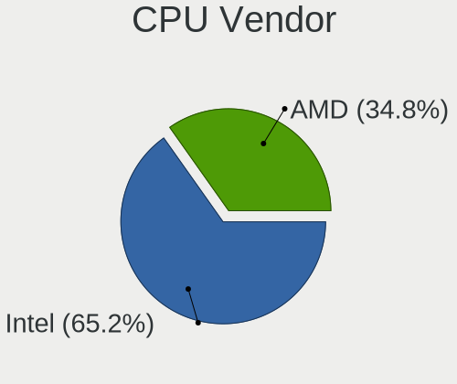

OpenMandriva - Tested Hardware & Statistics (Desktops)
------------------------------------------------------

A project to collect tested hardware configurations for OpenMandriva.

Anyone can contribute to this report by the [hw-probe](https://github.com/linuxhw/hw-probe) tool:

    sudo -E hw-probe -all -upload

Please contribute! Especially if your hardware is rare.

Contents
--------

* [ Test Cases ](#test-cases)

* [ System ](#system)
  - [ OS                       ](#os)
  - [ OS Family                ](#os-family)
  - [ Kernel                   ](#kernel)
  - [ Kernel Family            ](#kernel-family)
  - [ Kernel Major Ver.        ](#kernel-major-ver)
  - [ Arch                     ](#arch)
  - [ DE                       ](#de)
  - [ Display Server           ](#display-server)
  - [ Display Manager          ](#display-manager)
  - [ OS Lang                  ](#os-lang)
  - [ Boot Mode                ](#boot-mode)
  - [ Filesystem               ](#filesystem)
  - [ Part. scheme             ](#part-scheme)
  - [ Dual Boot with Linux/BSD ](#dual-boot-with-linuxbsd)
  - [ Dual Boot (Win)          ](#dual-boot-win)

* [ Board ](#board)
  - [ Vendor                   ](#vendor)
  - [ Model                    ](#model)
  - [ Model Family             ](#model-family)
  - [ MFG Year                 ](#mfg-year)
  - [ Form Factor              ](#form-factor)
  - [ Secure Boot              ](#secure-boot)
  - [ Coreboot                 ](#coreboot)
  - [ RAM Size                 ](#ram-size)
  - [ RAM Used                 ](#ram-used)
  - [ Total Drives             ](#total-drives)
  - [ Has CD-ROM               ](#has-cd-rom)
  - [ Has Ethernet             ](#has-ethernet)
  - [ Has WiFi                 ](#has-wifi)
  - [ Has Bluetooth            ](#has-bluetooth)

* [ Location ](#location)
  - [ Country                  ](#country)
  - [ City                     ](#city)

* [ Drives ](#drives)
  - [ Drive Vendor             ](#drive-vendor)
  - [ Drive Model              ](#drive-model)
  - [ HDD Vendor               ](#hdd-vendor)
  - [ SSD Vendor               ](#ssd-vendor)
  - [ Drive Kind               ](#drive-kind)
  - [ Drive Connector          ](#drive-connector)
  - [ Drive Size               ](#drive-size)
  - [ Space Total              ](#space-total)
  - [ Space Used               ](#space-used)
  - [ Malfunc. Drives          ](#malfunc-drives)
  - [ Malfunc. Drive Vendor    ](#malfunc-drive-vendor)
  - [ Malfunc. HDD Vendor      ](#malfunc-hdd-vendor)
  - [ Malfunc. Drive Kind      ](#malfunc-drive-kind)
  - [ Failed Drives            ](#failed-drives)
  - [ Failed Drive Vendor      ](#failed-drive-vendor)
  - [ Drive Status             ](#drive-status)

* [ Storage controller ](#storage-controller)
  - [ Storage Vendor           ](#storage-vendor)
  - [ Storage Model            ](#storage-model)
  - [ Storage Kind             ](#storage-kind)

* [ Processor ](#processor)
  - [ CPU Vendor               ](#cpu-vendor)
  - [ CPU Model                ](#cpu-model)
  - [ CPU Model Family         ](#cpu-model-family)
  - [ CPU Cores                ](#cpu-cores)
  - [ CPU Sockets              ](#cpu-sockets)
  - [ CPU Threads              ](#cpu-threads)
  - [ CPU Op-Modes             ](#cpu-op-modes)
  - [ CPU Microcode            ](#cpu-microcode)
  - [ CPU Microarch            ](#cpu-microarch)

* [ Graphics ](#graphics)
  - [ GPU Vendor               ](#gpu-vendor)
  - [ GPU Model                ](#gpu-model)
  - [ GPU Combo                ](#gpu-combo)
  - [ GPU Driver               ](#gpu-driver)
  - [ GPU Memory               ](#gpu-memory)

* [ Monitor ](#monitor)
  - [ Monitor Vendor           ](#monitor-vendor)
  - [ Monitor Model            ](#monitor-model)
  - [ Monitor Resolution       ](#monitor-resolution)
  - [ Monitor Diagonal         ](#monitor-diagonal)
  - [ Monitor Width            ](#monitor-width)
  - [ Aspect Ratio             ](#aspect-ratio)
  - [ Monitor Area             ](#monitor-area)
  - [ Pixel Density            ](#pixel-density)
  - [ Multiple Monitors        ](#multiple-monitors)

* [ Network ](#network)
  - [ Net Controller Vendor    ](#net-controller-vendor)
  - [ Net Controller Model     ](#net-controller-model)
  - [ Wireless Vendor          ](#wireless-vendor)
  - [ Wireless Model           ](#wireless-model)
  - [ Ethernet Vendor          ](#ethernet-vendor)
  - [ Ethernet Model           ](#ethernet-model)
  - [ Net Controller Kind      ](#net-controller-kind)
  - [ Used Controller          ](#used-controller)
  - [ NICs                     ](#nics)
  - [ IPv6                     ](#ipv6)

* [ Bluetooth ](#bluetooth)
  - [ Bluetooth Vendor         ](#bluetooth-vendor)
  - [ Bluetooth Model          ](#bluetooth-model)

* [ Sound ](#sound)
  - [ Sound Vendor             ](#sound-vendor)
  - [ Sound Model              ](#sound-model)

* [ Memory ](#memory)
  - [ Memory Vendor            ](#memory-vendor)
  - [ Memory Model             ](#memory-model)
  - [ Memory Kind              ](#memory-kind)
  - [ Memory Form Factor       ](#memory-form-factor)
  - [ Memory Size              ](#memory-size)
  - [ Memory Speed             ](#memory-speed)

* [ Printers & scanners ](#printers--scanners)
  - [ Printer Vendor           ](#printer-vendor)
  - [ Printer Model            ](#printer-model)
  - [ Scanner Vendor           ](#scanner-vendor)
  - [ Scanner Model            ](#scanner-model)

* [ Camera ](#camera)
  - [ Camera Vendor            ](#camera-vendor)
  - [ Camera Model             ](#camera-model)

* [ Security ](#security)
  - [ Fingerprint Vendor       ](#fingerprint-vendor)
  - [ Fingerprint Model        ](#fingerprint-model)
  - [ Chipcard Vendor          ](#chipcard-vendor)
  - [ Chipcard Model           ](#chipcard-model)

* [ Unsupported ](#unsupported)
  - [ Unsupported Devices      ](#unsupported-devices)
  - [ Unsupported Device Types ](#unsupported-device-types)

Test Cases
----------

Total: 5706

| Vendor        | Model                       | Probe                                                      | Date         |
|---------------|-----------------------------|------------------------------------------------------------|--------------|
| ASRock        | B650E PG Riptide WiFi       | [a637650ff7](https://linux-hardware.org/?probe=a637650ff7) | Mar 01, 2023 |
| Gigabyte      | GA-880GA-UD3H               | [483db5a7bd](https://linux-hardware.org/?probe=483db5a7bd) | Feb 28, 2023 |
| ASRock        | 760GM-HDV                   | [c420a55609](https://linux-hardware.org/?probe=c420a55609) | Feb 28, 2023 |
| Acer          | Aspire X3995                | [eccac5b752](https://linux-hardware.org/?probe=eccac5b752) | Feb 28, 2023 |
| Fujitsu       | D2990-A3 S26361-D2990-A3    | [6f1de5f17c](https://linux-hardware.org/?probe=6f1de5f17c) | Feb 28, 2023 |
| ASUSTek       | PRIME B250-PRO              | [cd58d8a863](https://linux-hardware.org/?probe=cd58d8a863) | Feb 28, 2023 |
| HP            | 18E7                        | [a4fb4affcf](https://linux-hardware.org/?probe=a4fb4affcf) | Feb 28, 2023 |
| HP            | 87D6 SMVB                   | [423aac2b6f](https://linux-hardware.org/?probe=423aac2b6f) | Feb 28, 2023 |
| ASUSTek       | PRIME B550M-A               | [a6af4042ea](https://linux-hardware.org/?probe=a6af4042ea) | Feb 28, 2023 |
| ASUSTek       | P8B75-V                     | [cf4c7357eb](https://linux-hardware.org/?probe=cf4c7357eb) | Feb 28, 2023 |
| ASUSTek       | B150M-C                     | [e675a40455](https://linux-hardware.org/?probe=e675a40455) | Feb 28, 2023 |
| ASRock        | A320M-HDV                   | [5ba575539c](https://linux-hardware.org/?probe=5ba575539c) | Feb 28, 2023 |
| Foxconn       | G31MX Series                | [79ee8e5da3](https://linux-hardware.org/?probe=79ee8e5da3) | Feb 28, 2023 |
| ASUSTek       | PRIME H370-PLUS             | [43afa90be1](https://linux-hardware.org/?probe=43afa90be1) | Feb 28, 2023 |
| Intel         | DG41RQ AAE54511-205         | [0cf17a3787](https://linux-hardware.org/?probe=0cf17a3787) | Feb 27, 2023 |
| ASUSTek       | AM1I-A                      | [b5fe605f8b](https://linux-hardware.org/?probe=b5fe605f8b) | Feb 27, 2023 |
| ASUSTek       | M4N68T-M-V2                 | [051b66987e](https://linux-hardware.org/?probe=051b66987e) | Feb 27, 2023 |
| MSI           | B450M MORTAR MAX            | [0335729036](https://linux-hardware.org/?probe=0335729036) | Feb 27, 2023 |
| Intel         | H61                         | [b61ef1ed65](https://linux-hardware.org/?probe=b61ef1ed65) | Feb 27, 2023 |
| MSI           | NF750-G55                   | [f279251ffa](https://linux-hardware.org/?probe=f279251ffa) | Feb 27, 2023 |
| ASUSTek       | TUF Gaming B550-PLUS        | [8fc8fee94a](https://linux-hardware.org/?probe=8fc8fee94a) | Feb 27, 2023 |
| Unknown       | HX90                        | [bc8bed9135](https://linux-hardware.org/?probe=bc8bed9135) | Feb 27, 2023 |
| MSI           | A320M PRO-VH                | [e1266ebf79](https://linux-hardware.org/?probe=e1266ebf79) | Feb 27, 2023 |
| Lenovo        | 3098 SDK0E50510 WIN         | [f15e5303f6](https://linux-hardware.org/?probe=f15e5303f6) | Feb 27, 2023 |
| Acer          | EG43M                       | [d533c457eb](https://linux-hardware.org/?probe=d533c457eb) | Feb 26, 2023 |
| ASUSTek       | M5A78L                      | [693582be4e](https://linux-hardware.org/?probe=693582be4e) | Feb 26, 2023 |
| ASUSTek       | PRIME Q270M-C               | [edf748dbbb](https://linux-hardware.org/?probe=edf748dbbb) | Feb 26, 2023 |
| HP            | 3032h                       | [007bbeffa0](https://linux-hardware.org/?probe=007bbeffa0) | Feb 26, 2023 |
| ASRock        | A320M-HDV R4.0              | [319e003280](https://linux-hardware.org/?probe=319e003280) | Feb 26, 2023 |
| Gigabyte      | M68M-S2P                    | [15b2fe94ae](https://linux-hardware.org/?probe=15b2fe94ae) | Feb 26, 2023 |
| MSI           | MPG X570 GAMING PLUS        | [724039adf2](https://linux-hardware.org/?probe=724039adf2) | Feb 26, 2023 |
| Lenovo        | 102F SDK0J40705 WIN 3425... | [484e0755de](https://linux-hardware.org/?probe=484e0755de) | Feb 26, 2023 |
| ASRock        | H110M-HG4                   | [0a5dfbb9e6](https://linux-hardware.org/?probe=0a5dfbb9e6) | Feb 26, 2023 |
| ASRock        | 960GM-VGS3 FX               | [66ea6164bf](https://linux-hardware.org/?probe=66ea6164bf) | Feb 25, 2023 |
| Dell          | 0YJHYD A00                  | [5029039f0e](https://linux-hardware.org/?probe=5029039f0e) | Feb 25, 2023 |
| Fujitsu       | D3233-A1 S26361-D3233-A1    | [782598981d](https://linux-hardware.org/?probe=782598981d) | Feb 25, 2023 |
| Dell          | 0YF8P5 A00                  | [b387faf4ee](https://linux-hardware.org/?probe=b387faf4ee) | Feb 25, 2023 |
| ASRock        | H67M-GE/HT                  | [3410887193](https://linux-hardware.org/?probe=3410887193) | Feb 25, 2023 |
| HP            | 18E7                        | [7b52dfac52](https://linux-hardware.org/?probe=7b52dfac52) | Feb 25, 2023 |
| ASUSTek       | H81M-E                      | [25a3002df1](https://linux-hardware.org/?probe=25a3002df1) | Feb 25, 2023 |
| Gigabyte      | G31M-S2L                    | [563101d2b2](https://linux-hardware.org/?probe=563101d2b2) | Feb 25, 2023 |
| MSI           | 970A GAMING PRO CARBON      | [0649eea8a9](https://linux-hardware.org/?probe=0649eea8a9) | Feb 25, 2023 |
| Gigabyte      | GA-78LMT-USB3 SEx           | [d6fea43eb5](https://linux-hardware.org/?probe=d6fea43eb5) | Feb 25, 2023 |
| Dell          | 0T1D10 A01                  | [87f49d1c7e](https://linux-hardware.org/?probe=87f49d1c7e) | Feb 25, 2023 |
| ASRock        | FM2A58M-VG3+ R2.0           | [92ac86c31b](https://linux-hardware.org/?probe=92ac86c31b) | Feb 25, 2023 |
| Unknown       | 1.0                         | [69594c956a](https://linux-hardware.org/?probe=69594c956a) | Feb 25, 2023 |
| Dell          | 088DT1 A01                  | [129ed2a520](https://linux-hardware.org/?probe=129ed2a520) | Feb 25, 2023 |
| Dell          | 0VHWTR A01                  | [ab8247e106](https://linux-hardware.org/?probe=ab8247e106) | Feb 24, 2023 |
| MSI           | B360M PRO-VH                | [fad0bd20e1](https://linux-hardware.org/?probe=fad0bd20e1) | Feb 24, 2023 |
| ASUSTek       | P5B                         | [60cb8319db](https://linux-hardware.org/?probe=60cb8319db) | Feb 24, 2023 |
| ASUSTek       | P5QL PRO                    | [c7477f1aca](https://linux-hardware.org/?probe=c7477f1aca) | Feb 24, 2023 |
| ASUSTek       | B150M-A D3                  | [01caadaee0](https://linux-hardware.org/?probe=01caadaee0) | Feb 24, 2023 |
| MSI           | G41M-P33 Combo              | [91c8d45121](https://linux-hardware.org/?probe=91c8d45121) | Feb 24, 2023 |
| ASUSTek       | M4A77T/USB3                 | [6bf574175a](https://linux-hardware.org/?probe=6bf574175a) | Feb 24, 2023 |
| ASUSTek       | M4A89GTD-PRO/USB3           | [9171567db4](https://linux-hardware.org/?probe=9171567db4) | Feb 24, 2023 |
| ASUSTek       | P8H61-M LX R2.0             | [b410c9f493](https://linux-hardware.org/?probe=b410c9f493) | Feb 24, 2023 |
| ASUSTek       | A68HM-K                     | [5c7e454884](https://linux-hardware.org/?probe=5c7e454884) | Feb 24, 2023 |
| HP            | 1998                        | [145c009f05](https://linux-hardware.org/?probe=145c009f05) | Feb 24, 2023 |
| ASUSTek       | M2N-MX SE Plus              | [21aa20cd64](https://linux-hardware.org/?probe=21aa20cd64) | Feb 24, 2023 |
| ASRock        | A88M-G                      | [917526ad4d](https://linux-hardware.org/?probe=917526ad4d) | Feb 24, 2023 |
| ASRock        | H81M-HDS                    | [d4a6916e4f](https://linux-hardware.org/?probe=d4a6916e4f) | Feb 24, 2023 |
| Gigabyte      | AB350M-Gaming 3-CF          | [2a8b727725](https://linux-hardware.org/?probe=2a8b727725) | Feb 24, 2023 |
| ASRock        | 990FX Killer                | [acfa772cc6](https://linux-hardware.org/?probe=acfa772cc6) | Feb 24, 2023 |
| Gigabyte      | B85M-HD3 R4                 | [db83755f3f](https://linux-hardware.org/?probe=db83755f3f) | Feb 24, 2023 |
| Gigabyte      | Z97-HD3                     | [016a51a4af](https://linux-hardware.org/?probe=016a51a4af) | Feb 23, 2023 |
| MSI           | B450 TOMAHAWK MAX II        | [bf6fc4a9d6](https://linux-hardware.org/?probe=bf6fc4a9d6) | Feb 23, 2023 |
| MSI           | X370 GAMING PLUS            | [4d45d5880b](https://linux-hardware.org/?probe=4d45d5880b) | Feb 23, 2023 |
| MSI           | H110M PRO-VH PLUS           | [de05d0d3f6](https://linux-hardware.org/?probe=de05d0d3f6) | Feb 23, 2023 |
| ASUSTek       | P5K                         | [f564dd9ac5](https://linux-hardware.org/?probe=f564dd9ac5) | Feb 23, 2023 |
| Gigabyte      | G1.Sniper A88X-CF           | [cfe5ecec44](https://linux-hardware.org/?probe=cfe5ecec44) | Feb 23, 2023 |
| Gigabyte      | H61M-S1                     | [ca76e62a1e](https://linux-hardware.org/?probe=ca76e62a1e) | Feb 23, 2023 |
| ASUSTek       | H61M-K                      | [9d39d13682](https://linux-hardware.org/?probe=9d39d13682) | Feb 23, 2023 |
| Biostar       | N68S3B                      | [4572b3d965](https://linux-hardware.org/?probe=4572b3d965) | Feb 23, 2023 |
| ASRock        | N68-VGS3 FX                 | [b9fbaca53d](https://linux-hardware.org/?probe=b9fbaca53d) | Feb 23, 2023 |
| Foxconn       | 2ADA                        | [75b2eb9c1f](https://linux-hardware.org/?probe=75b2eb9c1f) | Feb 23, 2023 |
| Biostar       | B450MH                      | [7bd9274f23](https://linux-hardware.org/?probe=7bd9274f23) | Feb 23, 2023 |
| ASUSTek       | PRIME A320M-K/BR            | [fd084cb513](https://linux-hardware.org/?probe=fd084cb513) | Feb 23, 2023 |
| ASRock        | B450M Pro4                  | [ccd3d2932f](https://linux-hardware.org/?probe=ccd3d2932f) | Feb 22, 2023 |
| ASUSTek       | A_F_K20CE                   | [2dffc350dd](https://linux-hardware.org/?probe=2dffc350dd) | Feb 22, 2023 |
| ASRock        | B660M Pro RS                | [13560ab66d](https://linux-hardware.org/?probe=13560ab66d) | Feb 22, 2023 |
| Gigabyte      | H81M-S2PV                   | [ad365efca1](https://linux-hardware.org/?probe=ad365efca1) | Feb 22, 2023 |
| Gigabyte      | X570 GAMING X               | [4803e8ee01](https://linux-hardware.org/?probe=4803e8ee01) | Feb 22, 2023 |
| ASUSTek       | P8Z68-V PRO GEN3            | [ad957d0b05](https://linux-hardware.org/?probe=ad957d0b05) | Feb 22, 2023 |
| ASUSTek       | ROG CROSSHAIR VIII DARK ... | [2d36b57c9c](https://linux-hardware.org/?probe=2d36b57c9c) | Feb 22, 2023 |
| Gigabyte      | GA-78LMT-USB3 R2 sex        | [9523a0ccc2](https://linux-hardware.org/?probe=9523a0ccc2) | Feb 22, 2023 |
| MSI           | GF615M-P33                  | [c9cad5f4fa](https://linux-hardware.org/?probe=c9cad5f4fa) | Feb 22, 2023 |
| Lenovo        | MAHOBAY NO DPK              | [186b84313d](https://linux-hardware.org/?probe=186b84313d) | Feb 22, 2023 |
| ASUSTek       | PRIME X399-A                | [bfe434ab92](https://linux-hardware.org/?probe=bfe434ab92) | Feb 22, 2023 |
| ASRock        | Z690 Extreme                | [16e67a28e4](https://linux-hardware.org/?probe=16e67a28e4) | Feb 22, 2023 |
| ASUSTek       | M2NPV-MX                    | [06d857e2ff](https://linux-hardware.org/?probe=06d857e2ff) | Feb 22, 2023 |
| ASUSTek       | AM1M-A/BR                   | [d1c356a1c7](https://linux-hardware.org/?probe=d1c356a1c7) | Feb 21, 2023 |
| ASUSTek       | M5A78L/USB3                 | [b4288b76ee](https://linux-hardware.org/?probe=b4288b76ee) | Feb 21, 2023 |
| ASUSTek       | P5Q-E                       | [1fd091bff9](https://linux-hardware.org/?probe=1fd091bff9) | Feb 21, 2023 |
| MSI           | Z170A XPOWER GAMING TITA... | [b644019f77](https://linux-hardware.org/?probe=b644019f77) | Feb 21, 2023 |
| Gigabyte      | H410M S2 V3                 | [b517bb25cc](https://linux-hardware.org/?probe=b517bb25cc) | Feb 21, 2023 |
| MSI           | H510M-A PRO                 | [bbef057c8f](https://linux-hardware.org/?probe=bbef057c8f) | Feb 21, 2023 |
| MSI           | A88XI AC V2                 | [42c0cd5d37](https://linux-hardware.org/?probe=42c0cd5d37) | Feb 21, 2023 |
| Dell          | 02YYK5 A00                  | [cff33d0b1e](https://linux-hardware.org/?probe=cff33d0b1e) | Feb 20, 2023 |
| ASUSTek       | PRIME Z390-P                | [d81ff5358a](https://linux-hardware.org/?probe=d81ff5358a) | Feb 20, 2023 |
| MSI           | G41M-P23                    | [04211b9202](https://linux-hardware.org/?probe=04211b9202) | Feb 20, 2023 |
| ASRock        | AM1B-MH                     | [d67d348d90](https://linux-hardware.org/?probe=d67d348d90) | Feb 20, 2023 |
| ASUSTek       | Z97-K                       | [59931c7434](https://linux-hardware.org/?probe=59931c7434) | Feb 20, 2023 |
| ASUSTek       | ROG STRIX B560-A GAMING ... | [119e106d80](https://linux-hardware.org/?probe=119e106d80) | Feb 20, 2023 |
| Gigabyte      | Z270N-WIFI-CF               | [32ed66a6f9](https://linux-hardware.org/?probe=32ed66a6f9) | Feb 20, 2023 |
| Gigabyte      | G31M-ES2L                   | [7415192b86](https://linux-hardware.org/?probe=7415192b86) | Feb 20, 2023 |
| Gigabyte      | GA-78LMT-S2                 | [29758ea823](https://linux-hardware.org/?probe=29758ea823) | Feb 20, 2023 |
| ASUSTek       | ROG STRIX X570-E GAMING     | [576314ab03](https://linux-hardware.org/?probe=576314ab03) | Feb 20, 2023 |
| Gigabyte      | B560M DS3H                  | [72891de86c](https://linux-hardware.org/?probe=72891de86c) | Feb 20, 2023 |
| MSI           | X370 GAMING PLUS            | [a180732a9f](https://linux-hardware.org/?probe=a180732a9f) | Feb 19, 2023 |
| ASRock        | 880GM-LE FX                 | [db290cd703](https://linux-hardware.org/?probe=db290cd703) | Feb 19, 2023 |
| Dell          | 0C27VV A00                  | [1b522f9105](https://linux-hardware.org/?probe=1b522f9105) | Feb 19, 2023 |
| Acer          | G43T-AM3                    | [5ec1aa8af7](https://linux-hardware.org/?probe=5ec1aa8af7) | Feb 19, 2023 |
| Acer          | EG43M                       | [080dfdf76f](https://linux-hardware.org/?probe=080dfdf76f) | Feb 19, 2023 |
| ASRock        | X300M-STX                   | [f689e279bc](https://linux-hardware.org/?probe=f689e279bc) | Feb 19, 2023 |
| ASUSTek       | G10AC                       | [8a367bb885](https://linux-hardware.org/?probe=8a367bb885) | Feb 19, 2023 |
| Biostar       | A520MH                      | [ebdd012874](https://linux-hardware.org/?probe=ebdd012874) | Feb 19, 2023 |
| Gigabyte      | B75M-D2V                    | [fe04dfeaac](https://linux-hardware.org/?probe=fe04dfeaac) | Feb 19, 2023 |
| Gigabyte      | B460 AORUS PRO AC           | [dc6b25dcef](https://linux-hardware.org/?probe=dc6b25dcef) | Feb 19, 2023 |
| Acer          | H57M01                      | [5e5e9d03a4](https://linux-hardware.org/?probe=5e5e9d03a4) | Feb 19, 2023 |
| MSI           | Z97M GAMING                 | [e983a3704e](https://linux-hardware.org/?probe=e983a3704e) | Feb 19, 2023 |
| ASUSTek       | PRIME B560M-A               | [0a015cdb94](https://linux-hardware.org/?probe=0a015cdb94) | Feb 18, 2023 |
| ASRock        | AB350 Pro4                  | [908d615f00](https://linux-hardware.org/?probe=908d615f00) | Feb 18, 2023 |
| Gigabyte      | GA-MA785GMT-UD2H            | [c67a2ae3c5](https://linux-hardware.org/?probe=c67a2ae3c5) | Feb 18, 2023 |
| Gigabyte      | P31-ES3G                    | [2c3eb25bc4](https://linux-hardware.org/?probe=2c3eb25bc4) | Feb 18, 2023 |
| ASUSTek       | STRIX X99 GAMING            | [8dd1992835](https://linux-hardware.org/?probe=8dd1992835) | Feb 18, 2023 |
| ASRock        | 880GM-LE FX                 | [1d45a444a3](https://linux-hardware.org/?probe=1d45a444a3) | Feb 18, 2023 |
| Gigabyte      | G31M-S2L                    | [78e184862a](https://linux-hardware.org/?probe=78e184862a) | Feb 17, 2023 |
| ASUSTek       | P5G41T-M LX2/GB             | [da12f4a29b](https://linux-hardware.org/?probe=da12f4a29b) | Feb 17, 2023 |
| Foxconn       | H67M-S/H67M-V/H67M          | [78dc1c5856](https://linux-hardware.org/?probe=78dc1c5856) | Feb 17, 2023 |
| MSI           | MPG Z490 GAMING EDGE WIF... | [3ed988e135](https://linux-hardware.org/?probe=3ed988e135) | Feb 17, 2023 |
| ASRock        | B450M Pro4-F R2.0           | [f1082dcffa](https://linux-hardware.org/?probe=f1082dcffa) | Feb 17, 2023 |
| Gigabyte      | A320M-S2H-CF                | [b4b87d47fb](https://linux-hardware.org/?probe=b4b87d47fb) | Feb 17, 2023 |
| Gigabyte      | H87M-HD3                    | [778b7898e3](https://linux-hardware.org/?probe=778b7898e3) | Feb 17, 2023 |
| AOpen         | iBDWMt-WBOP R1.00H 55WB3... | [c524d923e6](https://linux-hardware.org/?probe=c524d923e6) | Feb 17, 2023 |
| ASUSTek       | Rampage Formula             | [61fd1aefee](https://linux-hardware.org/?probe=61fd1aefee) | Feb 17, 2023 |
| EVGA          | 151-IB-E699                 | [9e975c7966](https://linux-hardware.org/?probe=9e975c7966) | Feb 17, 2023 |
| ASUSTek       | P8Z77-V                     | [f8dca6a264](https://linux-hardware.org/?probe=f8dca6a264) | Feb 17, 2023 |
| ASRock        | FM2A58M-VG3+ R2.0           | [27501ca342](https://linux-hardware.org/?probe=27501ca342) | Feb 17, 2023 |
| Hardkernel    | ODROID-H2                   | [0b85baa5ee](https://linux-hardware.org/?probe=0b85baa5ee) | Feb 17, 2023 |
| Pegatron      | IPM31G                      | [42d112d7e0](https://linux-hardware.org/?probe=42d112d7e0) | Feb 17, 2023 |
| Acer          | Veriton M4610G              | [7c5f2f584e](https://linux-hardware.org/?probe=7c5f2f584e) | Feb 17, 2023 |
| Gigabyte      | GA-MA790X-UD3P              | [8efdbecd75](https://linux-hardware.org/?probe=8efdbecd75) | Feb 17, 2023 |
| HP            | 2820h                       | [552bdc9930](https://linux-hardware.org/?probe=552bdc9930) | Feb 17, 2023 |
| MSI           | B450-A PRO MAX              | [92901492fc](https://linux-hardware.org/?probe=92901492fc) | Feb 16, 2023 |
| ASRock        | J3355M                      | [9118f960dd](https://linux-hardware.org/?probe=9118f960dd) | Feb 16, 2023 |
| Gigabyte      | EP35-DS4                    | [00d960f926](https://linux-hardware.org/?probe=00d960f926) | Feb 16, 2023 |
| MSI           | H61M-E33                    | [f0c902ce04](https://linux-hardware.org/?probe=f0c902ce04) | Feb 16, 2023 |
| MSI           | A78M-E35                    | [30c75db366](https://linux-hardware.org/?probe=30c75db366) | Feb 16, 2023 |
| HP            | 1495                        | [6bc4b54027](https://linux-hardware.org/?probe=6bc4b54027) | Feb 16, 2023 |
| ASUSTek       | M4N68T-M LE                 | [7b5fe965fd](https://linux-hardware.org/?probe=7b5fe965fd) | Feb 16, 2023 |
| MSI           | Z97-G45 GAMING              | [c6a7d3a755](https://linux-hardware.org/?probe=c6a7d3a755) | Feb 16, 2023 |
| Gigabyte      | MZAPLBP-00                  | [b043125d6e](https://linux-hardware.org/?probe=b043125d6e) | Feb 16, 2023 |
| ASUSTek       | ROG CROSSHAIR VIII HERO     | [92a61cd4ee](https://linux-hardware.org/?probe=92a61cd4ee) | Feb 16, 2023 |
| Gigabyte      | GA-MA790XT-UD4P             | [3ce39f40e7](https://linux-hardware.org/?probe=3ce39f40e7) | Feb 16, 2023 |
| MSI           | B350M PRO-VD PLUS           | [63789621e0](https://linux-hardware.org/?probe=63789621e0) | Feb 16, 2023 |
| Lenovo        | ThinkCentre M91 4518E4S     | [91b1fb7e03](https://linux-hardware.org/?probe=91b1fb7e03) | Feb 16, 2023 |
| Dell          | 03NVJ6 A00                  | [d118fe4ba2](https://linux-hardware.org/?probe=d118fe4ba2) | Feb 16, 2023 |
| Philco        | DTC-A55                     | [e957b8f1cf](https://linux-hardware.org/?probe=e957b8f1cf) | Feb 16, 2023 |
| Foxconn       | 2ABF                        | [41f9974254](https://linux-hardware.org/?probe=41f9974254) | Feb 16, 2023 |
| Gigabyte      | F2A78M-HD2                  | [9f9cc6f9e2](https://linux-hardware.org/?probe=9f9cc6f9e2) | Feb 16, 2023 |
| MSI           | Z170A KRAIT GAMING 3X       | [8e521a2efc](https://linux-hardware.org/?probe=8e521a2efc) | Feb 16, 2023 |
| ASUSTek       | P5G41T-M LE                 | [3ebf4858b8](https://linux-hardware.org/?probe=3ebf4858b8) | Feb 16, 2023 |
| ASUSTek       | H81T                        | [51aa090e9a](https://linux-hardware.org/?probe=51aa090e9a) | Feb 16, 2023 |
| ASUSTek       | M4A89GTD-PRO/USB3           | [e927a19203](https://linux-hardware.org/?probe=e927a19203) | Feb 16, 2023 |
| HP            | 3031h                       | [2b0cc2bd6e](https://linux-hardware.org/?probe=2b0cc2bd6e) | Feb 16, 2023 |
| ASUSTek       | P5K                         | [7767ce777f](https://linux-hardware.org/?probe=7767ce777f) | Feb 16, 2023 |
| Gigabyte      | A320M-S2H V2-CF             | [b19c73e236](https://linux-hardware.org/?probe=b19c73e236) | Feb 15, 2023 |
| MSI           | B450M PRO-M2                | [eb1d201d1c](https://linux-hardware.org/?probe=eb1d201d1c) | Feb 15, 2023 |
| HP            | 1494                        | [fd47ccde98](https://linux-hardware.org/?probe=fd47ccde98) | Feb 15, 2023 |
| MSI           | MS-7235                     | [519f3742a3](https://linux-hardware.org/?probe=519f3742a3) | Feb 15, 2023 |
| ASUSTek       | SABERTOOTH 990FX R2.0       | [5b6ce8f332](https://linux-hardware.org/?probe=5b6ce8f332) | Feb 15, 2023 |
| Gigabyte      | H410M H V3                  | [59f88fb4d0](https://linux-hardware.org/?probe=59f88fb4d0) | Feb 15, 2023 |
| BESSTAR Te... | DMAF5 V1.0                  | [af47a30d6a](https://linux-hardware.org/?probe=af47a30d6a) | Feb 15, 2023 |
| HP            | 8434 11                     | [2f4023e5f3](https://linux-hardware.org/?probe=2f4023e5f3) | Feb 15, 2023 |
| Dell          | 0NK5PH A00                  | [5455b577db](https://linux-hardware.org/?probe=5455b577db) | Feb 15, 2023 |
| Gigabyte      | P43-ES3G                    | [528ffce1c7](https://linux-hardware.org/?probe=528ffce1c7) | Feb 15, 2023 |
| ASUSTek       | PRIME B365M-K               | [20b88dda19](https://linux-hardware.org/?probe=20b88dda19) | Feb 15, 2023 |
| Gigabyte      | G41MT-D3V                   | [8a7ce6b005](https://linux-hardware.org/?probe=8a7ce6b005) | Feb 15, 2023 |
| HP            | 8433 11                     | [3f4ea738b6](https://linux-hardware.org/?probe=3f4ea738b6) | Feb 15, 2023 |
| Dell          | 0GXM1W A00                  | [3ab6d305fc](https://linux-hardware.org/?probe=3ab6d305fc) | Feb 15, 2023 |
| MSI           | Z68MA-ED55                  | [e2bd6f0fb4](https://linux-hardware.org/?probe=e2bd6f0fb4) | Feb 15, 2023 |
| Dell          | 0MGK50 A02                  | [43bd1ca5e1](https://linux-hardware.org/?probe=43bd1ca5e1) | Feb 15, 2023 |
| HP            | 0AA8h                       | [e7bbc5903b](https://linux-hardware.org/?probe=e7bbc5903b) | Feb 15, 2023 |
| MSI           | MPG Z390 GAMING EDGE AC     | [a572ac5ed3](https://linux-hardware.org/?probe=a572ac5ed3) | Feb 15, 2023 |
| MSI           | MPG B550 GAMING CARBON W... | [f0d6ada218](https://linux-hardware.org/?probe=f0d6ada218) | Feb 15, 2023 |
| ASUSTek       | PRIME X399-A                | [0676daa5b0](https://linux-hardware.org/?probe=0676daa5b0) | Feb 14, 2023 |
| ASUSTek       | PRIME Z690-P WIFI           | [b30e6a84c8](https://linux-hardware.org/?probe=b30e6a84c8) | Feb 14, 2023 |
| ASUSTek       | TUF Gaming X570-PLUS        | [ac367ae940](https://linux-hardware.org/?probe=ac367ae940) | Feb 14, 2023 |
| Gigabyte      | H55M-USB3                   | [08b959d9ec](https://linux-hardware.org/?probe=08b959d9ec) | Feb 14, 2023 |
| Medion        | MS-7800                     | [7827888ac6](https://linux-hardware.org/?probe=7827888ac6) | Feb 14, 2023 |
| HP            | 3396                        | [fbff77d7cc](https://linux-hardware.org/?probe=fbff77d7cc) | Feb 14, 2023 |
| MSI           | H310M PRO-D                 | [ce2d236a2d](https://linux-hardware.org/?probe=ce2d236a2d) | Feb 14, 2023 |
| HP            | ProLiant ML310e Gen8 v2     | [3569214674](https://linux-hardware.org/?probe=3569214674) | Feb 14, 2023 |
| MSI           | Z97-G45 GAMING              | [f9318d4390](https://linux-hardware.org/?probe=f9318d4390) | Feb 14, 2023 |
| Gigabyte      | B450M S2H                   | [eb04bfdc84](https://linux-hardware.org/?probe=eb04bfdc84) | Feb 14, 2023 |
| Fujitsu       | D3430-U1 S26361-D3430-U1    | [49f47896e6](https://linux-hardware.org/?probe=49f47896e6) | Feb 14, 2023 |
| Gigabyte      | H87-D3H-CF                  | [2914a1866d](https://linux-hardware.org/?probe=2914a1866d) | Feb 14, 2023 |
| Gigabyte      | Z68X-UD3H-B3                | [0ad0fe310f](https://linux-hardware.org/?probe=0ad0fe310f) | Feb 14, 2023 |
| Unknown       | Unknown                     | [8f537795bb](https://linux-hardware.org/?probe=8f537795bb) | Feb 14, 2023 |
| HP            | 83EE                        | [f83f333b3c](https://linux-hardware.org/?probe=f83f333b3c) | Feb 14, 2023 |
| Lenovo        | SHARKBAY NOK                | [4ccd4c2da2](https://linux-hardware.org/?probe=4ccd4c2da2) | Feb 14, 2023 |
| ASUSTek       | ProArt X570-CREATOR WIFI    | [84420c06ac](https://linux-hardware.org/?probe=84420c06ac) | Feb 13, 2023 |
| ASRock        | E350M1                      | [ac69adceb6](https://linux-hardware.org/?probe=ac69adceb6) | Feb 13, 2023 |
| ASUSTek       | P7P55D-E EVO                | [f1ec250753](https://linux-hardware.org/?probe=f1ec250753) | Feb 13, 2023 |
| ASUSTek       | P8Z68-V LE                  | [dcf82ccac5](https://linux-hardware.org/?probe=dcf82ccac5) | Feb 13, 2023 |
| MSI           | B450M PRO-M2 MAX            | [2032f6e202](https://linux-hardware.org/?probe=2032f6e202) | Feb 13, 2023 |
| Dell          | 0YXT71 A01                  | [cdc2dedbcd](https://linux-hardware.org/?probe=cdc2dedbcd) | Feb 13, 2023 |
| ASUSTek       | P6TD DELUXE                 | [f9cfe6d485](https://linux-hardware.org/?probe=f9cfe6d485) | Feb 13, 2023 |
| Pegatron      | 2A94h                       | [b1b8672218](https://linux-hardware.org/?probe=b1b8672218) | Feb 13, 2023 |
| ASUSTek       | M5A99X EVO R2.0             | [a74e071a54](https://linux-hardware.org/?probe=a74e071a54) | Feb 12, 2023 |
| ASUSTek       | M4N78-AM                    | [26ecdbcf90](https://linux-hardware.org/?probe=26ecdbcf90) | Feb 12, 2023 |
| Acer          | Aspire XC-704               | [c1ca2c8952](https://linux-hardware.org/?probe=c1ca2c8952) | Feb 12, 2023 |
| Colorful T... | CVN B450M GAMING V14        | [fdedcd0d4a](https://linux-hardware.org/?probe=fdedcd0d4a) | Feb 11, 2023 |
| ASRock        | FM2A55M-HD+ R2.0            | [1623076357](https://linux-hardware.org/?probe=1623076357) | Feb 11, 2023 |
| HP            | 3031h                       | [f9a0848388](https://linux-hardware.org/?probe=f9a0848388) | Feb 11, 2023 |
| MSI           | A520M-A PRO                 | [7092ef977d](https://linux-hardware.org/?probe=7092ef977d) | Feb 11, 2023 |
| Gigabyte      | Z87X-D3H-CF                 | [e4496f3ff8](https://linux-hardware.org/?probe=e4496f3ff8) | Feb 11, 2023 |
| Lenovo        | 3098 SDK0J40705 WIN         | [6ada8eb627](https://linux-hardware.org/?probe=6ada8eb627) | Feb 10, 2023 |
| ASUSTek       | PRIME X570-PRO              | [f0f4d31de2](https://linux-hardware.org/?probe=f0f4d31de2) | Feb 10, 2023 |
| MSI           | PRO Z690-P DDR4             | [61d03fad19](https://linux-hardware.org/?probe=61d03fad19) | Feb 10, 2023 |
| ASUSTek       | PRIME B360M-A               | [663cbf83ff](https://linux-hardware.org/?probe=663cbf83ff) | Feb 10, 2023 |
| Biostar       | A68N-2100                   | [a0ebf68180](https://linux-hardware.org/?probe=a0ebf68180) | Feb 10, 2023 |
| Lenovo        | Unknown                     | [253bcab6fa](https://linux-hardware.org/?probe=253bcab6fa) | Feb 09, 2023 |
| MSI           | H61M-P23                    | [86404b5b68](https://linux-hardware.org/?probe=86404b5b68) | Feb 09, 2023 |
| Gigabyte      | B365M H                     | [fca49121d5](https://linux-hardware.org/?probe=fca49121d5) | Feb 09, 2023 |
| MSI           | 2A9C                        | [1332640fbd](https://linux-hardware.org/?probe=1332640fbd) | Feb 09, 2023 |
| Medion        | TJ4105                      | [cd654518c0](https://linux-hardware.org/?probe=cd654518c0) | Feb 09, 2023 |
| ASUSTek       | Z97-K                       | [afaaed1c36](https://linux-hardware.org/?probe=afaaed1c36) | Feb 09, 2023 |
| Apple         | Mac-F42C88C8 Proto1         | [8532f05156](https://linux-hardware.org/?probe=8532f05156) | Feb 09, 2023 |
| HP            | 1495                        | [627c584065](https://linux-hardware.org/?probe=627c584065) | Feb 09, 2023 |
| HP            | 2B4B                        | [52e83d1fe3](https://linux-hardware.org/?probe=52e83d1fe3) | Feb 08, 2023 |
| MSI           | MS-B1711                    | [9a5096ba48](https://linux-hardware.org/?probe=9a5096ba48) | Feb 08, 2023 |
| MSI           | A78M-E35                    | [ba4515e5ea](https://linux-hardware.org/?probe=ba4515e5ea) | Feb 08, 2023 |
| ASRock        | X470 Gaming K4              | [086ea7a0e6](https://linux-hardware.org/?probe=086ea7a0e6) | Feb 08, 2023 |
| ASUSTek       | Z170-P                      | [b0e0ac8815](https://linux-hardware.org/?probe=b0e0ac8815) | Feb 08, 2023 |
| MSI           | B350M PRO-VDH               | [41249a7b9f](https://linux-hardware.org/?probe=41249a7b9f) | Feb 08, 2023 |
| Gigabyte      | B550 GAMING X               | [e92a6b0131](https://linux-hardware.org/?probe=e92a6b0131) | Feb 08, 2023 |
| HP            | 0B4Ch D                     | [731d910d0c](https://linux-hardware.org/?probe=731d910d0c) | Feb 08, 2023 |
| ASUSTek       | H97M-PLUS                   | [c5c12033f6](https://linux-hardware.org/?probe=c5c12033f6) | Feb 08, 2023 |
| Gigabyte      | B85M-D3V                    | [21e3210daa](https://linux-hardware.org/?probe=21e3210daa) | Feb 08, 2023 |
| ASUSTek       | PRIME H310M-E R2.0          | [7cc20180f3](https://linux-hardware.org/?probe=7cc20180f3) | Feb 08, 2023 |
| MSI           | Z390-A PRO                  | [de25a58c23](https://linux-hardware.org/?probe=de25a58c23) | Feb 07, 2023 |
| HP            | 212A                        | [65c2560f40](https://linux-hardware.org/?probe=65c2560f40) | Feb 07, 2023 |
| ASUSTek       | PRIME B250M-K               | [f632cba0a7](https://linux-hardware.org/?probe=f632cba0a7) | Feb 07, 2023 |
| ASUSTek       | ROG STRIX B550-F GAMING     | [3af865ffdf](https://linux-hardware.org/?probe=3af865ffdf) | Feb 07, 2023 |
| Acer          | F690GVM                     | [8110fd6f99](https://linux-hardware.org/?probe=8110fd6f99) | Feb 07, 2023 |
| Gigabyte      | H310M S2                    | [b84a916a22](https://linux-hardware.org/?probe=b84a916a22) | Feb 07, 2023 |
| HP            | 1905                        | [a442e1de06](https://linux-hardware.org/?probe=a442e1de06) | Feb 07, 2023 |
| ASUSTek       | TUF Gaming X570-PRO         | [d19c266486](https://linux-hardware.org/?probe=d19c266486) | Feb 07, 2023 |
| Foxconn       | ETON                        | [e7cc1c6b15](https://linux-hardware.org/?probe=e7cc1c6b15) | Feb 07, 2023 |
| Intel         | DG31PR AAD97573-301         | [2080f0edf4](https://linux-hardware.org/?probe=2080f0edf4) | Feb 07, 2023 |
| Gigabyte      | G41M-ES2L                   | [0f31a45e98](https://linux-hardware.org/?probe=0f31a45e98) | Feb 07, 2023 |
| ASUSTek       | P8B75-V                     | [3b255608f7](https://linux-hardware.org/?probe=3b255608f7) | Feb 06, 2023 |
| Dell          | 0YF8P5 A00                  | [4bb4dd8a98](https://linux-hardware.org/?probe=4bb4dd8a98) | Feb 06, 2023 |
| Gigabyte      | H55M-D2H                    | [652695efb0](https://linux-hardware.org/?probe=652695efb0) | Feb 06, 2023 |
| Lenovo        | 0x36A017AA SDK0J40700 WI... | [a527005a2a](https://linux-hardware.org/?probe=a527005a2a) | Feb 06, 2023 |
| Gigabyte      | B85M-D3H                    | [fcf0932318](https://linux-hardware.org/?probe=fcf0932318) | Feb 06, 2023 |
| Dell          | 084J0R A00                  | [7fe633b52f](https://linux-hardware.org/?probe=7fe633b52f) | Feb 05, 2023 |
| MSI           | B250M PRO-VDH               | [b8675ca2ee](https://linux-hardware.org/?probe=b8675ca2ee) | Feb 05, 2023 |
| Gigabyte      | Z390 GAMING X-CF            | [89846cdd59](https://linux-hardware.org/?probe=89846cdd59) | Feb 05, 2023 |
| Quanta        | 2AC5 101                    | [fbf7122883](https://linux-hardware.org/?probe=fbf7122883) | Feb 05, 2023 |
| Intel         | DH55TC AAE70932-301         | [350458a94e](https://linux-hardware.org/?probe=350458a94e) | Feb 05, 2023 |
| MSI           | MAG Z490 TOMAHAWK           | [265b48f0d5](https://linux-hardware.org/?probe=265b48f0d5) | Feb 05, 2023 |
| LG Electro... | R590-U.BE57P1               | [7de316c06f](https://linux-hardware.org/?probe=7de316c06f) | Feb 05, 2023 |
| ASUSTek       | B75M-PLUS                   | [d2981f72e6](https://linux-hardware.org/?probe=d2981f72e6) | Feb 05, 2023 |
| Lenovo        | SHARKBAY SDK0E50510 WIN     | [edbd391f2d](https://linux-hardware.org/?probe=edbd391f2d) | Feb 05, 2023 |
| ASUSTek       | P8H77-M                     | [9e7d0b79cf](https://linux-hardware.org/?probe=9e7d0b79cf) | Feb 05, 2023 |
| Fujitsu       | D3403-A1 S26361-D3403-A1    | [854b52f85c](https://linux-hardware.org/?probe=854b52f85c) | Feb 05, 2023 |
| Acer          | Aspire TC-1760              | [448340c539](https://linux-hardware.org/?probe=448340c539) | Feb 04, 2023 |
| ASUSTek       | Basswood                    | [7de223a121](https://linux-hardware.org/?probe=7de223a121) | Feb 04, 2023 |
| Unknown       | MZ-B75-S                    | [ed6041df37](https://linux-hardware.org/?probe=ed6041df37) | Feb 04, 2023 |
| Gigabyte      | B550 UD AC                  | [3f8a968bb6](https://linux-hardware.org/?probe=3f8a968bb6) | Feb 04, 2023 |
| ASUSTek       | PRIME A320M-A               | [9de02793ea](https://linux-hardware.org/?probe=9de02793ea) | Feb 04, 2023 |
| HP            | 198E                        | [7dedbbef80](https://linux-hardware.org/?probe=7dedbbef80) | Feb 04, 2023 |
| Gigabyte      | B660M GAMING X DDR4         | [04c5cc4aec](https://linux-hardware.org/?probe=04c5cc4aec) | Feb 04, 2023 |
| ASUSTek       | P8H61-M LE/USB3             | [91a070c2aa](https://linux-hardware.org/?probe=91a070c2aa) | Feb 03, 2023 |
| Intel         | H61                         | [21fd40e0a1](https://linux-hardware.org/?probe=21fd40e0a1) | Feb 03, 2023 |
| ASUSTek       | P8P67 PRO                   | [49d8a19239](https://linux-hardware.org/?probe=49d8a19239) | Feb 03, 2023 |
| Lenovo        | 3100 SDK0J40700 WIN 3258... | [ea223a4d57](https://linux-hardware.org/?probe=ea223a4d57) | Feb 03, 2023 |
| ASUSTek       | P5GDC                       | [6dbac14e8b](https://linux-hardware.org/?probe=6dbac14e8b) | Feb 03, 2023 |
| Dell          | 0K240Y A01                  | [3832ccb44d](https://linux-hardware.org/?probe=3832ccb44d) | Feb 03, 2023 |
| ASUSTek       | TUF B450-PRO GAMING         | [a99bd855d2](https://linux-hardware.org/?probe=a99bd855d2) | Feb 03, 2023 |
| eMachines     | MCP61PM-GM                  | [a03875d012](https://linux-hardware.org/?probe=a03875d012) | Feb 03, 2023 |
| HP            | 339A                        | [a469084c23](https://linux-hardware.org/?probe=a469084c23) | Feb 02, 2023 |
| Gigabyte      | F2A68HM-DS2                 | [a4a3ea0e4e](https://linux-hardware.org/?probe=a4a3ea0e4e) | Feb 02, 2023 |
| ASUSTek       | TUF Gaming B550-PLUS        | [795ee67158](https://linux-hardware.org/?probe=795ee67158) | Feb 02, 2023 |
| ASRock        | AB350 Gaming-ITX/ac         | [471cae20d4](https://linux-hardware.org/?probe=471cae20d4) | Feb 02, 2023 |
| MSI           | B450M MORTAR MAX            | [4b8bbc4d84](https://linux-hardware.org/?probe=4b8bbc4d84) | Feb 02, 2023 |
| ASUSTek       | K8N-DL                      | [dde5c844f2](https://linux-hardware.org/?probe=dde5c844f2) | Feb 01, 2023 |
| ASUSTek       | G10DK                       | [80e1fa4ed8](https://linux-hardware.org/?probe=80e1fa4ed8) | Feb 01, 2023 |
| MSI           | A520M-A PRO                 | [f7a88d0dea](https://linux-hardware.org/?probe=f7a88d0dea) | Feb 01, 2023 |
| AMI           | Cherry Trail CR             | [162e744903](https://linux-hardware.org/?probe=162e744903) | Feb 01, 2023 |
| ASUSTek       | Z87-A                       | [1b880dbac2](https://linux-hardware.org/?probe=1b880dbac2) | Feb 01, 2023 |
| Gigabyte      | B550 AORUS ELITE V2         | [aa3b7e2dc8](https://linux-hardware.org/?probe=aa3b7e2dc8) | Feb 01, 2023 |
| Dell          | 0PU052                      | [d2f241353d](https://linux-hardware.org/?probe=d2f241353d) | Feb 01, 2023 |
| Intel         | DG965OT AAD75595-200        | [8ab85c58be](https://linux-hardware.org/?probe=8ab85c58be) | Feb 01, 2023 |
| Dell          | 0WG860                      | [002a1f805c](https://linux-hardware.org/?probe=002a1f805c) | Feb 01, 2023 |
| ASUSTek       | F2A85-V                     | [c68678a1a5](https://linux-hardware.org/?probe=c68678a1a5) | Jan 31, 2023 |
| ASUSTek       | M5A97 EVO R2.0              | [f4e30fc177](https://linux-hardware.org/?probe=f4e30fc177) | Jan 31, 2023 |
| ASRock        | B450 Gaming-ITX/ac          | [25b35d4826](https://linux-hardware.org/?probe=25b35d4826) | Jan 31, 2023 |
| HP            | 21EF                        | [0aacd43b02](https://linux-hardware.org/?probe=0aacd43b02) | Jan 31, 2023 |
| ASUSTek       | ROG STRIX B660-I GAMING ... | [19d65de9b6](https://linux-hardware.org/?probe=19d65de9b6) | Jan 31, 2023 |
| ASUSTek       | Maximus VII GENE            | [c936c07925](https://linux-hardware.org/?probe=c936c07925) | Jan 31, 2023 |
| ASUSTek       | M5A78L-M LX/BR              | [d8d386cb1d](https://linux-hardware.org/?probe=d8d386cb1d) | Jan 31, 2023 |
| MSI           | G41M-P28                    | [7f37c4b40e](https://linux-hardware.org/?probe=7f37c4b40e) | Jan 31, 2023 |
| ASRock        | H77 Pro4-M                  | [a37090dd20](https://linux-hardware.org/?probe=a37090dd20) | Jan 31, 2023 |
| Jetway        | I61G-ITX                    | [24cf6ad56e](https://linux-hardware.org/?probe=24cf6ad56e) | Jan 31, 2023 |
| ASUSTek       | PRIME B360M-A               | [1196b501d5](https://linux-hardware.org/?probe=1196b501d5) | Jan 31, 2023 |
| ASUSTek       | TUF Gaming B450M-PRO S      | [3be362b4aa](https://linux-hardware.org/?probe=3be362b4aa) | Jan 31, 2023 |
| ASUSTek       | P8H77-V LE                  | [9edd1a1969](https://linux-hardware.org/?probe=9edd1a1969) | Jan 30, 2023 |
| Intel         | DQ77MK AAG39642-500         | [3e004045f7](https://linux-hardware.org/?probe=3e004045f7) | Jan 30, 2023 |
| ASUSTek       | P5KPL-C/1600                | [dba6d97191](https://linux-hardware.org/?probe=dba6d97191) | Jan 30, 2023 |
| ASUSTek       | ROG STRIX X370-F GAMING     | [3c8b3f4e7d](https://linux-hardware.org/?probe=3c8b3f4e7d) | Jan 30, 2023 |
| Lenovo        | SHARKBAY 0B98401 WIN        | [cbfcb68cc6](https://linux-hardware.org/?probe=cbfcb68cc6) | Jan 30, 2023 |
| MSI           | H81M-P33                    | [32149d3b64](https://linux-hardware.org/?probe=32149d3b64) | Jan 30, 2023 |
| ASUSTek       | PRIME X570-P                | [a05f6f2f6c](https://linux-hardware.org/?probe=a05f6f2f6c) | Jan 30, 2023 |
| ASUSTek       | H81M2                       | [304b95972c](https://linux-hardware.org/?probe=304b95972c) | Jan 30, 2023 |
| HP            | 8526 MVB, A                 | [eaa1bf595f](https://linux-hardware.org/?probe=eaa1bf595f) | Jan 30, 2023 |
| ASUSTek       | PRIME B450M-A               | [f0000c6ae7](https://linux-hardware.org/?probe=f0000c6ae7) | Jan 30, 2023 |
| ASUSTek       | PRIME B350M-A               | [e2721d08d6](https://linux-hardware.org/?probe=e2721d08d6) | Jan 30, 2023 |
| Fujitsu       | D3222-A1 S26361-D3222-A1    | [ef9c1299e6](https://linux-hardware.org/?probe=ef9c1299e6) | Jan 30, 2023 |
| HP            | 339A                        | [3bc7df3921](https://linux-hardware.org/?probe=3bc7df3921) | Jan 30, 2023 |
| ViewSonic     | VOT132                      | [a8ecfadd53](https://linux-hardware.org/?probe=a8ecfadd53) | Jan 30, 2023 |
| ASRock        | J4125M                      | [535c1b6821](https://linux-hardware.org/?probe=535c1b6821) | Jan 30, 2023 |
| Acer          | Aspire TC-895 V:1.0         | [190e9b4aee](https://linux-hardware.org/?probe=190e9b4aee) | Jan 30, 2023 |
| ASUSTek       | TUF Gaming B550-PLUS        | [11b07d4e11](https://linux-hardware.org/?probe=11b07d4e11) | Jan 29, 2023 |
| HC            | HCAR357-MI V1.0             | [986dd858ba](https://linux-hardware.org/?probe=986dd858ba) | Jan 29, 2023 |
| ASUSTek       | PRIME Z690-P WIFI           | [da2056876e](https://linux-hardware.org/?probe=da2056876e) | Jan 29, 2023 |
| ASUSTek       | PRIME B550M-A AC            | [c11ff840dd](https://linux-hardware.org/?probe=c11ff840dd) | Jan 29, 2023 |
| Intel         | H61                         | [0ce404915f](https://linux-hardware.org/?probe=0ce404915f) | Jan 29, 2023 |
| ASUSTek       | PRIME H310I-PLUS R2.0       | [1b8a1f7b64](https://linux-hardware.org/?probe=1b8a1f7b64) | Jan 29, 2023 |
| ASUSTek       | B150M-C                     | [6eb1a5b38e](https://linux-hardware.org/?probe=6eb1a5b38e) | Jan 29, 2023 |
| ASUSTek       | M5A97 R2.0                  | [703a3a2694](https://linux-hardware.org/?probe=703a3a2694) | Jan 29, 2023 |
| ASRock        | B450 Gaming K4              | [000203af81](https://linux-hardware.org/?probe=000203af81) | Jan 29, 2023 |
| Lenovo        | MAHOBAY NO DPK              | [a6f17c156d](https://linux-hardware.org/?probe=a6f17c156d) | Jan 29, 2023 |
| ASRock        | H610M-HVS                   | [2774d547be](https://linux-hardware.org/?probe=2774d547be) | Jan 29, 2023 |
| ASUSTek       | Z97-K                       | [e3f865cd20](https://linux-hardware.org/?probe=e3f865cd20) | Jan 28, 2023 |
| Intel         | X79G V2.x                   | [40bc764c73](https://linux-hardware.org/?probe=40bc764c73) | Jan 28, 2023 |
| ASRock        | N68C-S UCC                  | [de8739d9d5](https://linux-hardware.org/?probe=de8739d9d5) | Jan 28, 2023 |
| ASUSTek       | H110M-K                     | [73b3f84699](https://linux-hardware.org/?probe=73b3f84699) | Jan 28, 2023 |
| ASUSTek       | P8H61-M LE/CSM R2.0         | [7120eb3310](https://linux-hardware.org/?probe=7120eb3310) | Jan 28, 2023 |
| Gigabyte      | GA-73PVM-S2                 | [fcf91f09b4](https://linux-hardware.org/?probe=fcf91f09b4) | Jan 28, 2023 |
| Unknown       | GB01                        | [e907445f6c](https://linux-hardware.org/?probe=e907445f6c) | Jan 28, 2023 |
| Intel         | DH77EB AAG39073-304         | [8965805130](https://linux-hardware.org/?probe=8965805130) | Jan 27, 2023 |
| Dell          | 0VRWRC A00                  | [dac4a44a62](https://linux-hardware.org/?probe=dac4a44a62) | Jan 27, 2023 |
| ASUSTek       | PRIME X299-DELUXE II        | [c7e2bde422](https://linux-hardware.org/?probe=c7e2bde422) | Jan 27, 2023 |
| Gigabyte      | H81N                        | [e7cf6a4216](https://linux-hardware.org/?probe=e7cf6a4216) | Jan 27, 2023 |
| Dell          | 0RW199                      | [04c4f5174d](https://linux-hardware.org/?probe=04c4f5174d) | Jan 27, 2023 |
| Hardkernel    | ODROID-H3                   | [56f9bb1456](https://linux-hardware.org/?probe=56f9bb1456) | Jan 27, 2023 |
| Intel         | DH61BE AAG14062-211         | [e4a05d50b7](https://linux-hardware.org/?probe=e4a05d50b7) | Jan 27, 2023 |
| Medion        | TJ4125                      | [eaca458ea2](https://linux-hardware.org/?probe=eaca458ea2) | Jan 26, 2023 |
| HP            | 1497                        | [21a3e07346](https://linux-hardware.org/?probe=21a3e07346) | Jan 26, 2023 |
| Gigabyte      | Z87X-D3H-CF                 | [7fb86baa0e](https://linux-hardware.org/?probe=7fb86baa0e) | Jan 26, 2023 |
| ASUSTek       | P8H77-V LE                  | [0305833fbd](https://linux-hardware.org/?probe=0305833fbd) | Jan 26, 2023 |
| Gigabyte      | GA-MA78G-DS3H               | [9a1bab8f2c](https://linux-hardware.org/?probe=9a1bab8f2c) | Jan 26, 2023 |
| HP            | 225E                        | [bace147a01](https://linux-hardware.org/?probe=bace147a01) | Jan 26, 2023 |
| Acer          | RS740DVF                    | [6aaeb06f9a](https://linux-hardware.org/?probe=6aaeb06f9a) | Jan 26, 2023 |
| HP            | 3397                        | [1584c8c840](https://linux-hardware.org/?probe=1584c8c840) | Jan 26, 2023 |
| Shenzhen M... | F6BFC                       | [fab7cead8c](https://linux-hardware.org/?probe=fab7cead8c) | Jan 26, 2023 |
| Lenovo        | 3642 SDK0J40700 WIN 3258... | [ce46ecced0](https://linux-hardware.org/?probe=ce46ecced0) | Jan 26, 2023 |
| MSI           | PRO Z690-A                  | [4b063ab512](https://linux-hardware.org/?probe=4b063ab512) | Jan 26, 2023 |
| Dell          | 0773VG A00                  | [328dae4014](https://linux-hardware.org/?probe=328dae4014) | Jan 26, 2023 |
| Gigabyte      | B450 AORUS ELITE            | [8128876a22](https://linux-hardware.org/?probe=8128876a22) | Jan 26, 2023 |
| ASUSTek       | PRIME X370-A                | [b1371b8883](https://linux-hardware.org/?probe=b1371b8883) | Jan 26, 2023 |
| Gigabyte      | EX38-DS4                    | [4d5b828cfc](https://linux-hardware.org/?probe=4d5b828cfc) | Jan 25, 2023 |
| BESSTAR Te... | TH50                        | [da185120e5](https://linux-hardware.org/?probe=da185120e5) | Jan 25, 2023 |
| Intel         | B75                         | [20853a8c8d](https://linux-hardware.org/?probe=20853a8c8d) | Jan 25, 2023 |
| HP            | 3048h                       | [caabf4189f](https://linux-hardware.org/?probe=caabf4189f) | Jan 25, 2023 |
| ASRock        | X300M-STX                   | [f111e4de3b](https://linux-hardware.org/?probe=f111e4de3b) | Jan 25, 2023 |
| ASUSTek       | M5A99X EVO                  | [14b3eb9a58](https://linux-hardware.org/?probe=14b3eb9a58) | Jan 25, 2023 |
| ASRock        | G31M-S                      | [e1d742770d](https://linux-hardware.org/?probe=e1d742770d) | Jan 25, 2023 |
| AZW           | U59                         | [6d2b672b77](https://linux-hardware.org/?probe=6d2b672b77) | Jan 25, 2023 |
| ASUSTek       | P5L-MX                      | [c66369d864](https://linux-hardware.org/?probe=c66369d864) | Jan 25, 2023 |
| ASRock        | B550AM Gaming               | [215973c00f](https://linux-hardware.org/?probe=215973c00f) | Jan 25, 2023 |
| Dell          | 0KRC95 A00                  | [bf9e573abf](https://linux-hardware.org/?probe=bf9e573abf) | Jan 25, 2023 |
| ASRock        | 775XFire-VSTA               | [e80788f790](https://linux-hardware.org/?probe=e80788f790) | Jan 24, 2023 |
| HP            | 8433 11                     | [de1465f90e](https://linux-hardware.org/?probe=de1465f90e) | Jan 24, 2023 |
| Intel         | DH67CL AAG10212-203         | [0e7c3464ac](https://linux-hardware.org/?probe=0e7c3464ac) | Jan 24, 2023 |
| HP            | 2AF7                        | [a7cb391a5c](https://linux-hardware.org/?probe=a7cb391a5c) | Jan 24, 2023 |
| MSI           | G41M-P28                    | [465a715dc7](https://linux-hardware.org/?probe=465a715dc7) | Jan 24, 2023 |
| Pegatron      | 2AEE                        | [1c59133176](https://linux-hardware.org/?probe=1c59133176) | Jan 24, 2023 |
| Dell          | 06FW8P A02                  | [091ff86983](https://linux-hardware.org/?probe=091ff86983) | Jan 24, 2023 |
| Unknown       | Unknown                     | [108bb60066](https://linux-hardware.org/?probe=108bb60066) | Jan 24, 2023 |
| ASUSTek       | PRIME B450M-A               | [da95f58140](https://linux-hardware.org/?probe=da95f58140) | Jan 23, 2023 |
| Gigabyte      | Z690 UD DDR4                | [872cd0446b](https://linux-hardware.org/?probe=872cd0446b) | Jan 23, 2023 |
| Lenovo        | 312A NOK                    | [ef4e303beb](https://linux-hardware.org/?probe=ef4e303beb) | Jan 23, 2023 |
| Gigabyte      | H81M-S1                     | [ab746d7557](https://linux-hardware.org/?probe=ab746d7557) | Jan 23, 2023 |
| ASUSTek       | H81M-K                      | [3c25197bac](https://linux-hardware.org/?probe=3c25197bac) | Jan 23, 2023 |
| Gigabyte      | B360HD3                     | [a9b7912b52](https://linux-hardware.org/?probe=a9b7912b52) | Jan 23, 2023 |
| Dell          | 0J3C2F A02                  | [e4b2eae84b](https://linux-hardware.org/?probe=e4b2eae84b) | Jan 23, 2023 |
| Gigabyte      | EP35-DS3L                   | [5be0362f3e](https://linux-hardware.org/?probe=5be0362f3e) | Jan 23, 2023 |
| Gigabyte      | B250M-DS3H-CF               | [af23cdf7e9](https://linux-hardware.org/?probe=af23cdf7e9) | Jan 23, 2023 |
| HP            | 0AACh                       | [7c566e8951](https://linux-hardware.org/?probe=7c566e8951) | Jan 23, 2023 |
| ASRock        | FM2A55M-VG3+                | [c5da4a997d](https://linux-hardware.org/?probe=c5da4a997d) | Jan 23, 2023 |
| ASUSTek       | PRIME H270-PRO              | [ac4fa9fd5f](https://linux-hardware.org/?probe=ac4fa9fd5f) | Jan 23, 2023 |
| ASUSTek       | F2A55-M LK2                 | [93db1bee75](https://linux-hardware.org/?probe=93db1bee75) | Jan 23, 2023 |
| ASUSTek       | H81M-E                      | [2a20dabdd7](https://linux-hardware.org/?probe=2a20dabdd7) | Jan 23, 2023 |
| Biostar       | N61PB-M2S                   | [bce8692808](https://linux-hardware.org/?probe=bce8692808) | Jan 22, 2023 |
| Dell          | 0HH807                      | [984a0f6134](https://linux-hardware.org/?probe=984a0f6134) | Jan 22, 2023 |
| ASUSTek       | K30AD_M31AD_M51AD_M32AD     | [076a3479fa](https://linux-hardware.org/?probe=076a3479fa) | Jan 22, 2023 |
| Dell          | 06D7TR A02                  | [f61052df5e](https://linux-hardware.org/?probe=f61052df5e) | Jan 22, 2023 |
| Gigabyte      | A320M-S2H-CF                | [7545ee3eb0](https://linux-hardware.org/?probe=7545ee3eb0) | Jan 22, 2023 |
| Fujitsu       | D2828-A2 S26361-D2828-A2    | [dcecec2239](https://linux-hardware.org/?probe=dcecec2239) | Jan 22, 2023 |
| ASRock        | FM2A85X Extreme4-M          | [f51082b385](https://linux-hardware.org/?probe=f51082b385) | Jan 22, 2023 |
| ASRock        | X370 Pro4                   | [6a8cc962ad](https://linux-hardware.org/?probe=6a8cc962ad) | Jan 22, 2023 |
| ASUSTek       | A68HM-K                     | [770d2f3bb4](https://linux-hardware.org/?probe=770d2f3bb4) | Jan 22, 2023 |
| Lenovo        | SHARKBAY SDK0E50519 WIN     | [e2bec99703](https://linux-hardware.org/?probe=e2bec99703) | Jan 22, 2023 |
| ASRock        | B75M-GL R2.0                | [19b61442fe](https://linux-hardware.org/?probe=19b61442fe) | Jan 22, 2023 |
| Gigabyte      | A320M-S2H V2-CF             | [2851ee7994](https://linux-hardware.org/?probe=2851ee7994) | Jan 22, 2023 |
| HP            | 1905                        | [aaa3a9557c](https://linux-hardware.org/?probe=aaa3a9557c) | Jan 22, 2023 |
| HP            | 1998                        | [5fcedbdb28](https://linux-hardware.org/?probe=5fcedbdb28) | Jan 22, 2023 |
| Gigabyte      | B450M DS3H WIFI-CF          | [f660cd6d78](https://linux-hardware.org/?probe=f660cd6d78) | Jan 22, 2023 |
| MSI           | B450 TOMAHAWK MAX II        | [447e624609](https://linux-hardware.org/?probe=447e624609) | Jan 22, 2023 |
| ASUSTek       | TUF Gaming X570-PLUS        | [476d23dca7](https://linux-hardware.org/?probe=476d23dca7) | Jan 21, 2023 |
| Lenovo        | MT-M4157-16U                | [3507cef137](https://linux-hardware.org/?probe=3507cef137) | Jan 21, 2023 |
| ASUSTek       | PRIME H510M-A               | [42e0ba4db2](https://linux-hardware.org/?probe=42e0ba4db2) | Jan 21, 2023 |
| ASUSTek       | TUF Gaming X570-PLUS        | [d27e517254](https://linux-hardware.org/?probe=d27e517254) | Jan 21, 2023 |
| Gigabyte      | H510M H                     | [40cc1bf7d9](https://linux-hardware.org/?probe=40cc1bf7d9) | Jan 21, 2023 |
| ASUSTek       | TUF Gaming X570-PLUS        | [0a6759f639](https://linux-hardware.org/?probe=0a6759f639) | Jan 21, 2023 |
| ASUSTek       | TUF Z390-PLUS GAMING        | [0f3a750cdc](https://linux-hardware.org/?probe=0f3a750cdc) | Jan 21, 2023 |
| Acer          | Aspire TC-885 V:1.1         | [7475608215](https://linux-hardware.org/?probe=7475608215) | Jan 21, 2023 |
| ASRock        | B550M Pro4                  | [22b030cc5c](https://linux-hardware.org/?probe=22b030cc5c) | Jan 21, 2023 |
| MSI           | X470 GAMING PLUS            | [441e45daa2](https://linux-hardware.org/?probe=441e45daa2) | Jan 21, 2023 |
| ASUSTek       | TUF X470-PLUS GAMING        | [46a3691da9](https://linux-hardware.org/?probe=46a3691da9) | Jan 21, 2023 |
| ASRock        | AB350M Pro4 R2.0            | [e601a547c8](https://linux-hardware.org/?probe=e601a547c8) | Jan 21, 2023 |
| ASRock        | B550 Extreme4               | [329f1d0701](https://linux-hardware.org/?probe=329f1d0701) | Jan 21, 2023 |
| MSI           | H110M PRO-VH                | [7068e861ba](https://linux-hardware.org/?probe=7068e861ba) | Jan 21, 2023 |
| Gigabyte      | N3050ND3H                   | [1663928526](https://linux-hardware.org/?probe=1663928526) | Jan 21, 2023 |
| ASUSTek       | PRIME Z390M-PLUS            | [6134837cfe](https://linux-hardware.org/?probe=6134837cfe) | Jan 21, 2023 |
| Lenovo        | SHARKBAY NOK                | [bc8b02043e](https://linux-hardware.org/?probe=bc8b02043e) | Jan 20, 2023 |
| Intel         | B75                         | [40da372747](https://linux-hardware.org/?probe=40da372747) | Jan 20, 2023 |
| AZW           | U59                         | [de70883bbf](https://linux-hardware.org/?probe=de70883bbf) | Jan 20, 2023 |
| ASRock        | A520M-HDVP/DASH             | [72421e0506](https://linux-hardware.org/?probe=72421e0506) | Jan 20, 2023 |
| HP            | 843B                        | [2af17234ba](https://linux-hardware.org/?probe=2af17234ba) | Jan 20, 2023 |
| ASUSTek       | P8H61-M LX2 R2.0            | [2d420c3acb](https://linux-hardware.org/?probe=2d420c3acb) | Jan 20, 2023 |
| ASUSTek       | TUF Gaming B550M-PLUS       | [ddf8638851](https://linux-hardware.org/?probe=ddf8638851) | Jan 20, 2023 |
| ASUSTek       | M5A78L-M LE                 | [af00f739f8](https://linux-hardware.org/?probe=af00f739f8) | Jan 20, 2023 |
| Gigabyte      | H61M-D2-B3                  | [e261893ec4](https://linux-hardware.org/?probe=e261893ec4) | Jan 20, 2023 |
| Lenovo        | 3642 SDK0J40700 WIN 3258... | [bb1826bf63](https://linux-hardware.org/?probe=bb1826bf63) | Jan 20, 2023 |
| ECS           | APLD-MINI                   | [78e90e4760](https://linux-hardware.org/?probe=78e90e4760) | Jan 20, 2023 |
| ASRock        | B450M Pro4-F                | [031b7e3b0a](https://linux-hardware.org/?probe=031b7e3b0a) | Jan 20, 2023 |
| Gigabyte      | M61PME-S2                   | [110d9cb0f9](https://linux-hardware.org/?probe=110d9cb0f9) | Jan 20, 2023 |
| ASUSTek       | TUF Gaming B550-PLUS        | [1a80b30106](https://linux-hardware.org/?probe=1a80b30106) | Jan 20, 2023 |
| HP            | 339A                        | [5d86fd4411](https://linux-hardware.org/?probe=5d86fd4411) | Jan 20, 2023 |
| ASUSTek       | PRIME B350M-A               | [17bdbada47](https://linux-hardware.org/?probe=17bdbada47) | Jan 20, 2023 |
| Gigabyte      | G1.SNIPER B7-CF             | [b82a8b3c9e](https://linux-hardware.org/?probe=b82a8b3c9e) | Jan 20, 2023 |
| ASUSTek       | P8H61-M LX3 PLUS R2.0       | [1320f35331](https://linux-hardware.org/?probe=1320f35331) | Jan 20, 2023 |
| Pegatron      | Narra6                      | [ac9462ee8e](https://linux-hardware.org/?probe=ac9462ee8e) | Jan 20, 2023 |
| MSI           | B560M-A PRO                 | [b7771b2b5d](https://linux-hardware.org/?probe=b7771b2b5d) | Jan 19, 2023 |
| BESSTAR Te... | UM350                       | [4a2292e809](https://linux-hardware.org/?probe=4a2292e809) | Jan 19, 2023 |
| Gigabyte      | G31M-ES2L                   | [79a45b9ea0](https://linux-hardware.org/?probe=79a45b9ea0) | Jan 19, 2023 |
| Intel         | H110                        | [532f2a340e](https://linux-hardware.org/?probe=532f2a340e) | Jan 19, 2023 |
| Gigabyte      | F2A68HM-DS2                 | [0fc911e254](https://linux-hardware.org/?probe=0fc911e254) | Jan 19, 2023 |
| ASRock        | B550M-C                     | [267e3db2cb](https://linux-hardware.org/?probe=267e3db2cb) | Jan 19, 2023 |
| ASUSTek       | PRIME A320M-K               | [b48e8ac2ee](https://linux-hardware.org/?probe=b48e8ac2ee) | Jan 19, 2023 |
| Acer          | Aspire XC-105               | [8192fe90a8](https://linux-hardware.org/?probe=8192fe90a8) | Jan 19, 2023 |
| Gigabyte      | B550M DS3H AC               | [dae35d1c18](https://linux-hardware.org/?probe=dae35d1c18) | Jan 19, 2023 |
| Digitron      | G31T-M7                     | [ee9978ae25](https://linux-hardware.org/?probe=ee9978ae25) | Jan 19, 2023 |
| ASUSTek       | ROG STRIX X570-F GAMING     | [35e6e9ba34](https://linux-hardware.org/?probe=35e6e9ba34) | Jan 19, 2023 |
| ASUSTek       | Z77-A                       | [10081492a7](https://linux-hardware.org/?probe=10081492a7) | Jan 19, 2023 |
| MSI           | B550-A PRO[CEC]             | [fc45338444](https://linux-hardware.org/?probe=fc45338444) | Jan 18, 2023 |
| ASRock        | X570 PG Velocita            | [dc43ddb50c](https://linux-hardware.org/?probe=dc43ddb50c) | Jan 18, 2023 |
| ASUSTek       | PRIME B250M-A               | [d2ecbd7302](https://linux-hardware.org/?probe=d2ecbd7302) | Jan 18, 2023 |
| Intel         | H61                         | [be9b2384b0](https://linux-hardware.org/?probe=be9b2384b0) | Jan 18, 2023 |
| ASUSTek       | C60M1-I                     | [defd3912ae](https://linux-hardware.org/?probe=defd3912ae) | Jan 18, 2023 |
| MSI           | H510M-A PRO                 | [9f9fa2e0be](https://linux-hardware.org/?probe=9f9fa2e0be) | Jan 18, 2023 |
| Unknown       | HX90                        | [2b034e44e2](https://linux-hardware.org/?probe=2b034e44e2) | Jan 18, 2023 |
| ASUSTek       | PRIME B450M-K II            | [7f1cfd2c02](https://linux-hardware.org/?probe=7f1cfd2c02) | Jan 18, 2023 |
| Gigabyte      | MZBSWMP-00                  | [8f292282cb](https://linux-hardware.org/?probe=8f292282cb) | Jan 18, 2023 |
| MSI           | Z170A GAMING M7             | [d58a30b560](https://linux-hardware.org/?probe=d58a30b560) | Jan 18, 2023 |
| ASRock        | H110M-HDV R3.0              | [70c0fea989](https://linux-hardware.org/?probe=70c0fea989) | Jan 18, 2023 |
| ASUSTek       | Z87-PRO                     | [8647a8be86](https://linux-hardware.org/?probe=8647a8be86) | Jan 18, 2023 |
| Dell          | 0KWVT8 A03                  | [14b74c6ec1](https://linux-hardware.org/?probe=14b74c6ec1) | Jan 18, 2023 |
| ASRock        | B550M Pro4                  | [b781eb32d2](https://linux-hardware.org/?probe=b781eb32d2) | Jan 18, 2023 |
| HP            | 1589                        | [5b3a7234f6](https://linux-hardware.org/?probe=5b3a7234f6) | Jan 18, 2023 |
| Toshiba       | STI 014293                  | [8e47b89089](https://linux-hardware.org/?probe=8e47b89089) | Jan 18, 2023 |
| Medion        | MS-7621                     | [67b535d88f](https://linux-hardware.org/?probe=67b535d88f) | Jan 18, 2023 |
| Dell          | 0M017G A00                  | [7fa3b1ee60](https://linux-hardware.org/?probe=7fa3b1ee60) | Jan 18, 2023 |
| MSI           | H510M-A PRO                 | [221830de98](https://linux-hardware.org/?probe=221830de98) | Jan 17, 2023 |
| ASUSTek       | PRIME B450M-K II            | [e44a974b71](https://linux-hardware.org/?probe=e44a974b71) | Jan 17, 2023 |
| ASUSTek       | PRIME B450M-K II            | [04e8f0fb25](https://linux-hardware.org/?probe=04e8f0fb25) | Jan 17, 2023 |
| HP            | 3047h                       | [ad1e495439](https://linux-hardware.org/?probe=ad1e495439) | Jan 17, 2023 |
| MSI           | H510M-A PRO                 | [7d05783196](https://linux-hardware.org/?probe=7d05783196) | Jan 17, 2023 |
| ASUSTek       | M4N68T-M-V2                 | [53b9512a96](https://linux-hardware.org/?probe=53b9512a96) | Jan 17, 2023 |
| Gigabyte      | F2A55M-HD2                  | [74a62575d2](https://linux-hardware.org/?probe=74a62575d2) | Jan 17, 2023 |
| Gigabyte      | X470 AORUS GAMING 7 WIFI... | [1a8a1eea59](https://linux-hardware.org/?probe=1a8a1eea59) | Jan 17, 2023 |
| Gigabyte      | H410M S2H V3                | [0e4dd4c424](https://linux-hardware.org/?probe=0e4dd4c424) | Jan 17, 2023 |
| HP            | 2B5E                        | [42896b55bb](https://linux-hardware.org/?probe=42896b55bb) | Jan 17, 2023 |
| Login Info... | LOG-H110M-G3                | [74defcfa62](https://linux-hardware.org/?probe=74defcfa62) | Jan 17, 2023 |
| Dell          | 0KC9NP A01                  | [c48a8fe525](https://linux-hardware.org/?probe=c48a8fe525) | Jan 17, 2023 |
| MSI           | A320M-A PRO MAX             | [5a0f8a7ea6](https://linux-hardware.org/?probe=5a0f8a7ea6) | Jan 17, 2023 |
| ASRock        | G965M-S                     | [c1a6d7685b](https://linux-hardware.org/?probe=c1a6d7685b) | Jan 17, 2023 |
| Gigabyte      | Z170-HD3P-CF                | [851c4f03fc](https://linux-hardware.org/?probe=851c4f03fc) | Jan 17, 2023 |
| Fujitsu       | D3230-A1 S26361-D3230-A1    | [6c3aa30aa8](https://linux-hardware.org/?probe=6c3aa30aa8) | Jan 17, 2023 |
| Gigabyte      | F2A68HM-HD2                 | [fc8a27e6c5](https://linux-hardware.org/?probe=fc8a27e6c5) | Jan 17, 2023 |
| ASRock        | H61M-HVGS                   | [2256e1c087](https://linux-hardware.org/?probe=2256e1c087) | Jan 17, 2023 |
| Acer          | Aspire M5910                | [d2d4e86b49](https://linux-hardware.org/?probe=d2d4e86b49) | Jan 17, 2023 |
| Gigabyte      | H310M H                     | [faa3746295](https://linux-hardware.org/?probe=faa3746295) | Jan 17, 2023 |
| Gigabyte      | Z270X-Ultra Gaming-CF       | [41839ed038](https://linux-hardware.org/?probe=41839ed038) | Jan 17, 2023 |
| Gigabyte      | 945GCM-S2C                  | [23a3b53ebd](https://linux-hardware.org/?probe=23a3b53ebd) | Jan 17, 2023 |
| ASRock        | B550M/ac                    | [6b05cd1500](https://linux-hardware.org/?probe=6b05cd1500) | Jan 17, 2023 |
| Dell          | 01D4TT A00                  | [509404e50f](https://linux-hardware.org/?probe=509404e50f) | Jan 17, 2023 |
| ASUSTek       | M2N68-AM SE2                | [72e3ebc3b8](https://linux-hardware.org/?probe=72e3ebc3b8) | Jan 17, 2023 |
| ASUSTek       | PRIME H410M-E               | [57aec688e4](https://linux-hardware.org/?probe=57aec688e4) | Jan 17, 2023 |
| MSI           | 970A-G43                    | [086e04b65f](https://linux-hardware.org/?probe=086e04b65f) | Jan 17, 2023 |
| ASUSTek       | H81-PLUS                    | [e95534600a](https://linux-hardware.org/?probe=e95534600a) | Jan 16, 2023 |
| Foxconn       | ALOE                        | [0b3564ef16](https://linux-hardware.org/?probe=0b3564ef16) | Jan 16, 2023 |
| Toshiba       | STI 007030                  | [c0eb39ae66](https://linux-hardware.org/?probe=c0eb39ae66) | Jan 16, 2023 |
| Lenovo        | 3102 SDK0K13476 WIN 3306... | [fd843f48f5](https://linux-hardware.org/?probe=fd843f48f5) | Jan 16, 2023 |
| ASUSTek       | P8B75-V                     | [276102bb1a](https://linux-hardware.org/?probe=276102bb1a) | Jan 16, 2023 |
| MSI           | 990FXA-GD80                 | [bbddcc3653](https://linux-hardware.org/?probe=bbddcc3653) | Jan 16, 2023 |
| Dell          | 0M017G A00                  | [ff8b522fba](https://linux-hardware.org/?probe=ff8b522fba) | Jan 16, 2023 |
| Dell          | 0VHWTR A02                  | [c8711437d8](https://linux-hardware.org/?probe=c8711437d8) | Jan 16, 2023 |
| Dell          | 0VHWTR A02                  | [08c2c9425e](https://linux-hardware.org/?probe=08c2c9425e) | Jan 16, 2023 |
| ASUSTek       | PRIME X370-PRO              | [9b1e965bca](https://linux-hardware.org/?probe=9b1e965bca) | Jan 16, 2023 |
| MSI           | Z87-G41 PC Mate             | [7787cf2783](https://linux-hardware.org/?probe=7787cf2783) | Jan 16, 2023 |
| MSI           | H61M-P20                    | [bf79928a7a](https://linux-hardware.org/?probe=bf79928a7a) | Jan 16, 2023 |
| ASRock        | FM2A88X+ Killer             | [ce91a77f1c](https://linux-hardware.org/?probe=ce91a77f1c) | Jan 16, 2023 |
| ASUSTek       | H87M-PLUS                   | [48f796fb17](https://linux-hardware.org/?probe=48f796fb17) | Jan 15, 2023 |
| ASRock        | Z68 Pro3 Gen3               | [242329daf8](https://linux-hardware.org/?probe=242329daf8) | Jan 15, 2023 |
| ASUSTek       | TUF Gaming H470-PRO         | [6d67c981b3](https://linux-hardware.org/?probe=6d67c981b3) | Jan 15, 2023 |
| ASRock        | B450M Pro4                  | [87212d094f](https://linux-hardware.org/?probe=87212d094f) | Jan 15, 2023 |
| Dell          | 0C27VV A00                  | [119d4062db](https://linux-hardware.org/?probe=119d4062db) | Jan 15, 2023 |
| Medion        | MS-7501                     | [abd269d539](https://linux-hardware.org/?probe=abd269d539) | Jan 15, 2023 |
| Gigabyte      | EP43-DS3L                   | [b6b45a8594](https://linux-hardware.org/?probe=b6b45a8594) | Jan 15, 2023 |
| ASRock        | B450 Pro4                   | [4b28ddc6ca](https://linux-hardware.org/?probe=4b28ddc6ca) | Jan 15, 2023 |
| Lenovo        | SDK0F82993 WIN              | [48f294dfb4](https://linux-hardware.org/?probe=48f294dfb4) | Jan 15, 2023 |
| Dell          | 0WK833                      | [100d6694e5](https://linux-hardware.org/?probe=100d6694e5) | Jan 15, 2023 |
| MSI           | Z170A GAMING M5             | [c4f311b801](https://linux-hardware.org/?probe=c4f311b801) | Jan 15, 2023 |
| Gigabyte      | G41M-ES2L                   | [b69b2d21e9](https://linux-hardware.org/?probe=b69b2d21e9) | Jan 15, 2023 |
| Dell          | 0M863N A01                  | [4d7e5c21fc](https://linux-hardware.org/?probe=4d7e5c21fc) | Jan 15, 2023 |
| ASUSTek       | PRIME A320M-K               | [7fefb8d34c](https://linux-hardware.org/?probe=7fefb8d34c) | Jan 15, 2023 |
| Gigabyte      | B560M DS3H                  | [be77d8e20d](https://linux-hardware.org/?probe=be77d8e20d) | Jan 15, 2023 |
| BESSTAR Te... | UM340                       | [c6abd16019](https://linux-hardware.org/?probe=c6abd16019) | Jan 15, 2023 |
| ASUSTek       | P5B-VM                      | [53b563ef2f](https://linux-hardware.org/?probe=53b563ef2f) | Jan 15, 2023 |
| Lenovo        | 30D0 SDK0J40705 WIN 3425... | [34e15e96ea](https://linux-hardware.org/?probe=34e15e96ea) | Jan 15, 2023 |
| Gateway       | SX2110GA                    | [9e5e1cbe03](https://linux-hardware.org/?probe=9e5e1cbe03) | Jan 15, 2023 |
| Gigabyte      | B550 AORUS ELITE V2         | [d95820725a](https://linux-hardware.org/?probe=d95820725a) | Jan 15, 2023 |
| ASRock        | B550M-ITX/ac                | [80ba7958b2](https://linux-hardware.org/?probe=80ba7958b2) | Jan 15, 2023 |
| PLEXHD        | X79T rev. V1.0              | [9c8c729f1c](https://linux-hardware.org/?probe=9c8c729f1c) | Jan 15, 2023 |
| ASUSTek       | STRIX Z270I GAMING          | [6ff8ef1eb3](https://linux-hardware.org/?probe=6ff8ef1eb3) | Jan 15, 2023 |
| MSI           | Z97-GD65 GAMING             | [da67dabbd2](https://linux-hardware.org/?probe=da67dabbd2) | Jan 15, 2023 |
| MSI           | MAG B550 TOMAHAWK           | [291dceb273](https://linux-hardware.org/?probe=291dceb273) | Jan 14, 2023 |
| ASUSTek       | M5A97 R2.0                  | [182fdab654](https://linux-hardware.org/?probe=182fdab654) | Jan 14, 2023 |
| Intel         | D34010WYK H14771-302        | [7c336f50d2](https://linux-hardware.org/?probe=7c336f50d2) | Jan 14, 2023 |
| Acer          | Aspire XC-830               | [1d9206b1f1](https://linux-hardware.org/?probe=1d9206b1f1) | Jan 14, 2023 |
| Gigabyte      | Z97M-D3H                    | [305ff29dad](https://linux-hardware.org/?probe=305ff29dad) | Jan 14, 2023 |
| MSI           | B450M MORTAR MAX            | [1e42d818dd](https://linux-hardware.org/?probe=1e42d818dd) | Jan 14, 2023 |
| ASRock        | H110 Pro BTC+               | [306cc23f03](https://linux-hardware.org/?probe=306cc23f03) | Jan 14, 2023 |
| ASUSTek       | PRIME H310M-E               | [7732b2e5e1](https://linux-hardware.org/?probe=7732b2e5e1) | Jan 14, 2023 |
| Gigabyte      | H410M H                     | [85605e8c5b](https://linux-hardware.org/?probe=85605e8c5b) | Jan 14, 2023 |
| Gigabyte      | B550M AORUS PRO             | [0b375cb78b](https://linux-hardware.org/?probe=0b375cb78b) | Jan 14, 2023 |
| Gigabyte      | B450M DS3H WIFI-CF          | [b77188ec3e](https://linux-hardware.org/?probe=b77188ec3e) | Jan 14, 2023 |
| HP            | 18E4                        | [64ced7ce97](https://linux-hardware.org/?probe=64ced7ce97) | Jan 14, 2023 |
| Gigabyte      | H55M-UD2H                   | [a14f62fa30](https://linux-hardware.org/?probe=a14f62fa30) | Jan 14, 2023 |
| Gigabyte      | F2A88XM-D3H                 | [5b24b51770](https://linux-hardware.org/?probe=5b24b51770) | Jan 14, 2023 |
| ASUSTek       | PRIME X570-P                | [32026c5c05](https://linux-hardware.org/?probe=32026c5c05) | Jan 14, 2023 |
| Lenovo        | 30D2 SDK0J40697 WIN 3305... | [67d3d3c57a](https://linux-hardware.org/?probe=67d3d3c57a) | Jan 14, 2023 |
| ASRock        | 970M Pro3                   | [041c698c85](https://linux-hardware.org/?probe=041c698c85) | Jan 14, 2023 |
| ASRock        | B450M Pro4                  | [3ae4aad8a2](https://linux-hardware.org/?probe=3ae4aad8a2) | Jan 14, 2023 |
| ASUSTek       | H110M-K                     | [8975ee2ce6](https://linux-hardware.org/?probe=8975ee2ce6) | Jan 14, 2023 |
| ASUSTek       | ROG STRIX X570-F GAMING     | [63ae151c66](https://linux-hardware.org/?probe=63ae151c66) | Jan 14, 2023 |
| ASUSTek       | M5A78L-M/USB3               | [7f29ebf729](https://linux-hardware.org/?probe=7f29ebf729) | Jan 14, 2023 |
| Gigabyte      | B450 AORUS ELITE            | [9774dee993](https://linux-hardware.org/?probe=9774dee993) | Jan 14, 2023 |
| MACHINIST     | B75 PRO V1.0                | [c0728b5e41](https://linux-hardware.org/?probe=c0728b5e41) | Jan 14, 2023 |
| Gigabyte      | Z77-D3H                     | [d09a603b10](https://linux-hardware.org/?probe=d09a603b10) | Jan 14, 2023 |
| Fujitsu       | D2828-A2 S26361-D2828-A2    | [79d2961429](https://linux-hardware.org/?probe=79d2961429) | Jan 14, 2023 |
| Gigabyte      | B85M-D3H                    | [c54bd7b409](https://linux-hardware.org/?probe=c54bd7b409) | Jan 14, 2023 |
| HP            | 8054                        | [faf1c97cea](https://linux-hardware.org/?probe=faf1c97cea) | Jan 14, 2023 |
| MSI           | MPG Z390 GAMING EDGE AC     | [1a25eeba6f](https://linux-hardware.org/?probe=1a25eeba6f) | Jan 14, 2023 |
| MSI           | H310M PRO-VDH PLUS          | [dc3317fe82](https://linux-hardware.org/?probe=dc3317fe82) | Jan 14, 2023 |
| HP            | 18E5                        | [614faa708b](https://linux-hardware.org/?probe=614faa708b) | Jan 14, 2023 |
| ASUSTek       | GL10DH                      | [c1f3c3b1c4](https://linux-hardware.org/?probe=c1f3c3b1c4) | Jan 14, 2023 |
| MSI           | X99A SLI PLUS               | [4ab9753ab5](https://linux-hardware.org/?probe=4ab9753ab5) | Jan 14, 2023 |
| ASUSTek       | TUF Gaming B660M-E D4       | [79753b9bcd](https://linux-hardware.org/?probe=79753b9bcd) | Jan 14, 2023 |
| Gigabyte      | B75M-D2V                    | [8f9d1f85ee](https://linux-hardware.org/?probe=8f9d1f85ee) | Jan 14, 2023 |
| ASUSTek       | TUF B450-PLUS GAMING        | [ed18454667](https://linux-hardware.org/?probe=ed18454667) | Jan 14, 2023 |
| Gigabyte      | B450 AORUS ELITE            | [c541b9f1cd](https://linux-hardware.org/?probe=c541b9f1cd) | Jan 14, 2023 |
| Pegatron      | IPM41-D3                    | [23a918874b](https://linux-hardware.org/?probe=23a918874b) | Jan 14, 2023 |
| MSI           | B450 TOMAHAWK               | [ebb69311f7](https://linux-hardware.org/?probe=ebb69311f7) | Jan 14, 2023 |
| Dell          | 0P01GV A03                  | [0d1982257b](https://linux-hardware.org/?probe=0d1982257b) | Jan 13, 2023 |
| Lenovo        | ThinkCentre XXXX 7360EHF    | [fdfe8c5881](https://linux-hardware.org/?probe=fdfe8c5881) | Jan 13, 2023 |
| ASRock        | 970M Pro3                   | [692331d7d2](https://linux-hardware.org/?probe=692331d7d2) | Jan 13, 2023 |
| PCWare        | IPX1800E2                   | [57e454fc85](https://linux-hardware.org/?probe=57e454fc85) | Jan 13, 2023 |
| MSI           | Z370 GAMING PRO CARBON      | [05f1e26e96](https://linux-hardware.org/?probe=05f1e26e96) | Jan 13, 2023 |
| MSI           | A320M-A PRO MAX             | [d2c2664a15](https://linux-hardware.org/?probe=d2c2664a15) | Jan 13, 2023 |
| Gigabyte      | 970A-DS3                    | [c6819f38a0](https://linux-hardware.org/?probe=c6819f38a0) | Jan 13, 2023 |
| MSI           | B560M-A PRO                 | [182428165f](https://linux-hardware.org/?probe=182428165f) | Jan 13, 2023 |
| Gigabyte      | AB350M-DS3H V2-CF           | [dc7954e720](https://linux-hardware.org/?probe=dc7954e720) | Jan 13, 2023 |
| ASRock        | Z68 Pro3                    | [40c7685a12](https://linux-hardware.org/?probe=40c7685a12) | Jan 13, 2023 |
| Biostar       | B250MHC                     | [100bfd62e6](https://linux-hardware.org/?probe=100bfd62e6) | Jan 13, 2023 |
| HP            | 8643 SMVB                   | [f00915b680](https://linux-hardware.org/?probe=f00915b680) | Jan 13, 2023 |
| Fujitsu       | D3401-A1 S26361-D3401-A1    | [6cc45bde0b](https://linux-hardware.org/?probe=6cc45bde0b) | Jan 13, 2023 |
| ASUSTek       | Z170-DELUXE                 | [433bc4fddd](https://linux-hardware.org/?probe=433bc4fddd) | Jan 13, 2023 |
| MSI           | B450 GAMING PLUS MAX        | [ba09b2045b](https://linux-hardware.org/?probe=ba09b2045b) | Jan 13, 2023 |
| Biostar       | G41D3+                      | [f610665116](https://linux-hardware.org/?probe=f610665116) | Jan 13, 2023 |
| Gigabyte      | B75M-D3H                    | [cfa8ec5fcb](https://linux-hardware.org/?probe=cfa8ec5fcb) | Jan 13, 2023 |
| ASUSTek       | B85M-G                      | [8c2c6b3355](https://linux-hardware.org/?probe=8c2c6b3355) | Jan 13, 2023 |
| MSI           | H310M PRO-VD PLUS           | [e33042f453](https://linux-hardware.org/?probe=e33042f453) | Jan 13, 2023 |
| MSI           | B450M MORTAR MAX            | [e840ab1f61](https://linux-hardware.org/?probe=e840ab1f61) | Jan 13, 2023 |
| ASUSTek       | TUF Gaming B550-PLUS        | [c331071e8a](https://linux-hardware.org/?probe=c331071e8a) | Jan 13, 2023 |
| Gigabyte      | Z390 AORUS MASTER-CF        | [12f29d53ba](https://linux-hardware.org/?probe=12f29d53ba) | Jan 13, 2023 |
| MSI           | A68HM-E33                   | [8e81067cd2](https://linux-hardware.org/?probe=8e81067cd2) | Jan 13, 2023 |
| HP            | 2ADC                        | [69bb1386c0](https://linux-hardware.org/?probe=69bb1386c0) | Jan 13, 2023 |
| ECS           | H81H3-M4                    | [08638b9441](https://linux-hardware.org/?probe=08638b9441) | Jan 13, 2023 |
| MSI           | Z490-A PRO                  | [c3063ff121](https://linux-hardware.org/?probe=c3063ff121) | Jan 13, 2023 |
| ASUSTek       | TUF Gaming X570-PRO         | [178c6f90fa](https://linux-hardware.org/?probe=178c6f90fa) | Jan 13, 2023 |
| ASUSTek       | H110S2                      | [d783389831](https://linux-hardware.org/?probe=d783389831) | Jan 13, 2023 |
| Pegatron      | IPM31G                      | [04e04dc57b](https://linux-hardware.org/?probe=04e04dc57b) | Jan 12, 2023 |
| HP            | 21F5                        | [141aa3faa6](https://linux-hardware.org/?probe=141aa3faa6) | Jan 12, 2023 |
| ASRock        | B450M Pro4                  | [da5cb78b32](https://linux-hardware.org/?probe=da5cb78b32) | Jan 12, 2023 |
| MSI           | B550-A PRO                  | [a71025c173](https://linux-hardware.org/?probe=a71025c173) | Jan 12, 2023 |
| ASUSTek       | PRIME H510M-A               | [252041601b](https://linux-hardware.org/?probe=252041601b) | Jan 12, 2023 |
| ASRock        | B450M Steel Legend          | [8309c81fdf](https://linux-hardware.org/?probe=8309c81fdf) | Jan 12, 2023 |
| Gigabyte      | H110M-S2H-CF                | [bd4173beb3](https://linux-hardware.org/?probe=bd4173beb3) | Jan 12, 2023 |
| Lenovo        | 3102 SDK0K17763 WIN 1801... | [a3ce2fe598](https://linux-hardware.org/?probe=a3ce2fe598) | Jan 12, 2023 |
| Fujitsu Si... | D2804-A1 S26361-D2804-A1    | [2cf01973f4](https://linux-hardware.org/?probe=2cf01973f4) | Jan 12, 2023 |
| Fujitsu       | D3654-C1 S26361-D3654-C1    | [0d5c20b240](https://linux-hardware.org/?probe=0d5c20b240) | Jan 12, 2023 |
| Dell          | 0Y5DDC A00                  | [76d5a2b12b](https://linux-hardware.org/?probe=76d5a2b12b) | Jan 12, 2023 |
| MSI           | B450 GAMING PLUS            | [48effb0720](https://linux-hardware.org/?probe=48effb0720) | Jan 12, 2023 |
| ASRock        | H170M Pro4                  | [15648a0bb0](https://linux-hardware.org/?probe=15648a0bb0) | Jan 12, 2023 |
| ASUSTek       | TUF Gaming X570-PLUS        | [190d9b58b8](https://linux-hardware.org/?probe=190d9b58b8) | Jan 12, 2023 |
| HP            | 87D6 SMVB                   | [cf2b65f039](https://linux-hardware.org/?probe=cf2b65f039) | Jan 12, 2023 |
| Lenovo        | Win8 Pro DPK TPG            | [cc5b67471e](https://linux-hardware.org/?probe=cc5b67471e) | Jan 12, 2023 |
| Gigabyte      | P55-US3L                    | [49e7dc9b0b](https://linux-hardware.org/?probe=49e7dc9b0b) | Jan 12, 2023 |
| Dell          | 0X9M3X A01                  | [0dd66e3ec4](https://linux-hardware.org/?probe=0dd66e3ec4) | Jan 12, 2023 |
| Gigabyte      | GA-880GM-UD2H               | [ab77db0611](https://linux-hardware.org/?probe=ab77db0611) | Jan 12, 2023 |
| Gigabyte      | G41MT-S2                    | [25b6ab4c75](https://linux-hardware.org/?probe=25b6ab4c75) | Jan 12, 2023 |
| ASUSTek       | H81M-K                      | [8c3dc4bac3](https://linux-hardware.org/?probe=8c3dc4bac3) | Jan 12, 2023 |
| MSI           | Z170A GAMING M3             | [28a76b6042](https://linux-hardware.org/?probe=28a76b6042) | Jan 12, 2023 |
| Acer          | Aspire M3450                | [0ed84a21b2](https://linux-hardware.org/?probe=0ed84a21b2) | Jan 12, 2023 |
| ASUSTek       | G11CD                       | [f39178befb](https://linux-hardware.org/?probe=f39178befb) | Jan 12, 2023 |
| HP            | 8648                        | [df76c90c20](https://linux-hardware.org/?probe=df76c90c20) | Jan 12, 2023 |
| ASRock        | Z97 Pro4                    | [575b855a32](https://linux-hardware.org/?probe=575b855a32) | Jan 12, 2023 |
| Dell          | 0T1D10 A01                  | [6b01c0475f](https://linux-hardware.org/?probe=6b01c0475f) | Jan 12, 2023 |
| ASUSTek       | TUF Gaming B450M-PLUS II    | [1a68bed616](https://linux-hardware.org/?probe=1a68bed616) | Jan 12, 2023 |
| Lenovo        | 317E SDK0J40700 WIN 3258... | [fd6ec2fcb0](https://linux-hardware.org/?probe=fd6ec2fcb0) | Jan 12, 2023 |
| MSI           | Z97A SLI Krait Edition      | [a392a885f1](https://linux-hardware.org/?probe=a392a885f1) | Jan 12, 2023 |
| EVGA          | X570 DARK.0                 | [69ff77b438](https://linux-hardware.org/?probe=69ff77b438) | Jan 12, 2023 |
| Gigabyte      | X570S UD                    | [e3458505fd](https://linux-hardware.org/?probe=e3458505fd) | Jan 12, 2023 |
| Gigabyte      | B450 AORUS M                | [a1f2661396](https://linux-hardware.org/?probe=a1f2661396) | Jan 11, 2023 |
| MSI           | X370 SLI PLUS               | [201f89bdd9](https://linux-hardware.org/?probe=201f89bdd9) | Jan 11, 2023 |
| ASRock        | FM2A68M-DG3+                | [acc9ea9c40](https://linux-hardware.org/?probe=acc9ea9c40) | Jan 11, 2023 |
| ECS           | A55F-M2                     | [b891de98a1](https://linux-hardware.org/?probe=b891de98a1) | Jan 11, 2023 |
| ASUSTek       | PRIME B450-PLUS             | [e608d09ac5](https://linux-hardware.org/?probe=e608d09ac5) | Jan 11, 2023 |
| Intel         | DQ35JO AAD82085-803         | [e45bb07b6d](https://linux-hardware.org/?probe=e45bb07b6d) | Jan 11, 2023 |
| MSI           | PRO H610M-B DDR4            | [1d6a667a5b](https://linux-hardware.org/?probe=1d6a667a5b) | Jan 11, 2023 |
| Dell          | 0MN1TX A02                  | [e0099da561](https://linux-hardware.org/?probe=e0099da561) | Jan 11, 2023 |
| MSI           | MAG B550 TOMAHAWK           | [366e5b92d7](https://linux-hardware.org/?probe=366e5b92d7) | Jan 11, 2023 |
| HP            | 304Ah                       | [c79a932800](https://linux-hardware.org/?probe=c79a932800) | Jan 11, 2023 |
| ELSKY         | QM10u                       | [c9bde314b5](https://linux-hardware.org/?probe=c9bde314b5) | Jan 11, 2023 |
| HP            | 3397                        | [0057e1b40e](https://linux-hardware.org/?probe=0057e1b40e) | Jan 11, 2023 |
| HP            | 18E4                        | [9cad3411ab](https://linux-hardware.org/?probe=9cad3411ab) | Jan 11, 2023 |
| Gigabyte      | H81M-S2PV                   | [72e7e2e1cf](https://linux-hardware.org/?probe=72e7e2e1cf) | Jan 11, 2023 |
| HP            | 82A2                        | [21321971f7](https://linux-hardware.org/?probe=21321971f7) | Jan 11, 2023 |
| Lenovo        | 30C7 SDK0J40700 WIN 3258... | [994306b125](https://linux-hardware.org/?probe=994306b125) | Jan 11, 2023 |
| MSI           | MAG X570 TOMAHAWK WIFI      | [72eca4e860](https://linux-hardware.org/?probe=72eca4e860) | Jan 11, 2023 |
| Dell          | 0HN7XN A01                  | [f0ba373485](https://linux-hardware.org/?probe=f0ba373485) | Jan 11, 2023 |
| HP            | 83F2                        | [7482186165](https://linux-hardware.org/?probe=7482186165) | Jan 11, 2023 |
| HP            | 8906 SMVB                   | [7d56f2f733](https://linux-hardware.org/?probe=7d56f2f733) | Jan 11, 2023 |
| Gigabyte      | F2A78M-D3H                  | [28d357840c](https://linux-hardware.org/?probe=28d357840c) | Jan 11, 2023 |
| ASUSTek       | Z170-A                      | [0f0b38970a](https://linux-hardware.org/?probe=0f0b38970a) | Jan 11, 2023 |
| Dell          | 054KM3 A00                  | [4ea59c00f3](https://linux-hardware.org/?probe=4ea59c00f3) | Jan 11, 2023 |
| Gigabyte      | B550M DS3H                  | [1058c3d279](https://linux-hardware.org/?probe=1058c3d279) | Jan 11, 2023 |
| HP            | 87D6 SMVB                   | [da121a82bd](https://linux-hardware.org/?probe=da121a82bd) | Jan 11, 2023 |
| ASUSTek       | PRIME A320M-K               | [46679246b9](https://linux-hardware.org/?probe=46679246b9) | Jan 11, 2023 |
| Lenovo        | SDK0E50510 WIN 262508703... | [23733b2174](https://linux-hardware.org/?probe=23733b2174) | Jan 11, 2023 |
| Gigabyte      | Z790 AERO G                 | [0d6b77da1a](https://linux-hardware.org/?probe=0d6b77da1a) | Jan 11, 2023 |
| Gigabyte      | M68MT-S2P                   | [97f4c3c67a](https://linux-hardware.org/?probe=97f4c3c67a) | Jan 11, 2023 |
| HP            | 18E7                        | [a714978ee0](https://linux-hardware.org/?probe=a714978ee0) | Jan 11, 2023 |
| ASUSTek       | PRIME B360M-A               | [75584dc48c](https://linux-hardware.org/?probe=75584dc48c) | Jan 11, 2023 |
| Acer          | Veriton X2640G V:1.0        | [0daf81fe54](https://linux-hardware.org/?probe=0daf81fe54) | Jan 11, 2023 |
| Dell          | 0D28YY A00                  | [736f7a2f65](https://linux-hardware.org/?probe=736f7a2f65) | Jan 11, 2023 |
| HP            | 3047h                       | [0dd7c7c08f](https://linux-hardware.org/?probe=0dd7c7c08f) | Jan 11, 2023 |
| Lenovo        | 370A SDK0J40700 WIN 3258... | [1705a3f042](https://linux-hardware.org/?probe=1705a3f042) | Jan 11, 2023 |
| ASUSTek       | PRIME B450M-A II            | [744948f1ee](https://linux-hardware.org/?probe=744948f1ee) | Jan 10, 2023 |
| Gigabyte      | B250M-Gaming 3-CF           | [805d82d697](https://linux-hardware.org/?probe=805d82d697) | Jan 10, 2023 |
| HP            | 3029h                       | [00d4bd6122](https://linux-hardware.org/?probe=00d4bd6122) | Jan 10, 2023 |
| Pegatron      | Benicia                     | [3a64456800](https://linux-hardware.org/?probe=3a64456800) | Jan 10, 2023 |
| Gigabyte      | B450M AORUS ELITE           | [f4d9052764](https://linux-hardware.org/?probe=f4d9052764) | Jan 10, 2023 |
| Gigabyte      | X79-UP4                     | [89397e1c47](https://linux-hardware.org/?probe=89397e1c47) | Jan 10, 2023 |
| HP            | 8433 11                     | [2036bb2c1a](https://linux-hardware.org/?probe=2036bb2c1a) | Jan 10, 2023 |
| ASUSTek       | BT6130                      | [53c9ec0145](https://linux-hardware.org/?probe=53c9ec0145) | Jan 10, 2023 |
| Gigabyte      | H61M-S2PV                   | [8248661973](https://linux-hardware.org/?probe=8248661973) | Jan 10, 2023 |
| ASUSTek       | PRIME Z690-P                | [6181f2fd4a](https://linux-hardware.org/?probe=6181f2fd4a) | Jan 10, 2023 |
| ASUSTek       | M5A97 R2.0                  | [333595c9de](https://linux-hardware.org/?probe=333595c9de) | Jan 10, 2023 |
| MSI           | MAG X570S TORPEDO MAX       | [71f6d7912a](https://linux-hardware.org/?probe=71f6d7912a) | Jan 10, 2023 |
| Gigabyte      | EP45-DS3                    | [5bf59df74c](https://linux-hardware.org/?probe=5bf59df74c) | Jan 10, 2023 |
| ASUSTek       | ROG STRIX B550-F GAMING     | [8c480c028a](https://linux-hardware.org/?probe=8c480c028a) | Jan 10, 2023 |
| Gigabyte      | GA-78LMT-USB3 R2 sex        | [f91cb1b0e7](https://linux-hardware.org/?probe=f91cb1b0e7) | Jan 10, 2023 |
| ECS           | G31T-M7                     | [161442b256](https://linux-hardware.org/?probe=161442b256) | Jan 10, 2023 |
| Dell          | 0HR330                      | [ea19c0e95b](https://linux-hardware.org/?probe=ea19c0e95b) | Jan 10, 2023 |
| ASUSTek       | PRIME B450-PLUS             | [eefd133e1f](https://linux-hardware.org/?probe=eefd133e1f) | Jan 10, 2023 |
| ASUSTek       | PRIME H310M-K               | [146f307b8e](https://linux-hardware.org/?probe=146f307b8e) | Jan 10, 2023 |
| ASUSTek       | TUF B450-PRO GAMING         | [19658b1d4e](https://linux-hardware.org/?probe=19658b1d4e) | Jan 10, 2023 |
| Gigabyte      | H97M-Gaming 3               | [22ee51c3f8](https://linux-hardware.org/?probe=22ee51c3f8) | Jan 10, 2023 |
| ECS           | BSWI-D2                     | [74f6bf3564](https://linux-hardware.org/?probe=74f6bf3564) | Jan 10, 2023 |
| Dell          | 0M5DCD A00                  | [4f6e8d1ac5](https://linux-hardware.org/?probe=4f6e8d1ac5) | Jan 10, 2023 |
| Gigabyte      | B450M DS3H-CF               | [d1c53542d8](https://linux-hardware.org/?probe=d1c53542d8) | Jan 10, 2023 |
| HP            | 82F2 A01                    | [6fdcfd6469](https://linux-hardware.org/?probe=6fdcfd6469) | Jan 10, 2023 |
| ASUSTek       | M5A78L-M LE/USB3            | [e6ecb9037e](https://linux-hardware.org/?probe=e6ecb9037e) | Jan 10, 2023 |
| ASUSTek       | ROG Maximus Z690 APEX       | [51261623fa](https://linux-hardware.org/?probe=51261623fa) | Jan 10, 2023 |
| ASUSTek       | H110M-A/M.2                 | [5656924057](https://linux-hardware.org/?probe=5656924057) | Jan 10, 2023 |
| ASUSTek       | PRIME Z390M-PLUS            | [b0475049e8](https://linux-hardware.org/?probe=b0475049e8) | Jan 10, 2023 |
| Gigabyte      | A520M DS3H                  | [d4ea636610](https://linux-hardware.org/?probe=d4ea636610) | Jan 10, 2023 |
| MSI           | B450M MORTAR MAX            | [36530dbc41](https://linux-hardware.org/?probe=36530dbc41) | Jan 10, 2023 |
| Intel         | DZ77GA-70K AAG39009-500     | [c40b7ab05c](https://linux-hardware.org/?probe=c40b7ab05c) | Jan 10, 2023 |
| ASUSTek       | ROG STRIX B550-F GAMING     | [3eb47733df](https://linux-hardware.org/?probe=3eb47733df) | Jan 10, 2023 |
| ASUSTek       | PRIME B450M-A               | [be24cf68d4](https://linux-hardware.org/?probe=be24cf68d4) | Jan 10, 2023 |
| Gigabyte      | H170-D3H-CF                 | [8064745798](https://linux-hardware.org/?probe=8064745798) | Jan 10, 2023 |
| Gigabyte      | H110M-S2HP-CF               | [061e82a658](https://linux-hardware.org/?probe=061e82a658) | Jan 09, 2023 |
| Gigabyte      | Z370 HD3P-CF                | [5ac16a435c](https://linux-hardware.org/?probe=5ac16a435c) | Jan 09, 2023 |
| Gigabyte      | X570 AORUS ELITE            | [ec34483710](https://linux-hardware.org/?probe=ec34483710) | Jan 09, 2023 |
| Fujitsu       | D3348-A1 S26361-D3348-A1    | [45b391774f](https://linux-hardware.org/?probe=45b391774f) | Jan 09, 2023 |
| MSI           | MS-B0A21                    | [1905ffef34](https://linux-hardware.org/?probe=1905ffef34) | Jan 09, 2023 |
| HP            | 1850                        | [2f158b74c6](https://linux-hardware.org/?probe=2f158b74c6) | Jan 09, 2023 |
| Gigabyte      | H61N-USB3                   | [fd5a06c33f](https://linux-hardware.org/?probe=fd5a06c33f) | Jan 09, 2023 |
| ASUSTek       | P7H55-M PRO                 | [f2895e4b94](https://linux-hardware.org/?probe=f2895e4b94) | Jan 09, 2023 |
| Pegatron      | 2ACF                        | [c8ebabadf8](https://linux-hardware.org/?probe=c8ebabadf8) | Jan 09, 2023 |
| HP            | 82B4                        | [889e00de1c](https://linux-hardware.org/?probe=889e00de1c) | Jan 09, 2023 |
| SYWZ          | S210HA Series               | [0cabf3b51e](https://linux-hardware.org/?probe=0cabf3b51e) | Jan 09, 2023 |
| Gigabyte      | GA-MA74GM-S2                | [691c4c5380](https://linux-hardware.org/?probe=691c4c5380) | Jan 09, 2023 |
| ASUSTek       | ROG CROSSHAIR VIII DARK ... | [1f77d36501](https://linux-hardware.org/?probe=1f77d36501) | Jan 09, 2023 |
| Dell          | 0RY007                      | [a57bb8137b](https://linux-hardware.org/?probe=a57bb8137b) | Jan 09, 2023 |
| MSI           | B550-A PRO                  | [183b311eb2](https://linux-hardware.org/?probe=183b311eb2) | Jan 09, 2023 |
| MSI           | MS-7378                     | [965cd11e84](https://linux-hardware.org/?probe=965cd11e84) | Jan 09, 2023 |
| MSI           | Z77A-GD65                   | [f4b0c86cfa](https://linux-hardware.org/?probe=f4b0c86cfa) | Jan 09, 2023 |
| Dell          | 0GY6Y8 A02                  | [29fb2659fd](https://linux-hardware.org/?probe=29fb2659fd) | Jan 09, 2023 |
| MSI           | MAG B550M MORTAR            | [1549344aef](https://linux-hardware.org/?probe=1549344aef) | Jan 09, 2023 |
| ASUSTek       | GR8 II-K                    | [8a78bd7c0c](https://linux-hardware.org/?probe=8a78bd7c0c) | Jan 09, 2023 |
| MSI           | FM2-A75MA-E35               | [4bbe8325bd](https://linux-hardware.org/?probe=4bbe8325bd) | Jan 09, 2023 |
| Fujitsu       | D3222-A1 S26361-D3222-A1    | [af255fa9f7](https://linux-hardware.org/?probe=af255fa9f7) | Jan 09, 2023 |
| ASUSTek       | PRIME B360M-A               | [d903601066](https://linux-hardware.org/?probe=d903601066) | Jan 09, 2023 |
| ASRock        | H87 Performance             | [8e1b7a9033](https://linux-hardware.org/?probe=8e1b7a9033) | Jan 09, 2023 |
| ASUSTek       | Z97M-PLUS                   | [6746287398](https://linux-hardware.org/?probe=6746287398) | Jan 09, 2023 |
| Gigabyte      | B85M-D2V                    | [03dd6fafbb](https://linux-hardware.org/?probe=03dd6fafbb) | Jan 09, 2023 |
| ASUSTek       | ROG STRIX B450-F GAMING     | [8a9affbdfd](https://linux-hardware.org/?probe=8a9affbdfd) | Jan 09, 2023 |
| Dell          | 0K3CM7 A00                  | [4e7bbe1c34](https://linux-hardware.org/?probe=4e7bbe1c34) | Jan 09, 2023 |
| Acer          | Veriton N4660G              | [8f27f893b1](https://linux-hardware.org/?probe=8f27f893b1) | Jan 09, 2023 |
| MSI           | MAG B550M MORTAR WIFI       | [29ac3deef8](https://linux-hardware.org/?probe=29ac3deef8) | Jan 09, 2023 |
| HP            | 0AA4h                       | [e0776de36f](https://linux-hardware.org/?probe=e0776de36f) | Jan 09, 2023 |
| MSI           | MPG B550 GAMING PLUS        | [56d0991873](https://linux-hardware.org/?probe=56d0991873) | Jan 09, 2023 |
| Gigabyte      | 965P-DS3                    | [1b27c7404f](https://linux-hardware.org/?probe=1b27c7404f) | Jan 09, 2023 |
| Dell          | 0MGK50 A02                  | [045695f1d5](https://linux-hardware.org/?probe=045695f1d5) | Jan 09, 2023 |
| HP            | 802F                        | [1dd3655605](https://linux-hardware.org/?probe=1dd3655605) | Jan 09, 2023 |
| Gigabyte      | J1900N-D2H                  | [62be43a4a3](https://linux-hardware.org/?probe=62be43a4a3) | Jan 09, 2023 |
| ASRock        | X470 Taichi                 | [9312051b13](https://linux-hardware.org/?probe=9312051b13) | Jan 09, 2023 |
| Dell          | 088DT1 A00                  | [f7632cc6ba](https://linux-hardware.org/?probe=f7632cc6ba) | Jan 09, 2023 |
| ASRock        | 980DE3/U3S3                 | [92d7b143d8](https://linux-hardware.org/?probe=92d7b143d8) | Jan 09, 2023 |
| ASUSTek       | P8H61-M LX3 R2.0            | [699eb66c12](https://linux-hardware.org/?probe=699eb66c12) | Jan 09, 2023 |
| ASRock        | AB350 Pro4                  | [66805743c5](https://linux-hardware.org/?probe=66805743c5) | Jan 09, 2023 |
| Gigabyte      | B560M DS3H AC               | [3b4f027444](https://linux-hardware.org/?probe=3b4f027444) | Jan 09, 2023 |
| Gigabyte      | Z77-D3H                     | [8d02a61d53](https://linux-hardware.org/?probe=8d02a61d53) | Jan 09, 2023 |
| Gigabyte      | B85M-HD3                    | [9b25d7ee46](https://linux-hardware.org/?probe=9b25d7ee46) | Jan 09, 2023 |
| Gigabyte      | Z68XP-UD3                   | [e2f62062de](https://linux-hardware.org/?probe=e2f62062de) | Jan 09, 2023 |
| Gigabyte      | B660M DS3H DDR4             | [2ef8678dd1](https://linux-hardware.org/?probe=2ef8678dd1) | Jan 09, 2023 |
| Gigabyte      | B450M DS3H-CF               | [4dd5ee2fa8](https://linux-hardware.org/?probe=4dd5ee2fa8) | Jan 09, 2023 |
| MSI           | MPG Z390 GAMING EDGE AC     | [50032f13ef](https://linux-hardware.org/?probe=50032f13ef) | Jan 09, 2023 |
| Gigabyte      | A520M AORUS ELITE           | [053d4d7c4b](https://linux-hardware.org/?probe=053d4d7c4b) | Jan 09, 2023 |
| Dell          | 0M9KCM A02                  | [8df180f808](https://linux-hardware.org/?probe=8df180f808) | Jan 09, 2023 |
| Gigabyte      | X570 AORUS PRO WIFI         | [33d864b46a](https://linux-hardware.org/?probe=33d864b46a) | Jan 09, 2023 |
| Dell          | 0654JC A01                  | [c3016e1823](https://linux-hardware.org/?probe=c3016e1823) | Jan 09, 2023 |
| ECS           | G31T-M                      | [a4d5bf52bd](https://linux-hardware.org/?probe=a4d5bf52bd) | Jan 09, 2023 |
| MSI           | PRO B550M-P GEN3            | [5b62f9f024](https://linux-hardware.org/?probe=5b62f9f024) | Jan 09, 2023 |
| ASUSTek       | J1900I-C                    | [6a2ef2080d](https://linux-hardware.org/?probe=6a2ef2080d) | Jan 09, 2023 |
| ASUSTek       | TUF Gaming X570-PLUS        | [3fdcef1927](https://linux-hardware.org/?probe=3fdcef1927) | Jan 09, 2023 |
| Acer          | H57M01                      | [41ee28ae4b](https://linux-hardware.org/?probe=41ee28ae4b) | Jan 09, 2023 |
| Gigabyte      | GA-78LMT-USB3 SEx           | [7292771aad](https://linux-hardware.org/?probe=7292771aad) | Jan 09, 2023 |
| ASUSTek       | P5QL PRO                    | [1f97553f11](https://linux-hardware.org/?probe=1f97553f11) | Jan 08, 2023 |
| ASUSTek       | TUF Gaming B550M-PLUS WI... | [8ddf09108e](https://linux-hardware.org/?probe=8ddf09108e) | Jan 08, 2023 |
| ASUSTek       | PRIME B450M-A               | [21354f2103](https://linux-hardware.org/?probe=21354f2103) | Jan 08, 2023 |
| Dell          | 084J0R A00                  | [7aaeb8fbfc](https://linux-hardware.org/?probe=7aaeb8fbfc) | Jan 08, 2023 |
| Dell          | 0WG855                      | [0a2e7733bf](https://linux-hardware.org/?probe=0a2e7733bf) | Jan 08, 2023 |
| ASUSTek       | PRIME Z590-A                | [2d9714284d](https://linux-hardware.org/?probe=2d9714284d) | Jan 08, 2023 |
| ASUSTek       | PRIME A320M-K               | [61f4028846](https://linux-hardware.org/?probe=61f4028846) | Jan 08, 2023 |
| ASUSTek       | PRIME H410M-R               | [cfc6e0c455](https://linux-hardware.org/?probe=cfc6e0c455) | Jan 08, 2023 |
| ASUSTek       | M5A97 R2.0                  | [ca7597c4fb](https://linux-hardware.org/?probe=ca7597c4fb) | Jan 08, 2023 |
| ASUSTek       | PRIME B550-PLUS AC-HES      | [3b96cc0df8](https://linux-hardware.org/?probe=3b96cc0df8) | Jan 08, 2023 |
| Gigabyte      | GA-MA770T-UD3               | [8ef8c9baa7](https://linux-hardware.org/?probe=8ef8c9baa7) | Jan 08, 2023 |
| MSI           | X570-A PRO                  | [cccac0a924](https://linux-hardware.org/?probe=cccac0a924) | Jan 08, 2023 |
| ASUSTek       | ROG CROSSHAIR X670E EXTR... | [58839b1334](https://linux-hardware.org/?probe=58839b1334) | Jan 08, 2023 |
| Gigabyte      | 990XA-UD3                   | [1c85ed2f4b](https://linux-hardware.org/?probe=1c85ed2f4b) | Jan 08, 2023 |
| MSI           | B450M MORTAR MAX            | [474907a53e](https://linux-hardware.org/?probe=474907a53e) | Jan 08, 2023 |
| Pegatron      | 2ACD                        | [29d4752ccf](https://linux-hardware.org/?probe=29d4752ccf) | Jan 08, 2023 |
| Dell          | 0P01GV A03                  | [c343ff064d](https://linux-hardware.org/?probe=c343ff064d) | Jan 08, 2023 |
| ASUSTek       | PRIME Z270-P                | [b39a58c2e6](https://linux-hardware.org/?probe=b39a58c2e6) | Jan 08, 2023 |
| HP            | 82F2                        | [091100b10f](https://linux-hardware.org/?probe=091100b10f) | Jan 08, 2023 |
| HP            | 8767 A                      | [8e15e2561a](https://linux-hardware.org/?probe=8e15e2561a) | Jan 08, 2023 |
| MSI           | B550-A PRO                  | [cfb62074a7](https://linux-hardware.org/?probe=cfb62074a7) | Jan 08, 2023 |
| ASUSTek       | A88XM-A                     | [b365fa99b3](https://linux-hardware.org/?probe=b365fa99b3) | Jan 08, 2023 |
| Gigabyte      | B450 AORUS M                | [e8e8ca3959](https://linux-hardware.org/?probe=e8e8ca3959) | Jan 08, 2023 |
| HP            | 8265                        | [83897e98cf](https://linux-hardware.org/?probe=83897e98cf) | Jan 08, 2023 |
| ASUSTek       | P8H77-V                     | [85e7e56c1d](https://linux-hardware.org/?probe=85e7e56c1d) | Jan 08, 2023 |
| Medion        | MS-7728                     | [27c0dc6078](https://linux-hardware.org/?probe=27c0dc6078) | Jan 08, 2023 |
| Lenovo        | SKYBAY NOK                  | [9bbe57d371](https://linux-hardware.org/?probe=9bbe57d371) | Jan 08, 2023 |
| Gigabyte      | A520M S2H                   | [a303af0bcf](https://linux-hardware.org/?probe=a303af0bcf) | Jan 08, 2023 |
| MSI           | 990XA-GD55                  | [b4525a8431](https://linux-hardware.org/?probe=b4525a8431) | Jan 08, 2023 |
| Lenovo        | SHARKBAY 0B98401 WIN        | [b808a6be1a](https://linux-hardware.org/?probe=b808a6be1a) | Jan 08, 2023 |
| ASUSTek       | H110M-A                     | [8866a21a4b](https://linux-hardware.org/?probe=8866a21a4b) | Jan 08, 2023 |
| ASUSTek       | PRIME B450-PLUS             | [1b0920cbac](https://linux-hardware.org/?probe=1b0920cbac) | Jan 08, 2023 |
| Foxconn       | ETON                        | [f30a00babb](https://linux-hardware.org/?probe=f30a00babb) | Jan 08, 2023 |
| HP            | 18E5                        | [6eaba9a7e7](https://linux-hardware.org/?probe=6eaba9a7e7) | Jan 08, 2023 |
| Fujitsu       | D3531-A1 S26361-D3531-A1    | [90aefc5fbd](https://linux-hardware.org/?probe=90aefc5fbd) | Jan 08, 2023 |
| Fujitsu       | D3162-A1 S26361-D3162-A1    | [79551dad5b](https://linux-hardware.org/?probe=79551dad5b) | Jan 08, 2023 |
| HP            | 3029h                       | [8d20c516df](https://linux-hardware.org/?probe=8d20c516df) | Jan 08, 2023 |
| Gigabyte      | B550M DS3H                  | [10ae4cbb25](https://linux-hardware.org/?probe=10ae4cbb25) | Jan 08, 2023 |
| MSI           | MPG B550 GAMING PLUS        | [a763320a37](https://linux-hardware.org/?probe=a763320a37) | Jan 08, 2023 |
| Foxconn       | H55MXV Series               | [8722a85ee1](https://linux-hardware.org/?probe=8722a85ee1) | Jan 08, 2023 |
| MSI           | MS-7390                     | [79306f7c2b](https://linux-hardware.org/?probe=79306f7c2b) | Jan 08, 2023 |
| Lenovo        | 317E SDK0J40700 WIN 3258... | [e3474e5d10](https://linux-hardware.org/?probe=e3474e5d10) | Jan 08, 2023 |
| Gigabyte      | Z390 AORUS MASTER-CF        | [78ed7a1a24](https://linux-hardware.org/?probe=78ed7a1a24) | Jan 08, 2023 |
| MSI           | H270I GAMING PRO AC         | [42fc244fad](https://linux-hardware.org/?probe=42fc244fad) | Jan 08, 2023 |
| Gigabyte      | X570 AORUS MASTER           | [d895c070e2](https://linux-hardware.org/?probe=d895c070e2) | Jan 08, 2023 |
| MSI           | Z97 MPOWER MAX AC           | [53a4b9ea17](https://linux-hardware.org/?probe=53a4b9ea17) | Jan 08, 2023 |
| MSI           | H110M GAMING                | [b5a1687141](https://linux-hardware.org/?probe=b5a1687141) | Jan 08, 2023 |
| HP            | 212A                        | [0ed4b05f68](https://linux-hardware.org/?probe=0ed4b05f68) | Jan 08, 2023 |
| ASUSTek       | Rampage V EDITION 10        | [7457474ac1](https://linux-hardware.org/?probe=7457474ac1) | Jan 08, 2023 |
| ASUSTek       | TUF Gaming B550M-PLUS       | [7773146220](https://linux-hardware.org/?probe=7773146220) | Jan 08, 2023 |
| ASRock        | A320M-HDV R4.0              | [fba9812651](https://linux-hardware.org/?probe=fba9812651) | Jan 08, 2023 |
| MSI           | MAG B560 TORPEDO            | [570d25dbe5](https://linux-hardware.org/?probe=570d25dbe5) | Jan 08, 2023 |
| HP            | 844C                        | [bb6139031a](https://linux-hardware.org/?probe=bb6139031a) | Jan 08, 2023 |
| ASUSTek       | PRIME Z490-P                | [134b412a5f](https://linux-hardware.org/?probe=134b412a5f) | Jan 08, 2023 |
| Dell          | 0N820C A02                  | [6fa7639fd2](https://linux-hardware.org/?probe=6fa7639fd2) | Jan 07, 2023 |
| ASRock        | H470M-STX                   | [60b8fb9dc4](https://linux-hardware.org/?probe=60b8fb9dc4) | Jan 07, 2023 |
| Foxconn       | 2AB7                        | [af291c7251](https://linux-hardware.org/?probe=af291c7251) | Jan 07, 2023 |
| ASUSTek       | P8Z68-V LX                  | [f090331efa](https://linux-hardware.org/?probe=f090331efa) | Jan 07, 2023 |
| ASUSTek       | M4A785-M                    | [be50406f89](https://linux-hardware.org/?probe=be50406f89) | Jan 07, 2023 |
| ASRock        | B450M Pro4                  | [4ec4e3eb9b](https://linux-hardware.org/?probe=4ec4e3eb9b) | Jan 07, 2023 |
| ASUSTek       | PRIME A520M-K               | [804544aa64](https://linux-hardware.org/?probe=804544aa64) | Jan 07, 2023 |
| Acer          | Aspire XC-603G              | [6eec7b8895](https://linux-hardware.org/?probe=6eec7b8895) | Jan 07, 2023 |
| Intel         | DZ77GA-70K AAG39009-500     | [bc8eca0e06](https://linux-hardware.org/?probe=bc8eca0e06) | Jan 07, 2023 |
| ASUSTek       | M5A78L-M/USB3               | [24b5e0ba8e](https://linux-hardware.org/?probe=24b5e0ba8e) | Jan 07, 2023 |
| ASUSTek       | P5KPL-CM                    | [625bf5665f](https://linux-hardware.org/?probe=625bf5665f) | Jan 07, 2023 |
| Dell          | 0HH807                      | [29ebe8d64c](https://linux-hardware.org/?probe=29ebe8d64c) | Jan 07, 2023 |
| Lenovo        | SHARKBAY 0B98401 PRO        | [cedf3a8ef8](https://linux-hardware.org/?probe=cedf3a8ef8) | Jan 07, 2023 |
| Dell          | 07KY25 A00                  | [8c8fd6402e](https://linux-hardware.org/?probe=8c8fd6402e) | Jan 07, 2023 |
| ASRock        | AB350 Pro4                  | [f70583b34b](https://linux-hardware.org/?probe=f70583b34b) | Jan 07, 2023 |
| HP            | 8653 A                      | [604431e12a](https://linux-hardware.org/?probe=604431e12a) | Jan 07, 2023 |
| Shuttle       | NC01U V1.0                  | [248dbe6335](https://linux-hardware.org/?probe=248dbe6335) | Jan 07, 2023 |
| MSI           | PRO Z690-A DDR4             | [980ee9f42c](https://linux-hardware.org/?probe=980ee9f42c) | Jan 07, 2023 |
| HP            | ProLiant ML115 G5           | [a052401dd5](https://linux-hardware.org/?probe=a052401dd5) | Jan 07, 2023 |
| Gigabyte      | B450M S2H                   | [afd3f452a1](https://linux-hardware.org/?probe=afd3f452a1) | Jan 07, 2023 |
| ASRock        | AB350 Gaming-ITX/ac         | [2b9a607e74](https://linux-hardware.org/?probe=2b9a607e74) | Jan 07, 2023 |
| Gigabyte      | B450 AORUS ELITE            | [8865a695e5](https://linux-hardware.org/?probe=8865a695e5) | Jan 07, 2023 |
| ASUSTek       | Z97-C                       | [2b61136e8d](https://linux-hardware.org/?probe=2b61136e8d) | Jan 07, 2023 |
| Pegatron      | Eureka3                     | [c3aacdc606](https://linux-hardware.org/?probe=c3aacdc606) | Jan 07, 2023 |
| MSI           | PRO B660M-B DDR4            | [cceab9ef33](https://linux-hardware.org/?probe=cceab9ef33) | Jan 07, 2023 |
| Gigabyte      | Z390 GAMING X-CF            | [237f175ef3](https://linux-hardware.org/?probe=237f175ef3) | Jan 07, 2023 |
| Gigabyte      | Z690 GAMING X DDR4          | [c1c8654cde](https://linux-hardware.org/?probe=c1c8654cde) | Jan 07, 2023 |
| ASUSTek       | PRIME B450M-A               | [829138fad9](https://linux-hardware.org/?probe=829138fad9) | Jan 07, 2023 |
| Dell          | 09M8Y8 A01                  | [f6d81f424d](https://linux-hardware.org/?probe=f6d81f424d) | Jan 07, 2023 |
| ASRock        | 970 Pro3 R2.0               | [beca9fd3ae](https://linux-hardware.org/?probe=beca9fd3ae) | Jan 07, 2023 |
| Dell          | 04MFRM A02                  | [7b29154637](https://linux-hardware.org/?probe=7b29154637) | Jan 07, 2023 |
| Foxconn       | 2ABF                        | [58e0667c6a](https://linux-hardware.org/?probe=58e0667c6a) | Jan 07, 2023 |
| Gigabyte      | GA-A55M-DS2                 | [850d5a392b](https://linux-hardware.org/?probe=850d5a392b) | Jan 07, 2023 |
| ASUSTek       | ROG STRIX B450-F GAMING     | [9767004b24](https://linux-hardware.org/?probe=9767004b24) | Jan 07, 2023 |
| ASUSTek       | TUF Gaming B550M-E WIFI     | [c4ae03416f](https://linux-hardware.org/?probe=c4ae03416f) | Jan 07, 2023 |
| ASUSTek       | P8Z77-V LX2                 | [bb893b2d93](https://linux-hardware.org/?probe=bb893b2d93) | Jan 07, 2023 |
| Gigabyte      | Z97X-UD5H-BK                | [531eaa88b5](https://linux-hardware.org/?probe=531eaa88b5) | Jan 07, 2023 |
| ASUSTek       | ROG STRIX B660-A GAMING ... | [87c4201895](https://linux-hardware.org/?probe=87c4201895) | Jan 07, 2023 |
| ASUSTek       | P8H77-M PRO                 | [03524fa074](https://linux-hardware.org/?probe=03524fa074) | Jan 07, 2023 |
| Dell          | 0VXN67 A01                  | [843a02520e](https://linux-hardware.org/?probe=843a02520e) | Jan 07, 2023 |
| HP            | 89B5 A                      | [4fcef21d82](https://linux-hardware.org/?probe=4fcef21d82) | Jan 07, 2023 |
| Gigabyte      | GA-MA770T-UD3               | [af95c3e61e](https://linux-hardware.org/?probe=af95c3e61e) | Jan 07, 2023 |
| HP            | 83EE                        | [cb43945233](https://linux-hardware.org/?probe=cb43945233) | Jan 07, 2023 |
| HP            | 8399                        | [eccd5189f5](https://linux-hardware.org/?probe=eccd5189f5) | Jan 07, 2023 |
| MSI           | Z590 PRO WIFI               | [98af54429b](https://linux-hardware.org/?probe=98af54429b) | Jan 07, 2023 |
| ASUSTek       | M5A99X EVO                  | [d4111f62a5](https://linux-hardware.org/?probe=d4111f62a5) | Jan 07, 2023 |
| HP            | 89D8 SMVB                   | [dac20769fc](https://linux-hardware.org/?probe=dac20769fc) | Jan 07, 2023 |
| Medion        | MS-7621                     | [da2d61d475](https://linux-hardware.org/?probe=da2d61d475) | Jan 07, 2023 |
| MSI           | H510M-A PRO                 | [38bc046bdd](https://linux-hardware.org/?probe=38bc046bdd) | Jan 07, 2023 |
| Acer          | Veriton N4640G              | [3392dd3c90](https://linux-hardware.org/?probe=3392dd3c90) | Jan 07, 2023 |
| ASUSTek       | P8H61-M LE R2.0             | [4f26146dd8](https://linux-hardware.org/?probe=4f26146dd8) | Jan 07, 2023 |
| Alienware     | 04VWF2 A02                  | [15f4ed4e31](https://linux-hardware.org/?probe=15f4ed4e31) | Jan 07, 2023 |
| ASUSTek       | PRIME B450M-A II            | [30bf1793c5](https://linux-hardware.org/?probe=30bf1793c5) | Jan 06, 2023 |
| Gigabyte      | X79-UP4                     | [01459563cf](https://linux-hardware.org/?probe=01459563cf) | Jan 06, 2023 |
| ASUSTek       | M5A78L-M LX/BR              | [122079f900](https://linux-hardware.org/?probe=122079f900) | Jan 06, 2023 |
| Acer          | Veriton M2631G V:1.0        | [ddeffc27a7](https://linux-hardware.org/?probe=ddeffc27a7) | Jan 05, 2023 |
| ASRock        | M3A770DE                    | [952caf04f8](https://linux-hardware.org/?probe=952caf04f8) | Jan 05, 2023 |
| ASUSTek       | M2N68 Plus                  | [12309f8c91](https://linux-hardware.org/?probe=12309f8c91) | Jan 05, 2023 |
| Pegatron      | 2AC3                        | [4ce129e600](https://linux-hardware.org/?probe=4ce129e600) | Jan 05, 2023 |
| Dell          | 0M5DCD A00                  | [c64a1198cd](https://linux-hardware.org/?probe=c64a1198cd) | Jan 04, 2023 |
| MSI           | A320M PRO-VH PLUS           | [aa23d3d6f0](https://linux-hardware.org/?probe=aa23d3d6f0) | Jan 04, 2023 |
| MSI           | A88X-G45 GAMING             | [1caf5c85d9](https://linux-hardware.org/?probe=1caf5c85d9) | Jan 04, 2023 |
| Gigabyte      | GA-78LMT-USB3 SEx           | [af7d9dfd51](https://linux-hardware.org/?probe=af7d9dfd51) | Jan 04, 2023 |
| Gigabyte      | Z690 AORUS ULTRA            | [55627fc077](https://linux-hardware.org/?probe=55627fc077) | Jan 03, 2023 |
| ASUSTek       | PRIME B350-PLUS             | [5f0eeeb9e7](https://linux-hardware.org/?probe=5f0eeeb9e7) | Jan 03, 2023 |
| Gigabyte      | H61M-S1                     | [5ea753453b](https://linux-hardware.org/?probe=5ea753453b) | Jan 03, 2023 |
| Dell          | 0XCR8D A03                  | [faccba61cf](https://linux-hardware.org/?probe=faccba61cf) | Jan 03, 2023 |
| Fujitsu       | D3432-A1 S26361-D3432-A1    | [afe5105302](https://linux-hardware.org/?probe=afe5105302) | Jan 03, 2023 |
| ASUSTek       | Berkeley                    | [746d7be693](https://linux-hardware.org/?probe=746d7be693) | Jan 03, 2023 |
| Dell          | 0MM599                      | [95763443e3](https://linux-hardware.org/?probe=95763443e3) | Jan 03, 2023 |
| ASRock        | AB350M Pro4                 | [42b1f8124d](https://linux-hardware.org/?probe=42b1f8124d) | Jan 03, 2023 |
| HP            | 304Bh                       | [cfe1407faf](https://linux-hardware.org/?probe=cfe1407faf) | Jan 02, 2023 |
| ASRock        | B450M-HDV R4.0              | [df9ca70fa3](https://linux-hardware.org/?probe=df9ca70fa3) | Jan 02, 2023 |
| ASRock        | QC5000M                     | [ea11df2a20](https://linux-hardware.org/?probe=ea11df2a20) | Jan 02, 2023 |
| Gigabyte      | H61M-S2PV                   | [85ad98c994](https://linux-hardware.org/?probe=85ad98c994) | Jan 02, 2023 |
| AZW           | MINI S                      | [ad7c4329eb](https://linux-hardware.org/?probe=ad7c4329eb) | Jan 02, 2023 |
| Gigabyte      | B550M DS3H                  | [509cc939cc](https://linux-hardware.org/?probe=509cc939cc) | Jan 01, 2023 |
| OEM           | Intel H81                   | [1700a7a4c7](https://linux-hardware.org/?probe=1700a7a4c7) | Jan 01, 2023 |
| Gigabyte      | B365 HD3                    | [195240c264](https://linux-hardware.org/?probe=195240c264) | Jan 01, 2023 |
| ASUSTek       | Rampage V EXTREME           | [b1911d1ae5](https://linux-hardware.org/?probe=b1911d1ae5) | Jan 01, 2023 |
| ASUSTek       | PRIME A320M-K               | [afbe6b4362](https://linux-hardware.org/?probe=afbe6b4362) | Dec 31, 2022 |
| ASUSTek       | TUF Gaming B560-PLUS WIF... | [7295ec02b5](https://linux-hardware.org/?probe=7295ec02b5) | Dec 31, 2022 |
| ASUSTek       | UN45                        | [bde2e2efb1](https://linux-hardware.org/?probe=bde2e2efb1) | Dec 31, 2022 |
| MSI           | MS-7502 Fab D               | [9126e1035f](https://linux-hardware.org/?probe=9126e1035f) | Dec 31, 2022 |
| Dell          | 0VNP2H A02                  | [5d3da04d45](https://linux-hardware.org/?probe=5d3da04d45) | Dec 31, 2022 |
| Gigabyte      | GA-78LMT-USB3 SEx           | [b0dd8fc6b5](https://linux-hardware.org/?probe=b0dd8fc6b5) | Dec 31, 2022 |
| Gigabyte      | B550M AORUS PRO-P           | [de6ea0ae2e](https://linux-hardware.org/?probe=de6ea0ae2e) | Dec 30, 2022 |
| ASUSTek       | STRIKER II EXTREME          | [3258ffa0c1](https://linux-hardware.org/?probe=3258ffa0c1) | Dec 29, 2022 |
| Gigabyte      | H61M-D2H                    | [28aede6faf](https://linux-hardware.org/?probe=28aede6faf) | Dec 29, 2022 |
| MSI           | MPG Z490 GAMING EDGE WIF... | [a72887241e](https://linux-hardware.org/?probe=a72887241e) | Dec 29, 2022 |
| MSI           | Z97 PC Mate                 | [1b7e70ab6e](https://linux-hardware.org/?probe=1b7e70ab6e) | Dec 29, 2022 |
| HP            | 0B4Ch D                     | [ed3b8e2e69](https://linux-hardware.org/?probe=ed3b8e2e69) | Dec 29, 2022 |
| ASUSTek       | P5K SE/EPU                  | [3f0c89985c](https://linux-hardware.org/?probe=3f0c89985c) | Dec 29, 2022 |
| Gigabyte      | MJPLNBB-00                  | [879a5b77ff](https://linux-hardware.org/?probe=879a5b77ff) | Dec 28, 2022 |
| Dell          | 0HN7XN A01                  | [43a0d87199](https://linux-hardware.org/?probe=43a0d87199) | Dec 28, 2022 |
| Pegatron      | APX85-GS                    | [82db9f15c6](https://linux-hardware.org/?probe=82db9f15c6) | Dec 27, 2022 |
| Acer          | Aspire TC-865 V:1.1         | [0c8add55fe](https://linux-hardware.org/?probe=0c8add55fe) | Dec 27, 2022 |
| MSI           | X470 GAMING PLUS MAX        | [bc68280036](https://linux-hardware.org/?probe=bc68280036) | Dec 26, 2022 |
| Lenovo        | SHARKBAY NOK                | [46123218f3](https://linux-hardware.org/?probe=46123218f3) | Dec 26, 2022 |
| Gigabyte      | G41MT-S2PT                  | [14611d6c99](https://linux-hardware.org/?probe=14611d6c99) | Dec 26, 2022 |
| HP            | 2AF7                        | [96344d97ba](https://linux-hardware.org/?probe=96344d97ba) | Dec 26, 2022 |
| Gigabyte      | Z590 AORUS ULTRA            | [4ab759533b](https://linux-hardware.org/?probe=4ab759533b) | Dec 25, 2022 |
| Huanan        | B660-D4 V1.0                | [2a3d5dc01f](https://linux-hardware.org/?probe=2a3d5dc01f) | Dec 25, 2022 |
| Gigabyte      | B450M S2H                   | [500abd4186](https://linux-hardware.org/?probe=500abd4186) | Dec 25, 2022 |
| ASUSTek       | NARRA3                      | [cc0a64d0df](https://linux-hardware.org/?probe=cc0a64d0df) | Dec 25, 2022 |
| Pegatron      | IPPPV-D3G                   | [4d1a2299dc](https://linux-hardware.org/?probe=4d1a2299dc) | Dec 24, 2022 |
| ASUSTek       | TUF B450-PLUS GAMING        | [9e269ee2a4](https://linux-hardware.org/?probe=9e269ee2a4) | Dec 24, 2022 |
| ASRock        | FM2A68M-DG3+                | [11eb39826a](https://linux-hardware.org/?probe=11eb39826a) | Dec 24, 2022 |
| Dell          | 0M863N A00                  | [ce9fc7a224](https://linux-hardware.org/?probe=ce9fc7a224) | Dec 24, 2022 |
| Foxconn       | 2AA9                        | [07650be639](https://linux-hardware.org/?probe=07650be639) | Dec 24, 2022 |
| ASRock        | B75 Pro3-M                  | [e24692f75f](https://linux-hardware.org/?probe=e24692f75f) | Dec 24, 2022 |
| MACHINIST     | X99-RS9 V2.0                | [27612d2f72](https://linux-hardware.org/?probe=27612d2f72) | Dec 24, 2022 |
| ASRock        | B550 Phantom Gaming 4/ac    | [2d3121d44e](https://linux-hardware.org/?probe=2d3121d44e) | Dec 24, 2022 |
| Dell          | 0J3C2F A00                  | [f993ebb9ed](https://linux-hardware.org/?probe=f993ebb9ed) | Dec 23, 2022 |
| MSI           | 880GM-E41                   | [2880803d71](https://linux-hardware.org/?probe=2880803d71) | Dec 23, 2022 |
| ASUSTek       | TUF B360-PRO GAMING         | [561b98afc3](https://linux-hardware.org/?probe=561b98afc3) | Dec 23, 2022 |
| Dell          | 0JJW8N A03                  | [5917cccca0](https://linux-hardware.org/?probe=5917cccca0) | Dec 23, 2022 |
| ASUSTek       | TUF Gaming B550-PLUS        | [87da3fdf4d](https://linux-hardware.org/?probe=87da3fdf4d) | Dec 23, 2022 |
| ASRock        | FM2A88M-HD+                 | [18b83ae613](https://linux-hardware.org/?probe=18b83ae613) | Dec 22, 2022 |
| ASUSTek       | P5K                         | [406d3a2d92](https://linux-hardware.org/?probe=406d3a2d92) | Dec 22, 2022 |
| MSI           | 2A9C                        | [031afb1b20](https://linux-hardware.org/?probe=031afb1b20) | Dec 22, 2022 |
| Acer          | Aspire M3920                | [803cd5d8f9](https://linux-hardware.org/?probe=803cd5d8f9) | Dec 22, 2022 |
| Gigabyte      | EP43-DS3                    | [d0f0cd82f9](https://linux-hardware.org/?probe=d0f0cd82f9) | Dec 22, 2022 |
| Gigabyte      | X470 AORUS GAMING 5 WIFI... | [003ac98d7f](https://linux-hardware.org/?probe=003ac98d7f) | Dec 21, 2022 |
| PERTOSA       | GA-H110TN-M                 | [048d8cca49](https://linux-hardware.org/?probe=048d8cca49) | Dec 21, 2022 |
| HP            | 212A                        | [32c96df530](https://linux-hardware.org/?probe=32c96df530) | Dec 20, 2022 |
| Dell          | 0VHWTR A01                  | [a5070ec279](https://linux-hardware.org/?probe=a5070ec279) | Dec 20, 2022 |
| ASUSTek       | P5K                         | [e88b53b804](https://linux-hardware.org/?probe=e88b53b804) | Dec 20, 2022 |
| HP            | 8906 SMVB                   | [c7b2f48d96](https://linux-hardware.org/?probe=c7b2f48d96) | Dec 20, 2022 |
| Acer          | Aspire XC-830               | [ee5a538a22](https://linux-hardware.org/?probe=ee5a538a22) | Dec 20, 2022 |
| ECS           | G31T-M7                     | [327ac25b68](https://linux-hardware.org/?probe=327ac25b68) | Dec 20, 2022 |
| Gigabyte      | 945GCMX-S2                  | [3b9937e6df](https://linux-hardware.org/?probe=3b9937e6df) | Dec 20, 2022 |
| MSI           | H81M-E34                    | [3aa811568d](https://linux-hardware.org/?probe=3aa811568d) | Dec 19, 2022 |
| ASUSTek       | P5QL PRO                    | [5f3343c803](https://linux-hardware.org/?probe=5f3343c803) | Dec 19, 2022 |
| Gigabyte      | H61M-DS2                    | [b5c4e6cf61](https://linux-hardware.org/?probe=b5c4e6cf61) | Dec 19, 2022 |
| ASUSTek       | ROG STRIX B550-F GAMING ... | [743b2176f1](https://linux-hardware.org/?probe=743b2176f1) | Dec 19, 2022 |
| Dell          | 0M858N A00                  | [e46a95080d](https://linux-hardware.org/?probe=e46a95080d) | Dec 18, 2022 |
| MSI           | 790GX-G65                   | [7ad3c8f807](https://linux-hardware.org/?probe=7ad3c8f807) | Dec 18, 2022 |
| Gigabyte      | MQLP3AP-WG                  | [bdb3b0161e](https://linux-hardware.org/?probe=bdb3b0161e) | Dec 18, 2022 |
| Dell          | 0RY007                      | [3791fa08dd](https://linux-hardware.org/?probe=3791fa08dd) | Dec 18, 2022 |
| MSI           | A520M-A PRO                 | [164b37d0e5](https://linux-hardware.org/?probe=164b37d0e5) | Dec 18, 2022 |
| MSI           | MPG X570S EDGE MAX WIFI     | [45eafa4ade](https://linux-hardware.org/?probe=45eafa4ade) | Dec 17, 2022 |
| Gigabyte      | X399 AORUS PRO-CF           | [71ebf721cc](https://linux-hardware.org/?probe=71ebf721cc) | Dec 17, 2022 |
| Biostar       | H81MHV3 5.0                 | [57191b83bb](https://linux-hardware.org/?probe=57191b83bb) | Dec 17, 2022 |
| HP            | 8055                        | [6c7fa83dc9](https://linux-hardware.org/?probe=6c7fa83dc9) | Dec 17, 2022 |
| MSI           | MS-B1711                    | [a5b142e258](https://linux-hardware.org/?probe=a5b142e258) | Dec 17, 2022 |
| ASUSTek       | PRIME H510M-K               | [ca088f2039](https://linux-hardware.org/?probe=ca088f2039) | Dec 16, 2022 |
| Biostar       | A10N-8800E                  | [bc96dc9caf](https://linux-hardware.org/?probe=bc96dc9caf) | Dec 16, 2022 |
| Dell          | 0RW203                      | [2f5bede488](https://linux-hardware.org/?probe=2f5bede488) | Dec 16, 2022 |
| ASUSTek       | B75M-A                      | [e350e12e7c](https://linux-hardware.org/?probe=e350e12e7c) | Dec 15, 2022 |
| Lenovo        | SHARKBAY 0B98401 PRO        | [226bab8281](https://linux-hardware.org/?probe=226bab8281) | Dec 15, 2022 |
| Gigabyte      | F2A85X-UP4                  | [80358a5ba1](https://linux-hardware.org/?probe=80358a5ba1) | Dec 15, 2022 |
| Acer          | Veriton N2620G              | [a626bf668e](https://linux-hardware.org/?probe=a626bf668e) | Dec 15, 2022 |
| Pegatron      | IPM41-D3                    | [a41e0d92a7](https://linux-hardware.org/?probe=a41e0d92a7) | Dec 15, 2022 |
| Lenovo        | 364F SDK0J40700 WIN 3258... | [ffe60f958c](https://linux-hardware.org/?probe=ffe60f958c) | Dec 15, 2022 |
| Dell          | 0FR6WH A01                  | [46d6c645fe](https://linux-hardware.org/?probe=46d6c645fe) | Dec 15, 2022 |
| Gigabyte      | F2A68HM-H                   | [f18234034f](https://linux-hardware.org/?probe=f18234034f) | Dec 15, 2022 |
| HP            | 2AFB                        | [4c57ea0ee7](https://linux-hardware.org/?probe=4c57ea0ee7) | Dec 15, 2022 |
| ASUSTek       | ROG STRIX X570-I GAMING     | [587fac961e](https://linux-hardware.org/?probe=587fac961e) | Dec 15, 2022 |
| Dell          | 0VD92X A00                  | [9feb549665](https://linux-hardware.org/?probe=9feb549665) | Dec 15, 2022 |
| Gigabyte      | H410M H V3                  | [cf668e53f4](https://linux-hardware.org/?probe=cf668e53f4) | Dec 15, 2022 |
| Gigabyte      | B550 AORUS ELITE V2         | [ad1e402db3](https://linux-hardware.org/?probe=ad1e402db3) | Dec 15, 2022 |
| MSI           | Z77MA-G45                   | [24a7d4b636](https://linux-hardware.org/?probe=24a7d4b636) | Dec 15, 2022 |
| ASUSTek       | EX-A320M-GAMING             | [6bd184b75a](https://linux-hardware.org/?probe=6bd184b75a) | Dec 15, 2022 |
| Dell          | 00V62H A01                  | [8b003bd5f2](https://linux-hardware.org/?probe=8b003bd5f2) | Dec 15, 2022 |
| Dell          | 05XGC8 A01                  | [f0e99676be](https://linux-hardware.org/?probe=f0e99676be) | Dec 14, 2022 |
| ASUSTek       | P8H61-M LX2/CSM             | [cc6e7dae77](https://linux-hardware.org/?probe=cc6e7dae77) | Dec 14, 2022 |
| ASUSTek       | M5A78L-M PLUS/USB3          | [0a564c9f0f](https://linux-hardware.org/?probe=0a564c9f0f) | Dec 14, 2022 |
| Gigabyte      | B150-HD3-CF                 | [173dde2177](https://linux-hardware.org/?probe=173dde2177) | Dec 14, 2022 |
| Datto         | SSD                         | [a9bff0a51c](https://linux-hardware.org/?probe=a9bff0a51c) | Dec 14, 2022 |
| ASUSTek       | M5A97 R2.0                  | [c337db1381](https://linux-hardware.org/?probe=c337db1381) | Dec 14, 2022 |
| ASRock        | M3A770DE                    | [2e6b1f9c2d](https://linux-hardware.org/?probe=2e6b1f9c2d) | Dec 13, 2022 |
| HP            | 304Ah                       | [d8b600f39e](https://linux-hardware.org/?probe=d8b600f39e) | Dec 13, 2022 |
| ECS           | H61H2-M2                    | [8525777743](https://linux-hardware.org/?probe=8525777743) | Dec 13, 2022 |
| Dell          | 0T10XW A02                  | [1539e12262](https://linux-hardware.org/?probe=1539e12262) | Dec 13, 2022 |
| AZW           | U59                         | [fd5ccbfbd2](https://linux-hardware.org/?probe=fd5ccbfbd2) | Dec 13, 2022 |
| ASUSTek       | Z10PH-D16 Series            | [18911cf243](https://linux-hardware.org/?probe=18911cf243) | Dec 13, 2022 |
| ASUSTek       | NODUS M                     | [c415b9aeb6](https://linux-hardware.org/?probe=c415b9aeb6) | Dec 12, 2022 |
| Gigabyte      | H310M S2V                   | [6895902fe7](https://linux-hardware.org/?probe=6895902fe7) | Dec 12, 2022 |

...

See full list of test cases in the file [Test_Cases.md](</Dist/OpenMandriva/Desktop/Test_Cases.md>).

System
------

OS
--

Installed operating systems

| Name                | Desktops | Percent |
|---------------------|----------|---------|
| OpenMandriva 4.2    | 2247     | 40.38%  |
| OpenMandriva 4.3    | 1972     | 35.44%  |
| OpenMandriva 23.01  | 720      | 12.94%  |
| OpenMandriva 4.50   | 399      | 7.17%   |
| OpenMandriva 4.90   | 153      | 2.75%   |
| OpenMandriva 22.12  | 41       | 0.74%   |
| OpenMandriva 23.90  | 11       | 0.2%    |
| OpenMandriva 4.1    | 10       | 0.18%   |
| OpenMandriva 22.11  | 5        | 0.09%   |
| OpenMandriva 2014.0 | 3        | 0.05%   |
| OpenMandriva 4.0    | 2        | 0.04%   |
| OpenMandriva 4.0.1  | 1        | 0.02%   |

OS Family
---------

OS without a version

| Name         | Desktops | Percent |
|--------------|----------|---------|
| OpenMandriva | 5451     | 100%    |

Kernel
------

Version of the Linux kernel

| Version                        | Desktops | Percent |
|--------------------------------|----------|---------|
| 5.10.14-desktop-1omv4002       | 2177     | 38.83%  |
| 5.16.7-desktop-1omv4003        | 1879     | 33.51%  |
| 6.1.1-desktop-1omv2290         | 644      | 11.49%  |
| 5.12.4-desktop-1omv4050        | 204      | 3.64%   |
| 5.18.12-desktop-3omv4090       | 142      | 2.53%   |
| 5.16.13-desktop-1omv4003       | 99       | 1.77%   |
| 5.11.12-desktop-1omv4002       | 83       | 1.48%   |
| 5.19.5-desktop-1omv4090        | 76       | 1.36%   |
| 6.1.4-desktop-1omv2301         | 61       | 1.09%   |
| 5.19.12-desktop-2omv4090       | 52       | 0.93%   |
| 6.0.10-desktop-2omv22090       | 40       | 0.71%   |
| 5.14.7-desktop-1omv4050        | 21       | 0.37%   |
| 5.12.7-desktop-1omv4003        | 10       | 0.18%   |
| 5.5.12-desktop-1omv4001        | 9        | 0.16%   |
| 5.19.11-desktop-2omv4090       | 9        | 0.16%   |
| 5.14.14-desktop-1omv4050       | 8        | 0.14%   |
| 6.1.2-desktop-1omv2301         | 7        | 0.12%   |
| 6.2.1-desktop-1omv2390         | 5        | 0.09%   |
| 5.11.0-desktop-clang-1omv4002  | 5        | 0.09%   |
| 5.10.13-desktop-1omv4002       | 5        | 0.09%   |
| 6.1.11-desktop-1omv2390        | 4        | 0.07%   |
| 5.16.3-desktop-2omv4050        | 4        | 0.07%   |
| 6.2.0-desktop-0.rc2.1omv2301   | 3        | 0.05%   |
| 5.19.0-desktop-1omv4090        | 3        | 0.05%   |
| 5.17.1-desktop-2omv4050        | 3        | 0.05%   |
| 6.1.4-desktop-gcc-1omv2301     | 2        | 0.04%   |
| 5.18.9-desktop-gcc-1omv4090    | 2        | 0.04%   |
| 5.17.7-desktop-1omv4090        | 2        | 0.04%   |
| 5.16.5-desktop-2omv4003        | 2        | 0.04%   |
| 5.13.2-desktop-clang-1omv4050  | 2        | 0.04%   |
| 5.12.7-desktop-clang-1omv4003  | 2        | 0.04%   |
| 5.11.11-desktop-clang-1omv4050 | 2        | 0.04%   |
| 4.1.12-nrj-server-1omv         | 2        | 0.04%   |
| 6.2.0-desktop-0.rc8.1omv2390   | 1        | 0.02%   |
| 6.1.9-desktop-1omv2390         | 1        | 0.02%   |
| 6.1.8-desktop-1omv2390         | 1        | 0.02%   |
| 6.1.5-desktop-1omv2390         | 1        | 0.02%   |
| 6.0.9-desktop-gcc-1omv22090    | 1        | 0.02%   |
| 6.0.9-desktop-2.0omv4.3mjn     | 1        | 0.02%   |
| 6.0.9-desktop-1omv22090        | 1        | 0.02%   |

Kernel Family
-------------

Linux kernel without a distro release

| Version | Desktops | Percent |
|---------|----------|---------|
| 5.10.14 | 2177     | 38.83%  |
| 5.16.7  | 1880     | 33.53%  |
| 6.1.1   | 644      | 11.49%  |
| 5.12.4  | 204      | 3.64%   |
| 5.18.12 | 142      | 2.53%   |
| 5.16.13 | 99       | 1.77%   |
| 5.11.12 | 83       | 1.48%   |
| 5.19.5  | 76       | 1.36%   |
| 6.1.4   | 63       | 1.12%   |
| 5.19.12 | 53       | 0.95%   |
| 6.0.10  | 40       | 0.71%   |
| 5.14.7  | 21       | 0.37%   |
| 5.12.7  | 12       | 0.21%   |
| 5.19.11 | 10       | 0.18%   |
| 5.5.12  | 9        | 0.16%   |
| 5.14.14 | 8        | 0.14%   |
| 6.1.2   | 7        | 0.12%   |
| 6.2.1   | 5        | 0.09%   |
| 5.11.0  | 5        | 0.09%   |
| 5.10.13 | 5        | 0.09%   |
| 6.2.0   | 4        | 0.07%   |
| 6.1.11  | 4        | 0.07%   |
| 5.16.3  | 4        | 0.07%   |
| 6.0.9   | 3        | 0.05%   |
| 6.0.0   | 3        | 0.05%   |
| 5.19.0  | 3        | 0.05%   |
| 5.17.1  | 3        | 0.05%   |
| 5.16.5  | 3        | 0.05%   |
| 5.13.2  | 3        | 0.05%   |
| 5.18.9  | 2        | 0.04%   |
| 5.17.7  | 2        | 0.04%   |
| 5.11.11 | 2        | 0.04%   |
| 4.1.12  | 2        | 0.04%   |
| 6.1.9   | 1        | 0.02%   |
| 6.1.8   | 1        | 0.02%   |
| 6.1.5   | 1        | 0.02%   |
| 6.0.2   | 1        | 0.02%   |
| 5.8.13  | 1        | 0.02%   |
| 5.5.0   | 1        | 0.02%   |
| 5.3.7   | 1        | 0.02%   |

Kernel Major Ver.
-----------------

Linux kernel major version

| Version | Desktops | Percent |
|---------|----------|---------|
| 5.10    | 2186     | 39.09%  |
| 5.16    | 1974     | 35.3%   |
| 6.1     | 721      | 12.89%  |
| 5.12    | 220      | 3.93%   |
| 5.18    | 146      | 2.61%   |
| 5.19    | 144      | 2.58%   |
| 5.11    | 90       | 1.61%   |
| 6.0     | 47       | 0.84%   |
| 5.14    | 30       | 0.54%   |
| 5.5     | 10       | 0.18%   |
| 6.2     | 9        | 0.16%   |
| 5.17    | 5        | 0.09%   |
| 5.13    | 3        | 0.05%   |
| 4.1     | 3        | 0.05%   |
| 5.1     | 2        | 0.04%   |
| 5.8     | 1        | 0.02%   |
| 5.3     | 1        | 0.02%   |

Arch
----

OS architecture (x86_64, i586, etc.)

| Name   | Desktops | Percent |
|--------|----------|---------|
| x86_64 | 5451     | 100%    |

DE
--

Desktop Environment

| Name     | Desktops | Percent |
|----------|----------|---------|
| KDE5     | 5314     | 97.34%  |
| GNOME    | 116      | 2.12%   |
| LXQt     | 12       | 0.22%   |
| Unknown  | 10       | 0.18%   |
| XFCE     | 2        | 0.04%   |
| Cinnamon | 2        | 0.04%   |
| KDE4     | 1        | 0.02%   |
| KDE      | 1        | 0.02%   |
| Budgie   | 1        | 0.02%   |

Display Server
--------------

X11 or Wayland

| Name    | Desktops | Percent |
|---------|----------|---------|
| X11     | 5298     | 97.07%  |
| Wayland | 158      | 2.89%   |
| Unknown | 2        | 0.04%   |

Display Manager
---------------

SDDM, LightDM, etc.

| Name    | Desktops | Percent |
|---------|----------|---------|
| SDDM    | 5333     | 97.75%  |
| GDM     | 116      | 2.13%   |
| Unknown | 4        | 0.07%   |
| LightDM | 2        | 0.04%   |
| KDM     | 1        | 0.02%   |

OS Lang
-------

Language

| Lang    | Desktops | Percent |
|---------|----------|---------|
| en_US   | 2994     | 54.36%  |
| de_DE   | 421      | 7.64%   |
| ru_RU   | 388      | 7.04%   |
| fr_FR   | 302      | 5.48%   |
| pt_BR   | 234      | 4.25%   |
| pl_PL   | 171      | 3.1%    |
| it_IT   | 141      | 2.56%   |
| es_ES   | 121      | 2.2%    |
| en_GB   | 95       | 1.72%   |
| cs_CZ   | 61       | 1.11%   |
| es_AR   | 53       | 0.96%   |
| hu_HU   | 49       | 0.89%   |
| de_AT   | 46       | 0.84%   |
| es_MX   | 45       | 0.82%   |
| en_AU   | 29       | 0.53%   |
| nl_NL   | 26       | 0.47%   |
| fr_CA   | 26       | 0.47%   |
| en_CA   | 26       | 0.47%   |
| de_CH   | 20       | 0.36%   |
| en_IN   | 19       | 0.34%   |
| tr_TR   | 17       | 0.31%   |
| ru_UA   | 17       | 0.31%   |
| es_CO   | 15       | 0.27%   |
| pt_PT   | 14       | 0.25%   |
| da_DK   | 14       | 0.25%   |
| fr_BE   | 13       | 0.24%   |
| es_VE   | 13       | 0.24%   |
| Unknown | 13       | 0.24%   |
| es_CL   | 11       | 0.2%    |
| en_HK   | 9        | 0.16%   |
| ro_RO   | 8        | 0.15%   |
| en_IL   | 8        | 0.15%   |
| es_PE   | 7        | 0.13%   |
| uk_UA   | 6        | 0.11%   |
| nl_BE   | 6        | 0.11%   |
| en_ZA   | 6        | 0.11%   |
| nb_NO   | 5        | 0.09%   |
| es_SV   | 5        | 0.09%   |
| es_UY   | 4        | 0.07%   |
| es_EC   | 4        | 0.07%   |

Boot Mode
---------

EFI or BIOS

| Mode | Desktops | Percent |
|------|----------|---------|
| BIOS | 3153     | 57.68%  |
| EFI  | 2313     | 42.32%  |

Filesystem
----------

Type of filesystem

| Type     | Desktops | Percent |
|----------|----------|---------|
| Overlay  | 4570     | 82.05%  |
| Ext4     | 929      | 16.68%  |
| Btrfs    | 37       | 0.66%   |
| Xfs      | 11       | 0.2%    |
| F2fs     | 7        | 0.13%   |
| Ext3     | 5        | 0.09%   |
| Unknown  | 4        | 0.07%   |
| Jfs      | 3        | 0.05%   |
| Reiserfs | 2        | 0.04%   |
| Tmpfs    | 1        | 0.02%   |
| Ext2     | 1        | 0.02%   |

Part. scheme
------------

Scheme of partitioning

| Type    | Desktops | Percent |
|---------|----------|---------|
| GPT     | 3288     | 59.98%  |
| MBR     | 2166     | 39.51%  |
| Unknown | 28       | 0.51%   |

Dual Boot with Linux/BSD
------------------------

Hosting more than one Linux/BSD

| Dual boot | Desktops | Percent |
|-----------|----------|---------|
| Yes       | 3465     | 63.08%  |
| No        | 2028     | 36.92%  |

Dual Boot (Win)
---------------

Hosting Linux and Windows

| Dual boot | Desktops | Percent |
|-----------|----------|---------|
| Yes       | 2972     | 54.26%  |
| No        | 2505     | 45.74%  |

Board
-----

Vendor
------

Motherboard manufacturer

| Name                | Desktops | Percent |
|---------------------|----------|---------|
| ASUSTek Computer    | 1339     | 24.56%  |
| Gigabyte Technology | 986      | 18.09%  |
| MSI                 | 600      | 11.01%  |
| ASRock              | 513      | 9.41%   |
| Hewlett-Packard     | 446      | 8.18%   |
| Dell                | 429      | 7.87%   |
| Lenovo              | 209      | 3.83%   |
| Intel               | 150      | 2.75%   |
| Acer                | 124      | 2.27%   |
| Pegatron            | 70       | 1.28%   |
| Fujitsu             | 68       | 1.25%   |
| Biostar             | 67       | 1.23%   |
| Foxconn             | 66       | 1.21%   |
| ECS                 | 44       | 0.81%   |
| Medion              | 42       | 0.77%   |
| Unknown             | 39       | 0.72%   |
| Positivo            | 20       | 0.37%   |
| BESSTAR Tech        | 14       | 0.26%   |
| AZW                 | 13       | 0.24%   |
| Shuttle             | 12       | 0.22%   |
| PCWare              | 12       | 0.22%   |
| Packard Bell        | 11       | 0.2%    |
| Fujitsu Siemens     | 11       | 0.2%    |
| Supermicro          | 9        | 0.17%   |
| Gateway             | 9        | 0.17%   |
| Alienware           | 9        | 0.17%   |
| MACHINIST           | 8        | 0.15%   |
| OEM                 | 7        | 0.13%   |
| Huanan              | 6        | 0.11%   |
| Apple               | 6        | 0.11%   |
| Semp Toshiba        | 5        | 0.09%   |
| Itautec             | 5        | 0.09%   |
| Inventec            | 5        | 0.09%   |
| Philco              | 4        | 0.07%   |
| eMachines           | 4        | 0.07%   |
| Wistron             | 3        | 0.06%   |
| MouseComputer       | 3        | 0.06%   |
| Login Informatica   | 3        | 0.06%   |
| AMD                 | 3        | 0.06%   |
| ABIT                | 3        | 0.06%   |

Model
-----

Motherboard model

| Name                         | Desktops | Percent |
|------------------------------|----------|---------|
| ASUS All Series              | 116      | 2.13%   |
| Unknown                      | 43       | 0.79%   |
| Dell OptiPlex 780            | 37       | 0.68%   |
| Dell OptiPlex 7010           | 35       | 0.64%   |
| Gigabyte H410M H V3          | 27       | 0.5%    |
| ASUS PRIME A320M-K           | 24       | 0.44%   |
| Intel H61                    | 22       | 0.4%    |
| Gigabyte 970A-DS3P           | 22       | 0.4%    |
| Dell OptiPlex 9020           | 21       | 0.39%   |
| HP Compaq Pro 6300 SFF       | 20       | 0.37%   |
| ASUS TUF Gaming X570-PLUS    | 20       | 0.37%   |
| ASUS SABERTOOTH Z77          | 20       | 0.37%   |
| MSI MS-7C37                  | 19       | 0.35%   |
| MSI MS-7721                  | 19       | 0.35%   |
| Gigabyte B450M DS3H          | 19       | 0.35%   |
| Dell OptiPlex 790            | 19       | 0.35%   |
| Dell OptiPlex 3020           | 19       | 0.35%   |
| ASUS PRIME B450M-A           | 19       | 0.35%   |
| MSI MS-7817                  | 18       | 0.33%   |
| HP EliteDesk 800 G1 SFF      | 18       | 0.33%   |
| Gigabyte A320M-S2H           | 17       | 0.31%   |
| ASUS M5A78L-M/USB3           | 17       | 0.31%   |
| HP Compaq 8200 Elite SFF PC  | 15       | 0.28%   |
| Dell OptiPlex 380            | 15       | 0.28%   |
| ASUS PRIME B450M-A II        | 15       | 0.28%   |
| Gigabyte GA-78LMT-USB3 6.0   | 14       | 0.26%   |
| ASUS TUF Gaming B550-PLUS    | 14       | 0.26%   |
| ASUS ROG STRIX B550-F GAMING | 14       | 0.26%   |
| ASUS M5A97 R2.0              | 14       | 0.26%   |
| MSI MS-7C02                  | 13       | 0.24%   |
| Gigabyte G31M-ES2L           | 13       | 0.24%   |
| Dell OptiPlex 390            | 13       | 0.24%   |
| MSI MS-7C91                  | 12       | 0.22%   |
| MSI MS-7C56                  | 12       | 0.22%   |
| MSI MS-7C52                  | 12       | 0.22%   |
| MSI MS-7B86                  | 12       | 0.22%   |
| MSI MS-7B79                  | 12       | 0.22%   |
| MSI MS-7A38                  | 12       | 0.22%   |
| MSI MS-7693                  | 12       | 0.22%   |
| MSI MS-7641                  | 12       | 0.22%   |

Model Family
------------

Motherboard model prefix

| Name                   | Desktops | Percent |
|------------------------|----------|---------|
| Dell OptiPlex          | 291      | 5.34%   |
| ASUS PRIME             | 246      | 4.51%   |
| HP Compaq              | 164      | 3.01%   |
| Lenovo ThinkCentre     | 130      | 2.38%   |
| ASUS All               | 116      | 2.13%   |
| ASUS ROG               | 97       | 1.78%   |
| ASUS TUF               | 88       | 1.61%   |
| Acer Aspire            | 87       | 1.6%    |
| HP EliteDesk           | 66       | 1.21%   |
| Fujitsu ESPRIMO        | 61       | 1.12%   |
| ASUS M5A78L-M          | 56       | 1.03%   |
| HP ProDesk             | 54       | 0.99%   |
| Unknown                | 43       | 0.79%   |
| Gigabyte B450M         | 41       | 0.75%   |
| Dell Inspiron          | 39       | 0.72%   |
| Dell Precision         | 38       | 0.7%    |
| ASUS P8H61-M           | 38       | 0.7%    |
| ASUS SABERTOOTH        | 36       | 0.66%   |
| Gigabyte B450          | 35       | 0.64%   |
| Gigabyte H410M         | 34       | 0.62%   |
| Dell Vostro            | 34       | 0.62%   |
| Lenovo IdeaCentre      | 33       | 0.61%   |
| HP Pavilion            | 33       | 0.61%   |
| Gigabyte X570          | 32       | 0.59%   |
| ASUS M5A97             | 29       | 0.53%   |
| Gigabyte GA-78LMT-USB3 | 27       | 0.5%    |
| ASRock B450M           | 27       | 0.5%    |
| Acer Veriton           | 27       | 0.5%    |
| ASUS P8Z77-V           | 26       | 0.48%   |
| Intel H61              | 24       | 0.44%   |
| Gigabyte 970A-DS3P     | 22       | 0.4%    |
| Gigabyte A320M-S2H     | 21       | 0.39%   |
| ASUS P5K               | 21       | 0.39%   |
| MSI MS-7C37            | 19       | 0.35%   |
| MSI MS-7721            | 19       | 0.35%   |
| Gigabyte Z390          | 19       | 0.35%   |
| MSI MS-7817            | 18       | 0.33%   |
| ASUS P5G41T-M          | 17       | 0.31%   |
| Gigabyte B550M         | 15       | 0.28%   |
| Gigabyte B550          | 14       | 0.26%   |

MFG Year
--------

Motherboard manufacture year

| Year | Desktops | Percent |
|------|----------|---------|
| 2012 | 598      | 10.97%  |
| 2013 | 495      | 9.08%   |
| 2018 | 485      | 8.9%    |
| 2011 | 439      | 8.05%   |
| 2014 | 379      | 6.95%   |
| 2010 | 362      | 6.64%   |
| 2009 | 344      | 6.31%   |
| 2020 | 343      | 6.29%   |
| 2019 | 332      | 6.09%   |
| 2017 | 293      | 5.38%   |
| 2008 | 271      | 4.97%   |
| 2021 | 261      | 4.79%   |
| 2015 | 239      | 4.38%   |
| 2016 | 234      | 4.29%   |
| 2007 | 174      | 3.19%   |
| 2006 | 119      | 2.18%   |
| 2022 | 58       | 1.06%   |
| 2005 | 19       | 0.35%   |
| 2004 | 5        | 0.09%   |
| 2023 | 1        | 0.02%   |

Form Factor
-----------

Physical design of the computer

| Name    | Desktops | Percent |
|---------|----------|---------|
| Desktop | 5451     | 100%    |

Secure Boot
-----------

Enabled or disabled

| State    | Desktops | Percent |
|----------|----------|---------|
| Disabled | 5451     | 100%    |

Coreboot
--------

Have coreboot on board

| Used | Desktops | Percent |
|------|----------|---------|
| No   | 5450     | 99.98%  |
| Yes  | 1        | 0.02%   |

RAM Size
--------

Total RAM memory

| Size in GB      | Desktops | Percent |
|-----------------|----------|---------|
| 8.01-16.0       | 1248     | 22.8%   |
| 16.01-24.0      | 1140     | 20.83%  |
| 3.01-4.0        | 1088     | 19.88%  |
| 4.01-8.0        | 1062     | 19.4%   |
| 32.01-64.0      | 493      | 9.01%   |
| 1.01-2.0        | 175      | 3.2%    |
| 24.01-32.0      | 101      | 1.85%   |
| 64.01-256.0     | 100      | 1.83%   |
| 2.01-3.0        | 52       | 0.95%   |
| 0.51-1.0        | 10       | 0.18%   |
| More than 256.0 | 4        | 0.07%   |

RAM Used
--------

Used RAM memory

| Used GB    | Desktops | Percent |
|------------|----------|---------|
| 1.01-2.0   | 3898     | 70.27%  |
| 0.51-1.0   | 865      | 15.59%  |
| 2.01-3.0   | 519      | 9.36%   |
| 0.01-0.5   | 153      | 2.76%   |
| 3.01-4.0   | 68       | 1.23%   |
| 4.01-8.0   | 31       | 0.56%   |
| 8.01-16.0  | 11       | 0.2%    |
| 16.01-24.0 | 2        | 0.04%   |

Total Drives
------------

Number of drives on board

| Drives | Desktops | Percent |
|--------|----------|---------|
| 1      | 2392     | 43.55%  |
| 2      | 1459     | 26.57%  |
| 3      | 769      | 14%     |
| 4      | 429      | 7.81%   |
| 5      | 177      | 3.22%   |
| 0      | 114      | 2.08%   |
| 6      | 76       | 1.38%   |
| 7      | 34       | 0.62%   |
| 8      | 26       | 0.47%   |
| 9      | 7        | 0.13%   |
| 12     | 3        | 0.05%   |
| 15     | 2        | 0.04%   |
| 18     | 1        | 0.02%   |
| 17     | 1        | 0.02%   |
| 11     | 1        | 0.02%   |
| 10     | 1        | 0.02%   |

Has CD-ROM
----------

Has CD-ROM on board

| Presented | Desktops | Percent |
|-----------|----------|---------|
| Yes       | 3282     | 60.08%  |
| No        | 2181     | 39.92%  |

Has Ethernet
------------

Has Ethernet on board

| Presented | Desktops | Percent |
|-----------|----------|---------|
| Yes       | 5396     | 98.99%  |
| No        | 55       | 1.01%   |

Has WiFi
--------

Has WiFi module

| Presented | Desktops | Percent |
|-----------|----------|---------|
| No        | 3582     | 65.53%  |
| Yes       | 1884     | 34.47%  |

Has Bluetooth
-------------

Has Bluetooth module

| Presented | Desktops | Percent |
|-----------|----------|---------|
| No        | 4229     | 77.41%  |
| Yes       | 1234     | 22.59%  |

Location
--------

Country
-------

Geographic location (country)

| Country     | Desktops | Percent |
|-------------|----------|---------|
| USA         | 694      | 12.73%  |
| Germany     | 624      | 11.44%  |
| Russia      | 503      | 9.22%   |
| France      | 395      | 7.24%   |
| Brazil      | 375      | 6.88%   |
| Poland      | 271      | 4.97%   |
| Italy       | 237      | 4.35%   |
| Spain       | 177      | 3.25%   |
| Canada      | 168      | 3.08%   |
| UK          | 165      | 3.03%   |
| Australia   | 102      | 1.87%   |
| Mexico      | 85       | 1.56%   |
| Czechia     | 80       | 1.47%   |
| Hungary     | 79       | 1.45%   |
| Ukraine     | 73       | 1.34%   |
| Argentina   | 70       | 1.28%   |
| Netherlands | 69       | 1.27%   |
| India       | 69       | 1.27%   |
| Austria     | 64       | 1.17%   |
| Japan       | 54       | 0.99%   |
| Finland     | 50       | 0.92%   |
| Romania     | 46       | 0.84%   |
| Switzerland | 45       | 0.83%   |
| Sweden      | 43       | 0.79%   |
| Belgium     | 41       | 0.75%   |
| Serbia      | 40       | 0.73%   |
| Greece      | 39       | 0.72%   |
| Portugal    | 36       | 0.66%   |
| Indonesia   | 34       | 0.62%   |
| Slovakia    | 33       | 0.61%   |
| Turkey      | 32       | 0.59%   |
| Israel      | 30       | 0.55%   |
| Bulgaria    | 27       | 0.5%    |
| Egypt       | 26       | 0.48%   |
| Venezuela   | 23       | 0.42%   |
| Denmark     | 22       | 0.4%    |
| Norway      | 21       | 0.39%   |
| Colombia    | 20       | 0.37%   |
| Peru        | 19       | 0.35%   |
| China       | 19       | 0.35%   |

City
----

Geographic location (city)

| City             | Desktops | Percent |
|------------------|----------|---------|
| Moscow           | 92       | 1.67%   |
| Sao Paulo        | 48       | 0.87%   |
| Berlin           | 40       | 0.72%   |
| Warsaw           | 39       | 0.71%   |
| St Petersburg    | 37       | 0.67%   |
| Rio de Janeiro   | 33       | 0.6%    |
| Paris            | 32       | 0.58%   |
| Vienna           | 30       | 0.54%   |
| Mexico City      | 28       | 0.51%   |
| Milan            | 26       | 0.47%   |
| Rome             | 24       | 0.43%   |
| Gonikoppal       | 22       | 0.4%    |
| Nizhniy Novgorod | 21       | 0.38%   |
| Melbourne        | 21       | 0.38%   |
| Madrid           | 20       | 0.36%   |
| Helsinki         | 20       | 0.36%   |
| Sydney           | 19       | 0.34%   |
| Hamburg          | 19       | 0.34%   |
| Strzyzow         | 18       | 0.33%   |
| Budapest         | 18       | 0.33%   |
| Prague           | 17       | 0.31%   |
| Novosibirsk      | 17       | 0.31%   |
| Cairo            | 17       | 0.31%   |
| Yekaterinburg    | 16       | 0.29%   |
| Munich           | 16       | 0.29%   |
| Belgrade         | 16       | 0.29%   |
| Nuremberg        | 15       | 0.27%   |
| Montreal         | 15       | 0.27%   |
| Buenos Aires     | 15       | 0.27%   |
| Athens           | 15       | 0.27%   |
| Porto Alegre     | 14       | 0.25%   |
| Brisbane         | 14       | 0.25%   |
| Barcelona        | 14       | 0.25%   |
| Stuttgart        | 13       | 0.24%   |
| San Jos        | 13       | 0.24%   |
| Poznan           | 12       | 0.22%   |
| Marseille        | 12       | 0.22%   |
| Kyiv             | 12       | 0.22%   |
| Chelyabinsk      | 12       | 0.22%   |
| Perm             | 11       | 0.2%    |

Drives
------

Drive Vendor
------------

Hard drive vendors

| Vendor              | Desktops | Drives | Percent |
|---------------------|----------|--------|---------|
| WDC                 | 1966     | 2613   | 21.02%  |
| Seagate             | 1834     | 2347   | 19.61%  |
| Samsung Electronics | 1165     | 1550   | 12.46%  |
| Kingston            | 589      | 672    | 6.3%    |
| Toshiba             | 532      | 606    | 5.69%   |
| Crucial             | 448      | 552    | 4.79%   |
| Hitachi             | 350      | 387    | 3.74%   |
| SanDisk             | 326      | 377    | 3.49%   |
| A-DATA Technology   | 225      | 245    | 2.41%   |
| China               | 123      | 141    | 1.32%   |
| Unknown             | 116      | 145    | 1.24%   |
| Intel               | 94       | 104    | 1.01%   |
| Maxtor              | 90       | 103    | 0.96%   |
| PNY                 | 77       | 94     | 0.82%   |
| Patriot             | 74       | 79     | 0.79%   |
| GOODRAM             | 70       | 82     | 0.75%   |
| SPCC                | 68       | 78     | 0.73%   |
| Intenso             | 68       | 75     | 0.73%   |
| HGST                | 61       | 76     | 0.65%   |
| Apacer              | 54       | 59     | 0.58%   |
| Phison              | 50       | 65     | 0.53%   |
| OCZ                 | 48       | 50     | 0.51%   |
| Corsair             | 46       | 49     | 0.49%   |
| Transcend           | 43       | 45     | 0.46%   |
| Gigabyte Technology | 38       | 43     | 0.41%   |
| JMicron Technology  | 34       | 35     | 0.36%   |
| Hewlett-Packard     | 33       | 38     | 0.35%   |
| Team                | 32       | 34     | 0.34%   |
| Netac               | 31       | 32     | 0.33%   |
| Unknown             | 30       | 31     | 0.32%   |
| SK hynix            | 29       | 30     | 0.31%   |
| Silicon Motion      | 26       | 28     | 0.28%   |
| Micron Technology   | 26       | 27     | 0.28%   |
| ASMT                | 25       | 27     | 0.27%   |
| XPG                 | 22       | 27     | 0.24%   |
| Plextor             | 18       | 21     | 0.19%   |
| KIOXIA-EXCERIA      | 17       | 17     | 0.18%   |
| KingSpec            | 17       | 17     | 0.18%   |
| Fujitsu             | 17       | 17     | 0.18%   |
| Lexar               | 15       | 15     | 0.16%   |

Drive Model
-----------

Hard drive models

| Model                            | Desktops | Percent |
|----------------------------------|----------|---------|
| Seagate ST500DM002-1BD142 500GB  | 180      | 1.67%   |
| Seagate ST1000DM010-2EP102 1TB   | 142      | 1.32%   |
| Kingston SA400S37240G 240GB SSD  | 142      | 1.32%   |
| Toshiba DT01ACA100 1TB           | 103      | 0.96%   |
| Seagate ST2000DM008-2FR102 2TB   | 97       | 0.9%    |
| WDC WD10EZEX-08WN4A0 1TB         | 86       | 0.8%    |
| Toshiba DT01ACA050 500GB         | 78       | 0.73%   |
| Samsung SSD 860 EVO 500GB        | 72       | 0.67%   |
| Seagate ST3500418AS 500GB        | 71       | 0.66%   |
| Kingston SV300S37A120G 120GB SSD | 70       | 0.65%   |
| Kingston SA400S37480G 480GB SSD  | 70       | 0.65%   |
| Kingston SA400S37120G 120GB SSD  | 67       | 0.62%   |
| Seagate ST1000DM003-1ER162 1TB   | 66       | 0.61%   |
| Crucial CT500MX500SSD1 500GB     | 65       | 0.6%    |
| Unknown SD/MMC/MS PRO 16GB       | 61       | 0.57%   |
| Samsung SSD 860 EVO 250GB        | 61       | 0.57%   |
| Samsung SSD 850 EVO 250GB        | 57       | 0.53%   |
| Toshiba HDWD110 1TB              | 56       | 0.52%   |
| Crucial CT1000MX500SSD1 1TB      | 55       | 0.51%   |
| Crucial CT240BX500SSD1 240GB     | 51       | 0.47%   |
| WDC WDS240G2G0A-00JH30 240GB SSD | 50       | 0.47%   |
| Seagate ST3500413AS 500GB        | 50       | 0.47%   |
| Samsung SSD 970 EVO Plus 500GB   | 50       | 0.47%   |
| WDC WD10EZEX-00BN5A0 1TB         | 49       | 0.46%   |
| Toshiba DT01ACA200 2TB           | 49       | 0.46%   |
| Samsung SSD 850 EVO 500GB        | 46       | 0.43%   |
| Seagate ST1000DM003-1CH162 1TB   | 45       | 0.42%   |
| Seagate ST2000DM001-1ER164 2TB   | 43       | 0.4%    |
| Seagate ST1000DM003-1SB102 1TB   | 43       | 0.4%    |
| Crucial CT480BX500SSD1 480GB     | 41       | 0.38%   |
| WDC WD20EZRZ-00Z5HB0 2TB         | 39       | 0.36%   |
| Samsung SSD 860 EVO 1TB          | 38       | 0.35%   |
| Seagate ST2000DM001-1CH164 2TB   | 37       | 0.34%   |
| Seagate ST2000DM006-2DM164 2TB   | 36       | 0.33%   |
| Samsung HD103SJ 1TB              | 36       | 0.33%   |
| WDC WDS500G2B0A-00SM50 500GB SSD | 33       | 0.31%   |
| Seagate ST31000528AS 1TB         | 33       | 0.31%   |
| Samsung HD502HJ 500GB            | 33       | 0.31%   |
| Seagate ST31000524AS 1TB         | 32       | 0.3%    |
| Seagate Expansion 1TB            | 32       | 0.3%    |

HDD Vendor
----------

Hard disk drive vendors

| Vendor              | Desktops | Drives | Percent |
|---------------------|----------|--------|---------|
| Seagate             | 1810     | 2307   | 35.43%  |
| WDC                 | 1718     | 2202   | 33.63%  |
| Toshiba             | 485      | 552    | 9.49%   |
| Samsung Electronics | 381      | 430    | 7.46%   |
| Hitachi             | 350      | 387    | 6.85%   |
| Maxtor              | 89       | 102    | 1.74%   |
| Unknown             | 65       | 65     | 1.27%   |
| HGST                | 61       | 76     | 1.19%   |
| JMicron Technology  | 22       | 23     | 0.43%   |
| Fujitsu             | 16       | 16     | 0.31%   |
| ASMT                | 15       | 17     | 0.29%   |
| Hewlett-Packard     | 12       | 12     | 0.23%   |
| SABRENT             | 9        | 11     | 0.18%   |
| WD MediaMax         | 7        | 9      | 0.14%   |
| USB3.0              | 7        | 7      | 0.14%   |
| Intenso             | 7        | 7      | 0.14%   |
| Apple               | 7        | 7      | 0.14%   |
| IBM/Hitachi         | 5        | 5      | 0.1%    |
| HPE                 | 5        | 5      | 0.1%    |
| ExcelStor           | 5        | 5      | 0.1%    |
| Quantum             | 4        | 4      | 0.08%   |
| ASMedia             | 4        | 4      | 0.08%   |
| Unknown             | 3        | 3      | 0.06%   |
| MDT                 | 2        | 2      | 0.04%   |
| Magnetic Data       | 2        | 2      | 0.04%   |
| HGST HTS            | 2        | 2      | 0.04%   |
| China               | 2        | 3      | 0.04%   |
| USB 3.0             | 1        | 2      | 0.02%   |
| USB                 | 1        | 1      | 0.02%   |
| TPH00800640GB       | 1        | 1      | 0.02%   |
| StoreJet            | 1        | 1      | 0.02%   |
| RSH-339             | 1        | 1      | 0.02%   |
| RSH-319             | 1        | 1      | 0.02%   |
| Promise             | 1        | 1      | 0.02%   |
| MARVELL             | 1        | 1      | 0.02%   |
| KESU                | 1        | 1      | 0.02%   |
| IB                  | 1        | 2      | 0.02%   |
| FC-1307             | 1        | 1      | 0.02%   |
| Config              | 1        | 1      | 0.02%   |
| ASMT106x            | 1        | 1      | 0.02%   |

SSD Vendor
----------

Solid state drive vendors

| Vendor              | Desktops | Drives | Percent |
|---------------------|----------|--------|---------|
| Samsung Electronics | 581      | 736    | 17.32%  |
| Kingston            | 509      | 577    | 15.17%  |
| Crucial             | 371      | 455    | 11.06%  |
| SanDisk             | 290      | 331    | 8.64%   |
| WDC                 | 230      | 257    | 6.86%   |
| A-DATA Technology   | 192      | 205    | 5.72%   |
| China               | 121      | 138    | 3.61%   |
| PNY                 | 70       | 85     | 2.09%   |
| GOODRAM             | 67       | 77     | 2%      |
| Patriot             | 65       | 70     | 1.94%   |
| Intenso             | 60       | 66     | 1.79%   |
| SPCC                | 53       | 61     | 1.58%   |
| Intel               | 50       | 54     | 1.49%   |
| OCZ                 | 48       | 50     | 1.43%   |
| Apacer              | 47       | 51     | 1.4%    |
| Toshiba             | 42       | 43     | 1.25%   |
| Transcend           | 37       | 38     | 1.1%    |
| Team                | 28       | 29     | 0.83%   |
| Unknown             | 25       | 26     | 0.75%   |
| Micron Technology   | 24       | 25     | 0.72%   |
| Corsair             | 24       | 25     | 0.72%   |
| Netac               | 23       | 24     | 0.69%   |
| Gigabyte Technology | 21       | 22     | 0.63%   |
| KingSpec            | 17       | 17     | 0.51%   |
| Unknown             | 15       | 16     | 0.45%   |
| Hewlett-Packard     | 15       | 17     | 0.45%   |
| KIOXIA-EXCERIA      | 14       | 14     | 0.42%   |
| SK hynix            | 12       | 12     | 0.36%   |
| Plextor             | 12       | 14     | 0.36%   |
| XrayDisk            | 11       | 11     | 0.33%   |
| Lexar               | 11       | 11     | 0.33%   |
| LITEON              | 10       | 10     | 0.3%    |
| KingFast            | 10       | 11     | 0.3%    |
| ASMT                | 10       | 10     | 0.3%    |
| TO Exter            | 9        | 9      | 0.27%   |
| Leven               | 9        | 9      | 0.27%   |
| KingDian            | 9        | 10     | 0.27%   |
| Seagate             | 8        | 9      | 0.24%   |
| Colorful            | 7        | 9      | 0.21%   |
| Verbatim            | 6        | 6      | 0.18%   |

Drive Kind
----------

HDD or SSD

| Kind    | Desktops | Drives | Percent |
|---------|----------|--------|---------|
| HDD     | 3975     | 6280   | 51.85%  |
| SSD     | 2664     | 3839   | 34.75%  |
| NVMe    | 928      | 1229   | 12.1%   |
| Unknown | 84       | 114    | 1.1%    |
| MMC     | 16       | 18     | 0.21%   |

Drive Connector
---------------

SATA, SAS, NVMe, etc.

| Type | Desktops | Drives | Percent |
|------|----------|--------|---------|
| SATA | 5108     | 9750   | 79.24%  |
| NVMe | 922      | 1215   | 14.3%   |
| SAS  | 400      | 497    | 6.21%   |
| MMC  | 16       | 18     | 0.25%   |

Drive Size
----------

Size of hard drive

| Size in TB | Desktops | Drives | Percent |
|------------|----------|--------|---------|
| 0.01-0.5   | 4047     | 6105   | 56.65%  |
| 0.51-1.0   | 1939     | 2573   | 27.14%  |
| 1.01-2.0   | 679      | 835    | 9.5%    |
| 2.01-3.0   | 174      | 212    | 2.44%   |
| 3.01-4.0   | 154      | 198    | 2.16%   |
| 4.01-10.0  | 119      | 159    | 1.67%   |
| 10.01-20.0 | 32       | 37     | 0.45%   |

Space Total
-----------

Amount of disk space available on the file system

| Size in GB     | Desktops | Percent |
|----------------|----------|---------|
| 1-20           | 2730     | 48.96%  |
| Unknown        | 897      | 16.09%  |
| 101-250        | 666      | 11.94%  |
| 251-500        | 439      | 7.87%   |
| 501-1000       | 252      | 4.52%   |
| 51-100         | 208      | 3.73%   |
| 21-50          | 195      | 3.5%    |
| 1001-2000      | 108      | 1.94%   |
| More than 3000 | 41       | 0.74%   |
| 2001-3000      | 40       | 0.72%   |

Space Used
----------

Amount of used disk space

| Used GB        | Desktops | Percent |
|----------------|----------|---------|
| 1-20           | 4121     | 74.24%  |
| Unknown        | 897      | 16.16%  |
| 101-250        | 121      | 2.18%   |
| 21-50          | 102      | 1.84%   |
| 51-100         | 95       | 1.71%   |
| 251-500        | 86       | 1.55%   |
| 501-1000       | 72       | 1.3%    |
| 1001-2000      | 36       | 0.65%   |
| More than 3000 | 11       | 0.2%    |
| 2001-3000      | 10       | 0.18%   |

Malfunc. Drives
---------------

Drive models with a malfunction

| Model                             | Desktops | Drives | Percent |
|-----------------------------------|----------|--------|---------|
| Seagate ST500DM002-1BD142 500GB   | 75       | 77     | 3.71%   |
| Seagate ST3500418AS 500GB         | 33       | 35     | 1.63%   |
| Seagate ST31000524AS 1TB          | 18       | 18     | 0.89%   |
| Kingston SV300S37A120G 120GB SSD  | 18       | 18     | 0.89%   |
| WDC WD5000AAKX-001CA0 500GB       | 17       | 19     | 0.84%   |
| Toshiba DT01ACA100 1TB            | 17       | 17     | 0.84%   |
| Toshiba DT01ACA050 500GB          | 16       | 18     | 0.79%   |
| Samsung Electronics HD322HJ 320GB | 16       | 17     | 0.79%   |
| Seagate ST9500325AS 500GB         | 15       | 16     | 0.74%   |
| Seagate ST3500413AS 500GB         | 15       | 15     | 0.74%   |
| Seagate ST31000528AS 1TB          | 14       | 15     | 0.69%   |
| Seagate ST1000DM010-2EP102 1TB    | 14       | 14     | 0.69%   |
| Seagate ST3320418AS 320GB         | 13       | 14     | 0.64%   |
| Seagate ST2000DM001-1CH164 2TB    | 13       | 13     | 0.64%   |
| Seagate ST1000DM003-9YN162 1TB    | 13       | 14     | 0.64%   |
| Samsung Electronics HD161HJ 160GB | 13       | 13     | 0.64%   |
| Samsung Electronics HD502HJ 500GB | 12       | 12     | 0.59%   |
| Samsung Electronics HD103SJ 1TB   | 12       | 13     | 0.59%   |
| Hitachi HDS721050CLA362 500GB     | 12       | 13     | 0.59%   |
| Seagate ST250DM000-1BD141 250GB   | 11       | 11     | 0.54%   |
| Samsung Electronics HD103UJ 1TB   | 11       | 12     | 0.54%   |
| WDC WD5000AAKX-75U6AA0 500GB      | 10       | 10     | 0.49%   |
| WDC WD5000AADS-00S9B0 500GB       | 10       | 10     | 0.49%   |
| Seagate ST2000DL003-9VT166 2TB    | 10       | 11     | 0.49%   |
| Samsung Electronics HD103SI 1TB   | 10       | 10     | 0.49%   |
| WDC WD5000AAKX-003CA0 500GB       | 9        | 9      | 0.45%   |
| WDC WD3200AAJS-00L7A0 320GB       | 9        | 9      | 0.45%   |
| WDC WD20EZRZ-00Z5HB0 2TB          | 9        | 10     | 0.45%   |
| Seagate ST3320613AS 320GB         | 9        | 9      | 0.45%   |
| Seagate ST3250820AS 250GB         | 9        | 10     | 0.45%   |
| Maxtor STM3250310AS 250GB         | 9        | 9      | 0.45%   |
| WDC WDS240G2G0A-00JH30 240GB SSD  | 8        | 9      | 0.4%    |
| WDC WD6400AAKS-22A7B2 640GB       | 8        | 9      | 0.4%    |
| WDC WD5000AAKS-00V1A0 500GB       | 8        | 9      | 0.4%    |
| WDC WD20EARS-00MVWB0 2TB          | 8        | 10     | 0.4%    |
| WDC WD10EARS-00Y5B1 1TB           | 8        | 11     | 0.4%    |
| Seagate ST3250318AS 250GB         | 8        | 8      | 0.4%    |
| Seagate ST3250310AS 250GB         | 8        | 8      | 0.4%    |
| Seagate ST31500341AS 1TB          | 8        | 8      | 0.4%    |
| Seagate ST1000DM003-1SB102 1TB    | 8        | 8      | 0.4%    |

Malfunc. Drive Vendor
---------------------

Vendors of faulty drives

| Vendor              | Desktops | Drives | Percent |
|---------------------|----------|--------|---------|
| Seagate             | 579      | 641    | 30.2%   |
| WDC                 | 571      | 654    | 29.79%  |
| Samsung Electronics | 205      | 223    | 10.69%  |
| Hitachi             | 150      | 166    | 7.82%   |
| Toshiba             | 73       | 76     | 3.81%   |
| Maxtor              | 57       | 61     | 2.97%   |
| Kingston            | 57       | 60     | 2.97%   |
| SanDisk             | 32       | 33     | 1.67%   |
| Crucial             | 20       | 21     | 1.04%   |
| HGST                | 19       | 22     | 0.99%   |
| A-DATA Technology   | 18       | 18     | 0.94%   |
| Intel               | 13       | 13     | 0.68%   |
| China               | 11       | 11     | 0.57%   |
| OCZ                 | 7        | 7      | 0.37%   |
| Hewlett-Packard     | 7        | 7      | 0.37%   |
| GOODRAM             | 7        | 7      | 0.37%   |
| ASMT                | 7        | 7      | 0.37%   |
| Fujitsu             | 6        | 6      | 0.31%   |
| Unknown             | 6        | 6      | 0.31%   |
| SPCC                | 5        | 5      | 0.26%   |
| Corsair             | 5        | 5      | 0.26%   |
| Netac               | 4        | 4      | 0.21%   |
| Micron Technology   | 4        | 4      | 0.21%   |
| SK hynix            | 3        | 3      | 0.16%   |
| Patriot             | 3        | 3      | 0.16%   |
| IBM/Hitachi         | 3        | 3      | 0.16%   |
| XPG                 | 2        | 2      | 0.1%    |
| WD MediaMax         | 2        | 2      | 0.1%    |
| USB3.0              | 2        | 2      | 0.1%    |
| LITEON              | 2        | 2      | 0.1%    |
| KingSpec            | 2        | 2      | 0.1%    |
| Intenso             | 2        | 2      | 0.1%    |
| Initio              | 2        | 2      | 0.1%    |
| HPE                 | 2        | 2      | 0.1%    |
| Apacer              | 2        | 3      | 0.1%    |
| WDC WDS2            | 1        | 1      | 0.05%   |
| Transcend           | 1        | 1      | 0.05%   |
| TO Exter            | 1        | 1      | 0.05%   |
| TEXTORM             | 1        | 1      | 0.05%   |
| Team                | 1        | 1      | 0.05%   |

Malfunc. HDD Vendor
-------------------

Vendors of faulty HDD drives

| Vendor              | Desktops | Drives | Percent |
|---------------------|----------|--------|---------|
| Seagate             | 579      | 641    | 35.3%   |
| WDC                 | 549      | 628    | 33.48%  |
| Samsung Electronics | 180      | 196    | 10.98%  |
| Hitachi             | 150      | 166    | 9.15%   |
| Toshiba             | 72       | 75     | 4.39%   |
| Maxtor              | 57       | 61     | 3.48%   |
| HGST                | 19       | 22     | 1.16%   |
| Hewlett-Packard     | 6        | 6      | 0.37%   |
| Fujitsu             | 6        | 6      | 0.37%   |
| ASMT                | 6        | 6      | 0.37%   |
| IBM/Hitachi         | 3        | 3      | 0.18%   |
| WD MediaMax         | 2        | 2      | 0.12%   |
| USB3.0              | 2        | 2      | 0.12%   |
| HPE                 | 2        | 2      | 0.12%   |
| RSH-339             | 1        | 1      | 0.06%   |
| Quantum             | 1        | 1      | 0.06%   |
| IB                  | 1        | 1      | 0.06%   |
| ExcelStor           | 1        | 1      | 0.06%   |
| China               | 1        | 1      | 0.06%   |
| ASMedia             | 1        | 1      | 0.06%   |
| Unknown             | 1        | 1      | 0.06%   |

Malfunc. Drive Kind
-------------------

Kinds of faulty drives

| Kind | Desktops | Drives | Percent |
|------|----------|--------|---------|
| HDD  | 1451     | 1823   | 84.12%  |
| SSD  | 254      | 269    | 14.72%  |
| NVMe | 20       | 21     | 1.16%   |

Failed Drives
-------------

Failed drive models

| Model                                            | Desktops | Drives | Percent |
|--------------------------------------------------|----------|--------|---------|
| Seagate ST3500418AS 500GB                        | 3        | 4      | 5.56%   |
| Seagate ST3250318AS 250GB                        | 3        | 3      | 5.56%   |
| Samsung Electronics HD103SJ 1TB                  | 3        | 3      | 5.56%   |
| Apple HDD HTS541010A9E662 1TB                    | 3        | 3      | 5.56%   |
| WDC WD800JD-00LSA0 80GB                          | 2        | 3      | 3.7%    |
| WDC WD20EZRX-00D8PB0 2TB                         | 2        | 2      | 3.7%    |
| Samsung Electronics HD502HJ 500GB                | 2        | 2      | 3.7%    |
| Samsung Electronics HD103UJ 1TB                  | 2        | 2      | 3.7%    |
| WDC WD800JD-75MSA3 80GB                          | 1        | 1      | 1.85%   |
| WDC WD7501AALS-00J7B0 752GB                      | 1        | 1      | 1.85%   |
| WDC WD7500BPVT-22HXZT3 752GB                     | 1        | 1      | 1.85%   |
| WDC WD5000AAKS-00C8A0 500GB                      | 1        | 1      | 1.85%   |
| WDC WD3200AAJS-60Z0A0 320GB                      | 1        | 1      | 1.85%   |
| WDC WD20EARS-00MVWB0 2TB                         | 1        | 1      | 1.85%   |
| WDC WD1600YS-23SHB0 160GB                        | 1        | 1      | 1.85%   |
| WDC WD10JPVT-75A1YT0 1TB                         | 1        | 1      | 1.85%   |
| WDC WD10EALX-759BA1 1TB                          | 1        | 1      | 1.85%   |
| TPH00800640GB 640GB                              | 1        | 1      | 1.85%   |
| Toshiba MQ01ABD050 500GB                         | 1        | 1      | 1.85%   |
| Toshiba MK3256GSY 320GB                          | 1        | 1      | 1.85%   |
| Toshiba DT01ACA100 1TB                           | 1        | 1      | 1.85%   |
| Seagate STM3250318AS 250GB                       | 1        | 1      | 1.85%   |
| Seagate STM31000528AS 1TB                        | 1        | 1      | 1.85%   |
| Seagate ST980811AS 80GB                          | 1        | 1      | 1.85%   |
| Seagate ST500DM002-1BD142 500GB                  | 1        | 1      | 1.85%   |
| Seagate ST3750640NS 752GB                        | 1        | 1      | 1.85%   |
| Seagate ST3320418AS 320GB                        | 1        | 1      | 1.85%   |
| Seagate ST3250820AS 250GB                        | 1        | 1      | 1.85%   |
| Seagate ST3160215A 160GB                         | 1        | 1      | 1.85%   |
| Seagate ST31000528AS 1TB                         | 1        | 1      | 1.85%   |
| Samsung Electronics SSD 980 500GB                | 1        | 1      | 1.85%   |
| Samsung Electronics SSD 980 1TB                  | 1        | 1      | 1.85%   |
| Samsung Electronics MZ7TY128HDHP-000L1 128GB SSD | 1        | 1      | 1.85%   |
| Samsung Electronics HM160HI 160GB                | 1        | 1      | 1.85%   |
| Samsung Electronics HD501LJ 500GB                | 1        | 1      | 1.85%   |
| Maxtor STM3500320AS 500GB                        | 1        | 1      | 1.85%   |
| Kingston SMS200S360G 64GB SSD                    | 1        | 1      | 1.85%   |
| Hitachi HTS725050A7E630 500GB                    | 1        | 1      | 1.85%   |
| Hitachi HDS721010DLE630 1TB                      | 1        | 1      | 1.85%   |
| Hitachi HDS721010CLA332 1TB                      | 1        | 1      | 1.85%   |

Failed Drive Vendor
-------------------

Failed drive vendors

| Vendor              | Desktops | Drives | Percent |
|---------------------|----------|--------|---------|
| Seagate             | 15       | 16     | 27.78%  |
| WDC                 | 13       | 14     | 24.07%  |
| Samsung Electronics | 12       | 12     | 22.22%  |
| Hitachi             | 4        | 4      | 7.41%   |
| Toshiba             | 3        | 3      | 5.56%   |
| Apple               | 3        | 3      | 5.56%   |
| TPH00800640GB       | 1        | 1      | 1.85%   |
| Maxtor              | 1        | 1      | 1.85%   |
| Kingston            | 1        | 1      | 1.85%   |
| GOODRAM             | 1        | 1      | 1.85%   |

Drive Status
------------

Number of failed and malfunc. drives

| Status   | Desktops | Drives | Percent |
|----------|----------|--------|---------|
| Works    | 4362     | 8526   | 65.39%  |
| Malfunc  | 1674     | 2113   | 25.09%  |
| Detected | 583      | 785    | 8.74%   |
| Failed   | 52       | 56     | 0.78%   |

Storage controller
------------------

Storage Vendor
--------------

Storage controller vendors

| Vendor                           | Desktops | Percent |
|----------------------------------|----------|---------|
| Intel                            | 3476     | 48.8%   |
| AMD                              | 1756     | 24.65%  |
| Samsung Electronics              | 315      | 4.42%   |
| ASMedia Technology               | 204      | 2.86%   |
| JMicron Technology               | 203      | 2.85%   |
| Nvidia                           | 193      | 2.71%   |
| Marvell Technology Group         | 175      | 2.46%   |
| SanDisk                          | 165      | 2.32%   |
| Phison Electronics               | 128      | 1.8%    |
| Kingston Technology Company      | 92       | 1.29%   |
| Micron/Crucial Technology        | 81       | 1.14%   |
| Silicon Motion                   | 74       | 1.04%   |
| VIA Technologies                 | 58       | 0.81%   |
| ADATA Technology                 | 32       | 0.45%   |
| Realtek Semiconductor            | 23       | 0.32%   |
| SK hynix                         | 16       | 0.22%   |
| Seagate Technology               | 16       | 0.22%   |
| Silicon Image                    | 13       | 0.18%   |
| Toshiba America Info Systems     | 12       | 0.17%   |
| Micron Technology                | 10       | 0.14%   |
| LSI Logic / Symbios Logic        | 10       | 0.14%   |
| Integrated Technology Express    | 9        | 0.13%   |
| MAXIO Technology (Hangzhou)      | 8        | 0.11%   |
| Lite-On Technology               | 8        | 0.11%   |
| Shenzhen Longsys Electronics     | 7        | 0.1%    |
| Broadcom / LSI                   | 7        | 0.1%    |
| KIOXIA                           | 6        | 0.08%   |
| Lite-On IT Corp. / Plextor       | 4        | 0.06%   |
| Promise Technology               | 3        | 0.04%   |
| Adaptec                          | 3        | 0.04%   |
| Union Memory (Shenzhen)          | 2        | 0.03%   |
| Silicon Integrated Systems [SiS] | 2        | 0.03%   |
| Netac Technology                 | 2        | 0.03%   |
| INNOGRIT                         | 2        | 0.03%   |
| Hewlett-Packard                  | 2        | 0.03%   |
| 3ware                            | 2        | 0.03%   |
| Yangtze Memory Technologies      | 1        | 0.01%   |
| Solid State Storage Technology   | 1        | 0.01%   |
| OCZ Technology Group             | 1        | 0.01%   |
| Biwin Storage Technology         | 1        | 0.01%   |

Storage Model
-------------

Storage controller models

| Model                                                                                   | Desktops | Percent |
|-----------------------------------------------------------------------------------------|----------|---------|
| AMD FCH SATA Controller [AHCI mode]                                                     | 924      | 9.92%   |
| Intel 8 Series/C220 Series Chipset Family 6-port SATA Controller 1 [AHCI mode]          | 461      | 4.95%   |
| AMD SB7x0/SB8x0/SB9x0 IDE Controller                                                    | 345      | 3.71%   |
| Intel NM10/ICH7 Family SATA Controller [IDE mode]                                       | 338      | 3.63%   |
| AMD 400 Series Chipset SATA Controller                                                  | 333      | 3.58%   |
| Intel 6 Series/C200 Series Chipset Family 6 port Desktop SATA AHCI Controller           | 308      | 3.31%   |
| Intel 7 Series/C210 Series Chipset Family 6-port SATA Controller [AHCI mode]            | 268      | 2.88%   |
| AMD SB7x0/SB8x0/SB9x0 SATA Controller [AHCI mode]                                       | 256      | 2.75%   |
| Intel 82801G (ICH7 Family) IDE Controller                                               | 248      | 2.66%   |
| Intel Q170/Q150/B150/H170/H110/Z170/CM236 Chipset SATA Controller [AHCI Mode]           | 234      | 2.51%   |
| AMD SB7x0/SB8x0/SB9x0 SATA Controller [IDE mode]                                        | 233      | 2.5%    |
| Intel 200 Series PCH SATA controller [AHCI mode]                                        | 191      | 2.05%   |
| ASMedia ASM1062 Serial ATA Controller                                                   | 187      | 2.01%   |
| Samsung NVMe SSD Controller SM981/PM981/PM983                                           | 179      | 1.92%   |
| Intel 6 Series/C200 Series Chipset Family Desktop SATA Controller (IDE mode, ports 4-5) | 170      | 1.83%   |
| Intel 6 Series/C200 Series Chipset Family Desktop SATA Controller (IDE mode, ports 0-3) | 168      | 1.8%    |
| Intel SATA Controller [RAID mode]                                                       | 167      | 1.79%   |
| AMD 500 Series Chipset SATA Controller                                                  | 165      | 1.77%   |
| Intel Cannon Lake PCH SATA AHCI Controller                                              | 150      | 1.61%   |
| JMicron JMB363 SATA/IDE Controller                                                      | 119      | 1.28%   |
| AMD FCH SATA Controller D                                                               | 119      | 1.28%   |
| Nvidia MCP61 SATA Controller                                                            | 112      | 1.2%    |
| Nvidia MCP61 IDE                                                                        | 102      | 1.1%    |
| Intel 500 Series Chipset Family SATA AHCI Controller                                    | 98       | 1.05%   |
| Intel 4 Series Chipset PT IDER Controller                                               | 92       | 0.99%   |
| Intel 82801I (ICH9 Family) 2 port SATA Controller [IDE mode]                            | 88       | 0.95%   |
| Intel 9 Series Chipset Family SATA Controller [AHCI Mode]                               | 86       | 0.92%   |
| AMD 300 Series Chipset SATA Controller                                                  | 84       | 0.9%    |
| AMD FCH IDE Controller                                                                  | 79       | 0.85%   |
| Intel 82801JI (ICH10 Family) 4 port SATA IDE Controller #1                              | 73       | 0.78%   |
| Intel 82801JI (ICH10 Family) 2 port SATA IDE Controller #2                              | 70       | 0.75%   |
| Intel 82801JI (ICH10 Family) SATA AHCI Controller                                       | 65       | 0.7%    |
| Intel 5 Series/3400 Series Chipset 6 port SATA AHCI Controller                          | 63       | 0.68%   |
| Phison E12 NVMe Controller                                                              | 62       | 0.67%   |
| Silicon Motion SM2263EN/SM2263XT SSD Controller                                         | 59       | 0.63%   |
| Intel 5 Series/3400 Series Chipset 4 port SATA IDE Controller                           | 59       | 0.63%   |
| AMD FCH SATA Controller [IDE mode]                                                      | 59       | 0.63%   |
| Samsung NVMe SSD Controller PM9A1/PM9A3/980PRO                                          | 55       | 0.59%   |
| Intel 82801IR/IO/IH (ICH9R/DO/DH) 4 port SATA Controller [IDE mode]                     | 55       | 0.59%   |
| Intel 5 Series/3400 Series Chipset 2 port SATA IDE Controller                           | 55       | 0.59%   |

Storage Kind
------------

Kind of storage controller (IDE, SATA, NVMe, SAS, ...)

| Kind | Desktops | Percent |
|------|----------|---------|
| SATA | 4154     | 58.43%  |
| IDE  | 1750     | 24.62%  |
| NVMe | 915      | 12.87%  |
| RAID | 261      | 3.67%   |
| SAS  | 18       | 0.25%   |
| SCSI | 11       | 0.15%   |

Processor
---------

CPU Vendor
----------

Processor vendors

| Vendor | Desktops | Percent |
|--------|----------|---------|
| Intel  | 3522     | 64.61%  |
| AMD    | 1929     | 35.39%  |

CPU Model
---------

Processor models

| Model                                       | Desktops | Percent |
|---------------------------------------------|----------|---------|
| Intel Core 2 Duo CPU E8400 @ 3.00GHz        | 90       | 1.65%   |
| Intel Core i5-3470 CPU @ 3.20GHz            | 75       | 1.37%   |
| AMD Ryzen 5 3600 6-Core Processor           | 74       | 1.36%   |
| Intel Core i5-2400 CPU @ 3.10GHz            | 63       | 1.15%   |
| AMD Ryzen 7 3700X 8-Core Processor          | 58       | 1.06%   |
| AMD FX-8350 Eight-Core Processor            | 57       | 1.04%   |
| Intel Core i3-3220 CPU @ 3.30GHz            | 56       | 1.03%   |
| Intel Core i3-2120 CPU @ 3.30GHz            | 56       | 1.03%   |
| Intel Core 2 Duo CPU E7500 @ 2.93GHz        | 56       | 1.03%   |
| Intel Core i3-2100 CPU @ 3.10GHz            | 54       | 0.99%   |
| Intel Core i5-10400 CPU @ 2.90GHz           | 53       | 0.97%   |
| Intel Core i7-3770 CPU @ 3.40GHz            | 52       | 0.95%   |
| Intel Core i5-4570 CPU @ 3.20GHz            | 50       | 0.92%   |
| Intel Core i5-4590 CPU @ 3.30GHz            | 46       | 0.84%   |
| Intel Core i5-3570K CPU @ 3.40GHz           | 46       | 0.84%   |
| Intel Core 2 Quad CPU Q6600 @ 2.40GHz       | 45       | 0.82%   |
| AMD Ryzen 5 2600 Six-Core Processor         | 42       | 0.77%   |
| AMD Ryzen 5 1600 Six-Core Processor         | 42       | 0.77%   |
| Intel Core i7-4790 CPU @ 3.60GHz            | 41       | 0.75%   |
| AMD Ryzen 3 2200G with Radeon Vega Graphics | 40       | 0.73%   |
| Intel Core i5-4460 CPU @ 3.20GHz            | 38       | 0.7%    |
| AMD Ryzen 5 5600G with Radeon Graphics      | 38       | 0.7%    |
| Intel Core i5-6500 CPU @ 3.20GHz            | 36       | 0.66%   |
| Intel Core i3-4130 CPU @ 3.40GHz            | 36       | 0.66%   |
| Intel Core i7-2600 CPU @ 3.40GHz            | 35       | 0.64%   |
| AMD Ryzen 5 2400G with Radeon Vega Graphics | 35       | 0.64%   |
| AMD Ryzen 9 3900X 12-Core Processor         | 34       | 0.62%   |
| Intel Core i7-8700 CPU @ 3.20GHz            | 33       | 0.6%    |
| Intel Core i5-7400 CPU @ 3.00GHz            | 33       | 0.6%    |
| AMD FX-6300 Six-Core Processor              | 33       | 0.6%    |
| Intel Core i7-4770 CPU @ 3.40GHz            | 32       | 0.59%   |
| AMD Ryzen 5 5600X 6-Core Processor          | 32       | 0.59%   |
| AMD Ryzen 7 2700X Eight-Core Processor      | 31       | 0.57%   |
| AMD Athlon II X2 250 Processor              | 30       | 0.55%   |
| Intel Pentium Dual-Core CPU E5300 @ 2.60GHz | 29       | 0.53%   |
| AMD Ryzen 5 3400G with Radeon Vega Graphics | 29       | 0.53%   |
| AMD Ryzen 3 3200G with Radeon Vega Graphics | 29       | 0.53%   |
| Intel Core i5-9400F CPU @ 2.90GHz           | 28       | 0.51%   |
| Intel Core i3-3240 CPU @ 3.40GHz            | 27       | 0.49%   |
| AMD Phenom II X4 955 Processor              | 27       | 0.49%   |

CPU Model Family
----------------

Processor model prefix

| Model                   | Desktops | Percent |
|-------------------------|----------|---------|
| Intel Core i5           | 1000     | 18.33%  |
| Intel Core i3           | 548      | 10.04%  |
| Intel Core i7           | 498      | 9.13%   |
| AMD Ryzen 5             | 394      | 7.22%   |
| Intel Core 2 Duo        | 276      | 5.06%   |
| AMD FX                  | 230      | 4.22%   |
| AMD Ryzen 7             | 216      | 3.96%   |
| Intel Pentium           | 213      | 3.9%    |
| Intel Celeron           | 203      | 3.72%   |
| Intel Core 2 Quad       | 165      | 3.02%   |
| Intel Xeon              | 156      | 2.86%   |
| Intel Pentium Dual-Core | 131      | 2.4%    |
| AMD Ryzen 3             | 112      | 2.05%   |
| Other                   | 99       | 1.81%   |
| AMD A8                  | 95       | 1.74%   |
| AMD Athlon II X2        | 90       | 1.65%   |
| AMD Phenom II X4        | 85       | 1.56%   |
| AMD Ryzen 9             | 81       | 1.48%   |
| AMD Athlon 64 X2        | 71       | 1.3%    |
| AMD A10                 | 70       | 1.28%   |
| AMD A4                  | 63       | 1.15%   |
| Intel Core 2            | 62       | 1.14%   |
| AMD Athlon              | 54       | 0.99%   |
| AMD A6                  | 50       | 0.92%   |
| Intel Pentium Dual      | 40       | 0.73%   |
| AMD Athlon II X4        | 37       | 0.68%   |
| AMD Phenom              | 32       | 0.59%   |
| AMD Phenom II X6        | 30       | 0.55%   |
| Intel Core i9           | 28       | 0.51%   |
| Intel Pentium 4         | 26       | 0.48%   |
| Intel Atom              | 25       | 0.46%   |
| Intel Pentium Gold      | 24       | 0.44%   |
| Intel Pentium D         | 24       | 0.44%   |
| AMD Athlon II X3        | 23       | 0.42%   |
| AMD Sempron             | 20       | 0.37%   |
| AMD Athlon X4           | 18       | 0.33%   |
| AMD Ryzen 5 PRO         | 17       | 0.31%   |
| AMD Phenom II X2        | 16       | 0.29%   |
| AMD Athlon 64           | 15       | 0.27%   |
| AMD Ryzen Threadripper  | 13       | 0.24%   |

CPU Cores
---------

Number of processor cores

| Number  | Desktops | Percent |
|---------|----------|---------|
| 4       | 2106     | 38.61%  |
| 2       | 1952     | 35.79%  |
| 6       | 661      | 12.12%  |
| 8       | 324      | 5.94%   |
| 1       | 167      | 3.06%   |
| 3       | 95       | 1.74%   |
| 12      | 76       | 1.39%   |
| 16      | 36       | 0.66%   |
| 10      | 20       | 0.37%   |
| 14      | 5        | 0.09%   |
| 24      | 4        | 0.07%   |
| 28      | 3        | 0.06%   |
| 32      | 2        | 0.04%   |
| 44      | 1        | 0.02%   |
| 20      | 1        | 0.02%   |
| Unknown | 1        | 0.02%   |

CPU Sockets
-----------

Number of sockets

| Number | Desktops | Percent |
|--------|----------|---------|
| 1      | 5424     | 99.5%   |
| 2      | 27       | 0.5%    |

CPU Threads
-----------

Threads per core (Hyper-Threading)

| Number  | Desktops | Percent |
|---------|----------|---------|
| 1       | 2782     | 51%     |
| 2       | 2664     | 48.84%  |
| 4       | 6        | 0.11%   |
| 12      | 1        | 0.02%   |
| 6       | 1        | 0.02%   |
| Unknown | 1        | 0.02%   |

CPU Op-Modes
------------

CPU Operation Modes (32-bit, 64-bit)

| Op mode        | Desktops | Percent |
|----------------|----------|---------|
| 32-bit, 64-bit | 5448     | 99.94%  |
| Unknown        | 3        | 0.06%   |

CPU Microcode
-------------

Microcode number

| Number     | Desktops | Percent |
|------------|----------|---------|
| 0x306c3    | 579      | 10.58%  |
| 0x306a9    | 439      | 8.02%   |
| 0x1067a    | 425      | 7.77%   |
| 0x206a7    | 389      | 7.11%   |
| 0x08701021 | 202      | 3.69%   |
| 0x506e3    | 190      | 3.47%   |
| Unknown    | 183      | 3.34%   |
| 0x906ea    | 155      | 2.83%   |
| 0x906e9    | 139      | 2.54%   |
| 0x06001119 | 117      | 2.14%   |
| 0x010000c8 | 112      | 2.05%   |
| 0x0800820d | 105      | 1.92%   |
| 0x08101016 | 84       | 1.54%   |
| 0xa0653    | 82       | 1.5%    |
| 0x08108109 | 79       | 1.44%   |
| 0x6fb      | 77       | 1.41%   |
| 0x06000822 | 76       | 1.39%   |
| 0xa0655    | 72       | 1.32%   |
| 0x6fd      | 71       | 1.3%    |
| 0x06003106 | 61       | 1.11%   |
| 0x10676    | 60       | 1.1%    |
| 0x08001138 | 58       | 1.06%   |
| 0x106e5    | 54       | 0.99%   |
| 0x010000b6 | 51       | 0.93%   |
| 0x906eb    | 49       | 0.9%    |
| 0x20655    | 49       | 0.9%    |
| 0x0a201016 | 44       | 0.8%    |
| 0xa0671    | 43       | 0.79%   |
| 0x0a50000c | 39       | 0.71%   |
| 0x906ed    | 38       | 0.69%   |
| 0x0600081c | 38       | 0.69%   |
| 0x106a5    | 36       | 0.66%   |
| 0x6f6      | 34       | 0.62%   |
| 0x08600106 | 33       | 0.6%    |
| 0x0600611a | 32       | 0.58%   |
| 0x10677    | 31       | 0.57%   |
| 0x08701013 | 31       | 0.57%   |
| 0x6f2      | 29       | 0.53%   |
| 0x30678    | 29       | 0.53%   |
| 0x20652    | 29       | 0.53%   |

CPU Microarch
-------------

Microarchitecture

| Name             | Desktops | Percent |
|------------------|----------|---------|
| Haswell          | 623      | 11.42%  |
| Penryn           | 519      | 9.52%   |
| IvyBridge        | 461      | 8.45%   |
| KabyLake         | 430      | 7.89%   |
| SandyBridge      | 418      | 7.67%   |
| K10              | 336      | 6.16%   |
| Piledriver       | 316      | 5.79%   |
| Zen 2            | 280      | 5.13%   |
| Zen+             | 225      | 4.13%   |
| Core             | 222      | 4.07%   |
| Zen              | 213      | 3.91%   |
| Skylake          | 202      | 3.7%    |
| Zen 3            | 169      | 3.1%    |
| CometLake        | 157      | 2.88%   |
| K8 Hammer        | 105      | 1.93%   |
| Nehalem          | 95       | 1.74%   |
| Westmere         | 91       | 1.67%   |
| Steamroller      | 76       | 1.39%   |
| Silvermont       | 61       | 1.12%   |
| NetBurst         | 57       | 1.05%   |
| Excavator        | 48       | 0.88%   |
| Bulldozer        | 48       | 0.88%   |
| Alderlake Hybrid | 41       | 0.75%   |
| K10 Llano        | 38       | 0.7%    |
| Icelake          | 36       | 0.66%   |
| Goldmont plus    | 34       | 0.62%   |
| Jaguar           | 31       | 0.57%   |
| Puma             | 23       | 0.42%   |
| Bonnell          | 22       | 0.4%    |
| Bobcat           | 19       | 0.35%   |
| Broadwell        | 17       | 0.31%   |
| Goldmont         | 16       | 0.29%   |
| Tremont          | 11       | 0.2%    |
| Unknown          | 11       | 0.2%    |
| TigerLake        | 2        | 0.04%   |

Graphics
--------

GPU Vendor
----------

Vendors of graphics cards

| Vendor                     | Desktops | Percent |
|----------------------------|----------|---------|
| Nvidia                     | 2023     | 35.86%  |
| Intel                      | 1871     | 33.16%  |
| AMD                        | 1728     | 30.63%  |
| Matrox Electronics Systems | 10       | 0.18%   |
| VIA Technologies           | 6        | 0.11%   |
| ATI Technologies           | 2        | 0.04%   |
| Conexant Systems           | 1        | 0.02%   |
| ASPEED Technology          | 1        | 0.02%   |

GPU Model
---------

Graphics card models

| Model                                                                       | Desktops | Percent |
|-----------------------------------------------------------------------------|----------|---------|
| Intel Xeon E3-1200 v3/4th Gen Core Processor Integrated Graphics Controller | 306      | 5.34%   |
| Intel 2nd Generation Core Processor Family Integrated Graphics Controller   | 233      | 4.07%   |
| Intel Xeon E3-1200 v2/3rd Gen Core processor Graphics Controller            | 194      | 3.39%   |
| Intel 4 Series Chipset Integrated Graphics Controller                       | 192      | 3.35%   |
| AMD Ellesmere [Radeon RX 470/480/570/570X/580/580X/590]                     | 166      | 2.9%    |
| Nvidia GK208B [GeForce GT 710]                                              | 156      | 2.72%   |
| Nvidia GT218 [GeForce 210]                                                  | 123      | 2.15%   |
| Nvidia GP107 [GeForce GTX 1050 Ti]                                          | 113      | 1.97%   |
| Intel HD Graphics 530                                                       | 106      | 1.85%   |
| Intel CoffeeLake-S GT2 [UHD Graphics 630]                                   | 103      | 1.8%    |
| AMD Raven Ridge [Radeon Vega Series / Radeon Vega Mobile Series]            | 94       | 1.64%   |
| Nvidia GP108 [GeForce GT 1030]                                              | 90       | 1.57%   |
| Intel 4th Generation Core Processor Family Integrated Graphics Controller   | 90       | 1.57%   |
| Intel CometLake-S GT2 [UHD Graphics 630]                                    | 87       | 1.52%   |
| Nvidia GK208B [GeForce GT 730]                                              | 82       | 1.43%   |
| AMD Picasso/Raven 2 [Radeon Vega Series / Radeon Vega Mobile Series]        | 78       | 1.36%   |
| Intel HD Graphics 630                                                       | 74       | 1.29%   |
| AMD Cedar [Radeon HD 5000/6000/7350/8350 Series]                            | 64       | 1.12%   |
| Nvidia GM107 [GeForce GTX 750 Ti]                                           | 56       | 0.98%   |
| AMD Cezanne [Radeon Vega Series / Radeon Vega Mobile Series]                | 55       | 0.96%   |
| Nvidia GF119 [GeForce GT 610]                                               | 53       | 0.92%   |
| AMD Navi 10 [Radeon RX 5600 OEM/5600 XT / 5700/5700 XT]                     | 52       | 0.91%   |
| AMD RS780L [Radeon 3000]                                                    | 51       | 0.89%   |
| Intel 82G33/G31 Express Integrated Graphics Controller                      | 49       | 0.85%   |
| Nvidia GP107 [GeForce GTX 1050]                                             | 48       | 0.84%   |
| Nvidia TU117 [GeForce GTX 1650]                                             | 47       | 0.82%   |
| Nvidia GP106 [GeForce GTX 1060 6GB]                                         | 47       | 0.82%   |
| AMD Kaveri [Radeon R7 Graphics]                                             | 47       | 0.82%   |
| AMD Caicos [Radeon HD 6450/7450/8450 / R5 230 OEM]                          | 45       | 0.79%   |
| Nvidia GF108 [GeForce GT 630]                                               | 43       | 0.75%   |
| AMD Baffin [Radeon RX 550 640SP / RX 560/560X]                              | 41       | 0.72%   |
| Intel IvyBridge GT2 [HD Graphics 4000]                                      | 40       | 0.7%    |
| Intel Atom Processor Z36xxx/Z37xxx Series Graphics & Display                | 39       | 0.68%   |
| Intel Core Processor Integrated Graphics Controller                         | 38       | 0.66%   |
| Nvidia TU116 [GeForce GTX 1660 SUPER]                                       | 34       | 0.59%   |
| Nvidia GP106 [GeForce GTX 1060 3GB]                                         | 34       | 0.59%   |
| AMD Lexa PRO [Radeon 540/540X/550/550X / RX 540X/550/550X]                  | 34       | 0.59%   |
| AMD Renoir                                                                  | 32       | 0.56%   |
| AMD Oland PRO [Radeon R7 240/340 / Radeon 520]                              | 32       | 0.56%   |
| Nvidia GK107 [GeForce GTX 650]                                              | 31       | 0.54%   |

GPU Combo
---------

Combinations of graphics cards

| Name                     | Desktops | Percent |
|--------------------------|----------|---------|
| 1 x Nvidia               | 1924     | 35.21%  |
| 1 x Intel                | 1694     | 31%     |
| 1 x AMD                  | 1611     | 29.48%  |
| 2 x AMD                  | 69       | 1.26%   |
| Intel + Nvidia           | 59       | 1.08%   |
| 2 x Intel                | 27       | 0.49%   |
| AMD + Nvidia             | 25       | 0.46%   |
| Intel + AMD              | 23       | 0.42%   |
| 2 x Nvidia               | 12       | 0.22%   |
| 1 x Matrox               | 9        | 0.16%   |
| 1 x VIA                  | 6        | 0.11%   |
| Intel + 2 x Nvidia       | 2        | 0.04%   |
| 3 x AMD                  | 1        | 0.02%   |
| Nvidia + Matrox          | 1        | 0.02%   |
| Nvidia + ASPEED          | 1        | 0.02%   |
| Intel + Conexant Systems | 1        | 0.02%   |

GPU Driver
----------

Free vs proprietary

| Driver      | Desktops | Percent |
|-------------|----------|---------|
| Free        | 5265     | 96.46%  |
| Unknown     | 180      | 3.3%    |
| Proprietary | 13       | 0.24%   |

GPU Memory
----------

Total video memory

| Size in GB | Desktops | Percent |
|------------|----------|---------|
| Unknown    | 1857     | 33.95%  |
| 1.01-2.0   | 960      | 17.55%  |
| 0.51-1.0   | 888      | 16.23%  |
| 0.01-0.5   | 744      | 13.6%   |
| 3.01-4.0   | 402      | 7.35%   |
| 7.01-8.0   | 348      | 6.36%   |
| 5.01-6.0   | 144      | 2.63%   |
| 2.01-3.0   | 58       | 1.06%   |
| 8.01-16.0  | 58       | 1.06%   |
| 16.01-24.0 | 8        | 0.15%   |
| 4.01-5.0   | 3        | 0.05%   |

Monitor
-------

Monitor Vendor
--------------

Monitor vendors

| Vendor               | Desktops | Percent |
|----------------------|----------|---------|
| Samsung Electronics  | 963      | 17.93%  |
| Goldstar             | 663      | 12.34%  |
| Hewlett-Packard      | 474      | 8.83%   |
| Dell                 | 461      | 8.58%   |
| Acer                 | 415      | 7.73%   |
| Philips              | 332      | 6.18%   |
| AOC                  | 306      | 5.7%    |
| BenQ                 | 243      | 4.52%   |
| Ancor Communications | 216      | 4.02%   |
| ViewSonic            | 136      | 2.53%   |
| Iiyama               | 119      | 2.22%   |
| ASUSTek Computer     | 76       | 1.42%   |
| Lenovo               | 64       | 1.19%   |
| Sony                 | 56       | 1.04%   |
| Fujitsu Siemens      | 52       | 0.97%   |
| Eizo                 | 51       | 0.95%   |
| NEC Computers        | 47       | 0.88%   |
| HannStar             | 37       | 0.69%   |
| Medion               | 28       | 0.52%   |
| Toshiba              | 23       | 0.43%   |
| Panasonic            | 23       | 0.43%   |
| Sceptre Tech         | 22       | 0.41%   |
| Vestel Elektronik    | 21       | 0.39%   |
| Vizio                | 20       | 0.37%   |
| Unknown              | 17       | 0.32%   |
| MSI                  | 15       | 0.28%   |
| Belinea              | 15       | 0.28%   |
| Hitachi              | 14       | 0.26%   |
| Sharp                | 13       | 0.24%   |
| Packard Bell         | 13       | 0.24%   |
| MStar                | 13       | 0.24%   |
| ___                  | 11       | 0.2%    |
| Gigabyte Technology  | 11       | 0.2%    |
| Unknown (XXX)        | 10       | 0.19%   |
| IOD                  | 9        | 0.17%   |
| Insignia             | 9        | 0.17%   |
| CHD                  | 9        | 0.17%   |
| TCL                  | 8        | 0.15%   |
| Mi                   | 8        | 0.15%   |
| HKC                  | 8        | 0.15%   |

Monitor Model
-------------

Monitor models

| Model                                                                 | Desktops | Percent |
|-----------------------------------------------------------------------|----------|---------|
| Goldstar FULL HD GSM5B55 1920x1080 480x270mm 21.7-inch                | 40       | 0.73%   |
| Samsung Electronics C24F390 SAM0D2C 1920x1080 521x293mm 23.5-inch     | 27       | 0.49%   |
| Samsung Electronics C27F390 SAM0D32 1920x1080 598x336mm 27.0-inch     | 25       | 0.46%   |
| Goldstar ULTRAWIDE GSM59F1 2560x1080 798x334mm 34.1-inch              | 22       | 0.4%    |
| Dell D1918H DEL2005 1366x768 410x230mm 18.5-inch                      | 22       | 0.4%    |
| AOC 2270W AOC2270 1920x1080 477x268mm 21.5-inch                       | 22       | 0.4%    |
| Vestel Elektronik 42 FHD_LCD-TV VES3700 1920x540                      | 21       | 0.38%   |
| AOC 27G2G4 AOC2702 1920x1080 598x336mm 27.0-inch                      | 18       | 0.33%   |
| Samsung Electronics S24F350 SAM0D20 1920x1080 521x293mm 23.5-inch     | 17       | 0.31%   |
| Philips PHL 223V5 PHLC0CF 1920x1080 477x268mm 21.5-inch               | 16       | 0.29%   |
| Ancor Communications ASUS VS247 ACI249A 1920x1080 521x293mm 23.5-inch | 16       | 0.29%   |
| Philips PHL 243V7 PHLC155 1920x1080 527x296mm 23.8-inch               | 15       | 0.27%   |
| Hewlett-Packard w1907 HWP26A2 1440x900 408x255mm 18.9-inch            | 15       | 0.27%   |
| Goldstar IPS FULLHD GSM5AB8 1920x1080 480x270mm 21.7-inch             | 15       | 0.27%   |
| Philips 273PQPY PHLC096 1920x1080 597x336mm 27.0-inch                 | 14       | 0.26%   |
| Goldstar HDR 4K GSM7707 3840x2160 600x340mm 27.2-inch                 | 14       | 0.26%   |
| Ancor Communications ASUS VP228 ACI22C3 1920x1080 476x268mm 21.5-inch | 14       | 0.26%   |
| Samsung Electronics C32F391 SAM0D34 1920x1080 698x393mm 31.5-inch     | 13       | 0.24%   |
| Samsung Electronics U28E590 SAM0C4D 3840x2160 607x345mm 27.5-inch     | 12       | 0.22%   |
| Panasonic TV MEIA296 3840x2160 1872x1053mm 84.6-inch                  | 12       | 0.22%   |
| Goldstar W2243 GSM56FE 1920x1080 477x268mm 21.5-inch                  | 12       | 0.22%   |
| Goldstar Ultra HD GSM5B08 3780x2160 600x340mm 27.2-inch               | 12       | 0.22%   |
| Dell U2412M DELA07A 1920x1200 518x324mm 24.1-inch                     | 12       | 0.22%   |
| MStar Demo MST0030 1920x540 708x398mm 32.0-inch                       | 11       | 0.2%    |
| AOC Q3279WG5B AOC3279 2560x1440 725x428mm 33.1-inch                   | 11       | 0.2%    |
| AOC 936W AOC1936 1366x768 410x230mm 18.5-inch                         | 11       | 0.2%    |
| AOC 24B2W1G5 AOC2402 1920x1080 527x296mm 23.8-inch                    | 11       | 0.2%    |
| AOC 2460G5 AOC2460 1920x1080 531x299mm 24.0-inch                      | 11       | 0.2%    |
| Acer G246HL ACR02FF 1920x1080 531x299mm 24.0-inch                     | 11       | 0.2%    |
| Philips PHL 243V5 PHLC0D1 1920x1080 521x293mm 23.5-inch               | 10       | 0.18%   |
| Ancor Communications VS278 ACI27A1 1920x1080 598x336mm 27.0-inch      | 10       | 0.18%   |
| Samsung Electronics SyncMaster SAM027F 1680x1050 474x296mm 22.0-inch  | 9        | 0.16%   |
| Samsung Electronics SyncMaster SAM011E 1280x1024 338x270mm 17.0-inch  | 9        | 0.16%   |
| Goldstar W1943 GSM4BAD 1360x768 406x229mm 18.4-inch                   | 9        | 0.16%   |
| Goldstar FULL HD GSM5B54 1920x1080 480x270mm 21.7-inch                | 9        | 0.16%   |
| Goldstar 2D FHD TV GSM59C6 1920x1080 509x286mm 23.0-inch              | 9        | 0.16%   |
| AOC 24G1WG4 AOC2401 1920x1080 521x293mm 23.5-inch                     | 9        | 0.16%   |
| Samsung Electronics SMB1930N SAM0632 1366x768 410x230mm 18.5-inch     | 8        | 0.15%   |
| Samsung Electronics S27F350 SAM0D22 1920x1080 600x340mm 27.2-inch     | 8        | 0.15%   |
| Samsung Electronics S24F350 SAM0D21 1920x1080 521x293mm 23.5-inch     | 8        | 0.15%   |

Monitor Resolution
------------------

Monitor screen resolution

| Resolution         | Desktops | Percent |
|--------------------|----------|---------|
| 1920x1080 (FHD)    | 2606     | 49.27%  |
| 1280x1024 (SXGA)   | 501      | 9.47%   |
| 3840x2160 (4K)     | 399      | 7.54%   |
| 1680x1050 (WSXGA+) | 352      | 6.66%   |
| 1366x768 (WXGA)    | 290      | 5.48%   |
| 2560x1440 (QHD)    | 250      | 4.73%   |
| 1440x900 (WXGA+)   | 244      | 4.61%   |
| 1600x900 (HD+)     | 176      | 3.33%   |
| 1920x1200 (WUXGA)  | 131      | 2.48%   |
| 1360x768           | 98       | 1.85%   |
| 3440x1440          | 50       | 0.95%   |
| 2560x1080          | 43       | 0.81%   |
| 1920x540           | 30       | 0.57%   |
| 1024x768 (XGA)     | 27       | 0.51%   |
| 1600x1200          | 23       | 0.43%   |
| 1280x720 (HD)      | 14       | 0.26%   |
| 1280x960           | 10       | 0.19%   |
| 2560x1600          | 8        | 0.15%   |
| 2048x1152          | 7        | 0.13%   |
| 3840x1080          | 6        | 0.11%   |
| 2288x1287          | 6        | 0.11%   |
| 1280x768           | 5        | 0.09%   |
| 3840x1600          | 3        | 0.06%   |
| 1152x864           | 2        | 0.04%   |
| Unknown            | 2        | 0.04%   |
| 3840x1200          | 1        | 0.02%   |
| 3200x1080          | 1        | 0.02%   |
| 2048x1536          | 1        | 0.02%   |
| 1536x2048          | 1        | 0.02%   |
| 1400x1050          | 1        | 0.02%   |
| 1024x600           | 1        | 0.02%   |

Monitor Diagonal
----------------

Diagonal size in inches

| Inches  | Desktops | Percent |
|---------|----------|---------|
| 23      | 802      | 14.9%   |
| 21      | 754      | 14.01%  |
| 27      | 659      | 12.25%  |
| 24      | 612      | 11.37%  |
| 19      | 473      | 8.79%   |
| 18      | 329      | 6.11%   |
| 17      | 273      | 5.07%   |
| 22      | 263      | 4.89%   |
| 31      | 221      | 4.11%   |
| 20      | 198      | 3.68%   |
| 34      | 88       | 1.64%   |
| 84      | 82       | 1.52%   |
| 15      | 82       | 1.52%   |
| Unknown | 67       | 1.25%   |
| 32      | 62       | 1.15%   |
| 40      | 48       | 0.89%   |
| 72      | 43       | 0.8%    |
| 54      | 38       | 0.71%   |
| 25      | 33       | 0.61%   |
| 26      | 26       | 0.48%   |
| 52      | 22       | 0.41%   |
| 28      | 18       | 0.33%   |
| 65      | 13       | 0.24%   |
| 37      | 12       | 0.22%   |
| 33      | 12       | 0.22%   |
| 29      | 12       | 0.22%   |
| 48      | 11       | 0.2%    |
| 46      | 11       | 0.2%    |
| 35      | 11       | 0.2%    |
| 43      | 10       | 0.19%   |
| 42      | 10       | 0.19%   |
| 39      | 10       | 0.19%   |
| 49      | 7        | 0.13%   |
| 47      | 7        | 0.13%   |
| 16      | 7        | 0.13%   |
| 60      | 6        | 0.11%   |
| 12      | 6        | 0.11%   |
| 142     | 5        | 0.09%   |
| 74      | 5        | 0.09%   |
| 55      | 5        | 0.09%   |

Monitor Width
-------------

Physical width

| Width in mm    | Desktops | Percent |
|----------------|----------|---------|
| 501-600        | 1967     | 37.25%  |
| 401-500        | 1768     | 33.48%  |
| 301-350        | 341      | 6.46%   |
| 601-700        | 320      | 6.06%   |
| 351-400        | 273      | 5.17%   |
| 701-800        | 166      | 3.14%   |
| 1501-2000      | 132      | 2.5%    |
| 1001-1500      | 129      | 2.44%   |
| 801-900        | 82       | 1.55%   |
| Unknown        | 67       | 1.27%   |
| 901-1000       | 22       | 0.42%   |
| 201-300        | 8        | 0.15%   |
| More than 2000 | 5        | 0.09%   |

Aspect Ratio
------------

Proportional relationship between the width and the height

| Ratio   | Desktops | Percent |
|---------|----------|---------|
| 16/9    | 3685     | 70.92%  |
| 16/10   | 755      | 14.53%  |
| 5/4     | 485      | 9.33%   |
| 21/9    | 98       | 1.89%   |
| 4/3     | 88       | 1.69%   |
| 3/2     | 41       | 0.79%   |
| 6/5     | 13       | 0.25%   |
| 32/9    | 11       | 0.21%   |
| Unknown | 10       | 0.19%   |
| 1.00    | 5        | 0.1%    |
| 3.20    | 1        | 0.02%   |
| 2.01    | 1        | 0.02%   |
| 1.96    | 1        | 0.02%   |
| 0.75    | 1        | 0.02%   |
| 0.56    | 1        | 0.02%   |

Monitor Area
------------

Area in inch

| Area in inch | Desktops | Percent |
|----------------|----------|---------|
| 201-250        | 1983     | 37.31%  |
| 151-200        | 937      | 17.63%  |
| 301-350        | 681      | 12.81%  |
| 141-150        | 520      | 9.78%   |
| 351-500        | 400      | 7.53%   |
| More than 1000 | 240      | 4.52%   |
| 251-300        | 240      | 4.52%   |
| 501-1000       | 134      | 2.52%   |
| Unknown        | 67       | 1.26%   |
| 101-110        | 59       | 1.11%   |
| 111-120        | 22       | 0.41%   |
| 131-140        | 16       | 0.3%    |
| 71-80          | 6        | 0.11%   |
| 91-100         | 4        | 0.08%   |
| 121-130        | 3        | 0.06%   |
| 81-90          | 2        | 0.04%   |
| 41-50          | 1        | 0.02%   |

Pixel Density
-------------

Pixels per inch

| Density | Desktops | Percent |
|---------|----------|---------|
| 51-100  | 3712     | 71.15%  |
| 101-120 | 1006     | 19.28%  |
| 1-50    | 222      | 4.26%   |
| 121-160 | 139      | 2.66%   |
| 161-240 | 71       | 1.36%   |
| Unknown | 67       | 1.28%   |

Multiple Monitors
-----------------

Total monitors connected

| Total | Desktops | Percent |
|-------|----------|---------|
| 1     | 4950     | 90.63%  |
| 2     | 386      | 7.07%   |
| 0     | 93       | 1.7%    |
| 3     | 28       | 0.51%   |
| 4     | 3        | 0.05%   |
| 7     | 1        | 0.02%   |
| 5     | 1        | 0.02%   |

Network
-------

Net Controller Vendor
---------------------

Controller vendors

| Vendor                          | Desktops | Percent |
|---------------------------------|----------|---------|
| Realtek Semiconductor           | 3517     | 49.23%  |
| Intel                           | 1775     | 24.85%  |
| Qualcomm Atheros                | 532      | 7.45%   |
| Ralink Technology               | 189      | 2.65%   |
| Broadcom                        | 173      | 2.42%   |
| Nvidia                          | 163      | 2.28%   |
| Ralink                          | 99       | 1.39%   |
| TP-Link                         | 78       | 1.09%   |
| Marvell Technology Group        | 59       | 0.83%   |
| Qualcomm Atheros Communications | 52       | 0.73%   |
| Broadcom Limited                | 50       | 0.7%    |
| D-Link System                   | 33       | 0.46%   |
| D-Link                          | 30       | 0.42%   |
| VIA Technologies                | 26       | 0.36%   |
| MediaTek                        | 26       | 0.36%   |
| Huawei Technologies             | 26       | 0.36%   |
| NetGear                         | 22       | 0.31%   |
| ASUSTek Computer                | 22       | 0.31%   |
| Samsung Electronics             | 19       | 0.27%   |
| Belkin Components               | 19       | 0.27%   |
| Microsoft                       | 18       | 0.25%   |
| Aquantia                        | 18       | 0.25%   |
| ZTE WCDMA Technologies MSM      | 14       | 0.2%    |
| Motorola PCS                    | 13       | 0.18%   |
| IMC Networks                    | 13       | 0.18%   |
| Edimax Technology               | 12       | 0.17%   |
| ASIX Electronics                | 12       | 0.17%   |
| 3Com                            | 12       | 0.17%   |
| Xiaomi                          | 9        | 0.13%   |
| Linksys                         | 8        | 0.11%   |
| AVM                             | 7        | 0.1%    |
| OPPO                            | 6        | 0.08%   |
| JMicron Technology              | 5        | 0.07%   |
| DisplayLink                     | 5        | 0.07%   |
| Wilocity                        | 4        | 0.06%   |
| Mercucys                        | 4        | 0.06%   |
| ZyDAS                           | 3        | 0.04%   |
| T & A Mobile Phones             | 3        | 0.04%   |
| Qualcomm                        | 3        | 0.04%   |
| Mellanox Technologies           | 3        | 0.04%   |

Net Controller Model
--------------------

Controller models

| Model                                                             | Desktops | Percent |
|-------------------------------------------------------------------|----------|---------|
| Realtek RTL8111/8168/8411 PCI Express Gigabit Ethernet Controller | 2977     | 37.87%  |
| Intel 82579LM Gigabit Network Connection (Lewisville)             | 208      | 2.65%   |
| Intel I211 Gigabit Network Connection                             | 175      | 2.23%   |
| Realtek RTL810xE PCI Express Fast Ethernet controller             | 164      | 2.09%   |
| Realtek RTL8125 2.5GbE Controller                                 | 151      | 1.92%   |
| Intel Wi-Fi 6 AX200                                               | 150      | 1.91%   |
| Intel Ethernet Connection I217-LM                                 | 146      | 1.86%   |
| Intel Ethernet Connection (2) I219-V                              | 143      | 1.82%   |
| Intel 82567LM-3 Gigabit Network Connection                        | 109      | 1.39%   |
| Intel 82579V Gigabit Network Connection                           | 101      | 1.28%   |
| Nvidia MCP61 Ethernet                                             | 99       | 1.26%   |
| Ralink MT7601U Wireless Adapter                                   | 89       | 1.13%   |
| Realtek RTL8188EUS 802.11n Wireless Network Adapter               | 78       | 0.99%   |
| Realtek RTL-8100/8101L/8139 PCI Fast Ethernet Adapter             | 75       | 0.95%   |
| Intel Ethernet Controller I225-V                                  | 75       | 0.95%   |
| Intel Ethernet Connection (7) I219-V                              | 73       | 0.93%   |
| Intel Dual Band Wireless-AC 3168NGW [Stone Peak]                  | 72       | 0.92%   |
| Qualcomm Atheros AR8151 v2.0 Gigabit Ethernet                     | 56       | 0.71%   |
| Intel Ethernet Connection I217-V                                  | 50       | 0.64%   |
| Intel Wireless-AC 9260                                            | 49       | 0.62%   |
| Qualcomm Atheros AR9485 Wireless Network Adapter                  | 47       | 0.6%    |
| Realtek RTL8821CE 802.11ac PCIe Wireless Network Adapter          | 44       | 0.56%   |
| Qualcomm Atheros AR9271 802.11n                                   | 43       | 0.55%   |
| Qualcomm Atheros AR8121/AR8113/AR8114 Gigabit or Fast Ethernet    | 43       | 0.55%   |
| Intel Ethernet Connection (2) I218-V                              | 39       | 0.5%    |
| Ralink RT5370 Wireless Adapter                                    | 38       | 0.48%   |
| Intel 82574L Gigabit Network Connection                           | 38       | 0.48%   |
| Qualcomm Atheros AR93xx Wireless Network Adapter                  | 35       | 0.45%   |
| Qualcomm Atheros Killer E220x Gigabit Ethernet Controller         | 34       | 0.43%   |
| Intel Wireless 7260                                               | 34       | 0.43%   |
| Intel Ethernet Connection (2) I219-LM                             | 34       | 0.43%   |
| Qualcomm Atheros AR8161 Gigabit Ethernet                          | 33       | 0.42%   |
| Intel Cannon Lake PCH CNVi WiFi                                   | 32       | 0.41%   |
| Realtek RTL8192EE PCIe Wireless Network Adapter                   | 31       | 0.39%   |
| Marvell Group 88E8056 PCI-E Gigabit Ethernet Controller           | 31       | 0.39%   |
| Intel Wireless 7265                                               | 31       | 0.39%   |
| Broadcom NetXtreme BCM5761 Gigabit Ethernet PCIe                  | 31       | 0.39%   |
| Realtek RTL8821AE 802.11ac PCIe Wireless Network Adapter          | 30       | 0.38%   |
| Intel Wireless 3165                                               | 30       | 0.38%   |
| Realtek RTL8192CU 802.11n WLAN Adapter                            | 28       | 0.36%   |

Wireless Vendor
---------------

Wireless vendors

| Vendor                                | Desktops | Percent |
|---------------------------------------|----------|---------|
| Intel                                 | 534      | 27.33%  |
| Realtek Semiconductor                 | 487      | 24.92%  |
| Qualcomm Atheros                      | 257      | 13.15%  |
| Ralink Technology                     | 189      | 9.67%   |
| Ralink                                | 99       | 5.07%   |
| TP-Link                               | 75       | 3.84%   |
| Qualcomm Atheros Communications       | 52       | 2.66%   |
| Broadcom                              | 44       | 2.25%   |
| D-Link                                | 30       | 1.54%   |
| ASUSTek Computer                      | 22       | 1.13%   |
| NetGear                               | 20       | 1.02%   |
| Belkin Components                     | 19       | 0.97%   |
| Microsoft                             | 18       | 0.92%   |
| MediaTek                              | 18       | 0.92%   |
| IMC Networks                          | 13       | 0.67%   |
| D-Link System                         | 13       | 0.67%   |
| Edimax Technology                     | 12       | 0.61%   |
| Linksys                               | 8        | 0.41%   |
| AVM                                   | 7        | 0.36%   |
| Broadcom Limited                      | 6        | 0.31%   |
| Wilocity                              | 4        | 0.2%    |
| Mercucys                              | 4        | 0.2%    |
| ZyDAS                                 | 3        | 0.15%   |
| Wacom                                 | 2        | 0.1%    |
| PLANEX                                | 2        | 0.1%    |
| Philips (or NXP)                      | 2        | 0.1%    |
| Guillemot                             | 2        | 0.1%    |
| Chu Yuen Enterprise                   | 2        | 0.1%    |
| 802.11g Adapter [Linksys WUSB54GC v3] | 2        | 0.1%    |
| ZyXEL Communications                  | 1        | 0.05%   |
| TRENDnet                              | 1        | 0.05%   |
| Sweex                                 | 1        | 0.05%   |
| Sitecom Europe                        | 1        | 0.05%   |
| Logitec                               | 1        | 0.05%   |
| LG Electronics                        | 1        | 0.05%   |
| Gemtek                                | 1        | 0.05%   |
| BUFFALO                               | 1        | 0.05%   |

Wireless Model
--------------

Wireless models

| Model                                                          | Desktops | Percent |
|----------------------------------------------------------------|----------|---------|
| Intel Wi-Fi 6 AX200                                            | 150      | 7.63%   |
| Ralink MT7601U Wireless Adapter                                | 89       | 4.53%   |
| Realtek RTL8188EUS 802.11n Wireless Network Adapter            | 78       | 3.97%   |
| Intel Dual Band Wireless-AC 3168NGW [Stone Peak]               | 72       | 3.66%   |
| Intel Wireless-AC 9260                                         | 49       | 2.49%   |
| Qualcomm Atheros AR9485 Wireless Network Adapter               | 47       | 2.39%   |
| Realtek RTL8821CE 802.11ac PCIe Wireless Network Adapter       | 44       | 2.24%   |
| Qualcomm Atheros AR9271 802.11n                                | 43       | 2.19%   |
| Ralink RT5370 Wireless Adapter                                 | 38       | 1.93%   |
| Qualcomm Atheros AR93xx Wireless Network Adapter               | 35       | 1.78%   |
| Intel Wireless 7260                                            | 34       | 1.73%   |
| Intel Cannon Lake PCH CNVi WiFi                                | 32       | 1.63%   |
| Realtek RTL8192EE PCIe Wireless Network Adapter                | 31       | 1.58%   |
| Intel Wireless 7265                                            | 31       | 1.58%   |
| Realtek RTL8821AE 802.11ac PCIe Wireless Network Adapter       | 30       | 1.53%   |
| Intel Wireless 3165                                            | 30       | 1.53%   |
| Realtek RTL8192CU 802.11n WLAN Adapter                         | 28       | 1.42%   |
| Ralink RT2870/RT3070 Wireless Adapter                          | 27       | 1.37%   |
| Realtek RTL8188EE Wireless Network Adapter                     | 26       | 1.32%   |
| Realtek RTL8188CE 802.11b/g/n WiFi Adapter                     | 25       | 1.27%   |
| Qualcomm Atheros AR9227 Wireless Network Adapter               | 25       | 1.27%   |
| Intel Wi-Fi 6 AX210/AX211/AX411 160MHz                         | 25       | 1.27%   |
| Realtek 802.11ac NIC                                           | 23       | 1.17%   |
| Realtek RTL8812AE 802.11ac PCIe Wireless Network Adapter       | 22       | 1.12%   |
| Qualcomm Atheros QCA9565 / AR9565 Wireless Network Adapter     | 22       | 1.12%   |
| Realtek RTL88x2bu [AC1200 Techkey]                             | 21       | 1.07%   |
| Realtek RTL8188CUS 802.11n WLAN Adapter                        | 21       | 1.07%   |
| Qualcomm Atheros AR9287 Wireless Network Adapter (PCI-Express) | 21       | 1.07%   |
| TP-Link TL-WN722N v2/v3 [Realtek RTL8188EUS]                   | 20       | 1.02%   |
| Qualcomm Atheros QCA6174 802.11ac Wireless Network Adapter     | 20       | 1.02%   |
| Realtek RTL8822CE 802.11ac PCIe Wireless Network Adapter       | 19       | 0.97%   |
| Realtek RTL8192CE PCIe Wireless Network Adapter                | 19       | 0.97%   |
| Ralink RT3090 Wireless 802.11n 1T/1R PCIe                      | 19       | 0.97%   |
| Intel Wireless 8260                                            | 18       | 0.92%   |
| Realtek RTL8191SU 802.11n WLAN Adapter                         | 15       | 0.76%   |
| Qualcomm Atheros AR9285 Wireless Network Adapter (PCI-Express) | 15       | 0.76%   |
| Realtek RTL8822BE 802.11a/b/g/n/ac WiFi adapter                | 14       | 0.71%   |
| Broadcom BCM4360 802.11ac Wireless Network Adapter             | 14       | 0.71%   |
| Qualcomm Atheros AR9462 Wireless Network Adapter               | 13       | 0.66%   |
| Intel Tiger Lake PCH CNVi WiFi                                 | 13       | 0.66%   |

Ethernet Vendor
---------------

Ethernet vendors

| Vendor                            | Desktops | Percent |
|-----------------------------------|----------|---------|
| Realtek Semiconductor             | 3372     | 58.78%  |
| Intel                             | 1448     | 25.24%  |
| Qualcomm Atheros                  | 296      | 5.16%   |
| Nvidia                            | 163      | 2.84%   |
| Broadcom                          | 129      | 2.25%   |
| Marvell Technology Group          | 59       | 1.03%   |
| Broadcom Limited                  | 44       | 0.77%   |
| Huawei Technologies               | 25       | 0.44%   |
| VIA Technologies                  | 24       | 0.42%   |
| D-Link System                     | 20       | 0.35%   |
| Samsung Electronics               | 19       | 0.33%   |
| Aquantia                          | 18       | 0.31%   |
| ZTE WCDMA Technologies MSM        | 13       | 0.23%   |
| ASIX Electronics                  | 12       | 0.21%   |
| 3Com                              | 12       | 0.21%   |
| Xiaomi                            | 9        | 0.16%   |
| MediaTek                          | 8        | 0.14%   |
| Motorola PCS                      | 7        | 0.12%   |
| OPPO                              | 6        | 0.1%    |
| TP-Link                           | 5        | 0.09%   |
| JMicron Technology                | 5        | 0.09%   |
| DisplayLink                       | 5        | 0.09%   |
| T & A Mobile Phones               | 3        | 0.05%   |
| Qualcomm                          | 3        | 0.05%   |
| Mellanox Technologies             | 3        | 0.05%   |
| HTC (High Tech Computer)          | 3        | 0.05%   |
| Sundance Technology Inc / IC Plus | 2        | 0.03%   |
| Spreadtrum Communications         | 2        | 0.03%   |
| Silicon Integrated Systems [SiS]  | 2        | 0.03%   |
| OnePlus Technology (Shenzhen)     | 2        | 0.03%   |
| NetGear                           | 2        | 0.03%   |
| LG Electronics                    | 2        | 0.03%   |
| ICS Advent                        | 2        | 0.03%   |
| HMD Global                        | 2        | 0.03%   |
| SysKonnect                        | 1        | 0.02%   |
| Netchip Technology                | 1        | 0.02%   |
| Lenovo                            | 1        | 0.02%   |
| IBM                               | 1        | 0.02%   |
| Foxconn / Hon Hai                 | 1        | 0.02%   |
| Emulex                            | 1        | 0.02%   |

Ethernet Model
--------------

Ethernet models

| Model                                                             | Desktops | Percent |
|-------------------------------------------------------------------|----------|---------|
| Realtek RTL8111/8168/8411 PCI Express Gigabit Ethernet Controller | 2977     | 50.71%  |
| Intel 82579LM Gigabit Network Connection (Lewisville)             | 208      | 3.54%   |
| Intel I211 Gigabit Network Connection                             | 175      | 2.98%   |
| Realtek RTL810xE PCI Express Fast Ethernet controller             | 164      | 2.79%   |
| Realtek RTL8125 2.5GbE Controller                                 | 151      | 2.57%   |
| Intel Ethernet Connection I217-LM                                 | 146      | 2.49%   |
| Intel Ethernet Connection (2) I219-V                              | 143      | 2.44%   |
| Intel 82567LM-3 Gigabit Network Connection                        | 109      | 1.86%   |
| Intel 82579V Gigabit Network Connection                           | 101      | 1.72%   |
| Nvidia MCP61 Ethernet                                             | 99       | 1.69%   |
| Realtek RTL-8100/8101L/8139 PCI Fast Ethernet Adapter             | 75       | 1.28%   |
| Intel Ethernet Controller I225-V                                  | 75       | 1.28%   |
| Intel Ethernet Connection (7) I219-V                              | 73       | 1.24%   |
| Qualcomm Atheros AR8151 v2.0 Gigabit Ethernet                     | 56       | 0.95%   |
| Intel Ethernet Connection I217-V                                  | 50       | 0.85%   |
| Qualcomm Atheros AR8121/AR8113/AR8114 Gigabit or Fast Ethernet    | 43       | 0.73%   |
| Intel Ethernet Connection (2) I218-V                              | 39       | 0.66%   |
| Intel 82574L Gigabit Network Connection                           | 38       | 0.65%   |
| Qualcomm Atheros Killer E220x Gigabit Ethernet Controller         | 34       | 0.58%   |
| Intel Ethernet Connection (2) I219-LM                             | 34       | 0.58%   |
| Qualcomm Atheros AR8161 Gigabit Ethernet                          | 33       | 0.56%   |
| Marvell Group 88E8056 PCI-E Gigabit Ethernet Controller           | 31       | 0.53%   |
| Broadcom NetXtreme BCM5761 Gigabit Ethernet PCIe                  | 31       | 0.53%   |
| Qualcomm Atheros Attansic L1 Gigabit Ethernet                     | 26       | 0.44%   |
| Qualcomm Atheros AR8131 Gigabit Ethernet                          | 25       | 0.43%   |
| Intel 82566DM-2 Gigabit Network Connection                        | 25       | 0.43%   |
| Intel 82578DM Gigabit Network Connection                          | 24       | 0.41%   |
| Qualcomm Atheros QCA8171 Gigabit Ethernet                         | 23       | 0.39%   |
| Intel 82578DC Gigabit Network Connection                          | 23       | 0.39%   |
| Realtek RTL8169 PCI Gigabit Ethernet Controller                   | 20       | 0.34%   |
| Realtek RTL8153 Gigabit Ethernet Adapter                          | 20       | 0.34%   |
| Broadcom NetLink BCM57780 Gigabit Ethernet PCIe                   | 20       | 0.34%   |
| Qualcomm Atheros AR8152 v2.0 Fast Ethernet                        | 19       | 0.32%   |
| Samsung Galaxy series, misc. (tethering mode)                     | 17       | 0.29%   |
| Intel Ethernet Connection (14) I219-V                             | 17       | 0.29%   |
| Broadcom NetXtreme BCM5754 Gigabit Ethernet PCI Express           | 17       | 0.29%   |
| VIA VT6102/VT6103 [Rhine-II]                                      | 15       | 0.26%   |
| Realtek RTL-8110SC/8169SC Gigabit Ethernet                        | 15       | 0.26%   |
| Intel Ethernet Connection (11) I219-V                             | 15       | 0.26%   |
| Nvidia MCP77 Ethernet                                             | 14       | 0.24%   |

Net Controller Kind
-------------------

Ethernet, WiFi or modem

| Kind     | Desktops | Percent |
|----------|----------|---------|
| Ethernet | 5397     | 73.87%  |
| WiFi     | 1884     | 25.79%  |
| Modem    | 13       | 0.18%   |
| Unknown  | 12       | 0.16%   |

Used Controller
---------------

Currently used network controller

| Kind     | Desktops | Percent |
|----------|----------|---------|
| Ethernet | 4591     | 85.51%  |
| WiFi     | 778      | 14.49%  |

NICs
----

Total network controllers on board

| Total | Desktops | Percent |
|-------|----------|---------|
| 1     | 3906     | 71.54%  |
| 2     | 1377     | 25.22%  |
| 3     | 120      | 2.2%    |
| 0     | 39       | 0.71%   |
| 4     | 15       | 0.27%   |
| 7     | 1        | 0.02%   |
| 6     | 1        | 0.02%   |
| 5     | 1        | 0.02%   |

IPv6
----

IPv6 vs IPv4

| Used    | Desktops | Percent |
|---------|----------|---------|
| No      | 4016     | 73.31%  |
| Yes     | 1461     | 26.67%  |
| Unknown | 1        | 0.02%   |

Bluetooth
---------

Bluetooth Vendor
----------------

Controller vendors

| Vendor                          | Desktops | Percent |
|---------------------------------|----------|---------|
| Intel                           | 486      | 39.04%  |
| Cambridge Silicon Radio         | 356      | 28.59%  |
| Realtek Semiconductor           | 101      | 8.11%   |
| ASUSTek Computer                | 81       | 6.51%   |
| Broadcom                        | 62       | 4.98%   |
| Qualcomm Atheros Communications | 44       | 3.53%   |
| IMC Networks                    | 31       | 2.49%   |
| MediaTek                        | 12       | 0.96%   |
| Lite-On Technology              | 11       | 0.88%   |
| Integrated System Solution      | 10       | 0.8%    |
| TP-Link                         | 8        | 0.64%   |
| Belkin Components               | 8        | 0.64%   |
| Apple                           | 8        | 0.64%   |
| Ralink                          | 4        | 0.32%   |
| Dynex                           | 4        | 0.32%   |
| Primax Electronics              | 3        | 0.24%   |
| Unknown                         | 2        | 0.16%   |
| Realtek                         | 2        | 0.16%   |
| Hewlett-Packard                 | 2        | 0.16%   |
| Foxconn / Hon Hai               | 2        | 0.16%   |
| Unknown                         | 2        | 0.16%   |
| SINO WEALTH                     | 1        | 0.08%   |
| Qcom                            | 1        | 0.08%   |
| Micro Star International        | 1        | 0.08%   |
| i.Tech Dynamic Limited          | 1        | 0.08%   |
| Edimax Technology               | 1        | 0.08%   |
| Dell                            | 1        | 0.08%   |

Bluetooth Model
---------------

Controller models

| Model                                                    | Desktops | Percent |
|----------------------------------------------------------|----------|---------|
| Cambridge Silicon Radio Bluetooth Dongle (HCI mode)      | 356      | 28.57%  |
| Intel AX200 Bluetooth                                    | 139      | 11.16%  |
| Intel Bluetooth wireless interface                       | 128      | 10.27%  |
| Intel Wireless-AC 3168 Bluetooth                         | 69       | 5.54%   |
| Realtek Bluetooth Radio                                  | 63       | 5.06%   |
| Intel Wireless-AC 9260 Bluetooth Adapter                 | 43       | 3.45%   |
| Intel Bluetooth 9460/9560 Jefferson Peak (JfP)           | 38       | 3.05%   |
| Intel AX201 Bluetooth                                    | 34       | 2.73%   |
| Broadcom BCM20702A0 Bluetooth 4.0                        | 34       | 2.73%   |
| Realtek  Bluetooth 4.2 Adapter                           | 31       | 2.49%   |
| Intel AX210 Bluetooth                                    | 24       | 1.93%   |
| IMC Networks Bluetooth Radio                             | 24       | 1.93%   |
| ASUS Broadcom BCM20702A0 Bluetooth                       | 24       | 1.93%   |
| Qualcomm Atheros  Bluetooth Device                       | 19       | 1.52%   |
| ASUS Bluetooth Radio                                     | 14       | 1.12%   |
| MediaTek Wireless_Device                                 | 12       | 0.96%   |
| ASUS ASUS USB-BT500                                      | 11       | 0.88%   |
| Intel Centrino Bluetooth Wireless Transceiver            | 9        | 0.72%   |
| TP-Link TPuLink UB500 Adapter                            | 8        | 0.64%   |
| Qualcomm Atheros AR3011 Bluetooth                        | 8        | 0.64%   |
| ASUS Qualcomm Bluetooth 4.1                              | 8        | 0.64%   |
| ASUS Bluetooth Adapter                                   | 8        | 0.64%   |
| Qualcomm Atheros AR9462 Bluetooth                        | 7        | 0.56%   |
| Lite-On Bluetooth Device                                 | 7        | 0.56%   |
| Integrated System Solution Bluetooth Device              | 7        | 0.56%   |
| ASUS Bluetooth Device                                    | 7        | 0.56%   |
| Belkin Components Bluetooth Mini Dongle                  | 6        | 0.48%   |
| Broadcom BCM2045 Bluetooth                               | 5        | 0.4%    |
| ASUS Broadcom BCM20702 Single-Chip Bluetooth 4.0 + LE    | 5        | 0.4%    |
| Realtek RTL8821A Bluetooth                               | 4        | 0.32%   |
| Ralink RT3290 Bluetooth                                  | 4        | 0.32%   |
| Qualcomm Atheros QCA61x4 Bluetooth 4.0                   | 4        | 0.32%   |
| Qualcomm Atheros Bluetooth USB Host Controller           | 4        | 0.32%   |
| Dynex Bluetooth 4.0 Adapter [Broadcom, 1.12, BCM20702A0] | 4        | 0.32%   |
| ASUS BCM20702A0                                          | 4        | 0.32%   |
| Primax Rocketfish RF-FLBTAD Bluetooth Adapter            | 3        | 0.24%   |
| Intel Bluetooth Device                                   | 3        | 0.24%   |
| Integrated System Solution KY-BT100 Bluetooth Adapter    | 3        | 0.24%   |
| Broadcom BCM92046DG-CL1ROM Bluetooth 2.1 Adapter         | 3        | 0.24%   |
| Broadcom BCM2035 Bluetooth dongle                        | 3        | 0.24%   |

Sound
-----

Sound Vendor
------------

Sound card vendors

| Vendor                               | Desktops | Percent |
|--------------------------------------|----------|---------|
| Intel                                | 3381     | 40.54%  |
| AMD                                  | 2247     | 26.94%  |
| Nvidia                               | 1884     | 22.59%  |
| C-Media Electronics                  | 198      | 2.37%   |
| Creative Labs                        | 149      | 1.79%   |
| Logitech                             | 56       | 0.67%   |
| Texas Instruments                    | 39       | 0.47%   |
| JMTek                                | 27       | 0.32%   |
| VIA Technologies                     | 25       | 0.3%    |
| Creative Technology                  | 25       | 0.3%    |
| Generalplus Technology               | 24       | 0.29%   |
| ASUSTek Computer                     | 20       | 0.24%   |
| Razer USA                            | 14       | 0.17%   |
| Tenx Technology                      | 11       | 0.13%   |
| GN Netcom                            | 11       | 0.13%   |
| Kingston Technology                  | 10       | 0.12%   |
| Giga-Byte Technology                 | 8        | 0.1%    |
| XMOS                                 | 7        | 0.08%   |
| Plantronics                          | 7        | 0.08%   |
| KTMicro                              | 7        | 0.08%   |
| Focusrite-Novation                   | 7        | 0.08%   |
| SteelSeries ApS                      | 6        | 0.07%   |
| Blue Microphones                     | 6        | 0.07%   |
| Yamaha                               | 5        | 0.06%   |
| Thesycon Systemsoftware & Consulting | 5        | 0.06%   |
| Sony                                 | 5        | 0.06%   |
| SAVITECH                             | 5        | 0.06%   |
| PreSonus Audio Electronics           | 5        | 0.06%   |
| M-Audio                              | 5        | 0.06%   |
| GYROCOM C&C                          | 5        | 0.06%   |
| Ensoniq                              | 5        | 0.06%   |
| BEHRINGER International              | 5        | 0.06%   |
| Trust                                | 4        | 0.05%   |
| Samson Technologies                  | 4        | 0.05%   |
| Hewlett-Packard                      | 4        | 0.05%   |
| Dell                                 | 4        | 0.05%   |
| Corsair                              | 4        | 0.05%   |
| ROCCAT                               | 3        | 0.04%   |
| Realtek Semiconductor                | 3        | 0.04%   |
| Micro Star International             | 3        | 0.04%   |

Sound Model
-----------

Sound card models

| Model                                                                             | Desktops | Percent |
|-----------------------------------------------------------------------------------|----------|---------|
| AMD SBx00 Azalia (Intel HDA)                                                      | 492      | 5%      |
| Intel 8 Series/C220 Series Chipset High Definition Audio Controller               | 482      | 4.89%   |
| Intel 6 Series/C200 Series Chipset Family High Definition Audio Controller        | 476      | 4.83%   |
| Intel Xeon E3-1200 v3/4th Gen Core Processor HD Audio Controller                  | 352      | 3.57%   |
| Intel 7 Series/C216 Chipset Family High Definition Audio Controller               | 347      | 3.52%   |
| Intel NM10/ICH7 Family High Definition Audio Controller                           | 338      | 3.43%   |
| AMD Starship/Matisse HD Audio Controller                                          | 315      | 3.2%    |
| AMD Family 17h/19h HD Audio Controller                                            | 307      | 3.12%   |
| AMD FCH Azalia Controller                                                         | 306      | 3.11%   |
| Nvidia GK208 HDMI/DP Audio Controller                                             | 257      | 2.61%   |
| Intel 100 Series/C230 Series Chipset Family HD Audio Controller                   | 235      | 2.39%   |
| AMD Family 17h (Models 00h-0fh) HD Audio Controller                               | 232      | 2.36%   |
| Intel 200 Series PCH HD Audio                                                     | 203      | 2.06%   |
| Nvidia High Definition Audio Controller                                           | 194      | 1.97%   |
| AMD Raven/Raven2/Fenghuang HDMI/DP Audio Controller                               | 171      | 1.74%   |
| Nvidia GP107GL High Definition Audio Controller                                   | 168      | 1.71%   |
| AMD Ellesmere HDMI Audio [Radeon RX 470/480 / 570/580/590]                        | 167      | 1.7%    |
| Intel Cannon Lake PCH cAVS                                                        | 161      | 1.63%   |
| Intel 82801JI (ICH10 Family) HD Audio Controller                                  | 153      | 1.55%   |
| AMD Oland/Hainan/Cape Verde/Pitcairn HDMI Audio [Radeon HD 7000 Series]           | 142      | 1.44%   |
| Nvidia GF108 High Definition Audio Controller                                     | 134      | 1.36%   |
| Intel 5 Series/3400 Series Chipset High Definition Audio                          | 125      | 1.27%   |
| Intel 82801JD/DO (ICH10 Family) HD Audio Controller                               | 119      | 1.21%   |
| AMD Renoir Radeon High Definition Audio Controller                                | 112      | 1.14%   |
| Intel 82801I (ICH9 Family) HD Audio Controller                                    | 111      | 1.13%   |
| Nvidia MCP61 High Definition Audio                                                | 107      | 1.09%   |
| Nvidia GF119 HDMI Audio Controller                                                | 104      | 1.06%   |
| AMD Baffin HDMI/DP Audio [Radeon RX 550 640SP / RX 560/560X]                      | 102      | 1.04%   |
| Nvidia GP108 High Definition Audio Controller                                     | 90       | 0.91%   |
| Intel 9 Series Chipset Family HD Audio Controller                                 | 88       | 0.89%   |
| Nvidia TU116 High Definition Audio Controller                                     | 86       | 0.87%   |
| Nvidia GM107 High Definition Audio Controller [GeForce 940MX]                     | 85       | 0.86%   |
| Nvidia GP106 High Definition Audio Controller                                     | 84       | 0.85%   |
| Nvidia GK107 HDMI Audio Controller                                                | 83       | 0.84%   |
| AMD Caicos HDMI Audio [Radeon HD 6450 / 7450/8450/8490 OEM / R5 230/235/235X OEM] | 75       | 0.76%   |
| AMD Cedar HDMI Audio [Radeon HD 5400/6300/7300 Series]                            | 73       | 0.74%   |
| AMD Navi 10 HDMI Audio                                                            | 72       | 0.73%   |
| AMD Trinity HDMI Audio Controller                                                 | 70       | 0.71%   |
| AMD Kabini HDMI/DP Audio                                                          | 70       | 0.71%   |
| Intel Audio device                                                                | 67       | 0.68%   |

Memory
------

Memory Vendor
-------------

Memory module vendors

| Vendor              | Desktops | Percent |
|---------------------|----------|---------|
| Unknown             | 1259     | 19.68%  |
| Kingston            | 1153     | 18.02%  |
| Samsung Electronics | 648      | 10.13%  |
| Corsair             | 513      | 8.02%   |
| SK hynix            | 505      | 7.89%   |
| Crucial             | 459      | 7.17%   |
| G.Skill             | 388      | 6.06%   |
| Micron Technology   | 321      | 5.02%   |
| A-DATA Technology   | 137      | 2.14%   |
| Nanya Technology    | 92       | 1.44%   |
| Patriot             | 82       | 1.28%   |
| Unknown             | 76       | 1.19%   |
| Team                | 72       | 1.13%   |
| Ramaxel Technology  | 59       | 0.92%   |
| GOODRAM             | 57       | 0.89%   |
| Elpida              | 55       | 0.86%   |
| Transcend           | 34       | 0.53%   |
| Smart               | 33       | 0.52%   |
| AMD                 | 29       | 0.45%   |
| Apacer              | 27       | 0.42%   |
| Kingmax             | 23       | 0.36%   |
| GeIL                | 20       | 0.31%   |
| Unifosa             | 18       | 0.28%   |
| Unknown (ABCD)      | 17       | 0.27%   |
| Silicon Power       | 17       | 0.27%   |
| Qimonda             | 14       | 0.22%   |
| PNY                 | 12       | 0.19%   |
| Multilaser          | 9        | 0.14%   |
| Avant               | 9        | 0.14%   |
| Teikon              | 8        | 0.13%   |
| CSX                 | 7        | 0.11%   |
| OCZ                 | 6        | 0.09%   |
| KLEVV               | 6        | 0.09%   |
| Goldkey             | 6        | 0.09%   |
| Atermiter           | 6        | 0.09%   |
| Toshiba             | 5        | 0.08%   |
| Timetec             | 5        | 0.08%   |
| TakeMS              | 5        | 0.08%   |
| Super Talent        | 5        | 0.08%   |
| Ramos Technology    | 5        | 0.08%   |

Memory Model
------------

Memory module models

| Model                                                   | Desktops | Percent |
|---------------------------------------------------------|----------|---------|
| Unknown RAM Module 2GB DIMM 800MT/s                     | 92       | 1.3%    |
| Unknown RAM Module 2GB DIMM DDR2 800MT/s                | 85       | 1.2%    |
| Unknown RAM Module 4GB DIMM 1333MT/s                    | 81       | 1.14%   |
| Unknown RAM Module 2GB DIMM SDRAM                       | 79       | 1.12%   |
| Unknown                                                 | 76       | 1.07%   |
| Unknown RAM Module 4GB DIMM DDR3 1333MT/s               | 59       | 0.83%   |
| Unknown RAM Module 2GB DIMM 1333MT/s                    | 54       | 0.76%   |
| Corsair RAM CMK16GX4M2B3200C16 8GB DIMM DDR4 3600MT/s   | 50       | 0.71%   |
| Unknown RAM Module 4GB DIMM 1600MT/s                    | 42       | 0.59%   |
| Samsung RAM M378B5173QH0-CK0 4GB DIMM DDR3 1600MT/s     | 42       | 0.59%   |
| Unknown RAM Module 2GB DIMM DDR2 667MT/s                | 41       | 0.58%   |
| Kingston RAM KHX1600C10D3/8G 8GB DIMM DDR3 1600MT/s     | 40       | 0.57%   |
| Micron RAM 8JTF51264AZ-1G6E1 4GB DIMM DDR3 1600MT/s     | 39       | 0.55%   |
| Kingston RAM KHX1600C9D3/4GX 4GB DIMM DDR3 1600MT/s     | 38       | 0.54%   |
| Unknown RAM Module 1GB DIMM SDRAM                       | 37       | 0.52%   |
| SK hynix RAM HMT351U6CFR8C-PB 4GB DIMM DDR3 1800MT/s    | 37       | 0.52%   |
| Samsung RAM M378B5673FH0-CH9 2GB DIMM 1600MT/s          | 37       | 0.52%   |
| Unknown RAM Module 4GB DIMM DDR3 1600MT/s               | 36       | 0.51%   |
| Unknown RAM Module 1GB DIMM DDR2 800MT/s                | 35       | 0.49%   |
| Kingston RAM KHX2400C15/8G 8GB DIMM DDR4 3400MT/s       | 34       | 0.48%   |
| G.Skill RAM F4-3200C16-8GVKB 8GB DIMM DDR4 3866MT/s     | 34       | 0.48%   |
| Unknown RAM Module 2GB DIMM 400MT/s                     | 32       | 0.45%   |
| Samsung RAM M378B5173DB0-CK0 4096MB DIMM DDR3 1600MT/s  | 30       | 0.42%   |
| Unknown RAM Module 1GB DIMM 800MT/s                     | 29       | 0.41%   |
| Unknown RAM Module 8GB DIMM 1600MT/s                    | 27       | 0.38%   |
| Unknown RAM Module 2GB DIMM DDR3 1333MT/s               | 27       | 0.38%   |
| Unknown RAM Module 1GB DIMM DDR2 667MT/s                | 27       | 0.38%   |
| Samsung RAM M378B5773DH0-CH9 2GB DIMM DDR3 1333MT/s     | 27       | 0.38%   |
| Samsung RAM M378B5773CH0-CH9 2GB DIMM DDR3 1867MT/s     | 27       | 0.38%   |
| Unknown RAM Module 8GB DIMM DDR3 1333MT/s               | 26       | 0.37%   |
| Unknown RAM Module 4GB DIMM SDRAM                       | 25       | 0.35%   |
| Unknown RAM Module 1GB DIMM 667MT/s                     | 25       | 0.35%   |
| SK hynix RAM HMT451U6AFR8C-PB 4096MB DIMM DDR3 1600MT/s | 25       | 0.35%   |
| Kingston RAM KHX2666C16/8G 8GB DIMM DDR4 3466MT/s       | 25       | 0.35%   |
| G.Skill RAM F4-3000C16-8GISB 8GB DIMM DDR4 3200MT/s     | 25       | 0.35%   |
| Corsair RAM CMK16GX4M2B3000C15 8GB DIMM DDR4 3200MT/s   | 25       | 0.35%   |
| Kingston RAM KHX1866C10D3/8G 8GB DIMM DDR3 2133MT/s     | 24       | 0.34%   |
| Kingston RAM 99U5474-028.A00LF 4GB DIMM DDR3 1333MT/s   | 24       | 0.34%   |
| Samsung RAM M378B5273DH0-CH9 4096MB DIMM DDR3 2133MT/s  | 23       | 0.32%   |
| Unknown RAM Module 4GB DIMM 400MT/s                     | 22       | 0.31%   |

Memory Kind
-----------

Memory module kinds

| Kind    | Desktops | Percent |
|---------|----------|---------|
| DDR3    | 2254     | 40.7%   |
| DDR4    | 1832     | 33.08%  |
| Unknown | 527      | 9.52%   |
| DDR2    | 436      | 7.87%   |
| SDRAM   | 369      | 6.66%   |
| DDR     | 84       | 1.52%   |
| LPDDR4  | 20       | 0.36%   |
| DDR5    | 12       | 0.22%   |
| LPDDR3  | 2        | 0.04%   |
| DRAM    | 2        | 0.04%   |

Memory Form Factor
------------------

Physical design of the memory module

| Name         | Desktops | Percent |
|--------------|----------|---------|
| DIMM         | 5090     | 94.31%  |
| SODIMM       | 293      | 5.43%   |
| FB-DIMM      | 7        | 0.13%   |
| RIMM         | 6        | 0.11%   |
| Row Of Chips | 1        | 0.02%   |

Memory Size
-----------

Memory module size

| Size  | Desktops | Percent |
|-------|----------|---------|
| 8192  | 1914     | 31.29%  |
| 4096  | 1908     | 31.19%  |
| 2048  | 1279     | 20.91%  |
| 16384 | 465      | 7.6%    |
| 1024  | 402      | 6.57%   |
| 32768 | 91       | 1.49%   |
| 512   | 53       | 0.87%   |
| 256   | 2        | 0.03%   |
| 3072  | 1        | 0.02%   |
| 64    | 1        | 0.02%   |
| 32    | 1        | 0.02%   |

Memory Speed
------------

Memory module speed

| Speed   | Desktops | Percent |
|---------|----------|---------|
| 1600    | 1331     | 21.46%  |
| 1333    | 976      | 15.74%  |
| 800     | 385      | 6.21%   |
| 2400    | 335      | 5.4%    |
| 3200    | 295      | 4.76%   |
| 2667    | 274      | 4.42%   |
| 3600    | 259      | 4.18%   |
| 2133    | 251      | 4.05%   |
| 667     | 250      | 4.03%   |
| Unknown | 203      | 3.27%   |
| 1867    | 145      | 2.34%   |
| 1866    | 110      | 1.77%   |
| 3400    | 96       | 1.55%   |
| 2666    | 96       | 1.55%   |
| 1066    | 89       | 1.44%   |
| 3000    | 80       | 1.29%   |
| 400     | 76       | 1.23%   |
| 2933    | 71       | 1.14%   |
| 1800    | 68       | 1.1%    |
| 1067    | 62       | 1%      |
| 533     | 57       | 0.92%   |
| 3466    | 52       | 0.84%   |
| 3866    | 37       | 0.6%    |
| 3266    | 37       | 0.6%    |
| 2800    | 35       | 0.56%   |
| 3800    | 34       | 0.55%   |
| 3733    | 34       | 0.55%   |
| 1334    | 34       | 0.55%   |
| 2048    | 30       | 0.48%   |
| 2000    | 24       | 0.39%   |
| 3666    | 22       | 0.35%   |
| 333     | 21       | 0.34%   |
| 49926   | 20       | 0.32%   |
| 1648    | 20       | 0.32%   |
| 3066    | 18       | 0.29%   |
| 1639    | 15       | 0.24%   |
| 3500    | 13       | 0.21%   |
| 3333    | 13       | 0.21%   |
| 2200    | 13       | 0.21%   |
| 3334    | 12       | 0.19%   |

Printers & scanners
-------------------

Printer Vendor
--------------

Printer device vendors

| Vendor                | Desktops | Percent |
|-----------------------|----------|---------|
| Hewlett-Packard       | 142      | 41.28%  |
| Brother Industries    | 72       | 20.93%  |
| Canon                 | 44       | 12.79%  |
| Samsung Electronics   | 30       | 8.72%   |
| Seiko Epson           | 26       | 7.56%   |
| Lexmark International | 6        | 1.74%   |
| QinHeng Electronics   | 5        | 1.45%   |
| Prolific Technology   | 5        | 1.45%   |
| Kyocera               | 3        | 0.87%   |
| Dymo-CoStar           | 3        | 0.87%   |
| Xerox                 | 2        | 0.58%   |
| Ricoh                 | 2        | 0.58%   |
| Zebra                 | 1        | 0.29%   |
| Oki Data              | 1        | 0.29%   |
| NXP Semiconductors    | 1        | 0.29%   |
| Citizen               | 1        | 0.29%   |

Printer Model
-------------

Printer device models

| Model                                | Desktops | Percent |
|--------------------------------------|----------|---------|
| HP ENVY 4520 series                  | 6        | 1.72%   |
| HP DeskJet 2620 All-in-One Printer   | 6        | 1.72%   |
| Samsung M2020 Series                 | 5        | 1.44%   |
| QinHeng CH340S                       | 5        | 1.44%   |
| Prolific PL2305 Parallel Port        | 5        | 1.44%   |
| HP DeskJet 3630 series               | 5        | 1.44%   |
| HP DeskJet 2700 series               | 5        | 1.44%   |
| Samsung ML-1640 Series Laser Printer | 4        | 1.15%   |
| HP LaserJet P1006                    | 4        | 1.15%   |
| HP LaserJet 1018                     | 4        | 1.15%   |
| HP Ink Tank Wireless 410 series      | 4        | 1.15%   |
| Canon PIXMA MX920 Series             | 4        | 1.15%   |
| Brother Printer                      | 4        | 1.15%   |
| Samsung M2070 Series                 | 3        | 0.86%   |
| HP LaserJet Pro M148f-M149f          | 3        | 0.86%   |
| HP LaserJet P1005                    | 3        | 0.86%   |
| HP LaserJet 1020                     | 3        | 0.86%   |
| HP LaserJet 1010                     | 3        | 0.86%   |
| HP DeskJet 2130 series               | 3        | 0.86%   |
| HP Deskjet 1050 J410                 | 3        | 0.86%   |
| Canon PIXMA MG3600 Series            | 3        | 0.86%   |
| Brother MFC-L2710DW series           | 3        | 0.86%   |
| Brother MFC-J470DW                   | 3        | 0.86%   |
| Brother HL-L2390DW                   | 3        | 0.86%   |
| Brother HL-L2360D series             | 3        | 0.86%   |
| Seiko Epson XP-243 245 247 Series    | 2        | 0.57%   |
| Seiko Epson L365 Series              | 2        | 0.57%   |
| Seiko Epson L120 Series              | 2        | 0.57%   |
| Seiko Epson ET-4760 Series           | 2        | 0.57%   |
| Samsung SCX-3400 Series              | 2        | 0.57%   |
| Samsung ML-2010P Mono Laser Printer  | 2        | 0.57%   |
| Samsung CLP-310 Color Laser Printer  | 2        | 0.57%   |
| HP OfficeJet Pro 7720 series         | 2        | 0.57%   |
| HP OfficeJet Pro 6960                | 2        | 0.57%   |
| HP OfficeJet 6950                    | 2        | 0.57%   |
| HP Officejet 6600                    | 2        | 0.57%   |
| HP LaserJet P2055 series             | 2        | 0.57%   |
| HP LaserJet P1102                    | 2        | 0.57%   |
| HP LaserJet M14-M17                  | 2        | 0.57%   |
| HP LaserJet 1200                     | 2        | 0.57%   |

Scanner Vendor
--------------

Scanner device vendors

| Vendor                      | Desktops | Percent |
|-----------------------------|----------|---------|
| Canon                       | 40       | 54.79%  |
| Hewlett-Packard             | 11       | 15.07%  |
| Seiko Epson                 | 9        | 12.33%  |
| Mustek Systems              | 7        | 9.59%   |
| AGFA-Gevaert NV             | 3        | 4.11%   |
| Plustek                     | 1        | 1.37%   |
| KYE Systems (Mouse Systems) | 1        | 1.37%   |
| Fujitsu                     | 1        | 1.37%   |

Scanner Model
-------------

Scanner device models

| Model                                                    | Desktops | Percent |
|----------------------------------------------------------|----------|---------|
| Canon CanoScan LiDE 210                                  | 6        | 8.22%   |
| Canon CanoScan LiDE 100                                  | 6        | 8.22%   |
| Canon CanoScan LiDE 110                                  | 5        | 6.85%   |
| Canon CanoScan LiDE 120                                  | 4        | 5.48%   |
| Mustek Systems ScanExpress 1200 UB                       | 3        | 4.11%   |
| Canon CanoScan LIDE 25                                   | 3        | 4.11%   |
| Seiko Epson GT-9300UF [Perfection 2400 PHOTO]            | 2        | 2.74%   |
| HP ScanJet 4500C/5550C                                   | 2        | 2.74%   |
| Canon CanoScan N670U/N676U/LiDE 20                       | 2        | 2.74%   |
| Canon CanoScan N1240U/LiDE 30                            | 2        | 2.74%   |
| Canon CanoScan LiDE 70                                   | 2        | 2.74%   |
| Canon CanoScan LiDE 60                                   | 2        | 2.74%   |
| Canon CanoScan LiDE 220                                  | 2        | 2.74%   |
| Canon CanoScan LiDE 200                                  | 2        | 2.74%   |
| AGFA-Gevaert NV SnapScan e20                             | 2        | 2.74%   |
| Seiko Epson GT-X820 [Perfection V600 Photo]              | 1        | 1.37%   |
| Seiko Epson GT-X770 [Perfection V500]                    | 1        | 1.37%   |
| Seiko Epson GT-F730 [GT-S630/Perfection V33/V330 Photo]  | 1        | 1.37%   |
| Seiko Epson GT-F700 [Perfection V350]                    | 1        | 1.37%   |
| Seiko Epson GT-F650 [GT-S600/Perfection V10/V100]        | 1        | 1.37%   |
| Seiko Epson GT-F500/GT-F550 [Perfection 2480/2580 PHOTO] | 1        | 1.37%   |
| Seiko Epson GT-7400U [Perfection 1270]                   | 1        | 1.37%   |
| Plustek 600DPI USB Scanner                               | 1        | 1.37%   |
| Mustek Systems SNAPSCAN e22                              | 1        | 1.37%   |
| Mustek Systems ScanExpress 1200 CU                       | 1        | 1.37%   |
| Mustek Systems BearPaw 2448 CU Pro                       | 1        | 1.37%   |
| Mustek Systems BearPaw 1200 CU Plus                      | 1        | 1.37%   |
| KYE Systems (Mouse Systems) ColorPage-Vivid4             | 1        | 1.37%   |
| HP ScanJet G4010                                         | 1        | 1.37%   |
| HP ScanJet 4570c                                         | 1        | 1.37%   |
| HP ScanJet 4370                                          | 1        | 1.37%   |
| HP ScanJet 3800c                                         | 1        | 1.37%   |
| HP ScanJet 3670                                          | 1        | 1.37%   |
| HP ScanJet 2400c                                         | 1        | 1.37%   |
| HP ScanJet 2300c                                         | 1        | 1.37%   |
| HP ScanJet 2200c                                         | 1        | 1.37%   |
| HP PSC 1200                                              | 1        | 1.37%   |
| Fujitsu ScanSnap SV600                                   | 1        | 1.37%   |
| Canon CanoScan N650U/N656U                               | 1        | 1.37%   |
| Canon CanoScan LiDE 700F                                 | 1        | 1.37%   |

Camera
------

Camera Vendor
-------------

Camera device vendors

| Vendor                                 | Desktops | Percent |
|----------------------------------------|----------|---------|
| Logitech                               | 282      | 37.45%  |
| Microdia                               | 63       | 8.37%   |
| Microsoft                              | 52       | 6.91%   |
| Z-Star Microelectronics                | 27       | 3.59%   |
| Chicony Electronics                    | 24       | 3.19%   |
| Realtek Semiconductor                  | 18       | 2.39%   |
| GEMBIRD                                | 18       | 2.39%   |
| Samsung Electronics                    | 15       | 1.99%   |
| Generalplus Technology                 | 15       | 1.99%   |
| Aveo Technology                        | 15       | 1.99%   |
| Sunplus Innovation Technology          | 14       | 1.86%   |
| KYE Systems (Mouse Systems)            | 14       | 1.86%   |
| Creative Technology                    | 14       | 1.86%   |
| Cubeternet                             | 12       | 1.59%   |
| ARC International                      | 11       | 1.46%   |
| Apple                                  | 11       | 1.46%   |
| Jieli Technology                       | 10       | 1.33%   |
| Hewlett-Packard                        | 10       | 1.33%   |
| Huawei Technologies                    | 9        | 1.2%    |
| Trust                                  | 8        | 1.06%   |
| Arkmicro Technologies                  | 6        | 0.8%    |
| Alcor Micro                            | 6        | 0.8%    |
| Unknown                                | 5        | 0.66%   |
| Pixart Imaging                         | 5        | 0.66%   |
| MacroSilicon                           | 5        | 0.66%   |
| Genesys Logic                          | 5        | 0.66%   |
| IMC Networks                           | 4        | 0.53%   |
| A4Tech                                 | 4        | 0.53%   |
| WCM_USB                                | 3        | 0.4%    |
| WaveRider Communications               | 3        | 0.4%    |
| Sonix Technology                       | 3        | 0.4%    |
| Silicon Motion                         | 3        | 0.4%    |
| Razer USA                              | 3        | 0.4%    |
| Guillemot                              | 3        | 0.4%    |
| Cheng Uei Precision Industry (Foxlink) | 3        | 0.4%    |
| AVerMedia Technologies                 | 3        | 0.4%    |
| 2M UVC CAMERA                          | 3        | 0.4%    |
| USB3.0 HD Audio Capture                | 2        | 0.27%   |
| Teslong Camera                         | 2        | 0.27%   |
| Sweex                                  | 2        | 0.27%   |

Camera Model
------------

Camera device models

| Model                                             | Desktops | Percent |
|---------------------------------------------------|----------|---------|
| Logitech Webcam C270                              | 69       | 9.15%   |
| Logitech HD Pro Webcam C920                       | 36       | 4.77%   |
| Logitech Webcam C310                              | 29       | 3.85%   |
| Logitech HD Webcam C525                           | 24       | 3.18%   |
| Microsoft LifeCam HD-3000                         | 20       | 2.65%   |
| Logitech Webcam C170                              | 18       | 2.39%   |
| Microdia Camera                                   | 16       | 2.12%   |
| Samsung Galaxy A5 (MTP)                           | 15       | 1.99%   |
| Generalplus GENERAL WEBCAM                        | 13       | 1.72%   |
| Microdia Webcam Vitade AF                         | 11       | 1.46%   |
| Logitech QuickCam Pro 9000                        | 11       | 1.46%   |
| Aveo USB2.0 Camera                                | 11       | 1.46%   |
| ARC International Camera                          | 11       | 1.46%   |
| Apple iPhone 5/5C/5S/6/SE                         | 11       | 1.46%   |
| Microdia CameraA                                  | 10       | 1.33%   |
| Logitech HD Webcam C615                           | 10       | 1.33%   |
| Jieli USB PHY 2.0                                 | 10       | 1.33%   |
| GEMBIRD Generic UVC 1.00 camera [AppoTech AX2311] | 10       | 1.33%   |
| Huawei HD Webcam                                  | 9        | 1.19%   |
| Z-Star Vimicro USB Camera (Altair)                | 8        | 1.06%   |
| Microdia Sonix USB 2.0 Camera                     | 8        | 1.06%   |
| GEMBIRD USB2.0 PC CAMERA                          | 8        | 1.06%   |
| Cubeternet USB2.0 Camera                          | 8        | 1.06%   |
| Logitech HD Webcam C910                           | 7        | 0.93%   |
| Logitech C922 Pro Stream Webcam                   | 7        | 0.93%   |
| Z-Star Venus USB2.0 Camera                        | 6        | 0.8%    |
| Microsoft LifeCam Cinema                          | 6        | 0.8%    |
| Microdia USB 2.0 Camera                           | 6        | 0.8%    |
| Microdia Integrated Camera                        | 6        | 0.8%    |
| Logitech Webcam C250                              | 6        | 0.8%    |
| Z-Star A4 TECH USB2.0 PC Camera J                 | 5        | 0.66%   |
| Realtek FULL HD 1080P Webcam                      | 5        | 0.66%   |
| Microsoft LifeCam VX-5000                         | 5        | 0.66%   |
| Microsoft LifeCam Studio                          | 5        | 0.66%   |
| Microsoft LifeCam HD-5000                         | 5        | 0.66%   |
| MacroSilicon USB Video                            | 5        | 0.66%   |
| Logitech Webcam Pro 9000                          | 5        | 0.66%   |
| Logitech Webcam C930e                             | 5        | 0.66%   |
| Logitech Webcam C300                              | 5        | 0.66%   |
| Logitech HD Webcam C510                           | 5        | 0.66%   |

Security
--------

Fingerprint Vendor
------------------

Fingerprint sensor vendors

| Vendor                | Desktops | Percent |
|-----------------------|----------|---------|
| AuthenTec             | 3        | 37.5%   |
| Upek                  | 2        | 25%     |
| Validity Sensors      | 1        | 12.5%   |
| LighTuning Technology | 1        | 12.5%   |
| DigitalPersona        | 1        | 12.5%   |

Fingerprint Model
-----------------

Fingerprint sensor models

| Model                                                  | Desktops | Percent |
|--------------------------------------------------------|----------|---------|
| Upek Biometric Touchchip/Touchstrip Fingerprint Sensor | 2        | 25%     |
| AuthenTec AES1600                                      | 2        | 25%     |
| Validity Sensors VFS 5011 fingerprint sensor           | 1        | 12.5%   |
| LighTuning EgisTec Touch Fingerprint Sensor            | 1        | 12.5%   |
| DigitalPersona Fingerprint Reader                      | 1        | 12.5%   |
| AuthenTec Fingerprint Sensor                           | 1        | 12.5%   |

Chipcard Vendor
---------------

Chipcard module vendors

| Vendor                            | Desktops | Percent |
|-----------------------------------|----------|---------|
| Alcor Micro                       | 5        | 18.52%  |
| SCM Microsystems                  | 4        | 14.81%  |
| Realtek Semiconductor             | 3        | 11.11%  |
| Gemalto (was Gemplus)             | 3        | 11.11%  |
| BIT4ID                            | 3        | 11.11%  |
| Reiner SCT Kartensysteme          | 2        | 7.41%   |
| OmniKey                           | 2        | 7.41%   |
| Advanced Card Systems             | 2        | 7.41%   |
| VASCO Data Security International | 1        | 3.7%    |
| Fujitsu Siemens Computers         | 1        | 3.7%    |
| Cherry                            | 1        | 3.7%    |

Chipcard Model
--------------

Chipcard module models

| Model                                                                      | Desktops | Percent |
|----------------------------------------------------------------------------|----------|---------|
| Realtek Semiconductor Smart Card Reader Interface                          | 3        | 11.11%  |
| Alcor Micro AU9540 Smartcard Reader                                        | 3        | 11.11%  |
| Reiner SCT Kartensysteme cyberJack RFID basis contactless smartcard reader | 2        | 7.41%   |
| Gemalto (was Gemplus) GemPC Twin SmartCard Reader                          | 2        | 7.41%   |
| BIT4ID miniLector EVO                                                      | 2        | 7.41%   |
| Alcor Micro Watchdata W 1981                                               | 2        | 7.41%   |
| Advanced Card Systems ACR38 SmartCard Reader                               | 2        | 7.41%   |
| VASCO Data Security International Digipass 905 SmartCard Reader            | 1        | 3.7%    |
| SCM Microsystems uTrust 3700 F CL Reader                                   | 1        | 3.7%    |
| SCM Microsystems SCR335 SmartCard Reader                                   | 1        | 3.7%    |
| SCM Microsystems SCR331-LC1 / SCR3310 SmartCard Reader                     | 1        | 3.7%    |
| SCM Microsystems CLOUD 2700 F Smart Card Reader                            | 1        | 3.7%    |
| OmniKey CardMan 3021 / 3121                                                | 1        | 3.7%    |
| OmniKey CardMan 1021                                                       | 1        | 3.7%    |
| Gemalto (was Gemplus) GemPC Key SmartCard Reader                           | 1        | 3.7%    |
| Fujitsu Siemens Computers SmartCard Reader 2A                              | 1        | 3.7%    |
| Cherry Smart Terminal XX44                                                 | 1        | 3.7%    |
| BIT4ID miniLector AIR NFC v3                                               | 1        | 3.7%    |

Unsupported
-----------

Unsupported Devices
-------------------

Total unsupported devices on board

| Total | Desktops | Percent |
|-------|----------|---------|
| 0     | 4973     | 91.16%  |
| 1     | 448      | 8.21%   |
| 2     | 28       | 0.51%   |
| 3     | 3        | 0.05%   |
| 7     | 1        | 0.02%   |
| 6     | 1        | 0.02%   |
| 4     | 1        | 0.02%   |

Unsupported Device Types
------------------------

Types of unsupported devices

| Type                     | Desktops | Percent |
|--------------------------|----------|---------|
| Graphics card            | 216      | 41.86%  |
| Net/wireless             | 115      | 22.29%  |
| Unassigned class         | 36       | 6.98%   |
| Multimedia controller    | 31       | 6.01%   |
| Communication controller | 31       | 6.01%   |
| Chipcard                 | 25       | 4.84%   |
| Camera                   | 13       | 2.52%   |
| Bluetooth                | 12       | 2.33%   |
| Fingerprint reader       | 8        | 1.55%   |
| Network                  | 6        | 1.16%   |
| Card reader              | 5        | 0.97%   |
| Sound                    | 4        | 0.78%   |
| Wireless                 | 3        | 0.58%   |
| Net/ethernet             | 3        | 0.58%   |
| Modem                    | 3        | 0.58%   |
| Storage/raid             | 2        | 0.39%   |
| Storage/ata              | 2        | 0.39%   |
| Unclassified device      | 1        | 0.19%   |

