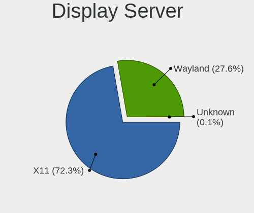
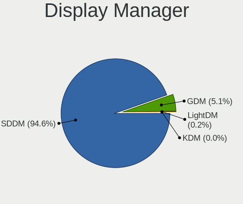
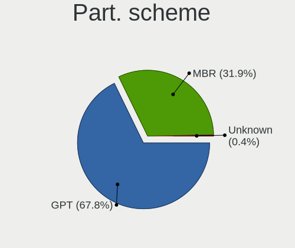
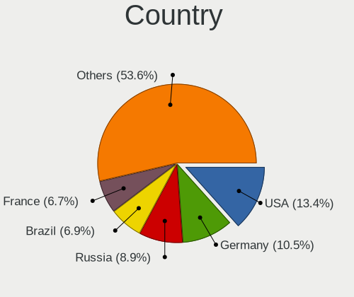
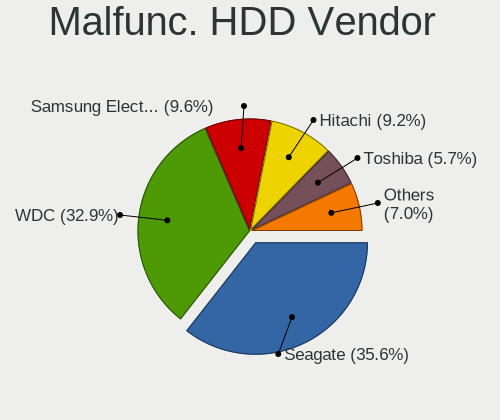
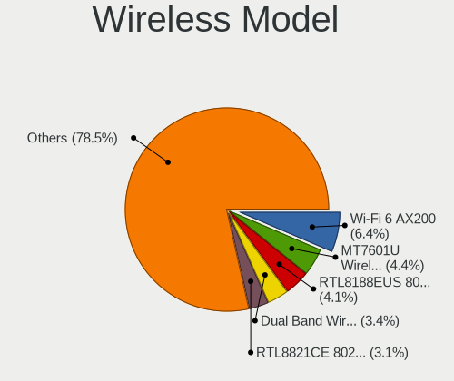
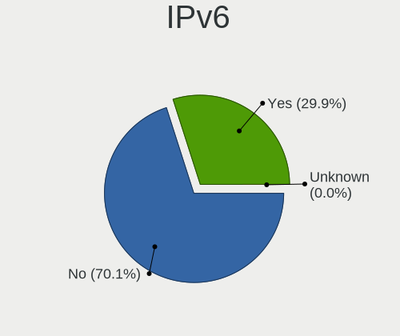
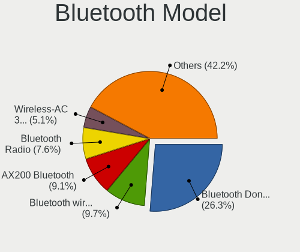
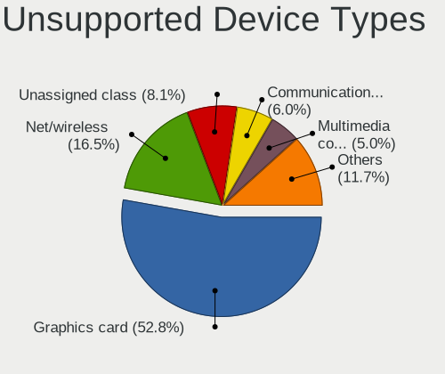

OpenMandriva - Tested Hardware & Statistics (Desktops)
------------------------------------------------------

A project to collect tested hardware configurations for OpenMandriva.

Anyone can contribute to this report by the [hw-probe](https://github.com/linuxhw/hw-probe) tool:

    sudo -E hw-probe -all -upload

Please contribute! Especially if your hardware is rare.

Contents
--------

* [ Test Cases ](#test-cases)

* [ System ](#system)
  - [ OS                       ](#os)
  - [ OS Family                ](#os-family)
  - [ Kernel                   ](#kernel)
  - [ Kernel Family            ](#kernel-family)
  - [ Kernel Major Ver.        ](#kernel-major-ver)
  - [ Arch                     ](#arch)
  - [ DE                       ](#de)
  - [ Display Server           ](#display-server)
  - [ Display Manager          ](#display-manager)
  - [ OS Lang                  ](#os-lang)
  - [ Boot Mode                ](#boot-mode)
  - [ Filesystem               ](#filesystem)
  - [ Part. scheme             ](#part-scheme)
  - [ Dual Boot with Linux/BSD ](#dual-boot-with-linuxbsd)
  - [ Dual Boot (Win)          ](#dual-boot-win)

* [ Board ](#board)
  - [ Vendor                   ](#vendor)
  - [ Model                    ](#model)
  - [ Model Family             ](#model-family)
  - [ MFG Year                 ](#mfg-year)
  - [ Form Factor              ](#form-factor)
  - [ Secure Boot              ](#secure-boot)
  - [ Coreboot                 ](#coreboot)
  - [ RAM Size                 ](#ram-size)
  - [ RAM Used                 ](#ram-used)
  - [ Total Drives             ](#total-drives)
  - [ Has CD-ROM               ](#has-cd-rom)
  - [ Has Ethernet             ](#has-ethernet)
  - [ Has WiFi                 ](#has-wifi)
  - [ Has Bluetooth            ](#has-bluetooth)

* [ Location ](#location)
  - [ Country                  ](#country)
  - [ City                     ](#city)

* [ Drives ](#drives)
  - [ Drive Vendor             ](#drive-vendor)
  - [ Drive Model              ](#drive-model)
  - [ HDD Vendor               ](#hdd-vendor)
  - [ SSD Vendor               ](#ssd-vendor)
  - [ Drive Kind               ](#drive-kind)
  - [ Drive Connector          ](#drive-connector)
  - [ Drive Size               ](#drive-size)
  - [ Space Total              ](#space-total)
  - [ Space Used               ](#space-used)
  - [ Malfunc. Drives          ](#malfunc-drives)
  - [ Malfunc. Drive Vendor    ](#malfunc-drive-vendor)
  - [ Malfunc. HDD Vendor      ](#malfunc-hdd-vendor)
  - [ Malfunc. Drive Kind      ](#malfunc-drive-kind)
  - [ Failed Drives            ](#failed-drives)
  - [ Failed Drive Vendor      ](#failed-drive-vendor)
  - [ Drive Status             ](#drive-status)

* [ Storage controller ](#storage-controller)
  - [ Storage Vendor           ](#storage-vendor)
  - [ Storage Model            ](#storage-model)
  - [ Storage Kind             ](#storage-kind)

* [ Processor ](#processor)
  - [ CPU Vendor               ](#cpu-vendor)
  - [ CPU Model                ](#cpu-model)
  - [ CPU Model Family         ](#cpu-model-family)
  - [ CPU Cores                ](#cpu-cores)
  - [ CPU Sockets              ](#cpu-sockets)
  - [ CPU Threads              ](#cpu-threads)
  - [ CPU Op-Modes             ](#cpu-op-modes)
  - [ CPU Microcode            ](#cpu-microcode)
  - [ CPU Microarch            ](#cpu-microarch)

* [ Graphics ](#graphics)
  - [ GPU Vendor               ](#gpu-vendor)
  - [ GPU Model                ](#gpu-model)
  - [ GPU Combo                ](#gpu-combo)
  - [ GPU Driver               ](#gpu-driver)
  - [ GPU Memory               ](#gpu-memory)

* [ Monitor ](#monitor)
  - [ Monitor Vendor           ](#monitor-vendor)
  - [ Monitor Model            ](#monitor-model)
  - [ Monitor Resolution       ](#monitor-resolution)
  - [ Monitor Diagonal         ](#monitor-diagonal)
  - [ Monitor Width            ](#monitor-width)
  - [ Aspect Ratio             ](#aspect-ratio)
  - [ Monitor Area             ](#monitor-area)
  - [ Pixel Density            ](#pixel-density)
  - [ Multiple Monitors        ](#multiple-monitors)

* [ Network ](#network)
  - [ Net Controller Vendor    ](#net-controller-vendor)
  - [ Net Controller Model     ](#net-controller-model)
  - [ Wireless Vendor          ](#wireless-vendor)
  - [ Wireless Model           ](#wireless-model)
  - [ Ethernet Vendor          ](#ethernet-vendor)
  - [ Ethernet Model           ](#ethernet-model)
  - [ Net Controller Kind      ](#net-controller-kind)
  - [ Used Controller          ](#used-controller)
  - [ NICs                     ](#nics)
  - [ IPv6                     ](#ipv6)

* [ Bluetooth ](#bluetooth)
  - [ Bluetooth Vendor         ](#bluetooth-vendor)
  - [ Bluetooth Model          ](#bluetooth-model)

* [ Sound ](#sound)
  - [ Sound Vendor             ](#sound-vendor)
  - [ Sound Model              ](#sound-model)

* [ Memory ](#memory)
  - [ Memory Vendor            ](#memory-vendor)
  - [ Memory Model             ](#memory-model)
  - [ Memory Kind              ](#memory-kind)
  - [ Memory Form Factor       ](#memory-form-factor)
  - [ Memory Size              ](#memory-size)
  - [ Memory Speed             ](#memory-speed)

* [ Printers & scanners ](#printers--scanners)
  - [ Printer Vendor           ](#printer-vendor)
  - [ Printer Model            ](#printer-model)
  - [ Scanner Vendor           ](#scanner-vendor)
  - [ Scanner Model            ](#scanner-model)

* [ Camera ](#camera)
  - [ Camera Vendor            ](#camera-vendor)
  - [ Camera Model             ](#camera-model)

* [ Security ](#security)
  - [ Fingerprint Vendor       ](#fingerprint-vendor)
  - [ Fingerprint Model        ](#fingerprint-model)
  - [ Chipcard Vendor          ](#chipcard-vendor)
  - [ Chipcard Model           ](#chipcard-model)

* [ Unsupported ](#unsupported)
  - [ Unsupported Devices      ](#unsupported-devices)
  - [ Unsupported Device Types ](#unsupported-device-types)

Test Cases
----------

Total: 9121

| Vendor        | Model                       | Probe                                                      | Date         |
|---------------|-----------------------------|------------------------------------------------------------|--------------|
| HP            | 3396                        | [5e68a536f2](https://linux-hardware.org/?probe=5e68a536f2) | May 09, 2024 |
| Dell          | 0VNP2H A00                  | [28953f7c6a](https://linux-hardware.org/?probe=28953f7c6a) | May 09, 2024 |
| MSI           | PRO B650M-A WIFI            | [c5f27e5e7b](https://linux-hardware.org/?probe=c5f27e5e7b) | May 09, 2024 |
| Gigabyte      | G41MT-S2PT                  | [a415a1e824](https://linux-hardware.org/?probe=a415a1e824) | May 08, 2024 |
| Biostar       | A320MH                      | [404917c360](https://linux-hardware.org/?probe=404917c360) | May 08, 2024 |
| Gigabyte      | B450 AORUS ELITE            | [0cd34decca](https://linux-hardware.org/?probe=0cd34decca) | May 08, 2024 |
| ASRock        | B450M-HDV                   | [098e62d52a](https://linux-hardware.org/?probe=098e62d52a) | May 08, 2024 |
| ASUSTek       | PRIME X470-PRO              | [c9bee8e35a](https://linux-hardware.org/?probe=c9bee8e35a) | May 08, 2024 |
| Gigabyte      | H310M S2H x.x               | [97598b9cc3](https://linux-hardware.org/?probe=97598b9cc3) | May 07, 2024 |
| MSI           | P67A-G45                    | [f852d50c62](https://linux-hardware.org/?probe=f852d50c62) | May 07, 2024 |
| ASUSTek       | PRIME A320M-E               | [d97bbebd45](https://linux-hardware.org/?probe=d97bbebd45) | May 07, 2024 |
| ECS           | Nettle2                     | [af1b3ee348](https://linux-hardware.org/?probe=af1b3ee348) | May 07, 2024 |
| Intel         | DQ45CB AAE30148-207         | [263e934dc2](https://linux-hardware.org/?probe=263e934dc2) | May 07, 2024 |
| ASRock        | B550 Phantom Gaming 4/ac    | [72d8d32749](https://linux-hardware.org/?probe=72d8d32749) | May 07, 2024 |
| ASUSTek       | M4A78T-E                    | [2cee8d14ab](https://linux-hardware.org/?probe=2cee8d14ab) | May 06, 2024 |
| Fujitsu       | D3164-A1 S26361-D3164-A1    | [ae1edad2ab](https://linux-hardware.org/?probe=ae1edad2ab) | May 06, 2024 |
| Dell          | 0HH807                      | [743dea0fc3](https://linux-hardware.org/?probe=743dea0fc3) | May 06, 2024 |
| HP            | 8053                        | [06b48e5ec6](https://linux-hardware.org/?probe=06b48e5ec6) | May 06, 2024 |
| Gigabyte      | B650 AORUS ELITE AX         | [12afc4ec37](https://linux-hardware.org/?probe=12afc4ec37) | May 06, 2024 |
| HP            | 8299                        | [6024274be6](https://linux-hardware.org/?probe=6024274be6) | May 06, 2024 |
| Intel         | DG45ID AAE27729-312         | [9610cedb7b](https://linux-hardware.org/?probe=9610cedb7b) | May 05, 2024 |
| Gigabyte      | H61M-S2PV                   | [780a67ef79](https://linux-hardware.org/?probe=780a67ef79) | May 05, 2024 |
| HP            | 1850                        | [5bab4e9f9b](https://linux-hardware.org/?probe=5bab4e9f9b) | May 05, 2024 |
| Lenovo        | 0B98401 WIN                 | [8d1ee988ad](https://linux-hardware.org/?probe=8d1ee988ad) | May 05, 2024 |
| ASRock        | E350M1/USB3                 | [d82d76d3e5](https://linux-hardware.org/?probe=d82d76d3e5) | May 05, 2024 |
| Dell          | 0R6PCT A01                  | [61f596b724](https://linux-hardware.org/?probe=61f596b724) | May 04, 2024 |
| Acer          | EQ45LM                      | [52563cbf82](https://linux-hardware.org/?probe=52563cbf82) | May 04, 2024 |
| ASUSTek       | ROG STRIX Z690-A GAMING ... | [64b195310b](https://linux-hardware.org/?probe=64b195310b) | May 04, 2024 |
| MouseCompu... | H61MU-S01                   | [9ab7d4b6e9](https://linux-hardware.org/?probe=9ab7d4b6e9) | May 04, 2024 |
| HP            | 339A                        | [a5f44d3bdb](https://linux-hardware.org/?probe=a5f44d3bdb) | May 04, 2024 |
| Gigabyte      | GA-78LMT-S2                 | [6a9fd41a39](https://linux-hardware.org/?probe=6a9fd41a39) | May 04, 2024 |
| Gigabyte      | 970A-DS3P                   | [0cf6542a99](https://linux-hardware.org/?probe=0cf6542a99) | May 04, 2024 |
| Gigabyte      | B550M DS3H AC               | [15375b5d97](https://linux-hardware.org/?probe=15375b5d97) | May 04, 2024 |
| Unknown       | G41 A01                     | [537cc137bd](https://linux-hardware.org/?probe=537cc137bd) | May 04, 2024 |
| Centerm       | C92                         | [beaeac18bc](https://linux-hardware.org/?probe=beaeac18bc) | May 04, 2024 |
| MouseCompu... | Z170-S01                    | [013d513bf9](https://linux-hardware.org/?probe=013d513bf9) | May 04, 2024 |
| ASUSTek       | PRIME B350M-A               | [3d11f9d342](https://linux-hardware.org/?probe=3d11f9d342) | May 03, 2024 |
| OEM           | X79-Turbo                   | [9c9327fa63](https://linux-hardware.org/?probe=9c9327fa63) | May 03, 2024 |
| ASUSTek       | K8V-MX                      | [64054e7bf3](https://linux-hardware.org/?probe=64054e7bf3) | May 03, 2024 |
| ASUSTek       | PRIME B460-PLUS             | [dd201d321b](https://linux-hardware.org/?probe=dd201d321b) | May 03, 2024 |
| HP            | 339A                        | [c19ffbdcb6](https://linux-hardware.org/?probe=c19ffbdcb6) | May 03, 2024 |
| Gigabyte      | B450M DS3H V2               | [87b5a4320e](https://linux-hardware.org/?probe=87b5a4320e) | May 03, 2024 |
| Dell          | 0WR7PY A04                  | [b48e977e84](https://linux-hardware.org/?probe=b48e977e84) | May 03, 2024 |
| ASRock        | X300M-STX                   | [58d58080cd](https://linux-hardware.org/?probe=58d58080cd) | May 03, 2024 |
| Intel         | B75                         | [4c39b0616d](https://linux-hardware.org/?probe=4c39b0616d) | May 02, 2024 |
| HP            | 8298                        | [da2ba36ce9](https://linux-hardware.org/?probe=da2ba36ce9) | May 02, 2024 |
| Acer          | FIH57                       | [8e4b02facb](https://linux-hardware.org/?probe=8e4b02facb) | May 02, 2024 |
| HP            | 2129                        | [3a5c2b8ae5](https://linux-hardware.org/?probe=3a5c2b8ae5) | May 02, 2024 |
| ASUSTek       | PRIME B660-PLUS D4          | [d7c901b5d7](https://linux-hardware.org/?probe=d7c901b5d7) | May 02, 2024 |
| Acer          | EM61SM/EM61PM               | [3b2c0bd5f6](https://linux-hardware.org/?probe=3b2c0bd5f6) | May 01, 2024 |
| Dell          | 0KRC95 A00                  | [72ba135dda](https://linux-hardware.org/?probe=72ba135dda) | May 01, 2024 |
| Gigabyte      | H81M-HD3                    | [adcbc97b26](https://linux-hardware.org/?probe=adcbc97b26) | May 01, 2024 |
| MSI           | B450M MORTAR MAX            | [527f3123a6](https://linux-hardware.org/?probe=527f3123a6) | May 01, 2024 |
| Lenovo        | H410                        | [d16690b0c4](https://linux-hardware.org/?probe=d16690b0c4) | May 01, 2024 |
| Gigabyte      | B85M-D2V                    | [40ae77d112](https://linux-hardware.org/?probe=40ae77d112) | May 01, 2024 |
| Packard Be... | IMEDIA S2185                | [47d64869d6](https://linux-hardware.org/?probe=47d64869d6) | Apr 30, 2024 |
| MSI           | PRO H610M-G DDR4            | [b8ab800603](https://linux-hardware.org/?probe=b8ab800603) | Apr 30, 2024 |
| Biostar       | H310MHP                     | [1faa8b5213](https://linux-hardware.org/?probe=1faa8b5213) | Apr 30, 2024 |
| Biostar       | H310MHP                     | [d5bc5a946f](https://linux-hardware.org/?probe=d5bc5a946f) | Apr 30, 2024 |
| Lenovo        | 30C9 SEK0N11843 IOT 3806... | [517daa7c85](https://linux-hardware.org/?probe=517daa7c85) | Apr 30, 2024 |
| Gigabyte      | B550M DS3H AC               | [0a5a41e025](https://linux-hardware.org/?probe=0a5a41e025) | Apr 30, 2024 |
| Dell          | 0F6X5P A00                  | [d860ea2ea1](https://linux-hardware.org/?probe=d860ea2ea1) | Apr 30, 2024 |
| ASUSTek       | PRIME H410M-K               | [9c6f64ecd9](https://linux-hardware.org/?probe=9c6f64ecd9) | Apr 29, 2024 |
| Gigabyte      | Z790 AERO G                 | [f226cfa836](https://linux-hardware.org/?probe=f226cfa836) | Apr 29, 2024 |
| MSI           | A68HM-E33                   | [abf75e8321](https://linux-hardware.org/?probe=abf75e8321) | Apr 29, 2024 |
| ASUSTek       | H81M-P PLUS                 | [e3c17dccb5](https://linux-hardware.org/?probe=e3c17dccb5) | Apr 29, 2024 |
| MSI           | PRO H610M-G DDR4            | [1492484deb](https://linux-hardware.org/?probe=1492484deb) | Apr 29, 2024 |
| Gigabyte      | GA-MA785GMT-UD2H            | [b1f251b92c](https://linux-hardware.org/?probe=b1f251b92c) | Apr 29, 2024 |
| EVGA          | NF66 2                      | [ef1a49773b](https://linux-hardware.org/?probe=ef1a49773b) | Apr 29, 2024 |
| ASUSTek       | Maximus VII HERO            | [51efe9cdc9](https://linux-hardware.org/?probe=51efe9cdc9) | Apr 28, 2024 |
| HP            | 0A54h                       | [603811635b](https://linux-hardware.org/?probe=603811635b) | Apr 28, 2024 |
| MSI           | A68HM GRENADE               | [c1a1b60624](https://linux-hardware.org/?probe=c1a1b60624) | Apr 28, 2024 |
| Fujitsu       | D3433-S2 S26361-D3433-S2    | [ed1d2dac2d](https://linux-hardware.org/?probe=ed1d2dac2d) | Apr 28, 2024 |
| ASUSTek       | A8NE-FM                     | [dbabd85077](https://linux-hardware.org/?probe=dbabd85077) | Apr 28, 2024 |
| ASUSTek       | X99-A                       | [eab08c37f7](https://linux-hardware.org/?probe=eab08c37f7) | Apr 28, 2024 |
| Intel         | D945GCL AAD67193-205        | [2520d8fe1d](https://linux-hardware.org/?probe=2520d8fe1d) | Apr 28, 2024 |
| ASUSTek       | P8H61-M LE                  | [15d91ebe7c](https://linux-hardware.org/?probe=15d91ebe7c) | Apr 28, 2024 |
| HP            | 8768 A                      | [aba3b50d67](https://linux-hardware.org/?probe=aba3b50d67) | Apr 28, 2024 |
| ASRock        | A320M-DVS R3.0              | [3af9ef3df5](https://linux-hardware.org/?probe=3af9ef3df5) | Apr 27, 2024 |
| MSI           | G31M3-L V2                  | [0a033139d1](https://linux-hardware.org/?probe=0a033139d1) | Apr 27, 2024 |
| ASRock        | Z97 Extreme4                | [611e146e9e](https://linux-hardware.org/?probe=611e146e9e) | Apr 27, 2024 |
| Dell          | 096JG8 A01                  | [5848ea3def](https://linux-hardware.org/?probe=5848ea3def) | Apr 27, 2024 |
| MSI           | PRO Z690-P DDR4             | [c43d04d511](https://linux-hardware.org/?probe=c43d04d511) | Apr 27, 2024 |
| HP            | 3029h                       | [70cd5cbc22](https://linux-hardware.org/?probe=70cd5cbc22) | Apr 26, 2024 |
| Gigabyte      | Z390 UD                     | [2aebb056ff](https://linux-hardware.org/?probe=2aebb056ff) | Apr 26, 2024 |
| MSI           | B250I GAMING PRO AC         | [edf573962d](https://linux-hardware.org/?probe=edf573962d) | Apr 25, 2024 |
| MAXSUN        | MS-Terminator B550M         | [4960448326](https://linux-hardware.org/?probe=4960448326) | Apr 25, 2024 |
| MACHINIST     | X79 V2.82A                  | [41c6b865b1](https://linux-hardware.org/?probe=41c6b865b1) | Apr 25, 2024 |
| ASRock        | A320M/ac                    | [6441ba6000](https://linux-hardware.org/?probe=6441ba6000) | Apr 25, 2024 |
| HP            | 2AF7                        | [dcff3bbb91](https://linux-hardware.org/?probe=dcff3bbb91) | Apr 25, 2024 |
| Gigabyte      | F2A55M-DS2                  | [8252280757](https://linux-hardware.org/?probe=8252280757) | Apr 25, 2024 |
| Gigabyte      | EX58-UD3R                   | [826b210e79](https://linux-hardware.org/?probe=826b210e79) | Apr 24, 2024 |
| ASUSTek       | PRIME H510M-A               | [a0eca89d4e](https://linux-hardware.org/?probe=a0eca89d4e) | Apr 24, 2024 |
| Dell          | 08NPPY A00                  | [8e54a2234f](https://linux-hardware.org/?probe=8e54a2234f) | Apr 24, 2024 |
| Acer          | Revo M2-601 A01             | [54a18aaccb](https://linux-hardware.org/?probe=54a18aaccb) | Apr 24, 2024 |
| Acer          | Veriton X2632G V:1.0        | [88daeba4af](https://linux-hardware.org/?probe=88daeba4af) | Apr 23, 2024 |
| Gigabyte      | Z390 UD                     | [36a382f0da](https://linux-hardware.org/?probe=36a382f0da) | Apr 23, 2024 |
| ASUSTek       | A68HM-PLUS                  | [c495b7e3d7](https://linux-hardware.org/?probe=c495b7e3d7) | Apr 23, 2024 |
| ASUSTek       | PRIME B550M-A               | [b662ccf901](https://linux-hardware.org/?probe=b662ccf901) | Apr 22, 2024 |
| ASRock        | G31M-S                      | [591e58940a](https://linux-hardware.org/?probe=591e58940a) | Apr 22, 2024 |
| Dell          | 0VHXCD A01                  | [4b7a01c41a](https://linux-hardware.org/?probe=4b7a01c41a) | Apr 22, 2024 |
| ASUSTek       | M5A99X EVO                  | [afb6abad8d](https://linux-hardware.org/?probe=afb6abad8d) | Apr 21, 2024 |
| MSI           | MPG X570 GAMING EDGE WIF... | [a2b7475561](https://linux-hardware.org/?probe=a2b7475561) | Apr 21, 2024 |
| ASUSTek       | Amberine                    | [618eece8ca](https://linux-hardware.org/?probe=618eece8ca) | Apr 21, 2024 |
| Positivo      | POS-PIG41BA POSITIVO        | [d5e1581050](https://linux-hardware.org/?probe=d5e1581050) | Apr 21, 2024 |
| Gigabyte      | H81M-D2V                    | [601836b445](https://linux-hardware.org/?probe=601836b445) | Apr 21, 2024 |
| ASUSTek       | PRIME H410M-A               | [41da917e67](https://linux-hardware.org/?probe=41da917e67) | Apr 21, 2024 |
| Acer          | WG43M                       | [93fcdbd13d](https://linux-hardware.org/?probe=93fcdbd13d) | Apr 20, 2024 |
| Foxconn       | G41MX/G41MX-K 2.0 1.0       | [a55114abfa](https://linux-hardware.org/?probe=a55114abfa) | Apr 19, 2024 |
| HP            | 339A                        | [8cb48fe045](https://linux-hardware.org/?probe=8cb48fe045) | Apr 19, 2024 |
| ASUSTek       | A88XM-E                     | [6ff101f38c](https://linux-hardware.org/?probe=6ff101f38c) | Apr 19, 2024 |
| MSI           | MS-7235                     | [d0b1ac0e44](https://linux-hardware.org/?probe=d0b1ac0e44) | Apr 19, 2024 |
| MSI           | B85I                        | [8751cf893f](https://linux-hardware.org/?probe=8751cf893f) | Apr 19, 2024 |
| HP            | 2B02                        | [5272c37a4c](https://linux-hardware.org/?probe=5272c37a4c) | Apr 18, 2024 |
| Dell          | 0Y958C A00                  | [88a0060933](https://linux-hardware.org/?probe=88a0060933) | Apr 18, 2024 |
| ASUSTek       | P9X79                       | [3f587bf3dd](https://linux-hardware.org/?probe=3f587bf3dd) | Apr 18, 2024 |
| Gigabyte      | H170M-D3H DDR3-CF           | [f7a78f85d8](https://linux-hardware.org/?probe=f7a78f85d8) | Apr 18, 2024 |
| ASUSTek       | P8Z77-V LX                  | [686220b484](https://linux-hardware.org/?probe=686220b484) | Apr 17, 2024 |
| Pegatron      | Narra6                      | [fb336cac9b](https://linux-hardware.org/?probe=fb336cac9b) | Apr 17, 2024 |
| Intel         | H61                         | [e0bacf6b01](https://linux-hardware.org/?probe=e0bacf6b01) | Apr 17, 2024 |
| ASUSTek       | P5N72-T PREMIUM             | [067b12dd29](https://linux-hardware.org/?probe=067b12dd29) | Apr 16, 2024 |
| Dell          | 0D28YY A03                  | [0332c27e2c](https://linux-hardware.org/?probe=0332c27e2c) | Apr 16, 2024 |
| ASUSTek       | ROG STRIX B650E-I GAMING... | [41c197d579](https://linux-hardware.org/?probe=41c197d579) | Apr 16, 2024 |
| ASUSTek       | P8H61-MX R2.0               | [53a06e22d4](https://linux-hardware.org/?probe=53a06e22d4) | Apr 16, 2024 |
| MSI           | H81M-E34                    | [61891eff16](https://linux-hardware.org/?probe=61891eff16) | Apr 15, 2024 |
| ASUSTek       | ROG STRIX B550-I GAMING     | [4fb5756438](https://linux-hardware.org/?probe=4fb5756438) | Apr 14, 2024 |
| HP            | 805D                        | [f3b0ef4a3b](https://linux-hardware.org/?probe=f3b0ef4a3b) | Apr 14, 2024 |
| Lenovo        | Win8 Pro DPK TPG            | [c6fd918c6e](https://linux-hardware.org/?probe=c6fd918c6e) | Apr 14, 2024 |
| Gigabyte      | H110M-DS2V-CF               | [40fe788bf0](https://linux-hardware.org/?probe=40fe788bf0) | Apr 14, 2024 |
| ASUSTek       | ROG STRIX B450-F GAMING     | [a829e68e1f](https://linux-hardware.org/?probe=a829e68e1f) | Apr 14, 2024 |
| ASUSTek       | PRIME H610M-K D4            | [ca76c3d3ec](https://linux-hardware.org/?probe=ca76c3d3ec) | Apr 13, 2024 |
| MAXSUN        | MS-Terminator B760M D4 V... | [5a0687cb6d](https://linux-hardware.org/?probe=5a0687cb6d) | Apr 13, 2024 |
| Fujitsu       | D3313-B1 S26361-D3313-B1    | [2998b9027d](https://linux-hardware.org/?probe=2998b9027d) | Apr 13, 2024 |
| Packard Be... | 1.XX                        | [2f25beb1a1](https://linux-hardware.org/?probe=2f25beb1a1) | Apr 12, 2024 |
| ASRock        | H510M-HDV R2.0              | [5b213df28c](https://linux-hardware.org/?probe=5b213df28c) | Apr 12, 2024 |
| ASRock        | G31M-S                      | [d9694d3f33](https://linux-hardware.org/?probe=d9694d3f33) | Apr 12, 2024 |
| Gigabyte      | GA-970A-D3                  | [1a6e8ab59b](https://linux-hardware.org/?probe=1a6e8ab59b) | Apr 12, 2024 |
| Dell          | OptiPlex 7050               | [e6f968f709](https://linux-hardware.org/?probe=e6f968f709) | Apr 11, 2024 |
| Fujitsu       | D3403-U1 S26361-D3403-U1    | [5757303d9a](https://linux-hardware.org/?probe=5757303d9a) | Apr 11, 2024 |
| MSI           | Z77MA-G45                   | [7a6ac2c320](https://linux-hardware.org/?probe=7a6ac2c320) | Apr 11, 2024 |
| Dell          | 0NKW6Y A02                  | [fcd30b6392](https://linux-hardware.org/?probe=fcd30b6392) | Apr 11, 2024 |
| HP            | 1998                        | [4e592f29d7](https://linux-hardware.org/?probe=4e592f29d7) | Apr 11, 2024 |
| Foxconn       | 2A8C                        | [9d16faea24](https://linux-hardware.org/?probe=9d16faea24) | Apr 10, 2024 |
| ASUSTek       | H61M-C                      | [a0e36b103b](https://linux-hardware.org/?probe=a0e36b103b) | Apr 10, 2024 |
| MSI           | Z97-G43                     | [f8d06c2432](https://linux-hardware.org/?probe=f8d06c2432) | Apr 09, 2024 |
| Gigabyte      | B560 DS3H AC-Y1             | [1ea5a5db25](https://linux-hardware.org/?probe=1ea5a5db25) | Apr 09, 2024 |
| ASUSTek       | TUF Gaming B450-PLUS II     | [1163ac6ace](https://linux-hardware.org/?probe=1163ac6ace) | Apr 09, 2024 |
| ASUSTek       | P5Q                         | [05d54173b4](https://linux-hardware.org/?probe=05d54173b4) | Apr 08, 2024 |
| ASUSTek       | P8H77-V                     | [721926ded3](https://linux-hardware.org/?probe=721926ded3) | Apr 08, 2024 |
| ASUSTek       | PRIME X299-A II             | [ccd70d8794](https://linux-hardware.org/?probe=ccd70d8794) | Apr 07, 2024 |
| MSI           | G41M-P26                    | [c337a993c8](https://linux-hardware.org/?probe=c337a993c8) | Apr 07, 2024 |
| ASUSTek       | M4A88T-M/USB3               | [69cf49e1b1](https://linux-hardware.org/?probe=69cf49e1b1) | Apr 07, 2024 |
| Daten Tecn... | DA75PRO                     | [aaf78d3f34](https://linux-hardware.org/?probe=aaf78d3f34) | Apr 07, 2024 |
| Intel         | B75                         | [7ac22ca55d](https://linux-hardware.org/?probe=7ac22ca55d) | Apr 07, 2024 |
| ASUSTek       | A68HM-K                     | [8a74010840](https://linux-hardware.org/?probe=8a74010840) | Apr 07, 2024 |
| HP            | 8054                        | [55c6935be9](https://linux-hardware.org/?probe=55c6935be9) | Apr 07, 2024 |
| Dell          | 0KP561                      | [dd6f49d82f](https://linux-hardware.org/?probe=dd6f49d82f) | Apr 06, 2024 |
| ASUSTek       | P5P43TD/USB3                | [e8ebc10509](https://linux-hardware.org/?probe=e8ebc10509) | Apr 06, 2024 |
| ASRock        | 960GM-VGS3 FX               | [a477f6d679](https://linux-hardware.org/?probe=a477f6d679) | Apr 06, 2024 |
| ASUSTek       | TUF Gaming B550-PLUS        | [041f56c14b](https://linux-hardware.org/?probe=041f56c14b) | Apr 06, 2024 |
| ASRock        | X570 Phantom Gaming 4       | [bc0f74721a](https://linux-hardware.org/?probe=bc0f74721a) | Apr 06, 2024 |
| Gigabyte      | H410M S2H V2                | [2713f1fbb2](https://linux-hardware.org/?probe=2713f1fbb2) | Apr 06, 2024 |
| Unknown       | Unknown                     | [0f08ac20fe](https://linux-hardware.org/?probe=0f08ac20fe) | Apr 06, 2024 |
| MSI           | MAG B760M MORTAR WIFI       | [29e4279833](https://linux-hardware.org/?probe=29e4279833) | Apr 06, 2024 |
| Biostar       | A960D+V2                    | [1b995511d1](https://linux-hardware.org/?probe=1b995511d1) | Apr 06, 2024 |
| HP            | 1497                        | [bc9fcab61a](https://linux-hardware.org/?probe=bc9fcab61a) | Apr 06, 2024 |
| HP            | 1790                        | [0038bf2917](https://linux-hardware.org/?probe=0038bf2917) | Apr 06, 2024 |
| ASUSTek       | PRIME A320M-K               | [17dac6592c](https://linux-hardware.org/?probe=17dac6592c) | Apr 06, 2024 |
| ASRock        | B450 Steel Legend           | [8acd2823d2](https://linux-hardware.org/?probe=8acd2823d2) | Apr 06, 2024 |
| Biostar       | TB250-BTC PRO               | [3fceee8ca7](https://linux-hardware.org/?probe=3fceee8ca7) | Apr 06, 2024 |
| ASRock        | 970A-G                      | [e1e0f99df4](https://linux-hardware.org/?probe=e1e0f99df4) | Apr 06, 2024 |
| Gigabyte      | B85M-D3H                    | [69a0e2f77d](https://linux-hardware.org/?probe=69a0e2f77d) | Apr 06, 2024 |
| ASRock        | B150M Pro4                  | [75a5d3af57](https://linux-hardware.org/?probe=75a5d3af57) | Apr 06, 2024 |
| HP            | 8653 A                      | [1ab035c8c7](https://linux-hardware.org/?probe=1ab035c8c7) | Apr 06, 2024 |
| Dell          | 02YYK5 A01                  | [e407d84cc9](https://linux-hardware.org/?probe=e407d84cc9) | Apr 06, 2024 |
| MSI           | CSM-H81M-P32                | [d564057957](https://linux-hardware.org/?probe=d564057957) | Apr 06, 2024 |
| ASUSTek       | P5KPL-CM                    | [7fb2e983ef](https://linux-hardware.org/?probe=7fb2e983ef) | Apr 06, 2024 |
| Gigabyte      | GA-880GM-USB3               | [2ad3b3efa3](https://linux-hardware.org/?probe=2ad3b3efa3) | Apr 06, 2024 |
| Gigabyte      | B85M-HD3                    | [3d81eb0d82](https://linux-hardware.org/?probe=3d81eb0d82) | Apr 05, 2024 |
| ASUSTek       | PRIME Z590-P                | [9ef1b07dc2](https://linux-hardware.org/?probe=9ef1b07dc2) | Apr 05, 2024 |
| ASRock        | AB350M Pro4                 | [705e1fd7bf](https://linux-hardware.org/?probe=705e1fd7bf) | Apr 05, 2024 |
| MSI           | Z590 PRO WIFI               | [b4b9cef6a6](https://linux-hardware.org/?probe=b4b9cef6a6) | Apr 05, 2024 |
| Dell          | 02YRK5 A02                  | [9e63513a8a](https://linux-hardware.org/?probe=9e63513a8a) | Apr 05, 2024 |
| ASRock        | H87 Pro4                    | [46c9acd849](https://linux-hardware.org/?probe=46c9acd849) | Apr 05, 2024 |
| Gigabyte      | GA-78LMT-S2 R2 sex          | [2d8c4c947f](https://linux-hardware.org/?probe=2d8c4c947f) | Apr 05, 2024 |
| Lenovo        | ThinkCentre M90p 5536P79    | [1750bd22db](https://linux-hardware.org/?probe=1750bd22db) | Apr 05, 2024 |
| ASRock        | Z170 Gaming K4              | [6903ba43b4](https://linux-hardware.org/?probe=6903ba43b4) | Apr 04, 2024 |
| Dell          | 0T1D10 A01                  | [bd3b0fd5b1](https://linux-hardware.org/?probe=bd3b0fd5b1) | Apr 04, 2024 |
| ASUSTek       | PRIME X470-PRO              | [e16e4757cf](https://linux-hardware.org/?probe=e16e4757cf) | Apr 04, 2024 |
| MSI           | H310M PRO-VDH               | [98d131eacb](https://linux-hardware.org/?probe=98d131eacb) | Apr 04, 2024 |
| Shenzhen M... | F7BFC                       | [4b0127a449](https://linux-hardware.org/?probe=4b0127a449) | Apr 04, 2024 |
| ECS           | H110M4-C2H                  | [925c280360](https://linux-hardware.org/?probe=925c280360) | Apr 04, 2024 |
| ASUSTek       | PRIME H570-PLUS             | [69279a9792](https://linux-hardware.org/?probe=69279a9792) | Apr 04, 2024 |
| ASRock        | A520M Pro4                  | [dd6acd4be2](https://linux-hardware.org/?probe=dd6acd4be2) | Apr 04, 2024 |
| ASRock        | X570 Taichi                 | [cc96dfe356](https://linux-hardware.org/?probe=cc96dfe356) | Apr 03, 2024 |
| ASRock        | B450 Pro4 R2.0              | [60056839c9](https://linux-hardware.org/?probe=60056839c9) | Apr 03, 2024 |
| ASRock        | B85M-ITX                    | [d2ef6e4424](https://linux-hardware.org/?probe=d2ef6e4424) | Apr 03, 2024 |
| ASRock        | H61M-ITX                    | [56a5b3ae2f](https://linux-hardware.org/?probe=56a5b3ae2f) | Apr 03, 2024 |
| ASUSTek       | TUF Gaming B550-PLUS        | [e3541ebcf4](https://linux-hardware.org/?probe=e3541ebcf4) | Apr 03, 2024 |
| HP            | 1495                        | [92c2575a1f](https://linux-hardware.org/?probe=92c2575a1f) | Apr 03, 2024 |
| Gigabyte      | MFLP5IP-00                  | [aedb7d1450](https://linux-hardware.org/?probe=aedb7d1450) | Apr 03, 2024 |
| MSI           | MAG B560 TORPEDO            | [492005acf0](https://linux-hardware.org/?probe=492005acf0) | Apr 03, 2024 |
| Dell          | 051FJ8 A00                  | [8f67355bed](https://linux-hardware.org/?probe=8f67355bed) | Apr 03, 2024 |
| ASRock        | P5B-DE                      | [bcf35bb538](https://linux-hardware.org/?probe=bcf35bb538) | Apr 03, 2024 |
| HP            | 3396                        | [641a1891ba](https://linux-hardware.org/?probe=641a1891ba) | Apr 02, 2024 |
| Dell          | 0XFWHV A00                  | [ea24de6920](https://linux-hardware.org/?probe=ea24de6920) | Apr 02, 2024 |
| Gigabyte      | F2A68HM-H                   | [e9bf1ed29d](https://linux-hardware.org/?probe=e9bf1ed29d) | Apr 01, 2024 |
| Lenovo        | ThinkCentre M58p 6234CL2    | [d2eea8b39c](https://linux-hardware.org/?probe=d2eea8b39c) | Apr 01, 2024 |
| ASUSTek       | PRIME A320I-K               | [463d13b7df](https://linux-hardware.org/?probe=463d13b7df) | Apr 01, 2024 |
| ASUSTek       | PRIME Z390M-PLUS            | [2f1c067d48](https://linux-hardware.org/?probe=2f1c067d48) | Apr 01, 2024 |
| ASUSTek       | CROSSHAIR V FORMULA-Z       | [939cfeb31e](https://linux-hardware.org/?probe=939cfeb31e) | Apr 01, 2024 |
| ASUSTek       | Z97-K                       | [f967d096ac](https://linux-hardware.org/?probe=f967d096ac) | Apr 01, 2024 |
| Gigabyte      | GA-770T-D3L                 | [402894f9cd](https://linux-hardware.org/?probe=402894f9cd) | Apr 01, 2024 |
| ASRock        | FM2A88X Extreme6+           | [1f8ed16982](https://linux-hardware.org/?probe=1f8ed16982) | Apr 01, 2024 |
| Gigabyte      | B560M DS3H V3               | [7d2e02bbb4](https://linux-hardware.org/?probe=7d2e02bbb4) | Apr 01, 2024 |
| Intel         | H81                         | [b7c3224542](https://linux-hardware.org/?probe=b7c3224542) | Apr 01, 2024 |
| HP            | 2171                        | [3cd1f729a4](https://linux-hardware.org/?probe=3cd1f729a4) | Apr 01, 2024 |
| QIYIDA        | X79-M6 V1.0                 | [ab18c6c58f](https://linux-hardware.org/?probe=ab18c6c58f) | Mar 31, 2024 |
| Pegatron      | Benicia                     | [22f74ed745](https://linux-hardware.org/?probe=22f74ed745) | Mar 31, 2024 |
| ASUSTek       | P5G41T-M LX3                | [766cded093](https://linux-hardware.org/?probe=766cded093) | Mar 31, 2024 |
| Gigabyte      | B250M-Gaming5-CF            | [47d0634e2a](https://linux-hardware.org/?probe=47d0634e2a) | Mar 31, 2024 |
| Gigabyte      | B550M DS3H                  | [2ec08fd0c4](https://linux-hardware.org/?probe=2ec08fd0c4) | Mar 31, 2024 |
| ASUSTek       | ROG STRIX B550-F GAMING     | [30575319dc](https://linux-hardware.org/?probe=30575319dc) | Mar 31, 2024 |
| MSI           | H310M PRO-M2                | [b2753ac794](https://linux-hardware.org/?probe=b2753ac794) | Mar 31, 2024 |
| ASUSTek       | PRIME H310M-D R2.0          | [b251cdc4d6](https://linux-hardware.org/?probe=b251cdc4d6) | Mar 31, 2024 |
| ASUSTek       | P8Z77-V PREMIUM             | [3c3064e23a](https://linux-hardware.org/?probe=3c3064e23a) | Mar 31, 2024 |
| MouseCompu... | B85H3-M4/2.0                | [0318e0dbfb](https://linux-hardware.org/?probe=0318e0dbfb) | Mar 31, 2024 |
| ASUSTek       | H81M-K                      | [483eaeb53c](https://linux-hardware.org/?probe=483eaeb53c) | Mar 30, 2024 |
| ASRock        | G31M-S                      | [7df654f75f](https://linux-hardware.org/?probe=7df654f75f) | Mar 30, 2024 |
| Dell          | 0H634K A00                  | [cd85e4d384](https://linux-hardware.org/?probe=cd85e4d384) | Mar 30, 2024 |
| Gigabyte      | X570 I AORUS PRO WIFI       | [1fb5102d8c](https://linux-hardware.org/?probe=1fb5102d8c) | Mar 30, 2024 |
| Positivo      | POS-AG31AP                  | [606557f097](https://linux-hardware.org/?probe=606557f097) | Mar 30, 2024 |
| Medion        | D3F3-EM                     | [c624415ff5](https://linux-hardware.org/?probe=c624415ff5) | Mar 30, 2024 |
| Gigabyte      | H87-HD3                     | [2dc48c8319](https://linux-hardware.org/?probe=2dc48c8319) | Mar 30, 2024 |
| Gigabyte      | B450M DS3H V2               | [e239e5305b](https://linux-hardware.org/?probe=e239e5305b) | Mar 30, 2024 |
| Intel         | B75 V1.6B                   | [6cdcc4a3c5](https://linux-hardware.org/?probe=6cdcc4a3c5) | Mar 30, 2024 |
| ASRock        | B75M                        | [de41218e15](https://linux-hardware.org/?probe=de41218e15) | Mar 30, 2024 |
| ASUSTek       | M4A785-M                    | [cb33f5a0f5](https://linux-hardware.org/?probe=cb33f5a0f5) | Mar 30, 2024 |
| Gigabyte      | H61M-S1                     | [d9f5951310](https://linux-hardware.org/?probe=d9f5951310) | Mar 29, 2024 |
| Foxconn       | H61MXL/H61MXL-K             | [333a0e4aa4](https://linux-hardware.org/?probe=333a0e4aa4) | Mar 29, 2024 |
| ASUSTek       | SABERTOOTH X99              | [9eadaaa051](https://linux-hardware.org/?probe=9eadaaa051) | Mar 29, 2024 |
| Dell          | 0GDG8Y A00                  | [70199cb1ec](https://linux-hardware.org/?probe=70199cb1ec) | Mar 29, 2024 |
| Dell          | 0478VN A00                  | [7300a27a93](https://linux-hardware.org/?probe=7300a27a93) | Mar 29, 2024 |
| Gigabyte      | B560M DS3H V2               | [f99b737a3e](https://linux-hardware.org/?probe=f99b737a3e) | Mar 29, 2024 |
| Foxconn       | D180S/D190S/D290S Series... | [d8ebc08320](https://linux-hardware.org/?probe=d8ebc08320) | Mar 29, 2024 |
| Dell          | 0RF705                      | [0af34bb0be](https://linux-hardware.org/?probe=0af34bb0be) | Mar 29, 2024 |
| ASRock        | Z87 Extreme6                | [a7ffff15ff](https://linux-hardware.org/?probe=a7ffff15ff) | Mar 28, 2024 |
| GEEKOM        | A5                          | [c7e07714cc](https://linux-hardware.org/?probe=c7e07714cc) | Mar 28, 2024 |
| HP            | 2AE3                        | [f068c22e6c](https://linux-hardware.org/?probe=f068c22e6c) | Mar 28, 2024 |
| Gigabyte      | GA-990X-Gaming SLI-CF       | [697b22a027](https://linux-hardware.org/?probe=697b22a027) | Mar 28, 2024 |
| Gigabyte      | H61M-USB3-B3                | [41ba5dc8ca](https://linux-hardware.org/?probe=41ba5dc8ca) | Mar 28, 2024 |
| Dell          | 0YXT71 A03                  | [d854505a5b](https://linux-hardware.org/?probe=d854505a5b) | Mar 27, 2024 |
| HP            | 2AA6 PVT                    | [899a3e57bb](https://linux-hardware.org/?probe=899a3e57bb) | Mar 27, 2024 |
| Dell          | 0T10XW A01                  | [64d0600046](https://linux-hardware.org/?probe=64d0600046) | Mar 26, 2024 |
| ASUSTek       | P8Z77-V LX                  | [af967ddbdc](https://linux-hardware.org/?probe=af967ddbdc) | Mar 26, 2024 |
| ASRock        | H310CM-HDV                  | [b4c034c103](https://linux-hardware.org/?probe=b4c034c103) | Mar 26, 2024 |
| Gigabyte      | B660 AORUS MASTER           | [65e022cf34](https://linux-hardware.org/?probe=65e022cf34) | Mar 26, 2024 |
| ASUSTek       | ROG STRIX B550-I GAMING     | [3f052410d3](https://linux-hardware.org/?probe=3f052410d3) | Mar 26, 2024 |
| Dell          | 0JP3NX A01                  | [01246bca4d](https://linux-hardware.org/?probe=01246bca4d) | Mar 26, 2024 |
| Dell          | 088DT1 A01                  | [de5dac0125](https://linux-hardware.org/?probe=de5dac0125) | Mar 26, 2024 |
| ASRock        | H110M-HG4                   | [0ef9ca77ad](https://linux-hardware.org/?probe=0ef9ca77ad) | Mar 26, 2024 |
| Dell          | 07WP95 A01                  | [1c4843f354](https://linux-hardware.org/?probe=1c4843f354) | Mar 26, 2024 |
| ASUSTek       | P5K SE                      | [2391cf9f32](https://linux-hardware.org/?probe=2391cf9f32) | Mar 26, 2024 |
| Gigabyte      | B450 AORUS PRO WIFI-CF      | [786693fab4](https://linux-hardware.org/?probe=786693fab4) | Mar 25, 2024 |
| ASUSTek       | TUF B360M-PLUS GAMING       | [000bb993d1](https://linux-hardware.org/?probe=000bb993d1) | Mar 25, 2024 |
| MSI           | H110M PRO-VD                | [c250bda654](https://linux-hardware.org/?probe=c250bda654) | Mar 25, 2024 |
| Pegatron      | 2AB5                        | [713be0f3f0](https://linux-hardware.org/?probe=713be0f3f0) | Mar 25, 2024 |
| AFOX          | IH61-MA5                    | [a5418cfc92](https://linux-hardware.org/?probe=a5418cfc92) | Mar 24, 2024 |
| Lenovo        | 318E SDK0J40697 WIN 3305... | [280e11e5cc](https://linux-hardware.org/?probe=280e11e5cc) | Mar 24, 2024 |
| MSI           | B650 GAMING PLUS WIFI       | [2f0263e786](https://linux-hardware.org/?probe=2f0263e786) | Mar 24, 2024 |
| Dell          | 084J0R A00                  | [691f19e56c](https://linux-hardware.org/?probe=691f19e56c) | Mar 24, 2024 |
| ASUSTek       | TUF Z390M-PRO GAMING        | [45e2102834](https://linux-hardware.org/?probe=45e2102834) | Mar 23, 2024 |
| NEC Comput... | 30C4                        | [ad2735fc3a](https://linux-hardware.org/?probe=ad2735fc3a) | Mar 23, 2024 |
| Acer          | Veriton M4620G v1.0         | [d6f6ee455f](https://linux-hardware.org/?probe=d6f6ee455f) | Mar 23, 2024 |
| ECS           | A780LM-M2                   | [008c69e1f0](https://linux-hardware.org/?probe=008c69e1f0) | Mar 22, 2024 |
| Digiboard     | NM70-TI                     | [1bd7ba8e34](https://linux-hardware.org/?probe=1bd7ba8e34) | Mar 22, 2024 |
| Lenovo        | 30BC SDK0J40705 WIN 3425... | [5a656756e0](https://linux-hardware.org/?probe=5a656756e0) | Mar 22, 2024 |
| ASRock        | FM2A58M-VG3+ R2.0           | [e9415eea5c](https://linux-hardware.org/?probe=e9415eea5c) | Mar 22, 2024 |
| ASRock        | A320M-HDV                   | [69bd8b3475](https://linux-hardware.org/?probe=69bd8b3475) | Mar 22, 2024 |
| Unknown       | Unknown                     | [52255354d1](https://linux-hardware.org/?probe=52255354d1) | Mar 21, 2024 |
| Dell          | 0K240Y A02                  | [8c345dca31](https://linux-hardware.org/?probe=8c345dca31) | Mar 21, 2024 |
| AMI           | Intel                       | [4bb3934f7d](https://linux-hardware.org/?probe=4bb3934f7d) | Mar 21, 2024 |
| ASUSTek       | P9X79                       | [3764bad531](https://linux-hardware.org/?probe=3764bad531) | Mar 21, 2024 |
| Intel         | X99                         | [c85af1f29d](https://linux-hardware.org/?probe=c85af1f29d) | Mar 21, 2024 |
| ASRock        | E35LM1                      | [d67fe2fd09](https://linux-hardware.org/?probe=d67fe2fd09) | Mar 21, 2024 |
| Dell          | 0WG864                      | [ba98cc3250](https://linux-hardware.org/?probe=ba98cc3250) | Mar 21, 2024 |
| Casper        | NIRVANA DESKTOP             | [6428f854e6](https://linux-hardware.org/?probe=6428f854e6) | Mar 21, 2024 |
| ASUSTek       | M2NPV-VM                    | [f06b5e3ad1](https://linux-hardware.org/?probe=f06b5e3ad1) | Mar 19, 2024 |
| Dell          | 0CU409                      | [5c8704734b](https://linux-hardware.org/?probe=5c8704734b) | Mar 19, 2024 |
| HP            | 8768 A                      | [6c296786d2](https://linux-hardware.org/?probe=6c296786d2) | Mar 19, 2024 |
| Foxconn       | 2ABF                        | [cec4a4b661](https://linux-hardware.org/?probe=cec4a4b661) | Mar 19, 2024 |
| Lenovo        | 367D SDK0J40709 WIN         | [178bf2c5e4](https://linux-hardware.org/?probe=178bf2c5e4) | Mar 19, 2024 |
| Lenovo        | 30C0 SDK0J40705 WIN 3425... | [fac66be915](https://linux-hardware.org/?probe=fac66be915) | Mar 19, 2024 |
| Dell          | 0D6H9T A01                  | [c3691d0e66](https://linux-hardware.org/?probe=c3691d0e66) | Mar 19, 2024 |
| ASUSTek       | PRIME B450-PLUS             | [345e2df2db](https://linux-hardware.org/?probe=345e2df2db) | Mar 19, 2024 |
| HP            | 0B4Ch D                     | [e85fec8591](https://linux-hardware.org/?probe=e85fec8591) | Mar 18, 2024 |
| MSI           | MS-B0A21                    | [e4301d435b](https://linux-hardware.org/?probe=e4301d435b) | Mar 18, 2024 |
| MSI           | X99A RAIDER                 | [8d5dfb7293](https://linux-hardware.org/?probe=8d5dfb7293) | Mar 18, 2024 |
| ASUSTek       | PRIME A320M-K               | [e631f0ddf7](https://linux-hardware.org/?probe=e631f0ddf7) | Mar 17, 2024 |
| Fujitsu       | D3162-A1 S26361-D3162-A1    | [f0513b05b9](https://linux-hardware.org/?probe=f0513b05b9) | Mar 17, 2024 |
| HP            | 3397                        | [fb9a64a7c0](https://linux-hardware.org/?probe=fb9a64a7c0) | Mar 17, 2024 |
| HP            | 8643 SMVB                   | [30f065cd2e](https://linux-hardware.org/?probe=30f065cd2e) | Mar 17, 2024 |
| ASRock        | X470 Taichi                 | [195c54fe84](https://linux-hardware.org/?probe=195c54fe84) | Mar 17, 2024 |
| ASUSTek       | B150M-C/BR                  | [238d756cd5](https://linux-hardware.org/?probe=238d756cd5) | Mar 17, 2024 |
| ASUSTek       | PRIME Z790-P                | [82c42946af](https://linux-hardware.org/?probe=82c42946af) | Mar 17, 2024 |
| MSI           | B560M PRO-E                 | [2e1e84fe15](https://linux-hardware.org/?probe=2e1e84fe15) | Mar 16, 2024 |
| HP            | 097Ch                       | [23bc1b2344](https://linux-hardware.org/?probe=23bc1b2344) | Mar 15, 2024 |
| Dell          | 0NDYHG A01                  | [fd065468fe](https://linux-hardware.org/?probe=fd065468fe) | Mar 15, 2024 |
| AZW           | MINI S 10                   | [843a0455d6](https://linux-hardware.org/?probe=843a0455d6) | Mar 15, 2024 |
| MSI           | Z270 PC MATE                | [87ef1a815e](https://linux-hardware.org/?probe=87ef1a815e) | Mar 15, 2024 |
| Gigabyte      | Z68MA-D2H-B3                | [708c2c7987](https://linux-hardware.org/?probe=708c2c7987) | Mar 15, 2024 |
| ASUSTek       | TUF B450-PRO GAMING         | [cd91e52611](https://linux-hardware.org/?probe=cd91e52611) | Mar 14, 2024 |
| ASUSTek       | M2N-MX SE Plus              | [de771fafaf](https://linux-hardware.org/?probe=de771fafaf) | Mar 14, 2024 |
| MSI           | B85M-G43                    | [c1b1061c0d](https://linux-hardware.org/?probe=c1b1061c0d) | Mar 14, 2024 |
| Apple         | Mac-F42C88C8 Proto1         | [4e7425d94c](https://linux-hardware.org/?probe=4e7425d94c) | Mar 14, 2024 |
| MSI           | MPG X570 GAMING EDGE WIF... | [4c8d39a7ab](https://linux-hardware.org/?probe=4c8d39a7ab) | Mar 14, 2024 |
| ASUSTek       | P7P55D EVO                  | [806a262ea9](https://linux-hardware.org/?probe=806a262ea9) | Mar 13, 2024 |
| Gigabyte      | 945GCMX-S2                  | [fa1bce30a0](https://linux-hardware.org/?probe=fa1bce30a0) | Mar 13, 2024 |
| Lenovo        | 32CB SDK0T76549 WIN 3792... | [343a068616](https://linux-hardware.org/?probe=343a068616) | Mar 13, 2024 |
| ASUSTek       | M4N68T-M-V2                 | [7b684fbb84](https://linux-hardware.org/?probe=7b684fbb84) | Mar 13, 2024 |
| Lenovo        | 3752 NOK                    | [346e8ecb30](https://linux-hardware.org/?probe=346e8ecb30) | Mar 13, 2024 |
| ASUSTek       | P5G41T-M LX                 | [d89d81deb7](https://linux-hardware.org/?probe=d89d81deb7) | Mar 12, 2024 |
| Lenovo        | 3176 SDK0K17763 WIN 1801... | [51143831ed](https://linux-hardware.org/?probe=51143831ed) | Mar 12, 2024 |
| OEM           | X79-Turbo                   | [b19889facd](https://linux-hardware.org/?probe=b19889facd) | Mar 12, 2024 |
| ASUSTek       | P5Q                         | [9e6a34f9fd](https://linux-hardware.org/?probe=9e6a34f9fd) | Mar 11, 2024 |
| HP            | 2171                        | [83cba3a447](https://linux-hardware.org/?probe=83cba3a447) | Mar 11, 2024 |
| Intel         | B75                         | [f78757e7b2](https://linux-hardware.org/?probe=f78757e7b2) | Mar 11, 2024 |
| Dell          | 0KV62T A00                  | [fba62e6832](https://linux-hardware.org/?probe=fba62e6832) | Mar 11, 2024 |
| ASUSTek       | PRIME B450M-A II            | [c37a273452](https://linux-hardware.org/?probe=c37a273452) | Mar 11, 2024 |
| ASUSTek       | PRIME X299-A II             | [d74288750c](https://linux-hardware.org/?probe=d74288750c) | Mar 10, 2024 |
| ASUSTek       | H110M-K                     | [321f393354](https://linux-hardware.org/?probe=321f393354) | Mar 10, 2024 |
| Intel         | DG31PR AAE39516-300         | [787913150f](https://linux-hardware.org/?probe=787913150f) | Mar 10, 2024 |
| ASUSTek       | TUF Gaming X670E-PLUS WI... | [7bd68b9029](https://linux-hardware.org/?probe=7bd68b9029) | Mar 10, 2024 |
| ASUSTek       | TUF Gaming A520M-PLUS II    | [32f4bd1301](https://linux-hardware.org/?probe=32f4bd1301) | Mar 10, 2024 |
| Gigabyte      | X299 AORUS Gaming-CF        | [a32383cf3e](https://linux-hardware.org/?probe=a32383cf3e) | Mar 09, 2024 |
| Unknown       | Intel X79                   | [221191b973](https://linux-hardware.org/?probe=221191b973) | Mar 09, 2024 |
| ASUSTek       | P7P55D DELUXE               | [8959cf5e28](https://linux-hardware.org/?probe=8959cf5e28) | Mar 09, 2024 |
| ASRock        | H510M-HDV/M.2 SE            | [ae85537ba0](https://linux-hardware.org/?probe=ae85537ba0) | Mar 08, 2024 |
| Gigabyte      | B75-D3V                     | [52cebe0303](https://linux-hardware.org/?probe=52cebe0303) | Mar 08, 2024 |
| ASUSTek       | P7P55D                      | [21057a4ccd](https://linux-hardware.org/?probe=21057a4ccd) | Mar 08, 2024 |
| HP            | 212B                        | [781ec8e8f8](https://linux-hardware.org/?probe=781ec8e8f8) | Mar 07, 2024 |
| ASUSTek       | PRIME H510M-E               | [2171fc67cb](https://linux-hardware.org/?probe=2171fc67cb) | Mar 07, 2024 |
| Dell          | 0NC2VH A01                  | [3b3cdc41db](https://linux-hardware.org/?probe=3b3cdc41db) | Mar 07, 2024 |
| MSI           | B450 GAMING PRO CARBON A... | [a04cc41ec5](https://linux-hardware.org/?probe=a04cc41ec5) | Mar 07, 2024 |
| SHANGZHAOY... | X99 PR9                     | [1fbf0df998](https://linux-hardware.org/?probe=1fbf0df998) | Mar 07, 2024 |
| Gigabyte      | X570S UD                    | [6331209e18](https://linux-hardware.org/?probe=6331209e18) | Mar 07, 2024 |
| MSI           | B550-A PRO                  | [1df3b86749](https://linux-hardware.org/?probe=1df3b86749) | Mar 06, 2024 |
| ASUSTek       | ROG STRIX X299-E GAMING ... | [d261ab3479](https://linux-hardware.org/?probe=d261ab3479) | Mar 06, 2024 |
| OEM           | B85 JHS359                  | [30c44600e2](https://linux-hardware.org/?probe=30c44600e2) | Mar 06, 2024 |
| Biostar       | H310MHC2                    | [29b173907b](https://linux-hardware.org/?probe=29b173907b) | Mar 06, 2024 |
| MSI           | MAG X570S TORPEDO MAX       | [3a31238bd4](https://linux-hardware.org/?probe=3a31238bd4) | Mar 05, 2024 |
| MSI           | X570-A PRO                  | [551069870d](https://linux-hardware.org/?probe=551069870d) | Mar 05, 2024 |
| MSI           | B350 PC MATE                | [8e5587f137](https://linux-hardware.org/?probe=8e5587f137) | Mar 05, 2024 |
| Intel         | DH77EB AAG39073-304         | [b0109a5dac](https://linux-hardware.org/?probe=b0109a5dac) | Mar 05, 2024 |
| Huanan        | B85                         | [22ee4d4c6d](https://linux-hardware.org/?probe=22ee4d4c6d) | Mar 05, 2024 |
| Acer          | Veriton N4630G              | [53fb2ce231](https://linux-hardware.org/?probe=53fb2ce231) | Mar 05, 2024 |
| Supermicro    | C2SBX Hewlett               | [558b4a9b29](https://linux-hardware.org/?probe=558b4a9b29) | Mar 05, 2024 |
| Dell          | 0GM819                      | [82f828df2c](https://linux-hardware.org/?probe=82f828df2c) | Mar 04, 2024 |
| Acer          | EQ45LM                      | [876c209627](https://linux-hardware.org/?probe=876c209627) | Mar 04, 2024 |
| Dell          | 0GM819                      | [1cae3bcd28](https://linux-hardware.org/?probe=1cae3bcd28) | Mar 04, 2024 |
| Gigabyte      | B660M DS3H DDR4             | [110865b8b0](https://linux-hardware.org/?probe=110865b8b0) | Mar 04, 2024 |
| ASUSTek       | PRIME B550M-A               | [406bdeb1e8](https://linux-hardware.org/?probe=406bdeb1e8) | Mar 04, 2024 |
| HP            | 2B1B                        | [a8d024554f](https://linux-hardware.org/?probe=a8d024554f) | Mar 04, 2024 |
| Pegatron      | BYT-X1                      | [2e817a0b80](https://linux-hardware.org/?probe=2e817a0b80) | Mar 03, 2024 |
| MSI           | MAG Z690 TOMAHAWK WIFI D... | [16284b23e7](https://linux-hardware.org/?probe=16284b23e7) | Mar 03, 2024 |
| Red Hat       | RHEL RHEL-9.0.0 PC          | [0e55d35354](https://linux-hardware.org/?probe=0e55d35354) | Mar 03, 2024 |
| ASUSTek       | P5Q                         | [93b54d8b77](https://linux-hardware.org/?probe=93b54d8b77) | Mar 02, 2024 |
| Gigabyte      | B550 AORUS PRO AC           | [5e2bacbc0c](https://linux-hardware.org/?probe=5e2bacbc0c) | Mar 02, 2024 |
| ASUSTek       | F1A75-M LE                  | [41138f47f9](https://linux-hardware.org/?probe=41138f47f9) | Mar 01, 2024 |
| ASRock        | G41C-GS R2.0                | [c57846f189](https://linux-hardware.org/?probe=c57846f189) | Mar 01, 2024 |
| Fujitsu       | D3501-A1 S26361-D3501-A1    | [a87711bf87](https://linux-hardware.org/?probe=a87711bf87) | Mar 01, 2024 |
| Fujitsu       | D3432-A1 S26361-D3432-A1    | [cbc637aa6a](https://linux-hardware.org/?probe=cbc637aa6a) | Mar 01, 2024 |
| ASUSTek       | M2N-SLI                     | [5fc7d2a8ca](https://linux-hardware.org/?probe=5fc7d2a8ca) | Mar 01, 2024 |
| Lenovo        | 3642 SDK0J40700 WIN 3258... | [29c944d669](https://linux-hardware.org/?probe=29c944d669) | Feb 29, 2024 |
| ASRock        | N68-GS4 FX                  | [90b09b13a4](https://linux-hardware.org/?probe=90b09b13a4) | Feb 29, 2024 |
| ASUSTek       | VANGUARD B85                | [70712f8f34](https://linux-hardware.org/?probe=70712f8f34) | Feb 28, 2024 |
| HP            | 304Ah                       | [f01c7352de](https://linux-hardware.org/?probe=f01c7352de) | Feb 27, 2024 |
| ASRock        | H97M-ITX/ac                 | [4fd0ac1af8](https://linux-hardware.org/?probe=4fd0ac1af8) | Feb 27, 2024 |
| HP            | 1497                        | [58e91b7bbc](https://linux-hardware.org/?probe=58e91b7bbc) | Feb 26, 2024 |
| ASRock        | Z690M-ITX/ax                | [902fe2d8ab](https://linux-hardware.org/?probe=902fe2d8ab) | Feb 26, 2024 |
| MSI           | MAG B550 TOMAHAWK MAX WI... | [268b75205b](https://linux-hardware.org/?probe=268b75205b) | Feb 26, 2024 |
| Gigabyte      | B660M AORUS PRO AX DDR4     | [fc8733df5b](https://linux-hardware.org/?probe=fc8733df5b) | Feb 26, 2024 |
| Intel         | D54250WYK H13922-303        | [125932cb50](https://linux-hardware.org/?probe=125932cb50) | Feb 26, 2024 |
| langchao      | IPM41-D3                    | [7f1319de8d](https://linux-hardware.org/?probe=7f1319de8d) | Feb 25, 2024 |
| ASUSTek       | P5LD2                       | [db694867b8](https://linux-hardware.org/?probe=db694867b8) | Feb 25, 2024 |
| Intel         | D2700MUD AAG32419-600       | [fa79dddb91](https://linux-hardware.org/?probe=fa79dddb91) | Feb 25, 2024 |
| ASUSTek       | A88XM-A                     | [0213a33c8b](https://linux-hardware.org/?probe=0213a33c8b) | Feb 25, 2024 |
| ASUSTek       | PRIME B450M-A II            | [2ee09e9d30](https://linux-hardware.org/?probe=2ee09e9d30) | Feb 24, 2024 |
| Inventec      | D CLASS A02                 | [250eb41823](https://linux-hardware.org/?probe=250eb41823) | Feb 23, 2024 |
| Dell          | 014GRG A03                  | [17454c7fbf](https://linux-hardware.org/?probe=17454c7fbf) | Feb 22, 2024 |
| Gigabyte      | A320M-S2H-CF                | [4e50b74dd4](https://linux-hardware.org/?probe=4e50b74dd4) | Feb 22, 2024 |
| Gigabyte      | P55A-UD3R                   | [a88836eaad](https://linux-hardware.org/?probe=a88836eaad) | Feb 22, 2024 |
| ASUSTek       | TUF B450M-PRO GAMING        | [346ff4be29](https://linux-hardware.org/?probe=346ff4be29) | Feb 21, 2024 |
| ASUSTek       | M4N68T-M-LE-V2              | [177b3e8210](https://linux-hardware.org/?probe=177b3e8210) | Feb 21, 2024 |
| Gigabyte      | Z390 UD                     | [81ce4601b2](https://linux-hardware.org/?probe=81ce4601b2) | Feb 21, 2024 |
| ASUSTek       | PRIME B760M-A               | [df41ae1364](https://linux-hardware.org/?probe=df41ae1364) | Feb 20, 2024 |
| ASRock        | QC6000M                     | [c262bb8499](https://linux-hardware.org/?probe=c262bb8499) | Feb 20, 2024 |
| ASUSTek       | M4N68T-M-LE-V2              | [5ff0972f57](https://linux-hardware.org/?probe=5ff0972f57) | Feb 20, 2024 |
| Acer          | EQ45LM                      | [295ed7c12d](https://linux-hardware.org/?probe=295ed7c12d) | Feb 19, 2024 |
| ASUSTek       | P5KPL-AM EPU                | [2049db8150](https://linux-hardware.org/?probe=2049db8150) | Feb 19, 2024 |
| ASUSTek       | PRIME B550M-K               | [a6255b3c5f](https://linux-hardware.org/?probe=a6255b3c5f) | Feb 19, 2024 |
| Positivo      | POS-PIG41BA POSITIVO        | [11567b42c0](https://linux-hardware.org/?probe=11567b42c0) | Feb 19, 2024 |
| ASUSTek       | PRIME Z390M-PLUS            | [522f55db74](https://linux-hardware.org/?probe=522f55db74) | Feb 18, 2024 |
| Biostar       | B550M-SILVER                | [3d8121ffba](https://linux-hardware.org/?probe=3d8121ffba) | Feb 18, 2024 |
| ASUSTek       | PRIME B450M-GAMING/BR       | [93992c9687](https://linux-hardware.org/?probe=93992c9687) | Feb 18, 2024 |
| MSI           | 970A-G46                    | [e35bbb87a0](https://linux-hardware.org/?probe=e35bbb87a0) | Feb 18, 2024 |
| HP            | 8459                        | [50c9809b3f](https://linux-hardware.org/?probe=50c9809b3f) | Feb 18, 2024 |
| ASUSTek       | TUF Gaming B760M-PLUS D4    | [f9c4c79116](https://linux-hardware.org/?probe=f9c4c79116) | Feb 18, 2024 |
| Gigabyte      | G41MT-S2PT                  | [dca61882f5](https://linux-hardware.org/?probe=dca61882f5) | Feb 18, 2024 |
| ASUSTek       | PRIME X370-PRO              | [98c654fd9c](https://linux-hardware.org/?probe=98c654fd9c) | Feb 18, 2024 |
| ASRock        | 970 Pro3 R2.0               | [bb647c01d4](https://linux-hardware.org/?probe=bb647c01d4) | Feb 18, 2024 |
| HP            | 339B                        | [4f6aa657ef](https://linux-hardware.org/?probe=4f6aa657ef) | Feb 18, 2024 |
| Gigabyte      | Z690 AORUS PRO              | [6b11953f07](https://linux-hardware.org/?probe=6b11953f07) | Feb 18, 2024 |
| ASUSTek       | H97M-E                      | [aaf4ef0813](https://linux-hardware.org/?probe=aaf4ef0813) | Feb 18, 2024 |
| Lenovo        | 30C0 SDK0J40697 WIN 3305... | [130cc65dca](https://linux-hardware.org/?probe=130cc65dca) | Feb 18, 2024 |
| HP            | 2215                        | [dcdc271971](https://linux-hardware.org/?probe=dcdc271971) | Feb 18, 2024 |
| HP            | Compaq 6005 Pro SFF PC      | [16de46e6cf](https://linux-hardware.org/?probe=16de46e6cf) | Feb 18, 2024 |
| Dell          | 088DT1 A01                  | [1656499259](https://linux-hardware.org/?probe=1656499259) | Feb 17, 2024 |
| Dell          | 08WKV3 A00                  | [5bff5d79c2](https://linux-hardware.org/?probe=5bff5d79c2) | Feb 16, 2024 |
| Dell          | 042P49 A02                  | [cae0de6242](https://linux-hardware.org/?probe=cae0de6242) | Feb 16, 2024 |
| Gigabyte      | H55-UD3H                    | [87165c913f](https://linux-hardware.org/?probe=87165c913f) | Feb 15, 2024 |
| Gigabyte      | X470 AORUS ULTRA GAMING-... | [966e0998a7](https://linux-hardware.org/?probe=966e0998a7) | Feb 15, 2024 |
| Dell          | 0D441T A01                  | [13ad4a683c](https://linux-hardware.org/?probe=13ad4a683c) | Feb 15, 2024 |
| Positivo      | POS-MIG31AG                 | [73530ca4c9](https://linux-hardware.org/?probe=73530ca4c9) | Feb 15, 2024 |
| Gigabyte      | B550 AORUS ELITE V2         | [c28bc62996](https://linux-hardware.org/?probe=c28bc62996) | Feb 14, 2024 |
| ASRock        | Z77 Extreme4                | [be56fe1029](https://linux-hardware.org/?probe=be56fe1029) | Feb 14, 2024 |
| AMD           | A88DA                       | [89ca695711](https://linux-hardware.org/?probe=89ca695711) | Feb 14, 2024 |
| ASUSTek       | H81M-D                      | [9df4273ea0](https://linux-hardware.org/?probe=9df4273ea0) | Feb 14, 2024 |
| Gigabyte      | G41MT-ES2L                  | [60cdce8ae3](https://linux-hardware.org/?probe=60cdce8ae3) | Feb 14, 2024 |
| Acer          | Aspire TC-1660 V:1.1        | [1c0656fae9](https://linux-hardware.org/?probe=1c0656fae9) | Feb 14, 2024 |
| ECS           | G31T-M7                     | [7a7105d6d8](https://linux-hardware.org/?probe=7a7105d6d8) | Feb 14, 2024 |
| ASRock        | N68-VS3 UCC                 | [24a8cd9e6e](https://linux-hardware.org/?probe=24a8cd9e6e) | Feb 13, 2024 |
| HP            | 8055                        | [c9502cd080](https://linux-hardware.org/?probe=c9502cd080) | Feb 13, 2024 |
| ASUSTek       | P5G41-M LE                  | [bb4aa86fa0](https://linux-hardware.org/?probe=bb4aa86fa0) | Feb 13, 2024 |
| Unknown       | Unknown                     | [599636c242](https://linux-hardware.org/?probe=599636c242) | Feb 12, 2024 |
| ASUSTek       | PRIME H310M-K               | [082308a172](https://linux-hardware.org/?probe=082308a172) | Feb 12, 2024 |
| Pegatron      | 2AC3                        | [a9575c488b](https://linux-hardware.org/?probe=a9575c488b) | Feb 11, 2024 |
| Gigabyte      | A320M-H-CF                  | [d55251f61e](https://linux-hardware.org/?probe=d55251f61e) | Feb 11, 2024 |
| Dell          | 0M5DCD A00                  | [7bb33cf1e5](https://linux-hardware.org/?probe=7bb33cf1e5) | Feb 11, 2024 |
| ECS           | Iris8                       | [6fc3d3a721](https://linux-hardware.org/?probe=6fc3d3a721) | Feb 11, 2024 |
| ASUSTek       | P8P67 PRO                   | [5b06c8344c](https://linux-hardware.org/?probe=5b06c8344c) | Feb 11, 2024 |
| Dell          | 0VHWTR A02                  | [5b1b7cb4e9](https://linux-hardware.org/?probe=5b1b7cb4e9) | Feb 11, 2024 |
| ASUSTek       | P5B                         | [3b213fb567](https://linux-hardware.org/?probe=3b213fb567) | Feb 10, 2024 |
| ASUSTek       | CROSSHAIR VI HERO           | [9f43349b7d](https://linux-hardware.org/?probe=9f43349b7d) | Feb 10, 2024 |
| MSI           | 760GM-P33                   | [0e3fce99bb](https://linux-hardware.org/?probe=0e3fce99bb) | Feb 10, 2024 |
| MSI           | A68HM GRENADE               | [9ae121eacc](https://linux-hardware.org/?probe=9ae121eacc) | Feb 10, 2024 |
| ASUSTek       | P5G41-M LE                  | [16ea131211](https://linux-hardware.org/?probe=16ea131211) | Feb 10, 2024 |
| HP            | 3647h                       | [f504108ab7](https://linux-hardware.org/?probe=f504108ab7) | Feb 10, 2024 |
| MSI           | H81M-E33                    | [df8bed98ed](https://linux-hardware.org/?probe=df8bed98ed) | Feb 10, 2024 |
| ASUSTek       | ROG STRIX Z370-I GAMING     | [437af6a442](https://linux-hardware.org/?probe=437af6a442) | Feb 10, 2024 |
| Gigabyte      | B550 AORUS ELITE            | [7fbd70f2fa](https://linux-hardware.org/?probe=7fbd70f2fa) | Feb 10, 2024 |
| Positivo      | POS-PIG41BAG                | [ad94b1b798](https://linux-hardware.org/?probe=ad94b1b798) | Feb 10, 2024 |
| HP            | 3646h                       | [711bc33a9e](https://linux-hardware.org/?probe=711bc33a9e) | Feb 10, 2024 |
| ASUSTek       | P8H61-M LX                  | [4c161aa59a](https://linux-hardware.org/?probe=4c161aa59a) | Feb 09, 2024 |
| ASRock        | N68-GS                      | [06f147ad72](https://linux-hardware.org/?probe=06f147ad72) | Feb 09, 2024 |
| MSI           | B450 GAMING PLUS MAX        | [b60ad9d7c8](https://linux-hardware.org/?probe=b60ad9d7c8) | Feb 09, 2024 |
| ASUSTek       | SABERTOOTH X58              | [2eda41290c](https://linux-hardware.org/?probe=2eda41290c) | Feb 09, 2024 |
| Acer          | EQ45LM                      | [0f040d7ea3](https://linux-hardware.org/?probe=0f040d7ea3) | Feb 09, 2024 |
| MSI           | 760GM-P21                   | [18f56af6bd](https://linux-hardware.org/?probe=18f56af6bd) | Feb 09, 2024 |
| MSI           | A78M-E35                    | [f3c3be7304](https://linux-hardware.org/?probe=f3c3be7304) | Feb 08, 2024 |
| ASRock        | FM2A88X Extreme4+           | [49efdd6436](https://linux-hardware.org/?probe=49efdd6436) | Feb 08, 2024 |
| Gigabyte      | B75M-D3V                    | [142b258a2b](https://linux-hardware.org/?probe=142b258a2b) | Feb 08, 2024 |
| ASUSTek       | ROG STRIX X670E-E GAMING... | [1e2d466f1b](https://linux-hardware.org/?probe=1e2d466f1b) | Feb 08, 2024 |
| ASUSTek       | PRIME Z370-A                | [a63089827b](https://linux-hardware.org/?probe=a63089827b) | Feb 08, 2024 |
| Gigabyte      | B550 AORUS ELITE            | [44bda25372](https://linux-hardware.org/?probe=44bda25372) | Feb 08, 2024 |
| ASUSTek       | A68HM-PLUS                  | [214df7602f](https://linux-hardware.org/?probe=214df7602f) | Feb 07, 2024 |
| HP            | 3646h                       | [458c563fc1](https://linux-hardware.org/?probe=458c563fc1) | Feb 07, 2024 |
| Gigabyte      | F2A55M-S1                   | [527a67ba4f](https://linux-hardware.org/?probe=527a67ba4f) | Feb 07, 2024 |
| Dell          | 0Y2MRG A00                  | [8705fc5abd](https://linux-hardware.org/?probe=8705fc5abd) | Feb 06, 2024 |
| ASUSTek       | ROG STRIX B550-F GAMING ... | [82733ca802](https://linux-hardware.org/?probe=82733ca802) | Feb 05, 2024 |
| ASRock        | P5B-DE                      | [34550c52b4](https://linux-hardware.org/?probe=34550c52b4) | Feb 05, 2024 |
| HP            | 8265                        | [f6b2554280](https://linux-hardware.org/?probe=f6b2554280) | Feb 05, 2024 |
| Pegatron      | 2A86E01                     | [9f5ddccda6](https://linux-hardware.org/?probe=9f5ddccda6) | Feb 04, 2024 |
| MSI           | 2AE0                        | [dd1f107447](https://linux-hardware.org/?probe=dd1f107447) | Feb 04, 2024 |
| MSI           | MPG B550 GAMING PLUS        | [b53d397b6a](https://linux-hardware.org/?probe=b53d397b6a) | Feb 04, 2024 |
| ASUSTek       | TUF Gaming B450M-PLUS II    | [c2ec630f3d](https://linux-hardware.org/?probe=c2ec630f3d) | Feb 04, 2024 |
| ASRock        | B650M Pro RS                | [6d6911bf5a](https://linux-hardware.org/?probe=6d6911bf5a) | Feb 04, 2024 |
| ASUSTek       | ROG STRIX B550-F GAMING     | [6a6209d599](https://linux-hardware.org/?probe=6a6209d599) | Feb 04, 2024 |
| BESSTAR Te... | JB9                         | [7767ac4beb](https://linux-hardware.org/?probe=7767ac4beb) | Feb 03, 2024 |
| ASUSTek       | TUF Gaming B650-PLUS        | [d389e86e31](https://linux-hardware.org/?probe=d389e86e31) | Feb 02, 2024 |
| HP            | 339A                        | [e8e666af64](https://linux-hardware.org/?probe=e8e666af64) | Feb 02, 2024 |
| HP            | 3397                        | [f5180bd918](https://linux-hardware.org/?probe=f5180bd918) | Feb 02, 2024 |
| Medion        | Z170H4-EA                   | [17c714c6b5](https://linux-hardware.org/?probe=17c714c6b5) | Feb 02, 2024 |
| HP            | 8055                        | [1eec2a37ce](https://linux-hardware.org/?probe=1eec2a37ce) | Feb 02, 2024 |
| ASRock        | Z77 Pro3                    | [f1d8db0641](https://linux-hardware.org/?probe=f1d8db0641) | Feb 02, 2024 |
| Dell          | 0NK5PH A00                  | [211c3d7db6](https://linux-hardware.org/?probe=211c3d7db6) | Feb 02, 2024 |
| HP            | 18E7                        | [84caef4dde](https://linux-hardware.org/?probe=84caef4dde) | Feb 02, 2024 |
| Foxconn       | 2ADA                        | [e92639ba10](https://linux-hardware.org/?probe=e92639ba10) | Feb 02, 2024 |
| ASUSTek       | F2A85-M LE                  | [680ba020e2](https://linux-hardware.org/?probe=680ba020e2) | Feb 02, 2024 |
| Dell          | 0WMJ54 A00                  | [d6c3c89e3d](https://linux-hardware.org/?probe=d6c3c89e3d) | Feb 02, 2024 |
| ASRock        | H77 Pro4-M                  | [794e5341d9](https://linux-hardware.org/?probe=794e5341d9) | Feb 01, 2024 |
| Dell          | 0YF8P5 A00                  | [c3510619ed](https://linux-hardware.org/?probe=c3510619ed) | Feb 01, 2024 |
| Dell          | 0215PR A05                  | [05183a71ef](https://linux-hardware.org/?probe=05183a71ef) | Feb 01, 2024 |
| ASRock        | 880GMH/U3S3                 | [cccd54eb20](https://linux-hardware.org/?probe=cccd54eb20) | Feb 01, 2024 |
| Gigabyte      | X670 AORUS ELITE AX         | [f0bd42b414](https://linux-hardware.org/?probe=f0bd42b414) | Feb 01, 2024 |
| Gigabyte      | B650 GAMING X AX            | [5bf97512a7](https://linux-hardware.org/?probe=5bf97512a7) | Feb 01, 2024 |
| Gigabyte      | X570 AORUS ELITE WIFI       | [7d3d8c9a2f](https://linux-hardware.org/?probe=7d3d8c9a2f) | Feb 01, 2024 |
| ASUSTek       | M4A78-VM                    | [cc37c1b937](https://linux-hardware.org/?probe=cc37c1b937) | Feb 01, 2024 |
| ASUSTek       | PRIME B650-PLUS             | [c83dcb11ca](https://linux-hardware.org/?probe=c83dcb11ca) | Jan 31, 2024 |
| ASRock        | A320M-HDV R4.0              | [9262af6ace](https://linux-hardware.org/?probe=9262af6ace) | Jan 31, 2024 |
| ASUSTek       | P8Z77-V LX                  | [011fd25549](https://linux-hardware.org/?probe=011fd25549) | Jan 31, 2024 |
| Intel         | DH55PJ AAE93812-302         | [acc04ef6ef](https://linux-hardware.org/?probe=acc04ef6ef) | Jan 31, 2024 |
| ASUSTek       | M5A97 R2.0                  | [bf9814808f](https://linux-hardware.org/?probe=bf9814808f) | Jan 31, 2024 |
| Biostar       | H610MH                      | [fb0234d450](https://linux-hardware.org/?probe=fb0234d450) | Jan 31, 2024 |
| Biostar       | NF61S-M2A                   | [4b42e5cd37](https://linux-hardware.org/?probe=4b42e5cd37) | Jan 31, 2024 |
| ASUSTek       | TUF Gaming B550M-PLUS       | [f8d19ad525](https://linux-hardware.org/?probe=f8d19ad525) | Jan 31, 2024 |
| HP            | 8B3C A                      | [12ec418267](https://linux-hardware.org/?probe=12ec418267) | Jan 31, 2024 |
| Lenovo        | ThinkStation C20 4263B84    | [084244999d](https://linux-hardware.org/?probe=084244999d) | Jan 31, 2024 |
| MSI           | PRO X670-P WIFI             | [2640847c88](https://linux-hardware.org/?probe=2640847c88) | Jan 31, 2024 |
| Gigabyte      | EP45-UD3R                   | [45a5318a64](https://linux-hardware.org/?probe=45a5318a64) | Jan 31, 2024 |
| Dell          | 0FM586                      | [a66d080473](https://linux-hardware.org/?probe=a66d080473) | Jan 31, 2024 |
| Fujitsu       | D3233-A1 S26361-D3233-A1    | [2a526e4632](https://linux-hardware.org/?probe=2a526e4632) | Jan 30, 2024 |
| Gigabyte      | X570 GAMING X               | [3418c8d84c](https://linux-hardware.org/?probe=3418c8d84c) | Jan 30, 2024 |
| ASUSTek       | Maximus V GENE              | [a56cd980bb](https://linux-hardware.org/?probe=a56cd980bb) | Jan 30, 2024 |
| Foxconn       | 2AB7                        | [518f65ff6a](https://linux-hardware.org/?probe=518f65ff6a) | Jan 30, 2024 |
| ASRock        | B450M Pro4                  | [ec3c7a4fc6](https://linux-hardware.org/?probe=ec3c7a4fc6) | Jan 30, 2024 |
| MSI           | MS-6702E                    | [9624bc0fe2](https://linux-hardware.org/?probe=9624bc0fe2) | Jan 30, 2024 |
| MSI           | 760GM-P23                   | [1e5ef07ed7](https://linux-hardware.org/?probe=1e5ef07ed7) | Jan 30, 2024 |
| MSI           | H110M PRO-VD                | [2dcaa98349](https://linux-hardware.org/?probe=2dcaa98349) | Jan 30, 2024 |
| ASUSTek       | P5QLD PRO                   | [2558422111](https://linux-hardware.org/?probe=2558422111) | Jan 30, 2024 |
| HP            | 1495                        | [06ca3d46b1](https://linux-hardware.org/?probe=06ca3d46b1) | Jan 29, 2024 |
| Dell          | 0GDG8Y A00                  | [9cbabba588](https://linux-hardware.org/?probe=9cbabba588) | Jan 29, 2024 |
| AZW           | MINI S 10                   | [d707319ed7](https://linux-hardware.org/?probe=d707319ed7) | Jan 29, 2024 |
| ASUSTek       | TUF Gaming X570-PLUS        | [c9d5d0fa7b](https://linux-hardware.org/?probe=c9d5d0fa7b) | Jan 29, 2024 |
| HP            | 0B4Ch D                     | [fc77fc72a5](https://linux-hardware.org/?probe=fc77fc72a5) | Jan 29, 2024 |
| HP            | 1791                        | [e301050210](https://linux-hardware.org/?probe=e301050210) | Jan 29, 2024 |
| Dell          | 0J3C2F A00                  | [95ae5646c8](https://linux-hardware.org/?probe=95ae5646c8) | Jan 29, 2024 |
| HP            | 3396                        | [b59e0b4023](https://linux-hardware.org/?probe=b59e0b4023) | Jan 29, 2024 |
| Biostar       | A68MDE                      | [ab1aaeac91](https://linux-hardware.org/?probe=ab1aaeac91) | Jan 29, 2024 |
| Gigabyte      | EP45T-UD3R                  | [d3aaef580d](https://linux-hardware.org/?probe=d3aaef580d) | Jan 28, 2024 |
| Dell          | 0W0CHX A00                  | [e57642d0d4](https://linux-hardware.org/?probe=e57642d0d4) | Jan 28, 2024 |
| ASUSTek       | M4N68T-M-V2                 | [5c4d08e0c4](https://linux-hardware.org/?probe=5c4d08e0c4) | Jan 28, 2024 |
| ASRock        | X570 Phantom Gaming 4       | [23980d6bfb](https://linux-hardware.org/?probe=23980d6bfb) | Jan 28, 2024 |
| Acer          | Aspire TC-780               | [00c699c62c](https://linux-hardware.org/?probe=00c699c62c) | Jan 28, 2024 |
| MSI           | Z97 GAMING 3                | [5a4ad9cb67](https://linux-hardware.org/?probe=5a4ad9cb67) | Jan 28, 2024 |
| ASUSTek       | M4A87TD/USB3                | [185a90aec7](https://linux-hardware.org/?probe=185a90aec7) | Jan 28, 2024 |
| ASRock        | B760M-HDV/M.2 D4            | [56ef6ba880](https://linux-hardware.org/?probe=56ef6ba880) | Jan 28, 2024 |
| ASRock        | X300-ITX                    | [8a850c251d](https://linux-hardware.org/?probe=8a850c251d) | Jan 27, 2024 |
| ASRock        | B75M R2.0                   | [7a7e12dca2](https://linux-hardware.org/?probe=7a7e12dca2) | Jan 27, 2024 |
| ASUSTek       | M5A78L-M/USB3               | [c9870d08e7](https://linux-hardware.org/?probe=c9870d08e7) | Jan 27, 2024 |
| Gigabyte      | GA-78LMT-S2P                | [508f75b66b](https://linux-hardware.org/?probe=508f75b66b) | Jan 27, 2024 |
| ASRock        | B450 Gaming K4              | [9cee6b0a5b](https://linux-hardware.org/?probe=9cee6b0a5b) | Jan 27, 2024 |
| Gigabyte      | H97-HD3                     | [92984a124e](https://linux-hardware.org/?probe=92984a124e) | Jan 27, 2024 |
| ASRock        | H470 Phantom Gaming 4       | [dc402c3f43](https://linux-hardware.org/?probe=dc402c3f43) | Jan 27, 2024 |
| Lenovo        | SKYBAY SDK0J40697 WIN 33... | [a0c6f84300](https://linux-hardware.org/?probe=a0c6f84300) | Jan 27, 2024 |
| Gigabyte      | 945GCM-S2L                  | [4490f8e838](https://linux-hardware.org/?probe=4490f8e838) | Jan 27, 2024 |
| Gigabyte      | H410M H V3                  | [018db3f12a](https://linux-hardware.org/?probe=018db3f12a) | Jan 26, 2024 |
| Gigabyte      | H470M K                     | [644982a46f](https://linux-hardware.org/?probe=644982a46f) | Jan 26, 2024 |
| Dell          | 0NC2VH A01                  | [6e63b66aba](https://linux-hardware.org/?probe=6e63b66aba) | Jan 26, 2024 |
| Unknown       | P43R1600Twins-110DB         | [0741a919e4](https://linux-hardware.org/?probe=0741a919e4) | Jan 26, 2024 |
| HP            | 82F2 A01                    | [437bec28fa](https://linux-hardware.org/?probe=437bec28fa) | Jan 26, 2024 |
| Gigabyte      | H410M H V3                  | [0610c346d8](https://linux-hardware.org/?probe=0610c346d8) | Jan 25, 2024 |
| Gigabyte      | H81M-S1                     | [b727252ca9](https://linux-hardware.org/?probe=b727252ca9) | Jan 25, 2024 |
| ASUSTek       | PRIME B250M-K               | [fc297eda09](https://linux-hardware.org/?probe=fc297eda09) | Jan 25, 2024 |
| Gigabyte      | B550M DS3H                  | [347b980bdf](https://linux-hardware.org/?probe=347b980bdf) | Jan 25, 2024 |
| Gigabyte      | EG41MF-US2H                 | [882d3605ed](https://linux-hardware.org/?probe=882d3605ed) | Jan 25, 2024 |
| Dell          | 0M9KCM A00                  | [6f25f89d48](https://linux-hardware.org/?probe=6f25f89d48) | Jan 25, 2024 |
| Gigabyte      | GA-78LMT-S2P                | [066f355824](https://linux-hardware.org/?probe=066f355824) | Jan 25, 2024 |
| Gigabyte      | Z390 UD V2                  | [b2693bec37](https://linux-hardware.org/?probe=b2693bec37) | Jan 25, 2024 |
| ASUSTek       | PRIME H510M-E               | [ea518cb09d](https://linux-hardware.org/?probe=ea518cb09d) | Jan 24, 2024 |
| Lenovo        | 36EB SDK0J40700 WIN 3258... | [7e7e0c8e53](https://linux-hardware.org/?probe=7e7e0c8e53) | Jan 24, 2024 |
| ASRock        | B650M Pro RS                | [2d706981c5](https://linux-hardware.org/?probe=2d706981c5) | Jan 24, 2024 |
| ECS           | Iris8                       | [91dd8156df](https://linux-hardware.org/?probe=91dd8156df) | Jan 24, 2024 |
| Lenovo        | SHARKBAY SDK0E50510 WIN     | [ff7fd4d2cd](https://linux-hardware.org/?probe=ff7fd4d2cd) | Jan 24, 2024 |
| Dell          | 09KPNV A00                  | [86ae6a23fb](https://linux-hardware.org/?probe=86ae6a23fb) | Jan 24, 2024 |
| Pegatron      | Benicia                     | [9a4be691fc](https://linux-hardware.org/?probe=9a4be691fc) | Jan 23, 2024 |
| ASUSTek       | PRIME A320M-K               | [5c2e73a06a](https://linux-hardware.org/?probe=5c2e73a06a) | Jan 23, 2024 |
| Gigabyte      | H61M-S1                     | [91f61c4366](https://linux-hardware.org/?probe=91f61c4366) | Jan 23, 2024 |
| Intel         | Unknown                     | [8427ffd0dc](https://linux-hardware.org/?probe=8427ffd0dc) | Jan 23, 2024 |
| ASUSTek       | ROG CROSSHAIR VII HERO      | [f2919e84e4](https://linux-hardware.org/?probe=f2919e84e4) | Jan 22, 2024 |
| MSI           | MAG X570S TORPEDO MAX       | [97f9705158](https://linux-hardware.org/?probe=97f9705158) | Jan 22, 2024 |
| HP            | 18E5                        | [69ba380344](https://linux-hardware.org/?probe=69ba380344) | Jan 21, 2024 |
| ASUSTek       | ROG STRIX X670E-E GAMING... | [ec963a72d8](https://linux-hardware.org/?probe=ec963a72d8) | Jan 21, 2024 |
| HP            | 82B4                        | [0eca4196b3](https://linux-hardware.org/?probe=0eca4196b3) | Jan 21, 2024 |
| Casper        | NIRVANA NOTEBOOK            | [af055c48ff](https://linux-hardware.org/?probe=af055c48ff) | Jan 21, 2024 |
| Intel         | DZ77GA-70K AAG39009-500     | [cba7125977](https://linux-hardware.org/?probe=cba7125977) | Jan 20, 2024 |
| Dell          | 042P49 A02                  | [366d017089](https://linux-hardware.org/?probe=366d017089) | Jan 20, 2024 |
| ASRock        | FM2A85X-ITX                 | [30f6aa7ead](https://linux-hardware.org/?probe=30f6aa7ead) | Jan 20, 2024 |
| ASUSTek       | PRIME A320M-K               | [58be81f7c1](https://linux-hardware.org/?probe=58be81f7c1) | Jan 20, 2024 |
| Gigabyte      | A320M-S2H-CF                | [39cd221e89](https://linux-hardware.org/?probe=39cd221e89) | Jan 20, 2024 |
| ASUSTek       | H81M-K                      | [5b51e88413](https://linux-hardware.org/?probe=5b51e88413) | Jan 20, 2024 |
| HP            | 8055                        | [5e6a445b12](https://linux-hardware.org/?probe=5e6a445b12) | Jan 19, 2024 |
| Dell          | 042P49 A01                  | [e164f495e7](https://linux-hardware.org/?probe=e164f495e7) | Jan 19, 2024 |
| Gigabyte      | B460 AORUS PRO AC           | [276a0b5785](https://linux-hardware.org/?probe=276a0b5785) | Jan 19, 2024 |
| HP            | 81B4 01                     | [967d9af55c](https://linux-hardware.org/?probe=967d9af55c) | Jan 19, 2024 |
| ASUSTek       | K30AD_M31AD_M51AD           | [8d2bc7b076](https://linux-hardware.org/?probe=8d2bc7b076) | Jan 18, 2024 |
| Gigabyte      | H610M K DDR4                | [5c9e5ec7aa](https://linux-hardware.org/?probe=5c9e5ec7aa) | Jan 18, 2024 |
| Gigabyte      | Z77-DS3H                    | [08a4e7960a](https://linux-hardware.org/?probe=08a4e7960a) | Jan 18, 2024 |
| Biostar       | A770E                       | [a149b3aeb6](https://linux-hardware.org/?probe=a149b3aeb6) | Jan 17, 2024 |
| Dell          | 0MGK50 A02                  | [8ce2d2a81a](https://linux-hardware.org/?probe=8ce2d2a81a) | Jan 17, 2024 |
| ASUSTek       | TUF Gaming B460-PLUS        | [344b6767cd](https://linux-hardware.org/?probe=344b6767cd) | Jan 17, 2024 |
| MSI           | MAG B550 TOMAHAWK           | [5ecdfd3d3c](https://linux-hardware.org/?probe=5ecdfd3d3c) | Jan 17, 2024 |
| MACHINIST     | E5-RS9 V1.11                | [2b48345368](https://linux-hardware.org/?probe=2b48345368) | Jan 17, 2024 |
| Gigabyte      | H61M-S2PV                   | [3baca805c4](https://linux-hardware.org/?probe=3baca805c4) | Jan 17, 2024 |
| EPoX Compu... | NF6100 + NF410 DDR2: MGF... | [ba08d6e05c](https://linux-hardware.org/?probe=ba08d6e05c) | Jan 17, 2024 |
| MSI           | A68HM-E33 V2                | [da97b5c9f5](https://linux-hardware.org/?probe=da97b5c9f5) | Jan 17, 2024 |
| ASUSTek       | Z97-DELUXE                  | [f414f21db4](https://linux-hardware.org/?probe=f414f21db4) | Jan 16, 2024 |
| Gigabyte      | EP35-DS3                    | [18f8b43855](https://linux-hardware.org/?probe=18f8b43855) | Jan 16, 2024 |
| ASRock        | Z390 Taichi                 | [84a79a7e97](https://linux-hardware.org/?probe=84a79a7e97) | Jan 16, 2024 |
| Lenovo        | 30D9 SDK0J40697 WIN 3305... | [eddee431eb](https://linux-hardware.org/?probe=eddee431eb) | Jan 16, 2024 |
| ASUSTek       | UN65U                       | [0c9b6c61f2](https://linux-hardware.org/?probe=0c9b6c61f2) | Jan 16, 2024 |
| ASUSTek       | H81M-K                      | [c1f78ee398](https://linux-hardware.org/?probe=c1f78ee398) | Jan 16, 2024 |
| Gigabyte      | H270M-D3H-CF                | [636ad953ab](https://linux-hardware.org/?probe=636ad953ab) | Jan 16, 2024 |
| ASRock        | H81M-VG4 R2.0               | [4854968095](https://linux-hardware.org/?probe=4854968095) | Jan 15, 2024 |
| ASUSTek       | M5A97 R2.0                  | [122b72e9f2](https://linux-hardware.org/?probe=122b72e9f2) | Jan 15, 2024 |
| ASUSTek       | TUF Gaming B560M-PLUS WI... | [4e2717fe33](https://linux-hardware.org/?probe=4e2717fe33) | Jan 15, 2024 |
| Dell          | 09M8Y8 A01                  | [0372519ba2](https://linux-hardware.org/?probe=0372519ba2) | Jan 14, 2024 |
| MSI           | A320M-A PRO                 | [4f2655db6f](https://linux-hardware.org/?probe=4f2655db6f) | Jan 14, 2024 |
| Positivo      | POS-EINM10CB POSITIVO       | [ed11587f82](https://linux-hardware.org/?probe=ed11587f82) | Jan 14, 2024 |
| Gigabyte      | EX58-UD3R                   | [b62ae21449](https://linux-hardware.org/?probe=b62ae21449) | Jan 13, 2024 |
| Gigabyte      | H510M H V2                  | [1340d91b43](https://linux-hardware.org/?probe=1340d91b43) | Jan 13, 2024 |
| Dell          | 0W2F8G A01                  | [959d868bbf](https://linux-hardware.org/?probe=959d868bbf) | Jan 13, 2024 |
| Dell          | 0KC9NP A01                  | [71596d8f5f](https://linux-hardware.org/?probe=71596d8f5f) | Jan 12, 2024 |
| ASRock        | H110M-HDV                   | [5f7f485a15](https://linux-hardware.org/?probe=5f7f485a15) | Jan 12, 2024 |
| Gigabyte      | H97M-Gaming 3               | [6230f1ef11](https://linux-hardware.org/?probe=6230f1ef11) | Jan 12, 2024 |
| Gigabyte      | H310M M.2 x.x               | [f67cc2282f](https://linux-hardware.org/?probe=f67cc2282f) | Jan 12, 2024 |
| MSI           | B450M-A PRO MAX             | [15d413beb6](https://linux-hardware.org/?probe=15d413beb6) | Jan 12, 2024 |
| MSI           | B450M-A PRO MAX             | [50ca06fa28](https://linux-hardware.org/?probe=50ca06fa28) | Jan 11, 2024 |
| ASUSTek       | SABERTOOTH 990FX R2.0       | [febf87bf81](https://linux-hardware.org/?probe=febf87bf81) | Jan 11, 2024 |
| Gigabyte      | B75M-D3H                    | [5edf7a7923](https://linux-hardware.org/?probe=5edf7a7923) | Jan 11, 2024 |
| ASUSTek       | PRIME Z270-P                | [bf8ac62321](https://linux-hardware.org/?probe=bf8ac62321) | Jan 11, 2024 |
| GEEKOM        | Mini IT 8                   | [16b759767e](https://linux-hardware.org/?probe=16b759767e) | Jan 11, 2024 |
| HP            | 198E                        | [15f15e41f1](https://linux-hardware.org/?probe=15f15e41f1) | Jan 11, 2024 |
| Intel         | H81                         | [1a1c6de235](https://linux-hardware.org/?probe=1a1c6de235) | Jan 10, 2024 |
| MSI           | Z87I                        | [35114b37dd](https://linux-hardware.org/?probe=35114b37dd) | Jan 10, 2024 |
| Pegatron      | NARRA3                      | [08c60d9c7a](https://linux-hardware.org/?probe=08c60d9c7a) | Jan 10, 2024 |
| ASRock        | Q1900B-ITX                  | [610dfd5b71](https://linux-hardware.org/?probe=610dfd5b71) | Jan 10, 2024 |
| ASUSTek       | M5A78L-M LX3                | [6b0c1cd101](https://linux-hardware.org/?probe=6b0c1cd101) | Jan 10, 2024 |
| MSI           | B550-A PRO                  | [4042af29a0](https://linux-hardware.org/?probe=4042af29a0) | Jan 10, 2024 |
| MSI           | 970A-G43                    | [00e0cf9c8d](https://linux-hardware.org/?probe=00e0cf9c8d) | Jan 09, 2024 |
| ASRock        | Z77 Extreme3                | [5b6dee9bbe](https://linux-hardware.org/?probe=5b6dee9bbe) | Jan 09, 2024 |
| Dell          | 00V62H A01                  | [e191ccd074](https://linux-hardware.org/?probe=e191ccd074) | Jan 09, 2024 |
| MSI           | A75A-G35                    | [288caa413e](https://linux-hardware.org/?probe=288caa413e) | Jan 09, 2024 |
| ASUSTek       | P8P67 EVO                   | [d54cf27190](https://linux-hardware.org/?probe=d54cf27190) | Jan 09, 2024 |
| Dell          | 0XCR8D A02                  | [067794fe12](https://linux-hardware.org/?probe=067794fe12) | Jan 08, 2024 |
| OEM           | B75 Ver:1.41                | [5466b2e4af](https://linux-hardware.org/?probe=5466b2e4af) | Jan 08, 2024 |
| Lenovo        | ThinkCentre M72e 0896A2G    | [b77ad754ae](https://linux-hardware.org/?probe=b77ad754ae) | Jan 08, 2024 |
| Gigabyte      | GA-E350N-USB3               | [222f3e6908](https://linux-hardware.org/?probe=222f3e6908) | Jan 08, 2024 |
| ALDO          | C2016-BSWI-D2               | [1e3d4c2e55](https://linux-hardware.org/?probe=1e3d4c2e55) | Jan 08, 2024 |
| MSI           | A75A-G55                    | [f13d0a0a8d](https://linux-hardware.org/?probe=f13d0a0a8d) | Jan 08, 2024 |
| Gigabyte      | B450M K-CF                  | [6ffbab86cc](https://linux-hardware.org/?probe=6ffbab86cc) | Jan 07, 2024 |
| Dell          | 00V62H A01                  | [6fcf0891d9](https://linux-hardware.org/?probe=6fcf0891d9) | Jan 07, 2024 |
| NEC Comput... | 30D4                        | [7dbd07f1f7](https://linux-hardware.org/?probe=7dbd07f1f7) | Jan 07, 2024 |
| ASUSTek       | P5QLD PRO                   | [9086cfaba8](https://linux-hardware.org/?probe=9086cfaba8) | Jan 06, 2024 |
| Gigabyte      | Z77M-D3H                    | [d20dfe448d](https://linux-hardware.org/?probe=d20dfe448d) | Jan 06, 2024 |
| Google        | Teemo                       | [c763bd20f9](https://linux-hardware.org/?probe=c763bd20f9) | Jan 06, 2024 |
| Gigabyte      | MZBSWAP-00                  | [eb3700b576](https://linux-hardware.org/?probe=eb3700b576) | Jan 06, 2024 |
| Intel         | B75                         | [648128d27a](https://linux-hardware.org/?probe=648128d27a) | Jan 06, 2024 |
| Shenzhen M... | F7BFC                       | [59d6a69f30](https://linux-hardware.org/?probe=59d6a69f30) | Jan 05, 2024 |
| Shenzhen M... | F7BFC                       | [d8ed7241cb](https://linux-hardware.org/?probe=d8ed7241cb) | Jan 05, 2024 |
| Intel         | JSL MRD                     | [8b1f990d75](https://linux-hardware.org/?probe=8b1f990d75) | Jan 05, 2024 |
| Acer          | Veriton M2630G V:1.0        | [40d6bf6d97](https://linux-hardware.org/?probe=40d6bf6d97) | Jan 05, 2024 |
| ASUSTek       | B75M-A                      | [f18bf0c881](https://linux-hardware.org/?probe=f18bf0c881) | Jan 04, 2024 |
| Pegatron      | 2ACD                        | [e0c3c1a882](https://linux-hardware.org/?probe=e0c3c1a882) | Jan 04, 2024 |
| ASUSTek       | A4320A6420                  | [5df0f2025e](https://linux-hardware.org/?probe=5df0f2025e) | Jan 04, 2024 |
| Gigabyte      | H110M-S2-CF                 | [781084af86](https://linux-hardware.org/?probe=781084af86) | Jan 03, 2024 |
| Gigabyte      | GA-K8NF9 Ultra              | [bbc0256984](https://linux-hardware.org/?probe=bbc0256984) | Jan 03, 2024 |
| Acer          | Veriton N4620G              | [f438d41562](https://linux-hardware.org/?probe=f438d41562) | Jan 03, 2024 |
| ASUSTek       | M5A78L-M LX3 PLUS           | [d53af9a54d](https://linux-hardware.org/?probe=d53af9a54d) | Jan 03, 2024 |
| Acer          | WMCP78M                     | [5e254245ae](https://linux-hardware.org/?probe=5e254245ae) | Jan 03, 2024 |
| ASUSTek       | Maximus V GENE              | [e62026b868](https://linux-hardware.org/?probe=e62026b868) | Jan 02, 2024 |
| Dell          | 0RY206                      | [989b4c081d](https://linux-hardware.org/?probe=989b4c081d) | Jan 02, 2024 |
| HP            | 8055                        | [e27c0366a9](https://linux-hardware.org/?probe=e27c0366a9) | Jan 02, 2024 |
| Dell          | 0V8F20 A01                  | [ceebdc4f9e](https://linux-hardware.org/?probe=ceebdc4f9e) | Jan 01, 2024 |
| ASUSTek       | P7P55D                      | [23a30b2497](https://linux-hardware.org/?probe=23a30b2497) | Jan 01, 2024 |
| ASUSTek       | M2N68-AM SE2                | [553bcade60](https://linux-hardware.org/?probe=553bcade60) | Jan 01, 2024 |
| ASUSTek       | M2A-MX                      | [9be60381fc](https://linux-hardware.org/?probe=9be60381fc) | Dec 31, 2023 |
| MSI           | MAG B550M MORTAR MAX WIF... | [586b998af3](https://linux-hardware.org/?probe=586b998af3) | Dec 31, 2023 |
| ASUSTek       | M5A97 LE R2.0               | [210fa8e369](https://linux-hardware.org/?probe=210fa8e369) | Dec 31, 2023 |
| HP            | 8054                        | [5389720de6](https://linux-hardware.org/?probe=5389720de6) | Dec 31, 2023 |
| HP            | 339A                        | [f109c46a8a](https://linux-hardware.org/?probe=f109c46a8a) | Dec 31, 2023 |
| Dell          | 0GY6Y8 A02                  | [81e91658c9](https://linux-hardware.org/?probe=81e91658c9) | Dec 30, 2023 |
| HP            | 339A                        | [56210b6b8c](https://linux-hardware.org/?probe=56210b6b8c) | Dec 30, 2023 |
| ASUSTek       | H81M-C                      | [a9a91f6c49](https://linux-hardware.org/?probe=a9a91f6c49) | Dec 30, 2023 |
| Intel         | Thurley                     | [2ad7d27607](https://linux-hardware.org/?probe=2ad7d27607) | Dec 29, 2023 |
| Acer          | Aspire XC-330               | [1b2d301d07](https://linux-hardware.org/?probe=1b2d301d07) | Dec 29, 2023 |
| HP            | 0B40h                       | [de46075b7e](https://linux-hardware.org/?probe=de46075b7e) | Dec 29, 2023 |
| Acer          | Aspire XC-704               | [37410da8b1](https://linux-hardware.org/?probe=37410da8b1) | Dec 29, 2023 |
| Gigabyte      | G41M-Combo                  | [0a6df1d55f](https://linux-hardware.org/?probe=0a6df1d55f) | Dec 28, 2023 |
| Intel         | H61                         | [baec7a3074](https://linux-hardware.org/?probe=baec7a3074) | Dec 28, 2023 |
| HP            | 3029h                       | [de537af4ba](https://linux-hardware.org/?probe=de537af4ba) | Dec 28, 2023 |
| MSI           | MS-B9311                    | [424154cf65](https://linux-hardware.org/?probe=424154cf65) | Dec 28, 2023 |
| Gigabyte      | 990XA-UD3                   | [fe315c0cf8](https://linux-hardware.org/?probe=fe315c0cf8) | Dec 27, 2023 |
| HP            | 198E                        | [30e0f75eee](https://linux-hardware.org/?probe=30e0f75eee) | Dec 27, 2023 |
| Dell          | 0DF42J A00                  | [2b8f841667](https://linux-hardware.org/?probe=2b8f841667) | Dec 27, 2023 |
| eMachines     | MCP61PM-GM                  | [08b1aaf187](https://linux-hardware.org/?probe=08b1aaf187) | Dec 27, 2023 |
| Lenovo        | Annapurna CRB NO DPK        | [7d003c702a](https://linux-hardware.org/?probe=7d003c702a) | Dec 27, 2023 |
| ASRock        | FM2A58M-VG3+ R2.0           | [370753e882](https://linux-hardware.org/?probe=370753e882) | Dec 27, 2023 |
| ASUSTek       | P5K Premium                 | [b1c8bc2127](https://linux-hardware.org/?probe=b1c8bc2127) | Dec 26, 2023 |
| Gigabyte      | GA-880GM-UD2H               | [0516914d99](https://linux-hardware.org/?probe=0516914d99) | Dec 26, 2023 |
| MSI           | G31TM-P21                   | [c80f741175](https://linux-hardware.org/?probe=c80f741175) | Dec 26, 2023 |
| Fujitsu       | D3162-A1 S26361-D3162-A1    | [0535c48b0a](https://linux-hardware.org/?probe=0535c48b0a) | Dec 26, 2023 |
| Acer          | Predator Orion PO5-620      | [2d7731ff10](https://linux-hardware.org/?probe=2d7731ff10) | Dec 26, 2023 |
| ASUSTek       | TUF Gaming B460M-PLUS       | [da4285cce4](https://linux-hardware.org/?probe=da4285cce4) | Dec 26, 2023 |
| HP            | 1495                        | [c8b50e17f9](https://linux-hardware.org/?probe=c8b50e17f9) | Dec 26, 2023 |
| Pegatron      | Eureka3                     | [0dfc8b6795](https://linux-hardware.org/?probe=0dfc8b6795) | Dec 25, 2023 |
| ASUSTek       | M5A97 R2.0                  | [5775a72a93](https://linux-hardware.org/?probe=5775a72a93) | Dec 25, 2023 |
| ASUSTek       | H61M-A/BR                   | [e50028a157](https://linux-hardware.org/?probe=e50028a157) | Dec 25, 2023 |
| ASUSTek       | PRIME B550-PLUS             | [f72b5c344b](https://linux-hardware.org/?probe=f72b5c344b) | Dec 25, 2023 |
| Lenovo        | MAHOBAY NOK                 | [f85a8a3b68](https://linux-hardware.org/?probe=f85a8a3b68) | Dec 25, 2023 |
| Medion        | H81H3-EM2 H81EM2W08.309     | [a8025e429f](https://linux-hardware.org/?probe=a8025e429f) | Dec 25, 2023 |
| Gigabyte      | G1.Sniper B5-CF             | [9d3fa026ff](https://linux-hardware.org/?probe=9d3fa026ff) | Dec 25, 2023 |
| ASUSTek       | PRIME H410M-A               | [d6257b5255](https://linux-hardware.org/?probe=d6257b5255) | Dec 25, 2023 |
| Biostar       | A320MH                      | [0898691249](https://linux-hardware.org/?probe=0898691249) | Dec 24, 2023 |
| Lenovo        | ThinkCentre M81 5049RK4     | [9ea1bc22a1](https://linux-hardware.org/?probe=9ea1bc22a1) | Dec 24, 2023 |
| ASRock        | Z790 PG Lightning           | [0b5268372a](https://linux-hardware.org/?probe=0b5268372a) | Dec 24, 2023 |
| MSI           | H97 PC Mate                 | [f1c5d0d405](https://linux-hardware.org/?probe=f1c5d0d405) | Dec 24, 2023 |
| HP            | 0B40h                       | [e3ad55af3f](https://linux-hardware.org/?probe=e3ad55af3f) | Dec 24, 2023 |
| HP            | 82F1                        | [86959f8199](https://linux-hardware.org/?probe=86959f8199) | Dec 24, 2023 |
| Intel         | H61                         | [a10f481c10](https://linux-hardware.org/?probe=a10f481c10) | Dec 24, 2023 |
| Dell          | 0WR7PY A02                  | [df3b1f1cc3](https://linux-hardware.org/?probe=df3b1f1cc3) | Dec 24, 2023 |
| ASUSTek       | PRIME B450M-A II            | [3366f8e90d](https://linux-hardware.org/?probe=3366f8e90d) | Dec 24, 2023 |
| HP            | 21D0                        | [733191fd29](https://linux-hardware.org/?probe=733191fd29) | Dec 24, 2023 |
| ASUSTek       | P5GC-MX/1333                | [a95c11e27b](https://linux-hardware.org/?probe=a95c11e27b) | Dec 23, 2023 |
| ASUSTek       | ROG STRIX B450-F GAMING     | [a84743b247](https://linux-hardware.org/?probe=a84743b247) | Dec 23, 2023 |
| Dell          | 09KPNV A00                  | [a90623afe1](https://linux-hardware.org/?probe=a90623afe1) | Dec 23, 2023 |
| Dell          | 0WMJ54 A01                  | [ac0b6ab055](https://linux-hardware.org/?probe=ac0b6ab055) | Dec 23, 2023 |
| Foxconn       | 2ABF                        | [3441aa81e6](https://linux-hardware.org/?probe=3441aa81e6) | Dec 23, 2023 |
| ASUSTek       | P7P55D-E                    | [dc2914021f](https://linux-hardware.org/?probe=dc2914021f) | Dec 23, 2023 |
| Lenovo        | SHARKBAY SDK0J40705 WIN ... | [739d4b0840](https://linux-hardware.org/?probe=739d4b0840) | Dec 23, 2023 |
| ASRock        | H77 Pro4-M                  | [e2bc5dabc2](https://linux-hardware.org/?probe=e2bc5dabc2) | Dec 22, 2023 |
| ASRock        | 4X4-4000 Series             | [b4333bcaaf](https://linux-hardware.org/?probe=b4333bcaaf) | Dec 22, 2023 |
| Dell          | 0X7841                      | [3757ec7f5f](https://linux-hardware.org/?probe=3757ec7f5f) | Dec 22, 2023 |
| ASUSTek       | P7H55-M LE                  | [d15476594e](https://linux-hardware.org/?probe=d15476594e) | Dec 22, 2023 |
| Gigabyte      | B550 AORUS PRO V2           | [be8f1bf021](https://linux-hardware.org/?probe=be8f1bf021) | Dec 22, 2023 |
| HP            | 18E7                        | [71f34bba13](https://linux-hardware.org/?probe=71f34bba13) | Dec 21, 2023 |
| HP            | 2B28                        | [a3c79770af](https://linux-hardware.org/?probe=a3c79770af) | Dec 21, 2023 |
| ASUSTek       | PRIME Z690-P                | [72187eb090](https://linux-hardware.org/?probe=72187eb090) | Dec 21, 2023 |
| Lenovo        | SHARKBAY 0B98401 PRO        | [2675cca8c2](https://linux-hardware.org/?probe=2675cca8c2) | Dec 21, 2023 |
| Pegatron      | 2AB6                        | [fc2beada0a](https://linux-hardware.org/?probe=fc2beada0a) | Dec 21, 2023 |
| ECS           | H81H3-MV                    | [95bd5100ac](https://linux-hardware.org/?probe=95bd5100ac) | Dec 20, 2023 |
| Intel         | H61                         | [01b739e240](https://linux-hardware.org/?probe=01b739e240) | Dec 20, 2023 |
| HP            | 1905                        | [540abb14df](https://linux-hardware.org/?probe=540abb14df) | Dec 20, 2023 |
| Gigabyte      | 970-GAMING                  | [403d617fdd](https://linux-hardware.org/?probe=403d617fdd) | Dec 19, 2023 |
| ASUSTek       | P8H61-M LX3 PLUS R2.0       | [bd012749e2](https://linux-hardware.org/?probe=bd012749e2) | Dec 19, 2023 |
| MSI           | 970A-G46                    | [078bef5c72](https://linux-hardware.org/?probe=078bef5c72) | Dec 19, 2023 |
| Gigabyte      | Z77X-UP5 TH-CF              | [ee9b8f604a](https://linux-hardware.org/?probe=ee9b8f604a) | Dec 19, 2023 |
| ECS           | H61H2-M2                    | [d38a6ca473](https://linux-hardware.org/?probe=d38a6ca473) | Dec 19, 2023 |
| ASUSTek       | ROG STRIX B550-F GAMING     | [a36fe89aa8](https://linux-hardware.org/?probe=a36fe89aa8) | Dec 18, 2023 |
| Gigabyte      | H61M-S1                     | [44c8944047](https://linux-hardware.org/?probe=44c8944047) | Dec 18, 2023 |
| Dell          | 0T10XW A00                  | [ffff088d9c](https://linux-hardware.org/?probe=ffff088d9c) | Dec 18, 2023 |
| ASUSTek       | PRIME H310I-PLUS R2.0       | [1e1b811e8b](https://linux-hardware.org/?probe=1e1b811e8b) | Dec 18, 2023 |
| ASUSTek       | M5A78L-M LE                 | [d70deaa140](https://linux-hardware.org/?probe=d70deaa140) | Dec 17, 2023 |
| Gigabyte      | B450 AORUS PRO-CF           | [60e69d071e](https://linux-hardware.org/?probe=60e69d071e) | Dec 17, 2023 |
| Gigabyte      | B450 GAMING X               | [28f3e414e2](https://linux-hardware.org/?probe=28f3e414e2) | Dec 17, 2023 |
| ASUSTek       | PRIME A320M-K               | [65aee92c23](https://linux-hardware.org/?probe=65aee92c23) | Dec 17, 2023 |
| MSI           | MS-7255                     | [efdf3ede47](https://linux-hardware.org/?probe=efdf3ede47) | Dec 17, 2023 |
| Foxconn       | 2ABF                        | [907abd30c7](https://linux-hardware.org/?probe=907abd30c7) | Dec 17, 2023 |
| Gigabyte      | GA-MA69G-S3H                | [d0b623f72b](https://linux-hardware.org/?probe=d0b623f72b) | Dec 17, 2023 |
| Gigabyte      | GA-870A-UD3                 | [4a6ea199e2](https://linux-hardware.org/?probe=4a6ea199e2) | Dec 17, 2023 |
| Dell          | 053CWD A00                  | [6cee8cbfd7](https://linux-hardware.org/?probe=6cee8cbfd7) | Dec 17, 2023 |
| MSI           | MAG B550 TOMAHAWK           | [5c8981cf69](https://linux-hardware.org/?probe=5c8981cf69) | Dec 17, 2023 |
| Gigabyte      | B75M-D3H                    | [f306ab4590](https://linux-hardware.org/?probe=f306ab4590) | Dec 17, 2023 |
| Intel         | H81                         | [9aaa6b2ab6](https://linux-hardware.org/?probe=9aaa6b2ab6) | Dec 16, 2023 |
| ASRock        | 970M Pro3                   | [1e7fb2b8d8](https://linux-hardware.org/?probe=1e7fb2b8d8) | Dec 16, 2023 |
| Dell          | 0HD5W2 A01                  | [cf61f7b65b](https://linux-hardware.org/?probe=cf61f7b65b) | Dec 16, 2023 |
| HP            | 8653 A                      | [186fc771e8](https://linux-hardware.org/?probe=186fc771e8) | Dec 16, 2023 |
| Gigabyte      | GA-78LMT-USB3 x.x           | [68d2205ed1](https://linux-hardware.org/?probe=68d2205ed1) | Dec 16, 2023 |
| ASUSTek       | F2A85-V PRO                 | [1909f0bbc0](https://linux-hardware.org/?probe=1909f0bbc0) | Dec 16, 2023 |
| Unknown       | Unknown                     | [678b41c4e7](https://linux-hardware.org/?probe=678b41c4e7) | Dec 16, 2023 |
| ASUSTek       | TUF Gaming B550-PLUS        | [41fd53bbff](https://linux-hardware.org/?probe=41fd53bbff) | Dec 16, 2023 |
| HP            | 3647h                       | [4feaf76045](https://linux-hardware.org/?probe=4feaf76045) | Dec 16, 2023 |
| ASUSTek       | ROG STRIX B550-F GAMING     | [72b7f2d771](https://linux-hardware.org/?probe=72b7f2d771) | Dec 16, 2023 |
| Gigabyte      | Z87X-UD3H-CF                | [bb3e11a8bf](https://linux-hardware.org/?probe=bb3e11a8bf) | Dec 16, 2023 |
| ASUSTek       | PRIME B550-PLUS             | [45900bcfb2](https://linux-hardware.org/?probe=45900bcfb2) | Dec 16, 2023 |
| Gigabyte      | P55A-UD3                    | [485f360521](https://linux-hardware.org/?probe=485f360521) | Dec 15, 2023 |
| Gigabyte      | H57M-USB3                   | [38bb251f37](https://linux-hardware.org/?probe=38bb251f37) | Dec 15, 2023 |
| MSI           | H61M-P21                    | [e452b4a816](https://linux-hardware.org/?probe=e452b4a816) | Dec 15, 2023 |
| MSI           | B450 GAMING PLUS MAX        | [a2e31b8b20](https://linux-hardware.org/?probe=a2e31b8b20) | Dec 15, 2023 |
| Dell          | 0C27VV A02                  | [94560c4ce8](https://linux-hardware.org/?probe=94560c4ce8) | Dec 15, 2023 |
| HP            | 1494                        | [0c31d410f6](https://linux-hardware.org/?probe=0c31d410f6) | Dec 15, 2023 |
| ASUSTek       | M5A78L-M/USB3               | [fd99170725](https://linux-hardware.org/?probe=fd99170725) | Dec 15, 2023 |
| ASUSTek       | H81M-CS/BR                  | [39094226f9](https://linux-hardware.org/?probe=39094226f9) | Dec 15, 2023 |
| Lenovo        | SHARKBAY 0B98401 WIN        | [8939c99ccb](https://linux-hardware.org/?probe=8939c99ccb) | Dec 15, 2023 |
| JUXIESHI      | X99-MR9A PRO MAX V5.0       | [9e2f9a2d1b](https://linux-hardware.org/?probe=9e2f9a2d1b) | Dec 14, 2023 |
| ASUSTek       | M4A78T-E                    | [f34b148b2e](https://linux-hardware.org/?probe=f34b148b2e) | Dec 14, 2023 |
| ASRock        | Z68 Pro3-M                  | [5724665c2a](https://linux-hardware.org/?probe=5724665c2a) | Dec 14, 2023 |
| ASUSTek       | PRIME B460M-A               | [1c7f9648af](https://linux-hardware.org/?probe=1c7f9648af) | Dec 14, 2023 |
| HP            | 1496                        | [a89ca6e62d](https://linux-hardware.org/?probe=a89ca6e62d) | Dec 14, 2023 |
| Acer          | Aspire M3910                | [f12298a018](https://linux-hardware.org/?probe=f12298a018) | Dec 14, 2023 |
| ASUSTek       | P8H61                       | [00f636bb09](https://linux-hardware.org/?probe=00f636bb09) | Dec 14, 2023 |
| HP            | 1495                        | [bd97989dd8](https://linux-hardware.org/?probe=bd97989dd8) | Dec 14, 2023 |
| ASUSTek       | PRIME H270-PRO              | [b701b34038](https://linux-hardware.org/?probe=b701b34038) | Dec 14, 2023 |
| ASUSTek       | Maximus VI IMPACT           | [b9a86bd263](https://linux-hardware.org/?probe=b9a86bd263) | Dec 14, 2023 |
| ASRock        | G41M-VS3                    | [313b058c8c](https://linux-hardware.org/?probe=313b058c8c) | Dec 14, 2023 |
| HP            | 212B                        | [18d100b09c](https://linux-hardware.org/?probe=18d100b09c) | Dec 14, 2023 |
| Lenovo        | SHARKBAY 0B98401 PRO        | [f33ae0cc45](https://linux-hardware.org/?probe=f33ae0cc45) | Dec 14, 2023 |
| MouseCompu... | B360M                       | [83fa126717](https://linux-hardware.org/?probe=83fa126717) | Dec 14, 2023 |
| MSI           | PRO B650-VC WIFI            | [fc0a02d2d1](https://linux-hardware.org/?probe=fc0a02d2d1) | Dec 14, 2023 |
| ASUSTek       | P9X79-E WS                  | [5dd7c998ce](https://linux-hardware.org/?probe=5dd7c998ce) | Dec 14, 2023 |
| ASRock        | AB350M-HDV                  | [945274527c](https://linux-hardware.org/?probe=945274527c) | Dec 13, 2023 |
| MSI           | MPG Z490 GAMING EDGE WIF... | [7762e5b295](https://linux-hardware.org/?probe=7762e5b295) | Dec 13, 2023 |
| HP            | 18E4                        | [1dd0e805dc](https://linux-hardware.org/?probe=1dd0e805dc) | Dec 13, 2023 |
| HP            | 18E5                        | [8195da7520](https://linux-hardware.org/?probe=8195da7520) | Dec 13, 2023 |
| ASUSTek       | M5A78L-M LX3                | [a51734cec9](https://linux-hardware.org/?probe=a51734cec9) | Dec 13, 2023 |
| Gigabyte      | H510M H                     | [e21d372813](https://linux-hardware.org/?probe=e21d372813) | Dec 13, 2023 |
| ASUSTek       | P6T DELUXE V2               | [d5dc990950](https://linux-hardware.org/?probe=d5dc990950) | Dec 13, 2023 |
| Dell          | 0R790T A00                  | [8a72b2a4ce](https://linux-hardware.org/?probe=8a72b2a4ce) | Dec 13, 2023 |
| Dell          | 0HN7XN A00                  | [c85fd96dcb](https://linux-hardware.org/?probe=c85fd96dcb) | Dec 13, 2023 |
| Positivo      | POS-PIH81DL                 | [55cf834e17](https://linux-hardware.org/?probe=55cf834e17) | Dec 13, 2023 |
| HP            | 8169                        | [e0549dcc03](https://linux-hardware.org/?probe=e0549dcc03) | Dec 12, 2023 |
| MACHINIST     | X79 Z9-D7 PRO V1.0          | [aaeef17ed2](https://linux-hardware.org/?probe=aaeef17ed2) | Dec 12, 2023 |
| MSI           | A88XM GAMING                | [1f17749a2e](https://linux-hardware.org/?probe=1f17749a2e) | Dec 12, 2023 |
| Fujitsu       | D3600-A1 S26361-D3600-A1    | [0e87f04695](https://linux-hardware.org/?probe=0e87f04695) | Dec 12, 2023 |
| Lenovo        | Unknown                     | [d49ddc416f](https://linux-hardware.org/?probe=d49ddc416f) | Dec 12, 2023 |
| ASRock        | G41M-VS3                    | [894c4cf9fb](https://linux-hardware.org/?probe=894c4cf9fb) | Dec 12, 2023 |
| Unknown       | Unknown                     | [c9eae3e15f](https://linux-hardware.org/?probe=c9eae3e15f) | Dec 12, 2023 |
| ASUSTek       | P8H61-M LX R2.0             | [2a6159034b](https://linux-hardware.org/?probe=2a6159034b) | Dec 12, 2023 |
| Lenovo        | Tilapia CRB                 | [1527115ecf](https://linux-hardware.org/?probe=1527115ecf) | Dec 12, 2023 |
| MSI           | H61M-E33                    | [6123a79100](https://linux-hardware.org/?probe=6123a79100) | Dec 12, 2023 |
| Dell          | 0TNDVR A00                  | [4a4ab03bc7](https://linux-hardware.org/?probe=4a4ab03bc7) | Dec 11, 2023 |
| ASUSTek       | PRIME A320M-K               | [ec3c3d632c](https://linux-hardware.org/?probe=ec3c3d632c) | Dec 11, 2023 |
| Gigabyte      | B150M-D3H-CF                | [a46aa4d97c](https://linux-hardware.org/?probe=a46aa4d97c) | Dec 11, 2023 |
| Dell          | 0GXM1W A00                  | [1b4243a8d7](https://linux-hardware.org/?probe=1b4243a8d7) | Dec 11, 2023 |
| MSI           | B450M PRO-VDH MAX           | [d275512269](https://linux-hardware.org/?probe=d275512269) | Dec 11, 2023 |
| Gigabyte      | Z77-DS3H                    | [03c91234ae](https://linux-hardware.org/?probe=03c91234ae) | Dec 11, 2023 |
| Gigabyte      | X570 AORUS ELITE WIFI       | [0343e0a98e](https://linux-hardware.org/?probe=0343e0a98e) | Dec 11, 2023 |
| ASUSTek       | P8Z77-V LX                  | [9e23503add](https://linux-hardware.org/?probe=9e23503add) | Dec 11, 2023 |
| Lenovo        | ThinkCentre M91p 4524CB9    | [1381c72872](https://linux-hardware.org/?probe=1381c72872) | Dec 11, 2023 |
| Intel         | DQ57TM AAE70931-402         | [fa57e6edd3](https://linux-hardware.org/?probe=fa57e6edd3) | Dec 10, 2023 |
| HP            | 3032h                       | [ca8902be00](https://linux-hardware.org/?probe=ca8902be00) | Dec 10, 2023 |
| ASUSTek       | ROG ZENITH EXTREME          | [11def2bc79](https://linux-hardware.org/?probe=11def2bc79) | Dec 10, 2023 |
| Gigabyte      | H310M DS2 x.x               | [6150f23143](https://linux-hardware.org/?probe=6150f23143) | Dec 10, 2023 |
| Gigabyte      | P67A-UD3P-B3                | [e96b9306cb](https://linux-hardware.org/?probe=e96b9306cb) | Dec 10, 2023 |
| MSI           | 970A-G46                    | [86bd084c44](https://linux-hardware.org/?probe=86bd084c44) | Dec 10, 2023 |
| MSI           | B550-A PRO                  | [43b1cafae8](https://linux-hardware.org/?probe=43b1cafae8) | Dec 10, 2023 |
| ASUSTek       | B150M-A/M.2                 | [dd4ad4373b](https://linux-hardware.org/?probe=dd4ad4373b) | Dec 10, 2023 |
| ASUSTek       | SABERTOOTH 990FX R2.0       | [530b8a868e](https://linux-hardware.org/?probe=530b8a868e) | Dec 10, 2023 |
| Gigabyte      | F2A88XM-DS2                 | [0c5f882efd](https://linux-hardware.org/?probe=0c5f882efd) | Dec 10, 2023 |
| Daten Tecn... | DA75PRO                     | [a4e18252cc](https://linux-hardware.org/?probe=a4e18252cc) | Dec 10, 2023 |
| MSI           | PRO X670-P WIFI             | [be0d6f2f74](https://linux-hardware.org/?probe=be0d6f2f74) | Dec 10, 2023 |
| HP            | 2B29                        | [6fb328f58e](https://linux-hardware.org/?probe=6fb328f58e) | Dec 10, 2023 |
| HP            | 3047h                       | [b4e9ee347f](https://linux-hardware.org/?probe=b4e9ee347f) | Dec 10, 2023 |
| Gigabyte      | X570 AORUS PRO WIFI         | [9a11bb7125](https://linux-hardware.org/?probe=9a11bb7125) | Dec 10, 2023 |
| Gigabyte      | 965P-S3                     | [b73dd61ca5](https://linux-hardware.org/?probe=b73dd61ca5) | Dec 09, 2023 |
| HP            | 8433 11                     | [65bca719f6](https://linux-hardware.org/?probe=65bca719f6) | Dec 09, 2023 |
| HP            | 0A9Ch                       | [0dd7ed90d0](https://linux-hardware.org/?probe=0dd7ed90d0) | Dec 09, 2023 |
| HP            | 0B4Ch D                     | [d129c3b01f](https://linux-hardware.org/?probe=d129c3b01f) | Dec 09, 2023 |
| Intel         | DH61CR AAG14064-204         | [a319465535](https://linux-hardware.org/?probe=a319465535) | Dec 09, 2023 |
| ASUSTek       | F1A55-M LE R2.0             | [83885aa02c](https://linux-hardware.org/?probe=83885aa02c) | Dec 09, 2023 |
| ASUSTek       | PRIME Z270M-PLUS            | [5c1ffcfbe3](https://linux-hardware.org/?probe=5c1ffcfbe3) | Dec 09, 2023 |
| ASRock        | X570 Phantom Gaming 4       | [4202011d88](https://linux-hardware.org/?probe=4202011d88) | Dec 09, 2023 |
| MSI           | B450-A PRO MAX              | [c576c4fbae](https://linux-hardware.org/?probe=c576c4fbae) | Dec 09, 2023 |
| Gigabyte      | B550 AORUS ELITE V2         | [f6ed574e0d](https://linux-hardware.org/?probe=f6ed574e0d) | Dec 08, 2023 |
| ASUSTek       | M5A78L-M PLUS/USB3          | [beb5466523](https://linux-hardware.org/?probe=beb5466523) | Dec 08, 2023 |
| Pegatron      | 3580                        | [580355d3da](https://linux-hardware.org/?probe=580355d3da) | Dec 08, 2023 |
| Dell          | 00V62H A00                  | [f26cee0fe0](https://linux-hardware.org/?probe=f26cee0fe0) | Dec 08, 2023 |
| Lenovo        | 32E9 SDK0T76465 WIN 3422... | [a4eb4e410e](https://linux-hardware.org/?probe=a4eb4e410e) | Dec 08, 2023 |
| Intel         | DG965SS AAD41678-304        | [186a397074](https://linux-hardware.org/?probe=186a397074) | Dec 08, 2023 |
| Dell          | 02YYK5 A01                  | [1989264cba](https://linux-hardware.org/?probe=1989264cba) | Dec 08, 2023 |
| Dell          | 0GM819                      | [5c9ffb0977](https://linux-hardware.org/?probe=5c9ffb0977) | Dec 07, 2023 |
| FIC           | K2MCP61P PCB                | [fe4889cc68](https://linux-hardware.org/?probe=fe4889cc68) | Dec 07, 2023 |
| Biostar       | A520MH                      | [de9fc0f8f2](https://linux-hardware.org/?probe=de9fc0f8f2) | Dec 07, 2023 |
| AMI           | Intel                       | [d2e7be0ff3](https://linux-hardware.org/?probe=d2e7be0ff3) | Dec 07, 2023 |
| Lenovo        | MAHOBAY NOK                 | [1d8b3c85a3](https://linux-hardware.org/?probe=1d8b3c85a3) | Dec 07, 2023 |
| Dell          | 0HN7XN A01                  | [986d7f4d8f](https://linux-hardware.org/?probe=986d7f4d8f) | Dec 07, 2023 |
| ASRock        | 960GC-GS FX                 | [d1288cac0c](https://linux-hardware.org/?probe=d1288cac0c) | Dec 07, 2023 |
| MSI           | B350M BAZOOKA               | [4b67bc0273](https://linux-hardware.org/?probe=4b67bc0273) | Dec 07, 2023 |
| HP            | 21B4 A01                    | [a8f5a67f32](https://linux-hardware.org/?probe=a8f5a67f32) | Dec 07, 2023 |
| Foxconn       | 2A8C                        | [2a4412d268](https://linux-hardware.org/?probe=2a4412d268) | Dec 06, 2023 |
| Gigabyte      | AB350M-DS3H V2-CF           | [1f2c85d176](https://linux-hardware.org/?probe=1f2c85d176) | Dec 06, 2023 |
| Dell          | 0YXT71 A03                  | [a3080a2577](https://linux-hardware.org/?probe=a3080a2577) | Dec 06, 2023 |
| Foxconn       | 2A8Ch                       | [b15f912ae7](https://linux-hardware.org/?probe=b15f912ae7) | Dec 06, 2023 |
| Lenovo        | ThinkCentre M81 5049P14     | [c847e2e0c2](https://linux-hardware.org/?probe=c847e2e0c2) | Dec 06, 2023 |
| MSI           | MAG X570S TORPEDO MAX       | [0ab3c62102](https://linux-hardware.org/?probe=0ab3c62102) | Dec 06, 2023 |
| ASUSTek       | PRIME B550M-A               | [9960314986](https://linux-hardware.org/?probe=9960314986) | Dec 06, 2023 |
| ASUSTek       | P8H61-M LE/USB3             | [26ab67528e](https://linux-hardware.org/?probe=26ab67528e) | Dec 06, 2023 |
| ASRock        | A320M-HDV R4.0              | [ca5df22812](https://linux-hardware.org/?probe=ca5df22812) | Dec 06, 2023 |
| HP            | 18E5                        | [7b54dc44b4](https://linux-hardware.org/?probe=7b54dc44b4) | Dec 06, 2023 |
| ASUSTek       | H110M-A/M.2                 | [f15eca360f](https://linux-hardware.org/?probe=f15eca360f) | Dec 06, 2023 |
| AMI           | Intel                       | [8649d088c6](https://linux-hardware.org/?probe=8649d088c6) | Dec 06, 2023 |
| ASUSTek       | PRIME B250-PLUS             | [8c397afeca](https://linux-hardware.org/?probe=8c397afeca) | Dec 05, 2023 |
| ASUSTek       | PRIME A520M-A II            | [a2e7a10bdf](https://linux-hardware.org/?probe=a2e7a10bdf) | Dec 05, 2023 |
| Gigabyte      | EP45-UD3LR                  | [f6bc6674c6](https://linux-hardware.org/?probe=f6bc6674c6) | Dec 05, 2023 |
| Gigabyte      | A320M-H-CF                  | [4d14243cb9](https://linux-hardware.org/?probe=4d14243cb9) | Dec 05, 2023 |
| MSI           | 2A9C                        | [2ae992c0d5](https://linux-hardware.org/?probe=2ae992c0d5) | Dec 05, 2023 |
| Gigabyte      | Z68XP-UD4                   | [3cdd72e242](https://linux-hardware.org/?probe=3cdd72e242) | Dec 05, 2023 |
| Foxconn       | 2ABF                        | [9478c73013](https://linux-hardware.org/?probe=9478c73013) | Dec 05, 2023 |
| Gigabyte      | GA-970A-UD3                 | [08a2ed40a1](https://linux-hardware.org/?probe=08a2ed40a1) | Dec 05, 2023 |
| Lenovo        | ThinkCentre M81 0267A38     | [a9f041fc10](https://linux-hardware.org/?probe=a9f041fc10) | Dec 05, 2023 |
| MSI           | B450 TOMAHAWK MAX           | [044e8ae8d6](https://linux-hardware.org/?probe=044e8ae8d6) | Dec 05, 2023 |
| Dell          | 02N3WF A03                  | [2974cc160f](https://linux-hardware.org/?probe=2974cc160f) | Dec 05, 2023 |
| Fujitsu       | JIH61Y3                     | [8aa3f5fa84](https://linux-hardware.org/?probe=8aa3f5fa84) | Dec 05, 2023 |
| Dell          | 0WMJ54 A01                  | [76f6609343](https://linux-hardware.org/?probe=76f6609343) | Dec 05, 2023 |
| Fujitsu       | D3009-A1 S26361-D3009-A1    | [73890cb8c3](https://linux-hardware.org/?probe=73890cb8c3) | Dec 05, 2023 |
| Gigabyte      | B550M DS3H                  | [ddb2183d6c](https://linux-hardware.org/?probe=ddb2183d6c) | Dec 05, 2023 |
| Acer          | Aspire XC-704G              | [44c713b05d](https://linux-hardware.org/?probe=44c713b05d) | Dec 05, 2023 |
| Acer          | Veriton S6620G v1.0         | [34095bbfed](https://linux-hardware.org/?probe=34095bbfed) | Dec 04, 2023 |
| HP            | 1998                        | [50a48ad374](https://linux-hardware.org/?probe=50a48ad374) | Dec 04, 2023 |
| ASUSTek       | ROG STRIX B660-A GAMING ... | [d28a7f3ad6](https://linux-hardware.org/?probe=d28a7f3ad6) | Dec 04, 2023 |
| ASUSTek       | Z87M-PLUS                   | [be471e354a](https://linux-hardware.org/?probe=be471e354a) | Dec 04, 2023 |
| ASUSTek       | P5P800-VM                   | [dff0c991af](https://linux-hardware.org/?probe=dff0c991af) | Dec 04, 2023 |
| Lenovo        | 3178 SDK0J40700 WIN 3258... | [e215f304c3](https://linux-hardware.org/?probe=e215f304c3) | Dec 03, 2023 |
| ASUSTek       | SABERTOOTH 990FX R2.0       | [f013a81cbb](https://linux-hardware.org/?probe=f013a81cbb) | Dec 03, 2023 |
| ASUSTek       | PRIME X470-PRO              | [64801a6229](https://linux-hardware.org/?probe=64801a6229) | Dec 03, 2023 |
| ASUSTek       | A88XM-PLUS                  | [f9a74ad44f](https://linux-hardware.org/?probe=f9a74ad44f) | Dec 03, 2023 |
| MSI           | MPG B550 GAMING PLUS        | [e45392e3ec](https://linux-hardware.org/?probe=e45392e3ec) | Dec 03, 2023 |
| Acer          | Aspire X1430                | [e4fa6a217d](https://linux-hardware.org/?probe=e4fa6a217d) | Dec 03, 2023 |
| HP            | 8265                        | [1faa811cf0](https://linux-hardware.org/?probe=1faa811cf0) | Dec 03, 2023 |
| HP            | 1998                        | [14cb2b69d2](https://linux-hardware.org/?probe=14cb2b69d2) | Dec 03, 2023 |
| Gigabyte      | H77-DS3H                    | [4c97431f16](https://linux-hardware.org/?probe=4c97431f16) | Dec 03, 2023 |
| ASRock        | B450 Gaming K4              | [b877f8ccda](https://linux-hardware.org/?probe=b877f8ccda) | Dec 03, 2023 |
| Dell          | 03NVJ6 A02                  | [7f9b2fa7e0](https://linux-hardware.org/?probe=7f9b2fa7e0) | Dec 03, 2023 |
| Foxconn       | 2A8C                        | [651f26ea2e](https://linux-hardware.org/?probe=651f26ea2e) | Dec 03, 2023 |
| Gigabyte      | B450M AORUS ELITE           | [369e921b6f](https://linux-hardware.org/?probe=369e921b6f) | Dec 03, 2023 |
| Dell          | 0C2XKD A01                  | [e946c07f76](https://linux-hardware.org/?probe=e946c07f76) | Dec 03, 2023 |
| Dell          | 07F37C A00                  | [685253bf96](https://linux-hardware.org/?probe=685253bf96) | Dec 03, 2023 |
| ASRock        | X300TM-ITX                  | [6c74495d5f](https://linux-hardware.org/?probe=6c74495d5f) | Dec 03, 2023 |
| ASRock        | B365M IB-R                  | [30e1526883](https://linux-hardware.org/?probe=30e1526883) | Dec 03, 2023 |
| HP            | 3397                        | [b6c4db2738](https://linux-hardware.org/?probe=b6c4db2738) | Dec 03, 2023 |
| HP            | 8169                        | [6bdddabb7f](https://linux-hardware.org/?probe=6bdddabb7f) | Dec 03, 2023 |
| ASUSTek       | TUF B450M-PLUS GAMING       | [388cf45c84](https://linux-hardware.org/?probe=388cf45c84) | Dec 03, 2023 |
| Lenovo        | MAHOBAY NO DPK              | [ece8f86f29](https://linux-hardware.org/?probe=ece8f86f29) | Dec 02, 2023 |
| ASUSTek       | PRIME Z390M-PLUS            | [0fbb7ed910](https://linux-hardware.org/?probe=0fbb7ed910) | Dec 02, 2023 |
| Acer          | IPXHW-RL                    | [aa0f30e67f](https://linux-hardware.org/?probe=aa0f30e67f) | Dec 02, 2023 |
| HP            | 8299                        | [fb5b226159](https://linux-hardware.org/?probe=fb5b226159) | Dec 02, 2023 |
| eMachines     | ET1850                      | [b433ca3cfa](https://linux-hardware.org/?probe=b433ca3cfa) | Dec 02, 2023 |
| ASUSTek       | P7P55 LX                    | [0d59473ae1](https://linux-hardware.org/?probe=0d59473ae1) | Dec 02, 2023 |
| Intel         | X99                         | [e96bed5f38](https://linux-hardware.org/?probe=e96bed5f38) | Dec 02, 2023 |
| Dell          | 07N90W A01                  | [53c34cdf7d](https://linux-hardware.org/?probe=53c34cdf7d) | Dec 02, 2023 |
| MSI           | B85M-E43 DASH               | [b9caa2d56f](https://linux-hardware.org/?probe=b9caa2d56f) | Dec 02, 2023 |
| ASUSTek       | M4A77T/USB3                 | [706e9636ca](https://linux-hardware.org/?probe=706e9636ca) | Dec 02, 2023 |
| MSI           | B350 GAMING PLUS            | [883665fb17](https://linux-hardware.org/?probe=883665fb17) | Dec 02, 2023 |
| ASUSTek       | ROG STRIX X570-E GAMING ... | [5ea999f7bc](https://linux-hardware.org/?probe=5ea999f7bc) | Dec 02, 2023 |
| ASUSTek       | H81M-K                      | [8f5c7fb36e](https://linux-hardware.org/?probe=8f5c7fb36e) | Dec 02, 2023 |
| Gigabyte      | B450M DS3H-CF               | [5f195d4731](https://linux-hardware.org/?probe=5f195d4731) | Dec 02, 2023 |
| Dell          | 0T10XW A02                  | [ddb5b7cd64](https://linux-hardware.org/?probe=ddb5b7cd64) | Dec 01, 2023 |
| HP            | 8459                        | [b7a22ecb3f](https://linux-hardware.org/?probe=b7a22ecb3f) | Dec 01, 2023 |
| Gigabyte      | Z690 UD AX DDR4             | [00159f1b41](https://linux-hardware.org/?probe=00159f1b41) | Dec 01, 2023 |
| ASUSTek       | CROSSHAIR VI HERO           | [1199d4ddfe](https://linux-hardware.org/?probe=1199d4ddfe) | Dec 01, 2023 |
| ASRock        | B450M Pro4-F                | [d0911fd21c](https://linux-hardware.org/?probe=d0911fd21c) | Dec 01, 2023 |
| ASUSTek       | H97M-E                      | [9e60faee5f](https://linux-hardware.org/?probe=9e60faee5f) | Dec 01, 2023 |
| MSI           | X470 GAMING PRO CARBON      | [f44c7e37a0](https://linux-hardware.org/?probe=f44c7e37a0) | Dec 01, 2023 |
| Intel         | H61 V1.5                    | [45487af3d7](https://linux-hardware.org/?probe=45487af3d7) | Dec 01, 2023 |
| Gigabyte      | GA-870A-UD3                 | [0ae66633bc](https://linux-hardware.org/?probe=0ae66633bc) | Dec 01, 2023 |
| Intel         | DG41RQ AAE54511-205         | [8646f4d21b](https://linux-hardware.org/?probe=8646f4d21b) | Dec 01, 2023 |
| ASUSTek       | PRIME A320M-K               | [ed158c0464](https://linux-hardware.org/?probe=ed158c0464) | Dec 01, 2023 |
| Gigabyte      | B460M D3H                   | [b83f7a31ff](https://linux-hardware.org/?probe=b83f7a31ff) | Dec 01, 2023 |
| Fujitsu       | D3221-A1 S26361-D3221-A1    | [436f0406e4](https://linux-hardware.org/?probe=436f0406e4) | Dec 01, 2023 |
| Gigabyte      | B250-D3A-CF                 | [5d3de45ec6](https://linux-hardware.org/?probe=5d3de45ec6) | Dec 01, 2023 |
| Intel         | X99H                        | [147f088343](https://linux-hardware.org/?probe=147f088343) | Dec 01, 2023 |
| ASRock        | H310CM-HDV/M.2              | [4b91971e62](https://linux-hardware.org/?probe=4b91971e62) | Dec 01, 2023 |
| Dell          | 014GRG A03                  | [581d6ec42f](https://linux-hardware.org/?probe=581d6ec42f) | Nov 30, 2023 |
| ASUSTek       | M5A78L-M/USB3               | [aa1896b627](https://linux-hardware.org/?probe=aa1896b627) | Nov 30, 2023 |
| Dell          | 0WK833                      | [f363206bab](https://linux-hardware.org/?probe=f363206bab) | Nov 30, 2023 |
| MSI           | A88X-G45 GAMING             | [c3ad03c61d](https://linux-hardware.org/?probe=c3ad03c61d) | Nov 30, 2023 |
| Gigabyte      | A320M-S2H-CF                | [5cfd0eb0f5](https://linux-hardware.org/?probe=5cfd0eb0f5) | Nov 30, 2023 |
| ASRock        | Z790 Taichi                 | [915505c787](https://linux-hardware.org/?probe=915505c787) | Nov 30, 2023 |
| Gigabyte      | H61M-S1                     | [cc54ea37ef](https://linux-hardware.org/?probe=cc54ea37ef) | Nov 30, 2023 |
| HP            | 843B                        | [5a69492f49](https://linux-hardware.org/?probe=5a69492f49) | Nov 30, 2023 |
| ASRock        | B450 Pro4 R2.0              | [53fc7f6723](https://linux-hardware.org/?probe=53fc7f6723) | Nov 30, 2023 |
| ASUSTek       | PRIME Z790M-PLUS D4         | [3630fd2945](https://linux-hardware.org/?probe=3630fd2945) | Nov 30, 2023 |
| ASUSTek       | M5A97 R2.0                  | [e39e2b268d](https://linux-hardware.org/?probe=e39e2b268d) | Nov 30, 2023 |
| ASUSTek       | PRIME B550-PLUS AC-HES      | [4747b76126](https://linux-hardware.org/?probe=4747b76126) | Nov 30, 2023 |
| AZW           | U59                         | [eccee157da](https://linux-hardware.org/?probe=eccee157da) | Nov 30, 2023 |
| Gigabyte      | H81M-S2H                    | [b23f24b006](https://linux-hardware.org/?probe=b23f24b006) | Nov 30, 2023 |
| ASUSTek       | C8HM70-I/HDMI               | [3284d74583](https://linux-hardware.org/?probe=3284d74583) | Nov 30, 2023 |
| Gigabyte      | F2A68HM-H                   | [e61dfbe107](https://linux-hardware.org/?probe=e61dfbe107) | Nov 30, 2023 |
| Gigabyte      | A320M-S2H-CF                | [01105932ac](https://linux-hardware.org/?probe=01105932ac) | Nov 30, 2023 |
| Gigabyte      | Z370 HD3-CF                 | [7a171ad95d](https://linux-hardware.org/?probe=7a171ad95d) | Nov 30, 2023 |
| HP            | 1495                        | [9dcb53a8c2](https://linux-hardware.org/?probe=9dcb53a8c2) | Nov 30, 2023 |
| MSI           | B250M PRO-VD                | [e0dead14ab](https://linux-hardware.org/?probe=e0dead14ab) | Nov 29, 2023 |
| Gigabyte      | B75M-D3H                    | [6a3776da6b](https://linux-hardware.org/?probe=6a3776da6b) | Nov 29, 2023 |
| Dell          | 02YRK5 A01                  | [a59aed6ba5](https://linux-hardware.org/?probe=a59aed6ba5) | Nov 29, 2023 |
| Gigabyte      | GA-A55M-DS2                 | [bf1caf0dae](https://linux-hardware.org/?probe=bf1caf0dae) | Nov 29, 2023 |
| HP            | 8298                        | [f66cb29dd1](https://linux-hardware.org/?probe=f66cb29dd1) | Nov 29, 2023 |
| Unknown       | N15                         | [a968ec315f](https://linux-hardware.org/?probe=a968ec315f) | Nov 29, 2023 |
| Fujitsu       | D3222-B1 S26361-D3222-B1    | [7e2d79a521](https://linux-hardware.org/?probe=7e2d79a521) | Nov 29, 2023 |
| ASRock        | J3355M                      | [a767ff37ed](https://linux-hardware.org/?probe=a767ff37ed) | Nov 29, 2023 |
| ASUSTek       | PRIME A520M-K               | [cd63a4710a](https://linux-hardware.org/?probe=cd63a4710a) | Nov 29, 2023 |
| Lenovo        | 317E SDK0K17763 WIN 1801... | [8bc25c47be](https://linux-hardware.org/?probe=8bc25c47be) | Nov 29, 2023 |
| ASUSTek       | PRIME B350-PLUS             | [655dc71f64](https://linux-hardware.org/?probe=655dc71f64) | Nov 29, 2023 |
| ASUSTek       | PRIME A320M-K               | [1537766927](https://linux-hardware.org/?probe=1537766927) | Nov 29, 2023 |
| Acer          | Aspire TC-885 V:1.1         | [a97b3bd106](https://linux-hardware.org/?probe=a97b3bd106) | Nov 29, 2023 |
| HP            | 805D                        | [997f828456](https://linux-hardware.org/?probe=997f828456) | Nov 29, 2023 |
| Gigabyte      | B550 AORUS ELITE V2         | [1b2c06817f](https://linux-hardware.org/?probe=1b2c06817f) | Nov 29, 2023 |
| MSI           | Z170A PC MATE               | [913553eac4](https://linux-hardware.org/?probe=913553eac4) | Nov 29, 2023 |
| Red Hat       | RHEL RHEL-9.2.0 PC          | [c70f79dd89](https://linux-hardware.org/?probe=c70f79dd89) | Nov 29, 2023 |
| Gigabyte      | H310M S2                    | [4cd53ef516](https://linux-hardware.org/?probe=4cd53ef516) | Nov 29, 2023 |
| Unknown       | Intel BayTrail Series R1... | [6ab4075642](https://linux-hardware.org/?probe=6ab4075642) | Nov 29, 2023 |
| HP            | 8053                        | [6d6877e008](https://linux-hardware.org/?probe=6d6877e008) | Nov 29, 2023 |
| Lenovo        | SHARKBAY SDK0E50515 STD     | [d87ba8d291](https://linux-hardware.org/?probe=d87ba8d291) | Nov 29, 2023 |
| Acer          | Aspire X3400G               | [690d285024](https://linux-hardware.org/?probe=690d285024) | Nov 29, 2023 |
| MSI           | MAG B550 TOMAHAWK           | [fc4e66ac12](https://linux-hardware.org/?probe=fc4e66ac12) | Nov 29, 2023 |
| Founder       | Q87H3-AM V:1.0              | [56a7ef0f8a](https://linux-hardware.org/?probe=56a7ef0f8a) | Nov 29, 2023 |
| ASUSTek       | ROG STRIX Z390-I GAMING     | [bd474c263c](https://linux-hardware.org/?probe=bd474c263c) | Nov 29, 2023 |
| HP            | 8648                        | [f6804eecf5](https://linux-hardware.org/?probe=f6804eecf5) | Nov 29, 2023 |
| MSI           | A320M-A PRO                 | [96af3871d2](https://linux-hardware.org/?probe=96af3871d2) | Nov 29, 2023 |
| HP            | 8906 SMVB                   | [a94fe27744](https://linux-hardware.org/?probe=a94fe27744) | Nov 28, 2023 |
| MSI           | KA790GX                     | [5bc35f82f6](https://linux-hardware.org/?probe=5bc35f82f6) | Nov 28, 2023 |
| Gigabyte      | B450 AORUS ELITE            | [c93b09ccf3](https://linux-hardware.org/?probe=c93b09ccf3) | Nov 28, 2023 |
| Fujitsu       | D2924-A1 S26361-D2924-A1    | [a06c08c462](https://linux-hardware.org/?probe=a06c08c462) | Nov 28, 2023 |
| ASUSTek       | PRIME A320M-K               | [7c53518c08](https://linux-hardware.org/?probe=7c53518c08) | Nov 28, 2023 |
| Gigabyte      | H310M DS2                   | [14a8656c8b](https://linux-hardware.org/?probe=14a8656c8b) | Nov 28, 2023 |
| Unknown       | Unknown                     | [b4e8fd1ac2](https://linux-hardware.org/?probe=b4e8fd1ac2) | Nov 28, 2023 |
| Dell          | 0HD5W2 A01                  | [2627da2538](https://linux-hardware.org/?probe=2627da2538) | Nov 28, 2023 |
| HP            | 1497                        | [6cd2fea9bd](https://linux-hardware.org/?probe=6cd2fea9bd) | Nov 28, 2023 |
| Gigabyte      | Z790 AERO G                 | [f0bd1c9fa9](https://linux-hardware.org/?probe=f0bd1c9fa9) | Nov 28, 2023 |
| HP            | 304Bh                       | [3cb20d232f](https://linux-hardware.org/?probe=3cb20d232f) | Nov 28, 2023 |
| Fujitsu       | D3227-A1 S26361-D3227-A1    | [9e6c582721](https://linux-hardware.org/?probe=9e6c582721) | Nov 28, 2023 |
| ECS           | G31T-M9                     | [535a19c400](https://linux-hardware.org/?probe=535a19c400) | Nov 28, 2023 |

...

See full list of test cases in the file [Test_Cases.md](</Dist/OpenMandriva/Desktop/Test_Cases.md>).

System
------

OS
--

Installed operating systems

| Name                | Desktops | Percent |
|---------------------|----------|---------|
| OpenMandriva 4.2    | 2303     | 26.18%  |
| OpenMandriva 4.3    | 2169     | 24.66%  |
| OpenMandriva 23.01  | 929      | 10.56%  |
| OpenMandriva 23.08  | 897      | 10.2%   |
| OpenMandriva 23.03  | 892      | 10.14%  |
| OpenMandriva 4.50   | 414      | 4.71%   |
| OpenMandriva 5.0    | 410      | 4.66%   |
| OpenMandriva 4.90   | 161      | 1.83%   |
| OpenMandriva 23.11  | 107      | 1.22%   |
| OpenMandriva 23.09  | 107      | 1.22%   |
| OpenMandriva 24.01  | 80       | 0.91%   |
| OpenMandriva 23.90  | 65       | 0.74%   |
| OpenMandriva 23.10  | 64       | 0.73%   |
| OpenMandriva 23.07  | 59       | 0.67%   |
| OpenMandriva 23.06  | 54       | 0.61%   |
| OpenMandriva 22.12  | 43       | 0.49%   |
| OpenMandriva 24.90  | 11       | 0.13%   |
| OpenMandriva 4.1    | 10       | 0.11%   |
| OpenMandriva 24.03  | 7        | 0.08%   |
| OpenMandriva 22.11  | 5        | 0.06%   |
| OpenMandriva 24.04  | 3        | 0.03%   |
| OpenMandriva 2014.0 | 3        | 0.03%   |
| OpenMandriva 4.0    | 2        | 0.02%   |
| OpenMandriva 4.0.1  | 1        | 0.01%   |
| OpenMandriva 22.90  | 1        | 0.01%   |

OS Family
---------

OS without a version

| Name         | Desktops | Percent |
|--------------|----------|---------|
| OpenMandriva | 7994     | 100%    |

Kernel
------

Version of the Linux kernel

| Version                       | Desktops | Percent |
|-------------------------------|----------|---------|
| 5.10.14-desktop-1omv4002      | 2236     | 25.18%  |
| 5.16.7-desktop-1omv4003       | 2016     | 22.7%   |
| 6.2.6-desktop-1omv2390        | 866      | 9.75%   |
| 6.1.1-desktop-1omv2290        | 844      | 9.5%    |
| 6.4.11-desktop-1omv2390       | 757      | 8.52%   |
| 6.6.2-desktop-1omv2390        | 555      | 6.25%   |
| 5.12.4-desktop-1omv4050       | 206      | 2.32%   |
| 5.16.13-desktop-1omv4003      | 183      | 2.06%   |
| 6.4.8-desktop-2omv2390        | 176      | 1.98%   |
| 5.18.12-desktop-3omv4090      | 150      | 1.69%   |
| 6.3.5-desktop-3omv2390        | 102      | 1.15%   |
| 5.11.12-desktop-1omv4002      | 93       | 1.05%   |
| 5.19.5-desktop-1omv4090       | 84       | 0.95%   |
| 6.1.4-desktop-1omv2301        | 79       | 0.89%   |
| 6.5.5-desktop-1omv2390        | 67       | 0.75%   |
| 5.19.12-desktop-2omv4090      | 56       | 0.63%   |
| 6.0.10-desktop-2omv22090      | 42       | 0.47%   |
| 6.5.3-desktop-1omv2390        | 37       | 0.42%   |
| 6.5.0-desktop-1omv2390        | 34       | 0.38%   |
| 5.14.7-desktop-1omv4050       | 22       | 0.25%   |
| 6.2.2-desktop-1omv2390        | 20       | 0.23%   |
| 6.5.1-desktop-1omv2390        | 18       | 0.2%    |
| 6.5.2-desktop-1omv2390        | 15       | 0.17%   |
| 6.6.0-desktop-1omv2390        | 14       | 0.16%   |
| 6.6.1-desktop-1omv2390        | 13       | 0.15%   |
| 6.2.1-desktop-1omv2390        | 12       | 0.14%   |
| 5.19.11-desktop-2omv4090      | 10       | 0.11%   |
| 5.12.7-desktop-1omv4003       | 10       | 0.11%   |
| 5.5.12-desktop-1omv4001       | 9        | 0.1%    |
| 5.14.14-desktop-1omv4050      | 9        | 0.1%    |
| 6.8.7-desktop-1omv2490        | 8        | 0.09%   |
| 6.1.2-desktop-1omv2301        | 8        | 0.09%   |
| 6.2.0-desktop-0.rc2.1omv2301  | 5        | 0.06%   |
| 6.1.11-desktop-1omv2390       | 5        | 0.06%   |
| 5.11.0-desktop-clang-1omv4002 | 5        | 0.06%   |
| 5.10.13-desktop-1omv4002      | 5        | 0.06%   |
| 6.8.1-desktop-3omv2490        | 4        | 0.05%   |
| 5.17.1-desktop-2omv4050       | 4        | 0.05%   |
| 5.16.3-desktop-2omv4050       | 4        | 0.05%   |
| 6.7.1-desktop-1omv2490        | 3        | 0.03%   |

Kernel Family
-------------

Linux kernel without a distro release

| Version | Desktops | Percent |
|---------|----------|---------|
| 5.10.14 | 2236     | 25.18%  |
| 5.16.7  | 2017     | 22.71%  |
| 6.2.6   | 866      | 9.75%   |
| 6.1.1   | 844      | 9.5%    |
| 6.4.11  | 757      | 8.52%   |
| 6.6.2   | 556      | 6.26%   |
| 5.12.4  | 206      | 2.32%   |
| 5.16.13 | 184      | 2.07%   |
| 6.4.8   | 176      | 1.98%   |
| 5.18.12 | 150      | 1.69%   |
| 6.3.5   | 102      | 1.15%   |
| 5.11.12 | 93       | 1.05%   |
| 5.19.5  | 84       | 0.95%   |
| 6.1.4   | 81       | 0.91%   |
| 6.5.5   | 68       | 0.77%   |
| 5.19.12 | 57       | 0.64%   |
| 6.0.10  | 42       | 0.47%   |
| 6.5.3   | 37       | 0.42%   |
| 6.5.0   | 35       | 0.39%   |
| 5.14.7  | 22       | 0.25%   |
| 6.2.2   | 20       | 0.23%   |
| 6.5.1   | 18       | 0.2%    |
| 6.6.0   | 16       | 0.18%   |
| 6.5.2   | 15       | 0.17%   |
| 6.6.1   | 13       | 0.15%   |
| 6.2.1   | 12       | 0.14%   |
| 5.12.7  | 12       | 0.14%   |
| 5.19.11 | 11       | 0.12%   |
| 5.5.12  | 9        | 0.1%    |
| 5.14.14 | 9        | 0.1%    |
| 6.8.7   | 8        | 0.09%   |
| 6.1.2   | 8        | 0.09%   |
| 6.2.0   | 6        | 0.07%   |
| 6.1.11  | 5        | 0.06%   |
| 5.11.0  | 5        | 0.06%   |
| 5.10.13 | 5        | 0.06%   |
| 6.8.1   | 4        | 0.05%   |
| 5.17.1  | 4        | 0.05%   |
| 5.16.3  | 4        | 0.05%   |
| 6.7.1   | 3        | 0.03%   |

Kernel Major Ver.
-----------------

Linux kernel major version

| Version | Desktops | Percent |
|---------|----------|---------|
| 5.10    | 2245     | 25.42%  |
| 5.16    | 2169     | 24.56%  |
| 6.1     | 940      | 10.64%  |
| 6.4     | 934      | 10.57%  |
| 6.2     | 908      | 10.28%  |
| 6.6     | 591      | 6.69%   |
| 5.12    | 222      | 2.51%   |
| 6.5     | 175      | 1.98%   |
| 5.19    | 157      | 1.78%   |
| 5.18    | 155      | 1.75%   |
| 6.3     | 109      | 1.23%   |
| 5.11    | 100      | 1.13%   |
| 6.0     | 50       | 0.57%   |
| 5.14    | 32       | 0.36%   |
| 6.8     | 13       | 0.15%   |
| 5.5     | 10       | 0.11%   |
| 6.7     | 6        | 0.07%   |
| 5.17    | 6        | 0.07%   |
| 5.13    | 3        | 0.03%   |
| 4.1     | 3        | 0.03%   |
| 5.1     | 2        | 0.02%   |
| 6.9     | 1        | 0.01%   |
| 5.8     | 1        | 0.01%   |
| 5.3     | 1        | 0.01%   |

Arch
----

OS architecture (x86_64, i586, etc.)

| Name   | Desktops | Percent |
|--------|----------|---------|
| x86_64 | 7994     | 100%    |

DE
--

Desktop Environment

| Name     | Desktops | Percent |
|----------|----------|---------|
| KDE5     | 7501     | 92.27%  |
| GNOME    | 340      | 4.18%   |
| LXQt     | 211      | 2.6%    |
| Unknown  | 46       | 0.57%   |
| Cinnamon | 13       | 0.16%   |
| Budgie   | 10       | 0.12%   |
| XFCE     | 5        | 0.06%   |
| MATE     | 1        | 0.01%   |
| KDE4     | 1        | 0.01%   |
| KDE      | 1        | 0.01%   |

Display Server
--------------

X11 or Wayland

| Name    | Desktops | Percent |
|---------|----------|---------|
| X11     | 6458     | 77.33%  |
| Wayland | 1889     | 22.62%  |
| Unknown | 4        | 0.05%   |

Display Manager
---------------

SDDM, LightDM, etc.

| Name    | Desktops | Percent |
|---------|----------|---------|
| SDDM    | 7699     | 95.51%  |
| GDM     | 341      | 4.23%   |
| LightDM | 14       | 0.17%   |
| Unknown | 6        | 0.07%   |
| KDM     | 1        | 0.01%   |

OS Lang
-------

Language

| Lang    | Desktops | Percent |
|---------|----------|---------|
| en_US   | 4281     | 51.86%  |
| de_DE   | 629      | 7.62%   |
| ru_RU   | 589      | 7.14%   |
| fr_FR   | 458      | 5.55%   |
| pt_BR   | 369      | 4.47%   |
| pl_PL   | 276      | 3.34%   |
| it_IT   | 236      | 2.86%   |
| en_GB   | 204      | 2.47%   |
| es_ES   | 186      | 2.25%   |
| es_MX   | 89       | 1.08%   |
| cs_CZ   | 88       | 1.07%   |
| es_AR   | 72       | 0.87%   |
| hu_HU   | 69       | 0.84%   |
| en_CA   | 62       | 0.75%   |
| de_AT   | 60       | 0.73%   |
| en_AU   | 47       | 0.57%   |
| nl_NL   | 41       | 0.5%    |
| en_IN   | 35       | 0.42%   |
| fr_CA   | 34       | 0.41%   |
| es_VE   | 31       | 0.38%   |
| de_CH   | 31       | 0.38%   |
| tr_TR   | 28       | 0.34%   |
| es_CO   | 25       | 0.3%    |
| fr_BE   | 24       | 0.29%   |
| pt_PT   | 23       | 0.28%   |
| ru_UA   | 19       | 0.23%   |
| es_CL   | 18       | 0.22%   |
| da_DK   | 17       | 0.21%   |
| ja_JP   | 14       | 0.17%   |
| Unknown | 13       | 0.16%   |
| ro_RO   | 12       | 0.15%   |
| nl_BE   | 12       | 0.15%   |
| en_IL   | 12       | 0.15%   |
| en_HK   | 12       | 0.15%   |
| en_ZA   | 10       | 0.12%   |
| es_UY   | 9        | 0.11%   |
| uk_UA   | 8        | 0.1%    |
| es_PE   | 8        | 0.1%    |
| nb_NO   | 7        | 0.08%   |
| es_CR   | 7        | 0.08%   |

Boot Mode
---------

EFI or BIOS

| Mode | Desktops | Percent |
|------|----------|---------|
| BIOS | 4389     | 54.13%  |
| EFI  | 3720     | 45.87%  |

Filesystem
----------

Type of filesystem

| Type     | Desktops | Percent |
|----------|----------|---------|
| Overlay  | 5764     | 67.88%  |
| Ext4     | 2465     | 29.03%  |
| Btrfs    | 159      | 1.87%   |
| Xfs      | 45       | 0.53%   |
| F2fs     | 20       | 0.24%   |
| Ext3     | 13       | 0.15%   |
| Jfs      | 9        | 0.11%   |
| Reiserfs | 7        | 0.08%   |
| Unknown  | 4        | 0.05%   |
| Ext2     | 3        | 0.04%   |
| Udf      | 1        | 0.01%   |
| Tmpfs    | 1        | 0.01%   |

Part. scheme
------------

Scheme of partitioning

| Type    | Desktops | Percent |
|---------|----------|---------|
| GPT     | 5364     | 65.73%  |
| MBR     | 2765     | 33.88%  |
| Unknown | 32       | 0.39%   |

Dual Boot with Linux/BSD
------------------------

Hosting more than one Linux/BSD

| Dual boot | Desktops | Percent |
|-----------|----------|---------|
| Yes       | 4869     | 59%     |
| No        | 3383     | 41%     |

Dual Boot (Win)
---------------

Hosting Linux and Windows

| Dual boot | Desktops | Percent |
|-----------|----------|---------|
| Yes       | 4266     | 52.34%  |
| No        | 3884     | 47.66%  |

Board
-----

Vendor
------

Motherboard manufacturer

| Name                                 | Desktops | Percent |
|--------------------------------------|----------|---------|
| ASUSTek Computer                     | 1873     | 23.43%  |
| Gigabyte Technology                  | 1384     | 17.31%  |
| MSI                                  | 853      | 10.67%  |
| ASRock                               | 723      | 9.04%   |
| Hewlett-Packard                      | 699      | 8.74%   |
| Dell                                 | 654      | 8.18%   |
| Lenovo                               | 311      | 3.89%   |
| Intel                                | 245      | 3.06%   |
| Acer                                 | 202      | 2.53%   |
| Fujitsu                              | 117      | 1.46%   |
| Foxconn                              | 110      | 1.38%   |
| Biostar                              | 103      | 1.29%   |
| Pegatron                             | 93       | 1.16%   |
| ECS                                  | 70       | 0.88%   |
| Unknown                              | 66       | 0.83%   |
| Medion                               | 55       | 0.69%   |
| Positivo                             | 31       | 0.39%   |
| AZW                                  | 25       | 0.31%   |
| BESSTAR Tech                         | 21       | 0.26%   |
| Fujitsu Siemens                      | 19       | 0.24%   |
| PCWare                               | 17       | 0.21%   |
| Shuttle                              | 15       | 0.19%   |
| Packard Bell                         | 15       | 0.19%   |
| MACHINIST                            | 14       | 0.18%   |
| OEM                                  | 12       | 0.15%   |
| Huanan                               | 12       | 0.15%   |
| Alienware                            | 11       | 0.14%   |
| Shenzhen Meigao Electronic Equipment | 10       | 0.13%   |
| Supermicro                           | 9        | 0.11%   |
| Inventec                             | 9        | 0.11%   |
| Gateway                              | 9        | 0.11%   |
| Apple                                | 9        | 0.11%   |
| eMachines                            | 8        | 0.1%    |
| Semp Toshiba                         | 7        | 0.09%   |
| MouseComputer                        | 7        | 0.09%   |
| Itautec                              | 7        | 0.09%   |
| AMI                                  | 6        | 0.08%   |
| AMD                                  | 6        | 0.08%   |
| Red Hat                              | 5        | 0.06%   |
| NEC Computers                        | 5        | 0.06%   |

Model
-----

Motherboard model

| Name                         | Desktops | Percent |
|------------------------------|----------|---------|
| ASUS All Series              | 157      | 1.96%   |
| Unknown                      | 73       | 0.91%   |
| Dell OptiPlex 7010           | 62       | 0.78%   |
| Dell OptiPlex 780            | 43       | 0.54%   |
| Intel H61                    | 38       | 0.48%   |
| ASUS PRIME A320M-K           | 37       | 0.46%   |
| Dell OptiPlex 9020           | 35       | 0.44%   |
| Gigabyte H410M H V3          | 29       | 0.36%   |
| Dell OptiPlex 3020           | 29       | 0.36%   |
| HP EliteDesk 800 G1 SFF      | 28       | 0.35%   |
| MSI MS-7721                  | 27       | 0.34%   |
| HP Compaq Pro 6300 SFF       | 27       | 0.34%   |
| MSI MS-7817                  | 25       | 0.31%   |
| Gigabyte B450M DS3H          | 25       | 0.31%   |
| MSI MS-7C37                  | 24       | 0.3%    |
| Gigabyte A320M-S2H           | 24       | 0.3%    |
| Gigabyte 970A-DS3P           | 24       | 0.3%    |
| MSI MS-7C91                  | 23       | 0.29%   |
| ASUS TUF Gaming X570-PLUS    | 23       | 0.29%   |
| ASUS M5A78L-M/USB3           | 23       | 0.29%   |
| HP Compaq 8200 Elite SFF PC  | 22       | 0.28%   |
| Dell OptiPlex 790            | 22       | 0.28%   |
| ASUS PRIME B450M-A           | 22       | 0.28%   |
| MSI MS-7C56                  | 21       | 0.26%   |
| MSI MS-7C02                  | 21       | 0.26%   |
| ASUS SABERTOOTH Z77          | 21       | 0.26%   |
| ASUS TUF Gaming B550-PLUS    | 20       | 0.25%   |
| MSI MS-7C52                  | 19       | 0.24%   |
| MSI MS-7B86                  | 19       | 0.24%   |
| Gigabyte B75M-D3H            | 19       | 0.24%   |
| Dell OptiPlex 380            | 19       | 0.24%   |
| ASUS PRIME B450M-A II        | 19       | 0.24%   |
| ASUS M5A97 R2.0              | 19       | 0.24%   |
| MSI MS-7A38                  | 18       | 0.23%   |
| MSI MS-7693                  | 18       | 0.23%   |
| HP Compaq Elite 8300 SFF     | 18       | 0.23%   |
| ASUS ROG STRIX B550-F GAMING | 18       | 0.23%   |
| MSI MS-7B79                  | 17       | 0.21%   |
| Gigabyte GA-78LMT-USB3 6.0   | 17       | 0.21%   |
| Gigabyte G31M-ES2L           | 17       | 0.21%   |

Model Family
------------

Motherboard model prefix

| Name                   | Desktops | Percent |
|------------------------|----------|---------|
| Dell OptiPlex          | 446      | 5.58%   |
| ASUS PRIME             | 371      | 4.64%   |
| HP Compaq              | 247      | 3.09%   |
| Lenovo ThinkCentre     | 198      | 2.48%   |
| ASUS All               | 157      | 1.96%   |
| ASUS ROG               | 140      | 1.75%   |
| ASUS TUF               | 131      | 1.64%   |
| Acer Aspire            | 120      | 1.5%    |
| HP EliteDesk           | 118      | 1.48%   |
| Fujitsu ESPRIMO        | 97       | 1.21%   |
| HP ProDesk             | 84       | 1.05%   |
| ASUS M5A78L-M          | 82       | 1.03%   |
| Unknown                | 73       | 0.91%   |
| Acer Veriton           | 63       | 0.79%   |
| Dell Inspiron          | 62       | 0.78%   |
| Gigabyte B450M         | 60       | 0.75%   |
| Dell Precision         | 59       | 0.74%   |
| HP Pavilion            | 47       | 0.59%   |
| ASUS P8H61-M           | 47       | 0.59%   |
| Dell Vostro            | 46       | 0.58%   |
| Gigabyte B450          | 44       | 0.55%   |
| ASUS SABERTOOTH        | 43       | 0.54%   |
| Lenovo IdeaCentre      | 42       | 0.53%   |
| Intel H61              | 42       | 0.53%   |
| Gigabyte H410M         | 41       | 0.51%   |
| Gigabyte X570          | 40       | 0.5%    |
| ASUS M5A97             | 39       | 0.49%   |
| Gigabyte GA-78LMT-USB3 | 34       | 0.43%   |
| ASUS P8Z77-V           | 34       | 0.43%   |
| ASRock B450M           | 34       | 0.43%   |
| Gigabyte B550          | 32       | 0.4%    |
| Gigabyte A320M-S2H     | 31       | 0.39%   |
| ASUS P5G41T-M          | 28       | 0.35%   |
| ASRock B450            | 28       | 0.35%   |
| MSI MS-7721            | 27       | 0.34%   |
| Gigabyte B550M         | 26       | 0.33%   |
| Gigabyte 970A-DS3P     | 26       | 0.33%   |
| ASUS P5K               | 26       | 0.33%   |
| MSI MS-7817            | 25       | 0.31%   |
| MSI MS-7C37            | 24       | 0.3%    |

MFG Year
--------

Motherboard manufacture year

| Year | Desktops | Percent |
|------|----------|---------|
| 2012 | 866      | 10.83%  |
| 2013 | 710      | 8.88%   |
| 2018 | 683      | 8.54%   |
| 2011 | 614      | 7.68%   |
| 2014 | 568      | 7.11%   |
| 2020 | 521      | 6.52%   |
| 2010 | 497      | 6.22%   |
| 2009 | 471      | 5.89%   |
| 2017 | 451      | 5.64%   |
| 2019 | 444      | 5.55%   |
| 2021 | 418      | 5.23%   |
| 2008 | 372      | 4.65%   |
| 2015 | 353      | 4.42%   |
| 2016 | 333      | 4.17%   |
| 2007 | 249      | 3.11%   |
| 2022 | 179      | 2.24%   |
| 2006 | 155      | 1.94%   |
| 2023 | 74       | 0.93%   |
| 2005 | 29       | 0.36%   |
| 2004 | 7        | 0.09%   |

Form Factor
-----------

Physical design of the computer

| Name    | Desktops | Percent |
|---------|----------|---------|
| Desktop | 7994     | 100%    |

Secure Boot
-----------

Enabled or disabled

| State    | Desktops | Percent |
|----------|----------|---------|
| Disabled | 7994     | 100%    |

Coreboot
--------

Have coreboot on board

| Used | Desktops | Percent |
|------|----------|---------|
| No   | 7991     | 99.96%  |
| Yes  | 3        | 0.04%   |

RAM Size
--------

Total RAM memory

| Size in GB      | Desktops | Percent |
|-----------------|----------|---------|
| 8.01-16.0       | 1795     | 22.05%  |
| 16.01-24.0      | 1745     | 21.43%  |
| 4.01-8.0        | 1596     | 19.6%   |
| 3.01-4.0        | 1484     | 18.23%  |
| 32.01-64.0      | 814      | 10%     |
| 1.01-2.0        | 236      | 2.9%    |
| 24.01-32.0      | 180      | 2.21%   |
| 64.01-256.0     | 176      | 2.16%   |
| 2.01-3.0        | 90       | 1.11%   |
| 0.51-1.0        | 17       | 0.21%   |
| More than 256.0 | 8        | 0.1%    |

RAM Used
--------

Used RAM memory

| Used GB    | Desktops | Percent |
|------------|----------|---------|
| 1.01-2.0   | 5627     | 66.41%  |
| 2.01-3.0   | 1221     | 14.41%  |
| 0.51-1.0   | 1158     | 13.67%  |
| 0.01-0.5   | 203      | 2.4%    |
| 3.01-4.0   | 174      | 2.05%   |
| 4.01-8.0   | 70       | 0.83%   |
| 8.01-16.0  | 16       | 0.19%   |
| 16.01-24.0 | 2        | 0.02%   |
| 32.01-64.0 | 1        | 0.01%   |
| 24.01-32.0 | 1        | 0.01%   |

Total Drives
------------

Number of drives on board

| Drives | Desktops | Percent |
|--------|----------|---------|
| 1      | 3549     | 42.85%  |
| 2      | 2205     | 26.62%  |
| 3      | 1175     | 14.19%  |
| 4      | 651      | 7.86%   |
| 5      | 289      | 3.49%   |
| 0      | 161      | 1.94%   |
| 6      | 130      | 1.57%   |
| 7      | 51       | 0.62%   |
| 8      | 35       | 0.42%   |
| 9      | 13       | 0.16%   |
| 10     | 8        | 0.1%    |
| 12     | 5        | 0.06%   |
| 13     | 4        | 0.05%   |
| 11     | 3        | 0.04%   |
| 15     | 2        | 0.02%   |
| 18     | 1        | 0.01%   |
| 17     | 1        | 0.01%   |

Has CD-ROM
----------

Has CD-ROM on board

| Presented | Desktops | Percent |
|-----------|----------|---------|
| Yes       | 4588     | 56.76%  |
| No        | 3495     | 43.24%  |

Has Ethernet
------------

Has Ethernet on board

| Presented | Desktops | Percent |
|-----------|----------|---------|
| Yes       | 7899     | 98.81%  |
| No        | 95       | 1.19%   |

Has WiFi
--------

Has WiFi module

| Presented | Desktops | Percent |
|-----------|----------|---------|
| No        | 5146     | 63.63%  |
| Yes       | 2941     | 36.37%  |

Has Bluetooth
-------------

Has Bluetooth module

| Presented | Desktops | Percent |
|-----------|----------|---------|
| No        | 6127     | 75.97%  |
| Yes       | 1938     | 24.03%  |

Location
--------

Country
-------

Geographic location (country)

| Country     | Desktops | Percent |
|-------------|----------|---------|
| USA         | 1040     | 12.99%  |
| Germany     | 877      | 10.95%  |
| Russia      | 729      | 9.11%   |
| Brazil      | 566      | 7.07%   |
| France      | 558      | 6.97%   |
| Poland      | 402      | 5.02%   |
| Italy       | 361      | 4.51%   |
| UK          | 259      | 3.24%   |
| Spain       | 244      | 3.05%   |
| Canada      | 239      | 2.99%   |
| Australia   | 138      | 1.72%   |
| Mexico      | 131      | 1.64%   |
| Hungary     | 109      | 1.36%   |
| Czechia     | 109      | 1.36%   |
| Japan       | 108      | 1.35%   |
| Netherlands | 105      | 1.31%   |
| India       | 95       | 1.19%   |
| Argentina   | 95       | 1.19%   |
| Ukraine     | 86       | 1.07%   |
| Austria     | 86       | 1.07%   |
| Finland     | 85       | 1.06%   |
| Romania     | 79       | 0.99%   |
| Belgium     | 63       | 0.79%   |
| Switzerland | 58       | 0.72%   |
| Sweden      | 58       | 0.72%   |
| Greece      | 57       | 0.71%   |
| Serbia      | 55       | 0.69%   |
| Portugal    | 52       | 0.65%   |
| Turkey      | 50       | 0.62%   |
| Indonesia   | 48       | 0.6%    |
| Slovakia    | 47       | 0.59%   |
| Venezuela   | 43       | 0.54%   |
| Israel      | 42       | 0.52%   |
| China       | 42       | 0.52%   |
| Bulgaria    | 42       | 0.52%   |
| Colombia    | 37       | 0.46%   |
| Malaysia    | 34       | 0.42%   |
| Denmark     | 33       | 0.41%   |
| Thailand    | 32       | 0.4%    |
| Norway      | 31       | 0.39%   |

City
----

Geographic location (city)

| City             | Desktops | Percent |
|------------------|----------|---------|
| Moscow           | 134      | 1.6%    |
| Berlin           | 63       | 0.75%   |
| Sao Paulo        | 62       | 0.74%   |
| Warsaw           | 60       | 0.71%   |
| St Petersburg    | 51       | 0.61%   |
| Milan            | 48       | 0.57%   |
| Rio de Janeiro   | 46       | 0.55%   |
| Paris            | 45       | 0.54%   |
| Rome             | 41       | 0.49%   |
| Vienna           | 40       | 0.48%   |
| Mexico City      | 37       | 0.44%   |
| Helsinki         | 32       | 0.38%   |
| Hamburg          | 32       | 0.38%   |
| Sydney           | 30       | 0.36%   |
| Munich           | 30       | 0.36%   |
| Melbourne        | 30       | 0.36%   |
| Budapest         | 29       | 0.35%   |
| Madrid           | 27       | 0.32%   |
| Athens           | 27       | 0.32%   |
| Nizhniy Novgorod | 26       | 0.31%   |
| Krakow           | 24       | 0.29%   |
| Prague           | 23       | 0.27%   |
| Montreal         | 23       | 0.27%   |
| Belgrade         | 23       | 0.27%   |
| Yekaterinburg    | 22       | 0.26%   |
| Porto Alegre     | 22       | 0.26%   |
| Novosibirsk      | 22       | 0.26%   |
| Gonikoppal       | 22       | 0.26%   |
| Cairo            | 21       | 0.25%   |
| Brisbane         | 21       | 0.25%   |
| Barcelona        | 19       | 0.23%   |
| Strzyzow         | 18       | 0.21%   |
| Perm             | 18       | 0.21%   |
| Singapore        | 17       | 0.2%    |
| San Jose         | 17       | 0.2%    |
| Nuremberg        | 17       | 0.2%    |
| Istanbul         | 17       | 0.2%    |
| Chelyabinsk      | 17       | 0.2%    |
| Buenos Aires     | 17       | 0.2%    |
| Marseille        | 16       | 0.19%   |

Drives
------

Drive Vendor
------------

Hard drive vendors

| Vendor              | Desktops | Drives | Percent |
|---------------------|----------|--------|---------|
| WDC                 | 2783     | 4000   | 19.63%  |
| Seagate             | 2591     | 3576   | 18.27%  |
| Samsung Electronics | 1689     | 2487   | 11.91%  |
| Kingston            | 920      | 1158   | 6.49%   |
| Toshiba             | 810      | 1000   | 5.71%   |
| Crucial             | 689      | 889    | 4.86%   |
| Hitachi             | 504      | 598    | 3.55%   |
| SanDisk             | 492      | 611    | 3.47%   |
| A-DATA Technology   | 328      | 386    | 2.31%   |
| China               | 230      | 268    | 1.62%   |
| Unknown             | 185      | 293    | 1.3%    |
| SPCC                | 148      | 183    | 1.04%   |
| Intel               | 146      | 168    | 1.03%   |
| PNY                 | 133      | 166    | 0.94%   |
| Maxtor              | 132      | 165    | 0.93%   |
| Patriot             | 126      | 141    | 0.89%   |
| GOODRAM             | 112      | 138    | 0.79%   |
| Intenso             | 111      | 133    | 0.78%   |
| HGST                | 97       | 134    | 0.68%   |
| Apacer              | 88       | 100    | 0.62%   |
| OCZ                 | 72       | 81     | 0.51%   |
| Phison              | 70       | 100    | 0.49%   |
| Corsair             | 67       | 74     | 0.47%   |
| JMicron Technology  | 62       | 69     | 0.44%   |
| Team                | 61       | 66     | 0.43%   |
| Unknown             | 61       | 64     | 0.43%   |
| Transcend           | 60       | 67     | 0.42%   |
| Netac               | 57       | 63     | 0.4%    |
| SK hynix            | 56       | 62     | 0.39%   |
| Gigabyte Technology | 55       | 67     | 0.39%   |
| Micron Technology   | 53       | 61     | 0.37%   |
| Hewlett-Packard     | 51       | 59     | 0.36%   |
| Silicon Motion      | 47       | 52     | 0.33%   |
| Lexar               | 44       | 50     | 0.31%   |
| KingSpec            | 38       | 40     | 0.27%   |
| XPG                 | 35       | 47     | 0.25%   |
| ASMT                | 35       | 39     | 0.25%   |
| KIOXIA-EXCERIA      | 32       | 35     | 0.23%   |
| Plextor             | 24       | 30     | 0.17%   |
| Fujitsu             | 24       | 26     | 0.17%   |

Drive Model
-----------

Hard drive models

| Model                            | Desktops | Percent |
|----------------------------------|----------|---------|
| Seagate ST500DM002-1BD142 500GB  | 260      | 1.59%   |
| Kingston SA400S37240G 240GB SSD  | 212      | 1.3%    |
| Seagate ST1000DM010-2EP102 1TB   | 207      | 1.27%   |
| Toshiba DT01ACA100 1TB           | 163      | 1%      |
| Seagate ST2000DM008-2FR102 2TB   | 135      | 0.83%   |
| WDC WD10EZEX-08WN4A0 1TB         | 118      | 0.72%   |
| Toshiba DT01ACA050 500GB         | 114      | 0.7%    |
| Kingston SA400S37480G 480GB SSD  | 114      | 0.7%    |
| Kingston SA400S37120G 120GB SSD  | 103      | 0.63%   |
| Seagate ST3500418AS 500GB        | 100      | 0.61%   |
| Crucial CT500MX500SSD1 500GB     | 100      | 0.61%   |
| Samsung SSD 860 EVO 500GB        | 99       | 0.61%   |
| Kingston SV300S37A120G 120GB SSD | 95       | 0.58%   |
| Crucial CT240BX500SSD1 240GB     | 95       | 0.58%   |
| Seagate ST1000DM003-1ER162 1TB   | 89       | 0.54%   |
| Unknown SD/MMC/MS PRO 128GB      | 86       | 0.53%   |
| Toshiba HDWD110 1TB              | 81       | 0.5%    |
| Samsung SSD 850 EVO 250GB        | 81       | 0.5%    |
| Samsung SSD 860 EVO 250GB        | 80       | 0.49%   |
| Crucial CT1000MX500SSD1 1TB      | 76       | 0.46%   |
| WDC WDS240G2G0A-00JH30 240GB SSD | 70       | 0.43%   |
| Seagate ST1000DM003-1CH162 1TB   | 70       | 0.43%   |
| Samsung SSD 850 EVO 500GB        | 67       | 0.41%   |
| Seagate ST2000DM001-1ER164 2TB   | 64       | 0.39%   |
| WDC WD10EZEX-00BN5A0 1TB         | 63       | 0.39%   |
| Samsung SSD 970 EVO Plus 500GB   | 63       | 0.39%   |
| Unknown                          | 61       | 0.37%   |
| Toshiba DT01ACA200 2TB           | 60       | 0.37%   |
| Seagate ST3500413AS 500GB        | 60       | 0.37%   |
| Seagate ST1000DM003-1SB102 1TB   | 60       | 0.37%   |
| Crucial CT480BX500SSD1 480GB     | 58       | 0.35%   |
| Seagate ST2000DM001-1CH164 2TB   | 52       | 0.32%   |
| Samsung SSD 970 EVO Plus 1TB     | 51       | 0.31%   |
| Samsung SSD 860 EVO 1TB          | 51       | 0.31%   |
| WDC WDS500G2B0A-00SM50 500GB SSD | 46       | 0.28%   |
| WDC WD20EZRZ-00Z5HB0 2TB         | 46       | 0.28%   |
| Seagate ST31000528AS 1TB         | 46       | 0.28%   |
| Seagate ST2000DM006-2DM164 2TB   | 46       | 0.28%   |
| Seagate Expansion 2TB            | 46       | 0.28%   |
| Samsung HD502HJ 500GB            | 46       | 0.28%   |

HDD Vendor
----------

Hard disk drive vendors

| Vendor              | Desktops | Drives | Percent |
|---------------------|----------|--------|---------|
| Seagate             | 2558     | 3515   | 35.08%  |
| WDC                 | 2421     | 3341   | 33.2%   |
| Toshiba             | 742      | 916    | 10.18%  |
| Samsung Electronics | 523      | 628    | 7.17%   |
| Hitachi             | 502      | 596    | 6.88%   |
| Maxtor              | 129      | 161    | 1.77%   |
| HGST                | 97       | 134    | 1.33%   |
| Unknown             | 91       | 98     | 1.25%   |
| JMicron Technology  | 39       | 44     | 0.53%   |
| Fujitsu             | 22       | 24     | 0.3%    |
| SABRENT             | 16       | 20     | 0.22%   |
| Hewlett-Packard     | 15       | 16     | 0.21%   |
| TO Exter            | 13       | 13     | 0.18%   |
| Intenso             | 12       | 12     | 0.16%   |
| Apple               | 12       | 12     | 0.16%   |
| WD MediaMax         | 9        | 15     | 0.12%   |
| ExcelStor           | 8        | 8      | 0.11%   |
| IBM/Hitachi         | 7        | 10     | 0.1%    |
| Unknown             | 7        | 8      | 0.1%    |
| QUANTUM             | 5        | 5      | 0.07%   |
| HPQ                 | 5        | 5      | 0.07%   |
| HPE                 | 5        | 7      | 0.07%   |
| ASMT                | 5        | 8      | 0.07%   |
| Initio              | 4        | 5      | 0.05%   |
| Inateck             | 4        | 4      | 0.05%   |
| ASMedia             | 4        | 5      | 0.05%   |
| StoreJet            | 3        | 3      | 0.04%   |
| Min Yi U            | 3        | 3      | 0.04%   |
| Magnetic Data       | 3        | 3      | 0.04%   |
| HGST HTS            | 3        | 3      | 0.04%   |
| USB                 | 2        | 3      | 0.03%   |
| RSH-319             | 2        | 2      | 0.03%   |
| MDT                 | 2        | 2      | 0.03%   |
| KESU                | 2        | 3      | 0.03%   |
| China               | 2        | 3      | 0.03%   |
| USB 3.0             | 1        | 2      | 0.01%   |
| TPH00800640GB       | 1        | 1      | 0.01%   |
| SSK                 | 1        | 1      | 0.01%   |
| SAGE                | 1        | 1      | 0.01%   |
| RSH-339             | 1        | 1      | 0.01%   |

SSD Vendor
----------

Solid state drive vendors

| Vendor              | Desktops | Drives | Percent |
|---------------------|----------|--------|---------|
| Samsung Electronics | 840      | 1182   | 15.9%   |
| Kingston            | 757      | 932    | 14.33%  |
| Crucial             | 558      | 702    | 10.56%  |
| SanDisk             | 404      | 496    | 7.65%   |
| WDC                 | 350      | 430    | 6.63%   |
| A-DATA Technology   | 268      | 309    | 5.07%   |
| China               | 228      | 265    | 4.32%   |
| SPCC                | 121      | 147    | 2.29%   |
| PNY                 | 120      | 150    | 2.27%   |
| GOODRAM             | 108      | 131    | 2.04%   |
| Patriot             | 106      | 121    | 2.01%   |
| Intenso             | 96       | 116    | 1.82%   |
| Intel               | 85       | 93     | 1.61%   |
| Apacer              | 75       | 83     | 1.42%   |
| OCZ                 | 72       | 81     | 1.36%   |
| Toshiba             | 58       | 65     | 1.1%    |
| Transcend           | 51       | 57     | 0.97%   |
| Unknown             | 48       | 50     | 0.91%   |
| Team                | 47       | 50     | 0.89%   |
| Micron Technology   | 45       | 52     | 0.85%   |
| Netac               | 41       | 45     | 0.78%   |
| KingSpec            | 37       | 39     | 0.7%    |
| Gigabyte Technology | 32       | 36     | 0.61%   |
| Corsair             | 31       | 33     | 0.59%   |
| ASMT                | 30       | 31     | 0.57%   |
| Hewlett-Packard     | 26       | 29     | 0.49%   |
| Lexar               | 23       | 25     | 0.44%   |
| KIOXIA-EXCERIA      | 22       | 23     | 0.42%   |
| SK hynix            | 21       | 22     | 0.4%    |
| KingFast            | 21       | 23     | 0.4%    |
| XrayDisk            | 19       | 20     | 0.36%   |
| LITEON              | 19       | 20     | 0.36%   |
| Verbatim            | 17       | 21     | 0.32%   |
| Emtec               | 17       | 19     | 0.32%   |
| Unknown             | 16       | 17     | 0.3%    |
| Plextor             | 16       | 19     | 0.3%    |
| Leven               | 14       | 15     | 0.27%   |
| T-FORCE             | 13       | 15     | 0.25%   |
| Seagate             | 12       | 15     | 0.23%   |
| KingDian            | 12       | 18     | 0.23%   |

Drive Kind
----------

HDD or SSD

| Kind    | Desktops | Drives | Percent |
|---------|----------|--------|---------|
| HDD     | 5614     | 9655   | 48.86%  |
| SSD     | 4111     | 6443   | 35.78%  |
| NVMe    | 1583     | 2345   | 13.78%  |
| Unknown | 149      | 238    | 1.3%    |
| MMC     | 33       | 37     | 0.29%   |

Drive Connector
---------------

SATA, SAS, NVMe, etc.

| Type | Desktops | Drives | Percent |
|------|----------|--------|---------|
| SATA | 7415     | 15448  | 76.59%  |
| NVMe | 1573     | 2314   | 16.25%  |
| SAS  | 661      | 919    | 6.83%   |
| MMC  | 33       | 37     | 0.34%   |

Drive Size
----------

Size of hard drive

| Size in TB      | Desktops | Drives | Percent |
|-----------------|----------|--------|---------|
| 0.01-0.5        | 5875     | 9635   | 56.35%  |
| 0.51-1.0        | 2854     | 4119   | 27.38%  |
| 1.01-2.0        | 1009     | 1354   | 9.68%   |
| 3.01-4.0        | 256      | 377    | 2.46%   |
| 2.01-3.0        | 245      | 330    | 2.35%   |
| 4.01-10.0       | 144      | 227    | 1.38%   |
| 10.01-20.0      | 40       | 53     | 0.38%   |
| More than 100.0 | 1        | 2      | 0.01%   |
| 20.01-50.0      | 1        | 1      | 0.01%   |

Space Total
-----------

Amount of disk space available on the file system

| Size in GB     | Desktops | Percent |
|----------------|----------|---------|
| 1-20           | 3574     | 41.46%  |
| 101-250        | 1299     | 15.07%  |
| Unknown        | 1081     | 12.54%  |
| 251-500        | 881      | 10.22%  |
| 501-1000       | 547      | 6.34%   |
| 51-100         | 418      | 4.85%   |
| 21-50          | 367      | 4.26%   |
| 1001-2000      | 257      | 2.98%   |
| More than 3000 | 107      | 1.24%   |
| 2001-3000      | 90       | 1.04%   |

Space Used
----------

Amount of used disk space

| Used GB        | Desktops | Percent |
|----------------|----------|---------|
| 1-20           | 6130     | 72.89%  |
| Unknown        | 1081     | 12.85%  |
| 21-50          | 312      | 3.71%   |
| 101-250        | 233      | 2.77%   |
| 51-100         | 189      | 2.25%   |
| 251-500        | 171      | 2.03%   |
| 501-1000       | 147      | 1.75%   |
| 1001-2000      | 65       | 0.77%   |
| More than 3000 | 32       | 0.38%   |
| 2001-3000      | 28       | 0.33%   |
| 0              | 22       | 0.26%   |

Malfunc. Drives
---------------

Drive models with a malfunction

| Model                             | Desktops | Drives | Percent |
|-----------------------------------|----------|--------|---------|
| Seagate ST500DM002-1BD142 500GB   | 112      | 126    | 3.67%   |
| Seagate ST3500418AS 500GB         | 49       | 58     | 1.6%    |
| Toshiba DT01ACA100 1TB            | 29       | 35     | 0.95%   |
| WDC WD5000AAKX-001CA0 500GB       | 27       | 30     | 0.88%   |
| Seagate ST1000DM010-2EP102 1TB    | 26       | 32     | 0.85%   |
| Kingston SV300S37A120G 120GB SSD  | 26       | 28     | 0.85%   |
| Toshiba DT01ACA050 500GB          | 25       | 28     | 0.82%   |
| Seagate ST3500413AS 500GB         | 22       | 25     | 0.72%   |
| Seagate ST31000524AS 1TB          | 22       | 23     | 0.72%   |
| WDC WD5000AAKX-75U6AA0 500GB      | 21       | 22     | 0.69%   |
| Seagate ST31000528AS 1TB          | 21       | 24     | 0.69%   |
| Samsung Electronics HD322HJ 320GB | 21       | 23     | 0.69%   |
| Seagate ST2000DM001-1CH164 2TB    | 20       | 21     | 0.66%   |
| Seagate ST9500325AS 500GB         | 19       | 20     | 0.62%   |
| Samsung Electronics HD161HJ 160GB | 18       | 18     | 0.59%   |
| Samsung Electronics HD502HJ 500GB | 17       | 18     | 0.56%   |
| Samsung Electronics HD103SJ 1TB   | 17       | 18     | 0.56%   |
| Hitachi HDS721050CLA362 500GB     | 17       | 24     | 0.56%   |
| Hitachi HDS721010CLA332 1TB       | 17       | 17     | 0.56%   |
| WDC WD10EARS-00Y5B1 1TB           | 16       | 20     | 0.52%   |
| Seagate ST1000DM003-9YN162 1TB    | 16       | 18     | 0.52%   |
| Seagate ST1000DM003-1CH162 1TB    | 16       | 19     | 0.52%   |
| Seagate ST3320418AS 320GB         | 15       | 18     | 0.49%   |
| Samsung Electronics HD103UJ 1TB   | 15       | 18     | 0.49%   |
| Maxtor STM3250310AS 250GB         | 15       | 15     | 0.49%   |
| Seagate ST250DM000-1BD141 250GB   | 14       | 15     | 0.46%   |
| Samsung Electronics HD103SI 1TB   | 14       | 14     | 0.46%   |
| WDC WDS240G2G0A-00JH30 240GB SSD  | 13       | 15     | 0.43%   |
| Seagate ST3500312CS 500GB         | 13       | 14     | 0.43%   |
| Seagate ST3250318AS 250GB         | 13       | 13     | 0.43%   |
| WDC WD3200AAJS-00L7A0 320GB       | 12       | 12     | 0.39%   |
| Seagate ST3320613AS 320GB         | 12       | 15     | 0.39%   |
| WDC WD6400AAKS-22A7B2 640GB       | 11       | 14     | 0.36%   |
| WDC WD5000AAKX-003CA0 500GB       | 11       | 11     | 0.36%   |
| WDC WD5000AAKS-00V1A0 500GB       | 11       | 12     | 0.36%   |
| WDC WD5000AADS-00S9B0 500GB       | 11       | 12     | 0.36%   |
| WDC WD20EARS-00MVWB0 2TB          | 11       | 15     | 0.36%   |
| WDC WD10EZEX-08WN4A0 1TB          | 11       | 11     | 0.36%   |
| WDC WD10EADS-00L5B1 1TB           | 11       | 11     | 0.36%   |
| Seagate ST500LT012-9WS142 500GB   | 11       | 12     | 0.36%   |

Malfunc. Drive Vendor
---------------------

Vendors of faulty drives

| Vendor              | Desktops | Drives | Percent |
|---------------------|----------|--------|---------|
| Seagate             | 866      | 1024   | 29.77%  |
| WDC                 | 849      | 1018   | 29.19%  |
| Samsung Electronics | 298      | 351    | 10.24%  |
| Hitachi             | 226      | 260    | 7.77%   |
| Toshiba             | 135      | 147    | 4.64%   |
| Maxtor              | 87       | 101    | 2.99%   |
| Kingston            | 80       | 91     | 2.75%   |
| SanDisk             | 45       | 49     | 1.55%   |
| HGST                | 30       | 39     | 1.03%   |
| Crucial             | 28       | 30     | 0.96%   |
| China               | 28       | 30     | 0.96%   |
| A-DATA Technology   | 27       | 29     | 0.93%   |
| Intel               | 19       | 20     | 0.65%   |
| Hewlett-Packard     | 12       | 14     | 0.41%   |
| SPCC                | 10       | 10     | 0.34%   |
| OCZ                 | 10       | 10     | 0.34%   |
| Micron Technology   | 9        | 11     | 0.31%   |
| Netac               | 8        | 8      | 0.28%   |
| Fujitsu             | 8        | 8      | 0.28%   |
| ASMT                | 8        | 8      | 0.28%   |
| GOODRAM             | 7        | 7      | 0.24%   |
| Unknown             | 7        | 7      | 0.24%   |
| Corsair             | 6        | 6      | 0.21%   |
| WD MediaMax         | 5        | 5      | 0.17%   |
| SK hynix            | 5        | 5      | 0.17%   |
| Patriot             | 5        | 5      | 0.17%   |
| Intenso             | 5        | 6      | 0.17%   |
| IBM/Hitachi         | 5        | 8      | 0.17%   |
| XPG                 | 3        | 3      | 0.1%    |
| LITEON              | 3        | 3      | 0.1%    |
| KingSpec            | 3        | 3      | 0.1%    |
| JMicron Technology  | 3        | 4      | 0.1%    |
| ExcelStor           | 3        | 3      | 0.1%    |
| USB3.0              | 2        | 2      | 0.07%   |
| Team                | 2        | 2      | 0.07%   |
| SUNEAST             | 2        | 2      | 0.07%   |
| Quantum             | 2        | 2      | 0.07%   |
| Plextor             | 2        | 2      | 0.07%   |
| Initio              | 2        | 2      | 0.07%   |
| HPE                 | 2        | 3      | 0.07%   |

Malfunc. HDD Vendor
-------------------

Vendors of faulty HDD drives

| Vendor              | Desktops | Drives | Percent |
|---------------------|----------|--------|---------|
| Seagate             | 866      | 1024   | 35.26%  |
| WDC                 | 808      | 966    | 32.9%   |
| Samsung Electronics | 252      | 290    | 10.26%  |
| Hitachi             | 226      | 260    | 9.2%    |
| Toshiba             | 134      | 146    | 5.46%   |
| Maxtor              | 87       | 101    | 3.54%   |
| HGST                | 30       | 39     | 1.22%   |
| Hewlett-Packard     | 8        | 9      | 0.33%   |
| Fujitsu             | 8        | 8      | 0.33%   |
| WD MediaMax         | 5        | 5      | 0.2%    |
| IBM/Hitachi         | 5        | 8      | 0.2%    |
| ExcelStor           | 3        | 3      | 0.12%   |
| QUANTUM             | 2        | 2      | 0.08%   |
| JMicron Technology  | 2        | 2      | 0.08%   |
| Initio              | 2        | 2      | 0.08%   |
| HPE                 | 2        | 3      | 0.08%   |
| ASMT                | 2        | 2      | 0.08%   |
| ASMedia             | 2        | 2      | 0.08%   |
| Unknown             | 2        | 2      | 0.08%   |
| Unknown             | 1        | 1      | 0.04%   |
| TO Exter            | 1        | 1      | 0.04%   |
| SAGE                | 1        | 1      | 0.04%   |
| RSH-339             | 1        | 1      | 0.04%   |
| RSH-319             | 1        | 1      | 0.04%   |
| Magnetic Data       | 1        | 1      | 0.04%   |
| Inateck             | 1        | 1      | 0.04%   |
| IB                  | 1        | 1      | 0.04%   |
| China               | 1        | 1      | 0.04%   |
| Apple               | 1        | 1      | 0.04%   |

Malfunc. Drive Kind
-------------------

Kinds of faulty drives

| Kind    | Desktops | Drives | Percent |
|---------|----------|--------|---------|
| HDD     | 2164     | 2884   | 82.75%  |
| SSD     | 413      | 470    | 15.79%  |
| NVMe    | 37       | 40     | 1.41%   |
| Unknown | 1        | 2      | 0.04%   |

Failed Drives
-------------

Failed drive models

| Model                             | Desktops | Drives | Percent |
|-----------------------------------|----------|--------|---------|
| Samsung Electronics HD103SJ 1TB   | 5        | 5      | 6.41%   |
| Seagate ST3500418AS 500GB         | 4        | 6      | 5.13%   |
| Seagate ST3250318AS 250GB         | 4        | 4      | 5.13%   |
| Seagate ST500DM002-1BD142 500GB   | 3        | 3      | 3.85%   |
| Samsung Electronics HD502HJ 500GB | 3        | 3      | 3.85%   |
| Apple HDD HTS541010A9E662 1TB     | 3        | 3      | 3.85%   |
| WDC WD800JD-00LSA0 80GB           | 2        | 3      | 2.56%   |
| WDC WD20EZRX-00D8PB0 2TB          | 2        | 2      | 2.56%   |
| Toshiba MQ01ABF032 320GB          | 2        | 2      | 2.56%   |
| Toshiba DT01ACA100 1TB            | 2        | 2      | 2.56%   |
| Seagate ST31000528AS 1TB          | 2        | 2      | 2.56%   |
| Samsung Electronics HD103UJ 1TB   | 2        | 4      | 2.56%   |
| WDC WD800JD-75MSA3 80GB           | 1        | 1      | 1.28%   |
| WDC WD800JD-00MSA1 80GB           | 1        | 1      | 1.28%   |
| WDC WD7501AALS-00J7B0 752GB       | 1        | 1      | 1.28%   |
| WDC WD7500BPVT-22HXZT3 752GB      | 1        | 1      | 1.28%   |
| WDC WD5000AAKS-00C8A0 500GB       | 1        | 1      | 1.28%   |
| WDC WD3200BPVT-22JJ5T0 320GB      | 1        | 1      | 1.28%   |
| WDC WD3200BPVT-00JJ5T0 320GB      | 1        | 1      | 1.28%   |
| WDC WD3200AAJS-60Z0A0 320GB       | 1        | 1      | 1.28%   |
| WDC WD20EARS-00MVWB0 2TB          | 1        | 1      | 1.28%   |
| WDC WD1600YS-23SHB0 160GB         | 1        | 1      | 1.28%   |
| WDC WD10JPVT-75A1YT0 1TB          | 1        | 1      | 1.28%   |
| WDC WD10EZEX-22MFCA0 1TB          | 1        | 1      | 1.28%   |
| WDC WD10EZEX-00BN5A0 1TB          | 1        | 1      | 1.28%   |
| WDC WD10EALX-759BA1 1TB           | 1        | 1      | 1.28%   |
| WDC WD1002FAEX-00Z3A0 1TB         | 1        | 1      | 1.28%   |
| TPH00800640GB 640GB               | 1        | 1      | 1.28%   |
| Toshiba MQ01ABD050 500GB          | 1        | 1      | 1.28%   |
| Toshiba MK3256GSY 320GB           | 1        | 1      | 1.28%   |
| Toshiba DT01ACA050 500GB          | 1        | 1      | 1.28%   |
| Seagate STM3250318AS 250GB        | 1        | 1      | 1.28%   |
| Seagate STM31000528AS 1TB         | 1        | 1      | 1.28%   |
| Seagate ST980811AS 80GB           | 1        | 1      | 1.28%   |
| Seagate ST9320423AS 320GB         | 1        | 1      | 1.28%   |
| Seagate ST3750640NS 752GB         | 1        | 1      | 1.28%   |
| Seagate ST3320613AS 320GB         | 1        | 1      | 1.28%   |
| Seagate ST3320418AS 320GB         | 1        | 1      | 1.28%   |
| Seagate ST3250820AS 250GB         | 1        | 1      | 1.28%   |
| Seagate ST3160215A 160GB          | 1        | 1      | 1.28%   |

Failed Drive Vendor
-------------------

Failed drive vendors

| Vendor              | Desktops | Drives | Percent |
|---------------------|----------|--------|---------|
| Seagate             | 22       | 24     | 28.21%  |
| WDC                 | 19       | 20     | 24.36%  |
| Samsung Electronics | 19       | 21     | 24.36%  |
| Toshiba             | 7        | 7      | 8.97%   |
| Hitachi             | 4        | 4      | 5.13%   |
| Apple               | 3        | 3      | 3.85%   |
| TPH00800640GB       | 1        | 1      | 1.28%   |
| Maxtor              | 1        | 1      | 1.28%   |
| Kingston            | 1        | 1      | 1.28%   |
| GOODRAM             | 1        | 1      | 1.28%   |

Drive Status
------------

Number of failed and malfunc. drives

| Status   | Desktops | Drives | Percent |
|----------|----------|--------|---------|
| Works    | 6535     | 13991  | 65.23%  |
| Malfunc  | 2524     | 3396   | 25.19%  |
| Detected | 884      | 1248   | 8.82%   |
| Failed   | 75       | 83     | 0.75%   |

Storage controller
------------------

Storage Vendor
--------------

Storage controller vendors

| Vendor                           | Desktops | Percent |
|----------------------------------|----------|---------|
| Intel                            | 5143     | 48.18%  |
| AMD                              | 2538     | 23.78%  |
| Samsung Electronics              | 502      | 4.7%    |
| ASMedia Technology               | 306      | 2.87%   |
| JMicron Technology               | 277      | 2.6%    |
| SanDisk                          | 263      | 2.46%   |
| Nvidia                           | 260      | 2.44%   |
| Marvell Technology Group         | 219      | 2.05%   |
| Phison Electronics               | 210      | 1.97%   |
| Kingston Technology Company      | 209      | 1.96%   |
| Micron/Crucial Technology        | 144      | 1.35%   |
| Silicon Motion                   | 130      | 1.22%   |
| VIA Technologies                 | 71       | 0.67%   |
| ADATA Technology                 | 63       | 0.59%   |
| MAXIO Technology (Hangzhou)      | 50       | 0.47%   |
| Realtek Semiconductor            | 39       | 0.37%   |
| SK hynix                         | 33       | 0.31%   |
| Micron Technology                | 21       | 0.2%    |
| Toshiba America Info Systems     | 20       | 0.19%   |
| Seagate Technology               | 20       | 0.19%   |
| KIOXIA                           | 18       | 0.17%   |
| Broadcom / LSI                   | 18       | 0.17%   |
| Silicon Image                    | 16       | 0.15%   |
| Shenzhen Longsys Electronics     | 15       | 0.14%   |
| LSI Logic / Symbios Logic        | 14       | 0.13%   |
| Integrated Technology Express    | 13       | 0.12%   |
| Lite-On Technology               | 9        | 0.08%   |
| Netac Technology                 | 8        | 0.07%   |
| Silicon Integrated Systems [SiS] | 5        | 0.05%   |
| Promise Technology               | 5        | 0.05%   |
| INNOGRIT                         | 5        | 0.05%   |
| Adaptec                          | 5        | 0.05%   |
| Lite-On IT Corp. / Plextor       | 4        | 0.04%   |
| Biwin Storage Technology         | 4        | 0.04%   |
| Union Memory (Shenzhen)          | 3        | 0.03%   |
| Hewlett-Packard                  | 3        | 0.03%   |
| Solid State Storage Technology   | 2        | 0.02%   |
| 3ware                            | 2        | 0.02%   |
| Yangtze Memory Technologies      | 1        | 0.01%   |
| Sony                             | 1        | 0.01%   |

Storage Model
-------------

Storage controller models

| Model                                                                                   | Desktops | Percent |
|-----------------------------------------------------------------------------------------|----------|---------|
| AMD FCH SATA Controller [AHCI mode]                                                     | 1290     | 9.38%   |
| Intel 8 Series/C220 Series Chipset Family 6-port SATA Controller 1 [AHCI mode]          | 673      | 4.9%    |
| Intel NM10/ICH7 Family SATA Controller [IDE mode]                                       | 493      | 3.59%   |
| AMD 400 Series Chipset SATA Controller                                                  | 474      | 3.45%   |
| AMD SB7x0/SB8x0/SB9x0 IDE Controller                                                    | 456      | 3.32%   |
| Intel 6 Series/C200 Series Chipset Family 6 port Desktop SATA AHCI Controller           | 445      | 3.24%   |
| Intel 7 Series/C210 Series Chipset Family 6-port SATA Controller [AHCI mode]            | 403      | 2.93%   |
| Intel 82801G (ICH7 Family) IDE Controller                                               | 367      | 2.67%   |
| Intel Q170/Q150/B150/H170/H110/Z170/CM236 Chipset SATA Controller [AHCI Mode]           | 364      | 2.65%   |
| AMD SB7x0/SB8x0/SB9x0 SATA Controller [AHCI mode]                                       | 345      | 2.51%   |
| AMD SB7x0/SB8x0/SB9x0 SATA Controller [IDE mode]                                        | 320      | 2.33%   |
| Intel 200 Series PCH SATA controller [AHCI mode]                                        | 293      | 2.13%   |
| AMD 500 Series Chipset SATA Controller                                                  | 291      | 2.12%   |
| Samsung NVMe SSD Controller SM981/PM981/PM983                                           | 277      | 2.01%   |
| ASMedia ASM1061/ASM1062 Serial ATA Controller                                           | 272      | 1.98%   |
| Intel SATA Controller [RAID mode]                                                       | 269      | 1.96%   |
| Intel 6 Series/C200 Series Chipset Family Desktop SATA Controller (IDE mode, ports 4-5) | 234      | 1.7%    |
| Intel 6 Series/C200 Series Chipset Family Desktop SATA Controller (IDE mode, ports 0-3) | 232      | 1.69%   |
| Intel Cannon Lake PCH SATA AHCI Controller                                              | 218      | 1.59%   |
| AMD FCH SATA Controller D                                                               | 185      | 1.35%   |
| JMicron JMB363 SATA/IDE Controller                                                      | 163      | 1.19%   |
| Intel 500 Series Chipset Family SATA AHCI Controller                                    | 150      | 1.09%   |
| Nvidia MCP61 SATA Controller                                                            | 148      | 1.08%   |
| Nvidia MCP61 IDE                                                                        | 135      | 0.98%   |
| Intel 4 Series Chipset PT IDER Controller                                               | 121      | 0.88%   |
| Intel 9 Series Chipset Family SATA Controller [AHCI Mode]                               | 120      | 0.87%   |
| AMD 300 Series Chipset SATA Controller                                                  | 116      | 0.84%   |
| Intel 82801I (ICH9 Family) 2 port SATA Controller [IDE mode]                            | 110      | 0.8%    |
| Silicon Motion SM2263EN/SM2263XT (DRAM-less) NVMe SSD Controllers                       | 109      | 0.79%   |
| AMD FCH IDE Controller                                                                  | 106      | 0.77%   |
| Samsung NVMe SSD Controller 980 (DRAM-less)                                             | 98       | 0.71%   |
| Intel 82801JI (ICH10 Family) 4 port SATA IDE Controller #1                              | 96       | 0.7%    |
| Intel 5 Series/3400 Series Chipset 6 port SATA AHCI Controller                          | 95       | 0.69%   |
| Phison E12 NVMe Controller                                                              | 93       | 0.68%   |
| Intel 82801JI (ICH10 Family) 2 port SATA IDE Controller #2                              | 92       | 0.67%   |
| Samsung NVMe SSD Controller PM9A1/PM9A3/980PRO                                          | 87       | 0.63%   |
| Intel 82801JD/DO (ICH10 Family) SATA AHCI Controller                                    | 86       | 0.63%   |
| Intel 82801JI (ICH10 Family) SATA AHCI Controller                                       | 85       | 0.62%   |
| Intel Alder Lake-S PCH SATA Controller [AHCI Mode]                                      | 80       | 0.58%   |
| Intel 5 Series/3400 Series Chipset 4 port SATA IDE Controller                           | 78       | 0.57%   |

Storage Kind
------------

Kind of storage controller (IDE, SATA, NVMe, SAS, ...)

| Kind | Desktops | Percent |
|------|----------|---------|
| SATA | 6161     | 58.29%  |
| IDE  | 2402     | 22.72%  |
| NVMe | 1566     | 14.82%  |
| RAID | 390      | 3.69%   |
| SAS  | 36       | 0.34%   |
| SCSI | 15       | 0.14%   |

Processor
---------

CPU Vendor
----------

Processor vendors

| Vendor | Desktops | Percent |
|--------|----------|---------|
| Intel  | 5215     | 65.24%  |
| AMD    | 2779     | 34.76%  |

CPU Model
---------

Processor models

| Model                                       | Desktops | Percent |
|---------------------------------------------|----------|---------|
| Intel Core 2 Duo CPU E8400 @ 3.00GHz        | 128      | 1.59%   |
| Intel Core i5-3470 CPU @ 3.20GHz            | 124      | 1.54%   |
| AMD Ryzen 5 3600 6-Core Processor           | 109      | 1.36%   |
| Intel Core i5-2400 CPU @ 3.10GHz            | 96       | 1.2%    |
| AMD Ryzen 5 5600G with Radeon Graphics      | 87       | 1.08%   |
| Intel Core i3-2120 CPU @ 3.30GHz            | 85       | 1.06%   |
| Intel Core i7-3770 CPU @ 3.40GHz            | 80       | 1%      |
| Intel Core i3-3220 CPU @ 3.30GHz            | 79       | 0.98%   |
| AMD Ryzen 7 3700X 8-Core Processor          | 78       | 0.97%   |
| AMD FX-8350 Eight-Core Processor            | 77       | 0.96%   |
| Intel Core i3-2100 CPU @ 3.10GHz            | 75       | 0.93%   |
| Intel Core i5-4570 CPU @ 3.20GHz            | 74       | 0.92%   |
| Intel Core i5-10400 CPU @ 2.90GHz           | 74       | 0.92%   |
| Intel Core 2 Duo CPU E7500 @ 2.93GHz        | 71       | 0.88%   |
| Intel Core i7-4790 CPU @ 3.60GHz            | 70       | 0.87%   |
| Intel Core i5-4590 CPU @ 3.30GHz            | 70       | 0.87%   |
| Intel Core i5-6500 CPU @ 3.20GHz            | 64       | 0.8%    |
| Intel Core 2 Quad CPU Q6600 @ 2.40GHz       | 64       | 0.8%    |
| AMD Ryzen 5 2600 Six-Core Processor         | 64       | 0.8%    |
| Intel Core i7-2600 CPU @ 3.40GHz            | 58       | 0.72%   |
| AMD Ryzen 5 5600X 6-Core Processor          | 58       | 0.72%   |
| AMD Ryzen 5 1600 Six-Core Processor         | 58       | 0.72%   |
| AMD Ryzen 3 2200G with Radeon Vega Graphics | 57       | 0.71%   |
| Intel Core i5-3570K CPU @ 3.40GHz           | 53       | 0.66%   |
| Intel Core i5-7400 CPU @ 3.00GHz            | 51       | 0.64%   |
| Intel Core i5-4460 CPU @ 3.20GHz            | 51       | 0.64%   |
| Intel Core i7-8700 CPU @ 3.20GHz            | 49       | 0.61%   |
| Intel Core 2 Duo CPU E7400 @ 2.80GHz        | 48       | 0.6%    |
| AMD Ryzen 5 2400G with Radeon Vega Graphics | 48       | 0.6%    |
| AMD FX-6300 Six-Core Processor              | 48       | 0.6%    |
| Intel Core i7-6700 CPU @ 3.40GHz            | 47       | 0.59%   |
| AMD Ryzen 5 3400G with Radeon Vega Graphics | 46       | 0.57%   |
| AMD Ryzen 3 3200G with Radeon Vega Graphics | 44       | 0.55%   |
| AMD Ryzen 7 5700G with Radeon Graphics      | 43       | 0.54%   |
| AMD Ryzen 7 2700X Eight-Core Processor      | 43       | 0.54%   |
| Intel Core i3-4130 CPU @ 3.40GHz            | 42       | 0.52%   |
| AMD Ryzen 9 3900X 12-Core Processor         | 42       | 0.52%   |
| Intel Pentium Dual-Core CPU E5300 @ 2.60GHz | 41       | 0.51%   |
| Intel Core i7-4770 CPU @ 3.40GHz            | 41       | 0.51%   |
| Intel Core i5-3570 CPU @ 3.40GHz            | 41       | 0.51%   |

CPU Model Family
----------------

Processor model prefix

| Model                   | Desktops | Percent |
|-------------------------|----------|---------|
| Intel Core i5           | 1503     | 18.75%  |
| Intel Core i3           | 783      | 9.77%   |
| Intel Core i7           | 753      | 9.39%   |
| AMD Ryzen 5             | 634      | 7.91%   |
| Intel Core 2 Duo        | 383      | 4.78%   |
| AMD Ryzen 7             | 329      | 4.1%    |
| AMD FX                  | 320      | 3.99%   |
| Intel Celeron           | 292      | 3.64%   |
| Intel Pentium           | 290      | 3.62%   |
| Intel Xeon              | 258      | 3.22%   |
| Intel Core 2 Quad       | 228      | 2.84%   |
| Other                   | 205      | 2.56%   |
| Intel Pentium Dual-Core | 191      | 2.38%   |
| AMD Ryzen 3             | 161      | 2.01%   |
| AMD A8                  | 144      | 1.8%    |
| AMD Ryzen 9             | 129      | 1.61%   |
| AMD Athlon II X2        | 119      | 1.48%   |
| AMD Phenom II X4        | 108      | 1.35%   |
| AMD Athlon 64 X2        | 96       | 1.2%    |
| AMD A10                 | 96       | 1.2%    |
| Intel Core 2            | 83       | 1.04%   |
| AMD A4                  | 81       | 1.01%   |
| AMD Athlon              | 68       | 0.85%   |
| AMD A6                  | 64       | 0.8%    |
| Intel Pentium Dual      | 59       | 0.74%   |
| AMD Athlon II X4        | 47       | 0.59%   |
| Intel Core i9           | 41       | 0.51%   |
| Intel Pentium Gold      | 40       | 0.5%    |
| Intel Atom              | 40       | 0.5%    |
| AMD Phenom II X6        | 40       | 0.5%    |
| Intel Pentium 4         | 36       | 0.45%   |
| AMD Phenom              | 35       | 0.44%   |
| Intel Pentium D         | 31       | 0.39%   |
| AMD Sempron             | 28       | 0.35%   |
| AMD Athlon II X3        | 28       | 0.35%   |
| AMD Athlon X4           | 26       | 0.32%   |
| AMD Athlon 64           | 26       | 0.32%   |
| AMD Ryzen 5 PRO         | 25       | 0.31%   |
| AMD Phenom II X2        | 23       | 0.29%   |
| AMD E                   | 17       | 0.21%   |

CPU Cores
---------

Number of processor cores

| Number  | Desktops | Percent |
|---------|----------|---------|
| 4       | 3118     | 38.87%  |
| 2       | 2754     | 34.33%  |
| 6       | 1028     | 12.81%  |
| 8       | 500      | 6.23%   |
| 1       | 237      | 2.95%   |
| 3       | 125      | 1.56%   |
| 12      | 115      | 1.43%   |
| 16      | 64       | 0.8%    |
| 10      | 37       | 0.46%   |
| 14      | 22       | 0.27%   |
| 24      | 8        | 0.1%    |
| 28      | 3        | 0.04%   |
| 18      | 3        | 0.04%   |
| 32      | 2        | 0.02%   |
| 20      | 2        | 0.02%   |
| 44      | 1        | 0.01%   |
| 36      | 1        | 0.01%   |
| 5       | 1        | 0.01%   |
| Unknown | 1        | 0.01%   |

CPU Sockets
-----------

Number of sockets

| Number | Desktops | Percent |
|--------|----------|---------|
| 1      | 7948     | 99.42%  |
| 2      | 42       | 0.53%   |
| 16     | 1        | 0.01%   |
| 14     | 1        | 0.01%   |
| 6      | 1        | 0.01%   |
| 4      | 1        | 0.01%   |

CPU Threads
-----------

Threads per core (Hyper-Threading)

| Number  | Desktops | Percent |
|---------|----------|---------|
| 2       | 4022     | 50.19%  |
| 1       | 3973     | 49.58%  |
| 4       | 9        | 0.11%   |
| 12      | 4        | 0.05%   |
| 8       | 4        | 0.05%   |
| 6       | 1        | 0.01%   |
| Unknown | 1        | 0.01%   |

CPU Op-Modes
------------

CPU Operation Modes (32-bit, 64-bit)

| Op mode        | Desktops | Percent |
|----------------|----------|---------|
| 32-bit, 64-bit | 7992     | 99.96%  |
| Unknown        | 3        | 0.04%   |

CPU Microcode
-------------

Microcode number

| Number     | Desktops | Percent |
|------------|----------|---------|
| Unknown    | 2012     | 23.97%  |
| 0x306c3    | 625      | 7.45%   |
| 0x306a9    | 481      | 5.73%   |
| 0x1067a    | 450      | 5.36%   |
| 0x206a7    | 411      | 4.9%    |
| 0x08701021 | 249      | 2.97%   |
| 0x506e3    | 203      | 2.42%   |
| 0x06001119 | 160      | 1.91%   |
| 0x906ea    | 159      | 1.89%   |
| 0x010000c8 | 151      | 1.8%    |
| 0x906e9    | 150      | 1.79%   |
| 0x0800820d | 148      | 1.76%   |
| 0x08108109 | 121      | 1.44%   |
| 0x08101016 | 109      | 1.3%    |
| 0x06000822 | 109      | 1.3%    |
| 0xa0653    | 93       | 1.11%   |
| 0x06003106 | 93       | 1.11%   |
| 0x0a50000d | 88       | 1.05%   |
| 0x6fb      | 81       | 0.96%   |
| 0x6fd      | 78       | 0.93%   |
| 0xa0655    | 73       | 0.87%   |
| 0x08001138 | 73       | 0.87%   |
| 0x010000b6 | 67       | 0.8%    |
| 0x10676    | 66       | 0.79%   |
| 0x0a50000c | 64       | 0.76%   |
| 0x106e5    | 62       | 0.74%   |
| 0x0a201016 | 60       | 0.71%   |
| 0x0a20120a | 58       | 0.69%   |
| 0x0600081c | 58       | 0.69%   |
| 0x20655    | 52       | 0.62%   |
| 0x906eb    | 51       | 0.61%   |
| 0x0600611a | 46       | 0.55%   |
| 0xa0671    | 44       | 0.52%   |
| 0x08600106 | 44       | 0.52%   |
| 0x906ed    | 41       | 0.49%   |
| 0x08701030 | 39       | 0.46%   |
| 0x03000027 | 38       | 0.45%   |
| 0x010000bf | 38       | 0.45%   |
| 0x106a5    | 37       | 0.44%   |
| 0x6f6      | 36       | 0.43%   |

CPU Microarch
-------------

Microarchitecture

| Name             | Desktops | Percent |
|------------------|----------|---------|
| Haswell          | 916      | 11.44%  |
| Penryn           | 731      | 9.13%   |
| IvyBridge        | 699      | 8.73%   |
| KabyLake         | 638      | 7.97%   |
| SandyBridge      | 584      | 7.29%   |
| Piledriver       | 435      | 5.43%   |
| K10              | 429      | 5.36%   |
| Zen 2            | 381      | 4.76%   |
| Zen 3            | 347      | 4.33%   |
| Skylake          | 336      | 4.2%    |
| Zen+             | 324      | 4.05%   |
| Core             | 300      | 3.75%   |
| Zen              | 276      | 3.45%   |
| CometLake        | 237      | 2.96%   |
| K8 Hammer        | 152      | 1.9%    |
| Westmere         | 133      | 1.66%   |
| Nehalem          | 133      | 1.66%   |
| Steamroller      | 113      | 1.41%   |
| Alderlake Hybrid | 101      | 1.26%   |
| Silvermont       | 94       | 1.17%   |
| NetBurst         | 75       | 0.94%   |
| Excavator        | 72       | 0.9%    |
| Bulldozer        | 66       | 0.82%   |
| Icelake          | 65       | 0.81%   |
| Unknown          | 56       | 0.7%    |
| K10 Llano        | 51       | 0.64%   |
| Goldmont plus    | 43       | 0.54%   |
| Jaguar           | 39       | 0.49%   |
| Bobcat           | 33       | 0.41%   |
| Bonnell          | 31       | 0.39%   |
| Broadwell        | 29       | 0.36%   |
| Puma             | 28       | 0.35%   |
| Tremont          | 25       | 0.31%   |
| Goldmont         | 22       | 0.27%   |
| Gracemont        | 12       | 0.15%   |
| TigerLake        | 2        | 0.02%   |

Graphics
--------

GPU Vendor
----------

Vendors of graphics cards

| Vendor                               | Desktops | Percent |
|--------------------------------------|----------|---------|
| Nvidia                               | 2884     | 34.59%  |
| Intel                                | 2837     | 34.03%  |
| AMD                                  | 2580     | 30.95%  |
| Matrox Electronics Systems           | 12       | 0.14%   |
| VIA Technologies                     | 6        | 0.07%   |
| ATI Technologies                     | 6        | 0.07%   |
| Red Hat                              | 5        | 0.06%   |
| NVidia / SGS Thomson (Joint Venture) | 3        | 0.04%   |
| ASPEED Technology                    | 2        | 0.02%   |
| S3 Graphics                          | 1        | 0.01%   |
| Conexant Systems                     | 1        | 0.01%   |

GPU Model
---------

Graphics card models

| Model                                                                       | Desktops | Percent |
|-----------------------------------------------------------------------------|----------|---------|
| Intel Xeon E3-1200 v3/4th Gen Core Processor Integrated Graphics Controller | 455      | 5.34%   |
| Intel 2nd Generation Core Processor Family Integrated Graphics Controller   | 332      | 3.89%   |
| Intel Xeon E3-1200 v2/3rd Gen Core processor Graphics Controller            | 303      | 3.55%   |
| Intel 4 Series Chipset Integrated Graphics Controller                       | 287      | 3.37%   |
| AMD Ellesmere [Radeon RX 470/480/570/570X/580/580X/590]                     | 246      | 2.89%   |
| Nvidia GK208B [GeForce GT 710]                                              | 210      | 2.46%   |
| Intel HD Graphics 530                                                       | 184      | 2.16%   |
| Nvidia GP107 [GeForce GTX 1050 Ti]                                          | 162      | 1.9%    |
| Intel CoffeeLake-S GT2 [UHD Graphics 630]                                   | 158      | 1.85%   |
| Nvidia GT218 [GeForce 210]                                                  | 156      | 1.83%   |
| Nvidia GP108 [GeForce GT 1030]                                              | 136      | 1.6%    |
| AMD Raven Ridge [Radeon Vega Series / Radeon Vega Mobile Series]            | 125      | 1.47%   |
| Intel HD Graphics 630                                                       | 119      | 1.4%    |
| AMD Picasso/Raven 2 [Radeon Vega Series / Radeon Vega Mobile Series]        | 119      | 1.4%    |
| Nvidia GK208B [GeForce GT 730]                                              | 118      | 1.38%   |
| Intel CometLake-S GT2 [UHD Graphics 630]                                    | 118      | 1.38%   |
| Intel 4th Generation Core Processor Family Integrated Graphics Controller   | 117      | 1.37%   |
| AMD Cezanne [Radeon Vega Series / Radeon Vega Mobile Series]                | 112      | 1.31%   |
| AMD Cedar [Radeon HD 5000/6000/7350/8350 Series]                            | 102      | 1.2%    |
| Nvidia GM107 [GeForce GTX 750 Ti]                                           | 81       | 0.95%   |
| Nvidia GF119 [GeForce GT 610]                                               | 79       | 0.93%   |
| AMD RS780L [Radeon 3000]                                                    | 76       | 0.89%   |
| AMD Kaveri [Radeon R7 Graphics]                                             | 76       | 0.89%   |
| AMD Caicos [Radeon HD 6450/7450/8450 / R5 230 OEM]                          | 72       | 0.84%   |
| Nvidia GP106 [GeForce GTX 1060 6GB]                                         | 71       | 0.83%   |
| Intel 82G33/G31 Express Integrated Graphics Controller                      | 71       | 0.83%   |
| Nvidia TU117 [GeForce GTX 1650]                                             | 69       | 0.81%   |
| AMD Navi 10 [Radeon RX 5600 OEM/5600 XT / 5700/5700 XT]                     | 69       | 0.81%   |
| Nvidia GP107 [GeForce GTX 1050]                                             | 66       | 0.77%   |
| Intel IvyBridge GT2 [HD Graphics 4000]                                      | 63       | 0.74%   |
| AMD Navi 23 [Radeon RX 6600/6600 XT/6600M]                                  | 60       | 0.7%    |
| AMD Lexa PRO [Radeon 540/540X/550/550X / RX 540X/550/550X]                  | 60       | 0.7%    |
| Intel Atom Processor Z36xxx/Z37xxx Series Graphics & Display                | 58       | 0.68%   |
| AMD Baffin [Radeon RX 550 640SP / RX 560/560X]                              | 58       | 0.68%   |
| Nvidia TU116 [GeForce GTX 1660 SUPER]                                       | 56       | 0.66%   |
| Nvidia GF108 [GeForce GT 630]                                               | 54       | 0.63%   |
| Nvidia GM206 [GeForce GTX 960]                                              | 52       | 0.61%   |
| Intel Core Processor Integrated Graphics Controller                         | 52       | 0.61%   |
| AMD Oland PRO [Radeon R7 240/340 / Radeon 520]                              | 47       | 0.55%   |
| AMD Navi 22 [Radeon RX 6700/6700 XT/6750 XT / 6800M/6850M XT]               | 47       | 0.55%   |

GPU Combo
---------

Combinations of graphics cards

| Name                                          | Desktops | Percent |
|-----------------------------------------------|----------|---------|
| 1 x Nvidia                                    | 2716     | 33.56%  |
| 1 x Intel                                     | 2527     | 31.23%  |
| 1 x AMD                                       | 2385     | 29.47%  |
| 2 x AMD                                       | 117      | 1.45%   |
| Intel + Nvidia                                | 114      | 1.41%   |
| 2 x Intel                                     | 93       | 1.15%   |
| Intel + AMD                                   | 46       | 0.57%   |
| AMD + Nvidia                                  | 39       | 0.48%   |
| 2 x Nvidia                                    | 18       | 0.22%   |
| 1 x Matrox                                    | 11       | 0.14%   |
| 1 x VIA                                       | 6        | 0.07%   |
| 1 x Red Hat                                   | 5        | 0.06%   |
| 1 x NVidia / SGS Thomson (Joint Venture)      | 2        | 0.02%   |
| Nvidia + ASPEED                               | 2        | 0.02%   |
| Intel + 2 x Nvidia                            | 2        | 0.02%   |
| Intel + AMD + 1 x Nvidia                      | 2        | 0.02%   |
| 3 x AMD                                       | 1        | 0.01%   |
| 2 x Intel + 1 x Nvidia                        | 1        | 0.01%   |
| 1 x S3 Graphics                               | 1        | 0.01%   |
| Nvidia + NVidia / SGS Thomson (Joint Venture) | 1        | 0.01%   |
| Nvidia + Matrox                               | 1        | 0.01%   |
| Intel + Conexant Systems                      | 1        | 0.01%   |
| AMD + Matrox                                  | 1        | 0.01%   |

GPU Driver
----------

Free vs proprietary

| Driver      | Desktops | Percent |
|-------------|----------|---------|
| Free        | 7700     | 95.69%  |
| Unknown     | 264      | 3.28%   |
| Proprietary | 83       | 1.03%   |

GPU Memory
----------

Total video memory

| Size in GB | Desktops | Percent |
|------------|----------|---------|
| Unknown    | 2828     | 34.84%  |
| 1.01-2.0   | 1400     | 17.25%  |
| 0.51-1.0   | 1208     | 14.88%  |
| 0.01-0.5   | 1048     | 12.91%  |
| 3.01-4.0   | 631      | 7.77%   |
| 7.01-8.0   | 526      | 6.48%   |
| 5.01-6.0   | 228      | 2.81%   |
| 8.01-16.0  | 152      | 1.87%   |
| 2.01-3.0   | 74       | 0.91%   |
| 16.01-24.0 | 18       | 0.22%   |
| 4.01-5.0   | 4        | 0.05%   |

Monitor
-------

Monitor Vendor
--------------

Monitor vendors

| Vendor               | Desktops | Percent |
|----------------------|----------|---------|
| Samsung Electronics  | 1396     | 17.48%  |
| Goldstar             | 955      | 11.96%  |
| Dell                 | 686      | 8.59%   |
| Hewlett-Packard      | 684      | 8.56%   |
| Acer                 | 606      | 7.59%   |
| Philips              | 466      | 5.83%   |
| AOC                  | 463      | 5.8%    |
| BenQ                 | 345      | 4.32%   |
| Ancor Communications | 308      | 3.86%   |
| ViewSonic            | 205      | 2.57%   |
| Iiyama               | 172      | 2.15%   |
| ASUSTek Computer     | 138      | 1.73%   |
| Lenovo               | 103      | 1.29%   |
| Sony                 | 92       | 1.15%   |
| Fujitsu Siemens      | 79       | 0.99%   |
| NEC Computers        | 74       | 0.93%   |
| Eizo                 | 68       | 0.85%   |
| HannStar             | 46       | 0.58%   |
| MSI                  | 41       | 0.51%   |
| Sceptre Tech         | 36       | 0.45%   |
| Panasonic            | 36       | 0.45%   |
| Unknown              | 35       | 0.44%   |
| Medion               | 34       | 0.43%   |
| Toshiba              | 31       | 0.39%   |
| Vizio                | 26       | 0.33%   |
| Vestel Elektronik    | 26       | 0.33%   |
| Sharp                | 24       | 0.3%    |
| Hitachi              | 22       | 0.28%   |
| Gigabyte Technology  | 21       | 0.26%   |
| Packard Bell         | 20       | 0.25%   |
| Unknown (XXX)        | 19       | 0.24%   |
| RTK                  | 18       | 0.23%   |
| MStar                | 18       | 0.23%   |
| HKC                  | 17       | 0.21%   |
| Belinea              | 17       | 0.21%   |
| Insignia             | 16       | 0.2%    |
| ___                  | 15       | 0.19%   |
| Mi                   | 14       | 0.18%   |
| IOD                  | 14       | 0.18%   |
| Mitsubishi           | 13       | 0.16%   |

Monitor Model
-------------

Monitor models

| Model                                                                 | Desktops | Percent |
|-----------------------------------------------------------------------|----------|---------|
| Goldstar FULL HD GSM5B55 1920x1080 480x270mm 21.7-inch                | 51       | 0.62%   |
| Samsung Electronics C24F390 SAM0D2C 1920x1080 521x293mm 23.5-inch     | 41       | 0.5%    |
| Samsung Electronics C27F390 SAM0D32 1920x1080 598x336mm 27.0-inch     | 39       | 0.48%   |
| AOC 27G2G3 AOC2702 1920x1080 598x336mm 27.0-inch                      | 33       | 0.4%    |
| Samsung Electronics S24F350 SAM0D20 1920x1080 521x293mm 23.5-inch     | 28       | 0.34%   |
| Goldstar ULTRAWIDE GSM59F1 2560x1080 673x284mm 28.8-inch              | 27       | 0.33%   |
| Vestel Elektronik 22W_LCD_TV VES3700 1920x540                         | 26       | 0.32%   |
| AOC 2270W AOC2270 1920x1080 477x268mm 21.5-inch                       | 26       | 0.32%   |
| Philips PHL 243V7 PHLC155 1920x1080 527x296mm 23.8-inch               | 22       | 0.27%   |
| Hewlett-Packard w1907 HWP26A2 1440x900 408x255mm 18.9-inch            | 22       | 0.27%   |
| Goldstar IPS FULLHD GSM5AB8 1920x1080 480x270mm 21.7-inch             | 22       | 0.27%   |
| Dell D1918H DEL2005 1366x768 410x230mm 18.5-inch                      | 22       | 0.27%   |
| Samsung Electronics C32F391 SAM0D34 1920x1080 698x393mm 31.5-inch     | 21       | 0.26%   |
| Philips PHL 223V5 PHLC0CF 1920x1080 477x268mm 21.5-inch               | 21       | 0.26%   |
| Ancor Communications ASUS VS247 ACI249A 1920x1080 521x293mm 23.5-inch | 21       | 0.26%   |
| Goldstar Ultra HD GSM5B09 3840x2160 600x340mm 27.2-inch               | 19       | 0.23%   |
| AOC Q3279WG5B AOC3279 2560x1440 725x428mm 33.1-inch                   | 19       | 0.23%   |
| AOC G2460PG AOC2460 1920x1080 531x299mm 24.0-inch                     | 19       | 0.23%   |
| Ancor Communications ASUS VP228 ACI22C3 1920x1080 476x268mm 21.5-inch | 19       | 0.23%   |
| Samsung Electronics U28E590 SAM0C4D 3840x2160 607x345mm 27.5-inch     | 18       | 0.22%   |
| Panasonic TV MEIA296 1920x1080 698x392mm 31.5-inch                    | 18       | 0.22%   |
| Acer G246HL ACR02FF 1920x1080 531x299mm 24.0-inch                     | 18       | 0.22%   |
| Goldstar W1943 GSM4BAD 1360x768 406x229mm 18.4-inch                   | 17       | 0.21%   |
| AOC 24B1W1G5 AOC2401 1920x1080 527x296mm 23.8-inch                    | 17       | 0.21%   |
| MStar TV MST0030 1920x1080 708x398mm 32.0-inch                        | 16       | 0.2%    |
| Goldstar Ultra HD GSM5B08 3840x2160 600x340mm 27.2-inch               | 16       | 0.2%    |
| Philips PHL 243V5 PHLC0D1 1920x1080 521x293mm 23.5-inch               | 15       | 0.18%   |
| Goldstar E2250 GSM578D 1920x1080 477x268mm 21.5-inch                  | 15       | 0.18%   |
| Dell U2412M DELA07A 1920x1200 518x324mm 24.1-inch                     | 15       | 0.18%   |
| BenQ GW2270 BNQ78DB 1920x1080 476x268mm 21.5-inch                     | 15       | 0.18%   |
| Philips 273PQPY PHLC096 1920x1080 597x336mm 27.0-inch                 | 14       | 0.17%   |
| Goldstar W2243 GSM56FE 1920x1080 477x268mm 21.5-inch                  | 14       | 0.17%   |
| AOC 24B2W1 AOC2402 1920x1080 527x296mm 23.8-inch                      | 14       | 0.17%   |
| Samsung Electronics LCD Monitor SAM0C3C 1366x768 609x347mm 27.6-inch  | 13       | 0.16%   |
| Samsung Electronics S24D330 SAM0D92 1920x1080 531x299mm 24.0-inch     | 12       | 0.15%   |
| Philips PHL 273V7 PHLC156 1920x1080 598x336mm 27.0-inch               | 12       | 0.15%   |
| Goldstar FULL HD GSM5B54 1920x1080 480x270mm 21.7-inch                | 12       | 0.15%   |
| AOC 2752 AOC2752 1920x1080 579x336mm 26.4-inch                        | 12       | 0.15%   |
| Unknown                                                               | 12       | 0.15%   |
| Unknown LCD Monitor FFFF 2288x1287 2550x2550mm 142.0-inch             | 11       | 0.13%   |

Monitor Resolution
------------------

Monitor screen resolution

| Resolution         | Desktops | Percent |
|--------------------|----------|---------|
| 1920x1080 (FHD)    | 3875     | 49.61%  |
| 1280x1024 (SXGA)   | 695      | 8.9%    |
| 3840x2160 (4K)     | 593      | 7.59%   |
| 1680x1050 (WSXGA+) | 502      | 6.43%   |
| 2560x1440 (QHD)    | 406      | 5.2%    |
| 1366x768 (WXGA)    | 404      | 5.17%   |
| 1440x900 (WXGA+)   | 337      | 4.31%   |
| 1600x900 (HD+)     | 262      | 3.35%   |
| 1920x1200 (WUXGA)  | 202      | 2.59%   |
| 1360x768           | 147      | 1.88%   |
| 3440x1440          | 77       | 0.99%   |
| 2560x1080          | 69       | 0.88%   |
| 1920x540           | 48       | 0.61%   |
| 1024x768 (XGA)     | 45       | 0.58%   |
| 1600x1200          | 31       | 0.4%    |
| 1280x720 (HD)      | 21       | 0.27%   |
| 1280x960           | 15       | 0.19%   |
| 2560x1600          | 14       | 0.18%   |
| 2288x1287          | 13       | 0.17%   |
| 2048x1152          | 12       | 0.15%   |
| 3840x1080          | 9        | 0.12%   |
| Unknown            | 9        | 0.12%   |
| 1280x768           | 5        | 0.06%   |
| 3840x1600          | 4        | 0.05%   |
| 1400x1050          | 2        | 0.03%   |
| 1152x864           | 2        | 0.03%   |
| 8320x1440          | 1        | 0.01%   |
| 6000x1440          | 1        | 0.01%   |
| 5760x2160          | 1        | 0.01%   |
| 5120x1440          | 1        | 0.01%   |
| 4480x2023          | 1        | 0.01%   |
| 3840x1200          | 1        | 0.01%   |
| 3520x1080          | 1        | 0.01%   |
| 3200x1080          | 1        | 0.01%   |
| 2048x1536          | 1        | 0.01%   |
| 1536x2048          | 1        | 0.01%   |
| 1360x765           | 1        | 0.01%   |
| 1024x600           | 1        | 0.01%   |

Monitor Diagonal
----------------

Diagonal size in inches

| Inches  | Desktops | Percent |
|---------|----------|---------|
| 23      | 1129     | 14.12%  |
| 21      | 1092     | 13.66%  |
| 24      | 981      | 12.27%  |
| 27      | 972      | 12.16%  |
| 19      | 666      | 8.33%   |
| 18      | 450      | 5.63%   |
| 22      | 378      | 4.73%   |
| 17      | 365      | 4.57%   |
| 31      | 343      | 4.29%   |
| 20      | 303      | 3.79%   |
| Unknown | 165      | 2.06%   |
| 34      | 131      | 1.64%   |
| 15      | 119      | 1.49%   |
| 84      | 118      | 1.48%   |
| 32      | 86       | 1.08%   |
| 72      | 78       | 0.98%   |
| 40      | 78       | 0.98%   |
| 54      | 76       | 0.95%   |
| 25      | 48       | 0.6%    |
| 26      | 41       | 0.51%   |
| 52      | 33       | 0.41%   |
| 28      | 30       | 0.38%   |
| 65      | 24       | 0.3%    |
| 48      | 23       | 0.29%   |
| 37      | 21       | 0.26%   |
| 46      | 20       | 0.25%   |
| 33      | 20       | 0.25%   |
| 39      | 17       | 0.21%   |
| 29      | 17       | 0.21%   |
| 12      | 16       | 0.2%    |
| 16      | 15       | 0.19%   |
| 42      | 14       | 0.18%   |
| 35      | 13       | 0.16%   |
| 142     | 11       | 0.14%   |
| 43      | 11       | 0.14%   |
| 36      | 9        | 0.11%   |
| 74      | 8        | 0.1%    |
| 49      | 8        | 0.1%    |
| 60      | 7        | 0.09%   |
| 55      | 7        | 0.09%   |

Monitor Width
-------------

Physical width

| Width in mm    | Desktops | Percent |
|----------------|----------|---------|
| 501-600        | 2924     | 37.37%  |
| 401-500        | 2520     | 32.21%  |
| 601-700        | 479      | 6.12%   |
| 301-350        | 467      | 5.97%   |
| 351-400        | 396      | 5.06%   |
| 701-800        | 247      | 3.16%   |
| 1001-1500      | 220      | 2.81%   |
| 1501-2000      | 210      | 2.68%   |
| Unknown        | 165      | 2.11%   |
| 801-900        | 132      | 1.69%   |
| 901-1000       | 28       | 0.36%   |
| 201-300        | 25       | 0.32%   |
| More than 2000 | 11       | 0.14%   |

Aspect Ratio
------------

Proportional relationship between the width and the height

| Ratio   | Desktops | Percent |
|---------|----------|---------|
| 16/9    | 5418     | 70.68%  |
| 16/10   | 1099     | 14.34%  |
| 5/4     | 682      | 8.9%    |
| 21/9    | 150      | 1.96%   |
| 4/3     | 132      | 1.72%   |
| Unknown | 72       | 0.94%   |
| 3/2     | 58       | 0.76%   |
| 32/9    | 16       | 0.21%   |
| 6/5     | 15       | 0.2%    |
| 1.00    | 11       | 0.14%   |
| 1.96    | 5        | 0.07%   |
| 2.12    | 2        | 0.03%   |
| 2.00    | 2        | 0.03%   |
| 3.20    | 1        | 0.01%   |
| 2.01    | 1        | 0.01%   |
| 0.75    | 1        | 0.01%   |
| 0.56    | 1        | 0.01%   |

Monitor Area
------------

Area in inch

| Area in inch | Desktops | Percent |
|----------------|----------|---------|
| 201-250        | 2906     | 36.82%  |
| 151-200        | 1315     | 16.66%  |
| 301-350        | 1000     | 12.67%  |
| 141-150        | 707      | 8.96%   |
| 351-500        | 602      | 7.63%   |
| 251-300        | 407      | 5.16%   |
| More than 1000 | 402      | 5.09%   |
| 501-1000       | 207      | 2.62%   |
| Unknown        | 165      | 2.09%   |
| 101-110        | 91       | 1.15%   |
| 111-120        | 29       | 0.37%   |
| 131-140        | 24       | 0.3%    |
| 71-80          | 15       | 0.19%   |
| 121-130        | 7        | 0.09%   |
| 91-100         | 7        | 0.09%   |
| 81-90          | 6        | 0.08%   |
| 61-70          | 1        | 0.01%   |
| 51-60          | 1        | 0.01%   |
| 41-50          | 1        | 0.01%   |

Pixel Density
-------------

Pixels per inch

| Density | Desktops | Percent |
|---------|----------|---------|
| 51-100  | 5417     | 70.52%  |
| 101-120 | 1456     | 18.95%  |
| 1-50    | 351      | 4.57%   |
| 121-160 | 206      | 2.68%   |
| Unknown | 165      | 2.15%   |
| 161-240 | 87       | 1.13%   |

Multiple Monitors
-----------------

Total monitors connected

| Total | Desktops | Percent |
|-------|----------|---------|
| 1     | 7266     | 90.19%  |
| 2     | 573      | 7.11%   |
| 0     | 165      | 2.05%   |
| 3     | 45       | 0.56%   |
| 4     | 5        | 0.06%   |
| 7     | 1        | 0.01%   |
| 5     | 1        | 0.01%   |

Network
-------

Net Controller Vendor
---------------------

Controller vendors

| Vendor                           | Desktops | Percent |
|----------------------------------|----------|---------|
| Realtek Semiconductor            | 5199     | 49.01%  |
| Intel                            | 2678     | 25.24%  |
| Qualcomm Atheros                 | 769      | 7.25%   |
| Ralink Technology                | 269      | 2.54%   |
| Broadcom                         | 245      | 2.31%   |
| Nvidia                           | 216      | 2.04%   |
| TP-Link                          | 139      | 1.31%   |
| Ralink                           | 136      | 1.28%   |
| Qualcomm Atheros Communications  | 91       | 0.86%   |
| Marvell Technology Group         | 77       | 0.73%   |
| MediaTek                         | 75       | 0.71%   |
| Broadcom Limited                 | 73       | 0.69%   |
| D-Link                           | 51       | 0.48%   |
| D-Link System                    | 42       | 0.4%    |
| ASUSTek Computer                 | 39       | 0.37%   |
| NetGear                          | 37       | 0.35%   |
| Huawei Technologies              | 36       | 0.34%   |
| VIA Technologies                 | 31       | 0.29%   |
| Samsung Electronics              | 29       | 0.27%   |
| Belkin Components                | 28       | 0.26%   |
| Aquantia                         | 26       | 0.25%   |
| Microsoft                        | 25       | 0.24%   |
| ASIX Electronics                 | 21       | 0.2%    |
| Motorola PCS                     | 18       | 0.17%   |
| ZTE WCDMA Technologies MSM       | 17       | 0.16%   |
| Xiaomi                           | 16       | 0.15%   |
| Edimax Technology                | 16       | 0.15%   |
| IMC Networks                     | 15       | 0.14%   |
| 3Com                             | 15       | 0.14%   |
| AVM                              | 12       | 0.11%   |
| Linksys                          | 11       | 0.1%    |
| OPPO Electronics                 | 9        | 0.08%   |
| DisplayLink                      | 8        | 0.08%   |
| JMicron Technology               | 7        | 0.07%   |
| BUFFALO                          | 7        | 0.07%   |
| Qualcomm                         | 6        | 0.06%   |
| Mercucys                         | 6        | 0.06%   |
| Silicon Integrated Systems [SiS] | 5        | 0.05%   |
| ZyDAS                            | 4        | 0.04%   |
| Wilocity                         | 4        | 0.04%   |

Net Controller Model
--------------------

Controller models

| Model                                                                  | Desktops | Percent |
|------------------------------------------------------------------------|----------|---------|
| Realtek RTL8111/8168/8211/8411 PCI Express Gigabit Ethernet Controller | 4258     | 36.28%  |
| Intel 82579LM Gigabit Network Connection (Lewisville)                  | 338      | 2.88%   |
| Realtek RTL8125 2.5GbE Controller                                      | 281      | 2.39%   |
| Realtek RTL810xE PCI Express Fast Ethernet controller                  | 254      | 2.16%   |
| Intel I211 Gigabit Network Connection                                  | 235      | 2%      |
| Intel Ethernet Connection I217-LM                                      | 229      | 1.95%   |
| Intel Wi-Fi 6 AX200                                                    | 207      | 1.76%   |
| Intel Ethernet Connection (2) I219-V                                   | 203      | 1.73%   |
| Intel 82567LM-3 Gigabit Network Connection                             | 152      | 1.3%    |
| Intel 82579V Gigabit Network Connection                                | 136      | 1.16%   |
| Ralink MT7601U Wireless Adapter                                        | 132      | 1.12%   |
| Nvidia MCP61 Ethernet                                                  | 127      | 1.08%   |
| Intel Ethernet Controller I225-V                                       | 124      | 1.06%   |
| Realtek RTL8188EUS 802.11n Wireless Network Adapter                    | 122      | 1.04%   |
| Intel Dual Band Wireless-AC 3168NGW [Stone Peak]                       | 114      | 0.97%   |
| Intel Ethernet Connection (7) I219-V                                   | 102      | 0.87%   |
| Realtek RTL-8100/8101L/8139 PCI Fast Ethernet Adapter                  | 100      | 0.85%   |
| Qualcomm Atheros AR8151 v2.0 Gigabit Ethernet                          | 91       | 0.78%   |
| Realtek RTL8821CE 802.11ac PCIe Wireless Network Adapter               | 83       | 0.71%   |
| Intel Ethernet Connection (2) I219-LM                                  | 75       | 0.64%   |
| Qualcomm Atheros AR9485 Wireless Network Adapter                       | 74       | 0.63%   |
| Qualcomm Atheros AR9271 802.11n                                        | 72       | 0.61%   |
| Intel Ethernet Connection I217-V                                       | 70       | 0.6%    |
| Intel Wi-Fi 6E(802.11ax) AX210/AX1675* 2x2 [Typhoon Peak]              | 67       | 0.57%   |
| Intel Wi-Fi 5(802.11ac) Wireless-AC 9x6x [Thunder Peak]                | 66       | 0.56%   |
| Realtek RTL88x2bu [AC1200 Techkey]                                     | 58       | 0.49%   |
| Realtek 802.11ac NIC                                                   | 58       | 0.49%   |
| Intel Wireless 7265                                                    | 57       | 0.49%   |
| Qualcomm Atheros AR8121/AR8113/AR8114 Gigabit or Fast Ethernet         | 56       | 0.48%   |
| Intel Ethernet Connection (2) I218-V                                   | 54       | 0.46%   |
| Ralink RT5370 Wireless Adapter                                         | 52       | 0.44%   |
| Intel Wireless 7260                                                    | 52       | 0.44%   |
| Intel Wireless 3165                                                    | 52       | 0.44%   |
| Intel 82574L Gigabit Network Connection                                | 52       | 0.44%   |
| Realtek RTL8192EE PCIe Wireless Network Adapter                        | 48       | 0.41%   |
| Qualcomm Atheros Killer E220x Gigabit Ethernet Controller              | 46       | 0.39%   |
| Qualcomm Atheros AR8161 Gigabit Ethernet                               | 44       | 0.37%   |
| Qualcomm Atheros AR93xx Wireless Network Adapter                       | 43       | 0.37%   |
| Ralink RT2870/RT3070 Wireless Adapter                                  | 42       | 0.36%   |
| Marvell Group 88E8056 PCI-E Gigabit Ethernet Controller                | 42       | 0.36%   |

Wireless Vendor
---------------

Wireless vendors

| Vendor                                | Desktops | Percent |
|---------------------------------------|----------|---------|
| Intel                                 | 824      | 26.86%  |
| Realtek Semiconductor                 | 811      | 26.43%  |
| Qualcomm Atheros                      | 361      | 11.77%  |
| Ralink Technology                     | 269      | 8.77%   |
| Ralink                                | 136      | 4.43%   |
| TP-Link                               | 134      | 4.37%   |
| Qualcomm Atheros Communications       | 91       | 2.97%   |
| MediaTek                              | 63       | 2.05%   |
| Broadcom                              | 62       | 2.02%   |
| D-Link                                | 51       | 1.66%   |
| ASUSTek Computer                      | 39       | 1.27%   |
| NetGear                               | 35       | 1.14%   |
| Belkin Components                     | 28       | 0.91%   |
| Microsoft                             | 25       | 0.81%   |
| D-Link System                         | 21       | 0.68%   |
| Edimax Technology                     | 16       | 0.52%   |
| IMC Networks                          | 15       | 0.49%   |
| AVM                                   | 12       | 0.39%   |
| Linksys                               | 11       | 0.36%   |
| BUFFALO                               | 7        | 0.23%   |
| Broadcom Limited                      | 7        | 0.23%   |
| Mercucys                              | 6        | 0.2%    |
| ZyDAS                                 | 4        | 0.13%   |
| Wilocity                              | 4        | 0.13%   |
| 802.11g Adapter [Linksys WUSB54GC v3] | 4        | 0.13%   |
| ZyXEL Communications                  | 3        | 0.1%    |
| Guillemot                             | 3        | 0.1%    |
| Gemtek                                | 3        | 0.1%    |
| Wacom                                 | 2        | 0.07%   |
| Tenda                                 | 2        | 0.07%   |
| Sweex                                 | 2        | 0.07%   |
| Senao                                 | 2        | 0.07%   |
| PLANEX                                | 2        | 0.07%   |
| Philips (or NXP)                      | 2        | 0.07%   |
| Elecom                                | 2        | 0.07%   |
| Chu Yuen Enterprise                   | 2        | 0.07%   |
| VIA Technologies                      | 1        | 0.03%   |
| TRENDnet                              | 1        | 0.03%   |
| Sitecom Europe                        | 1        | 0.03%   |
| Micro Star International              | 1        | 0.03%   |

Wireless Model
--------------

Wireless models

| Model                                                          | Desktops | Percent |
|----------------------------------------------------------------|----------|---------|
| Intel Wi-Fi 6 AX200                                            | 207      | 6.68%   |
| Ralink MT7601U Wireless Adapter                                | 132      | 4.26%   |
| Realtek RTL8188EUS 802.11n Wireless Network Adapter            | 122      | 3.94%   |
| Intel Dual Band Wireless-AC 3168NGW [Stone Peak]               | 114      | 3.68%   |
| Realtek RTL8821CE 802.11ac PCIe Wireless Network Adapter       | 83       | 2.68%   |
| Qualcomm Atheros AR9485 Wireless Network Adapter               | 74       | 2.39%   |
| Qualcomm Atheros AR9271 802.11n                                | 72       | 2.32%   |
| Intel Wi-Fi 6E(802.11ax) AX210/AX1675* 2x2 [Typhoon Peak]      | 67       | 2.16%   |
| Intel Wi-Fi 5(802.11ac) Wireless-AC 9x6x [Thunder Peak]        | 66       | 2.13%   |
| Realtek RTL88x2bu [AC1200 Techkey]                             | 58       | 1.87%   |
| Realtek 802.11ac NIC                                           | 58       | 1.87%   |
| Intel Wireless 7265                                            | 57       | 1.84%   |
| Ralink RT5370 Wireless Adapter                                 | 52       | 1.68%   |
| Intel Wireless 7260                                            | 52       | 1.68%   |
| Intel Wireless 3165                                            | 52       | 1.68%   |
| Realtek RTL8192EE PCIe Wireless Network Adapter                | 48       | 1.55%   |
| Qualcomm Atheros AR93xx Wireless Network Adapter               | 43       | 1.39%   |
| Ralink RT2870/RT3070 Wireless Adapter                          | 42       | 1.36%   |
| Intel Cannon Lake PCH CNVi WiFi                                | 41       | 1.32%   |
| Realtek RTL8192CU 802.11n WLAN Adapter                         | 39       | 1.26%   |
| Realtek RTL8821AE 802.11ac PCIe Wireless Network Adapter       | 38       | 1.23%   |
| Realtek RTL8188EE Wireless Network Adapter                     | 38       | 1.23%   |
| Realtek RTL8812AE 802.11ac PCIe Wireless Network Adapter       | 36       | 1.16%   |
| Realtek RTL8188CE 802.11b/g/n WiFi Adapter                     | 34       | 1.1%    |
| Qualcomm Atheros QCA9565 / AR9565 Wireless Network Adapter     | 34       | 1.1%    |
| Qualcomm Atheros AR9227 Wireless Network Adapter               | 34       | 1.1%    |
| TP-Link TL-WN722N v2/v3 [Realtek RTL8188EUS]                   | 33       | 1.07%   |
| Realtek RTL8188CUS 802.11n WLAN Adapter                        | 29       | 0.94%   |
| Qualcomm Atheros AR9287 Wireless Network Adapter (PCI-Express) | 29       | 0.94%   |
| MediaTek MT7921K (RZ608) Wi-Fi 6E 80MHz                        | 29       | 0.94%   |
| Realtek RTL8192CE PCIe Wireless Network Adapter                | 27       | 0.87%   |
| Intel Wireless 8260                                            | 26       | 0.84%   |
| Ralink RT3090 Wireless 802.11n 1T/1R PCIe                      | 25       | 0.81%   |
| Realtek RTL8822CE 802.11ac PCIe Wireless Network Adapter       | 24       | 0.77%   |
| Qualcomm Atheros AR9462 Wireless Network Adapter               | 24       | 0.77%   |
| TP-Link TL-WN823N v2/v3 [Realtek RTL8192EU]                    | 23       | 0.74%   |
| Realtek RTL8822BE 802.11a/b/g/n/ac WiFi adapter                | 22       | 0.71%   |
| Intel Alder Lake-S PCH CNVi WiFi                               | 22       | 0.71%   |
| Qualcomm Atheros QCA6174 802.11ac Wireless Network Adapter     | 21       | 0.68%   |
| Qualcomm Atheros AR9285 Wireless Network Adapter (PCI-Express) | 21       | 0.68%   |

Ethernet Vendor
---------------

Ethernet vendors

| Vendor                            | Desktops | Percent |
|-----------------------------------|----------|---------|
| Realtek Semiconductor             | 4919     | 58.71%  |
| Intel                             | 2167     | 25.86%  |
| Qualcomm Atheros                  | 439      | 5.24%   |
| Nvidia                            | 216      | 2.58%   |
| Broadcom                          | 186      | 2.22%   |
| Marvell Technology Group          | 77       | 0.92%   |
| Broadcom Limited                  | 66       | 0.79%   |
| Huawei Technologies               | 33       | 0.39%   |
| VIA Technologies                  | 28       | 0.33%   |
| Samsung Electronics               | 28       | 0.33%   |
| Aquantia                          | 26       | 0.31%   |
| D-Link System                     | 21       | 0.25%   |
| ASIX Electronics                  | 21       | 0.25%   |
| Xiaomi                            | 16       | 0.19%   |
| ZTE WCDMA Technologies MSM        | 15       | 0.18%   |
| 3Com                              | 15       | 0.18%   |
| MediaTek                          | 12       | 0.14%   |
| Motorola PCS                      | 10       | 0.12%   |
| OPPO Electronics                  | 9        | 0.11%   |
| DisplayLink                       | 8        | 0.1%    |
| TP-Link                           | 7        | 0.08%   |
| JMicron Technology                | 7        | 0.08%   |
| Qualcomm                          | 6        | 0.07%   |
| Silicon Integrated Systems [SiS]  | 5        | 0.06%   |
| T & A Mobile Phones               | 4        | 0.05%   |
| Mellanox Technologies             | 4        | 0.05%   |
| Sundance Technology Inc / IC Plus | 3        | 0.04%   |
| HTC (High Tech Computer)          | 3        | 0.04%   |
| HMD Global                        | 3        | 0.04%   |
| Davicom Semiconductor             | 3        | 0.04%   |
| Spreadtrum Communications         | 2        | 0.02%   |
| OnePlus Technology (Shenzhen)     | 2        | 0.02%   |
| NetGear                           | 2        | 0.02%   |
| LG Electronics                    | 2        | 0.02%   |
| ICS Advent                        | 2        | 0.02%   |
| Apple                             | 2        | 0.02%   |
| vivo                              | 1        | 0.01%   |
| SysKonnect                        | 1        | 0.01%   |
| Netchip Technology                | 1        | 0.01%   |
| Lenovo                            | 1        | 0.01%   |

Ethernet Model
--------------

Ethernet models

| Model                                                                  | Desktops | Percent |
|------------------------------------------------------------------------|----------|---------|
| Realtek RTL8111/8168/8211/8411 PCI Express Gigabit Ethernet Controller | 4258     | 49.53%  |
| Intel 82579LM Gigabit Network Connection (Lewisville)                  | 338      | 3.93%   |
| Realtek RTL8125 2.5GbE Controller                                      | 281      | 3.27%   |
| Realtek RTL810xE PCI Express Fast Ethernet controller                  | 254      | 2.95%   |
| Intel I211 Gigabit Network Connection                                  | 235      | 2.73%   |
| Intel Ethernet Connection I217-LM                                      | 229      | 2.66%   |
| Intel Ethernet Connection (2) I219-V                                   | 203      | 2.36%   |
| Intel 82567LM-3 Gigabit Network Connection                             | 152      | 1.77%   |
| Intel 82579V Gigabit Network Connection                                | 136      | 1.58%   |
| Nvidia MCP61 Ethernet                                                  | 127      | 1.48%   |
| Intel Ethernet Controller I225-V                                       | 124      | 1.44%   |
| Intel Ethernet Connection (7) I219-V                                   | 102      | 1.19%   |
| Realtek RTL-8100/8101L/8139 PCI Fast Ethernet Adapter                  | 100      | 1.16%   |
| Qualcomm Atheros AR8151 v2.0 Gigabit Ethernet                          | 91       | 1.06%   |
| Intel Ethernet Connection (2) I219-LM                                  | 75       | 0.87%   |
| Intel Ethernet Connection I217-V                                       | 70       | 0.81%   |
| Qualcomm Atheros AR8121/AR8113/AR8114 Gigabit or Fast Ethernet         | 56       | 0.65%   |
| Intel Ethernet Connection (2) I218-V                                   | 54       | 0.63%   |
| Intel 82574L Gigabit Network Connection                                | 52       | 0.6%    |
| Qualcomm Atheros Killer E220x Gigabit Ethernet Controller              | 46       | 0.54%   |
| Qualcomm Atheros AR8161 Gigabit Ethernet                               | 44       | 0.51%   |
| Marvell Group 88E8056 PCI-E Gigabit Ethernet Controller                | 42       | 0.49%   |
| Broadcom NetXtreme BCM5761 Gigabit Ethernet PCIe                       | 41       | 0.48%   |
| Qualcomm Atheros Attansic L1 Gigabit Ethernet                          | 40       | 0.47%   |
| Qualcomm Atheros QCA8171 Gigabit Ethernet                              | 38       | 0.44%   |
| Qualcomm Atheros AR8131 Gigabit Ethernet                               | 38       | 0.44%   |
| Intel 82578DM Gigabit Network Connection                               | 38       | 0.44%   |
| Intel 82566DM-2 Gigabit Network Connection                             | 36       | 0.42%   |
| Realtek RTL8169 PCI Gigabit Ethernet Controller                        | 34       | 0.4%    |
| Realtek RTL8153 Gigabit Ethernet Adapter                               | 34       | 0.4%    |
| Qualcomm Atheros AR8152 v2.0 Fast Ethernet                             | 32       | 0.37%   |
| Intel Ethernet Connection (14) I219-V                                  | 31       | 0.36%   |
| Broadcom NetLink BCM57780 Gigabit Ethernet PCIe                        | 28       | 0.33%   |
| Samsung Galaxy series, misc. (tethering mode)                          | 26       | 0.3%    |
| Realtek RTL-8110SC/8169SC Gigabit Ethernet                             | 26       | 0.3%    |
| Intel 82578DC Gigabit Network Connection                               | 26       | 0.3%    |
| Realtek RTL8111/8168/8411 PCI Express Gigabit Ethernet Controller      | 25       | 0.29%   |
| Broadcom NetXtreme BCM5754 Gigabit Ethernet PCI Express                | 25       | 0.29%   |
| Intel Ethernet Connection (2) I218-LM                                  | 24       | 0.28%   |
| Intel I210 Gigabit Network Connection                                  | 22       | 0.26%   |

Net Controller Kind
-------------------

Ethernet, WiFi or modem

| Kind     | Desktops | Percent |
|----------|----------|---------|
| Ethernet | 7900     | 72.61%  |
| WiFi     | 2937     | 26.99%  |
| Modem    | 26       | 0.24%   |
| Unknown  | 17       | 0.16%   |

Used Controller
---------------

Currently used network controller

| Kind     | Desktops | Percent |
|----------|----------|---------|
| Ethernet | 6607     | 83.16%  |
| WiFi     | 1338     | 16.84%  |

NICs
----

Total network controllers on board

| Total | Desktops | Percent |
|-------|----------|---------|
| 1     | 5694     | 70.84%  |
| 2     | 2069     | 25.74%  |
| 3     | 181      | 2.25%   |
| 0     | 70       | 0.87%   |
| 4     | 18       | 0.22%   |
| 5     | 4        | 0.05%   |
| 7     | 1        | 0.01%   |
| 6     | 1        | 0.01%   |

IPv6
----

IPv6 vs IPv4

| Used    | Desktops | Percent |
|---------|----------|---------|
| No      | 5789     | 71.06%  |
| Yes     | 2357     | 28.93%  |
| Unknown | 1        | 0.01%   |

Bluetooth
---------

Bluetooth Vendor
----------------

Controller vendors

| Vendor                          | Desktops | Percent |
|---------------------------------|----------|---------|
| Intel                           | 747      | 37.84%  |
| Cambridge Silicon Radio         | 547      | 27.71%  |
| Realtek Semiconductor           | 187      | 9.47%   |
| ASUSTek Computer                | 108      | 5.47%   |
| Broadcom                        | 87       | 4.41%   |
| Qualcomm Atheros Communications | 66       | 3.34%   |
| IMC Networks                    | 54       | 2.74%   |
| MediaTek                        | 47       | 2.38%   |
| TP-Link                         | 21       | 1.06%   |
| Lite-On Technology              | 18       | 0.91%   |
| Integrated System Solution      | 13       | 0.66%   |
| Apple                           | 11       | 0.56%   |
| Belkin Components               | 10       | 0.51%   |
| Foxconn / Hon Hai               | 8        | 0.41%   |
| Dynex                           | 7        | 0.35%   |
| Primax Electronics              | 6        | 0.3%    |
| Edimax Technology               | 5        | 0.25%   |
| Unknown                         | 5        | 0.25%   |
| SiW                             | 4        | 0.2%    |
| Ralink                          | 4        | 0.2%    |
| Realtek                         | 3        | 0.15%   |
| Micro Star International        | 2        | 0.1%    |
| Hewlett-Packard                 | 2        | 0.1%    |
| Dell                            | 2        | 0.1%    |
| Actions                         | 2        | 0.1%    |
| Accel Semiconductor             | 2        | 0.1%    |
| Unknown                         | 1        | 0.05%   |
| Toshiba                         | 1        | 0.05%   |
| SINO WEALTH                     | 1        | 0.05%   |
| Qcom                            | 1        | 0.05%   |
| i.Tech Dynamic Limited          | 1        | 0.05%   |
| BUFFALO                         | 1        | 0.05%   |

Bluetooth Model
---------------

Controller models

| Model                                                    | Desktops | Percent |
|----------------------------------------------------------|----------|---------|
| Cambridge Silicon Radio Bluetooth Dongle (HCI mode)      | 547      | 27.67%  |
| Intel AX200 Bluetooth                                    | 192      | 9.71%   |
| Intel Bluetooth wireless interface                       | 161      | 8.14%   |
| Realtek Bluetooth Radio                                  | 121      | 6.12%   |
| Intel Wireless-AC 3168 Bluetooth                         | 110      | 5.56%   |
| Intel AX210 Bluetooth                                    | 60       | 3.03%   |
| Intel Wireless-AC 9260 Bluetooth Adapter                 | 59       | 2.98%   |
| Intel AX201 Bluetooth                                    | 55       | 2.78%   |
| Intel Bluetooth 9460/9560 Jefferson Peak (JfP)           | 49       | 2.48%   |
| MediaTek Wireless_Device                                 | 47       | 2.38%   |
| Broadcom BCM20702A0 Bluetooth 4.0                        | 42       | 2.12%   |
| Realtek  Bluetooth 4.2 Adapter                           | 41       | 2.07%   |
| Intel Bluetooth Device                                   | 40       | 2.02%   |
| IMC Networks Bluetooth Radio                             | 39       | 1.97%   |
| Qualcomm Atheros  Bluetooth Device                       | 32       | 1.62%   |
| ASUS Broadcom BCM20702A0 Bluetooth                       | 30       | 1.52%   |
| ASUS ASUS USB-BT500                                      | 24       | 1.21%   |
| TP-Link UB500 Adapter                                    | 21       | 1.06%   |
| ASUS Bluetooth Radio                                     | 18       | 0.91%   |
| Realtek 802.11ac WLAN Adapter                            | 14       | 0.71%   |
| Lite-On Bluetooth Device                                 | 12       | 0.61%   |
| Intel AX211 Bluetooth                                    | 12       | 0.61%   |
| Qualcomm Atheros AR9462 Bluetooth                        | 10       | 0.51%   |
| Qualcomm Atheros AR3011 Bluetooth                        | 10       | 0.51%   |
| Intel Centrino Bluetooth Wireless Transceiver            | 10       | 0.51%   |
| Integrated System Solution Bluetooth Device              | 10       | 0.51%   |
| ASUS Bluetooth Adapter                                   | 10       | 0.51%   |
| Broadcom BCM2045 Bluetooth                               | 9        | 0.46%   |
| ASUS Qualcomm Bluetooth 4.1                              | 8        | 0.4%    |
| Dynex Bluetooth 4.0 Adapter [Broadcom, 1.12, BCM20702A0] | 7        | 0.35%   |
| Belkin Components Bluetooth Mini Dongle                  | 7        | 0.35%   |
| ASUS Bluetooth Device                                    | 7        | 0.35%   |
| Realtek RTL8821A Bluetooth                               | 6        | 0.3%    |
| Primax Rocketfish RF-FLBTAD Bluetooth Adapter            | 6        | 0.3%    |
| IMC Networks Wireless_Device                             | 6        | 0.3%    |
| IMC Networks Bluetooth Device                            | 6        | 0.3%    |
| ASUS BCM20702A0                                          | 6        | 0.3%    |
| Qualcomm Atheros QCA61x4 Bluetooth 4.0                   | 5        | 0.25%   |
| Qualcomm Atheros Bluetooth USB Host Controller           | 5        | 0.25%   |
| ASUS Broadcom BCM20702 Single-Chip Bluetooth 4.0 + LE    | 5        | 0.25%   |

Sound
-----

Sound Vendor
------------

Sound card vendors

| Vendor                                       | Desktops | Percent |
|----------------------------------------------|----------|---------|
| Intel                                        | 5029     | 40.98%  |
| AMD                                          | 3275     | 26.69%  |
| Nvidia                                       | 2672     | 21.77%  |
| C-Media Electronics                          | 295      | 2.4%    |
| Creative Labs                                | 205      | 1.67%   |
| Logitech                                     | 78       | 0.64%   |
| Texas Instruments                            | 56       | 0.46%   |
| Generalplus Technology                       | 45       | 0.37%   |
| JMTek                                        | 39       | 0.32%   |
| Creative Technology                          | 38       | 0.31%   |
| ASUSTek Computer                             | 37       | 0.3%    |
| VIA Technologies                             | 32       | 0.26%   |
| Tenx Technology                              | 21       | 0.17%   |
| Razer USA                                    | 21       | 0.17%   |
| Kingston Technology                          | 19       | 0.15%   |
| Micro Star International                     | 17       | 0.14%   |
| GN Netcom                                    | 15       | 0.12%   |
| KTMicro                                      | 13       | 0.11%   |
| Focusrite-Novation                           | 13       | 0.11%   |
| Plantronics                                  | 11       | 0.09%   |
| SteelSeries ApS                              | 10       | 0.08%   |
| Ensoniq                                      | 10       | 0.08%   |
| Corsair                                      | 10       | 0.08%   |
| XMOS                                         | 9        | 0.07%   |
| Giga-Byte Technology                         | 9        | 0.07%   |
| Yamaha                                       | 8        | 0.07%   |
| Thesycon Systemsoftware & Consulting         | 8        | 0.07%   |
| Samson Technologies                          | 8        | 0.07%   |
| M-Audio                                      | 8        | 0.07%   |
| GYROCOM C&C                                  | 8        | 0.07%   |
| FiiO Electronics Technology                  | 8        | 0.07%   |
| Dell                                         | 8        | 0.07%   |
| Zoran Co. Personal Media Division (Nogatech) | 7        | 0.06%   |
| Blue Microphones                             | 7        | 0.06%   |
| BEHRINGER International                      | 7        | 0.06%   |
| SAVITECH                                     | 6        | 0.05%   |
| PreSonus Audio Electronics                   | 6        | 0.05%   |
| ATI Technologies                             | 6        | 0.05%   |
| Trust                                        | 5        | 0.04%   |
| Sony                                         | 5        | 0.04%   |

Sound Model
-----------

Sound card models

| Model                                                                             | Desktops | Percent |
|-----------------------------------------------------------------------------------|----------|---------|
| Intel 8 Series/C220 Series Chipset High Definition Audio Controller               | 715      | 4.9%    |
| Intel 6 Series/C200 Series Chipset Family High Definition Audio Controller        | 678      | 4.65%   |
| AMD SBx00 Azalia (Intel HDA)                                                      | 669      | 4.59%   |
| Intel 7 Series/C216 Chipset Family High Definition Audio Controller               | 521      | 3.57%   |
| AMD Family 17h/19h HD Audio Controller                                            | 521      | 3.57%   |
| Intel Xeon E3-1200 v3/4th Gen Core Processor HD Audio Controller                  | 511      | 3.5%    |
| Intel NM10/ICH7 Family High Definition Audio Controller                           | 494      | 3.39%   |
| AMD Starship/Matisse HD Audio Controller                                          | 478      | 3.28%   |
| AMD FCH Azalia Controller                                                         | 417      | 2.86%   |
| Intel 100 Series/C230 Series Chipset Family HD Audio Controller                   | 373      | 2.56%   |
| Nvidia GK208 HDMI/DP Audio Controller                                             | 357      | 2.45%   |
| Intel 200 Series PCH HD Audio                                                     | 316      | 2.17%   |
| AMD Family 17h (Models 00h-0fh) HD Audio Controller                               | 309      | 2.12%   |
| AMD Ellesmere HDMI Audio [Radeon RX 470/480 / 570/580/590]                        | 253      | 1.73%   |
| AMD Raven/Raven2/Fenghuang HDMI/DP Audio Controller                               | 243      | 1.67%   |
| Nvidia High Definition Audio Controller                                           | 240      | 1.64%   |
| Nvidia GP107GL High Definition Audio Controller                                   | 237      | 1.62%   |
| Intel Cannon Lake PCH cAVS                                                        | 232      | 1.59%   |
| AMD Renoir Radeon High Definition Audio Controller                                | 221      | 1.51%   |
| Intel 82801JI (ICH10 Family) HD Audio Controller                                  | 201      | 1.38%   |
| AMD Oland/Hainan/Cape Verde/Pitcairn HDMI Audio [Radeon HD 7000 Series]           | 200      | 1.37%   |
| Nvidia GF108 High Definition Audio Controller                                     | 189      | 1.3%    |
| Intel 5 Series/3400 Series Chipset High Definition Audio                          | 181      | 1.24%   |
| AMD Navi 21/23 HDMI/DP Audio Controller                                           | 175      | 1.2%    |
| Intel 82801JD/DO (ICH10 Family) HD Audio Controller                               | 165      | 1.13%   |
| AMD Baffin HDMI/DP Audio [Radeon RX 550 640SP / RX 560/560X]                      | 157      | 1.08%   |
| Intel 82801I (ICH9 Family) HD Audio Controller                                    | 147      | 1.01%   |
| Nvidia GM107 High Definition Audio Controller [GeForce 940MX]                     | 142      | 0.97%   |
| Nvidia GF119 HDMI Audio Controller                                                | 142      | 0.97%   |
| Nvidia MCP61 High Definition Audio                                                | 141      | 0.97%   |
| Nvidia GP108 High Definition Audio Controller                                     | 136      | 0.93%   |
| Nvidia TU116 High Definition Audio Controller                                     | 132      | 0.9%    |
| Nvidia GP106 High Definition Audio Controller                                     | 122      | 0.84%   |
| Intel 9 Series Chipset Family HD Audio Controller                                 | 121      | 0.83%   |
| Nvidia GK107 HDMI Audio Controller                                                | 119      | 0.82%   |
| AMD Cedar HDMI Audio [Radeon HD 5400/6300/7300 Series]                            | 114      | 0.78%   |
| AMD Caicos HDMI Audio [Radeon HD 6450 / 7450/8450/8490 OEM / R5 230/235/235X OEM] | 111      | 0.76%   |
| AMD Trinity HDMI Audio Controller                                                 | 100      | 0.69%   |
| AMD Navi 10 HDMI Audio                                                            | 95       | 0.65%   |
| Intel Smart Sound Technology (SST) Audio Controller                               | 91       | 0.62%   |

Memory
------

Memory Vendor
-------------

Memory module vendors

| Vendor                       | Desktops | Percent |
|------------------------------|----------|---------|
| Unknown                      | 1728     | 18.31%  |
| Kingston                     | 1688     | 17.89%  |
| Samsung Electronics          | 987      | 10.46%  |
| SK hynix                     | 792      | 8.39%   |
| Corsair                      | 750      | 7.95%   |
| Crucial                      | 662      | 7.01%   |
| G.Skill                      | 556      | 5.89%   |
| Micron Technology            | 500      | 5.3%    |
| A-DATA Technology            | 204      | 2.16%   |
| Nanya Technology             | 137      | 1.45%   |
| Unknown                      | 137      | 1.45%   |
| Team                         | 122      | 1.29%   |
| Patriot                      | 116      | 1.23%   |
| Ramaxel Technology           | 95       | 1.01%   |
| GOODRAM                      | 82       | 0.87%   |
| Elpida                       | 73       | 0.77%   |
| Transcend                    | 50       | 0.53%   |
| Smart                        | 46       | 0.49%   |
| AMD                          | 45       | 0.48%   |
| Apacer                       | 42       | 0.45%   |
| Kingmax                      | 29       | 0.31%   |
| Silicon Power                | 27       | 0.29%   |
| Unknown (ABCD)               | 25       | 0.26%   |
| GeIL                         | 23       | 0.24%   |
| Unifosa                      | 22       | 0.23%   |
| PNY                          | 20       | 0.21%   |
| Qimonda                      | 18       | 0.19%   |
| Avant                        | 16       | 0.17%   |
| Teikon                       | 14       | 0.15%   |
| Multilaser                   | 14       | 0.15%   |
| Atermiter                    | 14       | 0.15%   |
| CSX                          | 12       | 0.13%   |
| Patriot Memory (PDP Systems) | 11       | 0.12%   |
| Kllisre                      | 10       | 0.11%   |
| Toshiba                      | 8        | 0.08%   |
| ASint Technology             | 8        | 0.08%   |
| Super Talent                 | 7        | 0.07%   |
| Patriot Memory               | 7        | 0.07%   |
| OCZ                          | 7        | 0.07%   |
| Kreton                       | 7        | 0.07%   |

Memory Model
------------

Memory module models

| Model                                                  | Desktops | Percent |
|--------------------------------------------------------|----------|---------|
| Unknown                                                | 137      | 1.3%    |
| Unknown RAM Module 2GB DIMM SDRAM                      | 119      | 1.13%   |
| Unknown RAM Module 2GB DIMM DDR2 800MT/s               | 116      | 1.1%    |
| Unknown RAM Module 4GB DIMM 1333MT/s                   | 114      | 1.08%   |
| Unknown RAM Module 2GB DIMM 800MT/s                    | 113      | 1.08%   |
| Unknown RAM Module 4GB DIMM DDR3 1333MT/s              | 84       | 0.8%    |
| Unknown RAM Module 2GB DIMM 1333MT/s                   | 75       | 0.71%   |
| Micron RAM 8JTF51264AZ-1G6E1 4GB DIMM DDR3 1600MT/s    | 71       | 0.68%   |
| Corsair RAM CMK16GX4M2B3200C16 8GB DIMM DDR4 3600MT/s  | 71       | 0.68%   |
| Samsung RAM M378B5173QH0-CK0 4GB DIMM DDR3 1600MT/s    | 66       | 0.63%   |
| Unknown RAM Module 2GB DIMM DDR2 667MT/s               | 62       | 0.59%   |
| Kingston RAM KHX1600C9D3/4GX 4GB DIMM DDR3 1600MT/s    | 58       | 0.55%   |
| SK hynix RAM HMT351U6CFR8C-PB 4GB DIMM DDR3 1800MT/s   | 57       | 0.54%   |
| Kingston RAM KHX1600C10D3/8G 8GB DIMM DDR3 1648MT/s    | 57       | 0.54%   |
| Unknown RAM Module 4GB DIMM 1600MT/s                   | 56       | 0.53%   |
| Samsung RAM M378B5673FH0-CH9 2GB DIMM DDR3 1600MT/s    | 54       | 0.51%   |
| Unknown RAM Module 4GB DIMM DDR3 1600MT/s              | 49       | 0.47%   |
| Unknown RAM Module 1GB DIMM SDRAM                      | 45       | 0.43%   |
| Kingston RAM KF3200C16D4/8GX 8192MB DIMM DDR4 3600MT/s | 44       | 0.42%   |
| G.Skill RAM F4-3200C16-8GVKB 8GB DIMM DDR4 3866MT/s    | 44       | 0.42%   |
| Samsung RAM M378B5173DB0-CK0 4GB DIMM DDR3 1600MT/s    | 43       | 0.41%   |
| Unknown RAM Module 8GB DIMM DDR3 1600MT/s              | 42       | 0.4%    |
| Kingston RAM KHX2400C15/8G 8GB DIMM DDR4 3400MT/s      | 42       | 0.4%    |
| Unknown RAM Module 2GB DIMM 400MT/s                    | 40       | 0.38%   |
| Unknown RAM Module 1GB DIMM DDR2 800MT/s               | 40       | 0.38%   |
| Unknown RAM Module 1GB DIMM DDR2 667MT/s               | 40       | 0.38%   |
| Unknown RAM Module 1GB DIMM 667MT/s                    | 39       | 0.37%   |
| Unknown RAM Module 2GB DIMM DDR3 1333MT/s              | 38       | 0.36%   |
| Samsung RAM M378B5773DH0-CH9 2GB DIMM DDR3 1333MT/s    | 38       | 0.36%   |
| Kingston RAM KHX2666C16/8G 8GB DIMM DDR4 3466MT/s      | 38       | 0.36%   |
| Samsung RAM M378B5773CH0-CH9 2048MB DIMM DDR3 1867MT/s | 37       | 0.35%   |
| Samsung RAM M378B5273DH0-CH9 4096MB DIMM DDR3 2133MT/s | 36       | 0.34%   |
| Unknown RAM Module 8GB DIMM DDR3 1333MT/s              | 35       | 0.33%   |
| Unknown RAM Module 2GB DIMM 667MT/s                    | 35       | 0.33%   |
| SK hynix RAM HMT451U6AFR8C-PB 4GB DIMM DDR3 1600MT/s   | 35       | 0.33%   |
| SK hynix RAM HMT351U6EFR8C-PB 4GB DIMM DDR3 1600MT/s   | 35       | 0.33%   |
| Corsair RAM CMK16GX4M2B3000C15 8GB DIMM DDR4 3600MT/s  | 35       | 0.33%   |
| Unknown RAM Module 1GB DIMM 800MT/s                    | 34       | 0.32%   |
| Kingston RAM KHX1866C10D3/8G 8GB DIMM DDR3 2133MT/s    | 34       | 0.32%   |
| G.Skill RAM F4-3000C16-8GISB 8192MB DIMM DDR4 3200MT/s | 34       | 0.32%   |

Memory Kind
-----------

Memory module kinds

| Kind    | Desktops | Percent |
|---------|----------|---------|
| DDR3    | 3198     | 39.38%  |
| DDR4    | 2824     | 34.77%  |
| Unknown | 715      | 8.8%    |
| DDR2    | 611      | 7.52%   |
| SDRAM   | 539      | 6.64%   |
| DDR     | 119      | 1.47%   |
| DDR5    | 64       | 0.79%   |
| LPDDR4  | 30       | 0.37%   |
| DRAM    | 12       | 0.15%   |
| RAM     | 5        | 0.06%   |
| LPDDR5  | 2        | 0.02%   |
| LPDDR3  | 2        | 0.02%   |

Memory Form Factor
------------------

Physical design of the memory module

| Name         | Desktops | Percent |
|--------------|----------|---------|
| DIMM         | 7375     | 93.32%  |
| SODIMM       | 501      | 6.34%   |
| RIMM         | 14       | 0.18%   |
| FB-DIMM      | 9        | 0.11%   |
| Row Of Chips | 4        | 0.05%   |

Memory Size
-----------

Memory module size

| Size  | Desktops | Percent |
|-------|----------|---------|
| 8192  | 2935     | 32.49%  |
| 4096  | 2687     | 29.74%  |
| 2048  | 1784     | 19.75%  |
| 16384 | 796      | 8.81%   |
| 1024  | 536      | 5.93%   |
| 32768 | 207      | 2.29%   |
| 512   | 76       | 0.84%   |
| 256   | 5        | 0.06%   |
| 3072  | 2        | 0.02%   |
| 24576 | 1        | 0.01%   |
| 15616 | 1        | 0.01%   |
| 12536 | 1        | 0.01%   |
| 12333 | 1        | 0.01%   |
| 64    | 1        | 0.01%   |
| 32    | 1        | 0.01%   |

Memory Speed
------------

Memory module speed

| Speed   | Desktops | Percent |
|---------|----------|---------|
| 1600    | 1909     | 20.85%  |
| 1333    | 1338     | 14.62%  |
| 3200    | 551      | 6.02%   |
| 2400    | 509      | 5.56%   |
| 800     | 502      | 5.48%   |
| 2667    | 438      | 4.78%   |
| 3600    | 407      | 4.45%   |
| 2133    | 379      | 4.14%   |
| 667     | 368      | 4.02%   |
| Unknown | 307      | 3.35%   |
| 1867    | 191      | 2.09%   |
| 1866    | 156      | 1.7%    |
| 1800    | 153      | 1.67%   |
| 2666    | 138      | 1.51%   |
| 3400    | 125      | 1.37%   |
| 1066    | 122      | 1.33%   |
| 2933    | 103      | 1.13%   |
| 400     | 98       | 1.07%   |
| 3733    | 97       | 1.06%   |
| 3000    | 90       | 0.98%   |
| 1067    | 80       | 0.87%   |
| 3800    | 73       | 0.8%    |
| 533     | 73       | 0.8%    |
| 3866    | 61       | 0.67%   |
| 3066    | 58       | 0.63%   |
| 1334    | 49       | 0.54%   |
| 3466    | 40       | 0.44%   |
| 2048    | 38       | 0.42%   |
| 3666    | 35       | 0.38%   |
| 2000    | 34       | 0.37%   |
| 3266    | 33       | 0.36%   |
| 1648    | 32       | 0.35%   |
| 2800    | 30       | 0.33%   |
| 333     | 27       | 0.29%   |
| 49926   | 26       | 0.28%   |
| 2200    | 24       | 0.26%   |
| 1639    | 24       | 0.26%   |
| 4800    | 21       | 0.23%   |
| 2733    | 21       | 0.23%   |
| 3333    | 19       | 0.21%   |

Printers & scanners
-------------------

Printer Vendor
--------------

Printer device vendors

| Vendor                | Desktops | Percent |
|-----------------------|----------|---------|
| Hewlett-Packard       | 194      | 38.8%   |
| Brother Industries    | 105      | 21%     |
| Canon                 | 70       | 14%     |
| Samsung Electronics   | 46       | 9.2%    |
| Seiko Epson           | 45       | 9%      |
| Lexmark International | 9        | 1.8%    |
| Prolific Technology   | 7        | 1.4%    |
| QinHeng Electronics   | 5        | 1%      |
| Xerox                 | 4        | 0.8%    |
| Kyocera               | 3        | 0.6%    |
| Dymo-CoStar           | 3        | 0.6%    |
| Ricoh                 | 2        | 0.4%    |
| Oki Data              | 2        | 0.4%    |
| Zebra                 | 1        | 0.2%    |
| Philips (or NXP)      | 1        | 0.2%    |
| NXP Semiconductors    | 1        | 0.2%    |
| Citizen               | 1        | 0.2%    |
| Apple                 | 1        | 0.2%    |

Printer Model
-------------

Printer device models

| Model                                | Desktops | Percent |
|--------------------------------------|----------|---------|
| HP DeskJet 2600 series               | 12       | 2.37%   |
| HP ENVY 4520 series                  | 8        | 1.58%   |
| HP DeskJet 2700 series               | 8        | 1.58%   |
| Samsung M2070 Series                 | 7        | 1.38%   |
| Prolific PL2305 Parallel Port        | 7        | 1.38%   |
| Samsung M2020 Series                 | 6        | 1.18%   |
| HP LaserJet 1018                     | 6        | 1.18%   |
| HP DeskJet 3630 series               | 6        | 1.18%   |
| Canon LiDE 300                       | 6        | 1.18%   |
| Brother HL-L2390DW                   | 6        | 1.18%   |
| Seiko Epson ET-2710 Series           | 5        | 0.99%   |
| Samsung ML-1640 Series Laser Printer | 5        | 0.99%   |
| QinHeng CH340S                       | 5        | 0.99%   |
| HP LaserJet 1020                     | 5        | 0.99%   |
| HP DeskJet 2130 series               | 5        | 0.99%   |
| Canon PIXMA MG3600 Series            | 5        | 0.99%   |
| Brother Printer                      | 5        | 0.99%   |
| HP OfficeJet 3830 series             | 4        | 0.79%   |
| HP LaserJet P1006                    | 4        | 0.79%   |
| HP LaserJet P1005                    | 4        | 0.79%   |
| HP Ink Tank Wireless 410 series      | 4        | 0.79%   |
| HP ENVY 5000 series                  | 4        | 0.79%   |
| HP DeskJet 4100 series               | 4        | 0.79%   |
| Canon PIXMA MX920 Series             | 4        | 0.79%   |
| Canon LiDE 400                       | 4        | 0.79%   |
| Brother HL-3140CW series             | 4        | 0.79%   |
| Seiko Epson L365 Series              | 3        | 0.59%   |
| Seiko Epson L120 Series              | 3        | 0.59%   |
| HP OfficeJet Pro 7740 series         | 3        | 0.59%   |
| HP OfficeJet Pro 6960                | 3        | 0.59%   |
| HP LaserJet Pro M148f-M149f          | 3        | 0.59%   |
| HP LaserJet 1010                     | 3        | 0.59%   |
| HP Deskjet 1050 J410                 | 3        | 0.59%   |
| Canon TS5100 series                  | 3        | 0.59%   |
| Brother MFC-L2710DW series           | 3        | 0.59%   |
| Brother MFC-L2700DW                  | 3        | 0.59%   |
| Brother MFC-J470DW                   | 3        | 0.59%   |
| Brother HL-L2360D series             | 3        | 0.59%   |
| Brother DCP-T310                     | 3        | 0.59%   |
| Seiko Epson XP-240 Series            | 2        | 0.39%   |

Scanner Vendor
--------------

Scanner device vendors

| Vendor                      | Desktops | Percent |
|-----------------------------|----------|---------|
| Canon                       | 54       | 57.45%  |
| Hewlett-Packard             | 13       | 13.83%  |
| Seiko Epson                 | 11       | 11.7%   |
| Mustek Systems              | 8        | 8.51%   |
| AGFA-Gevaert NV             | 3        | 3.19%   |
| KYE Systems (Mouse Systems) | 2        | 2.13%   |
| Plustek                     | 1        | 1.06%   |
| Fujitsu                     | 1        | 1.06%   |
| Acer Peripherals (now BenQ) | 1        | 1.06%   |

Scanner Model
-------------

Scanner device models

| Model                                                    | Desktops | Percent |
|----------------------------------------------------------|----------|---------|
| Canon CanoScan LiDE 110                                  | 9        | 9.57%   |
| Canon CanoScan LiDE 210                                  | 7        | 7.45%   |
| Canon CanoScan LiDE 100                                  | 7        | 7.45%   |
| Canon CanoScan LIDE 25                                   | 5        | 5.32%   |
| Mustek Systems ScanExpress 1200 UB                       | 4        | 4.26%   |
| Canon CanoScan LiDE 120                                  | 4        | 4.26%   |
| Canon CanoScan N670U/N676U/LiDE 20                       | 3        | 3.19%   |
| Canon CanoScan N1240U/LiDE 30                            | 3        | 3.19%   |
| Canon CanoScan LiDE 220                                  | 3        | 3.19%   |
| Seiko Epson GT-F650 [GT-S600/Perfection V10/V100]        | 2        | 2.13%   |
| Seiko Epson GT-9300UF [Perfection 2400 PHOTO]            | 2        | 2.13%   |
| HP ScanJet 4500C/5550C                                   | 2        | 2.13%   |
| HP ScanJet 2400c                                         | 2        | 2.13%   |
| Canon CanoScan LiDE 70                                   | 2        | 2.13%   |
| Canon CanoScan LiDE 60                                   | 2        | 2.13%   |
| Canon CanoScan LiDE 200                                  | 2        | 2.13%   |
| Canon CanoScan 1220U                                     | 2        | 2.13%   |
| AGFA-Gevaert NV SnapScan e20                             | 2        | 2.13%   |
| Seiko Epson GT-X820 [Perfection V600 Photo]              | 1        | 1.06%   |
| Seiko Epson GT-X770 [Perfection V500]                    | 1        | 1.06%   |
| Seiko Epson GT-F730 [GT-S630/Perfection V33/V330 Photo]  | 1        | 1.06%   |
| Seiko Epson GT-F700 [Perfection V350]                    | 1        | 1.06%   |
| Seiko Epson GT-F500/GT-F550 [Perfection 2480/2580 PHOTO] | 1        | 1.06%   |
| Seiko Epson GT-9400UF [Perfection 3170]                  | 1        | 1.06%   |
| Seiko Epson GT-7400U [Perfection 1270]                   | 1        | 1.06%   |
| Plustek 600DPI USB Scanner                               | 1        | 1.06%   |
| Mustek Systems SNAPSCAN e22                              | 1        | 1.06%   |
| Mustek Systems ScanExpress 1200 CU                       | 1        | 1.06%   |
| Mustek Systems BearPaw 2448 CU Pro                       | 1        | 1.06%   |
| Mustek Systems BearPaw 1200 CU Plus                      | 1        | 1.06%   |
| KYE Systems (Mouse Systems) ColorPage-Vivid4             | 1        | 1.06%   |
| KYE Systems (Mouse Systems) ColorPage-Vivid 1200 XE      | 1        | 1.06%   |
| HP ScanJet G4010                                         | 1        | 1.06%   |
| HP Scanjet G2710                                         | 1        | 1.06%   |
| HP ScanJet 4570c                                         | 1        | 1.06%   |
| HP ScanJet 4370                                          | 1        | 1.06%   |
| HP ScanJet 3800c                                         | 1        | 1.06%   |
| HP ScanJet 3670                                          | 1        | 1.06%   |
| HP ScanJet 2300c                                         | 1        | 1.06%   |
| HP ScanJet 2200c                                         | 1        | 1.06%   |

Camera
------

Camera Vendor
-------------

Camera device vendors

| Vendor                                 | Desktops | Percent |
|----------------------------------------|----------|---------|
| Logitech                               | 377      | 35.9%   |
| Microdia                               | 89       | 8.48%   |
| Microsoft                              | 70       | 6.67%   |
| Chicony Electronics                    | 37       | 3.52%   |
| Z-Star Microelectronics                | 34       | 3.24%   |
| Generalplus Technology                 | 29       | 2.76%   |
| Sunplus Innovation Technology          | 27       | 2.57%   |
| Realtek Semiconductor                  | 26       | 2.48%   |
| GEMBIRD                                | 23       | 2.19%   |
| Creative Technology                    | 21       | 2%      |
| Samsung Electronics                    | 19       | 1.81%   |
| KYE Systems (Mouse Systems)            | 19       | 1.81%   |
| Aveo Technology                        | 18       | 1.71%   |
| ARC International                      | 16       | 1.52%   |
| Hewlett-Packard                        | 14       | 1.33%   |
| Jieli Technology                       | 13       | 1.24%   |
| Cubeternet                             | 13       | 1.24%   |
| Apple                                  | 13       | 1.24%   |
| Unknown                                | 10       | 0.95%   |
| MacroSilicon                           | 9        | 0.86%   |
| Huawei Technologies                    | 9        | 0.86%   |
| Alcor Micro                            | 9        | 0.86%   |
| Trust                                  | 8        | 0.76%   |
| Arkmicro Technologies                  | 8        | 0.76%   |
| Genesys Logic                          | 7        | 0.67%   |
| A4Tech                                 | 7        | 0.67%   |
| 2M UVC CAMERA                          | 7        | 0.67%   |
| WaveRider Communications               | 6        | 0.57%   |
| Sonix Technology                       | 6        | 0.57%   |
| Pixart Imaging                         | 6        | 0.57%   |
| AVerMedia Technologies                 | 6        | 0.57%   |
| WCM_USB                                | 4        | 0.38%   |
| Sunplus IT                             | 4        | 0.38%   |
| Razer USA                              | 4        | 0.38%   |
| Linux Foundation                       | 4        | 0.38%   |
| IMC Networks                           | 4        | 0.38%   |
| Guillemot                              | 4        | 0.38%   |
| Cheng Uei Precision Industry (Foxlink) | 4        | 0.38%   |
| SunplusIT                              | 3        | 0.29%   |
| Silicon Motion                         | 3        | 0.29%   |

Camera Model
------------

Camera device models

| Model                                             | Desktops | Percent |
|---------------------------------------------------|----------|---------|
| Logitech Webcam C270                              | 93       | 8.84%   |
| Logitech HD Pro Webcam C920                       | 47       | 4.47%   |
| Logitech Webcam C310                              | 35       | 3.33%   |
| Logitech HD Webcam C525                           | 28       | 2.66%   |
| Microsoft LifeCam HD-3000                         | 23       | 2.19%   |
| Generalplus CAMERA - UVC                          | 23       | 2.19%   |
| Logitech Webcam C170                              | 22       | 2.09%   |
| Microdia USB 2.0 Camera                           | 21       | 2%      |
| Samsung Galaxy series, misc. (MTP mode)           | 19       | 1.81%   |
| Microdia Webcam Vitade AF                         | 17       | 1.62%   |
| Microdia Camera                                   | 17       | 1.62%   |
| ARC International Camera                          | 16       | 1.52%   |
| Logitech HD Webcam C615                           | 14       | 1.33%   |
| Logitech C922 Pro Stream Webcam                   | 14       | 1.33%   |
| Jieli USB PHY 2.0                                 | 13       | 1.24%   |
| Aveo USB2.0 Camera                                | 13       | 1.24%   |
| Apple iPhone 5/5C/5S/6/SE/7/8/X                   | 13       | 1.24%   |
| Microdia Integrated Camera                        | 12       | 1.14%   |
| Logitech QuickCam Pro 9000                        | 12       | 1.14%   |
| GEMBIRD USB2.0 PC CAMERA                          | 12       | 1.14%   |
| GEMBIRD Generic UVC 1.00 camera [AppoTech AX2311] | 11       | 1.05%   |
| Sunplus Full HD webcam                            | 10       | 0.95%   |
| Microdia Sonix USB 2.0 Camera                     | 10       | 0.95%   |
| Z-Star Vimicro USB Camera (Altair)                | 9        | 0.86%   |
| Unknown HD camera                                 | 9        | 0.86%   |
| Logitech HD Webcam C910                           | 9        | 0.86%   |
| Huawei HiCamera                                   | 9        | 0.86%   |
| Chicony HP High Definition 1MP Webcam             | 9        | 0.86%   |
| Z-Star Venus USB2.0 Camera                        | 8        | 0.76%   |
| Microsoft LifeCam VX-5000                         | 8        | 0.76%   |
| Microsoft LifeCam Cinema                          | 8        | 0.76%   |
| MacroSilicon MiraBox Capture                      | 8        | 0.76%   |
| Logitech Webcam C930e                             | 8        | 0.76%   |
| Logitech HD Webcam C510                           | 8        | 0.76%   |
| Cubeternet USB2.0 Camera                          | 8        | 0.76%   |
| Sunplus PC Camera                                 | 7        | 0.67%   |
| Realtek FULL HD 1080P Webcam                      | 7        | 0.67%   |
| Logitech BRIO Ultra HD Webcam                     | 7        | 0.67%   |
| HP Webcam HD 2300                                 | 7        | 0.67%   |
| Creative Live! Cam Sync HD [VF0770]               | 7        | 0.67%   |

Security
--------

Fingerprint Vendor
------------------

Fingerprint sensor vendors

| Vendor                | Desktops | Percent |
|-----------------------|----------|---------|
| Upek                  | 3        | 33.33%  |
| AuthenTec             | 3        | 33.33%  |
| Validity Sensors      | 1        | 11.11%  |
| LighTuning Technology | 1        | 11.11%  |
| DigitalPersona        | 1        | 11.11%  |

Fingerprint Model
-----------------

Fingerprint sensor models

| Model                                                  | Desktops | Percent |
|--------------------------------------------------------|----------|---------|
| Upek Biometric Touchchip/Touchstrip Fingerprint Sensor | 3        | 33.33%  |
| AuthenTec AES1600                                      | 2        | 22.22%  |
| Validity Sensors VFS 5011 fingerprint sensor           | 1        | 11.11%  |
| LighTuning EgisTec Touch Fingerprint Sensor            | 1        | 11.11%  |
| DigitalPersona Fingerprint Reader                      | 1        | 11.11%  |
| AuthenTec Fingerprint Sensor                           | 1        | 11.11%  |

Chipcard Vendor
---------------

Chipcard module vendors

| Vendor                            | Desktops | Percent |
|-----------------------------------|----------|---------|
| SCM Microsystems                  | 7        | 18.42%  |
| Alcor Micro                       | 7        | 18.42%  |
| Gemalto (was Gemplus)             | 5        | 13.16%  |
| Realtek Semiconductor             | 3        | 7.89%   |
| OmniKey                           | 3        | 7.89%   |
| Bit4id                            | 3        | 7.89%   |
| Reiner SCT Kartensysteme          | 2        | 5.26%   |
| Cherry                            | 2        | 5.26%   |
| Advanced Card Systems             | 2        | 5.26%   |
| VASCO Data Security International | 1        | 2.63%   |
| Fujitsu Siemens Computers         | 1        | 2.63%   |
| Chicony Electronics               | 1        | 2.63%   |
| Castles Technology                | 1        | 2.63%   |

Chipcard Model
--------------

Chipcard module models

| Model                                                                      | Desktops | Percent |
|----------------------------------------------------------------------------|----------|---------|
| Gemalto (was Gemplus) GemPC Twin SmartCard Reader                          | 4        | 10.53%  |
| Alcor Micro AU9540 Smartcard Reader                                        | 4        | 10.53%  |
| Realtek Semiconductor Smart Card Reader Interface                          | 3        | 7.89%   |
| Alcor Micro Watchdata W 1981                                               | 3        | 7.89%   |
| SCM Microsystems Identiv SmartOS Reader                                    | 2        | 5.26%   |
| Reiner SCT Kartensysteme cyberJack RFID basis contactless smartcard reader | 2        | 5.26%   |
| Bit4id miniLector EVO                                                      | 2        | 5.26%   |
| Advanced Card Systems ACR38 SmartCard Reader                               | 2        | 5.26%   |
| VASCO Data Security International Digipass 905 SmartCard Reader            | 1        | 2.63%   |
| SCM Microsystems uTrust 3700 F CL Reader                                   | 1        | 2.63%   |
| SCM Microsystems SCR335 SmartCard Reader                                   | 1        | 2.63%   |
| SCM Microsystems SCR333 SmartCard Reader                                   | 1        | 2.63%   |
| SCM Microsystems SCR331-LC1 / SCR3310 SmartCard Reader                     | 1        | 2.63%   |
| SCM Microsystems CLOUD 2700 F Smart Card Reader                            | 1        | 2.63%   |
| OmniKey CardMan 3121 (HID Technologies)                                    | 1        | 2.63%   |
| OmniKey CardMan 3021 / 3121                                                | 1        | 2.63%   |
| OmniKey CardMan 1021                                                       | 1        | 2.63%   |
| Gemalto (was Gemplus) GemPC Key SmartCard Reader                           | 1        | 2.63%   |
| Fujitsu Siemens Computers SmartCard Reader 2A                              | 1        | 2.63%   |
| Chicony Electronics HP Skylab USB Smartcard Keyboard                       | 1        | 2.63%   |
| CHERRY SmartCard Reader Keyboard KC 1000 SC                                | 1        | 2.63%   |
| Cherry Smart Terminal XX44                                                 | 1        | 2.63%   |
| Castles Technology EZCCID Smart Card Reader                                | 1        | 2.63%   |
| BIT4ID miniLector AIR NFC v3                                               | 1        | 2.63%   |

Unsupported
-----------

Unsupported Devices
-------------------

Total unsupported devices on board

| Total | Desktops | Percent |
|-------|----------|---------|
| 0     | 7288     | 90.52%  |
| 1     | 704      | 8.74%   |
| 2     | 47       | 0.58%   |
| 3     | 9        | 0.11%   |
| 7     | 1        | 0.01%   |
| 6     | 1        | 0.01%   |
| 4     | 1        | 0.01%   |

Unsupported Device Types
------------------------

Types of unsupported devices

| Type                     | Desktops | Percent |
|--------------------------|----------|---------|
| Graphics card            | 381      | 47.1%   |
| Net/wireless             | 154      | 19.04%  |
| Unassigned class         | 67       | 8.28%   |
| Communication controller | 50       | 6.18%   |
| Multimedia controller    | 47       | 5.81%   |
| Chipcard                 | 35       | 4.33%   |
| Camera                   | 18       | 2.22%   |
| Bluetooth                | 13       | 1.61%   |
| Fingerprint reader       | 9        | 1.11%   |
| Network                  | 7        | 0.87%   |
| Card reader              | 7        | 0.87%   |
| Storage/raid             | 4        | 0.49%   |
| Sound                    | 4        | 0.49%   |
| Wireless                 | 3        | 0.37%   |
| Net/ethernet             | 3        | 0.37%   |
| Modem                    | 3        | 0.37%   |
| Storage/ata              | 2        | 0.25%   |
| Unclassified device      | 1        | 0.12%   |
| Dvb card                 | 1        | 0.12%   |

