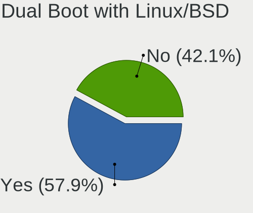
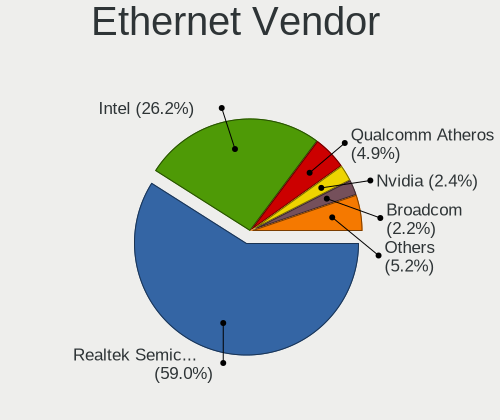
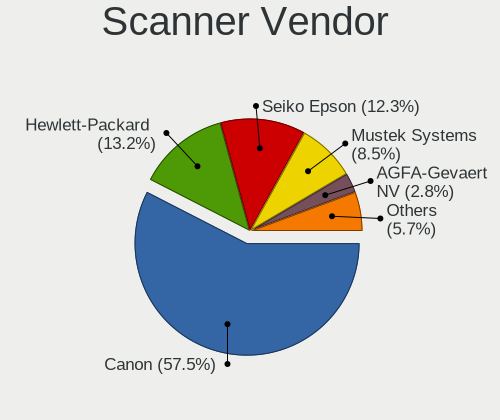

OpenMandriva - Tested Hardware & Statistics (Desktops)
------------------------------------------------------

A project to collect tested hardware configurations for OpenMandriva.

Anyone can contribute to this report by the [hw-probe](https://github.com/linuxhw/hw-probe) tool:

    sudo -E hw-probe -all -upload

Please contribute! Especially if your hardware is rare.

Contents
--------

* [ Test Cases ](#test-cases)

* [ System ](#system)
  - [ OS                       ](#os)
  - [ OS Family                ](#os-family)
  - [ Kernel                   ](#kernel)
  - [ Kernel Family            ](#kernel-family)
  - [ Kernel Major Ver.        ](#kernel-major-ver)
  - [ Arch                     ](#arch)
  - [ DE                       ](#de)
  - [ Display Server           ](#display-server)
  - [ Display Manager          ](#display-manager)
  - [ OS Lang                  ](#os-lang)
  - [ Boot Mode                ](#boot-mode)
  - [ Filesystem               ](#filesystem)
  - [ Part. scheme             ](#part-scheme)
  - [ Dual Boot with Linux/BSD ](#dual-boot-with-linuxbsd)
  - [ Dual Boot (Win)          ](#dual-boot-win)

* [ Board ](#board)
  - [ Vendor                   ](#vendor)
  - [ Model                    ](#model)
  - [ Model Family             ](#model-family)
  - [ MFG Year                 ](#mfg-year)
  - [ Form Factor              ](#form-factor)
  - [ Secure Boot              ](#secure-boot)
  - [ Coreboot                 ](#coreboot)
  - [ RAM Size                 ](#ram-size)
  - [ RAM Used                 ](#ram-used)
  - [ Total Drives             ](#total-drives)
  - [ Has CD-ROM               ](#has-cd-rom)
  - [ Has Ethernet             ](#has-ethernet)
  - [ Has WiFi                 ](#has-wifi)
  - [ Has Bluetooth            ](#has-bluetooth)

* [ Location ](#location)
  - [ Country                  ](#country)
  - [ City                     ](#city)

* [ Drives ](#drives)
  - [ Drive Vendor             ](#drive-vendor)
  - [ Drive Model              ](#drive-model)
  - [ HDD Vendor               ](#hdd-vendor)
  - [ SSD Vendor               ](#ssd-vendor)
  - [ Drive Kind               ](#drive-kind)
  - [ Drive Connector          ](#drive-connector)
  - [ Drive Size               ](#drive-size)
  - [ Space Total              ](#space-total)
  - [ Space Used               ](#space-used)
  - [ Malfunc. Drives          ](#malfunc-drives)
  - [ Malfunc. Drive Vendor    ](#malfunc-drive-vendor)
  - [ Malfunc. HDD Vendor      ](#malfunc-hdd-vendor)
  - [ Malfunc. Drive Kind      ](#malfunc-drive-kind)
  - [ Failed Drives            ](#failed-drives)
  - [ Failed Drive Vendor      ](#failed-drive-vendor)
  - [ Drive Status             ](#drive-status)

* [ Storage controller ](#storage-controller)
  - [ Storage Vendor           ](#storage-vendor)
  - [ Storage Model            ](#storage-model)
  - [ Storage Kind             ](#storage-kind)

* [ Processor ](#processor)
  - [ CPU Vendor               ](#cpu-vendor)
  - [ CPU Model                ](#cpu-model)
  - [ CPU Model Family         ](#cpu-model-family)
  - [ CPU Cores                ](#cpu-cores)
  - [ CPU Sockets              ](#cpu-sockets)
  - [ CPU Threads              ](#cpu-threads)
  - [ CPU Op-Modes             ](#cpu-op-modes)
  - [ CPU Microcode            ](#cpu-microcode)
  - [ CPU Microarch            ](#cpu-microarch)

* [ Graphics ](#graphics)
  - [ GPU Vendor               ](#gpu-vendor)
  - [ GPU Model                ](#gpu-model)
  - [ GPU Combo                ](#gpu-combo)
  - [ GPU Driver               ](#gpu-driver)
  - [ GPU Memory               ](#gpu-memory)

* [ Monitor ](#monitor)
  - [ Monitor Vendor           ](#monitor-vendor)
  - [ Monitor Model            ](#monitor-model)
  - [ Monitor Resolution       ](#monitor-resolution)
  - [ Monitor Diagonal         ](#monitor-diagonal)
  - [ Monitor Width            ](#monitor-width)
  - [ Aspect Ratio             ](#aspect-ratio)
  - [ Monitor Area             ](#monitor-area)
  - [ Pixel Density            ](#pixel-density)
  - [ Multiple Monitors        ](#multiple-monitors)

* [ Network ](#network)
  - [ Net Controller Vendor    ](#net-controller-vendor)
  - [ Net Controller Model     ](#net-controller-model)
  - [ Wireless Vendor          ](#wireless-vendor)
  - [ Wireless Model           ](#wireless-model)
  - [ Ethernet Vendor          ](#ethernet-vendor)
  - [ Ethernet Model           ](#ethernet-model)
  - [ Net Controller Kind      ](#net-controller-kind)
  - [ Used Controller          ](#used-controller)
  - [ NICs                     ](#nics)
  - [ IPv6                     ](#ipv6)

* [ Bluetooth ](#bluetooth)
  - [ Bluetooth Vendor         ](#bluetooth-vendor)
  - [ Bluetooth Model          ](#bluetooth-model)

* [ Sound ](#sound)
  - [ Sound Vendor             ](#sound-vendor)
  - [ Sound Model              ](#sound-model)

* [ Memory ](#memory)
  - [ Memory Vendor            ](#memory-vendor)
  - [ Memory Model             ](#memory-model)
  - [ Memory Kind              ](#memory-kind)
  - [ Memory Form Factor       ](#memory-form-factor)
  - [ Memory Size              ](#memory-size)
  - [ Memory Speed             ](#memory-speed)

* [ Printers & scanners ](#printers--scanners)
  - [ Printer Vendor           ](#printer-vendor)
  - [ Printer Model            ](#printer-model)
  - [ Scanner Vendor           ](#scanner-vendor)
  - [ Scanner Model            ](#scanner-model)

* [ Camera ](#camera)
  - [ Camera Vendor            ](#camera-vendor)
  - [ Camera Model             ](#camera-model)

* [ Security ](#security)
  - [ Fingerprint Vendor       ](#fingerprint-vendor)
  - [ Fingerprint Model        ](#fingerprint-model)
  - [ Chipcard Vendor          ](#chipcard-vendor)
  - [ Chipcard Model           ](#chipcard-model)

* [ Unsupported ](#unsupported)
  - [ Unsupported Devices      ](#unsupported-devices)
  - [ Unsupported Device Types ](#unsupported-device-types)

Test Cases
----------

Total: 4193

| Vendor        | Model                       | Probe                                                      | Date         |
|---------------|-----------------------------|------------------------------------------------------------|--------------|
| Gigabyte      | 945GCM-S2L                  | [99613365f5](https://linux-hardware.org/?probe=99613365f5) | Sep 01, 2022 |
| Gigabyte      | 970A-DS3P                   | [5ba20eb04b](https://linux-hardware.org/?probe=5ba20eb04b) | Sep 01, 2022 |
| ASRock        | A320M-DVS R4.0              | [143e6e1816](https://linux-hardware.org/?probe=143e6e1816) | Sep 01, 2022 |
| Gigabyte      | Z590 GAMING X               | [b84d0acafb](https://linux-hardware.org/?probe=b84d0acafb) | Sep 01, 2022 |
| Lenovo        | ThinkCentre M58e 7408BA5    | [4384314f98](https://linux-hardware.org/?probe=4384314f98) | Sep 01, 2022 |
| Foxconn       | 2ABF                        | [c9a801a4d2](https://linux-hardware.org/?probe=c9a801a4d2) | Sep 01, 2022 |
| ASRock        | B450M Pro4-F                | [d48b9efca4](https://linux-hardware.org/?probe=d48b9efca4) | Sep 01, 2022 |
| ASRock        | X99 Taichi                  | [4cd4bf6c89](https://linux-hardware.org/?probe=4cd4bf6c89) | Sep 01, 2022 |
| ASRock        | B550M-ITX/ac                | [7850c07cdc](https://linux-hardware.org/?probe=7850c07cdc) | Aug 31, 2022 |
| MSI           | H510M-A PRO                 | [120400698e](https://linux-hardware.org/?probe=120400698e) | Aug 31, 2022 |
| Vorke         | V1 Plus                     | [0f36a3adcb](https://linux-hardware.org/?probe=0f36a3adcb) | Aug 31, 2022 |
| Dell          | 040DDP A00                  | [09ffe165d3](https://linux-hardware.org/?probe=09ffe165d3) | Aug 30, 2022 |
| MSI           | Z97 GAMING 7                | [c9ebe69583](https://linux-hardware.org/?probe=c9ebe69583) | Aug 30, 2022 |
| ASRock        | N68C-S UCC                  | [f3389e42f8](https://linux-hardware.org/?probe=f3389e42f8) | Aug 30, 2022 |
| Gigabyte      | VM900M                      | [f446d835da](https://linux-hardware.org/?probe=f446d835da) | Aug 30, 2022 |
| Dell          | 0R230R A00                  | [0ea749e83c](https://linux-hardware.org/?probe=0ea749e83c) | Aug 30, 2022 |
| HP            | 0A60h                       | [d801f7cb0c](https://linux-hardware.org/?probe=d801f7cb0c) | Aug 30, 2022 |
| MSI           | MAG X570S TOMAHAWK MAX W... | [33aaa7baf4](https://linux-hardware.org/?probe=33aaa7baf4) | Aug 29, 2022 |
| Lenovo        | ThinkCentre M91p 4518AU8    | [0099ab3432](https://linux-hardware.org/?probe=0099ab3432) | Aug 29, 2022 |
| Lenovo        | ThinkCentre M58p 6234CL2    | [14449a705a](https://linux-hardware.org/?probe=14449a705a) | Aug 29, 2022 |
| ASUSTek       | SABERTOOTH X58              | [efb40be4e1](https://linux-hardware.org/?probe=efb40be4e1) | Aug 28, 2022 |
| ASUSTek       | A88XM-A                     | [d8a4e4d954](https://linux-hardware.org/?probe=d8a4e4d954) | Aug 28, 2022 |
| Medion        | B460H6-EM                   | [91371e505d](https://linux-hardware.org/?probe=91371e505d) | Aug 28, 2022 |
| Gigabyte      | GA-MA78LMT-S2               | [a18db0fafd](https://linux-hardware.org/?probe=a18db0fafd) | Aug 27, 2022 |
| ASUSTek       | P8B WS                      | [5f89ab0d00](https://linux-hardware.org/?probe=5f89ab0d00) | Aug 27, 2022 |
| Fujitsu       | D3061-A1 S26361-D3061-A1    | [f74dc71ad8](https://linux-hardware.org/?probe=f74dc71ad8) | Aug 27, 2022 |
| ASRock        | A320M-HDV R4.0              | [67712f11d9](https://linux-hardware.org/?probe=67712f11d9) | Aug 27, 2022 |
| ASUSTek       | PRIME Z390-A                | [459c7c1eee](https://linux-hardware.org/?probe=459c7c1eee) | Aug 27, 2022 |
| MSI           | G31TM-P21                   | [cf0bc232f5](https://linux-hardware.org/?probe=cf0bc232f5) | Aug 26, 2022 |
| ASRock        | FM2A68M-HD+                 | [22cc477cd2](https://linux-hardware.org/?probe=22cc477cd2) | Aug 26, 2022 |
| MSI           | 760GM-P21                   | [7e45cde899](https://linux-hardware.org/?probe=7e45cde899) | Aug 26, 2022 |
| HP            | 1497                        | [82e518a338](https://linux-hardware.org/?probe=82e518a338) | Aug 26, 2022 |
| ASUSTek       | M5A78L LE                   | [e4a6425675](https://linux-hardware.org/?probe=e4a6425675) | Aug 26, 2022 |
| HP            | 8509                        | [0656e40cba](https://linux-hardware.org/?probe=0656e40cba) | Aug 26, 2022 |
| NCR           | Pocono                      | [c209b1443a](https://linux-hardware.org/?probe=c209b1443a) | Aug 25, 2022 |
| Dell          | 0RJ290                      | [ca82162ed5](https://linux-hardware.org/?probe=ca82162ed5) | Aug 25, 2022 |
| Acer          | Aspire XC-710 V:1.1         | [0b76e0f97d](https://linux-hardware.org/?probe=0b76e0f97d) | Aug 25, 2022 |
| Foxconn       | H61M/H61M-S                 | [18e7da32e9](https://linux-hardware.org/?probe=18e7da32e9) | Aug 25, 2022 |
| ASRock        | N68C-GS4 FX                 | [0462079328](https://linux-hardware.org/?probe=0462079328) | Aug 25, 2022 |
| ASUSTek       | PRIME B350M-A               | [1c98247f4c](https://linux-hardware.org/?probe=1c98247f4c) | Aug 25, 2022 |
| OEM           | A320                        | [4dffd629cf](https://linux-hardware.org/?probe=4dffd629cf) | Aug 25, 2022 |
| ASUSTek       | TUF Gaming X570-PLUS        | [d1cae6aca8](https://linux-hardware.org/?probe=d1cae6aca8) | Aug 24, 2022 |
| HP            | 21D0                        | [1bd58d519c](https://linux-hardware.org/?probe=1bd58d519c) | Aug 24, 2022 |
| Gigabyte      | Z68A-D3H-B3                 | [e75751c55b](https://linux-hardware.org/?probe=e75751c55b) | Aug 24, 2022 |
| ASUSTek       | TUF Gaming B450-PLUS II     | [7332174749](https://linux-hardware.org/?probe=7332174749) | Aug 24, 2022 |
| Gigabyte      | F2A68HM-H                   | [c824203d0a](https://linux-hardware.org/?probe=c824203d0a) | Aug 24, 2022 |
| Dell          | 08HPGT A01                  | [744f838dc2](https://linux-hardware.org/?probe=744f838dc2) | Aug 24, 2022 |
| ICP / iEi     | B217 V1.0                   | [9b540ece9f](https://linux-hardware.org/?probe=9b540ece9f) | Aug 23, 2022 |
| Gigabyte      | B550M AORUS PRO-P           | [7dae220687](https://linux-hardware.org/?probe=7dae220687) | Aug 23, 2022 |
| ASUSTek       | P8H61-M LX2 R2.0            | [5754d37860](https://linux-hardware.org/?probe=5754d37860) | Aug 23, 2022 |
| ASUSTek       | M4N68T-M-V2                 | [1528da74f6](https://linux-hardware.org/?probe=1528da74f6) | Aug 22, 2022 |
| ASUSTek       | P5KPL-CM                    | [53a4b425d3](https://linux-hardware.org/?probe=53a4b425d3) | Aug 22, 2022 |
| Dell          | 0YJPT1 A00                  | [1de0aeba8f](https://linux-hardware.org/?probe=1de0aeba8f) | Aug 22, 2022 |
| ASUSTek       | PRIME Z390-P                | [ca7534d4dc](https://linux-hardware.org/?probe=ca7534d4dc) | Aug 22, 2022 |
| HP            | 82B4                        | [e3200ae579](https://linux-hardware.org/?probe=e3200ae579) | Aug 22, 2022 |
| ASUSTek       | M5A78L-M/USB3               | [fa5f1121d5](https://linux-hardware.org/?probe=fa5f1121d5) | Aug 22, 2022 |
| Intel         | H61                         | [f0a810114c](https://linux-hardware.org/?probe=f0a810114c) | Aug 22, 2022 |
| MSI           | MPG X570 GAMING PLUS        | [e064c453da](https://linux-hardware.org/?probe=e064c453da) | Aug 21, 2022 |
| ASUSTek       | Z87-C                       | [8de83c544f](https://linux-hardware.org/?probe=8de83c544f) | Aug 21, 2022 |
| HP            | 1998                        | [69b6b04268](https://linux-hardware.org/?probe=69b6b04268) | Aug 21, 2022 |
| ASRock        | N68C-S UCC                  | [bb19c0586c](https://linux-hardware.org/?probe=bb19c0586c) | Aug 20, 2022 |
| Gigabyte      | B365M DS3H WIFI             | [142e25352d](https://linux-hardware.org/?probe=142e25352d) | Aug 20, 2022 |
| Packard Be... | PT890-8237A                 | [36a4120390](https://linux-hardware.org/?probe=36a4120390) | Aug 20, 2022 |
| ASUSTek       | PRIME B450M-A II            | [56a34e0816](https://linux-hardware.org/?probe=56a34e0816) | Aug 20, 2022 |
| ASUSTek       | P5KPL-SE                    | [2925e63a87](https://linux-hardware.org/?probe=2925e63a87) | Aug 20, 2022 |
| AZW           | MII-V                       | [59698f6b33](https://linux-hardware.org/?probe=59698f6b33) | Aug 20, 2022 |
| OEM           | Intel H81                   | [5e354c60d1](https://linux-hardware.org/?probe=5e354c60d1) | Aug 20, 2022 |
| Dell          | 0XHGV1 A01                  | [b05fac6451](https://linux-hardware.org/?probe=b05fac6451) | Aug 19, 2022 |
| ASUSTek       | P5KPL-VM                    | [803031cd3b](https://linux-hardware.org/?probe=803031cd3b) | Aug 19, 2022 |
| Gigabyte      | B450M S2H                   | [a0a7a845e3](https://linux-hardware.org/?probe=a0a7a845e3) | Aug 18, 2022 |
| Gigabyte      | P43-ES3G                    | [de6e02672c](https://linux-hardware.org/?probe=de6e02672c) | Aug 18, 2022 |
| ASUSTek       | PRIME Z390-A                | [859884934f](https://linux-hardware.org/?probe=859884934f) | Aug 17, 2022 |
| Acer          | MRS600M                     | [ec4c10d06e](https://linux-hardware.org/?probe=ec4c10d06e) | Aug 17, 2022 |
| ASUSTek       | PRIME B250-PRO              | [870d7102f5](https://linux-hardware.org/?probe=870d7102f5) | Aug 17, 2022 |
| Gigabyte      | H410M S2 V2                 | [944a99ea66](https://linux-hardware.org/?probe=944a99ea66) | Aug 17, 2022 |
| Gigabyte      | B450 AORUS PRO-CF           | [3ab7d6393c](https://linux-hardware.org/?probe=3ab7d6393c) | Aug 17, 2022 |
| Gigabyte      | H81M-S2PH                   | [c8f8e78df8](https://linux-hardware.org/?probe=c8f8e78df8) | Aug 17, 2022 |
| Gigabyte      | B460M DS3H                  | [2b97e09efa](https://linux-hardware.org/?probe=2b97e09efa) | Aug 17, 2022 |
| Fujitsu       | D3233-A1 S26361-D3233-A1    | [7b3d6b544c](https://linux-hardware.org/?probe=7b3d6b544c) | Aug 16, 2022 |
| Dell          | 0T656F A01                  | [ec4014a549](https://linux-hardware.org/?probe=ec4014a549) | Aug 16, 2022 |
| Dell          | 0GM819                      | [f7745d3d3a](https://linux-hardware.org/?probe=f7745d3d3a) | Aug 16, 2022 |
| ASRock        | B450 Pro4                   | [79f5c08bff](https://linux-hardware.org/?probe=79f5c08bff) | Aug 15, 2022 |
| Gigabyte      | B550 AORUS ELITE            | [08e3444b3c](https://linux-hardware.org/?probe=08e3444b3c) | Aug 15, 2022 |
| HP            | 2AE2                        | [1fd0bb70dc](https://linux-hardware.org/?probe=1fd0bb70dc) | Aug 15, 2022 |
| Dell          | 0C27VV A01                  | [04f75d45cb](https://linux-hardware.org/?probe=04f75d45cb) | Aug 15, 2022 |
| ASUSTek       | PRIME B450M-A II            | [4ba26713bc](https://linux-hardware.org/?probe=4ba26713bc) | Aug 15, 2022 |
| Gigabyte      | P43-ES3G                    | [2b0691bddd](https://linux-hardware.org/?probe=2b0691bddd) | Aug 15, 2022 |
| Dell          | 0PC5F7 A03                  | [56ee42afe3](https://linux-hardware.org/?probe=56ee42afe3) | Aug 15, 2022 |
| Dell          | 0NC2VH A01                  | [170b178361](https://linux-hardware.org/?probe=170b178361) | Aug 15, 2022 |
| HP            | 18E7                        | [06374a6240](https://linux-hardware.org/?probe=06374a6240) | Aug 14, 2022 |
| ASRock        | 960GM-VGS3 FX               | [55c4e8059c](https://linux-hardware.org/?probe=55c4e8059c) | Aug 14, 2022 |
| ASUSTek       | P8H61-M LX3                 | [7c37c2a6d7](https://linux-hardware.org/?probe=7c37c2a6d7) | Aug 14, 2022 |
| MSI           | X570-A PRO                  | [30146876c6](https://linux-hardware.org/?probe=30146876c6) | Aug 14, 2022 |
| Unknown       | 1.0                         | [35d076bae0](https://linux-hardware.org/?probe=35d076bae0) | Aug 14, 2022 |
| ASRock        | J3455-ITX                   | [4386fccad1](https://linux-hardware.org/?probe=4386fccad1) | Aug 14, 2022 |
| Lenovo        | SHARKBAY NOK                | [ee169e47b3](https://linux-hardware.org/?probe=ee169e47b3) | Aug 13, 2022 |
| Dell          | 08WKV3 A00                  | [4e57c20454](https://linux-hardware.org/?probe=4e57c20454) | Aug 13, 2022 |
| Lenovo        | ThinkCentre XXXX 739527G    | [ca5fe11e2c](https://linux-hardware.org/?probe=ca5fe11e2c) | Aug 13, 2022 |
| ASUSTek       | ROG STRIX B365-F GAMING     | [1ae946a847](https://linux-hardware.org/?probe=1ae946a847) | Aug 13, 2022 |
| ASUSTek       | PRIME B450M-A II            | [fd41ccab04](https://linux-hardware.org/?probe=fd41ccab04) | Aug 13, 2022 |
| ASUSTek       | PRIME B450M-A II            | [32bf5bd8b8](https://linux-hardware.org/?probe=32bf5bd8b8) | Aug 13, 2022 |
| HP            | 1850                        | [33933e3e5d](https://linux-hardware.org/?probe=33933e3e5d) | Aug 12, 2022 |
| ASRock        | H61M-DGS                    | [50b7221c5a](https://linux-hardware.org/?probe=50b7221c5a) | Aug 12, 2022 |
| ASUSTek       | PRIME B450M-A II            | [bc32ff70b7](https://linux-hardware.org/?probe=bc32ff70b7) | Aug 12, 2022 |
| Gigabyte      | EP35C-DS3R                  | [762d78160d](https://linux-hardware.org/?probe=762d78160d) | Aug 12, 2022 |
| MSI           | A68HM-E33 V2                | [2f3db9cd91](https://linux-hardware.org/?probe=2f3db9cd91) | Aug 12, 2022 |
| ASRock        | Z97M Pro4                   | [245d189a61](https://linux-hardware.org/?probe=245d189a61) | Aug 11, 2022 |
| MSI           | MPG Z390 GAMING PLUS        | [73bf30c596](https://linux-hardware.org/?probe=73bf30c596) | Aug 11, 2022 |
| Gigabyte      | P35-DS3L                    | [c765f5b81c](https://linux-hardware.org/?probe=c765f5b81c) | Aug 11, 2022 |
| Foxconn       | 2ABF                        | [3b20387bcc](https://linux-hardware.org/?probe=3b20387bcc) | Aug 10, 2022 |
| ASRock        | H81M-DGS                    | [31bdc504d4](https://linux-hardware.org/?probe=31bdc504d4) | Aug 10, 2022 |
| MSI           | MPG Z390 GAMING PLUS        | [a3aa50c16a](https://linux-hardware.org/?probe=a3aa50c16a) | Aug 10, 2022 |
| Dell          | 07KY25 A00                  | [676025f81a](https://linux-hardware.org/?probe=676025f81a) | Aug 10, 2022 |
| ASUSTek       | TUF B360-PRO GAMING         | [62d813423e](https://linux-hardware.org/?probe=62d813423e) | Aug 10, 2022 |
| MSI           | MPG X570 GAMING PLUS        | [568e96b2a5](https://linux-hardware.org/?probe=568e96b2a5) | Aug 10, 2022 |
| MSI           | X470 GAMING M7 AC           | [58947090d5](https://linux-hardware.org/?probe=58947090d5) | Aug 09, 2022 |
| eMachines     | Veriton V2110               | [3492540d77](https://linux-hardware.org/?probe=3492540d77) | Aug 09, 2022 |
| ASRock        | AB350 Pro4                  | [2df31a9fbf](https://linux-hardware.org/?probe=2df31a9fbf) | Aug 09, 2022 |
| ASUSTek       | Z87-PRO                     | [89a77b442f](https://linux-hardware.org/?probe=89a77b442f) | Aug 09, 2022 |
| MSI           | MPG X570 GAMING PLUS        | [fc526feeed](https://linux-hardware.org/?probe=fc526feeed) | Aug 09, 2022 |
| ASUSTek       | ROG CROSSHAIR VI EXTREME    | [280f4b2669](https://linux-hardware.org/?probe=280f4b2669) | Aug 09, 2022 |
| Gigabyte      | EP35-DS3P                   | [5c29aee903](https://linux-hardware.org/?probe=5c29aee903) | Aug 08, 2022 |
| ASUSTek       | AT3IONT-I DELUXE            | [642e31466d](https://linux-hardware.org/?probe=642e31466d) | Aug 08, 2022 |
| Dell          | 0782GW A01                  | [b3ebc3aed3](https://linux-hardware.org/?probe=b3ebc3aed3) | Aug 08, 2022 |
| HP            | 304Bh                       | [e1e3f301cb](https://linux-hardware.org/?probe=e1e3f301cb) | Aug 08, 2022 |
| MSI           | H81M-P33                    | [f79c49386d](https://linux-hardware.org/?probe=f79c49386d) | Aug 08, 2022 |
| Intel         | H61                         | [eabc8be629](https://linux-hardware.org/?probe=eabc8be629) | Aug 08, 2022 |
| Gigabyte      | H55M-UD2H                   | [4d6a861120](https://linux-hardware.org/?probe=4d6a861120) | Aug 07, 2022 |
| ASUSTek       | PRIME A320M-K               | [40808a05c1](https://linux-hardware.org/?probe=40808a05c1) | Aug 07, 2022 |
| MSI           | A320M PRO-M2                | [43f6f3c828](https://linux-hardware.org/?probe=43f6f3c828) | Aug 07, 2022 |
| ASUSTek       | SABERTOOTH Z77              | [95f444c24c](https://linux-hardware.org/?probe=95f444c24c) | Aug 07, 2022 |
| Gigabyte      | EP45-UD3R                   | [6c434341ce](https://linux-hardware.org/?probe=6c434341ce) | Aug 07, 2022 |
| ASUSTek       | M3A78 PRO                   | [0b63e92a55](https://linux-hardware.org/?probe=0b63e92a55) | Aug 07, 2022 |
| HP            | 2215                        | [75304ada6c](https://linux-hardware.org/?probe=75304ada6c) | Aug 06, 2022 |
| ASUSTek       | PRIME B550-PLUS             | [b18ee3a2ff](https://linux-hardware.org/?probe=b18ee3a2ff) | Aug 06, 2022 |
| Toshiba       | STI 006998G                 | [3de3fa77fc](https://linux-hardware.org/?probe=3de3fa77fc) | Aug 06, 2022 |
| ASRock        | H110M-STX                   | [62b1924710](https://linux-hardware.org/?probe=62b1924710) | Aug 06, 2022 |
| Gigabyte      | A320M-H-CF                  | [4015089c1e](https://linux-hardware.org/?probe=4015089c1e) | Aug 06, 2022 |
| Biostar       | B550MX/E PRO                | [53596a82d1](https://linux-hardware.org/?probe=53596a82d1) | Aug 06, 2022 |
| MSI           | 2A9C                        | [8913065613](https://linux-hardware.org/?probe=8913065613) | Aug 06, 2022 |
| Gigabyte      | B450M GAMING                | [c1d23f2838](https://linux-hardware.org/?probe=c1d23f2838) | Aug 06, 2022 |
| Gigabyte      | X570 AORUS ULTRA            | [c6d818b28f](https://linux-hardware.org/?probe=c6d818b28f) | Aug 06, 2022 |
| Dell          | 0NV0M7 A02                  | [dbf000aacd](https://linux-hardware.org/?probe=dbf000aacd) | Aug 06, 2022 |
| Gigabyte      | A520M S2H                   | [daa1f68f01](https://linux-hardware.org/?probe=daa1f68f01) | Aug 06, 2022 |
| MACHINIST     | X79 (INTEL Xeon E5/Corei... | [a722bef081](https://linux-hardware.org/?probe=a722bef081) | Aug 06, 2022 |
| ASRock        | B75M                        | [78fbdcd0f7](https://linux-hardware.org/?probe=78fbdcd0f7) | Aug 05, 2022 |
| MSI           | Z87-G43 GAMING              | [490239de9e](https://linux-hardware.org/?probe=490239de9e) | Aug 05, 2022 |
| Dell          | 0GY6Y8 A01                  | [1ad9e54625](https://linux-hardware.org/?probe=1ad9e54625) | Aug 05, 2022 |
| ASUSTek       | M2N68-AM SE2                | [b68c110fde](https://linux-hardware.org/?probe=b68c110fde) | Aug 05, 2022 |
| ASRock        | A300M-STX                   | [f6b820d15f](https://linux-hardware.org/?probe=f6b820d15f) | Aug 05, 2022 |
| Foxconn       | 2AB7                        | [72cef2e703](https://linux-hardware.org/?probe=72cef2e703) | Aug 05, 2022 |
| ASRock        | H270M-ITX/ac                | [273c214064](https://linux-hardware.org/?probe=273c214064) | Aug 05, 2022 |
| ASUSTek       | M3A78                       | [bda5207234](https://linux-hardware.org/?probe=bda5207234) | Aug 05, 2022 |
| Dell          | 0KG317                      | [65c105e2be](https://linux-hardware.org/?probe=65c105e2be) | Aug 04, 2022 |
| ASUSTek       | P5N-E SLI                   | [237c4a2367](https://linux-hardware.org/?probe=237c4a2367) | Aug 04, 2022 |
| ASUSTek       | A68HM-K                     | [d5d981cf7b](https://linux-hardware.org/?probe=d5d981cf7b) | Aug 04, 2022 |
| ASUSTek       | H110M-K                     | [8c6442a868](https://linux-hardware.org/?probe=8c6442a868) | Aug 04, 2022 |
| ASRock        | H77 Pro4-M                  | [71ffad2942](https://linux-hardware.org/?probe=71ffad2942) | Aug 04, 2022 |
| Gigabyte      | GA-990FXA-UD3               | [7893ade7cb](https://linux-hardware.org/?probe=7893ade7cb) | Aug 04, 2022 |
| ASUSTek       | PRIME B350M-E               | [f9e07e62c2](https://linux-hardware.org/?probe=f9e07e62c2) | Aug 04, 2022 |
| Unknown       | Unknown                     | [0725792da0](https://linux-hardware.org/?probe=0725792da0) | Aug 04, 2022 |
| Gigabyte      | B360M GAMING HD             | [95e1eb0fcb](https://linux-hardware.org/?probe=95e1eb0fcb) | Aug 03, 2022 |
| ASRock        | NUC-8265U                   | [32b0ae0f97](https://linux-hardware.org/?probe=32b0ae0f97) | Aug 03, 2022 |
| HP            | 339A                        | [27ddbfd51d](https://linux-hardware.org/?probe=27ddbfd51d) | Aug 03, 2022 |
| Lenovo        | 3102                        | [73e0fee2bc](https://linux-hardware.org/?probe=73e0fee2bc) | Aug 03, 2022 |
| HP            | 1493                        | [2ac16ddc1f](https://linux-hardware.org/?probe=2ac16ddc1f) | Aug 03, 2022 |
| Gigabyte      | Z170X-UD3-CF                | [450fee0496](https://linux-hardware.org/?probe=450fee0496) | Aug 03, 2022 |
| Biostar       | G41D3C                      | [8a5b81e472](https://linux-hardware.org/?probe=8a5b81e472) | Aug 03, 2022 |
| HP            | 2B29                        | [5fcf3a8320](https://linux-hardware.org/?probe=5fcf3a8320) | Aug 02, 2022 |
| ASUSTek       | PRIME B450M-A               | [97dba8f5e3](https://linux-hardware.org/?probe=97dba8f5e3) | Aug 02, 2022 |
| ASUSTek       | TUF Gaming B560M-PLUS       | [6b790e8a9b](https://linux-hardware.org/?probe=6b790e8a9b) | Aug 02, 2022 |
| Acer          | EM61SM/EM61PM               | [1a35a6d7dc](https://linux-hardware.org/?probe=1a35a6d7dc) | Aug 02, 2022 |
| Foxconn       | 2ABF                        | [4f1fca6662](https://linux-hardware.org/?probe=4f1fca6662) | Aug 02, 2022 |
| ASUSTek       | P8H67                       | [508b0275e3](https://linux-hardware.org/?probe=508b0275e3) | Aug 02, 2022 |
| Gigabyte      | H61M-S2PH                   | [31bd0a48c9](https://linux-hardware.org/?probe=31bd0a48c9) | Aug 02, 2022 |
| ASUSTek       | PRIME B250M-A               | [b9f727338f](https://linux-hardware.org/?probe=b9f727338f) | Aug 01, 2022 |
| ASUSTek       | ROG STRIX B450-F GAMING     | [ba5b0b9620](https://linux-hardware.org/?probe=ba5b0b9620) | Aug 01, 2022 |
| Intel         | DH61WW AAG23116-204         | [30715e2f04](https://linux-hardware.org/?probe=30715e2f04) | Aug 01, 2022 |
| Gigabyte      | H87-HD3                     | [daaf600950](https://linux-hardware.org/?probe=daaf600950) | Aug 01, 2022 |
| Gigabyte      | GA-78LMT-S2P                | [b5fded6824](https://linux-hardware.org/?probe=b5fded6824) | Aug 01, 2022 |
| Gigabyte      | B550 AORUS PRO AC           | [b59f87dd02](https://linux-hardware.org/?probe=b59f87dd02) | Aug 01, 2022 |
| HP            | 339A                        | [251a764917](https://linux-hardware.org/?probe=251a764917) | Aug 01, 2022 |
| MSI           | B450M BAZOOKA MAX WIFI      | [f57732be64](https://linux-hardware.org/?probe=f57732be64) | Aug 01, 2022 |
| Gigabyte      | B450 AORUS PRO-CF           | [81c46b891f](https://linux-hardware.org/?probe=81c46b891f) | Aug 01, 2022 |
| ASUSTek       | P7P55D-E PRO                | [d58be7b6d1](https://linux-hardware.org/?probe=d58be7b6d1) | Aug 01, 2022 |
| MSI           | Z590-A PRO                  | [7051f56dda](https://linux-hardware.org/?probe=7051f56dda) | Aug 01, 2022 |
| MSI           | Z77A-GD65                   | [fcadad42a5](https://linux-hardware.org/?probe=fcadad42a5) | Aug 01, 2022 |
| HP            | 843F                        | [eeba83fecb](https://linux-hardware.org/?probe=eeba83fecb) | Aug 01, 2022 |
| ASUSTek       | ProArt X570-CREATOR WIFI    | [7e6cd7bcb3](https://linux-hardware.org/?probe=7e6cd7bcb3) | Jul 31, 2022 |
| Acer          | Veriton M4620G v1.0         | [13304f7d9e](https://linux-hardware.org/?probe=13304f7d9e) | Jul 31, 2022 |
| Gigabyte      | X570 AORUS MASTER           | [c48b2966d6](https://linux-hardware.org/?probe=c48b2966d6) | Jul 31, 2022 |
| ASRock        | AB350 Pro4                  | [c300f62638](https://linux-hardware.org/?probe=c300f62638) | Jul 31, 2022 |
| Gigabyte      | GA-M56S-S3                  | [cb93c45a3a](https://linux-hardware.org/?probe=cb93c45a3a) | Jul 31, 2022 |
| ASUSTek       | P8B75-M LX                  | [653f46c8e3](https://linux-hardware.org/?probe=653f46c8e3) | Jul 31, 2022 |
| ASUSTek       | P5G41C-M LX                 | [4e30dc6361](https://linux-hardware.org/?probe=4e30dc6361) | Jul 31, 2022 |
| Gigabyte      | H77-DS3H                    | [a6889e4564](https://linux-hardware.org/?probe=a6889e4564) | Jul 31, 2022 |
| MSI           | B85M-P33                    | [6e9af1d1e4](https://linux-hardware.org/?probe=6e9af1d1e4) | Jul 31, 2022 |
| ASUSTek       | ROG STRIX Z390-E GAMING     | [cb7c9442d6](https://linux-hardware.org/?probe=cb7c9442d6) | Jul 31, 2022 |
| Unknown       | Unknown                     | [a8e41fdaaa](https://linux-hardware.org/?probe=a8e41fdaaa) | Jul 31, 2022 |
| ASUSTek       | Z97-A-USB31                 | [25db3983fe](https://linux-hardware.org/?probe=25db3983fe) | Jul 30, 2022 |
| ASUSTek       | TUF Gaming B550-PLUS        | [10ece2cb6c](https://linux-hardware.org/?probe=10ece2cb6c) | Jul 30, 2022 |
| MSI           | A68HM-E33 V2                | [86af6982c5](https://linux-hardware.org/?probe=86af6982c5) | Jul 30, 2022 |
| ASRock        | FM2A75M Pro4+               | [9cb3ed38a5](https://linux-hardware.org/?probe=9cb3ed38a5) | Jul 30, 2022 |
| ASUSTek       | GA15DH                      | [ae5b3f7aa5](https://linux-hardware.org/?probe=ae5b3f7aa5) | Jul 30, 2022 |
| Gigabyte      | AB350-Gaming 3-CF           | [bc1c5d997f](https://linux-hardware.org/?probe=bc1c5d997f) | Jul 30, 2022 |
| MSI           | B550M-A PRO                 | [14bbcb7e47](https://linux-hardware.org/?probe=14bbcb7e47) | Jul 30, 2022 |
| ASRock        | J5040-ITX                   | [714707a291](https://linux-hardware.org/?probe=714707a291) | Jul 30, 2022 |
| ECS           | H61H2-M12                   | [6761a8774d](https://linux-hardware.org/?probe=6761a8774d) | Jul 30, 2022 |
| Acer          | RS880M05                    | [0a5ede14e3](https://linux-hardware.org/?probe=0a5ede14e3) | Jul 30, 2022 |
| ASRock        | B365M Pro4                  | [ecc6f6025c](https://linux-hardware.org/?probe=ecc6f6025c) | Jul 30, 2022 |
| Gigabyte      | PH67A-D3-B3                 | [0c9e0bd6d5](https://linux-hardware.org/?probe=0c9e0bd6d5) | Jul 30, 2022 |
| ASUSTek       | TUF Gaming B450-PLUS II     | [edd98c5418](https://linux-hardware.org/?probe=edd98c5418) | Jul 30, 2022 |
| MSI           | MAG B550 TOMAHAWK           | [630db8885b](https://linux-hardware.org/?probe=630db8885b) | Jul 30, 2022 |
| Dell          | 042P49 A02                  | [2b09076619](https://linux-hardware.org/?probe=2b09076619) | Jul 30, 2022 |
| HP            | 339A                        | [7f2505acd4](https://linux-hardware.org/?probe=7f2505acd4) | Jul 30, 2022 |
| Dell          | 051FJ8 A00                  | [f2bdee0d64](https://linux-hardware.org/?probe=f2bdee0d64) | Jul 30, 2022 |
| ASUSTek       | PRIME A320M-A               | [38d33f0f0e](https://linux-hardware.org/?probe=38d33f0f0e) | Jul 30, 2022 |
| ASRock        | J5040-ITX                   | [2cc4fd5d75](https://linux-hardware.org/?probe=2cc4fd5d75) | Jul 30, 2022 |
| ASUSTek       | M3A78 PRO                   | [c30fca013c](https://linux-hardware.org/?probe=c30fca013c) | Jul 30, 2022 |
| ASUSTek       | PRIME Z590-P                | [a90cc43a4b](https://linux-hardware.org/?probe=a90cc43a4b) | Jul 29, 2022 |
| HP            | 3047h                       | [a9b59b34f9](https://linux-hardware.org/?probe=a9b59b34f9) | Jul 29, 2022 |
| HP            | 2ADC                        | [86608333bc](https://linux-hardware.org/?probe=86608333bc) | Jul 29, 2022 |
| Gigabyte      | X570 AORUS MASTER           | [87e132446d](https://linux-hardware.org/?probe=87e132446d) | Jul 29, 2022 |
| BESSTAR Te... | DMAF5 V1.0                  | [a6237b3a28](https://linux-hardware.org/?probe=a6237b3a28) | Jul 29, 2022 |
| HP            | 2B28                        | [059ba6d074](https://linux-hardware.org/?probe=059ba6d074) | Jul 29, 2022 |
| PCWare        | IPMH61R2                    | [b3245af28d](https://linux-hardware.org/?probe=b3245af28d) | Jul 29, 2022 |
| Gigabyte      | G41MT-S2P                   | [ea545ae9ed](https://linux-hardware.org/?probe=ea545ae9ed) | Jul 29, 2022 |
| HP            | 0AA0h                       | [5d21c69a99](https://linux-hardware.org/?probe=5d21c69a99) | Jul 29, 2022 |
| HP            | 18E4                        | [d13265fa57](https://linux-hardware.org/?probe=d13265fa57) | Jul 29, 2022 |
| ASRock        | B550 PG Velocita            | [febba0671f](https://linux-hardware.org/?probe=febba0671f) | Jul 29, 2022 |
| ASUSTek       | Z87-PRO                     | [715fac7551](https://linux-hardware.org/?probe=715fac7551) | Jul 29, 2022 |
| HP            | 1825                        | [4a21a02ae4](https://linux-hardware.org/?probe=4a21a02ae4) | Jul 29, 2022 |
| ASUSTek       | TUF Gaming X570-PLUS_BR     | [e1d666e84a](https://linux-hardware.org/?probe=e1d666e84a) | Jul 29, 2022 |
| Digiboard     | NM70-TI                     | [007a69093c](https://linux-hardware.org/?probe=007a69093c) | Jul 29, 2022 |
| Acer          | Veriton M4610G              | [00ec5bea11](https://linux-hardware.org/?probe=00ec5bea11) | Jul 29, 2022 |
| ASUSTek       | SABERTOOTH X58              | [7b9ea25abf](https://linux-hardware.org/?probe=7b9ea25abf) | Jul 29, 2022 |
| ASRock        | X570 Steel Legend WiFi a... | [ceb09e103c](https://linux-hardware.org/?probe=ceb09e103c) | Jul 29, 2022 |
| ASUSTek       | M5A78L-M/USB3               | [6888dc4f99](https://linux-hardware.org/?probe=6888dc4f99) | Jul 29, 2022 |
| HP            | 83E9                        | [4a551e605d](https://linux-hardware.org/?probe=4a551e605d) | Jul 29, 2022 |
| ASRock        | X570 Steel Legend           | [826b96e8d1](https://linux-hardware.org/?probe=826b96e8d1) | Jul 29, 2022 |
| ASUSTek       | PRIME B250M-A               | [14b9dbb179](https://linux-hardware.org/?probe=14b9dbb179) | Jul 28, 2022 |
| Dell          | OptiPlex 780                | [7a029315b9](https://linux-hardware.org/?probe=7a029315b9) | Jul 28, 2022 |
| Gigabyte      | P55M-UD2                    | [1920d703bb](https://linux-hardware.org/?probe=1920d703bb) | Jul 28, 2022 |
| ASRock        | Z97 Anniversary             | [768b11cbe4](https://linux-hardware.org/?probe=768b11cbe4) | Jul 28, 2022 |
| Pegatron      | NARRA3                      | [5fd0fd95f8](https://linux-hardware.org/?probe=5fd0fd95f8) | Jul 28, 2022 |
| MSI           | G31TM-P35                   | [1bc8def241](https://linux-hardware.org/?probe=1bc8def241) | Jul 28, 2022 |
| MSI           | MPG X570S CARBON MAX WIF... | [54d5ee0a3a](https://linux-hardware.org/?probe=54d5ee0a3a) | Jul 28, 2022 |
| MSI           | B250M PRO-VD                | [e58c8fca5a](https://linux-hardware.org/?probe=e58c8fca5a) | Jul 28, 2022 |
| MSI           | AM1I                        | [63e6d4040e](https://linux-hardware.org/?probe=63e6d4040e) | Jul 28, 2022 |
| ASRock        | FM2A55M-DGS                 | [d30fc86506](https://linux-hardware.org/?probe=d30fc86506) | Jul 28, 2022 |
| Dell          | 0HY9JP A00                  | [97a5d12c90](https://linux-hardware.org/?probe=97a5d12c90) | Jul 28, 2022 |
| MSI           | C236A WORKSTATION           | [d38b99326b](https://linux-hardware.org/?probe=d38b99326b) | Jul 28, 2022 |
| eMachines     | EL1360G                     | [47cb733920](https://linux-hardware.org/?probe=47cb733920) | Jul 28, 2022 |
| ASRock        | FM2A55M-VG3+                | [5d4a26735e](https://linux-hardware.org/?probe=5d4a26735e) | Jul 28, 2022 |
| Gigabyte      | H67MA-USB3-B3               | [d29d943a24](https://linux-hardware.org/?probe=d29d943a24) | Jul 28, 2022 |
| ASRock        | 970M Pro3                   | [19ecff6fcc](https://linux-hardware.org/?probe=19ecff6fcc) | Jul 28, 2022 |
| Biostar       | B365MHC                     | [9defcd36e9](https://linux-hardware.org/?probe=9defcd36e9) | Jul 28, 2022 |
| Gigabyte      | G41M-ES2L                   | [036e802b2a](https://linux-hardware.org/?probe=036e802b2a) | Jul 28, 2022 |
| Gigabyte      | B450M H                     | [1357e3b3d3](https://linux-hardware.org/?probe=1357e3b3d3) | Jul 28, 2022 |
| ASUSTek       | H110M-A/M.2                 | [93ad7b0efb](https://linux-hardware.org/?probe=93ad7b0efb) | Jul 28, 2022 |
| MSI           | H110M PRO-VH                | [2058561297](https://linux-hardware.org/?probe=2058561297) | Jul 28, 2022 |
| ASRock        | B450M Steel Legend          | [db492973ec](https://linux-hardware.org/?probe=db492973ec) | Jul 28, 2022 |
| ASRock        | A320M-HDV                   | [cc72c3c914](https://linux-hardware.org/?probe=cc72c3c914) | Jul 28, 2022 |
| ASRock        | B450M Steel Legend          | [814a5e0ed8](https://linux-hardware.org/?probe=814a5e0ed8) | Jul 28, 2022 |
| ASUSTek       | F2A55-M LK2 PLUS            | [a0a4abeb19](https://linux-hardware.org/?probe=a0a4abeb19) | Jul 28, 2022 |
| ASUSTek       | M5A97 LE R2.0               | [24e94dd87e](https://linux-hardware.org/?probe=24e94dd87e) | Jul 28, 2022 |
| ASUSTek       | PRIME B450M-A II            | [d85cd905fd](https://linux-hardware.org/?probe=d85cd905fd) | Jul 28, 2022 |
| Lenovo        | 36EB SDK0J40700 WIN 3258... | [0068653ca3](https://linux-hardware.org/?probe=0068653ca3) | Jul 28, 2022 |
| Dell          | 0P301D A00                  | [48d1ed3099](https://linux-hardware.org/?probe=48d1ed3099) | Jul 28, 2022 |
| HP            | 18E6                        | [60d1a8e6da](https://linux-hardware.org/?probe=60d1a8e6da) | Jul 28, 2022 |
| HP            | 1495                        | [e5f22db975](https://linux-hardware.org/?probe=e5f22db975) | Jul 28, 2022 |
| ASUSTek       | PRIME B450M-A               | [9194a07c08](https://linux-hardware.org/?probe=9194a07c08) | Jul 28, 2022 |
| Lenovo        | MAHOBAY 0B98401 PRO         | [d64175b64b](https://linux-hardware.org/?probe=d64175b64b) | Jul 28, 2022 |
| Unknown       | HX90                        | [1594710372](https://linux-hardware.org/?probe=1594710372) | Jul 28, 2022 |
| ASRock        | A88M-ITX/ac                 | [e339941033](https://linux-hardware.org/?probe=e339941033) | Jul 27, 2022 |
| Intel         | D54250WYK H13922-303        | [71b03b93a2](https://linux-hardware.org/?probe=71b03b93a2) | Jul 27, 2022 |
| Dell          | 0M5DCD A00                  | [c2f56b2458](https://linux-hardware.org/?probe=c2f56b2458) | Jul 27, 2022 |
| Intel         | B75                         | [0620ffff20](https://linux-hardware.org/?probe=0620ffff20) | Jul 27, 2022 |
| MSI           | X470 GAMING PLUS            | [722aa0951d](https://linux-hardware.org/?probe=722aa0951d) | Jul 27, 2022 |
| Acer          | Aspire X1930                | [6a650f512e](https://linux-hardware.org/?probe=6a650f512e) | Jul 27, 2022 |
| ASRock        | X300M-STX                   | [859f2b1a9c](https://linux-hardware.org/?probe=859f2b1a9c) | Jul 27, 2022 |
| Fujitsu       | D3062-A1 S26361-D3062-A1    | [d0ef6d20cf](https://linux-hardware.org/?probe=d0ef6d20cf) | Jul 27, 2022 |
| MSI           | 970A-G46                    | [4e5701ab4a](https://linux-hardware.org/?probe=4e5701ab4a) | Jul 27, 2022 |
| Foxconn       | A76ML-K 30                  | [7b118c6a6b](https://linux-hardware.org/?probe=7b118c6a6b) | Jul 27, 2022 |
| ASRock        | J4005M                      | [8a55aa249a](https://linux-hardware.org/?probe=8a55aa249a) | Jul 27, 2022 |
| MSI           | B450 TOMAHAWK MAX           | [8b520883ad](https://linux-hardware.org/?probe=8b520883ad) | Jul 27, 2022 |
| Dell          | 09KPNV A00                  | [610282a0e6](https://linux-hardware.org/?probe=610282a0e6) | Jul 27, 2022 |
| PCWare        | PW-945GCX                   | [128aafe763](https://linux-hardware.org/?probe=128aafe763) | Jul 27, 2022 |
| Dell          | 0YF8P5 A00                  | [04ebe8cd88](https://linux-hardware.org/?probe=04ebe8cd88) | Jul 27, 2022 |
| ASRock        | B450M Pro4                  | [5b4bccdf27](https://linux-hardware.org/?probe=5b4bccdf27) | Jul 27, 2022 |
| MSI           | X370 GAMING PRO CARBON      | [6f083e1754](https://linux-hardware.org/?probe=6f083e1754) | Jul 27, 2022 |
| HP            | 1495                        | [61a8f473e2](https://linux-hardware.org/?probe=61a8f473e2) | Jul 27, 2022 |
| ASUSTek       | PRIME X570-P                | [d6bffa5e5e](https://linux-hardware.org/?probe=d6bffa5e5e) | Jul 27, 2022 |
| Dell          | 05DN3X A00                  | [e4c1d0bdeb](https://linux-hardware.org/?probe=e4c1d0bdeb) | Jul 27, 2022 |
| MSI           | MAG B460M BAZOOKA           | [5dae076f42](https://linux-hardware.org/?probe=5dae076f42) | Jul 27, 2022 |
| Pegatron      | 2A94h                       | [3a92c9c971](https://linux-hardware.org/?probe=3a92c9c971) | Jul 27, 2022 |
| MSI           | A68HM-P33 V2                | [4231780b0b](https://linux-hardware.org/?probe=4231780b0b) | Jul 27, 2022 |
| ASUSTek       | TUF Gaming B550-PLUS        | [ed58dd6bb4](https://linux-hardware.org/?probe=ed58dd6bb4) | Jul 27, 2022 |
| MSI           | B250M PRO-VDH               | [eb1ff40d2d](https://linux-hardware.org/?probe=eb1ff40d2d) | Jul 27, 2022 |
| Gigabyte      | H310MSTX-HD3-CF             | [13e7ed20e1](https://linux-hardware.org/?probe=13e7ed20e1) | Jul 27, 2022 |
| ASUSTek       | Z97-P                       | [eeb9068dca](https://linux-hardware.org/?probe=eeb9068dca) | Jul 27, 2022 |
| Acer          | EG43M                       | [962c69e9fd](https://linux-hardware.org/?probe=962c69e9fd) | Jul 27, 2022 |
| Dell          | 0200DY A02                  | [40abd530f4](https://linux-hardware.org/?probe=40abd530f4) | Jul 27, 2022 |
| ASUSTek       | PRIME H310M-A R2.0          | [85378ff84a](https://linux-hardware.org/?probe=85378ff84a) | Jul 27, 2022 |
| Gigabyte      | H55M-S2H                    | [a9a6ab85ac](https://linux-hardware.org/?probe=a9a6ab85ac) | Jul 27, 2022 |
| Dell          | 0NW6H5 A00                  | [b76e9e02fa](https://linux-hardware.org/?probe=b76e9e02fa) | Jul 27, 2022 |
| Gigabyte      | H81M-HD3                    | [0cfb15d654](https://linux-hardware.org/?probe=0cfb15d654) | Jul 27, 2022 |
| ASRock        | FM2A88X-ITX+                | [24e0844619](https://linux-hardware.org/?probe=24e0844619) | Jul 27, 2022 |
| Acer          | IPXHW-RL                    | [d99b7cb71e](https://linux-hardware.org/?probe=d99b7cb71e) | Jul 27, 2022 |
| Dell          | 0G261D A00                  | [f7cb8645af](https://linux-hardware.org/?probe=f7cb8645af) | Jul 27, 2022 |
| MSI           | B550-A PRO                  | [b924a924e0](https://linux-hardware.org/?probe=b924a924e0) | Jul 27, 2022 |
| Intel         | DH67VR AAG27177-201         | [3aeca135cd](https://linux-hardware.org/?probe=3aeca135cd) | Jul 26, 2022 |
| ASUSTek       | SABERTOOTH Z77              | [05947b595a](https://linux-hardware.org/?probe=05947b595a) | Jul 26, 2022 |
| MSI           | H310M PRO-VDH PLUS          | [e487b063ea](https://linux-hardware.org/?probe=e487b063ea) | Jul 26, 2022 |
| HP            | 3647h                       | [ed98e07a47](https://linux-hardware.org/?probe=ed98e07a47) | Jul 26, 2022 |
| Gigabyte      | Z370 AORUS Gaming 7         | [6cb2605585](https://linux-hardware.org/?probe=6cb2605585) | Jul 26, 2022 |
| MSI           | B450 TOMAHAWK MAX           | [17954b8ac5](https://linux-hardware.org/?probe=17954b8ac5) | Jul 26, 2022 |
| Dell          | 0C27VV A03                  | [c1c4edd1e5](https://linux-hardware.org/?probe=c1c4edd1e5) | Jul 26, 2022 |
| Dell          | 042P49 A01                  | [f9003ad850](https://linux-hardware.org/?probe=f9003ad850) | Jul 26, 2022 |
| Pegatron      | Benicia                     | [7b38d2115b](https://linux-hardware.org/?probe=7b38d2115b) | Jul 26, 2022 |
| ASUSTek       | PRIME A520M-E               | [ef6984a3a9](https://linux-hardware.org/?probe=ef6984a3a9) | Jul 26, 2022 |
| AZW           | GK mini                     | [56356fc0eb](https://linux-hardware.org/?probe=56356fc0eb) | Jul 26, 2022 |
| Foxconn       | 2ABF                        | [46876a159f](https://linux-hardware.org/?probe=46876a159f) | Jul 26, 2022 |
| Foxconn       | H61MXL/H61MXL-K             | [708f9572ad](https://linux-hardware.org/?probe=708f9572ad) | Jul 26, 2022 |
| HP            | 8767 A                      | [1f2cb554dc](https://linux-hardware.org/?probe=1f2cb554dc) | Jul 26, 2022 |
| Login Info... | LOG-H310M-G                 | [f02a0ed6dd](https://linux-hardware.org/?probe=f02a0ed6dd) | Jul 26, 2022 |
| Acer          | Aspire XC-830               | [02572035c8](https://linux-hardware.org/?probe=02572035c8) | Jul 26, 2022 |
| Gigabyte      | B75M-D3H                    | [050aa57cb4](https://linux-hardware.org/?probe=050aa57cb4) | Jul 26, 2022 |
| Dell          | 04YP6J A02                  | [8161693c82](https://linux-hardware.org/?probe=8161693c82) | Jul 26, 2022 |
| ASUSTek       | P8H61-M LX3 R2.0            | [03991d3f80](https://linux-hardware.org/?probe=03991d3f80) | Jul 25, 2022 |
| Pegatron      | 2AE2                        | [772ded1d83](https://linux-hardware.org/?probe=772ded1d83) | Jul 25, 2022 |
| Dell          | 0V8WGR A01                  | [76ddff41fc](https://linux-hardware.org/?probe=76ddff41fc) | Jul 25, 2022 |
| Acer          | EM61SM/EM61PM               | [e470dff38f](https://linux-hardware.org/?probe=e470dff38f) | Jul 25, 2022 |
| Lenovo        | ThinkCentre M58p 6137B28    | [5473e97fa6](https://linux-hardware.org/?probe=5473e97fa6) | Jul 25, 2022 |
| Gigabyte      | H170M-D3H-GSM-CF            | [ace82a6273](https://linux-hardware.org/?probe=ace82a6273) | Jul 25, 2022 |
| Gigabyte      | G31M-S2L                    | [2e1715f154](https://linux-hardware.org/?probe=2e1715f154) | Jul 25, 2022 |
| Wistron       | ProLiant ML110 G5           | [fdb0300292](https://linux-hardware.org/?probe=fdb0300292) | Jul 24, 2022 |
| Dell          | 0VHWTR A01                  | [9796d6eca3](https://linux-hardware.org/?probe=9796d6eca3) | Jul 24, 2022 |
| Gigabyte      | F2A88XM-D3H                 | [7923ed68b5](https://linux-hardware.org/?probe=7923ed68b5) | Jul 24, 2022 |
| Gigabyte      | X570 AORUS MASTER           | [7af6c5cebe](https://linux-hardware.org/?probe=7af6c5cebe) | Jul 24, 2022 |
| ASRock        | AB350 Pro4                  | [7bb0cce634](https://linux-hardware.org/?probe=7bb0cce634) | Jul 24, 2022 |
| MSI           | X470 GAMING PLUS            | [ea3f7e3b48](https://linux-hardware.org/?probe=ea3f7e3b48) | Jul 23, 2022 |
| Fujitsu       | D3233-A1 S26361-D3233-A1    | [dc8bafd932](https://linux-hardware.org/?probe=dc8bafd932) | Jul 23, 2022 |
| ASRock        | A300M-STX                   | [bad4adf823](https://linux-hardware.org/?probe=bad4adf823) | Jul 23, 2022 |
| Gigabyte      | 970A-UD3P                   | [72a44c6eea](https://linux-hardware.org/?probe=72a44c6eea) | Jul 23, 2022 |
| Pegatron      | NARRA5                      | [368503425d](https://linux-hardware.org/?probe=368503425d) | Jul 23, 2022 |
| ASUSTek       | P7H55-M/USB3                | [7e7606e64d](https://linux-hardware.org/?probe=7e7606e64d) | Jul 23, 2022 |
| HP            | 0A68h                       | [cc4b39e6d0](https://linux-hardware.org/?probe=cc4b39e6d0) | Jul 22, 2022 |
| HP            | 1495                        | [1706c61a6c](https://linux-hardware.org/?probe=1706c61a6c) | Jul 22, 2022 |
| Lenovo        | MAHOBAY NOK                 | [8fc99169c3](https://linux-hardware.org/?probe=8fc99169c3) | Jul 22, 2022 |
| Gigabyte      | B75M-D3H                    | [80dcd8a0f7](https://linux-hardware.org/?probe=80dcd8a0f7) | Jul 22, 2022 |
| Gigabyte      | Z87-HD3                     | [e6bf6ea62f](https://linux-hardware.org/?probe=e6bf6ea62f) | Jul 21, 2022 |
| Gigabyte      | B75M-HD3                    | [321d2817a3](https://linux-hardware.org/?probe=321d2817a3) | Jul 21, 2022 |
| HP            | 1998                        | [82c8302941](https://linux-hardware.org/?probe=82c8302941) | Jul 21, 2022 |
| Dell          | 04GJJT A00                  | [ab730a80b3](https://linux-hardware.org/?probe=ab730a80b3) | Jul 21, 2022 |
| Lenovo        | 1.0                         | [e520e716cf](https://linux-hardware.org/?probe=e520e716cf) | Jul 21, 2022 |
| ASUSTek       | H110M-R                     | [34942a8abc](https://linux-hardware.org/?probe=34942a8abc) | Jul 20, 2022 |
| ECS           | H61H2-M2                    | [c1d1e739cf](https://linux-hardware.org/?probe=c1d1e739cf) | Jul 20, 2022 |
| Acer          | Veriton M290                | [647393aa0c](https://linux-hardware.org/?probe=647393aa0c) | Jul 20, 2022 |
| PCChips       | A15G                        | [4cdd689308](https://linux-hardware.org/?probe=4cdd689308) | Jul 20, 2022 |
| Gigabyte      | Z77N-WIFI                   | [a29cfe60ae](https://linux-hardware.org/?probe=a29cfe60ae) | Jul 20, 2022 |
| ASRock        | B450M-HDV                   | [e45f2cd5d8](https://linux-hardware.org/?probe=e45f2cd5d8) | Jul 20, 2022 |
| ASRock        | H81 Pro BTC R2.0            | [bece300d92](https://linux-hardware.org/?probe=bece300d92) | Jul 20, 2022 |
| Gigabyte      | B550M AORUS PRO-P           | [55fdb6713c](https://linux-hardware.org/?probe=55fdb6713c) | Jul 19, 2022 |
| Acer          | Veriton M2110G              | [060e101a26](https://linux-hardware.org/?probe=060e101a26) | Jul 19, 2022 |
| ASUSTek       | H110M-R                     | [8d52662820](https://linux-hardware.org/?probe=8d52662820) | Jul 19, 2022 |
| Gigabyte      | P31-DS3L                    | [3b8118fb89](https://linux-hardware.org/?probe=3b8118fb89) | Jul 19, 2022 |
| Gigabyte      | B365M H                     | [879d413452](https://linux-hardware.org/?probe=879d413452) | Jul 19, 2022 |
| Gigabyte      | Z590 GAMING X               | [4a97996102](https://linux-hardware.org/?probe=4a97996102) | Jul 18, 2022 |
| ASUSTek       | M4A78                       | [d04747e05b](https://linux-hardware.org/?probe=d04747e05b) | Jul 17, 2022 |
| HP            | 8906 SMVB                   | [3b89e3e952](https://linux-hardware.org/?probe=3b89e3e952) | Jul 17, 2022 |
| ASUSTek       | PRIME B460M-A R2.0          | [3e2c54f9f1](https://linux-hardware.org/?probe=3e2c54f9f1) | Jul 17, 2022 |
| Foxconn       | 2ABF                        | [2349372af2](https://linux-hardware.org/?probe=2349372af2) | Jul 16, 2022 |
| Gigabyte      | G1.Sniper A88X-CF           | [478e424482](https://linux-hardware.org/?probe=478e424482) | Jul 16, 2022 |
| Lenovo        | SHARKBAY 0B98401 WIN        | [e6b47dedd7](https://linux-hardware.org/?probe=e6b47dedd7) | Jul 15, 2022 |
| ASUSTek       | P5QLD PRO                   | [fbf3a31304](https://linux-hardware.org/?probe=fbf3a31304) | Jul 15, 2022 |
| MSI           | B450 GAMING PLUS MAX        | [e5638d3552](https://linux-hardware.org/?probe=e5638d3552) | Jul 15, 2022 |
| Intel         | DQ77MK AAG39642-500         | [7b6a43a9f1](https://linux-hardware.org/?probe=7b6a43a9f1) | Jul 15, 2022 |
| ASUSTek       | ROG STRIX B550-F GAMING     | [775050f5d9](https://linux-hardware.org/?probe=775050f5d9) | Jul 15, 2022 |
| MSI           | H110M PRO-VD PLUS           | [03eaa344c6](https://linux-hardware.org/?probe=03eaa344c6) | Jul 15, 2022 |
| MSI           | G41M-P28                    | [8bd39aa164](https://linux-hardware.org/?probe=8bd39aa164) | Jul 14, 2022 |
| MSI           | B450 TOMAHAWK MAX II        | [20ea8fab3f](https://linux-hardware.org/?probe=20ea8fab3f) | Jul 14, 2022 |
| Gigabyte      | GA-MA770T-UD3               | [eebcfac8a3](https://linux-hardware.org/?probe=eebcfac8a3) | Jul 14, 2022 |
| MSI           | B250M PRO-VH                | [d0a4b76e78](https://linux-hardware.org/?probe=d0a4b76e78) | Jul 13, 2022 |
| HP            | 83E8                        | [a2dc0fc924](https://linux-hardware.org/?probe=a2dc0fc924) | Jul 13, 2022 |
| Foxconn       | 945 7MD Series              | [30585b93f0](https://linux-hardware.org/?probe=30585b93f0) | Jul 13, 2022 |
| Dell          | 048DY8 A01                  | [aad36ba2cd](https://linux-hardware.org/?probe=aad36ba2cd) | Jul 13, 2022 |
| Intel         | DH55TC AAE70932-303         | [0005417882](https://linux-hardware.org/?probe=0005417882) | Jul 13, 2022 |
| Gigabyte      | A320M-H-CF                  | [9b24417251](https://linux-hardware.org/?probe=9b24417251) | Jul 12, 2022 |
| Gigabyte      | H310M S2H x.x               | [8dbe4d55a5](https://linux-hardware.org/?probe=8dbe4d55a5) | Jul 11, 2022 |
| Colorful T... | H310M-T PRO V21             | [b922e2142b](https://linux-hardware.org/?probe=b922e2142b) | Jul 11, 2022 |
| HP            | 339A                        | [a4606d9234](https://linux-hardware.org/?probe=a4606d9234) | Jul 10, 2022 |
| ASRock        | N68C-S UCC                  | [8c5338cc67](https://linux-hardware.org/?probe=8c5338cc67) | Jul 10, 2022 |
| ASRock        | AMCP7A-ION                  | [339f0e7944](https://linux-hardware.org/?probe=339f0e7944) | Jul 10, 2022 |
| Acer          | FMCP7AM                     | [f2fc2e98c3](https://linux-hardware.org/?probe=f2fc2e98c3) | Jul 10, 2022 |
| ASUSTek       | A8N-VM CSM                  | [3cf6a895cd](https://linux-hardware.org/?probe=3cf6a895cd) | Jul 10, 2022 |
| Gigabyte      | GA-A75-UD4H                 | [eba82e4b87](https://linux-hardware.org/?probe=eba82e4b87) | Jul 10, 2022 |
| Gigabyte      | P35-DS3L                    | [67182580cc](https://linux-hardware.org/?probe=67182580cc) | Jul 10, 2022 |
| ASUSTek       | TUF Gaming B460M-PLUS       | [ee629832da](https://linux-hardware.org/?probe=ee629832da) | Jul 09, 2022 |
| Gigabyte      | 945PL-S3                    | [72ffb35881](https://linux-hardware.org/?probe=72ffb35881) | Jul 09, 2022 |
| ASUSTek       | M5A97 R2.0                  | [03f898f89a](https://linux-hardware.org/?probe=03f898f89a) | Jul 09, 2022 |
| ASRock        | A320M-HDV R4.0              | [a39b9bab73](https://linux-hardware.org/?probe=a39b9bab73) | Jul 09, 2022 |
| ASUSTek       | ROG STRIX B550-F GAMING     | [96de3e0656](https://linux-hardware.org/?probe=96de3e0656) | Jul 08, 2022 |
| Dell          | 0R849J A01                  | [3ea68d63c3](https://linux-hardware.org/?probe=3ea68d63c3) | Jul 08, 2022 |
| Gigabyte      | EP45-UD3                    | [195c60abeb](https://linux-hardware.org/?probe=195c60abeb) | Jul 08, 2022 |
| Gigabyte      | 990FXA-UD5                  | [9c7f4deae5](https://linux-hardware.org/?probe=9c7f4deae5) | Jul 08, 2022 |
| ASUSTek       | P5K                         | [31df9a51bc](https://linux-hardware.org/?probe=31df9a51bc) | Jul 08, 2022 |
| Gigabyte      | MBHM87P-00                  | [c02df16b43](https://linux-hardware.org/?probe=c02df16b43) | Jul 08, 2022 |
| ASUSTek       | P5B                         | [0c722e5ec0](https://linux-hardware.org/?probe=0c722e5ec0) | Jul 07, 2022 |
| MSI           | B250M PRO-VH                | [cab2cbb630](https://linux-hardware.org/?probe=cab2cbb630) | Jul 07, 2022 |
| ASUSTek       | ROG Maximus X APEX          | [e1fa4e4923](https://linux-hardware.org/?probe=e1fa4e4923) | Jul 06, 2022 |
| Intel         | X79Turbo V1.x               | [497c3810d8](https://linux-hardware.org/?probe=497c3810d8) | Jul 06, 2022 |
| Intel         | DQ35MP AAD82086-702         | [a0cae9f6a9](https://linux-hardware.org/?probe=a0cae9f6a9) | Jul 06, 2022 |
| Gigabyte      | H410M H V3                  | [0d26f198ff](https://linux-hardware.org/?probe=0d26f198ff) | Jul 06, 2022 |
| MSI           | G41M-P23                    | [8885c18d8c](https://linux-hardware.org/?probe=8885c18d8c) | Jul 06, 2022 |
| HP            | 843C                        | [5f218ccb19](https://linux-hardware.org/?probe=5f218ccb19) | Jul 06, 2022 |
| MSI           | Z97 XPOWER AC               | [b7324cb6ab](https://linux-hardware.org/?probe=b7324cb6ab) | Jul 05, 2022 |
| Biostar       | H310MHC2                    | [9fc3974ab1](https://linux-hardware.org/?probe=9fc3974ab1) | Jul 05, 2022 |
| Gigabyte      | H97M-D3H                    | [46d0a033ca](https://linux-hardware.org/?probe=46d0a033ca) | Jul 05, 2022 |
| ASRock        | H61M-VS                     | [c68e40b7eb](https://linux-hardware.org/?probe=c68e40b7eb) | Jul 05, 2022 |
| Intel         | H61                         | [da6d35599a](https://linux-hardware.org/?probe=da6d35599a) | Jul 04, 2022 |
| Gigabyte      | Z97X-UD5H                   | [8b5f0f789c](https://linux-hardware.org/?probe=8b5f0f789c) | Jul 04, 2022 |
| Dell          | 0Y5DDC A00                  | [e99c8ae46f](https://linux-hardware.org/?probe=e99c8ae46f) | Jul 04, 2022 |
| MSI           | MPG Z490 GAMING PLUS        | [440b013dd2](https://linux-hardware.org/?probe=440b013dd2) | Jul 04, 2022 |
| Lenovo        | SHARKBAY SDK0J40700 WIN ... | [a1ca3ddb17](https://linux-hardware.org/?probe=a1ca3ddb17) | Jul 03, 2022 |
| ASUSTek       | P6T WS PRO                  | [4160bc427a](https://linux-hardware.org/?probe=4160bc427a) | Jul 03, 2022 |
| Fujitsu       | D2828-A2 S26361-D2828-A2    | [98c7e055a3](https://linux-hardware.org/?probe=98c7e055a3) | Jul 03, 2022 |
| ASUSTek       | P5K-VM                      | [ad9d0f9183](https://linux-hardware.org/?probe=ad9d0f9183) | Jul 02, 2022 |
| Lenovo        | 3102 SDK0K13476 WIN 3306... | [ac6fde7f04](https://linux-hardware.org/?probe=ac6fde7f04) | Jul 02, 2022 |
| HP            | 212B                        | [bd8ef053fd](https://linux-hardware.org/?probe=bd8ef053fd) | Jul 02, 2022 |
| Intel         | DH67BL AAG10189-211         | [ef2f004b52](https://linux-hardware.org/?probe=ef2f004b52) | Jul 02, 2022 |
| ASRock        | Z390 Pro4                   | [25bd784ca6](https://linux-hardware.org/?probe=25bd784ca6) | Jul 02, 2022 |
| ASUSTek       | ROG Maximus X HERO          | [924f16c3d0](https://linux-hardware.org/?probe=924f16c3d0) | Jul 02, 2022 |
| Pegatron      | IPM41-D3                    | [a7cc8d2654](https://linux-hardware.org/?probe=a7cc8d2654) | Jul 01, 2022 |
| ASUSTek       | TUF B350M-PLUS GAMING       | [a082da0857](https://linux-hardware.org/?probe=a082da0857) | Jun 30, 2022 |
| ASUSTek       | SABERTOOTH Z77              | [06ca24d4e1](https://linux-hardware.org/?probe=06ca24d4e1) | Jun 30, 2022 |
| MACHINIST     | X99-RS9 V2.0                | [0924d664a1](https://linux-hardware.org/?probe=0924d664a1) | Jun 30, 2022 |
| ASUSTek       | P8H77-V LE                  | [0ecaca17cb](https://linux-hardware.org/?probe=0ecaca17cb) | Jun 30, 2022 |
| Gigabyte      | H470 HD3                    | [4857a7b7bf](https://linux-hardware.org/?probe=4857a7b7bf) | Jun 30, 2022 |
| MSI           | MAG B550 TOMAHAWK           | [7a90f7795b](https://linux-hardware.org/?probe=7a90f7795b) | Jun 30, 2022 |
| Biostar       | A68N-5600E                  | [d5cfa78343](https://linux-hardware.org/?probe=d5cfa78343) | Jun 29, 2022 |
| ASUSTek       | PRIME Z270-A                | [da80c0d1cd](https://linux-hardware.org/?probe=da80c0d1cd) | Jun 29, 2022 |
| MSI           | A320M PRO-VD/S V2           | [fc5a5d812c](https://linux-hardware.org/?probe=fc5a5d812c) | Jun 29, 2022 |
| Gigabyte      | EP45-UD3                    | [bb62363ad2](https://linux-hardware.org/?probe=bb62363ad2) | Jun 29, 2022 |
| HP            | 18E9                        | [67a4877415](https://linux-hardware.org/?probe=67a4877415) | Jun 29, 2022 |
| Gigabyte      | X58A-UD3R                   | [c414829bec](https://linux-hardware.org/?probe=c414829bec) | Jun 28, 2022 |
| ASUSTek       | PRIME B450-PLUS             | [f2f78497e6](https://linux-hardware.org/?probe=f2f78497e6) | Jun 28, 2022 |
| Intel         | DP43BF AAE78171-302         | [0115160101](https://linux-hardware.org/?probe=0115160101) | Jun 28, 2022 |
| Dell          | 0KRC95 A00                  | [04aacdbccd](https://linux-hardware.org/?probe=04aacdbccd) | Jun 28, 2022 |
| ASUSTek       | ROG STRIX B550-I GAMING     | [0f4c661912](https://linux-hardware.org/?probe=0f4c661912) | Jun 27, 2022 |
| ASRock        | H81 Pro BTC R2.0            | [371c2586d6](https://linux-hardware.org/?probe=371c2586d6) | Jun 27, 2022 |
| HP            | 3047h                       | [32eb7049a1](https://linux-hardware.org/?probe=32eb7049a1) | Jun 27, 2022 |
| ASRock        | 890GM Pro3 R2.0             | [4b7b86cf21](https://linux-hardware.org/?probe=4b7b86cf21) | Jun 27, 2022 |
| ASRock        | A320M-HDV                   | [ec991b1524](https://linux-hardware.org/?probe=ec991b1524) | Jun 27, 2022 |
| MSI           | MPG X570 GAMING PLUS        | [5fa355f7ec](https://linux-hardware.org/?probe=5fa355f7ec) | Jun 26, 2022 |
| ASUSTek       | SABERTOOTH Z77              | [1f3399d205](https://linux-hardware.org/?probe=1f3399d205) | Jun 26, 2022 |
| Gigabyte      | GA-880GM-USB3               | [4d48252e22](https://linux-hardware.org/?probe=4d48252e22) | Jun 26, 2022 |
| ASRock        | 990FX Killer                | [1e18ee882c](https://linux-hardware.org/?probe=1e18ee882c) | Jun 26, 2022 |
| MSI           | H81M-P33                    | [d690a68389](https://linux-hardware.org/?probe=d690a68389) | Jun 25, 2022 |
| Gigabyte      | Z690 UD                     | [2c21dadeed](https://linux-hardware.org/?probe=2c21dadeed) | Jun 25, 2022 |
| ASUSTek       | H81M-R 2016-11-08           | [f9ac4d3e81](https://linux-hardware.org/?probe=f9ac4d3e81) | Jun 25, 2022 |
| Foxconn       | 945 7MC Series              | [16836e63f5](https://linux-hardware.org/?probe=16836e63f5) | Jun 25, 2022 |
| MSI           | A78M-E45                    | [ca217e0ccb](https://linux-hardware.org/?probe=ca217e0ccb) | Jun 25, 2022 |
| ASUSTek       | P5GC-MX/1333                | [30692c3fdb](https://linux-hardware.org/?probe=30692c3fdb) | Jun 23, 2022 |
| HP            | 3646h                       | [d27deccf27](https://linux-hardware.org/?probe=d27deccf27) | Jun 22, 2022 |
| ASUSTek       | SABERTOOTH 990FX R2.0       | [6fd11970ae](https://linux-hardware.org/?probe=6fd11970ae) | Jun 22, 2022 |
| MSI           | Z170A KRAIT GAMING          | [7f2adf56e4](https://linux-hardware.org/?probe=7f2adf56e4) | Jun 21, 2022 |
| Dell          | 0G919G A00                  | [753f0bf2a8](https://linux-hardware.org/?probe=753f0bf2a8) | Jun 21, 2022 |
| ASRock        | M3N78D                      | [8ae000afb6](https://linux-hardware.org/?probe=8ae000afb6) | Jun 21, 2022 |
| Gigabyte      | X570 AORUS PRO WIFI         | [73aff9ca4a](https://linux-hardware.org/?probe=73aff9ca4a) | Jun 21, 2022 |
| Gigabyte      | H410M S2 V3                 | [79ac3d3f38](https://linux-hardware.org/?probe=79ac3d3f38) | Jun 21, 2022 |
| ASUSTek       | M2NPV-VM                    | [818e78cbe0](https://linux-hardware.org/?probe=818e78cbe0) | Jun 21, 2022 |
| ASUSTek       | ROG CROSSHAIR VIII DARK ... | [ecc6e0f4ef](https://linux-hardware.org/?probe=ecc6e0f4ef) | Jun 21, 2022 |
| ASUSTek       | P8Z68-V LE                  | [5aa18e7ef9](https://linux-hardware.org/?probe=5aa18e7ef9) | Jun 20, 2022 |
| ASUSTek       | H110M-A/M.2                 | [98b2b138f4](https://linux-hardware.org/?probe=98b2b138f4) | Jun 20, 2022 |
| ASUSTek       | M5A97 PLUS                  | [bef449f943](https://linux-hardware.org/?probe=bef449f943) | Jun 20, 2022 |
| ASUSTek       | P8H61-M LE                  | [f3ceed4c58](https://linux-hardware.org/?probe=f3ceed4c58) | Jun 20, 2022 |
| ASUSTek       | PRIME B450M-GAMING/BR       | [a0d16e2b3c](https://linux-hardware.org/?probe=a0d16e2b3c) | Jun 20, 2022 |
| ASUSTek       | G10DK                       | [3882552921](https://linux-hardware.org/?probe=3882552921) | Jun 19, 2022 |
| Intel         | DH77KC AAG39641-401         | [3d2faf0e14](https://linux-hardware.org/?probe=3d2faf0e14) | Jun 19, 2022 |
| HP            | 843B                        | [21619041e8](https://linux-hardware.org/?probe=21619041e8) | Jun 19, 2022 |
| ASRock        | B365M Pro4                  | [1cc64b4898](https://linux-hardware.org/?probe=1cc64b4898) | Jun 19, 2022 |
| Gigabyte      | X570S AORUS PRO AX          | [ff71b93299](https://linux-hardware.org/?probe=ff71b93299) | Jun 19, 2022 |
| Gigabyte      | Z87X-UD3H-CF                | [8113862978](https://linux-hardware.org/?probe=8113862978) | Jun 18, 2022 |
| Acer          | Aspire TC-605               | [7356d9b33a](https://linux-hardware.org/?probe=7356d9b33a) | Jun 18, 2022 |
| ASUSTek       | PRIME A520M-K               | [e41f474842](https://linux-hardware.org/?probe=e41f474842) | Jun 18, 2022 |
| MSI           | 870-G45                     | [f116a1cf99](https://linux-hardware.org/?probe=f116a1cf99) | Jun 18, 2022 |
| Intel         | H61                         | [358da63cbc](https://linux-hardware.org/?probe=358da63cbc) | Jun 18, 2022 |
| ASRock        | FM2A68M-DG3+                | [494419a571](https://linux-hardware.org/?probe=494419a571) | Jun 17, 2022 |
| ASUSTek       | ROG ZENITH EXTREME          | [d84600d5b0](https://linux-hardware.org/?probe=d84600d5b0) | Jun 17, 2022 |
| ASRock        | QC6000M                     | [176afb6dcc](https://linux-hardware.org/?probe=176afb6dcc) | Jun 17, 2022 |
| Gigabyte      | F2A78M-HD2                  | [d6be55432d](https://linux-hardware.org/?probe=d6be55432d) | Jun 16, 2022 |
| ASUSTek       | P7H55                       | [eda50025d7](https://linux-hardware.org/?probe=eda50025d7) | Jun 16, 2022 |
| ASUSTek       | ROG STRIX X470-I GAMING     | [dab54fda61](https://linux-hardware.org/?probe=dab54fda61) | Jun 16, 2022 |
| ASUSTek       | P8B75-M                     | [9ab6f4690f](https://linux-hardware.org/?probe=9ab6f4690f) | Jun 16, 2022 |
| ASUSTek       | M5A78L-M/USB3               | [fb36d0a844](https://linux-hardware.org/?probe=fb36d0a844) | Jun 15, 2022 |
| ASUSTek       | PRIME A320M-K               | [67c7179045](https://linux-hardware.org/?probe=67c7179045) | Jun 15, 2022 |
| Gigabyte      | B450M DS3H V2               | [684cf228c4](https://linux-hardware.org/?probe=684cf228c4) | Jun 15, 2022 |
| ASUSTek       | P5QPL-AM                    | [f67a5f860e](https://linux-hardware.org/?probe=f67a5f860e) | Jun 15, 2022 |
| MSI           | Z77A-G43                    | [ead05322dd](https://linux-hardware.org/?probe=ead05322dd) | Jun 15, 2022 |
| ASUSTek       | TUF B360M-PLUS GAMING       | [88104c621b](https://linux-hardware.org/?probe=88104c621b) | Jun 15, 2022 |
| ASUSTek       | PRIME A520M-E               | [d381bbec9f](https://linux-hardware.org/?probe=d381bbec9f) | Jun 15, 2022 |
| ASUSTek       | H81T                        | [6687cc21f3](https://linux-hardware.org/?probe=6687cc21f3) | Jun 14, 2022 |
| Gigabyte      | A320M-S2H-CF                | [0ca08532ce](https://linux-hardware.org/?probe=0ca08532ce) | Jun 14, 2022 |
| Gigabyte      | X570S UD                    | [98f8907a6b](https://linux-hardware.org/?probe=98f8907a6b) | Jun 14, 2022 |
| MSI           | A320M PRO-VH                | [47f765c61f](https://linux-hardware.org/?probe=47f765c61f) | Jun 14, 2022 |
| Packard Be... | MCP73                       | [0542e4233e](https://linux-hardware.org/?probe=0542e4233e) | Jun 14, 2022 |
| Intel         | DH67BL AAG10189-211         | [8bb84d5aaf](https://linux-hardware.org/?probe=8bb84d5aaf) | Jun 14, 2022 |
| Gigabyte      | H510M H                     | [75fd209e13](https://linux-hardware.org/?probe=75fd209e13) | Jun 14, 2022 |
| MSI           | MS-7360                     | [fe6f5deaa0](https://linux-hardware.org/?probe=fe6f5deaa0) | Jun 13, 2022 |
| HP            | 18E7                        | [f2d50ba3c2](https://linux-hardware.org/?probe=f2d50ba3c2) | Jun 13, 2022 |
| Dell          | 09KPNV A00                  | [ed59551343](https://linux-hardware.org/?probe=ed59551343) | Jun 13, 2022 |
| Gigabyte      | H61M-HD2                    | [d6e6a17072](https://linux-hardware.org/?probe=d6e6a17072) | Jun 13, 2022 |
| langchao      | IPM41-D3                    | [bb1a55c140](https://linux-hardware.org/?probe=bb1a55c140) | Jun 13, 2022 |
| Gigabyte      | GA-MA78LMT-S2               | [be77f2ffd4](https://linux-hardware.org/?probe=be77f2ffd4) | Jun 12, 2022 |
| Gigabyte      | P55A-UD3                    | [66062b5350](https://linux-hardware.org/?probe=66062b5350) | Jun 12, 2022 |
| MSI           | MS-7360                     | [df15dd80d4](https://linux-hardware.org/?probe=df15dd80d4) | Jun 12, 2022 |
| MSI           | H55M-E33                    | [1fa7005827](https://linux-hardware.org/?probe=1fa7005827) | Jun 12, 2022 |
| Gigabyte      | 990FXA-UD3                  | [df35df715a](https://linux-hardware.org/?probe=df35df715a) | Jun 12, 2022 |
| Gigabyte      | F2A88XN-WIFI                | [4a67ad74b7](https://linux-hardware.org/?probe=4a67ad74b7) | Jun 12, 2022 |
| ASUSTek       | H110I-PLUS                  | [36389b33b6](https://linux-hardware.org/?probe=36389b33b6) | Jun 12, 2022 |
| ASUSTek       | SABERTOOTH Z77              | [4e830e41ec](https://linux-hardware.org/?probe=4e830e41ec) | Jun 11, 2022 |
| ASUSTek       | SABERTOOTH Z77              | [b0e6137115](https://linux-hardware.org/?probe=b0e6137115) | Jun 11, 2022 |
| ASUSTek       | ROG STRIX Z390-E GAMING     | [576fc8e8ed](https://linux-hardware.org/?probe=576fc8e8ed) | Jun 11, 2022 |
| Gigabyte      | F2A88XM-D3H                 | [6818c8dc03](https://linux-hardware.org/?probe=6818c8dc03) | Jun 11, 2022 |
| ASUSTek       | PRIME X470-PRO              | [712464602f](https://linux-hardware.org/?probe=712464602f) | Jun 11, 2022 |
| MSI           | H310M PRO-VDH PLUS          | [839663a1af](https://linux-hardware.org/?probe=839663a1af) | Jun 10, 2022 |
| ASUSTek       | PRIME H270M-PLUS            | [2dd49013ff](https://linux-hardware.org/?probe=2dd49013ff) | Jun 10, 2022 |
| Acer          | Aspire M3970                | [66016e2c0d](https://linux-hardware.org/?probe=66016e2c0d) | Jun 10, 2022 |
| ASUSTek       | M5A97 PLUS                  | [668b715efd](https://linux-hardware.org/?probe=668b715efd) | Jun 10, 2022 |
| Unknown       | SKYBAY                      | [ca3c55b50a](https://linux-hardware.org/?probe=ca3c55b50a) | Jun 10, 2022 |
| Acer          | TPDS05 R3700                | [0203dde7bd](https://linux-hardware.org/?probe=0203dde7bd) | Jun 09, 2022 |
| Lenovo        | ThinkCentre M58p 9965A5G    | [35ee376f8a](https://linux-hardware.org/?probe=35ee376f8a) | Jun 09, 2022 |
| MSI           | NF980-G65                   | [81348124ff](https://linux-hardware.org/?probe=81348124ff) | Jun 09, 2022 |
| MSI           | B550M PRO-VDH WIFI          | [f498a9e83f](https://linux-hardware.org/?probe=f498a9e83f) | Jun 08, 2022 |
| Lenovo        | SHARKBAY SDK0E50510 WIN     | [a307c95089](https://linux-hardware.org/?probe=a307c95089) | Jun 08, 2022 |
| ASRock        | N68C-S UCC                  | [ca2987cf23](https://linux-hardware.org/?probe=ca2987cf23) | Jun 08, 2022 |
| Foxconn       | H55MXV-LE                   | [b1c70f54f5](https://linux-hardware.org/?probe=b1c70f54f5) | Jun 08, 2022 |
| Intel         | DG33FB AAD81072-306         | [78abe45a29](https://linux-hardware.org/?probe=78abe45a29) | Jun 08, 2022 |
| Foxconn       | 2ADA                        | [469b57fa93](https://linux-hardware.org/?probe=469b57fa93) | Jun 08, 2022 |
| Medion        | H110H4-CM2                  | [6c7f5da497](https://linux-hardware.org/?probe=6c7f5da497) | Jun 07, 2022 |
| ASUSTek       | SABERTOOTH Z77              | [ffceb89203](https://linux-hardware.org/?probe=ffceb89203) | Jun 07, 2022 |
| HP            | 843F                        | [59bbcdff88](https://linux-hardware.org/?probe=59bbcdff88) | Jun 07, 2022 |
| Dell          | 088DT1 A00                  | [b585cb1f70](https://linux-hardware.org/?probe=b585cb1f70) | Jun 07, 2022 |
| ASUSTek       | SABERTOOTH Z77              | [74c4c38cae](https://linux-hardware.org/?probe=74c4c38cae) | Jun 07, 2022 |
| Lenovo        | 3140 NOK                    | [03619a223f](https://linux-hardware.org/?probe=03619a223f) | Jun 07, 2022 |
| Shuttle       | FL10J                       | [8c27549c9e](https://linux-hardware.org/?probe=8c27549c9e) | Jun 07, 2022 |
| Gigabyte      | G41MT-S2                    | [f1c3ae3db4](https://linux-hardware.org/?probe=f1c3ae3db4) | Jun 06, 2022 |
| ASUSTek       | PRIME A320M-K               | [ba86261552](https://linux-hardware.org/?probe=ba86261552) | Jun 06, 2022 |
| MSI           | A55M-P33                    | [7b11750186](https://linux-hardware.org/?probe=7b11750186) | Jun 06, 2022 |
| ASRock        | A520M-HDV                   | [a8ade4e46f](https://linux-hardware.org/?probe=a8ade4e46f) | Jun 06, 2022 |
| OEM           | H110                        | [d9bb28c841](https://linux-hardware.org/?probe=d9bb28c841) | Jun 05, 2022 |
| HP            | 8648                        | [155bf69660](https://linux-hardware.org/?probe=155bf69660) | Jun 05, 2022 |
| ASUSTek       | TUF Gaming B550-PLUS        | [1504d60bf5](https://linux-hardware.org/?probe=1504d60bf5) | Jun 05, 2022 |
| ASUSTek       | SABERTOOTH Z77              | [aca6d1da03](https://linux-hardware.org/?probe=aca6d1da03) | Jun 05, 2022 |
| ASUSTek       | SABERTOOTH Z77              | [c0eb59d595](https://linux-hardware.org/?probe=c0eb59d595) | Jun 05, 2022 |
| ASUSTek       | SABERTOOTH Z77              | [80832b1c72](https://linux-hardware.org/?probe=80832b1c72) | Jun 05, 2022 |
| Dell          | 0GY6Y8 A03                  | [4668e3772e](https://linux-hardware.org/?probe=4668e3772e) | Jun 05, 2022 |
| ASRock        | 880GM-LE FX                 | [cd7a02b187](https://linux-hardware.org/?probe=cd7a02b187) | Jun 05, 2022 |
| Acer          | Veriton N4670G              | [0b85f95c4c](https://linux-hardware.org/?probe=0b85f95c4c) | Jun 05, 2022 |
| ASRock        | Z97 Anniversary             | [b6a332c085](https://linux-hardware.org/?probe=b6a332c085) | Jun 04, 2022 |
| Gigabyte      | 970A-DS3P                   | [4d3213676b](https://linux-hardware.org/?probe=4d3213676b) | Jun 04, 2022 |
| Gigabyte      | H110M-S2H-CF                | [7ccdf657a0](https://linux-hardware.org/?probe=7ccdf657a0) | Jun 04, 2022 |
| Gigabyte      | F2A88X-D3H                  | [5b7b255faf](https://linux-hardware.org/?probe=5b7b255faf) | Jun 04, 2022 |
| ASUSTek       | SABERTOOTH Z77              | [8ac5eb21ad](https://linux-hardware.org/?probe=8ac5eb21ad) | Jun 04, 2022 |
| ASUSTek       | P5B-VM                      | [0ee6de9e23](https://linux-hardware.org/?probe=0ee6de9e23) | Jun 03, 2022 |
| ASUSTek       | Z170-A                      | [ed86450031](https://linux-hardware.org/?probe=ed86450031) | Jun 03, 2022 |
| Fujitsu       | D3221-A1 S26361-D3221-A1    | [f011e99578](https://linux-hardware.org/?probe=f011e99578) | Jun 03, 2022 |
| HP            | 1998                        | [e1bd6ae3e1](https://linux-hardware.org/?probe=e1bd6ae3e1) | Jun 03, 2022 |
| ASRock        | Q1900B-ITX                  | [cec9d6d159](https://linux-hardware.org/?probe=cec9d6d159) | Jun 03, 2022 |
| Dell          | 040DDP A01                  | [208a2ee137](https://linux-hardware.org/?probe=208a2ee137) | Jun 02, 2022 |
| Gigabyte      | B550M AORUS PRO-P           | [eca3bd70a8](https://linux-hardware.org/?probe=eca3bd70a8) | Jun 02, 2022 |
| Dell          | 0GDG8Y A00                  | [ae659a73f9](https://linux-hardware.org/?probe=ae659a73f9) | Jun 02, 2022 |
| ASUSTek       | ROG STRIX B550-I GAMING     | [17752552c6](https://linux-hardware.org/?probe=17752552c6) | Jun 02, 2022 |
| MSI           | MS-7255                     | [772cf64635](https://linux-hardware.org/?probe=772cf64635) | Jun 02, 2022 |
| ECS           | A58F2P-M4                   | [295c085967](https://linux-hardware.org/?probe=295c085967) | Jun 01, 2022 |
| MACHINIST     | X79 (INTEL Xeon E5/Corei... | [536c6e19de](https://linux-hardware.org/?probe=536c6e19de) | Jun 01, 2022 |
| Dell          | 00V62H A00                  | [7622f595c6](https://linux-hardware.org/?probe=7622f595c6) | Jun 01, 2022 |
| HP            | 8054                        | [7d7b7577db](https://linux-hardware.org/?probe=7d7b7577db) | Jun 01, 2022 |
| Intel         | D2700DC AAG32420-602        | [a55bb5f425](https://linux-hardware.org/?probe=a55bb5f425) | Jun 01, 2022 |
| Dell          | 0J3C2F A02                  | [9ff329a1fd](https://linux-hardware.org/?probe=9ff329a1fd) | May 31, 2022 |
| Gigabyte      | B460 AORUS PRO AC           | [2966cd34b8](https://linux-hardware.org/?probe=2966cd34b8) | May 31, 2022 |
| Lenovo        | ThinkCentre M57 00P4496     | [07ba75838a](https://linux-hardware.org/?probe=07ba75838a) | May 31, 2022 |
| HP            | 3047h                       | [59affe5430](https://linux-hardware.org/?probe=59affe5430) | May 31, 2022 |
| Lenovo        | 3148 SDK0K13476 WIN 3306... | [5723328e24](https://linux-hardware.org/?probe=5723328e24) | May 31, 2022 |
| Gigabyte      | X570 AORUS PRO              | [c39f904361](https://linux-hardware.org/?probe=c39f904361) | May 30, 2022 |
| ASUSTek       | Maximus II Formula          | [84df720c51](https://linux-hardware.org/?probe=84df720c51) | May 30, 2022 |
| ASRock        | A88M-G                      | [9b82b09acc](https://linux-hardware.org/?probe=9b82b09acc) | May 30, 2022 |
| Lenovo        | ThinkCentre M90p 5536WAZ    | [c6c32dc36b](https://linux-hardware.org/?probe=c6c32dc36b) | May 30, 2022 |
| Intel         | DG43GT AAE62768-300         | [643ebac3b3](https://linux-hardware.org/?probe=643ebac3b3) | May 29, 2022 |
| Fujitsu Si... | D2464-A1 S26361-D2464-A1    | [2f5bdf6497](https://linux-hardware.org/?probe=2f5bdf6497) | May 29, 2022 |
| ASUSTek       | PRIME H310M-K R2.0          | [1a8dbccc21](https://linux-hardware.org/?probe=1a8dbccc21) | May 29, 2022 |
| Lenovo        | 3178 SDK0J40697 WIN 3305... | [63747954e9](https://linux-hardware.org/?probe=63747954e9) | May 29, 2022 |
| ASRock        | B85M-HDS                    | [54a1e6b445](https://linux-hardware.org/?probe=54a1e6b445) | May 29, 2022 |
| Gigabyte      | A320M-H-CF                  | [522da9476b](https://linux-hardware.org/?probe=522da9476b) | May 29, 2022 |
| Gigabyte      | GA-MA770-UD3                | [d1c4685112](https://linux-hardware.org/?probe=d1c4685112) | May 29, 2022 |
| MSI           | Z590-A PRO                  | [55a37b3d9c](https://linux-hardware.org/?probe=55a37b3d9c) | May 29, 2022 |
| ASUSTek       | AM1M-A/BR                   | [c8532fbb66](https://linux-hardware.org/?probe=c8532fbb66) | May 29, 2022 |
| HP            | 81C3                        | [7a57cdec90](https://linux-hardware.org/?probe=7a57cdec90) | May 28, 2022 |
| Gigabyte      | B560M H                     | [7e17227514](https://linux-hardware.org/?probe=7e17227514) | May 27, 2022 |
| MSI           | 785G-E53                    | [18ee1d0980](https://linux-hardware.org/?probe=18ee1d0980) | May 27, 2022 |
| Positivo      | POS-PIQ57BQA                | [f33ecab5de](https://linux-hardware.org/?probe=f33ecab5de) | May 27, 2022 |
| ASRock        | H270M-ITX/ac                | [e77300d74a](https://linux-hardware.org/?probe=e77300d74a) | May 27, 2022 |
| MSI           | Boston                      | [7e3c443fb1](https://linux-hardware.org/?probe=7e3c443fb1) | May 27, 2022 |
| BESSTAR Te... | UM350                       | [e4082f489e](https://linux-hardware.org/?probe=e4082f489e) | May 27, 2022 |
| HP            | 212B                        | [14db1a01c5](https://linux-hardware.org/?probe=14db1a01c5) | May 26, 2022 |
| Intel         | DP67BA AAG10219-300         | [005b9cdb8e](https://linux-hardware.org/?probe=005b9cdb8e) | May 26, 2022 |
| Gigabyte      | 990XA-UD3                   | [6cc0861cc3](https://linux-hardware.org/?probe=6cc0861cc3) | May 26, 2022 |
| Positivo      | POS-PIQ57BQA                | [2175bbae83](https://linux-hardware.org/?probe=2175bbae83) | May 26, 2022 |
| ASRock        | ALiveNF6G-GLAN              | [ae17b83ca5](https://linux-hardware.org/?probe=ae17b83ca5) | May 26, 2022 |
| Gigabyte      | B85M-D3H-A                  | [36e5918bc8](https://linux-hardware.org/?probe=36e5918bc8) | May 25, 2022 |
| Gigabyte      | GA-MA78GM-S2H               | [93d4bd3b14](https://linux-hardware.org/?probe=93d4bd3b14) | May 25, 2022 |
| Gigabyte      | B550 AORUS PRO AC           | [7260e3bf3b](https://linux-hardware.org/?probe=7260e3bf3b) | May 24, 2022 |
| Intel         | D2500HN AAG81480-500        | [bc39db0484](https://linux-hardware.org/?probe=bc39db0484) | May 24, 2022 |
| Lenovo        | MAHOBAY Win8 STD MM DPK ... | [b3958742aa](https://linux-hardware.org/?probe=b3958742aa) | May 24, 2022 |
| ASUSTek       | B150M-A/M.2                 | [3aea6596c6](https://linux-hardware.org/?probe=3aea6596c6) | May 23, 2022 |
| Intel         | DH55HC AAE70933-505         | [6c27613f85](https://linux-hardware.org/?probe=6c27613f85) | May 23, 2022 |
| HP            | 1495                        | [68ead7bd6a](https://linux-hardware.org/?probe=68ead7bd6a) | May 23, 2022 |
| MSI           | B450I GAMING PLUS AC        | [dbc555961b](https://linux-hardware.org/?probe=dbc555961b) | May 23, 2022 |
| ASUSTek       | PRIME B450M-A II            | [ee4d26d407](https://linux-hardware.org/?probe=ee4d26d407) | May 23, 2022 |
| Unknown       | P4M800Pro-8237              | [31c80b1ea7](https://linux-hardware.org/?probe=31c80b1ea7) | May 23, 2022 |
| Foxconn       | 2A8C                        | [eda69f1faf](https://linux-hardware.org/?probe=eda69f1faf) | May 22, 2022 |
| Lenovo        | SDK0E50510 WIN              | [6efef2bd1e](https://linux-hardware.org/?probe=6efef2bd1e) | May 22, 2022 |
| MSI           | MS-7235                     | [cb9b6ded76](https://linux-hardware.org/?probe=cb9b6ded76) | May 22, 2022 |
| MSI           | B150M BAZOOKA               | [b8ec3bee43](https://linux-hardware.org/?probe=b8ec3bee43) | May 22, 2022 |
| ASUSTek       | H170M-PLUS/BR               | [da237b1570](https://linux-hardware.org/?probe=da237b1570) | May 21, 2022 |
| MSI           | B350M PRO-VD PLUS           | [6098005a1a](https://linux-hardware.org/?probe=6098005a1a) | May 21, 2022 |
| MSI           | MS-7235                     | [4dfaad64fd](https://linux-hardware.org/?probe=4dfaad64fd) | May 21, 2022 |
| Gigabyte      | Z77P-D3                     | [fc0a2b2595](https://linux-hardware.org/?probe=fc0a2b2595) | May 21, 2022 |
| MSI           | 970 GAMING                  | [082a1ac531](https://linux-hardware.org/?probe=082a1ac531) | May 21, 2022 |
| MSI           | MS-7309                     | [9093ca0773](https://linux-hardware.org/?probe=9093ca0773) | May 20, 2022 |
| ASUSTek       | SABERTOOTH 990FX R2.0       | [886a958a28](https://linux-hardware.org/?probe=886a958a28) | May 20, 2022 |
| Fujitsu       | D3403-A1 S26361-D3403-A1    | [ccf347729e](https://linux-hardware.org/?probe=ccf347729e) | May 19, 2022 |
| Gigabyte      | A520M S2H                   | [74a45b7cec](https://linux-hardware.org/?probe=74a45b7cec) | May 19, 2022 |
| ASRock        | A88M-G                      | [e2baae7114](https://linux-hardware.org/?probe=e2baae7114) | May 19, 2022 |
| Lenovo        | ThinkCentre M57 9181A28     | [51ec46a243](https://linux-hardware.org/?probe=51ec46a243) | May 19, 2022 |
| Dell          | 05842Y A00                  | [7c67079823](https://linux-hardware.org/?probe=7c67079823) | May 19, 2022 |
| Gigabyte      | Z390 AORUS ELITE-CF         | [95ac26b654](https://linux-hardware.org/?probe=95ac26b654) | May 19, 2022 |
| MSI           | B450-A PRO MAX              | [7b1a855704](https://linux-hardware.org/?probe=7b1a855704) | May 19, 2022 |
| Biostar       | A68N-5600E                  | [025e31f0d1](https://linux-hardware.org/?probe=025e31f0d1) | May 19, 2022 |
| Gigabyte      | Z68XP-UD3                   | [063aeed1a1](https://linux-hardware.org/?probe=063aeed1a1) | May 19, 2022 |
| EVGA          | 151-IB-E699                 | [7df0c6167d](https://linux-hardware.org/?probe=7df0c6167d) | May 18, 2022 |
| Gigabyte      | H55M-S2                     | [4d68acc78c](https://linux-hardware.org/?probe=4d68acc78c) | May 18, 2022 |
| Gigabyte      | GA-E6010N                   | [679cd1e540](https://linux-hardware.org/?probe=679cd1e540) | May 18, 2022 |
| MSI           | Z97-G45 GAMING              | [1b02844b0b](https://linux-hardware.org/?probe=1b02844b0b) | May 18, 2022 |
| ASUSTek       | TUF Gaming B550-PLUS        | [91638ab9be](https://linux-hardware.org/?probe=91638ab9be) | May 17, 2022 |
| Gigabyte      | B75N                        | [b3e561590b](https://linux-hardware.org/?probe=b3e561590b) | May 17, 2022 |
| ASUSTek       | P5QL PRO                    | [60e61a51df](https://linux-hardware.org/?probe=60e61a51df) | May 17, 2022 |
| ASUSTek       | P5Q                         | [614f6cf0c6](https://linux-hardware.org/?probe=614f6cf0c6) | May 16, 2022 |
| ASUSTek       | H110T                       | [e1d711b496](https://linux-hardware.org/?probe=e1d711b496) | May 16, 2022 |
| HP            | 8056                        | [e9d15128a7](https://linux-hardware.org/?probe=e9d15128a7) | May 16, 2022 |
| Gigabyte      | X38-DQ6                     | [653ffc4014](https://linux-hardware.org/?probe=653ffc4014) | May 16, 2022 |
| Dell          | 0Y2MRG A00                  | [1cf635a476](https://linux-hardware.org/?probe=1cf635a476) | May 16, 2022 |
| ASUSTek       | ROG STRIX B550-F GAMING     | [39824d4e4d](https://linux-hardware.org/?probe=39824d4e4d) | May 15, 2022 |
| ASUSTek       | M4N68T-M-V2                 | [528659dab4](https://linux-hardware.org/?probe=528659dab4) | May 15, 2022 |
| ASUSTek       | B85M-G                      | [dd305c13de](https://linux-hardware.org/?probe=dd305c13de) | May 15, 2022 |
| ASUSTek       | ROG STRIX X570-F GAMING     | [52c0b4a6e0](https://linux-hardware.org/?probe=52c0b4a6e0) | May 14, 2022 |
| ASUSTek       | M2A-VM                      | [7708e385fb](https://linux-hardware.org/?probe=7708e385fb) | May 14, 2022 |
| ASUSTek       | H110M-K                     | [d0f043ff65](https://linux-hardware.org/?probe=d0f043ff65) | May 14, 2022 |
| Dell          | 0FM586                      | [82aefc332b](https://linux-hardware.org/?probe=82aefc332b) | May 14, 2022 |
| Gigabyte      | P55-UD3R                    | [638e77ebd8](https://linux-hardware.org/?probe=638e77ebd8) | May 13, 2022 |
| ASUSTek       | B85M-G                      | [6dee77b5ca](https://linux-hardware.org/?probe=6dee77b5ca) | May 13, 2022 |
| Gigabyte      | B550M AORUS ELITE           | [434d2b0bec](https://linux-hardware.org/?probe=434d2b0bec) | May 13, 2022 |
| Lenovo        | ThinkCentre M58 7360WQK     | [9002375046](https://linux-hardware.org/?probe=9002375046) | May 13, 2022 |
| ASUSTek       | NARRA3                      | [ca524c9e95](https://linux-hardware.org/?probe=ca524c9e95) | May 13, 2022 |
| ASRock        | H61M-HP4                    | [f0bda638ba](https://linux-hardware.org/?probe=f0bda638ba) | May 13, 2022 |
| ASUSTek       | H110M-R                     | [adbb3eb389](https://linux-hardware.org/?probe=adbb3eb389) | May 12, 2022 |
| ASUSTek       | TUF Gaming B460-PLUS        | [a83103153b](https://linux-hardware.org/?probe=a83103153b) | May 12, 2022 |
| Biostar       | G31M+                       | [7440220607](https://linux-hardware.org/?probe=7440220607) | May 12, 2022 |
| ASUSTek       | M5A78L-M LE/USB3            | [3494019436](https://linux-hardware.org/?probe=3494019436) | May 11, 2022 |
| Dell          | 0HD5W2 A00                  | [9f28ef42a4](https://linux-hardware.org/?probe=9f28ef42a4) | May 11, 2022 |
| HP            | 0AA8h                       | [7d29587a1a](https://linux-hardware.org/?probe=7d29587a1a) | May 11, 2022 |
| Dell          | 02YYK5 A01                  | [96f6c5bf2a](https://linux-hardware.org/?probe=96f6c5bf2a) | May 10, 2022 |
| MSI           | 760GM-P34                   | [85bea22dfe](https://linux-hardware.org/?probe=85bea22dfe) | May 09, 2022 |
| ASUSTek       | CROSSHAIR                   | [39f623cf4d](https://linux-hardware.org/?probe=39f623cf4d) | May 08, 2022 |
| HP            | 1998                        | [b717b34f5b](https://linux-hardware.org/?probe=b717b34f5b) | May 08, 2022 |
| Positivo      | POS-PIG41BA                 | [40a9a00430](https://linux-hardware.org/?probe=40a9a00430) | May 08, 2022 |
| ASUSTek       | PRIME B365M-A               | [a281b3c075](https://linux-hardware.org/?probe=a281b3c075) | May 07, 2022 |
| Fujitsu       | D3221-A1 S26361-D3221-A1    | [d7c94f5e83](https://linux-hardware.org/?probe=d7c94f5e83) | May 07, 2022 |
| HP            | 802F                        | [5afe279c1b](https://linux-hardware.org/?probe=5afe279c1b) | May 07, 2022 |
| Lenovo        | SDK0E50510 WIN 262504835... | [5565a2f131](https://linux-hardware.org/?probe=5565a2f131) | May 07, 2022 |
| Positivo      | POS-PIH81DI                 | [f7b64e05f8](https://linux-hardware.org/?probe=f7b64e05f8) | May 06, 2022 |
| Positivo      | POS-PARS760GCD              | [dfc00dfd71](https://linux-hardware.org/?probe=dfc00dfd71) | May 05, 2022 |
| MSI           | MPG Z490 GAMING EDGE WIF... | [76e6cc98aa](https://linux-hardware.org/?probe=76e6cc98aa) | May 05, 2022 |
| ASUSTek       | A68HM-PLUS                  | [149d1c8c87](https://linux-hardware.org/?probe=149d1c8c87) | May 05, 2022 |
| Gigabyte      | B450 I AORUS PRO WIFI-CF    | [8f15e66f2d](https://linux-hardware.org/?probe=8f15e66f2d) | May 05, 2022 |
| ASRock        | QC5000-ITX/WiFi             | [ec48bca283](https://linux-hardware.org/?probe=ec48bca283) | May 05, 2022 |
| Gigabyte      | B150N-GSM-CF                | [b49d3deec3](https://linux-hardware.org/?probe=b49d3deec3) | May 05, 2022 |
| HP            | 18E7                        | [57194bb53c](https://linux-hardware.org/?probe=57194bb53c) | May 04, 2022 |
| HP            | 1998                        | [b35fc936e5](https://linux-hardware.org/?probe=b35fc936e5) | May 04, 2022 |
| MSI           | B360M PRO-VDH               | [23b80ec93e](https://linux-hardware.org/?probe=23b80ec93e) | May 04, 2022 |
| Dell          | 03NVJ6 A04                  | [ebacf887d7](https://linux-hardware.org/?probe=ebacf887d7) | May 04, 2022 |
| Lenovo        | 3102 NOK                    | [8ef837bdb4](https://linux-hardware.org/?probe=8ef837bdb4) | May 04, 2022 |
| HP            | 2B47                        | [e7433db9d1](https://linux-hardware.org/?probe=e7433db9d1) | May 03, 2022 |
| ASRock        | Z77 Pro3                    | [050aee0a5f](https://linux-hardware.org/?probe=050aee0a5f) | May 03, 2022 |
| ASUSTek       | PRIME X370-A                | [4d1f9886c2](https://linux-hardware.org/?probe=4d1f9886c2) | May 03, 2022 |
| Acer          | H57M01                      | [180132b3e1](https://linux-hardware.org/?probe=180132b3e1) | May 03, 2022 |
| Dell          | 0M9KCM A01                  | [76d9159d32](https://linux-hardware.org/?probe=76d9159d32) | May 03, 2022 |
| Acer          | Aspire XC-230               | [b80fa8b04f](https://linux-hardware.org/?probe=b80fa8b04f) | May 03, 2022 |
| ASUSTek       | P8H67-M PRO                 | [d874b5668c](https://linux-hardware.org/?probe=d874b5668c) | May 02, 2022 |
| Intel         | DG31PR AAE58249-306         | [53f6946eba](https://linux-hardware.org/?probe=53f6946eba) | May 01, 2022 |
| Positivo      | POS-EIBTPDC                 | [a9a49f094d](https://linux-hardware.org/?probe=a9a49f094d) | May 01, 2022 |
| ASUSTek       | PRIME H270M-PLUS            | [5498c8b84f](https://linux-hardware.org/?probe=5498c8b84f) | May 01, 2022 |
| MSI           | MS-7267                     | [12ef52bd6d](https://linux-hardware.org/?probe=12ef52bd6d) | May 01, 2022 |
| ASUSTek       | ROG Maximus X HERO          | [18daf9705b](https://linux-hardware.org/?probe=18daf9705b) | Apr 30, 2022 |
| MSI           | A320M-A PRO MAX             | [dc1c0d091e](https://linux-hardware.org/?probe=dc1c0d091e) | Apr 30, 2022 |
| ASRock        | 880GM-LE FX                 | [f695420d7e](https://linux-hardware.org/?probe=f695420d7e) | Apr 30, 2022 |
| ASUSTek       | P5QL                        | [121da21f08](https://linux-hardware.org/?probe=121da21f08) | Apr 30, 2022 |
| Gigabyte      | M68MT-S2                    | [f3b89e43d4](https://linux-hardware.org/?probe=f3b89e43d4) | Apr 30, 2022 |
| ASUSTek       | ROG STRIX B560-I GAMING ... | [e8fee79ec7](https://linux-hardware.org/?probe=e8fee79ec7) | Apr 30, 2022 |
| Lenovo        | ThinkCentre M58 7627AD5     | [05a686b922](https://linux-hardware.org/?probe=05a686b922) | Apr 30, 2022 |
| ASUSTek       | P5KPL-AM                    | [7c398e1d2b](https://linux-hardware.org/?probe=7c398e1d2b) | Apr 30, 2022 |
| ASUSTek       | ROG STRIX B550-F GAMING     | [f4a6777382](https://linux-hardware.org/?probe=f4a6777382) | Apr 30, 2022 |
| HP            | 1497                        | [559a844943](https://linux-hardware.org/?probe=559a844943) | Apr 30, 2022 |
| ASUSTek       | PRIME B350-PLUS             | [13fd8e249d](https://linux-hardware.org/?probe=13fd8e249d) | Apr 30, 2022 |
| Lenovo        | 3098 SDK0E50510 WIN 2625... | [3b9e57fc42](https://linux-hardware.org/?probe=3b9e57fc42) | Apr 30, 2022 |
| ASRock        | ALiveNF6G-GLAN              | [7dfb4ca9f5](https://linux-hardware.org/?probe=7dfb4ca9f5) | Apr 29, 2022 |
| MSI           | MPG B550 GAMING PLUS        | [af2b0de49b](https://linux-hardware.org/?probe=af2b0de49b) | Apr 29, 2022 |
| HP            | 83EE                        | [55171637ca](https://linux-hardware.org/?probe=55171637ca) | Apr 29, 2022 |
| ASUSTek       | TUF Gaming X570-PLUS        | [7e84138ea1](https://linux-hardware.org/?probe=7e84138ea1) | Apr 29, 2022 |
| Intel         | X79 V2.72B                  | [396faf60b6](https://linux-hardware.org/?probe=396faf60b6) | Apr 29, 2022 |
| Foxconn       | 2A8C                        | [eb747a3063](https://linux-hardware.org/?probe=eb747a3063) | Apr 29, 2022 |
| ASUSTek       | B150M-A                     | [fa213f6681](https://linux-hardware.org/?probe=fa213f6681) | Apr 28, 2022 |
| ECS           | H61H2-CM                    | [00620504c7](https://linux-hardware.org/?probe=00620504c7) | Apr 27, 2022 |
| Dell          | 0YJHYD A00                  | [6111a9976e](https://linux-hardware.org/?probe=6111a9976e) | Apr 27, 2022 |
| ASUSTek       | M51BC                       | [f997f2d1c1](https://linux-hardware.org/?probe=f997f2d1c1) | Apr 27, 2022 |
| Gigabyte      | B550M AORUS PRO-P           | [b15f34dd41](https://linux-hardware.org/?probe=b15f34dd41) | Apr 27, 2022 |
| ASUSTek       | SABERTOOTH Z77              | [d354934f98](https://linux-hardware.org/?probe=d354934f98) | Apr 27, 2022 |
| Foxconn       | H61MXE                      | [d8168e72e7](https://linux-hardware.org/?probe=d8168e72e7) | Apr 27, 2022 |
| Fujitsu Si... | D2151-A1 S26361-D2151-A1    | [4db68ede02](https://linux-hardware.org/?probe=4db68ede02) | Apr 27, 2022 |
| Gigabyte      | X570 AORUS ULTRA            | [00728feb75](https://linux-hardware.org/?probe=00728feb75) | Apr 26, 2022 |
| Gigabyte      | B85M-D2V                    | [ca876d7b83](https://linux-hardware.org/?probe=ca876d7b83) | Apr 26, 2022 |
| Acer          | Aspire TC-780               | [501877dba5](https://linux-hardware.org/?probe=501877dba5) | Apr 25, 2022 |
| ASUSTek       | P6T DELUXE V2               | [0e266b4987](https://linux-hardware.org/?probe=0e266b4987) | Apr 25, 2022 |
| ASUSTek       | PRIME A320M-K               | [f4f8108d1e](https://linux-hardware.org/?probe=f4f8108d1e) | Apr 25, 2022 |
| Intel         | DH61CR AAG14064-204         | [82d6475ef3](https://linux-hardware.org/?probe=82d6475ef3) | Apr 25, 2022 |
| Gigabyte      | AB350M-DS3H V2-CF           | [b0a2546f9f](https://linux-hardware.org/?probe=b0a2546f9f) | Apr 24, 2022 |
| Dell          | 08WKV3 A00                  | [e6ef37e2a0](https://linux-hardware.org/?probe=e6ef37e2a0) | Apr 24, 2022 |
| MSI           | G31M3 V2                    | [4c1d75729a](https://linux-hardware.org/?probe=4c1d75729a) | Apr 24, 2022 |
| Dell          | 0T1D10 A01                  | [660e4984f7](https://linux-hardware.org/?probe=660e4984f7) | Apr 24, 2022 |
| Gigabyte      | GA-78LMT-USB3 R2 sex        | [a1eaf40bdb](https://linux-hardware.org/?probe=a1eaf40bdb) | Apr 24, 2022 |
| HP            | 2820h                       | [3918640e67](https://linux-hardware.org/?probe=3918640e67) | Apr 23, 2022 |
| Gigabyte      | A320M-S2H-CF                | [3d101a3380](https://linux-hardware.org/?probe=3d101a3380) | Apr 23, 2022 |
| ASUSTek       | M4A78-EM                    | [5ef7775195](https://linux-hardware.org/?probe=5ef7775195) | Apr 23, 2022 |
| Dell          | 0KJCC5 A00                  | [00181fd144](https://linux-hardware.org/?probe=00181fd144) | Apr 23, 2022 |
| MSI           | PRO B660-A DDR4             | [ec79dfd8b1](https://linux-hardware.org/?probe=ec79dfd8b1) | Apr 23, 2022 |
| Foxconn       | 945 7AD Series              | [04346c58f5](https://linux-hardware.org/?probe=04346c58f5) | Apr 23, 2022 |
| HP            | 18E9                        | [36ff483a2f](https://linux-hardware.org/?probe=36ff483a2f) | Apr 23, 2022 |
| ASUSTek       | H81M-A                      | [01c63fa622](https://linux-hardware.org/?probe=01c63fa622) | Apr 22, 2022 |
| HP            | 8719                        | [7e0ae3d91f](https://linux-hardware.org/?probe=7e0ae3d91f) | Apr 22, 2022 |
| ASUSTek       | P5B                         | [223154e54d](https://linux-hardware.org/?probe=223154e54d) | Apr 22, 2022 |
| Pegatron      | EVANS                       | [118f512619](https://linux-hardware.org/?probe=118f512619) | Apr 21, 2022 |
| HP            | 304Ah                       | [08fbf0f311](https://linux-hardware.org/?probe=08fbf0f311) | Apr 21, 2022 |
| Lenovo        | 3102 SDK0J40697 WIN 3305... | [7b24feb14a](https://linux-hardware.org/?probe=7b24feb14a) | Apr 21, 2022 |
| MSI           | X470 GAMING PLUS            | [33bcd3ec01](https://linux-hardware.org/?probe=33bcd3ec01) | Apr 20, 2022 |
| Lenovo        | SDK0E50510 WIN              | [3d829a871e](https://linux-hardware.org/?probe=3d829a871e) | Apr 20, 2022 |
| ASUSTek       | P5G41T-M LX3                | [a21dad9ee4](https://linux-hardware.org/?probe=a21dad9ee4) | Apr 20, 2022 |
| Gigabyte      | MZAPLBP-00                  | [62b2cada75](https://linux-hardware.org/?probe=62b2cada75) | Apr 20, 2022 |
| Dell          | 0YF8P5 A00                  | [11d8a53dd0](https://linux-hardware.org/?probe=11d8a53dd0) | Apr 20, 2022 |
| ASRock        | B550 Pro4                   | [a1806b3e86](https://linux-hardware.org/?probe=a1806b3e86) | Apr 20, 2022 |
| Dell          | 040DDP A01                  | [1f14473753](https://linux-hardware.org/?probe=1f14473753) | Apr 19, 2022 |
| Foxconn       | G41MXP/G41MXP-V             | [61c0639dae](https://linux-hardware.org/?probe=61c0639dae) | Apr 19, 2022 |
| MSI           | B150 PC MATE                | [34c7fe45bc](https://linux-hardware.org/?probe=34c7fe45bc) | Apr 19, 2022 |
| MSI           | Z170A GAMING M5             | [9cabfec30b](https://linux-hardware.org/?probe=9cabfec30b) | Apr 19, 2022 |
| Lenovo        | ThinkStation C20 4263BA7    | [d162e9aa70](https://linux-hardware.org/?probe=d162e9aa70) | Apr 19, 2022 |
| Alienware     | 0VDT73 A00                  | [1053bd7904](https://linux-hardware.org/?probe=1053bd7904) | Apr 18, 2022 |
| ASUSTek       | M2N68-AM                    | [15c9b8ea76](https://linux-hardware.org/?probe=15c9b8ea76) | Apr 18, 2022 |
| Gigabyte      | B450M DS3H-CF               | [66ac59c0a3](https://linux-hardware.org/?probe=66ac59c0a3) | Apr 18, 2022 |
| Gigabyte      | B450 AORUS PRO-CF           | [874e39c8ef](https://linux-hardware.org/?probe=874e39c8ef) | Apr 18, 2022 |
| Gigabyte      | B85M-DS3H                   | [c278a421cd](https://linux-hardware.org/?probe=c278a421cd) | Apr 18, 2022 |
| ASUSTek       | ROG STRIX B550-F GAMING     | [4c8ca0d53f](https://linux-hardware.org/?probe=4c8ca0d53f) | Apr 18, 2022 |
| ASRock        | Z68 Extreme4                | [36da46e911](https://linux-hardware.org/?probe=36da46e911) | Apr 18, 2022 |
| Gigabyte      | G41MT-ES2L                  | [fbeec44852](https://linux-hardware.org/?probe=fbeec44852) | Apr 18, 2022 |
| Fujitsu       | D3162-C1 S26361-D3162-C1    | [3ef27dafd2](https://linux-hardware.org/?probe=3ef27dafd2) | Apr 17, 2022 |
| HP            | 86E9 A                      | [11004e6442](https://linux-hardware.org/?probe=11004e6442) | Apr 17, 2022 |
| ASUSTek       | P8H77-M LE                  | [f940c46866](https://linux-hardware.org/?probe=f940c46866) | Apr 17, 2022 |
| HP            | 1850                        | [7c24268bc3](https://linux-hardware.org/?probe=7c24268bc3) | Apr 17, 2022 |
| Dell          | 08WKV3 A00                  | [f3afe20dae](https://linux-hardware.org/?probe=f3afe20dae) | Apr 16, 2022 |
| ASRock        | B560M Pro4                  | [2fe297dc4b](https://linux-hardware.org/?probe=2fe297dc4b) | Apr 16, 2022 |
| Gigabyte      | Z390 GAMING X-CF            | [65b68d5bb9](https://linux-hardware.org/?probe=65b68d5bb9) | Apr 16, 2022 |
| ASUSTek       | P8H67-M LX                  | [65116c3b59](https://linux-hardware.org/?probe=65116c3b59) | Apr 16, 2022 |
| Gigabyte      | G41MT-D3                    | [1785652200](https://linux-hardware.org/?probe=1785652200) | Apr 16, 2022 |
| Gigabyte      | EP31-DS3L                   | [a0a68f0980](https://linux-hardware.org/?probe=a0a68f0980) | Apr 15, 2022 |
| ASUSTek       | M2NPV-MX                    | [8192abd2c4](https://linux-hardware.org/?probe=8192abd2c4) | Apr 15, 2022 |
| ASUSTek       | PRIME B450M-A II            | [bdc8f9b39e](https://linux-hardware.org/?probe=bdc8f9b39e) | Apr 15, 2022 |
| Dell          | 0HN7XN A01                  | [5a9ba12201](https://linux-hardware.org/?probe=5a9ba12201) | Apr 15, 2022 |
| Lenovo        | ThinkCentre M58p 6234CZ6    | [0a8d0e5302](https://linux-hardware.org/?probe=0a8d0e5302) | Apr 15, 2022 |
| ASRock        | H110M-DGS                   | [33d09ef3fd](https://linux-hardware.org/?probe=33d09ef3fd) | Apr 15, 2022 |
| Gigabyte      | GA-A55M-S2V                 | [36d5c02824](https://linux-hardware.org/?probe=36d5c02824) | Apr 15, 2022 |
| ASUSTek       | P8Z68 DELUXE                | [7cc9a1bbb7](https://linux-hardware.org/?probe=7cc9a1bbb7) | Apr 15, 2022 |
| MSI           | 790FX-GD70                  | [0a8776ac60](https://linux-hardware.org/?probe=0a8776ac60) | Apr 15, 2022 |
| GALAX         | A320M G10g                  | [958fc1bf94](https://linux-hardware.org/?probe=958fc1bf94) | Apr 14, 2022 |
| MSI           | A68HM-E33 V2                | [9f77473319](https://linux-hardware.org/?probe=9f77473319) | Apr 14, 2022 |
| Biostar       | H61MLV2                     | [43a89f5d91](https://linux-hardware.org/?probe=43a89f5d91) | Apr 14, 2022 |
| Dell          | 0YC03K A04                  | [4fd6bd10ff](https://linux-hardware.org/?probe=4fd6bd10ff) | Apr 13, 2022 |
| Unknown       | Unknown                     | [4d5c3fc937](https://linux-hardware.org/?probe=4d5c3fc937) | Apr 13, 2022 |
| HP            | 2215                        | [5acea5fa0a](https://linux-hardware.org/?probe=5acea5fa0a) | Apr 13, 2022 |
| Gigabyte      | F2A88XM-D3H                 | [c5c12d6818](https://linux-hardware.org/?probe=c5c12d6818) | Apr 12, 2022 |
| Lenovo        | ThinkCentre M71e 5033A3U    | [9b0b83369e](https://linux-hardware.org/?probe=9b0b83369e) | Apr 12, 2022 |
| ASRock        | N68-VS3 UCC                 | [1ca06f94c7](https://linux-hardware.org/?probe=1ca06f94c7) | Apr 12, 2022 |
| Fujitsu       | D3221-A1 S26361-D3221-A1    | [842cfcf606](https://linux-hardware.org/?probe=842cfcf606) | Apr 12, 2022 |
| ASUSTek       | M4A88T-M                    | [934e06ad74](https://linux-hardware.org/?probe=934e06ad74) | Apr 12, 2022 |
| ASUSTek       | PRIME X470-PRO              | [40d527cfe8](https://linux-hardware.org/?probe=40d527cfe8) | Apr 12, 2022 |
| ASUSTek       | A88XM-PLUS                  | [54f7cac3d4](https://linux-hardware.org/?probe=54f7cac3d4) | Apr 11, 2022 |
| Positivo      | POS-MI945AA                 | [581272b7c1](https://linux-hardware.org/?probe=581272b7c1) | Apr 11, 2022 |
| MSI           | Z370-A PRO                  | [94fccb48fd](https://linux-hardware.org/?probe=94fccb48fd) | Apr 10, 2022 |
| Itautec       | ST 4265                     | [b2facb728e](https://linux-hardware.org/?probe=b2facb728e) | Apr 10, 2022 |
| MSI           | H510M-A PRO                 | [d93ab23121](https://linux-hardware.org/?probe=d93ab23121) | Apr 10, 2022 |
| Dell          | 055H3G A01                  | [a41b7fbf00](https://linux-hardware.org/?probe=a41b7fbf00) | Apr 10, 2022 |
| Lenovo        | ThinkCentre M58p 7484ANU    | [2d7d0de436](https://linux-hardware.org/?probe=2d7d0de436) | Apr 10, 2022 |
| Gigabyte      | H81M-S2PV                   | [4c37e32ae6](https://linux-hardware.org/?probe=4c37e32ae6) | Apr 10, 2022 |
| Gigabyte      | B450M DS3H-CF               | [6e993bc145](https://linux-hardware.org/?probe=6e993bc145) | Apr 10, 2022 |
| MSI           | H110M ECO                   | [c01d51d1f5](https://linux-hardware.org/?probe=c01d51d1f5) | Apr 09, 2022 |
| ASUSTek       | TUF Gaming B550M-PLUS       | [b0840dd295](https://linux-hardware.org/?probe=b0840dd295) | Apr 09, 2022 |
| MSI           | MS-7369                     | [0a32c9427a](https://linux-hardware.org/?probe=0a32c9427a) | Apr 09, 2022 |
| ASUSTek       | PRIME B450-PLUS             | [48c13b2a02](https://linux-hardware.org/?probe=48c13b2a02) | Apr 09, 2022 |
| ASRock        | Z170 Extreme6               | [616ea06acb](https://linux-hardware.org/?probe=616ea06acb) | Apr 09, 2022 |
| Gigabyte      | MZBSWAP-K4                  | [8f7798d84a](https://linux-hardware.org/?probe=8f7798d84a) | Apr 08, 2022 |
| Fujitsu       | D3028-A1 S26361-D3028-A1    | [1a031845b1](https://linux-hardware.org/?probe=1a031845b1) | Apr 08, 2022 |
| Intel         | H81                         | [ffcfab5f12](https://linux-hardware.org/?probe=ffcfab5f12) | Apr 08, 2022 |
| HP            | 3397                        | [d22ff33b0e](https://linux-hardware.org/?probe=d22ff33b0e) | Apr 08, 2022 |
| Gigabyte      | Z77M-D3H-MVP                | [8ee23e0e96](https://linux-hardware.org/?probe=8ee23e0e96) | Apr 08, 2022 |
| ASRock        | Z270 Extreme4               | [526a5a16bd](https://linux-hardware.org/?probe=526a5a16bd) | Apr 07, 2022 |
| Dell          | 040DDP A01                  | [8e31fed1d4](https://linux-hardware.org/?probe=8e31fed1d4) | Apr 07, 2022 |
| Dell          | 040DDP A01                  | [ff072aa20b](https://linux-hardware.org/?probe=ff072aa20b) | Apr 07, 2022 |
| Dell          | 040DDP A01                  | [9cd507e648](https://linux-hardware.org/?probe=9cd507e648) | Apr 07, 2022 |
| Dell          | 040DDP A01                  | [e5b52520a8](https://linux-hardware.org/?probe=e5b52520a8) | Apr 07, 2022 |
| Biostar       | N68S3B                      | [9410ef1116](https://linux-hardware.org/?probe=9410ef1116) | Apr 07, 2022 |
| ECS           | Nettle2                     | [65cedbb00d](https://linux-hardware.org/?probe=65cedbb00d) | Apr 07, 2022 |
| ASRock        | Z87 Extreme6                | [7d74be6897](https://linux-hardware.org/?probe=7d74be6897) | Apr 07, 2022 |
| HP            | 18E7                        | [35dbcc5737](https://linux-hardware.org/?probe=35dbcc5737) | Apr 07, 2022 |
| Gigabyte      | B450 AORUS M                | [ff329f98b5](https://linux-hardware.org/?probe=ff329f98b5) | Apr 07, 2022 |
| ASRock        | X399 Phantom Gaming 6       | [111167cacb](https://linux-hardware.org/?probe=111167cacb) | Apr 07, 2022 |
| Acer          | Aspire XC-605               | [201896f70b](https://linux-hardware.org/?probe=201896f70b) | Apr 06, 2022 |
| ASUSTek       | A88XM-A                     | [0f8ce13fb9](https://linux-hardware.org/?probe=0f8ce13fb9) | Apr 06, 2022 |
| Lenovo        | SHARKBAY 0B98401 PRO        | [55568ec828](https://linux-hardware.org/?probe=55568ec828) | Apr 06, 2022 |
| ASUSTek       | P8H61-M LX2 R2.0            | [dff8141976](https://linux-hardware.org/?probe=dff8141976) | Apr 06, 2022 |
| Unknown       | P4M800CE-8237               | [4c6b9a3f5e](https://linux-hardware.org/?probe=4c6b9a3f5e) | Apr 06, 2022 |
| ASRock        | FM2A78M-ITX+                | [63799d0adb](https://linux-hardware.org/?probe=63799d0adb) | Apr 06, 2022 |
| MSI           | Z97 PC Mate                 | [0e99e2c6cb](https://linux-hardware.org/?probe=0e99e2c6cb) | Apr 05, 2022 |
| ASUSTek       | VM62                        | [ae684cdf71](https://linux-hardware.org/?probe=ae684cdf71) | Apr 05, 2022 |
| Dell          | 0CT017                      | [27bdeec11d](https://linux-hardware.org/?probe=27bdeec11d) | Apr 04, 2022 |
| Gigabyte      | G41MT-S2PT                  | [9d1398934f](https://linux-hardware.org/?probe=9d1398934f) | Apr 04, 2022 |
| Gigabyte      | H410M H V3                  | [afc10b77f7](https://linux-hardware.org/?probe=afc10b77f7) | Apr 04, 2022 |
| Gigabyte      | Z690 UD AX                  | [e7083be036](https://linux-hardware.org/?probe=e7083be036) | Apr 04, 2022 |
| Foxconn       | 2A8Ch                       | [6354cfe078](https://linux-hardware.org/?probe=6354cfe078) | Apr 04, 2022 |
| Gigabyte      | H55M-S2HP                   | [5079856030](https://linux-hardware.org/?probe=5079856030) | Apr 04, 2022 |
| MSI           | MAG X570 TOMAHAWK WIFI      | [e12e7fdd89](https://linux-hardware.org/?probe=e12e7fdd89) | Apr 04, 2022 |
| ASUSTek       | PRIME B450-PLUS             | [f067a2d929](https://linux-hardware.org/?probe=f067a2d929) | Apr 04, 2022 |
| ASUSTek       | H61M-D                      | [b9c2af0976](https://linux-hardware.org/?probe=b9c2af0976) | Apr 03, 2022 |
| EPoX Compu... | NF550/570 DDR2: AF550/57... | [2ad5eecadc](https://linux-hardware.org/?probe=2ad5eecadc) | Apr 03, 2022 |
| HP            | 1905                        | [6a3aaab7b9](https://linux-hardware.org/?probe=6a3aaab7b9) | Apr 03, 2022 |
| MSI           | X58M                        | [7484dce6ce](https://linux-hardware.org/?probe=7484dce6ce) | Apr 03, 2022 |
| Gigabyte      | P35C-DS3R                   | [e8ed38bd3d](https://linux-hardware.org/?probe=e8ed38bd3d) | Apr 03, 2022 |
| Fujitsu       | D3313-B1 S26361-D3313-B1    | [01c14c16ca](https://linux-hardware.org/?probe=01c14c16ca) | Apr 03, 2022 |
| Intel         | DH61WW AAG23116-204         | [7ec10d98e3](https://linux-hardware.org/?probe=7ec10d98e3) | Apr 03, 2022 |
| ASUSTek       | H81M-PLUS                   | [bd717d57c2](https://linux-hardware.org/?probe=bd717d57c2) | Apr 02, 2022 |
| ASUSTek       | P5KPL-AM EPU                | [9919bf1e95](https://linux-hardware.org/?probe=9919bf1e95) | Apr 02, 2022 |
| Acer          | Aspire M1920                | [00d3df045a](https://linux-hardware.org/?probe=00d3df045a) | Apr 02, 2022 |
| Gigabyte      | H61M-S1                     | [4a26394306](https://linux-hardware.org/?probe=4a26394306) | Apr 02, 2022 |
| Dell          | 09KPNV A00                  | [fad7c9dda0](https://linux-hardware.org/?probe=fad7c9dda0) | Apr 02, 2022 |
| Lenovo        | 3106 SDK0J40705 WIN 3425... | [b3a74c237d](https://linux-hardware.org/?probe=b3a74c237d) | Apr 02, 2022 |
| Gigabyte      | H97M-D3H                    | [72d527b649](https://linux-hardware.org/?probe=72d527b649) | Apr 02, 2022 |
| Pegatron      | 2A73h                       | [1aff91c424](https://linux-hardware.org/?probe=1aff91c424) | Apr 02, 2022 |
| Intel         | H61                         | [47b28b972b](https://linux-hardware.org/?probe=47b28b972b) | Apr 01, 2022 |
| Intel         | DG45ID AAE27729-310         | [4a15651672](https://linux-hardware.org/?probe=4a15651672) | Apr 01, 2022 |
| ASUSTek       | P8H61-M PRO                 | [a30091eb45](https://linux-hardware.org/?probe=a30091eb45) | Mar 31, 2022 |
| Gigabyte      | GA-E6010N                   | [0ab26a135d](https://linux-hardware.org/?probe=0ab26a135d) | Mar 31, 2022 |
| MSI           | MPG B550 GAMING PLUS        | [abacf8ed50](https://linux-hardware.org/?probe=abacf8ed50) | Mar 30, 2022 |
| MSI           | MS-7388                     | [d5eabb8266](https://linux-hardware.org/?probe=d5eabb8266) | Mar 30, 2022 |
| Pegatron      | SM 3322                     | [5f56bb615a](https://linux-hardware.org/?probe=5f56bb615a) | Mar 30, 2022 |
| MouseCompu... | B85H3-M4/2.0                | [3b58b2a122](https://linux-hardware.org/?probe=3b58b2a122) | Mar 30, 2022 |
| Pegatron      | IPMSB-GS                    | [57ed5ec512](https://linux-hardware.org/?probe=57ed5ec512) | Mar 30, 2022 |
| ASUSTek       | M2R-FVM                     | [94beabac6e](https://linux-hardware.org/?probe=94beabac6e) | Mar 30, 2022 |
| Dell          | 07N90W A02                  | [4fd59735d6](https://linux-hardware.org/?probe=4fd59735d6) | Mar 30, 2022 |
| Dell          | 0FR6WH A01                  | [3ebf09bc41](https://linux-hardware.org/?probe=3ebf09bc41) | Mar 30, 2022 |
| ASUSTek       | AM1M-A                      | [29e10859da](https://linux-hardware.org/?probe=29e10859da) | Mar 29, 2022 |
| Lenovo        | ThinkCentre M81 5049E7F     | [cfb0af9c1b](https://linux-hardware.org/?probe=cfb0af9c1b) | Mar 29, 2022 |
| ASUSTek       | SABERTOOTH X58              | [1c58a58ead](https://linux-hardware.org/?probe=1c58a58ead) | Mar 29, 2022 |
| ASUSTek       | PRIME B250M-K               | [2812792752](https://linux-hardware.org/?probe=2812792752) | Mar 28, 2022 |
| Intel         | DH61BF AAG81311-101         | [126de118c4](https://linux-hardware.org/?probe=126de118c4) | Mar 28, 2022 |
| Intel         | D2500HN AAG34776-402        | [990923b5a7](https://linux-hardware.org/?probe=990923b5a7) | Mar 28, 2022 |
| ASRock        | B560M Steel Legend          | [8caaa96b19](https://linux-hardware.org/?probe=8caaa96b19) | Mar 28, 2022 |
| Lenovo        | 0C48431 PRO                 | [5376a37772](https://linux-hardware.org/?probe=5376a37772) | Mar 28, 2022 |
| ASUSTek       | H97M-PLUS                   | [ccf4457b51](https://linux-hardware.org/?probe=ccf4457b51) | Mar 28, 2022 |
| Acer          | FMP55                       | [3464cd398f](https://linux-hardware.org/?probe=3464cd398f) | Mar 28, 2022 |
| Gigabyte      | A520M S2H                   | [eb0a725911](https://linux-hardware.org/?probe=eb0a725911) | Mar 28, 2022 |
| Gigabyte      | F2A78M-HD2                  | [1991a3f990](https://linux-hardware.org/?probe=1991a3f990) | Mar 28, 2022 |
| Gigabyte      | EP31-DS3L                   | [7a4dfc156e](https://linux-hardware.org/?probe=7a4dfc156e) | Mar 28, 2022 |
| Lenovo        | SDK0E50510 WIN              | [996a5d269c](https://linux-hardware.org/?probe=996a5d269c) | Mar 28, 2022 |
| ASUSTek       | AM1M-A                      | [2f7bece339](https://linux-hardware.org/?probe=2f7bece339) | Mar 27, 2022 |
| ASUSTek       | P7H55                       | [12a9db8849](https://linux-hardware.org/?probe=12a9db8849) | Mar 27, 2022 |
| Intel         | D945GCCR AAD78647-300       | [c3d1b55376](https://linux-hardware.org/?probe=c3d1b55376) | Mar 27, 2022 |
| Koloe         | X58                         | [8025987817](https://linux-hardware.org/?probe=8025987817) | Mar 27, 2022 |
| MSI           | MS-B1711                    | [29b3da3fb7](https://linux-hardware.org/?probe=29b3da3fb7) | Mar 27, 2022 |
| ASUSTek       | PRIME B350M-A               | [3839ca9677](https://linux-hardware.org/?probe=3839ca9677) | Mar 27, 2022 |
| ASUSTek       | H81M-C/BR                   | [4d07e31cee](https://linux-hardware.org/?probe=4d07e31cee) | Mar 27, 2022 |
| ASUSTek       | M5A78L-M/USB3               | [b1645fed59](https://linux-hardware.org/?probe=b1645fed59) | Mar 26, 2022 |
| Biostar       | H81MLV3                     | [140139f958](https://linux-hardware.org/?probe=140139f958) | Mar 26, 2022 |
| ASRock        | 970 Pro3                    | [1b877e6f7a](https://linux-hardware.org/?probe=1b877e6f7a) | Mar 26, 2022 |
| ASUSTek       | M2R-FVM                     | [76ec39764b](https://linux-hardware.org/?probe=76ec39764b) | Mar 26, 2022 |
| ASUSTek       | ROG STRIX X470-F GAMING     | [b625abc938](https://linux-hardware.org/?probe=b625abc938) | Mar 26, 2022 |
| ASUSTek       | B360M-D3H                   | [bf6e46cd01](https://linux-hardware.org/?probe=bf6e46cd01) | Mar 26, 2022 |
| Gigabyte      | Z87P-D3                     | [3313178485](https://linux-hardware.org/?probe=3313178485) | Mar 25, 2022 |
| ASUSTek       | M5A78L-M LX                 | [b5ee1f293e](https://linux-hardware.org/?probe=b5ee1f293e) | Mar 25, 2022 |
| Gigabyte      | GA-78LMT-USB3 R2            | [d1e5c0bc9f](https://linux-hardware.org/?probe=d1e5c0bc9f) | Mar 25, 2022 |
| HP            | 843E A01                    | [8b6e63fbd4](https://linux-hardware.org/?probe=8b6e63fbd4) | Mar 25, 2022 |
| ASUSTek       | M2R-FVM                     | [eaaef17c19](https://linux-hardware.org/?probe=eaaef17c19) | Mar 25, 2022 |
| Login Info... | LOG-H110M-G3                | [30a691b952](https://linux-hardware.org/?probe=30a691b952) | Mar 25, 2022 |
| Dell          | 01KD4V A01                  | [9fae82a988](https://linux-hardware.org/?probe=9fae82a988) | Mar 24, 2022 |
| Gigabyte      | H55-UD3H                    | [1cf4bf2cfd](https://linux-hardware.org/?probe=1cf4bf2cfd) | Mar 24, 2022 |
| Biostar       | H81MHV3                     | [66b47eae5d](https://linux-hardware.org/?probe=66b47eae5d) | Mar 24, 2022 |
| Gigabyte      | B560 DS3H AC-Y1             | [f1007aa153](https://linux-hardware.org/?probe=f1007aa153) | Mar 24, 2022 |
| Gigabyte      | EX58-UD5                    | [beb844045e](https://linux-hardware.org/?probe=beb844045e) | Mar 24, 2022 |
| ASRock        | X300M-STX                   | [0d7d21ac36](https://linux-hardware.org/?probe=0d7d21ac36) | Mar 24, 2022 |
| ECS           | H61H2-M13                   | [de7d87020c](https://linux-hardware.org/?probe=de7d87020c) | Mar 24, 2022 |
| ASRock        | G31M-GS                     | [9304842ca4](https://linux-hardware.org/?probe=9304842ca4) | Mar 24, 2022 |
| Alienware     | 0R3FWM A00                  | [fcbc77d9e4](https://linux-hardware.org/?probe=fcbc77d9e4) | Mar 24, 2022 |
| Dell          | 0HN7XN A01                  | [53f17c5666](https://linux-hardware.org/?probe=53f17c5666) | Mar 23, 2022 |
| Gigabyte      | B660 GAMING X DDR4          | [1b81b37d97](https://linux-hardware.org/?probe=1b81b37d97) | Mar 23, 2022 |
| ASUSTek       | PRIME B550M-A               | [ccfdbc46a0](https://linux-hardware.org/?probe=ccfdbc46a0) | Mar 23, 2022 |
| Dell          | 0XHGV1 A01                  | [f9fb419fef](https://linux-hardware.org/?probe=f9fb419fef) | Mar 23, 2022 |
| ASUSTek       | M2R-FVM                     | [eb934cc46a](https://linux-hardware.org/?probe=eb934cc46a) | Mar 23, 2022 |
| Gigabyte      | B560M AORUS PRO AX          | [a9df37f3f0](https://linux-hardware.org/?probe=a9df37f3f0) | Mar 23, 2022 |
| MSI           | 2A9C                        | [5789a9614f](https://linux-hardware.org/?probe=5789a9614f) | Mar 23, 2022 |
| Dell          | 0YMVJ6 A00                  | [0db6363744](https://linux-hardware.org/?probe=0db6363744) | Mar 22, 2022 |
| Gigabyte      | B450M S2H V2                | [a8e8d6dd5e](https://linux-hardware.org/?probe=a8e8d6dd5e) | Mar 22, 2022 |
| MSI           | MS-7619                     | [65c73f26b0](https://linux-hardware.org/?probe=65c73f26b0) | Mar 22, 2022 |
| ASUSTek       | P8H61-M LX2 R2.0            | [91d5c07184](https://linux-hardware.org/?probe=91d5c07184) | Mar 22, 2022 |
| ASRock        | N68C-S UCC                  | [4346995b24](https://linux-hardware.org/?probe=4346995b24) | Mar 22, 2022 |
| ASRock        | B450 Steel Legend           | [6a631fae48](https://linux-hardware.org/?probe=6a631fae48) | Mar 22, 2022 |
| MSI           | H81M-E34                    | [2278c36b03](https://linux-hardware.org/?probe=2278c36b03) | Mar 20, 2022 |
| Acer          | Aspire X1440                | [dba7164067](https://linux-hardware.org/?probe=dba7164067) | Mar 20, 2022 |
| Lenovo        | 3140 SDK0J40700 WIN 3258... | [8ab51e0212](https://linux-hardware.org/?probe=8ab51e0212) | Mar 20, 2022 |
| ASUSTek       | M3A32-MVP DELUXE            | [1bfef458ea](https://linux-hardware.org/?probe=1bfef458ea) | Mar 20, 2022 |
| HP            | 1906                        | [5a67de9420](https://linux-hardware.org/?probe=5a67de9420) | Mar 19, 2022 |
| ASUSTek       | VC62B                       | [c7bb3b876e](https://linux-hardware.org/?probe=c7bb3b876e) | Mar 19, 2022 |
| ASUSTek       | H110I-PLUS                  | [6a83a88b15](https://linux-hardware.org/?probe=6a83a88b15) | Mar 19, 2022 |
| ASUSTek       | J1800I-C/BR                 | [4d11bb964b](https://linux-hardware.org/?probe=4d11bb964b) | Mar 19, 2022 |
| Gigabyte      | B75M-D3V                    | [116074683a](https://linux-hardware.org/?probe=116074683a) | Mar 19, 2022 |
| HP            | 212A                        | [785ff8748d](https://linux-hardware.org/?probe=785ff8748d) | Mar 19, 2022 |
| ASUSTek       | PRIME H310M-E R2.0/BR       | [e7534ca823](https://linux-hardware.org/?probe=e7534ca823) | Mar 19, 2022 |
| Gigabyte      | H410M H V3                  | [4d4f3f2f75](https://linux-hardware.org/?probe=4d4f3f2f75) | Mar 18, 2022 |
| Gigabyte      | M68MT-S2P                   | [74bdda89c3](https://linux-hardware.org/?probe=74bdda89c3) | Mar 18, 2022 |
| Gigabyte      | A520I AC                    | [5a27854c64](https://linux-hardware.org/?probe=5a27854c64) | Mar 18, 2022 |
| HP            | 81B3                        | [1924290221](https://linux-hardware.org/?probe=1924290221) | Mar 17, 2022 |
| ASRock        | G31M-VS2                    | [129721c7ce](https://linux-hardware.org/?probe=129721c7ce) | Mar 17, 2022 |
| Gigabyte      | Z390 M GAMING-CF            | [d75cb4d8c6](https://linux-hardware.org/?probe=d75cb4d8c6) | Mar 17, 2022 |
| Biostar       | H61MHV2                     | [e35ee37a65](https://linux-hardware.org/?probe=e35ee37a65) | Mar 17, 2022 |
| Gigabyte      | X570 AORUS ULTRA            | [9d6f42b14f](https://linux-hardware.org/?probe=9d6f42b14f) | Mar 17, 2022 |
| Intel         | DH61WW AAG23116-204         | [a1c0612337](https://linux-hardware.org/?probe=a1c0612337) | Mar 17, 2022 |
| Gigabyte      | GA-A75M-DS2                 | [7e23b31c1b](https://linux-hardware.org/?probe=7e23b31c1b) | Mar 17, 2022 |
| HP            | 83E2                        | [d39e85ed10](https://linux-hardware.org/?probe=d39e85ed10) | Mar 16, 2022 |
| Pegatron      | 2ACF                        | [56d5f5b8ec](https://linux-hardware.org/?probe=56d5f5b8ec) | Mar 16, 2022 |
| ASUSTek       | SABERTOOTH Z77              | [3563d1c4c9](https://linux-hardware.org/?probe=3563d1c4c9) | Mar 16, 2022 |
| Gigabyte      | H81M-S1                     | [d45d4a8339](https://linux-hardware.org/?probe=d45d4a8339) | Mar 15, 2022 |
| Dell          | 06X1TJ A00                  | [0480518e2e](https://linux-hardware.org/?probe=0480518e2e) | Mar 15, 2022 |
| ASUSTek       | P5KPL-AM                    | [4fc92e9a16](https://linux-hardware.org/?probe=4fc92e9a16) | Mar 15, 2022 |
| MSI           | AM1I                        | [f19c9ef173](https://linux-hardware.org/?probe=f19c9ef173) | Mar 14, 2022 |
| ASRock        | FM2A88X Extreme4+           | [7e32829960](https://linux-hardware.org/?probe=7e32829960) | Mar 13, 2022 |
| MSI           | Z390-A PRO                  | [6645577bc5](https://linux-hardware.org/?probe=6645577bc5) | Mar 13, 2022 |
| HP            | 2AFB                        | [38a1e87f23](https://linux-hardware.org/?probe=38a1e87f23) | Mar 13, 2022 |
| Intel         | DH61WW AAG23116-303         | [8cc21d5508](https://linux-hardware.org/?probe=8cc21d5508) | Mar 13, 2022 |
| Gigabyte      | Z87-D3HP-CF                 | [315b8be1e1](https://linux-hardware.org/?probe=315b8be1e1) | Mar 13, 2022 |
| Intel         | DP43TF AAE34878-403         | [72da5eadd9](https://linux-hardware.org/?probe=72da5eadd9) | Mar 13, 2022 |
| Gigabyte      | X79-UD3                     | [32e2e3a0f0](https://linux-hardware.org/?probe=32e2e3a0f0) | Mar 13, 2022 |
| Lenovo        | ThinkCentre M71e 3132B7M    | [fe771db462](https://linux-hardware.org/?probe=fe771db462) | Mar 13, 2022 |
| Medion        | B560H6-EM2                  | [b60d99a16b](https://linux-hardware.org/?probe=b60d99a16b) | Mar 13, 2022 |
| Biostar       | G31-M7 TE                   | [f08be29479](https://linux-hardware.org/?probe=f08be29479) | Mar 12, 2022 |
| Gigabyte      | H110M-DS2-CF                | [9cad95edc1](https://linux-hardware.org/?probe=9cad95edc1) | Mar 12, 2022 |
| ASUSTek       | PRIME Z590-A                | [7320ed668a](https://linux-hardware.org/?probe=7320ed668a) | Mar 12, 2022 |
| Intel         | H61                         | [8efa81cf12](https://linux-hardware.org/?probe=8efa81cf12) | Mar 12, 2022 |
| ASUSTek       | P5QL-E                      | [e73adbc339](https://linux-hardware.org/?probe=e73adbc339) | Mar 12, 2022 |
| ASRock        | FM2A55M-VG3                 | [96683b7f45](https://linux-hardware.org/?probe=96683b7f45) | Mar 12, 2022 |
| MSI           | A68HM-E33 V2                | [dfa0722637](https://linux-hardware.org/?probe=dfa0722637) | Mar 12, 2022 |
| Lenovo        | SHARKBAY NOK                | [382125d883](https://linux-hardware.org/?probe=382125d883) | Mar 12, 2022 |
| Foxconn       | 2AAF                        | [5160788fcc](https://linux-hardware.org/?probe=5160788fcc) | Mar 11, 2022 |
| ASUSTek       | PRIME H410M-E               | [1f267ffe6e](https://linux-hardware.org/?probe=1f267ffe6e) | Mar 11, 2022 |
| HP            | 1495                        | [65180550c1](https://linux-hardware.org/?probe=65180550c1) | Mar 11, 2022 |
| ASUSTek       | PRIME A520M-A               | [63d555c391](https://linux-hardware.org/?probe=63d555c391) | Mar 11, 2022 |
| Gigabyte      | H410M H V3                  | [41088e9fa5](https://linux-hardware.org/?probe=41088e9fa5) | Mar 11, 2022 |
| Gigabyte      | H410M H V3                  | [2669052d03](https://linux-hardware.org/?probe=2669052d03) | Mar 11, 2022 |
| Gigabyte      | H410M H V3                  | [04495b10d4](https://linux-hardware.org/?probe=04495b10d4) | Mar 11, 2022 |
| Gigabyte      | H410M H V3                  | [e8d1f7870b](https://linux-hardware.org/?probe=e8d1f7870b) | Mar 11, 2022 |
| Gigabyte      | H410M H V3                  | [cd44006f68](https://linux-hardware.org/?probe=cd44006f68) | Mar 11, 2022 |
| Gigabyte      | H410M H V3                  | [a0206ab2c4](https://linux-hardware.org/?probe=a0206ab2c4) | Mar 11, 2022 |
| Gigabyte      | H410M H V3                  | [2d8b8572f9](https://linux-hardware.org/?probe=2d8b8572f9) | Mar 11, 2022 |
| Gigabyte      | H410M H V3                  | [77f1ffb185](https://linux-hardware.org/?probe=77f1ffb185) | Mar 11, 2022 |
| Gigabyte      | H410M H V3                  | [03e601d730](https://linux-hardware.org/?probe=03e601d730) | Mar 11, 2022 |
| Gigabyte      | H410M H V3                  | [fae4aba20f](https://linux-hardware.org/?probe=fae4aba20f) | Mar 11, 2022 |
| Gigabyte      | H410M H V3                  | [19106d39f2](https://linux-hardware.org/?probe=19106d39f2) | Mar 11, 2022 |
| Gigabyte      | H410M H V3                  | [953465453c](https://linux-hardware.org/?probe=953465453c) | Mar 11, 2022 |
| Gigabyte      | H410M H V3                  | [d2bb880660](https://linux-hardware.org/?probe=d2bb880660) | Mar 11, 2022 |
| Gigabyte      | H410M H V3                  | [da0ed74962](https://linux-hardware.org/?probe=da0ed74962) | Mar 11, 2022 |
| MSI           | 0A90                        | [2874988a21](https://linux-hardware.org/?probe=2874988a21) | Mar 11, 2022 |
| Gigabyte      | GA-78LMT-USB3 R2            | [7a484a0d61](https://linux-hardware.org/?probe=7a484a0d61) | Mar 11, 2022 |
| ASUSTek       | PRIME H270M-PLUS            | [b170ce8fbe](https://linux-hardware.org/?probe=b170ce8fbe) | Mar 11, 2022 |
| Gigabyte      | G31M-S2C                    | [85d36fac37](https://linux-hardware.org/?probe=85d36fac37) | Mar 10, 2022 |
| Biostar       | TA785G3                     | [320e862589](https://linux-hardware.org/?probe=320e862589) | Mar 10, 2022 |
| Pegatron      | Benicia                     | [00bcb5f530](https://linux-hardware.org/?probe=00bcb5f530) | Mar 10, 2022 |
| ONDA          | A68V+                       | [2c4c04ae22](https://linux-hardware.org/?probe=2c4c04ae22) | Mar 10, 2022 |
| Dell          | 088DT1 A01                  | [7d57d04480](https://linux-hardware.org/?probe=7d57d04480) | Mar 09, 2022 |
| Dell          | 0427JK A00                  | [96996cefb1](https://linux-hardware.org/?probe=96996cefb1) | Mar 09, 2022 |
| Gigabyte      | H61M-DS2 DVI                | [1cac878272](https://linux-hardware.org/?probe=1cac878272) | Mar 09, 2022 |
| ASRock        | A320M-HDV R4.0              | [145e63a7a5](https://linux-hardware.org/?probe=145e63a7a5) | Mar 09, 2022 |
| Gigabyte      | B660 GAMING X DDR4          | [77b32e1116](https://linux-hardware.org/?probe=77b32e1116) | Mar 09, 2022 |
| Acer          | Predator G3-710             | [5caa62791e](https://linux-hardware.org/?probe=5caa62791e) | Mar 08, 2022 |
| ASUSTek       | P5QPL-AM                    | [a16ebd0f29](https://linux-hardware.org/?probe=a16ebd0f29) | Mar 08, 2022 |
| Gigabyte      | Z590M GAMING X              | [0f91bdb0c4](https://linux-hardware.org/?probe=0f91bdb0c4) | Mar 08, 2022 |
| ASUSTek       | A88XM-A                     | [ce5f22f97a](https://linux-hardware.org/?probe=ce5f22f97a) | Mar 08, 2022 |
| HP            | 0A54h                       | [2dfc948414](https://linux-hardware.org/?probe=2dfc948414) | Mar 08, 2022 |
| ASUSTek       | PRIME H310M-E R2.0          | [ea074742d5](https://linux-hardware.org/?probe=ea074742d5) | Mar 08, 2022 |
| Acer          | WG43M                       | [874dcfa2a0](https://linux-hardware.org/?probe=874dcfa2a0) | Mar 08, 2022 |
| Intel         | DH55TC AAE70932-206         | [fc51cc26a3](https://linux-hardware.org/?probe=fc51cc26a3) | Mar 07, 2022 |
| Dell          | 0XFWHV A00                  | [ce108fc7c0](https://linux-hardware.org/?probe=ce108fc7c0) | Mar 07, 2022 |
| ASUSTek       | B85M-G                      | [6c639bb98e](https://linux-hardware.org/?probe=6c639bb98e) | Mar 07, 2022 |
| Foxconn       | 2A8C                        | [9bcfd85a21](https://linux-hardware.org/?probe=9bcfd85a21) | Mar 07, 2022 |
| HP            | 0A64h                       | [75e39b1761](https://linux-hardware.org/?probe=75e39b1761) | Mar 07, 2022 |
| Intel         | DQ965MT AAD36265-505        | [93758c64fa](https://linux-hardware.org/?probe=93758c64fa) | Mar 07, 2022 |
| ASUSTek       | P5GC-MX/1333                | [7708a6ffb9](https://linux-hardware.org/?probe=7708a6ffb9) | Mar 07, 2022 |
| ASRock        | G41M-S3                     | [a5d8ab9493](https://linux-hardware.org/?probe=a5d8ab9493) | Mar 07, 2022 |
| ASUSTek       | ProArt Z690-CREATOR WIFI    | [a789a0bd98](https://linux-hardware.org/?probe=a789a0bd98) | Mar 06, 2022 |
| ASUSTek       | PRIME X299-DELUXE II        | [5183569327](https://linux-hardware.org/?probe=5183569327) | Mar 06, 2022 |
| ASUSTek       | Crosshair V Formula         | [060ea89f97](https://linux-hardware.org/?probe=060ea89f97) | Mar 06, 2022 |
| ASUSTek       | PRIME B660-PLUS D4          | [fe252970ae](https://linux-hardware.org/?probe=fe252970ae) | Mar 06, 2022 |
| ASUSTek       | M5A78L-M LE/USB3            | [ee546897fd](https://linux-hardware.org/?probe=ee546897fd) | Mar 06, 2022 |
| ASUSTek       | SABERTOOTH 990FX R2.0       | [b50e430cd8](https://linux-hardware.org/?probe=b50e430cd8) | Mar 06, 2022 |
| Gigabyte      | F2A88XN-WIFI                | [30faf7e57a](https://linux-hardware.org/?probe=30faf7e57a) | Mar 06, 2022 |
| MSI           | B450M PRO-M2                | [723ab179b6](https://linux-hardware.org/?probe=723ab179b6) | Mar 06, 2022 |
| Gigabyte      | H81M-S2PH                   | [4a1c505260](https://linux-hardware.org/?probe=4a1c505260) | Mar 05, 2022 |
| Biostar       | A68N-5600                   | [63c0dd5a2a](https://linux-hardware.org/?probe=63c0dd5a2a) | Mar 05, 2022 |
| Gigabyte      | A320M-S2H V2-CF             | [d62cbb546d](https://linux-hardware.org/?probe=d62cbb546d) | Mar 05, 2022 |
| Gigabyte      | B450 I AORUS PRO WIFI-CF    | [980908e205](https://linux-hardware.org/?probe=980908e205) | Mar 05, 2022 |
| ASUSTek       | P5E3 Deluxe                 | [db85b45bf6](https://linux-hardware.org/?probe=db85b45bf6) | Mar 05, 2022 |
| ASUSTek       | P8H61-M LX2                 | [c972c35bde](https://linux-hardware.org/?probe=c972c35bde) | Mar 05, 2022 |
| ASUSTek       | TUF Gaming B450-PLUS II     | [88e2ccd4e5](https://linux-hardware.org/?probe=88e2ccd4e5) | Mar 05, 2022 |
| Lenovo        | MAHOBAY                     | [b05aa15bb2](https://linux-hardware.org/?probe=b05aa15bb2) | Mar 04, 2022 |
| Gigabyte      | G41M-Combo                  | [21e65fb534](https://linux-hardware.org/?probe=21e65fb534) | Mar 04, 2022 |
| MSI           | 760GM-P23                   | [5097aa7911](https://linux-hardware.org/?probe=5097aa7911) | Mar 04, 2022 |
| Gigabyte      | 965P-DS3                    | [71481e0139](https://linux-hardware.org/?probe=71481e0139) | Mar 04, 2022 |
| Lenovo        | 102F SDK0E50510 WIN 2625... | [efc3112f5a](https://linux-hardware.org/?probe=efc3112f5a) | Mar 04, 2022 |
| HP            | 18E7                        | [795f8bd0ed](https://linux-hardware.org/?probe=795f8bd0ed) | Mar 03, 2022 |
| ASRock        | X470 Gaming K4              | [a5070f4f7a](https://linux-hardware.org/?probe=a5070f4f7a) | Mar 03, 2022 |
| Apple         | Mac-F4208DC8 PVT            | [3d54b5db38](https://linux-hardware.org/?probe=3d54b5db38) | Mar 03, 2022 |
| Gigabyte      | B560M GAMING HD             | [e9ed858ae7](https://linux-hardware.org/?probe=e9ed858ae7) | Mar 03, 2022 |
| Gigabyte      | X570 AORUS ELITE WIFI       | [0718b9b50a](https://linux-hardware.org/?probe=0718b9b50a) | Mar 03, 2022 |
| MSI           | A58M-E33                    | [58f83fb7fc](https://linux-hardware.org/?probe=58f83fb7fc) | Mar 02, 2022 |
| Biostar       | G41D3+                      | [62ba30cf71](https://linux-hardware.org/?probe=62ba30cf71) | Mar 02, 2022 |
| Intel         | H61 V1.05                   | [51ad5bd7b7](https://linux-hardware.org/?probe=51ad5bd7b7) | Mar 02, 2022 |
| Biostar       | H61MHV                      | [84dbc7383f](https://linux-hardware.org/?probe=84dbc7383f) | Mar 02, 2022 |
| Gigabyte      | H55M-UD2H                   | [074d13c1d2](https://linux-hardware.org/?probe=074d13c1d2) | Mar 01, 2022 |
| ASUSTek       | P5KPL-AM-CKD-VISUM-SI       | [6a159a891a](https://linux-hardware.org/?probe=6a159a891a) | Mar 01, 2022 |
| ABIT          | AN8 32X                     | [bd11e8ebd1](https://linux-hardware.org/?probe=bd11e8ebd1) | Mar 01, 2022 |
| Gigabyte      | GA-MA770T-UD3               | [4bb09313d1](https://linux-hardware.org/?probe=4bb09313d1) | Mar 01, 2022 |
| Pegatron      | IPM41-D3                    | [0e8fbc26f1](https://linux-hardware.org/?probe=0e8fbc26f1) | Mar 01, 2022 |
| Dell          | OptiPlex 7020               | [ba82f9d852](https://linux-hardware.org/?probe=ba82f9d852) | Mar 01, 2022 |
| Dell          | 0YXT71 A02                  | [a449a65a87](https://linux-hardware.org/?probe=a449a65a87) | Mar 01, 2022 |
| Gigabyte      | Z68A-D3H-B3                 | [3bba8576a0](https://linux-hardware.org/?probe=3bba8576a0) | Feb 28, 2022 |
| Dell          | 00V62H A01                  | [70f59ecacf](https://linux-hardware.org/?probe=70f59ecacf) | Feb 28, 2022 |
| Foxconn       | 2A92                        | [d41fb8dda1](https://linux-hardware.org/?probe=d41fb8dda1) | Feb 28, 2022 |
| HP            | 843B                        | [a7c940f943](https://linux-hardware.org/?probe=a7c940f943) | Feb 28, 2022 |
| ASUSTek       | P5LD2-X                     | [c8826083d1](https://linux-hardware.org/?probe=c8826083d1) | Feb 28, 2022 |
| MSI           | MPG Z390 GAMING PLUS        | [9648d5b905](https://linux-hardware.org/?probe=9648d5b905) | Feb 28, 2022 |
| Biostar       | A68MHE                      | [b2146327c4](https://linux-hardware.org/?probe=b2146327c4) | Feb 28, 2022 |
| Gigabyte      | Z77MX-D3H                   | [7a24cb7e43](https://linux-hardware.org/?probe=7a24cb7e43) | Feb 28, 2022 |
| ASUSTek       | B85M-G R2.0                 | [03ca8a4bf7](https://linux-hardware.org/?probe=03ca8a4bf7) | Feb 28, 2022 |
| Biostar       | N68S3+                      | [d27fca4784](https://linux-hardware.org/?probe=d27fca4784) | Feb 28, 2022 |
| MSI           | Indio                       | [5005ca76bd](https://linux-hardware.org/?probe=5005ca76bd) | Feb 27, 2022 |
| Gigabyte      | Z370 AORUS Gaming 7         | [9699b8889c](https://linux-hardware.org/?probe=9699b8889c) | Feb 27, 2022 |
| ASRock        | B450M Pro4                  | [469f1aa208](https://linux-hardware.org/?probe=469f1aa208) | Feb 27, 2022 |
| Acer          | RS880M05                    | [53e88a31a0](https://linux-hardware.org/?probe=53e88a31a0) | Feb 27, 2022 |
| Acer          | EG43M                       | [eb63ef98be](https://linux-hardware.org/?probe=eb63ef98be) | Feb 27, 2022 |
| ASUSTek       | M2N-VM DVI                  | [9445334bf6](https://linux-hardware.org/?probe=9445334bf6) | Feb 27, 2022 |
| Gigabyte      | B250M-DS3H-CF               | [5a78616e2f](https://linux-hardware.org/?probe=5a78616e2f) | Feb 27, 2022 |
| Fujitsu       | D3062-A1 S26361-D3062-A1    | [fe75c17f25](https://linux-hardware.org/?probe=fe75c17f25) | Feb 27, 2022 |
| ASUSTek       | P5Q SE2                     | [2b2338382c](https://linux-hardware.org/?probe=2b2338382c) | Feb 27, 2022 |
| Gigabyte      | X570 AORUS ELITE            | [a2ab2cc330](https://linux-hardware.org/?probe=a2ab2cc330) | Feb 27, 2022 |
| ASUSTek       | B85M-G                      | [ee2e8bab58](https://linux-hardware.org/?probe=ee2e8bab58) | Feb 27, 2022 |
| Gigabyte      | B450 AORUS ELITE V2         | [7bdf3a8998](https://linux-hardware.org/?probe=7bdf3a8998) | Feb 27, 2022 |
| ASUSTek       | ROG STRIX B550-F GAMING     | [4f0307c6be](https://linux-hardware.org/?probe=4f0307c6be) | Feb 26, 2022 |
| Foxconn       | 2ADA                        | [fe3763eb05](https://linux-hardware.org/?probe=fe3763eb05) | Feb 26, 2022 |
| ECS           | MCP61PM-AMA                 | [4069bb915a](https://linux-hardware.org/?probe=4069bb915a) | Feb 26, 2022 |
| HP            | 339A                        | [d0e8f5af90](https://linux-hardware.org/?probe=d0e8f5af90) | Feb 26, 2022 |
| Acer          | Aspire XC-105               | [0dd55e5b26](https://linux-hardware.org/?probe=0dd55e5b26) | Feb 26, 2022 |
| ASUSTek       | P5QC                        | [8d2d104db6](https://linux-hardware.org/?probe=8d2d104db6) | Feb 26, 2022 |
| ASUSTek       | P8H61 R2.0                  | [e762babc96](https://linux-hardware.org/?probe=e762babc96) | Feb 26, 2022 |
| Lenovo        | NOK                         | [05c2b02bd3](https://linux-hardware.org/?probe=05c2b02bd3) | Feb 26, 2022 |
| Gigabyte      | H410M H V3                  | [d0ee45a4b1](https://linux-hardware.org/?probe=d0ee45a4b1) | Feb 26, 2022 |
| ASUSTek       | AM1M-A                      | [6926e87bd5](https://linux-hardware.org/?probe=6926e87bd5) | Feb 26, 2022 |
| MSI           | H410M PRO                   | [60cb5eed90](https://linux-hardware.org/?probe=60cb5eed90) | Feb 26, 2022 |
| Gigabyte      | F2A88X-D3H                  | [bc86e829a1](https://linux-hardware.org/?probe=bc86e829a1) | Feb 26, 2022 |
| MSI           | 990FXA-GD65                 | [290919912c](https://linux-hardware.org/?probe=290919912c) | Feb 26, 2022 |
| ASRock        | A320M-DVS R4.0              | [e6b5acbb9e](https://linux-hardware.org/?probe=e6b5acbb9e) | Feb 25, 2022 |
| Biostar       | NM70I-1017U                 | [f35ed03897](https://linux-hardware.org/?probe=f35ed03897) | Feb 25, 2022 |
| MSI           | B85-G41 PC Mate             | [ba28960b69](https://linux-hardware.org/?probe=ba28960b69) | Feb 25, 2022 |
| Acer          | Aspire XC-830               | [89acf6268c](https://linux-hardware.org/?probe=89acf6268c) | Feb 25, 2022 |
| MSI           | B450M GAMING PLUS           | [abb828286d](https://linux-hardware.org/?probe=abb828286d) | Feb 25, 2022 |
| HP            | 158B                        | [bbe3d75a37](https://linux-hardware.org/?probe=bbe3d75a37) | Feb 25, 2022 |
| Dell          | 0KRXWM A02                  | [01a5ebd96b](https://linux-hardware.org/?probe=01a5ebd96b) | Feb 25, 2022 |
| MSI           | Z270 GAMING PLUS            | [b4e5bf2bd6](https://linux-hardware.org/?probe=b4e5bf2bd6) | Feb 25, 2022 |
| MSI           | A320M-A PRO                 | [9f18f01c7a](https://linux-hardware.org/?probe=9f18f01c7a) | Feb 25, 2022 |
| Gigabyte      | B450M DS3H-CF               | [2ffdc9f169](https://linux-hardware.org/?probe=2ffdc9f169) | Feb 25, 2022 |
| Dell          | 0NKW6Y A01                  | [cf92b61f90](https://linux-hardware.org/?probe=cf92b61f90) | Feb 25, 2022 |
| HP            | 18E4                        | [e7d597600e](https://linux-hardware.org/?probe=e7d597600e) | Feb 25, 2022 |
| Shuttle       | FH170                       | [768e13fd34](https://linux-hardware.org/?probe=768e13fd34) | Feb 25, 2022 |
| MSI           | KA780G                      | [f6bc0eda57](https://linux-hardware.org/?probe=f6bc0eda57) | Feb 25, 2022 |
| MSI           | MAG X570 TOMAHAWK WIFI      | [922a24d848](https://linux-hardware.org/?probe=922a24d848) | Feb 25, 2022 |
| Biostar       | H81MHV3                     | [3fd07aef04](https://linux-hardware.org/?probe=3fd07aef04) | Feb 25, 2022 |
| Gigabyte      | Z77M-D3H                    | [7adb11305e](https://linux-hardware.org/?probe=7adb11305e) | Feb 25, 2022 |
| Supermicro    | X7DA8                       | [fcf69abc8f](https://linux-hardware.org/?probe=fcf69abc8f) | Feb 25, 2022 |
| Gigabyte      | MJPLNAB-00                  | [007ec5dbf5](https://linux-hardware.org/?probe=007ec5dbf5) | Feb 24, 2022 |
| MSI           | MPG B550 GAMING EDGE WIF... | [bca185ed94](https://linux-hardware.org/?probe=bca185ed94) | Feb 24, 2022 |
| ASUSTek       | TUF Gaming B550-PLUS        | [69ac34390b](https://linux-hardware.org/?probe=69ac34390b) | Feb 24, 2022 |
| HP            | 3047h                       | [34a5c05e7d](https://linux-hardware.org/?probe=34a5c05e7d) | Feb 24, 2022 |
| HP            | 0AA0h                       | [eaf5cda818](https://linux-hardware.org/?probe=eaf5cda818) | Feb 24, 2022 |
| MSI           | H310M PRO-D                 | [e81725af53](https://linux-hardware.org/?probe=e81725af53) | Feb 24, 2022 |
| Gigabyte      | H81M-S1                     | [c5e6e53bf0](https://linux-hardware.org/?probe=c5e6e53bf0) | Feb 24, 2022 |
| ASUSTek       | A68HM-K                     | [e6c9e3133f](https://linux-hardware.org/?probe=e6c9e3133f) | Feb 24, 2022 |
| Gigabyte      | H110M-S2PH-CF               | [3b3c38ec7d](https://linux-hardware.org/?probe=3b3c38ec7d) | Feb 24, 2022 |
| Acer          | Aspire M3970                | [ba6546f689](https://linux-hardware.org/?probe=ba6546f689) | Feb 24, 2022 |
| ASUSTek       | P5Q                         | [73b06b11d3](https://linux-hardware.org/?probe=73b06b11d3) | Feb 24, 2022 |
| ASRock        | P55 Pro/USB3                | [a251cf49af](https://linux-hardware.org/?probe=a251cf49af) | Feb 24, 2022 |
| MSI           | MAG X570 TOMAHAWK WIFI      | [b80a8fbd1b](https://linux-hardware.org/?probe=b80a8fbd1b) | Feb 24, 2022 |
| Dell          | 0D6H9T A01                  | [73aaec6a38](https://linux-hardware.org/?probe=73aaec6a38) | Feb 24, 2022 |
| ASUSTek       | PRIME Z390M-PLUS            | [544dbac379](https://linux-hardware.org/?probe=544dbac379) | Feb 23, 2022 |
| ASUSTek       | PRIME A320M-K               | [500a30847d](https://linux-hardware.org/?probe=500a30847d) | Feb 23, 2022 |
| ASRock        | Q1900M                      | [428eb82cd0](https://linux-hardware.org/?probe=428eb82cd0) | Feb 23, 2022 |
| Dell          | 0GM819                      | [28011d003e](https://linux-hardware.org/?probe=28011d003e) | Feb 23, 2022 |
| Gigabyte      | Z490 UD                     | [3f8ccee299](https://linux-hardware.org/?probe=3f8ccee299) | Feb 23, 2022 |
| MSI           | P35 Platinum                | [e9c24cd6e9](https://linux-hardware.org/?probe=e9c24cd6e9) | Feb 23, 2022 |
| ASUSTek       | PRIME A320M-K               | [f7f5346da6](https://linux-hardware.org/?probe=f7f5346da6) | Feb 23, 2022 |
| Foxconn       | 2AB1                        | [1910bcdea5](https://linux-hardware.org/?probe=1910bcdea5) | Feb 23, 2022 |
| ASUSTek       | SABERTOOTH 990FX R2.0       | [f699397a64](https://linux-hardware.org/?probe=f699397a64) | Feb 22, 2022 |
| MSI           | MAG B550 TOMAHAWK           | [4fb61ea315](https://linux-hardware.org/?probe=4fb61ea315) | Feb 22, 2022 |
| Gigabyte      | GA-880GM-UD2H               | [1398ef93be](https://linux-hardware.org/?probe=1398ef93be) | Feb 22, 2022 |
| ASUSTek       | H61M-K                      | [456ab60c06](https://linux-hardware.org/?probe=456ab60c06) | Feb 22, 2022 |
| Dell          | 054KM3 A01                  | [f00a30a31e](https://linux-hardware.org/?probe=f00a30a31e) | Feb 22, 2022 |
| Gigabyte      | H410M H V3                  | [4c58660705](https://linux-hardware.org/?probe=4c58660705) | Feb 22, 2022 |
| MSI           | B450M PRO-VDH MAX           | [d521452c73](https://linux-hardware.org/?probe=d521452c73) | Feb 22, 2022 |
| ASUSTek       | P5VDC-X                     | [40943e3ee0](https://linux-hardware.org/?probe=40943e3ee0) | Feb 22, 2022 |
| ASUSTek       | P5QL-CM                     | [448c00878c](https://linux-hardware.org/?probe=448c00878c) | Feb 22, 2022 |
| MSI           | MPG X570 GAMING EDGE WIF... | [5e1b3410ac](https://linux-hardware.org/?probe=5e1b3410ac) | Feb 22, 2022 |
| Lenovo        | 36E1 SDK0J40709 WIN 3259... | [229d0b25bc](https://linux-hardware.org/?probe=229d0b25bc) | Feb 22, 2022 |
| Dell          | 09M8Y8 A02                  | [862667e874](https://linux-hardware.org/?probe=862667e874) | Feb 22, 2022 |
| Dell          | 0Y5DDC A00                  | [3c7daed552](https://linux-hardware.org/?probe=3c7daed552) | Feb 22, 2022 |
| Dell          | 09M8Y8 A02                  | [202fc1f0b9](https://linux-hardware.org/?probe=202fc1f0b9) | Feb 22, 2022 |
| BESSTAR Te... | UM700 V1.0                  | [85a4c9eb1d](https://linux-hardware.org/?probe=85a4c9eb1d) | Feb 21, 2022 |
| ASRock        | H61M-GS                     | [00b85049e6](https://linux-hardware.org/?probe=00b85049e6) | Feb 21, 2022 |
| Fujitsu       | D3041-A1 S26361-D3041-A1    | [1f607a3c8c](https://linux-hardware.org/?probe=1f607a3c8c) | Feb 21, 2022 |
| ASUSTek       | PRIME X570-P                | [177c3db384](https://linux-hardware.org/?probe=177c3db384) | Feb 21, 2022 |
| ASUSTek       | P8H61-M LX3                 | [a4a377f7fe](https://linux-hardware.org/?probe=a4a377f7fe) | Feb 21, 2022 |
| MSI           | B350 TOMAHAWK               | [a07d445338](https://linux-hardware.org/?probe=a07d445338) | Feb 21, 2022 |
| Gigabyte      | EP45-DS4                    | [a679fc7402](https://linux-hardware.org/?probe=a679fc7402) | Feb 21, 2022 |
| Intel         | DG45ID AAE27729-310         | [22f612efca](https://linux-hardware.org/?probe=22f612efca) | Feb 21, 2022 |
| ASUSTek       | P6T                         | [4fc27b844e](https://linux-hardware.org/?probe=4fc27b844e) | Feb 21, 2022 |
| Alienware     | 0C92D0 A00                  | [5764fbfde4](https://linux-hardware.org/?probe=5764fbfde4) | Feb 20, 2022 |
| MSI           | B450M PRO-VDH MAX           | [f4ded8b967](https://linux-hardware.org/?probe=f4ded8b967) | Feb 20, 2022 |
| ASRock        | ALiveNF6P-VSTA              | [eb361d0491](https://linux-hardware.org/?probe=eb361d0491) | Feb 20, 2022 |
| Alienware     | 0FPV4P A00                  | [a80e15326f](https://linux-hardware.org/?probe=a80e15326f) | Feb 20, 2022 |
| ASRock        | X570 Steel Legend           | [c8f8294a07](https://linux-hardware.org/?probe=c8f8294a07) | Feb 20, 2022 |
| Lenovo        | 3098 0B98401 PRO            | [709ca2add8](https://linux-hardware.org/?probe=709ca2add8) | Feb 20, 2022 |
| Dell          | 0HY9JP A02                  | [3c4a78636b](https://linux-hardware.org/?probe=3c4a78636b) | Feb 20, 2022 |
| Dell          | 0773VG A02                  | [15909c5366](https://linux-hardware.org/?probe=15909c5366) | Feb 20, 2022 |
| MSI           | H61M-P31/W8                 | [d91667374d](https://linux-hardware.org/?probe=d91667374d) | Feb 20, 2022 |
| HP            | 304Bh                       | [5228a8de2d](https://linux-hardware.org/?probe=5228a8de2d) | Feb 20, 2022 |
| Unknown       | T3 MRD                      | [bcb5d92f02](https://linux-hardware.org/?probe=bcb5d92f02) | Feb 20, 2022 |
| MSI           | B450M PRO-M2 MAX            | [2d6eeb7dbc](https://linux-hardware.org/?probe=2d6eeb7dbc) | Feb 20, 2022 |
| ASUSTek       | PRIME B450-PLUS             | [c5fc2ff073](https://linux-hardware.org/?probe=c5fc2ff073) | Feb 20, 2022 |
| Gigabyte      | 970A-DS3P                   | [99514a7dd5](https://linux-hardware.org/?probe=99514a7dd5) | Feb 20, 2022 |
| Gigabyte      | EP35-DS4                    | [5810977ba5](https://linux-hardware.org/?probe=5810977ba5) | Feb 20, 2022 |
| Gigabyte      | C1037UN-EU                  | [9bdd0a91ca](https://linux-hardware.org/?probe=9bdd0a91ca) | Feb 20, 2022 |
| Intel         | CRESCENTBAY                 | [281c863152](https://linux-hardware.org/?probe=281c863152) | Feb 20, 2022 |
| ASUSTek       | VM62                        | [b94bd6bcf1](https://linux-hardware.org/?probe=b94bd6bcf1) | Feb 20, 2022 |
| ASUSTek       | PRIME B450-PLUS             | [1e921b3373](https://linux-hardware.org/?probe=1e921b3373) | Feb 20, 2022 |
| Gigabyte      | Z590M                       | [561cf3500e](https://linux-hardware.org/?probe=561cf3500e) | Feb 20, 2022 |
| Dell          | 088DT1 A01                  | [eb61dff93b](https://linux-hardware.org/?probe=eb61dff93b) | Feb 20, 2022 |
| ASUSTek       | M5A97 R2.0                  | [61ba5c5bc9](https://linux-hardware.org/?probe=61ba5c5bc9) | Feb 19, 2022 |
| MSI           | Boston                      | [0f7a7dd744](https://linux-hardware.org/?probe=0f7a7dd744) | Feb 19, 2022 |
| MSI           | X370 GAMING PLUS            | [07968f0946](https://linux-hardware.org/?probe=07968f0946) | Feb 19, 2022 |
| HP            | 3032h                       | [df23e573ba](https://linux-hardware.org/?probe=df23e573ba) | Feb 19, 2022 |
| Gigabyte      | X570 GAMING X               | [346c976e4b](https://linux-hardware.org/?probe=346c976e4b) | Feb 19, 2022 |
| Digitron      | G31T-M7                     | [8c83de382a](https://linux-hardware.org/?probe=8c83de382a) | Feb 19, 2022 |
| MSI           | B450M PRO-VDH MAX           | [621f2c5bec](https://linux-hardware.org/?probe=621f2c5bec) | Feb 19, 2022 |
| Dell          | 03NVJ6 A03                  | [88a9e6e59c](https://linux-hardware.org/?probe=88a9e6e59c) | Feb 19, 2022 |
| Gigabyte      | GA-78LMT-USB3               | [a49c48355c](https://linux-hardware.org/?probe=a49c48355c) | Feb 19, 2022 |
| ASUSTek       | M4A78LT-M-LE                | [a4aca283a8](https://linux-hardware.org/?probe=a4aca283a8) | Feb 19, 2022 |
| Proline       | ProlinePartner              | [df914c13d7](https://linux-hardware.org/?probe=df914c13d7) | Feb 19, 2022 |
| ASUSTek       | TUF Gaming B550-PLUS        | [8b5be0871c](https://linux-hardware.org/?probe=8b5be0871c) | Feb 19, 2022 |
| ASUSTek       | ROG STRIX B550-E GAMING     | [38d5887ae2](https://linux-hardware.org/?probe=38d5887ae2) | Feb 19, 2022 |
| HP            | 3031h                       | [78b80c1159](https://linux-hardware.org/?probe=78b80c1159) | Feb 19, 2022 |
| Gigabyte      | G41MT-S2PT                  | [2ddf4948c9](https://linux-hardware.org/?probe=2ddf4948c9) | Feb 19, 2022 |
| Acer          | Aspire M1470                | [ff70969c70](https://linux-hardware.org/?probe=ff70969c70) | Feb 19, 2022 |
| MSI           | MS-B1711                    | [24a0b63540](https://linux-hardware.org/?probe=24a0b63540) | Feb 19, 2022 |
| Gigabyte      | H61M-S2PV                   | [9e10ad29c3](https://linux-hardware.org/?probe=9e10ad29c3) | Feb 19, 2022 |
| MSI           | 970 GAMING                  | [ceceebf84f](https://linux-hardware.org/?probe=ceceebf84f) | Feb 19, 2022 |
| Gigabyte      | H170-HD3-CF                 | [eb3ca47cd7](https://linux-hardware.org/?probe=eb3ca47cd7) | Feb 19, 2022 |
| HP            | 339A                        | [9b621085cf](https://linux-hardware.org/?probe=9b621085cf) | Feb 19, 2022 |
| Gigabyte      | Z97-HD3                     | [e9d45ff571](https://linux-hardware.org/?probe=e9d45ff571) | Feb 18, 2022 |
| MSI           | MS-B9181                    | [e9c63013e3](https://linux-hardware.org/?probe=e9c63013e3) | Feb 18, 2022 |
| Gigabyte      | B550 AORUS PRO V2           | [2d8f28d6c4](https://linux-hardware.org/?probe=2d8f28d6c4) | Feb 18, 2022 |
| MSI           | P55-GD80                    | [1b84542ad4](https://linux-hardware.org/?probe=1b84542ad4) | Feb 18, 2022 |
| Dell          | 0KC9NP A01                  | [f9a0fa24f8](https://linux-hardware.org/?probe=f9a0fa24f8) | Feb 18, 2022 |
| HP            | 8717                        | [d5d2ee0ab5](https://linux-hardware.org/?probe=d5d2ee0ab5) | Feb 18, 2022 |
| Dell          | 08NPPY A00                  | [476adbddc1](https://linux-hardware.org/?probe=476adbddc1) | Feb 18, 2022 |
| NEC Comput... | IH81M                       | [5e60991665](https://linux-hardware.org/?probe=5e60991665) | Feb 18, 2022 |
| ASUSTek       | M4A88TD-V EVO/USB3          | [664d13320f](https://linux-hardware.org/?probe=664d13320f) | Feb 18, 2022 |
| Fujitsu       | D2812-A2 S26361-D2812-A2    | [f064e4f947](https://linux-hardware.org/?probe=f064e4f947) | Feb 18, 2022 |
| ASUSTek       | PRIME X570-P                | [7715b88922](https://linux-hardware.org/?probe=7715b88922) | Feb 18, 2022 |
| ASRock        | B450M-HDV R4.0              | [78d585ee32](https://linux-hardware.org/?probe=78d585ee32) | Feb 18, 2022 |
| Biostar       | A960A3+                     | [cafdbc0ef4](https://linux-hardware.org/?probe=cafdbc0ef4) | Feb 18, 2022 |
| MSI           | MAG B550 TOMAHAWK           | [5a5f32380c](https://linux-hardware.org/?probe=5a5f32380c) | Feb 18, 2022 |
| Gigabyte      | P55A-UD3                    | [a41009753e](https://linux-hardware.org/?probe=a41009753e) | Feb 18, 2022 |
| Intel         | HURONRIVER                  | [d0372ba4af](https://linux-hardware.org/?probe=d0372ba4af) | Feb 18, 2022 |
| BESSTAR Te... | UM270 V1.0                  | [3228f18f20](https://linux-hardware.org/?probe=3228f18f20) | Feb 17, 2022 |
| Lenovo        | ThinkCentre xxx 7090A17     | [f46ff370b9](https://linux-hardware.org/?probe=f46ff370b9) | Feb 17, 2022 |
| ASRock        | H61M-VS                     | [20a40d4eea](https://linux-hardware.org/?probe=20a40d4eea) | Feb 17, 2022 |
| Dell          | 05GD68 A00                  | [315a1d0e29](https://linux-hardware.org/?probe=315a1d0e29) | Feb 17, 2022 |
| Dell          | 0J3C2F A02                  | [bbd3dfcc18](https://linux-hardware.org/?probe=bbd3dfcc18) | Feb 17, 2022 |
| Gigabyte      | GA-880GM-USB3               | [4054007b41](https://linux-hardware.org/?probe=4054007b41) | Feb 17, 2022 |
| Gigabyte      | F2A88XM-D3H                 | [99909847e0](https://linux-hardware.org/?probe=99909847e0) | Feb 17, 2022 |
| ASUSTek       | M5A78L                      | [5d05f6fc45](https://linux-hardware.org/?probe=5d05f6fc45) | Feb 17, 2022 |
| Intel         | DN2820FYK H24582-204        | [c79110bc16](https://linux-hardware.org/?probe=c79110bc16) | Feb 17, 2022 |
| MSI           | MPG B550 GAMING PLUS        | [dba2436c5c](https://linux-hardware.org/?probe=dba2436c5c) | Feb 17, 2022 |
| ASRock        | N68C-S UCC                  | [87de36a11b](https://linux-hardware.org/?probe=87de36a11b) | Feb 17, 2022 |
| ASUSTek       | PRIME Z270M-PLUS            | [0faabbb741](https://linux-hardware.org/?probe=0faabbb741) | Feb 17, 2022 |
| MSI           | A68HM GRENADE               | [ca74f33fe0](https://linux-hardware.org/?probe=ca74f33fe0) | Feb 17, 2022 |
| ASUSTek       | H87-PRO                     | [2e068751d5](https://linux-hardware.org/?probe=2e068751d5) | Feb 17, 2022 |
| MSI           | B450 TOMAHAWK MAX           | [740ff0ffcc](https://linux-hardware.org/?probe=740ff0ffcc) | Feb 17, 2022 |
| Fujitsu       | D3062-A1 S26361-D3062-A1    | [e8c4c665b1](https://linux-hardware.org/?probe=e8c4c665b1) | Feb 17, 2022 |
| Pegatron      | 2ACF                        | [d0f6143b51](https://linux-hardware.org/?probe=d0f6143b51) | Feb 17, 2022 |
| ASUSTek       | F1A55-M LX PLUS             | [7de981a63c](https://linux-hardware.org/?probe=7de981a63c) | Feb 17, 2022 |
| Pegatron      | 2AB6                        | [4659956809](https://linux-hardware.org/?probe=4659956809) | Feb 17, 2022 |
| MSI           | Z370-A PRO                  | [51dfd147ef](https://linux-hardware.org/?probe=51dfd147ef) | Feb 17, 2022 |
| MSI           | A88XM-E45                   | [b58bd64798](https://linux-hardware.org/?probe=b58bd64798) | Feb 17, 2022 |
| ASUSTek       | M2A74-AM SE                 | [d8b6a265a1](https://linux-hardware.org/?probe=d8b6a265a1) | Feb 17, 2022 |
| MSI           | B450 GAMING PRO CARBON M... | [7172fb1f48](https://linux-hardware.org/?probe=7172fb1f48) | Feb 17, 2022 |
| Lenovo        | MAHOBAY NO DPK              | [7fa47971c2](https://linux-hardware.org/?probe=7fa47971c2) | Feb 17, 2022 |
| ASUSTek       | ROG STRIX B560-F GAMING ... | [f7ee45924c](https://linux-hardware.org/?probe=f7ee45924c) | Feb 17, 2022 |
| Gigabyte      | M61PME-S2P                  | [37f7024a37](https://linux-hardware.org/?probe=37f7024a37) | Feb 17, 2022 |
| ASRock        | B660M Pro RS                | [e421d6584e](https://linux-hardware.org/?probe=e421d6584e) | Feb 17, 2022 |
| HP            | 821D                        | [f059d8132b](https://linux-hardware.org/?probe=f059d8132b) | Feb 17, 2022 |
| ASRock        | B550M Pro4                  | [b39fbbaec6](https://linux-hardware.org/?probe=b39fbbaec6) | Feb 16, 2022 |
| HP            | 304Ah                       | [8bbd035899](https://linux-hardware.org/?probe=8bbd035899) | Feb 16, 2022 |
| ASUSTek       | M3A78-EM                    | [116a92ffa8](https://linux-hardware.org/?probe=116a92ffa8) | Feb 16, 2022 |
| Gigabyte      | H61M-DS2                    | [214381cf00](https://linux-hardware.org/?probe=214381cf00) | Feb 16, 2022 |
| Intel         | DP55WB AAE64798-205         | [a1e396ab15](https://linux-hardware.org/?probe=a1e396ab15) | Feb 16, 2022 |
| HP            | 8598                        | [2a1509dc40](https://linux-hardware.org/?probe=2a1509dc40) | Feb 16, 2022 |
| Intel         | DH55PJ AAE93812-302         | [491016ec7c](https://linux-hardware.org/?probe=491016ec7c) | Feb 16, 2022 |
| Gigabyte      | B85M-DS3H-A                 | [16f0a2b700](https://linux-hardware.org/?probe=16f0a2b700) | Feb 16, 2022 |
| ASRock        | N68-GS                      | [06e4bc5238](https://linux-hardware.org/?probe=06e4bc5238) | Feb 16, 2022 |
| Gigabyte      | G41MT-D3V                   | [1d0a4e4e9e](https://linux-hardware.org/?probe=1d0a4e4e9e) | Feb 16, 2022 |
| ASRock        | 760GM-HDV                   | [c561b5d4a6](https://linux-hardware.org/?probe=c561b5d4a6) | Feb 16, 2022 |
| HP            | 3031h                       | [2c5079d9d8](https://linux-hardware.org/?probe=2c5079d9d8) | Feb 16, 2022 |
| Gigabyte      | MJPLNCB-00                  | [d9a5169bbc](https://linux-hardware.org/?probe=d9a5169bbc) | Feb 16, 2022 |
| ASUSTek       | P5B-Deluxe                  | [9a95256627](https://linux-hardware.org/?probe=9a95256627) | Feb 16, 2022 |
| HP            | 3048h                       | [6f448e856a](https://linux-hardware.org/?probe=6f448e856a) | Feb 16, 2022 |
| ASUSTek       | Z97I-PLUS                   | [7da122cf5b](https://linux-hardware.org/?probe=7da122cf5b) | Feb 16, 2022 |
| AZW           | U59                         | [f3eee45bda](https://linux-hardware.org/?probe=f3eee45bda) | Feb 16, 2022 |
| HP            | 18E5                        | [5832416e72](https://linux-hardware.org/?probe=5832416e72) | Feb 16, 2022 |
| Gigabyte      | Z390 AORUS PRO WIFI-CF      | [e9f7ef6cdd](https://linux-hardware.org/?probe=e9f7ef6cdd) | Feb 16, 2022 |
| ASRock        | H97M Pro4                   | [dfa4523477](https://linux-hardware.org/?probe=dfa4523477) | Feb 16, 2022 |
| ASRock        | H370 Pro4                   | [053dc521e0](https://linux-hardware.org/?probe=053dc521e0) | Feb 16, 2022 |
| Gigabyte      | Z87X-UD4H-CF                | [b111f4af09](https://linux-hardware.org/?probe=b111f4af09) | Feb 16, 2022 |
| Intel         | H55                         | [b890b6f13e](https://linux-hardware.org/?probe=b890b6f13e) | Feb 16, 2022 |
| Gigabyte      | B560M DS3H                  | [0bba38da27](https://linux-hardware.org/?probe=0bba38da27) | Feb 16, 2022 |
| Dell          | 073MMW A03                  | [0e15edeb64](https://linux-hardware.org/?probe=0e15edeb64) | Feb 15, 2022 |
| MSI           | Z270 GAMING PRO             | [6c6a916a0b](https://linux-hardware.org/?probe=6c6a916a0b) | Feb 15, 2022 |
| Fujitsu       | D3221-A1 S26361-D3221-A1    | [752f501827](https://linux-hardware.org/?probe=752f501827) | Feb 15, 2022 |
| Lenovo        | ThinkCentre M58p 7630A38    | [5317cf122d](https://linux-hardware.org/?probe=5317cf122d) | Feb 15, 2022 |
| Huanan        | X79-ZD3 V2.3                | [c20523ee1f](https://linux-hardware.org/?probe=c20523ee1f) | Feb 15, 2022 |
| Dell          | 00V62H A01                  | [7e2f445655](https://linux-hardware.org/?probe=7e2f445655) | Feb 15, 2022 |
| ASRock        | Z390 Taichi                 | [6355b5cd92](https://linux-hardware.org/?probe=6355b5cd92) | Feb 15, 2022 |
| Dell          | 0VRWRC A00                  | [1e54431036](https://linux-hardware.org/?probe=1e54431036) | Feb 15, 2022 |
| ASRock        | 970M Pro3                   | [9f10f0a7a0](https://linux-hardware.org/?probe=9f10f0a7a0) | Feb 15, 2022 |
| ASUSTek       | TUF Z390-PLUS GAMING        | [71ecb0275e](https://linux-hardware.org/?probe=71ecb0275e) | Feb 15, 2022 |
| Gigabyte      | H410M H V3                  | [44d0691c56](https://linux-hardware.org/?probe=44d0691c56) | Feb 15, 2022 |
| Gigabyte      | H81M-D2V                    | [283cf4fd8d](https://linux-hardware.org/?probe=283cf4fd8d) | Feb 15, 2022 |
| Dell          | 0TT708 A01                  | [4f615ac094](https://linux-hardware.org/?probe=4f615ac094) | Feb 15, 2022 |
| MSI           | 970A-G46                    | [36ec26d9e5](https://linux-hardware.org/?probe=36ec26d9e5) | Feb 15, 2022 |
| Centrium      | C2014-H81H3-M4              | [6b0be9c067](https://linux-hardware.org/?probe=6b0be9c067) | Feb 15, 2022 |
| Acer          | Aspire XC-603G              | [60e7f92534](https://linux-hardware.org/?probe=60e7f92534) | Feb 15, 2022 |
| Gigabyte      | H77N-WIFI                   | [19c20b4b30](https://linux-hardware.org/?probe=19c20b4b30) | Feb 15, 2022 |
| Gigabyte      | GA-78LMT-USB3 SEx           | [7d549bc9f4](https://linux-hardware.org/?probe=7d549bc9f4) | Feb 14, 2022 |
| ASUSTek       | H81M-R                      | [95ccf112af](https://linux-hardware.org/?probe=95ccf112af) | Feb 14, 2022 |
| Dell          | 0KWVT8 A03                  | [8112bfd058](https://linux-hardware.org/?probe=8112bfd058) | Feb 14, 2022 |
| Dell          | 02YYK5 A01                  | [bfeed2f132](https://linux-hardware.org/?probe=bfeed2f132) | Feb 14, 2022 |
| ASUSTek       | SABERTOOTH Z77              | [9ca035e8ea](https://linux-hardware.org/?probe=9ca035e8ea) | Feb 14, 2022 |
| Lenovo        | SHARKBAY NO DPK             | [a53c16de6d](https://linux-hardware.org/?probe=a53c16de6d) | Feb 14, 2022 |
| HP            | 0B54h D                     | [5081de1d10](https://linux-hardware.org/?probe=5081de1d10) | Feb 14, 2022 |
| Lenovo        | SHARKBAY SDK0E50510 WIN     | [bd08b06c7d](https://linux-hardware.org/?probe=bd08b06c7d) | Feb 14, 2022 |
| BESSTAR Te... | UM270 V1.0                  | [1916cd8623](https://linux-hardware.org/?probe=1916cd8623) | Feb 14, 2022 |
| Gigabyte      | AB350-Gaming 3-CF           | [38219ed82a](https://linux-hardware.org/?probe=38219ed82a) | Feb 14, 2022 |
| Dell          | 073MMW A02                  | [ab6cd0396d](https://linux-hardware.org/?probe=ab6cd0396d) | Feb 14, 2022 |
| ASUSTek       | M5A97 LE R2.0               | [3496364e83](https://linux-hardware.org/?probe=3496364e83) | Feb 14, 2022 |
| ASUSTek       | Z97-PRO                     | [7da7e083a2](https://linux-hardware.org/?probe=7da7e083a2) | Feb 14, 2022 |
| Dell          | 0C27VV A01                  | [5760b6c177](https://linux-hardware.org/?probe=5760b6c177) | Feb 14, 2022 |
| HP            | 18E7                        | [f54499a95e](https://linux-hardware.org/?probe=f54499a95e) | Feb 14, 2022 |
| ASUSTek       | ROG STRIX X570-E GAMING     | [2bec614106](https://linux-hardware.org/?probe=2bec614106) | Feb 14, 2022 |
| ASRock        | H81M-ITX                    | [bf52168e79](https://linux-hardware.org/?probe=bf52168e79) | Feb 14, 2022 |
| Philco        | 10D                         | [2efb7555a1](https://linux-hardware.org/?probe=2efb7555a1) | Feb 14, 2022 |
| ASUSTek       | M3N78 PRO                   | [3625d4d1d0](https://linux-hardware.org/?probe=3625d4d1d0) | Feb 14, 2022 |
| Lenovo        | SHARKBAY 0B98401 WIN        | [bfd82a6119](https://linux-hardware.org/?probe=bfd82a6119) | Feb 14, 2022 |
| Gigabyte      | M68MT-S2P                   | [de3c02ce74](https://linux-hardware.org/?probe=de3c02ce74) | Feb 14, 2022 |
| Gateway       | DX4370G                     | [10f0788a75](https://linux-hardware.org/?probe=10f0788a75) | Feb 14, 2022 |
| ASUSTek       | TUF Gaming B460M-PLUS       | [731457f46c](https://linux-hardware.org/?probe=731457f46c) | Feb 13, 2022 |
| Hardkernel    | ODROID-H2                   | [c30826317d](https://linux-hardware.org/?probe=c30826317d) | Feb 13, 2022 |
| Positivo      | POS-PIH81DI                 | [64c37730f6](https://linux-hardware.org/?probe=64c37730f6) | Feb 13, 2022 |
| Lenovo        | ThinkCentre M58 7360WYV     | [dc7929d9bd](https://linux-hardware.org/?probe=dc7929d9bd) | Feb 13, 2022 |
| Gigabyte      | EP35C-DS3R                  | [1bade168b7](https://linux-hardware.org/?probe=1bade168b7) | Feb 13, 2022 |
| Lenovo        | 370A SDK0J40700 WIN 3258... | [4583e687ca](https://linux-hardware.org/?probe=4583e687ca) | Feb 13, 2022 |
| ASUSTek       | ROG STRIX Z590-A GAMING ... | [4ff66e932f](https://linux-hardware.org/?probe=4ff66e932f) | Feb 13, 2022 |
| MSI           | MS-7360                     | [9f4470ea28](https://linux-hardware.org/?probe=9f4470ea28) | Feb 13, 2022 |
| Gigabyte      | B450M DS3H-CF               | [e48e07387e](https://linux-hardware.org/?probe=e48e07387e) | Feb 13, 2022 |
| MSI           | X470 GAMING PLUS MAX        | [018c788b63](https://linux-hardware.org/?probe=018c788b63) | Feb 13, 2022 |
| ASUSTek       | P5K SE/EPU                  | [003f3cafc0](https://linux-hardware.org/?probe=003f3cafc0) | Feb 13, 2022 |
| ASUSTek       | M5A78L-M LX3 PLUS           | [9295ca6d10](https://linux-hardware.org/?probe=9295ca6d10) | Feb 13, 2022 |
| ASUSTek       | ROG STRIX X570-E GAMING     | [8753c04911](https://linux-hardware.org/?probe=8753c04911) | Feb 13, 2022 |
| ASUSTek       | M5A78L-M/USB3               | [6071bd2108](https://linux-hardware.org/?probe=6071bd2108) | Feb 13, 2022 |
| MSI           | H61M-E33                    | [86bdb696b0](https://linux-hardware.org/?probe=86bdb696b0) | Feb 13, 2022 |
| Gigabyte      | H110M-S2H-CF                | [50224f8f4c](https://linux-hardware.org/?probe=50224f8f4c) | Feb 13, 2022 |
| ASUSTek       | M5A99X EVO R2.0             | [186c62676c](https://linux-hardware.org/?probe=186c62676c) | Feb 13, 2022 |
| ASRock        | FM2A55M-HD+                 | [52ca8c0d7c](https://linux-hardware.org/?probe=52ca8c0d7c) | Feb 13, 2022 |
| HP            | 339A                        | [05148d7fb4](https://linux-hardware.org/?probe=05148d7fb4) | Feb 13, 2022 |
| HP            | 805D                        | [db88b9cb70](https://linux-hardware.org/?probe=db88b9cb70) | Feb 13, 2022 |
| HP            | 09F8h                       | [d887fef9ff](https://linux-hardware.org/?probe=d887fef9ff) | Feb 13, 2022 |
| ASRock        | B450 Gaming-ITX/ac          | [3d320cc4d6](https://linux-hardware.org/?probe=3d320cc4d6) | Feb 13, 2022 |
| MSI           | B360M GAMING PLUS           | [6068e205c1](https://linux-hardware.org/?probe=6068e205c1) | Feb 13, 2022 |
| MSI           | GF615M-P33 V2               | [b5bfcbf8dc](https://linux-hardware.org/?probe=b5bfcbf8dc) | Feb 13, 2022 |
| ASUSTek       | M5A78L-M LE                 | [341f21c92c](https://linux-hardware.org/?probe=341f21c92c) | Feb 13, 2022 |
| ASRock        | A320M-HDV R4.0              | [1493ffdab1](https://linux-hardware.org/?probe=1493ffdab1) | Feb 13, 2022 |
| MSI           | Z590 PRO WIFI               | [121d08a889](https://linux-hardware.org/?probe=121d08a889) | Feb 13, 2022 |
| MSI           | X570-A PRO                  | [976cefe591](https://linux-hardware.org/?probe=976cefe591) | Feb 13, 2022 |
| Gigabyte      | H410M S2H V2                | [4dd3773193](https://linux-hardware.org/?probe=4dd3773193) | Feb 13, 2022 |
| HP            | 843B                        | [fd4cf1b6af](https://linux-hardware.org/?probe=fd4cf1b6af) | Feb 13, 2022 |
| Gigabyte      | EP45-UD3P                   | [5b1d12de98](https://linux-hardware.org/?probe=5b1d12de98) | Feb 13, 2022 |
| ASRock        | A320M-HDV R4.0              | [a5d02d3a03](https://linux-hardware.org/?probe=a5d02d3a03) | Feb 13, 2022 |
| Dell          | 0Y7WYT A00                  | [3a6bb92957](https://linux-hardware.org/?probe=3a6bb92957) | Feb 13, 2022 |
| MSI           | A78-G41 PC Mate             | [38885f39bb](https://linux-hardware.org/?probe=38885f39bb) | Feb 13, 2022 |
| Lenovo        | 0B98417 PRO                 | [6e5fa50531](https://linux-hardware.org/?probe=6e5fa50531) | Feb 13, 2022 |
| Dell          | 0D28YY A00                  | [1fe2aa51aa](https://linux-hardware.org/?probe=1fe2aa51aa) | Feb 13, 2022 |
| Biostar       | TZ77XE3                     | [574676710e](https://linux-hardware.org/?probe=574676710e) | Feb 13, 2022 |
| MSI           | A68HM GRENADE               | [ca0bc05e3d](https://linux-hardware.org/?probe=ca0bc05e3d) | Feb 13, 2022 |
| Gigabyte      | Z170X-Gaming 7              | [a1e2d401fe](https://linux-hardware.org/?probe=a1e2d401fe) | Feb 13, 2022 |
| HP            | 1825                        | [0e6723f81a](https://linux-hardware.org/?probe=0e6723f81a) | Feb 13, 2022 |
| Gigabyte      | EP45-DS3L                   | [bec0b9ac1e](https://linux-hardware.org/?probe=bec0b9ac1e) | Feb 13, 2022 |
| ASUSTek       | P8H77-M                     | [b6851e2e2d](https://linux-hardware.org/?probe=b6851e2e2d) | Feb 13, 2022 |
| MSI           | X470 GAMING PLUS MAX        | [05460455bc](https://linux-hardware.org/?probe=05460455bc) | Feb 12, 2022 |
| Gigabyte      | H55M-D2H                    | [f85ece5bf7](https://linux-hardware.org/?probe=f85ece5bf7) | Feb 12, 2022 |
| Gigabyte      | B85M-D3H                    | [02643059e9](https://linux-hardware.org/?probe=02643059e9) | Feb 12, 2022 |
| ASRock        | X370 Gaming-ITX/ac          | [9b7c48a9e7](https://linux-hardware.org/?probe=9b7c48a9e7) | Feb 12, 2022 |
| ASUSTek       | SABERTOOTH Z77              | [b8658db7ef](https://linux-hardware.org/?probe=b8658db7ef) | Feb 12, 2022 |
| HP            | 1998                        | [6b68df0b96](https://linux-hardware.org/?probe=6b68df0b96) | Feb 12, 2022 |
| Lenovo        | MAHOBAY NO DPK              | [2038767b43](https://linux-hardware.org/?probe=2038767b43) | Feb 12, 2022 |
| Gigabyte      | B450 AORUS PRO-CF           | [1eb72bde90](https://linux-hardware.org/?probe=1eb72bde90) | Feb 12, 2022 |
| ASUSTek       | P8B75-M LE                  | [bc22a75684](https://linux-hardware.org/?probe=bc22a75684) | Feb 12, 2022 |
| Acer          | Aspire X3950                | [28f9470608](https://linux-hardware.org/?probe=28f9470608) | Feb 12, 2022 |
| ASUSTek       | P7H55-M                     | [295d9daf15](https://linux-hardware.org/?probe=295d9daf15) | Feb 12, 2022 |
| Unknown       | Unknown                     | [b1ed0635ab](https://linux-hardware.org/?probe=b1ed0635ab) | Feb 12, 2022 |
| BESSTAR Te... | UM250 V1.0                  | [204eaf4081](https://linux-hardware.org/?probe=204eaf4081) | Feb 12, 2022 |
| ASRock        | 970 Pro3 R2.0               | [e9838d6bb3](https://linux-hardware.org/?probe=e9838d6bb3) | Feb 12, 2022 |
| Intel         | DG45ID AAE27729-308         | [91f90c2997](https://linux-hardware.org/?probe=91f90c2997) | Feb 12, 2022 |
| HP            | 3397                        | [f92e367657](https://linux-hardware.org/?probe=f92e367657) | Feb 12, 2022 |
| Lenovo        | SHARKBAY NOK                | [dec96a3fee](https://linux-hardware.org/?probe=dec96a3fee) | Feb 12, 2022 |
| Gigabyte      | B250M-DS3H-CF               | [57de891506](https://linux-hardware.org/?probe=57de891506) | Feb 12, 2022 |
| ASUSTek       | PRIME X299-DELUXE II        | [b229af38f0](https://linux-hardware.org/?probe=b229af38f0) | Feb 12, 2022 |
| Gigabyte      | B75M-D3V                    | [84ebaedb6c](https://linux-hardware.org/?probe=84ebaedb6c) | Feb 12, 2022 |
| ASUSTek       | P8Z68-V PRO GEN3            | [9637033a52](https://linux-hardware.org/?probe=9637033a52) | Feb 12, 2022 |
| Intel         | H55                         | [1b1b5c3ed8](https://linux-hardware.org/?probe=1b1b5c3ed8) | Feb 12, 2022 |
| ASRock        | 960GM-VGS3 FX               | [26ac1f4605](https://linux-hardware.org/?probe=26ac1f4605) | Feb 12, 2022 |
| MSI           | B450 TOMAHAWK MAX II        | [c2a1175605](https://linux-hardware.org/?probe=c2a1175605) | Feb 12, 2022 |
| ASUSTek       | P8H61-M LX                  | [a016adec7d](https://linux-hardware.org/?probe=a016adec7d) | Feb 12, 2022 |
| ASRock        | X570 Phantom Gaming 4       | [9544722d31](https://linux-hardware.org/?probe=9544722d31) | Feb 12, 2022 |
| HP            | 2240                        | [eb5e8a711a](https://linux-hardware.org/?probe=eb5e8a711a) | Feb 12, 2022 |
| AZW           | BT3 X                       | [583bf1d943](https://linux-hardware.org/?probe=583bf1d943) | Feb 12, 2022 |
| Dell          | 0PC5F7 A00                  | [db9f96cef3](https://linux-hardware.org/?probe=db9f96cef3) | Feb 12, 2022 |
| MSI           | H510M-A PRO                 | [e189ec36c5](https://linux-hardware.org/?probe=e189ec36c5) | Feb 12, 2022 |
| ASUSTek       | P8Z77-M                     | [2662081a67](https://linux-hardware.org/?probe=2662081a67) | Feb 12, 2022 |
| ASUSTek       | ROG STRIX Z370-F GAMING     | [aaf3557539](https://linux-hardware.org/?probe=aaf3557539) | Feb 12, 2022 |
| Dell          | 05YDCW A01                  | [569f5a48d8](https://linux-hardware.org/?probe=569f5a48d8) | Feb 12, 2022 |
| ASUSTek       | PRIME B450M-A               | [cc1c8c3a5e](https://linux-hardware.org/?probe=cc1c8c3a5e) | Feb 12, 2022 |
| ASRock        | A320M-DVS R4.0              | [5356027467](https://linux-hardware.org/?probe=5356027467) | Feb 12, 2022 |
| MSI           | MS-7345                     | [3412e837ef](https://linux-hardware.org/?probe=3412e837ef) | Feb 12, 2022 |
| Biostar       | A10N-8800E                  | [8231d95ddc](https://linux-hardware.org/?probe=8231d95ddc) | Feb 12, 2022 |
| MSI           | 0A48                        | [29ea38af38](https://linux-hardware.org/?probe=29ea38af38) | Feb 12, 2022 |
| Gigabyte      | Z390 AORUS PRO WIFI-CF      | [69ed884ade](https://linux-hardware.org/?probe=69ed884ade) | Feb 12, 2022 |
| MSI           | B450 TOMAHAWK MAX II        | [4a136af33b](https://linux-hardware.org/?probe=4a136af33b) | Feb 12, 2022 |
| Acer          | Aspire TC-330               | [07a9d7bbd1](https://linux-hardware.org/?probe=07a9d7bbd1) | Feb 12, 2022 |
| Gigabyte      | X399 AORUS XTREME-CF        | [562f2116cd](https://linux-hardware.org/?probe=562f2116cd) | Feb 11, 2022 |
| MSI           | G31TM-P21                   | [d9dbe1d02f](https://linux-hardware.org/?probe=d9dbe1d02f) | Feb 11, 2022 |
| ASRock        | 890FX Deluxe4               | [33a47b3c4b](https://linux-hardware.org/?probe=33a47b3c4b) | Feb 11, 2022 |
| Gigabyte      | GA-M56S-S3                  | [8a37ffb80e](https://linux-hardware.org/?probe=8a37ffb80e) | Feb 11, 2022 |
| Gigabyte      | B460 HD3                    | [f3368b9129](https://linux-hardware.org/?probe=f3368b9129) | Feb 11, 2022 |
| ASUSTek       | P5G41T-M LX                 | [165720aab0](https://linux-hardware.org/?probe=165720aab0) | Feb 11, 2022 |
| MSI           | MS-7345                     | [3bbbb89ce1](https://linux-hardware.org/?probe=3bbbb89ce1) | Feb 11, 2022 |
| ASUSTek       | CG5290                      | [10458b81d3](https://linux-hardware.org/?probe=10458b81d3) | Feb 11, 2022 |
| HP            | 1494                        | [b8af49b874](https://linux-hardware.org/?probe=b8af49b874) | Feb 11, 2022 |
| ASUSTek       | A88X-PLUS                   | [64281aefaa](https://linux-hardware.org/?probe=64281aefaa) | Feb 11, 2022 |
| Foxconn       | A88GMV                      | [a1004894e9](https://linux-hardware.org/?probe=a1004894e9) | Feb 11, 2022 |
| HP            | 339A                        | [6f8e63bfb0](https://linux-hardware.org/?probe=6f8e63bfb0) | Feb 11, 2022 |
| Lenovo        | SHARKBAY 0B98401 PRO        | [276233dff5](https://linux-hardware.org/?probe=276233dff5) | Feb 11, 2022 |
| Gateway       | FX6860                      | [c5d971a94c](https://linux-hardware.org/?probe=c5d971a94c) | Feb 11, 2022 |
| MSI           | B450 TOMAHAWK MAX II        | [674524b893](https://linux-hardware.org/?probe=674524b893) | Feb 11, 2022 |
| Gigabyte      | B450M DS3H WIFI-CF          | [f3f24ac890](https://linux-hardware.org/?probe=f3f24ac890) | Feb 11, 2022 |
| Foxconn       | 2A8C                        | [9dc9075c9b](https://linux-hardware.org/?probe=9dc9075c9b) | Feb 11, 2022 |
| ASRock        | Z370M Pro4                  | [f98f8c1b7e](https://linux-hardware.org/?probe=f98f8c1b7e) | Feb 11, 2022 |
| HP            | 304Bh                       | [ee8368a314](https://linux-hardware.org/?probe=ee8368a314) | Feb 11, 2022 |
| Gigabyte      | X570 I AORUS PRO WIFI       | [a36bb76b5e](https://linux-hardware.org/?probe=a36bb76b5e) | Feb 11, 2022 |
| ASUSTek       | PRIME A320M-K               | [4cbfb2942d](https://linux-hardware.org/?probe=4cbfb2942d) | Feb 11, 2022 |
| Positivo      | POS-EIBTPDC                 | [ff7b84fe78](https://linux-hardware.org/?probe=ff7b84fe78) | Feb 11, 2022 |
| HP            | 339A                        | [a4eac4d7b8](https://linux-hardware.org/?probe=a4eac4d7b8) | Feb 11, 2022 |
| MSI           | B360-A PRO                  | [1447e1f0e6](https://linux-hardware.org/?probe=1447e1f0e6) | Feb 11, 2022 |
| MSI           | X470 GAMING PRO CARBON      | [b138a07f00](https://linux-hardware.org/?probe=b138a07f00) | Feb 11, 2022 |
| HP            | 1494                        | [93502b8c70](https://linux-hardware.org/?probe=93502b8c70) | Feb 11, 2022 |
| MSI           | B550-A PRO                  | [577fc1abce](https://linux-hardware.org/?probe=577fc1abce) | Feb 11, 2022 |
| Gigabyte      | B460M DS3H                  | [136ea58ce8](https://linux-hardware.org/?probe=136ea58ce8) | Feb 11, 2022 |
| MouseCompu... | B75H2-M2                    | [f0199da02b](https://linux-hardware.org/?probe=f0199da02b) | Feb 11, 2022 |
| Gigabyte      | B75M-HD3                    | [81fb0bce4d](https://linux-hardware.org/?probe=81fb0bce4d) | Feb 11, 2022 |
| Dell          | 0YXT71 A01                  | [aab6383ad8](https://linux-hardware.org/?probe=aab6383ad8) | Feb 11, 2022 |
| Gigabyte      | H87M-D3H                    | [50d11c7fd7](https://linux-hardware.org/?probe=50d11c7fd7) | Feb 11, 2022 |
| ASRock        | Q1900-ITX                   | [606783a7c4](https://linux-hardware.org/?probe=606783a7c4) | Feb 11, 2022 |
| HP            | 0B4Ch D                     | [0600ea1165](https://linux-hardware.org/?probe=0600ea1165) | Feb 11, 2022 |
| Lenovo        | NOK                         | [f860aaeaf3](https://linux-hardware.org/?probe=f860aaeaf3) | Feb 11, 2022 |
| Dell          | 06NWYK A00                  | [a4654ee182](https://linux-hardware.org/?probe=a4654ee182) | Feb 11, 2022 |
| ASRock        | J4125-ITX                   | [bea5cd5426](https://linux-hardware.org/?probe=bea5cd5426) | Feb 11, 2022 |
| MSI           | MPG X570 GAMING PRO CARB... | [c5b6cfb8bc](https://linux-hardware.org/?probe=c5b6cfb8bc) | Feb 11, 2022 |
| Dell          | 0C27VV A03                  | [503d846174](https://linux-hardware.org/?probe=503d846174) | Feb 11, 2022 |
| HP            | 1998                        | [800ceec2ea](https://linux-hardware.org/?probe=800ceec2ea) | Feb 11, 2022 |
| ASUSTek       | PRIME H310-PLUS             | [217c73c9a6](https://linux-hardware.org/?probe=217c73c9a6) | Feb 11, 2022 |
| HP            | 8061                        | [f721051d60](https://linux-hardware.org/?probe=f721051d60) | Feb 11, 2022 |
| Gigabyte      | H170M-HD3 DDR3-CF           | [5503a29249](https://linux-hardware.org/?probe=5503a29249) | Feb 11, 2022 |
| ASRock        | B250 Gaming K4              | [226e1abd06](https://linux-hardware.org/?probe=226e1abd06) | Feb 11, 2022 |
| PCWare        | IPMH61R3 8MB                | [58a0a81447](https://linux-hardware.org/?probe=58a0a81447) | Feb 11, 2022 |
| ASUSTek       | P7H55-M/USB3                | [302e757209](https://linux-hardware.org/?probe=302e757209) | Feb 11, 2022 |
| MSI           | A320M PRO-VD PLUS           | [078b45782e](https://linux-hardware.org/?probe=078b45782e) | Feb 11, 2022 |
| ASUSTek       | TUF Gaming B550M-PLUS       | [91e577540a](https://linux-hardware.org/?probe=91e577540a) | Feb 11, 2022 |
| MSI           | MAG X570 TOMAHAWK WIFI      | [ace22bd471](https://linux-hardware.org/?probe=ace22bd471) | Feb 11, 2022 |
| ASUSTek       | PRIME H510M-K               | [fbe680477b](https://linux-hardware.org/?probe=fbe680477b) | Feb 10, 2022 |
| MSI           | A320M PRO-VD/S              | [70fb79e62b](https://linux-hardware.org/?probe=70fb79e62b) | Feb 10, 2022 |
| ASUSTek       | P5Q SE PLUS                 | [2c11e74904](https://linux-hardware.org/?probe=2c11e74904) | Feb 10, 2022 |
| Dell          | 0WR7PY A03                  | [69fbdda8ae](https://linux-hardware.org/?probe=69fbdda8ae) | Feb 10, 2022 |
| ASUSTek       | TUF B365M-PLUS GAMING       | [529666b867](https://linux-hardware.org/?probe=529666b867) | Feb 10, 2022 |
| ASRock        | H81M-HDS                    | [5f2ada50f9](https://linux-hardware.org/?probe=5f2ada50f9) | Feb 10, 2022 |
| Packard Be... | IMEDIA S2190                | [d0b8d7064b](https://linux-hardware.org/?probe=d0b8d7064b) | Feb 10, 2022 |
| Acer          | EG43M                       | [9d294230e4](https://linux-hardware.org/?probe=9d294230e4) | Feb 10, 2022 |
| ASRock        | 970 Pro3 R2.0               | [c83ca2e528](https://linux-hardware.org/?probe=c83ca2e528) | Feb 10, 2022 |
| MSI           | 970A-G43 PLUS               | [04a0fad784](https://linux-hardware.org/?probe=04a0fad784) | Feb 10, 2022 |
| Packard Be... | FIH57                       | [d0d43c4388](https://linux-hardware.org/?probe=d0d43c4388) | Feb 10, 2022 |
| ASUSTek       | P5Q-WS                      | [068af08645](https://linux-hardware.org/?probe=068af08645) | Feb 10, 2022 |
| ASRock        | G41C-GS R2.0                | [9eed789082](https://linux-hardware.org/?probe=9eed789082) | Feb 10, 2022 |
| MSI           | MAG X570 TOMAHAWK WIFI      | [aab268e083](https://linux-hardware.org/?probe=aab268e083) | Feb 10, 2022 |
| Medion        | H81H3-EM2 H81EM2W08.309     | [849ce8b82a](https://linux-hardware.org/?probe=849ce8b82a) | Feb 10, 2022 |
| Fujitsu       | D3171-A1 S26361-D3171-A1    | [421e056029](https://linux-hardware.org/?probe=421e056029) | Feb 10, 2022 |
| Gigabyte      | GA-970A-UD3                 | [c68353f191](https://linux-hardware.org/?probe=c68353f191) | Feb 10, 2022 |
| ASRock        | 960GM/U3S3 FX               | [4225e4762c](https://linux-hardware.org/?probe=4225e4762c) | Feb 10, 2022 |
| ASUSTek       | M2N                         | [1f54a226be](https://linux-hardware.org/?probe=1f54a226be) | Feb 10, 2022 |
| Gigabyte      | H81M-H                      | [da554d50b7](https://linux-hardware.org/?probe=da554d50b7) | Feb 10, 2022 |
| MSI           | MS-7502 Fab D               | [16d13ffcd0](https://linux-hardware.org/?probe=16d13ffcd0) | Feb 10, 2022 |
| MSI           | X58 Pro                     | [b2b7d3ff51](https://linux-hardware.org/?probe=b2b7d3ff51) | Feb 10, 2022 |
| HP            | 8717                        | [97d99714a1](https://linux-hardware.org/?probe=97d99714a1) | Feb 10, 2022 |
| ASUSTek       | Crosshair IV Formula        | [afb3c1d02c](https://linux-hardware.org/?probe=afb3c1d02c) | Feb 10, 2022 |
| ASUSTek       | SABERTOOTH Z77              | [4706a4f369](https://linux-hardware.org/?probe=4706a4f369) | Feb 10, 2022 |
| ASUSTek       | P8B75-M                     | [ba9d045c2d](https://linux-hardware.org/?probe=ba9d045c2d) | Feb 10, 2022 |
| Fujitsu       | D3222-A1 S26361-D3222-A1    | [1382b7bcc6](https://linux-hardware.org/?probe=1382b7bcc6) | Feb 10, 2022 |
| Gigabyte      | EP45-DS3L                   | [9829aba3d7](https://linux-hardware.org/?probe=9829aba3d7) | Feb 10, 2022 |
| Gigabyte      | H410M H V3                  | [473350fcea](https://linux-hardware.org/?probe=473350fcea) | Feb 10, 2022 |
| Acer          | Veriton M4630G V:1.0        | [d0c6871bff](https://linux-hardware.org/?probe=d0c6871bff) | Feb 10, 2022 |
| Gigabyte      | H410M H V3                  | [93c353df0c](https://linux-hardware.org/?probe=93c353df0c) | Feb 10, 2022 |
| ASUSTek       | P8H61                       | [ee693a0a41](https://linux-hardware.org/?probe=ee693a0a41) | Feb 10, 2022 |
| ASUSTek       | B150M-K D3                  | [2f698f5683](https://linux-hardware.org/?probe=2f698f5683) | Feb 10, 2022 |
| Gigabyte      | B250M-DS3H-CF               | [3d76f83751](https://linux-hardware.org/?probe=3d76f83751) | Feb 10, 2022 |
| Gigabyte      | H410M H V3                  | [a70524e39c](https://linux-hardware.org/?probe=a70524e39c) | Feb 10, 2022 |
| HP            | 158B                        | [5e959216d6](https://linux-hardware.org/?probe=5e959216d6) | Feb 10, 2022 |
| ASRock        | J3455M                      | [ad065cc2d7](https://linux-hardware.org/?probe=ad065cc2d7) | Feb 10, 2022 |
| HP            | 3047h                       | [ee6260c5f4](https://linux-hardware.org/?probe=ee6260c5f4) | Feb 10, 2022 |
| ASRock        | B550 Phantom Gaming-ITX/... | [3d105cd6ef](https://linux-hardware.org/?probe=3d105cd6ef) | Feb 10, 2022 |
| Gigabyte      | H370 HD3-CF                 | [a3bb7b5f22](https://linux-hardware.org/?probe=a3bb7b5f22) | Feb 10, 2022 |
| Gigabyte      | Z390 AORUS PRO WIFI-CF      | [e0ec55512a](https://linux-hardware.org/?probe=e0ec55512a) | Feb 10, 2022 |
| Alienware     | 0R3FWM A00                  | [47bf582948](https://linux-hardware.org/?probe=47bf582948) | Feb 10, 2022 |
| ECS           | KAM1-I                      | [be38f855ff](https://linux-hardware.org/?probe=be38f855ff) | Feb 10, 2022 |
| ASRock        | B450 Gaming-ITX/ac          | [218f370835](https://linux-hardware.org/?probe=218f370835) | Feb 10, 2022 |
| ASUSTek       | A320M-C                     | [11443172e0](https://linux-hardware.org/?probe=11443172e0) | Feb 10, 2022 |
| MSI           | MAG B550 TOMAHAWK           | [efd6cf168c](https://linux-hardware.org/?probe=efd6cf168c) | Feb 10, 2022 |
| ASUSTek       | ROG STRIX B550-F GAMING     | [3196a6c153](https://linux-hardware.org/?probe=3196a6c153) | Feb 09, 2022 |
| ASUSTek       | H81M-E                      | [3643285f59](https://linux-hardware.org/?probe=3643285f59) | Feb 09, 2022 |
| Fujitsu Si... | D2811-A1 S26361-D2811-A1    | [bc32230a7f](https://linux-hardware.org/?probe=bc32230a7f) | Feb 09, 2022 |
| ASRock        | B450 Pro4                   | [9758db6134](https://linux-hardware.org/?probe=9758db6134) | Feb 09, 2022 |
| Shuttle       | FH87                        | [1588ed0352](https://linux-hardware.org/?probe=1588ed0352) | Feb 09, 2022 |
| Gigabyte      | GA-78LMT-USB3               | [36743acaa2](https://linux-hardware.org/?probe=36743acaa2) | Feb 09, 2022 |
| ASRock        | B460M-HDV                   | [c9af89da15](https://linux-hardware.org/?probe=c9af89da15) | Feb 09, 2022 |
| Intel         | H61                         | [6d80839afa](https://linux-hardware.org/?probe=6d80839afa) | Feb 09, 2022 |
| Gigabyte      | B450M DS3H-CF               | [b01520659c](https://linux-hardware.org/?probe=b01520659c) | Feb 09, 2022 |
| ECS           | Livermore8                  | [e400ebae28](https://linux-hardware.org/?probe=e400ebae28) | Feb 09, 2022 |
| MSI           | MPG B550 GAMING PLUS        | [8df3c1d7cb](https://linux-hardware.org/?probe=8df3c1d7cb) | Feb 09, 2022 |
| Gigabyte      | B365M DS3H                  | [fc6c97721c](https://linux-hardware.org/?probe=fc6c97721c) | Feb 09, 2022 |
| Acer          | Aspire XC-895 V:1.0         | [56bdbd5cc9](https://linux-hardware.org/?probe=56bdbd5cc9) | Feb 09, 2022 |
| ASUSTek       | TUF B450M-PLUS GAMING       | [ef8e38b63b](https://linux-hardware.org/?probe=ef8e38b63b) | Feb 09, 2022 |
| ASUSTek       | P5SD2-VM                    | [1766237f62](https://linux-hardware.org/?probe=1766237f62) | Feb 09, 2022 |
| Gigabyte      | Z390 UD                     | [bb86a3d7b7](https://linux-hardware.org/?probe=bb86a3d7b7) | Feb 09, 2022 |
| ASUSTek       | M5A78L-M/USB3               | [f57e835c6e](https://linux-hardware.org/?probe=f57e835c6e) | Feb 09, 2022 |
| ASRock        | Z77 Extreme4                | [ef5bb8ff46](https://linux-hardware.org/?probe=ef5bb8ff46) | Feb 09, 2022 |
| MSI           | G31TM-P35                   | [6312e054ab](https://linux-hardware.org/?probe=6312e054ab) | Feb 09, 2022 |
| MSI           | H81M-P33                    | [d45239c6f0](https://linux-hardware.org/?probe=d45239c6f0) | Feb 09, 2022 |
| Intel         | DQ57TM AAE70931-401         | [532b003b77](https://linux-hardware.org/?probe=532b003b77) | Feb 09, 2022 |
| MSI           | 970A-G43                    | [9675bd9aaa](https://linux-hardware.org/?probe=9675bd9aaa) | Feb 09, 2022 |
| Gigabyte      | W480 VISION W               | [50112672d6](https://linux-hardware.org/?probe=50112672d6) | Feb 09, 2022 |
| ASUSTek       | PRIME B450M-K               | [dbb1d3b9dd](https://linux-hardware.org/?probe=dbb1d3b9dd) | Feb 09, 2022 |
| ASRock        | H370M Pro4                  | [acd8487e01](https://linux-hardware.org/?probe=acd8487e01) | Feb 09, 2022 |
| Medion        | B460H6-EM                   | [b32b83ff4b](https://linux-hardware.org/?probe=b32b83ff4b) | Feb 09, 2022 |
| Intel         | DH61WW AAG23116-204         | [638abe9878](https://linux-hardware.org/?probe=638abe9878) | Feb 09, 2022 |
| ASUSTek       | M11AD                       | [a6fd984676](https://linux-hardware.org/?probe=a6fd984676) | Feb 09, 2022 |
| Dell          | 0C27VV A00                  | [4ce2b5c0b9](https://linux-hardware.org/?probe=4ce2b5c0b9) | Feb 09, 2022 |
| Packard Be... | FMP55                       | [f83c583918](https://linux-hardware.org/?probe=f83c583918) | Feb 09, 2022 |
| HP            | 8055                        | [d41aa6d1f7](https://linux-hardware.org/?probe=d41aa6d1f7) | Feb 09, 2022 |
| HP            | 1497                        | [a80fd6e442](https://linux-hardware.org/?probe=a80fd6e442) | Feb 09, 2022 |
| Acer          | Aspire M3870                | [e718b5d2e4](https://linux-hardware.org/?probe=e718b5d2e4) | Feb 09, 2022 |
| Gigabyte      | 990XA-UD3                   | [7e801d22d8](https://linux-hardware.org/?probe=7e801d22d8) | Feb 09, 2022 |
| ASUSTek       | PRIME X570-PRO              | [ee8d9394ff](https://linux-hardware.org/?probe=ee8d9394ff) | Feb 09, 2022 |
| Huanan        | X99-F8                      | [b8d5df2c09](https://linux-hardware.org/?probe=b8d5df2c09) | Feb 09, 2022 |
| Gigabyte      | H310M S2 x.x                | [63cbb99892](https://linux-hardware.org/?probe=63cbb99892) | Feb 09, 2022 |
| ASUSTek       | SABERTOOTH Z77              | [c904b1a608](https://linux-hardware.org/?probe=c904b1a608) | Feb 09, 2022 |
| Dell          | 0YJPT1 A00                  | [455ada7882](https://linux-hardware.org/?probe=455ada7882) | Feb 09, 2022 |
| MSI           | B450M PRO-VDH MAX           | [c3ad47497a](https://linux-hardware.org/?probe=c3ad47497a) | Feb 09, 2022 |
| ECS           | A78F2P-M2                   | [8ddba334a5](https://linux-hardware.org/?probe=8ddba334a5) | Feb 09, 2022 |
| Intel         | DH55HC AAE70933-502         | [daabbb468a](https://linux-hardware.org/?probe=daabbb468a) | Feb 09, 2022 |
| Gigabyte      | H310M M.2                   | [41502e29af](https://linux-hardware.org/?probe=41502e29af) | Feb 09, 2022 |
| Intel         | DB75EN AAG39650-302         | [da2b6f0bce](https://linux-hardware.org/?probe=da2b6f0bce) | Feb 09, 2022 |
| ASUSTek       | H97-PLUS                    | [435e9532a8](https://linux-hardware.org/?probe=435e9532a8) | Feb 09, 2022 |
| HP            | 3397                        | [cc7b1c4cf6](https://linux-hardware.org/?probe=cc7b1c4cf6) | Feb 09, 2022 |
| MSI           | H61M-P20                    | [81b315b229](https://linux-hardware.org/?probe=81b315b229) | Feb 09, 2022 |
| ASUSTek       | M5A78L-M LE                 | [03c0e0a702](https://linux-hardware.org/?probe=03c0e0a702) | Feb 09, 2022 |
| MSI           | H110M PRO-D 2017-09-06      | [441f4bb2f9](https://linux-hardware.org/?probe=441f4bb2f9) | Feb 09, 2022 |
| ASRock        | B450M Steel Legend          | [bd05301177](https://linux-hardware.org/?probe=bd05301177) | Feb 09, 2022 |
| Gigabyte      | H81M-HD3                    | [c0334497da](https://linux-hardware.org/?probe=c0334497da) | Feb 09, 2022 |
| Lenovo        | ThinkCentre A70z 0401G6G    | [96fedec8a8](https://linux-hardware.org/?probe=96fedec8a8) | Feb 09, 2022 |
| Gigabyte      | H410M H V3                  | [ba4d22ff13](https://linux-hardware.org/?probe=ba4d22ff13) | Feb 09, 2022 |
| ASRock        | N68-VGS3 FX                 | [601f46e5a4](https://linux-hardware.org/?probe=601f46e5a4) | Feb 09, 2022 |
| HP            | 304Ah                       | [078b605c39](https://linux-hardware.org/?probe=078b605c39) | Feb 09, 2022 |
| Gigabyte      | H410M H V3                  | [12985472a1](https://linux-hardware.org/?probe=12985472a1) | Feb 09, 2022 |
| Gigabyte      | H410M H V3                  | [075bf197c2](https://linux-hardware.org/?probe=075bf197c2) | Feb 09, 2022 |
| Gigabyte      | B450M S2H                   | [010f1c23a9](https://linux-hardware.org/?probe=010f1c23a9) | Feb 09, 2022 |
| Gigabyte      | H410M H V3                  | [e17b468160](https://linux-hardware.org/?probe=e17b468160) | Feb 09, 2022 |
| HP            | 18E5                        | [85267de714](https://linux-hardware.org/?probe=85267de714) | Feb 09, 2022 |
| ASUSTek       | P8H61-MX R2.0               | [ba54a33408](https://linux-hardware.org/?probe=ba54a33408) | Feb 09, 2022 |
| Gigabyte      | Z370 HD3-CF                 | [48bdfd6acb](https://linux-hardware.org/?probe=48bdfd6acb) | Feb 09, 2022 |
| Fujitsu       | D3431-A1 S26361-D3431-A1    | [e19a7be811](https://linux-hardware.org/?probe=e19a7be811) | Feb 09, 2022 |
| ASRock        | H55DE3                      | [7d4fb5775f](https://linux-hardware.org/?probe=7d4fb5775f) | Feb 09, 2022 |
| ASRock        | N68C-GS UCC                 | [42dfb79217](https://linux-hardware.org/?probe=42dfb79217) | Feb 09, 2022 |
| ASUSTek       | Q87M-E                      | [a34ad8b81e](https://linux-hardware.org/?probe=a34ad8b81e) | Feb 09, 2022 |
| ASRock        | X570M Pro4                  | [ebf8ed89a1](https://linux-hardware.org/?probe=ebf8ed89a1) | Feb 09, 2022 |
| Gigabyte      | GA-880GM-USB3               | [9c02ccf9fb](https://linux-hardware.org/?probe=9c02ccf9fb) | Feb 09, 2022 |
| Dell          | 0J3C2F A02                  | [2a3e957626](https://linux-hardware.org/?probe=2a3e957626) | Feb 09, 2022 |
| ASUSTek       | H61M-A/BR                   | [48e68c86d6](https://linux-hardware.org/?probe=48e68c86d6) | Feb 09, 2022 |
| Positivo      | POS-EINM70CS POSITIVO       | [28b687e587](https://linux-hardware.org/?probe=28b687e587) | Feb 09, 2022 |
| ASUSTek       | CM5570                      | [8ca1643160](https://linux-hardware.org/?probe=8ca1643160) | Feb 09, 2022 |
| ASRock        | B250M-HDV                   | [fcaddfe60e](https://linux-hardware.org/?probe=fcaddfe60e) | Feb 09, 2022 |
| AOpen         | i945GCt-DN 558ET10I120      | [b18526bb51](https://linux-hardware.org/?probe=b18526bb51) | Feb 09, 2022 |
| Gigabyte      | H81M-D2V                    | [3e5f48037c](https://linux-hardware.org/?probe=3e5f48037c) | Feb 09, 2022 |
| Dell          | 0GY6Y8 A01                  | [e051462e50](https://linux-hardware.org/?probe=e051462e50) | Feb 09, 2022 |
| ASUSTek       | TUF Gaming B550M-PLUS       | [b6402a0817](https://linux-hardware.org/?probe=b6402a0817) | Feb 09, 2022 |
| Kennex        | POS-PIG41BA                 | [54cfa11e20](https://linux-hardware.org/?probe=54cfa11e20) | Feb 09, 2022 |
| HP            | 8906 SMVB                   | [d73530de34](https://linux-hardware.org/?probe=d73530de34) | Feb 09, 2022 |
| Fujitsu       | D3403-A1 S26361-D3403-A1    | [e44d50036a](https://linux-hardware.org/?probe=e44d50036a) | Feb 09, 2022 |
| ASUSTek       | M4A785TD-V EVO              | [b28eb819f0](https://linux-hardware.org/?probe=b28eb819f0) | Feb 09, 2022 |
| Gigabyte      | H310M M.2 x.x               | [cdb7b11995](https://linux-hardware.org/?probe=cdb7b11995) | Feb 09, 2022 |
| Dell          | 0773VG A00                  | [e81f82fd5e](https://linux-hardware.org/?probe=e81f82fd5e) | Feb 09, 2022 |
| ASUSTek       | M5A97 EVO R2.0              | [1dac9367c9](https://linux-hardware.org/?probe=1dac9367c9) | Feb 08, 2022 |
| MSI           | 970A-G43 PLUS               | [39a6b91358](https://linux-hardware.org/?probe=39a6b91358) | Feb 08, 2022 |
| ASRock        | B450M Steel Legend          | [f81e6843ba](https://linux-hardware.org/?probe=f81e6843ba) | Feb 08, 2022 |
| Gigabyte      | 970A-D3P                    | [23ac2f5563](https://linux-hardware.org/?probe=23ac2f5563) | Feb 08, 2022 |
| ASUSTek       | P8H61-M LX2 R2.0            | [9f8ac3fe7f](https://linux-hardware.org/?probe=9f8ac3fe7f) | Feb 08, 2022 |
| Fujitsu Si... | D2811-A1 S26361-D2811-A1    | [c2c63c372d](https://linux-hardware.org/?probe=c2c63c372d) | Feb 08, 2022 |
| MSI           | Z77A-G43                    | [74fde42ed9](https://linux-hardware.org/?probe=74fde42ed9) | Feb 08, 2022 |
| ASUSTek       | Rampage Formula             | [2cf0349fbe](https://linux-hardware.org/?probe=2cf0349fbe) | Feb 08, 2022 |
| Intel         | H61                         | [71ed0d632b](https://linux-hardware.org/?probe=71ed0d632b) | Feb 08, 2022 |
| ASUSTek       | B85M-G                      | [8ed1aa83eb](https://linux-hardware.org/?probe=8ed1aa83eb) | Feb 08, 2022 |
| ASUSTek       | M5A78L-M LX3                | [5e040d4846](https://linux-hardware.org/?probe=5e040d4846) | Feb 08, 2022 |
| MSI           | Z390-A PRO                  | [692e311416](https://linux-hardware.org/?probe=692e311416) | Feb 08, 2022 |
| Dell          | 0200DY A01                  | [25c14425f5](https://linux-hardware.org/?probe=25c14425f5) | Feb 08, 2022 |
| Medion        | P2A4-EM                     | [4af039380f](https://linux-hardware.org/?probe=4af039380f) | Feb 08, 2022 |
| ASRock        | Z87M Pro4                   | [9fc521ec2a](https://linux-hardware.org/?probe=9fc521ec2a) | Feb 08, 2022 |
| Dell          | 0KWVT8 A02                  | [d48b27d912](https://linux-hardware.org/?probe=d48b27d912) | Feb 08, 2022 |
| Foxconn       | 2AB1 DVT                    | [96763fa031](https://linux-hardware.org/?probe=96763fa031) | Feb 08, 2022 |
| ASUSTek       | A88X-PRO                    | [3aa018ff2b](https://linux-hardware.org/?probe=3aa018ff2b) | Feb 08, 2022 |
| MSI           | MAG B550 TOMAHAWK           | [cd6d825a3e](https://linux-hardware.org/?probe=cd6d825a3e) | Feb 08, 2022 |
| Pegatron      | 2AB6                        | [1700ea2cb1](https://linux-hardware.org/?probe=1700ea2cb1) | Feb 08, 2022 |
| Dell          | 0HX555                      | [f8c149fc7c](https://linux-hardware.org/?probe=f8c149fc7c) | Feb 08, 2022 |
| MSI           | B75A-G43                    | [5decf8afd5](https://linux-hardware.org/?probe=5decf8afd5) | Feb 08, 2022 |
| ECS           | MCP61M-M3                   | [3e1e057d1f](https://linux-hardware.org/?probe=3e1e057d1f) | Feb 08, 2022 |
| ASRock        | B365M Phantom Gaming 4      | [9dd59e5403](https://linux-hardware.org/?probe=9dd59e5403) | Feb 08, 2022 |
| Dell          | 0M5DCD A00                  | [a2bd6e316e](https://linux-hardware.org/?probe=a2bd6e316e) | Feb 08, 2022 |
| Gigabyte      | B365 M AORUS ELITE-CF       | [3c0edffcbd](https://linux-hardware.org/?probe=3c0edffcbd) | Feb 08, 2022 |
| ASUSTek       | ROG STRIX B450-F GAMING     | [8f66106772](https://linux-hardware.org/?probe=8f66106772) | Feb 08, 2022 |
| Gigabyte      | A320M-S2H-CF                | [23adc0f637](https://linux-hardware.org/?probe=23adc0f637) | Feb 08, 2022 |
| MSI           | H77MA-G43                   | [67f0fd2098](https://linux-hardware.org/?probe=67f0fd2098) | Feb 08, 2022 |
| ASUSTek       | TUF Gaming B450-PLUS II     | [10fa8a5f53](https://linux-hardware.org/?probe=10fa8a5f53) | Feb 08, 2022 |
| MSI           | B250M PRO-VDH               | [264a4470eb](https://linux-hardware.org/?probe=264a4470eb) | Feb 08, 2022 |
| Dell          | 0Y2MRG A00                  | [2503dd3cc9](https://linux-hardware.org/?probe=2503dd3cc9) | Feb 08, 2022 |
| HP            | 18E5                        | [f47102a5ea](https://linux-hardware.org/?probe=f47102a5ea) | Feb 08, 2022 |
| Medion        | H81H3-EM2 H81EM2W08.309     | [d15b5662dc](https://linux-hardware.org/?probe=d15b5662dc) | Feb 08, 2022 |
| ASUSTek       | M32CD_A_F_K20CD_K31CD       | [1d535ba047](https://linux-hardware.org/?probe=1d535ba047) | Feb 08, 2022 |
| Gigabyte      | Z77X-UD3H                   | [6d72583104](https://linux-hardware.org/?probe=6d72583104) | Feb 08, 2022 |
| Gigabyte      | B85M-D3V                    | [d00c78fd08](https://linux-hardware.org/?probe=d00c78fd08) | Feb 08, 2022 |
| Lenovo        | MAHOBAY                     | [5939855fc2](https://linux-hardware.org/?probe=5939855fc2) | Feb 08, 2022 |
| ASUSTek       | P8B75-V                     | [fd04c0293f](https://linux-hardware.org/?probe=fd04c0293f) | Feb 08, 2022 |
| ASUSTek       | PRIME A520M-K               | [1ce92ab181](https://linux-hardware.org/?probe=1ce92ab181) | Feb 08, 2022 |
| Gigabyte      | H87-HD3                     | [8262493e8d](https://linux-hardware.org/?probe=8262493e8d) | Feb 08, 2022 |
| MSI           | 760GM-P21                   | [2d1f440712](https://linux-hardware.org/?probe=2d1f440712) | Feb 08, 2022 |
| ASRock        | B550 Phantom Gaming 4/ac    | [161788a66e](https://linux-hardware.org/?probe=161788a66e) | Feb 08, 2022 |
| MSI           | B550-A PRO                  | [a7c60ed07d](https://linux-hardware.org/?probe=a7c60ed07d) | Feb 08, 2022 |
| HP            | 339A                        | [55b76d666c](https://linux-hardware.org/?probe=55b76d666c) | Feb 08, 2022 |
| ASRock        | A55M-HVS                    | [c4c68e7dd1](https://linux-hardware.org/?probe=c4c68e7dd1) | Feb 08, 2022 |
| Dell          | 0HP962                      | [3dd3f98208](https://linux-hardware.org/?probe=3dd3f98208) | Feb 08, 2022 |
| ASUSTek       | Z170-K                      | [ad24d41607](https://linux-hardware.org/?probe=ad24d41607) | Feb 08, 2022 |
| ASUSTek       | TUF Gaming X570-PLUS        | [59c28827db](https://linux-hardware.org/?probe=59c28827db) | Feb 08, 2022 |
| Acer          | Aspire XC-886 V:2.0         | [44cd92d342](https://linux-hardware.org/?probe=44cd92d342) | Feb 08, 2022 |
| Intel         | D945GNT AAC96315-405        | [050a95af06](https://linux-hardware.org/?probe=050a95af06) | Feb 08, 2022 |
| Fujitsu       | D3432-A1 S26361-D3432-A1    | [76f58a410b](https://linux-hardware.org/?probe=76f58a410b) | Feb 08, 2022 |
| Fujitsu       | D3041-A1 S26361-D3041-A1    | [decf9c65a0](https://linux-hardware.org/?probe=decf9c65a0) | Feb 08, 2022 |
| Acer          | Aspire TC-780               | [96ab8fecfb](https://linux-hardware.org/?probe=96ab8fecfb) | Feb 08, 2022 |
| MCJ           | H67H2-M4                    | [3814208f36](https://linux-hardware.org/?probe=3814208f36) | Feb 08, 2022 |
| ASRock        | A320M-HDV                   | [1090fc46ed](https://linux-hardware.org/?probe=1090fc46ed) | Feb 08, 2022 |
| Gigabyte      | Z390 UD                     | [523ae21d77](https://linux-hardware.org/?probe=523ae21d77) | Feb 08, 2022 |
| MSI           | H510I PRO WIFI              | [b9c77d9df2](https://linux-hardware.org/?probe=b9c77d9df2) | Feb 08, 2022 |
| ASRock        | B550M Pro4                  | [df943fa94a](https://linux-hardware.org/?probe=df943fa94a) | Feb 08, 2022 |
| ASUSTek       | B85-PRO GAMER               | [ccc2ed8c61](https://linux-hardware.org/?probe=ccc2ed8c61) | Feb 08, 2022 |
| Lenovo        | ThinkCentre M58e 7307AR8    | [0d155507f8](https://linux-hardware.org/?probe=0d155507f8) | Feb 08, 2022 |
| ASUSTek       | B85M-G                      | [3192836e87](https://linux-hardware.org/?probe=3192836e87) | Feb 08, 2022 |
| Dell          | 09M8Y8 A01                  | [e0748343d9](https://linux-hardware.org/?probe=e0748343d9) | Feb 08, 2022 |
| ASUSTek       | PRIME B350-PLUS             | [4ae22f289a](https://linux-hardware.org/?probe=4ae22f289a) | Feb 08, 2022 |
| ASRock        | 970 Extreme4                | [ec794a0697](https://linux-hardware.org/?probe=ec794a0697) | Feb 08, 2022 |
| Gigabyte      | Z87X-UD3H-CF                | [7fb23c35de](https://linux-hardware.org/?probe=7fb23c35de) | Feb 08, 2022 |
| Gigabyte      | 970A-DS3P                   | [1f6b5440d5](https://linux-hardware.org/?probe=1f6b5440d5) | Feb 08, 2022 |
| MSI           | Z390-A PRO                  | [f63e17bd4c](https://linux-hardware.org/?probe=f63e17bd4c) | Feb 08, 2022 |
| ASUSTek       | M4A87TD EVO                 | [ba1c658949](https://linux-hardware.org/?probe=ba1c658949) | Feb 08, 2022 |
| MSI           | X470 GAMING PLUS MAX        | [6ddacf7875](https://linux-hardware.org/?probe=6ddacf7875) | Feb 08, 2022 |
| HP            | 2B34                        | [a44a14f358](https://linux-hardware.org/?probe=a44a14f358) | Feb 08, 2022 |
| HP            | 339A                        | [eccd4901fd](https://linux-hardware.org/?probe=eccd4901fd) | Feb 08, 2022 |
| ASUSTek       | A88XM-A/USB                 | [02fcb19f44](https://linux-hardware.org/?probe=02fcb19f44) | Feb 08, 2022 |
| ASUSTek       | M4A78L-M LE                 | [06fca38713](https://linux-hardware.org/?probe=06fca38713) | Feb 08, 2022 |
| ASUSTek       | H81M-K                      | [e362930c92](https://linux-hardware.org/?probe=e362930c92) | Feb 08, 2022 |
| Gigabyte      | 990FXA-UD3                  | [693c650770](https://linux-hardware.org/?probe=693c650770) | Feb 08, 2022 |
| Gigabyte      | AB350-Gaming-CF             | [11369f4292](https://linux-hardware.org/?probe=11369f4292) | Feb 08, 2022 |
| Digiboard     | NM70-TI                     | [94fb04410f](https://linux-hardware.org/?probe=94fb04410f) | Feb 08, 2022 |
| Gigabyte      | F2A55M-HD2                  | [c4cba809c4](https://linux-hardware.org/?probe=c4cba809c4) | Feb 08, 2022 |
| Gigabyte      | 970A-DS3P                   | [7e4947c275](https://linux-hardware.org/?probe=7e4947c275) | Feb 08, 2022 |
| MSI           | 785GM-P45                   | [7427aee673](https://linux-hardware.org/?probe=7427aee673) | Feb 08, 2022 |
| HP            | 18E7                        | [a8cbd541ac](https://linux-hardware.org/?probe=a8cbd541ac) | Feb 08, 2022 |
| ASRock        | X370 Killer SLI/ac          | [6323b7dfbe](https://linux-hardware.org/?probe=6323b7dfbe) | Feb 08, 2022 |
| ASRock        | FM2A88M Extreme4+           | [43af5ac17f](https://linux-hardware.org/?probe=43af5ac17f) | Feb 08, 2022 |
| ASUSTek       | PRIME B450M-A               | [59e0e72397](https://linux-hardware.org/?probe=59e0e72397) | Feb 08, 2022 |
| ASRock        | H67M-GE/HT                  | [c804a0cb49](https://linux-hardware.org/?probe=c804a0cb49) | Feb 08, 2022 |
| ASUSTek       | G20CB                       | [ea2e422fb5](https://linux-hardware.org/?probe=ea2e422fb5) | Feb 08, 2022 |
| Gigabyte      | B560M DS3H                  | [3c0ad9ce1b](https://linux-hardware.org/?probe=3c0ad9ce1b) | Feb 08, 2022 |
| Gigabyte      | EP43-DS3L                   | [869ae4b0e8](https://linux-hardware.org/?probe=869ae4b0e8) | Feb 08, 2022 |
| Dell          | 088DT1 A01                  | [6e306699ef](https://linux-hardware.org/?probe=6e306699ef) | Feb 08, 2022 |
| ASUSTek       | PRIME B450M-A               | [b23b568543](https://linux-hardware.org/?probe=b23b568543) | Feb 08, 2022 |
| Dell          | 0GM819                      | [473d90da33](https://linux-hardware.org/?probe=473d90da33) | Feb 08, 2022 |
| MSI           | MPG X570 GAMING EDGE WIF... | [6eeae24799](https://linux-hardware.org/?probe=6eeae24799) | Feb 08, 2022 |
| ASRock        | Z77 Extreme4                | [b9391856c6](https://linux-hardware.org/?probe=b9391856c6) | Feb 08, 2022 |
| Gigabyte      | H81M-D2W                    | [43a458cd6d](https://linux-hardware.org/?probe=43a458cd6d) | Feb 08, 2022 |
| Gigabyte      | H110M-S2V-CF                | [f424a1b3be](https://linux-hardware.org/?probe=f424a1b3be) | Feb 08, 2022 |
| Pegatron      | 2A73                        | [c03e3773c2](https://linux-hardware.org/?probe=c03e3773c2) | Feb 08, 2022 |
| ASRock        | X300M-STX                   | [739bf4f36a](https://linux-hardware.org/?probe=739bf4f36a) | Feb 08, 2022 |
| Dell          | 09KPNV A01                  | [8fc6552bc9](https://linux-hardware.org/?probe=8fc6552bc9) | Feb 08, 2022 |
| ASUSTek       | H81M-A/BR                   | [5195720c69](https://linux-hardware.org/?probe=5195720c69) | Feb 08, 2022 |
| Gigabyte      | H510M S2H                   | [24368cd6ce](https://linux-hardware.org/?probe=24368cd6ce) | Feb 08, 2022 |
| Gigabyte      | MTGU5AB-00                  | [21eedf9331](https://linux-hardware.org/?probe=21eedf9331) | Feb 08, 2022 |
| Gigabyte      | Z490M                       | [f61241414c](https://linux-hardware.org/?probe=f61241414c) | Feb 08, 2022 |
| MSI           | Z370 GAMING PRO CARBON      | [2485a2de04](https://linux-hardware.org/?probe=2485a2de04) | Feb 08, 2022 |
| MSI           | A88XM-E35 V2                | [ef9a71e704](https://linux-hardware.org/?probe=ef9a71e704) | Feb 08, 2022 |
| Shuttle       | FH270                       | [d43be8b1a4](https://linux-hardware.org/?probe=d43be8b1a4) | Feb 08, 2022 |
| Gigabyte      | GA-78LMT-USB3 x.x           | [0defb36db4](https://linux-hardware.org/?probe=0defb36db4) | Feb 08, 2022 |
| ASRock        | X570 Phantom Gaming 4       | [c71df10fb4](https://linux-hardware.org/?probe=c71df10fb4) | Feb 07, 2022 |
| Gigabyte      | B450M GAMING                | [16aaa53716](https://linux-hardware.org/?probe=16aaa53716) | Feb 07, 2022 |
| Gigabyte      | Z390 M GAMING-CF            | [cdab54c6de](https://linux-hardware.org/?probe=cdab54c6de) | Feb 07, 2022 |
| Dell          | 0GY6Y8 A01                  | [8b8eda08e4](https://linux-hardware.org/?probe=8b8eda08e4) | Feb 07, 2022 |
| HP            | 82F2                        | [75ddf923ec](https://linux-hardware.org/?probe=75ddf923ec) | Feb 07, 2022 |
| ASUSTek       | ROG Maximus XIII HERO       | [def3788ff1](https://linux-hardware.org/?probe=def3788ff1) | Feb 07, 2022 |
| Inventec      | ZQ Class A02                | [f97438dd66](https://linux-hardware.org/?probe=f97438dd66) | Feb 07, 2022 |
| Gigabyte      | X570 AORUS ELITE            | [2bf75fae6b](https://linux-hardware.org/?probe=2bf75fae6b) | Feb 07, 2022 |
| Gigabyte      | F2A88XM-D3HP                | [76ffe2d7cc](https://linux-hardware.org/?probe=76ffe2d7cc) | Feb 07, 2022 |
| ASRock        | B450 Steel Legend           | [26ae09cc1a](https://linux-hardware.org/?probe=26ae09cc1a) | Feb 07, 2022 |
| Dell          | 042P49 A00                  | [9f98143f82](https://linux-hardware.org/?probe=9f98143f82) | Feb 07, 2022 |
| Medion        | MS-7646                     | [2102f0dbc0](https://linux-hardware.org/?probe=2102f0dbc0) | Feb 07, 2022 |
| ASUSTek       | TUF Gaming X570-PLUS        | [231aaa6f98](https://linux-hardware.org/?probe=231aaa6f98) | Feb 07, 2022 |
| Dell          | OptiPlex 3020               | [d428f63ac6](https://linux-hardware.org/?probe=d428f63ac6) | Feb 07, 2022 |
| ASUSTek       | A68HM-PLUS                  | [416a8fa0e3](https://linux-hardware.org/?probe=416a8fa0e3) | Feb 07, 2022 |
| Gigabyte      | Z68XP-UD3P                  | [e442030d39](https://linux-hardware.org/?probe=e442030d39) | Feb 07, 2022 |
| ASUSTek       | ROG STRIX B550-E GAMING     | [b45a25dc18](https://linux-hardware.org/?probe=b45a25dc18) | Feb 07, 2022 |
| Biostar       | TZ77XE4                     | [081c3be70e](https://linux-hardware.org/?probe=081c3be70e) | Feb 07, 2022 |
| HP            | 0B4Ch D                     | [14cb40cede](https://linux-hardware.org/?probe=14cb40cede) | Feb 07, 2022 |
| ASUSTek       | ROG STRIX X570-F GAMING     | [4cd52923d0](https://linux-hardware.org/?probe=4cd52923d0) | Feb 07, 2022 |
| ASUSTek       | PRIME Z390-A                | [e7524a8c81](https://linux-hardware.org/?probe=e7524a8c81) | Feb 07, 2022 |
| Dell          | 0K240Y A01                  | [e76acf08bd](https://linux-hardware.org/?probe=e76acf08bd) | Feb 07, 2022 |
| MSI           | A320M-A PRO                 | [b21be94001](https://linux-hardware.org/?probe=b21be94001) | Feb 07, 2022 |
| Gigabyte      | B450 AORUS PRO-CF           | [a32dfea06a](https://linux-hardware.org/?probe=a32dfea06a) | Feb 07, 2022 |
| Gigabyte      | Z97-HD3                     | [24bbb404b7](https://linux-hardware.org/?probe=24bbb404b7) | Feb 07, 2022 |
| Dell          | 0R6JMP A00                  | [90f03403ae](https://linux-hardware.org/?probe=90f03403ae) | Feb 07, 2022 |
| ASRock        | P67 Extreme4 Gen3           | [3a7e065d08](https://linux-hardware.org/?probe=3a7e065d08) | Feb 07, 2022 |
| ASUSTek       | M5A78L-M PLUS/USB3          | [9da285faa6](https://linux-hardware.org/?probe=9da285faa6) | Feb 07, 2022 |
| Gigabyte      | Z170-HD3-CF                 | [f570e38ccd](https://linux-hardware.org/?probe=f570e38ccd) | Feb 07, 2022 |
| Gigabyte      | EP45-UD3LR                  | [239eb94a17](https://linux-hardware.org/?probe=239eb94a17) | Feb 07, 2022 |
| Gigabyte      | B550M DS3H                  | [9f13c18500](https://linux-hardware.org/?probe=9f13c18500) | Feb 07, 2022 |
| ASRock        | 970A-G                      | [de12500bf9](https://linux-hardware.org/?probe=de12500bf9) | Feb 07, 2022 |
| MSI           | MS-B0A21                    | [3cb5894f81](https://linux-hardware.org/?probe=3cb5894f81) | Feb 07, 2022 |
| Dell          | 0CKCXH A04                  | [a9815c1942](https://linux-hardware.org/?probe=a9815c1942) | Feb 07, 2022 |
| Biostar       | H61MLV                      | [675b0c3faf](https://linux-hardware.org/?probe=675b0c3faf) | Feb 07, 2022 |
| Gigabyte      | B85M-DS3H                   | [98d6451ac1](https://linux-hardware.org/?probe=98d6451ac1) | Feb 07, 2022 |
| MSI           | X470 GAMING PLUS MAX        | [08cbea7180](https://linux-hardware.org/?probe=08cbea7180) | Feb 07, 2022 |
| ASUSTek       | A68HM-PLUS                  | [db93ace578](https://linux-hardware.org/?probe=db93ace578) | Feb 07, 2022 |
| MSI           | Z77A-G45                    | [ff87ac3184](https://linux-hardware.org/?probe=ff87ac3184) | Feb 07, 2022 |
| MSI           | 970A-G46                    | [b31d6b3fdb](https://linux-hardware.org/?probe=b31d6b3fdb) | Feb 07, 2022 |
| Gigabyte      | A320M-S2H-CF                | [c8c77fd622](https://linux-hardware.org/?probe=c8c77fd622) | Feb 07, 2022 |
| Dell          | 0HR330                      | [564cd3050e](https://linux-hardware.org/?probe=564cd3050e) | Feb 07, 2022 |
| ASRock        | Z170 Extreme4               | [7586ccd3c6](https://linux-hardware.org/?probe=7586ccd3c6) | Feb 07, 2022 |
| Gigabyte      | B550M S2H                   | [9a0a4874ac](https://linux-hardware.org/?probe=9a0a4874ac) | Feb 07, 2022 |
| HP            | 802F                        | [d581c9200c](https://linux-hardware.org/?probe=d581c9200c) | Feb 07, 2022 |
| Lenovo        | SKYBAY SDK0J40700 WIN 32... | [54ebd54640](https://linux-hardware.org/?probe=54ebd54640) | Feb 07, 2022 |
| HP            | 8643 SMVB                   | [f6fe9d077a](https://linux-hardware.org/?probe=f6fe9d077a) | Feb 07, 2022 |
| ASUSTek       | K30AD_M31AD_M51AD_M32AD     | [0b667cb9f8](https://linux-hardware.org/?probe=0b667cb9f8) | Feb 07, 2022 |
| ASUSTek       | TUF Gaming B550M-PLUS       | [a7b70904a2](https://linux-hardware.org/?probe=a7b70904a2) | Feb 07, 2022 |
| Lenovo        | 3102 SDK0K13476 WIN 3306... | [10be720f0d](https://linux-hardware.org/?probe=10be720f0d) | Feb 07, 2022 |
| ASUSTek       | PRIME H310M-A R2.0          | [c924cab121](https://linux-hardware.org/?probe=c924cab121) | Feb 07, 2022 |
| MSI           | B150M BAZOOKA               | [1aa14df65c](https://linux-hardware.org/?probe=1aa14df65c) | Feb 07, 2022 |
| Lenovo        | 3140 NOK                    | [5391d351ee](https://linux-hardware.org/?probe=5391d351ee) | Feb 07, 2022 |
| MSI           | B450M PRO-VDH MAX           | [bfe6169921](https://linux-hardware.org/?probe=bfe6169921) | Feb 07, 2022 |
| ASRock        | P67 Performance             | [4bed91b4a7](https://linux-hardware.org/?probe=4bed91b4a7) | Feb 07, 2022 |
| ASUSTek       | TUF Gaming B550M-PLUS       | [292fa356f7](https://linux-hardware.org/?probe=292fa356f7) | Feb 07, 2022 |
| Lenovo        | 102F NO DPK                 | [ef9434937d](https://linux-hardware.org/?probe=ef9434937d) | Feb 07, 2022 |
| ASUSTek       | P7H55                       | [1ac17e6259](https://linux-hardware.org/?probe=1ac17e6259) | Feb 07, 2022 |
| ASUSTek       | H97I-PLUS                   | [87ed1a4a22](https://linux-hardware.org/?probe=87ed1a4a22) | Feb 07, 2022 |
| ASUSTek       | M2NPV-VM                    | [2d4a85af0e](https://linux-hardware.org/?probe=2d4a85af0e) | Feb 07, 2022 |
| Foxconn       | 2ABF                        | [9e2a944be5](https://linux-hardware.org/?probe=9e2a944be5) | Feb 07, 2022 |
| ASUSTek       | PRIME B250M-K               | [72f22c503d](https://linux-hardware.org/?probe=72f22c503d) | Feb 07, 2022 |
| ASRock        | A320M Pro4 R2.0             | [aeb7d17744](https://linux-hardware.org/?probe=aeb7d17744) | Feb 07, 2022 |
| Gigabyte      | G41MT-S2                    | [9e2a093ef4](https://linux-hardware.org/?probe=9e2a093ef4) | Feb 07, 2022 |
| Gigabyte      | H61M-S2PV                   | [c473a69c44](https://linux-hardware.org/?probe=c473a69c44) | Feb 07, 2022 |
| ASUSTek       | PRIME X370-PRO              | [c13d124aa5](https://linux-hardware.org/?probe=c13d124aa5) | Feb 07, 2022 |
| ASUSTek       | P8P67                       | [59a8e93ae4](https://linux-hardware.org/?probe=59a8e93ae4) | Feb 07, 2022 |
| ASUSTek       | P5K SE                      | [4c53e240bc](https://linux-hardware.org/?probe=4c53e240bc) | Feb 07, 2022 |
| MSI           | B450M BAZOOKA MAX WIFI      | [0a09ad1891](https://linux-hardware.org/?probe=0a09ad1891) | Feb 07, 2022 |
| Intel         | X79G V2.x                   | [a6b95e1220](https://linux-hardware.org/?probe=a6b95e1220) | Feb 07, 2022 |
| Biostar       | H81A                        | [e045b16856](https://linux-hardware.org/?probe=e045b16856) | Feb 07, 2022 |
| ASUSTek       | CM6630_CM6730_CM6830        | [bb588fd423](https://linux-hardware.org/?probe=bb588fd423) | Feb 07, 2022 |
| HP            | 8169                        | [d6f8ef56a1](https://linux-hardware.org/?probe=d6f8ef56a1) | Feb 07, 2022 |
| MSI           | B450M PRO-M2 MAX            | [3d38f391fc](https://linux-hardware.org/?probe=3d38f391fc) | Feb 07, 2022 |
| Intel         | DG41CN AAE82429-102         | [efb562bd96](https://linux-hardware.org/?probe=efb562bd96) | Feb 07, 2022 |
| ASUSTek       | P9X79                       | [2e55ebbf9f](https://linux-hardware.org/?probe=2e55ebbf9f) | Feb 06, 2022 |
| ASUSTek       | PRIME X570-P                | [6355138e0b](https://linux-hardware.org/?probe=6355138e0b) | Feb 06, 2022 |
| MSI           | 760GA-P43                   | [6212c219c8](https://linux-hardware.org/?probe=6212c219c8) | Feb 06, 2022 |
| MSI           | Z170A XPOWER GAMING TITA... | [f7d707147c](https://linux-hardware.org/?probe=f7d707147c) | Feb 06, 2022 |
| Dell          | 0C27VV A02                  | [f6bb9b0ffd](https://linux-hardware.org/?probe=f6bb9b0ffd) | Feb 06, 2022 |
| HP            | 3397                        | [5e842a74ac](https://linux-hardware.org/?probe=5e842a74ac) | Feb 06, 2022 |
| Dell          | 00V62H A01                  | [a5db2b8436](https://linux-hardware.org/?probe=a5db2b8436) | Feb 06, 2022 |
| ASUSTek       | ROG CROSSHAIR VIII HERO     | [429dd68374](https://linux-hardware.org/?probe=429dd68374) | Feb 06, 2022 |
| Medion        | MS-7800                     | [9693a4d35c](https://linux-hardware.org/?probe=9693a4d35c) | Feb 05, 2022 |
| ASUSTek       | M4N68T                      | [5052fa9dac](https://linux-hardware.org/?probe=5052fa9dac) | Feb 05, 2022 |
| ASUSTek       | H110M-K                     | [10c9ca0b26](https://linux-hardware.org/?probe=10c9ca0b26) | Feb 05, 2022 |
| Fujitsu       | D3128-A1 S26361-D3128-A1    | [80996b75ff](https://linux-hardware.org/?probe=80996b75ff) | Feb 04, 2022 |
| Dell          | 0N826N A03                  | [87c3ec3dac](https://linux-hardware.org/?probe=87c3ec3dac) | Feb 04, 2022 |
| MSI           | MS-7392                     | [e8f489c1fc](https://linux-hardware.org/?probe=e8f489c1fc) | Feb 04, 2022 |
| Dell          | 09PV3R A00                  | [23a9613450](https://linux-hardware.org/?probe=23a9613450) | Feb 04, 2022 |
| MSI           | Z170A GAMING M5             | [a9613de1e1](https://linux-hardware.org/?probe=a9613de1e1) | Feb 04, 2022 |
| HP            | 1998                        | [263c4b1a93](https://linux-hardware.org/?probe=263c4b1a93) | Feb 03, 2022 |
| Inventec      | Z CLASS A02                 | [32bbd0c80c](https://linux-hardware.org/?probe=32bbd0c80c) | Feb 03, 2022 |
| Dell          | 0773VG A01                  | [b1c8ece218](https://linux-hardware.org/?probe=b1c8ece218) | Feb 03, 2022 |
| Gigabyte      | M61SME-S2                   | [ce0fa6ccd3](https://linux-hardware.org/?probe=ce0fa6ccd3) | Feb 03, 2022 |
| Pegatron      | 2AC2                        | [63c15e2642](https://linux-hardware.org/?probe=63c15e2642) | Feb 03, 2022 |
| Gigabyte      | M61SME-S2L                  | [67e8645c04](https://linux-hardware.org/?probe=67e8645c04) | Feb 03, 2022 |
| HP            | 8105                        | [8e49155614](https://linux-hardware.org/?probe=8e49155614) | Feb 02, 2022 |
| MSI           | A320M PRO-VD/S              | [5d9bab6a00](https://linux-hardware.org/?probe=5d9bab6a00) | Feb 02, 2022 |
| ASUSTek       | H61M-E                      | [6075abc821](https://linux-hardware.org/?probe=6075abc821) | Feb 02, 2022 |
| Unknown       | X99H                        | [29bd27d08f](https://linux-hardware.org/?probe=29bd27d08f) | Feb 02, 2022 |
| Gigabyte      | Z87M-D3H                    | [71569beb05](https://linux-hardware.org/?probe=71569beb05) | Feb 02, 2022 |
| Gigabyte      | F2A55M-DS2                  | [bdb825e963](https://linux-hardware.org/?probe=bdb825e963) | Feb 02, 2022 |
| ASUSTek       | P8H67-M LX                  | [5e92f5c961](https://linux-hardware.org/?probe=5e92f5c961) | Feb 01, 2022 |
| Gigabyte      | A320M-HD2-CF                | [6ad345c1a5](https://linux-hardware.org/?probe=6ad345c1a5) | Feb 01, 2022 |
| ASUSTek       | P8Z68-V PRO GEN3            | [fa1184f2cf](https://linux-hardware.org/?probe=fa1184f2cf) | Feb 01, 2022 |
| Dell          | 0C522T A03                  | [b08503a021](https://linux-hardware.org/?probe=b08503a021) | Feb 01, 2022 |
| Acer          | RS880M05                    | [43b14c0f42](https://linux-hardware.org/?probe=43b14c0f42) | Jan 31, 2022 |
| ASUSTek       | ProArt X570-CREATOR WIFI    | [5d06ba826f](https://linux-hardware.org/?probe=5d06ba826f) | Jan 31, 2022 |
| Gigabyte      | B150M-D3H-CF                | [ab6c348741](https://linux-hardware.org/?probe=ab6c348741) | Jan 30, 2022 |
| Gigabyte      | H81N                        | [9f53b79a7f](https://linux-hardware.org/?probe=9f53b79a7f) | Jan 30, 2022 |
| Gigabyte      | Z97X-Gaming 7               | [83fbdbf54b](https://linux-hardware.org/?probe=83fbdbf54b) | Jan 29, 2022 |
| ASRock        | 970 Extreme4                | [f024dd97a0](https://linux-hardware.org/?probe=f024dd97a0) | Jan 29, 2022 |
| ASUSTek       | Z170-K                      | [33d0a3b270](https://linux-hardware.org/?probe=33d0a3b270) | Jan 29, 2022 |
| ASRock        | ION3D-HT                    | [5a4158f549](https://linux-hardware.org/?probe=5a4158f549) | Jan 29, 2022 |
| ASUSTek       | P5G41T-M LX PLUS            | [f3a447ef83](https://linux-hardware.org/?probe=f3a447ef83) | Jan 29, 2022 |
| ASUSTek       | P8H67-I PRO                 | [640b7e8450](https://linux-hardware.org/?probe=640b7e8450) | Jan 28, 2022 |
| Fujitsu Si... | D2824-A1 S26361-D2824-A1    | [044e014d11](https://linux-hardware.org/?probe=044e014d11) | Jan 26, 2022 |
| Gigabyte      | B450 AORUS ELITE            | [e96d993823](https://linux-hardware.org/?probe=e96d993823) | Jan 26, 2022 |
| ASRock        | H510M-HVS                   | [ef779f5d49](https://linux-hardware.org/?probe=ef779f5d49) | Jan 26, 2022 |
| Dell          | 0N4YC8 A00                  | [b32bc24608](https://linux-hardware.org/?probe=b32bc24608) | Jan 26, 2022 |
| Gigabyte      | GA-780T-D3L                 | [55f310b74b](https://linux-hardware.org/?probe=55f310b74b) | Jan 26, 2022 |
| Gigabyte      | H410M H                     | [1ca8a84549](https://linux-hardware.org/?probe=1ca8a84549) | Jan 25, 2022 |
| Gigabyte      | H57M-USB3                   | [6210f4db07](https://linux-hardware.org/?probe=6210f4db07) | Jan 25, 2022 |
| Inventec      | DQ Class A02                | [71c6779d52](https://linux-hardware.org/?probe=71c6779d52) | Jan 24, 2022 |
| ASUSTek       | A88XM-E/USB                 | [5133eb5fcd](https://linux-hardware.org/?probe=5133eb5fcd) | Jan 24, 2022 |
| Gigabyte      | F2A88XM-HD3P                | [0cd1cb73e3](https://linux-hardware.org/?probe=0cd1cb73e3) | Jan 24, 2022 |
| ASRock        | AM1B-ITX                    | [5f089eb5bf](https://linux-hardware.org/?probe=5f089eb5bf) | Jan 24, 2022 |
| MSI           | X58M                        | [cf092b7735](https://linux-hardware.org/?probe=cf092b7735) | Jan 24, 2022 |
| ASUSTek       | A88XM-PLUS                  | [a920db9f29](https://linux-hardware.org/?probe=a920db9f29) | Jan 23, 2022 |
| Medion        | MS-7713                     | [e3eb63e81f](https://linux-hardware.org/?probe=e3eb63e81f) | Jan 22, 2022 |
| MSI           | H110M PRO-VD PLUS           | [c51916b063](https://linux-hardware.org/?probe=c51916b063) | Jan 22, 2022 |
| Gigabyte      | B450M S2H                   | [5c8ac15198](https://linux-hardware.org/?probe=5c8ac15198) | Jan 22, 2022 |
| MACHINIST     | B75 PRO V1.0                | [93a2a7dea6](https://linux-hardware.org/?probe=93a2a7dea6) | Jan 22, 2022 |
| Foxconn       | ALOE                        | [a1c7a071c6](https://linux-hardware.org/?probe=a1c7a071c6) | Jan 22, 2022 |
| ASUSTek       | P8Z77-V PRO                 | [d2c416e76d](https://linux-hardware.org/?probe=d2c416e76d) | Jan 22, 2022 |
| MSI           | 970 GAMING                  | [963e5b822d](https://linux-hardware.org/?probe=963e5b822d) | Jan 21, 2022 |
| Foxconn       | A76GMV                      | [c25b49803b](https://linux-hardware.org/?probe=c25b49803b) | Jan 21, 2022 |
| ASUSTek       | P8H67-M EVO                 | [515ba182ff](https://linux-hardware.org/?probe=515ba182ff) | Jan 21, 2022 |
| HP            | 1998                        | [422b7b3f1c](https://linux-hardware.org/?probe=422b7b3f1c) | Jan 21, 2022 |
| ASUSTek       | M2N-E SLI                   | [bac342fc0f](https://linux-hardware.org/?probe=bac342fc0f) | Jan 21, 2022 |
| ASRock        | N68C-GS FX                  | [7023fd83fc](https://linux-hardware.org/?probe=7023fd83fc) | Jan 21, 2022 |
| HP            | 339A                        | [9a1c8ec615](https://linux-hardware.org/?probe=9a1c8ec615) | Jan 21, 2022 |
| ASUSTek       | M4A89GTD-PRO/USB3           | [d70ebfd602](https://linux-hardware.org/?probe=d70ebfd602) | Jan 20, 2022 |
| ASRock        | FM2A58M-DG3+                | [a6f8ac859d](https://linux-hardware.org/?probe=a6f8ac859d) | Jan 20, 2022 |
| Pegatron      | 2AC2                        | [e94ba1d4f2](https://linux-hardware.org/?probe=e94ba1d4f2) | Jan 20, 2022 |
| Acer          | WMCP78M                     | [96428e77d6](https://linux-hardware.org/?probe=96428e77d6) | Jan 20, 2022 |
| ASUSTek       | ROG Maximus XI FORMULA      | [2a013fff75](https://linux-hardware.org/?probe=2a013fff75) | Jan 20, 2022 |
| Acer          | Aspire TC-390               | [a6a7896071](https://linux-hardware.org/?probe=a6a7896071) | Jan 19, 2022 |
| Dell          | 0F6X5P A00                  | [3caf7fb5f2](https://linux-hardware.org/?probe=3caf7fb5f2) | Jan 19, 2022 |
| HP            | 3029h                       | [21048ac4b2](https://linux-hardware.org/?probe=21048ac4b2) | Jan 19, 2022 |
| Alienware     | 2                           | [e149bdddfa](https://linux-hardware.org/?probe=e149bdddfa) | Jan 18, 2022 |
| ASUSTek       | V-P5G31                     | [ab3ad44c74](https://linux-hardware.org/?probe=ab3ad44c74) | Jan 18, 2022 |
| ASRock        | H61M-HVS                    | [95bbde94a9](https://linux-hardware.org/?probe=95bbde94a9) | Jan 18, 2022 |
| ASUSTek       | P5K-VM                      | [8b7c021ac4](https://linux-hardware.org/?probe=8b7c021ac4) | Jan 17, 2022 |
| MSI           | B450-A PRO MAX              | [5baec4640b](https://linux-hardware.org/?probe=5baec4640b) | Jan 16, 2022 |
| Gigabyte      | 970A-DS3P                   | [d6d4dbbb78](https://linux-hardware.org/?probe=d6d4dbbb78) | Jan 16, 2022 |
| Dell          | 03NVJ6 A02                  | [b59d482466](https://linux-hardware.org/?probe=b59d482466) | Jan 16, 2022 |
| Dell          | 0HN7XN A01                  | [70534d9047](https://linux-hardware.org/?probe=70534d9047) | Jan 16, 2022 |
| Dell          | 0KC9NP A00                  | [9cc01ad5c0](https://linux-hardware.org/?probe=9cc01ad5c0) | Jan 15, 2022 |
| Gigabyte      | B450M DS3H-CF               | [671180553c](https://linux-hardware.org/?probe=671180553c) | Jan 14, 2022 |
| MSI           | 2A9C                        | [09004ce71d](https://linux-hardware.org/?probe=09004ce71d) | Jan 14, 2022 |
| Pegatron      | IPM31G                      | [7ca6a7c129](https://linux-hardware.org/?probe=7ca6a7c129) | Jan 14, 2022 |
| Fujitsu Si... | D2464-B1 S26361-D2464-B1    | [962a3a8bb0](https://linux-hardware.org/?probe=962a3a8bb0) | Jan 14, 2022 |
| ASRock        | H110M-DGS                   | [d027268e2b](https://linux-hardware.org/?probe=d027268e2b) | Jan 14, 2022 |
| MSI           | A320M-A PRO                 | [6b023312e7](https://linux-hardware.org/?probe=6b023312e7) | Jan 14, 2022 |
| Seco          | C40 C                       | [4243badc3f](https://linux-hardware.org/?probe=4243badc3f) | Jan 14, 2022 |
| ASUSTek       | TUF Gaming X570-PLUS        | [5724c20f52](https://linux-hardware.org/?probe=5724c20f52) | Jan 14, 2022 |
| MSI           | MS-7A66                     | [fcddf8cda4](https://linux-hardware.org/?probe=fcddf8cda4) | Jan 13, 2022 |
| ASUSTek       | PRIME B450M-A               | [ad49cdde74](https://linux-hardware.org/?probe=ad49cdde74) | Jan 13, 2022 |
| ASUSTek       | M2N-MX SE Plus              | [4fae921f3e](https://linux-hardware.org/?probe=4fae921f3e) | Jan 13, 2022 |
| Dell          | 0TT708 A01                  | [805a0e93cb](https://linux-hardware.org/?probe=805a0e93cb) | Jan 13, 2022 |
| ASUSTek       | A88X-PRO                    | [6dbf0bdf2f](https://linux-hardware.org/?probe=6dbf0bdf2f) | Jan 13, 2022 |
| MSI           | X570-A PRO                  | [cee1b9aefb](https://linux-hardware.org/?probe=cee1b9aefb) | Jan 13, 2022 |
| Acer          | Aspire T3-710 V:1.1         | [088a0a9608](https://linux-hardware.org/?probe=088a0a9608) | Jan 12, 2022 |
| MSI           | A68HM GRENADE               | [0f44471905](https://linux-hardware.org/?probe=0f44471905) | Jan 10, 2022 |
| Gigabyte      | M52S-S3P                    | [5bdd85e9b5](https://linux-hardware.org/?probe=5bdd85e9b5) | Jan 10, 2022 |
| ASUSTek       | PRIME B360M-A               | [83b4312733](https://linux-hardware.org/?probe=83b4312733) | Jan 10, 2022 |
| ASUSTek       | Z97-A-USB31                 | [773dad8106](https://linux-hardware.org/?probe=773dad8106) | Jan 09, 2022 |
| ASUSTek       | M5A78L-M/USB3               | [409de37ae4](https://linux-hardware.org/?probe=409de37ae4) | Jan 09, 2022 |
| ASUSTek       | P5K-E                       | [f3ebd22f2f](https://linux-hardware.org/?probe=f3ebd22f2f) | Jan 08, 2022 |
| Wortmann      | TERRA_PC                    | [16239fb870](https://linux-hardware.org/?probe=16239fb870) | Jan 08, 2022 |
| ASRock        | G31M-S                      | [30212e6fd6](https://linux-hardware.org/?probe=30212e6fd6) | Jan 08, 2022 |
| MSI           | H61M-P25                    | [f5060a86a8](https://linux-hardware.org/?probe=f5060a86a8) | Jan 07, 2022 |
| Dell          | 0WR7PY A02                  | [6ef0cffa6b](https://linux-hardware.org/?probe=6ef0cffa6b) | Jan 06, 2022 |
| HP            | 8309                        | [3cee70d4fc](https://linux-hardware.org/?probe=3cee70d4fc) | Jan 06, 2022 |
| ASUSTek       | P5GC-MX                     | [2126180fa9](https://linux-hardware.org/?probe=2126180fa9) | Jan 06, 2022 |
| Intel         | DG41RQ AAE54511-203         | [2cb2bbbfc6](https://linux-hardware.org/?probe=2cb2bbbfc6) | Jan 06, 2022 |
| MSI           | 760GM-P34                   | [42710e0964](https://linux-hardware.org/?probe=42710e0964) | Jan 06, 2022 |
| ASUSTek       | M5A78L-M/USB3               | [7a0e13a7c1](https://linux-hardware.org/?probe=7a0e13a7c1) | Jan 05, 2022 |
| Gateway       | DX4320                      | [64fc897aa2](https://linux-hardware.org/?probe=64fc897aa2) | Jan 04, 2022 |
| MSI           | 880G-E45                    | [b45f683278](https://linux-hardware.org/?probe=b45f683278) | Jan 04, 2022 |
| ASUSTek       | TUF Gaming X570-PLUS        | [ef297a39aa](https://linux-hardware.org/?probe=ef297a39aa) | Jan 04, 2022 |
| ASUSTek       | H81T                        | [fb5cc5d8e3](https://linux-hardware.org/?probe=fb5cc5d8e3) | Jan 03, 2022 |
| ASUSTek       | B75M-PLUS                   | [7b813765f3](https://linux-hardware.org/?probe=7b813765f3) | Jan 03, 2022 |
| Dell          | 0F3KHR A00                  | [a1905b9b4a](https://linux-hardware.org/?probe=a1905b9b4a) | Jan 03, 2022 |
| ASUSTek       | CM1735                      | [92165700b1](https://linux-hardware.org/?probe=92165700b1) | Jan 02, 2022 |
| Gigabyte      | M61SME-S2                   | [972e998ff5](https://linux-hardware.org/?probe=972e998ff5) | Jan 02, 2022 |
| Gigabyte      | Z370 HD3-CF                 | [b1e6f7cd7c](https://linux-hardware.org/?probe=b1e6f7cd7c) | Jan 01, 2022 |
| Dell          | 088DT1 A01                  | [2126000e67](https://linux-hardware.org/?probe=2126000e67) | Jan 01, 2022 |
| ASUSTek       | P5G41T-M LX3                | [2a3dbdc07a](https://linux-hardware.org/?probe=2a3dbdc07a) | Jan 01, 2022 |
| ASUSTek       | PRIME B365M-K               | [428a598475](https://linux-hardware.org/?probe=428a598475) | Dec 31, 2021 |
| HP            | 83E8                        | [c79a0cc45e](https://linux-hardware.org/?probe=c79a0cc45e) | Dec 31, 2021 |
| ASUSTek       | TUF B450M-PRO GAMING        | [e333cc58cb](https://linux-hardware.org/?probe=e333cc58cb) | Dec 31, 2021 |
| ASUSTek       | STRIX X99 GAMING            | [f7f99c478d](https://linux-hardware.org/?probe=f7f99c478d) | Dec 31, 2021 |
| ASUSTek       | H110M-A/M.2                 | [667da7e2b7](https://linux-hardware.org/?probe=667da7e2b7) | Dec 31, 2021 |
| Intel         | DP35DP AAD81073-208         | [469127a5f9](https://linux-hardware.org/?probe=469127a5f9) | Dec 31, 2021 |
| ASRock        | 945GCM-S                    | [b089710f53](https://linux-hardware.org/?probe=b089710f53) | Dec 30, 2021 |
| ASUSTek       | PRIME Z690-P WIFI           | [428d5b007d](https://linux-hardware.org/?probe=428d5b007d) | Dec 30, 2021 |
| ASUSTek       | P8H61-M LX3 R2.0            | [b699cbc873](https://linux-hardware.org/?probe=b699cbc873) | Dec 29, 2021 |
| ASRock        | B85M-HDS                    | [8806a9db07](https://linux-hardware.org/?probe=8806a9db07) | Dec 29, 2021 |
| MSI           | B450M PRO-VDH MAX           | [204ffe4516](https://linux-hardware.org/?probe=204ffe4516) | Dec 29, 2021 |
| RKM           | Cherry Trail CR             | [907cacf8cc](https://linux-hardware.org/?probe=907cacf8cc) | Dec 29, 2021 |
| ASUSTek       | P7H55-M                     | [3550171788](https://linux-hardware.org/?probe=3550171788) | Dec 29, 2021 |
| ASUSTek       | P5QPL-AM                    | [f87be438d3](https://linux-hardware.org/?probe=f87be438d3) | Dec 29, 2021 |
| Biostar       | A960D+V2                    | [447fc7af58](https://linux-hardware.org/?probe=447fc7af58) | Dec 29, 2021 |
| ASRock        | H61MV-ITX                   | [be772b3f4a](https://linux-hardware.org/?probe=be772b3f4a) | Dec 28, 2021 |
| MSI           | B450M PRO-M2 MAX            | [509959fdd1](https://linux-hardware.org/?probe=509959fdd1) | Dec 28, 2021 |
| Lenovo        | ThinkStation E20 4220RF8    | [e525340bef](https://linux-hardware.org/?probe=e525340bef) | Dec 28, 2021 |
| ASUSTek       | P5G41T-M/USB3               | [2948415606](https://linux-hardware.org/?probe=2948415606) | Dec 28, 2021 |
| ASRock        | FM2A68M-DG3+                | [8b9308b9a4](https://linux-hardware.org/?probe=8b9308b9a4) | Dec 28, 2021 |
| MSI           | A68HM GRENADE               | [18ca0bdd91](https://linux-hardware.org/?probe=18ca0bdd91) | Dec 27, 2021 |
| MSI           | MS-7922                     | [d0837f687b](https://linux-hardware.org/?probe=d0837f687b) | Dec 27, 2021 |
| Intel         | MAHOBAY                     | [e3c3ae36a2](https://linux-hardware.org/?probe=e3c3ae36a2) | Dec 27, 2021 |
| HP            | 0AA0h                       | [8786bc36f4](https://linux-hardware.org/?probe=8786bc36f4) | Dec 27, 2021 |
| ZOTAC         | H55                         | [08e8c1aff2](https://linux-hardware.org/?probe=08e8c1aff2) | Dec 27, 2021 |
| ASUSTek       | P5KPL-AM-CKD-VISUM-SI       | [28aad352f5](https://linux-hardware.org/?probe=28aad352f5) | Dec 26, 2021 |
| Gigabyte      | G31M-S2L                    | [4c00491c87](https://linux-hardware.org/?probe=4c00491c87) | Dec 25, 2021 |
| ASRock        | G31M-S                      | [a9a5a44f67](https://linux-hardware.org/?probe=a9a5a44f67) | Dec 24, 2021 |
| ASRock        | H470M-HDV                   | [1f95a18db2](https://linux-hardware.org/?probe=1f95a18db2) | Dec 24, 2021 |
| ASRock        | H470M-HDV                   | [65a6c91940](https://linux-hardware.org/?probe=65a6c91940) | Dec 24, 2021 |
| Gigabyte      | B75M-D3H                    | [1524f751eb](https://linux-hardware.org/?probe=1524f751eb) | Dec 24, 2021 |
| MSI           | 0A90                        | [b08d40599d](https://linux-hardware.org/?probe=b08d40599d) | Dec 23, 2021 |
| Gigabyte      | MJPLNCB-00                  | [fe81720eae](https://linux-hardware.org/?probe=fe81720eae) | Dec 23, 2021 |
| MSI           | A68HM-P33 V2                | [4b36ec9c1a](https://linux-hardware.org/?probe=4b36ec9c1a) | Dec 23, 2021 |
| ASRock        | Q1900M                      | [627eef9622](https://linux-hardware.org/?probe=627eef9622) | Dec 22, 2021 |
| ASUSTek       | A68HM-K                     | [a6fc4a2adb](https://linux-hardware.org/?probe=a6fc4a2adb) | Dec 22, 2021 |
| HP            | 198E                        | [bb9b36a65b](https://linux-hardware.org/?probe=bb9b36a65b) | Dec 22, 2021 |
| HP            | 2B47                        | [64a4b36df8](https://linux-hardware.org/?probe=64a4b36df8) | Dec 22, 2021 |
| Lenovo        | MAHOBAY                     | [2c859e7444](https://linux-hardware.org/?probe=2c859e7444) | Dec 22, 2021 |
| Dell          | 0NW6H5 A00                  | [146165d8d1](https://linux-hardware.org/?probe=146165d8d1) | Dec 22, 2021 |
| Biostar       | A68N-5600E                  | [9ed7856f41](https://linux-hardware.org/?probe=9ed7856f41) | Dec 22, 2021 |
| Gigabyte      | H270M-Gaming3-CF            | [bf6a8005bc](https://linux-hardware.org/?probe=bf6a8005bc) | Dec 22, 2021 |
| Gigabyte      | H110M-DS2-CF                | [729cb86592](https://linux-hardware.org/?probe=729cb86592) | Dec 21, 2021 |
| MSI           | Z97-G45 GAMING              | [dd3539200c](https://linux-hardware.org/?probe=dd3539200c) | Dec 20, 2021 |
| MSI           | B450-A PRO MAX              | [61993c502d](https://linux-hardware.org/?probe=61993c502d) | Dec 19, 2021 |
| ASRock        | G31M-VS                     | [af2a2e4db9](https://linux-hardware.org/?probe=af2a2e4db9) | Dec 19, 2021 |
| Lenovo        | 367D NOK                    | [8f43fc0047](https://linux-hardware.org/?probe=8f43fc0047) | Dec 18, 2021 |
| Dell          | 0478VN A00                  | [67955910cb](https://linux-hardware.org/?probe=67955910cb) | Dec 18, 2021 |
| Gigabyte      | M61SME-S2                   | [f2380fb2f3](https://linux-hardware.org/?probe=f2380fb2f3) | Dec 18, 2021 |
| ASUSTek       | P5B-MX/WiFi-AP              | [97a556a1b1](https://linux-hardware.org/?probe=97a556a1b1) | Dec 18, 2021 |
| ASUSTek       | TUF Gaming B560-PLUS WIF... | [7dc1a10587](https://linux-hardware.org/?probe=7dc1a10587) | Dec 18, 2021 |
| Dell          | 0J468K A00                  | [8233d2b0d6](https://linux-hardware.org/?probe=8233d2b0d6) | Dec 18, 2021 |
| Unknown       | SKYBAY                      | [19694f0921](https://linux-hardware.org/?probe=19694f0921) | Dec 18, 2021 |
| HP            | 0A00h                       | [56585a2839](https://linux-hardware.org/?probe=56585a2839) | Dec 17, 2021 |
| MSI           | G31TM-P35                   | [320ad12871](https://linux-hardware.org/?probe=320ad12871) | Dec 17, 2021 |
| MSI           | 2AE0                        | [f40b9dbbbe](https://linux-hardware.org/?probe=f40b9dbbbe) | Dec 16, 2021 |
| Dell          | 09KPNV A00                  | [52dca5cabc](https://linux-hardware.org/?probe=52dca5cabc) | Dec 16, 2021 |
| MSI           | H310M PRO-VDH PLUS          | [2e00250378](https://linux-hardware.org/?probe=2e00250378) | Dec 16, 2021 |
| ASUSTek       | P5GC-MX/1333                | [64d0453982](https://linux-hardware.org/?probe=64d0453982) | Dec 15, 2021 |
| ASUSTek       | H81-GAMER                   | [74658e6a83](https://linux-hardware.org/?probe=74658e6a83) | Dec 15, 2021 |
| ASUSTek       | A_F_K20CE                   | [926db6c655](https://linux-hardware.org/?probe=926db6c655) | Dec 15, 2021 |
| Intel         | DG41RQ AAE54511-205         | [aea3d82ee8](https://linux-hardware.org/?probe=aea3d82ee8) | Dec 15, 2021 |
| Gigabyte      | B450 AORUS ELITE V2         | [5b22d90ef7](https://linux-hardware.org/?probe=5b22d90ef7) | Dec 14, 2021 |
| ASUSTek       | P8B75-M LX                  | [4575aea29e](https://linux-hardware.org/?probe=4575aea29e) | Dec 14, 2021 |
| Dell          | 0HN7XN A01                  | [f17f39439e](https://linux-hardware.org/?probe=f17f39439e) | Dec 13, 2021 |
| MSI           | B450 GAMING PRO CARBON A... | [6aa9f4ce8d](https://linux-hardware.org/?probe=6aa9f4ce8d) | Dec 13, 2021 |
| HP            | 18E9                        | [870f4a67a7](https://linux-hardware.org/?probe=870f4a67a7) | Dec 13, 2021 |
| MSI           | A88XM-E35 V2                | [ecd99b833d](https://linux-hardware.org/?probe=ecd99b833d) | Dec 13, 2021 |
| Dell          | 0HJ781                      | [acac78cc8a](https://linux-hardware.org/?probe=acac78cc8a) | Dec 12, 2021 |
| ASRock        | N68-S3 FX                   | [3cbe6d3002](https://linux-hardware.org/?probe=3cbe6d3002) | Dec 12, 2021 |
| Pegatron      | Benicia                     | [500489691f](https://linux-hardware.org/?probe=500489691f) | Dec 11, 2021 |
| ASRock        | 4Core1600-GLAN              | [d533c4790e](https://linux-hardware.org/?probe=d533c4790e) | Dec 10, 2021 |
| HP            | 0A54h                       | [417e076869](https://linux-hardware.org/?probe=417e076869) | Dec 10, 2021 |
| ASUSTek       | P8Z77-V PRO                 | [bc8f942a1a](https://linux-hardware.org/?probe=bc8f942a1a) | Dec 10, 2021 |
| ASRock        | B560M-HDV                   | [6390e2db9b](https://linux-hardware.org/?probe=6390e2db9b) | Dec 09, 2021 |
| Gigabyte      | 8I945GZME-RH                | [2cdee48749](https://linux-hardware.org/?probe=2cdee48749) | Dec 09, 2021 |
| ASUSTek       | Z170M-PLUS                  | [730046deb9](https://linux-hardware.org/?probe=730046deb9) | Dec 09, 2021 |
| Gigabyte      | G41M-ES2L                   | [fe423d9f2d](https://linux-hardware.org/?probe=fe423d9f2d) | Dec 08, 2021 |
| Acer          | M945G                       | [5c72066083](https://linux-hardware.org/?probe=5c72066083) | Dec 08, 2021 |
| Biostar       | NF520-A2 TE                 | [5878187120](https://linux-hardware.org/?probe=5878187120) | Dec 07, 2021 |
| Fujitsu       | D3003-A1 S26361-D3003-A1    | [e96b1f7f6b](https://linux-hardware.org/?probe=e96b1f7f6b) | Dec 07, 2021 |
| ASUSTek       | Maximus V EXTREME           | [db3905e629](https://linux-hardware.org/?probe=db3905e629) | Dec 07, 2021 |
| OEM           | B75                         | [d6a1e29a32](https://linux-hardware.org/?probe=d6a1e29a32) | Dec 07, 2021 |
| MSI           | H61M-P20                    | [614ffcb196](https://linux-hardware.org/?probe=614ffcb196) | Dec 07, 2021 |
| ASUSTek       | M4A89TD PRO USB3            | [add6c240f9](https://linux-hardware.org/?probe=add6c240f9) | Dec 07, 2021 |
| Huanan        | B85                         | [d2b55c013c](https://linux-hardware.org/?probe=d2b55c013c) | Dec 07, 2021 |
| Gateway       | DT55                        | [efc935f11c](https://linux-hardware.org/?probe=efc935f11c) | Dec 06, 2021 |
| ASRock        | A520M Pro4                  | [5a00aff0fc](https://linux-hardware.org/?probe=5a00aff0fc) | Dec 06, 2021 |
| Unknown       | Phitronics PN73PVS-M        | [f64b92d5b2](https://linux-hardware.org/?probe=f64b92d5b2) | Dec 06, 2021 |
| Gigabyte      | X570 AORUS ELITE WIFI       | [17c270ac38](https://linux-hardware.org/?probe=17c270ac38) | Dec 06, 2021 |
| Gigabyte      | G31M-S2C                    | [75933dd4ba](https://linux-hardware.org/?probe=75933dd4ba) | Dec 06, 2021 |
| ASUSTek       | P5QL PRO                    | [fb041fdb69](https://linux-hardware.org/?probe=fb041fdb69) | Dec 05, 2021 |
| ASRock        | FM2A88X Extreme4+           | [a864c07042](https://linux-hardware.org/?probe=a864c07042) | Dec 05, 2021 |
| Gigabyte      | H61M-S2-B3                  | [960d7d5035](https://linux-hardware.org/?probe=960d7d5035) | Dec 05, 2021 |
| ASUSTek       | A8N5X                       | [69533e4c80](https://linux-hardware.org/?probe=69533e4c80) | Dec 05, 2021 |
| Gigabyte      | Z590 VISION G               | [51e33fc095](https://linux-hardware.org/?probe=51e33fc095) | Dec 03, 2021 |
| ASUSTek       | P5K SE                      | [89a5a0d5ac](https://linux-hardware.org/?probe=89a5a0d5ac) | Dec 03, 2021 |
| Gigabyte      | B450M S2H                   | [5df988dd63](https://linux-hardware.org/?probe=5df988dd63) | Dec 03, 2021 |
| ASUSTek       | H81M-K                      | [615600f1dc](https://linux-hardware.org/?probe=615600f1dc) | Dec 03, 2021 |
| ASRock        | B450M Pro4                  | [7e72abd32f](https://linux-hardware.org/?probe=7e72abd32f) | Dec 01, 2021 |
| ASRock        | M3A770DE                    | [b6ee8bc974](https://linux-hardware.org/?probe=b6ee8bc974) | Dec 01, 2021 |
| Dell          | 0GDG8Y A00                  | [d0cf0cc443](https://linux-hardware.org/?probe=d0cf0cc443) | Dec 01, 2021 |
| Gigabyte      | B560 AORUS PRO AX           | [13325b986f](https://linux-hardware.org/?probe=13325b986f) | Dec 01, 2021 |
| Gigabyte      | H81M-DS2                    | [ddcca3f92c](https://linux-hardware.org/?probe=ddcca3f92c) | Dec 01, 2021 |
| MSI           | Z87-GD65 GAMING             | [89046e697d](https://linux-hardware.org/?probe=89046e697d) | Nov 30, 2021 |
| ASUSTek       | M2N                         | [8f674fd086](https://linux-hardware.org/?probe=8f674fd086) | Nov 30, 2021 |
| HP            | 2215                        | [a9a43dfbe0](https://linux-hardware.org/?probe=a9a43dfbe0) | Nov 30, 2021 |
| LattePanda    | Delta CDJQ-BI-7-S70GR200... | [25d7f6e054](https://linux-hardware.org/?probe=25d7f6e054) | Nov 30, 2021 |
| Gigabyte      | H61M-DS2                    | [59da226d80](https://linux-hardware.org/?probe=59da226d80) | Nov 30, 2021 |
| Intel         | H61                         | [e4a2b68a1b](https://linux-hardware.org/?probe=e4a2b68a1b) | Nov 29, 2021 |
| ASRock        | FM2A78M-DG3+                | [72dfdf487b](https://linux-hardware.org/?probe=72dfdf487b) | Nov 29, 2021 |
| Gigabyte      | B75M-D3H                    | [30820af902](https://linux-hardware.org/?probe=30820af902) | Nov 29, 2021 |
| Lenovo        | H420                        | [46b2e4c604](https://linux-hardware.org/?probe=46b2e4c604) | Nov 29, 2021 |
| ASRock        | B450M Steel Legend          | [5c0f6b8395](https://linux-hardware.org/?probe=5c0f6b8395) | Nov 28, 2021 |
| ASUSTek       | M3A32-MVP DELUXE            | [2b259d6d47](https://linux-hardware.org/?probe=2b259d6d47) | Nov 27, 2021 |
| HP            | 3047h                       | [4ccf9bec03](https://linux-hardware.org/?probe=4ccf9bec03) | Nov 27, 2021 |
| Dell          | 0M5DCD A00                  | [53441b22f8](https://linux-hardware.org/?probe=53441b22f8) | Nov 27, 2021 |
| Lenovo        | MAHOBAY Win8 STD MM DPK ... | [94bbae91a2](https://linux-hardware.org/?probe=94bbae91a2) | Nov 27, 2021 |
| Gigabyte      | GA-990FXA-UD3               | [20e8f6655f](https://linux-hardware.org/?probe=20e8f6655f) | Nov 26, 2021 |
| Dell          | 0WG864                      | [0c33b47ccd](https://linux-hardware.org/?probe=0c33b47ccd) | Nov 26, 2021 |
| ASRock        | H110M-HG4                   | [7a9a5a1f00](https://linux-hardware.org/?probe=7a9a5a1f00) | Nov 26, 2021 |
| ASUSTek       | H81M-C                      | [85726cbe49](https://linux-hardware.org/?probe=85726cbe49) | Nov 25, 2021 |
| ASUSTek       | P7H55-M PRO                 | [5af76e9a00](https://linux-hardware.org/?probe=5af76e9a00) | Nov 25, 2021 |
| Dell          | 048DY8 A01                  | [6e5e669c60](https://linux-hardware.org/?probe=6e5e669c60) | Nov 25, 2021 |
| ASUSTek       | ROG STRIX B550-F GAMING     | [0e8b0ffebd](https://linux-hardware.org/?probe=0e8b0ffebd) | Nov 25, 2021 |
| MSI           | A78M-E35                    | [999bbc1197](https://linux-hardware.org/?probe=999bbc1197) | Nov 24, 2021 |
| Gigabyte      | H61M-DS2                    | [c487bf6a9c](https://linux-hardware.org/?probe=c487bf6a9c) | Nov 24, 2021 |
| ASUSTek       | M5A97 R2.0                  | [e558eb1777](https://linux-hardware.org/?probe=e558eb1777) | Nov 24, 2021 |
| MSI           | H310M PRO-M2 PLUS           | [4c71ba1902](https://linux-hardware.org/?probe=4c71ba1902) | Nov 24, 2021 |
| Toshiba       | STI 012887                  | [f021a9f7a7](https://linux-hardware.org/?probe=f021a9f7a7) | Nov 23, 2021 |
| ASUSTek       | H110M-K                     | [dd276cffaa](https://linux-hardware.org/?probe=dd276cffaa) | Nov 23, 2021 |
| ASRock        | H81M-DGS R2.0               | [138f5b0109](https://linux-hardware.org/?probe=138f5b0109) | Nov 23, 2021 |
| Gigabyte      | Z270X-Gaming K5             | [613686da3f](https://linux-hardware.org/?probe=613686da3f) | Nov 22, 2021 |
| ASUSTek       | ROG STRIX X570-E GAMING     | [8fb57be688](https://linux-hardware.org/?probe=8fb57be688) | Nov 22, 2021 |
| HP            | 1998                        | [258c0fce4a](https://linux-hardware.org/?probe=258c0fce4a) | Nov 22, 2021 |
| ASUSTek       | M5A78L-M LX PLUS            | [e8c286f335](https://linux-hardware.org/?probe=e8c286f335) | Nov 21, 2021 |
| ASUSTek       | ROG STRIX Z590-F GAMING ... | [c0960ee402](https://linux-hardware.org/?probe=c0960ee402) | Nov 21, 2021 |
| MSI           | A320M-A PRO MAX             | [4c179204f8](https://linux-hardware.org/?probe=4c179204f8) | Nov 20, 2021 |
| MSI           | MPG X570 GAMING EDGE WIF... | [adc3036124](https://linux-hardware.org/?probe=adc3036124) | Nov 19, 2021 |
| Dell          | 0R230R A00                  | [ed396bc8af](https://linux-hardware.org/?probe=ed396bc8af) | Nov 19, 2021 |
| ASUSTek       | Z97M-PLUS                   | [b63110a5f3](https://linux-hardware.org/?probe=b63110a5f3) | Nov 19, 2021 |
| Gigabyte      | G41M-ES2H                   | [8885080689](https://linux-hardware.org/?probe=8885080689) | Nov 19, 2021 |
| Pegatron      | 2AD5                        | [28722b08e1](https://linux-hardware.org/?probe=28722b08e1) | Nov 19, 2021 |
| Supermicro    | C2SBX Hewlett               | [478694e0e0](https://linux-hardware.org/?probe=478694e0e0) | Nov 19, 2021 |
| ASUSTek       | P5VD2-MX SE                 | [bf34c9fbca](https://linux-hardware.org/?probe=bf34c9fbca) | Nov 19, 2021 |
| ASUSTek       | ROG STRIX Z370-F GAMING     | [1cd779bd1d](https://linux-hardware.org/?probe=1cd779bd1d) | Nov 18, 2021 |
| Gigabyte      | 970A-DS3P                   | [bb51358294](https://linux-hardware.org/?probe=bb51358294) | Nov 18, 2021 |
| ASRock        | G31M-GS                     | [63290c282b](https://linux-hardware.org/?probe=63290c282b) | Nov 18, 2021 |
| ASUSTek       | P8Z68-V LX                  | [0415c0798f](https://linux-hardware.org/?probe=0415c0798f) | Nov 18, 2021 |
| Gigabyte      | B75M-D2V                    | [3528c3828b](https://linux-hardware.org/?probe=3528c3828b) | Nov 18, 2021 |
| Biostar       | TH67B                       | [5d655fd2bd](https://linux-hardware.org/?probe=5d655fd2bd) | Nov 17, 2021 |
| Gigabyte      | H310M S2H x.x               | [fc59694424](https://linux-hardware.org/?probe=fc59694424) | Nov 17, 2021 |
| HP            | 0A58h                       | [caecb0c75f](https://linux-hardware.org/?probe=caecb0c75f) | Nov 17, 2021 |
| MSI           | B450-A PRO MAX              | [e2f079c2ac](https://linux-hardware.org/?probe=e2f079c2ac) | Nov 16, 2021 |
| ASUSTek       | P8H61-M LX3 R2.0            | [198dd099be](https://linux-hardware.org/?probe=198dd099be) | Nov 16, 2021 |
| Gigabyte      | Z590 AORUS ELITE AX         | [665b5517a8](https://linux-hardware.org/?probe=665b5517a8) | Nov 16, 2021 |
| HP            | 8054                        | [9f5560c4b7](https://linux-hardware.org/?probe=9f5560c4b7) | Nov 16, 2021 |
| ASUSTek       | H110M-CS/BR                 | [203c43fc12](https://linux-hardware.org/?probe=203c43fc12) | Nov 15, 2021 |
| MSI           | MS-7529                     | [d6f55ff177](https://linux-hardware.org/?probe=d6f55ff177) | Nov 15, 2021 |
| ASUSTek       | P5KPL                       | [6e52b269ee](https://linux-hardware.org/?probe=6e52b269ee) | Nov 15, 2021 |
| ASUSTek       | TUF Gaming X570-PLUS        | [4b7d36666a](https://linux-hardware.org/?probe=4b7d36666a) | Nov 15, 2021 |
| ASRock        | H470M-HDV                   | [09b482f622](https://linux-hardware.org/?probe=09b482f622) | Nov 15, 2021 |
| Gigabyte      | GA-870A-UD3                 | [58809fa055](https://linux-hardware.org/?probe=58809fa055) | Nov 14, 2021 |
| MSI           | X570-A PRO                  | [1d72b572ac](https://linux-hardware.org/?probe=1d72b572ac) | Nov 14, 2021 |
| MSI           | A320M-A PRO MAX             | [09a1713d46](https://linux-hardware.org/?probe=09a1713d46) | Nov 14, 2021 |
| ASRock        | FM2A88X Extreme4+           | [fed47693de](https://linux-hardware.org/?probe=fed47693de) | Nov 14, 2021 |
| MouseCompu... | B360M                       | [cab585062a](https://linux-hardware.org/?probe=cab585062a) | Nov 13, 2021 |
| MSI           | H81M-P33                    | [76d3a6ff1e](https://linux-hardware.org/?probe=76d3a6ff1e) | Nov 13, 2021 |
| Foxconn       | 2ABF                        | [3fd5da133f](https://linux-hardware.org/?probe=3fd5da133f) | Nov 13, 2021 |
| ASUSTek       | M5A78L-M LX/BR              | [cfd9893fd8](https://linux-hardware.org/?probe=cfd9893fd8) | Nov 13, 2021 |
| ASRock        | Z97 Anniversary             | [59ca43cb01](https://linux-hardware.org/?probe=59ca43cb01) | Nov 12, 2021 |
| MSI           | B450M PRO-M2                | [dcf52c1b26](https://linux-hardware.org/?probe=dcf52c1b26) | Nov 12, 2021 |
| Alienware     | 01NYPT A00                  | [995985affc](https://linux-hardware.org/?probe=995985affc) | Nov 12, 2021 |
| HP            | 0A54h                       | [5573fe7b98](https://linux-hardware.org/?probe=5573fe7b98) | Nov 12, 2021 |
| ASUSTek       | H97-PRO                     | [99f09523d8](https://linux-hardware.org/?probe=99f09523d8) | Nov 12, 2021 |
| ASUSTek       | P5VD2-MX                    | [2159202a53](https://linux-hardware.org/?probe=2159202a53) | Nov 12, 2021 |
| Gigabyte      | GA-E6010N                   | [7bd45525ce](https://linux-hardware.org/?probe=7bd45525ce) | Nov 12, 2021 |
| MSI           | Z590-A PRO                  | [ed4570b3c1](https://linux-hardware.org/?probe=ed4570b3c1) | Nov 11, 2021 |
| Gigabyte      | P41T-D3P                    | [54a25af09a](https://linux-hardware.org/?probe=54a25af09a) | Nov 11, 2021 |
| Dell          | 0GXM1W A00                  | [98ee61cefe](https://linux-hardware.org/?probe=98ee61cefe) | Nov 11, 2021 |
| Dell          | 0GM819                      | [4f630535ad](https://linux-hardware.org/?probe=4f630535ad) | Nov 11, 2021 |
| Acer          | Aspire X3995                | [351c694ae4](https://linux-hardware.org/?probe=351c694ae4) | Nov 11, 2021 |
| Lenovo        | 370A SDK0J40700 WIN 3258... | [468d100cf4](https://linux-hardware.org/?probe=468d100cf4) | Nov 11, 2021 |
| INTELBRAS     | IE-G31TM7                   | [1b854398a1](https://linux-hardware.org/?probe=1b854398a1) | Nov 11, 2021 |
| ASUSTek       | P5G41-M LX                  | [05de777705](https://linux-hardware.org/?probe=05de777705) | Nov 10, 2021 |
| Dell          | 0M5DCD A00                  | [afe9c5ca6f](https://linux-hardware.org/?probe=afe9c5ca6f) | Nov 10, 2021 |
| ASUSTek       | P5P41T-LE                   | [20aa404ab6](https://linux-hardware.org/?probe=20aa404ab6) | Nov 10, 2021 |
| ASRock        | A320M-HD                    | [9a8f9d0864](https://linux-hardware.org/?probe=9a8f9d0864) | Nov 10, 2021 |
| MSI           | B450M MORTAR MAX            | [312e04d7f9](https://linux-hardware.org/?probe=312e04d7f9) | Nov 09, 2021 |
| ASUSTek       | B85-PLUS                    | [c98055d3a7](https://linux-hardware.org/?probe=c98055d3a7) | Nov 09, 2021 |
| ASUSTek       | P5KPL-CM                    | [e89b41000d](https://linux-hardware.org/?probe=e89b41000d) | Nov 09, 2021 |
| ASRock        | N68C-GS FX                  | [ab82eb7e00](https://linux-hardware.org/?probe=ab82eb7e00) | Nov 09, 2021 |
| ASRock        | H61M-HVS                    | [32ffc2e9a5](https://linux-hardware.org/?probe=32ffc2e9a5) | Nov 09, 2021 |
| Lenovo        | ThinkCentre M90p 5450A26    | [53642a2043](https://linux-hardware.org/?probe=53642a2043) | Nov 09, 2021 |
| Lenovo        | SDK0E50510 PRO              | [62bf350f96](https://linux-hardware.org/?probe=62bf350f96) | Nov 09, 2021 |
| ASUSTek       | H81M-K                      | [e2c43ab9cf](https://linux-hardware.org/?probe=e2c43ab9cf) | Nov 08, 2021 |
| ASUSTek       | H110M-E/M.2                 | [4abd5bf630](https://linux-hardware.org/?probe=4abd5bf630) | Nov 08, 2021 |
| Gigabyte      | B75M-D2V                    | [49de67bc9e](https://linux-hardware.org/?probe=49de67bc9e) | Nov 08, 2021 |
| MSI           | Z77A-G43                    | [40aaa618d3](https://linux-hardware.org/?probe=40aaa618d3) | Nov 08, 2021 |
| Alienware     | 07W25T A00                  | [c08c87521f](https://linux-hardware.org/?probe=c08c87521f) | Nov 08, 2021 |
| MSI           | X370 GAMING PLUS            | [f04a2bdf6e](https://linux-hardware.org/?probe=f04a2bdf6e) | Nov 07, 2021 |
| ASRock        | B450M Pro4                  | [1fb0114a05](https://linux-hardware.org/?probe=1fb0114a05) | Nov 07, 2021 |
| Biostar       | TA990FXE                    | [09deaa1d44](https://linux-hardware.org/?probe=09deaa1d44) | Nov 06, 2021 |
| ASUSTek       | SABERTOOTH 990FX R2.0       | [03f41a1ad2](https://linux-hardware.org/?probe=03f41a1ad2) | Nov 04, 2021 |
| Biostar       | H81MHV3                     | [e7d8efbecf](https://linux-hardware.org/?probe=e7d8efbecf) | Nov 04, 2021 |
| Medion        | MS-7621                     | [4a17d1e125](https://linux-hardware.org/?probe=4a17d1e125) | Nov 04, 2021 |
| ASUSTek       | A85XM-A                     | [f28dea1e67](https://linux-hardware.org/?probe=f28dea1e67) | Nov 03, 2021 |
| HP            | 3031h                       | [9803321690](https://linux-hardware.org/?probe=9803321690) | Nov 03, 2021 |
| Acer          | RS740DVF                    | [2828e1ed3e](https://linux-hardware.org/?probe=2828e1ed3e) | Nov 03, 2021 |
| ASUSTek       | P5K                         | [874b0098d9](https://linux-hardware.org/?probe=874b0098d9) | Nov 03, 2021 |
| ASUSTek       | P8H77-I                     | [28430e2739](https://linux-hardware.org/?probe=28430e2739) | Nov 03, 2021 |
| HP            | 82FE 11                     | [948a167989](https://linux-hardware.org/?probe=948a167989) | Nov 03, 2021 |
| MSI           | A320M PRO-VH PLUS           | [7295833004](https://linux-hardware.org/?probe=7295833004) | Nov 03, 2021 |
| MSI           | Z97 GAMING 3                | [75a7ea92de](https://linux-hardware.org/?probe=75a7ea92de) | Nov 03, 2021 |
| Fujitsu       | D3400-A1 S26361-D3400-A1    | [c8ce4a9635](https://linux-hardware.org/?probe=c8ce4a9635) | Nov 02, 2021 |
| Gigabyte      | H55M-S2                     | [a28dd690ca](https://linux-hardware.org/?probe=a28dd690ca) | Nov 02, 2021 |
| MSI           | B150M MORTAR                | [cc32b13112](https://linux-hardware.org/?probe=cc32b13112) | Nov 02, 2021 |
| ASUSTek       | Z97-C                       | [b061e6ba62](https://linux-hardware.org/?probe=b061e6ba62) | Nov 01, 2021 |
| Gigabyte      | P31-ES3G                    | [11d4cc5eda](https://linux-hardware.org/?probe=11d4cc5eda) | Nov 01, 2021 |
| ASUSTek       | P8Z77-V LE PLUS             | [7dc6485880](https://linux-hardware.org/?probe=7dc6485880) | Nov 01, 2021 |
| Lenovo        | 3708 SDK0J40700 WIN 3258... | [d935909503](https://linux-hardware.org/?probe=d935909503) | Nov 01, 2021 |
| Gigabyte      | PH67A-UD3-B3                | [91347848ea](https://linux-hardware.org/?probe=91347848ea) | Nov 01, 2021 |
| ASUSTek       | SABERTOOTH 990FX R2.0       | [d0a4db1348](https://linux-hardware.org/?probe=d0a4db1348) | Nov 01, 2021 |
| ASRock        | N68-S                       | [eac798f714](https://linux-hardware.org/?probe=eac798f714) | Nov 01, 2021 |
| ASUSTek       | PRIME A320M-K/BR            | [24974be67e](https://linux-hardware.org/?probe=24974be67e) | Oct 31, 2021 |
| MSI           | 760GM-P34                   | [1161af8368](https://linux-hardware.org/?probe=1161af8368) | Oct 31, 2021 |
| HP            | 3048h                       | [b62359fcb1](https://linux-hardware.org/?probe=b62359fcb1) | Oct 31, 2021 |
| Intel         | B75 V124                    | [c2d53c8118](https://linux-hardware.org/?probe=c2d53c8118) | Oct 31, 2021 |
| ASUSTek       | P5G41T-M LE                 | [4e4e73ba37](https://linux-hardware.org/?probe=4e4e73ba37) | Oct 30, 2021 |
| MSI           | H87M-G43                    | [aecd71ac63](https://linux-hardware.org/?probe=aecd71ac63) | Oct 30, 2021 |
| Gigabyte      | B75M-D3H                    | [bb6de8b3e0](https://linux-hardware.org/?probe=bb6de8b3e0) | Oct 30, 2021 |
| Gigabyte      | Z170-HD3-CF                 | [9c608040d6](https://linux-hardware.org/?probe=9c608040d6) | Oct 30, 2021 |
| MSI           | P55-CD53                    | [d342f4e0a4](https://linux-hardware.org/?probe=d342f4e0a4) | Oct 29, 2021 |
| HP            | 1588h                       | [ff8ec660b8](https://linux-hardware.org/?probe=ff8ec660b8) | Oct 29, 2021 |
| ASUSTek       | H110M-K                     | [7e7d21d8ae](https://linux-hardware.org/?probe=7e7d21d8ae) | Oct 28, 2021 |
| MSI           | Z97M GAMING                 | [3aeeebeb96](https://linux-hardware.org/?probe=3aeeebeb96) | Oct 28, 2021 |
| Foxconn       | 2AB1                        | [d1b1b0530d](https://linux-hardware.org/?probe=d1b1b0530d) | Oct 28, 2021 |
| HP            | 3048h                       | [8473fdedb7](https://linux-hardware.org/?probe=8473fdedb7) | Oct 27, 2021 |
| Dell          | 0XHGV1 A00                  | [e221c43af2](https://linux-hardware.org/?probe=e221c43af2) | Oct 27, 2021 |
| ASRock        | H110 Pro BTC+               | [6b4c3f811b](https://linux-hardware.org/?probe=6b4c3f811b) | Oct 27, 2021 |
| MSI           | X570-A PRO                  | [6ce1beb282](https://linux-hardware.org/?probe=6ce1beb282) | Oct 26, 2021 |
| ASUSTek       | ROG STRIX Z370-F GAMING     | [05766074d7](https://linux-hardware.org/?probe=05766074d7) | Oct 26, 2021 |
| ASRock        | 970M Pro3                   | [b42bc6ee49](https://linux-hardware.org/?probe=b42bc6ee49) | Oct 25, 2021 |
| MSI           | H81M-P33                    | [0420edf711](https://linux-hardware.org/?probe=0420edf711) | Oct 25, 2021 |
| ASUSTek       | A_F_K31AN                   | [ebd51400e3](https://linux-hardware.org/?probe=ebd51400e3) | Oct 25, 2021 |
| ASUSTek       | PRIME B450M-A               | [3b40847ac4](https://linux-hardware.org/?probe=3b40847ac4) | Oct 25, 2021 |
| Gigabyte      | H81M-H                      | [eb596b1774](https://linux-hardware.org/?probe=eb596b1774) | Oct 25, 2021 |
| ASUSTek       | P5Q3                        | [5dcfd80741](https://linux-hardware.org/?probe=5dcfd80741) | Oct 24, 2021 |
| Acer          | FIH57                       | [719b6ffbe5](https://linux-hardware.org/?probe=719b6ffbe5) | Oct 24, 2021 |
| PANSHI        | B85-S1 V1.0                 | [963f2f28d4](https://linux-hardware.org/?probe=963f2f28d4) | Oct 24, 2021 |
| Gigabyte      | A320M-H-CF                  | [780e40d828](https://linux-hardware.org/?probe=780e40d828) | Oct 23, 2021 |
| MSI           | B450 GAMING PLUS MAX        | [879759ba36](https://linux-hardware.org/?probe=879759ba36) | Oct 23, 2021 |
| Gigabyte      | GA-M55PLUS-S3G              | [38589cb724](https://linux-hardware.org/?probe=38589cb724) | Oct 23, 2021 |
| HP            | 18E7                        | [94c750ba4b](https://linux-hardware.org/?probe=94c750ba4b) | Oct 23, 2021 |
| MSI           | A75A-G35                    | [7223bfa184](https://linux-hardware.org/?probe=7223bfa184) | Oct 22, 2021 |
| ASUSTek       | M5A78L LE                   | [5282a1c293](https://linux-hardware.org/?probe=5282a1c293) | Oct 22, 2021 |
| Dell          | 0CU409                      | [d879289e3a](https://linux-hardware.org/?probe=d879289e3a) | Oct 22, 2021 |
| ASRock        | E350M1                      | [84353af140](https://linux-hardware.org/?probe=84353af140) | Oct 21, 2021 |
| ASUSTek       | ROG STRIX B550-E GAMING     | [63f68846bb](https://linux-hardware.org/?probe=63f68846bb) | Oct 21, 2021 |
| Gigabyte      | H61M-S2PV                   | [74a6f72f79](https://linux-hardware.org/?probe=74a6f72f79) | Oct 21, 2021 |
| ASRock        | N68C-S UCC                  | [c74421666a](https://linux-hardware.org/?probe=c74421666a) | Oct 20, 2021 |
| Dell          | 0TP412                      | [61643a7463](https://linux-hardware.org/?probe=61643a7463) | Oct 20, 2021 |
| Lenovo        | SHARKBAY SDK0E50510 WIN     | [a79f5ef1cf](https://linux-hardware.org/?probe=a79f5ef1cf) | Oct 20, 2021 |
| MSI           | H97M-G43                    | [48617be8f2](https://linux-hardware.org/?probe=48617be8f2) | Oct 20, 2021 |
| ASUSTek       | P8Z77-V PRO                 | [96ecc9f1bd](https://linux-hardware.org/?probe=96ecc9f1bd) | Oct 20, 2021 |
| ASUSTek       | ROG STRIX Z370-E GAMING     | [de600dc6cc](https://linux-hardware.org/?probe=de600dc6cc) | Oct 20, 2021 |
| Fujitsu       | D3012-A1 S26361-D3012-A1    | [6b08158329](https://linux-hardware.org/?probe=6b08158329) | Oct 20, 2021 |
| ASRock        | Q1900B-ITX                  | [1410d0ffb5](https://linux-hardware.org/?probe=1410d0ffb5) | Oct 20, 2021 |
| Dell          | 0T656F A01                  | [7dde642133](https://linux-hardware.org/?probe=7dde642133) | Oct 20, 2021 |
| ASUSTek       | P8Z77-V PRO                 | [1276c2e404](https://linux-hardware.org/?probe=1276c2e404) | Oct 20, 2021 |
| ASUSTek       | Basswood                    | [41a11f1678](https://linux-hardware.org/?probe=41a11f1678) | Oct 20, 2021 |
| MSI           | A320M PRO-VH PLUS           | [20613df3d5](https://linux-hardware.org/?probe=20613df3d5) | Oct 19, 2021 |
| HP            | 3032h                       | [6914386d3d](https://linux-hardware.org/?probe=6914386d3d) | Oct 19, 2021 |
| MSI           | H55M-E33                    | [4b6fa6fd54](https://linux-hardware.org/?probe=4b6fa6fd54) | Oct 19, 2021 |
| ASUSTek       | C8HM70-I/HDMI               | [3475f6407e](https://linux-hardware.org/?probe=3475f6407e) | Oct 19, 2021 |
| Gigabyte      | M61PME-S2                   | [7076f55128](https://linux-hardware.org/?probe=7076f55128) | Oct 18, 2021 |
| HP            | 0AA0h                       | [fcd03cf9f8](https://linux-hardware.org/?probe=fcd03cf9f8) | Oct 18, 2021 |
| Intel         | H55                         | [919e9c3fcf](https://linux-hardware.org/?probe=919e9c3fcf) | Oct 17, 2021 |
| Positivo      | POS-EIB75CO POSITIVO        | [73e914eac2](https://linux-hardware.org/?probe=73e914eac2) | Oct 17, 2021 |
| ASUSTek       | PRIME H270-PRO              | [4e41f87995](https://linux-hardware.org/?probe=4e41f87995) | Oct 16, 2021 |
| Gigabyte      | G31M-ES2L                   | [aa3b1b645e](https://linux-hardware.org/?probe=aa3b1b645e) | Oct 16, 2021 |
| ASUSTek       | P8Z77-V LK                  | [f1b8348661](https://linux-hardware.org/?probe=f1b8348661) | Oct 16, 2021 |
| Gigabyte      | B450M GAMING                | [4e08da267c](https://linux-hardware.org/?probe=4e08da267c) | Oct 16, 2021 |
| ASUSTek       | Z170-A                      | [d3e0e0f937](https://linux-hardware.org/?probe=d3e0e0f937) | Oct 16, 2021 |
| Pegatron      | 2A73h                       | [dc24d5d19f](https://linux-hardware.org/?probe=dc24d5d19f) | Oct 16, 2021 |
| HP            | 0B40h                       | [557131b1dd](https://linux-hardware.org/?probe=557131b1dd) | Oct 16, 2021 |
| HP            | 82F2                        | [fef1d213b4](https://linux-hardware.org/?probe=fef1d213b4) | Oct 16, 2021 |
| Dell          | 051FJ8 A02                  | [e89c4e8e1c](https://linux-hardware.org/?probe=e89c4e8e1c) | Oct 16, 2021 |
| Gigabyte      | EP45-UD3R                   | [ee1862fa4f](https://linux-hardware.org/?probe=ee1862fa4f) | Oct 16, 2021 |
| ASRock        | H110M-HG4                   | [8b488cbe13](https://linux-hardware.org/?probe=8b488cbe13) | Oct 15, 2021 |
| MSI           | MAG B550M MORTAR            | [0eaaaa663b](https://linux-hardware.org/?probe=0eaaaa663b) | Oct 15, 2021 |
| Dell          | 0XHGV1 A00                  | [853a82796c](https://linux-hardware.org/?probe=853a82796c) | Oct 15, 2021 |
| Philco        | DTC-A55                     | [180d616afd](https://linux-hardware.org/?probe=180d616afd) | Oct 15, 2021 |
| ASUSTek       | P5K PRO                     | [77b7d82f05](https://linux-hardware.org/?probe=77b7d82f05) | Oct 15, 2021 |
| Dell          | 09KPNV A00                  | [ecda4970d8](https://linux-hardware.org/?probe=ecda4970d8) | Oct 15, 2021 |
| ASRock        | H310CM-HDV                  | [4eeb60a709](https://linux-hardware.org/?probe=4eeb60a709) | Oct 14, 2021 |
| ASRock        | B85M Pro4                   | [bf91ce9da1](https://linux-hardware.org/?probe=bf91ce9da1) | Oct 14, 2021 |
| Lenovo        | 3000 IPM31                  | [10c008ff82](https://linux-hardware.org/?probe=10c008ff82) | Oct 14, 2021 |
| Gigabyte      | H61M-D2-B3                  | [1005ec2531](https://linux-hardware.org/?probe=1005ec2531) | Oct 13, 2021 |
| MSI           | 2A78h                       | [65ae698183](https://linux-hardware.org/?probe=65ae698183) | Oct 13, 2021 |
| ASUSTek       | Maximus V GENE              | [ee9c5bf09d](https://linux-hardware.org/?probe=ee9c5bf09d) | Oct 13, 2021 |
| ASRock        | B450M Pro4                  | [5ed3b7e62d](https://linux-hardware.org/?probe=5ed3b7e62d) | Oct 13, 2021 |
| PCWare        | IPX1800E2                   | [509f6b0c67](https://linux-hardware.org/?probe=509f6b0c67) | Oct 13, 2021 |
| ASUSTek       | SABERTOOTH 990FX            | [4581d872f7](https://linux-hardware.org/?probe=4581d872f7) | Oct 12, 2021 |
| Gigabyte      | P31-ES3G                    | [473d89ea1a](https://linux-hardware.org/?probe=473d89ea1a) | Oct 12, 2021 |
| Acer          | Aspire X1920                | [e757b4d723](https://linux-hardware.org/?probe=e757b4d723) | Oct 12, 2021 |
| ASUSTek       | M5A97 EVO R2.0              | [9261f5cf4c](https://linux-hardware.org/?probe=9261f5cf4c) | Oct 12, 2021 |
| Gigabyte      | P35-S3G                     | [0582e2316b](https://linux-hardware.org/?probe=0582e2316b) | Oct 12, 2021 |
| ASUSTek       | PRIME B460-PLUS             | [f619d93316](https://linux-hardware.org/?probe=f619d93316) | Oct 11, 2021 |
| Gigabyte      | B85M-HD3                    | [47185d16f7](https://linux-hardware.org/?probe=47185d16f7) | Oct 11, 2021 |
| ASUSTek       | P5WDG2-WS                   | [7e4e158b65](https://linux-hardware.org/?probe=7e4e158b65) | Oct 11, 2021 |
| ASUSTek       | PRIME H410M-E               | [b79b71ae45](https://linux-hardware.org/?probe=b79b71ae45) | Oct 11, 2021 |
| MSI           | H170A GAMING PRO            | [2a068afc0c](https://linux-hardware.org/?probe=2a068afc0c) | Oct 11, 2021 |
| ASUSTek       | M4N68T-M LE                 | [a9760c8b4a](https://linux-hardware.org/?probe=a9760c8b4a) | Oct 11, 2021 |
| ASRock        | 960GM-GS3 FX                | [a35ba70698](https://linux-hardware.org/?probe=a35ba70698) | Oct 10, 2021 |
| ASRock        | H81M-HDS                    | [300c7e725d](https://linux-hardware.org/?probe=300c7e725d) | Oct 10, 2021 |
| HP            | 212B                        | [2ae84db0f4](https://linux-hardware.org/?probe=2ae84db0f4) | Oct 10, 2021 |
| MSI           | H110I PRO                   | [33e1bf9b6c](https://linux-hardware.org/?probe=33e1bf9b6c) | Oct 09, 2021 |
| Gigabyte      | GA-78LMT-S2P                | [724dad5f41](https://linux-hardware.org/?probe=724dad5f41) | Oct 09, 2021 |
| ASUSTek       | CM1730,CM1830               | [f5191dcb50](https://linux-hardware.org/?probe=f5191dcb50) | Oct 09, 2021 |
| MSI           | H310M PRO-VH                | [64f79e5d38](https://linux-hardware.org/?probe=64f79e5d38) | Oct 08, 2021 |
| ASUSTek       | PRIME B360M-A               | [67d172f550](https://linux-hardware.org/?probe=67d172f550) | Oct 08, 2021 |
| Foxconn       | 2AAF                        | [65e2eaccd6](https://linux-hardware.org/?probe=65e2eaccd6) | Oct 08, 2021 |
| HP            | 21D0                        | [4fccb60381](https://linux-hardware.org/?probe=4fccb60381) | Oct 08, 2021 |
| Gigabyte      | H310M S2P                   | [637dbbacba](https://linux-hardware.org/?probe=637dbbacba) | Oct 08, 2021 |
| ASUSTek       | ROG STRIX X570-F GAMING     | [9156015f5f](https://linux-hardware.org/?probe=9156015f5f) | Oct 08, 2021 |
| Packard Be... | IMEDIA S3710                | [0e30e16dd6](https://linux-hardware.org/?probe=0e30e16dd6) | Oct 07, 2021 |
| ASUSTek       | PRIME H310M-E R2.0/BR       | [639ef19ce2](https://linux-hardware.org/?probe=639ef19ce2) | Oct 07, 2021 |
| MSI           | B150M MORTAR                | [fd3b108340](https://linux-hardware.org/?probe=fd3b108340) | Oct 07, 2021 |
| HP            | 87D6 SMVB                   | [bf12c5e861](https://linux-hardware.org/?probe=bf12c5e861) | Oct 07, 2021 |
| MSI           | MPG X570 GAMING EDGE WIF... | [643a3d7382](https://linux-hardware.org/?probe=643a3d7382) | Oct 07, 2021 |
| MSI           | B360M PRO-VH                | [e472116ccb](https://linux-hardware.org/?probe=e472116ccb) | Oct 07, 2021 |
| HP            | 18E9                        | [ff91fbfbe5](https://linux-hardware.org/?probe=ff91fbfbe5) | Oct 07, 2021 |
| MSI           | A68H PC Mate                | [15e5ef3b0e](https://linux-hardware.org/?probe=15e5ef3b0e) | Oct 06, 2021 |
| Gigabyte      | H310M S2H x.x               | [d0b704d0ff](https://linux-hardware.org/?probe=d0b704d0ff) | Oct 06, 2021 |
| Intel         | H61                         | [8ec0d8b02a](https://linux-hardware.org/?probe=8ec0d8b02a) | Oct 06, 2021 |
| ASRock        | A320M-HDV R4.0              | [62b5cc6d0f](https://linux-hardware.org/?probe=62b5cc6d0f) | Oct 06, 2021 |
| Dell          | 0F5C5X A00                  | [519993c906](https://linux-hardware.org/?probe=519993c906) | Oct 05, 2021 |
| ASUSTek       | P5WDG2-WS                   | [1db50356c0](https://linux-hardware.org/?probe=1db50356c0) | Oct 05, 2021 |
| ASUSTek       | M51AC                       | [0d9722a373](https://linux-hardware.org/?probe=0d9722a373) | Oct 05, 2021 |
| ASUSTek       | P5G41T-M LX                 | [41aef7dc51](https://linux-hardware.org/?probe=41aef7dc51) | Oct 05, 2021 |
| Foxconn       | ALOE                        | [770aad2fe5](https://linux-hardware.org/?probe=770aad2fe5) | Oct 05, 2021 |
| Foxconn       | 2ABF                        | [92bc4bf86c](https://linux-hardware.org/?probe=92bc4bf86c) | Oct 04, 2021 |
| Acer          | Aspire M3920                | [515bfbee2e](https://linux-hardware.org/?probe=515bfbee2e) | Oct 04, 2021 |
| HP            | 3047h                       | [15f4144ba7](https://linux-hardware.org/?probe=15f4144ba7) | Oct 03, 2021 |
| Gigabyte      | GA-970A-DS3                 | [97958d9c7e](https://linux-hardware.org/?probe=97958d9c7e) | Oct 03, 2021 |
| Lenovo        | 3098 SDK0E50510 PRO or W... | [57fb928b65](https://linux-hardware.org/?probe=57fb928b65) | Oct 03, 2021 |
| ASUSTek       | P5K                         | [585bfd5e2a](https://linux-hardware.org/?probe=585bfd5e2a) | Oct 02, 2021 |
| ASRock        | G41M-GS3                    | [b0ae6e12c3](https://linux-hardware.org/?probe=b0ae6e12c3) | Oct 02, 2021 |
| HP            | 3648h                       | [a21990541e](https://linux-hardware.org/?probe=a21990541e) | Oct 02, 2021 |
| ASUSTek       | B85M-G                      | [0d05812341](https://linux-hardware.org/?probe=0d05812341) | Oct 02, 2021 |
| Pegatron      | 2AB5                        | [21453a290c](https://linux-hardware.org/?probe=21453a290c) | Oct 02, 2021 |
| Unknown       | Intel X79                   | [f60e96e04a](https://linux-hardware.org/?probe=f60e96e04a) | Oct 02, 2021 |
| Gigabyte      | X570S AORUS PRO AX          | [6f1d9b0f92](https://linux-hardware.org/?probe=6f1d9b0f92) | Oct 02, 2021 |
| ASUSTek       | P5QL PRO                    | [02d6cacb04](https://linux-hardware.org/?probe=02d6cacb04) | Sep 30, 2021 |
| OEM           | Unknown                     | [a6d82457d0](https://linux-hardware.org/?probe=a6d82457d0) | Sep 30, 2021 |
| Gigabyte      | G1.Sniper A88X-CF           | [8a06541d1e](https://linux-hardware.org/?probe=8a06541d1e) | Sep 29, 2021 |
| Gigabyte      | GA-880GM-D2H                | [574c5e2762](https://linux-hardware.org/?probe=574c5e2762) | Sep 29, 2021 |
| ASUSTek       | H81M-K                      | [42cfc0c15a](https://linux-hardware.org/?probe=42cfc0c15a) | Sep 29, 2021 |
| Dell          | 0F373D A00                  | [24954bd6cf](https://linux-hardware.org/?probe=24954bd6cf) | Sep 28, 2021 |
| Gigabyte      | 945G-S3                     | [53e0a8820c](https://linux-hardware.org/?probe=53e0a8820c) | Sep 28, 2021 |
| ASRock        | FM2A55M-HD+                 | [ebdbd50dcb](https://linux-hardware.org/?probe=ebdbd50dcb) | Sep 28, 2021 |
| HP            | 8433 11                     | [4ce1dd7449](https://linux-hardware.org/?probe=4ce1dd7449) | Sep 27, 2021 |
| Shuttle       | XS35V3                      | [11240c3f0f](https://linux-hardware.org/?probe=11240c3f0f) | Sep 26, 2021 |
| ASRock        | Q1900B-ITX                  | [351f306dca](https://linux-hardware.org/?probe=351f306dca) | Sep 26, 2021 |
| ASRock        | 970 Extreme4                | [7baf276ca0](https://linux-hardware.org/?probe=7baf276ca0) | Sep 26, 2021 |
| MSI           | 790FX-GD70                  | [ba5f2949aa](https://linux-hardware.org/?probe=ba5f2949aa) | Sep 26, 2021 |
| ASRock        | G31M-GS                     | [059439793c](https://linux-hardware.org/?probe=059439793c) | Sep 26, 2021 |
| Gigabyte      | H81M-H                      | [b961548815](https://linux-hardware.org/?probe=b961548815) | Sep 26, 2021 |
| MSI           | MAG X570 TOMAHAWK WIFI      | [469a7b17fa](https://linux-hardware.org/?probe=469a7b17fa) | Sep 25, 2021 |
| ECS           | A55F-M4                     | [627bf10798](https://linux-hardware.org/?probe=627bf10798) | Sep 25, 2021 |
| Gigabyte      | GA-78LMT-S2PT               | [c5f2dac6af](https://linux-hardware.org/?probe=c5f2dac6af) | Sep 25, 2021 |
| ASRock        | N68-VS3 FX                  | [b9c8253944](https://linux-hardware.org/?probe=b9c8253944) | Sep 25, 2021 |
| ASUSTek       | Maximus VIII FORMULA        | [5acbf68626](https://linux-hardware.org/?probe=5acbf68626) | Sep 25, 2021 |
| ASUSTek       | P5GV-MX                     | [608cb84fbb](https://linux-hardware.org/?probe=608cb84fbb) | Sep 24, 2021 |
| ASRock        | H470M-HDV                   | [30313cc200](https://linux-hardware.org/?probe=30313cc200) | Sep 24, 2021 |
| ASUSTek       | F1A55-M LX PLUS             | [26b0b41886](https://linux-hardware.org/?probe=26b0b41886) | Sep 24, 2021 |
| HP            | 3647h                       | [06f5943ab9](https://linux-hardware.org/?probe=06f5943ab9) | Sep 24, 2021 |
| Gigabyte      | Z77-DS3H                    | [40468f1cff](https://linux-hardware.org/?probe=40468f1cff) | Sep 23, 2021 |
| Dell          | 0XCR8D A03                  | [2359c14813](https://linux-hardware.org/?probe=2359c14813) | Sep 23, 2021 |
| Dell          | 0C27VV A01                  | [189c6b9bd1](https://linux-hardware.org/?probe=189c6b9bd1) | Sep 23, 2021 |
| Gigabyte      | H97-HD3                     | [bb4f678d57](https://linux-hardware.org/?probe=bb4f678d57) | Sep 23, 2021 |
| Supermicro    | X7DB8                       | [f235adfa2d](https://linux-hardware.org/?probe=f235adfa2d) | Sep 23, 2021 |
| Gigabyte      | H61M-S1                     | [706bf9f278](https://linux-hardware.org/?probe=706bf9f278) | Sep 22, 2021 |
| Gigabyte      | G31M-S2C                    | [3b43d9b42f](https://linux-hardware.org/?probe=3b43d9b42f) | Sep 22, 2021 |
| ASUSTek       | H81M-R                      | [dfe4dc9048](https://linux-hardware.org/?probe=dfe4dc9048) | Sep 22, 2021 |
| MSI           | A55M-E33                    | [695bc5477d](https://linux-hardware.org/?probe=695bc5477d) | Sep 22, 2021 |
| Gigabyte      | B75M-D3H                    | [b882e1c0f7](https://linux-hardware.org/?probe=b882e1c0f7) | Sep 22, 2021 |
| Intel         | D33217GKE G76540-202        | [dfc89bbcfb](https://linux-hardware.org/?probe=dfc89bbcfb) | Sep 22, 2021 |
| HP            | 0AA8h                       | [27262b41aa](https://linux-hardware.org/?probe=27262b41aa) | Sep 22, 2021 |
| ASUSTek       | AM1I-A                      | [0f57a946c9](https://linux-hardware.org/?probe=0f57a946c9) | Sep 22, 2021 |
| Medion        | B460H6-EM                   | [b3850657b1](https://linux-hardware.org/?probe=b3850657b1) | Sep 21, 2021 |
| ASUSTek       | M5A78L-M PLUS/USB3          | [79da7d8442](https://linux-hardware.org/?probe=79da7d8442) | Sep 21, 2021 |
| ASRock        | B450M Pro4                  | [7d5a1244bd](https://linux-hardware.org/?probe=7d5a1244bd) | Sep 20, 2021 |
| MSI           | MS-7255                     | [4cdaa67db9](https://linux-hardware.org/?probe=4cdaa67db9) | Sep 19, 2021 |
| ASRock        | G31M-S                      | [987e142046](https://linux-hardware.org/?probe=987e142046) | Sep 19, 2021 |
| ASUSTek       | SABERTOOTH 990FX            | [30e4588bc9](https://linux-hardware.org/?probe=30e4588bc9) | Sep 19, 2021 |
| ASUSTek       | P5G41T-M LX3                | [b10cd9626b](https://linux-hardware.org/?probe=b10cd9626b) | Sep 19, 2021 |
| Gigabyte      | H110M-S2H-CF                | [bf9f9e3bb5](https://linux-hardware.org/?probe=bf9f9e3bb5) | Sep 18, 2021 |
| Dell          | 042P49 A02                  | [7ffbfd1e5a](https://linux-hardware.org/?probe=7ffbfd1e5a) | Sep 18, 2021 |
| ASRock        | FM2A58M-HD+ R2.0            | [d4e67ce6aa](https://linux-hardware.org/?probe=d4e67ce6aa) | Sep 18, 2021 |
| ASUSTek       | H110M-E                     | [0458950388](https://linux-hardware.org/?probe=0458950388) | Sep 18, 2021 |
| ASUSTek       | ROG Maximus XI HERO         | [a6ad2cfbf4](https://linux-hardware.org/?probe=a6ad2cfbf4) | Sep 18, 2021 |
| Dell          | 07KY25 A01                  | [952d06ed47](https://linux-hardware.org/?probe=952d06ed47) | Sep 17, 2021 |
| AWOW          | AK41                        | [4acb262154](https://linux-hardware.org/?probe=4acb262154) | Sep 17, 2021 |
| Gigabyte      | X570 AORUS ELITE            | [0abd7690c0](https://linux-hardware.org/?probe=0abd7690c0) | Sep 17, 2021 |
| Acer          | RS740DVF                    | [4c36d6b364](https://linux-hardware.org/?probe=4c36d6b364) | Sep 17, 2021 |
| ASUSTek       | P5QL PRO                    | [1630756269](https://linux-hardware.org/?probe=1630756269) | Sep 16, 2021 |
| Dell          | 0773VG A02                  | [5b63f0fc0a](https://linux-hardware.org/?probe=5b63f0fc0a) | Sep 16, 2021 |
| Gigabyte      | B85M-HD3                    | [87c38c92e2](https://linux-hardware.org/?probe=87c38c92e2) | Sep 16, 2021 |
| Acer          | Aspire XC-830               | [ad445dc43a](https://linux-hardware.org/?probe=ad445dc43a) | Sep 15, 2021 |
| ASUSTek       | M4A77TD                     | [b5b48ab672](https://linux-hardware.org/?probe=b5b48ab672) | Sep 15, 2021 |
| Lenovo        | ThinkCentre XXXX 8813AA2    | [3800ed0406](https://linux-hardware.org/?probe=3800ed0406) | Sep 15, 2021 |
| ASUSTek       | X99-DELUXE                  | [c4659a12b1](https://linux-hardware.org/?probe=c4659a12b1) | Sep 15, 2021 |
| Gigabyte      | GA-990FX-GAMING             | [61c16353ce](https://linux-hardware.org/?probe=61c16353ce) | Sep 14, 2021 |
| ASRock        | B85 Pro4                    | [fd3e875a73](https://linux-hardware.org/?probe=fd3e875a73) | Sep 14, 2021 |
| ASUSTek       | P5GL-MX                     | [e5161b0f36](https://linux-hardware.org/?probe=e5161b0f36) | Sep 14, 2021 |
| ASUSTek       | M5A97 LE R2.0               | [526fe68aa2](https://linux-hardware.org/?probe=526fe68aa2) | Sep 13, 2021 |
| ASUSTek       | H81M-R                      | [6a9795f23f](https://linux-hardware.org/?probe=6a9795f23f) | Sep 13, 2021 |
| ASUSTek       | Z170-P                      | [35710b3bec](https://linux-hardware.org/?probe=35710b3bec) | Sep 13, 2021 |
| ECS           | H81H3-M4                    | [5dcb7c25ca](https://linux-hardware.org/?probe=5dcb7c25ca) | Sep 13, 2021 |
| ASUSTek       | ROG ZENITH EXTREME          | [491b5db2ce](https://linux-hardware.org/?probe=491b5db2ce) | Sep 12, 2021 |
| MSI           | H110M PRO-VH PLUS           | [6beea6f903](https://linux-hardware.org/?probe=6beea6f903) | Sep 12, 2021 |
| ASUSTek       | P5KPL-AM EPU                | [9127bc0d0a](https://linux-hardware.org/?probe=9127bc0d0a) | Sep 12, 2021 |
| ASUSTek       | TUF Z270 MARK 2             | [01f321a58c](https://linux-hardware.org/?probe=01f321a58c) | Sep 12, 2021 |
| ASUSTek       | M5A97 R2.0                  | [7b4f00a530](https://linux-hardware.org/?probe=7b4f00a530) | Sep 12, 2021 |
| Dell          | 0XCR8D A02                  | [9cb5ea4f4a](https://linux-hardware.org/?probe=9cb5ea4f4a) | Sep 11, 2021 |
| Acer          | Veriton M4630G V:1.0        | [1fb7ebe327](https://linux-hardware.org/?probe=1fb7ebe327) | Sep 11, 2021 |
| ASUSTek       | M2N68-AM SE2                | [7120a5bd54](https://linux-hardware.org/?probe=7120a5bd54) | Sep 11, 2021 |
| Gigabyte      | P31-ES3G                    | [5d60817fb5](https://linux-hardware.org/?probe=5d60817fb5) | Sep 11, 2021 |
| ASUSTek       | H81M-C                      | [d8d5c45fb5](https://linux-hardware.org/?probe=d8d5c45fb5) | Sep 10, 2021 |
| MSI           | H110M PRO-VH PLUS           | [d5fd52882a](https://linux-hardware.org/?probe=d5fd52882a) | Sep 09, 2021 |
| Intel         | DH61WW AAG23116-206         | [adbe5bb406](https://linux-hardware.org/?probe=adbe5bb406) | Sep 09, 2021 |
| Gigabyte      | X79-UD3                     | [2bcb651e8f](https://linux-hardware.org/?probe=2bcb651e8f) | Sep 09, 2021 |
| ASUSTek       | PRIME B350-PLUS             | [957a8f4549](https://linux-hardware.org/?probe=957a8f4549) | Sep 09, 2021 |
| ASRock        | A75M-HVS                    | [865936d9fc](https://linux-hardware.org/?probe=865936d9fc) | Sep 09, 2021 |
| ASUSTek       | P5KC                        | [3e18f7e5bb](https://linux-hardware.org/?probe=3e18f7e5bb) | Sep 08, 2021 |
| Gigabyte      | AB350M-Gaming 3-CF          | [39518c4805](https://linux-hardware.org/?probe=39518c4805) | Sep 08, 2021 |
| Dell          | 03NVJ6 A01                  | [64435431ed](https://linux-hardware.org/?probe=64435431ed) | Sep 08, 2021 |
| Lenovo        | 3708 SDK0J40700 WIN 3258... | [95032c3ab4](https://linux-hardware.org/?probe=95032c3ab4) | Sep 08, 2021 |
| ASUSTek       | P5Q3 DELUXE                 | [c28925fc13](https://linux-hardware.org/?probe=c28925fc13) | Sep 07, 2021 |
| Gigabyte      | GA-970A-D3                  | [42e5ea780a](https://linux-hardware.org/?probe=42e5ea780a) | Sep 06, 2021 |
| Lenovo        | MAHOBAY                     | [768a809221](https://linux-hardware.org/?probe=768a809221) | Sep 06, 2021 |
| MSI           | B450M PRO-M2 MAX            | [c40909a574](https://linux-hardware.org/?probe=c40909a574) | Sep 06, 2021 |
| JW Technol... | JW-A61PM-D3 Ver1.0          | [298389c63c](https://linux-hardware.org/?probe=298389c63c) | Sep 06, 2021 |
| ASRock        | H170 Pro4                   | [9f587f8b51](https://linux-hardware.org/?probe=9f587f8b51) | Sep 06, 2021 |
| Positivo      | POS-EIH61CE SIM             | [fa2919c4c1](https://linux-hardware.org/?probe=fa2919c4c1) | Sep 06, 2021 |
| Fujitsu Si... | MS-7504VP-PV                | [53c7457a1d](https://linux-hardware.org/?probe=53c7457a1d) | Sep 06, 2021 |
| Gigabyte      | B75M-D3H                    | [4b51ce8c11](https://linux-hardware.org/?probe=4b51ce8c11) | Sep 05, 2021 |
| ASRock        | H61M-HVGS                   | [c0aee1b8a4](https://linux-hardware.org/?probe=c0aee1b8a4) | Sep 05, 2021 |
| ASUSTek       | M4A88TD-M EVO               | [64875f65a3](https://linux-hardware.org/?probe=64875f65a3) | Sep 05, 2021 |
| Dell          | 08HPGT A01                  | [eea1f6e691](https://linux-hardware.org/?probe=eea1f6e691) | Sep 04, 2021 |
| HP            | 3029h                       | [9c52ec1eb2](https://linux-hardware.org/?probe=9c52ec1eb2) | Sep 04, 2021 |
| ASUSTek       | H61M-K                      | [541ab60180](https://linux-hardware.org/?probe=541ab60180) | Sep 04, 2021 |
| ASUSTek       | M5A78L-M LX PLUS            | [c9fd460c11](https://linux-hardware.org/?probe=c9fd460c11) | Sep 04, 2021 |
| Gigabyte      | B450M DS3H-CF               | [27990f30fd](https://linux-hardware.org/?probe=27990f30fd) | Sep 03, 2021 |
| HP            | 3047h                       | [1fe7c1728e](https://linux-hardware.org/?probe=1fe7c1728e) | Sep 03, 2021 |
| Gigabyte      | 945P-S3                     | [823bc68829](https://linux-hardware.org/?probe=823bc68829) | Sep 02, 2021 |
| Gigabyte      | GA-MA78G-DS3H               | [c31af0c00d](https://linux-hardware.org/?probe=c31af0c00d) | Sep 02, 2021 |
| MSI           | A75A-G55                    | [eb17249857](https://linux-hardware.org/?probe=eb17249857) | Sep 02, 2021 |
| ASUSTek       | A88XM-A                     | [c5488ab914](https://linux-hardware.org/?probe=c5488ab914) | Sep 02, 2021 |
| Intel         | DG41RQ AAE54511-205         | [d5b6732332](https://linux-hardware.org/?probe=d5b6732332) | Sep 01, 2021 |
| Lenovo        | SHARKBAY NOK                | [e57d0a5518](https://linux-hardware.org/?probe=e57d0a5518) | Sep 01, 2021 |
| Dell          | 0RY007                      | [52d47340f2](https://linux-hardware.org/?probe=52d47340f2) | Sep 01, 2021 |
| ASUSTek       | Leonite2                    | [c331557969](https://linux-hardware.org/?probe=c331557969) | Sep 01, 2021 |
| Lenovo        | SHARKBAY 0B98401 PRO        | [c66d74fc61](https://linux-hardware.org/?probe=c66d74fc61) | Sep 01, 2021 |
| IBM           | System Planar Card SIT      | [a6fae29097](https://linux-hardware.org/?probe=a6fae29097) | Sep 01, 2021 |
| ASRock        | M3N78D                      | [731f8a2b99](https://linux-hardware.org/?probe=731f8a2b99) | Aug 31, 2021 |
| ASUSTek       | P5N-MX                      | [f748ee1490](https://linux-hardware.org/?probe=f748ee1490) | Aug 31, 2021 |
| ASRock        | Z77 Pro3                    | [73708f64f4](https://linux-hardware.org/?probe=73708f64f4) | Aug 31, 2021 |
| ASRock        | FM2A68M-DG3+                | [1c39c6a6a7](https://linux-hardware.org/?probe=1c39c6a6a7) | Aug 31, 2021 |
| ASUSTek       | Z170 PRO GAMING             | [2b9238ec6e](https://linux-hardware.org/?probe=2b9238ec6e) | Aug 31, 2021 |
| ASUSTek       | H110M-A                     | [1ce9477a20](https://linux-hardware.org/?probe=1ce9477a20) | Aug 31, 2021 |
| Biostar       | A320MH                      | [ad30d85752](https://linux-hardware.org/?probe=ad30d85752) | Aug 31, 2021 |
| Gigabyte      | J3455N-D3H                  | [24bc89b42a](https://linux-hardware.org/?probe=24bc89b42a) | Aug 31, 2021 |
| Dell          | 0200DY A02                  | [9fd555a4ea](https://linux-hardware.org/?probe=9fd555a4ea) | Aug 31, 2021 |
| ASUSTek       | A8N-E                       | [d2b8571b71](https://linux-hardware.org/?probe=d2b8571b71) | Aug 30, 2021 |
| HP            | 1589                        | [3b97dd5d3e](https://linux-hardware.org/?probe=3b97dd5d3e) | Aug 30, 2021 |
| Intel         | D54250WYK H13922-303        | [33f0fb6241](https://linux-hardware.org/?probe=33f0fb6241) | Aug 30, 2021 |
| MSI           | B450M BAZOOKA PLUS          | [3642f15ab7](https://linux-hardware.org/?probe=3642f15ab7) | Aug 30, 2021 |
| ASUSTek       | Z97-K/USB                   | [071ad478e7](https://linux-hardware.org/?probe=071ad478e7) | Aug 30, 2021 |
| ASRock        | G31M-S                      | [00579ca792](https://linux-hardware.org/?probe=00579ca792) | Aug 30, 2021 |
| Gigabyte      | H97-HD3                     | [010f9676af](https://linux-hardware.org/?probe=010f9676af) | Aug 29, 2021 |
| Gigabyte      | GA-890FXA-UD5               | [f6b7e268fe](https://linux-hardware.org/?probe=f6b7e268fe) | Aug 28, 2021 |
| Foxconn       | 2AA9                        | [22b3d9cf12](https://linux-hardware.org/?probe=22b3d9cf12) | Aug 27, 2021 |
| HP            | 18E4                        | [81c51891c9](https://linux-hardware.org/?probe=81c51891c9) | Aug 27, 2021 |
| ASUSTek       | P8Z77-V                     | [b763e20e1f](https://linux-hardware.org/?probe=b763e20e1f) | Aug 27, 2021 |
| Gigabyte      | Z390 GAMING X-CF            | [9c8cf8ff6a](https://linux-hardware.org/?probe=9c8cf8ff6a) | Aug 27, 2021 |
| Gigabyte      | X58A-UD3R                   | [43ea780a3f](https://linux-hardware.org/?probe=43ea780a3f) | Aug 27, 2021 |
| Gigabyte      | X99-UD3P-CF                 | [a7f317b216](https://linux-hardware.org/?probe=a7f317b216) | Aug 26, 2021 |
| Gigabyte      | Z77-DS3H                    | [540c64bf79](https://linux-hardware.org/?probe=540c64bf79) | Aug 26, 2021 |
| Gigabyte      | EP45-UD3R                   | [85e6f51a23](https://linux-hardware.org/?probe=85e6f51a23) | Aug 26, 2021 |
| Gigabyte      | B365M DS3H                  | [896c7c1c82](https://linux-hardware.org/?probe=896c7c1c82) | Aug 25, 2021 |
| Gigabyte      | GA-990FXA-UD3               | [8c95579fba](https://linux-hardware.org/?probe=8c95579fba) | Aug 25, 2021 |
| ASUSTek       | AM1M-A                      | [17f2638893](https://linux-hardware.org/?probe=17f2638893) | Aug 24, 2021 |
| ASUSTek       | Z97-K                       | [0d7edd4742](https://linux-hardware.org/?probe=0d7edd4742) | Aug 24, 2021 |
| Gigabyte      | B450M DS3H-CF               | [fee891d96a](https://linux-hardware.org/?probe=fee891d96a) | Aug 24, 2021 |
| Dell          | 0VHXCD A03                  | [af67059921](https://linux-hardware.org/?probe=af67059921) | Aug 24, 2021 |
| Gigabyte      | F2A88XM-HD3P                | [dee9503ed0](https://linux-hardware.org/?probe=dee9503ed0) | Aug 24, 2021 |
| Gigabyte      | GA-MA790X-UD3P              | [91083a6c1a](https://linux-hardware.org/?probe=91083a6c1a) | Aug 23, 2021 |
| Lenovo        | MAHOBAY NO DPK              | [e3c59baa2e](https://linux-hardware.org/?probe=e3c59baa2e) | Aug 23, 2021 |
| ASUSTek       | PRIME H310M-E R2.0          | [4118ea79d0](https://linux-hardware.org/?probe=4118ea79d0) | Aug 23, 2021 |
| Dell          | 0U7084                      | [9be8fda2ac](https://linux-hardware.org/?probe=9be8fda2ac) | Aug 22, 2021 |
| Gigabyte      | Z170-HD3P-CF                | [8d7072a03f](https://linux-hardware.org/?probe=8d7072a03f) | Aug 22, 2021 |
| ECS           | GeForce6100PM-M2            | [8f16ee8e8c](https://linux-hardware.org/?probe=8f16ee8e8c) | Aug 21, 2021 |
| ASUSTek       | A_F_K31DA_K31DAG_K20DA      | [3106355282](https://linux-hardware.org/?probe=3106355282) | Aug 21, 2021 |
| Positivo      | POS-PIQ77CL POSITIVO        | [54a0e07f92](https://linux-hardware.org/?probe=54a0e07f92) | Aug 21, 2021 |
| HP            | 0A50h                       | [f7ea4959d2](https://linux-hardware.org/?probe=f7ea4959d2) | Aug 21, 2021 |
| ASUSTek       | P5VD2-VM SE                 | [be5f9f33d4](https://linux-hardware.org/?probe=be5f9f33d4) | Aug 21, 2021 |
| ASUSTek       | M4N68T-M LE                 | [ab3a3225f4](https://linux-hardware.org/?probe=ab3a3225f4) | Aug 21, 2021 |
| MSI           | 760GM-P23                   | [5bff6942d0](https://linux-hardware.org/?probe=5bff6942d0) | Aug 21, 2021 |
| Foxconn       | NT-A2400&NT-A3500 FAB       | [443f040d6b](https://linux-hardware.org/?probe=443f040d6b) | Aug 20, 2021 |
| ASUSTek       | P5G41T-M LX                 | [af1cafb6f6](https://linux-hardware.org/?probe=af1cafb6f6) | Aug 20, 2021 |
| ASUSTek       | M5A78L-M LX PLUS            | [3aceedba10](https://linux-hardware.org/?probe=3aceedba10) | Aug 20, 2021 |
| Dell          | 03NVJ6 A01                  | [79ca915d61](https://linux-hardware.org/?probe=79ca915d61) | Aug 20, 2021 |
| Gigabyte      | H61M-S1                     | [065b6bc3f2](https://linux-hardware.org/?probe=065b6bc3f2) | Aug 19, 2021 |
| Unknown       | Unknown                     | [5df0840f32](https://linux-hardware.org/?probe=5df0840f32) | Aug 19, 2021 |
| Megaware      | OEM                         | [6ac618944e](https://linux-hardware.org/?probe=6ac618944e) | Aug 19, 2021 |
| Gigabyte      | B450M DS3H-CF               | [240d31631f](https://linux-hardware.org/?probe=240d31631f) | Aug 19, 2021 |
| ASUSTek       | P8H61-M LX3 PLUS R2.0       | [1e86163e8a](https://linux-hardware.org/?probe=1e86163e8a) | Aug 18, 2021 |
| HP            | 1998                        | [fe77be8396](https://linux-hardware.org/?probe=fe77be8396) | Aug 18, 2021 |
| Lenovo        | 3176 NOK                    | [ed11430a97](https://linux-hardware.org/?probe=ed11430a97) | Aug 18, 2021 |
| Gigabyte      | G1.Sniper H6                | [f6a0c38799](https://linux-hardware.org/?probe=f6a0c38799) | Aug 18, 2021 |
| ASUSTek       | A_F_K31DA_K31DAG_K20DA      | [02cd855bbb](https://linux-hardware.org/?probe=02cd855bbb) | Aug 17, 2021 |
| Dell          | 0D28YY A02                  | [873afd1003](https://linux-hardware.org/?probe=873afd1003) | Aug 17, 2021 |
| MSI           | 2AE0                        | [ee9bcaef5f](https://linux-hardware.org/?probe=ee9bcaef5f) | Aug 17, 2021 |
| ASUSTek       | TUF B360-PRO GAMING WIFI    | [5c193ba046](https://linux-hardware.org/?probe=5c193ba046) | Aug 17, 2021 |
| Gigabyte      | B250M-Gaming5-CF            | [c34514576a](https://linux-hardware.org/?probe=c34514576a) | Aug 17, 2021 |
| Dell          | 02YYK5 A00                  | [2918bafc50](https://linux-hardware.org/?probe=2918bafc50) | Aug 16, 2021 |
| Acer          | H57M01                      | [cd24012069](https://linux-hardware.org/?probe=cd24012069) | Aug 16, 2021 |
| ASUSTek       | PRIME A320M-A               | [e1326f812e](https://linux-hardware.org/?probe=e1326f812e) | Aug 16, 2021 |
| Gigabyte      | G31M-ES2L                   | [26cae4bb7a](https://linux-hardware.org/?probe=26cae4bb7a) | Aug 16, 2021 |
| Gigabyte      | A320M-H-CF                  | [83e29d3882](https://linux-hardware.org/?probe=83e29d3882) | Aug 16, 2021 |
| HP            | 3048h                       | [6c142e320c](https://linux-hardware.org/?probe=6c142e320c) | Aug 15, 2021 |
| Medion        | MS-7800                     | [34b86cf851](https://linux-hardware.org/?probe=34b86cf851) | Aug 15, 2021 |
| Fujitsu       | D3222-A1 S26361-D3222-A1    | [f13ee3f357](https://linux-hardware.org/?probe=f13ee3f357) | Aug 15, 2021 |
| Fujitsu       | D3221-A1 S26361-D3221-A1    | [4b4a995bad](https://linux-hardware.org/?probe=4b4a995bad) | Aug 15, 2021 |
| Dell          | 0D6H9T A02                  | [38abfc60a9](https://linux-hardware.org/?probe=38abfc60a9) | Aug 14, 2021 |
| MSI           | A68HM-P33 V2                | [4c3bedddac](https://linux-hardware.org/?probe=4c3bedddac) | Aug 14, 2021 |
| ASUSTek       | M5A99FX PRO R2.0            | [aba8c8d0c4](https://linux-hardware.org/?probe=aba8c8d0c4) | Aug 14, 2021 |
| Acer          | Aspire XC-830               | [1e1a867c2a](https://linux-hardware.org/?probe=1e1a867c2a) | Aug 14, 2021 |
| ASUSTek       | SABERTOOTH 990FX R2.0       | [d3ae7571c2](https://linux-hardware.org/?probe=d3ae7571c2) | Aug 14, 2021 |
| Gigabyte      | M61PME-S2P                  | [46cd16e708](https://linux-hardware.org/?probe=46cd16e708) | Aug 13, 2021 |
| ASUSTek       | Z97-A                       | [5e65f099db](https://linux-hardware.org/?probe=5e65f099db) | Aug 12, 2021 |
| Acer          | Aspire XC-603G              | [fff14b888c](https://linux-hardware.org/?probe=fff14b888c) | Aug 12, 2021 |
| Dell          | 0WR7PY A02                  | [3e13aec14c](https://linux-hardware.org/?probe=3e13aec14c) | Aug 12, 2021 |
| ASRock        | FM2A68M-HD+                 | [45c59105c4](https://linux-hardware.org/?probe=45c59105c4) | Aug 12, 2021 |
| MSI           | A88X-G41 PC Mate            | [709aac26c8](https://linux-hardware.org/?probe=709aac26c8) | Aug 12, 2021 |
| MSI           | B450M-A PRO MAX             | [14e0f895ae](https://linux-hardware.org/?probe=14e0f895ae) | Aug 11, 2021 |
| Dell          | 0C27VV A01                  | [4a0484868d](https://linux-hardware.org/?probe=4a0484868d) | Aug 11, 2021 |
| ASUSTek       | ROG STRIX B350-F GAMING     | [74f3efe9f6](https://linux-hardware.org/?probe=74f3efe9f6) | Aug 11, 2021 |
| ASUSTek       | G15CX                       | [b38d0b1f72](https://linux-hardware.org/?probe=b38d0b1f72) | Aug 11, 2021 |
| Sony          | VAIO                        | [6a92ab4681](https://linux-hardware.org/?probe=6a92ab4681) | Aug 10, 2021 |
| ASUSTek       | M5A78L-M PLUS/USB3          | [bf6fff057b](https://linux-hardware.org/?probe=bf6fff057b) | Aug 10, 2021 |
| HP            | 3396                        | [166cc12002](https://linux-hardware.org/?probe=166cc12002) | Aug 09, 2021 |
| ASUSTek       | M5A88-V EVO                 | [66d74f8e04](https://linux-hardware.org/?probe=66d74f8e04) | Aug 09, 2021 |
| Lenovo        | SHARKBAY NOK                | [f0faf00d2f](https://linux-hardware.org/?probe=f0faf00d2f) | Aug 09, 2021 |
| Dell          | 0NX0PH A01                  | [8416267437](https://linux-hardware.org/?probe=8416267437) | Aug 09, 2021 |
| Medion        | B360H4-EM V1.0              | [0dd27edc00](https://linux-hardware.org/?probe=0dd27edc00) | Aug 09, 2021 |
| HP            | 21EF                        | [1ab2f81428](https://linux-hardware.org/?probe=1ab2f81428) | Aug 09, 2021 |
| ABIT          | IP35 PRO                    | [da62cd8c37](https://linux-hardware.org/?probe=da62cd8c37) | Aug 08, 2021 |
| Gigabyte      | F2A88XM-D3HP                | [b658f5bf63](https://linux-hardware.org/?probe=b658f5bf63) | Aug 08, 2021 |
| ASUSTek       | M4A785-M                    | [0e751db2a6](https://linux-hardware.org/?probe=0e751db2a6) | Aug 08, 2021 |
| Gigabyte      | AB350M-Gaming 3-CF          | [b8f7efb815](https://linux-hardware.org/?probe=b8f7efb815) | Aug 08, 2021 |
| ASUSTek       | M4N68T-M-LE-V2              | [53bb9bce29](https://linux-hardware.org/?probe=53bb9bce29) | Aug 08, 2021 |
| Intel         | DH61WW AAG23116-204         | [89188fe3ca](https://linux-hardware.org/?probe=89188fe3ca) | Aug 08, 2021 |
| ASUSTek       | M2A-MX                      | [9aa2ff4ca2](https://linux-hardware.org/?probe=9aa2ff4ca2) | Aug 07, 2021 |
| ASRock        | N68-S                       | [5f4575c347](https://linux-hardware.org/?probe=5f4575c347) | Aug 07, 2021 |
| ASRock        | H470M-HDV/M.2               | [8be0194bc4](https://linux-hardware.org/?probe=8be0194bc4) | Aug 07, 2021 |
| PCWare        | APM-A320G                   | [d5283510aa](https://linux-hardware.org/?probe=d5283510aa) | Aug 07, 2021 |
| ASUSTek       | P5K WS                      | [87db1e85e8](https://linux-hardware.org/?probe=87db1e85e8) | Aug 07, 2021 |
| ASUSTek       | M5A78L-M LX3                | [11621d5877](https://linux-hardware.org/?probe=11621d5877) | Aug 07, 2021 |
| Gigabyte      | H110M-S2H-CF                | [1f0997ab64](https://linux-hardware.org/?probe=1f0997ab64) | Aug 07, 2021 |
| Gigabyte      | H61M-S2PV                   | [08d1639600](https://linux-hardware.org/?probe=08d1639600) | Aug 07, 2021 |
| Toshiba       | Mobile Intel 4 Series/IC... | [3f16c8f90a](https://linux-hardware.org/?probe=3f16c8f90a) | Aug 06, 2021 |
| Foxconn       | 2ABF                        | [5407e26d8d](https://linux-hardware.org/?probe=5407e26d8d) | Aug 05, 2021 |
| ASRock        | A55M-HVS                    | [d5bc156b08](https://linux-hardware.org/?probe=d5bc156b08) | Aug 05, 2021 |
| Gigabyte      | GA-MA78LMT-US2H             | [0601acbf37](https://linux-hardware.org/?probe=0601acbf37) | Aug 05, 2021 |
| ASUSTek       | M5A97 PLUS                  | [bf5a5f589f](https://linux-hardware.org/?probe=bf5a5f589f) | Aug 05, 2021 |
| Acer          | Aspire XC-603G              | [8cef6da66e](https://linux-hardware.org/?probe=8cef6da66e) | Aug 05, 2021 |
| ASRock        | X570 Phantom Gaming 4       | [c5cf2036f0](https://linux-hardware.org/?probe=c5cf2036f0) | Aug 05, 2021 |
| Gigabyte      | H97M-D3H                    | [d2ec597e7d](https://linux-hardware.org/?probe=d2ec597e7d) | Aug 04, 2021 |
| Gigabyte      | G41MT-S2PT                  | [cf42c809f2](https://linux-hardware.org/?probe=cf42c809f2) | Aug 04, 2021 |
| Intel         | DG31PR AAD97573-205         | [9bda168dc6](https://linux-hardware.org/?probe=9bda168dc6) | Aug 04, 2021 |
| ASUSTek       | M3N78-EMH HDMI              | [6e6ac0f1b7](https://linux-hardware.org/?probe=6e6ac0f1b7) | Aug 04, 2021 |
| ASRock        | X370 Gaming X               | [2655eb45ec](https://linux-hardware.org/?probe=2655eb45ec) | Aug 04, 2021 |
| Gigabyte      | A320M-S2H-CF                | [95bc356b41](https://linux-hardware.org/?probe=95bc356b41) | Aug 03, 2021 |
| Dell          | 0DR845                      | [1714388038](https://linux-hardware.org/?probe=1714388038) | Aug 03, 2021 |
| MSI           | B450 TOMAHAWK               | [ebd09ec38b](https://linux-hardware.org/?probe=ebd09ec38b) | Aug 02, 2021 |
| Dell          | 0GXM1W A00                  | [6aa52c9eb8](https://linux-hardware.org/?probe=6aa52c9eb8) | Aug 02, 2021 |
| HP            | 339A                        | [3226b0e24a](https://linux-hardware.org/?probe=3226b0e24a) | Aug 02, 2021 |
| ASUSTek       | P8Z77-V LX                  | [dfdf1e3309](https://linux-hardware.org/?probe=dfdf1e3309) | Aug 02, 2021 |
| HP            | 3047h                       | [18889349d1](https://linux-hardware.org/?probe=18889349d1) | Aug 02, 2021 |
| Itautec       | ST 4254 ST-4254 Padrao 0... | [8616a78e1a](https://linux-hardware.org/?probe=8616a78e1a) | Aug 02, 2021 |
| Dell          | 0C2XKD A01                  | [dc0b4aba95](https://linux-hardware.org/?probe=dc0b4aba95) | Aug 02, 2021 |
| MSI           | A55M-E33                    | [be1a7f3ecc](https://linux-hardware.org/?probe=be1a7f3ecc) | Aug 01, 2021 |
| ASUSTek       | P8Z77-V LK                  | [27372d5990](https://linux-hardware.org/?probe=27372d5990) | Aug 01, 2021 |
| ASUSTek       | PRIME H310M-A R2.0          | [682ad8f090](https://linux-hardware.org/?probe=682ad8f090) | Aug 01, 2021 |
| ASRock        | G31M-VS2                    | [ffde05f551](https://linux-hardware.org/?probe=ffde05f551) | Aug 01, 2021 |
| ASRock        | H81M-HDS                    | [f6d31fab90](https://linux-hardware.org/?probe=f6d31fab90) | Aug 01, 2021 |
| Unknown       | Phitronics N68C-M           | [cfd40add6d](https://linux-hardware.org/?probe=cfd40add6d) | Jul 31, 2021 |
| Biostar       | TB250-BTC+                  | [f45d61ab64](https://linux-hardware.org/?probe=f45d61ab64) | Jul 31, 2021 |
| PCWare        | IPX4105G Pro                | [97a4fe1f36](https://linux-hardware.org/?probe=97a4fe1f36) | Jul 31, 2021 |
| ASUSTek       | K30BF_M32BF_A_F_K31BF_6     | [b348c48f96](https://linux-hardware.org/?probe=b348c48f96) | Jul 31, 2021 |
| Gigabyte      | B450M S2H                   | [0401734340](https://linux-hardware.org/?probe=0401734340) | Jul 31, 2021 |
| ASRock        | H570M Pro4                  | [d90b21c903](https://linux-hardware.org/?probe=d90b21c903) | Jul 30, 2021 |
| HP            | 8169                        | [52b2e59c3e](https://linux-hardware.org/?probe=52b2e59c3e) | Jul 30, 2021 |
| Lenovo        | SHARKBAY SDK0E50510 WIN     | [1cf978f1d9](https://linux-hardware.org/?probe=1cf978f1d9) | Jul 30, 2021 |
| ASUSTek       | P8Z77-V LX                  | [36562061d6](https://linux-hardware.org/?probe=36562061d6) | Jul 30, 2021 |
| Intel         | H61                         | [a8d7b62008](https://linux-hardware.org/?probe=a8d7b62008) | Jul 29, 2021 |
| ASUSTek       | H81M-PLUS                   | [02f7a21c31](https://linux-hardware.org/?probe=02f7a21c31) | Jul 29, 2021 |
| ASUSTek       | SABERTOOTH 990FX R2.0       | [1aebb2e2f7](https://linux-hardware.org/?probe=1aebb2e2f7) | Jul 29, 2021 |
| ASRock        | P67 Extreme6                | [d14c8cf475](https://linux-hardware.org/?probe=d14c8cf475) | Jul 29, 2021 |
| ASRock        | FM2A55M-HD+ R2.0            | [f4587a4a09](https://linux-hardware.org/?probe=f4587a4a09) | Jul 29, 2021 |
| ASUSTek       | ROG STRIX B550-F GAMING     | [c9a8b08abb](https://linux-hardware.org/?probe=c9a8b08abb) | Jul 29, 2021 |
| Intel         | DP67DE AAG10217-300         | [e5f06ddd1f](https://linux-hardware.org/?probe=e5f06ddd1f) | Jul 29, 2021 |
| Gigabyte      | Z77X-UP7                    | [d0a1bc0e01](https://linux-hardware.org/?probe=d0a1bc0e01) | Jul 28, 2021 |
| Dell          | 0WG864                      | [2e28996126](https://linux-hardware.org/?probe=2e28996126) | Jul 28, 2021 |
| Shuttle       | FL10J                       | [0f9fb196fb](https://linux-hardware.org/?probe=0f9fb196fb) | Jul 27, 2021 |
| Foxconn       | 2AAF                        | [9eb5763b8d](https://linux-hardware.org/?probe=9eb5763b8d) | Jul 27, 2021 |
| Gigabyte      | B550 AORUS ELITE V2         | [855bff097c](https://linux-hardware.org/?probe=855bff097c) | Jul 26, 2021 |
| Acer          | Aspire XC-705               | [381ff0cfb4](https://linux-hardware.org/?probe=381ff0cfb4) | Jul 26, 2021 |
| ASRock        | N68-S3 UCC                  | [81310aad54](https://linux-hardware.org/?probe=81310aad54) | Jul 26, 2021 |
| Gigabyte      | Z390 AORUS PRO WIFI-CF      | [a4a0b891e5](https://linux-hardware.org/?probe=a4a0b891e5) | Jul 26, 2021 |
| Gigabyte      | B75M-D3H                    | [3beb3704cf](https://linux-hardware.org/?probe=3beb3704cf) | Jul 25, 2021 |
| ASUSTek       | PRIME Z390M-PLUS            | [deeb6b1a2f](https://linux-hardware.org/?probe=deeb6b1a2f) | Jul 25, 2021 |
| ASUSTek       | PRIME H410M-E               | [cae2419e98](https://linux-hardware.org/?probe=cae2419e98) | Jul 25, 2021 |
| MSI           | H110M PRO-VH PLUS           | [bbc29a99b7](https://linux-hardware.org/?probe=bbc29a99b7) | Jul 24, 2021 |
| MSI           | H110M PRO-D                 | [960c966e4b](https://linux-hardware.org/?probe=960c966e4b) | Jul 24, 2021 |
| Koloe         | X58                         | [8412204eaf](https://linux-hardware.org/?probe=8412204eaf) | Jul 24, 2021 |
| HP            | 1850                        | [76e386707a](https://linux-hardware.org/?probe=76e386707a) | Jul 24, 2021 |
| Lanix         | ChiefRiver                  | [749fc3ef84](https://linux-hardware.org/?probe=749fc3ef84) | Jul 24, 2021 |
| Dell          | 0C2KJT A00                  | [2187b5051a](https://linux-hardware.org/?probe=2187b5051a) | Jul 24, 2021 |
| Gigabyte      | 990FXA-UD3                  | [215f44bec5](https://linux-hardware.org/?probe=215f44bec5) | Jul 24, 2021 |
| Gigabyte      | Z97X-SLI-CF                 | [a19ff7fb6a](https://linux-hardware.org/?probe=a19ff7fb6a) | Jul 23, 2021 |
| ASRock        | FM2A68M-DG3+                | [aff6409a49](https://linux-hardware.org/?probe=aff6409a49) | Jul 23, 2021 |
| MSI           | NF750-G55                   | [9fc0813ddd](https://linux-hardware.org/?probe=9fc0813ddd) | Jul 23, 2021 |
| ASRock        | FM2A75M-DGS                 | [3b7b9e608f](https://linux-hardware.org/?probe=3b7b9e608f) | Jul 23, 2021 |
| Gigabyte      | G41MT-S2PT                  | [7e37603df2](https://linux-hardware.org/?probe=7e37603df2) | Jul 23, 2021 |
| Acer          | Veriton X680G               | [3b8774337b](https://linux-hardware.org/?probe=3b8774337b) | Jul 23, 2021 |
| Gigabyte      | H61M-DS2                    | [fec68f6675](https://linux-hardware.org/?probe=fec68f6675) | Jul 23, 2021 |
| Gigabyte      | B360M D3H-CF                | [d836ee6421](https://linux-hardware.org/?probe=d836ee6421) | Jul 22, 2021 |
| Dell          | 0GDG8Y A00                  | [d56411950c](https://linux-hardware.org/?probe=d56411950c) | Jul 22, 2021 |
| Gigabyte      | GA-78LMT-S2P                | [f26bbc82ce](https://linux-hardware.org/?probe=f26bbc82ce) | Jul 22, 2021 |
| Dell          | 0C27VV A01                  | [99b906c497](https://linux-hardware.org/?probe=99b906c497) | Jul 21, 2021 |
| Gigabyte      | B460M DS3H                  | [f51701bc3a](https://linux-hardware.org/?probe=f51701bc3a) | Jul 21, 2021 |
| Dell          | 0FM586                      | [0282db3729](https://linux-hardware.org/?probe=0282db3729) | Jul 21, 2021 |
| MSI           | B450I GAMING PLUS AC        | [04bf0287f0](https://linux-hardware.org/?probe=04bf0287f0) | Jul 21, 2021 |
| MSI           | MS-7309                     | [9be4d2f6ee](https://linux-hardware.org/?probe=9be4d2f6ee) | Jul 21, 2021 |
| ASUSTek       | PRIME A320M-K               | [62a0cf7f70](https://linux-hardware.org/?probe=62a0cf7f70) | Jul 21, 2021 |
| Dell          | 0GH911                      | [2aa93c89cd](https://linux-hardware.org/?probe=2aa93c89cd) | Jul 21, 2021 |
| HP            | 3646h                       | [fa8c5e24d9](https://linux-hardware.org/?probe=fa8c5e24d9) | Jul 21, 2021 |
| HP            | 876C SMVB                   | [4048e5035d](https://linux-hardware.org/?probe=4048e5035d) | Jul 21, 2021 |
| Gigabyte      | B85M-D3H                    | [372e6d3ef9](https://linux-hardware.org/?probe=372e6d3ef9) | Jul 21, 2021 |
| ASUSTek       | P8H77-V LE                  | [699c0fe618](https://linux-hardware.org/?probe=699c0fe618) | Jul 21, 2021 |
| Gigabyte      | F2A55M-S1                   | [a4666f4227](https://linux-hardware.org/?probe=a4666f4227) | Jul 21, 2021 |
| ASUSTek       | M5A78L-M PLUS/USB3          | [5d56e0dd55](https://linux-hardware.org/?probe=5d56e0dd55) | Jul 21, 2021 |
| ASUSTek       | M5A78L-M PLUS/USB3          | [04f3b034dd](https://linux-hardware.org/?probe=04f3b034dd) | Jul 21, 2021 |
| Dell          | 00V62H A01                  | [82c8ad5790](https://linux-hardware.org/?probe=82c8ad5790) | Jul 21, 2021 |
| HP            | 8719                        | [d6615d50f8](https://linux-hardware.org/?probe=d6615d50f8) | Jul 20, 2021 |
| MSI           | H110M PRO-VH PLUS           | [24899222b9](https://linux-hardware.org/?probe=24899222b9) | Jul 20, 2021 |
| Intel         | H55                         | [b01566ad3d](https://linux-hardware.org/?probe=b01566ad3d) | Jul 20, 2021 |
| Dell          | 0VHWTR A01                  | [5116710fe0](https://linux-hardware.org/?probe=5116710fe0) | Jul 20, 2021 |
| Gigabyte      | B360M AORUS Gaming 3-CF     | [be19556b36](https://linux-hardware.org/?probe=be19556b36) | Jul 20, 2021 |
| PCWare        | IPMH61R1                    | [16cb1b8b48](https://linux-hardware.org/?probe=16cb1b8b48) | Jul 20, 2021 |
| Gigabyte      | A320M-S2H-CF                | [1a33e9a330](https://linux-hardware.org/?probe=1a33e9a330) | Jul 20, 2021 |
| ASUSTek       | P8H61-M LX3 R2.0            | [01c4a85174](https://linux-hardware.org/?probe=01c4a85174) | Jul 20, 2021 |
| Unknown       | Unknown                     | [8cfcc66d8c](https://linux-hardware.org/?probe=8cfcc66d8c) | Jul 20, 2021 |
| MSI           | B450M MORTAR TITANIUM       | [428cc9abbb](https://linux-hardware.org/?probe=428cc9abbb) | Jul 20, 2021 |
| Gigabyte      | TRX40 AORUS MASTER          | [4e5dad738c](https://linux-hardware.org/?probe=4e5dad738c) | Jul 20, 2021 |
| ASUSTek       | P7H55-M PRO                 | [1c9f5ba40f](https://linux-hardware.org/?probe=1c9f5ba40f) | Jul 20, 2021 |
| Dell          | 0KWVT8 A02                  | [86ad384ac6](https://linux-hardware.org/?probe=86ad384ac6) | Jul 20, 2021 |
| HP            | 1906                        | [6cd7c6ec7f](https://linux-hardware.org/?probe=6cd7c6ec7f) | Jul 20, 2021 |
| Biostar       | A10N-8800E                  | [aae6a8bcb2](https://linux-hardware.org/?probe=aae6a8bcb2) | Jul 20, 2021 |
| Gigabyte      | H61M-DS2                    | [a6a70ffe29](https://linux-hardware.org/?probe=a6a70ffe29) | Jul 20, 2021 |
| ASUSTek       | B75M-A                      | [ff50f031ed](https://linux-hardware.org/?probe=ff50f031ed) | Jul 20, 2021 |
| Gigabyte      | A320M-S2H V2-CF             | [5fcfefa75a](https://linux-hardware.org/?probe=5fcfefa75a) | Jul 19, 2021 |
| Intel         | DH55HC AAE70933-505         | [e8b5870e50](https://linux-hardware.org/?probe=e8b5870e50) | Jul 19, 2021 |
| ASUSTek       | ROG STRIX B450-F GAMING     | [1ff1bc803b](https://linux-hardware.org/?probe=1ff1bc803b) | Jul 19, 2021 |
| Dell          | 0J3C2F A00                  | [d413c546f9](https://linux-hardware.org/?probe=d413c546f9) | Jul 19, 2021 |
| Dell          | 02YRK5 A02                  | [765fb31ee4](https://linux-hardware.org/?probe=765fb31ee4) | Jul 19, 2021 |
| HP            | 83E8                        | [f378108dc3](https://linux-hardware.org/?probe=f378108dc3) | Jul 19, 2021 |
| ASUSTek       | M4A78L-M                    | [fce0d2a812](https://linux-hardware.org/?probe=fce0d2a812) | Jul 19, 2021 |
| ASUSTek       | PRIME Z390-P                | [eb20131cd9](https://linux-hardware.org/?probe=eb20131cd9) | Jul 19, 2021 |
| ASUSTek       | PRIME B350-PLUS             | [0b80ffedf6](https://linux-hardware.org/?probe=0b80ffedf6) | Jul 19, 2021 |
| Gigabyte      | X38-DQ6                     | [182c8a0c3d](https://linux-hardware.org/?probe=182c8a0c3d) | Jul 19, 2021 |
| Lenovo        | ThinkCentre M58p 3285A1G    | [214c59a169](https://linux-hardware.org/?probe=214c59a169) | Jul 19, 2021 |
| Acer          | Veriton M290                | [933b393728](https://linux-hardware.org/?probe=933b393728) | Jul 19, 2021 |
| ASUSTek       | Z97-A                       | [b8edd50f3b](https://linux-hardware.org/?probe=b8edd50f3b) | Jul 19, 2021 |
| Intel         | DH61WW AAG23116-204         | [275304e806](https://linux-hardware.org/?probe=275304e806) | Jul 19, 2021 |
| ASUSTek       | M5A78L-M LX V2              | [502fe1bf66](https://linux-hardware.org/?probe=502fe1bf66) | Jul 19, 2021 |
| ASRock        | X570 Phantom Gaming 4 Wi... | [d69f8de8d2](https://linux-hardware.org/?probe=d69f8de8d2) | Jul 19, 2021 |
| ASUSTek       | Rampage III GENE            | [ab44db5647](https://linux-hardware.org/?probe=ab44db5647) | Jul 18, 2021 |
| MSI           | H81M-E33                    | [f56f54e2fa](https://linux-hardware.org/?probe=f56f54e2fa) | Jul 18, 2021 |
| Intel         | H61                         | [33ac153fc0](https://linux-hardware.org/?probe=33ac153fc0) | Jul 18, 2021 |
| MSI           | H61M-P31                    | [ccd9d80d59](https://linux-hardware.org/?probe=ccd9d80d59) | Jul 18, 2021 |
| Positivo      | POS-EIBTPDC                 | [8d82a3932b](https://linux-hardware.org/?probe=8d82a3932b) | Jul 18, 2021 |
| ASRock        | 880GM-LE FX                 | [19b241a883](https://linux-hardware.org/?probe=19b241a883) | Jul 18, 2021 |
| ASRock        | B450M Pro4-F                | [0fccb42877](https://linux-hardware.org/?probe=0fccb42877) | Jul 18, 2021 |
| MSI           | A88XM-E45 V2                | [96f8daecd4](https://linux-hardware.org/?probe=96f8daecd4) | Jul 18, 2021 |
| Biostar       | Hi-Fi A70U3P                | [b54825264f](https://linux-hardware.org/?probe=b54825264f) | Jul 18, 2021 |
| Gigabyte      | G41MT-S2PT                  | [83c0a37711](https://linux-hardware.org/?probe=83c0a37711) | Jul 18, 2021 |
| ASUSTek       | A88XM-PLUS                  | [4f9f3cbb83](https://linux-hardware.org/?probe=4f9f3cbb83) | Jul 18, 2021 |
| ASUSTek       | P8H61-M LE R2.0             | [788a713bdd](https://linux-hardware.org/?probe=788a713bdd) | Jul 18, 2021 |
| ASUSTek       | P5GC-MX/1333                | [ad468facf2](https://linux-hardware.org/?probe=ad468facf2) | Jul 18, 2021 |
| Intel         | DH61WW AAG23116-204         | [99df792e3b](https://linux-hardware.org/?probe=99df792e3b) | Jul 18, 2021 |
| Itautec       | ST 4254 ST-4254 Padrao 0... | [b413b6f067](https://linux-hardware.org/?probe=b413b6f067) | Jul 18, 2021 |
| ASUSTek       | H81M-K                      | [07e568874b](https://linux-hardware.org/?probe=07e568874b) | Jul 18, 2021 |
| Lenovo        | MAHOBAY NO DPK              | [f7445646a2](https://linux-hardware.org/?probe=f7445646a2) | Jul 18, 2021 |
| MSI           | Z97-G55 SLI                 | [066f6ad76f](https://linux-hardware.org/?probe=066f6ad76f) | Jul 18, 2021 |
| HP            | 339A                        | [7ea04a15cb](https://linux-hardware.org/?probe=7ea04a15cb) | Jul 18, 2021 |
| Dell          | 0M863N A00                  | [3d05e8db4a](https://linux-hardware.org/?probe=3d05e8db4a) | Jul 18, 2021 |
| Gigabyte      | H55M-UD2H                   | [7b9ae97fe8](https://linux-hardware.org/?probe=7b9ae97fe8) | Jul 18, 2021 |
| ASUSTek       | ROG STRIX Z490-F GAMING     | [d2f11dc136](https://linux-hardware.org/?probe=d2f11dc136) | Jul 18, 2021 |
| Lenovo        | ThinkCentre M90p 5536B2G    | [4486d669b3](https://linux-hardware.org/?probe=4486d669b3) | Jul 18, 2021 |
| ASUSTek       | PRIME B460I-PLUS            | [626b3cccb3](https://linux-hardware.org/?probe=626b3cccb3) | Jul 18, 2021 |
| ASUSTek       | B85M-E                      | [2c91dcc0d9](https://linux-hardware.org/?probe=2c91dcc0d9) | Jul 18, 2021 |
| Gigabyte      | GA-890GPA-UD3H              | [3b293f18b7](https://linux-hardware.org/?probe=3b293f18b7) | Jul 18, 2021 |
| MSI           | Z97 GAMING 3                | [fb4d52b3b2](https://linux-hardware.org/?probe=fb4d52b3b2) | Jul 18, 2021 |
| Pegatron      | 2AB6                        | [b790271fac](https://linux-hardware.org/?probe=b790271fac) | Jul 18, 2021 |
| ASUSTek       | B75M-PLUS                   | [3c8fe5e284](https://linux-hardware.org/?probe=3c8fe5e284) | Jul 18, 2021 |
| Lenovo        | 3132 SDK0J40697 WIN 3305... | [e89e0336cb](https://linux-hardware.org/?probe=e89e0336cb) | Jul 17, 2021 |
| Fujitsu       | D3230-A1 S26361-D3230-A1    | [715cf27cd7](https://linux-hardware.org/?probe=715cf27cd7) | Jul 17, 2021 |
| ASRock        | B450 Pro4                   | [7d45be2522](https://linux-hardware.org/?probe=7d45be2522) | Jul 17, 2021 |
| Dell          | 0C27VV A01                  | [af46d74d8f](https://linux-hardware.org/?probe=af46d74d8f) | Jul 17, 2021 |
| Gigabyte      | 990FXA-UD5                  | [ce04837e9b](https://linux-hardware.org/?probe=ce04837e9b) | Jul 17, 2021 |
| Gigabyte      | Z68A-D3-B3                  | [a2816911f9](https://linux-hardware.org/?probe=a2816911f9) | Jul 16, 2021 |
| ASRock        | 870 Extreme3                | [78dabdae6c](https://linux-hardware.org/?probe=78dabdae6c) | Jul 16, 2021 |
| ASUSTek       | K30BF_M32BF                 | [c6fa7a1e42](https://linux-hardware.org/?probe=c6fa7a1e42) | Jul 16, 2021 |
| Gigabyte      | B450M S2H                   | [42e923e90f](https://linux-hardware.org/?probe=42e923e90f) | Jul 16, 2021 |
| Gigabyte      | GA-970A-DS3                 | [809d9eba8e](https://linux-hardware.org/?probe=809d9eba8e) | Jul 16, 2021 |
| ASUSTek       | P5GC-MX/1333                | [80d2b06bf1](https://linux-hardware.org/?probe=80d2b06bf1) | Jul 16, 2021 |
| Intel         | H61                         | [a16de406fd](https://linux-hardware.org/?probe=a16de406fd) | Jul 16, 2021 |
| ASUSTek       | P5K                         | [8e28e97b01](https://linux-hardware.org/?probe=8e28e97b01) | Jul 16, 2021 |
| ASUSTek       | P8H61-M LX2 R2.0            | [118e819065](https://linux-hardware.org/?probe=118e819065) | Jul 16, 2021 |
| HP            | 339A                        | [31018180f8](https://linux-hardware.org/?probe=31018180f8) | Jul 16, 2021 |
| Positivo      | POS-EIH61CE SIM             | [c482d13a1e](https://linux-hardware.org/?probe=c482d13a1e) | Jul 15, 2021 |
| ASUSTek       | P8H61-M LX3 R2.0            | [fae9f05ede](https://linux-hardware.org/?probe=fae9f05ede) | Jul 15, 2021 |
| Packard Be... | FMCP7AM                     | [15d7f8681a](https://linux-hardware.org/?probe=15d7f8681a) | Jul 15, 2021 |
| R-StyleCom... | ALICON AI2S-A21 00.69       | [85a8017eaf](https://linux-hardware.org/?probe=85a8017eaf) | Jul 15, 2021 |
| ASUSTek       | PRIME B350-PLUS             | [d2ccbceabd](https://linux-hardware.org/?probe=d2ccbceabd) | Jul 14, 2021 |
| ASUSTek       | Rampage III GENE            | [60c62c33f8](https://linux-hardware.org/?probe=60c62c33f8) | Jul 14, 2021 |
| HP            | 8719                        | [2d00fe2e1a](https://linux-hardware.org/?probe=2d00fe2e1a) | Jul 14, 2021 |
| Gigabyte      | EP43-S3L                    | [24512abe49](https://linux-hardware.org/?probe=24512abe49) | Jul 14, 2021 |
| ASUSTek       | P8H61-I LX R2.0             | [35646d4996](https://linux-hardware.org/?probe=35646d4996) | Jul 14, 2021 |
| Dell          | 0RK936                      | [f0d44b4e2f](https://linux-hardware.org/?probe=f0d44b4e2f) | Jul 13, 2021 |
| Lenovo        | 3140 NOK                    | [550dad499f](https://linux-hardware.org/?probe=550dad499f) | Jul 13, 2021 |
| ASUSTek       | P5QD TURBO                  | [5ce964530d](https://linux-hardware.org/?probe=5ce964530d) | Jul 13, 2021 |
| ASUSTek       | PRIME A320M-K               | [cf2ad5ad23](https://linux-hardware.org/?probe=cf2ad5ad23) | Jul 13, 2021 |
| Gigabyte      | G31M-S2L                    | [8dbd5a3bee](https://linux-hardware.org/?probe=8dbd5a3bee) | Jul 13, 2021 |
| Fujitsu       | D2828-A2 S26361-D2828-A2    | [b31915ba25](https://linux-hardware.org/?probe=b31915ba25) | Jul 13, 2021 |
| Lenovo        | SHARKBAY SDK0E50519 PRO ... | [2875f2e010](https://linux-hardware.org/?probe=2875f2e010) | Jul 13, 2021 |
| Pegatron      | 2A84h                       | [2320fe89e0](https://linux-hardware.org/?probe=2320fe89e0) | Jul 12, 2021 |
| HP            | 83EE                        | [33810da820](https://linux-hardware.org/?probe=33810da820) | Jul 12, 2021 |
| MSI           | 760GM-P23                   | [27b5300ea4](https://linux-hardware.org/?probe=27b5300ea4) | Jul 12, 2021 |
| ASUSTek       | P5K SE/EPU                  | [0ea653f30f](https://linux-hardware.org/?probe=0ea653f30f) | Jul 12, 2021 |
| Intel         | DH61WW AAG23116-204         | [2495cf9be5](https://linux-hardware.org/?probe=2495cf9be5) | Jul 12, 2021 |
| Lenovo        | MAHOBAY NO DPK              | [1b156e0069](https://linux-hardware.org/?probe=1b156e0069) | Jul 12, 2021 |
| Gigabyte      | Q87M-MK                     | [e121325a1c](https://linux-hardware.org/?probe=e121325a1c) | Jul 12, 2021 |
| Dell          | 0200DY A01                  | [8726b2255c](https://linux-hardware.org/?probe=8726b2255c) | Jul 12, 2021 |
| ASUSTek       | TUF H310M-PLUS GAMING/BR    | [30a1fc9db3](https://linux-hardware.org/?probe=30a1fc9db3) | Jul 11, 2021 |
| ECS           | A785GM-AD3                  | [255365e2bc](https://linux-hardware.org/?probe=255365e2bc) | Jul 11, 2021 |
| Inventec      | DQ Class A02                | [7b3ac74b9c](https://linux-hardware.org/?probe=7b3ac74b9c) | Jul 11, 2021 |
| MSI           | MS-7507                     | [ede4b6fc34](https://linux-hardware.org/?probe=ede4b6fc34) | Jul 11, 2021 |
| Gigabyte      | Z87-HD3                     | [03216262dd](https://linux-hardware.org/?probe=03216262dd) | Jul 10, 2021 |
| MSI           | MS-7309                     | [8b431e8b6f](https://linux-hardware.org/?probe=8b431e8b6f) | Jul 10, 2021 |
| Lenovo        | MAHOBAY NO DPK              | [d45bca61f8](https://linux-hardware.org/?probe=d45bca61f8) | Jul 10, 2021 |
| ASUSTek       | Z170-P                      | [7cf3c84036](https://linux-hardware.org/?probe=7cf3c84036) | Jul 10, 2021 |
| HP            | 0A58h                       | [946ba8aa98](https://linux-hardware.org/?probe=946ba8aa98) | Jul 10, 2021 |
| ASRock        | N68-GS4/USB3 FX             | [574ca908b2](https://linux-hardware.org/?probe=574ca908b2) | Jul 10, 2021 |
| Dell          | 0DFRFW A01                  | [228725f740](https://linux-hardware.org/?probe=228725f740) | Jul 09, 2021 |
| HP            | 83EE                        | [f9f4af77e6](https://linux-hardware.org/?probe=f9f4af77e6) | Jul 09, 2021 |
| Lenovo        | ThinkCentre M70e 0830F2U    | [8dad962f2f](https://linux-hardware.org/?probe=8dad962f2f) | Jul 09, 2021 |
| ASUSTek       | TUF B450M-PLUS GAMING       | [9736c8f382](https://linux-hardware.org/?probe=9736c8f382) | Jul 09, 2021 |
| ASRock        | 880GM-LE FX                 | [ed6f3d1c5f](https://linux-hardware.org/?probe=ed6f3d1c5f) | Jul 08, 2021 |
| ASUSTek       | X99-DELUXE                  | [cb24d096c3](https://linux-hardware.org/?probe=cb24d096c3) | Jul 08, 2021 |
| HP            | 0A60h                       | [18a951fcbd](https://linux-hardware.org/?probe=18a951fcbd) | Jul 08, 2021 |
| Packard Be... | 1.0                         | [23fcbae626](https://linux-hardware.org/?probe=23fcbae626) | Jul 07, 2021 |
| ASUSTek       | PRIME B450M-A II            | [caade73501](https://linux-hardware.org/?probe=caade73501) | Jul 07, 2021 |
| ASUSTek       | B75M-A                      | [a972404c15](https://linux-hardware.org/?probe=a972404c15) | Jul 07, 2021 |
| HP            | 3397                        | [10586fd6fe](https://linux-hardware.org/?probe=10586fd6fe) | Jul 07, 2021 |
| HP            | 1495                        | [3dc7075de2](https://linux-hardware.org/?probe=3dc7075de2) | Jul 06, 2021 |
| Biostar       | B450MH                      | [8c18de889a](https://linux-hardware.org/?probe=8c18de889a) | Jul 06, 2021 |
| ASUSTek       | M5A97 R2.0                  | [4bbd7fe568](https://linux-hardware.org/?probe=4bbd7fe568) | Jul 06, 2021 |
| Gigabyte      | F2A68HM-DS2                 | [05a2852545](https://linux-hardware.org/?probe=05a2852545) | Jul 06, 2021 |
| Pegatron      | 2AB6                        | [d5eb8c32fb](https://linux-hardware.org/?probe=d5eb8c32fb) | Jul 06, 2021 |
| Apple         | Mac-F221BEC8                | [9fafe2c548](https://linux-hardware.org/?probe=9fafe2c548) | Jul 05, 2021 |
| ASRock        | G41M-S3                     | [a57f28921c](https://linux-hardware.org/?probe=a57f28921c) | Jul 05, 2021 |
| Pegatron      | 2AC3                        | [bf3a74d7d0](https://linux-hardware.org/?probe=bf3a74d7d0) | Jul 05, 2021 |
| MSI           | B360M BAZOOKA               | [383e335ebb](https://linux-hardware.org/?probe=383e335ebb) | Jul 05, 2021 |
| Gigabyte      | GA-78LMT-USB3 x.x           | [064817cd28](https://linux-hardware.org/?probe=064817cd28) | Jul 05, 2021 |
| MSI           | MPG B550I GAMING EDGE WI... | [a09d37b32b](https://linux-hardware.org/?probe=a09d37b32b) | Jul 05, 2021 |
| Itautec       | ST 4254 ST-4254 Padrao 0... | [34f761ed16](https://linux-hardware.org/?probe=34f761ed16) | Jul 05, 2021 |
| HP            | 2AF7                        | [a09c79e41c](https://linux-hardware.org/?probe=a09c79e41c) | Jul 04, 2021 |
| Dell          | 08HPGT A03                  | [8d9ad7a344](https://linux-hardware.org/?probe=8d9ad7a344) | Jul 04, 2021 |
| ASUSTek       | M3A78-CM                    | [f751fa4ae6](https://linux-hardware.org/?probe=f751fa4ae6) | Jul 04, 2021 |
| ASUSTek       | M4A89GTD-PRO                | [86220cd206](https://linux-hardware.org/?probe=86220cd206) | Jul 03, 2021 |
| Dell          | 0KP561                      | [7f73e68ddf](https://linux-hardware.org/?probe=7f73e68ddf) | Jul 03, 2021 |
| Dell          | 0GMM0G A00                  | [2c9050ccd9](https://linux-hardware.org/?probe=2c9050ccd9) | Jul 03, 2021 |
| Biostar       | TH55B HD                    | [a6adaa6a5b](https://linux-hardware.org/?probe=a6adaa6a5b) | Jul 03, 2021 |
| MSI           | B450I GAMING PLUS AC        | [f3c078e87b](https://linux-hardware.org/?probe=f3c078e87b) | Jul 03, 2021 |
| ASUSTek       | P7P55D                      | [fd6c20bc63](https://linux-hardware.org/?probe=fd6c20bc63) | Jul 03, 2021 |
| HP            | ProLiant MicroServer        | [564631e909](https://linux-hardware.org/?probe=564631e909) | Jul 02, 2021 |
| Gigabyte      | GA-MA770T-UD3P              | [ce2833b036](https://linux-hardware.org/?probe=ce2833b036) | Jul 02, 2021 |
| HP            | 870C                        | [4a9cc5327e](https://linux-hardware.org/?probe=4a9cc5327e) | Jul 02, 2021 |
| ASUSTek       | P8H67-V                     | [66b161d8d5](https://linux-hardware.org/?probe=66b161d8d5) | Jul 02, 2021 |
| ASRock        | Wolfdale1333-D667           | [7b71d5854c](https://linux-hardware.org/?probe=7b71d5854c) | Jul 01, 2021 |
| Dell          | 0F3KHR A01                  | [fee3046d10](https://linux-hardware.org/?probe=fee3046d10) | Jul 01, 2021 |
| ASUSTek       | P8H61-M LE/USB3             | [9a6e18e56a](https://linux-hardware.org/?probe=9a6e18e56a) | Jul 01, 2021 |
| MSI           | MAG B460 TOMAHAWK           | [ab74a35021](https://linux-hardware.org/?probe=ab74a35021) | Jul 01, 2021 |
| Acer          | Aspire TC-895 V:1.0         | [d1016299ed](https://linux-hardware.org/?probe=d1016299ed) | Jul 01, 2021 |
| MSI           | Z370 PC PRO                 | [59f059212b](https://linux-hardware.org/?probe=59f059212b) | Jun 30, 2021 |
| Gigabyte      | GA-78LMT-S2 R2 sex          | [0deed339a3](https://linux-hardware.org/?probe=0deed339a3) | Jun 30, 2021 |
| Inventec      | DQ Class A02                | [900b44a998](https://linux-hardware.org/?probe=900b44a998) | Jun 30, 2021 |
| Unknown       | Unknown                     | [4e9c2c5b00](https://linux-hardware.org/?probe=4e9c2c5b00) | Jun 30, 2021 |
| ASUSTek       | ROG STRIX B550-F GAMING     | [4327921246](https://linux-hardware.org/?probe=4327921246) | Jun 30, 2021 |
| ASRock        | 760GM-HD                    | [bf65dad2d7](https://linux-hardware.org/?probe=bf65dad2d7) | Jun 30, 2021 |
| HP            | 83E8                        | [ced2d9a47f](https://linux-hardware.org/?probe=ced2d9a47f) | Jun 29, 2021 |
| ASUSTek       | ROG STRIX X470-I GAMING     | [b011299d93](https://linux-hardware.org/?probe=b011299d93) | Jun 29, 2021 |
| Acer          | Aspire TC-605               | [7226605ad3](https://linux-hardware.org/?probe=7226605ad3) | Jun 29, 2021 |
| HP            | 1906                        | [95bfd2283b](https://linux-hardware.org/?probe=95bfd2283b) | Jun 29, 2021 |
| Gigabyte      | M57SLI-S4                   | [3bc31fb2c1](https://linux-hardware.org/?probe=3bc31fb2c1) | Jun 29, 2021 |
| ASUSTek       | P8H61-M LX3 R2.0            | [dfe0d9fbaf](https://linux-hardware.org/?probe=dfe0d9fbaf) | Jun 29, 2021 |
| Dell          | 0HN7XN A01                  | [61993f8c31](https://linux-hardware.org/?probe=61993f8c31) | Jun 28, 2021 |
| Gigabyte      | H81M-H                      | [0a704c2e3b](https://linux-hardware.org/?probe=0a704c2e3b) | Jun 28, 2021 |
| MSI           | Z97-G55 SLI                 | [4ae1c51612](https://linux-hardware.org/?probe=4ae1c51612) | Jun 28, 2021 |
| ASRock        | 890GM Pro3                  | [ba7c80fa48](https://linux-hardware.org/?probe=ba7c80fa48) | Jun 27, 2021 |
| HP            | 1850                        | [1c89bb4a9d](https://linux-hardware.org/?probe=1c89bb4a9d) | Jun 27, 2021 |
| Lenovo        | 3176 NOK                    | [9dad112b64](https://linux-hardware.org/?probe=9dad112b64) | Jun 27, 2021 |
| MSI           | B75MA-E33                   | [6711bba80c](https://linux-hardware.org/?probe=6711bba80c) | Jun 27, 2021 |
| OEM           | Unknown                     | [cc2cebb89c](https://linux-hardware.org/?probe=cc2cebb89c) | Jun 27, 2021 |
| ASUSTek       | P8Z77-V                     | [906bb09daa](https://linux-hardware.org/?probe=906bb09daa) | Jun 27, 2021 |
| Intel         | DH55TC AAE70932-206         | [61b50d18dd](https://linux-hardware.org/?probe=61b50d18dd) | Jun 26, 2021 |
| Gigabyte      | 945GCM-S2L                  | [b042f1413c](https://linux-hardware.org/?probe=b042f1413c) | Jun 26, 2021 |
| ASUSTek       | B85M-E/BR                   | [1809de605c](https://linux-hardware.org/?probe=1809de605c) | Jun 25, 2021 |
| ECS           | 945P-A                      | [2303adfd85](https://linux-hardware.org/?probe=2303adfd85) | Jun 25, 2021 |
| Gigabyte      | M68MT-S2                    | [4c9f378a06](https://linux-hardware.org/?probe=4c9f378a06) | Jun 25, 2021 |
| MSI           | 2AE0                        | [9fb814da1c](https://linux-hardware.org/?probe=9fb814da1c) | Jun 25, 2021 |
| Intel         | DH61WW AAG23116-204         | [a5a80d3f13](https://linux-hardware.org/?probe=a5a80d3f13) | Jun 24, 2021 |
| ASUSTek       | P5N73-AM                    | [2ef1027334](https://linux-hardware.org/?probe=2ef1027334) | Jun 24, 2021 |
| Lenovo        | 36C5 SDK0J40700 WIN 3258... | [3785c9863d](https://linux-hardware.org/?probe=3785c9863d) | Jun 24, 2021 |
| HP            | 0266                        | [e3d09bf1a3](https://linux-hardware.org/?probe=e3d09bf1a3) | Jun 23, 2021 |
| ASUSTek       | M4A89TD PRO USB3            | [7d5e9783ec](https://linux-hardware.org/?probe=7d5e9783ec) | Jun 22, 2021 |
| Gigabyte      | H61M-DS2                    | [8315595533](https://linux-hardware.org/?probe=8315595533) | Jun 22, 2021 |
| ASUSTek       | TUF B450-PLUS GAMING        | [c2285d9014](https://linux-hardware.org/?probe=c2285d9014) | Jun 22, 2021 |
| ASUSTek       | PRIME B250M-A               | [f831241a0e](https://linux-hardware.org/?probe=f831241a0e) | Jun 21, 2021 |
| MSI           | 2AE0                        | [305442818d](https://linux-hardware.org/?probe=305442818d) | Jun 21, 2021 |
| Dell          | 0Y5FXV A00                  | [280fffcf13](https://linux-hardware.org/?probe=280fffcf13) | Jun 21, 2021 |
| Dell          | 00V62H A01                  | [652d3d0caa](https://linux-hardware.org/?probe=652d3d0caa) | Jun 20, 2021 |
| ASRock        | H61M-ITX                    | [1386265d99](https://linux-hardware.org/?probe=1386265d99) | Jun 20, 2021 |
| MSI           | Z87-G43                     | [c049769b6b](https://linux-hardware.org/?probe=c049769b6b) | Jun 20, 2021 |
| ASRock        | D1800B-ITX                  | [aab8599c3b](https://linux-hardware.org/?probe=aab8599c3b) | Jun 20, 2021 |
| ASUSTek       | AM1M-A/BR                   | [31cb5e025b](https://linux-hardware.org/?probe=31cb5e025b) | Jun 20, 2021 |
| MSI           | 760GM-P23                   | [2a7524175d](https://linux-hardware.org/?probe=2a7524175d) | Jun 20, 2021 |
| ASUSTek       | A88XM-E                     | [f9c27b350f](https://linux-hardware.org/?probe=f9c27b350f) | Jun 20, 2021 |
| HP            | 81B3                        | [18282dbba2](https://linux-hardware.org/?probe=18282dbba2) | Jun 20, 2021 |
| ASUSTek       | M5A78L-M LX                 | [895ae81586](https://linux-hardware.org/?probe=895ae81586) | Jun 20, 2021 |
| Biostar       | A320MH                      | [16e2552ccc](https://linux-hardware.org/?probe=16e2552ccc) | Jun 20, 2021 |
| ASUSTek       | F2A55-M LK2                 | [5c87d5baf6](https://linux-hardware.org/?probe=5c87d5baf6) | Jun 20, 2021 |
| HP            | 3396                        | [8ba99c8dc7](https://linux-hardware.org/?probe=8ba99c8dc7) | Jun 19, 2021 |
| MSI           | B85-G43                     | [4749868a2f](https://linux-hardware.org/?probe=4749868a2f) | Jun 19, 2021 |
| MSI           | A320M-A PRO                 | [f2c3de360b](https://linux-hardware.org/?probe=f2c3de360b) | Jun 19, 2021 |
| Gigabyte      | Z77X-UD3H                   | [3929197b55](https://linux-hardware.org/?probe=3929197b55) | Jun 19, 2021 |
| ASUSTek       | P5K                         | [34ef967bda](https://linux-hardware.org/?probe=34ef967bda) | Jun 19, 2021 |
| ASUSTek       | PRIME X370-PRO              | [15b6c87991](https://linux-hardware.org/?probe=15b6c87991) | Jun 18, 2021 |
| Dell          | 0D6H9T A01                  | [1efd9c946f](https://linux-hardware.org/?probe=1efd9c946f) | Jun 18, 2021 |
| MSI           | 0A90                        | [fa534e03c7](https://linux-hardware.org/?probe=fa534e03c7) | Jun 18, 2021 |
| HP            | 3031h                       | [e216976e4f](https://linux-hardware.org/?probe=e216976e4f) | Jun 18, 2021 |
| MSI           | 970A-G43                    | [447e2a364c](https://linux-hardware.org/?probe=447e2a364c) | Jun 18, 2021 |
| ASUSTek       | H81M-PLUS                   | [76eecb7492](https://linux-hardware.org/?probe=76eecb7492) | Jun 18, 2021 |
| Gateway       | DT55                        | [9fb46dff42](https://linux-hardware.org/?probe=9fb46dff42) | Jun 18, 2021 |
| HP            | 2B15A                       | [77b2814746](https://linux-hardware.org/?probe=77b2814746) | Jun 18, 2021 |
| HP            | 339A                        | [2564e4d68c](https://linux-hardware.org/?probe=2564e4d68c) | Jun 18, 2021 |
| Philco        | 10D                         | [3d1f8f75a0](https://linux-hardware.org/?probe=3d1f8f75a0) | Jun 18, 2021 |
| Dell          | 0T2HR0 A00                  | [5ebc3e1577](https://linux-hardware.org/?probe=5ebc3e1577) | Jun 17, 2021 |
| Dell          | 0NKW6Y A02                  | [332e6daeb9](https://linux-hardware.org/?probe=332e6daeb9) | Jun 17, 2021 |
| ASUSTek       | P8Z77-V LX                  | [e642e2143a](https://linux-hardware.org/?probe=e642e2143a) | Jun 17, 2021 |
| Gigabyte      | H410M S2                    | [55c0b46ce8](https://linux-hardware.org/?probe=55c0b46ce8) | Jun 16, 2021 |
| PCWare        | IPX4005G                    | [92e7a0db74](https://linux-hardware.org/?probe=92e7a0db74) | Jun 15, 2021 |
| ASUSTek       | PRIME B450M-K               | [6ba9397454](https://linux-hardware.org/?probe=6ba9397454) | Jun 15, 2021 |
| Gigabyte      | B75M-D3V                    | [687bb998e6](https://linux-hardware.org/?probe=687bb998e6) | Jun 15, 2021 |
| Lenovo        | ThinkCentre M55E 9645BN2    | [ef91279611](https://linux-hardware.org/?probe=ef91279611) | Jun 15, 2021 |
| Lenovo        | Bantry CRB SDK0J40697 WI... | [4a0a83693b](https://linux-hardware.org/?probe=4a0a83693b) | Jun 14, 2021 |
| Dell          | 0M5DCD A00                  | [77faf70869](https://linux-hardware.org/?probe=77faf70869) | Jun 14, 2021 |
| Gigabyte      | M55S-S3                     | [30e2fc4d4c](https://linux-hardware.org/?probe=30e2fc4d4c) | Jun 14, 2021 |
| Dell          | 053CWD A00                  | [10134ac00b](https://linux-hardware.org/?probe=10134ac00b) | Jun 13, 2021 |
| ASUSTek       | PRIME B450M-A               | [9640e0c3b6](https://linux-hardware.org/?probe=9640e0c3b6) | Jun 13, 2021 |
| ASUSTek       | PRIME B450M-A II            | [715f19bf10](https://linux-hardware.org/?probe=715f19bf10) | Jun 13, 2021 |
| HP            | 3048h                       | [6d4915c0a2](https://linux-hardware.org/?probe=6d4915c0a2) | Jun 13, 2021 |
| Gigabyte      | B450 AORUS ELITE            | [abc590fe5a](https://linux-hardware.org/?probe=abc590fe5a) | Jun 13, 2021 |
| Gigabyte      | GA-870A-UD3                 | [30f9196fff](https://linux-hardware.org/?probe=30f9196fff) | Jun 12, 2021 |
| Gigabyte      | Z97MX-Gaming 5              | [fe086dcd5a](https://linux-hardware.org/?probe=fe086dcd5a) | Jun 12, 2021 |
| ASRock        | B550 Steel Legend           | [9a3e7a73b3](https://linux-hardware.org/?probe=9a3e7a73b3) | Jun 12, 2021 |
| Gigabyte      | X570 AORUS ULTRA            | [27fea5c8cb](https://linux-hardware.org/?probe=27fea5c8cb) | Jun 12, 2021 |
| HP            | 3646h                       | [e4d389c526](https://linux-hardware.org/?probe=e4d389c526) | Jun 12, 2021 |
| MSI           | B450I GAMING PLUS AC        | [74201da57b](https://linux-hardware.org/?probe=74201da57b) | Jun 11, 2021 |
| Acer          | Aspire XC-830               | [329947ce38](https://linux-hardware.org/?probe=329947ce38) | Jun 11, 2021 |
| MSI           | 970 GAMING                  | [16042a20e9](https://linux-hardware.org/?probe=16042a20e9) | Jun 11, 2021 |
| ASUSTek       | PRIME X570-PRO              | [85b8628f9c](https://linux-hardware.org/?probe=85b8628f9c) | Jun 10, 2021 |
| BESSTAR Te... | UM300 V1.0                  | [b8ca43a73c](https://linux-hardware.org/?probe=b8ca43a73c) | Jun 10, 2021 |
| HP            | 8055                        | [99139c7f32](https://linux-hardware.org/?probe=99139c7f32) | Jun 10, 2021 |
| Dell          | 0M863N A00                  | [791a12cef2](https://linux-hardware.org/?probe=791a12cef2) | Jun 10, 2021 |
| Dell          | 0GH911                      | [3d8aec55af](https://linux-hardware.org/?probe=3d8aec55af) | Jun 10, 2021 |
| MSI           | H310M PRO-VD                | [42ade7f952](https://linux-hardware.org/?probe=42ade7f952) | Jun 10, 2021 |
| PCWare        | IPMH61G1                    | [0c7f3f26ee](https://linux-hardware.org/?probe=0c7f3f26ee) | Jun 10, 2021 |
| MSI           | B450 GAMING PLUS MAX        | [5aee9258a6](https://linux-hardware.org/?probe=5aee9258a6) | Jun 10, 2021 |
| ECS           | H61H2-M12                   | [2e3dffbb2d](https://linux-hardware.org/?probe=2e3dffbb2d) | Jun 09, 2021 |
| Gigabyte      | P35-DS3                     | [61b1f9b99b](https://linux-hardware.org/?probe=61b1f9b99b) | Jun 09, 2021 |
| ASRock        | Z97X Killer                 | [8709df56e5](https://linux-hardware.org/?probe=8709df56e5) | Jun 09, 2021 |
| Acer          | Aspire TC-605               | [128ff95aec](https://linux-hardware.org/?probe=128ff95aec) | Jun 09, 2021 |
| Foxconn       | 2ADA                        | [c13947dc86](https://linux-hardware.org/?probe=c13947dc86) | Jun 09, 2021 |
| MSI           | KA790GX                     | [6171bacf26](https://linux-hardware.org/?probe=6171bacf26) | Jun 08, 2021 |
| ASUSTek       | H81M-P PLUS                 | [832c44928a](https://linux-hardware.org/?probe=832c44928a) | Jun 08, 2021 |
| ASRock        | B250M Pro4                  | [a3fd36f3a1](https://linux-hardware.org/?probe=a3fd36f3a1) | Jun 08, 2021 |
| ASUSTek       | H61M-K                      | [ff3298a573](https://linux-hardware.org/?probe=ff3298a573) | Jun 08, 2021 |
| ASRock        | A320M-DVS R4.0              | [e720571240](https://linux-hardware.org/?probe=e720571240) | Jun 08, 2021 |
| ASUSTek       | H81M-K                      | [8fbfc836cf](https://linux-hardware.org/?probe=8fbfc836cf) | Jun 08, 2021 |
| ASUSTek       | P8Z77-V DELUXE              | [de2648c81a](https://linux-hardware.org/?probe=de2648c81a) | Jun 08, 2021 |
| ASUSTek       | TUF B450-PRO GAMING         | [ef79bc6b0f](https://linux-hardware.org/?probe=ef79bc6b0f) | Jun 07, 2021 |
| ASUSTek       | PRIME B450M-GAMING/BR       | [667b66bc11](https://linux-hardware.org/?probe=667b66bc11) | Jun 07, 2021 |
| HP            | 3396                        | [0cb8ca8887](https://linux-hardware.org/?probe=0cb8ca8887) | Jun 07, 2021 |
| ASUSTek       | M5A78L-M PLUS/USB3          | [e775cf4c6b](https://linux-hardware.org/?probe=e775cf4c6b) | Jun 07, 2021 |
| Gigabyte      | EG41MF-US2H                 | [7869ca1fc6](https://linux-hardware.org/?probe=7869ca1fc6) | Jun 07, 2021 |
| MSI           | B560M PRO-VDH WIFI          | [d7f8d92363](https://linux-hardware.org/?probe=d7f8d92363) | Jun 06, 2021 |
| Dell          | 0GDG8Y A00                  | [c007f9db78](https://linux-hardware.org/?probe=c007f9db78) | Jun 06, 2021 |
| HP            | ProLiant ML350 G5           | [297ef6b999](https://linux-hardware.org/?probe=297ef6b999) | Jun 06, 2021 |
| Dell          | 0GXM1W A00                  | [78f74c7eeb](https://linux-hardware.org/?probe=78f74c7eeb) | Jun 06, 2021 |
| Dell          | 0R790T A00                  | [2a1a642f42](https://linux-hardware.org/?probe=2a1a642f42) | Jun 06, 2021 |
| ASRock        | H87 Pro4                    | [5f78dd5211](https://linux-hardware.org/?probe=5f78dd5211) | Jun 06, 2021 |
| HP            | 870C                        | [2161a2184f](https://linux-hardware.org/?probe=2161a2184f) | Jun 06, 2021 |
| ASUSTek       | M5A99X EVO                  | [6466886164](https://linux-hardware.org/?probe=6466886164) | Jun 06, 2021 |
| Unknown       | Unknown                     | [38e8344779](https://linux-hardware.org/?probe=38e8344779) | Jun 06, 2021 |
| Gigabyte      | H61M-DS2                    | [2cded67836](https://linux-hardware.org/?probe=2cded67836) | Jun 06, 2021 |
| ASUSTek       | A8V Deluxe                  | [b38568681e](https://linux-hardware.org/?probe=b38568681e) | Jun 05, 2021 |
| Fujitsu       | D3162-A1 S26361-D3162-A1    | [9a2b696908](https://linux-hardware.org/?probe=9a2b696908) | Jun 05, 2021 |
| ASUSTek       | M5A78L-M/USB3               | [5f64f722de](https://linux-hardware.org/?probe=5f64f722de) | Jun 04, 2021 |
| ASUSTek       | ROG STRIX B450-F GAMING     | [659589f1a8](https://linux-hardware.org/?probe=659589f1a8) | Jun 04, 2021 |
| HP            | 0A80h                       | [ffbf3f551c](https://linux-hardware.org/?probe=ffbf3f551c) | Jun 04, 2021 |
| ASRock        | Q1900M                      | [5a6a3fd400](https://linux-hardware.org/?probe=5a6a3fd400) | Jun 04, 2021 |
| ASUSTek       | P5G41T-M LX3                | [33296e49c0](https://linux-hardware.org/?probe=33296e49c0) | Jun 04, 2021 |
| Gigabyte      | Z490 AORUS PRO AX           | [5ba9aae44b](https://linux-hardware.org/?probe=5ba9aae44b) | Jun 04, 2021 |
| Gigabyte      | 970A-UD3P                   | [ca9626f2da](https://linux-hardware.org/?probe=ca9626f2da) | Jun 04, 2021 |
| Intel         | DH55PJ AAE93812-302         | [abc6844561](https://linux-hardware.org/?probe=abc6844561) | Jun 04, 2021 |
| ASUSTek       | P5G41C-M LX                 | [da186487c6](https://linux-hardware.org/?probe=da186487c6) | Jun 03, 2021 |
| HP            | 8265                        | [2469ca65b1](https://linux-hardware.org/?probe=2469ca65b1) | Jun 02, 2021 |
| Foxconn       | A76ML-K 30                  | [5981198dbd](https://linux-hardware.org/?probe=5981198dbd) | Jun 02, 2021 |
| ASUSTek       | PRIME A320M-K/BR            | [e306be6474](https://linux-hardware.org/?probe=e306be6474) | Jun 02, 2021 |
| ASUSTek       | M4A88TD-V EVO/USB3          | [13258a5722](https://linux-hardware.org/?probe=13258a5722) | Jun 02, 2021 |
| Dell          | 07F37C A01                  | [baba8a29ac](https://linux-hardware.org/?probe=baba8a29ac) | Jun 02, 2021 |
| MSI           | H97M-G43                    | [ad63da340e](https://linux-hardware.org/?probe=ad63da340e) | Jun 02, 2021 |
| ASRock        | B550 Phantom Gaming-ITX/... | [7c519c91ca](https://linux-hardware.org/?probe=7c519c91ca) | Jun 02, 2021 |
| ASUSTek       | M5A97 R2.0                  | [568847c7b0](https://linux-hardware.org/?probe=568847c7b0) | Jun 02, 2021 |
| ASRock        | X99 Extreme4                | [c424f01ff6](https://linux-hardware.org/?probe=c424f01ff6) | Jun 02, 2021 |
| Dell          | 0GDG8Y A00                  | [45aa9aed0d](https://linux-hardware.org/?probe=45aa9aed0d) | Jun 02, 2021 |
| ASUSTek       | F2A85-V PRO                 | [7950140465](https://linux-hardware.org/?probe=7950140465) | Jun 02, 2021 |
| HP            | 8056                        | [cc93252339](https://linux-hardware.org/?probe=cc93252339) | Jun 02, 2021 |
| ASUSTek       | TUF Gaming B550-PLUS        | [38ee95b416](https://linux-hardware.org/?probe=38ee95b416) | Jun 02, 2021 |
| HP            | 1998                        | [ed03dab5f4](https://linux-hardware.org/?probe=ed03dab5f4) | Jun 02, 2021 |
| Gigabyte      | G41MT-S2P                   | [08c33e40f0](https://linux-hardware.org/?probe=08c33e40f0) | Jun 01, 2021 |
| ASRock        | P55M Pro                    | [efceb4e712](https://linux-hardware.org/?probe=efceb4e712) | Jun 01, 2021 |
| Gigabyte      | B250-HD3P-CF                | [174cf1c7bd](https://linux-hardware.org/?probe=174cf1c7bd) | Jun 01, 2021 |
| HP            | 83E8                        | [f2ed15c184](https://linux-hardware.org/?probe=f2ed15c184) | Jun 01, 2021 |
| MSI           | H61M-E23                    | [d555f722d4](https://linux-hardware.org/?probe=d555f722d4) | Jun 01, 2021 |
| Medion        | B360H4-EM V1.0              | [8ce3bc5db0](https://linux-hardware.org/?probe=8ce3bc5db0) | Jun 01, 2021 |
| HP            | 0AA8h                       | [5ef9b701f3](https://linux-hardware.org/?probe=5ef9b701f3) | Jun 01, 2021 |
| Gigabyte      | B85M-D3H                    | [a85b460d7a](https://linux-hardware.org/?probe=a85b460d7a) | Jun 01, 2021 |
| ASUSTek       | P8Z68-V LX                  | [7bbe919e56](https://linux-hardware.org/?probe=7bbe919e56) | Jun 01, 2021 |
| Biostar       | H81MHV3                     | [0a593d3966](https://linux-hardware.org/?probe=0a593d3966) | Jun 01, 2021 |
| Lenovo        | ThinkCentre M71e 3157A23    | [1bd4686165](https://linux-hardware.org/?probe=1bd4686165) | Jun 01, 2021 |
| ASUSTek       | Maximus IX FORMULA          | [49645f5d3a](https://linux-hardware.org/?probe=49645f5d3a) | Jun 01, 2021 |
| Acer          | EG31M R01-A3                | [58c95200b2](https://linux-hardware.org/?probe=58c95200b2) | Jun 01, 2021 |
| Gigabyte      | H97M-Gaming 3               | [df13f72a9a](https://linux-hardware.org/?probe=df13f72a9a) | Jun 01, 2021 |
| Gigabyte      | X79-UP4                     | [912c8764ef](https://linux-hardware.org/?probe=912c8764ef) | May 31, 2021 |
| ASUSTek       | M5A99FX PRO R2.0            | [9f527ded3c](https://linux-hardware.org/?probe=9f527ded3c) | May 31, 2021 |
| ASUSTek       | M5A99FX PRO R2.0            | [8b10e96f42](https://linux-hardware.org/?probe=8b10e96f42) | May 31, 2021 |
| ASRock        | N68C-GS4 FX                 | [615502e93e](https://linux-hardware.org/?probe=615502e93e) | May 30, 2021 |
| Lenovo        | ThinkCentre A70z 0401ZBP    | [d1d91c4baf](https://linux-hardware.org/?probe=d1d91c4baf) | May 30, 2021 |
| Gigabyte      | Z68X-UD4-B3                 | [ee570b7b0c](https://linux-hardware.org/?probe=ee570b7b0c) | May 30, 2021 |
| Dell          | OptiPlex 3020               | [4c34baf1dc](https://linux-hardware.org/?probe=4c34baf1dc) | May 30, 2021 |
| Medion        | Z370H4-EM                   | [88279b78cf](https://linux-hardware.org/?probe=88279b78cf) | May 30, 2021 |
| Dell          | 0U880P A01                  | [d8137ab8a4](https://linux-hardware.org/?probe=d8137ab8a4) | May 30, 2021 |
| Gigabyte      | P55-USB3                    | [053480926c](https://linux-hardware.org/?probe=053480926c) | May 30, 2021 |
| MSI           | H97 PC Mate                 | [05dcac5e7f](https://linux-hardware.org/?probe=05dcac5e7f) | May 30, 2021 |
| ASUSTek       | P5Q                         | [102c78ca6b](https://linux-hardware.org/?probe=102c78ca6b) | May 30, 2021 |
| Gigabyte      | A320M-S2H-CF                | [caee1ea093](https://linux-hardware.org/?probe=caee1ea093) | May 30, 2021 |
| ASUSTek       | P5Q-E                       | [ef3b21caf0](https://linux-hardware.org/?probe=ef3b21caf0) | May 30, 2021 |
| HP            | 18E7                        | [9844f6635c](https://linux-hardware.org/?probe=9844f6635c) | May 30, 2021 |
| ASUSTek       | H110M-K                     | [8b94f08ea9](https://linux-hardware.org/?probe=8b94f08ea9) | May 30, 2021 |
| ASRock        | 890FX Deluxe3               | [2b9cbc3fac](https://linux-hardware.org/?probe=2b9cbc3fac) | May 30, 2021 |
| Gigabyte      | G41MT-S2                    | [5efbefcaa5](https://linux-hardware.org/?probe=5efbefcaa5) | May 30, 2021 |
| Gigabyte      | F2A68HM-DS2                 | [d37ffbb64d](https://linux-hardware.org/?probe=d37ffbb64d) | May 30, 2021 |
| ASUSTek       | Z170 PRO GAMING             | [8ab1f1c2cf](https://linux-hardware.org/?probe=8ab1f1c2cf) | May 29, 2021 |
| ASRock        | H310M-ITX/ac                | [839b20476a](https://linux-hardware.org/?probe=839b20476a) | May 29, 2021 |
| MSI           | Z87 MPOWER                  | [848def4822](https://linux-hardware.org/?probe=848def4822) | May 29, 2021 |
| ECS           | A55F2-M4                    | [b08197df02](https://linux-hardware.org/?probe=b08197df02) | May 29, 2021 |
| Dell          | 0CU409                      | [46a56037d1](https://linux-hardware.org/?probe=46a56037d1) | May 29, 2021 |
| Dell          | 02YRK5 A02                  | [b61e8f0adc](https://linux-hardware.org/?probe=b61e8f0adc) | May 29, 2021 |
| Lenovo        | IdeaCentre K330A            | [d95da47ac8](https://linux-hardware.org/?probe=d95da47ac8) | May 29, 2021 |
| HP            | 822A                        | [29fc4a6c51](https://linux-hardware.org/?probe=29fc4a6c51) | May 29, 2021 |
| Gigabyte      | G41M-Combo                  | [bd17f8fbd9](https://linux-hardware.org/?probe=bd17f8fbd9) | May 29, 2021 |
| HP            | 1825                        | [2efdb3364c](https://linux-hardware.org/?probe=2efdb3364c) | May 29, 2021 |
| Gigabyte      | GA-78LMT-S2                 | [765cd8d9a0](https://linux-hardware.org/?probe=765cd8d9a0) | May 28, 2021 |
| ASUSTek       | P5KPL-AM EPU                | [4999ecd668](https://linux-hardware.org/?probe=4999ecd668) | May 28, 2021 |
| ECS           | H61H2-M12                   | [1dce0cbd26](https://linux-hardware.org/?probe=1dce0cbd26) | May 28, 2021 |
| ASUSTek       | Amberine                    | [0b9e112547](https://linux-hardware.org/?probe=0b9e112547) | May 28, 2021 |
| Gigabyte      | F2A88XM-HD3P                | [098b7142ea](https://linux-hardware.org/?probe=098b7142ea) | May 28, 2021 |
| ASRock        | J5040-ITX                   | [5ffe86e682](https://linux-hardware.org/?probe=5ffe86e682) | May 28, 2021 |
| MSI           | P45 Neo3                    | [568ab8505e](https://linux-hardware.org/?probe=568ab8505e) | May 28, 2021 |
| Gigabyte      | Z77-DS3H                    | [e163ef1c6e](https://linux-hardware.org/?probe=e163ef1c6e) | May 28, 2021 |
| Gigabyte      | GA-78LMT-USB3               | [63b4120251](https://linux-hardware.org/?probe=63b4120251) | May 28, 2021 |
| HP            | 2B00 A01                    | [aa243a819d](https://linux-hardware.org/?probe=aa243a819d) | May 28, 2021 |
| ASUSTek       | CROSSHAIR VI HERO           | [dfe212da86](https://linux-hardware.org/?probe=dfe212da86) | May 28, 2021 |
| Lenovo        | ThinkCentre M58 7360BB6     | [7e76e404ec](https://linux-hardware.org/?probe=7e76e404ec) | May 28, 2021 |
| ASUSTek       | P5Q TURBO                   | [a39538d7c5](https://linux-hardware.org/?probe=a39538d7c5) | May 28, 2021 |
| ASRock        | B450M-HDV R4.0              | [482139060c](https://linux-hardware.org/?probe=482139060c) | May 28, 2021 |
| Dell          | 0D6H9T A00                  | [50bce970ea](https://linux-hardware.org/?probe=50bce970ea) | May 28, 2021 |
| Gigabyte      | F2A88XM-D3HP                | [1112ac9ec4](https://linux-hardware.org/?probe=1112ac9ec4) | May 28, 2021 |
| Gigabyte      | X79-UP4                     | [88dd86fbbc](https://linux-hardware.org/?probe=88dd86fbbc) | May 28, 2021 |
| ASUSTek       | PRIME A320M-K               | [3c83289b45](https://linux-hardware.org/?probe=3c83289b45) | May 28, 2021 |
| Medion        | B460H6-EM                   | [0b9ae4f256](https://linux-hardware.org/?probe=0b9ae4f256) | May 28, 2021 |
| Gigabyte      | Z390 GAMING X-CF            | [70a090b795](https://linux-hardware.org/?probe=70a090b795) | May 28, 2021 |
| MSI           | 880GMA-E35                  | [26947ed7fd](https://linux-hardware.org/?probe=26947ed7fd) | May 28, 2021 |
| ASRock        | Z77 Extreme4                | [e7ebad7358](https://linux-hardware.org/?probe=e7ebad7358) | May 27, 2021 |
| ASRock        | 970A-G                      | [361926350b](https://linux-hardware.org/?probe=361926350b) | May 27, 2021 |
| Gigabyte      | G41MT-S2PT                  | [91eacced05](https://linux-hardware.org/?probe=91eacced05) | May 27, 2021 |
| ASUSTek       | P6X58D PREMIUM              | [04bc38919d](https://linux-hardware.org/?probe=04bc38919d) | May 27, 2021 |
| ASUSTek       | TUF B450M-PLUS GAMING       | [a710a4841c](https://linux-hardware.org/?probe=a710a4841c) | May 27, 2021 |
| ASRock        | B450M Pro4                  | [7dd3179fea](https://linux-hardware.org/?probe=7dd3179fea) | May 27, 2021 |
| ASRock        | Q1900M                      | [cfca765670](https://linux-hardware.org/?probe=cfca765670) | May 27, 2021 |
| HP            | 0AECh D                     | [dfa7ef3696](https://linux-hardware.org/?probe=dfa7ef3696) | May 27, 2021 |
| ECS           | A320AM4-M3D/3.x/5.x         | [be07a70b2e](https://linux-hardware.org/?probe=be07a70b2e) | May 27, 2021 |
| Gigabyte      | Z97X-Gaming 3               | [8fca55c7c9](https://linux-hardware.org/?probe=8fca55c7c9) | May 27, 2021 |
| ASRock        | X299 Taichi CLX             | [52789c01ca](https://linux-hardware.org/?probe=52789c01ca) | May 27, 2021 |
| ASRock        | A320M-HDV R4.0              | [094ade14ae](https://linux-hardware.org/?probe=094ade14ae) | May 27, 2021 |
| ASRock        | G41C-GS                     | [3b3b30bf78](https://linux-hardware.org/?probe=3b3b30bf78) | May 27, 2021 |
| ASUSTek       | P8Z77-V LX                  | [330b8b499b](https://linux-hardware.org/?probe=330b8b499b) | May 27, 2021 |
| ASUSTek       | M4A78LT-M                   | [ef97789a6a](https://linux-hardware.org/?probe=ef97789a6a) | May 27, 2021 |
| ASUSTek       | Z97-K                       | [bd81547cf5](https://linux-hardware.org/?probe=bd81547cf5) | May 27, 2021 |
| Gigabyte      | M4HM87P-00                  | [08b08dc8d9](https://linux-hardware.org/?probe=08b08dc8d9) | May 27, 2021 |
| Gigabyte      | Z68X-UD3H-B3                | [a266b8dd81](https://linux-hardware.org/?probe=a266b8dd81) | May 27, 2021 |
| Intel         | H61                         | [7502a08a7f](https://linux-hardware.org/?probe=7502a08a7f) | May 27, 2021 |
| Pegatron      | 2ACF                        | [0b29dcfbc0](https://linux-hardware.org/?probe=0b29dcfbc0) | May 27, 2021 |
| Intel         | H61M S1                     | [f60c55c8c4](https://linux-hardware.org/?probe=f60c55c8c4) | May 27, 2021 |
| Gigabyte      | TRX40 AORUS MASTER          | [25ca293ec4](https://linux-hardware.org/?probe=25ca293ec4) | May 27, 2021 |
| Pegatron      | 2AB6                        | [863f982c04](https://linux-hardware.org/?probe=863f982c04) | May 27, 2021 |
| Itautec       | ST 4265 ST-4265 Padrao 0... | [e909a30ea3](https://linux-hardware.org/?probe=e909a30ea3) | May 27, 2021 |
| ASUSTek       | TUF Gaming X570-PLUS        | [d89a4d7338](https://linux-hardware.org/?probe=d89a4d7338) | May 27, 2021 |
| Gigabyte      | AB350M-Gaming 3-CF          | [00658a23ab](https://linux-hardware.org/?probe=00658a23ab) | May 27, 2021 |
| Lenovo        | 36F7 SDK0J40700 WIN 3258... | [973e323f3c](https://linux-hardware.org/?probe=973e323f3c) | May 27, 2021 |
| MSI           | X470 GAMING PLUS            | [b8d3749011](https://linux-hardware.org/?probe=b8d3749011) | May 27, 2021 |
| ASUSTek       | TUF Gaming X570-PLUS        | [c7374a76e5](https://linux-hardware.org/?probe=c7374a76e5) | May 27, 2021 |
| ASUSTek       | ROG ZENITH EXTREME          | [9a02cba527](https://linux-hardware.org/?probe=9a02cba527) | May 27, 2021 |
| MSI           | X470 GAMING PLUS MAX        | [b58732d371](https://linux-hardware.org/?probe=b58732d371) | May 27, 2021 |
| Gigabyte      | GA-78LMT-S2P                | [9284806d8a](https://linux-hardware.org/?probe=9284806d8a) | May 27, 2021 |
| Gigabyte      | B450M DS3H-CF               | [13ed4a7523](https://linux-hardware.org/?probe=13ed4a7523) | May 27, 2021 |
| HP            | 212B                        | [69f0d916a3](https://linux-hardware.org/?probe=69f0d916a3) | May 27, 2021 |
| Dell          | 0V8F20 A01                  | [48c22ec264](https://linux-hardware.org/?probe=48c22ec264) | May 26, 2021 |
| Gigabyte      | B450 AORUS M                | [a7a67287a3](https://linux-hardware.org/?probe=a7a67287a3) | May 26, 2021 |
| ASUSTek       | M4A78T-E                    | [fa66471153](https://linux-hardware.org/?probe=fa66471153) | May 26, 2021 |
| ASUSTek       | H81I-PLUS                   | [8ca4919b3c](https://linux-hardware.org/?probe=8ca4919b3c) | May 26, 2021 |
| ASUSTek       | Rampage Formula             | [4f6defb975](https://linux-hardware.org/?probe=4f6defb975) | May 26, 2021 |
| Dell          | 0KXN37 A00                  | [25af02542d](https://linux-hardware.org/?probe=25af02542d) | May 26, 2021 |
| Dell          | 0JP3NX A01                  | [f3e4767726](https://linux-hardware.org/?probe=f3e4767726) | May 26, 2021 |
| ASRock        | AM1B-MH                     | [511c54d4d7](https://linux-hardware.org/?probe=511c54d4d7) | May 26, 2021 |
| Gigabyte      | GA-MA785GM-US2H             | [775e4d5b91](https://linux-hardware.org/?probe=775e4d5b91) | May 26, 2021 |
| Fujitsu       | D3222-A1 S26361-D3222-A1    | [e73bfe9067](https://linux-hardware.org/?probe=e73bfe9067) | May 26, 2021 |
| Dell          | 0KC9NP A01                  | [513f79e441](https://linux-hardware.org/?probe=513f79e441) | May 26, 2021 |
| Intel         | DH61WW AAG23116-301         | [101d9a6e6c](https://linux-hardware.org/?probe=101d9a6e6c) | May 26, 2021 |
| ASUSTek       | H170M-E D3                  | [3814a57318](https://linux-hardware.org/?probe=3814a57318) | May 26, 2021 |
| ASUSTek       | H97M-E                      | [5f39051050](https://linux-hardware.org/?probe=5f39051050) | May 26, 2021 |
| Medion        | MS-7748                     | [ce5b2bf4ab](https://linux-hardware.org/?probe=ce5b2bf4ab) | May 26, 2021 |
| Gigabyte      | H77M-D3H                    | [c2a9934461](https://linux-hardware.org/?probe=c2a9934461) | May 26, 2021 |
| HP            | 0AACh                       | [92920ff59a](https://linux-hardware.org/?probe=92920ff59a) | May 26, 2021 |
| ASUSTek       | PRIME A320M-K               | [3e92571a0c](https://linux-hardware.org/?probe=3e92571a0c) | May 26, 2021 |
| ASRock        | FM2A88X Extreme6+           | [fc022f03f6](https://linux-hardware.org/?probe=fc022f03f6) | May 26, 2021 |
| ASUSTek       | M4A785-M                    | [f282ba602e](https://linux-hardware.org/?probe=f282ba602e) | May 26, 2021 |
| ASUSTek       | P8Z77-V                     | [6f05aea2c1](https://linux-hardware.org/?probe=6f05aea2c1) | May 26, 2021 |
| ASRock        | Z97 Pro3                    | [b203387a22](https://linux-hardware.org/?probe=b203387a22) | May 26, 2021 |
| HP            | 198E                        | [39fd78a563](https://linux-hardware.org/?probe=39fd78a563) | May 26, 2021 |
| HP            | 821D                        | [b67ebd33a8](https://linux-hardware.org/?probe=b67ebd33a8) | May 26, 2021 |
| ASRock        | P67 Extreme6                | [d145eb6f7c](https://linux-hardware.org/?probe=d145eb6f7c) | May 26, 2021 |
| Intel         | DH61CR AAG14064-207         | [f396a0d1bf](https://linux-hardware.org/?probe=f396a0d1bf) | May 26, 2021 |
| Gigabyte      | 965GM-S2                    | [7c06170596](https://linux-hardware.org/?probe=7c06170596) | May 26, 2021 |
| ASUSTek       | M5A78L-M LX3                | [6b1f3dbb76](https://linux-hardware.org/?probe=6b1f3dbb76) | May 26, 2021 |
| Gigabyte      | GA-MA69VM-S2                | [fa824fb67b](https://linux-hardware.org/?probe=fa824fb67b) | May 26, 2021 |
| LORD ELECT... | LORD G4x 775 ICH7 8712 A... | [a22fbcde28](https://linux-hardware.org/?probe=a22fbcde28) | May 26, 2021 |
| HP            | 339A                        | [117abd7860](https://linux-hardware.org/?probe=117abd7860) | May 26, 2021 |
| ECS           | NM70-I2                     | [3d11efa233](https://linux-hardware.org/?probe=3d11efa233) | May 26, 2021 |
| MSI           | A320M PRO-VD PLUS           | [bbd6da0dd4](https://linux-hardware.org/?probe=bbd6da0dd4) | May 26, 2021 |
| ASUSTek       | P8H67                       | [3ea9d90a4b](https://linux-hardware.org/?probe=3ea9d90a4b) | May 25, 2021 |
| HP            | 3397                        | [ee57980b90](https://linux-hardware.org/?probe=ee57980b90) | May 25, 2021 |
| ASUSTek       | P8H61-M LE R2.0             | [e6f55faad0](https://linux-hardware.org/?probe=e6f55faad0) | May 25, 2021 |
| ECS           | H61H2-M12                   | [98c657609d](https://linux-hardware.org/?probe=98c657609d) | May 25, 2021 |
| ASUSTek       | VM62                        | [486aeb5b89](https://linux-hardware.org/?probe=486aeb5b89) | May 25, 2021 |
| Gigabyte      | TRX40 AORUS MASTER          | [915909a52f](https://linux-hardware.org/?probe=915909a52f) | May 25, 2021 |
| HP            | 1497                        | [7fa5ad3e42](https://linux-hardware.org/?probe=7fa5ad3e42) | May 25, 2021 |
| Lenovo        | ThinkCentre M58p 6138DK1    | [0d516e5c8a](https://linux-hardware.org/?probe=0d516e5c8a) | May 25, 2021 |
| Gigabyte      | B450M DS3H-CF               | [e918f84273](https://linux-hardware.org/?probe=e918f84273) | May 25, 2021 |
| ASUSTek       | M5A78L-M/USB3               | [583fb55c97](https://linux-hardware.org/?probe=583fb55c97) | May 25, 2021 |
| HP            | 843C                        | [c10f8fded4](https://linux-hardware.org/?probe=c10f8fded4) | May 25, 2021 |
| Pegatron      | 2AD5                        | [794531a511](https://linux-hardware.org/?probe=794531a511) | May 25, 2021 |
| ASRock        | X370 Pro4                   | [838ce3fb95](https://linux-hardware.org/?probe=838ce3fb95) | May 25, 2021 |
| ASUSTek       | M5A88-V EVO                 | [00f250e5c2](https://linux-hardware.org/?probe=00f250e5c2) | May 25, 2021 |
| ASRock        | X470 Master SLI/ac          | [d2be74763c](https://linux-hardware.org/?probe=d2be74763c) | May 25, 2021 |
| Medion        | B150H4-EM                   | [5a59d31e03](https://linux-hardware.org/?probe=5a59d31e03) | May 25, 2021 |
| Foxconn       | ETON                        | [e00899cc83](https://linux-hardware.org/?probe=e00899cc83) | May 25, 2021 |
| OEM_MB        | NARRA3                      | [78a4331611](https://linux-hardware.org/?probe=78a4331611) | May 25, 2021 |
| MSI           | MS-B9181                    | [936af50ab4](https://linux-hardware.org/?probe=936af50ab4) | May 25, 2021 |
| Dell          | 06CV2N A01                  | [35a0afd617](https://linux-hardware.org/?probe=35a0afd617) | May 25, 2021 |
| ASUSTek       | PRIME Z370-A II             | [a8ab510d70](https://linux-hardware.org/?probe=a8ab510d70) | May 25, 2021 |
| ASRock        | A320M-HDV R4.0              | [2983d7e745](https://linux-hardware.org/?probe=2983d7e745) | May 25, 2021 |
| Packard Be... | MCP73PV                     | [212fd0c495](https://linux-hardware.org/?probe=212fd0c495) | May 25, 2021 |
| Biostar       | B350GTX                     | [b3e5699382](https://linux-hardware.org/?probe=b3e5699382) | May 25, 2021 |
| Fujitsu       | D3028-A1 S26361-D3028-A1    | [8159354a14](https://linux-hardware.org/?probe=8159354a14) | May 25, 2021 |
| Lenovo        | Tiger Hill                  | [3f61f1be35](https://linux-hardware.org/?probe=3f61f1be35) | May 25, 2021 |
| ASUSTek       | NARRA2                      | [0b2cf24d70](https://linux-hardware.org/?probe=0b2cf24d70) | May 25, 2021 |
| ASRock        | Z87E-ITX                    | [b2ab848ea5](https://linux-hardware.org/?probe=b2ab848ea5) | May 25, 2021 |
| MSI           | B85M-E45                    | [75e2e357a3](https://linux-hardware.org/?probe=75e2e357a3) | May 25, 2021 |
| Gigabyte      | G41M-Combo                  | [87aca59a7c](https://linux-hardware.org/?probe=87aca59a7c) | May 25, 2021 |
| Centerm       | C92                         | [fe4761d2b2](https://linux-hardware.org/?probe=fe4761d2b2) | May 25, 2021 |
| Shuttle       | FS35V4                      | [1fd5fa69e2](https://linux-hardware.org/?probe=1fd5fa69e2) | May 25, 2021 |
| Unknown       | 1.0                         | [704db88794](https://linux-hardware.org/?probe=704db88794) | May 25, 2021 |
| Intel         | H81                         | [9107f9abe6](https://linux-hardware.org/?probe=9107f9abe6) | May 25, 2021 |
| Gigabyte      | H310M H x.x                 | [141475f02b](https://linux-hardware.org/?probe=141475f02b) | May 25, 2021 |
| ASUSTek       | F2A85-M                     | [83be665736](https://linux-hardware.org/?probe=83be665736) | May 25, 2021 |
| Gigabyte      | X570 AORUS PRO              | [e360d302df](https://linux-hardware.org/?probe=e360d302df) | May 25, 2021 |
| ASUSTek       | PRIME H310M-R R2.0          | [dd9596a6b0](https://linux-hardware.org/?probe=dd9596a6b0) | May 25, 2021 |
| MSI           | Z370 PC PRO                 | [ddfe32e6ab](https://linux-hardware.org/?probe=ddfe32e6ab) | May 25, 2021 |

...

See full list of test cases in the file [Test_Cases.md](</Dist/OpenMandriva/Desktop/Test_Cases.md>).

System
------

OS
--

Installed operating systems

| Name                | Desktops | Percent |
|---------------------|----------|---------|
| OpenMandriva 4.2    | 2202     | 53.77%  |
| OpenMandriva 4.3    | 1497     | 36.56%  |
| OpenMandriva 4.50   | 257      | 6.28%   |
| OpenMandriva 4.90   | 123      | 3%      |
| OpenMandriva 4.1    | 10       | 0.24%   |
| OpenMandriva 2014.0 | 3        | 0.07%   |
| OpenMandriva 4.0    | 2        | 0.05%   |
| OpenMandriva 4.0.1  | 1        | 0.02%   |

OS Family
---------

OS without a version

| Name         | Desktops | Percent |
|--------------|----------|---------|
| OpenMandriva | 4079     | 100%    |

Kernel
------

Version of the Linux kernel

| Version                        | Desktops | Percent |
|--------------------------------|----------|---------|
| 5.10.14-desktop-1omv4002       | 2136     | 51.86%  |
| 5.16.7-desktop-1omv4003        | 1454     | 35.3%   |
| 5.12.4-desktop-1omv4050        | 203      | 4.93%   |
| 5.18.12-desktop-3omv4090       | 115      | 2.79%   |
| 5.11.12-desktop-1omv4002       | 74       | 1.8%    |
| 5.16.13-desktop-1omv4003       | 34       | 0.83%   |
| 5.14.7-desktop-1omv4050        | 20       | 0.49%   |
| 5.12.7-desktop-1omv4003        | 10       | 0.24%   |
| 5.5.12-desktop-1omv4001        | 9        | 0.22%   |
| 5.14.14-desktop-1omv4050       | 8        | 0.19%   |
| 5.11.0-desktop-clang-1omv4002  | 5        | 0.12%   |
| 5.10.13-desktop-1omv4002       | 5        | 0.12%   |
| 5.16.3-desktop-2omv4050        | 3        | 0.07%   |
| 5.19.0-desktop-1omv4090        | 2        | 0.05%   |
| 5.18.9-desktop-gcc-1omv4090    | 2        | 0.05%   |
| 5.17.7-desktop-1omv4090        | 2        | 0.05%   |
| 5.17.1-desktop-2omv4050        | 2        | 0.05%   |
| 5.16.5-desktop-2omv4003        | 2        | 0.05%   |
| 5.13.2-desktop-clang-1omv4050  | 2        | 0.05%   |
| 5.12.7-desktop-clang-1omv4003  | 2        | 0.05%   |
| 5.11.11-desktop-clang-1omv4050 | 2        | 0.05%   |
| 4.1.12-nrj-server-1omv         | 2        | 0.05%   |
| 5.8.13-desktop-clang-1omv4002  | 1        | 0.02%   |
| 5.5.0-desktop-1omv4001         | 1        | 0.02%   |
| 5.3.7-desktop-1omv4000         | 1        | 0.02%   |
| 5.19.5-desktop-1omv4090        | 1        | 0.02%   |
| 5.19.1-desktop-1omv4090        | 1        | 0.02%   |
| 5.18.13-desktop-1omv4090       | 1        | 0.02%   |
| 5.18.1-server-1omv4090         | 1        | 0.02%   |
| 5.16.8-desktop-1omv4050        | 1        | 0.02%   |
| 5.16.7-desktop-clang-1omv4003  | 1        | 0.02%   |
| 5.16.5-desktop-1omv4050        | 1        | 0.02%   |
| 5.16.0-desktop-1omv4050        | 1        | 0.02%   |
| 5.14.2-desktop-1omv4050        | 1        | 0.02%   |
| 5.13.2-desktop-1omv4050        | 1        | 0.02%   |
| 5.12.6-desktop-clang-1omv4050  | 1        | 0.02%   |
| 5.12.5-desktop-clang-1omv4050  | 1        | 0.02%   |
| 5.12.12-desktop-clang-1omv4050 | 1        | 0.02%   |
| 5.12.1-desktop-clang-4omv4050  | 1        | 0.02%   |
| 5.10.9-desktop-1omv4002        | 1        | 0.02%   |
| 5.10.7-desktop-1omv4002        | 1        | 0.02%   |
| 5.10.3-desktop-2omv4002        | 1        | 0.02%   |
| 5.10.15-desktop-1omv4002       | 1        | 0.02%   |
| 5.1.7-desktop-1omv4000         | 1        | 0.02%   |
| 5.1.5-desktop-1omv4000         | 1        | 0.02%   |
| 5.1.3-desktop-1omv4000         | 1        | 0.02%   |
| 4.1.15-nrjQL-desktop-1omv      | 1        | 0.02%   |

Kernel Family
-------------

Linux kernel without a distro release

| Version | Desktops | Percent |
|---------|----------|---------|
| 5.10.14 | 2136     | 51.86%  |
| 5.16.7  | 1455     | 35.32%  |
| 5.12.4  | 203      | 4.93%   |
| 5.18.12 | 115      | 2.79%   |
| 5.11.12 | 74       | 1.8%    |
| 5.16.13 | 34       | 0.83%   |
| 5.14.7  | 20       | 0.49%   |
| 5.12.7  | 12       | 0.29%   |
| 5.5.12  | 9        | 0.22%   |
| 5.14.14 | 8        | 0.19%   |
| 5.11.0  | 5        | 0.12%   |
| 5.10.13 | 5        | 0.12%   |
| 5.16.5  | 3        | 0.07%   |
| 5.16.3  | 3        | 0.07%   |
| 5.13.2  | 3        | 0.07%   |
| 5.19.0  | 2        | 0.05%   |
| 5.18.9  | 2        | 0.05%   |
| 5.17.7  | 2        | 0.05%   |
| 5.17.1  | 2        | 0.05%   |
| 5.11.11 | 2        | 0.05%   |
| 4.1.12  | 2        | 0.05%   |
| 5.8.13  | 1        | 0.02%   |
| 5.5.0   | 1        | 0.02%   |
| 5.3.7   | 1        | 0.02%   |
| 5.19.5  | 1        | 0.02%   |
| 5.19.1  | 1        | 0.02%   |
| 5.18.13 | 1        | 0.02%   |
| 5.18.1  | 1        | 0.02%   |
| 5.16.8  | 1        | 0.02%   |
| 5.16.0  | 1        | 0.02%   |
| 5.14.2  | 1        | 0.02%   |
| 5.12.6  | 1        | 0.02%   |
| 5.12.5  | 1        | 0.02%   |
| 5.12.12 | 1        | 0.02%   |
| 5.12.1  | 1        | 0.02%   |
| 5.10.9  | 1        | 0.02%   |
| 5.10.7  | 1        | 0.02%   |
| 5.10.3  | 1        | 0.02%   |
| 5.10.15 | 1        | 0.02%   |
| 5.1.7   | 1        | 0.02%   |
| 5.1.5   | 1        | 0.02%   |
| 5.1.3   | 1        | 0.02%   |
| 4.1.15  | 1        | 0.02%   |

Kernel Major Ver.
-----------------

Linux kernel major version

| Version | Desktops | Percent |
|---------|----------|---------|
| 5.10    | 2145     | 52.09%  |
| 5.16    | 1497     | 36.35%  |
| 5.12    | 219      | 5.32%   |
| 5.18    | 119      | 2.89%   |
| 5.11    | 81       | 1.97%   |
| 5.14    | 29       | 0.7%    |
| 5.5     | 10       | 0.24%   |
| 5.19    | 4        | 0.1%    |
| 5.17    | 4        | 0.1%    |
| 5.13    | 3        | 0.07%   |
| 4.1     | 3        | 0.07%   |
| 5.1     | 2        | 0.05%   |
| 5.8     | 1        | 0.02%   |
| 5.3     | 1        | 0.02%   |

Arch
----

OS architecture (x86_64, i586, etc.)

| Name   | Desktops | Percent |
|--------|----------|---------|
| x86_64 | 4079     | 100%    |

DE
--

Desktop Environment

| Name     | Desktops | Percent |
|----------|----------|---------|
| KDE5     | 4064     | 99.58%  |
| Unknown  | 8        | 0.2%    |
| LXQt     | 6        | 0.15%   |
| KDE4     | 1        | 0.02%   |
| KDE      | 1        | 0.02%   |
| Cinnamon | 1        | 0.02%   |

Display Server
--------------

X11 or Wayland

| Name    | Desktops | Percent |
|---------|----------|---------|
| X11     | 4039     | 99%     |
| Wayland | 39       | 0.96%   |
| Unknown | 2        | 0.05%   |

Display Manager
---------------

SDDM, LightDM, etc.

| Name    | Desktops | Percent |
|---------|----------|---------|
| SDDM    | 4075     | 99.9%   |
| Unknown | 3        | 0.07%   |
| KDM     | 1        | 0.02%   |

OS Lang
-------

Language

| Lang    | Desktops | Percent |
|---------|----------|---------|
| en_US   | 2204     | 53.83%  |
| de_DE   | 337      | 8.23%   |
| ru_RU   | 300      | 7.33%   |
| fr_FR   | 218      | 5.32%   |
| pt_BR   | 171      | 4.18%   |
| pl_PL   | 133      | 3.25%   |
| it_IT   | 101      | 2.47%   |
| es_ES   | 87       | 2.13%   |
| en_GB   | 59       | 1.44%   |
| cs_CZ   | 46       | 1.12%   |
| es_AR   | 41       | 1%      |
| hu_HU   | 38       | 0.93%   |
| de_AT   | 34       | 0.83%   |
| es_MX   | 29       | 0.71%   |
| en_AU   | 22       | 0.54%   |
| nl_NL   | 20       | 0.49%   |
| fr_CA   | 20       | 0.49%   |
| en_IN   | 19       | 0.46%   |
| en_CA   | 16       | 0.39%   |
| ru_UA   | 15       | 0.37%   |
| de_CH   | 14       | 0.34%   |
| Unknown | 13       | 0.32%   |
| pt_PT   | 11       | 0.27%   |
| fr_BE   | 11       | 0.27%   |
| es_CO   | 11       | 0.27%   |
| es_VE   | 10       | 0.24%   |
| da_DK   | 10       | 0.24%   |
| tr_TR   | 8        | 0.2%    |
| ro_RO   | 8        | 0.2%    |
| es_CL   | 7        | 0.17%   |
| en_IL   | 7        | 0.17%   |
| en_HK   | 7        | 0.17%   |
| nl_BE   | 6        | 0.15%   |
| en_ZA   | 6        | 0.15%   |
| uk_UA   | 5        | 0.12%   |
| nb_NO   | 5        | 0.12%   |
| es_SV   | 5        | 0.12%   |
| es_PE   | 4        | 0.1%    |
| es_EC   | 4        | 0.1%    |
| it_CH   | 3        | 0.07%   |
| es_DO   | 3        | 0.07%   |
| en_AG   | 3        | 0.07%   |
| es_PY   | 2        | 0.05%   |
| es_CR   | 2        | 0.05%   |
| en_SG   | 2        | 0.05%   |
| en_IE   | 2        | 0.05%   |
| en_DK   | 2        | 0.05%   |
| ar_SA   | 2        | 0.05%   |
| ar_EG   | 2        | 0.05%   |
| af_ZA   | 2        | 0.05%   |
| nl_AW   | 1        | 0.02%   |
| es_UY   | 1        | 0.02%   |
| es_PA   | 1        | 0.02%   |
| de_LI   | 1        | 0.02%   |
| de_IT   | 1        | 0.02%   |
| ar_TN   | 1        | 0.02%   |
| ar_DZ   | 1        | 0.02%   |

Boot Mode
---------

EFI or BIOS

| Mode | Desktops | Percent |
|------|----------|---------|
| BIOS | 2473     | 60.58%  |
| EFI  | 1609     | 39.42%  |

Filesystem
----------

Type of filesystem

| Type     | Desktops | Percent |
|----------|----------|---------|
| Overlay  | 3463     | 84.26%  |
| Ext4     | 609      | 14.82%  |
| Btrfs    | 19       | 0.46%   |
| Xfs      | 4        | 0.1%    |
| Ext3     | 4        | 0.1%    |
| Unknown  | 4        | 0.1%    |
| Reiserfs | 2        | 0.05%   |
| Jfs      | 2        | 0.05%   |
| F2fs     | 2        | 0.05%   |
| Ext2     | 1        | 0.02%   |

Part. scheme
------------

Scheme of partitioning

| Type    | Desktops | Percent |
|---------|----------|---------|
| GPT     | 2322     | 56.81%  |
| MBR     | 1740     | 42.57%  |
| Unknown | 25       | 0.61%   |

Dual Boot with Linux/BSD
------------------------

Hosting more than one Linux/BSD

| Dual boot | Desktops | Percent |
|-----------|----------|---------|
| Yes       | 2609     | 63.73%  |
| No        | 1485     | 36.27%  |

Dual Boot (Win)
---------------

Hosting Linux and Windows

| Dual boot | Desktops | Percent |
|-----------|----------|---------|
| Yes       | 2241     | 54.83%  |
| No        | 1846     | 45.17%  |

Board
-----

Vendor
------

Motherboard manufacturer

| Name                | Desktops | Percent |
|---------------------|----------|---------|
| ASUSTek Computer    | 997      | 24.44%  |
| Gigabyte Technology | 754      | 18.48%  |
| MSI                 | 451      | 11.06%  |
| ASRock              | 395      | 9.68%   |
| Hewlett-Packard     | 321      | 7.87%   |
| Dell                | 319      | 7.82%   |
| Lenovo              | 154      | 3.78%   |
| Intel               | 116      | 2.84%   |
| Acer                | 88       | 2.16%   |
| Biostar             | 56       | 1.37%   |
| Foxconn             | 53       | 1.3%    |
| Fujitsu             | 50       | 1.23%   |
| Pegatron            | 49       | 1.2%    |
| Medion              | 32       | 0.78%   |
| ECS                 | 29       | 0.71%   |
| Unknown             | 27       | 0.66%   |
| Positivo            | 18       | 0.44%   |
| Packard Bell        | 11       | 0.27%   |
| PCWare              | 10       | 0.25%   |
| Shuttle             | 9        | 0.22%   |
| Fujitsu Siemens     | 9        | 0.22%   |
| BESSTAR Tech        | 9        | 0.22%   |
| Supermicro          | 8        | 0.2%    |
| Gateway             | 8        | 0.2%    |
| Alienware           | 8        | 0.2%    |
| OEM                 | 6        | 0.15%   |
| AZW                 | 6        | 0.15%   |
| Inventec            | 5        | 0.12%   |
| MACHINIST           | 4        | 0.1%    |
| Itautec             | 4        | 0.1%    |
| Huanan              | 4        | 0.1%    |
| Semp Toshiba        | 3        | 0.07%   |
| Philco              | 3        | 0.07%   |
| MouseComputer       | 3        | 0.07%   |
| eMachines           | 3        | 0.07%   |
| ABIT                | 3        | 0.07%   |
| ZOTAC               | 2        | 0.05%   |
| PCChips             | 2        | 0.05%   |
| Login Informatica   | 2        | 0.05%   |
| Koloe               | 2        | 0.05%   |
| Digiboard           | 2        | 0.05%   |
| Apple               | 2        | 0.05%   |
| AMD                 | 2        | 0.05%   |
| Wortmann AG         | 1        | 0.02%   |
| Wistron             | 1        | 0.02%   |
| Vorke               | 1        | 0.02%   |
| Toshiba             | 1        | 0.02%   |
| Sony                | 1        | 0.02%   |
| Seco                | 1        | 0.02%   |
| RKM                 | 1        | 0.02%   |
| R-StyleComputers    | 1        | 0.02%   |
| Pyramid             | 1        | 0.02%   |
| Proline             | 1        | 0.02%   |
| PERTOSA             | 1        | 0.02%   |
| PANSHI              | 1        | 0.02%   |
| ONDA                | 1        | 0.02%   |
| OEM_MB              | 1        | 0.02%   |
| NEC Computers       | 1        | 0.02%   |
| NCR                 | 1        | 0.02%   |
| Megaware            | 1        | 0.02%   |

Model
-----

Motherboard model

| Name                         | Desktops | Percent |
|------------------------------|----------|---------|
| ASUS All Series              | 90       | 2.21%   |
| Dell OptiPlex 780            | 32       | 0.78%   |
| Unknown                      | 30       | 0.74%   |
| Gigabyte H410M H V3          | 27       | 0.66%   |
| Dell OptiPlex 7010           | 27       | 0.66%   |
| ASUS PRIME A320M-K           | 19       | 0.47%   |
| ASUS SABERTOOTH Z77          | 18       | 0.44%   |
| HP Compaq Pro 6300 SFF       | 17       | 0.42%   |
| Gigabyte B450M DS3H          | 17       | 0.42%   |
| Dell OptiPlex 9020           | 17       | 0.42%   |
| MSI MS-7817                  | 16       | 0.39%   |
| MSI MS-7C37                  | 15       | 0.37%   |
| MSI MS-7721                  | 15       | 0.37%   |
| Intel H61                    | 15       | 0.37%   |
| HP EliteDesk 800 G1 SFF      | 15       | 0.37%   |
| Gigabyte A320M-S2H           | 14       | 0.34%   |
| Gigabyte 970A-DS3P           | 14       | 0.34%   |
| Dell OptiPlex 790            | 14       | 0.34%   |
| Dell OptiPlex 3020           | 14       | 0.34%   |
| ASUS PRIME B450M-A           | 14       | 0.34%   |
| ASUS M5A78L-M/USB3           | 14       | 0.34%   |
| HP Compaq 8200 Elite SFF PC  | 13       | 0.32%   |
| ASUS TUF Gaming X570-PLUS    | 13       | 0.32%   |
| MSI MS-7C02                  | 11       | 0.27%   |
| MSI MS-7693                  | 11       | 0.27%   |
| MSI MS-7641                  | 11       | 0.27%   |
| MSI MS-7B86                  | 10       | 0.25%   |
| Gigabyte B75M-D3H            | 10       | 0.25%   |
| ASUS SABERTOOTH 990FX R2.0   | 10       | 0.25%   |
| ASUS ROG STRIX B550-F GAMING | 10       | 0.25%   |
| ASUS PRIME B450M-A II        | 10       | 0.25%   |
| ASRock N68C-S UCC            | 10       | 0.25%   |
| MSI MS-7C52                  | 9        | 0.22%   |
| MSI MS-7B84                  | 9        | 0.22%   |
| MSI MS-7B79                  | 9        | 0.22%   |
| MSI MS-7A38                  | 9        | 0.22%   |
| Gigabyte GA-78LMT-USB3 6.0   | 9        | 0.22%   |
| Gigabyte G31M-ES2L           | 9        | 0.22%   |
| Gigabyte B450 AORUS PRO      | 9        | 0.22%   |
| Dell OptiPlex 380            | 9        | 0.22%   |
| ASUS M5A97 R2.0              | 9        | 0.22%   |
| ASUS H110M-K                 | 9        | 0.22%   |
| ASRock A320M-HDV R4.0        | 9        | 0.22%   |
| MSI MS-7C91                  | 8        | 0.2%    |
| HP Compaq Elite 8300 SFF     | 8        | 0.2%    |
| Gigabyte H61M-DS2            | 8        | 0.2%    |
| Dell OptiPlex 755            | 8        | 0.2%    |
| Dell OptiPlex 390            | 8        | 0.2%    |
| ASUS TUF Gaming B550-PLUS    | 8        | 0.2%    |
| ASUS PRIME X470-PRO          | 8        | 0.2%    |
| ASUS PRIME B450-PLUS         | 8        | 0.2%    |
| ASUS PRIME B350-PLUS         | 8        | 0.2%    |
| ASUS M5A78L-M PLUS/USB3      | 8        | 0.2%    |
| ASRock G31M-S                | 8        | 0.2%    |
| MSI MS-7A15                  | 7        | 0.17%   |
| MSI MS-7529                  | 7        | 0.17%   |
| HP ProDesk 600 G1 SFF        | 7        | 0.17%   |
| HP Compaq 6005 Pro SFF PC    | 7        | 0.17%   |
| Gigabyte X570 AORUS ELITE    | 7        | 0.17%   |
| Gigabyte GA-78LMT-S2P        | 7        | 0.17%   |

Model Family
------------

Motherboard model prefix

| Name                   | Desktops | Percent |
|------------------------|----------|---------|
| Dell OptiPlex          | 214      | 5.25%   |
| ASUS PRIME             | 162      | 3.97%   |
| HP Compaq              | 129      | 3.16%   |
| Lenovo ThinkCentre     | 97       | 2.38%   |
| ASUS All               | 90       | 2.21%   |
| ASUS ROG               | 71       | 1.74%   |
| Acer Aspire            | 65       | 1.59%   |
| ASUS TUF               | 55       | 1.35%   |
| HP EliteDesk           | 50       | 1.23%   |
| Fujitsu ESPRIMO        | 45       | 1.1%    |
| ASUS M5A78L-M          | 45       | 1.1%    |
| HP ProDesk             | 38       | 0.93%   |
| Gigabyte B450M         | 34       | 0.83%   |
| ASUS SABERTOOTH        | 33       | 0.81%   |
| Dell Inspiron          | 32       | 0.78%   |
| Gigabyte H410M         | 31       | 0.76%   |
| Unknown                | 30       | 0.74%   |
| Dell Precision         | 28       | 0.69%   |
| ASUS P8H61-M           | 27       | 0.66%   |
| Gigabyte X570          | 26       | 0.64%   |
| Dell Vostro            | 25       | 0.61%   |
| Lenovo IdeaCentre      | 24       | 0.59%   |
| Gigabyte B450          | 24       | 0.59%   |
| ASUS P8Z77-V           | 21       | 0.51%   |
| Gigabyte GA-78LMT-USB3 | 20       | 0.49%   |
| ASUS M5A97             | 19       | 0.47%   |
| Intel H61              | 17       | 0.42%   |
| HP Pavilion            | 17       | 0.42%   |
| Gigabyte A320M-S2H     | 17       | 0.42%   |
| MSI MS-7817            | 16       | 0.39%   |
| Acer Veriton           | 16       | 0.39%   |
| MSI MS-7C37            | 15       | 0.37%   |
| MSI MS-7721            | 15       | 0.37%   |
| ASUS P5G41T-M          | 15       | 0.37%   |
| ASRock B450M           | 15       | 0.37%   |
| Gigabyte Z390          | 14       | 0.34%   |
| Gigabyte 970A-DS3P     | 14       | 0.34%   |
| ASUS P5K               | 14       | 0.34%   |
| ASUS P5Q               | 12       | 0.29%   |
| ASRock A320M-HDV       | 12       | 0.29%   |
| MSI MS-7C02            | 11       | 0.27%   |
| MSI MS-7693            | 11       | 0.27%   |
| MSI MS-7641            | 11       | 0.27%   |
| Intel DH61WW           | 11       | 0.27%   |
| ASRock 970             | 11       | 0.27%   |
| MSI MS-7B86            | 10       | 0.25%   |
| Gigabyte B75M-D3H      | 10       | 0.25%   |
| ASRock N68C-S          | 10       | 0.25%   |
| MSI MS-7C52            | 9        | 0.22%   |
| MSI MS-7B84            | 9        | 0.22%   |
| MSI MS-7B79            | 9        | 0.22%   |
| MSI MS-7A38            | 9        | 0.22%   |
| Gigabyte H61M-DS2      | 9        | 0.22%   |
| Gigabyte G31M-ES2L     | 9        | 0.22%   |
| Dell XPS               | 9        | 0.22%   |
| ASUS P8B75-M           | 9        | 0.22%   |
| ASUS P5KPL-AM          | 9        | 0.22%   |
| ASUS H110M-K           | 9        | 0.22%   |
| Packard Bell IMEDIA    | 8        | 0.2%    |
| MSI MS-7C91            | 8        | 0.2%    |

MFG Year
--------

Motherboard manufacture year

| Year | Desktops | Percent |
|------|----------|---------|
| 2012 | 458      | 11.23%  |
| 2013 | 377      | 9.24%   |
| 2018 | 352      | 8.63%   |
| 2011 | 338      | 8.29%   |
| 2010 | 313      | 7.67%   |
| 2014 | 303      | 7.43%   |
| 2019 | 252      | 6.18%   |
| 2009 | 249      | 6.1%    |
| 2020 | 231      | 5.66%   |
| 2017 | 231      | 5.66%   |
| 2008 | 205      | 5.03%   |
| 2015 | 172      | 4.22%   |
| 2016 | 169      | 4.14%   |
| 2021 | 155      | 3.8%    |
| 2007 | 142      | 3.48%   |
| 2006 | 96       | 2.35%   |
| 2005 | 16       | 0.39%   |
| 2022 | 15       | 0.37%   |
| 2004 | 5        | 0.12%   |

Form Factor
-----------

Physical design of the computer

| Name    | Desktops | Percent |
|---------|----------|---------|
| Desktop | 4079     | 100%    |

Secure Boot
-----------

Enabled or disabled

| State    | Desktops | Percent |
|----------|----------|---------|
| Disabled | 4079     | 100%    |

Coreboot
--------

Have coreboot on board

| Used | Desktops | Percent |
|------|----------|---------|
| No   | 4079     | 100%    |

RAM Size
--------

Total RAM memory

| Size in GB      | Desktops | Percent |
|-----------------|----------|---------|
| 8.01-16.0       | 969      | 23.72%  |
| 3.01-4.0        | 846      | 20.71%  |
| 4.01-8.0        | 816      | 19.98%  |
| 16.01-24.0      | 811      | 19.85%  |
| 32.01-64.0      | 330      | 8.08%   |
| 1.01-2.0        | 140      | 3.43%   |
| 24.01-32.0      | 69       | 1.69%   |
| 64.01-256.0     | 58       | 1.42%   |
| 2.01-3.0        | 36       | 0.88%   |
| 0.51-1.0        | 7        | 0.17%   |
| More than 256.0 | 3        | 0.07%   |

RAM Used
--------

Used RAM memory

| Used GB    | Desktops | Percent |
|------------|----------|---------|
| 1.01-2.0   | 2953     | 71.92%  |
| 0.51-1.0   | 695      | 16.93%  |
| 2.01-3.0   | 269      | 6.55%   |
| 0.01-0.5   | 125      | 3.04%   |
| 3.01-4.0   | 35       | 0.85%   |
| 4.01-8.0   | 19       | 0.46%   |
| 8.01-16.0  | 9        | 0.22%   |
| 16.01-24.0 | 1        | 0.02%   |

Total Drives
------------

Number of drives on board

| Drives | Desktops | Percent |
|--------|----------|---------|
| 1      | 1831     | 44.8%   |
| 2      | 1082     | 26.47%  |
| 3      | 573      | 14.02%  |
| 4      | 295      | 7.22%   |
| 5      | 119      | 2.91%   |
| 0      | 88       | 2.15%   |
| 6      | 47       | 1.15%   |
| 7      | 24       | 0.59%   |
| 8      | 15       | 0.37%   |
| 9      | 6        | 0.15%   |
| 12     | 3        | 0.07%   |
| 15     | 2        | 0.05%   |
| 18     | 1        | 0.02%   |
| 10     | 1        | 0.02%   |

Has CD-ROM
----------

Has CD-ROM on board

| Presented | Desktops | Percent |
|-----------|----------|---------|
| Yes       | 2548     | 62.41%  |
| No        | 1535     | 37.59%  |

Has Ethernet
------------

Has Ethernet on board

| Presented | Desktops | Percent |
|-----------|----------|---------|
| Yes       | 4042     | 99.09%  |
| No        | 37       | 0.91%   |

Has WiFi
--------

Has WiFi module

| Presented | Desktops | Percent |
|-----------|----------|---------|
| No        | 2740     | 67.16%  |
| Yes       | 1340     | 32.84%  |

Has Bluetooth
-------------

Has Bluetooth module

| Presented | Desktops | Percent |
|-----------|----------|---------|
| No        | 3229     | 79.16%  |
| Yes       | 850      | 20.84%  |

Location
--------

Country
-------

Geographic location (country)

| Country      | Desktops | Percent |
|--------------|----------|---------|
| Germany      | 504      | 12.36%  |
| USA          | 473      | 11.6%   |
| Russia       | 374      | 9.17%   |
| France       | 289      | 7.09%   |
| Brazil       | 286      | 7.01%   |
| Poland       | 217      | 5.32%   |
| Italy        | 171      | 4.19%   |
| Spain        | 126      | 3.09%   |
| Canada       | 122      | 2.99%   |
| UK           | 120      | 2.94%   |
| Australia    | 80       | 1.96%   |
| Ukraine      | 68       | 1.67%   |
| Czechia      | 64       | 1.57%   |
| India        | 60       | 1.47%   |
| Mexico       | 59       | 1.45%   |
| Hungary      | 59       | 1.45%   |
| Argentina    | 56       | 1.37%   |
| Netherlands  | 54       | 1.32%   |
| Austria      | 46       | 1.13%   |
| Japan        | 41       | 1.01%   |
| Sweden       | 37       | 0.91%   |
| Belgium      | 34       | 0.83%   |
| Greece       | 32       | 0.78%   |
| Romania      | 31       | 0.76%   |
| Serbia       | 30       | 0.74%   |
| Switzerland  | 28       | 0.69%   |
| Portugal     | 28       | 0.69%   |
| Finland      | 27       | 0.66%   |
| Slovakia     | 24       | 0.59%   |
| Israel       | 24       | 0.59%   |
| Indonesia    | 23       | 0.56%   |
| Bulgaria     | 21       | 0.51%   |
| Egypt        | 19       | 0.47%   |
| Belarus      | 19       | 0.47%   |
| Turkey       | 18       | 0.44%   |
| South Africa | 17       | 0.42%   |
| Denmark      | 17       | 0.42%   |
| China        | 17       | 0.42%   |
| Venezuela    | 15       | 0.37%   |
| Norway       | 15       | 0.37%   |
| Malaysia     | 15       | 0.37%   |
| Colombia     | 15       | 0.37%   |
| Taiwan       | 14       | 0.34%   |
| Peru         | 14       | 0.34%   |
| Thailand     | 13       | 0.32%   |
| Hong Kong    | 13       | 0.32%   |
| Costa Rica   | 12       | 0.29%   |
| Ireland      | 11       | 0.27%   |
| Algeria      | 11       | 0.27%   |
| Uruguay      | 10       | 0.25%   |
| Morocco      | 10       | 0.25%   |
| Croatia      | 10       | 0.25%   |
| Chile        | 10       | 0.25%   |
| Estonia      | 9        | 0.22%   |
| Saudi Arabia | 8        | 0.2%    |
| Kazakhstan   | 8        | 0.2%    |
| Moldova      | 7        | 0.17%   |
| El Salvador  | 7        | 0.17%   |
| Puerto Rico  | 6        | 0.15%   |
| Philippines  | 6        | 0.15%   |

City
----

Geographic location (city)

| City             | Desktops | Percent |
|------------------|----------|---------|
| Moscow           | 66       | 1.61%   |
| Sao Paulo        | 35       | 0.86%   |
| St Petersburg    | 29       | 0.71%   |
| Paris            | 28       | 0.68%   |
| Berlin           | 28       | 0.68%   |
| Warsaw           | 27       | 0.66%   |
| Rio de Janeiro   | 23       | 0.56%   |
| Gonikoppal       | 22       | 0.54%   |
| Vienna           | 21       | 0.51%   |
| Mexico City      | 21       | 0.51%   |
| Milan            | 20       | 0.49%   |
| Rome             | 18       | 0.44%   |
| Strzyzow         | 17       | 0.42%   |
| Hamburg          | 17       | 0.42%   |
| Yekaterinburg    | 15       | 0.37%   |
| Prague           | 14       | 0.34%   |
| Porto Alegre     | 14       | 0.34%   |
| Athens           | 14       | 0.34%   |
| Sydney           | 13       | 0.32%   |
| Munich           | 13       | 0.32%   |
| Melbourne        | 13       | 0.32%   |
| Helsinki         | 13       | 0.32%   |
| Cairo            | 13       | 0.32%   |
| Buenos Aires     | 13       | 0.32%   |
| Budapest         | 13       | 0.32%   |
| Barcelona        | 13       | 0.32%   |
| Nuremberg        | 12       | 0.29%   |
| Madrid           | 12       | 0.29%   |
| Kyiv             | 12       | 0.29%   |
| Belgrade         | 12       | 0.29%   |
| San Jos        | 11       | 0.27%   |
| Montreal         | 11       | 0.27%   |
| Brisbane         | 11       | 0.27%   |
| Nizhniy Novgorod | 10       | 0.24%   |
| New Taipei       | 10       | 0.24%   |
| Central          | 10       | 0.24%   |
| Wroclaw          | 9        | 0.22%   |
| Stuttgart        | 9        | 0.22%   |
| Perm             | 9        | 0.22%   |
| Novosibirsk      | 9        | 0.22%   |
| Kharkiv          | 9        | 0.22%   |
| Chelyabinsk      | 9        | 0.22%   |
| Poznan           | 8        | 0.2%    |
| Perth            | 8        | 0.2%    |
| Minsk            | 8        | 0.2%    |
| Lima             | 8        | 0.2%    |
| Krakow           | 8        | 0.2%    |
| Jakarta          | 8        | 0.2%    |
| Istanbul         | 8        | 0.2%    |
| Dortmund         | 8        | 0.2%    |
| Zagreb           | 7        | 0.17%   |
| Turin            | 7        | 0.17%   |
| Toronto          | 7        | 0.17%   |
| Thessaloniki     | 7        | 0.17%   |
| Seattle          | 7        | 0.17%   |
| San Antonio      | 7        | 0.17%   |
| Rochester        | 7        | 0.17%   |
| Montevideo       | 7        | 0.17%   |
| Marseille        | 7        | 0.17%   |
| Leipzig          | 7        | 0.17%   |

Drives
------

Drive Vendor
------------

Hard drive vendors

| Vendor              | Desktops | Drives | Percent |
|---------------------|----------|--------|---------|
| WDC                 | 1496     | 1931   | 21.89%  |
| Seagate             | 1369     | 1716   | 20.03%  |
| Samsung Electronics | 864      | 1117   | 12.64%  |
| Kingston            | 412      | 463    | 6.03%   |
| Toshiba             | 399      | 446    | 5.84%   |
| Crucial             | 316      | 383    | 4.62%   |
| Hitachi             | 266      | 289    | 3.89%   |
| SanDisk             | 241      | 274    | 3.53%   |
| A-DATA Technology   | 169      | 185    | 2.47%   |
| China               | 80       | 89     | 1.17%   |
| Unknown             | 79       | 98     | 1.16%   |
| Maxtor              | 70       | 80     | 1.02%   |
| Intel               | 65       | 72     | 0.95%   |
| GOODRAM             | 52       | 57     | 0.76%   |
| Intenso             | 50       | 54     | 0.73%   |
| PNY                 | 49       | 58     | 0.72%   |
| HGST                | 48       | 58     | 0.7%    |
| SPCC                | 46       | 49     | 0.67%   |
| Patriot             | 46       | 48     | 0.67%   |
| OCZ                 | 38       | 39     | 0.56%   |
| Apacer              | 38       | 42     | 0.56%   |
| Phison              | 36       | 47     | 0.53%   |
| Corsair             | 36       | 38     | 0.53%   |
| Transcend           | 29       | 30     | 0.42%   |
| Gigabyte Technology | 25       | 27     | 0.37%   |
| Hewlett-Packard     | 24       | 29     | 0.35%   |
| JMicron Technology  | 23       | 24     | 0.34%   |
| Team                | 21       | 22     | 0.31%   |
| Micron Technology   | 20       | 21     | 0.29%   |
| Unknown             | 18       | 18     | 0.26%   |
| SK hynix            | 17       | 17     | 0.25%   |
| Plextor             | 17       | 19     | 0.25%   |
| ASMT                | 17       | 19     | 0.25%   |
| XPG                 | 16       | 18     | 0.23%   |
| Netac               | 15       | 16     | 0.22%   |
| Fujitsu             | 13       | 13     | 0.19%   |
| Silicon Motion      | 12       | 14     | 0.18%   |
| KingSpec            | 12       | 12     | 0.18%   |
| KingDian            | 11       | 12     | 0.16%   |
| LITEON              | 10       | 10     | 0.15%   |
| KIOXIA-EXCERIA      | 8        | 8      | 0.12%   |
| WD MediaMax         | 7        | 8      | 0.1%    |
| Phison Electronics  | 7        | 8      | 0.1%    |
| KingFast            | 7        | 8      | 0.1%    |
| Apple               | 7        | 7      | 0.1%    |
| SABRENT             | 6        | 7      | 0.09%   |
| LITEONIT            | 6        | 6      | 0.09%   |
| Lexar               | 6        | 6      | 0.09%   |
| Colorful            | 6        | 6      | 0.09%   |
| AMD                 | 6        | 6      | 0.09%   |
| XrayDisk            | 5        | 5      | 0.07%   |
| Realtek             | 5        | 5      | 0.07%   |
| Leven               | 5        | 5      | 0.07%   |
| IBM/Hitachi         | 5        | 5      | 0.07%   |
| Zheino              | 4        | 5      | 0.06%   |
| Verbatim            | 4        | 4      | 0.06%   |
| TO Exter            | 4        | 4      | 0.06%   |
| TCSUNBOW            | 4        | 4      | 0.06%   |
| Smartbuy            | 4        | 4      | 0.06%   |
| Quantum             | 4        | 4      | 0.06%   |

Drive Model
-----------

Hard drive models

| Model                            | Desktops | Percent |
|----------------------------------|----------|---------|
| Seagate ST500DM002-1BD142 500GB  | 132      | 1.69%   |
| Seagate ST1000DM010-2EP102 1TB   | 107      | 1.37%   |
| Kingston SA400S37240G 240GB SSD  | 95       | 1.21%   |
| Toshiba DT01ACA100 1TB           | 79       | 1.01%   |
| WDC WD10EZEX-08WN4A0 1TB         | 68       | 0.87%   |
| Toshiba DT01ACA050 500GB         | 65       | 0.83%   |
| Seagate ST2000DM008-2FR102 2TB   | 63       | 0.8%    |
| Kingston SV300S37A120G 120GB SSD | 57       | 0.73%   |
| Seagate ST3500418AS 500GB        | 55       | 0.7%    |
| Samsung SSD 860 EVO 500GB        | 55       | 0.7%    |
| Seagate ST1000DM003-1ER162 1TB   | 53       | 0.68%   |
| Kingston SA400S37120G 120GB SSD  | 50       | 0.64%   |
| Samsung SSD 860 EVO 250GB        | 47       | 0.6%    |
| Crucial CT500MX500SSD1 500GB     | 47       | 0.6%    |
| Samsung SSD 850 EVO 250GB        | 46       | 0.59%   |
| Toshiba HDWD110 1TB              | 44       | 0.56%   |
| WDC WDS240G2G0A-00JH30 240GB SSD | 43       | 0.55%   |
| Unknown SD/MMC/MS PRO 128GB      | 42       | 0.54%   |
| Kingston SA400S37480G 480GB SSD  | 40       | 0.51%   |
| Crucial CT240BX500SSD1 240GB     | 40       | 0.51%   |
| Seagate ST3500413AS 500GB        | 37       | 0.47%   |
| Crucial CT1000MX500SSD1 1TB      | 37       | 0.47%   |
| Seagate ST1000DM003-1CH162 1TB   | 35       | 0.45%   |
| WDC WD10EZEX-00BN5A0 1TB         | 34       | 0.43%   |
| Toshiba DT01ACA200 2TB           | 33       | 0.42%   |
| Seagate ST2000DM001-1ER164 2TB   | 33       | 0.42%   |
| Seagate ST1000DM003-1SB102 1TB   | 33       | 0.42%   |
| Samsung SSD 850 EVO 500GB        | 33       | 0.42%   |
| Samsung SSD 970 EVO Plus 500GB   | 32       | 0.41%   |
| Samsung HD103SJ 1TB              | 29       | 0.37%   |
| WDC WD20EZRZ-00Z5HB0 2TB         | 27       | 0.34%   |
| Seagate ST3160815AS 160GB        | 27       | 0.34%   |
| Seagate ST2000DM006-2DM164 2TB   | 27       | 0.34%   |
| Crucial CT480BX500SSD1 480GB     | 27       | 0.34%   |
| WDC WDS500G2B0A-00SM50 500GB SSD | 26       | 0.33%   |
| Seagate ST3500312CS 500GB        | 24       | 0.31%   |
| Seagate ST31000528AS 1TB         | 24       | 0.31%   |
| A-DATA SU630 240GB SSD           | 24       | 0.31%   |
| Seagate ST2000DM001-1CH164 2TB   | 23       | 0.29%   |
| Seagate Expansion 500GB          | 23       | 0.29%   |
| SanDisk SSD PLUS 240GB           | 23       | 0.29%   |
| Samsung SSD 860 EVO 1TB          | 23       | 0.29%   |
| A-DATA SU750 256GB SSD           | 23       | 0.29%   |
| Seagate ST31000524AS 1TB         | 22       | 0.28%   |
| Samsung SSD 840 EVO 120GB        | 22       | 0.28%   |
| Samsung HD322HJ 320GB            | 22       | 0.28%   |
| Seagate ST1000DM003-9YN162 1TB   | 21       | 0.27%   |
| Samsung SSD 840 EVO 250GB        | 21       | 0.27%   |
| Samsung HD502HJ 500GB            | 21       | 0.27%   |
| WDC WD5000AAKX-001CA0 500GB      | 20       | 0.26%   |
| Samsung SSD 970 EVO Plus 1TB     | 20       | 0.26%   |
| WDC WD20EZRX-00D8PB0 2TB         | 19       | 0.24%   |
| WDC WD10EZEX-22MFCA0 1TB         | 19       | 0.24%   |
| Seagate ST3250318AS 250GB        | 19       | 0.24%   |
| SanDisk SDSSDA240G 240GB         | 19       | 0.24%   |
| SanDisk SDSSDA120G 120GB         | 19       | 0.24%   |
| Crucial CT250MX500SSD1 250GB     | 19       | 0.24%   |
| WDC WD5000AAKX-60U6AA0 500GB     | 18       | 0.23%   |
| WDC WD5000AAKX-00ERMA0 500GB     | 18       | 0.23%   |
| WDC WD20EARX-00PASB0 2TB         | 18       | 0.23%   |

HDD Vendor
----------

Hard disk drive vendors

| Vendor              | Desktops | Drives | Percent |
|---------------------|----------|--------|---------|
| Seagate             | 1352     | 1688   | 35.04%  |
| WDC                 | 1319     | 1644   | 34.19%  |
| Toshiba             | 365      | 408    | 9.46%   |
| Samsung Electronics | 303      | 336    | 7.85%   |
| Hitachi             | 266      | 289    | 6.89%   |
| Maxtor              | 70       | 80     | 1.81%   |
| HGST                | 48       | 58     | 1.24%   |
| Unknown             | 45       | 45     | 1.17%   |
| Fujitsu             | 12       | 12     | 0.31%   |
| ASMT                | 9        | 11     | 0.23%   |
| WD MediaMax         | 7        | 8      | 0.18%   |
| Apple               | 7        | 7      | 0.18%   |
| SABRENT             | 6        | 7      | 0.16%   |
| Hewlett-Packard     | 6        | 6      | 0.16%   |
| IBM/Hitachi         | 5        | 5      | 0.13%   |
| Quantum             | 4        | 4      | 0.1%    |
| Intenso             | 3        | 3      | 0.08%   |
| ExcelStor           | 3        | 3      | 0.08%   |
| USB3.0              | 2        | 2      | 0.05%   |
| MDT                 | 2        | 2      | 0.05%   |
| Magnetic Data       | 2        | 2      | 0.05%   |
| JMicron Technology  | 2        | 2      | 0.05%   |
| HPE                 | 2        | 2      | 0.05%   |
| China               | 2        | 2      | 0.05%   |
| ASMedia             | 2        | 2      | 0.05%   |
| Unknown             | 2        | 2      | 0.05%   |
| USB 3.0             | 1        | 2      | 0.03%   |
| USB                 | 1        | 1      | 0.03%   |
| TPH00800640GB       | 1        | 1      | 0.03%   |
| StoreJet            | 1        | 1      | 0.03%   |
| RSH-339             | 1        | 1      | 0.03%   |
| RSH-319             | 1        | 1      | 0.03%   |
| Promise             | 1        | 1      | 0.03%   |
| KESU                | 1        | 1      | 0.03%   |
| IB                  | 1        | 2      | 0.03%   |
| FC-1307             | 1        | 1      | 0.03%   |
| Config              | 1        | 1      | 0.03%   |
| ASMT106x            | 1        | 1      | 0.03%   |

SSD Vendor
----------

Solid state drive vendors

| Vendor              | Desktops | Drives | Percent |
|---------------------|----------|--------|---------|
| Samsung Electronics | 435      | 537    | 17.84%  |
| Kingston            | 366      | 407    | 15.01%  |
| Crucial             | 271      | 325    | 11.11%  |
| SanDisk             | 225      | 254    | 9.23%   |
| WDC                 | 170      | 185    | 6.97%   |
| A-DATA Technology   | 147      | 156    | 6.03%   |
| China               | 78       | 87     | 3.2%    |
| GOODRAM             | 49       | 52     | 2.01%   |
| Intenso             | 46       | 50     | 1.89%   |
| PNY                 | 45       | 52     | 1.85%   |
| Patriot             | 39       | 41     | 1.6%    |
| OCZ                 | 38       | 39     | 1.56%   |
| SPCC                | 36       | 38     | 1.48%   |
| Intel               | 36       | 39     | 1.48%   |
| Apacer              | 34       | 37     | 1.39%   |
| Toshiba             | 30       | 30     | 1.23%   |
| Transcend           | 25       | 26     | 1.03%   |
| Team                | 20       | 21     | 0.82%   |
| Micron Technology   | 20       | 21     | 0.82%   |
| Corsair             | 18       | 19     | 0.74%   |
| Gigabyte Technology | 14       | 14     | 0.57%   |
| Unknown             | 14       | 14     | 0.57%   |
| Unknown             | 13       | 14     | 0.53%   |
| Netac               | 13       | 14     | 0.53%   |
| Hewlett-Packard     | 13       | 15     | 0.53%   |
| Plextor             | 12       | 14     | 0.49%   |
| KingSpec            | 12       | 12     | 0.49%   |
| JMicron Technology  | 11       | 12     | 0.45%   |
| SK hynix            | 9        | 9      | 0.37%   |
| KingDian            | 9        | 10     | 0.37%   |
| LITEON              | 8        | 8      | 0.33%   |
| ASMT                | 8        | 8      | 0.33%   |
| Seagate             | 7        | 7      | 0.29%   |
| KingFast            | 7        | 8      | 0.29%   |
| LITEONIT            | 6        | 6      | 0.25%   |
| Lexar               | 6        | 6      | 0.25%   |
| Colorful            | 6        | 6      | 0.25%   |
| Leven               | 5        | 5      | 0.21%   |
| KIOXIA-EXCERIA      | 5        | 5      | 0.21%   |
| AMD                 | 5        | 5      | 0.21%   |
| Zheino              | 4        | 5      | 0.16%   |
| XrayDisk            | 4        | 4      | 0.16%   |
| Verbatim            | 4        | 4      | 0.16%   |
| TO Exter            | 4        | 4      | 0.16%   |
| TCSUNBOW            | 4        | 4      | 0.16%   |
| Emtec               | 4        | 4      | 0.16%   |
| VERICO              | 3        | 3      | 0.12%   |
| Smartbuy            | 3        | 3      | 0.12%   |
| Qumo                | 3        | 3      | 0.12%   |
| ORTIAL              | 3        | 3      | 0.12%   |
| NGFF                | 3        | 3      | 0.12%   |
| INNOVATION IT       | 3        | 3      | 0.12%   |
| GLOWAY              | 3        | 3      | 0.12%   |
| Foxline             | 3        | 3      | 0.12%   |
| DOGGO               | 3        | 3      | 0.12%   |
| Vaseky              | 2        | 2      | 0.08%   |
| T-FORCE             | 2        | 2      | 0.08%   |
| Super Talent        | 2        | 2      | 0.08%   |
| Phison              | 2        | 2      | 0.08%   |
| Mushkin             | 2        | 2      | 0.08%   |

Drive Kind
----------

HDD or SSD

| Kind    | Desktops | Drives | Percent |
|---------|----------|--------|---------|
| HDD     | 3012     | 4644   | 53.6%   |
| SSD     | 1957     | 2739   | 34.83%  |
| NVMe    | 581      | 763    | 10.34%  |
| Unknown | 58       | 78     | 1.03%   |
| MMC     | 11       | 11     | 0.2%    |

Drive Connector
---------------

SATA, SAS, NVMe, etc.

| Type | Desktops | Drives | Percent |
|------|----------|--------|---------|
| SATA | 3845     | 7132   | 81.83%  |
| NVMe | 576      | 754    | 12.26%  |
| SAS  | 267      | 338    | 5.68%   |
| MMC  | 11       | 11     | 0.23%   |

Drive Size
----------

Size of hard drive

| Size in TB | Desktops | Drives | Percent |
|------------|----------|--------|---------|
| 0.01-0.5   | 3078     | 4549   | 57.92%  |
| 0.51-1.0   | 1419     | 1829   | 26.7%   |
| 1.01-2.0   | 491      | 593    | 9.24%   |
| 2.01-3.0   | 124      | 152    | 2.33%   |
| 3.01-4.0   | 115      | 150    | 2.16%   |
| 4.01-10.0  | 72       | 95     | 1.35%   |
| 10.01-20.0 | 15       | 15     | 0.28%   |

Space Total
-----------

Amount of disk space available on the file system

| Size in GB     | Desktops | Percent |
|----------------|----------|---------|
| 1-20           | 2052     | 49.87%  |
| Unknown        | 729      | 17.72%  |
| 101-250        | 444      | 10.79%  |
| 251-500        | 308      | 7.48%   |
| 501-1000       | 170      | 4.13%   |
| 21-50          | 149      | 3.62%   |
| 51-100         | 141      | 3.43%   |
| 1001-2000      | 68       | 1.65%   |
| 2001-3000      | 30       | 0.73%   |
| More than 3000 | 24       | 0.58%   |

Space Used
----------

Amount of used disk space

| Used GB        | Desktops | Percent |
|----------------|----------|---------|
| 1-20           | 3020     | 73.59%  |
| Unknown        | 729      | 17.76%  |
| 101-250        | 86       | 2.1%    |
| 21-50          | 64       | 1.56%   |
| 51-100         | 64       | 1.56%   |
| 251-500        | 55       | 1.34%   |
| 501-1000       | 47       | 1.15%   |
| 1001-2000      | 26       | 0.63%   |
| More than 3000 | 8        | 0.19%   |
| 2001-3000      | 5        | 0.12%   |

Malfunc. Drives
---------------

Drive models with a malfunction

| Model                             | Desktops | Drives | Percent |
|-----------------------------------|----------|--------|---------|
| Seagate ST500DM002-1BD142 500GB   | 57       | 59     | 3.75%   |
| Seagate ST3500418AS 500GB         | 23       | 24     | 1.52%   |
| WDC WD5000AAKX-001CA0 500GB       | 14       | 15     | 0.92%   |
| Toshiba DT01ACA100 1TB            | 14       | 14     | 0.92%   |
| Kingston SV300S37A120G 120GB SSD  | 14       | 14     | 0.92%   |
| Toshiba DT01ACA050 500GB          | 13       | 13     | 0.86%   |
| Seagate ST9500325AS 500GB         | 12       | 12     | 0.79%   |
| Seagate ST3500413AS 500GB         | 12       | 12     | 0.79%   |
| Samsung Electronics HD322HJ 320GB | 12       | 12     | 0.79%   |
| Seagate ST31000524AS 1TB          | 11       | 11     | 0.72%   |
| Hitachi HDS721050CLA362 500GB     | 11       | 12     | 0.72%   |
| Seagate ST31000528AS 1TB          | 10       | 10     | 0.66%   |
| Seagate ST1000DM010-2EP102 1TB    | 10       | 10     | 0.66%   |
| Seagate ST1000DM003-9YN162 1TB    | 10       | 10     | 0.66%   |
| Samsung Electronics HD161HJ 160GB | 10       | 10     | 0.66%   |
| Samsung Electronics HD103SJ 1TB   | 10       | 11     | 0.66%   |
| WDC WD5000AADS-00S9B0 500GB       | 9        | 9      | 0.59%   |
| Seagate ST3320418AS 320GB         | 9        | 9      | 0.59%   |
| Samsung Electronics HD502HJ 500GB | 9        | 9      | 0.59%   |
| WDC WDS240G2G0A-00JH30 240GB SSD  | 8        | 8      | 0.53%   |
| WDC WD5000AAKX-003CA0 500GB       | 8        | 8      | 0.53%   |
| WDC WD20EARS-00MVWB0 2TB          | 8        | 8      | 0.53%   |
| Seagate ST250DM000-1BD141 250GB   | 8        | 8      | 0.53%   |
| WDC WD3200AAJS-00L7A0 320GB       | 7        | 7      | 0.46%   |
| WDC WD20EZRZ-00Z5HB0 2TB          | 7        | 7      | 0.46%   |
| WDC WD10EZEX-08WN4A0 1TB          | 7        | 7      | 0.46%   |
| WDC WD10EADS-00L5B1 1TB           | 7        | 7      | 0.46%   |
| Seagate ST3250310AS 250GB         | 7        | 7      | 0.46%   |
| Samsung Electronics HD160JJ 160GB | 7        | 7      | 0.46%   |
| Samsung Electronics HD103UJ 1TB   | 7        | 7      | 0.46%   |
| Samsung Electronics HD103SI 1TB   | 7        | 7      | 0.46%   |
| Kingston SA400S37480G 480GB SSD   | 7        | 8      | 0.46%   |
| WDC WD6400AAKS-22A7B2 640GB       | 6        | 7      | 0.4%    |
| WDC WD5000AAKS-00V1A0 500GB       | 6        | 6      | 0.4%    |
| WDC WD10EARS-00Y5B1 1TB           | 6        | 7      | 0.4%    |
| Seagate ST3250820AS 250GB         | 6        | 7      | 0.4%    |
| Seagate ST3250410AS 250GB         | 6        | 6      | 0.4%    |
| Seagate ST2000DL003-9VT166 2TB    | 6        | 7      | 0.4%    |
| Samsung Electronics SP2504C 250GB | 6        | 6      | 0.4%    |
| Samsung Electronics HD154UI 1TB   | 6        | 6      | 0.4%    |
| Hitachi HDS721680PLA380 80GB      | 6        | 6      | 0.4%    |
| WDC WD5000AAKX-75U6AA0 500GB      | 5        | 5      | 0.33%   |
| WDC WD3200AAJS-56M0A0 320GB       | 5        | 5      | 0.33%   |
| WDC WD2002FAEX-007BA0 2TB         | 5        | 5      | 0.33%   |
| WDC WD10EZEX-08M2NA0 1TB          | 5        | 5      | 0.33%   |
| WDC WD10EZEX-00RKKA0 1TB          | 5        | 5      | 0.33%   |
| WDC WD10EARX-00N0YB0 1TB          | 5        | 5      | 0.33%   |
| WDC WD10EALX-009BA0 1TB           | 5        | 5      | 0.33%   |
| Seagate ST3250318AS 250GB         | 5        | 5      | 0.33%   |
| Seagate ST3160815AS 160GB         | 5        | 5      | 0.33%   |
| Seagate ST31500341AS 1TB          | 5        | 5      | 0.33%   |
| Seagate ST31000333AS 1TB          | 5        | 6      | 0.33%   |
| Seagate ST2000DM001-1CH164 2TB    | 5        | 5      | 0.33%   |
| Seagate ST1000DM003-1SB102 1TB    | 5        | 5      | 0.33%   |
| Seagate ST1000DM003-1ER162 1TB    | 5        | 6      | 0.33%   |
| Seagate ST1000DM003-1CH162 1TB    | 5        | 6      | 0.33%   |
| SanDisk SSD PLUS 240GB            | 5        | 5      | 0.33%   |
| Samsung Electronics HD753LJ 752GB | 5        | 6      | 0.33%   |
| Samsung Electronics HD502HI 500GB | 5        | 5      | 0.33%   |
| Samsung Electronics HD501LJ 500GB | 5        | 5      | 0.33%   |

Malfunc. Drive Vendor
---------------------

Vendors of faulty drives

| Vendor              | Desktops | Drives | Percent |
|---------------------|----------|--------|---------|
| WDC                 | 445      | 503    | 30.77%  |
| Seagate             | 427      | 463    | 29.53%  |
| Samsung Electronics | 167      | 175    | 11.55%  |
| Hitachi             | 107      | 117    | 7.4%    |
| Toshiba             | 57       | 58     | 3.94%   |
| Kingston            | 46       | 48     | 3.18%   |
| Maxtor              | 43       | 44     | 2.97%   |
| SanDisk             | 22       | 22     | 1.52%   |
| HGST                | 15       | 16     | 1.04%   |
| Crucial             | 13       | 13     | 0.9%    |
| Intel               | 11       | 11     | 0.76%   |
| A-DATA Technology   | 10       | 10     | 0.69%   |
| China               | 7        | 7      | 0.48%   |
| GOODRAM             | 6        | 6      | 0.41%   |
| Fujitsu             | 6        | 6      | 0.41%   |
| SPCC                | 5        | 5      | 0.35%   |
| OCZ                 | 4        | 4      | 0.28%   |
| Micron Technology   | 4        | 4      | 0.28%   |
| ASMT                | 4        | 4      | 0.28%   |
| SK hynix            | 3        | 3      | 0.21%   |
| IBM/Hitachi         | 3        | 3      | 0.21%   |
| Unknown             | 3        | 3      | 0.21%   |
| WD MediaMax         | 2        | 2      | 0.14%   |
| Netac               | 2        | 2      | 0.14%   |
| LITEON              | 2        | 2      | 0.14%   |
| Intenso             | 2        | 2      | 0.14%   |
| Hewlett-Packard     | 2        | 2      | 0.14%   |
| Corsair             | 2        | 2      | 0.14%   |
| Apacer              | 2        | 3      | 0.14%   |
| XPG                 | 1        | 1      | 0.07%   |
| WDC WDS2            | 1        | 1      | 0.07%   |
| Transcend           | 1        | 1      | 0.07%   |
| TO Exter            | 1        | 1      | 0.07%   |
| TEXTORM             | 1        | 1      | 0.07%   |
| Team                | 1        | 1      | 0.07%   |
| TCSUNBOW            | 1        | 1      | 0.07%   |
| RSH-339             | 1        | 1      | 0.07%   |
| Quantum             | 1        | 1      | 0.07%   |
| Plextor             | 1        | 1      | 0.07%   |
| Patriot             | 1        | 1      | 0.07%   |
| Neo Forza           | 1        | 1      | 0.07%   |
| LITEONIT            | 1        | 1      | 0.07%   |
| KingSpec            | 1        | 1      | 0.07%   |
| Kingmax             | 1        | 1      | 0.07%   |
| KingDian            | 1        | 1      | 0.07%   |
| INNOVATION IT       | 1        | 1      | 0.07%   |
| IB                  | 1        | 1      | 0.07%   |
| HPE                 | 1        | 1      | 0.07%   |
| GLOWAY              | 1        | 1      | 0.07%   |
| Faspeed             | 1        | 1      | 0.07%   |
| ExcelStor           | 1        | 1      | 0.07%   |
| DRVEO               | 1        | 1      | 0.07%   |
| Colorful            | 1        | 1      | 0.07%   |

Malfunc. HDD Vendor
-------------------

Vendors of faulty HDD drives

| Vendor              | Desktops | Drives | Percent |
|---------------------|----------|--------|---------|
| WDC                 | 429      | 484    | 34.51%  |
| Seagate             | 427      | 463    | 34.35%  |
| Samsung Electronics | 147      | 155    | 11.83%  |
| Hitachi             | 107      | 117    | 8.61%   |
| Toshiba             | 56       | 57     | 4.51%   |
| Maxtor              | 43       | 44     | 3.46%   |
| HGST                | 15       | 16     | 1.21%   |
| Fujitsu             | 6        | 6      | 0.48%   |
| IBM/Hitachi         | 3        | 3      | 0.24%   |
| WD MediaMax         | 2        | 2      | 0.16%   |
| RSH-339             | 1        | 1      | 0.08%   |
| Quantum             | 1        | 1      | 0.08%   |
| IB                  | 1        | 1      | 0.08%   |
| HPE                 | 1        | 1      | 0.08%   |
| Hewlett-Packard     | 1        | 1      | 0.08%   |
| ExcelStor           | 1        | 1      | 0.08%   |
| China               | 1        | 1      | 0.08%   |
| Unknown             | 1        | 1      | 0.08%   |

Malfunc. Drive Kind
-------------------

Kinds of faulty drives

| Kind | Desktops | Drives | Percent |
|------|----------|--------|---------|
| HDD  | 1104     | 1355   | 84.6%   |
| SSD  | 190      | 198    | 14.56%  |
| NVMe | 11       | 11     | 0.84%   |

Failed Drives
-------------

Failed drive models

| Model                                            | Desktops | Drives | Percent |
|--------------------------------------------------|----------|--------|---------|
| Samsung Electronics HD103SJ 1TB                  | 3        | 3      | 7.32%   |
| Apple HDD HTS541010A9E662 1TB                    | 3        | 3      | 7.32%   |
| WDC WD800JD-00LSA0 80GB                          | 2        | 2      | 4.88%   |
| WDC WD20EZRX-00D8PB0 2TB                         | 2        | 2      | 4.88%   |
| Seagate ST3500418AS 500GB                        | 2        | 3      | 4.88%   |
| Seagate ST3250318AS 250GB                        | 2        | 2      | 4.88%   |
| WDC WD800JD-75MSA3 80GB                          | 1        | 1      | 2.44%   |
| WDC WD3200AAJS-60Z0A0 320GB                      | 1        | 1      | 2.44%   |
| WDC WD20EARS-00MVWB0 2TB                         | 1        | 1      | 2.44%   |
| WDC WD10JPVT-75A1YT0 1TB                         | 1        | 1      | 2.44%   |
| WDC WD10EALX-759BA1 1TB                          | 1        | 1      | 2.44%   |
| TPH00800640GB 640GB                              | 1        | 1      | 2.44%   |
| Toshiba MK3256GSY 320GB                          | 1        | 1      | 2.44%   |
| Seagate STM3250318AS 250GB                       | 1        | 1      | 2.44%   |
| Seagate STM31000528AS 1TB                        | 1        | 1      | 2.44%   |
| Seagate ST980811AS 80GB                          | 1        | 1      | 2.44%   |
| Seagate ST500DM002-1BD142 500GB                  | 1        | 1      | 2.44%   |
| Seagate ST3320418AS 320GB                        | 1        | 1      | 2.44%   |
| Seagate ST3160215A 160GB                         | 1        | 1      | 2.44%   |
| Seagate ST31000528AS 1TB                         | 1        | 1      | 2.44%   |
| Samsung Electronics SSD 980 500GB                | 1        | 1      | 2.44%   |
| Samsung Electronics MZ7TY128HDHP-000L1 128GB SSD | 1        | 1      | 2.44%   |
| Samsung Electronics HM160HI 160GB                | 1        | 1      | 2.44%   |
| Samsung Electronics HD502HJ 500GB                | 1        | 1      | 2.44%   |
| Samsung Electronics HD501LJ 500GB                | 1        | 1      | 2.44%   |
| Samsung Electronics HD103UJ 1TB                  | 1        | 1      | 2.44%   |
| Maxtor STM3500320AS 500GB                        | 1        | 1      | 2.44%   |
| Kingston SMS200S360G 64GB SSD                    | 1        | 1      | 2.44%   |
| Hitachi HTS725050A7E630 500GB                    | 1        | 1      | 2.44%   |
| Hitachi HDS721010DLE630 1TB                      | 1        | 1      | 2.44%   |
| Hitachi HDS721010CLA332 1TB                      | 1        | 1      | 2.44%   |
| Hitachi HDP725050GLA360 500GB                    | 1        | 1      | 2.44%   |
| Goodram SSDPR-PX500-256-80 256GB                 | 1        | 1      | 2.44%   |

Failed Drive Vendor
-------------------

Failed drive vendors

| Vendor              | Desktops | Drives | Percent |
|---------------------|----------|--------|---------|
| Seagate             | 11       | 12     | 26.83%  |
| WDC                 | 9        | 9      | 21.95%  |
| Samsung Electronics | 9        | 9      | 21.95%  |
| Hitachi             | 4        | 4      | 9.76%   |
| Apple               | 3        | 3      | 7.32%   |
| TPH00800640GB       | 1        | 1      | 2.44%   |
| Toshiba             | 1        | 1      | 2.44%   |
| Maxtor              | 1        | 1      | 2.44%   |
| Kingston            | 1        | 1      | 2.44%   |
| Goodram             | 1        | 1      | 2.44%   |

Drive Status
------------

Number of failed and malfunc. drives

| Status   | Desktops | Drives | Percent |
|----------|----------|--------|---------|
| Works    | 3211     | 6030   | 64.82%  |
| Malfunc  | 1263     | 1564   | 25.49%  |
| Detected | 440      | 599    | 8.88%   |
| Failed   | 40       | 42     | 0.81%   |

Storage controller
------------------

Storage Vendor
--------------

Storage controller vendors

| Vendor                           | Desktops | Percent |
|----------------------------------|----------|---------|
| Intel                            | 2605     | 49.88%  |
| AMD                              | 1297     | 24.83%  |
| Samsung Electronics              | 200      | 3.83%   |
| JMicron Technology               | 161      | 3.08%   |
| ASMedia Technology               | 155      | 2.97%   |
| Nvidia                           | 152      | 2.91%   |
| Marvell Technology Group         | 139      | 2.66%   |
| SanDisk                          | 103      | 1.97%   |
| Phison Electronics               | 91       | 1.74%   |
| Kingston Technology Company      | 54       | 1.03%   |
| VIA Technologies                 | 51       | 0.98%   |
| Micron/Crucial Technology        | 51       | 0.98%   |
| Silicon Motion                   | 39       | 0.75%   |
| ADATA Technology                 | 23       | 0.44%   |
| Realtek Semiconductor            | 14       | 0.27%   |
| Seagate Technology               | 10       | 0.19%   |
| Toshiba America Info Systems     | 9        | 0.17%   |
| Silicon Image                    | 9        | 0.17%   |
| SK hynix                         | 8        | 0.15%   |
| LSI Logic / Symbios Logic        | 6        | 0.11%   |
| Lite-On Technology               | 6        | 0.11%   |
| Integrated Technology Express    | 6        | 0.11%   |
| Broadcom / LSI                   | 6        | 0.11%   |
| Micron Technology                | 5        | 0.1%    |
| Lite-On IT Corp. / Plextor       | 4        | 0.08%   |
| KIOXIA                           | 4        | 0.08%   |
| Silicon Integrated Systems [SiS] | 2        | 0.04%   |
| Shenzhen Longsys Electronics     | 2        | 0.04%   |
| Promise Technology               | 2        | 0.04%   |
| Yangtze Memory Technologies      | 1        | 0.02%   |
| Unknown                          | 1        | 0.02%   |
| Solid State Storage Technology   | 1        | 0.02%   |
| OCZ Technology Group             | 1        | 0.02%   |
| MAXIO Technology (Hangzhou)      | 1        | 0.02%   |
| Hewlett-Packard                  | 1        | 0.02%   |
| Biwin Storage Technology         | 1        | 0.02%   |
| Adaptec                          | 1        | 0.02%   |
| 3ware                            | 1        | 0.02%   |

Storage Model
-------------

Storage controller models

| Model                                                                                   | Desktops | Percent |
|-----------------------------------------------------------------------------------------|----------|---------|
| AMD FCH SATA Controller [AHCI mode]                                                     | 692      | 10.02%  |
| Intel 8 Series/C220 Series Chipset Family 6-port SATA Controller 1 [AHCI mode]          | 350      | 5.07%   |
| AMD SB7x0/SB8x0/SB9x0 IDE Controller                                                    | 274      | 3.97%   |
| Intel NM10/ICH7 Family SATA Controller [IDE mode]                                       | 265      | 3.84%   |
| Intel 6 Series/C200 Series Chipset Family 6 port Desktop SATA AHCI Controller           | 239      | 3.46%   |
| AMD 400 Series Chipset SATA Controller                                                  | 235      | 3.4%    |
| AMD SB7x0/SB8x0/SB9x0 SATA Controller [AHCI mode]                                       | 205      | 2.97%   |
| Intel 7 Series/C210 Series Chipset Family 6-port SATA Controller [AHCI mode]            | 204      | 2.95%   |
| Intel 82801G (ICH7 Family) IDE Controller                                               | 191      | 2.77%   |
| AMD SB7x0/SB8x0/SB9x0 SATA Controller [IDE mode]                                        | 186      | 2.69%   |
| Intel Q170/Q150/B150/H170/H110/Z170/CM236 Chipset SATA Controller [AHCI Mode]           | 166      | 2.4%    |
| Intel 200 Series PCH SATA controller [AHCI mode]                                        | 150      | 2.17%   |
| ASMedia ASM1062 Serial ATA Controller                                                   | 144      | 2.08%   |
| Intel SATA Controller [RAID mode]                                                       | 130      | 1.88%   |
| Intel 6 Series/C200 Series Chipset Family Desktop SATA Controller (IDE mode, ports 4-5) | 129      | 1.87%   |
| Intel 6 Series/C200 Series Chipset Family Desktop SATA Controller (IDE mode, ports 0-3) | 129      | 1.87%   |
| Samsung NVMe SSD Controller SM981/PM981/PM983                                           | 122      | 1.77%   |
| Intel Cannon Lake PCH SATA AHCI Controller                                              | 106      | 1.53%   |
| AMD FCH SATA Controller D                                                               | 101      | 1.46%   |
| AMD 500 Series Chipset SATA Controller                                                  | 93       | 1.35%   |
| JMicron JMB363 SATA/IDE Controller                                                      | 92       | 1.33%   |
| Nvidia MCP61 SATA Controller                                                            | 88       | 1.27%   |
| Nvidia MCP61 IDE                                                                        | 82       | 1.19%   |
| Intel 4 Series Chipset PT IDER Controller                                               | 76       | 1.1%    |
| Intel 82801I (ICH9 Family) 2 port SATA Controller [IDE mode]                            | 70       | 1.01%   |
| Intel 500 Series Chipset Family SATA AHCI Controller                                    | 68       | 0.98%   |
| Intel 82801JI (ICH10 Family) 4 port SATA IDE Controller #1                              | 64       | 0.93%   |
| Intel 9 Series Chipset Family SATA Controller [AHCI Mode]                               | 63       | 0.91%   |
| Intel 82801JI (ICH10 Family) 2 port SATA IDE Controller #2                              | 62       | 0.9%    |
| AMD 300 Series Chipset SATA Controller                                                  | 61       | 0.88%   |
| AMD FCH IDE Controller                                                                  | 58       | 0.84%   |
| Intel 5 Series/3400 Series Chipset 6 port SATA AHCI Controller                          | 49       | 0.71%   |
| Phison E12 NVMe Controller                                                              | 48       | 0.69%   |
| Intel 5 Series/3400 Series Chipset 4 port SATA IDE Controller                           | 46       | 0.67%   |
| Intel 82801IR/IO/IH (ICH9R/DO/DH) 4 port SATA Controller [IDE mode]                     | 45       | 0.65%   |
| Intel 82801JI (ICH10 Family) SATA AHCI Controller                                       | 43       | 0.62%   |
| Intel 5 Series/3400 Series Chipset 2 port SATA IDE Controller                           | 42       | 0.61%   |
| Intel 82801JD/DO (ICH10 Family) SATA AHCI Controller                                    | 41       | 0.59%   |
| Intel 7 Series/C210 Series Chipset Family 4-port SATA Controller [IDE mode]             | 41       | 0.59%   |
| Intel 7 Series/C210 Series Chipset Family 2-port SATA Controller [IDE mode]             | 41       | 0.59%   |
| AMD FCH SATA Controller [IDE mode]                                                      | 41       | 0.59%   |
| JMicron JMB368 IDE controller                                                           | 39       | 0.56%   |
| Kingston Company A2000 NVMe SSD                                                         | 37       | 0.54%   |
| Marvell Group 88SE6111/6121 SATA II / PATA Controller                                   | 34       | 0.49%   |
| SanDisk WD Blue SN550 NVMe SSD                                                          | 32       | 0.46%   |
| Samsung NVMe SSD Controller SM961/PM961/SM963                                           | 32       | 0.46%   |
| Intel 82801JD/DO (ICH10 Family) 4-port SATA IDE Controller                              | 32       | 0.46%   |
| Intel 82801JD/DO (ICH10 Family) 2-port SATA IDE Controller                              | 32       | 0.46%   |
| Intel 82801H (ICH8 Family) 4 port SATA Controller [IDE mode]                            | 32       | 0.46%   |
| Marvell Group 88SE9172 SATA 6Gb/s Controller                                            | 30       | 0.43%   |
| Silicon Motion SM2263EN/SM2263XT SSD Controller                                         | 29       | 0.42%   |
| Intel Atom Processor E3800 Series SATA AHCI Controller                                  | 29       | 0.42%   |
| Intel 400 Series Chipset Family SATA AHCI Controller                                    | 28       | 0.41%   |
| Samsung NVMe SSD Controller PM9A1/PM9A3/980PRO                                          | 27       | 0.39%   |
| Samsung NVMe SSD Controller 980                                                         | 27       | 0.39%   |
| Intel 82801HR/HO/HH (ICH8R/DO/DH) 2 port SATA Controller [IDE mode]                     | 27       | 0.39%   |
| Intel Comet Lake SATA AHCI Controller                                                   | 26       | 0.38%   |
| Intel 82801IB (ICH9) 2 port SATA Controller [IDE mode]                                  | 25       | 0.36%   |
| VIA VT6415 PATA IDE Host Controller                                                     | 24       | 0.35%   |
| Intel C600/X79 series chipset 6-Port SATA AHCI Controller                               | 24       | 0.35%   |

Storage Kind
------------

Kind of storage controller (IDE, SATA, NVMe, SAS, ...)

| Kind | Desktops | Percent |
|------|----------|---------|
| SATA | 3052     | 58.47%  |
| IDE  | 1383     | 26.49%  |
| NVMe | 573      | 10.98%  |
| RAID | 194      | 3.72%   |
| SAS  | 12       | 0.23%   |
| SCSI | 6        | 0.11%   |

Processor
---------

CPU Vendor
----------

Processor vendors

| Vendor | Desktops | Percent |
|--------|----------|---------|
| Intel  | 2646     | 64.87%  |
| AMD    | 1433     | 35.13%  |

CPU Model
---------

Processor models

| Model                                       | Desktops | Percent |
|---------------------------------------------|----------|---------|
| Intel Core 2 Duo CPU E8400 @ 3.00GHz        | 70       | 1.72%   |
| Intel Core i5-3470 CPU @ 3.20GHz            | 59       | 1.45%   |
| Intel Core i5-2400 CPU @ 3.10GHz            | 54       | 1.32%   |
| AMD Ryzen 5 3600 6-Core Processor           | 54       | 1.32%   |
| Intel Core i5-10400 CPU @ 2.90GHz           | 46       | 1.13%   |
| Intel Core i3-2120 CPU @ 3.30GHz            | 45       | 1.1%    |
| AMD FX-8350 Eight-Core Processor            | 44       | 1.08%   |
| Intel Core i3-3220 CPU @ 3.30GHz            | 43       | 1.05%   |
| AMD Ryzen 7 3700X 8-Core Processor          | 39       | 0.96%   |
| Intel Core i5-4590 CPU @ 3.30GHz            | 38       | 0.93%   |
| Intel Core 2 Duo CPU E7500 @ 2.93GHz        | 38       | 0.93%   |
| Intel Core i5-4570 CPU @ 3.20GHz            | 37       | 0.91%   |
| Intel Core i5-3570K CPU @ 3.40GHz           | 37       | 0.91%   |
| Intel Core i3-2100 CPU @ 3.10GHz            | 35       | 0.86%   |
| Intel Core i7-3770 CPU @ 3.40GHz            | 34       | 0.83%   |
| AMD Ryzen 3 2200G with Radeon Vega Graphics | 34       | 0.83%   |
| AMD Ryzen 5 1600 Six-Core Processor         | 32       | 0.78%   |
| Intel Core 2 Quad CPU Q6600 @ 2.40GHz       | 31       | 0.76%   |
| Intel Core i7-2600 CPU @ 3.40GHz            | 28       | 0.69%   |
| AMD Ryzen 5 2600 Six-Core Processor         | 28       | 0.69%   |
| AMD Ryzen 5 2400G with Radeon Vega Graphics | 28       | 0.69%   |
| AMD FX-6300 Six-Core Processor              | 28       | 0.69%   |
| Intel Core i5-4460 CPU @ 3.20GHz            | 27       | 0.66%   |
| Intel Core i3-4130 CPU @ 3.40GHz            | 27       | 0.66%   |
| Intel Core i7-8700 CPU @ 3.20GHz            | 26       | 0.64%   |
| Intel Core i7-4790 CPU @ 3.60GHz            | 26       | 0.64%   |
| Intel Core i7-4770 CPU @ 3.40GHz            | 26       | 0.64%   |
| Intel Core i5-6500 CPU @ 3.20GHz            | 26       | 0.64%   |
| Intel Core i5-7400 CPU @ 3.00GHz            | 25       | 0.61%   |
| AMD Ryzen 7 2700X Eight-Core Processor      | 24       | 0.59%   |
| AMD Phenom II X4 955 Processor              | 24       | 0.59%   |
| Intel Core 2 Duo CPU E7400 @ 2.80GHz        | 23       | 0.56%   |
| AMD Ryzen 9 3900X 12-Core Processor         | 23       | 0.56%   |
| AMD Ryzen 3 3200G with Radeon Vega Graphics | 23       | 0.56%   |
| AMD Athlon II X2 250 Processor              | 23       | 0.56%   |
| Intel Pentium Dual-Core CPU E5300 @ 2.60GHz | 22       | 0.54%   |
| Intel Core i3-3240 CPU @ 3.40GHz            | 22       | 0.54%   |
| AMD Ryzen 5 3400G with Radeon Vega Graphics | 22       | 0.54%   |
| Intel Core i5-9400F CPU @ 2.90GHz           | 21       | 0.51%   |
| Intel Pentium CPU G620 @ 2.60GHz            | 20       | 0.49%   |
| Intel Core i5-2500 CPU @ 3.30GHz            | 20       | 0.49%   |
| Intel Core i5 CPU 650 @ 3.20GHz             | 20       | 0.49%   |
| Intel Core i3-7100 CPU @ 3.90GHz            | 20       | 0.49%   |
| Intel Core 2 Quad CPU Q9550 @ 2.83GHz       | 20       | 0.49%   |
| AMD FX-4300 Quad-Core Processor             | 20       | 0.49%   |
| AMD Athlon 3000G with Radeon Vega Graphics  | 20       | 0.49%   |
| Intel Core i7-4790K CPU @ 4.00GHz           | 19       | 0.47%   |
| Intel Core i3-6100 CPU @ 3.70GHz            | 19       | 0.47%   |
| Intel Core i3-4160 CPU @ 3.60GHz            | 19       | 0.47%   |
| AMD Ryzen 5 5600X 6-Core Processor          | 19       | 0.47%   |
| Intel Pentium CPU G4400 @ 3.30GHz           | 18       | 0.44%   |
| Intel Core i7-8700K CPU @ 3.70GHz           | 18       | 0.44%   |
| Intel Core i7-6700 CPU @ 3.40GHz            | 18       | 0.44%   |
| Intel Core i5-4440 CPU @ 3.10GHz            | 18       | 0.44%   |
| Intel Core i5-2500K CPU @ 3.30GHz           | 18       | 0.44%   |
| Intel Core i7-7700 CPU @ 3.60GHz            | 17       | 0.42%   |
| Intel Core i3-4170 CPU @ 3.70GHz            | 17       | 0.42%   |
| Intel Pentium Dual-Core CPU E5700 @ 3.00GHz | 16       | 0.39%   |
| Intel Core i5-8400 CPU @ 2.80GHz            | 16       | 0.39%   |
| Intel Core i5-3570 CPU @ 3.40GHz            | 16       | 0.39%   |

CPU Model Family
----------------

Processor model prefix

| Model                   | Desktops | Percent |
|-------------------------|----------|---------|
| Intel Core i5           | 755      | 18.51%  |
| Intel Core i3           | 420      | 10.3%   |
| Intel Core i7           | 372      | 9.12%   |
| AMD Ryzen 5             | 262      | 6.42%   |
| Intel Core 2 Duo        | 216      | 5.3%    |
| AMD FX                  | 177      | 4.34%   |
| Intel Pentium           | 164      | 4.02%   |
| Intel Celeron           | 153      | 3.75%   |
| AMD Ryzen 7             | 141      | 3.46%   |
| Intel Core 2 Quad       | 122      | 2.99%   |
| Intel Xeon              | 108      | 2.65%   |
| Intel Pentium Dual-Core | 102      | 2.5%    |
| AMD Ryzen 3             | 90       | 2.21%   |
| AMD A8                  | 78       | 1.91%   |
| AMD Athlon II X2        | 76       | 1.86%   |
| AMD Phenom II X4        | 67       | 1.64%   |
| AMD Athlon 64 X2        | 61       | 1.5%    |
| Other                   | 54       | 1.32%   |
| AMD A10                 | 54       | 1.32%   |
| Intel Core 2            | 53       | 1.3%    |
| AMD Ryzen 9             | 49       | 1.2%    |
| AMD Athlon              | 46       | 1.13%   |
| AMD A4                  | 45       | 1.1%    |
| AMD A6                  | 38       | 0.93%   |
| Intel Pentium Dual      | 33       | 0.81%   |
| AMD Athlon II X4        | 30       | 0.74%   |
| AMD Phenom II X6        | 25       | 0.61%   |
| AMD Phenom              | 25       | 0.61%   |
| Intel Atom              | 22       | 0.54%   |
| Intel Pentium 4         | 21       | 0.51%   |
| Intel Pentium D         | 18       | 0.44%   |
| Intel Pentium Gold      | 17       | 0.42%   |
| Intel Core i9           | 17       | 0.42%   |
| AMD Athlon II X3        | 16       | 0.39%   |
| AMD Sempron             | 15       | 0.37%   |
| AMD Athlon X4           | 15       | 0.37%   |
| AMD Athlon 64           | 15       | 0.37%   |
| AMD Ryzen 5 PRO         | 13       | 0.32%   |
| AMD Phenom II X2        | 11       | 0.27%   |
| AMD Ryzen Threadripper  | 9        | 0.22%   |
| AMD E                   | 8        | 0.2%    |
| AMD Athlon Dual Core    | 8        | 0.2%    |
| AMD Ryzen 3 PRO         | 7        | 0.17%   |
| AMD GX                  | 7        | 0.17%   |
| AMD Ryzen 7 PRO         | 6        | 0.15%   |
| AMD E1                  | 6        | 0.15%   |
| Intel Genuine           | 5        | 0.12%   |
| AMD Phenom II X3        | 5        | 0.12%   |
| AMD E2                  | 5        | 0.12%   |
| Intel Core 2 Extreme    | 3        | 0.07%   |
| Intel Pentium Silver    | 2        | 0.05%   |
| AMD Ryzen Embedded      | 2        | 0.05%   |
| AMD G                   | 2        | 0.05%   |
| AMD A12                 | 2        | 0.05%   |
| Intel Celeron Dual-Core | 1        | 0.02%   |
| AMD Turion II Neo       | 1        | 0.02%   |
| AMD Quad-Core Opteron   | 1        | 0.02%   |
| AMD PRO A8              | 1        | 0.02%   |
| AMD PRO A10             | 1        | 0.02%   |
| AMD Dual Core Opteron   | 1        | 0.02%   |

CPU Cores
---------

Number of processor cores

| Number  | Desktops | Percent |
|---------|----------|---------|
| 4       | 1591     | 39%     |
| 2       | 1538     | 37.71%  |
| 6       | 457      | 11.2%   |
| 8       | 208      | 5.1%    |
| 1       | 128      | 3.14%   |
| 3       | 74       | 1.81%   |
| 12      | 45       | 1.1%    |
| 16      | 21       | 0.51%   |
| 10      | 9        | 0.22%   |
| 14      | 3        | 0.07%   |
| 24      | 2        | 0.05%   |
| 32      | 1        | 0.02%   |
| 20      | 1        | 0.02%   |
| Unknown | 1        | 0.02%   |

CPU Sockets
-----------

Number of sockets

| Number | Desktops | Percent |
|--------|----------|---------|
| 1      | 4066     | 99.68%  |
| 2      | 13       | 0.32%   |

CPU Threads
-----------

Threads per core (Hyper-Threading)

| Number  | Desktops | Percent |
|---------|----------|---------|
| 1       | 2145     | 52.59%  |
| 2       | 1930     | 47.32%  |
| 4       | 2        | 0.05%   |
| 6       | 1        | 0.02%   |
| Unknown | 1        | 0.02%   |

CPU Op-Modes
------------

CPU Operation Modes (32-bit, 64-bit)

| Op mode        | Desktops | Percent |
|----------------|----------|---------|
| 32-bit, 64-bit | 4076     | 99.93%  |
| Unknown        | 3        | 0.07%   |

CPU Microcode
-------------

Microcode number

| Number     | Desktops | Percent |
|------------|----------|---------|
| 0x306c3    | 442      | 10.83%  |
| 0x306a9    | 334      | 8.18%   |
| 0x1067a    | 334      | 8.18%   |
| 0x206a7    | 305      | 7.47%   |
| Unknown    | 144      | 3.53%   |
| 0x08701021 | 142      | 3.48%   |
| 0x506e3    | 137      | 3.36%   |
| 0x906ea    | 113      | 2.77%   |
| 0x906e9    | 106      | 2.6%    |
| 0x06001119 | 93       | 2.28%   |
| 0x010000c8 | 89       | 2.18%   |
| 0x0800820d | 76       | 1.86%   |
| 0x08101016 | 67       | 1.64%   |
| 0x08108109 | 61       | 1.49%   |
| 0xa0653    | 59       | 1.45%   |
| 0x6fd      | 59       | 1.45%   |
| 0x6fb      | 56       | 1.37%   |
| 0xa0655    | 52       | 1.27%   |
| 0x06000822 | 50       | 1.22%   |
| 0x06003106 | 47       | 1.15%   |
| 0x10676    | 44       | 1.08%   |
| 0x106e5    | 42       | 1.03%   |
| 0x010000b6 | 41       | 1%      |
| 0x08001138 | 40       | 0.98%   |
| 0x906eb    | 38       | 0.93%   |
| 0x20655    | 34       | 0.83%   |
| 0x906ed    | 29       | 0.71%   |
| 0x6f6      | 29       | 0.71%   |
| 0x106a5    | 29       | 0.71%   |
| 0x0600081c | 29       | 0.71%   |
| 0xa0671    | 28       | 0.69%   |
| 0x20652    | 26       | 0.64%   |
| 0x08701013 | 26       | 0.64%   |
| 0x0600611a | 25       | 0.61%   |
| 0x6f2      | 24       | 0.59%   |
| 0x0a201016 | 24       | 0.59%   |
| 0x30678    | 23       | 0.56%   |
| 0x10677    | 23       | 0.56%   |
| 0x0a50000c | 23       | 0.56%   |
| 0x010000bf | 23       | 0.56%   |
| 0x010000c6 | 21       | 0.51%   |
| 0x0810100b | 20       | 0.49%   |
| 0x08001137 | 20       | 0.49%   |
| 0x00000000 | 20       | 0.49%   |
| 0x206d7    | 19       | 0.47%   |
| 0x06000852 | 18       | 0.44%   |
| 0x306f2    | 17       | 0.42%   |
| 0x08600106 | 17       | 0.42%   |
| 0x06000629 | 17       | 0.42%   |
| 0x03000027 | 17       | 0.42%   |
| 0x906ec    | 16       | 0.39%   |
| 0x0700010b | 16       | 0.39%   |
| 0x06000817 | 16       | 0.39%   |
| 0x0a201009 | 15       | 0.37%   |
| 0x01000086 | 15       | 0.37%   |
| 0xf65      | 13       | 0.32%   |
| 0x306e4    | 13       | 0.32%   |
| 0x706a1    | 12       | 0.29%   |
| 0x0800820b | 12       | 0.29%   |
| 0x506c9    | 11       | 0.27%   |

CPU Microarch
-------------

Microarchitecture

| Name             | Desktops | Percent |
|------------------|----------|---------|
| Haswell          | 472      | 11.57%  |
| Penryn           | 403      | 9.88%   |
| IvyBridge        | 349      | 8.56%   |
| SandyBridge      | 327      | 8.02%   |
| KabyLake         | 319      | 7.82%   |
| K10              | 268      | 6.57%   |
| Piledriver       | 241      | 5.91%   |
| Zen 2            | 195      | 4.78%   |
| Core             | 174      | 4.27%   |
| Zen              | 171      | 4.19%   |
| Zen+             | 167      | 4.09%   |
| Skylake          | 147      | 3.6%    |
| CometLake        | 111      | 2.72%   |
| K8 Hammer        | 90       | 2.21%   |
| Zen 3            | 80       | 1.96%   |
| Nehalem          | 75       | 1.84%   |
| Westmere         | 69       | 1.69%   |
| Steamroller      | 59       | 1.45%   |
| Silvermont       | 46       | 1.13%   |
| NetBurst         | 45       | 1.1%    |
| Bulldozer        | 44       | 1.08%   |
| Excavator        | 39       | 0.96%   |
| K10 Llano        | 25       | 0.61%   |
| Jaguar           | 22       | 0.54%   |
| Goldmont plus    | 22       | 0.54%   |
| Icelake          | 21       | 0.51%   |
| Bonnell          | 20       | 0.49%   |
| Puma             | 19       | 0.47%   |
| Goldmont         | 13       | 0.32%   |
| Bobcat           | 13       | 0.32%   |
| Broadwell        | 10       | 0.25%   |
| Alderlake Hybrid | 10       | 0.25%   |
| Unknown          | 8        | 0.2%    |
| Tremont          | 4        | 0.1%    |
| TigerLake        | 1        | 0.02%   |

Graphics
--------

GPU Vendor
----------

Vendors of graphics cards

| Vendor                     | Desktops | Percent |
|----------------------------|----------|---------|
| Nvidia                     | 1531     | 36.38%  |
| Intel                      | 1382     | 32.84%  |
| AMD                        | 1282     | 30.47%  |
| Matrox Electronics Systems | 6        | 0.14%   |
| VIA Technologies           | 5        | 0.12%   |
| ATI Technologies           | 2        | 0.05%   |

GPU Model
---------

Graphics card models

| Model                                                                       | Desktops | Percent |
|-----------------------------------------------------------------------------|----------|---------|
| Intel Xeon E3-1200 v3/4th Gen Core Processor Integrated Graphics Controller | 227      | 5.31%   |
| Intel 2nd Generation Core Processor Family Integrated Graphics Controller   | 170      | 3.98%   |
| Intel 4 Series Chipset Integrated Graphics Controller                       | 151      | 3.53%   |
| Intel Xeon E3-1200 v2/3rd Gen Core processor Graphics Controller            | 144      | 3.37%   |
| Nvidia GK208B [GeForce GT 710]                                              | 122      | 2.86%   |
| AMD Ellesmere [Radeon RX 470/480/570/570X/580/580X/590]                     | 121      | 2.83%   |
| Nvidia GT218 [GeForce 210]                                                  | 100      | 2.34%   |
| Nvidia GP107 [GeForce GTX 1050 Ti]                                          | 79       | 1.85%   |
| AMD Raven Ridge [Radeon Vega Series / Radeon Vega Mobile Series]            | 78       | 1.83%   |
| Intel CoffeeLake-S GT2 [UHD Graphics 630]                                   | 77       | 1.8%    |
| Intel HD Graphics 530                                                       | 74       | 1.73%   |
| Intel CometLake-S GT2 [UHD Graphics 630]                                    | 68       | 1.59%   |
| Intel 4th Generation Core Processor Family Integrated Graphics Controller   | 68       | 1.59%   |
| Nvidia GP108 [GeForce GT 1030]                                              | 64       | 1.5%    |
| Nvidia GK208B [GeForce GT 730]                                              | 60       | 1.4%    |
| AMD Picasso/Raven 2 [Radeon Vega Series / Radeon Vega Mobile Series]        | 60       | 1.4%    |
| Intel HD Graphics 630                                                       | 59       | 1.38%   |
| AMD Cedar [Radeon HD 5000/6000/7350/8350 Series]                            | 48       | 1.12%   |
| Nvidia GF119 [GeForce GT 610]                                               | 46       | 1.08%   |
| Nvidia GM107 [GeForce GTX 750 Ti]                                           | 42       | 0.98%   |
| AMD RS780L [Radeon 3000]                                                    | 41       | 0.96%   |
| AMD Kaveri [Radeon R7 Graphics]                                             | 39       | 0.91%   |
| Intel 82G33/G31 Express Integrated Graphics Controller                      | 37       | 0.87%   |
| AMD Navi 10 [Radeon RX 5600 OEM/5600 XT / 5700/5700 XT]                     | 34       | 0.8%    |
| AMD Caicos [Radeon HD 6450/7450/8450 / R5 230 OEM]                          | 33       | 0.77%   |
| AMD Baffin [Radeon RX 550 640SP / RX 560/560X]                              | 33       | 0.77%   |
| Nvidia GF108 [GeForce GT 630]                                               | 32       | 0.75%   |
| Intel Atom Processor Z36xxx/Z37xxx Series Graphics & Display                | 32       | 0.75%   |
| Nvidia TU117 [GeForce GTX 1650]                                             | 31       | 0.73%   |
| Nvidia GP107 [GeForce GTX 1050]                                             | 31       | 0.73%   |
| Nvidia GP106 [GeForce GTX 1060 6GB]                                         | 31       | 0.73%   |
| Intel Core Processor Integrated Graphics Controller                         | 29       | 0.68%   |
| Nvidia GK107 [GeForce GTX 650]                                              | 28       | 0.66%   |
| Intel IvyBridge GT2 [HD Graphics 4000]                                      | 28       | 0.66%   |
| AMD Lexa PRO [Radeon 540/540X/550/550X / RX 540X/550/550X]                  | 28       | 0.66%   |
| AMD Cezanne                                                                 | 26       | 0.61%   |
| Nvidia GP106 [GeForce GTX 1060 3GB]                                         | 25       | 0.59%   |
| Nvidia GM206 [GeForce GTX 960]                                              | 25       | 0.59%   |
| AMD Oland PRO [Radeon R7 240/340 / Radeon 520]                              | 25       | 0.59%   |
| Nvidia G96C [GeForce 9500 GT]                                               | 23       | 0.54%   |
| AMD RS880 [Radeon HD 4250]                                                  | 23       | 0.54%   |
| Nvidia TU116 [GeForce GTX 1660 SUPER]                                       | 22       | 0.51%   |
| Nvidia GF119 [GeForce GT 520]                                               | 22       | 0.51%   |
| Nvidia G98 [GeForce 8400 GS Rev. 2]                                         | 22       | 0.51%   |
| Intel GeminiLake [UHD Graphics 600]                                         | 21       | 0.49%   |
| AMD RS880 [Radeon HD 4200]                                                  | 21       | 0.49%   |
| Nvidia GP104 [GeForce GTX 1070]                                             | 20       | 0.47%   |
| AMD Wani [Radeon R5/R6/R7 Graphics]                                         | 20       | 0.47%   |
| Intel HD Graphics 510                                                       | 19       | 0.44%   |
| AMD Turks PRO [Radeon HD 6570/7570/8550 / R5 230]                           | 19       | 0.44%   |
| AMD RV710 [Radeon HD 4350/4550]                                             | 19       | 0.44%   |
| AMD Baffin [Radeon RX 460/560D / Pro 450/455/460/555/555X/560/560X]         | 19       | 0.44%   |
| Nvidia GF108 [GeForce GT 730]                                               | 18       | 0.42%   |
| Nvidia G94 [GeForce 9600 GT]                                                | 18       | 0.42%   |
| AMD Renoir                                                                  | 18       | 0.42%   |
| AMD Cape Verde XT [Radeon HD 7770/8760 / R7 250X]                           | 18       | 0.42%   |
| Nvidia GF108 [GeForce GT 430]                                               | 17       | 0.4%    |
| Nvidia GT218 [GeForce 8400 GS Rev. 3]                                       | 16       | 0.37%   |
| Nvidia GM204 [GeForce GTX 970]                                              | 16       | 0.37%   |
| Nvidia GK104 [GeForce GTX 760]                                              | 16       | 0.37%   |

GPU Combo
---------

Combinations of graphics cards

| Name            | Desktops | Percent |
|-----------------|----------|---------|
| 1 x Nvidia      | 1467     | 35.96%  |
| 1 x Intel       | 1269     | 31.1%   |
| 1 x AMD         | 1195     | 29.29%  |
| 2 x AMD         | 59       | 1.45%   |
| Intel + Nvidia  | 37       | 0.91%   |
| AMD + Nvidia    | 18       | 0.44%   |
| Intel + AMD     | 11       | 0.27%   |
| 2 x Nvidia      | 8        | 0.2%    |
| 2 x Intel       | 5        | 0.12%   |
| 1 x VIA         | 5        | 0.12%   |
| 1 x Matrox      | 5        | 0.12%   |
| Nvidia + Matrox | 1        | 0.02%   |

GPU Driver
----------

Free vs proprietary

| Driver      | Desktops | Percent |
|-------------|----------|---------|
| Free        | 3933     | 96.4%   |
| Unknown     | 140      | 3.43%   |
| Proprietary | 7        | 0.17%   |

GPU Memory
----------

Total video memory

| Size in GB | Desktops | Percent |
|------------|----------|---------|
| Unknown    | 1378     | 33.77%  |
| 1.01-2.0   | 726      | 17.79%  |
| 0.51-1.0   | 713      | 17.47%  |
| 0.01-0.5   | 570      | 13.97%  |
| 3.01-4.0   | 295      | 7.23%   |
| 7.01-8.0   | 223      | 5.46%   |
| 5.01-6.0   | 96       | 2.35%   |
| 2.01-3.0   | 47       | 1.15%   |
| 8.01-16.0  | 29       | 0.71%   |
| 16.01-24.0 | 3        | 0.07%   |
| 4.01-5.0   | 1        | 0.02%   |

Monitor
-------

Monitor Vendor
--------------

Monitor vendors

| Vendor               | Desktops | Percent |
|----------------------|----------|---------|
| Samsung Electronics  | 727      | 18.21%  |
| Goldstar             | 503      | 12.6%   |
| Dell                 | 347      | 8.69%   |
| Hewlett-Packard      | 337      | 8.44%   |
| Acer                 | 307      | 7.69%   |
| Philips              | 258      | 6.46%   |
| AOC                  | 224      | 5.61%   |
| BenQ                 | 184      | 4.61%   |
| Ancor Communications | 164      | 4.11%   |
| ViewSonic            | 105      | 2.63%   |
| Iiyama               | 88       | 2.2%    |
| Lenovo               | 45       | 1.13%   |
| ASUSTek Computer     | 43       | 1.08%   |
| Sony                 | 41       | 1.03%   |
| Fujitsu Siemens      | 38       | 0.95%   |
| NEC Computers        | 37       | 0.93%   |
| Eizo                 | 37       | 0.93%   |
| HannStar             | 29       | 0.73%   |
| Vestel Elektronik    | 19       | 0.48%   |
| Toshiba              | 19       | 0.48%   |
| Sceptre Tech         | 19       | 0.48%   |
| Medion               | 18       | 0.45%   |
| Vizio                | 16       | 0.4%    |
| Unknown              | 16       | 0.4%    |
| Panasonic            | 14       | 0.35%   |
| Sharp                | 11       | 0.28%   |
| Packard Bell         | 10       | 0.25%   |
| MStar                | 10       | 0.25%   |
| Hitachi              | 10       | 0.25%   |
| Belinea              | 10       | 0.25%   |
| ___                  | 9        | 0.23%   |
| MSI                  | 9        | 0.23%   |
| CHD                  | 8        | 0.2%    |
| Unknown (XXX)        | 7        | 0.18%   |
| MiTAC                | 7        | 0.18%   |
| Arnos Instruments    | 7        | 0.18%   |
| Mitsubishi           | 6        | 0.15%   |
| KTC                  | 6        | 0.15%   |
| IOD                  | 6        | 0.15%   |
| Insignia             | 6        | 0.15%   |
| GDH                  | 6        | 0.15%   |
| Gateway              | 6        | 0.15%   |
| AMO                  | 6        | 0.15%   |
| TCL                  | 5        | 0.13%   |
| SAC                  | 5        | 0.13%   |
| RTK                  | 5        | 0.13%   |
| RIS                  | 5        | 0.13%   |
| HKC                  | 5        | 0.13%   |
| Element              | 5        | 0.13%   |
| CTV                  | 5        | 0.13%   |
| OEM                  | 4        | 0.1%    |
| Mi                   | 4        | 0.1%    |
| Gigabyte Technology  | 4        | 0.1%    |
| Envision             | 4        | 0.1%    |
| CVT                  | 4        | 0.1%    |
| Westinghouse         | 3        | 0.08%   |
| VIE                  | 3        | 0.08%   |
| SKY                  | 3        | 0.08%   |
| SANYO                | 3        | 0.08%   |
| RS                   | 3        | 0.08%   |

Monitor Model
-------------

Monitor models

| Model                                                                  | Desktops | Percent |
|------------------------------------------------------------------------|----------|---------|
| Goldstar FULL HD GSM5B55 1920x1080 480x270mm 21.7-inch                 | 28       | 0.69%   |
| Dell D1918H DEL2005 1366x768 410x230mm 18.5-inch                       | 22       | 0.54%   |
| Vestel Elektronik 50UHD_LCD_TV VES3700 3840x2160 1872x1053mm 84.6-inch | 19       | 0.47%   |
| Samsung Electronics C24F390 SAM0D2C 1920x1080 520x290mm 23.4-inch      | 18       | 0.44%   |
| Goldstar ULTRAWIDE GSM59F1 2560x1080 673x284mm 28.8-inch               | 18       | 0.44%   |
| Samsung Electronics C27F390 SAM0D32 1920x1080 600x340mm 27.2-inch      | 16       | 0.39%   |
| AOC 2270W AOC2270 1920x1080 477x268mm 21.5-inch                        | 16       | 0.39%   |
| Philips 273PQPY PHLC096 1920x1080 597x336mm 27.0-inch                  | 13       | 0.32%   |
| Ancor Communications ASUS VS247 ACI249A 1920x1080 521x293mm 23.5-inch  | 13       | 0.32%   |
| Philips PHL 223V5 PHLC0CF 1920x1080 477x268mm 21.5-inch                | 12       | 0.3%    |
| Ancor Communications ASUS VP228 ACI22C3 1920x1080 476x268mm 21.5-inch  | 12       | 0.3%    |
| Samsung Electronics S24F350 SAM0D20 1920x1080 521x293mm 23.5-inch      | 11       | 0.27%   |
| Goldstar W2243 GSM56FE 1920x1080 477x269mm 21.6-inch                   | 11       | 0.27%   |
| Philips PHL 243V7 PHLC155 1920x1080 527x296mm 23.8-inch                | 10       | 0.25%   |
| Dell U2412M DELA07A 1920x1200 518x324mm 24.1-inch                      | 10       | 0.25%   |
| AOC G2460 AOC2460 1920x1080 531x299mm 24.0-inch                        | 10       | 0.25%   |
| Samsung Electronics C32F391 SAM0D34 1920x1080 698x393mm 31.5-inch      | 9        | 0.22%   |
| Philips PHL 243V5 PHLC0D1 1920x1080 521x293mm 23.5-inch                | 9        | 0.22%   |
| MStar Demo MST0030 1920x540 708x398mm 32.0-inch                        | 9        | 0.22%   |
| Hewlett-Packard w1907 HWP26A2 1440x900 408x255mm 18.9-inch             | 9        | 0.22%   |
| Goldstar LCD Monitor GSM5AB8 1920x1080 480x270mm 21.7-inch             | 9        | 0.22%   |
| Goldstar 2D FHD TV GSM59C6 1920x1080 509x286mm 23.0-inch               | 9        | 0.22%   |
| Acer G246HL ACR02FF 1920x1080 530x300mm 24.0-inch                      | 9        | 0.22%   |
| Samsung Electronics U28E590 SAM0C4D 3840x2160 607x345mm 27.5-inch      | 8        | 0.2%    |
| Philips 226V4 PHLC0B1 1920x1080 477x268mm 21.5-inch                    | 8        | 0.2%    |
| Goldstar Ultra HD GSM5B08 3840x2160 600x340mm 27.2-inch                | 8        | 0.2%    |
| Goldstar HDR 4K GSM7707 3840x2160 600x340mm 27.2-inch                  | 8        | 0.2%    |
| Goldstar FULL HD GSM5B54 1920x1080 480x270mm 21.7-inch                 | 8        | 0.2%    |
| AOC Q3279WG5B AOC3279 2560x1440 725x428mm 33.1-inch                    | 8        | 0.2%    |
| AOC 936W AOC1936 1366x768 410x230mm 18.5-inch                          | 8        | 0.2%    |
| AOC 27G2G4 AOC2702 1920x1080 598x336mm 27.0-inch                       | 8        | 0.2%    |
| Ancor Communications VS278 ACI27A1 1920x1080 598x336mm 27.0-inch       | 8        | 0.2%    |
| Samsung Electronics SyncMaster SAM011E 1280x1024 338x270mm 17.0-inch   | 7        | 0.17%   |
| Samsung Electronics SMB1930N SAM0632 1360x768 410x230mm 18.5-inch      | 7        | 0.17%   |
| Samsung Electronics S27F350 SAM0D22 1920x1080 598x336mm 27.0-inch      | 7        | 0.17%   |
| Samsung Electronics LCD Monitor SAM0C3C 1366x768 609x347mm 27.6-inch   | 7        | 0.17%   |
| Panasonic TV MEIA296 3840x2160 698x392mm 31.5-inch                     | 7        | 0.17%   |
| Goldstar W1943 GSM4BAD 1360x768 406x229mm 18.4-inch                    | 7        | 0.17%   |
| Dell U2312HM DEL4072 1920x1080 510x287mm 23.0-inch                     | 7        | 0.17%   |
| AOC 24G2W1G4 AOC2402 1920x1080 527x296mm 23.8-inch                     | 7        | 0.17%   |
| Acer S242HL ACR0216 1920x1080 531x299mm 24.0-inch                      | 7        | 0.17%   |
| ___ LCDTV16 ___0101 1920x1080                                          | 6        | 0.15%   |
| ViewSonic VX2718-2KPC VSCB73A 2560x1440 598x336mm 27.0-inch            | 6        | 0.15%   |
| Toshiba TV TSB0108 1920x1080 708x398mm 32.0-inch                       | 6        | 0.15%   |
| Samsung Electronics S24R35x SAM100E 1920x1080 521x293mm 23.5-inch      | 6        | 0.15%   |
| Samsung Electronics S24F350 SAM0D21 1920x1080 521x293mm 23.5-inch      | 6        | 0.15%   |
| Lenovo LEN LT2452pwC LEN1144 1920x1200 518x324mm 24.1-inch             | 6        | 0.15%   |
| Hewlett-Packard LA1951 HWP285A 1280x1024 380x300mm 19.1-inch           | 6        | 0.15%   |
| Goldstar W2240 GSM57A0 1920x1080 477x268mm 21.5-inch                   | 6        | 0.15%   |
| Goldstar W1942 GSM4B6F 1440x900 408x255mm 18.9-inch                    | 6        | 0.15%   |
| Goldstar IPS FULLHD GSM5AB6 1920x1080 480x270mm 21.7-inch              | 6        | 0.15%   |
| Dell E177FP DELA023 1280x1024 338x270mm 17.0-inch                      | 6        | 0.15%   |
| ASUSTek Computer VA249 AUS24C1 1920x1080 527x296mm 23.8-inch           | 6        | 0.15%   |
| AOC 24B1W1 AOC2401 1920x1080 527x296mm 23.8-inch                       | 6        | 0.15%   |
| AOC 2236 AOC2236 1920x1080 477x268mm 21.5-inch                         | 6        | 0.15%   |
| Ancor Communications VW222 ACI22A2 1680x1050 473x296mm 22.0-inch       | 6        | 0.15%   |
| Ancor Communications ASUS VW193D ACI19D5 1440x900 408x255mm 18.9-inch  | 6        | 0.15%   |
| Acer AL1916W ACRAD80 1440x900 410x257mm 19.1-inch                      | 6        | 0.15%   |
| Samsung Electronics U28E590 SAM0C4C 3840x2160 608x345mm 27.5-inch      | 5        | 0.12%   |
| Samsung Electronics SyncMaster SAM03D0 1440x900 410x257mm 19.1-inch    | 5        | 0.12%   |

Monitor Resolution
------------------

Monitor screen resolution

| Resolution         | Desktops | Percent |
|--------------------|----------|---------|
| 1920x1080 (FHD)    | 1941     | 49.26%  |
| 1280x1024 (SXGA)   | 386      | 9.8%    |
| 1680x1050 (WSXGA+) | 271      | 6.88%   |
| 3840x2160 (4K)     | 262      | 6.65%   |
| 1366x768 (WXGA)    | 228      | 5.79%   |
| 1440x900 (WXGA+)   | 186      | 4.72%   |
| 2560x1440 (QHD)    | 175      | 4.44%   |
| 1600x900 (HD+)     | 139      | 3.53%   |
| 1920x1200 (WUXGA)  | 98       | 2.49%   |
| 1360x768           | 72       | 1.83%   |
| 3440x1440          | 32       | 0.81%   |
| 2560x1080          | 31       | 0.79%   |
| 1920x540           | 27       | 0.69%   |
| 1024x768 (XGA)     | 22       | 0.56%   |
| 1600x1200          | 16       | 0.41%   |
| 1280x720 (HD)      | 11       | 0.28%   |
| 1280x960           | 9        | 0.23%   |
| 2560x1600          | 6        | 0.15%   |
| 2048x1152          | 6        | 0.15%   |
| 3840x1080          | 4        | 0.1%    |
| 2288x1287          | 4        | 0.1%    |
| 1280x768           | 4        | 0.1%    |
| 3840x1600          | 2        | 0.05%   |
| 1152x864           | 2        | 0.05%   |
| 3840x1200          | 1        | 0.03%   |
| 2048x1536          | 1        | 0.03%   |
| 1536x2048          | 1        | 0.03%   |
| 1400x1050          | 1        | 0.03%   |
| 1024x600           | 1        | 0.03%   |
| Unknown            | 1        | 0.03%   |

Monitor Diagonal
----------------

Diagonal size in inches

| Inches  | Desktops | Percent |
|---------|----------|---------|
| 23      | 600      | 14.99%  |
| 21      | 584      | 14.59%  |
| 27      | 470      | 11.74%  |
| 24      | 439      | 10.97%  |
| 19      | 365      | 9.12%   |
| 18      | 263      | 6.57%   |
| 17      | 208      | 5.2%    |
| 22      | 205      | 5.12%   |
| 31      | 150      | 3.75%   |
| 20      | 150      | 3.75%   |
| 15      | 67       | 1.67%   |
| 34      | 66       | 1.65%   |
| 84      | 61       | 1.52%   |
| Unknown | 50       | 1.25%   |
| 32      | 45       | 1.12%   |
| 72      | 37       | 0.92%   |
| 54      | 30       | 0.75%   |
| 25      | 21       | 0.52%   |
| 40      | 19       | 0.47%   |
| 52      | 18       | 0.45%   |
| 26      | 17       | 0.42%   |
| 65      | 13       | 0.32%   |
| 28      | 13       | 0.32%   |
| 46      | 10       | 0.25%   |
| 39      | 10       | 0.25%   |
| 33      | 9        | 0.22%   |
| 29      | 9        | 0.22%   |
| 37      | 8        | 0.2%    |
| 48      | 6        | 0.15%   |
| 43      | 6        | 0.15%   |
| 55      | 5        | 0.12%   |
| 42      | 5        | 0.12%   |
| 142     | 4        | 0.1%    |
| 74      | 4        | 0.1%    |
| 60      | 4        | 0.1%    |
| 49      | 4        | 0.1%    |
| 47      | 4        | 0.1%    |
| 35      | 4        | 0.1%    |
| 38      | 3        | 0.07%   |
| 12      | 3        | 0.07%   |
| 41      | 2        | 0.05%   |
| 36      | 2        | 0.05%   |
| 16      | 2        | 0.05%   |
| 14      | 2        | 0.05%   |
| 75      | 1        | 0.02%   |
| 57      | 1        | 0.02%   |
| 50      | 1        | 0.02%   |
| 30      | 1        | 0.02%   |
| 10      | 1        | 0.02%   |

Monitor Width
-------------

Physical width

| Width in mm    | Desktops | Percent |
|----------------|----------|---------|
| 501-600        | 1441     | 36.58%  |
| 401-500        | 1376     | 34.93%  |
| 301-350        | 264      | 6.7%    |
| 601-700        | 216      | 5.48%   |
| 351-400        | 209      | 5.31%   |
| 701-800        | 120      | 3.05%   |
| 1501-2000      | 103      | 2.61%   |
| 1001-1500      | 97       | 2.46%   |
| Unknown        | 50       | 1.27%   |
| 801-900        | 42       | 1.07%   |
| 901-1000       | 12       | 0.3%    |
| 201-300        | 5        | 0.13%   |
| More than 2000 | 4        | 0.1%    |

Aspect Ratio
------------

Proportional relationship between the width and the height

| Ratio   | Desktops | Percent |
|---------|----------|---------|
| 16/9    | 2734     | 70.54%  |
| 16/10   | 574      | 14.81%  |
| 5/4     | 373      | 9.62%   |
| 4/3     | 69       | 1.78%   |
| 21/9    | 66       | 1.7%    |
| 3/2     | 31       | 0.8%    |
| 6/5     | 10       | 0.26%   |
| 32/9    | 7        | 0.18%   |
| 1.00    | 4        | 0.1%    |
| Unknown | 4        | 0.1%    |
| 3.20    | 1        | 0.03%   |
| 2.01    | 1        | 0.03%   |
| 1.96    | 1        | 0.03%   |
| 0.75    | 1        | 0.03%   |

Monitor Area
------------

Area in inch

| Area in inch | Desktops | Percent |
|----------------|----------|---------|
| 201-250        | 1490     | 37.67%  |
| 151-200        | 733      | 18.53%  |
| 301-350        | 485      | 12.26%  |
| 141-150        | 403      | 10.19%  |
| 351-500        | 277      | 7%      |
| More than 1000 | 184      | 4.65%   |
| 251-300        | 169      | 4.27%   |
| 501-1000       | 80       | 2.02%   |
| 101-110        | 50       | 1.26%   |
| Unknown        | 50       | 1.26%   |
| 111-120        | 15       | 0.38%   |
| 131-140        | 10       | 0.25%   |
| 91-100         | 4        | 0.1%    |
| 71-80          | 3        | 0.08%   |
| 81-90          | 1        | 0.03%   |
| 41-50          | 1        | 0.03%   |

Pixel Density
-------------

Pixels per inch

| Density | Desktops | Percent |
|---------|----------|---------|
| 51-100  | 2767     | 71.26%  |
| 101-120 | 760      | 19.57%  |
| 1-50    | 171      | 4.4%    |
| 121-160 | 94       | 2.42%   |
| Unknown | 50       | 1.29%   |
| 161-240 | 41       | 1.06%   |

Multiple Monitors
-----------------

Total monitors connected

| Total | Desktops | Percent |
|-------|----------|---------|
| 1     | 3724     | 91.27%  |
| 2     | 260      | 6.37%   |
| 0     | 67       | 1.64%   |
| 3     | 24       | 0.59%   |
| 4     | 3        | 0.07%   |
| 7     | 1        | 0.02%   |
| 5     | 1        | 0.02%   |

Network
-------

Net Controller Vendor
---------------------

Controller vendors

| Vendor                            | Desktops | Percent |
|-----------------------------------|----------|---------|
| Realtek Semiconductor             | 2616     | 49.25%  |
| Intel                             | 1296     | 24.4%   |
| Qualcomm Atheros                  | 413      | 7.77%   |
| Ralink Technology                 | 136      | 2.56%   |
| Nvidia                            | 130      | 2.45%   |
| Broadcom                          | 115      | 2.16%   |
| Ralink                            | 80       | 1.51%   |
| TP-Link                           | 64       | 1.2%    |
| Marvell Technology Group          | 48       | 0.9%    |
| Qualcomm Atheros Communications   | 40       | 0.75%   |
| Broadcom Limited                  | 38       | 0.72%   |
| D-Link System                     | 30       | 0.56%   |
| D-Link                            | 23       | 0.43%   |
| VIA Technologies                  | 22       | 0.41%   |
| Huawei Technologies               | 18       | 0.34%   |
| Samsung Electronics               | 17       | 0.32%   |
| NetGear                           | 17       | 0.32%   |
| Microsoft                         | 15       | 0.28%   |
| ASUSTek Computer                  | 14       | 0.26%   |
| Aquantia                          | 14       | 0.26%   |
| ZTE WCDMA Technologies MSM        | 13       | 0.24%   |
| Motorola PCS                      | 12       | 0.23%   |
| MediaTek                          | 11       | 0.21%   |
| ASIX Electronics                  | 11       | 0.21%   |
| 3Com                              | 10       | 0.19%   |
| IMC Networks                      | 9        | 0.17%   |
| Belkin Components                 | 9        | 0.17%   |
| Edimax Technology                 | 8        | 0.15%   |
| Xiaomi                            | 7        | 0.13%   |
| Linksys                           | 5        | 0.09%   |
| Wilocity                          | 4        | 0.08%   |
| JMicron Technology                | 4        | 0.08%   |
| AVM                               | 4        | 0.08%   |
| ZyDAS                             | 3        | 0.06%   |
| Mercucys                          | 3        | 0.06%   |
| DisplayLink                       | 3        | 0.06%   |
| Wacom                             | 2        | 0.04%   |
| T & A Mobile Phones               | 2        | 0.04%   |
| Sundance Technology Inc / IC Plus | 2        | 0.04%   |
| Silicon Integrated Systems [SiS]  | 2        | 0.04%   |
| Qualcomm                          | 2        | 0.04%   |
| OPPO Electronics                  | 2        | 0.04%   |
| OnePlus Technology (Shenzhen)     | 2        | 0.04%   |
| Motorola                          | 2        | 0.04%   |
| ICS Advent                        | 2        | 0.04%   |
| IBM                               | 2        | 0.04%   |
| HMD Global                        | 2        | 0.04%   |
| Guillemot                         | 2        | 0.04%   |
| Chu Yuen Enterprise               | 2        | 0.04%   |
| ZyXEL Communications              | 1        | 0.02%   |
| U.S. Robotics                     | 1        | 0.02%   |
| STMicroelectronics                | 1        | 0.02%   |
| Spreadtrum Communications         | 1        | 0.02%   |
| Sitecom Europe                    | 1        | 0.02%   |
| Sangoma Technologies              | 1        | 0.02%   |
| Realtek                           | 1        | 0.02%   |
| Philips (or NXP)                  | 1        | 0.02%   |
| PEAK-System Technik               | 1        | 0.02%   |
| Netchip Technology                | 1        | 0.02%   |
| Mellanox Technologies             | 1        | 0.02%   |

Net Controller Model
--------------------

Controller models

| Model                                                             | Desktops | Percent |
|-------------------------------------------------------------------|----------|---------|
| Realtek RTL8111/8168/8411 PCI Express Gigabit Ethernet Controller | 2230     | 38.39%  |
| Intel 82579LM Gigabit Network Connection (Lewisville)             | 161      | 2.77%   |
| Intel I211 Gigabit Network Connection                             | 130      | 2.24%   |
| Realtek RTL810xE PCI Express Fast Ethernet controller             | 128      | 2.2%    |
| Intel Ethernet Connection (2) I219-V                              | 110      | 1.89%   |
| Intel Wi-Fi 6 AX200                                               | 108      | 1.86%   |
| Intel Ethernet Connection I217-LM                                 | 106      | 1.82%   |
| Intel 82567LM-3 Gigabit Network Connection                        | 90       | 1.55%   |
| Realtek RTL8125 2.5GbE Controller                                 | 88       | 1.51%   |
| Intel 82579V Gigabit Network Connection                           | 86       | 1.48%   |
| Nvidia MCP61 Ethernet                                             | 77       | 1.33%   |
| Realtek RTL-8100/8101L/8139 PCI Fast Ethernet Adapter             | 63       | 1.08%   |
| Ralink MT7601U Wireless Adapter                                   | 59       | 1.02%   |
| Realtek RTL8188EUS 802.11n Wireless Network Adapter               | 56       | 0.96%   |
| Intel Ethernet Connection (7) I219-V                              | 52       | 0.9%    |
| Intel Dual Band Wireless-AC 3168NGW [Stone Peak]                  | 49       | 0.84%   |
| Qualcomm Atheros AR8151 v2.0 Gigabit Ethernet                     | 45       | 0.77%   |
| Intel Ethernet Controller I225-V                                  | 42       | 0.72%   |
| Qualcomm Atheros AR9485 Wireless Network Adapter                  | 37       | 0.64%   |
| Qualcomm Atheros AR8121/AR8113/AR8114 Gigabit or Fast Ethernet    | 36       | 0.62%   |
| Intel Wireless-AC 9260                                            | 35       | 0.6%    |
| Intel Ethernet Connection I217-V                                  | 35       | 0.6%    |
| Qualcomm Atheros AR9271 802.11n                                   | 32       | 0.55%   |
| Qualcomm Atheros AR93xx Wireless Network Adapter                  | 30       | 0.52%   |
| Ralink RT5370 Wireless Adapter                                    | 28       | 0.48%   |
| Qualcomm Atheros Killer E220x Gigabit Ethernet Controller         | 28       | 0.48%   |
| Qualcomm Atheros AR8161 Gigabit Ethernet                          | 27       | 0.46%   |
| Realtek RTL8821CE 802.11ac PCIe Wireless Network Adapter          | 26       | 0.45%   |
| Marvell Group 88E8056 PCI-E Gigabit Ethernet Controller           | 26       | 0.45%   |
| Intel Ethernet Connection (2) I218-V                              | 26       | 0.45%   |
| Broadcom NetXtreme BCM5761 Gigabit Ethernet PCIe                  | 25       | 0.43%   |
| Realtek RTL8192EE PCIe Wireless Network Adapter                   | 24       | 0.41%   |
| Intel Wireless 7260                                               | 24       | 0.41%   |
| Intel Ethernet Connection (2) I219-LM                             | 23       | 0.4%    |
| Intel 82574L Gigabit Network Connection                           | 23       | 0.4%    |
| Realtek RTL8821AE 802.11ac PCIe Wireless Network Adapter          | 22       | 0.38%   |
| Realtek RTL8192CU 802.11n WLAN Adapter                            | 22       | 0.38%   |
| Ralink RT2870/RT3070 Wireless Adapter                             | 22       | 0.38%   |
| Qualcomm Atheros QCA8171 Gigabit Ethernet                         | 22       | 0.38%   |
| Intel Cannon Lake PCH CNVi WiFi                                   | 22       | 0.38%   |
| Realtek RTL8188CE 802.11b/g/n WiFi Adapter                        | 21       | 0.36%   |
| Realtek RTL8188EE Wireless Network Adapter                        | 20       | 0.34%   |
| Qualcomm Atheros AR9227 Wireless Network Adapter                  | 20       | 0.34%   |
| Intel Wireless 7265                                               | 20       | 0.34%   |
| Intel 82578DC Gigabit Network Connection                          | 20       | 0.34%   |
| TP-Link TL-WN722N v2                                              | 19       | 0.33%   |
| Realtek RTL8192CE PCIe Wireless Network Adapter                   | 19       | 0.33%   |
| Realtek RTL8169 PCI Gigabit Ethernet Controller                   | 18       | 0.31%   |
| Qualcomm Atheros Attansic L1 Gigabit Ethernet                     | 18       | 0.31%   |
| Intel Wireless 3165                                               | 18       | 0.31%   |
| Intel 82578DM Gigabit Network Connection                          | 18       | 0.31%   |
| Ralink RT3090 Wireless 802.11n 1T/1R PCIe                         | 17       | 0.29%   |
| Qualcomm Atheros QCA9565 / AR9565 Wireless Network Adapter        | 17       | 0.29%   |
| Qualcomm Atheros AR8152 v2.0 Fast Ethernet                        | 17       | 0.29%   |
| Qualcomm Atheros AR8131 Gigabit Ethernet                          | 17       | 0.29%   |
| Intel 82566DM-2 Gigabit Network Connection                        | 17       | 0.29%   |
| Realtek RTL8188CUS 802.11n WLAN Adapter                           | 16       | 0.28%   |
| Qualcomm Atheros QCA6174 802.11ac Wireless Network Adapter        | 16       | 0.28%   |
| Samsung Galaxy series, misc. (tethering mode)                     | 15       | 0.26%   |
| Realtek RTL88x2bu [AC1200 Techkey]                                | 15       | 0.26%   |

Wireless Vendor
---------------

Wireless vendors

| Vendor                                | Desktops | Percent |
|---------------------------------------|----------|---------|
| Intel                                 | 358      | 25.79%  |
| Realtek Semiconductor                 | 347      | 25%     |
| Qualcomm Atheros                      | 192      | 13.83%  |
| Ralink Technology                     | 136      | 9.8%    |
| Ralink                                | 80       | 5.76%   |
| TP-Link                               | 61       | 4.39%   |
| Qualcomm Atheros Communications       | 40       | 2.88%   |
| Broadcom                              | 28       | 2.02%   |
| D-Link                                | 23       | 1.66%   |
| NetGear                               | 15       | 1.08%   |
| Microsoft                             | 15       | 1.08%   |
| ASUSTek Computer                      | 14       | 1.01%   |
| D-Link System                         | 12       | 0.86%   |
| IMC Networks                          | 9        | 0.65%   |
| Belkin Components                     | 9        | 0.65%   |
| Edimax Technology                     | 8        | 0.58%   |
| MediaTek                              | 6        | 0.43%   |
| Linksys                               | 5        | 0.36%   |
| Wilocity                              | 4        | 0.29%   |
| AVM                                   | 4        | 0.29%   |
| ZyDAS                                 | 3        | 0.22%   |
| Mercucys                              | 3        | 0.22%   |
| Broadcom Limited                      | 3        | 0.22%   |
| Wacom                                 | 2        | 0.14%   |
| Guillemot                             | 2        | 0.14%   |
| Chu Yuen Enterprise                   | 2        | 0.14%   |
| ZyXEL Communications                  | 1        | 0.07%   |
| Sitecom Europe                        | 1        | 0.07%   |
| Realtek                               | 1        | 0.07%   |
| Philips (or NXP)                      | 1        | 0.07%   |
| Logitec                               | 1        | 0.07%   |
| BUFFALO                               | 1        | 0.07%   |
| 802.11g Adapter [Linksys WUSB54GC v3] | 1        | 0.07%   |

Wireless Model
--------------

Wireless models

| Model                                                          | Desktops | Percent |
|----------------------------------------------------------------|----------|---------|
| Intel Wi-Fi 6 AX200                                            | 108      | 7.74%   |
| Ralink MT7601U Wireless Adapter                                | 59       | 4.23%   |
| Realtek RTL8188EUS 802.11n Wireless Network Adapter            | 56       | 4.01%   |
| Intel Dual Band Wireless-AC 3168NGW [Stone Peak]               | 49       | 3.51%   |
| Qualcomm Atheros AR9485 Wireless Network Adapter               | 37       | 2.65%   |
| Intel Wireless-AC 9260                                         | 35       | 2.51%   |
| Qualcomm Atheros AR9271 802.11n                                | 32       | 2.29%   |
| Qualcomm Atheros AR93xx Wireless Network Adapter               | 30       | 2.15%   |
| Ralink RT5370 Wireless Adapter                                 | 28       | 2.01%   |
| Realtek RTL8821CE 802.11ac PCIe Wireless Network Adapter       | 26       | 1.86%   |
| Realtek RTL8192EE PCIe Wireless Network Adapter                | 24       | 1.72%   |
| Intel Wireless 7260                                            | 24       | 1.72%   |
| Realtek RTL8821AE 802.11ac PCIe Wireless Network Adapter       | 22       | 1.58%   |
| Realtek RTL8192CU 802.11n WLAN Adapter                         | 22       | 1.58%   |
| Ralink RT2870/RT3070 Wireless Adapter                          | 22       | 1.58%   |
| Intel Cannon Lake PCH CNVi WiFi                                | 22       | 1.58%   |
| Realtek RTL8188CE 802.11b/g/n WiFi Adapter                     | 21       | 1.5%    |
| Realtek RTL8188EE Wireless Network Adapter                     | 20       | 1.43%   |
| Qualcomm Atheros AR9227 Wireless Network Adapter               | 20       | 1.43%   |
| Intel Wireless 7265                                            | 20       | 1.43%   |
| TP-Link TL-WN722N v2                                           | 19       | 1.36%   |
| Realtek RTL8192CE PCIe Wireless Network Adapter                | 19       | 1.36%   |
| Intel Wireless 3165                                            | 18       | 1.29%   |
| Ralink RT3090 Wireless 802.11n 1T/1R PCIe                      | 17       | 1.22%   |
| Qualcomm Atheros QCA9565 / AR9565 Wireless Network Adapter     | 17       | 1.22%   |
| Realtek RTL8188CUS 802.11n WLAN Adapter                        | 16       | 1.15%   |
| Qualcomm Atheros QCA6174 802.11ac Wireless Network Adapter     | 16       | 1.15%   |
| Realtek RTL88x2bu [AC1200 Techkey]                             | 15       | 1.07%   |
| Realtek 802.11ac NIC                                           | 15       | 1.07%   |
| Realtek RTL8812AE 802.11ac PCIe Wireless Network Adapter       | 14       | 1%      |
| Qualcomm Atheros AR9287 Wireless Network Adapter (PCI-Express) | 12       | 0.86%   |
| Intel Wireless 8260                                            | 12       | 0.86%   |
| Intel Wi-Fi 6 AX210/AX211/AX411 160MHz                         | 12       | 0.86%   |
| Realtek RTL8822BE 802.11a/b/g/n/ac WiFi adapter                | 11       | 0.79%   |
| Realtek RTL8191SU 802.11n WLAN Adapter                         | 11       | 0.79%   |
| Ralink RT2790 Wireless 802.11n 1T/2R PCIe                      | 11       | 0.79%   |
| Realtek RTL8822CE 802.11ac PCIe Wireless Network Adapter       | 10       | 0.72%   |
| Realtek RTL8723BE PCIe Wireless Network Adapter                | 9        | 0.64%   |
| Qualcomm Atheros AR9462 Wireless Network Adapter               | 9        | 0.64%   |
| Qualcomm Atheros AR9285 Wireless Network Adapter (PCI-Express) | 9        | 0.64%   |
| Microsoft Xbox 360 Wireless Adapter                            | 9        | 0.64%   |
| Intel Wireless 8265 / 8275                                     | 9        | 0.64%   |
| Intel Dual Band Wireless-AC 3165 Plus Bluetooth                | 9        | 0.64%   |
| TP-Link TL-WN823N v2/v3 [Realtek RTL8192EU]                    | 8        | 0.57%   |
| TP-Link TL-WN821N v5/v6 [RTL8192EU]                            | 8        | 0.57%   |
| Ralink RT2561/RT61 802.11g PCI                                 | 8        | 0.57%   |
| Qualcomm Atheros AR5212/5213/2414 Wireless Network Adapter     | 8        | 0.57%   |
| NetGear A6100 AC600 DB Wireless Adapter [Realtek RTL8811AU]    | 8        | 0.57%   |
| Intel Comet Lake PCH CNVi WiFi                                 | 8        | 0.57%   |
| Broadcom BCM4360 802.11ac Wireless Network Adapter             | 8        | 0.57%   |
| Broadcom BCM4352 802.11ac Wireless Network Adapter             | 8        | 0.57%   |
| Ralink RT2561/RT61 rev B 802.11g                               | 7        | 0.5%    |
| Qualcomm Atheros QCA9377 802.11ac Wireless Network Adapter     | 7        | 0.5%    |
| Intel Tiger Lake PCH CNVi WiFi                                 | 7        | 0.5%    |
| Ralink RT5572 Wireless Adapter                                 | 6        | 0.43%   |
| Ralink RT2501/RT2573 Wireless Adapter                          | 6        | 0.43%   |
| Ralink RT5390 Wireless 802.11n 1T/1R PCIe                      | 6        | 0.43%   |
| Qualcomm Atheros AR922X Wireless Network Adapter               | 6        | 0.43%   |
| IMC Networks Mediao 802.11n WLAN [Realtek RTL8191SU]           | 6        | 0.43%   |
| TP-Link Archer T4U ver.3                                       | 5        | 0.36%   |

Ethernet Vendor
---------------

Ethernet vendors

| Vendor                            | Desktops | Percent |
|-----------------------------------|----------|---------|
| Realtek Semiconductor             | 2511     | 58.5%   |
| Intel                             | 1073     | 25%     |
| Qualcomm Atheros                  | 240      | 5.59%   |
| Nvidia                            | 130      | 3.03%   |
| Broadcom                          | 87       | 2.03%   |
| Marvell Technology Group          | 48       | 1.12%   |
| Broadcom Limited                  | 35       | 0.82%   |
| VIA Technologies                  | 20       | 0.47%   |
| D-Link System                     | 18       | 0.42%   |
| Samsung Electronics               | 17       | 0.4%    |
| Huawei Technologies               | 17       | 0.4%    |
| Aquantia                          | 14       | 0.33%   |
| ASIX Electronics                  | 11       | 0.26%   |
| 3Com                              | 10       | 0.23%   |
| Xiaomi                            | 7        | 0.16%   |
| Motorola PCS                      | 6        | 0.14%   |
| MediaTek                          | 5        | 0.12%   |
| ZTE WCDMA Technologies MSM        | 4        | 0.09%   |
| TP-Link                           | 4        | 0.09%   |
| JMicron Technology                | 4        | 0.09%   |
| DisplayLink                       | 3        | 0.07%   |
| T & A Mobile Phones               | 2        | 0.05%   |
| Sundance Technology Inc / IC Plus | 2        | 0.05%   |
| Silicon Integrated Systems [SiS]  | 2        | 0.05%   |
| Qualcomm                          | 2        | 0.05%   |
| OPPO Electronics                  | 2        | 0.05%   |
| OnePlus Technology (Shenzhen)     | 2        | 0.05%   |
| NetGear                           | 2        | 0.05%   |
| ICS Advent                        | 2        | 0.05%   |
| HMD Global                        | 2        | 0.05%   |
| Spreadtrum Communications         | 1        | 0.02%   |
| Netchip Technology                | 1        | 0.02%   |
| Mellanox Technologies             | 1        | 0.02%   |
| LG Electronics                    | 1        | 0.02%   |
| IBM                               | 1        | 0.02%   |
| HTC (High Tech Computer)          | 1        | 0.02%   |
| Foxconn / Hon Hai                 | 1        | 0.02%   |
| Apple                             | 1        | 0.02%   |
| Adnaco Technology                 | 1        | 0.02%   |
| Accton Technology                 | 1        | 0.02%   |

Ethernet Model
--------------

Ethernet models

| Model                                                             | Desktops | Percent |
|-------------------------------------------------------------------|----------|---------|
| Realtek RTL8111/8168/8411 PCI Express Gigabit Ethernet Controller | 2230     | 50.87%  |
| Intel 82579LM Gigabit Network Connection (Lewisville)             | 161      | 3.67%   |
| Intel I211 Gigabit Network Connection                             | 130      | 2.97%   |
| Realtek RTL810xE PCI Express Fast Ethernet controller             | 128      | 2.92%   |
| Intel Ethernet Connection (2) I219-V                              | 110      | 2.51%   |
| Intel Ethernet Connection I217-LM                                 | 106      | 2.42%   |
| Intel 82567LM-3 Gigabit Network Connection                        | 90       | 2.05%   |
| Realtek RTL8125 2.5GbE Controller                                 | 88       | 2.01%   |
| Intel 82579V Gigabit Network Connection                           | 86       | 1.96%   |
| Nvidia MCP61 Ethernet                                             | 77       | 1.76%   |
| Realtek RTL-8100/8101L/8139 PCI Fast Ethernet Adapter             | 63       | 1.44%   |
| Intel Ethernet Connection (7) I219-V                              | 52       | 1.19%   |
| Qualcomm Atheros AR8151 v2.0 Gigabit Ethernet                     | 45       | 1.03%   |
| Intel Ethernet Controller I225-V                                  | 42       | 0.96%   |
| Qualcomm Atheros AR8121/AR8113/AR8114 Gigabit or Fast Ethernet    | 36       | 0.82%   |
| Intel Ethernet Connection I217-V                                  | 35       | 0.8%    |
| Qualcomm Atheros Killer E220x Gigabit Ethernet Controller         | 28       | 0.64%   |
| Qualcomm Atheros AR8161 Gigabit Ethernet                          | 27       | 0.62%   |
| Marvell Group 88E8056 PCI-E Gigabit Ethernet Controller           | 26       | 0.59%   |
| Intel Ethernet Connection (2) I218-V                              | 26       | 0.59%   |
| Broadcom NetXtreme BCM5761 Gigabit Ethernet PCIe                  | 25       | 0.57%   |
| Intel Ethernet Connection (2) I219-LM                             | 23       | 0.52%   |
| Intel 82574L Gigabit Network Connection                           | 23       | 0.52%   |
| Qualcomm Atheros QCA8171 Gigabit Ethernet                         | 22       | 0.5%    |
| Intel 82578DC Gigabit Network Connection                          | 20       | 0.46%   |
| Realtek RTL8169 PCI Gigabit Ethernet Controller                   | 18       | 0.41%   |
| Qualcomm Atheros Attansic L1 Gigabit Ethernet                     | 18       | 0.41%   |
| Intel 82578DM Gigabit Network Connection                          | 18       | 0.41%   |
| Qualcomm Atheros AR8152 v2.0 Fast Ethernet                        | 17       | 0.39%   |
| Qualcomm Atheros AR8131 Gigabit Ethernet                          | 17       | 0.39%   |
| Intel 82566DM-2 Gigabit Network Connection                        | 17       | 0.39%   |
| Samsung Galaxy series, misc. (tethering mode)                     | 15       | 0.34%   |
| VIA VT6102/VT6103 [Rhine-II]                                      | 13       | 0.3%    |
| Realtek RTL-8110SC/8169SC Gigabit Ethernet                        | 13       | 0.3%    |
| Intel 82567V-2 Gigabit Network Connection                         | 12       | 0.27%   |
| Broadcom NetLink BCM57780 Gigabit Ethernet PCIe                   | 12       | 0.27%   |
| Realtek RTL8153 Gigabit Ethernet Adapter                          | 11       | 0.25%   |
| Intel Ethernet Connection (7) I219-LM                             | 11       | 0.25%   |
| Qualcomm Atheros Killer E2500 Gigabit Ethernet Controller         | 10       | 0.23%   |
| Nvidia MCP77 Ethernet                                             | 10       | 0.23%   |
| Nvidia MCP51 Ethernet Controller                                  | 10       | 0.23%   |
| Huawei E353/E3131                                                 | 10       | 0.23%   |
| Broadcom Limited NetXtreme BCM5755 Gigabit Ethernet PCI Express   | 10       | 0.23%   |
| Qualcomm Atheros Attansic L2 Fast Ethernet                        | 9        | 0.21%   |
| Nvidia CK804 Ethernet Controller                                  | 9        | 0.21%   |
| Intel Ethernet Connection (2) I218-LM                             | 9        | 0.21%   |
| Intel Ethernet Connection (11) I219-V                             | 9        | 0.21%   |
| Intel 82566DM Gigabit Network Connection                          | 9        | 0.21%   |
| Broadcom NetXtreme BCM5754 Gigabit Ethernet PCI Express           | 9        | 0.21%   |
| Marvell Group 88E8001 Gigabit Ethernet Controller                 | 8        | 0.18%   |
| Intel Ethernet Connection (5) I219-LM                             | 8        | 0.18%   |
| Intel Ethernet Connection (11) I219-LM                            | 8        | 0.18%   |
| Intel 82562V-2 10/100 Network Connection                          | 8        | 0.18%   |
| D-Link System DGE-528T Gigabit Ethernet Adapter                   | 8        | 0.18%   |
| Nvidia MCP73 Ethernet                                             | 7        | 0.16%   |
| Nvidia MCP55 Ethernet                                             | 7        | 0.16%   |
| Intel NM10/ICH7 Family LAN Controller                             | 7        | 0.16%   |
| Broadcom NetLink BCM57781 Gigabit Ethernet PCIe                   | 7        | 0.16%   |
| Broadcom Limited NetXtreme BCM5761 Gigabit Ethernet PCIe          | 7        | 0.16%   |
| Broadcom Limited NetXtreme BCM5754 Gigabit Ethernet PCI Express   | 7        | 0.16%   |

Net Controller Kind
-------------------

Ethernet, WiFi or modem

| Kind     | Desktops | Percent |
|----------|----------|---------|
| Ethernet | 4043     | 74.7%   |
| WiFi     | 1340     | 24.76%  |
| Modem    | 17       | 0.31%   |
| Unknown  | 12       | 0.22%   |

Used Controller
---------------

Currently used network controller

| Kind     | Desktops | Percent |
|----------|----------|---------|
| Ethernet | 3471     | 86.56%  |
| WiFi     | 538      | 13.42%  |
| Modem    | 1        | 0.02%   |

NICs
----

Total network controllers on board

| Total | Desktops | Percent |
|-------|----------|---------|
| 1     | 2967     | 72.7%   |
| 2     | 984      | 24.11%  |
| 3     | 88       | 2.16%   |
| 0     | 31       | 0.76%   |
| 4     | 9        | 0.22%   |
| 7     | 1        | 0.02%   |
| 5     | 1        | 0.02%   |

IPv6
----

IPv6 vs IPv4

| Used    | Desktops | Percent |
|---------|----------|---------|
| No      | 3059     | 74.9%   |
| Yes     | 1024     | 25.07%  |
| Unknown | 1        | 0.02%   |

Bluetooth
---------

Bluetooth Vendor
----------------

Controller vendors

| Vendor                          | Desktops | Percent |
|---------------------------------|----------|---------|
| Intel                           | 320      | 37.25%  |
| Cambridge Silicon Radio         | 263      | 30.62%  |
| Realtek Semiconductor           | 65       | 7.57%   |
| ASUSTek Computer                | 63       | 7.33%   |
| Broadcom                        | 44       | 5.12%   |
| Qualcomm Atheros Communications | 33       | 3.84%   |
| IMC Networks                    | 22       | 2.56%   |
| Lite-On Technology              | 10       | 1.16%   |
| Integrated System Solution      | 7        | 0.81%   |
| Belkin Components               | 5        | 0.58%   |
| TP-Link                         | 3        | 0.35%   |
| Ralink                          | 3        | 0.35%   |
| Primax Electronics              | 3        | 0.35%   |
| Dynex                           | 3        | 0.35%   |
| Apple                           | 3        | 0.35%   |
| Hewlett-Packard                 | 2        | 0.23%   |
| Foxconn / Hon Hai               | 2        | 0.23%   |
| Unknown                         | 2        | 0.23%   |
| Unknown                         | 1        | 0.12%   |
| Realtek                         | 1        | 0.12%   |
| MediaTek                        | 1        | 0.12%   |
| i.Tech Dynamic Limited          | 1        | 0.12%   |
| Edimax Technology               | 1        | 0.12%   |
| Dell                            | 1        | 0.12%   |

Bluetooth Model
---------------

Controller models

| Model                                                    | Desktops | Percent |
|----------------------------------------------------------|----------|---------|
| Cambridge Silicon Radio Bluetooth Dongle (HCI mode)      | 263      | 30.62%  |
| Intel AX200 Bluetooth                                    | 100      | 11.64%  |
| Intel Bluetooth wireless interface                       | 83       | 9.66%   |
| Intel Wireless-AC 3168 Bluetooth                         | 47       | 5.47%   |
| Realtek Bluetooth Radio                                  | 43       | 5.01%   |
| Intel Wireless-AC 9260 Bluetooth Adapter                 | 32       | 3.73%   |
| Intel Bluetooth 9460/9560 Jefferson Peak (JfP)           | 25       | 2.91%   |
| Broadcom BCM20702A0 Bluetooth 4.0                        | 25       | 2.91%   |
| Realtek  Bluetooth 4.2 Adapter                           | 18       | 2.1%    |
| Intel AX201 Bluetooth                                    | 18       | 2.1%    |
| ASUS Broadcom BCM20702A0 Bluetooth                       | 18       | 2.1%    |
| IMC Networks Bluetooth Radio                             | 17       | 1.98%   |
| Qualcomm Atheros  Bluetooth Device                       | 14       | 1.63%   |
| ASUS Bluetooth Radio                                     | 12       | 1.4%    |
| Intel AX210 Bluetooth                                    | 11       | 1.28%   |
| ASUS ASUS USB-BT500                                      | 8        | 0.93%   |
| ASUS Bluetooth Adapter                                   | 7        | 0.81%   |
| Qualcomm Atheros AR9462 Bluetooth                        | 6        | 0.7%    |
| Qualcomm Atheros AR3011 Bluetooth                        | 6        | 0.7%    |
| Lite-On Bluetooth Device                                 | 6        | 0.7%    |
| ASUS Qualcomm Bluetooth 4.1                              | 6        | 0.7%    |
| ASUS Bluetooth Device                                    | 6        | 0.7%    |
| Broadcom BCM2045 Bluetooth                               | 5        | 0.58%   |
| Intel Centrino Bluetooth Wireless Transceiver            | 4        | 0.47%   |
| Integrated System Solution Bluetooth Device              | 4        | 0.47%   |
| ASUS BCM20702A0                                          | 4        | 0.47%   |
| TP-Link UB500 Adapter                                    | 3        | 0.35%   |
| Ralink RT3290 Bluetooth                                  | 3        | 0.35%   |
| Qualcomm Atheros Bluetooth USB Host Controller           | 3        | 0.35%   |
| Primax Rocketfish RF-FLBTAD Bluetooth Adapter            | 3        | 0.35%   |
| Integrated System Solution KY-BT100 Bluetooth Adapter    | 3        | 0.35%   |
| Dynex Bluetooth 4.0 Adapter [Broadcom, 1.12, BCM20702A0] | 3        | 0.35%   |
| Broadcom BCM2035 Bluetooth dongle                        | 3        | 0.35%   |
| Belkin Components Bluetooth Mini Dongle                  | 3        | 0.35%   |
| Realtek RTL8822BE Bluetooth 4.2 Adapter                  | 2        | 0.23%   |
| Qualcomm Atheros QCA61x4 Bluetooth 4.0                   | 2        | 0.23%   |
| Qualcomm Atheros AR3012 Bluetooth 4.0                    | 2        | 0.23%   |
| Lite-On Qualcomm Atheros QCA9377 Bluetooth               | 2        | 0.23%   |
| Lite-On Atheros AR3012 Bluetooth                         | 2        | 0.23%   |
| IMC Networks Bluetooth Device                            | 2        | 0.23%   |
| Broadcom Bluetooth 2.0+EDR dongle                        | 2        | 0.23%   |
| Broadcom BCM92046DG-CL1ROM Bluetooth 2.1 Adapter         | 2        | 0.23%   |
| Belkin Components F8T065BF Mini Bluetooth 4.0 Adapter    | 2        | 0.23%   |
| ASUS Broadcom BCM20702 Single-Chip Bluetooth 4.0 + LE    | 2        | 0.23%   |
| Apple Bluetooth USB Host Controller                      | 2        | 0.23%   |
| Unknown                                                  | 2        | 0.23%   |
| Unknown Bluetooth Device                                 | 1        | 0.12%   |
| Realtek RTL8821A Bluetooth                               | 1        | 0.12%   |
| Realtek RTL8723B Bluetooth                               | 1        | 0.12%   |
| Realtek Bluetooth Radio                                  | 1        | 0.12%   |
| MediaTek Wireless_Device                                 | 1        | 0.12%   |
| IMC Networks Bluetooth Module                            | 1        | 0.12%   |
| IMC Networks Bluetooth                                   | 1        | 0.12%   |
| IMC Networks BCM20702A0                                  | 1        | 0.12%   |
| i.Tech Dynamic Limited BlueCON U2                        | 1        | 0.12%   |
| HP Bluetooth 2.0 Interface [Broadcom BCM2045]            | 1        | 0.12%   |
| HP Atheros AR9285 Malbec Bluetooth Adapter               | 1        | 0.12%   |
| Foxconn / Hon Hai Bluetooth USB Host Controller          | 1        | 0.12%   |
| Foxconn / Hon Hai Bluetooth Device                       | 1        | 0.12%   |
| Edimax Bluetooth Adapter                                 | 1        | 0.12%   |

Sound
-----

Sound Vendor
------------

Sound card vendors

| Vendor                                          | Desktops | Percent |
|-------------------------------------------------|----------|---------|
| Intel                                           | 2539     | 40.89%  |
| AMD                                             | 1673     | 26.94%  |
| Nvidia                                          | 1413     | 22.75%  |
| C-Media Electronics                             | 137      | 2.21%   |
| Creative Labs                                   | 114      | 1.84%   |
| Logitech                                        | 41       | 0.66%   |
| Texas Instruments                               | 29       | 0.47%   |
| VIA Technologies                                | 22       | 0.35%   |
| JMTek                                           | 22       | 0.35%   |
| Generalplus Technology                          | 17       | 0.27%   |
| Creative Technology                             | 17       | 0.27%   |
| ASUSTek Computer                                | 14       | 0.23%   |
| Razer USA                                       | 10       | 0.16%   |
| GN Netcom                                       | 9        | 0.14%   |
| Tenx Technology                                 | 7        | 0.11%   |
| Kingston Technology                             | 6        | 0.1%    |
| Blue Microphones                                | 6        | 0.1%    |
| Sony                                            | 5        | 0.08%   |
| Focusrite-Novation                              | 5        | 0.08%   |
| Yamaha                                          | 4        | 0.06%   |
| XMOS                                            | 4        | 0.06%   |
| SteelSeries ApS                                 | 4        | 0.06%   |
| Samson Technologies                             | 4        | 0.06%   |
| PreSonus Audio Electronics                      | 4        | 0.06%   |
| Giga-Byte Technology                            | 4        | 0.06%   |
| Corsair                                         | 4        | 0.06%   |
| SAVITECH                                        | 3        | 0.05%   |
| ROCCAT                                          | 3        | 0.05%   |
| Plantronics                                     | 3        | 0.05%   |
| M-Audio                                         | 3        | 0.05%   |
| Licensed by Sony Computer Entertainment America | 3        | 0.05%   |
| GYROCOM C&C                                     | 3        | 0.05%   |
| FiiO Electronics Technology                     | 3        | 0.05%   |
| Ensoniq                                         | 3        | 0.05%   |
| Turtle Beach                                    | 2        | 0.03%   |
| Trust                                           | 2        | 0.03%   |
| Thesycon Systemsoftware & Consulting            | 2        | 0.03%   |
| Syntek                                          | 2        | 0.03%   |
| Silicon Integrated Systems [SiS]                | 2        | 0.03%   |
| QinHeng Electronics                             | 2        | 0.03%   |
| Meizu                                           | 2        | 0.03%   |
| Medeli Electronics                              | 2        | 0.03%   |
| DigiTech                                        | 2        | 0.03%   |
| Dell                                            | 2        | 0.03%   |
| Bose                                            | 2        | 0.03%   |
| BEHRINGER International                         | 2        | 0.03%   |
| Audient                                         | 2        | 0.03%   |
| ATI Technologies                                | 2        | 0.03%   |
| ZOOM                                            | 1        | 0.02%   |
| Xilinx                                          | 1        | 0.02%   |
| Valve Software                                  | 1        | 0.02%   |
| USB MICROPHONE                                  | 1        | 0.02%   |
| Unknown                                         | 1        | 0.02%   |
| UCQ01000                                        | 1        | 0.02%   |
| Silicon Labs                                    | 1        | 0.02%   |
| Roland                                          | 1        | 0.02%   |
| Realtek Semiconductor                           | 1        | 0.02%   |
| RATOC System                                    | 1        | 0.02%   |
| PS Audio                                        | 1        | 0.02%   |
| ONN                                             | 1        | 0.02%   |

Sound Model
-----------

Sound card models

| Model                                                                             | Desktops | Percent |
|-----------------------------------------------------------------------------------|----------|---------|
| AMD SBx00 Azalia (Intel HDA)                                                      | 394      | 5.39%   |
| Intel 8 Series/C220 Series Chipset High Definition Audio Controller               | 371      | 5.08%   |
| Intel 6 Series/C200 Series Chipset Family High Definition Audio Controller        | 368      | 5.03%   |
| Intel NM10/ICH7 Family High Definition Audio Controller                           | 269      | 3.68%   |
| Intel 7 Series/C216 Chipset Family High Definition Audio Controller               | 267      | 3.65%   |
| Intel Xeon E3-1200 v3/4th Gen Core Processor HD Audio Controller                  | 262      | 3.58%   |
| AMD FCH Azalia Controller                                                         | 235      | 3.21%   |
| AMD Starship/Matisse HD Audio Controller                                          | 209      | 2.86%   |
| AMD Family 17h/19h HD Audio Controller                                            | 208      | 2.85%   |
| Nvidia GK208 HDMI/DP Audio Controller                                             | 198      | 2.71%   |
| AMD Family 17h (Models 00h-0fh) HD Audio Controller                               | 174      | 2.38%   |
| Intel 100 Series/C230 Series Chipset Family HD Audio Controller                   | 169      | 2.31%   |
| Intel 200 Series PCH HD Audio                                                     | 159      | 2.18%   |
| Nvidia High Definition Audio Controller                                           | 156      | 2.13%   |
| AMD Raven/Raven2/Fenghuang HDMI/DP Audio Controller                               | 137      | 1.87%   |
| AMD Ellesmere HDMI Audio [Radeon RX 470/480 / 570/580/590]                        | 122      | 1.67%   |
| Intel 82801JI (ICH10 Family) HD Audio Controller                                  | 117      | 1.6%    |
| Nvidia GP107GL High Definition Audio Controller                                   | 114      | 1.56%   |
| Intel Cannon Lake PCH cAVS                                                        | 113      | 1.55%   |
| AMD Oland/Hainan/Cape Verde/Pitcairn HDMI Audio [Radeon HD 7000 Series]           | 108      | 1.48%   |
| Nvidia GF108 High Definition Audio Controller                                     | 100      | 1.37%   |
| Intel 82801JD/DO (ICH10 Family) HD Audio Controller                               | 98       | 1.34%   |
| Intel 5 Series/3400 Series Chipset High Definition Audio                          | 97       | 1.33%   |
| Nvidia GF119 HDMI Audio Controller                                                | 88       | 1.2%    |
| Intel 82801I (ICH9 Family) HD Audio Controller                                    | 88       | 1.2%    |
| Nvidia MCP61 High Definition Audio                                                | 84       | 1.15%   |
| AMD Baffin HDMI/DP Audio [Radeon RX 550 640SP / RX 560/560X]                      | 82       | 1.12%   |
| Nvidia GK107 HDMI Audio Controller                                                | 67       | 0.92%   |
| Nvidia GM107 High Definition Audio Controller [GeForce 940MX]                     | 65       | 0.89%   |
| Nvidia GP108 High Definition Audio Controller                                     | 64       | 0.88%   |
| Intel 9 Series Chipset Family HD Audio Controller                                 | 64       | 0.88%   |
| AMD Caicos HDMI Audio [Radeon HD 6450 / 7450/8450/8490 OEM / R5 230/235/235X OEM] | 58       | 0.79%   |
| Nvidia GP106 High Definition Audio Controller                                     | 57       | 0.78%   |
| Nvidia TU116 High Definition Audio Controller                                     | 56       | 0.77%   |
| AMD Cedar HDMI Audio [Radeon HD 5400/6300/7300 Series]                            | 56       | 0.77%   |
| AMD Trinity HDMI Audio Controller                                                 | 55       | 0.75%   |
| AMD Kabini HDMI/DP Audio                                                          | 54       | 0.74%   |
| AMD Renoir Radeon High Definition Audio Controller                                | 53       | 0.73%   |
| AMD Navi 10 HDMI Audio                                                            | 48       | 0.66%   |
| Intel Audio device                                                                | 47       | 0.64%   |
| AMD Turks HDMI Audio [Radeon HD 6500/6600 / 6700M Series]                         | 45       | 0.62%   |
| AMD RV710/730 HDMI Audio [Radeon HD 4000 series]                                  | 45       | 0.62%   |
| AMD Kaveri HDMI/DP Audio Controller                                               | 44       | 0.6%    |
| Intel 82801H (ICH8 Family) HD Audio Controller                                    | 41       | 0.56%   |
| Nvidia GP104 High Definition Audio Controller                                     | 40       | 0.55%   |
| Nvidia GK104 HDMI Audio Controller                                                | 39       | 0.53%   |
| Nvidia GM206 High Definition Audio Controller                                     | 36       | 0.49%   |
| Intel Comet Lake PCH-V cAVS                                                       | 36       | 0.49%   |
| Nvidia TU106 High Definition Audio Controller                                     | 35       | 0.48%   |
| AMD Family 15h (Models 60h-6fh) Audio Controller                                  | 35       | 0.48%   |
| AMD RS880 HDMI Audio [Radeon HD 4200 Series]                                      | 33       | 0.45%   |
| Nvidia TU107 GeForce GTX 1650 High Definition Audio Controller                    | 32       | 0.44%   |
| Nvidia GK106 HDMI Audio Controller                                                | 32       | 0.44%   |
| Intel Atom Processor Z36xxx/Z37xxx Series High Definition Audio Controller        | 32       | 0.44%   |
| AMD Redwood HDMI Audio [Radeon HD 5000 Series]                                    | 30       | 0.41%   |
| Intel Comet Lake PCH cAVS                                                         | 29       | 0.4%    |
| Intel C600/X79 series chipset High Definition Audio Controller                    | 28       | 0.38%   |
| C-Media Electronics Audio Adapter (Unitek Y-247A)                                 | 28       | 0.38%   |
| AMD Juniper HDMI Audio [Radeon HD 5700 Series]                                    | 28       | 0.38%   |
| Creative Labs Sound Core3D [Sound Blaster Recon3D / Z-Series]                     | 27       | 0.37%   |

Memory
------

Memory Vendor
-------------

Memory module vendors

| Vendor              | Desktops | Percent |
|---------------------|----------|---------|
| Unknown             | 994      | 20.84%  |
| Kingston            | 861      | 18.05%  |
| Samsung Electronics | 486      | 10.19%  |
| SK hynix            | 369      | 7.74%   |
| Corsair             | 360      | 7.55%   |
| Crucial             | 326      | 6.83%   |
| G.Skill             | 274      | 5.74%   |
| Micron Technology   | 235      | 4.93%   |
| A-DATA Technology   | 96       | 2.01%   |
| Patriot             | 67       | 1.4%    |
| Nanya Technology    | 67       | 1.4%    |
| Team                | 51       | 1.07%   |
| Unknown             | 49       | 1.03%   |
| Goodram             | 45       | 0.94%   |
| Elpida              | 44       | 0.92%   |
| Ramaxel Technology  | 40       | 0.84%   |
| Smart               | 29       | 0.61%   |
| Transcend           | 26       | 0.55%   |
| Kingmax             | 21       | 0.44%   |
| Apacer              | 21       | 0.44%   |
| AMD                 | 21       | 0.44%   |
| Unifosa             | 17       | 0.36%   |
| GeIL                | 15       | 0.31%   |
| Unknown (ABCD)      | 14       | 0.29%   |
| Qimonda             | 14       | 0.29%   |
| Silicon Power       | 13       | 0.27%   |
| PNY                 | 10       | 0.21%   |
| Avant               | 8        | 0.17%   |
| Teikon              | 7        | 0.15%   |
| Multilaser          | 7        | 0.15%   |
| OCZ                 | 6        | 0.13%   |
| Atermiter           | 6        | 0.13%   |
| TakeMS              | 5        | 0.1%    |
| Goldkey             | 5        | 0.1%    |
| Unknown (AB)        | 4        | 0.08%   |
| Toshiba             | 4        | 0.08%   |
| Super Talent        | 4        | 0.08%   |
| Ramos Technology    | 4        | 0.08%   |
| Qumo                | 4        | 0.08%   |
| OM Nanotech         | 4        | 0.08%   |
| Kreton              | 4        | 0.08%   |
| KLEVV               | 4        | 0.08%   |
| Thermaltake         | 3        | 0.06%   |
| S                   | 3        | 0.06%   |
| PLEXHD              | 3        | 0.06%   |
| Panram              | 3        | 0.06%   |
| Novatech            | 3        | 0.06%   |
| M                   | 3        | 0.06%   |
| Infineon            | 3        | 0.06%   |
| H                   | 3        | 0.06%   |
| Foxline             | 3        | 0.06%   |
| CSX                 | 3        | 0.06%   |
| ASint Technology    | 3        | 0.06%   |
| Wilk Elektronik     | 2        | 0.04%   |
| V-Color             | 2        | 0.04%   |
| Unknown (2C0B)      | 2        | 0.04%   |
| Timetec             | 2        | 0.04%   |
| Swissbit            | 2        | 0.04%   |
| Smart Modular       | 2        | 0.04%   |
| Sesame              | 2        | 0.04%   |

Memory Model
------------

Memory module models

| Model                                                        | Desktops | Percent |
|--------------------------------------------------------------|----------|---------|
| Unknown RAM Module 2GB DIMM DDR2 800MT/s                     | 69       | 1.3%    |
| Unknown RAM Module 2GB DIMM 800MT/s                          | 66       | 1.24%   |
| Unknown RAM Module 4GB DIMM 1333MT/s                         | 62       | 1.17%   |
| Unknown RAM Module 2GB DIMM SDRAM                            | 60       | 1.13%   |
| Unknown RAM Module 2GB DIMM 1333MT/s                         | 49       | 0.92%   |
| Unknown                                                      | 49       | 0.92%   |
| Unknown RAM Module 4GB DIMM DDR3 1333MT/s                    | 42       | 0.79%   |
| Kingston RAM KHX1600C10D3/8G 8GB DIMM DDR3 1600MT/s          | 37       | 0.7%    |
| Unknown RAM Module 4GB DIMM 1600MT/s                         | 36       | 0.68%   |
| Unknown RAM Module 2GB DIMM DDR2 667MT/s                     | 34       | 0.64%   |
| Samsung RAM M378B5673FH0-CH9 2048MB DIMM DDR3 1600MT/s       | 31       | 0.58%   |
| Samsung RAM M378B5173QH0-CK0 4GB DIMM DDR3 1866MT/s          | 31       | 0.58%   |
| Unknown RAM Module 4GB DIMM DDR3 1600MT/s                    | 30       | 0.57%   |
| SK hynix RAM HMT351U6CFR8C-PB 4GB DIMM DDR3 1800MT/s         | 30       | 0.57%   |
| Corsair RAM CMK16GX4M2B3200C16 8GB DIMM DDR4 3600MT/s        | 30       | 0.57%   |
| G.Skill RAM F4-3200C16-8GVKB 8GB DIMM DDR4 3200MT/s          | 27       | 0.51%   |
| Unknown RAM Module 2GB DIMM DDR3 1333MT/s                    | 26       | 0.49%   |
| Unknown RAM Module 1GB DIMM SDRAM                            | 26       | 0.49%   |
| Unknown RAM Module 1GB DIMM DDR2 800MT/s                     | 26       | 0.49%   |
| Kingston RAM KHX1600C9D3/4GX 4GB DIMM DDR3 2400MT/s          | 26       | 0.49%   |
| Samsung RAM M378B5173DB0-CK0 4GB DIMM DDR3 1600MT/s          | 25       | 0.47%   |
| Unknown RAM Module 1GB DIMM 800MT/s                          | 24       | 0.45%   |
| Micron RAM 8JTF51264AZ-1G6E1 4096MB DIMM DDR3 1600MT/s       | 24       | 0.45%   |
| Kingston RAM KHX2400C15/8G 8GB DIMM DDR4 2933MT/s            | 23       | 0.43%   |
| Unknown RAM Module 2GB DIMM 400MT/s                          | 22       | 0.41%   |
| Unknown RAM Module 1GB DIMM DDR2 667MT/s                     | 22       | 0.41%   |
| Unknown RAM Module 8GB DIMM 1600MT/s                         | 21       | 0.4%    |
| Unknown RAM Module 2GB DIMM 667MT/s                          | 21       | 0.4%    |
| SK hynix RAM HMT451U6AFR8C-PB 4GB DIMM DDR3                  | 21       | 0.4%    |
| Samsung RAM M378B5773CH0-CH9 2GB DIMM DDR3 1867MT/s          | 21       | 0.4%    |
| Kingston RAM KHX1866C10D3/8G 8GB DIMM DDR3 1867MT/s          | 21       | 0.4%    |
| Corsair RAM CMK16GX4M2B3000C15 8GB DIMM DDR4 3000MT/s        | 21       | 0.4%    |
| Unknown RAM Module 4GB DIMM SDRAM                            | 20       | 0.38%   |
| Unknown RAM Module 4GB DIMM 400MT/s                          | 20       | 0.38%   |
| Unknown RAM Module 1GB DIMM 667MT/s                          | 20       | 0.38%   |
| Samsung RAM M378B5773DH0-CH9 2GB DIMM DDR3 1333MT/s          | 19       | 0.36%   |
| Kingston RAM KHX3200C16D4/8GX 8GB DIMM DDR4 3600MT/s         | 19       | 0.36%   |
| Kingston RAM KHX2666C16/8G 8GB DIMM DDR4 3466MT/s            | 19       | 0.36%   |
| Unknown RAM Module 8GB DIMM DDR3 1333MT/s                    | 18       | 0.34%   |
| Unknown RAM Module 4GB DIMM 1066MT/s                         | 18       | 0.34%   |
| Samsung RAM M378B5273DH0-CH9 4096MB DIMM DDR3 2133MT/s       | 18       | 0.34%   |
| Micron RAM Module 8GB DIMM DDR4 2666MT/s                     | 18       | 0.34%   |
| Kingston RAM KHX1600C10D3/4G 4GB DIMM DDR3 1866MT/s          | 18       | 0.34%   |
| Kingston RAM 99U5474-028.A00LF 4GB DIMM DDR3 1600MT/s        | 18       | 0.34%   |
| Kingston RAM 99U5471-020.A00LF 4GB DIMM DDR3 1600MT/s        | 18       | 0.34%   |
| Kingston RAM 9905403-559.A00LF 8GB DIMM DDR3 1600MT/s        | 18       | 0.34%   |
| Kingston RAM 99U5584-005.A00LF 4GB DIMM DDR3 1600MT/s        | 17       | 0.32%   |
| Samsung RAM M378B5273CH0-CH9 4GB DIMM DDR3 1867MT/s          | 16       | 0.3%    |
| Samsung RAM M378A1K43CB2-CTD 8GB DIMM DDR4 3200MT/s          | 16       | 0.3%    |
| Kingston RAM 99U5471-054.A00LF 8GB DIMM DDR3 1600MT/s        | 16       | 0.3%    |
| SK hynix RAM HMT451U6BFR8A-PB 4GB DIMM DDR3 1600MT/s         | 15       | 0.28%   |
| SK hynix RAM HMT125U6TFR8C-H9 2GB DIMM DDR3 1333MT/s         | 15       | 0.28%   |
| Corsair RAM CMZ8GX3M2A1600C9 4096MB DIMM DDR3 1600MT/s       | 15       | 0.28%   |
| Unknown RAM Module 2GB DIMM DDR 1333MT/s                     | 14       | 0.26%   |
| Unknown (ABCD) RAM 123456789012345678 1GB DIMM DDR3 2400MT/s | 14       | 0.26%   |
| G.Skill RAM F4-3000C16-8GISB 8GB DIMM DDR4 3200MT/s          | 14       | 0.26%   |
| Unknown RAM Module 8GB DIMM DDR3 1600MT/s                    | 13       | 0.24%   |
| Unknown RAM Module 2GB DIMM DDR2 1067MT/s                    | 13       | 0.24%   |
| Unknown RAM Module 2GB DIMM DDR2                             | 13       | 0.24%   |
| Unknown RAM Module 2GB DIMM 1066MT/s                         | 13       | 0.24%   |

Memory Kind
-----------

Memory module kinds

| Kind    | Desktops | Percent |
|---------|----------|---------|
| DDR3    | 1732     | 41.81%  |
| DDR4    | 1279     | 30.87%  |
| Unknown | 430      | 10.38%  |
| DDR2    | 345      | 8.33%   |
| SDRAM   | 273      | 6.59%   |
| DDR     | 64       | 1.54%   |
| LPDDR4  | 16       | 0.39%   |
| LPDDR3  | 2        | 0.05%   |
| DRAM    | 2        | 0.05%   |

Memory Form Factor
------------------

Physical design of the memory module

| Name    | Desktops | Percent |
|---------|----------|---------|
| DIMM    | 3828     | 94.89%  |
| SODIMM  | 198      | 4.91%   |
| RIMM    | 5        | 0.12%   |
| FB-DIMM | 3        | 0.07%   |

Memory Size
-----------

Memory module size

| Size  | Desktops | Percent |
|-------|----------|---------|
| 4096  | 1465     | 31.98%  |
| 8192  | 1359     | 29.67%  |
| 2048  | 1017     | 22.2%   |
| 1024  | 323      | 7.05%   |
| 16384 | 314      | 6.85%   |
| 32768 | 51       | 1.11%   |
| 512   | 47       | 1.03%   |
| 256   | 2        | 0.04%   |
| 3072  | 1        | 0.02%   |
| 64    | 1        | 0.02%   |
| 32    | 1        | 0.02%   |

Memory Speed
------------

Memory module speed

| Speed   | Desktops | Percent |
|---------|----------|---------|
| 1600    | 1019     | 22.02%  |
| 1333    | 758      | 16.38%  |
| 800     | 300      | 6.48%   |
| 2400    | 251      | 5.42%   |
| 3200    | 227      | 4.9%    |
| 667     | 207      | 4.47%   |
| 2667    | 206      | 4.45%   |
| 3600    | 190      | 4.11%   |
| 2133    | 184      | 3.98%   |
| Unknown | 163      | 3.52%   |
| 1867    | 112      | 2.42%   |
| 1866    | 81       | 1.75%   |
| 2666    | 78       | 1.69%   |
| 1066    | 72       | 1.56%   |
| 3466    | 67       | 1.45%   |
| 3000    | 58       | 1.25%   |
| 2933    | 58       | 1.25%   |
| 400     | 57       | 1.23%   |
| 1800    | 55       | 1.19%   |
| 1067    | 54       | 1.17%   |
| 533     | 44       | 0.95%   |
| 2800    | 24       | 0.52%   |
| 1334    | 23       | 0.5%    |
| 2048    | 20       | 0.43%   |
| 3733    | 19       | 0.41%   |
| 3400    | 19       | 0.41%   |
| 333     | 19       | 0.41%   |
| 2000    | 18       | 0.39%   |
| 3066    | 16       | 0.35%   |
| 49926   | 14       | 0.3%    |
| 1400    | 14       | 0.3%    |
| 3800    | 11       | 0.24%   |
| 2200    | 11       | 0.24%   |
| 3334    | 10       | 0.22%   |
| 3151    | 10       | 0.22%   |
| 1639    | 10       | 0.22%   |
| 2733    | 9        | 0.19%   |
| 3500    | 8        | 0.17%   |
| 2465    | 8        | 0.17%   |
| 2866    | 7        | 0.15%   |
| 2134    | 7        | 0.15%   |
| 3333    | 6        | 0.13%   |
| 3266    | 6        | 0.13%   |
| 3666    | 5        | 0.11%   |
| 3100    | 5        | 0.11%   |
| 3067    | 5        | 0.11%   |
| 3007    | 5        | 0.11%   |
| 266     | 5        | 0.11%   |
| 133     | 5        | 0.11%   |
| 4800    | 4        | 0.09%   |
| 4199    | 4        | 0.09%   |
| 4133    | 4        | 0.09%   |
| 2747    | 4        | 0.09%   |
| 200     | 4        | 0.09%   |
| 66      | 4        | 0.09%   |
| 41632   | 3        | 0.06%   |
| 4333    | 3        | 0.06%   |
| 1648    | 3        | 0.06%   |
| 57535   | 2        | 0.04%   |
| 4000    | 2        | 0.04%   |

Printers & scanners
-------------------

Printer Vendor
--------------

Printer device vendors

| Vendor                | Desktops | Percent |
|-----------------------|----------|---------|
| Hewlett-Packard       | 108      | 41.38%  |
| Brother Industries    | 52       | 19.92%  |
| Samsung Electronics   | 28       | 10.73%  |
| Canon                 | 28       | 10.73%  |
| Seiko Epson           | 23       | 8.81%   |
| QinHeng Electronics   | 4        | 1.53%   |
| Lexmark International | 4        | 1.53%   |
| Prolific Technology   | 3        | 1.15%   |
| Dymo-CoStar           | 3        | 1.15%   |
| Xerox                 | 2        | 0.77%   |
| Ricoh                 | 2        | 0.77%   |
| Kyocera               | 2        | 0.77%   |
| Oki Data              | 1        | 0.38%   |
| NXP Semiconductors    | 1        | 0.38%   |

Printer Model
-------------

Printer device models

| Model                                                  | Desktops | Percent |
|--------------------------------------------------------|----------|---------|
| HP DeskJet 2620 All-in-One Printer                     | 6        | 2.28%   |
| Samsung M2020 Series                                   | 5        | 1.9%    |
| HP ENVY 4520 series                                    | 5        | 1.9%    |
| HP DeskJet 3630 series                                 | 5        | 1.9%    |
| QinHeng CH340S                                         | 4        | 1.52%   |
| HP LaserJet P1006                                      | 4        | 1.52%   |
| Samsung ML-1640 Series Laser Printer                   | 3        | 1.14%   |
| Samsung M2070 Series                                   | 3        | 1.14%   |
| Prolific PL2305 Parallel Port                          | 3        | 1.14%   |
| HP LaserJet 1018                                       | 3        | 1.14%   |
| HP LaserJet 1010                                       | 3        | 1.14%   |
| HP DeskJet 2130 series                                 | 3        | 1.14%   |
| HP Deskjet 1050 J410                                   | 3        | 1.14%   |
| Canon PIXMA MX920 Series                               | 3        | 1.14%   |
| Brother MFC-J470DW                                     | 3        | 1.14%   |
| Seiko Epson XP-243 245 247 Series                      | 2        | 0.76%   |
| Seiko Epson L365 Series                                | 2        | 0.76%   |
| Seiko Epson L120 Series                                | 2        | 0.76%   |
| Seiko Epson ET-4760 Series                             | 2        | 0.76%   |
| Samsung SCX-3400 Series                                | 2        | 0.76%   |
| Samsung ML-2010P Mono Laser Printer                    | 2        | 0.76%   |
| HP OfficeJet Pro 6960                                  | 2        | 0.76%   |
| HP OfficeJet 6950                                      | 2        | 0.76%   |
| HP LaserJet Pro M148f-M149f                            | 2        | 0.76%   |
| HP LaserJet P1102                                      | 2        | 0.76%   |
| HP LaserJet P1005                                      | 2        | 0.76%   |
| HP LaserJet M14-M17                                    | 2        | 0.76%   |
| HP LaserJet 1200                                       | 2        | 0.76%   |
| HP LaserJet 1022                                       | 2        | 0.76%   |
| HP LaserJet 1020                                       | 2        | 0.76%   |
| HP LaserJet 1000                                       | 2        | 0.76%   |
| HP Ink Tank Wireless 410 series                        | 2        | 0.76%   |
| HP ENVY 4500 series                                    | 2        | 0.76%   |
| HP Deskjet F4500 series                                | 2        | 0.76%   |
| HP DeskJet 916C                                        | 2        | 0.76%   |
| HP DeskJet 845c                                        | 2        | 0.76%   |
| HP DeskJet 5650c                                       | 2        | 0.76%   |
| HP Deskjet 3520 series                                 | 2        | 0.76%   |
| HP DeskJet 2700 series                                 | 2        | 0.76%   |
| Canon TS3100 series                                    | 2        | 0.76%   |
| Canon PIXMA MG3600 Series                              | 2        | 0.76%   |
| Canon iP7200 series                                    | 2        | 0.76%   |
| Brother Printer                                        | 2        | 0.76%   |
| Brother MFC-L2710DW series                             | 2        | 0.76%   |
| Brother HL-L2390DW                                     | 2        | 0.76%   |
| Brother HL-L2360D series                               | 2        | 0.76%   |
| Brother HL-5370DW series                               | 2        | 0.76%   |
| Brother HL-2030 Laser Printer                          | 2        | 0.76%   |
| Xerox Phaser 6510                                      | 1        | 0.38%   |
| Xerox Phaser 6010N                                     | 1        | 0.38%   |
| Seiko Epson XP-4100 Series                             | 1        | 0.38%   |
| Seiko Epson XP-3150 Series                             | 1        | 0.38%   |
| Seiko Epson XP-230 Series                              | 1        | 0.38%   |
| Seiko Epson XP-2100 Series                             | 1        | 0.38%   |
| Seiko Epson WF-2530 Series                             | 1        | 0.38%   |
| Seiko Epson WF-2510 Series                             | 1        | 0.38%   |
| Seiko Epson USB2.0 Printer (Hi-speed)                  | 1        | 0.38%   |
| Seiko Epson Stylus NX230/SX235W Series                 | 1        | 0.38%   |
| Seiko Epson ME Office 600F/Stylus Office BX300F/TX300F | 1        | 0.38%   |
| Seiko Epson ME 340 Series/Stylus NX130 Series          | 1        | 0.38%   |

Scanner Vendor
--------------

Scanner device vendors

| Vendor                      | Desktops | Percent |
|-----------------------------|----------|---------|
| Canon                       | 31       | 54.39%  |
| Hewlett-Packard             | 10       | 17.54%  |
| Seiko Epson                 | 6        | 10.53%  |
| Mustek Systems              | 6        | 10.53%  |
| AGFA-Gevaert NV             | 2        | 3.51%   |
| Plustek                     | 1        | 1.75%   |
| KYE Systems (Mouse Systems) | 1        | 1.75%   |

Scanner Model
-------------

Scanner device models

| Model                                                    | Desktops | Percent |
|----------------------------------------------------------|----------|---------|
| Canon CanoScan LiDE 210                                  | 6        | 10.53%  |
| Canon CanoScan LiDE 100                                  | 5        | 8.77%   |
| Canon CanoScan LiDE 110                                  | 4        | 7.02%   |
| Canon CanoScan LiDE 120                                  | 3        | 5.26%   |
| Seiko Epson GT-9300UF [Perfection 2400 PHOTO]            | 2        | 3.51%   |
| Mustek Systems ScanExpress 1200 UB                       | 2        | 3.51%   |
| Canon CanoScan N1240U/LiDE 30                            | 2        | 3.51%   |
| Canon CanoScan LIDE 25                                   | 2        | 3.51%   |
| Seiko Epson GT-F730 [GT-S630/Perfection V33/V330 Photo]  | 1        | 1.75%   |
| Seiko Epson GT-F650 [GT-S600/Perfection V10/V100]        | 1        | 1.75%   |
| Seiko Epson GT-F500/GT-F550 [Perfection 2480/2580 PHOTO] | 1        | 1.75%   |
| Seiko Epson GT-7400U [Perfection 1270]                   | 1        | 1.75%   |
| Plustek 600DPI USB Scanner                               | 1        | 1.75%   |
| Mustek Systems SNAPSCAN e22                              | 1        | 1.75%   |
| Mustek Systems ScanExpress 1200 CU                       | 1        | 1.75%   |
| Mustek Systems BearPaw 2448 CU Pro                       | 1        | 1.75%   |
| Mustek Systems BearPaw 1200 CU Plus                      | 1        | 1.75%   |
| KYE Systems (Mouse Systems) ColorPage-Vivid4             | 1        | 1.75%   |
| HP ScanJet G4010                                         | 1        | 1.75%   |
| HP ScanJet 4570c                                         | 1        | 1.75%   |
| HP ScanJet 4500C/5550C                                   | 1        | 1.75%   |
| HP ScanJet 4370                                          | 1        | 1.75%   |
| HP ScanJet 3800c                                         | 1        | 1.75%   |
| HP ScanJet 3670                                          | 1        | 1.75%   |
| HP ScanJet 2400c                                         | 1        | 1.75%   |
| HP ScanJet 2300c                                         | 1        | 1.75%   |
| HP ScanJet 2200c                                         | 1        | 1.75%   |
| HP PSC 1200                                              | 1        | 1.75%   |
| Canon CanoScan N670U/N676U/LiDE 20                       | 1        | 1.75%   |
| Canon CanoScan N650U/N656U                               | 1        | 1.75%   |
| Canon CanoScan LiDE 700F                                 | 1        | 1.75%   |
| Canon CanoScan LiDE 70                                   | 1        | 1.75%   |
| Canon CanoScan LiDE 60                                   | 1        | 1.75%   |
| Canon CanoScan LiDE 500F                                 | 1        | 1.75%   |
| Canon CanoScan LiDE 220                                  | 1        | 1.75%   |
| Canon CanoScan LiDE 200                                  | 1        | 1.75%   |
| Canon CanoScan 5200F                                     | 1        | 1.75%   |
| AGFA-Gevaert NV SnapScan Touch                           | 1        | 1.75%   |
| AGFA-Gevaert NV SnapScan e20                             | 1        | 1.75%   |

Camera
------

Camera Vendor
-------------

Camera device vendors

| Vendor                                 | Desktops | Percent |
|----------------------------------------|----------|---------|
| Logitech                               | 221      | 39.46%  |
| Microdia                               | 46       | 8.21%   |
| Microsoft                              | 40       | 7.14%   |
| Z-Star Microelectronics                | 22       | 3.93%   |
| Realtek Semiconductor                  | 15       | 2.68%   |
| GEMBIRD                                | 15       | 2.68%   |
| Chicony Electronics                    | 15       | 2.68%   |
| Sunplus Innovation Technology          | 12       | 2.14%   |
| Generalplus Technology                 | 12       | 2.14%   |
| Aveo Technology                        | 12       | 2.14%   |
| KYE Systems (Mouse Systems)            | 10       | 1.79%   |
| Creative Technology                    | 10       | 1.79%   |
| Cubeternet                             | 9        | 1.61%   |
| ARC International                      | 9        | 1.61%   |
| Samsung Electronics                    | 8        | 1.43%   |
| Huawei Technologies                    | 7        | 1.25%   |
| Hewlett-Packard                        | 7        | 1.25%   |
| Apple                                  | 7        | 1.25%   |
| Trust                                  | 6        | 1.07%   |
| Unknown                                | 5        | 0.89%   |
| Pixart Imaging                         | 5        | 0.89%   |
| Genesys Logic                          | 5        | 0.89%   |
| Arkmicro Technologies                  | 5        | 0.89%   |
| MacroSilicon                           | 4        | 0.71%   |
| Jieli Technology                       | 4        | 0.71%   |
| A4Tech                                 | 4        | 0.71%   |
| WCM_USB                                | 3        | 0.54%   |
| Sonix Technology                       | 3        | 0.54%   |
| Silicon Motion                         | 3        | 0.54%   |
| AVerMedia Technologies                 | 3        | 0.54%   |
| Alcor Micro                            | 3        | 0.54%   |
| Sweex                                  | 2        | 0.36%   |
| IMC Networks                           | 2        | 0.36%   |
| Cheng Uei Precision Industry (Foxlink) | 2        | 0.36%   |
| YGTek                                  | 1        | 0.18%   |
| Xiongmai                               | 1        | 0.18%   |
| webcam                                 | 1        | 0.18%   |
| WaveRider Communications               | 1        | 0.18%   |
| Valve Software                         | 1        | 0.18%   |
| Tobii Technology AB                    | 1        | 0.18%   |
| Teslong Camera                         | 1        | 0.18%   |
| Spreadtrum Communications              | 1        | 0.18%   |
| SJ-180517-N                            | 1        | 0.18%   |
| SHENZHEN EMEET TECHNOLOGY              | 1        | 0.18%   |
| SHENZHEN AONI ELECTRONIC               | 1        | 0.18%   |
| Sanyo Electric                         | 1        | 0.18%   |
| Razer USA                              | 1        | 0.18%   |
| Philips (or NXP)                       | 1        | 0.18%   |
| Linux Foundation                       | 1        | 0.18%   |
| LG Electronics                         | 1        | 0.18%   |
| HHT                                    | 1        | 0.18%   |
| Guillemot                              | 1        | 0.18%   |
| eMPIA Technology                       | 1        | 0.18%   |
| eMeet-200611                           | 1        | 0.18%   |
| EC2U200                                | 1        | 0.18%   |
| CZUR Technology                        | 1        | 0.18%   |
| Anker                                  | 1        | 0.18%   |
| Acer                                   | 1        | 0.18%   |

Camera Model
------------

Camera device models

| Model                                             | Desktops | Percent |
|---------------------------------------------------|----------|---------|
| Logitech Webcam C270                              | 53       | 9.43%   |
| Logitech HD Pro Webcam C920                       | 27       | 4.8%    |
| Logitech Webcam C310                              | 23       | 4.09%   |
| Logitech Webcam C170                              | 17       | 3.02%   |
| Logitech HD Webcam C525                           | 17       | 3.02%   |
| Microsoft LifeCam HD-3000                         | 15       | 2.67%   |
| Microdia Camera                                   | 13       | 2.31%   |
| Generalplus GENERAL WEBCAM                        | 11       | 1.96%   |
| Logitech QuickCam Pro 9000                        | 10       | 1.78%   |
| Logitech HD Webcam C615                           | 10       | 1.78%   |
| Microdia USB 2.0 Camera                           | 9        | 1.6%    |
| Aveo USB2.0 Camera                                | 9        | 1.6%    |
| ARC International Camera                          | 9        | 1.6%    |
| Samsung Galaxy series, misc. (MTP mode)           | 8        | 1.42%   |
| GEMBIRD Generic UVC 1.00 camera [AppoTech AX2311] | 8        | 1.42%   |
| Microdia Webcam Vitade AF                         | 7        | 1.25%   |
| Huawei UVC Camera                                 | 7        | 1.25%   |
| GEMBIRD USB2.0 PC CAMERA                          | 7        | 1.25%   |
| Apple iPhone 5/5C/5S/6/SE                         | 7        | 1.25%   |
| Z-Star Venus USB2.0 Camera                        | 6        | 1.07%   |
| Z-Star A4 TECH USB2.0 PC Camera E                 | 6        | 1.07%   |
| Microsoft LifeCam Cinema                          | 6        | 1.07%   |
| Cubeternet USB2.0 Camera                          | 6        | 1.07%   |
| Z-Star A4 TECH USB2.0 PC Camera J                 | 5        | 0.89%   |
| Microdia Sonix USB 2.0 Camera                     | 5        | 0.89%   |
| Microdia Integrated Camera                        | 5        | 0.89%   |
| Logitech Webcam C930e                             | 5        | 0.89%   |
| Logitech HD Webcam C910                           | 5        | 0.89%   |
| Logitech C922 Pro Stream Webcam                   | 5        | 0.89%   |
| Creative Live! Cam Sync HD [VF0770]               | 5        | 0.89%   |
| Arkmicro USB2.0 PC CAMERA                         | 5        | 0.89%   |
| Unknown HD camera                                 | 4        | 0.71%   |
| Sunplus HD 720P webcam                            | 4        | 0.71%   |
| Sunplus Depstech webcam MIC                       | 4        | 0.71%   |
| Realtek NexiGo N660P FHD Webcam                   | 4        | 0.71%   |
| Realtek FULL HD 1080P Webcam                      | 4        | 0.71%   |
| Pixart Imaging GE 1.3 MP MiniCam Pro              | 4        | 0.71%   |
| Microsoft LifeCam VX-5000                         | 4        | 0.71%   |
| MacroSilicon USB Video                            | 4        | 0.71%   |
| Logitech Webcam Pro 9000                          | 4        | 0.71%   |
| Logitech HD Webcam C510                           | 4        | 0.71%   |
| Jieli USB PHY 2.0                                 | 4        | 0.71%   |
| Genesys Logic Camera                              | 4        | 0.71%   |
| WCM_USB WEB CAM                                   | 3        | 0.53%   |
| Sonix HDF Webcam USB                              | 3        | 0.53%   |
| Realtek USB Camera                                | 3        | 0.53%   |
| Microsoft LifeCam VX-2000                         | 3        | 0.53%   |
| Microsoft LifeCam Studio                          | 3        | 0.53%   |
| Microsoft LifeCam HD-5000                         | 3        | 0.53%   |
| Logitech Webcam C300                              | 3        | 0.53%   |
| Logitech Webcam C250                              | 3        | 0.53%   |
| Logitech Webcam C200                              | 3        | 0.53%   |
| Logitech QuickCam Pro 4000                        | 3        | 0.53%   |
| Logitech BRIO Ultra HD Webcam                     | 3        | 0.53%   |
| KYE Systems (Mouse Systems) FaceCam 1000X         | 3        | 0.53%   |
| HP Webcam HD 2300                                 | 3        | 0.53%   |
| Creative Live! Cam Chat HD [VF0700]               | 3        | 0.53%   |
| Chicony HP High Definition 1MP Webcam             | 3        | 0.53%   |
| Alcor Micro USB 2.0 PC Camera                     | 3        | 0.53%   |
| A4Tech Full HD 720P PC Camera                     | 3        | 0.53%   |

Security
--------

Fingerprint Vendor
------------------

Fingerprint sensor vendors

| Vendor                | Desktops | Percent |
|-----------------------|----------|---------|
| Upek                  | 2        | 40%     |
| Validity Sensors      | 1        | 20%     |
| LighTuning Technology | 1        | 20%     |
| AuthenTec             | 1        | 20%     |

Fingerprint Model
-----------------

Fingerprint sensor models

| Model                                                  | Desktops | Percent |
|--------------------------------------------------------|----------|---------|
| Upek Biometric Touchchip/Touchstrip Fingerprint Sensor | 2        | 40%     |
| Validity Sensors VFS 5011 fingerprint sensor           | 1        | 20%     |
| LighTuning EgisTec Touch Fingerprint Sensor            | 1        | 20%     |
| AuthenTec AES1600                                      | 1        | 20%     |

Chipcard Vendor
---------------

Chipcard module vendors

| Vendor                            | Desktops | Percent |
|-----------------------------------|----------|---------|
| Alcor Micro                       | 5        | 22.73%  |
| SCM Microsystems                  | 3        | 13.64%  |
| Gemalto (was Gemplus)             | 3        | 13.64%  |
| Realtek Semiconductor             | 2        | 9.09%   |
| OmniKey                           | 2        | 9.09%   |
| Bit4id                            | 2        | 9.09%   |
| VASCO Data Security International | 1        | 4.55%   |
| Reiner SCT Kartensysteme          | 1        | 4.55%   |
| Fujitsu Siemens Computers         | 1        | 4.55%   |
| Cherry                            | 1        | 4.55%   |
| Advanced Card Systems             | 1        | 4.55%   |

Chipcard Model
--------------

Chipcard module models

| Model                                                                      | Desktops | Percent |
|----------------------------------------------------------------------------|----------|---------|
| Alcor Micro AU9540 Smartcard Reader                                        | 3        | 13.64%  |
| Realtek Semiconductor Smart Card Reader Interface                          | 2        | 9.09%   |
| Gemalto (was Gemplus) GemPC Twin SmartCard Reader                          | 2        | 9.09%   |
| Bit4id miniLector EVO                                                      | 2        | 9.09%   |
| Alcor Micro Watchdata W 1981                                               | 2        | 9.09%   |
| VASCO Data Security International Digipass 905 SmartCard Reader            | 1        | 4.55%   |
| SCM Microsystems SCR335 SmartCard Reader                                   | 1        | 4.55%   |
| SCM Microsystems SCR331-LC1 / SCR3310 SmartCard Reader                     | 1        | 4.55%   |
| SCM Microsystems CLOUD 2700 F Smart Card Reader                            | 1        | 4.55%   |
| Reiner SCT Kartensysteme cyberJack RFID basis contactless smartcard reader | 1        | 4.55%   |
| OmniKey CardMan 3021 / 3121                                                | 1        | 4.55%   |
| OmniKey CardMan 1021                                                       | 1        | 4.55%   |
| Gemalto (was Gemplus) GemPC Key SmartCard Reader                           | 1        | 4.55%   |
| Fujitsu Siemens Computers SmartCard Reader 2A                              | 1        | 4.55%   |
| Cherry Smart Terminal XX44                                                 | 1        | 4.55%   |
| Advanced Card Systems ACR38 SmartCard Reader                               | 1        | 4.55%   |

Unsupported
-----------

Unsupported Devices
-------------------

Total unsupported devices on board

| Total | Desktops | Percent |
|-------|----------|---------|
| 0     | 3736     | 91.59%  |
| 1     | 325      | 7.97%   |
| 2     | 16       | 0.39%   |
| 6     | 1        | 0.02%   |
| 3     | 1        | 0.02%   |

Unsupported Device Types
------------------------

Types of unsupported devices

| Type                     | Desktops | Percent |
|--------------------------|----------|---------|
| Graphics card            | 147      | 40.61%  |
| Net/wireless             | 81       | 22.38%  |
| Communication controller | 25       | 6.91%   |
| Unassigned class         | 23       | 6.35%   |
| Multimedia controller    | 21       | 5.8%    |
| Chipcard                 | 20       | 5.52%   |
| Bluetooth                | 10       | 2.76%   |
| Camera                   | 7        | 1.93%   |
| Network                  | 5        | 1.38%   |
| Fingerprint reader       | 5        | 1.38%   |
| Card reader              | 5        | 1.38%   |
| Wireless                 | 3        | 0.83%   |
| Sound                    | 3        | 0.83%   |
| Storage/ata              | 2        | 0.55%   |
| Modem                    | 2        | 0.55%   |
| Unclassified device      | 1        | 0.28%   |
| Storage/raid             | 1        | 0.28%   |
| Net/ethernet             | 1        | 0.28%   |

