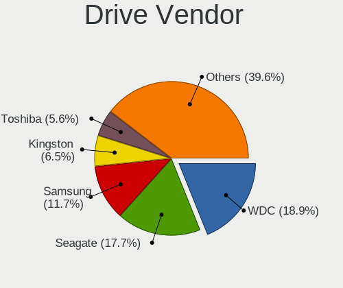
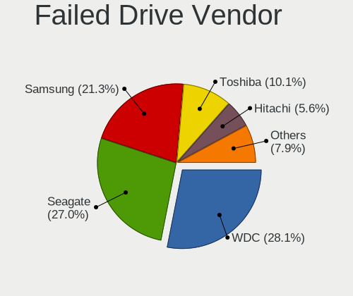
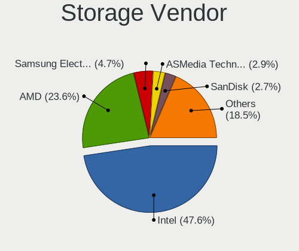
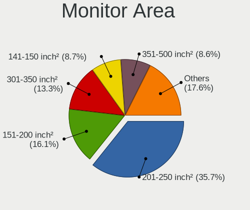
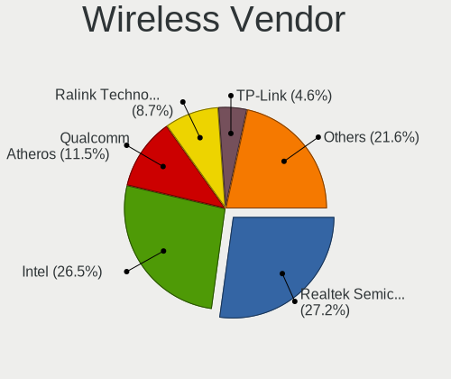
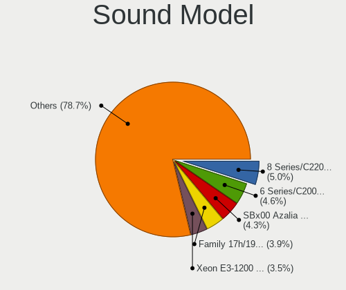

OpenMandriva - Tested Hardware & Statistics (Desktops)
------------------------------------------------------

A project to collect tested hardware configurations for OpenMandriva.

Anyone can contribute to this report by the [hw-probe](https://github.com/linuxhw/hw-probe) tool:

    sudo -E hw-probe -all -upload

Please contribute! Especially if your hardware is rare.

Contents
--------

* [ Test Cases ](#test-cases)

* [ System ](#system)
  - [ OS                       ](#os)
  - [ OS Family                ](#os-family)
  - [ Kernel                   ](#kernel)
  - [ Kernel Family            ](#kernel-family)
  - [ Kernel Major Ver.        ](#kernel-major-ver)
  - [ Arch                     ](#arch)
  - [ DE                       ](#de)
  - [ Display Server           ](#display-server)
  - [ Display Manager          ](#display-manager)
  - [ OS Lang                  ](#os-lang)
  - [ Boot Mode                ](#boot-mode)
  - [ Filesystem               ](#filesystem)
  - [ Part. scheme             ](#part-scheme)
  - [ Dual Boot with Linux/BSD ](#dual-boot-with-linuxbsd)
  - [ Dual Boot (Win)          ](#dual-boot-win)

* [ Board ](#board)
  - [ Vendor                   ](#vendor)
  - [ Model                    ](#model)
  - [ Model Family             ](#model-family)
  - [ MFG Year                 ](#mfg-year)
  - [ Form Factor              ](#form-factor)
  - [ Secure Boot              ](#secure-boot)
  - [ Coreboot                 ](#coreboot)
  - [ RAM Size                 ](#ram-size)
  - [ RAM Used                 ](#ram-used)
  - [ Total Drives             ](#total-drives)
  - [ Has CD-ROM               ](#has-cd-rom)
  - [ Has Ethernet             ](#has-ethernet)
  - [ Has WiFi                 ](#has-wifi)
  - [ Has Bluetooth            ](#has-bluetooth)

* [ Location ](#location)
  - [ Country                  ](#country)
  - [ City                     ](#city)

* [ Drives ](#drives)
  - [ Drive Vendor             ](#drive-vendor)
  - [ Drive Model              ](#drive-model)
  - [ HDD Vendor               ](#hdd-vendor)
  - [ SSD Vendor               ](#ssd-vendor)
  - [ Drive Kind               ](#drive-kind)
  - [ Drive Connector          ](#drive-connector)
  - [ Drive Size               ](#drive-size)
  - [ Space Total              ](#space-total)
  - [ Space Used               ](#space-used)
  - [ Malfunc. Drives          ](#malfunc-drives)
  - [ Malfunc. Drive Vendor    ](#malfunc-drive-vendor)
  - [ Malfunc. HDD Vendor      ](#malfunc-hdd-vendor)
  - [ Malfunc. Drive Kind      ](#malfunc-drive-kind)
  - [ Failed Drives            ](#failed-drives)
  - [ Failed Drive Vendor      ](#failed-drive-vendor)
  - [ Drive Status             ](#drive-status)

* [ Storage controller ](#storage-controller)
  - [ Storage Vendor           ](#storage-vendor)
  - [ Storage Model            ](#storage-model)
  - [ Storage Kind             ](#storage-kind)

* [ Processor ](#processor)
  - [ CPU Vendor               ](#cpu-vendor)
  - [ CPU Model                ](#cpu-model)
  - [ CPU Model Family         ](#cpu-model-family)
  - [ CPU Cores                ](#cpu-cores)
  - [ CPU Sockets              ](#cpu-sockets)
  - [ CPU Threads              ](#cpu-threads)
  - [ CPU Op-Modes             ](#cpu-op-modes)
  - [ CPU Microcode            ](#cpu-microcode)
  - [ CPU Microarch            ](#cpu-microarch)

* [ Graphics ](#graphics)
  - [ GPU Vendor               ](#gpu-vendor)
  - [ GPU Model                ](#gpu-model)
  - [ GPU Combo                ](#gpu-combo)
  - [ GPU Driver               ](#gpu-driver)
  - [ GPU Memory               ](#gpu-memory)

* [ Monitor ](#monitor)
  - [ Monitor Vendor           ](#monitor-vendor)
  - [ Monitor Model            ](#monitor-model)
  - [ Monitor Resolution       ](#monitor-resolution)
  - [ Monitor Diagonal         ](#monitor-diagonal)
  - [ Monitor Width            ](#monitor-width)
  - [ Aspect Ratio             ](#aspect-ratio)
  - [ Monitor Area             ](#monitor-area)
  - [ Pixel Density            ](#pixel-density)
  - [ Multiple Monitors        ](#multiple-monitors)

* [ Network ](#network)
  - [ Net Controller Vendor    ](#net-controller-vendor)
  - [ Net Controller Model     ](#net-controller-model)
  - [ Wireless Vendor          ](#wireless-vendor)
  - [ Wireless Model           ](#wireless-model)
  - [ Ethernet Vendor          ](#ethernet-vendor)
  - [ Ethernet Model           ](#ethernet-model)
  - [ Net Controller Kind      ](#net-controller-kind)
  - [ Used Controller          ](#used-controller)
  - [ NICs                     ](#nics)
  - [ IPv6                     ](#ipv6)

* [ Bluetooth ](#bluetooth)
  - [ Bluetooth Vendor         ](#bluetooth-vendor)
  - [ Bluetooth Model          ](#bluetooth-model)

* [ Sound ](#sound)
  - [ Sound Vendor             ](#sound-vendor)
  - [ Sound Model              ](#sound-model)

* [ Memory ](#memory)
  - [ Memory Vendor            ](#memory-vendor)
  - [ Memory Model             ](#memory-model)
  - [ Memory Kind              ](#memory-kind)
  - [ Memory Form Factor       ](#memory-form-factor)
  - [ Memory Size              ](#memory-size)
  - [ Memory Speed             ](#memory-speed)

* [ Printers & scanners ](#printers--scanners)
  - [ Printer Vendor           ](#printer-vendor)
  - [ Printer Model            ](#printer-model)
  - [ Scanner Vendor           ](#scanner-vendor)
  - [ Scanner Model            ](#scanner-model)

* [ Camera ](#camera)
  - [ Camera Vendor            ](#camera-vendor)
  - [ Camera Model             ](#camera-model)

* [ Security ](#security)
  - [ Fingerprint Vendor       ](#fingerprint-vendor)
  - [ Fingerprint Model        ](#fingerprint-model)
  - [ Chipcard Vendor          ](#chipcard-vendor)
  - [ Chipcard Model           ](#chipcard-model)

* [ Unsupported ](#unsupported)
  - [ Unsupported Devices      ](#unsupported-devices)
  - [ Unsupported Device Types ](#unsupported-device-types)

Test Cases
----------

Total: 7512

| Vendor        | Model                       | Probe                                                      | Date         |
|---------------|-----------------------------|------------------------------------------------------------|--------------|
| ASUSTek       | P8H77-V LE                  | [38ebaae5c3](https://linux-hardware.org/?probe=38ebaae5c3) | Sep 07, 2023 |
| Gigabyte      | H610M S2 V2 DDR4            | [7323821425](https://linux-hardware.org/?probe=7323821425) | Sep 07, 2023 |
| Gigabyte      | Z87X-UD3H-CF                | [43f205483a](https://linux-hardware.org/?probe=43f205483a) | Sep 07, 2023 |
| ASRock        | A68M-ITX                    | [f995094d6b](https://linux-hardware.org/?probe=f995094d6b) | Sep 07, 2023 |
| ASUSTek       | ProArt B550-CREATOR         | [5b276b13a8](https://linux-hardware.org/?probe=5b276b13a8) | Sep 07, 2023 |
| ASUSTek       | PRIME H510M-E               | [0be77d9ece](https://linux-hardware.org/?probe=0be77d9ece) | Sep 07, 2023 |
| Toshiba       | STI 006998G                 | [d34aadcc92](https://linux-hardware.org/?probe=d34aadcc92) | Sep 07, 2023 |
| ASUSTek       | ROG STRIX B560-E GAMING ... | [498958a11d](https://linux-hardware.org/?probe=498958a11d) | Sep 07, 2023 |
| MSI           | B450 TOMAHAWK MAX II        | [96d3b5db5c](https://linux-hardware.org/?probe=96d3b5db5c) | Sep 07, 2023 |
| ASUSTek       | PRIME Z390M-PLUS            | [f98e7f20ca](https://linux-hardware.org/?probe=f98e7f20ca) | Sep 06, 2023 |
| HC Technol... | HCAR5000-MI                 | [3f98176bb7](https://linux-hardware.org/?probe=3f98176bb7) | Sep 06, 2023 |
| Gigabyte      | H61M-S2PV                   | [29d9f2566a](https://linux-hardware.org/?probe=29d9f2566a) | Sep 06, 2023 |
| ASUSTek       | Z97-K                       | [849ecb3c82](https://linux-hardware.org/?probe=849ecb3c82) | Sep 06, 2023 |
| ASRock        | Z68 Pro3                    | [757ebbe056](https://linux-hardware.org/?probe=757ebbe056) | Sep 06, 2023 |
| Acer          | EQ45LM                      | [22af76a0b6](https://linux-hardware.org/?probe=22af76a0b6) | Sep 06, 2023 |
| MSI           | PRO B650-P WIFI             | [507d1bd39c](https://linux-hardware.org/?probe=507d1bd39c) | Sep 06, 2023 |
| Gigabyte      | B75M-D3H                    | [2285c5c493](https://linux-hardware.org/?probe=2285c5c493) | Sep 06, 2023 |
| Gigabyte      | AB350M-Gaming 3-CF          | [a738df6114](https://linux-hardware.org/?probe=a738df6114) | Sep 06, 2023 |
| Intel         | DQ67SW AAG12527-310         | [774ca51623](https://linux-hardware.org/?probe=774ca51623) | Sep 06, 2023 |
| MSI           | Boston                      | [f4749c6ef7](https://linux-hardware.org/?probe=f4749c6ef7) | Sep 06, 2023 |
| Gigabyte      | A320M-S2H-CF                | [03e260aff4](https://linux-hardware.org/?probe=03e260aff4) | Sep 06, 2023 |
| ASRock        | H77 Pro4/MVP                | [9e650e7107](https://linux-hardware.org/?probe=9e650e7107) | Sep 06, 2023 |
| Lenovo        | IdeaCentre K330B            | [a53977eb83](https://linux-hardware.org/?probe=a53977eb83) | Sep 06, 2023 |
| Lenovo        | H420                        | [f84aae6411](https://linux-hardware.org/?probe=f84aae6411) | Sep 06, 2023 |
| Dell          | 0PC5F7 A00                  | [9ffb575d81](https://linux-hardware.org/?probe=9ffb575d81) | Sep 06, 2023 |
| Shenzhen M... | F7BFD                       | [3f1c2a5cfa](https://linux-hardware.org/?probe=3f1c2a5cfa) | Sep 06, 2023 |
| Lenovo        | MAHOBAY Win8 Pro DPK TPG    | [c43f7a6e53](https://linux-hardware.org/?probe=c43f7a6e53) | Sep 06, 2023 |
| Lenovo        | SDK0E50510 WIN              | [4e04252ac1](https://linux-hardware.org/?probe=4e04252ac1) | Sep 06, 2023 |
| ASUSTek       | TUF B450M-PRO GAMING        | [5ba13c092c](https://linux-hardware.org/?probe=5ba13c092c) | Sep 06, 2023 |
| Dell          | 0CU409                      | [f5ae8200cf](https://linux-hardware.org/?probe=f5ae8200cf) | Sep 06, 2023 |
| ASUSTek       | PRIME B450M-A II            | [07f51e668b](https://linux-hardware.org/?probe=07f51e668b) | Sep 06, 2023 |
| ASRock        | B550M Pro4                  | [afba6fc1eb](https://linux-hardware.org/?probe=afba6fc1eb) | Sep 06, 2023 |
| Unknown       | HX90                        | [928ebd5aa7](https://linux-hardware.org/?probe=928ebd5aa7) | Sep 06, 2023 |
| HP            | 0B54h D                     | [978ff127e9](https://linux-hardware.org/?probe=978ff127e9) | Sep 05, 2023 |
| ASUSTek       | P5KPL-AM-CKD-VISUM-SI       | [4a055a6f9c](https://linux-hardware.org/?probe=4a055a6f9c) | Sep 05, 2023 |
| MSI           | H270 GAMING M3              | [1c93682de6](https://linux-hardware.org/?probe=1c93682de6) | Sep 05, 2023 |
| ASRock        | 970 Pro3 R2.0               | [01ede034b7](https://linux-hardware.org/?probe=01ede034b7) | Sep 05, 2023 |
| Intel         | H61                         | [d749d1595f](https://linux-hardware.org/?probe=d749d1595f) | Sep 05, 2023 |
| Dell          | 0T1D10 A01                  | [97ac9f9de8](https://linux-hardware.org/?probe=97ac9f9de8) | Sep 05, 2023 |
| ASRock        | H470M-STX                   | [97e43e20d7](https://linux-hardware.org/?probe=97e43e20d7) | Sep 05, 2023 |
| HP            | 0B4Ch D                     | [25b4eff820](https://linux-hardware.org/?probe=25b4eff820) | Sep 05, 2023 |
| ASUSTek       | P5G41T-M LX2/GB             | [4823d1487d](https://linux-hardware.org/?probe=4823d1487d) | Sep 05, 2023 |
| ASRock        | E35LM1                      | [663d9ac1e1](https://linux-hardware.org/?probe=663d9ac1e1) | Sep 04, 2023 |
| Lenovo        | Dory CRB                    | [4c136b6049](https://linux-hardware.org/?probe=4c136b6049) | Sep 04, 2023 |
| Gigabyte      | H55M-S2HP                   | [f2ac0f8904](https://linux-hardware.org/?probe=f2ac0f8904) | Sep 04, 2023 |
| ASRock        | A55M-HVS                    | [eaa27d1ba6](https://linux-hardware.org/?probe=eaa27d1ba6) | Sep 04, 2023 |
| Fujitsu       | D2990-A3 S26361-D2990-A3    | [59b9a21678](https://linux-hardware.org/?probe=59b9a21678) | Sep 04, 2023 |
| ASRock        | X570M Pro4                  | [46627e6392](https://linux-hardware.org/?probe=46627e6392) | Sep 04, 2023 |
| ASUSTek       | P5P43TD/USB3                | [619032e1d0](https://linux-hardware.org/?probe=619032e1d0) | Sep 04, 2023 |
| ASUSTek       | M32CD_A_F_K20CD_K31CD       | [c4334a53b6](https://linux-hardware.org/?probe=c4334a53b6) | Sep 04, 2023 |
| ASRock        | B450 Gaming-ITX/ac          | [66dedbf64b](https://linux-hardware.org/?probe=66dedbf64b) | Sep 04, 2023 |
| Dell          | 0J8G6F A03                  | [490dd7a710](https://linux-hardware.org/?probe=490dd7a710) | Sep 04, 2023 |
| ASRock        | B460M-HDV                   | [2380eeae30](https://linux-hardware.org/?probe=2380eeae30) | Sep 04, 2023 |
| ASRock        | N68-S3 FX                   | [2b503dd2b6](https://linux-hardware.org/?probe=2b503dd2b6) | Sep 04, 2023 |
| HP            | 8055                        | [2ed2e99af3](https://linux-hardware.org/?probe=2ed2e99af3) | Sep 04, 2023 |
| ASRock        | B450M-HDV R4.0              | [b87e106b6b](https://linux-hardware.org/?probe=b87e106b6b) | Sep 04, 2023 |
| Dell          | 06D7TR A00                  | [ce82ba5660](https://linux-hardware.org/?probe=ce82ba5660) | Sep 04, 2023 |
| ASRock        | NF6-GLAN                    | [80d9233886](https://linux-hardware.org/?probe=80d9233886) | Sep 04, 2023 |
| Gigabyte      | EP31-DS3L                   | [bce72e53fa](https://linux-hardware.org/?probe=bce72e53fa) | Sep 04, 2023 |
| Gigabyte      | H310M S2H x.x               | [7c39e7227e](https://linux-hardware.org/?probe=7c39e7227e) | Sep 04, 2023 |
| MSI           | H61M-P20                    | [cdf64232fc](https://linux-hardware.org/?probe=cdf64232fc) | Sep 04, 2023 |
| ASRock        | B550 Phantom Gaming-ITX/... | [dcb565d513](https://linux-hardware.org/?probe=dcb565d513) | Sep 04, 2023 |
| HP            | 8526 MVB, A                 | [3133ab688e](https://linux-hardware.org/?probe=3133ab688e) | Sep 04, 2023 |
| Lenovo        | ThinkCentre A58 77057FG     | [b96c23b77b](https://linux-hardware.org/?probe=b96c23b77b) | Sep 04, 2023 |
| Intel         | DG41RQ AAE54511-203         | [46aeab1365](https://linux-hardware.org/?probe=46aeab1365) | Sep 04, 2023 |
| OEM           | Intel H81                   | [649a092684](https://linux-hardware.org/?probe=649a092684) | Sep 04, 2023 |
| ASRock        | 960GM-VGS3 FX               | [c3059a2ebc](https://linux-hardware.org/?probe=c3059a2ebc) | Sep 04, 2023 |
| Lenovo        | SKYBAY SDK0J40705 WIN 34... | [2ba34b459a](https://linux-hardware.org/?probe=2ba34b459a) | Sep 04, 2023 |
| MSI           | B360M MORTAR                | [d023a05e0b](https://linux-hardware.org/?probe=d023a05e0b) | Sep 04, 2023 |
| AZW           | MINI S 10                   | [54967a6b36](https://linux-hardware.org/?probe=54967a6b36) | Sep 04, 2023 |
| MSI           | PRO Z690-A DDR4             | [09e7a8c91b](https://linux-hardware.org/?probe=09e7a8c91b) | Sep 04, 2023 |
| ASRock        | H510M-HDV R2.0              | [27684bd06d](https://linux-hardware.org/?probe=27684bd06d) | Sep 04, 2023 |
| ASUSTek       | PRIME B250M-A               | [02160fded0](https://linux-hardware.org/?probe=02160fded0) | Sep 04, 2023 |
| Gigabyte      | H87-D3H-CF                  | [9918661e50](https://linux-hardware.org/?probe=9918661e50) | Sep 04, 2023 |
| Fujitsu       | D3603-A1 S26361-D3603-A1    | [caa794eff8](https://linux-hardware.org/?probe=caa794eff8) | Sep 04, 2023 |
| Foxconn       | G31MX Series                | [4b4c5fb5f8](https://linux-hardware.org/?probe=4b4c5fb5f8) | Sep 04, 2023 |
| Dell          | 0GWHMW A00                  | [b02b2cb5f0](https://linux-hardware.org/?probe=b02b2cb5f0) | Sep 04, 2023 |
| Gigabyte      | AB350M-DS3H V2-CF           | [08a80ee482](https://linux-hardware.org/?probe=08a80ee482) | Sep 04, 2023 |
| ASUSTek       | PRIME X570-P                | [922ff6eddb](https://linux-hardware.org/?probe=922ff6eddb) | Sep 04, 2023 |
| Lenovo        | SHARKBAY NOK                | [1cc4b106a4](https://linux-hardware.org/?probe=1cc4b106a4) | Sep 04, 2023 |
| Gigabyte      | H510M H                     | [f235f2e7ef](https://linux-hardware.org/?probe=f235f2e7ef) | Sep 04, 2023 |
| Gigabyte      | H510M S2H                   | [82f3e710d9](https://linux-hardware.org/?probe=82f3e710d9) | Sep 04, 2023 |
| Gigabyte      | A320M-H-CF                  | [8d171f78bf](https://linux-hardware.org/?probe=8d171f78bf) | Sep 04, 2023 |
| ASUSTek       | PRIME B550M-A AC            | [6ca26976b6](https://linux-hardware.org/?probe=6ca26976b6) | Sep 04, 2023 |
| MSI           | B360M MORTAR ILYA MUROME... | [0899e4058a](https://linux-hardware.org/?probe=0899e4058a) | Sep 04, 2023 |
| ASUSTek       | Maximus VIII RANGER         | [0faa734044](https://linux-hardware.org/?probe=0faa734044) | Sep 04, 2023 |
| Lenovo        | Dory CRB                    | [9bacefd984](https://linux-hardware.org/?probe=9bacefd984) | Sep 04, 2023 |
| Acer          | Aspire XC-830               | [a3356b9a91](https://linux-hardware.org/?probe=a3356b9a91) | Sep 03, 2023 |
| Dell          | 0D441T A03                  | [3ba5173eb2](https://linux-hardware.org/?probe=3ba5173eb2) | Sep 03, 2023 |
| MSI           | MAG B550 TOMAHAWK           | [c5ffec4746](https://linux-hardware.org/?probe=c5ffec4746) | Sep 03, 2023 |
| ASUSTek       | P5E-VM SE                   | [6ce264a945](https://linux-hardware.org/?probe=6ce264a945) | Sep 03, 2023 |
| Gigabyte      | X79-UD3                     | [58ff81abf2](https://linux-hardware.org/?probe=58ff81abf2) | Sep 03, 2023 |
| Intel         | H61                         | [209644dbc2](https://linux-hardware.org/?probe=209644dbc2) | Sep 03, 2023 |
| HP            | 1825                        | [ea5da3d446](https://linux-hardware.org/?probe=ea5da3d446) | Sep 03, 2023 |
| ASRock        | FM2A58M-VG3+ R2.0           | [70172e3461](https://linux-hardware.org/?probe=70172e3461) | Sep 03, 2023 |
| Gigabyte      | G41M-Combo                  | [26c9b8cc2c](https://linux-hardware.org/?probe=26c9b8cc2c) | Sep 03, 2023 |
| ASUSTek       | M2N-MX SE Plus              | [5656c8fd0b](https://linux-hardware.org/?probe=5656c8fd0b) | Sep 03, 2023 |
| ASUSTek       | STRIKER II EXTREME          | [eafb53342a](https://linux-hardware.org/?probe=eafb53342a) | Sep 03, 2023 |
| BESSTAR Te... | Cherry Trail CR             | [3ad034200f](https://linux-hardware.org/?probe=3ad034200f) | Sep 03, 2023 |
| ASUSTek       | PRIME B365M-A               | [b44e37eec5](https://linux-hardware.org/?probe=b44e37eec5) | Sep 03, 2023 |
| ASRock        | FM2A78M-HD+                 | [a2d8c14a71](https://linux-hardware.org/?probe=a2d8c14a71) | Sep 03, 2023 |
| Gigabyte      | B450M DS3H V2               | [e0b3a3a55b](https://linux-hardware.org/?probe=e0b3a3a55b) | Sep 03, 2023 |
| ASRock        | A320D4-P1                   | [244c92966f](https://linux-hardware.org/?probe=244c92966f) | Sep 03, 2023 |
| NEC Comput... | MS-7451MA                   | [963dde730a](https://linux-hardware.org/?probe=963dde730a) | Sep 03, 2023 |
| HP            | 828A                        | [13126d5ce1](https://linux-hardware.org/?probe=13126d5ce1) | Sep 03, 2023 |
| ASUSTek       | M5A78L-M LX V2              | [92b5ca6639](https://linux-hardware.org/?probe=92b5ca6639) | Sep 03, 2023 |
| HP            | 843B                        | [d0cef21578](https://linux-hardware.org/?probe=d0cef21578) | Sep 03, 2023 |
| ASUSTek       | PRIME X470-PRO              | [976846f5c4](https://linux-hardware.org/?probe=976846f5c4) | Sep 03, 2023 |
| Pegatron      | IPMSB-GS                    | [35b8f645a7](https://linux-hardware.org/?probe=35b8f645a7) | Sep 03, 2023 |
| Gigabyte      | B450 AORUS M                | [2f09a79291](https://linux-hardware.org/?probe=2f09a79291) | Sep 03, 2023 |
| BESSTAR Te... | UM350                       | [9e80502e5d](https://linux-hardware.org/?probe=9e80502e5d) | Sep 03, 2023 |
| MSI           | Z390-A PRO                  | [16b96480a2](https://linux-hardware.org/?probe=16b96480a2) | Sep 03, 2023 |
| ASRock        | B450 Gaming K4              | [96dbf56986](https://linux-hardware.org/?probe=96dbf56986) | Sep 03, 2023 |
| Intel         | H81                         | [98f445e831](https://linux-hardware.org/?probe=98f445e831) | Sep 03, 2023 |
| Intel         | H81                         | [75aabbccf5](https://linux-hardware.org/?probe=75aabbccf5) | Sep 03, 2023 |
| ASUSTek       | M2N                         | [1df62dde56](https://linux-hardware.org/?probe=1df62dde56) | Sep 03, 2023 |
| Gigabyte      | F2A88X-UP4                  | [37bfab5442](https://linux-hardware.org/?probe=37bfab5442) | Sep 02, 2023 |
| Intel         | DQ77KB AAG40294-401         | [656df7cddd](https://linux-hardware.org/?probe=656df7cddd) | Sep 02, 2023 |
| HP            | 3646h                       | [cd226fee15](https://linux-hardware.org/?probe=cd226fee15) | Sep 02, 2023 |
| MSI           | MPG X570 GAMING PLUS        | [4fa68712c5](https://linux-hardware.org/?probe=4fa68712c5) | Sep 02, 2023 |
| MSI           | B450M MORTAR MAX            | [b161a13302](https://linux-hardware.org/?probe=b161a13302) | Sep 02, 2023 |
| HP            | 1497                        | [43c8de838b](https://linux-hardware.org/?probe=43c8de838b) | Sep 02, 2023 |
| ASRock        | N68-S3 UCC                  | [53cd38e0c5](https://linux-hardware.org/?probe=53cd38e0c5) | Sep 02, 2023 |
| MSI           | MPG B560I GAMING EDGE WI... | [d25c5d75c1](https://linux-hardware.org/?probe=d25c5d75c1) | Sep 02, 2023 |
| ASRock        | B660M Pro RS                | [f24f7fb5bf](https://linux-hardware.org/?probe=f24f7fb5bf) | Sep 02, 2023 |
| Biostar       | H81MHV3 5.0                 | [8e05d94e36](https://linux-hardware.org/?probe=8e05d94e36) | Sep 02, 2023 |
| Dell          | 088DT1 A01                  | [2df9675af1](https://linux-hardware.org/?probe=2df9675af1) | Sep 02, 2023 |
| ASRock        | FM2A55M-VG3+                | [df01a7432c](https://linux-hardware.org/?probe=df01a7432c) | Sep 02, 2023 |
| Dell          | 04YP6J A02                  | [02c6b100f0](https://linux-hardware.org/?probe=02c6b100f0) | Sep 02, 2023 |
| Gigabyte      | X570 AORUS MASTER           | [7907301c2f](https://linux-hardware.org/?probe=7907301c2f) | Sep 02, 2023 |
| ASUSTek       | PRIME B450-PLUS             | [5590e2e8d6](https://linux-hardware.org/?probe=5590e2e8d6) | Sep 02, 2023 |
| MSI           | H81M-P33                    | [266b226035](https://linux-hardware.org/?probe=266b226035) | Sep 02, 2023 |
| Fujitsu       | D3313-B1 S26361-D3313-B1    | [8533d021f8](https://linux-hardware.org/?probe=8533d021f8) | Sep 02, 2023 |
| Gigabyte      | X570S AORUS ELITE AX        | [c03e79d6e1](https://linux-hardware.org/?probe=c03e79d6e1) | Sep 02, 2023 |
| ASRock        | A620M-HDV/M.2+              | [674da4ba95](https://linux-hardware.org/?probe=674da4ba95) | Sep 02, 2023 |
| Acer          | Aspire TC-875 V:1.0         | [a25ba0bd0c](https://linux-hardware.org/?probe=a25ba0bd0c) | Sep 02, 2023 |
| ASRock        | H570 Steel Legend           | [192d8ebfa3](https://linux-hardware.org/?probe=192d8ebfa3) | Sep 02, 2023 |
| ASUSTek       | TUF Gaming X570-PLUS_BR     | [2a9211117f](https://linux-hardware.org/?probe=2a9211117f) | Sep 02, 2023 |
| Gigabyte      | B450M DS3H WIFI-CF          | [c972b65ed6](https://linux-hardware.org/?probe=c972b65ed6) | Sep 02, 2023 |
| Biostar       | N68S3B                      | [fc063709f7](https://linux-hardware.org/?probe=fc063709f7) | Sep 02, 2023 |
| Medion        | B460H6-EM                   | [ec8f0bbb13](https://linux-hardware.org/?probe=ec8f0bbb13) | Sep 02, 2023 |
| Foxconn       | 2ABF                        | [f3655da9eb](https://linux-hardware.org/?probe=f3655da9eb) | Sep 01, 2023 |
| Gigabyte      | B450 AORUS ELITE V2         | [ba40b3b859](https://linux-hardware.org/?probe=ba40b3b859) | Sep 01, 2023 |
| Dell          | 0XT4CY A01                  | [26665d2c19](https://linux-hardware.org/?probe=26665d2c19) | Sep 01, 2023 |
| Fujitsu       | D3400-A1 S26361-D3400-A1    | [f11dacb362](https://linux-hardware.org/?probe=f11dacb362) | Sep 01, 2023 |
| Intel         | DP67DE AAG10217-300         | [4d0db0b964](https://linux-hardware.org/?probe=4d0db0b964) | Sep 01, 2023 |
| MSI           | PRO Z690-P DDR4             | [6cd52cad83](https://linux-hardware.org/?probe=6cd52cad83) | Sep 01, 2023 |
| Acer          | Veriton M4610G              | [a5e1bdfce5](https://linux-hardware.org/?probe=a5e1bdfce5) | Sep 01, 2023 |
| Dell          | 00V62H A01                  | [5b976d122b](https://linux-hardware.org/?probe=5b976d122b) | Sep 01, 2023 |
| ASRock        | AB350M Pro4                 | [0f9de0fdf4](https://linux-hardware.org/?probe=0f9de0fdf4) | Sep 01, 2023 |
| HP            | 3032h                       | [7dfc9fa7a0](https://linux-hardware.org/?probe=7dfc9fa7a0) | Sep 01, 2023 |
| HP            | 1632                        | [a36b07aeda](https://linux-hardware.org/?probe=a36b07aeda) | Sep 01, 2023 |
| Foxconn       | A6VMX 0A                    | [338cdb7d40](https://linux-hardware.org/?probe=338cdb7d40) | Sep 01, 2023 |
| Gigabyte      | GA-MA770T-UD3               | [d5d9154715](https://linux-hardware.org/?probe=d5d9154715) | Sep 01, 2023 |
| Gigabyte      | B75M-D3H                    | [9e7e8b4fbd](https://linux-hardware.org/?probe=9e7e8b4fbd) | Sep 01, 2023 |
| Intel         | H110                        | [05970c6811](https://linux-hardware.org/?probe=05970c6811) | Sep 01, 2023 |
| AZW           | U59                         | [4cca42eeb3](https://linux-hardware.org/?probe=4cca42eeb3) | Sep 01, 2023 |
| ASUSTek       | SABERTOOTH Z77              | [73147203ca](https://linux-hardware.org/?probe=73147203ca) | Sep 01, 2023 |
| ASUSTek       | PRIME B450M-K               | [8cc90dd6b0](https://linux-hardware.org/?probe=8cc90dd6b0) | Sep 01, 2023 |
| ASUSTek       | H81M2                       | [55dd352412](https://linux-hardware.org/?probe=55dd352412) | Sep 01, 2023 |
| Gigabyte      | M5NM1AI-GB                  | [2b2efe00dd](https://linux-hardware.org/?probe=2b2efe00dd) | Sep 01, 2023 |
| ASUSTek       | P9X79                       | [905ee212e5](https://linux-hardware.org/?probe=905ee212e5) | Sep 01, 2023 |
| Gigabyte      | B85M-D3H                    | [4660dc9f99](https://linux-hardware.org/?probe=4660dc9f99) | Sep 01, 2023 |
| AOpen         | i65HMx-D R1.04AL            | [aef1de4c53](https://linux-hardware.org/?probe=aef1de4c53) | Sep 01, 2023 |
| ASRock        | H97M Pro4                   | [ff1be33f8e](https://linux-hardware.org/?probe=ff1be33f8e) | Sep 01, 2023 |
| Medion        | B250H4-EM                   | [c2e1f2eb0b](https://linux-hardware.org/?probe=c2e1f2eb0b) | Sep 01, 2023 |
| Gigabyte      | X58A-UD3R                   | [8ee240ba0b](https://linux-hardware.org/?probe=8ee240ba0b) | Sep 01, 2023 |
| Intel         | SHARKBAY                    | [cc7fea9c3a](https://linux-hardware.org/?probe=cc7fea9c3a) | Sep 01, 2023 |
| ASUSTek       | H110M-A/M.2                 | [6010a74736](https://linux-hardware.org/?probe=6010a74736) | Sep 01, 2023 |
| ASUSTek       | N3050T                      | [fa4b0cbf08](https://linux-hardware.org/?probe=fa4b0cbf08) | Sep 01, 2023 |
| Foxconn       | G31MXP FAB:1.1              | [4fc2089efc](https://linux-hardware.org/?probe=4fc2089efc) | Sep 01, 2023 |
| ASUSTek       | M4A78LT-M-LE                | [d3d5887ff3](https://linux-hardware.org/?probe=d3d5887ff3) | Sep 01, 2023 |
| ASUSTek       | H110M-D                     | [b0127b4bff](https://linux-hardware.org/?probe=b0127b4bff) | Sep 01, 2023 |
| ASRock        | A320M-HD                    | [7fd4c8ad9c](https://linux-hardware.org/?probe=7fd4c8ad9c) | Sep 01, 2023 |
| MSI           | MS-7390                     | [7115ad031a](https://linux-hardware.org/?probe=7115ad031a) | Sep 01, 2023 |
| Fujitsu       | D3410-B2 S26361-D3410-B2    | [924293e07f](https://linux-hardware.org/?probe=924293e07f) | Sep 01, 2023 |
| MSI           | X99A WORKSTATION            | [46d1af7083](https://linux-hardware.org/?probe=46d1af7083) | Sep 01, 2023 |
| HP            | 1632                        | [13de11f1ff](https://linux-hardware.org/?probe=13de11f1ff) | Sep 01, 2023 |
| Gigabyte      | B450 I AORUS PRO WIFI-CF    | [d728ff01da](https://linux-hardware.org/?probe=d728ff01da) | Sep 01, 2023 |
| MSI           | PRO B660M-A DDR4            | [b6a24176aa](https://linux-hardware.org/?probe=b6a24176aa) | Aug 31, 2023 |
| ASUSTek       | WS X299 SAGE                | [a01568da7d](https://linux-hardware.org/?probe=a01568da7d) | Aug 31, 2023 |
| HP            | 18E5                        | [75c3b34f87](https://linux-hardware.org/?probe=75c3b34f87) | Aug 31, 2023 |
| HP            | 3397                        | [b9dabe8514](https://linux-hardware.org/?probe=b9dabe8514) | Aug 31, 2023 |
| Positivo      | ONE500                      | [1e84a5bf44](https://linux-hardware.org/?probe=1e84a5bf44) | Aug 31, 2023 |
| PCWare        | IPX1800E1                   | [bfe03f751b](https://linux-hardware.org/?probe=bfe03f751b) | Aug 31, 2023 |
| Shenzhen M... | F6BFC                       | [c5fc2337ec](https://linux-hardware.org/?probe=c5fc2337ec) | Aug 31, 2023 |
| Foxconn       | G41S/G41S-K                 | [8ad8098315](https://linux-hardware.org/?probe=8ad8098315) | Aug 31, 2023 |
| Intel         | H61                         | [d0bd2f4cfa](https://linux-hardware.org/?probe=d0bd2f4cfa) | Aug 31, 2023 |
| Intel         | B75                         | [d8367a0977](https://linux-hardware.org/?probe=d8367a0977) | Aug 31, 2023 |
| MSI           | H61M-P20/W8                 | [c35045d386](https://linux-hardware.org/?probe=c35045d386) | Aug 31, 2023 |
| HP            | 339A                        | [1ac5cd4af8](https://linux-hardware.org/?probe=1ac5cd4af8) | Aug 31, 2023 |
| HP            | 8768 A                      | [99787646c5](https://linux-hardware.org/?probe=99787646c5) | Aug 31, 2023 |
| HP            | 2215                        | [3b3b45d0ce](https://linux-hardware.org/?probe=3b3b45d0ce) | Aug 31, 2023 |
| Intel         | HM570                       | [d7c97890f9](https://linux-hardware.org/?probe=d7c97890f9) | Aug 31, 2023 |
| Red Hat       | RHEL RHEL-9.2.0 PC          | [ee06e81f13](https://linux-hardware.org/?probe=ee06e81f13) | Aug 31, 2023 |
| Intel         | H55                         | [955198ab64](https://linux-hardware.org/?probe=955198ab64) | Aug 31, 2023 |
| Gigabyte      | MTGU5AB-00                  | [2501ea0755](https://linux-hardware.org/?probe=2501ea0755) | Aug 31, 2023 |
| Dell          | 0GDG8Y A00                  | [b9c66b93e7](https://linux-hardware.org/?probe=b9c66b93e7) | Aug 31, 2023 |
| Gigabyte      | GA-73PVM-S2H                | [4abb2ab82b](https://linux-hardware.org/?probe=4abb2ab82b) | Aug 31, 2023 |
| Acer          | Veriton N4660G              | [25339d5009](https://linux-hardware.org/?probe=25339d5009) | Aug 31, 2023 |
| MSI           | X99A RAIDER                 | [5b79d93d0a](https://linux-hardware.org/?probe=5b79d93d0a) | Aug 31, 2023 |
| ASUSTek       | PRIME B550M-A               | [19cb61cbf6](https://linux-hardware.org/?probe=19cb61cbf6) | Aug 31, 2023 |
| Gigabyte      | B450M K-CF                  | [2086d348b2](https://linux-hardware.org/?probe=2086d348b2) | Aug 31, 2023 |
| Biostar       | G41D3                       | [0d4f48c335](https://linux-hardware.org/?probe=0d4f48c335) | Aug 31, 2023 |
| ASUSTek       | PRIME B550M-A               | [06860111ba](https://linux-hardware.org/?probe=06860111ba) | Aug 31, 2023 |
| MSI           | MS-B1421                    | [65d24e365e](https://linux-hardware.org/?probe=65d24e365e) | Aug 31, 2023 |
| MSI           | A88X-G41 PC Mate            | [13724b9cc2](https://linux-hardware.org/?probe=13724b9cc2) | Aug 31, 2023 |
| MSI           | A320M PRO-E                 | [92c4032614](https://linux-hardware.org/?probe=92c4032614) | Aug 31, 2023 |
| Lenovo        | SDK0J40700 WIN              | [12785fd41a](https://linux-hardware.org/?probe=12785fd41a) | Aug 31, 2023 |
| HP            | 1587h                       | [fe659d3db6](https://linux-hardware.org/?probe=fe659d3db6) | Aug 31, 2023 |
| HP            | 806A                        | [638dfe4edc](https://linux-hardware.org/?probe=638dfe4edc) | Aug 31, 2023 |
| MSI           | A520M-A PRO                 | [d672293a11](https://linux-hardware.org/?probe=d672293a11) | Aug 31, 2023 |
| ASUSTek       | PRIME X570-P                | [f0f4af9185](https://linux-hardware.org/?probe=f0f4af9185) | Aug 31, 2023 |
| MSI           | Z370-A PRO                  | [56e3937602](https://linux-hardware.org/?probe=56e3937602) | Aug 31, 2023 |
| ViewSonic     | VPC14-WP                    | [a5476c92e7](https://linux-hardware.org/?probe=a5476c92e7) | Aug 31, 2023 |
| Fujitsu       | D2679-B1 S26361-D2679-Bx... | [81ae698cf8](https://linux-hardware.org/?probe=81ae698cf8) | Aug 31, 2023 |
| HP            | 8768 A                      | [3b19eaee36](https://linux-hardware.org/?probe=3b19eaee36) | Aug 31, 2023 |
| Lenovo        | 1030 SDK0J40697 WIN 3305... | [e180d8d91b](https://linux-hardware.org/?probe=e180d8d91b) | Aug 31, 2023 |
| Gigabyte      | H110M-H-CF                  | [faf094d2ca](https://linux-hardware.org/?probe=faf094d2ca) | Aug 31, 2023 |
| Gigabyte      | Z590 AORUS ELITE AX         | [dc63902a68](https://linux-hardware.org/?probe=dc63902a68) | Aug 31, 2023 |
| MSI           | 880G-E45                    | [f10edf60fd](https://linux-hardware.org/?probe=f10edf60fd) | Aug 31, 2023 |
| MSI           | 2A78h                       | [78b5a663f2](https://linux-hardware.org/?probe=78b5a663f2) | Aug 31, 2023 |
| Dell          | 0KRC95 A02                  | [9173d00240](https://linux-hardware.org/?probe=9173d00240) | Aug 31, 2023 |
| ASUSTek       | M5A99X EVO R2.0             | [1a3fdd076f](https://linux-hardware.org/?probe=1a3fdd076f) | Aug 31, 2023 |
| MSI           | Boston                      | [f43cd6df24](https://linux-hardware.org/?probe=f43cd6df24) | Aug 31, 2023 |
| ECS           | A780GM-A                    | [12787b1e38](https://linux-hardware.org/?probe=12787b1e38) | Aug 31, 2023 |
| Megaware      | MW-NM70HD-MI 06/11/2012 ... | [7b8812491c](https://linux-hardware.org/?probe=7b8812491c) | Aug 31, 2023 |
| ASUSTek       | P5G41T-M LX                 | [bdae370995](https://linux-hardware.org/?probe=bdae370995) | Aug 30, 2023 |
| ASUSTek       | P8Q77-M                     | [d9760de265](https://linux-hardware.org/?probe=d9760de265) | Aug 30, 2023 |
| ASUSTek       | P8Z68-V LX                  | [7de2ff1052](https://linux-hardware.org/?probe=7de2ff1052) | Aug 30, 2023 |
| HP            | 3647h                       | [50ac4e01a4](https://linux-hardware.org/?probe=50ac4e01a4) | Aug 30, 2023 |
| MSI           | 970 GAMING                  | [f468606e38](https://linux-hardware.org/?probe=f468606e38) | Aug 30, 2023 |
| Dell          | OptiPlex 7050               | [a35a9d7d8a](https://linux-hardware.org/?probe=a35a9d7d8a) | Aug 30, 2023 |
| ASUSTek       | M5A78L-M LX/BR              | [79783b33ff](https://linux-hardware.org/?probe=79783b33ff) | Aug 30, 2023 |
| ASUSTek       | A8N-E                       | [84578c86e7](https://linux-hardware.org/?probe=84578c86e7) | Aug 30, 2023 |
| Gigabyte      | X570 AORUS ELITE            | [42f87cb09b](https://linux-hardware.org/?probe=42f87cb09b) | Aug 30, 2023 |
| MSI           | H61MA-E35                   | [5eee145629](https://linux-hardware.org/?probe=5eee145629) | Aug 30, 2023 |
| Dell          | 0Y5DDC A00                  | [21ec7587ed](https://linux-hardware.org/?probe=21ec7587ed) | Aug 30, 2023 |
| ASUSTek       | P8H61 EVO                   | [facd465366](https://linux-hardware.org/?probe=facd465366) | Aug 30, 2023 |
| ASRock        | H470M-STX                   | [8ba058add5](https://linux-hardware.org/?probe=8ba058add5) | Aug 30, 2023 |
| HP            | 3047h                       | [5a35a1ebd1](https://linux-hardware.org/?probe=5a35a1ebd1) | Aug 30, 2023 |
| Gigabyte      | B450M H                     | [cd7bf0b2db](https://linux-hardware.org/?probe=cd7bf0b2db) | Aug 30, 2023 |
| Acer          | Aspire XC-330               | [2e1b103708](https://linux-hardware.org/?probe=2e1b103708) | Aug 30, 2023 |
| Intel         | DH55TC AAE70932-205         | [5e3be336db](https://linux-hardware.org/?probe=5e3be336db) | Aug 30, 2023 |
| ASUSTek       | M5A99X EVO R2.0             | [a65c8bb631](https://linux-hardware.org/?probe=a65c8bb631) | Aug 30, 2023 |
| Medion        | B460H6-EM                   | [fac263bf1a](https://linux-hardware.org/?probe=fac263bf1a) | Aug 30, 2023 |
| ASUSTek       | P6T                         | [69879aca23](https://linux-hardware.org/?probe=69879aca23) | Aug 30, 2023 |
| HP            | 0B4Ch D                     | [362ee070d7](https://linux-hardware.org/?probe=362ee070d7) | Aug 30, 2023 |
| ASRock        | M3A UCC                     | [b46f15b2d2](https://linux-hardware.org/?probe=b46f15b2d2) | Aug 30, 2023 |
| ASUSTek       | TUF Gaming B450-PLUS II     | [a2f37c4111](https://linux-hardware.org/?probe=a2f37c4111) | Aug 30, 2023 |
| ASUSTek       | A88XM-E/USB                 | [376615315b](https://linux-hardware.org/?probe=376615315b) | Aug 30, 2023 |
| ASUSTek       | P5Q SE PLUS                 | [311596a316](https://linux-hardware.org/?probe=311596a316) | Aug 30, 2023 |
| Lenovo        | SHARKBAY SDK0E50510 WIN     | [f040a85f2f](https://linux-hardware.org/?probe=f040a85f2f) | Aug 30, 2023 |
| ASUSTek       | P8H67-V                     | [24b196c99a](https://linux-hardware.org/?probe=24b196c99a) | Aug 30, 2023 |
| ASRock        | B450 Gaming-ITX/ac          | [c95eb85e58](https://linux-hardware.org/?probe=c95eb85e58) | Aug 30, 2023 |
| ASUSTek       | TUF B450-PLUS GAMING        | [9ed00c6987](https://linux-hardware.org/?probe=9ed00c6987) | Aug 30, 2023 |
| Foxconn       | H55MXV Series               | [af9d0ad662](https://linux-hardware.org/?probe=af9d0ad662) | Aug 30, 2023 |
| HP            | 876C SMVB                   | [25176eb482](https://linux-hardware.org/?probe=25176eb482) | Aug 30, 2023 |
| Gigabyte      | F2A88XM-HD3                 | [43cb5c7282](https://linux-hardware.org/?probe=43cb5c7282) | Aug 30, 2023 |
| HP            | 876C SMVB                   | [246cb7a1ca](https://linux-hardware.org/?probe=246cb7a1ca) | Aug 30, 2023 |
| ASRock        | H170M-ITX/ac                | [7921e28c6b](https://linux-hardware.org/?probe=7921e28c6b) | Aug 30, 2023 |
| OEM           | Intel H81                   | [7d179cb8e9](https://linux-hardware.org/?probe=7d179cb8e9) | Aug 30, 2023 |
| Dell          | 0DR845                      | [2b4ff07956](https://linux-hardware.org/?probe=2b4ff07956) | Aug 30, 2023 |
| ASRock        | 970 Pro3 R2.0               | [f59364572a](https://linux-hardware.org/?probe=f59364572a) | Aug 30, 2023 |
| Itautec       | ST 4254 ST-4254 Padrao 0... | [fbbbe0087a](https://linux-hardware.org/?probe=fbbbe0087a) | Aug 30, 2023 |
| Apple         | Mac-F221BEC8                | [13b77d8273](https://linux-hardware.org/?probe=13b77d8273) | Aug 30, 2023 |
| Acer          | Aspire TC-895 V:1.0         | [20bd10b5f4](https://linux-hardware.org/?probe=20bd10b5f4) | Aug 30, 2023 |
| Foxconn       | D180S/D190S/D290S Series... | [5f6030cb69](https://linux-hardware.org/?probe=5f6030cb69) | Aug 30, 2023 |
| Foxconn       | Lucknow                     | [eece5a84ae](https://linux-hardware.org/?probe=eece5a84ae) | Aug 30, 2023 |
| MSI           | A320M PRO-VD PLUS           | [1782829fec](https://linux-hardware.org/?probe=1782829fec) | Aug 29, 2023 |
| MSI           | H61M-E22/W8                 | [2439d2ed95](https://linux-hardware.org/?probe=2439d2ed95) | Aug 29, 2023 |
| HP            | 1589                        | [047e0158e8](https://linux-hardware.org/?probe=047e0158e8) | Aug 29, 2023 |
| ASUSTek       | PRIME Z270-P                | [c4bec90c4e](https://linux-hardware.org/?probe=c4bec90c4e) | Aug 29, 2023 |
| Fujitsu       | D3222-A1 S26361-D3222-A1    | [567a59e1bc](https://linux-hardware.org/?probe=567a59e1bc) | Aug 29, 2023 |
| Gigabyte      | G31M-ES2L                   | [7094317c17](https://linux-hardware.org/?probe=7094317c17) | Aug 29, 2023 |
| Pegatron      | 2A73h                       | [390b033780](https://linux-hardware.org/?probe=390b033780) | Aug 29, 2023 |
| MSI           | PH61-SP35                   | [590f47f3fd](https://linux-hardware.org/?probe=590f47f3fd) | Aug 29, 2023 |
| Intel         | DG45ID AAE27729-312         | [add370815d](https://linux-hardware.org/?probe=add370815d) | Aug 29, 2023 |
| MSI           | Z97 GAMING 5                | [36cc5803b3](https://linux-hardware.org/?probe=36cc5803b3) | Aug 29, 2023 |
| Kobian        | PI945GCM ECS                | [85683b5fa3](https://linux-hardware.org/?probe=85683b5fa3) | Aug 29, 2023 |
| HP            | 885F A                      | [d665bb8939](https://linux-hardware.org/?probe=d665bb8939) | Aug 29, 2023 |
| Gigabyte      | X58A-UD7                    | [9d47465c31](https://linux-hardware.org/?probe=9d47465c31) | Aug 29, 2023 |
| ASUSTek       | ROG STRIX X570-F GAMING     | [5222737445](https://linux-hardware.org/?probe=5222737445) | Aug 29, 2023 |
| Gigabyte      | A320M-HD2-CF                | [7d9c3aa2ad](https://linux-hardware.org/?probe=7d9c3aa2ad) | Aug 29, 2023 |
| MSI           | B550-A PRO                  | [b5ee83c5af](https://linux-hardware.org/?probe=b5ee83c5af) | Aug 29, 2023 |
| Lenovo        | ThinkCentre M91p 4518B84    | [e2fd5511ee](https://linux-hardware.org/?probe=e2fd5511ee) | Aug 29, 2023 |
| HP            | 89B4 A                      | [e70b3a2352](https://linux-hardware.org/?probe=e70b3a2352) | Aug 29, 2023 |
| ASUSTek       | M3N78-EH                    | [c0fb869905](https://linux-hardware.org/?probe=c0fb869905) | Aug 29, 2023 |
| HC Technol... | HCAR5000-MI                 | [50b9b4c466](https://linux-hardware.org/?probe=50b9b4c466) | Aug 28, 2023 |
| MSI           | MAG B550 TORPEDO            | [7ac77b7bac](https://linux-hardware.org/?probe=7ac77b7bac) | Aug 28, 2023 |
| MSI           | G41M-P33 Combo              | [23712e9380](https://linux-hardware.org/?probe=23712e9380) | Aug 28, 2023 |
| Intel         | H81                         | [9b70a28b25](https://linux-hardware.org/?probe=9b70a28b25) | Aug 28, 2023 |
| Fujitsu       | D3233-A1 S26361-D3233-A1    | [6d4609efa2](https://linux-hardware.org/?probe=6d4609efa2) | Aug 28, 2023 |
| HP            | 21D0                        | [8978dfd3bf](https://linux-hardware.org/?probe=8978dfd3bf) | Aug 28, 2023 |
| ASUSTek       | M4N68T-M-V2                 | [409ccc747c](https://linux-hardware.org/?probe=409ccc747c) | Aug 28, 2023 |
| MSI           | B450M PRO-VDH MAX           | [844b4e4dc2](https://linux-hardware.org/?probe=844b4e4dc2) | Aug 28, 2023 |
| ASUSTek       | SABERTOOTH 990FX R2.0       | [22d4876142](https://linux-hardware.org/?probe=22d4876142) | Aug 28, 2023 |
| Gigabyte      | B550M DS3H                  | [90b8d2cb66](https://linux-hardware.org/?probe=90b8d2cb66) | Aug 28, 2023 |
| Dell          | 0C0YYY A00                  | [1ac938e884](https://linux-hardware.org/?probe=1ac938e884) | Aug 28, 2023 |
| Positivo      | POS-PQ45AU                  | [aba45a4f14](https://linux-hardware.org/?probe=aba45a4f14) | Aug 27, 2023 |
| ASUSTek       | PRIME B450M-A               | [b4411a9169](https://linux-hardware.org/?probe=b4411a9169) | Aug 27, 2023 |
| MSI           | A68HM-E33 V2                | [bf483bc8d3](https://linux-hardware.org/?probe=bf483bc8d3) | Aug 27, 2023 |
| MSI           | B85M-G43                    | [96fd52d530](https://linux-hardware.org/?probe=96fd52d530) | Aug 27, 2023 |
| ASRock        | Z490M-ITX/ac                | [d3a4f92f62](https://linux-hardware.org/?probe=d3a4f92f62) | Aug 27, 2023 |
| ASUSTek       | P5KPL-AM                    | [a139f22d59](https://linux-hardware.org/?probe=a139f22d59) | Aug 27, 2023 |
| ASUSTek       | ROG STRIX Z390-F GAMING     | [248f2a9745](https://linux-hardware.org/?probe=248f2a9745) | Aug 27, 2023 |
| Fujitsu       | D3162-A1 S26361-D3162-A1    | [713e62f936](https://linux-hardware.org/?probe=713e62f936) | Aug 27, 2023 |
| Foxconn       | 2ABF                        | [b0a8f65bca](https://linux-hardware.org/?probe=b0a8f65bca) | Aug 27, 2023 |
| ASUSTek       | TUF Gaming X570-PLUS        | [883d4fbfeb](https://linux-hardware.org/?probe=883d4fbfeb) | Aug 27, 2023 |
| HP            | 87D6 SMVB                   | [a2cf3918b7](https://linux-hardware.org/?probe=a2cf3918b7) | Aug 27, 2023 |
| Dell          | 0HR330                      | [700643ac0e](https://linux-hardware.org/?probe=700643ac0e) | Aug 27, 2023 |
| ASUSTek       | PRIME A520M-K               | [ea6d90ba09](https://linux-hardware.org/?probe=ea6d90ba09) | Aug 27, 2023 |
| Dell          | 0JCTF8 A00                  | [af55d05855](https://linux-hardware.org/?probe=af55d05855) | Aug 26, 2023 |
| ASUSTek       | Z77-A                       | [1aa1747b87](https://linux-hardware.org/?probe=1aa1747b87) | Aug 26, 2023 |
| Pegatron      | IPM41-D3                    | [b67fbfb529](https://linux-hardware.org/?probe=b67fbfb529) | Aug 26, 2023 |
| HP            | 1998                        | [2c6c07a7d3](https://linux-hardware.org/?probe=2c6c07a7d3) | Aug 26, 2023 |
| ASRock        | Wolfdale1333-D667           | [7dfa16eab4](https://linux-hardware.org/?probe=7dfa16eab4) | Aug 26, 2023 |
| Intel         | D33217CK G76541-301         | [24b3b7aac4](https://linux-hardware.org/?probe=24b3b7aac4) | Aug 26, 2023 |
| Gigabyte      | Z370 AORUS Ultra Gaming-... | [9bde22726b](https://linux-hardware.org/?probe=9bde22726b) | Aug 26, 2023 |
| Gigabyte      | GA-880GMA-UD2H              | [7db44bc8af](https://linux-hardware.org/?probe=7db44bc8af) | Aug 26, 2023 |
| Positivo      | POS-PIG41BA POSITIVO        | [05dc1d19de](https://linux-hardware.org/?probe=05dc1d19de) | Aug 26, 2023 |
| Dell          | 00V62H A01                  | [69824bbd6d](https://linux-hardware.org/?probe=69824bbd6d) | Aug 26, 2023 |
| ASUSTek       | H97M-E                      | [ff832aca4a](https://linux-hardware.org/?probe=ff832aca4a) | Aug 26, 2023 |
| Dell          | 0XCR8D A02                  | [1f5f734faa](https://linux-hardware.org/?probe=1f5f734faa) | Aug 26, 2023 |
| ASUSTek       | AT5NM10-I                   | [15edd1ec31](https://linux-hardware.org/?probe=15edd1ec31) | Aug 26, 2023 |
| ASUSTek       | P8Z77-V LX                  | [9f1872b5e9](https://linux-hardware.org/?probe=9f1872b5e9) | Aug 26, 2023 |
| MSI           | H81M-P33                    | [e86c3faf2e](https://linux-hardware.org/?probe=e86c3faf2e) | Aug 26, 2023 |
| Dell          | 0Y2MRG A00                  | [451af13730](https://linux-hardware.org/?probe=451af13730) | Aug 26, 2023 |
| ASUSTek       | H110M-K                     | [9cf3912874](https://linux-hardware.org/?probe=9cf3912874) | Aug 26, 2023 |
| MSI           | H510M-A PRO                 | [0620b43b6a](https://linux-hardware.org/?probe=0620b43b6a) | Aug 26, 2023 |
| ASUSTek       | P5K-E                       | [aa48da4e34](https://linux-hardware.org/?probe=aa48da4e34) | Aug 26, 2023 |
| Gigabyte      | Z97X-UD3H-CF                | [78df724503](https://linux-hardware.org/?probe=78df724503) | Aug 26, 2023 |
| MSI           | MPG B550 GAMING EDGE WIF... | [5febb12d66](https://linux-hardware.org/?probe=5febb12d66) | Aug 26, 2023 |
| Biostar       | G41D3C                      | [5e2c852104](https://linux-hardware.org/?probe=5e2c852104) | Aug 26, 2023 |
| ASUSTek       | EX-A320M-GAMING             | [6fc7c35bc9](https://linux-hardware.org/?probe=6fc7c35bc9) | Aug 26, 2023 |
| MSI           | X470 GAMING PLUS MAX        | [baa3bc61e9](https://linux-hardware.org/?probe=baa3bc61e9) | Aug 25, 2023 |
| Gigabyte      | Z77X-UD5H                   | [98a1dbe051](https://linux-hardware.org/?probe=98a1dbe051) | Aug 25, 2023 |
| HP            | 89D8 SMVB                   | [d9898111f8](https://linux-hardware.org/?probe=d9898111f8) | Aug 25, 2023 |
| ASUSTek       | P8H77-V LE                  | [03740cd24c](https://linux-hardware.org/?probe=03740cd24c) | Aug 25, 2023 |
| ASUSTek       | P8Z68-V LE                  | [5457261ab6](https://linux-hardware.org/?probe=5457261ab6) | Aug 25, 2023 |
| ASRock        | B250M-HDV                   | [1bc8a402b3](https://linux-hardware.org/?probe=1bc8a402b3) | Aug 25, 2023 |
| MSI           | A320M-A PRO                 | [0145505cea](https://linux-hardware.org/?probe=0145505cea) | Aug 25, 2023 |
| ASUSTek       | P8Q77-M                     | [8445b944a5](https://linux-hardware.org/?probe=8445b944a5) | Aug 25, 2023 |
| ASUSTek       | PRIME B450M-A II            | [255eeb3d65](https://linux-hardware.org/?probe=255eeb3d65) | Aug 25, 2023 |
| MSI           | B450M MORTAR MAX            | [b328603445](https://linux-hardware.org/?probe=b328603445) | Aug 25, 2023 |
| ASUSTek       | M4A87TD EVO                 | [70a6d20dbf](https://linux-hardware.org/?probe=70a6d20dbf) | Aug 25, 2023 |
| ASRock        | B450M Pro4                  | [8237cf85b3](https://linux-hardware.org/?probe=8237cf85b3) | Aug 25, 2023 |
| Gigabyte      | H81M-H                      | [7da367fdec](https://linux-hardware.org/?probe=7da367fdec) | Aug 25, 2023 |
| Lenovo        | SKYBAY NOK                  | [38448389ce](https://linux-hardware.org/?probe=38448389ce) | Aug 25, 2023 |
| MSI           | Z97S SLI Krait Edition      | [037e041959](https://linux-hardware.org/?probe=037e041959) | Aug 25, 2023 |
| HP            | 21F5 0A                     | [812718f3e7](https://linux-hardware.org/?probe=812718f3e7) | Aug 25, 2023 |
| Gigabyte      | GA-MA770T-UD3P              | [d1e0d41982](https://linux-hardware.org/?probe=d1e0d41982) | Aug 24, 2023 |
| ASUSTek       | TUF Gaming X570-PRO         | [85984e2830](https://linux-hardware.org/?probe=85984e2830) | Aug 24, 2023 |
| Pegatron      | EVANS                       | [1b32c5d271](https://linux-hardware.org/?probe=1b32c5d271) | Aug 24, 2023 |
| Lenovo        | 3141 SDK0J40697 WIN 3305... | [088ba21947](https://linux-hardware.org/?probe=088ba21947) | Aug 24, 2023 |
| Acer          | Aspire TC-115               | [1c22aff012](https://linux-hardware.org/?probe=1c22aff012) | Aug 24, 2023 |
| Lenovo        | ThinkCentre M72e 3597A56    | [6b6d2e95f9](https://linux-hardware.org/?probe=6b6d2e95f9) | Aug 24, 2023 |
| Acer          | EQ45LM                      | [aa8ea529f7](https://linux-hardware.org/?probe=aa8ea529f7) | Aug 24, 2023 |
| ASUSTek       | P8H77-M PRO                 | [4953513629](https://linux-hardware.org/?probe=4953513629) | Aug 24, 2023 |
| Acer          | Aspire TC-605               | [03cff37b1a](https://linux-hardware.org/?probe=03cff37b1a) | Aug 24, 2023 |
| ASUSTek       | P7H55-M BR                  | [820b86d560](https://linux-hardware.org/?probe=820b86d560) | Aug 24, 2023 |
| Lenovo        | 312A NOK                    | [88533268cf](https://linux-hardware.org/?probe=88533268cf) | Aug 23, 2023 |
| ASUSTek       | H110M-A/M.2                 | [e45572b49a](https://linux-hardware.org/?probe=e45572b49a) | Aug 23, 2023 |
| Intel         | DZ77BH-55K AAG39008-400     | [30c81f585a](https://linux-hardware.org/?probe=30c81f585a) | Aug 23, 2023 |
| MSI           | A320M-A PRO                 | [c5ea9af7cd](https://linux-hardware.org/?probe=c5ea9af7cd) | Aug 23, 2023 |
| Gigabyte      | Z390 AORUS MASTER-CF        | [aa959925b8](https://linux-hardware.org/?probe=aa959925b8) | Aug 23, 2023 |
| Gigabyte      | GA-970A-UD3                 | [796925bf51](https://linux-hardware.org/?probe=796925bf51) | Aug 23, 2023 |
| GEEKOM        | GM08i3T                     | [36ea06968d](https://linux-hardware.org/?probe=36ea06968d) | Aug 23, 2023 |
| ASUSTek       | PRIME B450M-A II            | [618b994ac1](https://linux-hardware.org/?probe=618b994ac1) | Aug 23, 2023 |
| Medion        | B460H6-EM                   | [7da77cb4d7](https://linux-hardware.org/?probe=7da77cb4d7) | Aug 22, 2023 |
| Intel         | H81                         | [fe1e95123d](https://linux-hardware.org/?probe=fe1e95123d) | Aug 22, 2023 |
| Gigabyte      | X299 AORUS Gaming-CF        | [e99aa2e4d7](https://linux-hardware.org/?probe=e99aa2e4d7) | Aug 22, 2023 |
| MSI           | G31TM-P21                   | [c8aa8973a4](https://linux-hardware.org/?probe=c8aa8973a4) | Aug 22, 2023 |
| Gigabyte      | X299 AORUS Gaming-CF        | [d39f8430ac](https://linux-hardware.org/?probe=d39f8430ac) | Aug 22, 2023 |
| HP            | 1850                        | [d9b3f59f97](https://linux-hardware.org/?probe=d9b3f59f97) | Aug 22, 2023 |
| Red Hat       | RHEL RHEL-9.2.0 PC          | [48f65a86aa](https://linux-hardware.org/?probe=48f65a86aa) | Aug 22, 2023 |
| MSI           | B450M BAZOOKA MAX WIFI      | [3bdb30f543](https://linux-hardware.org/?probe=3bdb30f543) | Aug 22, 2023 |
| ASUSTek       | PRIME H270-PRO              | [05eae6c877](https://linux-hardware.org/?probe=05eae6c877) | Aug 22, 2023 |
| Lenovo        | H415                        | [e6277f1ab8](https://linux-hardware.org/?probe=e6277f1ab8) | Aug 22, 2023 |
| ASRock        | 890GX Pro3                  | [c36b43c52a](https://linux-hardware.org/?probe=c36b43c52a) | Aug 21, 2023 |
| MSI           | X470 GAMING PLUS            | [191c724d49](https://linux-hardware.org/?probe=191c724d49) | Aug 21, 2023 |
| Intel         | H61                         | [4d6bf88f48](https://linux-hardware.org/?probe=4d6bf88f48) | Aug 21, 2023 |
| Gigabyte      | A320M-S2H V2-CF             | [e9c7a12d52](https://linux-hardware.org/?probe=e9c7a12d52) | Aug 21, 2023 |
| AMD           | Inagua CRB                  | [9455337239](https://linux-hardware.org/?probe=9455337239) | Aug 21, 2023 |
| ASUSTek       | M4A88TD-V EVO/USB3          | [33ad1ac951](https://linux-hardware.org/?probe=33ad1ac951) | Aug 21, 2023 |
| ASRock        | H510M-HVS R2.0              | [7993a53688](https://linux-hardware.org/?probe=7993a53688) | Aug 21, 2023 |
| HP            | 2B52                        | [ed7526d18f](https://linux-hardware.org/?probe=ed7526d18f) | Aug 20, 2023 |
| Gigabyte      | B75M-D2V                    | [8c805fa379](https://linux-hardware.org/?probe=8c805fa379) | Aug 20, 2023 |
| Dell          | 06D7TR A02                  | [dac6078c1b](https://linux-hardware.org/?probe=dac6078c1b) | Aug 20, 2023 |
| ASUSTek       | PRIME X570-P                | [6c5abd788f](https://linux-hardware.org/?probe=6c5abd788f) | Aug 20, 2023 |
| Intel         | X99                         | [e16fe5b0f3](https://linux-hardware.org/?probe=e16fe5b0f3) | Aug 19, 2023 |
| Fujitsu       | D3061-A1 S26361-D3061-A1    | [1824f3c712](https://linux-hardware.org/?probe=1824f3c712) | Aug 19, 2023 |
| Gigabyte      | GA-N680SLI-DQ6              | [0838a31aaf](https://linux-hardware.org/?probe=0838a31aaf) | Aug 19, 2023 |
| Gigabyte      | G31M-S2L                    | [5768055184](https://linux-hardware.org/?probe=5768055184) | Aug 19, 2023 |
| Gigabyte      | M68MT-S2P                   | [bbf0f31c1b](https://linux-hardware.org/?probe=bbf0f31c1b) | Aug 19, 2023 |
| Gigabyte      | F2A68HM-HD2                 | [8735b5577b](https://linux-hardware.org/?probe=8735b5577b) | Aug 18, 2023 |
| ASRock        | Z370 Pro4                   | [9b7cf0384c](https://linux-hardware.org/?probe=9b7cf0384c) | Aug 18, 2023 |
| ASUSTek       | B85M-G                      | [c8eaccabf2](https://linux-hardware.org/?probe=c8eaccabf2) | Aug 18, 2023 |
| AZW           | EQ                          | [6fda99ad46](https://linux-hardware.org/?probe=6fda99ad46) | Aug 18, 2023 |
| ASUSTek       | H61M-E                      | [d4849fe5f4](https://linux-hardware.org/?probe=d4849fe5f4) | Aug 18, 2023 |
| ECS           | A55F-M4                     | [93a5944754](https://linux-hardware.org/?probe=93a5944754) | Aug 18, 2023 |
| ASUSTek       | PRIME H410M-E               | [ae37d9f640](https://linux-hardware.org/?probe=ae37d9f640) | Aug 18, 2023 |
| Gigabyte      | Z77M-D3H                    | [154e2db6b7](https://linux-hardware.org/?probe=154e2db6b7) | Aug 18, 2023 |
| Dell          | 0200DY A00                  | [9b94c2313c](https://linux-hardware.org/?probe=9b94c2313c) | Aug 18, 2023 |
| Gigabyte      | G31M-ES2L                   | [d84596d3c1](https://linux-hardware.org/?probe=d84596d3c1) | Aug 18, 2023 |
| ASUSTek       | SABERTOOTH 990FX R2.0       | [7658411c87](https://linux-hardware.org/?probe=7658411c87) | Aug 17, 2023 |
| ASUSTek       | PRIME H410M-R               | [809590bdb0](https://linux-hardware.org/?probe=809590bdb0) | Aug 17, 2023 |
| ASUSTek       | TUF Gaming B760M-PLUS WI... | [c956862ccd](https://linux-hardware.org/?probe=c956862ccd) | Aug 17, 2023 |
| HP            | 8768 A                      | [a2b7f6905c](https://linux-hardware.org/?probe=a2b7f6905c) | Aug 17, 2023 |
| Intel         | DE3815TYKH H26998-402       | [a2a8c567a3](https://linux-hardware.org/?probe=a2a8c567a3) | Aug 17, 2023 |
| Dell          | 0XFWHV A00                  | [0ddde115f9](https://linux-hardware.org/?probe=0ddde115f9) | Aug 17, 2023 |
| Lenovo        | SDK0E50510 WIN              | [0a48b003bb](https://linux-hardware.org/?probe=0a48b003bb) | Aug 17, 2023 |
| Shuttle       | DS20U                       | [3a1ceb6021](https://linux-hardware.org/?probe=3a1ceb6021) | Aug 17, 2023 |
| Gigabyte      | B85M-D3H                    | [fe8d01fa26](https://linux-hardware.org/?probe=fe8d01fa26) | Aug 17, 2023 |
| Unknown       | Unknown                     | [6b82ccd639](https://linux-hardware.org/?probe=6b82ccd639) | Aug 17, 2023 |
| Gigabyte      | GA-MA780G-UD3H              | [83e6c3323d](https://linux-hardware.org/?probe=83e6c3323d) | Aug 16, 2023 |
| Gigabyte      | GA-78LMT-USB3 x.x           | [945643bffa](https://linux-hardware.org/?probe=945643bffa) | Aug 16, 2023 |
| Gigabyte      | 965P-S3                     | [d9557da16c](https://linux-hardware.org/?probe=d9557da16c) | Aug 16, 2023 |
| ASUSTek       | H110M-R                     | [3151636f73](https://linux-hardware.org/?probe=3151636f73) | Aug 16, 2023 |
| MSI           | PRO H610M-G DDR4            | [bd75f21361](https://linux-hardware.org/?probe=bd75f21361) | Aug 16, 2023 |
| HP            | 0B4Ch D                     | [abb0a09230](https://linux-hardware.org/?probe=abb0a09230) | Aug 16, 2023 |
| Gigabyte      | P55-USB3                    | [4e25d8ef9f](https://linux-hardware.org/?probe=4e25d8ef9f) | Aug 16, 2023 |
| ASUSTek       | P8B75-V                     | [78a5205783](https://linux-hardware.org/?probe=78a5205783) | Aug 16, 2023 |
| Gigabyte      | B550M DS3H AC               | [881b50cb6f](https://linux-hardware.org/?probe=881b50cb6f) | Aug 16, 2023 |
| MSI           | A320M-A PRO MAX             | [57a2ddf4a7](https://linux-hardware.org/?probe=57a2ddf4a7) | Aug 16, 2023 |
| Acer          | EM61SM/EM61PM               | [428f134de7](https://linux-hardware.org/?probe=428f134de7) | Aug 15, 2023 |
| ASUSTek       | H97-PLUS                    | [166b18583b](https://linux-hardware.org/?probe=166b18583b) | Aug 15, 2023 |
| Dell          | 0NW6H5 A00                  | [8f1803298d](https://linux-hardware.org/?probe=8f1803298d) | Aug 15, 2023 |
| ASUSTek       | P5K SE                      | [8d6a3e990c](https://linux-hardware.org/?probe=8d6a3e990c) | Aug 15, 2023 |
| MSI           | H310M PRO-VDH               | [fe173bc6ed](https://linux-hardware.org/?probe=fe173bc6ed) | Aug 15, 2023 |
| ASUSTek       | H170-PRO                    | [a5086e207e](https://linux-hardware.org/?probe=a5086e207e) | Aug 15, 2023 |
| ASUSTek       | P8H61-M LE R2.0             | [ac6dd63085](https://linux-hardware.org/?probe=ac6dd63085) | Aug 15, 2023 |
| ASRock        | A320M/ac                    | [5012358457](https://linux-hardware.org/?probe=5012358457) | Aug 15, 2023 |
| Gigabyte      | H61M-DS2                    | [2a753fd907](https://linux-hardware.org/?probe=2a753fd907) | Aug 14, 2023 |
| ASUSTek       | PRIME X299-DELUXE II        | [1bb822c058](https://linux-hardware.org/?probe=1bb822c058) | Aug 13, 2023 |
| ASUSTek       | PRIME X299-DELUXE II        | [c24273512e](https://linux-hardware.org/?probe=c24273512e) | Aug 13, 2023 |
| HP            | 3031h                       | [2f9084013a](https://linux-hardware.org/?probe=2f9084013a) | Aug 13, 2023 |
| Huanan        | X99-F8 V2.0                 | [60746f5bad](https://linux-hardware.org/?probe=60746f5bad) | Aug 13, 2023 |
| ASUSTek       | P7P55D DELUXE               | [f900ebabde](https://linux-hardware.org/?probe=f900ebabde) | Aug 13, 2023 |
| MSI           | B450M-A PRO MAX             | [61908d704c](https://linux-hardware.org/?probe=61908d704c) | Aug 13, 2023 |
| ASUSTek       | Z170-P                      | [a32f4633c2](https://linux-hardware.org/?probe=a32f4633c2) | Aug 12, 2023 |
| ASUSTek       | Rampage IV GENE             | [2a494a04b5](https://linux-hardware.org/?probe=2a494a04b5) | Aug 12, 2023 |
| Gigabyte      | X570 AORUS ELITE            | [0c0df32662](https://linux-hardware.org/?probe=0c0df32662) | Aug 12, 2023 |
| ASRock        | 970A-G                      | [5a2b77eaee](https://linux-hardware.org/?probe=5a2b77eaee) | Aug 12, 2023 |
| ASUSTek       | ROG STRIX Z590-I GAMING ... | [8903899ce9](https://linux-hardware.org/?probe=8903899ce9) | Aug 11, 2023 |
| Biostar       | B660GTQ                     | [520d57cadc](https://linux-hardware.org/?probe=520d57cadc) | Aug 11, 2023 |
| MSI           | H410M-A PRO                 | [de3739c2a5](https://linux-hardware.org/?probe=de3739c2a5) | Aug 11, 2023 |
| HP            | ProLiant ML115 G5           | [305ccefd04](https://linux-hardware.org/?probe=305ccefd04) | Aug 10, 2023 |
| Gigabyte      | B450M DS3H-CF               | [ee14fdafcf](https://linux-hardware.org/?probe=ee14fdafcf) | Aug 10, 2023 |
| HP            | 18E7                        | [ff27f888f0](https://linux-hardware.org/?probe=ff27f888f0) | Aug 10, 2023 |
| HP            | 2215                        | [40ace58487](https://linux-hardware.org/?probe=40ace58487) | Aug 10, 2023 |
| Dell          | OptiPlex 755                | [279ed1e2d5](https://linux-hardware.org/?probe=279ed1e2d5) | Aug 10, 2023 |
| ASUSTek       | P5KPL-AM-CKD-VISUM-SI       | [7acbd56a40](https://linux-hardware.org/?probe=7acbd56a40) | Aug 10, 2023 |
| MSI           | A68HM-E33                   | [be692e44b5](https://linux-hardware.org/?probe=be692e44b5) | Aug 10, 2023 |
| Dell          | 040DDP A00                  | [13d99d66da](https://linux-hardware.org/?probe=13d99d66da) | Aug 09, 2023 |
| MSI           | B360M PRO-VDH               | [e3cf4cec26](https://linux-hardware.org/?probe=e3cf4cec26) | Aug 09, 2023 |
| Foxconn       | 2A8Ch                       | [a936584caa](https://linux-hardware.org/?probe=a936584caa) | Aug 09, 2023 |
| MSI           | MPG B550 GAMING PLUS        | [d073a53c85](https://linux-hardware.org/?probe=d073a53c85) | Aug 08, 2023 |
| Dell          | 0P301D A00                  | [e5091194fb](https://linux-hardware.org/?probe=e5091194fb) | Aug 08, 2023 |
| MSI           | B450 GAMING PLUS MAX        | [c04ac90ce8](https://linux-hardware.org/?probe=c04ac90ce8) | Aug 07, 2023 |
| Digiboard     | NM70-I                      | [280ee6d8fe](https://linux-hardware.org/?probe=280ee6d8fe) | Aug 07, 2023 |
| ASUSTek       | TUF B450M-PLUS GAMING       | [497623fdfd](https://linux-hardware.org/?probe=497623fdfd) | Aug 07, 2023 |
| Dell          | 0M9KCM A02                  | [a854d04706](https://linux-hardware.org/?probe=a854d04706) | Aug 07, 2023 |
| Dell          | 0WR7PY A03                  | [becf318878](https://linux-hardware.org/?probe=becf318878) | Aug 07, 2023 |
| ASUSTek       | M4A77TD                     | [667b258dd5](https://linux-hardware.org/?probe=667b258dd5) | Aug 06, 2023 |
| ASUSTek       | P5GDC                       | [82fefe395d](https://linux-hardware.org/?probe=82fefe395d) | Aug 06, 2023 |
| MSI           | H310M PRO-D                 | [201844f73e](https://linux-hardware.org/?probe=201844f73e) | Aug 06, 2023 |
| ASUSTek       | TUF Z390M-PRO GAMING        | [a5eb82b4f9](https://linux-hardware.org/?probe=a5eb82b4f9) | Aug 06, 2023 |
| Gigabyte      | EP45-UD3LR                  | [0f3d20a423](https://linux-hardware.org/?probe=0f3d20a423) | Aug 06, 2023 |
| Intel         | X79 (INTEL Xeon E5/Corei... | [27792f16e2](https://linux-hardware.org/?probe=27792f16e2) | Aug 06, 2023 |
| Gigabyte      | 970A-UD3P                   | [dcd061dff8](https://linux-hardware.org/?probe=dcd061dff8) | Aug 05, 2023 |
| Medion        | B550A4-EM                   | [f1bf2b93c1](https://linux-hardware.org/?probe=f1bf2b93c1) | Aug 05, 2023 |
| ASRock        | B550M-HDV                   | [83ee40459a](https://linux-hardware.org/?probe=83ee40459a) | Aug 05, 2023 |
| Acer          | EQ45LM                      | [b9be16315e](https://linux-hardware.org/?probe=b9be16315e) | Aug 05, 2023 |
| Intel         | H81                         | [4441a1a1ca](https://linux-hardware.org/?probe=4441a1a1ca) | Aug 05, 2023 |
| ASRock        | G31M-S                      | [02bb341cc9](https://linux-hardware.org/?probe=02bb341cc9) | Aug 04, 2023 |
| MANCER        | A320M-DA 1006               | [573affec7b](https://linux-hardware.org/?probe=573affec7b) | Aug 04, 2023 |
| Dell          | 09M8Y8 A02                  | [4b57bbf30e](https://linux-hardware.org/?probe=4b57bbf30e) | Aug 04, 2023 |
| Gigabyte      | B450 AORUS ELITE            | [e0b5eb8809](https://linux-hardware.org/?probe=e0b5eb8809) | Aug 04, 2023 |
| HP            | 844C                        | [36185008dc](https://linux-hardware.org/?probe=36185008dc) | Aug 03, 2023 |
| Gigabyte      | B450M S2H V2                | [a01412b320](https://linux-hardware.org/?probe=a01412b320) | Aug 03, 2023 |
| HP            | 8767 A                      | [2cf5a8cce4](https://linux-hardware.org/?probe=2cf5a8cce4) | Aug 03, 2023 |
| ASUSTek       | ROG STRIX Z690-E GAMING ... | [221b0f2db2](https://linux-hardware.org/?probe=221b0f2db2) | Aug 02, 2023 |
| MSI           | 760GM-P23                   | [c9e70623fc](https://linux-hardware.org/?probe=c9e70623fc) | Aug 02, 2023 |
| Dell          | 0WR7PY A01                  | [522acc7a8e](https://linux-hardware.org/?probe=522acc7a8e) | Aug 02, 2023 |
| ASUSTek       | TUF Gaming B550M-PLUS       | [c94a18b924](https://linux-hardware.org/?probe=c94a18b924) | Aug 02, 2023 |
| Dell          | 0GY6Y8 A02                  | [e1d2deb748](https://linux-hardware.org/?probe=e1d2deb748) | Aug 02, 2023 |
| ASRock        | Z77 Extreme4                | [52c54dc66e](https://linux-hardware.org/?probe=52c54dc66e) | Aug 02, 2023 |
| Fujitsu       | D3402-A1 S26361-D3402-A1    | [5cbdefa7c5](https://linux-hardware.org/?probe=5cbdefa7c5) | Aug 02, 2023 |
| Gigabyte      | H61M-S2PV                   | [70c8bcf589](https://linux-hardware.org/?probe=70c8bcf589) | Aug 02, 2023 |
| ASUSTek       | ROG STRIX X570-F GAMING     | [4cafb5721e](https://linux-hardware.org/?probe=4cafb5721e) | Aug 02, 2023 |
| ASRock        | H410M-HDV/M.2               | [71a11bdffd](https://linux-hardware.org/?probe=71a11bdffd) | Aug 02, 2023 |
| ASRock        | Z170 Extreme4               | [7ef89d48d6](https://linux-hardware.org/?probe=7ef89d48d6) | Aug 01, 2023 |
| ASRock        | A320M-DVS R4.0              | [648421ac0a](https://linux-hardware.org/?probe=648421ac0a) | Aug 01, 2023 |
| Fujitsu       | D3162-A1 S26361-D3162-A1    | [b298625640](https://linux-hardware.org/?probe=b298625640) | Aug 01, 2023 |
| HP            | 18E7                        | [339050cd65](https://linux-hardware.org/?probe=339050cd65) | Aug 01, 2023 |
| ASUSTek       | M5A78L-M/USB3               | [3a500cdb55](https://linux-hardware.org/?probe=3a500cdb55) | Aug 01, 2023 |
| MSI           | B560M PRO-VDH WIFI          | [0d26da86c7](https://linux-hardware.org/?probe=0d26da86c7) | Jul 31, 2023 |
| Foxconn       | H61MXL/H61MXL-K             | [e51e841817](https://linux-hardware.org/?probe=e51e841817) | Jul 31, 2023 |
| Dell          | 0C27VV A03                  | [75ff82774b](https://linux-hardware.org/?probe=75ff82774b) | Jul 31, 2023 |
| ASUSTek       | TUF B450M-PLUS GAMING       | [2191e17d89](https://linux-hardware.org/?probe=2191e17d89) | Jul 31, 2023 |
| Gigabyte      | B450 I AORUS PRO WIFI-CF    | [e11390bc86](https://linux-hardware.org/?probe=e11390bc86) | Jul 31, 2023 |
| MSI           | A320M-A PRO                 | [a0394c8f0b](https://linux-hardware.org/?probe=a0394c8f0b) | Jul 30, 2023 |
| MSI           | MS-B1591                    | [9bdfd87437](https://linux-hardware.org/?probe=9bdfd87437) | Jul 30, 2023 |
| ASRock        | B650M PG Riptide            | [9f95c471d0](https://linux-hardware.org/?probe=9f95c471d0) | Jul 30, 2023 |
| ASRock        | Z68 Pro3 Gen3               | [7d262746c9](https://linux-hardware.org/?probe=7d262746c9) | Jul 30, 2023 |
| ASUSTek       | P5G41C-M LX                 | [18f28e3fb6](https://linux-hardware.org/?probe=18f28e3fb6) | Jul 29, 2023 |
| Pegatron      | EVANS                       | [323d6a7283](https://linux-hardware.org/?probe=323d6a7283) | Jul 29, 2023 |
| Dell          | 0N4YC8 A00                  | [be08c309d2](https://linux-hardware.org/?probe=be08c309d2) | Jul 29, 2023 |
| Gigabyte      | Z590 AORUS ULTRA            | [ac8aab1d26](https://linux-hardware.org/?probe=ac8aab1d26) | Jul 29, 2023 |
| Lenovo        | 3111 NOK                    | [bced6fb88a](https://linux-hardware.org/?probe=bced6fb88a) | Jul 29, 2023 |
| MSI           | B450M PRO-M2 MAX            | [e4587af8ce](https://linux-hardware.org/?probe=e4587af8ce) | Jul 28, 2023 |
| ASRock        | H270 Pro4                   | [52cefaf6dd](https://linux-hardware.org/?probe=52cefaf6dd) | Jul 28, 2023 |
| PCWare        | IPX1800E2                   | [ee17cd82e7](https://linux-hardware.org/?probe=ee17cd82e7) | Jul 27, 2023 |
| Gigabyte      | B250M-Gaming 3-CF           | [1d4e6c23cf](https://linux-hardware.org/?probe=1d4e6c23cf) | Jul 27, 2023 |
| ASUSTek       | M5A78L-M PLUS/USB3          | [55102fad5b](https://linux-hardware.org/?probe=55102fad5b) | Jul 26, 2023 |
| Gigabyte      | G31M-S2L                    | [5af2ea35ee](https://linux-hardware.org/?probe=5af2ea35ee) | Jul 26, 2023 |
| Acer          | EQ45LM                      | [29e2f587cd](https://linux-hardware.org/?probe=29e2f587cd) | Jul 26, 2023 |
| ASRock        | B85M                        | [d69487eb8d](https://linux-hardware.org/?probe=d69487eb8d) | Jul 26, 2023 |
| ASUSTek       | M5A78L-M LE                 | [3cb7454711](https://linux-hardware.org/?probe=3cb7454711) | Jul 25, 2023 |
| AZW           | U59                         | [fcf46a9025](https://linux-hardware.org/?probe=fcf46a9025) | Jul 25, 2023 |
| Dell          | 0RY206                      | [5f16b7ecda](https://linux-hardware.org/?probe=5f16b7ecda) | Jul 25, 2023 |
| ASRock        | B450M Steel Legend          | [4b9680f094](https://linux-hardware.org/?probe=4b9680f094) | Jul 25, 2023 |
| HP            | 1495                        | [99072e94e8](https://linux-hardware.org/?probe=99072e94e8) | Jul 25, 2023 |
| Gigabyte      | B550 AORUS ELITE V2         | [0e029ddc2d](https://linux-hardware.org/?probe=0e029ddc2d) | Jul 25, 2023 |
| MSI           | 2A9C                        | [83e6501c96](https://linux-hardware.org/?probe=83e6501c96) | Jul 25, 2023 |
| Acer          | EQ45LM                      | [37f6c76c11](https://linux-hardware.org/?probe=37f6c76c11) | Jul 25, 2023 |
| Gigabyte      | MJPLNBB-00                  | [8f4eb83f05](https://linux-hardware.org/?probe=8f4eb83f05) | Jul 25, 2023 |
| Intel         | DH61WW AAG23116-206         | [64595670db](https://linux-hardware.org/?probe=64595670db) | Jul 25, 2023 |
| ECS           | P43T-A2                     | [a25280247b](https://linux-hardware.org/?probe=a25280247b) | Jul 25, 2023 |
| HP            | 8350                        | [51c4120395](https://linux-hardware.org/?probe=51c4120395) | Jul 25, 2023 |
| HP            | 339A                        | [573fb08afb](https://linux-hardware.org/?probe=573fb08afb) | Jul 25, 2023 |
| HP            | 212B                        | [8e6a290d51](https://linux-hardware.org/?probe=8e6a290d51) | Jul 25, 2023 |
| ASRock        | B450 Pro4                   | [a68492f27e](https://linux-hardware.org/?probe=a68492f27e) | Jul 25, 2023 |
| ASUSTek       | PRIME B450-PLUS             | [5ec24ea9ad](https://linux-hardware.org/?probe=5ec24ea9ad) | Jul 25, 2023 |
| ASUSTek       | P8H61-M LX                  | [9ffd99b082](https://linux-hardware.org/?probe=9ffd99b082) | Jul 25, 2023 |
| HP            | 212A                        | [bd9d43276f](https://linux-hardware.org/?probe=bd9d43276f) | Jul 25, 2023 |
| ASRock        | B450M Pro4 R2.0             | [305e0c0700](https://linux-hardware.org/?probe=305e0c0700) | Jul 25, 2023 |
| HP            | 8719                        | [68870aa596](https://linux-hardware.org/?probe=68870aa596) | Jul 24, 2023 |
| PCWare        | IPMH61R3 8MB                | [dcbde0a01d](https://linux-hardware.org/?probe=dcbde0a01d) | Jul 24, 2023 |
| HP            | 198E                        | [c2f7b19d13](https://linux-hardware.org/?probe=c2f7b19d13) | Jul 24, 2023 |
| Biostar       | H81MHV3 5.0                 | [06e3fae658](https://linux-hardware.org/?probe=06e3fae658) | Jul 24, 2023 |
| HP            | 212B                        | [3e033bf376](https://linux-hardware.org/?probe=3e033bf376) | Jul 24, 2023 |
| MSI           | Z87-G45 GAMING              | [41246e91c0](https://linux-hardware.org/?probe=41246e91c0) | Jul 24, 2023 |
| Biostar       | A68MDE                      | [8ab5498633](https://linux-hardware.org/?probe=8ab5498633) | Jul 24, 2023 |
| Dell          | 0F5C5X A00                  | [e382c4d40c](https://linux-hardware.org/?probe=e382c4d40c) | Jul 23, 2023 |
| Gigabyte      | H61M-DS2                    | [c78c35de44](https://linux-hardware.org/?probe=c78c35de44) | Jul 23, 2023 |
| ASRock        | X670E Steel Legend          | [8744428bf6](https://linux-hardware.org/?probe=8744428bf6) | Jul 23, 2023 |
| ASUSTek       | M5A78L-M LX3                | [8982fa467c](https://linux-hardware.org/?probe=8982fa467c) | Jul 23, 2023 |
| ASUSTek       | NARRA                       | [2c0dc7397a](https://linux-hardware.org/?probe=2c0dc7397a) | Jul 23, 2023 |
| MSI           | Z87-G43                     | [f153badd8c](https://linux-hardware.org/?probe=f153badd8c) | Jul 23, 2023 |
| Dell          | 0VHWTR A02                  | [c5fe12dadd](https://linux-hardware.org/?probe=c5fe12dadd) | Jul 23, 2023 |
| Dell          | 0VD92X A00                  | [675e646d05](https://linux-hardware.org/?probe=675e646d05) | Jul 23, 2023 |
| ASUSTek       | M5A78L-M/USB3               | [5072be5d0f](https://linux-hardware.org/?probe=5072be5d0f) | Jul 22, 2023 |
| ASRock        | B650E Steel Legend WiFi     | [550c33b909](https://linux-hardware.org/?probe=550c33b909) | Jul 22, 2023 |
| ASUSTek       | PRIME Z270-K                | [97aa2f7158](https://linux-hardware.org/?probe=97aa2f7158) | Jul 22, 2023 |
| Gigabyte      | H81M-DS2V                   | [f27670217e](https://linux-hardware.org/?probe=f27670217e) | Jul 22, 2023 |
| ASRock        | 970M Pro3                   | [e359256b4f](https://linux-hardware.org/?probe=e359256b4f) | Jul 22, 2023 |
| MSI           | B85M ECO                    | [d37630f7df](https://linux-hardware.org/?probe=d37630f7df) | Jul 22, 2023 |
| Gigabyte      | B560M DS3H AC               | [326a94245b](https://linux-hardware.org/?probe=326a94245b) | Jul 22, 2023 |
| Intel         | JSL MRD                     | [4c9c765884](https://linux-hardware.org/?probe=4c9c765884) | Jul 21, 2023 |
| Gigabyte      | AB350M-DS3H V2-CF           | [55f5c5bd48](https://linux-hardware.org/?probe=55f5c5bd48) | Jul 21, 2023 |
| MSI           | B450 TOMAHAWK MAX           | [4f00ba88de](https://linux-hardware.org/?probe=4f00ba88de) | Jul 21, 2023 |
| Foxconn       | 2ABF                        | [6a048ba2cc](https://linux-hardware.org/?probe=6a048ba2cc) | Jul 21, 2023 |
| ASUSTek       | H110S2                      | [3e43d97432](https://linux-hardware.org/?probe=3e43d97432) | Jul 21, 2023 |
| MSI           | Z97 PC Mate                 | [a131a7a5fb](https://linux-hardware.org/?probe=a131a7a5fb) | Jul 21, 2023 |
| Gigabyte      | B450M DS3H-CF               | [556e4cd2c9](https://linux-hardware.org/?probe=556e4cd2c9) | Jul 21, 2023 |
| Lenovo        | MAHOBAY NOK                 | [9b6d9b3e96](https://linux-hardware.org/?probe=9b6d9b3e96) | Jul 21, 2023 |
| Acer          | Aspire TC-780               | [c058e8c58e](https://linux-hardware.org/?probe=c058e8c58e) | Jul 20, 2023 |
| Dell          | 0M863N A01                  | [682fc212b6](https://linux-hardware.org/?probe=682fc212b6) | Jul 20, 2023 |
| Gigabyte      | AB350M-DS3H V2-CF           | [08fccc55c8](https://linux-hardware.org/?probe=08fccc55c8) | Jul 20, 2023 |
| ASUSTek       | M11AD                       | [8a8cb2c3e4](https://linux-hardware.org/?probe=8a8cb2c3e4) | Jul 20, 2023 |
| ASRock        | G41C-GS R2.0                | [3ed4a6a897](https://linux-hardware.org/?probe=3ed4a6a897) | Jul 19, 2023 |
| HP            | 8055                        | [5f74df3997](https://linux-hardware.org/?probe=5f74df3997) | Jul 19, 2023 |
| Intel X79     | Unknown                     | [360facd1fb](https://linux-hardware.org/?probe=360facd1fb) | Jul 19, 2023 |
| ASRock        | H510M-HDV R2.0              | [cacf2d88c9](https://linux-hardware.org/?probe=cacf2d88c9) | Jul 19, 2023 |
| ASRock        | B450 Gaming-ITX/ac          | [49a085a451](https://linux-hardware.org/?probe=49a085a451) | Jul 18, 2023 |
| ASUSTek       | NARRA2                      | [4d18b60338](https://linux-hardware.org/?probe=4d18b60338) | Jul 18, 2023 |
| ASRock        | X99M Extreme4               | [f799654e45](https://linux-hardware.org/?probe=f799654e45) | Jul 18, 2023 |
| AZW           | Gemini J45                  | [0ed36a4286](https://linux-hardware.org/?probe=0ed36a4286) | Jul 18, 2023 |
| Dell          | 0HD5W2 A00                  | [f4bc253638](https://linux-hardware.org/?probe=f4bc253638) | Jul 17, 2023 |
| Gigabyte      | J1800N-D2H                  | [a62fb79aac](https://linux-hardware.org/?probe=a62fb79aac) | Jul 17, 2023 |
| ASUSTek       | M4A785-M                    | [082165532b](https://linux-hardware.org/?probe=082165532b) | Jul 17, 2023 |
| Fujitsu       | D3401-A1 S26361-D3401-A1    | [c527cf56ad](https://linux-hardware.org/?probe=c527cf56ad) | Jul 17, 2023 |
| HP            | 18E8                        | [606aa1f34d](https://linux-hardware.org/?probe=606aa1f34d) | Jul 16, 2023 |
| ASRock        | X570 Phantom Gaming 4       | [fb1a31ec95](https://linux-hardware.org/?probe=fb1a31ec95) | Jul 16, 2023 |
| ASUSTek       | M5A97 LE R2.0               | [87763ca861](https://linux-hardware.org/?probe=87763ca861) | Jul 16, 2023 |
| Gigabyte      | Z490 AORUS PRO AX           | [1b32b611bf](https://linux-hardware.org/?probe=1b32b611bf) | Jul 16, 2023 |
| Dell          | 073MMW A03                  | [f76738403e](https://linux-hardware.org/?probe=f76738403e) | Jul 15, 2023 |
| ASUSTek       | TUF Gaming B550-PLUS        | [81d6c4c3bd](https://linux-hardware.org/?probe=81d6c4c3bd) | Jul 15, 2023 |
| Foxconn       | 2ABF                        | [e302c823fc](https://linux-hardware.org/?probe=e302c823fc) | Jul 13, 2023 |
| MSI           | H510I PRO WIFI              | [23fef6418b](https://linux-hardware.org/?probe=23fef6418b) | Jul 13, 2023 |
| Acer          | Veriton E430G               | [f52d631cce](https://linux-hardware.org/?probe=f52d631cce) | Jul 13, 2023 |
| Fujitsu       | D3233-A1 S26361-D3233-A1    | [6c08fefa24](https://linux-hardware.org/?probe=6c08fefa24) | Jul 13, 2023 |
| ASUSTek       | A55BM-E                     | [4e99483733](https://linux-hardware.org/?probe=4e99483733) | Jul 13, 2023 |
| ASUSTek       | PRIME B350-PLUS             | [e241cdbe45](https://linux-hardware.org/?probe=e241cdbe45) | Jul 12, 2023 |
| ASUSTek       | ROG STRIX B650E-E GAMING... | [4875c100c1](https://linux-hardware.org/?probe=4875c100c1) | Jul 12, 2023 |
| HP            | 18E8                        | [b892f0dd28](https://linux-hardware.org/?probe=b892f0dd28) | Jul 12, 2023 |
| MSI           | MAG Z690 TOMAHAWK WIFI      | [d7abb793a4](https://linux-hardware.org/?probe=d7abb793a4) | Jul 12, 2023 |
| ASUSTek       | M5A78L-M LX V2              | [ce55d97846](https://linux-hardware.org/?probe=ce55d97846) | Jul 12, 2023 |
| Dell          | 048DY8 A00                  | [66c586dfe4](https://linux-hardware.org/?probe=66c586dfe4) | Jul 11, 2023 |
| HP            | 89D8 SMVB                   | [68ee3dff51](https://linux-hardware.org/?probe=68ee3dff51) | Jul 11, 2023 |
| Dell          | 0T7D40 A01                  | [1ed238ea9b](https://linux-hardware.org/?probe=1ed238ea9b) | Jul 11, 2023 |
| ASUSTek       | PRIME H310M-E R2.0          | [7a8f3c985f](https://linux-hardware.org/?probe=7a8f3c985f) | Jul 11, 2023 |
| Gigabyte      | GA-MA770-ES3                | [9af789d1d2](https://linux-hardware.org/?probe=9af789d1d2) | Jul 10, 2023 |
| ASUSTek       | P8H61-M LX3 PLUS R2.0       | [b7d5b7b224](https://linux-hardware.org/?probe=b7d5b7b224) | Jul 10, 2023 |
| Unknown       | 1.0                         | [dcf11d8f40](https://linux-hardware.org/?probe=dcf11d8f40) | Jul 10, 2023 |
| Dell          | 04Y8V0 A02                  | [b1b3d1eedc](https://linux-hardware.org/?probe=b1b3d1eedc) | Jul 10, 2023 |
| MSI           | B450M-A PRO MAX             | [84738fcbb3](https://linux-hardware.org/?probe=84738fcbb3) | Jul 10, 2023 |
| ASUSTek       | Maximus IX FORMULA          | [72cbef111d](https://linux-hardware.org/?probe=72cbef111d) | Jul 09, 2023 |
| ASRock        | N68-VS3 FX                  | [9934022e9b](https://linux-hardware.org/?probe=9934022e9b) | Jul 09, 2023 |
| ASUSTek       | P7P55D DELUXE               | [ecba1dae0a](https://linux-hardware.org/?probe=ecba1dae0a) | Jul 09, 2023 |
| HP            | 1589                        | [73aa19b0a0](https://linux-hardware.org/?probe=73aa19b0a0) | Jul 09, 2023 |
| Unknown       | Unknown                     | [26896deb1e](https://linux-hardware.org/?probe=26896deb1e) | Jul 09, 2023 |
| Acer          | EQ45LM                      | [3cafc83ffb](https://linux-hardware.org/?probe=3cafc83ffb) | Jul 08, 2023 |
| Gigabyte      | B450M DS3H-CF               | [144cb029ba](https://linux-hardware.org/?probe=144cb029ba) | Jul 08, 2023 |
| Dell          | 0WR7PY A02                  | [e426f18709](https://linux-hardware.org/?probe=e426f18709) | Jul 08, 2023 |
| Gigabyte      | Z170X-UD3-CF                | [f36d062c95](https://linux-hardware.org/?probe=f36d062c95) | Jul 08, 2023 |
| ASUSTek       | P8B75-M                     | [1cc2699f88](https://linux-hardware.org/?probe=1cc2699f88) | Jul 08, 2023 |
| Dell          | 01TKCC A01                  | [b3ab41fd8f](https://linux-hardware.org/?probe=b3ab41fd8f) | Jul 08, 2023 |
| HP            | 158B                        | [aad7455bc5](https://linux-hardware.org/?probe=aad7455bc5) | Jul 08, 2023 |
| Apple         | Mac-F221BEC8                | [05d0b7e769](https://linux-hardware.org/?probe=05d0b7e769) | Jul 07, 2023 |
| Positivo      | POS-PIQ77CL POSITIVO        | [c9ccceb765](https://linux-hardware.org/?probe=c9ccceb765) | Jul 07, 2023 |
| Dell          | 09D2HH A00                  | [2885be7e12](https://linux-hardware.org/?probe=2885be7e12) | Jul 07, 2023 |
| HP            | 0A50h                       | [125782672d](https://linux-hardware.org/?probe=125782672d) | Jul 06, 2023 |
| Gigabyte      | MFLP5IP-00                  | [5f28888f0d](https://linux-hardware.org/?probe=5f28888f0d) | Jul 06, 2023 |
| ASRock        | H510M-HDV R2.0              | [2cb98a7961](https://linux-hardware.org/?probe=2cb98a7961) | Jul 06, 2023 |
| HP            | 212A                        | [7f7a7fa2e1](https://linux-hardware.org/?probe=7f7a7fa2e1) | Jul 05, 2023 |
| Dell          | 05XGC8 A01                  | [ef4d169d77](https://linux-hardware.org/?probe=ef4d169d77) | Jul 05, 2023 |
| Gigabyte      | GA-790FXTA-UD5              | [685f105356](https://linux-hardware.org/?probe=685f105356) | Jul 05, 2023 |
| Dell          | 08NPPY A00                  | [b0432f19ba](https://linux-hardware.org/?probe=b0432f19ba) | Jul 05, 2023 |
| ASRock        | Z370M Pro4                  | [5b561a0e00](https://linux-hardware.org/?probe=5b561a0e00) | Jul 05, 2023 |
| Dell          | 0WG261                      | [8ef0f126d5](https://linux-hardware.org/?probe=8ef0f126d5) | Jul 04, 2023 |
| Biostar       | TA970                       | [31aec054d7](https://linux-hardware.org/?probe=31aec054d7) | Jul 04, 2023 |
| Gigabyte      | B450M GAMING                | [22a13c2e16](https://linux-hardware.org/?probe=22a13c2e16) | Jul 03, 2023 |
| ECS           | H55H-M2                     | [344ce5bb17](https://linux-hardware.org/?probe=344ce5bb17) | Jul 03, 2023 |
| Gigabyte      | A320M-H-CF                  | [5634ff05d5](https://linux-hardware.org/?probe=5634ff05d5) | Jul 03, 2023 |
| Intel         | DG45ID AAE27729-307         | [c0610a0bfd](https://linux-hardware.org/?probe=c0610a0bfd) | Jul 03, 2023 |
| ASUSTek       | UN45                        | [487845dd55](https://linux-hardware.org/?probe=487845dd55) | Jul 03, 2023 |
| MSI           | Z370 OC GAMING              | [f2796b9262](https://linux-hardware.org/?probe=f2796b9262) | Jul 02, 2023 |
| MSI           | X99S SLI PLUS               | [84dccd3006](https://linux-hardware.org/?probe=84dccd3006) | Jul 02, 2023 |
| Dell          | 05XGC8 A01                  | [eada4fe260](https://linux-hardware.org/?probe=eada4fe260) | Jul 02, 2023 |
| ECS           | P67H2-A3                    | [d23f1fda24](https://linux-hardware.org/?probe=d23f1fda24) | Jul 02, 2023 |
| Gigabyte      | 965P-S3                     | [7aa7550205](https://linux-hardware.org/?probe=7aa7550205) | Jul 02, 2023 |
| MSI           | MAG B550 TOMAHAWK           | [1b82430294](https://linux-hardware.org/?probe=1b82430294) | Jul 02, 2023 |
| MSI           | PRO X670-P WIFI             | [7beeaf657d](https://linux-hardware.org/?probe=7beeaf657d) | Jul 02, 2023 |
| Dell          | 0Y2MRG A00                  | [e112fcd006](https://linux-hardware.org/?probe=e112fcd006) | Jul 02, 2023 |
| Lenovo        | 310B SDK0J40697 WIN 3305... | [c2b42aaf3c](https://linux-hardware.org/?probe=c2b42aaf3c) | Jul 02, 2023 |
| HP            | 1497                        | [e282eb8fe1](https://linux-hardware.org/?probe=e282eb8fe1) | Jul 02, 2023 |
| MSI           | MAG Z690 TOMAHAWK WIFI D... | [31a9983e65](https://linux-hardware.org/?probe=31a9983e65) | Jul 01, 2023 |
| Gigabyte      | B75-D3V                     | [a05a3f6ca0](https://linux-hardware.org/?probe=a05a3f6ca0) | Jul 01, 2023 |
| T-bao         | MINI PC                     | [b0a115211a](https://linux-hardware.org/?probe=b0a115211a) | Jul 01, 2023 |
| Gigabyte      | GA-78LMT-USB3 SEx           | [af3e6790e4](https://linux-hardware.org/?probe=af3e6790e4) | Jun 30, 2023 |
| Gigabyte      | H61M-S1                     | [b6be2d7f9f](https://linux-hardware.org/?probe=b6be2d7f9f) | Jun 30, 2023 |
| HP            | 8056                        | [32d1199c51](https://linux-hardware.org/?probe=32d1199c51) | Jun 30, 2023 |
| MSI           | A320M-A PRO                 | [7dffb9055b](https://linux-hardware.org/?probe=7dffb9055b) | Jun 29, 2023 |
| ASUSTek       | H87M-E                      | [7e7af2948c](https://linux-hardware.org/?probe=7e7af2948c) | Jun 29, 2023 |
| HP            | 8459                        | [11e9d33725](https://linux-hardware.org/?probe=11e9d33725) | Jun 29, 2023 |
| Acer          | Aspire TC-705               | [326f873ac3](https://linux-hardware.org/?probe=326f873ac3) | Jun 29, 2023 |
| Biostar       | H510MHP                     | [7ddeb5c281](https://linux-hardware.org/?probe=7ddeb5c281) | Jun 29, 2023 |
| ASUSTek       | P5G41T-M LX                 | [20f509028b](https://linux-hardware.org/?probe=20f509028b) | Jun 29, 2023 |
| Gigabyte      | H61M-HD2                    | [404728f350](https://linux-hardware.org/?probe=404728f350) | Jun 29, 2023 |
| MSI           | MS-7438 100                 | [4d0d23065e](https://linux-hardware.org/?probe=4d0d23065e) | Jun 29, 2023 |
| ASUSTek       | M5A78L-M PLUS/USB3          | [2f50312c02](https://linux-hardware.org/?probe=2f50312c02) | Jun 29, 2023 |
| Huanan        | X99-BD4 V1.31               | [fcd9a6b1e2](https://linux-hardware.org/?probe=fcd9a6b1e2) | Jun 28, 2023 |
| Acer          | EG43M                       | [e6d28dd1e5](https://linux-hardware.org/?probe=e6d28dd1e5) | Jun 28, 2023 |
| ASUSTek       | PRIME Z370M-PLUS II         | [1114cf7328](https://linux-hardware.org/?probe=1114cf7328) | Jun 28, 2023 |
| Foxconn       | G41MD                       | [926a733402](https://linux-hardware.org/?probe=926a733402) | Jun 27, 2023 |
| MSI           | B250M PRO-VH                | [cb47380993](https://linux-hardware.org/?probe=cb47380993) | Jun 27, 2023 |
| ASUSTek       | TUF Gaming B550M-PLUS       | [2ed9f4248c](https://linux-hardware.org/?probe=2ed9f4248c) | Jun 27, 2023 |
| ASUSTek       | M5A97 PLUS                  | [2faeb24e37](https://linux-hardware.org/?probe=2faeb24e37) | Jun 27, 2023 |
| MSI           | PRO B660M-B DDR4            | [09f4e0e86a](https://linux-hardware.org/?probe=09f4e0e86a) | Jun 27, 2023 |
| Kennex        | POS-PIG41BA                 | [90addad9e1](https://linux-hardware.org/?probe=90addad9e1) | Jun 27, 2023 |
| Fujitsu       | D3403-U1 S26361-D3403-U1    | [90067b8232](https://linux-hardware.org/?probe=90067b8232) | Jun 27, 2023 |
| ASUSTek       | A88XM-E                     | [4557637b8a](https://linux-hardware.org/?probe=4557637b8a) | Jun 26, 2023 |
| Lenovo        | ThinkCentre M90p 5450A26    | [78632c3242](https://linux-hardware.org/?probe=78632c3242) | Jun 26, 2023 |
| ASUSTek       | PRIME X370-PRO              | [827cec37c7](https://linux-hardware.org/?probe=827cec37c7) | Jun 26, 2023 |
| ASRock        | H110M-HG4                   | [6aba51f328](https://linux-hardware.org/?probe=6aba51f328) | Jun 26, 2023 |
| Gigabyte      | GA-78LMT-S2P                | [713bfcdf62](https://linux-hardware.org/?probe=713bfcdf62) | Jun 26, 2023 |
| ASRock        | B450 Steel Legend           | [734e60af76](https://linux-hardware.org/?probe=734e60af76) | Jun 25, 2023 |
| Intel         | H61                         | [8013deae02](https://linux-hardware.org/?probe=8013deae02) | Jun 25, 2023 |
| Acer          | EQ45LM                      | [30781f8f1b](https://linux-hardware.org/?probe=30781f8f1b) | Jun 25, 2023 |
| Gigabyte      | B550M AORUS ELITE           | [2f3a03f9d4](https://linux-hardware.org/?probe=2f3a03f9d4) | Jun 25, 2023 |
| Gigabyte      | GA-78LMT-S2                 | [a31908b24b](https://linux-hardware.org/?probe=a31908b24b) | Jun 25, 2023 |
| ASRock        | G31M-GS                     | [f58c462a34](https://linux-hardware.org/?probe=f58c462a34) | Jun 25, 2023 |
| HP            | 3648h                       | [16b9a3d94d](https://linux-hardware.org/?probe=16b9a3d94d) | Jun 25, 2023 |
| ECS           | P67H2-A3                    | [f35a6b0a66](https://linux-hardware.org/?probe=f35a6b0a66) | Jun 25, 2023 |
| Biostar       | G31M+                       | [d8347c5f07](https://linux-hardware.org/?probe=d8347c5f07) | Jun 25, 2023 |
| HP            | 21B4 A01                    | [e277fd2772](https://linux-hardware.org/?probe=e277fd2772) | Jun 25, 2023 |
| Intel         | DH61WW AAG23116-204         | [4269ca2c0b](https://linux-hardware.org/?probe=4269ca2c0b) | Jun 25, 2023 |
| ASUSTek       | P5Q-PRO                     | [eb8a9d675b](https://linux-hardware.org/?probe=eb8a9d675b) | Jun 25, 2023 |
| MSI           | MPG B550 GAMING PLUS        | [eefd044b2b](https://linux-hardware.org/?probe=eefd044b2b) | Jun 25, 2023 |
| Dell          | 0HY9JP A00                  | [92293568ae](https://linux-hardware.org/?probe=92293568ae) | Jun 25, 2023 |
| Lenovo        | ThinkCentre M58p 3285A1G    | [d5e4ce2efa](https://linux-hardware.org/?probe=d5e4ce2efa) | Jun 25, 2023 |
| Unknown       | Unknown                     | [186a7eedb6](https://linux-hardware.org/?probe=186a7eedb6) | Jun 25, 2023 |
| ASUSTek       | P5Q-E                       | [55179e2249](https://linux-hardware.org/?probe=55179e2249) | Jun 25, 2023 |
| Medion        | H110H4-CM2                  | [49df9d792a](https://linux-hardware.org/?probe=49df9d792a) | Jun 25, 2023 |
| HP            | 8055                        | [7fac5a1354](https://linux-hardware.org/?probe=7fac5a1354) | Jun 24, 2023 |
| MSI           | MAG B650 TOMAHAWK WIFI      | [6760d73caf](https://linux-hardware.org/?probe=6760d73caf) | Jun 24, 2023 |
| MSI           | B450 GAMING PLUS MAX        | [785d3130e7](https://linux-hardware.org/?probe=785d3130e7) | Jun 24, 2023 |
| HP            | 1496                        | [9d4549de6c](https://linux-hardware.org/?probe=9d4549de6c) | Jun 24, 2023 |
| Intel         | DH77EB AAG39073-304         | [6936a9ca21](https://linux-hardware.org/?probe=6936a9ca21) | Jun 24, 2023 |
| PERTOSA       | GA-H110TN-M                 | [43b4160c55](https://linux-hardware.org/?probe=43b4160c55) | Jun 24, 2023 |
| ASUSTek       | Berkeley                    | [5d4d2adebe](https://linux-hardware.org/?probe=5d4d2adebe) | Jun 24, 2023 |
| Gigabyte      | A320M-S2H V2-CF             | [9408842ffc](https://linux-hardware.org/?probe=9408842ffc) | Jun 24, 2023 |
| MSI           | PRO H410M-B                 | [76dd0fc5f1](https://linux-hardware.org/?probe=76dd0fc5f1) | Jun 24, 2023 |
| MSI           | MS-7360                     | [9a0d46b069](https://linux-hardware.org/?probe=9a0d46b069) | Jun 23, 2023 |
| HP            | 1495                        | [eab7d15f02](https://linux-hardware.org/?probe=eab7d15f02) | Jun 23, 2023 |
| ASRock        | B450M Pro4                  | [54d4fa843c](https://linux-hardware.org/?probe=54d4fa843c) | Jun 23, 2023 |
| ASUSTek       | PRIME H410M-A               | [39d5409264](https://linux-hardware.org/?probe=39d5409264) | Jun 23, 2023 |
| ASRock        | Z87M Pro4                   | [762b33c8e7](https://linux-hardware.org/?probe=762b33c8e7) | Jun 23, 2023 |
| Huanan        | X79 V6.11                   | [e94687bb6b](https://linux-hardware.org/?probe=e94687bb6b) | Jun 23, 2023 |
| Foxconn       | H61MXV/H67MXV               | [167de0618f](https://linux-hardware.org/?probe=167de0618f) | Jun 23, 2023 |
| ASUSTek       | PRIME H410M-E               | [cc8a15081a](https://linux-hardware.org/?probe=cc8a15081a) | Jun 22, 2023 |
| ZOTAC         | Unknown                     | [8454119675](https://linux-hardware.org/?probe=8454119675) | Jun 22, 2023 |
| ASUSTek       | P5G41T-M LX                 | [ba9d7c939a](https://linux-hardware.org/?probe=ba9d7c939a) | Jun 22, 2023 |
| Dell          | 0WMJ54 A01                  | [0b8cf1cae7](https://linux-hardware.org/?probe=0b8cf1cae7) | Jun 22, 2023 |
| ASUSTek       | PRIME B365M-A               | [4e877b9c8d](https://linux-hardware.org/?probe=4e877b9c8d) | Jun 22, 2023 |
| Lenovo        | SHARKBAY 0B98401 WIN        | [1c465408de](https://linux-hardware.org/?probe=1c465408de) | Jun 22, 2023 |
| Foxconn       | ETON                        | [ae0d87abfb](https://linux-hardware.org/?probe=ae0d87abfb) | Jun 21, 2023 |
| ASRock        | Z77 Extreme4                | [5c9111463c](https://linux-hardware.org/?probe=5c9111463c) | Jun 21, 2023 |
| Foxconn       | 45CMX/45GMX/45CMX-K         | [68ec70d3f8](https://linux-hardware.org/?probe=68ec70d3f8) | Jun 21, 2023 |
| Intel         | D34010WYK H14771-302        | [acda87fcd6](https://linux-hardware.org/?probe=acda87fcd6) | Jun 21, 2023 |
| Acer          | H11H4-AI V:1.0              | [9f5f612aa7](https://linux-hardware.org/?probe=9f5f612aa7) | Jun 21, 2023 |
| Positivo      | POS-ECIG41BSA               | [abaf6ee67e](https://linux-hardware.org/?probe=abaf6ee67e) | Jun 20, 2023 |
| Lenovo        | SHARKBAY NOK                | [4560c6d34d](https://linux-hardware.org/?probe=4560c6d34d) | Jun 19, 2023 |
| ASUSTek       | P8H61-M LX                  | [35de204113](https://linux-hardware.org/?probe=35de204113) | Jun 19, 2023 |
| Gigabyte      | GA-E350N                    | [dc5ab95b15](https://linux-hardware.org/?probe=dc5ab95b15) | Jun 19, 2023 |
| MSI           | 2AE0                        | [fdfc88e5da](https://linux-hardware.org/?probe=fdfc88e5da) | Jun 18, 2023 |
| Gigabyte      | GA-78LMT-USB3               | [4bafdb9349](https://linux-hardware.org/?probe=4bafdb9349) | Jun 18, 2023 |
| Dell          | 0HN7XN A01                  | [7348297d40](https://linux-hardware.org/?probe=7348297d40) | Jun 18, 2023 |
| Gigabyte      | H110M-S2H-CF                | [e33558044f](https://linux-hardware.org/?probe=e33558044f) | Jun 18, 2023 |
| Gigabyte      | AB350M-DS3H-CF              | [fac7a3587a](https://linux-hardware.org/?probe=fac7a3587a) | Jun 18, 2023 |
| MSI           | Z97 PC Mate                 | [191a3b02ac](https://linux-hardware.org/?probe=191a3b02ac) | Jun 17, 2023 |
| HP            | 2820h                       | [b6d16a685f](https://linux-hardware.org/?probe=b6d16a685f) | Jun 17, 2023 |
| Gigabyte      | GA-M56S-S3                  | [bb3ad00508](https://linux-hardware.org/?probe=bb3ad00508) | Jun 17, 2023 |
| MSI           | MPG X570 GAMING EDGE WIF... | [3050f49c99](https://linux-hardware.org/?probe=3050f49c99) | Jun 17, 2023 |
| Gigabyte      | B450M DS3H-CF               | [3c45e54fd2](https://linux-hardware.org/?probe=3c45e54fd2) | Jun 17, 2023 |
| ASUSTek       | H97-PLUS                    | [adc38f998a](https://linux-hardware.org/?probe=adc38f998a) | Jun 17, 2023 |
| Lenovo        | 3140 SDK0J40700 WIN 3258... | [eebb6ba229](https://linux-hardware.org/?probe=eebb6ba229) | Jun 17, 2023 |
| Acer          | H11H4-AI V:1.0              | [da28ef1e25](https://linux-hardware.org/?probe=da28ef1e25) | Jun 17, 2023 |
| Lenovo        | 3132 SDK0J40697 WIN 3305... | [2149968671](https://linux-hardware.org/?probe=2149968671) | Jun 16, 2023 |
| ASUSTek       | H61M-A/BR                   | [a587493314](https://linux-hardware.org/?probe=a587493314) | Jun 16, 2023 |
| ASUSTek       | P5B-Deluxe                  | [4dae4ff7c6](https://linux-hardware.org/?probe=4dae4ff7c6) | Jun 16, 2023 |
| ASUSTek       | P5KPL-VM                    | [e2919326cd](https://linux-hardware.org/?probe=e2919326cd) | Jun 16, 2023 |
| Lenovo        | MAHOBAY                     | [ebedbde736](https://linux-hardware.org/?probe=ebedbde736) | Jun 16, 2023 |
| Dell          | 0YXT71 A01                  | [f242fcd667](https://linux-hardware.org/?probe=f242fcd667) | Jun 15, 2023 |
| Lenovo        | SDK0E50510 WIN              | [8571bdf994](https://linux-hardware.org/?probe=8571bdf994) | Jun 15, 2023 |
| ASUSTek       | Benicia                     | [4b99537b32](https://linux-hardware.org/?probe=4b99537b32) | Jun 15, 2023 |
| Fujitsu       | D3230-A1 S26361-D3230-A1    | [dbe7676807](https://linux-hardware.org/?probe=dbe7676807) | Jun 15, 2023 |
| Dell          | 0HY9JP A00                  | [d7689b11ad](https://linux-hardware.org/?probe=d7689b11ad) | Jun 14, 2023 |
| Dell          | 0PTTT9 A01                  | [0fd0fd8195](https://linux-hardware.org/?probe=0fd0fd8195) | Jun 14, 2023 |
| HP            | 2820h                       | [41fa36550a](https://linux-hardware.org/?probe=41fa36550a) | Jun 14, 2023 |
| HP            | 81B3                        | [9ba98d3c27](https://linux-hardware.org/?probe=9ba98d3c27) | Jun 14, 2023 |
| Unknown       | Unknown                     | [76c1fcc4e5](https://linux-hardware.org/?probe=76c1fcc4e5) | Jun 14, 2023 |
| ASRock        | QC5000-ITX/PH               | [b50d647073](https://linux-hardware.org/?probe=b50d647073) | Jun 14, 2023 |
| Acer          | Veriton M6630G V:1.0        | [d58cd3aa7d](https://linux-hardware.org/?probe=d58cd3aa7d) | Jun 14, 2023 |
| ASUSTek       | ROG CROSSHAIR VIII HERO     | [922c598503](https://linux-hardware.org/?probe=922c598503) | Jun 14, 2023 |
| ASUSTek       | PRIME H510M-A               | [2ae3c4aaca](https://linux-hardware.org/?probe=2ae3c4aaca) | Jun 13, 2023 |
| Lenovo        | SHARKBAY SDK0E50510 WIN     | [83d9a91c16](https://linux-hardware.org/?probe=83d9a91c16) | Jun 13, 2023 |
| ASUSTek       | P5G41T-M LX                 | [c74f83bbea](https://linux-hardware.org/?probe=c74f83bbea) | Jun 13, 2023 |
| Intel         | Alder Lake-H PCH E1.0G      | [26e6a1f816](https://linux-hardware.org/?probe=26e6a1f816) | Jun 13, 2023 |
| ASUSTek       | H110M-A                     | [d9cd48b67d](https://linux-hardware.org/?probe=d9cd48b67d) | Jun 12, 2023 |
| Lenovo        | 103D SDK0Q40112 WIN 3305... | [5c2eef3678](https://linux-hardware.org/?probe=5c2eef3678) | Jun 12, 2023 |
| Biostar       | A520MH                      | [70760c5e70](https://linux-hardware.org/?probe=70760c5e70) | Jun 12, 2023 |
| ASUSTek       | P8Z77-V LX                  | [b5b264d1e8](https://linux-hardware.org/?probe=b5b264d1e8) | Jun 12, 2023 |
| ASUSTek       | M5A99X EVO                  | [45094360f2](https://linux-hardware.org/?probe=45094360f2) | Jun 11, 2023 |
| Dell          | 0WMJ54 A01                  | [a396add68b](https://linux-hardware.org/?probe=a396add68b) | Jun 11, 2023 |
| ASRock        | G41M-VS3                    | [d592b19e9b](https://linux-hardware.org/?probe=d592b19e9b) | Jun 10, 2023 |
| HP            | 339A                        | [348ce53f71](https://linux-hardware.org/?probe=348ce53f71) | Jun 10, 2023 |
| Gigabyte      | GA-880GM-D2H                | [2e46385299](https://linux-hardware.org/?probe=2e46385299) | Jun 10, 2023 |
| Gigabyte      | B560M H                     | [fadb7a6aa8](https://linux-hardware.org/?probe=fadb7a6aa8) | Jun 10, 2023 |
| Dell          | 0D883F A06                  | [f0d5120461](https://linux-hardware.org/?probe=f0d5120461) | Jun 10, 2023 |
| Wistron       | ProLiant ML110 G5           | [eea1c44d94](https://linux-hardware.org/?probe=eea1c44d94) | Jun 10, 2023 |
| GuoGuang      | IC2M1028V-J                 | [d7c1b01b69](https://linux-hardware.org/?probe=d7c1b01b69) | Jun 10, 2023 |
| Acer          | Predator G3600              | [02a0cf3a71](https://linux-hardware.org/?probe=02a0cf3a71) | Jun 10, 2023 |
| MSI           | 970A-G46                    | [e4471b7a38](https://linux-hardware.org/?probe=e4471b7a38) | Jun 09, 2023 |
| ASUSTek       | P8H61-M LX2                 | [3fb94f0c4b](https://linux-hardware.org/?probe=3fb94f0c4b) | Jun 09, 2023 |
| MSI           | A520M-A PRO                 | [8a9223ce9f](https://linux-hardware.org/?probe=8a9223ce9f) | Jun 09, 2023 |
| HP            | 09E0h                       | [b6bb01441c](https://linux-hardware.org/?probe=b6bb01441c) | Jun 09, 2023 |
| ASRock        | Z690M-ITX/ax                | [f0bad84fca](https://linux-hardware.org/?probe=f0bad84fca) | Jun 08, 2023 |
| Gigabyte      | X570 UD                     | [98a10d2fd9](https://linux-hardware.org/?probe=98a10d2fd9) | Jun 08, 2023 |
| MSI           | X470 GAMING PLUS            | [eea4cea0e0](https://linux-hardware.org/?probe=eea4cea0e0) | Jun 08, 2023 |
| Biostar       | H610MH                      | [2cd4e157d4](https://linux-hardware.org/?probe=2cd4e157d4) | Jun 08, 2023 |
| GuoGuang      | IC2M1028V-J                 | [04527d6ad9](https://linux-hardware.org/?probe=04527d6ad9) | Jun 08, 2023 |
| AMI           | Cherry Trail CR             | [5816e6a1cf](https://linux-hardware.org/?probe=5816e6a1cf) | Jun 07, 2023 |
| HP            | 1905                        | [0617f4e698](https://linux-hardware.org/?probe=0617f4e698) | Jun 07, 2023 |
| ASUSTek       | M5A97 R2.0                  | [369f5d3044](https://linux-hardware.org/?probe=369f5d3044) | Jun 07, 2023 |
| HP            | 8169                        | [45543e5040](https://linux-hardware.org/?probe=45543e5040) | Jun 07, 2023 |
| Kraftway      | KWH510                      | [3a5ccb373b](https://linux-hardware.org/?probe=3a5ccb373b) | Jun 07, 2023 |
| HP            | 2B34                        | [d0b5c9767f](https://linux-hardware.org/?probe=d0b5c9767f) | Jun 07, 2023 |
| ASRock        | Z790 Taichi Carrara         | [bdea2092aa](https://linux-hardware.org/?probe=bdea2092aa) | Jun 06, 2023 |
| HP            | 822A                        | [8cf8694f03](https://linux-hardware.org/?probe=8cf8694f03) | Jun 06, 2023 |
| Lenovo        | 30D2 SDK0J40697 WIN 3305... | [624a84a2fc](https://linux-hardware.org/?probe=624a84a2fc) | Jun 06, 2023 |
| Intel         | E5 V1.0                     | [077c08c2dc](https://linux-hardware.org/?probe=077c08c2dc) | Jun 06, 2023 |
| Acer          | EQ45LM                      | [73f7a3078f](https://linux-hardware.org/?probe=73f7a3078f) | Jun 06, 2023 |
| Acer          | WMCP78M                     | [a7a466de8a](https://linux-hardware.org/?probe=a7a466de8a) | Jun 06, 2023 |
| ASUSTek       | M5A78L-M LE/USB3            | [1bd1a651bb](https://linux-hardware.org/?probe=1bd1a651bb) | Jun 05, 2023 |
| HP            | 8265                        | [7afc259b97](https://linux-hardware.org/?probe=7afc259b97) | Jun 05, 2023 |
| MSI           | H110M ECO                   | [4215fc5993](https://linux-hardware.org/?probe=4215fc5993) | Jun 05, 2023 |
| Gigabyte      | B550M DS3H                  | [4895fe7746](https://linux-hardware.org/?probe=4895fe7746) | Jun 05, 2023 |
| ASUSTek       | PRIME Z590-P                | [933aa24820](https://linux-hardware.org/?probe=933aa24820) | Jun 05, 2023 |
| AMD           | A88                         | [a7f64b7e4b](https://linux-hardware.org/?probe=a7f64b7e4b) | Jun 05, 2023 |
| ASRock        | 960GM-GS3 FX                | [72702690e5](https://linux-hardware.org/?probe=72702690e5) | Jun 05, 2023 |
| Intel         | DE3815TYKH H26998-402       | [d2f97c16e9](https://linux-hardware.org/?probe=d2f97c16e9) | Jun 05, 2023 |
| ASRock        | B150M Pro4                  | [0b59eacbd3](https://linux-hardware.org/?probe=0b59eacbd3) | Jun 05, 2023 |
| ASUSTek       | CROSSHAIR V FORMULA-Z       | [d275c3c00b](https://linux-hardware.org/?probe=d275c3c00b) | Jun 05, 2023 |
| HP            | 1850                        | [bddc14be8b](https://linux-hardware.org/?probe=bddc14be8b) | Jun 05, 2023 |
| HP            | 8643 SMVB                   | [697cc43136](https://linux-hardware.org/?probe=697cc43136) | Jun 04, 2023 |
| ASUSTek       | ROG STRIX B450-F GAMING ... | [3af6e03b1c](https://linux-hardware.org/?probe=3af6e03b1c) | Jun 04, 2023 |
| HP            | 1495                        | [0cbf6bee1f](https://linux-hardware.org/?probe=0cbf6bee1f) | Jun 04, 2023 |
| Acer          | Veriton X4630G V:1.0        | [5106e40f32](https://linux-hardware.org/?probe=5106e40f32) | Jun 04, 2023 |
| MSI           | MPG X570 GAMING PLUS        | [70e5950511](https://linux-hardware.org/?probe=70e5950511) | Jun 04, 2023 |
| MSI           | Boston                      | [95b4d5183d](https://linux-hardware.org/?probe=95b4d5183d) | Jun 04, 2023 |
| Foxconn       | G41MD                       | [f988a585c9](https://linux-hardware.org/?probe=f988a585c9) | Jun 04, 2023 |
| ASUSTek       | Pro B550M-C                 | [094889a0e2](https://linux-hardware.org/?probe=094889a0e2) | Jun 03, 2023 |
| ECS           | G31T-M                      | [55d38b75c7](https://linux-hardware.org/?probe=55d38b75c7) | Jun 03, 2023 |
| ASUSTek       | PRIME A520M-A               | [7dac003c12](https://linux-hardware.org/?probe=7dac003c12) | Jun 03, 2023 |
| MSI           | H110M PRO-VH PLUS           | [79e14478a3](https://linux-hardware.org/?probe=79e14478a3) | Jun 03, 2023 |
| Positivo      | POS-PIG41BA                 | [f630c0b9cd](https://linux-hardware.org/?probe=f630c0b9cd) | Jun 03, 2023 |
| Dell          | 0GX832 A01                  | [19b718a96c](https://linux-hardware.org/?probe=19b718a96c) | Jun 02, 2023 |
| Fujitsu       | D3161-A1 S26361-D3161-A1    | [70a097a219](https://linux-hardware.org/?probe=70a097a219) | Jun 02, 2023 |
| ASUSTek       | PRIME B550-PLUS             | [f22933cdb1](https://linux-hardware.org/?probe=f22933cdb1) | Jun 01, 2023 |
| Gigabyte      | Z390 AORUS ELITE-CF         | [75c4e47bea](https://linux-hardware.org/?probe=75c4e47bea) | Jun 01, 2023 |
| MSI           | MAG B550 TOMAHAWK           | [e242ec473b](https://linux-hardware.org/?probe=e242ec473b) | Jun 01, 2023 |
| Fujitsu Si... | D2740-A2 S26361-D2740-A2    | [165491db1f](https://linux-hardware.org/?probe=165491db1f) | Jun 01, 2023 |
| OEM           | Intel H81                   | [b62ec659fa](https://linux-hardware.org/?probe=b62ec659fa) | Jun 01, 2023 |
| ASUSTek       | P8Z77-V LE PLUS             | [d94ba8fb27](https://linux-hardware.org/?probe=d94ba8fb27) | Jun 01, 2023 |
| Gigabyte      | B550M AORUS PRO-P           | [417320253a](https://linux-hardware.org/?probe=417320253a) | May 31, 2023 |
| Foxconn       | 2ABF                        | [ca4691fd95](https://linux-hardware.org/?probe=ca4691fd95) | May 31, 2023 |
| ASUSTek       | P5G41T-M LX3                | [483bf9a882](https://linux-hardware.org/?probe=483bf9a882) | May 31, 2023 |
| ASUSTek       | TUF Gaming X570-PLUS        | [eda1870d76](https://linux-hardware.org/?probe=eda1870d76) | May 31, 2023 |
| TPV-INVENT... | 2AC6 A01                    | [1ac394c97c](https://linux-hardware.org/?probe=1ac394c97c) | May 30, 2023 |
| ASRock        | H310CM-HG4                  | [9fa8d9d320](https://linux-hardware.org/?probe=9fa8d9d320) | May 30, 2023 |
| ASUSTek       | P5KPL-AM                    | [48359795cc](https://linux-hardware.org/?probe=48359795cc) | May 30, 2023 |
| HP            | 82F2 A01                    | [fb729f1358](https://linux-hardware.org/?probe=fb729f1358) | May 29, 2023 |
| ASUSTek       | SABERTOOTH 990FX R2.0       | [a46f523ea2](https://linux-hardware.org/?probe=a46f523ea2) | May 29, 2023 |
| MSI           | P67A-GD65                   | [fe5e3bcd7b](https://linux-hardware.org/?probe=fe5e3bcd7b) | May 29, 2023 |
| Gigabyte      | Z690 UD                     | [feab206ef4](https://linux-hardware.org/?probe=feab206ef4) | May 29, 2023 |
| ASRock        | X670E Taichi Carrara        | [7b001db11a](https://linux-hardware.org/?probe=7b001db11a) | May 29, 2023 |
| Gigabyte      | X570 AORUS MASTER           | [528f7440b7](https://linux-hardware.org/?probe=528f7440b7) | May 29, 2023 |
| Gigabyte      | H61M-DS2 x.x                | [e58b7bfc92](https://linux-hardware.org/?probe=e58b7bfc92) | May 29, 2023 |
| ASUSTek       | H81M-C                      | [ece00aac41](https://linux-hardware.org/?probe=ece00aac41) | May 29, 2023 |
| ASUSTek       | 970 PRO GAMING/AURA         | [1c87272ed8](https://linux-hardware.org/?probe=1c87272ed8) | May 29, 2023 |
| ASRock        | G41M-VS3                    | [4d002c31be](https://linux-hardware.org/?probe=4d002c31be) | May 28, 2023 |
| ASRock        | B450M Steel Legend          | [b8436530b0](https://linux-hardware.org/?probe=b8436530b0) | May 28, 2023 |
| Gateway       | DT55                        | [22d84550c6](https://linux-hardware.org/?probe=22d84550c6) | May 28, 2023 |
| Gigabyte      | GA-MA78LMT-S2               | [bf3b702d7a](https://linux-hardware.org/?probe=bf3b702d7a) | May 28, 2023 |
| ASUSTek       | TUF Gaming B460M-PLUS       | [ad8e3ea3ea](https://linux-hardware.org/?probe=ad8e3ea3ea) | May 27, 2023 |
| ASRock        | A320M-HDV R4.0              | [3e43db6ab5](https://linux-hardware.org/?probe=3e43db6ab5) | May 27, 2023 |
| ASUSTek       | F2A85-V PRO                 | [f2181d0270](https://linux-hardware.org/?probe=f2181d0270) | May 27, 2023 |
| Dell          | 0TP412                      | [112fa3015f](https://linux-hardware.org/?probe=112fa3015f) | May 27, 2023 |
| Wistron       | ProLiant ML110 G6           | [bc1c76bb8f](https://linux-hardware.org/?probe=bc1c76bb8f) | May 27, 2023 |
| MSI           | B560M PRO-VDH               | [b0435ce0dc](https://linux-hardware.org/?probe=b0435ce0dc) | May 27, 2023 |
| Intel         | B75                         | [8dba7fa195](https://linux-hardware.org/?probe=8dba7fa195) | May 27, 2023 |
| Fujitsu Si... | D2824-A1 S26361-D2824-A1    | [3900a03a2c](https://linux-hardware.org/?probe=3900a03a2c) | May 27, 2023 |
| MSI           | B450 TOMAHAWK               | [3e9709dc25](https://linux-hardware.org/?probe=3e9709dc25) | May 27, 2023 |
| Pegatron      | 2A94h                       | [b17003f11e](https://linux-hardware.org/?probe=b17003f11e) | May 27, 2023 |
| MSI           | B250M BAZOOKA               | [2bfe50d945](https://linux-hardware.org/?probe=2bfe50d945) | May 27, 2023 |
| MSI           | B450 GAMING PLUS MAX        | [5977804b94](https://linux-hardware.org/?probe=5977804b94) | May 26, 2023 |
| Gigabyte      | B450M DS3H V2               | [c4af5a7969](https://linux-hardware.org/?probe=c4af5a7969) | May 26, 2023 |
| Gigabyte      | B550M AORUS ELITE           | [5d54a10d85](https://linux-hardware.org/?probe=5d54a10d85) | May 26, 2023 |
| ASRock        | A320M-HDV R4.0              | [c897394a34](https://linux-hardware.org/?probe=c897394a34) | May 26, 2023 |
| Fujitsu Si... | D2464-A1 S26361-D2464-A1    | [313c8a3663](https://linux-hardware.org/?probe=313c8a3663) | May 26, 2023 |
| Acer          | EQ45LM                      | [a49c4c8438](https://linux-hardware.org/?probe=a49c4c8438) | May 26, 2023 |
| Acer          | Aspire M3910                | [f4dedc13f9](https://linux-hardware.org/?probe=f4dedc13f9) | May 25, 2023 |
| MSI           | Z590 PLUS                   | [1f531f4e58](https://linux-hardware.org/?probe=1f531f4e58) | May 25, 2023 |
| MSI           | A520M-A PRO                 | [6f1a19d503](https://linux-hardware.org/?probe=6f1a19d503) | May 25, 2023 |
| ASRock        | B550M-HDV                   | [5311e723a0](https://linux-hardware.org/?probe=5311e723a0) | May 25, 2023 |
| ASUSTek       | P8B75-V                     | [cbcfc55949](https://linux-hardware.org/?probe=cbcfc55949) | May 25, 2023 |
| Dell          | 0XJ8C4 A00                  | [b6b7396e06](https://linux-hardware.org/?probe=b6b7396e06) | May 25, 2023 |
| ASUSTek       | PRIME H510M-E               | [1247209c34](https://linux-hardware.org/?probe=1247209c34) | May 24, 2023 |
| Lenovo        | 318E SDK0L22692 WIN 3792... | [5fb6f16a6d](https://linux-hardware.org/?probe=5fb6f16a6d) | May 24, 2023 |
| Gigabyte      | B365M DS3H                  | [149a19eeeb](https://linux-hardware.org/?probe=149a19eeeb) | May 24, 2023 |
| Gigabyte      | 8I945GZME-RH                | [3b4c63eddb](https://linux-hardware.org/?probe=3b4c63eddb) | May 24, 2023 |
| Intel         | H61                         | [794ecc6c43](https://linux-hardware.org/?probe=794ecc6c43) | May 23, 2023 |
| HP            | 81B3                        | [6b35d06402](https://linux-hardware.org/?probe=6b35d06402) | May 23, 2023 |
| ASUSTek       | PRIME X299-DELUXE           | [c13217076b](https://linux-hardware.org/?probe=c13217076b) | May 23, 2023 |
| BESSTAR Te... | UM350                       | [e177bb8db5](https://linux-hardware.org/?probe=e177bb8db5) | May 23, 2023 |
| ASUSTek       | H81M-K                      | [f65eac842b](https://linux-hardware.org/?probe=f65eac842b) | May 23, 2023 |
| Unknown       | Unknown                     | [9cbda228a9](https://linux-hardware.org/?probe=9cbda228a9) | May 23, 2023 |
| Foxconn       | G41MD                       | [a3a8a67867](https://linux-hardware.org/?probe=a3a8a67867) | May 23, 2023 |
| BESSTAR Te... | HM90                        | [bc2b7d421d](https://linux-hardware.org/?probe=bc2b7d421d) | May 22, 2023 |
| HP            | 2AF3                        | [e70a1c12fb](https://linux-hardware.org/?probe=e70a1c12fb) | May 22, 2023 |
| ASRock        | H310M-STX                   | [c5d385dd80](https://linux-hardware.org/?probe=c5d385dd80) | May 22, 2023 |
| ASUSTek       | P8H61-M LX3 R2.0            | [2f1b921a18](https://linux-hardware.org/?probe=2f1b921a18) | May 22, 2023 |
| Gigabyte      | X470 AORUS ULTRA GAMING-... | [63a27f785d](https://linux-hardware.org/?probe=63a27f785d) | May 22, 2023 |
| HP            | 1632                        | [ed47689eec](https://linux-hardware.org/?probe=ed47689eec) | May 22, 2023 |
| Dell          | 0PC5F7 A03                  | [0ef682fa85](https://linux-hardware.org/?probe=0ef682fa85) | May 21, 2023 |
| ASUSTek       | P7P55-M                     | [1c5c9709dd](https://linux-hardware.org/?probe=1c5c9709dd) | May 21, 2023 |
| Gigabyte      | A320M-S2H-CF                | [7ff619a028](https://linux-hardware.org/?probe=7ff619a028) | May 21, 2023 |
| ASRock        | Q1900M                      | [0290a65c70](https://linux-hardware.org/?probe=0290a65c70) | May 21, 2023 |
| ASUSTek       | P8H77-M LE                  | [e9b749f2ba](https://linux-hardware.org/?probe=e9b749f2ba) | May 21, 2023 |
| ASRock        | Z68 Pro3-M                  | [0deaff38f5](https://linux-hardware.org/?probe=0deaff38f5) | May 21, 2023 |
| Unknown       | Unknown                     | [c3af6442c9](https://linux-hardware.org/?probe=c3af6442c9) | May 21, 2023 |
| ASUSTek       | ROG STRIX Z370-G GAMING     | [b68e5e0285](https://linux-hardware.org/?probe=b68e5e0285) | May 20, 2023 |
| ASUSTek       | P8Z77-V                     | [b38a68e146](https://linux-hardware.org/?probe=b38a68e146) | May 20, 2023 |
| Foxconn       | G41MD                       | [1a649b0512](https://linux-hardware.org/?probe=1a649b0512) | May 20, 2023 |
| ASRock        | B550 Phantom Gaming 4/ac    | [f4ed05479f](https://linux-hardware.org/?probe=f4ed05479f) | May 19, 2023 |
| Gigabyte      | F2A88X-D3H                  | [76bae0c7fb](https://linux-hardware.org/?probe=76bae0c7fb) | May 19, 2023 |
| ASRock        | Z590M Pro4                  | [d039ed90c5](https://linux-hardware.org/?probe=d039ed90c5) | May 19, 2023 |
| Gigabyte      | H510M H                     | [39725fefa4](https://linux-hardware.org/?probe=39725fefa4) | May 19, 2023 |
| HP            | 0A54h                       | [76953e42f8](https://linux-hardware.org/?probe=76953e42f8) | May 18, 2023 |
| ASUSTek       | P5KPL-SE                    | [2914e5278a](https://linux-hardware.org/?probe=2914e5278a) | May 18, 2023 |
| ASUSTek       | PRIME Z790-P                | [99d6173179](https://linux-hardware.org/?probe=99d6173179) | May 18, 2023 |
| Dell          | 0GDG8Y A00                  | [bc0a4ba851](https://linux-hardware.org/?probe=bc0a4ba851) | May 18, 2023 |
| Gigabyte      | GA-970A-D3                  | [b30dee1244](https://linux-hardware.org/?probe=b30dee1244) | May 18, 2023 |
| ASRock        | N68-GS4/USB3 FX             | [80fa152a82](https://linux-hardware.org/?probe=80fa152a82) | May 17, 2023 |
| Fujitsu       | D3420-U1 S26361-D3420-U1    | [958b2ab1f9](https://linux-hardware.org/?probe=958b2ab1f9) | May 17, 2023 |
| Gigabyte      | B450M H                     | [4bd367b4c7](https://linux-hardware.org/?probe=4bd367b4c7) | May 17, 2023 |
| HP            | 18E5                        | [5e25e2156a](https://linux-hardware.org/?probe=5e25e2156a) | May 16, 2023 |
| Maxtang       | FP650 V1.0                  | [8f1eba846a](https://linux-hardware.org/?probe=8f1eba846a) | May 16, 2023 |
| Foxconn       | P35A01                      | [d3f10a59ba](https://linux-hardware.org/?probe=d3f10a59ba) | May 16, 2023 |
| ASUSTek       | H110I-PLUS                  | [652d9e0fa9](https://linux-hardware.org/?probe=652d9e0fa9) | May 15, 2023 |
| Gigabyte      | B360M DS3H                  | [eee39f2f10](https://linux-hardware.org/?probe=eee39f2f10) | May 15, 2023 |
| ASUSTek       | M5A88-V EVO                 | [02da78340f](https://linux-hardware.org/?probe=02da78340f) | May 15, 2023 |
| Gigabyte      | H410M H V2                  | [1effa68567](https://linux-hardware.org/?probe=1effa68567) | May 15, 2023 |
| HP            | 8436                        | [ae94b377fd](https://linux-hardware.org/?probe=ae94b377fd) | May 15, 2023 |
| BESSTAR Te... | UM350                       | [fafdf532fb](https://linux-hardware.org/?probe=fafdf532fb) | May 15, 2023 |
| Dell          | 0KRC95 A02                  | [7380a83f05](https://linux-hardware.org/?probe=7380a83f05) | May 14, 2023 |
| ASUSTek       | M2A-MX                      | [43c0de16a2](https://linux-hardware.org/?probe=43c0de16a2) | May 14, 2023 |
| Lenovo        | ThinkCentre M58 7627AD5     | [e0b4de3daf](https://linux-hardware.org/?probe=e0b4de3daf) | May 14, 2023 |
| Inventec      | D CLASS A02                 | [309a617781](https://linux-hardware.org/?probe=309a617781) | May 13, 2023 |
| ASRock        | G41M-GS3                    | [8859685e86](https://linux-hardware.org/?probe=8859685e86) | May 13, 2023 |
| Dell          | 09KPNV A01                  | [cbd408a1a6](https://linux-hardware.org/?probe=cbd408a1a6) | May 13, 2023 |
| Gigabyte      | B360M DS3H                  | [82dbe1cdf7](https://linux-hardware.org/?probe=82dbe1cdf7) | May 13, 2023 |
| Dell          | 0NDYHG A01                  | [8fdc05a6ad](https://linux-hardware.org/?probe=8fdc05a6ad) | May 13, 2023 |
| Intel         | H61                         | [685bd5d439](https://linux-hardware.org/?probe=685bd5d439) | May 12, 2023 |
| Lenovo        | SDK0E50510 WIN 262507960... | [2892c822d5](https://linux-hardware.org/?probe=2892c822d5) | May 12, 2023 |
| Dell          | 0W0CHX A00                  | [60defd2bfe](https://linux-hardware.org/?probe=60defd2bfe) | May 12, 2023 |
| ASUSTek       | P5B-VM SE                   | [bd1c748eed](https://linux-hardware.org/?probe=bd1c748eed) | May 12, 2023 |
| HP            | 0A58h                       | [b48452bdd9](https://linux-hardware.org/?probe=b48452bdd9) | May 12, 2023 |
| Acer          | RS880M05                    | [5952c105f6](https://linux-hardware.org/?probe=5952c105f6) | May 12, 2023 |
| Dell          | 04YP6J A02                  | [aec2bbbb46](https://linux-hardware.org/?probe=aec2bbbb46) | May 11, 2023 |
| Gigabyte      | H61M-S1                     | [db910d4ee1](https://linux-hardware.org/?probe=db910d4ee1) | May 11, 2023 |
| MSI           | MEG X570 GODLIKE            | [989d8eef43](https://linux-hardware.org/?probe=989d8eef43) | May 11, 2023 |
| MSI           | H110M PRO-VH PLUS           | [040f5917ec](https://linux-hardware.org/?probe=040f5917ec) | May 10, 2023 |
| ASUSTek       | PRIME A320M-E               | [8376015b15](https://linux-hardware.org/?probe=8376015b15) | May 10, 2023 |
| MSI           | B350M PRO-VDH               | [76dbae3614](https://linux-hardware.org/?probe=76dbae3614) | May 10, 2023 |
| Intel         | X58M                        | [666b002908](https://linux-hardware.org/?probe=666b002908) | May 10, 2023 |
| MSI           | MAG B550 TOMAHAWK           | [68afb54270](https://linux-hardware.org/?probe=68afb54270) | May 10, 2023 |
| Gigabyte      | GA-78LMT-USB3 SEx           | [8f7bcc525d](https://linux-hardware.org/?probe=8f7bcc525d) | May 10, 2023 |
| ASUSTek       | P8H77-V                     | [f86702afcf](https://linux-hardware.org/?probe=f86702afcf) | May 10, 2023 |
| ASUSTek       | M4A78L-M                    | [1a843c3a7f](https://linux-hardware.org/?probe=1a843c3a7f) | May 10, 2023 |
| HP            | 304Ah                       | [7c6a6b156f](https://linux-hardware.org/?probe=7c6a6b156f) | May 09, 2023 |
| Acer          | EG43M                       | [01704e814c](https://linux-hardware.org/?probe=01704e814c) | May 09, 2023 |
| ASUSTek       | M32CD4-K                    | [0bca52bcc5](https://linux-hardware.org/?probe=0bca52bcc5) | May 09, 2023 |
| ASUSTek       | P5KPL-VM                    | [f173eb5463](https://linux-hardware.org/?probe=f173eb5463) | May 09, 2023 |
| ASRock        | B450M Steel Legend          | [53d91dca3c](https://linux-hardware.org/?probe=53d91dca3c) | May 08, 2023 |
| Dell          | 0XCR8D A02                  | [5bc5ccdcad](https://linux-hardware.org/?probe=5bc5ccdcad) | May 08, 2023 |
| Gigabyte      | 970A-DS3P                   | [acf61a6132](https://linux-hardware.org/?probe=acf61a6132) | May 08, 2023 |
| Dell          | 0T656F A01                  | [94294c8cf0](https://linux-hardware.org/?probe=94294c8cf0) | May 08, 2023 |
| Gigabyte      | Z68MA-D2H-B3                | [e7b77f5cf0](https://linux-hardware.org/?probe=e7b77f5cf0) | May 08, 2023 |
| Gigabyte      | Z87X-UD3H-CF                | [22bd54d6d1](https://linux-hardware.org/?probe=22bd54d6d1) | May 08, 2023 |
| ASUSTek       | P5QLD PRO                   | [c2a0653c52](https://linux-hardware.org/?probe=c2a0653c52) | May 08, 2023 |
| Gigabyte      | X570S AORUS PRO AX          | [47388f4553](https://linux-hardware.org/?probe=47388f4553) | May 08, 2023 |
| Pegatron      | NARRA5                      | [46a87a6448](https://linux-hardware.org/?probe=46a87a6448) | May 07, 2023 |
| Dell          | 0R230R A00                  | [16611a8ed6](https://linux-hardware.org/?probe=16611a8ed6) | May 07, 2023 |
| ASUSTek       | ROG STRIX B550-F GAMING ... | [893f259653](https://linux-hardware.org/?probe=893f259653) | May 07, 2023 |
| MSI           | H110M PRO-VH                | [d63bc9aeca](https://linux-hardware.org/?probe=d63bc9aeca) | May 07, 2023 |
| ASUSTek       | P8H67                       | [eeb083abcd](https://linux-hardware.org/?probe=eeb083abcd) | May 07, 2023 |
| Unknown       | Unknown                     | [68e1c1b5a4](https://linux-hardware.org/?probe=68e1c1b5a4) | May 07, 2023 |
| ASUSTek       | TUF Gaming X570-PLUS        | [99fbd772e8](https://linux-hardware.org/?probe=99fbd772e8) | May 07, 2023 |
| ASUSTek       | Pro WS X570-ACE             | [895855ed9a](https://linux-hardware.org/?probe=895855ed9a) | May 07, 2023 |
| Gigabyte      | H470M K                     | [655bbe4068](https://linux-hardware.org/?probe=655bbe4068) | May 07, 2023 |
| Gigabyte      | Z97-D3H-CF                  | [f86e67c005](https://linux-hardware.org/?probe=f86e67c005) | May 07, 2023 |
| Shuttle       | FZ77                        | [e4a71bcb2d](https://linux-hardware.org/?probe=e4a71bcb2d) | May 07, 2023 |
| Gigabyte      | G41M-Combo                  | [077ced1a40](https://linux-hardware.org/?probe=077ced1a40) | May 06, 2023 |
| ASUSTek       | PRIME B450-PLUS             | [f3ea9b926d](https://linux-hardware.org/?probe=f3ea9b926d) | May 06, 2023 |
| Fujitsu Si... | D2804-A1 S26361-D2804-A1    | [4278efc4ca](https://linux-hardware.org/?probe=4278efc4ca) | May 06, 2023 |
| Alienware     | 0R3FWM A00                  | [c6dbe0270a](https://linux-hardware.org/?probe=c6dbe0270a) | May 06, 2023 |
| Dell          | 0M5DCD A00                  | [70862b2870](https://linux-hardware.org/?probe=70862b2870) | May 06, 2023 |
| Intel         | WADE-8076-ST-WMS            | [ae71682181](https://linux-hardware.org/?probe=ae71682181) | May 06, 2023 |
| ASUSTek       | P5G41T-M LE                 | [d5456946bb](https://linux-hardware.org/?probe=d5456946bb) | May 06, 2023 |
| ASRock        | G41C-GS                     | [03076cae9a](https://linux-hardware.org/?probe=03076cae9a) | May 06, 2023 |
| ASRock        | Q270 Pro BTC+               | [4fc3d2c86f](https://linux-hardware.org/?probe=4fc3d2c86f) | May 05, 2023 |
| MSI           | A75A-G55                    | [6ecb91213c](https://linux-hardware.org/?probe=6ecb91213c) | May 05, 2023 |
| Intel         | B75                         | [f70469a019](https://linux-hardware.org/?probe=f70469a019) | May 05, 2023 |
| Gigabyte      | GA-78LMT-USB3               | [09bd22441b](https://linux-hardware.org/?probe=09bd22441b) | May 05, 2023 |
| Gigabyte      | GA-MA790XT-UD4P             | [c9a5bee99d](https://linux-hardware.org/?probe=c9a5bee99d) | May 05, 2023 |
| Foxconn       | H61MXV/H67MXV               | [ffb03b8bd4](https://linux-hardware.org/?probe=ffb03b8bd4) | May 05, 2023 |
| Gigabyte      | X570S AORUS ELITE           | [6f2b69becc](https://linux-hardware.org/?probe=6f2b69becc) | May 05, 2023 |
| Gigabyte      | AX370-Gaming K7             | [ca84298b9d](https://linux-hardware.org/?probe=ca84298b9d) | May 05, 2023 |
| Dell          | 0PU052                      | [03c6b8486e](https://linux-hardware.org/?probe=03c6b8486e) | May 05, 2023 |
| MSI           | 760GM-P34                   | [cb75fca473](https://linux-hardware.org/?probe=cb75fca473) | May 04, 2023 |
| ASRock        | Z590 Steel Legend           | [d36cec198b](https://linux-hardware.org/?probe=d36cec198b) | May 04, 2023 |
| Gigabyte      | H410M H                     | [6116c0df52](https://linux-hardware.org/?probe=6116c0df52) | May 04, 2023 |
| Gigabyte      | P55M-UD2                    | [a07a7cf773](https://linux-hardware.org/?probe=a07a7cf773) | May 04, 2023 |
| Gigabyte      | H81M-H                      | [92c9651e22](https://linux-hardware.org/?probe=92c9651e22) | May 04, 2023 |
| ASUSTek       | M4A88TD-V EVO/USB3          | [2dabac74e0](https://linux-hardware.org/?probe=2dabac74e0) | May 03, 2023 |
| ASUSTek       | Maximus V GENE              | [1f49086889](https://linux-hardware.org/?probe=1f49086889) | May 03, 2023 |
| Acer          | H57M01                      | [affe73e1a5](https://linux-hardware.org/?probe=affe73e1a5) | May 03, 2023 |
| MSI           | MS-7025                     | [a15dc17cfc](https://linux-hardware.org/?probe=a15dc17cfc) | May 02, 2023 |
| Unknown       | 1.0                         | [5f99ebeed7](https://linux-hardware.org/?probe=5f99ebeed7) | May 02, 2023 |
| Lenovo        | SHARKBAY NO DPK             | [01bd34ece8](https://linux-hardware.org/?probe=01bd34ece8) | May 01, 2023 |
| HP            | 3031h                       | [84140549cd](https://linux-hardware.org/?probe=84140549cd) | May 01, 2023 |
| MSI           | B550M PRO-VDH WIFI          | [00dc63bf78](https://linux-hardware.org/?probe=00dc63bf78) | May 01, 2023 |
| MAXSUN        | MS-A86FX FS M.3             | [3ce20d3b05](https://linux-hardware.org/?probe=3ce20d3b05) | May 01, 2023 |
| Lenovo        | ThinkCentre M71e 5033A1U    | [2e39bbf0cf](https://linux-hardware.org/?probe=2e39bbf0cf) | May 01, 2023 |
| HP            | 3033h                       | [31a4e00c60](https://linux-hardware.org/?probe=31a4e00c60) | May 01, 2023 |
| HP            | 3648h                       | [38ab69c4e2](https://linux-hardware.org/?probe=38ab69c4e2) | May 01, 2023 |

...

See full list of test cases in the file [Test_Cases.md](</Dist/OpenMandriva/Desktop/Test_Cases.md>).

System
------

OS
--

Installed operating systems

| Name                | Desktops | Percent |
|---------------------|----------|---------|
| OpenMandriva 4.2    | 2280     | 31.32%  |
| OpenMandriva 4.3    | 2113     | 29.02%  |
| OpenMandriva 23.01  | 906      | 12.45%  |
| OpenMandriva 23.03  | 830      | 11.4%   |
| OpenMandriva 4.50   | 410      | 5.63%   |
| OpenMandriva 23.08  | 335      | 4.6%    |
| OpenMandriva 4.90   | 160      | 2.2%    |
| OpenMandriva 23.07  | 55       | 0.76%   |
| OpenMandriva 23.06  | 49       | 0.67%   |
| OpenMandriva 23.90  | 44       | 0.6%    |
| OpenMandriva 22.12  | 43       | 0.59%   |
| OpenMandriva 23.09  | 33       | 0.45%   |
| OpenMandriva 4.1    | 10       | 0.14%   |
| OpenMandriva 22.11  | 5        | 0.07%   |
| OpenMandriva 2014.0 | 3        | 0.04%   |
| OpenMandriva 4.0    | 2        | 0.03%   |
| OpenMandriva 4.0.1  | 1        | 0.01%   |
| OpenMandriva 22.90  | 1        | 0.01%   |

OS Family
---------

OS without a version

| Name         | Desktops | Percent |
|--------------|----------|---------|
| OpenMandriva | 6795     | 100%    |

Kernel
------

Version of the Linux kernel

| Version                       | Desktops | Percent |
|-------------------------------|----------|---------|
| 5.10.14-desktop-1omv4002      | 2213     | 30.09%  |
| 5.16.7-desktop-1omv4003       | 1970     | 26.79%  |
| 6.1.1-desktop-1omv2290        | 822      | 11.18%  |
| 6.2.6-desktop-1omv2390        | 804      | 10.93%  |
| 6.4.11-desktop-1omv2390       | 255      | 3.47%   |
| 5.12.4-desktop-1omv4050       | 206      | 2.8%    |
| 5.16.13-desktop-1omv4003      | 169      | 2.3%    |
| 5.18.12-desktop-3omv4090      | 149      | 2.03%   |
| 6.3.5-desktop-3omv2390        | 92       | 1.25%   |
| 5.11.12-desktop-1omv4002      | 92       | 1.25%   |
| 6.4.8-desktop-2omv2390        | 88       | 1.2%    |
| 5.19.5-desktop-1omv4090       | 82       | 1.12%   |
| 6.1.4-desktop-1omv2301        | 75       | 1.02%   |
| 5.19.12-desktop-2omv4090      | 54       | 0.73%   |
| 6.0.10-desktop-2omv22090      | 42       | 0.57%   |
| 6.5.0-desktop-1omv2390        | 30       | 0.41%   |
| 5.14.7-desktop-1omv4050       | 22       | 0.3%    |
| 6.2.2-desktop-1omv2390        | 20       | 0.27%   |
| 6.2.1-desktop-1omv2390        | 11       | 0.15%   |
| 5.19.11-desktop-2omv4090      | 10       | 0.14%   |
| 5.12.7-desktop-1omv4003       | 10       | 0.14%   |
| 5.5.12-desktop-1omv4001       | 9        | 0.12%   |
| 6.5.1-desktop-1omv2390        | 8        | 0.11%   |
| 6.1.2-desktop-1omv2301        | 8        | 0.11%   |
| 5.14.14-desktop-1omv4050      | 8        | 0.11%   |
| 6.2.0-desktop-0.rc2.1omv2301  | 5        | 0.07%   |
| 6.1.11-desktop-1omv2390       | 5        | 0.07%   |
| 5.11.0-desktop-clang-1omv4002 | 5        | 0.07%   |
| 5.10.13-desktop-1omv4002      | 5        | 0.07%   |
| 5.17.1-desktop-2omv4050       | 4        | 0.05%   |
| 5.16.3-desktop-2omv4050       | 4        | 0.05%   |
| 6.3.3-desktop-2omv2390        | 3        | 0.04%   |
| 6.2.8-desktop-1omv2390        | 3        | 0.04%   |
| 5.19.0-desktop-1omv4090       | 3        | 0.04%   |
| 6.4.7-desktop-1omv2390        | 2        | 0.03%   |
| 6.3.0-desktop-1omv2390        | 2        | 0.03%   |
| 6.1.9-desktop-1omv2390        | 2        | 0.03%   |
| 6.1.4-desktop-gcc-1omv2301    | 2        | 0.03%   |
| 5.18.9-desktop-gcc-1omv4090   | 2        | 0.03%   |
| 5.18.13-desktop-1omv4090      | 2        | 0.03%   |

Kernel Family
-------------

Linux kernel without a distro release

| Version | Desktops | Percent |
|---------|----------|---------|
| 5.10.14 | 2213     | 30.09%  |
| 5.16.7  | 1971     | 26.8%   |
| 6.1.1   | 822      | 11.18%  |
| 6.2.6   | 804      | 10.93%  |
| 6.4.11  | 255      | 3.47%   |
| 5.12.4  | 206      | 2.8%    |
| 5.16.13 | 170      | 2.31%   |
| 5.18.12 | 149      | 2.03%   |
| 6.3.5   | 92       | 1.25%   |
| 5.11.12 | 92       | 1.25%   |
| 6.4.8   | 88       | 1.2%    |
| 5.19.5  | 82       | 1.12%   |
| 6.1.4   | 77       | 1.05%   |
| 5.19.12 | 55       | 0.75%   |
| 6.0.10  | 42       | 0.57%   |
| 6.5.0   | 31       | 0.42%   |
| 5.14.7  | 22       | 0.3%    |
| 6.2.2   | 20       | 0.27%   |
| 5.12.7  | 12       | 0.16%   |
| 6.2.1   | 11       | 0.15%   |
| 5.19.11 | 11       | 0.15%   |
| 5.5.12  | 9        | 0.12%   |
| 6.5.1   | 8        | 0.11%   |
| 6.1.2   | 8        | 0.11%   |
| 5.14.14 | 8        | 0.11%   |
| 6.2.0   | 6        | 0.08%   |
| 6.1.11  | 5        | 0.07%   |
| 5.11.0  | 5        | 0.07%   |
| 5.10.13 | 5        | 0.07%   |
| 5.17.1  | 4        | 0.05%   |
| 5.16.3  | 4        | 0.05%   |
| 6.3.3   | 3        | 0.04%   |
| 6.3.0   | 3        | 0.04%   |
| 6.2.8   | 3        | 0.04%   |
| 6.0.9   | 3        | 0.04%   |
| 6.0.0   | 3        | 0.04%   |
| 5.19.0  | 3        | 0.04%   |
| 5.16.5  | 3        | 0.04%   |
| 5.13.2  | 3        | 0.04%   |
| 6.4.7   | 2        | 0.03%   |

Kernel Major Ver.
-----------------

Linux kernel major version

| Version | Desktops | Percent |
|---------|----------|---------|
| 5.10    | 2222     | 30.38%  |
| 5.16    | 2113     | 28.89%  |
| 6.1     | 915      | 12.51%  |
| 6.2     | 845      | 11.55%  |
| 6.4     | 347      | 4.74%   |
| 5.12    | 222      | 3.03%   |
| 5.18    | 154      | 2.11%   |
| 5.19    | 153      | 2.09%   |
| 6.3     | 99       | 1.35%   |
| 5.11    | 99       | 1.35%   |
| 6.0     | 50       | 0.68%   |
| 6.5     | 39       | 0.53%   |
| 5.14    | 31       | 0.42%   |
| 5.5     | 10       | 0.14%   |
| 5.17    | 6        | 0.08%   |
| 5.13    | 3        | 0.04%   |
| 4.1     | 3        | 0.04%   |
| 5.1     | 2        | 0.03%   |
| 5.8     | 1        | 0.01%   |
| 5.3     | 1        | 0.01%   |

Arch
----

OS architecture (x86_64, i586, etc.)

| Name   | Desktops | Percent |
|--------|----------|---------|
| x86_64 | 6795     | 100%    |

DE
--

Desktop Environment

| Name     | Desktops | Percent |
|----------|----------|---------|
| KDE5     | 6464     | 94.17%  |
| GNOME    | 257      | 3.74%   |
| LXQt     | 95       | 1.38%   |
| Unknown  | 25       | 0.36%   |
| Cinnamon | 9        | 0.13%   |
| Budgie   | 8        | 0.12%   |
| XFCE     | 4        | 0.06%   |
| KDE4     | 1        | 0.01%   |
| KDE      | 1        | 0.01%   |

Display Server
--------------

X11 or Wayland

| Name    | Desktops | Percent |
|---------|----------|---------|
| X11     | 6272     | 90.92%  |
| Wayland | 623      | 9.03%   |
| Unknown | 3        | 0.04%   |

Display Manager
---------------

SDDM, LightDM, etc.

| Name    | Desktops | Percent |
|---------|----------|---------|
| SDDM    | 6561     | 96.02%  |
| GDM     | 258      | 3.78%   |
| LightDM | 7        | 0.1%    |
| Unknown | 6        | 0.09%   |
| KDM     | 1        | 0.01%   |

OS Lang
-------

Language

| Lang    | Desktops | Percent |
|---------|----------|---------|
| en_US   | 3674     | 52.64%  |
| de_DE   | 542      | 7.77%   |
| ru_RU   | 496      | 7.11%   |
| fr_FR   | 384      | 5.5%    |
| pt_BR   | 312      | 4.47%   |
| pl_PL   | 212      | 3.04%   |
| it_IT   | 189      | 2.71%   |
| en_GB   | 169      | 2.42%   |
| es_ES   | 154      | 2.21%   |
| cs_CZ   | 77       | 1.1%    |
| es_MX   | 62       | 0.89%   |
| es_AR   | 61       | 0.87%   |
| hu_HU   | 57       | 0.82%   |
| de_AT   | 57       | 0.82%   |
| en_CA   | 52       | 0.74%   |
| en_AU   | 42       | 0.6%    |
| nl_NL   | 35       | 0.5%    |
| fr_CA   | 32       | 0.46%   |
| en_IN   | 29       | 0.42%   |
| de_CH   | 27       | 0.39%   |
| es_VE   | 24       | 0.34%   |
| tr_TR   | 20       | 0.29%   |
| es_CO   | 20       | 0.29%   |
| ru_UA   | 19       | 0.27%   |
| pt_PT   | 18       | 0.26%   |
| fr_BE   | 18       | 0.26%   |
| es_CL   | 15       | 0.21%   |
| da_DK   | 15       | 0.21%   |
| Unknown | 13       | 0.19%   |
| nl_BE   | 10       | 0.14%   |
| en_ZA   | 10       | 0.14%   |
| en_HK   | 10       | 0.14%   |
| ro_RO   | 9        | 0.13%   |
| uk_UA   | 8        | 0.11%   |
| ja_JP   | 8        | 0.11%   |
| es_UY   | 8        | 0.11%   |
| es_PE   | 8        | 0.11%   |
| en_IL   | 8        | 0.11%   |
| nb_NO   | 5        | 0.07%   |
| es_SV   | 5        | 0.07%   |

Boot Mode
---------

EFI or BIOS

| Mode | Desktops | Percent |
|------|----------|---------|
| BIOS | 3821     | 55.71%  |
| EFI  | 3038     | 44.29%  |

Filesystem
----------

Type of filesystem

| Type     | Desktops | Percent |
|----------|----------|---------|
| Overlay  | 5197     | 72.81%  |
| Ext4     | 1764     | 24.71%  |
| Btrfs    | 105      | 1.47%   |
| Xfs      | 28       | 0.39%   |
| F2fs     | 14       | 0.2%    |
| Ext3     | 9        | 0.13%   |
| Jfs      | 8        | 0.11%   |
| Reiserfs | 5        | 0.07%   |
| Unknown  | 4        | 0.06%   |
| Ext2     | 3        | 0.04%   |
| Tmpfs    | 1        | 0.01%   |

Part. scheme
------------

Scheme of partitioning

| Type    | Desktops | Percent |
|---------|----------|---------|
| GPT     | 4393     | 63.67%  |
| MBR     | 2477     | 35.9%   |
| Unknown | 30       | 0.43%   |

Dual Boot with Linux/BSD
------------------------

Hosting more than one Linux/BSD

| Dual boot | Desktops | Percent |
|-----------|----------|---------|
| Yes       | 4235     | 60.9%   |
| No        | 2719     | 39.1%   |

Dual Boot (Win)
---------------

Hosting Linux and Windows

| Dual boot | Desktops | Percent |
|-----------|----------|---------|
| Yes       | 3673     | 53.36%  |
| No        | 3211     | 46.64%  |

Board
-----

Vendor
------

Motherboard manufacturer

| Name                                 | Desktops | Percent |
|--------------------------------------|----------|---------|
| ASUSTek Computer                     | 1618     | 23.81%  |
| Gigabyte Technology                  | 1198     | 17.63%  |
| MSI                                  | 743      | 10.93%  |
| ASRock                               | 638      | 9.39%   |
| Hewlett-Packard                      | 572      | 8.42%   |
| Dell                                 | 536      | 7.89%   |
| Lenovo                               | 266      | 3.91%   |
| Intel                                | 200      | 2.94%   |
| Acer                                 | 170      | 2.5%    |
| Fujitsu                              | 97       | 1.43%   |
| Foxconn                              | 90       | 1.32%   |
| Biostar                              | 84       | 1.24%   |
| Pegatron                             | 78       | 1.15%   |
| ECS                                  | 57       | 0.84%   |
| Medion                               | 51       | 0.75%   |
| Unknown                              | 51       | 0.75%   |
| Positivo                             | 24       | 0.35%   |
| AZW                                  | 20       | 0.29%   |
| Fujitsu Siemens                      | 19       | 0.28%   |
| BESSTAR Tech                         | 19       | 0.28%   |
| PCWare                               | 15       | 0.22%   |
| Shuttle                              | 14       | 0.21%   |
| Packard Bell                         | 12       | 0.18%   |
| Alienware                            | 10       | 0.15%   |
| Supermicro                           | 9        | 0.13%   |
| OEM                                  | 9        | 0.13%   |
| MACHINIST                            | 9        | 0.13%   |
| Huanan                               | 9        | 0.13%   |
| Gateway                              | 9        | 0.13%   |
| Apple                                | 8        | 0.12%   |
| Inventec                             | 7        | 0.1%    |
| Semp Toshiba                         | 6        | 0.09%   |
| Itautec                              | 6        | 0.09%   |
| eMachines                            | 6        | 0.09%   |
| AMD                                  | 5        | 0.07%   |
| Wistron                              | 4        | 0.06%   |
| Shenzhen Meigao Electronic Equipment | 4        | 0.06%   |
| Philco                               | 4        | 0.06%   |
| MouseComputer                        | 4        | 0.06%   |
| ABIT                                 | 4        | 0.06%   |

Model
-----

Motherboard model

| Name                        | Desktops | Percent |
|-----------------------------|----------|---------|
| ASUS All Series             | 136      | 2%      |
| Unknown                     | 58       | 0.85%   |
| Dell OptiPlex 7010          | 51       | 0.75%   |
| Dell OptiPlex 780           | 39       | 0.57%   |
| ASUS PRIME A320M-K          | 31       | 0.46%   |
| Intel H61                   | 30       | 0.44%   |
| Dell OptiPlex 9020          | 28       | 0.41%   |
| Gigabyte H410M H V3         | 27       | 0.4%    |
| HP EliteDesk 800 G1 SFF     | 25       | 0.37%   |
| Dell OptiPlex 3020          | 25       | 0.37%   |
| Gigabyte 970A-DS3P          | 24       | 0.35%   |
| MSI MS-7817                 | 23       | 0.34%   |
| Gigabyte B450M DS3H         | 23       | 0.34%   |
| MSI MS-7721                 | 22       | 0.32%   |
| HP Compaq Pro 6300 SFF      | 22       | 0.32%   |
| MSI MS-7C37                 | 21       | 0.31%   |
| MSI MS-7C02                 | 21       | 0.31%   |
| ASUS TUF Gaming X570-PLUS   | 21       | 0.31%   |
| ASUS SABERTOOTH Z77         | 21       | 0.31%   |
| ASUS PRIME B450M-A          | 21       | 0.31%   |
| Gigabyte A320M-S2H          | 20       | 0.29%   |
| Dell OptiPlex 790           | 20       | 0.29%   |
| ASUS M5A78L-M/USB3          | 20       | 0.29%   |
| MSI MS-7C91                 | 19       | 0.28%   |
| HP Compaq 8200 Elite SFF PC | 18       | 0.26%   |
| MSI MS-7C56                 | 17       | 0.25%   |
| Dell OptiPlex 380           | 17       | 0.25%   |
| ASUS PRIME B450M-A II       | 17       | 0.25%   |
| MSI MS-7B86                 | 16       | 0.24%   |
| Gigabyte GA-78LMT-USB3 6.0  | 16       | 0.24%   |
| Gigabyte G31M-ES2L          | 16       | 0.24%   |
| ASUS TUF Gaming B550-PLUS   | 16       | 0.24%   |
| ASUS M5A97 R2.0             | 16       | 0.24%   |
| ASRock B450M Pro4           | 16       | 0.24%   |
| MSI MS-7C52                 | 15       | 0.22%   |
| MSI MS-7B79                 | 15       | 0.22%   |
| MSI MS-7693                 | 15       | 0.22%   |
| Gigabyte B75M-D3H           | 15       | 0.22%   |
| MSI MS-7A38                 | 14       | 0.21%   |
| HP Compaq Elite 8300 SFF    | 14       | 0.21%   |

Model Family
------------

Motherboard model prefix

| Name                   | Desktops | Percent |
|------------------------|----------|---------|
| Dell OptiPlex          | 365      | 5.37%   |
| ASUS PRIME             | 306      | 4.5%    |
| HP Compaq              | 200      | 2.94%   |
| Lenovo ThinkCentre     | 169      | 2.49%   |
| ASUS All               | 136      | 2%      |
| ASUS ROG               | 115      | 1.69%   |
| Acer Aspire            | 106      | 1.56%   |
| ASUS TUF               | 105      | 1.55%   |
| HP EliteDesk           | 92       | 1.35%   |
| Fujitsu ESPRIMO        | 82       | 1.21%   |
| ASUS M5A78L-M          | 70       | 1.03%   |
| HP ProDesk             | 69       | 1.02%   |
| Unknown                | 58       | 0.85%   |
| Gigabyte B450M         | 55       | 0.81%   |
| Dell Precision         | 52       | 0.77%   |
| Acer Veriton           | 51       | 0.75%   |
| Dell Inspiron          | 46       | 0.68%   |
| ASUS P8H61-M           | 46       | 0.68%   |
| Dell Vostro            | 41       | 0.6%    |
| HP Pavilion            | 40       | 0.59%   |
| ASUS SABERTOOTH        | 40       | 0.59%   |
| Lenovo IdeaCentre      | 39       | 0.57%   |
| Gigabyte H410M         | 38       | 0.56%   |
| Gigabyte B450          | 38       | 0.56%   |
| Gigabyte X570          | 36       | 0.53%   |
| ASUS M5A97             | 35       | 0.52%   |
| Gigabyte GA-78LMT-USB3 | 33       | 0.49%   |
| Intel H61              | 32       | 0.47%   |
| ASRock B450M           | 32       | 0.47%   |
| ASUS P8Z77-V           | 31       | 0.46%   |
| Gigabyte A320M-S2H     | 26       | 0.38%   |
| Gigabyte 970A-DS3P     | 24       | 0.35%   |
| ASUS P5K               | 24       | 0.35%   |
| ASUS P5G41T-M          | 24       | 0.35%   |
| MSI MS-7817            | 23       | 0.34%   |
| MSI MS-7721            | 22       | 0.32%   |
| Gigabyte B550M         | 22       | 0.32%   |
| ASRock B450            | 22       | 0.32%   |
| MSI MS-7C37            | 21       | 0.31%   |
| MSI MS-7C02            | 21       | 0.31%   |

MFG Year
--------

Motherboard manufacture year

| Year | Desktops | Percent |
|------|----------|---------|
| 2012 | 737      | 10.85%  |
| 2013 | 621      | 9.14%   |
| 2018 | 598      | 8.8%    |
| 2011 | 528      | 7.77%   |
| 2014 | 473      | 6.96%   |
| 2020 | 437      | 6.43%   |
| 2010 | 435      | 6.4%    |
| 2009 | 410      | 6.03%   |
| 2019 | 402      | 5.92%   |
| 2017 | 371      | 5.46%   |
| 2021 | 359      | 5.28%   |
| 2008 | 327      | 4.81%   |
| 2015 | 297      | 4.37%   |
| 2016 | 284      | 4.18%   |
| 2007 | 217      | 3.19%   |
| 2006 | 134      | 1.97%   |
| 2022 | 113      | 1.66%   |
| 2023 | 24       | 0.35%   |
| 2005 | 23       | 0.34%   |
| 2004 | 5        | 0.07%   |

Form Factor
-----------

Physical design of the computer

| Name    | Desktops | Percent |
|---------|----------|---------|
| Desktop | 6795     | 100%    |

Secure Boot
-----------

Enabled or disabled

| State    | Desktops | Percent |
|----------|----------|---------|
| Disabled | 6795     | 100%    |

Coreboot
--------

Have coreboot on board

| Used | Desktops | Percent |
|------|----------|---------|
| No   | 6794     | 99.99%  |
| Yes  | 1        | 0.01%   |

RAM Size
--------

Total RAM memory

| Size in GB      | Desktops | Percent |
|-----------------|----------|---------|
| 8.01-16.0       | 1544     | 22.42%  |
| 16.01-24.0      | 1475     | 21.42%  |
| 4.01-8.0        | 1342     | 19.49%  |
| 3.01-4.0        | 1291     | 18.75%  |
| 32.01-64.0      | 647      | 9.39%   |
| 1.01-2.0        | 211      | 3.06%   |
| 24.01-32.0      | 145      | 2.11%   |
| 64.01-256.0     | 140      | 2.03%   |
| 2.01-3.0        | 73       | 1.06%   |
| 0.51-1.0        | 13       | 0.19%   |
| More than 256.0 | 6        | 0.09%   |

RAM Used
--------

Used RAM memory

| Used GB    | Desktops | Percent |
|------------|----------|---------|
| 1.01-2.0   | 4802     | 67.73%  |
| 0.51-1.0   | 988      | 13.94%  |
| 2.01-3.0   | 919      | 12.96%  |
| 0.01-0.5   | 182      | 2.57%   |
| 3.01-4.0   | 133      | 1.88%   |
| 4.01-8.0   | 48       | 0.68%   |
| 8.01-16.0  | 15       | 0.21%   |
| 16.01-24.0 | 2        | 0.03%   |
| 32.01-64.0 | 1        | 0.01%   |

Total Drives
------------

Number of drives on board

| Drives | Desktops | Percent |
|--------|----------|---------|
| 1      | 2960     | 42.5%   |
| 2      | 1872     | 26.88%  |
| 3      | 984      | 14.13%  |
| 4      | 556      | 7.98%   |
| 5      | 244      | 3.5%    |
| 0      | 141      | 2.02%   |
| 6      | 103      | 1.48%   |
| 7      | 45       | 0.65%   |
| 8      | 31       | 0.45%   |
| 9      | 9        | 0.13%   |
| 10     | 6        | 0.09%   |
| 13     | 3        | 0.04%   |
| 12     | 3        | 0.04%   |
| 11     | 3        | 0.04%   |
| 15     | 2        | 0.03%   |
| 18     | 1        | 0.01%   |
| 17     | 1        | 0.01%   |

Has CD-ROM
----------

Has CD-ROM on board

| Presented | Desktops | Percent |
|-----------|----------|---------|
| Yes       | 3970     | 58.03%  |
| No        | 2871     | 41.97%  |

Has Ethernet
------------

Has Ethernet on board

| Presented | Desktops | Percent |
|-----------|----------|---------|
| Yes       | 6724     | 98.96%  |
| No        | 71       | 1.04%   |

Has WiFi
--------

Has WiFi module

| Presented | Desktops | Percent |
|-----------|----------|---------|
| No        | 4402     | 64.3%   |
| Yes       | 2444     | 35.7%   |

Has Bluetooth
-------------

Has Bluetooth module

| Presented | Desktops | Percent |
|-----------|----------|---------|
| No        | 5240     | 76.55%  |
| Yes       | 1605     | 23.45%  |

Location
--------

Country
-------

Geographic location (country)

| Country     | Desktops | Percent |
|-------------|----------|---------|
| USA         | 870      | 12.79%  |
| Germany     | 764      | 11.23%  |
| Russia      | 617      | 9.07%   |
| France      | 479      | 7.04%   |
| Brazil      | 479      | 7.04%   |
| Poland      | 320      | 4.7%    |
| Italy       | 306      | 4.5%    |
| UK          | 220      | 3.23%   |
| Canada      | 218      | 3.2%    |
| Spain       | 212      | 3.12%   |
| Australia   | 125      | 1.84%   |
| Mexico      | 100      | 1.47%   |
| Czechia     | 96       | 1.41%   |
| Hungary     | 95       | 1.4%    |
| Netherlands | 93       | 1.37%   |
| Japan       | 88       | 1.29%   |
| India       | 83       | 1.22%   |
| Ukraine     | 82       | 1.21%   |
| Argentina   | 79       | 1.16%   |
| Finland     | 77       | 1.13%   |
| Austria     | 77       | 1.13%   |
| Romania     | 62       | 0.91%   |
| Switzerland | 54       | 0.79%   |
| Belgium     | 51       | 0.75%   |
| Sweden      | 49       | 0.72%   |
| Serbia      | 49       | 0.72%   |
| Greece      | 46       | 0.68%   |
| Portugal    | 44       | 0.65%   |
| Slovakia    | 41       | 0.6%    |
| Indonesia   | 41       | 0.6%    |
| Venezuela   | 36       | 0.53%   |
| Turkey      | 36       | 0.53%   |
| Israel      | 34       | 0.5%    |
| Bulgaria    | 34       | 0.5%    |
| Malaysia    | 32       | 0.47%   |
| Denmark     | 30       | 0.44%   |
| Norway      | 28       | 0.41%   |
| Egypt       | 28       | 0.41%   |
| Colombia    | 28       | 0.41%   |
| China       | 28       | 0.41%   |

City
----

Geographic location (city)

| City             | Desktops | Percent |
|------------------|----------|---------|
| Moscow           | 116      | 1.64%   |
| Sao Paulo        | 56       | 0.79%   |
| Berlin           | 54       | 0.77%   |
| Warsaw           | 45       | 0.64%   |
| Milan            | 42       | 0.6%    |
| St Petersburg    | 41       | 0.58%   |
| Rio de Janeiro   | 39       | 0.55%   |
| Vienna           | 37       | 0.52%   |
| Paris            | 36       | 0.51%   |
| Rome             | 32       | 0.45%   |
| Mexico City      | 31       | 0.44%   |
| Helsinki         | 31       | 0.44%   |
| Melbourne        | 29       | 0.41%   |
| Sydney           | 27       | 0.38%   |
| Madrid           | 25       | 0.35%   |
| Hamburg          | 25       | 0.35%   |
| Nizhniy Novgorod | 24       | 0.34%   |
| Budapest         | 24       | 0.34%   |
| Montreal         | 22       | 0.31%   |
| Gonikoppal       | 22       | 0.31%   |
| Munich           | 21       | 0.3%    |
| Belgrade         | 21       | 0.3%    |
| Athens           | 21       | 0.3%    |
| Yekaterinburg    | 20       | 0.28%   |
| Prague           | 20       | 0.28%   |
| Strzyzow         | 18       | 0.26%   |
| Novosibirsk      | 18       | 0.26%   |
| Brisbane         | 18       | 0.26%   |
| Porto Alegre     | 17       | 0.24%   |
| Cairo            | 17       | 0.24%   |
| Nuremberg        | 16       | 0.23%   |
| Krakow           | 16       | 0.23%   |
| Buenos Aires     | 16       | 0.23%   |
| San Jose         | 15       | 0.21%   |
| Perm             | 15       | 0.21%   |
| Barcelona        | 15       | 0.21%   |
| Stuttgart        | 14       | 0.2%    |
| Marseille        | 14       | 0.2%    |
| Kyiv             | 14       | 0.2%    |
| Kuala Lumpur     | 14       | 0.2%    |

Drives
------

Drive Vendor
------------

Hard drive vendors

| Vendor              | Desktops | Drives | Percent |
|---------------------|----------|--------|---------|
| WDC                 | 2394     | 3358   | 20.03%  |
| Seagate             | 2240     | 3031   | 18.74%  |
| Samsung Electronics | 1451     | 2083   | 12.14%  |
| Kingston            | 762      | 919    | 6.37%   |
| Toshiba             | 680      | 822    | 5.69%   |
| Crucial             | 589      | 745    | 4.93%   |
| Hitachi             | 442      | 504    | 3.7%    |
| SanDisk             | 421      | 506    | 3.52%   |
| A-DATA Technology   | 276      | 315    | 2.31%   |
| China               | 182      | 206    | 1.52%   |
| Unknown             | 151      | 200    | 1.26%   |
| Intel               | 122      | 141    | 1.02%   |
| SPCC                | 118      | 140    | 0.99%   |
| PNY                 | 115      | 136    | 0.96%   |
| Maxtor              | 113      | 137    | 0.95%   |
| Patriot             | 105      | 115    | 0.88%   |
| Intenso             | 88       | 104    | 0.74%   |
| HGST                | 86       | 116    | 0.72%   |
| GOODRAM             | 86       | 103    | 0.72%   |
| Apacer              | 69       | 77     | 0.58%   |
| Phison              | 63       | 84     | 0.53%   |
| OCZ                 | 63       | 69     | 0.53%   |
| Corsair             | 58       | 63     | 0.49%   |
| Transcend           | 54       | 59     | 0.45%   |
| Team                | 49       | 51     | 0.41%   |
| Gigabyte Technology | 49       | 57     | 0.41%   |
| JMicron Technology  | 46       | 49     | 0.38%   |
| Netac               | 45       | 48     | 0.38%   |
| SK hynix            | 43       | 47     | 0.36%   |
| Micron Technology   | 43       | 47     | 0.36%   |
| Hewlett-Packard     | 43       | 49     | 0.36%   |
| Unknown             | 39       | 41     | 0.33%   |
| Silicon Motion      | 38       | 41     | 0.32%   |
| KingSpec            | 31       | 32     | 0.26%   |
| XPG                 | 30       | 41     | 0.25%   |
| ASMT                | 29       | 31     | 0.24%   |
| Lexar               | 28       | 28     | 0.23%   |
| KIOXIA-EXCERIA      | 26       | 27     | 0.22%   |
| Fujitsu             | 21       | 22     | 0.18%   |
| Plextor             | 20       | 25     | 0.17%   |

Drive Model
-----------

Hard drive models

| Model                            | Desktops | Percent |
|----------------------------------|----------|---------|
| Seagate ST500DM002-1BD142 500GB  | 220      | 1.6%    |
| Seagate ST1000DM010-2EP102 1TB   | 179      | 1.3%    |
| Kingston SA400S37240G 240GB SSD  | 177      | 1.29%   |
| Toshiba DT01ACA100 1TB           | 141      | 1.03%   |
| Seagate ST2000DM008-2FR102 2TB   | 116      | 0.84%   |
| WDC WD10EZEX-08WN4A0 1TB         | 105      | 0.76%   |
| Toshiba DT01ACA050 500GB         | 98       | 0.71%   |
| Kingston SA400S37480G 480GB SSD  | 93       | 0.68%   |
| Seagate ST3500418AS 500GB        | 90       | 0.65%   |
| Samsung SSD 860 EVO 500GB        | 89       | 0.65%   |
| Crucial CT500MX500SSD1 500GB     | 87       | 0.63%   |
| Kingston SV300S37A120G 120GB SSD | 82       | 0.6%    |
| Kingston SA400S37120G 120GB SSD  | 81       | 0.59%   |
| Seagate ST1000DM003-1ER162 1TB   | 79       | 0.57%   |
| Crucial CT240BX500SSD1 240GB     | 77       | 0.56%   |
| Unknown SD/MMC/MS PRO 1GB        | 76       | 0.55%   |
| Samsung SSD 860 EVO 250GB        | 75       | 0.55%   |
| Samsung SSD 850 EVO 250GB        | 73       | 0.53%   |
| Toshiba HDWD110 1TB              | 68       | 0.49%   |
| Crucial CT1000MX500SSD1 1TB      | 64       | 0.47%   |
| Seagate ST1000DM003-1CH162 1TB   | 60       | 0.44%   |
| WDC WD10EZEX-00BN5A0 1TB         | 59       | 0.43%   |
| WDC WDS240G2G0A-00JH30 240GB SSD | 58       | 0.42%   |
| Samsung SSD 850 EVO 500GB        | 57       | 0.41%   |
| Toshiba DT01ACA200 2TB           | 56       | 0.41%   |
| Samsung SSD 970 EVO Plus 500GB   | 56       | 0.41%   |
| Seagate ST3500413AS 500GB        | 54       | 0.39%   |
| Seagate ST2000DM001-1ER164 2TB   | 52       | 0.38%   |
| Crucial CT480BX500SSD1 480GB     | 52       | 0.38%   |
| Seagate ST1000DM003-1SB102 1TB   | 51       | 0.37%   |
| WDC WD20EZRZ-00Z5HB0 2TB         | 45       | 0.33%   |
| Seagate ST2000DM001-1CH164 2TB   | 45       | 0.33%   |
| Samsung SSD 860 EVO 1TB          | 45       | 0.33%   |
| Seagate ST31000528AS 1TB         | 42       | 0.31%   |
| Samsung SSD 970 EVO Plus 1TB     | 42       | 0.31%   |
| Samsung HD502HJ 500GB            | 42       | 0.31%   |
| Seagate ST2000DM006-2DM164 2TB   | 40       | 0.29%   |
| Samsung HD103SJ 1TB              | 39       | 0.28%   |
| Unknown                          | 39       | 0.28%   |
| Seagate ST31000524AS 1TB         | 38       | 0.28%   |

HDD Vendor
----------

Hard disk drive vendors

| Vendor              | Desktops | Drives | Percent |
|---------------------|----------|--------|---------|
| Seagate             | 2211     | 2976   | 35.34%  |
| WDC                 | 2084     | 2812   | 33.31%  |
| Toshiba             | 621      | 749    | 9.92%   |
| Samsung Electronics | 451      | 533    | 7.21%   |
| Hitachi             | 442      | 504    | 7.06%   |
| Maxtor              | 111      | 135    | 1.77%   |
| HGST                | 86       | 116    | 1.37%   |
| Unknown             | 80       | 85     | 1.28%   |
| Fujitsu             | 20       | 21     | 0.32%   |
| Hewlett-Packard     | 14       | 14     | 0.22%   |
| SABRENT             | 13       | 16     | 0.21%   |
| Intenso             | 11       | 11     | 0.18%   |
| Apple               | 11       | 11     | 0.18%   |
| External            | 9        | 9      | 0.14%   |
| WD MediaMax         | 8        | 13     | 0.13%   |
| USB3.0              | 8        | 8      | 0.13%   |
| ExcelStor           | 7        | 7      | 0.11%   |
| IBM/Hitachi         | 6        | 7      | 0.1%    |
| Quantum             | 5        | 5      | 0.08%   |
| HPE                 | 5        | 6      | 0.08%   |
| Initio              | 4        | 4      | 0.06%   |
| ASMT                | 4        | 5      | 0.06%   |
| Unknown             | 4        | 4      | 0.06%   |
| USB                 | 3        | 4      | 0.05%   |
| StoreJet            | 3        | 3      | 0.05%   |
| Min Yi U            | 3        | 3      | 0.05%   |
| HGST HTS            | 3        | 3      | 0.05%   |
| SSK                 | 2        | 3      | 0.03%   |
| RSH-319             | 2        | 2      | 0.03%   |
| MDT                 | 2        | 2      | 0.03%   |
| Magnetic Data       | 2        | 2      | 0.03%   |
| JMicron Technology  | 2        | 2      | 0.03%   |
| Inateck             | 2        | 2      | 0.03%   |
| China               | 2        | 3      | 0.03%   |
| ASMedia             | 2        | 2      | 0.03%   |
| USB 3.0             | 1        | 2      | 0.02%   |
| TPH00800640GB       | 1        | 1      | 0.02%   |
| SAGE                | 1        | 1      | 0.02%   |
| RSH-339             | 1        | 1      | 0.02%   |
| Promise             | 1        | 1      | 0.02%   |

SSD Vendor
----------

Solid state drive vendors

| Vendor              | Desktops | Drives | Percent |
|---------------------|----------|--------|---------|
| Samsung Electronics | 729      | 1003   | 16.41%  |
| Kingston            | 640      | 759    | 14.4%   |
| Crucial             | 486      | 599    | 10.94%  |
| SanDisk             | 360      | 430    | 8.1%    |
| WDC                 | 294      | 356    | 6.62%   |
| A-DATA Technology   | 235      | 262    | 5.29%   |
| China               | 180      | 203    | 4.05%   |
| PNY                 | 105      | 124    | 2.36%   |
| SPCC                | 92       | 108    | 2.07%   |
| Patriot             | 90       | 100    | 2.03%   |
| GOODRAM             | 83       | 97     | 1.87%   |
| Intenso             | 75       | 89     | 1.69%   |
| Intel               | 69       | 76     | 1.55%   |
| OCZ                 | 63       | 69     | 1.42%   |
| Apacer              | 60       | 65     | 1.35%   |
| Toshiba             | 52       | 58     | 1.17%   |
| Transcend           | 46       | 50     | 1.04%   |
| Team                | 42       | 43     | 0.95%   |
| Micron Technology   | 37       | 41     | 0.83%   |
| Netac               | 33       | 36     | 0.74%   |
| Unknown             | 32       | 34     | 0.72%   |
| KingSpec            | 30       | 31     | 0.68%   |
| Gigabyte Technology | 29       | 31     | 0.65%   |
| JMicron Technology  | 27       | 29     | 0.61%   |
| Corsair             | 27       | 29     | 0.61%   |
| ASMT                | 25       | 26     | 0.56%   |
| Hewlett-Packard     | 19       | 22     | 0.43%   |
| Lexar               | 18       | 18     | 0.41%   |
| KIOXIA-EXCERIA      | 18       | 19     | 0.41%   |
| XrayDisk            | 17       | 17     | 0.38%   |
| SK hynix            | 16       | 17     | 0.36%   |
| LITEON              | 16       | 16     | 0.36%   |
| KingFast            | 16       | 18     | 0.36%   |
| Unknown             | 15       | 16     | 0.34%   |
| Plextor             | 14       | 16     | 0.32%   |
| Leven               | 13       | 13     | 0.29%   |
| Emtec               | 12       | 13     | 0.27%   |
| Verbatim            | 11       | 11     | 0.25%   |
| Seagate             | 11       | 13     | 0.25%   |
| KingDian            | 11       | 12     | 0.25%   |

Drive Kind
----------

HDD or SSD

| Kind    | Desktops | Drives | Percent |
|---------|----------|--------|---------|
| HDD     | 4842     | 8102   | 49.89%  |
| SSD     | 3457     | 5286   | 35.62%  |
| NVMe    | 1267     | 1796   | 13.05%  |
| Unknown | 116      | 163    | 1.2%    |
| MMC     | 24       | 26     | 0.25%   |

Drive Connector
---------------

SATA, SAS, NVMe, etc.

| Type | Desktops | Drives | Percent |
|------|----------|--------|---------|
| SATA | 6328     | 12849  | 77.54%  |
| NVMe | 1261     | 1779   | 15.45%  |
| SAS  | 548      | 719    | 6.71%   |
| MMC  | 24       | 26     | 0.29%   |

Drive Size
----------

Size of hard drive

| Size in TB      | Desktops | Drives | Percent |
|-----------------|----------|--------|---------|
| 0.01-0.5        | 5017     | 7979   | 56.35%  |
| 0.51-1.0        | 2461     | 3484   | 27.64%  |
| 1.01-2.0        | 862      | 1146   | 9.68%   |
| 2.01-3.0        | 202      | 264    | 2.27%   |
| 3.01-4.0        | 191      | 272    | 2.15%   |
| 4.01-10.0       | 131      | 197    | 1.47%   |
| 10.01-20.0      | 38       | 44     | 0.43%   |
| More than 100.0 | 1        | 2      | 0.01%   |

Space Total
-----------

Amount of disk space available on the file system

| Size in GB     | Desktops | Percent |
|----------------|----------|---------|
| 1-20           | 3184     | 44.22%  |
| 101-250        | 1007     | 13.98%  |
| Unknown        | 998      | 13.86%  |
| 251-500        | 671      | 9.32%   |
| 501-1000       | 417      | 5.79%   |
| 51-100         | 318      | 4.42%   |
| 21-50          | 284      | 3.94%   |
| 1001-2000      | 181      | 2.51%   |
| More than 3000 | 73       | 1.01%   |
| 2001-3000      | 68       | 0.94%   |

Space Used
----------

Amount of used disk space

| Used GB        | Desktops | Percent |
|----------------|----------|---------|
| 1-20           | 5186     | 73.41%  |
| Unknown        | 998      | 14.13%  |
| 21-50          | 212      | 3%      |
| 101-250        | 179      | 2.53%   |
| 51-100         | 150      | 2.12%   |
| 251-500        | 134      | 1.9%    |
| 501-1000       | 111      | 1.57%   |
| 1001-2000      | 52       | 0.74%   |
| More than 3000 | 23       | 0.33%   |
| 2001-3000      | 19       | 0.27%   |

Malfunc. Drives
---------------

Drive models with a malfunction

| Model                             | Desktops | Drives | Percent |
|-----------------------------------|----------|--------|---------|
| Seagate ST500DM002-1BD142 500GB   | 95       | 104    | 3.71%   |
| Seagate ST3500418AS 500GB         | 43       | 49     | 1.68%   |
| Toshiba DT01ACA100 1TB            | 23       | 25     | 0.9%    |
| WDC WD5000AAKX-001CA0 500GB       | 21       | 24     | 0.82%   |
| Seagate ST1000DM010-2EP102 1TB    | 21       | 24     | 0.82%   |
| Kingston SV300S37A120G 120GB SSD  | 21       | 23     | 0.82%   |
| WDC WD5000AAKX-75U6AA0 500GB      | 20       | 20     | 0.78%   |
| Toshiba DT01ACA050 500GB          | 20       | 22     | 0.78%   |
| Seagate ST31000528AS 1TB          | 20       | 21     | 0.78%   |
| Seagate ST31000524AS 1TB          | 20       | 20     | 0.78%   |
| Seagate ST9500325AS 500GB         | 18       | 19     | 0.7%    |
| Seagate ST3500413AS 500GB         | 18       | 20     | 0.7%    |
| Samsung Electronics HD322HJ 320GB | 18       | 20     | 0.7%    |
| Samsung Electronics HD161HJ 160GB | 17       | 17     | 0.66%   |
| Hitachi HDS721050CLA362 500GB     | 17       | 20     | 0.66%   |
| Seagate ST2000DM001-1CH164 2TB    | 16       | 16     | 0.62%   |
| Seagate ST1000DM003-9YN162 1TB    | 16       | 17     | 0.62%   |
| Samsung Electronics HD502HJ 500GB | 16       | 16     | 0.62%   |
| Seagate ST3320418AS 320GB         | 15       | 17     | 0.59%   |
| Samsung Electronics HD103SJ 1TB   | 14       | 15     | 0.55%   |
| Hitachi HDS721010CLA332 1TB       | 14       | 14     | 0.55%   |
| WDC WD10EARS-00Y5B1 1TB           | 13       | 16     | 0.51%   |
| Samsung Electronics HD103UJ 1TB   | 13       | 16     | 0.51%   |
| Samsung Electronics HD103SI 1TB   | 13       | 13     | 0.51%   |
| Seagate ST250DM000-1BD141 250GB   | 12       | 12     | 0.47%   |
| Seagate ST1000DM003-1CH162 1TB    | 12       | 14     | 0.47%   |
| Maxtor STM3250310AS 250GB         | 12       | 12     | 0.47%   |
| WDC WD5000AAKS-00V1A0 500GB       | 11       | 12     | 0.43%   |
| WDC WD5000AADS-00S9B0 500GB       | 11       | 12     | 0.43%   |
| WDC WD3200AAJS-00L7A0 320GB       | 11       | 11     | 0.43%   |
| Seagate ST3250318AS 250GB         | 11       | 11     | 0.43%   |
| WDC WD20EARS-00MVWB0 2TB          | 10       | 13     | 0.39%   |
| WDC WD10EALX-009BA0 1TB           | 10       | 12     | 0.39%   |
| Seagate ST3250310AS 250GB         | 10       | 12     | 0.39%   |
| Seagate ST31500341AS 1TB          | 10       | 11     | 0.39%   |
| Seagate ST2000DL003-9VT166 2TB    | 10       | 12     | 0.39%   |
| Hitachi HDS721680PLA380 80GB      | 10       | 12     | 0.39%   |
| WDC WDS240G2G0A-00JH30 240GB SSD  | 9        | 11     | 0.35%   |
| WDC WD5000AAKX-003CA0 500GB       | 9        | 9      | 0.35%   |
| WDC WD20EZRZ-00Z5HB0 2TB          | 9        | 10     | 0.35%   |

Malfunc. Drive Vendor
---------------------

Vendors of faulty drives

| Vendor              | Desktops | Drives | Percent |
|---------------------|----------|--------|---------|
| Seagate             | 734      | 844    | 30.08%  |
| WDC                 | 710      | 840    | 29.1%   |
| Samsung Electronics | 252      | 284    | 10.33%  |
| Hitachi             | 196      | 220    | 8.03%   |
| Toshiba             | 106      | 112    | 4.34%   |
| Maxtor              | 73       | 83     | 2.99%   |
| Kingston            | 70       | 77     | 2.87%   |
| SanDisk             | 36       | 39     | 1.48%   |
| HGST                | 25       | 34     | 1.02%   |
| A-DATA Technology   | 23       | 25     | 0.94%   |
| Crucial             | 22       | 24     | 0.9%    |
| China               | 19       | 19     | 0.78%   |
| Intel               | 16       | 16     | 0.66%   |
| Hewlett-Packard     | 10       | 10     | 0.41%   |
| SPCC                | 9        | 9      | 0.37%   |
| OCZ                 | 9        | 9      | 0.37%   |
| Micron Technology   | 7        | 8      | 0.29%   |
| GOODRAM             | 7        | 7      | 0.29%   |
| Fujitsu             | 7        | 7      | 0.29%   |
| ASMT                | 7        | 7      | 0.29%   |
| Netac               | 6        | 6      | 0.25%   |
| Unknown             | 6        | 6      | 0.25%   |
| Corsair             | 5        | 5      | 0.2%    |
| SK hynix            | 4        | 4      | 0.16%   |
| Patriot             | 4        | 4      | 0.16%   |
| Intenso             | 4        | 5      | 0.16%   |
| IBM/Hitachi         | 4        | 5      | 0.16%   |
| XPG                 | 3        | 3      | 0.12%   |
| WD MediaMax         | 3        | 3      | 0.12%   |
| LITEON              | 3        | 3      | 0.12%   |
| KingSpec            | 3        | 3      | 0.12%   |
| JMicron Technology  | 3        | 3      | 0.12%   |
| ExcelStor           | 3        | 3      | 0.12%   |
| USB3.0              | 2        | 2      | 0.08%   |
| Team                | 2        | 2      | 0.08%   |
| QUANTUM             | 2        | 2      | 0.08%   |
| Initio              | 2        | 2      | 0.08%   |
| HPE                 | 2        | 2      | 0.08%   |
| Apacer              | 2        | 3      | 0.08%   |
| XSTAR               | 1        | 1      | 0.04%   |

Malfunc. HDD Vendor
-------------------

Vendors of faulty HDD drives

| Vendor              | Desktops | Drives | Percent |
|---------------------|----------|--------|---------|
| Seagate             | 734      | 844    | 35.34%  |
| WDC                 | 684      | 805    | 32.93%  |
| Samsung Electronics | 219      | 247    | 10.54%  |
| Hitachi             | 196      | 220    | 9.44%   |
| Toshiba             | 105      | 111    | 5.06%   |
| Maxtor              | 73       | 83     | 3.51%   |
| HGST                | 25       | 34     | 1.2%    |
| Hewlett-Packard     | 8        | 8      | 0.39%   |
| Fujitsu             | 7        | 7      | 0.34%   |
| IBM/Hitachi         | 4        | 5      | 0.19%   |
| WD MediaMax         | 3        | 3      | 0.14%   |
| ExcelStor           | 3        | 3      | 0.14%   |
| USB3.0              | 2        | 2      | 0.1%    |
| Quantum             | 2        | 2      | 0.1%    |
| Initio              | 2        | 2      | 0.1%    |
| HPE                 | 2        | 2      | 0.1%    |
| SAGE                | 1        | 1      | 0.05%   |
| RSH-339             | 1        | 1      | 0.05%   |
| RSH-319             | 1        | 1      | 0.05%   |
| IB                  | 1        | 1      | 0.05%   |
| China               | 1        | 1      | 0.05%   |
| ASMT                | 1        | 1      | 0.05%   |
| ASMedia             | 1        | 1      | 0.05%   |
| Unknown             | 1        | 1      | 0.05%   |

Malfunc. Drive Kind
-------------------

Kinds of faulty drives

| Kind    | Desktops | Drives | Percent |
|---------|----------|--------|---------|
| HDD     | 1832     | 2386   | 83.54%  |
| SSD     | 329      | 362    | 15%     |
| NVMe    | 31       | 32     | 1.41%   |
| Unknown | 1        | 1      | 0.05%   |

Failed Drives
-------------

Failed drive models

| Model                             | Desktops | Drives | Percent |
|-----------------------------------|----------|--------|---------|
| Seagate ST3250318AS 250GB         | 4        | 4      | 5.8%    |
| Seagate ST3500418AS 500GB         | 3        | 5      | 4.35%   |
| Samsung Electronics HD502HJ 500GB | 3        | 3      | 4.35%   |
| Samsung Electronics HD103SJ 1TB   | 3        | 3      | 4.35%   |
| Apple HDD HTS541010A9E662 1TB     | 3        | 3      | 4.35%   |
| WDC WD800JD-00LSA0 80GB           | 2        | 3      | 2.9%    |
| WDC WD20EZRX-00D8PB0 2TB          | 2        | 2      | 2.9%    |
| Seagate ST500DM002-1BD142 500GB   | 2        | 2      | 2.9%    |
| Seagate ST31000528AS 1TB          | 2        | 2      | 2.9%    |
| Samsung Electronics HD103UJ 1TB   | 2        | 4      | 2.9%    |
| WDC WD800JD-75MSA3 80GB           | 1        | 1      | 1.45%   |
| WDC WD800JD-00MSA1 80GB           | 1        | 1      | 1.45%   |
| WDC WD7501AALS-00J7B0 752GB       | 1        | 1      | 1.45%   |
| WDC WD7500BPVT-22HXZT3 752GB      | 1        | 1      | 1.45%   |
| WDC WD5000AAKS-00C8A0 500GB       | 1        | 1      | 1.45%   |
| WDC WD3200BPVT-22JJ5T0 320GB      | 1        | 1      | 1.45%   |
| WDC WD3200BPVT-00JJ5T0 320GB      | 1        | 1      | 1.45%   |
| WDC WD3200AAJS-60Z0A0 320GB       | 1        | 1      | 1.45%   |
| WDC WD20EARS-00MVWB0 2TB          | 1        | 1      | 1.45%   |
| WDC WD1600YS-23SHB0 160GB         | 1        | 1      | 1.45%   |
| WDC WD10JPVT-75A1YT0 1TB          | 1        | 1      | 1.45%   |
| WDC WD10EZEX-00BN5A0 1TB          | 1        | 1      | 1.45%   |
| WDC WD10EALX-759BA1 1TB           | 1        | 1      | 1.45%   |
| WDC WD1002FAEX-00Z3A0 1TB         | 1        | 1      | 1.45%   |
| TPH00800640GB 640GB               | 1        | 1      | 1.45%   |
| Toshiba MQ01ABD050 500GB          | 1        | 1      | 1.45%   |
| Toshiba MK3256GSY 320GB           | 1        | 1      | 1.45%   |
| Toshiba DT01ACA100 1TB            | 1        | 1      | 1.45%   |
| Toshiba DT01ACA050 500GB          | 1        | 1      | 1.45%   |
| Seagate STM3250318AS 250GB        | 1        | 1      | 1.45%   |
| Seagate STM31000528AS 1TB         | 1        | 1      | 1.45%   |
| Seagate ST980811AS 80GB           | 1        | 1      | 1.45%   |
| Seagate ST9320423AS 320GB         | 1        | 1      | 1.45%   |
| Seagate ST3750640NS 752GB         | 1        | 1      | 1.45%   |
| Seagate ST3320613AS 320GB         | 1        | 1      | 1.45%   |
| Seagate ST3320418AS 320GB         | 1        | 1      | 1.45%   |
| Seagate ST3250820AS 250GB         | 1        | 1      | 1.45%   |
| Seagate ST3160215A 160GB          | 1        | 1      | 1.45%   |
| Samsung Electronics SSD 980 500GB | 1        | 1      | 1.45%   |
| Samsung Electronics SSD 980 1TB   | 1        | 1      | 1.45%   |

Failed Drive Vendor
-------------------

Failed drive vendors

| Vendor              | Desktops | Drives | Percent |
|---------------------|----------|--------|---------|
| Seagate             | 20       | 22     | 28.99%  |
| WDC                 | 18       | 19     | 26.09%  |
| Samsung Electronics | 16       | 18     | 23.19%  |
| Toshiba             | 4        | 4      | 5.8%    |
| Hitachi             | 4        | 4      | 5.8%    |
| Apple               | 3        | 3      | 4.35%   |
| TPH00800640GB       | 1        | 1      | 1.45%   |
| Maxtor              | 1        | 1      | 1.45%   |
| Kingston            | 1        | 1      | 1.45%   |
| GOODRAM             | 1        | 1      | 1.45%   |

Drive Status
------------

Number of failed and malfunc. drives

| Status   | Desktops | Drives | Percent |
|----------|----------|--------|---------|
| Works    | 5507     | 11507  | 65.33%  |
| Malfunc  | 2120     | 2781   | 25.15%  |
| Detected | 736      | 1011   | 8.73%   |
| Failed   | 67       | 74     | 0.79%   |

Storage controller
------------------

Storage Vendor
--------------

Storage controller vendors

| Vendor                           | Desktops | Percent |
|----------------------------------|----------|---------|
| Intel                            | 4361     | 48.48%  |
| AMD                              | 2172     | 24.15%  |
| Samsung Electronics              | 421      | 4.68%   |
| ASMedia Technology               | 263      | 2.92%   |
| JMicron Technology               | 241      | 2.68%   |
| Nvidia                           | 227      | 2.52%   |
| SanDisk                          | 215      | 2.39%   |
| Marvell Technology Group         | 196      | 2.18%   |
| Phison Electronics               | 174      | 1.93%   |
| Kingston Technology Company      | 150      | 1.67%   |
| Micron/Crucial Technology        | 114      | 1.27%   |
| Silicon Motion                   | 105      | 1.17%   |
| VIA Technologies                 | 62       | 0.69%   |
| ADATA Technology                 | 44       | 0.49%   |
| Realtek Semiconductor            | 32       | 0.36%   |
| MAXIO Technology (Hangzhou)      | 28       | 0.31%   |
| SK hynix                         | 24       | 0.27%   |
| Seagate Technology               | 18       | 0.2%    |
| Toshiba America Info Systems     | 16       | 0.18%   |
| Micron Technology                | 16       | 0.18%   |
| Silicon Image                    | 14       | 0.16%   |
| KIOXIA                           | 12       | 0.13%   |
| Broadcom / LSI                   | 12       | 0.13%   |
| LSI Logic / Symbios Logic        | 10       | 0.11%   |
| Integrated Technology Express    | 10       | 0.11%   |
| Shenzhen Longsys Electronics     | 8        | 0.09%   |
| Lite-On Technology               | 8        | 0.09%   |
| Netac Technology                 | 6        | 0.07%   |
| Promise Technology               | 5        | 0.06%   |
| Adaptec                          | 5        | 0.06%   |
| Lite-On IT Corp. / Plextor       | 4        | 0.04%   |
| INNOGRIT                         | 4        | 0.04%   |
| Union Memory (Shenzhen)          | 3        | 0.03%   |
| Silicon Integrated Systems [SiS] | 3        | 0.03%   |
| Hewlett-Packard                  | 3        | 0.03%   |
| Biwin Storage Technology         | 3        | 0.03%   |
| 3ware                            | 2        | 0.02%   |
| Yangtze Memory Technologies      | 1        | 0.01%   |
| Solidigm                         | 1        | 0.01%   |
| Solid State Storage Technology   | 1        | 0.01%   |

Storage Model
-------------

Storage controller models

| Model                                                                                   | Desktops | Percent |
|-----------------------------------------------------------------------------------------|----------|---------|
| AMD FCH SATA Controller [AHCI mode]                                                     | 1150     | 9.85%   |
| Intel 8 Series/C220 Series Chipset Family 6-port SATA Controller 1 [AHCI mode]          | 576      | 4.93%   |
| Intel NM10/ICH7 Family SATA Controller [IDE mode]                                       | 422      | 3.61%   |
| AMD 400 Series Chipset SATA Controller                                                  | 413      | 3.54%   |
| AMD SB7x0/SB8x0/SB9x0 IDE Controller                                                    | 405      | 3.47%   |
| Intel 6 Series/C200 Series Chipset Family 6 port Desktop SATA AHCI Controller           | 383      | 3.28%   |
| Intel 7 Series/C210 Series Chipset Family 6-port SATA Controller [AHCI mode]            | 339      | 2.9%    |
| Intel 82801G (ICH7 Family) IDE Controller                                               | 313      | 2.68%   |
| AMD SB7x0/SB8x0/SB9x0 SATA Controller [AHCI mode]                                       | 304      | 2.6%    |
| Intel Q170/Q150/B150/H170/H110/Z170/CM236 Chipset SATA Controller [AHCI Mode]           | 297      | 2.54%   |
| AMD SB7x0/SB8x0/SB9x0 SATA Controller [IDE mode]                                        | 280      | 2.4%    |
| Intel 200 Series PCH SATA controller [AHCI mode]                                        | 245      | 2.1%    |
| ASMedia ASM1062 Serial ATA Controller                                                   | 238      | 2.04%   |
| Samsung NVMe SSD Controller SM981/PM981/PM983                                           | 236      | 2.02%   |
| AMD 500 Series Chipset SATA Controller                                                  | 227      | 1.94%   |
| Intel SATA Controller [RAID mode]                                                       | 206      | 1.76%   |
| Intel 6 Series/C200 Series Chipset Family Desktop SATA Controller (IDE mode, ports 4-5) | 203      | 1.74%   |
| Intel 6 Series/C200 Series Chipset Family Desktop SATA Controller (IDE mode, ports 0-3) | 201      | 1.72%   |
| Intel Cannon Lake PCH SATA AHCI Controller                                              | 185      | 1.58%   |
| AMD FCH SATA Controller D                                                               | 155      | 1.33%   |
| JMicron JMB363 SATA/IDE Controller                                                      | 143      | 1.22%   |
| Intel 500 Series Chipset Family SATA AHCI Controller                                    | 134      | 1.15%   |
| Nvidia MCP61 SATA Controller                                                            | 130      | 1.11%   |
| Nvidia MCP61 IDE                                                                        | 118      | 1.01%   |
| Intel 4 Series Chipset PT IDER Controller                                               | 108      | 0.92%   |
| Intel 9 Series Chipset Family SATA Controller [AHCI Mode]                               | 106      | 0.91%   |
| Intel 82801I (ICH9 Family) 2 port SATA Controller [IDE mode]                            | 105      | 0.9%    |
| AMD 300 Series Chipset SATA Controller                                                  | 103      | 0.88%   |
| AMD FCH IDE Controller                                                                  | 93       | 0.8%    |
| Silicon Motion SM2263EN/SM2263XT (DRAM-less) NVMe SSD Controllers                       | 88       | 0.75%   |
| Intel 82801JI (ICH10 Family) 4 port SATA IDE Controller #1                              | 85       | 0.73%   |
| Intel 82801JI (ICH10 Family) 2 port SATA IDE Controller #2                              | 82       | 0.7%    |
| Phison E12 NVMe Controller                                                              | 80       | 0.68%   |
| Intel 5 Series/3400 Series Chipset 6 port SATA AHCI Controller                          | 78       | 0.67%   |
| Samsung NVMe SSD Controller PM9A1/PM9A3/980PRO                                          | 76       | 0.65%   |
| Intel 82801JI (ICH10 Family) SATA AHCI Controller                                       | 76       | 0.65%   |
| Samsung NVMe SSD Controller 980                                                         | 75       | 0.64%   |
| Intel 82801JD/DO (ICH10 Family) SATA AHCI Controller                                    | 71       | 0.61%   |
| Intel 5 Series/3400 Series Chipset 4 port SATA IDE Controller                           | 70       | 0.6%    |
| Intel 7 Series/C210 Series Chipset Family 4-port SATA Controller [IDE mode]             | 68       | 0.58%   |

Storage Kind
------------

Kind of storage controller (IDE, SATA, NVMe, SAS, ...)

| Kind | Desktops | Percent |
|------|----------|---------|
| SATA | 5222     | 58.39%  |
| IDE  | 2103     | 23.51%  |
| NVMe | 1256     | 14.04%  |
| RAID | 322      | 3.6%    |
| SAS  | 27       | 0.3%    |
| SCSI | 14       | 0.16%   |

Processor
---------

CPU Vendor
----------

Processor vendors

| Vendor | Desktops | Percent |
|--------|----------|---------|
| Intel  | 4422     | 65.08%  |
| AMD    | 2373     | 34.92%  |

CPU Model
---------

Processor models

| Model                                       | Desktops | Percent |
|---------------------------------------------|----------|---------|
| Intel Core 2 Duo CPU E8400 @ 3.00GHz        | 107      | 1.57%   |
| Intel Core i5-3470 CPU @ 3.20GHz            | 99       | 1.45%   |
| AMD Ryzen 5 3600 6-Core Processor           | 90       | 1.32%   |
| Intel Core i5-2400 CPU @ 3.10GHz            | 79       | 1.16%   |
| AMD Ryzen 7 3700X 8-Core Processor          | 78       | 1.14%   |
| Intel Core i3-3220 CPU @ 3.30GHz            | 71       | 1.04%   |
| Intel Core i3-2120 CPU @ 3.30GHz            | 71       | 1.04%   |
| AMD FX-8350 Eight-Core Processor            | 69       | 1.01%   |
| Intel Core i5-10400 CPU @ 2.90GHz           | 68       | 1%      |
| Intel Core i7-3770 CPU @ 3.40GHz            | 65       | 0.95%   |
| Intel Core i5-4570 CPU @ 3.20GHz            | 65       | 0.95%   |
| Intel Core i3-2100 CPU @ 3.10GHz            | 64       | 0.94%   |
| Intel Core i5-4590 CPU @ 3.30GHz            | 63       | 0.92%   |
| Intel Core 2 Duo CPU E7500 @ 2.93GHz        | 63       | 0.92%   |
| AMD Ryzen 5 5600G with Radeon Graphics      | 63       | 0.92%   |
| AMD Ryzen 5 2600 Six-Core Processor         | 58       | 0.85%   |
| Intel Core 2 Quad CPU Q6600 @ 2.40GHz       | 57       | 0.84%   |
| Intel Core i7-4790 CPU @ 3.60GHz            | 56       | 0.82%   |
| AMD Ryzen 5 1600 Six-Core Processor         | 52       | 0.76%   |
| Intel Core i5-6500 CPU @ 3.20GHz            | 51       | 0.75%   |
| Intel Core i7-2600 CPU @ 3.40GHz            | 50       | 0.73%   |
| Intel Core i5-3570K CPU @ 3.40GHz           | 49       | 0.72%   |
| Intel Core i5-4460 CPU @ 3.20GHz            | 48       | 0.7%    |
| AMD Ryzen 3 2200G with Radeon Vega Graphics | 48       | 0.7%    |
| AMD Ryzen 5 5600X 6-Core Processor          | 44       | 0.65%   |
| AMD Ryzen 5 2400G with Radeon Vega Graphics | 44       | 0.65%   |
| Intel Core i7-8700 CPU @ 3.20GHz            | 42       | 0.62%   |
| AMD FX-6300 Six-Core Processor              | 42       | 0.62%   |
| Intel Core 2 Duo CPU E7400 @ 2.80GHz        | 41       | 0.6%    |
| Intel Core i5-7400 CPU @ 3.00GHz            | 40       | 0.59%   |
| AMD Ryzen 3 3200G with Radeon Vega Graphics | 39       | 0.57%   |
| Intel Core i3-4130 CPU @ 3.40GHz            | 38       | 0.56%   |
| AMD Ryzen 7 2700X Eight-Core Processor      | 37       | 0.54%   |
| AMD Ryzen 5 3400G with Radeon Vega Graphics | 37       | 0.54%   |
| Intel Pentium Dual-Core CPU E5300 @ 2.60GHz | 36       | 0.53%   |
| Intel Core i7-4770 CPU @ 3.40GHz            | 36       | 0.53%   |
| AMD Ryzen 9 3900X 12-Core Processor         | 36       | 0.53%   |
| Intel Core i3-7100 CPU @ 3.90GHz            | 35       | 0.51%   |
| AMD Ryzen 7 5700G with Radeon Graphics      | 35       | 0.51%   |
| Intel Core i7-6700 CPU @ 3.40GHz            | 34       | 0.5%    |

CPU Model Family
----------------

Processor model prefix

| Model                   | Desktops | Percent |
|-------------------------|----------|---------|
| Intel Core i5           | 1269     | 18.62%  |
| Intel Core i3           | 679      | 9.96%   |
| Intel Core i7           | 641      | 9.41%   |
| AMD Ryzen 5             | 525      | 7.7%    |
| Intel Core 2 Duo        | 334      | 4.9%    |
| AMD Ryzen 7             | 280      | 4.11%   |
| AMD FX                  | 279      | 4.09%   |
| Intel Pentium           | 252      | 3.7%    |
| Intel Celeron           | 244      | 3.58%   |
| Intel Xeon              | 205      | 3.01%   |
| Intel Core 2 Quad       | 201      | 2.95%   |
| Intel Pentium Dual-Core | 163      | 2.39%   |
| Other                   | 150      | 2.2%    |
| AMD Ryzen 3             | 142      | 2.08%   |
| AMD A8                  | 119      | 1.75%   |
| AMD Athlon II X2        | 103      | 1.51%   |
| AMD Ryzen 9             | 98       | 1.44%   |
| AMD Phenom II X4        | 96       | 1.41%   |
| AMD Athlon 64 X2        | 83       | 1.22%   |
| AMD A10                 | 80       | 1.17%   |
| Intel Core 2            | 72       | 1.06%   |
| AMD A4                  | 72       | 1.06%   |
| AMD Athlon              | 61       | 0.9%    |
| AMD A6                  | 57       | 0.84%   |
| Intel Pentium Dual      | 52       | 0.76%   |
| AMD Athlon II X4        | 44       | 0.65%   |
| AMD Phenom II X6        | 38       | 0.56%   |
| Intel Atom              | 36       | 0.53%   |
| AMD Phenom              | 34       | 0.5%    |
| Intel Core i9           | 33       | 0.48%   |
| Intel Pentium 4         | 32       | 0.47%   |
| Intel Pentium Gold      | 31       | 0.45%   |
| Intel Pentium D         | 29       | 0.43%   |
| AMD Athlon II X3        | 28       | 0.41%   |
| AMD Ryzen 5 PRO         | 24       | 0.35%   |
| AMD Athlon X4           | 24       | 0.35%   |
| AMD Sempron             | 23       | 0.34%   |
| AMD Athlon 64           | 19       | 0.28%   |
| AMD Phenom II X2        | 17       | 0.25%   |
| AMD Ryzen Threadripper  | 13       | 0.19%   |

CPU Cores
---------

Number of processor cores

| Number  | Desktops | Percent |
|---------|----------|---------|
| 4       | 2648     | 38.84%  |
| 2       | 2365     | 34.69%  |
| 6       | 859      | 12.6%   |
| 8       | 421      | 6.18%   |
| 1       | 210      | 3.08%   |
| 3       | 117      | 1.72%   |
| 12      | 90       | 1.32%   |
| 16      | 52       | 0.76%   |
| 10      | 25       | 0.37%   |
| 14      | 13       | 0.19%   |
| 24      | 7        | 0.1%    |
| 28      | 3        | 0.04%   |
| 32      | 2        | 0.03%   |
| 20      | 2        | 0.03%   |
| 44      | 1        | 0.01%   |
| 5       | 1        | 0.01%   |
| Unknown | 1        | 0.01%   |

CPU Sockets
-----------

Number of sockets

| Number | Desktops | Percent |
|--------|----------|---------|
| 1      | 6757     | 99.44%  |
| 2      | 36       | 0.53%   |
| 16     | 1        | 0.01%   |
| 14     | 1        | 0.01%   |

CPU Threads
-----------

Threads per core (Hyper-Threading)

| Number  | Desktops | Percent |
|---------|----------|---------|
| 1       | 3398     | 49.91%  |
| 2       | 3391     | 49.81%  |
| 4       | 9        | 0.13%   |
| 12      | 4        | 0.06%   |
| 8       | 4        | 0.06%   |
| 6       | 1        | 0.01%   |
| Unknown | 1        | 0.01%   |

CPU Op-Modes
------------

CPU Operation Modes (32-bit, 64-bit)

| Op mode        | Desktops | Percent |
|----------------|----------|---------|
| 32-bit, 64-bit | 6793     | 99.96%  |
| Unknown        | 3        | 0.04%   |

CPU Microcode
-------------

Microcode number

| Number     | Desktops | Percent |
|------------|----------|---------|
| Unknown    | 1093     | 15.56%  |
| 0x306c3    | 615      | 8.75%   |
| 0x306a9    | 472      | 6.72%   |
| 0x1067a    | 442      | 6.29%   |
| 0x206a7    | 407      | 5.79%   |
| 0x08701021 | 234      | 3.33%   |
| 0x506e3    | 197      | 2.8%    |
| 0x906ea    | 159      | 2.26%   |
| 0x906e9    | 148      | 2.11%   |
| 0x06001119 | 141      | 2.01%   |
| 0x010000c8 | 134      | 1.91%   |
| 0x0800820d | 131      | 1.86%   |
| 0x08108109 | 107      | 1.52%   |
| 0x08101016 | 99       | 1.41%   |
| 0x06000822 | 95       | 1.35%   |
| 0xa0653    | 89       | 1.27%   |
| 0x6fb      | 81       | 1.15%   |
| 0x6fd      | 76       | 1.08%   |
| 0x06003106 | 75       | 1.07%   |
| 0xa0655    | 73       | 1.04%   |
| 0x08001138 | 68       | 0.97%   |
| 0x10676    | 63       | 0.9%    |
| 0x0a50000d | 63       | 0.9%    |
| 0x106e5    | 61       | 0.87%   |
| 0x010000b6 | 55       | 0.78%   |
| 0x0a201016 | 54       | 0.77%   |
| 0x0a50000c | 53       | 0.75%   |
| 0x906eb    | 51       | 0.73%   |
| 0x20655    | 51       | 0.73%   |
| 0x0600081c | 47       | 0.67%   |
| 0xa0671    | 43       | 0.61%   |
| 0x906ed    | 39       | 0.56%   |
| 0x0600611a | 39       | 0.56%   |
| 0x08600106 | 38       | 0.54%   |
| 0x106a5    | 37       | 0.53%   |
| 0x6f6      | 35       | 0.5%    |
| 0x010000bf | 35       | 0.5%    |
| 0x10677    | 34       | 0.48%   |
| 0x08701013 | 34       | 0.48%   |
| 0x20652    | 32       | 0.46%   |

CPU Microarch
-------------

Microarchitecture

| Name             | Desktops | Percent |
|------------------|----------|---------|
| Haswell          | 779      | 11.45%  |
| Penryn           | 626      | 9.2%    |
| IvyBridge        | 588      | 8.64%   |
| KabyLake         | 540      | 7.94%   |
| SandyBridge      | 508      | 7.47%   |
| K10              | 387      | 5.69%   |
| Piledriver       | 379      | 5.57%   |
| Zen 2            | 340      | 5%      |
| Zen+             | 286      | 4.2%    |
| Core             | 270      | 3.97%   |
| Skylake          | 268      | 3.94%   |
| Zen 3            | 255      | 3.75%   |
| Zen              | 251      | 3.69%   |
| CometLake        | 209      | 3.07%   |
| K8 Hammer        | 123      | 1.81%   |
| Nehalem          | 115      | 1.69%   |
| Westmere         | 113      | 1.66%   |
| Steamroller      | 93       | 1.37%   |
| Silvermont       | 79       | 1.16%   |
| NetBurst         | 68       | 1%      |
| Alderlake Hybrid | 63       | 0.93%   |
| Excavator        | 62       | 0.91%   |
| Bulldozer        | 58       | 0.85%   |
| Icelake          | 52       | 0.76%   |
| K10 Llano        | 44       | 0.65%   |
| Goldmont plus    | 37       | 0.54%   |
| Jaguar           | 35       | 0.51%   |
| Unknown          | 30       | 0.44%   |
| Bonnell          | 29       | 0.43%   |
| Puma             | 26       | 0.38%   |
| Bobcat           | 24       | 0.35%   |
| Broadwell        | 23       | 0.34%   |
| Goldmont         | 21       | 0.31%   |
| Tremont          | 17       | 0.25%   |
| Gracemont        | 4        | 0.06%   |
| TigerLake        | 2        | 0.03%   |

Graphics
--------

GPU Vendor
----------

Vendors of graphics cards

| Vendor                               | Desktops | Percent |
|--------------------------------------|----------|---------|
| Nvidia                               | 2476     | 35.07%  |
| Intel                                | 2400     | 33.99%  |
| AMD                                  | 2158     | 30.56%  |
| Matrox Electronics Systems           | 12       | 0.17%   |
| VIA Technologies                     | 6        | 0.08%   |
| ATI Technologies                     | 3        | 0.04%   |
| Red Hat                              | 2        | 0.03%   |
| S3 Graphics                          | 1        | 0.01%   |
| NVidia / SGS Thomson (Joint Venture) | 1        | 0.01%   |
| Conexant Systems                     | 1        | 0.01%   |
| ASPEED Technology                    | 1        | 0.01%   |

GPU Model
---------

Graphics card models

| Model                                                                       | Desktops | Percent |
|-----------------------------------------------------------------------------|----------|---------|
| Intel Xeon E3-1200 v3/4th Gen Core Processor Integrated Graphics Controller | 390      | 5.42%   |
| Intel 2nd Generation Core Processor Family Integrated Graphics Controller   | 286      | 3.97%   |
| Intel Xeon E3-1200 v2/3rd Gen Core processor Graphics Controller            | 257      | 3.57%   |
| Intel 4 Series Chipset Integrated Graphics Controller                       | 248      | 3.44%   |
| AMD Ellesmere [Radeon RX 470/480/570/570X/580/580X/590]                     | 206      | 2.86%   |
| Nvidia GK208B [GeForce GT 710]                                              | 181      | 2.51%   |
| Nvidia GP107 [GeForce GTX 1050 Ti]                                          | 146      | 2.03%   |
| Intel HD Graphics 530                                                       | 145      | 2.01%   |
| Nvidia GT218 [GeForce 210]                                                  | 137      | 1.9%    |
| Intel CoffeeLake-S GT2 [UHD Graphics 630]                                   | 132      | 1.83%   |
| Nvidia GP108 [GeForce GT 1030]                                              | 115      | 1.6%    |
| AMD Raven Ridge [Radeon Vega Series / Radeon Vega Mobile Series]            | 113      | 1.57%   |
| Intel CometLake-S GT2 [UHD Graphics 630]                                    | 108      | 1.5%    |
| Intel 4th Generation Core Processor Family Integrated Graphics Controller   | 105      | 1.46%   |
| AMD Picasso/Raven 2 [Radeon Vega Series / Radeon Vega Mobile Series]        | 104      | 1.44%   |
| Nvidia GK208B [GeForce GT 730]                                              | 101      | 1.4%    |
| Intel HD Graphics 630                                                       | 95       | 1.32%   |
| AMD Cezanne [Radeon Vega Series / Radeon Vega Mobile Series]                | 88       | 1.22%   |
| AMD Cedar [Radeon HD 5000/6000/7350/8350 Series]                            | 80       | 1.11%   |
| Nvidia GM107 [GeForce GTX 750 Ti]                                           | 69       | 0.96%   |
| AMD RS780L [Radeon 3000]                                                    | 67       | 0.93%   |
| Nvidia GF119 [GeForce GT 610]                                               | 65       | 0.9%    |
| Nvidia GP106 [GeForce GTX 1060 6GB]                                         | 62       | 0.86%   |
| Intel 82G33/G31 Express Integrated Graphics Controller                      | 61       | 0.85%   |
| AMD Navi 10 [Radeon RX 5600 OEM/5600 XT / 5700/5700 XT]                     | 61       | 0.85%   |
| Nvidia GP107 [GeForce GTX 1050]                                             | 60       | 0.83%   |
| AMD Kaveri [Radeon R7 Graphics]                                             | 59       | 0.82%   |
| Nvidia TU117 [GeForce GTX 1650]                                             | 58       | 0.81%   |
| AMD Caicos [Radeon HD 6450/7450/8450 / R5 230 OEM]                          | 58       | 0.81%   |
| Intel IvyBridge GT2 [HD Graphics 4000]                                      | 53       | 0.74%   |
| Intel Atom Processor Z36xxx/Z37xxx Series Graphics & Display                | 51       | 0.71%   |
| Nvidia GF108 [GeForce GT 630]                                               | 49       | 0.68%   |
| AMD Lexa PRO [Radeon 540/540X/550/550X / RX 540X/550/550X]                  | 49       | 0.68%   |
| AMD Baffin [Radeon RX 550 640SP / RX 560/560X]                              | 48       | 0.67%   |
| Intel Core Processor Integrated Graphics Controller                         | 46       | 0.64%   |
| Nvidia TU116 [GeForce GTX 1660 SUPER]                                       | 45       | 0.62%   |
| Nvidia GM206 [GeForce GTX 960]                                              | 44       | 0.61%   |
| AMD Oland PRO [Radeon R7 240/340 / Radeon 520]                              | 40       | 0.56%   |
| Nvidia GP106 [GeForce GTX 1060 3GB]                                         | 39       | 0.54%   |
| AMD Renoir                                                                  | 39       | 0.54%   |

GPU Combo
---------

Combinations of graphics cards

| Name                                     | Desktops | Percent |
|------------------------------------------|----------|---------|
| 1 x Nvidia                               | 2345     | 34.2%   |
| 1 x Intel                                | 2158     | 31.48%  |
| 1 x AMD                                  | 2007     | 29.27%  |
| 2 x AMD                                  | 89       | 1.3%    |
| Intel + Nvidia                           | 83       | 1.21%   |
| 2 x Intel                                | 61       | 0.89%   |
| Intel + AMD                              | 34       | 0.5%    |
| AMD + Nvidia                             | 33       | 0.48%   |
| 2 x Nvidia                               | 16       | 0.23%   |
| 1 x Matrox                               | 11       | 0.16%   |
| 1 x VIA                                  | 6        | 0.09%   |
| 1 x Red Hat                              | 2        | 0.03%   |
| Intel + 2 x Nvidia                       | 2        | 0.03%   |
| Intel + AMD + 1 x Nvidia                 | 2        | 0.03%   |
| 3 x AMD                                  | 1        | 0.01%   |
| 2 x Intel + 1 x Nvidia                   | 1        | 0.01%   |
| 1 x S3 Graphics                          | 1        | 0.01%   |
| 1 x NVidia / SGS Thomson (Joint Venture) | 1        | 0.01%   |
| Nvidia + Matrox                          | 1        | 0.01%   |
| Nvidia + ASPEED                          | 1        | 0.01%   |
| Intel + Conexant Systems                 | 1        | 0.01%   |

GPU Driver
----------

Free vs proprietary

| Driver      | Desktops | Percent |
|-------------|----------|---------|
| Free        | 6533     | 95.67%  |
| Unknown     | 235      | 3.44%   |
| Proprietary | 61       | 0.89%   |

GPU Memory
----------

Total video memory

| Size in GB | Desktops | Percent |
|------------|----------|---------|
| Unknown    | 2400     | 34.92%  |
| 1.01-2.0   | 1195     | 17.39%  |
| 0.51-1.0   | 1046     | 15.22%  |
| 0.01-0.5   | 900      | 13.1%   |
| 3.01-4.0   | 518      | 7.54%   |
| 7.01-8.0   | 446      | 6.49%   |
| 5.01-6.0   | 193      | 2.81%   |
| 8.01-16.0  | 95       | 1.38%   |
| 2.01-3.0   | 64       | 0.93%   |
| 16.01-24.0 | 12       | 0.17%   |
| 4.01-5.0   | 3        | 0.04%   |

Monitor
-------

Monitor Vendor
--------------

Monitor vendors

| Vendor               | Desktops | Percent |
|----------------------|----------|---------|
| Samsung Electronics  | 1172     | 17.42%  |
| Goldstar             | 804      | 11.95%  |
| Dell                 | 588      | 8.74%   |
| Hewlett-Packard      | 568      | 8.44%   |
| Acer                 | 517      | 7.69%   |
| Philips              | 402      | 5.98%   |
| AOC                  | 390      | 5.8%    |
| BenQ                 | 306      | 4.55%   |
| Ancor Communications | 262      | 3.9%    |
| ViewSonic            | 178      | 2.65%   |
| Iiyama               | 152      | 2.26%   |
| ASUSTek Computer     | 107      | 1.59%   |
| Lenovo               | 84       | 1.25%   |
| Sony                 | 70       | 1.04%   |
| Fujitsu Siemens      | 64       | 0.95%   |
| Eizo                 | 62       | 0.92%   |
| NEC Computers        | 59       | 0.88%   |
| HannStar             | 42       | 0.62%   |
| Sceptre Tech         | 31       | 0.46%   |
| Panasonic            | 31       | 0.46%   |
| Medion               | 31       | 0.46%   |
| MSI                  | 30       | 0.45%   |
| Unknown              | 28       | 0.42%   |
| Toshiba              | 26       | 0.39%   |
| Vizio                | 25       | 0.37%   |
| Vestel Elektronik    | 23       | 0.34%   |
| Sharp                | 19       | 0.28%   |
| Hitachi              | 17       | 0.25%   |
| Belinea              | 17       | 0.25%   |
| Packard Bell         | 15       | 0.22%   |
| MStar                | 15       | 0.22%   |
| Insignia             | 14       | 0.21%   |
| Gigabyte Technology  | 14       | 0.21%   |
| Unknown (XXX)        | 13       | 0.19%   |
| HKC                  | 13       | 0.19%   |
| IOD                  | 12       | 0.18%   |
| ___                  | 11       | 0.16%   |
| RTK                  | 11       | 0.16%   |
| Arnos Instruments    | 11       | 0.16%   |
| Mi                   | 10       | 0.15%   |

Monitor Model
-------------

Monitor models

| Model                                                                 | Desktops | Percent |
|-----------------------------------------------------------------------|----------|---------|
| Goldstar FULL HD GSM5B55 1920x1080 480x270mm 21.7-inch                | 46       | 0.67%   |
| Samsung Electronics C24F390 SAM0D2C 1920x1080 521x293mm 23.5-inch     | 31       | 0.45%   |
| Samsung Electronics C27F390 SAM0D32 1920x1080 598x336mm 27.0-inch     | 29       | 0.42%   |
| AOC 2270W AOC2270 1920x1080 477x268mm 21.5-inch                       | 26       | 0.38%   |
| Samsung Electronics S24F350 SAM0D20 1920x1080 521x293mm 23.5-inch     | 24       | 0.35%   |
| Goldstar ULTRAWIDE GSM59F1 2560x1080 673x284mm 28.8-inch              | 24       | 0.35%   |
| Vestel Elektronik 40W_LCD_TV VES3700 1920x540                         | 23       | 0.33%   |
| Dell D1918H DEL2005 1366x768 410x230mm 18.5-inch                      | 22       | 0.32%   |
| AOC 27G2WG3 AOC2702 1920x1080 598x336mm 27.0-inch                     | 22       | 0.32%   |
| Philips PHL 243V7 PHLC155 1920x1080 527x296mm 23.8-inch               | 21       | 0.31%   |
| Ancor Communications ASUS VS247 ACI249A 1920x1080 521x293mm 23.5-inch | 20       | 0.29%   |
| Goldstar IPS FULLHD GSM5AB8 1920x1080 480x270mm 21.7-inch             | 18       | 0.26%   |
| AOC Q3279WG5B AOC3279 2560x1440 725x428mm 33.1-inch                   | 18       | 0.26%   |
| Philips PHL 223V5 PHLC0CF 1920x1080 477x268mm 21.5-inch               | 17       | 0.25%   |
| Samsung Electronics C32F391 SAM0D34 1920x1080 698x393mm 31.5-inch     | 16       | 0.23%   |
| Panasonic TV MEIA296 3840x2160 1280x720mm 57.8-inch                   | 16       | 0.23%   |
| Hewlett-Packard w1907 HWP26A2 1440x900 408x255mm 18.9-inch            | 16       | 0.23%   |
| Ancor Communications ASUS VP228 ACI22C3 1920x1080 476x268mm 21.5-inch | 15       | 0.22%   |
| Samsung Electronics U28E590 SAM0C4D 3840x2160 607x345mm 27.5-inch     | 14       | 0.2%    |
| Philips 273PQPY PHLC096 1920x1080 597x336mm 27.0-inch                 | 14       | 0.2%    |
| Goldstar Ultra HD GSM5B08 3840x2160 600x340mm 27.2-inch               | 14       | 0.2%    |
| Dell U2412M DELA07A 1920x1200 518x324mm 24.1-inch                     | 14       | 0.2%    |
| AOC 24G2W1G4 AOC2402 1920x1080 527x296mm 23.8-inch                    | 14       | 0.2%    |
| AOC 2460X AOC2460 1920x1200 518x324mm 24.1-inch                       | 14       | 0.2%    |
| Acer G246HL ACR02FF 1920x1080 531x299mm 24.0-inch                     | 14       | 0.2%    |
| Philips PHL 243V5 PHLC0D1 1920x1080 520x290mm 23.4-inch               | 13       | 0.19%   |
| MStar Demo MST0030 2288x1430 708x398mm 32.0-inch                      | 13       | 0.19%   |
| Goldstar W2243 GSM56FE 1920x1080 480x270mm 21.7-inch                  | 13       | 0.19%   |
| Goldstar W1943 GSM4BAD 1360x768 406x229mm 18.4-inch                   | 13       | 0.19%   |
| AOC 24B1W1 AOC2401 1920x1080 527x296mm 23.8-inch                      | 13       | 0.19%   |
| Goldstar Ultra HD GSM5B09 3840x2160 600x340mm 27.2-inch               | 12       | 0.17%   |
| BenQ GW2270 BNQ78DB 1920x1080 476x268mm 21.5-inch                     | 12       | 0.17%   |
| AOC 936W AOC1936 1366x768 410x230mm 18.5-inch                         | 11       | 0.16%   |
| Samsung Electronics SyncMaster SAM027F 1680x1050 470x300mm 22.0-inch  | 10       | 0.15%   |
| Samsung Electronics SyncMaster SAM011E 1280x1024 338x270mm 17.0-inch  | 10       | 0.15%   |
| Samsung Electronics S27F350 SAM0D22 1920x1080 598x336mm 27.0-inch     | 10       | 0.15%   |
| Samsung Electronics LCD Monitor SAM0C3C 1366x768 609x347mm 27.6-inch  | 10       | 0.15%   |
| Philips PHL 276E8V PHLC18F 3840x2160 600x340mm 27.2-inch              | 10       | 0.15%   |
| Goldstar W1942 GSM4B6F 1440x900 408x255mm 18.9-inch                   | 10       | 0.15%   |
| Goldstar IPS FULLHD GSM5AB6 1920x1080 480x270mm 21.7-inch             | 10       | 0.15%   |

Monitor Resolution
------------------

Monitor screen resolution

| Resolution         | Desktops | Percent |
|--------------------|----------|---------|
| 1920x1080 (FHD)    | 3271     | 49.55%  |
| 1280x1024 (SXGA)   | 592      | 8.97%   |
| 3840x2160 (4K)     | 487      | 7.38%   |
| 1680x1050 (WSXGA+) | 439      | 6.65%   |
| 1366x768 (WXGA)    | 355      | 5.38%   |
| 2560x1440 (QHD)    | 334      | 5.06%   |
| 1440x900 (WXGA+)   | 288      | 4.36%   |
| 1600x900 (HD+)     | 223      | 3.38%   |
| 1920x1200 (WUXGA)  | 174      | 2.64%   |
| 1360x768           | 122      | 1.85%   |
| 3440x1440          | 64       | 0.97%   |
| 2560x1080          | 55       | 0.83%   |
| 1920x540           | 39       | 0.59%   |
| 1024x768 (XGA)     | 33       | 0.5%    |
| 1600x1200          | 24       | 0.36%   |
| 1280x720 (HD)      | 19       | 0.29%   |
| 1280x960           | 13       | 0.2%    |
| 2560x1600          | 11       | 0.17%   |
| 2288x1287          | 10       | 0.15%   |
| 2048x1152          | 9        | 0.14%   |
| Unknown            | 9        | 0.14%   |
| 3840x1080          | 8        | 0.12%   |
| 1280x768           | 5        | 0.08%   |
| 3840x1600          | 4        | 0.06%   |
| 1152x864           | 2        | 0.03%   |
| 8320x1440          | 1        | 0.02%   |
| 6000x1440          | 1        | 0.02%   |
| 5760x2160          | 1        | 0.02%   |
| 5120x1440          | 1        | 0.02%   |
| 4480x2023          | 1        | 0.02%   |
| 3840x1200          | 1        | 0.02%   |
| 3200x1080          | 1        | 0.02%   |
| 2048x1536          | 1        | 0.02%   |
| 1536x2048          | 1        | 0.02%   |
| 1400x1050          | 1        | 0.02%   |
| 1024x600           | 1        | 0.02%   |

Monitor Diagonal
----------------

Diagonal size in inches

| Inches  | Desktops | Percent |
|---------|----------|---------|
| 23      | 996      | 14.78%  |
| 21      | 929      | 13.79%  |
| 27      | 814      | 12.08%  |
| 24      | 806      | 11.96%  |
| 19      | 572      | 8.49%   |
| 18      | 394      | 5.85%   |
| 22      | 329      | 4.88%   |
| 17      | 312      | 4.63%   |
| 31      | 276      | 4.1%    |
| 20      | 253      | 3.75%   |
| Unknown | 130      | 1.93%   |
| 34      | 109      | 1.62%   |
| 15      | 102      | 1.51%   |
| 84      | 99       | 1.47%   |
| 32      | 70       | 1.04%   |
| 54      | 60       | 0.89%   |
| 72      | 59       | 0.88%   |
| 40      | 56       | 0.83%   |
| 25      | 41       | 0.61%   |
| 26      | 33       | 0.49%   |
| 52      | 26       | 0.39%   |
| 28      | 24       | 0.36%   |
| 33      | 19       | 0.28%   |
| 65      | 18       | 0.27%   |
| 48      | 18       | 0.27%   |
| 46      | 17       | 0.25%   |
| 37      | 16       | 0.24%   |
| 39      | 15       | 0.22%   |
| 35      | 13       | 0.19%   |
| 29      | 13       | 0.19%   |
| 42      | 12       | 0.18%   |
| 12      | 11       | 0.16%   |
| 16      | 10       | 0.15%   |
| 36      | 9        | 0.13%   |
| 142     | 8        | 0.12%   |
| 43      | 8        | 0.12%   |
| 74      | 7        | 0.1%    |
| 60      | 7        | 0.1%    |
| 55      | 6        | 0.09%   |
| 49      | 6        | 0.09%   |

Monitor Width
-------------

Physical width

| Width in mm    | Desktops | Percent |
|----------------|----------|---------|
| 501-600        | 2467     | 37.43%  |
| 401-500        | 2165     | 32.85%  |
| 301-350        | 398      | 6.04%   |
| 601-700        | 395      | 5.99%   |
| 351-400        | 337      | 5.11%   |
| 701-800        | 208      | 3.16%   |
| 1001-1500      | 172      | 2.61%   |
| 1501-2000      | 169      | 2.56%   |
| Unknown        | 130      | 1.97%   |
| 801-900        | 102      | 1.55%   |
| 901-1000       | 22       | 0.33%   |
| 201-300        | 18       | 0.27%   |
| More than 2000 | 8        | 0.12%   |

Aspect Ratio
------------

Proportional relationship between the width and the height

| Ratio   | Desktops | Percent |
|---------|----------|---------|
| 16/9    | 4581     | 70.68%  |
| 16/10   | 937      | 14.46%  |
| 5/4     | 581      | 8.96%   |
| 21/9    | 124      | 1.91%   |
| 4/3     | 105      | 1.62%   |
| Unknown | 54       | 0.83%   |
| 3/2     | 53       | 0.82%   |
| 6/5     | 14       | 0.22%   |
| 32/9    | 12       | 0.19%   |
| 1.00    | 8        | 0.12%   |
| 1.96    | 4        | 0.06%   |
| 2.12    | 2        | 0.03%   |
| 2.00    | 2        | 0.03%   |
| 3.20    | 1        | 0.02%   |
| 2.01    | 1        | 0.02%   |
| 0.75    | 1        | 0.02%   |
| 0.56    | 1        | 0.02%   |

Monitor Area
------------

Area in inch

| Area in inch | Desktops | Percent |
|----------------|----------|---------|
| 201-250        | 2495     | 37.53%  |
| 151-200        | 1131     | 17.01%  |
| 301-350        | 836      | 12.58%  |
| 141-150        | 609      | 9.16%   |
| 351-500        | 495      | 7.45%   |
| 251-300        | 324      | 4.87%   |
| More than 1000 | 319      | 4.8%    |
| 501-1000       | 159      | 2.39%   |
| Unknown        | 130      | 1.96%   |
| 101-110        | 77       | 1.16%   |
| 111-120        | 24       | 0.36%   |
| 131-140        | 20       | 0.3%    |
| 71-80          | 10       | 0.15%   |
| 121-130        | 6        | 0.09%   |
| 91-100         | 6        | 0.09%   |
| 81-90          | 4        | 0.06%   |
| 61-70          | 1        | 0.02%   |
| 51-60          | 1        | 0.02%   |
| 41-50          | 1        | 0.02%   |

Pixel Density
-------------

Pixels per inch

| Density | Desktops | Percent |
|---------|----------|---------|
| 51-100  | 4594     | 70.8%   |
| 101-120 | 1231     | 18.97%  |
| 1-50    | 286      | 4.41%   |
| 121-160 | 170      | 2.62%   |
| Unknown | 130      | 2%      |
| 161-240 | 78       | 1.2%    |

Multiple Monitors
-----------------

Total monitors connected

| Total | Desktops | Percent |
|-------|----------|---------|
| 1     | 6178     | 90.41%  |
| 2     | 485      | 7.1%    |
| 0     | 121      | 1.77%   |
| 3     | 42       | 0.61%   |
| 4     | 5        | 0.07%   |
| 7     | 1        | 0.01%   |
| 5     | 1        | 0.01%   |

Network
-------

Net Controller Vendor
---------------------

Controller vendors

| Vendor                                | Desktops | Percent |
|---------------------------------------|----------|---------|
| Realtek Semiconductor                 | 4404     | 49.05%  |
| Intel                                 | 2248     | 25.04%  |
| Qualcomm Atheros                      | 652      | 7.26%   |
| Ralink Technology                     | 233      | 2.6%    |
| Broadcom                              | 213      | 2.37%   |
| Nvidia                                | 190      | 2.12%   |
| Ralink                                | 115      | 1.28%   |
| TP-Link                               | 107      | 1.19%   |
| Qualcomm Atheros Communications       | 79       | 0.88%   |
| Marvell Technology Group              | 70       | 0.78%   |
| Broadcom Limited                      | 61       | 0.68%   |
| MediaTek                              | 54       | 0.6%    |
| D-Link                                | 42       | 0.47%   |
| D-Link System                         | 39       | 0.43%   |
| ASUSTek Computer                      | 34       | 0.38%   |
| Huawei Technologies                   | 33       | 0.37%   |
| NetGear                               | 31       | 0.35%   |
| VIA Technologies                      | 28       | 0.31%   |
| Samsung Electronics                   | 25       | 0.28%   |
| Belkin Components                     | 25       | 0.28%   |
| Microsoft                             | 23       | 0.26%   |
| Aquantia                              | 23       | 0.26%   |
| ASIX Electronics                      | 17       | 0.19%   |
| IMC Networks                          | 15       | 0.17%   |
| ZTE WCDMA Technologies MSM            | 14       | 0.16%   |
| Motorola PCS                          | 14       | 0.16%   |
| Edimax Technology                     | 14       | 0.16%   |
| 3Com                                  | 13       | 0.14%   |
| AVM                                   | 12       | 0.13%   |
| Xiaomi                                | 11       | 0.12%   |
| Linksys                               | 11       | 0.12%   |
| OPPO Electronics                      | 8        | 0.09%   |
| JMicron Technology                    | 7        | 0.08%   |
| Mercucys                              | 5        | 0.06%   |
| DisplayLink                           | 5        | 0.06%   |
| ZyDAS                                 | 4        | 0.04%   |
| Wilocity                              | 4        | 0.04%   |
| T & A Mobile Phones                   | 4        | 0.04%   |
| Qualcomm                              | 4        | 0.04%   |
| 802.11g Adapter [Linksys WUSB54GC v3] | 4        | 0.04%   |

Net Controller Model
--------------------

Controller models

| Model                                                             | Desktops | Percent |
|-------------------------------------------------------------------|----------|---------|
| Realtek RTL8111/8168/8411 PCI Express Gigabit Ethernet Controller | 3682     | 37.11%  |
| Intel 82579LM Gigabit Network Connection (Lewisville)             | 268      | 2.7%    |
| Realtek RTL810xE PCI Express Fast Ethernet controller             | 214      | 2.16%   |
| Intel I211 Gigabit Network Connection                             | 206      | 2.08%   |
| Realtek RTL8125 2.5GbE Controller                                 | 205      | 2.07%   |
| Intel Ethernet Connection I217-LM                                 | 196      | 1.98%   |
| Intel Wi-Fi 6 AX200                                               | 179      | 1.8%    |
| Intel Ethernet Connection (2) I219-V                              | 177      | 1.78%   |
| Intel 82567LM-3 Gigabit Network Connection                        | 131      | 1.32%   |
| Intel 82579V Gigabit Network Connection                           | 126      | 1.27%   |
| Ralink MT7601U Wireless Adapter                                   | 113      | 1.14%   |
| Nvidia MCP61 Ethernet                                             | 113      | 1.14%   |
| Intel Ethernet Controller I225-V                                  | 102      | 1.03%   |
| Intel Dual Band Wireless-AC 3168NGW [Stone Peak]                  | 97       | 0.98%   |
| Realtek RTL8188EUS 802.11n Wireless Network Adapter               | 94       | 0.95%   |
| Intel Ethernet Connection (7) I219-V                              | 91       | 0.92%   |
| Realtek RTL-8100/8101L/8139 PCI Fast Ethernet Adapter             | 89       | 0.9%    |
| Qualcomm Atheros AR8151 v2.0 Gigabit Ethernet                     | 80       | 0.81%   |
| Realtek RTL8821CE 802.11ac PCIe Wireless Network Adapter          | 65       | 0.66%   |
| Qualcomm Atheros AR9271 802.11n                                   | 65       | 0.66%   |
| Intel Wireless-AC 9260                                            | 62       | 0.62%   |
| Qualcomm Atheros AR9485 Wireless Network Adapter                  | 60       | 0.6%    |
| Intel Ethernet Connection I217-V                                  | 59       | 0.59%   |
| Intel Ethernet Connection (2) I219-LM                             | 53       | 0.53%   |
| Qualcomm Atheros AR8121/AR8113/AR8114 Gigabit or Fast Ethernet    | 49       | 0.49%   |
| Intel Ethernet Connection (2) I218-V                              | 47       | 0.47%   |
| Intel Wi-Fi 6 AX210/AX211/AX411 160MHz                            | 46       | 0.46%   |
| Intel 82574L Gigabit Network Connection                           | 46       | 0.46%   |
| Ralink RT5370 Wireless Adapter                                    | 45       | 0.45%   |
| Intel Wireless 7265                                               | 45       | 0.45%   |
| Intel Wireless 3165                                               | 45       | 0.45%   |
| Realtek RTL8192EE PCIe Wireless Network Adapter                   | 42       | 0.42%   |
| Intel Wireless 7260                                               | 42       | 0.42%   |
| Realtek RTL88x2bu [AC1200 Techkey]                                | 41       | 0.41%   |
| Qualcomm Atheros AR93xx Wireless Network Adapter                  | 39       | 0.39%   |
| Qualcomm Atheros AR8161 Gigabit Ethernet                          | 39       | 0.39%   |
| Qualcomm Atheros Killer E220x Gigabit Ethernet Controller         | 38       | 0.38%   |
| Realtek RTL8821AE 802.11ac PCIe Wireless Network Adapter          | 37       | 0.37%   |
| Marvell Group 88E8056 PCI-E Gigabit Ethernet Controller           | 37       | 0.37%   |
| Intel Cannon Lake PCH CNVi WiFi                                   | 37       | 0.37%   |

Wireless Vendor
---------------

Wireless vendors

| Vendor                                | Desktops | Percent |
|---------------------------------------|----------|---------|
| Intel                                 | 692      | 27.15%  |
| Realtek Semiconductor                 | 648      | 25.42%  |
| Qualcomm Atheros                      | 307      | 12.04%  |
| Ralink Technology                     | 233      | 9.14%   |
| Ralink                                | 115      | 4.51%   |
| TP-Link                               | 103      | 4.04%   |
| Qualcomm Atheros Communications       | 79       | 3.1%    |
| Broadcom                              | 52       | 2.04%   |
| MediaTek                              | 43       | 1.69%   |
| D-Link                                | 42       | 1.65%   |
| ASUSTek Computer                      | 34       | 1.33%   |
| NetGear                               | 29       | 1.14%   |
| Belkin Components                     | 25       | 0.98%   |
| Microsoft                             | 23       | 0.9%    |
| D-Link System                         | 18       | 0.71%   |
| IMC Networks                          | 15       | 0.59%   |
| Edimax Technology                     | 14       | 0.55%   |
| AVM                                   | 12       | 0.47%   |
| Linksys                               | 11       | 0.43%   |
| Broadcom Limited                      | 6        | 0.24%   |
| Mercucys                              | 5        | 0.2%    |
| ZyDAS                                 | 4        | 0.16%   |
| Wilocity                              | 4        | 0.16%   |
| 802.11g Adapter [Linksys WUSB54GC v3] | 4        | 0.16%   |
| Guillemot                             | 3        | 0.12%   |
| Gemtek                                | 3        | 0.12%   |
| BUFFALO                               | 3        | 0.12%   |
| ZyXEL Communications                  | 2        | 0.08%   |
| Wacom                                 | 2        | 0.08%   |
| Sweex                                 | 2        | 0.08%   |
| PLANEX                                | 2        | 0.08%   |
| Philips (or NXP)                      | 2        | 0.08%   |
| Chu Yuen Enterprise                   | 2        | 0.08%   |
| VIA Technologies                      | 1        | 0.04%   |
| TRENDnet                              | 1        | 0.04%   |
| Tenda                                 | 1        | 0.04%   |
| Sitecom Europe                        | 1        | 0.04%   |
| Senao                                 | 1        | 0.04%   |
| Micro Star International              | 1        | 0.04%   |
| Logitec                               | 1        | 0.04%   |

Wireless Model
--------------

Wireless models

| Model                                                          | Desktops | Percent |
|----------------------------------------------------------------|----------|---------|
| Intel Wi-Fi 6 AX200                                            | 179      | 6.96%   |
| Ralink MT7601U Wireless Adapter                                | 113      | 4.39%   |
| Intel Dual Band Wireless-AC 3168NGW [Stone Peak]               | 97       | 3.77%   |
| Realtek RTL8188EUS 802.11n Wireless Network Adapter            | 94       | 3.65%   |
| Realtek RTL8821CE 802.11ac PCIe Wireless Network Adapter       | 65       | 2.53%   |
| Qualcomm Atheros AR9271 802.11n                                | 65       | 2.53%   |
| Intel Wireless-AC 9260                                         | 62       | 2.41%   |
| Qualcomm Atheros AR9485 Wireless Network Adapter               | 60       | 2.33%   |
| Intel Wi-Fi 6 AX210/AX211/AX411 160MHz                         | 46       | 1.79%   |
| Ralink RT5370 Wireless Adapter                                 | 45       | 1.75%   |
| Intel Wireless 7265                                            | 45       | 1.75%   |
| Intel Wireless 3165                                            | 45       | 1.75%   |
| Realtek RTL8192EE PCIe Wireless Network Adapter                | 42       | 1.63%   |
| Intel Wireless 7260                                            | 42       | 1.63%   |
| Realtek RTL88x2bu [AC1200 Techkey]                             | 41       | 1.59%   |
| Qualcomm Atheros AR93xx Wireless Network Adapter               | 39       | 1.52%   |
| Realtek RTL8821AE 802.11ac PCIe Wireless Network Adapter       | 37       | 1.44%   |
| Intel Cannon Lake PCH CNVi WiFi                                | 37       | 1.44%   |
| Realtek 802.11ac NIC                                           | 36       | 1.4%    |
| Realtek RTL8188EE Wireless Network Adapter                     | 35       | 1.36%   |
| Ralink RT2870/RT3070 Wireless Adapter                          | 34       | 1.32%   |
| Realtek RTL8192CU 802.11n WLAN Adapter                         | 31       | 1.21%   |
| Realtek RTL8812AE 802.11ac PCIe Wireless Network Adapter       | 30       | 1.17%   |
| Realtek RTL8188CE 802.11b/g/n WiFi Adapter                     | 30       | 1.17%   |
| TP-Link TL-WN722N v2/v3 [Realtek RTL8188EUS]                   | 29       | 1.13%   |
| Qualcomm Atheros AR9227 Wireless Network Adapter               | 29       | 1.13%   |
| Qualcomm Atheros QCA9565 / AR9565 Wireless Network Adapter     | 25       | 0.97%   |
| Realtek RTL8188CUS 802.11n WLAN Adapter                        | 24       | 0.93%   |
| Qualcomm Atheros AR9287 Wireless Network Adapter (PCI-Express) | 24       | 0.93%   |
| Realtek RTL8192CE PCIe Wireless Network Adapter                | 23       | 0.89%   |
| Ralink RT3090 Wireless 802.11n 1T/1R PCIe                      | 22       | 0.86%   |
| Intel Wireless 8260                                            | 22       | 0.86%   |
| Realtek RTL8822CE 802.11ac PCIe Wireless Network Adapter       | 21       | 0.82%   |
| MediaTek MT7921K (RZ608) Wi-Fi 6E 80MHz                        | 21       | 0.82%   |
| Qualcomm Atheros QCA6174 802.11ac Wireless Network Adapter     | 20       | 0.78%   |
| Qualcomm Atheros AR9285 Wireless Network Adapter (PCI-Express) | 19       | 0.74%   |
| Realtek RTL8822BE 802.11a/b/g/n/ac WiFi adapter                | 18       | 0.7%    |
| Broadcom BCM4360 802.11ac Wireless Network Adapter             | 18       | 0.7%    |
| Qualcomm Atheros AR9462 Wireless Network Adapter               | 17       | 0.66%   |
| Qualcomm Atheros AR5212/5213/2414 Wireless Network Adapter     | 17       | 0.66%   |

Ethernet Vendor
---------------

Ethernet vendors

| Vendor                            | Desktops | Percent |
|-----------------------------------|----------|---------|
| Realtek Semiconductor             | 4194     | 58.75%  |
| Intel                             | 1832     | 25.66%  |
| Qualcomm Atheros                  | 369      | 5.17%   |
| Nvidia                            | 190      | 2.66%   |
| Broadcom                          | 163      | 2.28%   |
| Marvell Technology Group          | 70       | 0.98%   |
| Broadcom Limited                  | 55       | 0.77%   |
| Huawei Technologies               | 31       | 0.43%   |
| VIA Technologies                  | 25       | 0.35%   |
| Samsung Electronics               | 25       | 0.35%   |
| Aquantia                          | 23       | 0.32%   |
| D-Link System                     | 21       | 0.29%   |
| ASIX Electronics                  | 17       | 0.24%   |
| ZTE WCDMA Technologies MSM        | 13       | 0.18%   |
| 3Com                              | 13       | 0.18%   |
| Xiaomi                            | 11       | 0.15%   |
| MediaTek                          | 11       | 0.15%   |
| OPPO Electronics                  | 8        | 0.11%   |
| Motorola PCS                      | 8        | 0.11%   |
| JMicron Technology                | 7        | 0.1%    |
| TP-Link                           | 6        | 0.08%   |
| DisplayLink                       | 5        | 0.07%   |
| T & A Mobile Phones               | 4        | 0.06%   |
| Qualcomm                          | 4        | 0.06%   |
| Silicon Integrated Systems [SiS]  | 3        | 0.04%   |
| Mellanox Technologies             | 3        | 0.04%   |
| HTC (High Tech Computer)          | 3        | 0.04%   |
| Sundance Technology Inc / IC Plus | 2        | 0.03%   |
| Spreadtrum Communications         | 2        | 0.03%   |
| OnePlus Technology (Shenzhen)     | 2        | 0.03%   |
| NetGear                           | 2        | 0.03%   |
| LG Electronics                    | 2        | 0.03%   |
| ICS Advent                        | 2        | 0.03%   |
| HMD Global                        | 2        | 0.03%   |
| vivo                              | 1        | 0.01%   |
| SysKonnect                        | 1        | 0.01%   |
| Netchip Technology                | 1        | 0.01%   |
| Lenovo                            | 1        | 0.01%   |
| IBM                               | 1        | 0.01%   |
| Foxconn / Hon Hai                 | 1        | 0.01%   |

Ethernet Model
--------------

Ethernet models

| Model                                                             | Desktops | Percent |
|-------------------------------------------------------------------|----------|---------|
| Realtek RTL8111/8168/8411 PCI Express Gigabit Ethernet Controller | 3682     | 50.31%  |
| Intel 82579LM Gigabit Network Connection (Lewisville)             | 268      | 3.66%   |
| Realtek RTL810xE PCI Express Fast Ethernet controller             | 214      | 2.92%   |
| Intel I211 Gigabit Network Connection                             | 206      | 2.81%   |
| Realtek RTL8125 2.5GbE Controller                                 | 205      | 2.8%    |
| Intel Ethernet Connection I217-LM                                 | 196      | 2.68%   |
| Intel Ethernet Connection (2) I219-V                              | 177      | 2.42%   |
| Intel 82567LM-3 Gigabit Network Connection                        | 131      | 1.79%   |
| Intel 82579V Gigabit Network Connection                           | 126      | 1.72%   |
| Nvidia MCP61 Ethernet                                             | 113      | 1.54%   |
| Intel Ethernet Controller I225-V                                  | 102      | 1.39%   |
| Intel Ethernet Connection (7) I219-V                              | 91       | 1.24%   |
| Realtek RTL-8100/8101L/8139 PCI Fast Ethernet Adapter             | 89       | 1.22%   |
| Qualcomm Atheros AR8151 v2.0 Gigabit Ethernet                     | 80       | 1.09%   |
| Intel Ethernet Connection I217-V                                  | 59       | 0.81%   |
| Intel Ethernet Connection (2) I219-LM                             | 53       | 0.72%   |
| Qualcomm Atheros AR8121/AR8113/AR8114 Gigabit or Fast Ethernet    | 49       | 0.67%   |
| Intel Ethernet Connection (2) I218-V                              | 47       | 0.64%   |
| Intel 82574L Gigabit Network Connection                           | 46       | 0.63%   |
| Qualcomm Atheros AR8161 Gigabit Ethernet                          | 39       | 0.53%   |
| Qualcomm Atheros Killer E220x Gigabit Ethernet Controller         | 38       | 0.52%   |
| Marvell Group 88E8056 PCI-E Gigabit Ethernet Controller           | 37       | 0.51%   |
| Broadcom NetXtreme BCM5761 Gigabit Ethernet PCIe                  | 37       | 0.51%   |
| Qualcomm Atheros Attansic L1 Gigabit Ethernet                     | 36       | 0.49%   |
| Qualcomm Atheros AR8131 Gigabit Ethernet                          | 33       | 0.45%   |
| Intel 82566DM-2 Gigabit Network Connection                        | 33       | 0.45%   |
| Realtek RTL8169 PCI Gigabit Ethernet Controller                   | 29       | 0.4%    |
| Intel 82578DM Gigabit Network Connection                          | 29       | 0.4%    |
| Realtek RTL8153 Gigabit Ethernet Adapter                          | 28       | 0.38%   |
| Qualcomm Atheros QCA8171 Gigabit Ethernet                         | 28       | 0.38%   |
| Intel Ethernet Connection (14) I219-V                             | 25       | 0.34%   |
| Broadcom NetLink BCM57780 Gigabit Ethernet PCIe                   | 25       | 0.34%   |
| Intel 82578DC Gigabit Network Connection                          | 24       | 0.33%   |
| Samsung Galaxy series, misc. (tethering mode)                     | 23       | 0.31%   |
| Qualcomm Atheros AR8152 v2.0 Fast Ethernet                        | 23       | 0.31%   |
| Broadcom NetXtreme BCM5754 Gigabit Ethernet PCI Express           | 22       | 0.3%    |
| Intel Ethernet Connection (2) I218-LM                             | 20       | 0.27%   |
| Intel I210 Gigabit Network Connection                             | 19       | 0.26%   |
| Huawei E353/E3131                                                 | 18       | 0.25%   |
| Realtek RTL-8110SC/8169SC Gigabit Ethernet                        | 17       | 0.23%   |

Net Controller Kind
-------------------

Ethernet, WiFi or modem

| Kind     | Desktops | Percent |
|----------|----------|---------|
| Ethernet | 6725     | 73.09%  |
| WiFi     | 2444     | 26.56%  |
| Modem    | 19       | 0.21%   |
| Unknown  | 13       | 0.14%   |

Used Controller
---------------

Currently used network controller

| Kind     | Desktops | Percent |
|----------|----------|---------|
| Ethernet | 5668     | 84.09%  |
| WiFi     | 1072     | 15.91%  |

NICs
----

Total network controllers on board

| Total | Desktops | Percent |
|-------|----------|---------|
| 1     | 4839     | 70.94%  |
| 2     | 1748     | 25.63%  |
| 3     | 158      | 2.32%   |
| 0     | 54       | 0.79%   |
| 4     | 17       | 0.25%   |
| 5     | 3        | 0.04%   |
| 7     | 1        | 0.01%   |
| 6     | 1        | 0.01%   |

IPv6
----

IPv6 vs IPv4

| Used    | Desktops | Percent |
|---------|----------|---------|
| No      | 4959     | 72.01%  |
| Yes     | 1927     | 27.98%  |
| Unknown | 1        | 0.01%   |

Bluetooth
---------

Bluetooth Vendor
----------------

Controller vendors

| Vendor                          | Desktops | Percent |
|---------------------------------|----------|---------|
| Intel                           | 627      | 38.47%  |
| Cambridge Silicon Radio         | 449      | 27.55%  |
| Realtek Semiconductor           | 150      | 9.2%    |
| ASUSTek Computer                | 94       | 5.77%   |
| Broadcom                        | 74       | 4.54%   |
| Qualcomm Atheros Communications | 53       | 3.25%   |
| IMC Networks                    | 46       | 2.82%   |
| MediaTek                        | 30       | 1.84%   |
| TP-Link                         | 16       | 0.98%   |
| Lite-On Technology              | 13       | 0.8%    |
| Integrated System Solution      | 11       | 0.67%   |
| Apple                           | 11       | 0.67%   |
| Belkin Components               | 10       | 0.61%   |
| Dynex                           | 7        | 0.43%   |
| Primax Electronics              | 6        | 0.37%   |
| Ralink                          | 4        | 0.25%   |
| Foxconn / Hon Hai               | 4        | 0.25%   |
| Realtek                         | 3        | 0.18%   |
| ISSC                            | 3        | 0.18%   |
| Edimax Technology               | 3        | 0.18%   |
| Unknown                         | 3        | 0.18%   |
| Micro Star International        | 2        | 0.12%   |
| Hewlett-Packard                 | 2        | 0.12%   |
| Dell                            | 2        | 0.12%   |
| Accel Semiconductor             | 2        | 0.12%   |
| Unknown                         | 1        | 0.06%   |
| Toshiba                         | 1        | 0.06%   |
| SINO WEALTH                     | 1        | 0.06%   |
| Qcom                            | 1        | 0.06%   |
| i.Tech Dynamic Limited          | 1        | 0.06%   |

Bluetooth Model
---------------

Controller models

| Model                                                    | Desktops | Percent |
|----------------------------------------------------------|----------|---------|
| Cambridge Silicon Radio Bluetooth Dongle (HCI mode)      | 449      | 27.5%   |
| Intel Bluetooth wireless interface                       | 166      | 10.17%  |
| Intel AX200 Bluetooth                                    | 166      | 10.17%  |
| Intel Bluetooth Device                                   | 101      | 6.18%   |
| Realtek Bluetooth Radio                                  | 98       | 6%      |
| Intel Wireless-AC 9260 Bluetooth Adapter                 | 54       | 3.31%   |
| Intel Bluetooth 9460/9560 Jefferson Peak (JfP)           | 44       | 2.69%   |
| Intel AX201 Bluetooth                                    | 44       | 2.69%   |
| Realtek  Bluetooth 4.2 Adapter                           | 43       | 2.63%   |
| Intel AX210 Bluetooth                                    | 43       | 2.63%   |
| Broadcom BCM20702A0 Bluetooth 4.0                        | 37       | 2.27%   |
| IMC Networks Bluetooth Radio                             | 34       | 2.08%   |
| MediaTek Wireless_Device                                 | 30       | 1.84%   |
| ASUS Broadcom BCM20702A0 Bluetooth                       | 28       | 1.71%   |
| Qualcomm Atheros  Bluetooth Device                       | 25       | 1.53%   |
| ASUS ASUS USB-BT500                                      | 19       | 1.16%   |
| TP-Link UB5A Adapter                                     | 16       | 0.98%   |
| ASUS Bluetooth Radio                                     | 14       | 0.86%   |
| Intel Centrino Bluetooth Wireless Transceiver            | 10       | 0.61%   |
| Qualcomm Atheros AR3011 Bluetooth                        | 9        | 0.55%   |
| Lite-On Bluetooth Device                                 | 9        | 0.55%   |
| Qualcomm Atheros AR9462 Bluetooth                        | 8        | 0.49%   |
| Integrated System Solution Bluetooth Device              | 8        | 0.49%   |
| Broadcom BCM2045 Bluetooth                               | 8        | 0.49%   |
| ASUS Qualcomm Bluetooth 4.1                              | 8        | 0.49%   |
| ASUS Bluetooth Adapter                                   | 8        | 0.49%   |
| Dynex Bluetooth 4.0 Adapter [Broadcom, 1.12, BCM20702A0] | 7        | 0.43%   |
| Belkin Components Bluetooth Mini Dongle                  | 7        | 0.43%   |
| ASUS Bluetooth Device                                    | 7        | 0.43%   |
| Realtek RTL8821A Bluetooth                               | 6        | 0.37%   |
| Primax Rocketfish RF-FLBTAD Bluetooth Adapter            | 6        | 0.37%   |
| IMC Networks Wireless_Device                             | 5        | 0.31%   |
| ASUS Broadcom BCM20702 Single-Chip Bluetooth 4.0 + LE    | 5        | 0.31%   |
| ASUS BCM20702A0                                          | 5        | 0.31%   |
| Apple Built-in Bluetooth 2.0+EDR HCI                     | 5        | 0.31%   |
| Ralink RT3290 Bluetooth                                  | 4        | 0.24%   |
| Qualcomm Atheros QCA61x4 Bluetooth 4.0                   | 4        | 0.24%   |
| Qualcomm Atheros Bluetooth USB Host Controller           | 4        | 0.24%   |
| IMC Networks Bluetooth Device                            | 4        | 0.24%   |
| Realtek RTL8822BE Bluetooth 4.2 Adapter                  | 3        | 0.18%   |

Sound
-----

Sound Vendor
------------

Sound card vendors

| Vendor                                       | Desktops | Percent |
|----------------------------------------------|----------|---------|
| Intel                                        | 4259     | 40.89%  |
| AMD                                          | 2778     | 26.67%  |
| Nvidia                                       | 2302     | 22.1%   |
| C-Media Electronics                          | 242      | 2.32%   |
| Creative Labs                                | 179      | 1.72%   |
| Logitech                                     | 68       | 0.65%   |
| Texas Instruments                            | 47       | 0.45%   |
| JMTek                                        | 34       | 0.33%   |
| Generalplus Technology                       | 33       | 0.32%   |
| Creative Technology                          | 32       | 0.31%   |
| VIA Technologies                             | 30       | 0.29%   |
| ASUSTek Computer                             | 28       | 0.27%   |
| Razer USA                                    | 18       | 0.17%   |
| Tenx Technology                              | 16       | 0.15%   |
| Kingston Technology                          | 15       | 0.14%   |
| GN Netcom                                    | 15       | 0.14%   |
| KTMicro                                      | 12       | 0.12%   |
| Micro Star International                     | 11       | 0.11%   |
| SteelSeries ApS                              | 10       | 0.1%    |
| Plantronics                                  | 10       | 0.1%    |
| Focusrite-Novation                           | 10       | 0.1%    |
| XMOS                                         | 8        | 0.08%   |
| Samson Technologies                          | 8        | 0.08%   |
| Giga-Byte Technology                         | 8        | 0.08%   |
| Yamaha                                       | 7        | 0.07%   |
| GYROCOM C&C                                  | 7        | 0.07%   |
| Ensoniq                                      | 7        | 0.07%   |
| Dell                                         | 7        | 0.07%   |
| Corsair                                      | 7        | 0.07%   |
| Blue Microphones                             | 7        | 0.07%   |
| BEHRINGER International                      | 7        | 0.07%   |
| Thesycon Systemsoftware & Consulting         | 6        | 0.06%   |
| SAVITECH                                     | 6        | 0.06%   |
| PreSonus Audio Electronics                   | 6        | 0.06%   |
| M-Audio                                      | 6        | 0.06%   |
| FiiO Electronics Technology                  | 6        | 0.06%   |
| Sony                                         | 5        | 0.05%   |
| ROCCAT                                       | 5        | 0.05%   |
| Hewlett-Packard                              | 5        | 0.05%   |
| Zoran Co. Personal Media Division (Nogatech) | 4        | 0.04%   |

Sound Model
-----------

Sound card models

| Model                                                                             | Desktops | Percent |
|-----------------------------------------------------------------------------------|----------|---------|
| Intel 8 Series/C220 Series Chipset High Definition Audio Controller               | 604      | 4.89%   |
| Intel 6 Series/C200 Series Chipset Family High Definition Audio Controller        | 586      | 4.75%   |
| AMD SBx00 Azalia (Intel HDA)                                                      | 585      | 4.74%   |
| Intel Xeon E3-1200 v3/4th Gen Core Processor HD Audio Controller                  | 441      | 3.57%   |
| Intel 7 Series/C216 Chipset Family High Definition Audio Controller               | 439      | 3.56%   |
| Intel NM10/ICH7 Family High Definition Audio Controller                           | 424      | 3.43%   |
| AMD Family 17h/19h HD Audio Controller                                            | 424      | 3.43%   |
| AMD Starship/Matisse HD Audio Controller                                          | 397      | 3.22%   |
| AMD FCH Azalia Controller                                                         | 361      | 2.92%   |
| Nvidia GK208 HDMI/DP Audio Controller                                             | 305      | 2.47%   |
| Intel 100 Series/C230 Series Chipset Family HD Audio Controller                   | 304      | 2.46%   |
| AMD Family 17h (Models 00h-0fh) HD Audio Controller                               | 281      | 2.28%   |
| Intel 200 Series PCH HD Audio                                                     | 261      | 2.11%   |
| AMD Raven/Raven2/Fenghuang HDMI/DP Audio Controller                               | 216      | 1.75%   |
| Nvidia GP107GL High Definition Audio Controller                                   | 215      | 1.74%   |
| Nvidia High Definition Audio Controller                                           | 214      | 1.73%   |
| AMD Ellesmere HDMI Audio [Radeon RX 470/480 / 570/580/590]                        | 209      | 1.69%   |
| Intel Cannon Lake PCH cAVS                                                        | 198      | 1.6%    |
| Intel 82801JI (ICH10 Family) HD Audio Controller                                  | 179      | 1.45%   |
| AMD Oland/Hainan/Cape Verde/Pitcairn HDMI Audio [Radeon HD 7000 Series]           | 174      | 1.41%   |
| AMD Renoir Radeon High Definition Audio Controller                                | 173      | 1.4%    |
| Nvidia GF108 High Definition Audio Controller                                     | 160      | 1.3%    |
| Intel 5 Series/3400 Series Chipset High Definition Audio                          | 153      | 1.24%   |
| Intel 82801JD/DO (ICH10 Family) HD Audio Controller                               | 144      | 1.17%   |
| Intel 82801I (ICH9 Family) HD Audio Controller                                    | 132      | 1.07%   |
| AMD Baffin HDMI/DP Audio [Radeon RX 550 640SP / RX 560/560X]                      | 127      | 1.03%   |
| Nvidia MCP61 High Definition Audio                                                | 125      | 1.01%   |
| Nvidia GF119 HDMI Audio Controller                                                | 122      | 0.99%   |
| Nvidia GP108 High Definition Audio Controller                                     | 115      | 0.93%   |
| Nvidia GM107 High Definition Audio Controller [GeForce 940MX]                     | 115      | 0.93%   |
| AMD Navi 21/23 HDMI/DP Audio Controller                                           | 111      | 0.9%    |
| Nvidia TU116 High Definition Audio Controller                                     | 110      | 0.89%   |
| Intel 9 Series Chipset Family HD Audio Controller                                 | 108      | 0.87%   |
| Nvidia GP106 High Definition Audio Controller                                     | 104      | 0.84%   |
| Nvidia GK107 HDMI Audio Controller                                                | 100      | 0.81%   |
| AMD Caicos HDMI Audio [Radeon HD 6450 / 7450/8450/8490 OEM / R5 230/235/235X OEM] | 93       | 0.75%   |
| AMD Cedar HDMI Audio [Radeon HD 5400/6300/7300 Series]                            | 91       | 0.74%   |
| Intel Smart Sound Technology (SST) Audio Controller                               | 84       | 0.68%   |
| AMD Navi 10 HDMI Audio                                                            | 84       | 0.68%   |
| AMD Trinity HDMI Audio Controller                                                 | 83       | 0.67%   |

Memory
------

Memory Vendor
-------------

Memory module vendors

| Vendor                       | Desktops | Percent |
|------------------------------|----------|---------|
| Unknown                      | 1511     | 18.95%  |
| Kingston                     | 1432     | 17.96%  |
| Samsung Electronics          | 829      | 10.4%   |
| SK hynix                     | 639      | 8.01%   |
| Corsair                      | 638      | 8%      |
| Crucial                      | 579      | 7.26%   |
| G.Skill                      | 477      | 5.98%   |
| Micron Technology            | 408      | 5.12%   |
| A-DATA Technology            | 174      | 2.18%   |
| Nanya Technology             | 115      | 1.44%   |
| Team                         | 102      | 1.28%   |
| Patriot                      | 101      | 1.27%   |
| Unknown                      | 96       | 1.2%    |
| Ramaxel Technology           | 78       | 0.98%   |
| Elpida                       | 66       | 0.83%   |
| GOODRAM                      | 65       | 0.82%   |
| Transcend                    | 44       | 0.55%   |
| Smart                        | 38       | 0.48%   |
| AMD                          | 36       | 0.45%   |
| Apacer                       | 34       | 0.43%   |
| Kingmax                      | 25       | 0.31%   |
| Silicon Power                | 22       | 0.28%   |
| GeIL                         | 22       | 0.28%   |
| Unifosa                      | 21       | 0.26%   |
| Unknown (ABCD)               | 20       | 0.25%   |
| Qimonda                      | 15       | 0.19%   |
| Avant                        | 15       | 0.19%   |
| PNY                          | 14       | 0.18%   |
| Multilaser                   | 13       | 0.16%   |
| Atermiter                    | 10       | 0.13%   |
| Teikon                       | 9        | 0.11%   |
| Patriot Memory (PDP Systems) | 9        | 0.11%   |
| CSX                          | 9        | 0.11%   |
| Toshiba                      | 8        | 0.1%    |
| Kllisre                      | 8        | 0.1%    |
| Super Talent                 | 7        | 0.09%   |
| KLEVV                        | 7        | 0.09%   |
| Goldkey                      | 7        | 0.09%   |
| Timetec                      | 6        | 0.08%   |
| OCZ                          | 6        | 0.08%   |

Memory Model
------------

Memory module models

| Model                                                  | Desktops | Percent |
|--------------------------------------------------------|----------|---------|
| Unknown RAM Module 2GB DIMM SDRAM                      | 106      | 1.19%   |
| Unknown RAM Module 2GB DIMM 800MT/s                    | 106      | 1.19%   |
| Unknown RAM Module 2GB DIMM DDR2 800MT/s               | 101      | 1.14%   |
| Unknown RAM Module 4GB DIMM 1333MT/s                   | 100      | 1.13%   |
| Unknown                                                | 96       | 1.08%   |
| Unknown RAM Module 4GB DIMM DDR3 1333MT/s              | 77       | 0.87%   |
| Unknown RAM Module 2GB DIMM 1333MT/s                   | 64       | 0.72%   |
| Corsair RAM CMK16GX4M2B3200C16 8GB DIMM DDR4 3600MT/s  | 64       | 0.72%   |
| Samsung RAM M378B5173QH0-CK0 4GB DIMM DDR3 1600MT/s    | 55       | 0.62%   |
| Unknown RAM Module 2GB DIMM DDR2 667MT/s               | 54       | 0.61%   |
| Micron RAM 8JTF51264AZ-1G6E1 4GB DIMM DDR3 1600MT/s    | 53       | 0.6%    |
| Kingston RAM KHX1600C10D3/8G 4GB DIMM DDR3 1600MT/s    | 50       | 0.56%   |
| Kingston RAM KHX1600C9D3/4GX 4GB DIMM DDR3 1600MT/s    | 49       | 0.55%   |
| Unknown RAM Module 4GB DIMM 1600MT/s                   | 48       | 0.54%   |
| SK hynix RAM HMT351U6CFR8C-PB 4GB DIMM DDR3 1800MT/s   | 46       | 0.52%   |
| Unknown RAM Module 4GB DIMM DDR3 1600MT/s              | 44       | 0.5%    |
| Samsung RAM M378B5673FH0-CH9 2GB DIMM DDR3 1600MT/s    | 43       | 0.48%   |
| Unknown RAM Module 1GB DIMM SDRAM                      | 41       | 0.46%   |
| G.Skill RAM F4-3200C16-8GVKB 8192MB DIMM DDR4 3866MT/s | 40       | 0.45%   |
| Unknown RAM Module 1GB DIMM DDR2 800MT/s               | 39       | 0.44%   |
| Samsung RAM M378B5173DB0-CK0 4GB DIMM DDR3 1600MT/s    | 38       | 0.43%   |
| Kingston RAM KHX2400C15/8G 8GB DIMM DDR4 3400MT/s      | 37       | 0.42%   |
| Unknown RAM Module 1GB DIMM DDR2 667MT/s               | 34       | 0.38%   |
| Samsung RAM M378B5773DH0-CH9 2GB DIMM DDR3 1333MT/s    | 34       | 0.38%   |
| Unknown RAM Module 2GB DIMM DDR3 1333MT/s              | 33       | 0.37%   |
| Unknown RAM Module 2GB DIMM 400MT/s                    | 33       | 0.37%   |
| Kingston RAM KHX2666C16/8G 8GB DIMM DDR4 3466MT/s      | 33       | 0.37%   |
| Unknown RAM Module 8GB DIMM DDR3 1333MT/s              | 32       | 0.36%   |
| Unknown RAM Module 1GB DIMM 800MT/s                    | 32       | 0.36%   |
| Unknown RAM Module 1GB DIMM 667MT/s                    | 31       | 0.35%   |
| SK hynix RAM HMT451U6AFR8C-PB 4GB DIMM DDR3 1600MT/s   | 31       | 0.35%   |
| Samsung RAM M378B5273DH0-CH9 4GB DIMM DDR3 2133MT/s    | 31       | 0.35%   |
| Unknown RAM Module 8GB DIMM DDR3 1600MT/s              | 30       | 0.34%   |
| Samsung RAM M378B5773CH0-CH9 2GB DIMM DDR3 1867MT/s    | 30       | 0.34%   |
| Kingston RAM KF3200C16D4/8GX 8192MB DIMM DDR4 3600MT/s | 30       | 0.34%   |
| Corsair RAM CMK16GX4M2B3000C15 8GB DIMM DDR4 3533MT/s  | 30       | 0.34%   |
| Unknown RAM Module 8GB DIMM 1600MT/s                   | 29       | 0.33%   |
| Unknown RAM Module 4GB DIMM SDRAM                      | 29       | 0.33%   |
| G.Skill RAM F4-3000C16-8GISB 8GB DIMM DDR4 3200MT/s    | 29       | 0.33%   |
| Kingston RAM KHX1866C10D3/8G 8GB DIMM DDR3 2133MT/s    | 28       | 0.32%   |

Memory Kind
-----------

Memory module kinds

| Kind    | Desktops | Percent |
|---------|----------|---------|
| DDR3    | 2751     | 39.86%  |
| DDR4    | 2365     | 34.27%  |
| Unknown | 621      | 9%      |
| DDR2    | 532      | 7.71%   |
| SDRAM   | 467      | 6.77%   |
| DDR     | 100      | 1.45%   |
| DDR5    | 30       | 0.43%   |
| LPDDR4  | 24       | 0.35%   |
| DRAM    | 7        | 0.1%    |
| RAM     | 2        | 0.03%   |
| LPDDR3  | 2        | 0.03%   |
| LPDDR5  | 1        | 0.01%   |

Memory Form Factor
------------------

Physical design of the memory module

| Name         | Desktops | Percent |
|--------------|----------|---------|
| DIMM         | 6285     | 93.55%  |
| SODIMM       | 412      | 6.13%   |
| RIMM         | 11       | 0.16%   |
| FB-DIMM      | 7        | 0.1%    |
| Row Of Chips | 3        | 0.04%   |

Memory Size
-----------

Memory module size

| Size  | Desktops | Percent |
|-------|----------|---------|
| 8192  | 2471     | 32.32%  |
| 4096  | 2324     | 30.39%  |
| 2048  | 1548     | 20.25%  |
| 16384 | 618      | 8.08%   |
| 1024  | 465      | 6.08%   |
| 32768 | 144      | 1.88%   |
| 512   | 68       | 0.89%   |
| 256   | 3        | 0.04%   |
| 15616 | 1        | 0.01%   |
| 12333 | 1        | 0.01%   |
| 3072  | 1        | 0.01%   |
| 64    | 1        | 0.01%   |
| 32    | 1        | 0.01%   |

Memory Speed
------------

Memory module speed

| Speed   | Desktops | Percent |
|---------|----------|---------|
| 1600    | 1611     | 20.8%   |
| 1333    | 1171     | 15.12%  |
| 800     | 448      | 5.79%   |
| 3200    | 437      | 5.64%   |
| 2400    | 426      | 5.5%    |
| 2667    | 366      | 4.73%   |
| 3600    | 343      | 4.43%   |
| 2133    | 316      | 4.08%   |
| 667     | 312      | 4.03%   |
| Unknown | 257      | 3.32%   |
| 1867    | 169      | 2.18%   |
| 1866    | 139      | 1.79%   |
| 1800    | 124      | 1.6%    |
| 2666    | 114      | 1.47%   |
| 1066    | 105      | 1.36%   |
| 3400    | 101      | 1.3%    |
| 3000    | 97       | 1.25%   |
| 2933    | 92       | 1.19%   |
| 400     | 84       | 1.08%   |
| 1067    | 71       | 0.92%   |
| 533     | 65       | 0.84%   |
| 3800    | 47       | 0.61%   |
| 3733    | 47       | 0.61%   |
| 3866    | 44       | 0.57%   |
| 2800    | 44       | 0.57%   |
| 1334    | 41       | 0.53%   |
| 3266    | 40       | 0.52%   |
| 3533    | 36       | 0.46%   |
| 2048    | 36       | 0.46%   |
| 3466    | 35       | 0.45%   |
| 2000    | 31       | 0.4%    |
| 3666    | 30       | 0.39%   |
| 1648    | 24       | 0.31%   |
| 333     | 23       | 0.3%    |
| 49926   | 22       | 0.28%   |
| 3066    | 21       | 0.27%   |
| 2200    | 20       | 0.26%   |
| 1639    | 20       | 0.26%   |
| 3333    | 17       | 0.22%   |
| 2733    | 17       | 0.22%   |

Printers & scanners
-------------------

Printer Vendor
--------------

Printer device vendors

| Vendor                | Desktops | Percent |
|-----------------------|----------|---------|
| Hewlett-Packard       | 170      | 39.81%  |
| Brother Industries    | 90       | 21.08%  |
| Canon                 | 58       | 13.58%  |
| Samsung Electronics   | 38       | 8.9%    |
| Seiko Epson           | 37       | 8.67%   |
| Lexmark International | 8        | 1.87%   |
| QinHeng Electronics   | 5        | 1.17%   |
| Prolific Technology   | 5        | 1.17%   |
| Xerox                 | 3        | 0.7%    |
| Kyocera               | 3        | 0.7%    |
| Dymo-CoStar           | 3        | 0.7%    |
| Ricoh                 | 2        | 0.47%   |
| Zebra                 | 1        | 0.23%   |
| Philips (or NXP)      | 1        | 0.23%   |
| Oki Data              | 1        | 0.23%   |
| NXP Semiconductors    | 1        | 0.23%   |
| Citizen               | 1        | 0.23%   |

Printer Model
-------------

Printer device models

| Model                                  | Desktops | Percent |
|----------------------------------------|----------|---------|
| HP DeskJet 2600 series                 | 10       | 2.3%    |
| HP DeskJet 2700 series                 | 7        | 1.61%   |
| Samsung M2020 Series                   | 6        | 1.38%   |
| HP ENVY 4520 series                    | 6        | 1.38%   |
| Brother HL-L2390DW                     | 6        | 1.38%   |
| Samsung ML-1640 Series Laser Printer   | 5        | 1.15%   |
| Samsung M2070 Series                   | 5        | 1.15%   |
| QinHeng CH340S                         | 5        | 1.15%   |
| Prolific PL2305 Parallel Port          | 5        | 1.15%   |
| HP DeskJet 3630 series                 | 5        | 1.15%   |
| HP DeskJet 2130 series                 | 5        | 1.15%   |
| HP LaserJet P1006                      | 4        | 0.92%   |
| HP LaserJet P1005                      | 4        | 0.92%   |
| HP LaserJet 1020                       | 4        | 0.92%   |
| HP LaserJet 1018                       | 4        | 0.92%   |
| HP Ink Tank Wireless 410 series        | 4        | 0.92%   |
| Canon PIXMA MX920 Series               | 4        | 0.92%   |
| Canon LiDE 400                         | 4        | 0.92%   |
| Canon CanoScan LiDE 300                | 4        | 0.92%   |
| Brother Printer                        | 4        | 0.92%   |
| Brother HL-3140CW series               | 4        | 0.92%   |
| Seiko Epson L365 Series                | 3        | 0.69%   |
| Seiko Epson L120 Series                | 3        | 0.69%   |
| Seiko Epson ET-2710 Series             | 3        | 0.69%   |
| HP OfficeJet 3830 series               | 3        | 0.69%   |
| HP LaserJet Pro M148f-M149f            | 3        | 0.69%   |
| HP LaserJet 1010                       | 3        | 0.69%   |
| HP Deskjet 1050 J410                   | 3        | 0.69%   |
| Canon TS5100 series                    | 3        | 0.69%   |
| Canon PIXMA MG3600 Series              | 3        | 0.69%   |
| Brother MFC-L2710DW series             | 3        | 0.69%   |
| Brother MFC-L2700DW                    | 3        | 0.69%   |
| Brother MFC-J470DW                     | 3        | 0.69%   |
| Brother HL-L2360D series               | 3        | 0.69%   |
| Brother DCP-T310                       | 3        | 0.69%   |
| Seiko Epson XP-240 Series              | 2        | 0.46%   |
| Seiko Epson WF-2510 Series             | 2        | 0.46%   |
| Seiko Epson Stylus NX230/SX235W Series | 2        | 0.46%   |
| Seiko Epson L6160 Series               | 2        | 0.46%   |
| Seiko Epson ET-4760 Series             | 2        | 0.46%   |

Scanner Vendor
--------------

Scanner device vendors

| Vendor                      | Desktops | Percent |
|-----------------------------|----------|---------|
| Canon                       | 48       | 55.81%  |
| Hewlett-Packard             | 13       | 15.12%  |
| Seiko Epson                 | 10       | 11.63%  |
| Mustek Systems              | 7        | 8.14%   |
| AGFA-Gevaert NV             | 3        | 3.49%   |
| KYE Systems (Mouse Systems) | 2        | 2.33%   |
| Plustek                     | 1        | 1.16%   |
| Fujitsu                     | 1        | 1.16%   |
| Acer Peripherals (now BenQ) | 1        | 1.16%   |

Scanner Model
-------------

Scanner device models

| Model                                                    | Desktops | Percent |
|----------------------------------------------------------|----------|---------|
| Canon CanoScan LiDE 210                                  | 7        | 8.14%   |
| Canon CanoScan LiDE 110                                  | 7        | 8.14%   |
| Canon CanoScan LiDE 100                                  | 6        | 6.98%   |
| Canon CanoScan LiDE 120                                  | 4        | 4.65%   |
| Mustek Systems ScanExpress 1200 UB                       | 3        | 3.49%   |
| Canon CanoScan N670U/N676U/LiDE 20                       | 3        | 3.49%   |
| Canon CanoScan N1240U/LiDE 30                            | 3        | 3.49%   |
| Canon CanoScan LIDE 25                                   | 3        | 3.49%   |
| Canon CanoScan LiDE 220                                  | 3        | 3.49%   |
| Seiko Epson GT-9300UF [Perfection 2400 PHOTO]            | 2        | 2.33%   |
| HP ScanJet 4500C/5550C                                   | 2        | 2.33%   |
| HP ScanJet 2400c                                         | 2        | 2.33%   |
| Canon CanoScan LiDE 70                                   | 2        | 2.33%   |
| Canon CanoScan LiDE 60                                   | 2        | 2.33%   |
| Canon CanoScan LiDE 200                                  | 2        | 2.33%   |
| AGFA-Gevaert NV SnapScan e20                             | 2        | 2.33%   |
| Seiko Epson GT-X820 [Perfection V600 Photo]              | 1        | 1.16%   |
| Seiko Epson GT-X770 [Perfection V500]                    | 1        | 1.16%   |
| Seiko Epson GT-F730 [GT-S630/Perfection V33/V330 Photo]  | 1        | 1.16%   |
| Seiko Epson GT-F700 [Perfection V350]                    | 1        | 1.16%   |
| Seiko Epson GT-F650 [GT-S600/Perfection V10/V100]        | 1        | 1.16%   |
| Seiko Epson GT-F500/GT-F550 [Perfection 2480/2580 PHOTO] | 1        | 1.16%   |
| Seiko Epson GT-9400UF [Perfection 3170]                  | 1        | 1.16%   |
| Seiko Epson GT-7400U [Perfection 1270]                   | 1        | 1.16%   |
| Plustek 600DPI USB Scanner                               | 1        | 1.16%   |
| Mustek Systems SNAPSCAN e22                              | 1        | 1.16%   |
| Mustek Systems ScanExpress 1200 CU                       | 1        | 1.16%   |
| Mustek Systems BearPaw 2448 CU Pro                       | 1        | 1.16%   |
| Mustek Systems BearPaw 1200 CU Plus                      | 1        | 1.16%   |
| KYE Systems (Mouse Systems) ColorPage-Vivid4             | 1        | 1.16%   |
| KYE Systems (Mouse Systems) ColorPage-Vivid 1200 XE      | 1        | 1.16%   |
| HP ScanJet G4010                                         | 1        | 1.16%   |
| HP Scanjet G2710                                         | 1        | 1.16%   |
| HP ScanJet 4570c                                         | 1        | 1.16%   |
| HP ScanJet 4370                                          | 1        | 1.16%   |
| HP ScanJet 3800c                                         | 1        | 1.16%   |
| HP ScanJet 3670                                          | 1        | 1.16%   |
| HP ScanJet 2300c                                         | 1        | 1.16%   |
| HP ScanJet 2200c                                         | 1        | 1.16%   |
| HP PSC 1200                                              | 1        | 1.16%   |

Camera
------

Camera Vendor
-------------

Camera device vendors

| Vendor                                 | Desktops | Percent |
|----------------------------------------|----------|---------|
| Logitech                               | 333      | 36.47%  |
| Microdia                               | 79       | 8.65%   |
| Microsoft                              | 61       | 6.68%   |
| Chicony Electronics                    | 31       | 3.4%    |
| Z-Star Microelectronics                | 30       | 3.29%   |
| Generalplus Technology                 | 23       | 2.52%   |
| Sunplus Innovation Technology          | 22       | 2.41%   |
| Realtek Semiconductor                  | 20       | 2.19%   |
| GEMBIRD                                | 20       | 2.19%   |
| Samsung Electronics                    | 17       | 1.86%   |
| KYE Systems (Mouse Systems)            | 17       | 1.86%   |
| Aveo Technology                        | 17       | 1.86%   |
| Creative Technology                    | 16       | 1.75%   |
| ARC International                      | 14       | 1.53%   |
| Hewlett-Packard                        | 13       | 1.42%   |
| Cubeternet                             | 13       | 1.42%   |
| Apple                                  | 13       | 1.42%   |
| Jieli Technology                       | 12       | 1.31%   |
| Huawei Technologies                    | 9        | 0.99%   |
| Trust                                  | 8        | 0.88%   |
| Arkmicro Technologies                  | 8        | 0.88%   |
| Unknown                                | 7        | 0.77%   |
| Alcor Micro                            | 7        | 0.77%   |
| A4Tech                                 | 7        | 0.77%   |
| Pixart Imaging                         | 6        | 0.66%   |
| MacroSilicon                           | 6        | 0.66%   |
| Genesys Logic                          | 6        | 0.66%   |
| AVerMedia Technologies                 | 6        | 0.66%   |
| WaveRider Communications               | 5        | 0.55%   |
| Sonix Technology                       | 5        | 0.55%   |
| 2M UVC CAMERA                          | 5        | 0.55%   |
| WCM_USB                                | 4        | 0.44%   |
| Razer USA                              | 4        | 0.44%   |
| IMC Networks                           | 4        | 0.44%   |
| Cheng Uei Precision Industry (Foxlink) | 4        | 0.44%   |
| Bison Electronics                      | 4        | 0.44%   |
| Silicon Motion                         | 3        | 0.33%   |
| LG Electronics                         | 3        | 0.33%   |
| Guillemot                              | 3        | 0.33%   |
| Valve Software                         | 2        | 0.22%   |

Camera Model
------------

Camera device models

| Model                                             | Desktops | Percent |
|---------------------------------------------------|----------|---------|
| Logitech Webcam C270                              | 82       | 8.97%   |
| Logitech HD Pro Webcam C920                       | 44       | 4.81%   |
| Logitech Webcam C310                              | 32       | 3.5%    |
| Logitech HD Webcam C525                           | 27       | 2.95%   |
| Microsoft LifeCam HD-3000                         | 22       | 2.41%   |
| Logitech Webcam C170                              | 19       | 2.08%   |
| Generalplus CAMERA - UVC                          | 19       | 2.08%   |
| Samsung Galaxy series, misc. (MTP mode)           | 17       | 1.86%   |
| Microdia Camera                                   | 17       | 1.86%   |
| Microdia Webcam Vitade AF                         | 15       | 1.64%   |
| ARC International Camera                          | 14       | 1.53%   |
| Aveo USB2.0 Camera                                | 13       | 1.42%   |
| Apple iPhone 5/5C/5S/6/SE/7/8/X                   | 13       | 1.42%   |
| Microdia GC02M2                                   | 12       | 1.31%   |
| Logitech HD Webcam C615                           | 12       | 1.31%   |
| Jieli USB PHY 2.0                                 | 12       | 1.31%   |
| Logitech QuickCam Pro 9000                        | 11       | 1.2%    |
| Logitech C922 Pro Stream Webcam                   | 11       | 1.2%    |
| GEMBIRD Generic UVC 1.00 camera [AppoTech AX2311] | 11       | 1.2%    |
| Microdia Sonix USB 2.0 Camera                     | 10       | 1.09%   |
| Logitech HD Webcam C910                           | 9        | 0.98%   |
| Huawei HiCamera                                   | 9        | 0.98%   |
| GEMBIRD USB2.0 PC CAMERA                          | 9        | 0.98%   |
| Z-Star Vimicro USB Camera (Altair)                | 8        | 0.88%   |
| Microdia Integrated Camera                        | 8        | 0.88%   |
| Logitech HD Webcam C510                           | 8        | 0.88%   |
| Cubeternet USB2.0 Camera                          | 8        | 0.88%   |
| Z-Star Venus USB2.0 Camera                        | 7        | 0.77%   |
| Microsoft LifeCam Cinema                          | 7        | 0.77%   |
| Logitech Webcam C930e                             | 7        | 0.77%   |
| HP Webcam HD 2300                                 | 7        | 0.77%   |
| Z-Star Vega USB 2.0 Camera.                       | 6        | 0.66%   |
| Unknown HD camera                                 | 6        | 0.66%   |
| Sunplus FHD Camera Microphone                     | 6        | 0.66%   |
| Microsoft LifeCam VX-5000                         | 6        | 0.66%   |
| Microsoft LifeCam Studio                          | 6        | 0.66%   |
| Microsoft LifeCam HD-5000                         | 6        | 0.66%   |
| Microdia USB Live camera                          | 6        | 0.66%   |
| Logitech Webcam C250                              | 6        | 0.66%   |
| Creative Live! Cam Sync HD [VF0770]               | 6        | 0.66%   |

Security
--------

Fingerprint Vendor
------------------

Fingerprint sensor vendors

| Vendor                | Desktops | Percent |
|-----------------------|----------|---------|
| AuthenTec             | 3        | 37.5%   |
| Upek                  | 2        | 25%     |
| Validity Sensors      | 1        | 12.5%   |
| LighTuning Technology | 1        | 12.5%   |
| DigitalPersona        | 1        | 12.5%   |

Fingerprint Model
-----------------

Fingerprint sensor models

| Model                                                  | Desktops | Percent |
|--------------------------------------------------------|----------|---------|
| Upek Biometric Touchchip/Touchstrip Fingerprint Sensor | 2        | 25%     |
| AuthenTec AES1600                                      | 2        | 25%     |
| Validity Sensors VFS 5011 fingerprint sensor           | 1        | 12.5%   |
| LighTuning EgisTec Touch Fingerprint Sensor            | 1        | 12.5%   |
| DigitalPersona Fingerprint Reader                      | 1        | 12.5%   |
| AuthenTec Fingerprint Sensor                           | 1        | 12.5%   |

Chipcard Vendor
---------------

Chipcard module vendors

| Vendor                            | Desktops | Percent |
|-----------------------------------|----------|---------|
| Alcor Micro                       | 6        | 19.35%  |
| SCM Microsystems                  | 5        | 16.13%  |
| Gemalto (was Gemplus)             | 4        | 12.9%   |
| Realtek Semiconductor             | 3        | 9.68%   |
| BIT4ID                            | 3        | 9.68%   |
| Reiner SCT Kartensysteme          | 2        | 6.45%   |
| OmniKey                           | 2        | 6.45%   |
| Advanced Card Systems             | 2        | 6.45%   |
| VASCO Data Security International | 1        | 3.23%   |
| Fujitsu Siemens Computers         | 1        | 3.23%   |
| Cherry                            | 1        | 3.23%   |
| Castles Technology                | 1        | 3.23%   |

Chipcard Model
--------------

Chipcard module models

| Model                                                                      | Desktops | Percent |
|----------------------------------------------------------------------------|----------|---------|
| Alcor Micro AU9540 Smartcard Reader                                        | 4        | 12.9%   |
| Realtek Semiconductor Smart Card Reader Interface                          | 3        | 9.68%   |
| Gemalto (was Gemplus) GemPC Twin SmartCard Reader                          | 3        | 9.68%   |
| Reiner SCT Kartensysteme cyberJack RFID basis contactless smartcard reader | 2        | 6.45%   |
| BIT4ID miniLector EVO                                                      | 2        | 6.45%   |
| Alcor Micro Watchdata W 1981                                               | 2        | 6.45%   |
| Advanced Card Systems ACR38 SmartCard Reader                               | 2        | 6.45%   |
| VASCO Data Security International Digipass 905 SmartCard Reader            | 1        | 3.23%   |
| SCM Microsystems uTrust 3700 F CL Reader                                   | 1        | 3.23%   |
| SCM Microsystems SCR335 SmartCard Reader                                   | 1        | 3.23%   |
| SCM Microsystems SCR333 SmartCard Reader                                   | 1        | 3.23%   |
| SCM Microsystems SCR331-LC1 / SCR3310 SmartCard Reader                     | 1        | 3.23%   |
| SCM Microsystems CLOUD 2700 F Smart Card Reader                            | 1        | 3.23%   |
| OmniKey CardMan 3021 / 3121                                                | 1        | 3.23%   |
| OmniKey CardMan 1021                                                       | 1        | 3.23%   |
| Gemalto (was Gemplus) GemPC Key SmartCard Reader                           | 1        | 3.23%   |
| Fujitsu Siemens Computers SmartCard Reader 2A                              | 1        | 3.23%   |
| Cherry Smart Terminal XX44                                                 | 1        | 3.23%   |
| Castles Technology EZCCID Smart Card Reader                                | 1        | 3.23%   |
| BIT4ID miniLector AIR NFC v3                                               | 1        | 3.23%   |

Unsupported
-----------

Unsupported Devices
-------------------

Total unsupported devices on board

| Total | Desktops | Percent |
|-------|----------|---------|
| 0     | 6190     | 90.63%  |
| 1     | 588      | 8.61%   |
| 2     | 39       | 0.57%   |
| 3     | 10       | 0.15%   |
| 7     | 1        | 0.01%   |
| 6     | 1        | 0.01%   |
| 4     | 1        | 0.01%   |

Unsupported Device Types
------------------------

Types of unsupported devices

| Type                     | Desktops | Percent |
|--------------------------|----------|---------|
| Graphics card            | 309      | 45.24%  |
| Net/wireless             | 143      | 20.94%  |
| Unassigned class         | 55       | 8.05%   |
| Communication controller | 43       | 6.3%    |
| Multimedia controller    | 35       | 5.12%   |
| Chipcard                 | 30       | 4.39%   |
| Camera                   | 17       | 2.49%   |
| Bluetooth                | 13       | 1.9%    |
| Fingerprint reader       | 8        | 1.17%   |
| Network                  | 6        | 0.88%   |
| Card reader              | 6        | 0.88%   |
| Sound                    | 4        | 0.59%   |
| Wireless                 | 3        | 0.44%   |
| Net/ethernet             | 3        | 0.44%   |
| Modem                    | 3        | 0.44%   |
| Storage/raid             | 2        | 0.29%   |
| Storage/ata              | 2        | 0.29%   |
| Unclassified device      | 1        | 0.15%   |

